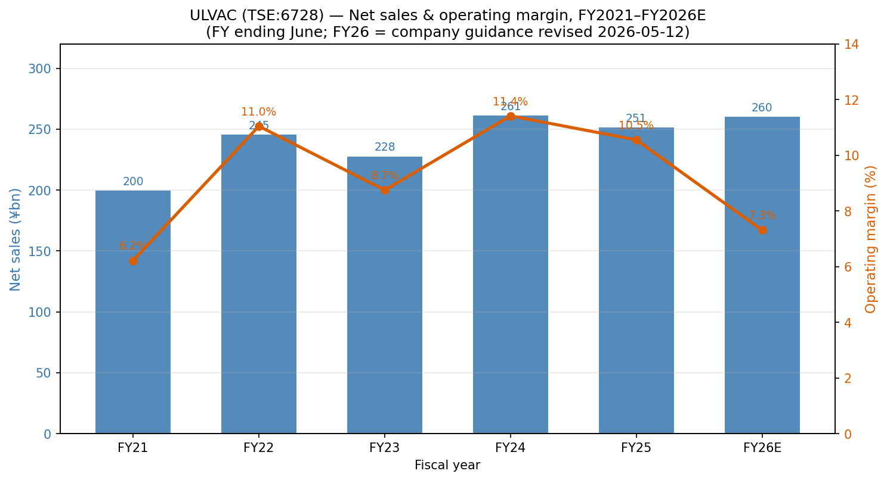
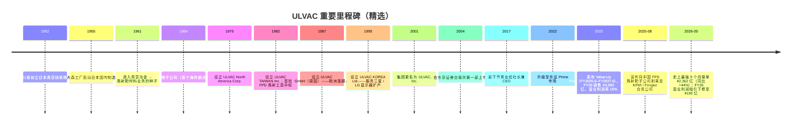
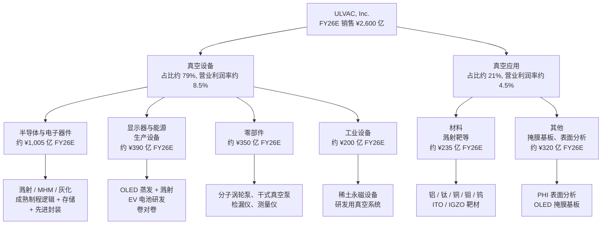
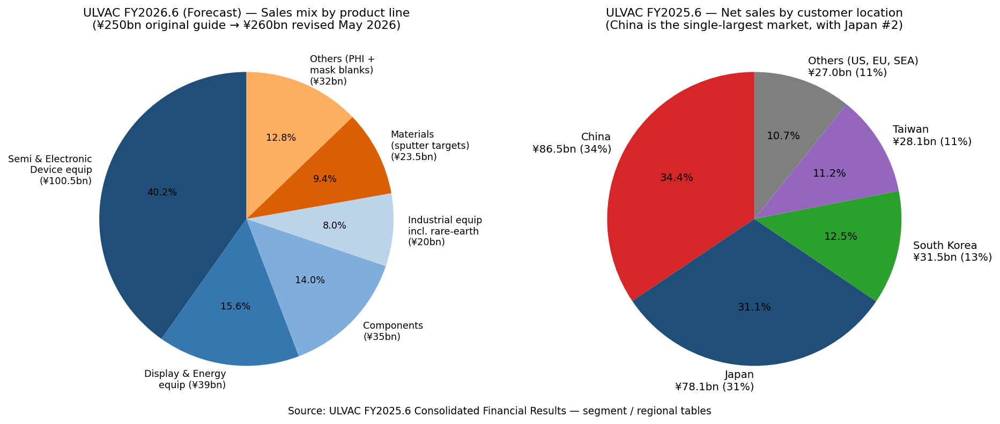

# ULVAC, Inc. (TSE:6728) — 股票研究启动报告

*截至 2026-05-26。作者：Claude 研究代理。原始研究语言：英文版本同步存档于 `ULVAC_TSE6728_Research_Document.md`。引用的日文/英文原始文件标题与链接保留原始语言。*

> **更新 — FY2026.6 业绩指引修订 (2026-05-12)：** 管理层将全年**接单 (orders)** 目标上调 ¥300 亿至 **¥3,100 亿**（创历史新高），但同时将全年**营业利润 (operating profit) 指引从 ¥285 亿下调至 ¥190 亿**（同比 –28.4%），原因是约 ¥58 亿的一次性损失（电动车相关的应收账款坏账准备、真空应用材料业务的质量整改费用、Q4 项目延期至 FY27 收入确认）。营业收入指引从 ¥2,500 亿上调至 ¥2,600 亿（同比 +3.5%），净利润上调至 ¥185 亿（受益于将中国 FPD 溅射靶子公司剥离至 Konfoong/Fengke 合资公司带来的约 ¥78 亿一次性处置收益）。来源：[Consolidated Financial Results for the Nine Months Ended March 31, 2026](https://data.swcms.net/file/ulvac-ir/dam/jcr:06f6f98a-ffc5-4896-93a7-f162c825dfe5/140120260512525783.pdf)、[FY2026.6 Q3 Key Q&A](https://ir.ulvac.co.jp/en/ir/library/result/main/00/teaserItems2/0111110/linkList/09/link/3Q_QA_EN.pdf)。

## 目录

1. 公司概览
2. 公司历史
3. 管理团队
4. 产品与服务
5. 客户与上市策略
6. 行业概览
7. 竞争格局
8. 市场机会 (TAM)
9. 风险评估

参考资料 & 验证日志

---

## 1. 公司概览

ULVAC, Inc.（TSE:6728；日文公司名「アルバック」，英文发音 "ul-vack"——取自 *Ultimate in Vacuum* 「真空之极致」的缩合）是一家日本资本设备制造商，**其首要业务身份是面向平板显示器 (FPD, flat panel display)、半导体、先进封装、功率器件、有机发光二极管 (OLED)、电动车 (EV) 电池及稀土永磁制造的真空镀膜、溅射机 / 沉积机 / 刻蚀机 (sputter / CVD / etch tool) 与真空泵设备制造商**。在更小但战略意义重要的**真空应用材料 (vacuum application materials)** 业务板块中，公司生产溅射靶 (sputter target)、掩膜基板 (mask blank)、表面分析仪及其他真空工艺耗材。集团仅披露两个报告分部——**真空设备 (vacuum equipment) 业务**（FY2025.6 销售占比约 79%）与**真空应用 (vacuum application) 业务**（约 21%）——设备分部内部进一步细分为四个产品线：半导体与电子器件生产设备、显示器与能源相关生产设备、零部件（真空泵、测量仪器、检漏仪）以及工业设备 ([FY2025.6 综合财务业绩, 分部信息, pp. 20–22](https://data.swcms.net/file/ulvac-ir/dam/jcr:8e4a9210-5392-4457-bf56-a46c357970fe/140120250813540543.pdf))。真空应用分部又拆分为材料（占该分部约 51%）与其他（分析仪器 / 掩膜基板）。野村「Greater China Semi」(大中华半导体) 锚定报告 (2026-05-21) 在 Fig. 44 中将 ULVAC 列入了溅射靶供应商联赛榜——但读者必须警惕：对 ULVAC 而言，**溅射靶材料只是设备主导型业务体系中的一个子业务，并非主营业务**，这一点贯穿全报告 ([reports/sector/半导体材料.md](https://github.com/dadachundan/financial_agent/blob/main/reports/sector/%E5%8D%8A%E5%AF%BC%E4%BD%93%E6%9D%90%E6%96%99.md))。

商业模式以**企业级 (B-to-B) 项目交付加售后市场**为绝对主体：大型真空集群工具（溅射机、CVD、刻蚀机、离子注入机 (ion implanter)、OLED 蒸发源 (evaporation source)）通过自有销售工程师直接销售给晶圆厂 / 面板厂，订单交付周期长（FY25 期末设备订单余额 ¥984 亿、材料 ¥174 亿），其上层叠加真空泵耗材、备件、维护合同与溅射靶补充的经常性收入流 ([FY25 财报, pp. 2–3, 分部叙述](https://data.swcms.net/file/ulvac-ir/dam/jcr:8e4a9210-5392-4457-bf56-a46c357970fe/140120250813540543.pdf))。FY25 真空设备分部约 39% 的收入按「时点履行义务」(transferred at a point in time，即出货 + 耗材) 确认，61% 按「时段履行义务」(transferred over time，即多月期设备建造与安装按完工百分比法确认)；真空应用分部的比例则反转——80% 时点（主要为靶材补充），20% 时段 ([FY25 分部注释, p. 22](https://data.swcms.net/file/ulvac-ir/dam/jcr:8e4a9210-5392-4457-bf56-a46c357970fe/140120250813540543.pdf))。这种「设备周期敏感的时段确认 + 颗粒度更细的材料 / 耗材」叠加结构，正是 ULVAC 财务画像兼具设备 OEM 与耗材特许经营双重特征的源头。

集团通过 29 家纳入合并报表的子公司与 8 家未合并子公司在全球范围内运营，覆盖日本（总部位于神奈川县茅崎市）、韩国（ULVAC KOREA Ltd.）、台湾（ULVAC TAIWAN Inc.、ULCOAT TAIWAN）、中国（11 家实体分布于苏州、上海、成都、靖江、沈阳、合肥，加上北京控股公司）、新加坡、马来西亚、美国（ULVAC Technologies、Physical Electronics USA「PHI」、TIGOLD）以及德国（ULVAC GmbH，未合并）([FY25 财报, 合并报表范围, pp. 16–17](https://data.swcms.net/file/ulvac-ir/dam/jcr:8e4a9210-5392-4457-bf56-a46c357970fe/140120250813540543.pdf))。FY25 按客户所在地的销售分布：日本 ¥781 亿 (31%)、中国 ¥865 亿 (34%)、韩国 ¥315 亿 (13%)、台湾 ¥281 亿 (11%)、其他 ¥270 亿 (11%)——中国为单一最大市场，反映了 ULVAC 在中国 FPD 厂商（BOE 京东方、CSOT 华星、Tianma 天马、Visionox 维信诺）及大陆晶圆厂（SMIC 中芯、YMTC 长江存储、CXMT 长鑫存储以及成熟制程逻辑晶圆代工厂）的溅射 / 刻蚀 / OLED 工具的大量配备 ([FY25 分地区销售表, p. 23](https://data.swcms.net/file/ulvac-ir/dam/jcr:8e4a9210-5392-4457-bf56-a46c357970fe/140120250813540543.pdf))。

FY2025.6 集团实现**净销售 ¥2,512 亿（同比 –3.8%）、营业利润 ¥265 亿（同比 –10.9%）、经常利润 ¥286 亿（同比 –4.0%）、归属于母公司股东净利润 ¥167 亿（同比 –17.5%）**——这是 FY24 销售 ¥2,611 亿 / 营业利润 ¥298 亿这一周期高点（受 FY23–FY24 强劲 AI / 先进封装拉动而达到）之后的中周期消化年 ([FY25 财报, p. 1](https://data.swcms.net/file/ulvac-ir/dam/jcr:8e4a9210-5392-4457-bf56-a46c357970fe/140120250813540543.pdf))。营业利润率从 11.4% 收窄至 10.6%；股东权益回报率 (ROE) 从 9.7% 降至 7.5%；权益资产比率改善至 59.6%。FY2026.6 前 9 个月（截至 2026 年 3 月）净销售达 ¥1,916 亿（同比 +2.1%），但营业利润下滑 ¥60 亿至 ¥147 亿（同比 –29.1%），原因即上述一次性损失；真正应当关注的数字是**接单金额 ¥2,362 亿，同比 +44.1%**——史上最强 9 个月接单，预示 FY27（截至 2027 年 6 月的财年）将形成实质性上行周期 ([Q3 FY26 财报, p. 2](https://data.swcms.net/file/ulvac-ir/dam/jcr:06f6f98a-ffc5-4896-93a7-f162c825dfe5/140120260512525783.pdf))。

截至 2025 年 6 月，集团全球员工约 6,000–7,000 人（综合报告将合并集团人数列为约 6,800 人），研发中心位于神奈川茅崎，工程枢纽在中国苏州与韩国天安；年度研发支出约 ¥100 亿，占销售约 4%——相对 ASML 等领先半导体设备同行（约 15%）较为温和，但与 ULVAC 在中端制程与 FPD 的定位相称 ([ULVAC 2025 价值报告 (Integrated Report), 财务数据章节](https://www.ulvac.co.jp/en/sustainability/report/pdf/2025/2025_ulvac_e_all.pdf)；[ULVAC 2024 财务概览 PDF](https://www.ulvac.co.jp/en/sustainability/report/pdf/2024/2024_ulvac_e_24.pdf))。董事长 / 创始人席位已不再设置（执掌多年、推动公司多元化的名誉会长堀英雄已将领导权交予职业经理人）；现任社长兼 CEO 自 2017 年 7 月起为**岩下节男 (Setsuo Iwashita)**，长期内部晋升的高管，1984 年加入公司。

**估值快照。** 截至 2026 年 5 月中旬，股价约 **¥9,587**，市值约 **¥4,627 亿**（按 ¥150/USD 折算约 30 亿美元）；据 TradingView，TTM P/E 约 38×、TTM 每股收益 ¥258、股息率约 1.62%；历史最高价 ¥11,450 创于 2024-05-27，12 个月回报约 +97% ([TradingView, TSE:6728](https://www.tradingview.com/symbols/TSE-6728/))。其他数据库（Yahoo Finance / Eulerpool 口径）报出更接近 19–20× 的 TTM P/E，因此最干净的读法是**按公司自家 FY26 净利润指引 ¥185 亿计的前瞻 P/E ≈ 24×**，或经常利润指引 × 隐含税率约 23×。*分析师观点：* 当前估值处于日本半导体设备中盘股区间的高位（同行中位数 18–22× FY1），定价已隐含（a）AI 资本开支对零部件 / 先进封装的拉动、（b）ULVAC 在成熟制程 MHM 溅射与光刻胶灰化的事实标准 (de facto standard) 份额、（c）Value-Up Plan 价值提升计划的成本纪律。若 FY27 接单动能减速或稀土永磁资本开支窗口提前关闭，估值面临向更典型的 16–18× 前瞻 P/E 下修 20–30% 的风险——这是最具体的近期估值风险，而非长期估值错配。最接近的可比公司（Canon Tokki、NIPPON SEISEN、SCREEN、TEL 东京电子、ASMI、AMAT 应用材料、LRCX 泛林）前瞻 P/E 跨度 15–30× 较宽，因此中位数锚定信号较弱。

读者从第 1 节应当带走的核心论点：ULVAC 是一家**真空技术综合型 (vacuum-technology generalist) 企业**——设备、零部件与材料均基于同一真空物理 IP——它**主动选择不在领先逻辑制程领域与 AMAT / LRCX / TEL / ASMI 正面竞争**，转而聚焦于（i）拥有事实标准份额的成熟制程 MHM / 封装利基；（ii）与 Canon Tokki 及 AMAT 分占余下市场的 FPD/OLED 溅射；（iii）受益于 AI 服务器需求的真空零部件（真空泵、检漏仪）；以及（iv）包含结构性增长的稀土永磁设备业务在内的工业 / 研发用真空工具。野村「Fig. 44 溅射靶联赛榜」的提名是真实存在的，但它仅是更大设备特许经营体系下较小一条腿中的一个切片。

*来源：ULVAC FY2025.6 及历史合并业绩；FY26 数据为 2026-05-12 修订后的公司指引 ([Q3 FY26 财报, p. 2](https://data.swcms.net/file/ulvac-ir/dam/jcr:06f6f98a-ffc5-4896-93a7-f162c825dfe5/140120260512525783.pdf))。*

---

## 2. 公司历史

ULVAC 成立于**1952 年 8 月 23 日**，以「日本真空技術株式会社 / *Nippon Shinkū Gijutsu KK*」(Japan Vacuum Engineering Co., Ltd.) 之名注册，初始实收资本 600 万日元，创始团队为一群真空物理学者，包括井町仁博士 (Dr. Jin Imachi，原东京芝浦电气 / 东芝 (Toshiba) 真空研究员)、林千博士 (Dr. Chikara Hayashi) 与柴田秀夫 (Hideo Shibata)，并由战后关西五位重要财界领袖出资种子资金——松下电器创始人松下幸之助 (Konosuke Matsushita) 以及大泽善夫 (Yoshio Osawa)、藤山爱一郎 (Aiichirō Fujiyama)、山本为三郎 (Tamesaburō Yamamoto)、广濑源 (Gen Hirose) ([ULVAC Company History](https://www.ulvac.co.jp/en/company/history/)；补充细节参见 [Reference for Business: ULVAC history](https://www.referenceforbusiness.com/history2/97/ULVAC-Inc.html))。创业初衷是将美国真空系统技术引入战后重建的日本工业基础——公司与美国 NRC Equipment Corporation 签订总代理协议进行技术合作，随后于 1955 年在大森工厂逐步本地化制造，并于 1956 年吸收合并东洋精机真空研究所 (Toyo Seiki Vacuum Research)，拓宽自产设备产品线 ([Reference for Business, ULVAC history](https://www.referenceforbusiness.com/history2/97/ULVAC-Inc.html))。

*来源：[ULVAC Company History](https://www.ulvac.co.jp/en/company/history/)；[2015 年可持续发展报告时间表附录](https://www.ulvac.co.jp/eng/_csr/eco/report/pdf/2015/2.pdf)；FY26 里程碑取自 [Q3 FY26 财报, pp. 12–14](https://data.swcms.net/file/ulvac-ir/dam/jcr:06f6f98a-ffc5-4896-93a7-f162c825dfe5/140120260512525783.pdf)。*

第一次结构性转型是 1961 年进入真空冶金领域，由此埋下了溅射靶 / 真空应用材料业务的种子。从一家纯粹的真空工程项目作坊起步，ULVAC 在自身用以销售给客户的同款溅射设备所消耗的高纯度金属（铝、钛、钨、钼、铜、钽，以及 ITO / IGZO 透明导电膜的氧化物陶瓷）的熔炼、铸造、粉末键合冶金工艺上层层叠加——一个结构上极为优雅的产品捆绑，正是 ULVAC 四十年来面向 FPD 厂商「设备 + 材料联合销售」推介逻辑的根基。第二次转型发生在 1980 年代 FPD 大爆发时期：1982 年的台湾子公司（初期服务日本显示器厂的海外晶圆厂）、1987 年的德国（工业真空镀膜）、1995 年的韩国（跟随三星显示 (Samsung Display) 与 LG Display）共同构筑了今日贡献集团多数收入的全球服务网络 ([ULVAC Company History](https://www.ulvac.co.jp/en/company/history/))。

第三次转型——也是最近的一次——发生在 2001 年公司由「日本真空技术」更名为「ULVAC, Inc.」并于 2004 年在东证第一部上市，正式完成从项目作坊到上市设备 OEM 的转型。中国市场的真正进入是在 1990 年代末至 2000 年代，通过 ULVAC (SUZHOU) 公司及合肥、沈阳的制造基地完成，使公司与 BOE / China Star / Tianma OLED 扩产形成深度绑定——这成为 2010 年代中国单一资本开支故事中最大的一笔。2022 年 4 月迁至东证 Prime 市场更多是行政重新分类（而非战略事件），最近的战略里程碑是 2025 年发布的 **Value-Up Plan 价值提升计划**，目标到 FY2026.6 实现销售 ¥3,000 亿、毛利率 35%、营业利润率 16%——明确承认公司体系的结构性问题是盈利能力而非营收规模 ([Scripts for Presentation_Material_for_FY2025_EN](https://ir.ulvac.co.jp/en/ir/newsrelease/PressRelease-20250815002/main/0/link/Scripts%20for%20Presentation_Material_for_FY2025_EN_1.pdf))。

2025-08 公告与中国 Konfoong Materials International（深圳市福工材料 / KFMI, SHE:300666）就 FPD 溅射靶合资项目进入磋商，并于 2026-05-12 董事会决议正式执行：将 100% ULVAC Materials (Suzhou) 转入由北京一家私募股权基金 Fengke Xinchuang（丰科鑫创）控股、KFMI 与 ULVAC 作为少数股东的北京合资公司，至此一段长篇章画上句号，并重塑了 ULVAC 在中国材料业务的存在感 ([Q3 FY26 财报, 重要事后事项, pp. 12–14](https://data.swcms.net/file/ulvac-ir/dam/jcr:06f6f98a-ffc5-4896-93a7-f162c825dfe5/140120260512525783.pdf)；背景见 [Yicai Global, 2025-08-14](https://www.yicaiglobal.com/news/kfmi-ulvac-to-integrate-their-flat-panel-display-target-materials-businesses))。战略逻辑有二：（1）中国市场 FPD 溅射靶竞争（BOE 偏好本地供应、KFMI 自身靶材业务 40% 同比增长至约 3.25 亿美元等值）持续压缩 ULVAC 单独经营的利润率；（2）与 KFMI 合并可使合资公司达到推动降本所需的规模，同时让 ULVAC 收获约 ¥78 亿一次性收益。*分析师观点：* 这是合理化重组而非战略撤退——ULVAC 保留 OLED / IGZO 用溅射靶的核心 IP，并继续在自家设备捆绑销售中消化内部靶材知识；合资交易仅是将中国 FPD 溅射靶的*制造业务*交给更本土化的平台运营。

合资交易之外值得标记的近期发展：（i）FY26 接单动能为公司史上最强——Q3 单季 ¥991 亿、9 个月 ¥2,362 亿，受成熟制程逻辑 MHM 溅射、先进封装光刻胶灰化、中国 G8.6 OLED 改造、以及美国主导的供应链多元化资本开支拉动稀土永磁设备等多重驱动 (Q3 FY26 Q&A 第 1–8 项)；（ii）稀土永磁设备业务正从 ¥200 亿 / 年的规模结构性重估至未来 3–5 年 ¥350–450 亿 / 年水平（按管理层口径）；（iii）原本预计 FY26 接单 ¥160 亿的 AR/VR 溅射项目因对中国项目坚持利润纪律而下调至 ¥60 亿——既是正面信号（价格纪律），也是负面信号（销量减少）。

---

## 3. 管理团队

**创始人背景（去名化的历史背景）。** 根据 [公司研究 skill](https://github.com/dadachundan/financial_agent/blob/main/.claude/skills/company-research/SKILL.md) 规则，仅创始人与现任 CEO 享有人物传记。ULVAC 的创始人——井町仁博士（前东芝真空研究员）、林千博士与柴田秀夫——于 1952 年创立公司，数十年前即已退出运营岗位；至今无人留任董事席位，亦不存在「在世创始人兼 CEO」情况。最久的运营连贯线索体现在企业商号本身——商标 ULVAC 取自「*Ultimate in Vacuum*」(真空之极致) 的缩合——以及自 1960 年代起持续担任该特许经营体系工程锚点的茅崎总部所在地 ([ULVAC Company History](https://www.ulvac.co.jp/en/company/history/))。由于目前管理层中并无活跃的创始人，本章节将聚焦于现任 CEO。

**岩下节男 (Setsuo Iwashita)——社长兼首席执行官 (President & CEO)。** 岩下先生自**2017 年 7 月**起担任社长兼 CEO，依 skill「仅创始人 + 现任 CEO」规则，他是本报告所述的唯一高管。他于**1984 年**加入 ULVAC（在公司服务 40 多年），CEO 之前最关键的一段履历是担任 **ULVAC (China) Holding Co. 会长兼总经理**——正是这段任职将中国从一个边缘销售区域转变为集团单一最大收入市场——并于 **2016 年晋升为董事兼专务执行役员 (Director and Senior Managing Executive Officer)** ([Bloomberg 个人资料, Setsuo Iwashita](https://www.bloomberg.com/profile/person/17438855)；[Crunchbase, Setsuo Iwashita / ULVAC Technologies](https://www.crunchbase.com/person/setsuo-iwashita)；[ULVAC 管理层架构页](https://www.ulvac.co.jp/en/company/directors_officers/))。中国运营背景是对投资者最重要的事实：ULVAC 今日的客户基础与收入结构由他在 2000 年代后期至 2010 年代亲手打造的中国本地制造与销售网络所主导的中国 OLED、成熟制程逻辑及存储晶圆厂构成，包括苏州、上海、成都、靖江、沈阳、合肥等数家如今合并员工中相当比例所在的子公司 ([FY25 财报, 合并报表范围, pp. 16–17](https://data.swcms.net/file/ulvac-ir/dam/jcr:8e4a9210-5392-4457-bf56-a46c357970fe/140120250813540543.pdf))。

岩下任 CEO 八年间，主持了（i）2017–2019 年针对中国 OLED 与存储扩产的产能扩张；（ii）COVID-19 期间的盈利能力危机及其后的 FY22–FY24 V 型复苏；（iii）2025 年 **Value-Up Plan 价值提升计划**的发布（明确的 ¥3,000 亿销售 / 16% 营业利润率目标框架）；以及（iv）当前的战略决策——**将中国 FPD 溅射靶制造业务部分剥离至 KFMI / Fengke 合资公司**——而非继续与受本地偏好支持的中国供应商进行次规模竞争。Q3 FY26 评论将这一决策定位为「将资源向半导体与电子领域转移，同时整合中国境内显示器相关生产以优化生产效率并进一步提升利润率」 ([Q3 FY26 Q&A, 第 7 项](https://ir.ulvac.co.jp/en/ir/library/result/main/00/teaserItems2/0111110/linkList/09/link/3Q_QA_EN.pdf))。其本人持股较少（约 0.067%，不存在控股家族遗留），薪酬框架是日本中盘股标准组合：基本工资、与经常利润达成挂钩的奖金、以及在有价证券报告书 (Yuho) 中披露的董事福利信托 (Board Benefit Trust, BBT) 限制性股票计划 ([Bloomberg 个人资料交叉引用](https://www.bloomberg.com/profile/person/17438855)；[GSA「Get to Know the CEO」专访](https://www.gsaglobal.org/get-to-know-the-ceo-setsuo-iwashita-president-%EF%BC%86-ceo-of-ulvac-inc/) 提供了他对管理哲学与增长重点的较长公开陈述)。*分析师观点：* CEO 的画像属于「稳健的内部晋升者」——任期长、中国业务熟练、在组合重塑（稀土永磁扩产、FPD 溅射靶合资）上有可信的执行力，但**没有进入领先半导体设备的野心**——这既是其品牌承诺，也是 ULVAC 未来能尝试成为何种公司的结构性天花板。

---

## 4. 产品与服务

本章是全报告最重要的一节。ULVAC 的首要业务身份是**设备制造商**，并在同一真空技术平台上捆绑**材料、零部件与分析仪器**。下文中两个报告分部——真空设备业务与真空应用业务——以及四个设备子产品线加两个应用子产品线，均逐字引用自 FY2025.6 有价证券报告书 (Yuho) 式财报与 Q3 FY26 补充销售表。

### 4.1 ULVAC 分部矩阵（FY25.6 + Q3 FY26 原文）

ULVAC 本身的分部信息注释将两个报告分部描述为：

> 真空设备业务包括 LCD 用溅射设备、有机 EL（OLED）生产设备、卷对卷 (roll-to-roll) 蒸发设备、半导体生产用溅射设备、真空泵、测量设备等产品，公司就这些产品开展研发、制造、销售并提供维护服务。真空应用业务包括溅射靶材料及分析仪器相关产品等真空应用产品，公司同样就这些产品开展研发、制造、销售并提供维护服务。

来源：[FY25 财报, 分部信息注释, p. 21](https://data.swcms.net/file/ulvac-ir/dam/jcr:8e4a9210-5392-4457-bf56-a46c357970fe/140120250813540543.pdf)。

Q3 FY2026.6 补充披露（截至 2026 年 3 月的 9 个月）给出真空设备四向细分与真空应用两向细分：

| 分部 | 子产品线 | 9M FY26.6 销售 (¥M) | 占分部比例 | 同比 |
|---|---|---:|---:|---:|
| **真空设备业务** (合计 ¥150,005M，营业利润 ¥12,769M) | 半导体与电子器件生产设备 | 63,063 | 42.1% | 未披露（接单 ↑） |
|  | 显示器与能源相关生产设备 | 45,469 | 30.3% | 同比上升 |
|  | 零部件（真空泵、测量仪、电源装置） | 25,954 | 17.3% | 平稳 |
|  | 工业设备（含稀土永磁设备、重新分类后的检漏仪） | 15,519 | 10.3% | 同比上升 |
| **真空应用业务** (合计 ¥41,626M，营业利润 ¥1,863M) | 材料（溅射靶 + 相关） | 19,860 | 47.7% | 同比上升 |
|  | 其他（表面分析仪、掩膜基板） | 21,767 | 52.3% | 同比上升 |

来源：[Q3 FY26 财报, 补充销售信息, p. 15](https://data.swcms.net/file/ulvac-ir/dam/jcr:06f6f98a-ffc5-4896-93a7-f162c825dfe5/140120260512525783.pdf)。

对应 FY2025.6 全年公司亦披露了产品级销售及 FY26 预测（单位：十亿日元），FY26 计划中显示更剧烈的组合切换：

| 项目 | FY25.6 实际 | FY26.6 预测 | 同比 |
|---|---:|---:|---:|
| 半导体与电子器件设备 | 89.3 | 100.5 | **+12.5%** |
| 显示器与能源相关设备 | 53.1 | 39.0 | **–26.6%** |
| 零部件 | 43.1 | 35.0 | –18.9% |
| 工业设备 | 13.5 | 20.0 | **+48.6%** |
| 真空应用 — 材料 | 26.6 | 23.5 | –11.7%（FPD 合资公司去合并） |
| 真空应用 — 其他 | 25.5 | 32.0 | +25.3%（掩膜基板放量） |
| **合计** | **251.2** | **250.0** | –0.5% |

来源：[FY25 财报, 按产品净销售预测, p. 6](https://data.swcms.net/file/ulvac-ir/dam/jcr:8e4a9210-5392-4457-bf56-a46c357970fe/140120250813540543.pdf)。注：截至 Q3 FY26，销售指引由 ¥2,500 亿上调至 ¥2,600 亿——见报告顶部更新栏。

### 4.2 综合视角——产品类别在单一客户工作流中的相互作用

一家 FPD 或半导体晶圆厂在**单一的物理气相沉积 (PVD, Physical Vapour Deposition) 循环**中使用 ULVAC 产品：ULVAC 的**真空泵**（零部件）将沉积腔体抽至高真空；ULVAC 的**溅射机 / 蒸发源**（半导体 / 显示器设备）将物理 PVD 薄膜通过原子从**溅射靶**（材料）激射沉积至基板；ULVAC 的**检漏仪**（零部件）确认腔体完整性；ULVAC 的**表面分析仪**（其他——通常为 PHI 的 XPS / Auger 分析系统）在工艺开发期间表征已沉积薄膜。**主打产品销售是设备**——这是 ULVAC 销售工程师赚取毛利的环节——但**长期年金收入**来自其后 5–10 年内随设备安装而持续消耗的真空泵耗材 + 溅射靶补充 + 分析仪校准。这一捆绑循环是 ULVAC 真空应用分部在设备分部周期下行时仍能增长的结构性原因：设备装机基数无论新设备订单是否增加都会持续消耗靶材 / 真空泵零件 / 备件——这正是 FY24→FY25→FY26 营业利润轨迹中所观察到的设备周期波动得以被衰减的根源。

### 4.3 真空设备 — 半导体与电子器件生产设备（约占设备分部 42%）

**FY25.6 Yuho 式财报「10-K 式」原文：**
> 在半导体及电子器件生产设备业务中，尽管对先进逻辑与存储领域的投资仍然强劲，且先进封装领域亦表现良好，但接单与净销售同比下降，原因是日本与中国的功率器件投资出现反向性减少。

来源：[FY25 财报, p. 2](https://data.swcms.net/file/ulvac-ir/dam/jcr:8e4a9210-5392-4457-bf56-a46c357970fe/140120250813540543.pdf)。

**中文释义 / Plain-language gloss：** 这一子产品线是集团**单一最大产品族**（FY25 约 ¥893 亿、FY26 计划提升至 ¥1,005 亿），承载 ULVAC 的旗舰半导体溅射设备，主要用于 **MHM (Metal Hard Mask, 金属硬掩膜)** ——一种作为图形化堆栈中刻蚀阻挡帽层使用的薄膜，应用于 DRAM 电容形成的深刻蚀步骤和先进逻辑后段制程 (BEOL)。Q3 FY26 Q&A 明确指出 ULVAC 在**「成熟制程 MHM 拥有压倒性份额」**——管理层称之为**「事实标准地位」(de facto standard status)**——建立在专有的应力可控薄膜沉积技术之上，竞争对手 AMAT / TEL 的溅射工具一直难以在这一特定应用上与之匹敌 ([Q3 FY26 Q&A, 第 5 项](https://ir.ulvac.co.jp/en/ir/library/result/main/00/teaserItems2/0111110/linkList/09/link/3Q_QA_EN.pdf))。MHM 之外，该产品族还涵盖**面向 WLP 与 PLP 先进封装的光刻胶灰化 (PR ashing, 光刻胶灰化——刻蚀后通过等离子体剥离光刻胶)**，以及**面向 DRAM/NAND POR (Process of Record, 工艺标准) 工序的金属溅射**。

在这一产品族内，**先进封装灰化工具**是第二根支柱——ULVAC 在 Q3 FY26 描述其凭借「精细等离子体技术」在 WLP / PLP 封装的「**Descum 工艺（去残留工艺）**」中取得「事实标准地位」 ([Q3 FY26 Q&A, 第 5 项](https://ir.ulvac.co.jp/en/ir/library/result/main/00/teaserItems2/0111110/linkList/09/link/3Q_QA_EN.pdf))。FY26 灰化设备接单全年目标上调至约 ¥200 亿，其中针对台湾 OSAT 与日本基板厂的 PLP 专用贡献 ¥40–50 亿。这使 ULVAC 成为同样驱动 Besi（混合键合）与 Kinik 中砂（先进封装 CMP 修整器）的 AI-GPU 封装资本开支浪潮的直接受益方——尽管在单工具美元规模上小于领先封装公司。

*分析师观点：* ULVAC 在该产品族的竞争优势是**工艺特定的细分主导**，而非横向规模：MHM 份额与灰化份额是真实且高的（管理层用「事实标准」一词在日本财报语境中极为罕见），但其可服务市场规模只是 AMAT / LRCX / TEL / ASMI 所竞争的更广阔半导体设备 TAM 的一个细窄切片。通用溅射设备的旗舰竞争对手是 **Applied Materials 的 Endura 平台**（[AMAT 自家 10-K 中将其作为主要 PVD 平台引用](https://www.sec.gov/cgi-bin/browse-edgar?action=getcompany&CIK=AMAT&type=10-K)）；灰化的旗舰竞争对手是 **Hitachi High-Tech** 与 **Plasma-Therm**；ULVAC 通过应用特定性而非平台多功能性来守护份额。护城河类型 = **技术（工艺 IP）+ 切换成本（POR 认证）**；在可服务利基内评级为**部分至强**，利基外评级为**弱**。十年以上的应力可控 MHM 工艺 IP 无法在 1–2 年内被新进入者复制，更换 POR 认证溅射工具所需的客户重新认证成本与 LRCX / AMAT 所享受的装机防御性完全一致。

### 4.4 真空设备 — 显示器与能源相关生产设备（约占设备分部 30%）

**FY25.6 Yuho 式财报「10-K 式」原文：**
> 尽管 IT 面板用 OLED 的投资开始回升，但接单与净销售低于去年同期水平，原因是面向车载用途、追求更小体积、更大容量、更高安全性的 EV 电池所需的研发时间更长，导致投资有所延后。

来源：[FY25 财报, p. 2](https://data.swcms.net/file/ulvac-ir/dam/jcr:8e4a9210-5392-4457-bf56-a46c357970fe/140120250813540543.pdf)。注意该产品族自 2025 年 7 月起由「FPD 生产设备」更名为「显示器与能源相关生产设备」，纳入 EV 电池相关真空设备 ([FY25, p. 6 footnote (2)](https://data.swcms.net/file/ulvac-ir/dam/jcr:8e4a9210-5392-4457-bf56-a46c357970fe/140120250813540543.pdf))。

**中文释义 / Plain-language gloss：** 这是 ULVAC 历史性的核心业务——**面向 FPD / 平板显示器（LCD 与 OLED）面板厂的溅射机与蒸发源**，最近还嫁接上 EV 电池研发用真空设备。产品线包括 **SOLCIET、SATELLA、NEW-ZELDA 等 OLED 有机 EL 生产系统**（用于沉积 OLED 堆栈中发光有机层的有机蒸发腔）、**集群式 PE-CVD 系统**（用于沉积保护有机堆栈免受水汽侵蚀的无机封装薄膜）、以及驱动每个像素的 ITO / IGZO TFT 层用 **OLED 专用溅射工具** ([ULVAC GmbH OLED equipment page](https://ulvac.eu/products/equipment/by-application/oled/))。卷对卷蒸发线（在连续聚合物或金属箔基材上进行真空镀膜）服务于触摸面板透明电极与 EV 电池金属箔市场。

FY26 的战略色彩是混合的。**FY26 计划原本由 ¥531 亿下调至 ¥390 亿（–26.6%）**，反映 EV 电池资本开支放缓与中国 AR/VR 溅射项目暂停 ([FY25 财报, p. 6](https://data.swcms.net/file/ulvac-ir/dam/jcr:8e4a9210-5392-4457-bf56-a46c357970fe/140120250813540543.pdf))。但在 Q3 FY26 中，管理层将全年**接单**目标上调至 **¥700 亿（较原计划增加 ¥300 亿）**，原因是「中国厂商的 G8 尺寸 OLED 新线投资及额外 LCD 设备投资项目」 ([Q3 FY26 Q&A, 第 7 项](https://ir.ulvac.co.jp/en/ir/library/result/main/00/teaserItems2/0111110/linkList/09/link/3Q_QA_EN.pdf))——这意味着销售将在 FY27 跟上。中国 OLED 厂商（Visionox 维信诺、BOE 京东方、CSOT 华星）面向平板与笔记本电脑尺寸 OLED 面板的 G8.6（8.7-gen）改造周期是该产品线最具体的近期催化剂。

*分析师观点：* ULVAC 在 OLED 有机蒸发设备中的市场地位**在用于溅射 / 无机层的集群式系统中较强**，但**在最关键的发光层线性蒸发源 (linear-source evaporation) 工序上较弱**——后者由 Canon Tokki（私营、Canon 旗下）在韩中两国旗舰 OLED 晶圆厂占据 60%+ 份额。ULVAC 与 Canon Tokki、**Sunic System (KOSDAQ:171090)**、**Avaco (KOSDAQ:083930)**、**Applied Materials** 竞争更广义的 OLED 沉积设备市场，某行业研究机构估算 2023 年规模约 42 亿美元，预计到 2032 年以 12.6% 年化增长率扩张至约 125 亿美元 ([Oled Deposition Equipment Market Research Report 2032 / WiseGuy Reports](https://www.wiseguyreports.com/reports/oled-deposition-equipment-market))。护城河类型 = **规模 + 综合捆绑**（相对竞争对手，ULVAC 向 FPD 厂商的溅射 + 材料 + 零部件联合销售更具捆绑性）；评级为**部分——溅射强、蒸发弱**。

### 4.5 真空设备 — 零部件（约占设备分部 17%；AI 服务器顺风）

**FY25.6 Yuho 式财报「10-K 式」原文：**
> 零部件业务中，受 AI 服务器、半导体、电子器件与消费电子等冷却系统对真空泵、测量仪、电源装置及检漏仪的强劲需求支撑，接单保持高位，净销售超过去年同期。

来源：[FY25 财报, p. 2](https://data.swcms.net/file/ulvac-ir/dam/jcr:8e4a9210-5392-4457-bf56-a46c357970fe/140120250813540543.pdf)。

**中文释义 / Plain-language gloss：** 真空零部件是 ULVAC 损益表中的**中周期平滑器 (mid-cycle smoother)**。产品线包括（i）维持晶圆厂工艺腔体真空的**分子涡轮泵 (turbo molecular pump) 与干式真空泵 (dry vacuum pump)**——每台 ULVAC 溅射 / 刻蚀 / CVD 工具均配备多个泵，且全球所有晶圆厂工具（不仅是 ULVAC 自家）的装机基数都是 ULVAC 真空泵的永久售后市场；（ii）**测量仪**，包括真空规、残气分析仪 (RGA) 及工艺监测传感器；（iii）**检漏仪**——包括用于晶圆厂公用工程及（日益增加地）AI 服务器液冷回路 QA 用的氦质谱检漏仪（每台采用液冷的 NVIDIA H200 / B200 服务器在出货前其冷却回路总成需要 100% 进行氦检漏测试，所用检漏设备与晶圆厂检漏仪物理原理完全一致）；（iv）等离子工艺工具用**电源装置**。

战略意义在于 **AI 服务器冷却维度**：随着 NVIDIA / AMD GPU 机架开始标准化液冷（冷板 (cold-plate) 或浸没式 (immersion)），歧管 / 冷板组件在集成前必须 100% 进行氦检漏测试，而 ULVAC 是全球三四家专用测试站供应商之一。这使零部件成为**无须依赖晶圆厂资本开支周期的 AI 服务器单元增长杠杆**——为更具周期性的其他设备线提供有用的多元化。FY26 将检漏设备由零部件重新归类至工业设备（见 §4.6），属于呈示性变更，反映检漏作为独立业务的成熟化；底层顺风不变 ([Q3 FY26 财报, p. 3](https://data.swcms.net/file/ulvac-ir/dam/jcr:06f6f98a-ffc5-4896-93a7-f162c825dfe5/140120260512525783.pdf))。

*分析师观点：* 这一产品线是 ULVAC 最具防御性的。两大真空泵主要竞争对手是 **Edwards（Atlas Copco 阿特拉斯·科普柯旗下）** 与 **Pfeiffer Vacuum (FR:PFV, 约 50% 由 Busch 私有化)** ——两者在公开市场真空泵业务中规模均大于 ULVAC，但都没有像 ULVAC 那样以自有设备特许经营进行捆绑。护城河类型 = **切换成本 + 装机年金**（一家已在 200mm 或 300mm 晶圆厂为其真空泵选定 ULVAC 标准的工厂不会进行整厂更换），加上**来自设备特许经营的捆绑拉动**。在 ULVAC 自有装机基础内评级**强**，在公开市场真空泵招标中评级**部分**。FY26 计划下调至 ¥350 亿（FY25 实际 ¥431 亿）反映自 FY24–FY25 晶圆厂公用工程建设高点的回落——并非特许经营在结构上的弱化。

### 4.6 真空设备 — 工业设备（约占设备分部 10%；稀土永磁重估）

**FY25.6 Yuho 式财报「10-K 式」原文（混合——同时参见 Q3 FY26 更新）：**
> 因高性能磁体生产设备需求疲软，接单与净销售同比下滑。

来源：[FY25 财报, p. 2](https://data.swcms.net/file/ulvac-ir/dam/jcr:8e4a9210-5392-4457-bf56-a46c357970fe/140120250813540543.pdf)。但 Q3 FY26 更新明显更乐观：

> 在稀土永磁领域，随着旨在多元化供应链的资本投资正式启动，高性能磁体生产设备表现强劲。……空调及 AI 服务器冷却系统用检漏设备保持稳定。

来源：[Q3 FY26 财报, p. 3](https://data.swcms.net/file/ulvac-ir/dam/jcr:06f6f98a-ffc5-4896-93a7-f162c825dfe5/140120260512525783.pdf)。

**中文释义 / Plain-language gloss：** 工业设备是 FY26 叙事中**最具结构性增长意义**的故事。ULVAC 是全球少数几家**高性能 NdFeB (neodymium-iron-boron, 钕铁硼) 永磁真空熔炼 / 烧结 / 镀膜设备**供应商之一——钕铁硼永磁用于电动车驱动电机、风电发电机、机器人执行器、消费电子音圈等。真空工艺步骤至关重要，原因是稀土金属在常压下瞬时氧化；磁体生产必须在惰性气体保护、可控气氛炉中完成熔炼与烧结。

战略拐点是**美国 / 欧盟 / 日本稀土供应链多元化资本开支**。在中国占据 NdFeB 生产 >85% 份额二十年后，美国《通胀削减法案》(IRA) 与欧盟《关键原材料法案》触发了在岸化项目——MP Materials 德州、Hitachi Metals / Proterial 日本与美国、GM-Vacuumschmelze 德国——每个项目均向包括 ULVAC 在内的少数供应商采购真空熔炼 / 烧结 / 镀膜设备。Q3 FY26 管理层表示该产品线「过去维持在 ¥200 亿左右」，但现在「通过捕捉对稀土永磁及相关产品的强劲需求，预计未来 3–5 年订单将稳定在 ¥350–450 亿水平」 ([Q3 FY26 Q&A, 第 8 项](https://ir.ulvac.co.jp/en/ir/library/result/main/00/teaserItems2/0111110/linkList/09/link/3Q_QA_EN.pdf))。FY26 销售计划上调至 ¥200 亿（FY25 实际 ¥135 亿，+48.6%），FY27–FY28 拐点幅度将显著加大。

*分析师观点：* 工业设备从「乏味的遗留科目」升级为「ULVAC 最被低估的多头逻辑」。竞争对手包括 **Inductotherm Group**、**Consarc**、**ALD Vacuum Technologies（德国）**、以及**中国国有供应商**——但西方永磁在岸化项目明确寻求非中国设备供应，将 ULVAC 框定在一个有利的竞争集合内。护城河类型 = **技术 + 地缘政治偏好**；未来 3–5 年评级**强**，但需附加一条限定：稀土资本开支窗口可能在在岸产能赶上铭牌产能后关闭。按管理层口径，该设备亦为「基于现有技术的高毛利产品」——意味着其毛利率画像在设备分部中最好，而非最差。

### 4.7 真空应用 — 材料（约占应用分部 48%；野村 Fig. 44）

**FY25.6 Yuho 式财报「10-K 式」原文：**
> 接单与净销售均同比上升，主要原因是 FPD 与半导体 / 电子器件相关工厂持续保持高开工率。

来源：[FY25 财报, p. 3](https://data.swcms.net/file/ulvac-ir/dam/jcr:8e4a9210-5392-4457-bf56-a46c357970fe/140120250813540543.pdf)。

**中文释义 / Plain-language gloss：** 这是将 ULVAC 列入野村「Greater China Semi」Fig. 44 溅射靶联赛榜的子分部。ULVAC 材料业务生产**高纯度金属与氧化物陶瓷溅射靶**——包括铝、钛、铜、钼、钨、钽，以及 ITO / 铟镓锌氧化物 (IGZO) 透明导电膜靶材——制造基地分布在日本、韩国（ULVAC KOREA）、台湾（ULVAC Materials Taiwan，未合并）、中国（ULVAC Materials Suzhou，2026-05 即将合资剥离）以及美国（TIGOLD CORPORATION）。这些靶材被消耗于 ULVAC 自有溅射设备内，同时也消耗于面板与半导体晶圆厂的 AMAT / TEL / Canon Tokki 等竞争溅射腔体中。最近的代表性产品创新：**面向 OLED 与触摸显示器的键合型溅射靶**，在高真空条件下均匀性提升 28%、靶材开裂率降低 19% ([ICO Optics 溅射镀膜市场报告引用 ULVAC 键合靶规格](https://www.ico-optics.org/sputter-coating-market-growth-to-2035-driven-by-semiconductors-displays/))。

结构性背景即野村报告所称的「**材料长线重估周期 (the materials long re-rating cycle)**」 ([reports/sector/半导体材料.md](https://github.com/dadachundan/financial_agent/blob/main/reports/sector/%E5%8D%8A%E5%AF%BC%E4%BD%93%E6%9D%90%E6%96%99.md))：GAA 逻辑 + High-NA EUV + 背面供电 (Backside Power Delivery, BPD) + 先进封装 + 玻璃芯基板均增加每片晶圆的溅射靶材料消耗（更多薄膜层、更多薄膜类型、更深的通孔填充）。据 Cognitive Market Research 估算，2023 年全球半导体溅射靶市场约 45 亿美元，年化复合增长率约 5.8% ([Cognitive Market Research, Semiconductor Sputtering Targets](https://www.cognitivemarketresearch.com/semiconductor-sputtering-targets-market-report)，2024 年发布)。按野村 2026-05-21 锚定报告 Fig. 26，溅射靶占约 800 亿美元全球半导体材料市场约 3%——隐含半导体靶切片约 24 亿美元，FPD 靶切片另约 20 亿美元——因此全球可寻址靶材市场约 40–50 亿美元 ([reports/sector/半导体材料.md, 引用野村 2026-05-21 Fig. 26、35-44](https://github.com/dadachundan/financial_agent/blob/main/reports/sector/%E5%8D%8A%E5%AF%BC%E4%BD%93%E6%9D%90%E6%96%99.md))。

该产品线 2026 年最重要的事件是**中国 FPD 溅射靶制造业务的部分剥离**——ULVAC Materials (Suzhou) 转入北京一家由 Fengke Xinchuang 基金控股、KFMI 与 ULVAC 作为少数股东的合资公司（北京福光晶生电子材料有限公司），在 FY26 产生约 ¥78 亿一次性收益 ([Q3 FY26 财报, 重要事后事项, pp. 12–14](https://data.swcms.net/file/ulvac-ir/dam/jcr:06f6f98a-ffc5-4896-93a7-f162c825dfe5/140120260512525783.pdf))。背景：KFMI 自身溅射靶销售在前一财年同比增长 40% 至 23 亿人民币（约 3.25 亿美元），以 BOE 为锚定客户，整合目标是在 FPD 靶子市场实现「资源共享、优势互补、增强市场竞争力」 ([Yicai Global, 2025-08-14](https://www.yicaiglobal.com/news/kfmi-ulvac-to-integrate-their-flat-panel-display-target-materials-businesses))。非中国靶业务（日本、韩国、台湾、美国）仍完全保留在 ULVAC 体系内。

*分析师观点：* ULVAC 是一家**规模较小、设备一体化的溅射靶玩家**，竞争对手包括 **JX Advanced Metals (TSE:5016，2025 年从 JX Nippon Mining 分拆)**、**Tosoh (TSE:4042)** 通过 Tosoh SMD、**Materion (NYSE:MTRN)**、**三井金属矿业 / Mitsui Mining & Smelting (TSE:5706)** 以及 **KFMI (SHE:300666)** 自身 ([Maximize Market Research, 溅射靶竞争对手列表](https://www.maximizemarketresearch.com/market-report/global-sputtering-target-market/102381/)；[Coherent Market Insights, 铜溅射靶竞争对手列表](https://www.coherentmarketinsights.com/market-insight/copper-sputtering-target-market-6221))。ULVAC 的优势在于**面向 FPD 厂商的设备 + 材料联合销售**——其溅射靶与消耗它们的溅射腔体绑定销售，使在同时购买两者的客户处获得拉动份额。在纯半导体溅射靶领域 ULVAC **不是**领先者（JX、Tosoh、Materion 规模更大），**且不会**朝该方向发展。护城河类型 = FPD 靶上的**捆绑拉动 + 技术**，半导体靶上则为**部分**；材料子分部整体评级为**部分**。中国 FPD 合资重组隐含承认在该地理-产品单元上无法达成单独规模。

### 4.8 真空应用 — 其他（约占应用分部 52%；PHI + 掩膜基板）

**FY25.6 Yuho 式财报「10-K 式」原文：**
> 接单与净销售均同比上升，主要受表面分析仪相关业务与高清晰、高性能显示器用掩膜基板业务贡献的拉动。

来源：[FY25 财报, p. 3](https://data.swcms.net/file/ulvac-ir/dam/jcr:8e4a9210-5392-4457-bf56-a46c357970fe/140120250813540543.pdf)。

**中文释义 / Plain-language gloss：** 「其他」是一个对实际**深度分析与特种真空产品组合**的误导性标签，包括 **Physical Electronics USA / ULVAC-PHI**（XPS、AES、TOF-SIMS、扫描俄歇表面分析仪——这些技术的全球参考品牌，与 Thermo Fisher、Bruker 并列）以及**面向高清晰 / 高性能显示器的 OLED 掩膜基板**（OLED 有机蒸发借以沉积像素图案的金属掩膜；掩膜本身通过 ULVAC 提供的真空沉积工艺加工制造）。FY26 计划上调至 ¥320 亿（同比 +25.3%），反映 PHI 增长与绑定 G8 IT-OLED 面板生产的 OLED 掩膜基板放量。

*分析师观点：* PHI 表面分析业务是一个虽小但极具防御性的利基——Thermo Fisher（美国）与 Bruker（美国 / 德国）是主要全球竞争对手，但 PHI 的 XPS 在半导体 / 金属 / 制药研究实验室的装机基础因传统软件与操作员培训成本而具有粘性。面向 OLED 的掩膜基板是 ULVAC 凭借自有蒸发与光刻工艺 IP 守护的高附加值特种产品。护城河类型 = **品牌 + 技术 + 切换成本**；表面分析评级**强**，掩膜基板评级**部分**。

### 4.9 经常性 / 售后业务

不同于 Lam Research (CSBG) 或 Applied Materials (AGS)，ULVAC 并未单列「服务」分部——经常性收入流（备件、维护合同、真空泵耗材、靶材补充、表面分析仪校准）嵌入两个分部内部。间接证据：FY25 真空设备 ¥1,990 亿销售中，¥785 亿（39%）按「时点履行义务」确认（= 耗材 / 备件 / 售后类交易），¥1,206 亿（61%）按「时段履行义务」确认（= 多月期建造与安装）。真空应用方面，¥416 亿（80%）按时点确认。来源：[FY25 财报, 分部分解表, p. 22](https://data.swcms.net/file/ulvac-ir/dam/jcr:8e4a9210-5392-4457-bf56-a46c357970fe/140120250813540543.pdf)。*分析师观点：* ULVAC 投资者应当在心中将**集团约 25–30% 收入视为经常性**，即便该数据未单列分部——这正是支撑分部利润下行年（如 FY25 vs FY24）的底层结构性原因。

### 4.10 旗舰产品族与近期推出

ULVAC 三大旗舰产品族为：

1. **面向成熟制程逻辑的 MHM 溅射**——按管理层措辞具事实标准地位；公司单一最具防御性的商业地位，驱动 FY26 逻辑接单 ¥310 亿 ([Q3 FY26 Q&A, 第 5 项](https://ir.ulvac.co.jp/en/ir/library/result/main/00/teaserItems2/0111110/linkList/09/link/3Q_QA_EN.pdf))。
2. **面向先进封装 (WLP + PLP) 的光刻胶灰化 / Descum 工艺**——事实标准 Descum 工艺；FY26 ¥200 亿计划；AI-GPU 封装顺风的直接受益方。
3. **稀土永磁真空设备**——未来 3–5 年 ¥350–450 亿结构性运行率；高毛利；与西方供应链多元化资本开支一致。

过去 12 个月的近期推出包括：均匀性 / 良率有可测量提升的 OLED 键合溅射靶（IR 材料未披露具体推出日期）；面向 AI 服务器冷却回路的检漏站（FY26 起从零部件重新归类至工业设备）；以及 Value-Up Plan 中针对**半导体与电子领域的模块化设计设备标准化 (modular-design equipment standardisation)** 以实现成本下降的承诺 ([Q3 FY26 Q&A, 第 9 项](https://ir.ulvac.co.jp/en/ir/library/result/main/00/teaserItems2/0111110/linkList/09/link/3Q_QA_EN.pdf))。Value-Up Plan 还设定到截至 2031 年 6 月的财年将设备设计交付周期缩短 70%（目前进度约 20% 缩短，约相当于路径上的 30%）。

*来源：ULVAC FY2025.6 分部产品表与按地区净销售表 ([FY25 财报, pp. 6, 23](https://data.swcms.net/file/ulvac-ir/dam/jcr:8e4a9210-5392-4457-bf56-a46c357970fe/140120250813540543.pdf))。*

---
