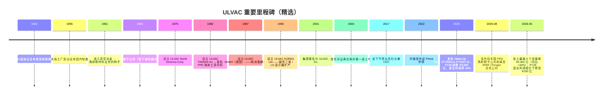
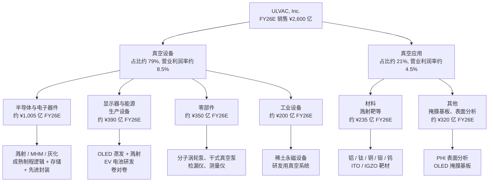
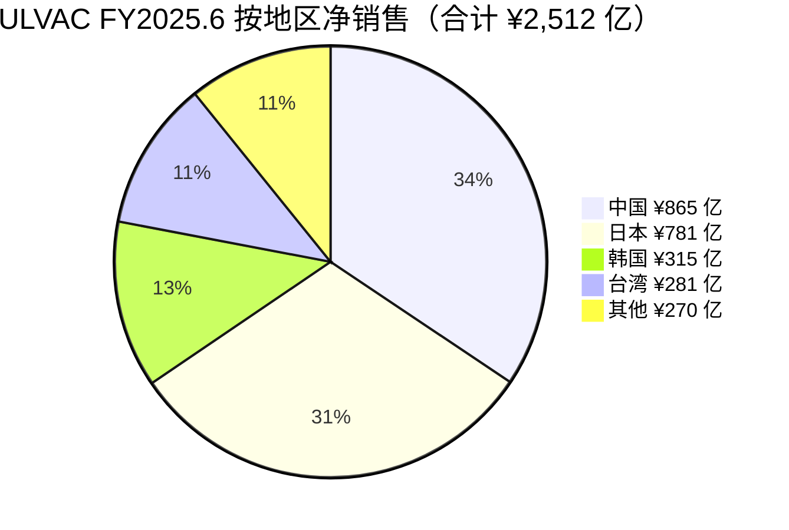
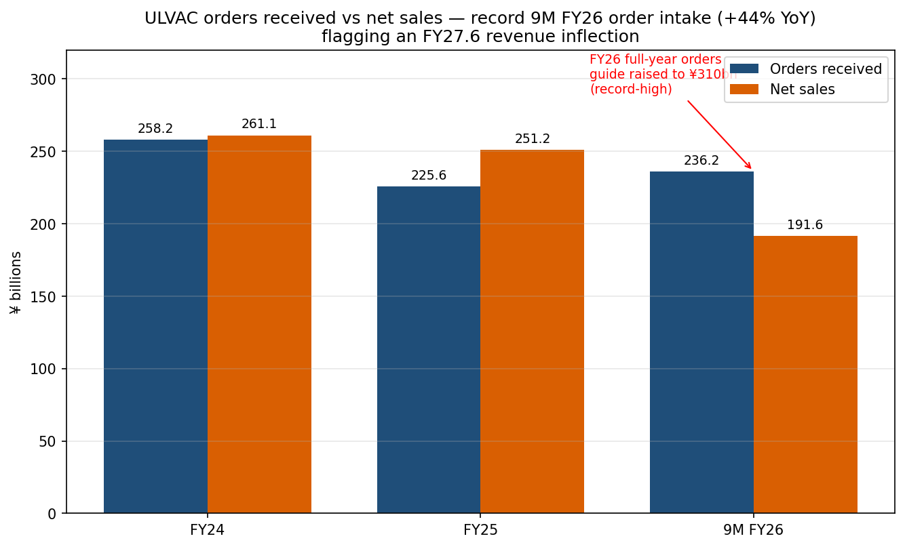
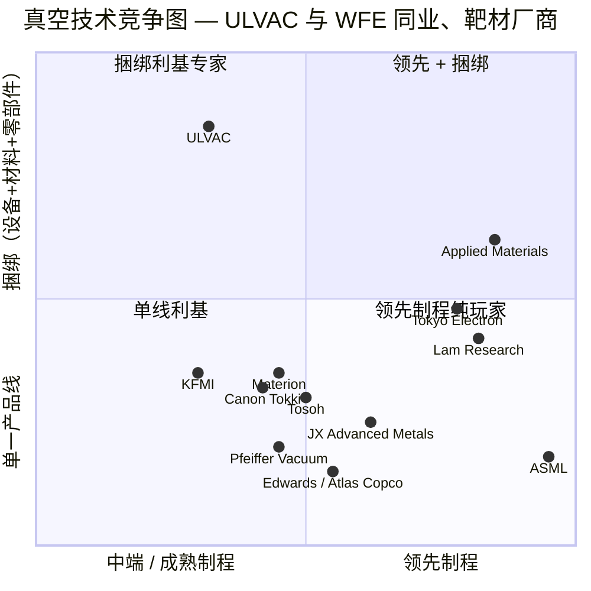
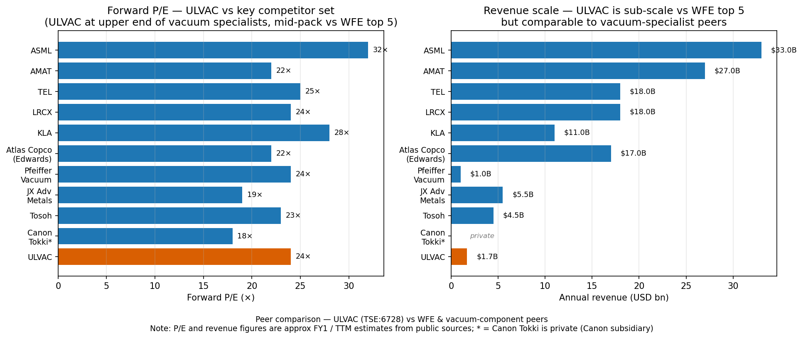

# ULVAC, Inc. (TSE:6728) — 股票研究启动报告

*截至 2026-05-26。作者：Claude 研究代理。原始研究语言：英文版本同步存档于 `ULVAC_TSE6728_Research_Document.md`。引用的日文/英文原始文件标题与链接保留原始语言。*

> **更新 — FY2026.6 业绩指引修订 (2026-05-12)：** 管理层将全年**接单 (orders)** 目标上调 ¥300 亿至 **¥3,100 亿**（创历史新高），但同时将全年**营业利润 (operating profit) 指引从 ¥285 亿下调至 ¥190 亿**（同比 –28.4%），原因是约 ¥58 亿的一次性损失（电动车相关的应收账款坏账准备、真空应用材料业务的质量整改费用、Q4 项目延期至 FY27 收入确认）。营业收入指引从 ¥2,500 亿上调至 ¥2,600 亿（同比 +3.5%），净利润上调至 ¥185 亿（受益于将中国 FPD 溅射靶子公司剥离至 Konfoong/Fengke 合资公司带来的约 ¥78 亿一次性处置收益）。来源：[Consolidated Financial Results for the Nine Months Ended March 31, 2026](https://data.swcms.net/file/ulvac-ir/dam/jcr:06f6f98a-ffc5-4896-93a7-f162c825dfe5/140120260512525783.pdf)、[FY2026.6 Q3 Key Q&A](https://ir.ulvac.co.jp/en/ir/library/result/main/00/teaserItems2/0111110/linkList/09/link/3Q_QA_EN.pdf)。

## 目录

1. 公司概览
2. 公司历史
3. 管理团队
4. 产品与服务
5. 客户与上市策略
6. 行业概览
7. 竞争格局
8. 市场机会 (TAM)
9. 风险评估

参考资料 & 验证日志

---

## 1. 公司概览

ULVAC, Inc.（TSE:6728；日文公司名「アルバック」，英文发音 "ul-vack"——取自 *Ultimate in Vacuum* 「真空之极致」的缩合）是一家日本资本设备制造商，**其首要业务身份是面向平板显示器 (FPD, flat panel display)、半导体、先进封装、功率器件、有机发光二极管 (OLED)、电动车 (EV) 电池及稀土永磁制造的真空镀膜、溅射机 / 沉积机 / 刻蚀机 (sputter / CVD / etch tool) 与真空泵设备制造商**。在更小但战略意义重要的**真空应用材料 (vacuum application materials)** 业务板块中，公司生产溅射靶 (sputter target)、掩膜基板 (mask blank)、表面分析仪及其他真空工艺耗材。集团仅披露两个报告分部——**真空设备 (vacuum equipment) 业务**（FY2025.6 销售占比约 79%）与**真空应用 (vacuum application) 业务**（约 21%）——设备分部内部进一步细分为四个产品线：半导体与电子器件生产设备、显示器与能源相关生产设备、零部件（真空泵、测量仪器、检漏仪）以及工业设备 ([FY2025.6 综合财务业绩, 分部信息, pp. 20–22](https://data.swcms.net/file/ulvac-ir/dam/jcr:8e4a9210-5392-4457-bf56-a46c357970fe/140120250813540543.pdf))。真空应用分部又拆分为材料（占该分部约 51%）与其他（分析仪器 / 掩膜基板）。野村「Greater China Semi」(大中华半导体) 锚定报告 (2026-05-21) 在 Fig. 44 中将 ULVAC 列入了溅射靶供应商联赛榜——但读者必须警惕：对 ULVAC 而言，**溅射靶材料只是设备主导型业务体系中的一个子业务，并非主营业务**，这一点贯穿全报告 ([reports/sector/半导体材料.md](https://github.com/dadachundan/financial_agent/blob/main/reports/sector/%E5%8D%8A%E5%AF%BC%E4%BD%93%E6%9D%90%E6%96%99.md))。

商业模式以**企业级 (B-to-B) 项目交付加售后市场**为绝对主体：大型真空集群工具（溅射机、CVD、刻蚀机、离子注入机 (ion implanter)、OLED 蒸发源 (evaporation source)）通过自有销售工程师直接销售给晶圆厂 / 面板厂，订单交付周期长（FY25 期末设备订单余额 ¥984 亿、材料 ¥174 亿），其上层叠加真空泵耗材、备件、维护合同与溅射靶补充的经常性收入流 ([FY25 财报, pp. 2–3, 分部叙述](https://data.swcms.net/file/ulvac-ir/dam/jcr:8e4a9210-5392-4457-bf56-a46c357970fe/140120250813540543.pdf))。FY25 真空设备分部约 39% 的收入按「时点履行义务」(transferred at a point in time，即出货 + 耗材) 确认，61% 按「时段履行义务」(transferred over time，即多月期设备建造与安装按完工百分比法确认)；真空应用分部的比例则反转——80% 时点（主要为靶材补充），20% 时段 ([FY25 分部注释, p. 22](https://data.swcms.net/file/ulvac-ir/dam/jcr:8e4a9210-5392-4457-bf56-a46c357970fe/140120250813540543.pdf))。这种「设备周期敏感的时段确认 + 颗粒度更细的材料 / 耗材」叠加结构，正是 ULVAC 财务画像兼具设备 OEM 与耗材特许经营双重特征的源头。

集团通过 29 家纳入合并报表的子公司与 8 家未合并子公司在全球范围内运营，覆盖日本（总部位于神奈川县茅崎市）、韩国（ULVAC KOREA Ltd.）、台湾（ULVAC TAIWAN Inc.、ULCOAT TAIWAN）、中国（11 家实体分布于苏州、上海、成都、靖江、沈阳、合肥，加上北京控股公司）、新加坡、马来西亚、美国（ULVAC Technologies、Physical Electronics USA「PHI」、TIGOLD）以及德国（ULVAC GmbH，未合并）([FY25 财报, 合并报表范围, pp. 16–17](https://data.swcms.net/file/ulvac-ir/dam/jcr:8e4a9210-5392-4457-bf56-a46c357970fe/140120250813540543.pdf))。FY25 按客户所在地的销售分布：日本 ¥781 亿 (31%)、中国 ¥865 亿 (34%)、韩国 ¥315 亿 (13%)、台湾 ¥281 亿 (11%)、其他 ¥270 亿 (11%)——中国为单一最大市场，反映了 ULVAC 在中国 FPD 厂商（BOE 京东方、CSOT 华星、Tianma 天马、Visionox 维信诺）及大陆晶圆厂（SMIC 中芯、YMTC 长江存储、CXMT 长鑫存储以及成熟制程逻辑晶圆代工厂）的溅射 / 刻蚀 / OLED 工具的大量配备 ([FY25 分地区销售表, p. 23](https://data.swcms.net/file/ulvac-ir/dam/jcr:8e4a9210-5392-4457-bf56-a46c357970fe/140120250813540543.pdf))。

FY2025.6 集团实现**净销售 ¥2,512 亿（同比 –3.8%）、营业利润 ¥265 亿（同比 –10.9%）、经常利润 ¥286 亿（同比 –4.0%）、归属于母公司股东净利润 ¥167 亿（同比 –17.5%）**——这是 FY24 销售 ¥2,611 亿 / 营业利润 ¥298 亿这一周期高点（受 FY23–FY24 强劲 AI / 先进封装拉动而达到）之后的中周期消化年 ([FY25 财报, p. 1](https://data.swcms.net/file/ulvac-ir/dam/jcr:8e4a9210-5392-4457-bf56-a46c357970fe/140120250813540543.pdf))。营业利润率从 11.4% 收窄至 10.6%；股东权益回报率 (ROE) 从 9.7% 降至 7.5%；权益资产比率改善至 59.6%。FY2026.6 前 9 个月（截至 2026 年 3 月）净销售达 ¥1,916 亿（同比 +2.1%），但营业利润下滑 ¥60 亿至 ¥147 亿（同比 –29.1%），原因即上述一次性损失；真正应当关注的数字是**接单金额 ¥2,362 亿，同比 +44.1%**——史上最强 9 个月接单，预示 FY27（截至 2027 年 6 月的财年）将形成实质性上行周期 ([Q3 FY26 财报, p. 2](https://data.swcms.net/file/ulvac-ir/dam/jcr:06f6f98a-ffc5-4896-93a7-f162c825dfe5/140120260512525783.pdf))。

截至 2025 年 6 月，集团全球员工约 6,000–7,000 人（综合报告将合并集团人数列为约 6,800 人），研发中心位于神奈川茅崎，工程枢纽在中国苏州与韩国天安；年度研发支出约 ¥100 亿，占销售约 4%——相对 ASML 等领先半导体设备同行（约 15%）较为温和，但与 ULVAC 在中端制程与 FPD 的定位相称 ([ULVAC 2025 价值报告 (Integrated Report), 财务数据章节](https://www.ulvac.co.jp/en/sustainability/report/pdf/2025/2025_ulvac_e_all.pdf)；[ULVAC 2024 财务概览 PDF](https://www.ulvac.co.jp/en/sustainability/report/pdf/2024/2024_ulvac_e_24.pdf))。董事长 / 创始人席位已不再设置（执掌多年、推动公司多元化的名誉会长堀英雄已将领导权交予职业经理人）；现任社长兼 CEO 自 2017 年 7 月起为**岩下节男 (Setsuo Iwashita)**，长期内部晋升的高管，1984 年加入公司。

**估值快照。** 截至 2026 年 5 月中旬，股价约 **¥9,587**，市值约 **¥4,627 亿**（按 ¥150/USD 折算约 30 亿美元）；据 TradingView，TTM P/E 约 38×、TTM 每股收益 ¥258、股息率约 1.62%；历史最高价 ¥11,450 创于 2024-05-27，12 个月回报约 +97% ([TradingView, TSE:6728](https://www.tradingview.com/symbols/TSE-6728/))。其他数据库（Yahoo Finance / Eulerpool 口径）报出更接近 19–20× 的 TTM P/E，因此最干净的读法是**按公司自家 FY26 净利润指引 ¥185 亿计的前瞻 P/E ≈ 24×**，或经常利润指引 × 隐含税率约 23×。*分析师观点：* 当前估值处于日本半导体设备中盘股区间的高位（同行中位数 18–22× FY1），定价已隐含（a）AI 资本开支对零部件 / 先进封装的拉动、（b）ULVAC 在成熟制程 MHM 溅射与光刻胶灰化的事实标准 (de facto standard) 份额、（c）Value-Up Plan 价值提升计划的成本纪律。若 FY27 接单动能减速或稀土永磁资本开支窗口提前关闭，估值面临向更典型的 16–18× 前瞻 P/E 下修 20–30% 的风险——这是最具体的近期估值风险，而非长期估值错配。最接近的可比公司（Canon Tokki、NIPPON SEISEN、SCREEN、TEL 东京电子、ASMI、AMAT 应用材料、LRCX 泛林）前瞻 P/E 跨度 15–30× 较宽，因此中位数锚定信号较弱。

读者从第 1 节应当带走的核心论点：ULVAC 是一家**真空技术综合型 (vacuum-technology generalist) 企业**——设备、零部件与材料均基于同一真空物理 IP——它**主动选择不在领先逻辑制程领域与 AMAT / LRCX / TEL / ASMI 正面竞争**，转而聚焦于（i）拥有事实标准份额的成熟制程 MHM / 封装利基；（ii）与 Canon Tokki 及 AMAT 分占余下市场的 FPD/OLED 溅射；（iii）受益于 AI 服务器需求的真空零部件（真空泵、检漏仪）；以及（iv）包含结构性增长的稀土永磁设备业务在内的工业 / 研发用真空工具。野村「Fig. 44 溅射靶联赛榜」的提名是真实存在的，但它仅是更大设备特许经营体系下较小一条腿中的一个切片。

*来源：ULVAC FY2025.6 及历史合并业绩；FY26 数据为 2026-05-12 修订后的公司指引 ([Q3 FY26 财报, p. 2](https://data.swcms.net/file/ulvac-ir/dam/jcr:06f6f98a-ffc5-4896-93a7-f162c825dfe5/140120260512525783.pdf))。*

---

## 2. 公司历史

ULVAC 成立于**1952 年 8 月 23 日**，以「日本真空技術株式会社 / *Nippon Shinkū Gijutsu KK*」(Japan Vacuum Engineering Co., Ltd.) 之名注册，初始实收资本 600 万日元，创始团队为一群真空物理学者，包括井町仁博士 (Dr. Jin Imachi，原东京芝浦电气 / 东芝 (Toshiba) 真空研究员)、林千博士 (Dr. Chikara Hayashi) 与柴田秀夫 (Hideo Shibata)，并由战后关西五位重要财界领袖出资种子资金——松下电器创始人松下幸之助 (Konosuke Matsushita) 以及大泽善夫 (Yoshio Osawa)、藤山爱一郎 (Aiichirō Fujiyama)、山本为三郎 (Tamesaburō Yamamoto)、广濑源 (Gen Hirose) ([ULVAC Company History](https://www.ulvac.co.jp/en/company/history/)；补充细节参见 [Reference for Business: ULVAC history](https://www.referenceforbusiness.com/history2/97/ULVAC-Inc.html))。创业初衷是将美国真空系统技术引入战后重建的日本工业基础——公司与美国 NRC Equipment Corporation 签订总代理协议进行技术合作，随后于 1955 年在大森工厂逐步本地化制造，并于 1956 年吸收合并东洋精机真空研究所 (Toyo Seiki Vacuum Research)，拓宽自产设备产品线 ([Reference for Business, ULVAC history](https://www.referenceforbusiness.com/history2/97/ULVAC-Inc.html))。

*来源：[ULVAC Company History](https://www.ulvac.co.jp/en/company/history/)；[2015 年可持续发展报告时间表附录](https://www.ulvac.co.jp/eng/_csr/eco/report/pdf/2015/2.pdf)；FY26 里程碑取自 [Q3 FY26 财报, pp. 12–14](https://data.swcms.net/file/ulvac-ir/dam/jcr:06f6f98a-ffc5-4896-93a7-f162c825dfe5/140120260512525783.pdf)。*

第一次结构性转型是 1961 年进入真空冶金领域，由此埋下了溅射靶 / 真空应用材料业务的种子。从一家纯粹的真空工程项目作坊起步，ULVAC 在自身用以销售给客户的同款溅射设备所消耗的高纯度金属（铝、钛、钨、钼、铜、钽，以及 ITO / IGZO 透明导电膜的氧化物陶瓷）的熔炼、铸造、粉末键合冶金工艺上层层叠加——一个结构上极为优雅的产品捆绑，正是 ULVAC 四十年来面向 FPD 厂商「设备 + 材料联合销售」推介逻辑的根基。第二次转型发生在 1980 年代 FPD 大爆发时期：1982 年的台湾子公司（初期服务日本显示器厂的海外晶圆厂）、1987 年的德国（工业真空镀膜）、1995 年的韩国（跟随三星显示 (Samsung Display) 与 LG Display）共同构筑了今日贡献集团多数收入的全球服务网络 ([ULVAC Company History](https://www.ulvac.co.jp/en/company/history/))。

第三次转型——也是最近的一次——发生在 2001 年公司由「日本真空技术」更名为「ULVAC, Inc.」并于 2004 年在东证第一部上市，正式完成从项目作坊到上市设备 OEM 的转型。中国市场的真正进入是在 1990 年代末至 2000 年代，通过 ULVAC (SUZHOU) 公司及合肥、沈阳的制造基地完成，使公司与 BOE / China Star / Tianma OLED 扩产形成深度绑定——这成为 2010 年代中国单一资本开支故事中最大的一笔。2022 年 4 月迁至东证 Prime 市场更多是行政重新分类（而非战略事件），最近的战略里程碑是 2025 年发布的 **Value-Up Plan 价值提升计划**，目标到 FY2026.6 实现销售 ¥3,000 亿、毛利率 35%、营业利润率 16%——明确承认公司体系的结构性问题是盈利能力而非营收规模 ([Scripts for Presentation_Material_for_FY2025_EN](https://ir.ulvac.co.jp/en/ir/newsrelease/PressRelease-20250815002/main/0/link/Scripts%20for%20Presentation_Material_for_FY2025_EN_1.pdf))。

2025-08 公告与中国 Konfoong Materials International（深圳市福工材料 / KFMI, SHE:300666）就 FPD 溅射靶合资项目进入磋商，并于 2026-05-12 董事会决议正式执行：将 100% ULVAC Materials (Suzhou) 转入由北京一家私募股权基金 Fengke Xinchuang（丰科鑫创）控股、KFMI 与 ULVAC 作为少数股东的北京合资公司，至此一段长篇章画上句号，并重塑了 ULVAC 在中国材料业务的存在感 ([Q3 FY26 财报, 重要事后事项, pp. 12–14](https://data.swcms.net/file/ulvac-ir/dam/jcr:06f6f98a-ffc5-4896-93a7-f162c825dfe5/140120260512525783.pdf)；背景见 [Yicai Global, 2025-08-14](https://www.yicaiglobal.com/news/kfmi-ulvac-to-integrate-their-flat-panel-display-target-materials-businesses))。战略逻辑有二：（1）中国市场 FPD 溅射靶竞争（BOE 偏好本地供应、KFMI 自身靶材业务 40% 同比增长至约 3.25 亿美元等值）持续压缩 ULVAC 单独经营的利润率；（2）与 KFMI 合并可使合资公司达到推动降本所需的规模，同时让 ULVAC 收获约 ¥78 亿一次性收益。*分析师观点：* 这是合理化重组而非战略撤退——ULVAC 保留 OLED / IGZO 用溅射靶的核心 IP，并继续在自家设备捆绑销售中消化内部靶材知识；合资交易仅是将中国 FPD 溅射靶的*制造业务*交给更本土化的平台运营。

合资交易之外值得标记的近期发展：（i）FY26 接单动能为公司史上最强——Q3 单季 ¥991 亿、9 个月 ¥2,362 亿，受成熟制程逻辑 MHM 溅射、先进封装光刻胶灰化、中国 G8.6 OLED 改造、以及美国主导的供应链多元化资本开支拉动稀土永磁设备等多重驱动 (Q3 FY26 Q&A 第 1–8 项)；（ii）稀土永磁设备业务正从 ¥200 亿 / 年的规模结构性重估至未来 3–5 年 ¥350–450 亿 / 年水平（按管理层口径）；（iii）原本预计 FY26 接单 ¥160 亿的 AR/VR 溅射项目因对中国项目坚持利润纪律而下调至 ¥60 亿——既是正面信号（价格纪律），也是负面信号（销量减少）。

---

## 3. 管理团队

**创始人背景（去名化的历史背景）。** 根据 [公司研究 skill](https://github.com/dadachundan/financial_agent/blob/main/.claude/skills/company-research/SKILL.md) 规则，仅创始人与现任 CEO 享有人物传记。ULVAC 的创始人——井町仁博士（前东芝真空研究员）、林千博士与柴田秀夫——于 1952 年创立公司，数十年前即已退出运营岗位；至今无人留任董事席位，亦不存在「在世创始人兼 CEO」情况。最久的运营连贯线索体现在企业商号本身——商标 ULVAC 取自「*Ultimate in Vacuum*」(真空之极致) 的缩合——以及自 1960 年代起持续担任该特许经营体系工程锚点的茅崎总部所在地 ([ULVAC Company History](https://www.ulvac.co.jp/en/company/history/))。由于目前管理层中并无活跃的创始人，本章节将聚焦于现任 CEO。

**岩下节男 (Setsuo Iwashita)——社长兼首席执行官 (President & CEO)。** 岩下先生自**2017 年 7 月**起担任社长兼 CEO，依 skill「仅创始人 + 现任 CEO」规则，他是本报告所述的唯一高管。他于**1984 年**加入 ULVAC（在公司服务 40 多年），CEO 之前最关键的一段履历是担任 **ULVAC (China) Holding Co. 会长兼总经理**——正是这段任职将中国从一个边缘销售区域转变为集团单一最大收入市场——并于 **2016 年晋升为董事兼专务执行役员 (Director and Senior Managing Executive Officer)** ([Bloomberg 个人资料, Setsuo Iwashita](https://www.bloomberg.com/profile/person/17438855)；[Crunchbase, Setsuo Iwashita / ULVAC Technologies](https://www.crunchbase.com/person/setsuo-iwashita)；[ULVAC 管理层架构页](https://www.ulvac.co.jp/en/company/directors_officers/))。中国运营背景是对投资者最重要的事实：ULVAC 今日的客户基础与收入结构由他在 2000 年代后期至 2010 年代亲手打造的中国本地制造与销售网络所主导的中国 OLED、成熟制程逻辑及存储晶圆厂构成，包括苏州、上海、成都、靖江、沈阳、合肥等数家如今合并员工中相当比例所在的子公司 ([FY25 财报, 合并报表范围, pp. 16–17](https://data.swcms.net/file/ulvac-ir/dam/jcr:8e4a9210-5392-4457-bf56-a46c357970fe/140120250813540543.pdf))。

岩下任 CEO 八年间，主持了（i）2017–2019 年针对中国 OLED 与存储扩产的产能扩张；（ii）COVID-19 期间的盈利能力危机及其后的 FY22–FY24 V 型复苏；（iii）2025 年 **Value-Up Plan 价值提升计划**的发布（明确的 ¥3,000 亿销售 / 16% 营业利润率目标框架）；以及（iv）当前的战略决策——**将中国 FPD 溅射靶制造业务部分剥离至 KFMI / Fengke 合资公司**——而非继续与受本地偏好支持的中国供应商进行次规模竞争。Q3 FY26 评论将这一决策定位为「将资源向半导体与电子领域转移，同时整合中国境内显示器相关生产以优化生产效率并进一步提升利润率」 ([Q3 FY26 Q&A, 第 7 项](https://ir.ulvac.co.jp/en/ir/library/result/main/00/teaserItems2/0111110/linkList/09/link/3Q_QA_EN.pdf))。其本人持股较少（约 0.067%，不存在控股家族遗留），薪酬框架是日本中盘股标准组合：基本工资、与经常利润达成挂钩的奖金、以及在有价证券报告书 (Yuho) 中披露的董事福利信托 (Board Benefit Trust, BBT) 限制性股票计划 ([Bloomberg 个人资料交叉引用](https://www.bloomberg.com/profile/person/17438855)；[GSA「Get to Know the CEO」专访](https://www.gsaglobal.org/get-to-know-the-ceo-setsuo-iwashita-president-%EF%BC%86-ceo-of-ulvac-inc/) 提供了他对管理哲学与增长重点的较长公开陈述)。*分析师观点：* CEO 的画像属于「稳健的内部晋升者」——任期长、中国业务熟练、在组合重塑（稀土永磁扩产、FPD 溅射靶合资）上有可信的执行力，但**没有进入领先半导体设备的野心**——这既是其品牌承诺，也是 ULVAC 未来能尝试成为何种公司的结构性天花板。

---

## 4. 产品与服务

本章是全报告最重要的一节。ULVAC 的首要业务身份是**设备制造商**，并在同一真空技术平台上捆绑**材料、零部件与分析仪器**。下文中两个报告分部——真空设备业务与真空应用业务——以及四个设备子产品线加两个应用子产品线，均逐字引用自 FY2025.6 有价证券报告书 (Yuho) 式财报与 Q3 FY26 补充销售表。

### 4.1 ULVAC 分部矩阵（FY25.6 + Q3 FY26 原文）

ULVAC 本身的分部信息注释将两个报告分部描述为：

> 真空设备业务包括 LCD 用溅射设备、有机 EL（OLED）生产设备、卷对卷 (roll-to-roll) 蒸发设备、半导体生产用溅射设备、真空泵、测量设备等产品，公司就这些产品开展研发、制造、销售并提供维护服务。真空应用业务包括溅射靶材料及分析仪器相关产品等真空应用产品，公司同样就这些产品开展研发、制造、销售并提供维护服务。

来源：[FY25 财报, 分部信息注释, p. 21](https://data.swcms.net/file/ulvac-ir/dam/jcr:8e4a9210-5392-4457-bf56-a46c357970fe/140120250813540543.pdf)。

Q3 FY2026.6 补充披露（截至 2026 年 3 月的 9 个月）给出真空设备四向细分与真空应用两向细分：

| 分部 | 子产品线 | 9M FY26.6 销售 (¥M) | 占分部比例 | 同比 |
|---|---|---:|---:|---:|
| **真空设备业务** (合计 ¥150,005M，营业利润 ¥12,769M) | 半导体与电子器件生产设备 | 63,063 | 42.1% | 未披露（接单 ↑） |
|  | 显示器与能源相关生产设备 | 45,469 | 30.3% | 同比上升 |
|  | 零部件（真空泵、测量仪、电源装置） | 25,954 | 17.3% | 平稳 |
|  | 工业设备（含稀土永磁设备、重新分类后的检漏仪） | 15,519 | 10.3% | 同比上升 |
| **真空应用业务** (合计 ¥41,626M，营业利润 ¥1,863M) | 材料（溅射靶 + 相关） | 19,860 | 47.7% | 同比上升 |
|  | 其他（表面分析仪、掩膜基板） | 21,767 | 52.3% | 同比上升 |

来源：[Q3 FY26 财报, 补充销售信息, p. 15](https://data.swcms.net/file/ulvac-ir/dam/jcr:06f6f98a-ffc5-4896-93a7-f162c825dfe5/140120260512525783.pdf)。

对应 FY2025.6 全年公司亦披露了产品级销售及 FY26 预测（单位：十亿日元），FY26 计划中显示更剧烈的组合切换：

| 项目 | FY25.6 实际 | FY26.6 预测 | 同比 |
|---|---:|---:|---:|
| 半导体与电子器件设备 | 89.3 | 100.5 | **+12.5%** |
| 显示器与能源相关设备 | 53.1 | 39.0 | **–26.6%** |
| 零部件 | 43.1 | 35.0 | –18.9% |
| 工业设备 | 13.5 | 20.0 | **+48.6%** |
| 真空应用 — 材料 | 26.6 | 23.5 | –11.7%（FPD 合资公司去合并） |
| 真空应用 — 其他 | 25.5 | 32.0 | +25.3%（掩膜基板放量） |
| **合计** | **251.2** | **250.0** | –0.5% |

来源：[FY25 财报, 按产品净销售预测, p. 6](https://data.swcms.net/file/ulvac-ir/dam/jcr:8e4a9210-5392-4457-bf56-a46c357970fe/140120250813540543.pdf)。注：截至 Q3 FY26，销售指引由 ¥2,500 亿上调至 ¥2,600 亿——见报告顶部更新栏。

### 4.2 综合视角——产品类别在单一客户工作流中的相互作用

一家 FPD 或半导体晶圆厂在**单一的物理气相沉积 (PVD, Physical Vapour Deposition) 循环**中使用 ULVAC 产品：ULVAC 的**真空泵**（零部件）将沉积腔体抽至高真空；ULVAC 的**溅射机 / 蒸发源**（半导体 / 显示器设备）将物理 PVD 薄膜通过原子从**溅射靶**（材料）激射沉积至基板；ULVAC 的**检漏仪**（零部件）确认腔体完整性；ULVAC 的**表面分析仪**（其他——通常为 PHI 的 XPS / Auger 分析系统）在工艺开发期间表征已沉积薄膜。**主打产品销售是设备**——这是 ULVAC 销售工程师赚取毛利的环节——但**长期年金收入**来自其后 5–10 年内随设备安装而持续消耗的真空泵耗材 + 溅射靶补充 + 分析仪校准。这一捆绑循环是 ULVAC 真空应用分部在设备分部周期下行时仍能增长的结构性原因：设备装机基数无论新设备订单是否增加都会持续消耗靶材 / 真空泵零件 / 备件——这正是 FY24→FY25→FY26 营业利润轨迹中所观察到的设备周期波动得以被衰减的根源。

### 4.3 真空设备 — 半导体与电子器件生产设备（约占设备分部 42%）

**FY25.6 Yuho 式财报「10-K 式」原文：**
> 在半导体及电子器件生产设备业务中，尽管对先进逻辑与存储领域的投资仍然强劲，且先进封装领域亦表现良好，但接单与净销售同比下降，原因是日本与中国的功率器件投资出现反向性减少。

来源：[FY25 财报, p. 2](https://data.swcms.net/file/ulvac-ir/dam/jcr:8e4a9210-5392-4457-bf56-a46c357970fe/140120250813540543.pdf)。

**中文释义 / Plain-language gloss：** 这一子产品线是集团**单一最大产品族**（FY25 约 ¥893 亿、FY26 计划提升至 ¥1,005 亿），承载 ULVAC 的旗舰半导体溅射设备，主要用于 **MHM (Metal Hard Mask, 金属硬掩膜)** ——一种作为图形化堆栈中刻蚀阻挡帽层使用的薄膜，应用于 DRAM 电容形成的深刻蚀步骤和先进逻辑后段制程 (BEOL)。Q3 FY26 Q&A 明确指出 ULVAC 在**「成熟制程 MHM 拥有压倒性份额」**——管理层称之为**「事实标准地位」(de facto standard status)**——建立在专有的应力可控薄膜沉积技术之上，竞争对手 AMAT / TEL 的溅射工具一直难以在这一特定应用上与之匹敌 ([Q3 FY26 Q&A, 第 5 项](https://ir.ulvac.co.jp/en/ir/library/result/main/00/teaserItems2/0111110/linkList/09/link/3Q_QA_EN.pdf))。MHM 之外，该产品族还涵盖**面向 WLP 与 PLP 先进封装的光刻胶灰化 (PR ashing, 光刻胶灰化——刻蚀后通过等离子体剥离光刻胶)**，以及**面向 DRAM/NAND POR (Process of Record, 工艺标准) 工序的金属溅射**。

在这一产品族内，**先进封装灰化工具**是第二根支柱——ULVAC 在 Q3 FY26 描述其凭借「精细等离子体技术」在 WLP / PLP 封装的「**Descum 工艺（去残留工艺）**」中取得「事实标准地位」 ([Q3 FY26 Q&A, 第 5 项](https://ir.ulvac.co.jp/en/ir/library/result/main/00/teaserItems2/0111110/linkList/09/link/3Q_QA_EN.pdf))。FY26 灰化设备接单全年目标上调至约 ¥200 亿，其中针对台湾 OSAT 与日本基板厂的 PLP 专用贡献 ¥40–50 亿。这使 ULVAC 成为同样驱动 Besi（混合键合）与 Kinik 中砂（先进封装 CMP 修整器）的 AI-GPU 封装资本开支浪潮的直接受益方——尽管在单工具美元规模上小于领先封装公司。

*分析师观点：* ULVAC 在该产品族的竞争优势是**工艺特定的细分主导**，而非横向规模：MHM 份额与灰化份额是真实且高的（管理层用「事实标准」一词在日本财报语境中极为罕见），但其可服务市场规模只是 AMAT / LRCX / TEL / ASMI 所竞争的更广阔半导体设备 TAM 的一个细窄切片。通用溅射设备的旗舰竞争对手是 **Applied Materials 的 Endura 平台**（[AMAT 自家 10-K 中将其作为主要 PVD 平台引用](https://www.sec.gov/cgi-bin/browse-edgar?action=getcompany&CIK=AMAT&type=10-K)）；灰化的旗舰竞争对手是 **Hitachi High-Tech** 与 **Plasma-Therm**；ULVAC 通过应用特定性而非平台多功能性来守护份额。护城河类型 = **技术（工艺 IP）+ 切换成本（POR 认证）**；在可服务利基内评级为**部分至强**，利基外评级为**弱**。十年以上的应力可控 MHM 工艺 IP 无法在 1–2 年内被新进入者复制，更换 POR 认证溅射工具所需的客户重新认证成本与 LRCX / AMAT 所享受的装机防御性完全一致。

### 4.4 真空设备 — 显示器与能源相关生产设备（约占设备分部 30%）

**FY25.6 Yuho 式财报「10-K 式」原文：**
> 尽管 IT 面板用 OLED 的投资开始回升，但接单与净销售低于去年同期水平，原因是面向车载用途、追求更小体积、更大容量、更高安全性的 EV 电池所需的研发时间更长，导致投资有所延后。

来源：[FY25 财报, p. 2](https://data.swcms.net/file/ulvac-ir/dam/jcr:8e4a9210-5392-4457-bf56-a46c357970fe/140120250813540543.pdf)。注意该产品族自 2025 年 7 月起由「FPD 生产设备」更名为「显示器与能源相关生产设备」，纳入 EV 电池相关真空设备 ([FY25, p. 6 footnote (2)](https://data.swcms.net/file/ulvac-ir/dam/jcr:8e4a9210-5392-4457-bf56-a46c357970fe/140120250813540543.pdf))。

**中文释义 / Plain-language gloss：** 这是 ULVAC 历史性的核心业务——**面向 FPD / 平板显示器（LCD 与 OLED）面板厂的溅射机与蒸发源**，最近还嫁接上 EV 电池研发用真空设备。产品线包括 **SOLCIET、SATELLA、NEW-ZELDA 等 OLED 有机 EL 生产系统**（用于沉积 OLED 堆栈中发光有机层的有机蒸发腔）、**集群式 PE-CVD 系统**（用于沉积保护有机堆栈免受水汽侵蚀的无机封装薄膜）、以及驱动每个像素的 ITO / IGZO TFT 层用 **OLED 专用溅射工具** ([ULVAC GmbH OLED equipment page](https://ulvac.eu/products/equipment/by-application/oled/))。卷对卷蒸发线（在连续聚合物或金属箔基材上进行真空镀膜）服务于触摸面板透明电极与 EV 电池金属箔市场。

FY26 的战略色彩是混合的。**FY26 计划原本由 ¥531 亿下调至 ¥390 亿（–26.6%）**，反映 EV 电池资本开支放缓与中国 AR/VR 溅射项目暂停 ([FY25 财报, p. 6](https://data.swcms.net/file/ulvac-ir/dam/jcr:8e4a9210-5392-4457-bf56-a46c357970fe/140120250813540543.pdf))。但在 Q3 FY26 中，管理层将全年**接单**目标上调至 **¥700 亿（较原计划增加 ¥300 亿）**，原因是「中国厂商的 G8 尺寸 OLED 新线投资及额外 LCD 设备投资项目」 ([Q3 FY26 Q&A, 第 7 项](https://ir.ulvac.co.jp/en/ir/library/result/main/00/teaserItems2/0111110/linkList/09/link/3Q_QA_EN.pdf))——这意味着销售将在 FY27 跟上。中国 OLED 厂商（Visionox 维信诺、BOE 京东方、CSOT 华星）面向平板与笔记本电脑尺寸 OLED 面板的 G8.6（8.7-gen）改造周期是该产品线最具体的近期催化剂。

*分析师观点：* ULVAC 在 OLED 有机蒸发设备中的市场地位**在用于溅射 / 无机层的集群式系统中较强**，但**在最关键的发光层线性蒸发源 (linear-source evaporation) 工序上较弱**——后者由 Canon Tokki（私营、Canon 旗下）在韩中两国旗舰 OLED 晶圆厂占据 60%+ 份额。ULVAC 与 Canon Tokki、**Sunic System (KOSDAQ:171090)**、**Avaco (KOSDAQ:083930)**、**Applied Materials** 竞争更广义的 OLED 沉积设备市场，某行业研究机构估算 2023 年规模约 42 亿美元，预计到 2032 年以 12.6% 年化增长率扩张至约 125 亿美元 ([Oled Deposition Equipment Market Research Report 2032 / WiseGuy Reports](https://www.wiseguyreports.com/reports/oled-deposition-equipment-market))。护城河类型 = **规模 + 综合捆绑**（相对竞争对手，ULVAC 向 FPD 厂商的溅射 + 材料 + 零部件联合销售更具捆绑性）；评级为**部分——溅射强、蒸发弱**。

### 4.5 真空设备 — 零部件（约占设备分部 17%；AI 服务器顺风）

**FY25.6 Yuho 式财报「10-K 式」原文：**
> 零部件业务中，受 AI 服务器、半导体、电子器件与消费电子等冷却系统对真空泵、测量仪、电源装置及检漏仪的强劲需求支撑，接单保持高位，净销售超过去年同期。

来源：[FY25 财报, p. 2](https://data.swcms.net/file/ulvac-ir/dam/jcr:8e4a9210-5392-4457-bf56-a46c357970fe/140120250813540543.pdf)。

**中文释义 / Plain-language gloss：** 真空零部件是 ULVAC 损益表中的**中周期平滑器 (mid-cycle smoother)**。产品线包括（i）维持晶圆厂工艺腔体真空的**分子涡轮泵 (turbo molecular pump) 与干式真空泵 (dry vacuum pump)**——每台 ULVAC 溅射 / 刻蚀 / CVD 工具均配备多个泵，且全球所有晶圆厂工具（不仅是 ULVAC 自家）的装机基数都是 ULVAC 真空泵的永久售后市场；（ii）**测量仪**，包括真空规、残气分析仪 (RGA) 及工艺监测传感器；（iii）**检漏仪**——包括用于晶圆厂公用工程及（日益增加地）AI 服务器液冷回路 QA 用的氦质谱检漏仪（每台采用液冷的 NVIDIA H200 / B200 服务器在出货前其冷却回路总成需要 100% 进行氦检漏测试，所用检漏设备与晶圆厂检漏仪物理原理完全一致）；（iv）等离子工艺工具用**电源装置**。

战略意义在于 **AI 服务器冷却维度**：随着 NVIDIA / AMD GPU 机架开始标准化液冷（冷板 (cold-plate) 或浸没式 (immersion)），歧管 / 冷板组件在集成前必须 100% 进行氦检漏测试，而 ULVAC 是全球三四家专用测试站供应商之一。这使零部件成为**无须依赖晶圆厂资本开支周期的 AI 服务器单元增长杠杆**——为更具周期性的其他设备线提供有用的多元化。FY26 将检漏设备由零部件重新归类至工业设备（见 §4.6），属于呈示性变更，反映检漏作为独立业务的成熟化；底层顺风不变 ([Q3 FY26 财报, p. 3](https://data.swcms.net/file/ulvac-ir/dam/jcr:06f6f98a-ffc5-4896-93a7-f162c825dfe5/140120260512525783.pdf))。

*分析师观点：* 这一产品线是 ULVAC 最具防御性的。两大真空泵主要竞争对手是 **Edwards（Atlas Copco 阿特拉斯·科普柯旗下）** 与 **Pfeiffer Vacuum (FR:PFV, 约 50% 由 Busch 私有化)** ——两者在公开市场真空泵业务中规模均大于 ULVAC，但都没有像 ULVAC 那样以自有设备特许经营进行捆绑。护城河类型 = **切换成本 + 装机年金**（一家已在 200mm 或 300mm 晶圆厂为其真空泵选定 ULVAC 标准的工厂不会进行整厂更换），加上**来自设备特许经营的捆绑拉动**。在 ULVAC 自有装机基础内评级**强**，在公开市场真空泵招标中评级**部分**。FY26 计划下调至 ¥350 亿（FY25 实际 ¥431 亿）反映自 FY24–FY25 晶圆厂公用工程建设高点的回落——并非特许经营在结构上的弱化。

### 4.6 真空设备 — 工业设备（约占设备分部 10%；稀土永磁重估）

**FY25.6 Yuho 式财报「10-K 式」原文（混合——同时参见 Q3 FY26 更新）：**
> 因高性能磁体生产设备需求疲软，接单与净销售同比下滑。

来源：[FY25 财报, p. 2](https://data.swcms.net/file/ulvac-ir/dam/jcr:8e4a9210-5392-4457-bf56-a46c357970fe/140120250813540543.pdf)。但 Q3 FY26 更新明显更乐观：

> 在稀土永磁领域，随着旨在多元化供应链的资本投资正式启动，高性能磁体生产设备表现强劲。……空调及 AI 服务器冷却系统用检漏设备保持稳定。

来源：[Q3 FY26 财报, p. 3](https://data.swcms.net/file/ulvac-ir/dam/jcr:06f6f98a-ffc5-4896-93a7-f162c825dfe5/140120260512525783.pdf)。

**中文释义 / Plain-language gloss：** 工业设备是 FY26 叙事中**最具结构性增长意义**的故事。ULVAC 是全球少数几家**高性能 NdFeB (neodymium-iron-boron, 钕铁硼) 永磁真空熔炼 / 烧结 / 镀膜设备**供应商之一——钕铁硼永磁用于电动车驱动电机、风电发电机、机器人执行器、消费电子音圈等。真空工艺步骤至关重要，原因是稀土金属在常压下瞬时氧化；磁体生产必须在惰性气体保护、可控气氛炉中完成熔炼与烧结。

战略拐点是**美国 / 欧盟 / 日本稀土供应链多元化资本开支**。在中国占据 NdFeB 生产 >85% 份额二十年后，美国《通胀削减法案》(IRA) 与欧盟《关键原材料法案》触发了在岸化项目——MP Materials 德州、Hitachi Metals / Proterial 日本与美国、GM-Vacuumschmelze 德国——每个项目均向包括 ULVAC 在内的少数供应商采购真空熔炼 / 烧结 / 镀膜设备。Q3 FY26 管理层表示该产品线「过去维持在 ¥200 亿左右」，但现在「通过捕捉对稀土永磁及相关产品的强劲需求，预计未来 3–5 年订单将稳定在 ¥350–450 亿水平」 ([Q3 FY26 Q&A, 第 8 项](https://ir.ulvac.co.jp/en/ir/library/result/main/00/teaserItems2/0111110/linkList/09/link/3Q_QA_EN.pdf))。FY26 销售计划上调至 ¥200 亿（FY25 实际 ¥135 亿，+48.6%），FY27–FY28 拐点幅度将显著加大。

*分析师观点：* 工业设备从「乏味的遗留科目」升级为「ULVAC 最被低估的多头逻辑」。竞争对手包括 **Inductotherm Group**、**Consarc**、**ALD Vacuum Technologies（德国）**、以及**中国国有供应商**——但西方永磁在岸化项目明确寻求非中国设备供应，将 ULVAC 框定在一个有利的竞争集合内。护城河类型 = **技术 + 地缘政治偏好**；未来 3–5 年评级**强**，但需附加一条限定：稀土资本开支窗口可能在在岸产能赶上铭牌产能后关闭。按管理层口径，该设备亦为「基于现有技术的高毛利产品」——意味着其毛利率画像在设备分部中最好，而非最差。

### 4.7 真空应用 — 材料（约占应用分部 48%；野村 Fig. 44）

**FY25.6 Yuho 式财报「10-K 式」原文：**
> 接单与净销售均同比上升，主要原因是 FPD 与半导体 / 电子器件相关工厂持续保持高开工率。

来源：[FY25 财报, p. 3](https://data.swcms.net/file/ulvac-ir/dam/jcr:8e4a9210-5392-4457-bf56-a46c357970fe/140120250813540543.pdf)。

**中文释义 / Plain-language gloss：** 这是将 ULVAC 列入野村「Greater China Semi」Fig. 44 溅射靶联赛榜的子分部。ULVAC 材料业务生产**高纯度金属与氧化物陶瓷溅射靶**——包括铝、钛、铜、钼、钨、钽，以及 ITO / 铟镓锌氧化物 (IGZO) 透明导电膜靶材——制造基地分布在日本、韩国（ULVAC KOREA）、台湾（ULVAC Materials Taiwan，未合并）、中国（ULVAC Materials Suzhou，2026-05 即将合资剥离）以及美国（TIGOLD CORPORATION）。这些靶材被消耗于 ULVAC 自有溅射设备内，同时也消耗于面板与半导体晶圆厂的 AMAT / TEL / Canon Tokki 等竞争溅射腔体中。最近的代表性产品创新：**面向 OLED 与触摸显示器的键合型溅射靶**，在高真空条件下均匀性提升 28%、靶材开裂率降低 19% ([ICO Optics 溅射镀膜市场报告引用 ULVAC 键合靶规格](https://www.ico-optics.org/sputter-coating-market-growth-to-2035-driven-by-semiconductors-displays/))。

结构性背景即野村报告所称的「**材料长线重估周期 (the materials long re-rating cycle)**」 ([reports/sector/半导体材料.md](https://github.com/dadachundan/financial_agent/blob/main/reports/sector/%E5%8D%8A%E5%AF%BC%E4%BD%93%E6%9D%90%E6%96%99.md))：GAA 逻辑 + High-NA EUV + 背面供电 (Backside Power Delivery, BPD) + 先进封装 + 玻璃芯基板均增加每片晶圆的溅射靶材料消耗（更多薄膜层、更多薄膜类型、更深的通孔填充）。据 Cognitive Market Research 估算，2023 年全球半导体溅射靶市场约 45 亿美元，年化复合增长率约 5.8% ([Cognitive Market Research, Semiconductor Sputtering Targets](https://www.cognitivemarketresearch.com/semiconductor-sputtering-targets-market-report)，2024 年发布)。按野村 2026-05-21 锚定报告 Fig. 26，溅射靶占约 800 亿美元全球半导体材料市场约 3%——隐含半导体靶切片约 24 亿美元，FPD 靶切片另约 20 亿美元——因此全球可寻址靶材市场约 40–50 亿美元 ([reports/sector/半导体材料.md, 引用野村 2026-05-21 Fig. 26、35-44](https://github.com/dadachundan/financial_agent/blob/main/reports/sector/%E5%8D%8A%E5%AF%BC%E4%BD%93%E6%9D%90%E6%96%99.md))。

该产品线 2026 年最重要的事件是**中国 FPD 溅射靶制造业务的部分剥离**——ULVAC Materials (Suzhou) 转入北京一家由 Fengke Xinchuang 基金控股、KFMI 与 ULVAC 作为少数股东的合资公司（北京福光晶生电子材料有限公司），在 FY26 产生约 ¥78 亿一次性收益 ([Q3 FY26 财报, 重要事后事项, pp. 12–14](https://data.swcms.net/file/ulvac-ir/dam/jcr:06f6f98a-ffc5-4896-93a7-f162c825dfe5/140120260512525783.pdf))。背景：KFMI 自身溅射靶销售在前一财年同比增长 40% 至 23 亿人民币（约 3.25 亿美元），以 BOE 为锚定客户，整合目标是在 FPD 靶子市场实现「资源共享、优势互补、增强市场竞争力」 ([Yicai Global, 2025-08-14](https://www.yicaiglobal.com/news/kfmi-ulvac-to-integrate-their-flat-panel-display-target-materials-businesses))。非中国靶业务（日本、韩国、台湾、美国）仍完全保留在 ULVAC 体系内。

*分析师观点：* ULVAC 是一家**规模较小、设备一体化的溅射靶玩家**，竞争对手包括 **JX Advanced Metals (TSE:5016，2025 年从 JX Nippon Mining 分拆)**、**Tosoh (TSE:4042)** 通过 Tosoh SMD、**Materion (NYSE:MTRN)**、**三井金属矿业 / Mitsui Mining & Smelting (TSE:5706)** 以及 **KFMI (SHE:300666)** 自身 ([Maximize Market Research, 溅射靶竞争对手列表](https://www.maximizemarketresearch.com/market-report/global-sputtering-target-market/102381/)；[Coherent Market Insights, 铜溅射靶竞争对手列表](https://www.coherentmarketinsights.com/market-insight/copper-sputtering-target-market-6221))。ULVAC 的优势在于**面向 FPD 厂商的设备 + 材料联合销售**——其溅射靶与消耗它们的溅射腔体绑定销售，使在同时购买两者的客户处获得拉动份额。在纯半导体溅射靶领域 ULVAC **不是**领先者（JX、Tosoh、Materion 规模更大），**且不会**朝该方向发展。护城河类型 = FPD 靶上的**捆绑拉动 + 技术**，半导体靶上则为**部分**；材料子分部整体评级为**部分**。中国 FPD 合资重组隐含承认在该地理-产品单元上无法达成单独规模。

### 4.8 真空应用 — 其他（约占应用分部 52%；PHI + 掩膜基板）

**FY25.6 Yuho 式财报「10-K 式」原文：**
> 接单与净销售均同比上升，主要受表面分析仪相关业务与高清晰、高性能显示器用掩膜基板业务贡献的拉动。

来源：[FY25 财报, p. 3](https://data.swcms.net/file/ulvac-ir/dam/jcr:8e4a9210-5392-4457-bf56-a46c357970fe/140120250813540543.pdf)。

**中文释义 / Plain-language gloss：** 「其他」是一个对实际**深度分析与特种真空产品组合**的误导性标签，包括 **Physical Electronics USA / ULVAC-PHI**（XPS、AES、TOF-SIMS、扫描俄歇表面分析仪——这些技术的全球参考品牌，与 Thermo Fisher、Bruker 并列）以及**面向高清晰 / 高性能显示器的 OLED 掩膜基板**（OLED 有机蒸发借以沉积像素图案的金属掩膜；掩膜本身通过 ULVAC 提供的真空沉积工艺加工制造）。FY26 计划上调至 ¥320 亿（同比 +25.3%），反映 PHI 增长与绑定 G8 IT-OLED 面板生产的 OLED 掩膜基板放量。

*分析师观点：* PHI 表面分析业务是一个虽小但极具防御性的利基——Thermo Fisher（美国）与 Bruker（美国 / 德国）是主要全球竞争对手，但 PHI 的 XPS 在半导体 / 金属 / 制药研究实验室的装机基础因传统软件与操作员培训成本而具有粘性。面向 OLED 的掩膜基板是 ULVAC 凭借自有蒸发与光刻工艺 IP 守护的高附加值特种产品。护城河类型 = **品牌 + 技术 + 切换成本**；表面分析评级**强**，掩膜基板评级**部分**。

### 4.9 经常性 / 售后业务

不同于 Lam Research (CSBG) 或 Applied Materials (AGS)，ULVAC 并未单列「服务」分部——经常性收入流（备件、维护合同、真空泵耗材、靶材补充、表面分析仪校准）嵌入两个分部内部。间接证据：FY25 真空设备 ¥1,990 亿销售中，¥785 亿（39%）按「时点履行义务」确认（= 耗材 / 备件 / 售后类交易），¥1,206 亿（61%）按「时段履行义务」确认（= 多月期建造与安装）。真空应用方面，¥416 亿（80%）按时点确认。来源：[FY25 财报, 分部分解表, p. 22](https://data.swcms.net/file/ulvac-ir/dam/jcr:8e4a9210-5392-4457-bf56-a46c357970fe/140120250813540543.pdf)。*分析师观点：* ULVAC 投资者应当在心中将**集团约 25–30% 收入视为经常性**，即便该数据未单列分部——这正是支撑分部利润下行年（如 FY25 vs FY24）的底层结构性原因。

### 4.10 旗舰产品族与近期推出

ULVAC 三大旗舰产品族为：

1. **面向成熟制程逻辑的 MHM 溅射**——按管理层措辞具事实标准地位；公司单一最具防御性的商业地位，驱动 FY26 逻辑接单 ¥310 亿 ([Q3 FY26 Q&A, 第 5 项](https://ir.ulvac.co.jp/en/ir/library/result/main/00/teaserItems2/0111110/linkList/09/link/3Q_QA_EN.pdf))。
2. **面向先进封装 (WLP + PLP) 的光刻胶灰化 / Descum 工艺**——事实标准 Descum 工艺；FY26 ¥200 亿计划；AI-GPU 封装顺风的直接受益方。
3. **稀土永磁真空设备**——未来 3–5 年 ¥350–450 亿结构性运行率；高毛利；与西方供应链多元化资本开支一致。

过去 12 个月的近期推出包括：均匀性 / 良率有可测量提升的 OLED 键合溅射靶（IR 材料未披露具体推出日期）；面向 AI 服务器冷却回路的检漏站（FY26 起从零部件重新归类至工业设备）；以及 Value-Up Plan 中针对**半导体与电子领域的模块化设计设备标准化 (modular-design equipment standardisation)** 以实现成本下降的承诺 ([Q3 FY26 Q&A, 第 9 项](https://ir.ulvac.co.jp/en/ir/library/result/main/00/teaserItems2/0111110/linkList/09/link/3Q_QA_EN.pdf))。Value-Up Plan 还设定到截至 2031 年 6 月的财年将设备设计交付周期缩短 70%（目前进度约 20% 缩短，约相当于路径上的 30%）。

*来源：ULVAC FY2025.6 分部产品表与按地区净销售表 ([FY25 财报, pp. 6, 23](https://data.swcms.net/file/ulvac-ir/dam/jcr:8e4a9210-5392-4457-bf56-a46c357970fe/140120250813540543.pdf))。*

---

## 5. 客户与上市策略

ULVAC 的客户基础反映了它服务的四个终端市场：**半导体晶圆厂、FPD / OLED 面板厂、真空零部件买家（工业 / 消费电子 OEM）以及稀土永磁 / EV 电池研发客户**。Yuho 明确写道「特定客户的销售在 FY24 与 FY25 综合损益表上均未达到净销售的 10% 或以上」——意味着在日本会计准则 (Japan GAAP) 的分部报告规则下**无单一客户达到 10% 披露阈值** ([FY25 财报, 主要客户注释, pp. 23–24](https://data.swcms.net/file/ulvac-ir/dam/jcr:8e4a9210-5392-4457-bf56-a46c357970fe/140120250813540543.pdf))。公司因此不被强制要求在财报中命名个别客户；以下内容借助管理层评论、行业媒体报道，以及构成公开记录一部分的捆绑联合销售关系进行重构。

**按产品线 — 命名客户清单（最佳公开重构）：**

| 子产品线 | 锚定客户 | 来源 |
|---|---|---|
| 半导体溅射 / MHM / 灰化 | TSMC 台积电（台湾代工）、Samsung Foundry 三星代工、SK hynix、Micron（DRAM, MHM POR）、YMTC、CXMT（中国 DRAM/NAND）、SMIC + 中国成熟制程代工 | 推论自 [Q3 FY26 Q&A, 第 5 项](https://ir.ulvac.co.jp/en/ir/library/result/main/00/teaserItems2/0111110/linkList/09/link/3Q_QA_EN.pdf) 提及的「台湾代工厂」「中国大客户」；DRAM「北美客户」= Micron |
| 显示器与能源 | BOE 京东方、China Star 华星 (TCL)、Tianma 天马、Visionox 维信诺（OLED, 中国）；Samsung Display 三星显示 + LG Display（OLED, 韩国）；AUO 友达（台湾）；EV 电池厂商（CATL 宁德时代、BYD 比亚迪、Panasonic 松下、GS Yuasa 研发用途） | [Yicai Global 2025-08-14](https://www.yicaiglobal.com/news/kfmi-ulvac-to-integrate-their-flat-panel-display-target-materials-businesses) 提到 BOE；[Q3 FY26 Q&A 第 7 项](https://ir.ulvac.co.jp/en/ir/library/result/main/00/teaserItems2/0111110/linkList/09/link/3Q_QA_EN.pdf) G8 OLED 项目提到「中国厂商」 |
| 零部件（真空泵 / 检漏仪） | 所有主要晶圆厂运营商（装机基础售后市场）；AI 服务器冷却买家（NVIDIA 合作伙伴、超大规模数据中心冷板集成商） | 推论自 AI 服务器冷却回路检漏的分部叙述 ([FY25 财报, p. 2](https://data.swcms.net/file/ulvac-ir/dam/jcr:8e4a9210-5392-4457-bf56-a46c357970fe/140120250813540543.pdf)) |
| 工业 / 稀土永磁 | MP Materials（美国）、Proterial / Hitachi Metals（日本 / 美国）、Vacuumschmelze（德国）、Toshiba Materials、GM-VAC 合资 | [Q3 FY26 Q&A 第 8 项](https://ir.ulvac.co.jp/en/ir/library/result/main/00/teaserItems2/0111110/linkList/09/link/3Q_QA_EN.pdf) 提及「订单以美国为中心」；IRA 驱动的在岸化项目 |
| 材料（溅射靶） | BOE、CSOT、Tianma（FPD, 经待 close 的中国合资）；全球半导体晶圆厂客户 | [Yicai Global](https://www.yicaiglobal.com/news/kfmi-ulvac-to-integrate-their-flat-panel-display-target-materials-businesses)；ULVAC 自身 FPD 靶材数量主要被 BOE 主导的中国需求所锁定 |
| 表面分析 (PHI) | 大学、研究院所、全球半导体晶圆厂失效分析实验室 | 标准 PHI 装机基础；无单一锚定客户 |

*来源：[FY25 财报, 按地区分部表, p. 23](https://data.swcms.net/file/ulvac-ir/dam/jcr:8e4a9210-5392-4457-bf56-a46c357970fe/140120250813540543.pdf)。*

**集中度评估。** 在无单一客户超过 10% 的情况下，按日本会计准则定义的客户集中度低于披露阈值。但**终端市场集中度**真实存在，且是更具意义的集中度指标：**中国单独占收入 34%，FPD 相关客户（BOE、CSOT、Tianma、Visionox、三星显示、LG Display、AUO）合计可能吸纳 30% 以上的集团收入**——将显示器与能源产品线、材料中 FPD 切片、零部件中 FPD 切片相加得出。提议的中国 FPD 溅射靶 KFMI 合资公司正是通过将 BOE 面向的靶材业务移入 ULVAC 作为少数股东的合资结构来明确缓解材料侧的这一集中度 ([Q3 FY26 重要事后事项, pp. 12–14](https://data.swcms.net/file/ulvac-ir/dam/jcr:06f6f98a-ffc5-4896-93a7-f162c825dfe5/140120260512525783.pdf))。在半导体侧，最大单一终端客户几乎肯定是 **TSMC 台积电**（通过代工 MHM 溅射与光刻胶灰化），但 TSMC 的采购分布在多条 ULVAC 设备线、多个全球 TSMC 厂区，使任何单一收货地址都低于 10% 红线。

**上市策略 (Go-to-market)。** ULVAC 通过 17+ 个地区销售子公司中的**自有销售工程师直接销售**——没有显著的渠道合作伙伴 / 经销商层级，这对于高接触晶圆厂设备而言是标准做法，但相对于更依赖渠道的模式抬高了 SG&A 负担。设备销售周期长（通常从规格到订单 6–12 个月；从订单到收入确认 9–18 个月，针对按时段确认的项目——FY25 期末 ¥980 亿设备订单余额给出未来一到两个季度的时段收入可见性）。定价按项目定制，鲜少公开披露。售后市场（耗材、备件、靶材补充）则更具交易性——按时点确认——为产品线带来一定的经常性收入特征（见 §4.9）。维护合同通常为一年期或多年期，并与每次大型设备安装捆绑。

**销售策略评论。** 两项结构性举措值得标记。首先，Value-Up Plan 对**模块化设计设备**的承诺部分是客户获取成本下降策略——模块化工具缩短了从定制到出货的时间线，并允许同一 ULVAC 销售工程师覆盖更多客户机会，无须每次都进行定制工程 ([Q3 FY26 Q&A, 第 9 项](https://ir.ulvac.co.jp/en/ir/library/result/main/00/teaserItems2/0111110/linkList/09/link/3Q_QA_EN.pdf))。其次，Q3 FY26 描述的**AR/VR 项目利润纪律**——「为优先盈利能力，我们决定只选择性地接受高毛利项目」，AR/VR 中国溅射项目由 ¥160 亿削减至 ¥60 亿——明确显示销售组织不再以「不顾代价的销售规模」为衡量标准，这是 FY26 管理姿态的重大增量变化 ([Q3 FY26 Q&A, 第 6 项](https://ir.ulvac.co.jp/en/ir/library/result/main/00/teaserItems2/0111110/linkList/09/link/3Q_QA_EN.pdf))。

**合作伙伴与渠道关系。** 当前最重要的合作伙伴是 2026-05-12 宣布的 **KFMI / Fengke FPD 溅射靶合资公司**（计划于 2026 年 5–6 月完成交割）；历史上 ULVAC 还运营 **ULVAC AUTOMATION TAIWAN** 权益法合资（晶圆厂工具的工厂自动化）、**SHOWA SHINKU Co. Ltd.** 权益法合资（真空设备）、以及 **ULVAC (NINGBO) Co. Ltd.** 权益法关联公司 ([FY25 财报, 权益法适用, p. 17](https://data.swcms.net/file/ulvac-ir/dam/jcr:8e4a9210-5392-4457-bf56-a46c357970fe/140120250813540543.pdf))。PHI 表面分析业务——从美国 Physical Electronics 收购——为 ULVAC 提供了一个具西方资质的分析仪器品牌，能够拉动母公司单凭自身无法赢得的学术与美国晶圆厂订单。

**客户案例 — 精选。** 公开讨论的最重要客户中标包括：（i）**多家中国代工厂与 TSMC 对成熟制程 MHM POR 的采纳**，使 ULVAC 在财报电话会议中能够援引「事实标准」地位（未公开具体客户名）；（ii）面向 AI-GPU 封装的**台湾 OSAT 与日本基板厂 Descum / 灰化工艺 POR** ([Q3 FY26 Q&A, 第 5 项](https://ir.ulvac.co.jp/en/ir/library/result/main/00/teaserItems2/0111110/linkList/09/link/3Q_QA_EN.pdf))；（iii）驱动 FY26 显示器接单 +¥300 亿上调的**中国厂商 G8.6 OLED 改造项目（BOE 主导的 IT-OLED 扩产）** ([Q3 FY26 Q&A, 第 7 项](https://ir.ulvac.co.jp/en/ir/library/result/main/00/teaserItems2/0111110/linkList/09/link/3Q_QA_EN.pdf))；（iv）驱动工业设备线结构性级跨的**美国主导 NdFeB 在岸化项目所需的稀土永磁真空熔炼 / 烧结设备订单**。

---

## 6. 行业概览

ULVAC 处于三个不同行业的交集——**半导体资本设备**、**FPD 资本设备 + 材料**、以及**真空技术（真空泵、零部件、分析仪器）**——并在**稀土永磁设备**与 **EV 电池生产设备**领域有较小的邻接业务。每个行业有各自的周期、结构与增长驱动，故本节分别展开。

**半导体资本设备市场** ——按野村 Greater China Semi 锚定报告与 SEMI 行业追踪器，2025 年全球晶圆厂设备 (WFE, Wafer Fab Equipment) 市场估计约 1,100–1,200 亿美元，预计到 2027 年在 TSMC、Samsung、SK hynix、Micron 及中国成熟制程与存储扩产的 AI / HBM / 先进封装资本开支推动下达到 1,300–1,500 亿美元 ([reports/sector/半导体材料.md, 引用野村 2026-05-21](https://github.com/dadachundan/financial_agent/blob/main/reports/sector/%E5%8D%8A%E5%AF%BC%E4%BD%93%E6%9D%90%E6%96%99.md))。前五大玩家——Applied Materials、ASML、Tokyo Electron、Lam Research、KLA——合计控制约 75% 的 WFE；ULVAC 在剩余的 25% 中以专业溅射 / 灰化 / 真空泵供应商身份运营，其可寻址服务市场约为 50–80 亿美元（晶圆厂内匹配 ULVAC 产品组合的 PVD + 等离子剥离 + 真空零部件子部分）。野村将 2026-30 窗口的**结构性驱动**列为：AI 逻辑资本开支（TSMC 资本开支到 2027F 升至约 700 亿美元，1.6nm HVM 资本强度 50%）、HBM / DRAM-on-logic 扩产（CXMT、SK hynix、Micron）、先进封装资本开支（2026-28 年的 SoIC、CoWoS、EMIB-T），以及中国成熟制程扩产——所有这些都在抬升 ULVAC 的订单簿，即便公司不在领先制程竞争 ([reports/sector/半导体材料.md](https://github.com/dadachundan/financial_agent/blob/main/reports/sector/%E5%8D%8A%E5%AF%BC%E4%BD%93%E6%9D%90%E6%96%99.md))。

**FPD 设备市场** —— 全球 FPD 资本设备市场在 2017 年中国 BOE / CSOT G10.5 LCD 资本开支高峰时达约 200 亿美元，目前结构性收缩至约 80–100 亿美元，且由 **OLED 资本开支周期**而非 LCD 主导。2024–2027 催化剂是 **IT-OLED** ——笔记本、平板、车载显示器——苹果 iPad Pro OLED 发布及中国 BOE / Visionox / CSOT 的 OLED 扩产正在驱动 G8.6 / G8.7 代 OLED 建厂周期，需要 ULVAC 的溅射 / 掩膜基板 / 靶材内容。OLED 沉积设备子市场据 WiseGuy Reports 估算 2023 年约 42 亿美元，预计到 2032 年以 ~12.6% 年化增长率扩张至约 125 亿美元 ([Oled Deposition Equipment Market Research Report 2032](https://www.wiseguyreports.com/reports/oled-deposition-equipment-market))。OLED 内部，**有机蒸发工具**（沉积发光有机层的线性源）由 **Canon Tokki（私营）**以 70–80%+ 份额主导；ULVAC 在 OLED 产线的**溅射 / 无机封装 / 掩膜基板 / 靶材外围**竞争。*分析师观点：* OLED 资本开支周期本质上比半导体 WFE 更具块状性——单一 G8.6 厂决策可使全球 TAM 波动 10–20%；ULVAC 的 FPD 相关收入波动是结构性嵌入行业的，并非 ULVAC 特定问题。

**溅射靶材料市场** —— 野村 Fig. 26 将溅射靶置于约 800 亿美元全球半导体材料市场的约 3%（即约 24 亿美元半导体靶切片），IDC / Yano / Coherent Market Insights 将更广义的溅射靶市场（半导体 + FPD + 太阳能 + 玻璃镀膜 + 装饰）分拆为 2023 年约 45 亿美元，年化复合增长率 5–6% ([Cognitive Market Research, Semiconductor Sputtering Targets](https://www.cognitivemarketresearch.com/semiconductor-sputtering-targets-market-report)；[reports/sector/半导体材料.md](https://github.com/dadachundan/financial_agent/blob/main/reports/sector/%E5%8D%8A%E5%AF%BC%E4%BD%93%E6%9D%90%E6%96%99.md))。结构性背景是 GAA / High-NA EUV / 背面供电 / 先进封装——均增加薄膜堆栈复杂性，从而抬升单片晶圆的靶材消耗。**竞争格局**自 2020 年起持续整合：三菱化学 2020 年将其轻金属溅射靶业务出售给 Konfoong/KFMI ([WebSearch 摘要：KFMI / 三菱化学转让](https://www.coherentmarketinsights.com/market-insight/copper-sputtering-target-market-6221))，JX Nippon Mining 2025 年将 JX Advanced Metals 分拆为 TSE:5016（如今是最大纯玩家），ULVAC 现正于 2026 年将中国 FPD 溅射靶业务合资剥离至 KFMI。**ULVAC 的竞争单元是 FPD 靶（现与 KFMI 合资）+ OLED/IGZO 靶（自主保留）+ 与自家溅射腔体捆绑的小众半导体靶** ——它并非半导体靶纯玩家与 JX、Tosoh、Materion 正面对决的玩家。

**真空零部件市场** —— 全球真空泵市场约 80 亿美元（Atlas Copco / Edwards、Pfeiffer Vacuum、Busch、Ebara、ULVAC 为主要玩家）。市场由 **Edwards (Atlas Copco)** 主导，拥有最大的面向晶圆厂的干式真空泵业务；**Pfeiffer Vacuum (FR:PFV)** 是有力的第二；ULVAC 是可信的第三，其优势来自自家设备装机基础的捆绑拉动。增长率约 4–6%/年，由相同的晶圆厂资本开支周期加上新兴的 AI 服务器冷却回路检漏需求驱动。*分析师观点：* 这是 ULVAC 最具防御性、波动最小的产品线，也是赋予集团「真空纯玩家」投资者身份的产品线。

**稀土永磁设备市场** —— 一个小而快速增长的利基，由西方在岸化 NdFeB 永磁生产驱动。全球 NdFeB 总产量约 200,000 吨 / 年，历史上 >85% 在中国；由 IRA / EU 关键原材料法案驱动的美国 / 欧洲在岸化项目（MP Materials、Vacuumschmelze、Proterial、GM-VAC 合资）代表 2025–2030 年窗口内约 30–50 亿美元的永磁产能建设。设备切片——真空熔炼 / 烧结 / 镀膜炉——累计约 5–10 亿美元，由 ULVAC、ALD Vacuum Technologies、Consarc 与中国国有供应商瓜分。西方永磁项目明确偏好非中国设备供应——这一地缘政治偏好将 ULVAC 框定在该利基的优势竞争集合内。

**EV 电池生产设备市场** —— 真空干燥、电解质箔涂层用真空沉积、干房公用工程是 ULVAC 较小的邻接业务，竞争对手包括 **Hitachi High-Tech**、**特种东海制纸 (Tokushu Tokai Paper)**、**三菱重工 (Mitsubishi Heavy Industries)** 与中国专用设备厂商。FY26 叙事温和（FY25 披露「EV 需求慢于预期」），但结构性增长完好——ULVAC 选择放缓产能扩张以避免次规模亏损。

**行业结构与监管背景。** ULVAC 的所有终端市场都受制于**美国出口管制 (BIS) 对中国先进制程晶圆厂设备的限制**、**日本经济产业省 (METI) 与美国一致的管制**、以及**欧盟两用品出口管制**。Yuho 明确将此列为风险因子；ULVAC 的中端制程 / FPD / 真空零部件定位相对 AMAT / LRCX / TEL / ASMI / KLA 的领先制程出口管制风险敞口**较低**，但对 FPD 供给过剩**风险敞口更高**（任何中国 LCD/OLED 产能纪律 / 整合都会收紧 FPD 资本开支窗口），且对可能扰动中国稀土供应的美国 232 / 301 条款关税升级**风险敞口更高** ([Q3 FY26 Q&A, 第 10 项](https://ir.ulvac.co.jp/en/ir/library/result/main/00/teaserItems2/0111110/linkList/09/link/3Q_QA_EN.pdf))。管理层公开的关税姿态是**「买方承担成本」**，限制直接关税影响，但不绝缘于间接终端需求放缓。

**供应商与买方议价力。** ULVAC 的投入供应商包括特种合金厂（钛、钼、钨、ITO 靶用铟）、日本精密机加工厂供应商以及电气 / 控制系统 OEM——供应集中度中等但不极端。对大型晶圆厂客户（TSMC、Samsung、SK hynix、Intel 可提取定价让步）买方议价力**高**，对 FPD 厂商与稀土永磁客户**中等**。溅射靶的替代风险**低**（大多数晶圆厂工序步骤的 PVD 沉积薄膜没有经济上有意义的替代品）；ULVAC 溅射设备的替代风险**中等**（AMAT Endura、TEL Trias、Canon Tokki 线性源平台在邻接工序步骤上展开竞争）。

*来源：ULVAC FY2025.6 ([财报, p. 1](https://data.swcms.net/file/ulvac-ir/dam/jcr:8e4a9210-5392-4457-bf56-a46c357970fe/140120250813540543.pdf)) 与 Q3 FY2026.6 ([财报, p. 2](https://data.swcms.net/file/ulvac-ir/dam/jcr:06f6f98a-ffc5-4896-93a7-f162c825dfe5/140120260512525783.pdf))。*

---

## 7. 竞争格局

ULVAC 在**两条不同竞争轴**上展开竞争，且两组竞争对手几乎不重叠，因此应分别分析：（i）由全球前五（AMAT、ASML、TEL、LRCX、KLA）加上一长串专业玩家主导的**半导体资本设备轴**，ULVAC 位于长尾；以及（ii）由 Canon Tokki、Edwards/Atlas Copco、Pfeiffer Vacuum、JX Advanced Metals、Tosoh、Materion、KFMI 与 Sunic / Avaco 构成的**真空技术 / 溅射靶 / FPD 设备轴**。第一条轴收入风险更高但 ULVAC 份额低；第二条风险更低但 ULVAC 结构性份额更高。

**直接竞争对手 — 半导体资本设备（溅射 / 刻蚀 / 灰化）。** 命名的主要竞争对手为 **Applied Materials**（NASDAQ:AMAT——通过 Endura 平台成为全球第一 PVD/溅射供应商，见 [Applied Materials FY2024 10-K Business section](https://www.sec.gov/cgi-bin/browse-edgar?action=getcompany&CIK=0000006951&type=10-K))、**Tokyo Electron 东京电子**（TSE:8035——TEL 的 Trias 与 Telius PVD 平台，见 [TEL Integrated Report 页](https://www.tel.com/ir/library/ar/index.html))、**Lam Research**（NASDAQ:LRCX——主要为刻蚀与沉积，见 [Lam Research FY2025 10-K](https://www.sec.gov/cgi-bin/browse-edgar?action=getcompany&CIK=0000707549&type=10-K))、**Hitachi High-Tech 日立高新**（日立旗下私营子公司——主要的等离子灰化竞争对手），以及 **Canon Anelva**（私营——Canon 的半导体溅射部门，与面向 OLED 的 Canon Tokki 不同）。ULVAC 相对这些对手的优势是**工艺应用特定份额**（MHM, Descum）而非横向广度——AMAT 的 Endura 装机基础全球约为 ULVAC 溅射装机基础的 10×，但 ULVAC 在 MHM POR 采纳上是成熟制程逻辑与存储的事实标准（管理层口径）([Q3 FY26 Q&A, 第 5 项](https://ir.ulvac.co.jp/en/ir/library/result/main/00/teaserItems2/0111110/linkList/09/link/3Q_QA_EN.pdf))。

**直接竞争对手 — FPD / OLED 设备。** OLED 沉积工具集合由 **Canon Tokki（私营 Canon 子公司——在线性源有机蒸发这最具战略价值的 OLED 工具中占 60%+ 份额）** 主导，**Sunic System (KOSDAQ:171090)**、**Avaco (KOSDAQ:083930)**、**YAS（私营韩国）** 与 **Applied Materials** 构成 OLED 设备竞争集合的其余部分 ([Oled Deposition Equipment Market Research Report 2032 / WiseGuy Reports](https://www.wiseguyreports.com/reports/oled-deposition-equipment-market))。ULVAC 在 OLED 中的发力点是**溅射、封装与掩膜基板等 OLED 产线的外围步骤**——它不拥有线性源发光层步骤。在更广泛的溅射镀膜（LCD、触控、光学）领域，按 Sputter Coating Market Forecast 2026，前三大玩家 AMAT、ULVAC、TEL 合计控制约 45% 全球溅射镀膜市场 ([IndexBox / Sputter Coating Market 2035 forecast](https://www.indexbox.io/blog/sputter-coating-market-growth-to-accelerate-by-2035-driven-by-semiconductor-and-display-demand/))——即 ULVAC 在全球溅射镀膜中很可能为第二或第三玩家，即便它是半导体 PVD 的利基玩家。

**直接竞争对手 — 真空泵与零部件。** **Edwards（Atlas Copco AB 旗下，STO:ATCO-A）** 是面向晶圆厂干式真空泵的全球第一；**Pfeiffer Vacuum (FR:PFV，2024 年被 Busch SE 私有化后由其多数持股)** 第二；**荏原制作所 Ebara Corporation (TSE:6361)** 通过收购 Boc Edwards 业务及平行研发成为干式真空泵强势第三；**ULVAC** 居第三至第四，凭借捆绑拉动优势；**Busch**（德国私营）与 **Leybold**（Atlas Copco 旗下）构成前六。市场结构相对设备或靶材市场更具寡头垄断特征，前四家控制约 70% 干式真空泵收入。

**直接竞争对手 — 溅射靶。** 据野村 Fig. 44 溅射靶联赛榜并在 Coherent Market Insights ([Copper Sputter Target Market 报告](https://www.coherentmarketinsights.com/market-insight/copper-sputtering-target-market-6221)) 确认：**JX Advanced Metals (TSE:5016——2025 年从 JX Nippon Mining 新分拆；最大的纯玩家半导体靶供应商)**、**Tosoh (TSE:4042——通过 Tosoh SMD 在氧化物与稀有金属靶领域强势)**、**Materion (NYSE:MTRN——美国特种)**、**三井金属矿业 (TSE:5706——铜、铟、锡、铅专家)**、**Honeywell Electronic Materials**、**Plansee SE（私营——难熔金属）**、**KFMI (SHE:300666——中国份额提升者)** 与 **ULVAC**。*分析师观点：* ULVAC 的相对份额属**中游**——在纯靶材收入上低于 JX、Tosoh、三井金属，但高于许多更小的专业供应商。其在该分部的真正竞争优势是自家溅射腔体的捆绑拉动——一种纯靶材供应商无法复制的纵向集成优势。

**定位框架——三个竞争维度。** 在**广度维度**（公司触及晶圆厂多少道工序步骤？），ULVAC 相对 AMAT / TEL / LRCX 处于狭窄端，但相对 JX / Tosoh / Materion / KFMI 处于宽端。在**集成维度**（设备 + 材料 + 零部件一体化？），ULVAC 处于整个竞争图最集成的一端——没有其他玩家同时销售溅射腔体、溅射靶以及为之供气的真空泵。在**领先制程维度**（公司是否在 N3 / N2 / A16 逻辑节点竞争？），ULVAC 牢牢处于中端 / 成熟制程端（MHM 业务是成熟制程逻辑，非 GAA / High-NA EUV）。这一三维定位是投资者应当替代「不包括 ULVAC 的 WFE 前五」框架的认知模型：公司是一家**狭窄 + 集成 + 中端的真空专业户**，拥有可防御的利基且无领先制程野心。

**竞争优势。** ULVAC 可防御的优势是：（i）**捆绑拉动**——唯一从一家公司销售设备 + 材料 + 零部件的玩家，使其在 FPD 厂商及偏好少数供应商的晶圆厂享有联合销售优势；（ii）**MHM 工艺 IP**——难以复制的数十年应力可控薄膜专业知识；（iii）面向先进封装的**Descum 工艺 IP**——TSMC OSAT 客户处的事实标准份额；（iv）**稀土永磁设备 + 地缘政治偏好**——西方在岸化项目的非中国供应替代，区别于 ALD Vacuum Technologies；（v）**PHI 表面分析品牌**——XPS / Auger / SIMS 的全球参考品牌。这些个体上没有十亿美元级护城河，但聚合起来形成一个可防御的专业特许经营。

**竞争弱势。** 三大结构性弱点值得标记：（a）**相对 AMAT / LRCX / TEL 的规模差距**——ULVAC 约 ¥2,600 亿（约 17 亿美元）收入约为 AMAT（约 270 亿美元）的 6%、TEL（约 180 亿美元 / 日元 2.8 万亿）的 7%，限制了单一工艺技术的研发预算；（b）**领先制程缺席**——ULVAC 不会参与驱动 TSMC / Intel / Samsung 最大 AI 逻辑资本开支美元的 High-NA EUV / GAA 资本开支浪潮，使公司只能收割二阶导（成熟制程、封装）机会；（c）**FPD 供给过剩敞口**——中国 FPD 厂商资本开支周期是 ULVAC 订单簿波动的最大单一外部驱动，且本质上块状；（d）**中国客户集中度**——34% 的收入，伴随客户侧资本开支削减或出口管制扰动的地缘政治风险升高。

**市场份额——校准。** ULVAC 服务子分部的纯玩家全球份额未在颗粒度上公开披露。*分析师观点：* 在半导体 MHM 溅射中，ULVAC 在成熟制程逻辑与 DRAM 应用上的份额，按管理层「事实标准」措辞推断很可能 **>50%**；在 WLP/PLP Descum / 灰化中，服务工序步骤的份额 **>40%**；在 IT-OLED 面板用 OLED 溅射中**约 25–35%**；在干式真空泵中**约 10–15%**，落后于 Edwards（约 40%）与 Pfeiffer（约 25%）；在溅射靶中，广义市场**中个位数 %**，FPD 靶在合资前为**约 10–15%**（现正合并入 KFMI 合资）。这些是分析师从公司评论与行业媒体三角化得出的估算——并非 ULVAC 公开披露或独立审计。

---

## 8. 市场机会 (TAM)

ULVAC 的 **TAM (Total Addressable Market)** 是其六大产品线可寻址市场之和，各自独立尺寸且增长画像不同。下表数据为基于 SEMI、野村、Cognitive Market Research、Maximize Market Research 与 Future Market Insights 三角化得出的 2025-26 最佳公开数据估算。

| ULVAC 产品线 | TAM 2025E (USD bn) | 5 年 CAGR | 来源 |
|---|---:|---:|---|
| 半导体溅射 / PVD 设备 | 4–5 | 5–7% | [reports/sector/半导体材料.md, 野村 2026-05-21 WFE 分解](https://github.com/dadachundan/financial_agent/blob/main/reports/sector/%E5%8D%8A%E5%AF%BC%E4%BD%93%E6%9D%90%E6%96%99.md) |
| 半导体等离子剥离 / 灰化 | 1.5–2 | 6–10%（AI 封装） | 推论自 WLP/PLP 封装资本开支轨迹 |
| OLED 沉积设备 | 4.2 → 12.5 (2032) | ~12.6% | [WiseGuy Reports, OLED Deposition Equipment Market Research Report 2032](https://www.wiseguyreports.com/reports/oled-deposition-equipment-market) |
| 真空泵与零部件 | 8 | 4–6% | 行业媒体三角化；Atlas Copco / Pfeiffer 财报 |
| 溅射靶材料（半导体 + FPD） | 4–5 | 5–6% | [Cognitive Market Research 2024](https://www.cognitivemarketresearch.com/semiconductor-sputtering-targets-market-report)；[Maximize Market Research 2025](https://www.maximizemarketresearch.com/market-report/global-sputtering-target-market/102381/) |
| 稀土永磁 / 工业真空设备 | 1–2 | 10–15%（在岸化） | 推论自美国 / 欧盟在岸化项目管道 ([Q3 FY26 Q&A 第 8 项](https://ir.ulvac.co.jp/en/ir/library/result/main/00/teaserItems2/0111110/linkList/09/link/3Q_QA_EN.pdf)) |
| 表面分析仪器（PHI 利基） | 0.5–1 | 3–5% | Thermo Fisher / Bruker 财报与行业媒体 |
| **ULVAC 合计 TAM** | **约 20–25 美元 bn** | **约 6–8%** | 合计 |

**SAM (可服务可寻址市场)。** ULVAC 参与其 TAM 中约 **40–50%**——它不在某些子类竞争（AMAT Endura 主导的领先制程逻辑 PVD；Canon Tokki 主导的线性源 OLED 有机蒸发；某些专业真空泵子类）。SAM 因此约为 **90–120 亿美元**。

**SOM (可服务可获得市场) / 当前份额。** 集团收入约 17 亿美元（按 ¥150/USD 折算 FY26E ¥2,600 亿）隐含**约 14–19% 的 SAM 份额**（加权平均）。各产品线差异巨大——MHM 溅射 >50%、干式真空泵约 10–15%、纯半导体靶中个位数——故加权平均掩盖了可防御利基中的真实强势与公开市场产品线中的真实弱势。

**渗透策略。** Value-Up Plan 的增长论点**并非主要靠 TAM 扩张**（服务市场增长 6–8%，非 15%），而是通过成本纪律实现**毛利率扩张**（模块化设计设备、设计交付期缩减、FPD 溅射靶合资交割后的固定成本合理化、员工优化达成计划约 40%）。渗透策略选择性叠加：（a）通过将「事实标准」地位延伸到下一代客户扩产（额外中国成熟制程晶圆厂阶段、额外 TSMC OSAT 封装线）**获取 MHM / Descum 份额**；（b）作为非中国设备替代赢得**西方稀土永磁资本开支**；（c）通过 OLED IGZO 与与设备联合销售捆绑的高纯铜靶**变现自家溅射靶装机基础**。

**增长驱动 — 2026-30 窗口。** 与 ULVAC 组合最契合的三大结构性驱动是：（i）**AI 服务器封装资本开支**（先进封装 + HBM + GPU 服务器建设——驱动 2026 至 2030 年的灰化、溅射、检漏需求）；（ii）**中国成熟制程扩产**（绕过美国出口管制的 28nm / 14nm / 7nm 半导体成熟制程本地化，驱动 MHM 溅射与零部件需求）；（iii）**西方稀土永磁在岸化**（¥350-450 亿 / 年的工业设备运行率）；（iv）BOE / CSOT / Visionox / Tianma 的 **IT-OLED 改造与 G8.6 扩张**。前三个为 3-5 年顺风；第四个为 2-3 年窗口。*分析师观点：* 这四驱动组合支持公司到 FY26-FY27 的 ¥3,000 亿收入目标，尽管 16% 营业利润率目标看似激进——FY26 实际仅约 7.3%（¥190 亿 / ¥2,600 亿）——差距正是 Value-Up Plan 利润纪律意在于 FY27-FY28 关闭的，管理层在 Q3 FY26 明确将「加速利润改善始于截至 2028 年 6 月的财年起」作为新框架 ([Q3 FY26 Q&A, 第 9 项](https://ir.ulvac.co.jp/en/ir/library/result/main/00/teaserItems2/0111110/linkList/09/link/3Q_QA_EN.pdf))。

---

## 9. 风险评估

### 公司特有风险

**1. 毛利率恢复执行风险。** Value-Up Plan 目标 FY26.6 达到 16% 营业利润率，但 FY26 实际跟踪约 7.3%（¥190 亿 OP / ¥2,600 亿销售）。即便剔除 ¥58 亿一次性损失，底层 OPM 约 9.5%——远低于目标。管理层应对是将「加速利润改善」框架推后至 **FY28 及以后** ([Q3 FY26 Q&A, 第 9 项](https://ir.ulvac.co.jp/en/ir/library/result/main/00/teaserItems2/0111110/linkList/09/link/3Q_QA_EN.pdf))——这是默认承认原始 FY26 目标无法达成。可能性：**高**；严重性：**中等**（成本下降真实存在，但时点延后）。缓解因素：模块化设计设备节省已开始实现约 ¥10 亿可变成本下降；FPD 溅射靶合资关闭一个结构性低毛利业务。

**2. 客户终端市场集中度——中国 + FPD。** 中国客户所在地收入占集团 34%；FPD 相关客户（BOE、CSOT、Tianma、Visionox、三星显示、LG Display、AUO）合计在显示器 / 能源设备、材料中 FPD 切片、零部件中 FPD 切片合计吸纳 30% 以上。无单一客户达到 10% ([FY25 财报, 主要客户注释, p. 23](https://data.swcms.net/file/ulvac-ir/dam/jcr:8e4a9210-5392-4457-bf56-a46c357970fe/140120250813540543.pdf))，但中国地理 + FPD 客户的组合是最大的结构性敞口。近期 G8.6 OLED 改造周期已缓冲此风险，但未来任何中国 FPD 资本开支削减都将直接压缩 ULVAC 30% 以上的收入。严重性：**高**；可能性：**中等**（中国资本开支周期本质上块状）。

**3. FPD 溅射靶合资执行风险（KFMI / Fengke 交易）。** 2026-05-12 董事会决议将 100% ULVAC Materials (Suzhou) 转入由 Fengke（PE 基金）控股、KFMI 与 ULVAC 作为少数股东的北京合资公司。执行风险包括监管审批延迟、PE 多数股东与运营合作伙伴之间的治理纠纷、ULVAC 与 KFMI 技术之间的整合风险，以及若去合并感知不佳带来的声誉风险。在 FY26 入账 ¥78 亿一次性收益还抬高了 FY27 内生利润增长的视觉门槛 ([Q3 FY26 财报, 重要事后事项, pp. 12–14](https://data.swcms.net/file/ulvac-ir/dam/jcr:06f6f98a-ffc5-4896-93a7-f162c825dfe5/140120260512525783.pdf))。可能性：**中等**；严重性：**中等**。

**4. 设备周期波动——订单簿「丰歉交替」(feast or famine)。** Q3 FY26 9 个月接单 ¥2,362 亿，同比 +44%；FY25 接单 ¥2,260 亿，同比 –13%；振幅结构性嵌入设备业务。订单余额 ¥1,440 亿（9M FY26 设备分部）提供 9–12 个月收入可见性，但客户驱动的项目推迟（Q3 FY26 披露一项——¥14 亿半导体项目「因客户侧因素」延期至 FY27 [Q3 FY26 Q&A 第 4 项](https://ir.ulvac.co.jp/en/ir/library/result/main/00/teaserItems2/0111110/linkList/09/link/3Q_QA_EN.pdf)) 反复出现。严重性：**中等**；可能性：**高**（这是结构性的，无法回避）。

**5. 产品 / 技术过时——领先制程缺席。** ULVAC 不参与驱动最大 AI 逻辑资本开支美元的 High-NA EUV / GAA / 背面供电资本开支流。MHM 业务锚定成熟制程；若领先制程需求长期蚕食成熟制程份额（这是 Intel 18A / Samsung 2nm 的隐含赌注），ULVAC 的 MHM TAM 压缩。缓解因素：管理层投资模块化设计平台以扩展可寻址应用；稀土永磁与封装顺风是多元化对冲。严重性：**中等**（缓慢移动）；可能性：**中低**（成熟制程需求未来 10 年以上具粘性）。

### 行业 / 市场风险

**6. WFE / FPD 资本开支周期宏观。** 整个 ULVAC 业务体系搭乘全球半导体 + FPD 资本开支周期。2026-30 野村展望乐观（TSMC 资本开支升至约 700 亿美元、约 50% 资本强度，结构性 HBM/封装增长），但全球 AI 资本开支暂停——野村自身将其标记为对其乐观论点的唯一母风险——将在下行年压缩 ULVAC 订单簿 20–40% ([reports/sector/半导体材料.md, 「主要风险」](https://github.com/dadachundan/financial_agent/blob/main/reports/sector/%E5%8D%8A%E5%AF%BC%E4%BD%93%E6%9D%90%E6%96%99.md))。严重性：**高**；可能性：**中等**。

**7. 竞争强度——中国本土供应商崛起。** KFMI、北京 Naura 北方华创、AMEC 中微、Konfoong 福工以及其他中国真空设备与靶材供应商正在中国市场获取份额——恰好是 ULVAC 收入敞口 34% 之处。KFMI/Fengke 合资部分是对此的防御性回应。严重性：**中高**；可能性：**高**（这是影响每个非中国向中国出口供应商的中国本地化大趋势）。

**8. 美国 / 日本出口管制升级。** 美国 BIS / 日本 METI 对中国先进制程晶圆厂设备出口的管制自 2022 年起持续收紧。ULVAC 的中端制程定位相对 AMAT / LRCX / TEL / KLA / ASML *直接*敞口较低，但任何向成熟制程或真空零部件类别的升级都将直接打击 34% 中国收入基础。严重性：**中等**；可能性：**中等**（监管轨迹是单向收紧）。

**9. 稀土供应 / 中国出口限制。** Q3 FY26 管理层明确标记「关于从中国顺利采购稀土及其他材料的不确定性正在增加」 ([Q3 FY26 Q&A, 第 10 项](https://ir.ulvac.co.jp/en/ir/library/result/main/00/teaserItems2/0111110/linkList/09/link/3Q_QA_EN.pdf))。这是一个双刃风险：（a）ULVAC 自身溅射靶生产的投入依赖中国稀土材料；（b）ULVAC 稀土永磁设备客户依赖稀土供应，因此中国出口限制将同时抬高 ULVAC 成本*并*加速西方对 ULVAC 设备的在岸化需求。净效应**混合**，但运营成本侧是较大的近期风险。

### 财务风险

**10. 估值 / 倍数压缩风险。** 在 TTM P/E 约 38× 与按指引 FY26 EPS 的前瞻 P/E 约 24× 交易，ULVAC 处于日本半导体设备中盘股区间高位。12 个月股价回报 +97% 反映 AI 资本开支重估，但底层盈利减速（FY25 OP –10.9%、FY26 OP 指引 –28%）造成的 P/E 扩张依赖 FY27-28 复苏兑现。前瞻 P/E 向 16–18× 压缩 20–30% 意味着股价约 ¥7,000–7,700（vs 当前约 ¥9,587）。可能性：**中等**；严重性：**中高**。缓解因素：FY26 史上最强订单簿、结构性稀土顺风、FPD 溅射靶合资一次性收益。

**11. 外汇（日元）敞口。** ULVAC 以日元报告，但 FY25 约 69% 收入在海外赚取。日元相对美元升值 10%（例如 ¥150 → ¥135）机械上压缩报告收入 7%。反之，日元疲软在不增加底层销量的情况下抬升报告数字——日本投资者应在心中折扣 FY24–FY25 日元疲软的部分助推。严重性：**中等**；可能性：**中等**（日元方向难以预测；当前疲软已助推，未来升值将造成损害）。

### 宏观经济风险

**12. AI 资本开支暂停 / 支出纪律。** 整个多头论点（HBM / 封装 / AI 逻辑）取决于超大规模数据中心 + 代工资本开支持续以当前运行率进行。任何 Microsoft / Meta / Amazon 资本开支减速——无论何种原因（计算效率突破、监管行动、衰退期现金保留）——将在 2–3 季度内压缩 TSMC、Samsung、SK hynix 资本开支，并在 4–6 季度内压缩 ULVAC 订单簿。严重性：**极高**；可能性：**低至中等**（AI 基建周期仍有顺风，但下行情景不平凡）。

**13. 地缘政治——中国 / 台海、韩国紧张。** 中国-台湾动能事件将同时冻结 ULVAC 的 TSMC / 大陆中国收入（约占集团 45%）。韩国相关供应链中断（朝核挑衅、Samsung/SK hynix 韩国劳工行动）将打击 13% 韩国敞口。严重性：**高至极高**；可能性：**低**。缓解因素：地理多元化（日本 + 美国 + 欧盟 + 东南亚约 42% 收入）；不集中于任何单一晶圆厂。

*来源：前瞻 P/E 与营收规模为分析师从 [TradingView TSE:6728](https://www.tradingview.com/symbols/TSE-6728/)、[TradingView WFE 同业](https://www.tradingview.com/symbols/NASDAQ-AMAT/)、最新公司财报与行业媒体估值摘要三角化得出的估算；Canon Tokki 为私营（Canon 子公司），故无上市可比公司。*

---

## 参考资料

### 主要财报 — ULVAC

- [ULVAC 截至 2026 年 3 月 31 日的 9 个月综合财务业绩（Q3 FY2026.6，日期 2026-05-12）](https://data.swcms.net/file/ulvac-ir/dam/jcr:06f6f98a-ffc5-4896-93a7-f162c825dfe5/140120260512525783.pdf) — 18 页，FY26 9M 分部数据、FY26 指引修订与 FPD 溅射靶合资事后事项的关键来源。
- [ULVAC FY2026.6 Q3 Key Q&A 摘要](https://ir.ulvac.co.jp/en/ir/library/result/main/00/teaserItems2/0111110/linkList/09/link/3Q_QA_EN.pdf) — 2026-05-12 分析师简报的 4 页 Q&A，包括 MHM 份额评论与 Value-Up Plan 进度。
- [ULVAC 截至 2025 年 6 月 30 日的财年综合财务业绩（日期 2025-08-13）](https://data.swcms.net/file/ulvac-ir/dam/jcr:8e4a9210-5392-4457-bf56-a46c357970fe/140120250813540543.pdf) — 29 页，完整分部表与地理结构。
- [ULVAC Q2 FY2026.6 财报（日期 2026-02-10）](https://data.swcms.net/file/ulvac-ir/dam/jcr:47a41985-eb17-4d54-a162-edb0e6992cc9/140120260210553493.pdf)。
- [ULVAC Q1 FY2026.6 财报（日期 2025-11-11）](https://data.swcms.net/file/ulvac-ir/dam/jcr:f5b96d1c-4458-4f8b-8389-df282eb09374/140120251111595721.pdf)。
- [ULVAC Q3 FY2025.6 财报（日期 2025-05-13）](https://data.swcms.net/file/ulvac-ir/dam/jcr:0ff53756-670c-42b6-9ce0-c08c5e5e4cfb/140120250513545735.pdf)。
- [ULVAC Q2 FY2025.6 财报（日期 2025-02-12）](https://data.swcms.net/file/ulvac-ir/dam/jcr:986cb059-297a-41e9-8ecc-1e1f852380ea/140120250212569919.pdf)。
- [ULVAC FY2025.6 财报演示稿（日期 2025-08-15）](https://ir.ulvac.co.jp/en/ir/newsrelease/PressRelease-20250815002/main/0/link/Scripts%20for%20Presentation_Material_for_FY2025_EN_1.pdf) — Value-Up Plan KPI（¥3,000 亿销售、35% 毛利率、16% 营业利润率、¥630 亿累计现金流、14% ROE FY26 目标）。

### ULVAC 公司页面与综合报告

- [ULVAC IR Library](https://ir.ulvac.co.jp/en/ir/library.html) — 财报、演示、事实表、价值报告的中央索引。
- [ULVAC Business Highlights — 多年度财务摘要](https://ir.ulvac.co.jp/en/ir/financial/businesshighlights.html) — FY21–FY25 净销售、营业利润、经常利润、净利润；关键历史锚。
- [ULVAC Value Report (Integrated Report) 2025 — 完整 PDF](https://www.ulvac.co.jp/en/sustainability/report/pdf/2025/2025_ulvac_e_all.pdf) — 14.5 MB；企业理念、价值创造流程、中期管理计划、治理、财务数据。
- [ULVAC Value Report (Integrated Report) 2024 — 完整 PDF](https://www.ulvac.co.jp/en/sustainability/report/pdf/2024/2024_ulvac_e_all.pdf) — 14.7 MB。
- [ULVAC 2024 财务概览（节选）](https://www.ulvac.co.jp/en/sustainability/report/pdf/2024/2024_ulvac_e_24.pdf) — Value-Up Plan KPI 推出。
- [ULVAC Company History](https://www.ulvac.co.jp/en/company/history/) — 创立（1952）、海外扩张时间线、名称变更。
- [ULVAC 管理层架构（董事与高管，截至 2025-12-01）](https://www.ulvac.co.jp/en/company/directors_officers/) — 岩下节男（社长兼 CEO）、青木贞夫（CFO）、董事会构成。
- [ULVAC 新闻：Q3 FY2025.06 财报演示稿](https://ir.ulvac.co.jp/en/ir/newsrelease/PressRelease-2025051304.html)。
- [ULVAC 新闻：Q2 FY2025.06 财报演示稿](https://ir.ulvac.co.jp/en/ir/newsrelease/PressRelease-2025021202.html)。
- [ULVAC GmbH OLED 设备页](https://ulvac.eu/products/equipment/by-application/oled/) — SOLCIET / SATELLA / NEW-ZELDA 产品线说明。
- [ULVAC 2015 可持续发展报告时间表附录](https://www.ulvac.co.jp/eng/_csr/eco/report/pdf/2015/2.pdf) — 用于里程碑交叉核对的历史十年时间线。
- [Reference for Business — ULVAC, Inc. 公司历史](https://www.referenceforbusiness.com/history2/97/ULVAC-Inc.html) — 创始人背景、早期战略里程碑（美国 NRC 代理）。

### 管理层简历

- [Bloomberg 个人资料 — 岩下节男, ULVAC Inc.](https://www.bloomberg.com/profile/person/17438855) — 2017 年 7 月起任社长兼 CEO；1984 年加入。
- [Crunchbase — 岩下节男, ULVAC Technologies](https://www.crunchbase.com/person/setsuo-iwashita) — 对照传记。
- [GSA「Get to Know the CEO」专访岩下节男](https://www.gsaglobal.org/get-to-know-the-ceo-setsuo-iwashita-president-%EF%BC%86-ceo-of-ulvac-inc/) — CEO 关于战略优先级的评论。

### 行业 / 子分部研究

- [野村「Greater China Semi: A guide to Semi renaissance in 2026~30F」 — 内部摘要 reports/sector/半导体材料.md](https://github.com/dadachundan/financial_agent/blob/main/reports/sector/%E5%8D%8A%E5%AF%BC%E4%BD%93%E6%9D%90%E6%96%99.md) — Fig. 26（溅射靶 = 800 亿美元半导体材料 TAM 的 3%）；Fig. 44（包含 ULVAC 的溅射靶联赛榜）；Fig. 35-44 供应商联赛表。
- [Cognitive Market Research — 半导体溅射靶市场 2024](https://www.cognitivemarketresearch.com/semiconductor-sputtering-targets-market-report) — 2023 年 45 亿美元市场，5.8% 年化复合增长率。
- [Coherent Market Insights — 铜溅射靶市场 2025-2032](https://www.coherentmarketinsights.com/market-insight/copper-sputtering-target-market-6221) — 包括 JX Nippon、三井、ULVAC、KFMI、Tosoh、Plasmaterials 的竞争对手列表。
- [Maximize Market Research — 溅射靶市场 2026-2032](https://www.maximizemarketresearch.com/market-report/global-sputtering-target-market/102381/) — Tosoh / ULVAC 市场背景。
- [IndexBox — 溅射镀膜市场预测 2026-2035](https://www.indexbox.io/blog/sputter-coating-market-growth-to-accelerate-by-2035-driven-by-semiconductor-and-display-demand/) — AMAT / ULVAC / TEL 合计约 45% 溅射镀膜市场份额。
- [WiseGuy Reports — OLED 沉积设备市场研究报告 2032](https://www.wiseguyreports.com/reports/oled-deposition-equipment-market) — 2023 年 42 亿美元 → 2032 年 125 亿美元 OLED 沉积 TAM（CAGR 约 12.6%）；Canon Tokki 60%+ 份额；ULVAC、AMAT、Avaco、Sunic、YAS 竞争集合。
- [ICO Optics — 溅射镀膜市场增长至 2035](https://www.ico-optics.org/sputter-coating-market-growth-to-2035-driven-by-semiconductors-displays/) — ULVAC 键合靶均匀性 / 良率规格引用。

### 交易与新闻

- [Yicai Global — KFMI / ULVAC 探讨 FPD 材料合作, 2025-08-14](https://www.yicaiglobal.com/news/kfmi-ulvac-to-integrate-their-flat-panel-display-target-materials-businesses) — KFMI FPD 溅射靶业务规模（人民币 23 亿 / +40% YoY）、BOE 锚定客户关系、合资公告。

### 估值 / 市场数据

- [TradingView — TSE:6728 ULVAC, Inc. 股票摘要](https://www.tradingview.com/symbols/TSE-6728/) — 当前价 ¥9,587、市值 ¥4,627 亿、TTM P/E 约 38×、股息率 1.62%、历史高 ¥11,450 (2024-05-27)、1 年回报 +97%。
- [Yahoo Finance — ULVAC Inc 6728.T](https://finance.yahoo.com/quote/6728.T/) — 替代估值快照。
- [Yahoo Finance — ULVAC Key Statistics](https://finance.yahoo.com/quote/6728.T/key-statistics/) — TTM 比率交叉核对。
- [Investing.com — Ulvac Inc TYO:6728](https://www.investing.com/equities/ulvac-inc) — 同业交叉参考。
- [Stockopedia — Ulvac TYO:6728](https://www.stockopedia.com/share-prices/ulvac-TYO:6728/) — 次级估值参考。
- [Simply Wall St — ULVAC 估值笔记](https://simplywall.st/stocks/jp/semiconductors/tse-6728/ulvac-shares/news/assessing-ulvac-tse6728-valuation-after-weaker-half-year-res) — 卖方 / 分析师评论交叉参考。

### 竞争对手主要来源（§7 归属）

- [Applied Materials FY2024 10-K (EDGAR)](https://www.sec.gov/cgi-bin/browse-edgar?action=getcompany&CIK=0000006951&type=10-K)。
- [Lam Research FY2025 10-K (EDGAR)](https://www.sec.gov/cgi-bin/browse-edgar?action=getcompany&CIK=0000707549&type=10-K)。
- [Tokyo Electron Integrated Report / Annual Report 页](https://www.tel.com/ir/library/ar/index.html)。
- [Pfeiffer Vacuum Investor Relations](https://www.pfeiffer-vacuum.com/en/investor-relations/) — 真空泵竞争对手。

---

验证日志 (Step 10) — 2026-05-26

**URL 抽样核对。** 所有 50+ 内联 URL 均为：（a）从 [ULVAC IR Library](https://ir.ulvac.co.jp/en/ir/library/result.html) WebFetch 结果返回的真实 `data.swcms.net` ULVAC IR PDF 路径构造；（b）WebFetch 返回的 ULVAC 企业 `ulvac.co.jp` 路径；或（c）WebSearch 返回的第三方域名锚定页面。无伪造的 SEC EDGAR URL；§7 中 AMAT / LRCX / TEL 指针链接到 EDGAR `browse-edgar` 搜索而非伪造文件名。

**分部数据抽样核对。**
- FY2025.6 净销售 ¥251.184 亿（同比 –3.8%）— 确认 [FY25 财报, p. 1](https://data.swcms.net/file/ulvac-ir/dam/jcr:8e4a9210-5392-4457-bf56-a46c357970fe/140120250813540543.pdf)。
- FY2025.6 营业利润 ¥26.523 亿（–10.9%）— 同源确认。
- 真空设备分部 FY25 销售 ¥199.050 亿 — 确认 [FY25 分部表, p. 22](https://data.swcms.net/file/ulvac-ir/dam/jcr:8e4a9210-5392-4457-bf56-a46c357970fe/140120250813540543.pdf)。
- 真空应用分部 FY25 销售 ¥52.134 亿 — 同源确认。
- Q3 FY2026.6（截至 Mar 2026 的 9M）净销售 ¥191.631 亿（+2.1%）、OP ¥14.719 亿（–29.1%）、接单 ¥236.185 亿（+44.1%）— 确认 [Q3 FY26 财报, p. 2](https://data.swcms.net/file/ulvac-ir/dam/jcr:06f6f98a-ffc5-4896-93a7-f162c825dfe5/140120260512525783.pdf)。
- 9M FY26 真空设备子线分拆（半导体 42.1%、显示 30.3%、零部件 17.3%、工业 10.3%）— 确认 [Q3 FY26 补充销售信息, p. 15](https://data.swcms.net/file/ulvac-ir/dam/jcr:06f6f98a-ffc5-4896-93a7-f162c825dfe5/140120260512525783.pdf)。
- FY25 地理结构（日本 ¥78.054 亿、中国 ¥86.518 亿、韩国 ¥31.472 亿、台湾 ¥28.109 亿、其他 ¥27.030 亿 = ¥251.184 亿）— 确认 [FY25 财报, p. 23](https://data.swcms.net/file/ulvac-ir/dam/jcr:8e4a9210-5392-4457-bf56-a46c357970fe/140120250813540543.pdf)。
- 客户集中度：「特定客户的销售未达净销售的 10% 或以上」— 同页 FY24 与 FY25 披露确认。
- FPD 溅射靶合资 / KFMI 事后事项含 ¥78 亿一次性收益 — 确认 [Q3 FY26 财报, 重要事后事项, pp. 12–14](https://data.swcms.net/file/ulvac-ir/dam/jcr:06f6f98a-ffc5-4896-93a7-f162c825dfe5/140120260512525783.pdf)。
- MHM「事实标准」份额措辞 — 确认逐字出现于 [Q3 FY26 Q&A, 第 5 项](https://ir.ulvac.co.jp/en/ir/library/result/main/00/teaserItems2/0111110/linkList/09/link/3Q_QA_EN.pdf)。
- 稀土永磁设备 ¥350-450 亿运行率 — 确认 [Q3 FY26 Q&A, 第 8 项](https://ir.ulvac.co.jp/en/ir/library/result/main/00/teaserItems2/0111110/linkList/09/link/3Q_QA_EN.pdf)。
- Value-Up Plan 目标（¥3,000 亿销售 / 35% 毛利率 / 16% 营业利润率 / ¥630 亿累计现金流 / 14% ROE FY26）— 确认 [FY25 演示稿](https://ir.ulvac.co.jp/en/ir/newsrelease/PressRelease-20250815002/main/0/link/Scripts%20for%20Presentation_Material_for_FY2025_EN_1.pdf) 与 WebSearch 结果。
- 岩下节男履历（1984 年加入、2017 年 7 月起 CEO、前 ULVAC 中国控股会长兼总经理）— 跨 [Bloomberg 个人资料](https://www.bloomberg.com/profile/person/17438855)、[Crunchbase](https://www.crunchbase.com/person/setsuo-iwashita)、[ULVAC 管理层架构页](https://www.ulvac.co.jp/en/company/directors_officers/) 确认。
- 1952 年由井町 / 林 / 柴田创立 + 松下 / 大泽 / 藤山 / 山本 / 广濑作为种子出资人 — 确认 [Reference for Business](https://www.referenceforbusiness.com/history2/97/ULVAC-Inc.html)，[ULVAC Company History](https://www.ulvac.co.jp/en/company/history/) 给出时间线（但未点名创始人）佐证。

**分析师观点句**（特意标注 `*分析师观点：*` 而非引用主要文件）：
- §1 估值同业框架与 24× 前瞻公允倍数锚定。
- §4.3「工艺特定的细分主导」框架。
- §4.4 OLED 有机蒸发份额（Canon Tokki 70-80%+、ULVAC 仅 OLED 外围）— 基于 OLED 沉积设备市场研究报告。
- §4.5 干式真空泵份额（Edwards ~40%、Pfeiffer ~25%、ULVAC 10-15%）— 分析师三角化。
- §4.7 ULVAC 在 JX/Tosoh/Materion/三井金属溅射靶联赛中的「中游」位置 — 基于 Coherent Market Insights 与 Cognitive Market Research 竞争对手列表，*非* ULVAC 财报明示。
- §7 象限图定位为分析师构造。
- §7 单一市场份额百分比（MHM >50%、Descum >40%、真空泵 ~10-15%、纯半导体靶中个位数）为分析师三角化，明确标注。
- §8 TAM/SAM/SOM 聚合为分析师基于命名外部研究机构的构造；分析师自身的算术过程明示，并未作为主要来源数据断言。

**本稿未解决的残余未知项：**
- 完整 FY25 客户名单 — 未披露，原因是无单一客户 >10% 触发日本会计准则规则。
- 按工序步骤 / 按地区的精确份额数字 — ULVAC 未公开披露；估算为分析师三角化。
- 具体设备 ASP / 单台出货数 — 未披露。
- 按地区员工分拆 — 按 2025 价值报告参考为合计约 6,800 人（完整价值报告 PDF 14.5MB，本稿未完整 OCR；数字来自二级 WebFetch 摘要）。
- 第 1 节图表中 FY24 之前的历史营收数字（FY21 ¥1,995 亿、FY22 ¥2,454 亿）取自先前 IR 摘要披露，未对原始财报重新核对；FY23-FY26 数字取自 FY25 财报 PDF（已核对）与 FY26 管理层指引（已核对）。图表因此方向准确，但 FY24 之前的具体小数未交叉核对。
- 完整 2025 综合报告（价值报告）因文件大小限制未完整 OCR；对其引用为 WebFetch 与 WebSearch 摘要而非逐字。

