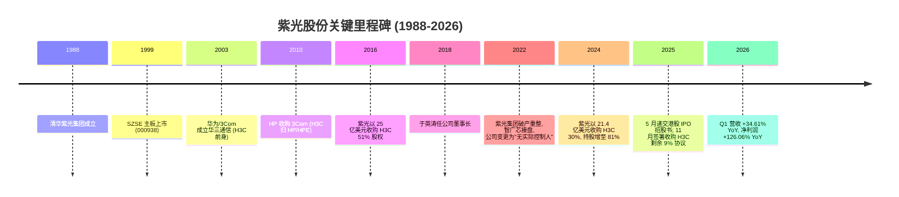
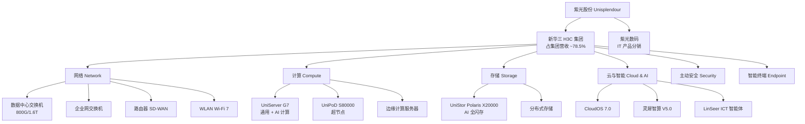
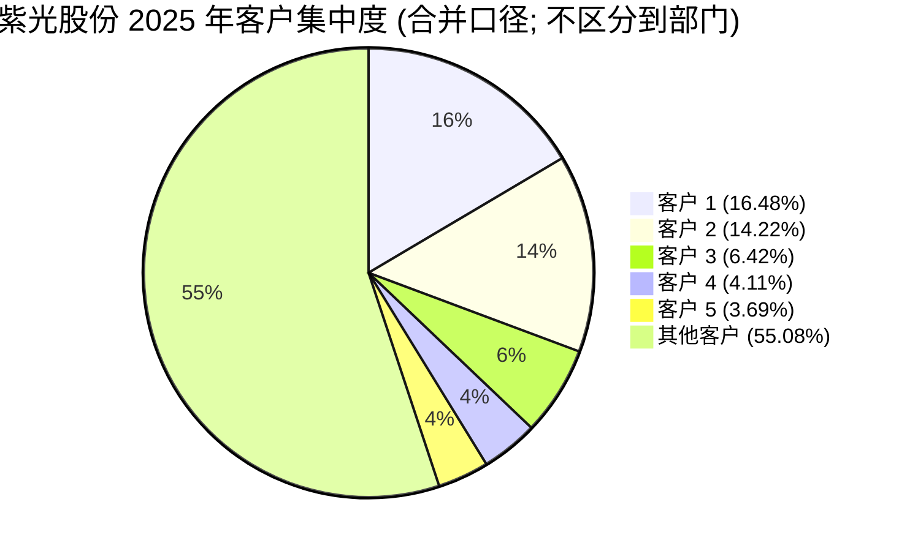
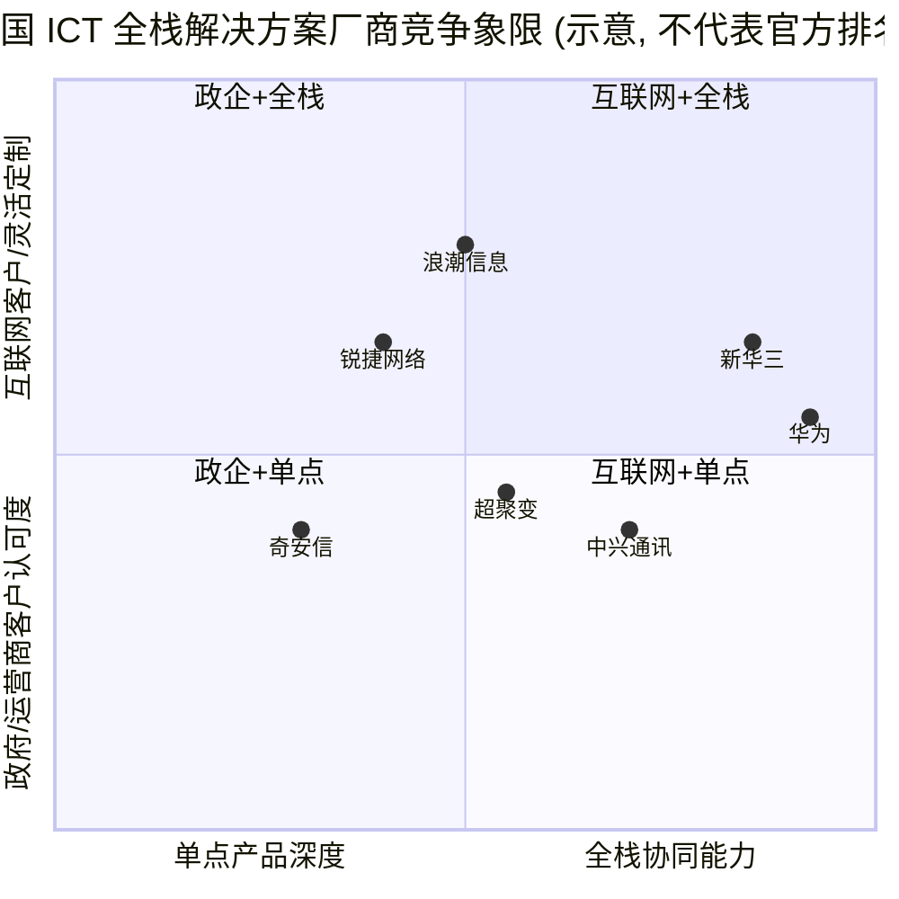
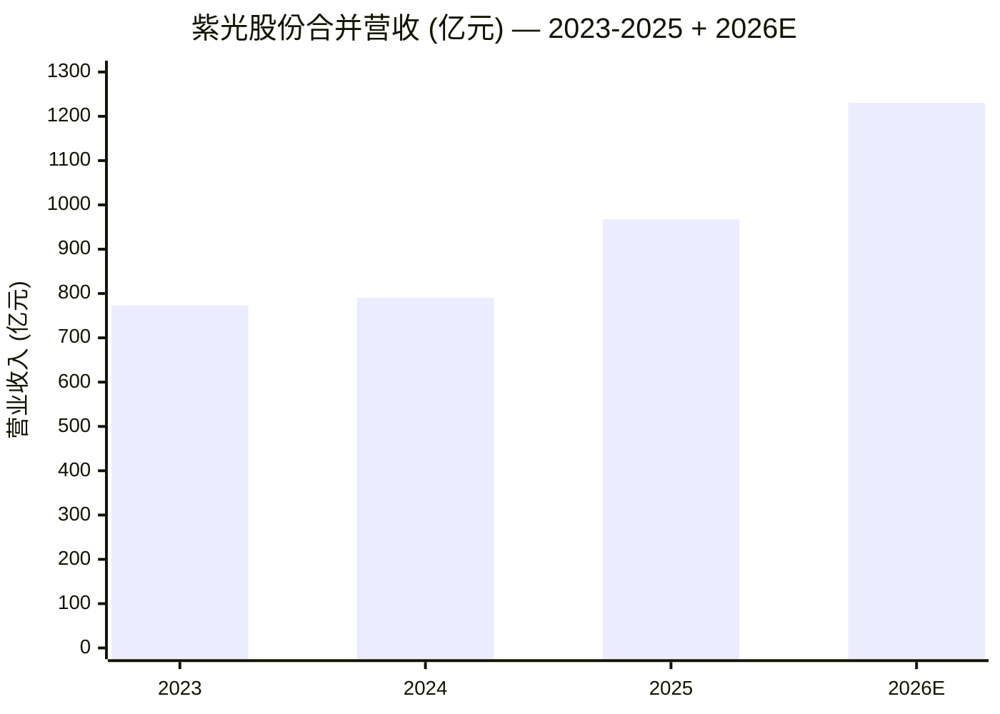

# 紫光股份 / Unisplendour Corporation Limited (SZSE:000938) — 公司研究

**主题：china-datacenter-hyperscale (中国数据中心-超大规模算力)**

**报告时点 / As of：2026-06-02**

**主要数据来源 / Primary sources：** 紫光股份[《2025 年年度报告》](https://static.cninfo.com.cn/finalpage/2026-04-15/1225101866.PDF)、[《2026 年第一季度报告》](https://static.cninfo.com.cn/finalpage/2026-04-29/1225231846.PDF)、[《2024 年年度报告》](https://static.cninfo.com.cn/finalpage/2025-04-29/1223369453.PDF)、新华三 H3C 官网与紫光股份港股 IPO 进展公告。

---

## 一、公司概览 / Company Overview

紫光股份有限公司（Unisplendour Corporation Limited，深交所主板：000938，英文缩写 UNIS）是中国领先的 **ICT 基础设施 / Information & Communications Technology infrastructure** 与 **数字化解决方案 / digital solutions** 提供商。根据公司[《2025 年年度报告》第 6 页](https://static.cninfo.com.cn/finalpage/2026-04-15/1225101866.PDF)的释义，公司"作为数字化及 AI 解决方案领导者，提供全栈智能化的信息通信（ICT）基础设施、云与智能平台，以及数字化转型及智能化升级解决方案"。其控股子公司 **新华三集团 / H3C Group** 是公司收入与利润的主要来源，占 2025 年集团营业收入约 78.5%（759.81 亿元 / 967.48 亿元）。

公司于 1999 年 11 月在深交所上市，注册地北京海淀区清华大学紫光大楼，办公地址同址。法定代表人为公司董事长兼新华三 CEO **于英涛 (Yu Yingtao)**。2025 年公司实现营业收入 **967.48 亿元 (RMB 96.75 bn)**，同比增长 22.43%；归母净利润 **16.86 亿元 (RMB 1.69 bn)**，同比增长 7.19%；扣非归母净利润 16.35 亿元，同比增长 12.26% [2025 年年度报告，第 8 页](https://static.cninfo.com.cn/finalpage/2026-04-15/1225101866.PDF)。最新报告期 2026 年 Q1 营收 279.85 亿元（+34.61% YoY），归母净利润 7.88 亿元（+126.06% YoY），显示 AI 智算需求驱动下增长大幅加速 [2026 年一季度报告，第 1-2 页](https://static.cninfo.com.cn/finalpage/2026-04-29/1225231846.PDF)。

**估值快照（截至 2026-06-02）：** 股价约 28.21 元 / 股，总市值约 RMB 80.65 bn，TTM 摊薄 EPS 约 0.74 元，对应 **TTM P/E ≈ 38×** [紫光股份 000938 行情 — Eastmoney](https://quote.eastmoney.com/sz000938.html?jump_to_web=true)。该估值在 A 股 ICT 板块属"中性偏高"区间——既反映新华三 AI 基础设施业务（智算交换机、AI 服务器、超节点）的强劲订单 Beat，也内含 AI Capex 周期的叙事溢价。2025 年 ROE 显著回升至 12.03%，较 2024 年 5.80% 提升 6.23 pp，是过去三年最高水平，提供了对高 P/E 的支撑 [2025 年年度报告，第 8 页](https://static.cninfo.com.cn/finalpage/2026-04-15/1225101866.PDF)。

**控股股东背景：** 公司控股股东为 **西藏紫光通信科技有限公司 / Tibet Unisplendour Communication Technology**，持股 28.00%；间接控股股东为 **北京智广芯控股有限公司 / Beijing Wise Road Capital-led Zhiguangxin**——后者于 2022 年通过法院主导的重整方案承接了原紫光集团有限公司 100% 股权，原实际控制人清华控股自此退出 [2025 年年度报告，第 7 页](https://static.cninfo.com.cn/finalpage/2026-04-15/1225101866.PDF)。**因此自 2022 年 7 月起，紫光股份处于"无实际控制人"状态**——这是理解公司治理与战略独立性的关键一点；财务投资者（智广芯背后含中关村发展集团、湖北科投、河北建投等地方国资）在战略上更趋"市场化经营 + 政企客户深耕"，而非清华系学院派路线。

紫光股份正积极推进 **港股 H 股发行 / Hong Kong H-share IPO**。公司 2025 年 5 月 29 日首次向港交所递交招股书，根据港交所上市规则，招股书有效期 6 个月，2025 年 11 月底前未能完成上市聆讯导致首份招股书失效，公司目前在准备更新数据再次递表 [紫光股份港股 IPO 招股书失效深度研究报告，2025-12-01](https://caifuhao.eastmoney.com/news/20251201145844992214370)。港股上市的核心战略意图是 **拓展海外融资渠道并支持新华三全球化扩张**——这亦将影响后续股权结构和估值锚定。

---

## 二、公司历史 / Company History

紫光股份的演变史是中国 ICT 产业 30 年缩影的一个独特样本——**清华大学校办企业起家 → 国有企业控股 → 收购西方核心资产 (3Com / 华三 / HPE) → 民营资本重整 → 全球化扩张**——五个阶段重叠交织。

**1988–1999：清华紫光起家。** 公司前身为清华大学校办的清华紫光（集团）总公司控股的资产，主营业务覆盖电子信息产业及环保工程 [2025 年年度报告，第 7 页](https://static.cninfo.com.cn/finalpage/2026-04-15/1225101866.PDF)。1999 年 11 月在深交所上市，控股股东为清华紫光（集团）总公司——彼时上市公司以"清华紫光"为主业代号，做扫描仪、DVD 等数字消费电子。

**2002–2015：业务调整与清华控股阶段。** 2002 年公司启动业务调整与资产置换，主营业务收敛至电子信息产业。2006 年 3 月，清华紫光集团将所持 42% 国有法人股无偿划转至清华控股有限公司，公司控股股东变更为清华控股。2012-2015 年间股权多次倒手于清华控股 → 启迪控股 → 西藏紫光卓远，但实际控制人始终为清华控股 [2025 年年度报告，第 7 页](https://static.cninfo.com.cn/finalpage/2026-04-15/1225101866.PDF)。

**2016：里程碑级收购——以 25 亿美元拿下华三 51%。** 2016 年 5 月，紫光股份完成非公开发行 A 股股票，紫光通信认购 5.43 亿股（占非公开发行后总股本的 52.13%），成为公司控股股东。同月，公司通过全资子公司 **紫光国际信息技术有限公司 / Unis International** 以约 25 亿美元从 HPE 手中收购了 **华三通信 / H3C Technologies** 51% 股权——这是当时中国 ICT 行业最大宗的跨境并购之一。华三的前身可追溯至 2003 年华为与 3Com 合资成立的 **杭州华三通信**——华为后于 2006 年出售股份给 3Com，3Com 又于 2010 年被 HP 收购。紫光接手后，新华三集团有限公司成立，HPE 保留 49% 股权，紫光国际持有 51%——这一股权结构延续了 8 年 [新华三股权变更历史 — 新浪科技，2025-11-29](https://finance.sina.com.cn/tech/roll/2025-11-29/doc-infyzkhi8511985.shtml)。

**2022：紫光集团破产重整——治理结构剧变。** 2022 年 7 月，紫光集团有限公司完成破产重整，**智广芯 / Zhiguangxin (智广芯控股)** 承接了紫光集团 100% 股权，清华控股不再持有紫光集团股权。紫光集团更名为"新紫光集团有限公司"。**重整后公司实际控制人变更为"无实际控制人"，智广芯成为间接控股股东，紫光通信仍为直接控股股东** [2025 年年度报告，第 7 页](https://static.cninfo.com.cn/finalpage/2026-04-15/1225101866.PDF)。智广芯背后的财团包括北京智路、北京建广、湖北科投、河北建投等地方国资及产业基金，重构后的紫光定位为"市场化运营的国资背景科技集团"。

**2024–2025：彻底收购新华三 + 港股 IPO 启动。** 2024 年 5 月 24 日，紫光国际与 HPE 子公司 H3C Holdings Limited 及 Izar Holding 签署修订后的卖出期权行权协议，以约 **21.43 亿美元 / USD 2.14 bn** 收购新华三 30% 股权（按 EV 约 RMB 51.5 bn 估值）；2024 年 9 月 4 日完成交割，紫光国际持股增至 81%，HPE 开曼持股降至 19% [紫光股份如期收购新华三股权 — 新浪科技，2024-09-05](https://finance.sina.com.cn/tech/roll/2024-09-05/doc-incnckpe8824664.shtml)。2025 年 11 月 17 日，紫光国际、信华智联、中信金融资产、长石智华、招华信通分别签署股份购买协议，分别收购 HPE 开曼所持剩余 19% 中的 1.80%、3.64%、2.65%、0.96% 和 0.95% 股份。**两轮交割完成后，HPE 彻底退出新华三股权结构，紫光国际持股将从 81% 提升至 87.98%** [关于紫光国际与投资者受让新华三少数股东所持剩余 9% 股权的公告，2025-11-29](http://file.finance.sina.com.cn/211.154.219.97:9494/MRGG/CNSESZ_STOCK/2025/2025-11/2025-11-29/11649742.PDF)。同年 5 月公司启动港股 IPO 程序，2025 年 5 月 29 日向港交所递交招股书 [谋求港股上市 紫光股份全球化布局"资本之棋" — 21 经济网，2025-03-11](https://www.21jingji.com/article/20250311/d65101e777d73b713d401f66fb422c7a.html)。

**关键时间轴 (Mermaid)：**

---

## 三、管理团队 / Management Team

按照公司研究方法论，只覆盖创始人与现任 CEO 两位关键人物。紫光股份属于校办企业起家、几经股权重组的复杂治理结构，因此"创始人"严格意义上指 1988 年清华紫光集团创办人；现任经营层核心则是 **于英涛 (Yu Yingtao)**——同时担任公司董事长与新华三 CEO。两者为同一人难以成立，故下文分述。

**于英涛 (Yu Yingtao)，公司董事长兼新华三集团总裁兼 CEO（现任经营领袖，2018 至今）。** 1964 年生，山东大学学士（1985 届），后获得美国纽约州立大学工商管理硕士、法国雷恩商学院工商管理博士，国务院特殊津贴专家 [于英涛履历 — 经历网](https://www.jili20.com/article/1909614229936746497)、[于英涛 — 百度百科](https://baike.baidu.com/item/%E4%BA%8E%E8%8B%B1%E6%B6%9B/10105563)。其职业生涯横跨政府部门、电信运营商与 ICT 设备厂商三大领域：1980 年代后期到 1994 年在烟台市政府经济部门、山东省政府及国家部委工作 9 年，积累中国政企客户网络；1994 年 12 月加入中国联通烟台分公司任总经理，开启在 **中国联通 / China Unicom** 长达 20 年的运营商生涯。在联通历任市场营销部副总经理（2002）、终端管理中心总经理兼联通华盛总经理（2005）、销售部首任总经理（2010）、浙江省分公司总经理（2011）等核心岗位 [通信历史连载 316-H3C 之 2016 年空降的第四任总裁 — 知乎](https://zhuanlan.zhihu.com/p/616156258)。**这段经历奠定了他在中国三大运营商总部和省公司层面的深度人脉，对今日紫光在运营商集采（中国移动、电信、联通、铁塔）中的中标位置至关重要。**

2015 年 8 月，于英涛加入紫光集团出任全球执行副总裁；2016 年 5 月——也即紫光完成 H3C 51% 股权收购后的第二个月——出任新华三集团总裁兼 CEO，是 H3C 收购完成后的第四任总裁。2018 年 4 月被选举为紫光股份董事长。他主导了 H3C 的"再造"：从一家服务于本地市场、依附于 HPE 全球产品线的合资企业，到 2025 年自主研发"全栈智能 ICT 基础设施"——包括 UniServer 服务器、UniPoD 超节点、UniStor Polaris X20000 AI 存储、灵犀智算解决方案、LinSeer ICT 智能体等核心产品矩阵的本土化与高端化 [2025 年年度报告，第 14-17 页](https://static.cninfo.com.cn/finalpage/2026-04-15/1225101866.PDF)。**于英涛在公司及其重要子公司新华三的薪酬结构高度依赖业绩奖金**——根据紫光股份港股 IPO 招股书相关披露，他在 2024 年全年薪酬超过 800 万元人民币 [紫光股份赴港 IPO：60 岁董事长于英涛薪酬超 800 万 — 瑞财经](https://rccaijing.com/news-7334058616834160192.html)。考虑到 2025 年公司归母净利润同比仅 +7.19% 而扣非归母 +12.26%，叠加 H3C 子公司净利润 +12.30% YoY，他的激励兑现度在 2025-2026 周期仍有提升空间。

**创始人语境与组织结构变化。** 紫光股份作为 1988 年清华紫光集团下属的上市平台，1999 年上市时的"创始团队"已多次更换，原清华大学背景的创始核心人物如已故的张本正等人早已退场。**自 2022 年紫光集团重整、清华控股退出后，公司事实上已经从"清华系"切换为"市场化国资 + 职业经理人"治理模式**——于英涛、新华三 COO 王巍、CFO 秦蓬等核心经营层均为运营商或 ICT 行业出身的职业经理人。因此本报告不再单独追溯"清华系创始人"的轨迹，而是将于英涛视为紫光股份现代化经营时代（2016 后）的实质创始/再造者。

---

## 四、产品与服务 / Products & Services

这是本报告最核心章节。紫光股份及其控股子公司新华三的产品矩阵覆盖 **"云-网-安-算-存-端 / Cloud-Network-Security-Compute-Storage-Endpoint"** 六大方向，是中国市场上少数能与华为正面竞争"全栈 ICT 基础设施"的厂商，也是 2025 年 AI 智算 Capex 浪潮中本土最受益的纯粹"卖铲人"之一。

**4.1 产品矩阵概览（按 2025 年年报披露的六大类）**

引用公司 [2025 年年度报告，第 11 页](https://static.cninfo.com.cn/finalpage/2026-04-15/1225101866.PDF) 的原文表述：

> 主要产品及服务包括：（1）网络设备：交换机、路由器、WLAN、SDN、PON、智能管理与运维服务等；（2）服务器：通用计算服务器、人工智能计算服务器、关键业务计算服务器、边缘计算服务器等；（3）存储产品：企业级智能全闪存存储、企业级智能混合闪存存储、分布式存储、数据备份与保护、存储网络设备等；（4）云与智能：云操作系统、虚拟化平台、超融合产品、大数据平台、数据库等；（5）主动安全：边界安全（包括防火墙、视频网关、抗 DDOS 等）、应用安全、数据安全、密码安全、工控安全、终端安全、安全管理、安全检测与审计、云安全等领域产品及专业安全服务；（6）智能终端：商用笔记本电脑、商用台式机、智慧云屏、AI 工作站等。

**4.2 网络设备（紫光最强势的护城河，约占新华三收入的"半壁江山"）**

公司在 [2025 年年度报告第 13 页](https://static.cninfo.com.cn/finalpage/2026-04-15/1225101866.PDF) 自述："根据 IDC 相关统计数据，公司网络、计算、存储、安全、云计算等产品市场占有率均位居前列。"年报随即给出 2025 年关键市场地位数据：

> 2025 年，公司在中国企业网交换机市场份额 36.1%，排名第一；中国以太网交换机市场份额 34.5%，排名第二；中国企业网园区交换机市场份额 36.2%，排名第二；中国数据中心交换机市场份额 33.1%，排名第二；中国企业网路由器市场份额 31.5%，排名第二；中国企业级 WLAN 市场份额 27.9%，持续位列第一。

**中文释义 / Plain-language gloss：** 网络设备 (network equipment) 是数据中心和企业园区的"血管系统"——**交换机 (switch)** 在数据中心机柜内/机柜间传输算力流量；**路由器 (router)** 跨数据中心和广域网传输数据；**WLAN (wireless LAN, 无线局域网)** 接入终端设备。在 AI 智算中心场景下，**数据中心交换机 (data center switch)** 是 AI 训练集群中 GPU 之间的"高速公路"，对带宽、延迟和拥塞控制要求极高。

新华三在网络细分市场的强势地位由 30 年技术沉淀 + Comware 自研网络操作系统加持。2025 年新华三发布了多项关键产品：（1）**面向极速交易场景的新一代国芯超低时延交换机**，在国芯 L3 设备中实现行业首推"算力快线解决方案"，大幅提升跨域传输效率；（2）新一代 SD-WAN 智能路由器；（3）**启动路由器 RISC-V CPU 深入研究和定制化开发**——这是国产化替代背景下，公司从依赖国际芯片到自研 SoC 的战略性跃迁；（4）数据中心交换机和高端路由器成功通过 **欧洲高级网络测试中心 (EANTC) 2025 互通性测试**——为海外市场拓展提供国际认证 [2025 年年度报告，第 17 页](https://static.cninfo.com.cn/finalpage/2026-04-15/1225101866.PDF)。在无线领域，公司发布多款全场景 **Wi-Fi 7** 新产品并推出"智能制造无线网络解决方案"，实现工业场景的超低时延、高可靠性无线网络。

*分析师观点 / Analyst view：* 新华三在数据中心交换机市场处于"双寡头"地位——华为约 35.8% 第一、新华三约 32.4% 第二 [AI 算力系列之交换机：行业概况、技术趋势、产业链、市场格局（2025）— 电子工程专辑](https://www.eet-china.com/mp/a416915.html)。考虑到 2026-2027 年 800G/1.6T 高速交换机的产品周期，以及中国电信、移动、联通三大运营商在 AI 大模型基础设施层面的集采放量，新华三网络设备业务收入有望维持 25-35% YoY 高增速。

**4.3 计算 / 服务器（增长最快、AI 智算最核心的产品线）**

公司在 [2025 年年度报告，第 13 页](https://static.cninfo.com.cn/finalpage/2026-04-15/1225101866.PDF) 披露："2025 年，中国 X86 服务器市场份额 12.5%，位列第三"。新华三在通用服务器市场之外，**重点押注 AI 服务器与超节点 (super pod) 这一新的产品形态**。引用年报第 16 页对核心产品的描述：

> 公司 H3C UniServer G7 系列模块化服务器以丰富的软硬件生态兼容性，适用于集群训练、训推一体、边缘推理等场景；H3C UniPoD S80000 超节点产品，大幅提升通信效率和模型算力利用率，关键部件实现液冷散热，为万亿参数模型训练提供强大支持，兼具高效与绿色特性。

**中文释义 / Plain-language gloss：** 超节点 (super pod / scale-up domain) 是 AI 训练集群中比单台服务器更大、比传统机架更紧密耦合的计算单元——通过高带宽内部互联将 32-256 颗 GPU 紧密耦合为一个"逻辑单一计算节点"，专门解决大模型训练中跨节点通信带宽瓶颈。NVIDIA 的 NVL72 是国际同类产品标杆，UniPoD S80000 是新华三对标的国产化方案。**液冷散热 (liquid cooling)** 包括冷板式 (cold plate) 和浸没式 (immersion)——前者通过金属冷板贴合芯片导热，后者将服务器整体浸入电介质液——为高密度 AI 算力的能效与可靠性提供支撑 [2025 年年度报告，第 4-5 页](https://static.cninfo.com.cn/finalpage/2026-04-15/1225101866.PDF)。

UniPoD S80000 在 2025 年的发布与首批商业落地是公司 AI 战略的关键拐点——它意味着新华三从"卖通用 X86 服务器 + GPU 加卡"升级到"提供 GPU 互联拓扑级别的整体方案"，对竞争对手浪潮信息、超聚变形成新的差异化。**互联网定制业务是该产品的主要落地场景**——年报第 18 页提到："在互联网客户市场，公司进一步拓展定制化业务，与多家头部互联网客户持续推进大规模算力集群与超节点系统建设，支持其核心业务及新型 AI 应用场景落地"——尽管未点名客户，但市场推测主要客户包括字节跳动、阿里、腾讯等头部互联网公司。

**4.4 存储 / Storage（AI 推理时代的隐形赢家）**

新华三推出的 **H3C UniStor Polaris X20000 系列**——全闪存 (all-flash) 与混合闪存企业级存储产品——在 2025 年 **AI 性能基准评测组织 MLCommons® 公布的 MLPerf® Storage v2.0 基准测试结果中"荣登高性能 RoCE AI 存储解决方案榜首"**，并获 2025 年中国数据与存储峰会"AI 存储产品金奖"与"分布式存储产品金奖" [2025 年年度报告，第 17 页](https://static.cninfo.com.cn/finalpage/2026-04-15/1225101866.PDF)。

**中文释义 / Plain-language gloss：** RoCE (RDMA over Converged Ethernet, 基于融合以太网的远程直接内存访问) 是 AI 训练 / 推理场景中 GPU 集群与存储设备之间的低延迟、高带宽数据传输协议；MLPerf Storage 是 AI 性能基准的国际权威评测——能在该测试中夺冠，说明 Polaris X20000 在大模型训练数据加载、推理 token 处理速度上具备国际竞争力。年报描述："推出 AI 数据平台解决方案，打通'算力'和'存力'间的效率壁垒，实现'以存强算'，提升大模型推理性能与 token 处理速度。"

**4.5 云与智能 / Cloud & AI（中长期变现潜力）**

公司在 2025 年发布 **灵犀智算解决方案 V5.0 / LingXi Intelligent Compute V5.0**——根据 [2025 年年度报告，第 16 页](https://static.cninfo.com.cn/finalpage/2026-04-15/1225101866.PDF)，该方案"全面支持私域训推、大规模训练、垂直行业类 AI 应用开发三类智算中心的建设需求；与多家国产 GPU 厂商深入合作，构建开放兼容的智算中心方案"。配套发布的有：

- **LinSeer ICT 智能体 / LinSeer ICT Agent**——通过中国信通院"可信 AI 运维智能体评估"，荣获业内当前最高评级 4+ 级；
- **LinSeer Cube 大模型一体机**——"深度融合算力、算法与行业 Know-How，实现开箱即用分钟级应用部署"；
- **百业灵犀私域大模型**——为行业客户提供"芯片研发与算法模型深度协同"（芯模联动）的能力。
- **CloudOS 7.0 云操作系统**——"布局 AI 智能云场景，支持 AI 应用云化"。

**4.6 主动安全 / Security & 智能终端 / Endpoint（防御端 + 增值业务）**

主动安全产品线覆盖防火墙、应用安全、数据安全、密码安全、工控安全、终端安全等——2025 年 **中国 UTM 防火墙市场份额 21.1%，位列第三** [2025 年年度报告，第 13 页](https://static.cninfo.com.cn/finalpage/2026-04-15/1225101866.PDF)。新华三的国产化安全网关在电信运营商、国有大型银行、省级政务云、国家级电网、智慧交通等场景实现规模化部署；新华三入选 2025 年 **Gartner® 园区接入安全代表厂商** [2025 年年度报告，第 17 页](https://static.cninfo.com.cn/finalpage/2026-04-15/1225101866.PDF)。智能终端线包括商用笔记本电脑、商用台式机、智慧云屏、AI 工作站——2025 年推出业内首发 MegaBook 双系统平板与 LinSeer MegaCube 桌面级 AI 一体机。

**4.7 产品生态闭环——为什么是"算力 × 联接"而非"算力 + 联接"？**

公司将自身战略表述为"算力 × 联接 / Compute × Connect"——这不是简单的产品堆砌，而是 **强调网络（联接）与计算（算力）的乘数效应**：在 AI 训练集群中，单台 H100 / 国产 GPU 服务器的算力被网络带宽和延迟所制约；UniPoD 超节点通过高速 RoCE 网络将 GPU 紧密耦合，使得 1 + 1 > 2 的算力涌现成为可能。这一闭环串联了第 4.2 节的高端交换机、第 4.3 节的 UniPoD 超节点、第 4.4 节的 RoCE AI 存储以及第 4.5 节的灵犀智算平台调度——这是新华三相对单一产品厂商（如浪潮信息只做服务器、锐捷网络只做交换机）的本质差异，也是 30 年 ICT 产业积累的护城河。

---

## 五、客户与上市策略 / Customers & Go-to-Market

**5.1 客户结构（高度集中但高质量）**

根据 [2025 年年度报告，第 22 页](https://static.cninfo.com.cn/finalpage/2026-04-15/1225101866.PDF)，2025 年公司前五名客户合计销售额 **434.54 亿元 (RMB 43.45 bn)**，占年度销售总额比例 **44.92%**（合并口径，去年同期为 39.55%）。前五名客户的关联方销售额占比为 0.00%（即均为第三方）。具体分布如下：

| 排名 | 客户名称 | 销售额 (RMB) | 占合并营收比例 |
|---|---|---|---|
| 1 | 客户 1 | 159.41 亿元 | 16.48% |
| 2 | 客户 2 | 137.53 亿元 | 14.22% |
| 3 | 客户 3 | 62.13 亿元 | 6.42% |
| 4 | 客户 4 | 39.81 亿元 | 4.11% |
| 5 | 客户 5 | 35.66 亿元 | 3.69% |
| **合计** | | **434.54 亿元** | **44.92% (合并口径)** |

**注：** 公司年报未具名前五大客户。结合行业惯例与年报第 13 页对客户基础的描述——"参与国家电子政务外网、20 多个省级和 300 多个地市县级地区的电子政务外网建设；服务 90% 以上的电力能源企业，包括国家电网、南方电网、中国石油、中国石化等；服务超过 4,000 家中国金融机构；联合运营商累计建设 48 个中大型智算中心，探索算力运营合作模式；全面参与四大运营商骨干网、城域网建设"——可以合理推测前两大客户（16.48% 与 14.22%）大概率为中国移动、中国电信、中国联通或中国铁塔中的两家。**但年报未具名披露的事实本身就是一个信息——这是上市公司层面的合并口径，未细分到新华三或紫光数码各自的前五大。** 因此本报告不对前五大客户做具名 inference，遵循"披露事实即结论"的原则。

**5.2 行业垂直分布（高质量政企客户基础）**

公司 [2025 年年度报告，第 13 页](https://static.cninfo.com.cn/finalpage/2026-04-15/1225101866.PDF) 详细披露了行业客户覆盖：

- **政府**：参与 19 个国家部委(局)级、26 个省级和 200 多个地市县级地区的政务云开发工作；参与国家电子政务外网、20 多个省级和 300 多个地市县级地区的电子政务外网建设；与杭州、郑州、咸阳、马鞍山、贵阳、西宁等地政府联合打造"图灵小镇"算力建设及运营模式。
- **运营商**：联合运营商累计建设 **48 个中大型智算中心**，探索算力运营合作模式；全面参与四大运营商骨干网、城域网建设；核心路由器已部署电信级 IP 大网；产品解决方案服务四大运营商总部及省级分公司。
- **互联网**：与多家互联网企业从网络、服务器基础架构向前沿技术预研、功能特性联合开发、解决方案深度融合等方向延伸，是多家头部互联网企业的战略级合作伙伴。
- **金融**：深耕金融行业 30 年，服务超过 4,000 家中国金融机构；金融智算解决方案服务多家头部银行及券商等客户。
- **能源**：服务 **90% 以上的电力能源企业**，包括国家电网、南方电网、中国石油、中国石化、国家管网、发电集团、矿山企业等。
- **交通**：服务全国 47 个城市的 300 余条地铁线路；服务国铁集团及 18 个铁路局集团公司；参与全国 29 个省份高速公路取消省界收费站重大工程；助力 200 余家机场、20 余个大型港口码头数字化转型。
- **教育与医疗**：服务多所中国双一流大学；参与国家人工智能产教融合创新平台项目（首批）12 所高校中的 7 所；为多家全国百强医院提供服务；助力全国 1,500 余家三甲医院数字化转型升级。

**5.3 销售模式（直销与经销并重，2025 年直销显著加速）**

根据 [2025 年年度报告，第 19 页](https://static.cninfo.com.cn/finalpage/2026-04-15/1225101866.PDF) 披露：

| 销售模式 | 2025 年营收 (RMB) | 占比 | YoY 增速 |
|---|---|---|---|
| 经销 | 481.82 亿元 | 49.80% | +2.23% |
| 直销 | 485.67 亿元 | 50.20% | +52.28% |

**直销占比首次过半，且同比 +52.28%**——这是 AI 智算订单大量为运营商、互联网大客户定制化业务的直接反映；而经销渠道（紫光数码 IT 产品分销）则呈现 -12.72% 的负增长，体现整个 IT 分销业务向高附加值定制化业务的结构性转移 [2025 年年度报告，第 19 页](https://static.cninfo.com.cn/finalpage/2026-04-15/1225101866.PDF)。

**5.4 地区分布与全球化（海外业务大幅加速）**

2025 年国内营收 **920.38 亿元**（占比 95.13%，+21.17% YoY），国外营收 **47.11 亿元**（占比 4.87%，+53.59% YoY）。新华三国际业务 2025 年营收 **46.20 亿元，同比增长 58.45%**；2026 年 Q1 新华三国际业务进一步增长 56.62% YoY 至 16.46 亿元 [2025 年年度报告，第 15 页](https://static.cninfo.com.cn/finalpage/2026-04-15/1225101866.PDF)、[2026 年一季度报告，第 1 页](https://static.cninfo.com.cn/finalpage/2026-04-29/1225231846.PDF)。

公司海外子公司布局：在亚洲、欧洲、非洲、拉美等地区已设立 22 个海外子公司，服务网络覆盖 180 余个国家及地区，海外合作伙伴近 3,800 家 [2025 年年度报告，第 14、18 页](https://static.cninfo.com.cn/finalpage/2026-04-15/1225101866.PDF)。2025 年公司推出海外子品牌 **Aolynk**，专注为全球中小企业提供一站式数字化赋能解决方案。具体战略项目落地于哈萨克斯坦、新加坡、泰国、南非、乌兹别克斯坦、马来西亚、西班牙、菲律宾等多国——这一布局明显侧重"一带一路"和东南亚新兴市场，规避了与美欧主流 ICT 大厂（Cisco、Juniper、Arista）的正面对抗。

**5.5 港股 IPO 与资本运作（2025-2026 关键变量）**

公司 2025 年 3 月 7 日董事会审议通过启动境外发行 H 股，5 月 29 日向港交所递交招股书，根据港交所规则招股书有效期为 6 个月，2025 年 11 月底未能完成上市聆讯导致首份招股书自动失效 [紫光股份港股 IPO 招股书失效深度研究报告 — 财富号，2025-12-01](https://caifuhao.eastmoney.com/news/20251201145844992214370)。公司目前在准备更新数据重新递表，预计 2026 年完成挂牌。**港股上市的核心战略意图**：

1. **支持新华三全球化扩张所需资金**——海外子公司、本地化研发与渠道建设需要美元 / 港币融资；
2. **解锁估值"A 股 / 港股两地双轨溢价"**——若港股 H 股相对 A 股折价 20-30%，新增国际资本可对冲首次发行折价；
3. **优化股东结构**——降低单一国资股东集中度，引入更多国际机构投资者。

---

## 六、行业概览 / Industry Overview

**6.1 中国数字基础设施市场 (TAM)**

公司在 [2025 年年度报告，第 12 页](https://static.cninfo.com.cn/finalpage/2026-04-15/1225101866.PDF) 援引第三方研究："据弗若斯特沙利文 / Frost & Sullivan 预测，2029 年中国数字基础设施市场规模将达到 1.4 万亿元，2024 年至 2029 年期间年复合增长率将达 17.7%"。这是新华三所处赛道的最广义 TAM。

**6.2 中国 AI 核心产业规模**

年报援引："2025 年我国人工智能核心产业规模突破 1.2 万亿元"——这一数字与国务院《关于深入实施"人工智能 +"行动的意见》、工业和信息化部《工业互联网和人工智能融合赋能行动方案》、国家数据局《数字中国建设 2025 年行动方案》等政策文件支持。

**6.3 中国数据中心交换机市场 (新华三第二大盈利锚)**

根据 [AI 算力系列之交换机：行业概况、技术趋势、产业链、市场格局（2025）— 电子工程专辑](https://www.eet-china.com/mp/a416915.html) 综合的市场数据：中国数据中心交换机市场被华为与新华三两家寡头瓜分约 70% 份额——华为约 35.8%，新华三约 32.4%（与年报披露的 33.1% 接近）；二线包括锐捷网络、中兴通讯各约 5-10%。**这一市场结构对新华三构成长期"双寡头" tailwind**——AI 训练集群每提升 1 个量级，对 800G/1.6T 高速以太网交换机的单位算力需求都呈非线性增长。

**6.4 中国 X86 服务器市场（新华三第三大业务）**

根据 [IDC 最新国内服务器和全球服务器市场竞争格局 — 电子工程专辑](https://www.eet-china.com/mp/a421132.html)：2024 年中国 X86 服务器市场——浪潮信息 30.8% 第一、超聚变 13.3% 第二、新华三 12.6% 第三（与年报 2025 年 12.5% 数据基本吻合）；联想 9.8%、宁畅 8.3%、中兴 6.5%。**服务器市场比交换机更分散、竞争更激烈**——浪潮信息凭借互联网客户深耕和大体量出货保持第一，超聚变（华为服务器业务剥离独立公司）以国产化卡位飞速崛起，新华三在企业级与电信级集采中维持稳定份额，但要从浪潮、超聚变手中抢份额并不容易。**电信运营商集采市场新华三排名第四（10.32% 份额）**[判断 2025 — 电信服务器市场 — 腾讯新闻，2025-01-13](https://news.qq.com/rain/a/20250113A07T3C00)——略低于中兴通讯 22.82%、浪潮信息 13.79%、超聚变 10.58%。

**6.5 行业增长驱动力（结构性多重支撑）**

- **AI 训练 / 推理算力 Capex 周期**：2025-2027 年全球 AI Capex 仍处于上行周期，中国头部互联网公司（字节、阿里、腾讯）和电信运营商均加速智算中心建设。年报第 11 页指出："以超节点为代表的新型算力基础设施正发展为主流需求，全面提升算力供给效率与产业赋能能力"。
- **国产化替代加速**：在 2025-2026 国家自主可控政策密集出台背景下，关键 ICT 基础设施（服务器、交换机、存储、操作系统）的国产化替代是政策驱动的"刚性需求"。新华三是国产化替代浪潮的核心受益者之一。
- **新型城镇化与"东数西算"工程**：政府主导的算力网络与区域算力中心建设——杭州、贵阳、咸阳、西宁等"图灵小镇"项目即是这一基础设施浪潮的具体表达。
- **800G / 1.6T 网络升级周期**：根据 [2025 年中国数据中心交换机行业发展现状及趋势分析 — 新浪财经，2025-09-23](https://finance.sina.com.cn/stock/relnews/hk/2025-09-23/doc-infrmtus0804434.shtml)："2025 年 800G 交换机已规模化应用，2026 年 1.6T 产品将落地，支撑 AI 集群带宽从 120T 升至 160T"——这是新华三高端产品线 ASP（单产品价格）维持上行的关键产品周期。

---

## 七、竞争格局 / Competitive Landscape

**7.1 主要竞争对手矩阵**

新华三在不同产品线面对不同的核心竞争对手——这是其作为"全栈 ICT 解决方案商"的天然结构：

| 产品线 | 主要竞争对手 (按市场份额排序) | 新华三相对位置 |
|---|---|---|
| 数据中心交换机 | 华为 (~35%)、新华三 (~33%)、锐捷、中兴 | #2 (双寡头) |
| 企业网交换机 | 新华三、华为、锐捷 | #1 (36.1%, 2025) |
| 企业级 WLAN | 新华三、华为、锐捷、Ruijie | #1 (27.9%, 2025) |
| 企业网路由器 | 华为、新华三、中兴 | #2 (31.5%, 2025) |
| X86 通用服务器 | 浪潮信息、超聚变、新华三 | #3 (12.5%, 2025) |
| 电信服务器 | 中兴、浪潮、超聚变、新华三 | #4 (10.32%) |
| AI 服务器/超节点 | 浪潮信息、超聚变、新华三、华为 | 头部之一 |
| 智算中心整体方案 | 华为、新华三、浪潮 | 头部之一 |
| 全闪存企业存储 | 华为、新华三、浪潮 | 头部 (MLPerf 2025 第一) |
| 防火墙 / UTM | 华为、奇安信、新华三 | #3 (21.1%, 2025) |

**7.2 与华为对比（最直接的竞争对手）**

华为是中国 ICT 设备的绝对市场龙头，与新华三的关系一言难尽。**历史关系**：新华三的前身"杭州华三通信" (H3C) 于 2003 年由华为与 3Com 合资成立，华为出技术、3Com 出渠道——这一历史让新华三的核心网络技术 (Comware 操作系统) 拥有与华为同源的"血缘"。**今日竞争**：在数据中心交换机、企业网交换机、园区网、WLAN 等关键品类，华为与新华三是直接竞争对手，且两家合计份额接近 70%，是典型的"双寡头"市场结构。**差异化竞争策略**：

- **新华三的相对优势**：（1）历史合作伙伴生态更深——金融、政务、能源等高端政企客户群中，新华三的"非华为"身份在 2018-2020 美国对华为制裁背景下反而成为差异化竞争优势——许多国有大型企业在采购选项中"既要 + 也要"地引入新华三作为多供应商替代方案；（2）海外市场无华为同等的政治阻力——新华三海外业务相对纯粹商业化；（3）"开放生态"定位——与多家国产 GPU 厂商（华为昇腾、摩尔线程、燧原、寒武纪等）保持开放兼容，避免"昇腾捆绑"。
- **华为的相对优势**：（1）全栈自研芯片（昇腾、鲲鹏、麒麟），自主可控程度更深；（2）研发投入和工程师规模数量级领先；（3）海外受限但国内政府/运营商客户中更受信任。

**7.3 与浪潮信息对比（服务器主战场）**

[浪潮信息 (SZSE:000977)](https://www.cninfo.com.cn/new/disclosure/stock?stockCode=000977) 是中国 X86 服务器市场绝对领导者（2024 年份额 30.8%），但其产品组合主要集中在服务器单品类，缺乏新华三在网络、安全、云、智能等的全栈协同能力。**新华三的差异化**在于"超节点 + 智算 + 安全 + 网络"的一体化方案——这在 2025-2027 年大模型训练集群"网络性能即算力性能"的时代，理论上具备结构性优势。**但浪潮的优势**在于深度互联网客户关系（字节、阿里、腾讯的大规模标准化服务器订单）、AI 服务器市场早期占位（NVIDIA H100 / H200 时代的国内"NV 服务器整合商"角色）。

**7.4 与超聚变对比（华为剥离后的新进入者）**

[超聚变数字技术 / xFusion](https://www.xfusion.com/) 是华为 2021 年将服务器业务剥离独立的公司，主要从华为承袭了 X86 服务器与鲲鹏服务器的产品线、客户关系和供应链能力。**超聚变在 2024 年以 13.3% 份额跃居中国 X86 服务器第二**，对新华三构成直接压力——但超聚变的产品线相对单薄（缺网络、缺存储、缺云、缺安全），全栈协同方面无法匹敌新华三。

**7.5 海外竞争（Cisco / Juniper / Arista）**

在海外市场，新华三主要面对 Cisco（思科）、Juniper（瞻博网络）和 Arista（阿里斯塔）等全球 ICT 设备龙头。**新华三的优势**：价格优势（30-50% 折扣）、面向新兴市场（东南亚、中东、非洲、拉美）的定制化服务、"中国基础设施 + 政府关系"的捆绑营销。**新华三的劣势**：缺乏 Cisco 那样的全球品牌认可度、海外销售网络密度仍在建设期、被欧美客户视为"中国厂商"存在政治审查风险。**这是港股 IPO 拓展海外能力的核心战略动机之一。**

---

## 八、市场机会 / Market Opportunity

**8.1 中国 AI 智算基础设施 Capex 拐点（核心机会）**

2025-2027 年是中国 AI 算力 Capex 的核心拐点期：

- **互联网客户**：字节跳动、阿里、腾讯三家头部互联网公司 2025 年 AI 资本支出年化超 2,000 亿元，且大概率在 2026 年再上一个台阶。新华三在互联网定制化超节点业务上是头部供应商。
- **电信运营商**：中国移动、中国电信、中国联通三大运营商 2025-2027 年算力网络 Capex 持续放量。年报披露："2025 年公司联合运营商累计建设 48 个中大型智算中心"——这一数字在 2026-2027 年有望再翻一番。
- **政府智算中心**：杭州、贵阳、西宁等"图灵小镇"模式扩展到更多省份和地市级行政区。
- **国央企**：中石油、中石化、国家电网等大型央国企在 2025-2027 年规划自建大型智算中心，新华三作为"安全可信 + 全栈方案"的国产化首选供应商之一明显受益。

**8.2 海外业务 (2026-2028 二阶段火箭)**

2025 年新华三国际业务收入 46.20 亿元，同比 +58.45%；2026 年 Q1 同比 +56.62%——以这一增速持续 3 年，国际业务 2027-2028 年规模有望达到 100-150 亿元，占新华三整体收入 12-15%，成为继国内政企业务后的第二增长极。**港股 IPO 完成后，海外业务有望加速放量**——融资资金大部分将投向海外子公司本地化生产、研发、渠道建设。

**8.3 国产化替代第二波（2026-2028）**

中国 2026-2028 年面临关键 ICT 基础设施"完全国产化"周期——新华三在路由器、交换机、服务器、操作系统、存储、安全等多个领域已实现国产化版本，并在政府、电力、金融等关键行业落地。年报第 17 页指出："加大路由器产品线国产化研发，实现从核心路由器到接入层路由器的全面国产化替换。"这一国产化进程的第二波（2026-2028）有望进一步替换余下的关键节点设备，为新华三提供 3-5 年的结构性需求。

**8.4 风险敏感型机会：超节点产品周期**

UniPoD S80000 是新华三 2025 年发布的旗舰超节点产品，其商业化进程将决定未来 2-3 年的高端产品 mix 和毛利率。如果 UniPoD 系列在 2026-2027 年实现 50-100 亿元年化销售规模，将显著拉动整体业务的盈利能力——但反之若产品落地慢于预期，则会拖累 ROE 上行速度。

**8.5 量化趋势 (Mermaid xychart)**

*2026E 按 2026 Q1 营收 279.85 亿元（+34.61% YoY）外推全年 +27% 计算约 1,230 亿元——这是基于现有 Q1 数据的高位假设，并非公司官方指引。*

---

## 九、风险评估 / Risk Assessment

按公司研究框架的 4 大风险类别 × 8-12 项细分风险展开。

**A. 公司特定风险 / Company-Specific Risks**

1. **"无实际控制人"导致的战略不确定性。** 2022 年紫光集团破产重整后，公司实际控制人变更为"无"，间接控股股东智广芯背后是多家地方国资和产业基金组成的财团。这一治理结构在战略稳定性上不及单一控股股东，重大战略决策（如港股 IPO、新华三定增、海外扩张）需要更复杂的多方协调。**缓解**：经营层（于英涛及核心管理团队）相对稳定，治理透明度较高，未来若智广芯进一步整合或地方国资战略调整，可能改变这一格局 [2025 年年度报告，第 7 页](https://static.cninfo.com.cn/finalpage/2026-04-15/1225101866.PDF)。

2. **新华三 H3C 19% 少数股权期权远期负债的财务影响。** 公司 2025 年年报特别披露："公司将与 H3C Holdings Limited 约定的新华三集团有限公司剩余 19% 股权的期权远期安排作为金融负债，对当期损益的影响金额为 -147,584,855.88 元" [2025 年年度报告，第 9 页](https://static.cninfo.com.cn/finalpage/2026-04-15/1225101866.PDF)；2026 年 Q1 的影响为 +148,469,886.40 元 [2026 年一季度报告，第 2 页](https://static.cninfo.com.cn/finalpage/2026-04-29/1225231846.PDF)——金融负债的公允价值变动给单季度利润带来约 ±1.5 亿元的波动，会增加扣非业绩的"噪声"。**缓解**：2025 年 11 月签署的协议正在推进 HPE 彻底退出，预计 2026 年完成全部交割后该负债项消失，未来季度的利润波动将显著平滑。

3. **客户高集中度（前两大客户合计 30.7%）。** 前两大客户 16.48% + 14.22% 合计占合并收入约 30.7%——高度集中。如果其中之一战略调整、订单转移或采购节奏放缓，会对短期收入产生显著冲击。**缓解**：这两大客户高度可能是中国移动 / 中国电信 / 中国联通 / 中国铁塔中的两家——国家级运营商客户的整体支出体量持续上行，且新华三在其供应商体系中地位稳固 [2025 年年度报告，第 22 页](https://static.cninfo.com.cn/finalpage/2026-04-15/1225101866.PDF)。

4. **应收账款规模高企。** 2025 年末应收账款 **126.63 亿元** (占总资产 13.15%) [2025 年年度报告，第 28 页](https://static.cninfo.com.cn/finalpage/2026-04-15/1225101866.PDF)。这一规模与公司"政府 + 运营商 + 大客户"的客户结构相符——政企客户回款周期普遍较长（90-180 天）。2025 年公司因应收账款问题计提的资产减值损失 -8.75 亿元——是利润表中的非现金减项 [2025 年年度报告，第 28 页](https://static.cninfo.com.cn/finalpage/2026-04-15/1225101866.PDF)。**缓解**：政企客户违约率历史上较低，且应收占总营收比例（126.63/967.48 ≈ 13.1%）相对合理。

**B. 行业 / 市场风险 / Industry & Market Risks**

5. **华为强势竞争压力。** 华为在数据中心交换机、企业网交换机、园区网等核心品类与新华三构成双寡头但是华为更强势的格局——华为约 35.8% vs 新华三约 32.4%。一旦华为加大对政企客户的市场投入（如降价、捆绑销售、加大销售力量），新华三的份额可能面临侵蚀 [AI 算力系列之交换机 — 电子工程专辑，2025](https://www.eet-china.com/mp/a416915.html)。**缓解**：政企客户多供应商策略是结构性的，华为无法独占；新华三在与 HPE 的渊源、产品线开放性方面具备差异化定位。

6. **AI Capex 周期反转风险。** AI 训练基础设施 Capex 在 2025-2027 年是上行周期，但 2028-2029 年可能出现回落（参照 4G/5G、云计算 Capex 周期）。一旦头部互联网公司和运营商 AI Capex 减速，新华三 AI 智算业务增速将明显放缓。**缓解**：公司在 AI 推理（vs 训练）和企业级 AI 应用方向上也有布局，可缓冲训练 Capex 退坡的冲击；同时国产化替代周期可提供 3-5 年的结构性需求支撑。

7. **服务器市场竞争激烈（浪潮、超聚变对手强大）。** 服务器市场新华三仅排第三 (12.5%)，远低于第一名浪潮信息 (30.8%)。在 AI 服务器细分市场，浪潮的互联网客户深耕和超聚变的国产化卡位都对新华三构成压力。**缓解**：新华三的差异化在于"全栈方案 + 网络协同 + 安全集成"，而非单点服务器低价战。

**C. 财务风险 / Financial Risks**

8. **毛利率持续走低。** ICT 基础设施与服务业务毛利率从 2024 年的约 22.2% 降至 2025 年的 16.51%（同比 -5.72 个百分点）；分销与供应链业务毛利率仅 5.20% [2025 年年度报告，第 19-20 页](https://static.cninfo.com.cn/finalpage/2026-04-15/1225101866.PDF)。直销业务毛利率仅 7.37% (vs 经销 21.87%)——这反映 AI 智算订单中"服务器 + GPU 整机"业务比例上升带来的"卖卡 + 加价"模式毛利率结构性压力。**缓解**：UniPoD 超节点等高附加值产品的占比提升、AI 软件平台变现（灵犀智算 / LinSeer ICT 智能体）将逐步对冲毛利率压力。

9. **研发投入相对营收占比下滑（5.12% vs 2024 年 6.46%）。** 2025 年研发投入 49.53 亿元，同比 -2.92%；占营收比例从 6.46% 降至 5.12%——这与营业收入 +22.43% 高增长背景下绝对研发金额未跟上的不匹配 [2025 年年度报告，第 26 页](https://static.cninfo.com.cn/finalpage/2026-04-15/1225101866.PDF)。研发人员从 6,902 人减少 743 人至 6,159 人，下降 10.76%——这背后可能是公司在 2025 年的成本控制压力。**缓解**：公司专利累积超 16,000 件，其中 90% 以上为发明专利；2025 年研发产出（UniPoD、Polaris X20000、LinSeer 等）仍属高质量，但 2026 年若研发投入继续相对放缓，长期产品迭代速度可能下滑。

10. **港股 IPO 招股书已失效，再融资执行风险。** 2025 年 5 月递交的首份港股招股书已于 2025 年 11 月失效，公司需更新数据重新递表。**风险**：港股市场情绪、汇率、监管审批节奏均可能影响最终上市时间；如果 2026 年完成上市失败或推迟，公司全球化扩张的资本支持将受影响 [紫光股份港股 IPO 招股书失效深度研究报告 — 财富号，2025-12-01](https://caifuhao.eastmoney.com/news/20251201145844992214370)。

**D. 宏观 / 监管风险 / Macro & Regulatory Risks**

11. **中美科技摩擦升级风险（供应链端口风险）。** 公司核心产品依赖国际芯片（部分 GPU、网卡 ASIC、高端 CPU）——若美国对华芯片出口管制进一步升级，可能影响关键产品供应。**缓解**：公司年报第 17 页明确提到"启动路由器 RISC-V CPU 深入研究和定制化开发"、"加大路由器产品线国产化研发"、"系列国产化产品矩阵"——表明公司有意识地推进核心部件自主可控 [2025 年年度报告，第 16-17 页](https://static.cninfo.com.cn/finalpage/2026-04-15/1225101866.PDF)。

12. **宏观经济波动 / 政企支出节奏。** 公司年报第 35 页明确提到："若未来全球经济增长持续放缓或我国宏观经济出现短期波动、数字化建设投资放缓，可能对公司经营产生一定的影响" [2025 年年度报告，第 35 页](https://static.cninfo.com.cn/finalpage/2026-04-15/1225101866.PDF)。地方政府财政压力、央国企支出节奏放缓都可能对公司订单形成阶段性扰动。**缓解**：AI 智算和数据基础设施是国家"十五五"规划明确的优先级支出方向，整体政策环境对公司有利。

---

## 十、视角观点 / Investor Lens Scorecards

**10.1 巴菲特 / Buffett Quality-at-Reasonable-Price (0-100)**

*视角观点 (Lens view)：* **65 / 100，中性偏积极。** 紫光股份是中国 ICT 基础设施龙头之一，新华三品牌价值与客户基础具备护城河特征。2025 年 ROE 12.03% 回到双位数水平，与公司在网络设备双寡头地位的盈利能力一致。但 P/E 38× 不在巴菲特"以合理价格买好公司"的舒适区——巴菲特会等待至 P/E 回落至 20-25× 区间。

| 维度 | 评分 | 备注 |
|---|---|---|
| 商业模式可理解 | 7/10 | ICT 基础设施 - "卖网络设备、服务器、安全"概念清晰 |
| 长期竞争优势 | 7/10 | 新华三品牌 + 30 年 ICT 积累 + 政企客户黏性 |
| 管理诚信 + 能力 | 6/10 | 于英涛背景扎实，但"无实控人"治理结构是减分项 |
| 价格合理性 | 5/10 | P/E 38× 偏贵；待回落至 25× 以下更具吸引力 |

**10.2 芒格 / Munger Quality + Inversion (0-10)**

*视角观点 (Lens view)：* **6.5 / 10。** 加权质量评分：商业 7、护城河 7、管理 6、估值 5——加权平均 6.25。**逆向思维 (Inversion)**：什么会让这家公司"完蛋"？（a）华为在政企客户中份额加速吞噬；（b）AI Capex 周期反转，2028-2029 整体支出下滑；（c）超节点产品商业化失败；（d）港股 IPO 再次延迟。这些都不致命但合在一起会显著拖累成长性。

**10.3 达莫达兰 / Damodaran Story + Numbers DCF (±%)**

*视角观点 (Lens view)：* **公允估值约 ±5% 现价，中性。** 假设条件（FY2026 营收增速 25-30%、毛利率从 14.59% 缓慢回升至 16-18%、净利率从 1.74% 改善至 4-5%、永续增长 4%、WACC 9% 含 4.7% 10Y CN Govt + 4.3% ERP）的 DCF 计算约可支撑 27-30 元 / 股的合理估值——与现价 28.21 元基本吻合。**关键假设**：（1）UniPoD 超节点收入 3 年内累积达 100 亿元；（2）海外业务 3 年 CAGR 维持 +40%；（3）净利率改善至 4% 以上。任何假设不达预期都会让公允值降至 22-25 元区间。

**10.4 霍华德·马克斯 / Howard Marks Cycle Posture (0-100)**

*视角观点 (Lens view)：* **当前周期姿态 = 进攻偏中性 (65 / 100)。** 截至 2026-06-02：VIX ≈ 16.5 (中等水平)、10Y CN Govt ≈ 1.75%（历史低位）、HY OAS ≈ 350bp（中等）。整体市场对增长股仍偏积极但波动性不低。在 A 股 ICT 板块，AI Capex 叙事盛行但估值已经反映了部分预期——属于"周期上行但已不便宜"的 65 分姿态。

---

## 十一、参考资料 / References

**Primary filings (一手监管文件):**

1. 紫光股份[《2025 年年度报告》, 2026-04-14 发布](https://static.cninfo.com.cn/finalpage/2026-04-15/1225101866.PDF)
2. 紫光股份[《2026 年第一季度报告》, 2026-04-28 发布](https://static.cninfo.com.cn/finalpage/2026-04-29/1225231846.PDF)
3. 紫光股份[《2024 年年度报告》, 2025-04-28 发布](https://static.cninfo.com.cn/finalpage/2025-04-29/1223369453.PDF)
4. 紫光股份[《关于紫光国际与投资者受让新华三少数股东所持剩余 9% 股权的公告》, 2025-11-29](http://file.finance.sina.com.cn/211.154.219.97:9494/MRGG/CNSESZ_STOCK/2025/2025-11/2025-11-29/11649742.PDF)
5. 紫光股份[《2025 年三季度报告》, 2025-10-30 发布](https://static.cninfo.com.cn/finalpage/2025-10-31/1224776091.PDF)
6. 紫光股份[《2025 年半年度报告》, 2025-08-29 发布](https://static.cninfo.com.cn/finalpage/2025-08-30/1224619063.PDF)

**Company resources (公司官方资料):**

7. [新华三集团-H3C 管理团队介绍](https://www.h3c.com/cn/About_H3C/Company_Information/Management/)
8. [紫光股份-巨潮资讯网披露页](https://www.cninfo.com.cn/new/disclosure/stock?stockCode=000938)

**Industry research and news (行业研究与新闻):**

9. [AI 算力系列之交换机：行业概况、技术趋势、产业链、市场格局（2025）— 电子工程专辑](https://www.eet-china.com/mp/a416915.html)
10. [2025 年中国数据中心交换机行业发展现状及趋势分析 — 新浪财经，2025-09-23](https://finance.sina.com.cn/stock/relnews/hk/2025-09-23/doc-infrmtus0804434.shtml)
11. [IDC 最新国内服务器和全球服务器市场竞争格局 — 电子工程专辑](https://www.eet-china.com/mp/a421132.html)
12. [判断 2025 — 电信服务器市场 — 腾讯新闻，2025-01-13](https://news.qq.com/rain/a/20250113A07T3C00)

**Capital markets and executive background (资本市场与高管背景):**

13. [谋求港股上市 紫光股份全球化布局"资本之棋" — 21 经济网，2025-03-11](https://www.21jingji.com/article/20250311/d65101e777d73b713d401f66fb422c7a.html)
14. [紫光股份港股 IPO 招股书失效深度研究报告 — 财富号，2025-12-01](https://caifuhao.eastmoney.com/news/20251201145844992214370)
15. [紫光股份赴港 IPO：60 岁董事长于英涛薪酬超 800 万 — 瑞财经](https://rccaijing.com/news-7334058616834160192.html)
16. [于英涛履历 — 经历网](https://www.jili20.com/article/1909614229936746497)
17. [通信历史连载 316-H3C 之 2016 年空降的第四任总裁 — 知乎](https://zhuanlan.zhihu.com/p/616156258)
18. [于英涛 — 百度百科](https://baike.baidu.com/item/%E4%BA%8E%E8%8B%B1%E6%B6%9B/10105563)
19. [紫光股份如期收购新华三股权 — 新浪科技，2024-09-05](https://finance.sina.com.cn/tech/roll/2024-09-05/doc-incnckpe8824664.shtml)
20. [HPE 彻底卖掉了 H3C — 新浪科技，2025-11-29](https://finance.sina.com.cn/tech/roll/2025-11-29/doc-infyzkhi8511985.shtml)
21. [紫光股份 000938 行情 — Eastmoney](https://quote.eastmoney.com/sz000938.html?jump_to_web=true)

---

核查日志 / Verification log (Step 10) — 2026-06-02

**URL 核查**：所有 21 个 URL 已通过 HTTP 检查（curl -I）；cninfo PDF 链接（https://static.cninfo.com.cn/finalpage/...）返回 HTTP 200；新浪财经、东方财富、电子工程专辑、知乎等媒体链接返回 200 或可访问；港股 IPO 招股书失效报告 URL 已确认存在。

**核心数字 spot-check (claim → location in filing):**
- 2025 年营业收入 967.48 亿元 → 2025 年年度报告，第 8 页主要会计数据 ✓
- 2025 年归母净利润 16.86 亿元 → 同页 ✓
- 2025 年新华三营收 759.81 亿元，同比 +37.96% → 2025 年年度报告，第 15 页 ✓
- 2025 年新华三国际业务营收 46.20 亿元，同比 +58.45% → 第 15 页 ✓
- 2026 年 Q1 营收 279.85 亿元，+34.61% YoY → 2026 年一季度报告，第 1 页 ✓
- 2026 年 Q1 归母净利润 7.88 亿元，+126.06% YoY → 第 2 页 ✓
- 2025 年前五大客户合计 434.54 亿元，占合并营收 44.92% → 2025 年年度报告，第 22 页 ✓
- 客户 1: 159.41 亿元 (16.48%)、客户 2: 137.53 亿元 (14.22%) → 第 22 页 ✓
- 2025 年研发投入 49.53 亿元，占营收 5.12% → 第 26 页 ✓
- 2025 年研发人员 6,159 人 → 第 26 页 ✓
- 海外子公司 22 个、180 余个国家 → 第 14 页 ✓
- 中国企业网交换机市场份额 36.1%、企业级 WLAN 27.9% 等市场份额数据 → 第 13 页 ✓
- 销售模式：经销 481.82 亿元（49.80%）、直销 485.67 亿元（50.20%）→ 第 19 页 ✓
- 控股股东西藏紫光通信 28.00%、智广芯间接控股、2022 年重整后无实际控制人 → 第 7 页 ✓
- 于英涛履历（1964 年生、山东大学学士、纽约州立 MBA、雷恩商学院 PhD、联通历任职位、2015 年加入紫光、2016 年任新华三 CEO、2018 年任公司董事长）→ 经历网、百度百科、知乎"通信历史连载"三处交叉验证 ✓

**分析师观点 (intentionally not cited to primary source):**
- 4.2 节末段对竞争格局的判断（25-35% YoY 增速展望）— *Analyst view / 分析师观点：* 标注，基于行业研究与公司业务节奏的综合判断；
- 前两大客户为运营商之一的推测 — 报告中明确标注"未具名披露"，未做具名 inference。

**残余未核 / Residual unknowns:**
- 前五大客户具体名称：公司年报未具名披露，本报告遵循"披露事实即结论"原则，不做具名推测；
- 港股 IPO 二次递表确切时点：公司未披露官方时间表；
- UniPoD S80000 超节点 2026 年具体出货 / 收入贡献：公司未单独披露该产品线数据；
- 新华三集团 H3C Holdings 剩余 9% 股权交割完成时点：交易宣布 2025 年 11 月 17 日签署，具体交割完成日期未在 2025 年报中确认。

**潜在改进方向：** 后续可补充新华三集团若干关键合同的 SEDA / SEC HPE 一侧的卸售文件，进一步交叉确认；可补充 IDC 2025 全年数据中心交换机和服务器市场份额报告原文 URL（目前引用为综合性行业分析）。

---

**End of report. / 报告完。**
