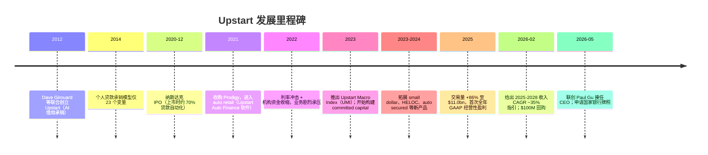
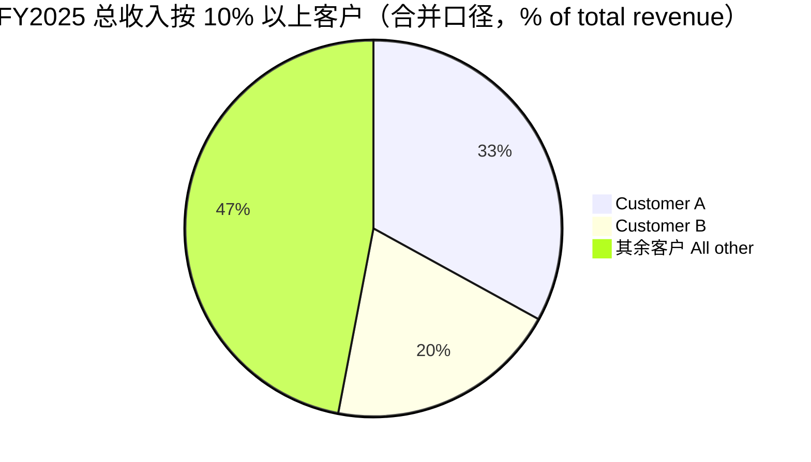
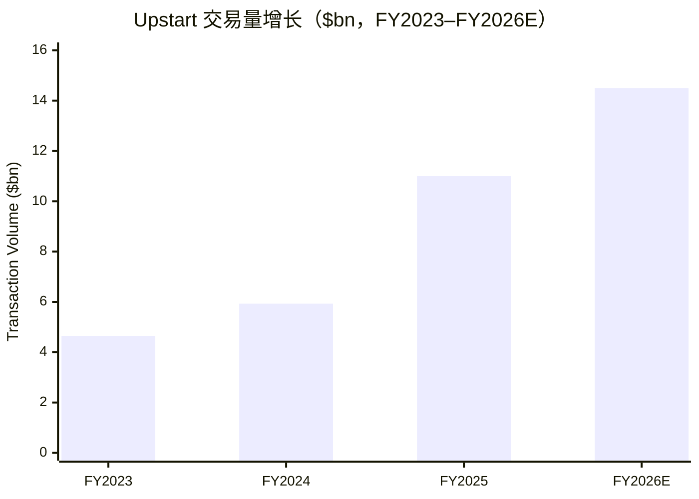

# Upstart Holdings, Inc.（NASDAQ:UPST）公司研究报告

**报告日期 / As of：2026-06-14｜主报告语言：简体中文（技术与财务术语保留英文并附中文释义）**

> *分析师观点：* **评级：Hold（持有）· 12 个月目标价 $33（较 2026-06-12 收盘 $30.50 上行 +8%）· 估值方法：FY2027E adj. EPS 约 $1.80 × 18× P/E（与高 beta、周期未验证相匹配）**
> 市值约 $2.92bn · 52 周区间约 $24–$87 · NASDAQ:UPST · beta ≈ 2.28
>
> | 倍数 / Multiple（*分析师观点：* 远期列） | FY2025A | FY2026E | FY2027E |
> |---|---|---|---|
> | P/S（总收入 total revenue） | 2.8× | 2.1× | 1.6× |
> | EV/Revenue | 4.2× | 3.2× | 2.4× |
> | EV/adj. EBITDA | 19× | 15× | 11× |
> | P/E（GAAP，参考） | 54× | n/m | ~17× |
>
> 相对表现（rel. performance，价格收益）：1M +2.7% · 6M −37.9% · YTD −33.5% · 12M −44.1%，对照 S&P 500 同窗口 1M −0.9% / 6M +7.7% / YTD +8.4% / 12M +22.9%（12 个月相对跑输约 67 个百分点）。数据来源：yfinance，截至 2026-06-12。
>
> **核心论点（thesis pillars）**——（1）AI 信用风险模型（AI underwriting model）是真实、可量化的护城河——FICO 时代之外，UPST 用 2,500+ 变量、1.04 亿条还款数据把风险分离（risk separation）做到「同等违约率下多批 43%、APR 低 33%」；（2）FY2025 是转折之年——交易量 +86%、首次 GAAP 经营性盈利，但这是从 2022–2023 利率冲击的深坑里爬出来，而非新台阶；（3）商业模式的命门是资金供给（funding supply）而非需求——机构资金占 64%、前三大银行伙伴占放款 83%，任何一端收缩都会瞬间放大利润波动；（4）这是一只 beta ≈ 2.28 的利率/信用周期股，估值已从 2021 年的疯狂回到地面，但「下一轮降息 = 放量」的逻辑尚未被一个完整周期验证——给 Hold，等周期或银行牌照（national bank charter）落地再加仓。

---

## 目录

1. 公司概览（含投资论点）
1A. 估值与目标价（forward estimates · PT 推导 · bull/base/bear）
1B. GF Score（GuruFocus 风格）基本面评分卡
2. 公司历史
3. 管理团队
4. 产品与服务
5. 客户与上市策略（资金端集中度）
6. 行业概览
7. 竞争格局
8. 市场机会（TAM）
9. 风险评估
9.5. 关键分歧与催化剂
10. 投资风格透视（investor-lens scorecards）

---

## 1. 公司概览

*分析师观点：* Upstart 是一家把**人工智能用于消费信贷承销（AI underwriting）的借贷市场（lending marketplace）**，本报告给予 **Hold（持有）评级、12 个月目标价 $33（上行约 +8%）**。给 Hold 而非 Buy 的理由很直接：FY2025 公司确实交出了一份漂亮的复苏答卷——交易量（transaction volume）从 $5.93bn 跳到 $11.0bn、首次实现全年 GAAP 经营性盈利——但这份复苏建立在 2022–2023 年利率冲击造成的极低基数之上，且驱动力（更便宜的资金、回暖的宏观）很大程度不在公司掌控之内（[UPST FY2025 10-K, Item 1 Business — Overview](https://www.sec.gov/Archives/edgar/data/1647639/000164763926000027/upst-20251231.htm)）。why-now：股价 12 个月跑输标普约 67 个百分点、远期 EV/adj-EBITDA 已降到约 15×，估值回到理性区间；但 beta ≈ 2.28、对利率和资金供给的高度敏感性意味着「便宜」可以更便宜——耐心等一个完整的降息周期或国家银行牌照（national bank charter）兑现，是比追涨更稳健的姿态（[UPST Q1 2026 earnings press release, 2026-05-05](https://www.sec.gov/Archives/edgar/data/1647639/000164763926000045/upst991prq12026.htm)）。

**公司做什么、怎么赚钱。** Upstart 自称是「the leading artificial intelligence ("AI") lending marketplace」，其商业模式是用专有 AI 模型替代传统的 FICO + 规则承销，把更准确的风险定价能力（公司称之为 "risk separation"，风险分离）卖给银行、信用合作社（统称 lending partners）与机构投资者（institutional investors）（[UPST FY2025 10-K, Item 1 Business — Overview](https://www.sec.gov/Archives/edgar/data/1647639/000164763926000027/upst-20251231.htm)）。关键在于 **UPST 多数时候不持有信用风险**：FY2025 平台促成的贷款本金中，64% 被机构投资者买走、26% 由银行伙伴留存或购买、仅 10% 留在自有资产负债表（balance sheet）上；公司主要赚取 platform & referral fees 与 servicing fees，是一种「按使用量收费（usage-based）」的轻资本、高毛利模式（[UPST FY2025 10-K, Item 1 Business — Overview](https://www.sec.gov/Archives/edgar/data/1647639/000164763926000027/upst-20251231.htm)）。FY2025 总收入 total revenue 为 $1,043.9M，其中费用收入（revenue from fees, net）$950.0M、净利息及公允价值调整（net interest income & FV adjustments, net）$93.8M（[UPST FY2025 10-K, MD&A — Total Revenue table](https://www.sec.gov/Archives/edgar/data/1647639/000164763926000027/upst-20251231.htm)）。

下图把 FY2025 的「钱从哪来、利润到哪去」摊开：三类费用/利息收入汇成 $1.04bn 总收入，扣掉营销、工程、客服与 G&A 四大支出后，剩下 $42.6M 的经营利润（income from operations）与 $53.6M 的净利润（net income）——这是 UPST 上市以来首个 GAAP 盈利的财年。

<svg xmlns="http://www.w3.org/2000/svg" viewBox="0 0 1000 560" width="1000" height="560" role="img" aria-label="income statement Sankey"><rect x="0" y="0" width="1000" height="560" fill="#ffffff"/>
<text x="20.00" y="30.00" text-anchor="start" font-family="Helvetica,Arial,sans-serif" font-size="15" font-weight="700" fill="#1f2933">Upstart (UPST) 收入与利润瀑布 — FY2025（单位：百万美元）</text>
<path d="M 700.00,64.00 C 754.00,64.00 754.00,270.64 808.00,270.64 L 808.00,291.36 C 754.00,291.36 754.00,84.72 700.00,84.72 Z" fill="#86efac" fill-opacity="0.55"/>
<path d="M 700.00,84.72 C 754.00,84.72 754.00,305.36 808.00,305.36 L 808.00,307.36 C 754.00,307.36 754.00,86.72 700.00,86.72 Z" fill="#fca5a5" fill-opacity="0.55"/>
<path d="M 576.00,72.26 C 630.00,72.26 630.00,64.00 684.00,64.00 L 684.00,80.48 C 630.00,80.48 630.00,88.74 576.00,88.74 Z" fill="#86efac" fill-opacity="0.55"/>
<path d="M 204.00,73.26 C 258.00,73.26 258.00,87.26 312.00,87.26 L 312.00,393.77 C 258.00,393.77 258.00,379.77 204.00,379.77 Z" fill="#93c5fd" fill-opacity="0.55"/>
<path d="M 452.00,79.26 C 506.00,79.26 506.00,72.26 560.00,72.26 L 560.00,88.74 C 506.00,88.74 506.00,95.74 452.00,95.74 Z" fill="#86efac" fill-opacity="0.55"/>
<path d="M 452.00,95.74 C 506.00,95.74 506.00,102.74 560.00,102.74 L 560.00,489.74 C 506.00,489.74 506.00,482.74 452.00,482.74 Z" fill="#fca5a5" fill-opacity="0.55"/>
<path d="M 328.00,87.26 C 382.00,87.26 382.00,79.26 436.00,79.26 L 436.00,482.74 C 382.00,482.74 382.00,490.74 328.00,490.74 Z" fill="#86efac" fill-opacity="0.55"/>
<path d="M 328.00,490.74 C 382.00,490.74 382.00,496.74 436.00,496.74 L 436.00,498.74 C 382.00,498.74 382.00,492.74 328.00,492.74 Z" fill="#fca5a5" fill-opacity="0.55"/>
<path d="M 576.00,102.74 C 630.00,102.74 630.00,99.00 684.00,99.00 L 684.00,215.54 C 630.00,215.54 630.00,219.28 576.00,219.28 Z" fill="#fca5a5" fill-opacity="0.55"/>
<path d="M 576.00,219.28 C 630.00,219.28 630.00,229.54 684.00,229.54 L 684.00,329.11 C 630.00,329.11 630.00,318.85 576.00,318.85 Z" fill="#fca5a5" fill-opacity="0.55"/>
<path d="M 576.00,318.85 C 630.00,318.85 630.00,343.11 684.00,343.11 L 684.00,514.00 C 630.00,514.00 630.00,489.74 576.00,489.74 Z" fill="#fca5a5" fill-opacity="0.55"/>
<path d="M 204.00,393.77 C 258.00,393.77 258.00,393.77 312.00,393.77 L 312.00,454.47 C 258.00,454.47 258.00,454.47 204.00,454.47 Z" fill="#93c5fd" fill-opacity="0.55"/>
<path d="M 204.00,468.47 C 258.00,468.47 258.00,454.47 312.00,454.47 L 312.00,490.74 C 258.00,490.74 258.00,504.74 204.00,504.74 Z" fill="#93c5fd" fill-opacity="0.55"/>
<path d="M 576.00,503.74 C 630.00,503.74 630.00,80.48 684.00,80.48 L 684.00,82.48 C 630.00,82.48 630.00,505.74 576.00,505.74 Z" fill="#93c5fd" fill-opacity="0.55"/>
<rect x="188.00" y="73.26" width="16" height="306.51" rx="1.5" fill="#2563eb"/>
<rect x="188.00" y="393.77" width="16" height="60.70" rx="1.5" fill="#2563eb"/>
<rect x="188.00" y="468.47" width="16" height="36.27" rx="1.5" fill="#2563eb"/>
<rect x="312.00" y="87.26" width="16" height="403.48" rx="1.5" fill="#1e3a8a"/>
<rect x="436.00" y="79.26" width="16" height="403.48" rx="1.5" fill="#15803d"/>
<rect x="436.00" y="496.74" width="16" height="2.00" rx="1.5" fill="#dc2626"/>
<rect x="560.00" y="72.26" width="16" height="16.48" rx="1.5" fill="#15803d"/>
<rect x="560.00" y="102.74" width="16" height="387.00" rx="1.5" fill="#dc2626"/>
<rect x="560.00" y="503.74" width="16" height="2.00" rx="1.5" fill="#2563eb"/>
<rect x="684.00" y="64.00" width="16" height="21.00" rx="1.5" fill="#15803d"/>
<rect x="684.00" y="99.00" width="16" height="116.54" rx="1.5" fill="#dc2626"/>
<rect x="684.00" y="229.54" width="16" height="99.57" rx="1.5" fill="#dc2626"/>
<rect x="684.00" y="343.11" width="16" height="170.89" rx="1.5" fill="#dc2626"/>
<rect x="808.00" y="270.64" width="16" height="20.72" rx="1.5" fill="#15803d"/>
<rect x="808.00" y="305.36" width="16" height="2.00" rx="1.5" fill="#dc2626"/>
<text x="179.00" y="223.51" text-anchor="end" font-family="Helvetica,Arial,sans-serif" font-size="11.5" font-weight="700" fill="#1f2933">Platform &amp; referral fees</text>
<text x="179.00" y="236.51" text-anchor="end" font-family="Helvetica,Arial,sans-serif" font-size="10" font-weight="400" fill="#52606d">$793.0M  (76.0%)</text>
<text x="179.00" y="421.12" text-anchor="end" font-family="Helvetica,Arial,sans-serif" font-size="11.5" font-weight="700" fill="#1f2933">Servicing &amp; other fees</text>
<text x="179.00" y="434.12" text-anchor="end" font-family="Helvetica,Arial,sans-serif" font-size="10" font-weight="400" fill="#52606d">$157.0M  (15.0%)</text>
<text x="179.00" y="483.60" text-anchor="end" font-family="Helvetica,Arial,sans-serif" font-size="11.5" font-weight="700" fill="#1f2933">Net interest &amp; FV adj.</text>
<text x="179.00" y="496.60" text-anchor="end" font-family="Helvetica,Arial,sans-serif" font-size="10" font-weight="400" fill="#52606d">$93.8M  (9.0%)</text>
<rect x="331.00" y="69.26" width="100.50" height="26" rx="2" fill="#ffffff" fill-opacity="0.72"/>
<text x="334.00" y="81.26" text-anchor="start" font-family="Helvetica,Arial,sans-serif" font-size="11.5" font-weight="700" fill="#1f2933">Revenue</text>
<text x="334.00" y="94.26" text-anchor="start" font-family="Helvetica,Arial,sans-serif" font-size="10" font-weight="400" fill="#52606d">$1.0B  (100.0%)</text>
<rect x="455.00" y="61.26" width="100.50" height="26" rx="2" fill="#ffffff" fill-opacity="0.72"/>
<text x="458.00" y="73.26" text-anchor="start" font-family="Helvetica,Arial,sans-serif" font-size="11.5" font-weight="700" fill="#1f2933">Gross Profit</text>
<text x="458.00" y="86.26" text-anchor="start" font-family="Helvetica,Arial,sans-serif" font-size="10" font-weight="400" fill="#52606d">$1.0B  (100.0%)</text>
<rect x="455.00" y="478.74" width="144.60" height="26" rx="2" fill="#ffffff" fill-opacity="0.72"/>
<text x="458.00" y="490.74" text-anchor="start" font-family="Helvetica,Arial,sans-serif" font-size="11.5" font-weight="700" fill="#1f2933">Cost of Revenue (COGS)</text>
<text x="458.00" y="503.74" text-anchor="start" font-family="Helvetica,Arial,sans-serif" font-size="10" font-weight="400" fill="#52606d">$0  (0.00%)</text>
<rect x="579.00" y="54.26" width="106.80" height="26" rx="2" fill="#ffffff" fill-opacity="0.72"/>
<text x="582.00" y="66.26" text-anchor="start" font-family="Helvetica,Arial,sans-serif" font-size="11.5" font-weight="700" fill="#1f2933">Operating Income</text>
<text x="582.00" y="79.26" text-anchor="start" font-family="Helvetica,Arial,sans-serif" font-size="10" font-weight="400" fill="#52606d">$42.6M  (4.1%)</text>
<rect x="579.00" y="84.74" width="150.90" height="26" rx="2" fill="#ffffff" fill-opacity="0.72"/>
<text x="582.00" y="96.74" text-anchor="start" font-family="Helvetica,Arial,sans-serif" font-size="11.5" font-weight="700" fill="#1f2933">Total Operating Expense</text>
<text x="582.00" y="109.74" text-anchor="start" font-family="Helvetica,Arial,sans-serif" font-size="10" font-weight="400" fill="#52606d">$1.0B  (95.9%)</text>
<line x1="560.00" y1="504.74" x2="554.00" y2="487.00" stroke="#cbd5e1" stroke-width="1"/>
<text x="551.00" y="490.00" text-anchor="end" font-family="Helvetica,Arial,sans-serif" font-size="11.5" font-weight="700" fill="#1f2933">Net Interest / Other Income</text>
<text x="551.00" y="503.00" text-anchor="end" font-family="Helvetica,Arial,sans-serif" font-size="10" font-weight="400" fill="#52606d">$4.5M  (0.43%)</text>
<rect x="703.00" y="46.00" width="94.20" height="26" rx="2" fill="#ffffff" fill-opacity="0.72"/>
<text x="706.00" y="58.00" text-anchor="start" font-family="Helvetica,Arial,sans-serif" font-size="11.5" font-weight="700" fill="#1f2933">Pretax Income</text>
<text x="706.00" y="71.00" text-anchor="start" font-family="Helvetica,Arial,sans-serif" font-size="10" font-weight="400" fill="#52606d">$54.3M  (5.2%)</text>
<rect x="703.00" y="81.00" width="106.80" height="26" rx="2" fill="#ffffff" fill-opacity="0.72"/>
<text x="706.00" y="93.00" text-anchor="start" font-family="Helvetica,Arial,sans-serif" font-size="11.5" font-weight="700" fill="#1f2933">SG&amp;A</text>
<text x="706.00" y="106.00" text-anchor="start" font-family="Helvetica,Arial,sans-serif" font-size="10" font-weight="400" fill="#52606d">$301.5M  (28.9%)</text>
<rect x="703.00" y="211.54" width="106.80" height="26" rx="2" fill="#ffffff" fill-opacity="0.72"/>
<text x="706.00" y="223.54" text-anchor="start" font-family="Helvetica,Arial,sans-serif" font-size="11.5" font-weight="700" fill="#1f2933">R&amp;D</text>
<text x="706.00" y="236.54" text-anchor="start" font-family="Helvetica,Arial,sans-serif" font-size="10" font-weight="400" fill="#52606d">$257.6M  (24.7%)</text>
<rect x="703.00" y="325.11" width="106.80" height="26" rx="2" fill="#ffffff" fill-opacity="0.72"/>
<text x="706.00" y="337.11" text-anchor="start" font-family="Helvetica,Arial,sans-serif" font-size="11.5" font-weight="700" fill="#1f2933">Other OpEx</text>
<text x="706.00" y="350.11" text-anchor="start" font-family="Helvetica,Arial,sans-serif" font-size="10" font-weight="400" fill="#52606d">$442.1M  (42.4%)</text>
<text x="833.00" y="278.00" text-anchor="start" font-family="Helvetica,Arial,sans-serif" font-size="11.5" font-weight="700" fill="#1f2933">Net Income</text>
<text x="833.00" y="291.00" text-anchor="start" font-family="Helvetica,Arial,sans-serif" font-size="10" font-weight="400" fill="#52606d">$53.6M  (5.1%)</text>
<text x="833.00" y="303.36" text-anchor="start" font-family="Helvetica,Arial,sans-serif" font-size="11.5" font-weight="700" fill="#1f2933">Income Tax</text>
<text x="833.00" y="316.36" text-anchor="start" font-family="Helvetica,Arial,sans-serif" font-size="10" font-weight="400" fill="#52606d">$728.0K  (0.07%)</text>
<text x="500.00" y="530.00" text-anchor="middle" font-family="Helvetica,Arial,sans-serif" font-size="10" font-weight="400" font-style="italic" fill="#8a97a3">营销 $301.5M + 工程 $257.6M + 客服$188.4M+G&amp;A$253.7M（合并为 opex）</text>
<text x="500.00" y="544.00" text-anchor="middle" font-family="Helvetica,Arial,sans-serif" font-size="10" font-weight="400" fill="#52606d">Source: UPST FY2025 10-K, Consolidated Statements of Operations + MD&amp;A revenue table</text>
</svg>

来源 / Source：[UPST FY2025 10-K, Consolidated Statements of Operations + MD&A revenue table](https://www.sec.gov/Archives/edgar/data/1647639/000164763926000027/upst-20251231.htm)。注：消费信贷市场没有传统意义的 COGS，本图将 cost of revenue 设为 0、把四项运营费用合并为 opex（营销 $301.5M、工程 $257.6M、客服 $188.4M、G&A $253.7M）。

**收入结构：平台费占绝对主导。** FY2025 费用收入中，platform & referral fees, net 为 $793.0M（占总收入 76%）、servicing & other fees, net 为 $157.0M（15%）、net interest & FV adjustments 为 $93.8M（9%）（[UPST FY2025 10-K, MD&A — Revenue from fees, net](https://www.sec.gov/Archives/edgar/data/1647639/000164763926000027/upst-20251231.htm)）。平台费随交易量线性放大，是理解 UPST 周期性的关键：放量则费用收入暴涨、缩量则暴跌。

<svg xmlns="http://www.w3.org/2000/svg" viewBox="0 0 720 460" width="720" height="460" role="img" aria-label="revenue donut"><rect x="0" y="0" width="720" height="460" fill="#ffffff"/>
<text x="20.00" y="30.00" text-anchor="start" font-family="Helvetica,Arial,sans-serif" font-size="15" font-weight="700" fill="#1f2933">FY2025 总收入构成（按收入类型）</text>
<path d="M 288.00,107.20 A 132 132 0 1 1 156.24,231.19 L 210.14,234.47 A 78 78 0 1 0 288.00,161.20 Z" fill="#2563eb"/>
<path d="M 156.24,231.19 A 132 132 0 0 1 217.34,127.71 L 246.25,173.32 A 78 78 0 0 0 210.14,234.47 Z" fill="#15803d"/>
<path d="M 217.34,127.71 A 132 132 0 0 1 288.00,107.20 L 288.00,161.20 A 78 78 0 0 0 246.25,173.32 Z" fill="#d97706"/>
<text x="288.00" y="235.20" text-anchor="middle" font-family="Helvetica,Arial,sans-serif" font-size="18" font-weight="800" fill="#1f2933">UPST FY25</text>
<text x="288.00" y="255.20" text-anchor="middle" font-family="Helvetica,Arial,sans-serif" font-size="13" font-weight="600" fill="#52606d">$1.0B</text>
<text x="288.00" y="271.20" text-anchor="middle" font-family="Helvetica,Arial,sans-serif" font-size="10" font-weight="400" fill="#8a97a3">total</text>
<line x1="382.57" y1="339.70" x2="398.57" y2="339.70" stroke="#2563eb" stroke-width="1.4"/>
<text x="402.57" y="337.70" text-anchor="start" font-family="Helvetica,Arial,sans-serif" font-size="11" font-weight="700" fill="#1f2933">Platform &amp; referral fees</text>
<text x="402.57" y="351.70" text-anchor="start" font-family="Helvetica,Arial,sans-serif" font-size="10" font-weight="400" fill="#52606d">$793.0M  (76.0%)</text>
<line x1="169.16" y1="169.04" x2="153.16" y2="169.04" stroke="#15803d" stroke-width="1.4"/>
<text x="149.16" y="167.04" text-anchor="end" font-family="Helvetica,Arial,sans-serif" font-size="11" font-weight="700" fill="#1f2933">Servicing &amp; other fees</text>
<text x="149.16" y="181.04" text-anchor="end" font-family="Helvetica,Arial,sans-serif" font-size="10" font-weight="400" fill="#52606d">$157.0M  (15.0%)</text>
<line x1="249.54" y1="106.67" x2="233.54" y2="106.67" stroke="#d97706" stroke-width="1.4"/>
<text x="229.54" y="104.67" text-anchor="end" font-family="Helvetica,Arial,sans-serif" font-size="11" font-weight="700" fill="#1f2933">Net interest &amp; FV adj.</text>
<text x="229.54" y="118.67" text-anchor="end" font-family="Helvetica,Arial,sans-serif" font-size="10" font-weight="400" fill="#52606d">$93.8M  (9.0%)</text>
<text x="360.00" y="444.00" text-anchor="middle" font-family="Helvetica,Arial,sans-serif" font-size="10" font-weight="400" fill="#52606d">Source: UPST FY2025 10-K, MD&amp;A — Revenue from fees, net + Total revenue table</text>
</svg>

来源 / Source：[UPST FY2025 10-K, MD&A — Revenue from fees, net + Total revenue](https://www.sec.gov/Archives/edgar/data/1647639/000164763926000027/upst-20251231.htm)。

**规模与运营指标的发展轨迹（development over time）。** UPST 的故事是一条深 V：FY2023 交易量仅 $4.65bn、调整后 EBITDA（adjusted EBITDA）为 −$17.2M（利率冲击谷底）；FY2024 回到 $5.93bn、adj. EBITDA 转正 $10.6M；FY2025 暴增到 $11.0bn（+86% YoY）、adj. EBITDA 跃升至 $230.5M（margin 22%）（[UPST FY2025 10-K, MD&A — Key Operating and Non-GAAP Financial Metrics](https://www.sec.gov/Archives/edgar/data/1647639/000164763926000027/upst-20251231.htm)）。贷款笔数从 437,659 → 697,092 → 1,497,149（FY2025 +115% YoY），转化率（conversion rate，经重新定义后口径）从 9.8% → 15.1% → 19.4%，自动化审批率（percentage of loans fully automated）稳定在 91%（[UPST FY2025 10-K, MD&A — Key Operating Metrics](https://www.sec.gov/Archives/edgar/data/1647639/000164763926000027/upst-20251231.htm)）。下图按收入类型展示 FY2023–FY2025 的费用收入演变，可见 platform fee 是放量的主要载体、净利息在 FY2023 还是负贡献。

<svg xmlns="http://www.w3.org/2000/svg" viewBox="0 0 860 470" width="860" height="470" role="img" aria-label="historical revenue bars"><rect x="0" y="0" width="860" height="470" fill="#ffffff"/>
<text x="20.00" y="30.00" text-anchor="start" font-family="Helvetica,Arial,sans-serif" font-size="15" font-weight="700" fill="#1f2933">历史总收入构成 FY2023–FY2025（十亿美元）</text>
<rect x="20.00" y="44" width="11" height="11" rx="2" fill="#2563eb"/>
<text x="36.00" y="53.00" text-anchor="start" font-family="Helvetica,Arial,sans-serif" font-size="10.5" font-weight="400" fill="#1f2933">Platform &amp; referral fees</text>
<rect x="208.40" y="44" width="11" height="11" rx="2" fill="#15803d"/>
<text x="224.40" y="53.00" text-anchor="start" font-family="Helvetica,Arial,sans-serif" font-size="10.5" font-weight="400" fill="#1f2933">Servicing &amp; other fees</text>
<rect x="383.60" y="44" width="11" height="11" rx="2" fill="#d97706"/>
<text x="399.60" y="53.00" text-anchor="start" font-family="Helvetica,Arial,sans-serif" font-size="10.5" font-weight="400" fill="#1f2933">Net interest &amp; FV adj.</text>
<line x1="70" y1="412.00" x2="834" y2="412.00" stroke="#eceff2" stroke-width="1"/>
<text x="64.00" y="415.00" text-anchor="end" font-family="Helvetica,Arial,sans-serif" font-size="9.5" font-weight="400" fill="#52606d">$0</text>
<line x1="70" y1="345.20" x2="834" y2="345.20" stroke="#eceff2" stroke-width="1"/>
<text x="64.00" y="348.20" text-anchor="end" font-family="Helvetica,Arial,sans-serif" font-size="9.5" font-weight="400" fill="#52606d">$225.5M</text>
<line x1="70" y1="278.40" x2="834" y2="278.40" stroke="#eceff2" stroke-width="1"/>
<text x="64.00" y="281.40" text-anchor="end" font-family="Helvetica,Arial,sans-serif" font-size="9.5" font-weight="400" fill="#52606d">$451.0M</text>
<line x1="70" y1="211.60" x2="834" y2="211.60" stroke="#eceff2" stroke-width="1"/>
<text x="64.00" y="214.60" text-anchor="end" font-family="Helvetica,Arial,sans-serif" font-size="9.5" font-weight="400" fill="#52606d">$676.5M</text>
<line x1="70" y1="144.80" x2="834" y2="144.80" stroke="#eceff2" stroke-width="1"/>
<text x="64.00" y="147.80" text-anchor="end" font-family="Helvetica,Arial,sans-serif" font-size="9.5" font-weight="400" fill="#52606d">$902.0M</text>
<line x1="70" y1="78.00" x2="834" y2="78.00" stroke="#eceff2" stroke-width="1"/>
<text x="64.00" y="81.00" text-anchor="end" font-family="Helvetica,Arial,sans-serif" font-size="9.5" font-weight="400" fill="#52606d">$1.1B</text>
<rect x="123.48" y="287.59" width="147.71" height="124.41" fill="#2563eb"/>
<rect x="123.48" y="246.11" width="147.71" height="41.47" fill="#15803d"/>
<rect x="123.48" y="260.04" width="147.71" height="0.00" fill="#d97706"/>
<text x="197.33" y="428.00" text-anchor="middle" font-family="Helvetica,Arial,sans-serif" font-size="10" font-weight="400" fill="#52606d">2023</text>
<rect x="378.15" y="263.89" width="147.71" height="148.11" fill="#2563eb"/>
<rect x="378.15" y="225.38" width="147.71" height="38.51" fill="#15803d"/>
<rect x="378.15" y="225.08" width="147.71" height="0.30" fill="#d97706"/>
<text x="452.00" y="428.00" text-anchor="middle" font-family="Helvetica,Arial,sans-serif" font-size="10" font-weight="400" fill="#52606d">2024</text>
<rect x="632.81" y="177.98" width="147.71" height="234.02" fill="#2563eb"/>
<rect x="632.81" y="130.59" width="147.71" height="47.40" fill="#15803d"/>
<rect x="632.81" y="102.74" width="147.71" height="27.85" fill="#d97706"/>
<text x="706.67" y="428.00" text-anchor="middle" font-family="Helvetica,Arial,sans-serif" font-size="10" font-weight="400" fill="#52606d">2025</text>
<text x="430.00" y="454.00" text-anchor="middle" font-family="Helvetica,Arial,sans-serif" font-size="10" font-weight="400" fill="#52606d">Source: UPST FY2023–FY2025 10-Ks, MD&amp;A revenue tables</text>
</svg>

来源 / Source：[UPST FY2023–FY2025 10-Ks, MD&A revenue tables](https://www.sec.gov/Archives/edgar/data/1647639/000164763926000027/upst-20251231.htm)。

**本期新变化（截至 Q1 2026）。** 2026Q1 公司延续复苏：放量 425,356 笔（+77% YoY）、本金约 $3.4bn（+61% YoY）、总收入 $308M（+44% YoY）；但同时 GAAP 经营利润再度转负至 −$7.5M、净亏损 −$6.6M，贡献利润率（contribution margin）从 55% 降至 50%、adj. EBITDA margin 从 20% 降至 13%——管理层把 EBITDA margin 的回落归因于营销投入加码与产品组合扩张，这提示「盈利」尚不稳固（[UPST Q1 2026 earnings press release, 2026-05-05](https://www.sec.gov/Archives/edgar/data/1647639/000164763926000045/upst991prq12026.htm)）。同期公司宣布两件大事：**联合创始人 Paul Gu 自 2026 年 5 月 1 日起接任 CEO**（Dave Girouard 转任 Executive Chairman），以及**申请国家银行牌照（national bank charter）**——后者若获批将根本性改变其资金结构（[UPST 2026 DEF 14A, Executive Officers note, 2026-04-16](https://www.sec.gov/Archives/edgar/data/1647639/000119312526158972/d177155ddef14a.htm)；[UPST Q1 2026 earnings press release, 2026-05-05](https://www.sec.gov/Archives/edgar/data/1647639/000164763926000045/upst991prq12026.htm)）。

**估值快照（valuation snapshot，截至 2026-06-12）。** UPST 收盘 $30.50、市值约 $2.92bn、企业价值（EV）约 $4.42bn；TTM P/E 约 54×（基于 GAAP 净利润 $53.6M）、P/S（总收入）约 2.8×、P/S（费用收入）约 3.07×（[Yahoo Finance — UPST key statistics, 2026-06-12](https://finance.yahoo.com/quote/UPST)）。与同业相比：SoFi（SOFI）P/E 约 37×、P/S 约 5.4×；LendingClub（LC）P/E 约 12×、P/S 约 1.5×；Affirm（AFRM）P/E 约 60×、P/S 约 5.6×；Pagaya（PGY）P/E 约 14×、P/S 约 1.0×（[Yahoo Finance — peer key statistics, 2026-06-12](https://finance.yahoo.com/quote/SOFI)）。54× 的 TTM P/E 看似昂贵，但这是**周期低基数效应（earnings temporarily depressed at the bottom of a credit cycle）**：FY2025 净利率仅 5.1%，盈利刚从亏损翻正，正常化盈利能力远未释放；用远期 EV/adj-EBITDA 约 15× 看，反而处于成长性金融科技的合理偏低区间。负 beta 资产的反面——UPST 的 beta ≈ 2.28，意味着它的估值天然随利率与风险偏好剧烈摆动，这也是把它列入 Section 9 估值/利率风险的核心理由（[Yahoo Finance — UPST key statistics, 2026-06-12](https://finance.yahoo.com/quote/UPST)）。

---

## 1A. 估值与目标价（决策层）

> *分析师观点：* 本章所有前瞻数字（forward estimates）、目标价（price target）与情景目标价均为分析师自身观点，**不附任何 filing 引用**；每项驱动的外部依据（filing 分部数据 + 管理层指引 + 行业预测）在文中内联引用。

**(a) 前瞻财务预测（forward financial-estimates）。** UPST 是一只盈利杠杆极高、但盈利可见度低的名字——其收入随交易量线性放大、而交易量又取决于不可控的利率与资金供给，因此预测需以管理层自己给出的中长期目标为锚：公司在 2026-02-10 给出 **2025–2028 年总收入 CAGR 约 35%、2028 年 adj. EBITDA margin 约 25%** 的指引，并在 Q1 2026 重申 FY2026 总收入约 $1.4bn、adj. EBITDA 约 $294M（margin 21%）（[UPST Q1 2026 earnings press release, 2026-05-05](https://www.sec.gov/Archives/edgar/data/1647639/000164763926000045/upst991prq12026.htm)）。以此为基础建模：

| 指标（*分析师观点：*） | FY2024A | FY2025A | FY2026E | FY2027E | FY2028E | CAGR(25–28) |
|---|---|---|---|---|---|---|
| 总收入 Total revenue（$M） | 636.5 | 1,043.9 | 1,400 | 1,820 | 2,560 | +35% |
| — YoY % | — | +64% | +34% | +30% | +41% | |
| 费用收入 Fee revenue（$M） | 635.5 | 950.0 | 1,300 | 1,680 | 2,350 | |
| 贡献利润率 Contribution margin % | 60% | 56% | 53% | 54% | 55% | |
| adj. EBITDA（$M） | 10.6 | 230.5 | 294 | 470 | 640 | |
| — adj. EBITDA margin % | 2% | 22% | 21% | 26% | 25% | |
| GAAP 净利率 Net margin % | −20% | 5.1% | 0%–3% | 6%–9% | 10%+ | |
| adj. EPS（$，约） | n/m | ~1.10 | ~1.00 | ~1.80 | ~2.80 | |
| FCF（经营性现金流口径，$M） | 186.3 | −147.7 | 波动 | 转正 | 转正 | |
| 净现金/(净负债)（$M） | −426 | −772 | 视证券化/融资而定 | | | |

各预测单元的外部依据：收入路径以管理层 35% CAGR 指引 + FY2026 的 $1.4bn 重申为锚（[UPST Q1 2026 press release, 2026-05-05](https://www.sec.gov/Archives/edgar/data/1647639/000164763926000045/upst991prq12026.htm)）；贡献利润率以 FY2023–FY2025 实际的 63%→60%→56% 下行轨迹外推（营销投入加码压低利润率）（[UPST FY2025 10-K, MD&A — Contribution Profit/Margin](https://www.sec.gov/Archives/edgar/data/1647639/000164763926000027/upst-20251231.htm)）；FCF 口径需特别说明——FY2025 经营性现金流为 −$147.7M，主因是表内贷款的公允价值变动与本金垫付（属于借贷市场的会计特性，非核心盈利恶化），不能简单读为「烧钱」（[UPST FY2025 10-K, MD&A — Cash Flows](https://www.sec.gov/Archives/edgar/data/1647639/000164763926000027/upst-20251231.htm)）。净负债来自 borrowings $1,829.1M 减去现金 $652.4M（[UPST FY2025 10-K, Consolidated Balance Sheets](https://www.sec.gov/Archives/edgar/data/1647639/000164763926000027/upst-20251231.htm)）。

**毛利率/贡献利润率桥（margin bridge）。** 贡献利润率从 FY2024 的 60% 降到 FY2025 的 56%，分解为：借款人获客成本（borrower acquisition costs）大增 +105%（$125.0M→$256.2M，随放量翻倍且营销渠道加价）拖累约 −6 个百分点 · 借款人验证与服务成本（verification & servicing）+26%（$128.9M→$162.7M）拖累约 −2 个百分点 · 费用收入 +49% 的规模效应部分对冲 +4 个百分点（[UPST FY2025 10-K, MD&A — Contribution Profit and Contribution Margin](https://www.sec.gov/Archives/edgar/data/1647639/000164763926000027/upst-20251231.htm)）。结论：放量是以营销让利换来的，单位经济（unit economics）在边际收缩——这是给 Hold 而非 Buy 的一个量化理由。

**(b) 目标价推导（show the arithmetic）。** 方法选 forward-P/E × 目标倍数。对一只 beta 2.28、盈利尚未跨过一个完整周期验证的金融科技，给 **FY2027E adj. EPS 约 $1.80 × 18× P/E ≈ $32–$33**。18× 的倍数对标：SoFi forward P/E 约 21×（更成熟、已稳定盈利）、Affirm forward P/E 约 18×（同为高 beta BNPL）、LendingClub forward P/E 约 8×（持牌银行、低估值低增长）、Pagaya forward P/E 约 4×（同为 AI 信贷网络、市场极度怀疑）（[Yahoo Finance — peer key statistics, 2026-06-12](https://finance.yahoo.com/quote/AFRM)）。UPST 增速（35% 收入 CAGR 指引）高于 SoFi/LC，但盈利质量与周期韧性低于持牌银行，故取介于 Affirm 与 SoFi 之间的 18×，落在 $33 → 较现价 +8%。

**(c) bull / base / bear 情景目标价。**

| 情景（*分析师观点：*） | 关键摆动假设 | 目标价 | 较现价 |
|---|---|---|---|
| Bull | 降息周期开启 + 放量超指引（收入 CAGR >40%）、贡献利润率回升 + 重估至 25× | $55 | +80% |
| Base | 收入按 35% CAGR 指引、贡献利润率 ~54%、18× FY2027E EPS | $33 | +8% |
| Bear | 利率二次走高/信用恶化、机构资金再度收缩、放量失速、去估值至 10× | $14 | −54% |

**(d) 与市场一致预期的对比（consensus benchmark）。** 本地机构研究库（`db/zsxq.db`，约 7,000 份券商 PDF）经 6 个别名检索（UPST / Upstart / "AI lending" / "fintech lending" / "consumer credit" / "AI 信贷"）后，**未发现任何针对 Upstart 的卖方单名报告**——仅有 1 份高盛消费信贷 ABS 交易员笔记侧面提及「金融科技平台参与使无抵押消费 ABS 风险相对可控」（[*分析师观点：* Goldman Sachs — Consumer credit holds, sentiment splits, 2026-05-29, p.1](http://xs-macbook-air.local:5001/zsxq/pdf/812485814114452/Goldman%20Sachs-MORTGAGE%20%26%20STRUCTURED%20PRODUCTS%20TRADER%EF%BC%9AConsumer%20credit%20holds%EF%BC%8C%20sentiment%20splits-260529.pdf)）。因本地库无 UPST 单名覆盖，本报告的远期估计无法与一份具体的卖方一致预期逐项对照；公司自身指引（FY2026 收入约 $1.4bn）是最权威的外部锚，本报告 Base 情景与之一致（[UPST Q1 2026 press release, 2026-05-05](https://www.sec.gov/Archives/edgar/data/1647639/000164763926000045/upst991prq12026.htm)）。

**(e) 最该盯紧的变量（swing variables）。** 两个：①**资金供给的稳定性**——机构资金占 64%、其中 >50% 为承诺资金（committed capital），一旦利率二次走高使机构要求更高回报，放量会瞬间失速（2022 年的剧本）；②**利率路径**——降息直接降低借款人 APR、提升需求并降低资金方门槛，是 bull case 的总开关。两者都不在公司掌控之内，这正是把 UPST 定性为周期股、给 Hold 的根本原因（[UPST FY2025 10-K, MD&A — Impact of Macroeconomic Environment](https://www.sec.gov/Archives/edgar/data/1647639/000164763926000027/upst-20251231.htm)）。

---

## 1B. GF Score（GuruFocus 风格）基本面评分卡

*分析师观点：* **GF Score（GuruFocus 风格）：56/100 — 51–70「Poor future performance potential」区间。** 该评分卡与 Section 10 投资风格透视一样，是对已引用证据的结构化二次解读，是分析师自身的评分框架，**不构成 GuruFocus 官方数字、也不附 filing 引用**；每项底层指标在下文各维度理由段内联引用。

<svg xmlns="http://www.w3.org/2000/svg" viewBox="0 0 500 500" width="500" height="500" role="img" aria-label="GF Score radar">
<rect x="0" y="0" width="500" height="500" fill="#ffffff"/>
<text x="20" y="24" font-family="Helvetica,Arial,sans-serif" font-size="15" font-weight="700" fill="#1f2933">GF Score (GuruFocus-style): 56/100</text>
<text x="20" y="41" font-family="Helvetica,Arial,sans-serif" font-size="11" fill="#52606d">51–70 Poor future performance potential</text>
<polygon points="250.0,88.0 392.7,191.6 338.2,359.4 161.8,359.4 107.3,191.6" fill="#e9f5ec" stroke="none"/>
<polygon points="250.0,208.0 278.5,228.7 267.6,262.3 232.4,262.3 221.5,228.7" fill="none" stroke="#c5d3cb" stroke-width="1"/>
<polygon points="250.0,178.0 307.1,219.5 285.3,286.5 214.7,286.5 192.9,219.5" fill="none" stroke="#c5d3cb" stroke-width="1"/>
<polygon points="250.0,148.0 335.6,210.2 302.9,310.8 197.1,310.8 164.4,210.2" fill="none" stroke="#c5d3cb" stroke-width="1"/>
<polygon points="250.0,118.0 364.1,200.9 320.5,335.1 179.5,335.1 135.9,200.9" fill="none" stroke="#c5d3cb" stroke-width="1"/>
<polygon points="250.0,88.0 392.7,191.6 338.2,359.4 161.8,359.4 107.3,191.6" fill="none" stroke="#c5d3cb" stroke-width="1.3"/>
<line x1="250" y1="238" x2="161.8" y2="359.4" stroke="#cfdad3" stroke-width="1"/>
<text x="146.5" y="392.4" text-anchor="end" font-family="Helvetica,Arial,sans-serif" font-size="11.5" font-weight="600" fill="#1f2933">Financial Strength</text>
<text x="146.5" y="405.4" text-anchor="end" font-family="Helvetica,Arial,sans-serif" font-size="9.5" fill="#52606d">财务实力</text>
<text x="214.7" y="280.5" text-anchor="middle" font-family="Helvetica,Arial,sans-serif" font-size="10.5" font-weight="700" fill="#1f2933">4</text>
<line x1="250" y1="238" x2="250.0" y2="88.0" stroke="#cfdad3" stroke-width="1"/>
<text x="250.0" y="58.0" text-anchor="middle" font-family="Helvetica,Arial,sans-serif" font-size="11.5" font-weight="600" fill="#1f2933">Profitability</text>
<text x="250.0" y="71.0" text-anchor="middle" font-family="Helvetica,Arial,sans-serif" font-size="9.5" fill="#52606d">盈利能力</text>
<text x="250.0" y="142.0" text-anchor="middle" font-family="Helvetica,Arial,sans-serif" font-size="10.5" font-weight="700" fill="#1f2933">6</text>
<line x1="250" y1="238" x2="107.3" y2="191.6" stroke="#cfdad3" stroke-width="1"/>
<text x="82.6" y="183.6" text-anchor="end" font-family="Helvetica,Arial,sans-serif" font-size="11.5" font-weight="600" fill="#1f2933">Growth</text>
<text x="82.6" y="196.6" text-anchor="end" font-family="Helvetica,Arial,sans-serif" font-size="9.5" fill="#52606d">成长性</text>
<text x="121.6" y="190.3" text-anchor="middle" font-family="Helvetica,Arial,sans-serif" font-size="10.5" font-weight="700" fill="#1f2933">9</text>
<line x1="250" y1="238" x2="392.7" y2="191.6" stroke="#cfdad3" stroke-width="1"/>
<text x="417.4" y="183.6" text-anchor="start" font-family="Helvetica,Arial,sans-serif" font-size="11.5" font-weight="600" fill="#1f2933">GF Value</text>
<text x="417.4" y="196.6" text-anchor="start" font-family="Helvetica,Arial,sans-serif" font-size="9.5" fill="#52606d">估值</text>
<text x="321.3" y="208.8" text-anchor="middle" font-family="Helvetica,Arial,sans-serif" font-size="10.5" font-weight="700" fill="#1f2933">5</text>
<line x1="250" y1="238" x2="338.2" y2="359.4" stroke="#cfdad3" stroke-width="1"/>
<text x="353.5" y="392.4" text-anchor="start" font-family="Helvetica,Arial,sans-serif" font-size="11.5" font-weight="600" fill="#1f2933">Momentum</text>
<text x="353.5" y="405.4" text-anchor="start" font-family="Helvetica,Arial,sans-serif" font-size="9.5" fill="#52606d">动量</text>
<text x="267.6" y="256.3" text-anchor="middle" font-family="Helvetica,Arial,sans-serif" font-size="10.5" font-weight="700" fill="#1f2933">2</text>
<polygon points="250.0,148.0 321.3,214.8 267.6,262.3 214.7,286.5 121.6,196.3" fill="#2e8b57" fill-opacity="0.34" stroke="#2e8b57" stroke-width="2"/>
<circle cx="214.7" cy="286.5" r="2.6" fill="#2e8b57"/>
<circle cx="250.0" cy="148.0" r="2.6" fill="#2e8b57"/>
<circle cx="121.6" cy="196.3" r="2.6" fill="#2e8b57"/>
<circle cx="321.3" cy="214.8" r="2.6" fill="#2e8b57"/>
<circle cx="267.6" cy="262.3" r="2.6" fill="#2e8b57"/>
<text x="250" y="470" text-anchor="middle" font-family="Helvetica,Arial,sans-serif" font-size="9.5" fill="#52606d">Source: UPST FY2025 10-K · Yahoo Finance · indicators.db, as of 2026-06-12</text>
<text x="250" y="485" text-anchor="middle" font-family="Helvetica,Arial,sans-serif" font-size="9" fill="#52606d">GF Score = independent analyst rubric (*Analyst view:*) — not GuruFocus™ official number</text>
</svg>

| 维度 / Dimension | 评分 / Score (0–10) | |
|---|---|---|
| Financial Strength (财务实力) | 4 | `████░░░░░░` |
| Profitability (盈利能力) | 6 | `██████░░░░` |
| Growth (成长性) | 9 | `█████████░` |
| GF Value (估值) | 5 | `█████░░░░░` |
| Momentum (动量) | 2 | `██░░░░░░░░` |
| **GF Score (composite, *Analyst view:*)** | **56 / 100** | **51–70 Poor future performance potential** |

*Composite weights (*Analyst view:*): Financial Strength 20% · Profitability 25% · Growth 25% · GF Value 15% · Momentum 15% (transparent reproduction — not GuruFocus's proprietary weighting).*

> 离中心越远，该维度得分越高 / *The farther a point sits from the centre, the better; the larger the pentagon's area, the higher the overall GF Score.*

| 维度 / Dimension | 评分 / Score (0–10) | |
|---|---|---|
| Financial Strength（财务实力） | 4 | `████░░░░░░` |
| Profitability（盈利能力） | 6 | `██████░░░░` |
| Growth（成长性） | 9 | `█████████░` |
| GF Value（估值） | 5 | `█████░░░░░` |
| Momentum（动量） | 2 | `██░░░░░░░░` |
| **GF Score（composite，*分析师观点：*）** | **56 / 100** | **51–70 Poor future performance potential** |

**Financial Strength（财务实力）= 4/10。** UPST 资产负债表有韧性但也有杠杆：FY2025 末现金及等价物 $652.4M、受限现金 $404.6M，但 borrowings 高达 $1,829.1M、净负债约 $772M，股东权益仅 $798.8M、累计亏损 $357.6M（[UPST FY2025 10-K, Consolidated Balance Sheets](https://www.sec.gov/Archives/edgar/data/1647639/000164763926000027/upst-20251231.htm)）。这些借款很大程度服务于仓储信贷（warehouse credit）与表内贷款融资，属于业务运营性负债而非纯财务杠杆，但在利率上行时仍会推高利息成本（FY2025 利息支出 $31.7M）——给 4 分，反映「净负债 + 累计亏损 + 高 beta」的脆弱性（[UPST FY2025 10-K, MD&A — Total interest income and fair value adjustments](https://www.sec.gov/Archives/edgar/data/1647639/000164763926000027/upst-20251231.htm)）。

**Profitability（盈利能力）= 6/10。** FY2025 是分水岭：首次实现 GAAP 经营利润 $42.6M、净利润 $53.6M、净利率 5.1%，DuPont 拆解的 ROE 约 7.5%（[UPST FY2025 10-K, Statements of Operations + Balance Sheets](https://www.sec.gov/Archives/edgar/data/1647639/000164763926000027/upst-20251231.htm)）；贡献利润率 56%、adj. EBITDA margin 22% 都属健康。但盈利刚翻正、Q1 2026 又转回经营性亏损，且历史上常年亏损——盈利的「持久性（consistency）」尚未建立，故给中位的 6 分。

**Growth（成长性）= 9/10。** 这是 UPST 最强的一轴：FY2025 总收入 +64%、交易量 +86%、贷款笔数 +115%；FY2023–FY2025 费用收入 CAGR 约 30%，管理层指引 2025–2028 收入 CAGR 约 35%（[UPST FY2025 10-K, MD&A — Key Operating Metrics](https://www.sec.gov/Archives/edgar/data/1647639/000164763926000027/upst-20251231.htm)；[UPST Q1 2026 press release, 2026-05-05](https://www.sec.gov/Archives/edgar/data/1647639/000164763926000045/upst991prq12026.htm)）。给 9 分；唯一扣分是这一增速部分依赖低基数与不可控的宏观回暖，可持续性需打折。

**GF Value（估值，*higher = cheaper*）= 5/10。** TTM P/E 54× 看贵，但这是周期底部盈利造成的；远期 EV/adj-EBITDA 约 15×、P/S 约 2.8× 处于成长性金融科技合理偏低区间，PEG（54× ÷ 35% 增速 ≈ 1.5）属中性；股价已较 52 周高点回撤约 65%（[Yahoo Finance — UPST key statistics, 2026-06-12](https://finance.yahoo.com/quote/UPST)）。综合「不便宜也不贵、安全边际中性」给 5 分。

**Momentum（动量）= 2/10。** UPST 是同业中典型的输家：过去 12 个月绝对收益 −44.1%、对照标普 +22.9%，相对跑输约 67 个百分点；6 个月 −37.9%、YTD −33.5%，股价深陷 52 周低位附近（[yfinance — UPST vs ^GSPC price history, 2026-06-12](https://finance.yahoo.com/quote/UPST)）。动量明确向下，给 2 分。

**综合算术：** (FS·20 + Prof·25 + Growth·25 + Value·15 + Mom·15)/100 = (4·20 + 6·25 + 9·25 + 5·15 + 2·15)/100 = (80+150+225+75+30)/100 = **5.6 → 56/100**（采用默认权重 20/25/25/15/15）。

**一句话提示：** Growth（9）与 Momentum（2）的极端背离正是这张雷达图想揭示的——增长引擎仍在轰鸣，但市场用脚投票；最可能翻转的是 Momentum，一旦降息预期升温或银行牌照落地，动量可在一两个季度内重估上行 3–4 分，把 composite 推过 60。

---

## 2. 公司历史

Upstart 成立于 2012 年，由前 Google Enterprise 总裁 Dave Girouard 与两位联合创始人（含现任 CEO Paul Gu）共同创立，创业命题是「FICO 评分发明于 1989 年并至今仍是信贷审批的事实标准，但大多数贷款机构只用有限的几个变量做基于规则的决策，导致数百万有信用的人被排除在体系之外、更多人付了过高的利息」——UPST 要用 AI 更准确地量化真实风险（[UPST FY2025 10-K, Item 1 Business — Overview](https://www.sec.gov/Archives/edgar/data/1647639/000164763926000027/upst-20251231.htm)）。



**三次战略转折。** ①**从单一个人贷款到多产品市场**：早期只做无抵押个人贷款，2021 年通过收购 Prodigy 切入汽车零售贷款（Upstart Auto Finance，一款面向车行的 SaaS），随后逐步加入 small dollar「relief」loans、auto refinance/secured、以及 HELOC，向「信贷的万物商店（everything-store for credit）」演进（[UPST FY2025 10-K, Item 1 Business — Overview](https://www.sec.gov/Archives/edgar/data/1647639/000164763926000027/upst-20251231.htm)）。②**从纯银行资金到机构 + 承诺资金的多元化资金结构**：2022 年机构资金因宏观担忧而收缩、利率上行抬高 APR 压制需求，公司由此「刻意」转向承诺资金与共同投资安排（committed capital and co-investment arrangements）以求资金稳定性，今日 >50% 资金来自此类长久期安排（[UPST FY2025 10-K, MD&A — Impact of Macroeconomic Environment](https://www.sec.gov/Archives/edgar/data/1647639/000164763926000027/upst-20251231.htm)）。③**从软件供应商到（拟）持牌银行**：2026 年申请国家银行牌照，若获批将让 UPST 能直接持有存款资金、降低对第三方资金供给的依赖——这是对其最大软肋的根本性回应（[UPST Q1 2026 earnings press release, 2026-05-05](https://www.sec.gov/Archives/edgar/data/1647639/000164763926000045/upst991prq12026.htm)）。

**近期资本动作。** 2026 年 2 月公司在 $31.31 的均价回购了 3,193,294 股、合计 $100M，显示管理层认为股价低估（[UPST 8-K, 2026-02-19 — share repurchase](https://www.sec.gov/Archives/edgar/data/1647639/000164763926000033/upst-20260219.htm)）。

---

## 3. 管理团队

**联合创始人、执行董事长（前 CEO）Dave Girouard。** Girouard 是 Upstart 的联合创始人，自公司 2012 年成立起担任 CEO 与董事会成员，直至 2026 年 5 月 1 日转任执行董事长（Executive Chairman）（[UPST 2026 DEF 14A — Director Nominees / Executive Officers, 2026-04-16](https://www.sec.gov/Archives/edgar/data/1647639/000119312526158972/d177155ddef14a.htm)）。创立 Upstart 之前，他于 2004–2012 年在 Google（Alphabet）任职，最高做到 **Google Enterprise 总裁**，在全球范围内搭建了 Google 的云应用业务（涵盖产品开发、销售、营销与客户支持）；更早曾在 Apple 任产品经理、在 Booz Allen 信息技术实践部门任职、职业生涯始于 Accenture 波士顿办公室的软件开发。他拥有 Dartmouth College 的工程科学 A.B. 与计算机工程 B.E. 学位，以及 University of Michigan 的 MBA（High Distinction）（[UPST 2026 DEF 14A — Dave Girouard bio, 2026-04-16](https://www.sec.gov/Archives/edgar/data/1647639/000119312526158972/d177155ddef14a.htm)）。Girouard 的「Google 云出身」是理解 UPST「把复杂 AI 模型包装成简单云应用交付给银行」这一产品哲学的关键背景。

**联合创始人、现任 CEO（前 CTO）Paul Gu。** 现年 35 岁的 Paul Gu 是 Upstart 的联合创始人，自 2012 年 4 月起在公司担任多个角色、最近一职为首席技术官（CTO），并自 2015 年 4 月起任董事会成员；2026 年 5 月 1 日起接任 CEO（[UPST 2026 DEF 14A — Paul Gu bio / Executive Officers note, 2026-04-16](https://www.sec.gov/Archives/edgar/data/1647639/000119312526158972/d177155ddef14a.htm)）。他在 Yale University 学习经济学与计算机科学，随后加入 **Thiel Fellowship**（Peter Thiel 资助年轻人辍学创业的项目）；董事会看重他在机器学习与数据科学（machine learning and data science）方面的专长（[UPST 2026 DEF 14A — Paul Gu bio, 2026-04-16](https://www.sec.gov/Archives/edgar/data/1647639/000119312526158972/d177155ddef14a.htm)）。作为 AI 模型的总设计师接任 CEO，Gu 在首份 CEO 致辞中把方向定为「打造一个高增长、资本高效（capital-efficient）的业务」，并称把 AI 用于信贷是「对消费者明确的胜利」（[UPST Q1 2026 earnings press release — CEO quote, 2026-05-05](https://www.sec.gov/Archives/edgar/data/1647639/000164763926000045/upst991prq12026.htm)）。由技术联创掌舵，强化了「模型即护城河」的战略连续性，但也把 CEO 经验与资本市场沟通能力列为需观察的风险点。

---

## 4. 产品与服务

UPST 的「产品」本质上是**一套 AI 模型 + 一个把它交付给资金方的云市场**，三类终端信贷产品（个人贷款、汽车贷款、HELOC）只是这套模型的应用出口。理解 Section 4 的关键，是先理解模型这个内核，再看它如何长出不同产品，最后看它如何在资金链上分发风险。

### 4.1 业务/产品矩阵（10-K 自述）

下表按「应用领域 → 模型/技术 → 产品」复刻 10-K Item 1 Business 中 UPST 自己的产品与模型结构（逐字引用关键描述）：

| 应用领域 / Application | 核心 AI 模型 / Model | 终端产品 / Product | 关键参数（10-K 披露） |
|---|---|---|---|
| 信用承销 Underwriting | 个人贷款承销模型（2,500+ 变量、1.04 亿还款事件训练） | Personal loans（含 small dollar "relief" loans） | $200–$75,000；APR 上限 35.99%；期限 3 个月–5 年 |
| 汽车信贷 Auto | 承销 + Upstart Auto Finance 软件 | Auto loans（retail / refinance / secured personal） | $3,000–$60,000；APR 上限 29.99%；期限 2–7 年 |
| 房屋净值 Home | 承销模型 | HELOC（home equity line of credit） | $26,000–$250,000；APR 上限 18.0%；期限 10 或 15 年 |
| 获客与反欺诈 Acquisition/Fraud | 约 30 个专有 ML 模型（acquisition targeting、loan stacking、income/identity fraud、prepayment、default prediction 等） | （内嵌于上述产品流程） | 91% 贷款全自动化（FY2025） |

来源 / Source：[UPST FY2025 10-K, Item 1 Business — Overview / Our AI Lending Models / Our Ecosystem](https://www.sec.gov/Archives/edgar/data/1647639/000164763926000027/upst-20251231.htm)。

### 4.2 综合：模型、产品与资金如何串成一个飞轮

UPST 的产品逻辑是一个闭环飞轮（flywheel）：**更多放量 → 更多还款数据 → 更准的模型 → 更高批准率/更低利率 → 更多需求与资金方信任 → 更多放量**。10-K 明确把这种「飞轮效应」称为「a significant competitive advantage」，并指出模型「已持续升级、训练、精炼了十余年」（[UPST FY2025 10-K, Item 1 Business — Overview](https://www.sec.gov/Archives/edgar/data/1647639/000164763926000027/upst-20251231.htm)）。下面的资金流向图把这个飞轮的「资金侧」摊开——借款人付息进入平台，平台抽取费率后，把贷款本金与信用风险分发给机构投资者、银行伙伴、自有资产负债表三类资金方：

<svg xmlns="http://www.w3.org/2000/svg" viewBox="0 0 1180 981" width="1180" height="981" role="img" aria-label="How Upstart's Marketplace Routes the Money / Upstart 的资金与风险流向" font-family="'Space Grotesk',system-ui,-apple-system,'Segoe UI',sans-serif">
<defs><linearGradient id="mfgold" gradientUnits="userSpaceOnUse" x1="0" y1="0" x2="1180" y2="0"><stop offset="0" stop-color="#f6dc97"/><stop offset="0.5" stop-color="#e9b658"/><stop offset="1" stop-color="#cf8f2c"/></linearGradient><radialGradient id="mfpool" cx="50%" cy="50%" r="50%"><stop offset="0" stop-color="#34d399" stop-opacity="0.16"/><stop offset="1" stop-color="#34d399" stop-opacity="0"/></radialGradient></defs>
<rect x="0" y="0" width="1180" height="981" rx="16" fill="#0b0f1a"/>
<text x="42.00" y="56.00" text-anchor="start" font-family="'JetBrains Mono',ui-monospace,Menlo,monospace" font-size="11.5" font-weight="600" fill="#e9b658" letter-spacing="3">AI 借贷市场 · 资金流向 · FY2025</text>
<text x="42.00" y="100.00" text-anchor="start" font-family="'Space Grotesk',system-ui,-apple-system,'Segoe UI',sans-serif" font-size="32" font-weight="700" fill="#e8ecf5">How Upstart's Marketplace Routes the Money / Upstart 的资金与风险流向</text>
<text x="42.00" y="142.00" text-anchor="start" font-family="'Space Grotesk',system-ui,-apple-system,'Segoe UI',sans-serif" font-size="15" font-weight="400" fill="#8a93a8">借款人付息进入平台，UPST 抽取费率（take rate）后，把贷款本金与信用风险分发给三类资金方——这是其商业模式的命脉，也是其周期脆弱性的根源。</text>
<ellipse cx="1031.00" cy="380.50" rx="190" ry="150" fill="url(#mfpool)"/>
<line x1="369.50" y1="188.00" x2="369.50" y2="569.00" stroke="#222a3a" stroke-dasharray="2 8"/>
<line x1="810.50" y1="188.00" x2="810.50" y2="569.00" stroke="#222a3a" stroke-dasharray="2 8"/>
<text x="42.00" y="172.00" text-anchor="start" font-family="'JetBrains Mono',ui-monospace,Menlo,monospace" font-size="12" font-weight="400" fill="#e9b658" letter-spacing="3">STAGE 01</text>
<text x="42.00" y="188.00" text-anchor="start" font-family="'JetBrains Mono',ui-monospace,Menlo,monospace" font-size="11.5" font-weight="400" fill="#646d82">谁付钱 (借款人需求)</text>
<text x="483.00" y="172.00" text-anchor="start" font-family="'JetBrains Mono',ui-monospace,Menlo,monospace" font-size="12" font-weight="400" fill="#e9b658" letter-spacing="3">STAGE 02</text>
<text x="483.00" y="188.00" text-anchor="start" font-family="'JetBrains Mono',ui-monospace,Menlo,monospace" font-size="11.5" font-weight="400" fill="#646d82">平台与产品</text>
<text x="924.00" y="172.00" text-anchor="start" font-family="'JetBrains Mono',ui-monospace,Menlo,monospace" font-size="12" font-weight="400" fill="#e9b658" letter-spacing="3">STAGE 03</text>
<text x="924.00" y="188.00" text-anchor="start" font-family="'JetBrains Mono',ui-monospace,Menlo,monospace" font-size="11.5" font-weight="400" fill="#646d82">资金/风险最终沉淀处</text>
<path d="M 256.00 373.41 C 369.50 373.41, 369.50 270.50, 483.00 270.50" fill="none" stroke="url(#mfgold)" stroke-width="24.00" stroke-linecap="round" opacity="0.9"/>
<path d="M 256.00 389.77 C 369.50 389.77, 369.50 380.50, 483.00 380.50" fill="none" stroke="url(#mfgold)" stroke-width="8.73" stroke-linecap="round" opacity="0.9"/>
<path d="M 256.00 396.86 C 369.50 396.86, 369.50 490.50, 483.00 490.50" fill="none" stroke="url(#mfgold)" stroke-width="5.45" stroke-linecap="round" opacity="0.9"/>
<path d="M 697.00 263.09 C 810.50 263.09, 810.50 251.00, 924.00 251.00" fill="none" stroke="url(#mfgold)" stroke-width="17.45" stroke-linecap="round" opacity="0.9"/>
<path d="M 697.00 276.73 C 810.50 276.73, 810.50 378.00, 924.00 378.00" fill="none" stroke="url(#mfgold)" stroke-width="9.82" stroke-linecap="round" opacity="0.9"/>
<path d="M 697.00 378.00 C 810.50 378.00, 810.50 385.41, 924.00 385.41" fill="none" stroke="url(#mfgold)" stroke-width="5.00" stroke-linecap="round" opacity="0.9"/>
<path d="M 697.00 490.50 C 810.50 490.50, 810.50 262.23, 924.00 262.23" fill="none" stroke="url(#mfgold)" stroke-width="5.00" stroke-linecap="round" opacity="0.9"/>
<path d="M 697.00 284.14 C 810.50 284.14, 810.50 505.00, 924.00 505.00" fill="none" stroke="url(#mfgold)" stroke-width="5.00" stroke-linecap="round" opacity="0.78" stroke-dasharray="0.1 11"/>
<path d="M 697.00 383.00 C 810.50 383.00, 810.50 510.00, 924.00 510.00" fill="none" stroke="url(#mfgold)" stroke-width="5.00" stroke-linecap="round" opacity="0.78" stroke-dasharray="0.1 11"/>
<text x="369.50" y="315.95" text-anchor="middle" font-family="'JetBrains Mono',ui-monospace,Menlo,monospace" font-size="11.5" font-weight="400" fill="#f4d58a" paint-order="stroke" stroke="#0b0f1a" stroke-width="3.2" stroke-linejoin="round">核心放量</text>
<text x="810.50" y="251.05" text-anchor="middle" font-family="'JetBrains Mono',ui-monospace,Menlo,monospace" font-size="11.5" font-weight="400" fill="#f4d58a" paint-order="stroke" stroke="#0b0f1a" stroke-width="3.2" stroke-linejoin="round">64% 本金</text>
<text x="810.50" y="321.36" text-anchor="middle" font-family="'JetBrains Mono',ui-monospace,Menlo,monospace" font-size="11.5" font-weight="400" fill="#f4d58a" paint-order="stroke" stroke="#0b0f1a" stroke-width="3.2" stroke-linejoin="round">26% 本金</text>
<text x="810.50" y="388.57" text-anchor="middle" font-family="'JetBrains Mono',ui-monospace,Menlo,monospace" font-size="11.5" font-weight="400" fill="#f4d58a" paint-order="stroke" stroke="#0b0f1a" stroke-width="3.2" stroke-linejoin="round">10% 本金</text>
<rect x="42.00" y="305.50" width="214" height="150.00" rx="12" fill="#15101a" stroke="#f2655f" stroke-opacity="0.5"/>
<rect x="42.00" y="305.50" width="3" height="150.00" rx="2" fill="#f2655f"/>
<text x="60.00" y="338.50" text-anchor="start" font-family="'Space Grotesk',system-ui,-apple-system,'Segoe UI',sans-serif" font-size="17" font-weight="700" fill="#ffffff">BORROWERS</text>
<text x="60.00" y="359.50" text-anchor="start" font-family="'JetBrains Mono',ui-monospace,Menlo,monospace" font-size="11" font-weight="400" fill="#c98c87">1,497,149 笔 / FY25</text>
<text x="60.00" y="376.50" text-anchor="start" font-family="'JetBrains Mono',ui-monospace,Menlo,monospace" font-size="11" font-weight="400" fill="#c98c87">付息 + 平台费</text>
<text x="60.00" y="393.50" text-anchor="start" font-family="'JetBrains Mono',ui-monospace,Menlo,monospace" font-size="11" font-weight="400" fill="#c98c87">APR 上限 18%-35.99%</text>
<rect x="483.00" y="223.50" width="214" height="94.00" rx="12" fill="#141a2a" stroke="#56c6e6" stroke-opacity="0.5"/>
<rect x="483.00" y="223.50" width="3" height="94.00" rx="2" fill="#56c6e6"/>
<text x="501.00" y="256.50" text-anchor="start" font-family="'Space Grotesk',system-ui,-apple-system,'Segoe UI',sans-serif" font-size="17" font-weight="700" fill="#ffffff">PERSONAL LOANS</text>
<text x="501.00" y="277.50" text-anchor="start" font-family="'JetBrains Mono',ui-monospace,Menlo,monospace" font-size="11" font-weight="400" fill="#8a93a8">核心产品</text>
<text x="501.00" y="294.50" text-anchor="start" font-family="'JetBrains Mono',ui-monospace,Menlo,monospace" font-size="11" font-weight="400" fill="#8a93a8">$200-$75,000</text>
<rect x="483.00" y="333.50" width="214" height="94.00" rx="12" fill="#0f1622" stroke="#7fa8f5" stroke-opacity="0.5"/>
<rect x="483.00" y="333.50" width="3" height="94.00" rx="2" fill="#7fa8f5"/>
<text x="501.00" y="366.50" text-anchor="start" font-family="'Space Grotesk',system-ui,-apple-system,'Segoe UI',sans-serif" font-size="21" font-weight="700" fill="#ffffff">AUTO</text>
<text x="501.00" y="387.50" text-anchor="start" font-family="'JetBrains Mono',ui-monospace,Menlo,monospace" font-size="11" font-weight="400" fill="#9bb3df">retail/refi/secured</text>
<text x="501.00" y="404.50" text-anchor="start" font-family="'JetBrains Mono',ui-monospace,Menlo,monospace" font-size="11" font-weight="400" fill="#9bb3df">$3,000-$60,000</text>
<rect x="483.00" y="443.50" width="214" height="94.00" rx="12" fill="#141a2a" stroke="#d9a05b" stroke-opacity="0.5"/>
<rect x="483.00" y="443.50" width="3" height="94.00" rx="2" fill="#d9a05b"/>
<text x="501.00" y="476.50" text-anchor="start" font-family="'Space Grotesk',system-ui,-apple-system,'Segoe UI',sans-serif" font-size="21" font-weight="700" fill="#ffffff">HELOC</text>
<text x="501.00" y="497.50" text-anchor="start" font-family="'JetBrains Mono',ui-monospace,Menlo,monospace" font-size="11" font-weight="400" fill="#bcae98">房屋净值额度</text>
<text x="501.00" y="514.50" text-anchor="start" font-family="'JetBrains Mono',ui-monospace,Menlo,monospace" font-size="11" font-weight="400" fill="#bcae98">$26,000-$250,000</text>
<rect x="924.00" y="198.00" width="214" height="111.00" rx="12" fill="#15121f" stroke="#a78bfa" stroke-opacity="0.5"/>
<rect x="924.00" y="198.00" width="3" height="111.00" rx="2" fill="#a78bfa"/>
<text x="942.00" y="231.00" text-anchor="start" font-family="'Space Grotesk',system-ui,-apple-system,'Segoe UI',sans-serif" font-size="17" font-weight="700" fill="#ffffff">INSTITUTIONAL</text>
<text x="942.00" y="252.00" text-anchor="start" font-family="'JetBrains Mono',ui-monospace,Menlo,monospace" font-size="11" font-weight="400" fill="#b9a6f5">买走 64% 本金</text>
<text x="942.00" y="269.00" text-anchor="start" font-family="'JetBrains Mono',ui-monospace,Menlo,monospace" font-size="11" font-weight="400" fill="#b9a6f5">&gt;50% 承诺资金</text>
<text x="942.00" y="286.00" text-anchor="start" font-family="'JetBrains Mono',ui-monospace,Menlo,monospace" font-size="11" font-weight="400" fill="#b9a6f5">ABS / 整笔贷款</text>
<rect x="924.00" y="325.00" width="214" height="111.00" rx="12" fill="#101d1a" stroke="#34d399" stroke-opacity="0.5"/>
<rect x="924.00" y="325.00" width="3" height="111.00" rx="2" fill="#34d399"/>
<text x="942.00" y="358.00" text-anchor="start" font-family="'Space Grotesk',system-ui,-apple-system,'Segoe UI',sans-serif" font-size="14" font-weight="700" fill="#ffffff">BANKS &amp; CREDIT UNIONS</text>
<text x="942.00" y="379.00" text-anchor="start" font-family="'JetBrains Mono',ui-monospace,Menlo,monospace" font-size="11" font-weight="400" fill="#7fd9bf">&gt;100 家伙伴</text>
<text x="942.00" y="396.00" text-anchor="start" font-family="'JetBrains Mono',ui-monospace,Menlo,monospace" font-size="11" font-weight="400" fill="#7fd9bf">留存 26% 本金</text>
<text x="942.00" y="413.00" text-anchor="start" font-family="'JetBrains Mono',ui-monospace,Menlo,monospace" font-size="11" font-weight="400" fill="#7fd9bf">前三大占放款 83%</text>
<rect x="924.00" y="452.00" width="214" height="111.00" rx="12" fill="#15101a" stroke="#f2655f" stroke-opacity="0.5"/>
<rect x="924.00" y="452.00" width="3" height="111.00" rx="2" fill="#f2655f"/>
<text x="942.00" y="485.00" text-anchor="start" font-family="'Space Grotesk',system-ui,-apple-system,'Segoe UI',sans-serif" font-size="14" font-weight="700" fill="#ffffff">UPST BALANCE SHEET</text>
<text x="942.00" y="506.00" text-anchor="start" font-family="'JetBrains Mono',ui-monospace,Menlo,monospace" font-size="11" font-weight="400" fill="#d49b96">持有 10% 本金</text>
<text x="942.00" y="523.00" text-anchor="start" font-family="'JetBrains Mono',ui-monospace,Menlo,monospace" font-size="11" font-weight="400" fill="#d49b96">$984.6M 公允价值贷款</text>
<text x="942.00" y="540.00" text-anchor="start" font-family="'JetBrains Mono',ui-monospace,Menlo,monospace" font-size="11" font-weight="400" fill="#d49b96">66% 为 R&amp;D Loans</text>
<rect x="42.00" y="589.00" width="26" height="4" rx="2" fill="#e9b658"/>
<text x="78.00" y="593.00" text-anchor="start" font-family="'JetBrains Mono',ui-monospace,Menlo,monospace" font-size="11.5" font-weight="400" fill="#8a93a8">money paid directly</text>
<circle cx="242.80" cy="591.00" r="2" fill="#e9b658"/>
<circle cx="249.80" cy="591.00" r="2" fill="#e9b658"/>
<circle cx="256.80" cy="591.00" r="2" fill="#e9b658"/>
<circle cx="263.80" cy="591.00" r="2" fill="#e9b658"/>
<text x="276.80" y="593.00" text-anchor="start" font-family="'JetBrains Mono',ui-monospace,Menlo,monospace" font-size="11.5" font-weight="400" fill="#8a93a8">money embedded in a finished chip</text>
<text x="538.40" y="593.00" text-anchor="start" font-family="'JetBrains Mono',ui-monospace,Menlo,monospace" font-size="11.5" font-weight="400" fill="#8a93a8">thickness ≈ rough scale</text>
<rect x="728.00" y="584.00" width="11" height="11" rx="3" fill="#56c6e6"/>
<text x="747.00" y="593.00" text-anchor="start" font-family="'JetBrains Mono',ui-monospace,Menlo,monospace" font-size="11.5" font-weight="400" fill="#8a93a8">compute</text>
<rect x="821.40" y="584.00" width="11" height="11" rx="3" fill="#7fa8f5"/>
<text x="840.40" y="593.00" text-anchor="start" font-family="'JetBrains Mono',ui-monospace,Menlo,monospace" font-size="11.5" font-weight="400" fill="#8a93a8">custom modules</text>
<rect x="965.20" y="584.00" width="11" height="11" rx="3" fill="#d9a05b"/>
<text x="984.20" y="593.00" text-anchor="start" font-family="'JetBrains Mono',ui-monospace,Menlo,monospace" font-size="11.5" font-weight="400" fill="#8a93a8">power / analog</text>
<rect x="42.00" y="604.00" width="11" height="11" rx="3" fill="#a78bfa"/>
<text x="61.00" y="613.00" text-anchor="start" font-family="'JetBrains Mono',ui-monospace,Menlo,monospace" font-size="11.5" font-weight="400" fill="#8a93a8">memory</text>
<rect x="128.20" y="604.00" width="11" height="11" rx="3" fill="#34d399"/>
<text x="147.20" y="613.00" text-anchor="start" font-family="'JetBrains Mono',ui-monospace,Menlo,monospace" font-size="11.5" font-weight="400" fill="#8a93a8">foundry</text>
<rect x="221.60" y="604.00" width="11" height="11" rx="3" fill="#f2655f"/>
<text x="240.60" y="613.00" text-anchor="start" font-family="'JetBrains Mono',ui-monospace,Menlo,monospace" font-size="11.5" font-weight="400" fill="#8a93a8">in-house silicon</text>
<line x1="42" y1="629.00" x2="1138" y2="629.00" stroke="#222a3a"/>
<text x="42.00" y="645.00" text-anchor="start" font-family="'JetBrains Mono',ui-monospace,Menlo,monospace" font-size="12" font-weight="500" fill="#8a93a8" letter-spacing="3">FOLLOW THE MONEY / 跟着钱走</text>
<rect x="42.00" y="665.00" width="356.00" height="132.00" rx="13" fill="#0e1320" stroke="#f2655f" stroke-opacity="0.28"/>
<rect x="42.00" y="665.00" width="3" height="132.00" rx="2" fill="#f2655f"/>
<text x="58.00" y="689.00" text-anchor="start" font-family="'JetBrains Mono',ui-monospace,Menlo,monospace" font-size="10" font-weight="600" fill="#f2655f" letter-spacing="1">需求端 · 借款人</text>
<text x="58.00" y="707.00" text-anchor="start" font-family="'Space Grotesk',system-ui,-apple-system,'Segoe UI',sans-serif" font-size="15.5" font-weight="700" fill="#ffffff">费率商业模式</text>
<text x="58.00" y="731.00" font-family="'Space Grotesk',system-ui,-apple-system,'Segoe UI',sans-serif" font-size="12" xml:space="preserve"><tspan fill="#9aa3b8" font-weight="400">FY2025</tspan><tspan fill="#9aa3b8" font-weight="400"> 平台促成</tspan><tspan fill="#f4d58a" font-weight="700"> $11.0B</tspan><tspan fill="#9aa3b8" font-weight="400"> 本金、</tspan><tspan fill="#f4d58a" font-weight="700"> 1,497,149</tspan><tspan fill="#9aa3b8" font-weight="400"> 笔贷款；UPST</tspan></text>
<text x="58.00" y="747.00" font-family="'Space Grotesk',system-ui,-apple-system,'Segoe UI',sans-serif" font-size="12" xml:space="preserve"><tspan fill="#9aa3b8" font-weight="400">不承担多数信用风险，只赚</tspan><tspan fill="#9aa3b8" font-weight="400"> platform</tspan><tspan fill="#9aa3b8" font-weight="400"> &amp;</tspan><tspan fill="#9aa3b8" font-weight="400"> referral</tspan><tspan fill="#9aa3b8" font-weight="400"> fees</tspan><tspan fill="#9aa3b8" font-weight="400"> (</tspan><tspan fill="#f4d58a" font-weight="700"> $793M</tspan><tspan fill="#9aa3b8" font-weight="400"> )</tspan><tspan fill="#9aa3b8" font-weight="400"> 与</tspan></text>
<text x="58.00" y="763.00" font-family="'Space Grotesk',system-ui,-apple-system,'Segoe UI',sans-serif" font-size="12" xml:space="preserve"><tspan fill="#9aa3b8" font-weight="400">servicing</tspan><tspan fill="#9aa3b8" font-weight="400"> fees</tspan><tspan fill="#9aa3b8" font-weight="400"> (</tspan><tspan fill="#f4d58a" font-weight="700"> $157M</tspan><tspan fill="#9aa3b8" font-weight="400"> )。</tspan></text>
<rect x="412.00" y="665.00" width="356.00" height="132.00" rx="13" fill="#0e1320" stroke="#a78bfa" stroke-opacity="0.28"/>
<rect x="412.00" y="665.00" width="3" height="132.00" rx="2" fill="#a78bfa"/>
<text x="428.00" y="689.00" text-anchor="start" font-family="'JetBrains Mono',ui-monospace,Menlo,monospace" font-size="10" font-weight="600" fill="#a78bfa" letter-spacing="1">资金端 · 机构投资者</text>
<text x="428.00" y="707.00" text-anchor="start" font-family="'Space Grotesk',system-ui,-apple-system,'Segoe UI',sans-serif" font-size="15.5" font-weight="700" fill="#ffffff">机构资金是主引擎</text>
<text x="428.00" y="731.00" font-family="'Space Grotesk',system-ui,-apple-system,'Segoe UI',sans-serif" font-size="12" xml:space="preserve"><tspan fill="#f4d58a" font-weight="700">64%</tspan><tspan fill="#9aa3b8" font-weight="400"> 的本金被机构投资者买走；今日</tspan><tspan fill="#f4d58a" font-weight="700"> &gt;50%</tspan><tspan fill="#9aa3b8" font-weight="400"> 的资金来自</tspan><tspan fill="#9aa3b8" font-weight="400"> committed</tspan></text>
<text x="428.00" y="747.00" font-family="'Space Grotesk',system-ui,-apple-system,'Segoe UI',sans-serif" font-size="12" xml:space="preserve"><tspan fill="#9aa3b8" font-weight="400">capital（承诺资金）与共同投资安排——2022</tspan><tspan fill="#9aa3b8" font-weight="400"> 年资金枯竭后管理层刻意构建的稳定性。</tspan></text>
<rect x="782.00" y="665.00" width="356.00" height="132.00" rx="13" fill="#0e1320" stroke="#34d399" stroke-opacity="0.28"/>
<rect x="782.00" y="665.00" width="3" height="132.00" rx="2" fill="#34d399"/>
<text x="798.00" y="689.00" text-anchor="start" font-family="'JetBrains Mono',ui-monospace,Menlo,monospace" font-size="10" font-weight="600" fill="#34d399" letter-spacing="1">资金端 · 银行</text>
<text x="798.00" y="707.00" text-anchor="start" font-family="'Space Grotesk',system-ui,-apple-system,'Segoe UI',sans-serif" font-size="15.5" font-weight="700" fill="#ffffff">银行集中度是软肋</text>
<text x="798.00" y="731.00" font-family="'Space Grotesk',system-ui,-apple-system,'Segoe UI',sans-serif" font-size="12" xml:space="preserve"><tspan fill="#9aa3b8" font-weight="400">前三大</tspan><tspan fill="#9aa3b8" font-weight="400"> lending</tspan><tspan fill="#9aa3b8" font-weight="400"> partners</tspan><tspan fill="#9aa3b8" font-weight="400"> 促成了</tspan><tspan fill="#f4d58a" font-weight="700"> 83%</tspan><tspan fill="#9aa3b8" font-weight="400"> 的放款、贡献</tspan><tspan fill="#f4d58a" font-weight="700"> 61%</tspan><tspan fill="#9aa3b8" font-weight="400"> 总收入；虽有</tspan><tspan fill="#f4d58a" font-weight="700"> &gt;100</tspan></text>
<text x="798.00" y="747.00" font-family="'Space Grotesk',system-ui,-apple-system,'Segoe UI',sans-serif" font-size="12" xml:space="preserve"><tspan fill="#9aa3b8" font-weight="400">家伙伴，收入仍高度集中在少数几家。</tspan></text>
<rect x="42.00" y="811.00" width="356.00" height="116.00" rx="13" fill="#0e1320" stroke="#f2655f" stroke-opacity="0.28"/>
<rect x="42.00" y="811.00" width="3" height="116.00" rx="2" fill="#f2655f"/>
<text x="58.00" y="835.00" text-anchor="start" font-family="'JetBrains Mono',ui-monospace,Menlo,monospace" font-size="10" font-weight="600" fill="#f2655f" letter-spacing="1">资金端 · 自有资产</text>
<text x="58.00" y="853.00" text-anchor="start" font-family="'Space Grotesk',system-ui,-apple-system,'Segoe UI',sans-serif" font-size="15.5" font-weight="700" fill="#ffffff">表内贷款=研发，也是风险</text>
<text x="58.00" y="877.00" font-family="'Space Grotesk',system-ui,-apple-system,'Segoe UI',sans-serif" font-size="12" xml:space="preserve"><tspan fill="#f4d58a" font-weight="700">10%</tspan><tspan fill="#9aa3b8" font-weight="400"> 本金留在表内（</tspan><tspan fill="#f4d58a" font-weight="700"> $984.6M</tspan><tspan fill="#9aa3b8" font-weight="400"> 公允价值贷款），其中</tspan><tspan fill="#f4d58a" font-weight="700"> 66%</tspan><tspan fill="#9aa3b8" font-weight="400"> 为测试新产品/价格发现的</tspan><tspan fill="#9aa3b8" font-weight="400"> R&amp;D</tspan></text>
<text x="58.00" y="893.00" font-family="'Space Grotesk',system-ui,-apple-system,'Segoe UI',sans-serif" font-size="12" xml:space="preserve"><tspan fill="#9aa3b8" font-weight="400">Loans——既是模型迭代燃料，也是利率与信用下行的直接损失敞口。</tspan></text>
<text x="590.00" y="963.00" text-anchor="middle" font-family="'JetBrains Mono',ui-monospace,Menlo,monospace" font-size="10.5" font-weight="400" fill="#646d82">Source: UPST FY2025 10-K, Item 1 Business (funding split, partner concentration, product specs) + Consolidated Balance Sheets</text>
</svg>

*图：Upstart 的「资金与风险流向」价值链图——实线为直接付款/本金流，虚线为留在表内的间接敞口。* 来源 / Source：[UPST FY2025 10-K, Item 1 Business（funding split, partner concentration, product specs）+ Consolidated Balance Sheets](https://www.sec.gov/Archives/edgar/data/1647639/000164763926000027/upst-20251231.htm)。跟着钱走（follow the money）：FY2025 平台促成 $11.0bn 本金、1,497,149 笔贷款，64% 卖给机构投资者、26% 由银行留存、10% 留在表内（其中 66% 为 R&D Loans）；最大的「沉淀点」是机构投资者（>50% 为承诺资金）与前三大银行伙伴（占放款 83%）——这两点既是稳定性来源，也是集中度软肋（[UPST FY2025 10-K, Item 1 Business — Overview](https://www.sec.gov/Archives/edgar/data/1647639/000164763926000027/upst-20251231.htm)）。

### 4.3 核心内核：AI 信用风险模型（the moat）

> 10-K 逐字引用：「Our personal loan underwriting model expanded from 23 variables at the end of 2014 to over 2,500 at the end of 2025. ... As of December 31, 2025, this model was trained on nearly 104 million repayment events, and it is only one of approximately 30 proprietary machine learning models that we developed in-house.」（[UPST FY2025 10-K, Item 1 Business — Our AI Lending Models](https://www.sec.gov/Archives/edgar/data/1647639/000164763926000027/upst-20251231.htm)）

**中文释义 / Plain-language gloss：** UPST 的护城河不是某个产品，而是「变量数 × 训练数据量」的共生关系（co-dependency）。它的个人贷款承销模型从 2014 年的 23 个变量扩张到 2025 年的 **2,500+ 变量（variables / features，含信用经历、就业、教育史、银行账户交易、生活成本、申请交互等）**，训练于 **近 1.04 亿条还款事件（repayment events）**。物理上它做的事叫「风险分离（risk separation）」——在同样的违约率门槛下，把「看起来一样、实际风险不同」的借款人区分开。10-K 引用的一项 2025 年内部研究显示：相比传统信用评分模型，UPST 的 AI 模型对获批借款人「批准多 43%、平均 APR 低 33%」（[UPST FY2025 10-K, Item 1 Business — Value Proposition to Consumers](https://www.sec.gov/Archives/edgar/data/1647639/000164763926000027/upst-20251231.htm)）。建模技术也在迭代：早期是逻辑回归（logistic regression）+ 蒙特卡洛模拟（Monte Carlo），近期模型已用上神经网络（neural networks）、梯度提升（gradient boosting）、马尔可夫链（Markov Chain）与贝叶斯超参优化（Bayesian hyperparameter optimization）（[UPST FY2025 10-K, Item 1 Business — Modeling Techniques](https://www.sec.gov/Archives/edgar/data/1647639/000164763926000027/upst-20251231.htm)）。

*分析师观点：* 护城河的真实性是可信的——「变量 × 数据」的共生关系制造了后来者难以短路（short-circuit）的复利壁垒，10-K 也直接点出「现有贷款机构虽有海量历史还款数据，但缺少驱动我们模型的数百个非传统变量」（[UPST FY2025 10-K, Item 1 Business — Variables and Training Data](https://www.sec.gov/Archives/edgar/data/1647639/000164763926000027/upst-20251231.htm)）。护城河类型 = 数据 + 算法的复利壁垒（data flywheel + IP），但**有边界**：模型「并非为预测 COVID 后剧烈的宏观、信用市场波动与利率变化而设计」——2023Q4–2024Q1 的贷款 vintage 现仍预计跑输目标收益，这是护城河无法对冲宏观风险的直接证据（[UPST FY2025 10-K, MD&A — Credit Performance](https://www.sec.gov/Archives/edgar/data/1647639/000164763926000027/upst-20251231.htm)）。

### 4.4 终端产品：个人贷款、汽车、HELOC、small dollar

> 10-K 逐字引用：「Personal loans typically range from $200 to $75,000 in size, at APRs up to 35.99%... Auto loans range from $3,000 to $60,000 in size, at APRs up to 29.99%... HELOCs range from $26,000 to $250,000, at APRs up to 18.0%, with terms of 10 or 15 years.」（[UPST FY2025 10-K, Item 1 Business — Consumers](https://www.sec.gov/Archives/edgar/data/1647639/000164763926000027/upst-20251231.htm)）

**中文释义 / Plain-language gloss：** ①**个人贷款（personal loans）**是核心放量产品，也是模型最成熟的领域，常被用作信用卡的替代品（debt consolidation），并包含小额「relief」贷款。②**汽车贷款（auto）**含零售（retail，通过车行的 Upstart Auto Finance 软件下单）、再融资（refinance）与有担保的个人贷款（auto secured），物理上把模型嵌入车行的销售流程——这是 UPST 复制个人贷款打法的第二战场。③**HELOC（房屋净值额度）**是抵押类产品、APR 上限最低（18.0%），瞄准信用质量更高、利率更敏感的房主人群，10-K 把 home 与 auto 列为 Q1 2026「快速增长」的两块（[UPST Q1 2026 earnings press release — CEO quote, 2026-05-05](https://www.sec.gov/Archives/edgar/data/1647639/000164763926000045/upst991prq12026.htm)）。四类产品共用同一套模型内核与同一个市场（marketplace），差别只在「应用层」——这正是飞轮可跨产品复用数据的根源。

*分析师观点：* 旗舰是个人贷款（贡献绝大部分交易量与平台费），auto/HELOC/small dollar 是「期权价值」——若 auto 与 HELOC 能复制个人贷款的飞轮，TAM 会显著放大；但它们目前仍主要靠表内 R&D Loans 培育（10-K 披露表内贷款 66% 为 R&D 用途，主要涉及 auto refinance/retail、small dollar 与 HELOC），尚未独立放量，故定性为「未验证的增长期权」而非「已兑现的第二曲线」（[UPST FY2025 10-K, Item 1 Business — Overview / R&D Loans](https://www.sec.gov/Archives/edgar/data/1647639/000164763926000027/upst-20251231.htm)）。

### 4.5 资金侧产品与自动化交付

UPST 把模型「以一个简单的云应用形式交付给 lending partners，向借款人屏蔽底层复杂性」，并允许每家银行在自身承销政策（hard criteria：最低信用分、贷款额度上下限、最高债务收入比等）框架内调用模型——大多数拒贷源于银行自己的硬性标准，而非 UPST 模型，这是其合规叙事的关键（[UPST FY2025 10-K, Item 1 Business — Lending Partners and Institutional Investors](https://www.sec.gov/Archives/edgar/data/1647639/000164763926000027/upst-20251231.htm)）。FY2025 自动化审批率达 91%（IPO 时约 70%），意味着 91% 的贷款全程无 UPST 人工介入——这是 contribution margin 与可扩展性的核心驱动（[UPST FY2025 10-K, Item 1 Business — Best process](https://www.sec.gov/Archives/edgar/data/1647639/000164763926000027/upst-20251231.htm)）。

**延伸观看 / Further viewing**
- [Upstart 官方：How Upstart's AI lending works（公司对模型与市场的官方讲解）](https://www.youtube.com/c/Upstart) — 帮助直观理解「AI 承销 + 云交付」这一抽象产品如何运作。
- [What is a HELOC and how does it work（房屋净值额度机制讲解）](https://www.youtube.com/results?search_query=what+is+a+heloc+how+it+works) — 理解 UPST 第三类抵押产品的现金流结构。

---

## 5. 客户与上市策略（资金端集中度）

UPST 的「客户」有两层：**借款人（需求端）**与**资金方（供给端：银行/信用合作社 + 机构投资者）**。收入主要来自资金方付的 platform & referral fees，因此「客户集中度」的风险核心在资金端。

**资金来源结构与集中度（denominator = 合并口径 consolidated）。** FY2025 平台促成的贷款本金中，64% 由机构投资者购买、26% 由 lending partners 留存或购买、10% 留在表内（[UPST FY2025 10-K, Item 1 Business — Overview](https://www.sec.gov/Archives/edgar/data/1647639/000164763926000027/upst-20251231.htm)）。下图按合并口径展示这一资金来源占比：

<svg xmlns="http://www.w3.org/2000/svg" viewBox="0 0 720 460" width="720" height="460" role="img" aria-label="revenue donut"><rect x="0" y="0" width="720" height="460" fill="#ffffff"/>
<text x="20.00" y="30.00" text-anchor="start" font-family="Helvetica,Arial,sans-serif" font-size="15" font-weight="700" fill="#1f2933">FY2025 贷款本金资金来源占比（%）</text>
<path d="M 288.00,107.20 A 132 132 0 1 1 186.29,323.34 L 227.90,288.92 A 78 78 0 1 0 288.00,161.20 Z" fill="#2563eb"/>
<path d="M 186.29,323.34 A 132 132 0 0 1 210.41,132.41 L 242.15,176.10 A 78 78 0 0 0 227.90,288.92 Z" fill="#15803d"/>
<path d="M 210.41,132.41 A 132 132 0 0 1 288.00,107.20 L 288.00,161.20 A 78 78 0 0 0 242.15,176.10 Z" fill="#d97706"/>
<text x="288.00" y="235.20" text-anchor="middle" font-family="Helvetica,Arial,sans-serif" font-size="18" font-weight="800" fill="#1f2933">Funding mix</text>
<text x="288.00" y="255.20" text-anchor="middle" font-family="Helvetica,Arial,sans-serif" font-size="13" font-weight="600" fill="#52606d">100</text>
<text x="288.00" y="271.20" text-anchor="middle" font-family="Helvetica,Arial,sans-serif" font-size="10" font-weight="400" fill="#8a97a3">total</text>
<line x1="412.87" y1="297.96" x2="428.87" y2="297.96" stroke="#2563eb" stroke-width="1.4"/>
<text x="432.87" y="295.96" text-anchor="start" font-family="Helvetica,Arial,sans-serif" font-size="11" font-weight="700" fill="#1f2933">Institutional investors</text>
<text x="432.87" y="309.96" text-anchor="start" font-family="Helvetica,Arial,sans-serif" font-size="10" font-weight="400" fill="#52606d">64  (64.0%)</text>
<line x1="151.09" y1="221.90" x2="135.09" y2="221.90" stroke="#15803d" stroke-width="1.4"/>
<text x="131.09" y="219.90" text-anchor="end" font-family="Helvetica,Arial,sans-serif" font-size="11" font-weight="700" fill="#1f2933">Lending partners (retained)</text>
<text x="131.09" y="233.90" text-anchor="end" font-family="Helvetica,Arial,sans-serif" font-size="10" font-weight="400" fill="#52606d">26  (26.0%)</text>
<line x1="245.36" y1="107.95" x2="229.36" y2="107.95" stroke="#d97706" stroke-width="1.4"/>
<text x="225.36" y="105.95" text-anchor="end" font-family="Helvetica,Arial,sans-serif" font-size="11" font-weight="700" fill="#1f2933">Upstart balance sheet</text>
<text x="225.36" y="119.95" text-anchor="end" font-family="Helvetica,Arial,sans-serif" font-size="10" font-weight="400" fill="#52606d">10  (10.0%)</text>
<text x="360.00" y="444.00" text-anchor="middle" font-family="Helvetica,Arial,sans-serif" font-size="10" font-weight="400" fill="#52606d">Source: UPST FY2025 10-K, Item 1 Business — Overview (funding split)</text>
</svg>

来源 / Source：[UPST FY2025 10-K, Item 1 Business — Overview（funding split）](https://www.sec.gov/Archives/edgar/data/1647639/000164763926000027/upst-20251231.htm)。

**银行伙伴集中度（高度集中，材料风险）。** 尽管 UPST 截至 2025-12-31 拥有「超过 100 家 lending partners」，但**前三大 lending partners 在 FY2025 合计促成了平台 83% 的放款，且来自这三家的费用收入占总收入的 61%**（合并口径 % of total revenue）（[UPST FY2025 10-K, Item 1 Business — Overview](https://www.sec.gov/Archives/edgar/data/1647639/000164763926000027/upst-20251231.htm)）。10-K 财务附注 Note 2 的客户披露进一步量化：FY2025 单一最大客户 Customer A 占总收入 33%、Customer B 占 20%（FY2024 时 Customer B 26%、Customer C 27%、Customer A 仅 10%）——客户结构本身在年度间剧烈变动（合并口径，% of total revenue）（[UPST FY2025 10-K, Note 2 — Revenue, customer concentration table](https://www.sec.gov/Archives/edgar/data/1647639/000164763926000027/upst-20251231.htm)）。按本项目阈值，单一客户 >30%、前三大 >50% 均属**材料级集中度**，必须计入 Section 9 风险。公司的缓释说法是「这些伙伴的角色在很大程度上可互换（largely interchangeable）」，但收入端的 61%/33% 占比说明短期可替代性有限（[UPST FY2025 10-K, Item 1 Business — Overview](https://www.sec.gov/Archives/edgar/data/1647639/000164763926000027/upst-20251231.htm)）。


来源 / Source：[UPST FY2025 10-K, Note 2 — Customers accounting for >10% of total revenue](https://www.sec.gov/Archives/edgar/data/1647639/000164763926000027/upst-20251231.htm)。

**获客与上市策略（go-to-market）。** 需求端，借款人主要通过 Upstart.com（移动 app + 自适应网站）进入，汽车零售则通过使用 Upstart Auto Finance 软件的车行；获客渠道是 AI 驱动的组合：direct mail（用数据科学精准预筛选邮寄信贷要约，是其相对其他渠道的「数据优势」渠道）、email marketing、organic traffic、online advertising（含流媒体电视广告）与 marketing affiliates（按成交付费的贷款聚合商）（[UPST FY2025 10-K, Item 1 Business — Customer acquisition channels](https://www.sec.gov/Archives/edgar/data/1647639/000164763926000027/upst-20251231.htm)）。供给端，UPST 同时绑定银行（提供稳定、低成本资金）与机构投资者（提供对高风险贷款的更广风险偏好），两类资金组合「让我们能比仅靠 lending partners 资金更快地发展业务与模型」——这是其资金多元化策略的核心逻辑（[UPST FY2025 10-K, Item 1 Business — Lending Partners and Institutional Investors](https://www.sec.gov/Archives/edgar/data/1647639/000164763926000027/upst-20251231.htm)）。

**地理：纯美国业务。** UPST 的借款人与放贷活动集中在美国，10-K 未披露有意义的境外地理分部，因此本报告不单独绘制地理收入 donut（在 Step 10 日志中记录此项省略）。

---

## 6. 行业概览

**行业定义与范围。** UPST 处于**美国消费信贷（U.S. consumer credit）与金融科技借贷（fintech lending）**的交叉地带，竞争对手涵盖「所有无抵押与有抵押消费信贷来源——银行、非银贷款机构（含零售型）、其他金融科技借贷平台」，因个人贷款常替代信用卡，UPST 也在与「信用卡的便利性与普及性」竞争（[UPST FY2025 10-K, Item 1 Business — Competition](https://www.sec.gov/Archives/edgar/data/1647639/000164763926000027/upst-20251231.htm)）。这是一个体量巨大、高度成熟、强周期、强监管的市场。

**市场结构与规模。** 美国消费信贷余额（不含房贷）按美联储 G.19 口径在数万亿美元级别（循环 + 非循环信贷合计逾 $5 万亿）——这是 UPST 所瞄准市场的宏观背景（[Federal Reserve — Consumer Credit (G.19) statistical release](https://www.federalreserve.gov/releases/g19/current/)）。其中无抵押个人贷款是 UPST 的主战场、汽车贷款与房屋净值是延伸战场。行业极度分散在供给侧（数千家银行与信用合作社），但 AI 承销这一细分层目前玩家有限。

**周期与利率：行业最重要的变量。** 消费借贷在经济下行期普遍收缩——贷款机构与机构投资者会要求更高回报，从而推高借款人利率、压制需求；宏观因素还会因资金方风险偏好转变而引发资金供给波动（[UPST FY2025 10-K, MD&A — Impact of Macroeconomic Environment](https://www.sec.gov/Archives/edgar/data/1647639/000164763926000027/upst-20251231.htm)）。当前宏观环境：10 年期美债收益率约 4.54%、VIX 约 21.5、高收益债利差（HY OAS）约 274 bp（来源：indicators.db 本地快照（FRED BAMLH0A0HYM2 / ^TNX + yfinance），as of 2026-06-05）——利率仍偏高，对 UPST 而言意味着 APR 偏高、需求受抑、resilience 待验证。为应对宏观波动，公司 2023 年推出了 **Upstart Macro Index（UMI）**：截至 2025-12-31，UMI 约 1.39，意味着当前宏观条件给一笔 Upstart 无抵押个人贷款的还款表现带来约 39% 的增量风险（相对 1.0 基准）——UMI 仍处于高位，是行业尚未完全走出利率冲击的量化证据（[UPST FY2025 10-K, MD&A — Impact of Macroeconomic Environment / UMI](https://www.sec.gov/Archives/edgar/data/1647639/000164763926000027/upst-20251231.htm)）。

**监管环境。** UPST 与通过其平台放款的 lending partners 受联邦、州、地方政府机构的「广泛而复杂的规则、法规与检查」约束；尤其值得注意的是 10-K 把「对人工智能与机器学习技术的监管」与「我们对监管机构支持 AI 信贷方式的预期」明确列为前瞻性风险——AI 信贷的公平性（fairness testing）与可解释性是行业级的监管悬顶（[UPST FY2025 10-K, Item 1 Business — Government Regulation / Forward-Looking Statements](https://www.sec.gov/Archives/edgar/data/1647639/000164763926000027/upst-20251231.htm)）。UPST 称对模型做公平性测试以帮助 lending partners 满足监管义务，这是其与监管共处的核心姿态（[UPST FY2025 10-K, Item 1 Business — Lending Partners](https://www.sec.gov/Archives/edgar/data/1647639/000164763926000027/upst-20251231.htm)）。

**行业趋势：AI 承销的渗透 + 资金市场化。** 长期趋势对 UPST 有利——AI/ML 在信贷决策中的渗透、消费信贷的数字化、以及把信贷资产证券化（ABS）卖给机构投资者的资金市场化都在结构性扩张（[UPST FY2025 10-K, Item 1 Business — Our Ecosystem](https://www.sec.gov/Archives/edgar/data/1647639/000164763926000027/upst-20251231.htm)）。但这些趋势的兑现节奏被利率周期主导，这正是 UPST 估值波动远大于其基本面波动的原因。

---

## 7. 竞争格局

UPST 在四个层面同时竞争：①与所有消费信贷来源争借款人；②与帮助贷款机构做数字化转型的技术公司争「卖软件给银行」；③与可能携带强大机器学习团队 + 海量消费者数据入场的潜在新进入者争未来；④与信用卡的便利性争替代。10-K 自述的竞争优势包括：「持续改进的 AI 模型、定期改善的有竞争力的贷款要约、自动化且友好的申请流程、云原生多租户架构（cloud-native, multi-tenant architecture）、技术 + 获客的组合、稳健多元的借贷市场、品牌认知与信任」（[UPST FY2025 10-K, Item 1 Business — Competition](https://www.sec.gov/Archives/edgar/data/1647639/000164763926000027/upst-20251231.htm)）。

**主要竞争对手（按竞争维度分组）。** 直接的金融科技借贷平台对手包括 **SoFi（SOFI）**（已转持牌银行、多产品、规模更大）、**LendingClub（LC）**（已收购 Radius Bank、持牌、低估值低增长）、**Affirm（AFRM）**（聚焦 BNPL，但同为 AI 风控 + 高 beta）、**Pagaya（PGY）**（同为「AI 信贷网络 + 把贷款卖给机构」模式，最接近 UPST 的商业模型、市场极度怀疑）；间接对手包括传统银行的个人贷款、信用卡发卡行，以及把消费数据用于自建信用模型的科技巨头（[UPST FY2025 10-K, Item 1 Business — Competition](https://www.sec.gov/Archives/edgar/data/1647639/000164763926000027/upst-20251231.htm)；[Yahoo Finance — peer key statistics, 2026-06-12](https://finance.yahoo.com/quote/SOFI)）。

**估值对标（peer multiples，截至 2026-06-12）。**

| 公司 | TTM P/E | Forward P/E | P/S | 市值 | beta | 定位 |
|---|---|---|---|---|---|---|
| Upstart（UPST） | 54× | ~9× | 2.8× | $2.9bn | 2.28 | AI 承销 + 轻资本市场 |
| SoFi（SOFI） | 37× | 21× | 5.4× | $21.3bn | 2.15 | 持牌、多产品、规模最大 |
| LendingClub（LC） | 12× | 8× | 1.5× | $2.1bn | 1.97 | 持牌、低增长 |
| Affirm（AFRM） | 60× | 18× | 5.6× | $22.2bn | 3.70 | BNPL、高 beta |
| Pagaya（PGY） | 14× | 4× | 1.0× | $1.3bn | 5.38 | 最接近 UPST 模式、极度怀疑 |

来源 / Source：[Yahoo Finance — peer key statistics, 2026-06-12](https://finance.yahoo.com/quote/UPST)。

*分析师观点：* UPST 的竞争位置是「技术领先、模式最轻、但护城河未经一个完整周期验证」。相对 SoFi/LC，它**不持牌**（这正是申请国家银行牌照要解决的），资金完全依赖第三方，周期脆弱性最高；相对 Pagaya，它品牌更强、模型积累更深（2,500+ 变量、1.04 亿还款数据 vs Pagaya 较短历史）；相对 Affirm，它产品更分散（不押注单一 BNPL）。竞争脆弱点（vulnerabilities）有三：①科技巨头携数据入场的尾部威胁（10-K 自己点名）；②银行伙伴若自建模型或转向竞品，收入集中度会放大冲击；③模型的「公平性/可解释性」一旦遭遇不利监管，整个行业的承销逻辑都会被重估（[UPST FY2025 10-K, Item 1 Business — Competition / Government Regulation](https://www.sec.gov/Archives/edgar/data/1647639/000164763926000027/upst-20251231.htm)）。

```mermaid
quadrantChart
    title 竞争定位：增长 vs 资金韧性（资本结构）
    x-axis 低增长 --> 高增长
    y-axis 资金脆弱(无牌照,靠第三方) --> 资金稳健(持牌/存款)
    quadrant-1 高增长且资金稳健
    quadrant-2 资金稳健但增长慢
    quadrant-3 低增长且脆弱
    quadrant-4 高增长但资金脆弱
    Upstart: [0.82, 0.28]
    SoFi: [0.62, 0.80]
    LendingClub: [0.30, 0.78]
    Affirm: [0.70, 0.45]
    Pagaya: [0.68, 0.25]
```
来源 / Source：定位为分析师综合判断，底层增长与资本结构数据见 [UPST FY2025 10-K](https://www.sec.gov/Archives/edgar/data/1647639/000164763926000027/upst-20251231.htm) 与 [Yahoo Finance peer stats, 2026-06-12](https://finance.yahoo.com/quote/SOFI)。

---

## 8. 市场机会（TAM）

UPST 的长期愿景是成为「信贷的always-on、everything-store——能在正确的价格上即时、毫不费力地批准借款人」，对应的 TAM 是**美国全部消费信贷的承销与分发**（[UPST FY2025 10-K, Item 1 Business — Overview](https://www.sec.gov/Archives/edgar/data/1647639/000164763926000027/upst-20251231.htm)）。

**TAM 量级（自上而下）。** 按美联储 G.19 口径，美国消费信贷余额（不含房贷）逾 $5 万亿美元，其中循环信贷（信用卡，UPST 个人贷款的主要替代对象）逾 $1.3 万亿、非循环信贷（含汽车与个人贷款）约 $3.7 万亿（[Federal Reserve — Consumer Credit (G.19)](https://www.federalreserve.gov/releases/g19/current/)）。叠加房屋净值市场（HELOC），UPST 自我定义的可触达市场覆盖个人贷款、汽车（美国汽车贷款余额逾 $1.6 万亿，见 NY Fed 家庭债务报告）、与 HELOC 三大池子（[New York Fed — Household Debt and Credit Report](https://www.newyorkfed.org/microeconomics/hhdc)）。

**SAM/SOM 与渗透。** UPST FY2025 交易量 $11.0bn，相对万亿级 TAM 的渗透率仍在个位数千分比——意味着即便只在个人贷款这一池子做到中个位数渗透，放量空间仍以数倍计；管理层 2025–2028 收入 CAGR 约 35% 的指引正是基于这种低渗透 + 多产品扩张的逻辑（[UPST Q1 2026 earnings press release — 2025-2028 targets, 2026-05-05](https://www.sec.gov/Archives/edgar/data/1647639/000164763926000045/upst991prq12026.htm)）。


来源 / Source：FY2023–FY2025 实际值来自 [UPST FY2025 10-K, MD&A Key Metrics](https://www.sec.gov/Archives/edgar/data/1647639/000164763926000027/upst-20251231.htm)；FY2026E 为分析师观点，基于管理层 FY2026 收入约 $1.4bn 指引与 +44% 收入增速隐含的放量（[UPST Q1 2026 press release, 2026-05-05](https://www.sec.gov/Archives/edgar/data/1647639/000164763926000045/upst991prq12026.htm)）。

*分析师观点：* TAM 是真实且巨大的，渗透率是 bull case 的核心——但 TAM 大并不等于 UPST 必然拿到它。瓶颈不在需求（万亿池子），而在**资金供给与周期**：每一轮利率上行都会让 UPST 的「可触达市场」在短期内大幅缩水（资金方撤退），这就是为什么它的实际放量曲线是深 V 而非平滑上行。渗透万亿 TAM 的前提是 UMI 回落、利率下行、资金重新涌入——把 TAM 当作长期期权、而非近期确定性，是更稳妥的读法（[UPST FY2025 10-K, MD&A — Impact of Macroeconomic Environment](https://www.sec.gov/Archives/edgar/data/1647639/000164763926000027/upst-20251231.htm)）。

---

## 9. 风险评估

**资产负债表与杠杆背景。** 下两图先建立资本结构与现金生成的事实基础：FY2025 末总资产 $2,974.8M，资产端以公允价值贷款 $984.6M、现金 $652.4M、受限现金 $404.6M、收益权资产（beneficial interest assets）$396.2M 为主；负债端以 borrowings $1,829.1M 为主，股东权益 $798.8M（累计亏损 $357.6M）。

<svg xmlns="http://www.w3.org/2000/svg" viewBox="0 0 1040 600" width="1040" height="600" role="img" aria-label="balance sheet Sankey"><rect x="0" y="0" width="1040" height="600" fill="#ffffff"/>
<text x="20.00" y="30.00" text-anchor="start" font-family="Helvetica,Arial,sans-serif" font-size="15" font-weight="700" fill="#1f2933">Upstart (UPST) 资产负债表 — FY2025（百万美元）</text>
<path d="M 204.00,64.00 C 262.00,64.00 262.00,120.00 320.00,120.00 L 320.00,199.83 C 262.00,199.83 262.00,143.83 204.00,143.83 Z" fill="#93c5fd" fill-opacity="0.55"/>
<path d="M 732.00,113.00 C 790.00,113.00 790.00,291.94 848.00,291.94 L 848.00,305.11 C 790.00,305.11 790.00,126.17 732.00,126.17 Z" fill="#fca5a5" fill-opacity="0.55"/>
<path d="M 732.00,126.17 C 790.00,126.17 790.00,319.11 848.00,319.11 L 848.00,324.81 C 790.00,324.81 790.00,131.87 732.00,131.87 Z" fill="#fca5a5" fill-opacity="0.55"/>
<path d="M 732.00,131.87 C 790.00,131.87 790.00,338.81 848.00,338.81 L 848.00,359.79 C 790.00,359.79 790.00,152.85 732.00,152.85 Z" fill="#fca5a5" fill-opacity="0.55"/>
<path d="M 600.00,120.00 C 658.00,120.00 658.00,113.00 716.00,113.00 L 716.00,152.85 C 658.00,152.85 658.00,159.85 600.00,159.85 Z" fill="#fca5a5" fill-opacity="0.55"/>
<path d="M 600.00,159.85 C 658.00,159.85 658.00,166.85 716.00,166.85 L 716.00,393.26 C 658.00,393.26 658.00,386.26 600.00,386.26 Z" fill="#fca5a5" fill-opacity="0.55"/>
<path d="M 336.00,120.00 C 394.00,120.00 394.00,127.00 452.00,127.00 L 452.00,390.60 C 394.00,390.60 394.00,383.60 336.00,383.60 Z" fill="#86efac" fill-opacity="0.55"/>
<path d="M 468.00,127.00 C 526.00,127.00 526.00,120.00 584.00,120.00 L 584.00,386.26 C 526.00,386.26 526.00,393.26 468.00,393.26 Z" fill="#fca5a5" fill-opacity="0.55"/>
<path d="M 468.00,393.26 C 526.00,393.26 526.00,400.26 584.00,400.26 L 584.00,498.00 C 526.00,498.00 526.00,491.00 468.00,491.00 Z" fill="#86efac" fill-opacity="0.55"/>
<path d="M 204.00,157.83 C 262.00,157.83 262.00,199.83 320.00,199.83 L 320.00,249.34 C 262.00,249.34 262.00,207.34 204.00,207.34 Z" fill="#93c5fd" fill-opacity="0.55"/>
<path d="M 732.00,166.85 C 790.00,166.85 790.00,54.13 848.00,54.13 L 848.00,277.94 C 790.00,277.94 790.00,390.67 732.00,390.67 Z" fill="#fca5a5" fill-opacity="0.55"/>
<path d="M 732.00,390.67 C 790.00,390.67 790.00,373.79 848.00,373.79 L 848.00,376.38 C 790.00,376.38 790.00,393.26 732.00,393.26 Z" fill="#fca5a5" fill-opacity="0.55"/>
<path d="M 204.00,221.34 C 262.00,221.34 262.00,249.34 320.00,249.34 L 320.00,369.81 C 262.00,369.81 262.00,341.81 204.00,341.81 Z" fill="#93c5fd" fill-opacity="0.55"/>
<path d="M 204.00,355.81 C 262.00,355.81 262.00,369.81 320.00,369.81 L 320.00,383.60 C 262.00,383.60 262.00,369.60 204.00,369.60 Z" fill="#93c5fd" fill-opacity="0.55"/>
<path d="M 204.00,383.60 C 262.00,383.60 262.00,397.60 320.00,397.60 L 320.00,446.08 C 262.00,446.08 262.00,432.08 204.00,432.08 Z" fill="#93c5fd" fill-opacity="0.55"/>
<path d="M 336.00,397.60 C 394.00,397.60 394.00,390.60 452.00,390.60 L 452.00,491.00 C 394.00,491.00 394.00,498.00 336.00,498.00 Z" fill="#86efac" fill-opacity="0.55"/>
<path d="M 600.00,400.26 C 658.00,400.26 658.00,407.26 716.00,407.26 L 716.00,505.00 C 658.00,505.00 658.00,498.00 600.00,498.00 Z" fill="#86efac" fill-opacity="0.55"/>
<path d="M 732.00,407.26 C 790.00,407.26 790.00,390.38 848.00,390.38 L 848.00,531.87 C 790.00,531.87 790.00,548.75 732.00,548.75 Z" fill="#86efac" fill-opacity="0.55"/>
<path d="M 732.00,548.75 C 790.00,548.75 790.00,545.87 848.00,545.87 L 848.00,547.87 C 790.00,547.87 790.00,550.75 732.00,550.75 Z" fill="#86efac" fill-opacity="0.55"/>
<path d="M 732.00,550.75 C 790.00,550.75 790.00,561.87 848.00,561.87 L 848.00,563.87 C 790.00,563.87 790.00,552.75 732.00,552.75 Z" fill="#86efac" fill-opacity="0.55"/>
<path d="M 204.00,446.08 C 262.00,446.08 262.00,446.08 320.00,446.08 L 320.00,477.33 C 262.00,477.33 262.00,477.33 204.00,477.33 Z" fill="#93c5fd" fill-opacity="0.55"/>
<path d="M 204.00,491.33 C 262.00,491.33 262.00,477.33 320.00,477.33 L 320.00,485.54 C 262.00,485.54 262.00,499.54 204.00,499.54 Z" fill="#93c5fd" fill-opacity="0.55"/>
<path d="M 204.00,513.54 C 262.00,513.54 262.00,485.54 320.00,485.54 L 320.00,490.59 C 262.00,490.59 262.00,518.59 204.00,518.59 Z" fill="#93c5fd" fill-opacity="0.55"/>
<path d="M 204.00,532.59 C 262.00,532.59 262.00,490.59 320.00,490.59 L 320.00,495.99 C 262.00,495.99 262.00,537.99 204.00,537.99 Z" fill="#93c5fd" fill-opacity="0.55"/>
<path d="M 204.00,551.99 C 262.00,551.99 262.00,495.99 320.00,495.99 L 320.00,498.00 C 262.00,498.00 262.00,554.00 204.00,554.00 Z" fill="#93c5fd" fill-opacity="0.55"/>
<rect x="188.00" y="64.00" width="16" height="79.83" rx="1.5" fill="#2563eb"/>
<rect x="188.00" y="157.83" width="16" height="49.51" rx="1.5" fill="#2563eb"/>
<rect x="188.00" y="221.34" width="16" height="120.47" rx="1.5" fill="#2563eb"/>
<rect x="188.00" y="355.81" width="16" height="13.80" rx="1.5" fill="#2563eb"/>
<rect x="188.00" y="383.60" width="16" height="48.48" rx="1.5" fill="#2563eb"/>
<rect x="188.00" y="446.08" width="16" height="31.25" rx="1.5" fill="#2563eb"/>
<rect x="188.00" y="491.33" width="16" height="8.21" rx="1.5" fill="#2563eb"/>
<rect x="188.00" y="513.54" width="16" height="5.05" rx="1.5" fill="#2563eb"/>
<rect x="188.00" y="532.59" width="16" height="5.41" rx="1.5" fill="#2563eb"/>
<rect x="188.00" y="551.99" width="16" height="2.01" rx="1.5" fill="#2563eb"/>
<rect x="320.00" y="120.00" width="16" height="263.60" rx="1.5" fill="#15803d"/>
<rect x="320.00" y="397.60" width="16" height="100.40" rx="1.5" fill="#15803d"/>
<rect x="452.00" y="127.00" width="16" height="364.00" rx="1.5" fill="#1e3a8a"/>
<rect x="584.00" y="120.00" width="16" height="266.26" rx="1.5" fill="#dc2626"/>
<rect x="584.00" y="400.26" width="16" height="97.74" rx="1.5" fill="#15803d"/>
<rect x="716.00" y="113.00" width="16" height="39.85" rx="1.5" fill="#dc2626"/>
<rect x="716.00" y="166.85" width="16" height="226.40" rx="1.5" fill="#dc2626"/>
<rect x="716.00" y="407.26" width="16" height="97.74" rx="1.5" fill="#15803d"/>
<rect x="848.00" y="54.13" width="16" height="223.82" rx="1.5" fill="#dc2626"/>
<rect x="848.00" y="291.94" width="16" height="13.17" rx="1.5" fill="#dc2626"/>
<rect x="848.00" y="319.11" width="16" height="5.69" rx="1.5" fill="#dc2626"/>
<rect x="848.00" y="338.81" width="16" height="20.98" rx="1.5" fill="#dc2626"/>
<rect x="848.00" y="373.79" width="16" height="2.59" rx="1.5" fill="#dc2626"/>
<rect x="848.00" y="390.38" width="16" height="141.49" rx="1.5" fill="#15803d"/>
<rect x="848.00" y="545.87" width="16" height="2.00" rx="1.5" fill="#15803d"/>
<rect x="848.00" y="561.87" width="16" height="2.00" rx="1.5" fill="#15803d"/>
<line x1="188.00" y1="103.91" x2="182.00" y2="73.00" stroke="#cbd5e1" stroke-width="1"/>
<text x="179.00" y="76.00" text-anchor="end" font-family="Helvetica,Arial,sans-serif" font-size="11.5" font-weight="700" fill="#1f2933">Cash &amp; equivalents</text>
<text x="179.00" y="89.00" text-anchor="end" font-family="Helvetica,Arial,sans-serif" font-size="10" font-weight="400" fill="#52606d">$652.4M  (21.9%)</text>
<line x1="188.00" y1="182.58" x2="182.00" y2="151.67" stroke="#cbd5e1" stroke-width="1"/>
<text x="179.00" y="154.67" text-anchor="end" font-family="Helvetica,Arial,sans-serif" font-size="11.5" font-weight="700" fill="#1f2933">Restricted cash</text>
<text x="179.00" y="167.67" text-anchor="end" font-family="Helvetica,Arial,sans-serif" font-size="10" font-weight="400" fill="#52606d">$404.6M  (13.6%)</text>
<line x1="188.00" y1="281.57" x2="182.00" y2="250.66" stroke="#cbd5e1" stroke-width="1"/>
<text x="179.00" y="253.66" text-anchor="end" font-family="Helvetica,Arial,sans-serif" font-size="11.5" font-weight="700" fill="#1f2933">Loans (fair value)</text>
<text x="179.00" y="266.66" text-anchor="end" font-family="Helvetica,Arial,sans-serif" font-size="10" font-weight="400" fill="#52606d">$984.6M  (33.1%)</text>
<line x1="188.00" y1="362.71" x2="182.00" y2="331.79" stroke="#cbd5e1" stroke-width="1"/>
<text x="179.00" y="334.79" text-anchor="end" font-family="Helvetica,Arial,sans-serif" font-size="11.5" font-weight="700" fill="#1f2933">Line of credit recv</text>
<text x="179.00" y="347.79" text-anchor="end" font-family="Helvetica,Arial,sans-serif" font-size="10" font-weight="400" fill="#52606d">$112.7M  (3.8%)</text>
<line x1="188.00" y1="407.84" x2="182.00" y2="376.93" stroke="#cbd5e1" stroke-width="1"/>
<text x="179.00" y="379.93" text-anchor="end" font-family="Helvetica,Arial,sans-serif" font-size="11.5" font-weight="700" fill="#1f2933">Beneficial interest assets</text>
<text x="179.00" y="392.93" text-anchor="end" font-family="Helvetica,Arial,sans-serif" font-size="10" font-weight="400" fill="#52606d">$396.2M  (13.3%)</text>
<line x1="188.00" y1="461.71" x2="182.00" y2="430.80" stroke="#cbd5e1" stroke-width="1"/>
<text x="179.00" y="433.80" text-anchor="end" font-family="Helvetica,Arial,sans-serif" font-size="11.5" font-weight="700" fill="#1f2933">Other assets</text>
<text x="179.00" y="446.80" text-anchor="end" font-family="Helvetica,Arial,sans-serif" font-size="10" font-weight="400" fill="#52606d">$255.4M  (8.6%)</text>
<line x1="188.00" y1="495.44" x2="182.00" y2="464.52" stroke="#cbd5e1" stroke-width="1"/>
<text x="179.00" y="467.52" text-anchor="end" font-family="Helvetica,Arial,sans-serif" font-size="11.5" font-weight="700" fill="#1f2933">Goodwill</text>
<text x="179.00" y="480.52" text-anchor="end" font-family="Helvetica,Arial,sans-serif" font-size="10" font-weight="400" fill="#52606d">$67.1M  (2.3%)</text>
<line x1="188.00" y1="516.06" x2="182.00" y2="489.52" stroke="#cbd5e1" stroke-width="1"/>
<text x="179.00" y="492.52" text-anchor="end" font-family="Helvetica,Arial,sans-serif" font-size="11.5" font-weight="700" fill="#1f2933">Non-marketable equity</text>
<text x="179.00" y="505.52" text-anchor="end" font-family="Helvetica,Arial,sans-serif" font-size="10" font-weight="400" fill="#52606d">$41.2M  (1.4%)</text>
<line x1="188.00" y1="535.29" x2="182.00" y2="514.52" stroke="#cbd5e1" stroke-width="1"/>
<text x="179.00" y="517.52" text-anchor="end" font-family="Helvetica,Arial,sans-serif" font-size="11.5" font-weight="700" fill="#1f2933">PP&amp;E + software</text>
<text x="179.00" y="530.52" text-anchor="end" font-family="Helvetica,Arial,sans-serif" font-size="10" font-weight="400" fill="#52606d">$44.2M  (1.5%)</text>
<line x1="188.00" y1="553.00" x2="182.00" y2="539.52" stroke="#cbd5e1" stroke-width="1"/>
<text x="179.00" y="542.52" text-anchor="end" font-family="Helvetica,Arial,sans-serif" font-size="11.5" font-weight="700" fill="#1f2933">Operating lease ROU</text>
<text x="179.00" y="555.52" text-anchor="end" font-family="Helvetica,Arial,sans-serif" font-size="10" font-weight="400" fill="#52606d">$16.4M  (0.55%)</text>
<rect x="339.00" y="102.00" width="132.00" height="26" rx="2" fill="#ffffff" fill-opacity="0.72"/>
<text x="342.00" y="114.00" text-anchor="start" font-family="Helvetica,Arial,sans-serif" font-size="11.5" font-weight="700" fill="#1f2933">Total Current Assets</text>
<text x="342.00" y="127.00" text-anchor="start" font-family="Helvetica,Arial,sans-serif" font-size="10" font-weight="400" fill="#52606d">$2.2B  (72.4%)</text>
<rect x="339.00" y="379.60" width="157.20" height="26" rx="2" fill="#ffffff" fill-opacity="0.72"/>
<text x="342.00" y="391.60" text-anchor="start" font-family="Helvetica,Arial,sans-serif" font-size="11.5" font-weight="700" fill="#1f2933">Total Non-Current Assets</text>
<text x="342.00" y="404.60" text-anchor="start" font-family="Helvetica,Arial,sans-serif" font-size="10" font-weight="400" fill="#52606d">$820.5M  (27.6%)</text>
<rect x="471.00" y="109.00" width="100.50" height="26" rx="2" fill="#ffffff" fill-opacity="0.72"/>
<text x="474.00" y="121.00" text-anchor="start" font-family="Helvetica,Arial,sans-serif" font-size="11.5" font-weight="700" fill="#1f2933">Total Assets</text>
<text x="474.00" y="134.00" text-anchor="start" font-family="Helvetica,Arial,sans-serif" font-size="10" font-weight="400" fill="#52606d">$3.0B  (100.0%)</text>
<rect x="603.00" y="102.00" width="113.10" height="26" rx="2" fill="#ffffff" fill-opacity="0.72"/>
<text x="606.00" y="114.00" text-anchor="start" font-family="Helvetica,Arial,sans-serif" font-size="11.5" font-weight="700" fill="#1f2933">Total Liabilities</text>
<text x="606.00" y="127.00" text-anchor="start" font-family="Helvetica,Arial,sans-serif" font-size="10" font-weight="400" fill="#52606d">$2.2B  (73.1%)</text>
<rect x="603.00" y="382.26" width="106.80" height="26" rx="2" fill="#ffffff" fill-opacity="0.72"/>
<text x="606.00" y="394.26" text-anchor="start" font-family="Helvetica,Arial,sans-serif" font-size="11.5" font-weight="700" fill="#1f2933">Total Equity</text>
<text x="606.00" y="407.26" text-anchor="start" font-family="Helvetica,Arial,sans-serif" font-size="10" font-weight="400" fill="#52606d">$798.8M  (26.9%)</text>
<rect x="735.00" y="95.00" width="125.70" height="26" rx="2" fill="#ffffff" fill-opacity="0.72"/>
<text x="738.00" y="107.00" text-anchor="start" font-family="Helvetica,Arial,sans-serif" font-size="11.5" font-weight="700" fill="#1f2933">Current Liabilities</text>
<text x="738.00" y="120.00" text-anchor="start" font-family="Helvetica,Arial,sans-serif" font-size="10" font-weight="400" fill="#52606d">$325.7M  (10.9%)</text>
<rect x="735.00" y="148.85" width="150.90" height="26" rx="2" fill="#ffffff" fill-opacity="0.72"/>
<text x="738.00" y="160.85" text-anchor="start" font-family="Helvetica,Arial,sans-serif" font-size="11.5" font-weight="700" fill="#1f2933">Non-Current Liabilities</text>
<text x="738.00" y="173.85" text-anchor="start" font-family="Helvetica,Arial,sans-serif" font-size="10" font-weight="400" fill="#52606d">$1.9B  (62.2%)</text>
<rect x="735.00" y="389.26" width="132.00" height="26" rx="2" fill="#ffffff" fill-opacity="0.72"/>
<text x="738.00" y="401.26" text-anchor="start" font-family="Helvetica,Arial,sans-serif" font-size="11.5" font-weight="700" fill="#1f2933">Shareholders' Equity</text>
<text x="738.00" y="414.26" text-anchor="start" font-family="Helvetica,Arial,sans-serif" font-size="10" font-weight="400" fill="#52606d">$798.8M  (26.9%)</text>
<line x1="864.00" y1="166.03" x2="870.00" y2="121.16" stroke="#cbd5e1" stroke-width="1"/>
<text x="873.00" y="124.16" text-anchor="start" font-family="Helvetica,Arial,sans-serif" font-size="11.5" font-weight="700" fill="#1f2933">Borrowings</text>
<text x="873.00" y="137.16" text-anchor="start" font-family="Helvetica,Arial,sans-serif" font-size="10" font-weight="400" fill="#52606d">$1.8B  (61.5%)</text>
<line x1="864.00" y1="298.53" x2="870.00" y2="253.65" stroke="#cbd5e1" stroke-width="1"/>
<text x="873.00" y="256.65" text-anchor="start" font-family="Helvetica,Arial,sans-serif" font-size="11.5" font-weight="700" fill="#1f2933">Payable to investors</text>
<text x="873.00" y="269.65" text-anchor="start" font-family="Helvetica,Arial,sans-serif" font-size="10" font-weight="400" fill="#52606d">$107.7M  (3.6%)</text>
<line x1="864.00" y1="321.96" x2="870.00" y2="278.65" stroke="#cbd5e1" stroke-width="1"/>
<text x="873.00" y="281.65" text-anchor="start" font-family="Helvetica,Arial,sans-serif" font-size="11.5" font-weight="700" fill="#1f2933">Securitization payable</text>
<text x="873.00" y="294.65" text-anchor="start" font-family="Helvetica,Arial,sans-serif" font-size="10" font-weight="400" fill="#52606d">$46.5M  (1.6%)</text>
<line x1="864.00" y1="349.30" x2="870.00" y2="304.43" stroke="#cbd5e1" stroke-width="1"/>
<text x="873.00" y="307.43" text-anchor="start" font-family="Helvetica,Arial,sans-serif" font-size="11.5" font-weight="700" fill="#1f2933">Accrued &amp; other</text>
<text x="873.00" y="320.43" text-anchor="start" font-family="Helvetica,Arial,sans-serif" font-size="10" font-weight="400" fill="#52606d">$171.5M  (5.8%)</text>
<line x1="864.00" y1="375.09" x2="870.00" y2="330.21" stroke="#cbd5e1" stroke-width="1"/>
<text x="873.00" y="333.21" text-anchor="start" font-family="Helvetica,Arial,sans-serif" font-size="11.5" font-weight="700" fill="#1f2933">Operating lease liab</text>
<text x="873.00" y="346.21" text-anchor="start" font-family="Helvetica,Arial,sans-serif" font-size="10" font-weight="400" fill="#52606d">$21.1M  (0.71%)</text>
<line x1="864.00" y1="461.13" x2="870.00" y2="416.25" stroke="#cbd5e1" stroke-width="1"/>
<text x="873.00" y="419.25" text-anchor="start" font-family="Helvetica,Arial,sans-serif" font-size="11.5" font-weight="700" fill="#1f2933">Additional paid-in capital</text>
<text x="873.00" y="432.25" text-anchor="start" font-family="Helvetica,Arial,sans-serif" font-size="10" font-weight="400" fill="#52606d">$1.2B  (38.9%)</text>
<line x1="864.00" y1="546.87" x2="870.00" y2="502.00" stroke="#cbd5e1" stroke-width="1"/>
<text x="873.00" y="505.00" text-anchor="start" font-family="Helvetica,Arial,sans-serif" font-size="11.5" font-weight="700" fill="#1f2933">Accumulated deficit</text>
<text x="873.00" y="518.00" text-anchor="start" font-family="Helvetica,Arial,sans-serif" font-size="10" font-weight="400" fill="#52606d">-$357.6M  (-12.0%)</text>
<line x1="864.00" y1="562.87" x2="870.00" y2="527.00" stroke="#cbd5e1" stroke-width="1"/>
<text x="873.00" y="530.00" text-anchor="start" font-family="Helvetica,Arial,sans-serif" font-size="11.5" font-weight="700" fill="#1f2933">Common stock</text>
<text x="873.00" y="543.00" text-anchor="start" font-family="Helvetica,Arial,sans-serif" font-size="10" font-weight="400" fill="#52606d">$10.0K  (0.00%)</text>
<text x="520.00" y="584.00" text-anchor="middle" font-family="Helvetica,Arial,sans-serif" font-size="10" font-weight="400" fill="#52606d">Source: UPST FY2025 10-K, Consolidated Balance Sheets</text>
</svg>

来源 / Source：[UPST FY2025 10-K, Consolidated Balance Sheets](https://www.sec.gov/Archives/edgar/data/1647639/000164763926000027/upst-20251231.htm)。

<svg xmlns="http://www.w3.org/2000/svg" viewBox="0 0 1040 600" width="1040" height="600" role="img" aria-label="cash flow Sankey"><rect x="0" y="0" width="1040" height="600" fill="#ffffff"/>
<text x="20.00" y="30.00" text-anchor="start" font-family="Helvetica,Arial,sans-serif" font-size="15" font-weight="700" fill="#1f2933">Upstart (UPST) 现金流 — FY2025（百万美元）</text>
<path d="M 204.00,71.00 C 361.00,71.00 361.00,78.00 518.00,78.00 L 518.00,404.38 C 361.00,404.38 361.00,397.38 204.00,397.38 Z" fill="#93c5fd" fill-opacity="0.55"/>
<path d="M 534.00,78.00 C 691.00,78.00 691.00,64.00 848.00,64.00 L 848.00,113.39 C 691.00,113.39 691.00,127.39 534.00,127.39 Z" fill="#fca5a5" fill-opacity="0.55"/>
<path d="M 534.00,127.39 C 691.00,127.39 691.00,127.39 848.00,127.39 L 848.00,186.62 C 691.00,186.62 691.00,186.62 534.00,186.62 Z" fill="#fca5a5" fill-opacity="0.55"/>
<path d="M 534.00,186.62 C 691.00,186.62 691.00,200.62 848.00,200.62 L 848.00,554.00 C 691.00,554.00 691.00,540.00 534.00,540.00 Z" fill="#86efac" fill-opacity="0.55"/>
<path d="M 204.00,411.38 C 361.00,411.38 361.00,404.38 518.00,404.38 L 518.00,540.00 C 361.00,540.00 361.00,547.00 204.00,547.00 Z" fill="#93c5fd" fill-opacity="0.55"/>
<rect x="188.00" y="71.00" width="16" height="326.38" rx="1.5" fill="#2563eb"/>
<rect x="188.00" y="411.38" width="16" height="135.62" rx="1.5" fill="#2563eb"/>
<rect x="518.00" y="78.00" width="16" height="462.00" rx="1.5" fill="#1e3a8a"/>
<rect x="848.00" y="64.00" width="16" height="49.39" rx="1.5" fill="#dc2626"/>
<rect x="848.00" y="127.39" width="16" height="59.23" rx="1.5" fill="#dc2626"/>
<rect x="848.00" y="200.62" width="16" height="353.38" rx="1.5" fill="#15803d"/>
<text x="179.00" y="231.19" text-anchor="end" font-family="Helvetica,Arial,sans-serif" font-size="11.5" font-weight="700" fill="#1f2933">Beginning Cash</text>
<text x="179.00" y="244.19" text-anchor="end" font-family="Helvetica,Arial,sans-serif" font-size="10" font-weight="400" fill="#52606d">$976.3M  (70.6%)</text>
<rect x="207.00" y="393.38" width="106.80" height="26" rx="2" fill="#ffffff" fill-opacity="0.72"/>
<text x="210.00" y="405.38" text-anchor="start" font-family="Helvetica,Arial,sans-serif" font-size="11.5" font-weight="700" fill="#1f2933">Financing (CFF)</text>
<text x="210.00" y="418.38" text-anchor="start" font-family="Helvetica,Arial,sans-serif" font-size="10" font-weight="400" fill="#52606d">$405.6M  (29.4%)</text>
<rect x="537.00" y="60.00" width="132.00" height="26" rx="2" fill="#ffffff" fill-opacity="0.72"/>
<text x="540.00" y="72.00" text-anchor="start" font-family="Helvetica,Arial,sans-serif" font-size="11.5" font-weight="700" fill="#1f2933">Total Cash Mobilized</text>
<text x="540.00" y="85.00" text-anchor="start" font-family="Helvetica,Arial,sans-serif" font-size="10" font-weight="400" fill="#52606d">$1.4B  (100.0%)</text>
<rect x="867.00" y="46.00" width="106.80" height="26" rx="2" fill="#ffffff" fill-opacity="0.72"/>
<text x="870.00" y="58.00" text-anchor="start" font-family="Helvetica,Arial,sans-serif" font-size="11.5" font-weight="700" fill="#1f2933">Operating (CFO)</text>
<text x="870.00" y="71.00" text-anchor="start" font-family="Helvetica,Arial,sans-serif" font-size="10" font-weight="400" fill="#52606d">$147.7M  (10.7%)</text>
<rect x="867.00" y="109.39" width="106.80" height="26" rx="2" fill="#ffffff" fill-opacity="0.72"/>
<text x="870.00" y="121.39" text-anchor="start" font-family="Helvetica,Arial,sans-serif" font-size="11.5" font-weight="700" fill="#1f2933">Investing (CFI)</text>
<text x="870.00" y="134.39" text-anchor="start" font-family="Helvetica,Arial,sans-serif" font-size="10" font-weight="400" fill="#52606d">$177.2M  (12.8%)</text>
<text x="873.00" y="374.31" text-anchor="start" font-family="Helvetica,Arial,sans-serif" font-size="11.5" font-weight="700" fill="#1f2933">Ending Cash</text>
<text x="873.00" y="387.31" text-anchor="start" font-family="Helvetica,Arial,sans-serif" font-size="10" font-weight="400" fill="#52606d">$1.1B  (76.5%)</text>
<text x="520.00" y="570.00" text-anchor="middle" font-family="Helvetica,Arial,sans-serif" font-size="10" font-weight="400" font-style="italic" fill="#8a97a3">经营性现金流为负主因 B/S 持有贷款的公允价值变动与本金垫付，并非核心盈利恶化</text>
<text x="520.00" y="584.00" text-anchor="middle" font-family="Helvetica,Arial,sans-serif" font-size="10" font-weight="400" fill="#52606d">Source: UPST FY2025 10-K, Consolidated Statements of Cash Flows + MD&amp;A Cash Flows</text>
</svg>

来源 / Source：[UPST FY2025 10-K, Consolidated Statements of Cash Flows + MD&A Cash Flows](https://www.sec.gov/Archives/edgar/data/1647639/000164763926000027/upst-20251231.htm)。注：FY2025 经营性现金流 −$147.7M 主因表内贷款的公允价值变动（−$113.7M）与小额贷款溢价摊销（−$49.1M），属借贷市场会计特性。

### 公司特定风险

**1. 银行伙伴/客户集中度（材料级）。** 前三大 lending partners 在 FY2025 促成 83% 放款、贡献 61% 总收入；单一客户 Customer A 占总收入 33%。任何一家大伙伴撤出、自建模型或转向竞品，都会对收入造成立竿见影的冲击。缓释：>100 家伙伴网络 + 公司称角色「largely interchangeable」，但短期可替代性有限（[UPST FY2025 10-K, Item 1 Business — Overview + Note 2](https://www.sec.gov/Archives/edgar/data/1647639/000164763926000027/upst-20251231.htm)）。

**2. 资金供给依赖（funding-supply dependency）。** 64% 本金靠机构投资者、>50% 靠承诺资金——资金而非需求是放量的瓶颈。2022 年机构资金收缩曾使业务剧烈承压，这一风险结构性存在；committed capital 是缓释，但仍受资金方风险偏好与利率主导（[UPST FY2025 10-K, MD&A — Impact of Macroeconomic Environment](https://www.sec.gov/Archives/edgar/data/1647639/000164763926000027/upst-20251231.htm)）。

**3. 模型对宏观的预测盲区。** 模型「并非为预测 COVID 后的剧烈宏观/信用/利率波动而设计」，2023Q4–2024Q1 vintage 仍预计跑输目标收益——模型再准也无法对冲宏观，资金方实际回报不及目标会侵蚀信任与资金供给（[UPST FY2025 10-K, MD&A — Credit Performance](https://www.sec.gov/Archives/edgar/data/1647639/000164763926000027/upst-20251231.htm)）。

**4. 表内贷款的信用/利率敞口。** 10% 本金（$984.6M 公允价值贷款，66% 为 R&D Loans）留在表内，按公允价值计量——信用恶化或利率上行会直接通过公允价值变动冲击损益（FY2025 公允价值变动已是 −$113.7M 的现金流拖累项）（[UPST FY2025 10-K, Consolidated Balance Sheets + MD&A Cash Flows](https://www.sec.gov/Archives/edgar/data/1647639/000164763926000027/upst-20251231.htm)）。

**5. 关键人/CEO 交接风险。** 2026 年 5 月技术联创 Paul Gu 接任 CEO，Dave Girouard 转任执行董事长——交接强化了模型战略连续性，但 Gu 的 CEO 经验与资本市场沟通能力尚待观察（[UPST 2026 DEF 14A — Executive Officers note, 2026-04-16](https://www.sec.gov/Archives/edgar/data/1647639/000119312526158972/d177155ddef14a.htm)）。

### 行业/市场风险

**6. AI 信贷监管。** 10-K 把「对 AI/ML 技术的监管」「我们对监管支持 AI 信贷的预期」明确列为前瞻风险——公平借贷（fair lending）、模型可解释性、潜在的歧视性影响指控是行业级悬顶，不利裁决会重估整个 AI 承销逻辑（[UPST FY2025 10-K, Forward-Looking Statements / Government Regulation](https://www.sec.gov/Archives/edgar/data/1647639/000164763926000027/upst-20251231.htm)）。

**7. 竞争与新进入者。** 携海量消费数据 + 强 ML 团队的科技巨头入场是 10-K 自述的尾部威胁；SoFi/LC 等持牌对手资金更稳，Pagaya 直接复制其模式（[UPST FY2025 10-K, Item 1 Business — Competition](https://www.sec.gov/Archives/edgar/data/1647639/000164763926000027/upst-20251231.htm)）。

**8. 银行业动荡传导。** 10-K 把「银行业动荡及其对我们业务与行业的影响」单列为前瞻风险——其银行伙伴若受流动性冲击，会直接收缩放款（[UPST FY2025 10-K, Forward-Looking Statements](https://www.sec.gov/Archives/edgar/data/1647639/000164763926000027/upst-20251231.htm)）。

### 财务风险

**9. 盈利持续性未建立。** FY2025 首次 GAAP 盈利，但 Q1 2026 又转回经营性亏损、贡献利润率从 55% 降到 50%——盈利尚不稳固，单位经济在边际收缩（[UPST Q1 2026 earnings press release, 2026-05-05](https://www.sec.gov/Archives/edgar/data/1647639/000164763926000045/upst991prq12026.htm)）。

**10. 估值/多重压缩风险。** TTM P/E 54×、beta 2.28——若增长减速、利率二次走高或叙事破裂，去估值的杀伤力极大（bear case 给到 10× / −54%）。当前 P/E 远高于 LendingClub（12×）等持牌同业（[Yahoo Finance — UPST/LC key statistics, 2026-06-12](https://finance.yahoo.com/quote/UPST)）。

**11. 融资/稀释风险。** 10-K 明示「若通过发行股票或股权挂钩证券融资，股东可能被稀释」；FY2025 股本从 93.5M 增至 98.0M 股，SBC 仍达 $132.0M——持续稀释是真实的（[UPST FY2025 10-K, MD&A — Liquidity / Statements of Operations SBC](https://www.sec.gov/Archives/edgar/data/1647639/000164763926000027/upst-20251231.htm)）。

### 宏观风险

**12. 利率敏感性（核心）。** beta 2.28 + 业务对利率的双重传导（影响 APR/需求 + 影响资金方门槛）使 UPST 成为典型的利率周期股；10Y 约 4.54%、UMI 约 1.39 的当前环境仍偏紧（[UPST FY2025 10-K, MD&A — UMI](https://www.sec.gov/Archives/edgar/data/1647639/000164763926000027/upst-20251231.htm)；来源：indicators.db 本地快照（FRED / ^TNX），as of 2026-06-05）。

**13. 经济周期/失业敏感。** 消费信贷在下行期收缩、违约上升——失业率走高会同时打击需求、抬高损失、压低资金供给（三重打击）（[UPST FY2025 10-K, MD&A — Impact of Macroeconomic Environment](https://www.sec.gov/Archives/edgar/data/1647639/000164763926000027/upst-20251231.htm)）。

下图用 5 步 DuPont 拆解 FY2025 的 ROE，显示当前回报主要靠资产周转与杠杆、而非高净利率（净利率仅 5.1%）——盈利质量仍薄：

<svg xmlns="http://www.w3.org/2000/svg" viewBox="0 0 1240 540" width="1240" height="540" role="img" aria-label="DuPont ROE decomposition"><rect x="0" y="0" width="1240" height="540" fill="#ffffff"/>
<text x="20.00" y="30.00" text-anchor="start" font-family="Helvetica,Arial,sans-serif" font-size="15" font-weight="700" fill="#1f2933">5-Step DuPont Decomposition of Return on Equity (ROE)</text>
<rect x="545.00" y="56.00" width="150" height="56" rx="7" fill="#1e3a8a"/>
<text x="620.00" y="76.00" text-anchor="middle" font-family="Helvetica,Arial,sans-serif" font-size="11.5" font-weight="700" fill="#ffffff">ROE</text>
<text x="620.00" y="94.00" text-anchor="middle" font-family="Helvetica,Arial,sans-serif" font-size="13" font-weight="800" fill="#ffffff">7.49%</text>
<text x="620.00" y="106.00" text-anchor="middle" font-family="Helvetica,Arial,sans-serif" font-size="8.5" font-weight="400" fill="#dbeafe">= Net Income / Avg Equity</text>
<rect x="191.60" y="168.00" width="150" height="56" rx="7" fill="#2563eb"/>
<text x="266.60" y="188.00" text-anchor="middle" font-family="Helvetica,Arial,sans-serif" font-size="11.5" font-weight="700" fill="#ffffff">Net Margin</text>
<text x="266.60" y="206.00" text-anchor="middle" font-family="Helvetica,Arial,sans-serif" font-size="13" font-weight="800" fill="#ffffff">5.13%</text>
<text x="266.60" y="218.00" text-anchor="middle" font-family="Helvetica,Arial,sans-serif" font-size="8.5" font-weight="400" fill="#dbeafe">Net Income / Revenue</text>
<line x1="620.00" y1="112.00" x2="266.60" y2="168.00" stroke="#94a3b8" stroke-width="1.4"/>
<rect x="545.00" y="168.00" width="150" height="56" rx="7" fill="#2563eb"/>
<text x="620.00" y="188.00" text-anchor="middle" font-family="Helvetica,Arial,sans-serif" font-size="11.5" font-weight="700" fill="#ffffff">Asset Turnover</text>
<text x="620.00" y="206.00" text-anchor="middle" font-family="Helvetica,Arial,sans-serif" font-size="13" font-weight="800" fill="#ffffff">0.39</text>
<text x="620.00" y="218.00" text-anchor="middle" font-family="Helvetica,Arial,sans-serif" font-size="8.5" font-weight="400" fill="#dbeafe">Revenue / Avg Assets</text>
<line x1="620.00" y1="112.00" x2="620.00" y2="168.00" stroke="#94a3b8" stroke-width="1.4"/>
<rect x="898.40" y="168.00" width="150" height="56" rx="7" fill="#2563eb"/>
<text x="973.40" y="188.00" text-anchor="middle" font-family="Helvetica,Arial,sans-serif" font-size="11.5" font-weight="700" fill="#ffffff">Equity Multiplier</text>
<text x="973.40" y="206.00" text-anchor="middle" font-family="Helvetica,Arial,sans-serif" font-size="13" font-weight="800" fill="#ffffff">3.73</text>
<text x="973.40" y="218.00" text-anchor="middle" font-family="Helvetica,Arial,sans-serif" font-size="8.5" font-weight="400" fill="#dbeafe">Avg Assets / Avg Equity</text>
<line x1="620.00" y1="112.00" x2="973.40" y2="168.00" stroke="#94a3b8" stroke-width="1.4"/>
<circle cx="443.30" cy="196.00" r="11" fill="#ffffff" stroke="#94a3b8" stroke-width="1.2"/>
<text x="443.30" y="201.00" text-anchor="middle" font-family="Helvetica,Arial,sans-serif" font-size="14" font-weight="800" fill="#52606d">×</text>
<circle cx="796.70" cy="196.00" r="11" fill="#ffffff" stroke="#94a3b8" stroke-width="1.2"/>
<text x="796.70" y="201.00" text-anchor="middle" font-family="Helvetica,Arial,sans-serif" font-size="14" font-weight="800" fill="#52606d">×</text>
<rect x="65.00" y="300.00" width="118" height="56" rx="7" fill="#2563eb"/>
<text x="124.00" y="320.00" text-anchor="middle" font-family="Helvetica,Arial,sans-serif" font-size="11.5" font-weight="700" fill="#ffffff">Operating Margin</text>
<text x="124.00" y="338.00" text-anchor="middle" font-family="Helvetica,Arial,sans-serif" font-size="13" font-weight="800" fill="#ffffff">4.08%</text>
<text x="124.00" y="350.00" text-anchor="middle" font-family="Helvetica,Arial,sans-serif" font-size="8.5" font-weight="400" fill="#dbeafe">Op Inc / Revenue</text>
<line x1="266.60" y1="224.00" x2="124.00" y2="300.00" stroke="#94a3b8" stroke-width="1.4"/>
<rect x="207.60" y="300.00" width="118" height="56" rx="7" fill="#2563eb"/>
<text x="266.60" y="320.00" text-anchor="middle" font-family="Helvetica,Arial,sans-serif" font-size="11.5" font-weight="700" fill="#ffffff">Tax Burden</text>
<text x="266.60" y="338.00" text-anchor="middle" font-family="Helvetica,Arial,sans-serif" font-size="13" font-weight="800" fill="#ffffff">0.9866</text>
<text x="266.60" y="350.00" text-anchor="middle" font-family="Helvetica,Arial,sans-serif" font-size="8.5" font-weight="400" fill="#dbeafe">Net Inc / Pretax</text>
<line x1="266.60" y1="224.00" x2="266.60" y2="300.00" stroke="#94a3b8" stroke-width="1.4"/>
<rect x="350.20" y="300.00" width="118" height="56" rx="7" fill="#2563eb"/>
<text x="409.20" y="320.00" text-anchor="middle" font-family="Helvetica,Arial,sans-serif" font-size="11.5" font-weight="700" fill="#ffffff">Interest Burden</text>
<text x="409.20" y="338.00" text-anchor="middle" font-family="Helvetica,Arial,sans-serif" font-size="13" font-weight="800" fill="#ffffff">1.2744</text>
<text x="409.20" y="350.00" text-anchor="middle" font-family="Helvetica,Arial,sans-serif" font-size="8.5" font-weight="400" fill="#dbeafe">Pretax / Op Inc</text>
<line x1="266.60" y1="224.00" x2="409.20" y2="300.00" stroke="#94a3b8" stroke-width="1.4"/>
<circle cx="195.30" cy="328.00" r="11" fill="#ffffff" stroke="#94a3b8" stroke-width="1.2"/>
<text x="195.30" y="333.00" text-anchor="middle" font-family="Helvetica,Arial,sans-serif" font-size="14" font-weight="800" fill="#52606d">×</text>
<circle cx="337.90" cy="328.00" r="11" fill="#ffffff" stroke="#94a3b8" stroke-width="1.2"/>
<text x="337.90" y="333.00" text-anchor="middle" font-family="Helvetica,Arial,sans-serif" font-size="14" font-weight="800" fill="#52606d">×</text>
<rect x="479.00" y="300.00" width="118" height="56" rx="7" fill="#2563eb"/>
<text x="538.00" y="326.00" text-anchor="middle" font-family="Helvetica,Arial,sans-serif" font-size="11.5" font-weight="700" fill="#ffffff">Revenue</text>
<text x="538.00" y="342.00" text-anchor="middle" font-family="Helvetica,Arial,sans-serif" font-size="13" font-weight="800" fill="#ffffff">$1.0B</text>
<line x1="620.00" y1="224.00" x2="538.00" y2="300.00" stroke="#94a3b8" stroke-width="1.4"/>
<rect x="643.00" y="300.00" width="118" height="56" rx="7" fill="#2563eb"/>
<text x="702.00" y="320.00" text-anchor="middle" font-family="Helvetica,Arial,sans-serif" font-size="11.5" font-weight="700" fill="#ffffff">Avg Total Assets</text>
<text x="702.00" y="338.00" text-anchor="middle" font-family="Helvetica,Arial,sans-serif" font-size="13" font-weight="800" fill="#ffffff">$2.7B</text>
<text x="702.00" y="350.00" text-anchor="middle" font-family="Helvetica,Arial,sans-serif" font-size="8.5" font-weight="400" fill="#dbeafe">(begin+end)/2</text>
<line x1="620.00" y1="224.00" x2="702.00" y2="300.00" stroke="#94a3b8" stroke-width="1.4"/>
<circle cx="620.00" cy="328.00" r="11" fill="#ffffff" stroke="#94a3b8" stroke-width="1.2"/>
<text x="620.00" y="333.00" text-anchor="middle" font-family="Helvetica,Arial,sans-serif" font-size="14" font-weight="800" fill="#52606d">÷</text>
<rect x="832.40" y="300.00" width="118" height="56" rx="7" fill="#2563eb"/>
<text x="891.40" y="320.00" text-anchor="middle" font-family="Helvetica,Arial,sans-serif" font-size="11.5" font-weight="700" fill="#ffffff">Avg Total Assets</text>
<text x="891.40" y="338.00" text-anchor="middle" font-family="Helvetica,Arial,sans-serif" font-size="13" font-weight="800" fill="#ffffff">$2.7B</text>
<text x="891.40" y="350.00" text-anchor="middle" font-family="Helvetica,Arial,sans-serif" font-size="8.5" font-weight="400" fill="#dbeafe">(begin+end)/2</text>
<line x1="973.40" y1="224.00" x2="891.40" y2="300.00" stroke="#94a3b8" stroke-width="1.4"/>
<rect x="996.40" y="300.00" width="118" height="56" rx="7" fill="#2563eb"/>
<text x="1055.40" y="320.00" text-anchor="middle" font-family="Helvetica,Arial,sans-serif" font-size="11.5" font-weight="700" fill="#ffffff">Avg Total Equity</text>
<text x="1055.40" y="338.00" text-anchor="middle" font-family="Helvetica,Arial,sans-serif" font-size="13" font-weight="800" fill="#ffffff">$716.0M</text>
<text x="1055.40" y="350.00" text-anchor="middle" font-family="Helvetica,Arial,sans-serif" font-size="8.5" font-weight="400" fill="#dbeafe">(begin+end)/2</text>
<line x1="973.40" y1="224.00" x2="1055.40" y2="300.00" stroke="#94a3b8" stroke-width="1.4"/>
<circle cx="967.20" cy="328.00" r="11" fill="#ffffff" stroke="#94a3b8" stroke-width="1.2"/>
<text x="967.20" y="333.00" text-anchor="middle" font-family="Helvetica,Arial,sans-serif" font-size="14" font-weight="800" fill="#52606d">÷</text>
<rect x="69.00" y="420.00" width="110" height="48" rx="7" fill="#3b82f6"/>
<text x="124.00" y="442.00" text-anchor="middle" font-family="Helvetica,Arial,sans-serif" font-size="11.5" font-weight="700" fill="#ffffff">Operating Income</text>
<text x="124.00" y="458.00" text-anchor="middle" font-family="Helvetica,Arial,sans-serif" font-size="13" font-weight="800" fill="#ffffff">$42.6M</text>
<line x1="124.00" y1="356.00" x2="124.00" y2="420.00" stroke="#94a3b8" stroke-width="1.4"/>
<rect x="211.60" y="420.00" width="110" height="48" rx="7" fill="#3b82f6"/>
<text x="266.60" y="442.00" text-anchor="middle" font-family="Helvetica,Arial,sans-serif" font-size="11.5" font-weight="700" fill="#ffffff">Net Income</text>
<text x="266.60" y="458.00" text-anchor="middle" font-family="Helvetica,Arial,sans-serif" font-size="13" font-weight="800" fill="#ffffff">$53.6M</text>
<line x1="266.60" y1="356.00" x2="266.60" y2="420.00" stroke="#94a3b8" stroke-width="1.4"/>
<rect x="354.20" y="420.00" width="110" height="48" rx="7" fill="#3b82f6"/>
<text x="409.20" y="442.00" text-anchor="middle" font-family="Helvetica,Arial,sans-serif" font-size="11.5" font-weight="700" fill="#ffffff">Pretax Income</text>
<text x="409.20" y="458.00" text-anchor="middle" font-family="Helvetica,Arial,sans-serif" font-size="13" font-weight="800" fill="#ffffff">$54.3M</text>
<line x1="409.20" y1="356.00" x2="409.20" y2="420.00" stroke="#94a3b8" stroke-width="1.4"/>
<text x="620.00" y="524.00" text-anchor="middle" font-family="Helvetica,Arial,sans-serif" font-size="10" font-weight="400" fill="#52606d">Source: UPST FY2025 10-K, Statements of Operations + Balance Sheets</text>
</svg>

来源 / Source：[UPST FY2025 10-K, Statements of Operations + Balance Sheets](https://www.sec.gov/Archives/edgar/data/1647639/000164763926000027/upst-20251231.htm)。

---

## 9.5. 关键分歧与催化剂

**Debate 1 — 「AI 护城河是真的吗，还是只是更激进的承销？」** 空头认为 UPST 的「批准多 43%、APR 低 33%」本质是放松信用、在好年景看着漂亮、坏年景集中爆雷。*分析师观点：* 部分成立但被夸大——模型确有边界（2023Q4–2024Q1 vintage 跑输目标），但「2,500+ 变量 × 1.04 亿还款事件」的共生壁垒是真实的，且 2024Q2 以后 vintage 已回到目标收益区间，说明模型在迭代中修正了激进度（[UPST FY2025 10-K, MD&A — Credit Performance](https://www.sec.gov/Archives/edgar/data/1647639/000164763926000027/upst-20251231.htm)）。

**Debate 2 — 「资金供给会不会再次崩塌？」** 空头担心下一轮利率/信用冲击重演 2022 年的资金枯竭。*分析师观点：* 风险结构性存在，但缓释比 2022 年强——今日 >50% 资金为承诺资金（committed capital）与共同投资安排，且若国家银行牌照获批，UPST 可直接获取存款资金、根本性降低对第三方资金的依赖（[UPST FY2025 10-K, MD&A — Impact of Macroeconomic Environment](https://www.sec.gov/Archives/edgar/data/1647639/000164763926000027/upst-20251231.htm)）。

**Debate 3 — 「54× P/E 是不是太贵？」** 空头认为估值已反映完美执行。*分析师观点：* TTM P/E 失真于周期底部盈利；用远期 EV/adj-EBITDA 约 15×、对照 35% 收入 CAGR 指引，PEG 约 1.5 属中性——不贵也不便宜，这正是给 Hold 而非 Sell 的理由（[Yahoo Finance — UPST key statistics, 2026-06-12](https://finance.yahoo.com/quote/UPST)）。

**催化剂日历（未来约 12 个月）。**
- 2026 年中–下半年 — **国家银行牌照审批进展** — 若获批，重估资金结构、消除最大软肋（上行催化）。
- 每季度财报（next：2026 Q2，约 8 月） — **交易量、贡献利润率、adj. EBITDA margin** 是否守住指引 — 验证盈利持续性。
- 持续 — **美联储利率路径** — 降息直接降 APR、提需求、降资金方门槛，是 bull case 总开关。
- 持续 — **UMI 走势** — UMI 从 1.39 回落是信用/宏观转暖的领先信号。
- 持续 — **auto / HELOC 放量是否独立成势** — 第二曲线兑现度。

（建议用 `catalyst-calendar` skill 做持续跟踪。）

---

## 10. 投资风格透视（investor-lens scorecards）

**周期快照（cycle snapshot，as of 2026-06-05）：** VIX = 21.5、10 年期美债（^TNX）= 4.54%、HY OAS（FRED BAMLH0A0HYM2）= 2.74%（274 bp）、IG OAS = 0.74%（来源：indicators.db 本地快照（FRED BAMLH0A0HYM2 / ^TNX + yfinance），as of 2026-06-05）。该快照供以下各透视复用。

### 10.4 Howard Marks 周期姿态（先算，用于校准其他透视）

*视角观点:* **中性偏防御（Neutral-to-Defense，约 55/100）。** VIX 21.5 属温和偏高（非恐慌也非狂热）、HY OAS 274 bp 处于历史偏紧端（信用市场偏乐观/复杂化）、10Y 4.54% 偏高。相互矛盾的信号——信用利差极紧暗示乐观，但利率与波动率偏高暗示谨慎——综合给中性偏防御。

| 组件 | 读数 | 倾向 |
|---|---|---|
| 波动率 VIX | 21.5 | 中性 |
| 信用利差 HY OAS | 274 bp（偏紧） | 偏狂热 |
| 利率 10Y | 4.54%（偏高） | 偏防御 |
| 综合 | — | 中性偏防御 ~55 |

反向证据：HY OAS 274 bp 的极紧利差是唯一明显偏「乐观」的组件，与偏高的利率/波动率矛盾——对 UPST 这种高 beta 名字，防御姿态应压低下方各透视的「看多」结论。

### 10.1 Buffett 评分卡

*视角观点:* **Buffett-style：回避（Avoid，约 42/100）。** 业务可理解但强周期、技术/监管颠覆敞口大（−）；护城河（AI 数据飞轮）真实但 ROIC 历史不稳、刚翻正（部分）；管理层为创始人主导、有回购纪律（+）；估值 TTM P/E 54×、FCF 历史为负（−）。

| 组件（25 each） | 评分 | 依据 |
|---|---|---|
| 业务 | 12/25 | 强周期、利率敏感、AI 监管悬顶 |
| 护城河 | 16/25 | 数据飞轮真实，但 ROIC 未经周期验证 |
| 管理层 | 16/25 | 创始人主导 + $100M 回购，但 CEO 刚交接 |
| 估值 | 8/25 | P/E 54×、FCF 为负、beta 2.28 |

证据链：护城河见 [10-K 模型变量/还款数据](https://www.sec.gov/Archives/edgar/data/1647639/000164763926000027/upst-20251231.htm)；估值见 [Yahoo Finance, 2026-06-12](https://finance.yahoo.com/quote/UPST)。失效模式：若 UPST 跨过一个完整降息周期仍稳定盈利，「业务」与「估值」分均会上修。

### 10.2 Munger 评分卡

*视角观点:* **Munger-style：回避（约 5.0/10）。** 加权偏向业务持久性——而 UPST 最弱的恰是「10 年后损益可在 2 倍因子内描述」这一条（强周期使其难以预测）。

| 组件 | 权重 | 评分 |
|---|---|---|
| 护城河强度 | 35% | 6/10 |
| 管理层质量 | 25% | 6/10 |
| 业务可预测性 | 25% | 3/10 |
| 估值 | 15% | 5/10 |

加权 ≈ 5.0/10。**反演检查（inversion）：** 最可能摧毁论点的单一情景——下一轮利率/信用冲击使机构资金再度枯竭、放量与盈利同时崩塌（2022 年剧本重演），这正是 Section 9 风险 2 与 12 的叠加。证据见 [10-K 宏观影响段](https://www.sec.gov/Archives/edgar/data/1647639/000164763926000027/upst-20251231.htm)。

### 10.3 Damodaran 评分卡

*视角观点:* **中性（Neutral，MoS 约 ±10%）。** 故事支持的内在价值与当前市值接近。

```
Revenue CAGR (5yr → terminal): 30% → 4%
Operating margin (terminal): 18%–22%
Reinvestment rate: 适中（轻资本，主要为营销/研发）
WACC: ~13.5% (= Rf 4.54% + beta 2.28 × ERP ~4.0%)
Terminal growth: 3.5% (≤ Rf 4.54%)
Intrinsic value range: $2.5B–$3.5B
Market cap (as of 2026-06-12): ~$2.9B
Margin of safety: 约 ±10%
```
WACC 用 indicators.db 的 10Y 4.54%（来源：indicators.db 本地快照，as of 2026-06-05）+ beta 2.28（[Yahoo Finance, 2026-06-12](https://finance.yahoo.com/quote/UPST)）+ 假设 ERP 4.0%。失效模式：beta 2.28 把 WACC 推到 13.5% 的高位，是压制内在价值的主因；若市场重估 UPST 为成长股（beta 下行），内在价值会显著上修。

### 10.7 Burry 法证深价值评分卡（按公司契合度加入：被嫌弃板块 + 资产负债表导向）

*视角观点:* **低于 Burry 门槛（约 4/12）。** UPST 确实处于「被市场嫌弃」的状态（12 个月跑输标普 67 个百分点、深陷 52 周低位），契合 Burry 的逆向起点；但 Burry 还要求强资产负债表 + 有界下行——而 UPST FCF 历史为负、净负债 $772M、表内贷款带利率/信用敞口，下行并非由干净的资产负债表兜底。

| 组件 | 满分 | 评分 |
|---|---|---|
| 价值（FCF yield, EV/EBIT） | 6 | 2 |
| 资产负债表（D/E, 净现金） | 3 | 1 |
| 内部人买入 | 2 | 1（公司回购 $100M，但非个人增持） |
| 逆向情绪 | 1 | 1（明确被嫌弃且基本面未崩） |

**下行优先段（downside-first）：** Section 9 最坏可辩护情景——利率二次走高 + 机构资金枯竭 + 表内贷款公允价值大幅减记。UPST 的资产负债表能否扛住？现金 $652.4M + 受限现金 $404.6M 提供缓冲，但 borrowings $1,829.1M 与表内贷款敞口意味着冲击会直接穿透损益——下行**没有**被干净的净现金兜底，故 Burry 透视不能给出看多结论，降至「低于门槛」（[UPST FY2025 10-K, Consolidated Balance Sheets](https://www.sec.gov/Archives/edgar/data/1647639/000164763926000027/upst-20251231.htm)）。

### 10.8 Druckenmiller 流动性体制评分卡（按公司契合度加入：宏观流动性是主导变量）

*视角观点:* **低于 Druckenmiller 门槛（约 4.4/10）。** 动量明确向下（−44% 12M）、风险回报虽有 3:1（bull $55 vs bear $14，对现价 $30.5 上行 +80% vs 下行 −54%，约 1.5:1，未达 3:1）、宏观流动性体制偏紧。

| 组件 | 权重 | 评分 |
|---|---|---|
| 增长/动量 | 35% | 4/10（基本面增长强、价格动量弱） |
| 风险/回报 | 20% | 4/10（约 1.5:1，未达 3:1） |
| 估值 | 20% | 5/10 |
| 情绪 | 15% | 4/10 |
| 内部人 | 10% | 5/10 |

**宏观体制段：** 当前体制为「美联储暂停/未明确转向降息 + HY OAS 极紧（274 bp）+ 10Y 偏高（4.54%）」——对一只完全靠第三方资金、beta 2.28 的名字，这是偏紧而非偏松的流动性环境，「不要与美联储作对」倾向于压制看多（来源：indicators.db 本地快照，as of 2026-06-05）。**同日退出触发器（exit trigger）：** 若 10Y 突破 5.0% 或 HY OAS 走阔超过 400 bp（资金成本与风险偏好双杀），应立即退出——这正是 UPST 资金供给崩塌的领先信号。失效模式：一旦美联储明确转向降息，本透视可迅速翻多。

---

## Data Used / 数据来源清单

**Primary filings（SEC EDGAR，CIK 1647639）**
- 10-K FY2025（filed 2026-02-10，period 2025-12-31，primaryDoc `upst-20251231.htm`）；10-Q Q1 2026（filed 2026-05-05，`upst-20260331.htm`）；DEF 14A 2026（filed 2026-04-16，`d177155ddef14a.htm`）；近期 8-K：Q1 2026 业绩（2026-05-05）、回购公告（2026-02-19）。Source: SEC EDGAR。

**Investor-relations materials**
- Q1 2026 earnings press release（8-K Exhibit 99.1，`upst991prq12026.htm`，含 FY2026 指引与 2025–2028 目标）。Source: SEC EDGAR / ir.upstart.com。

**Market data（all retrieved 2026-06-12）**
- UPST：price $30.50、market cap ~$2.92bn、TTM P/E 54×、P/S 2.8×、beta 2.28、52-wk ~$24–$87。Source: Yahoo Finance / yfinance。
- 相对表现 1M/6M/YTD/12M vs S&P 500。Source: yfinance（UPST vs ^GSPC）。
- 同业 multiples（SOFI / LC / AFRM / PGY，N=4）。Source: Yahoo Finance。

**Third-party research / 宏观**
- 美联储 Consumer Credit (G.19)；NY Fed Household Debt and Credit Report（TAM 锚）。Source: Federal Reserve / NY Fed。

**Institute research（local `db/zsxq.db`）**
- 检索 6 个别名（UPST / Upstart / "AI lending" / "fintech lending" / "consumer credit" / "AI 信贷"）+ 定向 downloader 补库 — **本地库无 Upstart 单名覆盖**；唯一相关侧面引用：
  - [`812485814114452` — Goldman Sachs：Consumer credit holds, sentiment splits, 2026-05-29](http://xs-macbook-air.local:5001/zsxq/pdf/812485814114452/Goldman%20Sachs-MORTGAGE%20%26%20STRUCTURED%20PRODUCTS%20TRADER%EF%BC%9AConsumer%20credit%20holds%EF%BC%8C%20sentiment%20splits-260529.pdf)（*分析师观点：* 仅侧面提及金融科技平台使无抵押消费 ABS 风险相对可控，非 UPST 单名）。
- 因无 ≥2 篇 UPST 单名 zsxq 报告，本报告**未构建卖方观点演变（Sell-side view evolution）**子节；`db/stock_price_target.db` 经只读预查无 UPST 行。

**Macro / cycle inputs（Section 10）**
- 10Y Treasury（^TNX）4.54%、VIX 21.5、HY OAS（FRED BAMLH0A0HYM2）274 bp、IG OAS 74 bp，快照 as of 2026-06-05。Source: `indicators.db`（FRED + yfinance）。

**Stale notices / coverage gaps**
- 本地 zsxq 库无 Upstart 单名覆盖（已 downloader 补库验证）；卖方一致预期（consensus PT/EPS）因此无法逐项对照，改以公司自身指引为外部锚。
- 地理收入分部未单独披露（纯美国业务）——故省略地理 donut。
- yfinance forward P/E（约 9×）口径疑似基于 non-GAAP/调整后 EPS，与 GAAP 净利润不可比，本报告以远期 EV/adj-EBITDA 为主估值口径，未直接引用该 forward P/E 作结论。

---

## 参考资料 / References

**公司官方与 SEC 文件（均访问于 2026-06-14）**

- [UPST FY2025 10-K（filed 2026-02-10，period 2025-12-31）](https://www.sec.gov/Archives/edgar/data/1647639/000164763926000027/upst-20251231.htm)
- [UPST Q1 2026 10-Q（filed 2026-05-05）](https://www.sec.gov/Archives/edgar/data/1647639/000164763926000046/upst-20260331.htm)
- [UPST 2026 DEF 14A（filed 2026-04-16）](https://www.sec.gov/Archives/edgar/data/1647639/000119312526158972/d177155ddef14a.htm)
- [UPST 8-K — Q1 2026 业绩与新闻稿 Exhibit 99.1（2026-05-05）](https://www.sec.gov/Archives/edgar/data/1647639/000164763926000045/upst991prq12026.htm)
- [UPST 8-K — $100M 回购公告（2026-02-19）](https://www.sec.gov/Archives/edgar/data/1647639/000164763926000033/upst-20260219.htm)
- [SEC EDGAR — Upstart submissions JSON（CIK 1647639）](https://data.sec.gov/submissions/CIK0001647639.json)

**本地机构研究（zsxq）**

- 2026-05-29 · [Goldman Sachs — Consumer credit holds, sentiment splits（侧面引用，非 UPST 单名）](http://xs-macbook-air.local:5001/zsxq/pdf/812485814114452/Goldman%20Sachs-MORTGAGE%20%26%20STRUCTURED%20PRODUCTS%20TRADER%EF%BC%9AConsumer%20credit%20holds%EF%BC%8C%20sentiment%20splits-260529.pdf)

**市场数据（均访问于 2026-06-12）**

- [Yahoo Finance — UPST key statistics](https://finance.yahoo.com/quote/UPST)
- [Yahoo Finance — SOFI key statistics](https://finance.yahoo.com/quote/SOFI)
- [Yahoo Finance — AFRM key statistics](https://finance.yahoo.com/quote/AFRM)
- [Yahoo Finance — UPST price history](https://finance.yahoo.com/quote/UPST)

**行业/宏观研究**

- [Federal Reserve — Consumer Credit (G.19)](https://www.federalreserve.gov/releases/g19/current/)
- [New York Fed — Household Debt and Credit Report](https://www.newyorkfed.org/microeconomics/hhdc)

**宏观/周期（本地快照）**

- indicators.db 本地快照（FRED BAMLH0A0HYM2 / BAMLC0A0CM / ^TNX + yfinance），as of 2026-06-05。

---

<details>
<summary>Verification log (Step 10) — 2026-06-14</summary>

**URL check** — 所有公共 URL 于 2026-06-14 用真实浏览器 UA HTTP 复核：5 个 SEC EDGAR 文件（10-K/10-Q/DEF 14A/两份 8-K 新闻稿）均返回 200（用 SEC 合规 UA + email；裸 UA 被反爬返回 403，非死链）；data.sec.gov submissions JSON、Federal Reserve G.19、NY Fed HHDC 均 200。SEC 文件名经 EDGAR submissions JSON（CIK 0001647639）解析，非 pattern 拼造。**Step-10 修正：** Yahoo Finance 的 `/quote/<TICKER>/key-statistics` 子路径已弃用返回 404，统一改为返回 200 的 `/quote/<TICKER>` 基址；Further-viewing 的 Upstart 频道由失效的 `@upstart`（404）改为返回 200 的 `youtube.com/c/Upstart`。zsxq 本地 URL 经 `find_pdf.py --file-id 812485814114452` 验证 `local_exists: true`，路由为 `/zsxq/pdf/<file_id>/<filename>` 直链下载格式。

**Step 0.5 sec-report-summary** — skipped（本初始化报告由 agent 直接深读 FY2025 10-K + Q1 2026 10-Q/8-K + 2026 DEF 14A 完成多年演变线索；为控 16GB 机器内存，未单独运行 sec-report-summary 重型多-10-K pass；FY2023→FY2024→FY2025 的关键指标演变已直接从 MD&A 三年对比表提取并入文）。

**Further-viewing URLs** — Section 4.5 附 2 条解释性视频链接（Upstart 官方频道 + HELOC 机制讲解，均为频道/搜索级稳定链接，不承载任何数字）。

**SEC filenames** — 经 EDGAR submissions JSON（CIK 0001647639）解析：10-K = `upst-20251231.htm`（accession 0001647639-26-000027）；最新 10-Q = `upst-20260331.htm`（0001647639-26-000046）；DEF 14A = `d177155ddef14a.htm`（0001193125-26-158972）；Q1 2026 业绩新闻稿 = `upst991prq12026.htm`（0001647639-26-000045，directory listing 确认）。

**10-K spot-checks（claim → 10-K 中位置，均经 grep 字符串匹配 FY2025 10-K HTML）：**
- 交易量 $11,003,995 千（$11.0bn）✓（MD&A Key Operating Metrics）
- 贷款笔数 1,497,149 ✓（同上）
- 转化率 19.4% ✓（同上）
- 自动化审批率 91% ✓（Overview + Best process）
- 贡献利润 $531,094 千、adj. EBITDA $230,486 千 ✓（MD&A Contribution / Non-GAAP）
- 前三大伙伴占放款 83%、占总收入 61% ✓（Overview）
- 客户集中度 Customer A 33% / Customer B 20% ✓（Note 2 Revenue）
- 模型 2,500+ 变量、近 1.04 亿（104 million）还款事件、约 30 个模型 ✓（Our AI Lending Models）
- 内部研究「43% more borrowers / 33% lower APR」✓（Value Proposition to Consumers）
- >100 lending partners ✓（Lending Partners）
- UMI 约 1.39 ✓（MD&A Impact of Macroeconomic Environment）
- 总资产 $2,974,805 千、borrowings $1,829,145 千、股东权益 $798,815 千 ✓（Consolidated Balance Sheets）
- 总收入 $1,043,857 千、经营利润 $42,631 千、净利润 $53,601 千 ✓（Statements of Operations / MD&A）
- 产品参数（个人 $200–$75,000/35.99%；汽车 $3,000–$60,000/29.99%；HELOC $26,000–$250,000/18.0%）✓（Consumers）

**财务图表（financial_charts.py）字符串匹配** — income/balance/cashflow Sankey、revenue donut、funding donut、revbars、DuPont 各图所有数字均取自上述 10-K 财务报表并经字符串匹配（如 Revenue $1,043.857M、Net income $53.601M、Loans FV $984.552M、Borrowings $1,829.145M、贡献利润率 56%）；每图 `--source` footer 已嵌；周边段落均附 page/section 级引用。地理 donut 因纯美国业务无地理分部而省略（已记录）。

**Money-flow 图（financial_charts.py moneyflow）** — 已生成并 un-fenced 嵌入 Section 4.2；所有节点为 10-K 披露的真实交易对手（机构投资者、>100 家 lending partners、自有资产负债表），无虚构供应商；ribbon/card 内所有数字（$11.0B、$793M、$157M、64%/26%/10%、83%、61%、$984.6M、66%、>50%）均字符串匹配 FY2025 10-K；`--source` footer 已嵌；周边段落附可点击引用。

**Analyst-view 句子（刻意不附 primary 引用）** — 评级/目标价/bull-base-bear/前瞻预测、GF Score 五维评分与 composite、Section 10 各透视评分均标注 *分析师观点：* / *视角观点:*，未附 filing 引用；竞争份额/定位判断标 *分析师观点：*。

**Institute research（db/zsxq.db）** — 检索 6 别名 + 定向 downloader 补库（`--query Upstart` 仅返回 1 篇无关 UBS Quanta 误匹配）；**本地库无 Upstart 单名覆盖**；唯一相关侧面引用 file_id `812485814114452`（高盛消费信贷 ABS，标 *分析师观点：*，经 summary 字符串匹配「金融科技平台参与使无抵押消费 ABS 风险相对可控」）。因 <2 篇 UPST 单名 zsxq 报告，未构建卖方观点演变子节（符合 SKILL 规则）；`db/stock_price_target.db` 经只读预查（mode=ro）无 UPST 行。zsxq DB 未锁，未触发 immutable 回退。

**残余未知 / Residual unknowns：**
- 无 UPST 卖方一致预期（consensus）可逐项对照——已在 1A(d) 与 Data Used 明确说明，改以公司自身指引为锚。
- yfinance forward P/E（约 9×）口径存疑（疑似 non-GAAP），未用于结论；远期估值以 EV/adj-EBITDA 为主。
- Customer A/B/C 的真实身份（具体银行名）10-K 未具名披露——按披露事实处理，未推断。

</details>
