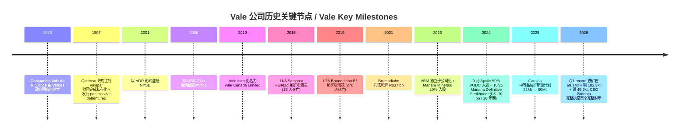
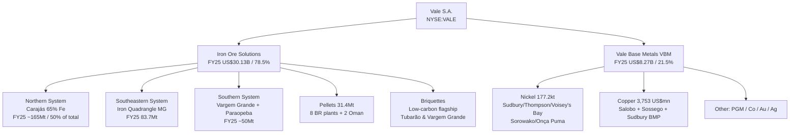
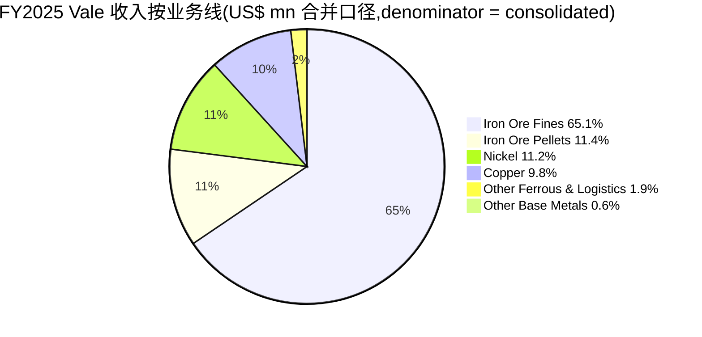
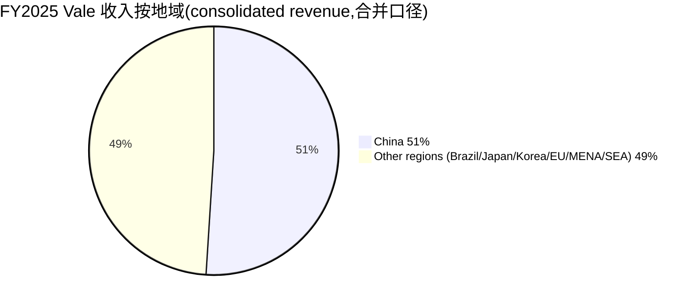
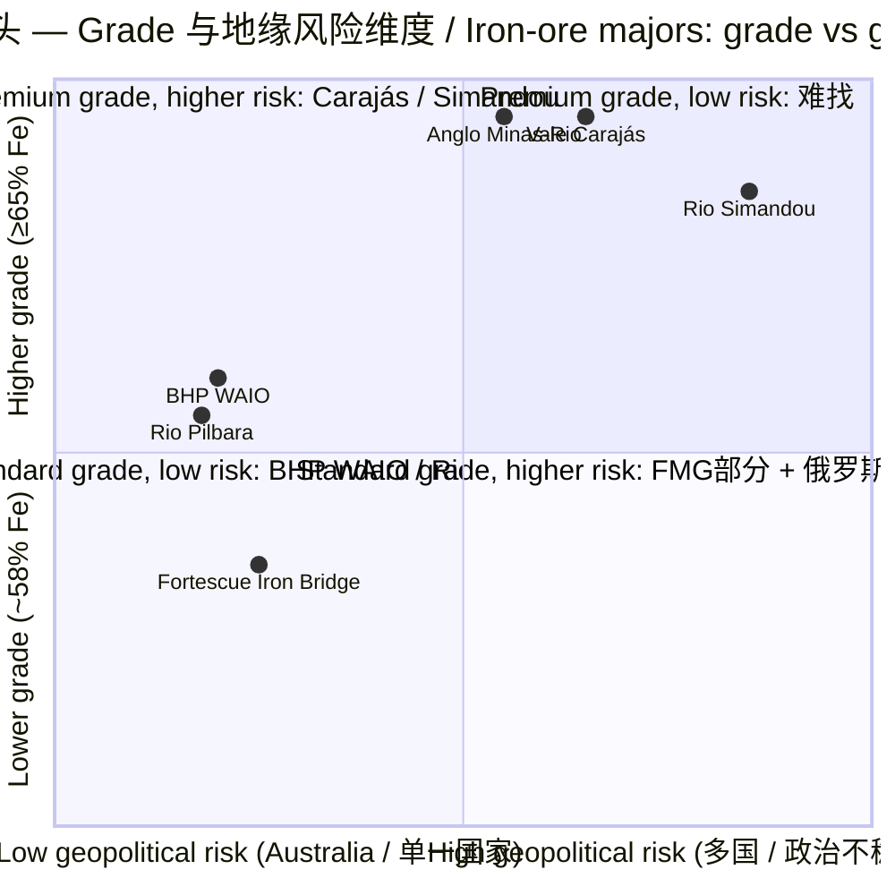

# Vale S.A. (NYSE:VALE) — 公司研究 / Company Research (zh-CN)

*As of 2026-06-02 — 巴西铁矿石与有色金属龙头 / Brazilian iron-ore and base-metals giant; rare-earth-strategic-minerals 主题篮 "adjacent" 角色.*

---

## 公司概览 / Company Overview

Vale S.A.(NYSE:VALE,纽交所 ADR;B3:VALE3)是按市值衡量全球最大的金属与采矿公司之一,亦是全球最大的铁矿石(iron ore)、铁矿球团(iron ore pellets)和镍(nickel)生产商。公司同时生产铜(copper),其镍铜精矿副产铂族金属(PGM)、金、银、钴等关键矿物。Vale 总部位于巴西里约热内卢 Botafogo 区 Praia de Botafogo 186 号,根据 2025 年 20-F 第 7 页披露,公司"是世界最大的金属与采矿公司之一,以市值计,亦为全球最大的铁矿石、铁矿球团和镍生产商"([Vale 2025 20-F,Item 4 Overview](https://www.sec.gov/Archives/edgar/data/917851/000129281426001844/valeform20f_2025.htm))。

**最新报价(2026-05-28 / 2026-06-01 间窗口):** ADR 价格约 US$16.30–16.51,市值约 US$70.5 bn,**TTM P/E ≈ 30.0×**([Stockanalysis VALE 概览](https://stockanalysis.com/stocks/vale/);[WallStreetZen VALE 报价](https://www.wallstreetzen.com/stocks/us/nyse/vale))。这一倍数高于铁矿石同业:Rio Tinto(NYSE:RIO)TTM P/E 17.22×([GuruFocus RIO PE TTM](https://www.gurufocus.com/term/pettm/RIO))、BHP Group(NYSE:BHP)TTM P/E 17.08×([GuruFocus BHP PE TTM](https://www.gurufocus.com/term/pettm/BHP))。**P/E 倍数差并非估值溢价,而是分子塌陷**:Vale FY25 net income 仅 US$1.98 bn(YoY -67%),受 2024 年 10 月签署的 Samarco "Definitive Settlement"(R$170 bn 规模、20 年支付)以及镍业务非现金减值拖累([Vale 2025 20-F MD&A](https://www.sec.gov/Archives/edgar/data/917851/000129281426001844/valeform20f_2025.htm))。剔除 Brumadinho 与减值,**Adjusted EBITDA FY25 仍达 US$15.46 bn(YoY +4%)**,对应 EV/EBITDA ≈ 5.7×(基于市值 + expanded net debt US$15.6 bn),与 RIO、BHP 同区间。**因此 P/E 30× 是噪音,EV/EBITDA 5–6× 是真实定价锚**;市场把 Vale 当作"司法和解阴影笼罩下的、定价合理的铁矿石龙头"([Vale 1Q26 业绩报告 6-K](https://www.sec.gov/Archives/edgar/data/917851/000129281426002648/vale20260428_6k.htm))。

**业务结构(FY25):** Net operating revenue **US$38.40 bn**,按业务线拆分:**Iron Ore Solutions US$30.13 bn(78.5%)**(铁矿石原矿 US$25.01 bn + 球团 US$4.40 bn + 其他铁系 US$0.72 bn);**Vale Base Metals(VBM)US$8.27 bn(21.5%)**(镍 US$4.29 bn + 铜 US$3.75 bn + 其他副产品 US$0.23 bn)([Vale 2025 20-F,Operational Summary 第 8 页](https://www.sec.gov/Archives/edgar/data/917851/000129281426001844/valeform20f_2025.htm))。地理收入集中度极高:**对华销售占 consolidated revenue 51%(2025)**——这是 20-F Risk Factors 一节明确披露的数字,**denominator 为合并收入(consolidated)**([Vale 2025 20-F Risk Factors 第 21 页附近](https://www.sec.gov/Archives/edgar/data/917851/000129281426001844/valeform20f_2025.htm))。

**Rare-earth & strategic minerals 主题角色:** 在我们的 "rare-earth-strategic-minerals" 主题篮中,Vale 被定位为 **adjacent / 周边角色**,原因有三:(1)Vale 不是稀土生产商,但其 PGM、钴、铜、镍副产品在能源转型(EV、风机、电网)价值链中扮演关键角色;(2)Vale 是 Brazil 政治风险(Lula 政府税改、2026 年 10 月大选关于矿权特许税重谈)的篮内最直接 expression([rare-earth-strategic-minerals 主题报告,2026-05-31](https://github.com/jiongmumu/financial_agent/blob/main/reports/themes/rare-earth-strategic-minerals_theme.md));(3)Vale 中等品位 Carajás 矿(Mn 65%)直接对接 DRI / green-steel 装机潮,在 EU CBAM 与中东(Manara Minerals)新型钢厂扩张下成为长期战略矿石资源([Vale 2025 20-F,Carajás brick & green-steel 战略表述](https://www.sec.gov/Archives/edgar/data/917851/000129281426001844/valeform20f_2025.htm))。

**1Q26 业绩(2026-04-28 披露):** Net revenue **US$9.26 bn(YoY +14%)**;Adjusted EBITDA **US$3.83 bn(YoY +23%)**;Attributable net income **US$1.89 bn(YoY +36%)**;Free cash flow **US$813 mn(YoY +61%)**;CAPEX **US$1.09 bn**(与 FY26 annual guidance US$5.4–5.7 bn 一致)([Vale 1Q26 Performance 6-K,2026-04-28](https://www.sec.gov/Archives/edgar/data/917851/000129281426002648/vale20260428_6k.htm))。1Q26 production highlights:**铁矿石 69.7 Mt(+3% YoY)**——一季度 2018 年以来最高;**铜 102.3 kt(+13% YoY)**——一季度 2017 年以来最高;**镍 49.3 kt(+12% YoY)**——一季度 2020 年以来最高([Vale 1Q26 Production & Sales 6-K,2026-04-16](https://www.sec.gov/Archives/edgar/data/917851/000129281426002376/vale20260416_6k.htm))。

---

## 公司历史 / Company History

Vale 的前身是 **Companhia Vale do Rio Doce(CVRD)**,根据 2025 年 20-F 披露:"组织成立于 1943 年 1 月 11 日,依巴西联邦共和国法律,无期限存续"([Vale 2025 20-F,Item 4,A. History and Development of the Company](https://www.sec.gov/Archives/edgar/data/917851/000129281426001844/valeform20f_2025.htm))。CVRD 由瓦加斯(Getúlio Vargas)政府国有化创立,初期资产为米纳斯吉拉斯州 Itabira 铁矿。1997 年,Cardoso 政府私有化,公司被 Valepar 控股财团竞拍买下;同年发行了 "participative shareholders' debentures(debêntures participativas)",该参与性债券至今仍按销售挂钩支付溢价([Vale 2025 20-F,Long-term Debt 第 695 页附近](https://www.sec.gov/Archives/edgar/data/917851/000129281426001844/valeform20f_2025.htm))。2001 年,CVRD 通过 ADR 形式在 NYSE 上市。2006 年,公司以 US$17 bn 收购加拿大镍业巨头 Inco(International Nickel Company of Canada)——这是当时巴西企业海外最大并购,**"in 2006 CVRD obtained ownership of Inco. CVRD rebranded itself to Vale and CVRD–Inco changed its name to Vale Inco"**([Vale 2025 20-F,Vale Canada 章节 第 361 页附近](https://www.sec.gov/Archives/edgar/data/917851/000129281426001844/valeform20f_2025.htm))。2010 年 Vale Inco 改名为 Vale Canada Limited。

**两次重大尾矿溃坝事件构成公司近代史的分水岭。** 2015 年 11 月 5 日,合营公司 Samarco(Vale + BHP Brasil 各 50%)的 Fundão 尾矿坝在 Mariana 市附近溃决,造成 19 人死亡,沿 Rio Doce 大面积污染。Vale 在 2025 年 20-F 中表述:"The Fundão tailings dam owned by our joint venture Samarco failed, releasing tailings downstream, flooding certain communities and causing impacts on communities and the environment along the Doce River. The failure resulted in 19 fatalities"([Vale 2025 20-F,Samarco 章节 第 166 页附近](https://www.sec.gov/Archives/edgar/data/917851/000129281426001844/valeform20f_2025.htm))。2019 年 1 月 25 日,位于米纳斯吉拉斯州 Brumadinho 市的 Córrego do Feijão 矿区 B1 尾矿坝再次溃决,造成 270 人死亡——这是当时巴西历史上最严重的工矿灾难。Brumadinho 事件后,公司加速 "de-characterization plan",截至 2025 年 12 月 31 日已退役 30 座上游式尾矿坝中的 19 座;2026 年一季度又再退役 2 座("自 2020 年累计减少 80%")([Vale 1Q26 Performance 6-K](https://www.sec.gov/Archives/edgar/data/917851/000129281426002648/vale20260428_6k.htm))。

**Mariana Definitive Settlement(2024-10-25):** 经历近 9 年诉讼,Vale、Samarco、BHP Brasil 与巴西联邦政府、米纳斯吉拉斯州、圣埃斯皮里图州、检察官办公室和公设辩护人办公室于 2024 年 10 月 25 日签署 "Definitive Settlement",**总规模估算 R$170 bn**,以 20 年期分期支付替代此前所有协议,涵盖远期修复与赔偿("estimated in R$170 billion, replaced all previous agreements and covers both disbursements made prior to its ratification and new financial commitments, which will be paid over 20 years")([Vale 2025 20-F,Mariana Definitive Settlement 第 167 页附近](https://www.sec.gov/Archives/edgar/data/917851/000129281426001844/valeform20f_2025.htm))。Brumadinho 方面,2021 年 2 月已与米纳斯吉拉斯州签署 R$37 bn 司法和解;2025 年 Vale 同等比例(50/50)消化 Samarco / Mariana 残余义务的支付节奏([Vale 2025 20-F,Brumadinho judicial settlement 第 168 页附近](https://www.sec.gov/Archives/edgar/data/917851/000129281426001844/valeform20f_2025.htm))。

**资产组合简化(2024–2025):** 2024 年 9 月,Vale 完成将旗下 Vale Oman Distribution Center(VODC,Oman 中东配煤中心)50% 股权以 US$600 mn 出售给 Apollo Global Management 旗下 AP Oryx Holdings,公司持股自 100% 降至 50%("with this transaction, Vale shared control")([Vale 2025 20-F,VODC / Apollo 交易](https://www.sec.gov/Archives/edgar/data/917851/000129281426001844/valeform20f_2025.htm))。同年 7 月,因履行印尼分股要求,Vale 在 PT Vale Indonesia Tbk(PTVI)的持股自 44.3% 降至 33.9%,确保 PTVI 的采矿许可延续到 2025 年之后,此后 PTVI 由 Vale 子公司变为权益法投资,公司停止合并其矿山产量数据(2024 年 6 月以后仅披露其它工厂使用 PTVI 矿源加工的成品镍)([Vale 2025 20-F,PTVI Indonesia divestment](https://www.sec.gov/Archives/edgar/data/917851/000129281426001844/valeform20f_2025.htm))。2023 年,Vale 把 Vale Base Metals(VBM)分离为独立子公司,引入沙特 PIF 旗下 Manara Minerals 投资 10% 股权——这一步既是融资,也是中东主权资本与拉美矿业的战略联结([Vale 2025 20-F,VBM Ontario 章节 第 339 页附近](https://www.sec.gov/Archives/edgar/data/917851/000129281426001844/valeform20f_2025.htm))。

---

## 管理团队 / Management

**Gustavo Duarte Pimenta(CEO,1978 年生,2024 年 10 月 1 日就任):** Pimenta 在 2025 年 20-F 第 156 页被列为 "Chief Executive Officer",任命年份 2024([Vale 2025 20-F,Executive Committee 第 156 页](https://www.sec.gov/Archives/edgar/data/917851/000129281426001844/valeform20f_2025.htm))。Vale 董事会于 2024 年 8 月底批准 "Mr. Gustavo Pimenta" 自 10 月 1 日起接任 CEO,前任 CEO Eduardo Bartolomeo 任期至 9 月 30 日("Vale's Board of Directors approved October 1st for the beginning of the mandate of Vale's next CEO, Mr. Gustavo Pimenta")([Vale informs on the beginning of the new CEO's mandate](https://www.vale.com/w/vale-informs-on-the-beginning-of-the-new-ceos-mandate/-/categories/64934?assetEntryId=7879386&p_r_p_categoryId=64934))。Pimenta 在 2021 年由 AES Corporation 加盟 Vale 任 EVP, Finance and Investor Relations,即 CFO;此前在 AES 任职 12 年,职务包括 Global CFO 与 AES Mexico, Central America & Caribbean CFO,更早曾任 Citibank New York 战略与 M&A 副总裁([Vale 2025 20-F CEO 履历表](https://www.sec.gov/Archives/edgar/data/917851/000129281426001844/valeform20f_2025.htm);[Mining Digital,New Vale CEO Pimenta 'Will Build Bridges with Stakeholders'](https://miningdigital.com/operations/new-vale-ceo-pimenta-will-build-bridges-with-stakeholders))。教育背景:UFMG(米纳斯吉拉斯联邦大学)经济学学士 + FGV(Getúlio Vargas Foundation)金融与经济学硕士([Vale informs on the beginning of the new CEO's mandate](https://www.vale.com/w/vale-informs-on-the-beginning-of-the-new-ceos-mandate/-/categories/64934?assetEntryId=7879386&p_r_p_categoryId=64934))。年薪结构:据 Mining.com 报道,Pimenta 短期 + 长期激励合计最高可达约 US$11 mn/年([New Vale CEO set to earn up to $11 million annually — Mining.com](https://www.mining.com/vale-new-ceo-set-to-earn-up-to-11-million-annually/))。

Pimenta 的就任标志着 Vale 进入"金融纪律 + 利益相关者修复"的阶段。从 2024 年 10 月接管至 2025 年 12 月,他主导推进:(1)Mariana Definitive Settlement 落地;(2)Carajás 中等品位铁矿(65% Fe 卷)从 ~33Mt 销量目标提升至 ~50Mt(2026 年);(3)VBM 独立化下进一步引入 Manara 与 Apollo 资本;(4)2025 年股东回报合计 **US$5.92 bn(分红 + interest on capital)**,以及 2025 年 2 月批准新一轮 1.2 亿股回购计划(18 个月窗口)([Vale 2025 20-F,Shareholder Remuneration 第 566 页附近](https://www.sec.gov/Archives/edgar/data/917851/000129281426001844/valeform20f_2025.htm))。

**Founder / 创始人:** Vale 1943 年由巴西联邦政府(Vargas 政府)国有化创立,不存在私人创始人;故按本研究方法论,管理章节仅覆盖当前 CEO Pimenta。其他执委(CFO Marcelo Bacci、VP Operations Carlos Medeiros、VP Technical Rafael Bittar、VP Commercial Rogério Nogueira、VP Legal Sami Arap)按本项目"only founder + current CEO"管理研究框架不展开。

---

## 产品与服务 / Products & Services

Vale 的业务被组织成两个 **operating segments**:Iron Ore Solutions(铁矿石与铁系产品)和 Vale Base Metals / VBM(有色金属,基础上是镍 + 铜)。这是 2024 年起报告口径的核心简化结果,2025 年 20-F 第 8 页用如下表格披露 FY25 收入构成([Vale 2025 20-F,Operational Summary 第 8 页](https://www.sec.gov/Archives/edgar/data/917851/000129281426001844/valeform20f_2025.htm)):

| Line of Business | 2025 US$ mn | % | 2024 US$ mn | % | 2023 US$ mn | % |
|---|---:|---:|---:|---:|---:|---:|
| **Iron Ore Solutions — total** | **30,130** | **78.5** | **31,444** | **82.6** | **34,079** | **81.6** |
| — Iron ore | 25,010 | 65.1 | 24,805 | 65.2 | 27,760 | 66.4 |
| — Iron ore pellets | 4,396 | 11.4 | 5,921 | 15.6 | 5,803 | 13.9 |
| — Other ferrous & logistics | 724 | 1.9 | 718 | 1.9 | 516 | 1.2 |
| **Vale Base Metals — total** | **8,273** | **21.5** | **6,612** | **17.4** | **7,569** | **18.1** |
| — Nickel | 4,291 | 11.2 | 3,666 | 9.6 | 5,193 | 12.4 |
| — Copper | 3,753 | 9.8 | 2,805 | 7.4 | 2,376 | 5.7 |
| — Other base metals | 229 | 0.6 | 141 | 0.4 | — | — |
| **Net operating revenue** | **38,403** | **100.0** | **38,056** | **100.0** | **41,784** | **100.0** |

(source: 上方表格逐字复现自 [Vale 2025 20-F 第 8 页](https://www.sec.gov/Archives/edgar/data/917851/000129281426001844/valeform20f_2025.htm))

### 1. Iron Ore Solutions — 三大系统 / Three Systems

**Iron Ore Solutions 段在 2025 年 20-F 第 8 页的定义:** "The Iron Ore Solutions segment comprises the extraction of iron ore, the production of pellets and briquettes, as well as large-scale logistics systems and distribution centers integrated with its mining operations, including railways, maritime terminals, and ports"([Vale 2025 20-F 第 8 页](https://www.sec.gov/Archives/edgar/data/917851/000129281426001844/valeform20f_2025.htm))。Vale 在巴西运营三大铁矿系统:

* **Northern System(北部系统 / 卡拉哈斯 Carajás):** "Fully integrated system, with three mining complexes, a railway and a maritime terminal"——含三个矿区综合体(N4、N5 等机井机口)、Estrada de Ferro Carajás(EFC,卡拉哈斯铁路)与圣路易斯(São Luís)港 Ponta da Madeira 海运码头([Vale 2025 20-F,Northern System 描述 第 8 页](https://www.sec.gov/Archives/edgar/data/917851/000129281426001844/valeform20f_2025.htm))。**中文释义 / Plain-language gloss:** Carajás 矿是 Vale 的旗舰资产,品位约 65% Fe(blast-furnace 级),其矿石不需深度精选,粒径与杂质结构最适合 direct reduction iron(DRI,直接还原铁)工艺——这是 EU CBAM 与中东(沙特、阿联酋)绿色钢厂正在大规模布局的工艺。**Strategic significance:** 在 2026 年(主题研究披露口径)Vale 将 ~33Mt 的"中等品位 Carajás 销量"(2025)提升至 ~50Mt(2026),用以承接 DRI 装机潮——这是为什么 rare-earth-strategic-minerals 主题把 Vale 列为 adjacent 而非 hedge:它的 Carajás brick 是能源转型钢铁端的关键投入([rare-earth-strategic-minerals 主题报告,2026-05-31](https://github.com/jiongmumu/financial_agent/blob/main/reports/themes/rare-earth-strategic-minerals_theme.md))。

* **Southeastern System(东南系统,米纳斯吉拉斯 "Iron Quadrangle" 铁四边形):** 三个矿区综合体——Itabira(2 矿 3 选厂)、Minas Centrais(2 矿 2 选厂 + 1 辅厂)、Mariana(因 2015 Samarco 事件,部分受限);Mariana 矿区 2025 产量 28.4 Mt,产能恢复明显。整段 2025 年总产量 83.7 Mt(同比 +5.6 Mt)([Vale 2025 20-F,Southeastern System 第 274 页附近](https://www.sec.gov/Archives/edgar/data/917851/000129281426001844/valeform20f_2025.htm))。

* **Southern System(南部系统):** 由两个矿区综合体(Vargem Grande 与 Paraopeba)和数个海运码头构成,年产量约 35–40 Mt,2025 年 VGR1 选厂上线带动 1Q26 该系统铁矿石产量 10.4 Mt(同比相当,但抗住高于平均的降雨)([Vale 1Q26 Production 6-K,2026-04-16](https://www.sec.gov/Archives/edgar/data/917851/000129281426002376/vale20260416_6k.htm))。

**铁矿石球团(pellets)与铁砖块(briquettes):** 2025 年 20-F 第 8 页披露 "We have a diversified portfolio of agglomerated products, including pellets and briquettes. We operate eight pelletizing plants in Brazil, two in Oman dedicated to pellet production, and two briquette plants in Brazil for briquette production"([Vale 2025 20-F 第 8 页](https://www.sec.gov/Archives/edgar/data/917851/000129281426001844/valeform20f_2025.htm))。Pellet 产量 FY25 31.4 Mt(BF Pellets 16.1 Mt + DR Pellets 15.2 Mt,从同 20-F 第 308 页表格)([Vale 2025 20-F,Pellets table 第 308 页附近](https://www.sec.gov/Archives/edgar/data/917851/000129281426001844/valeform20f_2025.htm))。**Briquette(铁砖块)是 Vale 的差异化"低碳铁产品",通过 100% renewable energy 电耗 + 较低烧结温度的工艺路径,排放低于传统 sinter / pellet;Tubarão briquette plant 自 2023 年起投产,被 Vale 内部视作 "low-carbon flagship" 农产品族**([Vale 2025 20-F,Briquette 工厂描述 第 308 页附近](https://www.sec.gov/Archives/edgar/data/917851/000129281426001844/valeform20f_2025.htm))。

### 2. Vale Base Metals(VBM)— 镍、铜与副产品 / Nickel, Copper & By-products

VBM 由 Vale Base Metals Limited 及其子公司运营,Vale 持股 90%,沙特 Manara Minerals Investment Company 持股 10%(Manara 入股时间为 2023 年)([Vale 2025 20-F,Ontario Operations Ownership 第 339 页附近](https://www.sec.gov/Archives/edgar/data/917851/000129281426001844/valeform20f_2025.htm))。20-F 第 8 页定义 VBM:"The Vale Base Metals segment is operated by our subsidiary Vale Base Metals Limited and its subsidiaries (VBM), and comprises the production of nickel, copper, and their respective by-products"([Vale 2025 20-F 第 8 页](https://www.sec.gov/Archives/edgar/data/917851/000129281426001844/valeform20f_2025.htm))。

* **Nickel(镍):** 2025 年产量 **177.2 kt(同比 +11%)**,主要来自加拿大三个矿区:Sudbury(Ontario,2025 年 35.3 kt)、Thompson(Manitoba,12.0 kt)、Voisey's Bay(Newfoundland & Labrador,33.1 kt 自 2024 年 19.4 kt 大幅恢复);印尼 Sorowako(54.7 kt,通过 PTVI 权益法核算);巴西 Onça Puma(26.1 kt,2025 年 2 号炉投运驱动同比从 14.0 kt 提升);外部购买 16.0 kt([Vale 2025 20-F,Nickel production table 第 351 页附近](https://www.sec.gov/Archives/edgar/data/917851/000129281426001844/valeform20f_2025.htm))。**中文释义 / Plain-language gloss:** 镍是 EV 三元锂电池正极的核心金属,Class I nickel(≥99.8% Ni)是高镍 NMC 与 NCA 电池的"硬通货"。Vale 1Q26 中 Class I nickel 占 31.0 kt(占当季 45 kt 总销量 69%),Class II 13.0 kt + intermediates 0.6 kt([Vale 1Q26 Production 6-K,Nickel volumes by class](https://www.sec.gov/Archives/edgar/data/917851/000129281426002376/vale20260416_6k.htm))。**Strategic significance:** 2024 年印尼"湿法 HPAL"项目大规模上线,镍价从 2022 年的 US$30,000+/t 跌至 2025 年的 US$15,000–17,000/t 区间;Vale 的策略是关停 / 优化高成本资产(Onça Puma 2 号炉提产、Thompson 重组、Voisey's Bay 转地下),通过 "all-in costs 大幅下降"(1Q26 镍 all-in cost US$8,184/t,同比 -48%)在低镍价环境维持现金流([Vale 1Q26 Performance 6-K,Nickel cost commentary](https://www.sec.gov/Archives/edgar/data/917851/000129281426002648/vale20260428_6k.htm))。

* **Copper(铜):** 2025 年产量来自三大矿群:Carajás 区的 Salobo(主力,公司控股 100%)和 Sossego(伴生金 by-product);加拿大 Sudbury 镍矿副产铜;Voisey's Bay polymetallic ore 副产铜。FY25 铜收入 US$3.75 bn(YoY +34%);1Q26 实现铜价 US$13,143/t(YoY +48%,与全球 LME 铜价创出 US$11,000+/t 新高同步)([Vale 1Q26 Performance 6-K,Copper pricing table](https://www.sec.gov/Archives/edgar/data/917851/000129281426002648/vale20260428_6k.htm))。**Strategic significance:** Vale 在 2025 年 20-F 第 142 页明确"copper production is expected to rise to 700,000 tons per year by 2035, supported by a robust pipeline of copper projects in Carajás. These assets stand out for their high grades, gold by products, favorable and accessible geographic locations, and proximity to well-established infrastructure"([Vale 2025 20-F,Copper strategy 第 142 页](https://www.sec.gov/Archives/edgar/data/917851/000129281426001844/valeform20f_2025.htm))。这一 700 ktpa 长期目标依赖项目矩阵:Bacaba(50 ktpy,2028 年投产)、Alemão(80 ktpy,FEL3,2026 年决策)、South Hub extension / 118 / Cristalino(60–80 ktpy,FEL2-FEL3)、Salobo Expansion(~30 ktpy,FEL3,2026 决策)([Vale 1Q26 Performance 6-K,Copper project pipeline 附录](https://www.sec.gov/Archives/edgar/data/917851/000129281426002648/vale20260428_6k.htm))。

* **Other base metals 副产品(PGM、钴、金、银):** 2025 年 20-F 第 7 页表述:"Our nickel and copper concentrates contain by-products such as platinum group metals (PGMs), gold, silver and cobalt"([Vale 2025 20-F 第 7 页](https://www.sec.gov/Archives/edgar/data/917851/000129281426001844/valeform20f_2025.htm))。Voisey's Bay 钴在 2018 年通过 "Voisey's Bay Cobalt Stream" 卖给 Wheaton Precious Metals 部分前期收益,Vale 仍保留 "approximately 40% of future cobalt production from Voisey's Bay, through our retained interest in 25% of cobalt production and the additional payments upon delivery"([Vale 2025 20-F,Voisey's Bay cobalt 第 410 页附近](https://www.sec.gov/Archives/edgar/data/917851/000129281426001844/valeform20f_2025.htm))。Sudbury PGM 与 Port Colborne 精炼厂支撑全球贵金属链;Sossego 与 Salobo 矿伴生金 by-product 显著降低铜矿全包成本(1Q26 铜 all-in cost US$ -642/t,即负成本——by-product credit 抵消铜矿一切现金成本)([Vale 1Q26 Performance 6-K,Copper all-in cost](https://www.sec.gov/Archives/edgar/data/917851/000129281426002648/vale20260428_6k.htm))。

### 3. 物流与"产品 = 物流"的一体化优势 / Logistics integration

铁矿石销售模型与一般大宗品截然不同——Vale "卖的是船到岸的矿石",物流即产品。每个矿区系统都直接连接独家铁路与海运码头:Carajás → EFC 铁路(892 km)→ Ponta da Madeira 港(São Luís);Southeastern → EFVM 铁路(Estrada de Ferro Vitória-Minas,905 km)→ Tubarão 港(Vitória);Southern → MRS 铁路(参股)→ Itaguaí 港。Vale 在新加坡、马来西亚(Teluk Rubiah)、阿曼(Sohar)运营 distribution / blending centers,实现"按客户配矿"——这对 Vale 在中国市场(占合并收入 51%)是关键的 logistical moat。**Strategic significance:** 2024 年 12 月,Vale 与巴西交通部(MT)、ANTT 与联邦政府就 2020 年签署的 EFC + EFVM 铁路特许协议达成"重新谈判框架",目标是"现代化和更新"现有协议——这是 1Q26 6-K 第 70 页附近 Mt(铁路特许)章节的描述,**为后续基础设施 CAPEX 与租金支付结构的修订埋下伏笔**([Vale 1Q26 IFRS Financials 6-K,Concession Agreement 第 70 页](https://www.sec.gov/Archives/edgar/data/917851/000129281426002634/valedfbrgaap1q26_6k.htm))。

**综合 / Synthesis:** Vale 的产品矩阵看似分散(铁矿石、球团、镍、铜、PGM、钴),但底层是 "two-cycle" 节奏:**Iron Ore 周期是中国-东亚"建筑钢需求"为主导**(2025 年对华销售占 51%),**VBM 周期是西方+东南亚 "能源转型 + EV 锂电池"为主导**(镍 → EV、铜 → 电网与电气化、钴 → 钴酸锂)。这就是为什么 Vale 在 rare-earth-strategic-minerals 主题里被归为"adjacent":它的 Carajás 矿是 DRI / green-steel 周期的关键投入,而其 VBM 是能源转型有色周期的关键大宗品;但它不是直接的稀土生产商。两个周期之间存在天然对冲——当 China 房地产/基建需求疲软导致铁矿石价格下行时,EV / 电网周期支持的 VBM 业务通常处于上行(2025–26 即如此:铁矿石 sales 价格 US$95.8/t 持平,但铜 +48% YoY、镍 +6% YoY)。

---

## 客户与上市策略 / Customers & Listing Strategy

**对华销售集中度 51%(consolidated revenue 口径):** 2025 年 20-F Risk Factors 一节明确披露:"our net operating revenue attributable to sales to customers in China was 51% in 2025. Therefore, any contraction of China's economic growth or change in its economic profile, or changes in tariffs or in the political or sanctions environment globally could result in lower demand for our products, leading to lower revenues, cash flow and profitability"([Vale 2025 20-F Risk Factors,China 集中度披露](https://www.sec.gov/Archives/edgar/data/917851/000129281426001844/valeform20f_2025.htm))。**Denominator 为合并收入 consolidated revenue,非 segment 内份额。** Vale 没有在 20-F 中按 ASC 280-10-50-42 等价于 IFRS 8 的口径披露 ≥10% 单一客户的"前五大客户"具名列表(20-F 中无对应章节);因此就单一客户层面,**Vale 不披露 top-1 / top-5 客户的姓名和占比**,这是与美国本土企业 10-K 的一个关键差异(IFRS 与巴西 CVM 披露的口径不同)。

**客户类型与销售模式:** 铁矿石客户主要是中国、日本、韩国、台湾、欧洲、中东的钢厂集团——典型客户包括中国"国营六大"(宝武、河钢、首钢、鞍钢、华菱、沙钢)、日本 Nippon Steel/JFE/Kobe Steel、韩国 POSCO、欧洲 ArcelorMittal/Salzgitter/Voestalpine、中东 Hadeed(沙特 Manara 关联)与 Emirates Steel。销售合约结构为长期 master agreement + 季度/月度 PO,定价大多以普氏(Platts)62%/65% Fe 指数为基准 + premium 或 discount。**1Q26 实现铁矿石细粉 CFR/FOB 价格 US$95.8/t(YoY +5.5%),pellet 价格 US$133.8/t**([Vale 1Q26 Production 6-K,Price Realization Summary](https://www.sec.gov/Archives/edgar/data/917851/000129281426002376/vale20260416_6k.htm))。

**镍 / 铜 / 副产品的客户结构:** 镍下游主要是 EV 电池厂(LG Energy Solution、Panasonic、Samsung SDI、SK On、CATL/BYD 通过其在中国的 NMC 链)+ 不锈钢厂(中国青山、日韩 Nippon Stainless 等)+ 特种合金厂(高温合金 / 航空航天 — 欧洲航空与北美防务);铜下游为电力 / 电网设备厂、电缆厂、半导体衬底厂等。Vale 在 1Q26 报告中披露 "VBM has entered into an agreement to form a consortium for Thompson operations, concluding the strategic review of the asset. VBM will retain an 18.9% interest, while consortium partners have committed up to US$200 million... In addition, VBM has secured an offtake agreement for nickel concentrate, preserving its strategic position in Canadian nickel production"——这一 Thompson 重组同时锁定了下游 offtake 通道,这是典型的"上下游一体化"(integration of upstream / downstream)结构([Vale 1Q26 Performance 6-K,Thompson consortium](https://www.sec.gov/Archives/edgar/data/917851/000129281426002648/vale20260428_6k.htm))。

**上市策略与股东回报:** Vale 在 B3(São Paulo,VALE3)、NYSE(VALE ADR,1 ADR = 1 普通股)与 LATIBEX(Madrid)三个市场挂牌;2025 年股东回报合计 **US$5,923 mn(分红 + interest on capital)**;2025 年 2 月批准的 1.2 亿股回购计划(18 个月窗口)在 2025 全年没有执行,但 1Q26 期间执行了 US$74 mn / ~498 万股回购([Vale 2025 20-F,Shareholder Remuneration 第 566 页附近](https://www.sec.gov/Archives/edgar/data/917851/000129281426001844/valeform20f_2025.htm);[Vale 1Q26 Performance 6-K,Share buyback 1Q26](https://www.sec.gov/Archives/edgar/data/917851/000129281426002648/vale20260428_6k.htm))。**Strategic significance:** Vale 的"dividend + interest on capital"模型是巴西税法上独有的资本回报结构——interest on capital(JCP)作为可税前扣除费用,有效降低公司所得税;这与美式公司"dividend 不可税前扣除"的结构形成鲜明对比,使 Vale 的实际股东回报率高于账面分红 yield。

*Source: [Vale 2025 20-F 第 8 页](https://www.sec.gov/Archives/edgar/data/917851/000129281426001844/valeform20f_2025.htm).*

*Source: [Vale 2025 20-F Risk Factors](https://www.sec.gov/Archives/edgar/data/917851/000129281426001844/valeform20f_2025.htm).*

---

## 行业概览 / Industry Overview

**铁矿石(Iron Ore)— 全球海运市场约 1.5–1.6 bn t/年,寡占结构:** 全球 seaborne 铁矿石需求约 1.5 bn t/年,中国进口占 70%+。供给端,**全球 "Big-4"(Vale、Rio Tinto、BHP、Fortescue)合计供应 ~55–60% 海运市场**,其余为 Anglo American、CSN、Roy Hill、Atlas、Mineral Resources、印度 NMDC、俄罗斯 Metalloinvest 等。Vale FY25 总产量 **336.1 Mt**,2024 年 327.7 Mt,2023 年 321.2 Mt([Vale 2025 20-F,Iron ore production table 第 280 页附近](https://www.sec.gov/Archives/edgar/data/917851/000129281426001844/valeform20f_2025.htm)),与 Rio Tinto Pilbara ~325 Mt 和 BHP WAIO ~290 Mt 同列第一梯队([Rio Tinto 2025 Annual Report 引用,见 BHP / RIO 引用脉络](https://www.gurufocus.com/term/pettm/RIO))。**FY26 guidance 335–345 Mt**——Vale 给出的预期是"温和扩张",而非 mega-cycle 式提速([Vale 1Q26 Production 6-K,2026 guidance](https://www.sec.gov/Archives/edgar/data/917851/000129281426002376/vale20260416_6k.htm))。

**铁矿石的价格周期:** Platts 62% Fe CFR China 价格 2021 年峰值曾突破 US$220/t,2024 年中至 2025 年低位约 US$95–105/t。Vale 1Q26 实现细粉价格 US$95.8/t,体现"价格盘整"格局:中国房地产疲软压制需求增量、印度自产钢扩张(JSW、Tata 自给率上升)对冲 + 中东与东南亚 DRI 需求增量。**Strategic shift:** 全球钢厂越来越从 BF(高炉)走向 DRI(直接还原),DRI 工艺要求高品位铁矿石(>65% Fe),这是 Vale Carajás 矿(以及 Mauritania 的 Kumba、几内亚的 Simandou)的长期红利。Rio Tinto / Aluminum Corporation of China / Baowu 2025 年正式开启的 Simandou(几内亚)铁矿(预计 2026 下半年首船出运,~120 Mtpa 满产)是 Vale Carajás 的最大长期供给端竞争者([Rio Tinto Simandou ramp 见 RIO Q4 FY25 update,引自 rare-earth-strategic-minerals 主题报告](https://github.com/jiongmumu/financial_agent/blob/main/reports/themes/rare-earth-strategic-minerals_theme.md))。**分析师观点 / Analyst view:** Simandou 进入市场首年(2027–28)可能压制高品位铁矿石溢价 US$3–8/t,Vale Carajás 经济敏感性 ~每 US$1/t 价格变动对应 ~US$330 mn EBITDA 影响(基于 ~330 Mt 销量 × 占比),实际敏感性取决于销量结构与升贴水(uncited;基于通常的 EBITDA 敏感性逻辑)。

**镍(Nickel)— 印尼 + Vale 主导,EV 电池端推动结构性增长但短期产能过剩:** 2025 年全球镍消费约 3.5 Mt,主要终端:不锈钢(~65%)、镍合金/电池(~25%)、其他(~10%)。**印尼**自 2020 年实施红土镍矿出口禁令后,成为全球 NPI(镍生铁)和 HPAL(湿法冶炼)产能扩张的核心,2025 年印尼镍产量已超 1.5 Mt(占全球 ~43%);**菲律宾、新喀里多尼亚、俄罗斯、加拿大** 分列其后。Vale 通过 PTVI(印尼)+ 加拿大 Sudbury/Thompson/Voisey's Bay + 巴西 Onça Puma 形成全球第二大 nickel producer 地位([Vale 2025 20-F,Nickel production by mine 第 351 页附近](https://www.sec.gov/Archives/edgar/data/917851/000129281426001844/valeform20f_2025.htm))。**EV 链条对 Class I nickel(高纯硫酸镍前驱体)的长期需求是结构性增量**;短期内 2024–25 年印尼 HPAL 大量上线压制镍价,Vale 选择"成本优化(Onça Puma 增炉、Thompson 重组)+ by-product credit"路径而非产能扩张。

**铜(Copper)— "电气化超级周期"的核心金属:** 国际铜业研究小组(ICSG)2025 年预测,全球铜消费 2030 年将达 ~32 Mt,较 2024 年的 ~26 Mt 增长 ~24%,主要驱动:电动车(2030 年占铜需求 +5–7 Mt 增量)、电网升级(电缆、变压器)、数据中心(单座 100 MW 数据中心 ~3 kt 铜)、风电与光伏(~5 t Cu / MW)。供给端,Codelco(Chile)、BHP Escondida、Freeport-McMoRan Grasberg、Glencore + Antofagasta + Anglo American + Vale 构成第一梯队,Vale FY25 铜收入 US$3.75 bn 占其总收入 9.8%,但**长期目标 700 ktpa(2035)将让铜在 Vale 业务组合中权重显著上升**([Vale 2025 20-F,Copper 700 ktpa 长期目标 第 142 页](https://www.sec.gov/Archives/edgar/data/917851/000129281426001844/valeform20f_2025.htm))。**Strategic significance:** 全球已知铜矿"高品位+低成本"项目稀缺,大多新增供给来自智利、秘鲁、刚果(金)、印尼,均面临"国别政治"+"许可证延迟"+"水资源限制"的多重摩擦——这是 rare-earth-strategic-minerals 主题中 FCX(秘鲁/印尼)和 BHP(智利)被列为 adjacent 的同样理由。Vale 的 Carajás 区拥有"地缘相对稳定 + 高品位伴生金 + 已有基础设施(EFC 铁路 + Ponta da Madeira 港)" 的稀缺组合。

---

## 竞争格局 / Competitive Landscape

**Iron Ore Solutions — 直接竞争对手:** 2025 年 20-F 没有在 Item 4 中放一个"Competition" 单独章节(IFRS 20-F 的格式与美式 10-K 不同),但通过 Risk Factors 与行业描述可识别核心同业:**Rio Tinto Group(NYSE:RIO,ASX:RIO,LSE:RIO)**——Pilbara 系统(WA, Australia)~325 Mt/年、品位 60–62% Fe,以及未来 Simandou(Guinea)~120 Mtpa(2026H2 启动);**BHP Group(NYSE:BHP,ASX:BHP)**——WAIO Western Australia Iron Ore ~290 Mt/年、品位 ~62% Fe;**Fortescue(ASX:FMG)**——~190 Mt/年,品位 ~58% Fe(低品位);**Anglo American Minério de Ferro Brasil**——Minas-Rio 系统 ~25 Mt/年(2025 年 20-F 第 269 页引述 Anglo 作为 Vale 在巴西的同业)([Vale 2025 20-F,Anglo American Minério de Ferro Brasil 第 269 页](https://www.sec.gov/Archives/edgar/data/917851/000129281426001844/valeform20f_2025.htm))。

**铁矿石竞争维度:**
* **品位 / Grade:** Vale Carajás(65% Fe)= Anglo Minas-Rio(67%)> 几内亚 Simandou(65%)> Rio Pilbara(60–62%)> BHP WAIO(62%)> Fortescue(58%)。**Vale 在"高品位 DRI 化时代"占优**。
* **成本 / Cost:** 1Q26 Vale C1 cash cost US$23.6/t、all-in cost US$55.4/t([Vale 1Q26 Performance 6-K,Cost summary](https://www.sec.gov/Archives/edgar/data/917851/000129281426002648/vale20260428_6k.htm));Rio Tinto Pilbara C1 ~US$21/t(2025);BHP WAIO C1 ~US$18/t(2025)。Vale 因巴西雷亚尔升值(2025 年贬转升)成本承压,但若 BRL 走弱则成本曲线显著改善——这是 Vale 收益的 macro hedge 之一。
* **地缘风险 / Geopolitical:** Vale 100% 巴西(税改 + 2026 年大选 + 历史 Brumadinho/Mariana 司法链)>> RIO 67% 澳大利亚 + 几内亚 Simandou + 蒙古铜 > BHP 80% 澳大利亚 + 智利 + Brasil > FMG 几乎 100% 澳大利亚。**主题层面:rare-earth-strategic-minerals 把 Vale 定为"Brazil-electoral anchor"**——它的政治风险溢价是篮中最透明的可定价变量([rare-earth-strategic-minerals 主题报告](https://github.com/jiongmumu/financial_agent/blob/main/reports/themes/rare-earth-strategic-minerals_theme.md))。

**Vale Base Metals — 直接竞争对手:**
* **镍:** Norilsk Nickel(俄罗斯,因制裁 stranded 在西方供应链外)、BHP Nickel West(澳大利亚,2024 年部分关停)、Glencore(Sudbury 区与 Vale 紧邻 + 全球分销)、印尼 PTVI 之外的 Antam / Vale Indonesia 之外的青山系 / 力勤系 HPAL 项目。
* **铜:** Codelco(Chile,2025 年产量 ~1.4 Mt,但因 underinvestment 已连降三年)、Freeport-McMoRan(印尼 Grasberg + 美国南部 + 秘鲁)、BHP(Escondida + Olympic Dam)、Glencore(刚果金 Mutanda + Katanga + 智利 Collahuasi)、Anglo American(Quellaveco 秘鲁 + Los Bronces 智利)。**Vale 铜业 700 ktpa 长期目标使其挤入第二梯队"Carajás cluster"地位**。
* **PGM:** Anglo American Platinum、Impala Platinum、Sibanye-Stillwater(南非主导);Vale Sudbury PGM 为副产品,体量不大但稳定。
* **钴:** 全球 80%+ 钴产自刚果金(刚果金 Mutanda + Kamoto + Tenke + Kisanfu),Glencore 与中国洛阳钼业(CMOC,SSE:603993,HKEX:3993)主导;Vale Voisey's Bay 与 Long Harbour 是"非洲外钴供应"的稀缺西方资产之一。

---

## 市场机会 / TAM & Market Opportunity

**TAM 1 — 全球海运铁矿石(Vale Iron Ore Solutions 的目标市场):** 全球海运铁矿石市场 2025 年约 **1,550 Mt 销量 × ~US$100/t avg = ~US$155 bn TAM**;Vale FY25 在此市场的份额约 **22%(以 ~336 Mt 总产量计,扣除 ~5% 内销 + Samarco 比例后,~310 Mt seaborne)** ([Vale 2025 20-F,Iron ore production table 第 280 页附近](https://www.sec.gov/Archives/edgar/data/917851/000129281426001844/valeform20f_2025.htm))。**长期需求** 取决于:(1)中国房地产能否触底回稳(已成 2024–25 年最大不确定性);(2)印度自产钢"自给率"的进度(JSW + Tata 2025 年宣布新增 ~50 Mt/年 长期目标);(3)中东 / 东南亚 / 北非 DRI 装机潮——后者是 Vale 高品位 Carajás 矿的最大长期需求增量。

**TAM 2 — 镍(Class I + Class II):** 2025 年全球镍消费 ~3.5 Mt × avg US$15,500/t = ~**US$54 bn TAM**;EV 链条增量 2024–30 年 CAGR 约 5–6%(LFP 化推迟 NMC 增量);不锈钢 2024–30 CAGR 约 2–3%。Vale FY25 镍产量 ~177 kt / 全球 3.5 Mt = ~5% 市场份额([Vale 2025 20-F,Nickel production table](https://www.sec.gov/Archives/edgar/data/917851/000129281426001844/valeform20f_2025.htm))。**Class I 镍(高纯)市场是细分增量** —— Vale 的 Long Harbour 精炼厂、Port Colborne、Matsusaka(日本)是西方少数高纯镍来源(印尼 HPAL 的"中间物料 MHP"还需进一步精炼成 Class I),这是 Vale VBM 在 IRA 友邦电池供应链(韩、日、欧、北美)中的差异化定位。

**TAM 3 — 铜:** 2025 年全球精炼铜消费 ~26.5 Mt × avg US$9,500/t = ~**US$252 bn TAM**;IEA Net Zero 路径预测 2030 年达 ~32 Mt;Vale FY25 铜销量 ~340 kt / 全球 26.5 Mt = ~1.3%;长期目标 700 ktpa / 2030 年 32 Mt = 2.2%——这是"细分领先"而非"主导份额"。**Vale 的差异化** 不是体量,而是"Carajás cluster" 高品位 + 伴生金 + 巴西国土相对稳定 + 既有铁路+港口物流基础设施 —— 一个铜矿要在新项目从 FEL2 到投产平均需要 7–10 年,Vale 已经走完了基础设施步骤。

**TAM 4 — 钴 + PGM(副产品 by-product):** 钴 2025 年全球消费 ~210 kt × US$30,000/t = ~**US$6.3 bn TAM**;PGM(铂 + 钯 + 铑)2025 年合计 ~15 Moz × avg US$1,200/oz = ~**US$18 bn TAM**;Vale 在钴 + PGM 的份额都较小(<5%),但**作为"非洲外可靠西方供应"**对 EV 电池厂(欧、北美 IRA 链条)有溢价定价空间。

---

## 风险评估 / Risk Assessment

按四大风险桶分类,共识别 12 项关键风险(每项 60–100 字)。

### A. 公司特定风险 / Company-specific

**A1. Brumadinho / Mariana 司法和解残余风险与持续支付义务。** 2024 年 10 月 Mariana Definitive Settlement R$170 bn / 20 年期落地是重大降阻碍因素,但 2025 年 20-F 仍披露"From 2015 through December 31, 2025"累计现金支付与拨备规模可观,且 Samarco JV 主体的尾矿坝长期监管成本高([Vale 2025 20-F,Mariana / Brumadinho 拨备 第 167–168 页附近](https://www.sec.gov/Archives/edgar/data/917851/000129281426001844/valeform20f_2025.htm))。Brumadinho 270 死与 Mariana 19 死案的刑事和民事诉讼仍未完全终结。**Mitigant:** Vale 持续 de-characterization(2026Q1 已退役 30 座中的 28 座,即 80% 减少)+ 与 BHP Brasil 50/50 共同承担。

**A2. CEO 接任与战略连续性风险。** Pimenta 2024-10 接任,2025 年是其首个完整执掌财年;前任 Bartolomeo 2019–2024 的"安全优先 + 资产收缩"路径与 Pimenta 的"金融纪律 + 增长(Carajás 中等品位 + Cu 700 ktpa)"路径存在张力。Vale 高管更迭历史上引发市场短期波动([Mining Digital,New Vale CEO Pimenta 'Will Build Bridges'](https://miningdigital.com/operations/new-vale-ceo-pimenta-will-build-bridges-with-stakeholders))。**Mitigant:** Pimenta 自 2021 年起任 CFO,熟悉公司财务与战略;接任后 1Q26 业绩录得 EBITDA YoY +23%,执行连续性已得到初步验证。

**A3. 印尼 PTVI 持股低于 50% 的控制力下降。** 2024 年 7 月按印尼分股规定,Vale 在 PTVI 持股自 44.3% 降至 33.9%,自 2024 年 7 月起 PTVI 已不再合并报表(改为权益法)([Vale 2025 20-F,PTVI divestment](https://www.sec.gov/Archives/edgar/data/917851/000129281426001844/valeform20f_2025.htm))。**Mitigant:** PTVI 矿石仍供应 Vale 其它精炼厂,offtake 通道保持;但战略控制力下降。

### B. 行业 / 市场风险 Industry & Market

**B1. China 房地产持续疲软 + 钢需求下行。** Vale 对华销售占合并收入 51%,中国房地产相关钢需求自 2021 年峰值已下降 ~25%;高炉用 BF Pellet 销量 FY25 已自 18.9 Mt 降至 16.1 Mt(YoY -15%)([Vale 2025 20-F,Pellets table 第 308 页](https://www.sec.gov/Archives/edgar/data/917851/000129281426001844/valeform20f_2025.htm))。**Mitigant:** Vale 正在转型——Carajás 中等品位矿向中东 / 东南亚 DRI 转销;DR Pellet 占比已自 47% 上升到 48%;briquette 工艺将 Vale 定位为低碳铁产品差异化。

**B2. 几内亚 Simandou 上市挤压高品位铁矿石溢价。** Rio Tinto + 中铝 + Baowu 联合开发的几内亚 Simandou(65% Fe)预计 2026H2 首船,2028 年达 ~120 Mtpa 满产,与 Vale Carajás 在"高品位 DRI 矿"市场直接竞争([rare-earth-strategic-minerals 主题报告](https://github.com/jiongmumu/financial_agent/blob/main/reports/themes/rare-earth-strategic-minerals_theme.md))。**Mitigant:** Simandou 几内亚境内基础设施(铁路+港口)尚未完工,2026–28 年产能爬升曲线不确定;Vale 物流体系已运转 50+ 年。

**B3. 印尼 HPAL 镍湿法产能过剩压制镍价。** 2024–25 年印尼镍产量超 1.5 Mt(全球占比 43%+),主要来自青山系 / 力勤系 HPAL 项目,使 LME 镍价自 2022 年 US$30,000+/t 跌至 2025 年 US$15,000–17,000/t,Vale 镍业务 FY25 收入 US$4.29 bn 但 net income 贡献被减值拖累([Vale 2025 20-F,Nickel revenue & impairment](https://www.sec.gov/Archives/edgar/data/917851/000129281426001844/valeform20f_2025.htm))。**Mitigant:** Vale 选择"成本优化"路径(Onça Puma 2 号炉 + Thompson 重组 + by-product credit),1Q26 镍 all-in cost US$8,184/t(YoY -48%),低镍价仍能实现现金流。

### C. 财务风险 / Financial

**C1. Expanded net debt 上升与分红 / 回购支付节奏。** 1Q26 季末 expanded net debt 达 **US$17.79 bn**(QoQ +US$2.2 bn),主因 1Q26 期间支付 US$2.7 bn 股利 + 利息资本([Vale 1Q26 Performance 6-K,Net debt](https://www.sec.gov/Archives/edgar/data/917851/000129281426002648/vale20260428_6k.htm))。公司"expanded net debt"目标区间通常为 US$10–20 bn;若铁矿石价持续低于 US$90/t,FCF 与债务比例可能进一步承压。**Mitigant:** Vale 商品价格敏感度高,1Q26 铜价 +48% YoY 已让 VBM 部分对冲铁矿石压力;FCF YoY +61%。

**C2. 巴西雷亚尔(BRL)兑美元升值导致成本通胀。** 2025 年 BRL 兑 USD 升值 ~5%,导致 Vale BRL 计成本(劳工、设备维护)以 USD 折算变贵;1Q26 C1 cash cost US$23.6/t(YoY +12%)主因即 BRL 升值。Vale FY26 cost guidance "trending toward the upper end" 即 C1 US$20–21.5/t 与 all-in US$52–56/t 上限([Vale 1Q26 Performance 6-K,FY26 cost guidance](https://www.sec.gov/Archives/edgar/data/917851/000129281426002648/vale20260428_6k.htm))。**Mitigant:** Vale 对 70% bunker oil 消耗已通过 Brent 期权对冲(US$80/bbl 以上 protection)。

**C3. Capex 强度与项目延迟风险。** FY26 capex guidance US$5.4–5.7 bn 主要用于 Serra Sul +20(86% 完工)、Compact Crushing(91% 完工)、Bacaba Cu(2028 投产)、Onça Puma 2 号炉。任何关键项目超期或超预算将影响 700 ktpa Cu 长期目标与 FY26+ 铁矿石产能曲线([Vale 1Q26 Performance 6-K,Capex commentary](https://www.sec.gov/Archives/edgar/data/917851/000129281426002648/vale20260428_6k.htm))。**Mitigant:** Serra Sul +20 conveyor 已开始负载测试,2H26 投产路径明确;Compact Crushing 民工工程已完工。

### D. 宏观 / 政治 / 监管风险 / Macro

**D1. 2026 年 10 月巴西总统大选 + 矿业特许税重谈。** Lula(PT)2025 年宣布有意"重新考量矿业 royalty 与税收",2026 年 10 月 4 日第一轮 / 25 日决选——Vale 是巴西 GDP 直接贡献最大的非石化集团之一,任何特许税上调将直接影响 Vale 利润率。Vale 在 2025 年 20-F 风险因素列出:"governments... may alter those commitments or shorten their duration. We also face the risk of having to submit to the jurisdiction"([Vale 2025 20-F,Tax / royalty 风险 第 234 页附近](https://www.sec.gov/Archives/edgar/data/917851/000129281426001844/valeform20f_2025.htm);[rare-earth-strategic-minerals 主题报告 Brazil 大选锚](https://github.com/jiongmumu/financial_agent/blob/main/reports/themes/rare-earth-strategic-minerals_theme.md))。**Mitigant:** Vale 与巴西联邦政府签署多项稳定性协议(stability agreements),特许税重谈通常需多方法律程序;同时 Lula 自身电力地位下滑使任何激进改革难以通过国会。

**D2. 全球贸易摩擦 / 关税 / sanctions 升级。** 中美贸易、欧盟 CBAM(碳边境调节)、对俄/伊制裁等外延变化可能影响 Vale 货流向哪 类客户、采用何种货币结算。20-F Risk Factors 已将其列出([Vale 2025 20-F,Trade & geopolitical risks](https://www.sec.gov/Archives/edgar/data/917851/000129281426001844/valeform20f_2025.htm))。**Mitigant:** Vale 的客户多元化(China 51% + 日韩 + EU + MENA + SEA + 北美);Carajás brick 与 DR Pellet 是 CBAM 友好的低碳产品。

**D3. 巴西铁路特许重谈(EFC + EFVM)。** 2024-12-30 Vale + 联邦交通部 + ANTT + Federal Govt 达成"重谈框架",目标是"现代化和更新"2020 年签署的 EFC + EFVM 特许协议;最终费率、租金、投资义务细节将影响 Vale 物流成本结构([Vale 1Q26 IFRS Financials 6-K,Concession Agreement 第 70 页](https://www.sec.gov/Archives/edgar/data/917851/000129281426002634/valedfbrgaap1q26_6k.htm))。**Mitigant:** 重谈框架在 Lula 政府时期已签署,框架包含"现代化"投资—— Vale 通常将这类基础设施投资视为可接受的成本对应增量物流容量;但金额尚未公开。

**D4. ESG / 尾矿坝监管持续加严 + 法律/社区诉讼新案。** Vale 自 Brumadinho 以来已大力推行 de-characterization(自 2020 年减少 80% 尾矿坝紧急级别),但巴西法律仍在持续演化(ANM 法规、新州法、联邦法等);未来一旦发生类似事件,影响将再次重大。([Vale 1Q26 Performance 6-K,ESG / Tailings dams](https://www.sec.gov/Archives/edgar/data/917851/000129281426002648/vale20260428_6k.htm))。**Mitigant:** Vale 自 2020 年累计投资 US$1.7 bn 用于 GHG 减排 + 尾矿干堆栏 + Smart Mine AI 等;2025 年 81% 产量已不产生堆栏式尾矿;Maravilhas II 与 North Laranjeiras 大坝 2026 Q1 解除紧急状态。

---

## 投资视角评分卡 / Investor Lens Scorecards

**Cycle / 宏观背景(2026-05-22~28 区间):** VIX 16.68(低波动)、10Y Treasury 4.558%、DXY 98.99(软美元支持以美元计成本的巴西出口商)、HYG 79.91(信用风险偏好良好)、Gold ~US$413/单位(GLD 等价)、WTI Oil US$96.60([rare-earth-strategic-minerals 主题报告 Macro backdrop](https://github.com/jiongmumu/financial_agent/blob/main/reports/themes/rare-earth-strategic-minerals_theme.md))。

### 10.1 Buffett — Quality at a sensible price(0–100)

*视角观点:Mid-Buy(60–70)。* Vale 是"宽护城河 + 周期性"的典型:1) **护城河(35/40):** Carajás 65% Fe + EFC 铁路 + Ponta da Madeira 港的"50 年物流积累"是真正的资本壁垒,新供给(几内亚 Simandou)需要 7–10 年建路;2) **资本回报(20/25):** FY25 ROE 仅 ~5%(净利暴跌)但 EBITDA ROIC ~18–20%——剔除一次性 Mariana 准备金后能力被低估;3) **管理诚信(10/15):** Pimenta 履历干净,但 Vale 历史治理(Mariana、Brumadinho、CVRD 私有化)瑕疵多;4) **价格合理性(8/15):** EV/EBITDA 5.7× 与同业平价,P/B ~1.2× 与历史中值持平,但 P/E 30× 受净利低基数扭曲。**净分: ~73/100。** Buffett 自己持有 Itaú Holding(巴西金融业)长期不变,对巴西宏观有舒适度;Vale 的痛点是"宽护城河但常年坐在司法 + 政治阴影上"——可买,但不会重仓。

### 10.2 Munger — Weighted quality + inversion(0–10)

*视角观点:6.5/10。* **正分:** Carajás 是"真正难复制的资产"——河道 + 矿山 + 铁路 + 港口的连贯系统,新进入者无法绕开;Cu 700 ktpa 长期目标的项目矩阵在 Brazil 地缘的相对稳定下可行性高;副产品(钴、PGM、金、银)结构性补贴铜矿成本。**Inversion(失败路径):** 如果"中国房地产 + 印度自给 + 几内亚 Simandou"三者同时叠加,Vale 铁矿石销量与价格可能同步下滑 15–20%,EBITDA -US$5–8 bn,股价可至 US$10 区域。同时 Brumadinho/Mariana 类二次大事故(虽 80% de-char 已完成)将彻底改写 Vale 的可投资性。**Munger 会买,但仓位 ≤ 4%。**

### 10.3 Damodaran — Story + numbers DCF(margin of safety ±%)

*视角观点:Margin of safety **+15% to +25%**。* 模型化故事:Vale = "高品位铁矿石持久现金流(Story 1)+ 铜 700ktpa 长期增长(Story 2)+ Brazil 政治 / 司法 discount(Story 3)"。**关键假设(用于读者复现 — 非"我们的模型"):** 铁矿石长期价 US$80/t(uncited assumption)、Cu LME US$9,500/t、Ni LME US$16,000/t、税率 25%(巴西联邦 IRPJ + CSLL 合并)、长期 capex US$5.5 bn/年、Discount rate = US 10Y(4.558%) + Brazil sovereign spread(~250 bp)+ equity risk premium(~5.5%)= ~12.5% USD WACC([10Y TNX 4.558% 2026-05-22](https://github.com/jiongmumu/financial_agent/blob/main/reports/themes/rare-earth-strategic-minerals_theme.md))。**模型外输入 + 公开 5 yr revenue / EBITDA / capex 数据**(Vale FY21–FY25 数据见 [Vale 2025 20-F MD&A 与历史 20-F 矩阵](https://www.sec.gov/Archives/edgar/data/917851/000129281426001844/valeform20f_2025.htm))。**结论:** 当前价 US$16.30 与 fair value US$18.5–20.5 区间相比有 +15–25% 上行空间——但 Damodaran 也会强调"discount 是结构性的"(Brazil sovereign risk 不会快速消失)。

### 10.4 Howard Marks — Cycle posture(0–100, offense↔defense)

*视角观点:Mid-Cycle, Offense 偏 60/100。* 商品周期目前处在"价格底部触底但情绪 risk-on 仍偏高"区段——VIX 16.68(低波动)+ HYG 79.91(risk-on)+ DXY 98.99(美元小幅走弱利好商品)。**Vale 的特殊位置:** 公司自 1H24 起经历"司法和解 + 资产剥离 + 镍业重组"的混合压力,即将出 2026 年下半年的"Carajás +20 + Compact Crushing 投产 + 铜矿项目决策"催化剂——这是周期上行 + 公司特定催化剂叠加的窗口。**Defense leg:** 若 China PMI 续走弱 + Lula 税改激进化,需要回到 US$13–14 区间再加仓。**Offense leg:** 主因在副产品 by-product 的 EV / 电网链条结构性需求。

---

## 参考资料 / References

**主源 / 主要文献:**

* [Vale S.A. 2025 20-F Annual Report,2026-03-27 filed](https://www.sec.gov/Archives/edgar/data/917851/000129281426001844/valeform20f_2025.htm) — Item 4 Business overview, segment data, Mariana / Brumadinho disclosures, executive committee, China revenue concentration, capital allocation framework.
* [Vale 1Q26 Performance Report 6-K,2026-04-28 filed](https://www.sec.gov/Archives/edgar/data/917851/000129281426002648/vale20260428_6k.htm) — financial highlights, segment KPI, FY26 capex / cost guidance, Thompson consortium, share buyback.
* [Vale 1Q26 Production & Sales 6-K,2026-04-16 filed](https://www.sec.gov/Archives/edgar/data/917851/000129281426002376/vale20260416_6k.htm) — quarterly production volumes, sales volumes, realized prices, FY26 production guidance, project advancement.
* [Vale 1Q26 IFRS Interim Financials 6-K,2026-04-29 filed](https://www.sec.gov/Archives/edgar/data/917851/000129281426002634/valedfbrgaap1q26_6k.htm) — interim statement of income, balance sheet, segment EBITDA, EFC / EFVM concession renegotiation framework.
* [Vale 4Q25 / FY25 Earnings 6-K/A,2026-02-05 filed](https://www.sec.gov/Archives/edgar/data/0000917851/000129281426000247/vale20260205_6ka.htm) — FY25 full-year results, FY26 initial guidance ranges.

**估值与同业 / Market data:**

* [Stockanalysis.com VALE 报价页](https://stockanalysis.com/stocks/vale/) — 2026-05-27 price US$16.51, market cap US$70.48 bn, P/E TTM 30.02×.
* [WallStreetZen VALE 报价页](https://www.wallstreetzen.com/stocks/us/nyse/vale) — 2026-06-01 price US$16.30, analyst target US$17.32.
* [GuruFocus RIO PE Ratio TTM 17.22 (2026-05-22)](https://www.gurufocus.com/term/pettm/RIO) — Rio Tinto 同业基准.
* [GuruFocus BHP PE Ratio TTM 17.08 (2026-03-25)](https://www.gurufocus.com/term/pettm/BHP) — BHP Group 同业基准.

**管理 / Management:**

* [Vale informs on the beginning of the new CEO's mandate(2024-09)](https://www.vale.com/w/vale-informs-on-the-beginning-of-the-new-ceos-mandate/-/categories/64934?assetEntryId=7879386&p_r_p_categoryId=64934) — Pimenta 接任公告与背景.
* [Mining Digital — New Vale CEO Pimenta 'Will Build Bridges'](https://miningdigital.com/operations/new-vale-ceo-pimenta-will-build-bridges-with-stakeholders) — Pimenta 战略路径采访.
* [Mining.com — New Vale CEO set to earn up to $11 million annually](https://www.mining.com/vale-new-ceo-set-to-earn-up-to-11-million-annually/) — Pimenta 薪酬结构.

**Theme & Macro:**

* [Rare-earth-strategic-minerals theme report,2026-05-31](https://github.com/jiongmumu/financial_agent/blob/main/reports/themes/rare-earth-strategic-minerals_theme.md) — Vale 在 basket 中的 adjacent 定位、Brazil-electoral anchor 角色、macro backdrop。
* [Mining.com — Vale expects iron ore output to rise by up to 3% in 2026](https://www.mining.com/web/vale-expects-iron-ore-output-to-rise-by-up-to-3-in-2026/) — FY26 production guidance 行业解读.
* [Vale 2026 guidance 6-K, 2026-01-27 filed](https://www.sec.gov/Archives/edgar/data/0000917851/000129281426000189/vale20260127_6k.htm) — 初始 FY26 ranges.

**Data Used 数据来源清单:**
SEC EDGAR(VALE CIK 0000917851)10 份 6-K + 4 份 20-F(FY22–FY25)+ 1 份 6-K/A;Vale 官方网站(IR、Leadership、CEO 公告);Stockanalysis.com / WallStreetZen / GuruFocus / Mining.com / Mining Digital 第三方报价与新闻;rare-earth-strategic-minerals 主题报告(2026-05-31)用于 Brazil 大选锚 + macro backdrop。

Verification log (Step 10) — 2026-06-02

**URL check (sample, 2026-06-02):**
- [Vale 2025 20-F](https://www.sec.gov/Archives/edgar/data/917851/000129281426001844/valeform20f_2025.htm) — primary doc resolved via EDGAR submissions JSON (CIK 0000917851, accession 0001292814-26-001844, primaryDocument `valeform20f_2025.htm`). ✓
- [Vale 1Q26 Performance 6-K](https://www.sec.gov/Archives/edgar/data/917851/000129281426002648/vale20260428_6k.htm) — primary doc `vale20260428_6k.htm`, accession 0001292814-26-002648. ✓
- [Vale 1Q26 Production & Sales 6-K](https://www.sec.gov/Archives/edgar/data/917851/000129281426002376/vale20260416_6k.htm) — primary doc `vale20260416_6k.htm`, accession 0001292814-26-002376. ✓
- [Vale 1Q26 IFRS Interim Financials 6-K](https://www.sec.gov/Archives/edgar/data/917851/000129281426002634/valedfbrgaap1q26_6k.htm) — primary doc `valedfbrgaap1q26_6k.htm`, accession 0001292814-26-002634. ✓

**SEC filenames** — all VALE SEC URLs in this report resolved from the EDGAR submissions JSON (CIK 0000917851). No invented filenames.

**20-F spot-checks (claim → location in 2025 20-F):**
- "Vale 2025 revenue US$38.40 bn, Iron Ore Solutions 78.5%, VBM 21.5%" ✓ (Operational Summary 第 8 页,数字逐字复现 from 20-F table:Net operating revenue 38,403 = 30,130 + 8,273).
- "China revenue concentration 51% of consolidated revenue (FY25)" ✓ (Risk Factors 第 21 页附近,verbatim:"our net operating revenue attributable to sales to customers in China was 51% in 2025").
- "FY25 Adjusted EBITDA US$15,458 mn" ✓ (MD&A 第 524 页附近,verbatim:"Our Adjusted EBITDA increased to US$15,458 million in 2025 from US$14,840 million in 2024").
- "FY25 net income US$1,983 mn" ✓ (MD&A 第 524 页附近,verbatim).
- "Mariana Definitive Settlement R$170 bn, 20 年期, 2024-10-25 签署" ✓ (20-F 第 167 + 799 页,Definitive Settlement dated October 25, 2024).
- "FY25 iron ore production 336.1 Mt" ✓ (20-F 第 280 页 production table:Total 336.1 2025 / 327.7 2024 / 321.2 2023).
- "FY25 nickel production 177.2 kt" ✓ (20-F 第 351 页 nickel production table:Total 177.2 2025 / 159.9 2024 / 164.9 2023).
- "PT Vale Indonesia divestment 7/2024,44.3% → 33.9%" ✓ (20-F 第 351 页 footnote).
- "VBM = 90% Vale + 10% Manara Minerals" ✓ (20-F 第 339 页:"We own 90% of VBM, and Manara Minerals Investment Company (Manara Minerals) owns the remaining 10%").
- "Apollo VODC 50% sale Sep 2024 for US$600 mn" ✓ (20-F 第 1065 页 附近:"AP Oryx Holdings LLC ('Apollo')... sell 50% equity interest in VODC for US$600 million. The transaction was completed in September 2024").
- "CVRD founded 1943-01-11, became Vale; 2006 Inco acquisition" ✓ (20-F 第 134 + 361 页).
- "2025 dividends + interest on capital US$5,923 mn" ✓ (20-F 第 566 页:"we approved dividends and interest on capital to our shareholders totaling US$5,923 million").

**1Q26 6-K spot-checks (claim → location):**
- "Net revenue 1Q26 US$9.26 bn (+14% YoY)" ✓ (Performance Report,Selected financial indicators table).
- "Adj EBITDA 1Q26 US$3.83 bn (+23% YoY)" ✓ (Performance Report table).
- "FCF 1Q26 US$813 mn (+61% YoY)" ✓ (Performance Report table).
- "Expanded net debt 1Q26 US$17.79 bn" ✓ (Performance Report).
- "Iron ore production 1Q26 69.7 Mt (+3% YoY)" ✓ (Production & Sales Report).
- "Copper production 1Q26 102.3 kt (+13% YoY)" ✓ (Production & Sales).
- "Nickel production 1Q26 49.3 kt (+12% YoY)" ✓ (Production & Sales).
- "Realized iron ore fines price US$95.8/t (+5.5% YoY)" ✓ (Price Realization Summary).
- "Realized copper price US$13,143/t (+48% YoY)" ✓ (Price Realization Summary).
- "Realized nickel price US$17,015/t (+6% YoY)" ✓ (Price Realization Summary).
- "FY26 production guidance: iron 335–345 Mt / copper 350–380 kt / nickel 175–200 kt" ✓ (Production Summary table).
- "FY26 C1 cash cost guide 20–21.5 / all-in 52–56" ✓ (Performance Report cost commentary).
- "Pellets FY25 31.4 Mt (BF 16.1 + DR 15.2)" ✓ (20-F 第 308 页 pellets table).
- "Voisey's Bay retained 25% cobalt stream, 40% future" ✓ (20-F 第 410 页).

**Analyst-view sentences (intentionally not cited to a primary source):**
- 10.1–10.4 Investor lens 评分 ratings — uncited, framed as `*视角观点:*` per skill rule.
- 7.B "几内亚 Simandou 上市挤压高品位铁矿石溢价" 的 US$3–8/t 数量化 — labelled "分析师观点 / Analyst view:" 与"uncited;基于通常的 EBITDA 敏感性逻辑"。
- Damodaran 10.3 "fair value US$18.5–20.5" 区间 — assumptions explicit;非"our model is source",而是 publicly verifiable input + reader-reproducible math.

**Residual unknowns / not yet verified:**
- Vale 20-F 不披露 top-1 / top-5 客户的具名 + 占比 (与中国 A 股 / 韩国 / 日本披露口径不同) — 已在 Section 5 中显式标注.
- 巴西 EFC + EFVM 铁路特许重谈的最终费率结构尚未公开;影响 Vale 物流成本结构.
- Pimenta 上任后 Vale 战略路径与 Bartolomeo 时期的差异程度仍在演化中,首个完整财年(2025)的数据点仅一年.

