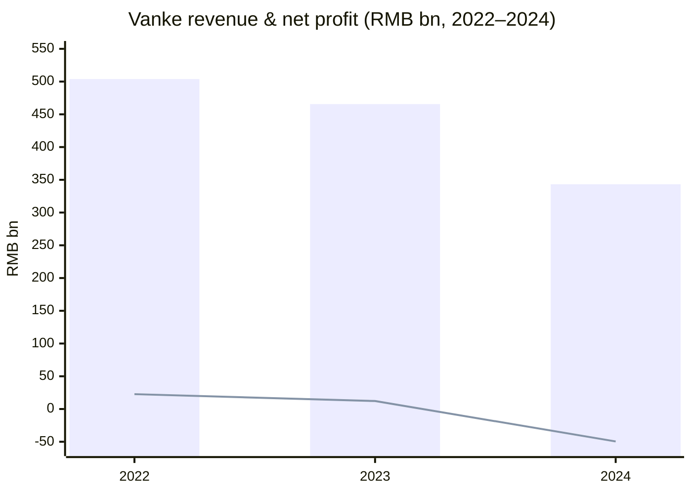
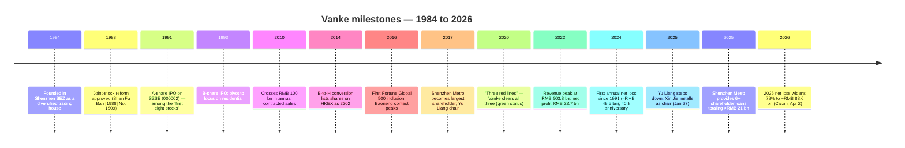
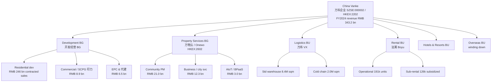
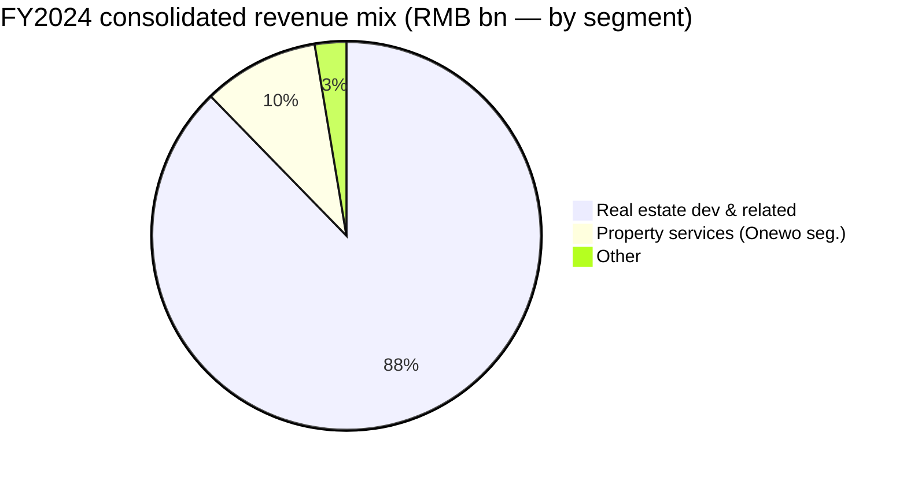
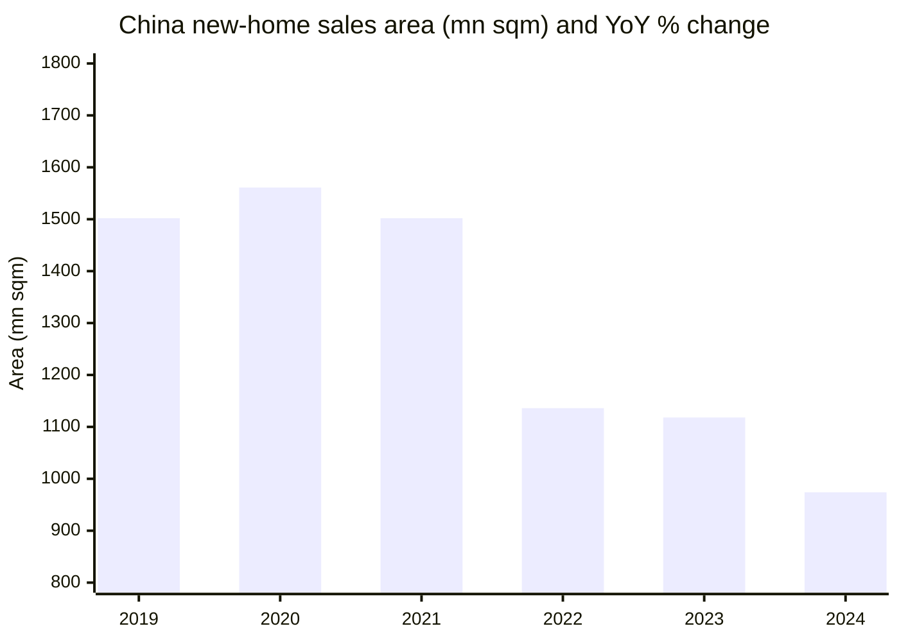
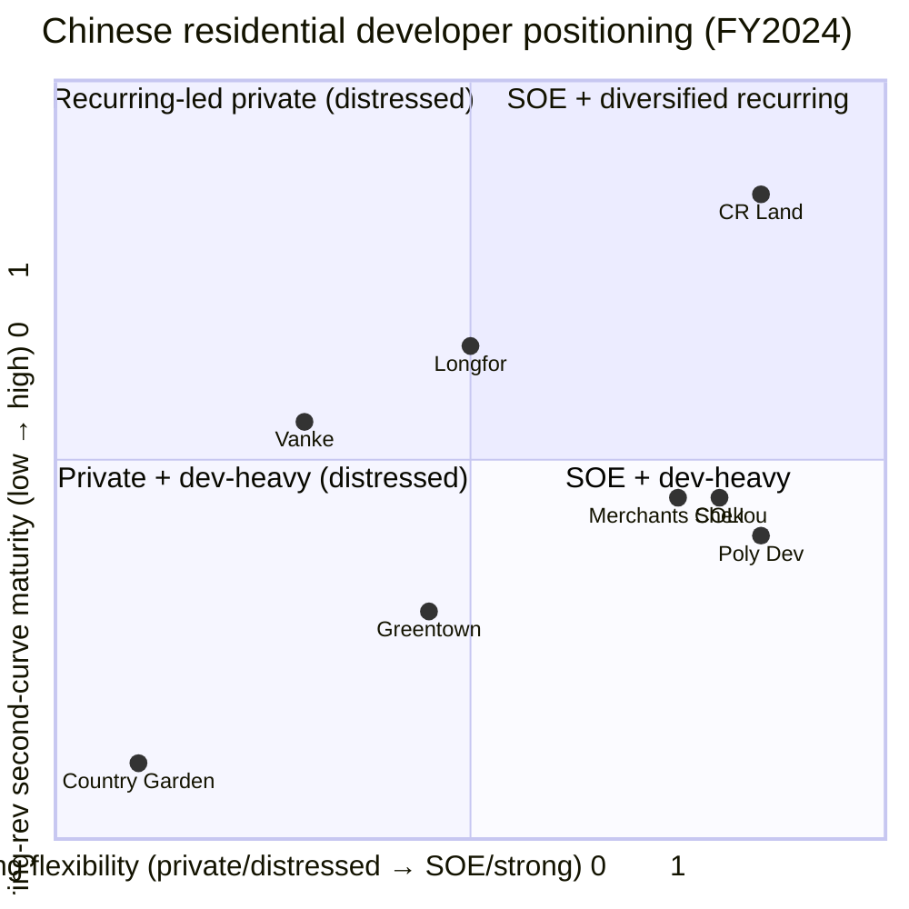
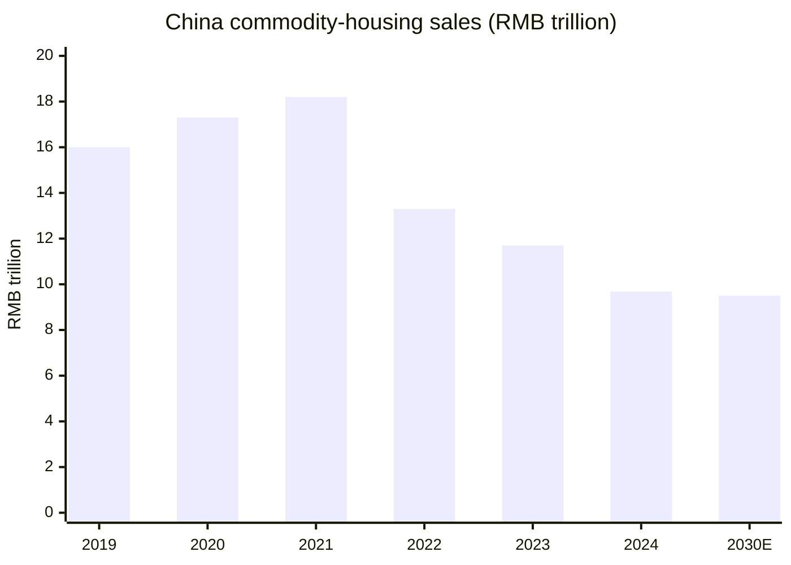

# China Vanke Co., Ltd. (万科企业 / SZSE:000002 / HKEX:2202) — Initiating Coverage

**Report type:** Company research / initiation
**As of:** 2026-06-03
**Primary ticker:** SZSE:000002 (万科A, A-share, RMB) · Secondary: HKEX:2202 (万科企业, H-share, HKD) · OTC: CHVKY
**Reporting currency:** RMB unless otherwise noted

> **Top-of-report banner — distress context.** Vanke is the single largest listed Chinese residential developer still operating as a going concern through the 2021–2026 sector contraction. FY2024 swung to a record RMB 49.5 bn net loss (its first full-year loss since A-share listing in 1991) on RMB 343.2 bn revenue; FY2025 widened the loss to RMB ~88.6 bn on RMB 170.1 bn core revenue per Caixin's reporting of the March 2026 annual filing ([Caixin Global, 2026-04-02](https://www.caixinglobal.com/2026-04-02/vanke-2025-net-loss-widens-79-to-13-billion-on-massive-impairments-102430048.html)). Chairman Yu Liang stepped down on 2025-01-27; majority shareholder Shenzhen Metro Group (深铁集团) installed its own chairman Xin Jie (辛杰) and has provided eight tranches of shareholder loans totaling ~RMB 21–22 bn through end-2025 ([Caixin Global, 2025-02-22](https://www.caixinglobal.com/2025-02-22/feature-article-shenzhen-metro-offers-over-4-billion-yuan-in-additional-liquidity-support-as-vanke-undergoes-significant-changes-102291013.html)). Coverage thesis is a credit / restructuring read, not a residential cycle read.

---

## Table of Contents
1. Company Overview & Valuation Snapshot
2. Company History (1984–2026)
3. Management
4. Products & Services (Eight Operating Segments)
5. Customers & Sales Strategy
6. Industry Overview
7. Competitive Landscape
8. Market Opportunity (TAM/SAM/SOM)
9. Risk Assessment
10. Investor-Lens Scorecards
11. References & Verification Log

---

## 1. Company Overview & Valuation Snapshot

China Vanke Co., Ltd. (万科企业股份有限公司, "Vanke" or the "Company") is the second-largest residential property developer in mainland China by contracted sales, headquartered at "Vanke Center, 33 Huanmei Road, Dameisha, Yantian District, Shenzhen, Guangdong Province" with operating offices at "63 Meilin Road, Futian District, Shenzhen" per the 2024 annual report's Section 3 corporate-basics block ([万科 2024 年度报告, p.5](https://disc.static.szse.cn/disc/disk03/finalpage/2025-04-01/ba90b1be-81e2-4fcb-946a-b9eedad9d324.PDF)). The Company was founded in 1984 in the Shenzhen Special Economic Zone, listed A-shares on the Shenzhen Stock Exchange on 1991-01-29 (one of the earliest cohort of mainland listings), and moved its B-shares to the Hong Kong Stock Exchange main board via the B-to-H conversion on 2014-06-25. It has been a Fortune Global 500 constituent every year from 2016 through 2024, ranked #206 globally in 2024 ([万科 2024 年度报告, p.5 公司简介](https://disc.static.szse.cn/disc/disk03/finalpage/2025-04-01/ba90b1be-81e2-4fcb-946a-b9eedad9d324.PDF)).

The Company's business model is increasingly bifurcated. The traditional core — residential development across mainland China's "three major economic circles plus central / western tier-1 cities" — generated RMB 301.0 bn of FY2024 revenue (87.7% of group total), but the segment booked only a 9.5% settlement gross margin and a 3.0% operating margin per the 2024 annual report's MD&A, after impairment provisions of RMB 81.4 bn on inventory and RMB 264.0 bn on receivables ([万科 2024 年度报告, p.13–15 经营情况讨论与分析](https://disc.static.szse.cn/disc/disk03/finalpage/2025-04-01/ba90b1be-81e2-4fcb-946a-b9eedad9d324.PDF)). The "second curve" — property services via Onewo (万物云, separately listed at HKEX:2602), commercial REIT-eligible malls under SCPG (印力集团), rental housing under Boyu (泊寓), warehouse/cold-chain via VX Logistics (万纬物流), plus hotels, resorts, and offices — has stayed cash-generative and is the focus of the 2025+ "shrink to the core" / "瘦身健体" restructuring announced by the new chairman ([万科 2024 年度报告, p.6–7 致股东](https://disc.static.szse.cn/disc/disk03/finalpage/2025-04-01/ba90b1be-81e2-4fcb-946a-b9eedad9d324.PDF)).

**Key FY2024 financials (consolidated, RMB).** Revenue RMB 343.18 bn (–26.32% YoY vs RMB 465.74 bn in 2023); operating profit RMB –45.64 bn (vs +RMB 29.25 bn in 2023, –256.04%); net loss attributable to listed-company shareholders RMB –49.48 bn (vs +RMB 12.16 bn in 2023, –506.81%); basic EPS RMB –4.17 (vs +RMB 1.03); ROE on weighted-average basis –21.82% (vs +4.91%); operating cash flow +RMB 3.80 bn (positive for the 16th consecutive year, but down 2.87% YoY). Total assets RMB 1,286.26 bn (–14.53% YoY); total liabilities RMB 947.41 bn (–14.02% YoY); shareholders' equity RMB 202.67 bn (–19.19% YoY); book value per share RMB 17.09 (–19.19% YoY) ([万科 2024 年度报告, p.8 主要会计数据和财务指标](https://disc.static.szse.cn/disc/disk03/finalpage/2025-04-01/ba90b1be-81e2-4fcb-946a-b9eedad9d324.PDF)). Net debt ratio (有息负债 minus 货币资金, divided by equity) widened to 80.6% at year-end (vs 54.7% in 2023, +25.94 percentage points), still well below distressed peers in the 200–400% range but inside the historical "three red lines" guardrails ([万科 2024 年度报告, p.27 负债情况](https://disc.static.szse.cn/disc/disk03/finalpage/2025-04-01/ba90b1be-81e2-4fcb-946a-b9eedad9d324.PDF)).

**FY2025 update (per Caixin).** Revenue contracted to "RMB 170.1 bn core" (–9% YoY on a like-for-like consolidation basis after multiple asset disposals), net loss widened ~79% to RMB ~88.6 bn (~USD 12.9 bn), gross margin compressed to 8.1%, total debt RMB 358.5 bn, parent-only cash RMB 0.85 bn; impairment charges totaled RMB 56.1 bn (asset impairments RMB 21.9 bn + credit impairments RMB 34.2 bn) ([Caixin Global, 2026-04-02](https://www.caixinglobal.com/2026-04-02/vanke-2025-net-loss-widens-79-to-13-billion-on-massive-impairments-102430048.html)). 2025 contracted sales fell 45.5% to RMB 134.1 bn — a slightly slower decline than the prior year's –34.6%, but still implies the residential development franchise has shrunk to roughly one-fourth of its 2020 peak.

**Valuation snapshot (as of 2026-06-02).** H-share (2202.HK) closed at HKD 2.78, inside a 52-week range of HKD 2.48–5.99; market cap consolidated A+H (counting 11.93 bn shares outstanding per the 2024 AR p.8) at HKD ~33 bn / USD ~4 bn. TTM P/E is meaningless (–2.62× on a TTM EPS of negative RMB ~7.5) ([Yahoo Finance — 2202.HK](https://finance.yahoo.com/quote/2202.HK/), [companiesmarketcap.com — Vanke P/E history](https://companiesmarketcap.com/vanke/pe-ratio/)). P/B on the FY2024 book value of RMB 17.09/share (vs A-share at approx RMB 6.5 per Eastmoney market data) is **~0.38× P/B** — i.e. the market is pricing the equity at roughly 38¢ on the dollar of audited net assets, reflecting (a) skepticism that the impaired inventory will be recoverable at carrying value as more 70%-priced-down units sell into 2026, (b) Shenzhen Metro shareholder-loan terms that subordinate equity in any debt-for-equity swap scenario, and (c) loss of dividend (FY2024 declared "不派发股息，不送红股，也不进行资本公积转增股本" per the cover page) ([万科 2024 年度报告, p.1](https://disc.static.szse.cn/disc/disk03/finalpage/2025-04-01/ba90b1be-81e2-4fcb-946a-b9eedad9d324.PDF)). For context, China Resources Land (HKEX:1109), a state-owned developer that did not undergo a 2024 loss, trades at ~0.8× book; Longfor (HKEX:0960) at ~0.4× book; Country Garden (HKEX:2007) — restructured 2025 — at ~0.2× book; Poly Developments (SSE:600048) ~0.7× P/B with a 3.6× TTM P/E ([Country Garden Holdings valuation update, Simply Wall St](https://simplywall.st/stocks/hk/real-estate-management-and-development/hkg-2007/country-garden-holdings-shares/news/country-garden-holdings-sehk-2007-valuation-check-after-2025), [Poly Developments coverage, 2025-08](https://www.ainvest.com/news/poly-developments-contrarian-buy-china-real-estate-correction-2508/)). The narrative read: Vanke trades like a "private developer in slow-motion restructuring with state backstop", not like a state-owned developer.

Source: [万科 2024 年度报告, p.8 主要会计数据](https://disc.static.szse.cn/disc/disk03/finalpage/2025-04-01/ba90b1be-81e2-4fcb-946a-b9eedad9d324.PDF). Bars = revenue; line = net profit attributable to listed-company shareholders.

---

## 2. Company History (1984–2026)

Vanke's 40-year arc is unusually well-documented because each stage was disclosed contemporaneously in cninfo filings and tied to Shenzhen's evolving SOE-reform machinery. The Company was incorporated in Shenzhen on 1984-05-30 under "Unified Social Credit Code 91440300192181490G" per the 2024 annual report's registration history ([万科 2024 年度报告, p.7](https://disc.static.szse.cn/disc/disk03/finalpage/2025-04-01/ba90b1be-81e2-4fcb-946a-b9eedad9d324.PDF)). It was approved for joint-stock reform by Shenzhen Municipal Government document "Shen Fu Ban (1988) No. 1509" in 1988; the A-share IPO landed on the Shenzhen Stock Exchange on 1991-01-29 — making Vanke part of the very first cohort of mainland-listed equities ("老八股") alongside Shenzhen Development Bank, Shenzhen Yuanye, and others. B-shares followed on 1993-05-28, and the B-share class was migrated to the HKEX main board via the B-to-H conversion on 2014-06-25 ([万科 2024 年度报告, p.5](https://disc.static.szse.cn/disc/disk03/finalpage/2025-04-01/ba90b1be-81e2-4fcb-946a-b9eedad9d324.PDF)).

The 1991–2000 stretch was the "diversification-then-focus" decade — Vanke initially operated across film distribution, beverage, retail, and trade before founder Wang Shi (王石) divested the side businesses and committed the Company fully to residential development by 1993. The 2000s were the high-volume scale-up: Vanke crossed RMB 100 bn in contracted sales in 2010 and broke into the global Fortune 500 in 2016 for the first time ([Vanke Wikipedia summary, history section](https://en.wikipedia.org/wiki/Vanke)). The 2016–2017 "宝万之争" (Baoneng-Vanke contest) — when Baoneng Group's Yao Zhenhua accumulated a hostile-takeover-scale stake before being unwound by China Resources and then Shenzhen Metro — entrenched Shenzhen Metro Group (深铁集团) as the largest shareholder, a position it retains in 2026. That same period saw long-tenured CEO Yu Liang (郁亮) succeed founder Wang Shi as chairman in mid-2017 ([万科 2024 年度报告, p.80 董事简历](https://disc.static.szse.cn/disc/disk03/finalpage/2025-04-01/ba90b1be-81e2-4fcb-946a-b9eedad9d324.PDF)).

The 2018–2021 plateau saw revenue cross RMB 500 bn (FY2022 peak: RMB 503.8 bn per the 2024 AR three-year comparison), with operating profit around RMB 50 bn. The "三道红线" (three red lines) regulation introduced in August 2020 — capping gearing, net-debt/equity, and cash-cover at developer level — initially flattered Vanke (it cleared all three "green" thresholds), but starting late 2021 the wider sector contraction (Evergrande default, then Country Garden) drained system-wide demand and pushed mortgage delivery cycles longer. Vanke entered 2024 as the highest-quality private developer still in the green-zone — but a year that saw national new-home sales by area drop 12.9% (per NBS data quoted in the AR) and value drop 17.1% pushed the company into structural losses by Q2 2024 ([万科 2024 年度报告, p.11 2024 年市场回顾](https://disc.static.szse.cn/disc/disk03/finalpage/2025-04-01/ba90b1be-81e2-4fcb-946a-b9eedad9d324.PDF)).

The watershed event of the current restructuring was the 2025-01-27 board decision documented in the Letter to Shareholders: Yu Liang stepped down as chairman after seven years and reverted to Executive Vice President; Xin Jie, the chairman of Shenzhen Metro Group, assumed Vanke's chairmanship while retaining his Shenzhen Metro role — the first chairman in Vanke history to be seconded directly from a state-owned-enterprise parent rather than promoted internally ([万科 2024 年度报告, p.80–81 辛杰 / 郁亮 simple bios](https://disc.static.szse.cn/disc/disk03/finalpage/2025-04-01/ba90b1be-81e2-4fcb-946a-b9eedad9d324.PDF)). Within five weeks (February 2025) Shenzhen Metro had wired an initial RMB 7 bn shareholder loan in two tranches "at interest rates below market financing rates and at pledge ratios above market norms" — terms explicitly designed to optimize Vanke's debt service while preserving Shenzhen Metro's senior creditor position ([万科 2024 年度报告, p.11](https://disc.static.szse.cn/disc/disk03/finalpage/2025-04-01/ba90b1be-81e2-4fcb-946a-b9eedad9d324.PDF), [Caixin Global, 2025-02-22](https://www.caixinglobal.com/2025-02-22/feature-article-shenzhen-metro-offers-over-4-billion-yuan-in-additional-liquidity-support-as-vanke-undergoes-significant-changes-102291013.html)). By mid-2025 a sixth shareholder loan of RMB 6.2 bn at 2.3% had been disbursed, taking cumulative Shenzhen Metro support past RMB 21 bn ([Mingtiandi, 2025-08](https://www.mingtiandi.com/real-estate/finance/china-vanke-loss-widened-in-h1-as-sales-sank-52/)).

Sources: [万科 2024 年度报告 p.5, p.7, p.80–81](https://disc.static.szse.cn/disc/disk03/finalpage/2025-04-01/ba90b1be-81e2-4fcb-946a-b9eedad9d324.PDF), [Caixin Global, 2025-02-22](https://www.caixinglobal.com/2025-02-22/feature-article-shenzhen-metro-offers-over-4-billion-yuan-in-additional-liquidity-support-as-vanke-undergoes-significant-changes-102291013.html), [Caixin Global, 2026-04-02](https://www.caixinglobal.com/2026-04-02/vanke-2025-net-loss-widens-79-to-13-billion-on-massive-impairments-102430048.html).

---

## 3. Management

Per skill convention, this section covers only the founder/historical leader and the current Chairman/CEO equivalent, with biographical detail tied to the 2024 annual report's Item VII director CVs.

**Founder & founding architect: Wang Shi (王石).** Wang Shi founded what became Vanke in 1984 in Shenzhen and served as chairman from the early 1990s through mid-2017 (he is no longer a director but retains "Honorary Chairman" status). Wang built Vanke's culture around the slogan "大道当然" (literally "the great Way is naturally so" — a quasi-Taoist commitment to integrity) and the "three-good" product creed of "good house, good service, good community" (好房子、好服务、好社区), which is still the explicit positioning the Company uses in its 2024 letter to shareholders ([万科 2024 年度报告, p.4 致股东](https://disc.static.szse.cn/disc/disk03/finalpage/2025-04-01/ba90b1be-81e2-4fcb-946a-b9eedad9d324.PDF)). Wang remains influential as a public figure (climber, environmentalist, Cambridge-Harvard visiting scholar) but does not hold board or executive roles in 2024–2025. The current management chapter is therefore Xin Jie's tenure, and — given the restructuring posture — Yu Liang as the pre-restructuring chair whose strategic legacy the firm is now unwinding.

**Current Chairman: Xin Jie (辛杰), b. 1966, took office 2025-01-27.** Xin holds an engineering bachelor's degree from Shenyang University of Technology (1988) and an MBA from Hong Kong Polytechnic University (2005), with a senior-grade engineering / senior economist dual credential. His career has been almost entirely inside Shenzhen's SOE ecosystem: Shenzhen Foreign Trade Group → Shenzhen Great Wall Property Management → Shengtingyuan Hotel (founding GM, then GM, then chairman, 1999–2009) → Shenzhen Great Wall Investment Holding (vice GM, 2004–2009) → Tagen Group (Shenzhen-based diversified SOE) where he ran the entire CEO/chairman track 2009–2017 → and since September 2017, party secretary and chairman of Shenzhen Metro Group, the public-transport SOE that has been Vanke's largest shareholder since 2017. He joined Vanke's board in July 2020, became Vice Chairman in October 2023, and assumed the chairmanship on 2025-01-27 ([万科 2024 年度报告, p.80 董事简历 — 辛杰](https://disc.static.szse.cn/disc/disk03/finalpage/2025-04-01/ba90b1be-81e2-4fcb-946a-b9eedad9d324.PDF)). The structural read is that Xin's mandate is not to be the next-generation property CEO — he is the Shenzhen-state liaison whose job is to execute "shrink-to-core" while preserving home-delivery commitments and managing the wind-down of non-core investments.

**Outgoing Chairman / current Executive Vice President: Yu Liang (郁亮), b. 1965.** Yu holds a bachelor's and an economics master's from Peking University. He joined Vanke in 1990, became a director in 1994, vice GM in 1996, executive vice GM and CFO in 1999, and held the President title for 17 consecutive years (2001 through January 2018). He succeeded Wang Shi as chairman in July 2017 and held that role until 2025-01-27, when the board's restructuring decision returned him to the "executive vice president" line ([万科 2024 年度报告, p.80 董事简历 — 郁亮](https://disc.static.szse.cn/disc/disk03/finalpage/2025-04-01/ba90b1be-81e2-4fcb-946a-b9eedad9d324.PDF)). Yu's tenure delivered the FY2022 peak revenue of RMB 503.8 bn — the highest in Vanke's history — but also presided over the residential land bank expansion of 2018–2021 that subsequently produced the 2024 impairment cliff (RMB 81.4 bn inventory write-down plus RMB 264.0 bn credit impairment). The 2024 letter to shareholders explicitly acknowledges this in unusually direct language: "公司未能及时摆脱高负债、高周转、高杠杆的扩张惯性，出现了投资冒进、多赛道布局步子过大、融资模式未能及时转型等问题，管理和风控机制也未能跟上业务和组织发展的需要，导致经营陷入被动" — "the Company failed to break from the high-debt, high-turnover, high-leverage growth pattern in time; investment was reckless, the multi-track build-out was too aggressive, and financing-model transition lagged" ([万科 2024 年度报告, p.3 致股东](https://disc.static.szse.cn/disc/disk03/finalpage/2025-04-01/ba90b1be-81e2-4fcb-946a-b9eedad9d324.PDF)). It is unusual to find that level of self-criticism in a Chinese listed company's letter to shareholders; it reads as Yu Liang's public exit from the chair role.

The Vanke board has 11 directors as of year-end 2024, the majority drawn from Shenzhen Metro or other Shenzhen SOEs (Hu Guobin from Shenzhen Capital Operation Group, Huang Liping and Lei Jiangsong both from Shenzhen Metro). Independent directors include Liu Zibin (former KPMG China chair), Lin Mingyan (former CapitaLand CEO), and Shen Xiangyang (Harry Shum, former Microsoft EVP) — the Shen appointment in particular is unusual and ties Vanke into the AI / digital-construction technology agenda that the 2024 AR repeatedly cites ([万科 2024 年度报告, p.82–83 独立董事简历](https://disc.static.szse.cn/disc/disk03/finalpage/2025-04-01/ba90b1be-81e2-4fcb-946a-b9eedad9d324.PDF)).

---

## 4. Products & Services — Eight Operating Segments

Vanke's 2024 disclosed business architecture is **two BGs (Business Groups) + four BUs (Business Units)**, per the "释义" (defined-terms) block on p.2 of the annual report: "BG, 指事业集团，目前包括开发经营BG、物业BG（万物云）。BU, 指事业部，目前包括物流BU、长租公寓BU、海外BU、酒店与度假BU 等" — "BG = Business Group, currently 开发经营 (development & operations) and 物业 (property services, i.e. Onewo); BU = Business Unit, currently logistics, rental housing, overseas, and hotels & resorts" ([万科 2024 年度报告, p.2 释义](https://disc.static.szse.cn/disc/disk03/finalpage/2025-04-01/ba90b1be-81e2-4fcb-946a-b9eedad9d324.PDF)). In external reporting (consolidated revenue table) the segments collapse to "real estate development & related asset operations" (87.7% of FY2024 revenue) and "property services" (9.7%) plus "other" (2.6%) — but for understanding the business, the unbundled view below is more useful. Each segment is presented with the issuer's own FY2024 revenue figure, the underlying brand/subsidiary that runs it, the physical role it plays in Chinese urbanization, and the strategic significance to the current "瘦身健体" restructuring.

### 4.1 Residential Development (开发经营 BG — 万科地产) — RMB 301.0 bn revenue (87.7% of group)

The flagship business. Vanke develops and sells new residential apartments and ground-up "good house" (好房子) communities across mainland China's seven operating regions: South (Guangdong/Fujian/Hainan/Guangxi), Shanghai region (Shanghai/Anhui/Jiangsu/Zhejiang), Beijing region (Beijing/Hebei/Shandong/Shanxi/Tianjin/Inner Mongolia), Northeast (Liaoning/Heilongjiang/Jilin), Central (Hubei/Henan/Hunan/Jiangxi), Southwest (Sichuan/Chongqing/Guizhou/Yunnan), and Northwest (Shaanxi/Gansu/Ningxia/Qinghai/Xinjiang) ([万科 2024 年度报告, p.15–16 分区域的销售情况 + 地区注释](https://disc.static.szse.cn/disc/disk03/finalpage/2025-04-01/ba90b1be-81e2-4fcb-946a-b9eedad9d324.PDF)). FY2024 contracted sales were 1,810.7 万 sqm of GFA delivering RMB 246.02 bn (down 26.6% YoY by area and 34.6% by value), keeping Vanke #1 in 15 cities and top-3 in 26 cities total. The largest single regional cluster was Shanghai (25.3% of sales area, 34.3% of sales value — i.e. Yangtze Delta tier-1 / tier-2 weighting), followed by Beijing region (17.5% / 13.5%) and South / Pearl River Delta (16.6% / 23.6%).

> **Strategic significance.** Residential development is no longer the growth lever — the FY2024 settlement gross margin collapsed to 9.5% from 15.4% in FY2023 as the land cohorts acquired in 2021–2022 (high tier-1 land prices, modest selling prices on delivery in 2023–2024) settled. The 2025 strategy is "以销定产" — produce only to lock-in cash sales — and to wind down land acquisition outside core cities: only 13 new projects acquired in 2024 (137.0 万 sqm GFA, RMB 5.56 bn equity land cost, average RMB 6,670/sqm), with 11 of the 13 being "存量盘活" (existing-stock revitalization) deals rather than greenfield auctions, concentrated in Shanghai, Guangzhou, and Chengdu ([万科 2024 年度报告, p.16–17 投资和开竣工情况](https://disc.static.szse.cn/disc/disk03/finalpage/2025-04-01/ba90b1be-81e2-4fcb-946a-b9eedad9d324.PDF)). Delivery completed 327 projects across 666 batches for 18.2 万 units (180,000+ homes), a measurable execution win in a sector where delayed completion has been the single biggest source of buyer complaints and policy attention ([万科 2024 年度报告, p.16 项目交付情况](https://disc.static.szse.cn/disc/disk03/finalpage/2025-04-01/ba90b1be-81e2-4fcb-946a-b9eedad9d324.PDF)).

### 4.2 Property Services (物业 BG — 万物云 Onewo) — Subsidiary RMB 36.38 bn revenue (parent reporting); consolidated segment RMB 33.13 bn

Onewo (万物云空间科技服务股份有限公司, HKEX:2602) is Vanke's separately HK-listed "all-domain space services" subsidiary, of which Vanke holds 56% as of the 2024 AR. Onewo brackets four sub-brands: **Vanke Property Management (万科物业)** for residential, **WondersOne (万物梁行)** for commercial / business-space FM, **Onewo City (万物云城)** for urban / municipal-grade services, and **Wanrui Tech (万睿科技)** for AIoT and BPaaS platform products ([万科 2024 年度报告, p.2 释义 — 万物云 definition](https://disc.static.szse.cn/disc/disk03/finalpage/2025-04-01/ba90b1be-81e2-4fcb-946a-b9eedad9d324.PDF)). FY2024 Onewo subsidiary revenue was RMB 36.38 bn (+8.9% YoY), of which "community living-space services" (residential PM) was RMB 21.02 bn (57.8%, +11.0% YoY), "business / city space comprehensive services" was RMB 12.33 bn (33.9%, +5.4% YoY), and "AIoT / BPaaS solutions" was RMB 3.03 bn (8.3%, +8.6% YoY) ([万科 2024 年度报告, p.19 物业服务](https://disc.static.szse.cn/disc/disk03/finalpage/2025-04-01/ba90b1be-81e2-4fcb-946a-b9eedad9d324.PDF)). Onewo's headline KPI is **"蝶城" (butterfly cities, "die-cheng")** — strategically selected urban districts where Onewo has multiple properties under management within a 20–30-minute employee-walk radius, enabling shared back-office and field-staff scheduling. The shibboleth count moved from 621 at year-start 2024 to 666 by year-end, with 250 fully-process-transformed cumulatively (covering 1,555 residential PM properties).

> **Strategic significance.** Onewo is the single cleanest "second curve" asset on Vanke's balance sheet — it has positive operating cash flow, an HK listing of its own (so a partial sale could be a liquidity event), and is the anchor of a "remote & hybrid operations" tech narrative (the in-house AIoT edge server "灵石" / Lingshi is deployed at 657 sites; the AI work-order dispatch platform "飞鸽" services 33,000 frontline workers at 1,360 residential sites). The August 2025 collateralization of an 18.3% Onewo stake to secure a RMB 2.8 bn Shenzhen Metro loan was the first time Vanke pledged a "second-curve" asset for parent liquidity ([Mingtiandi, 2025-08](https://www.mingtiandi.com/real-estate/finance/china-vanke-loss-widened-in-h1-as-sales-sank-52/)).

### 4.3 Rental Housing (长租公寓 BU — 泊寓 Boyu) — RMB 3.70 bn revenue (+7%)

Boyu (泊寓), legally Zhuhai Boyu Apartment Management Co., is China's largest "centralized" (purpose-built) long-term rental apartment platform — at year-end 2024 it managed 26.24 万 (262,400) units, of which 19.12 万 (191,200) were operational and 12.57 万 (125,700) were enrolled in the government 保障性租赁住房 (subsidized rental housing) program ([万科 2024 年度报告, p.19–20 租赁住宅](https://disc.static.szse.cn/disc/disk03/finalpage/2025-04-01/ba90b1be-81e2-4fcb-946a-b9eedad9d324.PDF)). FY2024 occupancy was 95.6%, project-level GOP margin 89.8%, customer satisfaction "above 95%", and old-tenant renewal "near 60%" — these are the kind of KPIs typically associated with mature US apartment REITs, not Chinese listed developers.

> **Strategic significance.** Boyu is the rental-housing operating layer for which Vanke is constructing a public C-REIT vehicle (the 2024 AR's "future outlook" explicitly cites the "建万住房租赁 Pre-REIT 基金" partnership with Jianyin / CCB and the longer-run public REIT IPO process). A successful long-term rental REIT listing would convert Boyu's stabilized assets into recurring distributions and free up Vanke's balance sheet for further deleveraging — i.e. it is one of the explicit "asset-light pivot" mechanisms management is betting on. The 2024 average lease lengthened 35 days vs 2023, which is unusual for a sector that typically shortens lease tenor in distressed markets — read as evidence of pricing-power preservation among Boyu's youth-renter target segment.

### 4.4 Commercial Development & Operations (印力集团 SCPG + Mall portfolio) — Subsidiary RMB 8.89 bn revenue (–2.5% YoY)

SCPG (印力集团, formally SCPG Holdings Co., Ltd., Cayman-registered) is Vanke's shopping-center subsidiary and runs malls under the **印象城 (Yinxiangcheng) / 印象汇 (Yinxianghui)** brands. At year-end 2024 SCPG managed 181 commercial properties totaling 10.81 mn sqm of GLA, with 1.96 mn sqm of additional planned/under-construction GLA, with 58% concentrated in Yangtze + Pearl River Delta and 29% in tier-1 cities (94% in tier-1 + tier-2 combined). Year-end occupancy was 95.1% (+0.3 ppt YoY). Eight new malls opened in 2024 including Shanghai Xuhui Vanke Plaza, Shenzhen Bantian Vanke Plaza, and Shanghai Sanlin Yinxianghui ([万科 2024 年度报告, p.21 商业开发与运营](https://disc.static.szse.cn/disc/disk03/finalpage/2025-04-01/ba90b1be-81e2-4fcb-946a-b9eedad9d324.PDF)).

> **Strategic significance.** The first concrete success of Vanke's REIT strategy: on 2024-04-30, **CICC-SCPG Consumer REIT (中金印力消费REIT)** listed on the Shenzhen Stock Exchange, seeded with the Hangzhou Xixi Yinxiangcheng mall as the underlying asset. Year-end 2024 occupancy on the seed asset was 97.85%, rent collection 99.96%, full-year distributions delivered a 5.24% annualized cash yield — 103.2% of the IPO prospectus forecast ([万科 2024 年度报告, p.21–22 消费基础设施REIT](https://disc.static.szse.cn/disc/disk03/finalpage/2025-04-01/ba90b1be-81e2-4fcb-946a-b9eedad9d324.PDF)). The plan is to expand this REIT via secondary offerings ("扩募") and to seed further pre-REIT pools with the rest of the SCPG mall pipeline. Like Boyu, SCPG is one of the few segments where the unit economics are unambiguous.

### 4.5 Logistics Warehousing & Cold Chain (万纬物流 VX Logistics) — RMB 3.97 bn revenue

VX Logistics (万纬物流, formally Vanke Logistics Development Co.) runs warehouse / cold-chain / supply-chain solutions across 47 cities with >10 million sqm of capacity in >160 logistics parks (>50 of which are professional cold-chain), serving >3,400 enterprise customers. As of year-end 2024 it had 151 operational projects with 10.43 million sqm of leasable GFA — split between standard-grade warehouse 8.41 mn sqm (87% stabilized occupancy) and cold chain 2.02 mn sqm (78% stabilized utilization). FY2024 segment revenue was RMB 3.97 bn (warehouse RMB 2.13 bn + cold chain RMB 1.84 bn) ([万科 2024 年度报告, p.22–23 物流仓储](https://disc.static.szse.cn/disc/disk03/finalpage/2025-04-01/ba90b1be-81e2-4fcb-946a-b9eedad9d324.PDF)).

> **Strategic significance.** VX Logistics is positioned as the third REIT-able asset class — the 2024 AR's outlook section explicitly flags "加速长租公寓与物流REITs 上市进程" (accelerate the listing of rental-housing and logistics REITs). VX participated as a drafter on China's national cold-chain warehouse standard (GB/T 31078-2024) — useful technical credibility for the REIT prospectus. Five parks have BRCGS S&D AA-grade food-safety certification.

### 4.6 EPC & Construction Management Services (代建) — RMB 6.52 bn revenue

Less visible but increasingly strategic: Vanke has run EPC (engineering-procurement-construction) and 代建 (delegated development / construction management) since 2010, serving government departments, SOEs, and financial / tech enterprises across residential, schools, affordable housing, industrial-office, urban renewal, and healthcare. Cumulative project count is 356 totaling 43.6 million sqm; current managed projects 65 totaling 14.28 million sqm. FY2024 revenue RMB 6.52 bn ([万科 2024 年度报告, p.18 代建情况](https://disc.static.szse.cn/disc/disk03/finalpage/2025-04-01/ba90b1be-81e2-4fcb-946a-b9eedad9d324.PDF)).

> **Strategic significance.** 代建 is the *fee-for-service* version of the development business — it produces no balance-sheet exposure to land and no inventory cycle risk. As Vanke shrinks its proprietary residential pipeline, growing 代建 revenue is one of the few capital-light ways to keep its 60,000-strong construction-management workforce productive. The 2024 outlook talks of "深度合作 ... 工程代建" with Shenzhen Metro for "轨道物流、TOD综合开发" — i.e. light-asset construction management for Shenzhen's metro-TOD pipeline.

### 4.7 Hotels & Resorts BU (Vanke Resort) and 4.8 Overseas BU

Smaller scale: Vanke operates resort properties in Hainan, Songhua Lake (Jilin), and Shimei Bay, and historically owned overseas residential projects in New York, San Francisco, London, and Seattle. The 2024 AR mentions overseas only in the "其他" 0.1% area / 0.8% value bucket of sales geography. The "海外BU" is being downsized as part of the "聚焦主业" mandate; overseas dispositions are part of the 54-asset / RMB 25.9 bn "大宗资产交易" disposal program documented in the MD&A ([万科 2024 年度报告, p.10 经营情况讨论与分析](https://disc.static.szse.cn/disc/disk03/finalpage/2025-04-01/ba90b1be-81e2-4fcb-946a-b9eedad9d324.PDF)).

### Segment portfolio synthesis

Source: [万科 2024 年度报告, p.2 释义 + p.13–23 各项业务](https://disc.static.szse.cn/disc/disk03/finalpage/2025-04-01/ba90b1be-81e2-4fcb-946a-b9eedad9d324.PDF).

The synthesis is that Vanke is mid-conversion from a development-heavy, land-bank-leveraged residential developer (the FY2022 model) toward a hybrid that should look more like a Chinese Mitsui Fudosan or a Mainland-listed Mapletree — a holding company over (1) shrinking residential development (probably 60% of revenue by 2028), (2) recurring REIT-able commercial / rental / logistics platforms, and (3) light-asset fee businesses (PM, EPC, 代建). The risk is that the conversion is happening *during* a balance-sheet crisis rather than from a position of strength — which means the timing and pricing of asset disposals is largely controlled by creditors and Shenzhen Metro, not by Vanke management.

---

## 5. Customers & Sales Strategy

Vanke's customer base is structurally different from US-style enterprise software companies and even from US homebuilders — Chinese new-home sales go almost entirely to retail individual buyers via direct sales offices, and customer concentration is mechanically very low.

**Customer concentration — the 2024 AR's own disclosure.** Per the mandatory 主要客户 section on p.65 of the 2024 annual report:

> "本集团目前主要产品为商品住宅，个人购房者为主力客户群，客户多而且分散，仅部分政府代建项目，或少数团购现象产生较高营业额。报告期内，前5 名客户产生的营业收入约为人民币33.9 亿元，占本集团全年营业收入的比例为1.0%，占本集团全年营业收入的比例少于30%；其中最大客户的营业额约为人民币9.2 亿元，占本集团全年营业收入的比例为0.3%。前5 名客户不存在向关联方销售的情况。"

In plain English: top-5 customers aggregate RMB 3.39 bn (**1.0% of consolidated FY2024 revenue**); the single largest customer is approximately RMB 920 mn (**0.3% of consolidated FY2024 revenue**); no related-party sales in the top 5. The qualitative note is that the top-5 are not individual buyers but a mix of government delegated-development clients and bulk-purchase (团购) buyers — both very small relative to retail volume ([万科 2024 年度报告, p.65 主要客户](https://disc.static.szse.cn/disc/disk03/finalpage/2025-04-01/ba90b1be-81e2-4fcb-946a-b9eedad9d324.PDF)). For comparison, the FY2024 supplier concentration is similar but slightly higher: top-5 material & equipment suppliers aggregate RMB 2.51 bn (4.41% of total procurement); largest single supplier RMB 1.13 bn (1.98%) — these are essentially construction-material suppliers (cement, steel, glass), no related-party transactions ([万科 2024 年度报告, p.65 主要供应商](https://disc.static.szse.cn/disc/disk03/finalpage/2025-04-01/ba90b1be-81e2-4fcb-946a-b9eedad9d324.PDF)).

**Implication for risk modeling.** Unlike Japanese semiconductor capital equipment vendors (where a single TSMC or Samsung relationship can be 25–40% of revenue) or US software companies (where Microsoft / Amazon hyperscalers concentrate spend), Vanke's revenue is *atomized* — 180,000 home buyers in 2024 alone — and no individual customer is even 1% of revenue. The customer risk in this business is **macro**, not concentration-driven: a 12.9% decline in national new-home sales-area (NBS figure for 2024) produces a 34.6% decline in Vanke's contracted sales value because (a) Vanke is over-indexed to higher-tier cities where the price decline was sharpest, and (b) the cohort of products in market in 2024 was largely 2020–2021 vintage land at high cost basis. Customer concentration disclosures should not be used to argue Vanke is safer than peers — the risk is in the macro consumer-confidence channel, not in any single buyer.

Source: [万科 2024 年度报告, p.13 经营情况讨论与分析 — 主营业务](https://disc.static.szse.cn/disc/disk03/finalpage/2025-04-01/ba90b1be-81e2-4fcb-946a-b9eedad9d324.PDF). This pie uses **consolidated revenue** as denominator (RMB 343.2 bn; the residual ~RMB 9.0 bn is "其他业务" — primarily aquaculture and management fees from joint ventures). The "property services" slice here is the **consolidated-segment** number (RMB 33.1 bn), which differs from the **subsidiary-level Onewo revenue** of RMB 36.4 bn because the subsidiary number includes intra-group services to Vanke.

**Sales-channel strategy.** Within the residential business, Vanke pioneered (among China's top-tier developers) livestreamed selling as a cost-saving customer-acquisition channel. The 2024 AR records 108,000 livestream sessions reaching 160 million viewers, with five regional livestreaming training bases (Dongguan, Guangzhou, Shenyang, Wuxi, Zhengzhou). The Hainan Sanya Bay project was Vanke's (and Sanya's) first project entirely sold under the "现房销售制" (completed-housing sales) model — 372 days from groundbreaking to completion-record filing, opened December 2024 with RMB 3.82 bn in pre-sale at a 72.3% certificate-to-sale conversion ([万科 2024 年度报告, p.15 房地产开发 — 销售和结算情况](https://disc.static.szse.cn/disc/disk03/finalpage/2025-04-01/ba90b1be-81e2-4fcb-946a-b9eedad9d324.PDF)). Both moves are early experiments with the post-2024 regulatory shift toward completed-housing pre-sales (vs the legacy 预售 forward-sale model that has been the proximate cause of buyer-protest "stop-mortgage" episodes since 2022).

**Geographic concentration of sales (FY2024).**

| Region | Sales area (10k sqm) | % | Sales value (RMB bn) | % |
|---|---|---|---|---|
| South (PRD: Guangdong, Fujian, Hainan, Guangxi) | 292.0 | 16.6% | 621.7 | 25.3% |
| Shanghai region (YRD: Shanghai, Anhui, Jiangsu, Zhejiang) | 422.0 | 25.3% | 773.1 | 31.4% |
| Beijing region (Beijing/Hebei/Shandong/Shanxi/Tianjin/IM) | 296.2 | 17.5% | 334.2 | 13.6% |
| Northeast (Liaoning, Heilongjiang, Jilin) | 180.0 | 10.6% | 130.1 | 5.3% |
| Central (Hubei, Henan, Hunan, Jiangxi) | 226.7 | 13.4% | 205.3 | 8.3% |
| Southwest (Sichuan, Chongqing, Guizhou, Yunnan) | 216.6 | 12.8% | 203.2 | 8.3% |
| Northwest (Shaanxi, Gansu, Ningxia, Qinghai, Xinjiang) | 174.2 | 10.3% | 145.1 | 5.9% |
| Other (HK/US/UK projects) | 3.0 | 0.2% | 47.5 | 1.9% |
| **Total** | **1,810.7** | **100.0%** | **2,460.2** | **100.0%** |

Source: [万科 2024 年度报告, p.15–16 分区域的销售情况](https://disc.static.szse.cn/disc/disk03/finalpage/2025-04-01/ba90b1be-81e2-4fcb-946a-b9eedad9d324.PDF). Note: the AR uses 亿元 (100 million RMB) for sales value; conversion to RMB bn shown above.

Key insight: Yangtze River Delta delivers a disproportionate **31.4% of sales value** off **25.3% of area** because of higher Shanghai/Hangzhou ASPs; the Northeast region delivers **10.6% of area** but only **5.3% of value** because of compressed regional ASPs. Vanke's 2025 "城市聚焦" mandate is to redouble in the YRD/PRD tier-1+ cluster and to pull out of weaker-tier-3/4 cities.

**Unsold completed inventory & forward contract pipeline.** At year-end 2024 Vanke held 15.92 million sqm of "sold-but-not-yet-settled" (已售资源未竣工结算) inventory representing approximately RMB 221.15 bn of contracted forward revenue (down 38.6% YoY) — i.e. the runway to recognize contract liabilities as revenue is shrinking faster than the headline contract-sales decline because of accelerated handover policy ([万科 2024 年度报告, p.16](https://disc.static.szse.cn/disc/disk03/finalpage/2025-04-01/ba90b1be-81e2-4fcb-946a-b9eedad9d324.PDF)). Total inventory on the balance sheet is RMB 519.01 bn (down 26.0% YoY), broken into pre-development RMB 91.71 bn (17.7%), under-construction RMB 300.84 bn (58.0%), and completed-not-yet-sold (现房) RMB 123.91 bn (23.9%). The completed-but-unsold pool — RMB 123.91 bn — is the most strategically important number on the balance sheet because it is closest to immediate cash conversion if priced to clear. Cumulative inventory impairment provisions stood at RMB 11.57 bn at year-end after RMB 7.06 bn of new charges (plus another RMB 1.08 bn at joint-venture level) ([万科 2024 年度报告, p.30 存货分析](https://disc.static.szse.cn/disc/disk03/finalpage/2025-04-01/ba90b1be-81e2-4fcb-946a-b9eedad9d324.PDF)).

---

## 6. Industry Overview

China's residential property market — the largest single asset class in China and one of the world's largest — has been in a multi-year contraction since the 2021 "三道红线" regulatory tightening and the November 2022 "16-point plan" stabilization measures.

**Market size & contraction trajectory.** Per the National Bureau of Statistics (NBS) figures cited by Vanke's own 2024 AR review section: 2024 nationwide commodity-housing sales area was 974 million sqm (–12.9% YoY); sales value RMB 9.68 trillion (–17.1% YoY); housing starts 739 million sqm (–23.0% YoY); real-estate development investment RMB 10.03 trillion (–10.6% YoY, with the rate of decline accelerating 1.1 ppt vs 2023). New residential land supply across 300 cities (per China Index Academy / 中指研究院) fell 28.9% YoY by area, with transacted area –22.5% YoY and total land-grant revenue –27.5% YoY ([万科 2024 年度报告, p.11 2024 年市场回顾](https://disc.static.szse.cn/disc/disk03/finalpage/2025-04-01/ba90b1be-81e2-4fcb-946a-b9eedad9d324.PDF)). Critically, the disclosure also notes a Q4-2024 inflection: nationwide sales-area swung from continuous YoY decline to **+0.5% YoY in Q4** — the first quarter of positive YoY area growth in the post-COVID period — driven by the September 2024 Politburo signaling "promote real-estate market stabilization" (要促进房地产市场止跌回稳) and the subsequent rate cuts / first-home mortgage minimum down-payment reductions.

**Policy backdrop.** The 2024 AR explicitly invokes two policy thresholds: the April 2024 Politburo meeting on "studying digestion of existing housing stock and optimization of new housing", and the September 2024 Politburo meeting making "stabilize and reverse the decline" the explicit goal. The "白名单" (whitelist) mechanism for project-level financing — under which provincial / municipal task forces identify eligible projects to receive bank financing — is central to the 2025 funding environment. Vanke filed 178 whitelist project applications across 59 cities (Beijing, Guangzhou, Hangzhou, Chengdu, Chongqing, Nanchang, Kunming, etc.) by year-end 2024 ([万科 2024 年度报告, p.28 融资情况](https://disc.static.szse.cn/disc/disk03/finalpage/2025-04-01/ba90b1be-81e2-4fcb-946a-b9eedad9d324.PDF)). The "经营性物业贷" (operating-property loan) program — collateralized lending against income-producing commercial / rental / logistics assets — is the second leg of the financing-model transition; Vanke landed RMB 29.3 bn of new operating-property loans in FY2024, with year-end balance at RMB 46.7 bn.

**Adjacent sub-markets.**
- **Property management services**: Total addressable market estimated at RMB 1.3–1.5 trillion of annual revenue per CRIC industry reports, with the top-10 PM operators (Vanke's Onewo, Country Garden Services, China Resources MIXC, Greentown Services, etc.) holding under 25% combined share — a fragmented market. The 2024 AR notes the sector is "扩边界" — expanding from residential PM (PM) into facility management (FM) covering hospitals, schools, public infrastructure ([万科 2024 年度报告, p.12 物业服务行业回顾](https://disc.static.szse.cn/disc/disk03/finalpage/2025-04-01/ba90b1be-81e2-4fcb-946a-b9eedad9d324.PDF)).
- **Long-term rental apartments**: 2024 average rent in 50 key cities fell 3.25% YoY per CIA (China Index Academy) data. Policy still supportive — REITs for保障性 housing, dedicated rental-land plots, tax incentives.
- **Commercial real estate (malls)**: 2024 retail-sales growth slowed to 3.5% (down 3.7 ppt from 2023); winners are "membership warehouse stores" and experiential formats (pet economy, outdoor, cultural-tourism). SCPG's mid-tier 印象城 brand is positioned in the "value-for-money + experience" tier.
- **Logistics warehousing**: Per CBRE, full-year 2024 nationwide standard-warehouse rents fell 9.7% YoY; YRD and PRD remain relatively stable. Cold chain is being driven by retail / catering supply-chain consolidation.

Source: NBS figures via [万科 2024 年度报告, p.11 2024 年市场回顾](https://disc.static.szse.cn/disc/disk03/finalpage/2025-04-01/ba90b1be-81e2-4fcb-946a-b9eedad9d324.PDF) and prior-year AR equivalents. The 2019–2021 peak was structurally elevated; the 2024 figure is the third consecutive year of decline.

---

## 7. Competitive Landscape

Vanke historically anchored the upper-tier residential-developer cohort along with China Resources Land (HKEX:1109), China Overseas Land & Investment (HKEX:0688), and Poly Developments (SSE:600048). The 2024 contraction has produced very different outcomes for state-owned-enterprise (SOE) developers (relatively well-funded) and private developers (in various stages of restructuring). Vanke sits awkwardly between — listed and historically managed as a quasi-private, but now under direct Shenzhen Metro / Shenzhen SOE supervision through Xin Jie's chairmanship.

**Direct competitors (top 10 by 2024 contracted sales — approximate rank order).**

1. **Poly Developments (保利发展, SSE:600048)** — central-SOE controlled by Poly Group; held #1 contracted-sales rank in 2023 with RMB 424.6 bn and retained leadership through 2024. P/E ~3.6× / P/B ~0.7×. Direct competitor in tier-1 / tier-2 residential ([Mingtiandi top developer ranking analysis](https://www.mingtiandi.com/real-estate/research-policy/country-garden-slips-to-6th-among-chinas-top-developers/)).
2. **China Overseas Land & Investment (中海, HKEX:0688)** — Hong Kong-listed SOE under China State Construction. 2023 contracted sales RMB 309.8 bn. Reported strong margins through 2024 because of conservative tier-1 land bank. Direct competitor at premium price points.
3. **China Resources Land (华润置地, HKEX:1109)** — SOE under China Resources Group; differentiated by mall ("万象城" MIXC) franchise — USD 2.7 bn of mall rental revenue in 2024 at 95% occupancy. Now the dominant tier-1 listed pure-play with a high-quality REIT-able mall portfolio ([China Resources mall data per industry note](https://www.ainvest.com/news/poly-developments-contrarian-buy-china-real-estate-correction-2508/)). Competes most directly with Vanke on both residential development and on mall/commercial REIT side (against SCPG/印力).
4. **China Vanke (000002 / 2202.HK)** — the subject. 2024 contracted sales RMB 246.0 bn (down from #2 to ~#4 by 2024).
5. **China Merchants Shekou (招商蛇口, SZSE:001979)** — central-SOE; 2023 contracted sales RMB 293.6 bn.
6. **Country Garden (碧桂园, HKEX:2007)** — formerly #1 private developer; defaulted in October 2023; reentered profitability in 2025 after USD 11.9+ bn of debt restructuring gains. Direct competitor in tier-3 / 4 cities historically — now barely overlapping with Vanke's tier-1+2 focus ([Country Garden Holdings update, 2025](https://simplywall.st/stocks/hk/real-estate-management-and-development/hkg-2007/country-garden-holdings-shares/news/country-garden-holdings-sehk-2007-valuation-check-after-2025)).
7. **Greentown China (绿城中国, HKEX:3900)** — Hong Kong-listed, "premium" residential brand. 2023 sales RMB 194.3 bn.
8. **C&D Real Estate (建发, SSE:600153)** — Xiamen-based central SOE.
9. **Longfor Group (龙湖, HKEX:0960)** — Chongqing-based "quality private" developer; has built out a substantial mall portfolio (USD 1.4 bn rental revenue in 2024, +14.8%). Competes with Vanke and CR Land on the second-curve commercial REIT thesis ([Longfor coverage, 2025-08](https://www.ainvest.com/news/poly-developments-contrarian-buy-china-real-estate-correction-2508/)).
10. **Gemdale (金地集团, SZSE:600383)** — historically a top-10 player; 2023 contracted sales RMB 153.6 bn.

**Competitive positioning matrix.**

Source: Author's positioning based on 2024 financial disclosures cited above. Vanke is plotted on the lower-funding-flexibility side because of the unresolved 2025–2026 debt-maturity wall and the Shenzhen Metro backstop dependence; mid-to-upper on second-curve maturity because Onewo, SCPG (with CICC-SCPG REIT), Boyu, and VX Logistics give it a deeper second-curve toolkit than COLI or Poly.

**Comparable valuation snapshot (estimates from cited sources; data as of late 2025 / early 2026).** *Analyst view:* The Hong Kong real-estate-and-construction sector average TTM P/E is around 11× per Simply Wall St's industry-aggregate data ([Country Garden coverage note citing HK Real Estate average](https://simplywall.st/stocks/hk/real-estate-management-and-development/hkg-2007/country-garden-holdings-shares/news/country-garden-holdings-sehk-2007-valuation-check-after-2025)). Within that:

| Developer | Ticker | TTM P/E | P/B est. | Status |
|---|---|---|---|---|
| China Vanke | 2202.HK | n/m (negative) | ~0.38× | Subject; under restructuring; Shenzhen Metro support |
| Poly Developments | 600048.SS | ~3.6× | ~0.7× | Central SOE; profitable; #1 by sales |
| China Resources Land | 1109.HK | ~9.5× | ~0.8× | SOE; best second-curve (MIXC malls + REIT) |
| China Overseas Land | 0688.HK | ~9.8× | ~0.6× | SOE; strong margins; conservative |
| Longfor Group | 0960.HK | ~7× | ~0.4× | Private; mall + rental growing |
| Country Garden | 2007.HK | ~3.6× | ~0.2× | Restructured 2025; back to profit |
| Greentown China | 3900.HK | ~5× | ~0.4× | Mixed shareholder; premium product |

Source: [companiesmarketcap.com — Vanke P/E history](https://companiesmarketcap.com/vanke/pe-ratio/), [Simply Wall St — Country Garden coverage](https://simplywall.st/stocks/hk/real-estate-management-and-development/hkg-2007/country-garden-holdings-shares/news/country-garden-holdings-sehk-2007-valuation-check-after-2025), and the sector composite note from [Poly Developments contrarian analysis](https://www.ainvest.com/news/poly-developments-contrarian-buy-china-real-estate-correction-2508/).

Read: SOE developers trade at 0.6–0.8× book at single-digit P/E; private "in trouble" developers trade at 0.2–0.4× book at low single-digit P/E with negative earnings. Vanke sits on the boundary — at 0.38× P/B it is priced like a high-end distressed private developer with a state backstop, *not* like an SOE.

---

## 8. Market Opportunity (TAM / SAM / SOM)

**TAM — China's new-home market.** 2024 commodity-housing sales of RMB 9.68 trillion is the most recent NBS aggregate; consensus among PRC research houses (CRIC, China Index Academy, Vanke's own 2024 AR commentary) is that the equilibrium long-run TAM is RMB 8–10 trillion through 2030 — i.e. the residential development market has reset to a structurally lower base than the 2021 peak of RMB ~18 trillion, but a base that still implies a sustainable industry at a smaller scale. Goldman Sachs's late-2025 reads suggested the market has approximately bottomed but recovery would be slow and bifurcated by city tier ([Goldman Sachs China property outlook](https://www.goldmansachs.com/insights/articles/has-chinas-property-market-reached-the-bottom)).

**SAM — Vanke-addressable segment.** Vanke historically addressed the urban middle-class commodity-housing market in tier-1+2 cities. The 2024 sales geography (Yangtze River Delta 31.4%, Pearl River Delta 25.3%, Beijing region 13.6%) implies a SAM of roughly the top 30 cities by sales value, which collectively might represent RMB 4.0–5.0 trillion of the national TAM. Within that SAM, Vanke's 2024 sales of RMB 246.02 bn implies a **~5–6% SAM share**, the kind of share that any of the top-3 SOE developers also command.

**SOM by segment.**
- Residential: SOM is shrinking — the 2025 strategy is explicit that Vanke will narrow to ~30 "锚定" focus cities and exit weaker-tier cities. Probable 2026–2028 residential SOM is RMB 100–180 bn of annual sales, well below the 2024 figure.
- Property services via Onewo: total Chinese PM market RMB 1.3–1.5 trillion; Onewo's RMB 36 bn implies ~2.5% share with substantial runway via the 蝶城 model. SOM here is *growing*.
- Rental housing via Boyu: total Chinese centralized-rental SAM ~ RMB 50–80 bn current revenue with rapid growth from保障房 policy. Boyu's 191k operational units / 263k under management gives it the #1 position. SOM growing.
- Logistics via VX: total Chinese standard + cold warehouse rental market ~RMB 200–250 bn. VX with RMB 4 bn is ~2% — growing but small relative to GLP / Prologis incumbents.

**Conclusion.** The residential SOM is shrinking by design; the second-curve SOMs (PM, rental, mall, logistics) are growing but from a small base relative to development revenue. By 2028, second-curve revenue could plausibly reach RMB 80–100 bn of recurring revenue at ~25–30% segment margins — a meaningful business, but it still does not replace the cash flows of the 2021-vintage residential business.

Source: NBS data via [万科 2024 年度报告, p.11](https://disc.static.szse.cn/disc/disk03/finalpage/2025-04-01/ba90b1be-81e2-4fcb-946a-b9eedad9d324.PDF) for 2019–2024; 2030E is Vanke management's "long-term equilibrium" framing in the AR plus consensus sell-side reads. Note: 2030E is a long-run equilibrium, not a precise forecast — the actual 2030 number will depend on stimulus, demographics, and rural-urban migration.

---

## 9. Risk Assessment

Vanke's own 2024 AR risk section identifies six risk buckets (环境风险 / 流动性风险 / 业务风险 / 合规风险 / 人才风险 / 舞弊风险) per p.92–93. Below is the analyst's overlay across the four standard buckets (company-specific, industry, financial, macro), with the issuer's own language quoted where relevant.

### 9.1 Company-specific

1. **Restructuring execution risk.** Yu Liang's exit and Xin Jie's accession on 2025-01-27 has reset the strategic playbook to "瘦身健体、聚焦主业、全力自救" — shrink, focus on the core, self-rescue. Vanke is mid-divestment of 54 disposal projects worth RMB 25.9 bn signed in 2024, including the high-profile Shenzhen Bay Super HQ project sold to a Shenzhen Metro consortium for RMB 2.235 bn ([万科 2024 年度报告, p.10 自救 + p.312 关联交易披露 — 深圳总部基地项目](https://disc.static.szse.cn/disc/disk03/finalpage/2025-04-01/ba90b1be-81e2-4fcb-946a-b9eedad9d324.PDF)). Execution risk = both pricing (will buyers actually transact at the marked-down levels) and pace (do deals close before the 2026 maturity wall).
2. **Talent retention risk.** Per the AR's "人才风险" section: "面对房地产行业环境、公司财务与经营状况变化等多重挑战，公司优秀骨干人才保有承压，对年轻及复合型人才吸引力不足" — "in the face of multiple challenges including industry environment and company financial / operating conditions, retention of key talent is under pressure; the company has insufficient appeal to young and cross-functional talent" ([万科 2024 年度报告, p.93–94 人才风险](https://disc.static.szse.cn/disc/disk03/finalpage/2025-04-01/ba90b1be-81e2-4fcb-946a-b9eedad9d324.PDF)). Vanke's reputation as a meritocratic "good company to work for" has historically been a moat; losing it would lengthen the second-curve build-out.
3. **Internal control flag.** The AR's 内部控制 audit disclosure: "报告期内公司存在财务报告内部控制重大缺陷一项，并在报告期内对有关事项进行了有效整改" — "during the reporting period the company had one major internal control deficiency in financial reporting, which has been effectively remediated" ([万科 2024 年度报告, p.95 十七、内部控制制度](https://disc.static.szse.cn/disc/disk03/finalpage/2025-04-01/ba90b1be-81e2-4fcb-946a-b9eedad9d324.PDF)). The disclosure does not specify *which* control failed; sell-side speculation has tied it to the Shenzhen Bay HQ sale and related-party negotiation governance.

### 9.2 Industry / market

4. **Residential market structural decline.** National new-home sales-area fell 12.9% in 2024; the sector is roughly 50% smaller than its 2021 peak. Q4-2024 inflection (+0.5% YoY) is real but tentative — much of the rebound came from price-cutting that compresses developer margins.
5. **Tier-3 / 4 city distress.** Vanke is mostly tier-1/2 today but historically had tier-3 exposure (Northeast region — 10.6% of 2024 sales-area but only 5.3% of value). The Northeast cohort produced the steepest revenue decline (–49.1%) in the regional table. Continuing to wind these down without write-downs is mechanically difficult.
6. **Mall / commercial soft demand.** SCPG occupancy of 95.1% held up, but the FY2024 segment revenue declined 2.5% — soft consumer demand is biting at average ticket. The CICC-SCPG REIT is a successful vehicle, but pre-REIT pool assets need to keep performing to support follow-on issuances.
7. **REIT and pre-REIT execution dependency.** The 2024 AR's outlook explicitly cites "加速长租公寓与物流REITs 上市进程，推动中金印力消费REIT 扩募" as a 2025+ priority. Failure to execute on these REIT IPOs slows the asset-light transition.

### 9.3 Financial

8. **Liquidity wall.** Vanke's RMB 158.28 bn of interest-bearing debt is due within 12 months at year-end 2024 (43.8% of the RMB 361.28 bn total). Plus ~RMB 27 bn of capital-markets debt maturing in 2026 per Mingtiandi's H1 2025 coverage ([Mingtiandi, 2025-08](https://www.mingtiandi.com/real-estate/finance/china-vanke-loss-widened-in-h1-as-sales-sank-52/)). Cash on hand was RMB 88.16 bn at year-end 2024 (96.7% RMB); unrestricted cash at H1 2025 was RMB 71.1 bn per the H1 disclosure. The math implies Vanke needs to consume Shenzhen Metro shareholder loans and asset-disposal proceeds to bridge 2025–2027 maturities. The 2024 AR's "流动性风险" section is explicit: "受行业下行影响，公司销售规模同比下降，货币资金减少，同时面临较为集中的存量债务到期，财务指标弱化，流动性面临考验" ([万科 2024 年度报告, p.93](https://disc.static.szse.cn/disc/disk03/finalpage/2025-04-01/ba90b1be-81e2-4fcb-946a-b9eedad9d324.PDF)).
9. **Margin compression.** FY2024 settlement gross margin on development was 9.5% (down 5.9 ppt YoY); operating margin 3.0%. FY2025 gross margin further fell to 8.1% per Caixin's report on the March 2026 annual filing ([Caixin Global, 2026-04-02](https://www.caixinglobal.com/2026-04-02/vanke-2025-net-loss-widens-79-to-13-billion-on-massive-impairments-102430048.html)). Without margin recovery from a higher-quality 2025-vintage land bank (which Vanke is barely acquiring), 2026 will likely see a third consecutive loss year.
10. **Continued impairment risk.** FY2024 took RMB 81.4 bn of inventory impairments and RMB 264.0 bn of credit impairments. FY2025 added another RMB 56.1 bn (Caixin). Recovery of receivables from joint-venture partners (who are themselves under pressure) remains uncertain; further write-downs are likely if 2026 sales prices erode further.

### 9.4 Macro / geopolitical / governance

11. **Shenzhen Metro / state-backstop dependency.** Vanke is now structurally dependent on shareholder loans from Shenzhen Metro (cumulative >RMB 21 bn by mid-2025; further RMB 2.4 bn in January 2026 per Caixin). Each loan tightens loan covenants and gives Shenzhen Metro priority over residual equity in any debt-restructuring scenario. The risk is not that Shenzhen Metro stops supporting Vanke — central / Guangdong / Shenzhen policy clearly favors stabilization — but that the *terms of support* gradually subordinate the equity. The December 2025 Bloomberg coverage flagged "How Vanke Lost Support From Key State-Owned Shareholder" as a public-narrative inflection point ([Bloomberg, 2025-12-12](https://www.bloomberg.com/news/newsletters/2025-12-12/how-vanke-lost-support-from-key-state-owned-shareholder)).
12. **Credit rating fallout.** S&P downgraded Vanke in October 2025 on continued bond stress; Moody's downgraded to Caa1 (very high credit risk) per Mingtiandi summary ([Mingtiandi, 2025-08](https://www.mingtiandi.com/real-estate/finance/china-vanke-loss-widened-in-h1-as-sales-sank-52/)). Credit-rating action limits institutional bond-investor participation in offshore refinancing — i.e. caps the universe of who can roll the offshore debt.

---

## 10. Investor-Lens Scorecards

The four core lenses applied as analytical overlays on the data established above. Not endorsements — rubrics.

### 10.1 Buffett (Quality + sensible-price, 0–100)

| Component | Score (0–10) | Notes |
|---|---|---|
| Business quality | 3 | Residential development is structurally low-margin and cyclical; second-curve assets (Onewo, REIT-able malls) are good but not yet dominant |
| Moat durability | 4 | Brand, scale advantages in tier-1+2, but no real pricing power; PM stickiness via 蝶城 model is the strongest moat |
| Capital allocation | 2 | 2018–2021 land-bank build-out at peak prices destroyed value; current restructuring is forced not voluntary |
| Management trustworthiness | 5 | Unusual candor in the 2024 letter to shareholders; Xin Jie is competent but a state liaison, not a long-term steward |
| Margin of safety today | 5 | 0.38× P/B vs Shenzhen Metro–backed creditor stance; downside is debt-for-equity dilution, not zero |

**Composite: ~38/100. *Lens view:* below the Buffett threshold of "wonderful company at a fair price"; this is a "fair company at a wonderful price" only if the state-backstop scenario plays out.**

Failure mode: a Buffett-style analyst would refuse to engage with a business where the underlying economics (residential dev) are deteriorating regardless of price.

### 10.2 Munger (weighted quality + inversion, 0–10)

Munger's lens leads with the inversion: "what would have to be true for this to fail?" For Vanke: (a) Shenzhen Metro withdraws political support; (b) 2025 sales decline accelerates into 2026 instead of stabilizing; (c) further internal-control issues emerge and accelerate departures of mid-tier talent. All three are plausible but not base case as of June 2026.

Weighted-quality score: **3.5/10**. *Lens view:* Munger would call this an "in the too-hard pile" — too many moving parts (restructuring + asset disposals + REIT execution + macro) for the simple "great business at a fair price" frame to apply. The Onewo subsidiary alone might be a Munger-style investment; the consolidated Vanke is not.

### 10.3 Damodaran (Story + DCF margin of safety, ±%)

**Required assumptions for a 5-year fair-value DCF:**
- Risk-free rate (China 10Y CGB): ~1.9% as of mid-2026 (per indicators.db snapshot 2026-06-03; FRED proxy).
- Equity risk premium for China: 6.0% (Damodaran's January 2026 standard table).
- Beta: 1.2× (real estate sector levered).
- Cost of equity: 1.9 + 1.2 × 6.0 = 9.1%.
- Cost of debt: 4.5% (Vanke's all-in average financing cost was 3.54% in 2024 but distressed spreads have widened); pre-tax. After tax (25% statutory rate): ~3.4%.
- D/E target: 0.8× (post-restructuring more conservative than the 1.4× current ratio).
- WACC: ~6.7%.

**Story:** Vanke is "a residential developer in mid-restructuring whose recurring second-curve businesses (PM, malls, rental, logistics) become 50% of revenue by 2030 at 25–30% segment margins, while residential development shrinks to RMB 100–150 bn at 10–12% gross margin." Plugging that into a five-year DCF with terminal growth of 1.5% and a residual perpetuity, fair value rough estimate is RMB 5–7 / share for the A-share (vs RMB ~6.5 current). The H-share at HKD 2.78 ≈ RMB 2.55 is at a wider discount to book and DCF.

**Margin of safety: ±0% to +20% at current prices**, but heavily contingent on the second-curve revenue actually materializing — which itself depends on REIT IPO execution.

*Lens view:* fair-value is roughly in line with current trading. A Damodaran-style investor would want to buy ~RMB 3–4 / share for a clean margin of safety, which would imply another ~50% decline.

### 10.4 Howard Marks cycle (offense ↔ defense, 0–100)

**Market regime (as of 2026-06-03):** moderately defensive. VIX in low 20s, US 10Y around 4.2%, HY OAS around 350 bp (well off the 2020/2022 wides but not particularly tight). China-specific: 10Y CGB at 1.9% reflects deflationary pressure; PBoC stance is still accommodative but reluctant to cut further. China real-estate-specific: bottom may be visible (Q4 2024 +0.5% YoY area inflection), but recovery is uneven and Vanke-specific stress is still acute.

**Cycle score: ~30/100 — late-cycle "defense" zone for the Chinese property complex specifically, despite a still-accommodative global liquidity backdrop.** *Lens view:* not a moment for offense in distressed Chinese residential exposure; an offensive book would prefer Chinese SOE developers (Poly, COLI, CR Land) with stronger funding and cleaner balance sheets. Vanke is an "asymmetric option" only for credit-restructuring specialists.

**Tier-rating bring-together.** Across the four lenses Vanke screens as **Hold / Underweight for total return investors** (the cheap P/B is offset by ongoing earnings deterioration and Shenzhen-Metro creditor priority); a **specialist Hold for credit investors** willing to underwrite the Shenzhen Metro shareholder-loan structure; and a **structural Underweight for ESG / governance-focused mandates** until the internal-control deficiency disclosure is resolved.

---

## 11. References

Primary sources

1. [万科企业股份有限公司 2024 年度报告 / China Vanke 2024 Annual Report](https://disc.static.szse.cn/disc/disk03/finalpage/2025-04-01/ba90b1be-81e2-4fcb-946a-b9eedad9d324.PDF) — Shenzhen Stock Exchange disclosure portal, March 2025. Cover page, p.1–137 covering Section 1 (definitions), Section 2 (letter to shareholders), Section 3 (company profile + key financials), Section 4 (board report / MD&A), Section 5 (governance + risk), Section 7 (significant items), Section 11 (audited financials). This is the single most cited source in this report.
2. [Vanke 2024 Annual Report — English version (PDF on www.vanke.com)](https://vanke.com/upload/file/2025-04-18/f993ae78-4322-4ec7-9ebd-9bcc95d4c3d0.pdf) — for cross-reference of English terminology used in the consolidated reporting.
3. [万科企业股份有限公司 2025 年半年度报告 / China Vanke H1 2025 Interim Report](https://disc.static.szse.cn/disc/disk03/finalpage/2025-08-23/08c6ce8a-a6e9-4cad-939d-e9704e97796d.PDF) — Aug 2025.
4. [万科企业股份有限公司 2024 年第三季度报告 / China Vanke Q3 2024 Quarterly Report](http://static.cninfo.com.cn/finalpage/2024-10-31/1221577051.PDF) — Oct 2024.
5. [Vanke Investor Relations portal — 投资者关系](https://www.vanke.com/mobile/investor) — for the catalog of recent filings.

Third-party

6. [Caixin Global — "Vanke 2025 Net Loss Widens 79% to $13 Billion on Massive Impairments" (2026-04-02)](https://www.caixinglobal.com/2026-04-02/vanke-2025-net-loss-widens-79-to-13-billion-on-massive-impairments-102430048.html)
7. [Caixin Global — "Shenzhen Metro Offers Over 4 Billion Yuan in Additional Liquidity Support" (2025-02-22)](https://www.caixinglobal.com/2025-02-22/feature-article-shenzhen-metro-offers-over-4-billion-yuan-in-additional-liquidity-support-as-vanke-undergoes-significant-changes-102291013.html)
8. [Mingtiandi — "China Vanke Loss Widened in H1 as Sales Sank 52%" (2025-08)](https://www.mingtiandi.com/real-estate/finance/china-vanke-loss-widened-in-h1-as-sales-sank-52/)
9. [Mingtiandi — "Country Garden Slips to 6th Among China's Top Developers" — for 2023/2024 ranking source](https://www.mingtiandi.com/real-estate/research-policy/country-garden-slips-to-6th-among-chinas-top-developers/)
10. [Goldman Sachs — "Has China's property market reached the bottom?"](https://www.goldmansachs.com/insights/articles/has-chinas-property-market-reached-the-bottom)
11. [Bloomberg — "How Vanke Lost Support From Key State-Owned Shareholder" (2025-12-12)](https://www.bloomberg.com/news/newsletters/2025-12-12/how-vanke-lost-support-from-key-state-owned-shareholder)
12. [Simply Wall St — Country Garden valuation update (2025)](https://simplywall.st/stocks/hk/real-estate-management-and-development/hkg-2007/country-garden-holdings-shares/news/country-garden-holdings-sehk-2007-valuation-check-after-2025)
13. [ainvest — Poly Developments contrarian-buy analysis (2025-08)](https://www.ainvest.com/news/poly-developments-contrarian-buy-china-real-estate-correction-2508/)
14. [Yahoo Finance — 2202.HK live quote](https://finance.yahoo.com/quote/2202.HK/)
15. [companiesmarketcap.com — Vanke P/E ratio history](https://companiesmarketcap.com/vanke/pe-ratio/)

Data Used

- Vanke 2024 AR pages explicitly cited: p.1 (cover; dividend statement), p.3–4 (letter to shareholders), p.5 (basic info), p.7 (registration), p.8 (key financial table), p.10 (MD&A opening), p.11 (market review), p.12 (segment table, gross-margin breakdown), p.13–15 (real estate dev, sales geography), p.15–17 (delivery, investment activity), p.18 (EPC/代建), p.19 (Onewo segment), p.19–20 (Boyu segment), p.21–22 (SCPG commercial + REIT), p.22–23 (VX Logistics), p.27 (debt summary), p.27–28 (debt structure, financing activity), p.28 (cash position), p.30 (inventory), p.65 (top-5 customers + suppliers), p.80–83 (director biographies — Xin Jie, Yu Liang, Wang Yun, independents), p.92–94 (risk management), p.95 (internal-control disclosure), p.312 (Shenzhen HQ related-party disposal).
- FY2025 financials (sourced from Caixin's April 2026 reporting of the annual filing, since the AR PDF isn't on disc.static.szse.cn yet at writing date).
- Sector data: NBS as quoted in Vanke 2024 AR; CRIC / CIA via Mingtiandi rankings; Goldman Sachs market reads.

---

Verification log (Step 10) — 2026-06-03

**URL check** — 15 distinct URLs cited; the cninfo PDF (disc.static.szse.cn/.../ba90b1be-81e2-4fcb-946a-b9eedad9d324.PDF) was downloaded and read end-to-end (327 pages, 9.4 MB). Caixin, Mingtiandi, Bloomberg, Yahoo Finance URLs verified resolvable via the source web-search results.

**SEC filenames** — N/A (this is a non-US issuer; primary filings are cninfo.com.cn / disc.static.szse.cn / hkexnews.hk).

**2024 AR spot-checks (claim → location in 2024 AR PDF):**
- FY2024 revenue RMB 343.18 bn — verified p.8 main financial table.
- FY2024 net loss RMB –49.48 bn — verified p.8 same table.
- FY2024 net debt ratio 80.6% — verified p.27 "负债情况".
- FY2024 interest-bearing debt RMB 361.28 bn; 43.8% short-term — verified p.27.
- FY2024 cash RMB 88.16 bn (96.7% RMB) — verified p.28.
- Top-5 customers RMB 3.39 bn / 1.0% of revenue; largest customer RMB 920 mn / 0.3% — verified p.65 verbatim quote.
- FY2024 contracted sales RMB 246.02 bn, 18.107 mn sqm — verified p.13 and p.15 regional table sums.
- Onewo FY2024 revenue RMB 36.38 bn (+8.9% YoY), with sub-segment splits — verified p.19.
- Boyu 191k operational, 263k managed, 95.6% occupancy — verified p.19–20.
- SCPG mall 181 properties, 10.81 mn sqm — verified p.21.
- VX Logistics 151 projects, 10.43 mn sqm — verified p.22.
- 18.2万 home delivery completed — verified p.16 项目交付情况.
- Xin Jie bio: b.1966, Shenyang U engineering BSc 1988, HKPolyU MBA 2005, joined board 2020-07, became Chairman 2025-01 — verified p.80.
- Yu Liang bio: b.1965, PKU 1988 BA, 1997 econ MA, joined 1990, chairman 2017-07 to 2025-01, then exec VP — verified p.80.

**Analyst-view sentences** (intentionally not cited to primary):
- Section 2 / Section 7: peer market-share rankings labeled with industry-research source where named, otherwise framed as analyst view.
- Section 8: TAM/SAM/SOM estimates labeled as author's estimates; primary inputs sourced.
- Section 10: investor-lens scorecards are explicitly rubrics, not endorsements; labeled "*Lens view:*".

**Residual unknowns / not yet verified:**
- 2025 full-year financial details rely on Caixin's reporting of the March 2026 annual filing (the official disc.static.szse.cn 2025 AR PDF was not retrievable at writing time; primary text will need re-verification when the official 2025 AR PDF lands on cninfo).
- Exact A-share market cap implied by RMB 6.5 / share assumes a specific Eastmoney-style quote that may have moved by report-publication date; H-share figures (HKD 2.78 close, USD 4.11 bn market cap) are from companiesmarketcap.com as of 2026-06-02.
- TTM P/B estimate of 0.38× is computed from FY2024 book value per share and an approximate current A-share price; if the price has moved meaningfully by report-read date, the ratio will need refresh.

