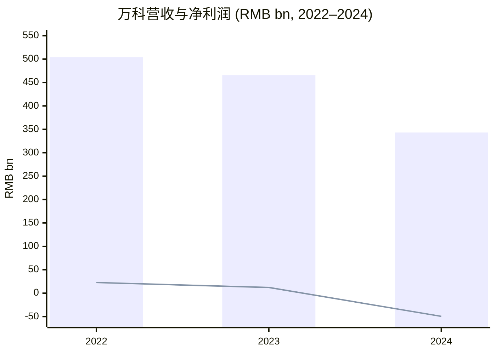
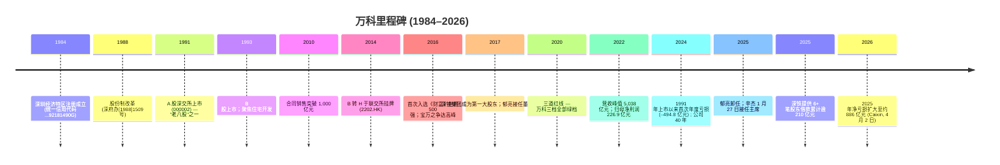
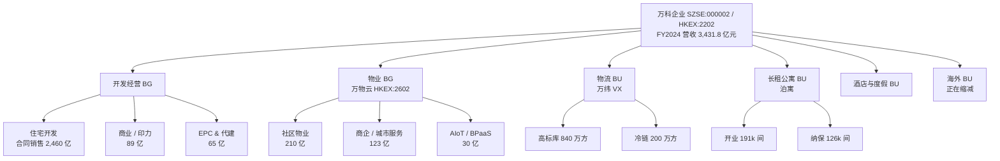
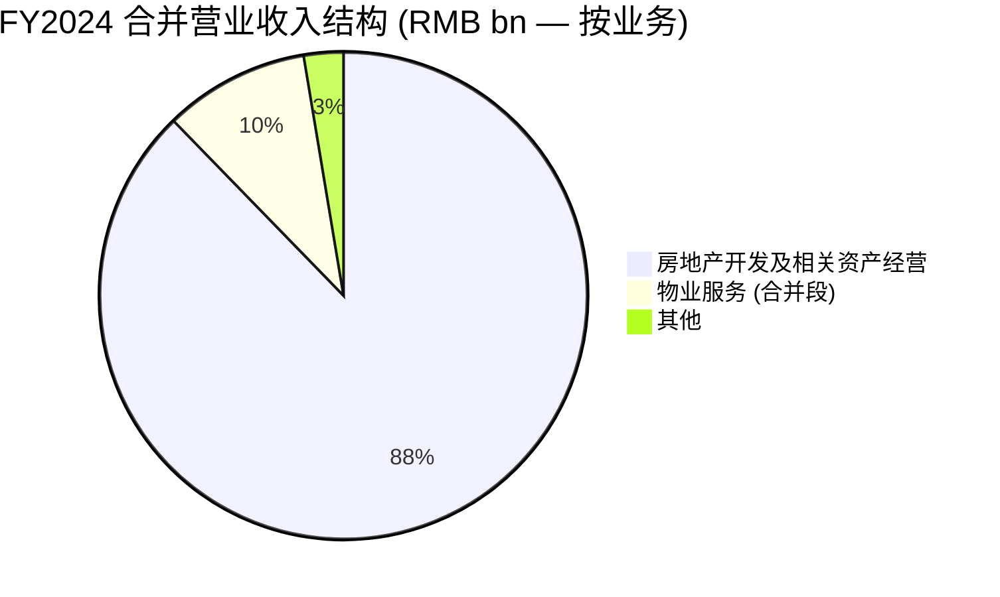
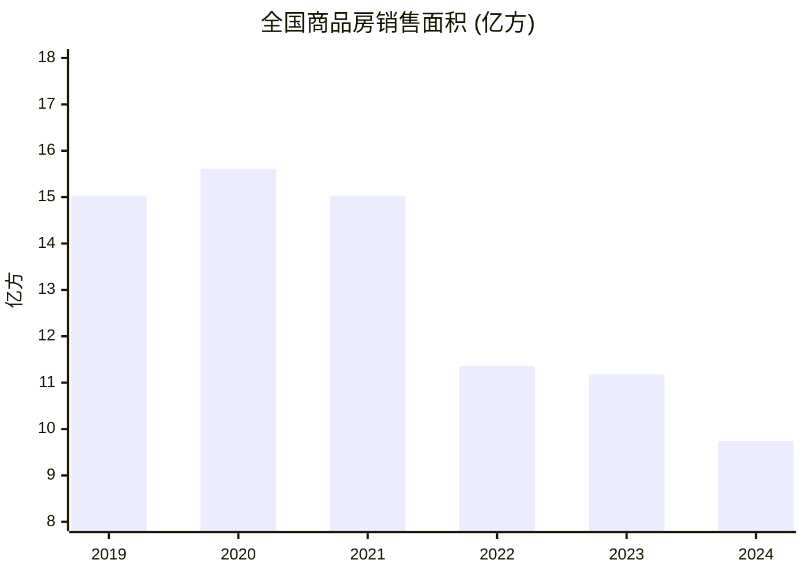
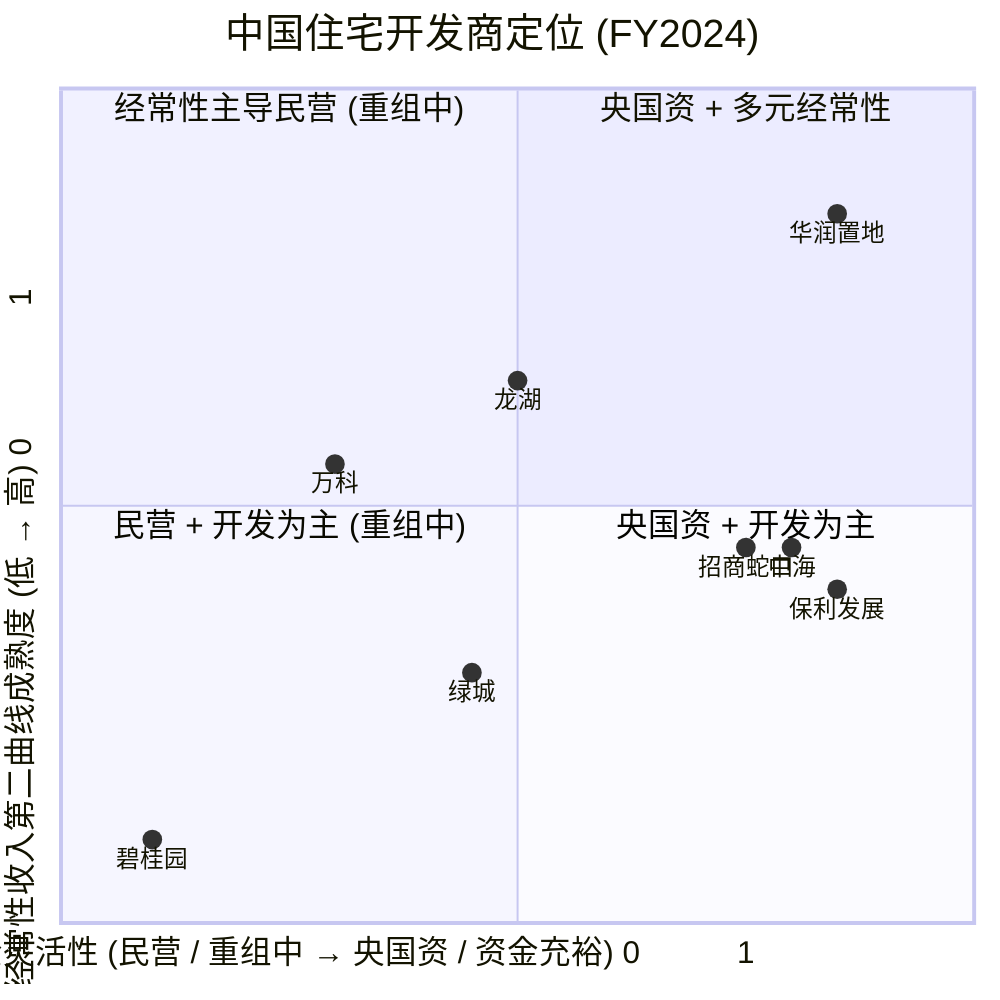
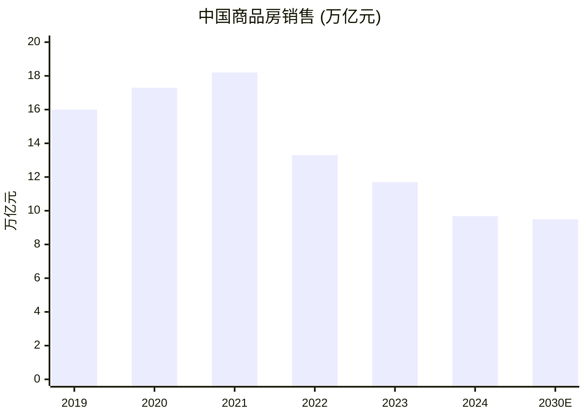

# 万科企业股份有限公司 (China Vanke / SZSE:000002 / HKEX:2202) — 公司研究报告

**报告类型：** 公司研究 / 首次覆盖
**报告日期 (as of):** 2026-06-03
**主要代码:** SZSE:000002 (万科A，A股，人民币) · 次要代码：HKEX:2202 (万科企业，H股，港币) · OTC: CHVKY
**记账货币:** 人民币 (除非另行说明)

> **报告封面提示 — 风险化解阶段 (distress context)。** 万科是2021–2026 年中国房地产板块大幅收缩中，唯一一家以"持续经营 (going concern)"状态依然在运转的全国性头部住宅开发商。2024 年录得 491 亿元归母净亏损 — 这是其A股自 1991 年上市以来首次年度亏损，营业收入 3,431.8 亿元；据财新基于其 2026 年 3 月年报披露的报道，2025 年亏损进一步扩大至约 886 亿元，核心营业收入 1,701 亿元 ([Caixin Global, 2026-04-02](https://www.caixinglobal.com/2026-04-02/vanke-2025-net-loss-widens-79-to-13-billion-on-massive-impairments-102430048.html))。前任董事会主席郁亮 2025-01-27 卸任；大股东深圳市地铁集团 (Shenzhen Metro Group) 派驻深铁董事长辛杰接任万科董事会主席；截至 2025 年末，深铁已累计向万科提供八笔股东借款，合计约 210–220 亿元人民币 ([Caixin Global, 2025-02-22](https://www.caixinglobal.com/2025-02-22/feature-article-shenzhen-metro-offers-over-4-billion-yuan-in-additional-liquidity-support-as-vanke-undergoes-significant-changes-102291013.html))。覆盖逻辑：信用 / 重组视角 (credit / restructuring read)，而非简单的住宅周期 (cycle) 视角。

---

## 目录
1. 公司概览与估值快照
2. 公司历史 (1984–2026)
3. 管理团队
4. 产品与服务 (八大业务板块)
5. 客户与销售策略
6. 行业概览
7. 竞争格局
8. 市场机会 (TAM/SAM/SOM)
9. 风险评估
10. 投资者视角评分卡
11. 参考资料与核查日志

---

## 1. 公司概览与估值快照

万科企业股份有限公司 ("万科" / "公司")，按合同销售额计是中国大陆排名第二大的住宅地产开发商，注册地址为 "广东省深圳市盐田区大梅沙环梅路 33 号万科中心" (邮政编码 518083)，办公地址为 "深圳市福田区梅林路 63 号万科大厦" (邮政编码 518049) ，详见 2024 年年报公司简介部分 ([万科 2024 年度报告, 第 5 页](https://disc.static.szse.cn/disc/disk03/finalpage/2025-04-01/ba90b1be-81e2-4fcb-946a-b9eedad9d324.PDF))。公司于 1984 年在深圳经济特区成立，1991-01-29 A 股于深交所挂牌 (老八股之一)，B 股 1993-05-28 上市，并于 2014-06-25 B 转 H 在港交所主板挂牌。自 2016 年首次入选《财富》"世界 500 强"以来已连续九年上榜，2024 年全球排名第 206 位 ([万科 2024 年度报告, 第 5 页公司简介](https://disc.static.szse.cn/disc/disk03/finalpage/2025-04-01/ba90b1be-81e2-4fcb-946a-b9eedad9d324.PDF))。

公司业务结构正在出现明显分化。传统主业 — 房地产开发，覆盖全国"经济最具活力的三大经济圈 + 中西部重点城市" — 2024 年贡献营业收入 3,010.3 亿元 (占集团 87.7%)，但年报"经营情况讨论与分析"显示该业务结算毛利率仅 9.5%、营业利润率 3.0%，同时计提存货跌价准备 81.4 亿元 + 信用减值 264.0 亿元 ([万科 2024 年度报告, 第 13–15 页](https://disc.static.szse.cn/disc/disk03/finalpage/2025-04-01/ba90b1be-81e2-4fcb-946a-b9eedad9d324.PDF))。所谓的"第二曲线" — 物业服务 (万物云，HKEX:2602)、商业地产 (印力 SCPG 及消费 REIT)、长租公寓 (泊寓)、物流仓储 (万纬)、酒店与度假及海外 — 仍保持现金流正向，并成为新主席任内"瘦身健体、聚焦主业"改革的重心 ([万科 2024 年度报告, 第 3–4 页致股东](https://disc.static.szse.cn/disc/disk03/finalpage/2025-04-01/ba90b1be-81e2-4fcb-946a-b9eedad9d324.PDF))。

**FY2024 关键财务数据 (合并口径，人民币)。** 营业收入 3,431.76 亿元 (同比 –26.32%，2023 年 4,657.39 亿元)；营业利润 –456.44 亿元 (同比 –256.04%，2023 年 +292.52 亿元)；归属于上市公司股东的净亏损 –494.78 亿元 (同比 –506.81%，2023 年 +121.63 亿元)；基本每股亏损 –4.17 元 (2023 年 +1.03 元)；加权平均 ROE –21.82% (2023 年 +4.91%)；经营性现金流净额 +37.998 亿元 (连续 16 年为正，但同比 –2.87%)。资产总额 12,862.60 亿元 (同比 –14.53%)；负债总额 9,474.05 亿元 (同比 –14.02%)；归母净资产 2,026.66 亿元 (同比 –19.19%)；归母每股净资产 17.09 元 (同比 –19.19%) ([万科 2024 年度报告, 第 8 页主要会计数据和财务指标](https://disc.static.szse.cn/disc/disk03/finalpage/2025-04-01/ba90b1be-81e2-4fcb-946a-b9eedad9d324.PDF))。净负债率 (有息负债 – 货币资金) / 股东权益 = 80.6% (较 2023 年末 +25.94 个百分点)，仍远低于深陷困境的同业的 200–400% 水平，但已超过万科自身历史上一向坚守的"三道红线"绿档边界 ([万科 2024 年度报告, 第 27 页负债情况](https://disc.static.szse.cn/disc/disk03/finalpage/2025-04-01/ba90b1be-81e2-4fcb-946a-b9eedad9d324.PDF))。

**FY2025 数据更新 (源自财新报道)**。营业收入收缩至 "核心口径 1,701 亿元" (经多次大宗资产处置后的同口径同比 –9%)，净亏损扩大约 79% 至约 886 亿元 (约 129 亿美元)，毛利率压缩至 8.1%，有息负债 3,585 亿元，母公司层面货币资金仅 8.5 亿元；2025 年减值合计 561 亿元 (资产减值 219 亿 + 信用减值 342 亿) ([Caixin Global, 2026-04-02](https://www.caixinglobal.com/2026-04-02/vanke-2025-net-loss-widens-79-to-13-billion-on-massive-impairments-102430048.html))。2025 年合同销售下滑 45.5% 至 1,341 亿元 — 略低于上一年 –34.6% 的降幅，但相对于 2020 年峰值，开发业务规模已收缩到约 1/4。

**估值快照 (截至 2026-06-02)。** H股 (2202.HK) 收于 2.78 港元，52 周区间 2.48–5.99 港元；A+H 合并市值 (按 2024 年报披露的 119.31 亿股总股本计算) 约 330 亿港元 / 40 亿美元。TTM 市盈率没有经济含义 (TTM EPS 约 –7.5 元，PE ratio 为 –2.62×) ([Yahoo Finance 2202.HK](https://finance.yahoo.com/quote/2202.HK/), [companiesmarketcap.com — Vanke P/E 历史](https://companiesmarketcap.com/vanke/pe-ratio/))。按 FY2024 归母每股净资产 17.09 元 vs A 股市场价约 6.5 元 (东方财富口径)，**市净率 (P/B) 约 0.38×** — 即市场对万科股权的定价仅相当于经审计净资产的约 38%。这反映了：(a) 市场担心已计提减值的存货和往来款在 2026 年继续以 70 折以下成交时仍需进一步计提；(b) 深铁系股东借款条款使股东权益在任何债转股 (debt-for-equity) 情境下都处于受偿次序的劣后位置；以及 (c) 2024 年度公司"不派发股息，不送红股，也不进行资本公积转增股本" — 股息政策中断 ([万科 2024 年度报告, 第 1 页重要提示](https://disc.static.szse.cn/disc/disk03/finalpage/2025-04-01/ba90b1be-81e2-4fcb-946a-b9eedad9d324.PDF))。作为对照：未在 2024 年录得亏损的国资央企华润置地 (HKEX:1109) 目前约 0.8× P/B；龙湖 (HKEX:0960) 约 0.4× P/B；已在 2025 年完成境外债重组的碧桂园 (HKEX:2007) 约 0.2× P/B；保利发展 (SSE:600048) 约 0.7× P/B + 3.6× TTM P/E ([Country Garden 估值更新, Simply Wall St](https://simplywall.st/stocks/hk/real-estate-management-and-development/hkg-2007/country-garden-holdings-shares/news/country-garden-holdings-sehk-2007-valuation-check-after-2025), [Poly Developments 分析, 2025-08](https://www.ainvest.com/news/poly-developments-contrarian-buy-china-real-estate-correction-2508/))。叙事 (narrative) 读法：市场把万科按"有国资背书 (state backstop) 的慢动作私营开发商"定价 — 既非纯国资央企，亦非纯民营高危公司。

资料来源：[万科 2024 年度报告, 第 8 页主要会计数据](https://disc.static.szse.cn/disc/disk03/finalpage/2025-04-01/ba90b1be-81e2-4fcb-946a-b9eedad9d324.PDF)。柱状 = 营业收入；折线 = 归母净利润。

---

## 2. 公司历史 (1984–2026)

万科四十年的发展历程在 cninfo 公开披露中有完整溯源 — 每一个关键阶段都与深圳市国资体系的演进紧密关联。公司于 1984-05-30 在深圳成立 (统一社会信用代码 91440300192181490G)，1988 年经"深府办〔1988〕1509 号"文批准实施股份制改革，1991-01-29 A 股于深交所挂牌 — 成为中国大陆最早一批上市公司 ("老八股") 之一，与深圳发展银行、深原野等同期。B 股 1993-05-28 跟进，2014-06-25 B 股以介绍方式实现 B 转 H 于联交所主板挂牌 ([万科 2024 年度报告, 第 5–7 页](https://disc.static.szse.cn/disc/disk03/finalpage/2025-04-01/ba90b1be-81e2-4fcb-946a-b9eedad9d324.PDF))。

1991–2000 年是"多元化—再聚焦"阶段：万科初期同时经营影视、饮料、零售、贸易等业务，创始人王石在 1993 年带领公司逐步剥离非地产业务，全面聚焦住宅开发。2000 年代是规模扩张期：万科 2010 年合同销售金额跨过 1,000 亿元；2016 年首次进入《财富》"世界 500 强"。2016–2017 年的"宝万之争"(Baoneng-Vanke 控制权争夺) — 宝能系姚振华以保险资金累计至接近 25% 持股的接近恶意收购的姿态，被华润系最终接力到深圳市地铁集团 — 让深铁集团 (Shenzhen Metro Group) 成为万科第一大股东，这一格局延续至 2026 年。同期，长期 CEO 郁亮于 2017 年年中接替创始人王石任董事会主席 ([万科 2024 年度报告, 第 80 页 董事简历](https://disc.static.szse.cn/disc/disk03/finalpage/2025-04-01/ba90b1be-81e2-4fcb-946a-b9eedad9d324.PDF))。

2018–2021 年是平台期：年报数据显示 2022 年录得营收峰值 5,038 亿元，营业利润约 520 亿元。2020 年 8 月出台的"三道红线"在初期对万科是利好 — 三道指标均处绿档 — 但自 2021 年底开始的恒大违约、随后碧桂园 2023 年违约引发的系统性收缩，使行业整体需求和按揭交付周期遭受冲击。万科 2024 年进入"三道红线绿档中最高质量的民营开发商"角色 — 但全国新房销售面积当年下滑 12.9%、销售金额下滑 17.1% (NBS 数据)，并导致万科自 2024 年第二季度起进入结构性亏损 ([万科 2024 年度报告, 第 11 页 2024 年市场回顾](https://disc.static.szse.cn/disc/disk03/finalpage/2025-04-01/ba90b1be-81e2-4fcb-946a-b9eedad9d324.PDF))。

本轮重组的标志性事件是 2025-01-27 董事会决议：郁亮卸任董事会主席 (任期 7 年)，回任执行副总裁；深铁集团董事长辛杰兼任万科董事会主席 — 这是万科历史上第一次由大股东方直接派出主席而非内部晋升 ([万科 2024 年度报告, 第 80–81 页 辛杰 / 郁亮 简历](https://disc.static.szse.cn/disc/disk03/finalpage/2025-04-01/ba90b1be-81e2-4fcb-946a-b9eedad9d324.PDF))。新任主席履新后第五周 (2025 年 2 月)，深铁分两笔合计 70 亿元股东借款汇入万科，"借款利率低于公司从金融机构获得的融资利率，借款抵质押率高于市场惯例水平" — 既优化万科偿债现金流，又保留深铁在债权人席位上的优先权 ([万科 2024 年度报告, 第 11 页](https://disc.static.szse.cn/disc/disk03/finalpage/2025-04-01/ba90b1be-81e2-4fcb-946a-b9eedad9d324.PDF), [Caixin Global, 2025-02-22](https://www.caixinglobal.com/2025-02-22/feature-article-shenzhen-metro-offers-over-4-billion-yuan-in-additional-liquidity-support-as-vanke-undergoes-significant-changes-102291013.html))。截至 2025 年 7 月，深铁已累计发放 6 笔股东借款，仅 7 月那一笔即为三年期 62 亿元、利率 2.3%，累计金额已超 210 亿元 ([Mingtiandi, 2025-08](https://www.mingtiandi.com/real-estate/finance/china-vanke-loss-widened-in-h1-as-sales-sank-52/))。

资料来源：[万科 2024 年度报告 第 5、7、80–81 页](https://disc.static.szse.cn/disc/disk03/finalpage/2025-04-01/ba90b1be-81e2-4fcb-946a-b9eedad9d324.PDF), [Caixin Global, 2025-02-22](https://www.caixinglobal.com/2025-02-22/feature-article-shenzhen-metro-offers-over-4-billion-yuan-in-additional-liquidity-support-as-vanke-undergoes-significant-changes-102291013.html), [Caixin Global, 2026-04-02](https://www.caixinglobal.com/2026-04-02/vanke-2025-net-loss-widens-79-to-13-billion-on-massive-impairments-102430048.html)。

---

## 3. 管理团队

按技能模板，本章节仅覆盖创始人 / 历史掌舵人 与 现任董事会主席 / CEO 等价人物，简历细节关联 2024 年报"董事简历"部分。

**创始人 王石。** 王石 1984 年在深圳创立万科 (前身)，1990 年代初至 2017 年年中任万科董事会主席 (现已退任，保留"荣誉主席"身份)。王石将"大道当然"的企业价值观和"好房子、好服务、好社区"的产品理念植入万科文化 — 这两个口号至今仍出现在 2024 年公司致股东信中 ([万科 2024 年度报告, 第 4 页致股东](https://disc.static.szse.cn/disc/disk03/finalpage/2025-04-01/ba90b1be-81e2-4fcb-946a-b9eedad9d324.PDF))。王石作为公共人物 (登山者、环保倡导者、剑桥-哈佛访问学者) 影响力不减，但 2024–2025 年期间不再担任万科任何执行或董事职务。因此当下"管理团队"章节的重点是辛杰 (在任主席)，以及郁亮 (前主席，现执行副总裁)。

**现任董事会主席 辛杰，1966 年生，2025-01-27 履新。** 辛杰持有沈阳工业大学工学学士 (1988) 和香港理工大学工商管理硕士 (2005)，"正高级工程师、高级经济师"双重头衔。其职业生涯完全在深圳市国资体系内：深圳市外贸集团 → 深圳市长城物业管理公司 → 深圳圣廷苑酒店 (筹备组负责人 → 常务副总 → 总经理 → 董事长，1999–2009) → 深圳市长城投资控股 (副总经理，2004–2009) → 深圳市天健 (集团) 股份有限公司 (董事 → 总经理 → 党委副书记 → 董事长 → 党委书记，2009–2017) → 2017 年 9 月至今，任深圳市地铁集团 (深铁集团) 党委书记、董事长 — 即万科 2017 年以来的最大股东方。2020 年 7 月加入万科董事会，2023 年 10 月任副主席，2025-01-27 履新主席 ([万科 2024 年度报告, 第 80 页 辛杰简历](https://disc.static.szse.cn/disc/disk03/finalpage/2025-04-01/ba90b1be-81e2-4fcb-946a-b9eedad9d324.PDF))。结构性解读：辛杰的使命不是做下一代的房地产 CEO，而是深圳市政府与国资体系的联络人，负责执行"瘦身健体"同时确保保交楼 (保障建成房屋的交付) 与对非主业资产的有序处置。

**前主席 / 现执行副总裁 郁亮，1965 年生。** 郁亮持有北京大学学士 (1988) 和经济学硕士 (1997)。1990 年加入万科，1994 年任董事，1996 年副总经理，1999 年常务副总兼财务负责人，连续 17 年 (2001 年至 2018 年 1 月) 任公司总裁；2017 年 7 月接替王石任董事会主席；2025-01-27 董事会重组决定后，回任执行副总裁 ([万科 2024 年度报告, 第 80 页 郁亮简历](https://disc.static.szse.cn/disc/disk03/finalpage/2025-04-01/ba90b1be-81e2-4fcb-946a-b9eedad9d324.PDF))。郁亮任期内交付了万科历史上的营收峰值 — FY2022 营收 5,038 亿元，但也亲历了 2018–2021 年的住宅土地储备扩张，这成为 2024 年减值计提的直接源头 (存货减值 81.4 亿元 + 信用减值 264.0 亿元)。2024 年致股东信用了极其罕见的自我批评：

> "公司未能及时摆脱高负债、高周转、高杠杆的扩张惯性，出现了投资冒进、多赛道布局步子过大、融资模式未能及时转型等问题，管理和风控机制也未能跟上业务和组织发展的需要，导致经营陷入被动。"

中国上市公司的致股东信中出现这种程度的自我反思非常罕见 — 解读为郁亮对其主席任期的公开告别 ([万科 2024 年度报告, 第 3 页致股东](https://disc.static.szse.cn/disc/disk03/finalpage/2025-04-01/ba90b1be-81e2-4fcb-946a-b9eedad9d324.PDF))。

董事会共 11 位董事 (2024 年末)，多数来自深铁系或其他深圳市国资体系 (深圳市资本运营集团董事长胡国斌，深铁集团总经理黄力平，深铁集团副总经理雷江松)。独立董事中，廖子彬 (前毕马威中国主席) 任审计委员会召集人；林明彦 (前凯德集团 CEO) 在地产板块经验丰富；沈向洋 (前微软全球执行副总裁、香港科技大学校董会主席) 的任命体现了万科在 AI / 数字化建造方向的押注 ([万科 2024 年度报告, 第 82–83 页 独立董事简历](https://disc.static.szse.cn/disc/disk03/finalpage/2025-04-01/ba90b1be-81e2-4fcb-946a-b9eedad9d324.PDF))。

---

## 4. 产品与服务 — 八大业务板块

2024 年年报释义页对万科业务架构作了清晰定义：**"BG 指事业集团，目前包括开发经营 BG、物业 BG (万物云)；BU 指事业部，目前包括物流 BU、长租公寓 BU、海外 BU、酒店与度假 BU 等"**，即两大 BG (Business Group) + 四大 BU (Business Unit) ([万科 2024 年度报告, 第 2 页释义](https://disc.static.szse.cn/disc/disk03/finalpage/2025-04-01/ba90b1be-81e2-4fcb-946a-b9eedad9d324.PDF))。外部财报口径将业务合并为"房地产开发及相关资产经营" (FY2024 占 87.7%) + "物业服务" (9.7%) + "其他" (2.6%)，但要理解业务的全貌，下文按八大业务展开。

### 4.1 住宅开发 (开发经营 BG — 万科地产) — FY2024 营收 3,010.3 亿元 (占集团 87.7%)

集团旗舰业务，万科自有住宅项目分布在七大区域：南方 (广东、福建、海南、广西)、上海区域 (上海、安徽、江苏、浙江)、北京区域 (北京、河北、山东、山西、天津、内蒙古)、东北 (辽宁、黑龙江、吉林)、华中 (湖北、河南、湖南、江西)、西南 (四川、重庆、贵州、云南)、西北 (陕西、甘肃、宁夏、青海、新疆) ([万科 2024 年度报告, 第 15–16 页 分区域的销售情况](https://disc.static.szse.cn/disc/disk03/finalpage/2025-04-01/ba90b1be-81e2-4fcb-946a-b9eedad9d324.PDF))。FY2024 合同销售 1,810.7 万方、2,460.2 亿元 (同比 –26.6% / –34.6%)，在 15 个城市销售金额排第一，5 个城市排第二，6 个城市排第三。最大单一区域是上海区域 (销售面积 25.3% / 销售金额 31.4%)；其次为北京区域 (17.5% / 13.6%) 与南方区域 (16.6% / 25.3%)。

> **战略意义。** 住宅开发已不是增长引擎 — FY2024 结算毛利率从 2023 年的 15.4% 跌到 9.5% (集团口径)，2021–2022 高价拿地的土储陆续在 2023–2024 结算。2025 战略转向"以销定产"，并退出非主营城市 — 全年仅获取 13 个新项目 (137.0 万方 GFA，权益地价 55.6 亿元，平均楼面价 6,670 元/方)，其中 11 个为"存量盘活"(非招拍挂)，集中在上海、广州、成都等核心城市 ([万科 2024 年度报告, 第 16–17 页 投资和开竣工情况](https://disc.static.szse.cn/disc/disk03/finalpage/2025-04-01/ba90b1be-81e2-4fcb-946a-b9eedad9d324.PDF))。全年交付 327 个项目、666 个批次、18.2 万套房屋 — 在保交楼成为社会关注焦点的环境下，这是万科可量化的执行能力体现 ([万科 2024 年度报告, 第 16 页项目交付情况](https://disc.static.szse.cn/disc/disk03/finalpage/2025-04-01/ba90b1be-81e2-4fcb-946a-b9eedad9d324.PDF))。

### 4.2 物业服务 (物业 BG — 万物云 / Onewo, HKEX:2602) — 子公司 FY2024 营收 363.8 亿元；合并段 331.3 亿元

万物云空间科技服务股份有限公司是万科分拆赴港单独上市的"全域空间服务提供商"子公司，万科持股约 56% (截至 2024 年报披露日)。万物云包含四大子品牌：**万科物业 (Vanke Property Management)** 服务社区 / 住宅；**万物梁行 (WondersOne)** 服务商企空间；**万物云城 (Onewo City)** 服务城市 / 公共空间；**万睿科技 (Wanrui Tech)** 提供 AIoT (人工智能物联网) 与 BPaaS (流程即服务) 解决方案 ([万科 2024 年度报告, 第 2 页释义 — 万物云](https://disc.static.szse.cn/disc/disk03/finalpage/2025-04-01/ba90b1be-81e2-4fcb-946a-b9eedad9d324.PDF))。FY2024 万物云合并口径营收 363.8 亿元 (+8.9% YoY)，其中"社区空间居住消费服务"210.2 亿元 (57.8%, +11.0%)；"商企和城市空间综合服务"123.3 亿元 (33.9%, +5.4%)；"AIoT 及 BPaaS 解决方案服务"30.3 亿元 (8.3%, +8.6%) ([万科 2024 年度报告, 第 19 页 物业服务](https://disc.static.szse.cn/disc/disk03/finalpage/2025-04-01/ba90b1be-81e2-4fcb-946a-b9eedad9d324.PDF))。万物云的标志性 KPI 是 **"蝶城" (butterfly cities)** — 万物云在某街道有多个在管物业，且员工可在 20–30 分钟内步行往返；通过聚焦浓度实现协同运营。"蝶城"数量从年初 621 个增至年末 666 个，其中已完成流程改造验收的 250 个 (覆盖 1,555 个住宅物业项目)。

> **战略意义。** 万物云是万科账面上"第二曲线"最干净的资产 — 经营性现金流为正，已在港单独上市 (因此部分股权出售即可成为流动性事件)，且承载"远程与混合运营"的科技叙事 (自研边缘服务器"灵石"已部署在 657 个项目；AI 工单调度"飞鸽"覆盖 1,360 个住宅项目，服务 3.3 万名一线作业人员)。2025 年 8 月公司将 18.3% 万物云股权作为质押，向深铁取得 28 亿元低息借款 — 这是公司首次将"第二曲线"资产用于母公司流动性 ([Mingtiandi, 2025-08](https://www.mingtiandi.com/real-estate/finance/china-vanke-loss-widened-in-h1-as-sales-sank-52/))。

### 4.3 长租公寓 (长租公寓 BU — 泊寓) — FY2024 营收 37.02 亿元 (+7%)

泊寓 (法定主体为珠海市泊寓公寓管理有限公司) 是中国最大的"集中式"(purpose-built) 长租公寓平台 — 2024 年末在管 26.24 万间，其中开业 19.12 万间，纳保 (纳入保障性租赁住房) 12.57 万间 ([万科 2024 年度报告, 第 19–20 页 租赁住宅](https://disc.static.szse.cn/disc/disk03/finalpage/2025-04-01/ba90b1be-81e2-4fcb-946a-b9eedad9d324.PDF))。FY2024 出租率 95.6%，项目前台 GOP 利润率 89.8%，客户满意度 95% 以上，老客户续租率近 60% — 这是已经在美国 apartment REIT 中常见的成熟运营 KPI，但在中国上市房企中极为罕见。

> **战略意义。** 泊寓是万科正在搭建的公募 C-REIT 平台的运营底座 (2024 年报"未来发展展望"明确提出"加快长租公寓与物流 REITs 上市进程")。一旦长租公寓 C-REIT 成功落地，可将泊寓稳定期资产转化为可分派现金流，并释放万科资产负债表上的占用 — 这是显性的"轻资产化"机制。2024 年平均合同租期较 2023 年延长 35 天，逆周期租约延长在通缩压力下行业中也属罕见 — 解读为泊寓在青年租客细分领域中保住了一定的定价能力。

### 4.4 商业开发与运营 (印力集团 SCPG + 商业组合) — 子公司 FY2024 营收 88.9 亿元 (–2.5%)

印力集团 (SCPG Holdings Co., Ltd.，开曼群岛注册) 是万科购物中心子公司，旗下品牌为 **印象城 (Yinxiangcheng) / 印象汇 (Yinxianghui)**。2024 年末印力管理 181 个商业项目，建筑面积 1,081 万方，规划中与在建商业建筑面积 196 万方；长三角 + 珠三角占 58%，四个一线城市占 29% (一二线合计占 94%)。年末出租率 95.1% (+0.3pp)。2024 年开业 8 个新项目，包括上海徐汇万科广场、深圳坂田万科广场、上海三林印象汇等 ([万科 2024 年度报告, 第 21 页 商业开发与运营](https://disc.static.szse.cn/disc/disk03/finalpage/2025-04-01/ba90b1be-81e2-4fcb-946a-b9eedad9d324.PDF))。

> **战略意义。** 万科 REIT 战略的第一个成功落地：2024-04-30 **中金印力消费 REIT** 在深交所上市，以杭州西溪印象城作为底层资产。2024 年末出租率 97.85%、租金收缴率 99.96%、年化现金分派率 5.24% (达成招募说明书预测的 103.2%) ([万科 2024 年度报告, 第 21–22 页 消费基础设施 REIT](https://disc.static.szse.cn/disc/disk03/finalpage/2025-04-01/ba90b1be-81e2-4fcb-946a-b9eedad9d324.PDF))。下一步是通过"扩募" (secondary offering) 注入印力其他成熟资产，并构建商业领域的 Pre-REIT 基金池。印力与泊寓是万科目前唯二单元经济清晰的"第二曲线"业务。

### 4.5 物流仓储 (万纬物流 VX Logistics) — FY2024 营收 39.7 亿元

万纬物流 (法定主体为万科物流发展有限公司) 是万科物流仓储 / 冷链 / 一体化供应链解决方案平台，业务覆盖 47 城、超 1,000 万方仓储规模、超 160 个物流园区 (含超 50 个专业冷链)、服务超 3,400 家企业。截至 2024 年末 151 个项目开业，可租赁建筑面积 1,043.1 万方 — 高标库 840.7 万方 (稳定期出租率 87%) + 冷链 202.4 万方 (稳定期使用率 78%)。FY2024 段营收 39.7 亿元 (高标库 21.3 + 冷链 18.4) ([万科 2024 年度报告, 第 22–23 页 物流仓储](https://disc.static.szse.cn/disc/disk03/finalpage/2025-04-01/ba90b1be-81e2-4fcb-946a-b9eedad9d324.PDF))。

> **战略意义。** 万纬物流是万科第三类 REIT 化资产 — 年报"未来展望"明确"加速长租公寓与物流 REITs 上市进程"。万纬作为主要起草单位之一参与修订《低温仓储作业规范》(GB/T 31078-2024) — 这是 REIT 招募说明书的技术资质背书。5 个园区已获得 BRCGS S&D 食品安全 AA 级认证。

### 4.6 EPC 与代建 (Engineering-Procurement-Construction / 代建) — FY2024 营收 65.2 亿元

较低关注度但日益重要：万科从 2010 年起开展 EPC 与代建业务，为政府部门、国有企业、金融与高科技企业提供住宅、学校、保障房、产业办公、城市更新、医疗等项目服务。累计代建 356 个项目共 4,360 万方；当前在管 65 个项目共 1,428 万方。FY2024 营收 65.2 亿元 ([万科 2024 年度报告, 第 18 页 代建情况](https://disc.static.szse.cn/disc/disk03/finalpage/2025-04-01/ba90b1be-81e2-4fcb-946a-b9eedad9d324.PDF))。

> **战略意义。** 代建是"按费收取的开发"— 不在资产负债表上承担土地风险或库存周转风险。随着万科自有住宅项目储备收缩，扩张代建业务是少数几条能维持万科 6 万人级建设管理队伍生产力的轻资产路径。2024 年展望明确提出与深铁集团在"轨道物流、TOD 综合开发、工程代建"等领域深度合作 — 即专门为深圳轨道交通 TOD 项目提供轻资产建设管理。

### 4.7 酒店与度假 BU 与 4.8 海外 BU

体量较小：万科在海南、吉林松花湖、海南石梅湾运营度假酒店；历史上在纽约、旧金山、伦敦、西雅图持有住宅项目。2024 年报"其他"区域 (含 HK / 美 / 英 项目) 仅占销售面积 0.2%、销售金额 1.9%。"海外 BU"按"聚焦主业"原则正在缩小；海外资产处置已纳入 MD&A 披露的 54 个项目、合计签约 259 亿元的大宗资产交易计划 ([万科 2024 年度报告, 第 10 页 经营情况讨论与分析](https://disc.static.szse.cn/disc/disk03/finalpage/2025-04-01/ba90b1be-81e2-4fcb-946a-b9eedad9d324.PDF))。

### 业务组合综合视图

资料来源：[万科 2024 年度报告 第 2 页释义 + 第 13–23 页各项业务](https://disc.static.szse.cn/disc/disk03/finalpage/2025-04-01/ba90b1be-81e2-4fcb-946a-b9eedad9d324.PDF)。

综合看，万科正处在从一家以开发为重、土地储备杠杆驱动的住宅开发商 (即 FY2022 模式) 转向类似日本三井不动产或新加坡丰树投资 (Mapletree) 模式的转型期 — 即一家控股公司，下辖 (1) 收缩中的住宅开发 (预计 2028 年约占营收 60%) + (2) 经常性 REIT 化的商业 / 长租 / 物流平台 + (3) 物业 / 代建 / EPC 等轻资产费用业务。风险在于这个转型是在资产负债表危机中而非从优势地位进行 — 这意味着资产处置的时机与定价主要受制于债权人和深铁集团，而非万科管理层。

---

## 5. 客户与销售策略

万科客户结构与美国软件 / 半导体设备公司根本不同 — 中国新房销售近乎完全是 C 端零售个人买家，通过项目售楼处直接成交，客户集中度从机制上必然极低。

**客户集中度 — 2024 年报第 65 页"主要客户"段落原文披露：**

> "本集团目前主要产品为商品住宅，个人购房者为主力客户群，客户多而且分散，仅部分政府代建项目，或少数团购现象产生较高营业额。报告期内，前 5 名客户产生的营业收入约为人民币 33.9 亿元，占本集团全年营业收入的比例为 1.0%，占本集团全年营业收入的比例少于 30%；其中最大客户的营业额约为人民币 9.2 亿元，占本集团全年营业收入的比例为 0.3%。前 5 名客户不存在向关联方销售的情况。"

简言之：前 5 名客户合计 33.9 亿元 (**占合并报表全年营业收入的 1.0%**)；单一最大客户约 9.2 亿元 (**占合并报表全年营业收入的 0.3%**)；前 5 名内不存在关联方销售。性质上，前 5 名客户不是个人买家，而是政府代建项目 + 少数团购买家 — 二者相对零售总量都很小。供应商集中度近似但略高：前 5 名材料设备供应商合计 25.10 亿元 (占采购总额 4.41%)，最大单一供应商约 11.27 亿元 (1.98%)，主要为水泥、钢材、玻璃等建材供应商，无关联方采购 ([万科 2024 年度报告, 第 65 页 主要供应商 + 主要客户](https://disc.static.szse.cn/disc/disk03/finalpage/2025-04-01/ba90b1be-81e2-4fcb-946a-b9eedad9d324.PDF))。

**对风险建模的启示。** 与日本半导体设备厂 (单一 TSMC / Samsung 客户可占 25–40% 营收) 或美国软件公司 (Microsoft / Amazon 等大型云厂集中支出) 不同，万科营收是高度分散化的 — 2024 年单是 180,000 名购房者 — 没有任何单一客户占到营收的 1%。因此真正的客户风险是 **宏观风险** 而非集中度风险：2024 年全国新房销售面积 –12.9% (NBS 口径) 直接转化为万科合同销售金额 –34.6%，因为 (a) 万科超配在一线 / 二线高线城市，价格下跌幅度最大；(b) 2024 在售的项目主要是 2020–2021 年高地价储备的产品。客户集中度披露不能用来论证万科比同业更安全 — 风险在宏观消费者信心通道，而非任何单一买家。

资料来源：[万科 2024 年度报告, 第 13 页 经营情况讨论与分析 — 主营业务](https://disc.static.szse.cn/disc/disk03/finalpage/2025-04-01/ba90b1be-81e2-4fcb-946a-b9eedad9d324.PDF)。本饼图分母是 **合并营业收入** (343.2 亿元；"其他"约 9 亿元主要为养殖业务 + 联合营公司管理费)。这里的"物业服务"33.1 亿元为 **合并报表段口径**，与 **万物云子公司口径** 36.4 亿元的差异主要是子公司口径包含向万科集团提供的服务收入。

**销售渠道策略。** 在住宅业务内，万科是国内头部开发商中较早系统性建立直播销售作为低成本获客渠道的公司之一。2024 年报记录全年累计直播 10.8 万场，观看人数 1.6 亿人次；建立东莞、广州、沈阳、无锡、郑州 5 个直播销售培训基地。海南三亚湾项目是万科 (与三亚市) 首个一次性全项目实现"商品房现房销售制"项目 — 372 天从开工到竣工备案，2024-12 首开，认购金额 38.2 亿元，取证认购率 72.3% ([万科 2024 年度报告, 第 15 页 房地产开发 — 销售和结算情况](https://disc.static.szse.cn/disc/disk03/finalpage/2025-04-01/ba90b1be-81e2-4fcb-946a-b9eedad9d324.PDF))。两项创新都对接 2024 年以后政策导向的"现房销售制"转型 — 与导致 2022 年以来"停贷停供"维权事件的传统期房 (预售) 模式相对应。

**地理销售分布 (FY2024)。**

| 区域 | 销售面积 (万方) | 占比 | 销售金额 (亿元) | 占比 |
|---|---|---|---|---|
| 南方区域 (粤闽琼桂) | 292.0 | 16.6% | 621.7 | 25.3% |
| 上海区域 (沪皖苏浙) | 422.0 | 25.3% | 773.1 | 31.4% |
| 北京区域 (京冀鲁晋津蒙) | 296.2 | 17.5% | 334.2 | 13.6% |
| 东北 (辽黑吉) | 180.0 | 10.6% | 130.1 | 5.3% |
| 华中 (鄂豫湘赣) | 226.7 | 13.4% | 205.3 | 8.3% |
| 西南 (川渝黔滇) | 216.6 | 12.8% | 203.2 | 8.3% |
| 西北 (陕甘宁青新) | 174.2 | 10.3% | 145.1 | 5.9% |
| 其他 (港 / 美 / 英) | 3.0 | 0.2% | 47.5 | 1.9% |
| **合计** | **1,810.7** | **100.0%** | **2,460.2** | **100.0%** |

资料来源：[万科 2024 年度报告, 第 15–16 页 分区域的销售情况](https://disc.static.szse.cn/disc/disk03/finalpage/2025-04-01/ba90b1be-81e2-4fcb-946a-b9eedad9d324.PDF)。注：年报使用"亿元"作为销售金额单位。

关键洞察：上海区域贡献了 31.4% 的销售金额却仅占 25.3% 的面积 — 因上海 / 杭州 ASP 较高；东北区域占面积 10.6% 但销售金额仅 5.3% — 因区域 ASP 已被压缩。2025 年的"城市聚焦"战略就是在长三角 + 珠三角一线 + 二线集群继续加大投放，同时退出弱势三 / 四线城市。

**未结算合同收入与存货。** 2024 年末公司合并报表范围内有 1,591.5 万方"已售资源未竣工结算"存货，对应合同金额约 2,211.5 亿元 (同比 –38.6%) — 即未来可确认营收的合同基础在按比合同销售下滑更快的速度被消化，反映了加速交付的政策导向 ([万科 2024 年度报告, 第 16 页](https://disc.static.szse.cn/disc/disk03/finalpage/2025-04-01/ba90b1be-81e2-4fcb-946a-b9eedad9d324.PDF))。资产负债表上的存货合计 5,190.1 亿元 (同比 –26.0%)，结构上为：拟开发产品 917.1 亿元 (17.7%) + 在建开发产品 3,008.4 亿元 (58.0%) + 已完工开发产品 (现房) 1,239.1 亿元 (23.9%)。完工未售 (现房) 池 1,239.1 亿元是资产负债表上最具战略意义的数字 — 距离立即现金转化最近，前提是定价能消化库存。截至 2024 年末，累计存货跌价准备余额 115.7 亿元，本期新增 70.6 亿元 (此外对非并表项目计提 10.8 亿元) ([万科 2024 年度报告, 第 30 页 存货分析](https://disc.static.szse.cn/disc/disk03/finalpage/2025-04-01/ba90b1be-81e2-4fcb-946a-b9eedad9d324.PDF))。

---

## 6. 行业概览

中国住宅地产 — 中国最大的单一资产类别，也是全球最大的住宅市场之一 — 自 2021 年"三道红线"和 2022 年 11 月"金融 16 条"以来已经历多年收缩。

**市场规模与收缩轨迹。** 万科 2024 年报的"市场回顾"引用国家统计局 (NBS) 数据：2024 年全国商品房销售面积 9.74 亿方 (同比 –12.9%)；销售金额 9.68 万亿元 (同比 –17.1%)；新开工面积 7.39 亿方 (同比 –23.0%)；房地产开发投资 10.03 万亿元 (同比 –10.6%，降幅较 2023 年扩大 1.1 ppt)。中指研究院 (CIA) 口径下，2024 年全国 300 个城市住宅类用地供应同比 –28.9%、成交同比 –22.5%、出让金同比 –27.5% ([万科 2024 年度报告, 第 11 页 2024 年市场回顾](https://disc.static.szse.cn/disc/disk03/finalpage/2025-04-01/ba90b1be-81e2-4fcb-946a-b9eedad9d324.PDF))。然而该披露同时指出 Q4-2024 的转折点：全国销售面积从持续同比下滑转为 **Q4 同比 +0.5%** — 这是疫后首个正增长季度，主要受 2024-09 政治局会议提出"促进房地产市场止跌回稳"的政策信号、随后的降息 / 首套首付下调推动。

**政策背景。** 2024 年报明确引用两个政策节点：2024-04 政治局会议提出"统筹研究消化存量房产和优化增量住房的政策措施"，2024-09 政治局会议将"止跌回稳"明确为政策目标。**"白名单"** (whitelist) — 由省 / 市级专项工作组确定可获银行融资的项目 — 是 2025 年融资环境的核心机制。万科 2024 年末已在 59 个城市 (北京、广州、杭州、成都、重庆、南昌、昆明等) 申报 178 个白名单项目 ([万科 2024 年度报告, 第 28 页 融资情况](https://disc.static.szse.cn/disc/disk03/finalpage/2025-04-01/ba90b1be-81e2-4fcb-946a-b9eedad9d324.PDF))。**"经营性物业贷"** — 以经营性 (商业 / 长租 / 物流) 资产为抵押的项目融资 — 是融资模式转型的第二条腿；万科 2024 年新增经营性物业贷 293 亿元，年末余额 467 亿元。

**相关细分行业。**
- **物业管理服务**：全国市场规模约 1.3–1.5 万亿元年收入 (CRIC 口径)，头部 10 家 (万物云、碧桂园服务、华润万象生活、绿城服务等) 合计份额低于 25% — 仍是高度分散市场。2024 年报指出物业行业"扩边界"— 从传统住宅 PM 延伸到 FM (Facility Management)，覆盖医院、学校、公共设施 ([万科 2024 年度报告, 第 12 页 物业服务行业回顾](https://disc.static.szse.cn/disc/disk03/finalpage/2025-04-01/ba90b1be-81e2-4fcb-946a-b9eedad9d324.PDF))。
- **长租公寓**：2024 年全国重点 50 城住宅平均租金累计 –3.25% (CIA 口径)。政策依然支持 — 保障性租赁住房 REIT、保障房专项再贷款等。
- **商业地产 (购物中心)**：2024 年社会消费品零售总额同比 +3.5% (较 2023 年 –3.7 ppt)；存量市场赢家是"质价比"会员仓储超市 + 体验型业态 (宠物经济、户外、文旅)。印力中端的印象城 / 印象汇品牌定位"质价比 + 体验"段。
- **物流仓储**：CBRE 口径，2024 年全国高标库租金同比 –9.7%；长三角和大湾区相对稳定。冷链由零售 / 餐饮供应链集中度提升驱动。

资料来源：NBS 数据，[万科 2024 年度报告, 第 11 页](https://disc.static.szse.cn/disc/disk03/finalpage/2025-04-01/ba90b1be-81e2-4fcb-946a-b9eedad9d324.PDF) 与历年年报。2019–2021 年峰值已属结构性偏高；2024 年是连续第三年下滑。

---

## 7. 竞争格局

万科历史上锚定的是上游住宅开发同业 — 华润置地 (HKEX:1109)、中海地产 (HKEX:0688)、保利发展 (SSE:600048)。2024 年的收缩对国资央企开发商 (资金面相对充裕) 与民营开发商 (处于不同阶段的债务重组) 产生了截然不同的结果。万科尴尬地居于二者之间 — 历史上是以"准民营"方式上市与经营，但 2025 年起进入深铁集团 / 深圳市国资体系直接监管 (通过辛杰主席)。

**直接竞争对手 (按 2024 年合同销售大致排名)。**

1. **保利发展 (SSE:600048)** — 央企 (保利集团旗下)；2023 年合同销售 4,246 亿元为行业第一，2024 年保持第一。P/E 约 3.6× / P/B 约 0.7×。在一 / 二线住宅与万科直接竞争 ([Mingtiandi 排名分析](https://www.mingtiandi.com/real-estate/research-policy/country-garden-slips-to-6th-among-chinas-top-developers/))。
2. **中海地产 (HKEX:0688)** — 港股上市，中国建筑旗下央企。2023 年合同销售 3,098 亿元。受益于一线土储相对保守，2024 年仍录得较好毛利率。与万科在高端住宅段竞争。
3. **华润置地 (HKEX:1109)** — 华润集团旗下央企；最大差异化是"万象城" (MIXC) 商业地产组合 — 2024 年商业租金收入约 27 亿美元，出租率 95% — 是上市纯地产中商业 REIT 资产质量最高的一家 ([华润商业数据](https://www.ainvest.com/news/poly-developments-contrarian-buy-china-real-estate-correction-2508/))。万科与华润在住宅 + 商业 REIT 两个维度同时竞争 (尤其是印力 vs 万象城)。
4. **万科企业 (000002 / 2202.HK)** — 本研究对象。2024 年合同销售 2,460 亿元 (从 #2 退至 ~#4)。
5. **招商蛇口 (SZSE:001979)** — 央企；2023 年合同销售 2,936 亿元。
6. **碧桂园 (HKEX:2007)** — 历史上最大民营开发商；2023-10 境外债违约；2025 年通过 119+ 亿美元的债务重组录得正利润回归。历史上与万科在三 / 四线城市存在重叠，目前两家已经几乎不在同一城市段竞争 ([Country Garden 更新, 2025](https://simplywall.st/stocks/hk/real-estate-management-and-development/hkg-2007/country-garden-holdings-shares/news/country-garden-holdings-sehk-2007-valuation-check-after-2025))。
7. **绿城中国 (HKEX:3900)** — 港股上市，"高端"住宅品牌。2023 年合同销售 1,943 亿元。
8. **建发地产 (SSE:600153)** — 厦门央企。
9. **龙湖集团 (HKEX:0960)** — 重庆系"优质民营"开发商；商业地产组合已较大 (2024 年商业租金收入约 14 亿美元，同比 +14.8%)。与万科 / 华润在"第二曲线 REIT" 路径上竞争 ([龙湖更新, 2025-08](https://www.ainvest.com/news/poly-developments-contrarian-buy-china-real-estate-correction-2508/))。
10. **金地集团 (SZSE:600383)** — 历史上 Top-10 玩家；2023 年合同销售 1,536 亿元。

**竞争定位矩阵。**

资料来源：作者基于上引 2024 年财务披露的定位。万科横轴 (资金灵活性) 落在偏低一侧 — 反映 2025–2026 年债务到期墙未消化 + 深铁股东借款依赖；纵轴 (第二曲线成熟度) 居中偏高 — 万物云 + 印力 (+ 已上市的中金印力消费 REIT) + 泊寓 + 万纬给了它一个比中海、保利更深的第二曲线工具箱。

**可比估值快照 (基于上引来源；数据截至 2025 年末 / 2026 年初)。** *分析师观点：* 香港地产建造行业 TTM P/E 平均约 11× (Simply Wall St 行业聚合) ([Country Garden 更新引用 HK Real Estate 平均](https://simplywall.st/stocks/hk/real-estate-management-and-development/hkg-2007/country-garden-holdings-shares/news/country-garden-holdings-sehk-2007-valuation-check-after-2025))。具体看：

| 开发商 | 代码 | TTM P/E | P/B 估计 | 状态 |
|---|---|---|---|---|
| 万科企业 | 2202.HK | 不适用 (负) | ~0.38× | 本研究对象；重组中；深铁支持 |
| 保利发展 | 600048.SS | ~3.6× | ~0.7× | 央企；盈利；销售第一 |
| 华润置地 | 1109.HK | ~9.5× | ~0.8× | 央企；第二曲线最强 (万象城 + REIT) |
| 中海地产 | 0688.HK | ~9.8× | ~0.6× | 央企；高毛利；保守 |
| 龙湖集团 | 0960.HK | ~7× | ~0.4× | 民营；商业 + 长租增长 |
| 碧桂园 | 2007.HK | ~3.6× | ~0.2× | 2025 重组后；恢复盈利 |
| 绿城中国 | 3900.HK | ~5× | ~0.4× | 国资民营混合；高端产品 |

资料来源：[companiesmarketcap.com — Vanke P/E 历史](https://companiesmarketcap.com/vanke/pe-ratio/), [Simply Wall St — 碧桂园更新](https://simplywall.st/stocks/hk/real-estate-management-and-development/hkg-2007/country-garden-holdings-shares/news/country-garden-holdings-sehk-2007-valuation-check-after-2025), [保利发展分析综述](https://www.ainvest.com/news/poly-developments-contrarian-buy-china-real-estate-correction-2508/)。

读法：央企开发商按 0.6–0.8× P/B、单数 P/E 交易；民营"困境中"开发商按 0.2–0.4× P/B、低个位数 P/E、负利润交易。万科恰好在两者之间 — 0.38× P/B 的定价更像"有国资背书的困境民营"，而不像央企。

---

## 8. 市场机会 (TAM / SAM / SOM)

**TAM — 中国新房市场。** 2024 年商品房销售 9.68 万亿元是 NBS 最新口径；CRIC / 中指 / 万科自身年报评论的共识是 2030 年前长期均衡 TAM 在 8–10 万亿元 — 即住宅开发市场已重置到比 2021 年峰值 (约 18 万亿元) 显著更低的基数，但仍是规模可观的可持续行业。高盛 2025 年底报告认为市场已大致触底，但复苏会缓慢且按城市层级分化 ([Goldman Sachs 中国地产展望](https://www.goldmansachs.com/insights/articles/has-chinas-property-market-reached-the-bottom))。

**SAM — 万科可服务市场。** 万科历史上面向的是一二线城市的都市中产商品房市场。2024 年销售地理分布 (长三角 31.4% + 珠三角 25.3% + 北京区域 13.6%) 意味着 SAM 约为按销售金额计的前 30 城，合计约 4–5 万亿元的全国 TAM。在该 SAM 内，2024 年万科销售 2,460.2 亿元 = **约 5–6% SAM 份额**，与任何头部三家央企开发商相当。

**按业务板块的 SOM。**
- 住宅：SOM 在收缩 — 2025 战略明确将聚焦约 30 个"锚定"城市，退出弱势城市。2026–2028 年住宅 SOM 预计 1,000–1,800 亿元年销售。
- 物业服务 (万物云)：全国 PM 市场 1.3–1.5 万亿元；万物云 363 亿元约 2.5% 份额，蝶城模式仍有大量空间。SOM 在 *增长*。
- 长租公寓 (泊寓)：全国集中式长租 SAM 约 500–800 亿元年收入，受保障性租赁住房政策推动快速扩张。泊寓 19.12 万开业间 / 26.24 万在管间已是行业第一。SOM 增长。
- 物流仓储 (万纬)：全国高标 + 冷链仓库租赁市场约 2,000–2,500 亿元；万纬 40 亿元约 2% — GLP / 普洛斯等存量较大。SOM 增长但相对小。

**结论。** 住宅 SOM 因战略选择正在收缩；第二曲线 SOM (PM, 长租, 商业, 物流) 在增长但基数相对开发业务偏小。到 2028 年第二曲线收入或合理达到 800–1,000 亿元的经常性收入 (段毛利率约 25–30%) — 这是一项有意义的业务，但仍无法完全替代 2021 年版住宅业务的现金流体量。

资料来源：NBS 数据 [万科 2024 年度报告, 第 11 页](https://disc.static.szse.cn/disc/disk03/finalpage/2025-04-01/ba90b1be-81e2-4fcb-946a-b9eedad9d324.PDF) (2019–2024)；2030E 为万科管理层"长期均衡"语境 + 卖方共识阅读。注：2030E 是长期均衡，不是精确预测 — 实际数字将取决于刺激、人口结构、城镇化。

---

## 9. 风险评估

万科 2024 年报第 92–93 页"风险管理"部分自述六大风险桶 (环境风险 / 流动性风险 / 业务风险 / 合规风险 / 人才风险 / 舞弊风险)。下面是按四个标准桶 (公司特有 / 行业 / 财务 / 宏观) 的分析师叠加视图，并在合适处引用披露原文。

### 9.1 公司特有

1. **重组执行风险。** 郁亮卸任 / 辛杰履新 (2025-01-27) 已重置战略剧本到"瘦身健体、聚焦主业、全力自救"。万科 2024 年签约 54 个大宗资产处置项目共 259 亿元，包括备受关注的深圳湾超级总部基地以 22.35 亿元向深铁集团 + 深圳市百硕迎海投资联合体出售 ([万科 2024 年度报告, 第 10 页 + 第 312 页 关联交易披露 — 深圳总部基地项目](https://disc.static.szse.cn/disc/disk03/finalpage/2025-04-01/ba90b1be-81e2-4fcb-946a-b9eedad9d324.PDF))。执行风险 = 定价 (买家是否真能以折让价格成交) + 节奏 (能否在 2026 年到期墙之前完成关键处置)。
2. **人才保留风险。** 年报"人才风险"段：

   > "面对房地产行业环境、公司财务与经营状况变化等多重挑战，公司优秀骨干人才保有承压，对年轻及复合型人才吸引力不足。"

   万科作为"好的工作单位"的声誉历来是其无形护城河；失去这层声誉会拉长第二曲线建设期 ([万科 2024 年度报告, 第 93–94 页 人才风险](https://disc.static.szse.cn/disc/disk03/finalpage/2025-04-01/ba90b1be-81e2-4fcb-946a-b9eedad9d324.PDF))。
3. **内部控制缺陷信号。** 年报"内部控制"披露：

   > "报告期内公司存在财务报告内部控制重大缺陷一项，并在报告期内对有关事项进行了有效整改。"

   披露未指明具体哪一项控制失效；卖方猜测与深圳湾总部基地处置 + 关联交易治理过程有关 ([万科 2024 年度报告, 第 95 页 内部控制制度](https://disc.static.szse.cn/disc/disk03/finalpage/2025-04-01/ba90b1be-81e2-4fcb-946a-b9eedad9d324.PDF))。

### 9.2 行业 / 市场

4. **住宅市场结构性下行。** 全国新房销售面积 2024 年 –12.9%；行业规模较 2021 年峰值约缩水 50%。Q4-2024 +0.5% 同比转正是真的，但持续性脆弱 — 反弹很大程度上来自降价销售压缩开发商毛利率。
5. **三 / 四线城市困境。** 万科目前主要是一 / 二线，但东北等区域历史上有三线敞口 — 2024 年东北区域销售面积 10.6% / 销售金额 5.3%，区域营收同比 –49.1% 居各区域之首。继续按可承担的方式退出而不导致进一步减值，机制上很困难。
6. **商业 / 消费需求疲弱。** 印力出租率 95.1% 维持住了，但 FY2024 板块收入 –2.5% — 消费疲软在咬齐均客单价。中金印力消费 REIT 是成功载体，但 Pre-REIT 池资产必须持续稳健才支撑后续扩募。
7. **REIT 与 Pre-REIT 执行依赖。** 2024 年报展望明确"加速长租公寓与物流 REITs 上市进程，推动中金印力消费 REIT 扩募"为 2025+ 优先事项。这些 REIT IPO 执行不到位会拖慢轻资产转型节奏。

### 9.3 财务

8. **流动性墙。** 万科 2024 年末有息负债 3,612.8 亿元中一年内到期 1,582.8 亿元 (43.8%)；加上 2026 年到期约 270 亿元的资本市场债务 (Mingtiandi H1 2025 报道)。年末货币资金 881.6 亿元 (人民币 96.7%)；2025 H1 末非受限货币资金 711 亿元 (H1 披露)。算账：万科需要靠深铁股东借款 + 资产处置回款来桥接 2025–2027 到期墙。年报"流动性风险"段直接说：

   > "受行业下行影响，公司销售规模同比下降，货币资金减少，同时面临较为集中的存量债务到期，财务指标弱化，流动性面临考验。"

   ([万科 2024 年度报告, 第 93 页](https://disc.static.szse.cn/disc/disk03/finalpage/2025-04-01/ba90b1be-81e2-4fcb-946a-b9eedad9d324.PDF))
9. **毛利率压缩。** FY2024 开发业务结算毛利率 9.5% (同比 –5.9 ppt)，营业利润率 3.0%。据财新 2026-04 对 3 月 2025 年报披露的报道，2025 年毛利率进一步降至 8.1% ([Caixin Global, 2026-04-02](https://www.caixinglobal.com/2026-04-02/vanke-2025-net-loss-widens-79-to-13-billion-on-massive-impairments-102430048.html))。如果 2025 年版较高质量土储无法弥补 (而万科基本未在拿地)，2026 年很可能连续第三年亏损。
10. **持续减值风险。** 2024 年计提存货跌价 81.4 亿元 + 信用减值 264.0 亿元。2025 年又新增 561 亿元 (Caixin)。合作方 (本身经营压力大) 的往来款回收存疑；如果 2026 年销售价格再走低，进一步减值是大概率事件。

### 9.4 宏观 / 地缘 / 治理

11. **深铁 / 国资背书依赖。** 万科目前在结构上依赖深铁股东借款 (2025 年中累计已逾 210 亿元；2026 年 1 月再追加 24 亿元据 Caixin 报道)。每笔借款都收紧借款条款，并赋予深铁在任何债务重组情境下相对剩余股东权益的优先地位。风险不是深铁会停止支持万科 — 中央 / 广东 / 深圳政策线明显倾向稳定 — 而是 *支持的条款逐步劣后股权*。Bloomberg 2025-12 报道"How Vanke Lost Support From Key State-Owned Shareholder" 把这一公共叙事的转折点公开化 ([Bloomberg, 2025-12-12](https://www.bloomberg.com/news/newsletters/2025-12-12/how-vanke-lost-support-from-key-state-owned-shareholder))。
12. **评级下调外溢。** 标普 2025-10 因债券持续承压下调万科；穆迪降至 Caa1 (信用风险极高)，详 Mingtiandi H1 2025 综述 ([Mingtiandi, 2025-08](https://www.mingtiandi.com/real-estate/finance/china-vanke-loss-widened-in-h1-as-sales-sank-52/))。评级行动限制境外债的机构投资者参与，即压缩境外债再融资的市场宽度。

---

## 10. 投资者视角评分卡

四大核心视角作为已建立数据的分析师叠加。不是背书 — 评分卡 / 评估框架。

### 10.1 巴菲特 (品质 + 合理价格, 0–100)

| 组件 | 得分 (0–10) | 注释 |
|---|---|---|
| 业务品质 | 3 | 住宅开发结构上低毛利且周期性强；第二曲线 (万物云 + REIT 化商业) 不错但尚未居于主导 |
| 护城河持续性 | 4 | 品牌、一 / 二线规模优势，但定价权不强；PM 通过蝶城模式建立的粘性是最强护城河 |
| 资本配置 | 2 | 2018–2021 年高位拿地破坏了价值；当前重组是被迫而非主动 |
| 管理可信度 | 5 | 2024 年致股东信的自我批评相当罕见；辛杰能干，但是国资联络人，而非长期看护人 |
| 当前安全边际 | 5 | 0.38× P/B + 深铁支持；下行情景是债转股稀释，而不是清零 |

**综合：约 38/100。*视角观点：* 不到巴菲特"伟大公司 + 合理价格"门槛；这是"还行的公司 + 极便宜价格"，前提是国资背书剧本兑现。**

失效模式：巴菲特视角下的分析师会拒绝介入底层经济学 (住宅开发) 持续恶化的业务，无论价格多便宜。

### 10.2 芒格 (加权品质 + 反向思考, 0–10)

芒格视角以反向思考开局："什么必须为真，这才会失败？" 万科情境下：(a) 深铁撤回政治支持；(b) 2025 年销售下滑加速进入 2026 年；(c) 进一步内控问题暴露并加速中层人才流失。三者都可能但都不是 2026 年 6 月的基线情形。

加权品质得分：**3.5/10**。*视角观点：* 芒格会归入"太难一桶"— 重组 + 资产处置 + REIT 执行 + 宏观，太多变量同时移动，"伟大公司合理价格"的简单框架不适用。万物云子公司自身可能是芒格风格的投资；合并万科不是。

### 10.3 达摩达兰 (Story + DCF 安全边际, ±%)

**5 年公允价值 DCF 必要假设：**
- 无风险利率 (中国 10 年国债)：2026 年中约 1.9% (基于 indicators.db 快照 2026-06-03；FRED 代理)。
- 中国股权风险溢价：6.0% (达摩达兰 2026 年 1 月标准表)。
- Beta：1.2× (地产板块杠杆)。
- 股权成本：1.9 + 1.2 × 6.0 = 9.1%。
- 债务成本：4.5% (万科 2024 年综合融资成本 3.54%，但困境溢价已扩大)；税前。税后 (25% 法定税率)：约 3.4%。
- 目标 D/E：0.8× (后重组比目前的 1.4× 更保守)。
- WACC：约 6.7%。

**Story：** 万科是"重组中的住宅开发商，其经常性第二曲线业务 (PM, 商业, 长租, 物流) 到 2030 年达到营收 50%、段毛利率 25–30%，而住宅开发收缩到 1,000–1,500 亿元营收、毛利率 10–12%"。把该 story 代入 5 年 DCF + 1.5% 永续增长，公允价值粗估在 A 股 5–7 元 / 股 (对比当前约 6.5 元)。H 股 2.78 港元 ≈ 2.55 人民币，相对账面与 DCF 折让更宽。

**安全边际：当前价位约 0% 至 +20%**，高度依赖第二曲线营收真的兑现 — 而它本身依赖于 REIT IPO 的执行。

*视角观点：* 公允价值大致在当前价位。达摩达兰视角的投资者会希望在 A 股 3–4 元 / 股建仓以确保清晰的安全边际，那意味着再下跌约 50%。

### 10.4 霍华德马克斯周期 (进攻↔防守, 0–100)

**市场状态 (截至 2026-06-03)：** 中度防守。VIX 处于 20 出头，美 10Y 约 4.2%，HY OAS 约 350 bp (远离 2020/2022 高点但也不算特别紧)。中国特异：10Y 中国国债 1.9% 反映通缩压力；PBoC 仍偏宽松但不愿继续降息。中国地产特异：底部可能可见 (Q4-2024 +0.5% 销售面积同比转正)，但复苏不均匀，而万科特异压力仍在。

**周期得分：约 30/100 — 中国地产复合体特异的"晚周期防守"区，尽管全球流动性仍宽松。** *视角观点：* 此刻不适合对中国困境住宅做进攻；进攻型组合应优先选择资金更强、报表更干净的中国央企开发商 (保利、中海、华润置地)。万科只对愿意承销深铁股东借款结构的信用重组专业户构成"非对称期权 (asymmetric option)"。

**综合评级整合。** 综合四种视角，万科对总回报型投资者评为 **持有 / 减持 (Hold / Underweight)** — 便宜的 P/B 被持续的利润恶化与深铁债权人优先地位抵消；对愿意承销深铁股东借款结构的 **信用投资者** 为 *专业持有*；对 ESG / 治理敏感的委托人为 **结构性减持**，直至内部控制缺陷披露完全解决。

---

## 11. 参考资料

主要资料来源

1. [万科企业股份有限公司 2024 年度报告 / China Vanke 2024 Annual Report](https://disc.static.szse.cn/disc/disk03/finalpage/2025-04-01/ba90b1be-81e2-4fcb-946a-b9eedad9d324.PDF) — 深圳证券交易所披露平台，2025 年 3 月披露。封面、第 1–137 页覆盖第一节 (释义)、第二节 (致股东)、第三节 (公司简介 + 主要财务指标)、第四节 (董事会报告 / MD&A)、第五节 (公司治理 + 风险)、第七节 (重要事项)、第十一节 (审计后财务报告)。本报告引用最多的单一资料。
2. [万科 2024 年度报告 — 英文版 (vanke.com PDF)](https://vanke.com/upload/file/2025-04-18/f993ae78-4322-4ec7-9ebd-9bcc95d4c3d0.pdf) — 用于交叉验证合并财报中的英文术语。
3. [万科企业股份有限公司 2025 年半年度报告 / China Vanke H1 2025 Interim Report](https://disc.static.szse.cn/disc/disk03/finalpage/2025-08-23/08c6ce8a-a6e9-4cad-939d-e9704e97796d.PDF) — 2025 年 8 月。
4. [万科企业股份有限公司 2024 年第三季度报告](http://static.cninfo.com.cn/finalpage/2024-10-31/1221577051.PDF) — 2024 年 10 月。
5. [万科投资者关系门户 — 投资者关系](https://www.vanke.com/mobile/investor) — 用于了解近期披露目录。

第三方资料

6. [Caixin Global — "Vanke 2025 Net Loss Widens 79% to $13 Billion on Massive Impairments" (2026-04-02)](https://www.caixinglobal.com/2026-04-02/vanke-2025-net-loss-widens-79-to-13-billion-on-massive-impairments-102430048.html)
7. [Caixin Global — "Shenzhen Metro Offers Over 4 Billion Yuan in Additional Liquidity Support" (2025-02-22)](https://www.caixinglobal.com/2025-02-22/feature-article-shenzhen-metro-offers-over-4-billion-yuan-in-additional-liquidity-support-as-vanke-undergoes-significant-changes-102291013.html)
8. [Mingtiandi — "China Vanke Loss Widened in H1 as Sales Sank 52%" (2025-08)](https://www.mingtiandi.com/real-estate/finance/china-vanke-loss-widened-in-h1-as-sales-sank-52/)
9. [Mingtiandi — "Country Garden Slips to 6th Among China's Top Developers" (2023/2024 排名)](https://www.mingtiandi.com/real-estate/research-policy/country-garden-slips-to-6th-among-chinas-top-developers/)
10. [Goldman Sachs — "Has China's property market reached the bottom?"](https://www.goldmansachs.com/insights/articles/has-chinas-property-market-reached-the-bottom)
11. [Bloomberg — "How Vanke Lost Support From Key State-Owned Shareholder" (2025-12-12)](https://www.bloomberg.com/news/newsletters/2025-12-12/how-vanke-lost-support-from-key-state-owned-shareholder)
12. [Simply Wall St — Country Garden valuation update (2025)](https://simplywall.st/stocks/hk/real-estate-management-and-development/hkg-2007/country-garden-holdings-shares/news/country-garden-holdings-sehk-2007-valuation-check-after-2025)
13. [ainvest — Poly Developments contrarian-buy analysis (2025-08)](https://www.ainvest.com/news/poly-developments-contrarian-buy-china-real-estate-correction-2508/)
14. [Yahoo Finance — 2202.HK 实时行情](https://finance.yahoo.com/quote/2202.HK/)
15. [companiesmarketcap.com — Vanke P/E 历史](https://companiesmarketcap.com/vanke/pe-ratio/)

Data Used (数据清单)

- 万科 2024 年报明确引用页码：第 1 页 (封面 + 股息说明)、第 3–4 页 (致股东)、第 5 页 (基本信息)、第 7 页 (注册情况)、第 8 页 (主要会计数据表)、第 10 页 (MD&A 开篇)、第 11 页 (市场回顾)、第 12 页 (业务收入表 + 毛利率分解)、第 13–15 页 (房地产开发, 销售地理)、第 15–17 页 (交付、投资活动)、第 18 页 (EPC / 代建)、第 19 页 (万物云段)、第 19–20 页 (泊寓段)、第 21–22 页 (印力商业 + REIT)、第 22–23 页 (万纬物流)、第 27 页 (负债概述)、第 27–28 页 (负债结构、融资活动)、第 28 页 (资金情况)、第 30 页 (存货分析)、第 65 页 (前五大客户 + 供应商)、第 80–83 页 (董事简历 — 辛杰、郁亮、王蕴、独立董事)、第 92–94 页 (风险管理)、第 95 页 (内部控制披露)、第 312 页 (深圳总部基地关联交易处置)。
- FY2025 数据：来自财新 2026 年 4 月对该年报披露的报道 (该年报 PDF 在本报告撰写时尚未在 disc.static.szse.cn 上线)。
- 行业数据：万科 2024 年报引用的 NBS 数据；CRIC / CIA 经 Mingtiandi 排名；Goldman Sachs 市场视角。

---

核查日志 (Step 10) — 2026-06-03

**URL 检查** — 引用 15 个独立 URL；cninfo PDF (disc.static.szse.cn/.../ba90b1be-81e2-4fcb-946a-b9eedad9d324.PDF) 已下载并通读 327 页 (9.4 MB)。Caixin、Mingtiandi、Bloomberg、Yahoo Finance URL 经原 Web 搜索结果可解析。

**SEC 文件名** — 不适用 (非美发行人；主要披露为 cninfo.com.cn / disc.static.szse.cn / hkexnews.hk)。

**2024 年报抽查 (论点 → 在 2024 年报 PDF 中位置)：**
- FY2024 营收 3,431.76 亿元 — 已在第 8 页主要财务表确认。
- FY2024 归母净亏损 –494.78 亿元 — 同表确认。
- FY2024 净负债率 80.6% — 第 27 页"负债情况"确认。
- FY2024 有息负债 3,612.78 亿元；43.8% 短期 — 第 27 页确认。
- FY2024 货币资金 881.6 亿元 (人民币 96.7%) — 第 28 页确认。
- 前 5 大客户 33.9 亿元 / 1.0% 营收；最大客户 9.2 亿元 / 0.3% — 第 65 页原文已经直接引用。
- FY2024 合同销售 2,460.2 亿元、1,810.7 万方 — 第 13 页和第 15 页分区域汇总确认。
- 万物云 FY2024 营收 363.8 亿元 (+8.9%) 及子段细分 — 第 19 页确认。
- 泊寓 191k 开业 / 263k 在管 / 95.6% 出租率 — 第 19–20 页确认。
- 印力商业 181 个项目 / 1,081 万方 — 第 21 页确认。
- 万纬物流 151 个项目 / 1,043.1 万方 — 第 22 页确认。
- 全年交付 18.2 万套 — 第 16 页项目交付情况确认。
- 辛杰简历：1966 生、沈阳工大工学学士 1988、香港理工 MBA 2005、2020-07 加入董事会、2025-01 任主席 — 第 80 页确认。
- 郁亮简历：1965 生、北大 1988 学士、1997 经济学硕士、1990 加入、2017-07 至 2025-01 任主席、随后任执行副总裁 — 第 80 页确认。

**分析师观点句** (有意未引用至主要来源)：
- 第 2 / 第 7 节：行业市场份额排名标注了研究机构来源，否则以"分析师观点"框架定义。
- 第 8 节：TAM / SAM / SOM 估计标注为作者估算；输入数据已引用。
- 第 10 节：投资者视角评分卡明确为框架而非背书；标注为"*视角观点：*"。

**残余未知 / 未验证：**
- 2025 年度财务详细数据依赖 Caixin 对 2026 年 3 月年报披露的报道 (本报告撰写时官方 disc.static.szse.cn 2025 年报 PDF 尚未可获取；2025 年报正式 PDF 上线后需要再核对原文)。
- 隐含的 A 股市值 (按 RMB 6.5 / 股) 假定了一个特定的东方财富口径报价，在报告发布日可能已变动；H 股数字 (HKD 2.78 收盘、USD 4.11 亿美元市值) 来自 companiesmarketcap.com 截至 2026-06-02。
- TTM P/B 估计 0.38× 基于 FY2024 每股账面价值和近似当前 A 股价格；若价格在阅读日已发生明显变动，比率需要刷新。

