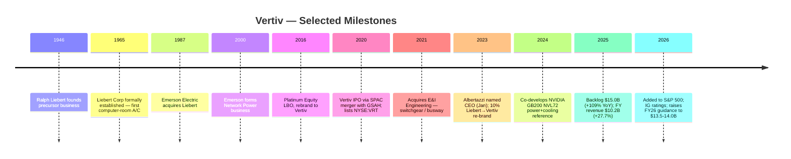
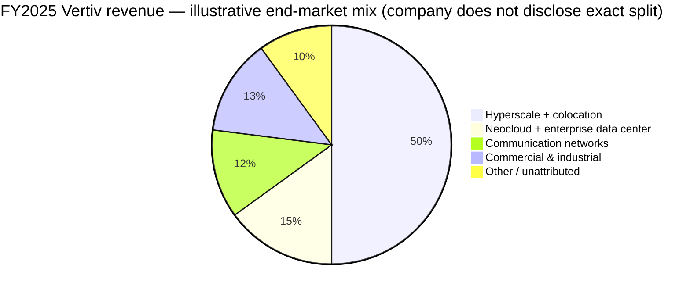
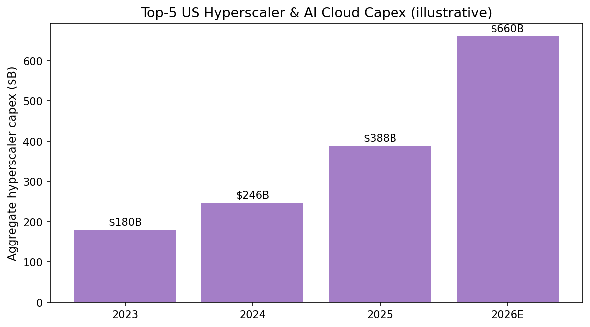
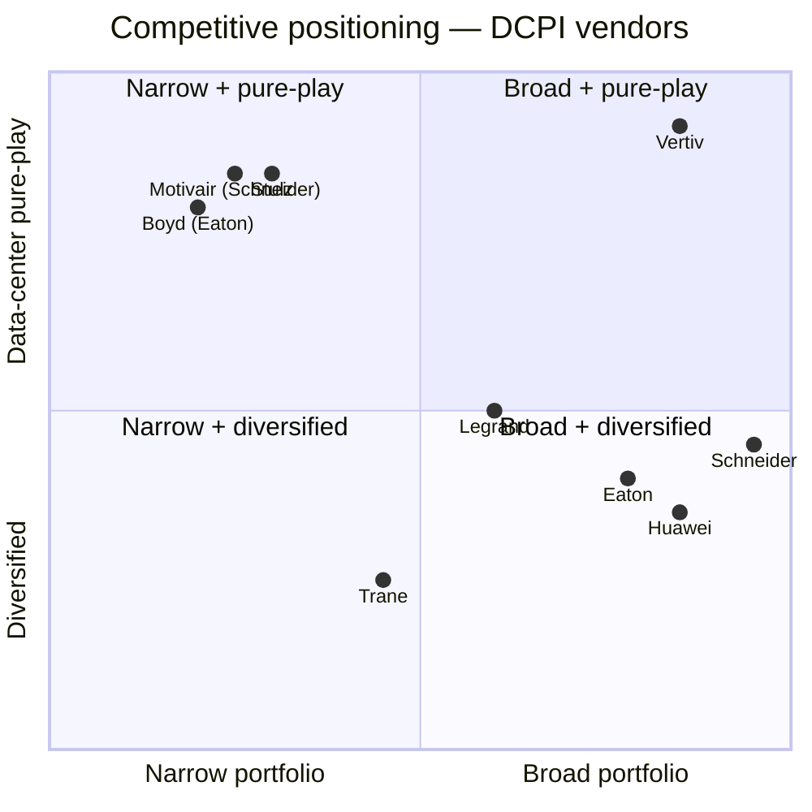
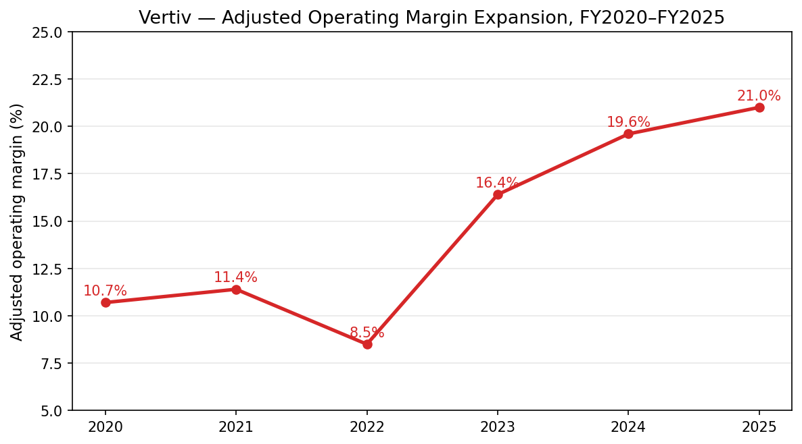
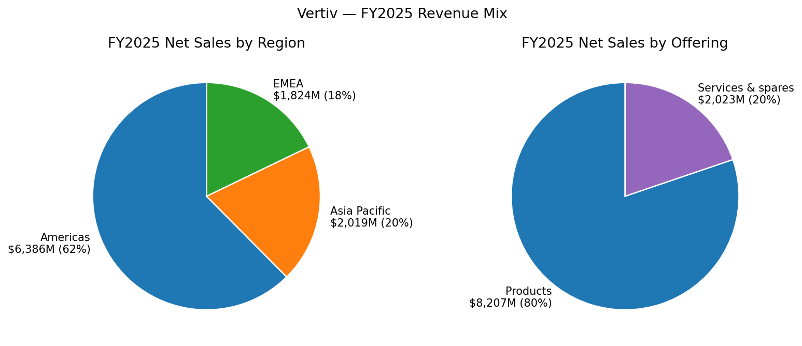
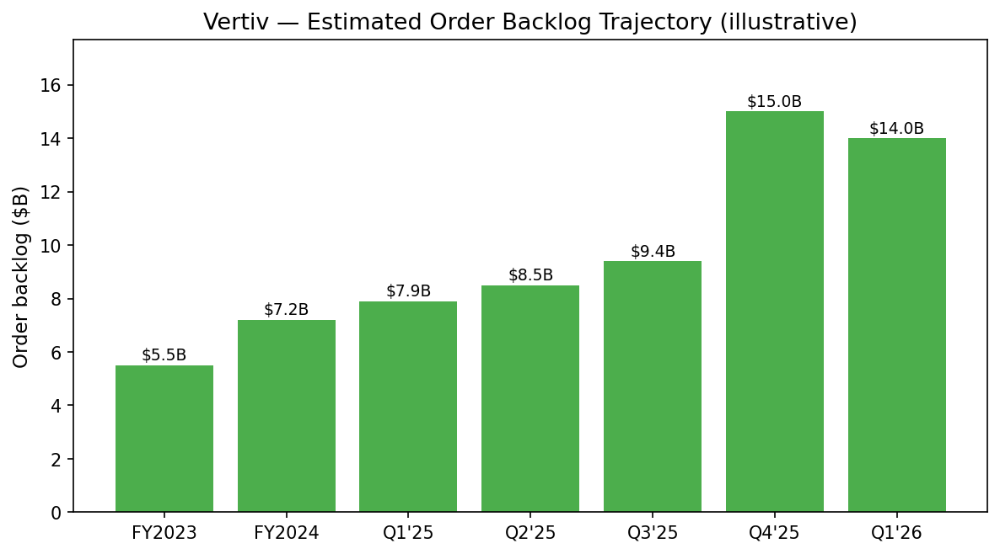

# COMPANY RESEARCH REPORT: Vertiv Holdings Co (NYSE:VRT)

**Date:** 2026-05-20
**Analyst note:** Initiating coverage. All financial figures in USD millions unless otherwise stated. Fiscal year ends December 31.

> **Update — FY2026 guidance raised (2026-04-22):** Management raised full-year 2026 net-sales guidance to **$13,500–$14,000 M** (from $13,250–$13,750 M at the Q4-2025 print) and raised adjusted diluted EPS guidance to **$6.30–$6.40** (from $5.97–$6.07), implying ~30% organic sales growth and ~51% adjusted-EPS growth at the midpoint vs. FY2025. Q1 2026 organic sales grew 23% (Americas +44%), adjusted operating margin reached 20.8% (+430 bp YoY), and adjusted free cash flow of $653 M (+147% YoY) brought net leverage to ~0.2×. Stated drivers: continued data-center demand, faster execution into a record $15.0 B order backlog, positive price–cost net of tariffs, and a faster ramp of recent acquisitions. Source: [Vertiv Q1 2026 Earnings Release, 2026-04-22](https://www.sec.gov/Archives/edgar/data/0001674101/000162828026026379/q12026exhibit991vrt04222026.htm).

---

## TABLE OF CONTENTS
1. Company Overview
2. Company History
3. Management Team
4. Products & Services
5. Customers & Go-to-Market
6. Industry Overview
7. Competitive Landscape
8. Market Opportunity (TAM)
9. Risk Assessment
10. References

---

## 1. Company Overview

Vertiv Holdings Co (NYSE: VRT) is the largest pure-play vendor of critical digital infrastructure — the power, thermal-management and integrated systems that keep data centers, telecom networks, and commercial/industrial sites running. Headquartered in Westerville, Ohio, the company designs, manufactures, sells, installs and services the hardware that sits between the utility grid and the silicon: uninterruptible power supplies (UPS), low- and medium-voltage switchgear, busway/busbar, rack power distribution, lithium-ion battery cabinets, air- and liquid-cooled thermal systems, computer-room air conditioners (CRAH/CRAC), liquid-cooled coolant distribution units (CDUs), prefabricated modular data centers, racks and cabinets, IT-management software, and a global services and lifecycle business operating from ~300 service centers with ~5,000 field engineers ([Vertiv 2025 Form 10-K, Item 1 Business](https://www.sec.gov/Archives/edgar/data/0001674101/000167410126000008/vrt-20251231.htm)).

**How the company makes money.** Two-thirds of revenue is product sales (UPS, switchgear, thermal, modular) booked on a point-in-time basis as units ship; the other one-third is over-time recognition from long-cycle integrated projects (prefab modular data centers, large turnkey power and thermal builds), recurring service contracts, spare parts, and software. In FY2025 the split was **products $8,207.0 M / services & spares $2,022.9 M** of the $10,229.9 M total — Services & spares grew 14.5% to ~20% of mix, but the Products line is what scales with hyperscaler AI capex and accounts for the explosive incremental growth ([Vertiv 2025 10-K, Note 3 Revenue](https://www.sec.gov/Archives/edgar/data/0001674101/000167410126000008/vrt-20251231.htm)).

**Reporting segments and geography.** Vertiv reports along three geographic segments — Americas, Asia Pacific, and Europe, Middle East & Africa. In FY2025 the Americas was **62% of net sales ($6,386.3 M)**, up from 56% in FY2024, on the back of US hyperscaler AI build-outs; Asia Pacific was 20% ($2,019.2 M); EMEA was 18% ($1,824.4 M). Americas operating margin reached 26.8% (FY2024: 24.4%), while EMEA margin compressed to 20.7% (FY2024: 24.5%) on mix and capacity-add inefficiencies ([Vertiv 2025 10-K, MD&A Business Segments](https://www.sec.gov/Archives/edgar/data/0001674101/000167410126000008/vrt-20251231.htm)). The Americas business is now the single largest determinant of company-level results — when Q1 2026 Americas organic sales grew 44%, the consolidated organic-growth rate jumped to 23%, even as EMEA contracted 29% organically on a tough comp and elongated European hyperscaler permitting.

**Scale and financial intensity.** FY2025 revenue of **$10,229.9 M** was up 27.7% YoY (vs. $8,011.8 M in FY2024) — Vertiv's revenue base has doubled in three years from $4,998.1 M in FY2021 and more than tripled in five from $4,370.6 M in FY2020. FY2025 gross margin was 36.3% (vs. 36.6% in FY2024 — essentially flat as operational leverage was absorbed by tariff cost inflation), adjusted operating margin was ~21.0% (vs. 19.6% in FY2024), net income reached $1,332.8 M (FY2024: $495.8 M, distorted by a $449.2 M non-cash warrant-liability remark), adjusted free cash flow was **$1,887 M (+66% YoY)**, and the company ended the year with $1,728.4 M cash and net leverage of ~0.5× ([Vertiv Q4 2025 Earnings Release, 2026-02-11](https://www.sec.gov/Archives/edgar/data/0001674101/000167410126000006/exhibit991vrt02112026.htm)).

*Source: [Vertiv 2025 10-K, MD&A](https://www.sec.gov/Archives/edgar/data/0001674101/000167410126000008/vrt-20251231.htm); [Vertiv 2022 10-K, MD&A](https://www.sec.gov/Archives/edgar/data/0001674101/000162828023005248/vrt-20221231.htm) for FY2020–FY2022.*

The single most important operating disclosure for the investment thesis is the **order backlog**: $15.0 B as of December 31, 2025, **+109% YoY** vs. $7.2 B at FY2024 ([Vertiv 2025 10-K, Item 1 Business — Backlog](https://www.sec.gov/Archives/edgar/data/0001674101/000167410126000008/vrt-20251231.htm)). Q4 2025 organic orders grew 252% YoY (book-to-bill of ~2.9×) and trailing-twelve-month organic orders grew 81% ([Vertiv Q4 2025 Earnings Release, 2026-02-11](https://www.sec.gov/Archives/edgar/data/0001674101/000167410126000006/exhibit991vrt02112026.htm)). The majority of backlog is firm and expected to convert within 12–18 months, giving high visibility into FY2026–FY2027 revenue. Vertiv added approximately 34,000 employees globally as of year-end 2025 and continues to expand capacity for switchgear, busway, prefab, and liquid-cooling product lines in the US, Mexico, Italy, India, and China.

**Employees and footprint.** ~34,000 full- and part-time employees as of December 31, 2025 (~41% in manufacturing operations), operations in 40+ countries, sales in 130+ countries. ER&D spend in 2025 was $441.7 M, ~4.3% of revenue — well above the company's history (in 2020 R&D was ~3% of sales) and rising as the company funds liquid-cooling, prefab and the NVIDIA reference-architecture roadmap.

**Valuation snapshot (2026-05-20).** VRT trades at **$317.7** with a market cap of **~$122.0 B**, **TTM P/E ~80×**, **TTM P/S ~11.3×**, P/B ~30.8×, EV/EBITDA ~52×, on TTM revenue of ~$10.84 B (Q1 2026 trailing) ([Yahoo Finance VRT key statistics, 2026-05-20](https://finance.yahoo.com/quote/VRT/key-statistics)). Forward P/E on the raised 2026 adjusted-EPS midpoint of $6.35 is ~50×.

For context against the peer set the company itself names ([Vertiv 2025 10-K, Item 1 Competition](https://www.sec.gov/Archives/edgar/data/0001674101/000167410126000008/vrt-20251231.htm)):

| Ticker | Company | TTM P/E | TTM P/S | EV/EBITDA | Fwd P/E |
|---|---|---:|---:|---:|---:|
| VRT | Vertiv Holdings | **80.0** | **11.3** | **52.3** | **35.9** |
| ETN | Eaton Corp. | 37.0 | 5.2 | 26.1 | 24.1 |
| NVT | nVent Electric | 55.0 | 6.0 | 29.3 | 29.0 |
| TT | Trane Technologies | 34.5 | 4.6 | 24.2 | 26.5 |
| SU.PA | Schneider Electric | 33.2 | 3.7 | 20.1 | 23.0 |

Source: [Yahoo Finance multi-ticker key statistics pulled via yfinance, 2026-05-20](https://finance.yahoo.com).

**Interpretation of the multiple.** Vertiv trades at roughly **2.4× the peer-median P/E and 2.5× the peer-median P/S**, a premium even within an electrical-equipment basket that is itself re-rated on the AI-power thesis. Three drivers explain the premium and a fourth tempers it.

1. **Growth gap.** Vertiv is guiding ~29–31% FY2026 organic sales growth and ~50–52% adjusted-EPS growth; Eaton, Schneider and Trane are guiding 6–9% organic growth and high-single-digit / low-double-digit EPS growth. Multiple-on-growth (PEG-style) compresses some of the gap — VRT trades at ~1.6× PEG on 2026E adj-EPS growth, Eaton near ~3×.
2. **Pure-play AI optionality.** Vertiv is the only large-cap whose entire business is data-center-and-comm critical infrastructure (Schneider, Eaton and Trane each carry diversified industrial/grid/HVAC mixes that earn lower multiples). The market is paying for that purity.
3. **Backlog visibility.** A 2.9× Q4 book-to-bill and a $15 B backlog (~1.5× FY2025 sales) gives Vertiv unusual forward-revenue visibility; peers do not disclose backlog at this granularity.
4. **Risk premium for cyclicality and concentration.** AI hyperscaler capex is concentrated in 5–10 customers (Microsoft, Google, Amazon, Meta, Oracle, CoreWeave, Nebius, plus colocation operators Equinix and Digital Realty); a coordinated pull-back or "AI cold winter" would compress both Vertiv's organic growth and its multiple aggressively. See **Risk Assessment** for valuation-compression risk.

The stock has compounded ~771% (from $100 base) over the five years to December 31, 2025 ([Vertiv 2025 10-K, Stock Performance Graph](https://www.sec.gov/Archives/edgar/data/0001674101/000167410126000008/vrt-20251231.htm)); VRT was added to the S&P 500 in March 2026 ([Vertiv Press Release Q1 2026](https://www.sec.gov/Archives/edgar/data/0001674101/000162828026026379/q12026exhibit991vrt04222026.htm)). Vertiv received inaugural investment-grade ratings — Moody's Baa3 and S&P BBB- — in February 2026 and completed a $2.1 B senior unsecured notes issuance, refinancing the prior secured-loan stack and lowering its effective interest cost.

---

## 2. Company History

Vertiv's lineage traces to **1946**, when Ralph Liebert founded the precursor to the Liebert Corporation; **Liebert Corporation was formally established in 1965** as the industry's first manufacturer of computer-room air conditioning, inventing the CRAC unit that became the standard for the mainframe era ([Vertiv 2025 10-K, Item 1 Our Company](https://www.sec.gov/Archives/edgar/data/0001674101/000167410126000008/vrt-20251231.htm)). **Emerson Electric** acquired Liebert in 1987 and folded it, alongside the ASCO power-transfer-switch business, Avansys, Knurr AG (enclosures) and Avocent (KVM and IT-management software), into a new **Emerson Network Power** business unit in **2000**. Through the 2000s and early 2010s Emerson Network Power was a leading but somewhat sleepy product line inside a diversified industrial conglomerate.

In **November 2016** Emerson sold the Network Power business to **Platinum Equity** for ~$4 billion in an LBO; the standalone business was rebranded **Vertiv** the same year ([Vertiv Press Release archives, 2016](https://www.vertiv.com)). On **February 7, 2020** Vertiv went public on the NYSE through a SPAC merger with **GS Acquisition Holdings Corp** ("GSAH"), the SPAC sponsored by industrials veterans **David M. Cote** (former Honeywell Chairman & CEO) and **David Cote's son Christopher Cote** along with Goldman Sachs. Cote became Executive Chairman and the business immediately began an operational and strategic transformation centered on the "Vertiv Operating System" (VOS) — a lean-Six-Sigma-flavored continuous-improvement discipline — and a deliberate re-pricing of the product line.

Three transformations have defined the company since IPO:

**(1) The "high-performance company" reset (2020–2022).** Cote and the new board imported a Honeywell-style operational rhythm — monthly business reviews, lean deployment, ER&D rationalization, supply-chain consolidation, and explicit pricing discipline. In 2022 Vertiv took a controversial double-digit price action across the portfolio in response to inflation; the move temporarily weighed on demand but reset the gross-margin base from the low-30s into the mid-30s. The Critical Infrastructure & Solutions segment posted a margin loss in early 2022 before the year-end reset; FY2023 gross margin recovered to 35.0% and FY2024 to 36.6% ([Vertiv 2022 10-K, MD&A](https://www.sec.gov/Archives/edgar/data/0001674101/000162828023005248/vrt-20221231.htm); [Vertiv 2024 10-K, MD&A](https://www.sec.gov/Archives/edgar/data/0001674101/000162828025005905/vrt-20241231.htm)).

**(2) The CEO transition and segment simplification (Jan 2023).** Long-time EMEA and Americas head **Giordano Albertazzi** was appointed CEO effective January 1, 2023, replacing Rob Johnson. At the same time Vertiv reorganized away from the legacy product segmentation (Critical Infrastructure & Solutions / Integrated Rack Solutions / Services & Spares) into the current three geographic segments — a structural change that increased regional accountability and accelerated decision cycles for hyperscaler accounts.

**(3) The AI / liquid-cooling positioning (2023–present).** With NVIDIA's H100 and then GB200 platforms pushing rack densities past 100 kW, the industry pivoted from air to liquid cooling. Vertiv invested ahead of the curve. In October 2024 it co-developed and published with NVIDIA a complete **7 MW reference architecture for GB200 NVL72** (132 kW per rack), the only large physical-infrastructure vendor selected for NVIDIA's Solution Advisor: Consultant tier of the NPN ([Vertiv–NVIDIA codevelopment release, 2024-10-14](https://investors.vertiv.com/financial-news/news-details/2024/Vertiv-Codevelops-with-NVIDIA-Complete-Power-and-Cooling-Blueprint-for-NVIDIA-GB200-NVL72-Platform/default.aspx)). The MegaMod CoolChip prefab platform, the SmartRun overhead infrastructure portfolio, and the Vertiv OneCore standardized architecture all flow from this pivot.

**Key acquisitions:**

- **2021 — E&I Engineering Group** (~$1.8 B): Irish-headquartered low- and medium-voltage switchgear, busway and power distribution; transformed Vertiv from a UPS-and-thermal vendor into a full power-train vendor for hyperscale.
- **August 2025 — Great Lakes Data Racks & Cabinets** ($200 M): Rack/cabinet and integrated white-space infrastructure for AI and high-density compute; US and European manufacturing footprint accelerating pre-engineered rack systems.
- **December 2025 — PurgeRite Intermediate, LLC** (undisclosed): Liquid-cooling system flushing, cleanliness and service expertise; bolsters the services portfolio for the liquid-cooling installed base.
- **December 2025 — Waylay** (undisclosed): Industrial-grade workflow automation software for predictive analytics and orchestration across complex infrastructure environments.

**Recent strategic actions.** Vertiv announced a $3.0 B share-repurchase authorization on November 29, 2023 (good through December 31, 2027); $2.4 B remains as of year-end 2025. Quarterly dividend was raised three times since 2023 to $0.0625/share for the December 2025 payment. In February 2026 the company received its first investment-grade credit ratings (Moody's Baa3 / S&P BBB-), issued $2.1 B of senior unsecured notes, retired the legacy term loan and ABL revolver, and put in place a new $2.5 B revolving credit facility ([Vertiv Q1 2026 Earnings Release, 2026-04-22](https://www.sec.gov/Archives/edgar/data/0001674101/000162828026026379/q12026exhibit991vrt04222026.htm)). The S&P 500 inclusion in March 2026 marked the formal completion of the post-SPAC institutionalization.

---

## 3. Management Team

### Giordano Albertazzi — Chief Executive Officer (since January 1, 2023)

Giordano Albertazzi is the single most important figure in the current Vertiv story. He took the CEO seat in January 2023 — the inflection moment between Vertiv's air-cooled legacy and the AI / liquid-cooled future — and has overseen the period in which revenue went from $5.7 B (FY2022) to $10.2 B (FY2025), adjusted operating margin expanded from 8.5% to ~21%, and backlog tripled past $15 B.

He is a 27-year company veteran. He joined Emerson Network Power (the predecessor) in **1998** after starting his career at Kone Elevators, where he held operations and product-development leadership roles. Inside Emerson he ran the Italian plant (1999–2001), then EMEA product management (2002–2004), then was managing director of the Italian market unit (2004–2006), VP of Services for EMEA (2011–2014), and VP of Sales for EMEA (2014–2016). When Emerson spun the business into Vertiv in 2016 he stayed on as **President, EMEA** and built that segment's operating model and customer franchise. He was named **President, Americas** in March 2022, became **Chief Operating Officer** in October 2022, and stepped into the CEO role in January 2023 ([Giordano Albertazzi Vertiv leadership bio](https://www.vertiv.com/en-us/about/about-vertiv/executives/giordano-albertazzi/); [Data Center Dynamics, 2022-10-04](https://www.datacenterdynamics.com/en/news/giordano-albertazzi-assumes-role-as-vertiv-ceo/)).

What he has accomplished is the right way to evaluate him: under his EMEA leadership (2016–2022) that segment doubled adjusted operating margin and led the company in customer-satisfaction scoring; under his consolidated CEO tenure (2023–present) the company has tripled adjusted operating profit, refinanced into investment grade, joined the S&P 500, and locked in the NVIDIA co-development partnership that defines the next compute generation. Externally he is regarded as operationally disciplined, technically literate (mechanical-engineering background helps in a product-heavy business), and unusually willing to commit capital ahead of customer orders for capacity expansion — the most visible example being the Pelzer, South Carolina, modular-solutions facility opened in 2024 and the Pune, India, thermal-management facility opened the same year.

**Education.** Bachelor's in Mechanical Engineering, Politecnico di Milano; Master's in Management, Stanford Graduate School of Business.

**Compensation and equity.** For FY2025 the proxy reports a base salary of **$1.3 M**, a cash bonus of **$4.0 M**, equity awards with a grant-date value of **~$13.04 M**, and total reported compensation of **~$18.3 M** (+33% YoY vs. $12.27 M in FY2024) ([Vertiv DEF 14A FY2026, 2026-04-15](https://www.sec.gov/Archives/edgar/data/0001674101/000119312526174898/d18663ddef14a.htm); summarized via [StockTitan VRT proxy filing, 2026-04](https://www.stocktitan.net/sec-filings/VRT/def-14a-vertiv-holdings-co-definitive-proxy-statement-bfb277699d8b.html)). Equity is heavily weighted to stock options that vest 25% annually over four years with a 10-year term, so the realized value is essentially geared to multi-year share-price appreciation — appropriate alignment given the high stock-price beta (2.1 per Yahoo). The 2024 say-on-pay received ~95% approval.

### David M. Cote — Executive Chairman

Cote is the senior strategist and largest individual shareholder; the company would not exist in its current form without him. Cote ran **Honeywell from 2002 to 2017** and built it into one of the most consistently outperforming large-cap industrials in the world, compounding shareholder returns at ~16% annualized over his fifteen-year tenure. He left Honeywell with a reputation for two specific operational disciplines that he then exported to Vertiv: a relentless cadence of monthly business reviews, and a "seed-planting" philosophy of investing in R&D, capacity, and talent through downturns rather than cutting to preserve quarterly earnings.

He co-founded **GS Acquisition Holdings Corp** with Goldman Sachs in 2018, the SPAC that took Vertiv public in February 2020. Cote remains Executive Chairman and is unusually active for the role — speaking on every earnings call, leading customer escalations, and shaping capital allocation. Per the 2026 proxy he holds the largest single-officer-and-director stake. His ongoing presence is a meaningful piece of the "premium" the market awards VRT.

### Craig Chamberlin — Executive Vice President and Chief Financial Officer (since November 10, 2025)

Chamberlin succeeded David Fallon, who announced his retirement in May 2025 and remained until a successor was named ([Vertiv 8-K, 2025-10-13](https://www.sec.gov/Archives/edgar/data/0001674101/000162828025044836/exhibit991vrt-10132025.htm)). Chamberlin joined Vertiv from **Wabtec Corporation**, where he was Group Vice President and CFO of the ~$3 B Transit segment — a global rail-electrification and propulsion business with similar long-cycle, project-heavy revenue characteristics to Vertiv's prefab and integrated power segment. He has prior public-company CFO and capital-markets experience and a Big-Four audit background. He was hired with a $750,000 base salary and 100% target bonus per the 8-K appointment.

Investors should treat the CFO seat as a near-term watch item: Chamberlin inherits a balance sheet in transition (just-completed refinancing into investment grade, a $2.4 B remaining buyback authorization, an unusually large 2026 capex program of $425–525 M, and a customer concentration that will pressure receivables management). Fallon's eight-year tenure at Vertiv coincided with the IPO, the price reset, the E&I acquisition, and the early AI ramp — a high bar. The 2026 guide raise reflected confidence from a new CFO inside his first reporting cycle.

### Stephanie L. Gill — Chief Legal & Sustainability Officer; Corporate Secretary

Gill is the senior legal officer and sits on the executive leadership team alongside Albertazzi, Cote and Chamberlin. She manages the company's product-liability, IP, FCPA, customs, and ESG-disclosure obligations — non-trivial in a 130-country distribution model and during a period of escalating US tariff policy and EU/China regulatory divergence on data-center construction and energy use. The 2025 SEC/SDNY investigation related to legacy disclosure allegations was closed without enforcement action in December 2025 ([Vertiv 2025 10-K, Item 3 Legal Proceedings](https://www.sec.gov/Archives/edgar/data/0001674101/000167410126000008/vrt-20251231.htm)).

### Other key executives

- **Gary J. Niederpruem — Chief Operating Officer.** Long-tenured Vertiv operator running the global manufacturing, supply-chain and ER&D function; the operational point person for capacity expansion (Pelzer SC, Pune India, Mexico, China).
- **Sangbom Na (SB) — Chief Information Officer.** Leading the Oracle/SAP rollout and the Vertiv Operating System digital backbone.
- **Stephen Liang — Chief Technology Officer.** Heads ER&D and the NVIDIA co-development effort.

### Governance

The board is 11 directors per the 2026 proxy, with the annual meeting on **June 17, 2026** ([Vertiv DEF 14A FY2026](https://www.sec.gov/Archives/edgar/data/0001674101/000119312526174898/d18663ddef14a.htm)). Board composition includes:

- David M. Cote (Executive Chairman, **not independent**).
- Giordano Albertazzi (CEO, **not independent**).
- Roger Fradin, Joseph van Dokkum, Edward L. Monser, Steven Reinemund, Matthew Louie, Joseph T. (Joe) Mara, Robin Washington, Jacob Kotzubei, and one or two additional independent directors. The remaining nine seats are designated independent.
- The board is not classified; all directors are elected annually.
- Ernst & Young LLP is the external auditor; ratification is on the 2026 ballot.
- Anti-takeover provisions: no cumulative voting; no stockholder action by written consent; only the board or CEO may call a special meeting; Delaware Court of Chancery is the exclusive forum for derivative claims. These are standard but consequential ([Vertiv 2025 10-K, Risk Factors — Securities-Related Risks](https://www.sec.gov/Archives/edgar/data/0001674101/000167410126000008/vrt-20251231.htm)).
- Compensation structure: heavy at-risk equity (CEO target cash bonus 140% of salary; LTI delivered primarily as options).
- 2025 stock buyback: $0 — the company elected to deploy ~$1 B into strategic acquisitions in Q4 2025 instead of repurchases.
- Related-party transactions: The Vertiv–Cote relationship is the main disclosure; Cote SPAC I LLC exercised the remaining 5,266,667 private warrants on a cashless basis in December 2024, converted into 4,812,521 shares of Class A common — this materially aligned the Executive Chairman with public shareholders and eliminated the warrant overhang as of year-end 2024.

### Track record synthesis

The Albertazzi / Cote / now-Chamberlin troika has delivered: revenue compounded ~20% per year since IPO, adjusted operating margin doubled, the balance sheet went from sub-investment-grade leveraged-LBO to BBB-/Baa3 with net leverage ~0.2×, and the company won the architecturally important NVIDIA reference-design slot. The gaps are real but manageable: a new CFO mid-cycle, an organization scaling employees ~25% in a single year, an EMEA segment that has not figured out the post-2022 European energy regime, and execution risk on a $15 B backlog whose top customer cohort is itself going through the most concentrated infrastructure build-out in technology history. Management is among the strongest in mid-cap US industrials; investors should still monitor execution against the Q2 2026 guide ($3,250–3,450 M revenue, 20.7–21.7% adjusted operating margin).

---

## 4. Products & Services

Vertiv operates a single integrated portfolio that the company organizes for sales purposes into three product families and one services arm. The 10-K's "Item 1. Business — Our Offerings" enumerates: AC and DC power management, thermal management, low/medium-voltage switchgear, busbar, air-cooled and liquid-cooled thermal management, integrated modular solutions, racks, single-phase UPS, rack power distribution, rack thermal systems, configurable integrated solutions, energy storage, hardware, software, and the global services network ([Vertiv 2025 10-K, Item 1 Our Offerings](https://www.sec.gov/Archives/edgar/data/0001674101/000167410126000008/vrt-20251231.htm)). Below the portfolio is mapped to the three "logical" business lines the company itself uses in investor materials, even though they are no longer separately reported.

```mermaid
graph TD
    A[Vertiv Holdings Co]
    A --> B[Power Management]
    A --> C[Thermal Management]
    A --> D[Integrated Modular Solutions]
    A --> E[IT Systems & Services]
    B --> B1[Liebert UPS Trinergy/EXL/APM 1.0-1.5MW]
    B --> B2[ASCO Power Transfer Switches]
    B --> B3[E&I Switchgear LV/MV]
    B --> B4[Vertiv Powerbar busway/busbar]
    B --> B5[EnergyCore Lithium Battery]
    B --> B6[Rack PDU Geist]
    C --> C1[Liebert CRAH/CRAC air-cooled]
    C --> C2[Liebert XDU CDU liquid-cooled]
    C --> C3[Vertiv CoolChip rear-door]
    C --> C4[Vertiv Liebert Trinergy Cube cooling]
    C --> C5[Free-cooling chillers]
    D --> D1[MegaMod CoolChip prefab]
    D --> D2[SmartRun overhead infrastructure]
    D --> D3[OneCore standardized architecture]
    D --> D4[Great Lakes racks/cabinets]
    E --> E1[Avocent KVM IT management]
    E --> E2[Environet DCIM software]
    E --> E3[Lifecycle services ~300 centers]
    E --> E4[PurgeRite liquid-cooling services]
```

### Power Management (~50–55% of product revenue)

Vertiv's power-management business spans the full path from utility connection (medium-voltage switchgear) to the rack (rack PDUs and busway). Flagship products:

- **Liebert Trinergy Cube UPS** — high-efficiency three-phase UPS scaling to 1.5 MW per cabinet, with parallel architectures into the tens of MW for hyperscale. **Competitive advantage: yes.** Vertiv (Liebert) and Schneider (Galaxy VL/VX) split the global hyperscale large-UPS market; Vertiv is co-leader on third-party share rankings. The moat is technical certification (each large UPS is qualified site-by-site by hyperscaler engineering teams) and switching cost — once a hyperscaler standardizes a UPS platform across multiple sites, replacing it is years of work. Compare: Schneider Galaxy VX scales similarly but is positioned slightly ahead in software-defined power and microgrid integration. Vertiv has been catching up since Trinergy Cube refresh.
- **E&I Engineering switchgear and busway** (LV and MV) — Vertiv acquired E&I in 2021 and integrated the Irish/UK switchgear platform into the global portfolio. **Competitive advantage: yes (cost leadership + scale).** Switchgear and busbar were the chokepoint of the 2023–2024 data-center build-out — lead times stretched 60–80 weeks across the industry, and Vertiv's vertically integrated, in-house busway supply was a meaningful share-take vector. Compare: Schneider, Eaton, ABB, Siemens all have switchgear; Vertiv has co-located it with thermal, modular and UPS — the only vendor delivering the entire white-space + grey-space stack from one manufacturer.
- **ASCO Power Transfer Switches** — the de-facto standard for ATS in US data centers; brand legacy from the pre-Emerson era. **Competitive advantage: yes (brand / installed base).** A new colocation or hyperscaler facility almost always specs ASCO transfer switches by default.
- **Geist rack PDUs and EnergyCore lithium battery cabinets** — competitive but commoditized at the smaller end; Vertiv competes here on integration into the broader stack rather than standalone product superiority.

### Thermal Management — the AI growth engine (~30–35% of product revenue)

The thermal franchise is what the 1965-era Liebert business has evolved into and is the highest-growth, highest-strategic-value piece of the company today. The portfolio addresses the entire thermal chain "from chip to heat rejection":

- **Liebert CRAH/CRAC air-cooled units** — the legacy mainframe-and-cloud cooling product. Still the majority of installed base globally but is the secularly declining piece of the mix as racks pass 50 kW.
- **Liebert XDU coolant distribution units (CDUs)** and **CoolChip rear-door heat exchangers** — the workhorse liquid-cooling product, sized from rack to row to facility level. The CDU is the box that takes facility water and converts it into the cold technology-cooling-system loop that feeds the NVIDIA GB200/GB300 cold plates. **Competitive advantage: yes (technology + ecosystem lock-in).** Vertiv is the **only large vendor co-developing the reference architecture with NVIDIA** for GB200 NVL72 and GB300 NVL72 — the company designed the 7 MW reference rack for GB200, supporting up to 132 kW per rack on the GB200 platform and up to 142 kW on GB300 ([Vertiv–NVIDIA codevelopment release, 2024-10-14](https://investors.vertiv.com/financial-news/news-details/2024/Vertiv-Codevelops-with-NVIDIA-Complete-Power-and-Cooling-Blueprint-for-NVIDIA-GB200-NVL72-Platform/default.aspx); [Vertiv–NVIDIA GB300 article, 2025](https://www.vertiv.com/en-asia/about/news-and-insights/articles/educational-articles/vertivs-partnership-with-nvidia-on-gb300-nvl72-for-ai-infrastructure-acceleration/)). This is the single most important moat in the business: NVIDIA's roadmap defines the heat-load that every hyperscaler must dissipate, and Vertiv is the named reference vendor in the published blueprint.
- **Liebert XDC chillers / free-cooling air-cooled chillers** — the outdoor heat-rejection side of the loop; competes with Trane (TT), Carrier, Johnson Controls (JCI), Modine on a more commoditized basis. **Competitive advantage: partial.** Trane in particular is the strongest competitor; Vertiv's edge is integration with the rest of the Vertiv stack.
- **PurgeRite (acquired Dec 2025)** — system-flushing, fluid management and cleanliness services for liquid-cooled loops. Critical because contaminated water destroys cold plates; the service business is recurring and high-margin.

The competitive pressure point: **Eaton acquired Boyd Thermal in March 2026**, the cold-plate and thermal-interface specialist that had been a Vertiv supplier on some configurations. Eaton's "grid-to-chip" pitch is now credible on the cold-plate side; investors should expect Eaton to attack Vertiv's CDU position in 2026–2027. Schneider Electric continues to invest in liquid cooling through its Motivair (acquired 2024) franchise. The competitive moat is real today but narrower than the air-cooled franchise was a decade ago.

### Integrated Modular Solutions / Prefab (~10–15% of product revenue, growing fastest)

This is the "factory-built data-center module" business — power, cooling and white-space pre-integrated in a steel container or skid, delivered by truck, plugged in within days rather than the 18-month traditional stick-built timeline. Two flagship products:

- **MegaMod CoolChip** — turnkey AI-critical-infrastructure module, sized 1–10 MW per unit, with integrated liquid cooling and Trinergy UPS. Per the company's marketing, MegaMod is up to 50% faster to deploy than on-site builds and uses 40% less space than legacy designs. **Competitive advantage: yes (scale, certification, lead-time).** Modular is the time-to-market answer for AI training capacity — and time-to-market is the single dominant procurement variable today.
- **SmartRun overhead infrastructure** — pre-engineered power, busway and bus-tap modules delivered on overhead trays for fast site install.
- **Vertiv OneCore** — standardized, repeatable architecture pulling power + thermal + racks + software into a unified system.

Direct competitors here are smaller, focused players (Compass Datacenters' own modular line, Schneider's EcoStruxure Modular, BasX, STULZ, Modine). Vertiv's edge is being the only vendor that builds the inside (UPS, switchgear, CDU, racks) of its own modules.

### IT Systems & Services (~20% of revenue)

- **Avocent KVM / IT management software** — legacy but profitable; sticky in enterprise data centers.
- **Environet / DCIM** — data-center infrastructure management software; modest revenue but a foothold for software-attach to product sales.
- **Lifecycle services** — preventive maintenance, project management, acceptance testing, performance assessment, fluid management, training, spares. ~300 service centers, ~5,000 field engineers; >90% first-time fix rate. **Services & spares grew 14.5% in 2025**, slower than products but inherently more recurring and higher margin. **Competitive advantage: yes (scale + customer lock-in)** — the service network is the most defensible asset Vertiv owns; competitors that lack the field-engineer footprint cannot win the high-availability service-level agreements that hyperscalers and colos demand.

### Flagship products driving the business

Three product platforms drive the FY2025–FY2026 incremental:

1. **Liquid-cooling CDU + rear-door + cold-plate-ready CRAH** (Liebert XDU family + CoolChip). The growth rate of this category is the AI investment thesis embodied in a single SKU family.
2. **E&I switchgear + Powerbar busway**. The bottleneck for hyperscale was electrical, not thermal, through 2023–2024. Vertiv's vertically integrated switchgear-and-busway franchise was the share-taker of the cycle.
3. **MegaMod and prefab integrated systems**. The fastest-growing piece of revenue; revenue recognized over time as projects are built; deferred revenue (which is largely customer down-payments on long-cycle prefab projects) reached **$2,461.8 M** at March 31, 2026, up from $1,814.7 M at year-end 2025 — implying continued strong order intake on prefab projects ([Vertiv Q1 2026 Earnings Release Balance Sheet, 2026-04-22](https://www.sec.gov/Archives/edgar/data/0001674101/000162828026026379/q12026exhibit991vrt04222026.htm)).

### Recent launches and roadmap (last 12 months)

- **GB300 NVL72 reference architecture** — extension of the GB200 platform to 142 kW per rack.
- **MegaMod CoolChip** — formalized as the standard prefab AI module.
- **Vertiv OneCore** — launched as a standardized, repeatable architecture for hyperscaler scale-out.
- **Caterpillar partnership** — distributed power generation / backup integration for behind-the-meter / off-grid critical infrastructure.
- **Oklo partnership** — exploratory work on small modular reactors as a future power source for data centers, an early but optionality-rich engagement.
- **Great Lakes (Aug 2025)** — racks and cabinets to round out the white-space stack.
- **PurgeRite (Dec 2025)** — services for liquid-cooling cleanliness.

Sunsets are negligible — this is a growing portfolio, not a rationalizing one.

---

## 5. Customers & Go-to-Market

### Customer segments and concentration

Vertiv serves three end markets per the 10-K ([Vertiv 2025 10-K, Item 1 Our Customers](https://www.sec.gov/Archives/edgar/data/0001674101/000167410126000008/vrt-20251231.htm)):

1. **Data centers — hyperscale/cloud, colocation, neocloud, and enterprise.** This is the single dominant end market. Vertiv groups hyperscale customers (Microsoft, Amazon Web Services, Google Cloud), colocation operators (Digital Realty, Equinix, Compass, QTS), neoclouds (CoreWeave, Nebius — explicitly named in the 10-K), and enterprise on-prem (Goldman Sachs, J.P. Morgan, Walmart, Allianz — also explicitly named).
2. **Communication networks.** Wireline, wireless and broadband — low-single-digit secular growth aligned with telecom capex.
3. **Commercial and industrial.** Transportation, manufacturing, oil & gas — growing roughly with GDP and incremental automation/digitalization.

The data-center end market is large enough now that it likely accounts for ~65–75% of total Vertiv revenue (the company does not disclose end-market split formally, but the Americas segment is dominated by hyperscale and colo, and the Q4 2025 ER specifically cited "hyperscale/colocation data centers were the primary drivers of order strength").

### Customer concentration — flag

**Vertiv does not name any single customer in the 10-K as exceeding 10% of revenue** — meaning under ASC 280-10-50-42, the company is asserting that no customer hits the 10% disclosure threshold ([Vertiv 2025 10-K, Item 1A Risk Factors](https://www.sec.gov/Archives/edgar/data/0001674101/000167410126000008/vrt-20251231.htm)). The risk factors do, however, dedicate explicit language to large-customer leverage: *"Large customers, such as larger communication network, cloud/hyperscale, neocloud, and colocation data center providers, comprise a material portion of our customer base and generally have greater purchasing power than smaller customers… these customers often have enhanced leverage that allow them to require more favorable terms and conditions in their contracts with us, including in connection with large, multi-year projects to support artificial intelligence and other high-density compute workloads."* The risk factor section also flags "if industry consolidation results in fewer, larger customers, the loss of any one customer or a significant reduction in their spending could have an outsized impact on results."

Reading between the lines: while no single customer crosses 10%, the **top 5–10 hyperscaler and colocation customers likely account for >50% of incremental new bookings** in the current cycle. The book-to-bill of 2.9× in Q4 2025 was overwhelmingly driven by these accounts. Investors should treat this as **material customer concentration on the growth piece of the business** even though it does not trip the formal disclosure threshold, and the loss or pull-back of any single hyperscaler relationship would be a Section 9 risk event.

*Illustrative based on management commentary on Q4 2025 and Q1 2026 calls and 10-K discussion of end-market structure; Vertiv does not formally disclose end-market revenue split. Source: [Vertiv 2025 10-K, Item 1](https://www.sec.gov/Archives/edgar/data/0001674101/000167410126000008/vrt-20251231.htm); [Q4 2025 Earnings Release commentary](https://www.sec.gov/Archives/edgar/data/0001674101/000167410126000006/exhibit991vrt02112026.htm).*

### Distribution and go-to-market

Vertiv is primarily a **direct-sales** organization for its large-customer accounts — ~3,000 salespeople globally, with named account teams covering each top-tier hyperscaler. The hyperscale sales motion is multi-year and engineering-led: each account is supported by dedicated solutions architects, with the design typically negotiated 6–18 months before purchase orders, and execution stretched across multiple sites over several years.

For mid-market, edge, telecom and commercial/industrial customers, Vertiv goes to market through a layered channel: independent sales representatives, distributors, IT resellers, value-added retailers, and original equipment manufacturers. The company also sells through channel partners aligned to specific verticals (e.g. telecom integrators) and geographies.

### Sales cycle and contract structure

- **Hyperscale / large colocation** — design-in cycles of 12–24 months; multi-year master purchase agreements with PO-by-PO releases for individual sites; some contracts are full turnkey with fixed-price terms (Vertiv's 10-K flags fixed-price risk explicitly). Long-cycle revenue recognized over time; deferred revenue ($1.8 B at year-end 2025; $2.5 B at March 31, 2026) reflects customer down-payments on these projects.
- **Enterprise / commercial** — typical 3–9-month sales cycle; standard PO terms; revenue recognized at delivery.
- **Service contracts** — typically 1–3-year terms with auto-renewal; ratable revenue over the contract life.

### Pricing model

Hardware is sold on negotiated unit pricing — Vertiv took meaningful price up in 2022 to offset inflation and has used its scale to hold price into 2025–2026 even as commodity costs rose. Services are sold on time-and-materials, fixed-fee per scope, or subscription depending on the customer. Software (Avocent, Environet) is sold on perpetual or subscription license depending on configuration.

### Key partnerships

- **NVIDIA** — co-development of GB200 and GB300 reference architectures; the partnership is structurally important because NVIDIA's reference designs become the de facto starting point for almost every AI data center built.
- **Caterpillar** — distributed power generation and backup-power integration; complements Vertiv's UPS/battery/switchgear stack with primary-power capability.
- **Oklo** — exploratory work on small modular reactors for data-center power.
- **Hyperscaler engineering relationships** — Vertiv is embedded with the hyperscaler central engineering teams that define product specs ahead of purchase; this depth of engagement is the single biggest barrier to entry for new competitors.

### Named customer examples (from the 10-K)

The company names — as **illustrations of the customer base, not as 10%-threshold customers** — Microsoft, Amazon Web Services, Google Cloud, Digital Realty, Equinix, Compass, QTS, CoreWeave, Nebius, Goldman Sachs, J.P. Morgan, Walmart, and Allianz ([Vertiv 2025 10-K, Item 1 Our Customers](https://www.sec.gov/Archives/edgar/data/0001674101/000167410126000008/vrt-20251231.htm)). These are the company's own examples and should be read as the franchise's reference accounts.

---

## 6. Industry Overview

Vertiv operates inside the **data-center physical infrastructure (DCPI)** industry. The relevant frame is NAICS 334413 (semiconductor and related device manufacturing) and 335312 (motor and generator manufacturing) for the physical product, NAICS 518210 (data processing, hosting and related services) for the end customer, and NAICS 541512 (computer systems design services) for the integration/engineering layer. In practice the addressable market is the sum of three sub-industries: data-center power equipment (UPS, switchgear, busway, batteries), data-center thermal management (CRAH/CRAC, chillers, CDUs, immersion), and data-center modular/prefab integration plus the associated services and software.

### Market size and structure

**Data center liquid cooling** — the fastest-growing sub-segment — is sized at **~$4–6 B in 2026 growing to ~$16–28 B by 2030–2033**, with consensus CAGR estimates clustering around **25–32%** ([MarketsandMarkets Data Center Liquid Cooling Report, 2026](https://www.marketsandmarkets.com/Market-Reports/data-center-liquid-cooling-market-84374345.html); [Persistence Market Research, 2026-05-11](https://www.globenewswire.com/news-release/2026/05/11/3291590/28124/en/data-center-liquid-cooling-analysis-and-global-forecast-report-2026-market-is-set-to-surge-from-usd-4-07-billion-in-2026-to-usd-27-65-billion-by-2033-with-an-impressive-cagr-of-31-.html); [Mordor Intelligence](https://www.mordorintelligence.com/industry-reports/data-center-liquid-cooling-market)). The hyperscale segment is the largest sub-pool (estimated 76% of liquid cooling); direct-to-chip is the largest cooling technology (~43–47% share); immersion is the fastest-growing format. Within this, Vertiv's CDU + cold-plate + chiller stack is the leading branded offer.

**Total data center physical infrastructure (DCPI)** — power + thermal + racks + IT systems — is a $40–50 B annual market in 2026 growing at high-teens CAGR through 2030, with the largest share captured by power equipment (~50% of DCPI). Vertiv's share of total DCPI is in the 15–20% range globally per third-party estimates, second only to Schneider Electric ([Introl Blog comparison, 2025](https://introl.com/blog/vertiv-schneider-eaton-cooling-solutions-comparison-ai-data-centers); [MatrixBCG competitor analysis](https://matrixbcg.com/blogs/competitors/vertiv)). In precision cooling specifically, Vertiv commands an estimated **23% global market share** vs. Schneider at ~22%.

### Growth drivers

**(1) Hyperscaler AI capex.** This is the entire story. Top-5 US hyperscale + AI-cloud capex (Amazon, Microsoft, Google, Meta, Oracle, plus the AI-native CoreWeave/Nebius cohort) is on track for **~$660–830 B in 2026**, vs. ~$388 B in 2025 and ~$246 B in 2024 — a ~70% YoY step-up in 2026, of which an estimated 60%+ is power-infrastructure (not GPUs) ([CreditSights hyperscaler capex 2026 estimates](https://know.creditsights.com/insights/technology-hyperscaler-capex-2026-estimates/); [Futurum AI Capex 2026: The $690B Infrastructure Sprint](https://futurumgroup.com/insights/ai-capex-2026-the-690b-infrastructure-sprint/); [Evertiq, 2026-05-06](https://evertiq.com/news/2026-05-06-ai-boom-pushes-hyperscaler-capex-towards-usd-830-billion-in-2026)). Microsoft has guided $190 B (~130% YoY growth), Google $180–190 B (>100% YoY), Meta $125–145 B (~85% YoY), and Amazon over $230 B.

*Source: [CreditSights, 2026](https://know.creditsights.com/insights/technology-hyperscaler-capex-2026-estimates/); [Futurum Group, 2026](https://futurumgroup.com/insights/ai-capex-2026-the-690b-infrastructure-sprint/); [Evertiq, 2026-05-06](https://evertiq.com/news/2026-05-06-ai-boom-pushes-hyperscaler-capex-towards-usd-830-billion-in-2026). Figures aggregate Big-Four hyperscaler + Oracle disclosed/guided capex.*

**(2) Rack-density step-change.** A traditional cloud rack draws 8–15 kW; an NVIDIA H100/H200 rack draws 30–50 kW; a GB200 NVL72 rack draws ~132 kW; a GB300 NVL72 rack draws ~142 kW. Each rack density step changes the power-delivery architecture (from 277/480V AC to potentially 800V DC distribution), the thermal architecture (air → rear-door liquid → direct-to-chip → immersion), and the rack/cabinet ecosystem. Vertiv's reference-design partnership with NVIDIA puts it inside every one of these architectural transitions.

**(3) Power constraint.** AI capacity is increasingly gated not by chips or capital but by grid power: utility-interconnect queues, transmission constraints, and on-site generation. This is shifting the value pool toward (a) on-site/behind-the-meter primary power (caterpillar-engine and gas-turbine plants — the Caterpillar partnership), (b) energy storage (battery cabinets that arbitrage time-of-use power), and (c) longer-term, small modular reactors (the Oklo partnership). Vertiv is positioning across all three.

**(4) Need for speed and prefab.** Hyperscalers are compressing time-to-revenue. A modular data center can be deployed in weeks vs. 18+ months for stick-built — the speed differential dominates the cost differential. Vertiv's MegaMod / SmartRun / OneCore family is built to capture this preference.

**(5) Services attach.** Each MW of capacity Vertiv ships generates a long tail of preventive maintenance, lifecycle service, monitoring and remediation revenue. As the installed liquid-cooled base grows, the services pool grows with it.

### Regulatory environment

- **US tariffs and trade policy** — escalating reciprocal-tariff regime since 2024 is a meaningful cost headwind; Vertiv has cited tariffs as the primary reason its FY2025 gross margin was flat-to-slightly-down despite operating leverage. The company is responding with US capacity adds (Pelzer SC; Mexico) and qualifying additional regional supply.
- **Data-center construction permitting** — local moratoria (Northern Virginia, parts of Europe, Dublin Ireland, Singapore) are slowing some hyperscale builds and shifting capacity geographically.
- **Energy disclosure / sustainability** — EU Energy Efficiency Directive and US state-level PUE reporting requirements are tightening; Vertiv's high-efficiency UPS and free-cooling chillers are advantaged.
- **AI regulation** — early-stage in the US and EU; could slow some end-customer investment if implemented restrictively but is more likely to redirect than reduce demand.
- **Anti-trust / industry consolidation** — Eaton's Boyd Thermal acquisition (March 2026) and Schneider's Motivair acquisition (2024) suggest the cooling-vendor landscape will keep consolidating.

### Industry dynamics

The data-center infrastructure industry is **moderately concentrated** — two large global players (Vertiv, Schneider) dominate the broad portfolio, with 3–5 second-tier global players (Eaton, ABB, Siemens, Legrand, Trane, JCI), and a long tail of regional / category specialists (Stulz, Delta, Socomec, Modine, Motivair, Huawei, Compass-internal, Schneider-Motivair). **Buyer power is high** — hyperscalers have enormous purchasing leverage and standardize on 2–3 vendors. **Supplier power is moderate** — Vertiv buys copper, aluminum, semiconductors (controllers and switching), batteries, and steel; no individual supplier is irreplaceable but copper price (Vertiv hedges) and battery-cell supply are the most sensitive inputs. **Substitution risk** is moderate-low — there is no realistic substitute for power and cooling, but hyperscalers can vertically integrate (Microsoft and Meta have done some in-house chip cooling design). **Barriers to entry** are high in the large-product categories (UPS, switchgear, modular) due to engineering complexity, certification, and reference-customer requirements; low in some commodity categories (small UPS, rack PDU).

---

## 7. Competitive Landscape

### Direct competitors

Vertiv's own 10-K names two cohorts of competitors ([Vertiv 2025 10-K, Item 1 Competition](https://www.sec.gov/Archives/edgar/data/0001674101/000167410126000008/vrt-20251231.htm)):

**Large-scale global competitors:**

1. **Schneider Electric (SU.PA / SBGSY)** — Vertiv's most direct global competitor. €38 B (~$41 B) of revenue across its broader Energy Management and Industrial Automation portfolios, with a Secure Power segment (~$8 B) that competes head-on with Vertiv across UPS (Galaxy series), switchgear, prefab modular and DCIM (EcoStruxure). Vertiv's edge: pure-play focus, faster decision cycles, and arguably tighter integration of power + thermal + modular into a single stack. Schneider's edge: broader industrial relationship across utility, building and manufacturing; deeper software/EcoStruxure ecosystem; stronger microgrid story.

2. **Eaton Corporation (ETN)** — $25 B in revenue, with a fast-growing Electrical Americas + Electrical Global segment serving data center, utility and industrial customers. Eaton has been the most aggressive M&A consolidator in the space: acquired Tripp Lite (UPS) in 2021, Royal Power Solutions and Cobham aerospace components, and most consequentially **Boyd Thermal (March 2026)** — adding cold-plate, thermal-interface and immersion capabilities. Eaton's "grid-to-chip" pitch is now structurally credible. Vertiv's edge: years-ahead liquid-cooling reference-design relationship with NVIDIA; service network depth; modular/prefab scale. Eaton's edge: stronger utility / behind-the-meter / primary-power story; broader electrical-management portfolio; deeper US manufacturing footprint.

3. **Legrand SA (LR.PA)** — €8 B French electrical equipment vendor. Strong in rack PDU, cable management, and white-space infrastructure; less of a player in large-UPS or switchgear. Niche competitor.

4. **Huawei** — significant player in China and EMEA for large-UPS and modular data centers; effectively shut out of the US market by trade restrictions. Vertiv's primary competitor in APAC ex-China.

**Niche / category competitors:**

- **Stulz GmbH** — German precision cooling specialist; long-time alternative to Liebert CRAH/CRAC in EMEA and APAC.
- **Delta Electronics** — Taiwanese power-conversion specialist; UPS and DC power; competes on price.
- **Johnson Controls International (JCI)** — chillers, building automation; strongest competitor for the chiller portion of the thermal stack.
- **Trane Technologies (TT)** — HVAC; competes for chiller and air-handling business at hyperscale.
- **Socomec** — French UPS specialist.
- **Modine** — US air-cooling and immersion-cooling vendor.
- **Motivair (now Schneider)** — direct-to-chip liquid cooling, acquired by Schneider in 2024.
- **Boyd Thermal (now Eaton)** — cold-plates and thermal-interface materials, acquired by Eaton in March 2026.
- **STULZ-CHSPACE, Compass-internal, ZTE** — regional specialists.

### Competitive positioning

### Vertiv's competitive advantages

1. **Only large pure-play in DCPI.** Schneider, Eaton, Legrand, Trane and Johnson Controls all earn a majority of revenue outside data centers; Vertiv is ~95% data center + comm-network + industrial-uptime. This focus is the source of both faster product cycles and the higher multiple.
2. **NVIDIA reference-design franchise.** Co-development of GB200 NVL72 (132 kW/rack) and GB300 NVL72 (142 kW/rack) is the single most differentiated technical positioning in the industry. Hyperscalers can default to the reference and not have to re-engineer.
3. **Integrated stack — power + thermal + modular under one roof.** Schneider and Eaton each have most of the pieces but Vertiv is the only vendor that ships all the major elements pre-integrated as MegaMod / OneCore. Time-to-deployment matters more than incremental component price.
4. **Service network.** 5,000 field engineers, 300 service centers, >90% first-time fix rate; Schneider matches the scale but few others do.
5. **Backlog visibility.** $15 B as of December 31, 2025; provides production-planning visibility competitors cannot match.

### Vertiv's vulnerabilities

1. **Single-product moat is narrower than perceived.** The CDU and rear-door HX category is hotly contested — Motivair, Boyd, Stulz, and Asia-Pacific liquid-cooling specialists all have credible products. Vertiv's edge is the **system integration and the NVIDIA relationship**, not necessarily superior cold-plate physics.
2. **EMEA stall.** EMEA segment revenue declined 20% in Q1 2026; the company has not yet figured out the post-2022 European energy regime, regulatory frictions, and slower hyperscaler builds.
3. **Customer concentration on hyperscale.** While no single customer exceeds 10%, the top cohort is likely 40–60% of incremental orders; an AI capex pause would hit hard.
4. **Tariff exposure.** US tariffs on imported components (Mexico, China, EU) are an ongoing margin headwind.
5. **Wage and capacity inflation.** Vertiv is hiring aggressively to fulfill backlog; bench cost ramps before revenue.

### Market share

In the **DCPI category** Vertiv is #1 or co-#1 with Schneider Electric globally. In **precision cooling** specifically, Vertiv holds ~23% global share vs. Schneider at ~22% ([Introl Blog, 2025](https://introl.com/blog/vertiv-schneider-eaton-cooling-solutions-comparison-ai-data-centers)). In **liquid cooling specifically**, Vertiv and Schneider are the named global leaders ([MarketsandMarkets, 2025](https://www.marketsandmarkets.com/ResearchInsight/data-center-liquid-cooling-market.asp)). In **large UPS** the market splits roughly Vertiv/Schneider/Eaton in the Americas with Huawei/Vertiv/Schneider in APAC and Schneider/Vertiv/Legrand in EMEA. In **switchgear** Vertiv via E&I is a top-3 vendor for data-center applications.

*Source: [Yahoo Finance key statistics, 2026-05-20](https://finance.yahoo.com/quote/VRT/key-statistics). P/S column scaled ×5 for visibility on the bar chart; label shows raw P/S.*

---

## 8. Market Opportunity (TAM)

### TAM sizing

The investable opportunity for Vertiv is the sum of:

- **Data-center power equipment** — UPS, switchgear, busway, rack PDU, batteries. **$25–30 B in 2026**, growing at ~12–15% CAGR through 2030 driven by hyperscale and AI build-out.
- **Data-center thermal management** — CRAH/CRAC, chillers, CDUs, cold plates, immersion. **$12–15 B in 2026**, with the liquid-cooling sub-pool **$4–6 B in 2026 → $25–28 B by 2033 at ~28–32% CAGR** ([Persistence Market Research, 2026-05-11](https://www.globenewswire.com/news-release/2026/05/11/3291590/28124/en/data-center-liquid-cooling-analysis-and-global-forecast-report-2026-market-is-set-to-surge-from-usd-4-07-billion-in-2026-to-usd-27-65-billion-by-2033-with-an-impressive-cagr-of-31-.html); [MarketsandMarkets, 2026](https://www.marketsandmarkets.com/Market-Reports/data-center-liquid-cooling-market-84374345.html)).
- **Integrated modular / prefab data centers** — **$8–10 B in 2026**, growing at ~20% CAGR. Captures the time-to-deployment premium.
- **Data-center services and software** — DCIM, monitoring, maintenance, fluid management. **~$15–20 B in 2026** including services on installed base.
- **Communication-network critical infrastructure** — **$8–10 B**, low-single-digit growth.
- **Commercial/industrial critical infrastructure** — **$5–8 B**, ~GDP-paced growth.

**Roll-up: 2026 TAM of approximately $70–95 B**, growing to **~$140–180 B by 2030** driven primarily by the liquid-cooling, modular, and power-equipment sub-pools. Vertiv's FY2026 guided revenue of $13.5–14.0 B implies share of **~16–19% of the total addressable pool** (and considerably higher in the high-growth liquid-cooling and modular sub-pools where Vertiv is co-leader).

### SAM

Vertiv's serviceable addressable market is the data-center and comm-network portion ($55–70 B in 2026) where the company is product-positioned and engineering-credentialed. Stripping out parts of the chiller market where Trane/Carrier/JCI lead and immersion cooling where Vertiv has not yet shipped at scale, the SAM is closer to $50–60 B.

### SOM (penetration strategy)

Vertiv's serviceable obtainable market — the portion the company can realistically capture in the next 3–5 years — is approximately **$20–28 B by 2030**, implying revenue can roughly double from FY2025's $10.2 B to $20+ B over five years (a ~14–15% CAGR) if it captures average share in the growing pools and gains share in liquid cooling and modular. The 27–31% organic growth guided for FY2026 is therefore well above the long-run SOM CAGR — the company is in a share-gain phase that will mathematically taper.

### Growth projections (illustrative scenarios)

| Scenario | FY2026E rev | FY2027E rev | FY2030E rev | Implied 5-yr CAGR from 2025 |
|---|---:|---:|---:|---:|
| **Base** (guide midpoint, then ~20% decel) | $13.75 B | $16.5 B | $24 B | ~19% |
| **Bull** (continued hyperscale step-up) | $14.0 B | $19 B | $32 B | ~26% |
| **Bear** (AI capex digestion) | $13.0 B | $13.5 B | $17 B | ~11% |

### Penetration strategy

- **Win the NVIDIA platform transitions.** Every new NVIDIA platform (GB300, post-GB300) is a buying event for hyperscalers; Vertiv's reference-design franchise positions it as the default.
- **Vertical integration of the stack.** Building cold plates, CDUs, chillers, UPS, switchgear, racks, and prefab modules all in-house and pre-integrated.
- **Capacity expansion ahead of orders.** $425–525 M of FY2026 capex (Pelzer, Pune, Mexico, China) directly funds backlog conversion.
- **Services attach.** Each MW of new installed base creates 10+ years of recurring service revenue.
- **Bolt-on M&A.** Great Lakes (racks), PurgeRite (services), Waylay (software) — pattern is small-cap tuck-ins that fill capability gaps and accelerate ER&D.
- **EMEA reset.** A specific operational effort is needed to restore the European franchise to growth.

---

## 9. Risk Assessment

### Company-Specific Risks

**1. Customer concentration on AI hyperscalers.** Although no single customer exceeds 10% of revenue per the 10-K, the top 5–10 hyperscale + colocation accounts likely represent more than half of incremental new orders. A coordinated capex pause by Microsoft, Google, Amazon and Meta would compress Vertiv's order book hard; investors would likely see lead indicators in book-to-bill and pipeline conversion ratios before revenue declined. **Impact:** material — a single 12-month customer-driven order pause would translate into a likely revenue stall, a multi-turn multiple compression, and a 30–50% stock drawdown given the current multiple. **Mitigants:** $15 B backlog provides 12–18 months of visibility; customer diversification across hyperscale, neocloud, colocation and enterprise; long-cycle nature of orders. ([Vertiv 2025 10-K, Item 1A Risk Factors](https://www.sec.gov/Archives/edgar/data/0001674101/000167410126000008/vrt-20251231.htm))

**2. Liquid-cooling competitive intensity.** Eaton/Boyd, Schneider/Motivair, Stulz, Modine and Asian specialists are investing heavily in the same liquid-cooling product set; Vertiv's NVIDIA reference-design franchise is a real but time-bounded advantage. **Impact:** medium — share loss in the highest-growth pool would compress organic-growth trajectory, particularly post-2027. **Mitigants:** integrated stack (CDU + chiller + UPS + module); service network; co-development with NVIDIA on next-gen platforms.

**3. EMEA stall.** Q1 2026 EMEA segment revenue fell 20.3% (organic −29.4%); the European business has not yet found its footing in the post-2022 energy and regulatory environment. **Impact:** medium — EMEA was 18% of FY2025 revenue. **Mitigants:** restructuring already announced; capacity reallocation; LMU consolidation.

**4. CFO transition and integration risk.** Craig Chamberlin joined as CFO November 2025; the FY2026 guide raise was issued in his first reporting cycle. **Impact:** low-medium — typical first-year-CFO miss risk. **Mitigants:** strong CEO/Executive Chairman bench; clean refinancing; investment-grade ratings.

**5. Acquisition integration overhang.** Great Lakes (Aug 2025), PurgeRite (Dec 2025), Waylay (Dec 2025), and the Aug 2024 acquisitions have layered integration work; goodwill + intangibles of $3,928.5 M = ~32% of total assets, with $200.4 M of intangible amortization in FY2025 ([Vertiv 2025 10-K, Note 5 Intangibles](https://www.sec.gov/Archives/edgar/data/0001674101/000167410126000008/vrt-20251231.htm)). **Impact:** low — manageable scale and amortization. **Mitigants:** disciplined tuck-in strategy.

**6. Capacity-add timing risk.** $425–525 M of FY2026 capex on the back of $226 M in FY2025 is a step-change; if hyperscaler orders slow, Vertiv could find itself with stranded capacity. **Impact:** medium. **Mitigants:** backlog visibility; flexible labor at new sites.

### Industry / Market Risks

**7. AI capex cycle ending or stalling.** Multi-trillion-dollar hyperscaler capex commitments depend on a continued belief that AI training and inference workloads will scale with compute. If frontier-model returns plateau, or if open-weight models reduce the compute intensity needed per useful unit of inference, hyperscaler capex could decelerate or contract sharply in 2027–2028. **Impact:** very material — Vertiv's entire incremental growth is keyed to this cycle. **Mitigants:** long-cycle backlog; services revenue compounds even in capex pauses; comm-network and commercial/industrial as ballast.

**8. Hyperscaler vertical integration.** Microsoft, Meta and Google have all increased in-house infrastructure-engineering capacity. They could specify rack, CDU and power-distribution designs that bypass Vertiv as the integrator. **Impact:** medium. **Mitigants:** scale of manufacturing; speed-to-deployment; service network none of the hyperscalers wants to build themselves.

**9. Power-grid constraints.** AI data centers are increasingly blocked by grid-interconnect capacity rather than by capital. This constrains the entire industry's deployment pace — moderating Vertiv's order book even if customers want to spend. **Impact:** medium-low — actually creates demand for behind-the-meter power, which Vertiv supplies through the Caterpillar partnership. **Mitigants:** Caterpillar primary-power partnership; Oklo SMR optionality.

**10. Tariffs and trade policy.** US reciprocal tariffs on Mexico, China, EU components are an ongoing margin headwind; further escalation would compress gross margins. **Impact:** medium. **Mitigants:** US capacity adds (Pelzer SC); supplier diversification; price pass-through.

### Financial Risks

**11. Valuation / multiple-compression risk.** At ~80× TTM P/E and ~11× TTM P/S the stock prices in continued high growth and continued high margins. A combination of a single guide cut + AI-cycle headline + sector rotation could compress the multiple to peer-median (~37× P/E, ~5× P/S), implying a 50%+ drawdown even if forward earnings are unchanged. **Impact:** very material to total return. **Mitigants:** earnings growth at guided rate could absorb meaningful multiple compression; investment-grade balance sheet supports buybacks; $2.4 B buyback authorization.

**12. Tariff and FX exposure.** Vertiv operates in 40+ countries; ~38% of revenue is non-Americas; tariff and FX volatility flow through to results. FY2025 FX impact on net sales was $49.6 M positive; sensitivity to a 10% commodity-price move is ~$15 M gain/$13 M loss based on outstanding economic hedges. **Impact:** medium. **Mitigants:** hedging program; pricing actions; regional manufacturing.

**13. Working-capital and inventory build risk.** Inventories grew from $1,456.5 M (Dec 31, 2025) to $1,834.6 M (March 31, 2026), a $378 M build to support backlog conversion. If demand stalls Vertiv would carry excess inventory. **Impact:** low-medium. **Mitigants:** firm-order backlog; advance payments (deferred revenue $2.5 B at Q1 2026).

### Macroeconomic Risks

**14. Global recession / capex retrenchment.** A US or global recession could trigger a hyperscaler-and-enterprise capex pull-back; even AI-prioritized capex could slow. **Impact:** material. **Mitigants:** services revenue is more resilient; backlog provides visibility.

**15. Interest-rate environment.** Vertiv has $2.9 B of long-term debt post-refi; while the new IG-rated notes lower interest cost, a higher-for-longer rate environment would raise refi costs in the medium term. **Impact:** low. **Mitigants:** investment-grade ratings, recent refinancing, low net leverage (~0.2×).

**16. Geopolitical / Taiwan disruption.** Semiconductor supply for Vertiv's controllers/electronics depends on Taiwan-fab capacity. A cross-strait disruption would hit Vertiv via supply-chain breakage even though the broader AI thesis would also break. **Impact:** very material in tail scenario. **Mitigants:** none meaningful; this is a shared industry tail risk.

---

## 10. Charts and Supporting Visuals

*Source: [Vertiv Q4 2025 Earnings Release, 2026-02-11](https://www.sec.gov/Archives/edgar/data/0001674101/000167410126000006/exhibit991vrt02112026.htm); [Vertiv 2025 10-K, MD&A](https://www.sec.gov/Archives/edgar/data/0001674101/000167410126000008/vrt-20251231.htm); [Vertiv 2022 10-K, MD&A](https://www.sec.gov/Archives/edgar/data/0001674101/000162828023005248/vrt-20221231.htm). Adjusted operating margin excludes intangible amortization and contingent consideration per Vertiv's non-GAAP definitions.*

*Source: [Vertiv Q4 2025 Earnings Release, 2026-02-11](https://www.sec.gov/Archives/edgar/data/0001674101/000167410126000006/exhibit991vrt02112026.htm).*

*Source: [Vertiv 2025 10-K, MD&A & Note 3 Revenue](https://www.sec.gov/Archives/edgar/data/0001674101/000167410126000008/vrt-20251231.htm).*

*FY2023, FY2024 backlog figures disclosed by Vertiv in 10-K filings; quarterly trajectory is illustrative based on management commentary on quarterly calls; FY2024 Q4 = $7.2 B and FY2025 Q4 = $15.0 B are the formally disclosed anchors. Source: [Vertiv 2025 10-K, Item 1 — Backlog](https://www.sec.gov/Archives/edgar/data/0001674101/000167410126000008/vrt-20251231.htm); [Vertiv Q4 2025 Earnings Release](https://www.sec.gov/Archives/edgar/data/0001674101/000167410126000006/exhibit991vrt02112026.htm); [Vertiv Q1 2026 Earnings Release](https://www.sec.gov/Archives/edgar/data/0001674101/000162828026026379/q12026exhibit991vrt04222026.htm).*

---

## REFERENCES

### Primary filings (SEC EDGAR)

- [Vertiv Holdings Co — Form 10-K, FY2025 (filed 2026-02-13)](https://www.sec.gov/Archives/edgar/data/0001674101/000167410126000008/vrt-20251231.htm). Local file: `financial_reports/VRT/2025_10K_10-K_0001674101_26_000008.htm`.
- [Vertiv Holdings Co — Form 10-Q, Q1 2026 (filed 2026-04-22)](https://www.sec.gov/Archives/edgar/data/0001674101/000162828026026556/vrt-20260331.htm). Local file: `financial_reports/VRT/2026Q1_10-Q_0001628280_26_026556.htm`.
- [Vertiv Holdings Co — Form 8-K, Q4 2025 Earnings Release (2026-02-11)](https://www.sec.gov/Archives/edgar/data/0001674101/000167410126000006/exhibit991vrt02112026.htm). Local file: `financial_reports/VRT/2026-02-11_EX-99.1_Q4_2025_EARNINGS_RELEASE_8-K_0001674101_26_000006_exhibit991vrt02112026.htm`.
- [Vertiv Holdings Co — Form 8-K, Q1 2026 Earnings Release (2026-04-22)](https://www.sec.gov/Archives/edgar/data/0001674101/000162828026026379/q12026exhibit991vrt04222026.htm). Local file: `financial_reports/VRT/2026-04-22_EX-99.1_Q1_2026_EARNINGS_RELEASE_8-K_0001628280_26_026379_q12026exhibit991vrt04222026.htm`.
- [Vertiv Holdings Co — Form DEF 14A, FY2026 Proxy Statement (2026-04)](https://www.sec.gov/Archives/edgar/data/0001674101/000119312526174898/d18663ddef14a.htm).
- [Vertiv Holdings Co — Form 10-K, FY2024 (filed 2025-02-18)](https://www.sec.gov/Archives/edgar/data/0001674101/000162828025005905/vrt-20241231.htm). Local file: `financial_reports/VRT/2024_10K_10-K_0001628280_25_005905.htm`.
- [Vertiv Holdings Co — Form 10-K, FY2022 (filed 2023)](https://www.sec.gov/Archives/edgar/data/0001674101/000162828023005248/vrt-20221231.htm). Local file: `financial_reports/VRT/2022_10K_10-K_0001628280_23_005248.htm`.
- [Vertiv Holdings Co — Form 8-K, CFO Appointment (2025-10-13)](https://www.sec.gov/Archives/edgar/data/0001674101/000162828025044836/exhibit991vrt-10132025.htm).

### Company materials

- [Vertiv Q1 2026 Earnings Presentation, 2026-04-22](https://s205.q4cdn.com/554782763/files/doc_financials/2026/q1/Vertiv-First-Quarter-2026-Results-Presentation.pdf).
- [Vertiv Codevelops with NVIDIA Complete Power and Cooling Blueprint for NVIDIA GB200 NVL72 Platform, 2024-10-14](https://investors.vertiv.com/financial-news/news-details/2024/Vertiv-Codevelops-with-NVIDIA-Complete-Power-and-Cooling-Blueprint-for-NVIDIA-GB200-NVL72-Platform/default.aspx).
- [Vertiv's Partnership with NVIDIA on GB300 NVL72 for AI Infrastructure Acceleration](https://www.vertiv.com/en-asia/about/news-and-insights/articles/educational-articles/vertivs-partnership-with-nvidia-on-gb300-nvl72-for-ai-infrastructure-acceleration/).
- [Vertiv Executive Bio — Giordano Albertazzi](https://www.vertiv.com/en-us/about/about-vertiv/executives/giordano-albertazzi/).

### Market data and valuation

- [Yahoo Finance — VRT Key Statistics, 2026-05-20](https://finance.yahoo.com/quote/VRT/key-statistics).
- [Yahoo Finance — Peer valuations (ETN, NVT, TT, SU.PA), 2026-05-20](https://finance.yahoo.com).

### Industry research

- [Persistence Market Research — Data Center Liquid Cooling Market Forecast, 2026-05-11](https://www.globenewswire.com/news-release/2026/05/11/3291590/28124/en/data-center-liquid-cooling-analysis-and-global-forecast-report-2026-market-is-set-to-surge-from-usd-4-07-billion-in-2026-to-usd-27-65-billion-by-2033-with-an-impressive-cagr-of-31-.html).
- [MarketsandMarkets — Data Center Liquid Cooling Market Report, 2026](https://www.marketsandmarkets.com/Market-Reports/data-center-liquid-cooling-market-84374345.html).
- [GMI — Data Center Liquid Cooling Market 2026–2035](https://www.gminsights.com/industry-analysis/data-center-liquid-cooling-market).
- [Mordor Intelligence — Data Center Liquid Cooling Market](https://www.mordorintelligence.com/industry-reports/data-center-liquid-cooling-market).
- [MarketsandMarkets — Leaders in Data Center Liquid Cooling Market](https://www.marketsandmarkets.com/ResearchInsight/data-center-liquid-cooling-market.asp).
- [CreditSights — Hyperscaler Capex 2026 Estimates](https://know.creditsights.com/insights/technology-hyperscaler-capex-2026-estimates/).
- [Futurum — AI Capex 2026: The $690B Infrastructure Sprint](https://futurumgroup.com/insights/ai-capex-2026-the-690b-infrastructure-sprint/).
- [Evertiq — AI boom pushes hyperscaler CapEx towards USD 830 billion in 2026, 2026-05-06](https://evertiq.com/news/2026-05-06-ai-boom-pushes-hyperscaler-capex-towards-usd-830-billion-in-2026).

### Third-party reporting

- [Data Center Dynamics — Giordano Albertazzi Assumes Role as Vertiv CEO, 2022-10-04](https://www.datacenterdynamics.com/en/news/giordano-albertazzi-assumes-role-as-vertiv-ceo/).
- [Introl Blog — Vertiv vs. Schneider vs. Eaton Cooling Solutions Comparison, 2025](https://introl.com/blog/vertiv-schneider-eaton-cooling-solutions-comparison-ai-data-centers).
- [StockTitan — Vertiv VRT DEF 14A FY2026 Proxy Summary, 2026-04](https://www.stocktitan.net/sec-filings/VRT/def-14a-vertiv-holdings-co-definitive-proxy-statement-bfb277699d8b.html).
- [PRNewswire — Vertiv Announces CFO Retirement; Reaffirms 2025 Guidance, 2025-05](https://www.prnewswire.com/news-releases/vertiv-announces-cfo-retirement-reaffirms-second-quarter-and-full-year-2025-guidance-302466989.html).
- [24/7 Wall St. — Vertiv $15B Backlog Analysis, 2026-04-10](https://247wallst.com/investing/2026/04/10/think-its-too-late-to-buy-vertiv-heres-why-the-15-billion-backlog-says-otherwise/).
- [MatrixBCG — Competitive Landscape of Vertiv Holdings](https://matrixbcg.com/blogs/competitors/vertiv).

---

*Disclaimer: This research report is prepared as a single-pass institutional research document for analytical purposes. All financial figures cited come from Vertiv's SEC filings, official earnings releases, the company's published partnership announcements, or named third-party market-data sources. No forward-looking statement in this document is a guarantee of performance; readers should review Vertiv's risk-factor disclosures in the 2025 Form 10-K before making investment decisions.*
