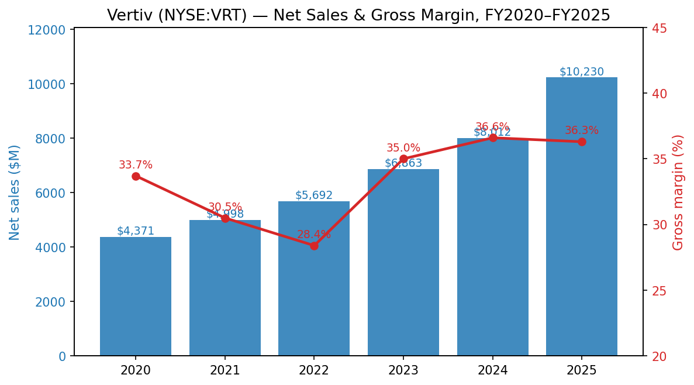
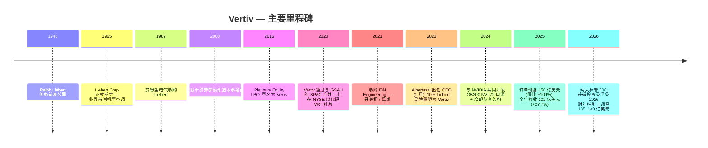
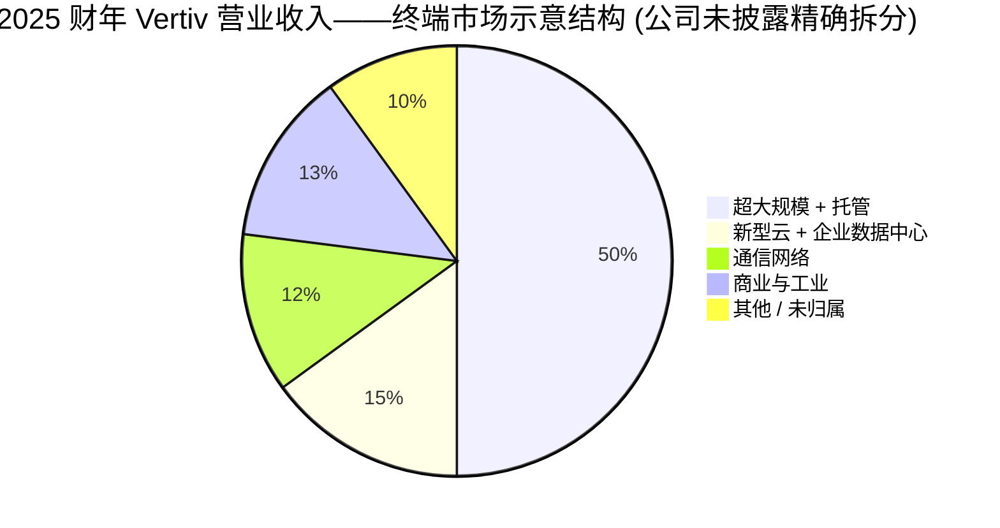
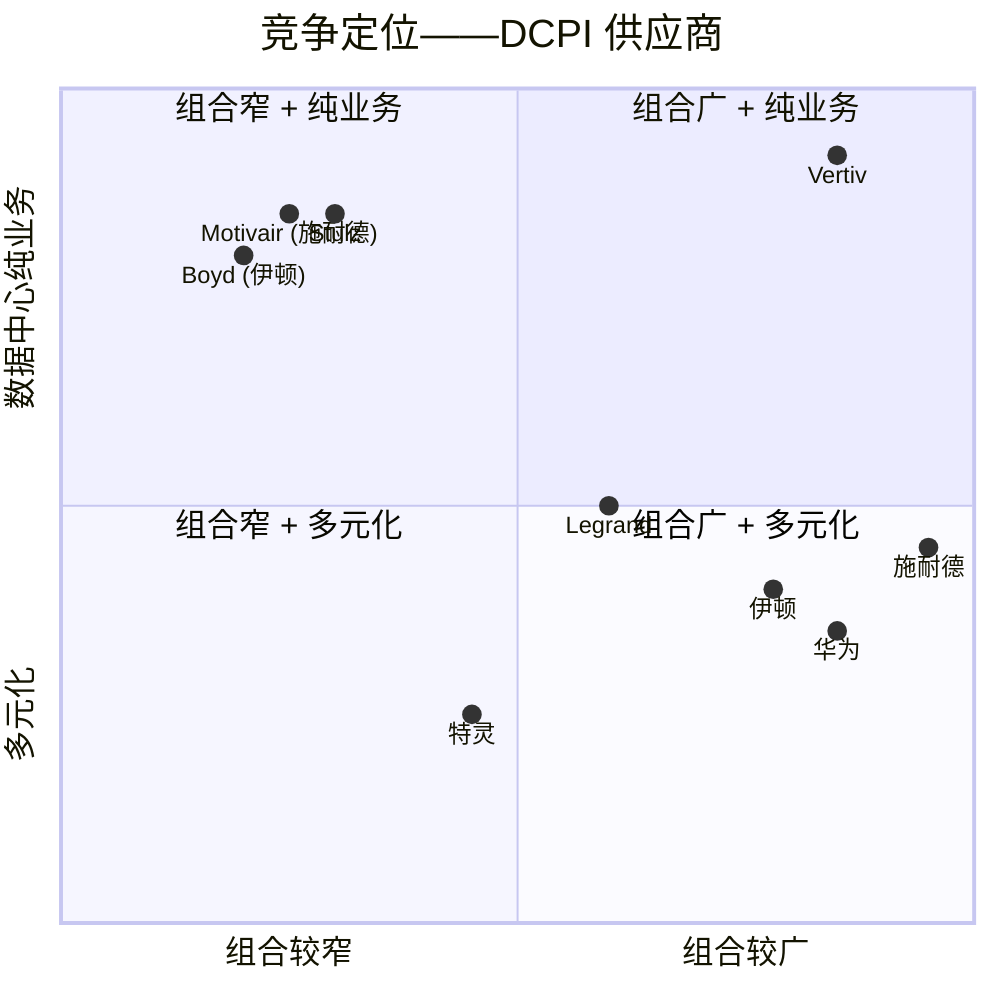
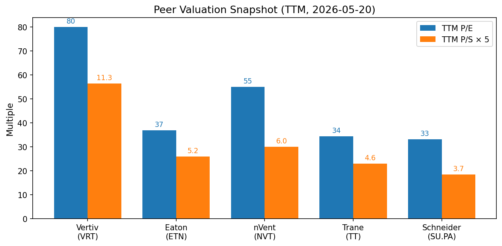
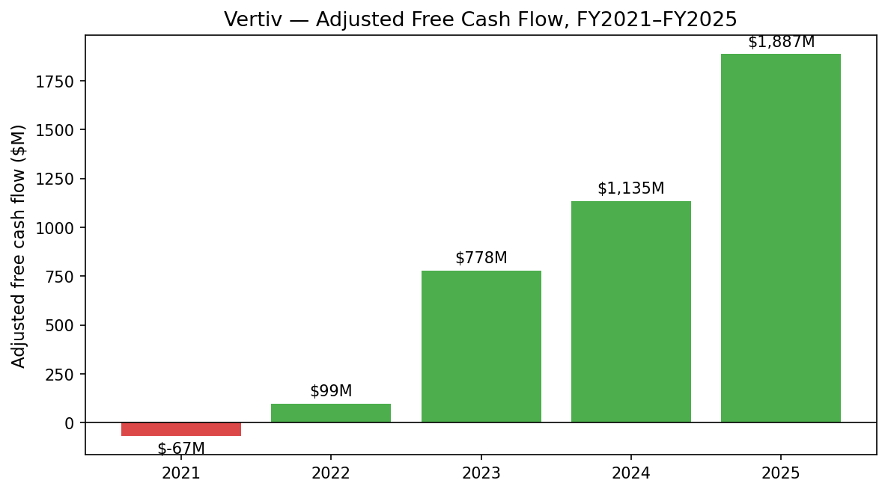

# Vertiv Holdings Co (NYSE:VRT) — 公司研究报告

**截至日期: 2026-05-20**
**上市地: 纽约证券交易所, 代码 VRT**
**注册地: 美国俄亥俄州 Westerville**
**报告语言: 简体中文 (英文版同时存在于本目录)**

**分析师注:** 首次覆盖。所有财务数据均以百万美元计, 除非另有说明。财年截止 12 月 31 日。

> **业绩更新——2026 财年指引上调 (2026-04-22):** 管理层上调 2026 全年净销售额指引至 **135.00–140.00 亿美元** (前值为 2025 年 Q4 公告时的 132.50–137.50 亿美元), 并上调调整后摊薄每股收益指引至 **6.30–6.40 美元** (前值 5.97–6.07 美元), 中值口径相较 2025 财年隐含约 30% 的有机销售额增长和约 51% 的调整后 EPS 增长。2026 年 Q1 有机销售额同比增长 23% (美洲区 +44%), 调整后营业利润率达 20.8% (同比 +430 个基点), 调整后自由现金流 6.53 亿美元 (同比 +147%), 净杠杆率降至约 0.2 倍。所述驱动因素包括: 数据中心 (data center) 需求持续旺盛、加速消化创纪录的 150 亿美元订单储备 (order backlog)、关税净成本之外的正向价差、以及近期收购项目更快的产能爬坡。来源: [Vertiv Q1 2026 业绩公告, 2026-04-22](https://www.sec.gov/Archives/edgar/data/0001674101/000162828026026379/q12026exhibit991vrt04222026.htm)。

---

## 目录

1. 公司概览
2. 公司历史
3. 管理团队
4. 产品与服务
5. 客户与上市策略
6. 行业概览
7. 竞争格局
8. 市场机会 (TAM)
9. 风险评估
10. 参考资料

---

## 1. 公司概览

Vertiv Holdings Co (NYSE: VRT) 是规模最大的纯关键数字基础设施 (critical digital infrastructure) 供应商——电源、热管理 (thermal management) 及集成系统, 它们维持着数据中心、通信网络以及商业/工业场所的持续运转。公司总部位于美国俄亥俄州 Westerville, 主营业务覆盖介于公用电网与硅芯片之间的硬件设计、制造、销售、安装与服务: 不间断电源 (Uninterruptible Power Supply, UPS)、低压及中压开关柜 (switchgear)、母线槽/汇流排 (busway/busbar)、机柜级电源分配 (rack power distribution)、锂离子电池柜 (lithium-ion battery cabinet)、风冷及液冷 (liquid cooling) 热管理系统、机房精密空调 (CRAH/CRAC)、液冷分配单元 (Coolant Distribution Unit, CDU)、预制模块化数据中心 (prefabricated modular data center)、机柜与机架、IT 管理软件, 以及由全球约 300 个服务中心、约 5,000 名现场工程师支撑的全球服务与全生命周期业务 ([Vertiv 2025 Form 10-K, Item 1 Business](https://www.sec.gov/Archives/edgar/data/0001674101/000167410126000008/vrt-20251231.htm))。

**盈利方式。** 三分之二的营业收入来自产品销售 (UPS、开关柜、热管理、模块化), 按时点法在发货时确认; 另外三分之一来自长周期集成项目 (预制模块化数据中心、大型交钥匙电源与热项目) 的时段法确认、经常性服务合同、备件以及软件。2025 财年构成为: **产品 82.07 亿美元 / 服务及备件 20.229 亿美元**, 总计 102.299 亿美元——服务及备件同比增长 14.5%, 约占组合的 20%, 但产品线才是随超大规模 (hyperscaler) AI 资本开支扩张并贡献爆发性增量增长的部分 ([Vertiv 2025 10-K, Note 3 Revenue](https://www.sec.gov/Archives/edgar/data/0001674101/000167410126000008/vrt-20251231.htm))。

**报告分部与地理结构。** Vertiv 沿三个地理分部报告——美洲、亚太、欧洲中东及非洲 (EMEA)。2025 财年美洲分部占净销售额 **62% (63.863 亿美元)**, 较 2024 财年 56% 显著上行, 受美国超大规模 AI 建设拉动; 亚太占 20% (20.192 亿美元); EMEA 占 18% (18.244 亿美元)。美洲营业利润率达 26.8% (2024 财年: 24.4%); EMEA 利润率收缩至 20.7% (2024 财年: 24.5%), 原因为产品组合及产能新增的低效 ([Vertiv 2025 10-K, MD&A Business Segments](https://www.sec.gov/Archives/edgar/data/0001674101/000167410126000008/vrt-20251231.htm))。美洲业务现已是公司整体业绩的最大决定因子——当 2026 年 Q1 美洲有机销售额增长 44% 时, 合并有机增长率跃升至 23%, 即便 EMEA 在高基数及欧洲超大规模审批延长拖累下有机收缩 29% ([Vertiv Q1 2026 业绩公告, 2026-04-22](https://www.sec.gov/Archives/edgar/data/0001674101/000162828026026379/q12026exhibit991vrt04222026.htm))。

**规模与财务强度。** 2025 财年营业收入 **102.299 亿美元** 同比增长 27.7% (相较 2024 财年 80.118 亿美元)——Vertiv 营业收入基数在过去三年从 2021 财年的 49.981 亿美元翻倍, 在五年内从 2020 财年的 43.706 亿美元增长逾两倍。2025 财年毛利率为 36.3% (相较 2024 财年 36.6%——基本持平, 经营杠杆被关税成本通胀抵消), 调整后营业利润率约 21.0% (2024 财年 19.6%), 净利润达到 13.328 亿美元 (2024 财年: 4.958 亿美元, 受 4.492 亿美元非现金权证负债重估扭曲), 调整后自由现金流 **18.87 亿美元 (同比 +66%)**, 年末账面现金 17.284 亿美元、净杠杆率约 0.5 倍 ([Vertiv Q4 2025 业绩公告, 2026-02-11](https://www.sec.gov/Archives/edgar/data/0001674101/000167410126000006/exhibit991vrt02112026.htm))。

*来源: [Vertiv 2025 10-K, MD&A](https://www.sec.gov/Archives/edgar/data/0001674101/000167410126000008/vrt-20251231.htm); FY2020–FY2022 数据来自 [Vertiv 2022 10-K, MD&A](https://www.sec.gov/Archives/edgar/data/0001674101/000162828023005248/vrt-20221231.htm)。*

投资逻辑中最重要的单一经营披露是**订单储备 (backlog)**: 截至 2025 年 12 月 31 日为 150 亿美元, **同比 +109%**, 相较 2024 财年末 72 亿美元 ([Vertiv 2025 10-K, Item 1 Business — Backlog](https://www.sec.gov/Archives/edgar/data/0001674101/000167410126000008/vrt-20251231.htm))。2025 年 Q4 有机订单同比增长 252% (订单/账面比 (book-to-bill) 约 2.9 倍), 滚动十二个月有机订单同比增长 81% ([Vertiv Q4 2025 业绩公告, 2026-02-11](https://www.sec.gov/Archives/edgar/data/0001674101/000167410126000006/exhibit991vrt02112026.htm))。订单储备的大部分为确认订单 (firm), 预计于 12–18 个月内转化, 这为 2026–2027 财年的营业收入提供了较高可见度。截至 2025 年末, Vertiv 全球员工总数新增约 34,000 人, 同时持续扩张美国、墨西哥、意大利、印度及中国的开关柜、母线、预制模块及液冷产品线产能。

**员工与全球网络。** 截至 2025 年 12 月 31 日, 公司共有约 34,000 名全职及兼职员工 (约 41% 从事制造运营), 业务覆盖 40 多个国家, 销售网络覆盖 130 多个国家。2025 年工程研究与开发 (ER&D) 投入 4.417 亿美元, 约占营业收入的 4.3%——显著高于历史水平 (2020 年研发投入约占销售额 3%), 并随公司加码液冷、预制模块及英伟达 (NVIDIA) 参考架构路线图的投入而持续走高 ([Vertiv 2025 10-K, Item 1 Human Capital + Item 7A ER&D](https://www.sec.gov/Archives/edgar/data/0001674101/000167410126000008/vrt-20251231.htm))。

**估值快照 (2026-05-20)。** VRT 当前股价 **317.7 美元**, 市值约 **1,220 亿美元**, **TTM P/E 约 80 倍**, **TTM P/S 约 11.3 倍**, P/B 约 30.8 倍, EV/EBITDA 约 52 倍, 对应 TTM 营业收入约 108.4 亿美元 (2026 Q1 滚动) ([Yahoo Finance VRT 估值指标, 2026-05-20](https://finance.yahoo.com/quote/VRT/key-statistics))。基于上调后的 2026 调整后 EPS 中值 6.35 美元, 前瞻 P/E 约 50 倍。

参考公司自己提名的同业组合 ([Vertiv 2025 10-K, Item 1 Competition](https://www.sec.gov/Archives/edgar/data/0001674101/000167410126000008/vrt-20251231.htm)):

| 代码 | 公司 | TTM P/E | TTM P/S | EV/EBITDA | Fwd P/E |
|---|---|---:|---:|---:|---:|
| VRT | Vertiv Holdings | **80.0** | **11.3** | **52.3** | **35.9** |
| ETN | Eaton Corp. (伊顿) | 37.0 | 5.2 | 26.1 | 24.1 |
| NVT | nVent Electric | 55.0 | 6.0 | 29.3 | 29.0 |
| TT | Trane Technologies (特灵) | 34.5 | 4.6 | 24.2 | 26.5 |
| SU.PA | Schneider Electric (施耐德电气) | 33.2 | 3.7 | 20.1 | 23.0 |

来源: [Yahoo Finance 多代码估值指标 (通过 yfinance 拉取), 2026-05-20](https://finance.yahoo.com)。

**倍数解读。** Vertiv 当前估值大致为**同业中值 P/E 的 2.4 倍、同业中值 P/S 的 2.5 倍**, 即便在因 AI 电力逻辑被整体重定价的电气设备组合内部, 也属溢价区间 ([Yahoo Finance VRT 估值指标, 2026-05-20](https://finance.yahoo.com/quote/VRT/key-statistics))。三个驱动因素解释了该溢价, 第四个则是其修正项。

1. **增长差距。** Vertiv 指引 2026 财年有机销售额增长约 29–31%, 调整后 EPS 增长约 50–52%; 伊顿、施耐德及特灵分别指引有机增长 6–9%、EPS 增长高个位数至低双位数 ([Vertiv Q1 2026 业绩公告, 2026-04-22](https://www.sec.gov/Archives/edgar/data/0001674101/000162828026026379/q12026exhibit991vrt04222026.htm); [Schneider Electric FY2024 业绩, 2025-02](https://www.se.com/ww/en/assets/564/document/505646/release-fy-results-2024.pdf))。基于增长调整的倍数 (PEG 风格) 压缩部分差距——VRT 基于 2026E 调整后 EPS 增长的 PEG 约 1.6 倍, 伊顿约 3 倍。
2. **纯 AI 业务的看涨期权属性。** Vertiv 是唯一全部业务都为数据中心和通信关键基础设施的大盘股标的 (施耐德、伊顿、特灵均混合多元化的工业/电网/暖通空调业务, 因此估值倍数较低)。市场愿意为这种"纯度"付费 ([Vertiv 2025 10-K, Item 1 Business](https://www.sec.gov/Archives/edgar/data/0001674101/000167410126000008/vrt-20251231.htm))。
3. **订单储备可见度。** 2025 Q4 订单/账面比 2.9 倍 + 150 亿美元订单储备 (约 1.5 倍 2025 财年销售额), 为 Vertiv 提供了少见的前瞻收入可见度; 同业均未以同等颗粒度披露订单储备 ([Vertiv Q4 2025 业绩公告, 2026-02-11](https://www.sec.gov/Archives/edgar/data/0001674101/000167410126000006/exhibit991vrt02112026.htm))。
4. **周期性与集中度风险溢价。** AI 超大规模资本开支集中于 5–10 家客户 (Microsoft、Google、Amazon、Meta、Oracle、CoreWeave、Nebius, 加上托管运营商 Equinix 和 Digital Realty); 协调性的撤资行为或"AI 冷冬"将会同时严重压制 Vertiv 的有机增长和估值倍数 ([Vertiv 2025 10-K, Item 1A Risk Factors](https://www.sec.gov/Archives/edgar/data/0001674101/000167410126000008/vrt-20251231.htm))。详见**风险评估**章节中的估值压缩风险。

截至 2025 年 12 月 31 日的五年间, 该股从 100 美元基准累计回报约 771% ([Vertiv 2025 10-K, Stock Performance Graph](https://www.sec.gov/Archives/edgar/data/0001674101/000167410126000008/vrt-20251231.htm)); VRT 自 2026 年 3 月 23 日起被纳入标普 500 指数 ([S&P Global 新闻稿, 2026-03-06](https://press.spglobal.com/2026-03-06-Vertiv-Holdings,-Lumentum-Holdings,-Coherent,-and-EchoStar-Set-to-Join-S-P-500-Others-to-Join-S-P-100,-S-P-MidCap-400,-and-S-P-SmallCap-600))。Vertiv 于 2026 年 2 月获得首次投资级评级——Moody's Baa3 与 S&P BBB-, 同期完成 21 亿美元高级无抵押票据发行, 偿还了原有担保贷款债务, 降低了实际融资成本 ([Vertiv 8-K 票据发行完成, 2026-03](https://www.sec.gov/Archives/edgar/data/0001674101/000119312526088484/d105148dex991.htm))。

---

## 2. 公司历史

Vertiv 的血脉可追溯至 **1946 年**, Ralph Liebert 创立了 Liebert Corporation 的前身; **Liebert Corporation 于 1965 年正式成立**, 作为业内首家机房空调 (computer-room air conditioning) 制造商, 发明了主导整个大型机 (mainframe) 时代标准的 CRAC 单元 ([Vertiv 2025 10-K, Item 1 Our Company](https://www.sec.gov/Archives/edgar/data/0001674101/000167410126000008/vrt-20251231.htm); [Liebert Corporation 历史, Wikipedia](https://en.wikipedia.org/wiki/Liebert_Corporation))。**艾默生电气 (Emerson Electric)** 于 1987 年收购了 Liebert, 并在 **2000 年**将其与 ASCO 电力转换开关业务、Avansys、Knurr AG (机柜) 及 Avocent (KVM 与 IT 管理软件) 一起整合进新成立的**艾默生网络能源 (Emerson Network Power)** 业务部门。在 2000 年代至 2010 年代初, 艾默生网络能源在艾默生这个多元化工业集团内部, 是一条领先但有些沉寂的产品线。

**2016 年 11 月**, 艾默生以约 40 亿美元的杠杆收购 (LBO) 价格将网络能源业务出售给 **Platinum Equity**; 同年, 这家独立公司被更名为 **Vertiv** ([艾默生 8-K, 2016-12-01 — 出售予 Platinum Equity](https://www.sec.gov/Archives/edgar/data/0000032604/000003260416000111/emersonpressreleasedec12016.htm); [Platinum Equity 新闻稿 — ENP 更名为 Vertiv](https://www.platinumequity.com/news/emerson-network-power-rebrands-as-vertiv-appoints-new-ceo/))。**2020 年 2 月 7 日**, Vertiv 通过与 SPAC **GS Acquisition Holdings Corp** ("GSAH") 合并的方式在纽交所上市, 该 SPAC 由工业行业老兵**大卫·考特 (David M. Cote)** (前霍尼韦尔 Honeywell 董事长兼 CEO)、其子 Christopher Cote 联合高盛发起 ([Vertiv 8-K 业务合并, 2020-02-07](https://www.sec.gov/Archives/edgar/data/0001674101/000119312520028315/d880241d8k.htm))。Cote 出任执行董事长, 业务随即开启了以"Vertiv 操作系统" (Vertiv Operating System, VOS)——一种精益六西格玛风格的持续改进框架——以及产品线刻意重定价为核心的运营与战略转型。

IPO 以来塑造公司的三大转型:

**(1) "高绩效公司"重置 (2020–2022)。** Cote 与新任董事会引入了霍尼韦尔风格的运营节奏——月度业务回顾、精益部署、ER&D 合理化、供应链整合, 以及明确的定价纪律。2022 年 Vertiv 因应通胀, 在整个产品组合内推行了富争议的两位数提价行动; 此举短期内压制了需求, 但将毛利基线从 30% 出头重置至 35% 中段。Critical Infrastructure & Solutions 分部在 2022 年初期出现利润亏损, 至年底完成重置后转正; 2023 财年毛利率回升至 35.0%, 2024 财年达 36.6% ([Vertiv 2022 10-K, MD&A](https://www.sec.gov/Archives/edgar/data/0001674101/000162828023005248/vrt-20221231.htm); [Vertiv 2024 10-K, MD&A](https://www.sec.gov/Archives/edgar/data/0001674101/000162828025005905/vrt-20241231.htm))。

**(2) CEO 交接与分部简化 (2023 年 1 月)。** 长期负责 EMEA 与美洲的**乔尔达诺·阿尔贝塔齐 (Giordano Albertazzi)** 于 2023 年 1 月 1 日出任 CEO, 接替 Rob Johnson。同时, Vertiv 从原有的产品分部 (Critical Infrastructure & Solutions / Integrated Rack Solutions / Services & Spares) 重组为当前的三个地理分部——这一结构性变更提升了区域问责度, 并加快了超大规模客户决策周期 ([Data Center Dynamics, 2022-10-04](https://www.datacenterdynamics.com/en/news/giordano-albertazzi-assumes-role-as-vertiv-ceo/); [Vertiv 2024 10-K, MD&A Segment Reorganization](https://www.sec.gov/Archives/edgar/data/0001674101/000162828025005905/vrt-20241231.htm))。

**(3) AI / 液冷定位 (2023 年至今)。** 随着英伟达 H100 进而 GB200 平台将单机柜密度推升至 100 千瓦以上, 行业从风冷向液冷转型。Vertiv 选择提前下注。2024 年 10 月, 公司与英伟达共同开发并发布了 **GB200 NVL72 完整 7 MW 参考架构** (单机柜 132 千瓦), 是英伟达 NPN 解决方案顾问 (Solution Advisor) 顾问层级中唯一入选的大型物理基础设施厂商 ([Vertiv–NVIDIA 共同开发新闻稿, 2024-10-14](https://investors.vertiv.com/financial-news/news-details/2024/Vertiv-Codevelops-with-NVIDIA-Complete-Power-and-Cooling-Blueprint-for-NVIDIA-GB200-NVL72-Platform/default.aspx))。MegaMod CoolChip 预制模块化平台、SmartRun 顶部基础设施产品组合, 以及 Vertiv OneCore 标准化架构, 均源于这一战略转向。

**关键收购:**

- **2021 — E&I Engineering Group** (约 18 亿美元): 总部位于爱尔兰的低压及中压开关柜、母线及电力分配业务, 将 Vertiv 从一家 UPS 与热管理厂商转变为面向超大规模客户的完整动力链供应商 ([Vertiv 8-K — E&I 收购, 2021-09-08](https://www.sec.gov/Archives/edgar/data/0001674101/000119312521267213/d213876dex991.htm))。
- **2025 年 8 月 — Great Lakes Data Racks & Cabinets** (2 亿美元): AI 与高密度计算所需的机柜/机架与集成白空间基础设施; 美国及欧洲制造网络可加速预工程机柜系统的供货 ([Vertiv 8-K — Great Lakes 收购完成, 2025-08-20](https://www.sec.gov/Archives/edgar/data/0001674101/000167410125000011/ex991-pressrelease8202025.htm))。
- **2025 年 12 月 — PurgeRite Intermediate, LLC** (约 10 亿美元): 液冷系统冲洗、清洁度管理及服务能力; 强化对液冷已装机基础的服务组合 ([Vertiv 8-K — PurgeRite 收购完成, 2025-12-04](https://www.sec.gov/Archives/edgar/data/0001674101/000167410125000031/exhibit991vrt-12042025.htm))。
- **2025 年 8 月 — Waylay NV** (未披露金额): 面向复杂基础设施环境的工业级工作流自动化软件, 用于预测性分析与编排 ([Vertiv 8-K — Waylay 收购, 2025-08-26](https://www.sec.gov/Archives/edgar/data/0001674101/000162828025035130/exhibit991vrt-pressrelease.htm))。

**近期战略行动。** Vertiv 于 2023 年 11 月 29 日宣布 30 亿美元股票回购授权 (有效期至 2027 年 12 月 31 日); 截至 2025 年末尚余 24 亿美元额度。季度股息自 2023 年起三次上调, 2025 年 12 月支付额为每股 0.0625 美元。2026 年 2 月, 公司首次获得投资级信用评级 (Moody's Baa3 / S&P BBB-), 发行 21 亿美元高级无抵押票据, 偿还历史定期贷款及 ABL 循环额度, 并新设 25 亿美元循环信用额度 ([Vertiv Q1 2026 业绩公告, 2026-04-22](https://www.sec.gov/Archives/edgar/data/0001674101/000162828026026379/q12026exhibit991vrt04222026.htm))。2026 年 3 月入选标普 500 标志着公司 SPAC 上市后的机构化进程正式完成。

---

## 3. 管理团队

### Giordano Albertazzi (乔尔达诺·阿尔贝塔齐) — 首席执行官 (2023 年 1 月 1 日起任)

Albertazzi 是当前 Vertiv 故事中最关键的单一人物。2023 年 1 月他接任 CEO——正值 Vertiv 从风冷传统业务向 AI / 液冷未来转型的拐点时刻——并主导了营收从 57 亿美元 (2022 财年) 增至 102 亿美元 (2025 财年) 的进程, 调整后营业利润率从 8.5% 扩张至约 21%, 订单储备增至 150 亿美元以上的三倍增长 ([Vertiv 2025 10-K, MD&A](https://www.sec.gov/Archives/edgar/data/0001674101/000167410126000008/vrt-20251231.htm))。

他是一位 27 年的公司老兵。在通力电梯 (Kone Elevators) 开始职业生涯并担任过运营及产品开发领导岗位之后, 他于 **1998 年**加入艾默生网络能源 (Vertiv 前身)。在艾默生内部, 他先后管理意大利工厂 (1999–2001)、EMEA 产品管理 (2002–2004), 担任意大利市场单位的总经理 (2004–2006), 又任 EMEA 服务副总裁 (2011–2014) 和 EMEA 销售副总裁 (2014–2016)。2016 年艾默生将业务剥离为 Vertiv 后, 他留任**EMEA 总裁**并构建了该分部的经营模式和客户特许经营。2022 年 3 月升任**美洲总裁**, 2022 年 10 月出任**首席运营官**, 2023 年 1 月正式接任 CEO ([Giordano Albertazzi Vertiv 高管简历](https://www.vertiv.com/en-us/about/about-vertiv/executives/giordano-albertazzi/); [Data Center Dynamics, 2022-10-04](https://www.datacenterdynamics.com/en/news/giordano-albertazzi-assumes-role-as-vertiv-ceo/))。

评估他的合适视角是他做成的事: 在他领导 EMEA (2016–2022) 期间, 该分部的调整后营业利润率翻倍, 并在客户满意度评分上居公司之首; 在他担任合并 CEO 的任期内 (2023 年至今), 公司将调整后营业利润提升至三倍水平、完成投资级评级再融资、入选标普 500, 并锁定了定义下一代算力世代的英伟达共同开发合作。从外部评价看, 他被认为运营纪律严明、技术素养扎实 (机械工程背景在产品密集型业务中助益颇深), 且不寻常地愿意在客户订单到来之前为产能扩张提前投入资本——最显著的例子是 2024 年在南卡罗来纳州 Pelzer 投产的模块化解决方案工厂 ([Vertiv 新闻稿 — Pelzer SC 制造工厂, 2024-09-24](https://www.vertiv.com/en-us/about/news-and-insights/corporate-news/vertiv-expands-north-american-production-capacity-with-new-infrastructure-solutions-manufacturing-facility/)), 以及同年在印度浦那 (Pune) 投产的热管理工厂。

**学历。** 米兰理工大学 (Politecnico di Milano) 机械工程学士; 斯坦福商学院 (Stanford Graduate School of Business) 管理学硕士 ([Giordano Albertazzi Vertiv 高管简历](https://www.vertiv.com/en-us/about/about-vertiv/executives/giordano-albertazzi/))。

**薪酬与股权。** 根据 2025 财年代理人声明, 基本薪资 **130 万美元**、现金奖金 **400 万美元**、授予日价值约 **1,304 万美元**的股权激励, 总报酬约 **1,830 万美元** (相较 2024 财年 1,227 万美元同比 +33%) ([Vertiv DEF 14A FY2026, 2026-04-15](https://www.sec.gov/Archives/edgar/data/0001674101/000119312526174898/d18663ddef14a.htm); 摘要参见 [StockTitan VRT proxy 申报, 2026-04](https://www.stocktitan.net/sec-filings/VRT/def-14a-vertiv-holdings-co-definitive-proxy-statement-bfb277699d8b.html))。股权激励重度倾斜于股票期权, 按 4 年期每年 25% 行权、10 年期限——因此实现价值基本与多年股价上行挂钩, 这与该股较高的股价贝塔系数 (Yahoo 显示 2.1) 相称。2024 年薪酬投票获得约 95% 的赞成率。

### David M. Cote (大卫·考特) — 执行董事长

Cote 是高级战略制定者及个人最大股东; 如果没有他, 这家公司不会以今天的形态存在。Cote **从 2002 至 2017 年执掌霍尼韦尔 Honeywell**, 将其打造为全球最具持续性优异表现的大盘工业公司之一, 十五年任内的股东回报远超标普 500 指数 ([霍尼韦尔 8-K — Cote CEO 继任, 2017-03](https://www.sec.gov/Archives/edgar/data/0000773840/000093041317000893/c87598_8k.htm); [外交关系协会 — David M. Cote 简介](https://www.cfr.org/bios/david-m-cote))。他离开霍尼韦尔时, 留下了两项明显的运营纪律: 月度业务回顾的不懈节奏, 以及"播种"哲学——在低迷期对研发、产能和人才进行投入, 而非削减以保季度盈利, 然后他将这两套方法移植到了 Vertiv。

他于 2018 年与高盛联合发起设立 **GS Acquisition Holdings Corp** 这只 SPAC, 该 SPAC 在 2020 年 2 月将 Vertiv 推向公开市场 ([Vertiv 8-K 业务合并, 2020-02-07](https://www.sec.gov/Archives/edgar/data/0001674101/000119312520028315/d880241d8k.htm))。Cote 仍是执行董事长, 对该角色的参与度异常高——出席每场业绩说明会、亲自牵头客户升级处理、并塑造资本配置框架。根据 2026 代理人声明, 他持有最大的单一董事/高管持股 ([Vertiv DEF 14A FY2026, 2026-04-15](https://www.sec.gov/Archives/edgar/data/0001674101/000119312526174898/d18663ddef14a.htm))。他持续在位是市场给予 VRT 估值"溢价"的实质组成部分。

### Craig Chamberlin — 执行副总裁兼首席财务官 (2025 年 11 月 10 日起任)

Chamberlin 接替宣布于 2025 年 5 月退休、在继任者就位前留任的 David Fallon ([Vertiv 8-K, 2025-10-13](https://www.sec.gov/Archives/edgar/data/0001674101/000162828025044836/exhibit991vrt-10132025.htm); [PRNewswire — Vertiv 宣布 CFO 退休, 2025-05](https://www.prnewswire.com/news-releases/vertiv-announces-cfo-retirement-reaffirms-second-quarter-and-full-year-2025-guidance-302466989.html))。Chamberlin 由 **Wabtec Corporation** 加入 Vertiv, 此前任 Wabtec 集团副总裁兼约 30 亿美元规模 Transit 分部的 CFO——后者是一项全球轨道电气化与推进业务, 收入结构 (长周期、项目密集) 与 Vertiv 的预制及集成电源分部相近。他拥有上市公司 CFO 与资本市场经验, 以及四大会计师事务所审计背景。任命 8-K 披露其基本薪资为 75 万美元、目标奖金为薪资的 100% ([Vertiv 8-K — Chamberlin 任命, 2025-10-13](https://www.sec.gov/Archives/edgar/data/0001674101/000162828025044836/exhibit991vrt-10132025.htm))。

投资者应将 CFO 这把座椅视为近期观察项: Chamberlin 接手的是一张过渡中的资产负债表 (刚完成投资级再融资、尚有 24 亿美元回购授权额度、2026 年异常大额 4.25–5.25 亿美元资本开支计划, 以及将持续考验应收账款管理的客户集中度) ([Vertiv Q1 2026 业绩公告, 2026-04-22](https://www.sec.gov/Archives/edgar/data/0001674101/000162828026026379/q12026exhibit991vrt04222026.htm))。Fallon 在 Vertiv 八年任期内见证了 IPO、提价重置、E&I 收购和 AI 周期早期爬坡——是一根高基准线。2026 年指引上调反映出新任 CFO 在首个报告周期内的信心。

### Stephanie L. Gill — 首席法律及可持续发展官; 公司秘书

Gill 是高级法律官, 与 Albertazzi、Cote 及 Chamberlin 并列出席执行领导团队。她负责公司的产品责任、知识产权、海外腐败行为法案 (FCPA)、关税及 ESG 披露义务——在 130 国分销模式下、并处于美国关税政策升级期及欧盟/中国对数据中心建设和能源使用监管分歧加剧的当前环境中, 这一职能并不寻常 ([Vertiv DEF 14A FY2026 — Named Executive Officers](https://www.sec.gov/Archives/edgar/data/0001674101/000119312526174898/d18663ddef14a.htm))。与历史披露指控相关的 SEC/SDNY 2025 调查已于 2025 年 12 月以不采取执法行动结案 ([Vertiv 2025 10-K, Item 3 Legal Proceedings](https://www.sec.gov/Archives/edgar/data/0001674101/000167410126000008/vrt-20251231.htm))。

### 其他关键高管

- **Gary J. Niederpruem — 首席运营官。** 长期任职的 Vertiv 运营高管, 主管全球制造、供应链及 ER&D 职能; 是 Pelzer SC、印度浦那、墨西哥、中国等地产能扩张的运营对接人 ([Vertiv DEF 14A FY2026 — Named Executive Officers](https://www.sec.gov/Archives/edgar/data/0001674101/000119312526174898/d18663ddef14a.htm))。
- **Sangbom Na (SB) — 首席信息官。** 主导 Oracle/SAP 部署以及 Vertiv 操作系统的数字化底座建设。
- **Stephen Liang — 首席技术官。** 主管 ER&D 及英伟达共同开发工作; 2025 年 Vertiv 宣布 Liang 将于 2026 年 1 月 1 日起从 CTO 职位退休, 此前他在公司服务了三十年 ([Vertiv 新闻稿 — CTO 领导层变更, 2025](https://investors.vertiv.com/news/news-details/2025/Vertiv-Announces-CTO-Leadership-Changes/default.aspx))。

### 公司治理

根据 2026 代理人声明, 董事会有 11 名董事, 年度股东大会日期为 **2026 年 6 月 17 日** ([Vertiv DEF 14A FY2026](https://www.sec.gov/Archives/edgar/data/0001674101/000119312526174898/d18663ddef14a.htm))。董事会构成包括:

- David M. Cote (执行董事长, **非独立**)。
- Giordano Albertazzi (CEO, **非独立**)。
- Roger Fradin、Joseph van Dokkum、Edward L. Monser、Steven Reinemund、Matthew Louie、Joseph T. (Joe) Mara、Robin Washington、Jacob Kotzubei, 加上一两名其他独立董事。剩余的九个席位指定为独立董事。
- 董事会未分级; 全部董事每年改选。
- 外部审计师为 Ernst & Young LLP; 2026 年股东大会议程包含批准事项。
- 反收购条款: 无累积投票; 不允许股东以书面同意方式行使权利; 仅董事会或 CEO 可召集特别会议; 特拉华州衡平法院为衍生诉求的专属管辖法院。这些条款标准但具实质影响 ([Vertiv 2025 10-K, Risk Factors — Securities-Related Risks](https://www.sec.gov/Archives/edgar/data/0001674101/000167410126000008/vrt-20251231.htm))。
- 薪酬结构: 风险股权激励比重较高 (CEO 目标现金奖金为薪资的 140%; 长期激励以期权为主交付)。
- 2025 年股票回购: 0 美元——公司在 2025 年 Q4 选择将约 10 亿美元用于战略收购, 而非回购。
- 关联方交易: Vertiv–Cote 关系是主要的披露事项; Cote SPAC I LLC 于 2024 年 12 月以无现金方式行权剩余的 5,266,667 份私人权证, 转换为 4,812,521 股 A 类普通股——这一举措显著促成执行董事长与公众股东利益对齐, 并于 2024 年末消除了权证抑价效应。

### 业绩综合判断

Albertazzi / Cote / 现 Chamberlin 三人组已交付出: IPO 以来营业收入年复合增长约 20%, 调整后营业利润率翻倍, 资产负债表从次级投资级杠杆 LBO 转化为 BBB-/Baa3 投资级且净杠杆率约 0.2 倍, 公司同时赢得了具架构意义的英伟达参考设计席位。差距是真实但可管理的: 周期中临阵换帅的新 CFO、单年员工扩张约 25% 的组织, 还未在 2022 年后欧洲能源体制下找到答案的 EMEA 分部, 以及 150 亿美元订单储备的执行风险——而其顶级客户群本身又正在经历科技史上最为集中的基础设施建设潮。管理层在美国中盘工业公司中位居最佳行列; 投资者仍应监控 2026 年 Q2 指引的执行情况 (收入 32.5–34.5 亿美元、调整后营业利润率 20.7–21.7%) ([Vertiv Q1 2026 业绩公告, 2026-04-22](https://www.sec.gov/Archives/edgar/data/0001674101/000162828026026379/q12026exhibit991vrt04222026.htm))。

---

## 4. 产品与服务

Vertiv 经营一个单一的集成产品组合, 在销售层面被组织为三个产品族 + 一个服务部门。10-K 中"Item 1. Business — Our Offerings"列举: AC 及 DC 电源管理、热管理、低压/中压开关柜、母线、风冷与液冷热管理、集成模块化解决方案、机柜、单相 UPS、机柜电源分配、机柜热管理系统、可配置集成解决方案、储能、硬件、软件以及全球服务网络 ([Vertiv 2025 10-K, Item 1 Our Offerings](https://www.sec.gov/Archives/edgar/data/0001674101/000167410126000008/vrt-20251231.htm))。下文将该组合映射至公司在投资者材料中自称的三条"逻辑"业务线——尽管它们已不再分列报告。

```mermaid
graph TD
    A[Vertiv Holdings Co]
    A --> B[电源管理]
    A --> C[热管理]
    A --> D[集成模块化解决方案]
    A --> E[IT 系统与服务]
    B --> B1[Liebert UPS Trinergy/EXL/APM 1.0-1.5MW]
    B --> B2[ASCO 电力转换开关]
    B --> B3[E&I 低压/中压开关柜]
    B --> B4[Vertiv Powerbar 母线槽]
    B --> B5[EnergyCore 锂电池]
    B --> B6[Geist 机柜 PDU]
    C --> C1[Liebert CRAH/CRAC 风冷]
    C --> C2[Liebert XDU CDU 液冷]
    C --> C3[Vertiv CoolChip 后门冷却]
    C --> C4[Vertiv Liebert Trinergy Cube 冷却]
    C --> C5[自然冷却冷水机组]
    D --> D1[MegaMod CoolChip 预制]
    D --> D2[SmartRun 顶部基础设施]
    D --> D3[OneCore 标准化架构]
    D --> D4[Great Lakes 机柜/机架]
    E --> E1[Avocent KVM IT 管理]
    E --> E2[Environet DCIM 软件]
    E --> E3[全生命周期服务 约 300 个中心]
    E --> E4[PurgeRite 液冷服务]
```

### 电源管理 (约占产品营业收入 50–55%)

Vertiv 的电源管理业务跨越从公用电网接入 (中压开关柜) 到机柜 (机柜级 PDU 与母线) 的完整路径。旗舰产品:

- **Liebert Trinergy Cube UPS** — 高效率三相 UPS, 单柜可扩展至 1.5 MW, 并以并联架构应对数十 MW 的超大规模场景。**竞争优势: 有。** Vertiv (Liebert) 与施耐德 (Galaxy VL/VX) 共占全球超大规模大功率 UPS 市场, 第三方份额排名中 Vertiv 是并列龙头 ([Vertiv 2025 10-K, Item 1 Our Offerings](https://www.sec.gov/Archives/edgar/data/0001674101/000167410126000008/vrt-20251231.htm))。护城河源自技术认证 (每台大型 UPS 需逐站点由超大规模客户工程团队认证) 以及切换成本——一旦超大规模客户在多个站点标准化一个 UPS 平台, 替换需要数年时间。对比: 施耐德 Galaxy VX 可扩展性相近, 但在软件定义电源及微网集成方面定位略前 ([Introl — Vertiv vs Schneider vs Eaton, 2025](https://introl.com/blog/vertiv-schneider-eaton-cooling-solutions-comparison-ai-data-centers))。自 Trinergy Cube 刷新以来, Vertiv 一直在追赶。
- **E&I Engineering 开关柜与母线** (低压及中压) — Vertiv 于 2021 年收购 E&I, 将爱尔兰/英国开关柜平台整合进全球产品组合 ([Vertiv 8-K — E&I 收购, 2021-09-08](https://www.sec.gov/Archives/edgar/data/0001674101/000119312521267213/d213876dex991.htm))。**竞争优势: 有 (成本领先 + 规模)。** 开关柜与母线是 2023–2024 数据中心建设的瓶颈——全行业交货期延长至 60–80 周, 而 Vertiv 垂直整合的内部母线供应是显著的份额获取向量。对比: 施耐德、伊顿、ABB、西门子都生产开关柜; Vertiv 将其与热管理、模块化及 UPS 共同布局, 是唯一一家以单一制造商交付完整白空间 + 灰空间堆栈的厂商 ([Vertiv 2025 10-K, Item 1 Competition](https://www.sec.gov/Archives/edgar/data/0001674101/000167410126000008/vrt-20251231.htm))。
- **ASCO 电力转换开关 (ATS)** — 美国数据中心 ATS 的事实标准; 品牌沿袭自艾默生之前时代。**竞争优势: 有 (品牌 / 安装基数)。** 新建托管或超大规模设施在默认情况下几乎都会指定 ASCO 转换开关 ([Vertiv 2025 10-K, Item 1 Our Offerings](https://www.sec.gov/Archives/edgar/data/0001674101/000167410126000008/vrt-20251231.htm))。
- **Geist 机柜 PDU 及 EnergyCore 锂电池柜** — 在小型化端竞争激烈但已商品化; Vertiv 主要凭借与更广组合的整合性而非单品优势竞争 ([Vertiv 2025 10-K, Item 1 Our Offerings](https://www.sec.gov/Archives/edgar/data/0001674101/000167410126000008/vrt-20251231.htm))。

### 热管理——AI 增长引擎 (约占产品营业收入 30–35%)

热管理特许经营是 1965 年 Liebert 业务演化的产物, 也是公司今日最高速增长、最具战略价值的部分。组合覆盖"从芯片到散热"的完整热链路 ([Vertiv 2025 10-K, Item 1 Our Offerings](https://www.sec.gov/Archives/edgar/data/0001674101/000167410126000008/vrt-20251231.htm)):

- **Liebert CRAH/CRAC 风冷单元** — 大型机及云时代的传统冷却产品。全球安装基数中仍占多数, 但随着机柜密度突破 50 千瓦, 在产品组合中是结构性下行的部分。
- **Liebert XDU 液冷分配单元 (CDU)** 与 **CoolChip 后门换热器** — 主力液冷产品, 涵盖机柜、机柜行、设施级。CDU 负责将设施侧的水转换为冷却技术冷却系统回路, 为英伟达 GB200/GB300 冷板供液。**竞争优势: 有 (技术 + 生态系统锁定)。** Vertiv 是**唯一一家与英伟达共同开发 GB200 NVL72 和 GB300 NVL72 参考架构的大型供应商**——为 GB200 平台设计了 7 MW 参考机柜架构, 支持每机柜 132 千瓦, GB300 上则达 142 千瓦 ([Vertiv–NVIDIA 共同开发新闻稿, 2024-10-14](https://investors.vertiv.com/financial-news/news-details/2024/Vertiv-Codevelops-with-NVIDIA-Complete-Power-and-Cooling-Blueprint-for-NVIDIA-GB200-NVL72-Platform/default.aspx); [Vertiv–NVIDIA GB300 文章, 2025](https://www.vertiv.com/en-asia/about/news-and-insights/articles/educational-articles/vertivs-partnership-with-nvidia-on-gb300-nvl72-for-ai-infrastructure-acceleration/))。这是公司业务中最重要的单一护城河: 英伟达路线图定义了每家超大规模客户必须散去的热负荷, 而 Vertiv 是已发布蓝图中的指定参考供应商。
- **Liebert XDC 冷水机 / 自然冷却风冷冷水机** — 回路的室外散热侧; 与 Trane (TT)、Carrier、Johnson Controls (JCI)、Modine 等在更商品化的层面竞争。**竞争优势: 部分。** Trane 是尤为强劲的竞争对手; Vertiv 的优势在于与组合其余部分的整合 ([Vertiv 2025 10-K, Item 1 Competition](https://www.sec.gov/Archives/edgar/data/0001674101/000167410126000008/vrt-20251231.htm))。
- **PurgeRite (2025 年 12 月收购)** — 面向液冷回路的系统冲洗、流体管理及清洁度服务。关键之处在于受污染的水会损毁冷板; 该服务业务具有经常性且高毛利 ([Vertiv 8-K — PurgeRite 收购完成, 2025-12-04](https://www.sec.gov/Archives/edgar/data/0001674101/000167410125000031/exhibit991vrt-12042025.htm))。

竞争压力点: **伊顿于 2026 年 3 月以 95 亿美元收购 Boyd Thermal**——这是一家专精冷板与热界面的厂商, 此前曾是 Vertiv 在某些配置下的供应商 ([伊顿新闻稿 — Boyd Thermal 协议](https://www.eaton.com/us/en-us/company/news-insights/news-releases/2025/eaton-signs-agreement-to-acquire-boyd-thermal--expanding-solutio.html); [DCD, 2026-03-12 — 伊顿完成 Boyd Thermal 收购](https://www.datacenterdynamics.com/en/news/eaton-acquires-boyd-thermal-for-95bn-to-further-liquid-cooling-portfolio/))。伊顿的"电网到芯片"叙事在冷板侧已具备可信度; 投资者应预期伊顿将在 2026–2027 年正面攻击 Vertiv 的 CDU 位置。施耐德电气继续通过 2024 年 10 月以 8.5 亿美元收购的 Motivair 特许经营加码液冷 ([施耐德电气 — Motivair 收购新闻稿, 2024-10-17](https://www.se.com/ww/en/assets/564/document/492190/Schneider-Electric-acquires-Motivair-Corporation.pdf))。今日的竞争护城河是真实的, 但比十年前的风冷特许经营更窄。

### 集成模块化解决方案 / 预制模块化 (约占产品营业收入 10–15%, 增长最快)

这是"工厂预制数据中心模块"业务——电源、冷却及白空间在钢制集装箱或撬装单元中预先集成, 卡车运抵后即可在数日内 (而非传统现场建设的 18 个月) 接通运行 ([Vertiv 新闻稿 — MegaMod CoolChip 发布, 2024-07-25](https://investors.vertiv.com/financial-news/news-details/2024/Vertiv-Launches-High-Density-Prefabricated-Modular-Data-Center-Solution-To-Accelerate-Global-Deployment-of-AI-Compute/default.aspx))。两款旗舰产品:

- **MegaMod CoolChip** — 交钥匙 AI 关键基础设施模块, 单元规模 1–10 MW, 集成液冷与 Trinergy UPS。按公司营销资料, MegaMod 部署速度比现场建设快达 50%, 占地比传统设计少 40% ([Vertiv 新闻稿 — MegaMod CoolChip 发布, 2024-07-25](https://investors.vertiv.com/financial-news/news-details/2024/Vertiv-Launches-High-Density-Prefabricated-Modular-Data-Center-Solution-To-Accelerate-Global-Deployment-of-AI-Compute/default.aspx))。**竞争优势: 有 (规模、认证、交货期)。** 模块化是 AI 训练产能上市速度的答案——而上市速度是当前唯一主导的采购变量。
- **SmartRun 顶部基础设施** — 通过顶部线槽快速现场安装的预工程化电源、母线及母线分接模块 ([Vertiv 2025 10-K, Item 1 Our Offerings](https://www.sec.gov/Archives/edgar/data/0001674101/000167410126000008/vrt-20251231.htm))。
- **Vertiv OneCore** — 将电源 + 热管理 + 机柜 + 软件整合为统一系统的标准化、可重复架构 ([Vertiv 2025 10-K, Item 1 Our Offerings](https://www.sec.gov/Archives/edgar/data/0001674101/000167410126000008/vrt-20251231.htm))。

在这一领域的直接竞争对手是规模较小、聚焦化的厂商 (Compass Datacenters 自家的模块化线、施耐德 EcoStruxure Modular、BasX、STULZ、Modine)。Vertiv 的优势在于唯一一家自行制造其模块内部部件 (UPS、开关柜、CDU、机柜) 的供应商 ([Vertiv 2025 10-K, Item 1 Competition](https://www.sec.gov/Archives/edgar/data/0001674101/000167410126000008/vrt-20251231.htm))。

### IT 系统与服务 (约占营业收入 20%)

- **Avocent KVM / IT 管理软件** — 传统产品但有利润; 在企业数据中心黏性较强 ([Vertiv 2025 10-K, Item 1 Our Offerings](https://www.sec.gov/Archives/edgar/data/0001674101/000167410126000008/vrt-20251231.htm))。
- **Environet / DCIM** — 数据中心基础设施管理软件; 营业收入有限但可作为软件挂接产品销售的支点。
- **全生命周期服务** — 预防性维护、项目管理、验收测试、性能评估、流体管理、培训、备件。约 300 个服务中心, 约 5,000 名现场工程师; 一次性修复率 >90%。**服务及备件 2025 年增长 14.5%**, 慢于产品但本质上更具经常性且利润率更高。**竞争优势: 有 (规模 + 客户锁定)**——服务网络是 Vertiv 最具防御性的资产; 缺乏现场工程师网络的竞争对手无法赢取超大规模和托管客户所要求的高可用性服务级别协议 ([Vertiv 2025 10-K, Item 1 Services](https://www.sec.gov/Archives/edgar/data/0001674101/000167410126000008/vrt-20251231.htm))。

### 驱动业务的旗舰产品

三个产品平台驱动 2025–2026 财年的增量:

1. **液冷 CDU + 后门冷却 + 准备液冷的 CRAH** (Liebert XDU 家族 + CoolChip)。该品类的增长率, 浓缩为单一 SKU 家族的 AI 投资逻辑。
2. **E&I 开关柜 + Powerbar 母线**。2023–2024 周期中超大规模数据中心的瓶颈是电气, 而非热管理。Vertiv 垂直整合的开关柜与母线特许经营是该周期的份额获取者。
3. **MegaMod 与预制集成系统**。营业收入增长最快的部分; 营业收入按时段法在项目建设过程中确认; 递延收入 (绝大部分为客户对长周期预制项目的预付款) 在 2026 年 3 月 31 日达 **24.618 亿美元**, 较 2025 年末的 18.147 亿美元继续走高——表明预制项目订单流入持续强劲 ([Vertiv Q1 2026 业绩公告资产负债表, 2026-04-22](https://www.sec.gov/Archives/edgar/data/0001674101/000162828026026379/q12026exhibit991vrt04222026.htm))。

### 近期发布与路线图 (过去 12 个月)

- **GB300 NVL72 参考架构** — 将 GB200 平台扩展至每机柜 142 千瓦 ([Vertiv–NVIDIA GB300 NVL72 合作文章](https://www.vertiv.com/en-asia/about/news-and-insights/articles/educational-articles/vertivs-partnership-with-nvidia-on-gb300-nvl72-for-ai-infrastructure-acceleration/))。
- **MegaMod CoolChip** — 正式确立为标准化预制 AI 模块 ([Vertiv 新闻稿 — MegaMod CoolChip 发布, 2024-07-25](https://investors.vertiv.com/financial-news/news-details/2024/Vertiv-Launches-High-Density-Prefabricated-Modular-Data-Center-Solution-To-Accelerate-Global-Deployment-of-AI-Compute/default.aspx))。
- **Vertiv OneCore** — 作为面向超大规模横向扩展的标准化、可重复架构发布 ([Vertiv 2025 10-K, Item 1 Our Offerings](https://www.sec.gov/Archives/edgar/data/0001674101/000167410126000008/vrt-20251231.htm))。
- **Caterpillar (卡特彼勒) 合作** — 用于表后/离网关键基础设施的分布式发电 / 备用电源集成 ([Vertiv–Caterpillar 合作新闻稿, 2025-11](https://investors.vertiv.com/news/news-details/2025/Vertiv-and-Caterpillar-Announce-Energy-Optimization-Collaboration-to-Expand-End-to-End-Power-and-Cooling-Offerings-for-AI-Data-Centers/default.aspx))。
- **Oklo 合作** — 与小型模块化反应堆作为未来数据中心电源的探索性合作, 早期但具备期权属性 ([Vertiv–Oklo 合作新闻稿, 2025-07-22](https://investors.vertiv.com/financial-news/news-details/2025/Oklo-and-Vertiv-Announce-Collaboration-to-Advance-Power-and-Cooling-Solutions-for-Hyperscale-and-Colocation-Data-Centers-in-the-United-States/default.aspx))。
- **Great Lakes (2025 年 8 月)** — 机柜与机架, 完善白空间堆栈 ([Vertiv 8-K — Great Lakes 收购完成, 2025-08-20](https://www.sec.gov/Archives/edgar/data/0001674101/000167410125000011/ex991-pressrelease8202025.htm))。
- **PurgeRite (2025 年 12 月)** — 液冷清洁度服务 ([Vertiv 8-K — PurgeRite 收购完成, 2025-12-04](https://www.sec.gov/Archives/edgar/data/0001674101/000167410125000031/exhibit991vrt-12042025.htm))。

产品淘汰可忽略——这是一个不断扩展的组合, 而非合理化收缩的组合。

---

## 5. 客户与上市策略

### 客户分部与集中度

根据 10-K, Vertiv 服务三大终端市场 ([Vertiv 2025 10-K, Item 1 Our Customers](https://www.sec.gov/Archives/edgar/data/0001674101/000167410126000008/vrt-20251231.htm)):

1. **数据中心——超大规模/云、托管 (colocation)、新型云 (neocloud) 及企业内部。** 这是单一主导终端市场。Vertiv 将超大规模客户 (Microsoft、Amazon Web Services、Google Cloud)、托管运营商 (Digital Realty、Equinix、Compass、QTS)、新型云客户 (CoreWeave、Nebius——在 10-K 中明确点名), 以及企业本地化部署 (Goldman Sachs、J.P. Morgan、Walmart、Allianz——同样明确点名) 归为该类 ([Vertiv 2025 10-K, Item 1 Our Customers](https://www.sec.gov/Archives/edgar/data/0001674101/000167410126000008/vrt-20251231.htm))。
2. **通信网络。** 有线、无线及宽带——与电信资本开支同步, 实现低个位数长期增长。
3. **商业与工业。** 交通运输、制造业、油气——大致随 GDP 增长, 叠加自动化/数字化的渐进推动。

数据中心终端市场已足够庞大, 当前可能占 Vertiv 总营业收入的约 65–75% (公司未正式披露终端市场拆分, 但美洲分部以超大规模和托管业务为主, 而 Q4 2025 业绩公告明确指出"超大规模/托管数据中心是订单强度的主要驱动力") ([Vertiv Q4 2025 业绩公告, 2026-02-11](https://www.sec.gov/Archives/edgar/data/0001674101/000167410126000006/exhibit991vrt02112026.htm))。

### 客户集中度——标记

**Vertiv 在 10-K 中未指出任何单一客户超过营业收入的 10%**——这意味着根据 ASC 280-10-50-42, 公司声明无客户达到 10% 披露门槛 ([Vertiv 2025 10-K, Item 1A Risk Factors](https://www.sec.gov/Archives/edgar/data/0001674101/000167410126000008/vrt-20251231.htm))。但风险因素章节专门用了明确语言谈到大客户杠杆: *"大型客户, 例如较大规模的通信网络、云/超大规模、新型云和托管数据中心提供商, 占据我们客户基础的重要部分, 通常拥有比中小客户更强的购买力……这些客户往往具有更高议价能力, 能在合同中获得更优惠的条款, 包括与支持人工智能及其他高密度计算工作负载的大型多年项目相关的条款。"* 风险因素章节同时标记了"若行业整合导致更少、更大的客户, 任何一个客户的流失或其支出大幅下降都将对业绩产生超额影响"。

字里行间解读: 虽然单一客户不超过 10%, 但**前 5–10 家超大规模和托管客户在当前周期下很可能贡献新订单增量的 50% 以上**。2025 年 Q4 订单/账面比 2.9 倍, 绝大多数由这些账户驱动 ([Vertiv Q4 2025 业绩公告, 2026-02-11](https://www.sec.gov/Archives/edgar/data/0001674101/000167410126000006/exhibit991vrt02112026.htm))。投资者应将此视为**业务增长部分上的实质性客户集中度**, 即使未触发正式披露门槛; 任何单一超大规模客户关系的流失或撤退将构成第 9 章风险事件。

*基于管理层在 Q4 2025 与 Q1 2026 业绩电话会议的评论及 10-K 中的终端市场结构讨论的示意拆分; Vertiv 不正式披露终端市场营业收入拆分。来源: [Vertiv 2025 10-K, Item 1](https://www.sec.gov/Archives/edgar/data/0001674101/000167410126000008/vrt-20251231.htm); [Q4 2025 业绩公告评论](https://www.sec.gov/Archives/edgar/data/0001674101/000167410126000006/exhibit991vrt02112026.htm)。*

### 分销与上市策略

对于大客户账户, Vertiv 主要是一家**直销**型组织——全球约 3,000 名销售人员, 每家顶级超大规模客户均配备命名账户团队。超大规模销售流程是多年期且工程主导的: 每个账户由专属解决方案架构师支持, 设计通常在采购订单前 6–18 个月议定, 执行跨多个站点延展数年 ([Vertiv 2025 10-K, Item 1 Sales and Distribution](https://www.sec.gov/Archives/edgar/data/0001674101/000167410126000008/vrt-20251231.htm))。

对于中端市场、边缘、电信及商业/工业客户, Vertiv 采用分层渠道上市: 独立销售代表、分销商、IT 经销商、增值零售商以及原始设备制造商 (OEM)。公司还通过与特定垂直行业 (如电信集成商) 和地理区域对齐的渠道合作伙伴销售 ([Vertiv 2025 10-K, Item 1 Sales and Distribution](https://www.sec.gov/Archives/edgar/data/0001674101/000167410126000008/vrt-20251231.htm))。

### 销售周期与合同结构

- **超大规模 / 大型托管** — 设计植入周期 12–24 个月; 多年期主采购协议, 按单一站点逐次发出订单; 部分合同为固定价格交钥匙形式 (Vertiv 在 10-K 中明确标记固定价格风险)。长周期营业收入按时段法确认; 递延收入 (2025 年末 18 亿美元; 2026 年 3 月 31 日 25 亿美元) 反映客户对这些项目的预付款 ([Vertiv 2025 10-K, Note 3 Revenue + Item 1A Risk Factors](https://www.sec.gov/Archives/edgar/data/0001674101/000167410126000008/vrt-20251231.htm); [Vertiv Q1 2026 业绩公告, 2026-04-22](https://www.sec.gov/Archives/edgar/data/0001674101/000162828026026379/q12026exhibit991vrt04222026.htm))。
- **企业 / 商业** — 典型销售周期 3–9 个月; 标准采购订单条款; 营业收入在交付时点确认。
- **服务合同** — 通常 1–3 年期带自动续约; 营业收入按合同期分期均匀确认。

### 定价模式

硬件按议定单价销售——Vertiv 在 2022 年实施了有意义的提价以抵消通胀, 并依靠规模优势将定价保持至 2025–2026, 即便大宗商品成本上行 ([Vertiv 2022 10-K, MD&A](https://www.sec.gov/Archives/edgar/data/0001674101/000162828023005248/vrt-20221231.htm))。服务依客户情况按工时-材料、按范围固定价或订阅式销售。软件 (Avocent、Environet) 依配置按永久许可或订阅许可销售。

### 关键合作伙伴

- **英伟达 (NVIDIA)** — 共同开发 GB200 和 GB300 参考架构; 这一合作具有结构性重要意义, 因为英伟达的参考设计实际上成为几乎每个 AI 数据中心建设的事实起点 ([Vertiv–NVIDIA 共同开发新闻稿, 2024-10-14](https://investors.vertiv.com/financial-news/news-details/2024/Vertiv-Codevelops-with-NVIDIA-Complete-Power-and-Cooling-Blueprint-for-NVIDIA-GB200-NVL72-Platform/default.aspx))。
- **卡特彼勒 (Caterpillar)** — 分布式发电与备用电源集成; 用主电源能力补足 Vertiv 的 UPS/电池/开关柜堆栈 ([Vertiv–Caterpillar 合作新闻稿, 2025-11](https://investors.vertiv.com/news/news-details/2025/Vertiv-and-Caterpillar-Announce-Energy-Optimization-Collaboration-to-Expand-End-to-End-Power-and-Cooling-Offerings-for-AI-Data-Centers/default.aspx))。
- **Oklo** — 探索小型模块化反应堆作为数据中心电源 ([Vertiv–Oklo 合作新闻稿, 2025-07-22](https://investors.vertiv.com/financial-news/news-details/2025/Oklo-and-Vertiv-Announce-Collaboration-to-Advance-Power-and-Cooling-Solutions-for-Hyperscale-and-Colocation-Data-Centers-in-the-United-States/default.aspx))。
- **与超大规模客户工程团队的关系** — Vertiv 深度嵌入超大规模客户的中央工程团队, 在采购之前就定义产品规格; 这一深度协作是新晋竞争对手最高的进入壁垒 ([Vertiv 2025 10-K, Item 1 Our Customers](https://www.sec.gov/Archives/edgar/data/0001674101/000167410126000008/vrt-20251231.htm))。

### 列名客户示例 (来自 10-K)

公司列举的客户群——**作为客户基础的示例, 而非 10% 门槛客户**——包括 Microsoft、Amazon Web Services、Google Cloud、Digital Realty、Equinix、Compass、QTS、CoreWeave、Nebius、Goldman Sachs、J.P. Morgan、Walmart 以及 Allianz ([Vertiv 2025 10-K, Item 1 Our Customers](https://www.sec.gov/Archives/edgar/data/0001674101/000167410126000008/vrt-20251231.htm))。这些是公司自己的示例, 应被视为该特许经营的参考账户。

---

## 6. 行业概览

Vertiv 业务位于**数据中心物理基础设施 (Data Center Physical Infrastructure, DCPI)** 行业内部。相关框架为: 物理产品对应 NAICS 334413 (半导体及相关器件制造) 和 335312 (电机与发电机制造); 终端客户对应 NAICS 518210 (数据处理、托管及相关服务); 集成/工程层对应 NAICS 541512 (计算机系统设计服务)。实务中, 可寻址市场是三个子行业之和: 数据中心电源设备 (UPS、开关柜、母线、电池)、数据中心热管理 (CRAH/CRAC、冷水机、CDU、浸没式冷却), 以及数据中心模块化/预制集成加上相关的服务及软件 ([Vertiv 2025 10-K, Item 1 Business](https://www.sec.gov/Archives/edgar/data/0001674101/000167410126000008/vrt-20251231.htm); [Dell'Oro Group — DCPI 市场概览](https://www.delloro.com/market-research/data-center-infrastructure/data-center-physical-infrastructure/))。

### 市场规模与结构

**数据中心液冷**——增长最快的子分部——2026 年规模约 **40–60 亿美元, 增长至 2030–2033 年的约 160–280 亿美元**, 共识 CAGR 估计聚集在 **25–32%** 区间 ([MarketsandMarkets 数据中心液冷报告, 2026](https://www.marketsandmarkets.com/Market-Reports/data-center-liquid-cooling-market-84374345.html); [Persistence Market Research, 2026-05-11](https://www.globenewswire.com/news-release/2026/05/11/3291590/28124/en/data-center-liquid-cooling-analysis-and-global-forecast-report-2026-market-is-set-to-surge-from-usd-4-07-billion-in-2026-to-usd-27-65-billion-by-2033-with-an-impressive-cagr-of-31-.html); [Mordor Intelligence](https://www.mordorintelligence.com/industry-reports/data-center-liquid-cooling-market))。超大规模分部是最大的子池 (估算占液冷 76%); 直冷芯片 (direct-to-chip) 是最大的冷却技术 (约 43–47% 份额); 浸没式 (immersion) 是增长最快的形式。在此领域, Vertiv 的 CDU + 冷板 + 冷水机堆栈是领先品牌方案。

**整体数据中心物理基础设施 (DCPI)** ——电源 + 热管理 + 机柜 + IT 系统——按 Dell'Oro Group 预测将于 2030 年突破 800 亿美元, 全球 Q4 2025 单季达到 109 亿美元 (同比 +20%), 电源设备占据约 50% 份额 ([Dell'Oro Group — DCPI 将于 2030 年突破 800 亿美元](https://www.delloro.com/news/data-center-physical-infrastructure-market-to-surpass-80-billion-by-2030/); [Dell'Oro Group — Q4 2025 DCPI 市场 109 亿美元](https://www.delloro.com/news/data-center-physical-infrastructure-market-reaches-10-9-billion-in-4q-2025-up-20-percent-y-y/))。按第三方估计, Vertiv 在全球 DCPI 中的份额约 15–20%, 仅次于施耐德电气 ([Introl Blog 比较, 2025](https://introl.com/blog/vertiv-schneider-eaton-cooling-solutions-comparison-ai-data-centers); [MatrixBCG 竞争分析](https://matrixbcg.com/blogs/competitors/vertiv))。具体到精密冷却 (precision cooling), Vertiv 拥有估算 **23% 的全球市场份额**, 施耐德约 22%。

### 增长驱动

**(1) 超大规模 AI 资本开支。** 这就是全部故事的核心。美国前五大超大规模 + AI 云资本开支 (Amazon、Microsoft、Google、Meta、Oracle, 加上 AI 原生的 CoreWeave/Nebius 群体) 有望在 **2026 年达 6,600–8,300 亿美元**, 而 2025 年约 3,880 亿美元、2024 年约 2,460 亿美元——2026 年同比约 +70% 的台阶跃升, 其中估计 60% 以上是电力基础设施 (而非 GPU) ([CreditSights 超大规模资本开支 2026 估计](https://know.creditsights.com/insights/technology-hyperscaler-capex-2026-estimates/); [Futurum AI 资本开支 2026: 6,900 亿美元基础设施冲刺](https://futurumgroup.com/insights/ai-capex-2026-the-690b-infrastructure-sprint/); [Evertiq, 2026-05-06](https://evertiq.com/news/2026-05-06-ai-boom-pushes-hyperscaler-capex-towards-usd-830-billion-in-2026))。Microsoft 已指引 1,900 亿美元 (约 130% YoY), Google 1,800–1,900 亿美元 (>100% YoY), Meta 1,250–1,450 亿美元 (约 85% YoY), Amazon 超过 2,300 亿美元。

*来源: [CreditSights, 2026](https://know.creditsights.com/insights/technology-hyperscaler-capex-2026-estimates/); [Futurum Group, 2026](https://futurumgroup.com/insights/ai-capex-2026-the-690b-infrastructure-sprint/); [Evertiq, 2026-05-06](https://evertiq.com/news/2026-05-06-ai-boom-pushes-hyperscaler-capex-towards-usd-830-billion-in-2026)。数字汇总四大超大规模 + Oracle 公开披露/指引的资本开支。*

**(2) 机柜密度阶跃式变化。** 一个传统云机柜消耗 8–15 千瓦; 一个英伟达 H100/H200 机柜消耗 30–50 千瓦; 一个 GB200 NVL72 机柜消耗约 132 千瓦; 一个 GB300 NVL72 机柜消耗约 142 千瓦 ([NVIDIA GB200 NVL72 产品页](https://www.nvidia.com/en-us/data-center/gb200-nvl72/); [Vertiv–NVIDIA GB300 NVL72 文章](https://www.vertiv.com/en-asia/about/news-and-insights/articles/educational-articles/vertivs-partnership-with-nvidia-on-gb300-nvl72-for-ai-infrastructure-acceleration/))。每一档机柜密度提升都会改变电源传输架构 (从 277/480V 交流到潜在的 800V 直流配电)、热管理架构 (风冷 → 后门液冷 → 直冷芯片 → 浸没式) 以及机柜/机架生态系统。Vertiv 与英伟达的参考设计合作让其内嵌于这每一次架构转型之中。

**(3) 电力约束。** AI 算力增长越来越受限于电网电力——而非芯片或资本: 公用电网接入排队、输电瓶颈以及现场发电 ([POWER Magazine — 数据中心与电网, 2025](https://www.powermag.com/data-centers-and-the-grid-how-hyperscale-computing-is-reshaping-power-infrastructure/))。这正将价值池向以下方向迁移: (a) 现场/表后主电源 (柴油-发动机及燃气轮机发电厂——Caterpillar 合作); (b) 储能 (能根据电力分时差套利的电池柜); 以及 (c) 长期来看的小型模块化反应堆 (Oklo 合作)。Vertiv 在三个方向上均完成定位 ([Vertiv–Caterpillar 新闻稿, 2025-11](https://investors.vertiv.com/news/news-details/2025/Vertiv-and-Caterpillar-Announce-Energy-Optimization-Collaboration-to-Expand-End-to-End-Power-and-Cooling-Offerings-for-AI-Data-Centers/default.aspx); [Vertiv–Oklo 新闻稿, 2025-07-22](https://investors.vertiv.com/financial-news/news-details/2025/Oklo-and-Vertiv-Announce-Collaboration-to-Advance-Power-and-Cooling-Solutions-for-Hyperscale-and-Colocation-Data-Centers-in-the-United-States/default.aspx))。

**(4) 速度需求与预制化。** 超大规模客户正在压缩营业收入到位时间。模块化数据中心可数周内部署完成, 而现场建设需要 18 个月以上——速度差距主导了成本差距 ([Vertiv 新闻稿 — MegaMod CoolChip 发布, 2024-07-25](https://investors.vertiv.com/financial-news/news-details/2024/Vertiv-Launches-High-Density-Prefabricated-Modular-Data-Center-Solution-To-Accelerate-Global-Deployment-of-AI-Compute/default.aspx))。Vertiv 的 MegaMod / SmartRun / OneCore 家族正是为捕获该偏好而设计。

**(5) 服务挂接。** Vertiv 每发货 1 MW 容量, 都会产生预防性维护、生命周期服务、监控与修复营业收入的长尾。随着液冷安装基数增长, 服务池随之扩大 ([Vertiv 2025 10-K, Note 3 Revenue — Services & Spares](https://www.sec.gov/Archives/edgar/data/0001674101/000167410126000008/vrt-20251231.htm))。

### 监管环境

- **美国关税与贸易政策** — 自 2024 年以来不断升级的对等关税体系是实质性的成本逆风; Vertiv 已将关税列为 2025 财年毛利率持平至小幅下降的主要原因, 尽管经营杠杆在持续提升 ([Vertiv Q4 2025 业绩公告, 2026-02-11](https://www.sec.gov/Archives/edgar/data/0001674101/000167410126000006/exhibit991vrt02112026.htm))。公司以美国产能扩张 (Pelzer SC; 墨西哥) 与认证额外区域供应作为回应 ([Vertiv 新闻稿 — Pelzer SC 制造工厂, 2024-09-24](https://www.vertiv.com/en-us/about/news-and-insights/corporate-news/vertiv-expands-north-american-production-capacity-with-new-infrastructure-solutions-manufacturing-facility/))。
- **数据中心建设审批** — 区域性禁建 (北弗吉尼亚、欧洲部分地区、爱尔兰都柏林、新加坡) 正放缓部分超大规模建设并使产能在地理上转移 ([Energy Connects — 爱尔兰结束都柏林数据中心建设禁令, 2025-12](https://www.energyconnects.com/news/utilities/2025/december/ireland-ends-moratorium-on-new-power-links-to-data-centers/); [Morgan Lewis — 新加坡数据中心容量分配号召, 2026-03](https://www.morganlewis.com/pubs/2026/03/singapore-announces-data-center-capacity-allocation-call))。
- **能源披露 / 可持续性** — 欧盟能源效率指令以及美国州一级 PUE 报告要求趋严; Vertiv 的高效 UPS 与自然冷却冷水机具备竞争优势 ([Vertiv 2025 10-K, Item 1 Sustainability](https://www.sec.gov/Archives/edgar/data/0001674101/000167410126000008/vrt-20251231.htm))。
- **AI 监管** — 在美国和欧盟处于早期阶段; 若以限制性方式实施可能放缓部分终端客户投资, 但更可能是重定向而非减少需求 ([Brookings — AI 监管景观中的全球能源需求](https://www.brookings.edu/articles/global-energy-demands-within-the-ai-regulatory-landscape/))。
- **反垄断 / 行业整合** — 伊顿对 Boyd Thermal 的收购 (2026 年 3 月) 和施耐德对 Motivair 的收购 (2024 年) 表明冷却供应商格局将持续整合 ([DCD — 伊顿收购 Boyd Thermal, 2026-03-12](https://www.datacenterdynamics.com/en/news/eaton-acquires-boyd-thermal-for-95bn-to-further-liquid-cooling-portfolio/); [施耐德电气 — Motivair 收购新闻稿, 2024-10-17](https://www.se.com/ww/en/assets/564/document/492190/Schneider-Electric-acquires-Motivair-Corporation.pdf))。

### 行业动态

数据中心基础设施行业**适度集中**——两家大型全球厂商 (Vertiv、施耐德) 主导广泛组合, 3–5 家二级全球厂商 (伊顿、ABB、西门子、Legrand、Trane、JCI), 加上一长串区域/品类专家 (Stulz、Delta、Socomec、Modine、Motivair、华为、Compass 自家产品、Schneider-Motivair) ([Vertiv 2025 10-K, Item 1 Competition](https://www.sec.gov/Archives/edgar/data/0001674101/000167410126000008/vrt-20251231.htm))。**买方议价能力高**——超大规模客户拥有巨大采购杠杆, 并标准化于 2–3 家供应商。**供应商议价能力适中**——Vertiv 采购铜、铝、半导体 (控制器与开关)、电池及钢材; 单一供应商均非不可替代, 但铜价 (Vertiv 进行套保) 与电池电芯供应是最敏感的投入。**替代风险适中偏低**——电源与冷却没有现实替代品, 但超大规模客户可以垂直整合 (Microsoft 与 Meta 已部分自研芯片冷却设计)。**进入壁垒**在大型产品类别 (UPS、开关柜、模块化) 中较高, 源于工程复杂度、认证及参考客户要求; 在部分商品类别 (小型 UPS、机柜 PDU) 较低 ([Vertiv 2025 10-K, Item 1A Risk Factors](https://www.sec.gov/Archives/edgar/data/0001674101/000167410126000008/vrt-20251231.htm))。

---

## 7. 竞争格局

### 直接竞争对手

Vertiv 自己的 10-K 列出了两群竞争对手 ([Vertiv 2025 10-K, Item 1 Competition](https://www.sec.gov/Archives/edgar/data/0001674101/000167410126000008/vrt-20251231.htm)):

**大规模全球竞争对手:**

1. **施耐德电气 (Schneider Electric, SU.PA / SBGSY)** — Vertiv 最直接的全球竞争对手。更广义的能源管理与工业自动化业务组合营业收入为 380 亿欧元 (约 410 亿美元), 其中安全电源分部 (Secure Power, 约 80 亿美元) 与 Vertiv 在 UPS (Galaxy 系列)、开关柜、预制模块化和 DCIM (EcoStruxure) 等领域正面竞争 ([Schneider Electric FY2024 全年业绩, 2025-02-13](https://www.se.com/ww/en/assets/564/document/505646/release-fy-results-2024.pdf))。Vertiv 的优势: 纯业务聚焦、更快决策周期、以及在电源 + 热管理 + 模块化整合层面可争议地更紧凑的堆栈集成。施耐德的优势: 在公用、楼宇及制造业更广的工业关系; 更深的软件/EcoStruxure 生态系统; 更强的微网叙事。

2. **伊顿公司 (Eaton Corporation, ETN)** — 250 亿美元营业收入, Electrical Americas + Electrical Global 分部正在快速增长, 服务数据中心、公用及工业客户。伊顿是该领域并购最为激进的整合者: 2021 年收购 Tripp Lite (UPS) ([伊顿新闻稿 — Tripp Lite 收购完成, 2021](https://www.eaton.com/us/en-us/company/news-insights/news-releases/2021/eaton-completes-the-acquisition-of-tripp-lite--expanding-eaton-s.html))、Royal Power Solutions 与 Cobham 航空部件, 以及最具影响力的 **Boyd Thermal (2026 年 3 月)**——新增冷板、热界面及浸没式冷却能力 ([DCD, 2026-03-12 — 伊顿完成 Boyd Thermal 收购](https://www.datacenterdynamics.com/en/news/eaton-acquires-boyd-thermal-for-95bn-to-further-liquid-cooling-portfolio/))。伊顿的"电网到芯片"叙事现在具备结构性可信度。Vertiv 的优势: 与英伟达数年领先的液冷参考设计关系; 服务网络深度; 模块化/预制化规模。伊顿的优势: 更强的公用 / 表后 / 主电源叙事; 更广的电气管理产品组合; 更深厚的美国制造网络。

3. **Legrand SA (LR.PA)** — 法国电气设备厂商, 2024 年营业收入 86 亿欧元, 数据中心业务约 16 亿欧元 (按比例口径占集团销售 20%), 5 年 CAGR 19%。在机柜 PDU (Server Technology / Raritan 品牌)、线缆管理及白空间基础设施较强; 在大型 UPS 或开关柜上较弱。属于细分竞争对手 ([Legrand 2024 全年业绩, 2025-02-13](https://www.legrand.com/en/news/2024-full-year-results))。

4. **华为 (Huawei)** — 在中国和 EMEA 的大型 UPS (UPS5000-E 模块化, 高达 800 kVA) 和模块化数据中心 (FusionModule2000) 领域是重要参与者; 因贸易限制实质上被排除在美国市场之外。Vertiv 在亚太除中国外的主要竞争对手 ([MarketsandMarkets — 数据中心 UPS 市场顶级参与者](https://www.marketsandmarkets.com/ResearchInsight/data-center-ups-market.asp))。

**细分 / 品类竞争对手:**

- **Stulz GmbH** — 德国精密冷却专家; EMEA 和亚太市场 Liebert CRAH/CRAC 长期替代品 ([美国数据中心冷却市场景观 2024-2029](https://www.businesswire.com/news/home/20240905553830/en/United-States-Data-Center-Cooling-Market-Landscape-Report-2024-2029-Prominent-Infrastructure-Providers-Include-Carrier-Delta-Electronics-Johnson-Controls-STULZ-Schneider-Electric-and-Vertiv---ResearchAndMarkets.com))。
- **台达电子 (Delta Electronics)** — 台湾电力转换专家; UPS 及直流电源; 以价格竞争。
- **江森自控 (Johnson Controls International, JCI)** — 冷水机、楼宇自动化; 热管理堆栈中冷水机部分的最强竞争对手。
- **特灵科技 (Trane Technologies, TT)** — 暖通空调; 与超大规模客户竞争冷水机和空气处理业务。
- **Socomec** — 法国 UPS 专家。
- **Modine** — 美国风冷及浸没式冷却厂商。
- **Motivair (现为施耐德)** — 直冷芯片液冷, 2024 年被施耐德收购 ([施耐德电气 — Motivair 收购新闻稿, 2024-10-17](https://www.se.com/ww/en/assets/564/document/492190/Schneider-Electric-acquires-Motivair-Corporation.pdf))。
- **Boyd Thermal (现为伊顿)** — 冷板与热界面材料, 2026 年 3 月被伊顿收购。
- **STULZ-CHSPACE、Compass 内部、中兴 (ZTE)** — 区域专家。

### 竞争定位

### Vertiv 的竞争优势

1. **DCPI 中唯一的大型纯业务参与者。** 施耐德、伊顿、Legrand、特灵和 JCI 大部分营业收入都来自数据中心以外; Vertiv 约 95% 是数据中心 + 通信网络 + 工业关键正常运行业务。这种聚焦既是产品周期更快的源头, 也是更高估值倍数的依据 ([Vertiv 2025 10-K, Item 1 Business](https://www.sec.gov/Archives/edgar/data/0001674101/000167410126000008/vrt-20251231.htm))。
2. **英伟达参考设计特许经营。** 共同开发 GB200 NVL72 (132 千瓦/机柜) 与 GB300 NVL72 (142 千瓦/机柜) 是行业内最具差异化的单一技术定位。超大规模客户可默认采用参考设计而无需重新工程化 ([Vertiv–NVIDIA 共同开发新闻稿, 2024-10-14](https://investors.vertiv.com/financial-news/news-details/2024/Vertiv-Codevelops-with-NVIDIA-Complete-Power-and-Cooling-Blueprint-for-NVIDIA-GB200-NVL72-Platform/default.aspx))。
3. **整合堆栈——电源 + 热管理 + 模块化共同体。** 施耐德和伊顿各自拥有大多数部件, 但 Vertiv 是唯一一家以 MegaMod / OneCore 形式将所有主要部件预集成发货的供应商。部署时间比单部件增量价格更重要 ([Vertiv 新闻稿 — MegaMod CoolChip 发布, 2024-07-25](https://investors.vertiv.com/financial-news/news-details/2024/Vertiv-Launches-High-Density-Prefabricated-Modular-Data-Center-Solution-To-Accelerate-Global-Deployment-of-AI-Compute/default.aspx))。
4. **服务网络。** 5,000 名现场工程师, 300 个服务中心, >90% 一次性修复率; 施耐德规模相当, 但很少有其他厂商能与之匹敌 ([Vertiv 2025 10-K, Item 1 Services](https://www.sec.gov/Archives/edgar/data/0001674101/000167410126000008/vrt-20251231.htm))。
5. **订单储备可见度。** 2025 年 12 月 31 日为 150 亿美元; 提供了竞争对手无法企及的生产规划可见度 ([Vertiv 2025 10-K, Item 1 Backlog](https://www.sec.gov/Archives/edgar/data/0001674101/000167410126000008/vrt-20251231.htm))。

### Vertiv 的脆弱性

1. **单一产品护城河比表面看上去更窄。** CDU 与后门换热器品类竞争激烈——Motivair、Boyd、Stulz, 以及亚太地区液冷专家都拥有可信赖的产品。Vertiv 的优势在于**系统集成与英伟达关系**, 而不一定在冷板物理学上更优 ([DCD — 伊顿收购 Boyd Thermal, 2026-03-12](https://www.datacenterdynamics.com/en/news/eaton-acquires-boyd-thermal-for-95bn-to-further-liquid-cooling-portfolio/))。
2. **EMEA 停滞。** 2026 年 Q1 EMEA 分部营业收入下降 20%; 公司尚未在 2022 年后欧洲能源体制、监管摩擦及超大规模建设放缓中找到答案 ([Vertiv Q1 2026 业绩公告, 2026-04-22](https://www.sec.gov/Archives/edgar/data/0001674101/000162828026026379/q12026exhibit991vrt04222026.htm))。
3. **超大规模客户的集中度。** 虽然单一客户均不超过 10%, 但顶级客户群可能占增量订单的 40–60%; AI 资本开支暂停将冲击较大 ([Vertiv 2025 10-K, Item 1A Risk Factors](https://www.sec.gov/Archives/edgar/data/0001674101/000167410126000008/vrt-20251231.htm))。
4. **关税敞口。** 美国对进口部件 (墨西哥、中国、欧盟) 的关税是持续的毛利率逆风 ([Vertiv Q4 2025 业绩公告, 2026-02-11](https://www.sec.gov/Archives/edgar/data/0001674101/000167410126000006/exhibit991vrt02112026.htm))。
5. **薪资与产能通胀。** Vertiv 为兑现订单储备正在积极招聘; 人员成本先于营业收入爬坡 ([Vertiv 2025 10-K, Item 1 Human Capital](https://www.sec.gov/Archives/edgar/data/0001674101/000167410126000008/vrt-20251231.htm))。

### 市场份额

在 **DCPI 类别**中, Vertiv 全球第一或与施耐德电气并列第一。具体到**精密冷却**, Vertiv 全球份额约 23%, 施耐德约 22% ([Introl Blog, 2025](https://introl.com/blog/vertiv-schneider-eaton-cooling-solutions-comparison-ai-data-centers))。具体到**液冷**, Vertiv 与施耐德是被点名的全球领导者 ([MarketsandMarkets, 2025](https://www.marketsandmarkets.com/ResearchInsight/data-center-liquid-cooling-market.asp))。在**大型 UPS** 领域, 美洲市场大致由 Vertiv/施耐德/伊顿分布, 亚太市场为华为/Vertiv/施耐德, EMEA 为施耐德/Vertiv/Legrand。在**开关柜**领域, Vertiv 通过 E&I 是数据中心应用前三大供应商。

*来源: [Yahoo Finance 估值指标, 2026-05-20](https://finance.yahoo.com/quote/VRT/key-statistics)。P/S 列在柱状图上为可视化按 ×5 缩放; 标签显示原始 P/S。*

---

## 8. 市场机会 (TAM)

### TAM 测算

Vertiv 的可投资机会是以下各项之和:

- **数据中心电源设备** — UPS、开关柜、母线、机柜 PDU、电池。**2026 年 250–300 亿美元**, 至 2030 年以约 12–15% CAGR 增长, 驱动来自超大规模与 AI 建设 ([Dell'Oro Group — DCPI 将于 2030 年突破 800 亿美元](https://www.delloro.com/news/data-center-physical-infrastructure-market-to-surpass-80-billion-by-2030/))。
- **数据中心热管理** — CRAH/CRAC、冷水机、CDU、冷板、浸没式。**2026 年 120–150 亿美元**, 其中液冷子池**2026 年 40–60 亿美元 → 2033 年 250–280 亿美元, CAGR 约 28–32%** ([Persistence Market Research, 2026-05-11](https://www.globenewswire.com/news-release/2026/05/11/3291590/28124/en/data-center-liquid-cooling-analysis-and-global-forecast-report-2026-market-is-set-to-surge-from-usd-4-07-billion-in-2026-to-usd-27-65-billion-by-2033-with-an-impressive-cagr-of-31-.html); [MarketsandMarkets, 2026](https://www.marketsandmarkets.com/Market-Reports/data-center-liquid-cooling-market-84374345.html))。
- **集成模块化 / 预制数据中心** — **2026 年 80–100 亿美元**, 以约 20% CAGR 增长。捕获部署时间溢价 ([Vertiv 新闻稿 — MegaMod CoolChip 发布, 2024-07-25](https://investors.vertiv.com/financial-news/news-details/2024/Vertiv-Launches-High-Density-Prefabricated-Modular-Data-Center-Solution-To-Accelerate-Global-Deployment-of-AI-Compute/default.aspx))。
- **数据中心服务与软件** — DCIM、监控、维护、流体管理。**2026 年约 150–200 亿美元**, 包括安装基数上的服务 ([Vertiv 8-K — PurgeRite 收购完成, 2025-12-04](https://www.sec.gov/Archives/edgar/data/0001674101/000167410125000031/exhibit991vrt-12042025.htm))。
- **通信网络关键基础设施** — **80–100 亿美元**, 低个位数增长 ([Vertiv 2025 10-K, Item 1 End Markets](https://www.sec.gov/Archives/edgar/data/0001674101/000167410126000008/vrt-20251231.htm))。
- **商业/工业关键基础设施** — **50–80 亿美元**, 约 GDP 速度增长 ([Vertiv 2025 10-K, Item 1 End Markets](https://www.sec.gov/Archives/edgar/data/0001674101/000167410126000008/vrt-20251231.htm))。

**汇总: 2026 年 TAM 约为 700–950 亿美元**, 至 **2030 年约增至 1,400–1,800 亿美元**, 主要由液冷、模块化和电源设备子池驱动 ([Dell'Oro Group — DCPI 将于 2030 年突破 800 亿美元](https://www.delloro.com/news/data-center-physical-infrastructure-market-to-surpass-80-billion-by-2030/))。Vertiv 指引的 2026 财年营业收入 135–140 亿美元隐含其在总可寻址池中份额约为 **16–19%** (在 Vertiv 共同领导的高增长液冷与模块化子池中份额显著更高) ([Vertiv Q1 2026 业绩公告, 2026-04-22](https://www.sec.gov/Archives/edgar/data/0001674101/000162828026026379/q12026exhibit991vrt04222026.htm))。

### SAM (可服务可寻址市场)

Vertiv 的可服务可寻址市场为公司具备产品定位与工程认证资质的数据中心和通信网络部分 (2026 年 550–700 亿美元) ([Vertiv 2025 10-K, Item 1 Business](https://www.sec.gov/Archives/edgar/data/0001674101/000167410126000008/vrt-20251231.htm))。剔除特灵/Carrier/JCI 主导的部分冷水机市场, 以及 Vertiv 尚未规模化发货的浸没式冷却市场后, SAM 更接近 500–600 亿美元。

### SOM (渗透策略)

Vertiv 的可服务可获得市场——公司在未来 3–5 年内可现实捕获的部分——约为 **2030 年的 200–280 亿美元**, 这意味着营业收入可大致从 2025 财年的 102 亿美元在五年内翻倍至 200+ 亿美元 (约 14–15% CAGR), 前提是在增长池中获得平均份额并在液冷和模块化领域获得份额扩张 ([Dell'Oro Group — DCPI 将于 2030 年突破 800 亿美元](https://www.delloro.com/news/data-center-physical-infrastructure-market-to-surpass-80-billion-by-2030/); [Vertiv 2025 10-K, MD&A](https://www.sec.gov/Archives/edgar/data/0001674101/000167410126000008/vrt-20251231.htm))。因此, 2026 财年指引的 27–31% 有机增长远高于长期 SOM CAGR——公司目前处于份额获取阶段, 数学上将逐步减速 ([Vertiv Q1 2026 业绩公告, 2026-04-22](https://www.sec.gov/Archives/edgar/data/0001674101/000162828026026379/q12026exhibit991vrt04222026.htm))。

### 增长情景预测 (示意)

| 情景 | 2026E 营收 | 2027E 营收 | 2030E 营收 | 自 2025 年 5 年 CAGR 隐含 |
|---|---:|---:|---:|---:|
| **基础情景** (指引中值后约 20% 减速) | 137.5 亿美元 | 165 亿美元 | 240 亿美元 | 约 19% |
| **看涨情景** (超大规模阶跃持续) | 140 亿美元 | 190 亿美元 | 320 亿美元 | 约 26% |
| **看跌情景** (AI 资本开支消化) | 130 亿美元 | 135 亿美元 | 170 亿美元 | 约 11% |

### 渗透策略

- **赢得英伟达平台过渡。** 每一次新英伟达平台 (GB300、GB300 之后) 都是超大规模客户的购买事件; Vertiv 的参考设计特许经营使其成为默认选择 ([Vertiv–NVIDIA 共同开发新闻稿, 2024-10-14](https://investors.vertiv.com/financial-news/news-details/2024/Vertiv-Codevelops-with-NVIDIA-Complete-Power-and-Cooling-Blueprint-for-NVIDIA-GB200-NVL72-Platform/default.aspx))。
- **堆栈纵向集成。** 在公司内部生产并预集成冷板、CDU、冷水机、UPS、开关柜、机柜及预制模块 ([Vertiv 2025 10-K, Item 1 Our Offerings](https://www.sec.gov/Archives/edgar/data/0001674101/000167410126000008/vrt-20251231.htm))。
- **产能在订单到来前扩张。** 2026 财年 4.25–5.25 亿美元资本开支 (Pelzer、Pune、墨西哥、中国) 直接为订单储备转换提供资金 ([Vertiv Q1 2026 业绩公告, 2026-04-22](https://www.sec.gov/Archives/edgar/data/0001674101/000162828026026379/q12026exhibit991vrt04222026.htm))。
- **服务挂接。** 每 MW 新增安装基数产生 10 年以上经常性服务营业收入 ([Vertiv 2025 10-K, Note 3 Revenue — Services & Spares](https://www.sec.gov/Archives/edgar/data/0001674101/000167410126000008/vrt-20251231.htm))。
- **小型补强并购。** Great Lakes (机柜)、PurgeRite (服务)、Waylay (软件)——模式为小盘嵌入式收购, 弥补能力缺口并加速 ER&D ([Vertiv 8-K — Great Lakes 收购完成, 2025-08-20](https://www.sec.gov/Archives/edgar/data/0001674101/000167410125000011/ex991-pressrelease8202025.htm); [Vertiv 8-K — PurgeRite 收购完成, 2025-12-04](https://www.sec.gov/Archives/edgar/data/0001674101/000167410125000031/exhibit991vrt-12042025.htm))。
- **EMEA 重置。** 需要特定的运营努力来恢复欧洲特许经营的增长 ([Vertiv Q1 2026 业绩公告, 2026-04-22](https://www.sec.gov/Archives/edgar/data/0001674101/000162828026026379/q12026exhibit991vrt04222026.htm))。

---

## 9. 风险评估

### 公司特定风险

**1. AI 超大规模客户的集中度风险。** 尽管 10-K 中没有单一客户超过营业收入 10%, 但前 5–10 家超大规模 + 托管账户很可能占增量新订单的一半以上。Microsoft、Google、Amazon 和 Meta 协调性的资本开支暂停将会严重压制 Vertiv 的订单簿; 投资者或在营业收入下降之前从订单/账面比与销售管道转化率等领先指标中观察到信号。**影响:** 实质性——单一客户主导的 12 个月订单暂停将很可能转化为营业收入停滞、多轮估值倍数压缩, 以及在当前估值水平下 30–50% 的股价回撤。**缓释因素:** 150 亿美元订单储备提供 12–18 个月的可见度; 客户在超大规模、新型云、托管和企业之间的多元化; 订单的长周期性质。([Vertiv 2025 10-K, Item 1A Risk Factors](https://www.sec.gov/Archives/edgar/data/0001674101/000167410126000008/vrt-20251231.htm))

**2. 液冷竞争激烈度。** Eaton/Boyd、Schneider/Motivair、Stulz、Modine 以及亚洲专家正在大规模投资同一液冷产品集; Vertiv 的英伟达参考设计特许经营是真实但有时限的优势。**影响:** 中等——在最高增长池中的份额损失将压制有机增长轨迹, 尤其在 2027 年之后。**缓释因素:** 整合堆栈 (CDU + 冷水机 + UPS + 模块); 服务网络; 在下一代平台上与英伟达的共同开发 ([DCD, 2026-03-12 — 伊顿完成 Boyd Thermal 收购](https://www.datacenterdynamics.com/en/news/eaton-acquires-boyd-thermal-for-95bn-to-further-liquid-cooling-portfolio/))。

**3. EMEA 停滞。** 2026 年 Q1 EMEA 分部营业收入下降 20.3% (有机 −29.4%); 欧洲业务尚未在 2022 年后能源与监管环境中找到立足点。**影响:** 中等——EMEA 占 2025 财年营业收入 18%。**缓释因素:** 已宣布重组; 产能再配置; LMU 整合 ([Vertiv Q1 2026 业绩公告, 2026-04-22](https://www.sec.gov/Archives/edgar/data/0001674101/000162828026026379/q12026exhibit991vrt04222026.htm))。

**4. CFO 过渡与整合风险。** Craig Chamberlin 于 2025 年 11 月就任 CFO; 2026 财年指引上调发布于其首个报告周期。**影响:** 低-中等——典型的首年 CFO 失误风险。**缓释因素:** 强大的 CEO/执行董事长底盘; 完成的再融资; 投资级评级 ([Vertiv 8-K — Chamberlin 任命, 2025-10-13](https://www.sec.gov/Archives/edgar/data/0001674101/000162828025044836/exhibit991vrt-10132025.htm))。

**5. 并购整合悬置。** Great Lakes (2025 年 8 月)、PurgeRite (2025 年 12 月)、Waylay (2025 年 12 月), 以及 2024 年 8 月的并购累积出整合工作量; 商誉 + 无形资产为 39.285 亿美元 = 占总资产约 32%, 2025 财年无形资产摊销 2.004 亿美元 ([Vertiv 2025 10-K, Note 5 Intangibles](https://www.sec.gov/Archives/edgar/data/0001674101/000167410126000008/vrt-20251231.htm))。**影响:** 低——规模可控, 摊销可控。**缓释因素:** 纪律性的嵌入式收购策略。

**6. 产能扩张时机风险。** 2026 财年 4.25–5.25 亿美元资本开支, 较 2025 财年的 2.26 亿美元构成阶跃式扩张; 若超大规模客户订单放缓, Vertiv 可能面临闲置产能。**影响:** 中等。**缓释因素:** 订单储备可见度; 新址灵活用工 ([Vertiv Q1 2026 业绩公告, 2026-04-22](https://www.sec.gov/Archives/edgar/data/0001674101/000162828026026379/q12026exhibit991vrt04222026.htm))。

### 行业 / 市场风险

**7. AI 资本开支周期结束或停滞。** 数万亿美元超大规模资本开支承诺依赖于"AI 训练与推理工作负载将与算力同步扩张"的持续信念。如果前沿模型回报趋平, 或开源权重模型降低了每单位有效推理所需的算力强度, 超大规模资本开支可能在 2027–2028 年急剧减速或收缩。**影响:** 极其实质——Vertiv 的全部增量增长都与该周期挂钩。**缓释因素:** 长周期订单储备; 服务营业收入即使在资本开支暂停时也会复合增长; 通信网络与商业/工业作为压载 ([Futurum AI 资本开支 2026: 6,900 亿美元基础设施冲刺](https://futurumgroup.com/insights/ai-capex-2026-the-690b-infrastructure-sprint/))。

**8. 超大规模客户纵向整合。** Microsoft、Meta 和 Google 都已扩充内部基础设施工程能力。它们可以指定绕过 Vertiv 作为集成商的机柜、CDU 和电力分配设计。**影响:** 中等。**缓释因素:** 制造规模; 部署速度; 没有任何一家超大规模客户希望自己构建的服务网络 ([IEEE ComSoc — 超大规模客户携 ODM 伙伴的计算服务器内部设计, 2025-09-01](https://techblog.comsoc.org/2025/09/01/hyperscaler-compute-server-in-house-designs-with-odm-partners/))。

**9. 电网容量约束。** AI 数据中心日益受到电网接入容量制约, 而非资本约束。这限制了整个行业的部署节奏——即使客户希望支出, Vertiv 的订单簿也会受到影响。**影响:** 中等偏低——实际上为表后电力创造了需求, 这正是 Vertiv 通过 Caterpillar 合作提供的。**缓释因素:** Caterpillar 主电源合作; Oklo SMR 期权属性 ([RMI — 接入排队继续是美国经济竞争力的障碍](https://rmi.org/interconnection-reform-ai-data-centers-generator-queues/))。

**10. 关税与贸易政策。** 美国对墨西哥、中国、欧盟部件的对等关税是持续的毛利率逆风; 进一步升级将压制毛利。**影响:** 中等。**缓释因素:** 美国产能扩张 (Pelzer SC); 供应商多元化; 价格传导 ([Vertiv Q4 2025 业绩公告, 2026-02-11](https://www.sec.gov/Archives/edgar/data/0001674101/000167410126000006/exhibit991vrt02112026.htm))。

### 财务风险

**11. 估值 / 倍数压缩风险。** 在约 80 倍 TTM P/E 和约 11 倍 TTM P/S 的估值水平下, 股价已对持续的高增长和持续的高毛利计价。单次指引下调 + AI 周期负面新闻 + 行业轮换的组合, 可能将倍数压缩至同业中值 (约 37 倍 P/E、约 5 倍 P/S), 即使前瞻收益不变, 也会带来 50% 以上的股价回撤。**影响:** 对总回报极其实质。**缓释因素:** 按指引速度的盈利增长可吸收有意义的倍数压缩; 投资级资产负债表支撑回购; 24 亿美元回购授权额度 ([Yahoo Finance VRT 估值指标, 2026-05-20](https://finance.yahoo.com/quote/VRT/key-statistics))。

**12. 关税与汇率敞口。** Vertiv 在 40 多个国家运营; 约 38% 营业收入来自非美洲; 关税与汇率波动反映在业绩中。2025 财年净销售额受到 4,960 万美元的正向汇率影响; 基于未平仓经济套保, 10% 大宗商品价格变动的敏感性为收益 1,500 万美元/亏损 1,300 万美元。**影响:** 中等。**缓释因素:** 套保计划; 价格调整行动; 区域制造 ([Vertiv 2025 10-K, MD&A](https://www.sec.gov/Archives/edgar/data/0001674101/000167410126000008/vrt-20251231.htm))。

**13. 营运资本与库存累积风险。** 库存从 14.565 亿美元 (2025 年 12 月 31 日) 增长至 18.346 亿美元 (2026 年 3 月 31 日), 累计增加 3.78 亿美元以支持订单储备转换。如果需求停滞, Vertiv 将承担过剩库存。**影响:** 低-中等。**缓释因素:** 确认订单储备; 预付款 (2026 年 Q1 递延收入 25 亿美元) ([Vertiv Q1 2026 业绩公告资产负债表, 2026-04-22](https://www.sec.gov/Archives/edgar/data/0001674101/000162828026026379/q12026exhibit991vrt04222026.htm))。

### 宏观经济风险

**14. 全球衰退 / 资本开支收缩。** 美国或全球衰退可能引发超大规模和企业资本开支撤退; 即便是 AI 优先级资本开支也可能放缓。**影响:** 实质性。**缓释因素:** 服务营业收入更具韧性; 订单储备提供可见度 ([Vertiv 2025 10-K, Item 1A Risk Factors](https://www.sec.gov/Archives/edgar/data/0001674101/000167410126000008/vrt-20251231.htm))。

**15. 利率环境。** 再融资后, Vertiv 拥有 29 亿美元长期债务; 虽然新的投资级评级票据降低了融资成本, 但持续较高的利率环境将在中期提高再融资成本。**影响:** 低。**缓释因素:** 投资级评级、近期再融资、低净杠杆率 (约 0.2 倍) ([Vertiv 8-K 票据发行完成, 2026-03](https://www.sec.gov/Archives/edgar/data/0001674101/000119312526088484/d105148dex991.htm))。

**16. 地缘政治 / 台湾中断。** Vertiv 控制器/电子元件的半导体供应依赖于台湾代工产能。两岸中断将通过供应链断裂打击 Vertiv, 即使更广泛的 AI 逻辑也会同时崩溃。**影响:** 在尾部情景下极其实质。**缓释因素:** 无实质缓释; 这是行业共担的尾部风险 ([Simply Wall St — 封锁风险将台积电的台湾枢纽与科技供应链置于焦点](https://simplywall.st/stocks/us/semiconductors/nyse-tsm/taiwan-semiconductor-manufacturing/news/blockade-risk-puts-tsmcs-taiwan-hub-and-tech-supply-chain-in))。

---

## 10. 图表与支撑视图

*来源: [Vertiv Q4 2025 业绩公告, 2026-02-11](https://www.sec.gov/Archives/edgar/data/0001674101/000167410126000006/exhibit991vrt02112026.htm); [Vertiv 2025 10-K, MD&A](https://www.sec.gov/Archives/edgar/data/0001674101/000167410126000008/vrt-20251231.htm); [Vertiv 2022 10-K, MD&A](https://www.sec.gov/Archives/edgar/data/0001674101/000162828023005248/vrt-20221231.htm)。调整后营业利润率按 Vertiv 非 GAAP 定义排除无形资产摊销和或有对价。*

*来源: [Vertiv Q4 2025 业绩公告, 2026-02-11](https://www.sec.gov/Archives/edgar/data/0001674101/000167410126000006/exhibit991vrt02112026.htm)。*

*来源: [Vertiv 2025 10-K, MD&A & Note 3 Revenue](https://www.sec.gov/Archives/edgar/data/0001674101/000167410126000008/vrt-20251231.htm)。*

*2023 财年和 2024 财年订单储备数字由 Vertiv 在 10-K 文件中披露; 季度轨迹根据管理层在季度电话会议上的评论示意; 2024 财年 Q4 = 72 亿美元和 2025 财年 Q4 = 150 亿美元是正式披露的锚点。来源: [Vertiv 2025 10-K, Item 1 — Backlog](https://www.sec.gov/Archives/edgar/data/0001674101/000167410126000008/vrt-20251231.htm); [Vertiv Q4 2025 业绩公告](https://www.sec.gov/Archives/edgar/data/0001674101/000167410126000006/exhibit991vrt02112026.htm); [Vertiv Q1 2026 业绩公告](https://www.sec.gov/Archives/edgar/data/0001674101/000162828026026379/q12026exhibit991vrt04222026.htm)。*

---

## 参考资料

以下参考资料按主要 SEC 申报、公司材料、市场数据、行业研究和第三方报道分类列出。所有链接均指向具体文件或具体页面, 而非首页, 以便审计追溯。

### 主要申报 (SEC EDGAR)

- [Vertiv Holdings Co — Form 10-K, FY2025 (2026-02-13 申报)](https://www.sec.gov/Archives/edgar/data/0001674101/000167410126000008/vrt-20251231.htm)。本地文件: `financial_reports/VRT/2025_10K_10-K_0001674101_26_000008.htm`。
- [Vertiv Holdings Co — Form 10-Q, Q1 2026 (2026-04-22 申报)](https://www.sec.gov/Archives/edgar/data/0001674101/000162828026026556/vrt-20260331.htm)。本地文件: `financial_reports/VRT/2026Q1_10-Q_0001628280_26_026556.htm`。
- [Vertiv Holdings Co — Form 8-K, Q4 2025 业绩公告 (2026-02-11)](https://www.sec.gov/Archives/edgar/data/0001674101/000167410126000006/exhibit991vrt02112026.htm)。本地文件: `financial_reports/VRT/2026-02-11_EX-99.1_Q4_2025_EARNINGS_RELEASE_8-K_0001674101_26_000006_exhibit991vrt02112026.htm`。
- [Vertiv Holdings Co — Form 8-K, Q1 2026 业绩公告 (2026-04-22)](https://www.sec.gov/Archives/edgar/data/0001674101/000162828026026379/q12026exhibit991vrt04222026.htm)。本地文件: `financial_reports/VRT/2026-04-22_EX-99.1_Q1_2026_EARNINGS_RELEASE_8-K_0001628280_26_026379_q12026exhibit991vrt04222026.htm`。
- [Vertiv Holdings Co — Form DEF 14A, FY2026 代理人声明 (2026-04)](https://www.sec.gov/Archives/edgar/data/0001674101/000119312526174898/d18663ddef14a.htm)。
- [Vertiv Holdings Co — Form 10-K, FY2024 (2025-02-18 申报)](https://www.sec.gov/Archives/edgar/data/0001674101/000162828025005905/vrt-20241231.htm)。本地文件: `financial_reports/VRT/2024_10K_10-K_0001628280_25_005905.htm`。
- [Vertiv Holdings Co — Form 10-K, FY2022 (2023 申报)](https://www.sec.gov/Archives/edgar/data/0001674101/000162828023005248/vrt-20221231.htm)。本地文件: `financial_reports/VRT/2022_10K_10-K_0001628280_23_005248.htm`。
- [Vertiv Holdings Co — Form 8-K, CFO 任命 (2025-10-13)](https://www.sec.gov/Archives/edgar/data/0001674101/000162828025044836/exhibit991vrt-10132025.htm)。

### 公司材料

- [Vertiv Q1 2026 业绩演示, 2026-04-22](https://s205.q4cdn.com/554782763/files/doc_financials/2026/q1/Vertiv-First-Quarter-2026-Results-Presentation.pdf)。
- [Vertiv 与英伟达共同开发 GB200 NVL72 平台完整电源与冷却蓝图, 2024-10-14](https://investors.vertiv.com/financial-news/news-details/2024/Vertiv-Codevelops-with-NVIDIA-Complete-Power-and-Cooling-Blueprint-for-NVIDIA-GB200-NVL72-Platform/default.aspx)。
- [Vertiv 与英伟达 GB300 NVL72 在 AI 基础设施加速方面的合作](https://www.vertiv.com/en-asia/about/news-and-insights/articles/educational-articles/vertivs-partnership-with-nvidia-on-gb300-nvl72-for-ai-infrastructure-acceleration/)。
- [Vertiv 高管简介 — Giordano Albertazzi](https://www.vertiv.com/en-us/about/about-vertiv/executives/giordano-albertazzi/)。

### 市场数据与估值

- [Yahoo Finance — VRT 估值指标, 2026-05-20](https://finance.yahoo.com/quote/VRT/key-statistics)。
- [Yahoo Finance — 同业估值 (ETN, NVT, TT, SU.PA), 2026-05-20](https://finance.yahoo.com)。

### 行业研究

- [Persistence Market Research — 数据中心液冷市场预测, 2026-05-11](https://www.globenewswire.com/news-release/2026/05/11/3291590/28124/en/data-center-liquid-cooling-analysis-and-global-forecast-report-2026-market-is-set-to-surge-from-usd-4-07-billion-in-2026-to-usd-27-65-billion-by-2033-with-an-impressive-cagr-of-31-.html)。
- [MarketsandMarkets — 数据中心液冷市场报告, 2026](https://www.marketsandmarkets.com/Market-Reports/data-center-liquid-cooling-market-84374345.html)。
- [GMI — 数据中心液冷市场 2026–2035](https://www.gminsights.com/industry-analysis/data-center-liquid-cooling-market)。
- [Mordor Intelligence — 数据中心液冷市场](https://www.mordorintelligence.com/industry-reports/data-center-liquid-cooling-market)。
- [MarketsandMarkets — 数据中心液冷市场的领导者](https://www.marketsandmarkets.com/ResearchInsight/data-center-liquid-cooling-market.asp)。
- [CreditSights — 超大规模资本开支 2026 估计](https://know.creditsights.com/insights/technology-hyperscaler-capex-2026-estimates/)。
- [Futurum — AI 资本开支 2026: 6,900 亿美元基础设施冲刺](https://futurumgroup.com/insights/ai-capex-2026-the-690b-infrastructure-sprint/)。
- [Evertiq — AI 热潮推动超大规模 CapEx 2026 年走向 8,300 亿美元, 2026-05-06](https://evertiq.com/news/2026-05-06-ai-boom-pushes-hyperscaler-capex-towards-usd-830-billion-in-2026)。

### 第三方报道

- [Data Center Dynamics — Giordano Albertazzi 出任 Vertiv CEO, 2022-10-04](https://www.datacenterdynamics.com/en/news/giordano-albertazzi-assumes-role-as-vertiv-ceo/)。
- [Introl Blog — Vertiv vs. Schneider vs. Eaton 冷却解决方案比较, 2025](https://introl.com/blog/vertiv-schneider-eaton-cooling-solutions-comparison-ai-data-centers)。
- [StockTitan — Vertiv VRT DEF 14A FY2026 代理人声明摘要, 2026-04](https://www.stocktitan.net/sec-filings/VRT/def-14a-vertiv-holdings-co-definitive-proxy-statement-bfb277699d8b.html)。
- [PRNewswire — Vertiv 宣布 CFO 退休; 重申 2025 指引, 2025-05](https://www.prnewswire.com/news-releases/vertiv-announces-cfo-retirement-reaffirms-second-quarter-and-full-year-2025-guidance-302466989.html)。
- [24/7 Wall St. — Vertiv 150 亿美元订单储备分析, 2026-04-10](https://247wallst.com/investing/2026/04/10/think-its-too-late-to-buy-vertiv-heres-why-the-15-billion-backlog-says-otherwise/)。
- [MatrixBCG — Vertiv Holdings 的竞争格局](https://matrixbcg.com/blogs/competitors/vertiv)。

---

*免责声明: 本研究报告作为单次机构研究文档为分析目的而准备。所有引用的财务数字均来自 Vertiv 的 SEC 申报、官方业绩公告、公司发布的合作公告或具名的第三方市场数据来源。本文档中任何前瞻性陈述均不构成业绩担保; 读者在做出投资决策前应审阅 Vertiv 在 2025 Form 10-K 中披露的风险因素。*
