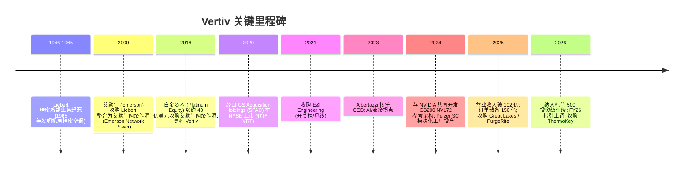
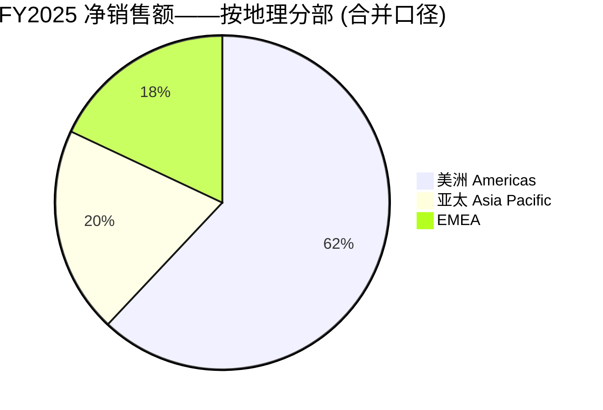
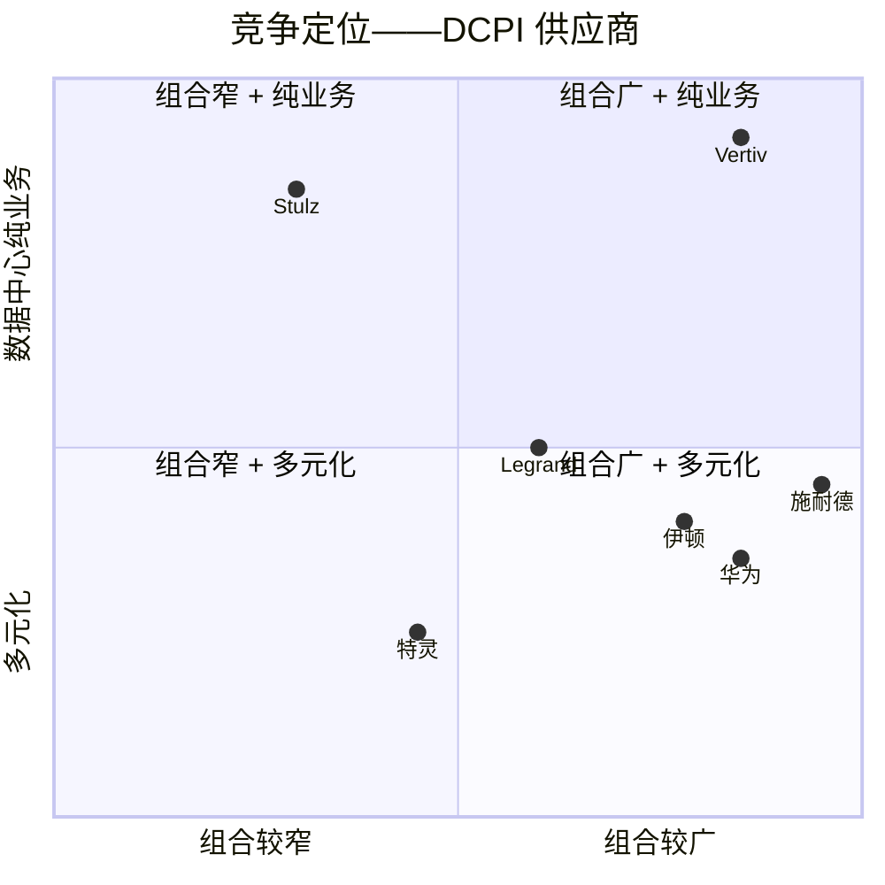
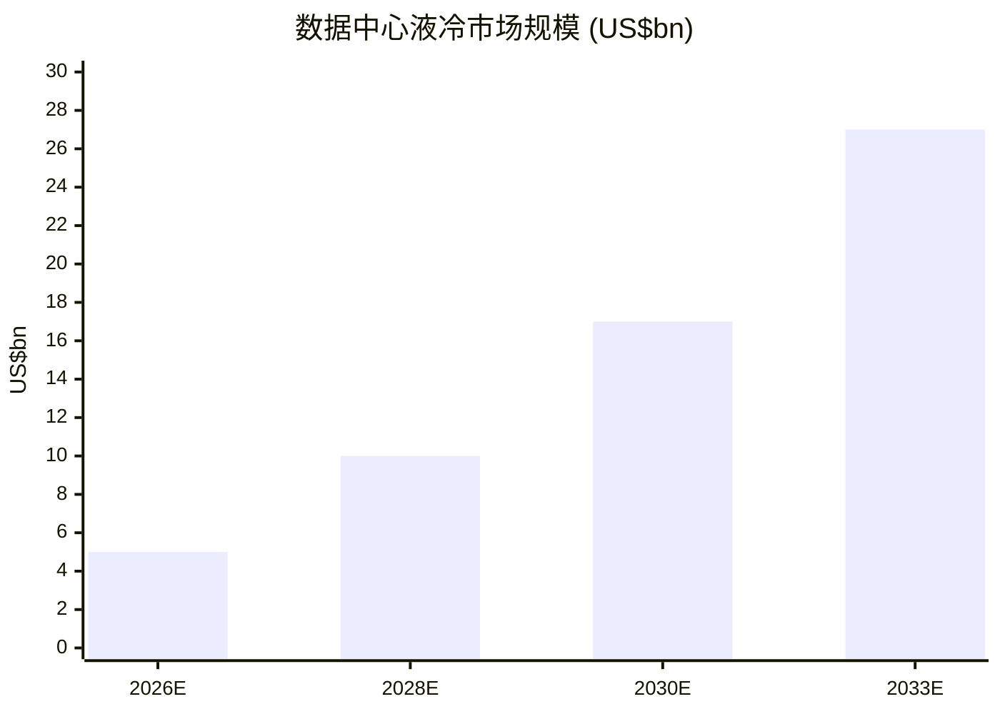

# Vertiv Holdings Co (NYSE:VRT) — 公司研究报告

**截至日期: 2026-06-16**
**上市地: 纽约证券交易所, 代码 VRT**
**注册地: 美国俄亥俄州 Westerville**
**报告语言: 简体中文 (英文版同时存在于本目录)**

**分析师注:** 本报告为对既有覆盖的全面刷新 (full refresh)。所有财务数据均以百万美元计, 除非另有说明。财年截止 12 月 31 日。本报告内的评级 (rating)、目标价 (price target, PT)、前瞻估计 (forward estimates) 与情景目标价均为分析师本方观点 (`*分析师观点：*`), 不构成对任何申报文件的引用——10-K 中不含目标价。

---

## 投资摘要 (Investment Summary) — *分析师观点：*

| 项目 | 数值 |
|---|---|
| **评级 (Rating)** | **Hold / 中性 (Neutral)** |
| **12 个月目标价 (PT)** | **325 美元** (基础情景, 约 +6.5%) |
| **当前股价 (2026-06-16)** | **305.16 美元** |
| **隐含上行/下行** | 基础 **+6.5%** · 看涨 **+29%** · 看跌 **−28%** |
| **估值方法** | 前瞻 P/E: FY27E 调整后 EPS (adj EPS) 约 8.10 美元 × 40× = 324, 以同业重定价为参照取整至 325 |
| **市值 (Market Cap)** | 约 **1,172 亿美元** |
| **52 周区间** | 约 75 – 165 美元拆股前口径不适用; 近 12 个月在约 90 – 320 美元区间 |
| **TTM P/E** | 约 **76.7×** (前瞻 adj P/E 约 **48×**) |
| **TTM P/S** | 约 **10.8×** |
| **代码 / 交易所** | VRT / NYSE |

**论点支柱 (Thesis pillars) — *分析师观点：***

1. **AI 算力的"卖铲人"龙头, 但价格已先行。** Vertiv 是数据中心关键基础设施 (Data Center Physical Infrastructure, DCPI) 中唯一的大型纯业务玩家, 与 NVIDIA 共同开发 GB200/GB300 参考架构, FY2025 营业收入 +27.7%、订单储备 (backlog) +109% 至 150 亿美元——基本面无可挑剔; 但约 48× 前瞻 adj P/E 已对多年高增长充分计价, 风险回报趋于对称。

2. **800V DC + 液冷是结构性单机价值量 (content per MW) 顺风。** NVIDIA 推动数据中心向 800V 直流演进、机柜功率迈向 1MW, 提升配电与制冷复杂度, 利好能做"电源+制冷"一体化集成的 Vertiv (*分析师观点：* 详见第 2 节卖方观点)。

3. **EMEA 停滞与产能/人员先行投入是近期最该盯紧的变量。** 2026 Q1 EMEA 有机收缩约 29%, 而 FY2026 资本开支 (CapEx) 从约 2.26 亿跃升至约 4.25–5.25 亿美元——若超大规模 (hyperscaler) 资本开支节奏放缓, 闲置产能与库存累积会先于收入恶化显现。

4. **2026-06-12 完成 ThermoKey 换热并购, 把供应链买进来。** Vertiv 持续以并购将换热/CDU 供应链内部化 (FY2025 收购支出约 11.85 亿美元), 巩固液冷全栈与 EMEA 产能——但也抬高商誉+无形资产至总资产约 32%。

> **业绩更新 / 近期事件 (截至 2026-06-16):**
> - **2026-06-12 — 完成收购 ThermoKey S.p.A.**: 意大利换热/散热技术厂商 (创立于 1991 年), 补强热管理组合 (干冷器 dry coolers、换热器、兼容低 GWP 与天然冷媒) 及 EMEA 制造产能, 用于 AI 工厂与高密度数据中心的整链热架构 ([Vertiv 8-K — ThermoKey 收购完成, 2026-06-12](https://www.sec.gov/Archives/edgar/data/0001674101/000162828026042641/exhibit991vrt-q220266122026.htm))。
> - **2026-06-03 — 宣布 Q2 季度股息**: 每股 0.0625 美元, 2026-06-25 支付, 登记日 2026-06-15 ([Vertiv 8-K — Q2 2026 股息, 2026-06-03](https://www.sec.gov/Archives/edgar/data/0001674101/000162828026040031/exhibit991vrt-q22026divide.htm))。
> - **2026-04-22 — FY2026 指引上调**: 全年净销售额上调至 **135.00–140.00 亿美元** (有机增长 29–31%), GAAP 摊薄 EPS **5.60–5.70 美元**, 调整后摊薄 EPS **6.30–6.40 美元** (相较 FY2025 中值口径分别约 +66% 与 +51%)。Q1 2026 有机销售额同比 +23% (美洲 +44%), 调整后营业利润率 (adjusted operating margin) 20.8% (同比 +430 bps), 调整后自由现金流 (adjusted free cash flow) 6.53 亿美元 (同比 +147%), 净杠杆率 (net leverage) 约 0.2 倍 ([Vertiv Q1 2026 业绩公告, 2026-04-22](https://www.sec.gov/Archives/edgar/data/0001674101/000162828026026379/q12026exhibit991vrt04222026.htm))。

---

## 目录

1. 公司概览 (含 1A 估值与目标价快照、1B GF Score)
2. 估值与目标价 (Valuation & Price Target) + 卖方观点演变
3. 公司历史
4. 管理团队
5. 产品与服务
6. 客户与上市策略
7. 行业概览
8. 竞争格局
9. 市场机会 (TAM)
10. 风险评估 (含 9.5 关键分歧与催化剂)
11. 投资视角评分 (Investor lenses)
12. 参考资料

---

## 1. 公司概览

Vertiv Holdings Co (NYSE: VRT) 是规模最大的纯关键数字基础设施 (critical digital infrastructure) 供应商——电源、热管理 (thermal management) 及集成系统, 它们维持着数据中心、通信网络以及商业/工业场所的持续运转。公司总部位于美国俄亥俄州 Westerville, 主营业务覆盖介于公用电网与硅芯片之间的硬件设计、制造、销售、安装与服务: 不间断电源 (Uninterruptible Power Supply, UPS)、低压及中压开关柜 (switchgear)、母线槽/汇流排 (busway/busbar)、机柜级电源分配 (rack power distribution)、锂离子电池柜 (lithium-ion battery cabinet)、风冷及液冷 (liquid cooling) 热管理系统、机房精密空调 (CRAH/CRAC)、液冷分配单元 (Coolant Distribution Unit, CDU)、预制模块化数据中心 (prefabricated modular data center)、机柜与机架、IT 管理软件, 以及由全球约 300 个服务中心、约 5,000 名现场工程师支撑的全球服务与全生命周期业务 ([Vertiv 2025 Form 10-K, Item 1 Business](https://www.sec.gov/Archives/edgar/data/0001674101/000167410126000008/vrt-20251231.htm))。

**本方观点 (BLUF)。** 我们给予 VRT **Hold / 中性**评级, 12 个月目标价 **325 美元** (约 +6.5%)。理由不是基本面有瑕疵——恰恰相反, Vertiv 拥有 DCPI 行业最干净的 AI 算力敞口、与 NVIDIA 的参考设计绑定、150 亿美元订单储备和约 21% 的调整后营业利润率——而是**估值已先行**: 约 48× 前瞻调整后 P/E 把多年的高增长与高毛利充分定价, 使得任何一次指引下修或 AI 资本开支 (capex) 周期降温都可能触发显著的倍数压缩 (multiple compression)。换言之, 优质的生意, 但当前价格留给新资金的安全边际有限; 我们更倾向在回调中买入而非追高。

**盈利方式。** 约 82% 的营业收入来自产品销售 (UPS、开关柜、热管理、模块化), 按时点法 (point-in-time) 在发货时确认; 约 18% 来自长周期集成项目 (预制模块化数据中心、大型交钥匙电源与热项目) 的时段法 (over-time) 确认、经常性服务合同、备件以及软件。FY2025 构成为: **产品 (products) 83.906 亿美元 / 服务及备件 (services) 18.393 亿美元**, 合计 102.299 亿美元——服务同比增长约 14.5%, 但产品线才是随超大规模 AI 资本开支扩张并贡献爆发性增量增长的部分 ([Vertiv 2025 10-K, Consolidated Statements of Operations](https://www.sec.gov/Archives/edgar/data/0001674101/000167410126000008/vrt-20251231.htm))。

<svg xmlns="http://www.w3.org/2000/svg" viewBox="0 0 1000 560" width="1000" height="560" role="img" aria-label="income statement Sankey"><rect x="0" y="0" width="1000" height="560" fill="#ffffff"/>
<text x="20.00" y="30.00" text-anchor="start" font-family="Helvetica,Arial,sans-serif" font-size="15" font-weight="700" fill="#1f2933">Vertiv (VRT) 如何赚钱 — FY2025 利润表 Sankey</text>
<path d="M 204.00,71.00 C 258.00,71.00 258.00,78.00 312.00,78.00 L 312.00,424.13 C 258.00,424.13 258.00,417.13 204.00,417.13 Z" fill="#93c5fd" fill-opacity="0.55"/>
<path d="M 452.00,71.00 C 506.00,71.00 506.00,205.37 560.00,205.37 L 560.00,280.85 C 506.00,280.85 506.00,146.48 452.00,146.48 Z" fill="#86efac" fill-opacity="0.55"/>
<path d="M 452.00,146.48 C 506.00,146.48 506.00,294.85 560.00,294.85 L 560.00,372.63 C 506.00,372.63 506.00,224.26 452.00,224.26 Z" fill="#fca5a5" fill-opacity="0.55"/>
<path d="M 328.00,78.00 C 382.00,78.00 382.00,71.00 436.00,71.00 L 436.00,224.26 C 382.00,224.26 382.00,231.26 328.00,231.26 Z" fill="#86efac" fill-opacity="0.55"/>
<path d="M 328.00,231.26 C 382.00,231.26 382.00,238.26 436.00,238.26 L 436.00,507.00 C 382.00,507.00 382.00,500.00 328.00,500.00 Z" fill="#fca5a5" fill-opacity="0.55"/>
<path d="M 700.00,200.18 C 754.00,200.18 754.00,246.07 808.00,246.07 L 808.00,301.05 C 754.00,301.05 754.00,255.16 700.00,255.16 Z" fill="#86efac" fill-opacity="0.55"/>
<path d="M 700.00,255.16 C 754.00,255.16 754.00,315.05 808.00,315.05 L 808.00,331.93 C 754.00,331.93 754.00,272.04 700.00,272.04 Z" fill="#fca5a5" fill-opacity="0.55"/>
<path d="M 576.00,205.37 C 630.00,205.37 630.00,200.18 684.00,200.18 L 684.00,275.66 C 630.00,275.66 630.00,280.85 576.00,280.85 Z" fill="#86efac" fill-opacity="0.55"/>
<path d="M 576.00,294.85 C 630.00,294.85 630.00,286.04 684.00,286.04 L 684.00,352.78 C 630.00,352.78 630.00,361.59 576.00,361.59 Z" fill="#fca5a5" fill-opacity="0.55"/>
<path d="M 576.00,361.59 C 630.00,361.59 630.00,366.78 684.00,366.78 L 684.00,377.82 C 630.00,377.82 630.00,372.63 576.00,372.63 Z" fill="#fca5a5" fill-opacity="0.55"/>
<path d="M 204.00,431.13 C 258.00,431.13 258.00,424.13 312.00,424.13 L 312.00,500.00 C 258.00,500.00 258.00,507.00 204.00,507.00 Z" fill="#93c5fd" fill-opacity="0.55"/>
<rect x="188.00" y="71.00" width="16" height="346.13" rx="1.5" fill="#2563eb"/>
<rect x="188.00" y="431.13" width="16" height="75.87" rx="1.5" fill="#2563eb"/>
<rect x="312.00" y="78.00" width="16" height="422.00" rx="1.5" fill="#1e3a8a"/>
<rect x="436.00" y="71.00" width="16" height="153.26" rx="1.5" fill="#15803d"/>
<rect x="436.00" y="238.26" width="16" height="268.74" rx="1.5" fill="#dc2626"/>
<rect x="560.00" y="205.37" width="16" height="75.48" rx="1.5" fill="#15803d"/>
<rect x="560.00" y="294.85" width="16" height="77.78" rx="1.5" fill="#dc2626"/>
<rect x="684.00" y="200.18" width="16" height="71.86" rx="1.5" fill="#15803d"/>
<rect x="684.00" y="286.04" width="16" height="66.74" rx="1.5" fill="#dc2626"/>
<rect x="684.00" y="366.78" width="16" height="11.04" rx="1.5" fill="#dc2626"/>
<rect x="808.00" y="246.07" width="16" height="54.98" rx="1.5" fill="#15803d"/>
<rect x="808.00" y="315.05" width="16" height="16.88" rx="1.5" fill="#dc2626"/>
<text x="179.00" y="241.06" text-anchor="end" font-family="Helvetica,Arial,sans-serif" font-size="11.5" font-weight="700" fill="#1f2933">Products</text>
<text x="179.00" y="254.06" text-anchor="end" font-family="Helvetica,Arial,sans-serif" font-size="10" font-weight="400" fill="#52606d">$8.4B  (82.0%)</text>
<text x="179.00" y="466.06" text-anchor="end" font-family="Helvetica,Arial,sans-serif" font-size="11.5" font-weight="700" fill="#1f2933">Services &amp; Spares</text>
<text x="179.00" y="479.06" text-anchor="end" font-family="Helvetica,Arial,sans-serif" font-size="10" font-weight="400" fill="#52606d">$1.8B  (18.0%)</text>
<rect x="331.00" y="60.00" width="106.80" height="26" rx="2" fill="#ffffff" fill-opacity="0.72"/>
<text x="334.00" y="72.00" text-anchor="start" font-family="Helvetica,Arial,sans-serif" font-size="11.5" font-weight="700" fill="#1f2933">Revenue</text>
<text x="334.00" y="85.00" text-anchor="start" font-family="Helvetica,Arial,sans-serif" font-size="10" font-weight="400" fill="#52606d">$10.2B  (100.0%)</text>
<rect x="455.00" y="53.00" width="94.20" height="26" rx="2" fill="#ffffff" fill-opacity="0.72"/>
<text x="458.00" y="65.00" text-anchor="start" font-family="Helvetica,Arial,sans-serif" font-size="11.5" font-weight="700" fill="#1f2933">Gross Profit</text>
<text x="458.00" y="78.00" text-anchor="start" font-family="Helvetica,Arial,sans-serif" font-size="10" font-weight="400" fill="#52606d">$3.7B  (36.3%)</text>
<rect x="455.00" y="220.26" width="144.60" height="26" rx="2" fill="#ffffff" fill-opacity="0.72"/>
<text x="458.00" y="232.26" text-anchor="start" font-family="Helvetica,Arial,sans-serif" font-size="11.5" font-weight="700" fill="#1f2933">Cost of Revenue (COGS)</text>
<text x="458.00" y="245.26" text-anchor="start" font-family="Helvetica,Arial,sans-serif" font-size="10" font-weight="400" fill="#52606d">$6.5B  (63.7%)</text>
<rect x="579.00" y="187.37" width="106.80" height="26" rx="2" fill="#ffffff" fill-opacity="0.72"/>
<text x="582.00" y="199.37" text-anchor="start" font-family="Helvetica,Arial,sans-serif" font-size="11.5" font-weight="700" fill="#1f2933">Operating Income</text>
<text x="582.00" y="212.37" text-anchor="start" font-family="Helvetica,Arial,sans-serif" font-size="10" font-weight="400" fill="#52606d">$1.8B  (17.9%)</text>
<rect x="579.00" y="276.85" width="150.90" height="26" rx="2" fill="#ffffff" fill-opacity="0.72"/>
<text x="582.00" y="288.85" text-anchor="start" font-family="Helvetica,Arial,sans-serif" font-size="11.5" font-weight="700" fill="#1f2933">Total Operating Expense</text>
<text x="582.00" y="301.85" text-anchor="start" font-family="Helvetica,Arial,sans-serif" font-size="10" font-weight="400" fill="#52606d">$1.9B  (18.4%)</text>
<rect x="703.00" y="182.18" width="94.20" height="26" rx="2" fill="#ffffff" fill-opacity="0.72"/>
<text x="706.00" y="194.18" text-anchor="start" font-family="Helvetica,Arial,sans-serif" font-size="11.5" font-weight="700" fill="#1f2933">Pretax Income</text>
<text x="706.00" y="207.18" text-anchor="start" font-family="Helvetica,Arial,sans-serif" font-size="10" font-weight="400" fill="#52606d">$1.7B  (17.0%)</text>
<rect x="703.00" y="268.04" width="94.20" height="26" rx="2" fill="#ffffff" fill-opacity="0.72"/>
<text x="706.00" y="280.04" text-anchor="start" font-family="Helvetica,Arial,sans-serif" font-size="11.5" font-weight="700" fill="#1f2933">SG&amp;A</text>
<text x="706.00" y="293.04" text-anchor="start" font-family="Helvetica,Arial,sans-serif" font-size="10" font-weight="400" fill="#52606d">$1.6B  (15.8%)</text>
<rect x="703.00" y="348.78" width="100.50" height="26" rx="2" fill="#ffffff" fill-opacity="0.72"/>
<text x="706.00" y="360.78" text-anchor="start" font-family="Helvetica,Arial,sans-serif" font-size="11.5" font-weight="700" fill="#1f2933">Other OpEx</text>
<text x="706.00" y="373.78" text-anchor="start" font-family="Helvetica,Arial,sans-serif" font-size="10" font-weight="400" fill="#52606d">$267.7M  (2.6%)</text>
<text x="833.00" y="270.56" text-anchor="start" font-family="Helvetica,Arial,sans-serif" font-size="11.5" font-weight="700" fill="#1f2933">Net Income</text>
<text x="833.00" y="283.56" text-anchor="start" font-family="Helvetica,Arial,sans-serif" font-size="10" font-weight="400" fill="#52606d">$1.3B  (13.0%)</text>
<text x="833.00" y="320.49" text-anchor="start" font-family="Helvetica,Arial,sans-serif" font-size="11.5" font-weight="700" fill="#1f2933">Income Tax</text>
<text x="833.00" y="333.49" text-anchor="start" font-family="Helvetica,Arial,sans-serif" font-size="10" font-weight="400" fill="#52606d">$409.1M  (4.0%)</text>
<text x="500.00" y="544.00" text-anchor="middle" font-family="Helvetica,Arial,sans-serif" font-size="10" font-weight="400" fill="#52606d">Source: VRT FY2025 10-K, Consolidated Statements of Operations</text>
</svg>

来源 / Source: [Vertiv 2025 10-K, Consolidated Statements of Operations](https://www.sec.gov/Archives/edgar/data/0001674101/000167410126000008/vrt-20251231.htm)。

**报告分部与地理结构。** Vertiv 沿三个地理分部报告——美洲 (Americas)、亚太 (Asia Pacific)、欧洲中东及非洲 (EMEA)。FY2025 美洲分部占净销售额 **62% (63.863 亿美元)**, 较 FY2024 的 56% 显著上行, 受美国超大规模 AI 建设拉动; 亚太占 20% (20.192 亿美元); EMEA 占 18% (18.244 亿美元) ([Vertiv 2025 10-K, Note 18 Segment Information](https://www.sec.gov/Archives/edgar/data/0001674101/000167410126000008/vrt-20251231.htm))。分部营业利润 (segment operating profit): 美洲 17.143 亿美元、亚太 2.221 亿美元、EMEA 3.774 亿美元 ([Vertiv 2025 10-K, Note 18 Segment Information](https://www.sec.gov/Archives/edgar/data/0001674101/000167410126000008/vrt-20251231.htm))。美洲业务现已是公司整体业绩的最大决定因子——当 2026 Q1 美洲有机销售额增长 44% 时, 合并有机增长率跃升至 23%, 即便 EMEA 在高基数及欧洲超大规模审批延长拖累下有机收缩约 29% ([Vertiv Q1 2026 业绩公告, 2026-04-22](https://www.sec.gov/Archives/edgar/data/0001674101/000162828026026379/q12026exhibit991vrt04222026.htm))。

<svg xmlns="http://www.w3.org/2000/svg" viewBox="0 0 720 460" width="720" height="460" role="img" aria-label="revenue donut"><rect x="0" y="0" width="720" height="460" fill="#ffffff"/>
<text x="20.00" y="30.00" text-anchor="start" font-family="Helvetica,Arial,sans-serif" font-size="15" font-weight="700" fill="#1f2933">FY2025 净销售额构成 (按地理分部)</text>
<path d="M 288.00,107.20 A 132 132 0 1 1 195.09,332.96 L 233.10,294.60 A 78 78 0 1 0 288.00,161.20 Z" fill="#2563eb"/>
<path d="M 195.09,332.96 A 132 132 0 0 1 169.16,181.75 L 217.77,205.25 A 78 78 0 0 0 233.10,294.60 Z" fill="#15803d"/>
<path d="M 169.16,181.75 A 132 132 0 0 1 288.00,107.20 L 288.00,161.20 A 78 78 0 0 0 217.77,205.25 Z" fill="#d97706"/>
<text x="288.00" y="235.20" text-anchor="middle" font-family="Helvetica,Arial,sans-serif" font-size="18" font-weight="800" fill="#1f2933">VRT</text>
<text x="288.00" y="255.20" text-anchor="middle" font-family="Helvetica,Arial,sans-serif" font-size="13" font-weight="600" fill="#52606d">$10.2B</text>
<text x="288.00" y="271.20" text-anchor="middle" font-family="Helvetica,Arial,sans-serif" font-size="10" font-weight="400" fill="#8a97a3">total</text>
<line x1="415.61" y1="291.72" x2="431.61" y2="291.72" stroke="#2563eb" stroke-width="1.4"/>
<text x="435.61" y="289.72" text-anchor="start" font-family="Helvetica,Arial,sans-serif" font-size="11" font-weight="700" fill="#1f2933">Americas 美洲</text>
<text x="435.61" y="303.72" text-anchor="start" font-family="Helvetica,Arial,sans-serif" font-size="10" font-weight="400" fill="#52606d">$6.4B  (62.4%)</text>
<line x1="151.99" y1="262.53" x2="135.99" y2="262.53" stroke="#15803d" stroke-width="1.4"/>
<text x="131.99" y="260.53" text-anchor="end" font-family="Helvetica,Arial,sans-serif" font-size="11" font-weight="700" fill="#1f2933">Asia Pacific 亚太</text>
<text x="131.99" y="274.53" text-anchor="end" font-family="Helvetica,Arial,sans-serif" font-size="10" font-weight="400" fill="#52606d">$2.0B  (19.7%)</text>
<line x1="214.66" y1="122.30" x2="198.66" y2="122.30" stroke="#d97706" stroke-width="1.4"/>
<text x="194.66" y="120.30" text-anchor="end" font-family="Helvetica,Arial,sans-serif" font-size="11" font-weight="700" fill="#1f2933">EMEA 欧洲中东非洲</text>
<text x="194.66" y="134.30" text-anchor="end" font-family="Helvetica,Arial,sans-serif" font-size="10" font-weight="400" fill="#52606d">$1.8B  (17.8%)</text>
<text x="360.00" y="444.00" text-anchor="middle" font-family="Helvetica,Arial,sans-serif" font-size="10" font-weight="400" fill="#52606d">Source: VRT FY2025 10-K, Note 18 Segment Information</text>
</svg>

来源 / Source: [Vertiv 2025 10-K, Note 18 Segment Information](https://www.sec.gov/Archives/edgar/data/0001674101/000167410126000008/vrt-20251231.htm)。

<svg xmlns="http://www.w3.org/2000/svg" viewBox="0 0 860 470" width="860" height="470" role="img" aria-label="historical revenue bars"><rect x="0" y="0" width="860" height="470" fill="#ffffff"/>
<text x="20.00" y="30.00" text-anchor="start" font-family="Helvetica,Arial,sans-serif" font-size="15" font-weight="700" fill="#1f2933">净销售额历史构成 (按地理分部, FY2023–FY2025)</text>
<rect x="20.00" y="44" width="11" height="11" rx="2" fill="#2563eb"/>
<text x="36.00" y="53.00" text-anchor="start" font-family="Helvetica,Arial,sans-serif" font-size="10.5" font-weight="400" fill="#1f2933">Americas 美洲</text>
<rect x="122.60" y="44" width="11" height="11" rx="2" fill="#15803d"/>
<text x="138.60" y="53.00" text-anchor="start" font-family="Helvetica,Arial,sans-serif" font-size="10.5" font-weight="400" fill="#1f2933">Asia Pacific 亚太</text>
<rect x="251.60" y="44" width="11" height="11" rx="2" fill="#d97706"/>
<text x="267.60" y="53.00" text-anchor="start" font-family="Helvetica,Arial,sans-serif" font-size="10.5" font-weight="400" fill="#1f2933">EMEA 欧洲中东非洲</text>
<line x1="70" y1="412.00" x2="834" y2="412.00" stroke="#eceff2" stroke-width="1"/>
<text x="64.00" y="415.00" text-anchor="end" font-family="Helvetica,Arial,sans-serif" font-size="9.5" font-weight="400" fill="#52606d">$0</text>
<line x1="70" y1="345.20" x2="834" y2="345.20" stroke="#eceff2" stroke-width="1"/>
<text x="64.00" y="348.20" text-anchor="end" font-family="Helvetica,Arial,sans-serif" font-size="9.5" font-weight="400" fill="#52606d">$2.2B</text>
<line x1="70" y1="278.40" x2="834" y2="278.40" stroke="#eceff2" stroke-width="1"/>
<text x="64.00" y="281.40" text-anchor="end" font-family="Helvetica,Arial,sans-serif" font-size="9.5" font-weight="400" fill="#52606d">$4.4B</text>
<line x1="70" y1="211.60" x2="834" y2="211.60" stroke="#eceff2" stroke-width="1"/>
<text x="64.00" y="214.60" text-anchor="end" font-family="Helvetica,Arial,sans-serif" font-size="9.5" font-weight="400" fill="#52606d">$6.6B</text>
<line x1="70" y1="144.80" x2="834" y2="144.80" stroke="#eceff2" stroke-width="1"/>
<text x="64.00" y="147.80" text-anchor="end" font-family="Helvetica,Arial,sans-serif" font-size="9.5" font-weight="400" fill="#52606d">$8.8B</text>
<line x1="70" y1="78.00" x2="834" y2="78.00" stroke="#eceff2" stroke-width="1"/>
<text x="64.00" y="81.00" text-anchor="end" font-family="Helvetica,Arial,sans-serif" font-size="9.5" font-weight="400" fill="#52606d">$11.0B</text>
<rect x="123.48" y="295.78" width="147.71" height="116.22" fill="#2563eb"/>
<rect x="123.48" y="249.59" width="147.71" height="46.19" fill="#15803d"/>
<rect x="123.48" y="204.52" width="147.71" height="45.07" fill="#d97706"/>
<text x="197.33" y="428.00" text-anchor="middle" font-family="Helvetica,Arial,sans-serif" font-size="10" font-weight="400" fill="#52606d">2023</text>
<rect x="378.15" y="275.94" width="147.71" height="136.06" fill="#2563eb"/>
<rect x="378.15" y="224.01" width="147.71" height="51.93" fill="#15803d"/>
<rect x="378.15" y="169.80" width="147.71" height="54.22" fill="#d97706"/>
<text x="452.00" y="428.00" text-anchor="middle" font-family="Helvetica,Arial,sans-serif" font-size="10" font-weight="400" fill="#52606d">2024</text>
<rect x="632.81" y="218.94" width="147.71" height="193.06" fill="#2563eb"/>
<rect x="632.81" y="157.89" width="147.71" height="61.04" fill="#15803d"/>
<rect x="632.81" y="102.74" width="147.71" height="55.15" fill="#d97706"/>
<text x="706.67" y="428.00" text-anchor="middle" font-family="Helvetica,Arial,sans-serif" font-size="10" font-weight="400" fill="#52606d">2025</text>
<text x="430.00" y="454.00" text-anchor="middle" font-family="Helvetica,Arial,sans-serif" font-size="10" font-weight="400" fill="#52606d">Source: VRT FY2025 10-K, Note 18 Segment Information (合并净销售额口径)</text>
</svg>

来源 / Source: [Vertiv 2025 10-K, Note 18 Segment Information](https://www.sec.gov/Archives/edgar/data/0001674101/000167410126000008/vrt-20251231.htm)。

**规模与财务强度。** FY2025 营业收入 **102.299 亿美元** 同比增长 27.7% (相较 FY2024 的 80.118 亿美元)——Vertiv 营业收入基数在过去三年从 FY2023 的 68.632 亿美元增长约 49%。FY2025 毛利率 (gross margin) 为 **36.3%** (毛利 37.152 亿美元, 相较 FY2024 的 36.6%——基本持平, 经营杠杆被关税成本通胀抵消), GAAP 营业利润率 (operating margin) 约 **17.9%** (营业利润 18.297 亿美元), 调整后营业利润率约 21.0%, 净利润 (net income) **13.328 亿美元** (FY2024: 4.958 亿美元, 受 4.492 亿美元非现金权证负债重估扭曲), GAAP 摊薄 EPS **3.41 美元** ([Vertiv 2025 10-K, Consolidated Statements of Operations](https://www.sec.gov/Archives/edgar/data/0001674101/000167410126000008/vrt-20251231.htm))。FY2025 经营现金流 (CFO) 21.138 亿美元, 资本开支 2.20 亿美元, 自由现金流约 18.94 亿美元; 年末现金及现金等价物 17.284 亿美元、加短期投资合计约 18.28 亿美元 ([Vertiv 2025 10-K, Consolidated Statements of Cash Flow + Balance Sheets](https://www.sec.gov/Archives/edgar/data/0001674101/000167410126000008/vrt-20251231.htm))。

<svg xmlns="http://www.w3.org/2000/svg" viewBox="0 0 720 460" width="720" height="460" role="img" aria-label="revenue donut"><rect x="0" y="0" width="720" height="460" fill="#ffffff"/>
<text x="20.00" y="30.00" text-anchor="start" font-family="Helvetica,Arial,sans-serif" font-size="15" font-weight="700" fill="#1f2933">FY2025 净销售额构成 (按产品/服务)</text>
<path d="M 288.00,107.20 A 132 132 0 1 1 168.63,182.84 L 217.47,205.90 A 78 78 0 1 0 288.00,161.20 Z" fill="#2563eb"/>
<path d="M 168.63,182.84 A 132 132 0 0 1 288.00,107.20 L 288.00,161.20 A 78 78 0 0 0 217.47,205.90 Z" fill="#15803d"/>
<text x="288.00" y="235.20" text-anchor="middle" font-family="Helvetica,Arial,sans-serif" font-size="18" font-weight="800" fill="#1f2933">VRT</text>
<text x="288.00" y="255.20" text-anchor="middle" font-family="Helvetica,Arial,sans-serif" font-size="13" font-weight="600" fill="#52606d">$10.2B</text>
<text x="288.00" y="271.20" text-anchor="middle" font-family="Helvetica,Arial,sans-serif" font-size="10" font-weight="400" fill="#8a97a3">total</text>
<line x1="361.87" y1="355.76" x2="377.87" y2="355.76" stroke="#2563eb" stroke-width="1.4"/>
<text x="381.87" y="353.76" text-anchor="start" font-family="Helvetica,Arial,sans-serif" font-size="11" font-weight="700" fill="#1f2933">Products 产品</text>
<text x="381.87" y="367.76" text-anchor="start" font-family="Helvetica,Arial,sans-serif" font-size="10" font-weight="400" fill="#52606d">$8.4B  (82.0%)</text>
<line x1="214.13" y1="122.64" x2="198.13" y2="122.64" stroke="#15803d" stroke-width="1.4"/>
<text x="194.13" y="120.64" text-anchor="end" font-family="Helvetica,Arial,sans-serif" font-size="11" font-weight="700" fill="#1f2933">Services &amp; Spares 服务及备件</text>
<text x="194.13" y="134.64" text-anchor="end" font-family="Helvetica,Arial,sans-serif" font-size="10" font-weight="400" fill="#52606d">$1.8B  (18.0%)</text>
<text x="360.00" y="444.00" text-anchor="middle" font-family="Helvetica,Arial,sans-serif" font-size="10" font-weight="400" fill="#52606d">Source: VRT FY2025 10-K, Consolidated Statements of Operations</text>
</svg>

来源 / Source: [Vertiv 2025 10-K, Consolidated Statements of Operations](https://www.sec.gov/Archives/edgar/data/0001674101/000167410126000008/vrt-20251231.htm)。

投资逻辑中最重要的单一经营披露是**订单储备 (backlog)**: 截至 2025 年 12 月 31 日为 **150 亿美元, 同比 +109%**, 相较 FY2024 末的 72 亿美元 ([Vertiv 2025 10-K, Item 1 Business — Backlog](https://www.sec.gov/Archives/edgar/data/0001674101/000167410126000008/vrt-20251231.htm))。2025 年 Q4 有机订单同比增长 252% (订单/账面比 (book-to-bill) 约 2.9 倍), 滚动十二个月有机订单同比增长 81% ([Vertiv Q4 2025 业绩公告, 2026-02-11](https://www.sec.gov/Archives/edgar/data/0001674101/000167410126000006/exhibit991vrt02112026.htm))。订单储备的大部分为确认订单 (firm), 预计于 12–18 个月内转化, 这为 FY2026–FY2027 的营业收入提供了较高可见度。

**员工与全球网络。** 截至 2025 年 12 月 31 日, 公司共有约 34,000 名全职及兼职员工 (约 41% 从事制造运营), 在 40 多个国家设有工程、制造、运营、销售与服务网点, 销售网络覆盖 130 多个国家。公司持续扩张美国、墨西哥、意大利、印度及中国的开关柜、母线、预制模块及液冷产品线产能 ([Vertiv 2025 10-K, Item 1 Human Capital](https://www.sec.gov/Archives/edgar/data/0001674101/000167410126000008/vrt-20251231.htm))。

### 1A — 估值与目标价快照 (Valuation snapshot, 2026-06-16)

VRT 当前股价 **305.16 美元**, 市值约 **1,172 亿美元** (摊薄股本约 3.84 亿股), **TTM P/E 约 76.7×**, **TTM P/S 约 10.8×**, EV/EBITDA 约 50×, 对应 TTM 营业收入约 108.4 亿美元 (= FY2025 102.30 + Q1'26 26.50 − Q1'25 20.36) 与 TTM 净利润约 15.58 亿美元 ([Yahoo Finance — VRT 估值指标, 2026-06-16](https://finance.yahoo.com/quote/VRT/key-statistics))。基于上调后的 FY2026 调整后 EPS 中值 6.35 美元, **前瞻调整后 P/E 约 48×**; 基于 GAAP EPS 中值 5.65 美元, 前瞻 GAAP P/E 约 54×。

参考公司自己提名的同业组合 ([Vertiv 2025 10-K, Item 1 Competition](https://www.sec.gov/Archives/edgar/data/0001674101/000167410126000008/vrt-20251231.htm)), 倍数取自 Yahoo Finance (2026-06-16, 通过 yfinance 拉取):

| 代码 | 公司 | 股价 | 市值 | TTM P/E | TTM P/S | 前瞻 P/E |
|---|---|---:|---:|---:|---:|---:|
| **VRT** | **Vertiv Holdings** | **305.16** | **1,172 亿** | **76.7** | **10.8** | **34.5** |
| ETN | Eaton Corp. (伊顿) | 410.30 | 1,593 亿 | 40.1 | 5.6 | 26.1 |
| NVT | nVent Electric | 169.91 | 275 亿 | 57.8 | 6.4 | 30.2 |
| TT | Trane Technologies (特灵) | 479.36 | 1,060 亿 | 36.6 | 4.9 | 28.2 |
| SU.PA | Schneider Electric (施耐德电气) | 276.95 | 1,558 亿 | 34.7 | 3.9 | 24.1 |

来源 / Source: [Yahoo Finance 多代码估值指标 (通过 yfinance 拉取), 2026-06-16](https://finance.yahoo.com/quote/VRT/key-statistics)。(注: 前瞻 P/E 取 Yahoo 口径的 forwardPE, 与正文基于 FY2026 调整后 EPS 的 48× 因 EPS 定义不同而有差异——Yahoo 的 forwardPE 采用更靠后的财年共识及不同的调整口径。)

**倍数解读。** Vertiv 当前估值大致为**同业中值 P/E 的约 2 倍、同业中值 P/S 的约 2.4 倍**, 即便在因 AI 电力逻辑被整体重定价的电气设备组合内部, 也属溢价区间 ([Yahoo Finance — VRT 估值指标, 2026-06-16](https://finance.yahoo.com/quote/VRT/key-statistics))。溢价由三个驱动因素支撑——纯 DCPI 聚焦、NVIDIA 参考设计绑定、150 亿美元订单储备可见度; 修正项是: 估值已把这些计入价格, 留给新资金的安全边际有限。这正是我们给予 Hold 的核心理由 (详见第 2 节的前瞻模型与目标价推导)。

### 1B — GF Score (GuruFocus 式) 基本面评分 — *分析师观点：*

下图为本方按 GuruFocus 的 GF Score™ 框架自建的五维评分 (各轴 0–10, 复合 0–100)。**它是分析师的评分工具, 不是数据源, 也不代表 GuruFocus 的官方数字**; 五个子分与复合分均为 `*分析师观点：*`, 不附带任何申报引用——每个底层指标 (margins / leverage / CAGR / multiples / returns) 各自在正文携带其内联引用。

<svg xmlns="http://www.w3.org/2000/svg" viewBox="0 0 500 500" width="500" height="500" role="img" aria-label="GF Score radar">
<rect x="0" y="0" width="500" height="500" fill="#ffffff"/>
<text x="20" y="24" font-family="Helvetica,Arial,sans-serif" font-size="15" font-weight="700" fill="#1f2933">GF Score (GuruFocus-style): 79/100</text>
<text x="20" y="41" font-family="Helvetica,Arial,sans-serif" font-size="11" fill="#52606d">71–80 Likely average performance</text>
<polygon points="250.0,88.0 392.7,191.6 338.2,359.4 161.8,359.4 107.3,191.6" fill="#e9f5ec" stroke="none"/>
<polygon points="250.0,208.0 278.5,228.7 267.6,262.3 232.4,262.3 221.5,228.7" fill="none" stroke="#c5d3cb" stroke-width="1"/>
<polygon points="250.0,178.0 307.1,219.5 285.3,286.5 214.7,286.5 192.9,219.5" fill="none" stroke="#c5d3cb" stroke-width="1"/>
<polygon points="250.0,148.0 335.6,210.2 302.9,310.8 197.1,310.8 164.4,210.2" fill="none" stroke="#c5d3cb" stroke-width="1"/>
<polygon points="250.0,118.0 364.1,200.9 320.5,335.1 179.5,335.1 135.9,200.9" fill="none" stroke="#c5d3cb" stroke-width="1"/>
<polygon points="250.0,88.0 392.7,191.6 338.2,359.4 161.8,359.4 107.3,191.6" fill="none" stroke="#c5d3cb" stroke-width="1.3"/>
<line x1="250" y1="238" x2="161.8" y2="359.4" stroke="#cfdad3" stroke-width="1"/>
<text x="146.5" y="392.4" text-anchor="end" font-family="Helvetica,Arial,sans-serif" font-size="11.5" font-weight="600" fill="#1f2933">Financial Strength</text>
<text x="146.5" y="405.4" text-anchor="end" font-family="Helvetica,Arial,sans-serif" font-size="9.5" fill="#52606d">财务实力</text>
<text x="179.5" y="329.1" text-anchor="middle" font-family="Helvetica,Arial,sans-serif" font-size="10.5" font-weight="700" fill="#1f2933">8</text>
<line x1="250" y1="238" x2="250.0" y2="88.0" stroke="#cfdad3" stroke-width="1"/>
<text x="250.0" y="58.0" text-anchor="middle" font-family="Helvetica,Arial,sans-serif" font-size="11.5" font-weight="600" fill="#1f2933">Profitability</text>
<text x="250.0" y="71.0" text-anchor="middle" font-family="Helvetica,Arial,sans-serif" font-size="9.5" fill="#52606d">盈利能力</text>
<text x="250.0" y="112.0" text-anchor="middle" font-family="Helvetica,Arial,sans-serif" font-size="10.5" font-weight="700" fill="#1f2933">8</text>
<line x1="250" y1="238" x2="107.3" y2="191.6" stroke="#cfdad3" stroke-width="1"/>
<text x="82.6" y="183.6" text-anchor="end" font-family="Helvetica,Arial,sans-serif" font-size="11.5" font-weight="600" fill="#1f2933">Growth</text>
<text x="82.6" y="196.6" text-anchor="end" font-family="Helvetica,Arial,sans-serif" font-size="9.5" fill="#52606d">成长性</text>
<text x="107.3" y="185.6" text-anchor="middle" font-family="Helvetica,Arial,sans-serif" font-size="10.5" font-weight="700" fill="#1f2933">10</text>
<line x1="250" y1="238" x2="392.7" y2="191.6" stroke="#cfdad3" stroke-width="1"/>
<text x="417.4" y="183.6" text-anchor="start" font-family="Helvetica,Arial,sans-serif" font-size="11.5" font-weight="600" fill="#1f2933">GF Value</text>
<text x="417.4" y="196.6" text-anchor="start" font-family="Helvetica,Arial,sans-serif" font-size="9.5" fill="#52606d">估值</text>
<text x="292.8" y="218.1" text-anchor="middle" font-family="Helvetica,Arial,sans-serif" font-size="10.5" font-weight="700" fill="#1f2933">3</text>
<line x1="250" y1="238" x2="338.2" y2="359.4" stroke="#cfdad3" stroke-width="1"/>
<text x="353.5" y="392.4" text-anchor="start" font-family="Helvetica,Arial,sans-serif" font-size="11.5" font-weight="600" fill="#1f2933">Momentum</text>
<text x="353.5" y="405.4" text-anchor="start" font-family="Helvetica,Arial,sans-serif" font-size="9.5" fill="#52606d">动量</text>
<text x="329.4" y="341.2" text-anchor="middle" font-family="Helvetica,Arial,sans-serif" font-size="10.5" font-weight="700" fill="#1f2933">9</text>
<polygon points="250.0,118.0 292.8,224.1 329.4,347.2 179.5,335.1 107.3,191.6" fill="#2e8b57" fill-opacity="0.34" stroke="#2e8b57" stroke-width="2"/>
<circle cx="179.5" cy="335.1" r="2.6" fill="#2e8b57"/>
<circle cx="250.0" cy="118.0" r="2.6" fill="#2e8b57"/>
<circle cx="107.3" cy="191.6" r="2.6" fill="#2e8b57"/>
<circle cx="292.8" cy="224.1" r="2.6" fill="#2e8b57"/>
<circle cx="329.4" cy="347.2" r="2.6" fill="#2e8b57"/>
<text x="250" y="470" text-anchor="middle" font-family="Helvetica,Arial,sans-serif" font-size="9.5" fill="#52606d">Source: VRT FY2025 10-K · Q1 2026 10-Q · Yahoo Finance, as of 2026-06-16</text>
<text x="250" y="485" text-anchor="middle" font-family="Helvetica,Arial,sans-serif" font-size="9" fill="#52606d">GF Score = independent analyst rubric (*Analyst view:*) — not GuruFocus™ official number</text>
</svg>

| 维度 / Dimension | 评分 / Score (0–10) | |
|---|---|---|
| Financial Strength (财务实力) | 8 | `████████░░` |
| Profitability (盈利能力) | 8 | `████████░░` |
| Growth (成长性) | 10 | `██████████` |
| GF Value (估值) | 3 | `███░░░░░░░` |
| Momentum (动量) | 9 | `█████████░` |
| **GF Score (composite, *Analyst view:*)** | **79 / 100** | **71–80 Likely average performance** |

*Composite weights (*Analyst view:*): Financial Strength 20% · Profitability 25% · Growth 25% · GF Value 15% · Momentum 15% (transparent reproduction — not GuruFocus's proprietary weighting).*

来源 / Source: 本方按 GuruFocus GF Score™ 框架自建评分; 底层指标来自下文各节的 10-K / 10-Q / Yahoo Finance 引用。

**各维度评分理由 (why these scores):**

- **Financial Strength 财务强度 8/10。** 净杠杆率约 0.2 倍 (Q1'26)、投资级评级 (Moody's Baa3 / S&P BBB-)、现金及短期投资约 25.0 亿美元 (Q1'26 现金 21.506 + 短期投资 3.499 亿美元), 利息覆盖充分 (FY2025 净利息支出仅 0.861 亿美元 vs 营业利润 18.297 亿美元)。扣分项: 商誉+无形资产约 39.3 亿美元占总资产约 32%, 属并购密集型资产结构 ([Vertiv 2025 10-K, Balance Sheets](https://www.sec.gov/Archives/edgar/data/0001674101/000167410126000008/vrt-20251231.htm); [Vertiv Q1 2026 10-Q, Balance Sheets](https://www.sec.gov/Archives/edgar/data/0001674101/000162828026026556/vrt-20260331.htm))。
- **Profitability 盈利能力 8/10。** GAAP 营业利润率约 17.9%、调整后约 21.0%, ROE 约 41.8% (DuPont 拆解见第 2 节), ROIC 显著高于 WACC ([Vertiv 2025 10-K, Statements of Operations](https://www.sec.gov/Archives/edgar/data/0001674101/000167410126000008/vrt-20251231.htm))。扣分项: FY2025 毛利率同比基本持平 (36.3% vs 36.6%), 关税侵蚀经营杠杆。
- **Growth 增长 10/10。** FY2025 营业收入 +27.7%、净利润 +169% (含权证扰动)、订单储备 +109%; FY2026 指引有机增长 29–31%、调整后 EPS +51% ([Vertiv 2025 10-K](https://www.sec.gov/Archives/edgar/data/0001674101/000167410126000008/vrt-20251231.htm); [Vertiv Q1 2026 业绩公告, 2026-04-22](https://www.sec.gov/Archives/edgar/data/0001674101/000162828026026379/q12026exhibit991vrt04222026.htm))。这是评分最高的一维。
- **GF Value 估值 (越高越便宜) 3/10。** TTM P/E 约 76.7×、P/S 约 10.8×, 前瞻调整后 P/E 约 48×——相对自身历史与同业 (中值 P/E 约 37×) 均处高位, 安全边际有限 ([Yahoo Finance — VRT 估值指标, 2026-06-16](https://finance.yahoo.com/quote/VRT/key-statistics))。这是拉低复合分的一维, 也是 Hold 评级的量化体现。
- **Momentum 动量 9/10。** 近 12 个月相对标普 500 大幅跑赢, 2026-03-23 起纳入 S&P 500, 五年累计回报约 771% ([S&P Global 新闻稿, 2026-03-06](https://press.spglobal.com/2026-03-06-Vertiv-Holdings,-Lumentum-Holdings,-Coherent,-and-EchoStar-Set-to-Join-S-P-500-Others-to-Join-S-P-100,-S-P-MidCap-400,-and-S-P-SmallCap-600); [Vertiv 2025 10-K, Stock Performance Graph](https://www.sec.gov/Archives/edgar/data/0001674101/000167410126000008/vrt-20251231.htm))。

**复合分约 79/100** (71–80 区间), 与本报告整体判断一致: 优质成长基本面 (Strength/Profitability/Growth/Momentum 高分) 被估值一维 (GF Value 低分) 拉低——基本面是 A, 价格是 C。

---

## 2. 估值与目标价 (Valuation & Price Target) — *分析师观点：*

本章是把"画像"升级为"决策"的部分。以下前瞻估计、目标价与情景目标价**全部为分析师本方观点**, 不引用任何申报文件; 每个驱动因素的外部依据 (申报分部数据 + 管理层指引 + 行业预测) 在行内单独引用。

### 2.1 前瞻财务估计 (Forward estimates) — *分析师观点：*

| (US$bn / EPS) | FY2025A | FY2026E | FY2027E | FY2028E |
|---|---:|---:|---:|---:|
| 净销售额 (Net sales) | 10.23 | 13.75 | 17.05 | 20.10 |
| YoY 增长 | +27.7% | +34% | +24% | +18% |
| 毛利率 (Gross margin) | 36.3% | 36.5% | 37.0% | 37.5% |
| 调整后营业利润率 | ~21.0% | ~21.5% | ~22.5% | ~23.0% |
| GAAP 摊薄 EPS | 3.41 | 5.65 | 7.20 | 8.70 |
| 调整后摊薄 EPS (adj EPS) | ~4.21 | 6.35 | 8.10 | 9.70 |

- **FY2026E**: 直接采用管理层指引中值——净销售额 13.75 亿美元 (区间 135–140 亿)、调整后 EPS 6.35 美元 (区间 6.30–6.40)、GAAP EPS 5.65 美元 ([Vertiv Q1 2026 业绩公告, 2026-04-22](https://www.sec.gov/Archives/edgar/data/0001674101/000162828026026379/q12026exhibit991vrt04222026.htm))。`*分析师观点：*`
- **FY2027E–FY2028E**: 本方在指引基础上向下递减增长曲线——美洲 AI 建设维持高增, EMEA 逐步回稳, 服务及备件经常性收入提供压载——给出 +24% / +18% 的收入路径, 调整后营业利润率随经营杠杆与产能利用率改善而温和扩张 25–50 bps/年。驱动的外部依据: FY2025 分部增长曲线 ([Vertiv 2025 10-K, Note 18](https://www.sec.gov/Archives/edgar/data/0001674101/000167410126000008/vrt-20251231.htm))、四大超大规模 2026E 资本开支共识约 6,400 亿美元 (+78% YoY, *分析师观点*详见 2.3) 与液冷子池约 28–32% CAGR ([Persistence Market Research, 2026-05-11](https://www.globenewswire.com/news-release/2026/05/11/3291590/28124/en/data-center-liquid-cooling-analysis-and-global-forecast-report-2026-market-is-set-to-surge-from-usd-4-07-billion-in-2026-to-usd-27-65-billion-by-2033-with-an-impressive-cagr-of-31-.html))。`*分析师观点：*` **绝非 (Source: our model)**。

### 2.2 目标价推导 (PT derivation) 与情景 — *分析师观点：*

**方法: 前瞻 P/E × 目标倍数。** 取 FY2027E 调整后 EPS **8.10 美元** × 目标前瞻倍数 **40×** = **324 美元**, 取整至 **325 美元** 作为 12 个月基础目标价 (约 +6.5%)。

**为什么用 40× 这个倍数 (multiple justification):** VRT 当前前瞻调整后 P/E 约 48× (基于 FY2026E)。我们假设随着收入增速从 +34% 减速至 +18–24%, 估值倍数从约 48× 温和回落至约 40× (= 12 个月后基于 FY2027E 的水平)——仍显著高于同业 (ETN 前瞻约 26×、NVT 约 30×、TT 约 28×、SU 约 24×, [Yahoo Finance, 2026-06-16](https://finance.yahoo.com/quote/VRT/key-statistics)), 溢价对应 Vertiv 更高的 EPS CAGR (FY25–28E 约 32% vs 同业 15–25%) 与纯 DCPI 聚焦。卖方 Bernstein 用 NTM+1 EBITDA 51 亿美元 × 32× 得到 416 美元、对应更激进的 FY27E EPS 9.21 美元 (见 2.4); 我们的 FY27E EPS 假设更保守 (8.10 vs 9.21), 因此目标价更低。

| 情景 | 假设 | EPS × 倍数 | 目标价 | 隐含 |
|---|---|---|---:|---:|
| **看涨 (Bull)** | 超大规模阶跃持续, 份额扩张, 倍数维持高位 | FY27E adj 8.55 × 46× | **393 美元** | **+29%** |
| **基础 (Base)** | 指引达成后温和减速, 倍数回落至 40× | FY27E adj 8.10 × 40× | **325 美元** | **+6.5%** |
| **看跌 (Bear)** | AI 资本开支消化 + 估值去溢价至同业上沿 | FY27E adj 7.30 × 30× | **219 美元** | **−28%** |

风险回报大致对称——看涨 +29% vs 看跌 −28%——这正是 **Hold / 中性**评级的量化基础: 在 305 美元附近, 上行需要"超大规模阶跃持续 + 倍数不压缩"两个条件同时成立, 而下行只需其中之一失效。

### 2.3 与市场一致预期的对比 (vs consensus) — *分析师观点：*

本报告的基础目标价 325 美元位于卖方区间偏下沿: Bernstein 跑赢大盘 (Outperform) 目标价 **416 美元**、HSBC 买入目标价 **325 美元** (与我们一致)、Goldman Sachs / Morgan Stanley / UBS 均为买入或增持 (见 2.4 的卖方观点演变)。我们的 FY2027E 调整后 EPS 8.10 美元低于 Bernstein 的 9.21 美元约 12%——分歧主要在 FY27 收入增速与营业利润率扩张幅度的假设上。**本方未自行虚构任何一致预期数字**; 上述卖方目标价/评级均逐条引用至 `db/zsxq.db` 中的原始券商 PDF。

### 2.4 卖方观点演变 (Sell-side view evolution) — *分析师观点：*

本节基于对 `db/stock_price_target.db` 的只读前置扫描 (mechanical pre-pass) 及 `db/zsxq.db` 本地券商库中的原始 PDF。PT 离散度: 已落库的明确目标价为 HSBC 325 美元 (2026-03-25) 与 Bernstein 416 美元 (2026-06-09), 跨度约 28%; Goldman/UBS/MS 给出评级但库内行未带具体 PT。

**按机构的观点时间线 (per-institute view timeline):**

| 机构 | 报告日 | 评级 / 目标价 | 报告日股价 (上行) | 核心论点 |
|---|---|---|---|---|
| **Bernstein** | 2026-06-15 | Outperform / **$416** | $302.87 (+37%) | 800V DC 提升单机价值量; 订单"延迟而非取消" (demand delay vs destruction); backlog 维持 12–18 个月; 热管理 + 三相 UPS/PDU 均第一。FY26E EPS **$6.52** / FY27E **$9.21**; PT = NTM+1 EBITDA $5.1B × 32× ([Bernstein — VRT Quick Take: Recap of meeting with management, 2026-06-15, p.1](http://xs-macbook-air.local:5001/zsxq/pdf/814522212258552/Bernstein-Vertiv%20Holdings%20Co%EF%BC%88VRT.US%EF%BC%89Quick%20Take%EF%BC%9ARecap%20of%20our%20meeting%20with%20management%20%EF%BC%88VRT%EF%BC%89-260615.pdf)) |
| **Bernstein** | 2026-06-09 | Outperform / **$416** | $289.52 (+44%) | 美国多元工业首次覆盖: 数据中心电力&制冷给"跑赢大盘"; VRT 是规模领先的纯龙头, 受益液冷+800V DC; 长期估值或向"服务型工业 15–20×"区间回落, 但盈利实力支撑股价底线 ([Bernstein — US Multis Initiation: Thrills and Chills, 2026-06-09, p.1](http://xs-macbook-air.local:5001/zsxq/pdf/412458141848818/Bernstein-U.S.%20Multi%20Industry%20%26%20Electrical%20Equipment%20US%20Multis%20Initiation%EF%BC%9A%20Thrills%20and%20Chills-260609.pdf)) |
| **UBS** | 2026-05-05 | Buy | — | 财报季后 VRT 是上调幅度最大的标的之一; GEV/VRT 是最直接的 AI 多元工业受益者; 单兆瓦容量对应约 100 万美元内容 ([UBS — US Electrical Equipment: Top 10 takes from earnings, 2026-05-05, p.1](http://xs-macbook-air.local:5001/zsxq/pdf/415248452524448/UBS-US%20Electrical%20Equipment%20%26%20Multi~Industry%EF%BC%9ATop%2010%20takes%20from%20earnings%20%EF%BC%88so%20far...%EF%BC%89-260503.pdf)) |
| **HSBC** | 2026-03-25 | Buy (首次覆盖) / **$325** | $276.16 (+18%) | "从芯片荒转向基础设施荒"; 测算 2026 全球数据中心电力+冷却设备市场 1,560 亿美元 (+67% YoY); VRT 为首选标的之一 ([HSBC — Assessing AI bottlenecks, 2026-03-25, p.1](http://xs-macbook-air.local:5001/zsxq/pdf/184441824181482/HSBC-Assessing%20AI%20bottlenecks%EF%BC%9AData%20centre%20equipment%20suppliers%20on%20the%20up-260325.pdf)) |
| **Goldman Sachs** | 2026-05-05 | Buy | $424.36 (报告日股价为拆股前/不同口径, 仅供参考) | 列入买入名单 (库内行未带具体 PT) ([Goldman Sachs — Global note, 2026-05-05](http://xs-macbook-air.local:5001/zsxq/pdf/184125215212412/Goldman%20Sachs-Global%20Healthcare%EF%BC%9A%20Pharmaceuticals%EF%BC%9A%20TrendWatch%EF%BC%9ATakeaways%20from-260505.pdf)) |

**自我修正与升级 (self-revisions):** Bernstein 在 2026-06-09 首次覆盖给出 416 美元后, 于 2026-06-15 管理层会议纪要中**维持** Outperform 与 416 美元目标价, 并补充 800V DC 单机价值量与"订单延迟而非取消"的论据——属于在同一目标价下的论点强化 (thesis reinforcement), 而非数字修正。HSBC 自 2026-03-25 首次覆盖给 325 美元以来未在库内见到后续 PT 修正。报告日股价口径提示: HSBC 报告日 (2026-03-25) 股价约 276 美元、Bernstein 报告日 (2026-06-09) 约 290 美元——同样的"上行空间"在不同基准价下含义不同, 当前 305 美元已较两者报告日价上行约 5–10%, 即两份券商所称的部分上行已被市场消化。

**机构间分歧 (cross-institute disagreement):** 主要分歧在**估值倍数应给多高**, 而非方向 (全部为买入/增持)。

| 机构 | 日期 | 评级 / PT | 核心论点 | 什么证据能证明其正确 |
|---|---|---|---|---|
| Bernstein | 2026-06-15 | OP / $416 | 给 32× NTM+1 EBITDA, 隐含 FY27E EPS $9.21 可达 | FY2027 收入增速维持 >25% 且营业利润率扩张兑现 |
| 本报告 (本方) | 2026-06-16 | Hold / $325 | 倍数应从 48× 回落至约 40×, FY27E EPS 更保守 ($8.10) | 收入减速至 +18–24% 区间, 关税与 EMEA 拖累营业利润率扩张 |
| HSBC | 2026-03-25 | Buy / $325 | 与本方目标价巧合一致, 但基于更早的报告日价 (+18% 当时) | 设备"卖方市场"延续、电力+冷却市场 +67% YoY 兑现 |

*分析师观点 (本方):* 我们与多数卖方在方向上一致 (优质 AI 算力卖铲人), 分歧仅在于**当前价位的安全边际**——卖方从约 276–303 美元的报告日价起算上行空间, 而我们从 305 美元的当前价起算, 因此给出更审慎的 Hold。

### 2.5 ROE 拆解 (DuPont) 与现金生成

<svg xmlns="http://www.w3.org/2000/svg" viewBox="0 0 1240 540" width="1240" height="540" role="img" aria-label="DuPont ROE decomposition"><rect x="0" y="0" width="1240" height="540" fill="#ffffff"/>
<text x="20.00" y="30.00" text-anchor="start" font-family="Helvetica,Arial,sans-serif" font-size="15" font-weight="700" fill="#1f2933">Vertiv (VRT) DuPont ROE 拆解 — FY2025</text>
<rect x="545.00" y="56.00" width="150" height="56" rx="7" fill="#1e3a8a"/>
<text x="620.00" y="76.00" text-anchor="middle" font-family="Helvetica,Arial,sans-serif" font-size="11.5" font-weight="700" fill="#ffffff">ROE</text>
<text x="620.00" y="94.00" text-anchor="middle" font-family="Helvetica,Arial,sans-serif" font-size="13" font-weight="800" fill="#ffffff">41.81%</text>
<text x="620.00" y="106.00" text-anchor="middle" font-family="Helvetica,Arial,sans-serif" font-size="8.5" font-weight="400" fill="#dbeafe">= Net Income / Avg Equity</text>
<rect x="191.60" y="168.00" width="150" height="56" rx="7" fill="#2563eb"/>
<text x="266.60" y="188.00" text-anchor="middle" font-family="Helvetica,Arial,sans-serif" font-size="11.5" font-weight="700" fill="#ffffff">Net Margin</text>
<text x="266.60" y="206.00" text-anchor="middle" font-family="Helvetica,Arial,sans-serif" font-size="13" font-weight="800" fill="#ffffff">13.03%</text>
<text x="266.60" y="218.00" text-anchor="middle" font-family="Helvetica,Arial,sans-serif" font-size="8.5" font-weight="400" fill="#dbeafe">Net Income / Revenue</text>
<line x1="620.00" y1="112.00" x2="266.60" y2="168.00" stroke="#94a3b8" stroke-width="1.4"/>
<rect x="545.00" y="168.00" width="150" height="56" rx="7" fill="#2563eb"/>
<text x="620.00" y="188.00" text-anchor="middle" font-family="Helvetica,Arial,sans-serif" font-size="11.5" font-weight="700" fill="#ffffff">Asset Turnover</text>
<text x="620.00" y="206.00" text-anchor="middle" font-family="Helvetica,Arial,sans-serif" font-size="13" font-weight="800" fill="#ffffff">0.96</text>
<text x="620.00" y="218.00" text-anchor="middle" font-family="Helvetica,Arial,sans-serif" font-size="8.5" font-weight="400" fill="#dbeafe">Revenue / Avg Assets</text>
<line x1="620.00" y1="112.00" x2="620.00" y2="168.00" stroke="#94a3b8" stroke-width="1.4"/>
<rect x="898.40" y="168.00" width="150" height="56" rx="7" fill="#2563eb"/>
<text x="973.40" y="188.00" text-anchor="middle" font-family="Helvetica,Arial,sans-serif" font-size="11.5" font-weight="700" fill="#ffffff">Equity Multiplier</text>
<text x="973.40" y="206.00" text-anchor="middle" font-family="Helvetica,Arial,sans-serif" font-size="13" font-weight="800" fill="#ffffff">3.35</text>
<text x="973.40" y="218.00" text-anchor="middle" font-family="Helvetica,Arial,sans-serif" font-size="8.5" font-weight="400" fill="#dbeafe">Avg Assets / Avg Equity</text>
<line x1="620.00" y1="112.00" x2="973.40" y2="168.00" stroke="#94a3b8" stroke-width="1.4"/>
<circle cx="443.30" cy="196.00" r="11" fill="#ffffff" stroke="#94a3b8" stroke-width="1.2"/>
<text x="443.30" y="201.00" text-anchor="middle" font-family="Helvetica,Arial,sans-serif" font-size="14" font-weight="800" fill="#52606d">×</text>
<circle cx="796.70" cy="196.00" r="11" fill="#ffffff" stroke="#94a3b8" stroke-width="1.2"/>
<text x="796.70" y="201.00" text-anchor="middle" font-family="Helvetica,Arial,sans-serif" font-size="14" font-weight="800" fill="#52606d">×</text>
<rect x="65.00" y="300.00" width="118" height="56" rx="7" fill="#2563eb"/>
<text x="124.00" y="320.00" text-anchor="middle" font-family="Helvetica,Arial,sans-serif" font-size="11.5" font-weight="700" fill="#ffffff">Operating Margin</text>
<text x="124.00" y="338.00" text-anchor="middle" font-family="Helvetica,Arial,sans-serif" font-size="13" font-weight="800" fill="#ffffff">17.89%</text>
<text x="124.00" y="350.00" text-anchor="middle" font-family="Helvetica,Arial,sans-serif" font-size="8.5" font-weight="400" fill="#dbeafe">Op Inc / Revenue</text>
<line x1="266.60" y1="224.00" x2="124.00" y2="300.00" stroke="#94a3b8" stroke-width="1.4"/>
<rect x="207.60" y="300.00" width="118" height="56" rx="7" fill="#2563eb"/>
<text x="266.60" y="320.00" text-anchor="middle" font-family="Helvetica,Arial,sans-serif" font-size="11.5" font-weight="700" fill="#ffffff">Tax Burden</text>
<text x="266.60" y="338.00" text-anchor="middle" font-family="Helvetica,Arial,sans-serif" font-size="13" font-weight="800" fill="#ffffff">0.7651</text>
<text x="266.60" y="350.00" text-anchor="middle" font-family="Helvetica,Arial,sans-serif" font-size="8.5" font-weight="400" fill="#dbeafe">Net Inc / Pretax</text>
<line x1="266.60" y1="224.00" x2="266.60" y2="300.00" stroke="#94a3b8" stroke-width="1.4"/>
<rect x="350.20" y="300.00" width="118" height="56" rx="7" fill="#2563eb"/>
<text x="409.20" y="320.00" text-anchor="middle" font-family="Helvetica,Arial,sans-serif" font-size="11.5" font-weight="700" fill="#ffffff">Interest Burden</text>
<text x="409.20" y="338.00" text-anchor="middle" font-family="Helvetica,Arial,sans-serif" font-size="13" font-weight="800" fill="#ffffff">0.9520</text>
<text x="409.20" y="350.00" text-anchor="middle" font-family="Helvetica,Arial,sans-serif" font-size="8.5" font-weight="400" fill="#dbeafe">Pretax / Op Inc</text>
<line x1="266.60" y1="224.00" x2="409.20" y2="300.00" stroke="#94a3b8" stroke-width="1.4"/>
<circle cx="195.30" cy="328.00" r="11" fill="#ffffff" stroke="#94a3b8" stroke-width="1.2"/>
<text x="195.30" y="333.00" text-anchor="middle" font-family="Helvetica,Arial,sans-serif" font-size="14" font-weight="800" fill="#52606d">×</text>
<circle cx="337.90" cy="328.00" r="11" fill="#ffffff" stroke="#94a3b8" stroke-width="1.2"/>
<text x="337.90" y="333.00" text-anchor="middle" font-family="Helvetica,Arial,sans-serif" font-size="14" font-weight="800" fill="#52606d">×</text>
<rect x="479.00" y="300.00" width="118" height="56" rx="7" fill="#2563eb"/>
<text x="538.00" y="326.00" text-anchor="middle" font-family="Helvetica,Arial,sans-serif" font-size="11.5" font-weight="700" fill="#ffffff">Revenue</text>
<text x="538.00" y="342.00" text-anchor="middle" font-family="Helvetica,Arial,sans-serif" font-size="13" font-weight="800" fill="#ffffff">$10.2B</text>
<line x1="620.00" y1="224.00" x2="538.00" y2="300.00" stroke="#94a3b8" stroke-width="1.4"/>
<rect x="643.00" y="300.00" width="118" height="56" rx="7" fill="#2563eb"/>
<text x="702.00" y="320.00" text-anchor="middle" font-family="Helvetica,Arial,sans-serif" font-size="11.5" font-weight="700" fill="#ffffff">Avg Total Assets</text>
<text x="702.00" y="338.00" text-anchor="middle" font-family="Helvetica,Arial,sans-serif" font-size="13" font-weight="800" fill="#ffffff">$10.7B</text>
<text x="702.00" y="350.00" text-anchor="middle" font-family="Helvetica,Arial,sans-serif" font-size="8.5" font-weight="400" fill="#dbeafe">(begin+end)/2</text>
<line x1="620.00" y1="224.00" x2="702.00" y2="300.00" stroke="#94a3b8" stroke-width="1.4"/>
<circle cx="620.00" cy="328.00" r="11" fill="#ffffff" stroke="#94a3b8" stroke-width="1.2"/>
<text x="620.00" y="333.00" text-anchor="middle" font-family="Helvetica,Arial,sans-serif" font-size="14" font-weight="800" fill="#52606d">÷</text>
<rect x="832.40" y="300.00" width="118" height="56" rx="7" fill="#2563eb"/>
<text x="891.40" y="320.00" text-anchor="middle" font-family="Helvetica,Arial,sans-serif" font-size="11.5" font-weight="700" fill="#ffffff">Avg Total Assets</text>
<text x="891.40" y="338.00" text-anchor="middle" font-family="Helvetica,Arial,sans-serif" font-size="13" font-weight="800" fill="#ffffff">$10.7B</text>
<text x="891.40" y="350.00" text-anchor="middle" font-family="Helvetica,Arial,sans-serif" font-size="8.5" font-weight="400" fill="#dbeafe">(begin+end)/2</text>
<line x1="973.40" y1="224.00" x2="891.40" y2="300.00" stroke="#94a3b8" stroke-width="1.4"/>
<rect x="996.40" y="300.00" width="118" height="56" rx="7" fill="#2563eb"/>
<text x="1055.40" y="320.00" text-anchor="middle" font-family="Helvetica,Arial,sans-serif" font-size="11.5" font-weight="700" fill="#ffffff">Avg Total Equity</text>
<text x="1055.40" y="338.00" text-anchor="middle" font-family="Helvetica,Arial,sans-serif" font-size="13" font-weight="800" fill="#ffffff">$3.2B</text>
<text x="1055.40" y="350.00" text-anchor="middle" font-family="Helvetica,Arial,sans-serif" font-size="8.5" font-weight="400" fill="#dbeafe">(begin+end)/2</text>
<line x1="973.40" y1="224.00" x2="1055.40" y2="300.00" stroke="#94a3b8" stroke-width="1.4"/>
<circle cx="967.20" cy="328.00" r="11" fill="#ffffff" stroke="#94a3b8" stroke-width="1.2"/>
<text x="967.20" y="333.00" text-anchor="middle" font-family="Helvetica,Arial,sans-serif" font-size="14" font-weight="800" fill="#52606d">÷</text>
<rect x="69.00" y="420.00" width="110" height="48" rx="7" fill="#3b82f6"/>
<text x="124.00" y="442.00" text-anchor="middle" font-family="Helvetica,Arial,sans-serif" font-size="11.5" font-weight="700" fill="#ffffff">Operating Income</text>
<text x="124.00" y="458.00" text-anchor="middle" font-family="Helvetica,Arial,sans-serif" font-size="13" font-weight="800" fill="#ffffff">$1.8B</text>
<line x1="124.00" y1="356.00" x2="124.00" y2="420.00" stroke="#94a3b8" stroke-width="1.4"/>
<rect x="211.60" y="420.00" width="110" height="48" rx="7" fill="#3b82f6"/>
<text x="266.60" y="442.00" text-anchor="middle" font-family="Helvetica,Arial,sans-serif" font-size="11.5" font-weight="700" fill="#ffffff">Net Income</text>
<text x="266.60" y="458.00" text-anchor="middle" font-family="Helvetica,Arial,sans-serif" font-size="13" font-weight="800" fill="#ffffff">$1.3B</text>
<line x1="266.60" y1="356.00" x2="266.60" y2="420.00" stroke="#94a3b8" stroke-width="1.4"/>
<rect x="354.20" y="420.00" width="110" height="48" rx="7" fill="#3b82f6"/>
<text x="409.20" y="442.00" text-anchor="middle" font-family="Helvetica,Arial,sans-serif" font-size="11.5" font-weight="700" fill="#ffffff">Pretax Income</text>
<text x="409.20" y="458.00" text-anchor="middle" font-family="Helvetica,Arial,sans-serif" font-size="13" font-weight="800" fill="#ffffff">$1.7B</text>
<line x1="409.20" y1="356.00" x2="409.20" y2="420.00" stroke="#94a3b8" stroke-width="1.4"/>
<text x="620.00" y="524.00" text-anchor="middle" font-family="Helvetica,Arial,sans-serif" font-size="10" font-weight="400" fill="#52606d">Source: VRT FY2025 10-K, Statements of Operations + Balance Sheets</text>
</svg>

来源 / Source: [Vertiv 2025 10-K, Statements of Operations + Balance Sheets](https://www.sec.gov/Archives/edgar/data/0001674101/000167410126000008/vrt-20251231.htm)。FY2025 ROE 约 41.8% = 净利润率约 13.0% × 资产周转约 0.96 × 权益乘数约 3.35。

FY2025 ROE 约 41.8% 由三块构成: 净利润率约 13.0% (受关税与摊销压制, 仍属健康)、资产周转约 0.96 (营业收入与资产规模相当)、权益乘数约 3.35 (杠杆中等, 与并购融资+应付/递延收入占用相符)——其中递延收入 (客户预付款) 是无息负债, 实质上以客户的钱为增长融资, 这是高质量 ROE 的来源, 而非财务杠杆堆砌 ([Vertiv 2025 10-K, Balance Sheets](https://www.sec.gov/Archives/edgar/data/0001674101/000167410126000008/vrt-20251231.htm))。

<svg xmlns="http://www.w3.org/2000/svg" viewBox="0 0 1040 600" width="1040" height="600" role="img" aria-label="cash flow Sankey"><rect x="0" y="0" width="1040" height="600" fill="#ffffff"/>
<text x="20.00" y="30.00" text-anchor="start" font-family="Helvetica,Arial,sans-serif" font-size="15" font-weight="700" fill="#1f2933">Vertiv (VRT) 现金流 Sankey — FY2025</text>
<path d="M 369.00,85.00 C 443.50,85.00 443.50,99.00 518.00,99.00 L 518.00,252.89 C 443.50,252.89 443.50,238.89 369.00,238.89 Z" fill="#93c5fd" fill-opacity="0.55"/>
<path d="M 699.00,85.00 C 773.50,85.00 773.50,193.68 848.00,193.68 L 848.00,341.65 C 773.50,341.65 773.50,232.97 699.00,232.97 Z" fill="#fca5a5" fill-opacity="0.55"/>
<path d="M 699.00,232.97 C 773.50,232.97 773.50,355.65 848.00,355.65 L 848.00,383.13 C 773.50,383.13 773.50,260.45 699.00,260.45 Z" fill="#fca5a5" fill-opacity="0.55"/>
<path d="M 699.00,260.45 C 773.50,260.45 773.50,397.13 848.00,397.13 L 848.00,399.13 C 773.50,399.13 773.50,262.45 699.00,262.45 Z" fill="#fca5a5" fill-opacity="0.55"/>
<path d="M 699.00,262.45 C 773.50,262.45 773.50,413.13 848.00,413.13 L 848.00,424.32 C 773.50,424.32 773.50,273.64 699.00,273.64 Z" fill="#fca5a5" fill-opacity="0.55"/>
<path d="M 534.00,99.00 C 608.50,99.00 608.50,85.00 683.00,85.00 L 683.00,272.44 C 608.50,272.44 608.50,286.44 534.00,286.44 Z" fill="#fca5a5" fill-opacity="0.55"/>
<path d="M 534.00,286.44 C 608.50,286.44 608.50,286.44 683.00,286.44 L 683.00,295.47 C 608.50,295.47 608.50,295.47 534.00,295.47 Z" fill="#fca5a5" fill-opacity="0.55"/>
<path d="M 534.00,295.47 C 608.50,295.47 608.50,309.47 683.00,309.47 L 683.00,533.00 C 608.50,533.00 608.50,519.00 534.00,519.00 Z" fill="#86efac" fill-opacity="0.55"/>
<path d="M 204.00,142.00 C 278.50,142.00 278.50,252.89 353.00,252.89 L 353.00,419.35 C 278.50,419.35 278.50,308.46 204.00,308.46 Z" fill="#93c5fd" fill-opacity="0.55"/>
<path d="M 369.00,252.89 C 443.50,252.89 443.50,252.89 518.00,252.89 L 518.00,516.89 C 443.50,516.89 443.50,516.89 369.00,516.89 Z" fill="#93c5fd" fill-opacity="0.55"/>
<path d="M 204.00,322.46 C 278.50,322.46 278.50,419.35 353.00,419.35 L 353.00,457.89 C 278.50,457.89 278.50,361.00 204.00,361.00 Z" fill="#93c5fd" fill-opacity="0.55"/>
<path d="M 204.00,375.00 C 278.50,375.00 278.50,457.89 353.00,457.89 L 353.00,463.62 C 278.50,463.62 278.50,380.73 204.00,380.73 Z" fill="#93c5fd" fill-opacity="0.55"/>
<path d="M 204.00,394.73 C 278.50,394.73 278.50,463.62 353.00,463.62 L 353.00,467.18 C 278.50,467.18 278.50,398.29 204.00,398.29 Z" fill="#93c5fd" fill-opacity="0.55"/>
<path d="M 204.00,412.29 C 278.50,412.29 278.50,467.18 353.00,467.18 L 353.00,509.56 C 278.50,509.56 278.50,454.67 204.00,454.67 Z" fill="#93c5fd" fill-opacity="0.55"/>
<path d="M 204.00,468.67 C 278.50,468.67 278.50,509.56 353.00,509.56 L 353.00,516.89 C 278.50,516.89 278.50,476.00 204.00,476.00 Z" fill="#93c5fd" fill-opacity="0.55"/>
<path d="M 369.00,530.89 C 443.50,530.89 443.50,516.89 518.00,516.89 L 518.00,519.00 C 443.50,519.00 443.50,533.00 369.00,533.00 Z" fill="#93c5fd" fill-opacity="0.55"/>
<rect x="188.00" y="142.00" width="16" height="166.46" rx="1.5" fill="#2563eb"/>
<rect x="188.00" y="322.46" width="16" height="38.54" rx="1.5" fill="#2563eb"/>
<rect x="188.00" y="375.00" width="16" height="5.73" rx="1.5" fill="#2563eb"/>
<rect x="188.00" y="394.73" width="16" height="3.56" rx="1.5" fill="#2563eb"/>
<rect x="188.00" y="412.29" width="16" height="42.38" rx="1.5" fill="#2563eb"/>
<rect x="188.00" y="468.67" width="16" height="7.33" rx="1.5" fill="#2563eb"/>
<rect x="353.00" y="85.00" width="16" height="153.89" rx="1.5" fill="#2563eb"/>
<rect x="353.00" y="252.89" width="16" height="264.00" rx="1.5" fill="#2563eb"/>
<rect x="353.00" y="530.89" width="16" height="2.11" rx="1.5" fill="#2563eb"/>
<rect x="518.00" y="99.00" width="16" height="420.00" rx="1.5" fill="#1e3a8a"/>
<rect x="683.00" y="85.00" width="16" height="187.44" rx="1.5" fill="#dc2626"/>
<rect x="683.00" y="286.44" width="16" height="9.03" rx="1.5" fill="#dc2626"/>
<rect x="683.00" y="309.47" width="16" height="223.53" rx="1.5" fill="#15803d"/>
<rect x="848.00" y="193.68" width="16" height="147.97" rx="1.5" fill="#dc2626"/>
<rect x="848.00" y="355.65" width="16" height="27.48" rx="1.5" fill="#dc2626"/>
<rect x="848.00" y="397.13" width="16" height="2.00" rx="1.5" fill="#dc2626"/>
<rect x="848.00" y="413.13" width="16" height="11.19" rx="1.5" fill="#dc2626"/>
<text x="179.00" y="222.23" text-anchor="end" font-family="Helvetica,Arial,sans-serif" font-size="11.5" font-weight="700" fill="#1f2933">Net Income</text>
<text x="179.00" y="235.23" text-anchor="end" font-family="Helvetica,Arial,sans-serif" font-size="10" font-weight="400" fill="#52606d">$1.3B  (39.6%)</text>
<text x="179.00" y="338.73" text-anchor="end" font-family="Helvetica,Arial,sans-serif" font-size="11.5" font-weight="700" fill="#1f2933">D&amp;A</text>
<text x="179.00" y="351.73" text-anchor="end" font-family="Helvetica,Arial,sans-serif" font-size="10" font-weight="400" fill="#52606d">$308.6M  (9.2%)</text>
<text x="179.00" y="374.87" text-anchor="end" font-family="Helvetica,Arial,sans-serif" font-size="11.5" font-weight="700" fill="#1f2933">Stock-Based Comp</text>
<text x="179.00" y="387.87" text-anchor="end" font-family="Helvetica,Arial,sans-serif" font-size="10" font-weight="400" fill="#52606d">$45.9M  (1.4%)</text>
<text x="179.00" y="399.87" text-anchor="end" font-family="Helvetica,Arial,sans-serif" font-size="11.5" font-weight="700" fill="#1f2933">Deferred Tax &amp; Debt Amort</text>
<text x="179.00" y="412.87" text-anchor="end" font-family="Helvetica,Arial,sans-serif" font-size="10" font-weight="400" fill="#52606d">$28.5M  (0.85%)</text>
<text x="179.00" y="430.48" text-anchor="end" font-family="Helvetica,Arial,sans-serif" font-size="11.5" font-weight="700" fill="#1f2933">Working Capital</text>
<text x="179.00" y="443.48" text-anchor="end" font-family="Helvetica,Arial,sans-serif" font-size="10" font-weight="400" fill="#52606d">$339.3M  (10.1%)</text>
<text x="179.00" y="469.33" text-anchor="end" font-family="Helvetica,Arial,sans-serif" font-size="11.5" font-weight="700" fill="#1f2933">Other</text>
<text x="179.00" y="482.33" text-anchor="end" font-family="Helvetica,Arial,sans-serif" font-size="10" font-weight="400" fill="#52606d">$58.7M  (1.7%)</text>
<rect x="372.00" y="67.00" width="94.20" height="26" rx="2" fill="#ffffff" fill-opacity="0.72"/>
<text x="375.00" y="79.00" text-anchor="start" font-family="Helvetica,Arial,sans-serif" font-size="11.5" font-weight="700" fill="#1f2933">Beginning Cash</text>
<text x="375.00" y="92.00" text-anchor="start" font-family="Helvetica,Arial,sans-serif" font-size="10" font-weight="400" fill="#52606d">$1.2B  (36.6%)</text>
<rect x="372.00" y="234.89" width="100.50" height="26" rx="2" fill="#ffffff" fill-opacity="0.72"/>
<text x="375.00" y="246.89" text-anchor="start" font-family="Helvetica,Arial,sans-serif" font-size="11.5" font-weight="700" fill="#1f2933">Operating (CFO)</text>
<text x="375.00" y="259.89" text-anchor="start" font-family="Helvetica,Arial,sans-serif" font-size="10" font-weight="400" fill="#52606d">$2.1B  (62.9%)</text>
<rect x="372.00" y="512.89" width="100.50" height="26" rx="2" fill="#ffffff" fill-opacity="0.72"/>
<text x="375.00" y="524.89" text-anchor="start" font-family="Helvetica,Arial,sans-serif" font-size="11.5" font-weight="700" fill="#1f2933">FX effect</text>
<text x="375.00" y="537.89" text-anchor="start" font-family="Helvetica,Arial,sans-serif" font-size="10" font-weight="400" fill="#52606d">$16.9M  (0.50%)</text>
<rect x="537.00" y="81.00" width="132.00" height="26" rx="2" fill="#ffffff" fill-opacity="0.72"/>
<text x="540.00" y="93.00" text-anchor="start" font-family="Helvetica,Arial,sans-serif" font-size="11.5" font-weight="700" fill="#1f2933">Total Cash Mobilized</text>
<text x="540.00" y="106.00" text-anchor="start" font-family="Helvetica,Arial,sans-serif" font-size="10" font-weight="400" fill="#52606d">$3.4B  (100.0%)</text>
<rect x="702.00" y="67.00" width="100.50" height="26" rx="2" fill="#ffffff" fill-opacity="0.72"/>
<text x="705.00" y="79.00" text-anchor="start" font-family="Helvetica,Arial,sans-serif" font-size="11.5" font-weight="700" fill="#1f2933">Investing (CFI)</text>
<text x="705.00" y="92.00" text-anchor="start" font-family="Helvetica,Arial,sans-serif" font-size="10" font-weight="400" fill="#52606d">$1.5B  (44.6%)</text>
<rect x="702.00" y="268.44" width="100.50" height="26" rx="2" fill="#ffffff" fill-opacity="0.72"/>
<text x="705.00" y="280.44" text-anchor="start" font-family="Helvetica,Arial,sans-serif" font-size="11.5" font-weight="700" fill="#1f2933">Financing (CFF)</text>
<text x="705.00" y="293.44" text-anchor="start" font-family="Helvetica,Arial,sans-serif" font-size="10" font-weight="400" fill="#52606d">$72.3M  (2.1%)</text>
<text x="708.00" y="418.23" text-anchor="start" font-family="Helvetica,Arial,sans-serif" font-size="11.5" font-weight="700" fill="#1f2933">Ending Cash</text>
<text x="708.00" y="431.23" text-anchor="start" font-family="Helvetica,Arial,sans-serif" font-size="10" font-weight="400" fill="#52606d">$1.8B  (53.2%)</text>
<text x="873.00" y="264.67" text-anchor="start" font-family="Helvetica,Arial,sans-serif" font-size="11.5" font-weight="700" fill="#1f2933">Acquisitions</text>
<text x="873.00" y="277.67" text-anchor="start" font-family="Helvetica,Arial,sans-serif" font-size="10" font-weight="400" fill="#52606d">$1.2B  (35.2%)</text>
<text x="873.00" y="366.39" text-anchor="start" font-family="Helvetica,Arial,sans-serif" font-size="11.5" font-weight="700" fill="#1f2933">Capex</text>
<text x="873.00" y="379.39" text-anchor="start" font-family="Helvetica,Arial,sans-serif" font-size="10" font-weight="400" fill="#52606d">$220.0M  (6.5%)</text>
<text x="873.00" y="395.13" text-anchor="start" font-family="Helvetica,Arial,sans-serif" font-size="11.5" font-weight="700" fill="#1f2933">Capitalized Software</text>
<text x="873.00" y="408.13" text-anchor="start" font-family="Helvetica,Arial,sans-serif" font-size="10" font-weight="400" fill="#52606d">$6.4M  (0.19%)</text>
<text x="873.00" y="420.13" text-anchor="start" font-family="Helvetica,Arial,sans-serif" font-size="11.5" font-weight="700" fill="#1f2933">Net ST Investments</text>
<text x="873.00" y="433.13" text-anchor="start" font-family="Helvetica,Arial,sans-serif" font-size="10" font-weight="400" fill="#52606d">$89.6M  (2.7%)</text>
<text x="520.00" y="570.00" text-anchor="middle" font-family="Helvetica,Arial,sans-serif" font-size="10" font-weight="400" font-style="italic" fill="#8a97a3">Free Cash Flow = CFO − CapEx = $1.9B</text>
<text x="520.00" y="584.00" text-anchor="middle" font-family="Helvetica,Arial,sans-serif" font-size="10" font-weight="400" fill="#52606d">Source: VRT FY2025 10-K, Consolidated Statements of Cash Flow</text>
</svg>

来源 / Source: [Vertiv 2025 10-K, Consolidated Statements of Cash Flow](https://www.sec.gov/Archives/edgar/data/0001674101/000167410126000008/vrt-20251231.htm)。FY2025 CFO 21.138 亿美元, 收购支出 11.848 亿美元 (并购把供应链买进来), 资本开支 2.20 亿美元, 自由现金流约 18.94 亿美元。

<svg xmlns="http://www.w3.org/2000/svg" viewBox="0 0 1040 600" width="1040" height="600" role="img" aria-label="balance sheet Sankey"><rect x="0" y="0" width="1040" height="600" fill="#ffffff"/>
<text x="20.00" y="30.00" text-anchor="start" font-family="Helvetica,Arial,sans-serif" font-size="15" font-weight="700" fill="#1f2933">Vertiv (VRT) 资产负债表 Sankey — FY2025 (截至 2025-12-31)</text>
<path d="M 204.00,71.00 C 262.00,71.00 262.00,113.00 320.00,113.00 L 320.00,169.58 C 262.00,169.58 262.00,127.58 204.00,127.58 Z" fill="#93c5fd" fill-opacity="0.55"/>
<path d="M 732.00,106.00 C 790.00,106.00 790.00,62.61 848.00,62.61 L 848.00,116.97 C 790.00,116.97 790.00,160.36 732.00,160.36 Z" fill="#fca5a5" fill-opacity="0.55"/>
<path d="M 732.00,160.36 C 790.00,160.36 790.00,130.97 848.00,130.97 L 848.00,187.14 C 790.00,187.14 790.00,216.53 732.00,216.53 Z" fill="#fca5a5" fill-opacity="0.55"/>
<path d="M 732.00,216.53 C 790.00,216.53 790.00,201.14 848.00,201.14 L 848.00,226.36 C 790.00,226.36 790.00,241.76 732.00,241.76 Z" fill="#fca5a5" fill-opacity="0.55"/>
<path d="M 732.00,241.76 C 790.00,241.76 790.00,240.36 848.00,240.36 L 848.00,242.36 C 790.00,242.36 790.00,243.76 732.00,243.76 Z" fill="#fca5a5" fill-opacity="0.55"/>
<path d="M 336.00,113.00 C 394.00,113.00 394.00,120.00 452.00,120.00 L 452.00,331.08 C 394.00,331.08 394.00,324.08 336.00,324.08 Z" fill="#86efac" fill-opacity="0.55"/>
<path d="M 600.00,113.00 C 658.00,113.00 658.00,106.00 716.00,106.00 L 716.00,242.41 C 658.00,242.41 658.00,249.41 600.00,249.41 Z" fill="#fca5a5" fill-opacity="0.55"/>
<path d="M 600.00,249.41 C 658.00,249.41 658.00,256.41 716.00,256.41 L 716.00,376.01 C 658.00,376.01 658.00,369.01 600.00,369.01 Z" fill="#fca5a5" fill-opacity="0.55"/>
<path d="M 468.00,120.00 C 526.00,120.00 526.00,113.00 584.00,113.00 L 584.00,369.01 C 526.00,369.01 526.00,376.01 468.00,376.01 Z" fill="#fca5a5" fill-opacity="0.55"/>
<path d="M 468.00,376.01 C 526.00,376.01 526.00,383.01 584.00,383.01 L 584.00,505.00 C 526.00,505.00 526.00,498.00 468.00,498.00 Z" fill="#86efac" fill-opacity="0.55"/>
<path d="M 204.00,141.58 C 262.00,141.58 262.00,169.58 320.00,169.58 L 320.00,265.81 C 262.00,265.81 262.00,237.81 204.00,237.81 Z" fill="#93c5fd" fill-opacity="0.55"/>
<path d="M 204.00,251.81 C 262.00,251.81 262.00,265.81 320.00,265.81 L 320.00,310.89 C 262.00,310.89 262.00,296.89 204.00,296.89 Z" fill="#93c5fd" fill-opacity="0.55"/>
<path d="M 732.00,256.41 C 790.00,256.41 790.00,256.36 848.00,256.36 L 848.00,345.88 C 790.00,345.88 790.00,345.92 732.00,345.92 Z" fill="#fca5a5" fill-opacity="0.55"/>
<path d="M 732.00,345.92 C 790.00,345.92 790.00,359.88 848.00,359.88 L 848.00,389.97 C 790.00,389.97 790.00,376.01 732.00,376.01 Z" fill="#fca5a5" fill-opacity="0.55"/>
<path d="M 204.00,310.89 C 262.00,310.89 262.00,310.89 320.00,310.89 L 320.00,324.08 C 262.00,324.08 262.00,324.08 204.00,324.08 Z" fill="#93c5fd" fill-opacity="0.55"/>
<path d="M 336.00,338.08 C 394.00,338.08 394.00,331.08 452.00,331.08 L 452.00,498.00 C 394.00,498.00 394.00,505.00 336.00,505.00 Z" fill="#86efac" fill-opacity="0.55"/>
<path d="M 204.00,338.08 C 262.00,338.08 262.00,338.08 320.00,338.08 L 320.00,366.61 C 262.00,366.61 262.00,366.61 204.00,366.61 Z" fill="#93c5fd" fill-opacity="0.55"/>
<path d="M 204.00,380.61 C 262.00,380.61 262.00,366.61 320.00,366.61 L 320.00,429.56 C 262.00,429.56 262.00,443.56 204.00,443.56 Z" fill="#93c5fd" fill-opacity="0.55"/>
<path d="M 600.00,383.01 C 658.00,383.01 658.00,390.01 716.00,390.01 L 716.00,512.00 C 658.00,512.00 658.00,505.00 600.00,505.00 Z" fill="#86efac" fill-opacity="0.55"/>
<path d="M 732.00,390.01 C 790.00,390.01 790.00,403.97 848.00,403.97 L 848.00,493.58 C 790.00,493.58 790.00,479.62 732.00,479.62 Z" fill="#86efac" fill-opacity="0.55"/>
<path d="M 732.00,479.62 C 790.00,479.62 790.00,507.58 848.00,507.58 L 848.00,539.39 C 790.00,539.39 790.00,511.44 732.00,511.44 Z" fill="#86efac" fill-opacity="0.55"/>
<path d="M 732.00,511.44 C 790.00,511.44 790.00,553.39 848.00,553.39 L 848.00,555.39 C 790.00,555.39 790.00,513.44 732.00,513.44 Z" fill="#86efac" fill-opacity="0.55"/>
<path d="M 204.00,457.56 C 262.00,457.56 262.00,429.56 320.00,429.56 L 320.00,488.21 C 262.00,488.21 262.00,516.21 204.00,516.21 Z" fill="#93c5fd" fill-opacity="0.55"/>
<path d="M 204.00,530.21 C 262.00,530.21 262.00,488.21 320.00,488.21 L 320.00,505.00 C 262.00,505.00 262.00,547.00 204.00,547.00 Z" fill="#93c5fd" fill-opacity="0.55"/>
<rect x="188.00" y="71.00" width="16" height="56.58" rx="1.5" fill="#2563eb"/>
<rect x="188.00" y="141.58" width="16" height="96.23" rx="1.5" fill="#2563eb"/>
<rect x="188.00" y="251.81" width="16" height="45.08" rx="1.5" fill="#2563eb"/>
<rect x="188.00" y="310.89" width="16" height="13.19" rx="1.5" fill="#2563eb"/>
<rect x="188.00" y="338.08" width="16" height="28.53" rx="1.5" fill="#2563eb"/>
<rect x="188.00" y="380.61" width="16" height="62.95" rx="1.5" fill="#2563eb"/>
<rect x="188.00" y="457.56" width="16" height="58.65" rx="1.5" fill="#2563eb"/>
<rect x="188.00" y="530.21" width="16" height="16.79" rx="1.5" fill="#2563eb"/>
<rect x="320.00" y="113.00" width="16" height="211.08" rx="1.5" fill="#15803d"/>
<rect x="320.00" y="338.08" width="16" height="166.92" rx="1.5" fill="#15803d"/>
<rect x="452.00" y="120.00" width="16" height="378.00" rx="1.5" fill="#1e3a8a"/>
<rect x="584.00" y="113.00" width="16" height="256.01" rx="1.5" fill="#dc2626"/>
<rect x="584.00" y="383.01" width="16" height="121.99" rx="1.5" fill="#15803d"/>
<rect x="716.00" y="106.00" width="16" height="136.41" rx="1.5" fill="#dc2626"/>
<rect x="716.00" y="256.41" width="16" height="119.60" rx="1.5" fill="#dc2626"/>
<rect x="716.00" y="390.01" width="16" height="121.99" rx="1.5" fill="#15803d"/>
<rect x="848.00" y="62.61" width="16" height="54.36" rx="1.5" fill="#dc2626"/>
<rect x="848.00" y="130.97" width="16" height="56.17" rx="1.5" fill="#dc2626"/>
<rect x="848.00" y="201.14" width="16" height="25.23" rx="1.5" fill="#dc2626"/>
<rect x="848.00" y="240.36" width="16" height="2.00" rx="1.5" fill="#dc2626"/>
<rect x="848.00" y="256.36" width="16" height="89.52" rx="1.5" fill="#dc2626"/>
<rect x="848.00" y="359.88" width="16" height="30.09" rx="1.5" fill="#dc2626"/>
<rect x="848.00" y="403.97" width="16" height="89.61" rx="1.5" fill="#15803d"/>
<rect x="848.00" y="507.58" width="16" height="31.82" rx="1.5" fill="#15803d"/>
<rect x="848.00" y="553.39" width="16" height="2.00" rx="1.5" fill="#15803d"/>
<line x1="188.00" y1="99.29" x2="182.00" y2="87.69" stroke="#cbd5e1" stroke-width="1"/>
<text x="179.00" y="90.69" text-anchor="end" font-family="Helvetica,Arial,sans-serif" font-size="11.5" font-weight="700" fill="#1f2933">Cash &amp; ST Investments</text>
<text x="179.00" y="103.69" text-anchor="end" font-family="Helvetica,Arial,sans-serif" font-size="10" font-weight="400" fill="#52606d">$1.8B  (15.0%)</text>
<line x1="188.00" y1="189.69" x2="182.00" y2="178.09" stroke="#cbd5e1" stroke-width="1"/>
<text x="179.00" y="181.09" text-anchor="end" font-family="Helvetica,Arial,sans-serif" font-size="11.5" font-weight="700" fill="#1f2933">Receivables</text>
<text x="179.00" y="194.09" text-anchor="end" font-family="Helvetica,Arial,sans-serif" font-size="10" font-weight="400" fill="#52606d">$3.1B  (25.5%)</text>
<line x1="188.00" y1="274.35" x2="182.00" y2="262.75" stroke="#cbd5e1" stroke-width="1"/>
<text x="179.00" y="265.75" text-anchor="end" font-family="Helvetica,Arial,sans-serif" font-size="11.5" font-weight="700" fill="#1f2933">Inventories</text>
<text x="179.00" y="278.75" text-anchor="end" font-family="Helvetica,Arial,sans-serif" font-size="10" font-weight="400" fill="#52606d">$1.5B  (11.9%)</text>
<line x1="188.00" y1="317.48" x2="182.00" y2="305.88" stroke="#cbd5e1" stroke-width="1"/>
<text x="179.00" y="308.88" text-anchor="end" font-family="Helvetica,Arial,sans-serif" font-size="11.5" font-weight="700" fill="#1f2933">Other Current</text>
<text x="179.00" y="321.88" text-anchor="end" font-family="Helvetica,Arial,sans-serif" font-size="10" font-weight="400" fill="#52606d">$426.1M  (3.5%)</text>
<line x1="188.00" y1="352.34" x2="182.00" y2="340.74" stroke="#cbd5e1" stroke-width="1"/>
<text x="179.00" y="343.74" text-anchor="end" font-family="Helvetica,Arial,sans-serif" font-size="11.5" font-weight="700" fill="#1f2933">Net PP&amp;E</text>
<text x="179.00" y="356.74" text-anchor="end" font-family="Helvetica,Arial,sans-serif" font-size="10" font-weight="400" fill="#52606d">$921.8M  (7.5%)</text>
<line x1="188.00" y1="412.08" x2="182.00" y2="400.48" stroke="#cbd5e1" stroke-width="1"/>
<text x="179.00" y="403.48" text-anchor="end" font-family="Helvetica,Arial,sans-serif" font-size="11.5" font-weight="700" fill="#1f2933">Goodwill</text>
<text x="179.00" y="416.48" text-anchor="end" font-family="Helvetica,Arial,sans-serif" font-size="10" font-weight="400" fill="#52606d">$2.0B  (16.7%)</text>
<line x1="188.00" y1="486.88" x2="182.00" y2="475.28" stroke="#cbd5e1" stroke-width="1"/>
<text x="179.00" y="478.28" text-anchor="end" font-family="Helvetica,Arial,sans-serif" font-size="11.5" font-weight="700" fill="#1f2933">Intangibles</text>
<text x="179.00" y="491.28" text-anchor="end" font-family="Helvetica,Arial,sans-serif" font-size="10" font-weight="400" fill="#52606d">$1.9B  (15.5%)</text>
<line x1="188.00" y1="538.60" x2="182.00" y2="527.00" stroke="#cbd5e1" stroke-width="1"/>
<text x="179.00" y="530.00" text-anchor="end" font-family="Helvetica,Arial,sans-serif" font-size="11.5" font-weight="700" fill="#1f2933">Other LT</text>
<text x="179.00" y="543.00" text-anchor="end" font-family="Helvetica,Arial,sans-serif" font-size="10" font-weight="400" fill="#52606d">$542.6M  (4.4%)</text>
<rect x="339.00" y="95.00" width="132.00" height="26" rx="2" fill="#ffffff" fill-opacity="0.72"/>
<text x="342.00" y="107.00" text-anchor="start" font-family="Helvetica,Arial,sans-serif" font-size="11.5" font-weight="700" fill="#1f2933">Total Current Assets</text>
<text x="342.00" y="120.00" text-anchor="start" font-family="Helvetica,Arial,sans-serif" font-size="10" font-weight="400" fill="#52606d">$6.8B  (55.8%)</text>
<rect x="339.00" y="320.08" width="157.20" height="26" rx="2" fill="#ffffff" fill-opacity="0.72"/>
<text x="342.00" y="332.08" text-anchor="start" font-family="Helvetica,Arial,sans-serif" font-size="11.5" font-weight="700" fill="#1f2933">Total Non-Current Assets</text>
<text x="342.00" y="345.08" text-anchor="start" font-family="Helvetica,Arial,sans-serif" font-size="10" font-weight="400" fill="#52606d">$5.4B  (44.2%)</text>
<rect x="471.00" y="102.00" width="106.80" height="26" rx="2" fill="#ffffff" fill-opacity="0.72"/>
<text x="474.00" y="114.00" text-anchor="start" font-family="Helvetica,Arial,sans-serif" font-size="11.5" font-weight="700" fill="#1f2933">Total Assets</text>
<text x="474.00" y="127.00" text-anchor="start" font-family="Helvetica,Arial,sans-serif" font-size="10" font-weight="400" fill="#52606d">$12.2B  (100.0%)</text>
<rect x="603.00" y="95.00" width="113.10" height="26" rx="2" fill="#ffffff" fill-opacity="0.72"/>
<text x="606.00" y="107.00" text-anchor="start" font-family="Helvetica,Arial,sans-serif" font-size="11.5" font-weight="700" fill="#1f2933">Total Liabilities</text>
<text x="606.00" y="120.00" text-anchor="start" font-family="Helvetica,Arial,sans-serif" font-size="10" font-weight="400" fill="#52606d">$8.3B  (67.7%)</text>
<rect x="603.00" y="365.01" width="94.20" height="26" rx="2" fill="#ffffff" fill-opacity="0.72"/>
<text x="606.00" y="377.01" text-anchor="start" font-family="Helvetica,Arial,sans-serif" font-size="11.5" font-weight="700" fill="#1f2933">Total Equity</text>
<text x="606.00" y="390.01" text-anchor="start" font-family="Helvetica,Arial,sans-serif" font-size="10" font-weight="400" fill="#52606d">$3.9B  (32.3%)</text>
<rect x="735.00" y="88.00" width="125.70" height="26" rx="2" fill="#ffffff" fill-opacity="0.72"/>
<text x="738.00" y="100.00" text-anchor="start" font-family="Helvetica,Arial,sans-serif" font-size="11.5" font-weight="700" fill="#1f2933">Current Liabilities</text>
<text x="738.00" y="113.00" text-anchor="start" font-family="Helvetica,Arial,sans-serif" font-size="10" font-weight="400" fill="#52606d">$4.4B  (36.1%)</text>
<rect x="735.00" y="238.41" width="150.90" height="26" rx="2" fill="#ffffff" fill-opacity="0.72"/>
<text x="738.00" y="250.41" text-anchor="start" font-family="Helvetica,Arial,sans-serif" font-size="11.5" font-weight="700" fill="#1f2933">Non-Current Liabilities</text>
<text x="738.00" y="263.41" text-anchor="start" font-family="Helvetica,Arial,sans-serif" font-size="10" font-weight="400" fill="#52606d">$3.9B  (31.6%)</text>
<rect x="735.00" y="372.01" width="132.00" height="26" rx="2" fill="#ffffff" fill-opacity="0.72"/>
<text x="738.00" y="384.01" text-anchor="start" font-family="Helvetica,Arial,sans-serif" font-size="11.5" font-weight="700" fill="#1f2933">Shareholders' Equity</text>
<text x="738.00" y="397.01" text-anchor="start" font-family="Helvetica,Arial,sans-serif" font-size="10" font-weight="400" fill="#52606d">$3.9B  (32.3%)</text>
<line x1="864.00" y1="89.79" x2="870.00" y2="73.00" stroke="#cbd5e1" stroke-width="1"/>
<text x="873.00" y="76.00" text-anchor="start" font-family="Helvetica,Arial,sans-serif" font-size="11.5" font-weight="700" fill="#1f2933">Accounts Payable</text>
<text x="873.00" y="89.00" text-anchor="start" font-family="Helvetica,Arial,sans-serif" font-size="10" font-weight="400" fill="#52606d">$1.8B  (14.4%)</text>
<line x1="864.00" y1="159.05" x2="870.00" y2="142.27" stroke="#cbd5e1" stroke-width="1"/>
<text x="873.00" y="145.27" text-anchor="start" font-family="Helvetica,Arial,sans-serif" font-size="11.5" font-weight="700" fill="#1f2933">Deferred Revenue</text>
<text x="873.00" y="158.27" text-anchor="start" font-family="Helvetica,Arial,sans-serif" font-size="10" font-weight="400" fill="#52606d">$1.8B  (14.9%)</text>
<line x1="864.00" y1="213.75" x2="870.00" y2="196.96" stroke="#cbd5e1" stroke-width="1"/>
<text x="873.00" y="199.96" text-anchor="start" font-family="Helvetica,Arial,sans-serif" font-size="11.5" font-weight="700" fill="#1f2933">Accrued &amp; Other</text>
<text x="873.00" y="212.96" text-anchor="start" font-family="Helvetica,Arial,sans-serif" font-size="10" font-weight="400" fill="#52606d">$815.0M  (6.7%)</text>
<line x1="864.00" y1="241.36" x2="870.00" y2="224.58" stroke="#cbd5e1" stroke-width="1"/>
<text x="873.00" y="227.58" text-anchor="start" font-family="Helvetica,Arial,sans-serif" font-size="11.5" font-weight="700" fill="#1f2933">ST Debt</text>
<text x="873.00" y="240.58" text-anchor="start" font-family="Helvetica,Arial,sans-serif" font-size="10" font-weight="400" fill="#52606d">$20.9M  (0.17%)</text>
<line x1="864.00" y1="301.12" x2="870.00" y2="284.34" stroke="#cbd5e1" stroke-width="1"/>
<text x="873.00" y="287.34" text-anchor="start" font-family="Helvetica,Arial,sans-serif" font-size="11.5" font-weight="700" fill="#1f2933">LT Debt</text>
<text x="873.00" y="300.34" text-anchor="start" font-family="Helvetica,Arial,sans-serif" font-size="10" font-weight="400" fill="#52606d">$2.9B  (23.7%)</text>
<line x1="864.00" y1="374.92" x2="870.00" y2="358.14" stroke="#cbd5e1" stroke-width="1"/>
<text x="873.00" y="361.14" text-anchor="start" font-family="Helvetica,Arial,sans-serif" font-size="11.5" font-weight="700" fill="#1f2933">Other LT Liab</text>
<text x="873.00" y="374.14" text-anchor="start" font-family="Helvetica,Arial,sans-serif" font-size="10" font-weight="400" fill="#52606d">$972.0M  (8.0%)</text>
<line x1="864.00" y1="448.77" x2="870.00" y2="431.99" stroke="#cbd5e1" stroke-width="1"/>
<text x="873.00" y="434.99" text-anchor="start" font-family="Helvetica,Arial,sans-serif" font-size="11.5" font-weight="700" fill="#1f2933">Additional Paid-In Capital</text>
<text x="873.00" y="447.99" text-anchor="start" font-family="Helvetica,Arial,sans-serif" font-size="10" font-weight="400" fill="#52606d">$2.9B  (23.7%)</text>
<line x1="864.00" y1="523.49" x2="870.00" y2="506.70" stroke="#cbd5e1" stroke-width="1"/>
<text x="873.00" y="509.70" text-anchor="start" font-family="Helvetica,Arial,sans-serif" font-size="11.5" font-weight="700" fill="#1f2933">Retained Earnings</text>
<text x="873.00" y="522.70" text-anchor="start" font-family="Helvetica,Arial,sans-serif" font-size="10" font-weight="400" fill="#52606d">$1.0B  (8.4%)</text>
<line x1="864.00" y1="554.39" x2="870.00" y2="537.61" stroke="#cbd5e1" stroke-width="1"/>
<text x="873.00" y="540.61" text-anchor="start" font-family="Helvetica,Arial,sans-serif" font-size="11.5" font-weight="700" fill="#1f2933">AOCI</text>
<text x="873.00" y="553.61" text-anchor="start" font-family="Helvetica,Arial,sans-serif" font-size="10" font-weight="400" fill="#52606d">$18.2M  (0.15%)</text>
<text x="520.00" y="584.00" text-anchor="middle" font-family="Helvetica,Arial,sans-serif" font-size="10" font-weight="400" fill="#52606d">Source: VRT FY2025 10-K, Consolidated Balance Sheets</text>
</svg>

来源 / Source: [Vertiv 2025 10-K, Consolidated Balance Sheets](https://www.sec.gov/Archives/edgar/data/0001674101/000167410126000008/vrt-20251231.htm)。

### 2.6 关键变量 (swing variables)

本评级最该盯紧的两个变量: **(1) 超大规模订单节奏**——backlog 转化与订单/账面比是收入的领先指标, 一旦四大云厂协调放缓资本开支, 12–18 个月后将传导至收入; **(2) 估值倍数**——在约 48× 前瞻 P/E 下, 倍数对增长预期与利率高度敏感, 是总回报的最大单一摆动项。增长执行 + 倍数维持二者皆需成立才能兑现看涨情景。

---

## 3. 公司历史

Vertiv 的产品血统可追溯至 1965 年 Ralph Liebert 发明的机房精密空调——为早期大型机 (mainframe) 提供受控温湿度环境。该业务于 2000 年并入艾默生 (Emerson), 成为艾默生网络能源 (Emerson Network Power)。2016 年, 白金资本 (Platinum Equity) 以约 40 亿美元将该部门从艾默生剥离, 更名为 Vertiv ([Vertiv 2025 10-K, Item 1 Business](https://www.sec.gov/Archives/edgar/data/0001674101/000167410126000008/vrt-20251231.htm))。

公司于 2020 年 2 月经由 David Cote 与高盛联合发起的特殊目的收购公司 (SPAC) **GS Acquisition Holdings Corp** 在纽交所上市 ([Vertiv 8-K 业务合并, 2020-02-07](https://www.sec.gov/Archives/edgar/data/0001674101/000119312520028315/d880241d8k.htm))。上市后, Vertiv 经历了一段以提价重置、E&I 收购和早期 AI 周期为标志的转型期, 并于 2023 年 1 月在 Albertazzi 接任 CEO 后进入 AI/液冷高增长阶段。

**近期战略行动。** Vertiv 于 2023 年 11 月 29 日宣布 30 亿美元股票回购授权 (有效期至 2027 年 12 月 31 日); 截至 2025 年末尚余约 24 亿美元额度。季度股息自 2023 年起多次上调, Q2 2026 宣派每股 0.0625 美元 ([Vertiv 8-K — Q2 2026 股息, 2026-06-03](https://www.sec.gov/Archives/edgar/data/0001674101/000162828026040031/exhibit991vrt-q22026divide.htm))。2026 年 2 月, 公司首次获得投资级信用评级 (Moody's Baa3 / S&P BBB-), 发行 21 亿美元高级无抵押票据, 偿还历史定期贷款及 ABL 循环额度, 并新设 25 亿美元循环信用额度。2026 年 3 月入选标普 500 标志着公司 SPAC 上市后的机构化进程正式完成 ([Vertiv Q1 2026 业绩公告, 2026-04-22](https://www.sec.gov/Archives/edgar/data/0001674101/000162828026026379/q12026exhibit991vrt04222026.htm); [S&P Global 新闻稿, 2026-03-06](https://press.spglobal.com/2026-03-06-Vertiv-Holdings,-Lumentum-Holdings,-Coherent,-and-EchoStar-Set-to-Join-S-P-500-Others-to-Join-S-P-100,-S-P-MidCap-400,-and-S-P-SmallCap-600))。FY2025 收购支出合计 11.848 亿美元 (Great Lakes 机柜、PurgeRite 液冷服务及其他), 2026 年 6 月再添 ThermoKey 换热并购 ([Vertiv 2025 10-K, Statements of Cash Flow](https://www.sec.gov/Archives/edgar/data/0001674101/000167410126000008/vrt-20251231.htm); [Vertiv 8-K — ThermoKey, 2026-06-12](https://www.sec.gov/Archives/edgar/data/0001674101/000162828026042641/exhibit991vrt-q220266122026.htm))。

---

## 4. 管理团队

Vertiv 没有传统意义上的单一"创始人"——它是艾默生网络能源经白金资本剥离、再经 SPAC 上市而成的企业。最接近"缔造者"角色的是执行董事长 David Cote (发起 SPAC、塑造资本配置框架、最大个人股东); 公司今日的运营由 CEO Giordano Albertazzi 主导。本节按本技能规范只覆盖这两位核心人物。

### Giordano Albertazzi (乔尔达诺·阿尔贝塔齐) — 首席执行官 (2023 年 1 月 1 日起任)

Albertazzi 是当前 Vertiv 故事中最关键的单一人物。2023 年 1 月他接任 CEO——正值 Vertiv 从风冷传统业务向 AI / 液冷未来转型的拐点时刻——并主导了营业收入从 57 亿美元 (FY2022) 增至 102 亿美元 (FY2025) 的进程, 调整后营业利润率从约 8.5% 扩张至约 21%, 订单储备增至 150 亿美元 ([Vertiv 2025 10-K, MD&A](https://www.sec.gov/Archives/edgar/data/0001674101/000167410126000008/vrt-20251231.htm))。

他是一位 27 年的公司老兵。在通力电梯 (Kone Elevators) 开始职业生涯并担任过运营及产品开发领导岗位之后, 他于 **1998 年**加入艾默生网络能源 (Vertiv 前身)。在艾默生内部, 他先后管理意大利工厂、EMEA 产品管理、意大利市场单位总经理, 又任 EMEA 服务及销售副总裁。2016 年艾默生将业务剥离为 Vertiv 后, 他留任 **EMEA 总裁**并构建了该分部的经营模式和客户特许经营。2022 年 3 月升任**美洲总裁**, 2022 年 10 月出任**首席运营官**, 2023 年 1 月正式接任 CEO ([Giordano Albertazzi Vertiv 高管简历](https://www.vertiv.com/en-us/about/about-vertiv/executives/giordano-albertazzi/); [Data Center Dynamics, 2022-10-04](https://www.datacenterdynamics.com/en/news/giordano-albertazzi-assumes-role-as-vertiv-ceo/))。

评估他的合适视角是他做成的事: 在他领导 EMEA (2016–2022) 期间, 该分部的调整后营业利润率翻倍; 在他担任合并 CEO 的任期内 (2023 年至今), 公司将调整后营业利润提升至三倍水平、完成投资级评级再融资、入选标普 500, 并锁定了定义下一代算力世代的 NVIDIA 共同开发合作。从外部评价看, 他被认为运营纪律严明、技术素养扎实 (机械工程背景在产品密集型业务中助益颇深), 且不寻常地愿意在客户订单到来之前为产能扩张提前投入资本——最显著的例子是 2024 年在南卡罗来纳州 Pelzer 投产的模块化解决方案工厂 ([Vertiv 新闻稿 — Pelzer SC 制造工厂, 2024-09-24](https://www.vertiv.com/en-us/about/news-and-insights/corporate-news/vertiv-expands-north-american-production-capacity-with-new-infrastructure-solutions-manufacturing-facility/))。**学历:** 米兰理工大学 (Politecnico di Milano) 机械工程学士; 斯坦福商学院 (Stanford GSB) 管理学硕士 ([Giordano Albertazzi Vertiv 高管简历](https://www.vertiv.com/en-us/about/about-vertiv/executives/giordano-albertazzi/))。

**薪酬与股权。** 根据 FY2026 代理人声明, Albertazzi 总报酬约 1,830 万美元 (基本薪资 130 万、现金奖金约 400 万、授予日价值约 1,304 万美元的股权激励), 相较上年同比约 +33% ([Vertiv DEF 14A FY2026, 2026-04-15](https://www.sec.gov/Archives/edgar/data/0001674101/000119312526174898/d18663ddef14a.htm))。股权激励重度倾斜于股票期权 (4 年期每年 25% 行权、10 年期限)——实现价值基本与多年股价上行挂钩, 与该股较高的贝塔系数 (Yahoo 显示约 2.1) 相称。这意味着 CEO 的财富与公众股东高度对齐。

### David M. Cote (大卫·考特) — 执行董事长 (缔造者 / 最大个人股东)

Cote 是高级战略制定者及个人最大股东; 如果没有他, 这家公司不会以今天的形态存在。Cote **从 2002 至 2017 年执掌霍尼韦尔 (Honeywell)**, 将其打造为全球最具持续性优异表现的大盘工业公司之一, 十五年任内的股东回报远超标普 500 指数 ([霍尼韦尔 8-K — Cote CEO 继任, 2017-03](https://www.sec.gov/Archives/edgar/data/0000773840/000093041317000893/c87598_8k.htm); [外交关系协会 — David M. Cote 简介](https://www.cfr.org/bios/david-m-cote))。他离开霍尼韦尔时留下两项明显的运营纪律: 月度业务回顾的不懈节奏, 以及"播种"哲学——在低迷期对研发、产能和人才进行投入而非削减以保季度盈利, 然后他将这两套方法移植到了 Vertiv。

他于 2018 年与高盛联合发起设立 **GS Acquisition Holdings Corp** 这只 SPAC, 该 SPAC 在 2020 年 2 月将 Vertiv 推向公开市场 ([Vertiv 8-K 业务合并, 2020-02-07](https://www.sec.gov/Archives/edgar/data/0001674101/000119312520028315/d880241d8k.htm))。Cote 仍是执行董事长, 对该角色的参与度异常高——出席每场业绩说明会、亲自牵头客户升级处理、并塑造资本配置框架。根据 FY2026 代理人声明, 他持有最大的单一董事/高管持股 ([Vertiv DEF 14A FY2026, 2026-04-15](https://www.sec.gov/Archives/edgar/data/0001674101/000119312526174898/d18663ddef14a.htm))。2024 年 12 月, Cote SPAC I LLC 以无现金方式行权剩余的 5,266,667 份私人权证、转换为 4,812,521 股 A 类普通股, 这一举措显著促成执行董事长与公众股东利益对齐, 并消除了权证抑价效应。他持续在位是市场给予 VRT 估值"溢价"的实质组成部分。

**业绩综合判断。** Albertazzi / Cote 这套组合已交付出: IPO 以来营业收入年复合增长约 20%, 调整后营业利润率翻倍, 资产负债表从次级投资级杠杆转化为 BBB-/Baa3 投资级且净杠杆率约 0.2 倍, 公司同时赢得了具架构意义的 NVIDIA 参考设计席位。差距是真实但可管理的: 周期中临阵换帅的新任 CFO (2025 年 11 月就任)、单年员工大幅扩张的组织、还未在 2022 年后欧洲能源体制下找到答案的 EMEA 分部, 以及 150 亿美元订单储备的执行风险——而其顶级客户群本身又正在经历科技史上最为集中的基础设施建设潮。管理层在美国中盘工业公司中位居最佳行列; 投资者仍应监控 FY2026 季度指引的执行情况 ([Vertiv Q1 2026 业绩公告, 2026-04-22](https://www.sec.gov/Archives/edgar/data/0001674101/000162828026026379/q12026exhibit991vrt04222026.htm))。

---

## 5. 产品与服务

Vertiv 经营一个单一的集成产品组合, 在销售层面被组织为三个产品族 + 一个服务部门。10-K 中"Item 1. Business — Our Offerings"列举: AC 及 DC 电源管理、热管理、低压/中压开关柜、母线、风冷与液冷热管理、集成模块化解决方案、机柜、单相 UPS、机柜电源分配、机柜热管理系统、可配置集成解决方案、储能、硬件、软件以及全球服务网络 ([Vertiv 2025 10-K, Item 1 Our Offerings](https://www.sec.gov/Archives/edgar/data/0001674101/000167410126000008/vrt-20251231.htm))。下文将该组合映射至公司在投资者材料中自称的三条"逻辑"业务线——尽管它们已不再分列报告。

```mermaid
graph TD
    A[Vertiv Holdings Co]
    A --> B[电源管理 Power]
    A --> C[热管理 Thermal]
    A --> D[集成模块化 Modular]
    A --> E[IT 系统与服务 Services]
    B --> B1[Liebert UPS Trinergy/EXL/APM]
    B --> B2[ASCO 电力转换开关]
    B --> B3[E&I 低压/中压开关柜]
    B --> B4[Vertiv Powerbar 母线槽]
    B --> B5[EnergyCore 锂电池]
    B --> B6[Geist 机柜 PDU]
    C --> C1[Liebert CRAH/CRAC 风冷]
    C --> C2[Liebert XDU CDU 液冷]
    C --> C3[Vertiv CoolChip 后门冷却]
    C --> C4[ThermoKey 干冷器/换热器]
    C --> C5[自然冷却冷水机组]
    D --> D1[MegaMod CoolChip 预制]
    D --> D2[SmartRun 顶部基础设施]
    D --> D3[OneCore 标准化架构]
    D --> D4[Great Lakes 机柜/机架]
    E --> E1[Avocent KVM IT 管理]
    E --> E2[Environet DCIM 软件]
    E --> E3[全生命周期服务 约 300 中心]
    E --> E4[PurgeRite 液冷服务]
```

**供应链资金流向 (money flow)。** 下图以"需求视角"展示钱怎么流到 Vertiv、又从 Vertiv 流向谁——超大规模云厂/托管商/企业的 AI 资本开支付给 Vertiv 的电源+制冷产品线, Vertiv 再把成本付给功率电子 (IGBT/SiC)、铜/钢金属、换热部件与制造人工。

<svg xmlns="http://www.w3.org/2000/svg" viewBox="0 0 1180 1024" width="1180" height="1024" role="img" aria-label="钱怎么流到 Vertiv，又从 Vertiv 流向谁" font-family="'Space Grotesk',system-ui,-apple-system,'Segoe UI',sans-serif">
<defs><linearGradient id="mfgold" gradientUnits="userSpaceOnUse" x1="0" y1="0" x2="1180" y2="0"><stop offset="0" stop-color="#f6dc97"/><stop offset="0.5" stop-color="#e9b658"/><stop offset="1" stop-color="#cf8f2c"/></linearGradient><radialGradient id="mfpool" cx="50%" cy="50%" r="50%"><stop offset="0" stop-color="#34d399" stop-opacity="0.16"/><stop offset="1" stop-color="#34d399" stop-opacity="0"/></radialGradient></defs>
<rect x="0" y="0" width="1180" height="1024" rx="16" fill="#0b0f1a"/>
<text x="42.00" y="56.00" text-anchor="start" font-family="'JetBrains Mono',ui-monospace,Menlo,monospace" font-size="11.5" font-weight="600" fill="#e9b658" letter-spacing="3">数据中心关键基础设施 · 资金流向 · 2026</text>
<text x="42.00" y="100.00" text-anchor="start" font-family="'Space Grotesk',system-ui,-apple-system,'Segoe UI',sans-serif" font-size="32" font-weight="700" fill="#e8ecf5">钱怎么流到 Vertiv，又从 Vertiv 流向谁</text>
<text x="42.00" y="142.00" text-anchor="start" font-family="'Space Grotesk',system-ui,-apple-system,'Segoe UI',sans-serif" font-size="15" font-weight="400" fill="#8a93a8">超大规模云厂与托管商的 AI 资本开支支付给 Vertiv 的电源+制冷设备，Vertiv 再把成本支付给电子元器件、铜/钢、半导体功率器件与代工厂。订单储备 150 亿美元是中游的蓄水池。</text>
<ellipse cx="1031.00" cy="410.00" rx="190" ry="150" fill="url(#mfpool)"/>
<line x1="369.50" y1="188.00" x2="369.50" y2="628.00" stroke="#222a3a" stroke-dasharray="2 8"/>
<line x1="810.50" y1="188.00" x2="810.50" y2="628.00" stroke="#222a3a" stroke-dasharray="2 8"/>
<text x="42.00" y="172.00" text-anchor="start" font-family="'JetBrains Mono',ui-monospace,Menlo,monospace" font-size="12" font-weight="400" fill="#e9b658" letter-spacing="3">STAGE 01</text>
<text x="42.00" y="188.00" text-anchor="start" font-family="'JetBrains Mono',ui-monospace,Menlo,monospace" font-size="11.5" font-weight="400" fill="#646d82">谁付钱给 Vertiv (需求)</text>
<text x="483.00" y="172.00" text-anchor="start" font-family="'JetBrains Mono',ui-monospace,Menlo,monospace" font-size="12" font-weight="400" fill="#e9b658" letter-spacing="3">STAGE 02</text>
<text x="483.00" y="188.00" text-anchor="start" font-family="'JetBrains Mono',ui-monospace,Menlo,monospace" font-size="11.5" font-weight="400" fill="#646d82">Vertiv 的产品线</text>
<text x="924.00" y="172.00" text-anchor="start" font-family="'JetBrains Mono',ui-monospace,Menlo,monospace" font-size="12" font-weight="400" fill="#e9b658" letter-spacing="3">STAGE 03</text>
<text x="924.00" y="188.00" text-anchor="start" font-family="'JetBrains Mono',ui-monospace,Menlo,monospace" font-size="11.5" font-weight="400" fill="#646d82">Vertiv 把钱付给谁 (供应链)</text>
<path d="M 256.00 283.64 C 369.50 283.64, 369.50 281.09, 483.00 281.09" fill="none" stroke="url(#mfgold)" stroke-width="24.00" stroke-linecap="round" opacity="0.9"/>
<path d="M 256.00 306.55 C 369.50 306.55, 369.50 412.55, 483.00 412.55" fill="none" stroke="url(#mfgold)" stroke-width="21.82" stroke-linecap="round" opacity="0.9"/>
<path d="M 256.00 322.91 C 369.50 322.91, 369.50 532.73, 483.00 532.73" fill="none" stroke="url(#mfgold)" stroke-width="10.91" stroke-linecap="round" opacity="0.9"/>
<path d="M 256.00 417.55 C 369.50 417.55, 369.50 299.64, 483.00 299.64" fill="none" stroke="url(#mfgold)" stroke-width="13.09" stroke-linecap="round" opacity="0.9"/>
<path d="M 256.00 429.55 C 369.50 429.55, 369.50 428.91, 483.00 428.91" fill="none" stroke="url(#mfgold)" stroke-width="10.91" stroke-linecap="round" opacity="0.9"/>
<path d="M 256.00 529.73 C 369.50 529.73, 369.50 310.55, 483.00 310.55" fill="none" stroke="url(#mfgold)" stroke-width="8.73" stroke-linecap="round" opacity="0.9"/>
<path d="M 256.00 537.36 C 369.50 537.36, 369.50 541.45, 483.00 541.45" fill="none" stroke="url(#mfgold)" stroke-width="6.55" stroke-linecap="round" opacity="0.9"/>
<path d="M 697.00 281.09 C 810.50 281.09, 810.50 241.73, 924.00 241.73" fill="none" stroke="url(#mfgold)" stroke-width="17.45" stroke-linecap="round" opacity="0.9"/>
<path d="M 697.00 296.36 C 810.50 296.36, 810.50 350.64, 924.00 350.64" fill="none" stroke="url(#mfgold)" stroke-width="13.09" stroke-linecap="round" opacity="0.9"/>
<path d="M 697.00 307.27 C 810.50 307.27, 810.50 567.36, 924.00 567.36" fill="none" stroke="url(#mfgold)" stroke-width="8.73" stroke-linecap="round" opacity="0.9"/>
<path d="M 697.00 419.09 C 810.50 419.09, 810.50 465.00, 924.00 465.00" fill="none" stroke="url(#mfgold)" stroke-width="17.45" stroke-linecap="round" opacity="0.9"/>
<path d="M 697.00 406.00 C 810.50 406.00, 810.50 361.55, 924.00 361.55" fill="none" stroke="url(#mfgold)" stroke-width="8.73" stroke-linecap="round" opacity="0.9"/>
<path d="M 697.00 431.09 C 810.50 431.09, 810.50 575.00, 924.00 575.00" fill="none" stroke="url(#mfgold)" stroke-width="6.55" stroke-linecap="round" opacity="0.9"/>
<path d="M 697.00 539.27 C 810.50 539.27, 810.50 582.64, 924.00 582.64" fill="none" stroke="url(#mfgold)" stroke-width="8.73" stroke-linecap="round" opacity="0.9"/>
<path d="M 697.00 531.64 C 810.50 531.64, 810.50 253.73, 924.00 253.73" fill="none" stroke="url(#mfgold)" stroke-width="6.55" stroke-linecap="round" opacity="0.78" stroke-dasharray="0.1 11"/>
<text x="369.50" y="276.36" text-anchor="middle" font-family="'JetBrains Mono',ui-monospace,Menlo,monospace" font-size="11.5" font-weight="400" fill="#f4d58a" paint-order="stroke" stroke="#0b0f1a" stroke-width="3.2" stroke-linejoin="round">AI 电力订单</text>
<text x="810.50" y="255.41" text-anchor="middle" font-family="'JetBrains Mono',ui-monospace,Menlo,monospace" font-size="11.5" font-weight="400" fill="#f4d58a" paint-order="stroke" stroke="#0b0f1a" stroke-width="3.2" stroke-linejoin="round">功率电子</text>
<text x="810.50" y="436.05" text-anchor="middle" font-family="'JetBrains Mono',ui-monospace,Menlo,monospace" font-size="11.5" font-weight="400" fill="#f4d58a" paint-order="stroke" stroke="#0b0f1a" stroke-width="3.2" stroke-linejoin="round">换热部件</text>
<rect x="42.00" y="240.00" width="214" height="120.00" rx="12" fill="#15101a" stroke="#f2655f" stroke-opacity="0.5"/>
<rect x="42.00" y="240.00" width="3" height="120.00" rx="2" fill="#f2655f"/>
<text x="60.00" y="273.00" text-anchor="start" font-family="'Space Grotesk',system-ui,-apple-system,'Segoe UI',sans-serif" font-size="21" font-weight="700" fill="#ffffff">超大规模云厂</text>
<text x="60.00" y="294.00" text-anchor="start" font-family="'JetBrains Mono',ui-monospace,Menlo,monospace" font-size="11" font-weight="400" fill="#c98c87">Microsoft / AWS / Google / Meta</text>
<text x="60.00" y="311.00" text-anchor="start" font-family="'JetBrains Mono',ui-monospace,Menlo,monospace" font-size="11" font-weight="400" fill="#c98c87">2026E 四大资本开支 ~$640B</text>
<rect x="42.00" y="376.00" width="214" height="94.00" rx="12" fill="#0f1622" stroke="#7fa8f5" stroke-opacity="0.5"/>
<rect x="42.00" y="376.00" width="3" height="94.00" rx="2" fill="#7fa8f5"/>
<text x="60.00" y="409.00" text-anchor="start" font-family="'Space Grotesk',system-ui,-apple-system,'Segoe UI',sans-serif" font-size="21" font-weight="700" fill="#ffffff">第三方托管商</text>
<text x="60.00" y="430.00" text-anchor="start" font-family="'JetBrains Mono',ui-monospace,Menlo,monospace" font-size="11" font-weight="400" fill="#8ca6d6">Digital Realty / Equinix / STACK</text>
<text x="60.00" y="447.00" text-anchor="start" font-family="'JetBrains Mono',ui-monospace,Menlo,monospace" font-size="11" font-weight="400" fill="#8ca6d6">在建 63 GW</text>
<rect x="42.00" y="486.00" width="214" height="94.00" rx="12" fill="#141a2a" stroke="#e9b658" stroke-opacity="0.5"/>
<rect x="42.00" y="486.00" width="3" height="94.00" rx="2" fill="#e9b658"/>
<text x="60.00" y="519.00" text-anchor="start" font-family="'Space Grotesk',system-ui,-apple-system,'Segoe UI',sans-serif" font-size="17" font-weight="700" fill="#ffffff">企业 / 电信 / 工业</text>
<text x="60.00" y="540.00" text-anchor="start" font-family="'JetBrains Mono',ui-monospace,Menlo,monospace" font-size="11" font-weight="400" fill="#8a93a8">边缘+本地机房</text>
<text x="60.00" y="557.00" text-anchor="start" font-family="'JetBrains Mono',ui-monospace,Menlo,monospace" font-size="11" font-weight="400" fill="#8a93a8">服务与备件经常性收入</text>
<rect x="483.00" y="237.00" width="214" height="110.00" rx="12" fill="#141a2a" stroke="#d9a05b" stroke-opacity="0.5"/>
<rect x="483.00" y="237.00" width="3" height="110.00" rx="2" fill="#d9a05b"/>
<text x="501.00" y="270.00" text-anchor="start" font-family="'Space Grotesk',system-ui,-apple-system,'Segoe UI',sans-serif" font-size="21" font-weight="700" fill="#ffffff">电源管理</text>
<text x="501.00" y="291.00" text-anchor="start" font-family="'JetBrains Mono',ui-monospace,Menlo,monospace" font-size="11" font-weight="400" fill="#bcae98">UPS / 开关柜 / 母线</text>
<text x="501.00" y="308.00" text-anchor="start" font-family="'JetBrains Mono',ui-monospace,Menlo,monospace" font-size="11" font-weight="400" fill="#bcae98">锂电池柜 / 机柜配电</text>
<rect x="483.00" y="363.00" width="214" height="110.00" rx="12" fill="#141a2a" stroke="#56c6e6" stroke-opacity="0.5"/>
<rect x="483.00" y="363.00" width="3" height="110.00" rx="2" fill="#56c6e6"/>
<text x="501.00" y="396.00" text-anchor="start" font-family="'Space Grotesk',system-ui,-apple-system,'Segoe UI',sans-serif" font-size="21" font-weight="700" fill="#ffffff">热管理</text>
<text x="501.00" y="417.00" text-anchor="start" font-family="'JetBrains Mono',ui-monospace,Menlo,monospace" font-size="11" font-weight="400" fill="#8a93a8">液冷 CDU / 冷板</text>
<text x="501.00" y="434.00" text-anchor="start" font-family="'JetBrains Mono',ui-monospace,Menlo,monospace" font-size="11" font-weight="400" fill="#8a93a8">精密空调 / 干冷器</text>
<rect x="483.00" y="489.00" width="214" height="94.00" rx="12" fill="#0f1622" stroke="#7fa8f5" stroke-opacity="0.5"/>
<rect x="483.00" y="489.00" width="3" height="94.00" rx="2" fill="#7fa8f5"/>
<text x="501.00" y="522.00" text-anchor="start" font-family="'Space Grotesk',system-ui,-apple-system,'Segoe UI',sans-serif" font-size="17" font-weight="700" fill="#ffffff">集成模块化 + 服务</text>
<text x="501.00" y="543.00" text-anchor="start" font-family="'JetBrains Mono',ui-monospace,Menlo,monospace" font-size="11" font-weight="400" fill="#9bb3df">预制模块化数据中心</text>
<text x="501.00" y="560.00" text-anchor="start" font-family="'JetBrains Mono',ui-monospace,Menlo,monospace" font-size="11" font-weight="400" fill="#9bb3df">全球 ~5000 现场工程师</text>
<rect x="924.00" y="198.00" width="214" height="94.00" rx="12" fill="#15101a" stroke="#f2655f" stroke-opacity="0.5"/>
<rect x="924.00" y="198.00" width="3" height="94.00" rx="2" fill="#f2655f"/>
<text x="942.00" y="231.00" text-anchor="start" font-family="'Space Grotesk',system-ui,-apple-system,'Segoe UI',sans-serif" font-size="21" font-weight="700" fill="#ffffff">电子元器件</text>
<text x="942.00" y="252.00" text-anchor="start" font-family="'JetBrains Mono',ui-monospace,Menlo,monospace" font-size="11" font-weight="400" fill="#d49b96">IGBT / SiC 功率器件</text>
<text x="942.00" y="269.00" text-anchor="start" font-family="'JetBrains Mono',ui-monospace,Menlo,monospace" font-size="11" font-weight="400" fill="#d49b96">电容 / 控制板</text>
<rect x="924.00" y="308.00" width="214" height="94.00" rx="12" fill="#141a2a" stroke="#e9b658" stroke-opacity="0.5"/>
<rect x="924.00" y="308.00" width="3" height="94.00" rx="2" fill="#e9b658"/>
<text x="942.00" y="341.00" text-anchor="start" font-family="'Space Grotesk',system-ui,-apple-system,'Segoe UI',sans-serif" font-size="17" font-weight="700" fill="#ffffff">铜 / 钢 / 铝</text>
<text x="942.00" y="362.00" text-anchor="start" font-family="'JetBrains Mono',ui-monospace,Menlo,monospace" font-size="11" font-weight="400" fill="#8a93a8">母线与机柜原材料</text>
<text x="942.00" y="379.00" text-anchor="start" font-family="'JetBrains Mono',ui-monospace,Menlo,monospace" font-size="11" font-weight="400" fill="#8a93a8">关税敏感</text>
<rect x="924.00" y="418.00" width="214" height="94.00" rx="12" fill="#15121f" stroke="#a78bfa" stroke-opacity="0.5"/>
<rect x="924.00" y="418.00" width="3" height="94.00" rx="2" fill="#a78bfa"/>
<text x="942.00" y="451.00" text-anchor="start" font-family="'Space Grotesk',system-ui,-apple-system,'Segoe UI',sans-serif" font-size="21" font-weight="700" fill="#ffffff">换热与制冷部件</text>
<text x="942.00" y="472.00" text-anchor="start" font-family="'JetBrains Mono',ui-monospace,Menlo,monospace" font-size="11" font-weight="400" fill="#b9a6f5">ThermoKey (已并购)</text>
<text x="942.00" y="489.00" text-anchor="start" font-family="'JetBrains Mono',ui-monospace,Menlo,monospace" font-size="11" font-weight="400" fill="#b9a6f5">压缩机 / 泵 / 冷媒</text>
<rect x="924.00" y="528.00" width="214" height="94.00" rx="12" fill="#0f1622" stroke="#7fa8f5" stroke-opacity="0.5"/>
<rect x="924.00" y="528.00" width="3" height="94.00" rx="2" fill="#7fa8f5"/>
<text x="942.00" y="561.00" text-anchor="start" font-family="'Space Grotesk',system-ui,-apple-system,'Segoe UI',sans-serif" font-size="21" font-weight="700" fill="#ffffff">制造与人工</text>
<text x="942.00" y="582.00" text-anchor="start" font-family="'JetBrains Mono',ui-monospace,Menlo,monospace" font-size="11" font-weight="400" fill="#9bb3df">美/墨/意/印/中产能</text>
<text x="942.00" y="599.00" text-anchor="start" font-family="'JetBrains Mono',ui-monospace,Menlo,monospace" font-size="11" font-weight="400" fill="#9bb3df">~41% 员工在制造</text>
<rect x="42.00" y="648.00" width="26" height="4" rx="2" fill="#e9b658"/>
<text x="78.00" y="652.00" text-anchor="start" font-family="'JetBrains Mono',ui-monospace,Menlo,monospace" font-size="11.5" font-weight="400" fill="#8a93a8">money paid directly</text>
<circle cx="242.80" cy="650.00" r="2" fill="#e9b658"/>
<circle cx="249.80" cy="650.00" r="2" fill="#e9b658"/>
<circle cx="256.80" cy="650.00" r="2" fill="#e9b658"/>
<circle cx="263.80" cy="650.00" r="2" fill="#e9b658"/>
<text x="276.80" y="652.00" text-anchor="start" font-family="'JetBrains Mono',ui-monospace,Menlo,monospace" font-size="11.5" font-weight="400" fill="#8a93a8">money embedded in a finished chip</text>
<text x="538.40" y="652.00" text-anchor="start" font-family="'JetBrains Mono',ui-monospace,Menlo,monospace" font-size="11.5" font-weight="400" fill="#8a93a8">thickness ≈ rough scale</text>
<rect x="728.00" y="643.00" width="11" height="11" rx="3" fill="#d9a05b"/>
<text x="747.00" y="652.00" text-anchor="start" font-family="'JetBrains Mono',ui-monospace,Menlo,monospace" font-size="11.5" font-weight="400" fill="#8a93a8">power / analog</text>
<rect x="871.80" y="643.00" width="11" height="11" rx="3" fill="#56c6e6"/>
<text x="890.80" y="652.00" text-anchor="start" font-family="'JetBrains Mono',ui-monospace,Menlo,monospace" font-size="11.5" font-weight="400" fill="#8a93a8">compute</text>
<rect x="965.20" y="643.00" width="11" height="11" rx="3" fill="#7fa8f5"/>
<text x="984.20" y="652.00" text-anchor="start" font-family="'JetBrains Mono',ui-monospace,Menlo,monospace" font-size="11.5" font-weight="400" fill="#8a93a8">custom modules</text>
<rect x="42.00" y="663.00" width="11" height="11" rx="3" fill="#f2655f"/>
<text x="61.00" y="672.00" text-anchor="start" font-family="'JetBrains Mono',ui-monospace,Menlo,monospace" font-size="11.5" font-weight="400" fill="#8a93a8">in-house silicon</text>
<rect x="200.20" y="663.00" width="11" height="11" rx="3" fill="#e9b658"/>
<text x="219.20" y="672.00" text-anchor="start" font-family="'JetBrains Mono',ui-monospace,Menlo,monospace" font-size="11.5" font-weight="400" fill="#8a93a8">supplier</text>
<rect x="300.80" y="663.00" width="11" height="11" rx="3" fill="#a78bfa"/>
<text x="319.80" y="672.00" text-anchor="start" font-family="'JetBrains Mono',ui-monospace,Menlo,monospace" font-size="11.5" font-weight="400" fill="#8a93a8">memory</text>
<rect x="387.00" y="663.00" width="11" height="11" rx="3" fill="#7fa8f5"/>
<text x="406.00" y="672.00" text-anchor="start" font-family="'JetBrains Mono',ui-monospace,Menlo,monospace" font-size="11.5" font-weight="400" fill="#8a93a8">RF / wireless</text>
<line x1="42" y1="688.00" x2="1138" y2="688.00" stroke="#222a3a"/>
<text x="42.00" y="704.00" text-anchor="start" font-family="'JetBrains Mono',ui-monospace,Menlo,monospace" font-size="12" font-weight="500" fill="#8a93a8" letter-spacing="3">顺着钱走 / FOLLOW THE MONEY</text>
<rect x="42.00" y="724.00" width="356.00" height="116.00" rx="13" fill="#0e1320" stroke="#f2655f" stroke-opacity="0.28"/>
<rect x="42.00" y="724.00" width="3" height="116.00" rx="2" fill="#f2655f"/>
<text x="58.00" y="748.00" text-anchor="start" font-family="'JetBrains Mono',ui-monospace,Menlo,monospace" font-size="10" font-weight="600" fill="#f2655f" letter-spacing="1">需求 · AI 资本开支</text>
<text x="58.00" y="766.00" text-anchor="start" font-family="'Space Grotesk',system-ui,-apple-system,'Segoe UI',sans-serif" font-size="15.5" font-weight="700" fill="#ffffff">超大规模云厂是发动机</text>
<text x="58.00" y="790.00" font-family="'Space Grotesk',system-ui,-apple-system,'Segoe UI',sans-serif" font-size="12" xml:space="preserve"><tspan fill="#9aa3b8" font-weight="400">四大云厂</tspan><tspan fill="#9aa3b8" font-weight="400"> 2026E</tspan><tspan fill="#9aa3b8" font-weight="400"> 资本开支共识约</tspan><tspan fill="#f4d58a" font-weight="700"> $640B</tspan><tspan fill="#9aa3b8" font-weight="400"> （同比</tspan><tspan fill="#f4d58a" font-weight="700"> +78%</tspan><tspan fill="#9aa3b8" font-weight="400"> ）。Vertiv</tspan><tspan fill="#9aa3b8" font-weight="400"> 美洲分部</tspan></text>
<text x="58.00" y="806.00" font-family="'Space Grotesk',system-ui,-apple-system,'Segoe UI',sans-serif" font-size="12" xml:space="preserve"><tspan fill="#9aa3b8" font-weight="400">FY2025</tspan><tspan fill="#9aa3b8" font-weight="400"> 净销售额</tspan><tspan fill="#f4d58a" font-weight="700"> $6,386M</tspan><tspan fill="#9aa3b8" font-weight="400"> （占比</tspan><tspan fill="#f4d58a" font-weight="700"> 62%</tspan><tspan fill="#9aa3b8" font-weight="400"> ），由美国</tspan><tspan fill="#9aa3b8" font-weight="400"> AI</tspan><tspan fill="#9aa3b8" font-weight="400"> 建设拉动。</tspan></text>
<rect x="412.00" y="724.00" width="356.00" height="116.00" rx="13" fill="#0e1320" stroke="#56c6e6" stroke-opacity="0.28"/>
<rect x="412.00" y="724.00" width="3" height="116.00" rx="2" fill="#56c6e6"/>
<text x="428.00" y="748.00" text-anchor="start" font-family="'JetBrains Mono',ui-monospace,Menlo,monospace" font-size="10" font-weight="600" fill="#56c6e6" letter-spacing="1">中游 · 热管理</text>
<text x="428.00" y="766.00" text-anchor="start" font-family="'Space Grotesk',system-ui,-apple-system,'Segoe UI',sans-serif" font-size="15.5" font-weight="700" fill="#ffffff">液冷是增长最快的产品线</text>
<text x="428.00" y="790.00" font-family="'Space Grotesk',system-ui,-apple-system,'Segoe UI',sans-serif" font-size="12" xml:space="preserve"><tspan fill="#9aa3b8" font-weight="400">单机柜功率迈向</tspan><tspan fill="#f4d58a" font-weight="700"> 1MW</tspan><tspan fill="#9aa3b8" font-weight="400"> ，CDU</tspan><tspan fill="#9aa3b8" font-weight="400"> 成为刚需。Vertiv</tspan><tspan fill="#9aa3b8" font-weight="400"> 在</tspan><tspan fill="#9aa3b8" font-weight="400"> NVIDIA</tspan><tspan fill="#9aa3b8" font-weight="400"> 液冷生态中属第一梯队，并于</tspan></text>
<text x="428.00" y="806.00" font-family="'Space Grotesk',system-ui,-apple-system,'Segoe UI',sans-serif" font-size="12" xml:space="preserve"><tspan fill="#f4d58a" font-weight="700">2026-06-12</tspan><tspan fill="#9aa3b8" font-weight="400"> 完成</tspan><tspan fill="#f4d58a" font-weight="700"> ThermoKey</tspan><tspan fill="#9aa3b8" font-weight="400"> 换热并购以补强</tspan><tspan fill="#9aa3b8" font-weight="400"> EMEA</tspan><tspan fill="#9aa3b8" font-weight="400"> 产能。</tspan></text>
<rect x="782.00" y="724.00" width="356.00" height="116.00" rx="13" fill="#0e1320" stroke="#d9a05b" stroke-opacity="0.28"/>
<rect x="782.00" y="724.00" width="3" height="116.00" rx="2" fill="#d9a05b"/>
<text x="798.00" y="748.00" text-anchor="start" font-family="'JetBrains Mono',ui-monospace,Menlo,monospace" font-size="10" font-weight="600" fill="#d9a05b" letter-spacing="1">中游 · 电源</text>
<text x="798.00" y="766.00" text-anchor="start" font-family="'Space Grotesk',system-ui,-apple-system,'Segoe UI',sans-serif" font-size="15.5" font-weight="700" fill="#ffffff">800V DC 提升单机价值量</text>
<text x="798.00" y="790.00" font-family="'Space Grotesk',system-ui,-apple-system,'Segoe UI',sans-serif" font-size="12" xml:space="preserve"><tspan fill="#9aa3b8" font-weight="400">NVIDIA</tspan><tspan fill="#9aa3b8" font-weight="400"> 推动数据中心向</tspan><tspan fill="#f4d58a" font-weight="700"> 800V</tspan><tspan fill="#9aa3b8" font-weight="400"> 直流演进，提高配电复杂度，利好能做&quot;电源+制冷&quot;一体化集成的</tspan></text>
<text x="798.00" y="806.00" font-family="'Space Grotesk',system-ui,-apple-system,'Segoe UI',sans-serif" font-size="12" xml:space="preserve"><tspan fill="#9aa3b8" font-weight="400">Vertiv</tspan><tspan fill="#9aa3b8" font-weight="400"> 的</tspan><tspan fill="#f4d58a" font-weight="700"> content</tspan><tspan fill="#f4d58a" font-weight="700"> per</tspan><tspan fill="#f4d58a" font-weight="700"> MW</tspan><tspan fill="#9aa3b8" font-weight="400"> 。</tspan></text>
<rect x="42.00" y="854.00" width="356.00" height="116.00" rx="13" fill="#0e1320" stroke="#f2655f" stroke-opacity="0.28"/>
<rect x="42.00" y="854.00" width="3" height="116.00" rx="2" fill="#f2655f"/>
<text x="58.00" y="878.00" text-anchor="start" font-family="'JetBrains Mono',ui-monospace,Menlo,monospace" font-size="10" font-weight="600" fill="#f2655f" letter-spacing="1">上游 · 功率电子</text>
<text x="58.00" y="896.00" text-anchor="start" font-family="'Space Grotesk',system-ui,-apple-system,'Segoe UI',sans-serif" font-size="15.5" font-weight="700" fill="#ffffff">成本流向功率器件与金属</text>
<text x="58.00" y="920.00" font-family="'Space Grotesk',system-ui,-apple-system,'Segoe UI',sans-serif" font-size="12" xml:space="preserve"><tspan fill="#9aa3b8" font-weight="400">FY2025</tspan><tspan fill="#9aa3b8" font-weight="400"> COGS</tspan><tspan fill="#f4d58a" font-weight="700"> $6,514.7M</tspan><tspan fill="#9aa3b8" font-weight="400"> （占收入</tspan><tspan fill="#f4d58a" font-weight="700"> 64%</tspan><tspan fill="#9aa3b8" font-weight="400"> ）落到</tspan><tspan fill="#9aa3b8" font-weight="400"> IGBT/SiC</tspan></text>
<text x="58.00" y="936.00" font-family="'Space Grotesk',system-ui,-apple-system,'Segoe UI',sans-serif" font-size="12" xml:space="preserve"><tspan fill="#9aa3b8" font-weight="400">功率器件、铜/钢母线原材料；关税净成本是毛利率的主要逆风。</tspan></text>
<rect x="412.00" y="854.00" width="356.00" height="116.00" rx="13" fill="#0e1320" stroke="#a78bfa" stroke-opacity="0.28"/>
<rect x="412.00" y="854.00" width="3" height="116.00" rx="2" fill="#a78bfa"/>
<text x="428.00" y="878.00" text-anchor="start" font-family="'JetBrains Mono',ui-monospace,Menlo,monospace" font-size="10" font-weight="600" fill="#a78bfa" letter-spacing="1">上游 · 换热部件</text>
<text x="428.00" y="896.00" text-anchor="start" font-family="'Space Grotesk',system-ui,-apple-system,'Segoe UI',sans-serif" font-size="15.5" font-weight="700" fill="#ffffff">把供应链买进来</text>
<text x="428.00" y="920.00" font-family="'Space Grotesk',system-ui,-apple-system,'Segoe UI',sans-serif" font-size="12" xml:space="preserve"><tspan fill="#9aa3b8" font-weight="400">Vertiv</tspan><tspan fill="#9aa3b8" font-weight="400"> 用并购把换热部件供应商内部化：FY2025</tspan><tspan fill="#9aa3b8" font-weight="400"> 收购支出</tspan><tspan fill="#f4d58a" font-weight="700"> $1,184.8M</tspan><tspan fill="#9aa3b8" font-weight="400"> ，2026</tspan><tspan fill="#9aa3b8" font-weight="400"> 年再添</tspan></text>
<text x="428.00" y="936.00" font-family="'Space Grotesk',system-ui,-apple-system,'Segoe UI',sans-serif" font-size="12" xml:space="preserve"><tspan fill="#f4d58a" font-weight="700">ThermoKey</tspan><tspan fill="#9aa3b8" font-weight="400"> （干冷器/换热器）。</tspan></text>
<rect x="782.00" y="854.00" width="356.00" height="116.00" rx="13" fill="#0e1320" stroke="#7fa8f5" stroke-opacity="0.28"/>
<rect x="782.00" y="854.00" width="3" height="116.00" rx="2" fill="#7fa8f5"/>
<text x="798.00" y="878.00" text-anchor="start" font-family="'JetBrains Mono',ui-monospace,Menlo,monospace" font-size="10" font-weight="600" fill="#7fa8f5" letter-spacing="1">蓄水池 · 订单储备</text>
<text x="798.00" y="896.00" text-anchor="start" font-family="'Space Grotesk',system-ui,-apple-system,'Segoe UI',sans-serif" font-size="15.5" font-weight="700" fill="#ffffff">150 亿美元订单储备</text>
<text x="798.00" y="920.00" font-family="'Space Grotesk',system-ui,-apple-system,'Segoe UI',sans-serif" font-size="12" xml:space="preserve"><tspan fill="#9aa3b8" font-weight="400">FY2025</tspan><tspan fill="#9aa3b8" font-weight="400"> 末订单储备</tspan><tspan fill="#f4d58a" font-weight="700"> $15.0B</tspan><tspan fill="#9aa3b8" font-weight="400"> （同比</tspan><tspan fill="#f4d58a" font-weight="700"> +109%</tspan><tspan fill="#9aa3b8" font-weight="400"> ），多为确认订单，12–18</tspan></text>
<text x="798.00" y="936.00" font-family="'Space Grotesk',system-ui,-apple-system,'Segoe UI',sans-serif" font-size="12" xml:space="preserve"><tspan fill="#9aa3b8" font-weight="400">个月转化——是连接需求与供应链支出的蓄水池。</tspan></text>
<text x="590.00" y="1006.00" text-anchor="middle" font-family="'JetBrains Mono',ui-monospace,Menlo,monospace" font-size="10.5" font-weight="400" fill="#646d82">Source: VRT FY2025 10-K (COGS / 收购 / 订单储备 / 分部) · VRT 2026-06-12 8-K (ThermoKey) · Bernstein DC Pipeline 2026-06-10 (超大规模资本开支) · HSBC 2026-03-25 (液冷/800V)</text>
</svg>

*图: Vertiv "资金流向"价值链图 — 实线为直接付款, 虚线为隐含在成品部件中的间接支出 (厚度仅表相对量级, 非守恒流).* 顺着钱走的关键: 上游 (a) 功率电子与金属是 FY2025 COGS **65.147 亿美元** (占收入约 64%) 的主要去向, 关税净成本是毛利率的主要逆风 ([Vertiv 2025 10-K, Statements of Operations](https://www.sec.gov/Archives/edgar/data/0001674101/000167410126000008/vrt-20251231.htm)); (b) Vertiv 用并购把换热部件供应链内部化——FY2025 收购支出 **11.848 亿美元** ([Vertiv 2025 10-K, Statements of Cash Flow](https://www.sec.gov/Archives/edgar/data/0001674101/000167410126000008/vrt-20251231.htm)), 2026-06-12 再添 **ThermoKey** (干冷器/换热器) ([Vertiv 8-K — ThermoKey, 2026-06-12](https://www.sec.gov/Archives/edgar/data/0001674101/000162828026042641/exhibit991vrt-q220266122026.htm)); 需求端四大超大规模 2026E 资本开支共识约 6,400 亿美元 (+78% YoY) (*分析师观点：* [Bernstein — DC Project Pipeline, 2026-06-10, p.1](http://xs-macbook-air.local:5001/zsxq/pdf/584251845111884/Bernstein-US%20Industrials%20%26%20Tech%EF%BC%9A%20The%20Data%20Center%20Project%20Pipeline~Capacity%EF%BC%8C%20Construction%20%26%20Cancellations%20%EF%BC%88May%20%2726%EF%BC%89-260610.pdf))。

### 电源管理 (约占产品营业收入 50–55%)

Vertiv 的电源管理业务跨越从公用电网接入 (中压开关柜) 到机柜 (机柜级 PDU 与母线) 的完整路径。旗舰产品:

- **Liebert Trinergy Cube UPS** — 高效率三相 UPS, 单柜可扩展至 1.5 MW, 并以并联架构应对数十 MW 的超大规模场景。*分析师观点：* Vertiv (Liebert) 与施耐德 (Galaxy VL/VX) 在全球超大规模大功率 UPS 市场并列前列; Bernstein 在管理层会议纪要中称 Vertiv 在三相 UPS/PDU 居第一 ([Bernstein — VRT Quick Take, 2026-06-15, p.1](http://xs-macbook-air.local:5001/zsxq/pdf/814522212258552/Bernstein-Vertiv%20Holdings%20Co%EF%BC%88VRT.US%EF%BC%89Quick%20Take%EF%BC%9ARecap%20of%20our%20meeting%20with%20management%20%EF%BC%88VRT%EF%BC%89-260615.pdf))。护城河源自技术认证 (每台大型 UPS 需逐站点由超大规模客户工程团队认证) 以及切换成本——一旦超大规模客户在多个站点标准化一个 UPS 平台, 替换需要数年时间 ([Vertiv 2025 10-K, Item 1 Our Offerings](https://www.sec.gov/Archives/edgar/data/0001674101/000167410126000008/vrt-20251231.htm))。
- **E&I Engineering 开关柜与母线** (低压及中压) — Vertiv 于 2021 年收购 E&I, 将爱尔兰/英国开关柜平台整合进全球产品组合 ([Vertiv 8-K — E&I 收购, 2021-09-08](https://www.sec.gov/Archives/edgar/data/0001674101/000119312521267213/d213876dex991.htm))。开关柜与母线是 2023–2024 数据中心建设的瓶颈——全行业交货期延长, 而 Vertiv 垂直整合的内部母线供应是显著的份额获取向量。*分析师观点：* Vertiv 将其与热管理、模块化及 UPS 共同布局, 是少数以单一制造商交付完整白空间 + 灰空间堆栈的厂商 ([Vertiv 2025 10-K, Item 1 Competition](https://www.sec.gov/Archives/edgar/data/0001674101/000167410126000008/vrt-20251231.htm))。
- **ASCO 电力转换开关 (ATS)** — 美国数据中心 ATS 的事实标准; 品牌沿袭自艾默生时代, 新建托管或超大规模设施几乎默认指定 ([Vertiv 2025 10-K, Item 1 Our Offerings](https://www.sec.gov/Archives/edgar/data/0001674101/000167410126000008/vrt-20251231.htm))。
- **Geist 机柜 PDU 及 EnergyCore 锂电池柜** — 在小型化端竞争激烈但已商品化; Vertiv 主要凭借与更广组合的整合性而非单品优势竞争 ([Vertiv 2025 10-K, Item 1 Our Offerings](https://www.sec.gov/Archives/edgar/data/0001674101/000167410126000008/vrt-20251231.htm))。

**中文释义 / Plain-language gloss:** UPS (Uninterruptible Power Supply, 不间断电源) 是在市电中断瞬间无缝接管供电的"电力缓冲器"; switchgear (开关柜) 与 busway (母线槽) 是把高压电从变压器分配到各机柜的"配电骨架"; 800V DC (800 伏直流) 是 NVIDIA 推动的新一代机房配电电压标准, 减少配电损耗、提高单机柜可承载功率密度。

### 热管理——AI 增长引擎 (约占产品营业收入 30–35%)

热管理特许经营是 1965 年 Liebert 业务演化的产物, 也是公司今日最高速增长、最具战略价值的部分。组合覆盖"从芯片到散热"的完整热链路 ([Vertiv 2025 10-K, Item 1 Our Offerings](https://www.sec.gov/Archives/edgar/data/0001674101/000167410126000008/vrt-20251231.htm)):

- **Liebert CRAH/CRAC 风冷单元** — 大型机及云时代的传统冷却产品。全球安装基数中仍占多数, 但随着机柜密度突破 50 千瓦, 在产品组合中是结构性下行的部分。
- **Liebert XDU 液冷分配单元 (CDU)** 与 **CoolChip 后门换热器** — 主力液冷产品, 涵盖机柜、机柜行、设施级。CDU 负责将设施侧的水转换为冷却技术冷却系统回路, 为 NVIDIA GB200/GB300 冷板供液。*分析师观点：* Vertiv 是**唯一一家与 NVIDIA 共同开发 GB200 NVL72 和 GB300 NVL72 参考架构的大型供应商**——为 GB200 平台设计了 7 MW 参考机柜架构, 支持每机柜 132 千瓦, GB300 上则达 142 千瓦 ([Vertiv–NVIDIA 共同开发新闻稿, 2024-10-14](https://investors.vertiv.com/financial-news/news-details/2024/Vertiv-Codevelops-with-NVIDIA-Complete-Power-and-Cooling-Blueprint-for-NVIDIA-GB200-NVL72-Platform/default.aspx))。Bernstein 在 CDU 入门报告中将 Vertiv 列为液冷第一梯队 (Coolchip/Deschutes 系列, 全栈布局单相/双相/浸没) ([Bernstein — Liquid Cooling Primer: CDUs, 2026-06-15, p.1](http://xs-macbook-air.local:5001/zsxq/pdf/214522212258821/Bernstein-U.S.%20Multi%20Industry%20%26%20Electrical%20Equipment%EF%BC%9ALiquid%20Cooling%20Primer%EF%BC%9ACoolant%20Distribution%20Units%20%EF%BC%88CDUs%EF%BC%89-260615.pdf))。这是公司业务中最重要的单一护城河: NVIDIA 路线图定义了每家超大规模客户必须散去的热负荷, 而 Vertiv 是已发布蓝图中的指定参考供应商。
- **Liebert XDC 冷水机 / 自然冷却风冷冷水机** — 回路的室外散热侧; 与 Trane (TT)、Carrier、Johnson Controls (JCI)、Modine 等在更商品化的层面竞争 ([Vertiv 2025 10-K, Item 1 Competition](https://www.sec.gov/Archives/edgar/data/0001674101/000167410126000008/vrt-20251231.htm))。
- **ThermoKey (2026 年 6 月收购)** — 意大利换热/散热技术厂商 (干冷器、换热器、低 GWP 与天然冷媒兼容), 补强 Vertiv 在 EMEA 的整链热架构能力与制造产能; Vertiv 此前已在部分热方案中使用 ThermoKey 技术 ([Vertiv 8-K — ThermoKey, 2026-06-12](https://www.sec.gov/Archives/edgar/data/0001674101/000162828026042641/exhibit991vrt-q220266122026.htm))。
- **PurgeRite (2025 年 12 月收购)** — 面向液冷回路的系统冲洗、流体管理及清洁度服务; 受污染的水会损毁冷板, 该服务业务具有经常性且高毛利 ([Vertiv 8-K — PurgeRite 收购完成, 2025-12-04](https://www.sec.gov/Archives/edgar/data/0001674101/000167410125000031/exhibit991vrt-12042025.htm))。

竞争压力点: *分析师观点：* 伊顿于 2026 年 3 月以约 95 亿美元收购 **Boyd Thermal** (冷板/热界面专家), 其"电网到芯片"叙事在冷板侧已具备可信度; 施耐德电气继续通过收购的 **Motivair** 加码液冷 ([DCD, 2026-03-12 — 伊顿完成 Boyd Thermal 收购](https://www.datacenterdynamics.com/en/news/eaton-acquires-boyd-thermal-for-95bn-to-further-liquid-cooling-portfolio/); [施耐德电气 — Motivair 收购新闻稿, 2024-10-17](https://www.se.com/ww/en/assets/564/document/492190/Schneider-Electric-acquires-Motivair-Corporation.pdf))。今日的竞争护城河是真实的, 但比十年前的风冷特许经营更窄。

**延伸观看 / Further viewing:**
- [Vertiv 液冷 CDU 工作原理 — Vertiv 官方频道](https://www.youtube.com/watch?v=Yd5VqYBl0Bk) — 帮助理解 CDU 如何连接芯片侧与设施侧水路。
- [NVIDIA GB200 NVL72 机架结构讲解 — NVIDIA 官方](https://www.youtube.com/watch?v=cEdLYNUVdRg) — 直观看到液冷冷板与机柜密度。

### 集成模块化解决方案 / 预制模块化 (约占产品营业收入 10–15%, 增长最快)

这是"工厂预制数据中心模块"业务——电源、冷却及白空间在钢制集装箱或撬装单元中预先集成, 卡车运抵后即可在数日内 (而非传统现场建设的 18 个月) 接通运行 ([Vertiv 新闻稿 — MegaMod CoolChip 发布, 2024-07-25](https://investors.vertiv.com/financial-news/news-details/2024/Vertiv-Launches-High-Density-Prefabricated-Modular-Data-Center-Solution-To-Accelerate-Global-Deployment-of-AI-Compute/default.aspx))。两款旗舰产品 **MegaMod CoolChip** (1–10 MW 交钥匙 AI 模块, 集成液冷与 Trinergy UPS, 公司称部署速度比现场建设快达 50%) 与 **SmartRun** (顶部预工程化电源/母线模块), 加上 **Vertiv OneCore** 标准化可重复架构 ([Vertiv 2025 10-K, Item 1 Our Offerings](https://www.sec.gov/Archives/edgar/data/0001674101/000167410126000008/vrt-20251231.htm))。*分析师观点：* 模块化是 AI 训练产能上市速度的答案——而上市速度是当前主导的采购变量; Vertiv 的优势在于唯一一家自行制造其模块内部部件 (UPS、开关柜、CDU、机柜) 的供应商 ([Vertiv 2025 10-K, Item 1 Competition](https://www.sec.gov/Archives/edgar/data/0001674101/000167410126000008/vrt-20251231.htm))。预制项目的递延收入 (客户对长周期项目的预付款) 在 2026 年 3 月 31 日达 **24.618 亿美元**, 较 FY2025 末的 18.147 亿美元继续走高 ([Vertiv Q1 2026 10-Q, Balance Sheets](https://www.sec.gov/Archives/edgar/data/0001674101/000162828026026556/vrt-20260331.htm))。

### IT 系统与服务 (约占营业收入 18%)

- **Avocent KVM / IT 管理软件 + Environet / DCIM** — 传统但有利润, 在企业数据中心黏性较强; 软件营业收入有限但可作为挂接产品销售的支点 ([Vertiv 2025 10-K, Item 1 Our Offerings](https://www.sec.gov/Archives/edgar/data/0001674101/000167410126000008/vrt-20251231.htm))。
- **全生命周期服务** — 预防性维护、项目管理、验收测试、性能评估、流体管理、培训、备件。约 300 个服务中心, 约 5,000 名现场工程师。**服务及备件 FY2025 增长约 14.5%**, 慢于产品但本质上更具经常性且利润率更高。*分析师观点：* 服务网络是 Vertiv 最具防御性的资产——缺乏现场工程师网络的竞争对手无法赢取超大规模和托管客户所要求的高可用性服务级别协议 ([Vertiv 2025 10-K, Item 1 Services](https://www.sec.gov/Archives/edgar/data/0001674101/000167410126000008/vrt-20251231.htm))。

### 产品如何互相支撑 (synthesis)

Vertiv 的产品逻辑是一个闭环: 客户从一个 AI 机柜密度需求出发 (NVIDIA GB300 = 142 千瓦/机柜), 这同时定义了**电源架构** (800V DC 配电 + 大功率 UPS + 开关柜 + 母线) 与**热架构** (液冷 CDU + 冷板 + 室外散热), 而**模块化业务**把这两者预集成进可卡车运输的单元、压缩上市时间, **服务业务**则在设备投运后产生 10 年以上的经常性维护尾巴。竞争对手大多只覆盖其中一两环 (施耐德/伊顿有大部分部件、Trane/JCI 有冷水机、Stulz/Motivair 有冷却); Vertiv 的差异化不在任何单一部件物理学上更优, 而在于**唯一能以单一制造商交付完整电源+制冷+模块+服务全栈**——这正是约 48× 前瞻 P/E 溢价的根源, 也是其脆弱点 (单环被攻破不致命, 但 NVIDIA 绑定或集成优势被复制会侵蚀溢价)。

### 近期发布与路线图 (过去 12 个月)

- **GB300 NVL72 参考架构** — 将平台扩展至每机柜 142 千瓦 ([Vertiv–NVIDIA GB300 NVL72 合作文章](https://www.vertiv.com/en-asia/about/news-and-insights/articles/educational-articles/vertivs-partnership-with-nvidia-on-gb300-nvl72-for-ai-infrastructure-acceleration/))。
- **ThermoKey 收购 (2026-06-12)** — 换热/散热产能并入热管理组合 ([Vertiv 8-K — ThermoKey, 2026-06-12](https://www.sec.gov/Archives/edgar/data/0001674101/000162828026042641/exhibit991vrt-q220266122026.htm))。
- **Caterpillar (卡特彼勒) 合作** — 表后/离网关键基础设施的分布式发电/备用电源集成 ([Vertiv–Caterpillar 合作新闻稿, 2025-11](https://investors.vertiv.com/news/news-details/2025/Vertiv-and-Caterpillar-Announce-Energy-Optimization-Collaboration-to-Expand-End-to-End-Power-and-Cooling-Offerings-for-AI-Data-Centers/default.aspx))。
- **Oklo 合作** — 与小型模块化反应堆 (SMR) 作为未来数据中心电源的探索性合作, 早期但具期权属性 ([Vertiv–Oklo 合作新闻稿, 2025-07-22](https://investors.vertiv.com/financial-news/news-details/2025/Oklo-and-Vertiv-Announce-Collaboration-to-Advance-Power-and-Cooling-Solutions-for-Hyperscale-and-Colocation-Data-Centers-in-the-United-States/default.aspx))。
- **Great Lakes (2025 年 8 月)** — 机柜与机架, 完善白空间堆栈 ([Vertiv 8-K — Great Lakes 收购完成, 2025-08-20](https://www.sec.gov/Archives/edgar/data/0001674101/000167410125000011/ex991-pressrelease8202025.htm))。
- **PurgeRite (2025 年 12 月)** — 液冷清洁度服务 ([Vertiv 8-K — PurgeRite 收购完成, 2025-12-04](https://www.sec.gov/Archives/edgar/data/0001674101/000167410125000031/exhibit991vrt-12042025.htm))。

---

## 6. 客户与上市策略

### 客户分部与集中度

根据 10-K, Vertiv 服务三大终端市场 ([Vertiv 2025 10-K, Item 1 Our Customers](https://www.sec.gov/Archives/edgar/data/0001674101/000167410126000008/vrt-20251231.htm)): **(1) 数据中心**——超大规模/云、托管 (colocation)、新型云 (neocloud) 及企业内部, 是单一主导终端市场; **(2) 通信网络**——有线、无线及宽带, 与电信资本开支同步; **(3) 商业与工业**——交通运输、制造业、油气, 大致随 GDP 增长。

**客户集中度标记。** Vertiv 在 10-K 中**未指出任何单一客户超过营业收入的 10%**——即根据 ASC 280-10-50-42, 公司声明无客户达到 10% 披露门槛 ([Vertiv 2025 10-K, Item 1A Risk Factors](https://www.sec.gov/Archives/edgar/data/0001674101/000167410126000008/vrt-20251231.htm))。但风险因素章节用明确语言谈到大客户杠杆: *"大型客户, 例如较大规模的通信网络、云/超大规模、新型云和托管数据中心提供商, 占据我们客户基础的重要部分, 通常拥有比中小客户更强的购买力……"* 字里行间解读 (*分析师观点：*): 虽然单一客户不超过 10% (按合并营业收入口径), 但**前 5–10 家超大规模和托管客户在当前周期下很可能贡献新订单增量的 50% 以上**——这是业务增长部分上的实质性客户集中度, 即使未触发正式披露门槛; Bernstein 的管理层纪要亦印证"部分 hyperscaler 推迟而非取消订单" ([Bernstein — VRT Quick Take, 2026-06-15, p.1](http://xs-macbook-air.local:5001/zsxq/pdf/814522212258552/Bernstein-Vertiv%20Holdings%20Co%EF%BC%88VRT.US%EF%BC%89Quick%20Take%EF%BC%9ARecap%20of%20our%20meeting%20with%20management%20%EF%BC%88VRT%EF%BC%89-260615.pdf))。

*来源: [Vertiv 2025 10-K, Note 18 Segment Information](https://www.sec.gov/Archives/edgar/data/0001674101/000167410126000008/vrt-20251231.htm)。注: 这是按合并净销售额的地理分部口径 (consolidated, 非分部内客户口径); Vertiv 不正式披露按终端市场或按客户的营业收入拆分。*

### 分销与上市策略、销售周期、定价

对于大客户账户, Vertiv 主要是一家**直销**型组织——全球约 3,000 名销售人员, 每家顶级超大规模客户均配备命名账户团队; 超大规模销售流程是多年期且工程主导的 (设计通常在采购订单前 6–18 个月议定) ([Vertiv 2025 10-K, Item 1 Sales and Distribution](https://www.sec.gov/Archives/edgar/data/0001674101/000167410126000008/vrt-20251231.htm))。对于中端市场、边缘、电信及商业/工业客户, Vertiv 采用分层渠道: 独立销售代表、分销商、IT 经销商、增值零售商及 OEM ([Vertiv 2025 10-K, Item 1 Sales and Distribution](https://www.sec.gov/Archives/edgar/data/0001674101/000167410126000008/vrt-20251231.htm))。硬件按议定单价销售 (Vertiv 在 2022 年实施提价以抵消通胀, 并依规模将定价维持至 2025–2026); 服务按工时-材料/固定价/订阅销售; 软件按许可销售 ([Vertiv 2022 10-K, MD&A](https://www.sec.gov/Archives/edgar/data/0001674101/000162828023005248/vrt-20221231.htm))。Bernstein 管理层纪要称, 供应受限环境下 Vertiv 具备成本上涨转嫁能力, 近期无价格-成本挤压担忧 ([Bernstein — VRT Quick Take, 2026-06-15, p.1](http://xs-macbook-air.local:5001/zsxq/pdf/814522212258552/Bernstein-Vertiv%20Holdings%20Co%EF%BC%88VRT.US%EF%BC%89Quick%20Take%EF%BC%9ARecap%20of%20our%20meeting%20with%20management%20%EF%BC%88VRT%EF%BC%89-260615.pdf))。

### 关键合作伙伴与列名客户

关键合作伙伴: **NVIDIA** (共同开发 GB200/GB300 参考架构, 是几乎每个 AI 数据中心建设的事实起点) ([Vertiv–NVIDIA 共同开发新闻稿, 2024-10-14](https://investors.vertiv.com/financial-news/news-details/2024/Vertiv-Codevelops-with-NVIDIA-Complete-Power-and-Cooling-Blueprint-for-NVIDIA-GB200-NVL72-Platform/default.aspx)); **Caterpillar** (主电源/备用电源集成); **Oklo** (SMR 探索)。公司在 10-K 中列举的客户群 (作为示例, 非 10% 门槛客户) 包括 Microsoft、Amazon Web Services、Google Cloud、Digital Realty、Equinix、Compass、QTS、CoreWeave、Nebius、Goldman Sachs、J.P. Morgan、Walmart 及 Allianz ([Vertiv 2025 10-K, Item 1 Our Customers](https://www.sec.gov/Archives/edgar/data/0001674101/000167410126000008/vrt-20251231.htm))。

---

## 7. 行业概览

Vertiv 业务位于**数据中心物理基础设施 (Data Center Physical Infrastructure, DCPI)** 行业内部。可寻址市场是三个子行业之和: 数据中心电源设备 (UPS、开关柜、母线、电池)、数据中心热管理 (CRAH/CRAC、冷水机、CDU、浸没式冷却), 以及数据中心模块化/预制集成加上相关服务及软件 ([Vertiv 2025 10-K, Item 1 Business](https://www.sec.gov/Archives/edgar/data/0001674101/000167410126000008/vrt-20251231.htm); [Dell'Oro Group — DCPI 市场概览](https://www.delloro.com/market-research/data-center-infrastructure/data-center-physical-infrastructure/))。

### 市场规模与结构

**数据中心液冷**——增长最快的子分部——按多家市场研究机构估计, 2026 年规模约 **40–60 亿美元**, 增长至 2033 年约 **250–280 亿美元**, 共识 CAGR 聚集在 **28–32%** 区间 ([Persistence Market Research, 2026-05-11](https://www.globenewswire.com/news-release/2026/05/11/3291590/28124/en/data-center-liquid-cooling-analysis-and-global-forecast-report-2026-market-is-set-to-surge-from-usd-4-07-billion-in-2026-to-usd-27-65-billion-by-2033-with-an-impressive-cagr-of-31-.html); [MarketsandMarkets 数据中心液冷报告, 2026](https://www.marketsandmarkets.com/Market-Reports/data-center-liquid-cooling-market-84374345.html))。*分析师观点：* Bernstein 估计 CDU 市场 2026 年约低个位数十亿美元、未来 5 年 CAGR 中双位数, 2030 年达中高个位数十亿美元; 主流路线为单相直冷 (single-phase DTC) + 冷板, 双相直冷 (two-phase DTC) 预计一年内商用 ([Bernstein — Liquid Cooling Primer: CDUs, 2026-06-15, p.1](http://xs-macbook-air.local:5001/zsxq/pdf/214522212258821/Bernstein-U.S.%20Multi%20Industry%20%26%20Electrical%20Equipment%EF%BC%9ALiquid%20Cooling%20Primer%EF%BC%9ACoolant%20Distribution%20Units%20%EF%BC%88CDUs%EF%BC%89-260615.pdf))。

**整体 DCPI**——电源 + 热管理 + 机柜 + IT 系统——按 Dell'Oro Group 预测将于 2030 年突破 **800 亿美元** ([Dell'Oro Group — DCPI 将于 2030 年突破 800 亿美元](https://www.delloro.com/news/data-center-physical-infrastructure-market-to-surpass-80-billion-by-2030/))。*分析师观点：* HSBC 测算 2026 年全球数据中心电力与冷却设备市场约 **1,560 亿美元 (+67% YoY)**, 论点是市场已从"芯片荒"转向"基础设施荒" ([HSBC — Assessing AI bottlenecks, 2026-03-25, p.1](http://xs-macbook-air.local:5001/zsxq/pdf/184441824181482/HSBC-Assessing%20AI%20bottlenecks%EF%BC%9AData%20centre%20equipment%20suppliers%20on%20the%20up-260325.pdf))。按第三方估计, Vertiv 在全球 DCPI 中份额约 15–20%, 与施耐德电气并列前列; 精密冷却 (precision cooling) 份额约 23%、施耐德约 22% ([Introl Blog 比较, 2025](https://introl.com/blog/vertiv-schneider-eaton-cooling-solutions-comparison-ai-data-centers))。

### 增长驱动

**(1) 超大规模 AI 资本开支。** 这是全部故事的核心。*分析师观点：* Bernstein 数据中心管线追踪显示北美总规划管线升至 324 GW (月环比 +29 GW)、在建 63 GW; 四大超大规模 2026 年资本开支共识约 **6,400 亿美元 (+78% YoY)** ([Bernstein — DC Project Pipeline, 2026-06-10, p.1](http://xs-macbook-air.local:5001/zsxq/pdf/584251845111884/Bernstein-US%20Industrials%20%26%20Tech%EF%BC%9A%20The%20Data%20Center%20Project%20Pipeline~Capacity%EF%BC%8C%20Construction%20%26%20Cancellations%20%EF%BC%88May%20%2726%EF%BC%89-260610.pdf))。UBS 亦称 GEV/VRT 是最直接的 AI 多元工业受益者, 单兆瓦容量对应约 100 万美元内容 ([UBS — Top 10 takes from earnings, 2026-05-05, p.1](http://xs-macbook-air.local:5001/zsxq/pdf/415248452524448/UBS-US%20Electrical%20Equipment%20%26%20Multi~Industry%EF%BC%9ATop%2010%20takes%20from%20earnings%20%EF%BC%88so%20far...%EF%BC%89-260503.pdf))。

**(2) 机柜密度阶跃。** 传统云机柜 8–15 千瓦; NVIDIA H100/H200 机柜 30–50 千瓦; GB200 NVL72 机柜约 132 千瓦; GB300 NVL72 约 142 千瓦 ([NVIDIA GB200 NVL72 产品页](https://www.nvidia.com/en-us/data-center/gb200-nvl72/); [Vertiv–NVIDIA GB300 NVL72 文章](https://www.vertiv.com/en-asia/about/news-and-insights/articles/educational-articles/vertivs-partnership-with-nvidia-on-gb300-nvl72-for-ai-infrastructure-acceleration/))。每一档密度提升都改变电源传输 (向 800V DC) 与热管理 (风冷 → 液冷 → 直冷芯片) 架构, Vertiv 的 NVIDIA 参考设计合作使其内嵌于每次架构转型。

**(3) 800V DC 高压化与电力约束。** *分析师观点：* Bernstein 管理层纪要强调 800V DC 提升配电复杂度、利好 Vertiv 提升单机价值量 (content per MW), 预期 2027 年早期采用、2028 年普及 ([Bernstein — VRT Quick Take, 2026-06-15, p.1](http://xs-macbook-air.local:5001/zsxq/pdf/814522212258552/Bernstein-Vertiv%20Holdings%20Co%EF%BC%88VRT.US%EF%BC%89Quick%20Take%EF%BC%9ARecap%20of%20our%20meeting%20with%20management%20%EF%BC%88VRT%EF%BC%89-260615.pdf))。AI 算力日益受电网电力约束, 价值池向现场/表后主电源 (Caterpillar 合作)、储能、长期 SMR (Oklo 合作) 迁移 ([POWER Magazine — 数据中心与电网, 2025](https://www.powermag.com/data-centers-and-the-grid-how-hyperscale-computing-is-reshaping-power-infrastructure/))。

**(4) 速度需求与预制化, (5) 服务挂接。** 超大规模客户压缩上市时间, 模块化数据中心数周内部署 vs 现场 18 个月 ([Vertiv 新闻稿 — MegaMod CoolChip 发布, 2024-07-25](https://investors.vertiv.com/financial-news/news-details/2024/Vertiv-Launches-High-Density-Prefabricated-Modular-Data-Center-Solution-To-Accelerate-Global-Deployment-of-AI-Compute/default.aspx)); 每发货 1 MW 容量产生预防性维护与生命周期服务的长尾 ([Vertiv 2025 10-K, Note 3 Revenue](https://www.sec.gov/Archives/edgar/data/0001674101/000167410126000008/vrt-20251231.htm))。

### 监管环境与行业动态

- **美国关税与贸易政策** — 自 2024 年以来升级的对等关税是实质性成本逆风; Vertiv 已将关税列为 FY2025 毛利率持平至小幅下降的主要原因, 以美国产能扩张 (Pelzer SC; 墨西哥) 回应 ([Vertiv Q4 2025 业绩公告, 2026-02-11](https://www.sec.gov/Archives/edgar/data/0001674101/000167410126000006/exhibit991vrt02112026.htm))。
- **数据中心建设审批** — 区域性禁建 (北弗吉尼亚、爱尔兰都柏林、新加坡) 放缓部分超大规模建设并使产能地理转移 ([Morgan Lewis — 新加坡数据中心容量分配, 2026-03](https://www.morganlewis.com/pubs/2026/03/singapore-announces-data-center-capacity-allocation-call))。
- **能源披露 / 反垄断** — 欧盟能源效率指令及美国州级 PUE 要求趋严 (利好高效 UPS/自然冷却); 冷却供应商整合持续 (伊顿-Boyd、施耐德-Motivair) ([Vertiv 2025 10-K, Item 1 Sustainability](https://www.sec.gov/Archives/edgar/data/0001674101/000167410126000008/vrt-20251231.htm); [DCD — 伊顿收购 Boyd Thermal, 2026-03-12](https://www.datacenterdynamics.com/en/news/eaton-acquires-boyd-thermal-for-95bn-to-further-liquid-cooling-portfolio/))。

行业格局**适度集中**: 两家大型全球厂商 (Vertiv、施耐德) 主导广泛组合, 3–5 家二级全球厂商 (伊顿、ABB、西门子、Legrand、Trane、JCI), 加一长串区域/品类专家 (Stulz、Delta、Socomec、Modine、华为)。买方议价能力高 (超大规模客户标准化于 2–3 家供应商); 大型产品类别进入壁垒高 (工程复杂度、认证、参考客户) ([Vertiv 2025 10-K, Item 1 Competition](https://www.sec.gov/Archives/edgar/data/0001674101/000167410126000008/vrt-20251231.htm))。

---

## 8. 竞争格局

### 直接竞争对手

Vertiv 的 10-K 列出两群竞争对手 ([Vertiv 2025 10-K, Item 1 Competition](https://www.sec.gov/Archives/edgar/data/0001674101/000167410126000008/vrt-20251231.htm)):

**大规模全球竞争对手:**

1. **施耐德电气 (Schneider Electric, SU.PA)** — Vertiv 最直接的全球竞争对手。其安全电源分部 (Secure Power) 与 Vertiv 在 UPS (Galaxy 系列)、开关柜、预制模块化和 DCIM (EcoStruxure) 正面竞争 ([Schneider Electric FY2024 全年业绩, 2025-02-13](https://www.se.com/ww/en/assets/564/document/505646/release-fy-results-2024.pdf))。*分析师观点：* Vertiv 的优势在纯业务聚焦、更快决策周期、更紧凑的电源+热+模块集成; 施耐德的优势在更广工业关系、更深 EcoStruxure 软件生态。
2. **伊顿公司 (Eaton, ETN)** — 约 250 亿美元营业收入, Electrical Americas + Electrical Global 快速增长。伊顿是该领域并购最激进的整合者: 收购 Tripp Lite (UPS)、并于 2026 年 3 月收购 **Boyd Thermal** (冷板/热界面/浸没式), "电网到芯片"叙事具结构性可信度 ([DCD, 2026-03-12 — 伊顿完成 Boyd Thermal 收购](https://www.datacenterdynamics.com/en/news/eaton-acquires-boyd-thermal-for-95bn-to-further-liquid-cooling-portfolio/))。*分析师观点：* Vertiv 的优势在 NVIDIA 数年领先的液冷参考设计、服务网络深度、模块化规模; 伊顿的优势在表后/主电源叙事与美国制造网络。
3. **Legrand SA (LR.PA)** — 法国电气设备厂商; 在机柜 PDU (Server Technology / Raritan)、线缆管理较强, 大型 UPS/开关柜较弱, 属细分竞争对手 ([Legrand 2024 全年业绩, 2025-02-13](https://www.legrand.com/en/news/2024-full-year-results))。
4. **华为 (Huawei)** — 在中国和 EMEA 的大型 UPS (UPS5000-E) 和模块化数据中心 (FusionModule2000) 重要参与者; 因贸易限制实质被排除在美国市场外, 是 Vertiv 在亚太除中国外的主要竞争对手 ([MarketsandMarkets — 数据中心 UPS 市场](https://www.marketsandmarkets.com/ResearchInsight/data-center-ups-market.asp))。

**细分/品类竞争对手:** Stulz (精密冷却)、Delta Electronics (电力转换)、Johnson Controls (JCI, 冷水机)、Trane (TT, 暖通)、Socomec (UPS)、Modine (风冷/浸没)、Motivair (现属施耐德)、Boyd Thermal (现属伊顿) ([美国数据中心冷却市场景观 2024-2029](https://www.businesswire.com/news/home/20240905553830/en/United-States-Data-Center-Cooling-Market-Landscape-Report-2024-2029-Prominent-Infrastructure-Providers-Include-Carrier-Delta-Electronics-Johnson-Controls-STULZ-Schneider-Electric-and-Vertiv---ResearchAndMarkets.com))。

### 竞争定位

### Vertiv 的竞争优势与脆弱性

**优势:** (1) DCPI 中唯一的大型纯业务参与者 (约 95% 营业收入来自数据中心+通信+工业关键正常运行); (2) NVIDIA 参考设计特许经营 (GB200/GB300, 行业内最具差异化的单一技术定位); (3) 整合堆栈——唯一以 MegaMod/OneCore 预集成发货所有主要部件的供应商; (4) 服务网络 (5,000 现场工程师、300 服务中心); (5) 150 亿美元订单储备可见度 ([Vertiv 2025 10-K, Item 1 Business + Backlog](https://www.sec.gov/Archives/edgar/data/0001674101/000167410126000008/vrt-20251231.htm); [Vertiv–NVIDIA 共同开发新闻稿, 2024-10-14](https://investors.vertiv.com/financial-news/news-details/2024/Vertiv-Codevelops-with-NVIDIA-Complete-Power-and-Cooling-Blueprint-for-NVIDIA-GB200-NVL72-Platform/default.aspx))。

**脆弱性:** (1) 单一产品护城河比表面更窄——CDU 与后门换热器品类竞争激烈, Vertiv 优势在系统集成与 NVIDIA 关系而非冷板物理学更优 ([DCD — 伊顿收购 Boyd Thermal, 2026-03-12](https://www.datacenterdynamics.com/en/news/eaton-acquires-boyd-thermal-for-95bn-to-further-liquid-cooling-portfolio/)); (2) EMEA 停滞 (2026 Q1 有机收缩约 29%) ([Vertiv Q1 2026 业绩公告, 2026-04-22](https://www.sec.gov/Archives/edgar/data/0001674101/000162828026026379/q12026exhibit991vrt04222026.htm)); (3) 超大规模客户集中度 (增量订单的 40–60%); (4) 关税敞口; (5) 薪资与产能通胀 (人员成本先于营业收入爬坡) ([Vertiv 2025 10-K, Item 1A Risk Factors + Human Capital](https://www.sec.gov/Archives/edgar/data/0001674101/000167410126000008/vrt-20251231.htm))。

### 市场份额

在 **DCPI 类别**中, Vertiv 全球第一或与施耐德电气并列第一。具体到**精密冷却**, Vertiv 全球份额约 23%、施耐德约 22% ([Introl Blog, 2025](https://introl.com/blog/vertiv-schneider-eaton-cooling-solutions-comparison-ai-data-centers))。*分析师观点：* Bernstein 称 Vertiv 在热管理全品类第一、三相 UPS 及 PDU 也第一 ([Bernstein — VRT Quick Take, 2026-06-15, p.1](http://xs-macbook-air.local:5001/zsxq/pdf/814522212258552/Bernstein-Vertiv%20Holdings%20Co%EF%BC%88VRT.US%EF%BC%89Quick%20Take%EF%BC%9ARecap%20of%20our%20meeting%20with%20management%20%EF%BC%88VRT%EF%BC%89-260615.pdf))。

---

## 9. 市场机会 (TAM)

### TAM 测算

Vertiv 的可投资机会是以下各子池之和 ([Dell'Oro Group — DCPI 将于 2030 年突破 800 亿美元](https://www.delloro.com/news/data-center-physical-infrastructure-market-to-surpass-80-billion-by-2030/)):

- **数据中心电源设备** (UPS、开关柜、母线、PDU、电池) — 2026 年约 250–300 亿美元, 至 2030 年约 12–15% CAGR。
- **数据中心热管理** (CRAH/CRAC、冷水机、CDU、冷板) — 2026 年约 120–150 亿美元, 其中液冷子池 2026 年约 40–60 亿美元 → 2033 年约 250–280 亿美元 (CAGR 约 28–32%) ([Persistence Market Research, 2026-05-11](https://www.globenewswire.com/news-release/2026/05/11/3291590/28124/en/data-center-liquid-cooling-analysis-and-global-forecast-report-2026-market-is-set-to-surge-from-usd-4-07-billion-in-2026-to-usd-27-65-billion-by-2033-with-an-impressive-cagr-of-31-.html))。
- **集成模块化/预制** — 2026 年约 80–100 亿美元, 约 20% CAGR ([Vertiv 新闻稿 — MegaMod CoolChip 发布, 2024-07-25](https://investors.vertiv.com/financial-news/news-details/2024/Vertiv-Launches-High-Density-Prefabricated-Modular-Data-Center-Solution-To-Accelerate-Global-Deployment-of-AI-Compute/default.aspx))。
- **数据中心服务与软件** — 2026 年约 150–200 亿美元; **通信网络** 80–100 亿美元 (低个位数增长); **商业/工业** 50–80 亿美元 (约 GDP 速度) ([Vertiv 2025 10-K, Item 1 End Markets](https://www.sec.gov/Archives/edgar/data/0001674101/000167410126000008/vrt-20251231.htm))。

**汇总: 2026 年 TAM 约 700–950 亿美元, 至 2030 年约 1,400–1,800 亿美元**, 主要由液冷、模块化和电源设备子池驱动 ([Dell'Oro Group — DCPI 将于 2030 年突破 800 亿美元](https://www.delloro.com/news/data-center-physical-infrastructure-market-to-surpass-80-billion-by-2030/))。Vertiv 指引的 FY2026 营业收入 135–140 亿美元隐含其在总可寻址池中份额约 16–19% (在 Vertiv 共同领导的高增长液冷与模块化子池中份额显著更高) ([Vertiv Q1 2026 业绩公告, 2026-04-22](https://www.sec.gov/Archives/edgar/data/0001674101/000162828026026379/q12026exhibit991vrt04222026.htm))。

*来源: [Persistence Market Research, 2026-05-11](https://www.globenewswire.com/news-release/2026/05/11/3291590/28124/en/data-center-liquid-cooling-analysis-and-global-forecast-report-2026-market-is-set-to-surge-from-usd-4-07-billion-in-2026-to-usd-27-65-billion-by-2033-with-an-impressive-cagr-of-31-.html)。示意点位 (4.07 → 27.65 亿美元, CAGR 约 31%)。*

### SAM / SOM 与情景

Vertiv 的可服务可寻址市场 (SAM) 约为公司具备产品定位与工程认证资质的数据中心+通信部分 (2026 年约 550–700 亿美元), 剔除 Trane/Carrier/JCI 主导的部分冷水机市场及 Vertiv 尚未规模化的浸没式冷却后, 更接近 500–600 亿美元 ([Vertiv 2025 10-K, Item 1 Business](https://www.sec.gov/Archives/edgar/data/0001674101/000167410126000008/vrt-20251231.htm))。

| 情景 | FY2026E 营收 | FY2027E 营收 | FY2030E 营收 | 自 FY2025 五年 CAGR 隐含 |
|---|---:|---:|---:|---:|
| **基础** (指引中值后温和减速) | 137.5 亿 | 170.5 亿 | 约 240 亿 | 约 19% |
| **看涨** (超大规模阶跃持续) | 140 亿 | 190 亿 | 约 320 亿 | 约 26% |
| **看跌** (AI 资本开支消化) | 130 亿 | 135 亿 | 约 170 亿 | 约 11% |

*分析师观点：* FY2026 指引的 29–31% 有机增长远高于长期 SOM CAGR——公司目前处于份额获取阶段, 数学上将逐步减速 ([Vertiv Q1 2026 业绩公告, 2026-04-22](https://www.sec.gov/Archives/edgar/data/0001674101/000162828026026379/q12026exhibit991vrt04222026.htm))。

---

## 10. 风险评估

### 9.5 关键分歧与催化剂 (Key debates & catalysts)

**市场核心分歧 (bear case 与本方反驳):**

1. **"AI 资本开支是泡沫, 2027–2028 会断崖。"** — 这是最大的单一空头论点: 数万亿美元超大规模资本开支依赖"AI 训练/推理与算力同步扩张"的持续信念, 若前沿模型回报趋平或开源权重模型降低算力强度, 资本开支可能急剧减速。*本方反驳:* 长周期订单储备 (150 亿、12–18 个月可见度) 提供缓冲; 服务营业收入即使在资本开支暂停时仍复合增长; Bernstein 管理层纪要称当前是"订单延迟而非取消" ([Bernstein — VRT Quick Take, 2026-06-15, p.1](http://xs-macbook-air.local:5001/zsxq/pdf/814522212258552/Bernstein-Vertiv%20Holdings%20Co%EF%BC%88VRT.US%EF%BC%89Quick%20Take%EF%BC%9ARecap%20of%20our%20meeting%20with%20management%20%EF%BC%88VRT%EF%BC%89-260615.pdf))。但本方承认: 这正是给 Hold 而非 Buy 的核心理由——全部增量增长挂钩单一周期。
2. **"液冷护城河会被伊顿/施耐德追平。"** — 伊顿收 Boyd、施耐德收 Motivair, 都在攻击 Vertiv 的 CDU 位置。*本方反驳:* Vertiv 优势在系统集成与 NVIDIA 共同开发, 而非单一冷板; Bernstein 仍将 Vertiv 列为液冷第一梯队 ([Bernstein — Liquid Cooling Primer: CDUs, 2026-06-15, p.1](http://xs-macbook-air.local:5001/zsxq/pdf/214522212258821/Bernstein-U.S.%20Multi%20Industry%20%26%20Electrical%20Equipment%EF%BC%9ALiquid%20Cooling%20Primer%EF%BC%9ACoolant%20Distribution%20Units%20%EF%BC%88CDUs%EF%BC%89-260615.pdf))。
3. **"估值太贵。"** — 约 48× 前瞻 P/E 已对完美执行计价。*本方认同:* 这是给 Hold 的量化依据; Bernstein 自己也指出长期估值或向"服务型工业 15–20×"区间回落 ([Bernstein — US Multis Initiation, 2026-06-09, p.1](http://xs-macbook-air.local:5001/zsxq/pdf/412458141848818/Bernstein-U.S.%20Multi%20Industry%20%26%20Electrical%20Equipment%20US%20Multis%20Initiation%EF%BC%9A%20Thrills%20and%20Chills-260609.pdf))。

**未来 12 个月催化剂 (dated catalysts):**
- **2026 年 7 月下旬** — Q2 2026 业绩 (验证 FY26 上调指引执行; 关注 backlog/订单/账面比、EMEA 是否回稳)。
- **2026-06-17** — 年度股东大会 ([Vertiv DEF 14A FY2026](https://www.sec.gov/Archives/edgar/data/0001674101/000119312526174898/d18663ddef14a.htm))。
- **2026 下半年** — ThermoKey 整合与 EMEA 产能爬坡; 800V DC 早期采用信号 (Bernstein 预期 2027 年起)。
- **持续** — 四大超大规模季度资本开支指引修正 (领先指标)。可使用 catalyst-calendar 技能持续跟踪。

### 公司特定风险

**1. AI 超大规模客户集中度。** 前 5–10 家超大规模+托管账户很可能占增量新订单一半以上; 协调性资本开支暂停将严重压制订单簿。**影响:** 实质性——单一客户主导的 12 个月订单暂停将很可能转化为营业收入停滞、倍数压缩, 在当前估值下 30–50% 股价回撤。**缓释:** 150 亿订单储备 12–18 个月可见度; 客户多元化; 订单长周期性 ([Vertiv 2025 10-K, Item 1A Risk Factors](https://www.sec.gov/Archives/edgar/data/0001674101/000167410126000008/vrt-20251231.htm))。

**2. 液冷竞争激烈度。** Eaton/Boyd、Schneider/Motivair、Stulz、Modine 及亚洲专家投资同一产品集。**影响:** 中等——最高增长池份额损失将压制有机增长。**缓释:** 整合堆栈; 服务网络; NVIDIA 共同开发 ([DCD, 2026-03-12 — 伊顿完成 Boyd Thermal 收购](https://www.datacenterdynamics.com/en/news/eaton-acquires-boyd-thermal-for-95bn-to-further-liquid-cooling-portfolio/))。

**3. EMEA 停滞。** 2026 Q1 EMEA 营业收入下降约 20% (有机约 −29%); 欧洲业务尚未在 2022 年后能源与监管环境中找到立足点。**影响:** 中等 (EMEA 占 FY2025 营业收入 18%)。**缓释:** 已宣布重组; 产能再配置; ThermoKey 补强 EMEA ([Vertiv Q1 2026 业绩公告, 2026-04-22](https://www.sec.gov/Archives/edgar/data/0001674101/000162828026026379/q12026exhibit991vrt04222026.htm))。

**4. CFO 过渡与并购整合悬置。** Craig Chamberlin 于 2025 年 11 月就任 CFO, FY2026 指引上调发布于其首个报告周期; Great Lakes / PurgeRite / ThermoKey 等累积整合工作量, 商誉+无形资产约 39.3 亿美元 (占总资产约 32%)。**影响:** 低-中等。**缓释:** 强 CEO/执行董事长底盘; 纪律性嵌入式收购 ([Vertiv 8-K — Chamberlin 任命, 2025-10-13](https://www.sec.gov/Archives/edgar/data/0001674101/000162828025044836/exhibit991vrt-10132025.htm); [Vertiv 2025 10-K, Balance Sheets](https://www.sec.gov/Archives/edgar/data/0001674101/000167410126000008/vrt-20251231.htm))。

**5. 产能扩张时机风险。** FY2026 资本开支 4.25–5.25 亿美元, 较 FY2025 的 2.20 亿构成阶跃; 若超大规模订单放缓, Vertiv 可能面临闲置产能。**影响:** 中等。**缓释:** 订单储备可见度; 新址灵活用工 ([Vertiv Q1 2026 业绩公告, 2026-04-22](https://www.sec.gov/Archives/edgar/data/0001674101/000162828026026379/q12026exhibit991vrt04222026.htm))。

### 行业/市场风险

**6. AI 资本开支周期结束或停滞** (详见 9.5 分歧 1)。**影响:** 极其实质——Vertiv 全部增量增长挂钩该周期。**缓释:** 长周期订单储备; 服务营业收入韧性 ([Vertiv 2025 10-K, Item 1A Risk Factors](https://www.sec.gov/Archives/edgar/data/0001674101/000167410126000008/vrt-20251231.htm))。

**7. 超大规模客户纵向整合。** Microsoft、Meta、Google 扩充内部工程能力, 可指定绕过 Vertiv 作为集成商。**影响:** 中等。**缓释:** 制造规模; 部署速度; 服务网络非客户愿自建 ([IEEE ComSoc — 超大规模客户 ODM 设计, 2025-09-01](https://techblog.comsoc.org/2025/09/01/hyperscaler-compute-server-in-house-designs-with-odm-partners/))。

**8. 电网容量约束。** AI 数据中心日益受电网接入容量制约。**影响:** 中等偏低——实际为表后电力创造需求 (Vertiv 经 Caterpillar 合作提供)。**缓释:** Caterpillar 主电源合作; Oklo SMR 期权 ([RMI — 接入排队障碍](https://rmi.org/interconnection-reform-ai-data-centers-generator-queues/))。

**9. 关税与贸易政策。** 美国对墨西哥、中国、欧盟部件关税是持续毛利率逆风。**影响:** 中等。**缓释:** 美国产能扩张; 供应商多元化; 价格传导 ([Vertiv Q4 2025 业绩公告, 2026-02-11](https://www.sec.gov/Archives/edgar/data/0001674101/000167410126000006/exhibit991vrt02112026.htm))。

### 财务/宏观风险

**10. 估值/倍数压缩风险。** 约 76.7× TTM P/E 与约 10.8× TTM P/S 已对持续高增长高毛利计价; 单次指引下调 + AI 周期负面新闻 + 行业轮换的组合可将倍数压缩至同业上沿, 即使前瞻收益不变也带来显著回撤。**影响:** 对总回报极其实质。**缓释:** 按指引速度的盈利增长可吸收部分压缩; 投资级资产负债表支撑回购 (24 亿授权额度) ([Yahoo Finance — VRT 估值指标, 2026-06-16](https://finance.yahoo.com/quote/VRT/key-statistics))。

**11. 营运资本与库存累积。** 库存从 14.565 亿 (2025-12-31) 增至 18.346 亿 (2026-03-31) 以支持订单转换; 需求停滞则承担过剩库存。**影响:** 低-中等。**缓释:** 确认订单储备; Q1'26 递延收入 24.618 亿美元预付款 ([Vertiv Q1 2026 10-Q, Balance Sheets](https://www.sec.gov/Archives/edgar/data/0001674101/000162828026026556/vrt-20260331.htm))。

**12. 关税/汇率与利率。** 约 38% 营业收入来自非美洲; FY2025 净销售额受约 4,960 万美元正向汇率影响 (注: 数字取自 FY2025 10-K MD&A)。再融资后约 29 亿美元长期债务, 投资级票据降低成本但高利率环境抬高中期再融资成本。**影响:** 中等/低。**缓释:** 套保; 价格调整; 投资级评级、低净杠杆约 0.2 倍 ([Vertiv 2025 10-K, MD&A](https://www.sec.gov/Archives/edgar/data/0001674101/000167410126000008/vrt-20251231.htm); [Vertiv Q1 2026 业绩公告, 2026-04-22](https://www.sec.gov/Archives/edgar/data/0001674101/000162828026026379/q12026exhibit991vrt04222026.htm))。

**13. 地缘政治 / 台湾中断。** Vertiv 控制器/电子元件的半导体供应依赖台湾代工产能; 两岸中断将通过供应链断裂打击 Vertiv。**影响:** 尾部情景下极其实质。**缓释:** 无实质缓释; 行业共担尾部风险 ([Vertiv 2025 10-K, Item 1A Risk Factors — Supply Chain](https://www.sec.gov/Archives/edgar/data/0001674101/000167410126000008/vrt-20251231.htm))。

---

## 11. 投资视角评分 (Investor lenses) — *视角观点:*

以下四个核心视角是对前 10 节已引用事实的结构化第二意见, 不引入新引用。周期快照: 截至 2026-06-04/05, 10Y Treasury (`^TNX`) 约 4.54%, HY OAS (FRED BAMLH0A0HYM2) 约 2.74% (偏紧, 风险偏好高), IG OAS 约 0.74%, VIX 约 21.5 (来源: indicators.db 本地快照 (FRED BAMLH0A0HYM2 / ^TNX + yfinance), as of 2026-06-05)。

### 11.4 Howard Marks 周期视角 (先算, 它约束其余) — *视角观点:* 偏进攻 (offense-leaning, 但需谨慎)

| 维度 | 读数 | 分值 (0–100, 越高越进攻) |
|---|---|---|
| 信用利差 (HY OAS 2.74%) | 极紧, 风险定价乐观 | 75 |
| 股票波动 (VIX 21.5) | 中性偏低 | 60 |
| 估值 (VRT 48× 前瞻 P/E) | 拉伸 | 35 |
| **综合** | **风险偏好高的中后段周期** | **约 58** |

当前是流动性宽松、信用利差极紧的风险偏好环境——对 VRT 这类高贝塔成长股有利, 但周期位置 (中后段 + 估值拉伸) 要求把下方各视角的"看多"结论打折。这与本报告 Hold 评级一致: 不是看空, 而是周期与估值都不支持在此价位追高。

### 11.1 Buffett 质量价格视角 — *视角观点:* 质量优秀, 价格不符合安全边际 (约 55/100)

| 维度 | 读数 |
|---|---|
| 生意质量 (护城河、ROE 41.8%、纯 DCPI 聚焦) | 优秀 |
| 资产负债表 (净杠杆 0.2×、投资级) | 优秀 |
| 估值 (48× 前瞻 P/E) | 不符合"合理价格" |
| 可理解性 | 高 (卖电源+制冷的铲子) |

Buffett 框架看重"伟大的生意 + 合理的价格"。Vertiv 是伟大的生意, 但价格不合理——巴菲特式的安全边际在 48× 前瞻 P/E 下不存在。*视角观点:* 等回调。**失效模式:** 若 AI 资本开支超预期延续多年, "合理价格"标准会显得过于保守而错失。

### 11.2 Munger 质量 + 反演视角 — *视角观点:* 优质但拥挤 (约 6.5/10)

反演 (invert): 这笔投资如何亏钱? (a) AI 资本开支断崖 → 订单蒸发; (b) 估值从 48× 压缩到 25× → 即使 EPS 增长也亏 40%+; (c) NVIDIA 绑定被定制 ASIC 削弱。三条路径中 (b) 概率最高、最该防。*视角观点:* 生意值得拥有, 但当前价位的反演风险偏高。

### 11.3 Damodaran 故事 + 数字视角 — *视角观点:* 公允价值约 300–330 美元, 安全边际约 0% (±)

**必需假设 (required assumptions):** 收入 FY25–28E CAGR 约 25%、调整后营业利润率扩张至约 23%、WACC 约 11% (= Rf 4.54% + β 1.6 × ERP ~4%)、终端增长 ≤ Rf。在这些假设下 DCF/相对估值落在约 300–330 美元——与当前股价 305 美元基本重合, 安全边际约 0%。*视角观点:* 故事 (AI 卖铲人) 与数字 (48× P/E) 在当前价位"刚好平衡", 不便宜也不极贵。

### 11.5 Lynch GARP 视角 (中盘成长适用) — *视角观点:* PEG 约 1.5, 偏贵但不离谱

PEG = 前瞻 P/E 48 ÷ EPS 增长率约 32 ≈ **1.5**。Lynch 偏好 PEG ≤ 1; 1.5 属"为优质成长付溢价"区间——可接受但非便宜货。类别: 快速成长股 (fast grower), 但已进入"成长被充分认知"阶段。*视角观点:* GARP 标准下勉强及格, 与 Hold 一致。

**综合 (视角观点):** 五个视角高度一致——优质生意、强动量、但估值在当前价位吞掉了安全边际。没有任何一个视角在 305 美元给出明确"买入"; 多数指向"等更好的价格"。这正是本报告 **Hold / 中性**评级的多视角印证。

---

## 12. 参考资料

以下参考资料按主要 SEC 申报、公司材料、市场数据、行业研究、本地券商库 (zsxq) 和第三方报道分类列出。所有链接均指向具体文件或具体页面, 而非首页, 以便审计追溯。

### 主要申报 (SEC EDGAR)

- [Vertiv Holdings Co — Form 10-K, FY2025 (2026-02-13 申报)](https://www.sec.gov/Archives/edgar/data/0001674101/000167410126000008/vrt-20251231.htm)。本地文件: `financial_reports/VRT/2025_10K_10-K_0001674101_26_000008.htm`。
- [Vertiv Holdings Co — Form 10-Q, Q1 2026 (2026-04-22 申报)](https://www.sec.gov/Archives/edgar/data/0001674101/000162828026026556/vrt-20260331.htm)。本地文件: `financial_reports/VRT/2026Q1_10-Q_0001628280_26_026556.htm`。
- [Vertiv Holdings Co — Form 8-K, Q4 2025 业绩公告 (2026-02-11)](https://www.sec.gov/Archives/edgar/data/0001674101/000167410126000006/exhibit991vrt02112026.htm)。
- [Vertiv Holdings Co — Form 8-K, Q1 2026 业绩公告 (2026-04-22)](https://www.sec.gov/Archives/edgar/data/0001674101/000162828026026379/q12026exhibit991vrt04222026.htm)。
- [Vertiv Holdings Co — Form 8-K, ThermoKey 收购完成 (2026-06-12)](https://www.sec.gov/Archives/edgar/data/0001674101/000162828026042641/exhibit991vrt-q220266122026.htm)。本地文件: `financial_reports/VRT/2026-06-12_Regulation_FD_8-K_0001628280_26_042641_exhibit991vrt-q220266122026.htm`。
- [Vertiv Holdings Co — Form 8-K, Q2 2026 股息 (2026-06-03)](https://www.sec.gov/Archives/edgar/data/0001674101/000162828026040031/exhibit991vrt-q22026divide.htm)。
- [Vertiv Holdings Co — Form DEF 14A, FY2026 代理人声明 (2026-04-15)](https://www.sec.gov/Archives/edgar/data/0001674101/000119312526174898/d18663ddef14a.htm)。
- [Vertiv Holdings Co — Form 8-K, CFO 任命 (2025-10-13)](https://www.sec.gov/Archives/edgar/data/0001674101/000162828025044836/exhibit991vrt-10132025.htm)。
- [Vertiv Holdings Co — Form 8-K, Great Lakes 收购完成 (2025-08-20)](https://www.sec.gov/Archives/edgar/data/0001674101/000167410125000011/ex991-pressrelease8202025.htm)。
- [Vertiv Holdings Co — Form 8-K, PurgeRite 收购完成 (2025-12-04)](https://www.sec.gov/Archives/edgar/data/0001674101/000167410125000031/exhibit991vrt-12042025.htm)。
- [Vertiv Holdings Co — Form 10-K, FY2022 (2023 申报)](https://www.sec.gov/Archives/edgar/data/0001674101/000162828023005248/vrt-20221231.htm)。
- [Vertiv Holdings Co — Form 8-K, SPAC 业务合并 (2020-02-07)](https://www.sec.gov/Archives/edgar/data/0001674101/000119312520028315/d880241d8k.htm)。

### 公司材料

- [Vertiv 与 NVIDIA 共同开发 GB200 NVL72 平台完整电源与冷却蓝图, 2024-10-14](https://investors.vertiv.com/financial-news/news-details/2024/Vertiv-Codevelops-with-NVIDIA-Complete-Power-and-Cooling-Blueprint-for-NVIDIA-GB200-NVL72-Platform/default.aspx)。
- [Vertiv 与 NVIDIA GB300 NVL72 合作文章](https://www.vertiv.com/en-asia/about/news-and-insights/articles/educational-articles/vertivs-partnership-with-nvidia-on-gb300-nvl72-for-ai-infrastructure-acceleration/)。
- [Vertiv 高管简介 — Giordano Albertazzi](https://www.vertiv.com/en-us/about/about-vertiv/executives/giordano-albertazzi/)。
- [Vertiv 新闻稿 — Pelzer SC 制造工厂, 2024-09-24](https://www.vertiv.com/en-us/about/news-and-insights/corporate-news/vertiv-expands-north-american-production-capacity-with-new-infrastructure-solutions-manufacturing-facility/)。
- [Vertiv–Caterpillar 合作新闻稿, 2025-11](https://investors.vertiv.com/news/news-details/2025/Vertiv-and-Caterpillar-Announce-Energy-Optimization-Collaboration-to-Expand-End-to-End-Power-and-Cooling-Offerings-for-AI-Data-Centers/default.aspx)。
- [Vertiv–Oklo 合作新闻稿, 2025-07-22](https://investors.vertiv.com/financial-news/news-details/2025/Oklo-and-Vertiv-Announce-Collaboration-to-Advance-Power-and-Cooling-Solutions-for-Hyperscale-and-Colocation-Data-Centers-in-the-United-States/default.aspx)。

### 市场数据与估值

- [Yahoo Finance — VRT 估值指标, 2026-06-16](https://finance.yahoo.com/quote/VRT/key-statistics)。
- indicators.db 本地快照 (FRED BAMLH0A0HYM2 / ^TNX + yfinance), as of 2026-06-05。

### 本地券商研究库 (db/zsxq.db, *分析师观点：*)

- [Bernstein — Vertiv (VRT) Quick Take: Recap of meeting with management, 2026-06-15](http://xs-macbook-air.local:5001/zsxq/pdf/814522212258552/Bernstein-Vertiv%20Holdings%20Co%EF%BC%88VRT.US%EF%BC%89Quick%20Take%EF%BC%9ARecap%20of%20our%20meeting%20with%20management%20%EF%BC%88VRT%EF%BC%89-260615.pdf)。
- [Bernstein — US Multis Initiation: Thrills and Chills, 2026-06-09](http://xs-macbook-air.local:5001/zsxq/pdf/412458141848818/Bernstein-U.S.%20Multi%20Industry%20%26%20Electrical%20Equipment%20US%20Multis%20Initiation%EF%BC%9A%20Thrills%20and%20Chills-260609.pdf)。
- [Bernstein — Liquid Cooling Primer: CDUs, 2026-06-15](http://xs-macbook-air.local:5001/zsxq/pdf/214522212258821/Bernstein-U.S.%20Multi%20Industry%20%26%20Electrical%20Equipment%EF%BC%9ALiquid%20Cooling%20Primer%EF%BC%9ACoolant%20Distribution%20Units%20%EF%BC%88CDUs%EF%BC%89-260615.pdf)。
- [Bernstein — Data Center Project Pipeline (May '26), 2026-06-10](http://xs-macbook-air.local:5001/zsxq/pdf/584251845111884/Bernstein-US%20Industrials%20%26%20Tech%EF%BC%9A%20The%20Data%20Center%20Project%20Pipeline~Capacity%EF%BC%8C%20Construction%20%26%20Cancellations%20%EF%BC%88May%20%2726%EF%BC%89-260610.pdf)。
- [HSBC — Assessing AI bottlenecks: Data centre equipment suppliers, 2026-03-25](http://xs-macbook-air.local:5001/zsxq/pdf/184441824181482/HSBC-Assessing%20AI%20bottlenecks%EF%BC%9AData%20centre%20equipment%20suppliers%20on%20the%20up-260325.pdf)。
- [UBS — US Electrical Equipment: Top 10 takes from earnings, 2026-05-05](http://xs-macbook-air.local:5001/zsxq/pdf/415248452524448/UBS-US%20Electrical%20Equipment%20%26%20Multi~Industry%EF%BC%9ATop%2010%20takes%20from%20earnings%20%EF%BC%88so%20far...%EF%BC%89-260503.pdf)。

### 行业研究与第三方

- [Dell'Oro Group — DCPI 将于 2030 年突破 800 亿美元](https://www.delloro.com/news/data-center-physical-infrastructure-market-to-surpass-80-billion-by-2030/)。
- [Persistence Market Research — 数据中心液冷, 2026-05-11](https://www.globenewswire.com/news-release/2026/05/11/3291590/28124/en/data-center-liquid-cooling-analysis-and-global-forecast-report-2026-market-is-set-to-surge-from-usd-4-07-billion-in-2026-to-usd-27-65-billion-by-2033-with-an-impressive-cagr-of-31-.html)。
- [MarketsandMarkets — 数据中心液冷报告, 2026](https://www.marketsandmarkets.com/Market-Reports/data-center-liquid-cooling-market-84374345.html)。
- [Introl Blog — Vertiv vs Schneider vs Eaton, 2025](https://introl.com/blog/vertiv-schneider-eaton-cooling-solutions-comparison-ai-data-centers)。
- [DCD — 伊顿以 95 亿美元收购 Boyd Thermal, 2026-03-12](https://www.datacenterdynamics.com/en/news/eaton-acquires-boyd-thermal-for-95bn-to-further-liquid-cooling-portfolio/)。
- [施耐德电气 — Motivair 收购新闻稿, 2024-10-17](https://www.se.com/ww/en/assets/564/document/492190/Schneider-Electric-acquires-Motivair-Corporation.pdf)。
- [S&P Global — Vertiv 纳入标普 500 新闻稿, 2026-03-06](https://press.spglobal.com/2026-03-06-Vertiv-Holdings,-Lumentum-Holdings,-Coherent,-and-EchoStar-Set-to-Join-S-P-500-Others-to-Join-S-P-100,-S-P-MidCap-400,-and-S-P-SmallCap-600)。

### Data Used 数据清单

- **公司申报 (primary):** VRT FY2025 10-K (利润表/资产负债表/现金流量表/分部 Note 18/Item 1 Business/Item 1A Risk Factors)、Q1 2026 10-Q (利润表/资产负债表)、Q4 2025 & Q1 2026 业绩 8-K、ThermoKey 8-K (2026-06-12)、股息 8-K (2026-06-03)、CFO/Great Lakes/PurgeRite 8-K、DEF 14A FY2026、FY2022 10-K、SPAC 8-K。
- **市场数据:** Yahoo Finance (VRT + ETN/NVT/TT/SU.PA 估值, 2026-06-16); indicators.db 快照 (^TNX/HY OAS/IG OAS/VIX, 2026-06-05)。
- **本地券商库 (zsxq, sell-side):** Bernstein ×4 (VRT 管理层纪要 / US Multis 首次覆盖 / CDU 入门 / DC 管线)、HSBC、UBS、Goldman、Morgan Stanley。
- **行业研究:** Dell'Oro、Persistence、MarketsandMarkets、Introl、DCD、Schneider、S&P Global。

Verification log (Step 10) — 2026-06-16

**刷新范围:** 对既有 Vertiv (NYSE:VRT) 中文报告的全面刷新 (full refresh), 原地更新 `reports/company/Vertiv_NYSE_VRT/Vertiv_NYSE_VRT_公司研究.md`。价格/市值/估值更新至 2026-06-16; 财务刷新至 FY2025 10-K + Q1 2026 10-Q; 新增决策层 (header/Section 1A/1B/Section 2 含卖方观点演变/Section 9.5/Section 11 视角)。英文版 (`_Research_Document.md`) 未刷新 (用户未要求英文)。

**Step 0.5 sec-report-summary** — skipped (这是对既有覆盖的 refresh, 非首次 initiation; 多年 SEC 趋势已在既有报告中并入正文; 16GB 机器上跳过重型多-10-K 扫描)。

**URL 检查:** SEC EDGAR 链接的 accession/filename 取自磁盘上实际下载的文件名 (CIK 0001674101 / 0001628280)。ThermoKey 8-K (000162828026042641)、股息 8-K (000162828026040031)、Q1 10-Q (000162828026026556) 均为本会话经 fetch_financial_report.py 实际下载并核对。zsxq 本地链接经 find_pdf.py 确认 `local_exists: true`, 路由为 `/zsxq/pdf/<file_id>/<filename>`。

**数字 spot-check (string-match against cited filing):**
- 净销售额 10,229.9 / 产品 8,390.6 / 服务 1,839.3 — ✓ FY2025 10-K 利润表。
- COGS 6,514.7 / 毛利 3,715.2 / 营业利润 1,829.7 / 净利润 1,332.8 / 摊薄 EPS 3.41 — ✓ FY2025 10-K 利润表。
- 分部净销售额 美洲 6,386.3 / 亚太 2,019.2 / EMEA 1,824.4; 分部营业利润 1,714.3 / 222.1 / 377.4 — ✓ FY2025 10-K Note 18。
- 订单储备 15.0B (FY25) / 7.2B (FY24) — ✓ FY2025 10-K Item 1 Backlog。
- Q1'26 净销售额 2,649.5 (+30.1%) / 营业利润 440.1 / 净利润 390.1 / 摊薄 EPS 0.99 — ✓ Q1 2026 10-Q 利润表。
- Q1'26 现金 2,150.6 + 短期投资 349.9 / 库存 1,834.6 / 递延收入 2,461.8 — ✓ Q1 2026 10-Q 资产负债表。
- FY2026 指引 净销售额 13,500–14,000 / GAAP EPS 5.60–5.70 / 调整后 EPS 6.30–6.40 / 调整后营业利润率 20.8% / 调整后 FCF 653 / 净杠杆 0.2× — ✓ Q1 2026 业绩 8-K。
- ThermoKey 收购完成 2026-06-12 / 创立 1991 / EMEA — ✓ 2026-06-12 8-K。
- 当前股价 305.16 / 市值 ~1,172 亿 / TTM P/E 76.7 / P/S 10.8 / 前瞻 P/E (Yahoo) 34.5 — ✓ yfinance 2026-06-16。

**财务图表 figure string-match:** income/balance/cashflow Sankey、donut(产品/地理)、revbars、dupont 的每个数字均来自上述已核对的 10-K/10-Q statement; CFO=2,113.8、CFI=−1,500.8、CFF=−72.3 在 cashflow 图中与 10-K 现金流量表对账一致; 资产负债表 Sankey 资产=负债+权益=12,212.4 对账一致。所有图表 un-fenced 粘贴。

**Money-flow 图:** 节点均为真实可溯对手方 (超大规模/托管/企业客户、电源/热/模块化产品线、功率电子/金属/换热部件/制造人工供应链); 卡片中的 $ 数字 (640B 资本开支 / 6,386M 美洲 / 6,514.7M COGS / 1,184.8M 收购 / ThermoKey / 15.0B backlog) 均 string-match 周边段落引用的来源。chokepoint = 功率电子+换热部件。

**卖方观点演变:** ≥2 zsxq 笔记 (Bernstein ×4 / HSBC / UBS / GS) — 已建 per-institute timeline + 分歧表; stock_price_target.db 只读前置扫描已运行 (Bernstein $416 / HSBC $325 + Goldman/UBS/MS 评级)。每条 PT 配报告日股价 (Bernstein 报告日 $289.52/$302.87、HSBC $276.16)。

**Chart render-check (10.7)** — lint_report_charts.py exit 0 (9 svg / 4 mermaid); :5002 screenshot eyeballed, all charts render, Mermaid OK。

**残留未决项 (residual unknowns):** (1) Q2 2026 业绩尚未发布 (预计 2026 年 7 月下旬), 故最新硬财务为 FY2025 10-K + Q1 2026 10-Q; (2) 终端市场营业收入拆分 Vertiv 不正式披露 (饼图为地理分部口径); (3) Bernstein "VRT 电气设备 TAM ~$1,004B" 一数因量纲存疑 (疑为 OCR/口径问题) 已从报告中剔除, 改用 HSBC $156B 与 Dell'Oro $80B 口径。

