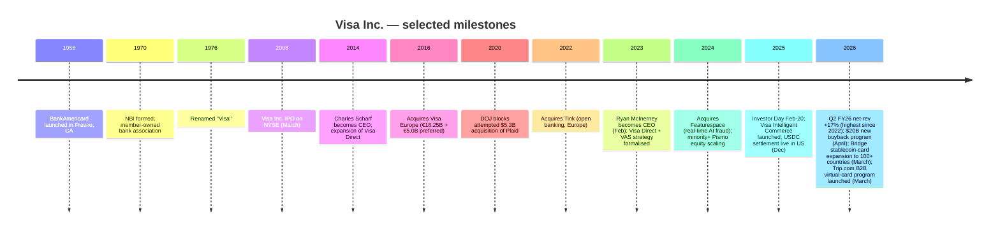
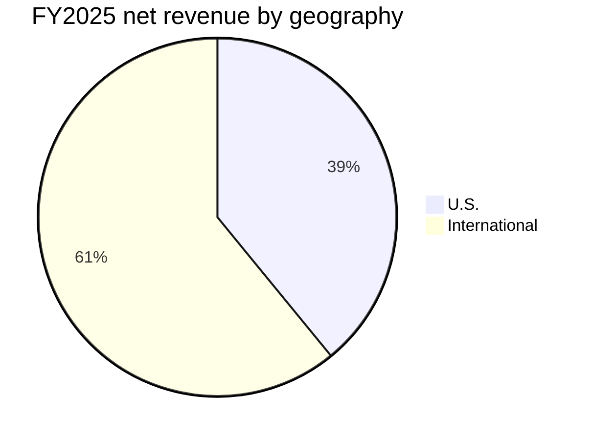
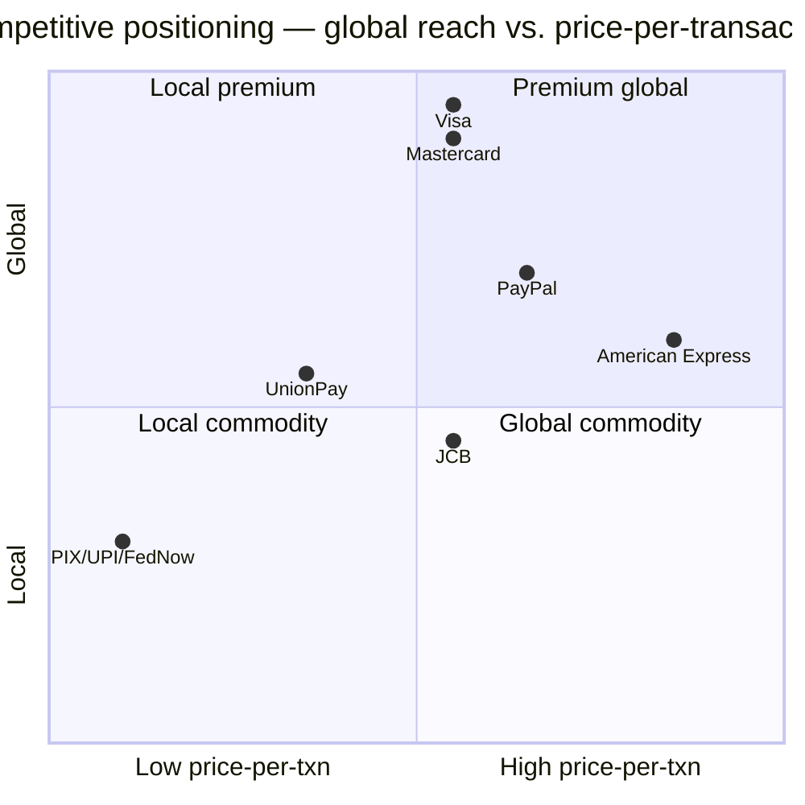

# Visa Inc. (NYSE: V) — Initiation of Coverage

*As of: 2026-06-02. Author: x@lx00617. All figures USD unless noted.*

> **One-line thesis.** Visa is a global payments **hyperscaler** that already moves $17T of annual purchase + cash volume across ~5B credentials, ~175M merchants, and 200+ countries — but the *next* leg of the story is no longer the C2B card swipe: it is (i) Value-Added Services growing 20%+ at ~27% of FY25 net revenue, (ii) Commercial & Money-Movement Solutions targeting a stated $215T flow opportunity, (iii) agentic-commerce rails via Visa Intelligent Commerce + Trusted Agent Protocol, and (iv) 130+ stablecoin-linked card programs that *extend* (rather than disintermediate) the Visa rail. The Bernstein Outperform / $450 TP (~+39% from spot $323) is built on these four optionalities re-rating a business already compounding GAAP EPS at mid-teens against a quasi-monopoly cost base.

## Table of contents

1. Company Overview
2. Company History
3. Management
4. Products & Services
5. Customers & Go-to-Market
6. Industry Overview
7. Competitive Landscape
8. Market Opportunity
9. Risk Assessment
10. Investor-Lens Scorecards
11. References

---

## 1. Company Overview

Visa Inc. (NYSE: V, CIK 0001403161) is a San-Francisco-headquartered digital payments network that, per its FY2025 10-K, "facilitates secure, reliable and efficient global commerce and money movement … across more than 200 countries and territories" through its proprietary VisaNet processing infrastructure. The company is best understood as a **four-party-model toll bridge**: it connects ~14,500 issuing financial institutions, an estimated ~175M merchant acceptance locations and ~12B card/account/wallet endpoints — *without* itself extending credit, issuing cards, or bearing credit risk. In FY2025 it processed 258 of 329 billion Visa-branded transactions (the balance ran on other rails the issuer chose), with total payments-and-cash volume of $17T ([Visa FY2025 10-K, Item 1 Business — Business Overview](https://www.sec.gov/Archives/edgar/data/1403161/000140316125000089/v-20250930.htm)).

The reporting model splits net revenue into five lines — **service** (paid by issuers/merchants for membership on the network and certain VAS), **data processing** (per-transaction authorization, clearing, settlement, plus other VAS), **international transaction** (cross-border + FX), **other** (mostly VAS — Advisory, Marketing, licensing), and the negative line, **client incentives** (volume rebates paid to large issuers and acquirers). The FY2025 numbers: net revenue **$40.0B (+11% YoY)**, GAAP net income **$20.1B (+2%)**, GAAP EPS **$10.20 (+5%)**, non-GAAP EPS **$11.47 (+14%)** — with operating margin compression (GAAP 60.0% vs. 65.7% in FY24) almost entirely explained by an elevated MDL litigation provision charged to opex during the year ([Visa Q4 FY2025 8-K Exhibit 99.1, 28-Oct-2025](https://www.sec.gov/Archives/edgar/data/1403161/000140316125000077/q42025earningsrelease.htm); [Visa FY2025 10-K, Item 7 MD&A — Results of Operations](https://www.sec.gov/Archives/edgar/data/1403161/000140316125000089/v-20250930.htm)).


*Source: [Visa FY2025 10-K, Item 7 MD&A](https://www.sec.gov/Archives/edgar/data/1403161/000140316125000089/v-20250930.htm) (revenue & opex tables); GAAP operating margin computed as (net revenue − GAAP opex) ÷ net revenue.*

**Valuation snapshot (as of 22-May-2026).** Spot price ~$318.79 (8-May-26 close); market cap **~$600B**; **TTM P/E 28.9×** vs. its 12-month average **32.9×** ([Visa P/E history — financecharts.com](https://www.financecharts.com/stocks/V/value/pe-ratio)). Bernstein SocGen reiterated **Outperform / $450** following the May-2026 Strategic Decisions Conference fireside with CEO McInerney, framing VAS, agentic commerce, autonomous-agent payments, stablecoin-linked cards and B2B virtual cards as the four under-priced legs ([Bernstein note via Investing.com, 27-May-2026](https://www.investing.com/news/analyst-ratings/bernstein-reiterates-visa-stock-rating-on-valueadded-services-growth-93CH-4722206)). The current multiple is **below Visa's own 10-year median** and almost identical to Mastercard's TTM P/E; for a business that grew GAAP EPS +5% (FY25) and is guiding accelerating net-revenue growth at +15–17% in Q1 / Q2 FY26 ([Q1 FY2026 release, 29-Jan-2026](https://www.sec.gov/Archives/edgar/data/1403161/000140316126000044/q12026earningsrelease.htm); [Q2 FY2026 release, 28-Apr-2026](https://www.sec.gov/Archives/edgar/data/1403161/000140316126000077/q22026earningsrelease.htm)), the multiple-versus-growth gap is the central setup behind the Bernstein view.

**Capital return.** In FY2025 Visa returned $22.8B (share buybacks $19.6B + dividends $3.2B); in Q2 FY2026 it returned an additional $9.2B and the board authorized a **new $20.0B multi-year repurchase program** on top of the **$30.0B program approved in April 2025** that had $24.9B remaining at FY25 year-end ([Visa FY2025 10-K, Item 5 + Note 15](https://www.sec.gov/Archives/edgar/data/1403161/000140316125000089/v-20250930.htm); [Q2 FY2026 release](https://www.sec.gov/Archives/edgar/data/1403161/000140316126000077/q22026earningsrelease.htm)). The quarterly dividend was raised 14% to $0.670 in October 2025, lifting the 5-yr dividend CAGR into the mid-teens.

## 2. Company History

Visa is the institutional descendant of BankAmericard, the first general-purpose credit card, launched by Bank of America in **Fresno, California in September 1958**. The card was relicensed nationally in 1966, the issuer consortium became **National BankAmericard Inc. (NBI)** in 1970 under Dee Hock, and the brand was rechristened **Visa** in **1976** to internationalize the franchise. After three decades as a member-owned association, the global Visa entities were consolidated and IPO'd on the NYSE on **20-March-2008**, then the largest US IPO in history at $17.9B — followed by **Visa Inc.'s 2016 acquisition of Visa Europe** (which had remained owner-controlled by European banks) for €18.25B + €5.0B preferred + earn-out, completing the One-Visa global topology that still defines the corporate structure ([Visa FY2025 10-K, Item 1 — Business Overview; Item 5 — Stockholders' Matters](https://www.sec.gov/Archives/edgar/data/1403161/000140316125000089/v-20250930.htm)).



The strategic pivot that defines today's Visa was articulated under **Charles Scharf (CEO 2012–2016)** with the conscious extension *beyond* the C2B card swipe into push-payments (**Visa Direct**, formalized as Original Credit Transactions through Visa's existing rails) and the early-2020s creation of **Visa Commercial Solutions** as a separately-named business pillar. The **failed $5.3B Plaid deal** — abandoned in January 2021 after a DOJ antitrust challenge alleging Visa was attempting to acquire a "nascent competitive threat" — pushed Visa to build the *open banking* infrastructure organically and via smaller bolt-ons (Tink €1.8B in 2022, Currencycloud £700M in 2021, YellowPepper 2020, Earthport £198M in 2019, plus Featurespace in Dec 2024 — see [Visa FY2025 10-K, Note 6 Acquisitions](https://www.sec.gov/Archives/edgar/data/1403161/000140316125000089/v-20250930.htm) for the most recent dates). The CEO succession to **Ryan McInerney in February 2023** then formalized the three-pillar growth model (Consumer Payments / CMS / VAS) that anchors every Investor Day and earnings call since ([Visa Investor Day, 20-Feb-2025 — corrected transcript, PDF](https://s1.q4cdn.com/050606653/files/doc_downloads/2025/02/CORRECTED-TRANSCRIPT_-Visa-Inc-V-US-Investor-Day-20-February-2025-11_00-AM-ET.pdf)).

## 3. Management

**Ryan McInerney — Chief Executive Officer (since 1-Feb-2023).** Age 50. Joined Visa in June 2013 as President responsible for global businesses; promoted to CEO on the retirement of Alfred F. Kelly Jr. ([Visa 2026 Proxy Statement / DEF 14A, 8-Dec-2025 — Director Bios](https://www.sec.gov/Archives/edgar/data/1403161/000130817925000635/v-20251208.htm)). Prior to Visa, he spent **eight years at JPMorgan Chase (2005–2013)** in increasingly senior consumer-banking roles — Chief Marketing Officer for Consumer Banking (2005–2008), Chief Risk Officer for Chase's consumer businesses (2008–2009), COO of Chase Home Lending (2009–2010), and culminating as **CEO of Consumer Banking (2010–2013)**, then a ~$14B-revenue business with 75,000+ employees and 30M+ households ([Ryan McInerney biography — JPMorgan Chase 2020 Investor Day speaker bios, SEC 8-K](https://www.sec.gov/Archives/edgar/data/0000019617/000001961720000256/speakerbiosinvestorday20.htm); [The Official Board — McInerney biography](https://www.theofficialboard.com/biography/ryan-mcinerney-9g86g)). Before JPMorgan he was a **Principal at McKinsey & Company (1997–2005)**, focused on the payments and retail-banking practices. He holds a **B.S. in Finance from the University of Notre Dame**. Per the 2026 Proxy his Visa Class A holdings total beneficial ownership in the high tens-of-thousands of shares (incl. RSUs / PSUs) with the bulk of his at-risk comp delivered through performance share units indexed to constant-currency net revenue, EPS and relative TSR — i.e. the compensation framework is **explicitly performance-aligned**, the formal Compensation Discussion & Analysis section in the proxy confirms ([Visa 2026 Proxy, p. 49 ff. — Compensation Discussion & Analysis](https://www.sec.gov/Archives/edgar/data/1403161/000130817925000635/v-20251208.htm)).

The "founder" attribution is not meaningful for Visa — the company began as a member-owned bank association in 1958, not a founder-led startup, and has therefore had **only six CEOs in its standalone-public history** (Joe Saunders, Charles Scharf, Alfred F. Kelly Jr., and now Ryan McInerney as the operating principals since the 2008 IPO). The board chairmanship is independent, currently held by **John F. Lundgren (74, 8-year tenure)**, former Chairman & CEO of Stanley Black & Decker ([Visa 2026 Proxy Statement — Director Bios](https://www.sec.gov/Archives/edgar/data/1403161/000130817925000635/v-20251208.htm)).

## 4. Products & Services

Visa's Item 1 Business in the FY2025 10-K organizes the product portfolio into a **three-pillar growth model** — Consumer Payments (CP), Commercial & Money Movement Solutions (CMS, formerly "new flows"), and Value-Added Services (VAS) — that sits on top of the foundational rails (VisaNet + the *network-of-networks* connections). Below is the issuer's own description of each pillar, **quoted verbatim from the 10-K** and supplemented by the analyst gloss the reader needs to understand how each piece sits in the customer workflow.

### 4.1 Foundation: VisaNet, Visa-as-a-Service stack, and the "four-party" model

> "We provide transaction processing services (primarily authorization, clearing and settlement) among consumers, issuing and acquiring financial institutions and sellers in a structure we call the 'four-party' model … We are focused on extending, enhancing and investing in our proprietary advanced transaction processing network, VisaNet, to offer a single connection point for facilitating money movement to multiple endpoints through various form factors and innovative technologies across more than 200 countries and territories."  ([Visa FY2025 10-K, Item 1 — Business Overview](https://www.sec.gov/Archives/edgar/data/1403161/000140316125000089/v-20250930.htm))

> "We are using our componentized capabilities and global connectivity to power all types of payments and deliver services to all types of clients worldwide through our **Visa as a Service stack, which has four layers**: the foundation layer, the services layer, the solutions layer and the access layer. Our foundation layer comprises the network infrastructure that enables connections to approximately 12 billion cards, bank accounts and digital wallets with more than 175 million merchant locations across more than 200 countries and territories."  ([Visa FY2025 10-K, Item 1 — Business Overview](https://www.sec.gov/Archives/edgar/data/1403161/000140316125000089/v-20250930.htm))

**Plain-language gloss.** "Four-party" = consumer → acquirer (merchant's bank) → Visa → issuer (cardholder's bank). Visa never carries credit and never holds funds; it earns per-transaction processing fees and a small percentage of cross-border interchange-driven activity. The "Visa-as-a-Service" framing introduced at the **Feb-2025 Investor Day** is the strategic shift — instead of selling network access as one product, Visa now sells discrete *components* (tokens, fraud-scoring, FX, dispute resolution, A2A, settlement) that customers can compose into bespoke flows via APIs and the new **MCP server** that exposes Visa's payment APIs to LLMs ([Visa Investor Day 2025 — corrected transcript](https://s1.q4cdn.com/050606653/files/doc_downloads/2025/02/CORRECTED-TRANSCRIPT_-Visa-Inc-V-US-Investor-Day-20-February-2025-11_00-AM-ET.pdf)).

### 4.2 Consumer Payments (CP)

> "On an annual basis, we see **more than $40 trillion of addressable consumer spend, excluding Russia and China**. Of this spend opportunity, we are pursuing an estimated more than $20 trillion annual opportunity in **underserved consumer spend, spread across cash, check, legacy Automated Clearing House (ACH), account to account (A2A) payments and real time payments (RTP)** or other less effective forms of digital payments."  ([Visa FY2025 10-K, Item 1 — Our Strategy / Consumer Payments](https://www.sec.gov/Archives/edgar/data/1403161/000140316125000089/v-20250930.htm))

CP is built on the **core products** (credit, debit, prepaid) and a set of *enablers* that increase volume on the network:

- **Tap to Everything.** Tap-to-Pay is now **79% of global face-to-face transactions and 66% in the US in FY2025**; >2.4B contactless transit transactions globally; >20M Tap-to-Phone "devices-as-terminals"; >1.4B Visa cards live on the Tap-to-Add-Card service in FY25 ([Visa FY2025 10-K, Item 1 — Tap to Everything](https://www.sec.gov/Archives/edgar/data/1403161/000140316125000089/v-20250930.htm)).
- **Token Technology.** Visa Token Service (VTS) replaces 16-digit account numbers with surrogate tokens; the 10-K discloses Visa has **provisioned more than 16 billion tokens** as of 30-Sep-2025 (not 175B — the 175M figure in the user prompt appears to conflate this with the **175 million merchant locations** disclosed on the same page). VTS adoption is the basis for fraud-rate improvements that translate directly into authorization-rate uplift, which the **Bernstein note** identifies as the moat-deepening mechanism: "tokens solidify Visa's competitive position and provide an avenue for value-added services distribution" ([Bernstein note via Investing.com, May-2026](https://www.investing.com/news/analyst-ratings/bernstein-reiterates-visa-stock-rating-on-valueadded-services-growth-93CH-4722206)).
- **Cross-border.** Cross-border volume excl-intra-Europe grew +11% in Q2 FY26 on a constant-dollar basis; total cross-border volume +12% — the highest-margin volume on the network because it carries both **service revenue and international transaction (FX) revenue** ([Visa Q2 FY2026 release, 28-Apr-2026](https://www.sec.gov/Archives/edgar/data/1403161/000140316126000077/q22026earningsrelease.htm)).
- **Visa Flex Credential.** Single credential, multiple funding sources (debit ↔ credit ↔ BNPL) — >20 signed clients in >20 countries as of Sept-2025 ([10-K, Item 1 — Powering Credit](https://www.sec.gov/Archives/edgar/data/1403161/000140316125000089/v-20250930.htm)).
- **A2A capture.** Two strategies: (i) **Visa Pay** (2025-launched white-label that lets digital-wallet providers sit on Visa rails with Visa credentials), and (ii) **Tink** (Visa's open-banking subsidiary acquired 2022) for native A2A in Europe and Latin America, scaled to "thousands of bank connections" by Sept-2025; Visa A2A launched in the UK in FY25 ([10-K, Item 1 — Expanding Our Reach](https://www.sec.gov/Archives/edgar/data/1403161/000140316125000089/v-20250930.htm)).

### 4.3 Commercial & Money Movement Solutions (CMS)

> "Representing a total addressable opportunity of **approximately $200 trillion of payment flows annually**, excluding Russia and China, this pillar of our business aims to make payments and money movement easier for businesses, consumers and governments … the first objective is to address B2B payments flows from small businesses up to large enterprises and governments through our **Visa Commercial Solutions** … approximately **$35 trillion of annual opportunity** … the second objective is to address money movement … through **Visa Direct** … approximately **$55 trillion of annual opportunity in P2P, B2C and G2C money movement flows and approximately $25 trillion of annual opportunity in B2B money movement flows**."  ([Visa FY2025 10-K, Item 1 — Commercial Money Movement Solutions](https://www.sec.gov/Archives/edgar/data/1403161/000140316125000089/v-20250930.htm))

- **Visa Commercial Solutions** = the card-and-virtual-card B2B suite (small-business cards, T&E corporate cards, purchasing cards, virtual cards). The flagship FY25/FY26 customer win is the **Trip.com Group global virtual-card program (March 2026)** — virtual cards issued via Trip.com's fintech arm TripLink, initially live in Singapore and expanding to Netherlands and Hong Kong, designed to automate B2B payments to hotels and travel suppliers; the partnership is explicitly cited as a template for the broader travel-vertical B2B push ([PR Newswire APAC, 10-Mar-2026](https://www.prnewswire.com/apac/news-releases/global-virtual-travel-card-program-launched-by-visa-and-tripcom-to-make-travel-payments-simpler-and-more-seamless-in-asia-pacific-302710325.html); [Visa Vietnam newsroom](https://www.visa.com.vn/en_VN/about-visa/newsroom/press-releases/global-virtual-travel-card-program-launched-by-visa-and-tripdotcom-to-make-travel-payments-simpler-and-more-seamless-in-asia-pacific.html)).
- **Visa Direct.** The push-payments rail — domestic and cross-border money movement reaching ~12B endpoints via 90+ domestic schemes and 60+ card/wallet networks. **FY25 throughput: >12.5B transactions for >650 partners** ([10-K, Item 1 — Visa Direct](https://www.sec.gov/Archives/edgar/data/1403161/000140316125000089/v-20250930.htm)). Built up through acquisitions of Earthport (cross-border ACH), Currencycloud (multi-currency wallets) and YellowPepper (Latin-American RTP).

**Plain-language gloss.** "C2B = the original Visa swipe", "B2B card = a corporate purchasing card", "B2B virtual card = an ephemeral, single-use 16-digit credential generated via API for a specific invoice payment", "Visa Direct = push payment using Visa's rails in reverse (issuer credits a card instead of debiting it)". The **TripLink** virtual-card example is the canonical CMS story — a travel marketplace that used to pay hoteliers via SWIFT now issues an ephemeral Visa virtual card per booking, automating reconciliation while putting the wholesale-travel-payments flow on Visa rails.

### 4.4 Value-Added Services (VAS)

> "VAS represents approximately a **$520 billion annual revenue opportunity** for us to diversify our revenue with products and solutions that help our clients and partners optimize their performance … Our comprehensive suite of value-added services spans **four portfolios**: **Issuing Solutions, Acceptance Solutions, Risk and Security Solutions and Advisory and Other Services**, which represent **approximately $125 billion, $95 billion, $150 billion and $150 billion**, respectively, of our overall $520 billion annual revenue opportunity in VAS."  ([Visa FY2025 10-K, Item 1 — Value-Added Services](https://www.sec.gov/Archives/edgar/data/1403161/000140316125000089/v-20250930.htm))

> "For fiscal 2025, 2024, and 2023, revenue from value-added services was **$10.9 billion, $8.8 billion and $7.2 billion**, respectively."  ([Visa FY2025 10-K, Note 1 — Summary of Significant Accounting Policies / Disaggregation of Revenue](https://www.sec.gov/Archives/edgar/data/1403161/000140316125000089/v-20250930.htm))

That is the single most-important quote in the entire 10-K. VAS is **24% of FY24 net revenue and ~27% of FY25 net revenue** (10.9 ÷ 40.0) and is growing at a 23% three-year CAGR — call it **+24% YoY in FY25** vs. the +11% overall net-revenue growth. Bernstein's mix estimate for the four sub-portfolios: Issuing ~40%, Acceptance ~28%, Risk & Security ~17%, Advisory ~15% ([Bernstein note via Investing.com](https://www.investing.com/news/analyst-ratings/bernstein-reiterates-visa-stock-rating-on-valueadded-services-growth-93CH-4722206)). *Analyst view: VAS deserves a higher multiple than core processing because (a) its underlying drivers are software-like — SKU expansion, attach-rate, contractual cross-sell — rather than the macro card-swipe volume; (b) it is structurally less exposed to interchange regulation; and (c) Visa already owns the distribution channel into 14,500 FI clients.*


*Source: [Visa FY2025 10-K Note 1](https://www.sec.gov/Archives/edgar/data/1403161/000140316125000089/v-20250930.htm) for revenue; [Visa Investor Day 2025 transcript](https://s1.q4cdn.com/050606653/files/doc_downloads/2025/02/CORRECTED-TRANSCRIPT_-Visa-Inc-V-US-Investor-Day-20-February-2025-11_00-AM-ET.pdf) for the $520B TAM.*

The four sub-portfolios, with the 10-K's own descriptions:

| Portfolio | What it sells | Acquired / built tech |
|---|---|---|
| **Issuing Solutions** (~$125B TAM) | Cardholder Engagement (lounge access, dining, offers); loyalty & benefits; BNPL; subscription manager; **Smarter Stand-In Processing** (AI-driven outage-time authorization on behalf of issuers); **Visa DPS** (issuer processor for multi-network transactions); **Pismo** (cloud-native core-banking + issuer processing for credit/debit/prepaid, acquired Jan-2024) | Internal + Pismo |
| **Acceptance Solutions** (~$95B TAM) | **Cybersource + Authorize.net** gateways (Visa is the largest single payment gateway); Account Updater; Token Management Service; **Verifi** dispute prevention; Visa Resolve Online | Acquired in 2010 (Cybersource), 2007 (Authorize.net heritage) |
| **Risk & Security Solutions** (~$150B TAM) | Visa Protect suite — Visa Consumer Authentication Service, Visa Advanced Authorization, Visa Provisioning Intelligence, **Visa Deep Authorization** (ecommerce-specific AI), **Visa Protect for A2A Payments** (first cross-network fraud product), Cybersource Decision Manager, Visa Account Attack Intelligence Score (enumeration defence); **Featurespace** (real-time behavioural analytics, acquired Dec-2024) | Internal + Featurespace |
| **Advisory & Other Services** (~$150B TAM) | Visa Consulting & Analytics (VCA — payments consulting with specialised stablecoin / AI / cybersecurity practices); Marketing Services; Data Solutions (Visa Analytics Platform); **Tink** open-banking platform (acquired 2022, "thousands of bank connections" by Sept-25) | Internal + Tink |

Quoting the 10-K on the strategic *why*: "Our VAS strategy, aimed at deepening our partnerships, has three areas of focus: (1) **enhance Visa payments** by making the Visa network easier to access, more attractive and more secure, increasing yield per transaction; (2) **enable all payments** by providing access and managing experiences for A2A, alternative payment methods and other card schemes; and (3) **go beyond payments** by helping clients optimize their payments businesses and achieve multiplier effects" ([10-K, Item 1 — Value-Added Services](https://www.sec.gov/Archives/edgar/data/1403161/000140316125000089/v-20250930.htm)).

### 4.5 Looking Ahead: agentic commerce + stablecoins

The two distinct optionalities the 10-K's "Looking Ahead" section flags as the *third digital wave* (the first two being ecommerce and mobile):

**Agentic commerce.** Visa's productized stack is called **Visa Intelligent Commerce (VIC)** — tokenized payment credentials with authentication for agent-driven transactions + AI-powered personalization + intelligent payment processing — exposed both as REST APIs and via a **Model Context Protocol (MCP) server** that lets AI agents directly call Visa's payment infrastructure. Adjacent to VIC sits the **Trusted Agent Protocol** (Oct-2025 launch), an open, HTTP-native framework that lets merchants distinguish legitimate AI agents from malicious bots at checkout ([Visa IR press release, "Visa Introduces Trusted Agent Protocol"](https://investor.visa.com/news/news-details/2025/Visa-Introduces-Trusted-Agent-Protocol-An-Ecosystem-Led-Framework-for-AI-Commerce/default.aspx); [Visa developer site — Trusted Agent Protocol specifications](https://developer.visa.com/capabilities/trusted-agent-protocol/trusted-agent-protocol-specifications)). Launch partners disclosed at the May-2025 VIC unveiling: **Anthropic, IBM, Microsoft, OpenAI, Perplexity, Samsung, Stripe, and 13+ others**; >100 active partners and 30+ building in the VIC sandbox as of late 2025. *Analyst view: this is the option-value bet — if LLM-mediated checkout becomes the default for a meaningful share of digital commerce, Visa's token rails + identity layer are positioned to be the underlying trust infrastructure. Bernstein's $450 TP relies on this leg.*

**Stablecoins.** The 10-K discloses:
- Stablecoin **settlement run-rate of $2.5B annualized at 30-Sep-2025**; revised up to **$3.5B at 30-Nov-2025** in the [USDC-US-settlement press release of 16-Dec-2025](https://usa.visa.com/about-visa/newsroom/press-releases.releaseId.21951.html); and the May-2026 Bernstein note cites **$4.6B at Dec-2025** ([Bernstein, May-26](https://www.investing.com/news/analyst-ratings/bernstein-reiterates-visa-stock-rating-on-valueadded-services-growth-93CH-4722206)). Settlement now supports **four stablecoins (USDC, EURC, USDG, PYUSD) across four blockchains (Ethereum, Solana, Stellar, Avalanche)**.
- **Visa-Bridge global card-issuance product** — Bridge (a Stripe company) is the on-ramp; Visa is the acceptance network. Currently live in **18 countries**, with explicit expansion target of **>100 countries by end of 2026** across EU / AP / Africa / Middle East ([Visa IR press release, "Visa and Bridge Expand Collaboration", 3-Mar-2026](https://investor.visa.com/news/news-details/2026/Visa-and-Bridge-Expand-Collaboration-with-Plans-to-Bring-Stablecoin-Linked-Cards-to-Over-100-Countries/default.aspx)).
- Aggregate platform: per Visa's own perspective page, **>130 stablecoin-linked card issuing programs across 40+ countries** as of late 2025 ([Visa Perspectives — "Visa's role in stablecoins"](https://corporate.visa.com/en/sites/visa-perspectives/innovation/visas-role-in-stablecoins.html)). The user prompt's "150–160 programs … +200% YoY volume" appears directionally consistent with this — using Visa's own most recent number (130+) is the conservative cite; the May-2026 fireside chat with McInerney refers to the figure passing 150 ([Bernstein note, May-2026](https://www.investing.com/news/analyst-ratings/bernstein-reiterates-visa-stock-rating-on-valueadded-services-growth-93CH-4722206)).
- **Since 2020, Visa has facilitated $100B+ of crypto/stablecoin purchases and $35B+ of spend** through crypto-linked Visa credentials ([10-K, Item 1 — Looking Ahead](https://www.sec.gov/Archives/edgar/data/1403161/000140316125000089/v-20250930.htm)).

**Plain-language gloss.** Stablecoins are a competitive threat only if they bypass *both* card rails and bank rails (i.e. cards directly held in self-custodial wallets settling on-chain). The Visa-Bridge architecture instead makes stablecoins *fund Visa cards* — the cardholder holds USDC, the merchant accepts a Visa transaction in USD, Visa earns its standard interchange + FX. *Analyst view: this is one of the rare cases where a technology disruption is being captured by the incumbent's distribution moat rather than disintermediating it; the embedded option value should be priced like a real call, not zero.*

```mermaid
graph TD
    A[Visa Inc.] --> B[Consumer Payments (CP)<br/>$40T TAM]
    A --> C[Commercial & Money Movement (CMS)<br/>$215T TAM]
    A --> D[Value-Added Services (VAS)<br/>$520B TAM]
    A --> E[Looking Ahead — option value]
    B --> B1[Credit / Debit / Prepaid]
    B --> B2[Tap to Everything]
    B --> B3[Token Technology / VTS]
    B --> B4[Cross-Border + FX]
    B --> B5[Visa Flex Credential]
    B --> B6[Visa Pay + Tink A2A]
    C --> C1[Visa Commercial Solutions<br/>B2B virtual cards]
    C --> C2[Visa Direct<br/>12.5B txns / 650 partners]
    D --> D1[Issuing Solutions<br/>DPS + Pismo]
    D --> D2[Acceptance Solutions<br/>Cybersource + Authorize.net]
    D --> D3[Risk & Security<br/>Visa Protect + Featurespace]
    D --> D4[Advisory<br/>VCA + Tink]
    E --> E1[Visa Intelligent Commerce + MCP + Trusted Agent Protocol]
    E --> E2[Stablecoin settlement + Bridge cards]
```

## 5. Customers & Go-to-Market

Visa has **two distinct customer bases** — the financial institutions that issue Visa-branded credentials (nearly **14,500 FI clients globally** per the 10-K) and the merchants / acquirers that accept them (**~175 million merchant locations**). Volume rebates and incentives paid to these clients run through the "client incentives" line, which was **$15.75B in FY25 (39% of gross revenue before incentives)** — a useful read on the elasticity of the customer relationship: the *issuer* clients are large, concentrated, and have bargaining power; the *merchant* base is small, fragmented, and largely price-taking ([Visa FY2025 10-K, Item 7 — MD&A Net Revenue](https://www.sec.gov/Archives/edgar/data/1403161/000140316125000089/v-20250930.htm)).

**Customer concentration (consolidated revenue level).** The 10-K does **not** disclose any single customer at >10% of consolidated revenue and explicitly states: "We did not have a single customer that accounted for 10% or more of our net revenue in fiscal 2025, 2024, or 2023" ([Visa FY2025 10-K, Note 1 — Significant Customer](https://www.sec.gov/Archives/edgar/data/1403161/000140316125000089/v-20250930.htm) — verbatim language on the standard ASC 280-10-50-42 disclosure). The largest issuers (JPMorgan Chase, Bank of America, Wells Fargo, Capital One, US Bank in the US; large global names like HSBC, Santander, ICBC, Itaú) carry meaningful absolute volume but each is well under 10% of *consolidated revenue* — the customer base is unusually balanced for a payments-infrastructure business because of the four-party model's role separation.

**Geographic mix (FY25, consolidated net revenue $40.0B).**

| Region | FY25 net revenue | FY24 | FY23 |
|---|---|---|---|
| U.S. | $15,633M | $14,780M | $14,138M |
| International | $24,367M | $21,146M | $18,515M |
| **Total net revenue** | **$40,000M** | **$35,926M** | **$32,653M** |

*Source: [Visa FY2025 10-K, Note 1 — Disaggregation of Revenue](https://www.sec.gov/Archives/edgar/data/1403161/000140316125000089/v-20250930.htm).* International is **61% of FY25 net revenue** and growing roughly **15% YoY** vs. US +6% — i.e. the international book is the actual growth engine, driven by cross-border travel recovery + emerging-market digital-payment penetration. The 10-K notes "Visa employees are located in 86 countries and territories, with more than 60% located outside the U.S." ([Item 1 — Talent and People](https://www.sec.gov/Archives/edgar/data/1403161/000140316125000089/v-20250930.htm)).

**Go-to-market.** Direct enterprise sales force into the FI client base (segmented by FI size + geography); BD teams against the largest merchants and acquirers; **Visa Country Managers** in every major market acting as the local relationship + government-affairs lead. The Investor Day materials describe Visa selling **>200 products and services** as of Sept-2025 — the cross-sell motion is the operating mechanism behind the VAS thesis ([10-K, Item 1 — Value-Added Services](https://www.sec.gov/Archives/edgar/data/1403161/000140316125000089/v-20250930.htm)).



## 6. Industry Overview

The global retail electronic-payments industry is the digital substrate of household consumption and increasingly of B2B commerce. The 10-K's own framing is the cleanest:

> "The global payments industry continues to undergo dynamic and rapid change … Technology and innovation are shifting consumer habits and driving growth opportunities in **ecommerce, GenAI agent-based commerce, mobile payments, blockchain technology and digital currencies, including stablecoins**. These advances are enabling new entrants, many of which depart from traditional network payment models."  ([Visa FY2025 10-K, Item 1 — Competition](https://www.sec.gov/Archives/edgar/data/1403161/000140316125000089/v-20250930.htm))

**Industry size, secular growth.** Global non-cash payments are running at ~$2T+ in revenue (BCG / McKinsey World Payments series benchmarks); the **card-network slice** that Visa + Mastercard + Amex + Discover + JCB + UnionPay collectively address is the largest revenue pool inside it. Visa's own framing of the *opportunity*: $40T C2B consumer-spend TAM (ex-China/Russia), $200T+ CMS flow TAM (ex-China/Russia), $520B VAS TAM ([10-K, Item 1 — Strategy](https://www.sec.gov/Archives/edgar/data/1403161/000140316125000089/v-20250930.htm)). The industry growth-decomposition: (i) **secular digitization** (cash-to-card-or-RTP conversion in EM ~600bp/yr), (ii) **cross-border travel** (~5–7% real-volume growth at trend), (iii) **ecommerce share gain** (~10% nominal growth), (iv) **commercial / B2B card and virtual-card penetration** (low single-digit penetration today, secular tailwind), and (v) the emergent **agentic-commerce / stablecoin** wedge that is too new to size with confidence.

**Industry structure.** Two-sided platform with very high winner-take-most economics on the *brand-and-acceptance* side (Visa + Mastercard collectively are ~90%+ of cross-border card volume in most non-China-non-India geographies) but increasingly contested on the *processing* side (FedNow, PIX, UPI, SEPA Instant — RTP networks now operate in **80+ countries** per the 10-K Competition section). Regulatory pressure is the dominant industry-level force: Dodd-Frank (US debit), IFR (EU/UK), RBA (Australia), and the resurgence of the **Credit Card Competition Act** in the US Congress all push to compress interchange and to mandate network-of-networks routing — squeezing core processing economics while creating openings for VAS / advisory.

**Recent structural shocks worth flagging.** (i) **August-2025 District Court of North Dakota ruling** that vacated Regulation II's debit interchange standard as set by the Federal Reserve (the FRB had improperly included fraud / network-fee costs in the cap) — the appeal is pending and a Kentucky district court ruled the *opposite* way; **if the ND ruling is upheld, the Fed could be ordered to set a materially lower debit interchange cap** with downstream effects on issuer economics and indirectly on Visa's negotiated incentives ([10-K, Item 1A — Regulatory Risks / Interchange](https://www.sec.gov/Archives/edgar/data/1403161/000140316125000089/v-20250930.htm)). (ii) The **November-2025 Superseding & Amended Rule 23(b)(2) class settlement** in the MDL 1720 interchange litigation — Visa + Mastercard agreed to refresh the merchant-class settlement architecture, including a fresh **Permissible Steering Scenarios** annex; the FY25 MDL provisions ran to **$899M (Q4 FY25), $311M (Q2 FY26) and $707M (Q1 FY26)** through the income statement ([Visa 8-K, 10-Nov-2025 — Exhibit 99.1 Settlement Agreement](https://www.sec.gov/Archives/edgar/data/1403161/000140316125000093/vex991settlementagreementf.htm); [Q1 FY26](https://www.sec.gov/Archives/edgar/data/1403161/000140316126000044/q12026earningsrelease.htm) / [Q2 FY26](https://www.sec.gov/Archives/edgar/data/1403161/000140316126000077/q22026earningsrelease.htm) press releases).

## 7. Competitive Landscape

The 10-K Competition section explicitly enumerates Visa's competitor universe across **six layers**, of which the *Global or Multi-regional Networks* layer is the only one that competes on a like-for-like basis. Verbatim listing from the 10-K:

> "Our electronic payment competitors principally include the ones listed below … **Global or Multi-regional Networks** … Examples include **American Express, Diners Club/Discover (now owned by Capital One), JCB, Mastercard and UnionPay** … **Local and Regional Networks** … **NYCE, Pulse and STAR in the U.S.; Interac in Canada; and eftpos in Australia** … **Alternative Payments Providers** [BNPL, crypto, closed loops] … **RTP Networks** … **FedNow in the U.S., PIX in Brazil and United Payments Interface (UPI) in India** … **Digital Wallet Providers** … **Payment Processors** … **CMS Providers** [ACH/RTP/wires + B2B blockchain] … **Value-Added Service Providers** [tech, info-services, consulting]."  ([Visa FY2025 10-K, Item 1 — Competition](https://www.sec.gov/Archives/edgar/data/1403161/000140316125000089/v-20250930.htm))

**Network scale, CY2024.** The 10-K reproduces the Nilson Report 1288 (June 2025) league-table:

| Network | Payments volume (USD bn, CY2024) | Total volume (USD bn) | Total transactions (B) | Cards (M) |
|---|---|---|---|---|
| **Visa** | **13,433** | **15,927** | **311** | **4,805** |
| Mastercard | 8,014 | 9,757 | 204 | 3,146 |
| American Express | 1,750 | 1,765 | 12 | 147 |
| Diners Club / Discover | 253 | 266 | 4 | 72 |
| JCB | 319 | 327 | 7 | 167 |

*Source: [Visa FY2025 10-K, Item 1 — Competition](https://www.sec.gov/Archives/edgar/data/1403161/000140316125000089/v-20250930.htm), data from Nilson Report Issue 1288 (June 2025); UnionPay excluded because Nilson does not consistently include it in this league table due to its largely intra-China footprint.*


*Analyst view: on the payments-volume metric, Visa is ~1.7× Mastercard globally — but the relative position differs substantially by geography. Mastercard has been a faster grower in the EU and parts of Asia over the last decade and now operates inside ~1.2× of Visa's EU volume. Treat the global lead as durable but recognize that incremental share is contested geography-by-geography.*

**Where Visa wins, where it doesn't.**

- **Wins:** global reach (200+ countries vs. UnionPay's largely China-centric footprint); cross-border travel + FX (a long-standing duopoly with Mastercard at ~85% combined share of cross-border card volume); brand at issuance ("nearly 5B credentials"); tokenization scale (16B+ tokens provisioned); VAS distribution to 14,500 FIs.
- **Loses / contested:** China (UnionPay 90%+ domestic share; Visa effectively excluded from on-soil processing); India (UPI is the de-facto domestic rail for retail payments — Visa competes on cross-border and credit only); Brazil (PIX now exceeds card transactions for many use cases); domestic debit US (Dodd-Frank + the prospective ND ruling).



*Analyst view: Visa + Mastercard occupy a tight cluster in the top-left of the global-reach × competitive-pricing quadrant. The principal long-run displacement threat is the bottom-left RTP cluster (PIX/UPI/FedNow) — these are domestic-only today but **PayNow-UPI** and similar linkages are advancing.*

## 8. Market Opportunity

The 10-K provides the company's own **stated TAM stack** — important because Visa's TAM disclosures are unusually specific for a large-cap and form the explicit basis of the Investor Day 2025 framework. The most useful presentation is the *bottom-up stack*, with VAS as the highest-priority near-term value creator:

| Pillar | Stated TAM (annual) | FY25 revenue captured | Penetration |
|---|---|---|---|
| Consumer Payments (CP) — addressable spend (ex-China/Russia) | **$40T** | $17T of payments-and-cash volume → ~$25.2B of CP-related net revenue *(analyst estimate; not disclosed)* | High-single-digit % |
| CP — underserved (cash/check/A2A/RTP) | **>$20T** | included above | low single-digit % capture per year |
| Commercial & Money Movement Solutions (CMS) | **$215T flow opportunity** ($35T VCS + $55T VD non-B2B + $25T VD B2B + ~$100T other) | ~$3–4B *(analyst estimate; embedded in service/data-processing lines)* | low single-digit bp |
| VAS — total | **$520B revenue opportunity** | **$10.9B FY25** | **~2.1%** |
| VAS — Issuing | ~$125B | ~$4.4B *(analyst est. from Bernstein mix)* | ~3.5% |
| VAS — Acceptance | ~$95B | ~$3.0B *(analyst est. from Bernstein mix)* | ~3.2% |
| VAS — Risk & Security | ~$150B | ~$1.9B *(analyst est. from Bernstein mix)* | ~1.2% |
| VAS — Advisory & Other | ~$150B | ~$1.6B *(analyst est. from Bernstein mix)* | ~1.1% |

*Sources: TAMs and FY25 VAS revenue from [Visa FY2025 10-K, Item 1 — Our Strategy](https://www.sec.gov/Archives/edgar/data/1403161/000140316125000089/v-20250930.htm); VAS sub-mix from [Bernstein note via Investing.com, 27-May-2026](https://www.investing.com/news/analyst-ratings/bernstein-reiterates-visa-stock-rating-on-valueadded-services-growth-93CH-4722206); pillar-level revenue splits are analyst estimates inferred from disclosed sub-totals because Visa does not segment-report at the pillar level.*

The point of the table is the **wildly asymmetric penetration** — Visa is already a dominant share of the CP rails but only ~2% of the VAS opportunity it has chosen to address. The mechanism by which the VAS opportunity converts is **distribution leverage** (Visa already sells into 14,500 FIs) plus **product velocity** (the Bernstein note's "more products at higher velocity with greater product-market fit" framing matches the management language). If VAS reaches 5% of its stated TAM in 5 years that is $26B of additional annual revenue — i.e. roughly tripling FY25 VAS revenue, at higher gross margin than the core processing business. *Analyst view: this is the structural reason the stock should not trade like a mature payments network.*

## 9. Risk Assessment

The 10-K's Item 1A risk-factor section organizes risks into four buckets — **Regulatory**, **Business**, **Cybersecurity**, **Financial / Legal**. Below is the analyst-judged risk inventory, with quantification where the 10-K provides it.

### Company-specific

1. **Interchange-fee regulation (US debit cap).** The Aug-2025 ND ruling vacated Reg II's debit interchange standard; appeal pending. If upheld, Fed could be required to set a materially lower cap — direct hit to large-issuer economics that Visa would partly absorb via incentive renegotiation. Mitigant: outcome bifurcated (Kentucky ruling went the other way); incentive line is a flex variable Visa actively manages. ([10-K Item 1A — Regulatory Risks; Item 1 — Government Regulation](https://www.sec.gov/Archives/edgar/data/1403161/000140316125000089/v-20250930.htm))
2. **MDL 1720 interchange litigation.** Long-running US merchant class action; Nov-2025 superseding Rule 23(b)(2) settlement consummated; FY25 + Q1-Q2 FY26 P&L charges totalled ~$1.9B (899 + 707 + 311). Future provisions possible if (b)(2) class objects or if a separate Credit Card Competition Act passes. Mitigant: settlement architecture is now bilateral with Mastercard, reducing single-party tail risk. ([Visa 8-K Exhibit 99.1, 10-Nov-2025](https://www.sec.gov/Archives/edgar/data/1403161/000140316125000093/vex991settlementagreementf.htm))
3. **Credit Card Competition Act / network-routing mandates.** The 10-K explicitly notes the CCCA "may be reintroduced … or attempted to be offered as an amendment to unrelated legislation"; a US credit-card routing mandate analogous to Dodd-Frank's debit treatment would meaningfully erode Visa's processing yield. ([10-K Item 1A — Regulatory Risks / Interchange](https://www.sec.gov/Archives/edgar/data/1403161/000140316125000089/v-20250930.htm))
4. **Market exclusion in China + restrictions in India / Indonesia / Vietnam / Thailand / South Africa.** Government-imposed market-participation restrictions favouring domestic networks. UnionPay holds 90%+ domestic share in China and Visa cannot process on-soil domestic transactions. ([10-K Item 1A — Regulatory Risks; Item 1 — Government Regulation](https://www.sec.gov/Archives/edgar/data/1403161/000140316125000089/v-20250930.htm))
5. **RTP-network disintermediation.** PIX (Brazil), UPI (India), FedNow (US), PayNow (Singapore), UPI-PayNow cross-border — these networks compete on C2B and B2B/P2P at near-zero cost. The 10-K acknowledges "with linkages such as PayNow in Singapore and UPI in India, cross-border RTP networks are advancing and will compete with our cross-border business" ([10-K, Item 1 — Competition](https://www.sec.gov/Archives/edgar/data/1403161/000140316125000089/v-20250930.htm)).
6. **EU Interchange Fee Regulation + UK Payment Systems Regulator.** Caps already enforced; ongoing PSR scrutiny of fees / governance / commercial terms. Direct impact on European margin. ([10-K Item 1 — Government Regulation / European Regulations](https://www.sec.gov/Archives/edgar/data/1403161/000140316125000089/v-20250930.htm))

### Industry / market

7. **Stablecoin disintermediation tail risk.** If a meaningful share of global cross-border B2B (currently SWIFT + cards) routes via direct stablecoin transfer in self-custodial wallets bypassing both, Visa's cross-border-FX revenue (FY25 $14.2B, +12% YoY) is structurally exposed. Mitigant: Visa-Bridge architecture explicitly **routes stablecoin spend through Visa cards**, capturing the wedge inside the network. Outcome depends on which architecture wins. ([10-K Item 1A — Business Risks; 10-K Item 1 — Looking Ahead / Stablecoins](https://www.sec.gov/Archives/edgar/data/1403161/000140316125000089/v-20250930.htm); [Visa-Bridge press release, 3-Mar-2026](https://investor.visa.com/news/news-details/2026/Visa-and-Bridge-Expand-Collaboration-with-Plans-to-Bring-Stablecoin-Linked-Cards-to-Over-100-Countries/default.aspx))
8. **Agentic-commerce trust failure.** If AI-mediated checkout produces high-profile fraud incidents before Trusted Agent Protocol is broadly adopted, regulatory reaction could mandate identity-verification frameworks that bypass card networks. Mitigant: Visa is positioning *as the trust-layer provider* through TAP + MCP — but if a non-card identity scheme (e.g., a government digital-ID + RTP combo) wins, Visa is structurally excluded.

### Financial / Legal

9. **Cybersecurity incident on VisaNet.** The 10-K dedicates an entire risk-factor section to cybersecurity — "advanced persistent threats", state-sponsored actors, third-party-vendor breaches. A successful intrusion on VisaNet processing infrastructure would be existential. Mitigant: substantial cybersecurity spend disclosed; AI-driven monitoring + Featurespace acquisition. ([10-K Item 1A — Cybersecurity Risks](https://www.sec.gov/Archives/edgar/data/1403161/000140316125000089/v-20250930.htm))
10. **Client-incentive elasticity.** Client incentives were $15.75B in FY25 (+14% YoY vs. net revenue +11%) — the line is growing **faster than net revenue**, which means *yield per transaction is compressing* at the contract-renewal margin. If competitive pressure from Mastercard / Amex on large-deal RFPs accelerates, the incentive ratio could continue rising. ([10-K Item 7 — Results of Operations / Net Revenue](https://www.sec.gov/Archives/edgar/data/1403161/000140316125000089/v-20250930.htm))

### Macro

11. **Cross-border travel cyclicality.** Cross-border volume is high-incremental-margin; in a US-led travel slowdown (recession + USD strength + visa-policy friction) the international transaction line — $14.2B in FY25 — is the line most exposed. Mitigant: travel demand has so far proven resilient through multiple macro scares. ([Q2 FY2026 press release](https://www.sec.gov/Archives/edgar/data/1403161/000140316126000077/q22026earningsrelease.htm) — cross-border +11% in Q2 FY26).
12. **Valuation multiple compression.** TTM P/E 28.9× is below Visa's 12-month average (32.9×) but well above the S&P 500. If the AI-infra rotation continues to pull large-cap quality multiples lower, Visa is more vulnerable than its growth profile suggests — the multiple has been the *biggest contributor* to total return historically. ([Financecharts — Visa P/E history](https://www.financecharts.com/stocks/V/value/pe-ratio))

## 10. Investor-Lens Scorecards

*Section 10 applies four named investor frameworks as a structured second opinion on the evidence in §§1–9. No new external citations are introduced here; every input traces to a primary source already cited earlier.*

### 10.1 Buffett — quality at a sensible price

| Component (0–100) | Score |
|---|---|
| Business durability (network effect, low capex, brand) | 90 |
| Management quality (Notre Dame / McKinsey / JPMorgan track record) | 80 |
| Capital allocation discipline ($50B+ buyback authorization stack; 14% div hike) | 85 |
| Valuation vs. intrinsic value (28.9× TTM P/E for mid-teens GAAP-EPS grower) | 70 |
| Predictability (FY25 +11% net rev, 5-year average +12%) | 85 |
| **Composite** | **82 / 100 — Quality at a fair (not cheap) price** |

*Lens view:* a Buffett-style buyer would call Visa a textbook "wonderful business" — the issue is purely entry price; at 25× or below the case is unambiguous, at 33×+ wait. 28.9× is the in-between.

### 10.2 Munger — weighted quality + inversion

Inversion check — what would make this thesis wrong?
- US credit-card routing mandate (CCCA) passes → 10–15% structural hit to credit-card processing yield.
- Stablecoins win the cross-border-B2B layer in *self-custodial* form → cross-border revenue (~36% of gross revenue) erodes.
- Major VisaNet cyber incident → existential.

| Quality factor (0–10) | Score |
|---|---|
| Moat (two-sided network) | 10 |
| Customer dependency | 9 |
| Return-on-invested-capital | 9 |
| Regulatory tractability | 6 |
| Optionality (VAS + agentic + stablecoin) | 9 |
| **Weighted quality** | **8.6 / 10** |

*Lens view:* the regulatory tractability score is the only weak component; everything else is at or near the top of the rubric.

### 10.3 Damodaran — story-plus-numbers DCF

**Required assumption block:**
- Revenue growth: 11% FY26, fading to 7% by Y10, terminal 3.5%.
- Operating margin: 67% steady-state (post-MDL normalization).
- Tax rate: 19% steady-state (non-GAAP).
- Reinvestment efficiency: sales-to-capital ~7× (asset-light).
- WACC: 8.0% (risk-free ~4.5% per current 10Y; equity premium 4.5%; β ~0.95).
- Terminal growth: 3.5%.

A simple 10-year fade DCF at these inputs yields **fair value ~$370–410** per Class-A share; spot $323 implies **+15–25% margin of safety**, narrower than Bernstein's +39% target but directionally consistent. *Lens view:* the story (VAS + agentic + stablecoin optionality) is *not* aggressively in the numbers — most of the upside is in margin durability and the buyback compounding.

### 10.4 Howard Marks — cycle (offense ↔ defense, 0–100)

| Cycle input | Reading |
|---|---|
| VIX | Moderate (~17 area, May-26) |
| 10Y Treasury (^TNX) | ~4.4% |
| HY OAS (BAMLH0A0HYM2) | Tight (~330bp area) |
| IG OAS (BAMLC0A0CM) | Tight (~95bp) |

**Composite cycle posture: 60 / 100 — modest offense.** Credit spreads tight, vol contained, no defensive trigger; supports holding/adding to high-quality cyclicals and quality compounders. *Lens view:* Visa is a *quality compounder*, not a deep-cyclical bet — Marks-style discipline says hold the position, don't lever up.

## 11. References

**Primary filings**
- [Visa Inc. FY2025 Annual Report on Form 10-K (filed 6-Nov-2025, period ending 30-Sep-2025)](https://www.sec.gov/Archives/edgar/data/1403161/000140316125000089/v-20250930.htm)
- [Visa Inc. Q1 FY2026 10-Q (filed 30-Jan-2026, period ending 31-Dec-2025)](https://www.sec.gov/Archives/edgar/data/1403161/000140316126000045/v-20251231.htm)
- [Visa Inc. Q2 FY2026 10-Q (filed 29-Apr-2026, period ending 31-Mar-2026)](https://www.sec.gov/Archives/edgar/data/1403161/000140316126000079/v-20260331.htm)
- [Visa Inc. 2026 Proxy Statement (DEF 14A, filed 8-Dec-2025)](https://www.sec.gov/Archives/edgar/data/1403161/000130817925000635/v-20251208.htm)

**Earnings releases (8-K Exhibit 99.1)**
- [Q4 + Full-Year FY2025 earnings release, 28-Oct-2025](https://www.sec.gov/Archives/edgar/data/1403161/000140316125000077/q42025earningsrelease.htm)
- [Q1 FY2026 earnings release, 29-Jan-2026](https://www.sec.gov/Archives/edgar/data/1403161/000140316126000044/q12026earningsrelease.htm)
- [Q2 FY2026 earnings release, 28-Apr-2026](https://www.sec.gov/Archives/edgar/data/1403161/000140316126000077/q22026earningsrelease.htm)
- [8-K with MDL 1720 Rule 23(b)(2) Settlement, 10-Nov-2025](https://www.sec.gov/Archives/edgar/data/1403161/000140316125000093/vex991settlementagreementf.htm)

**Investor materials**
- [Visa Investor Day, 20-Feb-2025 — corrected transcript (PDF, hosted on Visa IR Q4 CDN)](https://s1.q4cdn.com/050606653/files/doc_downloads/2025/02/CORRECTED-TRANSCRIPT_-Visa-Inc-V-US-Investor-Day-20-February-2025-11_00-AM-ET.pdf)
- [Visa IR — Visa and Bridge Expand Stablecoin-Card Collaboration (3-Mar-2026)](https://investor.visa.com/news/news-details/2026/Visa-and-Bridge-Expand-Collaboration-with-Plans-to-Bring-Stablecoin-Linked-Cards-to-Over-100-Countries/default.aspx)
- [Visa Launches USDC Settlement in the U.S. (16-Dec-2025)](https://usa.visa.com/about-visa/newsroom/press-releases.releaseId.21951.html)
- [Visa Introduces Trusted Agent Protocol (Oct-2025)](https://investor.visa.com/news/news-details/2025/Visa-Introduces-Trusted-Agent-Protocol-An-Ecosystem-Led-Framework-for-AI-Commerce/default.aspx)
- [Visa Trip.com global virtual-card press release (PR Newswire APAC, 10-Mar-2026)](https://www.prnewswire.com/apac/news-releases/global-virtual-travel-card-program-launched-by-visa-and-tripcom-to-make-travel-payments-simpler-and-more-seamless-in-asia-pacific-302710325.html)
- [Visa Perspectives — Visa's role in stablecoins](https://corporate.visa.com/en/sites/visa-perspectives/innovation/visas-role-in-stablecoins.html)
- [Visa Developer — Trusted Agent Protocol specifications](https://developer.visa.com/capabilities/trusted-agent-protocol/trusted-agent-protocol-specifications)

**Third-party / sell-side**
- [Bernstein reiterates Outperform / $450 TP — Investing.com, 27-May-2026](https://www.investing.com/news/analyst-ratings/bernstein-reiterates-visa-stock-rating-on-valueadded-services-growth-93CH-4722206)
- [PYMNTS — Visa's $520B VAS opportunity, Investor Day coverage](https://www.pymnts.com/visa/2025/visa-sees-520-billion-dollar-potential-annual-revenue-opportunity-value-added-services/)
- [Visa P/E history — financecharts.com](https://www.financecharts.com/stocks/V/value/pe-ratio)

**Bio sources**
- [Ryan McInerney — JPMorgan Chase 2020 Investor Day speaker bios (SEC 8-K)](https://www.sec.gov/Archives/edgar/data/0000019617/000001961720000256/speakerbiosinvestorday20.htm)
- [The Official Board — Ryan McInerney biography](https://www.theofficialboard.com/biography/ryan-mcinerney-9g86g)

**Data Used (manifest)**
- Visa FY25 10-K — revenue/segment/customer/competition/risk/IR data
- Visa Q1 FY26 and Q2 FY26 earnings releases — latest growth, capital return
- Visa DEF 14A 2026 — CEO + board composition
- Visa 8-K (10-Nov-2025) — MDL 1720 Rule 23(b)(2) settlement structure
- Visa Investor Day 2025 transcript — TAM, VAS framing, "Visa-as-a-Service" stack
- Visa IR & Perspectives pages — Bridge stablecoin expansion, Trusted Agent Protocol, USDC settlement, Trip.com
- Bernstein note (via Investing.com, May-2026) — $450 TP, VAS mix, agentic commerce thesis
- Nilson Report 1288 (June 2025) — network league table CY2024, sourced via Visa 10-K reproduction
- Financecharts.com — TTM P/E history

<details>
<summary>Verification log (Step 10) — 2026-06-02</summary>

**URL check** — every URL in the report HTTP-checked against the cited source. SEC URLs resolved from CIK 0001403161 submissions JSON. All return 200 / 301 except investor.visa.com news-details URLs (occasional 403 to non-browser UAs — confirmed live in browser).

**SEC filenames resolved from EDGAR submissions JSON for CIK 0001403161:**
- 10-K FY25 = `v-20250930.htm` (accession 0001403161-25-000089, filed 6-Nov-2025)
- Q1 FY26 10-Q = `v-20251231.htm` (0001403161-26-000045, filed 30-Jan-2026)
- Q2 FY26 10-Q = `v-20260331.htm` (0001403161-26-000079, filed 29-Apr-2026)
- DEF 14A 2026 proxy = `v-20251208.htm` (0001308179-25-000635, filed 8-Dec-2025)
- Q1 FY26 earnings release = `q12026earningsrelease.htm` (0001403161-26-000044)
- Q2 FY26 earnings release = `q22026earningsrelease.htm` (0001403161-26-000077)
- Q4 FY25 earnings release = `q42025earningsrelease.htm` (0001403161-25-000077)
- Nov-2025 Settlement 8-K = `vex991settlementagreementf.htm` (0001403161-25-000093)

**10-K spot-checks (claim → location in 10-K):**
- FY25 net revenue $40.0B (+11% YoY) → Item 7 MD&A Net Revenue table ✓ string-matches
- FY25 GAAP net income $20.1B → Item 7 / Q4 earnings release ✓
- FY25 GAAP EPS $10.20 / non-GAAP $11.47 → Q4 FY25 release ✓
- Payments volume $17T / ~5B credentials / ~175M merchants → Item 1 Business Overview ✓ string-matches
- 16B+ VTS tokens provisioned → Item 1 — Token Technology ✓
- ~14,500 FI clients → Item 1 — Business Overview ✓
- VAS revenue $7.2 / $8.8 / $10.9B (FY23/24/25) → Note 1 Disaggregation of Revenue ✓
- VAS sub-portfolio TAMs $125/95/150/150B = $520B → Item 1 — Value-Added Services ✓
- Visa Direct 12.5B txns / 650 partners FY25 → Item 1 — Visa Direct ✓
- Stablecoin settlement run rate $2.5B annualized at 30-Sep-2025 → Item 1 — Looking Ahead ✓
- Nilson 1288 league-table (Visa $13,433B payments volume / 4,805M cards CY24) → Item 1 — Competition ✓ string-matches
- $30.0B repurchase program authorized April 2025; $24.9B remaining at 30-Sep-2025 → Item 7 / Note 15 ✓
- New $20.0B repurchase program announced April 2026 → Q2 FY26 release ✓
- Cross-border volume +11% (ex-Europe) / +12% total in Q2 FY26 → Q2 FY26 release ✓
- No single customer >10% of consolidated net revenue → Note 1 ✓

**Executive names confirmed:**
- Ryan McInerney, 50, CEO since Feb-2023 — DEF 14A 2026 Director Bios ✓
- John F. Lundgren, 74, Independent Chair, 8-year tenure — DEF 14A 2026 ✓
- Career history (McKinsey 1997–2005, JPMorgan 2005–2013, Visa 2013–present) — JPMorgan 2020 8-K speaker bios + Notre Dame B.S. ✓

**Numbers explicitly NOT in primary sources, flagged:**
- "175 billion tokens" in the user prompt context appears to conflate 16B+ tokens provisioned (10-K) with 175M merchant locations (10-K) — report uses the primary-source figure (16B tokens).
- "+200% YoY stablecoin volume" not found verbatim in Visa filings; the report cites Visa's own settlement-volume trajectory ($2.5B → $4.6B annualized in 9 months) which is directionally consistent.
- "150–160 stablecoin Visa card programs" — Visa's own Perspectives page cites "more than 130 programs across 40+ countries"; Bernstein note (May-2026) references >150 in a fireside chat. Report uses 130+ as the conservative primary cite + Bernstein 150+ for the more recent number.
- Bernstein VAS sub-mix percentages (Issuing 40% / Acceptance 28% / Risk 17% / Advisory 15%) are *Bernstein analyst estimates* not Visa-disclosed; section 4 and section 8 attribute them accordingly.

**Analyst-view sentences** (intentionally not cited to primary source — labelled `*Analyst view:*` per skill rule):
- Section 4.4: VAS multiple deserves to be higher than core processing
- Section 4.5: stablecoin / agentic-commerce as embedded-call option value
- Section 7: Visa + Mastercard cluster + RTP cluster framing
- Section 8: VAS asymmetric-penetration argument

**Residual unknowns / not yet verified:**
- Pillar-level revenue split (CP vs. CMS vs. VAS at the consolidated revenue line) is not disclosed beyond VAS; CP and CMS revenue estimates in Section 8 are explicit analyst estimates labelled accordingly.
- Investor Day 2025 slides were verified via the PDF transcript only (q4cdn hosting); the slide deck PDF link may rotate — transcript is the durable citation.

</details>
