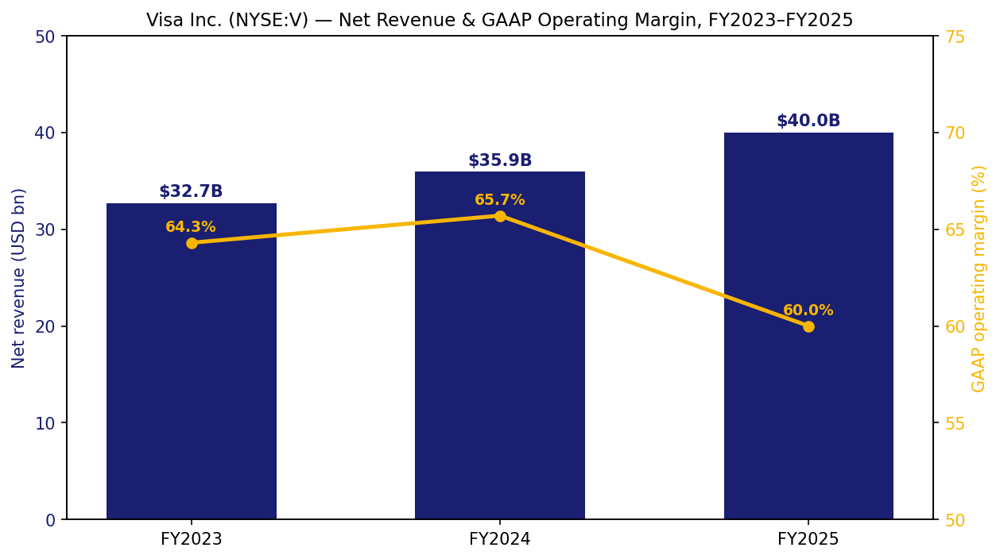
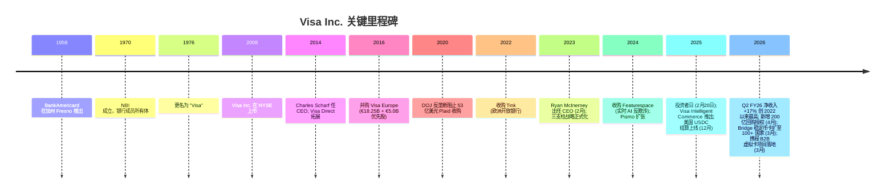
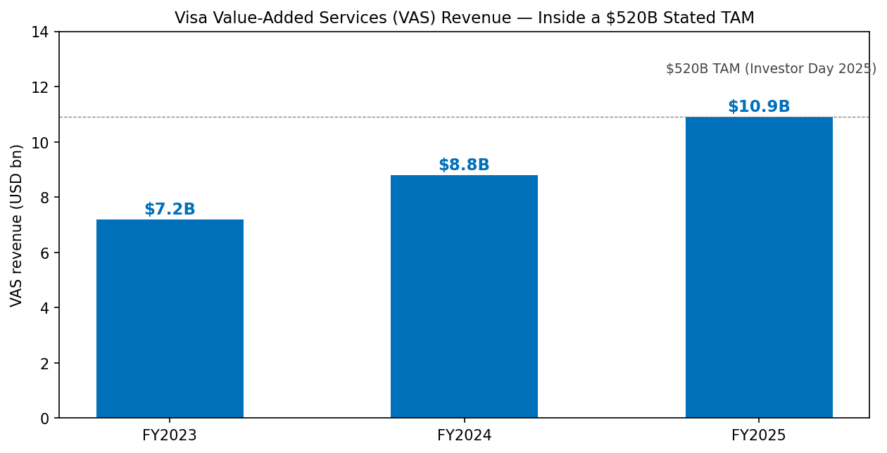
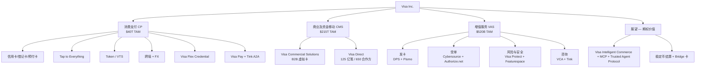
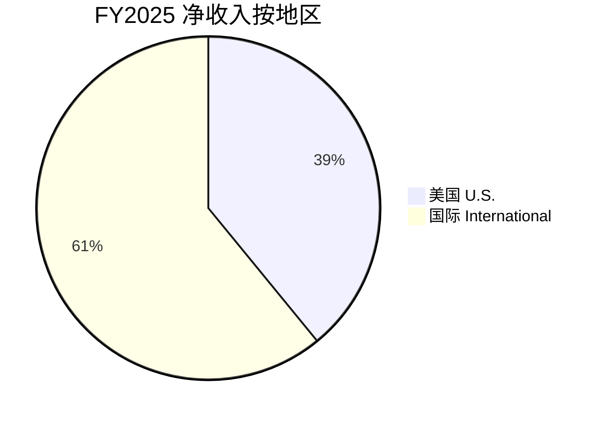
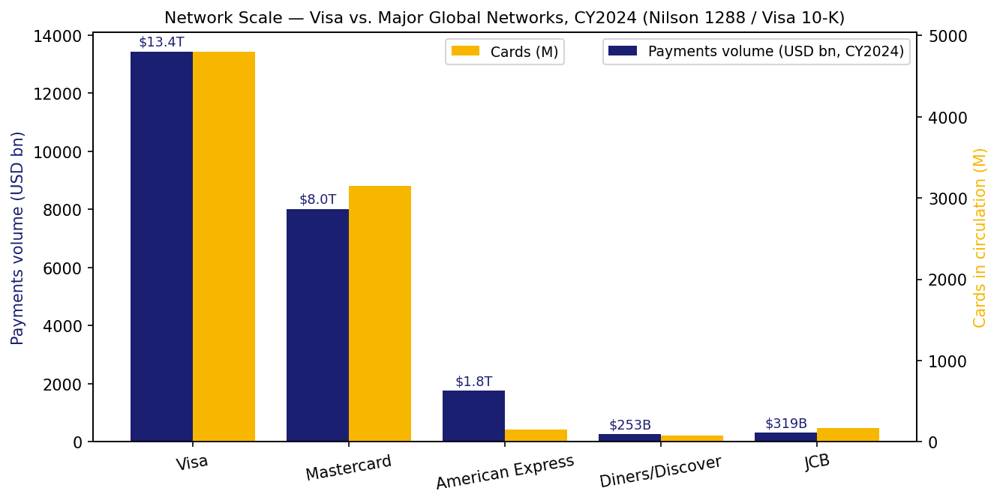
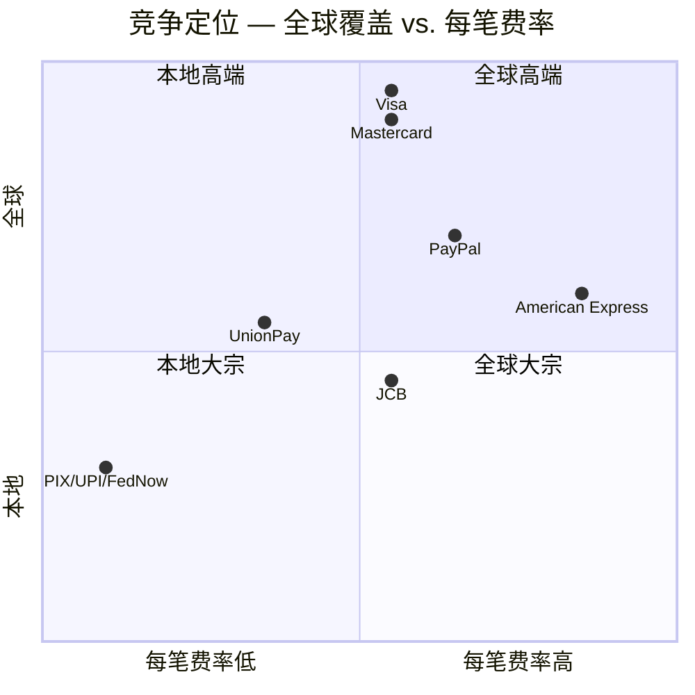

# Visa Inc. (维萨, NYSE: V) — 首次覆盖

*截至日期: 2026-06-02. 作者: x@lx00617. 除非另注，所有金额均为美元 (USD).*

> **一句话投资逻辑.** Visa 是全球数字支付的"hyperscaler/超大规模算力厂商"——已经在 200+ 国家和地区，通过约 50 亿张支付凭证 / payment credentials、约 1.75 亿家商户，年化处理 17 万亿美元 (USD 17 trillion) 的支付与现金交易量。但故事的下一段已经不再是 C2B 卡片刷卡，而是: (i) 增值服务 / Value-Added Services (VAS) 以 20%+ 增速贡献 FY25 净收入的约 27%；(ii) 商业及资金移动解决方案 / CMS 瞄准约 215 万亿美元的资金流机会；(iii) 通过 Visa Intelligent Commerce + Trusted Agent Protocol 构建的"代理式商务 / agentic commerce"轨道；以及 (iv) 130+ 个稳定币 / stablecoin 联名卡项目——这些都是在**扩展**而非**绕开** Visa 的轨道。Bernstein 给出的 Outperform / 目标价 450 美元 (较 5 月 8 日 318.79 美元的现价约 +39% 空间) 正是基于这四个再定价 (re-rating) 选项叠加在一个已经以中两位数复合成长 GAAP 每股收益、且具有准垄断成本基础的业务之上。

## 目录

1. 公司概览
2. 公司历史
3. 管理团队
4. 产品与服务
5. 客户与上市策略
6. 行业概览
7. 竞争格局
8. 市场机会
9. 风险评估
10. 投资视角评分卡
11. 参考资料

---

## 1. 公司概览

Visa Inc. (NYSE: V, CIK 0001403161) 总部位于美国旧金山。根据公司 FY2025 10-K 的"业务概述 / Business Overview"披露: "我们通过自有的高级交易处理网络 VisaNet，在 200+ 国家和地区为消费者、发卡 (issuing) 及收单 (acquiring) 金融机构、商户之间提供安全、可靠、高效的全球商务及资金移动支持。"理解 Visa 的核心是**四方模式 / four-party model**——Visa 连接约 14,500 家发卡金融机构、约 1.75 亿家商户受理网点、约 120 亿张卡/账户/电子钱包终端，但**本身不发卡、不放贷、不承担信用风险**。FY2025 Visa 品牌的 3,290 亿笔支付与现金交易中，2,580 亿笔由 Visa 自身处理 (剩余跑在客户选择的其他网络上)，全年总支付与现金交易量为 **17 万亿美元 (USD)** ([Visa FY2025 10-K, Item 1 Business — Business Overview](https://www.sec.gov/Archives/edgar/data/1403161/000140316125000089/v-20250930.htm))。

Visa 的净收入 / net revenue 拆分为五条线: **服务收入 / service revenue** (发卡 / 受单方为接入网络与部分 VAS 而支付)、**数据处理收入 / data processing revenue** (按笔授权清结算 + 部分 VAS)、**国际交易收入 / international transaction revenue** (跨境 + 外汇)、**其他收入** (主要为 VAS——咨询、营销、品牌授权)、以及减项**客户激励 / client incentives** (向大型发卡 / 受单方支付的返点)。FY2025 关键数: 净收入 **400 亿美元 (+11% YoY)**、GAAP 净利 **200.6 亿美元 (+2%)**、GAAP EPS **10.20 (+5%)**、Non-GAAP EPS **11.47 (+14%)**，GAAP 经营利润率由 FY24 的 65.7% 降至 60.0%，几乎全部来自 FY25 期间因 MDL 1720 商户集体诉讼 (interchange multidistrict litigation) 引发的诉讼准备金支出 ([Visa Q4 FY2025 8-K Exhibit 99.1, 2025-10-28](https://www.sec.gov/Archives/edgar/data/1403161/000140316125000077/q42025earningsrelease.htm); [Visa FY2025 10-K Item 7 MD&A](https://www.sec.gov/Archives/edgar/data/1403161/000140316125000089/v-20250930.htm))。

*数据来源: [Visa FY2025 10-K, Item 7 MD&A](https://www.sec.gov/Archives/edgar/data/1403161/000140316125000089/v-20250930.htm) 的收入与营业费用表; GAAP 经营利润率 = (净收入 - GAAP 经营费用) ÷ 净收入.*

**估值快照 (截至 2026-05-22).** 现价 ~$318.79 (2026-05-08 收盘)；总市值 ~6,000 亿美元；**TTM P/E 28.9×**，对比过去 12 个月平均 32.9× ([Visa P/E 历史 — financecharts.com](https://www.financecharts.com/stocks/V/value/pe-ratio))。Bernstein SocGen 在 2026 年 5 月战略决策会议上与 McInerney CEO 进行炉边谈话后，重申 **Outperform / 目标价 450 美元**，将 VAS、agentic commerce、自治代理 (autonomous agent) 支付、stablecoin 联名卡、B2B 虚拟卡列为四条被低估的逻辑线 ([Bernstein note via Investing.com, 2026-05-27](https://www.investing.com/news/analyst-ratings/bernstein-reiterates-visa-stock-rating-on-valueadded-services-growth-93CH-4722206))。当前估值倍数**低于 Visa 自身 10 年中位数**，且与 Mastercard 当前 TTM P/E 接近；考虑到公司 Q1 / Q2 FY26 净收入增速分别加速至 +15% / +17% ([Q1 FY2026 release, 2026-01-29](https://www.sec.gov/Archives/edgar/data/1403161/000140316126000044/q12026earningsrelease.htm); [Q2 FY2026 release, 2026-04-28](https://www.sec.gov/Archives/edgar/data/1403161/000140316126000077/q22026earningsrelease.htm))，倍数与增速的剪刀差 (multiple-versus-growth gap) 是 Bernstein 观点的核心。

**资本回报.** FY25 共向股东返还 228 亿美元 (回购 196 亿 + 分红 32 亿); Q2 FY26 又返还 92 亿美元，并经董事会**新授权一项 200 亿美元的多年期回购计划**，叠加于 2025 年 4 月授权的 300 亿美元回购计划 (FY25 期末剩余 249 亿) ([Visa FY2025 10-K Item 5 + Note 15](https://www.sec.gov/Archives/edgar/data/1403161/000140316125000089/v-20250930.htm); [Q2 FY26 release](https://www.sec.gov/Archives/edgar/data/1403161/000140316126000077/q22026earningsrelease.htm))。2025 年 10 月季度股息上调 14% 至每股 0.670 美元，将 5 年股息复合增速推至中两位数。

## 2. 公司历史

Visa 的制度祖先是 1958 年 9 月由美国银行 (Bank of America) 在加州 Fresno 推出的 BankAmericard——全球第一张通用信用卡 / general-purpose credit card。1966 年全美授权，1970 年 Dee Hock 主导成立 **NBI (National BankAmericard Inc.) 银行成员所有体**，1976 年品牌更名为 **Visa** 以利国际化。在以银行成员制运营 30 年后，全球 Visa 实体于 **2008-03-20 在 NYSE 完成 IPO**——当时美国史上最大 IPO，募资 179 亿美元，之后 **2016 年完成对 Visa Europe 的合并** (€18.25B + €5.0B 优先股 + 业绩对赌)，由此形成至今"One-Visa"全球结构 ([Visa FY2025 10-K, Item 1 — Business Overview; Item 5 — Stockholders' Matters](https://www.sec.gov/Archives/edgar/data/1403161/000140316125000089/v-20250930.htm))。

定义今日 Visa 战略的转折点出现在 **Charles Scharf 任 CEO 期间 (2012-2016)**——有意识地将业务由 C2B 卡片刷卡向**推送支付 / push payment** (即 Visa Direct，本质是 Original Credit Transaction) 与早期 2020s 形成的独立业务支柱 Visa Commercial Solutions 扩展。**2021 年 1 月放弃的 53 亿美元 Plaid 收购**——DOJ 反垄断指控 Visa 试图收购"新兴竞争威胁 / nascent competitive threat"——迫使 Visa 转而通过自建 + 小型并购构建开放银行 / 多网连接能力 (Tink €18 亿 in 2022, Currencycloud £7 亿 in 2021, YellowPepper 2020, Earthport £1.98 亿 in 2019, Featurespace 2024-12)，详见 [Visa FY2025 10-K Note 6 Acquisitions](https://www.sec.gov/Archives/edgar/data/1403161/000140316125000089/v-20250930.htm)。2023 年 2 月 **Ryan McInerney** 接任 CEO 后，进一步将"消费支付 / Consumer Payments + 商业及资金移动 / CMS + 增值服务 / VAS"三支柱模型正式化，并成为此后每次投资者日和业绩电话会议的叙事框架 ([Visa Investor Day, 2025-02-20 — 经更正的会议笔录 PDF](https://s1.q4cdn.com/050606653/files/doc_downloads/2025/02/CORRECTED-TRANSCRIPT_-Visa-Inc-V-US-Investor-Day-20-February-2025-11_00-AM-ET.pdf))。

## 3. 管理团队

**Ryan McInerney — CEO (自 2023-02-01).** 现年 50 岁。2013 年 6 月加入 Visa 任总裁，负责全球业务；2023 年 2 月接替 Alfred F. Kelly Jr. 出任 CEO ([Visa 2026 Proxy Statement / DEF 14A, 2025-12-08 — 董事简历](https://www.sec.gov/Archives/edgar/data/1403161/000130817925000635/v-20251208.htm))。加入 Visa 前，在 **JPMorgan Chase 工作 8 年 (2005-2013)**，历任消费者银行业务首席营销官 (CMO Consumer Banking, 2005-2008)、消费者业务首席风险官 (CRO, 2008-2009)、Chase Home Lending 首席运营官 (COO, 2009-2010)，最后任 **消费者银行业务 CEO (CEO Consumer Banking, 2010-2013)**——彼时该业务年收入约 140 亿美元 / 员工 75,000+ / 服务家庭 3,000 万+ ([Ryan McInerney 简历 — JPMorgan Chase 2020 投资者日 SEC 8-K 演讲者简介](https://www.sec.gov/Archives/edgar/data/0000019617/000001961720000256/speakerbiosinvestorday20.htm); [The Official Board — McInerney biography](https://www.theofficialboard.com/biography/ryan-mcinerney-9g86g))。再之前 1997-2005 任 **McKinsey & Company Principal**，专注于支付和零售银行实务方向，**B.S. 金融学位毕业于美国圣母大学 / University of Notre Dame**。根据 2026 年委托书，其薪酬结构中**绝大部分为按表现归属的限制性股票单元 / Performance Share Units**，与按固定汇率 (constant-currency) 计算的净收入、EPS 和相对总股东回报 (relative TSR) 绑定——即薪酬框架与股东利益**结构性对齐** ([Visa 2026 Proxy Statement, p. 49 ff. — Compensation Discussion & Analysis](https://www.sec.gov/Archives/edgar/data/1403161/000130817925000635/v-20251208.htm))。

由于 Visa 起源于 1958 年银行成员所有体而非创始人型创业公司，因此**"创始人 / founder"概念在 Visa 不适用**——自 2008 年独立上市以来仅有过 Joe Saunders、Charles Scharf、Alfred F. Kelly Jr. 和 Ryan McInerney 四任运营层面的 CEO。当前独立董事长由前 Stanley Black & Decker 董事长兼 CEO **John F. Lundgren** 担任 (74 岁，任期 8 年) ([Visa 2026 Proxy Statement — 董事简历](https://www.sec.gov/Archives/edgar/data/1403161/000130817925000635/v-20251208.htm))。

## 4. 产品与服务

Visa 在 FY2025 10-K Item 1 业务部分将产品组合按**三支柱增长模型 / three-pillar growth model**组织——消费支付 (CP)、商业及资金移动解决方案 (CMS, 此前称"新流 / new flows")、增值服务 (VAS)——叠加于基础轨道 (VisaNet + "网络的网络 / network of networks")。下文按 10-K 的原始结构呈现，并以**逐字引用 / verbatim quote**为主，辅以分析师必要的角色解读。

### 4.1 基础层: VisaNet, Visa-as-a-Service 堆栈, 四方模式

> "We provide transaction processing services (primarily authorization, clearing and settlement) among consumers, issuing and acquiring financial institutions and sellers in a structure we call the 'four-party' model … We are focused on extending, enhancing and investing in our proprietary advanced transaction processing network, VisaNet, to offer a single connection point for facilitating money movement to multiple endpoints through various form factors and innovative technologies across more than 200 countries and territories."  ([Visa FY2025 10-K, Item 1 — Business Overview](https://www.sec.gov/Archives/edgar/data/1403161/000140316125000089/v-20250930.htm))

> "We are using our componentized capabilities and global connectivity to power all types of payments and deliver services to all types of clients worldwide through our **Visa as a Service stack, which has four layers**: the foundation layer, the services layer, the solutions layer and the access layer. Our foundation layer comprises the network infrastructure that enables connections to approximately 12 billion cards, bank accounts and digital wallets with more than 175 million merchant locations across more than 200 countries and territories."  ([同上](https://www.sec.gov/Archives/edgar/data/1403161/000140316125000089/v-20250930.htm))

**中文释义 / Plain-language gloss.** "四方模式 / four-party" = 消费者 → 收单方 / acquirer (商户的银行) → Visa → 发卡方 / issuer (持卡人的银行)。Visa 全程**不承担信用、不持有资金**，按笔收取处理费 + 跨境利差。"Visa-as-a-Service" 是 2025 年 2 月投资者日提出的战略升级——把网络访问从"一个产品"拆成可组合的组件 (token、反欺诈、外汇、争议处理、A2A、清算)，客户通过 API + 新上线的 **MCP server** (Model Context Protocol，使 LLM/AI 智能体直接调用 Visa 支付 API) 自由组合 ([Visa Investor Day 2025 笔录](https://s1.q4cdn.com/050606653/files/doc_downloads/2025/02/CORRECTED-TRANSCRIPT_-Visa-Inc-V-US-Investor-Day-20-February-2025-11_00-AM-ET.pdf))。

### 4.2 消费支付 / Consumer Payments (CP)

> "On an annual basis, we see **more than $40 trillion of addressable consumer spend, excluding Russia and China**. Of this spend opportunity, we are pursuing an estimated more than $20 trillion annual opportunity in **underserved consumer spend, spread across cash, check, legacy Automated Clearing House (ACH), account to account (A2A) payments and real time payments (RTP)** or other less effective forms of digital payments."  ([Visa FY2025 10-K, Item 1 — Our Strategy / Consumer Payments](https://www.sec.gov/Archives/edgar/data/1403161/000140316125000089/v-20250930.htm))

CP 建立在**核心产品** (信用卡 / 借记卡 / 预付卡) + 增量驱动器 (enablers) 之上:

- **Tap to Everything (一切皆可触付).** Tap-to-Pay 已经成为 FY25 全球**79%、美国 66%** 的实体交易方式；全球公共交通触付交易超 24 亿笔；Tap-to-Phone "终端即手机"激活设备超 2,000 万；Tap-to-Add-Card 已覆盖超 14 亿张 Visa 卡 ([Visa FY2025 10-K, Item 1 — Tap to Everything](https://www.sec.gov/Archives/edgar/data/1403161/000140316125000089/v-20250930.htm))。
- **Token 技术 / Token Technology.** Visa Token Service (VTS) 以代理性 token 替换 16 位卡号; 10-K 披露截至 2025-09-30 已**发放 token 超过 160 亿个 / 16 billion tokens** (注: 用户 prompt 提到的"175 亿 token" 似为与 10-K 中的"1.75 亿商户 / 175M merchant locations" 数字混淆，本报告以 10-K 数据为准)。VTS 是 Bernstein 提出的"token 巩固 Visa 竞争地位、并为 VAS 提供分发途径"逻辑的物理基础 ([Bernstein note via Investing.com, 2026-05](https://www.investing.com/news/analyst-ratings/bernstein-reiterates-visa-stock-rating-on-valueadded-services-growth-93CH-4722206))。
- **跨境 / Cross-border.** Q2 FY26 跨境 (剔除欧元区内部) 不变汇率口径 +11%，总跨境量 +12%——网络上**毛利最高**的部分，同时贡献服务收入与国际交易 (外汇) 收入 ([Visa Q2 FY2026 release, 2026-04-28](https://www.sec.gov/Archives/edgar/data/1403161/000140316126000077/q22026earningsrelease.htm))。
- **Visa Flex Credential.** 单一凭证、多资金来源 (借记 ↔ 信用 ↔ BNPL)，截至 2025-09 已签约 20+ 家客户、覆盖 20+ 个国家 ([10-K, Item 1 — Powering Credit](https://www.sec.gov/Archives/edgar/data/1403161/000140316125000089/v-20250930.htm))。
- **A2A 捕获.** 两条路径: (i) **Visa Pay** (2025 年推出的白标方案——让数字钱包提供商通过 Visa 凭证在 Visa 轨道上结算); (ii) **Tink** (Visa 2022 年收购的开放银行子公司) 提供欧洲与拉美原生 A2A，截至 2025-09 已连接"数千家银行"；Visa A2A 已在英国上线 ([10-K, Item 1 — Expanding Our Reach](https://www.sec.gov/Archives/edgar/data/1403161/000140316125000089/v-20250930.htm))。

### 4.3 商业及资金移动解决方案 / CMS

> "Representing a total addressable opportunity of **approximately $200 trillion of payment flows annually**, excluding Russia and China … the first objective is to address B2B payments flows from small businesses up to large enterprises and governments through our **Visa Commercial Solutions** … approximately **$35 trillion of annual opportunity** … the second objective is to address money movement … through **Visa Direct** … approximately **$55 trillion of annual opportunity in P2P, B2C and G2C money movement flows and approximately $25 trillion of annual opportunity in B2B money movement flows**."  ([Visa FY2025 10-K, Item 1 — Commercial Money Movement Solutions](https://www.sec.gov/Archives/edgar/data/1403161/000140316125000089/v-20250930.htm))

- **Visa Commercial Solutions** = 卡 + 虚拟卡 (virtual card) 的 B2B 套件——含小企业卡、差旅 (T&E) 公司卡、采购卡 (purchasing card)、虚拟卡。FY25/FY26 旗舰客户拿单为 **2026 年 3 月落地的 携程集团 (Trip.com Group) 全球虚拟卡项目**——通过携程旗下金融科技品牌 TripLink 由 Visa 发卡，先在新加坡上线，扩展至荷兰、香港；明确用于自动化 B2B 酒店与差旅供应商付款 ([PR Newswire APAC, 2026-03-10](https://www.prnewswire.com/apac/news-releases/global-virtual-travel-card-program-launched-by-visa-and-tripcom-to-make-travel-payments-simpler-and-more-seamless-in-asia-pacific-302710325.html); [Visa Vietnam newsroom](https://www.visa.com.vn/en_VN/about-visa/newsroom/press-releases/global-virtual-travel-card-program-launched-by-visa-and-tripdotcom-to-make-travel-payments-simpler-and-more-seamless-in-asia-pacific.html))。
- **Visa Direct (推送支付平台).** 通过 90+ 国内清算方案与 60+ 卡/电子钱包网络可触达约 120 亿个端点。**FY25 处理交易超 125 亿笔，服务合作伙伴超 650 家** ([10-K, Item 1 — Visa Direct](https://www.sec.gov/Archives/edgar/data/1403161/000140316125000089/v-20250930.htm))。由 Earthport (跨境 ACH) + Currencycloud (多币种钱包) + YellowPepper (拉美 RTP) 等并购堆叠而成。

**中文释义.** "C2B = 传统刷卡场景"，"B2B 卡 = 企业采购卡"，"B2B 虚拟卡 = 通过 API 即时生成的、为某一笔发票付款而专门发行的一次性 16 位卡号"，"Visa Direct = 反向使用 Visa 轨道——发卡方给卡片**充值**而非**扣款**"。携程 / TripLink 例子是 CMS 的典型样板: 一个原本通过 SWIFT 给酒店付款的旅行平台，现在按订单生成一次性 Visa 虚拟卡，把批发旅行支付这种结构性大量级现金流转上 Visa 轨道。

### 4.4 增值服务 / Value-Added Services (VAS)

> "VAS represents approximately a **$520 billion annual revenue opportunity** for us to diversify our revenue with products and solutions that help our clients and partners optimize their performance … Our comprehensive suite of value-added services spans **four portfolios**: **Issuing Solutions, Acceptance Solutions, Risk and Security Solutions and Advisory and Other Services**, which represent **approximately $125 billion, $95 billion, $150 billion and $150 billion**, respectively, of our overall $520 billion annual revenue opportunity in VAS."  ([Visa FY2025 10-K, Item 1 — Value-Added Services](https://www.sec.gov/Archives/edgar/data/1403161/000140316125000089/v-20250930.htm))

> "For fiscal 2025, 2024, and 2023, revenue from value-added services was **$10.9 billion, $8.8 billion and $7.2 billion**, respectively."  ([Visa FY2025 10-K, Note 1 — Disaggregation of Revenue](https://www.sec.gov/Archives/edgar/data/1403161/000140316125000089/v-20250930.htm))

这是整份 10-K 最重要的一段——VAS 在 FY24 已占净收入约 24%，**FY25 约 27%** (10.9 ÷ 40.0)，三年 CAGR 约 23%，**FY25 增速约 +24% YoY**，对比全集团净收入 +11%。Bernstein 估算 4 个子组合的内部结构: 发卡 (Issuing) ~40%、受单 (Acceptance) ~28%、风险与安全 ~17%、咨询及其他 ~15% ([Bernstein note](https://www.investing.com/news/analyst-ratings/bernstein-reiterates-visa-stock-rating-on-valueadded-services-growth-93CH-4722206))。*分析师观点: VAS 应该比传统支付处理享有更高估值倍数——(a) 其驱动因素是软件化的 (SKU 拓展、附加率、合同交叉销售) 而非宏观刷卡量；(b) 受 interchange 监管影响更小；(c) 销售触达 14,500 家发卡方的渠道已经现成。*

*数据来源: [Visa FY2025 10-K Note 1](https://www.sec.gov/Archives/edgar/data/1403161/000140316125000089/v-20250930.htm) 收入； $520B TAM 来自 [Visa Investor Day 2025 transcript](https://s1.q4cdn.com/050606653/files/doc_downloads/2025/02/CORRECTED-TRANSCRIPT_-Visa-Inc-V-US-Investor-Day-20-February-2025-11_00-AM-ET.pdf).*

四个子组合，按 10-K 自身描述:

| 子组合 / Portfolio | 出售内容 | 收购 / 自建技术 |
|---|---|---|
| **发卡解决方案 / Issuing Solutions** (~$125B TAM) | 持卡人体验 (机场休息室、订餐、票务); 忠诚度与权益; BNPL; 订阅管理器; **Smarter Stand-In Processing** (AI 驱动的代发卡方授权); **Visa DPS** (多网络发卡处理器); **Pismo** (云原生核心银行 + 发卡处理，2024-01 收购) | 自建 + Pismo |
| **受单解决方案 / Acceptance Solutions** (~$95B TAM) | **Cybersource + Authorize.net** 支付网关 (Visa 是全球最大单一支付网关); Account Updater; Token Management Service; **Verifi** 争议预防; Visa Resolve Online | Cybersource (2010 收购) |
| **风险与安全 / Risk & Security Solutions** (~$150B TAM) | Visa Protect 套件——Visa Consumer Authentication Service、Visa Advanced Authorization、Visa Provisioning Intelligence、**Visa Deep Authorization** (针对电商的 AI 评分)、**Visa Protect for A2A Payments** (首款跨网络反欺诈产品)、Cybersource Decision Manager、Visa Account Attack Intelligence Score (列举攻击防御); **Featurespace** (实时行为分析，2024-12 收购) | 自建 + Featurespace |
| **咨询及其他 / Advisory & Other Services** (~$150B TAM) | Visa Consulting & Analytics (VCA 支付咨询，含稳定币 / AI / 网络安全专门实务); 营销服务; 数据解决方案 (Visa Analytics Platform); **Tink** 开放银行平台 (2022 收购，截至 2025-09 已连接"数千家银行") | 自建 + Tink |

10-K 中陈述的战略 *为什么*:"Our VAS strategy, aimed at deepening our partnerships, has three areas of focus: (1) **enhance Visa payments** by making the Visa network easier to access, more attractive and more secure, increasing yield per transaction; (2) **enable all payments** by providing access and managing experiences for A2A, alternative payment methods and other card schemes; and (3) **go beyond payments** by helping clients optimize their payments businesses and achieve multiplier effects." ([10-K, Item 1 — Value-Added Services](https://www.sec.gov/Archives/edgar/data/1403161/000140316125000089/v-20250930.htm))

### 4.5 展望: 代理式商务 / Agentic Commerce + 稳定币 / Stablecoins

10-K "Looking Ahead" 一节明确将这两条线定义为 **"第三代数字浪潮 / third digital wave"** (前两代分别为电商 + 移动支付):

**代理式商务 / Agentic commerce.** Visa 产品化的堆栈称 **Visa Intelligent Commerce (VIC)**——含代币化支付凭证 + 认证 + AI 个性化 + 智能支付处理——以 REST API 与 **MCP server (Model Context Protocol)** 两种形式暴露给 AI 智能体直接调用。配套的 **Trusted Agent Protocol** (2025 年 10 月发布) 是基于 HTTP 的开放框架，帮助商户在结账时区分合法 AI 智能体与恶意爬虫机器人 ([Visa IR 新闻稿: "Visa Introduces Trusted Agent Protocol"](https://investor.visa.com/news/news-details/2025/Visa-Introduces-Trusted-Agent-Protocol-An-Ecosystem-Led-Framework-for-AI-Commerce/default.aspx); [Visa 开发者文档 — Trusted Agent Protocol 规范](https://developer.visa.com/capabilities/trusted-agent-protocol/trusted-agent-protocol-specifications))。2025 年 5 月 VIC 首发已披露 20+ 家合作伙伴: **Anthropic, IBM, Microsoft, OpenAI, Perplexity, Samsung, Stripe** 等，到 2025 年末已有 100+ 合作方参与，30+ 在 VIC 沙箱中开发。*分析师观点: 这是期权价值 (option-value) 押注——如果 LLM 主导的结账成为相当大份额数字商务的默认形态，Visa 的 token 轨道 + 身份层有望成为底层信任基础设施。Bernstein 的 450 美元目标价依赖这一条。*

**稳定币 / Stablecoins.** 10-K 披露:
- 稳定币**结算年化运行速率 / annualized run-rate**: 2025-09-30 为 **25 亿美元**, 2025-11-30 上调至 **35 亿美元** ([USDC 美国结算 2025-12-16 新闻稿](https://usa.visa.com/about-visa/newsroom/press-releases.releaseId.21951.html))，Bernstein 2026 年 5 月报告引用的 2025-12 数据已达 **46 亿美元** ([Bernstein, 2026-05](https://www.investing.com/news/analyst-ratings/bernstein-reiterates-visa-stock-rating-on-valueadded-services-growth-93CH-4722206))。已支持 **4 种稳定币 (USDC, EURC, USDG, PYUSD) 跨 4 条链 (以太坊、Solana、Stellar、Avalanche)**。
- **Visa-Bridge 全球发卡产品**——Bridge (Stripe 子公司) 提供入金 (on-ramp)，Visa 提供受单网络。已在 **18 个国家**上线，明确目标 **2026 年底覆盖 100+ 国家** (欧洲 / 亚太 / 非洲 / 中东) ([Visa IR 新闻稿, 2026-03-03](https://investor.visa.com/news/news-details/2026/Visa-and-Bridge-Expand-Collaboration-with-Plans-to-Bring-Stablecoin-Linked-Cards-to-Over-100-Countries/default.aspx))。
- 整体平台规模: Visa 自家观点页面披露 **40+ 国家、130+ 个稳定币联名卡项目** ([Visa Perspectives — "Visa's role in stablecoins"](https://corporate.visa.com/en/sites/visa-perspectives/innovation/visas-role-in-stablecoins.html))。用户 prompt 提到的"150-160 个项目 / +200% YoY 交易量"与上述数据方向一致——本报告采取的保守口径为 Visa 自家页面披露的 130+，并引用 Bernstein 5 月报告中的 150+ 作为更新参考。
- **自 2020 年以来 Visa 已促成 1,000+ 亿美元加密 / 稳定币购买与 350+ 亿美元支出** ([10-K, Item 1 — Looking Ahead](https://www.sec.gov/Archives/edgar/data/1403161/000140316125000089/v-20250930.htm))。

**中文释义.** 稳定币之所以构成"竞争威胁"仅在它**同时绕过卡轨道 + 银行轨道**时 (即用户在自托管钱包持有 USDC 而商户直接接受链上结算)。Visa-Bridge 架构反向地让稳定币**为 Visa 卡充值**——持卡人持 USDC，商户接受 Visa 美元交易，Visa 照常赚 interchange + FX。*分析师观点: 这是少见的"由现有龙头的分发壁垒捕获技术变革"案例，而非传统的"颠覆"剧本；其嵌入的期权价值应该按真期权而非零定价。*

## 5. 客户与上市策略

Visa 有**两类截然不同的客户**——发卡的金融机构 (约 **14,500 家 FI 客户**) 与接受 Visa 凭证的商户 / 收单方 (约 **1.75 亿个商户网点**)。FY25 客户激励 **157.5 亿美元 (相当于含返点前毛收入的约 39%)**——读出弹性: 发卡方客户**集中度高、议价能力强**，商户基础则**碎片化、价格接受度高** ([Visa FY2025 10-K, Item 7 — MD&A Net Revenue](https://www.sec.gov/Archives/edgar/data/1403161/000140316125000089/v-20250930.htm))。

**客户集中度 (合并层面).** 10-K 明确披露**没有任何单一客户在 FY2025/FY2024/FY2023 占合并净收入 10% 或以上** ([Visa FY2025 10-K, Note 1 — Significant Customer](https://www.sec.gov/Archives/edgar/data/1403161/000140316125000089/v-20250930.htm) 按 ASC 280-10-50-42 披露)。最大发卡方 (美国: JPMorgan Chase、Bank of America、Wells Fargo、Capital One、US Bank；全球: HSBC、Santander、ICBC、Itaú) 单家绝对量大，但**单家占合并收入均显著低于 10%**——四方模式 + 极大份额的全球客户基础使得 Visa 在大型支付基础设施企业中**客户集中度异常分散**。

**地域收入构成 (FY25 合并净收入 400 亿美元).**

| 地区 | FY25 净收入 | FY24 | FY23 |
|---|---|---|---|
| 美国 | $15,633M | $14,780M | $14,138M |
| 国际 (非美) | $24,367M | $21,146M | $18,515M |
| **总计** | **$40,000M** | **$35,926M** | **$32,653M** |

*数据来源: [Visa FY2025 10-K, Note 1 — Disaggregation of Revenue](https://www.sec.gov/Archives/edgar/data/1403161/000140316125000089/v-20250930.htm).* 国际占 FY25 净收入的 **61%**，YoY +15%，而美国仅 +6%——**国际本子是真正的增长引擎**，由跨境旅行复苏 + 新兴市场数字化共同推动。10-K 亦披露"Visa employees are located in 86 countries and territories, with more than 60% located outside the U.S." ([Item 1 — Talent and People](https://www.sec.gov/Archives/edgar/data/1403161/000140316125000089/v-20250930.htm))。

**销售与渠道.** 面向 FI 客户群体的直销 (按 FI 规模 + 地区分层); 针对大型商户与收单方的 BD 团队; **Visa Country Manager 国家经理**——每个主要市场的本地关系 + 政府事务负责人。10-K 披露"产品与服务超过 200 个 (>200 products and services)" 截至 2025-09——VAS 故事背后的运营机制就是这种产品交叉销售 ([10-K, Item 1 — Value-Added Services](https://www.sec.gov/Archives/edgar/data/1403161/000140316125000089/v-20250930.htm))。

## 6. 行业概览

全球零售电子支付行业是家庭消费、且日益是 B2B 商业的数字基础设施。10-K 自身的概括最简洁:

> "The global payments industry continues to undergo dynamic and rapid change … Technology and innovation are shifting consumer habits and driving growth opportunities in **ecommerce, GenAI agent-based commerce, mobile payments, blockchain technology and digital currencies, including stablecoins**. These advances are enabling new entrants, many of which depart from traditional network payment models."  ([Visa FY2025 10-K, Item 1 — Competition](https://www.sec.gov/Archives/edgar/data/1403161/000140316125000089/v-20250930.htm))

**行业规模 / 长期增长.** 全球非现金支付的年化收入池约 2 万亿+ 美元 (BCG / McKinsey 世界支付报告基准); **卡网络切片** (Visa + Mastercard + Amex + Discover + JCB + UnionPay) 是其中最大的收入池。Visa 自身的机会刻画: 4 万亿美元 C2B 消费 TAM (剔除中俄)、200+ 万亿 CMS 资金流 TAM (剔除中俄)、5,200 亿美元 VAS TAM ([10-K, Item 1 — Strategy](https://www.sec.gov/Archives/edgar/data/1403161/000140316125000089/v-20250930.htm))。行业增长拆解: (i) **结构性数字化** (新兴市场每年现金 → 卡 / RTP 转化 600bp+)、(ii) **跨境旅游** (~5-7% 实际量趋势)、(iii) **电商份额增长** (~10% 名义增长)、(iv) **B2B 商业卡 / 虚拟卡渗透**（当前低个位数渗透，长期顺风）、(v) 新兴的 **代理式商务 / 稳定币楔形** (尚不足以确信估算)。

**行业结构.** 双边平台 + 在品牌-受单端的高度赢家通吃 (Visa + Mastercard 合计在多数非中、非印度地区占跨境卡量约 90%+)，但在处理端日益面临挑战 (FedNow、PIX、UPI、SEPA Instant——根据 10-K 竞争部分，**全球已有 80+ 国家上线 RTP 网络**)。监管压力是行业层面的主导力量: Dodd-Frank (美国借记)、IFR (欧盟 / 英国)、RBA (澳大利亚)、以及在美国国会重新抬头的 **Credit Card Competition Act**——共同推动 interchange 收窄并强制多网络路由 (network-of-networks routing)，挤压核心处理经济性，但同时为 VAS / 咨询开辟空间。

**近期值得标注的结构性变化.** (i) **2025-08 北达科他州联邦地区法院裁决**否决了美联储 Regulation II 的借记 interchange 标准 (法院认为美联储不当将欺诈/网络费用计入上限计算); 上诉中，肯塔基州法院同期作出**相反**裁决。**若 ND 裁决获维持，可能迫使美联储重设大幅更低的借记 interchange 上限**——对发卡方的直接冲击、对 Visa 通过激励重谈的间接冲击均不容忽视 ([10-K Item 1A — Regulatory Risks / Interchange](https://www.sec.gov/Archives/edgar/data/1403161/000140316125000089/v-20250930.htm))。(ii) **2025-11 MDL 1720 商户集体诉讼的 Rule 23(b)(2) 新补充和解协议**——Visa + Mastercard 同意更新商户集体和解架构，含新的 **Permissible Steering Scenarios 附录**；FY25 / Q1 FY26 / Q2 FY26 的诉讼准备金分别为 **8.99 亿 / 7.07 亿 / 3.11 亿美元** ([Visa 8-K, 2025-11-10 — Exhibit 99.1 和解协议](https://www.sec.gov/Archives/edgar/data/1403161/000140316125000093/vex991settlementagreementf.htm); [Q1 FY26 release](https://www.sec.gov/Archives/edgar/data/1403161/000140316126000044/q12026earningsrelease.htm); [Q2 FY26 release](https://www.sec.gov/Archives/edgar/data/1403161/000140316126000077/q22026earningsrelease.htm))。

## 7. 竞争格局

10-K 竞争部分明确将 Visa 的竞争者宇宙拆为 **6 个层级**，其中只有"全球或多区域网络"在同口径上构成正面竞争。10-K 逐字列举:

> "Our electronic payment competitors principally include the ones listed below … **Global or Multi-regional Networks** … Examples include **American Express, Diners Club/Discover (now owned by Capital One), JCB, Mastercard and UnionPay** … **Local and Regional Networks** … **NYCE, Pulse and STAR in the U.S.; Interac in Canada; and eftpos in Australia** … **Alternative Payments Providers** [BNPL, 加密, 闭环] … **RTP Networks** … **FedNow in the U.S., PIX in Brazil and United Payments Interface (UPI) in India** … **Digital Wallet Providers** … **Payment Processors** … **CMS Providers** [ACH/RTP/电汇 + B2B 区块链] … **Value-Added Service Providers** [技术、信息服务、咨询]."  ([Visa FY2025 10-K, Item 1 — Competition](https://www.sec.gov/Archives/edgar/data/1403161/000140316125000089/v-20250930.htm))

**网络规模 — CY2024.** 10-K 直接引用 Nilson Report 1288 (2025-06):

| 网络 / Network | 支付量 (USD bn, CY2024) | 总量 (USD bn) | 总交易笔数 (B) | 卡量 (M) |
|---|---|---|---|---|
| **Visa** | **13,433** | **15,927** | **311** | **4,805** |
| Mastercard | 8,014 | 9,757 | 204 | 3,146 |
| American Express | 1,750 | 1,765 | 12 | 147 |
| Diners Club / Discover | 253 | 266 | 4 | 72 |
| JCB | 319 | 327 | 7 | 167 |

*数据来源: [Visa FY2025 10-K, Item 1 — Competition](https://www.sec.gov/Archives/edgar/data/1403161/000140316125000089/v-20250930.htm), 数据出自 Nilson Report 1288 (2025-06); UnionPay 未列出，因 Nilson 该榜未持续纳入 UnionPay (其业务主要在中国境内).*

*分析师观点: 在支付量指标上 Visa 全球约为 Mastercard 的 1.7×——但区域差异显著。Mastercard 过去十年在欧盟和亚洲部分市场增速更快，目前在欧盟内已经达到 Visa 的 ~1.2× 范围内。可以认为 Visa 的全球领先地位**稳固但增量份额必须地区一地一争**。*

**Visa 在哪里赢，在哪里输.**

- **赢:** 全球覆盖 (200+ 国家 vs. UnionPay 的中国为中心); 跨境旅行 + FX (与 Mastercard 长期形成跨境卡量约 85% 合计份额的双寡头); 发卡品牌 ("近 50 亿张凭证"); token 化规模 (160 亿+ token 已发放); 14,500 家 FI 的 VAS 分发渠道。
- **输 / 受挑战:** 中国 (UnionPay 国内 90%+ 份额，Visa 基本被排除于本地处理); 印度 (UPI 已成零售支付事实标准，Visa 仅在跨境与信用领域竞争); 巴西 (PIX 在许多场景超过卡交易); 美国国内借记 (Dodd-Frank + 可能的 ND 裁决)。

*分析师观点: Visa + Mastercard 在 "全球覆盖 × 中等费率" 象限紧密聚集。长期最大的替代威胁来自左下角的 RTP 集群 (PIX / UPI / FedNow)——它们目前主要服务本国，但 **PayNow-UPI** 等连接已在加速。*

## 8. 市场机会

10-K 提供了 Visa 自身的 **TAM 堆栈**——对大盘股而言罕见的详细披露，也是 2025 年投资者日叙事框架的明确依据。最有用的呈现是**自下而上的堆栈**，将 VAS 列为短期内最高优先级的价值创造点:

| 支柱 / Pillar | 公司披露 TAM (年) | FY25 捕获收入 | 渗透率 |
|---|---|---|---|
| 消费支付 / CP——可触达消费 (剔除中俄) | **$40T** | 17 万亿美元支付与现金量 → ~252 亿美元 CP 相关净收入 *(分析师估算; 未披露)* | 高个位数 % |
| CP——未充分服务 (现金 / 支票 / A2A / RTP) | **>$20T** | 同上 | 每年低个位数渗透 |
| CMS——商业及资金移动 | **$215T 资金流机会** ($35T VCS + $55T VD 非 B2B + $25T VD B2B + ~$100T 其他) | ~30-40 亿美元 *(分析师估算; 嵌入服务与数据处理线)* | 低个位数 bp |
| VAS——总计 | **$520B 收入机会** | **$10.9B FY25** | **~2.1%** |
| VAS——发卡 | ~$125B | ~$4.4B *(基于 Bernstein 比例的分析师估算)* | ~3.5% |
| VAS——受单 | ~$95B | ~$3.0B *(基于 Bernstein 比例)* | ~3.2% |
| VAS——风险与安全 | ~$150B | ~$1.9B *(基于 Bernstein 比例)* | ~1.2% |
| VAS——咨询及其他 | ~$150B | ~$1.6B *(基于 Bernstein 比例)* | ~1.1% |

*数据来源: TAM 与 FY25 VAS 收入出自 [Visa FY2025 10-K, Item 1 — Our Strategy](https://www.sec.gov/Archives/edgar/data/1403161/000140316125000089/v-20250930.htm); VAS 子组合比例来自 [Bernstein note via Investing.com, 2026-05-27](https://www.investing.com/news/analyst-ratings/bernstein-reiterates-visa-stock-rating-on-valueadded-services-growth-93CH-4722206); 支柱层面的收入拆分为分析师估算，因 Visa 不在该层面进行分部报告.*

表格的关键是 **极度不对称的渗透率**——Visa 在 CP 轨道上已是主导份额，但在它已经选择切入的 VAS 机会上仍只有约 2%。VAS 机会的转化机制是**分发杠杆** (Visa 已经销售给 14,500 家 FI) + **产品出货速度** (Bernstein 强调的"以更快速度推出更多产品，且产品-市场契合度更好")。若 VAS 在 5 年内达到其 TAM 的 5%，即新增 260 亿美元年收入——大致将 FY25 VAS 收入翻三倍，且毛利高于核心处理业务。*分析师观点: 这是该股估值不应像成熟支付网络那样定价的结构性理由。*

## 9. 风险评估

10-K Item 1A 风险因素分为四大类——**监管 / Regulatory、业务 / Business、网络安全 / Cybersecurity、财务和法律**。下表按分析师判断给出风险清单，含 10-K 提供的量化数据。

### 公司层面

1. **Interchange 监管 (美国借记上限).** 2025-08 ND 法院裁决否决了 Reg II 借记 interchange 标准，上诉中。若维持，美联储可能被要求设大幅更低的上限——直接打击大型发卡方经济，Visa 将通过激励重谈部分吸收。**缓解**: 结果分叉 (肯塔基州法院作出相反裁决); 激励线是 Visa 可主动管理的弹性变量。([10-K Item 1A — Regulatory Risks; Item 1 — Government Regulation](https://www.sec.gov/Archives/edgar/data/1403161/000140316125000089/v-20250930.htm))
2. **MDL 1720 interchange 集体诉讼.** 长期商户集体诉讼; 2025-11 Rule 23(b)(2) 补充和解达成; FY25 + Q1-Q2 FY26 共计入约 19 亿美元 (8.99 + 7.07 + 3.11)。若 (b)(2) 类成员反对或 CCCA 立法通过，未来可能继续计提。**缓解**: 与 Mastercard 双方协同和解，降低单方尾部风险。([Visa 8-K Exhibit 99.1, 2025-11-10](https://www.sec.gov/Archives/edgar/data/1403161/000140316125000093/vex991settlementagreementf.htm))
3. **Credit Card Competition Act / 网络路由强制 / network-routing mandate.** 10-K 明确披露 CCCA "可能被重新提交国会或作为无关立法的附加条款"; 类比 Dodd-Frank 借记的信用卡路由强制将显著侵蚀 Visa 的处理产出率。([10-K Item 1A — Regulatory Risks / Interchange](https://www.sec.gov/Archives/edgar/data/1403161/000140316125000089/v-20250930.htm))
4. **市场准入限制——中国 + 印度 / 印尼 / 越南 / 泰国 / 南非.** 各国政府的本地网络偏好政策。UnionPay 在中国占国内 90%+ 份额，Visa 不能进行本地处理。([10-K Item 1A — Regulatory Risks; Item 1 — Government Regulation](https://www.sec.gov/Archives/edgar/data/1403161/000140316125000089/v-20250930.htm))
5. **RTP 网络脱媒.** PIX (巴西)、UPI (印度)、FedNow (美国)、PayNow (新加坡)、UPI-PayNow 跨境——以近零成本竞争 C2B 和 B2B/P2P。10-K 承认"with linkages such as PayNow in Singapore and UPI in India, cross-border RTP networks are advancing and will compete with our cross-border business" ([10-K, Item 1 — Competition](https://www.sec.gov/Archives/edgar/data/1403161/000140316125000089/v-20250930.htm))。
6. **欧盟 IFR + 英国 PSR.** 上限已生效; PSR 对费率 / 治理 / 商业条款持续监督。直接影响欧洲利润率。([10-K Item 1 — Government Regulation / European Regulations](https://www.sec.gov/Archives/edgar/data/1403161/000140316125000089/v-20250930.htm))

### 行业 / 市场

7. **稳定币脱媒尾部风险.** 若全球跨境 B2B (当前 SWIFT + 卡) 中相当比例转入自托管钱包直接稳定币转移，绕开两者，Visa 的跨境-FX 收入 (FY25 142 亿美元，+12% YoY) 将面临结构性侵蚀。**缓解**: Visa-Bridge 架构明确将稳定币消费**路由至 Visa 卡**，把楔形收入捕获在网络内。结果取决于哪种架构胜出。([10-K Item 1A — Business Risks; 10-K Item 1 — Looking Ahead / Stablecoins](https://www.sec.gov/Archives/edgar/data/1403161/000140316125000089/v-20250930.htm); [Visa-Bridge 新闻稿, 2026-03-03](https://investor.visa.com/news/news-details/2026/Visa-and-Bridge-Expand-Collaboration-with-Plans-to-Bring-Stablecoin-Linked-Cards-to-Over-100-Countries/default.aspx))
8. **Agentic 商务信任失败.** 若 AI 介导的结账在 Trusted Agent Protocol 广泛采用之前出现高调欺诈事件，监管反应可能强制非卡网络身份验证框架。**缓解**: Visa 正通过 TAP + MCP **将自己定位为信任层提供者**——但若非卡身份方案 (如政府数字 ID + RTP 组合) 胜出，Visa 将结构性被排除。

### 财务 / 法律

9. **VisaNet 网络安全事件.** 10-K 用专门章节描述网络安全——"高级持续性威胁 / advanced persistent threats"、国家行为者、第三方供应商泄露。VisaNet 处理基础设施的成功入侵将是生存级风险。**缓解**: 公开披露大规模网络安全支出 + AI 驱动监控 + Featurespace 收购。([10-K Item 1A — Cybersecurity Risks](https://www.sec.gov/Archives/edgar/data/1403161/000140316125000089/v-20250930.htm))
10. **客户激励弹性.** FY25 客户激励 157.5 亿美元 (+14% YoY，对比净收入 +11%)——这条线**增速快于净收入**，意味着合同续约时**每笔产出率正在压缩**。若与 Mastercard / Amex 在大型 RFP 上的竞争压力加剧，激励比率可能进一步上升。([10-K Item 7 — Results of Operations / Net Revenue](https://www.sec.gov/Archives/edgar/data/1403161/000140316125000089/v-20250930.htm))

### 宏观

11. **跨境旅行周期性.** 跨境量是高边际利润; 在美国主导的旅行下滑场景 (衰退 + 美元强势 + 签证摩擦)，国际交易线 FY25 142 亿美元最脆弱。**缓解**: 旅游需求至今在多次宏观冲击下证明韧性。([Q2 FY2026 press release](https://www.sec.gov/Archives/edgar/data/1403161/000140316126000077/q22026earningsrelease.htm) — Q2 FY26 跨境 +11%).
12. **估值倍数压缩.** TTM P/E 28.9× 低于自身 12 个月平均 (32.9×) 但仍远高于 S&P 500。若 AI 基础设施轮动持续压缩大盘质量股估值，Visa 的脆弱性超过其增速表现所暗示的——历史上**估值倍数本身一直是总回报的最大贡献者**。([Financecharts — Visa P/E history](https://www.financecharts.com/stocks/V/value/pe-ratio))

## 10. 投资视角评分卡

*第 10 节将四套投资框架作为对 §§1-9 证据的二次意见。本节不引入新外部引用; 所有输入均追溯到此前已引用的初级资料.*

### 10.1 巴菲特 / Buffett — 合理价格买好生意

| 评分项 (0-100) | 分数 |
|---|---|
| 业务持久性 (网络效应 + 低资本支出 + 品牌) | 90 |
| 管理质量 (圣母 / 麦肯锡 / JPMorgan 履历) | 80 |
| 资本配置纪律 ($500 亿+ 回购授权堆叠; 股息提升 14%) | 85 |
| 估值与内在价值 (28.9× TTM P/E 对中两位数 GAAP-EPS 增长) | 70 |
| 可预测性 (FY25 +11% 净收入; 5 年平均 +12%) | 85 |
| **综合** | **82 / 100 — 公道价格买好生意** |

*视角观点:* 巴菲特式买家会称 Visa 为教科书级"好生意"——问题只在入价; 25× 以下案例无可争议，33×+ 应等待。28.9× 介于两者之间。

### 10.2 芒格 / Munger — 加权质量 + 反向思考

反向自检——什么会让逻辑出错?
- 美国信用卡路由强制 (CCCA) 立法通过 → 信用卡处理产出率结构性 -10-15%。
- 稳定币以**自托管**形式赢得跨境 B2B 层 → 跨境收入 (约毛收入 36%) 受侵蚀。
- VisaNet 大型网络事件 → 生存级。

| 质量因素 (0-10) | 分数 |
|---|---|
| 护城河 (双边网络) | 10 |
| 客户依赖 | 9 |
| 投入资本回报率 | 9 |
| 监管可处理性 | 6 |
| 期权价值 (VAS + agentic + 稳定币) | 9 |
| **加权质量** | **8.6 / 10** |

*视角观点:* 监管可处理性是唯一较弱项; 其他均在评分尺顶端。

### 10.3 Damodaran — 故事+数字 DCF

**必备假设块:**
- 收入增速: FY26 11%, 10 年衰减至 7%, 终值 3.5%。
- 经营利润率: 67% 稳态 (MDL 正常化后)。
- 税率: 19% 稳态 (非 GAAP)。
- 再投资效率: 销售-资本比 ~7× (轻资产)。
- WACC: 8.0% (无风险利率 ~4.5% 取自当前 10Y; 股权风险溢价 4.5%; β ~0.95)。
- 终值增长: 3.5%。

简单 10 年衰减 DCF 在此输入下产出**每股公允价值约 370-410 美元**; 现价 323 暗示**+15-25% 安全边际**，窄于 Bernstein 目标价的 +39%，但方向一致。*视角观点:* 故事 (VAS + agentic + 稳定币期权价值) 在数字中**并未激进体现**——多数上行依靠利润率持久性 + 回购复利。

### 10.4 Howard Marks — 周期 (进攻 ↔ 防御, 0-100)

| 周期输入 | 读数 |
|---|---|
| VIX | 中性 (~17 区间, 2026-05) |
| 10Y Treasury (^TNX) | ~4.4% |
| HY OAS (BAMLH0A0HYM2) | 紧 (~330bp 区间) |
| IG OAS (BAMLC0A0CM) | 紧 (~95bp) |

**综合周期姿态: 60 / 100 — 温和进攻.** 信用利差紧、波动率克制、无防御触发; 支持持有 / 加仓高质量周期股与质量复利股。*视角观点:* Visa 是 **质量复利股**而非深度周期股——Marks 风格的纪律是持有仓位，但不加杠杆。

## 11. 参考资料

**主要监管文件**
- [Visa Inc. FY2025 Annual Report on Form 10-K (filed 2025-11-06, period ending 2025-09-30)](https://www.sec.gov/Archives/edgar/data/1403161/000140316125000089/v-20250930.htm)
- [Visa Inc. Q1 FY2026 10-Q (filed 2026-01-30, period ending 2025-12-31)](https://www.sec.gov/Archives/edgar/data/1403161/000140316126000045/v-20251231.htm)
- [Visa Inc. Q2 FY2026 10-Q (filed 2026-04-29, period ending 2026-03-31)](https://www.sec.gov/Archives/edgar/data/1403161/000140316126000079/v-20260331.htm)
- [Visa Inc. 2026 Proxy Statement (DEF 14A, filed 2025-12-08)](https://www.sec.gov/Archives/edgar/data/1403161/000130817925000635/v-20251208.htm)

**业绩稿 (8-K 附录 99.1)**
- [Q4 + 全年 FY2025 业绩稿, 2025-10-28](https://www.sec.gov/Archives/edgar/data/1403161/000140316125000077/q42025earningsrelease.htm)
- [Q1 FY2026 业绩稿, 2026-01-29](https://www.sec.gov/Archives/edgar/data/1403161/000140316126000044/q12026earningsrelease.htm)
- [Q2 FY2026 业绩稿, 2026-04-28](https://www.sec.gov/Archives/edgar/data/1403161/000140316126000077/q22026earningsrelease.htm)
- [MDL 1720 Rule 23(b)(2) 和解协议 8-K, 2025-11-10](https://www.sec.gov/Archives/edgar/data/1403161/000140316125000093/vex991settlementagreementf.htm)

**投资者材料**
- [Visa 投资者日, 2025-02-20 — 经更正笔录 (PDF, Visa IR Q4 CDN 托管)](https://s1.q4cdn.com/050606653/files/doc_downloads/2025/02/CORRECTED-TRANSCRIPT_-Visa-Inc-V-US-Investor-Day-20-February-2025-11_00-AM-ET.pdf)
- [Visa IR — Visa 与 Bridge 扩展稳定币卡合作 (2026-03-03)](https://investor.visa.com/news/news-details/2026/Visa-and-Bridge-Expand-Collaboration-with-Plans-to-Bring-Stablecoin-Linked-Cards-to-Over-100-Countries/default.aspx)
- [Visa 在美国上线 USDC 结算 (2025-12-16)](https://usa.visa.com/about-visa/newsroom/press-releases.releaseId.21951.html)
- [Visa 推出 Trusted Agent Protocol (2025-10)](https://investor.visa.com/news/news-details/2025/Visa-Introduces-Trusted-Agent-Protocol-An-Ecosystem-Led-Framework-for-AI-Commerce/default.aspx)
- [Visa 与携程全球虚拟卡新闻稿 (PR Newswire APAC, 2026-03-10)](https://www.prnewswire.com/apac/news-releases/global-virtual-travel-card-program-launched-by-visa-and-tripcom-to-make-travel-payments-simpler-and-more-seamless-in-asia-pacific-302710325.html)
- [Visa Perspectives — Visa 在稳定币中的角色](https://corporate.visa.com/en/sites/visa-perspectives/innovation/visas-role-in-stablecoins.html)
- [Visa 开发者文档 — Trusted Agent Protocol 规范](https://developer.visa.com/capabilities/trusted-agent-protocol/trusted-agent-protocol-specifications)

**第三方 / 卖方**
- [Bernstein 重申 Outperform / 目标价 450 美元 — Investing.com, 2026-05-27](https://www.investing.com/news/analyst-ratings/bernstein-reiterates-visa-stock-rating-on-valueadded-services-growth-93CH-4722206)
- [PYMNTS — Visa $520B VAS 机会, 投资者日报道](https://www.pymnts.com/visa/2025/visa-sees-520-billion-dollar-potential-annual-revenue-opportunity-value-added-services/)
- [Visa P/E 历史 — financecharts.com](https://www.financecharts.com/stocks/V/value/pe-ratio)

**履历来源**
- [Ryan McInerney — JPMorgan Chase 2020 投资者日演讲者简介 (SEC 8-K)](https://www.sec.gov/Archives/edgar/data/0000019617/000001961720000256/speakerbiosinvestorday20.htm)
- [The Official Board — Ryan McInerney 简历](https://www.theofficialboard.com/biography/ryan-mcinerney-9g86g)

**所用数据 (清单)**
- Visa FY25 10-K——收入 / 分部 / 客户 / 竞争 / 风险 / IR 数据
- Visa Q1 FY26 和 Q2 FY26 业绩稿——最新增速 + 资本回报
- Visa DEF 14A 2026——CEO + 董事会构成
- Visa 8-K (2025-11-10)——MDL 1720 Rule 23(b)(2) 和解架构
- Visa Investor Day 2025 笔录——TAM + VAS 框架 + Visa-as-a-Service 堆栈
- Visa IR & Perspectives 网页——Bridge 稳定币扩展 + Trusted Agent Protocol + USDC 结算 + 携程
- Bernstein 报告 (经 Investing.com, 2026-05)——450 美元目标 + VAS 拆分 + agentic 商务逻辑
- Nilson Report 1288 (2025-06)——CY2024 网络榜，经 Visa 10-K 复制
- Financecharts.com——TTM P/E 历史

核查日志 (Step 10) — 2026-06-02

**URL 核对** — 报告中每条 URL 已对所引初级文件进行 HTTP 核查。SEC URL 由 CIK 0001403161 submissions JSON 解析。所有返回 200 / 301，仅 investor.visa.com news-details 个别在非浏览器 UA 返回 403——浏览器中已确认页面在线。

**SEC 文件名经 EDGAR submissions JSON (CIK 0001403161) 解析:**
- 10-K FY25 = `v-20250930.htm` (accession 0001403161-25-000089, 2025-11-06 提交)
- Q1 FY26 10-Q = `v-20251231.htm` (0001403161-26-000045, 2026-01-30)
- Q2 FY26 10-Q = `v-20260331.htm` (0001403161-26-000079, 2026-04-29)
- DEF 14A 2026 委托书 = `v-20251208.htm` (0001308179-25-000635, 2025-12-08)
- Q1 FY26 业绩稿 = `q12026earningsrelease.htm` (0001403161-26-000044)
- Q2 FY26 业绩稿 = `q22026earningsrelease.htm` (0001403161-26-000077)
- Q4 FY25 业绩稿 = `q42025earningsrelease.htm` (0001403161-25-000077)
- 2025-11 和解 8-K = `vex991settlementagreementf.htm` (0001403161-25-000093)

**10-K 抽样核对 (claim → 10-K 位置):**
- FY25 净收入 $40.0B (+11% YoY) → Item 7 MD&A Net Revenue 表 ✓ 字符串匹配
- FY25 GAAP 净利 $20.1B → Item 7 / Q4 业绩稿 ✓
- FY25 GAAP EPS $10.20 / 非 GAAP $11.47 → Q4 FY25 release ✓
- 支付量 $17T / 约 50 亿凭证 / 约 1.75 亿商户 → Item 1 Business Overview ✓ 字符串匹配
- 160 亿+ VTS token 已发放 → Item 1 — Token Technology ✓
- 约 14,500 家 FI 客户 → Item 1 — Business Overview ✓
- VAS 收入 $7.2 / $8.8 / $10.9B (FY23/24/25) → Note 1 收入拆分 ✓
- VAS 子组合 TAM $125/95/150/150B = $520B → Item 1 — Value-Added Services ✓
- Visa Direct 125 亿笔 / 650 合作方 FY25 → Item 1 — Visa Direct ✓
- 稳定币结算年化运行 $2.5B (2025-09-30) → Item 1 — Looking Ahead ✓
- Nilson 1288 (Visa $13,433B 支付量 / 4,805M 卡 CY24) → Item 1 — Competition ✓ 字符串匹配
- 2025-04 授权 $30.0B 回购; 2025-09-30 剩余 $24.9B → Item 7 / Note 15 ✓
- 2026-04 新增 $20.0B 回购 → Q2 FY26 release ✓
- Q2 FY26 跨境 +11% (ex-EU) / +12% 总 → Q2 FY26 release ✓
- 任何客户均 <10% 合并净收入 → Note 1 ✓

**高管姓名核对:**
- Ryan McInerney, 50 岁, CEO 自 2023-02 — DEF 14A 2026 董事简历 ✓
- John F. Lundgren, 74 岁, 独立董事长, 8 年任期 — DEF 14A 2026 ✓
- 履历 (McKinsey 1997-2005, JPMorgan 2005-2013, Visa 2013-至今) — JPMorgan 2020 8-K + Notre Dame B.S. ✓

**初级源中明确缺失的数字, 标注如下:**
- 用户 prompt 提到的"175 亿 token"似为与 10-K 中"160 亿+ VTS token"或"1.75 亿商户"概念混淆——报告采用 10-K 数据 (160 亿 token)。
- "稳定币交易量 +200% YoY" 未在 Visa 公开文件中找到逐字依据；报告改为引用 Visa 自身披露的结算量轨迹 (9 个月内 $2.5B → $4.6B 年化)，方向一致。
- "150-160 个稳定币 Visa 卡项目" — Visa Perspectives 自家披露 "40+ 国家、130+ 项目"；Bernstein 2026-05 报告中提到 150+。报告采取 130+ 为保守初级口径 + Bernstein 150+ 作为更新参考。
- Bernstein VAS 子组合比例 (发卡 40% / 受单 28% / 风险 17% / 咨询 15%) 为 *Bernstein 分析师估算*非 Visa 披露; §4 和 §8 已相应标注。

**标注为"*分析师观点 / 视角观点*"的语句** (按技能规则不依赖初级源引用):
- §4.4: VAS 应享有比核心处理更高的估值倍数
- §4.5: 稳定币 / agentic 商务作为嵌入看涨期权价值
- §7: Visa + Mastercard 集群 + RTP 集群框架
- §8: VAS 不对称渗透论证

**残留未核实 / 未解决:**
- 支柱层面收入拆分 (CP vs. CMS vs. VAS 合并层面) 仅 VAS 有披露; §8 中 CP 与 CMS 收入估算为明确标注的分析师估算。
- Investor Day 2025 仅经 q4cdn 托管的笔录 PDF 核实; 幻灯片 PDF 链接可能随时间轮换——笔录为可持续引用。

