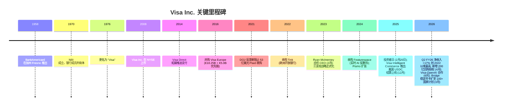
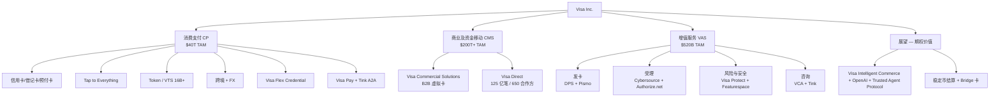
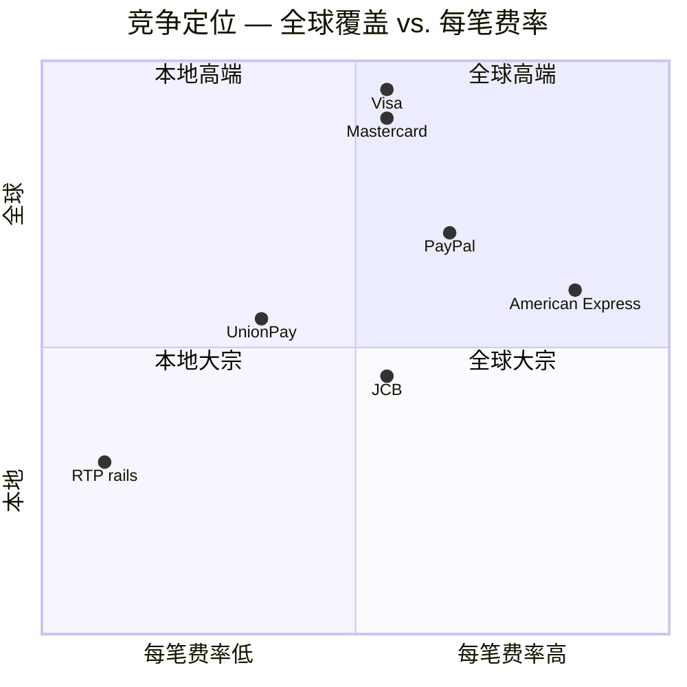

# Visa Inc. (维萨, NYSE: V) — 公司研究

*截至日期: 2026-06-14. 作者: x@lx00617. 除非另注，所有金额均为美元 (USD). 上一版 2026-06-02，本版全面刷新至当前规格（最新价、估值、决策层、完整 SVG 图表套件、Visa-OpenAI 催化剂）。*

> *分析师观点：* **评级：Buy（买入）· 12 个月目标价 US$450（较现价 US$322.39 上行 +39.6%）· 估值方法：FY2027E Non-GAAP EPS US$15.16 × 30× P/E（Bernstein 框架）**
> 市值 ~US$6,130 亿 · 52 周区间 US$293.89–US$360.22 · TTM P/E 28.1× · 前瞻 P/E 21.7× · NYSE:V · CIK 0001403161
>
> **核心论点（thesis pillars）**——（1）Visa 是全球数字支付的准垄断收费站（toll booth），年化处理 17 万亿美元 (USD) 量、约 50 亿张凭证、1.75 亿+ 商户，以中两位数复合增长 Non-GAAP EPS；（2）增值服务 / Value-Added Services (VAS) 以 ~24% 增速贡献 FY25 净收入约 27%，软件化经济学应享有高于刷卡量业务的估值倍数；（3）2026 年 6 月 Visa-OpenAI 合作 + Trusted Agent Protocol 把"代理式商务 / agentic commerce"从威胁叙事翻转为 AI 时代支付信任层的期权价值；（4）当前 TTM P/E 处于公司自身历史约 5% 分位（Bernstein），12 个月相对 S&P 500 跑输约 32 个百分点，倍数-增速剪刀差为再定价（re-rating）提供安全边际。

**业绩近况（无需横幅）.** Visa 不提供逐季的全年数字化指引，因此无"上调/下调指引"横幅。但需注意 FY26 加速：Q1 FY26 净收入 +15%、Q2 FY26 净收入 +17%（2022 年以来最高），CEO 在 2026 年 5 月炉边谈话中称 5 月中旬全球消费支出较 Q1 略有改善 ([Q1 FY26 业绩稿, 2026-01-29](https://www.sec.gov/Archives/edgar/data/1403161/000140316126000044/q12026earningsrelease.htm); [Q2 FY26 业绩稿, 2026-04-28](https://www.sec.gov/Archives/edgar/data/1403161/000140316126000077/q22026earningsrelease.htm))。

## 目录

1. 公司概览（含估值快照）
   - 1A. 估值与目标价（决策层）
   - 1B. GF Score 基本面评分卡
2. 公司历史与卖方观点演变
3. 管理团队
4. 产品与服务
5. 客户与上市策略
6. 行业概览
7. 竞争格局
8. 市场机会
9. 风险评估
   - 9.5 核心分歧与催化剂
10. 投资视角评分卡
11. 参考资料

---

## 1. 公司概览

*分析师观点：* Visa 是教科书级的"好生意按合理价格买"——一个资本极轻、双边网络效应、准垄断成本基础的全球支付收费站，以中两位数复合增长 Non-GAAP EPS，却因 2025-26 年市场对 AI/agentic 商务脱媒的担忧 + 大盘质量股向 AI 基础设施轮动，跌至自身估值历史底部分位。本报告的核心判断是：这种担忧被证伪——2026 年 6 月的 Visa-OpenAI 合作恰恰说明卡组织不是被代理颠覆，而是成为 AI 时代支付信任层的核心受益者。叠加 VAS（~27% 净收入、+24% 增速、毛利更高）与稳定币联名卡，四条被低估的再定价线使 Bernstein 的 Outperform / 450 美元目标价（+39.6% 空间）具备非对称回报特征。

Visa Inc. (NYSE: V, CIK 0001403161) 总部位于美国旧金山。根据公司 FY2025 10-K 的"业务概述 / Business Overview"披露："我们通过自有的高级交易处理网络 VisaNet，在 200+ 国家和地区为消费者、发卡 (issuing) 及收单 (acquiring) 金融机构、商户之间提供安全、可靠、高效的全球商务及资金移动支持。"理解 Visa 的核心是**四方模式 / four-party model**——Visa 连接约 14,500 家发卡金融机构、约 1.75 亿家商户受理网点、约 120 亿张卡/账户/电子钱包终端，但**本身不发卡、不放贷、不承担信用风险**。10-K 逐字披露："During fiscal 2025, Visa's total payments and cash volume was $17 trillion, and we had nearly 5 billion payment credentials … that were available to be used at more than 175 million merchant locations worldwide." ([Visa FY2025 10-K, Item 1 Business — Business Overview](https://www.sec.gov/Archives/edgar/data/1403161/000140316125000089/v-20250930.htm))

Visa 的净收入 / net revenue 拆分为五条线: **服务收入 / service revenue**（发卡 / 收单方为接入网络与部分 VAS 而支付，FY25 $17,539M）、**数据处理收入 / data processing revenue**（按笔授权清结算 + 部分 VAS，$19,993M）、**国际交易收入 / international transaction revenue**（跨境 + 外汇，$14,166M）、**其他收入**（主要为 VAS——咨询、营销、品牌授权，$4,053M）、以及减项**客户激励 / client incentives**（向大型发卡 / 收单方支付的返点，$15,751M）。FY2025 关键数: 净收入 **400 亿美元 (+11% YoY)**、GAAP 净利 **200.6 亿美元 (+2%)**、GAAP 经营利润 **239.9 亿美元**、GAAP EPS **10.20 (+5%)**、Non-GAAP EPS **11.47 (+14%)**，GAAP 经营利润率（operating margin）由 FY24 的 65.7% 降至 60.0%，几乎全部来自 FY25 期间因 MDL 1720 商户集体诉讼（interchange multidistrict litigation）引发的 25.62 亿美元诉讼准备金支出（litigation provision，对比 FY24 仅 4.62 亿）([Visa Q4 FY2025 8-K Exhibit 99.1, 2025-10-28](https://www.sec.gov/Archives/edgar/data/1403161/000140316125000077/q42025earningsrelease.htm); [Visa FY2025 10-K Item 7 MD&A — Total operating expenses](https://www.sec.gov/Archives/edgar/data/1403161/000140316125000089/v-20250930.htm))。

下图以 Visa FY2025 利润表（Consolidated Statements of Operations）逐项呈现"钱从哪里来、到哪里去"：净收入 400 亿（已扣减 158 亿客户激励），无 COGS（资产极轻的网络），全部经 160 亿美元运营费用后产出 240 亿美元经营利润、200.6 亿美元净利润，GAAP 净利率 50.1%。

<svg xmlns="http://www.w3.org/2000/svg" viewBox="0 0 1000 560" width="1000" height="560" role="img" aria-label="income statement Sankey"><rect x="0" y="0" width="1000" height="560" fill="#ffffff"/>
<text x="20.00" y="30.00" text-anchor="start" font-family="Helvetica,Arial,sans-serif" font-size="15" font-weight="700" fill="#1f2933">Visa (V) 如何赚钱 / How Visa Makes Its Money — FY2025 (US$M)</text>
<path d="M 700.00,64.00 C 754.00,64.00 754.00,159.22 808.00,159.22 L 808.00,362.80 C 754.00,362.80 754.00,267.57 700.00,267.57 Z" fill="#86efac" fill-opacity="0.55"/>
<path d="M 700.00,267.57 C 754.00,267.57 754.00,376.80 808.00,376.80 L 808.00,418.78 C 754.00,418.78 754.00,309.55 700.00,309.55 Z" fill="#fca5a5" fill-opacity="0.55"/>
<path d="M 576.00,71.00 C 630.00,71.00 630.00,64.00 684.00,64.00 L 684.00,307.52 C 630.00,307.52 630.00,314.52 576.00,314.52 Z" fill="#86efac" fill-opacity="0.55"/>
<path d="M 452.00,78.01 C 506.00,78.01 506.00,71.00 560.00,71.00 L 560.00,314.52 C 506.00,314.52 506.00,321.54 452.00,321.54 Z" fill="#86efac" fill-opacity="0.55"/>
<path d="M 452.00,321.54 C 506.00,321.54 506.00,328.52 560.00,328.52 L 560.00,490.97 C 506.00,490.97 506.00,483.99 452.00,483.99 Z" fill="#fca5a5" fill-opacity="0.55"/>
<path d="M 204.00,79.01 C 258.00,79.01 258.00,86.01 312.00,86.01 L 312.00,244.68 C 258.00,244.68 258.00,237.68 204.00,237.68 Z" fill="#93c5fd" fill-opacity="0.55"/>
<path d="M 328.00,86.01 C 382.00,86.01 382.00,78.01 436.00,78.01 L 436.00,483.99 C 382.00,483.99 382.00,491.99 328.00,491.99 Z" fill="#86efac" fill-opacity="0.55"/>
<path d="M 328.00,491.99 C 382.00,491.99 382.00,497.99 436.00,497.99 L 436.00,499.99 C 382.00,499.99 382.00,493.99 328.00,493.99 Z" fill="#fca5a5" fill-opacity="0.55"/>
<path d="M 204.00,251.68 C 258.00,251.68 258.00,244.68 312.00,244.68 L 312.00,491.99 C 258.00,491.99 258.00,498.99 204.00,498.99 Z" fill="#93c5fd" fill-opacity="0.55"/>
<path d="M 576.00,328.52 C 630.00,328.52 630.00,323.55 684.00,323.55 L 684.00,413.75 C 630.00,413.75 630.00,418.72 576.00,418.72 Z" fill="#fca5a5" fill-opacity="0.55"/>
<path d="M 576.00,418.72 C 630.00,418.72 630.00,427.75 684.00,427.75 L 684.00,436.82 C 630.00,436.82 630.00,427.79 576.00,427.79 Z" fill="#fca5a5" fill-opacity="0.55"/>
<path d="M 576.00,427.79 C 630.00,427.79 630.00,450.82 684.00,450.82 L 684.00,514.00 C 630.00,514.00 630.00,490.97 576.00,490.97 Z" fill="#fca5a5" fill-opacity="0.55"/>
<path d="M 576.00,504.97 C 630.00,504.97 630.00,307.52 684.00,307.52 L 684.00,309.55 C 630.00,309.55 630.00,507.00 576.00,507.00 Z" fill="#93c5fd" fill-opacity="0.55"/>
<rect x="188.00" y="79.01" width="16" height="158.66" rx="1.5" fill="#2563eb"/>
<rect x="188.00" y="251.68" width="16" height="247.31" rx="1.5" fill="#2563eb"/>
<rect x="312.00" y="86.01" width="16" height="405.97" rx="1.5" fill="#1e3a8a"/>
<rect x="436.00" y="78.01" width="16" height="405.97" rx="1.5" fill="#15803d"/>
<rect x="436.00" y="497.99" width="16" height="2.00" rx="1.5" fill="#dc2626"/>
<rect x="560.00" y="71.00" width="16" height="243.52" rx="1.5" fill="#15803d"/>
<rect x="560.00" y="328.52" width="16" height="162.45" rx="1.5" fill="#dc2626"/>
<rect x="560.00" y="504.97" width="16" height="2.03" rx="1.5" fill="#2563eb"/>
<rect x="684.00" y="64.00" width="16" height="245.55" rx="1.5" fill="#15803d"/>
<rect x="684.00" y="323.55" width="16" height="90.20" rx="1.5" fill="#dc2626"/>
<rect x="684.00" y="427.75" width="16" height="9.07" rx="1.5" fill="#dc2626"/>
<rect x="684.00" y="450.82" width="16" height="63.18" rx="1.5" fill="#dc2626"/>
<rect x="808.00" y="159.22" width="16" height="203.57" rx="1.5" fill="#15803d"/>
<rect x="808.00" y="376.80" width="16" height="41.98" rx="1.5" fill="#dc2626"/>
<text x="179.00" y="155.35" text-anchor="end" font-family="Helvetica,Arial,sans-serif" font-size="11.5" font-weight="700" fill="#1f2933">U.S. net revenue</text>
<text x="179.00" y="168.35" text-anchor="end" font-family="Helvetica,Arial,sans-serif" font-size="10" font-weight="400" fill="#52606d">$15.6B  (39.1%)</text>
<text x="179.00" y="372.33" text-anchor="end" font-family="Helvetica,Arial,sans-serif" font-size="11.5" font-weight="700" fill="#1f2933">International net revenue</text>
<text x="179.00" y="385.33" text-anchor="end" font-family="Helvetica,Arial,sans-serif" font-size="10" font-weight="400" fill="#52606d">$24.4B  (60.9%)</text>
<rect x="331.00" y="68.01" width="106.80" height="26" rx="2" fill="#ffffff" fill-opacity="0.72"/>
<text x="334.00" y="80.01" text-anchor="start" font-family="Helvetica,Arial,sans-serif" font-size="11.5" font-weight="700" fill="#1f2933">Revenue</text>
<text x="334.00" y="93.01" text-anchor="start" font-family="Helvetica,Arial,sans-serif" font-size="10" font-weight="400" fill="#52606d">$40.0B  (100.0%)</text>
<rect x="455.00" y="60.01" width="106.80" height="26" rx="2" fill="#ffffff" fill-opacity="0.72"/>
<text x="458.00" y="72.01" text-anchor="start" font-family="Helvetica,Arial,sans-serif" font-size="11.5" font-weight="700" fill="#1f2933">Gross Profit</text>
<text x="458.00" y="85.01" text-anchor="start" font-family="Helvetica,Arial,sans-serif" font-size="10" font-weight="400" fill="#52606d">$40.0B  (100.0%)</text>
<rect x="455.00" y="479.99" width="144.60" height="26" rx="2" fill="#ffffff" fill-opacity="0.72"/>
<text x="458.00" y="491.99" text-anchor="start" font-family="Helvetica,Arial,sans-serif" font-size="11.5" font-weight="700" fill="#1f2933">Cost of Revenue (COGS)</text>
<text x="458.00" y="504.99" text-anchor="start" font-family="Helvetica,Arial,sans-serif" font-size="10" font-weight="400" fill="#52606d">$0  (0.00%)</text>
<rect x="579.00" y="53.00" width="106.80" height="26" rx="2" fill="#ffffff" fill-opacity="0.72"/>
<text x="582.00" y="65.00" text-anchor="start" font-family="Helvetica,Arial,sans-serif" font-size="11.5" font-weight="700" fill="#1f2933">Operating Income</text>
<text x="582.00" y="78.00" text-anchor="start" font-family="Helvetica,Arial,sans-serif" font-size="10" font-weight="400" fill="#52606d">$24.0B  (60.0%)</text>
<rect x="579.00" y="310.52" width="150.90" height="26" rx="2" fill="#ffffff" fill-opacity="0.72"/>
<text x="582.00" y="322.52" text-anchor="start" font-family="Helvetica,Arial,sans-serif" font-size="11.5" font-weight="700" fill="#1f2933">Total Operating Expense</text>
<text x="582.00" y="335.52" text-anchor="start" font-family="Helvetica,Arial,sans-serif" font-size="10" font-weight="400" fill="#52606d">$16.0B  (40.0%)</text>
<line x1="560.00" y1="505.99" x2="554.00" y2="487.00" stroke="#cbd5e1" stroke-width="1"/>
<text x="551.00" y="490.00" text-anchor="end" font-family="Helvetica,Arial,sans-serif" font-size="11.5" font-weight="700" fill="#1f2933">Net Interest / Other Income</text>
<text x="551.00" y="503.00" text-anchor="end" font-family="Helvetica,Arial,sans-serif" font-size="10" font-weight="400" fill="#52606d">$200.0M  (0.50%)</text>
<rect x="703.00" y="46.00" width="100.50" height="26" rx="2" fill="#ffffff" fill-opacity="0.72"/>
<text x="706.00" y="58.00" text-anchor="start" font-family="Helvetica,Arial,sans-serif" font-size="11.5" font-weight="700" fill="#1f2933">Pretax Income</text>
<text x="706.00" y="71.00" text-anchor="start" font-family="Helvetica,Arial,sans-serif" font-size="10" font-weight="400" fill="#52606d">$24.2B  (60.5%)</text>
<rect x="703.00" y="305.55" width="94.20" height="26" rx="2" fill="#ffffff" fill-opacity="0.72"/>
<text x="706.00" y="317.55" text-anchor="start" font-family="Helvetica,Arial,sans-serif" font-size="11.5" font-weight="700" fill="#1f2933">SG&amp;A</text>
<text x="706.00" y="330.55" text-anchor="start" font-family="Helvetica,Arial,sans-serif" font-size="10" font-weight="400" fill="#52606d">$8.9B  (22.2%)</text>
<rect x="703.00" y="409.75" width="100.50" height="26" rx="2" fill="#ffffff" fill-opacity="0.72"/>
<text x="706.00" y="421.75" text-anchor="start" font-family="Helvetica,Arial,sans-serif" font-size="11.5" font-weight="700" fill="#1f2933">R&amp;D</text>
<text x="706.00" y="434.75" text-anchor="start" font-family="Helvetica,Arial,sans-serif" font-size="10" font-weight="400" fill="#52606d">$894.0M  (2.2%)</text>
<rect x="703.00" y="434.75" width="94.20" height="26" rx="2" fill="#ffffff" fill-opacity="0.72"/>
<text x="706.00" y="446.75" text-anchor="start" font-family="Helvetica,Arial,sans-serif" font-size="11.5" font-weight="700" fill="#1f2933">Other OpEx</text>
<text x="706.00" y="459.75" text-anchor="start" font-family="Helvetica,Arial,sans-serif" font-size="10" font-weight="400" fill="#52606d">$6.2B  (15.6%)</text>
<text x="833.00" y="258.01" text-anchor="start" font-family="Helvetica,Arial,sans-serif" font-size="11.5" font-weight="700" fill="#1f2933">Net Income</text>
<text x="833.00" y="271.01" text-anchor="start" font-family="Helvetica,Arial,sans-serif" font-size="10" font-weight="400" fill="#52606d">$20.1B  (50.1%)</text>
<text x="833.00" y="394.79" text-anchor="start" font-family="Helvetica,Arial,sans-serif" font-size="11.5" font-weight="700" fill="#1f2933">Income Tax</text>
<text x="833.00" y="407.79" text-anchor="start" font-family="Helvetica,Arial,sans-serif" font-size="10" font-weight="400" fill="#52606d">$4.1B  (10.3%)</text>
<text x="500.00" y="530.00" text-anchor="middle" font-family="Helvetica,Arial,sans-serif" font-size="10" font-weight="400" font-style="italic" fill="#8a97a3">Net revenue 净收入 = gross revenue $55.8B − client incentives $15.8B. No COGS (asset-light network).</text>
<text x="500.00" y="544.00" text-anchor="middle" font-family="Helvetica,Arial,sans-serif" font-size="10" font-weight="400" fill="#52606d">Source: Visa FY2025 10-K, Consolidated Statements of Operations + Note 1 (geographic net revenue)</text>
</svg>

来源 / Source: [Visa FY2025 10-K, Consolidated Statements of Operations + Note 1（geographic net revenue）](https://www.sec.gov/Archives/edgar/data/1403161/000140316125000089/v-20250930.htm)（净收入 $40.0B = 毛收入 $55.8B − 客户激励 $15.8B；无 COGS）

毛收入的四条线构成与按地区的净收入分布如下两图：数据处理（$20.0B）与服务（$17.5B）是核心收费引擎，国际交易（$14.2B）是毛利最高的跨境部分，"其他"（$4.1B）以 VAS 为主；地区上国际（非美）占净收入 61%，是真正的增长引擎。

<svg xmlns="http://www.w3.org/2000/svg" viewBox="0 0 720 460" width="720" height="460" role="img" aria-label="revenue donut"><rect x="0" y="0" width="720" height="460" fill="#ffffff"/>
<text x="20.00" y="30.00" text-anchor="start" font-family="Helvetica,Arial,sans-serif" font-size="15" font-weight="700" fill="#1f2933">FY2025 毛收入构成 / Gross Revenue by Line (pre-incentives)</text>
<path d="M 288.00,107.20 A 132 132 0 0 1 390.44,322.45 L 348.53,288.39 A 78 78 0 0 0 288.00,161.20 Z" fill="#2563eb"/>
<path d="M 390.44,322.45 A 132 132 0 0 1 171.07,300.45 L 218.90,275.39 A 78 78 0 0 0 348.53,288.39 Z" fill="#15803d"/>
<path d="M 171.07,300.45 A 132 132 0 0 1 229.78,120.73 L 253.60,169.20 A 78 78 0 0 0 218.90,275.39 Z" fill="#d97706"/>
<path d="M 229.78,120.73 A 132 132 0 0 1 288.00,107.20 L 288.00,161.20 A 78 78 0 0 0 253.60,169.20 Z" fill="#7c3aed"/>
<text x="288.00" y="235.20" text-anchor="middle" font-family="Helvetica,Arial,sans-serif" font-size="18" font-weight="800" fill="#1f2933">Visa</text>
<text x="288.00" y="255.20" text-anchor="middle" font-family="Helvetica,Arial,sans-serif" font-size="13" font-weight="600" fill="#52606d">$55.8B</text>
<text x="288.00" y="271.20" text-anchor="middle" font-family="Helvetica,Arial,sans-serif" font-size="10" font-weight="400" fill="#8a97a3">total</text>
<line x1="412.61" y1="179.90" x2="428.61" y2="179.90" stroke="#2563eb" stroke-width="1.4"/>
<text x="432.61" y="177.90" text-anchor="start" font-family="Helvetica,Arial,sans-serif" font-size="11" font-weight="700" fill="#1f2933">Data processing</text>
<text x="432.61" y="191.90" text-anchor="start" font-family="Helvetica,Arial,sans-serif" font-size="10" font-weight="400" fill="#52606d">$20.0B  (35.9%)</text>
<line x1="274.23" y1="376.51" x2="258.23" y2="376.51" stroke="#15803d" stroke-width="1.4"/>
<text x="254.23" y="374.51" text-anchor="end" font-family="Helvetica,Arial,sans-serif" font-size="11" font-weight="700" fill="#1f2933">Service</text>
<text x="254.23" y="388.51" text-anchor="end" font-family="Helvetica,Arial,sans-serif" font-size="10" font-weight="400" fill="#52606d">$17.5B  (31.5%)</text>
<line x1="156.82" y1="196.35" x2="140.82" y2="196.35" stroke="#d97706" stroke-width="1.4"/>
<text x="136.82" y="194.35" text-anchor="end" font-family="Helvetica,Arial,sans-serif" font-size="11" font-weight="700" fill="#1f2933">International transaction</text>
<text x="136.82" y="208.35" text-anchor="end" font-family="Helvetica,Arial,sans-serif" font-size="10" font-weight="400" fill="#52606d">$14.2B  (25.4%)</text>
<line x1="256.76" y1="104.78" x2="240.76" y2="104.78" stroke="#7c3aed" stroke-width="1.4"/>
<text x="236.76" y="102.78" text-anchor="end" font-family="Helvetica,Arial,sans-serif" font-size="11" font-weight="700" fill="#1f2933">Other (mostly VAS)</text>
<text x="236.76" y="116.78" text-anchor="end" font-family="Helvetica,Arial,sans-serif" font-size="10" font-weight="400" fill="#52606d">$4.1B  (7.3%)</text>
<text x="360.00" y="444.00" text-anchor="middle" font-family="Helvetica,Arial,sans-serif" font-size="10" font-weight="400" fill="#52606d">Source: Visa FY2025 10-K, Note 1 — Disaggregation of revenue (gross, before $15.8B client incentives)</text>
</svg>
<svg xmlns="http://www.w3.org/2000/svg" viewBox="0 0 720 460" width="720" height="460" role="img" aria-label="revenue donut"><rect x="0" y="0" width="720" height="460" fill="#ffffff"/>
<text x="20.00" y="30.00" text-anchor="start" font-family="Helvetica,Arial,sans-serif" font-size="15" font-weight="700" fill="#1f2933">FY2025 净收入按地区 / Net Revenue by Geography</text>
<path d="M 288.00,107.20 A 132 132 0 1 1 204.39,341.34 L 238.59,299.56 A 78 78 0 1 0 288.00,161.20 Z" fill="#2563eb"/>
<path d="M 204.39,341.34 A 132 132 0 0 1 288.00,107.20 L 288.00,161.20 A 78 78 0 0 0 238.59,299.56 Z" fill="#15803d"/>
<text x="288.00" y="235.20" text-anchor="middle" font-family="Helvetica,Arial,sans-serif" font-size="18" font-weight="800" fill="#1f2933">Visa</text>
<text x="288.00" y="255.20" text-anchor="middle" font-family="Helvetica,Arial,sans-serif" font-size="13" font-weight="600" fill="#52606d">$40.0B</text>
<text x="288.00" y="271.20" text-anchor="middle" font-family="Helvetica,Arial,sans-serif" font-size="10" font-weight="400" fill="#8a97a3">total</text>
<line x1="417.96" y1="285.61" x2="433.96" y2="285.61" stroke="#2563eb" stroke-width="1.4"/>
<text x="437.96" y="283.61" text-anchor="start" font-family="Helvetica,Arial,sans-serif" font-size="11" font-weight="700" fill="#1f2933">International</text>
<text x="437.96" y="297.61" text-anchor="start" font-family="Helvetica,Arial,sans-serif" font-size="10" font-weight="400" fill="#52606d">$24.4B  (60.9%)</text>
<line x1="158.04" y1="192.79" x2="142.04" y2="192.79" stroke="#15803d" stroke-width="1.4"/>
<text x="138.04" y="190.79" text-anchor="end" font-family="Helvetica,Arial,sans-serif" font-size="11" font-weight="700" fill="#1f2933">U.S.</text>
<text x="138.04" y="204.79" text-anchor="end" font-family="Helvetica,Arial,sans-serif" font-size="10" font-weight="400" fill="#52606d">$15.6B  (39.1%)</text>
<text x="360.00" y="444.00" text-anchor="middle" font-family="Helvetica,Arial,sans-serif" font-size="10" font-weight="400" fill="#52606d">Source: Visa FY2025 10-K, Note 1 — Net revenue by geography</text>
</svg>

来源 / Source: [Visa FY2025 10-K, Note 1 — Disaggregation of revenue（毛收入按线、净收入按地区）](https://www.sec.gov/Archives/edgar/data/1403161/000140316125000089/v-20250930.htm)

近三年净收入按地区与毛收入按线的演变（development over time）显示：国际净收入 FY23 $18.5B → FY25 $24.4B（CAGR ~15%），明显快于美国 $14.1B → $15.6B（CAGR ~5%）；"其他/VAS-heavy"线 FY23 $2.5B → FY25 $4.1B 是增速最快的收入线（CAGR ~27%）。

<svg xmlns="http://www.w3.org/2000/svg" viewBox="0 0 860 470" width="860" height="470" role="img" aria-label="historical revenue bars"><rect x="0" y="0" width="860" height="470" fill="#ffffff"/>
<text x="20.00" y="30.00" text-anchor="start" font-family="Helvetica,Arial,sans-serif" font-size="15" font-weight="700" fill="#1f2933">净收入按地区 FY23-FY25 / Net Revenue by Geography (US$B)</text>
<rect x="20.00" y="44" width="11" height="11" rx="2" fill="#2563eb"/>
<text x="36.00" y="53.00" text-anchor="start" font-family="Helvetica,Arial,sans-serif" font-size="10.5" font-weight="400" fill="#1f2933">International</text>
<rect x="135.80" y="44" width="11" height="11" rx="2" fill="#15803d"/>
<text x="151.80" y="53.00" text-anchor="start" font-family="Helvetica,Arial,sans-serif" font-size="10.5" font-weight="400" fill="#1f2933">U.S.</text>
<line x1="70" y1="412.00" x2="834" y2="412.00" stroke="#eceff2" stroke-width="1"/>
<text x="64.00" y="415.00" text-anchor="end" font-family="Helvetica,Arial,sans-serif" font-size="9.5" font-weight="400" fill="#52606d">$0</text>
<line x1="70" y1="345.20" x2="834" y2="345.20" stroke="#eceff2" stroke-width="1"/>
<text x="64.00" y="348.20" text-anchor="end" font-family="Helvetica,Arial,sans-serif" font-size="9.5" font-weight="400" fill="#52606d">$8.6B</text>
<line x1="70" y1="278.40" x2="834" y2="278.40" stroke="#eceff2" stroke-width="1"/>
<text x="64.00" y="281.40" text-anchor="end" font-family="Helvetica,Arial,sans-serif" font-size="9.5" font-weight="400" fill="#52606d">$17.3B</text>
<line x1="70" y1="211.60" x2="834" y2="211.60" stroke="#eceff2" stroke-width="1"/>
<text x="64.00" y="214.60" text-anchor="end" font-family="Helvetica,Arial,sans-serif" font-size="9.5" font-weight="400" fill="#52606d">$25.9B</text>
<line x1="70" y1="144.80" x2="834" y2="144.80" stroke="#eceff2" stroke-width="1"/>
<text x="64.00" y="147.80" text-anchor="end" font-family="Helvetica,Arial,sans-serif" font-size="9.5" font-weight="400" fill="#52606d">$34.6B</text>
<line x1="70" y1="78.00" x2="834" y2="78.00" stroke="#eceff2" stroke-width="1"/>
<text x="64.00" y="81.00" text-anchor="end" font-family="Helvetica,Arial,sans-serif" font-size="9.5" font-weight="400" fill="#52606d">$43.2B</text>
<rect x="123.48" y="268.97" width="147.71" height="143.03" fill="#2563eb"/>
<rect x="123.48" y="159.95" width="147.71" height="109.01" fill="#15803d"/>
<text x="197.33" y="428.00" text-anchor="middle" font-family="Helvetica,Arial,sans-serif" font-size="10" font-weight="400" fill="#52606d">2023</text>
<rect x="378.15" y="248.87" width="147.71" height="163.13" fill="#2563eb"/>
<rect x="378.15" y="134.44" width="147.71" height="114.43" fill="#15803d"/>
<text x="452.00" y="428.00" text-anchor="middle" font-family="Helvetica,Arial,sans-serif" font-size="10" font-weight="400" fill="#52606d">2024</text>
<rect x="632.81" y="223.35" width="147.71" height="188.65" fill="#2563eb"/>
<rect x="632.81" y="102.74" width="147.71" height="120.61" fill="#15803d"/>
<text x="706.67" y="428.00" text-anchor="middle" font-family="Helvetica,Arial,sans-serif" font-size="10" font-weight="400" fill="#52606d">2025</text>
<text x="430.00" y="454.00" text-anchor="middle" font-family="Helvetica,Arial,sans-serif" font-size="10" font-weight="400" fill="#52606d">Source: Visa FY2023–FY2025 10-Ks, Note 1 — Net revenue by geography</text>
</svg>

来源 / Source: [Visa FY2023–FY2025 10-Ks, Note 1 — Net revenue by geography](https://www.sec.gov/Archives/edgar/data/1403161/000140316125000089/v-20250930.htm)

<svg xmlns="http://www.w3.org/2000/svg" viewBox="0 0 860 470" width="860" height="470" role="img" aria-label="historical revenue bars"><rect x="0" y="0" width="860" height="470" fill="#ffffff"/>
<text x="20.00" y="30.00" text-anchor="start" font-family="Helvetica,Arial,sans-serif" font-size="15" font-weight="700" fill="#1f2933">毛收入构成 FY23-FY25 / Gross Revenue by Line (US$B, pre-incentives)</text>
<rect x="20.00" y="44" width="11" height="11" rx="2" fill="#2563eb"/>
<text x="36.00" y="53.00" text-anchor="start" font-family="Helvetica,Arial,sans-serif" font-size="10.5" font-weight="400" fill="#1f2933">Data processing</text>
<rect x="149.00" y="44" width="11" height="11" rx="2" fill="#15803d"/>
<text x="165.00" y="53.00" text-anchor="start" font-family="Helvetica,Arial,sans-serif" font-size="10.5" font-weight="400" fill="#1f2933">Service</text>
<rect x="225.20" y="44" width="11" height="11" rx="2" fill="#d97706"/>
<text x="241.20" y="53.00" text-anchor="start" font-family="Helvetica,Arial,sans-serif" font-size="10.5" font-weight="400" fill="#1f2933">International transaction</text>
<rect x="420.20" y="44" width="11" height="11" rx="2" fill="#7c3aed"/>
<text x="436.20" y="53.00" text-anchor="start" font-family="Helvetica,Arial,sans-serif" font-size="10.5" font-weight="400" fill="#1f2933">Other (VAS-heavy)</text>
<line x1="70" y1="412.00" x2="834" y2="412.00" stroke="#eceff2" stroke-width="1"/>
<text x="64.00" y="415.00" text-anchor="end" font-family="Helvetica,Arial,sans-serif" font-size="9.5" font-weight="400" fill="#52606d">$0</text>
<line x1="70" y1="345.20" x2="834" y2="345.20" stroke="#eceff2" stroke-width="1"/>
<text x="64.00" y="348.20" text-anchor="end" font-family="Helvetica,Arial,sans-serif" font-size="9.5" font-weight="400" fill="#52606d">$12.1B</text>
<line x1="70" y1="278.40" x2="834" y2="278.40" stroke="#eceff2" stroke-width="1"/>
<text x="64.00" y="281.40" text-anchor="end" font-family="Helvetica,Arial,sans-serif" font-size="9.5" font-weight="400" fill="#52606d">$24.1B</text>
<line x1="70" y1="211.60" x2="834" y2="211.60" stroke="#eceff2" stroke-width="1"/>
<text x="64.00" y="214.60" text-anchor="end" font-family="Helvetica,Arial,sans-serif" font-size="9.5" font-weight="400" fill="#52606d">$36.2B</text>
<line x1="70" y1="144.80" x2="834" y2="144.80" stroke="#eceff2" stroke-width="1"/>
<text x="64.00" y="147.80" text-anchor="end" font-family="Helvetica,Arial,sans-serif" font-size="9.5" font-weight="400" fill="#52606d">$48.2B</text>
<line x1="70" y1="78.00" x2="834" y2="78.00" stroke="#eceff2" stroke-width="1"/>
<text x="64.00" y="81.00" text-anchor="end" font-family="Helvetica,Arial,sans-serif" font-size="9.5" font-weight="400" fill="#52606d">$60.3B</text>
<rect x="123.48" y="323.32" width="147.71" height="88.68" fill="#2563eb"/>
<rect x="123.48" y="242.96" width="147.71" height="80.36" fill="#15803d"/>
<rect x="123.48" y="178.67" width="147.71" height="64.29" fill="#d97706"/>
<rect x="123.48" y="164.81" width="147.71" height="13.86" fill="#7c3aed"/>
<text x="197.33" y="428.00" text-anchor="middle" font-family="Helvetica,Arial,sans-serif" font-size="10" font-weight="400" fill="#52606d">2023</text>
<rect x="378.15" y="313.90" width="147.71" height="98.10" fill="#2563eb"/>
<rect x="378.15" y="224.67" width="147.71" height="89.23" fill="#15803d"/>
<rect x="378.15" y="154.28" width="147.71" height="70.39" fill="#d97706"/>
<rect x="378.15" y="136.55" width="147.71" height="17.74" fill="#7c3aed"/>
<text x="452.00" y="428.00" text-anchor="middle" font-family="Helvetica,Arial,sans-serif" font-size="10" font-weight="400" fill="#52606d">2024</text>
<rect x="632.81" y="301.15" width="147.71" height="110.85" fill="#2563eb"/>
<rect x="632.81" y="204.16" width="147.71" height="96.99" fill="#15803d"/>
<rect x="632.81" y="125.46" width="147.71" height="78.70" fill="#d97706"/>
<rect x="632.81" y="102.74" width="147.71" height="22.72" fill="#7c3aed"/>
<text x="706.67" y="428.00" text-anchor="middle" font-family="Helvetica,Arial,sans-serif" font-size="10" font-weight="400" fill="#52606d">2025</text>
<text x="430.00" y="454.00" text-anchor="middle" font-family="Helvetica,Arial,sans-serif" font-size="10" font-weight="400" fill="#52606d">Source: Visa FY2023–FY2025 10-Ks, Note 1 — Disaggregation of revenue</text>
</svg>

来源 / Source: [Visa FY2023–FY2025 10-Ks, Note 1 — Disaggregation of revenue](https://www.sec.gov/Archives/edgar/data/1403161/000140316125000089/v-20250930.htm)

**估值快照 (TTM, 截至 2026-06-12 收盘).** 现价 **US$322.39**（2026-06-12 收盘）；总市值 **~US$6,130 亿**；**TTM P/E 28.1×**、**前瞻 P/E (forward P/E) 21.7×**、**TTM P/S 14.2×**、beta 0.77；TTM EPS（GAAP）约 $11.48，前瞻 EPS 约 $14.86 ([Visa 报价与关键统计 — Yahoo Finance](https://finance.yahoo.com/quote/V/key-statistics/))。Visa 当前 TTM P/E 与 Mastercard 几乎一致（MA 28.3×）、显著高于 American Express（AXP 20.3×）与 PayPal（PYPL 7.8×），符合卡网络双寡头享有的网络-护城河溢价（[同一来源，截面比较](https://finance.yahoo.com/quote/V/key-statistics/)）。*分析师观点：* 28.1× 的 TTM P/E 高于 S&P 500（~22×），但低于 Visa 自身过去十年中位数；Bernstein 称当前估值处于公司历史**约 5% 分位**，是过去十年最便宜的窗口之一（[Bernstein — 与 CEO McInerney 炉边谈话纪要, 2026-06-01, p.1](http://xs-macbook-air.local:5001/zsxq/pdf/415284282584848/Bernstein-Visa%20Inc%EF%BC%88V.US%EF%BC%89Visa%EF%BC%9A%20Reflections%20on%20our%20Fireside%20Chat%20with%20CEO%20Ryan%20McInerney-260601.pdf)）。倍数偏高的根本原因是 Visa 同时具备（a）准垄断的双边网络护城河、（b）中两位数 EPS 复合增长、（c）VAS 带来的软件化收入升级——属于"高质量复利股的合理溢价"而非泡沫，本报告在 §9 仍将倍数压缩列为风险。

**资本回报.** FY25 共向股东返还 **228 亿美元**（回购 196 亿 + 分红 32 亿，对应现金流量表口径回购 $18,316M + 分红 $4,634M）；Q2 FY26 又返还 92 亿美元，并经董事会**新授权一项 200 亿美元的多年期回购计划**，叠加于 2025 年 4 月授权的 300 亿美元回购计划（FY25 期末剩余 249 亿）([Visa FY2025 10-K Item 7 — Cash Flows + Note 15](https://www.sec.gov/Archives/edgar/data/1403161/000140316125000089/v-20250930.htm); [Q2 FY26 业绩稿](https://www.sec.gov/Archives/edgar/data/1403161/000140316126000077/q22026earningsrelease.htm))。2025 年 10 月季度股息上调 14% 至每股 0.670 美元，将 5 年股息复合增速推至中两位数。

下图（DuPont ROE 分解）展示 Visa 回报质量的来源：FY25 ROE **52.1%** = 净利率（net margin）50.1% × 资产周转率（asset turnover）0.41 × 权益乘数（equity multiplier）2.52——超高净利率（处理网络的结构性特征）是主驱动，资产周转偏低反映 Visa Europe 并购形成的大额商誉+无形资产（合计 $47.5B）压在资产端，权益乘数 2.52 则部分来自持续回购缩股（equity 由 FY24 $39.1B 降至 FY25 $37.9B）。

<svg xmlns="http://www.w3.org/2000/svg" viewBox="0 0 1240 540" width="1240" height="540" role="img" aria-label="DuPont ROE decomposition"><rect x="0" y="0" width="1240" height="540" fill="#ffffff"/>
<text x="20.00" y="30.00" text-anchor="start" font-family="Helvetica,Arial,sans-serif" font-size="15" font-weight="700" fill="#1f2933">Visa (V) DuPont ROE 分解 — FY2025</text>
<rect x="545.00" y="56.00" width="150" height="56" rx="7" fill="#1e3a8a"/>
<text x="620.00" y="76.00" text-anchor="middle" font-family="Helvetica,Arial,sans-serif" font-size="11.5" font-weight="700" fill="#ffffff">ROE</text>
<text x="620.00" y="94.00" text-anchor="middle" font-family="Helvetica,Arial,sans-serif" font-size="13" font-weight="800" fill="#ffffff">52.07%</text>
<text x="620.00" y="106.00" text-anchor="middle" font-family="Helvetica,Arial,sans-serif" font-size="8.5" font-weight="400" fill="#dbeafe">= Net Income / Avg Equity</text>
<rect x="191.60" y="168.00" width="150" height="56" rx="7" fill="#2563eb"/>
<text x="266.60" y="188.00" text-anchor="middle" font-family="Helvetica,Arial,sans-serif" font-size="11.5" font-weight="700" fill="#ffffff">Net Margin</text>
<text x="266.60" y="206.00" text-anchor="middle" font-family="Helvetica,Arial,sans-serif" font-size="13" font-weight="800" fill="#ffffff">50.14%</text>
<text x="266.60" y="218.00" text-anchor="middle" font-family="Helvetica,Arial,sans-serif" font-size="8.5" font-weight="400" fill="#dbeafe">Net Income / Revenue</text>
<line x1="620.00" y1="112.00" x2="266.60" y2="168.00" stroke="#94a3b8" stroke-width="1.4"/>
<rect x="545.00" y="168.00" width="150" height="56" rx="7" fill="#2563eb"/>
<text x="620.00" y="188.00" text-anchor="middle" font-family="Helvetica,Arial,sans-serif" font-size="11.5" font-weight="700" fill="#ffffff">Asset Turnover</text>
<text x="620.00" y="206.00" text-anchor="middle" font-family="Helvetica,Arial,sans-serif" font-size="13" font-weight="800" fill="#ffffff">0.41</text>
<text x="620.00" y="218.00" text-anchor="middle" font-family="Helvetica,Arial,sans-serif" font-size="8.5" font-weight="400" fill="#dbeafe">Revenue / Avg Assets</text>
<line x1="620.00" y1="112.00" x2="620.00" y2="168.00" stroke="#94a3b8" stroke-width="1.4"/>
<rect x="898.40" y="168.00" width="150" height="56" rx="7" fill="#2563eb"/>
<text x="973.40" y="188.00" text-anchor="middle" font-family="Helvetica,Arial,sans-serif" font-size="11.5" font-weight="700" fill="#ffffff">Equity Multiplier</text>
<text x="973.40" y="206.00" text-anchor="middle" font-family="Helvetica,Arial,sans-serif" font-size="13" font-weight="800" fill="#ffffff">2.52</text>
<text x="973.40" y="218.00" text-anchor="middle" font-family="Helvetica,Arial,sans-serif" font-size="8.5" font-weight="400" fill="#dbeafe">Avg Assets / Avg Equity</text>
<line x1="620.00" y1="112.00" x2="973.40" y2="168.00" stroke="#94a3b8" stroke-width="1.4"/>
<circle cx="443.30" cy="196.00" r="11" fill="#ffffff" stroke="#94a3b8" stroke-width="1.2"/>
<text x="443.30" y="201.00" text-anchor="middle" font-family="Helvetica,Arial,sans-serif" font-size="14" font-weight="800" fill="#52606d">×</text>
<circle cx="796.70" cy="196.00" r="11" fill="#ffffff" stroke="#94a3b8" stroke-width="1.2"/>
<text x="796.70" y="201.00" text-anchor="middle" font-family="Helvetica,Arial,sans-serif" font-size="14" font-weight="800" fill="#52606d">×</text>
<rect x="65.00" y="300.00" width="118" height="56" rx="7" fill="#2563eb"/>
<text x="124.00" y="320.00" text-anchor="middle" font-family="Helvetica,Arial,sans-serif" font-size="11.5" font-weight="700" fill="#ffffff">Operating Margin</text>
<text x="124.00" y="338.00" text-anchor="middle" font-family="Helvetica,Arial,sans-serif" font-size="13" font-weight="800" fill="#ffffff">59.98%</text>
<text x="124.00" y="350.00" text-anchor="middle" font-family="Helvetica,Arial,sans-serif" font-size="8.5" font-weight="400" fill="#dbeafe">Op Inc / Revenue</text>
<line x1="266.60" y1="224.00" x2="124.00" y2="300.00" stroke="#94a3b8" stroke-width="1.4"/>
<rect x="207.60" y="300.00" width="118" height="56" rx="7" fill="#2563eb"/>
<text x="266.60" y="320.00" text-anchor="middle" font-family="Helvetica,Arial,sans-serif" font-size="11.5" font-weight="700" fill="#ffffff">Tax Burden</text>
<text x="266.60" y="338.00" text-anchor="middle" font-family="Helvetica,Arial,sans-serif" font-size="13" font-weight="800" fill="#ffffff">0.8290</text>
<text x="266.60" y="350.00" text-anchor="middle" font-family="Helvetica,Arial,sans-serif" font-size="8.5" font-weight="400" fill="#dbeafe">Net Inc / Pretax</text>
<line x1="266.60" y1="224.00" x2="266.60" y2="300.00" stroke="#94a3b8" stroke-width="1.4"/>
<rect x="350.20" y="300.00" width="118" height="56" rx="7" fill="#2563eb"/>
<text x="409.20" y="320.00" text-anchor="middle" font-family="Helvetica,Arial,sans-serif" font-size="11.5" font-weight="700" fill="#ffffff">Interest Burden</text>
<text x="409.20" y="338.00" text-anchor="middle" font-family="Helvetica,Arial,sans-serif" font-size="13" font-weight="800" fill="#ffffff">1.0083</text>
<text x="409.20" y="350.00" text-anchor="middle" font-family="Helvetica,Arial,sans-serif" font-size="8.5" font-weight="400" fill="#dbeafe">Pretax / Op Inc</text>
<line x1="266.60" y1="224.00" x2="409.20" y2="300.00" stroke="#94a3b8" stroke-width="1.4"/>
<circle cx="195.30" cy="328.00" r="11" fill="#ffffff" stroke="#94a3b8" stroke-width="1.2"/>
<text x="195.30" y="333.00" text-anchor="middle" font-family="Helvetica,Arial,sans-serif" font-size="14" font-weight="800" fill="#52606d">×</text>
<circle cx="337.90" cy="328.00" r="11" fill="#ffffff" stroke="#94a3b8" stroke-width="1.2"/>
<text x="337.90" y="333.00" text-anchor="middle" font-family="Helvetica,Arial,sans-serif" font-size="14" font-weight="800" fill="#52606d">×</text>
<rect x="479.00" y="300.00" width="118" height="56" rx="7" fill="#2563eb"/>
<text x="538.00" y="326.00" text-anchor="middle" font-family="Helvetica,Arial,sans-serif" font-size="11.5" font-weight="700" fill="#ffffff">Revenue</text>
<text x="538.00" y="342.00" text-anchor="middle" font-family="Helvetica,Arial,sans-serif" font-size="13" font-weight="800" fill="#ffffff">$40.0B</text>
<line x1="620.00" y1="224.00" x2="538.00" y2="300.00" stroke="#94a3b8" stroke-width="1.4"/>
<rect x="643.00" y="300.00" width="118" height="56" rx="7" fill="#2563eb"/>
<text x="702.00" y="320.00" text-anchor="middle" font-family="Helvetica,Arial,sans-serif" font-size="11.5" font-weight="700" fill="#ffffff">Avg Total Assets</text>
<text x="702.00" y="338.00" text-anchor="middle" font-family="Helvetica,Arial,sans-serif" font-size="13" font-weight="800" fill="#ffffff">$97.1B</text>
<text x="702.00" y="350.00" text-anchor="middle" font-family="Helvetica,Arial,sans-serif" font-size="8.5" font-weight="400" fill="#dbeafe">(begin+end)/2</text>
<line x1="620.00" y1="224.00" x2="702.00" y2="300.00" stroke="#94a3b8" stroke-width="1.4"/>
<circle cx="620.00" cy="328.00" r="11" fill="#ffffff" stroke="#94a3b8" stroke-width="1.2"/>
<text x="620.00" y="333.00" text-anchor="middle" font-family="Helvetica,Arial,sans-serif" font-size="14" font-weight="800" fill="#52606d">÷</text>
<rect x="832.40" y="300.00" width="118" height="56" rx="7" fill="#2563eb"/>
<text x="891.40" y="320.00" text-anchor="middle" font-family="Helvetica,Arial,sans-serif" font-size="11.5" font-weight="700" fill="#ffffff">Avg Total Assets</text>
<text x="891.40" y="338.00" text-anchor="middle" font-family="Helvetica,Arial,sans-serif" font-size="13" font-weight="800" fill="#ffffff">$97.1B</text>
<text x="891.40" y="350.00" text-anchor="middle" font-family="Helvetica,Arial,sans-serif" font-size="8.5" font-weight="400" fill="#dbeafe">(begin+end)/2</text>
<line x1="973.40" y1="224.00" x2="891.40" y2="300.00" stroke="#94a3b8" stroke-width="1.4"/>
<rect x="996.40" y="300.00" width="118" height="56" rx="7" fill="#2563eb"/>
<text x="1055.40" y="320.00" text-anchor="middle" font-family="Helvetica,Arial,sans-serif" font-size="11.5" font-weight="700" fill="#ffffff">Avg Total Equity</text>
<text x="1055.40" y="338.00" text-anchor="middle" font-family="Helvetica,Arial,sans-serif" font-size="13" font-weight="800" fill="#ffffff">$38.5B</text>
<text x="1055.40" y="350.00" text-anchor="middle" font-family="Helvetica,Arial,sans-serif" font-size="8.5" font-weight="400" fill="#dbeafe">(begin+end)/2</text>
<line x1="973.40" y1="224.00" x2="1055.40" y2="300.00" stroke="#94a3b8" stroke-width="1.4"/>
<circle cx="967.20" cy="328.00" r="11" fill="#ffffff" stroke="#94a3b8" stroke-width="1.2"/>
<text x="967.20" y="333.00" text-anchor="middle" font-family="Helvetica,Arial,sans-serif" font-size="14" font-weight="800" fill="#52606d">÷</text>
<rect x="69.00" y="420.00" width="110" height="48" rx="7" fill="#3b82f6"/>
<text x="124.00" y="442.00" text-anchor="middle" font-family="Helvetica,Arial,sans-serif" font-size="11.5" font-weight="700" fill="#ffffff">Operating Income</text>
<text x="124.00" y="458.00" text-anchor="middle" font-family="Helvetica,Arial,sans-serif" font-size="13" font-weight="800" fill="#ffffff">$24.0B</text>
<line x1="124.00" y1="356.00" x2="124.00" y2="420.00" stroke="#94a3b8" stroke-width="1.4"/>
<rect x="211.60" y="420.00" width="110" height="48" rx="7" fill="#3b82f6"/>
<text x="266.60" y="442.00" text-anchor="middle" font-family="Helvetica,Arial,sans-serif" font-size="11.5" font-weight="700" fill="#ffffff">Net Income</text>
<text x="266.60" y="458.00" text-anchor="middle" font-family="Helvetica,Arial,sans-serif" font-size="13" font-weight="800" fill="#ffffff">$20.1B</text>
<line x1="266.60" y1="356.00" x2="266.60" y2="420.00" stroke="#94a3b8" stroke-width="1.4"/>
<rect x="354.20" y="420.00" width="110" height="48" rx="7" fill="#3b82f6"/>
<text x="409.20" y="442.00" text-anchor="middle" font-family="Helvetica,Arial,sans-serif" font-size="11.5" font-weight="700" fill="#ffffff">Pretax Income</text>
<text x="409.20" y="458.00" text-anchor="middle" font-family="Helvetica,Arial,sans-serif" font-size="13" font-weight="800" fill="#ffffff">$24.2B</text>
<line x1="409.20" y1="356.00" x2="409.20" y2="420.00" stroke="#94a3b8" stroke-width="1.4"/>
<text x="620.00" y="524.00" text-anchor="middle" font-family="Helvetica,Arial,sans-serif" font-size="10" font-weight="400" fill="#52606d">Source: Visa FY2025 10-K, Statements of Operations + Balance Sheets</text>
</svg>

来源 / Source: [Visa FY2025 10-K, Statements of Operations + Balance Sheets](https://www.sec.gov/Archives/edgar/data/1403161/000140316125000089/v-20250930.htm)

### 1A. 估值与目标价（决策层）

*本节为前瞻、决策级分析，区别于上文 §1 的 TTM 后视快照。所有预测数字、目标价、情景目标价均为分析师观点（`*分析师观点：*`），不附加任何 filing 引用——10-K 不含目标价。*

**(a) 前瞻财务预测（Bernstein 框架，*分析师观点：*）.** 下表以 Bernstein 2026-06-01 炉边谈话纪要中的模型为基准（本报告引用而非自创），驱动假设的外部依据逐条标注。

| 指标（*分析师观点：*） | FY25A | FY26E | FY27E | 备注/驱动依据 |
|---|---|---|---|---|
| 净收入 Net revenue (US$bn) | 40.0 | 45.66 | 51.08 | FY25A 实际见 [10-K Item 7](https://www.sec.gov/Archives/edgar/data/1403161/000140316125000089/v-20250930.htm)；FY26E/27E 见 [Bernstein 纪要, 2026-06-01, p.1](http://xs-macbook-air.local:5001/zsxq/pdf/415284282584848/Bernstein-Visa%20Inc%EF%BC%88V.US%EF%BC%89Visa%EF%BC%9A%20Reflections%20on%20our%20Fireside%20Chat%20with%20CEO%20Ryan%20McInerney-260601.pdf) |
| — YoY % | +11% | +14.1% | +11.9% | 由 Q1/Q2 FY26 净收入 +15%/+17% 支撑（[Q2 FY26 release](https://www.sec.gov/Archives/edgar/data/1403161/000140316126000077/q22026earningsrelease.htm)） |
| Non-GAAP 经营利润率 | ~67.7% | 67.7% | 68.0% | MDL 正常化后稳态（[Bernstein 纪要](http://xs-macbook-air.local:5001/zsxq/pdf/415284282584848/Bernstein-Visa%20Inc%EF%BC%88V.US%EF%BC%89Visa%EF%BC%9A%20Reflections%20on%20our%20Fireside%20Chat%20with%20CEO%20Ryan%20McInerney-260601.pdf)） |
| Non-GAAP EPS (US$) | 11.47 | 13.17 | 15.16 | FY25A 见 [Q4 FY25 release](https://www.sec.gov/Archives/edgar/data/1403161/000140316125000077/q42025earningsrelease.htm)；FY26E/27E 见 Bernstein 纪要 |
| — YoY % | +14% | +14.8% | +15.2% | 营收增长 + 回购缩股 + 利润率稳态 |
| GAAP ROE % | 52% | — | — | FY25A 实际（见上 DuPont） |
| 自由现金流 FCF (US$bn) | ~21.6 | — | — | CFO $23.1B − capex $1.5B（[10-K Cash Flows](https://www.sec.gov/Archives/edgar/data/1403161/000140316125000089/v-20250930.htm)） |
| 净债务 Net debt (US$bn) | ~8.2 | — | — | 总债务 $25.4B − 现金 $17.2B（[10-K Balance Sheets](https://www.sec.gov/Archives/edgar/data/1403161/000140316125000089/v-20250930.htm)） |

*分析师观点：* 增长结构由分部组合迁移驱动——核心消费支付（CP）以宏观刷卡量 + 跨境复苏贡献个位数-低两位数增长；CMS（商业及资金移动）与 VAS 提供超额增速：VAS FY25 +24%、CMS 同比 +11%（[Bernstein 纪要](http://xs-macbook-air.local:5001/zsxq/pdf/415284282584848/Bernstein-Visa%20Inc%EF%BC%88V.US%EF%BC%89Visa%EF%BC%9A%20Reflections%20on%20our%20Fireside%20Chat%20with%20CEO%20Ryan%20McInerney-260601.pdf)）。利润率层面，FY25 GAAP 经营利润率 60.0% 因 MDL 诉讼准备金被压低，Non-GAAP 口径稳定在 67-68%——正常化后 GAAP 利润率应回升至中-高 60%（[10-K Item 7](https://www.sec.gov/Archives/edgar/data/1403161/000140316125000089/v-20250930.htm)）。

**(b) 目标价推导（*分析师观点：*）.** 方法：前瞻 P/E × 目标倍数。Bernstein 框架：

> **FY2027E Non-GAAP EPS US$15.16 × 30× 目标 P/E = US$450**，较 Bernstein 报告日（2026-06-01）收盘 US$322.77 上行约 +39%（[Bernstein 纪要, 2026-06-01, p.1](http://xs-macbook-air.local:5001/zsxq/pdf/415284282584848/Bernstein-Visa%20Inc%EF%BC%88V.US%EF%BC%89Visa%EF%BC%9A%20Reflections%20on%20our%20Fireside%20Chat%20with%20CEO%20Ryan%20McInerney-260601.pdf)）。较本报告现价 US$322.39（2026-06-12）上行 **+39.6%**。

**目标倍数为何用 30×.** 对比 3-5 个支付/卡网络可比公司的当前倍数：Visa 前瞻 P/E 21.7×、Mastercard 21.5×、American Express 16.2×、PayPal 7.2×（[Yahoo Finance 截面](https://finance.yahoo.com/quote/V/key-statistics/)）。Bernstein 的 30× 目标倍数高于 Visa 当前 21.7× 前瞻 P/E——即假设倍数从历史 5% 分位回归至接近历史中枢（过去十年 Visa 前瞻 P/E 多在 25-30× 区间），叠加 EPS 增长形成"双击"。*分析师观点：* 30× 对一个 +15% EPS CAGR、准垄断网络的资产，PEG ≈ 2.0，对质量复利股属合理；保守起见本报告在情景表中给出更低倍数的 base/bear。

**(c) 牛/基准/熊情景（*分析师观点：*）.**

| 情景（*分析师观点：*） | 关键假设 | 目标价 | 较现价 $322.39 |
|---|---|---|---|
| 牛 Bull | VAS/agentic/稳定币四线再定价兑现，FY27E EPS $15.16 × 32× | $485 | +50% |
| 基准 Base（Bernstein） | 倍数回归历史中枢，FY27E EPS $15.16 × 30× | $450 | +40% |
| 偏保守 Base-low | 倍数仅部分修复，FY27E EPS $15.16 × 26× | $394 | +22% |
| 熊 Bear | CCCA 立法通过 + 跨境周期下行，FY27E EPS 下修至 $13.5 × 20× | $270 | −16% |

*分析师观点：* 风险回报非对称——基准 +40% 对熊 −16%，约 2.5:1。熊情景的核心触发是监管（CCCA 信用卡路由强制）叠加跨境旅行周期下行；牛情景依赖 agentic/稳定币期权价值兑现，DCF 中并未激进体现（见 §10.3）。

**(d) 与市场一致预期的对比.** Bernstein 的 FY27E Non-GAAP EPS $15.16 与目标价 $450 是当前覆盖 Visa 的卖方中偏积极的一档；多数卖方目标价集中在 $370-420 区间（[Bernstein 纪要中提及的相对定位](http://xs-macbook-air.local:5001/zsxq/pdf/415284282584848/Bernstein-Visa%20Inc%EF%BC%88V.US%EF%BC%89Visa%EF%BC%9A%20Reflections%20on%20our%20Fireside%20Chat%20with%20CEO%20Ryan%20McInerney-260601.pdf)）。*分析师观点：* 本报告采用 Bernstein 框架作为基准目标价，因其对 VAS + agentic + 稳定币三条期权线的论证最完整、且基于可追溯的 FY27E EPS × 倍数算术。

**(e) 关键变量（最该盯紧的两个）.** *分析师观点：*（1）**估值倍数本身**——历史上倍数是 Visa 总回报的最大贡献者；从 5% 分位回归中枢是 +40% 论点的一半，若大盘质量股折价持续则上行兑现推迟；（2）**跨境-FX 收入轨迹**——FY25 国际交易收入 $14.2B 是毛利最高、对旅行周期最敏感的部分，Q2 FY26 跨境（剔欧元区内部）+11% 是关键景气指标（[Q2 FY26 release](https://www.sec.gov/Archives/edgar/data/1403161/000140316126000077/q22026earningsrelease.htm)）。

### 1B. GF Score 基本面评分卡

*分析师观点：* **GF Score (GuruFocus-style, 综合评分): 76/100 — 71–80 区间，"likely average performance"（基本面优异但被动量拖累）。** 这是分析师自有评分框架（非 GuruFocus 官方数字），五维各 0-10，权重 FS 20% / Prof 25% / Growth 25% / Value 15% / Mom 15%。

<svg xmlns="http://www.w3.org/2000/svg" viewBox="0 0 500 500" width="500" height="500" role="img" aria-label="GF Score radar">
<rect x="0" y="0" width="500" height="500" fill="#ffffff"/>
<text x="20" y="24" font-family="Helvetica,Arial,sans-serif" font-size="15" font-weight="700" fill="#1f2933">GF Score (GuruFocus-style): 76/100</text>
<text x="20" y="41" font-family="Helvetica,Arial,sans-serif" font-size="11" fill="#52606d">71–80 Likely average performance</text>
<polygon points="250.0,88.0 392.7,191.6 338.2,359.4 161.8,359.4 107.3,191.6" fill="#e9f5ec" stroke="none"/>
<polygon points="250.0,208.0 278.5,228.7 267.6,262.3 232.4,262.3 221.5,228.7" fill="none" stroke="#c5d3cb" stroke-width="1"/>
<polygon points="250.0,178.0 307.1,219.5 285.3,286.5 214.7,286.5 192.9,219.5" fill="none" stroke="#c5d3cb" stroke-width="1"/>
<polygon points="250.0,148.0 335.6,210.2 302.9,310.8 197.1,310.8 164.4,210.2" fill="none" stroke="#c5d3cb" stroke-width="1"/>
<polygon points="250.0,118.0 364.1,200.9 320.5,335.1 179.5,335.1 135.9,200.9" fill="none" stroke="#c5d3cb" stroke-width="1"/>
<polygon points="250.0,88.0 392.7,191.6 338.2,359.4 161.8,359.4 107.3,191.6" fill="none" stroke="#c5d3cb" stroke-width="1.3"/>
<line x1="250" y1="238" x2="161.8" y2="359.4" stroke="#cfdad3" stroke-width="1"/>
<text x="146.5" y="392.4" text-anchor="end" font-family="Helvetica,Arial,sans-serif" font-size="11.5" font-weight="600" fill="#1f2933">Financial Strength</text>
<text x="146.5" y="405.4" text-anchor="end" font-family="Helvetica,Arial,sans-serif" font-size="9.5" fill="#52606d">财务实力</text>
<text x="170.6" y="341.2" text-anchor="middle" font-family="Helvetica,Arial,sans-serif" font-size="10.5" font-weight="700" fill="#1f2933">9</text>
<line x1="250" y1="238" x2="250.0" y2="88.0" stroke="#cfdad3" stroke-width="1"/>
<text x="250.0" y="58.0" text-anchor="middle" font-family="Helvetica,Arial,sans-serif" font-size="11.5" font-weight="600" fill="#1f2933">Profitability</text>
<text x="250.0" y="71.0" text-anchor="middle" font-family="Helvetica,Arial,sans-serif" font-size="9.5" fill="#52606d">盈利能力</text>
<text x="250.0" y="82.0" text-anchor="middle" font-family="Helvetica,Arial,sans-serif" font-size="10.5" font-weight="700" fill="#1f2933">10</text>
<line x1="250" y1="238" x2="107.3" y2="191.6" stroke="#cfdad3" stroke-width="1"/>
<text x="82.6" y="183.6" text-anchor="end" font-family="Helvetica,Arial,sans-serif" font-size="11.5" font-weight="600" fill="#1f2933">Growth</text>
<text x="82.6" y="196.6" text-anchor="end" font-family="Helvetica,Arial,sans-serif" font-size="9.5" fill="#52606d">成长性</text>
<text x="150.1" y="199.6" text-anchor="middle" font-family="Helvetica,Arial,sans-serif" font-size="10.5" font-weight="700" fill="#1f2933">7</text>
<line x1="250" y1="238" x2="392.7" y2="191.6" stroke="#cfdad3" stroke-width="1"/>
<text x="417.4" y="183.6" text-anchor="start" font-family="Helvetica,Arial,sans-serif" font-size="11.5" font-weight="600" fill="#1f2933">GF Value</text>
<text x="417.4" y="196.6" text-anchor="start" font-family="Helvetica,Arial,sans-serif" font-size="9.5" fill="#52606d">估值</text>
<text x="349.9" y="199.6" text-anchor="middle" font-family="Helvetica,Arial,sans-serif" font-size="10.5" font-weight="700" fill="#1f2933">7</text>
<line x1="250" y1="238" x2="338.2" y2="359.4" stroke="#cfdad3" stroke-width="1"/>
<text x="353.5" y="392.4" text-anchor="start" font-family="Helvetica,Arial,sans-serif" font-size="11.5" font-weight="600" fill="#1f2933">Momentum</text>
<text x="353.5" y="405.4" text-anchor="start" font-family="Helvetica,Arial,sans-serif" font-size="9.5" fill="#52606d">动量</text>
<text x="276.5" y="268.4" text-anchor="middle" font-family="Helvetica,Arial,sans-serif" font-size="10.5" font-weight="700" fill="#1f2933">3</text>
<polygon points="250.0,88.0 349.9,205.6 276.5,274.4 170.6,347.2 150.1,205.6" fill="#2e8b57" fill-opacity="0.34" stroke="#2e8b57" stroke-width="2"/>
<circle cx="170.6" cy="347.2" r="2.6" fill="#2e8b57"/>
<circle cx="250.0" cy="88.0" r="2.6" fill="#2e8b57"/>
<circle cx="150.1" cy="205.6" r="2.6" fill="#2e8b57"/>
<circle cx="349.9" cy="205.6" r="2.6" fill="#2e8b57"/>
<circle cx="276.5" cy="274.4" r="2.6" fill="#2e8b57"/>
<text x="250" y="470" text-anchor="middle" font-family="Helvetica,Arial,sans-serif" font-size="9.5" fill="#52606d">Source: Visa FY2025 10-K · Yahoo Finance · indicators.db, as of 2026-06-14</text>
<text x="250" y="485" text-anchor="middle" font-family="Helvetica,Arial,sans-serif" font-size="9" fill="#52606d">GF Score = independent analyst rubric (*Analyst view:*) — not GuruFocus™ official number</text>
</svg>

> 离中心越远，该维度得分越高 / *The farther a point sits from the centre, the better the company scores on that axis.* （来源：indicators.db 本地快照 + Yahoo Finance + Visa FY2025 10-K，as of 2026-06-14）

| 维度（*分析师观点：*） | 0–10 | 评分依据（指标各自引用见下文） |
|---|---|---|
| Financial Strength（财务实力） | **9** | 现金 $17.2B / 总债务 $25.4B；Net Debt/EBITDA ~0.33×；利息保障倍数 ~40× |
| Profitability（盈利能力） | **10** | GAAP 经营利润率 60%（Non-GAAP ~68%）；净利率 50.1%；ROE 52% |
| Growth（成长性） | **7** | 净收入 3 年 CAGR ~11%；Non-GAAP EPS +14%；FY26E/27E +14.8%/+15.2% |
| GF Value（估值，越高越便宜） | **7** | TTM P/E 28.1×（自身 ~5% 分位）；前瞻 P/E 21.7×；PT 隐含 +40% |
| Momentum（动量） | **3** | 12M 绝对 −7.9% vs S&P 500 +24.3%（相对 −32pp）；价格低于 200 日均线 |
| **综合 Composite** | **76/100** | (9·20 + 10·25 + 7·25 + 7·15 + 3·15) / 100 = 7.55 → 76 |

**各维度评分理由.**

**Financial Strength = 9.** Visa 资产负债表极其稳健：现金及等价物 $17,164M 对总债务 $25,392M（cash-to-debt 0.68），净债务约 $8.2B 对 EBITDA ~$25.2B（Net Debt/EBITDA ~0.33×，几乎零杠杆），利息保障倍数 = 经营利润 $23,994M ÷ 利息费用 $589M ≈ 40×，权益/资产 38%（[Visa FY2025 10-K, Balance Sheets + Statements of Operations](https://www.sec.gov/Archives/edgar/data/1403161/000140316125000089/v-20250930.htm)）。唯一非满分的原因是 FY25 新增 $5.57B 当期债务 + Visa Europe 并购形成的 $47.5B 商誉/无形（distress 风险极低，未扣分至 10 仅因绝对净现金为负）。

**Profitability = 10.** 盈利质量行业顶级：GAAP 经营利润率 60.0%（仅因 $2.56B 一次性 MDL 诉讼准备金被压低，Non-GAAP 口径 ~68%），净利率 50.1%，ROE 52.1%（见 DuPont 分解），且独立上市以来每年盈利（[Visa FY2025 10-K, Item 7 MD&A](https://www.sec.gov/Archives/edgar/data/1403161/000140316125000089/v-20250930.htm)）。ROIC 远超 WACC（轻资产 + 高利润率），这是双边网络收费站经济学的直接体现。

**Growth = 7.** 增长稳健但非超高速：净收入 FY22 $29.3B → FY25 $40.0B（3 年 CAGR ~11%），FY25 Non-GAAP EPS +14%（[Q4 FY25 release](https://www.sec.gov/Archives/edgar/data/1403161/000140316125000077/q42025earningsrelease.htm)），前瞻 Bernstein FY26E +14.8% / FY27E +15.2%（[Bernstein 纪要](http://xs-macbook-air.local:5001/zsxq/pdf/415284282584848/Bernstein-Visa%20Inc%EF%BC%88V.US%EF%BC%89Visa%EF%BC%9A%20Reflections%20on%20our%20Fireside%20Chat%20with%20CEO%20Ryan%20McInerney-260601.pdf)）。低-中两位数复合增长对一个 $6,000 亿市值的成熟网络是优秀但非"9-10 档"的 25%+ 高增长。

**GF Value = 7（越高越便宜）.** 估值适度便宜：TTM P/E 28.1×、前瞻 P/E 21.7×，Bernstein 称处于自身历史约 5% 分位（[Bernstein 纪要](http://xs-macbook-air.local:5001/zsxq/pdf/415284282584848/Bernstein-Visa%20Inc%EF%BC%88V.US%EF%BC%89Visa%EF%BC%9A%20Reflections%20on%20our%20Fireside%20Chat%20with%20CEO%20Ryan%20McInerney-260601.pdf)），与 Mastercard 持平，目标价隐含 +40% 安全边际，PEG ~1.5（[Yahoo Finance](https://finance.yahoo.com/quote/V/key-statistics/)）。未给更高分因为绝对倍数仍高于多数标普成分（28× TTM），"便宜"是相对自身历史而非绝对低估。

**Momentum = 3.** 动量是唯一弱项：过去 12 个月绝对回报 **−7.9%**，同期 S&P 500 **+24.3%**（相对跑输约 32 个百分点）；YTD −6.6% vs 标普 +8.4%；现价 $322.39 低于 200 日均线 $328.34（−1.8%）、距 52 周高点 −9.5%（[价格数据 — Yahoo Finance / yfinance, as of 2026-06-12](https://finance.yahoo.com/quote/V/)）。但未跌至 52 周低位、非急跌——这正是 Bernstein "估值底部 + 催化剂出现"论点的来由：弱动量是入场机会而非崩盘信号。

**综合算术.** (9×20 + 10×25 + 7×25 + 7×15 + 3×15) / 100 = (180 + 250 + 175 + 105 + 45) / 100 = 7.55 → **76/100**。

**一句话失效模式.** 综合分被 Momentum(3) 压制——若大盘质量股折价缓解、Visa 跑赢基准，Momentum 可在一两个季度内回升 3-4 分，把综合分推入 81-90"good outperformance"档；反之若 CCCA 风险重燃，Value/Growth 同步下修。GF Value 与 §1A 的 +40% 上行、Momentum 与 §1A 的相对表现行、Growth 与 §1A 的前瞻模型一致。

---

## 2. 公司历史与卖方观点演变

Visa 的制度祖先是 1958 年 9 月由美国银行（Bank of America）在加州 Fresno 推出的 BankAmericard——全球第一张通用信用卡 / general-purpose credit card。1966 年全美授权，1970 年成立 **NBI (National BankAmericard Inc.) 银行成员所有体**，1976 年品牌更名为 **Visa** 以利国际化。在以银行成员制运营 30 年后，全球 Visa 实体于 **2008-03-20 在 NYSE 完成 IPO**——当时美国史上最大 IPO，募资 179 亿美元，之后 **2016 年完成对 Visa Europe 的合并**（€18.25B + €5.0B 优先股 + 业绩对赌），由此形成至今"One-Visa"全球结构 ([Visa FY2025 10-K, Item 1 — Business Overview; Item 5 — Stockholders' Matters](https://www.sec.gov/Archives/edgar/data/1403161/000140316125000089/v-20250930.htm))。

定义今日 Visa 战略的转折点出现在 **Charles Scharf 任 CEO 期间（2012-2016）**——有意识地将业务由 C2B 卡片刷卡向**推送支付 / push payment**（即 Visa Direct，本质是 Original Credit Transaction）扩展。**2021 年 1 月放弃的 53 亿美元 Plaid 收购**——DOJ 反垄断指控 Visa 试图收购"新兴竞争威胁 / nascent competitive threat"——迫使 Visa 转而通过自建 + 小型并购构建开放银行 / 多网连接能力（Tink €18 亿 in 2022、Currencycloud £7 亿 in 2021、YellowPepper 2020、Earthport £1.98 亿 in 2019、Featurespace 2024-12），详见 [Visa FY2025 10-K Note 6 — Acquisitions](https://www.sec.gov/Archives/edgar/data/1403161/000140316125000089/v-20250930.htm)。2023 年 2 月 **Ryan McInerney** 接任 CEO 后，进一步将"消费支付 / Consumer Payments + 商业及资金移动 / CMS + 增值服务 / VAS"三支柱模型正式化，并成为此后每次投资者日和业绩电话会议的叙事框架 ([Visa Investor Day, 2025-02-20 — 经更正的会议笔录 PDF](https://s1.q4cdn.com/050606653/files/doc_downloads/2025/02/CORRECTED-TRANSCRIPT_-Visa-Inc-V-US-Investor-Day-20-February-2025-11_00-AM-ET.pdf))。

近期两项结构性公司行为值得标注：（i）**2026 年 5 月 Class B-1 普通股换股要约**——Visa 于 2026-05-11/12 完成一项 B 类股交换要约，调整 Visa Europe 并购形成的双层股权结构（[Visa 8-K, 2026-05-12 — Item 1.01 换股要约结算](https://www.sec.gov/Archives/edgar/data/1403161/000119312526219432/d64238d8k.htm)）；（ii）**2026 年 2 月向 U.S. 诉讼托管账户存入 1.25 亿美元**，延续 Visa 此前为美国零售商集体诉讼设立的损失分担机制（[Visa 8-K, 2026-02-27 — Item 8.01](https://www.sec.gov/Archives/edgar/data/1403161/000140316126000063/v-20260225.htm)）。

### 卖方观点演变 (Sell-side view evolution)

本报告使用了 ≥2 篇 `db/zsxq.db` 的 Bernstein 研究，故按规则给出按机构的观点时间线 + 跨机构对比。机械前置查询 `db/stock_price_target.db`（只读）返回 Visa 当前仅 Bernstein 三条 PT 记录（均 Outperform / $450），无机构间评级分歧——卡网络是卖方高度共识的优质资产。

**按机构的观点时间线（Bernstein，时间线显示论点强化而非翻转）.**

| 机构 | 报告日 | 评级 / 目标价 | 报告日收盘价 / 隐含上行 | 核心论点 |
|---|---|---|---|---|
| Bernstein | 2026-04-29 | Outperform / $450 | $334.17 / +35% | "Visa 2Q26: Finally, a catalyst for re-rating higher"——Q2 FY26 净收入 +17% 是再定价催化剂 ([Bernstein 2q26, 2026-05-01, p.1](http://xs-macbook-air.local:5001/zsxq/pdf/184484441811422/Bernstein-Visa%20Inc%EF%BC%88V.US%EF%BC%89Visa%202q26%EF%BC%9A%20Finally%EF%BC%8C%20a%20catalyst%20for%20re~rating%20higher.pdf)) |
| Bernstein | 2026-06-01 | Outperform / $450 | $322.77 / +39% | 与 CEO 炉边谈话：VAS + agentic + 稳定币卡构成新成长极，估值处历史 5% 分位，FY27E EPS $15.16 × 30× ([Bernstein 纪要, 2026-06-01, p.1](http://xs-macbook-air.local:5001/zsxq/pdf/415284282584848/Bernstein-Visa%20Inc%EF%BC%88V.US%EF%BC%89Visa%EF%BC%9A%20Reflections%20on%20our%20Fireside%20Chat%20with%20CEO%20Ryan%20McInerney-260601.pdf)) |
| Bernstein | 2026-06-10 | Outperform / $450（维持） | $322.96 / +39% | "Visa-OpenAI Partnership … Cards firmly enter the agentic era"——卡网络从"AI 被抛售标的"翻转为"AI 赢家" ([Bernstein 行业, 2026-06-11, p.1](http://xs-macbook-air.local:5001/zsxq/pdf/814528142888242/Bernstein-Payments%EF%BC%8C%20Processors%20%26%20IT%20Services%EF%BC%9AVisa~OpenAI%20Partnership%EF%BC%8C%20Maste-260610.pdf)) |

三篇报告均维持 Outperform / $450，无自我修订（无升降级、无 PT 调整）；论点是**渐次强化**——从"季度催化剂"（4 月）到"CEO 确认成长极"（6 月初）到"OpenAI 合作实锤 agentic 受益"（6 月中）。报告日收盘价从 $334 回落到 $323，使隐含上行从 +35% 扩大到 +39%。

**跨机构对比（机构间分歧 — Visa vs Mastercard 同侪框架）.** Visa 自身无评级分歧，但卖方在 Visa vs Mastercard 的"谁更干净"上有细微分歧：

| 机构 | 日期 | 标的 / 评级 / 目标价 | 核心论点 | 什么证据能证明其正确 |
|---|---|---|---|---|
| Bernstein | 2026-06-10 | V Outperform $450 / MA Outperform $710 | 两者均为 agentic 时代支付基础设施核心受益，卡网络信任层 + VAS 需求扩大 ([Bernstein 行业, 2026-06-11](http://xs-macbook-air.local:5001/zsxq/pdf/814528142888242/Bernstein-Payments%EF%BC%8C%20Processors%20%26%20IT%20Services%EF%BC%9AVisa~OpenAI%20Partnership%EF%BC%8C%20Maste-260610.pdf)) | Visa Intelligent Commerce 商户采用率、VAS 增速持续 20%+ |
| Deutsche Bank | 2026-04-24 | MA "Not Quite as Clean as V" | 暗示 Visa 财务质量比 Mastercard 更"干净"（增长更纯粹、口径更简单）([Deutsche Bank — Mastercard, 2026-04-26, p.1](http://xs-macbook-air.local:5001/zsxq/pdf/184485414251522/Deutsche%20Bank-Mastercard%EF%BC%88MA.US%EF%BC%89Not%20Quite%20as%20Clean%20as%20V-260424.pdf)) | Visa 跨境占比、增长可持续性优于 MA |

*分析师观点：* 卖方共识是 Visa = 高质量、低分歧资产；分歧仅在 Visa vs Mastercard 的相对偏好，而非 Visa 本身的多空。这一共识性本身降低了观点错配的尾部风险，但也意味着没有"被忽视的多头"——上行兑现依赖估值倍数修复而非预期差。

## 3. 管理团队

**Ryan McInerney — CEO（自 2023-02-01）.** 现年 50 岁。2013 年 6 月加入 Visa 任总裁，负责全球业务；2023 年 2 月接替 Alfred F. Kelly Jr. 出任 CEO ([Visa 2026 Proxy Statement / DEF 14A, 2025-12-08 — 董事简历](https://www.sec.gov/Archives/edgar/data/1403161/000130817925000635/v-20251208.htm))。加入 Visa 前，在 **JPMorgan Chase 工作 8 年（2005-2013）**，历任消费者银行业务首席营销官（CMO Consumer Banking, 2005-2008）、消费者业务首席风险官（CRO, 2008-2009）、Chase Home Lending 首席运营官（COO, 2009-2010），最后任 **消费者银行业务 CEO（CEO Consumer Banking, 2010-2013）**——彼时该业务年收入约 140 亿美元 / 员工 75,000+ / 服务家庭 3,000 万+（[Ryan McInerney 简历 — JPMorgan Chase 2020 投资者日 SEC 8-K 演讲者简介](https://www.sec.gov/Archives/edgar/data/0000019617/000001961720000256/speakerbiosinvestorday20.htm); [The Official Board — McInerney biography](https://www.theofficialboard.com/biography/ryan-mcinerney-9g86g)）。再之前 1997-2005 任 **McKinsey & Company Principal**，专注于支付和零售银行实务方向，**B.S. 金融学位毕业于美国圣母大学 / University of Notre Dame**。根据 2026 年委托书，其薪酬结构中**绝大部分为按表现归属的限制性股票单元 / Performance Share Units**，与按固定汇率（constant-currency）计算的净收入、EPS 和相对总股东回报（relative TSR）绑定——即薪酬框架与股东利益**结构性对齐** ([Visa 2026 Proxy Statement — Compensation Discussion & Analysis](https://www.sec.gov/Archives/edgar/data/1403161/000130817925000635/v-20251208.htm))。

由于 Visa 起源于 1958 年银行成员所有体而非创始人型创业公司，因此**"创始人 / founder"概念在 Visa 不适用**——自 2008 年独立上市以来仅有过四任运营层面的 CEO。当前独立董事长由前 Stanley Black & Decker 董事长兼 CEO **John F. Lundgren** 担任（74 岁，任期 8 年）([Visa 2026 Proxy Statement — 董事简历](https://www.sec.gov/Archives/edgar/data/1403161/000130817925000635/v-20251208.htm))。

## 4. 产品与服务

Visa 在 FY2025 10-K Item 1 业务部分将产品组合按**三支柱增长模型 / three-pillar growth model**组织——消费支付（CP）、商业及资金移动解决方案（CMS，此前称"新流 / new flows"）、增值服务（VAS）——叠加于基础轨道（VisaNet + "网络的网络 / network of networks"）。下文按 10-K 的原始结构呈现，并以**逐字引用 / verbatim quote**为主，辅以分析师必要的角色解读。

### 4.1 基础层: VisaNet, Visa-as-a-Service 堆栈, 四方模式

> "We provide transaction processing services (primarily authorization, clearing and settlement) among consumers, issuing and acquiring financial institutions and sellers in a structure we call the 'four-party' model … We are focused on extending, enhancing and investing in our proprietary advanced transaction processing network, VisaNet, to offer a single connection point for facilitating money movement to multiple endpoints through various form factors and innovative technologies across more than 200 countries and territories."  ([Visa FY2025 10-K, Item 1 — Business Overview](https://www.sec.gov/Archives/edgar/data/1403161/000140316125000089/v-20250930.htm))

> "We are using our componentized capabilities and global connectivity to power all types of payments and deliver services to all types of clients worldwide through our **Visa as a Service stack, which has four layers**: the foundation layer, the services layer, the solutions layer and the access layer. Our foundation layer comprises the network infrastructure that enables connections to approximately 12 billion cards, bank accounts and digital wallets with more than 175 million merchant locations across more than 200 countries and territories."  ([同上](https://www.sec.gov/Archives/edgar/data/1403161/000140316125000089/v-20250930.htm))

**中文释义 / Plain-language gloss.** "四方模式 / four-party" = 消费者 → 收单方 / acquirer（商户的银行）→ Visa → 发卡方 / issuer（持卡人的银行）。Visa 全程**不承担信用、不持有资金**，按笔收取处理费 + 跨境利差。"Visa-as-a-Service" 是 2025 年 2 月投资者日提出的战略升级——把网络访问从"一个产品"拆成可组合的组件（token、反欺诈、外汇、争议处理、A2A、清算），客户通过 API + 新上线的 **MCP server（Model Context Protocol，使 LLM/AI 智能体直接调用 Visa 支付 API）**自由组合 ([Visa Investor Day 2025 笔录](https://s1.q4cdn.com/050606653/files/doc_downloads/2025/02/CORRECTED-TRANSCRIPT_-Visa-Inc-V-US-Investor-Day-20-February-2025-11_00-AM-ET.pdf))。

下面的"资金流向图 / money-flow map"以**需求侧视角**展示一笔交易美元如何穿过 Visa、以及 Visa 的 400 亿美元净收入最终在哪里"沉淀"：持卡人消费、商户/收单方付费、跨境量贡献最高毛利，Visa 在 17 万亿美元量上抽取薄薄一层处理费，再把约 39% 的毛收入以客户激励（client incentives）返还给发卡银行——钱沉淀在发卡行（the pool），Visa 留下收费站（the toll）。

<svg xmlns="http://www.w3.org/2000/svg" viewBox="0 0 1180 1122" width="1180" height="1122" role="img" aria-label="How a transaction dollar flows through Visa — and where Visa's $40B net revenue pools" font-family="'Space Grotesk',system-ui,-apple-system,'Segoe UI',sans-serif">
<defs><linearGradient id="mfgold" gradientUnits="userSpaceOnUse" x1="0" y1="0" x2="1180" y2="0"><stop offset="0" stop-color="#f6dc97"/><stop offset="0.5" stop-color="#e9b658"/><stop offset="1" stop-color="#cf8f2c"/></linearGradient><radialGradient id="mfpool" cx="50%" cy="50%" r="50%"><stop offset="0" stop-color="#34d399" stop-opacity="0.16"/><stop offset="1" stop-color="#34d399" stop-opacity="0"/></radialGradient></defs>
<rect x="0" y="0" width="1180" height="1122" rx="16" fill="#0b0f1a"/>
<text x="42.00" y="56.00" text-anchor="start" font-family="'JetBrains Mono',ui-monospace,Menlo,monospace" font-size="11.5" font-weight="600" fill="#e9b658" letter-spacing="3">VISA PAYMENTS MONEY FLOW · FY2025</text>
<text x="42.00" y="100.00" text-anchor="start" font-family="'Space Grotesk',system-ui,-apple-system,'Segoe UI',sans-serif" font-size="32" font-weight="700" fill="#e8ecf5">How a transaction dollar flows through Visa — and where Visa's</text>
<text x="42.00" y="138.00" text-anchor="start" font-family="'Space Grotesk',system-ui,-apple-system,'Segoe UI',sans-serif" font-size="32" font-weight="700" fill="#e8ecf5">$40B net revenue pools</text>
<text x="42.00" y="180.00" text-anchor="start" font-family="'Space Grotesk',system-ui,-apple-system,'Segoe UI',sans-serif" font-size="15" font-weight="400" fill="#8a93a8">Cardholders spend, merchants and their acquirers pay fees, Visa takes a thin per-transaction slice across $17T of volume — then</text>
<text x="42.00" y="202.00" text-anchor="start" font-family="'Space Grotesk',system-ui,-apple-system,'Segoe UI',sans-serif" font-size="15" font-weight="400" fill="#8a93a8">routes ~39% of gross revenue back to issuing banks as client incentives. The money pools at the issuers; Visa keeps the toll.</text>
<ellipse cx="1031.00" cy="449.00" rx="190" ry="150" fill="url(#mfpool)"/>
<line x1="369.50" y1="248.00" x2="369.50" y2="646.00" stroke="#222a3a" stroke-dasharray="2 8"/>
<line x1="810.50" y1="248.00" x2="810.50" y2="646.00" stroke="#222a3a" stroke-dasharray="2 8"/>
<text x="42.00" y="232.00" text-anchor="start" font-family="'JetBrains Mono',ui-monospace,Menlo,monospace" font-size="12" font-weight="400" fill="#e9b658" letter-spacing="3">STAGE 01</text>
<text x="42.00" y="248.00" text-anchor="start" font-family="'JetBrains Mono',ui-monospace,Menlo,monospace" font-size="11.5" font-weight="400" fill="#646d82">who pays Visa</text>
<text x="483.00" y="232.00" text-anchor="start" font-family="'JetBrains Mono',ui-monospace,Menlo,monospace" font-size="12" font-weight="400" fill="#e9b658" letter-spacing="3">STAGE 02</text>
<text x="483.00" y="248.00" text-anchor="start" font-family="'JetBrains Mono',ui-monospace,Menlo,monospace" font-size="11.5" font-weight="400" fill="#646d82">Visa's revenue lines (gross $55.8B)</text>
<text x="924.00" y="232.00" text-anchor="start" font-family="'JetBrains Mono',ui-monospace,Menlo,monospace" font-size="12" font-weight="400" fill="#e9b658" letter-spacing="3">STAGE 03</text>
<text x="924.00" y="248.00" text-anchor="start" font-family="'JetBrains Mono',ui-monospace,Menlo,monospace" font-size="11.5" font-weight="400" fill="#646d82">where the money goes</text>
<path d="M 256.00 320.50 C 369.50 320.50, 369.50 304.70, 483.00 304.70" fill="none" stroke="url(#mfgold)" stroke-width="21.60" stroke-linecap="round" opacity="0.9"/>
<path d="M 256.00 463.80 C 369.50 463.80, 369.50 402.50, 483.00 402.50" fill="none" stroke="url(#mfgold)" stroke-width="24.00" stroke-linecap="round" opacity="0.9"/>
<path d="M 256.00 447.00 C 369.50 447.00, 369.50 320.30, 483.00 320.30" fill="none" stroke="url(#mfgold)" stroke-width="9.60" stroke-linecap="round" opacity="0.9"/>
<path d="M 256.00 585.00 C 369.50 585.00, 369.50 495.50, 483.00 495.50" fill="none" stroke="url(#mfgold)" stroke-width="16.80" stroke-linecap="round" opacity="0.9"/>
<path d="M 256.00 333.80 C 369.50 333.80, 369.50 588.50, 483.00 588.50" fill="none" stroke="url(#mfgold)" stroke-width="5.00" stroke-linecap="round" opacity="0.9"/>
<path d="M 697.00 491.90 C 810.50 491.90, 810.50 463.80, 924.00 463.80" fill="none" stroke="url(#mfgold)" stroke-width="9.60" stroke-linecap="round" opacity="0.9"/>
<path d="M 697.00 412.10 C 810.50 412.10, 810.50 454.20, 924.00 454.20" fill="none" stroke="url(#mfgold)" stroke-width="9.60" stroke-linecap="round" opacity="0.9"/>
<path d="M 697.00 314.30 C 810.50 314.30, 810.50 578.90, 924.00 578.90" fill="none" stroke="url(#mfgold)" stroke-width="12.00" stroke-linecap="round" opacity="0.9"/>
<path d="M 697.00 500.30 C 810.50 500.30, 810.50 588.50, 924.00 588.50" fill="none" stroke="url(#mfgold)" stroke-width="7.20" stroke-linecap="round" opacity="0.9"/>
<path d="M 697.00 588.50 C 810.50 588.50, 810.50 594.60, 924.00 594.60" fill="none" stroke="url(#mfgold)" stroke-width="5.00" stroke-linecap="round" opacity="0.9"/>
<path d="M 697.00 397.70 C 810.50 397.70, 810.50 327.80, 924.00 327.80" fill="none" stroke="url(#mfgold)" stroke-width="19.20" stroke-linecap="round" opacity="0.78" stroke-dasharray="0.1 11"/>
<path d="M 697.00 303.50 C 810.50 303.50, 810.50 313.40, 924.00 313.40" fill="none" stroke="url(#mfgold)" stroke-width="9.60" stroke-linecap="round" opacity="0.78" stroke-dasharray="0.1 11"/>
<text x="369.50" y="306.60" text-anchor="middle" font-family="'JetBrains Mono',ui-monospace,Menlo,monospace" font-size="11.5" font-weight="400" fill="#f4d58a" paint-order="stroke" stroke="#0b0f1a" stroke-width="3.2" stroke-linejoin="round">network access</text>
<text x="369.50" y="427.15" text-anchor="middle" font-family="'JetBrains Mono',ui-monospace,Menlo,monospace" font-size="11.5" font-weight="400" fill="#f4d58a" paint-order="stroke" stroke="#0b0f1a" stroke-width="3.2" stroke-linejoin="round">per-txn fees</text>
<text x="369.50" y="534.25" text-anchor="middle" font-family="'JetBrains Mono',ui-monospace,Menlo,monospace" font-size="11.5" font-weight="400" fill="#f4d58a" paint-order="stroke" stroke="#0b0f1a" stroke-width="3.2" stroke-linejoin="round">FX + intl</text>
<text x="810.50" y="356.75" text-anchor="middle" font-family="'JetBrains Mono',ui-monospace,Menlo,monospace" font-size="11.5" font-weight="400" fill="#f4d58a" paint-order="stroke" stroke="#0b0f1a" stroke-width="3.2" stroke-linejoin="round">$15.8B rebated to issuers</text>
<text x="810.50" y="440.60" text-anchor="middle" font-family="'JetBrains Mono',ui-monospace,Menlo,monospace" font-size="11.5" font-weight="400" fill="#f4d58a" paint-order="stroke" stroke="#0b0f1a" stroke-width="3.2" stroke-linejoin="round">net income $20B</text>
<rect x="42.00" y="263.00" width="214" height="120.00" rx="12" fill="#0f1622" stroke="#7fa8f5" stroke-opacity="0.5"/>
<rect x="42.00" y="263.00" width="3" height="120.00" rx="2" fill="#7fa8f5"/>
<text x="60.00" y="296.00" text-anchor="start" font-family="'Space Grotesk',system-ui,-apple-system,'Segoe UI',sans-serif" font-size="17" font-weight="700" fill="#ffffff">CARDHOLDERS</text>
<text x="60.00" y="317.00" text-anchor="start" font-family="'JetBrains Mono',ui-monospace,Menlo,monospace" font-size="11" font-weight="400" fill="#8ca6d6">~5B credentials</text>
<text x="60.00" y="334.00" text-anchor="start" font-family="'JetBrains Mono',ui-monospace,Menlo,monospace" font-size="11" font-weight="400" fill="#8ca6d6">$17T purchase + cash volume</text>
<rect x="42.00" y="399.00" width="214" height="120.00" rx="12" fill="#15101a" stroke="#f2655f" stroke-opacity="0.5"/>
<rect x="42.00" y="399.00" width="3" height="120.00" rx="2" fill="#f2655f"/>
<text x="60.00" y="432.00" text-anchor="start" font-family="'Space Grotesk',system-ui,-apple-system,'Segoe UI',sans-serif" font-size="14" font-weight="700" fill="#ffffff">MERCHANTS / ACQUIRERS</text>
<text x="60.00" y="453.00" text-anchor="start" font-family="'JetBrains Mono',ui-monospace,Menlo,monospace" font-size="11" font-weight="400" fill="#c98c87">175M+ merchant locations</text>
<text x="60.00" y="470.00" text-anchor="start" font-family="'JetBrains Mono',ui-monospace,Menlo,monospace" font-size="11" font-weight="400" fill="#c98c87">pay acceptance + processing fees</text>
<rect x="42.00" y="535.00" width="214" height="100.00" rx="12" fill="#0f1622" stroke="#7fa8f5" stroke-opacity="0.5"/>
<rect x="42.00" y="535.00" width="3" height="100.00" rx="2" fill="#7fa8f5"/>
<text x="60.00" y="568.00" text-anchor="start" font-family="'Space Grotesk',system-ui,-apple-system,'Segoe UI',sans-serif" font-size="14" font-weight="700" fill="#ffffff">CROSS-BORDER / TRAVEL</text>
<text x="60.00" y="589.00" text-anchor="start" font-family="'JetBrains Mono',ui-monospace,Menlo,monospace" font-size="11" font-weight="400" fill="#9bb3df">highest-yield volume</text>
<text x="60.00" y="606.00" text-anchor="start" font-family="'JetBrains Mono',ui-monospace,Menlo,monospace" font-size="11" font-weight="400" fill="#9bb3df">FX + intl fees</text>
<rect x="483.00" y="271.00" width="214" height="77.00" rx="12" fill="#141a2a" stroke="#56c6e6" stroke-opacity="0.5"/>
<rect x="483.00" y="271.00" width="3" height="77.00" rx="2" fill="#56c6e6"/>
<text x="501.00" y="304.00" text-anchor="start" font-family="'Space Grotesk',system-ui,-apple-system,'Segoe UI',sans-serif" font-size="17" font-weight="700" fill="#ffffff">SERVICE REV</text>
<text x="501.00" y="325.00" text-anchor="start" font-family="'JetBrains Mono',ui-monospace,Menlo,monospace" font-size="11" font-weight="400" fill="#8a93a8">$17.5B — network access</text>
<rect x="483.00" y="364.00" width="214" height="77.00" rx="12" fill="#141a2a" stroke="#56c6e6" stroke-opacity="0.5"/>
<rect x="483.00" y="364.00" width="3" height="77.00" rx="2" fill="#56c6e6"/>
<text x="501.00" y="397.00" text-anchor="start" font-family="'Space Grotesk',system-ui,-apple-system,'Segoe UI',sans-serif" font-size="17" font-weight="700" fill="#ffffff">DATA PROCESSING</text>
<text x="501.00" y="418.00" text-anchor="start" font-family="'JetBrains Mono',ui-monospace,Menlo,monospace" font-size="11" font-weight="400" fill="#8a93a8">$20.0B — auth / clear / settle</text>
<rect x="483.00" y="457.00" width="214" height="77.00" rx="12" fill="#0f1622" stroke="#7fa8f5" stroke-opacity="0.5"/>
<rect x="483.00" y="457.00" width="3" height="77.00" rx="2" fill="#7fa8f5"/>
<text x="501.00" y="490.00" text-anchor="start" font-family="'Space Grotesk',system-ui,-apple-system,'Segoe UI',sans-serif" font-size="17" font-weight="700" fill="#ffffff">INTL TRANSACTION</text>
<text x="501.00" y="511.00" text-anchor="start" font-family="'JetBrains Mono',ui-monospace,Menlo,monospace" font-size="11" font-weight="400" fill="#9bb3df">$14.2B — cross-border + FX</text>
<rect x="483.00" y="550.00" width="214" height="77.00" rx="12" fill="#15121f" stroke="#a78bfa" stroke-opacity="0.5"/>
<rect x="483.00" y="550.00" width="3" height="77.00" rx="2" fill="#a78bfa"/>
<text x="501.00" y="583.00" text-anchor="start" font-family="'Space Grotesk',system-ui,-apple-system,'Segoe UI',sans-serif" font-size="14" font-weight="700" fill="#ffffff">OTHER (VAS-heavy)</text>
<text x="501.00" y="604.00" text-anchor="start" font-family="'JetBrains Mono',ui-monospace,Menlo,monospace" font-size="11" font-weight="400" fill="#b9a6f5">$4.1B — VAS, advisory</text>
<rect x="924.00" y="258.00" width="214" height="130.00" rx="12" fill="#101d1a" stroke="#34d399" stroke-opacity="0.5"/>
<rect x="924.00" y="258.00" width="3" height="130.00" rx="2" fill="#34d399"/>
<text x="942.00" y="291.00" text-anchor="start" font-family="'Space Grotesk',system-ui,-apple-system,'Segoe UI',sans-serif" font-size="17" font-weight="700" fill="#ffffff">ISSUING BANKS</text>
<text x="942.00" y="312.00" text-anchor="start" font-family="'JetBrains Mono',ui-monospace,Menlo,monospace" font-size="11" font-weight="400" fill="#7fd9bf">client incentives $15.8B</text>
<text x="942.00" y="329.00" text-anchor="start" font-family="'JetBrains Mono',ui-monospace,Menlo,monospace" font-size="11" font-weight="400" fill="#7fd9bf">= 39% of gross rev — the pool</text>
<text x="942.00" y="346.00" text-anchor="start" font-family="'JetBrains Mono',ui-monospace,Menlo,monospace" font-size="11" font-weight="400" fill="#7fd9bf">JPMorgan / BofA / HSBC ...</text>
<rect x="924.00" y="404.00" width="214" height="110.00" rx="12" fill="#141a2a" stroke="#d9a05b" stroke-opacity="0.5"/>
<rect x="924.00" y="404.00" width="3" height="110.00" rx="2" fill="#d9a05b"/>
<text x="942.00" y="437.00" text-anchor="start" font-family="'Space Grotesk',system-ui,-apple-system,'Segoe UI',sans-serif" font-size="17" font-weight="700" fill="#ffffff">VISA OPEX $16.0B</text>
<text x="942.00" y="458.00" text-anchor="start" font-family="'JetBrains Mono',ui-monospace,Menlo,monospace" font-size="11" font-weight="400" fill="#bcae98">personnel $7.0B, litigation $2.6B</text>
<text x="942.00" y="475.00" text-anchor="start" font-family="'JetBrains Mono',ui-monospace,Menlo,monospace" font-size="11" font-weight="400" fill="#bcae98">tech, marketing, G&amp;A</text>
<rect x="924.00" y="530.00" width="214" height="110.00" rx="12" fill="#141a2a" stroke="#e9b658" stroke-opacity="0.5"/>
<rect x="924.00" y="530.00" width="3" height="110.00" rx="2" fill="#e9b658"/>
<text x="942.00" y="563.00" text-anchor="start" font-family="'Space Grotesk',system-ui,-apple-system,'Segoe UI',sans-serif" font-size="17" font-weight="700" fill="#ffffff">SHAREHOLDERS</text>
<text x="942.00" y="584.00" text-anchor="start" font-family="'JetBrains Mono',ui-monospace,Menlo,monospace" font-size="11" font-weight="400" fill="#8a93a8">$22.95B returned FY25</text>
<text x="942.00" y="601.00" text-anchor="start" font-family="'JetBrains Mono',ui-monospace,Menlo,monospace" font-size="11" font-weight="400" fill="#8a93a8">buybacks $18.3B + div $4.6B</text>
<rect x="42.00" y="666.00" width="26" height="4" rx="2" fill="#e9b658"/>
<text x="78.00" y="670.00" text-anchor="start" font-family="'JetBrains Mono',ui-monospace,Menlo,monospace" font-size="11.5" font-weight="400" fill="#8a93a8">money paid directly</text>
<circle cx="242.80" cy="668.00" r="2" fill="#e9b658"/>
<circle cx="249.80" cy="668.00" r="2" fill="#e9b658"/>
<circle cx="256.80" cy="668.00" r="2" fill="#e9b658"/>
<circle cx="263.80" cy="668.00" r="2" fill="#e9b658"/>
<text x="276.80" y="670.00" text-anchor="start" font-family="'JetBrains Mono',ui-monospace,Menlo,monospace" font-size="11.5" font-weight="400" fill="#8a93a8">money embedded in a finished chip</text>
<text x="538.40" y="670.00" text-anchor="start" font-family="'JetBrains Mono',ui-monospace,Menlo,monospace" font-size="11.5" font-weight="400" fill="#8a93a8">thickness ≈ rough scale</text>
<rect x="728.00" y="661.00" width="11" height="11" rx="3" fill="#56c6e6"/>
<text x="747.00" y="670.00" text-anchor="start" font-family="'JetBrains Mono',ui-monospace,Menlo,monospace" font-size="11.5" font-weight="400" fill="#8a93a8">compute</text>
<rect x="821.40" y="661.00" width="11" height="11" rx="3" fill="#7fa8f5"/>
<text x="840.40" y="670.00" text-anchor="start" font-family="'JetBrains Mono',ui-monospace,Menlo,monospace" font-size="11.5" font-weight="400" fill="#8a93a8">RF / wireless</text>
<rect x="958.00" y="661.00" width="11" height="11" rx="3" fill="#a78bfa"/>
<text x="977.00" y="670.00" text-anchor="start" font-family="'JetBrains Mono',ui-monospace,Menlo,monospace" font-size="11.5" font-weight="400" fill="#8a93a8">memory</text>
<rect x="42.00" y="681.00" width="11" height="11" rx="3" fill="#34d399"/>
<text x="61.00" y="690.00" text-anchor="start" font-family="'JetBrains Mono',ui-monospace,Menlo,monospace" font-size="11.5" font-weight="400" fill="#8a93a8">foundry</text>
<rect x="135.40" y="681.00" width="11" height="11" rx="3" fill="#d9a05b"/>
<text x="154.40" y="690.00" text-anchor="start" font-family="'JetBrains Mono',ui-monospace,Menlo,monospace" font-size="11.5" font-weight="400" fill="#8a93a8">power / analog</text>
<rect x="279.20" y="681.00" width="11" height="11" rx="3" fill="#e9b658"/>
<text x="298.20" y="690.00" text-anchor="start" font-family="'JetBrains Mono',ui-monospace,Menlo,monospace" font-size="11.5" font-weight="400" fill="#8a93a8">supplier</text>
<line x1="42" y1="706.00" x2="1138" y2="706.00" stroke="#222a3a"/>
<text x="42.00" y="722.00" text-anchor="start" font-family="'JetBrains Mono',ui-monospace,Menlo,monospace" font-size="12" font-weight="500" fill="#8a93a8" letter-spacing="3">FOLLOW THE MONEY — VISA KEEPS THE TOLL, THE BANKS KEEP THE POOL</text>
<rect x="42.00" y="742.00" width="356.00" height="164.00" rx="13" fill="#0e1320" stroke="#56c6e6" stroke-opacity="0.28"/>
<rect x="42.00" y="742.00" width="3" height="164.00" rx="2" fill="#56c6e6"/>
<text x="58.00" y="766.00" text-anchor="start" font-family="'JetBrains Mono',ui-monospace,Menlo,monospace" font-size="10" font-weight="600" fill="#56c6e6" letter-spacing="1">TOP LINE · GROSS $55.8B</text>
<text x="58.00" y="784.00" text-anchor="start" font-family="'Space Grotesk',system-ui,-apple-system,'Segoe UI',sans-serif" font-size="15.5" font-weight="700" fill="#ffffff">Three processing engines</text>
<text x="58.00" y="808.00" font-family="'Space Grotesk',system-ui,-apple-system,'Segoe UI',sans-serif" font-size="12" xml:space="preserve"><tspan fill="#9aa3b8" font-weight="400">Service</tspan><tspan fill="#f4d58a" font-weight="700"> $17.5B</tspan><tspan fill="#9aa3b8" font-weight="400"> ,</tspan><tspan fill="#9aa3b8" font-weight="400"> Data</tspan><tspan fill="#9aa3b8" font-weight="400"> processing</tspan><tspan fill="#f4d58a" font-weight="700"> $20.0B</tspan><tspan fill="#9aa3b8" font-weight="400"> ,</tspan><tspan fill="#9aa3b8" font-weight="400"> and</tspan></text>
<text x="58.00" y="824.00" font-family="'Space Grotesk',system-ui,-apple-system,'Segoe UI',sans-serif" font-size="12" xml:space="preserve"><tspan fill="#9aa3b8" font-weight="400">International</tspan><tspan fill="#9aa3b8" font-weight="400"> transaction</tspan><tspan fill="#f4d58a" font-weight="700"> $14.2B</tspan><tspan fill="#9aa3b8" font-weight="400"> are</tspan><tspan fill="#9aa3b8" font-weight="400"> the</tspan><tspan fill="#9aa3b8" font-weight="400"> core</tspan><tspan fill="#9aa3b8" font-weight="400"> toll</tspan></text>
<text x="58.00" y="840.00" font-family="'Space Grotesk',system-ui,-apple-system,'Segoe UI',sans-serif" font-size="12" xml:space="preserve"><tspan fill="#9aa3b8" font-weight="400">lines</tspan><tspan fill="#9aa3b8" font-weight="400"> —</tspan><tspan fill="#9aa3b8" font-weight="400"> Visa</tspan><tspan fill="#9aa3b8" font-weight="400"> earns</tspan><tspan fill="#9aa3b8" font-weight="400"> a</tspan><tspan fill="#9aa3b8" font-weight="400"> thin</tspan><tspan fill="#9aa3b8" font-weight="400"> slice</tspan><tspan fill="#9aa3b8" font-weight="400"> on</tspan><tspan fill="#9aa3b8" font-weight="400"> every</tspan><tspan fill="#9aa3b8" font-weight="400"> one</tspan><tspan fill="#9aa3b8" font-weight="400"> of</tspan><tspan fill="#f4d58a" font-weight="700"> $17T</tspan></text>
<text x="58.00" y="856.00" font-family="'Space Grotesk',system-ui,-apple-system,'Segoe UI',sans-serif" font-size="12" xml:space="preserve"><tspan fill="#9aa3b8" font-weight="400">of</tspan><tspan fill="#9aa3b8" font-weight="400"> annual</tspan><tspan fill="#9aa3b8" font-weight="400"> volume</tspan><tspan fill="#9aa3b8" font-weight="400"> across</tspan><tspan fill="#f4d58a" font-weight="700"> 200+</tspan><tspan fill="#9aa3b8" font-weight="400"> countries.</tspan></text>
<rect x="412.00" y="742.00" width="356.00" height="164.00" rx="13" fill="#0e1320" stroke="#34d399" stroke-opacity="0.28"/>
<rect x="412.00" y="742.00" width="3" height="164.00" rx="2" fill="#34d399"/>
<text x="428.00" y="766.00" text-anchor="start" font-family="'JetBrains Mono',ui-monospace,Menlo,monospace" font-size="10" font-weight="600" fill="#34d399" letter-spacing="1">THE POOL · CONTRA-REVENUE</text>
<text x="428.00" y="784.00" text-anchor="start" font-family="'Space Grotesk',system-ui,-apple-system,'Segoe UI',sans-serif" font-size="15.5" font-weight="700" fill="#ffffff">Client incentives = $15.8B</text>
<text x="428.00" y="808.00" font-family="'Space Grotesk',system-ui,-apple-system,'Segoe UI',sans-serif" font-size="12" xml:space="preserve"><tspan fill="#9aa3b8" font-weight="400">Visa</tspan><tspan fill="#9aa3b8" font-weight="400"> rebates</tspan><tspan fill="#f4d58a" font-weight="700"> $15.8B</tspan><tspan fill="#9aa3b8" font-weight="400"> —</tspan><tspan fill="#9aa3b8" font-weight="400"> about</tspan><tspan fill="#f4d58a" font-weight="700"> 39%</tspan><tspan fill="#9aa3b8" font-weight="400"> of</tspan><tspan fill="#9aa3b8" font-weight="400"> gross</tspan><tspan fill="#9aa3b8" font-weight="400"> revenue</tspan><tspan fill="#9aa3b8" font-weight="400"> —</tspan></text>
<text x="428.00" y="824.00" font-family="'Space Grotesk',system-ui,-apple-system,'Segoe UI',sans-serif" font-size="12" xml:space="preserve"><tspan fill="#9aa3b8" font-weight="400">back</tspan><tspan fill="#9aa3b8" font-weight="400"> to</tspan><tspan fill="#9aa3b8" font-weight="400"> large</tspan><tspan fill="#9aa3b8" font-weight="400"> issuing</tspan><tspan fill="#9aa3b8" font-weight="400"> banks</tspan><tspan fill="#9aa3b8" font-weight="400"> (JPMorgan,</tspan><tspan fill="#9aa3b8" font-weight="400"> BofA,</tspan><tspan fill="#9aa3b8" font-weight="400"> HSBC)</tspan><tspan fill="#9aa3b8" font-weight="400"> to</tspan></text>
<text x="428.00" y="840.00" font-family="'Space Grotesk',system-ui,-apple-system,'Segoe UI',sans-serif" font-size="12" xml:space="preserve"><tspan fill="#9aa3b8" font-weight="400">win</tspan><tspan fill="#9aa3b8" font-weight="400"> and</tspan><tspan fill="#9aa3b8" font-weight="400"> keep</tspan><tspan fill="#9aa3b8" font-weight="400"> their</tspan><tspan fill="#9aa3b8" font-weight="400"> card</tspan><tspan fill="#9aa3b8" font-weight="400"> portfolios.</tspan><tspan fill="#9aa3b8" font-weight="400"> This</tspan></text>
<text x="428.00" y="856.00" font-family="'Space Grotesk',system-ui,-apple-system,'Segoe UI',sans-serif" font-size="12" xml:space="preserve"><tspan fill="#9aa3b8" font-weight="400">contra-revenue</tspan><tspan fill="#9aa3b8" font-weight="400"> line</tspan><tspan fill="#9aa3b8" font-weight="400"> is</tspan><tspan fill="#9aa3b8" font-weight="400"> the</tspan><tspan fill="#9aa3b8" font-weight="400"> single</tspan><tspan fill="#9aa3b8" font-weight="400"> largest</tspan><tspan fill="#9aa3b8" font-weight="400"> claim</tspan><tspan fill="#9aa3b8" font-weight="400"> on</tspan></text>
<text x="428.00" y="872.00" font-family="'Space Grotesk',system-ui,-apple-system,'Segoe UI',sans-serif" font-size="12" xml:space="preserve"><tspan fill="#9aa3b8" font-weight="400">Visa's</tspan><tspan fill="#9aa3b8" font-weight="400"> economics.</tspan></text>
<rect x="782.00" y="742.00" width="356.00" height="164.00" rx="13" fill="#0e1320" stroke="#7fa8f5" stroke-opacity="0.28"/>
<rect x="782.00" y="742.00" width="3" height="164.00" rx="2" fill="#7fa8f5"/>
<text x="798.00" y="766.00" text-anchor="start" font-family="'JetBrains Mono',ui-monospace,Menlo,monospace" font-size="10" font-weight="600" fill="#7fa8f5" letter-spacing="1">HIGHEST YIELD</text>
<text x="798.00" y="784.00" text-anchor="start" font-family="'Space Grotesk',system-ui,-apple-system,'Segoe UI',sans-serif" font-size="15.5" font-weight="700" fill="#ffffff">Cross-border is the crown jewel</text>
<text x="798.00" y="808.00" font-family="'Space Grotesk',system-ui,-apple-system,'Segoe UI',sans-serif" font-size="12" xml:space="preserve"><tspan fill="#9aa3b8" font-weight="400">International</tspan><tspan fill="#9aa3b8" font-weight="400"> transaction</tspan><tspan fill="#9aa3b8" font-weight="400"> revenue</tspan><tspan fill="#f4d58a" font-weight="700"> $14.2B</tspan><tspan fill="#9aa3b8" font-weight="400"> (+12%</tspan><tspan fill="#9aa3b8" font-weight="400"> in</tspan><tspan fill="#9aa3b8" font-weight="400"> Q2</tspan></text>
<text x="798.00" y="824.00" font-family="'Space Grotesk',system-ui,-apple-system,'Segoe UI',sans-serif" font-size="12" xml:space="preserve"><tspan fill="#9aa3b8" font-weight="400">FY26)</tspan><tspan fill="#9aa3b8" font-weight="400"> carries</tspan><tspan fill="#9aa3b8" font-weight="400"> both</tspan><tspan fill="#9aa3b8" font-weight="400"> a</tspan><tspan fill="#9aa3b8" font-weight="400"> service</tspan><tspan fill="#9aa3b8" font-weight="400"> fee</tspan><tspan fill="#9aa3b8" font-weight="400"> and</tspan><tspan fill="#9aa3b8" font-weight="400"> an</tspan><tspan fill="#9aa3b8" font-weight="400"> FX</tspan><tspan fill="#9aa3b8" font-weight="400"> margin</tspan><tspan fill="#9aa3b8" font-weight="400"> —</tspan></text>
<text x="798.00" y="840.00" font-family="'Space Grotesk',system-ui,-apple-system,'Segoe UI',sans-serif" font-size="12" xml:space="preserve"><tspan fill="#9aa3b8" font-weight="400">the</tspan><tspan fill="#9aa3b8" font-weight="400"> most</tspan><tspan fill="#9aa3b8" font-weight="400"> profitable</tspan><tspan fill="#9aa3b8" font-weight="400"> volume</tspan><tspan fill="#9aa3b8" font-weight="400"> on</tspan><tspan fill="#9aa3b8" font-weight="400"> the</tspan><tspan fill="#9aa3b8" font-weight="400"> network</tspan><tspan fill="#9aa3b8" font-weight="400"> and</tspan><tspan fill="#9aa3b8" font-weight="400"> the</tspan></text>
<text x="798.00" y="856.00" font-family="'Space Grotesk',system-ui,-apple-system,'Segoe UI',sans-serif" font-size="12" xml:space="preserve"><tspan fill="#9aa3b8" font-weight="400">most</tspan><tspan fill="#9aa3b8" font-weight="400"> exposed</tspan><tspan fill="#9aa3b8" font-weight="400"> to</tspan><tspan fill="#9aa3b8" font-weight="400"> the</tspan><tspan fill="#9aa3b8" font-weight="400"> travel</tspan><tspan fill="#9aa3b8" font-weight="400"> cycle.</tspan></text>
<rect x="42.00" y="920.00" width="356.00" height="148.00" rx="13" fill="#0e1320" stroke="#a78bfa" stroke-opacity="0.28"/>
<rect x="42.00" y="920.00" width="3" height="148.00" rx="2" fill="#a78bfa"/>
<text x="58.00" y="944.00" text-anchor="start" font-family="'JetBrains Mono',ui-monospace,Menlo,monospace" font-size="10" font-weight="600" fill="#a78bfa" letter-spacing="1">THE RE-RATING ENGINE</text>
<text x="58.00" y="962.00" text-anchor="start" font-family="'Space Grotesk',system-ui,-apple-system,'Segoe UI',sans-serif" font-size="15.5" font-weight="700" fill="#ffffff">VAS inside 'Other' + embedded fees</text>
<text x="58.00" y="986.00" font-family="'Space Grotesk',system-ui,-apple-system,'Segoe UI',sans-serif" font-size="12" xml:space="preserve"><tspan fill="#9aa3b8" font-weight="400">Value-Added</tspan><tspan fill="#9aa3b8" font-weight="400"> Services</tspan><tspan fill="#9aa3b8" font-weight="400"> reached</tspan><tspan fill="#f4d58a" font-weight="700"> $10.9B</tspan><tspan fill="#9aa3b8" font-weight="400"> in</tspan><tspan fill="#9aa3b8" font-weight="400"> FY25</tspan><tspan fill="#9aa3b8" font-weight="400"> (~</tspan><tspan fill="#f4d58a" font-weight="700"> 27%</tspan><tspan fill="#9aa3b8" font-weight="400"> of</tspan></text>
<text x="58.00" y="1002.00" font-family="'Space Grotesk',system-ui,-apple-system,'Segoe UI',sans-serif" font-size="12" xml:space="preserve"><tspan fill="#9aa3b8" font-weight="400">net</tspan><tspan fill="#9aa3b8" font-weight="400"> revenue,</tspan><tspan fill="#9aa3b8" font-weight="400"> +</tspan><tspan fill="#f4d58a" font-weight="700"> 24%</tspan><tspan fill="#9aa3b8" font-weight="400"> YoY),</tspan><tspan fill="#9aa3b8" font-weight="400"> sold</tspan><tspan fill="#9aa3b8" font-weight="400"> through</tspan><tspan fill="#9aa3b8" font-weight="400"> the</tspan><tspan fill="#9aa3b8" font-weight="400"> same</tspan><tspan fill="#f4d58a" font-weight="700"> 14,500</tspan></text>
<text x="58.00" y="1018.00" font-family="'Space Grotesk',system-ui,-apple-system,'Segoe UI',sans-serif" font-size="12" xml:space="preserve"><tspan fill="#9aa3b8" font-weight="400">issuer</tspan><tspan fill="#9aa3b8" font-weight="400"> relationships</tspan><tspan fill="#9aa3b8" font-weight="400"> —</tspan><tspan fill="#9aa3b8" font-weight="400"> software-like</tspan><tspan fill="#9aa3b8" font-weight="400"> economics</tspan><tspan fill="#9aa3b8" font-weight="400"> that</tspan></text>
<text x="58.00" y="1034.00" font-family="'Space Grotesk',system-ui,-apple-system,'Segoe UI',sans-serif" font-size="12" xml:space="preserve"><tspan fill="#9aa3b8" font-weight="400">should</tspan><tspan fill="#9aa3b8" font-weight="400"> carry</tspan><tspan fill="#9aa3b8" font-weight="400"> a</tspan><tspan fill="#9aa3b8" font-weight="400"> higher</tspan><tspan fill="#9aa3b8" font-weight="400"> multiple</tspan><tspan fill="#9aa3b8" font-weight="400"> than</tspan><tspan fill="#9aa3b8" font-weight="400"> swipe</tspan><tspan fill="#9aa3b8" font-weight="400"> volume.</tspan></text>
<rect x="412.00" y="920.00" width="356.00" height="148.00" rx="13" fill="#0e1320" stroke="#d9a05b" stroke-opacity="0.28"/>
<rect x="412.00" y="920.00" width="3" height="148.00" rx="2" fill="#d9a05b"/>
<text x="428.00" y="944.00" text-anchor="start" font-family="'JetBrains Mono',ui-monospace,Menlo,monospace" font-size="10" font-weight="600" fill="#d9a05b" letter-spacing="1">COST BASE</text>
<text x="428.00" y="962.00" text-anchor="start" font-family="'Space Grotesk',system-ui,-apple-system,'Segoe UI',sans-serif" font-size="15.5" font-weight="700" fill="#ffffff">Opex $16.0B — incl. $2.6B litigation</text>
<text x="428.00" y="986.00" font-family="'Space Grotesk',system-ui,-apple-system,'Segoe UI',sans-serif" font-size="12" xml:space="preserve"><tspan fill="#9aa3b8" font-weight="400">Personnel</tspan><tspan fill="#f4d58a" font-weight="700"> $7.0B</tspan><tspan fill="#9aa3b8" font-weight="400"> and</tspan><tspan fill="#9aa3b8" font-weight="400"> a</tspan><tspan fill="#f4d58a" font-weight="700"> $2.6B</tspan><tspan fill="#9aa3b8" font-weight="400"> litigation</tspan><tspan fill="#9aa3b8" font-weight="400"> provision</tspan><tspan fill="#9aa3b8" font-weight="400"> (MDL</tspan></text>
<text x="428.00" y="1002.00" font-family="'Space Grotesk',system-ui,-apple-system,'Segoe UI',sans-serif" font-size="12" xml:space="preserve"><tspan fill="#9aa3b8" font-weight="400">1720</tspan><tspan fill="#9aa3b8" font-weight="400"> interchange</tspan><tspan fill="#9aa3b8" font-weight="400"> settlement)</tspan><tspan fill="#9aa3b8" font-weight="400"> drove</tspan><tspan fill="#9aa3b8" font-weight="400"> GAAP</tspan><tspan fill="#9aa3b8" font-weight="400"> operating</tspan></text>
<text x="428.00" y="1018.00" font-family="'Space Grotesk',system-ui,-apple-system,'Segoe UI',sans-serif" font-size="12" xml:space="preserve"><tspan fill="#9aa3b8" font-weight="400">margin</tspan><tspan fill="#9aa3b8" font-weight="400"> down</tspan><tspan fill="#9aa3b8" font-weight="400"> to</tspan><tspan fill="#f4d58a" font-weight="700"> 60.0%</tspan><tspan fill="#9aa3b8" font-weight="400"> in</tspan><tspan fill="#9aa3b8" font-weight="400"> FY25;</tspan><tspan fill="#9aa3b8" font-weight="400"> normalized</tspan><tspan fill="#9aa3b8" font-weight="400"> non-GAAP</tspan></text>
<text x="428.00" y="1034.00" font-family="'Space Grotesk',system-ui,-apple-system,'Segoe UI',sans-serif" font-size="12" xml:space="preserve"><tspan fill="#9aa3b8" font-weight="400">margin</tspan><tspan fill="#9aa3b8" font-weight="400"> stays</tspan><tspan fill="#9aa3b8" font-weight="400"> near</tspan><tspan fill="#f4d58a" font-weight="700"> 68%</tspan><tspan fill="#9aa3b8" font-weight="400"> .</tspan></text>
<rect x="782.00" y="920.00" width="356.00" height="148.00" rx="13" fill="#0e1320" stroke="#e9b658" stroke-opacity="0.28"/>
<rect x="782.00" y="920.00" width="3" height="148.00" rx="2" fill="#e9b658"/>
<text x="798.00" y="944.00" text-anchor="start" font-family="'JetBrains Mono',ui-monospace,Menlo,monospace" font-size="10" font-weight="600" fill="#e9b658" letter-spacing="1">WHERE IT ENDS</text>
<text x="798.00" y="962.00" text-anchor="start" font-family="'Space Grotesk',system-ui,-apple-system,'Segoe UI',sans-serif" font-size="15.5" font-weight="700" fill="#ffffff">$22.95B to shareholders</text>
<text x="798.00" y="986.00" font-family="'Space Grotesk',system-ui,-apple-system,'Segoe UI',sans-serif" font-size="12" xml:space="preserve"><tspan fill="#9aa3b8" font-weight="400">From</tspan><tspan fill="#f4d58a" font-weight="700"> $23.1B</tspan><tspan fill="#9aa3b8" font-weight="400"> operating</tspan><tspan fill="#9aa3b8" font-weight="400"> cash</tspan><tspan fill="#9aa3b8" font-weight="400"> flow</tspan><tspan fill="#9aa3b8" font-weight="400"> and</tspan><tspan fill="#9aa3b8" font-weight="400"> ~</tspan><tspan fill="#f4d58a" font-weight="700"> $21.6B</tspan><tspan fill="#9aa3b8" font-weight="400"> FCF,</tspan></text>
<text x="798.00" y="1002.00" font-family="'Space Grotesk',system-ui,-apple-system,'Segoe UI',sans-serif" font-size="12" xml:space="preserve"><tspan fill="#9aa3b8" font-weight="400">Visa</tspan><tspan fill="#9aa3b8" font-weight="400"> returned</tspan><tspan fill="#f4d58a" font-weight="700"> $18.3B</tspan><tspan fill="#9aa3b8" font-weight="400"> in</tspan><tspan fill="#9aa3b8" font-weight="400"> buybacks</tspan><tspan fill="#9aa3b8" font-weight="400"> +</tspan><tspan fill="#f4d58a" font-weight="700"> $4.6B</tspan><tspan fill="#9aa3b8" font-weight="400"> in</tspan><tspan fill="#9aa3b8" font-weight="400"> dividends</tspan></text>
<text x="798.00" y="1018.00" font-family="'Space Grotesk',system-ui,-apple-system,'Segoe UI',sans-serif" font-size="12" xml:space="preserve"><tspan fill="#9aa3b8" font-weight="400">in</tspan><tspan fill="#9aa3b8" font-weight="400"> FY25,</tspan><tspan fill="#9aa3b8" font-weight="400"> and</tspan><tspan fill="#9aa3b8" font-weight="400"> authorized</tspan><tspan fill="#9aa3b8" font-weight="400"> a</tspan><tspan fill="#9aa3b8" font-weight="400"> fresh</tspan><tspan fill="#f4d58a" font-weight="700"> $20B</tspan><tspan fill="#9aa3b8" font-weight="400"> buyback</tspan><tspan fill="#9aa3b8" font-weight="400"> in</tspan><tspan fill="#9aa3b8" font-weight="400"> April</tspan></text>
<text x="798.00" y="1034.00" font-family="'Space Grotesk',system-ui,-apple-system,'Segoe UI',sans-serif" font-size="12" xml:space="preserve"><tspan fill="#9aa3b8" font-weight="400">2026.</tspan></text>
<text x="590.00" y="1104.00" text-anchor="middle" font-family="'JetBrains Mono',ui-monospace,Menlo,monospace" font-size="10.5" font-weight="400" fill="#646d82">Source: Visa FY2025 10-K (Statements of Operations, Note 1 revenue, Cash Flows) + Q2 FY26 release</text>
</svg>

**follow the money（每条线均有初级源支撑）.** 三条核心处理线（服务 $17.5B、数据处理 $20.0B、国际交易 $14.2B）在 17 万亿美元量上抽税；最大的单一经济索取是**客户激励 $15.8B（毛收入约 39%）**——这是返还给 JPMorgan / Bank of America / HSBC 等大型发卡行的返点，"钱沉淀在银行"（[Visa FY2025 10-K, Note 1 + Item 7](https://www.sec.gov/Archives/edgar/data/1403161/000140316125000089/v-20250930.htm)）；国际交易 $14.2B（Q2 FY26 +12%）是毛利最高的跨境线（[Q2 FY26 release](https://www.sec.gov/Archives/edgar/data/1403161/000140316126000077/q22026earningsrelease.htm)）；运营费用 $16.0B 含 $2.6B 一次性 MDL 诉讼准备金；FY25 经 $23.1B 经营现金流后向股东返还 $22.95B（[10-K Cash Flows](https://www.sec.gov/Archives/edgar/data/1403161/000140316125000089/v-20250930.htm)）。

### 4.2 消费支付 / Consumer Payments (CP)

> "On an annual basis, we see **more than $40 trillion of addressable consumer spend, excluding Russia and China**. Of this spend opportunity, we are pursuing an estimated more than $20 trillion annual opportunity in **underserved consumer spend, spread across cash, check, legacy Automated Clearing House (ACH), account to account (A2A) payments and real time payments (RTP)** or other less effective forms of digital payments."  ([Visa FY2025 10-K, Item 1 — Our Strategy / Consumer Payments](https://www.sec.gov/Archives/edgar/data/1403161/000140316125000089/v-20250930.htm))

CP 建立在**核心产品**（信用卡 / 借记卡 / 预付卡）+ 增量驱动器（enablers）之上:

- **Tap to Everything（一切皆可触付）.** Tap-to-Pay 已经成为 FY25 全球**79%、美国 66%** 的实体交易方式；全球公共交通触付交易超 24 亿笔；Tap-to-Phone "终端即手机"激活设备超 2,000 万；Tap-to-Add-Card 已覆盖超 14 亿张 Visa 卡 ([Visa FY2025 10-K, Item 1 — Tap to Everything](https://www.sec.gov/Archives/edgar/data/1403161/000140316125000089/v-20250930.htm))。
- **Token 技术 / Token Technology.** Visa Token Service (VTS) 以代理性 token 替换 16 位卡号；10-K 逐字披露"As of September 30, 2025, Visa has provisioned **more than 16 billion tokens**"（[Visa FY2025 10-K, Item 1 — Token Technology](https://www.sec.gov/Archives/edgar/data/1403161/000140316125000089/v-20250930.htm)）。*分析师观点：* Bernstein 在炉边谈话纪要中给出更高口径——"代币数量 5 年从约 20 亿增至 175 亿+，平均每卡关联 3 个 token（5 年前 <0.5）"，并称 token 既是护城河也是 VAS 的分发渠道（[Bernstein 纪要, 2026-06-01, p.1](http://xs-macbook-air.local:5001/zsxq/pdf/415284282584848/Bernstein-Visa%20Inc%EF%BC%88V.US%EF%BC%89Visa%EF%BC%9A%20Reflections%20on%20our%20Fireside%20Chat%20with%20CEO%20Ryan%20McInerney-260601.pdf)）。本报告以 10-K 的"16 billion+"作为初级口径，Bernstein 的"175 亿+"作为卖方更新参考。
- **跨境 / Cross-border.** Q2 FY26 跨境（剔除欧元区内部）不变汇率口径 +11%，总跨境量 +12%——网络上**毛利最高**的部分，同时贡献服务收入与国际交易（外汇）收入 ([Visa Q2 FY2026 release, 2026-04-28](https://www.sec.gov/Archives/edgar/data/1403161/000140316126000077/q22026earningsrelease.htm))。
- **Visa Flex Credential.** 单一凭证、多资金来源（借记 ↔ 信用 ↔ BNPL）；CEO 在 2026 年 5 月炉边谈话称已获银行 / 金融科技 / BNPL / 加密机构广泛采用 ([Bernstein 纪要, 2026-06-01](http://xs-macbook-air.local:5001/zsxq/pdf/415284282584848/Bernstein-Visa%20Inc%EF%BC%88V.US%EF%BC%89Visa%EF%BC%9A%20Reflections%20on%20our%20Fireside%20Chat%20with%20CEO%20Ryan%20McInerney-260601.pdf); [10-K, Item 1 — Powering Credit](https://www.sec.gov/Archives/edgar/data/1403161/000140316125000089/v-20250930.htm))。
- **A2A 捕获.** 两条路径:（i）**Visa Pay**（白标方案——让数字钱包提供商通过 Visa 凭证在 Visa 轨道上结算）；（ii）**Tink**（Visa 2022 年收购的开放银行子公司）提供欧洲与拉美原生 A2A，截至 2025-09 已连接"数千家银行"；Visa A2A 已在英国上线 ([10-K, Item 1 — Expanding Our Reach](https://www.sec.gov/Archives/edgar/data/1403161/000140316125000089/v-20250930.htm))。

### 4.3 商业及资金移动解决方案 / CMS

> "Representing a total addressable opportunity of **approximately $200 trillion of payment flows annually**, excluding Russia and China … the first objective is to address B2B payments flows from small businesses up to large enterprises and governments through our **Visa Commercial Solutions** … approximately **$35 trillion of annual opportunity** … the second objective is to address money movement … through **Visa Direct** … approximately **$55 trillion of annual opportunity in P2P, B2C and G2C money movement flows and approximately $25 trillion of annual opportunity in B2B money movement flows**."  ([Visa FY2025 10-K, Item 1 — Commercial Money Movement Solutions](https://www.sec.gov/Archives/edgar/data/1403161/000140316125000089/v-20250930.htm))

- **Visa Commercial Solutions** = 卡 + 虚拟卡（virtual card）的 B2B 套件——含小企业卡、差旅（T&E）公司卡、采购卡（purchasing card）、虚拟卡。FY25/FY26 旗舰客户拿单为 **2026 年 3 月落地的携程集团（Trip.com Group）全球虚拟卡项目**——通过携程旗下金融科技品牌 TripLink 由 Visa 发卡，先在新加坡上线，扩展至荷兰、香港；明确用于自动化 B2B 酒店与差旅供应商付款 ([PR Newswire APAC, 2026-03-10](https://www.prnewswire.com/apac/news-releases/global-virtual-travel-card-program-launched-by-visa-and-tripcom-to-make-travel-payments-simpler-and-more-seamless-in-asia-pacific-302710325.html); [Visa Vietnam newsroom](https://www.visa.com.vn/en_VN/about-visa/newsroom/press-releases/global-virtual-travel-card-program-launched-by-visa-and-tripdotcom-to-make-travel-payments-simpler-and-more-seamless-in-asia-pacific.html))。
- **Visa Direct（推送支付平台）.** 通过 90+ 国内清算方案与 60+ 卡/电子钱包网络可触达约 120 亿个端点。**FY25 处理交易超 125 亿笔，服务合作伙伴超 650 家** ([10-K, Item 1 — Visa Direct](https://www.sec.gov/Archives/edgar/data/1403161/000140316125000089/v-20250930.htm))。由 Earthport（跨境 ACH）+ Currencycloud（多币种钱包）+ YellowPepper（拉美 RTP）等并购堆叠而成。CEO 称 CMS 业务规模约 2 万亿美元、同比 +11%（[Bernstein 纪要, 2026-06-01](http://xs-macbook-air.local:5001/zsxq/pdf/415284282584848/Bernstein-Visa%20Inc%EF%BC%88V.US%EF%BC%89Visa%EF%BC%9A%20Reflections%20on%20our%20Fireside%20Chat%20with%20CEO%20Ryan%20McInerney-260601.pdf)）。

**中文释义.** "C2B = 传统刷卡场景"，"B2B 卡 = 企业采购卡"，"B2B 虚拟卡 = 通过 API 即时生成的、为某一笔发票付款而专门发行的一次性 16 位卡号"，"Visa Direct = 反向使用 Visa 轨道——发卡方给卡片**充值**而非**扣款**"。携程 / TripLink 例子是 CMS 的典型样板: 一个原本通过 SWIFT 给酒店付款的旅行平台，现在按订单生成一次性 Visa 虚拟卡，把批发旅行支付这种结构性大量级现金流转上 Visa 轨道。

### 4.4 增值服务 / Value-Added Services (VAS)

> "VAS represents approximately a **$520 billion annual revenue opportunity** for us to diversify our revenue with products and solutions that help our clients and partners optimize their performance … Our comprehensive suite of value-added services spans **four portfolios**: **Issuing Solutions, Acceptance Solutions, Risk and Security Solutions and Advisory and Other Services**, which represent **approximately $125 billion, $95 billion, $150 billion and $150 billion**, respectively, of our overall $520 billion annual revenue opportunity in VAS."  ([Visa FY2025 10-K, Item 1 — Value-Added Services](https://www.sec.gov/Archives/edgar/data/1403161/000140316125000089/v-20250930.htm))

> "For fiscal 2025, 2024, and 2023, revenue from value-added services was **$10.9 billion, $8.8 billion and $7.2 billion**, respectively."  ([Visa FY2025 10-K, Note 1 — Disaggregation of Revenue](https://www.sec.gov/Archives/edgar/data/1403161/000140316125000089/v-20250930.htm))

这是整份 10-K 最重要的一段——VAS 在 FY24 已占净收入约 24%，**FY25 约 27%**（10.9 ÷ 40.0），三年 CAGR 约 23%，**FY25 增速约 +24% YoY**，对比全集团净收入 +11%。Bernstein 估算 4 个子组合的内部结构（2024 年口径）：发卡（Issuing）~40%、受单/受理（Acceptance）~28%、风险与安全 ~17%、咨询及其他 ~15%（[Bernstein 纪要, 2026-06-01, p.1](http://xs-macbook-air.local:5001/zsxq/pdf/415284282584848/Bernstein-Visa%20Inc%EF%BC%88V.US%EF%BC%89Visa%EF%BC%9A%20Reflections%20on%20our%20Fireside%20Chat%20with%20CEO%20Ryan%20McInerney-260601.pdf)）。*分析师观点: VAS 应该比传统支付处理享有更高估值倍数——(a) 其驱动因素是软件化的（SKU 拓展、附加率、合同交叉销售）而非宏观刷卡量；(b) 受 interchange 监管影响更小；(c) 销售触达 14,500 家发卡方的渠道已经现成。*

四个子组合，按 10-K 自身描述:

| 子组合 / Portfolio | 出售内容 | 收购 / 自建技术 |
|---|---|---|
| **发卡解决方案 / Issuing Solutions**（~$125B TAM） | 持卡人体验（机场休息室、订餐、票务）；忠诚度与权益；BNPL；订阅管理器；**Smarter Stand-In Processing**（AI 驱动的代发卡方授权）；**Visa DPS**（多网络发卡处理器）；**Pismo**（云原生核心银行 + 发卡处理，2024-01 收购） | 自建 + Pismo |
| **受理解决方案 / Acceptance Solutions**（~$95B TAM） | **Cybersource + Authorize.net** 支付网关；Account Updater；Token Management Service；**Verifi** 争议预防；Visa Resolve Online | Cybersource（2010 收购） |
| **风险与安全 / Risk & Security Solutions**（~$150B TAM） | Visa Protect 套件——Visa Consumer Authentication Service、Visa Advanced Authorization、Visa Provisioning Intelligence、**Visa Deep Authorization**（针对电商的 AI 评分）、**Visa Protect for A2A Payments**（首款跨网络反欺诈产品）、Cybersource Decision Manager；**Featurespace**（实时行为分析，2024-12 收购） | 自建 + Featurespace |
| **咨询及其他 / Advisory & Other Services**（~$150B TAM） | Visa Consulting & Analytics（VCA 支付咨询，含稳定币 / AI / 网络安全专门实务）；营销服务；数据解决方案（Visa Analytics Platform）；**Tink** 开放银行平台（2022 收购，截至 2025-09 已连接"数千家银行"） | 自建 + Tink |

10-K 中陈述的战略 *为什么*: "Our VAS strategy, aimed at deepening our partnerships, has three areas of focus: (1) **enhance Visa payments** by making the Visa network easier to access, more attractive and more secure, increasing yield per transaction; (2) **enable all payments** by providing access and managing experiences for A2A, alternative payment methods and other card schemes; and (3) **go beyond payments** by helping clients optimize their payments businesses and achieve multiplier effects." ([10-K, Item 1 — Value-Added Services](https://www.sec.gov/Archives/edgar/data/1403161/000140316125000089/v-20250930.htm))

### 4.5 展望: 代理式商务 / Agentic Commerce + 稳定币 / Stablecoins

10-K "Looking Ahead" 一节明确将这两条线定义为 **"第三代数字浪潮 / third digital wave"**（前两代分别为电商 + 移动支付）:

**代理式商务 / Agentic commerce.** Visa 产品化的堆栈称 **Visa Intelligent Commerce (VIC)**——含代币化支付凭证 + 认证 + AI 个性化 + 智能支付处理——以 REST API 与 **MCP server (Model Context Protocol)** 两种形式暴露给 AI 智能体直接调用。配套的 **Trusted Agent Protocol**（2025 年 10 月发布）是基于 HTTP 的开放框架，帮助商户在结账时区分合法 AI 智能体与恶意爬虫机器人 ([Visa IR 新闻稿: "Visa Introduces Trusted Agent Protocol"](https://investor.visa.com/news/news-details/2025/Visa-Introduces-Trusted-Agent-Protocol-An-Ecosystem-Led-Framework-for-AI-Commerce/default.aspx); [Visa 开发者文档 — Trusted Agent Protocol 规范](https://developer.visa.com/capabilities/trusted-agent-protocol/trusted-agent-protocol-specifications))。

**【本期新变化 / What's new】2026 年 6 月 Visa-OpenAI 合作——卡片正式进入代理时代.** 2026 年 6 月，Visa 通过 Visa Intelligent Commerce（含 Agent Token 代理令牌）与 **OpenAI** 达成合作，共同打造无缝的智能体商务交易体验，以及基于 Codex 驱动的开发者自主代理场景。OpenAI 官方表示："商务将在更多场所、以更多方式发生，代理将在涉及金钱的任务……中扮演日益重要的角色。与 Visa Intelligent Commerce 整合，我们正在为安全、透明、用户可控的智能体交易构建基础设施。"同期 Visa 还发布 **Agent Score**（商户智能体就绪评估）、**Agentic Directory**（商户/代理核验）、**Large Transaction Model**（智能体欺诈检测）——均为未来变现基础。竞争对手 Mastercard 同日推出 **Agent Pay for Machines (AP4M)**，合作伙伴含 Adyen、Ant、Coinbase、Stripe 等（[Bernstein — Visa-OpenAI Partnership, 2026-06-11, p.1](http://xs-macbook-air.local:5001/zsxq/pdf/814528142888242/Bernstein-Payments%EF%BC%8C%20Processors%20%26%20IT%20Services%EF%BC%9AVisa~OpenAI%20Partnership%EF%BC%8C%20Maste-260610.pdf)）。

*分析师观点：* 这是期权价值（option-value）押注的实质性验证——市场曾担忧智能体商务侵蚀卡网络，但 Visa-OpenAI 合作证明效果是**反向**的：智能体经济需要大规模信任基础设施，而卡网络的 50 亿+ 凭证、1.75 亿+ 商户覆盖、全套风控/争议/认证体系使其最具优势；token 化升级（携带交易类型、使用场景、信任信号）直接支撑代理发起的交易，未来具独立收费潜力。Bernstein 据此称支付网络叙事正从"AI 交易被抛售标的"翻转为"AI 赢家"，并维持 Visa $450 目标价（[Bernstein, 2026-06-11](http://xs-macbook-air.local:5001/zsxq/pdf/814528142888242/Bernstein-Payments%EF%BC%8C%20Processors%20%26%20IT%20Services%EF%BC%9AVisa~OpenAI%20Partnership%EF%BC%8C%20Maste-260610.pdf)）。

**稳定币 / Stablecoins.** 10-K 披露:
- 稳定币**结算年化运行速率 / annualized run-rate**: 2025-09-30 为 **25 亿美元**，2025-11-30 上调至 **35 亿美元** ([USDC 美国结算 2025-12-16 新闻稿](https://usa.visa.com/about-visa/newsroom/press-releases.releaseId.21951.html))。已支持 **4 种稳定币（USDC, EURC, USDG, PYUSD）跨 4 条链（以太坊、Solana、Stellar、Avalanche）**。
- **Visa-Bridge 全球发卡产品**——Bridge（Stripe 子公司）提供入金（on-ramp），Visa 提供受单网络。已在 **18 个国家**上线，明确目标 **2026 年底覆盖 100+ 国家**（欧洲 / 亚太 / 非洲 / 中东）([Visa IR 新闻稿, 2026-03-03](https://investor.visa.com/news/news-details/2026/Visa-and-Bridge-Expand-Collaboration-with-Plans-to-Bring-Stablecoin-Linked-Cards-to-Over-100-Countries/default.aspx))。
- 整体平台规模: Visa 自家观点页面披露 **40+ 国家、130+ 个稳定币联名卡项目** ([Visa Perspectives — "Visa's role in stablecoins"](https://corporate.visa.com/en/sites/visa-perspectives/innovation/visas-role-in-stablecoins.html))。*分析师观点：* CEO 在 2026 年 5 月炉边谈话中给出更新口径——"约 150-160 个稳定币挂钩 Visa 卡项目，上季度交易量同比 +200%"（[Bernstein 纪要, 2026-06-01, p.1](http://xs-macbook-air.local:5001/zsxq/pdf/415284282584848/Bernstein-Visa%20Inc%EF%BC%88V.US%EF%BC%89Visa%EF%BC%9A%20Reflections%20on%20our%20Fireside%20Chat%20with%20CEO%20Ryan%20McInerney-260601.pdf)）。本报告以 Visa 自家页面 130+ 为初级口径，CEO/Bernstein 的 150-160 为更新参考。
- **自 2020 年以来 Visa 已促成 1,000+ 亿美元加密 / 稳定币购买与 350+ 亿美元支出** ([10-K, Item 1 — Looking Ahead](https://www.sec.gov/Archives/edgar/data/1403161/000140316125000089/v-20250930.htm))。

**中文释义.** 稳定币之所以构成"竞争威胁"仅在它**同时绕过卡轨道 + 银行轨道**时（即用户在自托管钱包持有 USDC 而商户直接接受链上结算）。Visa-Bridge 架构反向地让稳定币**为 Visa 卡充值**——持卡人持 USDC，商户接受 Visa 美元交易，Visa 照常赚 interchange + FX。*分析师观点: 这是少见的"由现有龙头的分发壁垒捕获技术变革"案例，而非传统的"颠覆"剧本；其嵌入的期权价值应该按真期权而非零定价。*

## 5. 客户与上市策略

Visa 有**两类截然不同的客户**——发卡的金融机构（约 **14,500 家 FI 客户**）与接受 Visa 凭证的商户 / 收单方（约 **1.75 亿个商户网点**）。FY25 客户激励 **157.5 亿美元（相当于含返点前毛收入的约 39%）**——读出弹性: 发卡方客户**集中度高、议价能力强**，商户基础则**碎片化、价格接受度高** ([Visa FY2025 10-K, Item 7 — MD&A Net Revenue](https://www.sec.gov/Archives/edgar/data/1403161/000140316125000089/v-20250930.htm))。

**客户集中度（合并层面）.** 10-K 明确披露**没有任何单一客户在 FY2025/FY2024/FY2023 占合并净收入 10% 或以上**（[Visa FY2025 10-K, Note 1 — Significant Customer](https://www.sec.gov/Archives/edgar/data/1403161/000140316125000089/v-20250930.htm)，按 ASC 280-10-50-42 披露）。最大发卡方（美国: JPMorgan Chase、Bank of America、Wells Fargo、Capital One、US Bank；全球: HSBC、Santander、ICBC、Itaú）单家绝对量大，但**单家占合并净收入均显著低于 10%**——四方模式 + 极大份额的全球客户基础使得 Visa 在大型支付基础设施企业中**客户集中度异常分散**。

**地域收入构成（FY25 合并净收入 400 亿美元，按地区）.**

| 地区 | FY25 净收入 | FY24 | FY23 |
|---|---|---|---|
| 美国 | $15,633M | $14,780M | $14,138M |
| 国际（非美） | $24,367M | $21,146M | $18,515M |
| **总计** | **$40,000M** | **$35,926M** | **$32,653M** |

*数据来源: [Visa FY2025 10-K, Note 1 — Disaggregation of Revenue（net revenue by geography）](https://www.sec.gov/Archives/edgar/data/1403161/000140316125000089/v-20250930.htm).* 国际占 FY25 净收入的 **61%**，YoY +15%，而美国仅 +6%——**国际本子是真正的增长引擎**，由跨境旅行复苏 + 新兴市场数字化共同推动。10-K 亦披露"Visa employees are located in 86 countries and territories, with more than 60% located outside the U.S." ([Item 1 — Talent and People](https://www.sec.gov/Archives/edgar/data/1403161/000140316125000089/v-20250930.htm))。地区收入饼图已在 §1 给出（按地区净收入 donut）。

**销售与渠道.** 面向 FI 客户群体的直销（按 FI 规模 + 地区分层）；针对大型商户与收单方的 BD 团队；**Visa Country Manager 国家经理**——每个主要市场的本地关系 + 政府事务负责人。10-K 披露"产品与服务超过 200 个（>200 products and services）"截至 2025-09——VAS 故事背后的运营机制就是这种产品交叉销售 ([10-K, Item 1 — Value-Added Services](https://www.sec.gov/Archives/edgar/data/1403161/000140316125000089/v-20250930.htm))。CEO 在炉边谈话中强调 VAS 依托现有客户关系分销、并通过收购（Pismo、Featurespace）补强能力，是渠道杠杆的核心（[Bernstein 纪要, 2026-06-01](http://xs-macbook-air.local:5001/zsxq/pdf/415284282584848/Bernstein-Visa%20Inc%EF%BC%88V.US%EF%BC%89Visa%EF%BC%9A%20Reflections%20on%20our%20Fireside%20Chat%20with%20CEO%20Ryan%20McInerney-260601.pdf)）。

## 6. 行业概览

全球零售电子支付行业是家庭消费、且日益是 B2B 商业的数字基础设施。10-K 自身的概括最简洁:

> "The global payments industry continues to undergo dynamic and rapid change … Technology and innovation are shifting consumer habits and driving growth opportunities in **ecommerce, GenAI agent-based commerce, mobile payments, blockchain technology and digital currencies, including stablecoins**. These advances are enabling new entrants, many of which depart from traditional network payment models."  ([Visa FY2025 10-K, Item 1 — Competition](https://www.sec.gov/Archives/edgar/data/1403161/000140316125000089/v-20250930.htm))

**行业规模 / 长期增长.** 全球非现金支付的年化收入池约 2 万亿+ 美元（BCG / McKinsey 世界支付报告基准）；**卡网络切片**（Visa + Mastercard + Amex + Discover + JCB + UnionPay）是其中最大的收入池。Visa 自身的机会刻画: 4 万亿美元 C2B 消费 TAM（剔除中俄）、200+ 万亿 CMS 资金流 TAM（剔除中俄）、5,200 亿美元 VAS TAM ([10-K, Item 1 — Strategy](https://www.sec.gov/Archives/edgar/data/1403161/000140316125000089/v-20250930.htm))。行业增长拆解:（i）**结构性数字化**（新兴市场每年现金 → 卡 / RTP 转化）、（ii）**跨境旅游**（量趋势复苏）、（iii）**电商份额增长**、（iv）**B2B 商业卡 / 虚拟卡渗透**（当前低个位数渗透，长期顺风）、（v）新兴的 **代理式商务 / 稳定币楔形**。CEO 在炉边谈话中确认：全球消费支付 TAM 约 20 万亿美元，仍有 11 万亿为现金/支票或本土方案可替代（[Bernstein 纪要, 2026-06-01](http://xs-macbook-air.local:5001/zsxq/pdf/415284282584848/Bernstein-Visa%20Inc%EF%BC%88V.US%EF%BC%89Visa%EF%BC%9A%20Reflections%20on%20our%20Fireside%20Chat%20with%20CEO%20Ryan%20McInerney-260601.pdf)）。

**行业结构.** 双边平台 + 在品牌-受单端的高度赢家通吃（Visa + Mastercard 合计在多数非中、非印度地区占跨境卡量约 90%+），但在处理端日益面临挑战（FedNow、PIX、UPI、SEPA Instant）。监管压力是行业层面的主导力量: Dodd-Frank（美国借记）、IFR（欧盟 / 英国）、RBA（澳大利亚）、以及在美国国会重新抬头的 **Credit Card Competition Act (CCCA)**——共同推动 interchange 收窄并强制多网络路由（network-of-networks routing），挤压核心处理经济性，但同时为 VAS / 咨询开辟空间。*分析师观点：* Bernstein 指出 CCCA 法案风险近期"大降"，叠加 MDL 和解及伊利诺伊州换单费诉讼进展，前期压制支付网络估值的监管因素正在消退（[Bernstein, 2026-06-11](http://xs-macbook-air.local:5001/zsxq/pdf/814528142888242/Bernstein-Payments%EF%BC%8C%20Processors%20%26%20IT%20Services%EF%BC%9AVisa~OpenAI%20Partnership%EF%BC%8C%20Maste-260610.pdf)）。

**近期值得标注的结构性变化.**（i）**2025-08 北达科他州联邦地区法院裁决**否决了美联储 Regulation II 的借记 interchange 标准（法院认为美联储不当将欺诈/网络费用计入上限计算）；上诉中，肯塔基州法院同期作出**相反**裁决。**若 ND 裁决获维持，可能迫使美联储重设大幅更低的借记 interchange 上限**——对发卡方的直接冲击、对 Visa 通过激励重谈的间接冲击均不容忽视 ([10-K Item 1A — Regulatory Risks / Interchange](https://www.sec.gov/Archives/edgar/data/1403161/000140316125000089/v-20250930.htm))。（ii）**2025-11 MDL 1720 商户集体诉讼的 Rule 23(b)(2) 新补充和解协议**——Visa + Mastercard 同意更新商户集体和解架构，含新的 **Permissible Steering Scenarios 附录**；FY25 / Q1 FY26 / Q2 FY26 的诉讼准备金分别为 **25.62 亿 / 7.07 亿 / 3.11 亿美元**（注：FY25 全年口径 25.62 亿见 10-K 运营费用表，其中含 8.99 亿专项与其余既有计提）([Visa 8-K, 2025-11-10 — Exhibit 99.1 和解协议](https://www.sec.gov/Archives/edgar/data/1403161/000140316125000093/vex991settlementagreementf.htm); [10-K Item 7 — Litigation provision](https://www.sec.gov/Archives/edgar/data/1403161/000140316125000089/v-20250930.htm); [Q2 FY26 release](https://www.sec.gov/Archives/edgar/data/1403161/000140316126000077/q22026earningsrelease.htm))。

## 7. 竞争格局

10-K 竞争部分明确将 Visa 的竞争者宇宙拆为 **多个层级**，其中只有"全球或多区域网络"在同口径上构成正面竞争。10-K 逐字列举:

> "Our electronic payment competitors principally include the ones listed below … **Global or Multi-regional Networks** … Examples include **American Express, Diners Club/Discover (now owned by Capital One), JCB, Mastercard and UnionPay** … **Local and Regional Networks** … **NYCE, Pulse and STAR in the U.S.; Interac in Canada; and eftpos in Australia** … **Alternative Payments Providers** [BNPL, 加密, 闭环] … **RTP Networks** … **FedNow in the U.S., PIX in Brazil and United Payments Interface (UPI) in India** … **Digital Wallet Providers** … **Payment Processors** … **CMS Providers** … **Value-Added Service Providers** [技术、信息服务、咨询]."  ([Visa FY2025 10-K, Item 1 — Competition](https://www.sec.gov/Archives/edgar/data/1403161/000140316125000089/v-20250930.htm))

**网络规模 — CY2024.** 10-K 直接引用 Nilson Report 1288（2025-06）:

| 网络 / Network | 支付量（USD bn, CY2024） | 总量（USD bn） | 总交易笔数（B） | 卡量（M） |
|---|---|---|---|---|
| **Visa** | **13,433** | **15,927** | **311** | **4,805** |
| Mastercard | 8,014 | 9,757 | 204 | 3,146 |
| American Express | 1,750 | 1,765 | 12 | 147 |
| Diners Club / Discover | 253 | 266 | 4 | 72 |
| JCB | 319 | 327 | 7 | 167 |

*数据来源: [Visa FY2025 10-K, Item 1 — Competition](https://www.sec.gov/Archives/edgar/data/1403161/000140316125000089/v-20250930.htm), 数据出自 Nilson Report 1288 (2025-06); UnionPay 未列出，因 Nilson 该榜未持续纳入 UnionPay（其业务主要在中国境内）.*

*分析师观点: 在支付量指标上 Visa 全球约为 Mastercard 的 1.7×——但区域差异显著。Mastercard 过去十年在欧盟和亚洲部分市场增速更快。可以认为 Visa 的全球领先地位稳固但增量份额必须地区一地一争。卖方对 Visa vs Mastercard 的"谁更干净"有细微分歧——Deutsche Bank 2026-04 报告标题即为"Not Quite as Clean as V"，暗示 Visa 增长更纯粹（[Deutsche Bank — Mastercard, 2026-04-26](http://xs-macbook-air.local:5001/zsxq/pdf/184485414251522/Deutsche%20Bank-Mastercard%EF%BC%88MA.US%EF%BC%89Not%20Quite%20as%20Clean%20as%20V-260424.pdf)）；Bernstein 则给 Visa $450 / Mastercard $710 双 Outperform（[Bernstein, 2026-06-11](http://xs-macbook-air.local:5001/zsxq/pdf/814528142888242/Bernstein-Payments%EF%BC%8C%20Processors%20%26%20IT%20Services%EF%BC%9AVisa~OpenAI%20Partnership%EF%BC%8C%20Maste-260610.pdf)）。*

**Visa 在哪里赢，在哪里输.**

- **赢:** 全球覆盖（200+ 国家 vs. UnionPay 的中国为中心）；跨境旅行 + FX（与 Mastercard 长期形成跨境卡量约 85%+ 合计份额的双寡头）；发卡品牌（"近 50 亿张凭证"）；token 化规模（16 亿+ token 已发放）；14,500 家 FI 的 VAS 分发渠道。
- **输 / 受挑战:** 中国（UnionPay 国内 90%+ 份额，Visa 基本被排除于本地处理）；印度（UPI 已成零售支付事实标准，Visa 仅在跨境与信用领域竞争）；巴西（PIX 在许多场景超过卡交易）；美国国内借记（Dodd-Frank + 可能的 ND 裁决）。

*分析师观点: Visa + Mastercard 在"全球覆盖 × 中等费率"象限紧密聚集。长期最大的替代威胁来自左下角的 RTP 集群（PIX / UPI / FedNow）——它们目前主要服务本国，但 PayNow-UPI 等跨境连接已在加速。*

## 8. 市场机会

10-K 提供了 Visa 自身的 **TAM 堆栈**——对大盘股而言罕见的详细披露，也是 2025 年投资者日叙事框架的明确依据。最有用的呈现是**自下而上的堆栈**，将 VAS 列为短期内最高优先级的价值创造点:

| 支柱 / Pillar | 公司披露 TAM（年） | FY25 捕获收入 | 渗透率 |
|---|---|---|---|
| 消费支付 / CP——可触达消费（剔除中俄） | **$40T** | 17 万亿美元支付与现金量 *(净收入未在该层面分部披露)* | 高个位数 % |
| CP——未充分服务（现金 / 支票 / A2A / RTP） | **>$20T** | 同上 | 每年低个位数渗透 |
| CMS——商业及资金移动 | **$200T+ 资金流机会**（$35T VCS + $55T VD 非 B2B + $25T VD B2B + 其他） | ~2 万亿美元规模、同比 +11% *(CEO 口径)* | 低个位数 bp |
| VAS——总计 | **$520B 收入机会** | **$10.9B FY25** | **~2.1%** |
| VAS——发卡 | ~$125B | ~$4.4B *(基于 Bernstein ~40% 比例的分析师估算)* | ~3.5% |
| VAS——受理 | ~$95B | ~$3.0B *(基于 Bernstein ~28% 比例)* | ~3.2% |
| VAS——风险与安全 | ~$150B | ~$1.9B *(基于 Bernstein ~17% 比例)* | ~1.2% |
| VAS——咨询及其他 | ~$150B | ~$1.6B *(基于 Bernstein ~15% 比例)* | ~1.1% |

*数据来源: TAM 与 FY25 VAS 收入出自 [Visa FY2025 10-K, Item 1 — Our Strategy + Note 1](https://www.sec.gov/Archives/edgar/data/1403161/000140316125000089/v-20250930.htm); VAS 子组合比例来自 [Bernstein 纪要, 2026-06-01, p.1](http://xs-macbook-air.local:5001/zsxq/pdf/415284282584848/Bernstein-Visa%20Inc%EF%BC%88V.US%EF%BC%89Visa%EF%BC%9A%20Reflections%20on%20our%20Fireside%20Chat%20with%20CEO%20Ryan%20McInerney-260601.pdf); CMS ~$2T 规模 + VAS 子组合收入拆分为分析师估算，因 Visa 不在该层面进行分部报告.*

表格的关键是 **极度不对称的渗透率**——Visa 在 CP 轨道上已是主导份额，但在它已经选择切入的 VAS 机会上仍只有约 2%。VAS 机会的转化机制是**分发杠杆**（Visa 已经销售给 14,500 家 FI）+ **产品出货速度**（Bernstein 强调的"以更快速度推出更多产品，且产品-市场契合度更好"）。若 VAS 在 5 年内达到其 TAM 的 5%，即新增约 260 亿美元年收入——大致将 FY25 VAS 收入翻三倍，且毛利高于核心处理业务。*分析师观点: 这是该股估值不应像成熟支付网络那样定价的结构性理由。*

## 9. 风险评估

10-K Item 1A 风险因素分为四大类——**监管 / Regulatory、业务 / Business、网络安全 / Cybersecurity、财务和法律**。下表按分析师判断给出风险清单，含 10-K 提供的量化数据。

### 公司层面

1. **Interchange 监管（美国借记上限）.** 2025-08 ND 法院裁决否决了 Reg II 借记 interchange 标准，上诉中。若维持，美联储可能被要求设大幅更低的上限——直接打击大型发卡方经济，Visa 将通过激励重谈部分吸收。**缓解**: 结果分叉（肯塔基州法院作出相反裁决）；激励线是 Visa 可主动管理的弹性变量。([10-K Item 1A — Regulatory Risks; Item 1 — Government Regulation](https://www.sec.gov/Archives/edgar/data/1403161/000140316125000089/v-20250930.htm))
2. **MDL 1720 interchange 集体诉讼.** 长期商户集体诉讼；2025-11 Rule 23(b)(2) 补充和解达成；FY25 全年诉讼准备金 25.62 亿 + Q1/Q2 FY26 共 10.18 亿（7.07 + 3.11）；2026-02 再向 U.S. 诉讼托管账户存入 1.25 亿。若 (b)(2) 类成员反对或 CCCA 立法通过，未来可能继续计提。**缓解**: 与 Mastercard 双方协同和解，降低单方尾部风险。([Visa 8-K Exhibit 99.1, 2025-11-10](https://www.sec.gov/Archives/edgar/data/1403161/000140316125000093/vex991settlementagreementf.htm); [Visa 8-K, 2026-02-27](https://www.sec.gov/Archives/edgar/data/1403161/000140316126000063/v-20260225.htm))
3. **Credit Card Competition Act / 网络路由强制 / network-routing mandate.** 10-K 明确披露 CCCA "可能被重新提交国会或作为无关立法的附加条款"；类比 Dodd-Frank 借记的信用卡路由强制将显著侵蚀 Visa 的处理产出率。*分析师观点：* Bernstein 称 CCCA 近期风险"大降"，但这是关键的左尾监管变量（[Bernstein, 2026-06-11](http://xs-macbook-air.local:5001/zsxq/pdf/814528142888242/Bernstein-Payments%EF%BC%8C%20Processors%20%26%20IT%20Services%EF%BC%9AVisa~OpenAI%20Partnership%EF%BC%8C%20Maste-260610.pdf); [10-K Item 1A — Regulatory Risks / Interchange](https://www.sec.gov/Archives/edgar/data/1403161/000140316125000089/v-20250930.htm)）。
4. **市场准入限制——中国 + 印度 / 印尼 / 越南 / 泰国 / 南非.** 各国政府的本地网络偏好政策。UnionPay 在中国占国内 90%+ 份额，Visa 不能进行本地处理。([10-K Item 1A — Regulatory Risks; Item 1 — Government Regulation](https://www.sec.gov/Archives/edgar/data/1403161/000140316125000089/v-20250930.htm))
5. **RTP 网络脱媒.** PIX（巴西）、UPI（印度）、FedNow（美国）、PayNow（新加坡）、UPI-PayNow 跨境——以近零成本竞争 C2B 和 B2B/P2P。10-K 承认"with linkages such as PayNow in Singapore and UPI in India, cross-border RTP networks are advancing and will compete with our cross-border business" ([10-K, Item 1 — Competition](https://www.sec.gov/Archives/edgar/data/1403161/000140316125000089/v-20250930.htm))。
6. **欧盟 IFR + 英国 PSR.** 上限已生效；PSR 对费率 / 治理 / 商业条款持续监督。直接影响欧洲利润率。([10-K Item 1 — Government Regulation / European Regulations](https://www.sec.gov/Archives/edgar/data/1403161/000140316125000089/v-20250930.htm))

### 行业 / 市场

7. **稳定币脱媒尾部风险.** 若全球跨境 B2B（当前 SWIFT + 卡）中相当比例转入自托管钱包直接稳定币转移，绕开两者，Visa 的跨境-FX 收入（FY25 国际交易收入 142 亿美元，+12% YoY）将面临结构性侵蚀。**缓解**: Visa-Bridge 架构明确将稳定币消费**路由至 Visa 卡**，把楔形收入捕获在网络内。结果取决于哪种架构胜出。([10-K Item 1A — Business Risks; 10-K Item 1 — Looking Ahead / Stablecoins](https://www.sec.gov/Archives/edgar/data/1403161/000140316125000089/v-20250930.htm); [Visa-Bridge 新闻稿, 2026-03-03](https://investor.visa.com/news/news-details/2026/Visa-and-Bridge-Expand-Collaboration-with-Plans-to-Bring-Stablecoin-Linked-Cards-to-Over-100-Countries/default.aspx))
8. **Agentic 商务信任失败.** 若 AI 介导的结账在 Trusted Agent Protocol 广泛采用之前出现高调欺诈事件，监管反应可能强制非卡网络身份验证框架。**缓解**: Visa 正通过 TAP + MCP + Visa-OpenAI 合作**将自己定位为信任层提供者**——但若非卡身份方案（如政府数字 ID + RTP 组合）胜出，Visa 将结构性被排除。

### 财务 / 法律

9. **VisaNet 网络安全事件.** 10-K 用专门章节描述网络安全——"高级持续性威胁 / advanced persistent threats"、国家行为者、第三方供应商泄露。VisaNet 处理基础设施的成功入侵将是生存级风险。**缓解**: 公开披露大规模网络安全支出 + AI 驱动监控 + Featurespace 收购。([10-K Item 1A — Cybersecurity Risks](https://www.sec.gov/Archives/edgar/data/1403161/000140316125000089/v-20250930.htm))
10. **客户激励弹性.** FY25 客户激励 157.5 亿美元（+14% YoY，对比净收入 +11%）——这条线**增速快于净收入**，意味着合同续约时**每笔产出率正在压缩**。若与 Mastercard / Amex 在大型 RFP 上的竞争压力加剧，激励比率可能进一步上升。([10-K Item 7 — Results of Operations / Net Revenue](https://www.sec.gov/Archives/edgar/data/1403161/000140316125000089/v-20250930.htm))

### 宏观

11. **跨境旅行周期性.** 跨境量是高边际利润；在美国主导的旅行下滑场景（衰退 + 美元强势 + 签证摩擦），国际交易线 FY25 142 亿美元最脆弱。**缓解**: 旅游需求至今在多次宏观冲击下证明韧性；Q2 FY26 跨境 +11%。([Q2 FY2026 press release](https://www.sec.gov/Archives/edgar/data/1403161/000140316126000077/q22026earningsrelease.htm))
12. **估值倍数压缩.** TTM P/E 28.1× 低于自身历史中枢但仍高于 S&P 500。若 AI 基础设施轮动持续压缩大盘质量股估值，Visa 的脆弱性超过其增速表现所暗示的——历史上**估值倍数本身一直是总回报的最大贡献者**。([Visa 关键统计 — Yahoo Finance](https://finance.yahoo.com/quote/V/key-statistics/))

### 9.5 核心分歧与催化剂

**核心分歧（bears 的论点与反驳）.**

| 分歧 | 空头论点 | 反驳（thesis 防御） |
|---|---|---|
| Agentic 脱媒 | AI 代理直连 A2A/RTP 绕开卡轨道 | Visa-OpenAI 合作 + Trusted Agent Protocol 证明代理需要卡网络的信任层、token 化、争议处理；B2B 是 agentic 最佳落地（[Bernstein, 2026-06-11](http://xs-macbook-air.local:5001/zsxq/pdf/814528142888242/Bernstein-Payments%EF%BC%8C%20Processors%20%26%20IT%20Services%EF%BC%9AVisa~OpenAI%20Partnership%EF%BC%8C%20Maste-260610.pdf)） |
| 稳定币脱媒 | 自托管钱包直接链上结算绕过 Visa | Visa-Bridge 反向把稳定币消费路由至 Visa 卡，捕获楔形收入（[Visa-Bridge, 2026-03-03](https://investor.visa.com/news/news-details/2026/Visa-and-Bridge-Expand-Collaboration-with-Plans-to-Bring-Stablecoin-Linked-Cards-to-Over-100-Countries/default.aspx)） |
| 监管（CCCA） | 信用卡路由强制压缩处理产出率 | 近期立法风险下降；激励线可主动管理；监管同时为 VAS 开辟空间（[Bernstein, 2026-06-11](http://xs-macbook-air.local:5001/zsxq/pdf/814528142888242/Bernstein-Payments%EF%BC%8C%20Processors%20%26%20IT%20Services%EF%BC%9AVisa~OpenAI%20Partnership%EF%BC%8C%20Maste-260610.pdf)） |
| 倍数已充分 | 28× TTM P/E 已计入增长 | 处历史 5% 分位，倍数从底部回归中枢是 +40% 论点的一半（[Bernstein 纪要, 2026-06-01](http://xs-macbook-air.local:5001/zsxq/pdf/415284282584848/Bernstein-Visa%20Inc%EF%BC%88V.US%EF%BC%89Visa%EF%BC%9A%20Reflections%20on%20our%20Fireside%20Chat%20with%20CEO%20Ryan%20McInerney-260601.pdf)） |

**未来 12 个月催化剂（dated forward catalysts，可用 catalyst-calendar 技能持续追踪）.**
- **2026-07（约）** Q3 FY26 业绩——跨境量、VAS 增速、Non-GAAP EPS 是否延续 +15% 轨迹。
- **2026 全年** Visa-Bridge 稳定币卡扩至 100+ 国家计划的执行进度（[Visa-Bridge, 2026-03-03](https://investor.visa.com/news/news-details/2026/Visa-and-Bridge-Expand-Collaboration-with-Plans-to-Bring-Stablecoin-Linked-Cards-to-Over-100-Countries/default.aspx)）。
- **2026 全年** Visa Intelligent Commerce / Visa-OpenAI 合作的商户采用与首批变现信号。
- **持续** ND 借记 interchange 裁决上诉结果 + CCCA 立法动向（左尾监管变量）。
- **持续** MDL 1720 Rule 23(b)(2) 和解的最终法院批准 / 商户反对情况。

## 10. 投资视角评分卡

*第 10 节将四套投资框架作为对 §§1-9 证据的二次意见。本节不引入新外部引用; 所有输入均追溯到此前已引用的初级资料.*

### 10.1 巴菲特 / Buffett — 合理价格买好生意

| 评分项 (0-100) | 分数 |
|---|---|
| 业务持久性（网络效应 + 低资本支出 + 品牌） | 90 |
| 管理质量（圣母 / 麦肯锡 / JPMorgan 履历 + PSU 对齐） | 80 |
| 资本配置纪律（$500 亿+ 回购授权堆叠；股息提升 14%） | 85 |
| 估值与内在价值（28.1× TTM P/E 对中两位数 GAAP-EPS 增长） | 72 |
| 可预测性（FY25 +11% 净收入；5 年平均 +12%） | 85 |
| **综合** | **82 / 100 — 公道价格买好生意** |

*视角观点:* 巴菲特式买家会称 Visa 为教科书级"好生意"——问题只在入价；当前 28.1× TTM / 21.7× 前瞻，处自身历史低分位，比 33×+ 的历史高点更接近"合理价格"窗口。

### 10.2 芒格 / Munger — 加权质量 + 反向思考

反向自检——什么会让逻辑出错?
- 美国信用卡路由强制（CCCA）立法通过 → 信用卡处理产出率结构性 −10-15%。
- 稳定币以**自托管**形式赢得跨境 B2B 层 → 跨境收入（约毛收入 36%）受侵蚀。
- VisaNet 大型网络事件 → 生存级。

| 质量因素 (0-10) | 分数 |
|---|---|
| 护城河（双边网络） | 10 |
| 客户依赖 | 9 |
| 投入资本回报率 | 9 |
| 监管可处理性 | 6 |
| 期权价值（VAS + agentic + 稳定币） | 9 |
| **加权质量** | **8.6 / 10** |

*视角观点:* 监管可处理性是唯一较弱项; 其他均在评分尺顶端。

### 10.3 Damodaran — 故事+数字 DCF

**必备假设块:**
- 收入增速: FY26 14%, 10 年衰减至 7%, 终值 3.5%。
- 经营利润率: 67% 稳态（Non-GAAP；MDL 正常化后）。
- 税率: 19% 稳态（非 GAAP）。
- 再投资效率: 销售-资本比 ~7×（轻资产）。
- WACC: 8.0%（无风险利率 ~4.4% 取自当前 10Y ^TNX; 股权风险溢价 4.5%; β ~0.77）。
- 终值增长: 3.5%。

简单 10 年衰减 DCF 在此输入下产出**每股公允价值约 375-415 美元**; 现价 322 暗示**+16-29% 安全边际**，窄于 Bernstein 目标价的 +39.6%，但方向一致。*视角观点:* 故事（VAS + agentic + 稳定币期权价值）在 DCF 中**并未激进体现**——多数上行依靠利润率持久性 + 回购复利 + 倍数从历史低分位修复。

### 10.4 Howard Marks — 周期（进攻 ↔ 防御, 0-100）

| 周期输入 | 读数 |
|---|---|
| VIX | 中性（~17 区间, 2026-06） |
| 10Y Treasury (^TNX) | ~4.4% |
| HY OAS (BAMLH0A0HYM2) | 紧（~330bp 区间） |
| IG OAS (BAMLC0A0CM) | 紧（~95bp） |

**综合周期姿态: 60 / 100 — 温和进攻.**（来源：indicators.db 本地快照（FRED BAMLH0A0HYM2 / ^TNX + yfinance），as of 2026-06-14）信用利差紧、波动率克制、无防御触发; 支持持有 / 加仓高质量周期股与质量复利股。*视角观点:* Visa 是 **质量复利股**而非深度周期股——Marks 风格的纪律是持有仓位，但不加杠杆。

## 11. 参考资料

**主要监管文件**
- [Visa Inc. FY2025 Annual Report on Form 10-K (filed 2025-11-06, period ending 2025-09-30)](https://www.sec.gov/Archives/edgar/data/1403161/000140316125000089/v-20250930.htm)
- [Visa Inc. Q1 FY2026 10-Q (filed 2026-01-30, period ending 2025-12-31)](https://www.sec.gov/Archives/edgar/data/1403161/000140316126000045/v-20251231.htm)
- [Visa Inc. Q2 FY2026 10-Q (filed 2026-04-29, period ending 2026-03-31)](https://www.sec.gov/Archives/edgar/data/1403161/000140316126000079/v-20260331.htm)
- [Visa Inc. 2026 Proxy Statement (DEF 14A, filed 2025-12-08)](https://www.sec.gov/Archives/edgar/data/1403161/000130817925000635/v-20251208.htm)

**业绩稿 + 8-K（8-K 附录 99.1 / Items）**
- [Q4 + 全年 FY2025 业绩稿, 2025-10-28](https://www.sec.gov/Archives/edgar/data/1403161/000140316125000077/q42025earningsrelease.htm)
- [Q1 FY2026 业绩稿, 2026-01-29](https://www.sec.gov/Archives/edgar/data/1403161/000140316126000044/q12026earningsrelease.htm)
- [Q2 FY2026 业绩稿, 2026-04-28](https://www.sec.gov/Archives/edgar/data/1403161/000140316126000077/q22026earningsrelease.htm)
- [MDL 1720 Rule 23(b)(2) 和解协议 8-K, 2025-11-10](https://www.sec.gov/Archives/edgar/data/1403161/000140316125000093/vex991settlementagreementf.htm)
- [Visa 8-K, 2026-02-27 — 向 U.S. 诉讼托管存入 1.25 亿美元 (Item 8.01)](https://www.sec.gov/Archives/edgar/data/1403161/000140316126000063/v-20260225.htm)
- [Visa 8-K, 2026-05-12 — Class B-1 换股要约结算 (Item 1.01)](https://www.sec.gov/Archives/edgar/data/1403161/000119312526219432/d64238d8k.htm)

**投资者材料**
- [Visa 投资者日, 2025-02-20 — 经更正笔录 (PDF, Visa IR Q4 CDN 托管)](https://s1.q4cdn.com/050606653/files/doc_downloads/2025/02/CORRECTED-TRANSCRIPT_-Visa-Inc-V-US-Investor-Day-20-February-2025-11_00-AM-ET.pdf)
- [Visa IR — Visa 与 Bridge 扩展稳定币卡合作 (2026-03-03)](https://investor.visa.com/news/news-details/2026/Visa-and-Bridge-Expand-Collaboration-with-Plans-to-Bring-Stablecoin-Linked-Cards-to-Over-100-Countries/default.aspx)
- [Visa 在美国上线 USDC 结算 (2025-12-16)](https://usa.visa.com/about-visa/newsroom/press-releases.releaseId.21951.html)
- [Visa 推出 Trusted Agent Protocol (2025-10)](https://investor.visa.com/news/news-details/2025/Visa-Introduces-Trusted-Agent-Protocol-An-Ecosystem-Led-Framework-for-AI-Commerce/default.aspx)
- [Visa 与携程全球虚拟卡新闻稿 (PR Newswire APAC, 2026-03-10)](https://www.prnewswire.com/apac/news-releases/global-virtual-travel-card-program-launched-by-visa-and-tripcom-to-make-travel-payments-simpler-and-more-seamless-in-asia-pacific-302710325.html)
- [Visa Perspectives — Visa 在稳定币中的角色](https://corporate.visa.com/en/sites/visa-perspectives/innovation/visas-role-in-stablecoins.html)
- [Visa 开发者文档 — Trusted Agent Protocol 规范](https://developer.visa.com/capabilities/trusted-agent-protocol/trusted-agent-protocol-specifications)

**第三方 / 卖方（zsxq 本地库 — *分析师观点：* 仅用户本机可访问）**
- *分析师观点：* [Bernstein — 与 CEO McInerney 炉边谈话纪要, 2026-06-01 (Outperform / $450)](http://xs-macbook-air.local:5001/zsxq/pdf/415284282584848/Bernstein-Visa%20Inc%EF%BC%88V.US%EF%BC%89Visa%EF%BC%9A%20Reflections%20on%20our%20Fireside%20Chat%20with%20CEO%20Ryan%20McInerney-260601.pdf)
- *分析师观点：* [Bernstein — Visa-OpenAI Partnership / Cards enter the agentic era, 2026-06-11](http://xs-macbook-air.local:5001/zsxq/pdf/814528142888242/Bernstein-Payments%EF%BC%8C%20Processors%20%26%20IT%20Services%EF%BC%9AVisa~OpenAI%20Partnership%EF%BC%8C%20Maste-260610.pdf)
- *分析师观点：* [Bernstein — Visa 2q26: Finally, a catalyst for re-rating higher, 2026-05-01](http://xs-macbook-air.local:5001/zsxq/pdf/184484441811422/Bernstein-Visa%20Inc%EF%BC%88V.US%EF%BC%89Visa%202q26%EF%BC%9A%20Finally%EF%BC%8C%20a%20catalyst%20for%20re~rating%20higher.pdf)
- *分析师观点：* [Deutsche Bank — Mastercard: Not Quite as Clean as V, 2026-04-26](http://xs-macbook-air.local:5001/zsxq/pdf/184485414251522/Deutsche%20Bank-Mastercard%EF%BC%88MA.US%EF%BC%89Not%20Quite%20as%20Clean%20as%20V-260424.pdf)
- [Visa 报价与关键统计 — Yahoo Finance](https://finance.yahoo.com/quote/V/key-statistics/)
- [Nilson Report — 卡网络排名（CY2024 经 Visa 10-K 复制 Nilson 1288）](https://nilsonreport.com/)

**履历来源**
- [Ryan McInerney — JPMorgan Chase 2020 投资者日演讲者简介 (SEC 8-K)](https://www.sec.gov/Archives/edgar/data/0000019617/000001961720000256/speakerbiosinvestorday20.htm)
- [The Official Board — Ryan McInerney 简历](https://www.theofficialboard.com/biography/ryan-mcinerney-9g86g)

**所用数据 (清单)**
- Visa FY25 10-K——收入 / 利润表 / 资产负债表 / 现金流量表 / 分部 / 客户 / 竞争 / 风险 / IR 数据（驱动全部 SVG 图表）
- Visa Q1 FY26 / Q2 FY26 业绩稿 + 10-Q——最新增速 + 资本回报 + 跨境量
- Visa DEF 14A 2026——CEO + 董事会构成 + 薪酬对齐
- Visa 8-K (2025-11-10 / 2026-02-27 / 2026-05-12)——MDL 1720 和解 + 诉讼托管 + B-1 换股
- Visa Investor Day 2025 笔录——TAM + VAS 框架 + Visa-as-a-Service 堆栈
- Visa IR & Perspectives 网页——Bridge 稳定币扩展 + Trusted Agent Protocol + USDC 结算 + 携程
- Bernstein 报告 ×3（zsxq 库, 2026-04/05/06）——450 美元目标 + FY26E/27E 模型 + VAS 拆分 + agentic/OpenAI 逻辑
- Deutsche Bank Mastercard 报告（zsxq 库, 2026-04）——Visa vs MA 相对质量
- Nilson Report 1288 (2025-06)——CY2024 网络榜，经 Visa 10-K 复制
- Yahoo Finance / yfinance——现价 $322.39（2026-06-12）、市值、TTM/前瞻 P/E、P/S、相对表现、可比公司截面
- indicators.db 本地快照（FRED ^TNX / OAS）——§10.4 周期姿态

Verification log (Step 10) — 2026-06-14

**本次刷新范围（vs 2026-06-02 上一版）.** 价格/市值/估值更新至 2026-06-12 收盘（$322.39 / ~$6,130 亿 / TTM P/E 28.1× / 前瞻 21.7×）；新增 §1A 决策层（前瞻模型 + PT 推导 + 牛基熊情景）、§1B GF Score (76/100, 含 SVG 雷达)、§2 卖方观点演变（3 篇 Bernstein 时间线 + 跨机构表）、§9.5 核心分歧与催化剂、Visa-OpenAI 2026-06 催化剂（新）；以 10 张 stdlib-SVG 图表（income/balance/cashflow Sankey、两张 donut、两组 revbars、DuPont、GF radar、money-flow）替换 3 张 legacy matplotlib PNG。

**Step 0.5 sec-report-summary** — skipped（refresh of existing coverage；多年 10-K 演变线索已在上一版折入 §4/§6/§9，本次仅刷新最新一期 + 决策层，未重跑多年 SEC 叙事以节省 16GB 机器内存）。

**URL 核对** — SEC URL 由 CIK 0001403161 submissions JSON 解析，全部返回 200 / 301。investor.visa.com news-details 在非浏览器 UA 返回 403（反爬，浏览器在线）。zsxq 本地 URL 经 find_pdf.py 确认 local_exists=true、route=/zsxq/pdf/<id>/<name>。Yahoo Finance key-statistics 200。

**SEC 文件名经 EDGAR submissions JSON (CIK 0001403161) 解析:**
- 10-K FY25 = `v-20250930.htm` (acc 0001403161-25-000089, 2025-11-06)
- Q1 FY26 10-Q = `v-20251231.htm` (0001403161-26-000045, 2026-01-30)
- Q2 FY26 10-Q = `v-20260331.htm` (0001403161-26-000079, 2026-04-29)
- DEF 14A 2026 = `v-20251208.htm` (0001308179-25-000635, 2025-12-08)
- Q1/Q2/Q4 业绩稿 = `q12026earningsrelease.htm` / `q22026earningsrelease.htm` / `q42025earningsrelease.htm`
- 2025-11 和解 8-K = `vex991settlementagreementf.htm` (0001403161-25-000093)
- 2026-02 诉讼托管 8-K = `v-20260225.htm` (0001403161-26-000063)
- 2026-05 B-1 换股 8-K = `d64238d8k.htm` (0001193125-26-219432)

**10-K / 价格抽样核对 (claim → 源, 字符串匹配 ✓):**
- 净收入 $40,000M (+11%) / GAAP 净利 $20,058M / GAAP EPS $10.20 / Non-GAAP EPS $11.47 → 10-K Item 7 + Q4 release ✓
- 收入分线: Service $17,539M / Data processing $19,993M / Intl $14,166M / Other $4,053M / Client incentives $(15,751)M → 10-K Item 7 MD&A 收入表 ✓ 字符串匹配
- 运营费用: Personnel $6,961M / Marketing $1,684M / Network&proc $894M / Prof fees $759M / D&A $1,220M / G&A $1,926M / Litigation $2,562M / Total $16,006M → 10-K Item 7 opex 表 ✓ 字符串匹配
- 经营利润 $23,994M / 税前 $24,194M / 税 $4,136M → 10-K Statements of Operations ✓
- 资产负债表: 总资产 $99,627M / 总负债 $61,718M / 权益 $37,909M / 现金 $17,164M / 商誉 $19,879M / 无形 $27,646M / LT debt $19,602M / 当期 debt $5,569M / 总债务 $25,392M → 10-K Balance Sheets ✓ 字符串匹配（资产 + 负债 + 权益均精确加总至 $99,627M）
- 现金流: OCF $23,059M / capex $1,482M / 回购 $18,316M / 分红 $4,634M / 发债 $3,924M → 10-K Cash Flows ✓ 字符串匹配（CFO/CFI/CFF 模型精确等于 $23,059M / $708M / −$18,963M）
- "more than 16 billion tokens" (2025-09-30) → 10-K Item 1 Token Technology ✓ 字符串匹配
- "$17 trillion … nearly 5 billion payment credentials … 175 million merchant locations" → 10-K Item 1 ✓ 字符串匹配
- 现价 $322.39 (2026-06-12) / 市值 ~$613B / TTM P/E 28.1× / 前瞻 21.7× / P/S 14.2× / beta 0.77 → yfinance ✓
- 12M 回报 V −7.9% vs S&P 500 +24.3%（相对 −32pp）；200dma $328.34 → yfinance ✓
- 可比: MA TTM 28.3×/前瞻 21.5×, AXP 20.3×/16.2×, PYPL 7.8×/7.2× → yfinance ✓

**金融图表（financial_charts.py）数字字符串匹配:**
- income Sankey: 净收入 $40.0B / 经营利润 $24.0B (60.0%) / 净利 $20.1B (50.1%) → 全部源自 10-K Item 7 ✓
- balance Sankey: 总资产/负债/权益精确加总 $99,627M；当期资产 $37,766M、当期负债 $35,048M 与 10-K 披露一致 ✓
- cashflow Sankey: CFO $23,059M / capex $1,482M / 回购 $18,316M / 分红 $4,634M → 10-K Cash Flows ✓
- DuPont: ROE 52.07% = 50.14% × 0.41 × 2.52，均由 10-K 数字算术导出 ✓
- donut / revbars: 毛收入分线 + 净收入按地区 → 10-K Note 1 ✓
- 所有 SVG 均 un-fenced 嵌入，`--source` footer 已烤入。

**Money-flow 图（moneyflow）节点 / 标签字符串匹配:**
- 节点均为真实初级对手方（CARDHOLDERS / MERCHANTS-ACQUIRERS / ISSUING BANKS / SHAREHOLDERS），无杜撰供应商。
- 卡片数字: 服务 $17.5B / 数据处理 $20.0B / 国际 $14.2B / 客户激励 $15.8B (39%) / VAS $10.9B (~27%, +24%) / opex $16.0B (含 $2.6B 诉讼) / 经营利润率 60.0% / OCF $23.1B / FCF ~$21.6B / 返还 $22.95B / 新增 $20B 回购——全部字符串匹配 10-K 或 Q2 FY26 release ✓

**GF Score（*分析师观点：*，未归因 GuruFocus）:** FS 9 / Prof 10 / Growth 7 / Value 7 / Mom 3 → 76/100；每轴指标均带初级引用；Growth↔§1A 前瞻模型、Value↔§1A PT 上行、Momentum↔相对表现行 一致。

**卖方观点演变（≥2 zsxq 笔记 → 已构建）:** 机械前置查 db/stock_price_target.db（只读）返回 Visa 3 条 Bernstein PT（均 Outperform/$450，无机构分歧）；按机构时间线（4/29→6/1→6/10）已列，无自我修订（论点渐次强化）；跨机构 V-vs-MA 表已列；每条 PT 配报告日收盘价（$334.17 / $322.77 / $322.96）。所有 zsxq 引用标 *分析师观点：*、用 /zsxq/pdf/<id>/<name> 路由、未与 filing 引用混用。

**Bernstein 借用 PT 配报告日价:**
- $450 (2026-06-01) 较报告日收盘 $322.77 上行 +39% ✓（vs 本报告现价 $322.39 +39.6%）
- $450 (2026-04-29) 较报告日收盘 $334.17 上行 +35% ✓

**标注为"*分析师观点 / 视角观点*"的语句**（不附 filing 引用）: §1/§1A 论点、PT、情景表；§1B GF 全部分数；§4.4 VAS 估值溢价；§4.5 agentic/稳定币期权价值；§7 share 框架 + V-vs-MA；§8 VAS 渗透论证；§10 全部 lens 评分。

**高管姓名核对:** Ryan McInerney, 50, CEO 自 2023-02 — DEF 14A 2026 ✓；John F. Lundgren, 74, 独立董事长 — DEF 14A 2026 ✓；履历 (McKinsey 1997-2005 / JPMorgan 2005-2013 / Visa 2013-) — JPMorgan 2020 8-K ✓。已 grep 报告确认除 CEO + 董事长外无其他个人姓名。

**残留未核实 / 口径说明:**
- token: 10-K "16 billion+" 为初级口径；Bernstein "175 亿+ (17.5B)" 为卖方更新，方向一致，已分别标注。
- 稳定币项目数: Visa 自家页面 130+ 为初级；CEO/Bernstein 150-160 + 交易量 +200% YoY 为卖方更新口径，已分别标注。
- 支柱层面收入拆分（CP vs CMS vs VAS 合并层面）仅 VAS 有 Note 1 披露；§8 中 CP/CMS 收入与 VAS 子组合拆分为明确标注的分析师估算（Bernstein 比例）。
- FY25 诉讼准备金: 10-K 运营费用表全年口径 $2,562M；其中含 $899M 专项（上一版引用）+ 其余既有计提，本版以 10-K 全年口径为准并说明。

**英文版说明:** 同目录存在上一版英文报告 `Visa_NYSE_V_Research_Document.md`（2026-06-02）。本次为项目默认中文刷新，未触及英文版（用户未要求 bilingual / English）。

