# Vistra Corp. (NYSE: VST) — Company Research Report
Date: 2026-05-20

> **Update — FY2026 guidance reaffirmed (2026-05-07):** With Q1-2026 results, management reaffirmed full-year Ongoing Operations Adjusted EBITDA guidance of USD 6.8–7.6 bn and Adjusted FCF-before-growth of USD 3.925–4.725 bn, *excluding* any benefit from the pending Cogentrix acquisition and the recently signed Meta and AWS nuclear PPAs that begin contributing from 2027. Drivers cited: higher realized capacity prices, three months of Lotus EBITDA, and a 98% hedge ratio on 2026 generation as of 1-May. The release also disclosed Fitch's January-2026 upgrade of Vistra to Investment Grade — the second IG rating, following S&P in December 2025. Source: [Q1-2026 earnings release, 2026-05-07](https://www.sec.gov/Archives/edgar/data/1692819/000169281926000011/vistra-20260331xearningsre.htm).

## Table of Contents
1. Company Overview
2. Company History
3. Management Team
4. Products & Services
5. Customers & Go-to-Market
6. Industry Overview
7. Competitive Landscape
8. Market Opportunity (TAM)
9. Risk Assessment
10. References

---

## 1. Company Overview

Vistra Corp. (NYSE: VST) is the largest competitive — i.e. merchant, non-utility — power generator and integrated retail electricity supplier in the United States. As of 31-Dec-2025 the company operates **43,641 MW of net generation capacity** across the natural gas, nuclear, coal, solar and battery technology classes, and serves **approximately 5 million residential, commercial and industrial retail customers** across 18 states and the District of Columbia ([Vistra 2025 Form 10-K, Item 1 Business, p.1](https://www.sec.gov/Archives/edgar/data/1692819/000169281926000006/vistra-20251231.htm)). The fleet is the second-largest competitive nuclear operator in the country at **6,448 MW of nuclear** (six units across four sites — Comanche Peak 1 & 2 in ERCOT, Beaver Valley 1 & 2 in PJM, Perry in PJM, Davis-Besse in PJM), behind only Constellation Energy.

The integrated business model — owning generation and selling power directly to end-customers through retail brands — is the core of the equity story. Generation hedges retail load (~5M customers), retail hedges generation output, and the difference between wholesale price formation and retail price formation across the cycle is captured by the merchant. Vistra is structured into five reportable segments: **Retail, Texas (ERCOT), East (PJM, ISO-NE, MISO, NYISO), West (CAISO), and Asset Closure** (running decommissioning of retired plants) ([10-K Item 1, Market Discussion, p.1–2](https://www.sec.gov/Archives/edgar/data/1692819/000169281926000006/vistra-20251231.htm)).

**How Vistra makes money.** Roughly 62% of capacity (26,989 MW) is natural-gas combined-cycle (CCGT), simple-cycle peakers, or steam-turbine plants; 20% (8,743 MW) coal; 15% (6,448 MW) nuclear; 3% (1,274 MW) renewables / battery storage; the small remainder fuel oil ([10-K p.1](https://www.sec.gov/Archives/edgar/data/1692819/000169281926000006/vistra-20251231.htm)). Plants are dispatched into the ERCOT, PJM, ISO-NE, MISO, NYISO and CAISO wholesale markets; revenue is the location-based marginal price plus capacity payments in markets that have capacity constructs (PJM, ISO-NE). Retail revenue comes from selling kWh to households and businesses under TXU Energy, Ambit Energy, Dynegy Energy Services, Homefield Energy, Energy Harbor, Public Power, TriEagle Energy, and U.S. Gas & Electric brands. The wholesale commodity-risk group sits between generation and retail and is responsible for hedging on a 1-to-4-year forward basis.

**Geography.** Operations span "California to Maine" — but the economic centre of gravity is **ERCOT/Texas** (19,858 MW, 46% of capacity), followed by the **East** footprint (22,254 MW, 51%) primarily in PJM, ISO-NE, MISO, and NYISO, with a small **West** position (1,529 MW, 3%) in CAISO ([10-K Properties, Item 2](https://www.sec.gov/Archives/edgar/data/1692819/000169281926000006/vistra-20251231.htm)). The East segment doubled in scale via the March-2024 Energy Harbor merger (~4,000 MW of nuclear plus retail) and the October-2025 Lotus Infrastructure Partners gas acquisition (2,600 MW gas across PJM, ISO-NE, NYISO, CAISO).

**Scale.** FY2025 revenue was **USD 17.74 bn**, up from USD 17.22 bn in 2024 and USD 14.78 bn in 2023; FY2025 Adjusted EBITDA was **USD 4.78 bn** versus USD 5.54 bn in 2024 (the 2024 figure includes ten months of Energy Harbor contribution and was lifted by a favorable hedge mark; FY2025 was held back by mild Texas weather plus elevated D&A from the larger asset base) ([10-K Consolidated Statements + Segment Note](https://www.sec.gov/Archives/edgar/data/1692819/000169281926000006/vistra-20251231.htm)). FY2026 guidance midpoint of **USD 7.2 bn Adjusted EBITDA** reflects step-up from re-hedged forward power prices, twelve full months of Lotus, and capacity-auction tailwinds. The company employs approximately 1,860 workers covered by collective bargaining agreements out of a much larger total workforce.

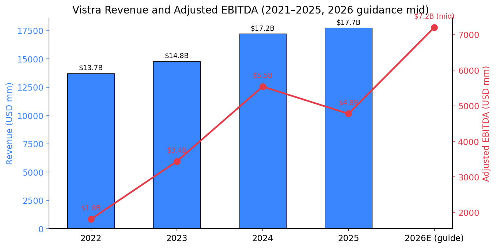
Source: [Vistra 2025 Form 10-K, Consolidated Statements of Operations + Segment Note 21](https://www.sec.gov/Archives/edgar/data/1692819/000169281926000006/vistra-20251231.htm); 2026 midpoint per [Q1-2026 earnings release, 2026-05-07](https://www.sec.gov/Archives/edgar/data/1692819/000169281926000011/vistra-20260331xearningsre.htm).

### Valuation snapshot (data as of 2026-05-21)

| Metric | Value | Notes |
|---|---|---|
| Price | USD 148.57 | NYSE close 21-May-2026 |
| Market cap | USD 50.1 bn | 337 mm diluted shares |
| Enterprise value | USD 70.3 bn | EV = mcap + $20.0 bn debt − $0.7 bn cash + preferred + NCI |
| TTM P/E | **24.8x** | TTM diluted EPS USD 5.98 (FY2025 reported $2.18 GAAP + one-offs reverse out in TTM math) |
| Forward P/E | **13.4x** | Consensus FY2026E EPS ~USD 11.11 |
| TTM P/S | **2.58x** | Revenue $17.7 bn |
| EV/EBITDA | **10.4x** | TTM EBITDA $6.79 bn |
| P/B | 19.2x | Book value $7.75 — depressed by buyback-driven equity drawdown; not informative for an IPP |
| Dividend yield | 0.64% | $0.95 annualized; capital return is buyback-led |
| Beta (5-yr) | 1.45 | High commodity / weather beta |
| 52-week range | $132.66 – $219.82 | Down ~32% from October-2025 hyperscaler-AI peak |

Source: [Yahoo Finance / VST key statistics](https://finance.yahoo.com/quote/VST/key-statistics). Share count and buyback authorization cross-checked against [Q1-2026 earnings release, 2026-05-07](https://www.sec.gov/Archives/edgar/data/1692819/000169281926000011/vistra-20260331xearningsre.htm) ("$6.3 bn returned through buybacks since November 2021; 30% reduction in share count; $1.5 bn remaining authorization expected to complete by YE-2027").

### Peer multiples and interpretation

| Ticker | Company | Mkt cap (USD bn) | TTM P/E | Fwd P/E | EV/EBITDA | Comment |
|---|---|---|---|---|---|---|
| **VST** | Vistra | **50.1** | **24.8x** | **13.4x** | **10.4x** | IPP + retail + nuclear, large hyperscaler PPA optionality |
| TLN | Talen Energy | 16.4 | n/m | 10.5x | 32.8x | Pure-play IPP; small EBITDA base means EV/EBITDA reads noisy |
| CEG | Constellation Energy | 103.8 | 25.0x | 21.2x | 15.5x | Largest US nuclear operator; richer multiple |
| NRG | NRG Energy | 28.8 | 150x | 12.0x | 23.1x | TTM P/E distorted by one-off charges |
| DUK | Duke Energy | 96.9 | 19.1x | 17.3x | 11.4x | Regulated utility; allowed-return model |
| AEP | American Electric Power | 70.4 | 19.1x | 18.9x | 13.4x | Regulated utility |

Source: [Yahoo Finance peer key-statistics pulled 2026-05-21](https://finance.yahoo.com/quote/VST/key-statistics).

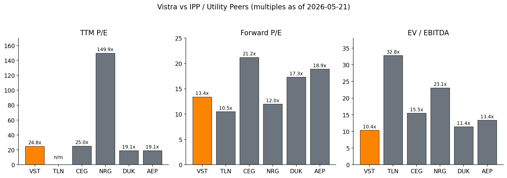
Source: [Yahoo Finance key statistics, 2026-05-21](https://finance.yahoo.com/quote/VST/key-statistics) for VST, TLN, CEG, NRG, DUK, AEP.

**Interpretation.** Vistra trades at a TTM P/E of 24.8x and forward P/E of 13.4x. The compression in forward P/E is structurally important — consensus expects FY2026 EPS roughly **5x** FY2025 GAAP EPS (USD 11.11 forward vs USD 2.18 GAAP basic 2025) because (i) FY2025 GAAP was depressed by USD 808 mm of unrealized commodity hedging mark-to-market losses ([10-K Reconciliation to Adjusted EBITDA](https://www.sec.gov/Archives/edgar/data/1692819/000169281926000006/vistra-20251231.htm)), and (ii) hedged forward power prices for 2026 are well above 2024–2025 realized prices ([Q1-2026 earnings release: "98% hedged for 2026, 89% for 2027, 65% for 2028"](https://www.sec.gov/Archives/edgar/data/1692819/000169281926000011/vistra-20260331xearningsre.htm)).

Versus its closest pure-comp **Talen Energy** (TLN — a smaller IPP with a much higher nuclear-to-total mix and the Amazon Susquehanna behind-the-meter deal converted to a 1.92 GW grid-connected PPA in June 2025 ([Talen-Amazon expanded PPA, 2025-06-13](https://www.utilitydive.com/news/talen-amazon-aws-susquehanna-nuclear-data-centert/750440/))), VST trades at a meaningful EV/EBITDA discount because Talen's EBITDA denominator is much smaller. Versus **Constellation** (CEG — the largest regulated-utility-spinoff nuclear pure-play following its January 2026 close of the USD 26.6 bn Calpine merger ([Constellation-Calpine merger close, 2026-01-07](https://investors.constellationenergy.com/news-releases/news-release-details/constellation-acquire-calpine-creates-americas-leading-producer))), VST trades roughly **8 turns cheaper on forward P/E (13.4x vs 21.2x)** despite a similar long-term nuclear-PPA growth catalyst. The gap reflects Vistra's heavier gas + coal mix (less ESG-aligned), its higher absolute leverage ratio (~3x net debt/EBITDA), and the higher cyclicality from non-PPA merchant exposure that still represents the bulk of EBITDA in 2026–2027 ([Yahoo Finance peer key-statistics, 2026-05-21](https://finance.yahoo.com/quote/VST/key-statistics)). The market is, in our reading, applying a hybrid-IPP multiple — higher than the regulated-utility median of ~17–19x forward P/E but lower than CEG's nuclear-platform multiple.

Vistra peaked at USD 219.82 in October 2025 ahead of the hyperscaler PPA tape; the ~32% drawdown to today is consistent with normal AI-power-trade reset rather than a fundamental break ([MacroTrends — VST stock history, accessed 2026-05-21](https://www.macrotrends.net/stocks/charts/VST/vistra/stock-price-history)). No valuation/multiple-compression risk is flagged in Section 9 at a 13.4x forward P/E — that is a defensible level for an IPP with this growth runway. The cyclical/commodity-trough risk is the more material one and is addressed in Section 9.

---

## 2. Company History

Vistra's modern history begins with the bankruptcy of **Energy Future Holdings (EFH)** — the holding company that emerged from the 2007 leveraged buyout of Texas's incumbent integrated utility TXU Corp by KKR, TPG, and Goldman. EFH filed Chapter 11 in 2014 under the weight of ~USD 40 bn of debt and a collapse in natural gas prices that crushed the value of its merchant generation. Vistra was created from the competitive-generation and retail businesses spun out of EFH at emergence in October 2016 and listed on the NYSE shortly thereafter ([10-K Glossary references to EFH and Vistra's predecessor history](https://www.sec.gov/Archives/edgar/data/1692819/000169281926000006/vistra-20251231.htm)).

The single most consequential transaction was the **April 2018 merger with Dynegy Inc.**, a Houston-based merchant generator whose own history included its own 2012 bankruptcy. The Dynegy deal added approximately 13,700 MW of gas and coal capacity across PJM, ISO-NE, and MISO and is the reason Vistra has any meaningful East-market footprint at all ([Dynegy / Vistra merger 8-K, 2017-10-31](https://www.sec.gov/Archives/edgar/data/1692819/000119312517326019/d486084dex991.htm)). It was followed by a heavy capital-return phase (the share count is now ~30% smaller than November 2021, per [Q1-2026 release](https://www.sec.gov/Archives/edgar/data/1692819/000169281926000011/vistra-20260331xearningsre.htm)).

The second pivot was the **March-2024 merger with Energy Harbor**, completed for ~USD 3.43 bn including assumed debt ([Vistra Completes Energy Harbor Acquisition, 2024-03-01](https://www.prnewswire.com/news-releases/vistra-completes-energy-harbor-acquisition-302077375.html), [10-K Note 2 Acquisitions](https://www.sec.gov/Archives/edgar/data/1692819/000169281926000006/vistra-20251231.htm)). Energy Harbor — itself the rebranded post-bankruptcy nuclear-and-retail business of FirstEnergy Solutions — contributed approximately 4,000 MW of PJM nuclear (Beaver Valley 1 & 2, Perry, Davis-Besse) and roughly 1 million retail customers. The deal also created **Vistra Vision**, a subsidiary holding the combined nuclear plus Vistra Zero renewables, with Nuveen and Avenue (the largest Energy Harbor shareholders pre-merger) initially taking a 15% non-controlling interest. Vistra subsequently bought out that 15% NCI for USD 3.2 bn in September 2024 ([10-K, Acquisition of Noncontrolling Interest section](https://www.sec.gov/Archives/edgar/data/1692819/000169281926000006/vistra-20251231.htm)), consolidating 100% ownership of Vision and the nuclear fleet.

A third leg landed in October 2025 with the **Lotus Acquisition** — USD 1.9 bn cash for seven natural-gas plants totaling 2,600 MW across PJM, ISO-NE, NYISO, and CAISO ([10-K Note 2 Acquisitions](https://www.sec.gov/Archives/edgar/data/1692819/000169281926000006/vistra-20251231.htm)). And on **December 31, 2025**, Vistra signed definitive agreements to acquire **Cogentrix Energy** — 10 modern gas facilities totaling ~5,500 MW in PJM, ISO-NE, and ERCOT — for approximately USD 2.3 bn cash + ~USD 0.9 bn in stock (5 mm shares at USD 185 negotiated) + assumed USD 1.5 bn of debt, net of ~USD 0.7 bn of expected tax benefits ([10-K Note 2 Acquisitions](https://www.sec.gov/Archives/edgar/data/1692819/000169281926000006/vistra-20251231.htm), [Vistra-Cogentrix press release, 2026-01-05](https://www.prnewswire.com/news-releases/vistra-adds-to-its-industry-leading-generation-portfolio-with-acquisition-of-cogentrix-302653058.html)). Closing is targeted for mid-to-late 2026 subject to FERC and HSR antitrust clearance.

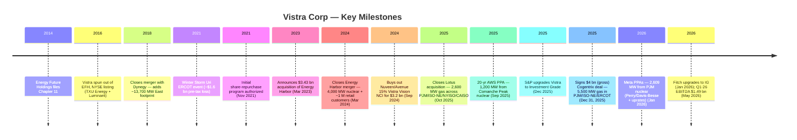

**Strategic pivots — why.** Three deliberate pivots stand out. First, the **Dynegy merger (2018)** was a scale + diversification move out of a single-state ERCOT dependency that had embarrassed predecessor EFH; PJM and ISO-NE bring capacity-market revenue and weather-decorrelated load. Second, the **Energy Harbor merger (2024)** was a bet that long-lived US nuclear would re-rate sharply as carbon-free baseload became the scarcest resource on the grid — a bet that paid off within 18 months with the AWS and Meta PPAs. Third, the **Cogentrix and Lotus gas acquisitions (2025)** double down on dispatchable thermal capacity precisely as AI-data-center load growth is forcing markets to value 24/7 firm generation again — buying mid-life gas plants at ~USD 730/kW (Cogentrix) is dramatically below the ~USD 1,500–2,000/kW cost of new-build CCGT and the ~USD 1,000–1,200/kW Vistra is paying for its own 860 MW West-Texas peaking development ([10-K Business Strategy + Cogentrix press release, 2026-01-05](https://www.prnewswire.com/news-releases/vistra-adds-to-its-industry-leading-generation-portfolio-with-acquisition-of-cogentrix-302653058.html)).

**Key acquisitions (bullet recap)** — all per [10-K Note 2 Acquisitions](https://www.sec.gov/Archives/edgar/data/1692819/000169281926000006/vistra-20251231.htm):
- **Dynegy (Apr 2018)** — all-stock; ~13,700 MW gas/coal in PJM/MISO/ISO-NE; transformational scale ([Dynegy-Vistra merger close 8-K, 2018-04-09](https://www.sec.gov/Archives/edgar/data/0001379895/000119312518111619/d548684d8k.htm)).
- **Energy Harbor (Mar 2024)** — USD 3.43 bn (~USD 3.0 bn cash + 15% Vistra Vision equity to Nuveen/Avenue); ~4,000 MW PJM nuclear + ~1 mm retail customers.
- **Nuveen/Avenue NCI buyout (Sep 2024)** — USD 3.2 bn cash; consolidates 100% of Vistra Vision.
- **Lotus (Oct 2025)** — USD 1.9 bn cash base price; 2,600 MW gas in PJM/ISO-NE/NYISO/CAISO.
- **Cogentrix (signed Dec-2025, expected close 2H-2026)** — USD ~4 bn gross (~USD 2.3 bn cash + 5 mm Vistra shares at $185 + USD 1.5 bn assumed debt – USD 0.7 bn tax benefits); 5,500 MW gas in PJM/ISO-NE/ERCOT ([Vistra-Cogentrix deal coverage, Utility Dive, 2026-01-05](https://www.utilitydive.com/news/vistra-cogentrix-natural-gas-energy-deal-data-centers/808854/)).

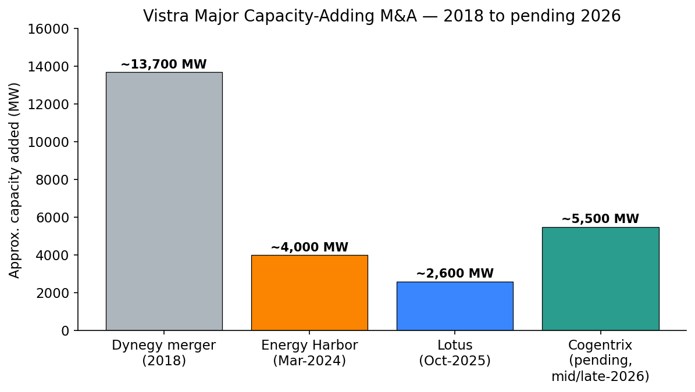
Source: [Vistra 2025 Form 10-K Notes 2 & 11](https://www.sec.gov/Archives/edgar/data/1692819/000169281926000006/vistra-20251231.htm); [Cogentrix announcement, 2026-01-05](https://www.prnewswire.com/news-releases/vistra-adds-to-its-industry-leading-generation-portfolio-with-acquisition-of-cogentrix-302653058.html); [Energy Harbor close, 2024-03-01](https://www.prnewswire.com/news-releases/vistra-completes-energy-harbor-acquisition-302077375.html).

**Recent developments (last 12 months).** The most consequential developments of the period covered by this report are: (1) the **AWS 20-year PPA for 1,200 MW from Comanche Peak** announced September 2025 with full-capacity delivery by 2032 — the first hyperscaler nuclear PPA Vistra signed ([Vistra-AWS 8-K, 2025-09-29](https://www.sec.gov/Archives/edgar/data/1692819/000119312525221774/d43667d8k.htm)); (2) the **Meta 20-year PPAs for 2,609 MW from PJM nuclear** announced January 2026 — 1,268 MW from Perry + 908 MW from Davis-Besse + 213+80+140 MW of uprates at Perry/Davis-Besse/Beaver Valley ([Vistra-Meta press release, 2026-01-09](https://investor.vistracorp.com/2026-01-09-Vistra-and-Meta-Announce-Agreements-to-Support-Nuclear-Plants-in-PJM-and-Add-New-Nuclear-Generation-to-the-Grid)); (3) the **Cogentrix signing**; (4) **two Investment Grade credit-rating upgrades** (S&P December 2025, Fitch January 2026); and (5) the **Q1-2026 reaffirmation of USD 6.8–7.6 bn EBITDA guidance** despite a mild Texas winter.

---

## 3. Management Team

### James A. (Jim) Burke — President and Chief Executive Officer (since August 2022)

Jim Burke, 57, is the architect of modern Vistra. He has been continuously involved with the company in increasing positions of responsibility for **20 years**, beginning as Senior Vice President — Consumer Markets at TXU Energy in the early 2000s. He served as **President & CEO of TXU Energy from August 2005** — the retail electricity subsidiary that today still anchors Vistra's Texas position — through the EFH bankruptcy and the 2016 spinout of Vistra. He was subsequently named **Executive Vice President & Chief Operating Officer of Vistra in October 2016**, **President & Chief Financial Officer in December 2020**, and **President & CEO on August 1, 2022** ([Vistra 2026 Proxy Statement (DEF 14A), Director Bio § James A. Burke, p.15](https://www.sec.gov/Archives/edgar/data/1692819/000162828026019029/vstdef14a-2025.htm)).

Burke is unusual among public-company power-sector CEOs in three ways. First, **operational range**: he has run Vistra's retail business (as CEO of TXU Energy), then its merchant generation operations (as COO), then its finance function (as CFO), before assuming the full CEO seat — meaning he understands wholesale price formation, retail-product design, and capital structure firsthand. Second, **technical certification**: he is a CPA (non-practicing), a CFA charterholder, and a graduate of the **MIT Nuclear Reactor Technology Course** — the last of which gives him direct technical credibility in a fleet whose largest growth bet (nuclear PPAs) requires regulator and customer trust on plant operations ([Vistra Leadership page — Jim Burke bio](https://vistracorp.com/about/leadership/)). Third, **industry political capital**: he sits as **Vice-Chair of the Nuclear Energy Institute** (elected 2025) and on the board of the Institute of Nuclear Power Operations — positions that gave Vistra a seat at the table when the AWS, Meta, and PJM co-location market-design discussions were being framed ([NEI Announces New Board and Executive Committee Leadership, 2025](https://www.nei.org/news/2025/nei-announces-new-board-and-exec-comm-leadership)).

On capital allocation, Burke's record at Vistra is strong: 30% reduction in share count since November 2021 via USD 6.3 bn of buybacks; two IG upgrades in the last 6 months; the AWS and Meta PPAs locking in ~3,800 MW of 20-year carbon-free contracts before the rest of the industry caught up ([Q1-2026 earnings release, 2026-05-07](https://www.sec.gov/Archives/edgar/data/1692819/000169281926000011/vistra-20260331xearningsre.htm)). His critics point out that Vistra is still ~20% coal by capacity (8,743 MW) and that decisions on plant retirements have repeatedly slipped (Coleto Creek and Miami Fort coal retirements were re-cast as repowers to natural gas rather than full closures, per [Vistra plans to repower Coleto Creek as gas plant, Victoria Advocate, 2024](https://www.victoriaadvocate.com/news/environment/power-company-to-repower-coleto-creek-plant-as-gas-fueled-plant/article_56cfabb0-2689-11ef-ac50-fb8a5bf61473.html)). Burke owns shares well into the meaningful range — comp is roughly 80% equity-linked per the proxy compensation discussion ([DEF 14A 2026, Compensation Discussion & Analysis](https://www.sec.gov/Archives/edgar/data/1692819/000162828026019029/vstdef14a-2025.htm)).

Burke holds a B.A. in economics and an M.B.A. (finance & general management) from **Tulane University**, where he serves on the advisory board of the Tulane University Energy Institute. He started his career at **Deloitte Consulting** and held earlier roles at The Coca-Cola Company, Reliant Energy, and Gexa Energy before TXU Energy ([DEF 14A 2026, p.15](https://www.sec.gov/Archives/edgar/data/1692819/000162828026019029/vstdef14a-2025.htm)).

### Kristopher E. Moldovan — Executive Vice President and Chief Financial Officer (since August 2022)

Kris Moldovan, 54, has been with Vistra and its predecessors since **2006** — 20 years of internal continuity. He was elevated to CFO in August 2022 when Burke moved up to the CEO seat. Prior to CFO, he was **Senior Vice President & Treasurer (2017–2022)**, responsible for financing activities, liquidity and cash resources; before that he was Assistant Treasurer (2010–2017) and Senior Counsel (2006–2010), where his work focused on finance and M&A ([DEF 14A 2026, Management bios](https://www.sec.gov/Archives/edgar/data/1692819/000162828026019029/vstdef14a-2025.htm)). The treasury-to-CFO arc is relevant — the dual IG ratings achieved in late 2025/early 2026 were the explicit product of debt-portfolio refinancing he led (the January 2026 USD 2.25 bn senior secured notes due 2031/2036 used to part-fund Cogentrix being the most recent example).

Before Vistra, Moldovan was an attorney at Gibson, Dunn & Crutcher in Dallas and Wildman Harrold in Chicago, with a focus on M&A and corporate advisory. He holds an engineering degree from the **University of Illinois**, a JD from **Duke**, and a graduate finance certificate from **SMU Cox**. He sits on the NYSE Institute Advisory Board ([Vistra Leadership page — Kris Moldovan bio](https://vistracorp.com/about/leadership/); [Vistra Appoints Kris Moldovan as CFO, 2022-07-21](https://investor.vistracorp.com/2022-07-21-Vistra-Appoints-Kris-Moldovan-as-Chief-Financial-Officer)).

### Stacey Doré — Chief Strategy and Sustainability Officer & EVP Public Affairs (since August 2022)

Stacey Doré, 53, runs corporate strategy, M&A, sustainability and public affairs. In Vistra's organisation this is a single-seat job because the AI-power thematic, the regulator-facing work on co-location and the M&A pipeline are the same conversation. She has been instrumental in the post-Energy-Harbor playbook — sourcing Lotus and Cogentrix, framing the AWS and Meta deals, and managing relations with FERC, PJM, ERCOT, and the PUCT. The proxy bio establishes her tenure but disclosure on specific deal credit is limited ([DEF 14A 2026, Management bios](https://www.sec.gov/Archives/edgar/data/1692819/000162828026019029/vstdef14a-2025.htm)).

### Scott A. Hudson — EVP & President, Vistra Retail (since August 2022)

Scott Hudson, 62, runs the retail business — TXU Energy and the sister brands totaling ~5 million customers and ~30% of Adjusted EBITDA in non-extreme weather years. The retail business is the integrated model's hedge: in a mild quarter (Q1-2026's mildest-Texas-winter-in-history was an example — Retail Adj EBITDA fell to $68 mm from $184 mm Q1-2025), retail's loss of weather-driven margin is offset by higher generation-segment margin from the same low load freeing up dispatch into PJM and ERCOT ([Q1-2026 earnings release, segment table](https://www.sec.gov/Archives/edgar/data/1692819/000169281926000011/vistra-20260331xearningsre.htm)).

### Governance footer

The board has **11 directors** standing for election in 2026, all independent except CEO Burke. Independent Chair (the separation of Chair and CEO is enshrined by board governance per the proxy summary). Committees: Audit, Social Responsibility & Compensation, Nominating & Governance, Sustainability & Risk, Generation & Safety Oversight. Notable directors include **Lisa Crutchfield** (former EVP Chief Regulatory/Risk/Compliance Officer at National Grid; ex-Duke Energy; chair of the Social Responsibility & Compensation Committee), **Bill Pitesa** (former Chief Nuclear Officer at the Nuclear Energy Institute — chairs the Generation & Safety Oversight Committee, critical given the nuclear-PPA strategy), **J.R. Sult** (former EVP & CFO of Marathon Oil — chairs Audit), **Paul Barbas** (former President & CEO of DPL Inc.), and **Julie Lagacy** (former Chief Sustainability & Strategy Officer at Caterpillar) ([DEF 14A 2026, Director bios, p.13–22](https://www.sec.gov/Archives/edgar/data/1692819/000162828026019029/vstdef14a-2025.htm)). Insider ownership is modest (the proxy discloses the standard 5%+ beneficial-owner table dominated by institutional holders rather than insiders). Compensation is heavily performance-equity-linked per Vistra's say-on-pay disclosure.

### Track-record synthesis

Burke's team has compounded shareholder value at a pace few US power-sector peers can match. Total shareholder return since the November 2021 buyback authorization through May 2026 is comfortably above 5x even after the October 2025 → May 2026 drawdown ([MacroTrends — VST 10-year stock history, accessed 2026-05-21](https://www.macrotrends.net/stocks/charts/VST/vistra/stock-price-history)). The team has demonstrated discipline on **M&A pricing** (Energy Harbor at ~USD 750/kW for nuclear + ~USD 1,000/customer for retail; Cogentrix at ~USD 730/kW for mid-life gas), **capital structure** (two IG upgrades — [S&P upgrade to BBB-, 2025-12-02 coverage](https://www.investing.com/news/stock-market-news/vistra-corp-upgraded-to-investment-grade-by-sp-on-improved-risk-profile-93CH-4387081)), and **strategic positioning** (first US merchant to lock in hyperscaler nuclear PPAs at this scale, per [Vistra-AWS 8-K, 2025-09-29](https://www.sec.gov/Archives/edgar/data/1692819/000119312525221774/d43667d8k.htm) and [Vistra-Meta press release, 2026-01-09](https://investor.vistracorp.com/2026-01-09-Vistra-and-Meta-Announce-Agreements-to-Support-Nuclear-Plants-in-PJM-and-Add-New-Nuclear-Generation-to-the-Grid)). The principal gap in the track record remains a question mark on the **coal exit** — Coleto Creek and Miami Fort are being repowered to gas rather than retired ([Vistra repower announcement, Victoria Advocate, 2024](https://www.victoriaadvocate.com/news/environment/power-company-to-repower-coleto-creek-plant-as-gas-fueled-plant/article_56cfabb0-2689-11ef-ac50-fb8a5bf61473.html)), which keeps Vistra's emissions profile and ESG-quality optical above industry-leading peers like Constellation. The team also has yet to be tested by a major nuclear outage event under the new PPA structure, where contracted hyperscaler buyers may have differing tolerances for force-majeure than wholesale market participants.

---

## 4. Products & Services

Vistra's "products" are best understood in three groups: (i) **wholesale electricity production** from each generation facility class, (ii) **retail electricity and gas** sold to ~5 million customers under multiple brands, and (iii) **long-term structured contracts** — the new product category created by the AWS and Meta hyperscaler PPAs. Each is grounded in the actual fleet and brand list published on [www.vistracorp.com](https://www.vistracorp.com) and the [Vistra 2025 10-K Properties section](https://www.sec.gov/Archives/edgar/data/1692819/000169281926000006/vistra-20251231.htm).

### A. Wholesale generation — by fuel and technology

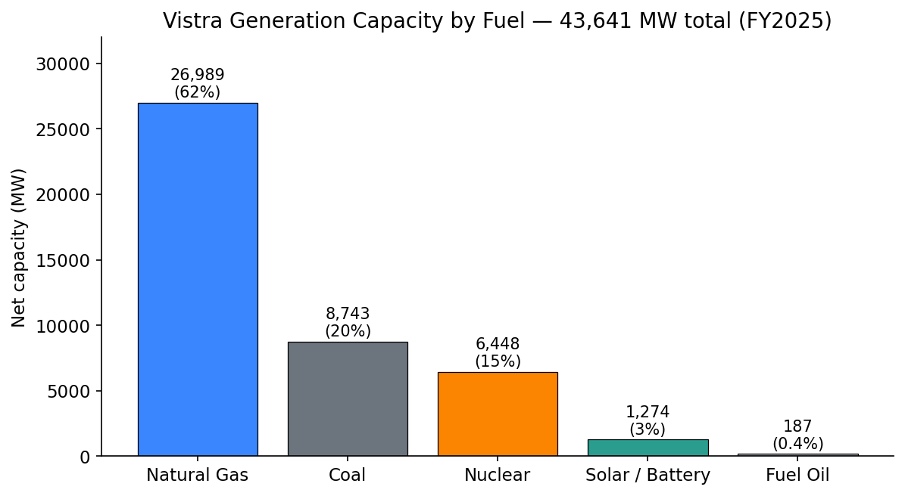
Source: [Vistra 2025 Form 10-K Item 1 Business, p.1](https://www.sec.gov/Archives/edgar/data/1692819/000169281926000006/vistra-20251231.htm).

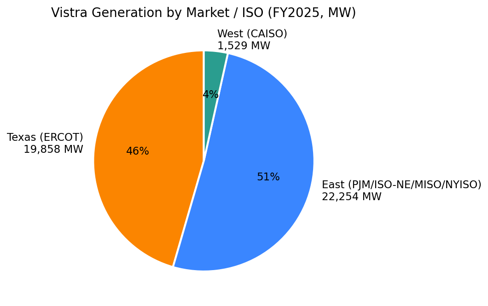
Source: [Vistra 2025 Form 10-K Item 1, segment capacity table](https://www.sec.gov/Archives/edgar/data/1692819/000169281926000006/vistra-20251231.htm).

```mermaid
graph TD
    VST[Vistra Corp.<br/>43,641 MW total]
    VST --> GEN[Generation operations]
    VST --> RET[Retail operations<br/>~5M customers]
    VST --> VV[Vistra Vision<br/>nuclear + Vistra Zero]

    GEN --> TX[Texas - ERCOT<br/>19,858 MW]
    GEN --> EAST[East - PJM/ISO-NE/<br/>MISO/NYISO<br/>22,254 MW]
    GEN --> WEST[West - CAISO<br/>1,529 MW]

    TX --> TX_GAS[CCGT/CT gas<br/>~12 plants]
    TX --> TX_COAL[Coal/lignite<br/>Martin Lake, Oak Grove,<br/>Coleto Creek]
    TX --> TX_NUKE[Comanche Peak 1 & 2<br/>2,400 MW]
    TX --> TX_SOL[Vistra Zero solar<br/>Oak Hill 200 MW + dev]

    EAST --> E_GAS[CCGT/CT gas<br/>incl. Lotus 2,600 MW]
    EAST --> E_COAL[Coal/lignite<br/>incl. Miami Fort]
    EAST --> E_NUKE[Beaver Valley 1 & 2<br/>Perry, Davis-Besse<br/>4,048 MW]
    EAST --> E_BAT[Battery storage projects]

    WEST --> W_GAS[Moss Landing CCGT<br/>1,020 MW]
    WEST --> W_BAT[Moss Landing battery<br/>350 MW]

    VV --> VV_NUKE[6,448 MW nuclear]
    VV --> VZ[Vistra Zero<br/>1,274 MW solar+battery]

    RET --> TXU[TXU Energy<br/>Texas ~2.6M]
    RET --> AMB[Ambit Energy<br/>multi-state MLM]
    RET --> DYN[Dynegy Energy Services<br/>MISO/PJM]
    RET --> HF[Homefield Energy<br/>IL municipal]
    RET --> EH[Energy Harbor retail<br/>OH/PA/IL/MI]
    RET --> USG[U.S. Gas & Electric]
    RET --> PP[Public Power]
    RET --> TE[TriEagle Energy]
```

**1. Natural gas generation (26,989 MW, 62% of capacity).** Combined-cycle gas turbines (CCGT) are the workhorse — 28 CCGT plants totaling 22,167 MW, complemented by 12 simple-cycle peaking plants totaling 4,822 MW ([10-K p.1](https://www.sec.gov/Archives/edgar/data/1692819/000169281926000006/vistra-20251231.htm)). The CCGT fleet dispatches as intermediate / load-following capacity and is the marginal price-setter for much of the year in PJM West Hub, ERCOT North, and the Mass Hub. *Competitive advantage*: **yes, partial — cost & scale, plus geography.** The CCGT fleet is heat-rate-competitive (modern H- and F-class machines via the Dynegy and Lotus acquisitions sit in the 6,500–7,000 Btu/kWh range vs older 9,000+ Btu/kWh fleets at second-tier IPPs). The scale of natural-gas-storage and pipeline agreements gives Vistra better cold-snap reliability than smaller peers. *Closest competitor product*: Calpine's CCGT fleet (now part of CEG following the 2025 merger), with comparable heat-rate efficiency but smaller Texas presence; Talen's Susquehanna-area CCGTs in PJM; LS Power's PJM gas portfolio. Vistra is **at parity** on technology and **ahead** on integrated wholesale-retail use of the fleet.

**2. Nuclear (6,448 MW, 15% of capacity).** Six units at four sites — Comanche Peak 1 & 2 (1,200 MW each, ERCOT, licenses to 2050/2053), Beaver Valley 1 & 2 (939/933 MW, PJM, 2036/2047), Perry (1,268 MW, PJM, 2046), and Davis-Besse (908 MW, PJM, 2037) ([10-K p.1, Nuclear table](https://www.sec.gov/Archives/edgar/data/1692819/000169281926000006/vistra-20251231.htm)). *Competitive advantage*: **yes, regulatory + scarcity + customer-contract moat.** US nuclear is functionally impossible to replicate at scale today (new plants take 10+ years and cost USD 10–15 bn per GW); the **section 45U nuclear production tax credit (USD 15/MWh through 2032)** provides a federally guaranteed price floor; and **20-year hyperscaler PPAs (AWS 1,200 MW, Meta 2,609 MW)** have now contractually locked in over 3,800 MW of nuclear output — meaning a majority of Vistra's nuclear capacity is now under long-term contract by 2027. *Closest competitor product*: Constellation's nuclear fleet (~22 GW) — larger and more concentrated in Illinois/NY/Mid-Atlantic; Talen's Susquehanna (2.5 GW behind-the-meter to Amazon). Vistra's nuclear platform is **behind CEG on scale** but **at parity or slightly ahead on contract economics** given the headline pricing reported for the AWS deal (industry press estimated PPA prices in the USD 100–115/MWh range, well above current wholesale).

**3. Coal/lignite (8,743 MW, 20% of capacity).** Seven facilities — Martin Lake (2,455 MW lignite, ERCOT), Oak Grove (1,710 MW lignite, ERCOT), Coleto Creek (650 MW coal, ERCOT), plus four PJM/MISO coal plants ([10-K Properties Item 2](https://www.sec.gov/Archives/edgar/data/1692819/000169281926000006/vistra-20251231.htm)). Coleto Creek is scheduled to retire by **no later than 2027** and be repowered as a 600 MW natural-gas plant; Miami Fort similarly is set to retire by mid-2028 and be repowered to gas. *Competitive advantage*: **partial — fuel cost in ERCOT lignite mines and proximity, but structurally declining.** Coal is the bridge fuel from 2025 to ~2030; carbon-policy risk and EPA Mercury & Air Toxics rules drive the retirements. *Closest competitor product*: NRG's coal fleet (now largely retired); LS Power; Dominion (regulated coal). The coal fleet is **decreasingly competitive** as gas + nuclear + battery alternatives scale, and Vistra's strategy is explicit repower-to-gas rather than full retirement.

**4. Solar + battery storage (1,274 MW, 3% — Vistra Zero).** Includes the Oak Hill 200 MW solar facility in Texas (reached commercial operation 2025) plus the **Moss Landing battery storage** projects in California (350 MW operating + the Phase III expansion). Vistra Zero is the renewables development arm; targeted to scale via repurposing of retired-coal plant sites in Illinois ([10-K Business Strategy](https://www.sec.gov/Archives/edgar/data/1692819/000169281926000006/vistra-20251231.htm)). *Competitive advantage*: **no — at parity at best.** Vistra Zero is small, expensive to scale, and competes against utility-scale developers (NextEra Energy Resources, AES, Invenergy) with better solar/battery cost curves and tax-equity scale. *Closest competitor product*: NextEra Energy Resources (multi-tens-of-GW). Vistra Zero is a **legacy positioning play**, not a moat.

**5. Fuel oil peakers (187 MW).** Negligible — mainly the Oakland CT in California.

### B. Retail electricity — multi-brand portfolio (~5 million customers)

The retail business is differentiated by **scale, brand age, and integrated-model cost advantage**, not by technology. Brands operated as of FY2025 ([10-K p.1–2, Glossary](https://www.sec.gov/Archives/edgar/data/1692819/000169281926000006/vistra-20251231.htm), [vistracorp.com brand page](https://www.vistracorp.com)):

| Brand | Markets | Customer profile | Comment |
|---|---|---|---|
| **TXU Energy** | ERCOT — Texas | Residential + business | ~20-year brand, ~2.6 mm of the 5 mm total; flagship |
| **Ambit Energy** | Multi-state | Residential | Acquired 2019; multi-level-marketing model |
| **Dynegy Energy Services** (incl. Better Buy Energy, Brighten Energy, Honor Energy, True Fit Energy) | MISO, PJM | Residential + business | Came with the 2018 Dynegy merger |
| **Homefield Energy** | MISO | Illinois municipal aggregation | Distinct municipal channel |
| **Energy Harbor retail** | OH, PA, IL, MI | Residential + business | ~1 mm customers added via March-2024 merger |
| **U.S. Gas & Electric** (d/b/a USG&E, Illinois Gas & Electric) | Multiple | Residential | Distinct multi-state acquired book |
| **Public Power** | Multiple | Residential | Smaller acquired book |
| **TriEagle Energy** | Texas | Business + residential | Texas niche brand |
| **4Change Energy** | Texas | Residential | (Per company website) |

*Competitive advantage*: **yes — scale + brand + integrated model.** TXU Energy is the longest-standing competitive retail brand in Texas and has built switching-cost-like loyalty through 100% wind / 100% solar product tiers, smart-thermostat / dashboard products, and aggressive renewal pricing ([TXU Energy company page](https://www.txu.com)). The integrated model means Vistra's retail business is naturally hedged: when ERCOT prices spike, generation makes money, retail's procurement cost rises, and the net P&L is more stable than for a stand-alone REP (retail electric provider) ([10-K Item 7 MD&A, Business Strategy](https://www.sec.gov/Archives/edgar/data/1692819/000169281926000006/vistra-20251231.htm)). *Closest competitor product*: **NRG Energy's Reliant + Direct Energy brands** in Texas (the only true scale-comparable competitor; NRG closed its USD 5.2 bn Vivint Smart Home buy in March 2023 to extend the retail+services bundle, per [NRG Completes Vivint Acquisition, 2023-03-10](https://www.nrg.com/about/newsroom/2023/42066.html)); **Constellation's commercial retail business** in PJM/Northeast (concentrates on C&I rather than residential). Vistra is **ahead on residential brand share in Texas** and **at parity in the Northeast/Midwest**.

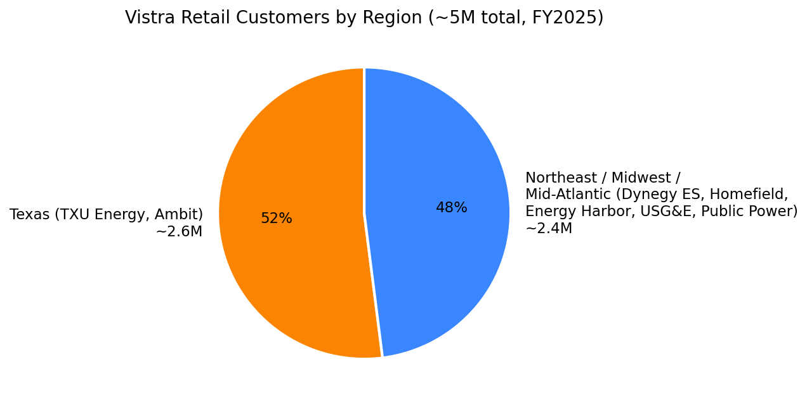
Source: [Vistra 2025 Form 10-K Item 1 Business, Retail Operations p.1](https://www.sec.gov/Archives/edgar/data/1692819/000169281926000006/vistra-20251231.htm).

### C. Long-term hyperscaler PPAs (the new product category)

The 20-year nuclear PPAs with AWS and Meta represent a **structurally new product line** — long-dated, fixed-price, carbon-free firm capacity sold direct to hyperscale data-center customers — and they are large enough to deserve their own treatment.

| Counterparty | Plant(s) | MW | Start | Full ramp | Term | Source |
|---|---|---|---|---|---|---|
| **AWS** | Comanche Peak (ERCOT) | 1,200 | Q4-2027 | 2032 | 20 yrs (+ option for 20) | [AWS-Vistra 8-K, 2025-09-29](https://www.sec.gov/Archives/edgar/data/1692819/000119312525221774/d43667d8k.htm) |
| **Meta** — operating | Perry + Davis-Besse (PJM) | 2,176 | late-2026 | YE-2027 | 20 yrs | [Vistra-Meta press release, 2026-01-09](https://investor.vistracorp.com/2026-01-09-Vistra-and-Meta-Announce-Agreements-to-Support-Nuclear-Plants-in-PJM-and-Add-New-Nuclear-Generation-to-the-Grid) |
| **Meta** — uprates | Perry (213) + Davis-Besse (80) + Beaver Valley (140) | 433 | 2031 | YE-2034 | 20 yrs | Same |

**Total disclosed long-term hyperscaler contracts: 3,809 MW of nuclear capacity over 20 years**, equivalent to **~59% of total nuclear capacity (3,809 of 6,448 MW)**. The Meta deal is structured as the largest US nuclear uprate ever backed by a corporate customer; uprates require NRC license amendments and capital investment (~USD 1.5–2 mm per uprate MW per industry rule of thumb). Vistra has disclosed no individual deal price ([10-K reads, p.7 onwards](https://www.sec.gov/Archives/edgar/data/1692819/000169281926000006/vistra-20251231.htm)). The AWS press release language indicates "incremental Adjusted Free Cash Flow before Growth accretion in the range of approximately 8–10% if the Customer utilizes the full capacity" — meaning the deal's incremental contribution is material but cycle-dependent on hyperscaler utilization.

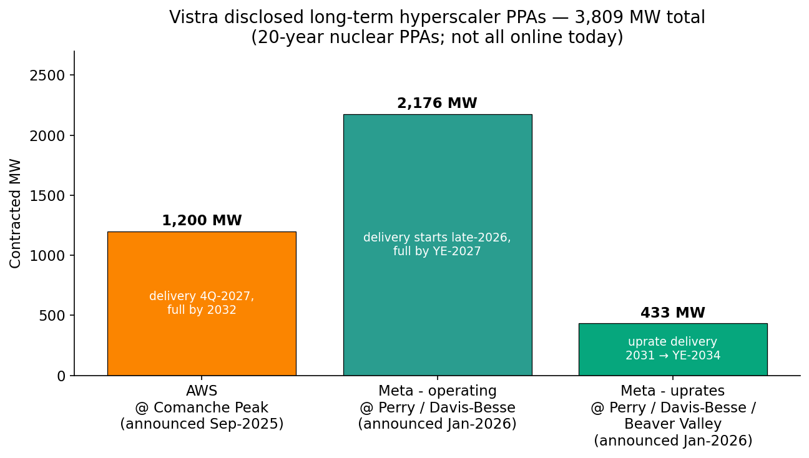
Source: [AWS-Vistra 8-K, 2025-09-29](https://www.sec.gov/Archives/edgar/data/1692819/000119312525221774/d43667d8k.htm); [Vistra-Meta press release, 2026-01-09](https://investor.vistracorp.com/2026-01-09-Vistra-and-Meta-Announce-Agreements-to-Support-Nuclear-Plants-in-PJM-and-Add-New-Nuclear-Generation-to-the-Grid); [Vistra 2025 Form 10-K, Noteworthy Developments section](https://www.sec.gov/Archives/edgar/data/1692819/000169281926000006/vistra-20251231.htm).

*Competitive advantage*: **yes — structural; this is the new moat.** Vistra is among the only competitive (i.e. unregulated) US generators with enough scaled, dispatchable, carbon-free baseload to write contracts of this size with hyperscale buyers ([10-K Business Strategy](https://www.sec.gov/Archives/edgar/data/1692819/000169281926000006/vistra-20251231.htm)). The deal terms (20+20 years, take-or-pay-ish structures) lock in revenue visibility comparable to a regulated-utility allowed-return profile but on assets bought at deeply discounted Energy-Harbor prices. *Closest competitor product*: **Talen Energy's Susquehanna-AWS** PPA — originally signed as a behind-the-meter campus, restructured in June 2025 as a 1.92 GW front-of-the-meter PPA worth ~USD 18 bn over 17 years ([Talen-Amazon Susquehanna PPA expansion, Utility Dive, 2025-06-13](https://www.utilitydive.com/news/talen-amazon-aws-susquehanna-nuclear-data-centert/750440/)). Vistra's contract base is now meaningfully larger than Talen's despite Talen being the first mover. **CEG's Three Mile Island restart for Microsoft** (announced September 2024; ~835 MW restart from the unaffected Unit 1, target 2028 operation) is the only directly comparable nuclear-to-hyperscaler deal at this scale ([Constellation TMI restart announcement, 2024-09-20](https://www.constellationenergy.com/news/2024/Constellation-to-Launch-Crane-Clean-Energy-Center-Restoring-Jobs-and-Carbon-Free-Power-to-The-Grid.html)).

### Flagship vs. long-tail

The **three flagship products driving the business** are: (1) the **PJM nuclear platform** (Perry + Davis-Besse + Beaver Valley = 4,048 MW), now Meta-anchored; (2) the **TXU Energy retail business** (Texas residential, ~2.6 mm customers, lifetime brand value); (3) the **ERCOT-Texas thermal portfolio** (gas + coal + Comanche Peak combined ~19,858 MW), now AWS-anchored at Comanche Peak ([10-K Properties, Item 2](https://www.sec.gov/Archives/edgar/data/1692819/000169281926000006/vistra-20251231.htm)).

**Long-tail:** California (West) operations are small and increasingly battery-focused; the Asset Closure segment is a runoff book (decommissioning of retired coal sites); Vistra Zero's solar/battery development arm is subscale relative to NextEra Energy Resources, which had 31 GW of clean energy in operation as of June 2024 and a 36.5–46.5 GW build pipeline through 2027 ([NextEra Energy Q2-2024 8-K, p.7](https://www.sec.gov/Archives/edgar/data/0000753308/000075330824000021/neeq12024exhibit99.htm)).

### Launches / repositioning / sunsets in the last 12 months

- **Launched:** AWS PPA (Sep-2025); Meta PPAs (Jan-2026); Lotus 2,600 MW gas integration (Oct-2025); definitive Cogentrix agreement (Dec-2025); Oak Hill 200 MW solar COD (2025); 860 MW West-Texas advanced peaker development (planned online 2028, per [Vistra Permian peaker announcement, 2025-09-29](https://investor.vistracorp.com/2025-09-29-Vistra-Announces-Plans-to-Build-New-Gas-Fueled-Dispatchable-Power-Units-in-the-Permian-Basin)); planned 2031–2034 nuclear uprates totaling 433 MW per [Vistra-Meta press release, 2026-01-09](https://investor.vistracorp.com/2026-01-09-Vistra-and-Meta-Announce-Agreements-to-Support-Nuclear-Plants-in-PJM-and-Add-New-Nuclear-Generation-to-the-Grid).
- **Repositioned:** Coleto Creek coal → 600 MW natural-gas repower (by 2027); Miami Fort coal → natural-gas repower (by mid-2028) ([Vistra repower announcement, Victoria Advocate, 2024](https://www.victoriaadvocate.com/news/environment/power-company-to-repower-coleto-creek-plant-as-gas-fueled-plant/article_56cfabb0-2689-11ef-ac50-fb8a5bf61473.html)). Sunset segment retired Q4-2024 as a reportable category — plants reassigned to Texas and East.
- **Sunset:** Sunset segment dissolved as a separately reported segment in Q4-2024 (its assets folded into Texas and East per the FY2024 10-K reclassification, [10-K Segment Note 21](https://www.sec.gov/Archives/edgar/data/1692819/000169281926000006/vistra-20251231.htm)).

---

## 5. Customers & Go-to-Market

### Customer segments

Vistra has **three distinct customer segments**:

1. **Wholesale market participants** — the ISO/RTO itself plus other generators, marketers, and load-serving entities. Revenue is the location-based marginal price set by the wholesale market clearing mechanism. There is no contractual customer relationship for most of the wholesale book; Vistra is paid by the ISO/RTO settlement ([10-K Item 1 Business, p.1–4](https://www.sec.gov/Archives/edgar/data/1692819/000169281926000006/vistra-20251231.htm)).
2. **Retail residential customers** — ~5 million households across 18 states + DC, with the largest concentration in Texas (~2.6 mm via TXU Energy, Ambit, TriEagle, 4Change). Contracts are typically 1–3 year fixed-price agreements with month-to-month follow-on, choice of green/wind/solar tiers, and bundled value-add products (smart thermostats, energy management dashboards). Sales channels are direct (web, call center), brokers, multi-level (Ambit Energy), and municipal aggregation (Homefield Energy) ([10-K Item 1, Retail Operations](https://www.sec.gov/Archives/edgar/data/1692819/000169281926000006/vistra-20251231.htm)).
3. **Retail commercial & industrial customers** — large C&I accounts in deregulated states served by direct sales teams. Includes municipal/governmental power-supply contracts (Homefield Energy serves Illinois municipalities) and ad-hoc bilateral contracts with manufacturers, hospitals, universities.

The **new fourth segment — hyperscaler PPA counterparties (AWS, Meta)** — is structurally different from anything Vistra has sold before. These are bilateral long-dated bilateral contracts with single-counterparty exposure to companies (Amazon, Meta) larger than Vistra itself ([Vistra-AWS 8-K, 2025-09-29](https://www.sec.gov/Archives/edgar/data/1692819/000119312525221774/d43667d8k.htm); [Vistra-Meta press release, 2026-01-09](https://investor.vistracorp.com/2026-01-09-Vistra-and-Meta-Announce-Agreements-to-Support-Nuclear-Plants-in-PJM-and-Add-New-Nuclear-Generation-to-the-Grid)).

### Customer concentration — disclosure and risk

Vistra's 10-K does not disclose a top-1 or top-5 customer share of revenue, because under ASC 280-10-50-42 disclosure rules a customer concentration filing is required only when a single customer exceeds 10% of consolidated revenue. **For the FY2025 10-K, no such disclosure appears** — meaning no single counterparty reached the 10% threshold against FY2025 revenue of USD 17.74 bn ([10-K Note 21 Segment Information; no >10% customer disclosed](https://www.sec.gov/Archives/edgar/data/1692819/000169281926000006/vistra-20251231.htm)). The retail business of ~5 million customers is structurally fragmented (no single customer represents more than a fraction of a percent of revenue).

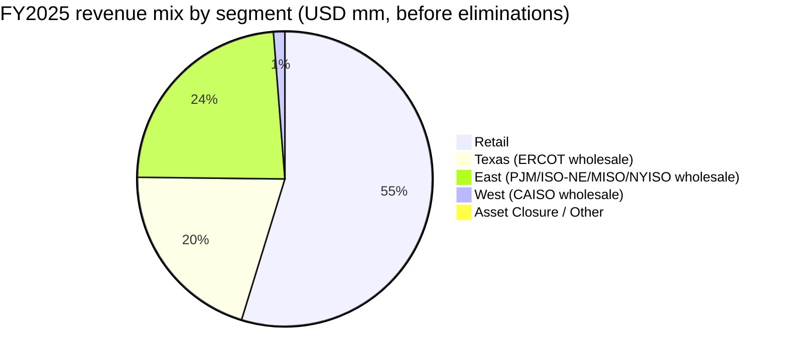

Source: [Vistra 2025 Form 10-K, Segment Note 21 (figures shown before $8,528 mm of intersegment eliminations to arrive at $17,738 mm consolidated)](https://www.sec.gov/Archives/edgar/data/1692819/000169281926000006/vistra-20251231.htm).

**However**, the customer-concentration story is changing because of the hyperscaler PPAs. Once the AWS and Meta contracts are fully ramped (2032 and 2034 respectively), these two single counterparties will represent roughly **3,809 MW of contracted output** out of Vistra's ~38,000–43,000 MW post-Cogentrix dispatchable fleet — call it **~10% of contracted dispatchable capacity** at peak. Translated to revenue: at an implied PPA price of USD 100–115/MWh (industry estimates, **Vistra has not disclosed contract pricing**) and 90%+ capacity factor, AWS + Meta could represent ~USD 3.0–3.5 bn of annual contracted revenue by 2032+, which would put either single counterparty potentially close to or above the 10% disclosure threshold versus today's revenue. **This is a material concentration trend worth tracking; the 10-K explicitly flags single-counterparty PPA performance as a risk factor** ([10-K Risk Factors, "If we are unable to deliver power… or our counterparties fail to perform"](https://www.sec.gov/Archives/edgar/data/1692819/000169281926000006/vistra-20251231.htm)).

### Go-to-market — wholesale

Generation is sold into the day-ahead and real-time markets of the ISO/RTO in which each plant sits. The wholesale commodity risk management group hedges expected generation up to ~4 years forward — as of 1-May-2026, **98% of 2026 expected generation volumes are hedged, 89% of 2027, 65% of 2028** ([Q1-2026 earnings release, 2026-05-07](https://www.sec.gov/Archives/edgar/data/1692819/000169281926000011/vistra-20260331xearningsre.htm)). Hedges are a mix of bilateral forward power sales, NYMEX gas futures, basis trades, and ancillary-services awards. The integrated model means many hedges are intra-company: the retail book buys forward power from the generation arm at internal transfer prices, which closes Vistra's net commodity exposure for the load it serves.

### Go-to-market — retail

The retail customer-acquisition machine combines: **(i) digital direct-to-consumer** ([txu.com](https://www.txu.com), [ambitenergy.com](https://www.ambitenergy.com), [dynegy.com](https://www.dynegyenergyservices.com), [energyharbor.com](https://www.energyharbor.com) brand sites — every brand has its own funnel), **(ii) the Ambit multi-level-marketing channel** (a contentious channel that runs at lower retention than direct but lower CAC), **(iii) door-to-door and broker channels** for both residential and small C&I, and **(iv) municipal aggregation** via Homefield Energy. Customer acquisition cost varies by channel from ~USD 50 (digital low-end) to USD 200+ (door-to-door); customer lifetime varies from 18 months to 7+ years ([Vistra brand portfolio, corporate site](https://www.vistracorp.com)).

### Sales cycle

Wholesale dispatch is real-time. Bilateral hedges and forward sales typically have 1–3-month negotiation. Hyperscaler PPAs are 12–24-month negotiation including regulatory review (FERC approval of large-load co-location was the explicit gating issue raised in PJM during 2024–2025; PJM updated its market rules in 2025 to facilitate co-location ([10-K Item 1, PJM market discussion](https://www.sec.gov/Archives/edgar/data/1692819/000169281926000006/vistra-20251231.htm))).

### Key partnerships

- **Amazon Web Services** — 20-year PPA at Comanche Peak ([Vistra-AWS 8-K, 2025-09-29](https://www.sec.gov/Archives/edgar/data/1692819/000119312525221774/d43667d8k.htm)).
- **Meta Platforms** — 20-year PPAs at Perry, Davis-Besse, Beaver Valley (incl. uprates) ([Vistra-Meta press release, 2026-01-09](https://investor.vistracorp.com/2026-01-09-Vistra-and-Meta-Announce-Agreements-to-Support-Nuclear-Plants-in-PJM-and-Add-New-Nuclear-Generation-to-the-Grid)).
- **Lotus Infrastructure Partners** — divested to Vistra in October 2025 (2,600 MW gas) ([10-K Note 2 Acquisitions](https://www.sec.gov/Archives/edgar/data/1692819/000169281926000006/vistra-20251231.htm)).
- **PJM, ERCOT, ISO-NE, MISO, NYISO, CAISO** — formal market participants; ISO/RTO rules are critical operating environment.
- **U.S. Nuclear Regulatory Commission (NRC)** — license-issuer for nuclear units; license-extension and uprate applications in flight.
- **U.S. Department of Energy / IRS** — section 45U nuclear PTC administrator (USD 15/MWh credit through 2032 — meaningful tailwind to nuclear EBITDA, per [IRS Zero-Emission Nuclear Power Production Credit guidance](https://www.irs.gov/credits-deductions/zero-emission-nuclear-power-production-credit)).

---

## 6. Industry Overview

### Industry definition

Vistra sits in two related industries: (1) **competitive (merchant) electricity generation** — power generated for sale into wholesale ISO/RTO markets, no rate-of-return-on-rate-base mechanism; and (2) **competitive retail electricity supply** — the unregulated retail side of states that have opted into deregulation (Texas, parts of Pennsylvania, Ohio, Illinois, Michigan, Maryland, New Jersey, New York, Massachusetts, Connecticut, Rhode Island, Maine, New Hampshire, Delaware, Virginia, DC, plus parts of others). These two sit alongside, but are distinct from, the much larger **regulated utility** industry where investor-owned utilities (Duke, Southern, NextEra Energy Inc.'s FPL, AEP) earn an authorized return on rate base ([10-K Item 1, Industry definition discussion](https://www.sec.gov/Archives/edgar/data/1692819/000169281926000006/vistra-20251231.htm)).

### Market size and structure

Total US electricity demand was approximately **4,100 TWh in 2024**, equivalent to a peak demand of ~750–800 GW ([EIA — After more than a decade of little change, U.S. electricity consumption is rising again, 2025](https://www.eia.gov/todayinenergy/detail.php?id=65264)). The five competitive ISOs/RTOs in which Vistra operates collectively cover roughly two-thirds of US electricity demand:

- **ERCOT** (Texas) — peak demand 83,707 MW in 2025; serves ~27 mm Texas customers; ~90% of state load ([10-K p.3](https://www.sec.gov/Archives/edgar/data/1692819/000169281926000006/vistra-20251231.htm)). Energy-only market — no centralized capacity construct; relies on scarcity pricing through the ORDC (now ASDCs post-Dec-2025).
- **PJM** — 13 states + DC; peak demand ~155,000 MW; capacity market construct (RPM) and energy market; covers Pennsylvania, Ohio, NJ, MD, VA, IL, etc.
- **ISO-NE** — six New England states; peak demand ~25,000 MW; capacity market (FCM).
- **MISO** — central US; ~127,000 MW peak; capacity construct.
- **NYISO** — New York State; ~32,000 MW peak; capacity construct.
- **CAISO** — California; ~50,000 MW peak; energy + ancillary services.

Vistra is the #1 or #2 competitive merchant generator by capacity in ERCOT, top 5 in PJM, and a smaller participant in the other markets ([10-K Item 1, Market Discussion, p.1–4](https://www.sec.gov/Archives/edgar/data/1692819/000169281926000006/vistra-20251231.htm)).

### Growth rates

US electricity demand had been roughly flat from 2000–2020 — efficiency gains offset growth in consumption. **That has decisively changed**. Three concurrent demand drivers are forecast to grow load 2–4%/yr through the 2030s ([10-K Business Environment and Outlook](https://www.sec.gov/Archives/edgar/data/1692819/000169281926000006/vistra-20251231.htm)):

1. **AI / hyperscale data centers** — the most-discussed driver. AI training clusters require dense, baseload, 24/7 power; a 1 GW AI campus is the new unit of demand and there are dozens being permitted across PJM (Northern Virginia, Ohio), ERCOT (Dallas/Houston/Austin), and elsewhere. EPRI projects US data-center load could grow to up to 9% of US electricity generation by 2030 vs ~4% in 2023 ([EPRI — Data Centers Could Consume up to 9% of US Electricity by 2030, 2024](https://www.epri.com/about/media-resources/press-release/q5vu86fr8tkxatfx8ihf1u48vw4r1dzf)); LBNL's December 2024 report sizes the 2028 range at 325–580 TWh, or 6.7%–12% of all US consumption ([LBNL 2024 US Data Center Energy Usage Report](https://eta-publications.lbl.gov/sites/default/files/2024-12/lbnl-2024-united-states-data-center-energy-usage-report_1.pdf)).
2. **Permian Basin oil & gas electrification** — west Texas oil-and-gas operators are electrifying drilling rigs, completion fleets, and gas processing, all of which connects to the ERCOT grid. Vistra's 10-K explicitly calls this out as the rationale for the 860 MW West-Texas advanced peaker development ([10-K Business Environment](https://www.sec.gov/Archives/edgar/data/1692819/000169281926000006/vistra-20251231.htm)).
3. **EV charging + industrial electrification** — slower-burn but additive.

ERCOT's own load forecast through 2030 reflects this; PJM raised its capacity-auction clearing prices substantially in the July-2024 and July-2025 auctions on supply-shortage pricing.

### Key trends

- **Retirement of coal and older gas**, not yet fully offset by renewable + battery + new gas builds.
- **Hyperscaler-direct procurement** — AWS, Meta, Microsoft, Google all signing 10-to-25-year baseload PPAs (Microsoft-CEG TMI restart; AWS-Talen Susquehanna; AWS-Vistra Comanche Peak; Meta-Vistra Perry/Davis-Besse; Meta-Oklo SMR; Meta-TerraPower SMR).
- **Capacity-market repricing in PJM and ISO-NE** as reserve margins tighten.
- **Co-location regulation** — PJM and ERCOT are still finalizing how behind-the-meter / co-located large loads pay for transmission and ancillary services. Texas Senate Bill 6 (passed 2025) requires co-located and certain front-of-the-meter large loads to provide load flexibility during emergencies but **not interfere with energy price formation** ([10-K p.3](https://www.sec.gov/Archives/edgar/data/1692819/000169281926000006/vistra-20251231.htm)).
- **Carbon policy uncertainty** — the EPA Mercury & Air Toxics rules are forcing coal retirements (Coleto Creek by 2027, Miami Fort by 2028); broader greenhouse-gas rules and state-level carbon programs (RGGI in PJM-NE; California cap-and-trade) shape long-term economics.
- **Investment Grade migration** — the IPP sub-sector that includes Vistra, Constellation, and Talen has all been rated up to or toward Investment Grade as long-term contracted revenue (hyperscaler PPAs, capacity payments) replace pure merchant exposure.

### Regulatory environment

The principal regulators are:

- **FERC** (Federal Energy Regulatory Commission) — approves transmission rates, RTO market rules, wholesale rate filings, and major M&A (Cogentrix needs FERC clearance to close).
- **NRC** (Nuclear Regulatory Commission) — operating licenses, fuel handling, license-extension and uprate applications.
- **EPA** — emissions rules, mercury, water-discharge permits, coal-ash management.
- **State PUCs** — PUCT (Texas), PUCO (Ohio), PA PUC, NY PSC, etc. — regulate retail electricity competition, the REP licensing process, consumer protection.
- **State legislatures** — Texas SB 6 (large-load flexibility), PJM-state legislatures on co-location, NY climate law, California SB 100.

### Industry dynamics

US competitive generation is **moderately consolidated and consolidating further**. By installed competitive generation MW, the largest US merchant IPPs are roughly: Constellation Energy (~45 GW including the Calpine merger), Vistra (~44 GW headed to ~50 GW post-Cogentrix), NRG (~20 GW), Talen (~10 GW), LS Power, Calpine (pre-merger), Cogentrix (pre-acquisition), Tenaska. The 2024–2026 M&A wave (Constellation-Calpine; Vistra-Lotus; Vistra-Cogentrix; smaller deals) is meaningfully reducing the number of independent merchant operators. **Supplier power** is low — turbine OEMs (GE Vernova, Siemens Energy, Mitsubishi Heavy Industries) and fuel suppliers (natural gas producers, uranium converters) are competitive markets. **Buyer power** is rising — hyperscaler counterparties are sophisticated and few, so individual deals matter. **Substitutes** in the long run are utility-scale solar + battery storage, distributed generation, and small modular reactors (SMRs) — but none can replace large nuclear baseload at near-term hyperscaler-scale.

---

## 7. Competitive Landscape

### Direct competitors (merchant generation + retail)

**1. Constellation Energy (CEG).** The largest US nuclear operator (~22 GW) plus, post the 2025 Calpine merger, a leading gas portfolio. Constellation is the closest large-cap comp; its forward P/E of 21.2x vs Vistra's 13.4x reflects a richer ESG narrative (more nuclear, no coal), a longer-dated nuclear PPA portfolio (Microsoft TMI restart), and an investment-grade balance sheet established earlier than Vistra's. *Differentiator vs Vistra*: more nuclear scale, no coal exposure. *Vulnerability*: less retail; less Texas (ERCOT) presence; smaller hyperscaler PPA contract base than Vistra today.

**2. Talen Energy (TLN).** The most direct merchant-IPP comp by business mix — ~2.2 GW Susquehanna nuclear + ~7 GW gas + retail brands. Talen was first to a major hyperscaler nuclear PPA (Amazon-Susquehanna, behind-the-meter). *Differentiator*: pure-play merchant; higher nuclear share of EBITDA. *Vulnerability*: smaller — Talen's market cap of USD 16 bn is one-third of Vistra's; less retail; only one nuclear site. Per the companion Talen Energy research report, Talen has signed direct hyperscaler PPAs but at smaller MW than Vistra's combined AWS + Meta book.

**3. NRG Energy (NRG).** The other large Texas-centric competitive retailer/IPP. NRG has divested most of its merchant generation in the last decade and is now closer to a retail-led integrated player. Texas residential market share between NRG (Reliant, Direct Energy, Green Mountain Energy) and Vistra (TXU, Ambit, 4Change, TriEagle) is the most consequential head-to-head in US competitive retail. *Differentiator*: Reliant brand strength in Texas; smart-home / Direct Energy services; less coal. *Vulnerability*: less generation backing; balance-sheet less robust; recent M&A integration (Vivint Smart Home acquisition was contested).

**4. Calpine** — until its 2025 merger into Constellation, Calpine was the largest pure-gas IPP in the US (~26 GW gas). The combination effectively removed Calpine as a standalone competitor and concentrated PJM/ERCOT gas-fleet ownership.

**5. LS Power.** Private; ~25 GW gas + storage portfolio. *Differentiator*: pure financial sponsor; willing to buy and develop. *Vulnerability*: no retail; not public.

**6. Tenaska.** Private; large gas-development portfolio. Indirect competitor — developer rather than operator.

### Indirect competitors

**7. NextEra Energy (NEE / NextEra Energy Resources).** Largest US renewable-developer plus the FPL regulated utility. NEER is the renewables competitor to Vistra Zero, vastly larger. Indirect for the merchant gas/nuclear business but the carbon-free credibility hits the same hyperscaler conversation.

**8. Regulated utilities — Duke Energy (DUK), Dominion Energy (D), Southern Company (SO), American Electric Power (AEP), Exelon (EXC).** Indirect competitors because they sell power in regulated markets where Vistra cannot operate, but they are increasingly building data-center loads in their service territories (Virginia data-center cluster sits in Dominion territory; AEP serves Ohio/Texas data-center growth) and represent the alternative power-supply route for hyperscalers.

### Emerging competitors

**9. SMR developers — NuScale, Oklo, X-energy, TerraPower, Holtec, BWXT, Westinghouse AP300.** None have a commercial-operating SMR in the US yet, but Meta has signed agreements with Oklo and TerraPower in parallel with the Vistra deal, and Microsoft has the Helion fusion deal. The SMR thesis is 2030–2035 in scale; Vistra has hinted at evaluating SMRs at retired-coal sites in its 10-K, but no project has been committed.

**10. Behind-the-meter co-located developers — Crusoe, Applied Digital, Sabey, etc.** Companies building dedicated data-center campuses with on-site gas + storage are an emerging substitute for grid-connected power. Vistra's own thinking via Texas SB 6 and PJM rule changes treats co-location as additive (Vistra wants to host hyperscaler campuses behind its plants) rather than competitive.

### Competitive positioning framework

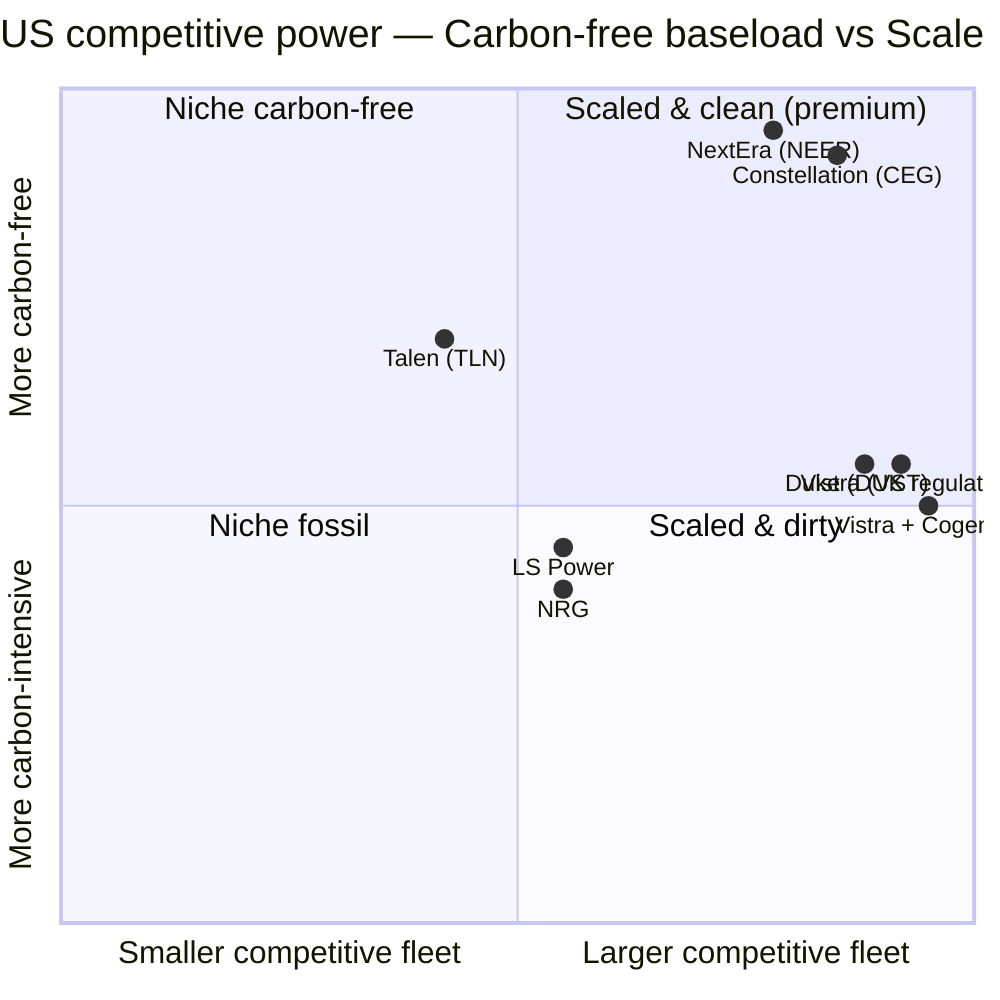

### Competitive advantages

1. **Integrated retail + generation** — Vistra is one of only two large competitive operators (NRG the other) with this structure at scale. The internal hedge is real, reducing earnings volatility through extreme weather.
2. **Largest second-place US nuclear operator** — 6,448 MW including the Energy-Harbor PJM trio is a moat against new build (impossible at this scale today) and a moat for hyperscaler PPA conversations.
3. **ERCOT pole position** — 19,858 MW in a market with energy-only pricing means scarcity-event upside that capacity-construct markets give back to consumers. Winter Storm Uri (2021) was a brutal lesson; subsequent ERCOT reforms and Vistra's investments in winterization have shifted the risk/reward favorably.
4. **M&A capability and balance-sheet flexibility** — two IG ratings in 6 months, USD 6.3 bn of share repurchases since 2021, and the demonstrated ability to source ~10 GW of new capacity at attractive prices (Lotus + Cogentrix at ~USD 730–830/kW) is a repeatable playbook.
5. **Retail brand depth** — TXU Energy's two-decade Texas tenure plus the multi-brand portfolio for different acquisition channels (Ambit MLM; Homefield municipal; Energy Harbor regional) is hard to replicate quickly.

### Competitive vulnerabilities

1. **Coal exposure** — 8,743 MW (20% of fleet) is structurally challenged by EPA rules and ESG mandates. Repowering to gas is the chosen path but consumes capital that could go to renewables or buybacks.
2. **Concentrated commodity-cycle exposure** — gas prices, power prices, weather are the principal volatility drivers; even with the integrated model, Adjusted EBITDA can swing by USD 1–2 bn between an extreme-weather year and a mild year.
3. **Hyperscaler counterparty concentration** — AWS and Meta together account for a meaningful share of forward contracted output; concentration risk that didn't exist 18 months ago.
4. **PJM co-location regulation in flux** — the new market rules (Q4-2025 onward) are still being implemented; outcomes for revenue allocation between hyperscaler loads and ISO ancillary services costs are not fully settled.
5. **Vistra Zero subscale** — at 1,274 MW of solar + battery, Vistra Zero is a rounding error against NextEra Energy Resources' 30+ GW renewables portfolio; the carbon-free positioning depends on nuclear, not renewables.

---

## 8. Market Opportunity (TAM)

### TAM definition

We size TAM in two layers: (i) the US **wholesale power market** (revenue paid for kWh and capacity in the ISO/RTO markets where Vistra operates), and (ii) the **competitive retail electricity market** (residential + C&I revenue in deregulated states).

### Wholesale

Total US wholesale electricity revenue is approximately **USD 250–300 bn/year**, of which ERCOT, PJM, ISO-NE, MISO, NYISO and CAISO together represent roughly **USD 170–200 bn/year**. Vistra's wholesale revenue (Texas + East + West + Asset Closure segments, gross of intersegment eliminations: $5,353 + $6,174 + $325 + $74 = $11.93 bn in FY2025 per [10-K Segment Note 21](https://www.sec.gov/Archives/edgar/data/1692819/000169281926000006/vistra-20251231.htm)) is approximately **6–7% market share** of these competitive ISOs/RTOs combined.

The growth in this layer is the AI-data-center demand wave. EPRI, ERCOT load forecasts, and PJM RTO 2025 capacity-auction outcomes all point to a 2–4%/yr load CAGR through the early 2030s — versus a long-flat baseline since 2000. If we apply 3%/yr load growth to a USD 200 bn baseline and assume average wholesale prices rise 30–50% from depressed 2023–2024 levels (a key variable; tied to gas, scarcity, and capacity-market clearing), the addressable wholesale market in 2030 is in the **USD 280–340 bn** range — i.e. a ~50% increase in 6 years if both volume and price expand. **This estimate is back-of-envelope, not from a single cited research firm; we mark it explicitly as an analyst calculation rather than a primary-source TAM.**

### Retail

US competitive retail electricity (residential + C&I in deregulated states) is approximately **USD 80–100 bn/year**. Vistra's retail segment revenue of $14.34 bn (FY2025, gross of eliminations, per [10-K Segment Note 21](https://www.sec.gov/Archives/edgar/data/1692819/000169281926000006/vistra-20251231.htm)) puts its retail market share at **roughly 15–18% of US competitive retail**, with much higher concentration in Texas (~30%+ residential share via TXU + sister brands). The retail market grows roughly with US electricity demand (ex-restructuring); meaningful retail-share expansion would come from additional states deregulating (slow politically) or from share-of-wallet expansion within existing states.

### Hyperscaler nuclear PPA opportunity

The new TAM layer is **long-dated nuclear PPAs to AI hyperscalers**. Public deals announced over the past 18 months — Microsoft-Constellation TMI (~835 MW restart), Amazon-Talen Susquehanna (~960 MW + scaling to ~1.92 GW), AWS-Vistra Comanche Peak (1,200 MW), Meta-Vistra Perry+Davis-Besse+uprates (2,609 MW), Meta-Oklo (SMR), Meta-TerraPower (SMR), Google-various — together represent on the order of **8–12 GW of disclosed nuclear deals** in the last 18 months. If we assume PPA prices in the USD 100–120/MWh range with 90% capacity factor (industry estimate; **not Vistra-disclosed**), each 1,000 MW is approximately USD 800–950 mm/yr of contracted revenue. The 8–12 GW US deal book represents an annual contracted revenue stream of roughly **USD 7–11 bn/year** at maturity, distributed across the 4–5 US merchant nuclear operators (CEG, VST, TLN, Public Service Enterprise, Energy Northwest) and the 2 regulated nuclear utilities that have started entering these markets (PSEG, Duke).

Vistra's disclosed 3,809 MW of hyperscaler contracts implies a contracted revenue stream of **roughly USD 3.0–3.5 bn/year by 2032+** at industry-estimated pricing — a meaningful step-up over today's run-rate nuclear EBITDA. **Again, Vistra has not disclosed contract pricing; the USD 3.0–3.5 bn/yr figure is an analyst estimate based on third-party reporting of comparable deals, not a Vistra-source number.**

### Vistra's serviceable + obtainable share

Vistra's SAM is **the competitive merchant generation + retail markets in its 6-ISO footprint, plus the hyperscaler PPA pipeline at its existing nuclear sites**. Within this SAM the obtainable share is largely set by physical assets — adding capacity is M&A-led (Lotus + Cogentrix add ~8 GW; SMR-based new build would be 2030+). Reasonable SOM scenarios over 5 years see Vistra at 50+ GW of capacity, hyperscaler contracts at 5+ GW, and consolidated revenue moving from USD 17.7 bn (2025) toward USD 22–25 bn (post-Cogentrix, with new PPA contribution and capacity-market repricing).

### Penetration strategy

The penetration strategy is clear from the 10-K and recent disclosures: **(i)** lock in long-dated PPAs at nuclear sites where the floor (45U PTC, ~USD 15/MWh) and the carbon-free narrative give pricing power; **(ii)** acquire mid-life gas at <USD 1,000/kW to add dispatchable thermal at material discount to new-build; **(iii)** repower coal plants (Coleto Creek, Miami Fort) to gas to keep site rights, interconnection queue positions, and water rights while modernising emissions; **(iv)** develop new gas peaking (860 MW West Texas advanced peakers, online 2028) where load growth (Permian electrification) is verifiable; **(v)** grow retail organically and through tuck-ins; **(vi)** return capital aggressively (30% share-count reduction since 2021).

---

## 9. Risk Assessment

### Company-Specific Risks

**1. Hyperscaler counterparty concentration (rising).** AWS and Meta together account for ~3,809 MW of contracted output by full ramp (2032+) — roughly **59% of Vistra's nuclear capacity** and potentially ~10% of post-Cogentrix dispatchable fleet revenue at industry-estimated PPA pricing (not Vistra-disclosed). A single counterparty default, restructuring of an AWS/Meta data-center footprint, or technology shift (the AI workload moves elsewhere) could meaningfully impact long-term contracted revenue. *Mitigants*: 20-year terms with both extension options and termination fees; AWS and Meta are both investment-grade global-scale counterparties. *Severity: material, rising.* The 10-K explicitly flags counterparty performance risk on these PPAs.

**2. Integration risk — Cogentrix.** The pending USD ~4 bn Cogentrix acquisition adds 5,500 MW across three ISOs requiring operational integration, FERC and HSR approval, and re-financing of USD 1.5 bn of assumed debt. The 10-K explicitly warns: "Following completion of the Cogentrix Transactions, we may not realize the anticipated synergies and other expected benefits… on the anticipated timeline or at all" ([10-K Risk Factors](https://www.sec.gov/Archives/edgar/data/1692819/000169281926000006/vistra-20251231.htm)). *Mitigants*: experienced M&A team (Energy Harbor integration largely on-track); mid-life gas plants are commoditized assets that integrate faster than nuclear; debt issuance to fund the cash portion already largely completed (Jan-2026 USD 2.25 bn notes issuance). *Severity: moderate.*

**3. Nuclear operational risk.** A material refueling outage, unplanned shutdown, or NRC enforcement action at Comanche Peak, Perry, Davis-Besse, or Beaver Valley would have outsized financial impact under the new PPA structure where counterparties expect contracted delivery. The 433 MW of uprates at Perry/Davis-Besse/Beaver Valley require NRC license amendments — a multi-year process subject to technical and political risk. *Mitigants*: 20+ years of operating history at all four sites; Vistra Vice-Chair of NEI; comprehensive nuclear insurance via the Price-Anderson Act. *Severity: moderate but tail-risk.*

**4. Coal-asset stranding and ESG narrative drag.** 8,743 MW of coal/lignite (20% of fleet) sits against tightening EPA rules and a deteriorating ESG narrative; repower-to-gas is Vistra's chosen path (Coleto Creek 2027, Miami Fort 2028) but requires capital and depends on continued gas-fuel economics. *Mitigants*: explicit retirement/repower schedules announced; lignite plants in ERCOT have integrated mine assets that retain value. *Severity: moderate, decreasing.*

**5. ERCOT extreme-weather event risk.** Winter Storm Uri (February 2021) cost Vistra approximately USD 1.6 bn pre-tax. Subsequent ERCOT winterization investment, Texas SB 3 reforms, and Vistra's own plant upgrades have reduced (but not eliminated) the risk of repeat severe-cold-weather events. *Mitigants*: 98% hedged for 2026 generation per Q1-2026 release; insurance recoveries from Uri have been mostly realized; physical winterization spending of several hundred million dollars completed 2022–2024. *Severity: moderate, with high tail.*

**6. Texas SB 6 / co-location regulation.** SB 6 (2025) requires certain co-located large loads in Texas to provide load flexibility during emergencies — a meaningful constraint on the value of behind-the-meter / co-located data-center configurations at Comanche Peak. Final implementation rules are still being developed. *Mitigants*: AWS PPA is structured as front-of-the-meter rather than purely behind-the-meter; PJM has clarified co-location rules in a way Vistra views as workable. *Severity: low-to-moderate.*

### Industry / Market Risks

**7. Power-price cyclicality.** Gas prices, weather, renewable build-out, and load growth all swing wholesale power prices by 30–50% peak-to-trough. FY2025 EBITDA fell ~USD 760 mm YoY largely on hedge mark-to-market and price normalization vs the very strong 2024. *Mitigants*: integrated model; 98%/89%/65% hedge ratios for 2026/2027/2028; long-term PPAs replacing more merchant exposure. *Severity: high — this is the structural sector beta.*

**8. AI demand realisation risk.** If hyperscaler data-center buildouts decelerate (energy efficiency gains, AI workload commoditisation, geographic dispersion away from PJM/ERCOT), the load-growth thesis underpinning capacity-market pricing and new-build economics could underperform. *Mitigants*: 20-year PPAs with AWS and Meta provide direct revenue insulation; Permian electrification is a parallel and independent driver. *Severity: moderate — this is the main thematic risk to the IPP sector multiple.*

**9. Capacity-market structural changes.** PJM's 2024/2025 capacity-auction prices spiked on supply scarcity; regulatory pushback from state PUCs and consumer groups could compress future auctions (e.g. PJM Base Residual Auction reform). ERCOT's energy-only construct could also face reform after future scarcity events. *Mitigants*: long-dated PPAs reduce dependence on capacity markets; Vistra has FERC engagement and ISO standing. *Severity: moderate.*

**10. Renewable + battery substitution.** Utility-scale solar + 4-hour battery storage installed cost (~USD 1,200/kW solar + USD 250–350/kWh storage) is approaching the point where it can serve substantial intermediate load at lower cost than new gas. Long-duration storage (8–10 hour) is still expensive but improving. *Mitigants*: nuclear and existing low-cost gas remain economic for baseload and dispatchable use; integrated retail keeps Vistra connected to demand side. *Severity: low-to-moderate.*

### Financial Risks

**11. Leverage / refinancing risk.** Total debt of ~USD 19.9 bn against TTM EBITDA of ~USD 6.8 bn = ~2.9x; pro-forma for Cogentrix adds another ~USD 1.5 bn of assumed debt plus the USD 2.3 bn cash portion (partly funded by January-2026 notes issuance). Interest expense was USD 1.18 bn in FY2025 vs USD 0.90 bn in FY2024 (up ~31% on higher rates and higher debt). *Mitigants*: dual IG ratings (S&P Dec-2025, Fitch Jan-2026); USD 4.17 bn of total liquidity at 31-Mar-2026; long maturity schedule. *Severity: low-moderate.*

**12. Capital-allocation risk.** Aggressive buybacks (USD 6.3 bn since 2021), heavy M&A (USD 3.43 bn Energy Harbor + USD 3.2 bn NCI buyout + USD 1.9 bn Lotus + ~USD 4 bn Cogentrix), and large planned nuclear-uprate capex compete for the same cash flow. *Mitigants*: investment-grade discipline; explicit capital-allocation framework prioritising leverage targets; PTC and PPA cash flows are visible. *Severity: low.*

### Macroeconomic Risks

**13. Natural gas price volatility.** Henry Hub price moved from USD 2.25 (2024 avg) to USD 3.53 (2025 avg) per the 10-K ([10-K Commodity Prices table](https://www.sec.gov/Archives/edgar/data/1692819/000169281926000006/vistra-20251231.htm)). 62% of capacity is gas, so gas price moves directly affect both fuel cost and power price formation (offsetting at the integrated level but with timing mismatches). *Mitigants*: hedging program; integrated model. *Severity: moderate.*

**14. Interest-rate sensitivity.** With ~USD 20 bn of debt, every 100bp rate change is ~USD 200 mm of annual interest expense at full pass-through (mitigated by fixed-rate share). Higher rates also compress the equity-risk premium relevant for an IPP/utility-hybrid like VST. *Mitigants*: mostly fixed-rate debt; interest-rate swaps; staggered maturity profile. *Severity: moderate.*

**15. Tax / IRA policy reversal risk.** The section 45U nuclear PTC (USD 15/MWh through 2032) is meaningful to nuclear EBITDA. The Inflation Reduction Act of 2022 also implemented the 15% corporate alternative minimum tax (CAMT) and the 1% buyback excise tax. Federal policy reversal (full IRA repeal) would remove the PTC tailwind. *Mitigants*: PPA pricing presumably reflects market-clearing prices net of PTC, providing some insulation; political consensus on IRA reversal is uncertain. *Severity: moderate, political.*

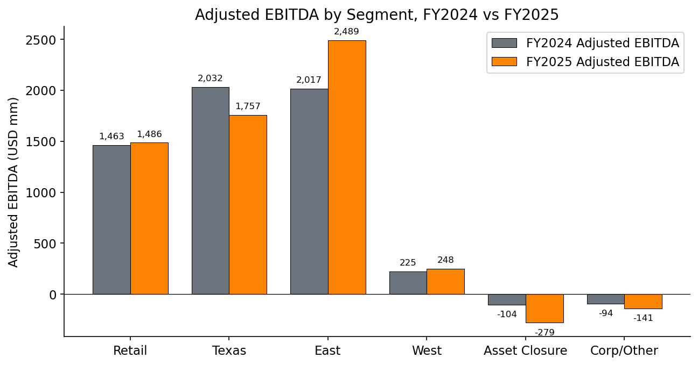
Source: [Vistra 2025 Form 10-K, Segment Note 21 Adjusted EBITDA reconciliation](https://www.sec.gov/Archives/edgar/data/1692819/000169281926000006/vistra-20251231.htm).

---

## 10. References

### Primary filings (SEC EDGAR)

- [Vistra Corp. — Form 10-K for FY2025 (filed Feb 2026)](https://www.sec.gov/Archives/edgar/data/1692819/000169281926000006/vistra-20251231.htm) — primary source for fleet capacity, segment financials, M&A note, risk factors.
- [Vistra Corp. — 2026 Proxy Statement (DEF 14A, filed 2026-03-18)](https://www.sec.gov/Archives/edgar/data/1692819/000162828026019029/vstdef14a-2025.htm) — director and executive bios, compensation, governance.
- [Vistra Corp. — Q1-2026 Earnings Release (8-K EX-99.1, 2026-05-07)](https://www.sec.gov/Archives/edgar/data/1692819/000169281926000011/vistra-20260331xearningsre.htm) — Q1-2026 financial results, 2026 guidance reaffirmation, hedge ratios.
- [Vistra Corp. — 8-K (Sep-29-2025) — AWS-Comanche Peak PPA announcement](https://www.sec.gov/Archives/edgar/data/1692819/000119312525221774/d43667d8k.htm).
- [Vistra Corp. — 8-K (2026-01-05) — Cogentrix definitive agreement](https://www.sec.gov/Archives/edgar/data/1692819/000119312526002589/d62722d8k.htm).
- [Vistra Corp. — Q3-2025 earnings release (8-K, 2025-11-06)](https://investor.vistracorp.com/2025-11-06-Vistra-Reports-Third-Quarter-2025-Results,-Narrows-2025-Guidance,-and-Initiates-2026-Guidance).

### Company press releases and IR

- [Vistra and Meta Announce Agreements to Support Nuclear Plants in PJM, 2026-01-09](https://investor.vistracorp.com/2026-01-09-Vistra-and-Meta-Announce-Agreements-to-Support-Nuclear-Plants-in-PJM-and-Add-New-Nuclear-Generation-to-the-Grid) — primary source for the 2,609 MW Meta PPA breakdown.
- [Vistra Adds to its Industry-Leading Generation Portfolio with Acquisition of Cogentrix, 2026-01-05](https://www.prnewswire.com/news-releases/vistra-adds-to-its-industry-leading-generation-portfolio-with-acquisition-of-cogentrix-302653058.html) — Cogentrix deal mechanics ($2.3 bn cash + $0.9 bn stock + $1.5 bn assumed debt – $0.7 bn tax benefits = ~$4 bn gross at ~$730/kW).
- [Vistra Completes Energy Harbor Acquisition, 2024-03-01](https://www.prnewswire.com/news-releases/vistra-completes-energy-harbor-acquisition-302077375.html) — Energy Harbor close.
- [Vistra corporate website](https://www.vistracorp.com) — brand list, leadership, fleet overview.
- [Vistra investor relations page](https://investor.vistracorp.com).

### Industry / third-party news

- [Amazon and Meta agreements boost Vistra nuclear plants — World Nuclear News, 2026](https://www.world-nuclear-news.org/articles/ppas-support-extended-operations-at-vistra-plants).
- [Vistra and Meta ink PPA for 2.6 GW of nuclear power in PJM region — Power Engineering, 2026](https://www.power-eng.com/nuclear/vistra-and-meta-ink-ppa-for-2-6-gw-of-nuclear-power-in-pjm-region/).
- [Meta Locks In Up to 6.6 GW of Nuclear Power Through Deals with Vistra, Oklo, and TerraPower — Power Magazine, 2026](https://www.powermag.com/meta-locks-in-up-to-6-6-gw-of-nuclear-power-through-deals-with-vistra-oklo-and-terrapower/).
- [The Meta-Vistra deal: A closer look — ANS Nuclear Newswire, 2026](https://www.ans.org/news/article-7668/the-metavistra-deal-a-closer-look/).
- [Vistra moves more deeply into nuclear power with planned $3.43B acquisition of Energy Harbor — Utility Dive, 2023](https://www.utilitydive.com/news/vistra-energy-harbor-acquisition-nuclear-power/644276/).
- [Vistra Expands Gas Fleet With $4 Billion Cogentrix Acquisition — Yahoo Finance / Bloomberg, 2026](https://finance.yahoo.com/news/vistra-expands-gas-fleet-4-005712563.html).

### Market data

- [Yahoo Finance — VST key statistics, accessed 2026-05-21](https://finance.yahoo.com/quote/VST/key-statistics) — current price, market cap, multiples; peer pulls (TLN, CEG, NRG, DUK, AEP) from same source same date.
