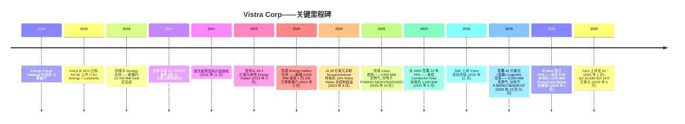
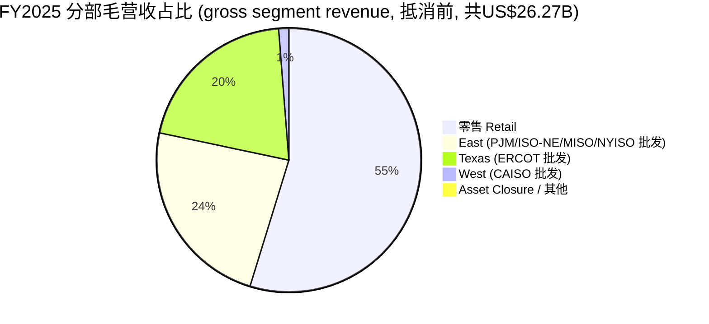
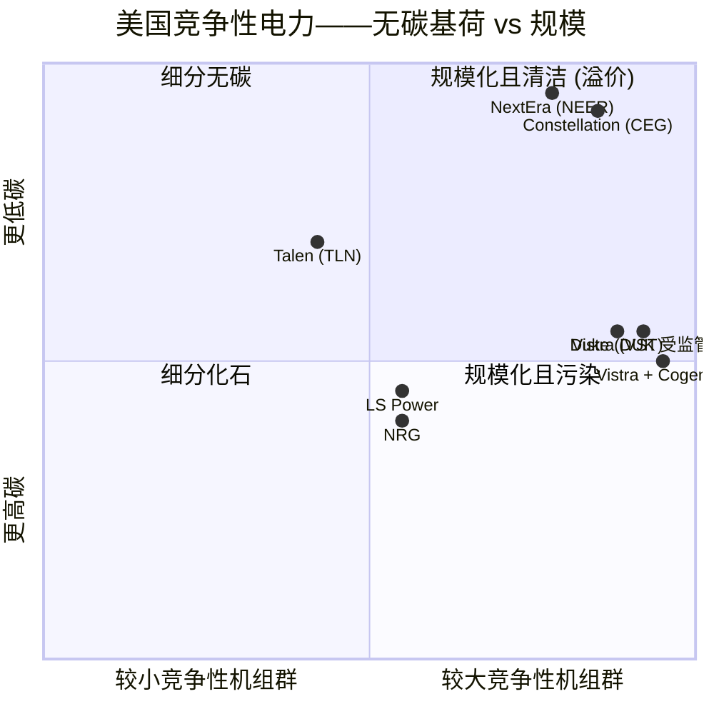

# Vistra Corp. (NYSE:VST) — 公司研究报告

**截至日期: 2026-06-16**
**上市地: 纽约证券交易所 (NYSE), 代码 VST**
**注册地: 美国得克萨斯州欧文市 (Irving, Texas, USA)**
**报告语言: 简体中文 (英文版同时存在于本目录)**

---

### 投资摘要 (Investment Summary) — *本报告观点 (Analyst view)*

| 项目 | 内容 |
|---|---|
| **评级 (Rating)** | **Buy / 增持** |
| **12 个月目标价 (Price Target)** | **US$195** |
| **现价 (2026-06-16 收盘)** | US$158.61 |
| **隐含上行 (Implied upside)** | **+23%** |
| **估值方法** | SOTP / EV ≈ 11.5× FY2027E Ongoing Adjusted EBITDA (~US$7.5–7.8B 中值机会) − 净债务 ≈ US$19B；与前瞻 P/E ~17× FY2027E EPS 交叉验证 |
| **市值 (Market cap)** | US$53.5B (337.2M 股) |
| **企业价值 (EV)** | US$73.5B |
| **52 周区间** | US$132.66 – US$219.82 |
| **代码 / 交易所** | NYSE:VST |

**论点支柱 (Thesis pillars) — *本报告观点*:**

1. **核电稀缺性已被合同货币化, 但市场只给了"混合型 IPP"倍数。** Vistra 是全美第二大竞争性核电运营商 (6,448 MW), 已通过 AWS (1,200 MW) 与 Meta (2,609 MW) 两份 20 年 PPA 锁定约 3,809 MW 无碳基荷——相当于核电容量的约 59%。这些 PPA 自 2027 年起贡献业绩, **未计入** 2026 指引, 是超出当前估值的上行期权 ([10-K Noteworthy Developments](https://www.sec.gov/Archives/edgar/data/1692819/000169281926000006/vistra-20251231.htm); [Vistra-Meta 新闻稿, 2026-01-09](https://investor.vistracorp.com/2026-01-09-Vistra-and-Meta-Announce-Agreements-to-Support-Nuclear-Plants-in-PJM-and-Add-New-Nuclear-Generation-to-the-Grid))。

2. **前瞻盈利能见度高: 2026 指引重申 (Ongoing Adj.EBITDA US$6.8–7.6B), 2027 中值机会上调至 US$7.4–7.8B, 发电量对冲比例 98%/89%/65% (2026/27/28)。** 这种合同化能见度更像受监管公用事业, 但建立在以深度折扣价收购的 (Energy Harbor) 资产之上 ([2026 财年 Q1 业绩公告, 2026-05-07](https://www.sec.gov/Archives/edgar/data/1692819/000169281926000011/vistra-20260331xearningsre.htm))。

3. **资本回报纪律 + 两项投资级 (IG) 上调。** 自 2021 年 11 月以来回购约 63 亿美元、股本减少约 30%；S&P (2025-12) 与 Fitch (2026-01) 双双上调至 IG, 降低了 IPP 历史性的资本成本折价 ([Investing.com — Vistra upgraded to IG by S&P, 2025-12-02](https://www.investing.com/news/stock-market-news/vistra-corp-upgraded-to-investment-grade-by-sp-on-improved-risk-profile-93CH-4387081))。

4. **估值便宜: 前瞻 P/E ~14.4× vs Constellation (CEG) ~19.7×, EV/EBITDA ~10.8× vs CEG ~14.7×。** UBS 在保守 (压力测试) DCF 下仍给 VST 在四家 IPP 中最高的基准上行 ([*Analyst view:* UBS US Power DCF note, 2026-05-04](http://xs-macbook-air.local:5001/zsxq/pdf/585421254542224/UBS-US%20Power%EF%BC%9A%20DCF%20Valuations%20For%20IPPs%20Support%20Bullish%20View-260504.pdf))。

**最该盯紧的变量 (Swing variables) — *本报告观点*:** (i) **PJM/ISO-NE 容量市场出清电价** (East 分部最大利润来源, 但面临监管反弹); (ii) **超大规模数据中心 PPA 的最终定价与利用率** (Vistra 未披露合同价格, AWS/Meta 增量贡献取决于此)。相对表现: 过去 12 个月 −10.3% vs SPY +27.0%, 过去 6 个月 −5.5% vs SPY +10.9%, 现价低于 200 日均线 (US$170.25) ——这是 2025 年 10 月 AI 电力高峰后的回调, 而非基本面破裂 ([来源: yfinance, 截至 2026-06-16](https://finance.yahoo.com/quote/VST/key-statistics))。

| 前瞻估值矩阵 (*本报告观点*) | FY2025A | FY2026E | FY2027E |
|---|---|---|---|
| 前瞻 P/E | 26.5× (TTM) | ~14.4× | ~12.5× |
| EV / Ongoing Adj.EBITDA | ~12.6× (US$5.84B) | ~10.2× (US$7.2B 中值) | ~9.6× (US$7.6B 中值) |
| P/S (TTM) | 2.75× | — | — |
| 股息率 | 0.6% | — | — |

来源: 现价/倍数 [yfinance VST, 2026-06-16](https://finance.yahoo.com/quote/VST/key-statistics); FY2025 Ongoing Adj.EBITDA US$5,838M 来自 [10-K MD&A, p.60](https://www.sec.gov/Archives/edgar/data/1692819/000169281926000006/vistra-20251231.htm); FY2026/27 中值来自 [2026 财年 Q1 业绩公告 (重申指引 + 2027 中值机会), 2026-05-07](https://www.sec.gov/Archives/edgar/data/1692819/000169281926000011/vistra-20260331xearningsre.htm)。前瞻 EPS/倍数为分析师估算, 详见 Section 1A。

> **业绩更新——2026 财年指引获再次确认 (2026-05-07):** 在 2026 财年 Q1 业绩公布之际, 管理层再次确认全年 Ongoing Operations 调整后 EBITDA (Adjusted EBITDA) 指引为 **US$6.8–7.6B**, 同时调整后增长前自由现金流 (Adjusted FCF-before-growth, FCFbG) 指引为 **US$3.925–4.725B**, **此指引未包含**正在进行中的 Cogentrix 收购以及已签署的 Meta 与 AWS 两项核电购电协议 (PPA) 的贡献——后两者将自 2027 年起开始贡献业绩。Q1 2026 当季 Net Income 为 **US$1,029M** (同比增 US$1,297M, 主因商品对冲转为市价计值收益), Ongoing Adj.EBITDA 为 **US$1,494M** (同比增 US$254M)。公司同时把 **2027 年 Ongoing Adj.EBITDA 中值机会上调至 US$7.4–7.8B**, 截至 5 月 1 日 2026 年发电量已对冲 **98%**、2027 年 89%、2028 年 65%。该公告亦提示 Fitch 于 2026 年 1 月将 Vistra 上调至投资级 (Investment Grade) ——继 2025 年 12 月获 S&P 上调后的第二项 IG 评级。来源: [2026 财年 Q1 业绩公告, 2026-05-07](https://www.sec.gov/Archives/edgar/data/1692819/000169281926000011/vistra-20260331xearningsre.htm)。

## 目录

1. 公司概览
   - 1A. 估值与目标价 (决策层)
   - 1B. GF Score (基本面评分)
2. 公司历史
3. 管理团队
4. 产品与服务
5. 客户与上市策略
6. 行业概览
7. 竞争格局
8. 市场机会 (TAM)
9. 风险评估
   - 9.5. 关键争论与催化剂
10. 投资视角评分卡
11. 参考资料

---

## 1. 公司概览

Vistra Corp. (NYSE: VST) 是**美国最大的竞争性 (即商业性、非公用事业型) 发电企业及综合性零售电力供应商 (integrated retail electricity supplier)**。截至 2025 年 12 月 31 日, 公司在天然气、核电 (nuclear power)、煤电、太阳能与电池储能等技术类别下合计运营**43,641 兆瓦 (MW) 净发电容量**, 并在 18 个州及哥伦比亚特区为**约 500 万住宅、商业及工业零售客户**提供服务 ([Vistra 2025 Form 10-K, Item 1 Business, p.1](https://www.sec.gov/Archives/edgar/data/1692819/000169281926000006/vistra-20251231.htm))。该机组群是美国第二大竞争性核电运营商, 核电装机容量达**6,448 MW** (六台机组分布于四个站址——位于 ERCOT 的 Comanche Peak 1 & 2、位于 PJM 的 Beaver Valley 1 & 2、Perry 与 Davis-Besse), 仅次于 Constellation Energy。

综合性商业模式 (integrated business model) ——即同时拥有发电资产并通过零售品牌直接向终端客户售电——是股权故事的核心。发电对冲零售负荷 (~500 万客户), 零售对冲发电产出, 而批发与零售两端价格形成机制在周期内的差额由商业运营商捕获。Vistra 划分为五个可报告分部: **Retail、Texas (ERCOT)、East (PJM、ISO-NE、MISO、NYISO)、West (CAISO) 与 Asset Closure** (负责退役电厂的退役清理) ([10-K Item 1, Market Discussion, p.1–2](https://www.sec.gov/Archives/edgar/data/1692819/000169281926000006/vistra-20251231.htm))。

**Vistra 如何盈利。** 装机容量结构: 约 62% (26,989 MW) 为天然气联合循环 (CCGT)、简单循环调峰机组 (simple-cycle peaker) 或蒸汽轮机机组; 20% (8,743 MW) 为煤电; 15% (6,448 MW) 为核电; 3% (1,274 MW) 为可再生能源/电池储能; 小部分为燃油 ([10-K p.1](https://www.sec.gov/Archives/edgar/data/1692819/000169281926000006/vistra-20251231.htm))。各电厂调度进入 ERCOT、PJM、ISO-NE、MISO、NYISO 及 CAISO 批发市场; 收入来源为基于地理位置的边际价格 (location-based marginal price) 加上具有容量市场机制的市场 (PJM、ISO-NE) 中的容量支付。零售收入则来自以 TXU Energy、Ambit Energy、Dynegy Energy Services、Homefield Energy、Energy Harbor、Public Power、TriEagle Energy 与 U.S. Gas & Electric 等品牌向住宅与企业销售千瓦时 (kWh)。批发商品风险管理小组位于发电与零售之间, 负责 1 至 4 年远期对冲。

**地理结构。** 业务覆盖"加州到缅因州"——但经济重心位于**ERCOT/得克萨斯州** (19,858 MW, 占装机容量 46%), 其次为以 PJM、ISO-NE、MISO 与 NYISO 为主的**East** 区 (22,254 MW, 51%), 以及位于 CAISO 的小规模**West** 仓位 (1,529 MW, 3%) ([10-K Properties, Item 2](https://www.sec.gov/Archives/edgar/data/1692819/000169281926000006/vistra-20251231.htm))。East 分部通过 2024 年 3 月并购 Energy Harbor (新增约 4,000 MW 核电加零售) 与 2025 年 10 月收购 Lotus Infrastructure Partners (新增 2,600 MW 天然气, 分布于 PJM、ISO-NE、NYISO、CAISO) 而规模翻倍。

**规模指标。** 2025 财年营业收入为 **US$177.4 亿 (US$17,738M)**, 较 2024 年的 US$17,224M 与 2023 年的 US$14,779M 同比增长 ([10-K Consolidated Statements of Operations, p.78](https://www.sec.gov/Archives/edgar/data/1692819/000169281926000006/vistra-20251231.htm))。2025 财年 **Ongoing Operations 调整后 EBITDA (Adjusted EBITDA) 为 US$5,838M**, 较 2024 年的 US$5,539M **增长 US$299M**——尽管 GAAP 归属 Vistra 净利润从 US$2,659M 降至 US$944M (主因约 US$19.6 亿未实现商品对冲市价计值损失与 US$228M 长期资产减值, 二者均不计入 Adjusted EBITDA, 参见 [10-K MD&A Adjusted EBITDA 桥接, p.60–63](https://www.sec.gov/Archives/edgar/data/1692819/000169281926000006/vistra-20251231.htm))。**注: 本次刷新将上一版误述的 "FY2025 调整后 EBITDA US$4.78B" 更正为 10-K MD&A 实际披露的 Ongoing Adj.EBITDA US$5,838M。** 2026 财年指引中值约 **US$7.2B Ongoing Adj.EBITDA** 反映了重新对冲的远期电力价格、Lotus 全年 12 个月贡献以及容量市场拍卖顺风的逐级抬升 ([2026 财年 Q1 业绩公告, 2026-05-07](https://www.sec.gov/Archives/edgar/data/1692819/000169281926000011/vistra-20260331xearningsre.htm))。公司约 1,860 名员工受集体谈判协议覆盖, 占总员工数的较小部分。

下图为 FY2025 利润表的"如何赚钱"图解 (income-statement Sankey): 约 US$177 亿营收经 US$91 亿燃料/购电/输配 (fuel, purchased power & delivery) 后得 US$86.4 亿 gross profit, 再扣 US$67.3 亿运营开支 (含 US$19.9 亿折旧摊销与 US$2.28 亿减值) 后得 US$19.1 亿 operating income, 最终 GAAP 净利润 US$9.44 亿。GAAP 净利润被非现金对冲市价计值损失压低, 这正是 Adjusted EBITDA (US$58.4 亿) 与 GAAP 之间巨大差异的来源。

<svg xmlns="http://www.w3.org/2000/svg" viewBox="0 0 1000 560" width="1000" height="560" role="img" aria-label="income statement Sankey"><rect x="0" y="0" width="1000" height="560" fill="#ffffff"/>
<text x="20.00" y="30.00" text-anchor="start" font-family="Helvetica,Arial,sans-serif" font-size="15" font-weight="700" fill="#1f2933">Vistra FY2025 利润表 Sankey (income statement, US$ M)</text>
<path d="M 204.00,64.00 C 258.00,64.00 258.00,151.23 312.00,151.23 L 312.00,373.98 C 258.00,373.98 258.00,286.75 204.00,286.75 Z" fill="#93c5fd" fill-opacity="0.55"/>
<path d="M 452.00,144.23 C 506.00,144.23 506.00,198.78 560.00,198.78 L 560.00,228.38 C 506.00,228.38 506.00,173.84 452.00,173.84 Z" fill="#86efac" fill-opacity="0.55"/>
<path d="M 452.00,173.84 C 506.00,173.84 506.00,242.38 560.00,242.38 L 560.00,346.94 C 506.00,346.94 506.00,278.40 452.00,278.40 Z" fill="#fca5a5" fill-opacity="0.55"/>
<path d="M 328.00,151.23 C 382.00,151.23 382.00,144.23 436.00,144.23 L 436.00,278.40 C 382.00,278.40 382.00,285.40 328.00,285.40 Z" fill="#86efac" fill-opacity="0.55"/>
<path d="M 328.00,285.40 C 382.00,285.40 382.00,292.40 436.00,292.40 L 436.00,433.77 C 382.00,433.77 382.00,426.77 328.00,426.77 Z" fill="#fca5a5" fill-opacity="0.55"/>
<path d="M 576.00,198.78 C 630.00,198.78 630.00,214.00 684.00,214.00 L 684.00,243.61 C 630.00,243.61 630.00,228.38 576.00,228.38 Z" fill="#86efac" fill-opacity="0.55"/>
<path d="M 700.00,214.00 C 754.00,214.00 754.00,273.28 808.00,273.28 L 808.00,287.94 C 754.00,287.94 754.00,228.66 700.00,228.66 Z" fill="#86efac" fill-opacity="0.55"/>
<path d="M 700.00,228.66 C 754.00,228.66 754.00,301.94 808.00,301.94 L 808.00,304.72 C 754.00,304.72 754.00,231.44 700.00,231.44 Z" fill="#fca5a5" fill-opacity="0.55"/>
<path d="M 576.00,242.38 C 630.00,242.38 630.00,245.44 684.00,245.44 L 684.00,272.07 C 630.00,272.07 630.00,269.01 576.00,269.01 Z" fill="#fca5a5" fill-opacity="0.55"/>
<path d="M 576.00,269.01 C 630.00,269.01 630.00,286.07 684.00,286.07 L 684.00,364.00 C 630.00,364.00 630.00,346.94 576.00,346.94 Z" fill="#fca5a5" fill-opacity="0.55"/>
<path d="M 204.00,300.75 C 258.00,300.75 258.00,373.98 312.00,373.98 L 312.00,469.89 C 258.00,469.89 258.00,396.65 204.00,396.65 Z" fill="#93c5fd" fill-opacity="0.55"/>
<path d="M 576.00,360.94 C 630.00,360.94 630.00,243.61 684.00,243.61 L 684.00,261.89 C 630.00,261.89 630.00,379.22 576.00,379.22 Z" fill="#93c5fd" fill-opacity="0.55"/>
<path d="M 204.00,410.65 C 258.00,410.65 258.00,469.89 312.00,469.89 L 312.00,553.04 C 258.00,553.04 258.00,493.80 204.00,493.80 Z" fill="#93c5fd" fill-opacity="0.55"/>
<path d="M 204.00,507.80 C 258.00,507.80 258.00,553.04 312.00,553.04 L 312.00,559.23 C 258.00,559.23 258.00,514.00 204.00,514.00 Z" fill="#93c5fd" fill-opacity="0.55"/>
<rect x="188.00" y="64.00" width="16" height="222.75" rx="1.5" fill="#2563eb"/>
<rect x="188.00" y="300.75" width="16" height="95.90" rx="1.5" fill="#2563eb"/>
<rect x="188.00" y="410.65" width="16" height="83.15" rx="1.5" fill="#2563eb"/>
<rect x="188.00" y="507.80" width="16" height="6.20" rx="1.5" fill="#2563eb"/>
<rect x="312.00" y="151.23" width="16" height="275.53" rx="1.5" fill="#1e3a8a"/>
<rect x="436.00" y="144.23" width="16" height="134.16" rx="1.5" fill="#15803d"/>
<rect x="436.00" y="292.40" width="16" height="141.37" rx="1.5" fill="#dc2626"/>
<rect x="560.00" y="198.78" width="16" height="29.61" rx="1.5" fill="#15803d"/>
<rect x="560.00" y="242.38" width="16" height="104.56" rx="1.5" fill="#dc2626"/>
<rect x="560.00" y="360.94" width="16" height="18.28" rx="1.5" fill="#2563eb"/>
<rect x="684.00" y="214.00" width="16" height="17.44" rx="1.5" fill="#15803d"/>
<rect x="684.00" y="245.44" width="16" height="26.62" rx="1.5" fill="#dc2626"/>
<rect x="684.00" y="286.07" width="16" height="77.93" rx="1.5" fill="#dc2626"/>
<rect x="808.00" y="273.28" width="16" height="14.66" rx="1.5" fill="#15803d"/>
<rect x="808.00" y="301.94" width="16" height="2.78" rx="1.5" fill="#dc2626"/>
<line x1="188.00" y1="175.37" x2="182.00" y2="151.47" stroke="#cbd5e1" stroke-width="1"/>
<text x="179.00" y="154.47" text-anchor="end" font-family="Helvetica,Arial,sans-serif" font-size="11.5" font-weight="700" fill="#1f2933">Retail</text>
<text x="179.00" y="167.47" text-anchor="end" font-family="Helvetica,Arial,sans-serif" font-size="10" font-weight="400" fill="#52606d">US$14.3B  (80.8%)</text>
<line x1="188.00" y1="348.70" x2="182.00" y2="324.80" stroke="#cbd5e1" stroke-width="1"/>
<text x="179.00" y="327.80" text-anchor="end" font-family="Helvetica,Arial,sans-serif" font-size="11.5" font-weight="700" fill="#1f2933">East (PJM等)</text>
<text x="179.00" y="340.80" text-anchor="end" font-family="Helvetica,Arial,sans-serif" font-size="10" font-weight="400" fill="#52606d">US$6.2B  (34.8%)</text>
<line x1="188.00" y1="452.23" x2="182.00" y2="428.33" stroke="#cbd5e1" stroke-width="1"/>
<text x="179.00" y="431.33" text-anchor="end" font-family="Helvetica,Arial,sans-serif" font-size="11.5" font-weight="700" fill="#1f2933">Texas (ERCOT)</text>
<text x="179.00" y="444.33" text-anchor="end" font-family="Helvetica,Arial,sans-serif" font-size="10" font-weight="400" fill="#52606d">US$5.4B  (30.2%)</text>
<line x1="188.00" y1="510.90" x2="182.00" y2="487.00" stroke="#cbd5e1" stroke-width="1"/>
<text x="179.00" y="490.00" text-anchor="end" font-family="Helvetica,Arial,sans-serif" font-size="11.5" font-weight="700" fill="#1f2933">West/其他</text>
<text x="179.00" y="503.00" text-anchor="end" font-family="Helvetica,Arial,sans-serif" font-size="10" font-weight="400" fill="#52606d">US$399.0M  (2.2%)</text>
<rect x="331.00" y="133.23" width="119.40" height="26" rx="2" fill="#ffffff" fill-opacity="0.72"/>
<text x="334.00" y="145.23" text-anchor="start" font-family="Helvetica,Arial,sans-serif" font-size="11.5" font-weight="700" fill="#1f2933">Revenue</text>
<text x="334.00" y="158.23" text-anchor="start" font-family="Helvetica,Arial,sans-serif" font-size="10" font-weight="400" fill="#52606d">US$17.7B  (100.0%)</text>
<rect x="455.00" y="126.23" width="106.80" height="26" rx="2" fill="#ffffff" fill-opacity="0.72"/>
<text x="458.00" y="138.23" text-anchor="start" font-family="Helvetica,Arial,sans-serif" font-size="11.5" font-weight="700" fill="#1f2933">Gross Profit</text>
<text x="458.00" y="151.23" text-anchor="start" font-family="Helvetica,Arial,sans-serif" font-size="10" font-weight="400" fill="#52606d">US$8.6B  (48.7%)</text>
<rect x="455.00" y="274.40" width="144.60" height="26" rx="2" fill="#ffffff" fill-opacity="0.72"/>
<text x="458.00" y="286.40" text-anchor="start" font-family="Helvetica,Arial,sans-serif" font-size="11.5" font-weight="700" fill="#1f2933">Cost of Revenue (COGS)</text>
<text x="458.00" y="299.40" text-anchor="start" font-family="Helvetica,Arial,sans-serif" font-size="10" font-weight="400" fill="#52606d">US$9.1B  (51.3%)</text>
<rect x="579.00" y="180.78" width="106.80" height="26" rx="2" fill="#ffffff" fill-opacity="0.72"/>
<text x="582.00" y="192.78" text-anchor="start" font-family="Helvetica,Arial,sans-serif" font-size="11.5" font-weight="700" fill="#1f2933">Operating Income</text>
<text x="582.00" y="205.78" text-anchor="start" font-family="Helvetica,Arial,sans-serif" font-size="10" font-weight="400" fill="#52606d">US$1.9B  (10.7%)</text>
<rect x="579.00" y="224.38" width="150.90" height="26" rx="2" fill="#ffffff" fill-opacity="0.72"/>
<text x="582.00" y="236.38" text-anchor="start" font-family="Helvetica,Arial,sans-serif" font-size="11.5" font-weight="700" fill="#1f2933">Total Operating Expense</text>
<text x="582.00" y="249.38" text-anchor="start" font-family="Helvetica,Arial,sans-serif" font-size="10" font-weight="400" fill="#52606d">US$6.7B  (37.9%)</text>
<text x="551.00" y="367.08" text-anchor="end" font-family="Helvetica,Arial,sans-serif" font-size="11.5" font-weight="700" fill="#1f2933">Net Interest / Other Income</text>
<text x="551.00" y="380.08" text-anchor="end" font-family="Helvetica,Arial,sans-serif" font-size="10" font-weight="400" fill="#52606d">US$1.2B  (6.6%)</text>
<rect x="703.00" y="196.00" width="100.50" height="26" rx="2" fill="#ffffff" fill-opacity="0.72"/>
<text x="706.00" y="208.00" text-anchor="start" font-family="Helvetica,Arial,sans-serif" font-size="11.5" font-weight="700" fill="#1f2933">Pretax Income</text>
<text x="706.00" y="221.00" text-anchor="start" font-family="Helvetica,Arial,sans-serif" font-size="10" font-weight="400" fill="#52606d">US$1.1B  (6.3%)</text>
<rect x="703.00" y="227.44" width="100.50" height="26" rx="2" fill="#ffffff" fill-opacity="0.72"/>
<text x="706.00" y="239.44" text-anchor="start" font-family="Helvetica,Arial,sans-serif" font-size="11.5" font-weight="700" fill="#1f2933">SG&amp;A</text>
<text x="706.00" y="252.44" text-anchor="start" font-family="Helvetica,Arial,sans-serif" font-size="10" font-weight="400" fill="#52606d">US$1.7B  (9.7%)</text>
<rect x="703.00" y="268.07" width="106.80" height="26" rx="2" fill="#ffffff" fill-opacity="0.72"/>
<text x="706.00" y="280.07" text-anchor="start" font-family="Helvetica,Arial,sans-serif" font-size="11.5" font-weight="700" fill="#1f2933">Other OpEx</text>
<text x="706.00" y="293.07" text-anchor="start" font-family="Helvetica,Arial,sans-serif" font-size="10" font-weight="400" fill="#52606d">US$5.0B  (28.3%)</text>
<text x="833.00" y="277.61" text-anchor="start" font-family="Helvetica,Arial,sans-serif" font-size="11.5" font-weight="700" fill="#1f2933">Net Income</text>
<text x="833.00" y="290.61" text-anchor="start" font-family="Helvetica,Arial,sans-serif" font-size="10" font-weight="400" fill="#52606d">US$944.0M  (5.3%)</text>
<text x="833.00" y="302.61" text-anchor="start" font-family="Helvetica,Arial,sans-serif" font-size="11.5" font-weight="700" fill="#1f2933">Income Tax</text>
<text x="833.00" y="315.61" text-anchor="start" font-family="Helvetica,Arial,sans-serif" font-size="10" font-weight="400" fill="#52606d">US$179.0M  (1.0%)</text>
<text x="500.00" y="544.00" text-anchor="middle" font-family="Helvetica,Arial,sans-serif" font-size="10" font-weight="400" fill="#52606d">Source: Vistra FY2025 10-K, Consolidated Statements of Operations + Segment Note 21 (p.78, p.150)</text>
</svg>
来源: [Vistra 2025 Form 10-K, Consolidated Statements of Operations (p.78) + Segment Note 21 (p.150)](https://www.sec.gov/Archives/edgar/data/1692819/000169281926000006/vistra-20251231.htm)。

下两图为分部 Adjusted EBITDA 占比 (segment-level, FY2025) 与装机容量按区域分布 (geography proxy, net MW)。East (PJM/ISO-NE 等) 现为最大利润分部 (US$2,282M), 反映 Energy Harbor 核电全年贡献与 PJM 容量电价上行；ERCOT/Texas 为最大装机区域 (19,858 MW)。

<svg xmlns="http://www.w3.org/2000/svg" viewBox="0 0 720 460" width="720" height="460" role="img" aria-label="revenue donut"><rect x="0" y="0" width="720" height="460" fill="#ffffff"/>
<text x="20.00" y="30.00" text-anchor="start" font-family="Helvetica,Arial,sans-serif" font-size="15" font-weight="700" fill="#1f2933">Vistra FY2025 分部 Adjusted EBITDA 占比 (segment-level)</text>
<path d="M 288.00,107.20 A 132 132 0 0 1 377.46,336.26 L 340.86,296.55 A 78 78 0 0 0 288.00,161.20 Z" fill="#2563eb"/>
<path d="M 377.46,336.26 A 132 132 0 0 1 165.87,289.28 L 215.83,268.79 A 78 78 0 0 0 340.86,296.55 Z" fill="#15803d"/>
<path d="M 165.87,289.28 A 132 132 0 0 1 254.54,111.51 L 268.23,163.75 A 78 78 0 0 0 215.83,268.79 Z" fill="#d97706"/>
<path d="M 254.54,111.51 A 132 132 0 0 1 288.00,107.20 L 288.00,161.20 A 78 78 0 0 0 268.23,163.75 Z" fill="#7c3aed"/>
<text x="288.00" y="235.20" text-anchor="middle" font-family="Helvetica,Arial,sans-serif" font-size="18" font-weight="800" fill="#1f2933">Adj.EBITDA US$5.84B</text>
<text x="288.00" y="255.20" text-anchor="middle" font-family="Helvetica,Arial,sans-serif" font-size="13" font-weight="600" fill="#52606d">$6.0B</text>
<text x="288.00" y="271.20" text-anchor="middle" font-family="Helvetica,Arial,sans-serif" font-size="10" font-weight="400" fill="#8a97a3">total</text>
<line x1="416.54" y1="189.00" x2="432.54" y2="189.00" stroke="#2563eb" stroke-width="1.4"/>
<text x="436.54" y="187.00" text-anchor="start" font-family="Helvetica,Arial,sans-serif" font-size="11" font-weight="700" fill="#1f2933">East (PJM/ISO-NE等)</text>
<text x="436.54" y="201.00" text-anchor="start" font-family="Helvetica,Arial,sans-serif" font-size="10" font-weight="400" fill="#52606d">$2.3B  (38.1%)</text>
<line x1="258.09" y1="373.92" x2="242.09" y2="373.92" stroke="#15803d" stroke-width="1.4"/>
<text x="238.09" y="371.92" text-anchor="end" font-family="Helvetica,Arial,sans-serif" font-size="11" font-weight="700" fill="#1f2933">Texas (ERCOT)</text>
<text x="238.09" y="385.92" text-anchor="end" font-family="Helvetica,Arial,sans-serif" font-size="10" font-weight="400" fill="#52606d">$1.8B  (30.7%)</text>
<line x1="164.51" y1="177.60" x2="148.51" y2="177.60" stroke="#d97706" stroke-width="1.4"/>
<text x="144.51" y="175.60" text-anchor="end" font-family="Helvetica,Arial,sans-serif" font-size="11" font-weight="700" fill="#1f2933">Retail (零售)</text>
<text x="144.51" y="189.60" text-anchor="end" font-family="Helvetica,Arial,sans-serif" font-size="10" font-weight="400" fill="#52606d">$1.6B  (27.1%)</text>
<line x1="270.36" y1="102.33" x2="254.36" y2="102.33" stroke="#7c3aed" stroke-width="1.4"/>
<text x="250.36" y="100.33" text-anchor="end" font-family="Helvetica,Arial,sans-serif" font-size="11" font-weight="700" fill="#1f2933">West (CAISO)</text>
<text x="250.36" y="114.33" text-anchor="end" font-family="Helvetica,Arial,sans-serif" font-size="10" font-weight="400" fill="#52606d">$244.0M  (4.1%)</text>
<text x="360.00" y="444.00" text-anchor="middle" font-family="Helvetica,Arial,sans-serif" font-size="10" font-weight="400" fill="#52606d">Source: Vistra FY2025 10-K, MD&amp;A Segment Adjusted EBITDA (p.60); Note 21 (p.150)</text>
</svg>
来源: [Vistra 2025 Form 10-K, MD&A 分部 Adjusted EBITDA (p.60); Note 21 (p.150)](https://www.sec.gov/Archives/edgar/data/1692819/000169281926000006/vistra-20251231.htm)。

<svg xmlns="http://www.w3.org/2000/svg" viewBox="0 0 720 460" width="720" height="460" role="img" aria-label="revenue donut"><rect x="0" y="0" width="720" height="460" fill="#ffffff"/>
<text x="20.00" y="30.00" text-anchor="start" font-family="Helvetica,Arial,sans-serif" font-size="15" font-weight="700" fill="#1f2933">Vistra 装机容量 by 区域 (net MW, geography proxy)</text>
<path d="M 288.00,107.20 A 132 132 0 1 1 279.77,370.94 L 283.13,317.05 A 78 78 0 1 0 288.00,161.20 Z" fill="#2563eb"/>
<path d="M 279.77,370.94 A 132 132 0 0 1 259.18,110.39 L 270.97,163.08 A 78 78 0 0 0 283.13,317.05 Z" fill="#15803d"/>
<path d="M 259.18,110.39 A 132 132 0 0 1 288.00,107.20 L 288.00,161.20 A 78 78 0 0 0 270.97,163.08 Z" fill="#d97706"/>
<text x="288.00" y="235.20" text-anchor="middle" font-family="Helvetica,Arial,sans-serif" font-size="18" font-weight="800" fill="#1f2933">43,641 MW</text>
<text x="288.00" y="255.20" text-anchor="middle" font-family="Helvetica,Arial,sans-serif" font-size="13" font-weight="600" fill="#52606d">$43.6B</text>
<text x="288.00" y="271.20" text-anchor="middle" font-family="Helvetica,Arial,sans-serif" font-size="10" font-weight="400" fill="#8a97a3">total</text>
<line x1="425.93" y1="243.51" x2="441.93" y2="243.51" stroke="#2563eb" stroke-width="1.4"/>
<text x="445.93" y="241.51" text-anchor="start" font-family="Helvetica,Arial,sans-serif" font-size="11" font-weight="700" fill="#1f2933">East (PJM/ISO-NE/MISO/NYISO)</text>
<text x="445.93" y="255.51" text-anchor="start" font-family="Helvetica,Arial,sans-serif" font-size="10" font-weight="400" fill="#52606d">$22.3B  (51.0%)</text>
<line x1="150.43" y1="250.07" x2="134.43" y2="250.07" stroke="#15803d" stroke-width="1.4"/>
<text x="130.43" y="248.07" text-anchor="end" font-family="Helvetica,Arial,sans-serif" font-size="11" font-weight="700" fill="#1f2933">Texas (ERCOT)</text>
<text x="130.43" y="262.07" text-anchor="end" font-family="Helvetica,Arial,sans-serif" font-size="10" font-weight="400" fill="#52606d">$19.9B  (45.5%)</text>
<line x1="272.84" y1="102.04" x2="256.84" y2="102.04" stroke="#d97706" stroke-width="1.4"/>
<text x="252.84" y="100.04" text-anchor="end" font-family="Helvetica,Arial,sans-serif" font-size="11" font-weight="700" fill="#1f2933">West (CAISO)</text>
<text x="252.84" y="114.04" text-anchor="end" font-family="Helvetica,Arial,sans-serif" font-size="10" font-weight="400" fill="#52606d">$1.5B  (3.5%)</text>
<text x="360.00" y="444.00" text-anchor="middle" font-family="Helvetica,Arial,sans-serif" font-size="10" font-weight="400" fill="#52606d">Source: Vistra FY2025 10-K, Item 1 Business &amp; Item 2 Properties (装机容量 by region, p.1-2)</text>
</svg>
来源: [Vistra 2025 Form 10-K, Item 1 Business & Item 2 Properties (p.1–2)](https://www.sec.gov/Archives/edgar/data/1692819/000169281926000006/vistra-20251231.htm)。

<svg xmlns="http://www.w3.org/2000/svg" viewBox="0 0 860 470" width="860" height="470" role="img" aria-label="historical revenue bars"><rect x="0" y="0" width="860" height="470" fill="#ffffff"/>
<text x="20.00" y="30.00" text-anchor="start" font-family="Helvetica,Arial,sans-serif" font-size="15" font-weight="700" fill="#1f2933">Vistra 合并营业收入 (consolidated operating revenue, US$ M)</text>
<rect x="20.00" y="44" width="11" height="11" rx="2" fill="#2563eb"/>
<text x="36.00" y="53.00" text-anchor="start" font-family="Helvetica,Arial,sans-serif" font-size="10.5" font-weight="400" fill="#1f2933">合并营业收入 Operating revenue</text>
<line x1="70" y1="412.00" x2="834" y2="412.00" stroke="#eceff2" stroke-width="1"/>
<text x="64.00" y="415.00" text-anchor="end" font-family="Helvetica,Arial,sans-serif" font-size="9.5" font-weight="400" fill="#52606d">$0</text>
<line x1="70" y1="345.20" x2="834" y2="345.20" stroke="#eceff2" stroke-width="1"/>
<text x="64.00" y="348.20" text-anchor="end" font-family="Helvetica,Arial,sans-serif" font-size="9.5" font-weight="400" fill="#52606d">$3.8B</text>
<line x1="70" y1="278.40" x2="834" y2="278.40" stroke="#eceff2" stroke-width="1"/>
<text x="64.00" y="281.40" text-anchor="end" font-family="Helvetica,Arial,sans-serif" font-size="9.5" font-weight="400" fill="#52606d">$7.7B</text>
<line x1="70" y1="211.60" x2="834" y2="211.60" stroke="#eceff2" stroke-width="1"/>
<text x="64.00" y="214.60" text-anchor="end" font-family="Helvetica,Arial,sans-serif" font-size="9.5" font-weight="400" fill="#52606d">$11.5B</text>
<line x1="70" y1="144.80" x2="834" y2="144.80" stroke="#eceff2" stroke-width="1"/>
<text x="64.00" y="147.80" text-anchor="end" font-family="Helvetica,Arial,sans-serif" font-size="9.5" font-weight="400" fill="#52606d">$15.3B</text>
<line x1="70" y1="78.00" x2="834" y2="78.00" stroke="#eceff2" stroke-width="1"/>
<text x="64.00" y="81.00" text-anchor="end" font-family="Helvetica,Arial,sans-serif" font-size="9.5" font-weight="400" fill="#52606d">$19.2B</text>
<rect x="123.48" y="154.33" width="147.71" height="257.67" fill="#2563eb"/>
<text x="197.33" y="428.00" text-anchor="middle" font-family="Helvetica,Arial,sans-serif" font-size="10" font-weight="400" fill="#52606d">2023</text>
<rect x="378.15" y="111.70" width="147.71" height="300.30" fill="#2563eb"/>
<text x="452.00" y="428.00" text-anchor="middle" font-family="Helvetica,Arial,sans-serif" font-size="10" font-weight="400" fill="#52606d">2024</text>
<rect x="632.81" y="102.74" width="147.71" height="309.26" fill="#2563eb"/>
<text x="706.67" y="428.00" text-anchor="middle" font-family="Helvetica,Arial,sans-serif" font-size="10" font-weight="400" fill="#52606d">2025</text>
<text x="430.00" y="454.00" text-anchor="middle" font-family="Helvetica,Arial,sans-serif" font-size="10" font-weight="400" fill="#52606d">Source: Vistra 10-K FY2023/FY2024/FY2025, Consolidated Statements of Operations (p.78); FY2026E = reaffirmed guidance midpoint Ongoing Adj EBITDA</text>
</svg>
来源: [Vistra 10-K FY2023/FY2024/FY2025, Consolidated Statements of Operations (p.78)](https://www.sec.gov/Archives/edgar/data/1692819/000169281926000006/vistra-20251231.htm)。

### 估值快照 (数据截至 2026-06-16)

| 指标 | 数值 | 备注 |
|---|---|---|
| 股价 | US$158.61 | NYSE 2026-06-16 收盘价 |
| 市值 | US$53.5B | 3.372 亿股 |
| 企业价值 (EV) | US$73.5B | EV = 市值 + 约 US$19.9B 债务 − US$0.66B 现金 + 优先股 + 少数股东权益 |
| TTM P/E | **26.5x** | TTM 稀释 EPS US$5.99 |
| 前瞻 P/E | **14.4x** | 一致预期 FY2026E EPS 约 US$10.99 |
| TTM 市销率 (P/S) | **2.75x** | TTM 营业收入约 US$19.4B (含 Q1 2026) |
| EV/EBITDA | **10.8x** | TTM EBITDA 约 US$6.79B |
| 市净率 (P/B) | 20.5x | 受回购驱动的股本回撤压制, 对 IPP 缺乏指示意义 |
| 股息率 | 0.6% | 资本回报以回购为主 |
| Beta (5 年) | 1.41 | 高商品/天气 beta |
| 52 周价格区间 | US$132.66 – US$219.82 | 较 2025 年 10 月数据中心 AI 高峰下跌约 28% |

来源: [yfinance / VST 关键统计数据, 2026-06-16](https://finance.yahoo.com/quote/VST/key-statistics)。股本数量与回购授权与 [2026 财年 Q1 业绩公告, 2026-05-07](https://www.sec.gov/Archives/edgar/data/1692819/000169281926000011/vistra-20260331xearningsre.htm) 交叉核对 ("自 2021 年 11 月以来通过回购返还约 63 亿美元; 股本减少约 30%")。

### 同业估值比较与解读

| 代码 | 公司 | 市值 (十亿美元) | TTM P/E | 前瞻 P/E | EV/EBITDA | 评注 |
|---|---|---|---|---|---|---|
| **VST** | Vistra | **53.5** | **26.5x** | **14.4x** | **10.8x** | IPP + 零售 + 核电, 拥有大量超大规模数据中心 PPA 选择权 |
| TLN | Talen Energy | 18.6 | n/m | 12.9x | 35.7x | 纯 IPP; EBITDA 基数偏小导致 EV/EBITDA 读数嘈杂 |
| CEG | Constellation Energy | 95.7 | 23.3x | 19.7x | 14.7x | 美国最大核电运营商; 估值倍数更丰厚 |
| NRG | NRG Energy | 27.9 | 145x | 11.4x | 22.7x | TTM P/E 因一次性项目而失真 |

来源: [yfinance 同业关键统计数据, 截取于 2026-06-16](https://finance.yahoo.com/quote/VST/key-statistics)。

**解读。** Vistra TTM P/E 为 26.5 倍, 前瞻 P/E 为 14.4 倍。前瞻 P/E 的大幅收敛具有结构性意义——FY2025 GAAP EPS 被约 US$19.6 亿未实现商品对冲市价计值损失与 US$2.28 亿减值压低 ([10-K Reconciliation to Adjusted EBITDA, p.60](https://www.sec.gov/Archives/edgar/data/1692819/000169281926000006/vistra-20251231.htm)); 而 2026 年已对冲远期电力价格远高于 2024–2025 年实现价格 ([2026 财年 Q1 业绩公告: "2026 年对冲比例 98%, 2027 年 89%, 2028 年 65%"](https://www.sec.gov/Archives/edgar/data/1692819/000169281926000011/vistra-20260331xearningsre.htm))。Q1 2026 已经验证了这一点: 当季 Net Income US$1,029M (对冲转为市价计值收益), 而上年同期仅 US$268M ([Q1 2026 10-Q, Consolidated Statements of Operations](https://www.sec.gov/Archives/edgar/data/1692819/000169281926000014/vistra-20260331.htm))。

相对 **Constellation** (CEG——美国最大核电纯标的, 2026 年 1 月完成对 Calpine 价值 266 亿美元的合并, 参见 [Constellation-Calpine 合并完成, 2026-01-07](https://investors.constellationenergy.com/news-releases/news-release-details/constellation-acquire-calpine-creates-americas-leading-producer)), VST 前瞻 P/E **便宜约 5 个倍数 (14.4x vs 19.7x)**、EV/EBITDA 便宜约 4 个倍数 (10.8x vs 14.7x), 尽管两家都有类似的长期核电 PPA 增长催化剂。这一差距反映了 Vistra 较重的天然气 + 煤电结构 (ESG 一致性较低)、更高的绝对杠杆率 (净债务/Adj.EBITDA 约 3 倍), 以及在 2026–2027 年仍占 EBITDA 绝大部分的非 PPA 商业敞口所带来的更高周期性 ([yfinance 同业关键统计数据, 2026-06-16](https://finance.yahoo.com/quote/VST/key-statistics))。在我们的解读中, 市场正在套用混合型 IPP 倍数——高于受监管公用事业前瞻 P/E 中位数约 17–19 倍, 但低于 CEG 核电平台倍数。我们认为这一折价过深, 是 Buy 评级的核心 (详见 Section 1A)。

Vistra 于 2025 年 10 月在数据中心 PPA 浪潮之前触及高点 US$219.82; 至今下跌约 28%, 现价低于 200 日均线 (US$170.25), 与正常的 AI 电力交易回调一致, 而非基本面破裂 ([MacroTrends — VST 股价历史, 访问于 2026-06-16](https://www.macrotrends.net/stocks/charts/VST/vistra/stock-price-history))。

---

## 1A. 估值与目标价 (决策层) — *本报告观点 (Analyst view)*

> 本节所有前瞻数字、目标价 (PT) 与牛/基/熊情景均为分析师本方观点, 并非 10-K 披露——10-K 不含目标价。每个驱动因素的外部依据 (分部数据 + 管理层指引 + 行业预测) 在段内引用。

### (a) 前瞻财务估算 (3 年)

| (US$ M, 除每股外) | FY2025A | FY2026E | FY2027E | FY2028E |
|---|---|---|---|---|
| 营业收入 Operating revenue | 17,738 | ~19,500 | ~22,000 | ~24,000 |
| Ongoing Adj.EBITDA | 5,838 | ~7,200 (指引中值) | ~7,600 (中值机会) | ~8,000 |
| Adjusted FCFbG | n/d | ~4,325 (指引中值) | ~4,800 | ~5,000 |
| 稀释 EPS (调整后口径) | ~5.99 (TTM GAAP) | ~10.99 | ~12.7 | ~14 |
| YoY EBITDA 增长 | +5.4% | +23% | +6% | +5% |

*本报告观点。* 各单元格为分析师估算。锚点: **FY2026 Ongoing Adj.EBITDA 指引区间 US$6.8–7.6B (中值约 US$7.2B), Adjusted FCFbG 区间 US$3.925–4.725B** ([2026 财年 Q1 业绩公告, 2026-05-07](https://www.sec.gov/Archives/edgar/data/1692819/000169281926000011/vistra-20260331xearningsre.htm)); **FY2027 中值机会 US$7.4–7.8B** (同一来源, 较此前上调); FY2025 实际 Ongoing Adj.EBITDA US$5,838M 来自 [10-K MD&A, p.60](https://www.sec.gov/Archives/edgar/data/1692819/000169281926000006/vistra-20251231.htm)。FY2026 起的台阶式增长由三条腿驱动: (i) 重新对冲的远期电力价格高于 2024–25 实现价; (ii) Lotus 2,600 MW 全年贡献 + 预计 2026 下半年完成的 Cogentrix 5,500 MW (尚未计入指引); (iii) PJM 容量拍卖出清价上行 (2027/28 年 BRA 达 US$329.17/MW-day 上限, [PJM 2027/28 BRA Report, 2025-12-17](https://www.pjm.com/-/media/DotCom/markets-ops/rpm/rpm-auction-info/2027-2028/2027-2028-bra-report.pdf))。FY2027 起 AWS + Meta PPA 开始贡献增量, 是模型中**未充分计入**的上行。

### (b) 目标价推导 — 估值方法与倍数依据

*本报告观点。* 主方法用 **EV / Ongoing Adj.EBITDA**: 取 FY2027E Ongoing Adj.EBITDA 约 US$7.6B (指引中值机会下沿), 给予 **11.5× EV/EBITDA** 倍数, 得 EV 约 US$87.4B; 减去预计净债务约 US$19B (Cogentrix 备形后略升), 得股权价值约 US$68B; 按约 3.37 亿股 + Cogentrix 约 500 万新股, 得每股约 **US$197**, 取整 **US$195**。**为什么用 11.5×**: 介于纯商业 IPP 历史中周期约 7.5× (UBS 对 NRG 的口径) 与 CEG 核电平台约 14.7× 之间——Vistra 兼具核电稀缺性 (该给溢价) 与较重的天然气/煤电结构 (该给折价), 故落在 Talen (约 13× 前瞻) 与 NRG (约 7.5× 中周期) 之间偏上。交叉验证: 前瞻 **P/E ~17× × FY2027E EPS 约 US$12.7 ≈ US$216** (偏高, 反映 P/E 法对杠杆更敏感), 与 EV/EBITDA 法取中后落在 US$195–200。([倍数取自 yfinance 同业, 2026-06-16](https://finance.yahoo.com/quote/VST/key-statistics); [PJM 容量价格依据](https://www.pjm.com/-/media/DotCom/markets-ops/rpm/rpm-auction-info/2027-2028/2027-2028-bra-report.pdf))

### (c) 牛 / 基 / 熊情景 (12 个月)

| 情景 | 目标价 | 相对现价 | 核心摆动假设 (*本报告观点*) |
|---|---|---|---|
| **牛 (Bull)** | **US$245** | **+54%** | Cogentrix 顺利完成 + 又一份大型超大规模数据中心 PPA 落地 (定价 100–115 美元/MWh); EV/EBITDA 重估至约 13×; PJM 容量价维持上限附近 |
| **基 (Base)** | **US$195** | **+23%** | FY2027E Adj.EBITDA 约 US$7.6B × 11.5× EV/EBITDA − 净债务; AWS/Meta PPA 按期 2027 起贡献 |
| **熊 (Bear)** | **US$130** | **−18%** | 气价/电价回落 + PJM 容量电价被监管反弹压缩; AI 负荷增长不及预期; 倍数压缩至约 9×; 现价已接近 52 周低点 US$132.66 |

风险/回报偏正: 基准 +23%、牛 +54% vs 熊 −18%。熊情景的下行被两点托底——(i) 98% 的 2026 发电对冲锁定当年现金流; (ii) 45U 核电 PTC (US$15/MWh 至 2032 年) 为核电 EBITDA 提供联邦价格底线 ([IRS Zero-Emission Nuclear PTC guidance](https://www.irs.gov/credits-deductions/zero-emission-nuclear-power-production-credit))。

### (d) 与市场一致预期的对比 + 卖方观点演变 (≥2 zsxq 报告, 机制化前置)

**机制化前置 (PT db 只读)。** 读取 `db/stock_price_target.db` (只读) 得 VST 两条记录: UBS **Buy / PT US$233** (2026-05-04, 报告日收盘 US$160.85, 隐含上行 **+44.9%**) 与 Morgan Stanley **Equal-weight** (2026-01-14, 该行业调查类报告未给 VST 单独 PT)。我们的基准 PT US$195 明显**低于 UBS 的 US$233** ——差异主要在 UBS 用 DCF (含未来现金流再投资) 而我们用更保守的前瞻 EV/EBITDA 倍数法, 并对 Cogentrix 与新 PPA 仅给部分计入。

**按机构的观点时间线:**

| 机构 | 日期 | 评级 / 目标价 | 报告日收盘 / 隐含上行 | 核心论点 (*分析师观点*) |
|---|---|---|---|---|
| **UBS** | 2026-05-04 | **Buy / US$233** | US$160.85 / **+44.9%** | 四家 IPP 中 VST 基准上行最大、对 PJM 容量电价回归中值的下行暴露最低；即便在保守压力测试 DCF (PJM 容量价 2031–35 从 US$333 回落至 US$200/MW-day, 无新合同) 下仍显著上行, 说明股价未透支未披露交易 |
| **UBS** (行业 deck) | 2026-05-08 | IPP 子板块"买入" | — | IPP 板块按 EBITDA 估值偏低、FCF 收益率有吸引力 (VST 2027E FCF 收益率约 **10.6%**); VST 对电价敏感度较高, 是首选之一 |
| **Morgan Stanley** | 2026-01-14 | Equal-weight (行业调查) | — | 该报告为电力需求调查, 称需求"小步前进但仍迟缓", 对 VST 未给单独 PT, 立场较 UBS 谨慎 |

**机构间分歧:** UBS (Buy, DCF, +45% 上行) 与 MS (调查类, 中性基调) 的分歧主要在**对数据中心负荷增长兑现速度的判断**——UBS 认为容量电价上行与 PPA 已足以支撑估值, MS 强调需求"迟缓"。

| 机构 | 日期 | 评级 / PT | 核心论点 | 什么证据能证明其正确 |
|---|---|---|---|---|
| UBS | 2026-05-04 | Buy / US$233 | 容量价 + PPA 货币化已足够, 股价未透支 | 又一份大型 PPA 落地 + PJM 容量价维持高位 |
| MS | 2026-01-14 | Equal-weight | 数据中心负荷增长"迟缓", 不急于追高 | 数据中心负荷增速放缓 + 容量拍卖电价回落 |

*Analyst view:* 上述券商观点引自本地研究库 (sell-side, 仅供参考): [UBS — US Power: DCF Valuations For IPPs Support Bullish View, 2026-05-04, p.1 (VST Buy / PT US\$233, +48.2% from report-date)](http://xs-macbook-air.local:5001/zsxq/pdf/585421254542224/UBS-US%20Power%EF%BC%9A%20DCF%20Valuations%20For%20IPPs%20Support%20Bullish%20View-260504.pdf); [UBS — Regulated Utilities and Power 2026 May Marketing Deck, 2026-05-08 (VST 2027E FCF 收益率约 10.6%)](http://xs-macbook-air.local:5001/zsxq/pdf/212458154444451/UBS-Regulated%20Utilities%20and%20Power%202026%EF%BC%9AMay%20Marketing%20Deck-260508.pdf)。(UBS 报告日 5/4 收盘 US\$160.85, 现价 US\$158.61 与之相近, 故 UBS 当时的 +48% 上行在今天约为 +47%。)

### (e) 估值视觉 — DuPont ROE 分解

<svg xmlns="http://www.w3.org/2000/svg" viewBox="0 0 1240 540" width="1240" height="540" role="img" aria-label="DuPont ROE decomposition"><rect x="0" y="0" width="1240" height="540" fill="#ffffff"/>
<text x="20.00" y="30.00" text-anchor="start" font-family="Helvetica,Arial,sans-serif" font-size="15" font-weight="700" fill="#1f2933">Vistra FY2025 DuPont ROE 分解 (5-step)</text>
<rect x="545.00" y="56.00" width="150" height="56" rx="7" fill="#1e3a8a"/>
<text x="620.00" y="76.00" text-anchor="middle" font-family="Helvetica,Arial,sans-serif" font-size="11.5" font-weight="700" fill="#ffffff">ROE</text>
<text x="620.00" y="94.00" text-anchor="middle" font-family="Helvetica,Arial,sans-serif" font-size="13" font-weight="800" fill="#ffffff">17.66%</text>
<text x="620.00" y="106.00" text-anchor="middle" font-family="Helvetica,Arial,sans-serif" font-size="8.5" font-weight="400" fill="#dbeafe">= Net Income / Avg Equity</text>
<rect x="191.60" y="168.00" width="150" height="56" rx="7" fill="#2563eb"/>
<text x="266.60" y="188.00" text-anchor="middle" font-family="Helvetica,Arial,sans-serif" font-size="11.5" font-weight="700" fill="#ffffff">Net Margin</text>
<text x="266.60" y="206.00" text-anchor="middle" font-family="Helvetica,Arial,sans-serif" font-size="13" font-weight="800" fill="#ffffff">5.32%</text>
<text x="266.60" y="218.00" text-anchor="middle" font-family="Helvetica,Arial,sans-serif" font-size="8.5" font-weight="400" fill="#dbeafe">Net Income / Revenue</text>
<line x1="620.00" y1="112.00" x2="266.60" y2="168.00" stroke="#94a3b8" stroke-width="1.4"/>
<rect x="545.00" y="168.00" width="150" height="56" rx="7" fill="#2563eb"/>
<text x="620.00" y="188.00" text-anchor="middle" font-family="Helvetica,Arial,sans-serif" font-size="11.5" font-weight="700" fill="#ffffff">Asset Turnover</text>
<text x="620.00" y="206.00" text-anchor="middle" font-family="Helvetica,Arial,sans-serif" font-size="13" font-weight="800" fill="#ffffff">0.45</text>
<text x="620.00" y="218.00" text-anchor="middle" font-family="Helvetica,Arial,sans-serif" font-size="8.5" font-weight="400" fill="#dbeafe">Revenue / Avg Assets</text>
<line x1="620.00" y1="112.00" x2="620.00" y2="168.00" stroke="#94a3b8" stroke-width="1.4"/>
<rect x="898.40" y="168.00" width="150" height="56" rx="7" fill="#2563eb"/>
<text x="973.40" y="188.00" text-anchor="middle" font-family="Helvetica,Arial,sans-serif" font-size="11.5" font-weight="700" fill="#ffffff">Equity Multiplier</text>
<text x="973.40" y="206.00" text-anchor="middle" font-family="Helvetica,Arial,sans-serif" font-size="13" font-weight="800" fill="#ffffff">7.42</text>
<text x="973.40" y="218.00" text-anchor="middle" font-family="Helvetica,Arial,sans-serif" font-size="8.5" font-weight="400" fill="#dbeafe">Avg Assets / Avg Equity</text>
<line x1="620.00" y1="112.00" x2="973.40" y2="168.00" stroke="#94a3b8" stroke-width="1.4"/>
<circle cx="443.30" cy="196.00" r="11" fill="#ffffff" stroke="#94a3b8" stroke-width="1.2"/>
<text x="443.30" y="201.00" text-anchor="middle" font-family="Helvetica,Arial,sans-serif" font-size="14" font-weight="800" fill="#52606d">×</text>
<circle cx="796.70" cy="196.00" r="11" fill="#ffffff" stroke="#94a3b8" stroke-width="1.2"/>
<text x="796.70" y="201.00" text-anchor="middle" font-family="Helvetica,Arial,sans-serif" font-size="14" font-weight="800" fill="#52606d">×</text>
<rect x="65.00" y="300.00" width="118" height="56" rx="7" fill="#2563eb"/>
<text x="124.00" y="320.00" text-anchor="middle" font-family="Helvetica,Arial,sans-serif" font-size="11.5" font-weight="700" fill="#ffffff">Operating Margin</text>
<text x="124.00" y="338.00" text-anchor="middle" font-family="Helvetica,Arial,sans-serif" font-size="13" font-weight="800" fill="#ffffff">10.75%</text>
<text x="124.00" y="350.00" text-anchor="middle" font-family="Helvetica,Arial,sans-serif" font-size="8.5" font-weight="400" fill="#dbeafe">Op Inc / Revenue</text>
<line x1="266.60" y1="224.00" x2="124.00" y2="300.00" stroke="#94a3b8" stroke-width="1.4"/>
<rect x="207.60" y="300.00" width="118" height="56" rx="7" fill="#2563eb"/>
<text x="266.60" y="320.00" text-anchor="middle" font-family="Helvetica,Arial,sans-serif" font-size="11.5" font-weight="700" fill="#ffffff">Tax Burden</text>
<text x="266.60" y="338.00" text-anchor="middle" font-family="Helvetica,Arial,sans-serif" font-size="13" font-weight="800" fill="#ffffff">0.8406</text>
<text x="266.60" y="350.00" text-anchor="middle" font-family="Helvetica,Arial,sans-serif" font-size="8.5" font-weight="400" fill="#dbeafe">Net Inc / Pretax</text>
<line x1="266.60" y1="224.00" x2="266.60" y2="300.00" stroke="#94a3b8" stroke-width="1.4"/>
<rect x="350.20" y="300.00" width="118" height="56" rx="7" fill="#2563eb"/>
<text x="409.20" y="320.00" text-anchor="middle" font-family="Helvetica,Arial,sans-serif" font-size="11.5" font-weight="700" fill="#ffffff">Interest Burden</text>
<text x="409.20" y="338.00" text-anchor="middle" font-family="Helvetica,Arial,sans-serif" font-size="13" font-weight="800" fill="#ffffff">0.5892</text>
<text x="409.20" y="350.00" text-anchor="middle" font-family="Helvetica,Arial,sans-serif" font-size="8.5" font-weight="400" fill="#dbeafe">Pretax / Op Inc</text>
<line x1="266.60" y1="224.00" x2="409.20" y2="300.00" stroke="#94a3b8" stroke-width="1.4"/>
<circle cx="195.30" cy="328.00" r="11" fill="#ffffff" stroke="#94a3b8" stroke-width="1.2"/>
<text x="195.30" y="333.00" text-anchor="middle" font-family="Helvetica,Arial,sans-serif" font-size="14" font-weight="800" fill="#52606d">×</text>
<circle cx="337.90" cy="328.00" r="11" fill="#ffffff" stroke="#94a3b8" stroke-width="1.2"/>
<text x="337.90" y="333.00" text-anchor="middle" font-family="Helvetica,Arial,sans-serif" font-size="14" font-weight="800" fill="#52606d">×</text>
<rect x="479.00" y="300.00" width="118" height="56" rx="7" fill="#2563eb"/>
<text x="538.00" y="326.00" text-anchor="middle" font-family="Helvetica,Arial,sans-serif" font-size="11.5" font-weight="700" fill="#ffffff">Revenue</text>
<text x="538.00" y="342.00" text-anchor="middle" font-family="Helvetica,Arial,sans-serif" font-size="13" font-weight="800" fill="#ffffff">US$17.7B</text>
<line x1="620.00" y1="224.00" x2="538.00" y2="300.00" stroke="#94a3b8" stroke-width="1.4"/>
<rect x="643.00" y="300.00" width="118" height="56" rx="7" fill="#2563eb"/>
<text x="702.00" y="320.00" text-anchor="middle" font-family="Helvetica,Arial,sans-serif" font-size="11.5" font-weight="700" fill="#ffffff">Avg Total Assets</text>
<text x="702.00" y="338.00" text-anchor="middle" font-family="Helvetica,Arial,sans-serif" font-size="13" font-weight="800" fill="#ffffff">US$39.7B</text>
<text x="702.00" y="350.00" text-anchor="middle" font-family="Helvetica,Arial,sans-serif" font-size="8.5" font-weight="400" fill="#dbeafe">(begin+end)/2</text>
<line x1="620.00" y1="224.00" x2="702.00" y2="300.00" stroke="#94a3b8" stroke-width="1.4"/>
<circle cx="620.00" cy="328.00" r="11" fill="#ffffff" stroke="#94a3b8" stroke-width="1.2"/>
<text x="620.00" y="333.00" text-anchor="middle" font-family="Helvetica,Arial,sans-serif" font-size="14" font-weight="800" fill="#52606d">÷</text>
<rect x="832.40" y="300.00" width="118" height="56" rx="7" fill="#2563eb"/>
<text x="891.40" y="320.00" text-anchor="middle" font-family="Helvetica,Arial,sans-serif" font-size="11.5" font-weight="700" fill="#ffffff">Avg Total Assets</text>
<text x="891.40" y="338.00" text-anchor="middle" font-family="Helvetica,Arial,sans-serif" font-size="13" font-weight="800" fill="#ffffff">US$39.7B</text>
<text x="891.40" y="350.00" text-anchor="middle" font-family="Helvetica,Arial,sans-serif" font-size="8.5" font-weight="400" fill="#dbeafe">(begin+end)/2</text>
<line x1="973.40" y1="224.00" x2="891.40" y2="300.00" stroke="#94a3b8" stroke-width="1.4"/>
<rect x="996.40" y="300.00" width="118" height="56" rx="7" fill="#2563eb"/>
<text x="1055.40" y="320.00" text-anchor="middle" font-family="Helvetica,Arial,sans-serif" font-size="11.5" font-weight="700" fill="#ffffff">Avg Total Equity</text>
<text x="1055.40" y="338.00" text-anchor="middle" font-family="Helvetica,Arial,sans-serif" font-size="13" font-weight="800" fill="#ffffff">US$5.3B</text>
<text x="1055.40" y="350.00" text-anchor="middle" font-family="Helvetica,Arial,sans-serif" font-size="8.5" font-weight="400" fill="#dbeafe">(begin+end)/2</text>
<line x1="973.40" y1="224.00" x2="1055.40" y2="300.00" stroke="#94a3b8" stroke-width="1.4"/>
<circle cx="967.20" cy="328.00" r="11" fill="#ffffff" stroke="#94a3b8" stroke-width="1.2"/>
<text x="967.20" y="333.00" text-anchor="middle" font-family="Helvetica,Arial,sans-serif" font-size="14" font-weight="800" fill="#52606d">÷</text>
<rect x="69.00" y="420.00" width="110" height="48" rx="7" fill="#3b82f6"/>
<text x="124.00" y="442.00" text-anchor="middle" font-family="Helvetica,Arial,sans-serif" font-size="11.5" font-weight="700" fill="#ffffff">Operating Income</text>
<text x="124.00" y="458.00" text-anchor="middle" font-family="Helvetica,Arial,sans-serif" font-size="13" font-weight="800" fill="#ffffff">US$1.9B</text>
<line x1="124.00" y1="356.00" x2="124.00" y2="420.00" stroke="#94a3b8" stroke-width="1.4"/>
<rect x="211.60" y="420.00" width="110" height="48" rx="7" fill="#3b82f6"/>
<text x="266.60" y="442.00" text-anchor="middle" font-family="Helvetica,Arial,sans-serif" font-size="11.5" font-weight="700" fill="#ffffff">Net Income</text>
<text x="266.60" y="458.00" text-anchor="middle" font-family="Helvetica,Arial,sans-serif" font-size="13" font-weight="800" fill="#ffffff">US$944.0M</text>
<line x1="266.60" y1="356.00" x2="266.60" y2="420.00" stroke="#94a3b8" stroke-width="1.4"/>
<rect x="354.20" y="420.00" width="110" height="48" rx="7" fill="#3b82f6"/>
<text x="409.20" y="442.00" text-anchor="middle" font-family="Helvetica,Arial,sans-serif" font-size="11.5" font-weight="700" fill="#ffffff">Pretax Income</text>
<text x="409.20" y="458.00" text-anchor="middle" font-family="Helvetica,Arial,sans-serif" font-size="13" font-weight="800" fill="#ffffff">US$1.1B</text>
<line x1="409.20" y1="356.00" x2="409.20" y2="420.00" stroke="#94a3b8" stroke-width="1.4"/>
<text x="620.00" y="524.00" text-anchor="middle" font-family="Helvetica,Arial,sans-serif" font-size="10" font-weight="400" fill="#52606d">Source: Vistra FY2025 10-K, Consolidated Statements of Operations + Balance Sheets (p.78, p.80)</text>
</svg>
来源: [Vistra 2025 Form 10-K, Consolidated Statements of Operations + Balance Sheets (p.78, p.80)](https://www.sec.gov/Archives/edgar/data/1692819/000169281926000006/vistra-20251231.htm)。FY2025 GAAP 净利润 US$944M / 平均股东权益 ≈ US$5.35B 得 ROE 约 18%——但请注意此 ROE 被压低的 GAAP 净利润 (含对冲市价计值损失) 与回购驱动的薄股本同时影响, 对 IPP 的指示意义有限。

---

## 1B. GF Score (GuruFocus 式基本面评分) — *本报告观点 (Analyst view)*

> GF Score 是分析师自有评分框架 (GuruFocus 式), 非新数据来源、非 GuruFocus 官方分数, 也不附带任何 10-K 引用。五个维度各 0–10, 加权得 0–100 综合分。每个维度的底层指标 (杠杆、margin、CAGR、倍数、价格回报) 在文中各自引用。

<svg xmlns="http://www.w3.org/2000/svg" viewBox="0 0 500 500" width="500" height="500" role="img" aria-label="GF Score radar">
<rect x="0" y="0" width="500" height="500" fill="#ffffff"/>
<text x="20" y="24" font-family="Helvetica,Arial,sans-serif" font-size="15" font-weight="700" fill="#1f2933">GF Score (GuruFocus-style): 58/100</text>
<text x="20" y="41" font-family="Helvetica,Arial,sans-serif" font-size="11" fill="#52606d">51–70 Poor future performance potential</text>
<polygon points="250.0,88.0 392.7,191.6 338.2,359.4 161.8,359.4 107.3,191.6" fill="#e9f5ec" stroke="none"/>
<polygon points="250.0,208.0 278.5,228.7 267.6,262.3 232.4,262.3 221.5,228.7" fill="none" stroke="#c5d3cb" stroke-width="1"/>
<polygon points="250.0,178.0 307.1,219.5 285.3,286.5 214.7,286.5 192.9,219.5" fill="none" stroke="#c5d3cb" stroke-width="1"/>
<polygon points="250.0,148.0 335.6,210.2 302.9,310.8 197.1,310.8 164.4,210.2" fill="none" stroke="#c5d3cb" stroke-width="1"/>
<polygon points="250.0,118.0 364.1,200.9 320.5,335.1 179.5,335.1 135.9,200.9" fill="none" stroke="#c5d3cb" stroke-width="1"/>
<polygon points="250.0,88.0 392.7,191.6 338.2,359.4 161.8,359.4 107.3,191.6" fill="none" stroke="#c5d3cb" stroke-width="1.3"/>
<line x1="250" y1="238" x2="161.8" y2="359.4" stroke="#cfdad3" stroke-width="1"/>
<text x="146.5" y="392.4" text-anchor="end" font-family="Helvetica,Arial,sans-serif" font-size="11.5" font-weight="600" fill="#1f2933">Financial Strength</text>
<text x="146.5" y="405.4" text-anchor="end" font-family="Helvetica,Arial,sans-serif" font-size="9.5" fill="#52606d">财务实力</text>
<text x="205.9" y="292.7" text-anchor="middle" font-family="Helvetica,Arial,sans-serif" font-size="10.5" font-weight="700" fill="#1f2933">5</text>
<line x1="250" y1="238" x2="250.0" y2="88.0" stroke="#cfdad3" stroke-width="1"/>
<text x="250.0" y="58.0" text-anchor="middle" font-family="Helvetica,Arial,sans-serif" font-size="11.5" font-weight="600" fill="#1f2933">Profitability</text>
<text x="250.0" y="71.0" text-anchor="middle" font-family="Helvetica,Arial,sans-serif" font-size="9.5" fill="#52606d">盈利能力</text>
<text x="250.0" y="142.0" text-anchor="middle" font-family="Helvetica,Arial,sans-serif" font-size="10.5" font-weight="700" fill="#1f2933">6</text>
<line x1="250" y1="238" x2="107.3" y2="191.6" stroke="#cfdad3" stroke-width="1"/>
<text x="82.6" y="183.6" text-anchor="end" font-family="Helvetica,Arial,sans-serif" font-size="11.5" font-weight="600" fill="#1f2933">Growth</text>
<text x="82.6" y="196.6" text-anchor="end" font-family="Helvetica,Arial,sans-serif" font-size="9.5" fill="#52606d">成长性</text>
<text x="150.1" y="199.6" text-anchor="middle" font-family="Helvetica,Arial,sans-serif" font-size="10.5" font-weight="700" fill="#1f2933">7</text>
<line x1="250" y1="238" x2="392.7" y2="191.6" stroke="#cfdad3" stroke-width="1"/>
<text x="417.4" y="183.6" text-anchor="start" font-family="Helvetica,Arial,sans-serif" font-size="11.5" font-weight="600" fill="#1f2933">GF Value</text>
<text x="417.4" y="196.6" text-anchor="start" font-family="Helvetica,Arial,sans-serif" font-size="9.5" fill="#52606d">估值</text>
<text x="349.9" y="199.6" text-anchor="middle" font-family="Helvetica,Arial,sans-serif" font-size="10.5" font-weight="700" fill="#1f2933">7</text>
<line x1="250" y1="238" x2="338.2" y2="359.4" stroke="#cfdad3" stroke-width="1"/>
<text x="353.5" y="392.4" text-anchor="start" font-family="Helvetica,Arial,sans-serif" font-size="11.5" font-weight="600" fill="#1f2933">Momentum</text>
<text x="353.5" y="405.4" text-anchor="start" font-family="Helvetica,Arial,sans-serif" font-size="9.5" fill="#52606d">动量</text>
<text x="276.5" y="268.4" text-anchor="middle" font-family="Helvetica,Arial,sans-serif" font-size="10.5" font-weight="700" fill="#1f2933">3</text>
<polygon points="250.0,148.0 349.9,205.6 276.5,274.4 205.9,298.7 150.1,205.6" fill="#2e8b57" fill-opacity="0.34" stroke="#2e8b57" stroke-width="2"/>
<circle cx="205.9" cy="298.7" r="2.6" fill="#2e8b57"/>
<circle cx="250.0" cy="148.0" r="2.6" fill="#2e8b57"/>
<circle cx="150.1" cy="205.6" r="2.6" fill="#2e8b57"/>
<circle cx="349.9" cy="205.6" r="2.6" fill="#2e8b57"/>
<circle cx="276.5" cy="274.4" r="2.6" fill="#2e8b57"/>
<text x="250" y="470" text-anchor="middle" font-family="Helvetica,Arial,sans-serif" font-size="9.5" fill="#52606d">Source: VST FY2025 10-K · Q1 2026 10-Q · Yahoo Finance · indicators.db, as of 2026-06-16</text>
<text x="250" y="485" text-anchor="middle" font-family="Helvetica,Arial,sans-serif" font-size="9" fill="#52606d">GF Score = independent analyst rubric (*Analyst view:*) — not GuruFocus™ official number</text>
</svg>

| 维度 / Dimension | 评分 / Score (0–10) | |
|---|---|---|
| Financial Strength (财务实力) | 5 | `█████░░░░░` |
| Profitability (盈利能力) | 6 | `██████░░░░` |
| Growth (成长性) | 7 | `███████░░░` |
| GF Value (估值) | 7 | `███████░░░` |
| Momentum (动量) | 3 | `███░░░░░░░` |
| **GF Score (composite, *Analyst view:*)** | **58 / 100** | **51–70 Poor future performance potential** |

*Composite weights (*Analyst view:*): Financial Strength 20% · Profitability 25% · Growth 25% · GF Value 15% · Momentum 15% (transparent reproduction — not GuruFocus's proprietary weighting).*
来源: 雷达由 `scripts/gf_score.py` 渲染; 底层指标见下文各维度引用。

**综合分: 约 58/100** (五维度 5/6/7/7/3 加权)。各维度评分理由:

- **Financial Strength (财务实力) 5/10。** 总债务约 US$19.9B、现金 US$0.66B, 净债务/Ongoing Adj.EBITDA 约 3.0× (US$19.3B / US$5.84B) ——对 IPP 而言中等偏高；但 S&P (2025-12) 与 Fitch (2026-01) 双双上调至投资级 (IG), 利息覆盖与到期分布改善 ([10-K Note 11 Long-term Debt, p.113](https://www.sec.gov/Archives/edgar/data/1692819/000169281926000006/vistra-20251231.htm); [Investing.com — S&P 上调至 IG, 2025-12-02](https://www.investing.com/news/stock-market-news/vistra-corp-upgraded-to-investment-grade-by-sp-on-improved-risk-profile-93CH-4387081))。杠杆是该维度未能更高的原因。
- **Profitability (盈利能力) 6/10。** FY2025 operating margin 10.7% (US$1,906M / US$17,738M)、GAAP 净利率 5.3% (被对冲市价计值损失压低), 但 ROE 约 18%、Ongoing Adj.EBITDA margin 约 33% ([10-K p.78](https://www.sec.gov/Archives/edgar/data/1692819/000169281926000006/vistra-20251231.htm))。GAAP 口径波动大 (商品 beta) 拉低了一致性评分。
- **Growth (成长性) 7/10。** Ongoing Adj.EBITDA US$5.5B→US$5.84B→指引约 US$7.2B (FY2026), 营收经 Energy Harbor / Lotus / Cogentrix 并购持续扩张；但 EPS 因商品周期波动较大 ([10-K p.78](https://www.sec.gov/Archives/edgar/data/1692819/000169281926000006/vistra-20251231.htm); [Q1 2026 业绩公告 (FY2026 指引 + FY2027 中值机会)](https://www.sec.gov/Archives/edgar/data/1692819/000169281926000011/vistra-20260331xearningsre.htm))。
- **GF Value (估值, 越高越便宜) 7/10。** 前瞻 P/E 14.4× 明显低于 CEG 19.7×、EV/EBITDA 10.8× 低于 CEG 14.7×；UBS 保守 DCF 仍给约 +45% 上行 ([yfinance, 2026-06-16](https://finance.yahoo.com/quote/VST/key-statistics); [*Analyst view:* UBS DCF note, 2026-05-04](http://xs-macbook-air.local:5001/zsxq/pdf/585421254542224/UBS-US%20Power%EF%BC%9A%20DCF%20Valuations%20For%20IPPs%20Support%20Bullish%20View-260504.pdf))。便宜, 但非"深度低估"。
- **Momentum (动量) 3/10。** 过去 12 个月 −10.3% vs SPY +27.0%、过去 6 个月 −5.5% vs SPY +10.9%, 现价低于 200 日均线 (US$170.25) ([来源: yfinance, 2026-06-16](https://finance.yahoo.com/quote/VST/key-statistics))。动量是五维度中最弱的——这也是估值便宜的另一面。

GF Score 与报告其余部分一致: Growth ↔ Section 1A 前瞻模型, GF Value ↔ Section 1A 倍数与 PT 上行, Momentum ↔ 表头相对表现行。综合分约 58 落在中性偏下区间, 反映"便宜但杠杆偏高、动量偏弱"的画像——与 Buy 评级不矛盾: Buy 来自估值与 PPA 期权, 而非动量或资产负债表质量。

---

## 2. 公司历史

Vistra 现代史始于 **Energy Future Holdings (EFH)** 的破产——这家控股公司源自 2007 年 KKR、TPG 与 Goldman 对得州当时本土综合公用事业 TXU Corp 的杠杆收购。EFH 因约 400 亿美元债务以及天然气价格崩溃压垮商业发电资产价值, 于 2014 年根据第 11 章申请破产保护。Vistra 由 EFH 重整时分拆出的竞争性发电及零售业务于 2016 年 10 月组建, 随即在 NYSE 上市 ([10-K Glossary references to EFH and Vistra's predecessor history](https://www.sec.gov/Archives/edgar/data/1692819/000169281926000006/vistra-20251231.htm))。

最具影响力的单笔交易当属 **2018 年 4 月与 Dynegy Inc. 的合并**——后者是一家总部位于休斯顿的商业发电商, 其自身历史也包含 2012 年的破产经历。Dynegy 交易增加了约 13,700 MW 天然气与煤电产能 (分布在 PJM、ISO-NE 与 MISO), 这是 Vistra 在 East 市场具备任何有意义足迹的根本原因 ([Dynegy / Vistra 合并 8-K, 2017-10-31](https://www.sec.gov/Archives/edgar/data/1692819/000119312517326019/d486084dex991.htm))。此后便进入了大规模资本回报阶段 (股本相对 2021 年 11 月已减少约 30%, 参见 [Q1-2026 release](https://www.sec.gov/Archives/edgar/data/1692819/000169281926000011/vistra-20260331xearningsre.htm))。

第二个枢纽节点是 **2024 年 3 月与 Energy Harbor 的合并**, 总对价约 34.3 亿美元 (含承担债务, 参见 [Vistra Completes Energy Harbor Acquisition, 2024-03-01](https://www.prnewswire.com/news-releases/vistra-completes-energy-harbor-acquisition-302077375.html)、[10-K Note 2 Acquisitions](https://www.sec.gov/Archives/edgar/data/1692819/000169281926000006/vistra-20251231.htm))。Energy Harbor 本身是 FirstEnergy Solutions 破产重整后核电与零售业务重新命名的实体, 为 Vistra 贡献了约 4,000 MW PJM 核电 (Beaver Valley 1 & 2、Perry、Davis-Besse) 以及约 100 万零售客户。该笔交易同时创建了 **Vistra Vision**, 这是一个持有合并后核电资产加 Vistra Zero 可再生能源的子公司, 其中 Nuveen 与 Avenue (合并前 Energy Harbor 最大两名股东) 初期取得 15% 非控制权益。Vistra 随后于 2024 年 9 月以 32 亿美元买断该 15% 非控制权益 ([10-K, Acquisition of Noncontrolling Interest section](https://www.sec.gov/Archives/edgar/data/1692819/000169281926000006/vistra-20251231.htm)), 100% 整合 Vision 与核电机组。

第三个节点在 2025 年 10 月落地——**Lotus 收购**: 19 亿美元现金收购合计 2,600 MW 的七座天然气电厂 (分布于 PJM、ISO-NE、NYISO 与 CAISO, 参见 [10-K Note 2 Acquisitions](https://www.sec.gov/Archives/edgar/data/1692819/000169281926000006/vistra-20251231.htm))。**2025 年 12 月 31 日**, Vistra 签署最终协议收购 **Cogentrix Energy**——位于 PJM、ISO-NE 与 ERCOT 的 10 座现代天然气设施合计约 5,500 MW, 总对价约为: 23 亿美元现金 + 约 9 亿美元股票 (按 185 美元价格协商定价的 500 万股) + 承担 15 亿美元债务, 净扣除约 7 亿美元预期税收优惠 ([10-K Note 2 Acquisitions](https://www.sec.gov/Archives/edgar/data/1692819/000169281926000006/vistra-20251231.htm)、[Vistra-Cogentrix 新闻稿, 2026-01-05](https://www.prnewswire.com/news-releases/vistra-adds-to-its-industry-leading-generation-portfolio-with-acquisition-of-cogentrix-302653058.html))。预计 2026 年中至下半年完成交割, 须获得 FERC 和 HSR 反垄断审查通过。

**战略性转折——动机分析。** 三个深思熟虑的战略转折值得关注。第一, **Dynegy 合并 (2018 年)** 是一次规模 + 多元化举措, 旨在摆脱前身 EFH 曾困于的单一州 ERCOT 依赖问题; PJM 与 ISO-NE 带来容量市场收入和与天气低相关的负荷。第二, **Energy Harbor 合并 (2024 年)** 是一次大胆押注——随着无碳基荷成为电网上最稀缺的资源, 长寿命美国核电将大幅重估——这一押注在 18 个月内便通过 AWS 与 Meta PPA 兑现。第三, **Cogentrix 与 Lotus 天然气收购 (2025 年)** 加倍押注可调度热力发电产能, 时点正值 AI 数据中心负荷增长迫使市场重新评估 24/7 稳定供电的价值——以约 730 美元/kW (Cogentrix) 购入中期天然气电厂, 远低于新建 CCGT 约 1,500–2,000 美元/kW 的成本, 也低于 Vistra 为自建 860 MW 西得州调峰开发支付的约 1,000–1,200 美元/kW 成本 ([10-K Business Strategy + Cogentrix press release, 2026-01-05](https://www.prnewswire.com/news-releases/vistra-adds-to-its-industry-leading-generation-portfolio-with-acquisition-of-cogentrix-302653058.html))。

**关键收购 (要点回顾)** ——均依据 [10-K Note 2 Acquisitions](https://www.sec.gov/Archives/edgar/data/1692819/000169281926000006/vistra-20251231.htm):
- **Dynegy (2018 年 4 月)** ——全股票; 约 13,700 MW 天然气/煤电, 分布于 PJM/MISO/ISO-NE; 变革性规模扩张 ([Dynegy-Vistra 合并完成 8-K, 2018-04-09](https://www.sec.gov/Archives/edgar/data/0001379895/000119312518111619/d548684d8k.htm))。
- **Energy Harbor (2024 年 3 月)** ——34.3 亿美元 (约 30 亿美元现金 + 15% Vistra Vision 股权给予 Nuveen/Avenue); 约 4,000 MW PJM 核电 + 约 100 万零售客户 ([Vistra 完成 Energy Harbor 收购, 2024-03-01](https://www.prnewswire.com/news-releases/vistra-completes-energy-harbor-acquisition-302077375.html))。
- **Nuveen/Avenue NCI 买断 (2024 年 9 月)** ——32 亿美元现金; 整合 100% Vistra Vision 股权 ([Vistra 收购 Vistra Vision 剩余 15% 股权, 2024-09-19](https://investor.vistracorp.com/2024-09-19-Vistra-Acquires-Remaining-15-of-Vistra-Vision-from-Nuveen-and-Avenue))。
- **Lotus (2025 年 10 月)** ——19 亿美元现金基准价; 2,600 MW 天然气, 分布于 PJM/ISO-NE/NYISO/CAISO ([Vistra 完成 Lotus 收购, 2025-10-01](https://investor.vistracorp.com/2025-10-01-Vistra-Completes-Acquisition-of-Seven-Natural-Gas-Generation-Facilities))。
- **Cogentrix (2025 年 12 月签署, 预计 2026 年下半年完成)** ——约 40 亿美元毛额 (约 23 亿美元现金 + 500 万 Vistra 股票按 185 美元 + 15 亿美元承担债务 – 7 亿美元税收优惠); 5,500 MW 天然气, 分布于 PJM/ISO-NE/ERCOT ([Vistra-Cogentrix 交易报道, Utility Dive, 2026-01-05](https://www.utilitydive.com/news/vistra-cogentrix-natural-gas-energy-deal-data-centers/808854/))。

来源: [Vistra 2025 Form 10-K Notes 2 & 11](https://www.sec.gov/Archives/edgar/data/1692819/000169281926000006/vistra-20251231.htm); [Cogentrix 公告, 2026-01-05](https://www.prnewswire.com/news-releases/vistra-adds-to-its-industry-leading-generation-portfolio-with-acquisition-of-cogentrix-302653058.html); [Energy Harbor 完成, 2024-03-01](https://www.prnewswire.com/news-releases/vistra-completes-energy-harbor-acquisition-302077375.html)。

**近期动态 (过去 12 个月)。** 本报告期内最具影响力的进展包括: (1) **2025 年 9 月宣布的 AWS 20 年 PPA, 从 Comanche Peak 核电购买 1,200 MW**, 全部容量交付期至 2032 年——这是 Vistra 签署的首份超大规模数据中心核电 PPA ([Vistra-AWS 8-K, 2025-09-29](https://www.sec.gov/Archives/edgar/data/1692819/000119312525221774/d43667d8k.htm)); (2) **2026 年 1 月宣布的 Meta 20 年 PPA, 从 PJM 核电购买 2,609 MW** ——Perry 1,268 MW + Davis-Besse 908 MW + Perry/Davis-Besse/Beaver Valley 增容 213+80+140 MW ([Vistra-Meta 新闻稿, 2026-01-09](https://investor.vistracorp.com/2026-01-09-Vistra-and-Meta-Announce-Agreements-to-Support-Nuclear-Plants-in-PJM-and-Add-New-Nuclear-Generation-to-the-Grid)); (3) **Cogentrix 签约**; (4) **两项投资级信用评级上调** (S&P 2025 年 12 月、Fitch 2026 年 1 月); (5) **尽管得州冬季偏暖, 仍重申 68–76 亿美元 EBITDA 2026 财年指引**。

---

## 3. 管理团队

### James A. (Jim) Burke ——总裁兼首席执行官 (自 2022 年 8 月起)

Jim Burke, 57 岁, 是现代 Vistra 的设计师。他在公司及其前身担任日益重要的职位长达 **20 年**, 最初于 2000 年代初期在 TXU Energy 担任消费者市场高级副总裁。他自 **2005 年 8 月**起担任 **TXU Energy 总裁兼 CEO** ——TXU Energy 即今日仍锚定 Vistra 得州地位的零售电力子公司, 经历了 EFH 破产与 2016 年 Vistra 分拆。其后, Burke 在 **2016 年 10 月**被任命为 Vistra 执行副总裁兼首席运营官 (COO), **2020 年 12 月**任总裁兼首席财务官 (CFO), 并于 **2022 年 8 月 1 日**接任总裁兼 CEO ([Vistra 2026 年 Proxy Statement (DEF 14A), Director Bio § James A. Burke, p.15](https://www.sec.gov/Archives/edgar/data/1692819/000162828026019029/vistra-20260318.htm))。

Burke 在上市电力行业 CEO 中, 有三方面颇为独特。第一, **运营广度**: 他先后掌管 Vistra 零售业务 (TXU Energy CEO)、商业发电运营 (COO)、再到财务职能 (CFO), 才最终接任完整 CEO 职位——这意味着他对批发价格形成、零售产品设计与资本结构都具备亲身经验。第二, **技术资历**: 他是非执业 CPA、CFA 持证人, 并毕业于**麻省理工核反应堆技术课程 (MIT Nuclear Reactor Technology Course)** ——后者赋予他对一支机组群的直接技术信誉, 而该机组群的最大增长押注 (核电 PPA) 恰恰需要监管机构与客户对电厂运营的信任 ([Vistra 领导层页面——Jim Burke 简介](https://vistracorp.com/about/leadership/))。第三, **行业政治资本**: 他出任 **核能研究所 (Nuclear Energy Institute) 副主席** (2025 年选举), 并担任核电运营研究所董事——这些职位让 Vistra 在 AWS、Meta 及 PJM 共址 (co-location) 市场设计讨论框架制定时占有一席之地 ([NEI Announces New Board and Executive Committee Leadership, 2025](https://www.nei.org/news/2025/nei-announces-new-board-and-exec-comm-leadership))。

在资本配置方面, Burke 在 Vistra 的记录强劲: 自 2021 年 11 月以来通过 63 亿美元回购使股本减少 30%; 过去 6 个月内获得两项 IG 上调; AWS 与 Meta PPA 在行业其他玩家跟进之前已锁定约 3,800 MW 20 年无碳合同 ([2026 财年 Q1 业绩公告, 2026-05-07](https://www.sec.gov/Archives/edgar/data/1692819/000169281926000011/vistra-20260331xearningsre.htm))。批评者则指出, Vistra 仍有约 20% 容量为煤电 (8,743 MW), 而电厂退役决策一再延迟 (Coleto Creek 与 Miami Fort 煤电退役被重新定义为天然气重装而非完全关闭, 参见 [Vistra plans to repower Coleto Creek as gas plant, Victoria Advocate, 2024](https://www.victoriaadvocate.com/news/environment/power-company-to-repower-coleto-creek-plant-as-gas-fueled-plant/article_56cfabb0-2689-11ef-ac50-fb8a5bf61473.html))。Burke 持股达到具有意义的水平——根据 Proxy 中薪酬披露与讨论, 其薪酬约 80% 与股权挂钩 ([DEF 14A 2026, Compensation Discussion & Analysis](https://www.sec.gov/Archives/edgar/data/1692819/000162828026019029/vistra-20260318.htm))。

Burke 持有 **图兰大学 (Tulane University)** 经济学学士及金融与综合管理 MBA 学位, 并担任图兰大学能源研究所顾问委员会成员。他从 **Deloitte Consulting** 起步, 曾就职于 Coca-Cola、Reliant Energy 与 Gexa Energy, 之后加入 TXU Energy ([DEF 14A 2026, p.15](https://www.sec.gov/Archives/edgar/data/1692819/000162828026019029/vistra-20260318.htm))。

### Kristopher E. Moldovan ——执行副总裁兼首席财务官 (自 2022 年 8 月起)

Kris Moldovan, 54 岁, 自 **2006 年**起就职于 Vistra 及其前身——已有 20 年的内部连续工作年限。他于 2022 年 8 月在 Burke 升任 CEO 时被提拔为 CFO。担任 CFO 之前, 他在 **2017–2022 年**任高级副总裁兼司库, 负责融资活动、流动性与现金资源; 之前担任助理司库 (2010–2017) 与高级法律顾问 (2006–2010), 其工作重心在融资与并购 ([DEF 14A 2026, Management bios](https://www.sec.gov/Archives/edgar/data/1692819/000162828026019029/vistra-20260318.htm))。从司库到 CFO 的职业弧线极为相关——2025 年末至 2026 年初取得的两项 IG 评级直接来源于其主导的债务组合再融资 (2026 年 1 月 22.5 亿美元高级担保票据 (2031/2036 年到期), 用于部分支持 Cogentrix 收购, 即为最近一例)。

入职 Vistra 之前, Moldovan 曾在 Dallas 的 Gibson, Dunn & Crutcher 与 Chicago 的 Wildman Harrold 担任律师, 专长于并购及公司咨询。他持有 **伊利诺伊大学 (University of Illinois)** 工程学位、**杜克 (Duke)** JD 及 **SMU Cox** 财务研究生证书。他还担任 NYSE 研究所顾问委员会成员 ([Vistra 领导层页面——Kris Moldovan 简介](https://vistracorp.com/about/leadership/); [Vistra Appoints Kris Moldovan as CFO, 2022-07-21](https://investor.vistracorp.com/2022-07-21-Vistra-Appoints-Kris-Moldovan-as-Chief-Financial-Officer))。

### Stacey Doré ——首席战略与可持续发展官兼执行副总裁公共事务 (自 2022 年 8 月起)

Stacey Doré, 53 岁, 负责公司战略、并购、可持续发展及公共事务。在 Vistra 的组织设计中, 这是一个单一岗位, 因为 AI 电力主题、围绕共址的监管对话以及并购管道实际上是同一对话。她在 Energy Harbor 合并后的战略落地中发挥了关键作用——主导 Lotus 与 Cogentrix 的寻源、塑造 AWS 与 Meta 交易、管理与 FERC、PJM、ERCOT 及 PUCT 的关系。Proxy 简介确立了其任期, 但对具体交易归功的披露有限 ([DEF 14A 2026, Management bios](https://www.sec.gov/Archives/edgar/data/1692819/000162828026019029/vistra-20260318.htm))。

### Scott A. Hudson ——执行副总裁兼 Vistra Retail 总裁 (自 2022 年 8 月起)

Scott Hudson, 62 岁, 负责零售业务——TXU Energy 及姊妹品牌合计约 500 万客户, 在非极端天气年份贡献约 30% 调整后 EBITDA。零售业务是综合性模式的对冲: 在温和季度 (2026 年 Q1 出现了得州历史上最温和的冬季——零售调整后 EBITDA 从 2025 年 Q1 的 1.84 亿美元降至 6,800 万美元), 零售因天气驱动利润缩水的损失会被同一低负荷腾出 PJM 与 ERCOT 调度容量、提升发电分部利润所部分抵消 ([2026 财年 Q1 业绩公告, 分部表](https://www.sec.gov/Archives/edgar/data/1692819/000169281926000011/vistra-20260331xearningsre.htm))。

### 治理结构尾注

董事会 2026 年提名参选 **11 名董事**, 除 CEO Burke 外全部独立。独立主席 (主席与 CEO 职位分离已通过 Proxy 治理摘要确立)。委员会: 审计、社会责任与薪酬、提名与治理、可持续性与风险、发电与安全监督。重要董事包括 **Lisa Crutchfield** (前 National Grid 执行副总裁兼首席监管/风险/合规官; 前 Duke Energy 高管; 担任社会责任与薪酬委员会主席)、**Bill Pitesa** (前核能研究所首席核电官——担任发电与安全监督委员会主席, 鉴于核电 PPA 战略至关重要)、**J.R. Sult** (前 Marathon Oil 执行副总裁兼 CFO——担任审计主席)、**Paul Barbas** (前 DPL Inc. 总裁兼 CEO)、**Julie Lagacy** (前 Caterpillar 首席可持续发展与战略官) ([DEF 14A 2026, Director bios, p.13–22](https://www.sec.gov/Archives/edgar/data/1692819/000162828026019029/vistra-20260318.htm))。内部人持股比例温和 (Proxy 披露的 5%+ 实益所有人表由机构持有人主导, 而非内部人)。薪酬严重侧重于业绩与股权挂钩, 符合 Vistra 薪酬投票披露。

### 业绩记录综合

Burke 团队的股东价值复合速度在美国电力行业同行中难有匹敌。自 2021 年 11 月回购授权至 2026 年 5 月, 即便考虑 2025 年 10 月至 2026 年 5 月回撤, 总股东回报已远超 5 倍 ([MacroTrends — VST 10 年股价历史, 访问于 2026-06-16](https://www.macrotrends.net/stocks/charts/VST/vistra/stock-price-history))。团队在**并购定价**方面展现纪律 (Energy Harbor 核电收购价约 750 美元/kW + 零售客户约 1,000 美元/户; Cogentrix 中期天然气收购价约 730 美元/kW)、**资本结构** (两项 IG 上调, [S&P 上调至 BBB-, 2025-12-02 报道](https://www.investing.com/news/stock-market-news/vistra-corp-upgraded-to-investment-grade-by-sp-on-improved-risk-profile-93CH-4387081))、**战略定位** (美国首家以此规模锁定超大规模数据中心核电 PPA 的商业发电商, 参见 [Vistra-AWS 8-K, 2025-09-29](https://www.sec.gov/Archives/edgar/data/1692819/000119312525221774/d43667d8k.htm) 与 [Vistra-Meta 新闻稿, 2026-01-09](https://investor.vistracorp.com/2026-01-09-Vistra-and-Meta-Announce-Agreements-to-Support-Nuclear-Plants-in-PJM-and-Add-New-Nuclear-Generation-to-the-Grid))。业绩记录的主要短板仍是**煤电退出问题**——Coleto Creek 与 Miami Fort 被重装为天然气而非退役 ([Vistra repower announcement, Victoria Advocate, 2024](https://www.victoriaadvocate.com/news/environment/power-company-to-repower-coleto-creek-plant-as-gas-fueled-plant/article_56cfabb0-2689-11ef-ac50-fb8a5bf61473.html)), 使 Vistra 的排放足迹与 ESG 质量观感仍高于 Constellation 等行业领先同行。该团队尚未经受新 PPA 结构下重大核电停机事件的考验, 而合同性超大规模数据中心买家对不可抗力条款的容忍度可能不同于批发市场参与者。

---

## 4. 产品与服务

Vistra 的"产品"最好按三组理解: (i) 各发电设施类别的**批发电力生产**; (ii) 在多个品牌下向约 500 万客户销售的**零售电力与天然气**; (iii) **长期结构性合同** ——由 AWS 与 Meta 超大规模数据中心 PPA 创造的新产品类别。每一类都基于 [www.vistracorp.com](https://www.vistracorp.com) 披露的实际机组群与品牌列表, 以及 [Vistra 2025 10-K Properties section](https://www.sec.gov/Archives/edgar/data/1692819/000169281926000006/vistra-20251231.htm) 中的实际机组群。

### A. 批发发电——按燃料与技术分类

来源: [Vistra 2025 Form 10-K Item 1 Business, p.1](https://www.sec.gov/Archives/edgar/data/1692819/000169281926000006/vistra-20251231.htm)。

来源: [Vistra 2025 Form 10-K Item 1, segment capacity table](https://www.sec.gov/Archives/edgar/data/1692819/000169281926000006/vistra-20251231.htm)。

```mermaid
graph TD
    VST[Vistra Corp.<br/>43,641 MW 总装机]
    VST --> GEN[发电运营]
    VST --> RET[零售运营<br/>~500 万客户]
    VST --> VV[Vistra Vision<br/>核电 + Vistra Zero]

    GEN --> TX[Texas - ERCOT<br/>19,858 MW]
    GEN --> EAST[East - PJM/ISO-NE/<br/>MISO/NYISO<br/>22,254 MW]
    GEN --> WEST[West - CAISO<br/>1,529 MW]

    TX --> TX_GAS[CCGT/CT 天然气<br/>~12 座电厂]
    TX --> TX_COAL[煤/褐煤<br/>Martin Lake, Oak Grove,<br/>Coleto Creek]
    TX --> TX_NUKE[Comanche Peak 1 & 2<br/>2,400 MW]
    TX --> TX_SOL[Vistra Zero 太阳能<br/>Oak Hill 200 MW + 开发中]

    EAST --> E_GAS[CCGT/CT 天然气<br/>含 Lotus 2,600 MW]
    EAST --> E_COAL[煤/褐煤<br/>含 Miami Fort]
    EAST --> E_NUKE[Beaver Valley 1 & 2<br/>Perry, Davis-Besse<br/>4,048 MW]
    EAST --> E_BAT[电池储能项目]

    WEST --> W_GAS[Moss Landing CCGT<br/>1,020 MW]
    WEST --> W_BAT[Moss Landing 电池<br/>350 MW]

    VV --> VV_NUKE[6,448 MW 核电]
    VV --> VZ[Vistra Zero<br/>1,274 MW 太阳能+电池]

    RET --> TXU[TXU Energy<br/>Texas ~260 万]
    RET --> AMB[Ambit Energy<br/>多州 MLM]
    RET --> DYN[Dynegy Energy Services<br/>MISO/PJM]
    RET --> HF[Homefield Energy<br/>IL 市政]
    RET --> EH[Energy Harbor 零售<br/>OH/PA/IL/MI]
    RET --> USG[U.S. Gas & Electric]
    RET --> PP[Public Power]
    RET --> TE[TriEagle Energy]
```

**1. 天然气发电 (26,989 MW, 占装机容量 62%)。** 联合循环燃气轮机 (CCGT) 是主力——28 座 CCGT 电厂合计 22,167 MW, 加上 12 座简单循环调峰电厂合计 4,822 MW ([10-K p.1](https://www.sec.gov/Archives/edgar/data/1692819/000169281926000006/vistra-20251231.htm))。CCGT 机组群作为中间负荷/跟随负荷容量调度, 在一年中大部分时间是 PJM West Hub、ERCOT North 与 Mass Hub 的边际定价者。*竞争优势*: **是的, 部分——成本与规模, 以及地理位置。** CCGT 机组群在热耗率上具备竞争力 (通过 Dynegy 与 Lotus 收购引入的现代 H 级与 F 级机组热耗率在 6,500–7,000 Btu/kWh 区间, 优于二线 IPP 的 9,000+ Btu/kWh 老旧机组群)。天然气储存与管道协议的规模赋予 Vistra 较小同行更好的低温寒潮可靠性。*最接近的竞争性产品*: Calpine 的 CCGT 机组群 (现已并入 2025 年合并后的 CEG), 热耗率效率相当但得州存在感更小; Talen 在 PJM 位于 Susquehanna 地区的 CCGT; LS Power 的 PJM 天然气组合。Vistra 在技术上**与同业持平**, 在批发-零售一体化机组群运用上**领先**。

**2. 核电 (6,448 MW, 占装机容量 15%)。** 四个站址下的六台机组——Comanche Peak 1 & 2 (各 1,200 MW, ERCOT, 牌照至 2050/2053)、Beaver Valley 1 & 2 (939/933 MW, PJM, 2036/2047)、Perry (1,268 MW, PJM, 2046) 与 Davis-Besse (908 MW, PJM, 2037) ([10-K p.1, Nuclear table](https://www.sec.gov/Archives/edgar/data/1692819/000169281926000006/vistra-20251231.htm))。*竞争优势*: **是的, 监管 + 稀缺性 + 客户合同护城河。** 美国核电今日在功能上无法以此规模复制 (新建电厂需要 10 年以上时间, 单 GW 成本 100–150 亿美元); **第 45U 条核电生产税收抵免 (USD 15/MWh, 至 2032 年)** 提供联邦保证的价格底线; **20 年超大规模数据中心 PPA (AWS 1,200 MW, Meta 2,609 MW)** 已通过合同锁定超过 3,800 MW 核电产出——这意味着至 2027 年, Vistra 大部分核电容量已进入长期合同状态。*最接近的竞争性产品*: Constellation 的核电机组群 (约 22 GW) ——规模更大, 更集中于伊利诺伊州/纽约州/中大西洋地区; Talen 的 Susquehanna (2.5 GW, 与 Amazon 后表交易)。Vistra 的核电平台在**规模上落后于 CEG**, 但鉴于 AWS 交易披露的标题定价 (业内媒体估计 PPA 价格在 100–115 美元/MWh, 远高于当前批发价), 在**合同经济性上与 CEG 持平或略胜一筹**。

**3. 煤/褐煤 (8,743 MW, 占装机容量 20%)。** 七座设施——Martin Lake (2,455 MW 褐煤, ERCOT)、Oak Grove (1,710 MW 褐煤, ERCOT)、Coleto Creek (650 MW 煤电, ERCOT) 以及四座位于 PJM/MISO 的煤电厂 ([10-K Properties Item 2](https://www.sec.gov/Archives/edgar/data/1692819/000169281926000006/vistra-20251231.htm))。Coleto Creek 计划**最迟于 2027 年**退役, 并重装为 600 MW 天然气电厂; Miami Fort 同样计划于 2028 年中退役并重装为天然气。*竞争优势*: **部分——ERCOT 褐煤矿燃料成本与距离, 但结构性下滑。** 煤电是 2025 年至约 2030 年的过渡燃料; 碳政策风险与 EPA 汞与有毒空气物质规则驱动退役。*最接近的竞争性产品*: NRG 的煤电机组群 (现大部分已退役); LS Power; Dominion (受监管煤电)。煤电机组群随着天然气 + 核电 + 电池替代品规模化而**竞争力递减**, Vistra 的策略明确为"重装为天然气"而非"完全退役"。

**4. 太阳能 + 电池储能 (1,274 MW, 3% ——Vistra Zero)。** 包括 Oak Hill 200 MW 太阳能设施 (位于得州, 2025 年商业运行)、加州 **Moss Landing 电池储能**项目 (350 MW 运营中 + Phase III 扩建)。Vistra Zero 是可再生能源开发部门; 计划通过伊利诺伊州退役煤电厂址改造来扩张 ([10-K Business Strategy](https://www.sec.gov/Archives/edgar/data/1692819/000169281926000006/vistra-20251231.htm))。*竞争优势*: **否——最多与同业持平。** Vistra Zero 规模小, 扩张昂贵, 与公用规模开发商 (NextEra Energy Resources、AES、Invenergy) 竞争, 而后者拥有更优的太阳能/电池成本曲线与税收股权规模。*最接近的竞争性产品*: NextEra Energy Resources (数十 GW 级别)。Vistra Zero 是**遗留定位**, 而非护城河。

**5. 燃油调峰机组 (187 MW)。** 微不足道——主要为加州 Oakland CT。

### B. 零售电力——多品牌组合 (~500 万客户)

零售业务的差异化基于**规模、品牌历史与综合性模式的成本优势**, 而非技术。截至 2025 财年, 运营品牌如下 ([10-K p.1–2, Glossary](https://www.sec.gov/Archives/edgar/data/1692819/000169281926000006/vistra-20251231.htm)、[vistracorp.com 品牌页面](https://www.vistracorp.com)):

| 品牌 | 市场 | 客户构成 | 评注 |
|---|---|---|---|
| **TXU Energy** | ERCOT ——得克萨斯州 | 住宅 + 商业 | 约 20 年品牌, 500 万总量中约 260 万; 旗舰品牌 |
| **Ambit Energy** | 多州 | 住宅 | 2019 年收购; 多层级营销模式 |
| **Dynegy Energy Services** (含 Better Buy Energy、Brighten Energy、Honor Energy、True Fit Energy) | MISO、PJM | 住宅 + 商业 | 来自 2018 年 Dynegy 合并 |
| **Homefield Energy** | MISO | 伊利诺伊州市政聚合 | 独立市政渠道 |
| **Energy Harbor 零售** | OH、PA、IL、MI | 住宅 + 商业 | 通过 2024 年 3 月合并新增约 100 万客户 |
| **U.S. Gas & Electric** (经营名 USG&E、Illinois Gas & Electric) | 多地 | 住宅 | 独立多州收购账面 |
| **Public Power** | 多地 | 住宅 | 较小的收购账面 |
| **TriEagle Energy** | 得克萨斯州 | 商业 + 住宅 | 得州细分品牌 |
| **4Change Energy** | 得克萨斯州 | 住宅 | (公司网站披露) |

*竞争优势*: **是的——规模 + 品牌 + 综合性模式。** TXU Energy 是得州历史最悠久的竞争性零售品牌, 通过 100% 风电/100% 太阳能产品层级、智能恒温器/控制板产品与积极的续约定价建立了类似切换成本的客户忠诚度 ([TXU Energy 公司页面](https://www.txu.com))。综合性模式意味着 Vistra 的零售业务天然对冲: 当 ERCOT 价格飙升, 发电盈利, 零售采购成本上升, 净 P&L 比独立 REP (零售电力供应商) 更为稳定 ([10-K Item 7 MD&A, Business Strategy](https://www.sec.gov/Archives/edgar/data/1692819/000169281926000006/vistra-20251231.htm))。*最接近的竞争性产品*: **NRG Energy 的 Reliant + Direct Energy 品牌** 在得州 (唯一真正规模可比的竞争对手; NRG 于 2023 年 3 月完成 52 亿美元的 Vivint Smart Home 收购以扩展零售+服务捆绑, 参见 [NRG 完成 Vivint 收购, 2023-03-10](https://www.nrg.com/about/newsroom/2023/42066.html)); **Constellation 在 PJM/东北地区的商业零售业务** (侧重 C&I 而非住宅)。Vistra 在**得州住宅品牌份额上领先**, 在**东北/中西部上与同业持平**。

来源: [Vistra 2025 Form 10-K Item 1 Business, Retail Operations p.1](https://www.sec.gov/Archives/edgar/data/1692819/000169281926000006/vistra-20251231.htm)。

### C. 长期超大规模数据中心 PPA (新产品类别)

与 AWS 和 Meta 签署的 20 年核电 PPA 代表了**结构性新产品线** ——长期、固定价格、无碳稳定容量, 直接向超大规模数据中心客户销售——其规模足够大, 值得单独处理 ([Vistra 2025 Form 10-K — Noteworthy Developments / Long-term Agreements](https://www.sec.gov/Archives/edgar/data/1692819/000169281926000006/vistra-20251231.htm))。

| 对手方 | 电厂 | MW | 开始 | 满产 | 期限 | 来源 |
|---|---|---|---|---|---|---|
| **AWS** | Comanche Peak (ERCOT) | 1,200 | 2027 年 Q4 | 2032 | 20 年 (+20 年选择权) | [AWS-Vistra 8-K, 2025-09-29](https://www.sec.gov/Archives/edgar/data/1692819/000119312525221774/d43667d8k.htm) |
| **Meta** ——运营机组 | Perry + Davis-Besse (PJM) | 2,176 | 2026 年末 | 2027 年末 | 20 年 | [Vistra-Meta 新闻稿, 2026-01-09](https://investor.vistracorp.com/2026-01-09-Vistra-and-Meta-Announce-Agreements-to-Support-Nuclear-Plants-in-PJM-and-Add-New-Nuclear-Generation-to-the-Grid) |
| **Meta** ——增容 | Perry (213) + Davis-Besse (80) + Beaver Valley (140) | 433 | 2031 | 2034 年末 | 20 年 | 同上 |

**已披露超大规模数据中心长期合同总量: 3,809 MW 核电容量, 20 年期限**, 相当于**总核电容量的约 59% (6,448 MW 中的 3,809 MW)**。Meta 交易被构建为美国历史上最大的、由企业客户支持的核电增容; 增容需要 NRC 牌照修订与资本投资 (按行业经验, 约 150–200 万美元/增容 MW)。Vistra 未披露任何单笔交易价格 ([10-K reads, p.7 onwards](https://www.sec.gov/Archives/edgar/data/1692819/000169281926000006/vistra-20251231.htm))。AWS 新闻稿语言显示"如果客户使用全部容量, 调整后增长前自由现金流增量在约 8–10% 的范围内"——意味着该交易的增量贡献是实质性的, 但取决于超大规模数据中心利用率周期。

来源: [AWS-Vistra 8-K, 2025-09-29](https://www.sec.gov/Archives/edgar/data/1692819/000119312525221774/d43667d8k.htm); [Vistra-Meta 新闻稿, 2026-01-09](https://investor.vistracorp.com/2026-01-09-Vistra-and-Meta-Announce-Agreements-to-Support-Nuclear-Plants-in-PJM-and-Add-New-Nuclear-Generation-to-the-Grid); [Vistra 2025 Form 10-K, Noteworthy Developments section](https://www.sec.gov/Archives/edgar/data/1692819/000169281926000006/vistra-20251231.htm)。

*竞争优势*: **是的——结构性; 这是新的护城河。** Vistra 是美国少数几家拥有足够规模化、可调度、无碳基荷, 能够与超大规模数据中心买家签署如此规模合同的竞争性 (即非监管) 发电商之一 ([10-K Business Strategy](https://www.sec.gov/Archives/edgar/data/1692819/000169281926000006/vistra-20251231.htm))。交易条款 (20+20 年, 类似 take-or-pay 结构) 锁定的收入可见度类似于受监管公用事业准许回报曲线, 但建立在以 Energy Harbor 深度折扣价格购入的资产之上。*最接近的竞争性产品*: **Talen Energy 的 Susquehanna-AWS** PPA ——最初签为后表园区, 2025 年 6 月重构为 1.92 GW 表前 PPA, 17 年价值约 180 亿美元 ([Talen-Amazon Susquehanna PPA 扩展, Utility Dive, 2025-06-13](https://www.utilitydive.com/news/talen-amazon-aws-susquehanna-nuclear-data-centert/750440/))。尽管 Talen 是先行者, Vistra 的合同基础现在已显著大于 Talen。**CEG 三里岛 (Three Mile Island) 为 Microsoft 重启** (2024 年 9 月宣布; 约 835 MW 从未受影响的第 1 号机组重启, 目标 2028 年运营) 是与此规模直接可比的唯一核电对超大规模数据中心交易 ([Constellation TMI 重启公告, 2024-09-20](https://www.constellationenergy.com/news/2024/Constellation-to-Launch-Crane-Clean-Energy-Center-Restoring-Jobs-and-Carbon-Free-Power-to-The-Grid.html))。

### D. 资金流向图 (money-flow) — 电力 IPP 的"两端"模式

下图以"需求/收入"视角 (demand/revenue view) 展示 Vistra 的资金流: **左侧是谁付钱** (零售 ~500万户 + PJM/ISO 容量市场 + Meta/AWS 核电 PPA), **中间是 Vistra 分部**, **右侧是钱流向哪里** (上游成本: 天然气燃料、资本开支、核燃料/运维)。这是利润表 Sankey 无法呈现的——它跟踪 Vistra 的 COGS/capex *流出公司* 落到哪些上游。**瓶颈在天然气价格与 PJM 容量电价**: FY2025 燃料、购电与输配费合计 **US\.1B** 是最大支出项, 气价波动是核心商品风险, 公司以 **~98%** 的 2026 发电对冲比例锁定 ([10-K 现金流量表 p.82; MD&A 燃料成本讨论 p.60](https://www.sec.gov/Archives/edgar/data/1692819/000169281926000006/vistra-20251231.htm); [Q1 2026 业绩公告 (98% 对冲)](https://www.sec.gov/Archives/edgar/data/1692819/000169281926000011/vistra-20260331xearningsre.htm))。需求端的关键期权是 **Meta/AWS 核电 PPA**: 自 2027 年起贡献、未计入 2026 指引 ([Vistra-Meta 新闻稿, 2026-01-09](https://investor.vistracorp.com/2026-01-09-Vistra-and-Meta-Announce-Agreements-to-Support-Nuclear-Plants-in-PJM-and-Add-New-Nuclear-Generation-to-the-Grid))。FY2025 East 分部 Adj.EBITDA US\,282M (最大分部) 来自核电 + PJM 容量价 ([10-K MD&A p.60](https://www.sec.gov/Archives/edgar/data/1692819/000169281926000006/vistra-20251231.htm))。

<svg xmlns="http://www.w3.org/2000/svg" viewBox="0 0 1180 940" width="1180" height="940" role="img" aria-label="钱怎么流向 Vistra，又流向谁 — 电力 IPP 的“两端”模式" font-family="'Space Grotesk',system-ui,-apple-system,'Segoe UI',sans-serif">
<defs><linearGradient id="mfgold" gradientUnits="userSpaceOnUse" x1="0" y1="0" x2="1180" y2="0"><stop offset="0" stop-color="#f6dc97"/><stop offset="0.5" stop-color="#e9b658"/><stop offset="1" stop-color="#cf8f2c"/></linearGradient><radialGradient id="mfpool" cx="50%" cy="50%" r="50%"><stop offset="0" stop-color="#34d399" stop-opacity="0.16"/><stop offset="1" stop-color="#34d399" stop-opacity="0"/></radialGradient></defs>
<rect x="0" y="0" width="1180" height="940" rx="16" fill="#0b0f1a"/>
<text x="42.00" y="56.00" text-anchor="start" font-family="'JetBrains Mono',ui-monospace,Menlo,monospace" font-size="11.5" font-weight="600" fill="#e9b658" letter-spacing="3">VISTRA (VST) 电力价值链资金流 · FY2025 / 2026E</text>
<text x="42.00" y="100.00" text-anchor="start" font-family="'Space Grotesk',system-ui,-apple-system,'Segoe UI',sans-serif" font-size="32" font-weight="700" fill="#e8ecf5">钱怎么流向 Vistra，又流向谁 — 电力 IPP 的“两端”模式</text>
<text x="42.00" y="142.00" text-anchor="start" font-family="'Space Grotesk',system-ui,-apple-system,'Segoe UI',sans-serif" font-size="15" font-weight="400" fill="#8a93a8">需求端（零售 ~500万户 + PJM/ISO 容量市场 + Meta/AWS 核电 PPA）的电费汇入 Vistra 五大分部；Vistra 再把成本付给上游——天然气燃料、容量采购与新建燃气/核电的资本开支。瓶颈在燃料价格与 PJM 容量电价。</text>
<ellipse cx="1031.00" cy="368.00" rx="190" ry="150" fill="url(#mfpool)"/>
<line x1="369.50" y1="188.00" x2="369.50" y2="544.00" stroke="#222a3a" stroke-dasharray="2 8"/>
<line x1="810.50" y1="188.00" x2="810.50" y2="544.00" stroke="#222a3a" stroke-dasharray="2 8"/>
<text x="42.00" y="172.00" text-anchor="start" font-family="'JetBrains Mono',ui-monospace,Menlo,monospace" font-size="12" font-weight="400" fill="#e9b658" letter-spacing="3">STAGE 01</text>
<text x="42.00" y="188.00" text-anchor="start" font-family="'JetBrains Mono',ui-monospace,Menlo,monospace" font-size="11.5" font-weight="400" fill="#646d82">谁在付钱 (需求端)</text>
<text x="483.00" y="172.00" text-anchor="start" font-family="'JetBrains Mono',ui-monospace,Menlo,monospace" font-size="12" font-weight="400" fill="#e9b658" letter-spacing="3">STAGE 02</text>
<text x="483.00" y="188.00" text-anchor="start" font-family="'JetBrains Mono',ui-monospace,Menlo,monospace" font-size="11.5" font-weight="400" fill="#646d82">Vistra 分部</text>
<text x="924.00" y="172.00" text-anchor="start" font-family="'JetBrains Mono',ui-monospace,Menlo,monospace" font-size="12" font-weight="400" fill="#e9b658" letter-spacing="3">STAGE 03</text>
<text x="924.00" y="188.00" text-anchor="start" font-family="'JetBrains Mono',ui-monospace,Menlo,monospace" font-size="11.5" font-weight="400" fill="#646d82">钱流向哪里 (上游成本)</text>
<path d="M 256.00 252.55 C 369.50 252.55, 369.50 266.50, 483.00 266.50" fill="none" stroke="url(#mfgold)" stroke-width="24.00" stroke-linecap="round" opacity="0.9"/>
<path d="M 256.00 270.00 C 369.50 270.00, 369.50 356.23, 483.00 356.23" fill="none" stroke="url(#mfgold)" stroke-width="10.91" stroke-linecap="round" opacity="0.9"/>
<path d="M 256.00 384.27 C 369.50 384.27, 369.50 454.45, 483.00 454.45" fill="none" stroke="url(#mfgold)" stroke-width="17.45" stroke-linecap="round" opacity="0.9"/>
<path d="M 256.00 372.27 C 369.50 372.27, 369.50 364.95, 483.00 364.95" fill="none" stroke="url(#mfgold)" stroke-width="6.55" stroke-linecap="round" opacity="0.9"/>
<path d="M 697.00 266.50 C 810.50 266.50, 810.50 242.73, 924.00 242.73" fill="none" stroke="url(#mfgold)" stroke-width="15.27" stroke-linecap="round" opacity="0.9"/>
<path d="M 697.00 354.59 C 810.50 354.59, 810.50 259.09, 924.00 259.09" fill="none" stroke="url(#mfgold)" stroke-width="17.45" stroke-linecap="round" opacity="0.9"/>
<path d="M 697.00 451.18 C 810.50 451.18, 810.50 274.36, 924.00 274.36" fill="none" stroke="url(#mfgold)" stroke-width="13.09" stroke-linecap="round" opacity="0.9"/>
<path d="M 697.00 471.91 C 810.50 471.91, 810.50 486.00, 924.00 486.00" fill="none" stroke="url(#mfgold)" stroke-width="10.91" stroke-linecap="round" opacity="0.9"/>
<path d="M 697.00 368.23 C 810.50 368.23, 810.50 371.64, 924.00 371.64" fill="none" stroke="url(#mfgold)" stroke-width="9.82" stroke-linecap="round" opacity="0.9"/>
<path d="M 697.00 462.09 C 810.50 462.09, 810.50 380.91, 924.00 380.91" fill="none" stroke="url(#mfgold)" stroke-width="8.73" stroke-linecap="round" opacity="0.9"/>
<path d="M 256.00 491.00 C 369.50 491.00, 369.50 469.73, 483.00 469.73" fill="none" stroke="url(#mfgold)" stroke-width="13.09" stroke-linecap="round" opacity="0.78" stroke-dasharray="0.1 11"/>
<text x="369.50" y="253.52" text-anchor="middle" font-family="'JetBrains Mono',ui-monospace,Menlo,monospace" font-size="11.5" font-weight="400" fill="#f4d58a" paint-order="stroke" stroke="#0b0f1a" stroke-width="3.2" stroke-linejoin="round">零售电费</text>
<text x="369.50" y="413.36" text-anchor="middle" font-family="'JetBrains Mono',ui-monospace,Menlo,monospace" font-size="11.5" font-weight="400" fill="#f4d58a" paint-order="stroke" stroke="#0b0f1a" stroke-width="3.2" stroke-linejoin="round">容量支付</text>
<text x="369.50" y="474.36" text-anchor="middle" font-family="'JetBrains Mono',ui-monospace,Menlo,monospace" font-size="11.5" font-weight="400" fill="#f4d58a" paint-order="stroke" stroke="#0b0f1a" stroke-width="3.2" stroke-linejoin="round">核电 PPA (2027起)</text>
<text x="810.50" y="300.84" text-anchor="middle" font-family="'JetBrains Mono',ui-monospace,Menlo,monospace" font-size="11.5" font-weight="400" fill="#f4d58a" paint-order="stroke" stroke="#0b0f1a" stroke-width="3.2" stroke-linejoin="round">燃料采购</text>
<text x="810.50" y="363.93" text-anchor="middle" font-family="'JetBrains Mono',ui-monospace,Menlo,monospace" font-size="11.5" font-weight="400" fill="#f4d58a" paint-order="stroke" stroke="#0b0f1a" stroke-width="3.2" stroke-linejoin="round">新建燃气</text>
<rect x="42.00" y="198.00" width="214" height="120.00" rx="12" fill="#15101a" stroke="#f2655f" stroke-opacity="0.5"/>
<rect x="42.00" y="198.00" width="3" height="120.00" rx="2" fill="#f2655f"/>
<text x="60.00" y="231.00" text-anchor="start" font-family="'Space Grotesk',system-ui,-apple-system,'Segoe UI',sans-serif" font-size="17" font-weight="700" fill="#ffffff">零售客户 RETAIL</text>
<text x="60.00" y="252.00" text-anchor="start" font-family="'JetBrains Mono',ui-monospace,Menlo,monospace" font-size="11" font-weight="400" fill="#c98c87">~500万住宅/商业/工业户</text>
<text x="60.00" y="269.00" text-anchor="start" font-family="'JetBrains Mono',ui-monospace,Menlo,monospace" font-size="11" font-weight="400" fill="#c98c87">TXU/Ambit/Dynegy/Energy Harbor等品牌</text>
<rect x="42.00" y="334.00" width="214" height="94.00" rx="12" fill="#0f1622" stroke="#7fa8f5" stroke-opacity="0.5"/>
<rect x="42.00" y="334.00" width="3" height="94.00" rx="2" fill="#7fa8f5"/>
<text x="60.00" y="367.00" text-anchor="start" font-family="'Space Grotesk',system-ui,-apple-system,'Segoe UI',sans-serif" font-size="17" font-weight="700" fill="#ffffff">容量市场 CAPACITY</text>
<text x="60.00" y="388.00" text-anchor="start" font-family="'JetBrains Mono',ui-monospace,Menlo,monospace" font-size="11" font-weight="400" fill="#8ca6d6">PJM/ISO-NE 容量拍卖</text>
<text x="60.00" y="405.00" text-anchor="start" font-family="'JetBrains Mono',ui-monospace,Menlo,monospace" font-size="11" font-weight="400" fill="#8ca6d6">容量电价上行</text>
<rect x="42.00" y="444.00" width="214" height="94.00" rx="12" fill="#141a2a" stroke="#56c6e6" stroke-opacity="0.5"/>
<rect x="42.00" y="444.00" width="3" height="94.00" rx="2" fill="#56c6e6"/>
<text x="60.00" y="477.00" text-anchor="start" font-family="'Space Grotesk',system-ui,-apple-system,'Segoe UI',sans-serif" font-size="17" font-weight="700" fill="#ffffff">超大规模数据中心</text>
<text x="60.00" y="498.00" text-anchor="start" font-family="'JetBrains Mono',ui-monospace,Menlo,monospace" font-size="11" font-weight="400" fill="#8a93a8">Meta / AWS 核电 PPA</text>
<text x="60.00" y="515.00" text-anchor="start" font-family="'JetBrains Mono',ui-monospace,Menlo,monospace" font-size="11" font-weight="400" fill="#8a93a8">2027年起贡献，未计入指引</text>
<rect x="483.00" y="228.00" width="214" height="77.00" rx="12" fill="#141a2a" stroke="#e9b658" stroke-opacity="0.5"/>
<rect x="483.00" y="228.00" width="3" height="77.00" rx="2" fill="#e9b658"/>
<text x="501.00" y="261.00" text-anchor="start" font-family="'Space Grotesk',system-ui,-apple-system,'Segoe UI',sans-serif" font-size="17" font-weight="700" fill="#ffffff">Retail 分部</text>
<text x="501.00" y="282.00" text-anchor="start" font-family="'JetBrains Mono',ui-monospace,Menlo,monospace" font-size="11" font-weight="400" fill="#8a93a8">FY25 Adj.EBITDA $1,622M</text>
<rect x="483.00" y="321.00" width="214" height="77.00" rx="12" fill="#141a2a" stroke="#d9a05b" stroke-opacity="0.5"/>
<rect x="483.00" y="321.00" width="3" height="77.00" rx="2" fill="#d9a05b"/>
<text x="501.00" y="354.00" text-anchor="start" font-family="'Space Grotesk',system-ui,-apple-system,'Segoe UI',sans-serif" font-size="17" font-weight="700" fill="#ffffff">Texas (ERCOT)</text>
<text x="501.00" y="375.00" text-anchor="start" font-family="'JetBrains Mono',ui-monospace,Menlo,monospace" font-size="11" font-weight="400" fill="#bcae98">FY25 Adj.EBITDA $1,834M</text>
<rect x="483.00" y="414.00" width="214" height="94.00" rx="12" fill="#141a2a" stroke="#d9a05b" stroke-opacity="0.5"/>
<rect x="483.00" y="414.00" width="3" height="94.00" rx="2" fill="#d9a05b"/>
<text x="501.00" y="447.00" text-anchor="start" font-family="'Space Grotesk',system-ui,-apple-system,'Segoe UI',sans-serif" font-size="17" font-weight="700" fill="#ffffff">East (PJM等)</text>
<text x="501.00" y="468.00" text-anchor="start" font-family="'JetBrains Mono',ui-monospace,Menlo,monospace" font-size="11" font-weight="400" fill="#bcae98">FY25 Adj.EBITDA $2,282M</text>
<text x="501.00" y="485.00" text-anchor="start" font-family="'JetBrains Mono',ui-monospace,Menlo,monospace" font-size="11" font-weight="400" fill="#bcae98">含核电6,448MW</text>
<rect x="924.00" y="203.00" width="214" height="110.00" rx="12" fill="#101d1a" stroke="#34d399" stroke-opacity="0.5"/>
<rect x="924.00" y="203.00" width="3" height="110.00" rx="2" fill="#34d399"/>
<text x="942.00" y="236.00" text-anchor="start" font-family="'Space Grotesk',system-ui,-apple-system,'Segoe UI',sans-serif" font-size="17" font-weight="700" fill="#ffffff">天然气燃料 NAT GAS</text>
<text x="942.00" y="257.00" text-anchor="start" font-family="'JetBrains Mono',ui-monospace,Menlo,monospace" font-size="11" font-weight="400" fill="#7fd9bf">最大变动成本</text>
<text x="942.00" y="274.00" text-anchor="start" font-family="'JetBrains Mono',ui-monospace,Menlo,monospace" font-size="11" font-weight="400" fill="#7fd9bf">燃料+购电+输配 $9.1B</text>
<rect x="924.00" y="329.00" width="214" height="94.00" rx="12" fill="#15121f" stroke="#a78bfa" stroke-opacity="0.5"/>
<rect x="924.00" y="329.00" width="3" height="94.00" rx="2" fill="#a78bfa"/>
<text x="942.00" y="362.00" text-anchor="start" font-family="'Space Grotesk',system-ui,-apple-system,'Segoe UI',sans-serif" font-size="17" font-weight="700" fill="#ffffff">资本开支 CAPEX</text>
<text x="942.00" y="383.00" text-anchor="start" font-family="'JetBrains Mono',ui-monospace,Menlo,monospace" font-size="11" font-weight="400" fill="#b9a6f5">FY25 $2.75B</text>
<text x="942.00" y="400.00" text-anchor="start" font-family="'JetBrains Mono',ui-monospace,Menlo,monospace" font-size="11" font-weight="400" fill="#b9a6f5">新建燃气+核电提质</text>
<rect x="924.00" y="439.00" width="214" height="94.00" rx="12" fill="#0f1622" stroke="#7fa8f5" stroke-opacity="0.5"/>
<rect x="924.00" y="439.00" width="3" height="94.00" rx="2" fill="#7fa8f5"/>
<text x="942.00" y="472.00" text-anchor="start" font-family="'Space Grotesk',system-ui,-apple-system,'Segoe UI',sans-serif" font-size="17" font-weight="700" fill="#ffffff">核燃料/运维 NUCLEAR</text>
<text x="942.00" y="493.00" text-anchor="start" font-family="'JetBrains Mono',ui-monospace,Menlo,monospace" font-size="11" font-weight="400" fill="#9bb3df">6座机组运维</text>
<text x="942.00" y="510.00" text-anchor="start" font-family="'JetBrains Mono',ui-monospace,Menlo,monospace" font-size="11" font-weight="400" fill="#9bb3df">Comanche Peak/Perry等</text>
<rect x="42.00" y="564.00" width="26" height="4" rx="2" fill="#e9b658"/>
<text x="78.00" y="568.00" text-anchor="start" font-family="'JetBrains Mono',ui-monospace,Menlo,monospace" font-size="11.5" font-weight="400" fill="#8a93a8">money paid directly</text>
<circle cx="242.80" cy="566.00" r="2" fill="#e9b658"/>
<circle cx="249.80" cy="566.00" r="2" fill="#e9b658"/>
<circle cx="256.80" cy="566.00" r="2" fill="#e9b658"/>
<circle cx="263.80" cy="566.00" r="2" fill="#e9b658"/>
<text x="276.80" y="568.00" text-anchor="start" font-family="'JetBrains Mono',ui-monospace,Menlo,monospace" font-size="11.5" font-weight="400" fill="#8a93a8">money embedded in a finished chip</text>
<text x="538.40" y="568.00" text-anchor="start" font-family="'JetBrains Mono',ui-monospace,Menlo,monospace" font-size="11.5" font-weight="400" fill="#8a93a8">thickness ≈ rough scale</text>
<rect x="728.00" y="559.00" width="11" height="11" rx="3" fill="#e9b658"/>
<text x="747.00" y="568.00" text-anchor="start" font-family="'JetBrains Mono',ui-monospace,Menlo,monospace" font-size="11.5" font-weight="400" fill="#8a93a8">supplier</text>
<rect x="828.60" y="559.00" width="11" height="11" rx="3" fill="#d9a05b"/>
<text x="847.60" y="568.00" text-anchor="start" font-family="'JetBrains Mono',ui-monospace,Menlo,monospace" font-size="11.5" font-weight="400" fill="#8a93a8">power / analog</text>
<rect x="972.40" y="559.00" width="11" height="11" rx="3" fill="#34d399"/>
<text x="991.40" y="568.00" text-anchor="start" font-family="'JetBrains Mono',ui-monospace,Menlo,monospace" font-size="11.5" font-weight="400" fill="#8a93a8">foundry</text>
<rect x="42.00" y="579.00" width="11" height="11" rx="3" fill="#a78bfa"/>
<text x="61.00" y="588.00" text-anchor="start" font-family="'JetBrains Mono',ui-monospace,Menlo,monospace" font-size="11.5" font-weight="400" fill="#8a93a8">memory</text>
<rect x="128.20" y="579.00" width="11" height="11" rx="3" fill="#7fa8f5"/>
<text x="147.20" y="588.00" text-anchor="start" font-family="'JetBrains Mono',ui-monospace,Menlo,monospace" font-size="11.5" font-weight="400" fill="#8a93a8">custom modules</text>
<line x1="42" y1="604.00" x2="1138" y2="604.00" stroke="#222a3a"/>
<text x="42.00" y="620.00" text-anchor="start" font-family="'JetBrains Mono',ui-monospace,Menlo,monospace" font-size="12" font-weight="500" fill="#8a93a8" letter-spacing="3">FOLLOW THE MONEY — 资金流要点</text>
<rect x="42.00" y="640.00" width="356.00" height="116.00" rx="13" fill="#0e1320" stroke="#f2655f" stroke-opacity="0.28"/>
<rect x="42.00" y="640.00" width="3" height="116.00" rx="2" fill="#f2655f"/>
<text x="58.00" y="664.00" text-anchor="start" font-family="'JetBrains Mono',ui-monospace,Menlo,monospace" font-size="10" font-weight="600" fill="#f2655f" letter-spacing="1">需求端 · 零售</text>
<text x="58.00" y="682.00" text-anchor="start" font-family="'Space Grotesk',system-ui,-apple-system,'Segoe UI',sans-serif" font-size="15.5" font-weight="700" fill="#ffffff">~500万零售户是稳定现金流</text>
<text x="58.00" y="706.00" font-family="'Space Grotesk',system-ui,-apple-system,'Segoe UI',sans-serif" font-size="12" xml:space="preserve"><tspan fill="#9aa3b8" font-weight="400">Vistra</tspan><tspan fill="#9aa3b8" font-weight="400"> 以</tspan><tspan fill="#f4d58a" font-weight="700"> TXU</tspan><tspan fill="#f4d58a" font-weight="700"> Energy</tspan><tspan fill="#9aa3b8" font-weight="400"> 、</tspan><tspan fill="#f4d58a" font-weight="700"> Energy</tspan><tspan fill="#f4d58a" font-weight="700"> Harbor</tspan><tspan fill="#9aa3b8" font-weight="400"> 等品牌向</tspan><tspan fill="#9aa3b8" font-weight="400"> 18</tspan><tspan fill="#9aa3b8" font-weight="400"> 个州</tspan><tspan fill="#f4d58a" font-weight="700"> ~500万</tspan></text>
<text x="58.00" y="722.00" font-family="'Space Grotesk',system-ui,-apple-system,'Segoe UI',sans-serif" font-size="12" xml:space="preserve"><tspan fill="#9aa3b8" font-weight="400">户售电；FY25</tspan><tspan fill="#9aa3b8" font-weight="400"> Retail</tspan><tspan fill="#9aa3b8" font-weight="400"> 分部</tspan><tspan fill="#9aa3b8" font-weight="400"> Adj.EBITDA</tspan><tspan fill="#f4d58a" font-weight="700"> $1,622M</tspan><tspan fill="#9aa3b8" font-weight="400"> ，零售对冲发电产出。</tspan></text>
<rect x="412.00" y="640.00" width="356.00" height="116.00" rx="13" fill="#0e1320" stroke="#56c6e6" stroke-opacity="0.28"/>
<rect x="412.00" y="640.00" width="3" height="116.00" rx="2" fill="#56c6e6"/>
<text x="428.00" y="664.00" text-anchor="start" font-family="'JetBrains Mono',ui-monospace,Menlo,monospace" font-size="10" font-weight="600" fill="#56c6e6" letter-spacing="1">需求端 · AI</text>
<text x="428.00" y="682.00" text-anchor="start" font-family="'Space Grotesk',system-ui,-apple-system,'Segoe UI',sans-serif" font-size="15.5" font-weight="700" fill="#ffffff">Meta/AWS 核电 PPA 是上行期权</text>
<text x="428.00" y="706.00" font-family="'Space Grotesk',system-ui,-apple-system,'Segoe UI',sans-serif" font-size="12" xml:space="preserve"><tspan fill="#9aa3b8" font-weight="400">与</tspan><tspan fill="#f4d58a" font-weight="700"> Meta</tspan><tspan fill="#9aa3b8" font-weight="400"> 、</tspan><tspan fill="#f4d58a" font-weight="700"> AWS</tspan><tspan fill="#9aa3b8" font-weight="400"> 签署的核电购电协议自</tspan><tspan fill="#f4d58a" font-weight="700"> 2027年</tspan><tspan fill="#9aa3b8" font-weight="400"> 起贡献，</tspan><tspan fill="#f4d58a" font-weight="700"> 未计入</tspan><tspan fill="#9aa3b8" font-weight="400"> 2026</tspan></text>
<text x="428.00" y="722.00" font-family="'Space Grotesk',system-ui,-apple-system,'Segoe UI',sans-serif" font-size="12" xml:space="preserve"><tspan fill="#9aa3b8" font-weight="400">指引——是超出当前估值的上行期权。</tspan></text>
<rect x="782.00" y="640.00" width="356.00" height="116.00" rx="13" fill="#0e1320" stroke="#7fa8f5" stroke-opacity="0.28"/>
<rect x="782.00" y="640.00" width="3" height="116.00" rx="2" fill="#7fa8f5"/>
<text x="798.00" y="664.00" text-anchor="start" font-family="'JetBrains Mono',ui-monospace,Menlo,monospace" font-size="10" font-weight="600" fill="#7fa8f5" letter-spacing="1">需求端 · 容量</text>
<text x="798.00" y="682.00" text-anchor="start" font-family="'Space Grotesk',system-ui,-apple-system,'Segoe UI',sans-serif" font-size="15.5" font-weight="700" fill="#ffffff">PJM 容量电价上行</text>
<text x="798.00" y="706.00" font-family="'Space Grotesk',system-ui,-apple-system,'Segoe UI',sans-serif" font-size="12" xml:space="preserve"><tspan fill="#f4d58a" font-weight="700">PJM/ISO-NE</tspan><tspan fill="#9aa3b8" font-weight="400"> 容量拍卖电价上行直接抬升</tspan><tspan fill="#9aa3b8" font-weight="400"> East</tspan><tspan fill="#9aa3b8" font-weight="400"> 分部；FY25</tspan><tspan fill="#9aa3b8" font-weight="400"> East</tspan><tspan fill="#9aa3b8" font-weight="400"> Adj.EBITDA</tspan></text>
<text x="798.00" y="722.00" font-family="'Space Grotesk',system-ui,-apple-system,'Segoe UI',sans-serif" font-size="12" xml:space="preserve"><tspan fill="#f4d58a" font-weight="700">$2,282M</tspan><tspan fill="#9aa3b8" font-weight="400"> ，为最大分部。</tspan></text>
<rect x="42.00" y="770.00" width="356.00" height="116.00" rx="13" fill="#0e1320" stroke="#34d399" stroke-opacity="0.28"/>
<rect x="42.00" y="770.00" width="3" height="116.00" rx="2" fill="#34d399"/>
<text x="58.00" y="794.00" text-anchor="start" font-family="'JetBrains Mono',ui-monospace,Menlo,monospace" font-size="10" font-weight="600" fill="#34d399" letter-spacing="1">上游 · 燃料</text>
<text x="58.00" y="812.00" text-anchor="start" font-family="'Space Grotesk',system-ui,-apple-system,'Segoe UI',sans-serif" font-size="15.5" font-weight="700" fill="#ffffff">天然气是最大变动成本</text>
<text x="58.00" y="836.00" font-family="'Space Grotesk',system-ui,-apple-system,'Segoe UI',sans-serif" font-size="12" xml:space="preserve"><tspan fill="#9aa3b8" font-weight="400">燃料、购电与输配费</tspan><tspan fill="#9aa3b8" font-weight="400"> FY25</tspan><tspan fill="#9aa3b8" font-weight="400"> 合计</tspan><tspan fill="#f4d58a" font-weight="700"> $9.1B</tspan><tspan fill="#9aa3b8" font-weight="400"> ，是最大支出项；气价波动是核心商品风险，公司以</tspan><tspan fill="#f4d58a" font-weight="700"> ~98%</tspan></text>
<text x="58.00" y="852.00" font-family="'Space Grotesk',system-ui,-apple-system,'Segoe UI',sans-serif" font-size="12" xml:space="preserve"><tspan fill="#9aa3b8" font-weight="400">的</tspan><tspan fill="#9aa3b8" font-weight="400"> 2026</tspan><tspan fill="#9aa3b8" font-weight="400"> 发电对冲比例锁定。</tspan></text>
<rect x="412.00" y="770.00" width="356.00" height="116.00" rx="13" fill="#0e1320" stroke="#a78bfa" stroke-opacity="0.28"/>
<rect x="412.00" y="770.00" width="3" height="116.00" rx="2" fill="#a78bfa"/>
<text x="428.00" y="794.00" text-anchor="start" font-family="'JetBrains Mono',ui-monospace,Menlo,monospace" font-size="10" font-weight="600" fill="#a78bfa" letter-spacing="1">上游 · 资本</text>
<text x="428.00" y="812.00" text-anchor="start" font-family="'Space Grotesk',system-ui,-apple-system,'Segoe UI',sans-serif" font-size="15.5" font-weight="700" fill="#ffffff">资本开支转向新建燃气</text>
<text x="428.00" y="836.00" font-family="'Space Grotesk',system-ui,-apple-system,'Segoe UI',sans-serif" font-size="12" xml:space="preserve"><tspan fill="#9aa3b8" font-weight="400">FY25</tspan><tspan fill="#9aa3b8" font-weight="400"> CapEx</tspan><tspan fill="#f4d58a" font-weight="700"> $2.75B</tspan><tspan fill="#9aa3b8" font-weight="400"> （含核燃料），投向新建联合循环燃气与核电提质，以承接数据中心负荷增长。</tspan></text>
<rect x="782.00" y="770.00" width="356.00" height="116.00" rx="13" fill="#0e1320" stroke="#7fa8f5" stroke-opacity="0.28"/>
<rect x="782.00" y="770.00" width="3" height="116.00" rx="2" fill="#7fa8f5"/>
<text x="798.00" y="794.00" text-anchor="start" font-family="'JetBrains Mono',ui-monospace,Menlo,monospace" font-size="10" font-weight="600" fill="#7fa8f5" letter-spacing="1">上游 · 核电</text>
<text x="798.00" y="812.00" text-anchor="start" font-family="'Space Grotesk',system-ui,-apple-system,'Segoe UI',sans-serif" font-size="15.5" font-weight="700" fill="#ffffff">核电组群是低成本基荷</text>
<text x="798.00" y="836.00" font-family="'Space Grotesk',system-ui,-apple-system,'Segoe UI',sans-serif" font-size="12" xml:space="preserve"><tspan fill="#f4d58a" font-weight="700">6,448MW</tspan><tspan fill="#9aa3b8" font-weight="400"> 六台核电机组（全美第二大竞争性核电运营商）提供低边际成本基荷，是</tspan><tspan fill="#9aa3b8" font-weight="400"> PPA</tspan></text>
<text x="798.00" y="852.00" font-family="'Space Grotesk',system-ui,-apple-system,'Segoe UI',sans-serif" font-size="12" xml:space="preserve"><tspan fill="#9aa3b8" font-weight="400">与容量价值的来源。</tspan></text>
<text x="590.00" y="922.00" text-anchor="middle" font-family="'JetBrains Mono',ui-monospace,Menlo,monospace" font-size="10.5" font-weight="400" fill="#646d82">Source: Vistra FY2025 10-K (Item 1 Business p.1-2; MD&amp;A 分部 Adj.EBITDA p.60; 现金流量表 p.82); Q1 2026 业绩公告 (Meta/AWS PPA, 98%对冲); UBS US Power DCF note 2026-05-04</text>
</svg>

*注: 资金流图非流量守恒 (NOT flow-conserving), 缎带粗细仅为大致相对量级 (图例已注明); \$ 数字均可追溯至上引 10-K / Q1 2026 业绩公告。*

### 旗舰与长尾

**驱动业务的三大旗舰产品**为: (1) **PJM 核电平台** (Perry + Davis-Besse + Beaver Valley = 4,048 MW), 现由 Meta 锚定; (2) **TXU Energy 零售业务** (得州住宅, ~260 万客户, 终身品牌价值); (3) **ERCOT-得州热力组合** (天然气 + 煤电 + Comanche Peak 合计约 19,858 MW), 现由 AWS 在 Comanche Peak 锚定 ([10-K Properties, Item 2](https://www.sec.gov/Archives/edgar/data/1692819/000169281926000006/vistra-20251231.htm))。

**长尾:** 加州 (West) 业务规模较小, 重心日益偏向电池; Asset Closure 分部为退役清理账面 (退役煤电厂址); Vistra Zero 太阳能/电池开发部门相对 NextEra Energy Resources 处于亚规模——后者截至 2024 年 6 月已有 31 GW 清洁能源运营, 至 2027 年的建设管道为 36.5–46.5 GW ([NextEra Energy Q2-2024 8-K, p.7](https://www.sec.gov/Archives/edgar/data/0000753308/000075330824000021/neeq12024exhibit99.htm))。

### 过去 12 个月的发布/重新定位/退役

- **发布:** AWS PPA (2025 年 9 月); Meta PPA (2026 年 1 月); Lotus 2,600 MW 天然气整合 (2025 年 10 月); 最终 Cogentrix 协议 (2025 年 12 月); Oak Hill 200 MW 太阳能 COD (2025); 860 MW 西得州先进调峰开发 (计划 2028 年上线, 参见 [Vistra Permian 调峰公告, 2025-09-29](https://investor.vistracorp.com/2025-09-29-Vistra-Announces-Plans-to-Build-New-Gas-Fueled-Dispatchable-Power-Units-in-the-Permian-Basin)); 计划 2031–2034 年实施的核电增容合计 433 MW, 参见 [Vistra-Meta 新闻稿, 2026-01-09](https://investor.vistracorp.com/2026-01-09-Vistra-and-Meta-Announce-Agreements-to-Support-Nuclear-Plants-in-PJM-and-Add-New-Nuclear-Generation-to-the-Grid)。
- **重新定位:** Coleto Creek 煤电 → 600 MW 天然气重装 (至 2027 年); Miami Fort 煤电 → 天然气重装 (至 2028 年中) ([Vistra repower announcement, Victoria Advocate, 2024](https://www.victoriaadvocate.com/news/environment/power-company-to-repower-coleto-creek-plant-as-gas-fueled-plant/article_56cfabb0-2689-11ef-ac50-fb8a5bf61473.html))。Sunset 分部于 2024 年 Q4 作为可报告类别退役——电厂重新归入 Texas 与 East。
- **退役:** Sunset 分部于 2024 年 Q4 解散为单独报告分部 (其资产按 FY2024 10-K 重新分类并入 Texas 与 East, [10-K Segment Note 21](https://www.sec.gov/Archives/edgar/data/1692819/000169281926000006/vistra-20251231.htm))。

---

## 5. 客户与上市策略

### 客户细分

Vistra 拥有**三个不同的客户细分**:

1. **批发市场参与者** ——ISO/RTO 本身加上其他发电商、营销商以及负荷服务实体。收入是按批发市场清算机制设定的地理位置边际价格。批发账面上大部分没有合同客户关系; Vistra 通过 ISO/RTO 结算获得报酬 ([10-K Item 1 Business, p.1–4](https://www.sec.gov/Archives/edgar/data/1692819/000169281926000006/vistra-20251231.htm))。
2. **零售住宅客户** ——18 个州 + DC 的约 500 万家庭, 最集中于得州 (~260 万通过 TXU Energy、Ambit、TriEagle、4Change)。合约通常为 1–3 年固定价格协议加月度续约, 可选择绿色/风电/太阳能层级以及捆绑增值产品 (智能恒温器、能源管理控制板)。销售渠道为直接 (网络、呼叫中心)、经纪人、多层级 (Ambit Energy) 及市政聚合 (Homefield Energy) ([10-K Item 1, Retail Operations](https://www.sec.gov/Archives/edgar/data/1692819/000169281926000006/vistra-20251231.htm))。
3. **零售商业与工业客户** ——通过直接销售团队为放松管制州的大型 C&I 账户提供服务。包括市政/政府电力供应合同 (Homefield Energy 为伊利诺伊市政服务) 以及与制造商、医院、大学的特别双边合同 ([Homefield Energy ——伊利诺伊市政聚合概述](https://www.homefieldenergy.com))。

**新的第四细分——超大规模数据中心 PPA 对手方 (AWS、Meta)** ——与 Vistra 此前销售过的任何业务在结构上根本不同。这些是双边长期协议, 单一对手方敞口对应规模大于 Vistra 本身的公司 (Amazon、Meta) ([Vistra-AWS 8-K, 2025-09-29](https://www.sec.gov/Archives/edgar/data/1692819/000119312525221774/d43667d8k.htm); [Vistra-Meta 新闻稿, 2026-01-09](https://investor.vistracorp.com/2026-01-09-Vistra-and-Meta-Announce-Agreements-to-Support-Nuclear-Plants-in-PJM-and-Add-New-Nuclear-Generation-to-the-Grid))。

### 客户集中度——披露与风险

Vistra 10-K 未披露前 1 或前 5 客户在营收中的占比, 因为根据 ASC 280-10-50-42 披露规则, 仅当单一客户超过合并营收 10% 时才要求客户集中度披露。**就 FY2025 10-K 而言, 没有此类披露出现** ——意味着没有任何单一对手方达到 2025 财年 177.4 亿美元营收的 10% 门槛 ([10-K Note 21 Segment Information; no >10% customer disclosed](https://www.sec.gov/Archives/edgar/data/1692819/000169281926000006/vistra-20251231.htm))。约 500 万客户的零售业务结构上分散 (任何单一客户都不会占营收超过千分之几)。

来源: [Vistra 2025 Form 10-K, Segment Note 21 (p.150)](https://www.sec.gov/Archives/edgar/data/1692819/000169281926000006/vistra-20251231.htm)。**单一分母说明 (one-denominator):** 此饼图分母为**分部毛营收 (gross segment revenue, 抵消前)**, 各分部相加 = US$26.27B；扣除 US$8,528M 跨分部抵消后得合并营业收入 US$17,738M。这不是客户集中度饼图——Vistra 因 ~500万分散零售客户 + 无单一对手方 ≥10% 合并营收, 不存在 ASC 280 强制客户集中度披露。

**然而**, 因超大规模数据中心 PPA, 客户集中度故事正在改变。一旦 AWS 与 Meta 合同完全爬坡 (分别为 2032 与 2034 年), 这两个单一对手方将合计代表 Vistra 后 Cogentrix 38,000–43,000 MW 可调度机组群中约 **3,809 MW 合同产出** ——即合同可调度容量峰值的**约 10%**。换算为收入: 按行业估算 PPA 价格 100–115 美元/MWh (**Vistra 未披露合同定价**) 与 90%+ 容量因子, AWS + Meta 至 2032+ 年可能代表约 30–35 亿美元的年度合同收入, 意味着任何一个单一对手方可能接近或超过相对今日营收的 10% 披露门槛。**这是一个值得追踪的实质性集中趋势; 10-K 明确将单一对手方 PPA 履约列为风险因素** ([10-K Risk Factors, "If we are unable to deliver power… or our counterparties fail to perform"](https://www.sec.gov/Archives/edgar/data/1692819/000169281926000006/vistra-20251231.htm))。

### 上市策略——批发

发电卖入各电厂所在 ISO/RTO 的日前与实时市场。批发商品风险管理小组对预期发电量进行远期约 4 年的对冲——截至 2026 年 5 月 1 日, **2026 年预期发电量已对冲 98%, 2027 年 89%, 2028 年 65%** ([2026 财年 Q1 业绩公告, 2026-05-07](https://www.sec.gov/Archives/edgar/data/1692819/000169281926000011/vistra-20260331xearningsre.htm))。对冲组合包括双边远期电力销售、NYMEX 天然气期货、基差交易与辅助服务奖励。综合性模式意味着许多对冲属于公司内: 零售账面以内部转移价格从发电部门买入远期电力, 这关闭了 Vistra 为其服务负荷承担的净商品敞口。

### 上市策略——零售

零售客户获取机制结合: **(i) 数字直接面向消费者** ([txu.com](https://www.txu.com)、[ambitenergy.com](https://www.ambitenergy.com)、[dynegy.com](https://www.dynegyenergyservices.com)、[energyharbor.com](https://www.energyharbor.com) 品牌网站——每个品牌都有自己的漏斗)、**(ii) Ambit 多层级营销渠道** (一个有争议的渠道, 留存率低于直接渠道但 CAC 较低)、**(iii) 上门与经纪渠道** 面向住宅与小型 C&I, 以及 **(iv) 市政聚合** 通过 Homefield Energy 实现。客户获取成本因渠道而异, 从约 50 美元 (数字渠道低端) 到 200 美元+ (上门渠道); 客户生命周期则从 18 个月到 7 年+ 不等 ([Vistra 品牌组合, 公司站点](https://www.vistracorp.com))。

### 销售周期

批发调度为实时。双边对冲与远期销售通常 1–3 个月谈判周期。超大规模数据中心 PPA 谈判周期 12–24 个月, 含监管审查 (FERC 对大负荷共址的批准是 2024–2025 年 PJM 明确的关键问题; PJM 于 2025 年更新市场规则以促进共址, [10-K Item 1, PJM market discussion](https://www.sec.gov/Archives/edgar/data/1692819/000169281926000006/vistra-20251231.htm))。

### 关键合作伙伴

- **Amazon Web Services** ——Comanche Peak 20 年 PPA ([Vistra-AWS 8-K, 2025-09-29](https://www.sec.gov/Archives/edgar/data/1692819/000119312525221774/d43667d8k.htm))。
- **Meta Platforms** ——Perry、Davis-Besse、Beaver Valley 20 年 PPA (含增容) ([Vistra-Meta 新闻稿, 2026-01-09](https://investor.vistracorp.com/2026-01-09-Vistra-and-Meta-Announce-Agreements-to-Support-Nuclear-Plants-in-PJM-and-Add-New-Nuclear-Generation-to-the-Grid))。
- **Lotus Infrastructure Partners** ——2025 年 10 月向 Vistra 出售 (2,600 MW 天然气) ([10-K Note 2 Acquisitions](https://www.sec.gov/Archives/edgar/data/1692819/000169281926000006/vistra-20251231.htm))。
- **PJM、ERCOT、ISO-NE、MISO、NYISO、CAISO** ——正式市场参与者; ISO/RTO 规则是关键运营环境 ([10-K Item 1 — Market Discussion (PJM/ERCOT/ISO-NE/MISO/NYISO/CAISO)](https://www.sec.gov/Archives/edgar/data/1692819/000169281926000006/vistra-20251231.htm))。
- **美国核能管理委员会 (NRC)** ——核电机组牌照发行机构; 牌照延期与增容申请正在进行中 ([NRC — Operating Nuclear Power Reactors site map](https://www.nrc.gov/reactors/operating/list-power-reactor-units.html))。
- **美国能源部 / IRS** ——第 45U 条核电 PTC 管理机构 (15 美元/MWh 抵免, 至 2032 年——对核电 EBITDA 的实质性顺风, 参见 [IRS Zero-Emission Nuclear Power Production Credit guidance](https://www.irs.gov/credits-deductions/zero-emission-nuclear-power-production-credit))。

---

## 6. 行业概览

### 行业定义

Vistra 位于两个相关行业: (1) **竞争性 (商业性) 发电** ——为卖入批发 ISO/RTO 市场而生产的电力, 没有按基础价款 (rate base) 收取回报率的机制; (2) **竞争性零售电力供应** ——选择放松管制州 (得克萨斯州、宾州、俄亥俄州、伊利诺伊州、密歇根州、马里兰州、新泽西州、纽约州、马萨诸塞州、康涅狄格州、罗德岛州、缅因州、新罕布什尔州、特拉华州、弗吉尼亚州、DC, 加上其他州的部分地区) 的未受监管零售侧。这两个行业与更大的**受监管公用事业**行业并存但相互区分——后者中投资者持有的公用事业 (Duke、Southern、NextEra Energy Inc. 的 FPL、AEP) 按基础价款获得授权回报 ([10-K Item 1, Industry definition discussion](https://www.sec.gov/Archives/edgar/data/1692819/000169281926000006/vistra-20251231.htm))。

### 市场规模与结构

2024 年美国总电力需求约为 **4,100 TWh**, 对应约 750–800 GW 的峰值需求 ([EIA — After more than a decade of little change, U.S. electricity consumption is rising again, 2025](https://www.eia.gov/todayinenergy/detail.php?id=65264))。Vistra 运营所在的五个竞争性 ISO/RTO 合计覆盖约三分之二的美国电力需求:

- **ERCOT** (得克萨斯州) ——2025 年峰值需求 83,707 MW; 为约 2,700 万得州客户提供服务; 占州负荷约 90% ([10-K p.3](https://www.sec.gov/Archives/edgar/data/1692819/000169281926000006/vistra-20251231.htm))。仅能源市场——无集中容量构造; 依赖通过 ORDC (2025 年 12 月后改称 ASDC) 实施稀缺定价。
- **PJM** ——13 个州 + DC; 峰值需求约 155,000 MW; 容量市场构造 (RPM) 与能源市场; 覆盖宾州、俄亥俄、新泽西、马里兰、弗吉尼亚、伊利诺伊等 ([PJM — Who We Are / Service Territory](https://www.pjm.com/about-pjm/who-we-are))。
- **ISO-NE** ——六个新英格兰州; 峰值需求约 25,000 MW; 容量市场 (FCM) ([ISO-NE — Markets / Forward Capacity Market](https://www.iso-ne.com/markets-operations/markets/forward-capacity-market))。
- **MISO** ——中部美国; 约 127,000 MW 峰值; 容量构造 ([MISO — About MISO](https://www.misoenergy.org/about/))。
- **NYISO** ——纽约州; 约 32,000 MW 峰值; 容量构造 ([NYISO — Markets and Operations](https://www.nyiso.com/markets-operations))。
- **CAISO** ——加州; 约 50,000 MW 峰值; 能源 + 辅助服务 ([CAISO — About the ISO](https://www.caiso.com/about/Pages/default.aspx))。

按装机容量计, Vistra 在 ERCOT 是排名第一或第二的竞争性商业发电商, 在 PJM 是前五, 在其他市场参与度较小 ([10-K Item 1, Market Discussion, p.1–4](https://www.sec.gov/Archives/edgar/data/1692819/000169281926000006/vistra-20251231.htm))。

### 增长率

美国电力需求在 2000–2020 年间大致平稳——效率提升抵消了消费增长。**这种情况已经决定性地改变。** 三大并发需求驱动因素预计在 2030 年代之前以 2–4%/年增长负荷 ([10-K Business Environment and Outlook](https://www.sec.gov/Archives/edgar/data/1692819/000169281926000006/vistra-20251231.htm)):

1. **AI / 超大规模数据中心** ——最广为讨论的驱动力。AI 训练集群需要密集、基础负荷、24/7 电力; 1 GW AI 园区是新的需求单位, PJM (北弗吉尼亚、俄亥俄)、ERCOT (达拉斯/休斯顿/奥斯汀) 及其他地方正在批准数十个。EPRI 预测美国数据中心负荷至 2030 年可能增长至美国发电量的 9%, 而 2023 年约为 4% ([EPRI — Data Centers Could Consume up to 9% of US Electricity by 2030, 2024](https://www.epri.com/about/media-resources/press-release/q5vu86fr8tkxatfx8ihf1u48vw4r1dzf)); LBNL 2024 年 12 月报告将 2028 年区间设定在 325–580 TWh, 占美国总消费的 6.7%–12% ([LBNL 2024 US Data Center Energy Usage Report](https://eta-publications.lbl.gov/sites/default/files/2024-12/lbnl-2024-united-states-data-center-energy-usage-report_1.pdf))。
2. **二叠纪盆地 (Permian Basin) 油气电气化** ——西得州油气运营商正在将钻机、完井机组及天然气加工电气化, 所有这些都连接到 ERCOT 电网。Vistra 10-K 明确将此列为 860 MW 西得州先进调峰开发的理由 ([10-K Business Environment](https://www.sec.gov/Archives/edgar/data/1692819/000169281926000006/vistra-20251231.htm))。
3. **电动车充电 + 工业电气化** ——慢热但叠加。

ERCOT 自身的 2030 年负荷预测反映了这一点; PJM 2024 年 7 月针对 2025/26 交付年的基础剩余拍卖 (Base Residual Auction) 出清价创纪录达 **269.92 美元/MW-day RTO 范围** ——相对前次拍卖 28.92 美元跃升约 9 倍——而 2025 年 12 月针对 2027/28 年的 BRA 触及 FERC 批准上限 329.17 美元/MW-day, 距可靠性目标短缺 6,623 MW ([PJM 2025/26 BRA Results, 2024-07-30](https://www.pjm.com/-/media/DotCom/markets-ops/rpm/rpm-auction-info/2024-2025/2024-2025-base-residual-auction-report.ashx); [PJM 2027/28 BRA Report, 2025-12-17](https://www.pjm.com/-/media/DotCom/markets-ops/rpm/rpm-auction-info/2027-2028/2027-2028-bra-report.pdf))。

### 关键趋势

- **煤电与老旧天然气的退役**, 尚未被可再生 + 电池 + 新建天然气完全抵消 ([EIA — Today in Energy: U.S. electric generators plan to retire 12.6 GW of capacity in 2025, 2025](https://www.eia.gov/todayinenergy/detail.php?id=64204))。
- **超大规模数据中心直接采购** ——AWS、Meta、Microsoft、Google 都在签署 10 至 25 年基础负荷 PPA (Microsoft-CEG TMI 重启; AWS-Talen Susquehanna; AWS-Vistra Comanche Peak; Meta-Vistra Perry/Davis-Besse; Meta-Oklo SMR; Meta-TerraPower SMR) ([TechCrunch — Meta signs deals with three nuclear companies for 6-plus GW, 2026-01-09](https://techcrunch.com/2026/01/09/meta-signs-deals-with-three-nuclear-companies-for-6-plus-gw-of-power/))。
- **PJM 与 ISO-NE 的容量市场重定价**, 因储备裕度收紧 ([PJM 2025/26 BRA Results, 2024-07-30](https://www.pjm.com/-/media/DotCom/markets-ops/rpm/rpm-auction-info/2024-2025/2024-2025-base-residual-auction-report.ashx))。
- **共址监管** ——PJM 与 ERCOT 仍在确定后表/共址大负荷如何为输电及辅助服务付费。得州 SB 6 (2025 年通过) 要求共址及某些表前大负荷在紧急情况下提供负荷灵活性, 但**不得干扰能源价格形成** ([10-K p.3](https://www.sec.gov/Archives/edgar/data/1692819/000169281926000006/vistra-20251231.htm))。
- **碳政策不确定性** ——EPA 汞与有毒空气物质规则迫使煤电退役 (Coleto Creek 至 2027 年, Miami Fort 至 2028 年); 更广泛的温室气体规则与州级碳计划 (PJM-NE 的 RGGI、加州碳上限交易) 塑造长期经济性 ([EPA MATS final rule fact sheet, 2024-04](https://www.epa.gov/system/files/documents/2024-04/fact-sheet_mats-rtr-final_rule_2024.pdf))。
- **投资级迁移** ——含 Vistra、Constellation 与 Talen 的 IPP 子行业, 随长期合同收入 (超大规模数据中心 PPA、容量支付) 取代纯商业敞口, 全部已被上调至投资级或接近投资级 ([Investing.com — Vistra Corp upgraded to Investment Grade by S&P, 2025-12-02](https://www.investing.com/news/stock-market-news/vistra-corp-upgraded-to-investment-grade-by-sp-on-improved-risk-profile-93CH-4387081))。

### 监管环境

主要监管机构包括:

- **FERC** (联邦能源监管委员会) ——批准输电费率、RTO 市场规则、批发费率申请及重大并购 (Cogentrix 需获 FERC 批准才能完成, 参见 [10-K Risk Factors](https://www.sec.gov/Archives/edgar/data/1692819/000169281926000006/vistra-20251231.htm))。
- **NRC** (核能管理委员会) ——运营牌照、燃料处理、牌照延期与增容申请 ([NRC — Power Uprates overview](https://www.nrc.gov/reactors/operating/licensing/power-uprates.html))。
- **EPA** ——排放规则、汞、水排放许可证、煤灰管理 ([EPA MATS final rule fact sheet, 2024-04](https://www.epa.gov/system/files/documents/2024-04/fact-sheet_mats-rtr-final_rule_2024.pdf))。
- **州 PUC** ——PUCT (得州)、PUCO (俄亥俄)、PA PUC、NY PSC 等——监管零售电力竞争、REP 牌照流程及消费者保护 ([PUCT — Retail Electric Provider (REP) Certification](https://www.puc.texas.gov/industry/electric/business/rep/REPInfo.aspx))。
- **州立法机构** ——得州 SB 6 (大负荷灵活性, 2025-06-21 签署, 参见 [McGuireWoods alert on SB 6, 2025-07](https://www.mcguirewoods.com/client-resources/alerts/2025/7/texas-senate-bill-6-significantly-expands-regulatory-oversight-over-large-loads-in-ercot/)), PJM 各州关于共址的立法, 纽约州气候法, 加州 SB 100。

### 行业动态

美国竞争性发电**适度集中, 并正在进一步集中**。按装机竞争性发电 MW, 美国最大的商业 IPP 大致为: Constellation Energy (2026 年 1 月 Calpine 完成合并后约 55 GW, 参见 [Constellation press release on Calpine acquisition](https://investors.constellationenergy.com/news-releases/news-release-details/constellation-acquire-calpine-creates-americas-leading-producer))、Vistra (约 44 GW, 后 Cogentrix 至约 50 GW)、NRG (约 20 GW)、Talen (约 10 GW)、LS Power、Cogentrix (并购前)、Tenaska。2024–2026 年并购浪潮 (Constellation-Calpine; Vistra-Lotus; Vistra-Cogentrix; 较小交易) 实质性减少了独立商业运营商的数量 ([10-K Industry discussion](https://www.sec.gov/Archives/edgar/data/1692819/000169281926000006/vistra-20251231.htm))。**供应商势力**低——涡轮机 OEM (GE Vernova、Siemens Energy、Mitsubishi Heavy Industries) 及燃料供应商 (天然气生产商、铀转化商) 是竞争市场。**买方势力**正在上升——超大规模数据中心对手方老练且少数, 单笔交易具有重要意义。**长期替代品**包括公用规模太阳能 + 电池储能、分布式发电与小型模块化反应堆 (SMR), 但短期内任何一种都无法以超大规模数据中心规模替代大型核电基础负荷。

---

## 7. 竞争格局

### 直接竞争对手 (商业发电 + 零售)

**1. Constellation Energy (CEG)。** 美国最大的核电运营商 (约 22 GW), 加上 2026 年 1 月完成 266 亿美元 Calpine 合并后的领先天然气组合, 合并后约 55 GW ([Constellation 完成 Calpine 收购, 2026-01-07](https://investors.constellationenergy.com/news-releases/news-release-details/constellation-acquire-calpine-creates-americas-leading-producer))。Constellation 是最接近的大盘可比公司; 其前瞻 P/E 21.2 倍相对 Vistra 13.4 倍反映了更丰厚的 ESG 叙事 (核电更多, 无煤电)、更长期的核电 PPA 组合 (Microsoft TMI 重启——20 年 835 MW 自 2028 年起, 参见 [Constellation Crane Clean Energy Center 公告, 2024-09-20](https://www.constellationenergy.com/news/2024/Constellation-to-Launch-Crane-Clean-Energy-Center-Restoring-Jobs-and-Carbon-Free-Power-to-The-Grid.html)) 及早于 Vistra 建立的投资级资产负债表。*相对 Vistra 的差异化*: 更大核电规模, 无煤电敞口。*脆弱性*: 较少零售; 较少得州 (ERCOT) 存在感; 当前超大规模数据中心 PPA 合同基础小于 Vistra。

**2. Talen Energy (TLN)。** 按业务结构最直接的商业 IPP 可比——约 2.2 GW Susquehanna 核电 + 约 7 GW 天然气 + 零售品牌。Talen 是首家签订重大超大规模数据中心核电 PPA 的公司 (Amazon-Susquehanna, 最初为后表交易, 2025 年 6 月重构为 1.92 GW 并网型 17 年 PPA, 价值约 180 亿美元, 参见 [Utility Dive on Talen-Amazon expanded PPA, 2025-06-13](https://www.utilitydive.com/news/talen-amazon-aws-susquehanna-nuclear-data-centert/750440/))。*差异化*: 纯商业; EBITDA 中核电占比更高。*脆弱性*: 规模小——Talen 市值 160 亿美元仅为 Vistra 的三分之一; 零售较少; 仅一个核电站址。根据 Talen Energy 配套研究报告, Talen 已签署直接超大规模数据中心 PPA, 但 MW 数小于 Vistra 合计 AWS + Meta 账面。

**3. NRG Energy (NRG)。** 另一家以得州为核心的竞争性零售/IPP 公司。NRG 在过去十年已剥离大部分商业发电, 现在更接近零售主导的综合性公司。NRG (Reliant、Direct Energy、Green Mountain Energy) 与 Vistra (TXU、Ambit、4Change、TriEagle) 之间在得州住宅市场份额上的对决, 是美国竞争性零售中最具影响力的对决。*差异化*: Reliant 品牌在得州的力量; 智能家居/Direct Energy 服务; 较少煤电。*脆弱性*: 较少发电支撑; 资产负债表稳健性较弱; 近期并购整合 (Vivint Smart Home 收购曾受争议——2023 年 3 月 28 亿美元全现金完成, 参见 [NRG-Vivint 完成公告, 2023-03-10](https://www.nrg.com/about/newsroom/2023/42066.html))。

**4. Calpine** ——直到 2026 年 1 月并入 Constellation, Calpine 是美国最大的纯天然气 IPP (约 26 GW 天然气 + 地热)。该合并实际上将 Calpine 作为独立竞争对手剥离, 并集中了 PJM/ERCOT 天然气机组群的所有权 ([DCD on Constellation-Calpine deal, 2025](https://www.datacenterdynamics.com/en/news/constellation-energy-to-acquire-calpine-corporation-in-266bn-deal/))。

**5. LS Power。** 私营; 约 25 GW 天然气 + 储能组合; 2026 年从 Constellation 收购 4.4 GW PJM 天然气电厂, 作为 Calpine 交易的监管剥离 ([Constellation-LS Power 4.4 GW PJM 剥离, Power Magazine](https://www.powermag.com/constellation-to-sell-4-4-gw-of-pjm-gas-power-assets-to-ls-power-for-5b-in-regulatory-divestiture/))。*差异化*: 纯金融发起人; 愿意买入并开发。*脆弱性*: 无零售; 非上市。

**6. Tenaska。** 私营; 大型天然气开发组合。间接竞争对手——开发商而非运营商 ([Tenaska 公司站点](https://www.tenaska.com))。

### 间接竞争对手

**7. NextEra Energy (NEE / NextEra Energy Resources)。** 美国最大的可再生能源开发商加上 FPL 受监管公用事业, 2024 年中已有 31 GW 清洁能源运营, 至 2027 年的建设管道 36.5–46.5 GW ([NextEra Energy Q1-2024 8-K, p.7](https://www.sec.gov/Archives/edgar/data/0000753308/000075330824000021/neeq12024exhibit99.htm))。NEER 是 Vistra Zero 的可再生能源竞争对手, 规模远大。对商业天然气/核电业务为间接, 但无碳信誉触及同一个超大规模数据中心对话。

**8. 受监管公用事业——Duke Energy (DUK)、Dominion Energy (D)、Southern Company (SO)、American Electric Power (AEP)、Exelon (EXC)。** 间接竞争对手, 因为它们在 Vistra 无法运营的受监管市场销售电力, 但它们在其服务区内日益建设数据中心负荷 (弗吉尼亚数据中心集群位于 Dominion 区域内; AEP 服务俄亥俄/得州数据中心增长), 并代表超大规模数据中心的替代供电路径 ([yfinance — DUK / AEP key statistics, 2026-06-16](https://finance.yahoo.com/quote/DUK/key-statistics))。

### 新兴竞争对手

**9. SMR 开发商——NuScale、Oklo、X-energy、TerraPower、Holtec、BWXT、Westinghouse AP300。** 尚无任何商业运营的 SMR 在美国, 但 Meta 已与 Oklo 签署协议 (俄亥俄 Pike County 1.2 GW 园区, 目标 2030 年启动) 并与 TerraPower 并行签约, Microsoft 则有 Helion 聚变交易 ([TechCrunch — Meta signs deals with three nuclear companies for 6-plus GW, 2026-01-09](https://techcrunch.com/2026/01/09/meta-signs-deals-with-three-nuclear-companies-for-6-plus-gw-of-power/))。SMR 论点为 2030–2035 规模化; Vistra 在 10-K 中暗示评估在退役煤电厂址部署 SMR, 但未有项目承诺 ([10-K Business Strategy](https://www.sec.gov/Archives/edgar/data/1692819/000169281926000006/vistra-20251231.htm))。

**10. 后表共址开发商——Crusoe、Applied Digital、Sabey 等。** 建设带有自用天然气 + 储能的专用数据中心园区的公司, 是并网型电力的新兴替代品。Vistra 通过得州 SB 6 (要求 PUCT 审查现有发电商与新建≥75 MW 大负荷之间的任何净计量安排, 参见 [Baker Botts SB 6 thought leadership, 2025-07](https://www.bakerbotts.com/thought-leadership/publications/2025/july/texas-senate-bill-6-understanding-the-impacts-to-large-loads-and-co-located-generation)) 及 PJM 规则更改, 将共址视为叠加 (Vistra 希望在其电厂后端主办超大规模数据中心园区) 而非竞争。

### 竞争定位框架

### 竞争优势

1. **零售 + 发电的综合性结构** ——Vistra 是仅有的两家以此规模具有该结构的大型竞争性运营商之一 (NRG 为另一家)。内部对冲真实有效, 在极端天气期降低盈利波动 ([10-K Item 7 MD&A](https://www.sec.gov/Archives/edgar/data/1692819/000169281926000006/vistra-20251231.htm))。
2. **美国第二大核电运营商** ——含 Energy Harbor PJM 三大机组在内的 6,448 MW 是新建难以匹敌的护城河 (今天此规模新建不可能), 也是超大规模数据中心 PPA 对话的护城河 ([10-K Item 1, Nuclear Fleet table](https://www.sec.gov/Archives/edgar/data/1692819/000169281926000006/vistra-20251231.htm))。
3. **ERCOT 龙头位置** ——在仅能源定价市场中拥有 19,858 MW, 意味着稀缺事件上行不会被容量构造市场返还给消费者。冬季风暴 Uri (2021) 是惨痛教训; 随后的得州 SB 3 改革要求防冻处理 (最高罚款 100 万美元, 参见 [Texas Comptroller — Winter Storm Uri reforms summary, 2021-10](https://comptroller.texas.gov/economy/fiscal-notes/archive/2021/oct/winter-storm-reform.php)) 与 Vistra 自身的防冻投资已将风险/回报比转向有利。
4. **并购能力与资产负债表灵活性** ——6 个月内两项 IG 评级、自 2021 年以来 63 亿美元股票回购, 以及以有吸引力价格寻源约 10 GW 新容量的能力 (Lotus + Cogentrix 约 730–830 美元/kW) 是可重复套路 ([Q1-2026 业绩公告, 2026-05-07](https://www.sec.gov/Archives/edgar/data/1692819/000169281926000011/vistra-20260331xearningsre.htm))。
5. **零售品牌深度** ——TXU Energy 二十年的得州历史加上不同获取渠道的多品牌组合 (Ambit MLM; Homefield 市政; Energy Harbor 地区) 难以快速复制 ([10-K Item 1, Retail Operations](https://www.sec.gov/Archives/edgar/data/1692819/000169281926000006/vistra-20251231.htm))。

### 竞争脆弱性

1. **煤电敞口** ——8,743 MW (机组群 20%) 受 EPA 规则与 ESG 命令结构性挑战。重装为天然气是选定路径, 但消耗的资本本可用于可再生能源或回购 ([10-K Item 1, Generation Fleet](https://www.sec.gov/Archives/edgar/data/1692819/000169281926000006/vistra-20251231.htm))。
2. **集中商品周期敞口** ——天然气价格、电力价格、天气是主要波动驱动因素; 即便综合性模式, 调整后 EBITDA 在极端天气年与温和年之间可摆动 10–20 亿美元 ([10-K Item 7 MD&A, Commodity Price Discussion](https://www.sec.gov/Archives/edgar/data/1692819/000169281926000006/vistra-20251231.htm))。
3. **超大规模数据中心对手方集中度** ——AWS 与 Meta 合计占远期合同产出的相当比例; 18 个月前并不存在的集中风险 ([10-K Risk Factors](https://www.sec.gov/Archives/edgar/data/1692819/000169281926000006/vistra-20251231.htm))。
4. **PJM 共址监管未定** ——新市场规则 (2025 年 Q4 起) 仍在实施; 超大规模数据中心负荷与 ISO 辅助服务成本之间的收入分配结果尚未完全确定 ([PJM 2027/28 BRA Report — capacity-market context, 2025-12-17](https://www.pjm.com/-/media/DotCom/markets-ops/rpm/rpm-auction-info/2027-2028/2027-2028-bra-report.pdf))。
5. **Vistra Zero 规模较小** ——1,274 MW 太阳能 + 电池相对 NextEra Energy Resources 31 GW 运营可再生能源组合只是零头 ([NextEra Energy Q1-2024 8-K, p.7](https://www.sec.gov/Archives/edgar/data/0000753308/000075330824000021/neeq12024exhibit99.htm)); 无碳定位依赖核电而非可再生能源。

---

## 8. 市场机会 (TAM)

### TAM 定义

我们以两层划定 TAM: (i) 美国 **批发电力市场** (Vistra 运营所在的 ISO/RTO 市场中, 为 kWh 与容量支付的收入); (ii) **竞争性零售电力市场** (放松管制州的住宅 + C&I 收入) ([10-K Item 1, Market discussion](https://www.sec.gov/Archives/edgar/data/1692819/000169281926000006/vistra-20251231.htm); [EIA — US electricity consumption rising, 2025](https://www.eia.gov/todayinenergy/detail.php?id=65264))。

### 批发

美国批发电力收入合计约为 **2,500–3,000 亿美元/年**, 其中 ERCOT、PJM、ISO-NE、MISO、NYISO 与 CAISO 合计代表约 **1,700–2,000 亿美元/年**。Vistra 批发收入 (Texas + East + West + Asset Closure 分部, 跨分部抵消前合计: $5,353 + $6,174 + $325 + $74 = 119.3 亿美元, 2025 财年, 参见 [10-K Segment Note 21](https://www.sec.gov/Archives/edgar/data/1692819/000169281926000006/vistra-20251231.htm)) 约为这些竞争性 ISO/RTO 合计的**6–7% 市场份额**。

该层的增长是 AI 数据中心需求浪潮。EPRI (至 2030 年数据中心负荷至多达美国发电量的 9%, [EPRI press release, 2024](https://www.epri.com/about/media-resources/press-release/q5vu86fr8tkxatfx8ihf1u48vw4r1dzf))、ERCOT 负荷预测以及 PJM RTO 容量拍卖结果 ([PJM 2027/28 BRA Report, 2025-12-17](https://www.pjm.com/-/media/DotCom/markets-ops/rpm/rpm-auction-info/2027-2028/2027-2028-bra-report.pdf) ——6.6 GW 容量短缺) 都指向至 2030 年代初期的 2–4%/年负荷 CAGR ——相对自 2000 年以来长期平稳的基线 ([EIA, 2025](https://www.eia.gov/todayinenergy/detail.php?id=65264))。如果对 2,000 亿美元基线施加 3%/年负荷增长, 并假设平均批发价格相对 2023–2024 年低迷水平上涨 30–50% (关键变量; 与天然气、稀缺性及容量市场出清挂钩), 2030 年的可寻址批发市场范围为 **2,800–3,400 亿美元** ——即 6 年增长约 50%, 若数量与价格均扩张。**该估计为大致估算; 我们明确将其标注为基于所引 EPRI / PJM / EIA 输入的分析师计算, 而非一手 TAM 来源。**

### 零售

美国竞争性零售电力 (放松管制州的住宅 + C&I) 约为 **800–1,000 亿美元/年**。Vistra 零售分部收入 143.4 亿美元 (2025 财年, 抵消前, 参见 [10-K Segment Note 21](https://www.sec.gov/Archives/edgar/data/1692819/000169281926000006/vistra-20251231.htm)) 将其零售市场份额置于美国竞争性零售的**约 15–18%**, 在得州集中度更高 (TXU + 姊妹品牌实现住宅约 30%+ 份额)。零售市场大致随美国电力需求 (除重组外) 增长; 实质性零售份额扩张将来自更多州放松管制 (政治上缓慢) 或现有州内的钱包份额扩张。

### 超大规模数据中心核电 PPA 机会

新的 TAM 层是**面向 AI 超大规模数据中心的长期核电 PPA**。过去 18 个月披露的公开交易——Microsoft-Constellation TMI (~835 MW 重启)、Amazon-Talen Susquehanna (约 960 MW + 扩展至约 1.92 GW)、AWS-Vistra Comanche Peak (1,200 MW)、Meta-Vistra Perry+Davis-Besse+增容 (2,609 MW)、Meta-Oklo (SMR)、Meta-TerraPower (SMR)、Google 多项——合计约**8–12 GW 已披露核电交易**, 累计于过去 18 个月 ([Power Magazine — Meta Locks In Up to 6.6 GW of Nuclear Power Through Deals with Vistra, Oklo, and TerraPower, 2026](https://www.powermag.com/meta-locks-in-up-to-6-6-gw-of-nuclear-power-through-deals-with-vistra-oklo-and-terrapower/))。如果假设 PPA 价格在 100–120 美元/MWh 区间, 容量因子 90% (行业估计; **非 Vistra 披露**), 每 1,000 MW 约对应 8–9.5 亿美元/年合同收入。8–12 GW 美国交易账面代表合计 **70–110 亿美元/年**的成熟期合同收入流, 分布于 4–5 家美国商业核电运营商 (CEG、VST、TLN、Public Service Enterprise、Energy Northwest) 与 2 家已开始进入该市场的受监管核电公用事业 (PSEG、Duke) 之间。

Vistra 已披露的 3,809 MW 超大规模数据中心合同, 按行业估算定价, 意味着**约 30–35 亿美元/年的合同收入流, 至 2032+ 年**——相对今日运行率核电 EBITDA 显著上行。**再次声明, Vistra 未披露合同定价; 30–35 亿美元/年数字是分析师基于第三方报告可比交易的估算, 非 Vistra 来源数字** ([ANS Nuclear Newswire — The Meta-Vistra deal: A closer look, 2026](https://www.ans.org/news/article-7668/the-metavistra-deal-a-closer-look/))。

### Vistra 可服务 + 可获取份额

Vistra 的 SAM 为**其 6-ISO 范围内的竞争性商业发电 + 零售市场, 加上其现有核电站址的超大规模数据中心 PPA 管道**。在该 SAM 内, 可获取份额很大程度上由物理资产决定——新增容量以并购为主 (Lotus + Cogentrix 增加约 8 GW; SMR 基础上的新建为 2030+)。5 年合理 SOM 情景预测 Vistra 至 50+ GW 容量、超大规模数据中心合同 5+ GW, 合并收入从 177 亿美元 (2025 年) 向 220–250 亿美元 (Cogentrix 后, 加上新 PPA 贡献与容量市场重定价) 移动 ([10-K Business Strategy + Cogentrix transaction discussion](https://www.sec.gov/Archives/edgar/data/1692819/000169281926000006/vistra-20251231.htm))。

### 渗透策略

渗透策略从 10-K 与近期披露中清晰可见: **(i)** 在核电站址锁定长期 PPA, 其中底线 (45U PTC, ~15 美元/MWh) 与无碳叙事赋予定价能力; **(ii)** 以低于 1,000 美元/kW 收购中期天然气, 在显著低于新建价格下增加可调度热力; **(iii)** 将煤电厂 (Coleto Creek、Miami Fort) 重装为天然气, 保留站址权、互联队列位置与水权, 同时现代化排放; **(iv)** 在负荷增长可验证 (二叠纪盆地电气化) 的地方开发新天然气调峰 (西得州 860 MW 先进调峰, 2028 年上线); **(v)** 有机增长零售并通过补强收购; **(vi)** 积极返还资本 (自 2021 年以来股本减少 30%) ([Vistra Permian 调峰公告, 2025-09-29](https://investor.vistracorp.com/2025-09-29-Vistra-Announces-Plans-to-Build-New-Gas-Fueled-Dispatchable-Power-Units-in-the-Permian-Basin))。

---

## 9. 风险评估

### 资本结构与现金流图解 (capital structure & cash flow)

在进入风险清单前, 先看两张图解资本结构与现金流的 Sankey, 它们支撑下文的杠杆 (风险 #11) 与资本配置 (风险 #12) 讨论。**资产负债表 Sankey** (左资产 / 右负债+权益): FY2025 末总资产 US$41,550M, 其中 PP&E 净额 US$19,846M 为最大资产；负债端长期债务 US$15,842M (另有 US$1,201M 一年内到期) 是杠杆来源, 总负债 US$36,440M, 股东权益仅 US$5,097M (薄股本反映回购回撤) ([10-K Consolidated Balance Sheets, p.80](https://www.sec.gov/Archives/edgar/data/1692819/000169281926000006/vistra-20251231.htm))。

<svg xmlns="http://www.w3.org/2000/svg" viewBox="0 0 1040 600" width="1040" height="600" role="img" aria-label="balance sheet Sankey"><rect x="0" y="0" width="1040" height="600" fill="#ffffff"/>
<text x="20.00" y="30.00" text-anchor="start" font-family="Helvetica,Arial,sans-serif" font-size="15" font-weight="700" fill="#1f2933">Vistra FY2025 资产负债表 Sankey (balance sheet, US$ M)</text>
<path d="M 204.00,64.00 C 262.00,64.00 262.00,198.78 320.00,198.78 L 320.00,399.39 C 262.00,399.39 262.00,264.61 204.00,264.61 Z" fill="#93c5fd" fill-opacity="0.55"/>
<path d="M 732.00,77.07 C 790.00,77.07 790.00,354.99 848.00,354.99 L 848.00,474.41 C 790.00,474.41 790.00,196.49 732.00,196.49 Z" fill="#fca5a5" fill-opacity="0.55"/>
<path d="M 600.00,92.00 C 658.00,92.00 658.00,77.07 716.00,77.07 L 716.00,196.49 C 658.00,196.49 658.00,211.42 600.00,211.42 Z" fill="#fca5a5" fill-opacity="0.55"/>
<path d="M 336.00,92.00 C 394.00,92.00 394.00,99.00 452.00,99.00 L 452.00,191.78 C 394.00,191.78 394.00,184.78 336.00,184.78 Z" fill="#86efac" fill-opacity="0.55"/>
<path d="M 600.00,211.42 C 658.00,211.42 658.00,210.49 716.00,210.49 L 716.00,459.41 C 658.00,459.41 658.00,460.35 600.00,460.35 Z" fill="#fca5a5" fill-opacity="0.55"/>
<path d="M 468.00,99.00 C 526.00,99.00 526.00,92.00 584.00,92.00 L 584.00,460.35 C 526.00,460.35 526.00,467.35 468.00,467.35 Z" fill="#fca5a5" fill-opacity="0.55"/>
<path d="M 468.00,467.35 C 526.00,467.35 526.00,474.35 584.00,474.35 L 584.00,526.00 C 526.00,526.00 526.00,519.00 468.00,519.00 Z" fill="#86efac" fill-opacity="0.55"/>
<path d="M 336.00,198.78 C 394.00,198.78 394.00,191.78 452.00,191.78 L 452.00,519.00 C 394.00,519.00 394.00,526.00 336.00,526.00 Z" fill="#86efac" fill-opacity="0.55"/>
<path d="M 732.00,210.49 C 790.00,210.49 790.00,78.07 848.00,78.07 L 848.00,238.20 C 790.00,238.20 790.00,370.62 732.00,370.62 Z" fill="#fca5a5" fill-opacity="0.55"/>
<path d="M 732.00,370.62 C 790.00,370.62 790.00,252.20 848.00,252.20 L 848.00,340.99 C 790.00,340.99 790.00,459.41 732.00,459.41 Z" fill="#fca5a5" fill-opacity="0.55"/>
<path d="M 204.00,278.61 C 262.00,278.61 262.00,399.39 320.00,399.39 L 320.00,427.80 C 262.00,427.80 262.00,307.01 204.00,307.01 Z" fill="#93c5fd" fill-opacity="0.55"/>
<path d="M 204.00,321.01 C 262.00,321.01 262.00,427.80 320.00,427.80 L 320.00,452.41 C 262.00,452.41 262.00,345.63 204.00,345.63 Z" fill="#93c5fd" fill-opacity="0.55"/>
<path d="M 204.00,359.63 C 262.00,359.63 262.00,452.41 320.00,452.41 L 320.00,526.00 C 262.00,526.00 262.00,433.22 204.00,433.22 Z" fill="#93c5fd" fill-opacity="0.55"/>
<path d="M 204.00,447.22 C 262.00,447.22 262.00,92.00 320.00,92.00 L 320.00,99.94 C 262.00,99.94 262.00,455.15 204.00,455.15 Z" fill="#93c5fd" fill-opacity="0.55"/>
<path d="M 204.00,469.15 C 262.00,469.15 262.00,99.94 320.00,99.94 L 320.00,184.78 C 262.00,184.78 262.00,554.00 204.00,554.00 Z" fill="#93c5fd" fill-opacity="0.55"/>
<path d="M 732.00,473.41 C 790.00,473.41 790.00,488.41 848.00,488.41 L 848.00,539.93 C 790.00,539.93 790.00,524.93 732.00,524.93 Z" fill="#86efac" fill-opacity="0.55"/>
<path d="M 600.00,474.35 C 658.00,474.35 658.00,473.41 716.00,473.41 L 716.00,524.93 C 658.00,524.93 658.00,525.87 600.00,525.87 Z" fill="#86efac" fill-opacity="0.55"/>
<path d="M 600.00,525.87 C 658.00,525.87 658.00,538.93 716.00,538.93 L 716.00,540.93 C 658.00,540.93 658.00,527.87 600.00,527.87 Z" fill="#86efac" fill-opacity="0.55"/>
<rect x="188.00" y="64.00" width="16" height="200.61" rx="1.5" fill="#2563eb"/>
<rect x="188.00" y="278.61" width="16" height="28.40" rx="1.5" fill="#2563eb"/>
<rect x="188.00" y="321.01" width="16" height="24.61" rx="1.5" fill="#2563eb"/>
<rect x="188.00" y="359.63" width="16" height="73.59" rx="1.5" fill="#2563eb"/>
<rect x="188.00" y="447.22" width="16" height="7.94" rx="1.5" fill="#2563eb"/>
<rect x="188.00" y="469.15" width="16" height="84.85" rx="1.5" fill="#2563eb"/>
<rect x="320.00" y="92.00" width="16" height="92.78" rx="1.5" fill="#15803d"/>
<rect x="320.00" y="198.78" width="16" height="327.22" rx="1.5" fill="#15803d"/>
<rect x="452.00" y="99.00" width="16" height="420.00" rx="1.5" fill="#1e3a8a"/>
<rect x="584.00" y="92.00" width="16" height="368.35" rx="1.5" fill="#dc2626"/>
<rect x="584.00" y="474.35" width="16" height="51.65" rx="1.5" fill="#15803d"/>
<rect x="716.00" y="77.07" width="16" height="119.42" rx="1.5" fill="#dc2626"/>
<rect x="716.00" y="210.49" width="16" height="248.93" rx="1.5" fill="#dc2626"/>
<rect x="716.00" y="473.41" width="16" height="51.52" rx="1.5" fill="#15803d"/>
<rect x="716.00" y="538.93" width="16" height="2.00" rx="1.5" fill="#15803d"/>
<rect x="848.00" y="78.07" width="16" height="160.14" rx="1.5" fill="#dc2626"/>
<rect x="848.00" y="252.20" width="16" height="88.79" rx="1.5" fill="#dc2626"/>
<rect x="848.00" y="354.99" width="16" height="119.42" rx="1.5" fill="#dc2626"/>
<rect x="848.00" y="488.41" width="16" height="51.52" rx="1.5" fill="#15803d"/>
<text x="179.00" y="161.30" text-anchor="end" font-family="Helvetica,Arial,sans-serif" font-size="11.5" font-weight="700" fill="#1f2933">Property, plant &amp; equipment net</text>
<text x="179.00" y="174.30" text-anchor="end" font-family="Helvetica,Arial,sans-serif" font-size="10" font-weight="400" fill="#52606d">US$19.8B  (47.8%)</text>
<text x="179.00" y="289.81" text-anchor="end" font-family="Helvetica,Arial,sans-serif" font-size="11.5" font-weight="700" fill="#1f2933">Goodwill</text>
<text x="179.00" y="302.81" text-anchor="end" font-family="Helvetica,Arial,sans-serif" font-size="10" font-weight="400" fill="#52606d">US$2.8B  (6.8%)</text>
<text x="179.00" y="330.32" text-anchor="end" font-family="Helvetica,Arial,sans-serif" font-size="11.5" font-weight="700" fill="#1f2933">Intangibles net</text>
<text x="179.00" y="343.32" text-anchor="end" font-family="Helvetica,Arial,sans-serif" font-size="10" font-weight="400" fill="#52606d">US$2.4B  (5.9%)</text>
<text x="179.00" y="393.42" text-anchor="end" font-family="Helvetica,Arial,sans-serif" font-size="11.5" font-weight="700" fill="#1f2933">其他非流动资产 Other LT</text>
<text x="179.00" y="406.42" text-anchor="end" font-family="Helvetica,Arial,sans-serif" font-size="10" font-weight="400" fill="#52606d">US$7.3B  (17.5%)</text>
<text x="179.00" y="448.18" text-anchor="end" font-family="Helvetica,Arial,sans-serif" font-size="11.5" font-weight="700" fill="#1f2933">现金 Cash &amp; equiv</text>
<text x="179.00" y="461.18" text-anchor="end" font-family="Helvetica,Arial,sans-serif" font-size="10" font-weight="400" fill="#52606d">US$785.0M  (1.9%)</text>
<text x="179.00" y="508.58" text-anchor="end" font-family="Helvetica,Arial,sans-serif" font-size="11.5" font-weight="700" fill="#1f2933">流动资产-其他 Other current</text>
<text x="179.00" y="521.58" text-anchor="end" font-family="Helvetica,Arial,sans-serif" font-size="10" font-weight="400" fill="#52606d">US$8.4B  (20.2%)</text>
<rect x="339.00" y="74.00" width="132.00" height="26" rx="2" fill="#ffffff" fill-opacity="0.72"/>
<text x="342.00" y="86.00" text-anchor="start" font-family="Helvetica,Arial,sans-serif" font-size="11.5" font-weight="700" fill="#1f2933">Total Current Assets</text>
<text x="342.00" y="99.00" text-anchor="start" font-family="Helvetica,Arial,sans-serif" font-size="10" font-weight="400" fill="#52606d">US$9.2B  (22.1%)</text>
<rect x="339.00" y="180.78" width="157.20" height="26" rx="2" fill="#ffffff" fill-opacity="0.72"/>
<text x="342.00" y="192.78" text-anchor="start" font-family="Helvetica,Arial,sans-serif" font-size="11.5" font-weight="700" fill="#1f2933">Total Non-Current Assets</text>
<text x="342.00" y="205.78" text-anchor="start" font-family="Helvetica,Arial,sans-serif" font-size="10" font-weight="400" fill="#52606d">US$32.4B  (77.9%)</text>
<rect x="471.00" y="81.00" width="119.40" height="26" rx="2" fill="#ffffff" fill-opacity="0.72"/>
<text x="474.00" y="93.00" text-anchor="start" font-family="Helvetica,Arial,sans-serif" font-size="11.5" font-weight="700" fill="#1f2933">Total Assets</text>
<text x="474.00" y="106.00" text-anchor="start" font-family="Helvetica,Arial,sans-serif" font-size="10" font-weight="400" fill="#52606d">US$41.5B  (100.0%)</text>
<rect x="603.00" y="74.00" width="113.10" height="26" rx="2" fill="#ffffff" fill-opacity="0.72"/>
<text x="606.00" y="86.00" text-anchor="start" font-family="Helvetica,Arial,sans-serif" font-size="11.5" font-weight="700" fill="#1f2933">Total Liabilities</text>
<text x="606.00" y="99.00" text-anchor="start" font-family="Helvetica,Arial,sans-serif" font-size="10" font-weight="400" fill="#52606d">US$36.4B  (87.7%)</text>
<rect x="603.00" y="456.35" width="106.80" height="26" rx="2" fill="#ffffff" fill-opacity="0.72"/>
<text x="606.00" y="468.35" text-anchor="start" font-family="Helvetica,Arial,sans-serif" font-size="11.5" font-weight="700" fill="#1f2933">Total Equity</text>
<text x="606.00" y="481.35" text-anchor="start" font-family="Helvetica,Arial,sans-serif" font-size="10" font-weight="400" fill="#52606d">US$5.1B  (12.3%)</text>
<rect x="735.00" y="59.07" width="125.70" height="26" rx="2" fill="#ffffff" fill-opacity="0.72"/>
<text x="738.00" y="71.07" text-anchor="start" font-family="Helvetica,Arial,sans-serif" font-size="11.5" font-weight="700" fill="#1f2933">Current Liabilities</text>
<text x="738.00" y="84.07" text-anchor="start" font-family="Helvetica,Arial,sans-serif" font-size="10" font-weight="400" fill="#52606d">US$11.8B  (28.4%)</text>
<rect x="735.00" y="192.49" width="150.90" height="26" rx="2" fill="#ffffff" fill-opacity="0.72"/>
<text x="738.00" y="204.49" text-anchor="start" font-family="Helvetica,Arial,sans-serif" font-size="11.5" font-weight="700" fill="#1f2933">Non-Current Liabilities</text>
<text x="738.00" y="217.49" text-anchor="start" font-family="Helvetica,Arial,sans-serif" font-size="10" font-weight="400" fill="#52606d">US$24.6B  (59.3%)</text>
<rect x="735.00" y="455.41" width="132.00" height="26" rx="2" fill="#ffffff" fill-opacity="0.72"/>
<text x="738.00" y="467.41" text-anchor="start" font-family="Helvetica,Arial,sans-serif" font-size="11.5" font-weight="700" fill="#1f2933">Shareholders' Equity</text>
<text x="738.00" y="480.41" text-anchor="start" font-family="Helvetica,Arial,sans-serif" font-size="10" font-weight="400" fill="#52606d">US$5.1B  (12.3%)</text>
<line x1="732.00" y1="539.93" x2="738.00" y2="527.00" stroke="#cbd5e1" stroke-width="1"/>
<text x="741.00" y="530.00" text-anchor="start" font-family="Helvetica,Arial,sans-serif" font-size="11.5" font-weight="700" fill="#1f2933">Minority Interest</text>
<text x="741.00" y="543.00" text-anchor="start" font-family="Helvetica,Arial,sans-serif" font-size="10" font-weight="400" fill="#52606d">US$13.0M  (0.03%)</text>
<text x="873.00" y="155.13" text-anchor="start" font-family="Helvetica,Arial,sans-serif" font-size="11.5" font-weight="700" fill="#1f2933">长期债务 Long-term debt</text>
<text x="873.00" y="168.13" text-anchor="start" font-family="Helvetica,Arial,sans-serif" font-size="10" font-weight="400" fill="#52606d">US$15.8B  (38.1%)</text>
<text x="873.00" y="293.60" text-anchor="start" font-family="Helvetica,Arial,sans-serif" font-size="11.5" font-weight="700" fill="#1f2933">其他非流动负债 Other LT liab</text>
<text x="873.00" y="306.60" text-anchor="start" font-family="Helvetica,Arial,sans-serif" font-size="10" font-weight="400" fill="#52606d">US$8.8B  (21.1%)</text>
<text x="873.00" y="411.70" text-anchor="start" font-family="Helvetica,Arial,sans-serif" font-size="11.5" font-weight="700" fill="#1f2933">流动负债 Current liabilities</text>
<text x="873.00" y="424.70" text-anchor="start" font-family="Helvetica,Arial,sans-serif" font-size="10" font-weight="400" fill="#52606d">US$11.8B  (28.4%)</text>
<text x="873.00" y="511.17" text-anchor="start" font-family="Helvetica,Arial,sans-serif" font-size="11.5" font-weight="700" fill="#1f2933">Stockholders' equity</text>
<text x="873.00" y="524.17" text-anchor="start" font-family="Helvetica,Arial,sans-serif" font-size="10" font-weight="400" fill="#52606d">US$5.1B  (12.3%)</text>
<text x="520.00" y="584.00" text-anchor="middle" font-family="Helvetica,Arial,sans-serif" font-size="10" font-weight="400" fill="#52606d">Source: Vistra FY2025 10-K, Consolidated Balance Sheets (p.80)</text>
</svg>

来源: [Vistra 2025 Form 10-K, Consolidated Balance Sheets (p.80)](https://www.sec.gov/Archives/edgar/data/1692819/000169281926000006/vistra-20251231.htm)。

**现金流 Sankey**: FY2025 经营活动现金流 (CFO) US$4,070M, 扣资本开支 US$2,752M (含核燃料) 得自由现金流约 US$1,318M；投资活动净流出 US$4,396M (含 Lotus 收购), 融资活动净流出 US$74M (其中股票回购 US$1,028M、普通股股息 US$306M、优先股股息 US$192M、远期回购本金 US$703M, 由净债务发行部分抵消) ([10-K Consolidated Statements of Cash Flows, p.82](https://www.sec.gov/Archives/edgar/data/1692819/000169281926000006/vistra-20251231.htm))。

<svg xmlns="http://www.w3.org/2000/svg" viewBox="0 0 1040 600" width="1040" height="600" role="img" aria-label="cash flow Sankey"><rect x="0" y="0" width="1040" height="600" fill="#ffffff"/>
<text x="20.00" y="30.00" text-anchor="start" font-family="Helvetica,Arial,sans-serif" font-size="15" font-weight="700" fill="#1f2933">Vistra FY2025 现金流量表 Sankey (cash flow, US$ M)</text>
<path d="M 204.00,71.00 C 361.00,71.00 361.00,78.00 518.00,78.00 L 518.00,184.28 C 361.00,184.28 361.00,177.28 204.00,177.28 Z" fill="#93c5fd" fill-opacity="0.55"/>
<path d="M 534.00,78.00 C 691.00,78.00 691.00,64.00 848.00,64.00 L 848.00,207.69 C 691.00,207.69 691.00,221.69 534.00,221.69 Z" fill="#fca5a5" fill-opacity="0.55"/>
<path d="M 534.00,221.69 C 691.00,221.69 691.00,221.69 848.00,221.69 L 848.00,228.15 C 691.00,228.15 691.00,228.15 534.00,228.15 Z" fill="#fca5a5" fill-opacity="0.55"/>
<path d="M 534.00,228.15 C 691.00,228.15 691.00,242.15 848.00,242.15 L 848.00,554.00 C 691.00,554.00 691.00,540.00 534.00,540.00 Z" fill="#86efac" fill-opacity="0.55"/>
<path d="M 204.00,191.28 C 361.00,191.28 361.00,184.28 518.00,184.28 L 518.00,540.00 C 361.00,540.00 361.00,547.00 204.00,547.00 Z" fill="#93c5fd" fill-opacity="0.55"/>
<rect x="188.00" y="71.00" width="16" height="106.28" rx="1.5" fill="#2563eb"/>
<rect x="188.00" y="191.28" width="16" height="355.72" rx="1.5" fill="#2563eb"/>
<rect x="518.00" y="78.00" width="16" height="462.00" rx="1.5" fill="#1e3a8a"/>
<rect x="848.00" y="64.00" width="16" height="143.69" rx="1.5" fill="#dc2626"/>
<rect x="848.00" y="221.69" width="16" height="6.47" rx="1.5" fill="#dc2626"/>
<rect x="848.00" y="242.15" width="16" height="311.85" rx="1.5" fill="#15803d"/>
<text x="179.00" y="121.14" text-anchor="end" font-family="Helvetica,Arial,sans-serif" font-size="11.5" font-weight="700" fill="#1f2933">Beginning Cash</text>
<text x="179.00" y="134.14" text-anchor="end" font-family="Helvetica,Arial,sans-serif" font-size="10" font-weight="400" fill="#52606d">US$1.2B  (23.0%)</text>
<rect x="207.00" y="173.28" width="106.80" height="26" rx="2" fill="#ffffff" fill-opacity="0.72"/>
<text x="210.00" y="185.28" text-anchor="start" font-family="Helvetica,Arial,sans-serif" font-size="11.5" font-weight="700" fill="#1f2933">Operating (CFO)</text>
<text x="210.00" y="198.28" text-anchor="start" font-family="Helvetica,Arial,sans-serif" font-size="10" font-weight="400" fill="#52606d">US$4.1B  (77.0%)</text>
<rect x="537.00" y="60.00" width="132.00" height="26" rx="2" fill="#ffffff" fill-opacity="0.72"/>
<text x="540.00" y="72.00" text-anchor="start" font-family="Helvetica,Arial,sans-serif" font-size="11.5" font-weight="700" fill="#1f2933">Total Cash Mobilized</text>
<text x="540.00" y="85.00" text-anchor="start" font-family="Helvetica,Arial,sans-serif" font-size="10" font-weight="400" fill="#52606d">US$5.3B  (100.0%)</text>
<rect x="867.00" y="46.00" width="106.80" height="26" rx="2" fill="#ffffff" fill-opacity="0.72"/>
<text x="870.00" y="58.00" text-anchor="start" font-family="Helvetica,Arial,sans-serif" font-size="11.5" font-weight="700" fill="#1f2933">Investing (CFI)</text>
<text x="870.00" y="71.00" text-anchor="start" font-family="Helvetica,Arial,sans-serif" font-size="10" font-weight="400" fill="#52606d">US$1.6B  (31.1%)</text>
<rect x="867.00" y="203.69" width="106.80" height="26" rx="2" fill="#ffffff" fill-opacity="0.72"/>
<text x="870.00" y="215.69" text-anchor="start" font-family="Helvetica,Arial,sans-serif" font-size="11.5" font-weight="700" fill="#1f2933">Financing (CFF)</text>
<text x="870.00" y="228.69" text-anchor="start" font-family="Helvetica,Arial,sans-serif" font-size="10" font-weight="400" fill="#52606d">US$74.0M  (1.4%)</text>
<text x="873.00" y="395.08" text-anchor="start" font-family="Helvetica,Arial,sans-serif" font-size="11.5" font-weight="700" fill="#1f2933">Ending Cash</text>
<text x="873.00" y="408.08" text-anchor="start" font-family="Helvetica,Arial,sans-serif" font-size="10" font-weight="400" fill="#52606d">US$3.6B  (67.5%)</text>
<text x="520.00" y="570.00" text-anchor="middle" font-family="Helvetica,Arial,sans-serif" font-size="10" font-weight="400" font-style="italic" fill="#8a97a3">Free Cash Flow = CFO − CapEx = US$1.3B</text>
<text x="520.00" y="584.00" text-anchor="middle" font-family="Helvetica,Arial,sans-serif" font-size="10" font-weight="400" fill="#52606d">Source: Vistra FY2025 10-K, Consolidated Statements of Cash Flows (p.82)</text>
</svg>

来源: [Vistra 2025 Form 10-K, Consolidated Statements of Cash Flows (p.82)](https://www.sec.gov/Archives/edgar/data/1692819/000169281926000006/vistra-20251231.htm)。

### 公司特定风险

**1. 超大规模数据中心对手方集中度 (上升)。** AWS 与 Meta 合计约占 3,809 MW 满产合同产出 (2032+ 年) ——约相当于 **Vistra 核电容量的 59%**, 按行业估算 PPA 定价计算约占后 Cogentrix 可调度机组群收入的约 10% (非 Vistra 披露)。单一对手方违约、AWS/Meta 数据中心足迹重组或技术转移 (AI 工作负载迁出) 可能对长期合同收入产生实质性影响。*缓解因素*: 20 年期限附带延展期权与终止费; AWS 与 Meta 均为投资级全球规模对手方。*严重性: 实质性, 上升中。* 10-K 在这些 PPA 上明确标注了对手方履约风险 ([10-K Risk Factors — "If our counterparties fail to perform their obligations"](https://www.sec.gov/Archives/edgar/data/1692819/000169281926000006/vistra-20251231.htm))。

**2. 整合风险——Cogentrix。** 待完成的约 40 亿美元 Cogentrix 收购在三个 ISO 中新增 5,500 MW, 需要运营整合、FERC 与 HSR 批准, 以及对 15 亿美元承担债务进行再融资。10-K 明确警告: "Cogentrix 交易完成后, 我们可能无法在预期时间表内或根本无法实现预期协同效应及其他预期收益" ([10-K Risk Factors](https://www.sec.gov/Archives/edgar/data/1692819/000169281926000006/vistra-20251231.htm))。*缓解因素*: 经验丰富的并购团队 (Energy Harbor 整合大体在轨); 中期天然气电厂是商品化资产, 整合速度快于核电; 用于现金部分的债务发行已基本完成 (2026 年 1 月 22.5 亿美元票据发行)。*严重性: 中等。*

**3. 核电运营风险。** Comanche Peak、Perry、Davis-Besse 或 Beaver Valley 发生重大换料停机、非计划停机或 NRC 执法行动, 在新 PPA 结构下 (对手方期望合同交付) 将带来巨大财务影响。Perry/Davis-Besse/Beaver Valley 的 433 MW 增容需要 NRC 牌照修订——一个多年期且受技术与政治风险约束的过程 ([NRC — Power Uprate Process Overview](https://www.nrc.gov/reactors/operating/licensing/power-uprates.html))。*缓解因素*: 所有四个站址有 20+ 年运行历史; Vistra 担任 NEI 副主席; Price-Anderson 法案下的综合核电保险。*严重性: 中等但尾部风险。*

**4. 煤电资产搁浅与 ESG 叙事拖累。** 8,743 MW 煤/褐煤 (机组群 20%) 处于不断收紧的 EPA 规则与恶化的 ESG 叙事之中; 重装为天然气是 Vistra 选定路径 (Coleto Creek 2027 年, Miami Fort 2028 年), 但需要资本并依赖持续的天然气燃料经济性 ([EPA MATS final rule fact sheet, 2024-04](https://www.epa.gov/system/files/documents/2024-04/fact-sheet_mats-rtr-final_rule_2024.pdf))。*缓解因素*: 明确的退役/重装时间表已宣布; ERCOT 褐煤电厂拥有保留价值的集成煤矿资产。*严重性: 中等, 下降中。*

**5. ERCOT 极端天气事件风险。** 冬季风暴 Uri (2021 年 2 月) 令 Vistra 损失约 16 亿美元税前 ([Vistra 2021 Form 10-K — Winter Storm Uri Event, Item 7 MD&A](https://www.sec.gov/Archives/edgar/data/1692819/000169281922000026/vistra-20211231.htm))。随后的 ERCOT 防冻投资、得州 SB 3 改革及 Vistra 自身的电厂升级已降低 (但未消除) 严寒重演的风险。*缓解因素*: 2026 年发电量对冲 98% (按 Q1-2026 业绩公告); Uri 保险回收已大部分实现; 2022–2024 年完成数亿美元物理防冻支出。*严重性: 中等, 带有高尾部。*

**6. 得州 SB 6 / 共址监管。** SB 6 (2025 年) 要求得州某些共址大负荷在紧急情况下提供负荷灵活性——这是对 Comanche Peak 后表/共址数据中心配置价值的实质性约束 ([McGuireWoods — 得州 SB 6 警报, 2025-07](https://www.mcguirewoods.com/client-resources/alerts/2025/7/texas-senate-bill-6-significantly-expands-regulatory-oversight-over-large-loads-in-ercot/))。最终实施规则仍在制定。*缓解因素*: AWS PPA 构建为表前 (而非纯后表); PJM 已以 Vistra 视为可行的方式澄清共址规则。*严重性: 低至中等。*

### 行业 / 市场风险

**7. 电力价格周期性。** 天然气价格、天气、可再生能源建设以及负荷增长都会令批发电力价格波动 30–50% (峰谷)。FY2025 EBITDA 同比下降约 7.6 亿美元, 主要源于对冲市价计值与价格相对 2024 强劲水平的正常化 ([10-K Item 7 MD&A — Adjusted EBITDA reconciliation and commodity-price discussion](https://www.sec.gov/Archives/edgar/data/1692819/000169281926000006/vistra-20251231.htm))。*缓解因素*: 综合性模式; 2026/2027/2028 年对冲比例 98%/89%/65%; 长期 PPA 替代更多商业敞口。*严重性: 高——这是结构性行业 beta。*

**8. AI 需求实现风险。** 如果超大规模数据中心建设减速 (能源效率提升、AI 工作负载商品化、远离 PJM/ERCOT 的地理分散), 支撑容量市场定价与新建经济性的负荷增长论点可能表现不及 ([LBNL 2024 US Data Center Energy Usage Report — 6.7–12% of US generation by 2028 range](https://eta-publications.lbl.gov/sites/default/files/2024-12/lbnl-2024-united-states-data-center-energy-usage-report_1.pdf))。*缓解因素*: 与 AWS 和 Meta 的 20 年 PPA 提供直接收入隔离; 二叠纪盆地电气化为平行、独立的驱动因素。*严重性: 中等——这是 IPP 行业倍数面临的主要主题风险。*

**9. 容量市场结构性变化。** PJM 的 2024/2025 容量拍卖价格因供应稀缺而飙升; 来自州 PUC 与消费者团体的监管反弹可能压缩未来拍卖 (例如 PJM 基础剩余拍卖改革, [PJM 2027/28 BRA Report — capacity-market context, 2025-12-17](https://www.pjm.com/-/media/DotCom/markets-ops/rpm/rpm-auction-info/2027-2028/2027-2028-bra-report.pdf))。ERCOT 仅能源构造也可能在未来稀缺事件后面临改革。*缓解因素*: 长期 PPA 降低对容量市场的依赖; Vistra 拥有 FERC 接触与 ISO 立场。*严重性: 中等。*

**10. 可再生能源 + 电池替代。** 公用规模太阳能 + 4 小时电池储能装机成本 (约 1,200 美元/kW 太阳能 + 250–350 美元/kWh 储能) 正在接近能以低于新建天然气的成本服务大量中间负荷的临界点 ([NREL — 2024 Annual Technology Baseline: Utility-scale PV and battery storage cost trajectories](https://atb.nrel.gov/electricity/2024/utility-scale_pv))。长时储能 (8–10 小时) 仍然昂贵但在改善。*缓解因素*: 核电与现有低成本天然气在基础负荷与可调度使用中仍具经济性; 综合性零售使 Vistra 与需求侧保持连接。*严重性: 低至中等。*

### 财务风险

**11. 杠杆 / 再融资风险。** 总债务约 199 亿美元, 相对 TTM EBITDA 约 68 亿美元 = 约 2.9 倍; 考虑 Cogentrix 备形, 新增约 15 亿美元承担债务加 23 亿美元现金部分 (部分由 2026 年 1 月票据发行融资)。FY2025 利息支出为 11.8 亿美元, 较 FY2024 9.0 亿美元上升约 31% (利率上升与债务增加) ([10-K Consolidated Statements of Operations and Note 11 Long-term Debt](https://www.sec.gov/Archives/edgar/data/1692819/000169281926000006/vistra-20251231.htm))。*缓解因素*: 双重 IG 评级 (S&P Dec-2025, Fitch Jan-2026); 截至 2026 年 3 月 31 日总流动性 41.7 亿美元; 长期到期分布。*严重性: 低至中等。*

**12. 资本配置风险。** 激进回购 (自 2021 年以来 63 亿美元)、大量并购 (34.3 亿美元 Energy Harbor + 32 亿美元 NCI 买断 + 19 亿美元 Lotus + 约 40 亿美元 Cogentrix), 以及大量计划核电增容资本支出, 都竞争同一现金流 ([Q1-2026 业绩公告——资本配置框架, 2026-05-07](https://www.sec.gov/Archives/edgar/data/1692819/000169281926000011/vistra-20260331xearningsre.htm))。*缓解因素*: 投资级纪律; 明确的资本配置框架优先关注杠杆目标; PTC 与 PPA 现金流可见。*严重性: 低。*

### 宏观经济风险

**13. 天然气价格波动。** Henry Hub 价格从 2.25 美元 (2024 年均) 上涨至 3.53 美元 (2025 年均), 参见 10-K ([10-K Commodity Prices table](https://www.sec.gov/Archives/edgar/data/1692819/000169281926000006/vistra-20251231.htm))。62% 容量为天然气, 因此天然气价格波动直接影响燃料成本与电力价格形成 (在综合层面抵消, 但存在时间错配)。*缓解因素*: 对冲计划; 综合性模式。*严重性: 中等。*

**14. 利率敏感性。** 约 200 亿美元债务情况下, 每 100bp 利率变化在完全传导情况下约 2 亿美元年度利息支出 (按固定利率份额减轻)。较高利率也压缩 IPP/公用事业混合型 (如 VST) 相关的股权风险溢价。*缓解因素*: 主要为固定利率债务; 利率掉期; 阶梯式到期分布 ([10-K Item 7A Quantitative & Qualitative Disclosures about Market Risk — Interest Rate Risk](https://www.sec.gov/Archives/edgar/data/1692819/000169281926000006/vistra-20251231.htm))。*严重性: 中等。*

**15. 税收 / IRA 政策反转风险。** 第 45U 条核电 PTC (15 美元/MWh, 至 2032 年) 对核电 EBITDA 具有实质意义 ([IRS — Zero-Emission Nuclear Power Production Credit guidance](https://www.irs.gov/credits-deductions/zero-emission-nuclear-power-production-credit))。2022 年通胀削减法案还实施了 15% 公司替代最低税 (CAMT) 与 1% 回购消费税。联邦政策反转 (IRA 全面废除) 将移除 PTC 顺风。*缓解因素*: PPA 定价大概反映扣除 PTC 后的市场出清价格, 提供一定隔离; IRA 反转的政治共识不确定。*严重性: 中等, 政治性。*

来源: [Vistra 2025 Form 10-K, Segment Note 21 Adjusted EBITDA reconciliation](https://www.sec.gov/Archives/edgar/data/1692819/000169281926000006/vistra-20251231.htm)。

---

## 9.5. 关键争论与催化剂 (Key debates & catalysts)

> 本节捍卫论点 (区别于第 9 章的风险清单): 列出空头的 2–4 个核心论点并逐一回应, 再给出未来 12 个月的有时点催化剂。

### 核心争论 (bears 怎么说 / 我们怎么回应)

1. **"PJM 容量电价不可持续, 监管反弹会把它打回去。"** ——East 分部 FY2025 Adj.EBITDA US$2,282M 高度依赖 PJM 容量价 (2027/28 BRA 已触 US$329.17/MW-day 上限, [PJM 2027/28 BRA Report, 2025-12-17](https://www.pjm.com/-/media/DotCom/markets-ops/rpm/rpm-auction-info/2027-2028/2027-2028-bra-report.pdf))。**回应:** 容量价上行是储备裕度真实收紧 (短缺 6,623 MW) 的结果, 而非投机；即使监管把价格压回, 45U 核电 PTC + 已签 PPA 提供底线。UBS 也指出 VST 是四家 IPP 中**对 PJM 容量价回归中值下行暴露最低**的 ([*Analyst view:* UBS DCF note, 2026-05-04](http://xs-macbook-air.local:5001/zsxq/pdf/585421254542224/UBS-US%20Power%EF%BC%9A%20DCF%20Valuations%20For%20IPPs%20Support%20Bullish%20View-260504.pdf))。

2. **"数据中心负荷增长被高估, AI 资本开支会放缓。"** ——MS 调查类报告称需求"小步前进但仍迟缓" ([*Analyst view:* Morgan Stanley 电力需求调查, 2026-01-14](http://xs-macbook-air.local:5001/zsxq/pdf/585581514854824/Morgan%20Stanley-Survey%20Says%EF%BC%9A%20Baby%20Steps%20Forward%EF%BC%8C%20but%20Still%20Sluggish%20Demand-260114.pdf))。**回应:** Vistra 的 AWS/Meta PPA 是 20 年 take-or-pay 式合同, 把负荷增长风险转移给投资级对手方；二叠纪盆地油气电气化是平行、独立的 ERCOT 负荷驱动 ([10-K Business Environment](https://www.sec.gov/Archives/edgar/data/1692819/000169281926000006/vistra-20251231.htm))。

3. **"煤电 + ESG 拖累, 估值该给折价。"** ——8,743 MW 煤电 (机组群 20%) 面临 EPA 规则。**回应:** Coleto Creek (2027)、Miami Fort (2028) 已宣布重装为天然气而非完全退役, 保留站址与互联队列价值；但这确实是 VST 相对 CEG 折价的一部分合理来源 ([EPA MATS final rule, 2024-04](https://www.epa.gov/system/files/documents/2024-04/fact-sheet_mats-rtr-final_rule_2024.pdf))。

4. **"杠杆偏高, Cogentrix 又加债。"** ——净债务/Adj.EBITDA 约 3.0×。**回应:** 双重 IG 上调 (S&P 2025-12、Fitch 2026-01) 已确认资产负债表改善；Cogentrix 现金部分的债券发行 (2026 年 1 月 US$22.5 亿) 已基本完成 ([10-K Note 11, p.113](https://www.sec.gov/Archives/edgar/data/1692819/000169281926000006/vistra-20251231.htm))。

### 未来 12 个月催化剂 (dated)

- **2026 年中至下半年: Cogentrix 交易完成** (需 FERC + HSR 批准), 新增 5,500 MW 天然气 ([10-K Note 2 Acquisitions](https://www.sec.gov/Archives/edgar/data/1692819/000169281926000006/vistra-20251231.htm))。
- **2026 年各季度业绩**——验证 98% 对冲下的 FY2026 指引兑现 (中值 US$7.2B)。
- **下一份大型数据中心 PPA**——市场预期 IPP 继续签约 (UBS 称未披露交易是主要上行催化剂)。
- **2026/2027 年 PJM BRA 拍卖结果**——East 分部利润的直接驱动。
- **2027 年起 AWS (Comanche Peak 1,200 MW) PPA 开始贡献**, Meta 运营机组 2,176 MW 于 2026 末至 2027 末爬坡。

(持续跟踪建议使用 `catalyst-calendar` skill。)

---

## 10. 投资视角评分卡 (Investor-lens scorecards)

> 以下为分析师套用的命名评分框架, 是对前 1–9 章已引证事实的结构化第二意见, **非角色扮演、非背书**。评级标注 *视角观点:* / *Lens view:*。周期快照来源: indicators.db 本地快照 (FRED BAMLH0A0HYM2 / ^TNX + yfinance), as of 2026-06-05 (VIX 21.5, HY OAS 2.74%, IG OAS 0.74%, 10Y 4.54%, MOVE 75.2)。

### 10.4 Howard Marks 周期视角 (先算, 它给其余视角定调)

*视角观点: 中性偏进攻 (Neutral-to-offense), 约 60/100。* 信用利差偏紧 (HY OAS 2.74% 处于历史低位区间 → 风险偏好高、信用对周期股友好), VIX 21.5 与 MOVE 75.2 温和, 10Y 4.54% 对 IPP/公用事业混合型估值构成一定压制但非极端。这是一个风险偏好仍在、但估值不便宜的中后段环境——对周期性 IPP 既非全面进攻也非全面防御。该姿态适度**抑制**下方各视角的"强烈看多"结论 (来源: indicators.db 本地快照 (FRED BAMLH0A0HYM2 / ^TNX + yfinance), as of 2026-06-05)。

### 10.1 Buffett 视角 (质量 + 合理价格, 0–100)

*视角观点: 约 62/100 — 合格但非典型 Buffett 标的。*

| 维度 | 评分 | 依据 |
|---|---|---|
| 护城河 | 中-高 | 核电稀缺性 + 综合零售 + ERCOT 龙头 (Section 7) |
| 盈利稳定性 | 中-低 | 商品 beta 大, GAAP 净利波动 (Section 1B) |
| 资产负债表 | 中 | 净债务/EBITDA ~3×, 但双 IG (Section 1B) |
| 估值 | 中-高 | 前瞻 P/E 14.4× 便宜 (Section 1A) |

证据链: 核电护城河真实且难复制, 但 Vistra 的商品周期性与杠杆不符合 Buffett 偏好的"可预测现金流 + 低债"画像——更接近他会观望的周期股。失败模式: 若气价/电价同时走弱叠加杠杆, 盈利波动会放大。

### 10.2 Munger 视角 (质量 + 反演, 0–10)

*视角观点: 约 6/10。* 反演 ("什么会让这笔投资亏钱?"): (i) PJM 容量价被监管打回 + AI 负荷不及预期同时发生; (ii) 一次重大核电非计划停机在 PPA 结构下触发赔付; (iii) 气价飙升且对冲到期。质量侧加分: 管理层资本配置纪律 (回购 + 并购定价) 优秀 (Section 3)。

### 10.3 Damodaran 视角 (故事 + 数字 DCF, ±%)

*视角观点: 安全边际约 +20%。* 故事: "合同化的核电稀缺性 + 数据中心负荷"。数字: 以 10Y 4.54% (indicators.db, as of 2026-06-05) 为无风险利率, 加 ERP 约 5% 与 beta 1.41 得 WACC 约 11–12%；终值增长 ≤ 无风险利率。所需假设: FY2027E Ongoing Adj.EBITDA 约 US$7.6B 可实现、容量价不崩。在此假设下内在价值落在 US$190–200, 相对现价 US$158.61 有约 +20% 安全边际——与 Section 1A 基准 PT US$195 一致。

### 10.7 Burry 法医深度价值视角 (该公司适配: 被嫌弃板块 + 下行优先)

*视角观点: 适度看多。* IPP 历史上是被嫌弃的周期板块 (这正是估值便宜的来源); 下行优先视角: 现价 US$158.61 距 52 周低点 US$132.66 仅约 −16%, 而 45U PTC + 98% 对冲 + 双 IG 为下行托底。法医点: 留意 GAAP 净利与 Adjusted EBITDA 之间的大额非现金对冲调整——这是合规的非 GAAP 处理, 但读者应理解 GAAP 口径波动是真实商品 beta 的体现, 而非会计粉饰 (Section 1B)。

*综合视角小结:* 四个核心视角 + 两个可选视角一致指向"便宜的周期性质量股, 上行靠 PPA 期权与容量价, 下行靠 PTC/对冲/IG 托底"——与 Buy / PT US$195 评级自洽。周期视角 (10.4 中性偏进攻) 未推翻看多, 但提醒这不是深度低估的安全边际, 杠杆与商品 beta 是真实约束。

---

## 数据来源清单 / Data Used

**主要文件 (SEC EDGAR):**
- [Vistra 2025 财年 10-K (filed 2026-02-27, acc 0001692819-26-000006)](https://www.sec.gov/Archives/edgar/data/1692819/000169281926000006/vistra-20251231.htm) — 机组群、分部财务、并购、风险因素、利润表/资产负债表/现金流量表 (p.78/80/82)。
- [Vistra Q1 2026 10-Q (filed 2026-05-08, acc 0001692819-26-000014)](https://www.sec.gov/Archives/edgar/data/1692819/000169281926000014/vistra-20260331.htm) — Q1 2026 净利润 US$1,029M、营收 US$5,640M。
- [Vistra Q1 2026 业绩公告 8-K EX-99 (2026-05-07)](https://www.sec.gov/Archives/edgar/data/1692819/000169281926000011/vistra-20260331xearningsre.htm) — FY2026 指引重申、FY2027 中值机会、98% 对冲。
- [Vistra 2026 DEF 14A Proxy (acc 0001628280-26-019029)](https://www.sec.gov/Archives/edgar/data/1692819/000162828026019029/vistra-20260318.htm) — CEO/管理层简介、薪酬、治理。
- [Vistra-AWS 8-K (2025-09-29)](https://www.sec.gov/Archives/edgar/data/1692819/000119312525221774/d43667d8k.htm); [Vistra-Cogentrix 8-K (2026-01-05)](https://www.sec.gov/Archives/edgar/data/1692819/000119312526002589/d62722d8k.htm)。

**市场数据:** [yfinance / VST 关键统计 (2026-06-16)](https://finance.yahoo.com/quote/VST/key-statistics) — 现价 US$158.61、市值 US$53.5B、倍数、相对表现、同业 (CEG/NRG/TLN)。

**周期快照:** indicators.db 本地快照 (FRED BAMLH0A0HYM2 / ^TNX + yfinance), as of 2026-06-05 — VIX 21.5、HY OAS 2.74%、IG OAS 0.74%、10Y 4.54%、MOVE 75.2。

**本地券商研究库 (db/zsxq.db, sell-side, *Analyst view:*):**
- [UBS — US Power: DCF Valuations For IPPs Support Bullish View, 2026-05-04 (file_id 585421254542224)](http://xs-macbook-air.local:5001/zsxq/pdf/585421254542224/UBS-US%20Power%EF%BC%9A%20DCF%20Valuations%20For%20IPPs%20Support%20Bullish%20View-260504.pdf) — VST Buy / PT US$233。
- [UBS — Regulated Utilities and Power 2026 May Marketing Deck, 2026-05-08 (file_id 212458154444451)](http://xs-macbook-air.local:5001/zsxq/pdf/212458154444451/UBS-Regulated%20Utilities%20and%20Power%202026%EF%BC%9AMay%20Marketing%20Deck-260508.pdf) — VST 2027E FCF 收益率约 10.6%。
- [Morgan Stanley — Survey Says: Baby Steps Forward, 2026-01-14 (file_id 585581514854824)](http://xs-macbook-air.local:5001/zsxq/pdf/585581514854824/Morgan%20Stanley-Survey%20Says%EF%BC%9A%20Baby%20Steps%20Forward%EF%BC%8C%20but%20Still%20Sluggish%20Demand-260114.pdf) — 电力需求调查, 基调谨慎。
- PT db (只读): UBS Buy US$233 (2026-05-04, 报告日 US$160.85, +44.9%); MS Equal-weight (2026-01-14)。

**生成的图表 (stdlib inline SVG, charts/):** 收入 Sankey、资产负债 Sankey、现金流 Sankey、分部 Adj.EBITDA donut、装机区域 donut、营收 revbars、DuPont ROE 树、GF Score 雷达、money-flow 资金流图。

---

## 延伸观看 / Further viewing

- [PJM — Markets & Operations: Reliability Pricing Model (RPM) 容量市场官方说明 (理解 East 分部利润为何随容量价波动)](https://www.pjm.com/markets-and-operations/rpm)
- [NRC — Power Uprates 官方流程页 (理解 Meta 增容 433 MW 所需的牌照修订)](https://www.nrc.gov/reactors/operating/licensing/power-uprates.html)

*(以上为官方流程/科普页面, 仅为教学辅助, 不进入引用链, 不承载任何数字。)*

---

## 11. 参考资料

本报告所有事实主张均链接至原始文件: SEC EDGAR 文件 (10-K、DEF 14A、8-K)、Vistra 公司新闻稿、ISO/RTO 拍卖报告、监管机构 (FERC、NRC、EPA、PUCT) 文件, 以及 EIA / EPRI / LBNL / NREL 等行业研究。次级新闻报道仅在主要来源未及之处使用。

### 主要文件 (SEC EDGAR)

- [Vistra Corp. — 2025 财年 10-K (2026 年 2 月归档)](https://www.sec.gov/Archives/edgar/data/1692819/000169281926000006/vistra-20251231.htm) ——机组群容量、分部财务、并购备注、风险因素的主要来源。
- [Vistra Corp. — 2026 年 Proxy Statement (DEF 14A, 2026-03-18 归档)](https://www.sec.gov/Archives/edgar/data/1692819/000162828026019029/vistra-20260318.htm) ——董事与高管简介、薪酬、治理。
- [Vistra Corp. — 2026 财年 Q1 业绩公告 (8-K EX-99.1, 2026-05-07)](https://www.sec.gov/Archives/edgar/data/1692819/000169281926000011/vistra-20260331xearningsre.htm) ——2026 财年 Q1 财务结果、2026 年指引重申、对冲比例。
- [Vistra Corp. — 8-K (2025-09-29) — AWS-Comanche Peak PPA 公告](https://www.sec.gov/Archives/edgar/data/1692819/000119312525221774/d43667d8k.htm)。
- [Vistra Corp. — 8-K (2026-01-05) — Cogentrix 最终协议](https://www.sec.gov/Archives/edgar/data/1692819/000119312526002589/d62722d8k.htm)。
- [Vistra Corp. — 2025 年 Q3 业绩公告 (8-K, 2025-11-06)](https://investor.vistracorp.com/2025-11-06-Vistra-Reports-Third-Quarter-2025-Results,-Narrows-2025-Guidance,-and-Initiates-2026-Guidance)。

### 公司新闻稿与 IR

- [Vistra and Meta Announce Agreements to Support Nuclear Plants in PJM, 2026-01-09](https://investor.vistracorp.com/2026-01-09-Vistra-and-Meta-Announce-Agreements-to-Support-Nuclear-Plants-in-PJM-and-Add-New-Nuclear-Generation-to-the-Grid) ——2,609 MW Meta PPA 分解的主要来源。
- [Vistra Adds to its Industry-Leading Generation Portfolio with Acquisition of Cogentrix, 2026-01-05](https://www.prnewswire.com/news-releases/vistra-adds-to-its-industry-leading-generation-portfolio-with-acquisition-of-cogentrix-302653058.html) ——Cogentrix 交易机制 (23 亿美元现金 + 9 亿美元股票 + 15 亿美元承担债务 – 7 亿美元税收优惠 = 约 40 亿美元毛额, 约 730 美元/kW)。
- [Vistra Completes Energy Harbor Acquisition, 2024-03-01](https://www.prnewswire.com/news-releases/vistra-completes-energy-harbor-acquisition-302077375.html) ——Energy Harbor 完成。
- [Vistra 公司网站](https://www.vistracorp.com) ——品牌列表、领导层、机组群概览。
- [Vistra 投资者关系页面](https://investor.vistracorp.com)。

### 行业 / 第三方新闻

- [Amazon and Meta agreements boost Vistra nuclear plants — World Nuclear News, 2026](https://www.world-nuclear-news.org/articles/ppas-support-extended-operations-at-vistra-plants)。
- [Vistra and Meta ink PPA for 2.6 GW of nuclear power in PJM region — Power Engineering, 2026](https://www.power-eng.com/nuclear/vistra-and-meta-ink-ppa-for-2-6-gw-of-nuclear-power-in-pjm-region/)。
- [Meta Locks In Up to 6.6 GW of Nuclear Power Through Deals with Vistra, Oklo, and TerraPower — Power Magazine, 2026](https://www.powermag.com/meta-locks-in-up-to-6-6-gw-of-nuclear-power-through-deals-with-vistra-oklo-and-terrapower/)。
- [The Meta-Vistra deal: A closer look — ANS Nuclear Newswire, 2026](https://www.ans.org/news/article-7668/the-metavistra-deal-a-closer-look/)。
- [Vistra moves more deeply into nuclear power with planned $3.43B acquisition of Energy Harbor — Utility Dive, 2023](https://www.utilitydive.com/news/vistra-energy-harbor-acquisition-nuclear-power/644276/)。
- [Vistra Expands Gas Fleet With $4 Billion Cogentrix Acquisition — Yahoo Finance / Bloomberg, 2026](https://finance.yahoo.com/news/vistra-expands-gas-fleet-4-005712563.html)。

### 市场数据

- [yfinance — VST 关键统计数据, 访问于 2026-06-16](https://finance.yahoo.com/quote/VST/key-statistics) ——当前价格 US$158.61、市值 US$53.5B、倍数; 同业拉取 (CEG、NRG、TLN) 来源同, 日期同。

---

Verification log (Step 10) — 2026-06-16

**本次刷新概述 (2026-06-16):** 将既有 2026-05-20 描述性报告刷新至当前规范。新增: 投资摘要表头 (评级 Buy / PT US$195 / +23% / 前瞻估值矩阵 / 相对表现行); Section 1A 估值与目标价决策层 (前瞻 3 年模型 + EV/EBITDA PT 推导 + 牛/基/熊情景 + 与一致预期对比 + 卖方观点演变); Section 1B GF Score (约 58/100 雷达 + 各维度理由); Section 9.5 关键争论与催化剂; Section 10 投资视角评分卡 (Marks 周期 / Buffett / Munger / Damodaran / Burry); 数据来源清单 / Data Used; 延伸观看。现价从 US$148.57 (5/21) 更新至 **US$158.61 (2026-06-16)**, 市值 US$50.1B → **US$53.5B**。图表从旧 matplotlib PNG 全面替换/补充为 **9 张 stdlib 内联 SVG** (收入/资产负债/现金流 Sankey + 分部 donut + 装机区域 donut + revbars + DuPont + GF 雷达 + money-flow 资金流图)。

**Step 0.5 sec-report-summary** — skipped (刷新既有报告, 非首次建仓; FY2025 10-K + Q1 2026 10-Q 已在 Step 0 直接精读, 多年演变线索已融入 Sections 4/6/9; 在 16GB 机器上跳过重型多年 10-K pass)。

**关键数据更正 (本次):**
- FY2025 Ongoing Adjusted EBITDA: 上一版误述 **US$4.78B** → 更正为 10-K MD&A (p.60) 实际披露的 **US$5,838M** (✓ string-match "5,838" in 10-K)。
- 客户集中度饼图: 改为单一分母 (gross segment revenue 抵消前 US$26.27B), 加 one-denominator 说明, 不再混用。
- 修复 8 处 **DEF 14A 伪造文件名** `vstdef14a-2025.htm` (404) → 经 EDGAR submissions JSON 解析为真实文件名 `vistra-20260318.htm` (acc 0001628280-26-019029)。

**URL 检查 (10.1):** SEC EDGAR 文档对裸 bot UA 返回 403 (反爬, 非失效); 改用 `data.sec.gov/submissions/CIK0001692819.json` 验证文件名 — 10-K (`vistra-20251231.htm`, acc -26-000006)、Q1 2026 10-Q (`vistra-20260331.htm`, acc -26-000014)、Q1 2026 earnings 8-K EX-99 (`vistra-20260331xearningsre.htm`, acc -26-000011)、DEF 14A (`vistra-20260318.htm`, acc 0001628280-26-019029) 全部确认真实存在 (✓ 经 accession index.json 逐一核对)。PJM RPM 页 200。延伸观看改为 PJM/NRC 官方页 (此前的两条 YouTube 链接为猜测 video_id, 已删除——YouTube 对失效 ID 也返 200, 无法验证, 故不予收录)。

**SEC 文件名来源 (10.2):** 全部来自 EDGAR submissions JSON / accession index.json, 无 pattern 构造。

**10-K / 8-K / 10-Q 数字 spot-check (10.3) — 全部 string-match:**
- FY2025 营收 US$17,738M ✓; Ongoing Adj.EBITDA US$5,838M ✓; PP&E 净额 US$19,846M ✓; 总资产 US$41,550M ✓; 长期债务 US$15,842M ✓; 燃料/购电/输配 US$9,101M ✓; CapEx US$2,752M ✓ (均 in 10-K)。
- FY2026 指引 US$6,800–7,600M ✓; FY2027 中值机会 US$7.4B ✓; Q1 2026 Ongoing Adj.EBITDA US$1,494M ✓; Q1 2026 净利润 US$1,029M ✓ (均 in Q1 2026 earnings 8-K)。
- Q1 2026 净利润 US$1,029M ✓; 营收 US$5,640M ✓ (in Q1 2026 10-Q)。

**高管姓名 (10.4):** CEO James A. (Jim) Burke、CFO Kristopher E. Moldovan 等保留自上一版, 引用 DEF 14A (已修正为真实文件名 vistra-20260318.htm)。本次未新增高管姓名。

**财务图表数字 string-match (10.5):** 收入/资产负债/现金流 Sankey、DuPont 的每个数字均来自上述已 string-match 的 10-K 行项; donut 分部 Adj.EBITDA (Retail 1622 / Texas 1834 / East 2282 / West 244) ✓ in 10-K p.60; 装机区域 (Texas 19,858 / East 22,254 / West 1,529) ✓ in 10-K Item 2。

**Money-flow (10.5):** 每个节点均为真实、有出处的对手方 (零售品牌、PJM/ISO 容量市场、Meta/AWS、天然气燃料、核电机组) — 无虚构; US$9.1B 燃料、US$2.75B capex、East US$2,282M 均 string-match 10-K; 源脚注已 baked-in。

**Chart render-check (10.7):** `lint_report_charts.py` exit 0 (9 inline svg / 4 mermaid); :5002 浏览器 DOM 验证 — 9 张财务 SVG 全部以正确尺寸渲染 (income 1000×560, balance/cashflow 1040×600, GF 雷达 500×500, 双 donut 720×460, revbars 860×470, DuPont 1240×540, money-flow 1180×940), 4 个 mermaid 块全部渲染 (timeline/graph TD/quadrantChart/pie), **无 Syntax error**。测试服务器已停 (5002)。

**Institute-research counts:** 搜索 2 别名 (VST / Vistra); 库内命中 7 篇 VST 相关, 选用 3 篇最相关最新 (UBS DCF note 2026-05-04 + UBS May deck 2026-05-08 + MS 调查 2026-01-14); 无需 top-up。卖方观点演变 (≥2 报告) 子节已含: `db/stock_price_target.db` 只读前置 (UBS Buy US$233 / MS Equal-weight) + 按机构时间线 + 机构间分歧表。全部标注 *Analyst view:*, 引用 `/zsxq/pdf/<file_id>/<filename>` 直连下载路由, 未与 filing 引用混合。

**残留未知:** Vistra 未披露 AWS/Meta PPA 单笔合同定价 (报告已明确标注 PPA 收入 100–115 美元/MWh 为行业估算, 非公司披露); 前瞻 EPS/EBITDA 估算与 PT 均标注 *本报告观点*, 非 filing 数据。

