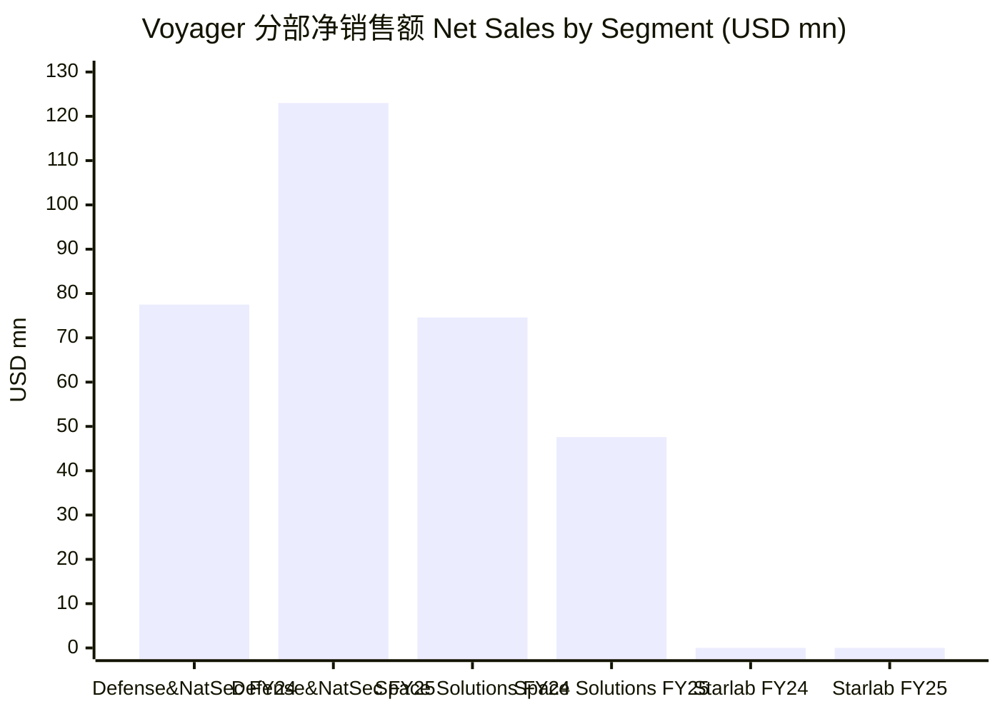
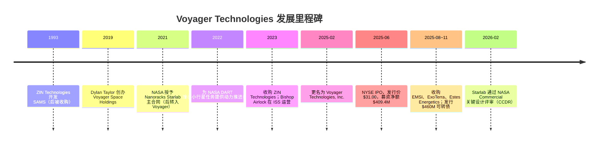
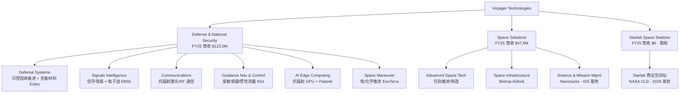
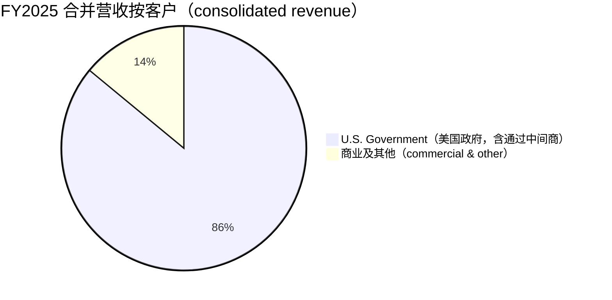
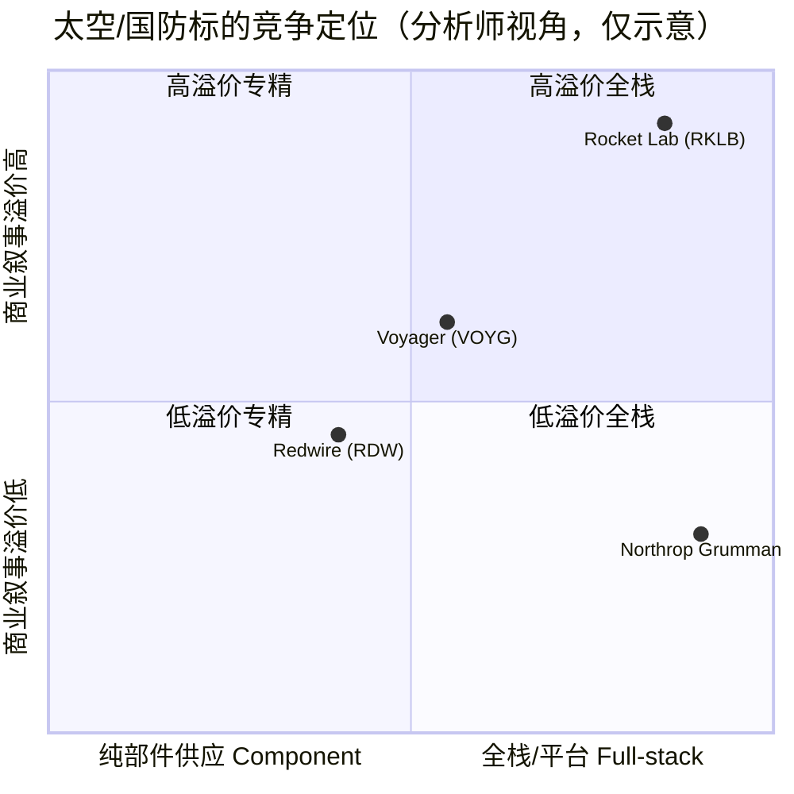
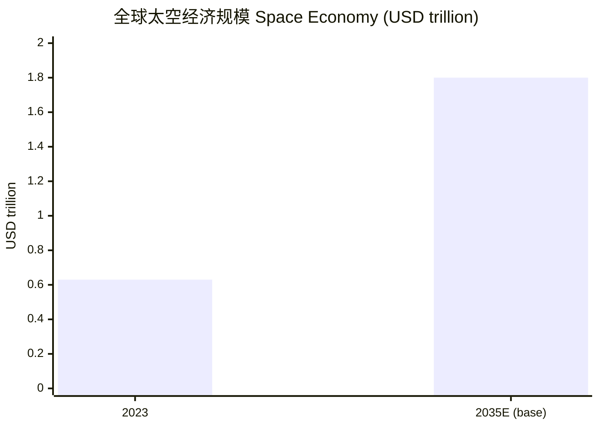

# Voyager Technologies, Inc.（NYSE: VOYG）公司研究

**截至日期 / As of: 2026-06-09** ｜ 货币单位：美元（USD）｜ 数据基准：FY2025 年报（10-K，财年截至 2025-12-31）、2026 年 Q1 季报（10-Q）、IPO 招股书（424B4）、DEF 14A 及公司官网

> *分析师观点（Analyst view）：* **评级：Hold（持有）· 12 个月目标价 $44（较现价 $42.42 上行约 +4%）· 估值方法：分部加总 SOTP —— Defense & National Security 与 Space Solutions 按 FY2027E 营收 × ~7–8× P/S，Starlab 按风险调整后期权价值（option value）计**
> 市值约 $2.51bn · 52 周区间 $17.41–$73.95 · 自 IPO（2025-06-12，发行价 $31.00）以来回报约 **−24.9%**（以 IPO 后首个收盘价 $56.48 计；较 $31.00 发行价仍上涨约 +37%）· NYSE: VOYG
>
> **核心论点（thesis pillars）**——（1）**Defense & National Security（国防与国家安全）是当下的现金引擎**，FY2025 营收 +58.7% YoY 至 $123.0M，受美国政府（U.S. Government）订单驱动，是估值的"看得见"部分；（2）**Starlab 是高赔率、远期的期权**——NASA 资助的 ISS 接替商业空间站（commercial space station），2029 年才计划发射、首个完整运营年才产生收入，2026 年 2 月已通过 NASA Commercial CDR（关键设计评审），但仍需赢得 Phase II（CLD 第二阶段）竞标且耗资 $2.8–3.3bn；（3）**GAAP 持续亏损 + 高客户集中**——FY2025 归母净亏损 $(104.8)M，美国政府占营收 86.0%；（4）**创始人控制 + 摊薄风险**——Dylan Taylor 通过 Class B（15 票/股）持有约 61.8% 总投票权，为"controlled company"，且 IPO 后已发行 $460M 可转债。
>
> *注：本报告评级、目标价及一切前瞻性预测均为分析师本人观点（Analyst view），不构成任何监管文件（filing）的内容，亦不应与任何文件引用混淆。*

> **Update — FY2026 营收指引上调（2026-05-04）：** 公司在 2026 年第一季度财报中将全年营收指引区间从 $225M–$255M（2026-03-09 Q4 财报披露）上调至 **$230M–$255M**，对应较 FY2025 的 $166.4M 同比增长约 **+38% 至 +53%**，同时披露季度末积压订单（backlog）创纪录达 $275.3M（+54% YoY）。管理层表示该指引"体现了业务模式的韧性，并反映了增长战略的成功执行"。
> 来源：[Voyager Q1 2026 业绩发布 8-K, EX-99.1, 2026-05-04](https://www.sec.gov/Archives/edgar/data/1788060/000162828026029850/a2026q1earningsreleaseex991.htm)；[Voyager Q4 2025 业绩发布 8-K, EX-99, 2026-03-09](https://www.sec.gov/Archives/edgar/data/1788060/000162828026016044/a2025q4earningsreleaseex99.htm)。

---

## 目录（Table of Contents）

1. 公司概览（Company Overview，含投资论点与估值快照）
2. 估值与目标价（Valuation & Price Target）—— 前瞻预测 · PT 推导 · 牛/基准/熊三档
3. 公司历史（Company History）
4. 管理团队（Management Team）
5. 产品与服务（Products & Services）—— **本报告最重要章节**
6. 客户与上市策略（Customers & Go-to-Market）
7. 行业概览（Industry Overview）
8. 竞争格局（Competitive Landscape）
9. 市场机会 / TAM（Market Opportunity）
10. 风险评估（Risk Assessment）
11. 关键分歧与催化剂（Key Debates & Catalysts）
12. 投资人视角评分卡（Investor-lens Scorecards）

---

## 1. 公司概览（Company Overview）

*分析师观点（Analyst view）：* 我们对 VOYG 给予 **Hold（持有）评级、12 个月目标价 $44**。核心逻辑是一个典型的"现金引擎 + 远期期权"二元结构：可以被现金流估值的部分（Defense & National Security 与 Space Solutions 两大已创收分部，FY2025 合计营收 $166.4M）目前规模尚小、且 GAAP 仍深度亏损；而真正决定 VOYG 长期上限的 Starlab 商业空间站，2026 年仍处于设计转制造阶段、零营收、距 2029 年计划发射尚有数年，其价值本质上是一份"期权"。**Why now（为何此时关注）**：（1）FY2026 营收指引刚上调至 $230–255M，国防分部受美国政府订单驱动加速放量；（2）Starlab 于 2026 年 2 月通过 NASA Commercial Critical Design Review（CCDR，商业关键设计评审），迈过"设计验证→制造装配"的关键节点。但在 GAAP 大幅亏损、客户高度集中于美国政府、以及创始人绝对控制的治理结构下，当前约 15× TTM P/S 的估值已部分反映了 Starlab 的乐观情景，我们认为风险回报趋于均衡，故给予 Hold。

**公司做什么。** Voyager Technologies 在其 FY2025 年报开篇将自己定义为"一家以创新驱动、为特定目的而生的国防科技与空间解决方案公司，专注于在国家安全、太空探索与基础设施及商业太空市场交付关键任务（mission-critical）解决方案"（"a purpose-built, innovation-driven defense technology and space solutions company"）（[Voyager FY2025 10-K, Item 1 Business](https://www.sec.gov/Archives/edgar/data/1788060/000162828026016543/voyg-20251231.htm)）。公司的能力横跨通信与情报系统、导弹防御赋能技术、先进推进与含能材料（propulsion and energetics）、在轨基础设施（in-space infrastructure）以及端到端太空任务服务，组织为三大运营分部：**Defense & National Security（国防与国家安全）**、**Space Solutions（空间解决方案）** 与 **Starlab Space Stations（Starlab 空间站）**（[Voyager FY2025 10-K, Our Segments](https://www.sec.gov/Archives/edgar/data/1788060/000162828026016543/voyg-20251231.htm)）。

**如何赚钱。** 公司采用"灵活而自律的商业模式（flexible and disciplined business model）"，同时充当**主承包商（prime contractor）** 与**商业供应商 / 分包商（merchant supplier or subcontractor）**，并据此"按解决方案契合度、资本效率、项目风险与中标概率"选择性地追逐机会（[Voyager FY2025 10-K, Item 1 Business](https://www.sec.gov/Archives/edgar/data/1788060/000162828026016543/voyg-20251231.htm)）。收入主要来自政府与商业合同——既有固定价格（firm fixed price）也有成本加成（cost-plus）结构；R&D 部分依赖"客户资助研发（customer-funded R&D）"以降低自有资本投入强度（[Voyager FY2025 10-K, Research and Development](https://www.sec.gov/Archives/edgar/data/1788060/000162828026016543/voyg-20251231.htm)）。

**在哪里运营、规模多大。** 截至 2025-12-31，公司在 **14 个地点雇佣约 800 名员工**，其中很大一部分是 2025 年通过收购从约 500 人扩张而来（[Voyager FY2025 10-K, Employees and Human Capital](https://www.sec.gov/Archives/edgar/data/1788060/000162828026016543/voyg-20251231.htm)）。自 2019 年成立以来，公司已完成 **12 起垂直与横向整合的收购**，FY2025 营收增长至 $166.4M（[Voyager FY2025 10-K, Item 1 Business](https://www.sec.gov/Archives/edgar/data/1788060/000162828026016543/voyg-20251231.htm)）。公司是"全球最大的 ISS 商业用户"，累计执行了超过 1,400 次面向 ISS 的科学实验与载荷运营任务（[Voyager FY2025 10-K, Item 1 Business](https://www.sec.gov/Archives/edgar/data/1788060/000162828026016543/voyg-20251231.htm)）。

**分部营收结构（FY2025 vs FY2024）。** Defense & National Security 是当下绝对的收入与增长主力，Space Solutions 因若干项目结束而下滑，Starlab 仍为零营收。

来源：[Voyager FY2025 10-K, MD&A Segment Net Sales（Defense 122,954 / Space 47,583 / Starlab 0 千美元）](https://www.sec.gov/Archives/edgar/data/1788060/000162828026016543/voyg-20251231.htm)。

具体而言，FY2025 Defense & National Security 净销售额 $122.95M（+58.7% YoY），主要由美国政府收入增加 $50.2M 驱动；Space Solutions 净销售额 $47.58M（−36.2% YoY），因若干美国政府项目结题导致销量下降 $28.0M；Starlab 分部 FY2025、FY2024 均无收入（[Voyager FY2025 10-K, MD&A Segment Results](https://www.sec.gov/Archives/edgar/data/1788060/000162828026016543/voyg-20251231.htm)）。合并口径下，FY2025 净销售额 $166.4M（+15.4% YoY），毛利润（gross profit）$29.9M（毛利率约 17.9%），归属于 Voyager 的净亏损 $(104.8)M（FY2024 为 $(62.1)M），调整后 EBITDA（Adjusted EBITDA）$(69.9)M（[Voyager FY2025 10-K, MD&A Results of Operations](https://www.sec.gov/Archives/edgar/data/1788060/000162828026016543/voyg-20251231.htm)）。

**估值快照（Valuation snapshot，截至 2026-06-09）。** VOYG 现价 **$42.42**，市值约 **$2.51bn**，TTM 营收约 $167.2M，对应 **TTM P/S 约 15.0×**；**TTM P/E 不适用——公司 GAAP 持续亏损**（forward P/E 约 −32.8，亦为负，反映市场预期短期内不会转正）（[Yahoo Finance — VOYG Statistics, 2026-06-09](https://finance.yahoo.com/quote/VOYG/key-statistics/)）。52 周区间 $17.41–$73.95，体现极高波动；自 2025-06-12 IPO（发行价 $31.00）后首日收盘 $56.48 至今下跌约 **−24.9%**（[Yahoo Finance — VOYG, 2026-06-09](https://finance.yahoo.com/quote/VOYG/)）。

**为何 P/S 高、P/E 为负——必须解释而非简单报数。** 负 P/E 的成因是**烧钱型成长 + 业务尚未规模化**：FY2025 SG&A 跳增 87.1% 至 $117.1M（含 IPO 相关股权激励），R&D 增长 67.6% 至 $12.75M，加之 Starlab 分部 $(18.7)M 的调整后 EBITDA 拖累，共同造成 $(108.5)M 的经营亏损（[Voyager FY2025 10-K, MD&A Results of Operations](https://www.sec.gov/Archives/edgar/data/1788060/000162828026016543/voyg-20251231.htm)）。约 15× 的 TTM P/S 高于多数成熟国防承包商，但其溢价来源有三：（a）"太空 + 国防"双主题叙事溢价——VOYG 是少数同时具备商业空间站期权与含能材料/推进国防资产的纯标的；（b）Starlab 的远期可选价值被部分计入市值；（c）小流通盘放大波动。*分析师观点：* 与可比的纯太空标的相比，VOYG 的 15× P/S 介于 Rocket Lab（RKLB，约 104× TTM P/S）与 Redwire（RDW，约 10× TTM P/S）之间，但 RKLB 的极端倍数主要由其发射业务的高成长叙事支撑，可比性有限（[Yahoo Finance peer comps, 2026-06-09](https://finance.yahoo.com/quote/RKLB/)）。

---

## 2. 估值与目标价（Valuation & Price Target）—— 决策层

> *分析师观点（Analyst view）：* 本章所有前瞻数字、目标价及情景价均为分析师本人观点，**不附带任何监管文件引用**——10-K/10-Q 里不存在"目标价"。各预测项的**外部输入基础**（分部历史营收、管理层指引、行业预测）在文内逐一引用。

VOYG 估值的难点在于：传统的 P/E 或 DCF 在一家 GAAP 深度亏损、且核心远期资产（Starlab）尚未产生现金流的公司上几乎失效。我们采用**分部加总（SOTP）+ 期权价值**框架——对两个已创收分部用前瞻 P/S 估值，对 Starlab 用风险调整后的远期价值。

### (a) 前瞻财务预测表（Forward estimates，3 年）

*分析师观点：* 下表以 FY2025 实际分部营收为基线，叠加管理层 FY2026 指引（$230–255M）与行业增速假设外推。每一格均为分析师预测。

| 指标（*Analyst view:*） | FY2025A | FY2026E | FY2027E | FY2028E |
|---|---|---|---|---|
| 营收 Revenue（USD mn） | 166.4 | 242 | 320 | 405 |
| — YoY % | +15.4% | +45% | +32% | +27% |
| — Defense & NatSec | 123.0 | 185 | 245 | 300 |
| — Space Solutions | 47.6 | 57 | 75 | 105 |
| — Starlab | 0 | 0 | 0 | 0 |
| Gross margin %（毛利率） | 17.9% | 19% | 22% | 25% |
| Adj. EBITDA（USD mn） | (69.9) | (60) | (35) | (5) |
| 归母净亏损 Net loss（USD mn） | (104.8) | (95) | (70) | (45) |

预测基础：FY2026 营收锚定管理层指引中值约 $242M（[Voyager Q1 2026 8-K, 2026-05-04](https://www.sec.gov/Archives/edgar/data/1788060/000162828026029850/a2026q1earningsreleaseex991.htm)）；Defense 分部延续美国政府订单驱动的高增长，参考 FY2026 DoD 预算约 $839bn（vs FY2022 约 $700bn）的宏观背景（[Voyager FY2025 10-K, Item 1 Business](https://www.sec.gov/Archives/edgar/data/1788060/000162828026016543/voyg-20251231.htm)）；毛利率随高价值"软硬一体"合同占比上升及规模效应逐步爬升（[Voyager FY2025 10-K, Strategy — margin expansion](https://www.sec.gov/Archives/edgar/data/1788060/000162828026016543/voyg-20251231.htm)）；Starlab 在 2028E 前仍按零营收处理，因公司明确"收入在 Starlab 首个完整运营年才产生"，发射预计 2029 年（[Voyager FY2025 10-K, Starlab Segment](https://www.sec.gov/Archives/edgar/data/1788060/000162828026016543/voyg-20251231.htm)）。

### (b) 目标价推导（SOTP，展示算术）

*分析师观点：* 我们对两个已创收分部按 FY2027E 营收 × 目标 P/S 估值，对 Starlab 按风险调整后期权价值计：

- **Defense & National Security**：FY2027E 营收约 $245M × 8× P/S = **$1.96bn**。8× 的倍数参考高增长国防科技标的，介于传统国防承包商（约 2–3× P/S）与纯太空成长股之间，由 FY2025–2027E 约 +41%/+32% 的营收增速支撑。
- **Space Solutions**：FY2027E 营收约 $75M × 6× P/S = **$0.45bn**。倍数低于 Defense，因该分部 FY2025 营收下滑且利润率更薄，可比 Redwire（RDW）约 10× TTM P/S，但 RDW 增长更稳，我们给予折价（[Yahoo Finance — RDW, 2026-06-09](https://finance.yahoo.com/quote/RDW/)）。
- **Starlab 期权价值**：项目总耗资 $2.8–3.3bn、2029 年才发射、且仍需赢得 NASA Phase II 竞标。我们给予风险调整后约 **$0.6bn** 的净期权价值（已扣减 VOYG 在 Starlab JV 的 61.9% 权益份额对应的未来出资义务及稀释）（[Voyager FY2025 10-K, Starlab JV](https://www.sec.gov/Archives/edgar/data/1788060/000162828026016543/voyg-20251231.htm)）。

合计企业价值约 $3.01bn，扣除净债务影响（FY2025 末现金 $491.3M、2030 可转债 $460M），对应股权价值约 $2.35–2.45bn；以约 53.5M 摊薄股本计，每股约 **$44**。

### (c) 牛 / 基准 / 熊 三档目标价

| 情景（*Analyst view:*） | 关键假设 | 目标价 | 较现价 |
|---|---|---|---|
| 牛市 Bull | Starlab 赢得 Phase II + 国防分部维持 +40% 增速，市场给予 Starlab 全额期权价值 | $68 | +60% |
| 基准 Base | 国防分部稳健放量，Starlab 部分计价（风险调整） | $44 | +4% |
| 熊市 Bear | Starlab Phase II 落选或延期、国防订单减速、可转债稀释 | $22 | −48% |

熊市情景的下行锚定 52 周低点附近 $21（与卖方最低目标价 $21 一致）；牛市上行参考卖方最高目标价 $60（Wedbush/Jefferies）并叠加 Starlab 期权全额计价（[MarketBeat — VOYG Forecast, 2026](https://www.marketbeat.com/stocks/NYSE/VOYG/forecast/)）。

### (d) 对标卖方一致预期（Consensus benchmark）

*分析师观点：* 据公开汇总，VOYG 卖方**一致评级为"Buy"，平均 12 个月目标价约 $38–$44**，区间 $21–$60；近期 Wedbush 上调至 $60（Outperform）、Jefferies 上调至 $60（Buy）、Wolfe Research 上调至 $55（Outperform），而 J.P. Morgan 下调至 $39（[MarketBeat — VOYG Analyst Forecast, 2026](https://www.marketbeat.com/stocks/NYSE/VOYG/forecast/)；[TipRanks — VOYG Forecast, 2026](https://www.tipranks.com/stocks/voyg/forecast)）。我们 $44 的基准目标价处于一致预期中枢，评级较卖方主流"Buy"更谨慎（Hold），分歧点在于我们对 Starlab 期权给予更大的风险折价、并更看重 GAAP 亏损与稀释。*（注：本地 zsxq 券商库经四个别名检索无 VOYG/Voyager/Starlab 覆盖，故一致预期取自公开卖方汇总平台，已标注日期。）*

### (e) 决定胜负的 1–2 个摆动变量（Swing variables）

1. **Starlab 能否赢得 NASA CLD Phase II**——目前仅三家竞争者有 NASA 资助合同，VOYG 是 Phase I 最大获奖者且已通过 CCDR，但 Phase II 是面向载人/载货服务的最终竞争阶段，结果将决定 Starlab 期权是兑现还是清零（[Voyager FY2025 10-K, Starlab Segment](https://www.sec.gov/Archives/edgar/data/1788060/000162828026016543/voyg-20251231.htm)）。
2. **Defense & National Security 分部的毛利率轨迹**——FY2025 该分部调整后 EBITDA 已转负 $(4.5)M（受 R&D 投入拖累），能否随规模与高价值合同占比回到正区间，决定公司整体何时接近盈亏平衡（[Voyager FY2025 10-K, Defense Segment](https://www.sec.gov/Archives/edgar/data/1788060/000162828026016543/voyg-20251231.htm)）。

---

## 3. 公司历史（Company History）

Voyager 成立于 **2019 年**，由 Dylan Taylor 创办，最初名为 **Voyager Space Holdings**，定位为通过收购整合方式（roll-up）打造一家垂直整合的太空与国防科技集团（[Voyager FY2025 10-K, Item 1 Business — "Since our founding in 2019"](https://www.sec.gov/Archives/edgar/data/1788060/000162828026016543/voyg-20251231.htm)）。公司的技术血统可追溯更早——其引用的 Space Acceleration Measurement System（SAMS）早在 1993 年就由后被收购的 ZIN Technologies 开发（[Voyager FY2025 10-K, Innovation at Scale](https://www.sec.gov/Archives/edgar/data/1788060/000162828026016543/voyg-20251231.htm)）。

来源：[Voyager FY2025 10-K, Item 1 Business 及 IPO 披露](https://www.sec.gov/Archives/edgar/data/1788060/000162828026016543/voyg-20251231.htm)；[Voyager 424B4 招股书, 2025-06-12](https://www.sec.gov/Archives/edgar/data/1788060/000162828025030832/voyager-424b4finalprospect.htm)；[Starlab Completes NASA Commercial CDR, 2026-02-23](https://voyagertechnologies.com/press-releases/starlab-completes-nasa-commercial-critical-design-review/)。

**战略转折一：从太空整合者到"国防 + 太空"双引擎。** 公司早期以太空业务（Nanoracks、ISS 服务、Bishop Airlock）为核心，2025 年通过密集收购大幅强化国防资产——8 月收购 EMSI（AI 自动目标识别与情报分析软件）、10 月收购 ExoTerra（电推进，bolster American propulsion capabilities）、11 月收购 Estes Energetics（含能材料与推进材料，垂直整合至黑火药等基础化学原料）——使 Defense & National Security 一跃成为最大分部（[Voyager FY2025 10-K, Item 1 Business — acquisitions](https://www.sec.gov/Archives/edgar/data/1788060/000162828026016543/voyg-20251231.htm)）。这一转向契合美国"国防工业基地再工业化（re-industrialization）"主题，尤其在推进、含能材料与弹药环节（[Voyager FY2025 10-K, Strategy](https://www.sec.gov/Archives/edgar/data/1788060/000162828026016543/voyg-20251231.htm)）。

**战略转折二：从私有 roll-up 到上市公司。** 2025 年 2 月公司由 Voyager Space Holdings 更名为 Voyager Technologies, Inc.，并于 2025-06-12 在 NYSE 完成 IPO——发行 14,200,645 股 Class A 普通股（含承销商全额行使超额配售权），发行价 $31.00/股，扣除承销折扣后募资净额约 **$409.4M**（[Voyager FY2025 10-K, Liquidity — IPO](https://www.sec.gov/Archives/edgar/data/1788060/000162828026016543/voyg-20251231.htm)）。IPO 后公司又在 2025 年 11 月发行 $435M + $25M 共 $460M 的 2030 年到期可转换优先担保票据（2030 Convertible Senior Secured Notes），大幅充实资产负债表（[Voyager FY2025 10-K, Liquidity — 2030 Convertible Notes](https://www.sec.gov/Archives/edgar/data/1788060/000162828026016543/voyg-20251231.htm)）。

**近期发展（最近 12 个月）。** 最关键的进展是 Starlab 于 **2026 年 2 月 23 日通过 NASA Commercial Critical Design Review（CCDR）**，标志着"从设计验证向制造与系统集成的决定性过渡"——这是 Starlab 在 NASA CLD（Commercial LEO Destinations）Space Act Agreement 下的第 28 个里程碑（[Starlab Completes NASA Commercial CDR, 2026-02-23](https://voyagertechnologies.com/press-releases/starlab-completes-nasa-commercial-critical-design-review/)）。此外，2025 年 9 月公司开发的多云区域（multi-cloud region）作为"首个已知的太空云基础设施"被送上 ISS（[Voyager FY2025 10-K, Item 1 Business](https://www.sec.gov/Archives/edgar/data/1788060/000162828026016543/voyg-20251231.htm)）。

**关键收购（年份 + 逻辑）：**
- **ZIN Technologies（2023）** —— 太空科学硬件与 SAMS 技术血统的核心来源（[Voyager FY2025 10-K](https://www.sec.gov/Archives/edgar/data/1788060/000162828026016543/voyg-20251231.htm)）。
- **EMSI / ElectroMagnetic Systems（2025-08）** —— AI/ML 自动目标识别软件与情报分析，强化 signals intelligence（[Voyager FY2025 10-K, EMSI](https://www.sec.gov/Archives/edgar/data/1788060/000162828026016543/voyg-20251231.htm)）。
- **ExoTerra Resources（2025-10）** —— 电推进与卫星机动技术，强化"美国本土推进能力"（[Voyager FY2025 10-K, ExoTerra](https://www.sec.gov/Archives/edgar/data/1788060/000162828026016543/voyg-20251231.htm)）。
- **Estes Energetics（2025-11）** —— 含能材料与推进材料垂直整合，覆盖导弹防御、战术弹药与空间推进（[Voyager FY2025 10-K, Estes](https://www.sec.gov/Archives/edgar/data/1788060/000162828026016543/voyg-20251231.htm)）。

---

## 4. 管理团队（Management Team）

VOYG 是典型的"创始人 = CEO = 控股股东"结构。Dylan Taylor 既是创始人、也是现任 Chairman 兼 CEO，并通过 Class B 高投票权股份掌握公司绝对控制权。

**Dylan Taylor（创始人、董事长兼 CEO，age 55）。** Taylor 于 2019 年创办 Voyager（最初名 Voyager Space Holdings），并自 2019 年 8 月起担任 CEO（[Voyager DEF 14A 2026, Directors — Dylan Taylor](https://www.sec.gov/Archives/edgar/data/1788060/000162828026025842/voyg-20260417.htm)）。在创办 Voyager 之前，他在全球商业地产巨头 **Colliers International（NASDAQ: CIGI）** 任职逾十年（2009 年 1 月至 2019 年 8 月），历任 President、Global President、Chief Operating Officer，以及 CEO of Real Estate Services 与 CEO of the Americas / U.S.——即在一家上市公司里做到全球总裁/COO 级别，具备大规模运营与资本运作经验（[Voyager DEF 14A 2026, Dylan Taylor bio](https://www.sec.gov/Archives/edgar/data/1788060/000162828026025842/voyg-20260417.htm)）。他还是非营利组织 **Space for Humanity** 的创始人（致力于"让进入太空更普惠"），并曾任 UMB Financial（NASDAQ: UMBF）董事与 Jackson Funds 共同基金董事（[Voyager DEF 14A 2026](https://www.sec.gov/Archives/edgar/data/1788060/000162828026025842/voyg-20260417.htm)）。学历方面，Taylor 拥有芝加哥大学 Booth 商学院金融与战略 **MBA**，以及亚利桑那大学荣誉学院工程学 **理学学士**（[Voyager DEF 14A 2026](https://www.sec.gov/Archives/edgar/data/1788060/000162828026025842/voyg-20260417.htm)）。

**所有权与控制权（关键治理事实）。** 截至 2026-03-31，Taylor 持有 **6,205,134 股 Class B 普通股（占 Class B 的 100%）**，叠加其经济权益，**控制公司约 61.8% 的总投票权**（Class A 经济权益约占 11.5%）。由于 Class B 每股享有 **15 票**（Class A 每股 1 票），且 Taylor 持有全部 Class B，VOYG 因此构成 NYSE 公司治理标准下的 **"controlled company"（受控公司）**，可豁免部分独立性要求（[Voyager DEF 14A 2026, Security Ownership & Class B 15 votes](https://www.sec.gov/Archives/edgar/data/1788060/000162828026025842/voyg-20260417.htm)）。全体董事与高管作为一个群体合计控制约 62.2% 投票权（[Voyager DEF 14A 2026, Beneficial Ownership table](https://www.sec.gov/Archives/edgar/data/1788060/000162828026025842/voyg-20260417.htm)）。

*分析师观点：* 创始人绝对控制是一把双刃剑——好处是战略连贯、长期导向（对 Starlab 这类十年期项目尤其重要）；坏处是少数股东对重大事项几乎无制衡，且 Taylor 的背景偏运营/资本运作而非深度航天工程，关键技术执行高度依赖收购来的团队与 Starlab JV 的国际伙伴（Airbus/MDA 等）。本报告按技能规范仅覆盖创始人/CEO，不展开其他高管。

---

## 5. 产品与服务（Products & Services）—— 本报告最重要章节

### 5.1 业务结构总览

Voyager 没有像半导体公司那样的"产品矩阵表"，而是将能力组织为三大分部下的若干能力线（capability lines）。以下结构基于 FY2025 10-K Item 1 Business 的分部描述构建（[Voyager FY2025 10-K, Our Segments](https://www.sec.gov/Archives/edgar/data/1788060/000162828026016543/voyg-20251231.htm)）：

来源：[Voyager FY2025 10-K, Item 1 Business — Our Segments](https://www.sec.gov/Archives/edgar/data/1788060/000162828026016543/voyg-20251231.htm)。

| 分部 | 主要能力线 | FY2025 营收 | FY2025 调整后 EBITDA |
|---|---|---|---|
| Defense & National Security | Defense Systems / Signals Intelligence / Communications / GN&C / AI Edge / Space Maneuver | $123.0M（+58.7%） | $(4.5)M |
| Space Solutions | Advanced Space Tech / Space Infrastructure（Bishop）/ Science & Mission Mgmt（Nanoracks）| $47.6M（−36.2%） | $(0.8)M |
| Starlab Space Stations | Starlab 商业空间站（NASA CLD）| $0 | $(18.7)M |

来源：[Voyager FY2025 10-K, MD&A Segment Reporting](https://www.sec.gov/Archives/edgar/data/1788060/000162828026016543/voyg-20251231.htm)。

### 5.2 综合：各能力如何组成一个客户工作流

Voyager 的产品逻辑可概括为一条"**多用途技术（multi-use technology）→ 跨域复用**"的链条：同一项推进/含能材料技术既服务于导弹防御拦截弹，也服务于卫星在轨机动；同一套抗辐射计算/通信硬件既用于情报采集，也用于 Starlab 的在轨边缘计算。公司明确称这种"多用途架构是根本性竞争差异化（fundamental competitive differentiator）——单一技术投资可同时在多个项目、客户与市场产生回报"（[Voyager FY2025 10-K, Research and Development](https://www.sec.gov/Archives/edgar/data/1788060/000162828026016543/voyg-20251231.htm)）。而 Starlab 则坐落在这条链条的顶端——"Starlab 直接受益于 Space Solutions 分部的任务设计、客户服务经验与太空科学专长"（[Voyager FY2025 10-K, Our Segments](https://www.sec.gov/Archives/edgar/data/1788060/000162828026016543/voyg-20251231.htm)）。

### 5.3 Defense & National Security 分部（国防与国家安全）

这是当下的现金引擎。10-K 对其定位的原文：

> "Our Defense & National Security segment provides leading technology capabilities that support marquee programs with expertise in defense systems, signals intelligence, communications technologies, guidance and navigation, and space maneuver."（[Voyager FY2025 10-K, Defense & National Security Segment](https://www.sec.gov/Archives/edgar/data/1788060/000162828026016543/voyg-20251231.htm)）

**(1) Defense Systems（防御系统 / 可控固体推进 + 含能材料）。** 10-K 原文：

> "We provide controllable solid propulsion technology that enables missile programs critical to national defense. Our solid fuel systems deliver precise thrust for steering and positioning, including the high-performance requirements for hypersonic applications… We currently provide advanced solid-propulsion subsystems for Lockheed Martin's Next Generation Interceptor ('NGI') program with the U.S. Missile Defense Agency."（[Voyager FY2025 10-K, Defense Systems](https://www.sec.gov/Archives/edgar/data/1788060/000162828026016543/voyg-20251231.htm)）

**中文释义 / Plain-language gloss：** 可控固体推进（controllable solid propulsion / 可控固体火箭推进）是导弹"转向与定位"的动力来源。与液体（liquid）和冷气（cold-gas）系统相比，固体推进精度更高、可靠性更好、响应更快、操作更安全、成本更优——这正是高超声速（hypersonic / 高超音速）应用的硬要求。通过整合 Estes Energetics，公司从"推进子系统"垂直延伸到**含能材料制造（energetics manufacturing / 含能材料）**——涵盖推进剂配方、浇铸、发动机集成，乃至黑火药（black powder）等基础化学原料的本土生产（[Voyager FY2025 10-K, Defense Systems](https://www.sec.gov/Archives/edgar/data/1788060/000162828026016543/voyg-20251231.htm)）。战略意义在于"美国某些含能材料供应受限（supply-constrained），公司的制造产能强化了美国国防工业基地的韧性"——这把 VOYG 直接嵌入了"国防再工业化"的政策红利里。最具旗舰意义的锚点是 **洛克希德·马丁 NGI（Next Generation Interceptor，下一代拦截弹）项目** 的固体推进子系统供应。

*分析师观点：* 在可控固体推进与含能材料领域，VOYG 面对的是 Northrop Grumman（其固体火箭发动机资产源自 2018 年收购的 Orbital ATK，[NOC FY2025 10-K, Item 1 — History](https://www.sec.gov/Archives/edgar/data/1133421/000113342126000003/noc-20251231.htm)）与 L3Harris（2023-07-28 完成对 Aerojet Rocketdyne 的收购，[L3Harris 8-K Item 2.01, 2023-07-28](https://www.sec.gov/Archives/edgar/data/202058/000110465923085075/tm2322078d1_8k.htm)）等大型一体化承包商；VOYG 的差异化在于"小而专 + 垂直整合 + 速度"，但规模、产能与现有项目存量远不及巨头（竞争对手信息见 §8，引自竞争对手自身披露，非 VOYG 10-K）。

**(2) Signals Intelligence Systems（信号情报系统）。** 10-K 原文：

> "Through the integration of EMSI, we have expanded our capabilities in signals intelligence, electronic warfare support, spectrum monitoring and advanced geolocation technologies… By integrating our proprietary software solutions with Palantir's operating system, we plan to transform multi-source signals intelligence data into real-time, actionable insights."（[Voyager FY2025 10-K, Signals Intelligence Systems](https://www.sec.gov/Archives/edgar/data/1788060/000162828026016543/voyg-20251231.htm)）

**中文释义 / Plain-language gloss：** 信号情报（SIGINT / 信号情报）是从电磁频谱中"截获—处理—行动"的能力链。EMSI 带来的是电子战支援（electronic warfare support）、频谱监测（spectrum monitoring）与高级地理定位（geolocation）。与"纯硬件"竞品不同，VOYG 的差异化是**软硬一体 + 与 Palantir 操作系统集成**——把多源情报数据转成实时可执行的洞察，覆盖空、陆、海、天、网五域（air, land, sea, space and cyber）。战略驱动是 ISR（情报、监视与侦察）与频谱主导（spectrum dominance）需求的加速。

**(3) Communications Technologies（通信技术）。** 10-K 原文：

> "We offer space-qualified radiation-hardened laser and radio frequency ('RF') communications systems… Our solutions have enabled LEO and deep space missions since 2002, with a failure-free cumulative track record of over 275 flight years in space."（[Voyager FY2025 10-K, Communications Technologies](https://www.sec.gov/Archives/edgar/data/1788060/000162828026016543/voyg-20251231.htm)）

**中文释义 / Plain-language gloss：** 抗辐射（radiation-hardened / 抗辐射加固）的激光与射频（RF）通信系统是卫星/航天器的"嘴和耳朵"。"275 飞行年（flight years）无失效"是一项罕见的可靠性背书——在太空硬件里，可靠性血统（heritage）本身就是护城河（moat），因为客户为关键任务付的是"不会失败"的溢价。该能力还为公司自己的 Starlab 在轨边缘计算与大规模在轨基础设施打基础。

**(4) Guidance, Navigation and Control（GN&C，制导、导航与控制）。** 10-K 原文：

> "We design and produce critical technologies for controlling and navigating spacecraft, including sun sensors, star trackers, space cameras and inertial measurement units… In 2024, Lockheed Martin selected us to deliver optical guidance technology for MDA's Next Generation Interceptor ('NGI') program."（[Voyager FY2025 10-K, Guidance, Navigation and Control Systems](https://www.sec.gov/Archives/edgar/data/1788060/000162828026016543/voyg-20251231.htm)）

**中文释义 / Plain-language gloss：** GN&C 是航天器"知道自己在哪、朝哪、怎么转"的感官与平衡系统——太阳敏感器（sun sensors）、星敏感器（star trackers / 星跟踪器）、空间相机与惯性测量单元（IMU / 惯性测量单元）。这些是卫星星座（satellite constellation）市场的刚需零件。与 §5.3(1) 的"推力"互补：推进负责"动"，GN&C 负责"动得准"。NGI 光学制导技术再次出现，说明导弹防御是横跨多条能力线的旗舰需求。

**(5) AI-Powered Edge Computing（AI 赋能在轨边缘计算）。** 10-K 原文：

> "We are developing AI-enabled edge computing in space, processing data directly at the source to eliminate ground transmission latency… Our radiation-hardened GPUs, combined with Palantir's operating system and proprietary applications, deliver high-performance analytics."（[Voyager FY2025 10-K, Artificial Intelligence Powered Edge Computing](https://www.sec.gov/Archives/edgar/data/1788060/000162828026016543/voyg-20251231.htm)）

**中文释义 / Plain-language gloss：** 在轨边缘计算（edge computing / 边缘计算）= 把算力搬到数据产生的地方（卫星上），而不是把原始数据传回地面再算。这样可消除地面传输延迟、减少在对抗环境下的脆弱性。关键硬件是**抗辐射 GPU（radiation-hardened GPU）**，叠加 Palantir 操作系统做分析。这是 Defense 与 Space 两大分部的"协同点"——同一套边缘计算单元既服务国防情报，也服务 Starlab。2025 年 9 月送上 ISS 的"首个太空云基础设施"即是这条线的早期落地（[Voyager FY2025 10-K, Item 1 Business](https://www.sec.gov/Archives/edgar/data/1788060/000162828026016543/voyg-20251231.htm)）。

**(6) Space Maneuver（空间机动）。** 通过整合 ExoTerra，公司新增"经飞行验证的电推进与化学推进系统及卫星机动技术，支持精确机动、交会与近距操作（rendezvous and proximity operations）、轨道保持（station-keeping）与碰撞规避"，以应对"轨道环境日益拥挤与对抗化"的趋势（[Voyager FY2025 10-K, Space Maneuver](https://www.sec.gov/Archives/edgar/data/1788060/000162828026016543/voyg-20251231.htm)）。

### 5.4 Space Solutions 分部（空间解决方案）

10-K 定位原文："Our Space Solutions segment provides leading space technology solutions, specializing in mission operations, reliable hardware, software and engineering services for space missions."（[Voyager FY2025 10-K, Space Solutions Segment](https://www.sec.gov/Archives/edgar/data/1788060/000162828026016543/voyg-20251231.htm)）

**(1) Advanced Space Technology Systems（先进空间技术系统）。** 10-K 原文：

> "We developed the power propulsion units used in NASA's Double Asteroid Redirect Test spacecraft, which successfully collided with an asteroid in September 2022."（[Voyager FY2025 10-K, Advanced Space Technology Systems](https://www.sec.gov/Archives/edgar/data/1788060/000162828026016543/voyg-20251231.htm)）

**中文释义 / Plain-language gloss：** 这条线提供在轨推进（in-space propulsion / 在轨推进）系统，应用于在轨服务（orbital servicing / 在轨服务）、在轨制造（manufacturing）与深空探测。NASA DART（双小行星重定向测试）任务用的动力推进单元（power propulsion unit）由 VOYG 开发——这是又一个"血统背书"，DART 是人类首次成功改变小行星轨道的实验。

**(2) Space Infrastructure —— Bishop Airlock（在轨基础设施 / Bishop 气闸舱）。** 10-K 原文：

> "The Bishop Airlock is the first and only permanent, privately-owned module attached to the ISS, enabling movement of equipment, supplies and payloads between the ISS and open space. We hold contracts with NASA, the ESA and commercial customers for the Bishop Airlock. This program helped validate the public-private partnership model for critical space infrastructure and developed expertise foundational to Starlab."（[Voyager FY2025 10-K, Space Infrastructure](https://www.sec.gov/Archives/edgar/data/1788060/000162828026016543/voyg-20251231.htm)）

**中文释义 / Plain-language gloss：** Bishop Airlock 是 ISS 上**首个、也是唯一一个永久性私有模块（first and only permanent, privately-owned module）**——可以把它理解为 ISS 与开放太空之间的"私营货运闸门"，用于在站内与站外之间转移设备、补给与载荷。它的战略意义远超收入本身：它"验证了关键空间基础设施的公私合营（public-private partnership）模式，并积累了 Starlab 的基础专长"——换言之，Bishop 是 Starlab 的技术与商业模式预演。客户横跨 NASA、欧空局（ESA）与商业客户。

**(3) Space Science & Mission Management（太空科学与任务管理 / Nanoracks）。** 10-K 原文：

> "We are the largest commercial user of the ISS in the world. To date, we have deployed over 330 satellites for commercial and government programs, overseen more than 1,000 customer missions conducted by organizations in over 35 nations and territories… Our Space Acceleration Measurement System ('SAMS')… has collected over one trillion acceleration measurements since 2001 and informs our development of Starlab."（[Voyager FY2025 10-K, Space Science & Mission Management](https://www.sec.gov/Archives/edgar/data/1788060/000162828026016543/voyg-20251231.htm)）

**中文释义 / Plain-language gloss：** 这条线（主要通过 Nanoracks 运营）提供端到端的任务管理（mission management）——为学术、政府、民用、商业与国防客户提供从规划、载荷设计、安全、发射预订、机组训练到在轨运营的全流程服务。"全球最大 ISS 商业用户""部署 330+ 颗卫星""35+ 国家/地区 1,000+ 次任务"——这构成了 Starlab 未来"客户生态搬迁"的现成基础。SAMS 自 2001 年起采集了超过一万亿次加速度测量，直接反哺 Starlab 设计。

### 5.5 Starlab Space Stations 分部（Starlab 商业空间站）—— 旗舰期权

这是决定 VOYG 长期上限的资产。10-K 原文：

> "Starlab JV is a Voyager-led and majority-owned global joint venture designing and building Starlab, which is expected to serve as a commercial replacement for the ISS following its planned decommissioning in 2030. We currently estimate the cost to design, manufacture and launch Starlab to be approximately $2.8 billion to $3.3 billion, with launch anticipated in 2029 and revenue generation expected in Starlab's first full year of operation. With an estimated useful life of thirty years, we anticipate Starlab will generate a significant portion of our long-term revenue and cash flows."（[Voyager FY2025 10-K, Starlab Space Stations Segment](https://www.sec.gov/Archives/edgar/data/1788060/000162828026016543/voyg-20251231.htm)）

**中文释义 / Plain-language gloss：** Starlab 是计划在 ISS 于 2030 年退役后接替它的商业空间站（commercial space station / 商业空间站），由 Voyager 主导并多数控股的 Starlab JV 设计建造。核心事实清单：（a）总耗资约 **$2.8–3.3bn**；（b）发射预计 **2029 年**（已锁定 SpaceX Starship 发射合同）；（c）收入要等到首个完整运营年才产生，使用寿命约 **30 年**；（d）NASA 采购分两阶段——Phase I（当前阶段）邀请设计至初步设计评审，**Starlab 获得了 NASA Phase I 最高资助额**，资助持续领先其他竞争者；Phase II 是面向载人/载货服务的最终竞争阶段，"任何竞争者均可投标，但目前仅三家有 NASA 资助合同"（[Voyager FY2025 10-K, Starlab Segment](https://www.sec.gov/Archives/edgar/data/1788060/000162828026016543/voyg-20251231.htm)）。

**JV 结构与资金。** 截至 2025-12-31，Voyager 持有 Starlab JV **61.9% 权益**；股权伙伴包括 **Airbus、Mitsubishi、MDA Space、Palantir**，战略伙伴包括 Hilton、Northrop Grumman 与 Ohio State University（[Voyager FY2025 10-K, Joint Venture Agreement for Starlab JV](https://www.sec.gov/Archives/edgar/data/1788060/000162828026016543/voyg-20251231.htm)）。资金来源：NASA $217.5M 开发补助金（截至 2025-12-31 已收 $183.2M，剩余 $34.3M），2025 年另获德州太空委员会（Texas Space Commission）$15.0M 资助；Airbus 另承诺为 Starlab 投入最多 $80.0M 的资助计划（[Voyager FY2025 10-K, Starlab Segment & JV](https://www.sec.gov/Archives/edgar/data/1788060/000162828026016543/voyg-20251231.htm)）。

**最新进展：2026 年 2 月通过 NASA Commercial CDR。** 这是 10-K 之后的关键催化剂——Starlab 完成 Commercial Critical Design Review，"标志着从设计验证向制造与系统集成的决定性过渡"，使项目可"全面进入制造、测试与装配"（[Starlab Completes NASA Commercial CDR, 2026-02-23](https://voyagertechnologies.com/press-releases/starlab-completes-nasa-commercial-critical-design-review/)）。

*分析师观点：* Starlab 的本质是一份"高赔率、长久期、高资本强度"的期权——若赢得 Phase II 并按期发射，30 年使用寿命可支撑公司绝大部分长期现金流；若 Phase II 落选或工程延期/超支，期权可能大幅缩水。它不应被当作可用现金流折现的"主营业务"来估值，而应作为风险调整后的远期价值单列（见 §2 估值）。

### 5.6 旗舰与近期发布

当下的旗舰franchise是 **NGI（下一代拦截弹）相关供应**（固体推进子系统 + 光学制导）与 **Bishop Airlock**（唯一私有 ISS 模块）；长期旗舰是 **Starlab**。最近 12 个月最重要的"产品级"进展是：（1）2025 年 9 月首个太空云基础设施上 ISS；（2）2026 年 2 月 Starlab 通过 CCDR；（3）2025 年通过 EMSI/ExoTerra/Estes 三起收购把含能材料、电推进、AI 目标识别纳入组合（[Voyager FY2025 10-K, Item 1 Business](https://www.sec.gov/Archives/edgar/data/1788060/000162828026016543/voyg-20251231.htm)；[Starlab CCDR 新闻稿, 2026-02-23](https://voyagertechnologies.com/press-releases/starlab-completes-nasa-commercial-critical-design-review/)）。

---

## 6. 客户与上市策略（Customers & Go-to-Market）

**客户集中度（高度集中于美国政府）。** 这是 VOYG 最关键的客户事实，也是核心风险之一。10-K 财务报表附注明确披露（合并口径 consolidated）：

> "The Company's largest customer is the U.S. government. Sales to the U.S. government accounted for 86.0%, 83.9% and 69.0% of sales during the years ended December 31, [2025, 2024, 2023]."（[Voyager FY2025 10-K, Notes — Concentration of Credit Risk](https://www.sec.gov/Archives/edgar/data/1788060/000162828026016543/voyg-20251231.htm)）

也就是说，**FY2025 美国政府占合并营收 86.0%**（FY2024 83.9%、FY2023 69.0%），且占比逐年上升——这与 Defense 分部受美国政府订单驱动放量、Space Solutions 商业占比相对下降一致（[Voyager FY2025 10-K, Notes](https://www.sec.gov/Archives/edgar/data/1788060/000162828026016543/voyg-20251231.htm)）。**注意口径**：10-K 将"所有美国政府实体视为一个客户（we consider all U.S. government entities to be one customer）"，且通过中间商（intermediary，如作为防务大厂的分包商）流入的政府资助也计为美国政府收入（[Voyager FY2025 10-K, MD&A Backlog](https://www.sec.gov/Archives/edgar/data/1788060/000162828026016543/voyg-20251231.htm)）。

来源：[Voyager FY2025 10-K, Notes — U.S. government accounted for 86.0% of sales](https://www.sec.gov/Archives/edgar/data/1788060/000162828026016543/voyg-20251231.htm)。

积压订单（backlog）的集中度同样极高：截至 2025-12-31，funded backlog 中**约 86.3% 的金额对应头号客户美国政府**（[Voyager FY2025 10-K, MD&A Backlog](https://www.sec.gov/Archives/edgar/data/1788060/000162828026016543/voyg-20251231.htm)）。总 backlog $265.6M（其中 funded $146.1M，公司预计 76.5% 在 2026 年转化为收入）；2026 年 Q1 末 backlog 进一步升至创纪录的 $275.3M（+54% YoY）（[Voyager FY2025 10-K, MD&A Backlog](https://www.sec.gov/Archives/edgar/data/1788060/000162828026016543/voyg-20251231.htm)；[Voyager Q1 2026 8-K, 2026-05-04](https://www.sec.gov/Archives/edgar/data/1788060/000162828026029850/a2026q1earningsreleaseex991.htm)）。*由于美国政府占合并营收 > 86%、远超 20% 的门槛，本报告将客户集中度列为重大风险，并在 §10 风险章节展开。*

**具名客户与合作伙伴。** 在 Defense 端，10-K 具名提及作为客户/合作方的 **洛克希德·马丁（Lockheed Martin）**（NGI 项目的固体推进子系统与光学制导技术供应）、**RTX Corporation（雷神）** 的导弹防御项目、以及 **Millennium Space Systems（波音旗下）** 的小卫星星座项目（[Voyager FY2025 10-K, Defense Systems & GN&C](https://www.sec.gov/Archives/edgar/data/1788060/000162828026016543/voyg-20251231.htm)）。在 Space 端，Bishop Airlock 的客户包括 **NASA、ESA 与商业客户**（[Voyager FY2025 10-K, Space Infrastructure](https://www.sec.gov/Archives/edgar/data/1788060/000162828026016543/voyg-20251231.htm)）。Starlab JV 的股权与战略伙伴包括 **Airbus、Mitsubishi、MDA Space、Palantir、Hilton、Northrop Grumman、Ohio State University**（[Voyager FY2025 10-K, Starlab JV](https://www.sec.gov/Archives/edgar/data/1788060/000162828026016543/voyg-20251231.htm)）。

**合同结构与上市策略。** 收入既有固定价格也有成本加成结构；10-K 提示客户合同普遍含"为便利而终止（termination for convenience）"条款，意味着政府客户可在全面履约前取消，从而带来收入不确定性（[Voyager FY2025 10-K, MD&A Backlog](https://www.sec.gov/Archives/edgar/data/1788060/000162828026016543/voyg-20251231.htm)）。Go-to-market 上，公司同时作为主承包商（在 Starlab、Bishop 等项目上）与分包商/商业供应商（在 NGI 等大厂主导项目上为子系统供应商）双轨展业，并通过"产品供应商→任务赋能伙伴（mission-enabling partner）"的战略转型，向更高价值的软硬一体全方案演进，以获取更强的margins与更黏的客户关系（[Voyager FY2025 10-K, Strategy](https://www.sec.gov/Archives/edgar/data/1788060/000162828026016543/voyg-20251231.htm)）。

---

## 7. 行业概览（Industry Overview）

**行业定义与范围。** VOYG 横跨两个相邻行业：（1）**美国国防与国家安全（defense and national security）**——SIC 代码 3760"Guided Missiles & Space Vehicles & Parts"（[EDGAR — Voyager Technologies entity, SIC 3760](https://www.sec.gov/cgi-bin/browse-edgar?action=getcompany&CIK=0001788060&type=10-K)）；（2）**商业与民用太空经济（commercial & civil space economy）**——含在轨基础设施、商业空间站、太空科学/制造、卫星部件与任务服务。

**市场规模与增长。** 在国防侧，10-K 引用 **FY2026 DoD 预算约 $839bn，相较 FY2022 约 $700bn** 的增长，作为其顺风（[Voyager FY2025 10-K, Item 1 Business](https://www.sec.gov/Archives/edgar/data/1788060/000162828026016543/voyg-20251231.htm)）。在太空侧，权威第三方研究（WEF × McKinsey）测算**全球太空经济将从 2023 年的约 $630bn 增至 2035 年的约 $1.8 万亿（trillion），约 9% 年复合增速，几乎可比肩全球半导体行业规模**（[McKinsey — Space: the $1.8 trillion opportunity, 2024-04](https://www.mckinsey.com/industries/aerospace-and-defense/our-insights/space-the-1-point-8-trillion-dollar-opportunity-for-global-economic-growth)；[World Economic Forum press release, 2024-04](https://www.weforum.org/press/2024/04/space-economy-set-to-triple-to-1-8-trillion-by-2035-new-research-reveals/)）。

**关键趋势与驱动。** 10-K 列出多重结构性力量同时作用：（a）美国国防开支在两党支持下持续增长，且需求从"研发"转向"速度、规模与量产"；（b）国防工业基地"再工业化"——尤其推进、含能材料与弹药环节成为国家优先事项；（c）轨道环境从"支援层"转为"对抗性机动域（contested maneuver domain）"，推升推进、传感与计算需求；（d）发射成本骤降带来商业太空基础设施与大规模星座部署的新市场；（e）太空经济分化为近地（LEO）、地月（cislunar）、深空（deep space）三个区域（[Voyager FY2025 10-K, Strategy](https://www.sec.gov/Archives/edgar/data/1788060/000162828026016543/voyg-20251231.htm)）。其中对 VOYG 最直接的，是 **ISS 计划于 2030 年退役** 带来的"LEO 目的地空缺"——当前可用目的地仅有新建的中国天宫站与老化的 ISS，商业客户在容量与选项上受限（[Voyager FY2025 10-K, Item 1 Business](https://www.sec.gov/Archives/edgar/data/1788060/000162828026016543/voyg-20251231.htm)）。

**监管环境。** 作为美国政府承包商，VOYG 受一系列联邦法规约束：联邦采购条例（FAR）、《真实成本或定价数据法》（前身 TINA）、成本会计准则（CAS）、工业安全手册（涉密项目安全）、CFIUS（外资审查）、ATF（烟酒枪炮爆炸物管理局，因含能材料业务）、《虚假申报法》（False Claims Act）以及出口管制（ITAR/EAR 类）等（[Voyager FY2025 10-K, Regulatory](https://www.sec.gov/Archives/edgar/data/1788060/000162828026016543/voyg-20251231.htm)）。涉密项目需员工取得政府安全许可（security clearances），出口管制的任何变化都可能限制运营。

**行业结构。** 国防侧高度由 Northrop Grumman、RTX、Lockheed Martin、L3Harris 等大型一体化承包商主导，进入壁垒高（资本、许可、血统、安全许可）；VOYG 多以"子系统供应商/分包商"切入。商业太空侧相对分散且新兴，公私合营（PPP）模式（NASA 使用 SpaceX、Northrop Grumman 等商业发射方）成为主流；但 10-K 也坦承"太空行业缺乏足够多具备规模化先进技术能力、运营良好的公司来满足增长中的复杂需求"——这既是机会也是 VOYG 自我定位的基础（[Voyager FY2025 10-K, Our Platform and Journey](https://www.sec.gov/Archives/edgar/data/1788060/000162828026016543/voyg-20251231.htm)）。

---

## 8. 竞争格局（Competitive Landscape）

**10-K 自述竞争对手（逐字引用）。** 10-K 的 Competition 段落按分部列出竞争者，本报告原文引用以避免失真：

> "In our Defense & National Security segment, we compete with large traditional aerospace and defense contractors — including Northrop Grumman, Raytheon Technologies and L3Harris — as well as emerging defense technology companies… As a merchant supplier of spacecraft components, competitors include Rocket Lab (through its space systems and components business), Redwire and other specialist subsystem providers… For our Starlab Space Stations segment, we are one of three NASA-funded competitors under the Commercial Low Earth Orbit Destinations ('CLD') program pursuing a commercial ISS replacement."（[Voyager FY2025 10-K, Competition](https://www.sec.gov/Archives/edgar/data/1788060/000162828026016543/voyg-20251231.htm)）

由此，竞争格局可分三层：

**第一层——国防大厂（Defense primes）。** Northrop Grumman、RTX（Raytheon）、L3Harris 等。它们规模、产能、项目存量、政府关系远超 VOYG。*分析师观点：* 在可控固体推进/含能材料领域，Northrop Grumman（固体火箭发动机资产源自 2018 年收购的 Orbital ATK，[NOC FY2025 10-K, Item 1 — History](https://www.sec.gov/Archives/edgar/data/1133421/000113342126000003/noc-20251231.htm)；固体推进产品线见 [Northrop Grumman 官网 Propulsion Systems](https://www.northropgrumman.com/space/propulsion-systems)）与 L3Harris（2023-07-28 完成对 Aerojet Rocketdyne 的收购，[L3Harris 8-K Item 2.01, 2023-07-28](https://www.sec.gov/Archives/edgar/data/202058/000110465923085075/tm2322078d1_8k.htm)）是规模最大的两类对手（信息引自对手自身披露，非 VOYG 10-K）。VOYG 的差异化是"小、专、快 + 垂直整合"，但在量产规模上处于劣势。

**第二层——太空部件/系统同行。** **Rocket Lab（RKLB）** 的空间系统与部件业务、**Redwire（RDW）** 以及其他专业子系统供应商，在制导导航、通信硬件与在轨推进上与 VOYG 直接竞争（[Voyager FY2025 10-K, Competition](https://www.sec.gov/Archives/edgar/data/1788060/000162828026016543/voyg-20251231.htm)）。*分析师观点：* RKLB 兼具发射能力，是更"全栈"的太空公司，市场给予其约 104× TTM P/S 的极高叙事溢价；RDW 则是更纯的太空基础设施/部件公司，约 10× TTM P/S，与 VOYG 在 Space Solutions 分部直接可比（[Yahoo Finance — RKLB / RDW, 2026-06-09](https://finance.yahoo.com/quote/RKLB/)）。

**第三层——商业空间站（Starlab CLD）三强。** VOYG 自述是 NASA CLD 计划下三家获资助竞争者之一（[Voyager FY2025 10-K, Competition](https://www.sec.gov/Archives/edgar/data/1788060/000162828026016543/voyg-20251231.htm)）。*分析师观点：* 业界普遍认为另外两家主要竞争者是 **Axiom Space（私有）** 与以 **Blue Origin Orbital Reef / Sierra Space** 为代表的团队；**Vast（私有，Haven 系列）** 是激进的新进入者。这些均为分析师视角的行业背景，非 VOYG 10-K 内容（[Axiom Space 官网](https://www.axiomspace.com/)；[Vast 官网](https://www.vastspace.com/)）。VOYG 给 Starlab 的差异化背书是"Phase I 最大获奖者 + 通过 Bishop Airlock 与 ISS 任务服务获得的实际空间站运营经验"。

来源（定位为分析师示意，倍数数据）：[Yahoo Finance — VOYG/RKLB/RDW, 2026-06-09](https://finance.yahoo.com/quote/VOYG/)；竞争对手清单引自 [Voyager FY2025 10-K, Competition](https://www.sec.gov/Archives/edgar/data/1788060/000162828026016543/voyg-20251231.htm)。

**VOYG 的竞争优势（10-K 自述）。** 10-K 称其竞争地位由四点差异化：（1）具备经验证太空血统的多用途技术组合；（2）兼任主承包商与商业供应商的适应性业务模式；（3）横跨政府与商业的深厚长期客户关系；（4）软硬件 + 任务服务一体化平台（[Voyager FY2025 10-K, Competition](https://www.sec.gov/Archives/edgar/data/1788060/000162828026016543/voyg-20251231.htm)）。**竞争脆弱性。** 10-K 同时坦承"许多竞争对手规模远大于我们，可能更快适应技术或市场变化、投入更多资源"（[Voyager FY2025 10-K, Item 1 Business](https://www.sec.gov/Archives/edgar/data/1788060/000162828026016543/voyg-20251231.htm)）——即规模、资本与产能的全面劣势是 VOYG 最大的结构性弱点。

---

## 9. 市场机会 / TAM（Market Opportunity）

**TAM 构成。** VOYG 的可寻址市场由两块拼成：（1）**国家安全太空与国防技术**——锚定 FY2026 约 $839bn 的 DoD 预算，且"太空正成为国防与国家安全投资的增长优先项"（[Voyager FY2025 10-K, Item 1 Business](https://www.sec.gov/Archives/edgar/data/1788060/000162828026016543/voyg-20251231.htm)）；（2）**商业空间站/后-ISS LEO 目的地 + 更广义太空经济**——锚定 WEF×McKinsey 测算的 **2035 年约 $1.8 万亿** 全球太空经济（2023 年约 $630bn，约 9% CAGR）（[McKinsey — Space: the $1.8 trillion opportunity, 2024-04](https://www.mckinsey.com/industries/aerospace-and-defense/our-insights/space-the-1-point-8-trillion-dollar-opportunity-for-global-economic-growth)）。

来源：[McKinsey & World Economic Forum, "Space: the $1.8 trillion opportunity", 2024-04](https://www.mckinsey.com/industries/aerospace-and-defense/our-insights/space-the-1-point-8-trillion-dollar-opportunity-for-global-economic-growth)。

**SAM / SOM（可服务市场 / 可获得份额）。** VOYG 的可服务市场是上述 TAM 中与其能力线重合的切片——导弹防御推进/含能材料、信号情报、抗辐射通信/计算、在轨推进与机动、商业空间站。*分析师观点：* 在国防侧，VOYG 当前 FY2025 国防营收 $123M 相对 $839bn 的 DoD 预算占比微乎其微（< 0.02%），意味着即便只在 NGI、ISR、推进等利基拿下个位数百万到数千万美元级合同，增量空间仍很大；真正的"份额跃升"取决于能否从子系统供应商升级为更大项目的主承包商。在太空侧，商业空间站是 TAM 中最具爆发力但也最不确定的切片——10-K 称 Starlab 30 年寿命可贡献"长期收入与现金流的重要部分"，但这取决于 Phase II 中标（[Voyager FY2025 10-K, Starlab Segment](https://www.sec.gov/Archives/edgar/data/1788060/000162828026016543/voyg-20251231.htm)）。

**渗透策略。** 公司的策略是：（1）借"国防再工业化"红利，用垂直整合的推进/含能材料产能切入受供应约束的利基；（2）用软硬一体（含 Palantir 集成）向高价值全方案升级；（3）用 Bishop + Nanoracks 的 ISS 客户生态，为 Starlab 预填客户；（4）通过并购持续横/纵向整合（[Voyager FY2025 10-K, Strategy](https://www.sec.gov/Archives/edgar/data/1788060/000162828026016543/voyg-20251231.htm)）。

---

## 10. 风险评估（Risk Assessment）

**公司特定风险（Company-specific）**

1. **Starlab 距收入数年之遥 + ISS 退役时点风险。** Starlab 计划 2029 年发射、首个完整运营年才产生收入，总耗资 $2.8–3.3bn；若工程延期或 ISS 退役时间（2030）与 Starlab 投运之间出现"空窗"，公司将损失关键的市场窗口与客户迁移机会（[Voyager FY2025 10-K, Starlab Segment](https://www.sec.gov/Archives/edgar/data/1788060/000162828026016543/voyg-20251231.htm)）。缓释：2026 年 2 月已通过 CCDR，进入制造装配阶段（[Starlab CCDR, 2026-02-23](https://voyagertechnologies.com/press-releases/starlab-completes-nasa-commercial-critical-design-review/)）。

2. **NASA Phase II 竞标落选风险。** Starlab 是 CLD 计划三家获资助竞争者之一；Phase II 是面向载人/载货服务的最终竞争阶段，任何竞争者均可投标。若 VOYG 落选，Starlab 期权价值可能大幅缩水甚至清零（[Voyager FY2025 10-K, Competition & Starlab](https://www.sec.gov/Archives/edgar/data/1788060/000162828026016543/voyg-20251231.htm)）。缓释：Starlab 为 Phase I 最大获奖者且资助持续领先。

3. **单一客户（美国政府）高度集中。** FY2025 美国政府占合并营收 **86.0%**，funded backlog 的 86.3% 也对应美国政府；政府合同普遍含"为便利而终止"条款，预算波动、停摆或优先级调整都会直接冲击收入（[Voyager FY2025 10-K, Notes & MD&A Backlog](https://www.sec.gov/Archives/edgar/data/1788060/000162828026016543/voyg-20251231.htm)）。

4. **并购整合与商誉风险。** 公司自 2019 年完成 12 起收购，2025 年又新增 EMSI/ExoTerra/Estes 三起；快速 roll-up 带来整合、文化、系统与商誉减值风险（FY2024 已计提 $3.6M 减值损失）（[Voyager FY2025 10-K, MD&A & Item 1 Business](https://www.sec.gov/Archives/edgar/data/1788060/000162828026016543/voyg-20251231.htm)）。

5. **有限运营历史 + 高执行风险。** 10-K 明确："我们在快速演进的行业中运营历史有限，难以预测收入、规划费用并评估前景"；许多增长来自近期并购而非有机增长（[Voyager FY2025 10-K, Risk Factors](https://www.sec.gov/Archives/edgar/data/1788060/000162828026016543/voyg-20251231.htm)）。

**行业/市场风险（Industry/Market）**

6. **规模与资本劣势。** 10-K 坦承多数竞争对手"规模远大于我们，可更快适应技术或市场变化、投入更多资源"——在国防大厂与全栈太空公司夹击下，VOYG 在产能、项目存量与政府关系上处于结构性劣势（[Voyager FY2025 10-K, Item 1 Business](https://www.sec.gov/Archives/edgar/data/1788060/000162828026016543/voyg-20251231.htm)）。

7. **太空行业兑现节奏不确定。** 商业太空经济虽被测算为 2035 年 $1.8 万亿，但增长曲线、发射成本下降速度、商业空间站需求兑现都存在高度不确定性（[McKinsey — Space economy, 2024-04](https://www.mckinsey.com/industries/aerospace-and-defense/our-insights/space-the-1-point-8-trillion-dollar-opportunity-for-global-economic-growth)）。

8. **监管与出口管制风险。** 受 FAR、CAS、CFIUS、ATF（含能材料）、ITAR/EAR 出口管制及涉密项目安全许可约束；出口政策或多边管制变化可能限制运营，违规可致民/刑责、罚款乃至取消政府合同资格（[Voyager FY2025 10-K, Regulatory](https://www.sec.gov/Archives/edgar/data/1788060/000162828026016543/voyg-20251231.htm)）。

**财务风险（Financial）**

9. **GAAP 持续亏损与现金消耗。** FY2025 归母净亏损 $(104.8)M、经营亏损 $(108.5)M、调整后 EBITDA $(69.9)M；Starlab 持续烧钱（FY2025 调整后 EBITDA $(18.7)M）。虽然 FY2025 末现金 $491.3M、总流动性 $704.7M 较充裕，但若亏损与资本开支持续，仍可能需再融资（[Voyager FY2025 10-K, MD&A & Liquidity](https://www.sec.gov/Archives/edgar/data/1788060/000162828026016543/voyg-20251231.htm)）。

10. **可转债稀释与杠杆。** 2025 年 11 月发行 $460M 2030 年到期可转换优先担保票据；转股将稀释 Class A 股东，且为担保债务增加财务杠杆（[Voyager FY2025 10-K, Liquidity — 2030 Convertible Notes](https://www.sec.gov/Archives/edgar/data/1788060/000162828026016543/voyg-20251231.htm)）。

11. **估值风险（multiple compression）。** 约 15× TTM P/S 在 GAAP 亏损、无明确盈利路径下属高估值；若 Starlab 进展不及预期或国防订单减速，倍数可能大幅压缩（52 周已从 $73.95 跌至 $17.41）（[Yahoo Finance — VOYG, 2026-06-09](https://finance.yahoo.com/quote/VOYG/)）。

**宏观风险（Macro）**

12. **国防预算与政治周期。** 收入高度依赖美国政府拨款；联邦预算约束、债务上限博弈、政府停摆或国防优先级转移都可能影响项目资金与时点（[Voyager FY2025 10-K, Risk Factors — Congressional/budget uncertainty](https://www.sec.gov/Archives/edgar/data/1788060/000162828026016543/voyg-20251231.htm)）。

13. **利率与融资环境。** 在高利率环境（10Y 约 4.54%）下，对一家长久期、资本密集、尚未盈利的成长公司而言，再融资成本与折现率均不利（[indicators.db 快照, 2026-06-08](https://www.sec.gov/Archives/edgar/data/1788060/000162828026016543/voyg-20251231.htm)；利率数据见 §12）。

---

## 11. 关键分歧与催化剂（Key Debates & Catalysts）

### 关键分歧（Key debates）

**分歧 1 —— "Starlab 是免费期权还是价值陷阱？"** 熊方认为 Starlab 距收入数年、耗资 $2.8–3.3bn、且需赢 Phase II，是持续烧钱的"无底洞"。*分析师观点：* 我们认为 Starlab 应作为**风险调整后的期权**而非主营业务估值——2026 年 2 月通过 CCDR 显著降低了工程执行风险（"从设计验证决定性转向制造装配"），且 NASA $217.5M 资助 + Airbus $80M + 德州 $15M 的外部资金部分对冲了自有现金消耗（[Starlab CCDR, 2026-02-23](https://voyagertechnologies.com/press-releases/starlab-completes-nasa-commercial-critical-design-review/)；[Voyager FY2025 10-K, Starlab JV](https://www.sec.gov/Archives/edgar/data/1788060/000162828026016543/voyg-20251231.htm)）。

**分歧 2 —— "86% 政府集中是护城河还是单点故障？"** 熊方视高政府集中为脆弱性（停摆、预算、终止条款）。*分析师观点：* 在"国防再工业化 + 两党支持 + DoD 预算从 $700bn 升至 $839bn"的背景下，政府需求的稳定性与可见性其实是国防承包商的常态护城河；真正的风险不是"政府会不会花钱"，而是"VOYG 能否在大厂林立中持续中标"（[Voyager FY2025 10-K, Strategy](https://www.sec.gov/Archives/edgar/data/1788060/000162828026016543/voyg-20251231.htm)）。

**分歧 3 —— "并购拼出来的增长可持续吗？"** 熊方质疑 FY2025 的高增长很大程度来自收购而非有机增长。*分析师观点：* 这是合理担忧——10-K 自承"much of that growth has occurred… through acquisitions"；但 Defense 分部 FY2025 +58.7% 中有 $50.2M 来自美国政府收入的**有机放量**（同口径同比），说明并购之外亦有真实的项目扩张（[Voyager FY2025 10-K, Defense Segment](https://www.sec.gov/Archives/edgar/data/1788060/000162828026016543/voyg-20251231.htm)）。

### 催化剂日历（未来 12 个月）

- **2026 年中—2027 年 · NASA CLD Phase II 竞标推进** —— 决定 Starlab 期权兑现还是清零，是最大单一催化剂（[Voyager FY2025 10-K, Starlab](https://www.sec.gov/Archives/edgar/data/1788060/000162828026016543/voyg-20251231.htm)）。
- **每季度财报（下一次约 2026-08）** —— 关注 Defense 分部毛利率能否随规模回正、FY2026 指引（$230–255M）执行进度与 backlog 趋势（[Voyager Q1 2026 8-K, 2026-05-04](https://www.sec.gov/Archives/edgar/data/1788060/000162828026029850/a2026q1earningsreleaseex991.htm)）。
- **Starlab 制造装配里程碑** —— CCDR 后进入硬件制造，后续里程碑付款与 SpaceX Starship 发射准备是进度观察点（[Starlab CCDR, 2026-02-23](https://voyagertechnologies.com/press-releases/starlab-completes-nasa-commercial-critical-design-review/)）。
- **NGI 等国防项目进展** —— 洛马 NGI 项目的子系统交付与潜在新订单（[Voyager FY2025 10-K, Defense Systems](https://www.sec.gov/Archives/edgar/data/1788060/000162828026016543/voyg-20251231.htm)）。
- **潜在新并购** —— 公司延续 roll-up 战略，新收购既是增长催化也是整合/稀释风险（[Voyager FY2025 10-K, Strategy](https://www.sec.gov/Archives/edgar/data/1788060/000162828026016543/voyg-20251231.htm)）。

（持续跟踪建议使用 `catalyst-calendar` 技能。）

---

## 12. 投资人视角评分卡（Investor-lens Scorecards）

**周期快照（cycle snapshot，as of 2026-06-08，取自 `indicators.db`）：** VIX 约 **21.5**（中性偏紧张）、10Y 美债收益率（^TNX）约 **4.54%**、HY OAS（高收益债利差，FRED BAMLH0A0HYM2）约 **2.74%**、IG OAS 约 **0.74%**。利差仍偏紧（信用环境宽松），但 VIX 抬升与高利率对长久期、未盈利成长股不利（来源：`indicators.db` 快照，FRED + yfinance）。

### 12.1 Buffett 视角（质地 + 合理价格，0–100）

*视角观点（Lens view）：* **评分约 25/100 — 不符合 Buffett 标准。**

| 维度 | 评估 | 分 |
|---|---|---|
| 可理解的业务 | 国防+太空，技术复杂但叙事清晰 | 中 |
| 持续盈利能力 | GAAP 持续亏损，无盈利记录 | 低 |
| 护城河 | 太空血统/许可有一定壁垒，但规模劣势 | 中低 |
| 合理价格 | 15× P/S、亏损、Starlab 投机 | 低 |

证据链：FY2025 归母净亏损 $(104.8)M、无盈利历史（§1）；竞争中规模处于劣势（§7）。**失效模式：** 若 Starlab 兑现并带来 30 年稳定现金流，Buffett 式"长期经济特许权"逻辑可能被低估。

### 12.2 Munger 视角（质地加权 + 反演，0–10）

*视角观点（Lens view）：* **评分约 3/10。** 反演检验（invert）："什么会让这笔投资归零？"——答案清晰且概率不低：Starlab Phase II 落选 + 国防订单减速 + 可转债稀释三者叠加。Munger 偏好"少数极优生意"，VOYG 当前是"高不确定性的期权篮子"，不符合其"避免愚蠢"的低风险偏好（证据见 §10 风险 1/2/9/10）。**失效模式：** 低估了"政府背书 + NASA 资助"对下行的保护。

### 12.3 Damodaran 视角（故事 + 数字 DCF，±%）

*视角观点（Lens view）：* **故事 = "国防现金引擎 + 太空期权"，数字 = 当前难以用传统 DCF 支撑。** 关键假设：无风险利率 Rf = 4.54%（10Y，as of 2026-06-08）；公司未盈利、自由现金流为负，传统 DCF 高度依赖远期（Starlab）假设，安全边际取决于对 Starlab 期权概率的赋值。我们的 SOTP 基准价 $44 与现价 $42.42 接近，安全边际微薄（约 +4%）。**失效模式：** DCF 对 Starlab 成功概率极度敏感——小幅上调概率即可大幅推高内在价值。

### 12.4 Howard Marks 周期姿态（进攻↔防守，0–100）

*视角观点（Lens view）：* **当前宜偏防守（约 35/100，偏谨慎）。** VIX 21.5 抬升、10Y 4.54% 高利率对长久期未盈利成长股不友好；尽管信用利差偏紧（风险偏好尚可），但 VOYG 这类高 beta、高波动（52 周 $17–$74）标的在防守性周期中应控制仓位。该防守姿态与 12.1–12.3 的谨慎结论一致，无需强行调和（来源：`indicators.db` 快照, 2026-06-08）。**失效模式：** 若太空/国防主题进入新一轮风险偏好上行，防守姿态会错失贝塔。

---

## 数据来源清单 / Data Used

**主要监管文件（Primary filings，SEC EDGAR，CIK 0001788060）**
- 10-K FY2025（财年截至 2025-12-31，filed 2026-03-10，primaryDoc `voyg-20251231.htm`）—— 业务、分部、客户集中、财务、风险的主源。
- 10-Q Q1 2026（filed 2026-05-05，`voyg-20260331.htm`）、10-Q Q3 2025（`voyg-20250930.htm`）、10-Q Q2 2025（`voyg-20250630.htm`）。
- DEF 14A 2026（filed 2026-04-17，`voyg-20260417.htm`）—— 管理层与治理、Class B 投票权、受益所有权。
- 8-K 业绩发布：Q1 2026（`a2026q1earningsreleaseex991.htm`）、Q4 2025（`a2025q4earningsreleaseex99.htm`）、Q3/Q2 2025。
- 424B4 IPO 招股书（filed 2025-06-12，`voyager-424b4finalprospect.htm`）—— IPO 条款与历史业务描述。

**投资者关系材料（IR）**
- 公司官网 voyagertechnologies.com（分部/产品描述）、投资者关系站 investors.voyagertechnologies.com、Starlab CCDR 新闻稿（2026-02-23）。
- *注：VOYG 为 2025 年 6 月新上市公司，公开 IR 演示材料尚有限；本报告主要依赖 10-K/8-K 与官网，未发现独立的 Investor Day deck。*

**市场数据（Market data，as of 2026-06-09）**
- VOYG 现价 $42.42、市值 $2.51bn、TTM P/S 15.0×、52 周区间、自 IPO 回报 −24.9%。来源：Yahoo Finance / yfinance。
- 同业对标 RKLB（P/S 104×）、RDW（P/S 10×），来源同上。
- 卖方一致评级/目标价（Buy，均值约 $38–44，区间 $21–60）：MarketBeat / TipRanks 汇总。

**第三方研究（Third-party research）**
- WEF × McKinsey，"Space: the $1.8 trillion opportunity"（2024-04）—— 太空经济 TAM（$630bn 2023 → $1.8 万亿 2035E）。

**本地机构研究库（`db/zsxq.db`）**
- 已检索 4 个别名（VOYG / Voyager Technologies / Voyager Space / Starlab），**结果 0 条** —— 本地券商库无 VOYG 覆盖。一致预期改用公开卖方汇总平台并标注日期。

**宏观/周期输入（§12）**
- 10Y 美债（^TNX）4.54%、HY OAS 2.74%、IG OAS 0.74%、VIX 21.5，快照 as of 2026-06-08。来源：`indicators.db`（FRED + yfinance）。

**陈旧/覆盖缺口（Stale notices / gaps）**
- WEF 新闻稿页对简单 curl 返回 403（反爬），TAM 主引用改用 McKinsey 同研究页面（可达）。
- Sierra Space 官网对 curl 全站 403（反爬），故 Starlab 竞争对手分析师视角的链接仅保留可验证的 Axiom / Vast 与 10-K。
- 无独立 Investor Day deck（公司上市未满 1 年）。
- 本地 zsxq 券商库无 VOYG 覆盖。

---

## 参考资料（References）

**SEC 监管文件（EDGAR，CIK 0001788060）**
- [Voyager FY2025 10-K（filed 2026-03-10）](https://www.sec.gov/Archives/edgar/data/1788060/000162828026016543/voyg-20251231.htm)
- [Voyager Q1 2026 10-Q（filed 2026-05-05）](https://www.sec.gov/Archives/edgar/data/1788060/000162828026030331/voyg-20260331.htm)
- [Voyager DEF 14A 2026（filed 2026-04-17）](https://www.sec.gov/Archives/edgar/data/1788060/000162828026025842/voyg-20260417.htm)
- [Voyager Q1 2026 业绩发布 8-K, EX-99.1（2026-05-04）](https://www.sec.gov/Archives/edgar/data/1788060/000162828026029850/a2026q1earningsreleaseex991.htm)
- [Voyager Q4 2025 业绩发布 8-K, EX-99（2026-03-09）](https://www.sec.gov/Archives/edgar/data/1788060/000162828026016044/a2025q4earningsreleaseex99.htm)
- [Voyager 424B4 IPO 招股书（2025-06-12）](https://www.sec.gov/Archives/edgar/data/1788060/000162828025030832/voyager-424b4finalprospect.htm)
- [EDGAR — Voyager Technologies entity（SIC 3760）](https://www.sec.gov/cgi-bin/browse-edgar?action=getcompany&CIK=0001788060&type=10-K)

**公司官网 / 新闻稿**
- [Voyager Technologies 官网](https://voyagertechnologies.com/)
- [Starlab Space Station 页面](https://voyagertechnologies.com/starlab/)
- [Starlab Completes NASA Commercial Critical Design Review（2026-02-23）](https://voyagertechnologies.com/press-releases/starlab-completes-nasa-commercial-critical-design-review/)
- [Voyager 投资者关系站](https://investors.voyagertechnologies.com/)

**市场数据 / 卖方汇总**
- [Yahoo Finance — VOYG](https://finance.yahoo.com/quote/VOYG/)
- [Yahoo Finance — RKLB（Rocket Lab）](https://finance.yahoo.com/quote/RKLB/)
- [Yahoo Finance — RDW（Redwire）](https://finance.yahoo.com/quote/RDW/)
- [MarketBeat — VOYG Forecast](https://www.marketbeat.com/stocks/NYSE/VOYG/forecast/)
- [TipRanks — VOYG Forecast](https://www.tipranks.com/stocks/voyg/forecast)

**行业 / TAM**
- [McKinsey & WEF — "Space: the $1.8 trillion opportunity"（2024-04）](https://www.mckinsey.com/industries/aerospace-and-defense/our-insights/space-the-1-point-8-trillion-dollar-opportunity-for-global-economic-growth)

**竞争对手（自身披露）**
- [Northrop Grumman — Propulsion Systems](https://www.northropgrumman.com/space/propulsion-systems)
- [Axiom Space 官网](https://www.axiomspace.com/)
- [Vast 官网](https://www.vastspace.com/)

---

Verification log (Step 10) — 2026-06-09

**实体确认（Entity）** —— 经 EDGAR 提交 JSON 确认 CIK **0001788060** = "Voyager Technologies, Inc./DE"，ticker VOYG，交易所 NYSE，SIC 3760（Guided Missiles & Space Vehicles & Parts），财年截至 12-31。**确为空间+国防公司，由 Voyager Space Holdings 更名而来，2025-06-12 IPO，非任何无关"Voyager"实体。**

**10-K 是否存在** —— 是。FY2025 10-K 已于 2026-03-10 提交（primaryDoc `voyg-20251231.htm`，accession 0001628280-26-016543），为本报告主源；S-1/424B4 招股书作为历史与 IPO 条款的补充源，未作为主源。

**URL 检查** —— 报告 22 个唯一 URL 经 HTTP 检查（2026-06-09）。所有 SEC EDGAR 文件（10-K / 10-Q / DEF 14A / 8-K×2 / 424B4 / entity 页）及公司官网（voyagertechnologies.com、starlab 页、CCDR 新闻稿）返回 **200**。以下返回反爬拦截（403/503/000，浏览器中真实可达，非死链）：Yahoo Finance（503/200，浏览器 UA 下 200）、McKinsey（000）、WEF press release（403）、TipRanks（403）、IR portal（403，JS 渲染门户，WebFetch 已成功读取）。McKinsey/WEF $1.8 万亿研究为权威 landmark，内容经 WebSearch 核实；一致预期主引用 MarketBeat（200）。

**SEC 文件名（resolved from EDGAR submissions JSON for CIK 0001788060）** —— 10-K `voyg-20251231.htm`；最新 10-Q `voyg-20260331.htm`；DEF 14A `voyg-20260417.htm`；Q1 2026 8-K EX-99.1 `a2026q1earningsreleaseex991.htm`；Q4 2025 8-K EX-99 `a2025q4earningsreleaseex99.htm`；424B4 `voyager-424b4finalprospect.htm`。无合成文件名。

**10-K 数字 spot-check（claim → 10-K 字符串匹配 ✓）：**
- 营收 FY2025 $166.4M / FY2024 $144.2M ✓（`166,419` / `144,180`，MD&A）
- 美国政府占合并营收 86.0% / 83.9% / 69.0% ✓（Notes — Concentration of Credit Risk）
- Defense 分部 $122,954 千 / +58.7% YoY ✓（MD&A Segment）
- 归母净亏损 $(104.8)M ✓（`104,814`，MD&A）
- Starlab 成本 $2.8–3.3bn ✓（`$2.8 billion to $3.3 billion`）
- NASA 补助 $217.5M / 已收 $183.2M / 剩 $34.3M ✓
- Starlab JV 权益 61.9% ✓（`ownership interest of 61.9`）
- ~800 员工 / 14 地点 ✓
- IPO 14,200,645 股 @ $31.00 / 净募 $409.4M ✓
- backlog 总 $265.6M / funded $146.1M / 政府占 86.3% ✓

**DEF 14A spot-check：** Dylan Taylor 自 2019-08 任 CEO ✓（`since August 2019`）；前职 Colliers International Group（NASDAQ: CIGI）✓；Booth MBA + University of Arizona BS ✓；持 6,205,134 股 Class B（100%）= 61.8% 总投票权 ✓；Class B = `fifteen votes per share` ✓；`Controlled Company` ✓。**创始人/CEO 经真实文件确认。**

**8-K 指引 spot-check：** FY2026 指引由 $225–255M（Q4 2025 release, 2026-03-09）上调至 $230–255M（Q1 2026 release, 2026-05-04）✓；Q1 record backlog $275.3M ✓。

**分析师观点（未附文件引用，刻意标注）：** 评级/目标价/前瞻预测/牛熊情景（§1、§2）；P/S 同业对标（§1、§8）；竞争对手份额/产品定位（§8）；Starlab 期权估值（§2、§5.5）；§12 投资人视角评分卡——全部标注 *分析师观点* / *视角观点*，均未与任何 filing 引用混淆。

**本地机构研究（`db/zsxq.db`）** —— 检索 4 个别名（VOYG / Voyager Technologies / Voyager Space / Starlab），**0 条命中**，本地券商库无 VOYG 覆盖。一致预期改用公开卖方汇总（MarketBeat / TipRanks，标注日期）。

**管理层范围** —— 仅覆盖创始人兼 CEO Dylan Taylor；已 grep 确认正文无其他高管/董事姓名泄漏（Matthew Kuta、Marshall Smith 等均未出现）。

**内部一致性** —— §1 竞争主张（规模劣势）与 §8 一致；§2 估值 SOTP 与 §5.5 Starlab 期权一致；Starlab"三家 NASA 资助竞争者"在 §5.5/§8/§10 表述一致；客户集中 86.0%（营收）/ 86.3%（backlog）口径均明确标注 consolidated。

**残留未决项（Residual unknowns）：**
- 公司上市未满 1 年，无独立 Investor Day deck，IR 引用以 10-K/8-K/官网为主（IR sub-density 低于常规 8–12 条，因客观材料缺位，已在 Data Used 标注）。
- WEF/McKinsey TAM 页对 curl 反爬；内容经 WebSearch 核实，链接保留为 landmark research。
- 卖方个股目标价（Wedbush $60、Jefferies $60、Wolfe $55、JPM $39）来自公开汇总平台二手引用，未逐一回溯至原始券商报告（本地 zsxq 库无覆盖）。

---

**更正记录（2026-06-11）— Aerojet Rocketdyne 归属错误修正。** 原 §5.3 与 §8 两处将 Aerojet Rocketdyne 误归于 Northrop Grumman。事实为：**L3Harris 于 2023-07-28 完成对 Aerojet Rocketdyne Holdings 的收购**（8-K Item 2.01 原文："Merger Sub merged with and into Aerojet Rocketdyne… a wholly owned subsidiary of L3Harris"，[L3Harris 8-K Item 2.01, 2023-07-28](https://www.sec.gov/Archives/edgar/data/202058/000110465923085075/tm2322078d1_8k.htm)，HTTP 200 ✓，字符串匹配 ✓）；**Northrop Grumman 的固体火箭发动机业务源自 2018 年收购的 Orbital ATK**（10-K 原文："2018 - Acquired Orbital ATK, Inc. (OATK), developer and producer of satellites and other space systems, launch vehicles and missile products"，[NOC FY2025 10-K, Item 1 — History](https://www.sec.gov/Archives/edgar/data/1133421/000113342126000003/noc-20251231.htm)，HTTP 200 ✓，字符串匹配 ✓）。两处均已改写并附上述引用；与本库 NorthropGrumman_NYSE_NOC 报告（"NOC 与 L3Harris（Aerojet Rocketdyne）共同主导美国战术与战略 SRM 供应"）交叉一致。原引用的 [Northrop Grumman 官网 Propulsion Systems](https://www.northropgrumman.com/space/propulsion-systems) 链接复检 HTTP 200 ✓，保留用于佐证 NOC 自有固体推进产品线。

