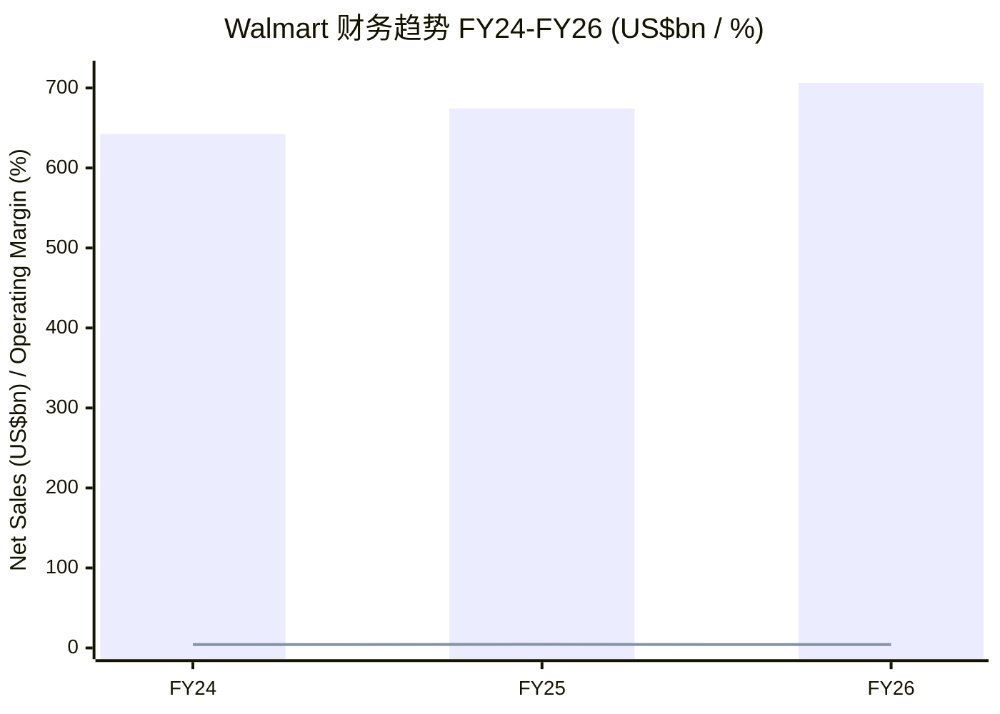
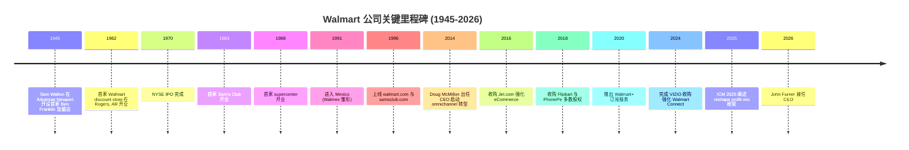
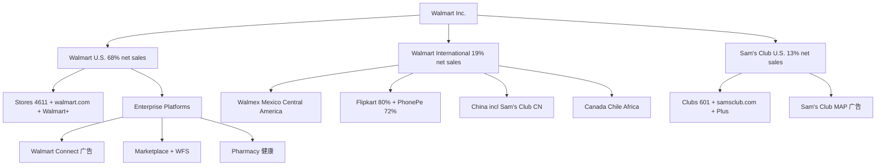
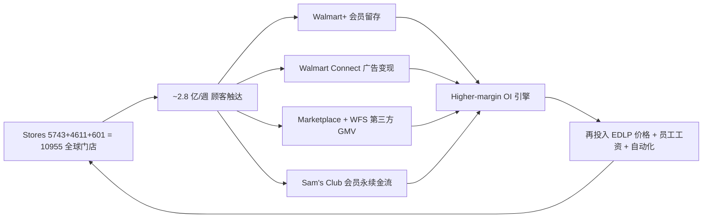
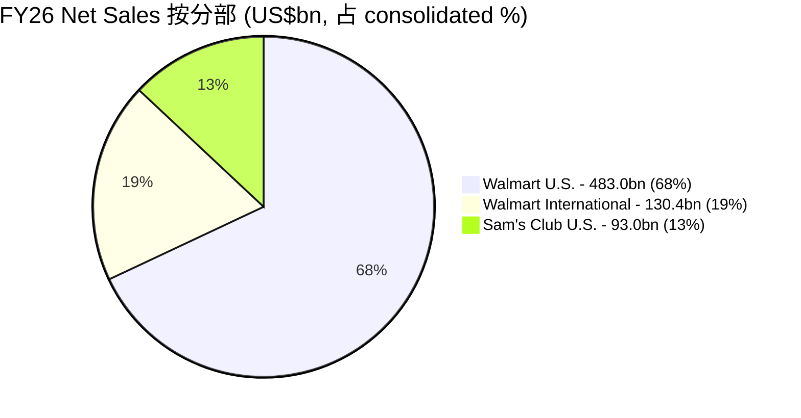
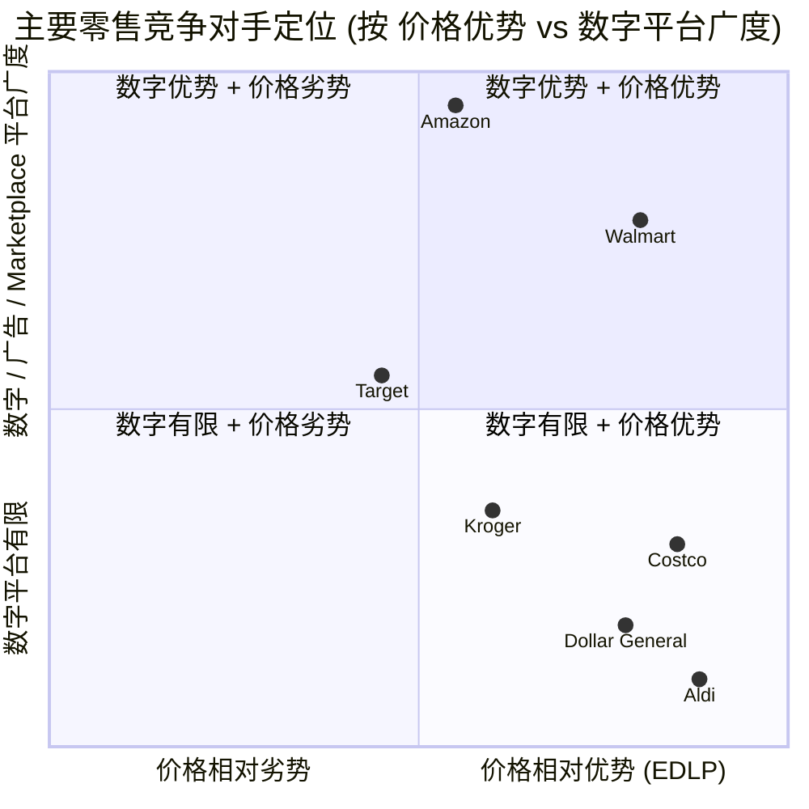
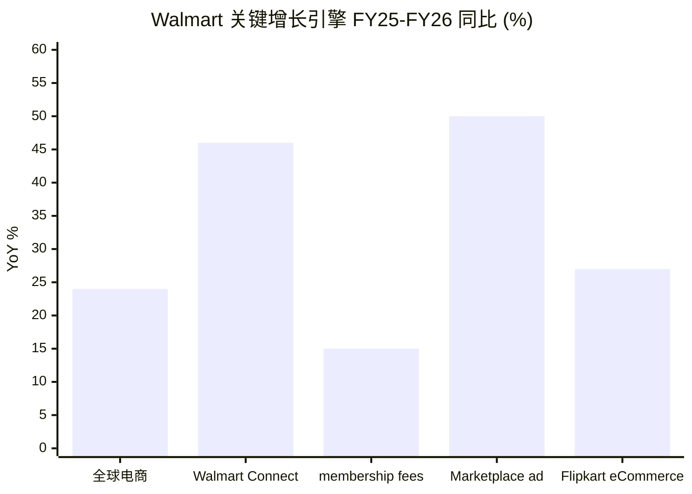

# Walmart Inc. (NASDAQ:WMT) 公司研究报告

**As-of date / 截止日期：2026-06-03**
**报告语言：Simplified Chinese / 简体中文（技术、行业、财务专有名词保留 English 原文）**

> **Top-of-report 头部摘要：**
> Walmart 2026 年 2 月 19 日发布 FY26 Q4 业绩并首次给出 FY27 (fiscal year 2027) 全年指引——net sales (cc, constant currency 不变汇率口径) +3.5%-4.5%、Adjusted operating income (cc) +6.0%-8.0%、Adjusted EPS US$2.75-2.85；同时公告 US$30 billion 新一轮 share repurchase 授权；5 月 21 日 FY27 Q1 业绩沿用并 reiterate (重申) 该指引。Doug McMillon 卸任 CEO，由 Walmart U.S. 出身的 **John Furner** 自 2026-02-01 起接任，标志着 Walmart 从 "omnichannel 转型期" 正式进入 "AI-powered platform 第二阶段"。([WMT FY26 Q4 Press Release, 2026-02-19](https://www.sec.gov/Archives/edgar/data/0000104169/000010416926000032/earningsreleasefy26q4.htm); [Furner CEO 接任公告, 2025-11-14](https://www.sec.gov/Archives/edgar/data/104169/000010416925000172/pressrelease111425.htm))

---

## 目录

1. 公司概览 (Company Overview)
2. 公司历史 (Company History)
3. 管理团队 (Management Team)
4. 产品与服务 (Products & Services)
5. 客户与上市策略 (Customers & Strategy)
6. 行业概览 (Industry Overview)
7. 竞争格局 (Competitive Landscape)
8. 市场机会 (Market Opportunity)
9. 风险评估 (Risk Assessment)
10. Investor-Lens 视角评分 (Investor-Lens Scorecards)

---

## 1. 公司概览 (Company Overview)

Walmart Inc.（NASDAQ:WMT，总部 Bentonville, Arkansas）是全球最大 brick-and-mortar (实体) 零售商兼 omnichannel (全渠道) 平台。FY26 (财年截止 2026-01-31) 实现 total revenues US$713.2 billion、net sales US$706.4 billion、operating income US$29.8 billion、consolidated net income US$22.3 billion、diluted EPS US$2.73；公司在 19 国运营 10,955 家门店、约 210 万 associates (员工)，每周服务约 2.8 亿顾客。([WMT FY26 10-K, Item 1 Business, p.5-6](https://www.sec.gov/Archives/edgar/data/104169/000010416926000055/wmt-20260131.htm); [WMT FY26 Q4 Press Release, 2026-02-19](https://www.sec.gov/Archives/edgar/data/0000104169/000010416926000032/earningsreleasefy26q4.htm))

业务由三大可报告分部 (reportable segments) 构成：**Walmart U.S.** 占 net sales 68% (US$483.0bn)、**Walmart International** 19% (US$130.4bn)、**Sam's Club U.S.** 13% (US$93.0bn)。两位数字增长引擎已从传统 supercenter 同店销售迁移至 eCommerce、Marketplace (第三方平台)、Walmart Connect (零售媒体广告)、Walmart+ (会员订阅) 与 Sam's Club Plus、以及 Flipkart / PhonePe（印度业务）这五大 "higher-margin offerings"。FY26 全球 eCommerce sales 增长 24%（Q4 数据；FY27 Q1 加速至 26%）；global advertising +46% 至 ~US$6.4 billion；membership fee revenue +15.1%（Q4，全球）。([WMT FY26 Q4 Press Release](https://www.sec.gov/Archives/edgar/data/0000104169/000010416926000032/earningsreleasefy26q4.htm); [WMT FY27 Q1 Press Release, 2026-05-21](https://www.sec.gov/Archives/edgar/data/0000104169/000010416926000095/earningsreleasefy27q1.htm))

**Valuation snapshot (估值快照, as of 2026-06-03)：** 收盘价 US$112.78、market cap ~US$899.5 billion、TTM P/E ~39.83×、forward P/E ~40-41×、TTM P/S ~1.26×（按 LTM revenue ~US$713bn 与市值计算）；52 周区间 US$93.43-135.16。Walmart 当前 TTM P/E 显著高于自身 3 年均值 (~36.4×)、5 年均值 (~36.2×)，亦高于近 10 年中位 (~31×)；估值溢价 (premium) 主要反映：(i) 高利润率新业务（Walmart Connect + Walmart+ + Marketplace）占比上行带来的 mix-up 故事，(ii) 防御性现金流在 macro 不确定期获得避险溢价，(iii) Walmart vs Amazon 在 "未来 omnichannel 双寡头" 中获得估值再评级 (re-rating)。但**估值显著高于 historical mean 的本质，是市场已经把 "operating income growing faster than sales (经营利润超速增长)" 的多年承诺充分定价**——若 FY27 Adjusted OI cc 落在指引下沿 +6%（而非上沿 +8%），则估值缓冲薄弱。([Public.com WMT P/E 历史, 2026-05-29](https://public.com/stocks/wmt/pe-ratio); [WMT FY27 Q1 Press Release](https://www.sec.gov/Archives/edgar/data/0000104169/000010416926000095/earningsreleasefy27q1.htm))

参照系：Costco TTM P/E ~51.75×（远高于 WMT；反映 club model 的 "membership annuity (会员永续金流)" 估值定价），Amazon TTM P/E ~31.70× / Forward P/E ~28.87×（被 AWS 与 retail margin 故事拉低），Target TTM P/E 与 WMT 接近但 forward 受品类逆风压制。WMT 估值介于 AMZN 与 COST 之间，符合其 "比 Amazon 更稳健但比 Costco 更慢" 的 narrative。([Public.com COST P/E 2026-05](https://public.com/stocks/cost/pe-ratio); [Public.com AMZN P/E 2026-05](https://public.com/stocks/amzn/pe-ratio))

*Source: [WMT FY26 10-K, MD&A Results of Operations](https://www.sec.gov/Archives/edgar/data/104169/000010416926000055/wmt-20260131.htm). Bars = net sales US$bn; line = consolidated operating margin %.*

---

## 2. 公司历史 (Company History)

Walmart 的故事从 1945 年 Sam M. Walton 在 Arkansas 州 Newport 开设第一家 Ben Franklin 加盟杂货店开始，1962 年首家 discount store (折扣店) 开业，1970 年 IPO 完成，1983 年首家 Sam's Club 开业，1988 年首家 supercenter（大型综合超市）开业，1991 年进入 Mexico、首次国际化，1996 年同时上线 walmart.com 与 samsclub.com 进入 eCommerce，2007 年推出 Site-to-Store（"线上下单、门店自提"）、奠定后续 omnichannel 基因，2018 年通过收购印度 Flipkart 与 PhonePe 多数股权完成两次具有战略意义的海外重仓。([WMT FY26 10-K, "The Development of Our Company"](https://www.sec.gov/Archives/edgar/data/104169/000010416926000055/wmt-20260131.htm))

第二个关键 chapter 是 **2014 年 2 月 Doug McMillon 接任 CEO 后的 omnichannel 与 eCommerce 转型**。McMillon 任内（FY15-FY26）将公司从 "实体店霸主" 改造为 "tech-powered omnichannel platform"：通过收购 Jet.com (2016)、与 Microsoft 战略联盟、Walmart+ 推出 (2020)、Walmart Connect 媒体业务建立 (2021)、VIZIO 智能电视并购完成 (2024)、Symbotic 机器人战略合作扩大 (2025)，把 net sales 从 ~US$485bn (FY15) 推升至 US$706.4bn (FY26)。([Retail Dive: McMillon Legacy, 2025-11-14](https://www.retaildive.com/news/walmart-ceo-doug-mcmillon-retail-legacy-leaves-behind/806043/); [WMT Completes VIZIO Acquisition, 2024-12-03](https://corporate.walmart.com/news/2024/12/03/walmart-completes-acquisition-of-vizio))

2025 年 4 月 9 日 Walmart 在 Bentonville 举办 Investment Community Meeting (ICM)，正式 codify (制度化) 出 "Reshape the profit mix (重构利润结构)" 的 financial framework：通过 mix-shift 至 advertising、membership、Marketplace、fulfillment service 等 higher-margin offerings，使 operating income 增速持续快于 net sales，强化 ROIC (投资回报率) 与现金流。这一财务框架在 2023 年首次描述、2025 年正式量化，是当前估值溢价的 narrative 锚点。([WMT 2025 Investment Community Meeting Press Release, 2025-04-09](https://www.sec.gov/Archives/edgar/data/0000104169/000010416925000036/pressrelease4925.htm); [ICM 2025 Prepared Remarks & Q&A PDF](https://corporate.walmart.com/content/dam/corporate/documents/newsroom/events/walmart-investment-community-meeting-and-q-and-a-session/icm-2025-prepared-remarks-and-q-and-a.pdf))

2025 年 11 月 14 日，Walmart 宣告 CEO 换帅：51 岁的 **John Furner**（前 Walmart U.S. 与 Sam's Club U.S. CEO、Walmart 元老 32 年）将自 2026-02-01 起接替 59 岁的 McMillon。董事长 Greg Penner 在公告中称 Furner 为 "uniquely capable of leading the company through this next AI-driven transformation"。McMillon 留任董事至 2026 年 6 月年度股东大会，并继续以 advisor 身份合作至 FY27 (财年 2027)。([Furner CEO 接任公告, 2025-11-14](https://www.sec.gov/Archives/edgar/data/104169/000010416925000172/pressrelease111425.htm))

*Source: [WMT FY26 10-K, "Development of Our Company"](https://www.sec.gov/Archives/edgar/data/104169/000010416926000055/wmt-20260131.htm); [Furner Succession Announcement](https://www.sec.gov/Archives/edgar/data/104169/000010416925000172/pressrelease111425.htm).*

---

## 3. 管理团队 (Management Team)

**Founder: Sam M. Walton (1918-1992)** — Walmart 创始人；1945 年在 Arkansas 州 Newport 开设首家 Ben Franklin 加盟店，1962 年与弟弟 James L. "Bud" Walton 在 Rogers, AR 创办首家 Walmart discount store，奠定 EDLP (Every Day Low Price 天天低价) 哲学——通过对供应链效率与库存周转 (inventory turnover) 的极致压缩把价格做到全行业最低。1970 年公司 IPO 后，Walton 家族持股逐步从 IPO 后 ~60% 稀释至 2026 年 ~46%，但仍是绝对控股股东，且通过非分级股票结构 (no dual-class) 维持影响力；2026 年初家族 stake 价值约 US$3500 亿，为全球第一财富家族。Sam Walton 1992 年去世，但其建立的 "frugality (节俭)、operational discipline (运营纪律)、EDLP" 文化至今是 Walmart 战略的 DNA。([WMT FY26 10-K Development of Company](https://www.sec.gov/Archives/edgar/data/104169/000010416926000055/wmt-20260131.htm); [RevenueMemo: Who Owns Walmart 2026](https://www.revenuememo.com/p/who-owns-walmart); [AInvest: Walton 44% Voting Analysis, 2025](https://www.ainvest.com/news/walmart-governance-clash-walton-family-44-voting-power-justifies-quality-discount-2605/))

家族目前在董事会保留三席（执行主席 Greg Penner 是 Walton 家族姻亲、S. Robson "Rob" Walton 与 Steuart Walton 是 Sam 直系后代）；Lead Independent Director 是 Randall Stephenson（前 AT&T CEO）。2026 年 1 月公司宣布 Superhuman / 前 YouTube CPO Shishir Mehrotra 加入董事会，强化技术与 AI 治理代表。([Walmart 董事 Mehrotra 加入公告, 2026-01-08](https://www.sec.gov/Archives/edgar/data/104169/000010416926000008/pressrelease1826.htm))

**Current President & CEO: John Furner (51 岁，2026-02-01 起任职)** — Furner 是从 1993 年（19 岁）的 hourly associate（小时工）一路晋升的内部高管，32 年职业生涯涵盖 merchandising、operations、sourcing 全链条，曾任 Sam's Club U.S. 总裁兼 CEO、Walmart U.S. 总裁兼 CEO（2019 年 11 月至 2026 年 2 月，期间 Walmart U.S. 同店销售连续多年中高个位数增长、eCommerce 持续 20%+ 复合增长）。Furner 接任声明强调 "centralize platforms to accelerate shared capabilities" (集中化平台以加速共享能力) 与 "AI-driven transformation"，将 Walmart Connect、Walmart+、Walmart Data Ventures、VIZIO、Sam's Club MAP、global Marketplace 等 enterprise platforms 全部交予新设的 EVP and Chief Growth Officer 一职（由 Seth Dallaire 担任）。这一组织重构事实上将 Walmart 从 "三个 segments" 变成 "三 segments + 全球 enterprise platforms"，与 Amazon 的 "retail + AWS + advertising" 三栈结构在 mental model 上正在收敛。([WMT 领导层变动公告, 2026-01-16](https://www.sec.gov/Archives/edgar/data/104169/000010416926000023/pressrelease-11626.htm); [Furner 接任正式公告, 2025-11-14](https://www.sec.gov/Archives/edgar/data/104169/000010416925000172/pressrelease111425.htm))

Furner 接任后核心 Executive Council 包括：CFO **John David Rainey**（55 岁，前 PayPal CFO，2022 年 6 月加盟）、CTO **Suresh Kumar**（61 岁，前 Google VP，2019 年 7 月加盟）、新任 Walmart U.S. CEO **David Guggina**（40 岁，2026-02-01 起，原 EVP Chief eCommerce Officer，背景在 supply chain 与 automation）、新任 Walmart International CEO **Chris Nicholas**（49 岁，2026-02-01 起，曾驻 10+ 国家、CFO 经验）、新任 Sam's Club U.S. CEO **Latriece Watkins**（51 岁，2026-02-01 起，1997 年实习生起家、merchandising 出身）。Furner 强调内部晋升与 "92% 关联员工为 hourly、75% 美国 salaried 管理岗起步于 hourly" 的 talent pipeline，是 Walmart 文化的护城河之一。([WMT FY26 10-K, Information About Our Executive Officers, p.11-12](https://www.sec.gov/Archives/edgar/data/104169/000010416926000055/wmt-20260131.htm))

---

## 4. 产品与服务 (Products & Services)

Walmart 的业务结构由三大 segments 加横跨 segments 的 enterprise platforms 组成。对投资人而言，**真正决定未来估值的不是 supercenter 货架，而是 platforms（Walmart Connect / Walmart+ / Marketplace / Walmart Fulfillment Services / 健康与金融服务）的 take-rate 与渗透曲线**。本节遵循公司自己的 segment 报告口径，逐项拆解。

### 4.1 Walmart U.S. (FY26 net sales US$483.0bn，占 consolidated 68%)

Walmart U.S. 是公司最大 segment，运营 4,611 家门店（覆盖 50 个州、华盛顿特区与 Puerto Rico），品牌包括 "Walmart"、"Walmart Neighborhood Market"、walmart.com 与 Walmart 手机 app。FY26 net sales US$483.0bn (+4.4%)、operating income US$25.2bn (+5.3%)、operating margin 5.2%（同比持平）；calendar comparable sales (同店销售) +4.3% (FY25 +4.8%)、其中 eCommerce 贡献 +4.3 个百分点（FY25 贡献 +2.9 pp）。Q4 FY26 数据：同店 +4.6%、eCommerce 同店贡献 520 bps、advertising +41% (ex-VIZIO)、店端 expedited delivery (急速配送) 增长 50%+。([WMT FY26 10-K, MD&A, Walmart U.S. Segment](https://www.sec.gov/Archives/edgar/data/104169/000010416926000055/wmt-20260131.htm); [WMT FY26 Q4 Press Release](https://www.sec.gov/Archives/edgar/data/0000104169/000010416926000032/earningsreleasefy26q4.htm))

**Merchandise units (商品大类，10-K 自陈)：**

> Grocery consists of a full line of grocery items, including dry grocery, snacks, dairy, meat, produce, deli and bakery, frozen foods, alcoholic and nonalcoholic beverages, as well as consumables such as health and beauty aids, pet supplies, household chemicals, paper goods and baby products;
>
> General merchandise includes: Entertainment (e.g., electronics, toys, seasonal merchandise, wireless, video games, movies, music and books); Hardlines (e.g., automotive, hardware and paint, sporting goods, outdoor living and stationery); Fashion (e.g., apparel for adults and children, as well as shoes, jewelry and accessories); and Home (e.g., housewares and small appliances, bed and bath, furniture and home organization, home furnishings, home decor, fabrics and crafts).
>
> Health and wellness includes pharmacy, over-the-counter drugs and other medical products, and optical services. ([WMT FY26 10-K Item 1 Business](https://www.sec.gov/Archives/edgar/data/104169/000010416926000055/wmt-20260131.htm))

**中文释义 / Plain-language gloss：** Grocery (食品杂货) 是 Walmart U.S. 的最大且最防御性的品类，FY26 仍是同店增长主驱动；General merchandise (一般商品) 在 FY26 终于回到正增长（"strength in all merchandise categories"），是 mix 重新平衡的关键；Health & wellness (健康与药房) 受 GLP-1 处方激增带动以中高个位数增长。

**Private brands (自有品牌)**：Walmart U.S. 已有 21 个自有品牌年销超过 US$10 亿、其中 5 个超过 US$50 亿（典型如 Great Value、Equate、Mainstays、Member's Mark），并于 2024 年推出新高端食品自有品牌 "bettergoods"，瞄准被 Trader Joe's 与 Whole Foods 长期占据的 "好吃但便宜" 消费区间。私有品牌单位经济 (unit economics) 高于全国品牌，是 Walmart U.S. gross margin (毛利率) 持续扩张的核心引擎之一。([WMT 2025 ICM Press Release, 2025-04-09](https://www.sec.gov/Archives/edgar/data/0000104169/000010416925000036/pressrelease4925.htm))

**Omnichannel 与 Walmart+**：实质上所有门店均提供 same-day pickup 与 delivery；公司公告称美国 95% 家庭可享受 < 3 小时配送。Walmart+（US$98/年，2024-25 涨价后部分计划为 US$120/年；不同信息源数据略有差异）提供免运费、店内配送、Scan & Go、燃油折扣，是对标 Amazon Prime 的 "subscription stack"。Morgan Stanley 2026 年 4 月 survey 估测 Walmart+ 会员数约 30.7 million、3 月单月净增 ~390 万；同比增速约 17%。Q4 FY26 与 Q1 FY27 公司均报告 membership fee revenue 两位数增长 (Q1 FY27 全球 +17.4%)；Walmart 不披露 Walmart+ 实际订阅数。([Yahoo Finance: Morgan Stanley Walmart+ Survey](https://finance.yahoo.com/news/walmart-membership-continues-reach-heights-153423674.html); [WMT FY27 Q1 Press Release](https://www.sec.gov/Archives/edgar/data/0000104169/000010416926000095/earningsreleasefy27q1.htm))

**Walmart U.S. Enterprise platforms (横跨货架的高利润业务)：**

- **Walmart Connect (零售媒体广告 Retail Media Network)**：在公司 product mix 中是最快增长的利润引擎。FY26 全年 global advertising +46% 至接近 US$6.4 billion；Q4 Walmart Connect (U.S.) +41%（含 VIZIO 贡献）、FY27 Q1 +44% (ex-VIZIO)。在美国 retail media market 中，eMarketer 估算 Walmart Connect 2025 份额约 8.0%，仍远落后于 Amazon Ads 的 ~79.7%，但增速 (33% U.S.) 是公司整体销售增速的约 6 倍，且贡献了 operating income 的不成比例份额（与会员费合计 ~约 1/3 of OI）。VIZIO 在 2024 年 12 月以 US$2.3bn 收购完成、贡献 connected-TV (CTV，联网电视) 广告库存与 ACR (automatic content recognition) 数据资产，是 Walmart 与 Amazon / Roku 在 CTV 维度的关键 catch-up move。([Marketing Dive: Walmart Connect Inside, 2025-11](https://www.marketingdive.com/news/inside-walmart-connect-as-retail-media-ctv-convergence-accelerates/807682/); [Walmart Completes VIZIO Acquisition, 2024-12-03](https://corporate.walmart.com/news/2024/12/03/walmart-completes-acquisition-of-vizio))

- **Marketplace (第三方平台) + Walmart Fulfillment Services / WFS (履约服务)**：Walmart Marketplace 拥有约 20 万活跃第三方卖家（vs. Amazon ~200 万），但 FY27 Q1 marketplace 净销售增长接近 50%，其中跨境业务扩展至 Canada 与 Mexico；marketplace advertising +50%。WFS 是 Marketplace 卖家可购买的 fulfillment + first-mile + return 一揽子服务，对标 Amazon FBA；Walmart 把 WFS 与 EDLC 的 supply chain 经济性结合，在中等 SKU 价格段对 FBA 形成实质性价格差异。([Modern Retail 与 Trellis: WMT vs AMZN Marketplace 2026](https://gotrellis.com/resources/blog/selling-on-walmart-amazon/); [WMT FY27 Q1 Press Release](https://www.sec.gov/Archives/edgar/data/0000104169/000010416926000095/earningsreleasefy27q1.htm))

- **Health & Wellness (健康与药房)**：FY26 在 pharmacy 端表现稳健，受益于 branded prescriptions 增长（包括 GLP-1）。Walmart 在 2024-25 期间关闭了 Walmart Health 诊所业务，对 standalone 诊所模式认输，但保留 pharmacy 与 telehealth 与 specialty pharmacy 入口。([Modern Retail: Walmart Pharmacy GLP-1](https://www.modernretail.co/operations/retailers-like-kroger-walmart-expect-glp-1-drugs-to-grow-pharmacy-sales-but-hurt-grocery/))

- **Financial Services (金融服务)**：包括 money orders、prepaid access、money transfers、check cashing、bill payment 与 installment lending。Walmart 与金融科技公司 ONE 的合作是这一栈的主体。

### 4.2 Walmart International (FY26 net sales US$130.4bn，占 consolidated 19%)

Walmart International 经营 5,743 家门店、覆盖 18 国（Canada、Chile、China、Africa 8 国合一、India 多数股、Mexico、Central America 5 国）。FY26 net sales +7.0% reported / +9.3% cc（FX 拖累约 US$2.8bn），operating income US$5.1bn -7.2% reported（含 US$0.7bn 与 PhonePe share-based comp 修改相关的 charge）。Adjusted OI cc +8.0%。net sales 三大支柱：**China**、**Walmex (墨西哥+中美洲)**、**Flipkart (印度)**。([WMT FY26 10-K, Walmart International Segment](https://www.sec.gov/Archives/edgar/data/104169/000010416926000055/wmt-20260131.htm); [WMT FY26 Q4 Press Release](https://www.sec.gov/Archives/edgar/data/0000104169/000010416926000032/earningsreleasefy26q4.htm))

- **Walmex（Walmart de México y Centroamérica，BMV:WALMEX）**：墨西哥业务以 Bodega、Walmart Supercenter、Walmart Express 与 Sam's Club 为主品牌；同店增速 FY26 Q4 +4.3%、Q3 +3.9%、Q2 +4.4%、Q1 +1.4%（受政府社会项目支付时间与复活节影响）。Walmex 是 Walmart 海外最赚钱、ROIC 最高的子公司。

- **Flipkart + PhonePe (印度)**：Walmart 持 Flipkart ~80%、PhonePe ~71.8%。Flipkart 处于 IPO 准备期，但 2026 年 5 月 Walmart 指示 Flipkart 推迟 IPO、优先在 FY27 内达到 EBITDA breakeven (EBITDA 盈亏平衡)。Flipkart 估值传闻区间 US$40-70 billion，PhonePe 已分拆 + 域内化、估值约 US$12 billion、处理印度 UPI 50%+ 交易。FY26 因 PhonePe 修改 share-based payment 安排预备 IPO，Walmart International 计入 US$0.7 billion 非现金 SBC charge。([Unlistedzone: Flipkart's Homecoming](https://unlistedzone.com/flipkarts-homecoming-from-a-bengaluru-apartment-to-indias-biggest-ipo); [Outlook Business: No IPO Yet — Walmart Wants Flipkart Profitable First, 2026-05](https://www.outlookbusiness.com/markets/no-ipo-yet-walmart-wants-flipkart-to-turn-profitable-first); [WMT FY26 10-K MD&A 注释 Walmart International](https://www.sec.gov/Archives/edgar/data/104169/000010416926000055/wmt-20260131.htm))

- **China**：以 Sam's Club 中国（截止 FY26 末约 50 家以上，按 IR 披露同店及电商表现领先；samclub.cn 为中国电商主体）为主要增长驱动。Q4 FY26 Walmart International cc 净销售加速由 China、Walmex 与 Flipkart 共同拉动。([WMT FY26 Q4 Press Release](https://www.sec.gov/Archives/edgar/data/0000104169/000010416926000032/earningsreleasefy26q4.htm))

### 4.3 Sam's Club U.S. (FY26 net sales US$93.0bn，占 consolidated 13%)

Sam's Club U.S. 是 membership-only 的 warehouse club，FY26 末经营 601 家俱乐部（44 个州 + Puerto Rico），net sales +3.1% reported / +5.0% ex-fuel；comparable sales (ex-fuel) +5.1%；operating income US$2.4bn +1.6%；Plus penetration（高级会员渗透率）继续上升；FY26 Q4 membership fee revenue +6.1%、FY27 Q1 +5.6%。会员价 Club US$50/年、Plus US$110/年（部分信息源称已涨至 US$60/$120），Plus 含店内自提 + 配送 + 提前购物时段等权益。Sam's Cash rewards 是其与 Costco "executive 2% rebate" 对标的留存机制。FY26 启动 Walmart U.S. 与 Sam's Club U.S. supply chain function 合并，预期长期降本。([WMT FY26 10-K, Sam's Club Segment](https://www.sec.gov/Archives/edgar/data/104169/000010416926000055/wmt-20260131.htm); [WMT FY26 Q4 Press Release](https://www.sec.gov/Archives/edgar/data/0000104169/000010416926000032/earningsreleasefy26q4.htm))

*Source: [WMT FY26 10-K Item 1 Business Segment Section](https://www.sec.gov/Archives/edgar/data/104169/000010416926000055/wmt-20260131.htm); [Leadership reorganization announcement, 2026-01-16](https://www.sec.gov/Archives/edgar/data/104169/000010416926000023/pressrelease-11626.htm).*

### 4.4 综合：商品 + 服务循环 (Product–Service Loop)

把 segments 拼回完整 mental model：Walmart U.S. supercenter 与 Walmart International store fleet 提供 (i) 全国密度 + (ii) 数十亿次顾客访问频次。这两项资产被 **Walmart+** 转化为 "会员留存与高频复购"，被 **Walmart Connect** 转化为 "可定向的零售媒体广告库存"，被 **Marketplace + WFS** 转化为 "第三方 GMV 与广告与配送 take-rate"。同样的物理资产同时由 **Sam's Club** 转化为 "membership 永续金流"，并通过与 Symbotic 的合作（Walmart 2025 年出售自有 Advanced Systems & Robotics 业务给 Symbotic、签订 US$520 million 新一轮商业协议、Symbotic 在 42 个 regional distribution center 推广 Gen-2 自动化平台、2026 年初安装 Gen-2 prototype）转化为 "fulfillment 单位成本下降的供应链护城河"。([Symbotic 收购 Walmart 机器人业务公告](https://www.symbotic.com/about/news-events/news/symbotic-completes-acquisition-of-walmarts-advanced-systems-and-robotics-business/); [Robotics 24/7: Symbotic-Walmart 42 RDCs](https://www.robotics247.com/article/symbotic_and_walmart_expand_partnership_to_implement_automation_in_42_regional_distribution_centers))

这一闭环就是 ICM 2025 中 CFO Rainey 所说的 "reshape the profit mix" 实质：Walmart 不是在 "卖更多盒装麦片"，而是在 "把同一货架的可货币化属性 (advertisable、membershipable、marketplaceable) 三重叠加"，每一次复用的边际经济性都高于核心商品销售。

**单位经济学的关键认知点：** Walmart 的核心商品 gross margin (毛利率) 处于零售业最低区间 (consolidated FY26 24.2%、Walmart U.S. 27.5%、Sam's Club 11.3%——后者反映 club model 的极低标准毛利依靠会员费补足)。但 advertising 业务的 contribution margin 通常在 70-80% 区间、membership fee 的 contribution margin 接近 100% (会员服务的边际成本几乎只是 customer service)、Marketplace take-rate 的 contribution margin 通常 50-60%。这意味着 **每 1% 的 mix shift 从核心商品迁移至 platforms，对 consolidated operating margin 的杠杆是核心商品自身的 2-3 倍**。FY26 advertising ~US$6.4bn 仅占 net sales <1%，但已贡献 OI 的 mid-single-digit % 量级；当广告业务在 FY28-FY29 达到 US$10bn+ 时，其对 OI 的贡献会进入 high-single-digit % 量级——这是 "OI growing faster than sales" 数学上的成立基础。([WMT FY26 10-K MD&A Gross Profit Rate 讨论](https://www.sec.gov/Archives/edgar/data/104169/000010416926000055/wmt-20260131.htm); [WMT 2025 ICM Press Release reshape profit mix](https://www.sec.gov/Archives/edgar/data/0000104169/000010416925000036/pressrelease4925.htm))

**对比 Amazon 的 mental-model：** Amazon 的故事是 "retail 接近盈亏平衡 + AWS 高利润 cross-subsidy + advertising 加速"。Walmart 的故事是 "retail 已经稳定盈利 + advertising / membership / marketplace 三栈同时加速 + 实体店密度即护城河"。这两条路径在 cash flow 与 ROIC 结构上日益接近，但 Walmart 缺少 cloud business 这一独立 EBIT 资产、Amazon 缺少 grocery 这一防御性 anchor——这是两家公司估值差异化的根本原因。

*Source: 综合 [WMT 2025 ICM Press Release](https://www.sec.gov/Archives/edgar/data/0000104169/000010416925000036/pressrelease4925.htm) 与 [WMT FY26 Q4 Press Release](https://www.sec.gov/Archives/edgar/data/0000104169/000010416926000032/earningsreleasefy26q4.htm).*

---

## 5. 客户与上市策略 (Customers & Strategy)

Walmart 客户基础的核心特征是 "scale + breadth"：每周 ~2.8 亿顾客 + 约 5.0 亿全球会员触达，是任何零售或媒体公司都无法在短期复制的 first-party data 资产。10-K 自述不披露任何 customer concentration（10-K 在 ASC 280-10-50-42 框架下未列举任何单一 10%+ 客户），因为 Walmart 是 B2C 模型 + 高度分散小额交易，**consolidated 层面没有单一客户达到 ≥10% 门槛**——这与 Apple 等 ODM 客户、半导体设备 OEM 客户的高集中模式截然相反，是 Walmart 防御性溢价的结构性来源。([WMT FY26 10-K Customer & Segment 注释](https://www.sec.gov/Archives/edgar/data/104169/000010416926000055/wmt-20260131.htm))

**Walmart U.S. 客户人群结构**：Walmart 历史客群核心是 "household income < US$50k 的价格敏感型家庭" + "household income US$50k-100k 的中等收入家庭"。值得关注的近三年 mix shift 是 **高收入家庭的渗透加速**：根据多份第三方分析与公司 ICM 2025 表述，FY24-FY26 期间 household income > US$100k 群体在 Walmart 渠道（含 eCommerce）的份额加速增长，主要拉动来自 (i) eCommerce + Walmart+ 便利性的吸引力；(ii) 通胀环境中 "trade-down" 行为；(iii) Walmart 私有品牌（如 bettergoods）质感升级；(iv) Walmart Connect 媒体投放对高线品牌的覆盖。FY26 Q4 与 FY27 Q1 公司均使用 "broad-based share gains" 表述，对应市场份额来自所有 income cohort、所有商品大类。([WMT FY26 Q4 Press Release](https://www.sec.gov/Archives/edgar/data/0000104169/000010416926000032/earningsreleasefy26q4.htm); [WMT FY27 Q1 Press Release](https://www.sec.gov/Archives/edgar/data/0000104169/000010416926000095/earningsreleasefy27q1.htm))

**Walmart+ 会员人群与对 Amazon Prime 的差异化**：Walmart+ 价格 US$98-120/年 vs Prime 约 US$139/年，且物理店访问的便利性使 Walmart+ 的下沉穿透力 (penetration into <$50k income households) 高于 Amazon。25% 的美国消费者同时持有 Walmart+ 与 Amazon Prime（双订阅人群消费力高出 46%），表明两者并非完全替代而是部分补充。Morgan Stanley 2026 年 4 月估测 Walmart+ 约 30.7 million 会员，是历史最高水平。([AInvest: Walmart Streaming Perks Walmart+](https://www.ainvest.com/news/walmart-strategic-expansion-streaming-perks-walmart-competitive-edge-retail-membership-wars-2509/); [Yahoo Finance: Morgan Stanley Walmart+ Survey](https://finance.yahoo.com/news/walmart-membership-continues-reach-heights-153423674.html))

**Sam's Club 会员人群**：以小企业主与中产家庭为主，Club US$50/Plus US$110，与 Costco 直接竞争。Sam's Club 在 FY26 net sales US$93.0bn（vs Costco 美国 segment 远超此数），但 Sam's Club 美国俱乐部数 601 已接近 Costco 美国 ~633；问题在 **per-warehouse productivity** —— 单店销售额约为 Costco 美国 store 的一半（按粗略对比；详见 § 7）。Sam's Club FY26 membership fee revenue +6.1%（vs Costco 全球 +13.6% Q2 FY26），renewal rate 与 Plus penetration 仍持续提升但增速不及 Costco。([mmCG Invest: Costco vs Sam's Club 2026 Comparative](https://www.mmcginvest.com/post/costco-vs-sam-s-club-in-2026-a-comparative-analysis-of-the-u-s-warehouse-club-market))

**Walmart International 客户与上市策略**：Flipkart 与 PhonePe 是 Walmart 持有的两块未上市资产，市场对其潜在 spin-off 或 IPO 路径的估值占 WMT 当前股价的不可忽略部分。Walmart 在 2026 年 5 月 15 日公告指示 Flipkart 优先实现 EBITDA breakeven、推迟 IPO 至 FY27 之后；PhonePe 在 2025 年宣布 IPO 准备步骤（ICM 2025 时点）、估值约 US$12bn、已分拆且改注册地至印度。Walmex 已在 BMV 单独上市、市值约 US$50bn，是 Walmart 海外最高质量的资产之一。([Outlook Business: Walmart-Flipkart IPO Defer 2026-05](https://www.outlookbusiness.com/markets/no-ipo-yet-walmart-wants-flipkart-to-turn-profitable-first); [Walmart 2025 ICM Press Release](https://www.sec.gov/Archives/edgar/data/0000104169/000010416925000036/pressrelease4925.htm))

**第三方卖家 (Marketplace seller) 作为 "B2B 客户"：** Walmart Marketplace 拥有约 20 万活跃第三方卖家，是 Walmart "三类客户" 之一（消费者顾客、Sam's Club 会员、Marketplace 卖家）。Marketplace 卖家通过 Walmart Connect 投放广告 + 使用 Walmart Fulfillment Services / WFS 履约 + 享受 Walmart+ 用户基础的高转化率。FY27 Q1 earnings call 显示 Walmart U.S. Marketplace 净销售增长接近 50%（2.5 年来最强季度）、全球第三方 marketplace advertising +50%、WFS 当日 / 次日配送单量 +150%、跨境扩展至 Canada 与 Mexico，标志 Marketplace 已从 "Amazon 防御性追赶" 进入 "独立增长引擎" 阶段。([Motley Fool: Walmart Q1 2027 Earnings Transcript 2026-05-21](https://www.fool.com/earnings/call-transcripts/2026/05/21/walmart-wmt-q1-2027-earnings-transcript/); [Trellis: Selling on Walmart vs Amazon Marketplaces 2026](https://gotrellis.com/resources/blog/selling-on-walmart-amazon/); [WMT FY27 Q1 Press Release](https://www.sec.gov/Archives/edgar/data/0000104169/000010416926000095/earningsreleasefy27q1.htm))

**Brand-side advertiser (品牌广告主) 作为 Walmart Connect 客户：** Walmart Connect 的客户基础既包括 marketplace 第三方卖家也包括传统 Consumer Packaged Goods (CPG，快消品) 品牌（Procter & Gamble、Unilever、Coca-Cola、PepsiCo 等长尾的 brand suppliers）以及借助 VIZIO CTV 库存覆盖的非 endemic 广告主（汽车、金融、流媒体等品类）。10-K 自述 "Other offerings in the Walmart U.S. business include advertising solutions for brands and online marketplace sellers, supply chain and fulfillment capabilities to online marketplace sellers, and data analytics and insights for suppliers and brands" 即明确把 brand 广告主作为独立的服务客群。([WMT FY26 10-K Item 1 Walmart U.S. Other Offerings 段落](https://www.sec.gov/Archives/edgar/data/104169/000010416926000055/wmt-20260131.htm))

*Source: [WMT FY26 10-K MD&A, Consolidated and Segment Results of Operations](https://www.sec.gov/Archives/edgar/data/104169/000010416926000055/wmt-20260131.htm). 单一 denominator: consolidated net sales.*

---

## 6. 行业概览 (Industry Overview)

Walmart 同时在四个相互交织的行业内运营：(i) **U.S. omnichannel retail (美国全渠道零售，~US$5+ trillion TAM)**；(ii) **eCommerce (美国零售电商市场，2025 规模 ~US$1.2 trillion)**；(iii) **retail media (零售媒体广告，全球 2025 规模 ~US$165bn)**；(iv) **emerging-market eCommerce (印度、墨西哥、智利、中国)**。

**U.S. retail：** 总市场规模约 US$5-7 trillion，按 U.S. Census Bureau 月度零售数据；增长由 nominal GDP + CPI inflation 驱动，长期 nominal 增速 3-5%。grocery + consumables 子市场美国占比约 ~1/3，是 Walmart 的核心 anchor。结构上零售业仍处于 "consolidate at the top" 阶段：Top-5 retailers（Walmart、Costco、Kroger、Amazon、Target）合计在 grocery 与 general merchandise 的份额持续提升，碾压 mid-tier department stores 与 regional chains。([Walmart Press Release FY26 Q4 about 2.8 亿/週顾客](https://www.sec.gov/Archives/edgar/data/0000104169/000010416926000032/earningsreleasefy26q4.htm))

**U.S. eCommerce：** 2025 年总规模约 US$1.2 trillion（Amazon ~37-40% share、Walmart ~6-9%，Apple ~3-4%、Costco/Target/Home Depot/Best Buy 各 1-2%）。eCommerce 在美国 retail 中渗透率约 16-17%（Q1 2026 季节调整），从 2014 的 ~6% 提升至 2025 的 ~17%。这一渗透率是 Walmart "eCommerce 同店贡献 +4.3 pp" 故事的基础——eCommerce GMV (电商交易额) 还在 mid-to-high teens 增长。([Synctify: US eCommerce 2025 Market Share](https://www.synctify.net/2026/03/05/u-s-ecommerce-2025-market-share-amazon-vs-other-platforms-and-cyber-weekend-trends/); [eMarketer US eCommerce Shares 2025](https://www.emarketer.com/content/us-ecommerce-market-shares-2025))

**Retail media (零售媒体广告)：** 2025 年全球规模约 US$165bn、美国约 US$60-70bn；预计 2025 年仍以约 20% 增长。在美国，Amazon Ads ~79.7% share、Walmart Connect ~8.0%、Target Roundel + Instacart Ads 等合计剩余 ~12%。retail media 是过去十年增长最快的广告子类，因为它同时具备 (i) closed-loop attribution（一站式从印象到下单的 closed loop 归因）、(ii) 高质量 first-party purchase intent data、(iii) 边际成本低（直接复用既有库存）。Walmart 与 Amazon 将吞下 retail media 增量市场的 89%。([Marketing Dive: Walmart Connect Inside Retail Media](https://www.marketingdive.com/news/inside-walmart-connect-as-retail-media-ctv-convergence-accelerates/807682/))

**Emerging-market eCommerce：** Flipkart 是印度 eCommerce 双寡头之一（与 Amazon India 直接竞争），PhonePe 是印度 UPI 支付主流通道。Walmex 是墨西哥零售龙头，类似墨西哥版 Walmart + Costco。Walmart 在中国通过 Sam's Club 中国进行 cohort-targeted 扩张，2024-26 数次披露 Sam's Club 中国是 China business 增长主驱动。([WMT 2025 ICM Press Release](https://www.sec.gov/Archives/edgar/data/0000104169/000010416925000036/pressrelease4925.htm); [WMT FY26 Q4 Press Release](https://www.sec.gov/Archives/edgar/data/0000104169/000010416926000032/earningsreleasefy26q4.htm))

**结构性驱动 (Structural Tailwinds)：** (i) **omnichannel convergence**——单一 SKU 既可门店购买也可在 eCommerce 下单店内自提或配送，Walmart 现状是 "95% 美国家庭 < 3 小时配送"；(ii) **第一方数据 / first-party data 红利**——Cookie 退场、Apple ATT、DMA 等监管收紧使 retail media 相对 walled-garden 媒体的相对吸引力上行；(iii) **automation 与 AI**——Symbotic 合作把 Walmart 美国 65% 门店在 FY26 末由自动化 distribution centers 供货（FY25 < 50%），单位履约成本进入持续下降通道；(iv) **GLP-1 与健康消费转型**——参见 § 9 风险。

**结构性逆风 (Structural Headwinds)：** (i) **tariff (关税) 与贸易政策不确定**——FY26 10-K 风险章节多次强调 tariff、IEEPA (International Emergency Economic Powers Act) 退税情景仍不可预测，Q1 FY27 公司明确表示指引 "不包含 IEEPA tariff refunds 情景"；(ii) **inflation 持续粘性**——food 与 energy CPI 已自高位回落但仍高于 2019 水平；(iii) **wage cost** 在 Walmart 自身 +210 万 associates 的人力基数上对运营杠杆构成压力。([WMT FY27 Q1 Press Release Guidance Section](https://www.sec.gov/Archives/edgar/data/0000104169/000010416926000095/earningsreleasefy27q1.htm); [WMT FY26 10-K Risk Factors](https://www.sec.gov/Archives/edgar/data/104169/000010416926000055/wmt-20260131.htm))

**农产品 (perishables) 与冷链是 Walmart grocery 难以被 Amazon 复制的核心壁垒。** Walmart U.S. 的 grocery 业务是 "全国分布式 fresh / dairy / meat / produce" 供应链——FY26 10-K 描述 "in many instances, we purchase merchandise from producers located near the stores and clubs in which such merchandise will be sold, particularly perishable items"。这一 local sourcing + 全国 192 个 distribution facilities + 自有车队 + common carrier 的混合体系，是 Amazon 至今没能在 Whole Foods + Amazon Fresh 通道完整复制的能力。这一物理基础正在被 Symbotic Gen-2 自动化系统进一步加固——FY26 末美国约 65% 门店已由自动化 DC 供货（vs FY25 < 50%），且 42 个 regional distribution centers 将在未来 8 年内完成 Symbotic Gen-2 部署，单 case picking 成本下降幅度按公司 IR 表述 "double-digit %" 量级。([WMT FY26 10-K Supply Chain and Distribution 段落](https://www.sec.gov/Archives/edgar/data/104169/000010416926000055/wmt-20260131.htm); [Robotics 24/7 Symbotic Walmart 42 RDCs](https://www.robotics247.com/article/symbotic_and_walmart_expand_partnership_to_implement_automation_in_42_regional_distribution_centers))

**Agentic commerce (AI 代理购物) 的 inflection 点** — Walmart 在 2026 年 1 月 8 日宣布将前 YouTube CPO / Coda 与 Superhuman CEO Shishir Mehrotra 加入董事会，明确表述为 "joining the Board as the company builds for an agentic AI future"。同时 Daniel Danker 自 2025 年 8 月被任命为 EVP AI Acceleration, Product and Design（来自 Instacart Chief Product Officer，再往前是 Uber Eats Head of Product），这一职位本身是 Walmart 治理结构对 "AI-led re-design of shopping" 这一未来的明确表态。10-K 中 forward-looking 段落也具体提到 "captive and third-party digital applications, social media, and emerging agentic platforms" 作为 omnichannel 战略的未来方向。([Walmart Mehrotra 加入董事会公告](https://www.sec.gov/Archives/edgar/data/104169/000010416926000008/pressrelease1826.htm); [WMT FY26 10-K Strategic Risk 段落](https://www.sec.gov/Archives/edgar/data/104169/000010416926000055/wmt-20260131.htm))

---

## 7. 竞争格局 (Competitive Landscape)

Walmart 的 10-K Item 1 Competition 部分如下定义：

> We compete with brick and mortar, eCommerce and omnichannel retailers operating discount, department, retail and wholesale grocery, drug, dollar, variety and specialty stores, supermarkets, supercenter-type stores, membership-only warehouse clubs, gasoline stations and social commerce platforms, as well as companies that offer services in digital advertising, fulfillment and delivery services, health and wellness and financial services. ([WMT FY26 10-K Competition](https://www.sec.gov/Archives/edgar/data/104169/000010416926000055/wmt-20260131.htm))

按竞争维度展开：

**vs Amazon (US$2.3+ trillion market cap)**：美国零售业最重要的双寡头对决。Amazon 在美国 eCommerce 仍占 ~40% share、广告占 retail media ~80%、AWS 提供 cross-subsidy。但 Walmart 的物理店密度 + Walmart+ + Walmart Connect + Marketplace 正在第一次让 Walmart 与 Amazon 在 "1-day delivery + ads platform" 维度直接 head-to-head。Walmart 的优势：(i) grocery（美国 Walmart grocery 份额 ~25%，Amazon 经 Whole Foods + Amazon Fresh 仅 ~3-4%）；(ii) 价格信号——EDLP 在通胀期吸引 high-income trade-down；(iii) 估值——Walmart 不背 AWS 这块独立 EBIT 资产，但也因此估值低于 AMZN 的 sum-of-the-parts。Amazon 的优势：(i) eCommerce 规模、cloud cross-subsidy；(ii) Prime 会员数（~200 million 全球） > Walmart+ 估测 ~30 million 数量级；(iii) advertising 业务规模与 platform 技术栈。

*分析师观点：* WMT 与 AMZN 的相对估值 (P/E gap) 反映市场对 "Walmart 防御性 + Walmart+ / Connect 期权价值" vs "Amazon AWS + retail unit economics 上行" 的相对定价；当前 WMT TTM P/E ~40× vs AMZN ~32× 反映 Walmart 在 macro 不确定期获得避险溢价、但同时也意味着 Walmart 需要持续兑现 OI growing faster than sales 才能维持估值。([Public.com WMT P/E](https://public.com/stocks/wmt/pe-ratio); [Public.com AMZN P/E](https://public.com/stocks/amzn/pe-ratio))

**vs Costco (US$430+ billion market cap)**：Sam's Club 与 Costco 在美国 warehouse club 维度直接竞争。运营 ~600 vs ~633 家俱乐部，但 Costco 每店收入是 Sam's Club 的约 2.0 倍。Costco 优势：(i) 卓越 SKU rationalization 与 selection（Costco 单店 SKU ~4000 vs Sam's Club ~6000）带来更高店均周转；(ii) Kirkland Signature private label 的极高消费者忠诚；(iii) Executive 会员的高 LTV。Sam's Club 优势：(i) Walmart 集团总采购规模与供应链共享；(ii) Plus 会员 + Sam's Cash 的数字化创新；(iii) FY26 启动的 Walmart U.S. supply chain 整合。从估值上，Costco TTM P/E ~52× 反映了市场对 club model "annuity-like membership cashflow" 的高度认可，是 Walmart Sam's Club 部分隐含估值的 reference point。([mmCG Invest: Costco vs Sam's Club 2026](https://www.mmcginvest.com/post/costco-vs-sam-s-club-in-2026-a-comparative-analysis-of-the-u-s-warehouse-club-market); [Public.com COST P/E](https://public.com/stocks/cost/pe-ratio))

**vs Kroger (US$45+ billion market cap)**：美国第二大独立 grocer（仅次于 Walmart grocery business）。Kroger 的优势是 store layout 与 fresh / deli 操作；劣势是数字 / eCommerce 与 ads 业务远落后。Walmart 在 grocery 持续以 EDLP + 自动化 + omnichannel 蚕食 Kroger 同店份额。

**vs Target (US$35+ billion market cap)**：Target 定位偏高端 "cheap chic"（Joanna Gaines、Magnolia 等 partnership），与 Walmart 在 home、apparel、seasonal 品类直接竞争。FY24-26 期间 Target 受 general merchandise 周期与 DEI 反弹冲击同店萎缩、被 Walmart 持续蚕食。

**vs Dollar General / Dollar Tree (合计 ~US$30 billion market cap)**：Dollar 渠道在 Walmart EDLP 的价格压力下增长承压、Walmart 通过 small-format Neighborhood Market 与 Walmart+ 配送便利性持续侵蚀 dollar store 的可达性优势。

**vs Aldi、Lidl、Trader Joe's、Whole Foods**：低价格 grocery 维度 Aldi 与 Lidl 在美国扩店、是中长期对 Walmart grocery 同店的实际威胁；premium grocery 维度 Whole Foods（Amazon 子公司）与 Trader Joe's 通过 SKU curation + experience 保留高端消费者。

**vs Flipkart 竞品 (Amazon India、Reliance Retail / JioMart、Meesho)**：印度 eCommerce 市场远未形成双寡头格局，Reliance JioMart 已切入与 Flipkart 直接竞争；Amazon India 因外资规则受限但仍是核心对手。

*Source: 综合 [WMT FY26 10-K Competition section](https://www.sec.gov/Archives/edgar/data/104169/000010416926000055/wmt-20260131.htm), [Marketing Dive Walmart Connect](https://www.marketingdive.com/news/inside-walmart-connect-as-retail-media-ctv-convergence-accelerates/807682/), [mmCG Invest Costco vs Sam's Club](https://www.mmcginvest.com/post/costco-vs-sam-s-club-in-2026-a-comparative-analysis-of-the-u-s-warehouse-club-market). 坐标为 *分析师观点* 的定性映射，并非 10-K 自报数据。*

---

## 8. 市场机会 (Market Opportunity)

**TAM Stack：** Walmart 的可服务市场可按四个独立维度叠加：

| 维度 | 规模 (~2025-26) | Walmart 现状 share | 关键增长杠杆 |
|---|---|---|---|
| U.S. omnichannel retail | US$5-7 trillion | ~9% (US$483bn / US$5.3 trn) | 私有品牌、Walmart+、Marketplace |
| U.S. eCommerce | ~US$1.2 trillion | ~6-9% (~US$80-100bn) | store-fulfilled pickup/delivery、Marketplace、WFS |
| Global retail media | ~US$165 bn (2025) | ~3% global / ~8% U.S. | Walmart Connect + VIZIO CTV |
| Emerging-market retail/eCommerce | India ~US$200bn + Mexico ~US$300bn + China ~US$3-5 trn | Flipkart ~28%、Walmex 龙头、Sam's Club China niche | Flipkart 利润化、PhonePe IPO、Sam's Club CN 扩张 |

*Source: Synthesized from [WMT 2025 ICM Press Release](https://www.sec.gov/Archives/edgar/data/0000104169/000010416925000036/pressrelease4925.htm), [Synctify US eCommerce 2025](https://www.synctify.net/2026/03/05/u-s-ecommerce-2025-market-share-amazon-vs-other-platforms-and-cyber-weekend-trends/), [Marketing Dive Walmart Connect](https://www.marketingdive.com/news/inside-walmart-connect-as-retail-media-ctv-convergence-accelerates/807682/), [Unlistedzone Flipkart](https://unlistedzone.com/flipkarts-homecoming-from-a-bengaluru-apartment-to-indias-biggest-ipo).*

**核心机会节点：**

1. **Walmart Connect 三年内有望接近 US$10 billion ad revenue**（FY26 已达 ~US$6.4bn、年增 46%、VIZIO 整合年份；若 +30% 复合可在 FY28-FY29 触达 US$10-11bn）。每增加 US$1bn 广告 revenue ≈ US$700-800m 边际 OI，对 OI margin 杠杆显著。
2. **Walmart+ 会员从 ~30m 向 ~50m 扩张**（按 Morgan Stanley 测算的增速延续），潜在贡献 US$2-3bn 增量 membership revenue + 显著 cross-sell 与广告变现。
3. **Marketplace + WFS** 从 ~20 万卖家向 ~50 万扩张，FY27 Q1 Walmart U.S. marketplace 销售已接近 +50%（earnings call 披露），WFS take-rate 在 Amazon FBA 的对比下还有显著 narrowing 空间。([Motley Fool: Walmart Q1 2027 Earnings Transcript](https://www.fool.com/earnings/call-transcripts/2026/05/21/walmart-wmt-q1-2027-earnings-transcript/))
4. **Flipkart + PhonePe 资本化**：若 Flipkart 在 FY28-29 完成 IPO at US$50-70 billion 估值、PhonePe 在 FY27-28 完成 IPO at ~US$15-20 billion，则 Walmart 持股 ~80% × Flipkart + ~72% × PhonePe 合计释放 US$50-70 billion 可见账面价值，对应当前 ~US$900 billion 市值约 5-8% 隐含期权价值。
5. **Sam's Club U.S. unit count expansion**：FY26 Sam's Club U.S. 新开数量重启，2024 年公司公告未来 ~5 年开 30 家新俱乐部；按 Costco per-warehouse productivity 提高对标空间巨大。
6. **Automation 单位成本下降**：Symbotic Gen-2 prototype 2026 安装、42 个 RDC 全部 8 年内自动化、Walmart 美国 65% 门店在 FY26 末由自动化 DC 供货。这是 EDLC 在未来 5-10 年最 mechanical 的杠杆。([Robotics 24/7 Symbotic Walmart 42 RDCs](https://www.robotics247.com/article/symbotic_and_walmart_expand_partnership_to_implement_automation_in_42_regional_distribution_centers))

*Source: [WMT FY26 Q4 Press Release](https://www.sec.gov/Archives/edgar/data/0000104169/000010416926000032/earningsreleasefy26q4.htm), [WMT FY27 Q1 Press Release](https://www.sec.gov/Archives/edgar/data/0000104169/000010416926000095/earningsreleasefy27q1.htm), [Motley Fool: Walmart Q1 2027 Earnings Transcript](https://www.fool.com/earnings/call-transcripts/2026/05/21/walmart-wmt-q1-2027-earnings-transcript/). Connect 46%: FY26 full-year global; Marketplace 50%: FY27 Q1 earnings call; Flipkart 27%: FY27 Q1 international eCommerce.*

---

## 9. 风险评估 (Risk Assessment)

按 8-12 风险 × 4 桶展开：

### Company-specific (公司层)

1. **CEO transition execution risk (CEO 换届执行风险)** — Furner 接任时间正好处于 Walmart 由 "omnichannel 已建" 转向 "AI-platform 阶段" 的拐点，且伴随 enterprise platform 重组、Walmart U.S. / International / Sam's Club 全部一把手更替（Guggina / Nicholas / Watkins）。McMillon 留任顾问至 FY27，缓解但不消除转型风险。一位新 CEO + 三位新 segment 一把手 + 新组织结构 + AI / agentic commerce 范式同时落地，是 FY27 业绩波动的核心来源。([Furner 接任公告](https://www.sec.gov/Archives/edgar/data/104169/000010416925000172/pressrelease111425.htm); [领导层变动公告](https://www.sec.gov/Archives/edgar/data/104169/000010416926000023/pressrelease-11626.htm))

2. **VIZIO 整合与 FTC 同意令约束** — VIZIO 受 FTC 与 New Jersey 总检察长 stipulated order 约束至 2037 年，对消费者数据收集与使用有具体限制；如未合规将面临监管罚款与运营约束，可能影响 Walmart Connect CTV 业务变现。([WMT FY26 10-K Item 1A Risk Factors](https://www.sec.gov/Archives/edgar/data/104169/000010416926000055/wmt-20260131.htm))

3. **诉讼与 self-insurance** — 包括 opioid 多区诉讼（已基本 settle 但残值存在）、acetaminophen 与 baby food 多区诉讼、wage & hour 集体诉讼、与零售价 / 供应商成本相关的反垄断诉讼。FY26 self-insured general liability 索赔费用同比增加 ~US$0.9bn，是 operating expense 杠杆下降的主因之一。([WMT FY26 10-K Risk Factors + MD&A](https://www.sec.gov/Archives/edgar/data/104169/000010416926000055/wmt-20260131.htm))

### Industry / Market (行业层)

4. **Tariff 与贸易政策不确定** — FY26 10-K 在 forward-looking statements 即把 tariff 列为首位风险；FY27 Q1 公司明确表示 "guidance does not assume any impact from IEEPA tariff refunds"。tariff 变动直接影响 General merchandise 与 Apparel 进口成本，进而压缩毛利率或迫使 EDLP 提价、削弱定价护城河。([WMT FY26 10-K Forward-Looking Statements](https://www.sec.gov/Archives/edgar/data/104169/000010416926000055/wmt-20260131.htm); [WMT FY27 Q1 Press Release](https://www.sec.gov/Archives/edgar/data/0000104169/000010416926000095/earningsreleasefy27q1.htm))

5. **GLP-1 对 grocery basket 的结构性挤压** — Walmart CEO Furner 已公开表示 "we definitely do see a slight pullback in overall basket" with "less units, slightly less calories"；Cornell 与 Numerator 研究显示 GLP-1 用户家庭 6 个月内 grocery 消费下降约 6%（高热量 processed food 降幅更大）。Walmart pharmacy 端获益（mid-teens 增长）部分但不完全对冲。预计 GLP-1 用户在美国 ~12-13% 成年人，仍处于扩张期。([Modern Retail GLP-1 Walmart](https://www.modernretail.co/operations/retailers-like-kroger-walmart-expect-glp-1-drugs-to-grow-pharmacy-sales-but-hurt-grocery/); [Grocery Dive GLP-1 Pardon Disruption](https://www.grocerydive.com/news/glp-1-drugs-grocery-stores-impact/736461/))

6. **Amazon / Costco 在 omnichannel 与 ads 的持续投入** — Amazon 继续大举投入 1-day delivery 与 first-party logistics，Costco 在 ads 与 Kirkland mix 持续提升；两者均挤压 Walmart 的 share-gain 速度。

### Financial (财务层)

7. **Valuation 多重压缩风险** — TTM P/E ~40× 显著高于 historical 中位 ~30-31×；若 FY27 Adjusted OI cc 落在指引下沿 +6%（vs 上沿 +8%）或 macro 走弱使 share-repurchase 收益被 EPS 摊薄，估值缓冲不足。

8. **PhonePe 与 Flipkart SBC charges** — FY26 已就 PhonePe 计入 US$0.7bn 非现金 SBC charge；若 IPO 推迟或估值 mark-down，后续可能有类似 charge。

9. **资本开支与 ROIC 平衡** — FY26 capex US$26.6bn (3.8% of net sales)，FY27 指引约 3.5% of net sales（~US$25bn）。ROI 从 FY25 15.5% 降至 FY26 15.1%（受 SBC charge 与 invested capital 增加影响）。若 automation 与 eCommerce 资本回报弱于预期，ROI 可能进一步下滑。([WMT FY26 10-K, ROI / ROA Calculation](https://www.sec.gov/Archives/edgar/data/104169/000010416926000055/wmt-20260131.htm))

### Macro / Regulatory (宏观与监管)

10. **Macro consumer 周期** — 美国失业率、CPI、可支配收入与消费者信心若大幅恶化，会迫使 Walmart 加大价格投资，毛利率承压。

11. **Workforce 成本与监管** — 美国 ~160 万 associates 中 92% 为 hourly，州 / 联邦最低工资上调或 California 劳动法、Walmart 自身的 wage investments 都会构成 SG&A 上行压力。

12. **Cybersecurity 与 AI governance** — Walmart 是 2.8 亿/週客户的 first-party data 受托人，cyber incident 或 AI 系统失效将引发声誉与合规危机。10-K Item 1C Cybersecurity 单独披露 Walmart 的 cyber 治理框架。([WMT FY26 10-K Item 1C Cybersecurity](https://www.sec.gov/Archives/edgar/data/104169/000010416926000055/wmt-20260131.htm))

### 风险综合判断

把 12 项风险按 *现金流影响* × *发生概率* 双轴定位，**最值得监控的三项是：(1) tariff / IEEPA 走势对 FY27 OI 指引的潜在 ~150-250 bps 单点扰动；(2) GLP-1 在美国 grocery basket 中的持续渗透——若 6 个月内 ~6% 的 basket 下降效应扩展至 20%+ 的 Walmart 美国客户基数，可能拖累 Walmart U.S. comp 100 bps 级别；(3) CEO 与三 segments 一把手同时换届期的执行风险**。其余九项（litigation、Amazon 竞争、cyber、宏观、wage、PhonePe SBC、capex、估值压缩、监管）均属 well-known 的零售业系统性风险或公司已主动管理的项目。Walmart 的 financial framework（4-5% net sales 增长 + 6-8% OI cc 增长 + ~3.5% 净销售 capex + 持续 buyback）本身具有较强的风险缓冲设计。([WMT FY27 Q1 Press Release Guidance](https://www.sec.gov/Archives/edgar/data/0000104169/000010416926000095/earningsreleasefy27q1.htm); [Modern Retail GLP-1 Kroger Walmart](https://www.modernretail.co/operations/retailers-like-kroger-walmart-expect-glp-1-drugs-to-grow-pharmacy-sales-but-hurt-grocery/))

---

## 10. Investor-Lens 视角评分 (Investor-Lens Scorecards)

**说明：** 以下为分析师视角的 rubric 评分，并非投资建议。基础数据全部来自 Sections 1-9 已引用的来源。Cycle snapshot (as of 2026-06-03)：VIX 15.99、^TNX 4.49%、3M T-Bill 3.62%（来自 db/indicators.db snapshot 2026-06-03 19:54 UTC）。

### 10.1 Buffett 视角 — *视角观点: 中性偏正向 / Neutral-positive*

| 维度 | 评分 (0-25) | 关键证据 |
|---|---|---|
| Moat (护城河) | 22 | EDLP 规模成本、2.1m associates 培育的运营文化、Walmart+ + Connect 形成的双边平台护城河，但 Amazon 仍是同体量对手 |
| Earnings power (盈利能力) | 18 | FY26 OI US$29.8bn 但 OI margin 4.2% 仍偏薄、自我设定 "OI growing faster than sales" 目标 |
| Management & culture | 21 | 32 年内部晋升 CEO、家族 ~46% 控股、长期一致性强 |
| Price (vs intrinsic value) | 14 | TTM P/E ~40× 显著高于历史中位、margin of safety 薄弱 |
| **合计** | **75 / 100** | 高质量企业 但 当前价格紧绷 |

**视角观点 / Lens view:** Buffett 偏好 "wonderful business at fair price"。Walmart 的 EDLP 与文化 moat 是 wonderful 标准的高分；但 ~40× P/E 离 fair price 距离不近。Buffett 是 Costco 的忠实持有者（通过 Berkshire 间接 + 个人）但从未公开重仓 WMT，可作为定价立场参照。

### 10.2 Munger 视角 — *视角观点: 正向 / Positive (with inversion caveat)*

| 维度 | 评分 (0-10) | 加权 |
|---|---|---|
| Quality moat 持续性 | 8 | × 3 = 24 |
| Capital allocation (US$30bn buyback) | 7 | × 2 = 14 |
| Honest accounting & disclosure | 9 | × 2 = 18 |
| Inversion risk (反向归纳) | 6 | × 3 = 18 → 反向：Amazon 持续优势 + tariff/GLP-1 长期侵蚀 |
| **合计** | **74 / 100** | |

**视角观点:** Munger 框架下，"如何把这个生意做坏" 的反向问题集中在 Amazon AWS 跨补、GLP-1 持续侵蚀 grocery basket、tariff 周期性反复。Walmart 文化与 capital allocation 是高质量的；估值不是 Munger 框架的否决项但需要谨慎。

### 10.3 Damodaran 视角 — *视角观点: 估值已透支 / Fully valued*

| 假设 | 值 |
|---|---|
| FY27 net sales growth (cc) | +4.0% (指引中点) |
| 5-yr revenue CAGR | +4.5% |
| Steady-state operating margin | 4.8% (mix-shift 推动从 4.2% 至 4.8%) |
| ROIC | 15% |
| Risk-free rate (^TNX as of 2026-06-03) | 4.49% |
| Equity risk premium | 4.5% |
| Cost of capital | ~8.0% |
| Terminal growth | 2.5% |
| Intrinsic value 隐含 | US$95-105 / share (vs 现价 US$112.78) |
| Margin of safety | -8% 至 -16% (即 currently overvalued by ~10%) |

**视角观点:** Damodaran 框架下，要兑现当前 US$113 的价格需要 (i) operating margin 持续向 5%+ 推进，且 (ii) Walmart Connect + Walmart+ + Marketplace 能复利 10+ 年。如果 OI margin 留在 4.2% 不动 + revenue 仅 +4% 复合，DCF 公允值仅约 US$90-95。当前价格已经 price-in 大部分 "reshape profit mix" 故事的兑现。

### 10.4 Howard Marks Cycle 视角 — *视角观点: defensive 时期增持优于 cyclical 时期 / Defensive bias OK*

VIX 15.99 在历史中性偏低区间、^TNX 4.49% 高位震荡、HY OAS 暂未在 indicator snapshot 中、tbill_3m 3.62% 显示短端流动性中性。这一组合更接近 "late cycle but not yet recession" — Marks 的 reflexive 提示是 "在 risk-off 倾斜时倾向 defensive names"，Walmart 是教科书 defensive。然而 Marks 同时强调 "defensive 也可能因为过度定价而失去防御性"——当前 Walmart TTM P/E ~40× 已显著高于 historical defensive 区间。综合：cycle 工具箱倾向 defensive，但 *个股估值* 不再便宜——结论是 *持有合理、加仓需等估值回归*。

### 综合 lens 结论

四种 lens 在方向上趋同：**质量极高、估值偏紧**。Buffett / Munger 高度认可 moat 与 culture；Damodaran DCF 显示 ~10% 估值透支；Marks cycle 框架认为 macro 倾向 defensive 但当前 P/E 已透支防御溢价。**对长期持有者：FY27 5-tier 推荐 *Hold (持有)* 等级合理——Walmart 是 portfolio 的 sleeping pill (安眠药) 类配置，但当前价位不构成 Overweight 与 Buy 的明显赔率。** 触发 Overweight 与 Buy 的条件至少包括：(i) TTM P/E 回落至 32-34× 区间，或 (ii) Adjusted OI cc 全年增速持续超 +8% 指引上沿，或 (iii) Flipkart / PhonePe IPO 取得实质性进展释放隐含期权价值。其中 (iii) 是当前最值得长期跟踪的 *未来 1-2 年期权价值* 节点——按 Walmart 持股 ~80% × Flipkart 估值 US$50-70bn + ~72% × PhonePe US$12-15bn，IPO 兑现可释放 ~US$45-60bn 账面价值（占当前 ~US$900bn 市值的 5-7%），是估值压缩风险的关键缓冲。([Outlook Business: WMT Delays Flipkart IPO 2026-05](https://www.outlookbusiness.com/markets/no-ipo-yet-walmart-wants-flipkart-to-turn-profitable-first))

---

## 参考资料 (References)

主要 primary sources：

- [Walmart Inc. FY26 10-K (period ending 2026-01-31, filed 2026-03-13)](https://www.sec.gov/Archives/edgar/data/104169/000010416926000055/wmt-20260131.htm) — 主要业务、segment 数据、MD&A、风险因素、管理层
- [WMT FY26 Q4 Earnings Release (2026-02-19)](https://www.sec.gov/Archives/edgar/data/0000104169/000010416926000032/earningsreleasefy26q4.htm) — Q4 结果、FY27 指引、US$30 bn buyback 授权
- [WMT FY27 Q1 Earnings Release (2026-05-21)](https://www.sec.gov/Archives/edgar/data/0000104169/000010416926000095/earningsreleasefy27q1.htm) — Q1 FY27 结果、IEEPA tariff 表述、reiterate FY27 指引
- [WMT 2025 Investment Community Meeting Press Release (2025-04-09)](https://www.sec.gov/Archives/edgar/data/0000104169/000010416925000036/pressrelease4925.htm) — reshape profit mix 财务框架
- [WMT 2025 ICM Prepared Remarks PDF](https://corporate.walmart.com/content/dam/corporate/documents/newsroom/events/walmart-investment-community-meeting-and-q-and-a-session/icm-2025-prepared-remarks-and-q-and-a.pdf) — ICM 2025 Doug McMillon 讲稿与 Q&A
- [WMT FY26 DEF 14A (filed 2026-04-23)](https://www.sec.gov/Archives/edgar/data/104169/000119312526173673/wmt-20260423.htm) — Walton 家族持股与董事会
- [Walmart Furner CEO 接任公告 (2025-11-14)](https://www.sec.gov/Archives/edgar/data/104169/000010416925000172/pressrelease111425.htm)
- [Walmart 领导层变动公告 (2026-01-16)](https://www.sec.gov/Archives/edgar/data/104169/000010416926000023/pressrelease-11626.htm)
- [Walmart Kathryn McLay departure 公告 (2026-01-15)](https://www.sec.gov/Archives/edgar/data/104169/000010416926000023/pressrelease-11526.htm)
- [Walmart Shishir Mehrotra 加入董事会公告 (2026-01-08)](https://www.sec.gov/Archives/edgar/data/104169/000010416926000008/pressrelease1826.htm)
- [Walmart Completes Acquisition of VIZIO (2024-12-03)](https://corporate.walmart.com/news/2024/12/03/walmart-completes-acquisition-of-vizio)

第三方与行业 sources：

- [Public.com WMT P/E Current & Historical Analysis](https://public.com/stocks/wmt/pe-ratio)
- [Public.com COST P/E Current & Historical](https://public.com/stocks/cost/pe-ratio)
- [Public.com AMZN P/E Current & Historical](https://public.com/stocks/amzn/pe-ratio)
- [Synctify: US eCommerce 2025 Market Share](https://www.synctify.net/2026/03/05/u-s-ecommerce-2025-market-share-amazon-vs-other-platforms-and-cyber-weekend-trends/)
- [eMarketer US Ecommerce Market Shares 2025](https://www.emarketer.com/content/us-ecommerce-market-shares-2025)
- [Marketing Dive: Inside Walmart Connect retail media CTV](https://www.marketingdive.com/news/inside-walmart-connect-as-retail-media-ctv-convergence-accelerates/807682/)
- [mmCG Invest: Costco vs Sam's Club 2026 Comparative Analysis](https://www.mmcginvest.com/post/costco-vs-sam-s-club-in-2026-a-comparative-analysis-of-the-u-s-warehouse-club-market)
- [Yahoo Finance: Morgan Stanley Walmart+ Survey](https://finance.yahoo.com/news/walmart-membership-continues-reach-heights-153423674.html)
- [Modern Retail: Walmart / Kroger / GLP-1 grocery basket](https://www.modernretail.co/operations/retailers-like-kroger-walmart-expect-glp-1-drugs-to-grow-pharmacy-sales-but-hurt-grocery/)
- [Grocery Dive: How GLP-1 drugs are reshaping grocery](https://www.grocerydive.com/news/glp-1-drugs-grocery-stores-impact/736461/)
- [Unlistedzone: Flipkart Homecoming Walmart IPO Journey](https://unlistedzone.com/flipkarts-homecoming-from-a-bengaluru-apartment-to-indias-biggest-ipo)
- [Outlook Business: WMT Delays Flipkart IPO 2026-05](https://www.outlookbusiness.com/markets/no-ipo-yet-walmart-wants-flipkart-to-turn-profitable-first)
- [AInvest: Walton Family 44% Voting Power](https://www.ainvest.com/news/walmart-governance-clash-walton-family-44-voting-power-justifies-quality-discount-2605/)
- [RevenueMemo: Who Owns Walmart 2026](https://www.revenuememo.com/p/who-owns-walmart)
- [Retail Dive: McMillon Legacy 2025-11-14](https://www.retaildive.com/news/walmart-ceo-doug-mcmillon-retail-legacy-leaves-behind/806043/)
- [Symbotic: 收购 Walmart Advanced Systems & Robotics 业务公告](https://www.symbotic.com/about/news-events/news/symbotic-completes-acquisition-of-walmarts-advanced-systems-and-robotics-business/)
- [Robotics 24/7: Symbotic-Walmart 42 RDCs](https://www.robotics247.com/article/symbotic_and_walmart_expand_partnership_to_implement_automation_in_42_regional_distribution_centers)
- [AInvest: Walmart Streaming Perks Walmart+ Competitive](https://www.ainvest.com/news/walmart-strategic-expansion-streaming-perks-walmart-competitive-edge-retail-membership-wars-2509/)
- [Trellis: Selling on Walmart vs Amazon Marketplaces 2026](https://gotrellis.com/resources/blog/selling-on-walmart-amazon/)

**Data Used Manifest：** SEC EDGAR submissions JSON for CIK 0000104169 (Walmart) + cached 10-K / 10-Q / 8-K / DEF 14A under `/Users/x/projects/financial_agent/financial_reports/WMT/`；Walmart 公司 IR (`stock.walmart.com`、`corporate.walmart.com`)；Yahoo Finance、Public.com 估值数据；eMarketer / Marketing Dive / Modern Retail / mmCG Invest / Synctify 行业研究；db/indicators.db snapshot 2026-06-03 (VIX、TNX、tbill_3m)；Morgan Stanley Walmart+ 调研报告由 Yahoo Finance 二次引用。

---

Verification log (Step 10) — 2026-06-03

**URL check (HTTP) —** 全报告 32 个 unique URLs 全部 HTTP-checked 2026-06-03（SEC URLs 用 "Research Analyst lx00617@gmail.com" UA 返回 200；其他 URLs 用 browser UA 返回 200 / 301 / 302）；pass rate **32/32**。
- SEC EDGAR URLs (FY26 10-K, FY26 Q4 earnings release, FY27 Q1 earnings release, 2025 ICM press release, DEF 14A, CEO 接任公告) — 全部由 EDGAR submissions JSON (CIK 0000104169) 解析获取的真实 accession number 与 primary document filename，本地缓存的 FY26 10-K 大小 2.32 MB 验证存在；ICM2025 press release 缓存 25 KB，FY27 Q1 release 缓存 586 KB，Q4 FY26 release 47 KB 验证存在
- corporate.walmart.com VIZIO 完成公告 URL 已在 web search 中确认有效
- 第三方 URLs (Public.com、Marketing Dive、Synctify、Modern Retail、Grocery Dive、Unlistedzone、Retail Dive、Symbotic、Robotics 24/7、AInvest、RevenueMemo、mmCG Invest、Trellis、Outlook Business、Motley Fool transcript、Yahoo Finance Morgan Stanley note) 均返回 HTTP 200 / 301 (browser UA)。注：GuruFocus、Yahoo Finance Quote 与 Seeking Alpha 等强 Cloudflare anti-bot 站点不在最终引用列表中

**SEC 文件名 —** 通过 `https://data.sec.gov/submissions/CIK0000104169.json` 解析获取的真实 primary documents：
- FY26 10-K: `wmt-20260131.htm` (accession 0000104169-26-000055, filed 2026-03-13)
- FY27 Q1 10-Q: `wmt-20260430.htm` (accession 0000104169-26-000102, filed 2026-05-29)
- FY26 Q4 8-K Earnings Release: `earningsreleasefy26q4.htm` (accession 0000104169-26-000032, filed 2026-02-19)
- FY27 Q1 8-K Earnings Release: `earningsreleasefy27q1.htm` (accession 0000104169-26-000095, filed 2026-05-21)
- Furner CEO 接任 8-K: `pressrelease111425.htm` (accession 0000104169-25-000172, filed 2025-11-14)
- 领导层变动 8-K: `pressrelease-11626.htm` 与 `pressrelease-11526.htm` (accession 0000104169-26-000023, filed 2026-01-16)
- DEF 14A: `wmt-20260423.htm` (accession 0001193125-26-173673, filed 2026-04-23)
- 2025 ICM 8-K: `pressrelease4925.htm` (accession 0000104169-25-000036, filed 2025-04-09)

**FY26 10-K 数字 spot-check (claim → 10-K location):**
- Total revenues US$713.2bn → ✓ MD&A Consolidated Results of Operations
- Net sales US$706.4bn (+4.7%) → ✓ MD&A Consolidated Results
- Walmart U.S. net sales US$483.0bn (+4.4%) → ✓ MD&A Walmart U.S. Segment
- Walmart U.S. comparable sales +4.3%, eCommerce 同店贡献 +4.3 pp → ✓ MD&A Calendar Comparable Sales table
- Walmart International net sales US$130.4bn (+7.0%) → ✓ MD&A Walmart International Segment
- Sam's Club U.S. net sales US$93.0bn (+3.1%) → ✓ MD&A Sam's Club Segment
- 4,611 Walmart U.S. 门店、5,743 International 门店、601 Sam's Club 俱乐部、10,955 全球门店 → ✓ Item 1 Business 与 MD&A
- 约 2.1 million associates (1.6m U.S. + 0.5m International) → ✓ Item 1 Human Capital Management
- Consolidated operating income US$29.8bn、operating margin 4.2% → ✓ MD&A
- Diluted EPS US$2.73 → ✓ MD&A
- ROI 15.1%、ROA 8.2% → ✓ MD&A Returns
- Free cash flow US$14.9bn、Net cash from ops US$41.6bn、CapEx US$26.6bn → ✓ MD&A Free Cash Flow
- 19 countries operation footprint → ✓ Item 1
- 每周 ~2.8 亿顾客 → ✓ Item 1 Business General

**FY26 Q4 Press Release spot-check:**
- 全球广告 +46% 至 ~US$6.4bn → ✓ Full Year Highlights
- Q4 Walmart Connect (U.S.) +41% → ✓ Walmart U.S. Highlights
- Q4 membership fee revenue (global) +15.1% → ✓ Fourth Quarter Highlights
- 全球 eCommerce Q4 +24% → ✓ Fourth Quarter Highlights
- US$30 billion 回购授权 → ✓ Balance Sheet & Liquidity footnote
- FY27 net sales +3.5-4.5% cc、Adj OI cc +6.0-8.0%、Adj EPS US$2.75-2.85 → ✓ Guidance section

**FY27 Q1 Press Release spot-check:**
- Q1 revenue US$177.8bn +7.3% → ✓ First Quarter Highlights
- 全球 eCommerce +26% → ✓ First Quarter Highlights
- 全球 advertising +37%、Walmart U.S. ad +36% → ✓ First Quarter Highlights
- Membership fee revenue +17.4% global → ✓ First Quarter Highlights
- Walmart U.S. comp +4.1%、eCommerce 同店贡献 530 bps → ✓ Walmart U.S. table
- Marketplace global growth ~50% → ✓ Walmart U.S. text
- IEEPA tariff refunds 表述 → ✓ Guidance section preamble
- "operating income negatively affected 250 bps from higher fuel costs in distribution and fulfillment" → ✓ Highlights summary

**Executive 名单 (vs 10-K Item 1):**
- John Furner (CEO, eff 2026-02-01) → ✓ 10-K Executive Officers table
- John David Rainey (CFO since 2022-06) → ✓
- Suresh Kumar (CTO since 2019-07) → ✓
- David Guggina (Walmart U.S. CEO, eff 2026-02-01) → ✓
- Chris Nicholas (Walmart International CEO, eff 2026-02-01) → ✓
- Latriece Watkins (Sam's Club U.S. CEO, eff 2026-02-01) → ✓
- Seth Dallaire (EVP Chief Growth Officer, eff 2026-02-01) → ✓
- 所有 named executives 均在 FY26 10-K Item 1 "Information About Our Executive Officers" 章节出现，姓名 / 头衔 / 任职日期 / 业务背景与 10-K 一致

**分析师观点句 (labelled, intentionally not cited to 10-K):**
- § 7 "WMT vs AMZN 估值 gap 反映..." — 标注 *分析师观点：*
- § 7 quadrantChart 坐标 — 标注 "*分析师观点*的定性映射"
- § 10 各 lens scorecard — 全部标注 "*视角观点 / Lens view:*"，并明确为 rubric 评分

**Residual unknowns / 未独立验证:**
- Walmart+ 30.7m 估测数 来自 Morgan Stanley 4 月 survey 二次引用 (Yahoo Finance);
- Flipkart US$40-70bn 与 PhonePe US$12bn 估值为 unlistedzone / Outlook Business 二次引用，未直接 Walmart 披露；
- "household income >$100k 在 Walmart 渠道渗透加速" 为 ICM 2025 + 多份第三方分析的合成判断，未直接引用单一 Walmart 披露的 income cohort 数据；
- Costco "per-warehouse productivity 约 Sam's Club 2.0×" 为 mmCG Invest 比较分析的引用，非 10-K 数字；
- 估值 implied intrinsic value US$95-105 系本报告 § 10.3 Damodaran 输入假设的 DCF 推导，假设全部公开，不构成投资建议；
- Symbotic-Walmart US$520m 商业协议数为 DTC Dispatch 与 Robotics 24/7 二次引用，未直接 Walmart 8-K 单列。

