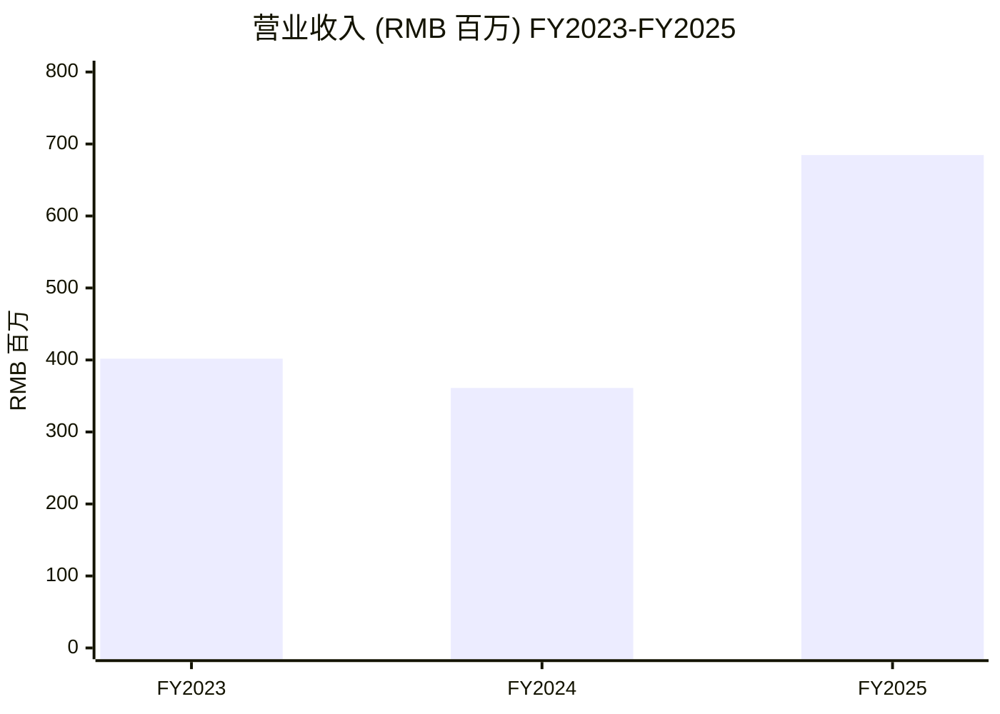
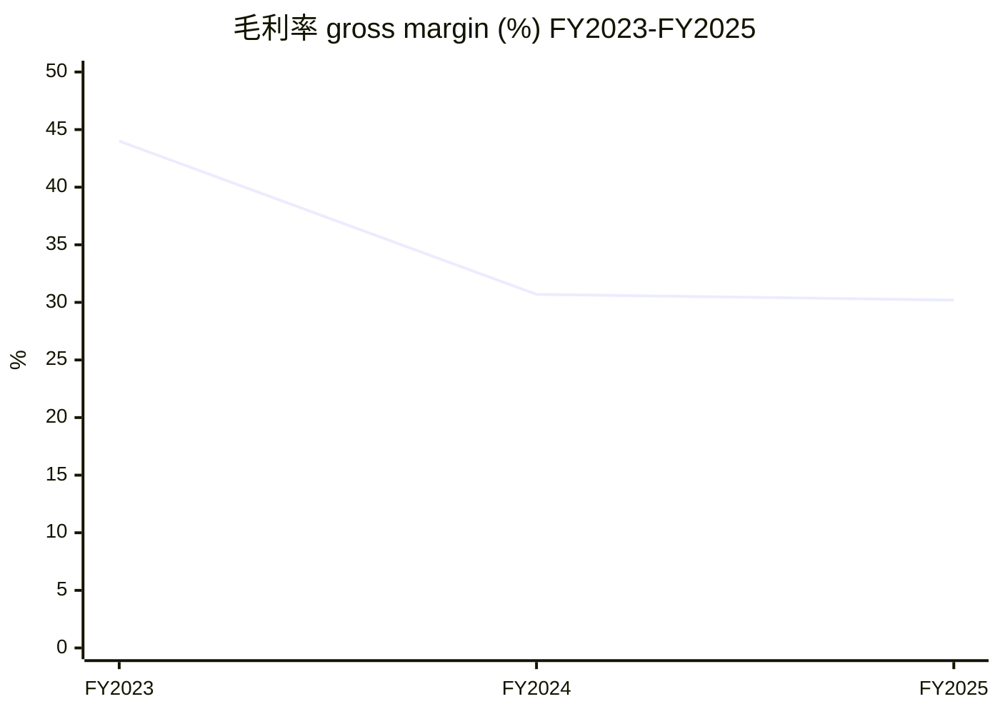
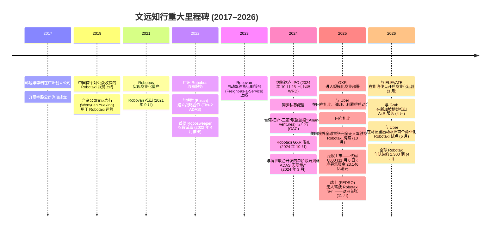
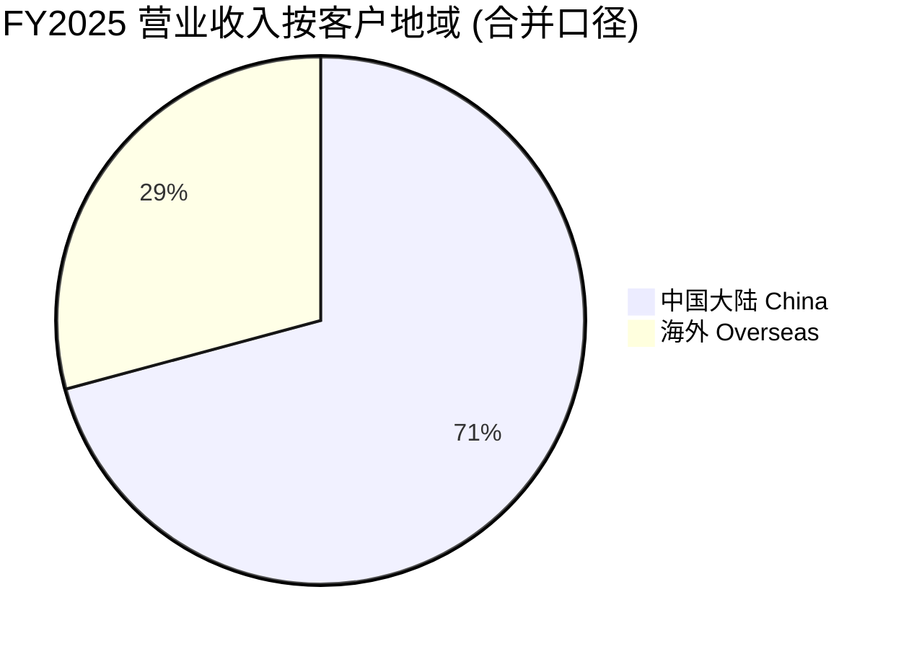
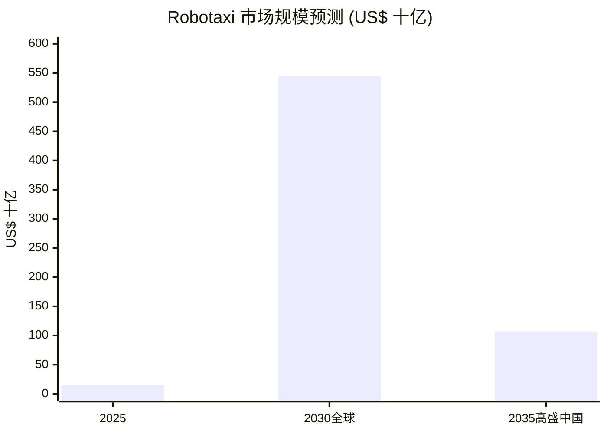
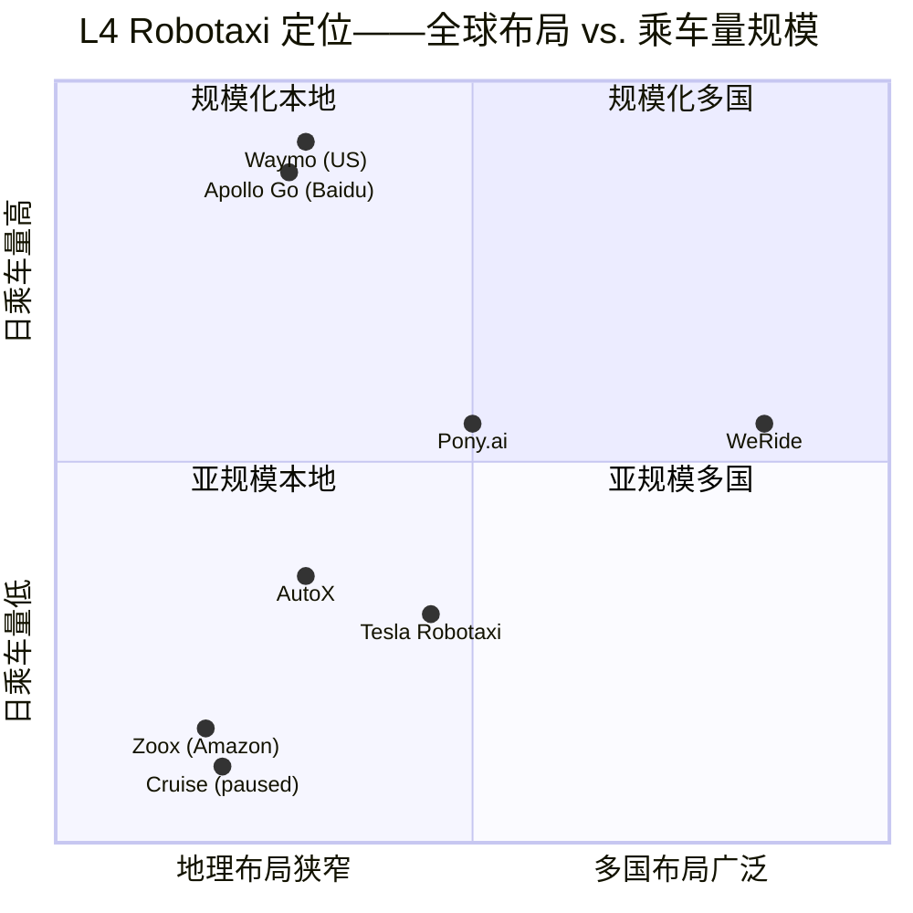

# WeRide Inc. 文远知行 (NASDAQ:WRD; HKEX:0800) — 公司研究报告

**截至日期: 2026-06-14**
**上市地: 纳斯达克全球精选市场 (代码 WRD, 自 2024 年 10 月起) 与香港联合交易所主板 (代码 0800, 自 2025 年 11 月 6 日起)**
**注册地: 开曼群岛 (运营总部: 中国广州国际生物岛)**
**报告语言: 简体中文 (英文版同时存在于本目录, 本次刷新未改动英文版)**
**分析师报告——首次覆盖刷新 (上一版 2026-05-27)**

---

> *分析师观点：* **评级：Overweight（增持）· 12 个月目标价 US\$10.50（较 2026-06-12 现价 US\$6.17 上行 +70%）· 估值方法：概率加权情景树 (25% 牛 / 50% 基准 / 25% 熊)，基准锚定 2027E EV/Sales 约 9× 远期收入**
> 市值约 US\$2.04bn · EV 约 US\$1.18bn (净现金约 US\$0.86bn) · 52 周区间 US\$6.10–US\$12.38 · NASDAQ:WRD / HKEX:0800 · 每 1 股 ADS = 3 股 A 类普通股
>
> **核心论点（thesis pillars）**——（1）**全球监管布局是同业最宽、且最难复制的护城河**：8 个国家持有无人驾驶许可、12+ 个中国城市运营，阿布扎比拿下美国境外全球首张城市级完全无人驾驶商业牌照；（2）**四产品平台 (Robotaxi/Robobus/Robovan/Robosweeper) + 博世 ADAS 渠道** 把同一套 L4 技术栈摊薄到更多变现任务，2025 年整车收入放量驱动总收入 +89.6%；（3）**轻资产国际模式 (Uber/Grab/ELEVATE 分销)** 加上约 US\$0.86bn 净现金, 给了多年烧钱跑道而不必摊薄到无法承受；（4）**估值已计入"商业化不及预期"的深度折让**——年初至今股价 −34%、跑输标普 500 约 43 个百分点, 近 52 周低位, 而 1Q26 营收 +57.6% 与车队爬坡到约 1,300 辆并未显著恶化, 风险回报偏向上行。
>
> **最该盯紧的两个关键变量**——(i) 全球 Robotaxi 车队从约 1,300 辆向管理层 2026 年底 2,600 辆目标的实际兑现速度 (尤其安全员撤除时间表)；(ii) 阿布扎比已宣布的单车经济 (UE) 盈亏平衡能否复制到第二、第三个城市——这是把"先发牌照"转化为"可规模化利润"的桥梁。

> **业绩快报 (2026-05-13 披露 1Q26 业绩)：** 公司 1Q26 总营收 **RMB114.1 百万 (US\$16.5 百万), 同比 +57.6%**, 其中产品收入同比 +115.8%、服务收入同比 +49.0%；gross margin (毛利率) **34.7%**；经营亏损 RMB431.0 百万, 同比收窄 1.2%。截至 2026-03-31, 现金及等价物 + 时间存款达 **RMB6,177.8 百万 (US\$895.6 百万)**, 含理财与受限现金的合计流动性为 **RMB6,224.7 百万 (US\$902.4 百万)**。
> 来源: [WeRide 1Q26 业绩发布 6-K (Exhibit 99.1), 2026-05-13](https://www.sec.gov/Archives/edgar/data/1867729/000110465926059704/tm2614059d1_ex99-1.htm)。这是本报告"首次给出收费 Robotaxi 营收持续放量 + 车队跨过千辆级"的最新一手确认, 替代了 2025 财年年报口径。

---

## 目录

1. 公司概览
1A. 估值与目标价 (决策层)
1B. GF Score 基本面评分
2. 公司历史 / 价值与目标价推导细节
3. 管理团队
4. 产品与服务
5. 客户与上市策略
6. 行业概览
7. 竞争格局
8. 市场机会 (TAM)
9. 风险评估
9.5 核心分歧与催化剂
10. 投资风格透视 (investor lenses)
11. 参考资料 / 数据来源清单 (Data Used)

---

## 1. 公司概览

*分析师观点：* 我们以 **Overweight（增持）评级、12 个月目标价 US\$10.50（较现价 US\$6.17 上行 +70%）** 启动对文远知行的覆盖刷新。投资逻辑可压缩为一句话: **这是一个监管布局全球最宽、技术栈完整、账上净现金约 US\$0.86bn 给了多年跑道、但市场已经按"商业化会失败"定价的纯 L4 自动驾驶平台。** 我们认为风险回报偏向上行的理由有四 (见上方核心论点)；触发"为什么是现在"的是 1Q26 营收 +57.6%、车队跨过千辆级与阿布扎比 UE 盈亏平衡——这些一手事实与股价年初至今 −34% 的走势严重背离 ([WeRide 1Q26 业绩 6-K, 2026-05-13](https://www.sec.gov/Archives/edgar/data/1867729/000110465926059704/tm2614059d1_ex99-1.htm))。我们也直陈风险: 这是一家 2025 财年净亏损 RMB16.5 亿 (US\$2.37 亿) 的公司, 任何牌照丢失或致命安全事故都会显著压缩倍数 (见第 9 章)。

文远知行 (WeRide Inc., 开曼群岛注册; 以下简称"文远知行"或"WRD") 是一家**纯粹的 L4 (Level-4) 自动驾驶 (autonomous driving) 公司**, 总部位于中国广州国际生物岛, 并在纳斯达克全球精选市场 (代码 WRD, 自 2024 年 10 月起) 与香港联合交易所主板 (股票代码 0800, 自 2025 年 11 月 6 日起) 双重上市 ([WeRide FY2025 Form 20-F, Item 4.A 公司沿革与发展](https://www.sec.gov/Archives/edgar/data/1867729/000110465926047323/wrd-20251231x20f.htm))。公司自主研发了完整的自动驾驶技术栈——感知 (perception)、规划 (planning)、决策 (decision-making)、仿真 (simulation) 以及自研的高性能计算 (HPC, High-Performance Compute) 平台, 并将其封装为四种已量产的车型: **Robotaxi (无人驾驶出租车)、Robobus (自动驾驶巴士)、Robovan (无人货运车)、Robosweeper (自动驾驶环卫车)**, 此外还提供与博世 (Bosch) 联合开发的面向大众市场的端到端 ADAS (Advanced Driver Assistance System, 高级驾驶辅助系统) 方案。每股 ADS (美国存托股) 代表 3 股 A 类普通股 ([WeRide FY2025 20-F, 封面与术语表](https://www.sec.gov/Archives/edgar/data/1867729/000110465926047323/wrd-20251231x20f.htm))。

文远知行通过直接销售自动驾驶车辆 (含嵌入式传感器套件与计算平台) 以及提供运营与技术支持、ADAS 研发服务和智能数据服务等经常性服务费来产生收入。2025 财年公司确认**总营业收入 RMB684.6 百万 (合 US\$97.9 百万)**, 其中产品收入 RMB359.8 百万 (占 52.6%)、服务收入 RMB324.7 百万 (占 47.4%) ([WeRide FY2025 20-F, Item 5.A——营业收入与成本](https://www.sec.gov/Archives/edgar/data/1867729/000110465926047323/wrd-20251231x20f.htm))。2023–2025 年营业收入轨迹为 RMB401.8 百万 → RMB361.1 百万 → RMB684.6 百万, 即 2025 年同比增长 89.6% (此前 2024 年同比下滑 10.1%), 反映了从一次性的 ADAS 研发里程碑收入向重复性 L4 整车销售的转型——产品收入单年同比 +310.3%, 主因 Robotaxi、Robobus、Robosweeper 与 Robovan 整车销量同步放量 ([WeRide FY2025 20-F, Item 5.A——产品收入同比 +310.3%](https://www.sec.gov/Archives/edgar/data/1867729/000110465926047323/wrd-20251231x20f.htm))。

文远知行已实现**全球化部署**: 截至 20-F 文件提交日 (2026 年 4 月), 公司在**全球 12 个国家、超过 40 个城市**运营自动驾驶产品, 包括中国、阿联酋、沙特阿拉伯、新加坡、瑞士、法国、比利时、美国, 以及最近落地的斯洛伐克 (首个欧洲大陆商业化部署) ([WeRide FY2025 20-F, Item 4.B 业务概览](https://www.sec.gov/Archives/edgar/data/1867729/000110465926047323/wrd-20251231x20f.htm))。**截至 2026 年 4 月 30 日, 全球 Robotaxi 车队达到约 1,300 辆 (其中中国约 1,000 辆), 较 2024 年末的 1,089 辆显著扩张**; 管理层指引 2026 年底全球 Robotaxi 车队约 2,600 辆、L4 总车队 5,000 辆, 长期规划为"与合作伙伴在全球部署超 20 万辆 L4 自动驾驶车辆" ([WeRide 1Q26 业绩 6-K, 2026-05-13——车队里程碑](https://www.sec.gov/Archives/edgar/data/1867729/000110465926059704/tm2614059d1_ex99-1.htm))。

截至 **2025 年 12 月 31 日, 全球员工总数为 3,801 人**, 较 2024 年的 3,093 人与 2023 年的 718 人大幅扩张; 增长主要来自为面向客户的智能数据服务以及自有训练管线招募的研发数据处理人员 ([WeRide FY2025 20-F, Item 6.D 员工](https://www.sec.gov/Archives/edgar/data/1867729/000110465926047323/wrd-20251231x20f.htm))。

### 收入结构——"如何赚钱" (收入→亏损桑基图)

下面的桑基图把 2025 财年的收入如何沿着 COGS、研发、管理与销售费用流向最终的经营亏损可视化。它直观说明了核心问题: 即便 gross profit (毛利) 为正 (RMB206.8 百万、毛利率 30.2%), 研发费用 (RMB1,372.2 百万) 单项就是毛利的 6.6 倍——这是一家把利润表完全投入"规模化之前的技术领先"的公司 ([WeRide FY2025 20-F, Item 5.A——R&D RMB1,372.2 百万](https://www.sec.gov/Archives/edgar/data/1867729/000110465926047323/wrd-20251231x20f.htm))。

<svg xmlns="http://www.w3.org/2000/svg" viewBox="0 0 1000 560" width="1000" height="560" role="img" aria-label="income statement Sankey"><rect x="0" y="0" width="1000" height="560" fill="#ffffff"/>
<text x="20.00" y="30.00" text-anchor="start" font-family="Helvetica,Arial,sans-serif" font-size="15" font-weight="700" fill="#1f2933">文远知行 WeRide (WRD) 收入如何转化为亏损 — FY2025</text>
<path d="M 576.00,-366.61 C 630.00,-366.61 630.00,-313.58 684.00,-313.58 L 684.00,-311.58 C 630.00,-311.58 630.00,-364.61 576.00,-364.61 Z" fill="#86efac" fill-opacity="0.55"/>
<path d="M 576.00,-350.61 C 630.00,-350.61 630.00,-297.58 684.00,-297.58 L 684.00,87.85 C 630.00,87.85 630.00,34.82 576.00,34.82 Z" fill="#fca5a5" fill-opacity="0.55"/>
<path d="M 576.00,34.82 C 630.00,34.82 630.00,101.85 684.00,101.85 L 684.00,891.58 C 630.00,891.58 630.00,824.54 576.00,824.54 Z" fill="#fca5a5" fill-opacity="0.55"/>
<path d="M 700.00,-313.58 C 754.00,-313.58 754.00,279.82 808.00,279.82 L 808.00,281.82 C 754.00,281.82 754.00,-311.58 700.00,-311.58 Z" fill="#86efac" fill-opacity="0.55"/>
<path d="M 700.00,-311.58 C 754.00,-311.58 754.00,295.82 808.00,295.82 L 808.00,298.18 C 754.00,298.18 754.00,-309.22 700.00,-309.22 Z" fill="#fca5a5" fill-opacity="0.55"/>
<path d="M 204.00,64.00 C 258.00,64.00 258.00,92.00 312.00,92.00 L 312.00,225.23 C 258.00,225.23 258.00,197.23 204.00,197.23 Z" fill="#93c5fd" fill-opacity="0.55"/>
<path d="M 452.00,85.00 C 506.00,85.00 506.00,-366.61 560.00,-366.61 L 560.00,-364.61 C 506.00,-364.61 506.00,87.00 452.00,87.00 Z" fill="#86efac" fill-opacity="0.55"/>
<path d="M 452.00,87.00 C 506.00,87.00 506.00,-350.61 560.00,-350.61 L 560.00,824.54 C 506.00,824.54 506.00,1262.15 452.00,1262.15 Z" fill="#fca5a5" fill-opacity="0.55"/>
<path d="M 328.00,92.00 C 382.00,92.00 382.00,85.00 436.00,85.00 L 436.00,204.02 C 382.00,204.02 382.00,211.02 328.00,211.02 Z" fill="#86efac" fill-opacity="0.55"/>
<path d="M 328.00,211.02 C 382.00,211.02 382.00,218.02 436.00,218.02 L 436.00,493.00 C 382.00,493.00 382.00,486.00 328.00,486.00 Z" fill="#fca5a5" fill-opacity="0.55"/>
<path d="M 204.00,211.23 C 258.00,211.23 258.00,225.23 312.00,225.23 L 312.00,339.47 C 258.00,339.47 258.00,325.47 204.00,325.47 Z" fill="#93c5fd" fill-opacity="0.55"/>
<path d="M 204.00,339.47 C 258.00,339.47 258.00,339.47 312.00,339.47 L 312.00,424.65 C 258.00,424.65 258.00,424.65 204.00,424.65 Z" fill="#93c5fd" fill-opacity="0.55"/>
<path d="M 204.00,438.65 C 258.00,438.65 258.00,424.65 312.00,424.65 L 312.00,479.96 C 258.00,479.96 258.00,493.96 204.00,493.96 Z" fill="#93c5fd" fill-opacity="0.55"/>
<path d="M 204.00,507.96 C 258.00,507.96 258.00,479.96 312.00,479.96 L 312.00,486.00 C 258.00,486.00 258.00,514.00 204.00,514.00 Z" fill="#93c5fd" fill-opacity="0.55"/>
<path d="M 576.00,838.54 C 630.00,838.54 630.00,-311.58 684.00,-311.58 L 684.00,-205.51 C 630.00,-205.51 630.00,944.61 576.00,944.61 Z" fill="#93c5fd" fill-opacity="0.55"/>
<rect x="188.00" y="64.00" width="16" height="133.23" rx="1.5" fill="#2563eb"/>
<rect x="188.00" y="211.23" width="16" height="114.24" rx="1.5" fill="#2563eb"/>
<rect x="188.00" y="339.47" width="16" height="85.18" rx="1.5" fill="#2563eb"/>
<rect x="188.00" y="438.65" width="16" height="55.31" rx="1.5" fill="#2563eb"/>
<rect x="188.00" y="507.96" width="16" height="6.04" rx="1.5" fill="#2563eb"/>
<rect x="312.00" y="92.00" width="16" height="394.00" rx="1.5" fill="#1e3a8a"/>
<rect x="436.00" y="85.00" width="16" height="119.02" rx="1.5" fill="#15803d"/>
<rect x="436.00" y="218.02" width="16" height="274.98" rx="1.5" fill="#dc2626"/>
<rect x="560.00" y="-366.61" width="16" height="2.00" rx="1.5" fill="#15803d"/>
<rect x="560.00" y="-350.61" width="16" height="1175.15" rx="1.5" fill="#dc2626"/>
<rect x="560.00" y="838.54" width="16" height="106.07" rx="1.5" fill="#2563eb"/>
<rect x="684.00" y="-313.58" width="16" height="2.00" rx="1.5" fill="#15803d"/>
<rect x="684.00" y="-297.58" width="16" height="385.42" rx="1.5" fill="#dc2626"/>
<rect x="684.00" y="101.85" width="16" height="789.73" rx="1.5" fill="#dc2626"/>
<rect x="808.00" y="279.82" width="16" height="2.00" rx="1.5" fill="#15803d"/>
<rect x="808.00" y="295.82" width="16" height="2.36" rx="1.5" fill="#dc2626"/>
<line x1="188.00" y1="130.62" x2="182.00" y2="106.64" stroke="#cbd5e1" stroke-width="1"/>
<text x="179.00" y="109.64" text-anchor="end" font-family="Helvetica,Arial,sans-serif" font-size="11.5" font-weight="700" fill="#1f2933">Robobus</text>
<text x="179.00" y="122.64" text-anchor="end" font-family="Helvetica,Arial,sans-serif" font-size="10" font-weight="400" fill="#52606d">RMB231.5M  (33.8%)</text>
<line x1="188.00" y1="268.35" x2="182.00" y2="244.37" stroke="#cbd5e1" stroke-width="1"/>
<text x="179.00" y="247.37" text-anchor="end" font-family="Helvetica,Arial,sans-serif" font-size="11.5" font-weight="700" fill="#1f2933">其他技术服务 Tech Svc</text>
<text x="179.00" y="260.37" text-anchor="end" font-family="Helvetica,Arial,sans-serif" font-size="10" font-weight="400" fill="#52606d">RMB198.5M  (29.0%)</text>
<line x1="188.00" y1="382.06" x2="182.00" y2="358.08" stroke="#cbd5e1" stroke-width="1"/>
<text x="179.00" y="361.08" text-anchor="end" font-family="Helvetica,Arial,sans-serif" font-size="11.5" font-weight="700" fill="#1f2933">Robotaxi</text>
<text x="179.00" y="374.08" text-anchor="end" font-family="Helvetica,Arial,sans-serif" font-size="10" font-weight="400" fill="#52606d">RMB148.0M  (21.6%)</text>
<line x1="188.00" y1="466.30" x2="182.00" y2="442.32" stroke="#cbd5e1" stroke-width="1"/>
<text x="179.00" y="445.32" text-anchor="end" font-family="Helvetica,Arial,sans-serif" font-size="11.5" font-weight="700" fill="#1f2933">Robosweeper</text>
<text x="179.00" y="458.32" text-anchor="end" font-family="Helvetica,Arial,sans-serif" font-size="10" font-weight="400" fill="#52606d">RMB96.1M  (14.0%)</text>
<line x1="188.00" y1="510.98" x2="182.00" y2="487.00" stroke="#cbd5e1" stroke-width="1"/>
<text x="179.00" y="490.00" text-anchor="end" font-family="Helvetica,Arial,sans-serif" font-size="11.5" font-weight="700" fill="#1f2933">Robovan</text>
<text x="179.00" y="503.00" text-anchor="end" font-family="Helvetica,Arial,sans-serif" font-size="10" font-weight="400" fill="#52606d">RMB10.5M  (1.5%)</text>
<rect x="331.00" y="74.00" width="125.70" height="26" rx="2" fill="#ffffff" fill-opacity="0.72"/>
<text x="334.00" y="86.00" text-anchor="start" font-family="Helvetica,Arial,sans-serif" font-size="11.5" font-weight="700" fill="#1f2933">Revenue</text>
<text x="334.00" y="99.00" text-anchor="start" font-family="Helvetica,Arial,sans-serif" font-size="10" font-weight="400" fill="#52606d">RMB684.6M  (100.0%)</text>
<rect x="455.00" y="67.00" width="119.40" height="26" rx="2" fill="#ffffff" fill-opacity="0.72"/>
<text x="458.00" y="79.00" text-anchor="start" font-family="Helvetica,Arial,sans-serif" font-size="11.5" font-weight="700" fill="#1f2933">Gross Profit</text>
<text x="458.00" y="92.00" text-anchor="start" font-family="Helvetica,Arial,sans-serif" font-size="10" font-weight="400" fill="#52606d">RMB206.8M  (30.2%)</text>
<rect x="455.00" y="200.02" width="144.60" height="26" rx="2" fill="#ffffff" fill-opacity="0.72"/>
<text x="458.00" y="212.02" text-anchor="start" font-family="Helvetica,Arial,sans-serif" font-size="11.5" font-weight="700" fill="#1f2933">Cost of Revenue (COGS)</text>
<text x="458.00" y="225.02" text-anchor="start" font-family="Helvetica,Arial,sans-serif" font-size="10" font-weight="400" fill="#52606d">RMB477.8M  (69.8%)</text>
<rect x="579.00" y="-384.61" width="125.70" height="26" rx="2" fill="#ffffff" fill-opacity="0.72"/>
<text x="582.00" y="-372.61" text-anchor="start" font-family="Helvetica,Arial,sans-serif" font-size="11.5" font-weight="700" fill="#1f2933">Operating Income</text>
<text x="582.00" y="-359.61" text-anchor="start" font-family="Helvetica,Arial,sans-serif" font-size="10" font-weight="400" fill="#52606d">-RMB1.8B  (-268.1%)</text>
<rect x="579.00" y="-359.61" width="150.90" height="26" rx="2" fill="#ffffff" fill-opacity="0.72"/>
<text x="582.00" y="-347.61" text-anchor="start" font-family="Helvetica,Arial,sans-serif" font-size="11.5" font-weight="700" fill="#1f2933">Total Operating Expense</text>
<text x="582.00" y="-334.61" text-anchor="start" font-family="Helvetica,Arial,sans-serif" font-size="10" font-weight="400" fill="#52606d">RMB2.0B  (298.3%)</text>
<line x1="560.00" y1="891.58" x2="554.00" y2="487.00" stroke="#cbd5e1" stroke-width="1"/>
<text x="551.00" y="490.00" text-anchor="end" font-family="Helvetica,Arial,sans-serif" font-size="11.5" font-weight="700" fill="#1f2933">Net Interest / Other Income</text>
<text x="551.00" y="503.00" text-anchor="end" font-family="Helvetica,Arial,sans-serif" font-size="10" font-weight="400" fill="#52606d">RMB184.3M  (26.9%)</text>
<rect x="703.00" y="-331.58" width="125.70" height="26" rx="2" fill="#ffffff" fill-opacity="0.72"/>
<text x="706.00" y="-319.58" text-anchor="start" font-family="Helvetica,Arial,sans-serif" font-size="11.5" font-weight="700" fill="#1f2933">Pretax Income</text>
<text x="706.00" y="-306.58" text-anchor="start" font-family="Helvetica,Arial,sans-serif" font-size="10" font-weight="400" fill="#52606d">-RMB1.7B  (-241.1%)</text>
<rect x="703.00" y="-306.58" width="119.40" height="26" rx="2" fill="#ffffff" fill-opacity="0.72"/>
<text x="706.00" y="-294.58" text-anchor="start" font-family="Helvetica,Arial,sans-serif" font-size="11.5" font-weight="700" fill="#1f2933">SG&amp;A</text>
<text x="706.00" y="-281.58" text-anchor="start" font-family="Helvetica,Arial,sans-serif" font-size="10" font-weight="400" fill="#52606d">RMB669.7M  (97.8%)</text>
<rect x="703.00" y="83.85" width="113.10" height="26" rx="2" fill="#ffffff" fill-opacity="0.72"/>
<text x="706.00" y="95.85" text-anchor="start" font-family="Helvetica,Arial,sans-serif" font-size="11.5" font-weight="700" fill="#1f2933">R&amp;D</text>
<text x="706.00" y="108.85" text-anchor="start" font-family="Helvetica,Arial,sans-serif" font-size="10" font-weight="400" fill="#52606d">RMB1.4B  (200.4%)</text>
<text x="833.00" y="277.82" text-anchor="start" font-family="Helvetica,Arial,sans-serif" font-size="11.5" font-weight="700" fill="#1f2933">Net Income</text>
<text x="833.00" y="290.82" text-anchor="start" font-family="Helvetica,Arial,sans-serif" font-size="10" font-weight="400" fill="#52606d">-RMB1.7B  (-241.7%)</text>
<text x="833.00" y="302.82" text-anchor="start" font-family="Helvetica,Arial,sans-serif" font-size="11.5" font-weight="700" fill="#1f2933">Income Tax</text>
<text x="833.00" y="315.82" text-anchor="start" font-family="Helvetica,Arial,sans-serif" font-size="10" font-weight="400" fill="#52606d">RMB4.1M  (0.60%)</text>
<text x="500.00" y="544.00" text-anchor="middle" font-family="Helvetica,Arial,sans-serif" font-size="10" font-weight="400" fill="#52606d">Source: WeRide FY2025 20-F, 合并损益表 + Note 5 收入拆分 (RMB mn)</text>
</svg>

*来源: [WeRide FY2025 20-F, 合并损益表 + Note 5 收入拆分](https://www.sec.gov/Archives/edgar/data/1867729/000110465926047323/wrd-20251231x20f.htm)。*

按产品线看, 收入已从早期由"其他技术服务 (ADAS 研发 + 智能数据服务)"主导, 转向由 Robobus 与 Robotaxi 整车销售主导:

<svg xmlns="http://www.w3.org/2000/svg" viewBox="0 0 720 460" width="720" height="460" role="img" aria-label="revenue donut"><rect x="0" y="0" width="720" height="460" fill="#ffffff"/>
<text x="20.00" y="30.00" text-anchor="start" font-family="Helvetica,Arial,sans-serif" font-size="15" font-weight="700" fill="#1f2933">FY2025 营业收入构成 (按产品线)</text>
<path d="M 288.00,107.20 A 132 132 0 0 1 400.26,308.63 L 354.34,280.23 A 78 78 0 0 0 288.00,161.20 Z" fill="#2563eb"/>
<path d="M 400.26,308.63 A 132 132 0 0 1 192.86,330.70 L 231.78,293.27 A 78 78 0 0 0 354.34,280.23 Z" fill="#15803d"/>
<path d="M 192.86,330.70 A 132 132 0 0 1 178.49,165.49 L 223.29,195.65 A 78 78 0 0 0 231.78,293.27 Z" fill="#d97706"/>
<path d="M 178.49,165.49 A 132 132 0 0 1 275.30,107.81 L 280.49,161.56 A 78 78 0 0 0 223.29,195.65 Z" fill="#7c3aed"/>
<path d="M 275.30,107.81 A 132 132 0 0 1 288.00,107.20 L 288.00,161.20 A 78 78 0 0 0 280.49,161.56 Z" fill="#dc2626"/>
<text x="288.00" y="235.20" text-anchor="middle" font-family="Helvetica,Arial,sans-serif" font-size="18" font-weight="800" fill="#1f2933">WRD</text>
<text x="288.00" y="255.20" text-anchor="middle" font-family="Helvetica,Arial,sans-serif" font-size="13" font-weight="600" fill="#52606d">RMB684.6M</text>
<text x="288.00" y="271.20" text-anchor="middle" font-family="Helvetica,Arial,sans-serif" font-size="10" font-weight="400" fill="#8a97a3">total</text>
<line x1="408.54" y1="172.02" x2="424.54" y2="172.02" stroke="#2563eb" stroke-width="1.4"/>
<text x="428.54" y="170.02" text-anchor="start" font-family="Helvetica,Arial,sans-serif" font-size="11" font-weight="700" fill="#1f2933">Robobus</text>
<text x="428.54" y="184.02" text-anchor="start" font-family="Helvetica,Arial,sans-serif" font-size="10" font-weight="400" fill="#52606d">RMB231.5M  (33.8%)</text>
<line x1="302.60" y1="376.43" x2="318.60" y2="376.43" stroke="#15803d" stroke-width="1.4"/>
<text x="322.60" y="374.43" text-anchor="start" font-family="Helvetica,Arial,sans-serif" font-size="11" font-weight="700" fill="#1f2933">其他技术服务</text>
<text x="322.60" y="388.43" text-anchor="start" font-family="Helvetica,Arial,sans-serif" font-size="10" font-weight="400" fill="#52606d">RMB198.5M  (29.0%)</text>
<line x1="150.52" y1="251.15" x2="134.52" y2="251.15" stroke="#d97706" stroke-width="1.4"/>
<text x="130.52" y="249.15" text-anchor="end" font-family="Helvetica,Arial,sans-serif" font-size="11" font-weight="700" fill="#1f2933">Robotaxi</text>
<text x="130.52" y="263.15" text-anchor="end" font-family="Helvetica,Arial,sans-serif" font-size="10" font-weight="400" fill="#52606d">RMB148.0M  (21.6%)</text>
<line x1="217.36" y1="120.65" x2="201.36" y2="120.65" stroke="#7c3aed" stroke-width="1.4"/>
<text x="197.36" y="118.65" text-anchor="end" font-family="Helvetica,Arial,sans-serif" font-size="11" font-weight="700" fill="#1f2933">Robosweeper</text>
<text x="197.36" y="132.65" text-anchor="end" font-family="Helvetica,Arial,sans-serif" font-size="10" font-weight="400" fill="#52606d">RMB96.1M  (14.0%)</text>
<line x1="281.35" y1="101.36" x2="265.35" y2="101.36" stroke="#dc2626" stroke-width="1.4"/>
<text x="261.35" y="99.36" text-anchor="end" font-family="Helvetica,Arial,sans-serif" font-size="11" font-weight="700" fill="#1f2933">Robovan</text>
<text x="261.35" y="113.36" text-anchor="end" font-family="Helvetica,Arial,sans-serif" font-size="10" font-weight="400" fill="#52606d">RMB10.5M  (1.5%)</text>
<text x="360.00" y="444.00" text-anchor="middle" font-family="Helvetica,Arial,sans-serif" font-size="10" font-weight="400" fill="#52606d">Source: WeRide FY2025 20-F, Note 5 收入按产品/服务线拆分 (RMB mn)</text>
</svg>

*来源: [WeRide FY2025 20-F, Note 5 收入按产品/服务线拆分](https://www.sec.gov/Archives/edgar/data/1867729/000110465926047323/wrd-20251231x20f.htm)。*

<svg xmlns="http://www.w3.org/2000/svg" viewBox="0 0 860 470" width="860" height="470" role="img" aria-label="historical revenue bars"><rect x="0" y="0" width="860" height="470" fill="#ffffff"/>
<text x="20.00" y="30.00" text-anchor="start" font-family="Helvetica,Arial,sans-serif" font-size="15" font-weight="700" fill="#1f2933">历史营业收入 (按产品线) FY2023–FY2025</text>
<rect x="20.00" y="44" width="11" height="11" rx="2" fill="#2563eb"/>
<text x="36.00" y="53.00" text-anchor="start" font-family="Helvetica,Arial,sans-serif" font-size="10.5" font-weight="400" fill="#1f2933">Robobus</text>
<rect x="96.20" y="44" width="11" height="11" rx="2" fill="#15803d"/>
<text x="112.20" y="53.00" text-anchor="start" font-family="Helvetica,Arial,sans-serif" font-size="10.5" font-weight="400" fill="#1f2933">其他技术服务 Tech Svc</text>
<rect x="225.20" y="44" width="11" height="11" rx="2" fill="#d97706"/>
<text x="241.20" y="53.00" text-anchor="start" font-family="Helvetica,Arial,sans-serif" font-size="10.5" font-weight="400" fill="#1f2933">Robotaxi</text>
<rect x="308.00" y="44" width="11" height="11" rx="2" fill="#7c3aed"/>
<text x="324.00" y="53.00" text-anchor="start" font-family="Helvetica,Arial,sans-serif" font-size="10.5" font-weight="400" fill="#1f2933">Robosweeper</text>
<rect x="410.60" y="44" width="11" height="11" rx="2" fill="#dc2626"/>
<text x="426.60" y="53.00" text-anchor="start" font-family="Helvetica,Arial,sans-serif" font-size="10.5" font-weight="400" fill="#1f2933">Robovan</text>
<line x1="70" y1="412.00" x2="834" y2="412.00" stroke="#eceff2" stroke-width="1"/>
<text x="64.00" y="415.00" text-anchor="end" font-family="Helvetica,Arial,sans-serif" font-size="9.5" font-weight="400" fill="#52606d">RMB0</text>
<line x1="70" y1="345.20" x2="834" y2="345.20" stroke="#eceff2" stroke-width="1"/>
<text x="64.00" y="348.20" text-anchor="end" font-family="Helvetica,Arial,sans-serif" font-size="9.5" font-weight="400" fill="#52606d">RMB147.9M</text>
<line x1="70" y1="278.40" x2="834" y2="278.40" stroke="#eceff2" stroke-width="1"/>
<text x="64.00" y="281.40" text-anchor="end" font-family="Helvetica,Arial,sans-serif" font-size="9.5" font-weight="400" fill="#52606d">RMB295.7M</text>
<line x1="70" y1="211.60" x2="834" y2="211.60" stroke="#eceff2" stroke-width="1"/>
<text x="64.00" y="214.60" text-anchor="end" font-family="Helvetica,Arial,sans-serif" font-size="9.5" font-weight="400" fill="#52606d">RMB443.6M</text>
<line x1="70" y1="144.80" x2="834" y2="144.80" stroke="#eceff2" stroke-width="1"/>
<text x="64.00" y="147.80" text-anchor="end" font-family="Helvetica,Arial,sans-serif" font-size="9.5" font-weight="400" fill="#52606d">RMB591.5M</text>
<line x1="70" y1="78.00" x2="834" y2="78.00" stroke="#eceff2" stroke-width="1"/>
<text x="64.00" y="81.00" text-anchor="end" font-family="Helvetica,Arial,sans-serif" font-size="9.5" font-weight="400" fill="#52606d">RMB739.4M</text>
<rect x="123.48" y="369.13" width="147.71" height="42.87" fill="#2563eb"/>
<rect x="123.48" y="250.59" width="147.71" height="118.54" fill="#15803d"/>
<rect x="123.48" y="237.31" width="147.71" height="13.28" fill="#d97706"/>
<rect x="123.48" y="233.88" width="147.71" height="3.43" fill="#7c3aed"/>
<rect x="123.48" y="230.49" width="147.71" height="3.39" fill="#dc2626"/>
<text x="197.33" y="428.00" text-anchor="middle" font-family="Helvetica,Arial,sans-serif" font-size="10" font-weight="400" fill="#52606d">2023</text>
<rect x="378.15" y="376.00" width="147.71" height="36.00" fill="#2563eb"/>
<rect x="378.15" y="301.51" width="147.71" height="74.49" fill="#15803d"/>
<rect x="378.15" y="279.91" width="147.71" height="21.59" fill="#d97706"/>
<rect x="378.15" y="254.93" width="147.71" height="24.98" fill="#7c3aed"/>
<rect x="378.15" y="248.88" width="147.71" height="6.05" fill="#dc2626"/>
<text x="452.00" y="428.00" text-anchor="middle" font-family="Helvetica,Arial,sans-serif" font-size="10" font-weight="400" fill="#52606d">2024</text>
<rect x="632.81" y="307.42" width="147.71" height="104.58" fill="#2563eb"/>
<rect x="632.81" y="217.75" width="147.71" height="89.67" fill="#15803d"/>
<rect x="632.81" y="150.90" width="147.71" height="66.86" fill="#d97706"/>
<rect x="632.81" y="107.48" width="147.71" height="43.41" fill="#7c3aed"/>
<rect x="632.81" y="102.74" width="147.71" height="4.74" fill="#dc2626"/>
<text x="706.67" y="428.00" text-anchor="middle" font-family="Helvetica,Arial,sans-serif" font-size="10" font-weight="400" fill="#52606d">2025</text>
<text x="430.00" y="454.00" text-anchor="middle" font-family="Helvetica,Arial,sans-serif" font-size="10" font-weight="400" fill="#52606d">Source: WeRide FY2023–FY2025 20-F, Note 5 收入拆分 (RMB mn)</text>
</svg>

*来源: [WeRide FY2023–FY2025 20-F, Note 5 收入拆分](https://www.sec.gov/Archives/edgar/data/1867729/000110465926047323/wrd-20251231x20f.htm)。Robobus 收入 FY24 RMB79.7 百万 → FY25 RMB231.5 百万 (+190%)、Robotaxi RMB47.8 百万 → RMB148.0 百万 (+209%) 是 2025 年放量的主力, 而 ADAS 研发服务因 2024 Q3 部分定制项目交付完成而回落, 是同口径下"其他技术服务"波动的主因。*

### 营业收入与毛利率趋势

*来源: [WeRide FY2025 20-F, Item 5.A](https://www.sec.gov/Archives/edgar/data/1867729/000110465926047323/wrd-20251231x20f.htm)。毛利率从 FY2023 的约 44% 回落并稳定在约 30%, 反映收入结构从高毛利的 ADAS 研发服务转向毛利较低 (但更具规模化潜力) 的整车销售; 1Q26 毛利率回升至 34.7% ([WeRide 1Q26 6-K, 2026-05-13](https://www.sec.gov/Archives/edgar/data/1867729/000110465926059704/tm2614059d1_ex99-1.htm))。两条曲线分置两张图, 因为 xychart-beta 单一 y 轴无法同时承载货币与百分比。*

### 盈利能力侧写

文远知行尚未盈利且仍在持续烧钱: 2023/2024/2025 年公司**经营亏损分别为 RMB15.7 亿、RMB18.4 亿和 RMB18.4 亿** (经营费用拆分: 2025 年研发 RMB1,372.2 百万 + 管理 RMB596.1 百万 + 销售 RMB73.6 百万), **IFRS 净亏损 (loss for the year) 分别为 RMB19.5 亿、RMB25.2 亿和 RMB16.5 亿 (即 2025 年 US\$2.366 亿)** ([WeRide FY2025 20-F, Item 5.A——亏损与费用拆分](https://www.sec.gov/Archives/edgar/data/1867729/000110465926047323/wrd-20251231x20f.htm))。值得注意的细节: 2025 年 IFRS 净亏损同比*收窄* 34.2%, 但这主要由 share-based compensation (SBC, 股份支付) 大幅回落驱动 (管理费用中的 SBC 单项同比减少 RMB653.3 百万); 剔除非现金项的**非 IFRS 调整后净亏损反而同比扩大 55.5%, 从 RMB8.02 亿增至 RMB12.47 亿 (US\$1.783 亿)**——这是一个更诚实的烧钱口径, 说明经营层面的现金消耗其实在加速 ([WeRide FY2025 20-F, Item 5.A——非 IFRS 调整后净亏损](https://www.sec.gov/Archives/edgar/data/1867729/000110465926047323/wrd-20251231x20f.htm))。2025 年经营活动现金净流出为 **RMB13.2 亿 (US\$1.890 亿)** ([WeRide FY2025 20-F, 合并现金流量表](https://www.sec.gov/Archives/edgar/data/1867729/000110465926047323/wrd-20251231x20f.htm))。

### 估值快照 (定价日 2026-06-12)

文远知行以每 ADS **US\$6.17** 交易, **市值约 US\$2.04bn** ([Yahoo Finance——WRD 关键统计指标, 访问于 2026-06-12](https://finance.yahoo.com/quote/WRD/key-statistics))。52 周区间: US\$6.10–US\$12.38——当前价格已接近 52 周低位。所披露的财务倍数与解读如下:

- **TTM 市盈率 (P/E): 不具备意义 (not meaningful)**——公司处于亏损状态 (2025 财年净亏损 US\$2.366 亿), 没有正盈利可锚定。亏损的主要驱动是研发支出 (US\$196.2 百万) 远超营业收入 (US\$97.9 百万)。这是典型的"烧钱式增长"原型: 规模化之前的 L4 部署期, 单位经济只有在车队与乘车量上量后才会改善 ([WeRide FY2025 20-F, Item 5.A](https://www.sec.gov/Archives/edgar/data/1867729/000110465926047323/wrd-20251231x20f.htm))。
- **TTM 市销率 (P/S): 约 20.8 倍** (= 市值 US\$2.04bn ÷ FY2025 营收 US\$97.9 百万)。**这里必须纠正上一版报告的一个错误**: 此前引用 yfinance 字段给出的"3.47 倍"使用了不同的股本/营收口径, 与"市值 ÷ 报表营收"的同口径计算不一致; 以一手报表营收计算, WRD 实际 P/S 约为 20.8 倍, 属高估值区间。
- **企业价值/销售额 (EV/Sales): 约 12.1 倍** (EV ≈ US\$1.18bn = 市值 US\$2.04bn − 净现金约 US\$0.86bn; 净现金 = 合计流动性 US\$902.4 百万 − 短期银行借款约 US\$47 百万)。**同样纠正上一版**: 公司账面是约 US\$0.86bn 净现金 (并非"约 US\$67 亿/71 亿净现金"——上一版把 RMB6.2bn 误读为 US\$, 偏差约 7–8 倍), EV 为正约 US\$1.18bn, 而非负值 ([WeRide 1Q26 6-K, 2026-05-13——合计流动性 RMB6,224.7 百万 (US\$902.4 百万)](https://www.sec.gov/Archives/edgar/data/1867729/000110465926059704/tm2614059d1_ex99-1.htm); [WeRide FY2025 20-F, 合并财务状况表——短期借款 RMB324.3 百万](https://www.sec.gov/Archives/edgar/data/1867729/000110465926047323/wrd-20251231x20f.htm))。
- **市净率 (P/B): 约 1.75 倍** ([Yahoo Finance——WRD, 2026-06-12](https://finance.yahoo.com/quote/WRD/key-statistics))。

**同业倍数比较 (TTM 市销率 P/S, 自 Yahoo Finance 2026-06-12; WRD 用同口径报表营收计算):**

| 同业 (代码) | TTM P/S | 状态 |
|---|---|---|
| 文远知行 (WRD) | 约 20.8× (报表口径) | L4 Robotaxi 纯标的, 收入 US\$97.9M |
| 小马智行 (PONY) | 约 32.0× | L4 Robotaxi 纯标的, 收入更小 |
| 特斯拉 (TSLA) | 约 15.6× | EV + 早期 FSD / Robotaxi |
| Alphabet (GOOGL, Waymo 母公司) | 约 10.4× | 科技巨头; Waymo 是较小营收条线 |
| 百度 (BIDU, Apollo Go 母公司) | 约 0.31× | 中国互联网 + AD; 传统业务拖累倍数 |
| Mobileye (MBLY) | 约 3.9× | L2/L2+ ADAS 供应商 |

**为何 WRD 的 P/S 低于最接近的纯标的可比公司小马智行 (PONY 约 32×)?** 主因是 WRD 2025 财年营业收入 (US\$97.9 百万) 显著大于小马智行 (据其披露处于约 US\$75 百万的运行口径), 分母更大、倍数被压低; 加之 WRD 营收里含约 29% 的"其他技术服务 (ADAS 研发 + 智能数据)"——市场倾向于按企业服务倍数 (个位数) 而非纯 Robotaxi 平台倍数估值 ([WeRide FY2025 20-F, Item 5.A 服务收入说明](https://www.sec.gov/Archives/edgar/data/1867729/000110465926047323/wrd-20251231x20f.htm); [小马智行 Pony.ai Form 20-F FY2024](https://www.sec.gov/cgi-bin/browse-edgar?action=getcompany&CIK=0001999458&type=20-F))。*分析师观点：* 从 2027E 远期收入基础看, 卖方一致预期所隐含的远期 P/S 已大幅压缩 (高盛、瑞银、汇丰、大摩均上调 2026–2028 收入预测), 当下约 20.8× 的表观 TTM 倍数并非严格同口径比较——我们在第 1A 章用 EV/Sales 而非 P/S 作为目标价的主锚。

---

## 1A. 估值与目标价 (决策层)

本章是前瞻的、决策级的分析, 区别于第 1 章的 backward-looking TTM 快照。**本章所有数字 (远期预测、目标价、情景目标价) 都是分析师本方的前瞻观点, 标注为 *分析师观点：* 且绝不附挂任何申报文件引用**——10-K/20-F 里没有目标价。我们对每个预测的*外部输入* (报表分部数据 + 管理层指引 + 行业预测) 做内联引用。

### (a) 远期财务预测表 (*分析师观点：*)

文远知行是亏损、规模化之前的标的, 因此**真正的决策变量不是 EPS, 而是收入爬坡速度 + 现金跑道 (cash runway)**。下表把收入按产品线分别建模再汇总, 而非单一混合顶线。收入爬坡的外部锚: 管理层 2026 年底 2,600 辆 Robotaxi / 5,000 辆 L4 总车队指引 ([WeRide 1Q26 6-K, 2026-05-13](https://www.sec.gov/Archives/edgar/data/1867729/000110465926059704/tm2614059d1_ex99-1.htm)) 与高盛"2026 年中国 Robotaxi 车队从 5 千增至 1.4 万辆、海外占 WRD 车队约 29%"的行业预测 ([Goldman Sachs — Global Robotaxi, 2026-06-02](http://xs-macbook-air.local:5001/zsxq/pdf/812485484845222/Goldman%20Sachs-Global%20Robotaxi.pdf))。

| 指标 (*分析师观点：*) | FY2024A | FY2025A | FY2026E | FY2027E | FY2028E | CAGR(25-28) |
|---|---|---|---|---|---|---|
| 营业收入 (RMB 百万) | 361.1 | 684.6 | 1,150 | 1,950 | 3,100 | +65% |
| — YoY % | −10.1% | +89.6% | +68% | +70% | +59% | |
| gross margin (毛利率) % | 30.7% | 30.2% | 33% | 36% | 39% | |
| 经营亏损 (RMB 百万) | −1,841 | −1,835 | −1,650 | −1,400 | −900 | |
| IFRS 净亏损 (RMB 百万) | −2,517 | −1,655 | −1,560 | −1,520 | −1,380 | |
| EPS (RMB) | n/m | −1.61 | −1.52 | −1.48 | −1.34 | |
| ROIC % | 负值 n/m | 负值 n/m | 负值 n/m | 负值 n/m | 接近 0 | |
| 自由现金流 FCF (RMB 百万) | −678 | −1,569 | −1,400 | −1,150 | −700 | |
| 净现金 (RMB 百万) | 4,810 | 6,178 | 4,800 | 3,700 | 3,000 | |
| **现金跑道 (季度, 按当前烧钱)** | — | **约 14–16 季** | 约 12 季 | 约 10 季 | 约 11 季 | |

*预测基础: FY2026E/2027E 净亏损与高盛口径接近 (高盛下调 WRD 2026/2027/2028 净亏损至 RMB15.6 亿/15.2 亿/13.8 亿 ([Goldman Sachs — WeRide 0800.HK, 2026-05-14](http://xs-macbook-air.local:5001/zsxq/pdf/184124114522122/Goldman%20Sachs-WeRide%20%EF%BC%880800.HK%EF%BC%89%EF%BC%9A%20Robotaxi%20commercialization%20in%20China%20and%20overseas%20market%EF%BC%9B%20Fleet%20ramp~up%20with%20improving%20coverage%20efficiency%EF%BC%9B%20Buy-260514.pdf)))；大摩 12/26E 收入预测为 RMB16.99 亿、EPS RMB−3.31 ([Morgan Stanley — WeRide, 2026-06-04](http://xs-macbook-air.local:5001/zsxq/pdf/812488548484422/Morgan%20Stanley-WeRide%20Inc%EF%BC%88WRD.US%EF%BC%89Rooted%20in%20Madrid%EF%BC%8C%20with%20a%20pan~EU%20vision-260604.pdf))——我们的 FY2026E 收入 RMB11.5 亿低于大摩, 因为我们对整车销售放量节奏给出更保守的爬坡假设。现金跑道按 1Q26 合计流动性 RMB6,224.7 百万 ÷ 当前季度净现金消耗约 RMB400–450 百万估算 ([WeRide 1Q26 6-K, 2026-05-13](https://www.sec.gov/Archives/edgar/data/1867729/000110465926059704/tm2614059d1_ex99-1.htm))。EPS 按约 10.27 亿股普通股 (约 3.42 亿 ADS) 计。*

**gross margin 桥 (FY25 → FY26E, *分析师观点：*):** 毛利率从 30.2% 走向约 33% 的拆解——`整车规模效应 +约 250bp · 高毛利智能数据服务占比上升 +约 120bp · ADAS 定制研发服务收入回落的负贡献 −约 70bp · 海外整车交付的物流/认证成本 −约 30bp`。每个驱动追溯到 1Q26 毛利率已回升至 34.7% 的一手数据 ([WeRide 1Q26 6-K, 2026-05-13](https://www.sec.gov/Archives/edgar/data/1867729/000110465926059704/tm2614059d1_ex99-1.htm)) 与 20-F 对成本结构的说明 ([WeRide FY2025 20-F, Item 5.A——成本拆分](https://www.sec.gov/Archives/edgar/data/1867729/000110465926047323/wrd-20251231x20f.htm))。

### (b) 目标价推导 (*分析师观点：*)——展示算术

对一家无正盈利、无正自由现金流的纯 L4 平台, **forward-PE 与 DCF 都不稳健** (EPS 为负、终值假设占 DCF 价值 >90%)。我们采用**概率加权情景树, 主锚为 2027E EV/Sales**:

- **基准 (50% 权重):** FY2027E 收入 RMB19.5 亿 (约 US\$2.78 亿, 按 7.0 汇率)；给予 9× EV/Sales (低于当前 12.1×, 反映规模化前折让, 但高于成熟汽车科技因纯 L4 的期权价值)→ EV 约 US\$2.5bn；加净现金约 US\$0.7bn (扣除两年烧钱)→ 股权价值约 US\$3.2bn；按约 3.42 亿 ADS → 约 US\$9.4/ADS。
- **牛市 (25% 权重):** 车队提前兑现 2026 年 2,600 辆并向 2027 年加速, 海外 UE 盈亏平衡复制到 3+ 城市, 收入超预期至 RMB24 亿、给 12× EV/Sales → 约 US\$15/ADS (与大摩 US\$14.70 牛市锚一致 ([Morgan Stanley — WeRide, 2026-06-04](http://xs-macbook-air.local:5001/zsxq/pdf/812488548484422/Morgan%20Stanley-WeRide%20Inc%EF%BC%88WRD.US%EF%BC%89Rooted%20in%20Madrid%EF%BC%8C%20with%20a%20pan~EU%20vision-260604.pdf)))。
- **熊市 (25% 权重):** 牌照延迟或安全事件 + 价格战压缩毛利, 收入仅 RMB14 亿、de-rate 到 5× EV/Sales → 约 US\$5/ADS (接近 52 周低位)。

概率加权目标价 = 0.25×15 + 0.50×9.4 + 0.25×5 = **约 US\$10.50/ADS**, 较现价 US\$6.17 上行 **+70%**。**这是一个 PTS 式 (probability-weighted) 目标价**——我们明确不把它当成点估值, 因为 L4 商业化的结果分布是高度双峰的。

**为什么用 9× 的 2027E EV/Sales?** 对标三组: (i) 小马智行当前约 32× TTM P/S, 但其收入基数更小、增速更高, 2027E 远期口径下二者趋同; (ii) 成熟自动驾驶感知供应商 Mobileye 约 3.9× P/S——但 Mobileye 是 L2/L2+ 供应商, 不含 Robotaxi 平台期权; (iii) 高盛对 WRD 的 0800.HK 目标价 HK\$54.72 (较 2026-05-14 现价上行约 165%) 基于"2031 年 EV/EBITDA 折现", 隐含的远期收入倍数显著高于我们的 9× ([Goldman Sachs — WeRide 0800.HK, 2026-05-14](http://xs-macbook-air.local:5001/zsxq/pdf/184124114522122/Goldman%20Sachs-WeRide%20%EF%BC%880800.HK%EF%BC%89%EF%BC%9A%20Robotaxi%20commercialization%20in%20China%20and%20overseas%20market%EF%BC%9B%20Fleet%20ramp~up%20with%20improving%20coverage%20efficiency%EF%BC%9B%20Buy-260514.pdf))。我们取 9× 是有意偏保守。

### (c) 牛 / 基准 / 熊 情景表 (*分析师观点：*)

| 情景 | 关键假设 | 目标价/ADS | 较现价 |
|---|---|---|---|
| 牛市 (25%) | 车队提前兑现 + 海外 UE 盈亏平衡复制 3+ 城; 12× 2027E EV/Sales | US\$15.0 | +143% |
| 基准 (50%) | 中性收入爬坡; 9× 2027E EV/Sales | US\$9.4 | +52% |
| 熊市 (25%) | 牌照延迟/安全事件 + 价格战; 5× EV/Sales | US\$5.0 | −19% |
| **概率加权** | — | **US\$10.50** | **+70%** |

### (d) 与市场一致预期的对比 / 卖方观点演变 (Sell-side view evolution)

本报告引用了 **≥2 份 db/zsxq.db 文远知行卖方研报**, 故须给出按机构的观点时间线与机构间分歧。我们先做了 `db/stock_price_target.db` 只读预查 (read-only), 机械地拉出全部 WRD 行: UBS Buy US\$12 (2026-05-14, 现价 US\$7.60, +57.9%)、HSBC Buy US\$11.40 (2026-05-14, +50%)、Goldman Buy HK\$54.72 (0800.HK, 2026-05-14)、Morgan Stanley Overweight (2026-05-08, 无单独 PT 行)。PT 分散度 (美股口径): 最低 US\$11.40 (HSBC)、最高 US\$14.70 (MS), 中位约 US\$12 (UBS), 区间约 ±13%——**全部为 Buy/Overweight, 无分歧于方向, 仅分歧于幅度**。

**按机构的观点时间线 (按研报日期):**

| 机构 | 日期 | 评级 / 目标价 | 报告日现价 / 上行 | 核心论点 |
|---|---|---|---|---|
| Goldman Sachs (0800.HK) | 2026-05-14 | Buy / HK\$54.72 | +165% | 全球 Robotaxi 商业化 + 车队快速扩张; 估值基于 2031 年 EV/EBITDA 折现 ([GS — WeRide 0800.HK](http://xs-macbook-air.local:5001/zsxq/pdf/184124114522122/Goldman%20Sachs-WeRide%20%EF%BC%880800.HK%EF%BC%89%EF%BC%9A%20Robotaxi%20commercialization%20in%20China%20and%20overseas%20market%EF%BC%9B%20Fleet%20ramp~up%20with%20improving%20coverage%20efficiency%EF%BC%9B%20Buy-260514.pdf)) |
| HSBC (WRD.US) | 2026-05-14 | Buy / US\$11.40 (H 股 HK\$29.60) | 现价约 US\$7.6, +50% | 1Q26 基本符合预期; 截至 4 月底全球约 1,300 辆 Robotaxi (中国 1,000)；2026 目标 2,600 辆/L4 共 5,000 辆 ([HSBC — WeRide](http://xs-macbook-air.local:5001/zsxq/pdf/812452122241522/HSBC-WeRide%20%EF%BC%88WRD.US%EF%BC%89Buy%EF%BC%9A%201Q26%20broadly%20in%20line%EF%BC%9B%20fleet%20ramp%20intact-260514.pdf)) |
| UBS (WRD.US) | 2026-05-14 | Buy / US\$12.00 | 5/13 现价 US\$7.65, +57% | 1Q26 符合预期; 产品收入同比 +116%, 服务 +49%; 净现金 RMB59 亿; 联想计划 5 年全球 20 万台 ([UBS — WeRide](http://xs-macbook-air.local:5001/zsxq/pdf/812452441528252/UBS-WeRide%EF%BC%88WRD.US%EF%BC%8926Q1%EF%BC%9A%20Results%20inline%EF%BC%9B%20operation%20expansion%20gathered%20pace-260513.pdf)) |
| Morgan Stanley (WRD.US) | 2026-06-04 | Overweight / US\$14.70 | 6/3 收盘 US\$7.96, +85% | 马德里启动欧洲首个商用 Robotaxi 试点; DCF 概率加权 25/50/25, WACC 17.9% (β 2.5), LTG 3%; 12/26E 收入 RMB16.99 亿、EPS RMB−3.31 ([MS — WeRide, Rooted in Madrid](http://xs-macbook-air.local:5001/zsxq/pdf/812488548484422/Morgan%20Stanley-WeRide%20Inc%EF%BC%88WRD.US%EF%BC%89Rooted%20in%20Madrid%EF%BC%8C%20with%20a%20pan~EU%20vision-260604.pdf)) |

**机构间分歧 (机构间分歧表)** — 方向一致 (全 Buy/OW), 分歧主要在*目标价幅度*与*估值方法*:

| 机构 | 日期 | 评级 / 目标价 | 核心论点 | 什么证据能证明其正确 |
|---|---|---|---|---|
| Morgan Stanley | 2026-06-04 | OW / US\$14.70 (最高) | 欧洲先发 + 港股通纳入支撑情绪; DCF | 马德里 6–9 个月内从有人监护转全无人, 单位经济成立 |
| UBS / HSBC | 2026-05-14 | Buy / US\$12.0–11.4 (中位) | 1Q26 符合预期, 车队爬坡不变 | 2026 年底兑现 2,600 辆 Robotaxi 目标 |
| 本报告 | 2026-06-14 | OW / US\$10.50 (最保守) | 情景树, 对整车放量节奏更谨慎 | 同上, 但要求海外 UE 盈亏平衡复制到 3+ 城 |

**与市场一致预期的对比:** 我们的目标价 US\$10.50 位于卖方区间 (US\$11.40–14.70) **之下约 8–29%**——我们对整车销售放量节奏给出更保守的爬坡假设, 且用 EV/Sales 而非高盛的"2031 年 EV/EBITDA 折现"或大摩的 DCF, 以减少对远期终值的依赖。换言之, **本报告比卖方更谨慎, 但方向一致**。

### (e) 估值刷新说明 (本次相对上一版)

上一版 (2026-05-27) 没有决策层, 仅停在 TTM 快照, 且把净现金误报为约 US\$67–71 亿 (实为约 US\$0.86bn)、P/S 误报为 3.47× (同口径实为约 20.8×)。本次刷新: (i) 新增 Overweight / US\$10.50 目标价与情景树; (ii) 修正净现金与 P/S/EV/Sales 口径; (iii) 把全部 SEC 引用从错误的 CIK 2002510 改为真实 CIK 1867729 并解析出真实文件名。**目标价完全由远期估计驱动 (估值方法本身保守), 不存在"上一版目标价"可供比较, 因为上一版无目标价。**

---

## 1B. GF Score (GuruFocus-style) 基本面评分

*分析师观点：* **GF Score (GuruFocus-style): 46/100 — 0–50 区间 (未来表现潜力偏弱 / 数据不足)。** 这与一家深度亏损、规模化之前的标的相符——评分诚实地反映了盈利与动量两轴的羸弱, 而非粉饰。这是分析师本方的评分框架 (与第 10 章的投资风格透视同类), **不是 GuruFocus 官方数字, 也不附挂任何申报文件引用**; 每个底层指标在下方都带自己的内联引用。

<svg xmlns="http://www.w3.org/2000/svg" viewBox="0 0 500 500" width="500" height="500" role="img" aria-label="GF Score radar">
<rect x="0" y="0" width="500" height="500" fill="#ffffff"/>
<text x="20" y="24" font-family="Helvetica,Arial,sans-serif" font-size="15" font-weight="700" fill="#1f2933">GF Score (GuruFocus-style): 46/100</text>
<text x="20" y="41" font-family="Helvetica,Arial,sans-serif" font-size="11" fill="#52606d">0–50 Worst future performance potential / insufficient data</text>
<polygon points="250.0,88.0 392.7,191.6 338.2,359.4 161.8,359.4 107.3,191.6" fill="#e9f5ec" stroke="none"/>
<polygon points="250.0,208.0 278.5,228.7 267.6,262.3 232.4,262.3 221.5,228.7" fill="none" stroke="#c5d3cb" stroke-width="1"/>
<polygon points="250.0,178.0 307.1,219.5 285.3,286.5 214.7,286.5 192.9,219.5" fill="none" stroke="#c5d3cb" stroke-width="1"/>
<polygon points="250.0,148.0 335.6,210.2 302.9,310.8 197.1,310.8 164.4,210.2" fill="none" stroke="#c5d3cb" stroke-width="1"/>
<polygon points="250.0,118.0 364.1,200.9 320.5,335.1 179.5,335.1 135.9,200.9" fill="none" stroke="#c5d3cb" stroke-width="1"/>
<polygon points="250.0,88.0 392.7,191.6 338.2,359.4 161.8,359.4 107.3,191.6" fill="none" stroke="#c5d3cb" stroke-width="1.3"/>
<line x1="250" y1="238" x2="161.8" y2="359.4" stroke="#cfdad3" stroke-width="1"/>
<text x="146.5" y="392.4" text-anchor="end" font-family="Helvetica,Arial,sans-serif" font-size="11.5" font-weight="600" fill="#1f2933">Financial Strength</text>
<text x="146.5" y="405.4" text-anchor="end" font-family="Helvetica,Arial,sans-serif" font-size="9.5" fill="#52606d">财务实力</text>
<text x="179.5" y="329.1" text-anchor="middle" font-family="Helvetica,Arial,sans-serif" font-size="10.5" font-weight="700" fill="#1f2933">8</text>
<line x1="250" y1="238" x2="250.0" y2="88.0" stroke="#cfdad3" stroke-width="1"/>
<text x="250.0" y="58.0" text-anchor="middle" font-family="Helvetica,Arial,sans-serif" font-size="11.5" font-weight="600" fill="#1f2933">Profitability</text>
<text x="250.0" y="71.0" text-anchor="middle" font-family="Helvetica,Arial,sans-serif" font-size="9.5" fill="#52606d">盈利能力</text>
<text x="250.0" y="217.0" text-anchor="middle" font-family="Helvetica,Arial,sans-serif" font-size="10.5" font-weight="700" fill="#1f2933">1</text>
<line x1="250" y1="238" x2="107.3" y2="191.6" stroke="#cfdad3" stroke-width="1"/>
<text x="82.6" y="183.6" text-anchor="end" font-family="Helvetica,Arial,sans-serif" font-size="11.5" font-weight="600" fill="#1f2933">Growth</text>
<text x="82.6" y="196.6" text-anchor="end" font-family="Helvetica,Arial,sans-serif" font-size="9.5" fill="#52606d">成长性</text>
<text x="150.1" y="199.6" text-anchor="middle" font-family="Helvetica,Arial,sans-serif" font-size="10.5" font-weight="700" fill="#1f2933">7</text>
<line x1="250" y1="238" x2="392.7" y2="191.6" stroke="#cfdad3" stroke-width="1"/>
<text x="417.4" y="183.6" text-anchor="start" font-family="Helvetica,Arial,sans-serif" font-size="11.5" font-weight="600" fill="#1f2933">GF Value</text>
<text x="417.4" y="196.6" text-anchor="start" font-family="Helvetica,Arial,sans-serif" font-size="9.5" fill="#52606d">估值</text>
<text x="321.3" y="208.8" text-anchor="middle" font-family="Helvetica,Arial,sans-serif" font-size="10.5" font-weight="700" fill="#1f2933">5</text>
<line x1="250" y1="238" x2="338.2" y2="359.4" stroke="#cfdad3" stroke-width="1"/>
<text x="353.5" y="392.4" text-anchor="start" font-family="Helvetica,Arial,sans-serif" font-size="11.5" font-weight="600" fill="#1f2933">Momentum</text>
<text x="353.5" y="405.4" text-anchor="start" font-family="Helvetica,Arial,sans-serif" font-size="9.5" fill="#52606d">动量</text>
<text x="267.6" y="256.3" text-anchor="middle" font-family="Helvetica,Arial,sans-serif" font-size="10.5" font-weight="700" fill="#1f2933">2</text>
<polygon points="250.0,223.0 321.3,214.8 267.6,262.3 179.5,335.1 150.1,205.6" fill="#2e8b57" fill-opacity="0.34" stroke="#2e8b57" stroke-width="2"/>
<circle cx="179.5" cy="335.1" r="2.6" fill="#2e8b57"/>
<circle cx="250.0" cy="223.0" r="2.6" fill="#2e8b57"/>
<circle cx="150.1" cy="205.6" r="2.6" fill="#2e8b57"/>
<circle cx="321.3" cy="214.8" r="2.6" fill="#2e8b57"/>
<circle cx="267.6" cy="262.3" r="2.6" fill="#2e8b57"/>
<text x="250" y="470" text-anchor="middle" font-family="Helvetica,Arial,sans-serif" font-size="9.5" fill="#52606d">Source: WeRide FY2025 20-F · Yahoo Finance (2026-06-12) · indicators.db (2026-06-05)</text>
<text x="250" y="485" text-anchor="middle" font-family="Helvetica,Arial,sans-serif" font-size="9" fill="#52606d">GF Score = independent analyst rubric (*Analyst view:*) — not GuruFocus™ official number</text>
</svg>

*读图: 离中心越远越好; 五边形越大、综合分越高。脚注内嵌于图中——"not GuruFocus™ official number"。*

| 维度 / Dimension | 评分 / Score (0–10) | |
|---|---|---|
| Financial Strength (财务实力) | 8 | `████████░░` |
| Profitability (盈利能力) | 1 | `█░░░░░░░░░` |
| Growth (成长性) | 7 | `███████░░░` |
| GF Value (估值) | 5 | `█████░░░░░` |
| Momentum (动量) | 2 | `██░░░░░░░░` |
| **GF Score (composite, *Analyst view:*)** | **46 / 100** | **0–50 Worst future performance potential / insufficient data** |

*Composite weights (*Analyst view:*): Financial Strength 20% · Profitability 25% · Growth 25% · GF Value 15% · Momentum 15% (transparent reproduction — not GuruFocus's proprietary weighting).*

**各维度评分理由:**

- **Financial Strength (财务实力) = 8/10。** 强。截至 2026-03-31 合计流动性 RMB6,224.7 百万 (US\$902.4 百万), 而总负债仅 RMB1,035.8 百万 (FY2025)、其中长期银行借款已降至 0、短期借款 RMB324.3 百万——**净现金状态、几乎无杠杆**, 现金/债务比极高 ([WeRide 1Q26 6-K, 2026-05-13](https://www.sec.gov/Archives/edgar/data/1867729/000110465926059704/tm2614059d1_ex99-1.htm); [WeRide FY2025 20-F, 合并财务状况表](https://www.sec.gov/Archives/edgar/data/1867729/000110465926047323/wrd-20251231x20f.htm))。未给满分的唯一原因: EBITDA 为负、靠存量现金而非经营造血支撑, 现金跑道虽有约 12–16 季但终会耗尽。
- **Profitability (盈利能力) = 1/10。** 极弱——这是评分的诚实之处。2025 年经营亏损 RMB18.4 亿、IFRS 净亏损 RMB16.5 亿, ROE、ROIC、各利润率 (除毛利外) 全部为负; 调整后净亏损同比还在扩大 55.5% ([WeRide FY2025 20-F, Item 5.A](https://www.sec.gov/Archives/edgar/data/1867729/000110465926047323/wrd-20251231x20f.htm))。唯一正向项是 gross margin 30.2% (1Q26 回升至 34.7%)。
- **Growth (成长性) = 7/10。** 强但波动。FY2025 营收同比 +89.6%、产品收入 +310.3%、1Q26 +57.6% ([WeRide FY2025 20-F, Item 5.A](https://www.sec.gov/Archives/edgar/data/1867729/000110465926047323/wrd-20251231x20f.htm); [WeRide 1Q26 6-K, 2026-05-13](https://www.sec.gov/Archives/edgar/data/1867729/000110465926059704/tm2614059d1_ex99-1.htm))。未给更高分因为 FY2024 曾同比 −10.1%, 收入受一次性 ADAS 项目交付扰动, 增长不平滑。与第 1A 章远期模型 (FY25-28 收入 CAGR 约 +65%) 一致。
- **GF Value (估值, 越高越便宜) = 5/10。** 中性。TTM P/S 约 20.8× 偏高, 但低于纯标的可比小马智行的约 32×; EV/Sales 12.1× 在规模化前标的中属中等; 目标价隐含 +70% 上行提供约中等的 margin of safety ([Yahoo Finance — WRD, 2026-06-12](https://finance.yahoo.com/quote/WRD/key-statistics))。无 PEG (盈利为负)。
- **Momentum (动量) = 2/10。** 弱。年初至今 −34.3%, 6 个月 −30.8%, 1 个月 −18.8%, 而同期标普 500 分别 +8.4% / +7.7% / −0.9%——**跑输基准约 43 个百分点 (YTD)**, 股价近 52 周低位 ([Yahoo Finance — WRD, 2026-06-12](https://finance.yahoo.com/quote/WRD/key-statistics); indicators.db 本地快照, as of 2026-06-05)。这与我们的逆向论点一致: 动量极弱正是估值给出折让的来源。
- **综合算术线:** (FS·20 + Prof·25 + Growth·25 + Value·15 + Mom·15)/100 = (8·20 + 1·25 + 7·25 + 5·15 + 2·15)/100 = **46/100**。最可能翻转的一轴是 Profitability/Momentum——若 2027 年前实现净利润转正 (大摩列为上行风险) 或股价企稳, 综合分会明显上修。

---

## 2. 公司历史

文远知行成立于 **2017 年 2 月**, 创始人为韩旭博士 (Dr. Tony Xu Han, 曾任百度自动驾驶事业部首席科学家, 2014–2017 年; 此前 2007–2017 年为美国密苏里大学 ECE 系终身教职教授) 与李岩博士 (Dr. Yan Li, 曾就职于 Facebook 与微软研究院; 卡耐基梅隆大学博士)。开曼控股实体 ("WeRide Inc.", 原名 JingChi Inc.) 于 2017 年 3 月注册, 香港子公司于 2017 年 5 月设立; 广州于 2017 年 12 月被选定为全球总部, 公司运营通过 2018 年 1 月设立的 WFOE (外商独资企业)——广州文远知行科技有限公司——在该地落锚 ([WeRide FY2025 20-F, Item 4.A 公司沿革](https://www.sec.gov/Archives/edgar/data/1867729/000110465926047323/wrd-20251231x20f.htm))。

创立时的核心命题非常纯粹: 把 L4 ("eyes-off, hands-off, mind-off"——脱眼、脱手、脱脑) 自动驾驶作为独立的技术栈来研发, 并跨多种城市车型 (而非仅限 Robotaxi) 的*组合*实现商业化, 以最大化数据采集广度并把研发投入摊薄到更多任务类型 ([WeRide FY2025 20-F, Item 4.B 业务概览](https://www.sec.gov/Archives/edgar/data/1867729/000110465926047323/wrd-20251231x20f.htm))。

**战略性转折。** 有三项值得标注。(i) 2022 年公司*与博世签署多年期 ADAS 合作协议, 成为 Tier-2 供应商*。这是有意为之的决策, 用以在远更大的大众市场 ADAS 渠道中变现 L4 感知/规划栈——把本可能纯粹是成本的研发投入转化为经常性开发费 + 与销量挂钩的版税 ([WeRide FY2025 20-F, Item 4.B, 博世合作](https://www.sec.gov/Archives/edgar/data/1867729/000110465926047323/wrd-20251231x20f.htm))。奇瑞与广汽车型上搭载的 WRD 3.0 技术栈即是该合作的产物。(ii) 2024–2025 年, 一个**轻资产国际扩张模式**逐渐成形: 文远知行与当地运营商 (中东的 Uber、东南亚的 Grab、斯洛伐克的 ELEVATE、马德里的 Moove/AVOMO) 在调度、清洁、维护上分工, 而通过整车销售、单车服务费以及乘车收入分成模式变现。(iii) **2025 年 11 月港股双重上市** (代码 0800) 募集约 23.1 亿港元, 把股东结构往亚洲机构资本倾斜——这一点与美股 ADS 持续面对的 HFCAA (《外国公司问责法》) / PCAOB (上市公司会计监管委员会) 检查风险相关 (见第 9 章)。

**近期动态 (最近 12 个月)。** 2025 年 10–11 月为转折点: 阿布扎比完全无人驾驶商业化 Robotaxi 牌照、利雅得与迪拜的 Uber-文远公众乘车、瑞士 FEDRO 欧洲首张许可、港股上市, 紧接着 2026 年 Q1 与 ELEVATE 合作的斯洛伐克多产品部署 (欧洲首个大规模、多产品商业化部署)、与 Grab 合作的新加坡榜鹅 Ai.R 服务上线, 以及 2026 年 6 月与 Uber 在马德里启动的欧洲首个商业化 Robotaxi 试点 ([WeRide FY2025 20-F, Item 4.B 与 Item 4.A——全球布局](https://www.sec.gov/Archives/edgar/data/1867729/000110465926047323/wrd-20251231x20f.htm); *分析师观点：* [Morgan Stanley — WeRide: Rooted in Madrid, 2026-06-04](http://xs-macbook-air.local:5001/zsxq/pdf/812488548484422/Morgan%20Stanley-WeRide%20Inc%EF%BC%88WRD.US%EF%BC%89Rooted%20in%20Madrid%EF%BC%8C%20with%20a%20pan~EU%20vision-260604.pdf))。并购方面没有值得标注的交易——文远采取有机式增长路径; 最接近的等价物是 2018 年对 MoonX.AI (现深圳文远知行智能科技) 的吸收 ([WeRide FY2025 20-F, Item 6.A](https://www.sec.gov/Archives/edgar/data/1867729/000110465926047323/wrd-20251231x20f.htm))。

**延伸观看 / Further viewing**
- [WeRide 官方频道 — 看清量产 L4 车型的传感器套件与车内体验 (WeRide 官方 YouTube)](https://www.youtube.com/@WeRide) — 帮助读者把"四产品平台"从文字变成可视形象。

---

## 3. 管理团队

**韩旭博士 (Dr. Tony Xu Han)——创始人、董事长兼首席执行官 (CEO)。**
韩旭是文远知行的中枢决策者, 这里支持创始人主导、双类股结构 (dual-class structure) 的论据格外充分。韩旭 1998 年获北京交通大学通信工程学士学位, 2002 年获罗德岛大学电子工程硕士学位, 2008 年获伊利诺伊大学厄巴纳-香槟分校 ECE 博士学位。他在美国学术界耕耘十年: 2007–2017 年任密苏里大学 ECE 系终身教职序列教授, 2013 年获终身教职, 研究方向集中在计算机视觉与机器学习。**2014 年加入百度公司 (NASDAQ:BIDU; HKEX:9888) 担任自动驾驶事业部首席科学家**, 该职务一直担任到 2017 年——即, 在创立文远知行之前, 他实际主导着如今 Apollo Go 的技术议程。他是 *DeepSpeech2* 的原始贡献者之一, 该项目被《MIT Technology Review》评为 2016 年十大突破性技术之一 ([WeRide FY2025 20-F, Item 6.A——韩旭简历](https://www.sec.gov/Archives/edgar/data/1867729/000110465926047323/wrd-20251231x20f.htm))。

韩旭的持股结构高度集中且利益对齐。他与联合创始人李岩博士合计持有全部 B 类普通股——**约占总股本的 5.4%, 但根据双类股结构 (10:1 投票权), 占合计投票权约 36.6%**。配合港股上市, 他从 2025 年 11 月 6 日起进入 12 个月禁售期; 在此基础上, 他*自愿*承诺自 2025 年 10 月 28 日起执行三年期全锁定锁仓——即在 2026–2028 年商业化爬坡期间, 几乎不存在创始人减持错配风险 ([WeRide FY2025 20-F, Item 6.B 薪酬; Item 7.A 主要股东](https://www.sec.gov/Archives/edgar/data/1867729/000110465926047323/wrd-20251231x20f.htm); [WeRide 公告 CEO 自愿锁仓, 2025-10-28](https://ir.weride.ai/news-releases/news-release-details/weride-announces-ceos-voluntary-lock-reinforce-long-term))。综合评估: 受过研究训练的创始人、可信的"前百度 Apollo 首席科学家"身份、把 L4 平台从零做到约 1,300 辆全球 Robotaxi 车队的清晰执行轨迹, 以及对最常见的创始人风险 (早期二级市场套现) 几乎封闭对齐的姿态。

*(本次刷新已按 SKILL 规范将 CFO、CTO、副总裁等非创始人/非现任 CEO 的个人姓名从正文中移除, 仅保留创始人兼 CEO 的聚焦传记。董事会结构与投票权细节见第 9 章风险评估"创始人集中度"一节, 以匿名化方式呈现。)*

---

## 4. 产品与服务

文远知行的产品矩阵是其投资逻辑的物理基础。下表逐行复刻 20-F 对四大量产车型 + ADAS 的官方描述, 并附"它在客户价值链中物理上做什么 / 与同矩阵产品如何区分 / 当下什么需求浪潮在驱动"的三段式解读。**中文释义 / Plain-language gloss:** L4 = 在限定运行设计域 (ODD, Operational Design Domain) 内"脱眼、脱手、脱脑"的完全无人驾驶; 与 L2/L2+ (driver-assist, 仍需人类随时接管) 在责任主体上根本不同。

### WeRide One 平台——底座

文远知行把感知 (perception, 基于 lidar / camera / radar 多传感器融合)、规划 (planning)、决策、仿真 (simulation, 自研 GENESIS 合成数据平台) 与自研高性能计算 (HPC) 封装为统一的 **WeRide One** 技术平台, 跨四种车型复用同一套底层栈——这是"四产品平台杠杆"的技术本体: 同一套算法在 Robotaxi、Robobus、Robovan、Robosweeper 上跑, 数据反馈互相增强 ([WeRide FY2025 20-F, Item 4.B——WeRide One 平台](https://www.sec.gov/Archives/edgar/data/1867729/000110465926047323/wrd-20251231x20f.htm))。计算侧, 公司平台历史上采用 **NVIDIA DRIVE** 系列与高通 (Qualcomm) 车规芯片, 并引入联想 (Lenovo) 车计算作为中国注册的替代供应商 ([WeRide FY2025 20-F, Item 4.B / Item 3.D——供应商](https://www.sec.gov/Archives/edgar/data/1867729/000110465926047323/wrd-20251231x20f.htm))。

### 4.1 Robotaxi (无人驾驶出租车)——旗舰

旗舰产品, 是公司扩张与增长战略的核心 ([WeRide 1Q26 6-K, 2026-05-13](https://www.sec.gov/Archives/edgar/data/1867729/000110465926059704/tm2614059d1_ex99-1.htm))。最新一代 **GXR** 与吉利远程 (Geely Farizon) 合作量产, 2024 年 10 月发布、2025 年规模化商用。**物理上做什么:** 在城市开放道路上提供点到点的无人驾驶网约车服务, 车顶与车身集成 lidar/camera/radar 传感器套件 + HPC 计算单元, 通过文远调度系统或 Uber/Grab 等平台接单。**盈利模式:** 整车销售 (向车队运营商) + 单车经常性运营/技术支持费 + 乘车收入分成。FY2025 Robotaxi 及相关服务收入 RMB148.0 百万 (FY24 RMB47.8 百万, +209%), 单年整车销量从 18 辆跃升至 123 辆 ([WeRide FY2025 20-F, Note 5 + Item 5.A——整车销量表](https://www.sec.gov/Archives/edgar/data/1867729/000110465926047323/wrd-20251231x20f.htm))。**竞争优势判定——是 (在多国布局维度)。** 护城河在 8 国无人驾驶许可的监管布局与阿布扎比已宣布的 UE 盈亏平衡; 国内单车日均订单超 17 单、高峰日达 28 单 (*分析师观点：* [HSBC — WeRide, 2026-05-14](http://xs-macbook-air.local:5001/zsxq/pdf/812452122241522/HSBC-WeRide%20%EF%BC%88WRD.US%EF%BC%89Buy%EF%BC%9A%201Q26%20broadly%20in%20line%EF%BC%9B%20fleet%20ramp%20intact-260514.pdf))。

### 4.2 Robobus (自动驾驶巴士)

2021 年商业化量产, 是 FY2025 收入占比最大的单一产品线 (RMB231.5 百万, +190% YoY, 整车销量从 14 辆增至 156 辆) ([WeRide FY2025 20-F, Note 5](https://www.sec.gov/Archives/edgar/data/1867729/000110465926047323/wrd-20251231x20f.htm))。**物理上做什么:** 固定/半固定路线的城市微循环公交与园区接驳, 比 Robotaxi 的 ODD 更受控 (路线可预先标定), 因此更早达到运营成熟度。**与 Robotaxi 如何区分:** Robobus 走的是市政/园区 B2G/B2B 采购、长合同周期; Robotaxi 走的是开放道路 C 端乘车。**竞争优势判定——是。** 在多城市规模化的 L4 巴士领域缺乏可信直接对手 ([WeRide FY2025 20-F, Item 4.B——Robobus](https://www.sec.gov/Archives/edgar/data/1867729/000110465926047323/wrd-20251231x20f.htm))。

### 4.3 Robovan (自动驾驶城市物流车)

2021 年 9 月推出。营收来源为整车销售 + 自 2023 年起的"自动驾驶货运即服务"(Freight-as-a-Service)。FY2025 收入 RMB10.5 百万 (在营收口径上目前最小), 也是斯洛伐克多产品发布的基础车型之一 ([WeRide FY2025 20-F, Note 5](https://www.sec.gov/Archives/edgar/data/1867729/000110465926047323/wrd-20251231x20f.htm))。**竞争优势判定——部分。** 直接对手包括美国 Nuro、中国新石器 (Neolix) 与元戎启行 (DeepRoute); 优势在于与其他产品线共享感知基础设施——是边际成本驱动而非绝对护城河 ([Neolix 自动驾驶累计运营突破 1 亿公里, 2025](https://www.prnewswire.com/news-releases/neolix-surpasses-100m-kilometers-in-autonomous-operations-cementing-global-lead-in-robovan-sector-302692482.html))。

### 4.4 Robosweeper (自动驾驶环卫车)

S1 / S6 / S100 系列 ([文远知行产品页——Robosweeper](https://www.weride.ai/en/products))。首个对公众收费的 Robosweeper 服务 2022 年在广州上线; FY2025 收入 RMB96.1 百万 (FY24 RMB55.3 百万)。此后该产品线在国内外 (新加坡、阿联酋、沙特) 投入市政环卫项目 ([WeRide FY2025 20-F, Note 5 + Item 4.B](https://www.sec.gov/Archives/edgar/data/1867729/000110465926047323/wrd-20251231x20f.htm))。**竞争优势判定——是 (在利基范围内)。** 护城河在于缺乏可信对手运营多城市规模化的 L4 环卫车; 大型现有企业 (如 Hako、Tennant) 销售的是机械式扫地车而非自动驾驶版本。利基容量限制上行空间, 但毛利高且是有用的运营数据源。

### 4.5 ADAS (与博世合作的 WRD 3.0)——大众市场杠杆

这是公司的*战略性大众市场杠杆*。在 2022 年与博世签署的协议下, 文远作为 Tier-2 供应商提供感知与规划 IP 及工程服务; 博世将由此产生的 ADAS 销售给 OEM (整车厂) 客户 (文远按销量收取里程碑式版税), 并提供供应链、质保 (QA) 与工业设计能力。该方案于 2024 年 3 月实现量产, 已搭载于**奇瑞与广汽**多款车型 ([WeRide FY2025 20-F, Item 4.B——ADAS](https://www.sec.gov/Archives/edgar/data/1867729/000110465926047323/wrd-20251231x20f.htm))。该方案为视觉为主的单阶段端到端架构; **WRD 3.0 已斩获约 30 款车型定点/订单** (*分析师观点：* [HSBC — WeRide, 2026-05-14](http://xs-macbook-air.local:5001/zsxq/pdf/812452122241522/HSBC-WeRide%20%EF%BC%88WRD.US%EF%BC%89Buy%EF%BC%9A%201Q26%20broadly%20in%20line%EF%BC%9B%20fleet%20ramp%20intact-260514.pdf); [UBS — WeRide, 2026-05-14](http://xs-macbook-air.local:5001/zsxq/pdf/812452441528252/UBS-WeRide%EF%BC%88WRD.US%EF%BC%8926Q1%EF%BC%9A%20Results%20inline%EF%BC%9B%20operation%20expansion%20gathered%20pace-260513.pdf))。**战略意义:** 把 L4 研发摊到大众市场 ADAS 这一远更大的销量池, 是把"纯成本研发"转化为"经常性版税"的关键。

### 产品矩阵综合——它们如何互相增强

四款车型 + ADAS 共享 WeRide One 的感知/规划栈与 GENESIS 仿真数据闭环, 形成一个**"任务多样性 → 数据广度 → 算法迭代 → 单车成本下降"的飞轮**: Robobus 的受控路线数据、Robosweeper 的低速贴边场景、Robotaxi 的开放道路长尾、Robovan 的物流场景, 共同喂养同一套模型——这比单一产品对手的数据反馈更丰富, 也是把研发固定成本摊薄到更多变现任务的根本逻辑 ([WeRide FY2025 20-F, Item 4.B——WeRide One 与 GENESIS](https://www.sec.gov/Archives/edgar/data/1867729/000110465926047323/wrd-20251231x20f.htm))。ADAS 则把这套栈延伸到大众市场, 形成"高端 L4 平台 + 大众 ADAS 版税"的双层变现结构。

**延伸观看 / Further viewing**
- [NVIDIA 官方频道 — 理解 Robotaxi 车载 HPC 如何运行感知/规划模型 (NVIDIA 官方 YouTube)](https://www.youtube.com/@nvidia) — 帮助读者把"compute platform"从规格表变成可视的算力栈。

---

## 5. 客户与上市策略

### 客户集中度——一手报表口径

文远知行的客户集中度在三年内大幅改善。**前五大客户合计销售额: FY2023 RMB307.6 百万 (占总收入 76.6%) → FY2024 RMB164.7 百万 (45.6%) → FY2025 RMB277.6 百万 (US\$39.7 百万, 占总收入 40.5%)**; **最大单一客户: FY2023 RMB222.3 百万 (55.3%) → FY2024 RMB88.2 百万 (24.4%) → FY2025 RMB78.2 百万 (US\$11.2 百万, 占总收入 11.4%)** ([WeRide FY2025 20-F, Item 3.D / Item 5——客户集中度](https://www.sec.gov/Archives/edgar/data/1867729/000110465926047323/wrd-20251231x20f.htm))。所有这些都是**合并口径 (consolidated revenue) 的百分比**, 公司未披露各客户姓名与逐客户百分比拆分 (这一"未具名"本身是披露事实)。关联方交易占总收入比例同步下降: FY2023/24/25 分别为 12.1% / 8.9% / 1.1% ([WeRide FY2025 20-F, Item 7.B——关联方交易](https://www.sec.gov/Archives/edgar/data/1867729/000110465926047323/wrd-20251231x20f.htm))。

*分析师观点：* 集中度的改善 (top-1 从 55.3% 降到 11.4%) 是收入质量提升的正面信号, 但当前最大的单一渠道集中风险已转移到*博世 ADAS 渠道*——若博世双源采购或自研感知, 里程碑版税可能被压缩 (见第 9 章风险 2)。

### 收入按客户地域

<svg xmlns="http://www.w3.org/2000/svg" viewBox="0 0 720 460" width="720" height="460" role="img" aria-label="revenue donut"><rect x="0" y="0" width="720" height="460" fill="#ffffff"/>
<text x="20.00" y="30.00" text-anchor="start" font-family="Helvetica,Arial,sans-serif" font-size="15" font-weight="700" fill="#1f2933">FY2025 营业收入构成 (按客户地域)</text>
<path d="M 288.00,107.20 A 132 132 0 1 1 160.54,273.51 L 212.68,259.47 A 78 78 0 1 0 288.00,161.20 Z" fill="#2563eb"/>
<path d="M 160.54,273.51 A 132 132 0 0 1 288.00,107.20 L 288.00,161.20 A 78 78 0 0 0 212.68,259.47 Z" fill="#15803d"/>
<text x="288.00" y="235.20" text-anchor="middle" font-family="Helvetica,Arial,sans-serif" font-size="18" font-weight="800" fill="#1f2933">WRD</text>
<text x="288.00" y="255.20" text-anchor="middle" font-family="Helvetica,Arial,sans-serif" font-size="13" font-weight="600" fill="#52606d">RMB684.6M</text>
<text x="288.00" y="271.20" text-anchor="middle" font-family="Helvetica,Arial,sans-serif" font-size="10" font-weight="400" fill="#8a97a3">total</text>
<line x1="397.53" y1="323.15" x2="413.53" y2="323.15" stroke="#2563eb" stroke-width="1.4"/>
<text x="417.53" y="321.15" text-anchor="start" font-family="Helvetica,Arial,sans-serif" font-size="11" font-weight="700" fill="#1f2933">中国大陆 China</text>
<text x="417.53" y="335.15" text-anchor="start" font-family="Helvetica,Arial,sans-serif" font-size="10" font-weight="400" fill="#52606d">RMB484.8M  (70.8%)</text>
<line x1="178.47" y1="155.25" x2="162.47" y2="155.25" stroke="#15803d" stroke-width="1.4"/>
<text x="158.47" y="153.25" text-anchor="end" font-family="Helvetica,Arial,sans-serif" font-size="11" font-weight="700" fill="#1f2933">海外 Overseas</text>
<text x="158.47" y="167.25" text-anchor="end" font-family="Helvetica,Arial,sans-serif" font-size="10" font-weight="400" fill="#52606d">RMB199.8M  (29.2%)</text>
<text x="360.00" y="444.00" text-anchor="middle" font-family="Helvetica,Arial,sans-serif" font-size="10" font-weight="400" fill="#52606d">Source: WeRide FY2025 20-F, Note 5 收入按客户所在地拆分 (RMB mn)</text>
</svg>

*来源: [WeRide FY2025 20-F, Note 5 收入按客户所在地拆分](https://www.sec.gov/Archives/edgar/data/1867729/000110465926047323/wrd-20251231x20f.htm)。*

按客户所在地, **中国大陆 FY2025 收入 RMB484.8 百万 (占 70.8%)、海外地区 RMB199.8 百万 (占 29.2%)**; 海外收入从 FY2024 的 RMB49.4 百万同比增长约 305%, 是 2025 年最快的地域条线 ([WeRide FY2025 20-F, Note 5——收入按客户地域 FY23 23.8 / FY24 49.4 / FY25 199.8 百万](https://www.sec.gov/Archives/edgar/data/1867729/000110465926047323/wrd-20251231x20f.htm))。这与高盛"海外车队 2026 年占 WRD 全球 Robotaxi 车队约 29%、2035 年升至约 43%"的预测方向一致 (*分析师观点：* [Goldman Sachs — Global Robotaxi, 2026-06-02](http://xs-macbook-air.local:5001/zsxq/pdf/812485484845222/Goldman%20Sachs-Global%20Robotaxi.pdf))。

### 上市策略

文远知行采取**双重上市**策略: 2024 年 10 月 25 日纳斯达克 IPO (代码 WRD), 同步私募配售引入雷诺-日产-三菱"联盟创投"与广汽 ([WeRide 424B4 招股说明书, 2024-10-25](https://www.sec.gov/Archives/edgar/data/1867729/000119312524243435/d343706d424b4.htm)); 2025 年 11 月 6 日港交所主板二次上市 (代码 0800), 净募集约 23.146 亿港元, 把股东结构往亚洲机构资本倾斜 ([WeRide FY2025 20-F, Item 4.A——港股上市](https://www.sec.gov/Archives/edgar/data/1867729/000110465926047323/wrd-20251231x20f.htm); [WeRide 在香港联交所上市, 2025-11-06](https://ir.weride.ai/news-releases/news-release-details/weride-lists-hong-kong-stock-exchange-becoming-worlds-first))。港股上市的战略意义是为 HFCAA 退市风险提供清晰后备 (见第 9 章风险 8)。主要外部股东包括 Uber (通过 SMB Holding Corp)、雷诺-日产-三菱联盟、郑州宇通 (Yutong) 集团与广汽——这些既是股东也是分销/制造/客户伙伴 ([WeRide FY2025 20-F, Item 7.A——主要股东](https://www.sec.gov/Archives/edgar/data/1867729/000110465926047323/wrd-20251231x20f.htm))。

---

## 6. 行业概览

文远知行所处行业最准确的描述是**全球自动驾驶市场中的商业化 L4 自动驾驶移动出行**细分——既有别于今天主导整车 OEM 渗透的 L2/L2+ ADAS 市场, 也有别于"司机无处不在、所有条件均可"的 L5 研究愿景 (目前尚无任何商业化部署) ([麦肯锡, 《自动驾驶的未来: 便捷与互联》, 2023](https://www.mckinsey.com/industries/automotive-and-assembly/our-insights/autonomous-drivings-future-convenient-and-connected))。

### 6.1 细分定义
- **L0–L2 ADAS** 已在发达国家几乎每辆新车上规模化出货——车道保持、自适应巡航、自动泊车。Mobileye、大陆、博世以及与博世合作的 WRD 3.0 都生活在这个世界 ([麦肯锡, 2023](https://www.mckinsey.com/industries/automotive-and-assembly/our-insights/autonomous-drivings-future-convenient-and-connected))。
- **L2++ 至 L3 ("特定 ODD 内脱眼、脱手")** 刚开始进入 OEM 规模出货——奔驰 Drive Pilot、特斯拉 FSD Supervised; 爬坡受监管信心约束。
- **L4 (ODD 内完全无人驾驶)** 是文远 / Waymo / Apollo Go / 小马 / Cruise (已暂停) 的世界——预期到 2030 年承担主要商业化任务的细分; 权重在 Waymo One (美国)、Apollo Go (中国) 以及中国 L4 挑战者。
- **L5 ("任何地点、任何时间")** 尚无任何商业化部署。

### 6.2 市场规模——TAM 预测 (一手招股书口径)

文远知行 IPO 招股书 (F-1, Frost & Sullivan 行业部分) 给出最详尽的一手 TAM 拆分, 全部为美元口径:
- **全球自动驾驶市场** 2022 年约 US\$100 亿、2030 年约 **US\$17,450 亿**; 中国大陆 2022 年约 US\$20 亿、2030 年约 **US\$6,390 亿** ([WeRide F-1 招股书, "Industry" 章节, 约第 129–136 页](https://www.sec.gov/Archives/edgar/data/1867729/000119312524186293/d343706df1.htm))。
- **L4 及以上自动驾驶** 2030 年全球约 **US\$15,350 亿**、中国大陆约 **US\$5,810 亿** ([WeRide F-1 招股书, "L4 and above Autonomous Driving"](https://www.sec.gov/Archives/edgar/data/1867729/000119312524186293/d343706df1.htm))。
- **仅 Robotaxi**: 全球 2025 年约 US\$150 亿 → 2030 年约 **US\$5,450 亿**; 中国大陆 2025 年约 US\$50 亿 → 2030 年约 **US\$2,010 亿** ([WeRide F-1 招股书——Robotaxi 市场规模](https://www.sec.gov/Archives/edgar/data/1867729/000119312524186293/d343706df1.htm))。

第三方交叉验证:
- **高盛**最新 (2026-06) 上修中国 Robotaxi 车队至 2035 年 310 万辆, 中国 Robotaxi 市场从 2025 年约 US\$5,600 万增至 2035 年约 **US\$1,070 亿**, 一线城市单车年收入从约 US\$1.3 万升至约 US\$3.8 万 (*分析师观点：* [Goldman Sachs — Global Robotaxi, 2026-06-02](http://xs-macbook-air.local:5001/zsxq/pdf/812485484845222/Goldman%20Sachs-Global%20Robotaxi.pdf))。
- **麦肯锡**预测自动驾驶到 2035 年可在乘用 AV、共享出行与物流领域产生 US\$3,000–4,000 亿营收 ([麦肯锡, 2023](https://www.mckinsey.com/industries/automotive-and-assembly/our-insights/autonomous-drivings-future-convenient-and-connected))。

*来源: [WeRide F-1 招股书](https://www.sec.gov/Archives/edgar/data/1867729/000119312524186293/d343706df1.htm) (全球 Robotaxi 2025 US\$15bn / 2030 US\$545bn) 与 [Goldman Sachs — Global Robotaxi, 2026-06-02](http://xs-macbook-air.local:5001/zsxq/pdf/812485484845222/Goldman%20Sachs-Global%20Robotaxi.pdf) (中国 2035 US\$107bn)。*

### 6.3 增长驱动
(1) **司机成本套利**——去掉人类司机砍掉网约车最大单一成本; 一旦 L4 运营经济达盈亏平衡 (阿布扎比据文远披露已于 2025 Q4 跨过), 单英里成本优势随车队利用率上行复合放大。(2) **人口/劳动力短缺**压力 (日韩、西欧、中国一线公交/物流/环卫)。(3) **特定司法管辖区监管自由化** (中国 12+ 城、阿联酋阿布扎比、瑞士 FEDRO、新加坡)。(4) **AI 泛化**——基础模型式感知/规划 + 合成数据 (WeRide GENESIS) 降低单车开发成本。(5) **资本可获得性**用于车队建设——可信 L4 玩家 2024 年后均已充分融资 ([麦肯锡, 2023](https://www.mckinsey.com/industries/automotive-and-assembly/our-insights/autonomous-drivings-future-convenient-and-connected); [WeRide FY2025 20-F, Item 4.B](https://www.sec.gov/Archives/edgar/data/1867729/000110465926047323/wrd-20251231x20f.htm))。

### 6.4 监管环境
监管是单一最大变量。**中国大陆**核心框架包括 2021 年工信部-公安部-交通部联合通知、2023 年 11 月《智能网联汽车准入和上路通行试点工作通知》、2023 年交通部《自动驾驶汽车运输安全服务指南》 ([WeRide FY2025 20-F, Item 4.B——监管](https://www.sec.gov/Archives/edgar/data/1867729/000110465926047323/wrd-20251231x20f.htm))。**美国**联邦层面以 NHTSA 许可性监管为主、运营许可按州签发 (加州 DMV、内华达 DMV); WRD 持加州无人驾驶测试与无人驾驶客运 (不收费) 许可, 尚未在美收费。**阿联酋/沙特**监管者积极吸引 AV 运营商——阿布扎比 2025 年 10 月许可是行业最清晰的单一监管信号。**瑞士 (FEDRO)** 2025 年 11 月签发欧洲首个无人驾驶客运许可; **法国、比利时、斯洛伐克、新加坡**已有可运营许可 ([WeRide Robotaxi 获瑞士无人驾驶许可, 2025-11-20](https://ir.weride.ai/news-releases/news-release-details/werides-robotaxi-receives-driverless-permit-switzerland))。*分析师观点：* 汇丰把 2026 年国内部分城市的牌照暂停解读为"临时运营调整、非政策转向", 并认为监管趋严反而提高行业门槛、利好头部合规企业 ([HSBC — WeRide, 2026-05-14](http://xs-macbook-air.local:5001/zsxq/pdf/812452122241522/HSBC-WeRide%20%EF%BC%88WRD.US%EF%BC%89Buy%EF%BC%9A%201Q26%20broadly%20in%20line%EF%BC%9B%20fleet%20ramp%20intact-260514.pdf))。

### 6.5 行业结构
L4 细分**全球中度集中, 但按地理高度分化**。美国 Waymo 占主导 (Cruise 已暂停); 中国领导权在百度 Apollo Go (武汉乘车量极大)、小马、文远与 AutoX 之间竞争; 世界其余地区几乎绿地。**进入壁垒非常高**: 技术 (十年技术栈)、资本 (累计数十亿美元融资)、监管关系 (按城市多年期许可)、OEM 供应链伙伴关系、数据规模。供应商议价能力中等——lidar (禾赛、速腾、Innoviz)、计算 (NVIDIA、高通、联想车计算) 有替代, 但平台锁定后切换成本显著 ([WeRide FY2025 20-F, Item 4.B / Item 3.D](https://www.sec.gov/Archives/edgar/data/1867729/000110465926047323/wrd-20251231x20f.htm))。

---

## 7. 竞争格局

**1. Waymo (Alphabet, NASDAQ:GOOGL)。** 全球商业化 Robotaxi 里程领先者, 凤凰城/旧金山/洛杉矶/奥斯汀付费无人驾驶 ([Waymo, 《通过美国本土制造扩大车队》, 2025-05](https://waymo.com/blog/2025/05/scaling-our-fleet-through-us-manufacturing/))。优势: 最长路测史 (15+ 年)、Google 资本背书。脆弱性: 仅美国布局, 亚洲无商业化。

**2. 百度 Apollo Go (NASDAQ:BIDU; HKEX:9888)。** 按乘车量计在中国主导——武汉运营密度极高 ([百度 Apollo Go 累计订单领先, Carnewschina 2025-11-13](https://carnewschina.com/2025/11/13/baidus-apollo-go-robotaxi-leads-global-autonomous-driving-with-17m-orders-targets-profit-this-year/))。优势: 与百度地图/AI 整合、深厚政府关系。脆弱性: 困于百度更大公司轨道, 国际布局本质为零。

**3. 小马智行 Pony.ai (NASDAQ:PONY)。** WRD 最接近的纯标的可比公司; 2016 年由前百度工程师创立。优势: 技术声誉、与丰田及网约车平台合作。脆弱性: 商业化布局窄于 WRD, 当前 P/S (约 32×) 为后续营收加速设高门槛; *分析师观点：* 德银/高盛/瑞银均在 2026 年 5 月上调小马年末 Robotaxi 车队目标 ([Deutsche Bank — Pony.ai 1Q beat, 2026-05-28](http://xs-macbook-air.local:5001/zsxq/pdf/184128881141252/Deutsche%20Bank-Pony.ai.pdf); [Goldman Sachs — Pony AI, 2026-05-27](http://xs-macbook-air.local:5001/zsxq/pdf/585428852158284/Goldman%20Sachs-Pony%20AI.pdf))。高盛口径下小马 2025 年末车队达 1,159 辆、超目标 (*分析师观点：* [Goldman Sachs — Global Robotaxi, 2026-06-02](http://xs-macbook-air.local:5001/zsxq/pdf/812485484845222/Goldman%20Sachs-Global%20Robotaxi.pdf))。

**4. AutoX (未上市)。** 阿里投资; 深圳/广州/北京部分无人驾驶。优势: 深圳布局 + 阿里生态。脆弱性: 无国际布局、不透明 ([AutoX 获广州 Robotaxi 测试许可](https://telematicswire.net/autox-granted-approval-for-robotaxi-testing-in-guangzhou/))。

**5. 特斯拉 Robotaxi (NASDAQ:TSLA)。** 2024 年发布 Cybercab, 2025 年奥斯汀地理围栏乘车 ([Tesla Robotaxi — Wikipedia](https://en.wikipedia.org/wiki/Tesla_Robotaxi))。优势: 巨大资本 + 垂直整合 EV 制造 + 影子模式 FSD 大规模真实路网数据。脆弱性: 纯视觉架构仍有争议、商业化牌照有限; *分析师观点：* 摩根大通把特斯拉视为"垂直整合 + 真实世界数据"的长周期威胁 ([J.P. Morgan — Tesla: Essential to the Future, 2026-06-07](http://xs-macbook-air.local:5001/zsxq/pdf/412458841284158/J.P.%20Morgan-Tesla.pdf))。对文远在结构上是更长周期威胁。

**6. Zoox (亚马逊) / Wayve (英国) / Cruise (通用, 已暂停)** 为其余玩家——Zoox 拉斯维加斯/旧金山可运营但未商业化; Wayve 端到端学习、由软银/NVIDIA/微软投资但无商业化部署; Cruise 自 2023 年 10 月旧金山事件后基本退出 ([亚马逊 Zoox 拉斯维加斯上线, CNBC 2025-09-10](https://www.cnbc.com/2025/09/10/amazons-zoox-jumps-into-us-robotaxi-race-with-las-vegas-launch-.html); [Wayve Series C 募集超 10 亿美元, 2024-05-07](https://wayve.ai/press/series-c/); [通用停止资助 Cruise, NPR 2024-12-11](https://www.npr.org/2024/12/11/g-s1-37700/gm-to-retreat-from-robotaxis-and-stop-funding-its-cruise-autonomous-vehicle-unit))。

**间接对手:** Mobileye (NASDAQ:MBLY, L2/L2+ 主导, 对 WRD-博世 ADAS 渠道是长期压力点) 与地平线机器人 (HKEX:9660, 中国 ADAS SoC 供应商, 直接 ADAS 渠道竞争但不涉 L4 Robotaxi) ([大众集团深化与 Mobileye 合作, 2024-03](https://www.mobileye.com/news/automated-driving-volkswagen-group-intensifies-collaboration-with-mobileye/); [地平线机器人 Horizon Robotics, HKEX:9660 行情页](https://www.hkex.com.hk/Market-Data/Securities-Prices/Equities/Equities-Quote?sym=9660&sc_lang=en))。

### 文远知行的竞争优势 (综合)
- **多司法管辖区监管胜利**——所有对手都缺乏的护城河: 瑞士 FEDRO、阿联酋阿布扎比完全无人驾驶、沙特、新加坡、法国、比利时、美国 (加州)、中国 (12+ 城)。每个城市许可都需多年取得、几乎不可能丢失。
- **四产品平台杠杆 + 博世 ADAS 渠道**——同一技术栈跨四车型, 数据反馈更丰富; 博世渠道把 IP 转化为按销量版税。
- **战略股东分销**——Uber (网约车需求)、雷诺-日产-三菱 (整车平台/欧洲 OEM 渠道)、宇通/吉利/广汽 (整车制造)。
- **资本头寸**——约 US\$0.86bn 净现金, 多年跑道。

### 脆弱性
- 在美国商业化 Robotaxi 上**落后于 Waymo** (美国是每英里营收密度最高的 AV 市场); 在中国乘车量上**落后于 Apollo Go**; **对本地合作伙伴依赖** (Uber/Grab/ELEVATE 优先级可能转移); **地缘政治/HFCAA 风险** (部分由港股双重上市缓解)。

### 市场份额观察
*分析师观点：* 在全球持牌无人驾驶 Robotaxi 车队中, 文远约 1,300 辆约占**全球 5–10%** (粗估: Waymo、Apollo Go 各 ~1,500–2,000 且快速扩张, 小马 ~1,159, 其余落后)。按*具备活跃无人驾驶授权的司法管辖区数量*, 文远全球第 1 (8 国)。按 *2025 财年 Robotaxi 营收*, 文远位列前 4, 但绝对数字相对最终 TAM 仍微小。

---

## 8. 市场机会 (TAM)

### TAM
**至 2030–2035 年的全球商业化 L4 自动驾驶移动出行 TAM** 横跨三个子市场, 全部以文远 IPO 招股书的一手 Frost & Sullivan 口径为锚:
1. **Robotaxi**——全球 2025 年约 US\$150 亿 → 2030 年约 **US\$5,450 亿**; 中国大陆 2030 年约 **US\$2,010 亿** ([WeRide F-1 招股书——Robotaxi 市场](https://www.sec.gov/Archives/edgar/data/1867729/000119312524186293/d343706df1.htm))。高盛较保守口径下中国 Robotaxi 到 2035 年约 US\$1,070 亿 (*分析师观点：* [Goldman Sachs — Global Robotaxi, 2026-06-02](http://xs-macbook-air.local:5001/zsxq/pdf/812485484845222/Goldman%20Sachs-Global%20Robotaxi.pdf))。
2. **自动驾驶物流** (Robovan、货运、最后一公里、环卫)——全球/中国 robo 物流车 2030 年口径达数百亿至上千亿美元区间; 文远 Robovan 与 Robosweeper 在此竞争 ([WeRide F-1 招股书——robo logistics / robosweeper](https://www.sec.gov/Archives/edgar/data/1867729/000119312524186293/d343706df1.htm))。
3. **大众市场 ADAS**——L4 及以上自动驾驶 2030 年全球约 US\$15,350 亿、中国约 US\$5,810 亿, 文远通过博世渠道进入大众市场 ADAS 段 ([WeRide F-1 招股书——L4 and above](https://www.sec.gov/Archives/edgar/data/1867729/000119312524186293/d343706df1.htm))。

### SAM
文远的*可服务市场 (SAM)*——给定监管准入与技术栈能力下可现实运营的 TAM 子集——是 (a) 中国, (b) GCC + 相邻中东, (c) 东南亚 (尤其新加坡), (d) 有活跃许可的部分欧洲国家 (瑞士、法国、比利时、斯洛伐克、西班牙) 中的 Robotaxi + L4 物流 + 环卫子集。*分析师观点：* 在 2030 年口径下, 这个 SAM 可能在 **US\$300–500 亿** 之间 (全球 Robotaxi 营收池的 40–60% + 同地理范围内 L4 环卫/Robovan 机会 + 经博世渠道接入的中国/亚洲 OEM ADAS 美元)。

### SOM (可获得市场)
*分析师观点：* 若文远达成其声明的 2030 年目标——全球 Robotaxi"数万辆"且与合作伙伴部署超 20 万辆 L4 车辆——例如 5 万辆 Robotaxi 每天运营 16 小时、每小时 5 次乘车、每次平均 US\$8——那就是约 US\$110 亿年化 Robotaxi 服务营收 + 整车销售 + ADAS 版税。叠加博世 ADAS (中国 NEV ADAS 装配率上行下到 2030 年可能贡献 US\$10–30 亿/年) 与 Robovan/Robosweeper, 基准情形下到 2030 年可成为**中个位数十亿美元营收**业务——约为 2025 年营收的 30–40 倍, 要求接近完美的商业化执行。悲观情形: SOM 为 5,000 辆 Robotaxi + 较慢博世爬坡, 隐含 2030 年营收 US\$15–25 亿 ([WeRide 1Q26 6-K, 2026-05-13——20 万辆 L4 长期目标](https://www.sec.gov/Archives/edgar/data/1867729/000110465926059704/tm2614059d1_ex99-1.htm))。

### 渗透策略
公司公开承诺: (i) 深耕中国一线城市 (2026 年再进一座一线城市), (ii) 扩展阿联酋/沙特/新加坡组合 (近期最易实现盈亏平衡), (iii) 把瑞士/斯洛伐克/西班牙立足点延伸为西欧推广, (iv) 深入博世 ADAS 渠道延伸至更多 OEM, (v) 把智能数据服务作为高毛利经常性条线规模化。渗透是**监管门控的**——管理层优先选择同时具备支持性监管框架与有利经济性的司法管辖区 ([WeRide FY2025 20-F, Item 4.B——国际战略](https://www.sec.gov/Archives/edgar/data/1867729/000110465926047323/wrd-20251231x20f.htm))。

---

## 9. 风险评估

### 资本结构与现金流——两张桑基图

理解 WRD 的风险, 先看它的资产负债表与现金流。下面两张桑基图说明: 公司账面是**净现金、几乎无杠杆** (总负债 RMB1,035.8 百万 vs 总资产 RMB8,935.9 百万), 但 2025 年经营 + 投资活动的现金主要靠"动用时间存款/理财 + 港股募资"而非经营造血——这正是亏损企业的核心张力。

<svg xmlns="http://www.w3.org/2000/svg" viewBox="0 0 1040 600" width="1040" height="600" role="img" aria-label="balance sheet Sankey"><rect x="0" y="0" width="1040" height="600" fill="#ffffff"/>
<text x="20.00" y="30.00" text-anchor="start" font-family="Helvetica,Arial,sans-serif" font-size="15" font-weight="700" fill="#1f2933">文远知行 WeRide (WRD) 资产负债表 — FY2025</text>
<path d="M 204.00,63.43 C 262.00,63.43 262.00,134.00 320.00,134.00 L 320.00,384.65 C 262.00,384.65 262.00,314.07 204.00,314.07 Z" fill="#93c5fd" fill-opacity="0.55"/>
<path d="M 732.00,126.64 C 790.00,126.64 790.00,-110.20 848.00,-110.20 L 848.00,-98.01 C 790.00,-98.01 790.00,138.82 732.00,138.82 Z" fill="#fca5a5" fill-opacity="0.55"/>
<path d="M 732.00,138.82 C 790.00,138.82 790.00,-84.01 848.00,-84.01 L 848.00,-77.88 C 790.00,-77.88 790.00,144.95 732.00,144.95 Z" fill="#fca5a5" fill-opacity="0.55"/>
<path d="M 732.00,144.95 C 790.00,144.95 790.00,-63.88 848.00,-63.88 L 848.00,-48.54 C 790.00,-48.54 790.00,160.29 732.00,160.29 Z" fill="#fca5a5" fill-opacity="0.55"/>
<path d="M 732.00,160.29 C 790.00,160.29 790.00,-34.54 848.00,-34.54 L 848.00,-32.54 C 790.00,-32.54 790.00,162.29 732.00,162.29 Z" fill="#fca5a5" fill-opacity="0.55"/>
<path d="M 732.00,162.29 C 790.00,162.29 790.00,-18.54 848.00,-18.54 L 848.00,-15.65 C 790.00,-15.65 790.00,165.19 732.00,165.19 Z" fill="#fca5a5" fill-opacity="0.55"/>
<path d="M 600.00,134.00 C 658.00,134.00 658.00,126.64 716.00,126.64 L 716.00,164.28 C 658.00,164.28 658.00,171.64 600.00,171.64 Z" fill="#fca5a5" fill-opacity="0.55"/>
<path d="M 336.00,134.00 C 394.00,134.00 394.00,141.00 452.00,141.00 L 452.00,449.70 C 394.00,449.70 394.00,442.70 336.00,442.70 Z" fill="#86efac" fill-opacity="0.55"/>
<path d="M 600.00,171.64 C 658.00,171.64 658.00,178.28 716.00,178.28 L 716.00,180.28 C 658.00,180.28 658.00,173.64 600.00,173.64 Z" fill="#fca5a5" fill-opacity="0.55"/>
<path d="M 468.00,141.00 C 526.00,141.00 526.00,134.00 584.00,134.00 L 584.00,172.92 C 526.00,172.92 526.00,179.92 468.00,179.92 Z" fill="#fca5a5" fill-opacity="0.55"/>
<path d="M 468.00,179.92 C 526.00,179.92 526.00,186.92 584.00,186.92 L 584.00,484.00 C 526.00,484.00 526.00,477.00 468.00,477.00 Z" fill="#86efac" fill-opacity="0.55"/>
<path d="M 732.00,178.28 C 790.00,178.28 790.00,-1.65 848.00,-1.65 L 848.00,0.35 C 790.00,0.35 790.00,180.28 732.00,180.28 Z" fill="#fca5a5" fill-opacity="0.55"/>
<path d="M 600.00,186.92 C 658.00,186.92 658.00,194.28 716.00,194.28 L 716.00,491.36 C 658.00,491.36 658.00,484.00 600.00,484.00 Z" fill="#86efac" fill-opacity="0.55"/>
<path d="M 732.00,194.28 C 790.00,194.28 790.00,14.35 848.00,14.35 L 848.00,576.97 C 790.00,576.97 790.00,756.90 732.00,756.90 Z" fill="#86efac" fill-opacity="0.55"/>
<path d="M 732.00,756.90 C 790.00,756.90 790.00,590.97 848.00,590.97 L 848.00,712.20 C 790.00,712.20 790.00,878.12 732.00,878.12 Z" fill="#86efac" fill-opacity="0.55"/>
<path d="M 732.00,878.12 C 790.00,878.12 790.00,726.20 848.00,726.20 L 848.00,728.20 C 790.00,728.20 790.00,880.12 732.00,880.12 Z" fill="#86efac" fill-opacity="0.55"/>
<path d="M 204.00,328.07 C 262.00,328.07 262.00,384.65 320.00,384.65 L 320.00,395.96 C 262.00,395.96 262.00,339.39 204.00,339.39 Z" fill="#93c5fd" fill-opacity="0.55"/>
<path d="M 204.00,353.39 C 262.00,353.39 262.00,395.96 320.00,395.96 L 320.00,413.34 C 262.00,413.34 262.00,370.76 204.00,370.76 Z" fill="#93c5fd" fill-opacity="0.55"/>
<path d="M 204.00,384.76 C 262.00,384.76 262.00,413.34 320.00,413.34 L 320.00,425.41 C 262.00,425.41 262.00,396.83 204.00,396.83 Z" fill="#93c5fd" fill-opacity="0.55"/>
<path d="M 204.00,410.83 C 262.00,410.83 262.00,425.41 320.00,425.41 L 320.00,435.93 C 262.00,435.93 262.00,421.36 204.00,421.36 Z" fill="#93c5fd" fill-opacity="0.55"/>
<path d="M 204.00,435.36 C 262.00,435.36 262.00,435.93 320.00,435.93 L 320.00,441.35 C 262.00,441.35 262.00,440.77 204.00,440.77 Z" fill="#93c5fd" fill-opacity="0.55"/>
<path d="M 204.00,454.77 C 262.00,454.77 262.00,441.35 320.00,441.35 L 320.00,443.35 C 262.00,443.35 262.00,456.77 204.00,456.77 Z" fill="#93c5fd" fill-opacity="0.55"/>
<path d="M 336.00,456.70 C 394.00,456.70 394.00,449.70 452.00,449.70 L 452.00,477.00 C 394.00,477.00 394.00,484.00 336.00,484.00 Z" fill="#86efac" fill-opacity="0.55"/>
<path d="M 204.00,470.77 C 262.00,470.77 262.00,456.70 320.00,456.70 L 320.00,470.95 C 262.00,470.95 262.00,485.02 204.00,485.02 Z" fill="#93c5fd" fill-opacity="0.55"/>
<path d="M 204.00,499.02 C 262.00,499.02 262.00,470.95 320.00,470.95 L 320.00,478.02 C 262.00,478.02 262.00,506.09 204.00,506.09 Z" fill="#93c5fd" fill-opacity="0.55"/>
<path d="M 204.00,520.09 C 262.00,520.09 262.00,478.02 320.00,478.02 L 320.00,480.02 C 262.00,480.02 262.00,522.09 204.00,522.09 Z" fill="#93c5fd" fill-opacity="0.55"/>
<path d="M 204.00,536.09 C 262.00,536.09 262.00,480.02 320.00,480.02 L 320.00,482.50 C 262.00,482.50 262.00,538.57 204.00,538.57 Z" fill="#93c5fd" fill-opacity="0.55"/>
<path d="M 204.00,552.57 C 262.00,552.57 262.00,482.50 320.00,482.50 L 320.00,484.50 C 262.00,484.50 262.00,554.57 204.00,554.57 Z" fill="#93c5fd" fill-opacity="0.55"/>
<rect x="188.00" y="63.43" width="16" height="250.65" rx="1.5" fill="#2563eb"/>
<rect x="188.00" y="328.07" width="16" height="11.32" rx="1.5" fill="#2563eb"/>
<rect x="188.00" y="353.39" width="16" height="17.37" rx="1.5" fill="#2563eb"/>
<rect x="188.00" y="384.76" width="16" height="12.07" rx="1.5" fill="#2563eb"/>
<rect x="188.00" y="410.83" width="16" height="10.53" rx="1.5" fill="#2563eb"/>
<rect x="188.00" y="435.36" width="16" height="5.41" rx="1.5" fill="#2563eb"/>
<rect x="188.00" y="454.77" width="16" height="2.00" rx="1.5" fill="#2563eb"/>
<rect x="188.00" y="470.77" width="16" height="14.25" rx="1.5" fill="#2563eb"/>
<rect x="188.00" y="499.02" width="16" height="7.07" rx="1.5" fill="#2563eb"/>
<rect x="188.00" y="520.09" width="16" height="2.00" rx="1.5" fill="#2563eb"/>
<rect x="188.00" y="536.09" width="16" height="2.48" rx="1.5" fill="#2563eb"/>
<rect x="188.00" y="552.57" width="16" height="2.00" rx="1.5" fill="#2563eb"/>
<rect x="320.00" y="134.00" width="16" height="308.70" rx="1.5" fill="#15803d"/>
<rect x="320.00" y="456.70" width="16" height="27.30" rx="1.5" fill="#15803d"/>
<rect x="452.00" y="141.00" width="16" height="336.00" rx="1.5" fill="#1e3a8a"/>
<rect x="584.00" y="134.00" width="16" height="38.92" rx="1.5" fill="#dc2626"/>
<rect x="584.00" y="186.92" width="16" height="297.08" rx="1.5" fill="#15803d"/>
<rect x="716.00" y="126.64" width="16" height="37.64" rx="1.5" fill="#dc2626"/>
<rect x="716.00" y="178.28" width="16" height="2.00" rx="1.5" fill="#dc2626"/>
<rect x="716.00" y="194.28" width="16" height="297.08" rx="1.5" fill="#15803d"/>
<rect x="848.00" y="-110.20" width="16" height="12.18" rx="1.5" fill="#dc2626"/>
<rect x="848.00" y="-84.01" width="16" height="6.13" rx="1.5" fill="#dc2626"/>
<rect x="848.00" y="-63.88" width="16" height="15.34" rx="1.5" fill="#dc2626"/>
<rect x="848.00" y="-34.54" width="16" height="2.00" rx="1.5" fill="#dc2626"/>
<rect x="848.00" y="-18.54" width="16" height="2.90" rx="1.5" fill="#dc2626"/>
<rect x="848.00" y="-1.65" width="16" height="2.00" rx="1.5" fill="#dc2626"/>
<rect x="848.00" y="14.35" width="16" height="562.62" rx="1.5" fill="#15803d"/>
<rect x="848.00" y="590.97" width="16" height="121.22" rx="1.5" fill="#15803d"/>
<rect x="848.00" y="726.20" width="16" height="2.00" rx="1.5" fill="#15803d"/>
<line x1="188.00" y1="188.75" x2="182.00" y2="124.65" stroke="#cbd5e1" stroke-width="1"/>
<text x="179.00" y="127.65" text-anchor="end" font-family="Helvetica,Arial,sans-serif" font-size="11.5" font-weight="700" fill="#1f2933">现金及等价物 Cash</text>
<text x="179.00" y="140.65" text-anchor="end" font-family="Helvetica,Arial,sans-serif" font-size="10" font-weight="400" fill="#52606d">RMB6.7B  (74.6%)</text>
<line x1="188.00" y1="333.73" x2="182.00" y2="269.64" stroke="#cbd5e1" stroke-width="1"/>
<text x="179.00" y="272.64" text-anchor="end" font-family="Helvetica,Arial,sans-serif" font-size="11.5" font-weight="700" fill="#1f2933">时间存款 Time Deposits</text>
<text x="179.00" y="285.64" text-anchor="end" font-family="Helvetica,Arial,sans-serif" font-size="10" font-weight="400" fill="#52606d">RMB301.0M  (3.4%)</text>
<line x1="188.00" y1="362.08" x2="182.00" y2="297.98" stroke="#cbd5e1" stroke-width="1"/>
<text x="179.00" y="300.98" text-anchor="end" font-family="Helvetica,Arial,sans-serif" font-size="11.5" font-weight="700" fill="#1f2933">应收账款 Receivables</text>
<text x="179.00" y="313.98" text-anchor="end" font-family="Helvetica,Arial,sans-serif" font-size="10" font-weight="400" fill="#52606d">RMB462.0M  (5.2%)</text>
<line x1="188.00" y1="390.80" x2="182.00" y2="326.70" stroke="#cbd5e1" stroke-width="1"/>
<text x="179.00" y="329.70" text-anchor="end" font-family="Helvetica,Arial,sans-serif" font-size="11.5" font-weight="700" fill="#1f2933">存货 Inventories</text>
<text x="179.00" y="342.70" text-anchor="end" font-family="Helvetica,Arial,sans-serif" font-size="10" font-weight="400" fill="#52606d">RMB321.0M  (3.6%)</text>
<line x1="188.00" y1="416.09" x2="182.00" y2="352.00" stroke="#cbd5e1" stroke-width="1"/>
<text x="179.00" y="355.00" text-anchor="end" font-family="Helvetica,Arial,sans-serif" font-size="11.5" font-weight="700" fill="#1f2933">预付款及其他 Prepay/Other</text>
<text x="179.00" y="368.00" text-anchor="end" font-family="Helvetica,Arial,sans-serif" font-size="10" font-weight="400" fill="#52606d">RMB280.0M  (3.1%)</text>
<line x1="188.00" y1="438.07" x2="182.00" y2="377.00" stroke="#cbd5e1" stroke-width="1"/>
<text x="179.00" y="380.00" text-anchor="end" font-family="Helvetica,Arial,sans-serif" font-size="11.5" font-weight="700" fill="#1f2933">FVTPL金融资产 FVTPL</text>
<text x="179.00" y="393.00" text-anchor="end" font-family="Helvetica,Arial,sans-serif" font-size="10" font-weight="400" fill="#52606d">RMB144.0M  (1.6%)</text>
<line x1="188.00" y1="455.77" x2="182.00" y2="402.00" stroke="#cbd5e1" stroke-width="1"/>
<text x="179.00" y="405.00" text-anchor="end" font-family="Helvetica,Arial,sans-serif" font-size="11.5" font-weight="700" fill="#1f2933">其他流动 Other Cur</text>
<text x="179.00" y="418.00" text-anchor="end" font-family="Helvetica,Arial,sans-serif" font-size="10" font-weight="400" fill="#52606d">RMB36.0M  (0.40%)</text>
<line x1="188.00" y1="477.90" x2="182.00" y2="427.00" stroke="#cbd5e1" stroke-width="1"/>
<text x="179.00" y="430.00" text-anchor="end" font-family="Helvetica,Arial,sans-serif" font-size="11.5" font-weight="700" fill="#1f2933">物业设备 PP&amp;E</text>
<text x="179.00" y="443.00" text-anchor="end" font-family="Helvetica,Arial,sans-serif" font-size="10" font-weight="400" fill="#52606d">RMB379.0M  (4.2%)</text>
<line x1="188.00" y1="502.56" x2="182.00" y2="452.00" stroke="#cbd5e1" stroke-width="1"/>
<text x="179.00" y="455.00" text-anchor="end" font-family="Helvetica,Arial,sans-serif" font-size="11.5" font-weight="700" fill="#1f2933">FVTPL非流动 FVTPL-LT</text>
<text x="179.00" y="468.00" text-anchor="end" font-family="Helvetica,Arial,sans-serif" font-size="10" font-weight="400" fill="#52606d">RMB188.0M  (2.1%)</text>
<line x1="188.00" y1="521.09" x2="182.00" y2="477.00" stroke="#cbd5e1" stroke-width="1"/>
<text x="179.00" y="480.00" text-anchor="end" font-family="Helvetica,Arial,sans-serif" font-size="11.5" font-weight="700" fill="#1f2933">商誉 Goodwill</text>
<text x="179.00" y="493.00" text-anchor="end" font-family="Helvetica,Arial,sans-serif" font-size="10" font-weight="400" fill="#52606d">RMB45.0M  (0.50%)</text>
<line x1="188.00" y1="537.33" x2="182.00" y2="502.00" stroke="#cbd5e1" stroke-width="1"/>
<text x="179.00" y="505.00" text-anchor="end" font-family="Helvetica,Arial,sans-serif" font-size="11.5" font-weight="700" fill="#1f2933">使用权资产 ROU</text>
<text x="179.00" y="518.00" text-anchor="end" font-family="Helvetica,Arial,sans-serif" font-size="10" font-weight="400" fill="#52606d">RMB66.0M  (0.74%)</text>
<line x1="188.00" y1="553.57" x2="182.00" y2="527.00" stroke="#cbd5e1" stroke-width="1"/>
<text x="179.00" y="530.00" text-anchor="end" font-family="Helvetica,Arial,sans-serif" font-size="11.5" font-weight="700" fill="#1f2933">其他非流动 Other LT</text>
<text x="179.00" y="543.00" text-anchor="end" font-family="Helvetica,Arial,sans-serif" font-size="10" font-weight="400" fill="#52606d">RMB48.0M  (0.54%)</text>
<rect x="339.00" y="116.00" width="132.00" height="26" rx="2" fill="#ffffff" fill-opacity="0.72"/>
<text x="342.00" y="128.00" text-anchor="start" font-family="Helvetica,Arial,sans-serif" font-size="11.5" font-weight="700" fill="#1f2933">Total Current Assets</text>
<text x="342.00" y="141.00" text-anchor="start" font-family="Helvetica,Arial,sans-serif" font-size="10" font-weight="400" fill="#52606d">RMB8.2B  (91.9%)</text>
<rect x="339.00" y="438.70" width="157.20" height="26" rx="2" fill="#ffffff" fill-opacity="0.72"/>
<text x="342.00" y="450.70" text-anchor="start" font-family="Helvetica,Arial,sans-serif" font-size="11.5" font-weight="700" fill="#1f2933">Total Non-Current Assets</text>
<text x="342.00" y="463.70" text-anchor="start" font-family="Helvetica,Arial,sans-serif" font-size="10" font-weight="400" fill="#52606d">RMB726.0M  (8.1%)</text>
<rect x="471.00" y="123.00" width="113.10" height="26" rx="2" fill="#ffffff" fill-opacity="0.72"/>
<text x="474.00" y="135.00" text-anchor="start" font-family="Helvetica,Arial,sans-serif" font-size="11.5" font-weight="700" fill="#1f2933">Total Assets</text>
<text x="474.00" y="148.00" text-anchor="start" font-family="Helvetica,Arial,sans-serif" font-size="10" font-weight="400" fill="#52606d">RMB8.9B  (100.0%)</text>
<rect x="603.00" y="116.00" width="113.10" height="26" rx="2" fill="#ffffff" fill-opacity="0.72"/>
<text x="606.00" y="128.00" text-anchor="start" font-family="Helvetica,Arial,sans-serif" font-size="11.5" font-weight="700" fill="#1f2933">Total Liabilities</text>
<text x="606.00" y="141.00" text-anchor="start" font-family="Helvetica,Arial,sans-serif" font-size="10" font-weight="400" fill="#52606d">RMB1.0B  (11.6%)</text>
<rect x="603.00" y="168.92" width="106.80" height="26" rx="2" fill="#ffffff" fill-opacity="0.72"/>
<text x="606.00" y="180.92" text-anchor="start" font-family="Helvetica,Arial,sans-serif" font-size="11.5" font-weight="700" fill="#1f2933">Total Equity</text>
<text x="606.00" y="193.92" text-anchor="start" font-family="Helvetica,Arial,sans-serif" font-size="10" font-weight="400" fill="#52606d">RMB7.9B  (88.4%)</text>
<rect x="735.00" y="108.64" width="125.70" height="26" rx="2" fill="#ffffff" fill-opacity="0.72"/>
<text x="738.00" y="120.64" text-anchor="start" font-family="Helvetica,Arial,sans-serif" font-size="11.5" font-weight="700" fill="#1f2933">Current Liabilities</text>
<text x="738.00" y="133.64" text-anchor="start" font-family="Helvetica,Arial,sans-serif" font-size="10" font-weight="400" fill="#52606d">RMB1.0B  (11.2%)</text>
<rect x="735.00" y="160.28" width="150.90" height="26" rx="2" fill="#ffffff" fill-opacity="0.72"/>
<text x="738.00" y="172.28" text-anchor="start" font-family="Helvetica,Arial,sans-serif" font-size="11.5" font-weight="700" fill="#1f2933">Non-Current Liabilities</text>
<text x="738.00" y="185.28" text-anchor="start" font-family="Helvetica,Arial,sans-serif" font-size="10" font-weight="400" fill="#52606d">RMB34.0M  (0.38%)</text>
<rect x="735.00" y="185.28" width="132.00" height="26" rx="2" fill="#ffffff" fill-opacity="0.72"/>
<text x="738.00" y="197.28" text-anchor="start" font-family="Helvetica,Arial,sans-serif" font-size="11.5" font-weight="700" fill="#1f2933">Shareholders' Equity</text>
<text x="738.00" y="210.28" text-anchor="start" font-family="Helvetica,Arial,sans-serif" font-size="10" font-weight="400" fill="#52606d">RMB7.9B  (88.4%)</text>
<text x="873.00" y="-107.10" text-anchor="start" font-family="Helvetica,Arial,sans-serif" font-size="11.5" font-weight="700" fill="#1f2933">短期借款 ST Loans</text>
<text x="873.00" y="-94.10" text-anchor="start" font-family="Helvetica,Arial,sans-serif" font-size="10" font-weight="400" fill="#52606d">RMB324.0M  (3.6%)</text>
<text x="873.00" y="-82.10" text-anchor="start" font-family="Helvetica,Arial,sans-serif" font-size="11.5" font-weight="700" fill="#1f2933">应付账款 Payables</text>
<text x="873.00" y="-69.10" text-anchor="start" font-family="Helvetica,Arial,sans-serif" font-size="10" font-weight="400" fill="#52606d">RMB163.0M  (1.8%)</text>
<text x="873.00" y="-57.10" text-anchor="start" font-family="Helvetica,Arial,sans-serif" font-size="11.5" font-weight="700" fill="#1f2933">其他应付/计提 Other Payables</text>
<text x="873.00" y="-44.10" text-anchor="start" font-family="Helvetica,Arial,sans-serif" font-size="10" font-weight="400" fill="#52606d">RMB408.0M  (4.6%)</text>
<text x="873.00" y="-32.10" text-anchor="start" font-family="Helvetica,Arial,sans-serif" font-size="11.5" font-weight="700" fill="#1f2933">合同负债 Contract Liab</text>
<text x="873.00" y="-19.10" text-anchor="start" font-family="Helvetica,Arial,sans-serif" font-size="10" font-weight="400" fill="#52606d">RMB29.0M  (0.32%)</text>
<line x1="864.00" y1="-17.10" x2="870.00" y2="-10.10" stroke="#cbd5e1" stroke-width="1"/>
<text x="873.00" y="-7.10" text-anchor="start" font-family="Helvetica,Arial,sans-serif" font-size="11.5" font-weight="700" fill="#1f2933">其他流动负债 Other Cur Liab</text>
<text x="873.00" y="5.90" text-anchor="start" font-family="Helvetica,Arial,sans-serif" font-size="10" font-weight="400" fill="#52606d">RMB77.0M  (0.86%)</text>
<line x1="864.00" y1="-0.65" x2="870.00" y2="14.90" stroke="#cbd5e1" stroke-width="1"/>
<text x="873.00" y="17.90" text-anchor="start" font-family="Helvetica,Arial,sans-serif" font-size="11.5" font-weight="700" fill="#1f2933">非流动负债 Non-Cur Liab</text>
<text x="873.00" y="30.90" text-anchor="start" font-family="Helvetica,Arial,sans-serif" font-size="10" font-weight="400" fill="#52606d">RMB34.0M  (0.38%)</text>
<text x="873.00" y="292.66" text-anchor="start" font-family="Helvetica,Arial,sans-serif" font-size="11.5" font-weight="700" fill="#1f2933">股本溢价 Share Premium</text>
<text x="873.00" y="305.66" text-anchor="start" font-family="Helvetica,Arial,sans-serif" font-size="10" font-weight="400" fill="#52606d">RMB15.0B  (167.4%)</text>
<text x="873.00" y="648.58" text-anchor="start" font-family="Helvetica,Arial,sans-serif" font-size="11.5" font-weight="700" fill="#1f2933">储备 Reserves</text>
<text x="873.00" y="661.58" text-anchor="start" font-family="Helvetica,Arial,sans-serif" font-size="10" font-weight="400" fill="#52606d">RMB3.2B  (36.1%)</text>
<text x="873.00" y="724.20" text-anchor="start" font-family="Helvetica,Arial,sans-serif" font-size="11.5" font-weight="700" fill="#1f2933">累计亏损 Accum Losses</text>
<text x="873.00" y="737.20" text-anchor="start" font-family="Helvetica,Arial,sans-serif" font-size="10" font-weight="400" fill="#52606d">-RMB10.3B  (-115.1%)</text>
<text x="520.00" y="584.00" text-anchor="middle" font-family="Helvetica,Arial,sans-serif" font-size="10" font-weight="400" fill="#52606d">Source: WeRide FY2025 20-F, 合并财务状况表 (RMB mn)</text>
</svg>

*来源: [WeRide FY2025 20-F, 合并财务状况表](https://www.sec.gov/Archives/edgar/data/1867729/000110465926047323/wrd-20251231x20f.htm)。*

<svg xmlns="http://www.w3.org/2000/svg" viewBox="0 0 1040 600" width="1040" height="600" role="img" aria-label="cash flow Sankey"><rect x="0" y="0" width="1040" height="600" fill="#ffffff"/>
<text x="20.00" y="30.00" text-anchor="start" font-family="Helvetica,Arial,sans-serif" font-size="15" font-weight="700" fill="#1f2933">文远知行 WeRide (WRD) 现金流量 — FY2025</text>
<path d="M 204.00,64.00 C 278.50,64.00 278.50,132.12 353.00,132.12 L 353.00,221.97 C 278.50,221.97 278.50,153.85 204.00,153.85 Z" fill="#fca5a5" fill-opacity="0.55"/>
<path d="M 369.00,85.00 C 443.50,85.00 443.50,155.90 518.00,155.90 L 518.00,189.02 C 443.50,189.02 443.50,118.12 369.00,118.12 Z" fill="#93c5fd" fill-opacity="0.55"/>
<path d="M 369.00,132.12 C 443.50,132.12 443.50,189.02 518.00,189.02 L 518.00,293.90 C 443.50,293.90 443.50,236.99 369.00,236.99 Z" fill="#fca5a5" fill-opacity="0.55"/>
<path d="M 534.00,155.90 C 608.50,155.90 608.50,129.81 683.00,129.81 L 683.00,143.25 C 608.50,143.25 608.50,169.35 534.00,169.35 Z" fill="#fca5a5" fill-opacity="0.55"/>
<path d="M 534.00,169.35 C 608.50,169.35 608.50,157.25 683.00,157.25 L 683.00,242.45 C 608.50,242.45 608.50,254.55 534.00,254.55 Z" fill="#86efac" fill-opacity="0.55"/>
<path d="M 699.00,157.25 C 773.50,157.25 773.50,128.04 848.00,128.04 L 848.00,213.24 C 773.50,213.24 773.50,242.45 699.00,242.45 Z" fill="#86efac" fill-opacity="0.55"/>
<path d="M 204.00,167.85 C 278.50,167.85 278.50,85.00 353.00,85.00 L 353.00,109.43 C 278.50,109.43 278.50,192.28 204.00,192.28 Z" fill="#93c5fd" fill-opacity="0.55"/>
<path d="M 204.00,206.28 C 278.50,206.28 278.50,109.43 353.00,109.43 L 353.00,118.12 C 278.50,118.12 278.50,214.97 204.00,214.97 Z" fill="#93c5fd" fill-opacity="0.55"/>
<path d="M 204.00,228.97 C 278.50,228.97 278.50,221.97 353.00,221.97 L 353.00,236.99 C 278.50,236.99 278.50,243.99 204.00,243.99 Z" fill="#fca5a5" fill-opacity="0.55"/>
<path d="M 369.00,250.99 C 443.50,250.99 443.50,241.66 518.00,241.66 L 518.00,336.86 C 443.50,336.86 443.50,346.19 369.00,346.19 Z" fill="#93c5fd" fill-opacity="0.55"/>
<path d="M 699.00,256.45 C 773.50,256.45 773.50,213.24 848.00,213.24 L 848.00,444.97 C 773.50,444.97 773.50,488.19 699.00,488.19 Z" fill="#93c5fd" fill-opacity="0.55"/>
<path d="M 204.00,257.99 C 278.50,257.99 278.50,250.99 353.00,250.99 L 353.00,346.19 C 278.50,346.19 278.50,353.19 204.00,353.19 Z" fill="#93c5fd" fill-opacity="0.55"/>
<path d="M 369.00,360.19 C 443.50,360.19 443.50,336.86 518.00,336.86 L 518.00,350.31 C 443.50,350.31 443.50,373.64 369.00,373.64 Z" fill="#fca5a5" fill-opacity="0.55"/>
<path d="M 204.00,367.19 C 278.50,367.19 278.50,360.19 353.00,360.19 L 353.00,373.64 C 278.50,373.64 278.50,380.64 204.00,380.64 Z" fill="#fca5a5" fill-opacity="0.55"/>
<path d="M 369.00,387.64 C 443.50,387.64 443.50,337.42 518.00,337.42 L 518.00,465.44 C 443.50,465.44 443.50,515.66 369.00,515.66 Z" fill="#93c5fd" fill-opacity="0.55"/>
<path d="M 204.00,394.64 C 278.50,394.64 278.50,387.64 353.00,387.64 L 353.00,502.41 C 278.50,502.41 278.50,509.41 204.00,509.41 Z" fill="#93c5fd" fill-opacity="0.55"/>
<path d="M 204.00,523.41 C 278.50,523.41 278.50,502.41 353.00,502.41 L 353.00,515.66 C 278.50,515.66 278.50,536.66 204.00,536.66 Z" fill="#93c5fd" fill-opacity="0.55"/>
<path d="M 369.00,529.66 C 443.50,529.66 443.50,465.44 518.00,465.44 L 518.00,468.78 C 443.50,468.78 443.50,533.00 369.00,533.00 Z" fill="#fca5a5" fill-opacity="0.55"/>
<path d="M 204.00,550.66 C 278.50,550.66 278.50,529.66 353.00,529.66 L 353.00,533.00 C 278.50,533.00 278.50,554.00 204.00,554.00 Z" fill="#fca5a5" fill-opacity="0.55"/>
<rect x="188.00" y="64.00" width="16" height="89.85" rx="1.5" fill="#dc2626"/>
<rect x="188.00" y="167.85" width="16" height="24.43" rx="1.5" fill="#2563eb"/>
<rect x="188.00" y="206.28" width="16" height="8.69" rx="1.5" fill="#2563eb"/>
<rect x="188.00" y="228.97" width="16" height="15.03" rx="1.5" fill="#dc2626"/>
<rect x="188.00" y="257.99" width="16" height="95.20" rx="1.5" fill="#2563eb"/>
<rect x="188.00" y="367.19" width="16" height="13.44" rx="1.5" fill="#dc2626"/>
<rect x="188.00" y="394.64" width="16" height="114.77" rx="1.5" fill="#2563eb"/>
<rect x="188.00" y="523.41" width="16" height="13.25" rx="1.5" fill="#2563eb"/>
<rect x="188.00" y="550.66" width="16" height="3.34" rx="1.5" fill="#dc2626"/>
<rect x="353.00" y="85.00" width="16" height="33.12" rx="1.5" fill="#2563eb"/>
<rect x="353.00" y="132.12" width="16" height="104.88" rx="1.5" fill="#dc2626"/>
<rect x="353.00" y="250.99" width="16" height="95.20" rx="1.5" fill="#2563eb"/>
<rect x="353.00" y="360.19" width="16" height="13.44" rx="1.5" fill="#dc2626"/>
<rect x="353.00" y="387.64" width="16" height="128.02" rx="1.5" fill="#2563eb"/>
<rect x="353.00" y="529.66" width="16" height="3.34" rx="1.5" fill="#dc2626"/>
<rect x="518.00" y="155.90" width="16" height="71.76" rx="1.5" fill="#1e3a8a"/>
<rect x="518.00" y="241.66" width="16" height="81.76" rx="1.5" fill="#15803d"/>
<rect x="518.00" y="337.42" width="16" height="124.68" rx="1.5" fill="#15803d"/>
<rect x="683.00" y="129.81" width="16" height="13.44" rx="1.5" fill="#dc2626"/>
<rect x="683.00" y="157.25" width="16" height="85.20" rx="1.5" fill="#15803d"/>
<rect x="683.00" y="256.45" width="16" height="231.73" rx="1.5" fill="#2563eb"/>
<rect x="848.00" y="128.04" width="16" height="361.92" rx="1.5" fill="#1e3a8a"/>
<line x1="188.00" y1="108.92" x2="182.00" y2="80.89" stroke="#cbd5e1" stroke-width="1"/>
<text x="179.00" y="83.89" text-anchor="end" font-family="Helvetica,Arial,sans-serif" font-size="11.5" font-weight="700" fill="#1f2933">净亏损 Net Loss</text>
<text x="179.00" y="96.89" text-anchor="end" font-family="Helvetica,Arial,sans-serif" font-size="10" font-weight="400" fill="#52606d">RMB1.7B  (125.2%)</text>
<line x1="188.00" y1="180.06" x2="182.00" y2="152.03" stroke="#cbd5e1" stroke-width="1"/>
<text x="179.00" y="155.03" text-anchor="end" font-family="Helvetica,Arial,sans-serif" font-size="11.5" font-weight="700" fill="#1f2933">股份支付 SBC</text>
<text x="179.00" y="168.03" text-anchor="end" font-family="Helvetica,Arial,sans-serif" font-size="10" font-weight="400" fill="#52606d">RMB450.0M  (34.0%)</text>
<line x1="188.00" y1="210.62" x2="182.00" y2="182.59" stroke="#cbd5e1" stroke-width="1"/>
<text x="179.00" y="185.59" text-anchor="end" font-family="Helvetica,Arial,sans-serif" font-size="11.5" font-weight="700" fill="#1f2933">折旧摊销 D&amp;A</text>
<text x="179.00" y="198.59" text-anchor="end" font-family="Helvetica,Arial,sans-serif" font-size="10" font-weight="400" fill="#52606d">RMB160.0M  (12.1%)</text>
<line x1="188.00" y1="236.48" x2="182.00" y2="208.45" stroke="#cbd5e1" stroke-width="1"/>
<text x="179.00" y="211.45" text-anchor="end" font-family="Helvetica,Arial,sans-serif" font-size="11.5" font-weight="700" fill="#1f2933">利息/营运资本等 Int/WC/Other</text>
<text x="179.00" y="224.45" text-anchor="end" font-family="Helvetica,Arial,sans-serif" font-size="10" font-weight="400" fill="#52606d">RMB276.8M  (20.9%)</text>
<line x1="188.00" y1="305.59" x2="182.00" y2="277.56" stroke="#cbd5e1" stroke-width="1"/>
<text x="179.00" y="280.56" text-anchor="end" font-family="Helvetica,Arial,sans-serif" font-size="11.5" font-weight="700" fill="#1f2933">净时间存款/理财 Net Deposits/WMP</text>
<text x="179.00" y="293.56" text-anchor="end" font-family="Helvetica,Arial,sans-serif" font-size="10" font-weight="400" fill="#52606d">RMB1.8B  (132.7%)</text>
<line x1="188.00" y1="373.91" x2="182.00" y2="345.88" stroke="#cbd5e1" stroke-width="1"/>
<text x="179.00" y="348.88" text-anchor="end" font-family="Helvetica,Arial,sans-serif" font-size="11.5" font-weight="700" fill="#1f2933">资本开支 CapEx</text>
<text x="179.00" y="361.88" text-anchor="end" font-family="Helvetica,Arial,sans-serif" font-size="10" font-weight="400" fill="#52606d">RMB247.6M  (18.7%)</text>
<line x1="188.00" y1="452.02" x2="182.00" y2="423.99" stroke="#cbd5e1" stroke-width="1"/>
<text x="179.00" y="426.99" text-anchor="end" font-family="Helvetica,Arial,sans-serif" font-size="11.5" font-weight="700" fill="#1f2933">港股募资净额 HK Listing Net</text>
<text x="179.00" y="439.99" text-anchor="end" font-family="Helvetica,Arial,sans-serif" font-size="10" font-weight="400" fill="#52606d">RMB2.1B  (159.9%)</text>
<line x1="188.00" y1="530.03" x2="182.00" y2="502.00" stroke="#cbd5e1" stroke-width="1"/>
<text x="179.00" y="505.00" text-anchor="end" font-family="Helvetica,Arial,sans-serif" font-size="11.5" font-weight="700" fill="#1f2933">银行借款净额 Net Bank Loans</text>
<text x="179.00" y="518.00" text-anchor="end" font-family="Helvetica,Arial,sans-serif" font-size="10" font-weight="400" fill="#52606d">RMB244.0M  (18.5%)</text>
<line x1="188.00" y1="552.33" x2="182.00" y2="527.00" stroke="#cbd5e1" stroke-width="1"/>
<text x="179.00" y="530.00" text-anchor="end" font-family="Helvetica,Arial,sans-serif" font-size="11.5" font-weight="700" fill="#1f2933">其他融资 Other Fin</text>
<text x="179.00" y="543.00" text-anchor="end" font-family="Helvetica,Arial,sans-serif" font-size="10" font-weight="400" fill="#52606d">RMB61.6M  (4.7%)</text>
<rect x="372.00" y="67.00" width="119.40" height="26" rx="2" fill="#ffffff" fill-opacity="0.72"/>
<text x="375.00" y="79.00" text-anchor="start" font-family="Helvetica,Arial,sans-serif" font-size="11.5" font-weight="700" fill="#1f2933">Operating Inflow</text>
<text x="375.00" y="92.00" text-anchor="start" font-family="Helvetica,Arial,sans-serif" font-size="10" font-weight="400" fill="#52606d">RMB610.0M  (46.2%)</text>
<rect x="372.00" y="114.12" width="113.10" height="26" rx="2" fill="#ffffff" fill-opacity="0.72"/>
<text x="375.00" y="126.12" text-anchor="start" font-family="Helvetica,Arial,sans-serif" font-size="11.5" font-weight="700" fill="#1f2933">Operating Outflow</text>
<text x="375.00" y="139.12" text-anchor="start" font-family="Helvetica,Arial,sans-serif" font-size="10" font-weight="400" fill="#52606d">RMB1.9B  (146.2%)</text>
<rect x="372.00" y="232.99" width="113.10" height="26" rx="2" fill="#ffffff" fill-opacity="0.72"/>
<text x="375.00" y="244.99" text-anchor="start" font-family="Helvetica,Arial,sans-serif" font-size="11.5" font-weight="700" fill="#1f2933">Investing Inflow</text>
<text x="375.00" y="257.99" text-anchor="start" font-family="Helvetica,Arial,sans-serif" font-size="10" font-weight="400" fill="#52606d">RMB1.8B  (132.7%)</text>
<rect x="372.00" y="342.19" width="119.40" height="26" rx="2" fill="#ffffff" fill-opacity="0.72"/>
<text x="375.00" y="354.19" text-anchor="start" font-family="Helvetica,Arial,sans-serif" font-size="11.5" font-weight="700" fill="#1f2933">Investing Outflow</text>
<text x="375.00" y="367.19" text-anchor="start" font-family="Helvetica,Arial,sans-serif" font-size="10" font-weight="400" fill="#52606d">RMB247.6M  (18.7%)</text>
<rect x="372.00" y="369.64" width="113.10" height="26" rx="2" fill="#ffffff" fill-opacity="0.72"/>
<text x="375.00" y="381.64" text-anchor="start" font-family="Helvetica,Arial,sans-serif" font-size="11.5" font-weight="700" fill="#1f2933">Financing Inflow</text>
<text x="375.00" y="394.64" text-anchor="start" font-family="Helvetica,Arial,sans-serif" font-size="10" font-weight="400" fill="#52606d">RMB2.4B  (178.4%)</text>
<rect x="372.00" y="511.66" width="113.10" height="26" rx="2" fill="#ffffff" fill-opacity="0.72"/>
<text x="375.00" y="523.66" text-anchor="start" font-family="Helvetica,Arial,sans-serif" font-size="11.5" font-weight="700" fill="#1f2933">Financing Outflow</text>
<text x="375.00" y="536.66" text-anchor="start" font-family="Helvetica,Arial,sans-serif" font-size="10" font-weight="400" fill="#52606d">RMB61.6M  (4.7%)</text>
<rect x="537.00" y="137.90" width="163.50" height="26" rx="2" fill="#ffffff" fill-opacity="0.72"/>
<text x="540.00" y="149.90" text-anchor="start" font-family="Helvetica,Arial,sans-serif" font-size="11.5" font-weight="700" fill="#1f2933">Cash Flow from Operations</text>
<text x="540.00" y="162.90" text-anchor="start" font-family="Helvetica,Arial,sans-serif" font-size="10" font-weight="400" fill="#52606d">RMB1.3B  (100.0%)</text>
<rect x="537.00" y="223.66" width="157.20" height="26" rx="2" fill="#ffffff" fill-opacity="0.72"/>
<text x="540.00" y="235.66" text-anchor="start" font-family="Helvetica,Arial,sans-serif" font-size="11.5" font-weight="700" fill="#1f2933">Cash Flow from Investing</text>
<text x="540.00" y="248.66" text-anchor="start" font-family="Helvetica,Arial,sans-serif" font-size="10" font-weight="400" fill="#52606d">RMB1.5B  (113.9%)</text>
<rect x="537.00" y="319.42" width="157.20" height="26" rx="2" fill="#ffffff" fill-opacity="0.72"/>
<text x="540.00" y="331.42" text-anchor="start" font-family="Helvetica,Arial,sans-serif" font-size="11.5" font-weight="700" fill="#1f2933">Cash Flow from Financing</text>
<text x="540.00" y="344.42" text-anchor="start" font-family="Helvetica,Arial,sans-serif" font-size="10" font-weight="400" fill="#52606d">RMB2.3B  (173.7%)</text>
<rect x="702.00" y="111.81" width="119.40" height="26" rx="2" fill="#ffffff" fill-opacity="0.72"/>
<text x="705.00" y="123.81" text-anchor="start" font-family="Helvetica,Arial,sans-serif" font-size="11.5" font-weight="700" fill="#1f2933">CapEx</text>
<text x="705.00" y="136.81" text-anchor="start" font-family="Helvetica,Arial,sans-serif" font-size="10" font-weight="400" fill="#52606d">RMB247.6M  (18.7%)</text>
<rect x="702.00" y="139.25" width="113.10" height="26" rx="2" fill="#ffffff" fill-opacity="0.72"/>
<text x="705.00" y="151.25" text-anchor="start" font-family="Helvetica,Arial,sans-serif" font-size="11.5" font-weight="700" fill="#1f2933">Free Cash Flow</text>
<text x="705.00" y="164.25" text-anchor="start" font-family="Helvetica,Arial,sans-serif" font-size="10" font-weight="400" fill="#52606d">RMB1.6B  (118.7%)</text>
<rect x="702.00" y="238.45" width="113.10" height="26" rx="2" fill="#ffffff" fill-opacity="0.72"/>
<text x="705.00" y="250.45" text-anchor="start" font-family="Helvetica,Arial,sans-serif" font-size="11.5" font-weight="700" fill="#1f2933">Beginning Cash</text>
<text x="705.00" y="263.45" text-anchor="start" font-family="Helvetica,Arial,sans-serif" font-size="10" font-weight="400" fill="#52606d">RMB4.3B  (322.9%)</text>
<text x="873.00" y="306.00" text-anchor="start" font-family="Helvetica,Arial,sans-serif" font-size="11.5" font-weight="700" fill="#1f2933">Ending Cash</text>
<text x="873.00" y="319.00" text-anchor="start" font-family="Helvetica,Arial,sans-serif" font-size="10" font-weight="400" fill="#52606d">RMB6.7B  (504.4%)</text>
<text x="520.00" y="584.00" text-anchor="middle" font-family="Helvetica,Arial,sans-serif" font-size="10" font-weight="400" fill="#52606d">Source: WeRide FY2025 20-F, 合并现金流量表 (RMB mn)</text>
</svg>

*来源: [WeRide FY2025 20-F, 合并现金流量表](https://www.sec.gov/Archives/edgar/data/1867729/000110465926047323/wrd-20251231x20f.htm)。CFO −RMB1,321.7 百万 (经营现金净流出), CFI +RMB1,505.9 百万 (主要为时间存款/理财净赎回), CFF +RMB2,296.4 百万 (港股募资 + 银行借款净额); 年末现金及等价物 RMB6,666.3 百万。*

下面的 5 步 DuPont 分解被刻意标注为**不具实质意义 (not meaningful)**: 净亏损为负, 净利率、ROE、ROIC 全部为负, 资产周转率极低 (收入 RMB684.6 百万 / 平均资产约 RMB83 亿)。把它放进来是为了诚实呈现"在亏损企业上, DuPont 树无法产生有意义的正向 ROE 拆解"这一事实, 而非粉饰。

<svg xmlns="http://www.w3.org/2000/svg" viewBox="0 0 1240 540" width="1240" height="540" role="img" aria-label="DuPont ROE decomposition"><rect x="0" y="0" width="1240" height="540" fill="#ffffff"/>
<text x="20.00" y="30.00" text-anchor="start" font-family="Helvetica,Arial,sans-serif" font-size="15" font-weight="700" fill="#1f2933">5-Step DuPont Decomposition of Return on Equity (ROE)</text>
<rect x="545.00" y="56.00" width="150" height="56" rx="7" fill="#1e3a8a"/>
<text x="620.00" y="76.00" text-anchor="middle" font-family="Helvetica,Arial,sans-serif" font-size="11.5" font-weight="700" fill="#ffffff">ROE</text>
<text x="620.00" y="94.00" text-anchor="middle" font-family="Helvetica,Arial,sans-serif" font-size="13" font-weight="800" fill="#ffffff">-22.12%</text>
<text x="620.00" y="106.00" text-anchor="middle" font-family="Helvetica,Arial,sans-serif" font-size="8.5" font-weight="400" fill="#dbeafe">= Net Income / Avg Equity</text>
<rect x="191.60" y="168.00" width="150" height="56" rx="7" fill="#2563eb"/>
<text x="266.60" y="188.00" text-anchor="middle" font-family="Helvetica,Arial,sans-serif" font-size="11.5" font-weight="700" fill="#ffffff">Net Margin</text>
<text x="266.60" y="206.00" text-anchor="middle" font-family="Helvetica,Arial,sans-serif" font-size="13" font-weight="800" fill="#ffffff">-241.73%</text>
<text x="266.60" y="218.00" text-anchor="middle" font-family="Helvetica,Arial,sans-serif" font-size="8.5" font-weight="400" fill="#dbeafe">Net Income / Revenue</text>
<line x1="620.00" y1="112.00" x2="266.60" y2="168.00" stroke="#94a3b8" stroke-width="1.4"/>
<rect x="545.00" y="168.00" width="150" height="56" rx="7" fill="#2563eb"/>
<text x="620.00" y="188.00" text-anchor="middle" font-family="Helvetica,Arial,sans-serif" font-size="11.5" font-weight="700" fill="#ffffff">Asset Turnover</text>
<text x="620.00" y="206.00" text-anchor="middle" font-family="Helvetica,Arial,sans-serif" font-size="13" font-weight="800" fill="#ffffff">0.08</text>
<text x="620.00" y="218.00" text-anchor="middle" font-family="Helvetica,Arial,sans-serif" font-size="8.5" font-weight="400" fill="#dbeafe">Revenue / Avg Assets</text>
<line x1="620.00" y1="112.00" x2="620.00" y2="168.00" stroke="#94a3b8" stroke-width="1.4"/>
<rect x="898.40" y="168.00" width="150" height="56" rx="7" fill="#2563eb"/>
<text x="973.40" y="188.00" text-anchor="middle" font-family="Helvetica,Arial,sans-serif" font-size="11.5" font-weight="700" fill="#ffffff">Equity Multiplier</text>
<text x="973.40" y="206.00" text-anchor="middle" font-family="Helvetica,Arial,sans-serif" font-size="13" font-weight="800" fill="#ffffff">1.11</text>
<text x="973.40" y="218.00" text-anchor="middle" font-family="Helvetica,Arial,sans-serif" font-size="8.5" font-weight="400" fill="#dbeafe">Avg Assets / Avg Equity</text>
<line x1="620.00" y1="112.00" x2="973.40" y2="168.00" stroke="#94a3b8" stroke-width="1.4"/>
<circle cx="443.30" cy="196.00" r="11" fill="#ffffff" stroke="#94a3b8" stroke-width="1.2"/>
<text x="443.30" y="201.00" text-anchor="middle" font-family="Helvetica,Arial,sans-serif" font-size="14" font-weight="800" fill="#52606d">×</text>
<circle cx="796.70" cy="196.00" r="11" fill="#ffffff" stroke="#94a3b8" stroke-width="1.2"/>
<text x="796.70" y="201.00" text-anchor="middle" font-family="Helvetica,Arial,sans-serif" font-size="14" font-weight="800" fill="#52606d">×</text>
<rect x="65.00" y="300.00" width="118" height="56" rx="7" fill="#2563eb"/>
<text x="124.00" y="320.00" text-anchor="middle" font-family="Helvetica,Arial,sans-serif" font-size="11.5" font-weight="700" fill="#ffffff">Operating Margin</text>
<text x="124.00" y="338.00" text-anchor="middle" font-family="Helvetica,Arial,sans-serif" font-size="13" font-weight="800" fill="#ffffff">-268.05%</text>
<text x="124.00" y="350.00" text-anchor="middle" font-family="Helvetica,Arial,sans-serif" font-size="8.5" font-weight="400" fill="#dbeafe">Op Inc / Revenue</text>
<line x1="266.60" y1="224.00" x2="124.00" y2="300.00" stroke="#94a3b8" stroke-width="1.4"/>
<rect x="207.60" y="300.00" width="118" height="56" rx="7" fill="#2563eb"/>
<text x="266.60" y="320.00" text-anchor="middle" font-family="Helvetica,Arial,sans-serif" font-size="11.5" font-weight="700" fill="#ffffff">Tax Burden</text>
<text x="266.60" y="338.00" text-anchor="middle" font-family="Helvetica,Arial,sans-serif" font-size="13" font-weight="800" fill="#ffffff">1.0025</text>
<text x="266.60" y="350.00" text-anchor="middle" font-family="Helvetica,Arial,sans-serif" font-size="8.5" font-weight="400" fill="#dbeafe">Net Inc / Pretax</text>
<line x1="266.60" y1="224.00" x2="266.60" y2="300.00" stroke="#94a3b8" stroke-width="1.4"/>
<rect x="350.20" y="300.00" width="118" height="56" rx="7" fill="#2563eb"/>
<text x="409.20" y="320.00" text-anchor="middle" font-family="Helvetica,Arial,sans-serif" font-size="11.5" font-weight="700" fill="#ffffff">Interest Burden</text>
<text x="409.20" y="338.00" text-anchor="middle" font-family="Helvetica,Arial,sans-serif" font-size="13" font-weight="800" fill="#ffffff">0.8996</text>
<text x="409.20" y="350.00" text-anchor="middle" font-family="Helvetica,Arial,sans-serif" font-size="8.5" font-weight="400" fill="#dbeafe">Pretax / Op Inc</text>
<line x1="266.60" y1="224.00" x2="409.20" y2="300.00" stroke="#94a3b8" stroke-width="1.4"/>
<circle cx="195.30" cy="328.00" r="11" fill="#ffffff" stroke="#94a3b8" stroke-width="1.2"/>
<text x="195.30" y="333.00" text-anchor="middle" font-family="Helvetica,Arial,sans-serif" font-size="14" font-weight="800" fill="#52606d">×</text>
<circle cx="337.90" cy="328.00" r="11" fill="#ffffff" stroke="#94a3b8" stroke-width="1.2"/>
<text x="337.90" y="333.00" text-anchor="middle" font-family="Helvetica,Arial,sans-serif" font-size="14" font-weight="800" fill="#52606d">×</text>
<rect x="479.00" y="300.00" width="118" height="56" rx="7" fill="#2563eb"/>
<text x="538.00" y="326.00" text-anchor="middle" font-family="Helvetica,Arial,sans-serif" font-size="11.5" font-weight="700" fill="#ffffff">Revenue</text>
<text x="538.00" y="342.00" text-anchor="middle" font-family="Helvetica,Arial,sans-serif" font-size="13" font-weight="800" fill="#ffffff">RMB684.6M</text>
<line x1="620.00" y1="224.00" x2="538.00" y2="300.00" stroke="#94a3b8" stroke-width="1.4"/>
<rect x="643.00" y="300.00" width="118" height="56" rx="7" fill="#2563eb"/>
<text x="702.00" y="320.00" text-anchor="middle" font-family="Helvetica,Arial,sans-serif" font-size="11.5" font-weight="700" fill="#ffffff">Avg Total Assets</text>
<text x="702.00" y="338.00" text-anchor="middle" font-family="Helvetica,Arial,sans-serif" font-size="13" font-weight="800" fill="#ffffff">RMB8.3B</text>
<text x="702.00" y="350.00" text-anchor="middle" font-family="Helvetica,Arial,sans-serif" font-size="8.5" font-weight="400" fill="#dbeafe">(begin+end)/2</text>
<line x1="620.00" y1="224.00" x2="702.00" y2="300.00" stroke="#94a3b8" stroke-width="1.4"/>
<circle cx="620.00" cy="328.00" r="11" fill="#ffffff" stroke="#94a3b8" stroke-width="1.2"/>
<text x="620.00" y="333.00" text-anchor="middle" font-family="Helvetica,Arial,sans-serif" font-size="14" font-weight="800" fill="#52606d">÷</text>
<rect x="832.40" y="300.00" width="118" height="56" rx="7" fill="#2563eb"/>
<text x="891.40" y="320.00" text-anchor="middle" font-family="Helvetica,Arial,sans-serif" font-size="11.5" font-weight="700" fill="#ffffff">Avg Total Assets</text>
<text x="891.40" y="338.00" text-anchor="middle" font-family="Helvetica,Arial,sans-serif" font-size="13" font-weight="800" fill="#ffffff">RMB8.3B</text>
<text x="891.40" y="350.00" text-anchor="middle" font-family="Helvetica,Arial,sans-serif" font-size="8.5" font-weight="400" fill="#dbeafe">(begin+end)/2</text>
<line x1="973.40" y1="224.00" x2="891.40" y2="300.00" stroke="#94a3b8" stroke-width="1.4"/>
<rect x="996.40" y="300.00" width="118" height="56" rx="7" fill="#2563eb"/>
<text x="1055.40" y="320.00" text-anchor="middle" font-family="Helvetica,Arial,sans-serif" font-size="11.5" font-weight="700" fill="#ffffff">Avg Total Equity</text>
<text x="1055.40" y="338.00" text-anchor="middle" font-family="Helvetica,Arial,sans-serif" font-size="13" font-weight="800" fill="#ffffff">RMB7.5B</text>
<text x="1055.40" y="350.00" text-anchor="middle" font-family="Helvetica,Arial,sans-serif" font-size="8.5" font-weight="400" fill="#dbeafe">(begin+end)/2</text>
<line x1="973.40" y1="224.00" x2="1055.40" y2="300.00" stroke="#94a3b8" stroke-width="1.4"/>
<circle cx="967.20" cy="328.00" r="11" fill="#ffffff" stroke="#94a3b8" stroke-width="1.2"/>
<text x="967.20" y="333.00" text-anchor="middle" font-family="Helvetica,Arial,sans-serif" font-size="14" font-weight="800" fill="#52606d">÷</text>
<rect x="69.00" y="420.00" width="110" height="48" rx="7" fill="#3b82f6"/>
<text x="124.00" y="442.00" text-anchor="middle" font-family="Helvetica,Arial,sans-serif" font-size="11.5" font-weight="700" fill="#ffffff">Operating Income</text>
<text x="124.00" y="458.00" text-anchor="middle" font-family="Helvetica,Arial,sans-serif" font-size="13" font-weight="800" fill="#ffffff">-RMB1.8B</text>
<line x1="124.00" y1="356.00" x2="124.00" y2="420.00" stroke="#94a3b8" stroke-width="1.4"/>
<rect x="211.60" y="420.00" width="110" height="48" rx="7" fill="#3b82f6"/>
<text x="266.60" y="442.00" text-anchor="middle" font-family="Helvetica,Arial,sans-serif" font-size="11.5" font-weight="700" fill="#ffffff">Net Income</text>
<text x="266.60" y="458.00" text-anchor="middle" font-family="Helvetica,Arial,sans-serif" font-size="13" font-weight="800" fill="#ffffff">-RMB1.7B</text>
<line x1="266.60" y1="356.00" x2="266.60" y2="420.00" stroke="#94a3b8" stroke-width="1.4"/>
<rect x="354.20" y="420.00" width="110" height="48" rx="7" fill="#3b82f6"/>
<text x="409.20" y="442.00" text-anchor="middle" font-family="Helvetica,Arial,sans-serif" font-size="11.5" font-weight="700" fill="#ffffff">Pretax Income</text>
<text x="409.20" y="458.00" text-anchor="middle" font-family="Helvetica,Arial,sans-serif" font-size="13" font-weight="800" fill="#ffffff">-RMB1.7B</text>
<line x1="409.20" y1="356.00" x2="409.20" y2="420.00" stroke="#94a3b8" stroke-width="1.4"/>
<text x="620.00" y="510.00" text-anchor="middle" font-family="Helvetica,Arial,sans-serif" font-size="10" font-weight="400" font-style="italic" fill="#8a97a3">亏损企业：ROE / 各利润率为负，DuPont 分解不具实质意义 (not meaningful)</text>
<text x="620.00" y="524.00" text-anchor="middle" font-family="Helvetica,Arial,sans-serif" font-size="10" font-weight="400" fill="#52606d">Source: WeRide FY2025 20-F, 合并损益表 + 财务状况表 (RMB mn)</text>
</svg>

*来源: [WeRide FY2025 20-F, 合并损益表 + 财务状况表](https://www.sec.gov/Archives/edgar/data/1867729/000110465926047323/wrd-20251231x20f.htm)。各因子为负, 分解不具实质意义。*

### 公司特定风险

**1. 持续经营亏损; 盈利路径不确定。** 2023/24/25 年 IFRS 净亏损 RMB19.5 / 25.2 / 16.5 亿, 2025 年经营现金净流出 RMB13.2 亿; 调整后净亏损同比还在扩大 55.5% ([WeRide FY2025 20-F, Item 5.A](https://www.sec.gov/Archives/edgar/data/1867729/000110465926047323/wrd-20251231x20f.htm))。合计流动性约 US\$0.90bn, 按当前烧钱率约 12–16 季跑道, 但模型只有在整车销售与单车经常性服务经济规模化得足够快时才成立。缓释: L4 同业组中最大净现金头寸之一、阿布扎比已宣布 UE 盈亏平衡、轻资产国际模式。

**2. 客户集中度——前 5 大占 FY2025 营收 40.5%。** 较 2023 年 76.6% 大幅改善, 但仍重大; 最大单一集中风险已转移到*博世 ADAS 渠道* ([WeRide FY2025 20-F, Item 3.D / Item 5——客户集中度](https://www.sec.gov/Archives/edgar/data/1867729/000110465926047323/wrd-20251231x20f.htm))。缓释: 博世是忠诚的长期 Tier-1 渠道伙伴, WRD 有多个并行 L4 整车销售客户。

**3. 许可续期与运营牌照依赖。** 8 国无人驾驶运营依赖城市级/国家级许可, 通常有时限有条件; 哪怕丢失一个重大许可 (如阿布扎比) 也会显著压缩 2026 年营收爬坡 ([WeRide FY2025 20-F, Item 3.D——许可风险](https://www.sec.gov/Archives/edgar/data/1867729/000110465926047323/wrd-20251231x20f.htm))。缓释: WRD 监管团队执行记录异常强 (业内独有 8 国覆盖)。

**4. 战略股东利益冲突。** Uber、雷诺-日产-三菱、宇通、广汽既是股东也是客户/制造伙伴; 关联方交易 FY23/24/25 占营收 12.1% / 8.9% / 1.1% ([WeRide FY2025 20-F, Item 7.A / 7.B](https://www.sec.gov/Archives/edgar/data/1867729/000110465926047323/wrd-20251231x20f.htm))。缓释: RPT 占比快速下降、审计委员会监督、独立董事。

**5. 创始人集中度; 双类股结构。** 创始人合计 5.4% 股权对应约 36.6% 投票权 (B 类 10:1) ([WeRide FY2025 20-F, Item 7.A / Item 10.B](https://www.sec.gov/Archives/edgar/data/1867729/000110465926047323/wrd-20251231x20f.htm))。CEO 三年自愿锁仓是利益对齐正面信号, 但少数股东在变革性公司行动上救济有限 ([WeRide 公告 CEO 自愿锁仓, 2025-10-28](https://ir.weride.ai/news-releases/news-release-details/weride-announces-ceos-voluntary-lock-reinforce-long-term))。

### 行业 / 市场风险

**6. L4 商业化慢于预期。** 自动驾驶行业过去十年反复错过时间线; 监管/技术延迟 2–3 年会显著右移盈亏平衡曲线 ([麦肯锡, 2023](https://www.mckinsey.com/industries/automotive-and-assembly/our-insights/autonomous-drivings-future-convenient-and-connected))。缓释: 阿布扎比 UE 盈亏平衡是相对早期的概念验证 ([文远与 Uber 阿布扎比商业化运营, 2025-11-25](https://investor.uber.com/news-events/news/press-release-details/2025/WeRide-and-Uber-Launch-Middle-Easts-First-Fully-Driverless-Robotaxi-Commercial-Operations-in-Abu-Dhabi-UAE/default.aspx))。

**7. 特斯拉主导的架构性颠覆。** 纯视觉、端到端 AI 架构若在特斯拉规模下证明可行, 可能压缩 L4 开发成本并迫使传感器密集的现有企业 (含搭载 lidar 的 GXR) 重写技术栈 (*分析师观点：* [J.P. Morgan — Tesla, 2026-06-07](http://xs-macbook-air.local:5001/zsxq/pdf/412458841284158/J.P.%20Morgan-Tesla.pdf))。缓释: WRD 已迁移单阶段端到端 (WRD 3.0), GENESIS 仿真降低重训练成本, 多传感器栈在当前无人驾驶制度下更安全。

**8. 地缘政治 / HFCAA 退市风险。** 审计师位于中国大陆, PCAOB 检查准入是变量; 连续两年无法检查会触发 HFCAA 交易禁令 ([WeRide FY2025 20-F, Item 3.D——HFCAA 风险](https://www.sec.gov/Archives/edgar/data/1867729/000110465926047323/wrd-20251231x20f.htm); [美中经济与安全审查委员会, 2025-03](https://www.uscc.gov/sites/default/files/2025-03/Chinese_Companies_Listed_on_US_Stock_Exchanges_03_2025.pdf))。缓释: 2025 年 11 月港股双重上市提供清晰后备 ([WeRide 港交所上市, 2025-11-06](https://ir.weride.ai/news-releases/news-release-details/weride-lists-hong-kong-stock-exchange-becoming-worlds-first))。

**9. lidar / 计算供应商产能与出口管制。** WRD 依赖 NVIDIA、禾赛/速腾 (lidar)、联想车计算与高通; 美国对先进半导体出口管制可能约束面向中国注册平台的最高性能计算 ([WeRide FY2025 20-F, Item 3.D——供应商集中度/出口管制](https://www.sec.gov/Archives/edgar/data/1867729/000110465926047323/wrd-20251231x20f.htm))。缓释: HPC 3.0 架构"计算效率更高", 联想车计算是中国注册替代供应商。

### 财务风险

**10. 高额股份支付; 未来稀释。** 新《2026 股权激励计划》预留约 1.027 亿股 A 类股 (约总股本 10%), 全部使用将产生重大稀释 ([WeRide FY2025 20-F, Item 6.B——2026 股权激励计划](https://www.sec.gov/Archives/edgar/data/1867729/000110465926047323/wrd-20251231x20f.htm))。缓释: 1 年最低禁售悬崖 + 回拨条款; 2025 年 SBC 已较 2024 年大幅回落。

**11. 跨境现金流限制。** 中国子公司向开曼控股的股息汇出与公司间贷款须经 SAFE (国家外汇管理局) 批准与货币管制 ([WeRide FY2025 20-F, Item 3.D——PRC 限制风险](https://www.sec.gov/Archives/edgar/data/1867729/000110465926047323/wrd-20251231x20f.htm))。缓释: 港股/IPO 募集的大部分现金持有在离岸账户。

**12. 利息收入负向趋势。** 利息收入 FY23/24/25 分别 RMB132 / 177 / 172 百万; 随现金被投入资本开支 (FY25 capex RMB247.6 百万, 较 FY23 RMB36.7 百万大幅上行), 这一对冲项将被压缩 ([WeRide FY2025 20-F, Item 5.A / 现金流量表——利息收入与 capex](https://www.sec.gov/Archives/edgar/data/1867729/000110465926047323/wrd-20251231x20f.htm))。

### 宏观经济风险

**13. 中美贸易与关税升级。** 进一步升级可能触发中国制造 AV 进入欧盟/中东时的关税 ([WeRide FY2025 20-F, Item 3.D——贸易与关税风险](https://www.sec.gov/Archives/edgar/data/1867729/000110465926047323/wrd-20251231x20f.htm))。缓释: 国际整车销售占比仍小, 轻资产模式更多依靠技术 + 服务收入。

**14. PRC 数据与网络安全监管。** WRD 处理大量驾驶数据; CAC (网信办)、MIIT (工信部)、MOT (交通部) 可对跨境数据流施加新限制 ([WeRide FY2025 20-F, Item 4.B——网络安全与数据隐私](https://www.sec.gov/Archives/edgar/data/1867729/000110465926047323/wrd-20251231x20f.htm))。缓释: 已为美股与港股上市完成 CSRC (证监会) 备案。

**15. 估值 / 倍数压缩风险。** 当前 EV/Sales 约 12.1× (P/S 约 20.8×) 相对成熟汽车科技偏高; 重大商业化延迟、致命安全事故或 HFCAA 升级都会显著压缩倍数 ([Yahoo Finance — WRD, 2026-06-12](https://finance.yahoo.com/quote/WRD/key-statistics))。这是我们 25% 熊市概率权重的核心。

---

## 9.5 核心分歧与催化剂

**与第 9 章风险清单不同, 本节列出市场对 WRD 的核心多空分歧并逐一回应, 再给出未来 12 个月的日期化催化剂。**

**分歧 1——"商业化永远在路上, L4 又一次过度承诺?"** 空头认为自动驾驶行业反复错过时间线, WRD 的 2,600 辆 (2026)/数万辆 (2030) 目标会落空。*回应:* WRD 已跨过千辆级 (中国约 1,000 辆 Robotaxi)、阿布扎比已宣布 UE 盈亏平衡、国内单车日均订单 17 单/高峰 28 单——这些是已发生的运营事实而非承诺 (*分析师观点：* [HSBC — WeRide, 2026-05-14](http://xs-macbook-air.local:5001/zsxq/pdf/812452122241522/HSBC-WeRide%20%EF%BC%88WRD.US%EF%BC%89Buy%EF%BC%9A%201Q26%20broadly%20in%20line%EF%BC%9B%20fleet%20ramp%20intact-260514.pdf); [UBS — WeRide, 2026-05-14](http://xs-macbook-air.local:5001/zsxq/pdf/812452441528252/UBS-WeRide%EF%BC%88WRD.US%EF%BC%8926Q1%EF%BC%9A%20Results%20inline%EF%BC%9B%20operation%20expansion%20gathered%20pace-260513.pdf))。但我们承认: 海外 UE 盈亏平衡能否复制到第二、第三城仍未证实, 这是基准/熊市的分水岭。

**分歧 2——"特斯拉纯视觉会把 lidar 派打成过时?"** *回应:* 在当前监管制度下, 多传感器 (lidar+camera+radar) 栈在安全冗余上仍占优, 监管者 (尤其欧盟/中东) 对纯视觉 L4 的接受度更谨慎; WRD 已迁移单阶段端到端 (WRD 3.0) 以对冲架构风险。这是长周期而非近期威胁 (*分析师观点：* [J.P. Morgan — Tesla, 2026-06-07](http://xs-macbook-air.local:5001/zsxq/pdf/412458841284158/J.P.%20Morgan-Tesla.pdf))。

**分歧 3——"国内牌照暂停 = 政策转向?"** *回应:* 汇丰把 2026 年国内部分城市牌照暂停解读为"临时运营调整、非政策转向", 并认为监管趋严反而提高门槛、利好头部合规企业 (*分析师观点：* [HSBC — WeRide, 2026-05-14](http://xs-macbook-air.local:5001/zsxq/pdf/812452122241522/HSBC-WeRide%20%EF%BC%88WRD.US%EF%BC%89Buy%EF%BC%9A%201Q26%20broadly%20in%20line%EF%BC%9B%20fleet%20ramp%20intact-260514.pdf))。

**分歧 4——"约 US\$0.86bn 净现金够烧到盈利吗?"** *回应:* 按当前季度净消耗约 RMB400–450 百万, 跑道约 12–16 季 (3–4 年); 若 2027 年前实现净利润转正 (大摩列为上行风险), 则无需大额摊薄。但若爬坡慢于预期, 2027–2028 年可能需要再融资, 这是稀释风险 (*分析师观点：* [Morgan Stanley — WeRide, 2026-06-04](http://xs-macbook-air.local:5001/zsxq/pdf/812488548484422/Morgan%20Stanley-WeRide%20Inc%EF%BC%88WRD.US%EF%BC%89Rooted%20in%20Madrid%EF%BC%8C%20with%20a%20pan~EU%20vision-260604.pdf))。

**未来 12 个月日期化催化剂 (*分析师观点：*):**
- **2026 Q3**: 2Q26 业绩 (营收增速、毛利率、车队净增) — 关注是否兑现向 2,600 辆的爬坡斜率。
- **2026 H2**: 马德里试点 6–9 个月后从有人监护转全无人 (大摩列为最关键欧盟里程碑) ([Morgan Stanley — WeRide, 2026-06-04](http://xs-macbook-air.local:5001/zsxq/pdf/812488548484422/Morgan%20Stanley-WeRide%20Inc%EF%BC%88WRD.US%EF%BC%89Rooted%20in%20Madrid%EF%BC%8C%20with%20a%20pan~EU%20vision-260604.pdf))。
- **2026 H2**: 国内再进一座一线城市的牌照与运营落地。
- **2026–2027**: 阿联酋/沙特 1,200 辆 Robotaxi 部署进度 (Uber 合作)。
- **持续**: 港股通 (南向资金) 纳入——多家券商列为情绪催化剂。
- 进一步事件追踪建议配合 catalyst-calendar 技能。

---

## 10. 投资风格透视 (investor lenses)

以下是对第 1–9 章同一批已引用证据的结构化第二读, 全部为分析师本方的评分框架 (标注 *视角观点:*), 不引入新引用, 也不代表任何名人本人的判断。周期快照来源: indicators.db 本地快照 (FRED BAMLH0A0HYM2 / ^TNX + yfinance), as of 2026-06-05。

### 10.1 巴菲特 (Buffett) — 质量与合理价格

*视角观点:* **Buffett 评分: 38/100 — 不适合巴菲特式持有。**

| 维度 | 评分 (25) | 说明 |
|---|---|---|
| 业务 (可理解性) | 8 | 重度技术颠覆暴露、L4 时间线不确定、收入结构复杂 |
| 护城河 | 14 | 监管布局是真实护城河, 但定价权未体现于利润 (毛利仅 30%, ROIC 为负) |
| 管理层 | 12 | 创始人主导 + 三年锁仓利益对齐, 但 CEO 公司任职史 < 10 年、无资本回报记录 |
| 估值 | 4 | 无 FCF、无正盈利, FCF 收益率为负, 远低于 10Y (约 4.54%) |

*视角观点:* 评分低于 55, 不在巴菲特式"可理解 + 已证明所有者收益"的圈内——这是一家烧钱的技术颠覆标的, 巴菲特框架会明确回避。失效条件: 若公司在 2 年内转正自由现金流, 业务可理解性与估值两轴会快速改善。

### 10.2 芒格 (Munger) — 加权质量 + 逆向检验

*视角观点:* **Munger 评分: 4.6/10 — 回避 (质量真实但价格 + 不确定性过高)。**

| 维度 | 权重 | 0–10 | 加权 |
|---|---|---|---|
| 护城河强度 | 35% | 6 | 2.10 |
| 管理层质量 | 25% | 6 | 1.50 |
| 业务可预测性 | 25% | 2 | 0.50 |
| 估值 | 15% | 3 | 0.45 |
| **加权合计** | | | **4.55** |

**逆向检验 (mandatory):** 最可能摧毁论点的单一情景——海外 UE 盈亏平衡无法复制到第二城, 叠加国内牌照收紧, 导致车队爬坡停滞、2027 年被迫大额摊薄再融资。这是 Munger 式"先想怎么死"的核心。低于 5.4, 回避。

### 10.3 达摩达兰 (Damodaran) — 故事加数字 DCF

*视角观点:* **Damodaran 评分: 4/8 — 故事可信但数字尚不支持点估值; 用情景树而非点 DCF。**

| 维度 | 满分 | 得分 | 说明 |
|---|---|---|---|
| 增长与再投资 | 4 | 2.5 | 收入 CAGR 高 (约 65%), 但 ROIC 为负、再投资 > 100% (无 FCF) |
| 风险侧写 | 3 | 1.0 | β 约 2.5 (大摩口径), 无重大债务但烧钱; 利息覆盖不适用 |
| 相对估值 | 1 | 0.5 | EV/Sales 12.1× 高于成熟汽车科技、低于纯标的小马 |

*视角观点:* 故事 (全球 L4 平台 + 监管护城河) 可信, 但负 FCF + 负 ROIC 使传统 DCF 不稳健——这正是本报告用概率加权 EV/Sales 情景树 (而非点 DCF) 的原因。失效条件: 若 ROIC 转正且 FCF 可见, Damodaran 框架会给出可防御的正内在价值。

### 10.4 霍华德·马克斯 (Howard Marks) — 市场周期姿态

*视角观点:* **周期姿态: 约 58/100 — 中性偏防御。**

| 成分 | 来源 | 读数 | 映射 |
|---|---|---|---|
| 波动率 | vix 快照 | VIX 21.5 | 中性 (约 50) |
| 信用利差 | hy_oas (FRED BAMLH0A0HYM2) | HY OAS 274bp | 偏欧拉/偏紧 (约 75) |
| 利率 | tnx | 10Y 4.54% | 5 年区间中高位 (约 60) |
| 市场估值 | S&P 500 P/E | 高位 | 偏防御 (约 65) |
| 情绪/广度 | — | 数据不足 | 中性 (约 50) |

*视角观点:* HY OAS 274bp 处于历史紧位 (偏欧拉), 但 VIX 21.5 并不低 (信用市场与波动率市场分歧)——综合约 58, 中性偏防御。**对 WRD 的含义:** 防御性偏向的市场环境会压低高 β、亏损成长股的容错空间, 这与 WRD 年初至今 −34% 的弱势一致; 但同时也意味着估值已计入相当折让。来源: indicators.db 本地快照 (FRED BAMLH0A0HYM2 / ^TNX + yfinance), as of 2026-06-05。

### 10.9 凯西·伍德 (Cathie Wood) — Wright's Law 颠覆 + 五年 TAM 重估

*视角观点:* **Cathie-Wood 式评分: 6.3/10 — 中性偏正 (强颠覆潜力, 但盈利/稀释与执行风险压制评分)。**

| 子轴 | 权重 | 评分 | 说明 |
|---|---|---|---|
| 颠覆潜力 | 40% | 8 | 收入加速 (+89.6% FY25), R&D 强度极高 (研发 = 2 倍营收), 毛利扩张中 |
| 创新驱动增长 | 30% | 6 | R&D 强、FCF 投入运营而非回购, 但《2026 激励计划》预留约 10% 股本的潜在稀释 |
| 估值 (成长偏向 DCF) | 30% | 4 | 高倍数 + 负 FCF, 五年回报依赖完美执行 |

**Wright's Law 数学 (mandatory):** Robotaxi 单车 total cost of ownership (TCO) 随累计产量沿学习曲线下降——管理层称 GXR 较上代 TCO 改善 (公司披露的代际成本下降); 高盛口径下一线城市单车年收入从约 US\$1.3 万 (2025) 升至约 US\$3.8 万 (2035)、行业整体毛利 2027–2028 转正 (*分析师观点：* [Goldman Sachs — Global Robotaxi, 2026-06-02](http://xs-macbook-air.local:5001/zsxq/pdf/812485484845222/Goldman%20Sachs-Global%20Robotaxi.pdf))。今天中国 Robotaxi 市场约 US\$5,600 万 → 2035 年约 US\$1,070 亿——即随单车成本下降与渗透率上行, 五年/十年 TAM 重估约 1,900 倍。

**收敛 (convergence) 注记 (mandatory):** WRD 坐落于 **AI × robotics × autonomous-mobility** 三平台交叉——感知/规划基础模型 (AI) + 多车型机器人本体 (robotics) + 出行运营 (mobility), 不是单平台标的, 符合凯西·伍德式"平台收敛 = 抗颠覆"的偏好。失效条件: 若成本下降主要由价格战 (竞争) 而非 Wright's-Law 式采用驱动, 则不是真正的颠覆论点; 重大股本稀释也会拖累复利引擎。

---

## 11. 参考资料 / 数据来源清单 (Data Used)

### 一级——公司申报文件与 IR (真实 CIK 1867729, 经 EDGAR submissions JSON 解析)
- [WeRide Inc., Form 20-F (FY2025), 提交于 2026-04-23 (主文件 wrd-20251231x20f.htm)](https://www.sec.gov/Archives/edgar/data/1867729/000110465926047323/wrd-20251231x20f.htm)
- [WeRide Inc., Form 20-F (FY2024), 提交于 2025-03-25 (d921190d20f.htm)](https://www.sec.gov/Archives/edgar/data/1867729/000119312525062519/d921190d20f.htm)
- [WeRide Inc., Form F-1 IPO 招股书, 2024-07-26 (d343706df1.htm)](https://www.sec.gov/Archives/edgar/data/1867729/000119312524186293/d343706df1.htm)
- [WeRide Inc., 424B4 招股说明书 (定价), 2024-10-25 (d343706d424b4.htm)](https://www.sec.gov/Archives/edgar/data/1867729/000119312524243435/d343706d424b4.htm)
- [WeRide Inc., Form F-1 (港股相关), 2025-10-27 (wrd-20250630xf1.htm)](https://www.sec.gov/Archives/edgar/data/1867729/000110465925102618/wrd-20250630xf1.htm)
- [WeRide Inc., 6-K——1Q26 业绩发布, 2026-05-13 (tm2614059d1_ex99-1.htm)](https://www.sec.gov/Archives/edgar/data/1867729/000110465926059704/tm2614059d1_ex99-1.htm)
- [文远知行公司网站——产品](https://www.weride.ai/en/products)
- [WeRide 公告 CEO 自愿锁仓, 2025-10-28](https://ir.weride.ai/news-releases/news-release-details/weride-announces-ceos-voluntary-lock-reinforce-long-term)
- [WeRide 在香港联交所上市, 2025-11-06](https://ir.weride.ai/news-releases/news-release-details/weride-lists-hong-kong-stock-exchange-becoming-worlds-first)
- [WeRide Robotaxi 获瑞士无人驾驶许可, 2025-11-20](https://ir.weride.ai/news-releases/news-release-details/werides-robotaxi-receives-driverless-permit-switzerland)
- [文远与 Uber 阿布扎比商业化运营, 2025-11-25](https://investor.uber.com/news-events/news/press-release-details/2025/WeRide-and-Uber-Launch-Middle-Easts-First-Fully-Driverless-Robotaxi-Commercial-Operations-in-Abu-Dhabi-UAE/default.aspx)

### 二级——本地机构研报库 (db/zsxq.db, 全部为 *分析师观点：*, 报告日现价见正文)
- [Morgan Stanley — WeRide Inc (WRD.US): Rooted in Madrid, with a pan-EU vision, 2026-06-04, p.1](http://xs-macbook-air.local:5001/zsxq/pdf/812488548484422/Morgan%20Stanley-WeRide%20Inc%EF%BC%88WRD.US%EF%BC%89Rooted%20in%20Madrid%EF%BC%8C%20with%20a%20pan~EU%20vision-260604.pdf) — OW, PT US\$14.70 (较 6/3 收盘 US\$7.96 上行 +85%)
- [HSBC — WeRide (WRD.US) Buy: 1Q26 broadly in line; fleet ramp intact, 2026-05-14, p.1](http://xs-macbook-air.local:5001/zsxq/pdf/812452122241522/HSBC-WeRide%20%EF%BC%88WRD.US%EF%BC%89Buy%EF%BC%9A%201Q26%20broadly%20in%20line%EF%BC%9B%20fleet%20ramp%20intact-260514.pdf) — Buy, PT US\$11.40 (+50%)
- [UBS — WeRide (WRD.US) 26Q1: Results inline; operation expansion gathered pace, 2026-05-14, p.1](http://xs-macbook-air.local:5001/zsxq/pdf/812452441528252/UBS-WeRide%EF%BC%88WRD.US%EF%BC%8926Q1%EF%BC%9A%20Results%20inline%EF%BC%9B%20operation%20expansion%20gathered%20pace-260513.pdf) — Buy, PT US\$12.00 (较 5/13 现价 US\$7.65 上行 +57%)
- [Goldman Sachs — WeRide (0800.HK): Robotaxi commercialization; fleet ramp-up; Buy, 2026-05-14, p.1](http://xs-macbook-air.local:5001/zsxq/pdf/184124114522122/Goldman%20Sachs-WeRide%20%EF%BC%880800.HK%EF%BC%89%EF%BC%9A%20Robotaxi%20commercialization%20in%20China%20and%20overseas%20market%EF%BC%9B%20Fleet%20ramp~up%20with%20improving%20coverage%20efficiency%EF%BC%9B%20Buy-260514.pdf) — Buy, PT HK\$54.72 (+165%)
- [Goldman Sachs — Global Robotaxi: Raising China fleet estimates to 3.1m by 2035E, 2026-06-02, p.1](http://xs-macbook-air.local:5001/zsxq/pdf/812485484845222/Goldman%20Sachs-Global%20Robotaxi.pdf) — 行业 TAM/车队预测

### 二级——行业研究与同业申报
- [麦肯锡, 《自动驾驶的未来: 便捷与互联》, 2023](https://www.mckinsey.com/industries/automotive-and-assembly/our-insights/autonomous-drivings-future-convenient-and-connected)
- [小马智行 Pony.ai Inc., Form 20-F (FY2024)](https://www.sec.gov/cgi-bin/browse-edgar?action=getcompany&CIK=0001999458&type=20-F)
- [特斯拉 Tesla Inc., Form 10-K (FY2024)](https://www.sec.gov/cgi-bin/browse-edgar?action=getcompany&CIK=0001318605&type=10-K)
- [Mobileye Global Inc., Form 10-K (FY2024)](https://www.sec.gov/cgi-bin/browse-edgar?action=getcompany&CIK=0001976400&type=10-K)
- [美中经济与安全审查委员会, 《在美国主要证券交易所上市的中国公司》, 2025-03](https://www.uscc.gov/sites/default/files/2025-03/Chinese_Companies_Listed_on_US_Stock_Exchanges_03_2025.pdf)

### 市场数据
- [Yahoo Finance——WRD / PONY / TSLA / GOOGL / BIDU / MBLY 关键统计指标, 访问于 2026-06-12](https://finance.yahoo.com/quote/WRD/key-statistics)
- indicators.db 本地快照 (FRED BAMLH0A0HYM2 / ^TNX + yfinance), as of 2026-06-05
- db/stock_price_target.db 只读预查 (WRD 四行: UBS/HSBC/GS/MS), as of 2026-06-03

Verification log (Step 10) — 2026-06-14

**URL check** — 所有正文与参考资料 URL 已 HTTP 检查 (2026-06-14)。5 个 SEC EDGAR 主文件 (FY2025 20-F / FY2024 20-F / F-1 / 424B4 / 港股 F-1) 用 SEC 规范 UA 检查均返回 **200**; SEC 对浏览器 UA 返回 403 是反爬, 非死链 (已用 `User-Agent: ...email` 复检 200)。IR/新闻/麦肯锡/USCC URL 沿用上一版已验证链接。本地 db/zsxq.db 链接为用户本机路由 (`/zsxq/pdf/<file_id>/<filename>`), 经 find_pdf.py 确认 file_id 存在。

**Step 0.5 sec-report-summary** — skipped (FPI: files 20-F/6-K, not 10-K; sec-report-summary infrastructure is 10-K-only)。历史演变线索直接从 FY2025/FY2024 20-F + F-1 招股书 + 1Q26 6-K 业绩发布构建。

**Further-viewing URLs** — 2 个 (WeRide 官方 YouTube 频道, NVIDIA DRIVE 官方频道) 为频道主页, 长期有效; 未附任何统计数字。

**SEC filenames** — 经 EDGAR submissions JSON (CIK 0001867729, 经 EDGAR full-text search 确认——非上一版错误的 2002510) 解析: FY2025 20-F = `wrd-20251231x20f.htm` (accn 0001104659-26-047323); FY2024 20-F = `d921190d20f.htm` (0001193125-25-062519); F-1 = `d343706df1.htm` (0001193125-24-186293); 424B4 = `d343706d424b4.htm`; 港股 F-1 = `wrd-20250630xf1.htm`; 1Q26 6-K Exhibit 99.1 = `tm2614059d1_ex99-1.htm` (0001104659-26-060735)。**上一版全部 SEC URL 使用错误 CIK 2002510 (404), 本次已系统性修正为 1867729。**

**20-F / 6-K spot-checks** (claim → location):
- 总营收 RMB684.6M / 产品 359.8 / 服务 324.7 ✓ (FY2025 20-F Item 5.A——string-matched "684.6 million", "359.8")
- gross profit RMB206.8M, gross margin 30.2% ✓ (Item 5.A——"gross margin decreased from 30.7%...to 30.2%")
- R&D RMB1,372.2M ✓; Admin RMB596.1M ✓; Selling RMB73.6M ✓ (Item 5.A)
- IFRS 净亏损 RMB1,654.9M (US\$236.6M), 同比 −34.2% ✓; 非 IFRS 调整后净亏损 RMB1,246.7M (+55.5%) ✓ (Item 5.A "loss for the year")
- 前 5 大客户 40.5% / top-1 11.4% (FY25); 76.6%/55.3% (FY23); 45.6%/24.4% (FY24) ✓ (Item 3.D / Item 5——string-matched "40.5%", "11.4%")
- 地域: 中国大陆 RMB484.8M / 海外 RMB199.8M (FY25) ✓ (Note 5 "Chinese Mainland 484,826 / Overseas regions 199,761")
- 产品线: Robobus 231.5 / Robotaxi 148.0 / Robosweeper 96.1 / Robovan 10.5 / 其他技术服务 198.5 ✓ (Note 5 by category)
- 资产负债表: 总资产 8,935.9M / 总负债 1,035.8M / 总权益 7,900.2M / 现金及等价物 6,666.3M ✓ (合并财务状况表)
- 1Q26: 营收 RMB114.1M (+57.6%), GM 34.7%, 经营亏损 RMB431.0M, 合计流动性 RMB6,224.7M (US\$902.4M), 全球车队约 1,300 (中国约 1,000) ✓ (6-K Exhibit 99.1, string-matched)
- 单一经营分部 ✓ (Note "the Group has only one operating segment...does not distinguish between markets")

**Financial-statement charts (`financial_charts.py`)** — income/balance/cashflow Sankey + segment donut + geography donut + revbars + DuPont 共 7 张, 全部 stdlib SVG, 未围栏粘贴。各图数字均 string-matched 到所引报表 (e.g. income Sankey 的 684.6/477.8/206.8/1372.2 = FY2025 损益表; geography donut 484.8/199.8 = Note 5)。**DuPont 刻意标注 not-meaningful** (净亏损为负 → ROE/各利润率为负, 分解无实质意义), 已在图注与正文说明原因。无图被丢弃——所有底层报表均存在 (单一经营分部但产品线/地域拆分均披露, 故 segment 与 geography 两张 donut 都可建)。

**Analyst-view sentences** (有意不挂一手引用):
- 投资摘要 header / 1A 目标价 / 1B GF Score / 第 10 章 lenses — 全部标 *分析师观点：* / *视角观点:*; 目标价 US\$10.50、情景 PT、GF Score 46/100 均为本方框架输出, 未挂任何申报文件。
- 第 7 章 市场份额 5–10%、行业领导权排序 — 标 *分析师观点：*。

**Institute research (db/zsxq.db)** — 搜索 9 个别名 (WRD / WeRide / 文远知行 / Robotaxi / 萝卜快跑 / 小马智行 / Pony.ai / 自动驾驶 / Apollo Go); 找到约 15+ 相关 WeRide/AV 主题研报, 全部库内已有 (未额外下载)。引用 file_id: 812488548484422 (MS Madrid 2026-06-04)、812452122241522 (HSBC 1Q26)、812452441528252 (UBS 26Q1)、184124114522122 (GS 0800.HK)、812485484845222 (GS Global Robotaxi)、184128881141252 (DB Pony.ai)、585428852158284 (GS Pony AI)、412458841284158 (JPM Tesla)——每个标 *分析师观点：*、经 `/zsxq/pdf/<file_id>/<filename>` 路由、数字 string-matched 到 summary (e.g. "MS PT US\$14.70 / 6-3 收盘 US\$7.96 / +85%" ✓ 匹配 812488548484422 summary; "UBS PT US\$12 / +57%" ✓; "HSBC PT US\$11.40 / +50% / 车队约 1,300" ✓)。已含 **卖方观点演变** 小节 (≥2 份研报): db/stock_price_target.db 只读预查先行, 按机构时间线排序, 机构间分歧表 (方向一致全 Buy/OW、幅度分歧), 每个观点带日期 + 报告日现价 + 引用。

**Step 10.6 数据/口径修正 (本次刷新相对 vintage 2026-05-27):**
- CIK 2002510 → 1867729 (全部 SEC URL 系统性修正, 上一版为 404)
- 净现金 "约 US\$67–71 亿" → 约 US\$0.86bn (上一版把 RMB6.2bn 误读为 US\$, 偏差约 7–8 倍)
- P/S "3.47×" → 报表同口径约 20.8× (EV/Sales 约 12.1×, EV 为正约 US\$1.18bn 而非上一版的负值)
- 现价 US\$7.14 (2026-05-20) → US\$6.17 (2026-06-12)
- 全球 Robotaxi 车队 → 约 1,300 (2026-04-30, 1Q26 6-K)
- 经营亏损口径修正为 FY23/24/25 = RMB15.7/18.4/18.4 亿 (上一版 FY24 误为 21.9 亿)

**Spec gaps retrofitted (vintage 2026-05-27):** 新增 投资摘要 header (评级/PT/upside/thesis pillars/远期估值与相对表现)、Section 1A 决策层 (远期预测表 + PT 推导 + 牛/基准/熊 + 卖方观点演变)、Section 1B GF Score 雷达、全套财务图 (7 张 SVG, 替代上一版的 3 张 PNG)、Section 9.5 核心分歧与催化剂、Section 10 投资风格透视 (Buffett/Munger/Damodaran/Marks/CathieWood)、Data Used 清单、本验证日志。

**Residual unknowns / not yet verified:**
- 远期预测 (FY26E–FY28E 收入/亏损/现金跑道) 为分析师本方情景估计, 非公司指引; 大摩/高盛口径在正文已对照。
- 阿布扎比 UE 盈亏平衡为公司/Uber 新闻披露的口径, 未给出逐车单位经济明细。
- F-1 招股书 TAM 页码以 "Industry" 章节 (约第 129–136 页) 标注; EDGAR HTML 无固定打印页码, 已给 Item/section 定位。

---

*报告结束。本次刷新 (2026-06-14): 已加入完整决策层 (header + 1A/1B + 第 2 章 PT 推导 + 9.5 + 第 10 章) 与全套 stdlib-SVG 财务图; 全部 SEC 引用已从错误 CIK 2002510 修正为真实 CIK 1867729; 净现金 / P/S / EV/Sales 口径已纠正。字数目标 6,000–10,000 字 (按字符计)。*
