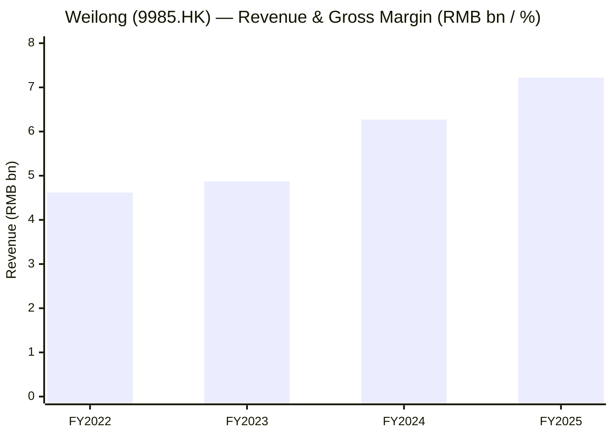
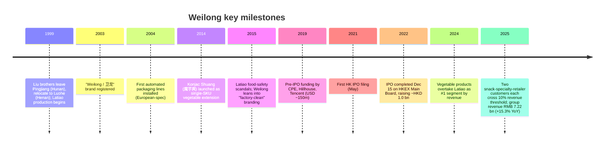
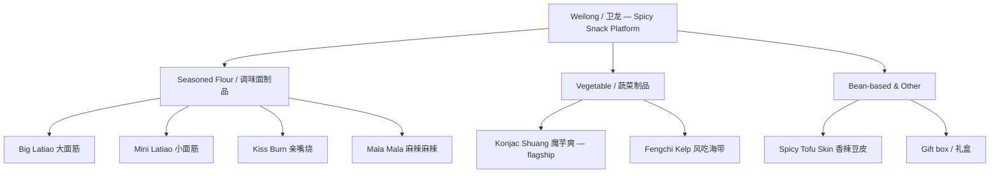
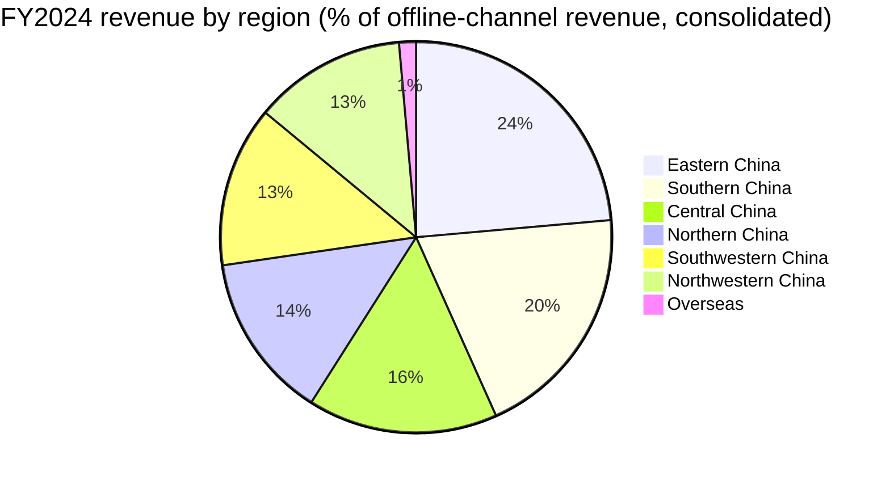
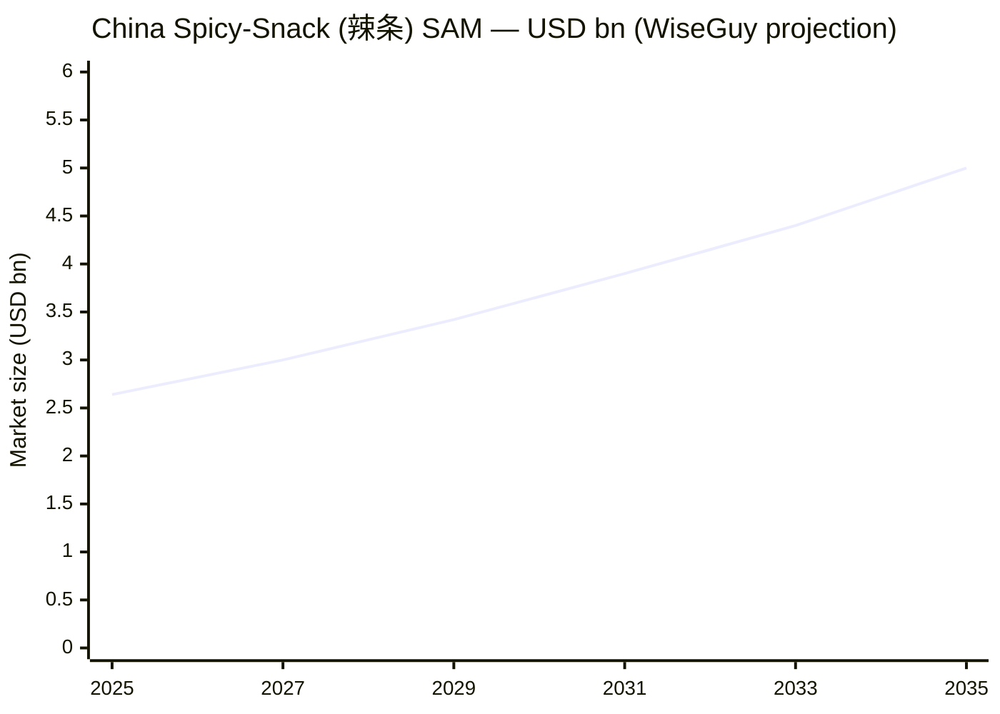

# Weilong Delicious Global Holdings (卫龙美味, HKEX:9985) — Initial Coverage

**Report date:** 2026-06-03
**Primary ticker:** HKEX:9985 ([WEILONG Delicious Global Holdings Ltd](https://www1.hkexnews.hk/listedco/listconews/sehk/2025/0327/2025032702753.pdf))
**Sector:** Consumer Staples — Packaged Snacks (China spicy-snack / 辣条 leader)

> **Update — FY2025 results (2026-03-26):** Revenue rose 15.3% YoY to RMB 7,223.8 m (from RMB 6,266.3 m) and profit attributable to owners rose 33.4% to RMB 1,425.2 m. Gross margin held at 48.0%. **Vegetable products — led by Konjac Shuang (魔芋爽) — overtook seasoned-flour products (Latiao) decisively, hitting 62.4% of revenue (vs 53.8% in 2024).** For the first time the company disclosed two ≥10%-of-revenue customers (12% and 11%), almost certainly the two largest snack-specialty-retailer chains. Board proposed a final dividend of RMB 0.17/share, taking the full-year payout to ~60% of net profit.
> Source: [WEILONG 2025 Annual Results Announcement, 2026-03-26](https://www.hkexnews.hk/listedco/listconews/sehk/2026/0326/2026032603128.pdf).

## Table of Contents

1. Company Overview
2. Company History
3. Management Team
4. Products & Services
5. Customers & Go-to-Market
6. Industry Overview
7. Competitive Landscape
8. Market Opportunity (TAM)
9. Risk Assessment
10. Investor-lens scorecards
- Data Used / 数据来源清单
- References

---

## 1. Company Overview

Weilong Delicious Global Holdings Ltd (衛龙美味全球控股有限公司, HKEX:9985) is the largest pure-play Chinese spicy-snack ("辣味休闲食品") manufacturer by revenue, founded in 1999 (commercialized 2001) by brothers Liu Weiping (劉衛平) and Liu Fuping (劉福平) in Luohe, Henan Province. The company describes itself in its 2024 annual results as "a leader and pioneer in the spicy snack food industry in China," operating a multi-category portfolio that covers **(i) seasoned flour products ("Latiao" / 辣條) — Big Latiao, Mini Latiao, Spicy Hot Stick, Mini Hot Stick, Kiss Burn (親嘴燒), Mala Mala (麻辣麻辣); (ii) vegetable products — Konjac Shuang (魔芋爽), Fengchi Kelp (風吃海帶), XIAO MO NV (小魔女); (iii) bean-based and other products — Spicy Tofu Skin (香辣豆皮) and gift box products.** Each product line is described verbatim in the [2024 Annual Results Announcement, Note 3 Segment Information](https://www1.hkexnews.hk/listedco/listconews/sehk/2025/0327/2025032702753.pdf).

The business model is straightforward but capital-light by global FMCG standards. Weilong manufactures spicy snacks at five owned plants in Henan Province (Luohe Pingping, Luohe Weilai, Zhumadian Weilai, Luohe Weidao, Luohe Xinglin) and sells through **(a) ~1,633 offline distributors** at FY2025 year-end (down from 1,879 at FY2024 year-end as the company prunes lower-productivity partners), **(b) a fast-growing snack-specialty-retailer / 量贩零食 channel** (Mingming Henmang 鸣鸣很忙, Wanchen Group 万辰集团 / Haoxianglai 好想来 etc.), **(c) chained convenience stores and supermarkets**, and **(d) online channels** spanning mainstream e-commerce (Tmall, JD.com, Pinduoduo) and content e-commerce (Douyin, Kuaishou, Xiaohongshu). The [FY2025 announcement](https://www.hkexnews.hk/listedco/listconews/sehk/2026/0326/2026032603128.pdf) discloses 88.8% / 89.7% of FY2024 / FY2025 revenue from offline channels, with the remainder online; geographic exposure is overwhelmingly mainland China (~98.3% in 2024, ~98.4% in 2025) with negligible overseas distribution (RMB 79.2 m / 117.4 m respectively).

Operationally, the company has reached the scale at which **FY2025 revenue (RMB 7.22 bn) and net profit (RMB 1.43 bn) translate to a 19.8% net margin, 48.0% gross margin and ~17% ROA / ~22% ROE** — top-decile profitability in Chinese packaged snacks, materially above peers Three Squirrels (三只松鼠, SZSE:300783), Bestore (良品铺子, SZSE:603719), and Yan Jin Pu Zi (盐津铺子, SZSE:002847). The cash position is fortress-grade: as of 2026/06/30 working capital stood at RMB 3.09 bn (up from RMB 1.36 bn one year earlier) and the sum of term deposits + cash + short-term investments was RMB 7.92 bn at FY2025 year-end. Year-end 2024 the group employed ~5,000 staff (per IPO prospectus 2022; the 2024 / 2025 announcements no longer disclose a precise headcount, but employee benefit expense of RMB 1.12 bn in 2024 and RMB 1.09 bn in 2025 is consistent with a stable ~5,000–5,500 staff base) ([Weilong 2024 Annual Results, p. 11 — Expenses by Nature](https://www1.hkexnews.hk/listedco/listconews/sehk/2025/0327/2025032702753.pdf)).

**Valuation snapshot (as of 2026-06-03).** Per [Stockanalysis.com (HKG:9985), 2026-06-03](https://stockanalysis.com/quote/hkg/9985/), the shares traded at HKD 8.03, market cap HKD 19.86 bn (~RMB 18.3 bn), **TTM P/E 12.24x**, **dividend yield 4.73%**, on a 52-week range of HKD 7.94–16.30; the stock has de-rated ~42% over the past 12 months despite top-line and bottom-line growth, putting valuation well below the 3-yr post-IPO range (the stock initially traded at >25x and reached ~30× TTM in mid-2025 before the channel-mix derate). Per [Simply Wall St (HKG:9985), 2026-05](https://simplywall.st/stocks/hk/food-beverage-tobacco/hkg-9985/weilong-delicious-global-holdings-shares), TTM **P/S is ~2.8x** and **EV/EBITDA ~6.1x**, with EBITDA margin of 26.2% — vs Chinese-snack peers Bestore (loss-making FY2024-25, no usable P/E), Three Squirrels (forward P/E ~21x per [Bamboo Works, 2025-09](https://thebambooworks.com/three-squirrels-chases-hong-kong-listing-in-scurry-for-offshore-cash/), but FY2025 net profit guided –57% to –67%), Yan Jin Pu Zi (TTM P/E ~20x). On a peer-relative basis Weilong is the cheapest scaled name on TTM earnings and the only one growing both top and bottom line in FY2025. The TTM P/E ~12x and dividend yield ~4.7% are the kind of combination that reads, prima facie, like a value setup — but the disclosure of **two customers each ≥10% of revenue** in FY2025 (vs. zero >10% customers in FY2024) is the load-bearing reason the market is hesitating: the snack-specialty-retailer channel that drove Konjac Shuang's volume ramp is concentrating power, and at the IPO this was not the customer profile that justified the 30x multiple. Bull case = mid-teens earnings growth × multiple re-rate toward 18–20x as channel mix stabilises; bear case = customer concentration becomes a one-sided pricing negotiation that compresses gross margin 200–400 bps over 2026–28.

*Source: [Weilong 2024 Annual Results Announcement](https://www1.hkexnews.hk/listedco/listconews/sehk/2025/0327/2025032702753.pdf) (FY2023, FY2024) and [Weilong 2025 Annual Results Announcement](https://www.hkexnews.hk/listedco/listconews/sehk/2026/0326/2026032603128.pdf) (FY2025). FY2022 revenue from [Yicai Global, 2022-12](https://www.yicaiglobal.com/news/chinese-snack-giant-weilong-to-raise-up-to-usd1415-million-in-hong-kong-ipo/) IPO disclosures.*

## 2. Company History

Weilong's lineage starts not in Henan but in **Pingjiang County, Hunan Province** — the historical birthplace of "辣条" / Latiao. In the late 1990s a sudden surge in soybean prices forced Pingjiang's traditional pickled-bean-skin makers to substitute wheat-gluten flour for the soy base, accidentally inventing the chewy, spicy gluten strip that the industry has since standardized around. In 1999 the Liu brothers — **Liu Weiping (劉衛平)** and **Liu Fuping (劉福平)** — left Pingjiang carrying that recipe and relocated to Luohe, Henan, where wheat-flour supply was cheap and abundant. Initial production was artisanal (a single hand-mixed batch a day); the brothers re-invested cash flow into automation by 2004, importing the first set of European-spec automated packaging lines for the category. The brand "卫龙" was registered in 2003, the "卫" character from Liu Weiping's own name and the "龙" character borrowed in tribute to the actor Jackie Chan (成龙) ([PandaYoo, "Weilong unicorn", 2023](https://pandayoo.com/post/weilong-became-a-unicorn-with-its-latiao-and-konjac-shuang/)).

The 2005–2015 period was a steady but unspectacular industrial build-out: Weilong cultivated a national distribution network keyed to neighborhood convenience stores and school-shop / 校园周边 retail, with one product (Big Latiao 大面筋) carrying the franchise. Two catalysts then transformed the company. **Catalyst #1 — food-safety repositioning (2014–2018).** Latiao had a reputation problem: regional CCTV investigations in 2014–15 surfaced hygiene scandals across small Hunan-Henan workshops, threatening the category. Weilong responded by aggressively over-investing in automation and food-safety certifications (HACCP, ISO22000), branding itself as the "premium" / "factory-clean" Latiao maker and successfully decoupling its trajectory from the category stigma. **Catalyst #2 — vegetable-product extension (2014→2024).** Konjac Shuang (魔芋爽) was launched as a single-SKU experiment in 2014, leveraging Henan's konjac processing infrastructure; through the 2020s it has become the single largest product in the company, eclipsing the original Latiao franchise. The [2024 Annual Results MD&A](https://www1.hkexnews.hk/listedco/listconews/sehk/2025/0327/2025032702753.pdf) shows vegetable products grew 59.1% in 2024 alone (and another 33.7% in 2025) on the back of Konjac Shuang scale-out plus complementary launches Fengchi Kelp 风吃海带 and XIAO MO NV 小魔女.

The **Hong Kong IPO** is the third inflection: after two delayed attempts (initial filing May 2021, refiled June 2022 at a sharply reduced valuation), Weilong listed on the HKEX Main Board on **15 December 2022**, raising ~HKD 1.0 bn ([Yicai Global, 2022-12](https://www.yicaiglobal.com/news/chinese-snack-giant-weilong-to-raise-up-to-usd1415-million-in-hong-kong-ipo/)). The IPO compressed twice from the originally indicated USD 1.5 bn raise, reflecting weak appetite for new China consumer listings in late 2022. Post-IPO the founders' families and an employee-trust vehicle retained ~86.5% of the share capital ([Phoenix Insights, IPO filing, 2021-05](https://insights.phoenix.global/china/20210513/weilong-delicious-global-holdings-files-for-hong-kong-ipo-ae9d8f9bb8)), making this a tightly-held controlled company with limited free float — a structural reason the share-price chart whipsaws on relatively modest order flow.

*Source: composite — [PandaYoo, 2023](https://pandayoo.com/post/weilong-became-a-unicorn-with-its-latiao-and-konjac-shuang/); [Yicai Global, 2022-12](https://www.yicaiglobal.com/news/chinese-snack-giant-weilong-to-raise-up-to-usd1415-million-in-hong-kong-ipo/); [Weilong 2024 Annual Results](https://www1.hkexnews.hk/listedco/listconews/sehk/2025/0327/2025032702753.pdf); [Weilong 2025 Annual Results](https://www.hkexnews.hk/listedco/listconews/sehk/2026/0326/2026032603128.pdf).*

Strategic pivots since IPO have been three: (1) "omni-channel construction" (全渠道) — aggressive expansion into snack-specialty-retailer channels, livestream / content e-commerce, and warehouse-membership formats; (2) "brand rejuvenation" (品牌年轻化) — re-targeting Gen-Z via TVC campaigns ("Weilong: Beyond Spice", 4.16 bn exposures in H1 2025 per [2025 Interim Results Presentation, p. 16](https://www.weilongshipin.com/en/Uploads/file/20250819/67f40f6123e1905a9975e89f2990ab3b.pdf)), celebrity endorsements (e.g. brand ambassador Wang Anyu 王安宇 for Konjac Shuang), and IP collaborations (Mo Dao Zu Shi 魔道祖师 anime tie-in with Kiss Burn in 2025); and (3) "automation + digital" — multi-system ERP / SRM / MES / IoT roll-out across the five Luohe plants. No acquisitions of note since IPO; the company remains organic-growth-only.

## 3. Management Team

**Liu Weiping (劉衛平 / Liu Wei-ping) — Chairman of the Board, Co-Founder.** Liu Weiping signed the 27 March 2025 Chairman's Statement in the 2024 Annual Results Announcement ([2024 Annual Results, p. 18 — Chairman's Statement signature line](https://www1.hkexnews.hk/listedco/listconews/sehk/2025/0327/2025032702753.pdf)), confirming his continuing operational role. Born in Pingjiang County (Hunan), he and younger brother Liu Fuping left Pingjiang in 1999 with the founding family Latiao recipe and built the business from a single-batch operation into a national brand over roughly two decades. The "卫" character in "卫龙" comes from his own given name ("Weiping"). Per the [Hurun Global U40 Self-Made Billionaires List 2022](https://www.hurun.net/en-us/info/detail?num=52NPOEFSAWNB) and the [2023 Hurun China Rich List](https://www.caproasia.com/2024/01/19/2023-list-of-top-1000-richest-in-china/), the Liu brothers' combined wealth was estimated at USD ~1.8 bn — concentrated entirely in their Weilong stake. Together with Liu Fuping he controls **Hehe Global Capital plus the Weilong Future Development employee-trust vehicle, holding ~86.49% of shares in aggregate** ([daydaynews.cc, citing 2022 prospectus, 2022-06](https://daydaynews.cc/en/hotcomm/2806148.html)). This concentration is the single most important governance fact for the company: there is no realistic activist or proxy-fight path, and capital allocation decisions (the 60% dividend payout, the lack of M&A, the ~RMB 7.9 bn idle cash) reflect founders' preferences rather than a typical board-driven process. Strategic thesis attributed to him in [PandaYoo, 2023](https://pandayoo.com/post/weilong-became-a-unicorn-with-its-latiao-and-konjac-shuang/) is "automation and brand are the two moats — invest in both relentlessly, ignore quarterly earnings volatility." Education is undergraduate-level (he did not complete a four-year university degree); he has been operationally hands-on since founding and has not delegated CEO-equivalent duties to a non-family hire. *Analyst view:* For an FMCG business at RMB 7 bn revenue scale, having the founder still serving as chairman and the only operational decision-maker at the top is unusual. The risk this presents is succession (Liu Weiping is in his 50s) and decision-making latency in a rapidly-evolving channel environment.

**Liu Fuping (劉福平 / Liu Fu-ping) — Executive Director, Co-Founder.** Younger brother of Liu Weiping; serves as Executive Director rather than a C-suite operating title in HK governance form. Liu Fuping appeared on the [Hurun Global U40 Self-Made Billionaires List 2022 (at age 40)](https://www.hurun.net/en-us/info/detail?num=52NPOEFSAWNB) as one of the youngest billionaires in mainland China consumer staples. Per the 2022 IPO prospectus he co-controls Hehe Global Capital. Background and education are similar to his brother's; the working division of labour, per industry-press accounts, is that Liu Weiping focuses on brand and strategy while Liu Fuping owns the manufacturing and supply chain side — though the company does not formally disclose this split in its filings. Together, the brothers represent a near-textbook founder-controlled compounder with all the upside (long-horizon decision-making, willingness to invest in unfashionable product extensions like Konjac Shuang for 6+ years before scale benefits arrived) and the corresponding downsides (no independent capital-allocation discipline, no proxy by minority shareholders).

**Founder-as-CEO note:** There is no separate non-family CEO in this organization. Per the 2024 / 2025 annual results, all senior management with publicly disclosed titles are either Liu family members or longtime Henan employees promoted internally; the company does not publish a c-suite organisation chart in the announcement form. Per the Sept 2025 [Chairman's Statement, 2025 Interim Results Presentation, p. 4](https://www.weilongshipin.com/en/Uploads/file/20250819/67f40f6123e1905a9975e89f2990ab3b.pdf), the four organizational pillars are "Brand / Product / Channel / Efficiency," each effectively owned by a senior internal hire. Per the rule of this skill (founder + CEO only), no further executives are profiled.

## 4. Products & Services

Weilong's product matrix has compressed cleanly into three reportable segments and roughly a dozen flagship SKUs across them. The structure has not changed materially since the 2022 IPO, but the segment-mix economics have shifted dramatically in the last 24 months — vegetable products have eclipsed seasoned-flour products as the #1 revenue contributor.

### 4.1 The product matrix — verbatim from 2025 results (the load-bearing primary disclosure)

The 2025 Annual Results MD&A explicitly states the matrix. Quoting verbatim from [Weilong 2025 Annual Results, p. 21 — Our Products](https://www.hkexnews.hk/listedco/listconews/sehk/2026/0326/2026032603128.pdf):

> "The Group is a leader and pioneer in the spicy snack food industry in China. The Group adheres to the strategy of multiple categories with its products covering seasoned flour products, vegetable products, and other product categories. **Seasoned flour products, also commonly known as Latiao (辣條), primarily comprise Big Latiao (大麵筋), Mini Latiao (小麵筋), Kiss Burn (親嘴燒), Mala Mala (麻辣麻辣) and others.** Vegetable products primarily comprise Konjac Shuang (魔芋爽) and Fengchi Kelp (風吃海帶). Other products primarily comprise Spicy Tofu Skin (香辣豆皮) and gift box products, among others."

Note the 2025 product matrix has been compressed vs. 2024: "Spicy Hot Stick (麻辣棒) / Mini Hot Stick (小辣棒) / XIAO MO NV (小魔女)" — listed verbatim in the [2024 Annual Results, p. 21](https://www1.hkexnews.hk/listedco/listconews/sehk/2025/0327/2025032702753.pdf) — were folded out of the formal matrix in 2025, reflecting product-line pruning and resource reallocation toward Konjac Shuang.

The segment table from the 2025 announcement is reproduced exactly:

| Segment (FY2025) | Revenue (RMB '000) | % of total | Gross profit (RMB '000) | Segment gross margin |
|---|---:|---:|---:|---:|
| Seasoned flour products (Latiao) | 2,553,539 | 35.3% | 1,244,584 | 48.7% |
| Vegetable products | 4,505,935 | 62.4% | 2,159,023 | 47.9% |
| Other products | 164,285 | 2.3% | 62,754 | 38.2% |
| **Total** | **7,223,759** | **100.0%** | **3,466,361** | **48.0%** |

*Source: [Weilong 2025 Annual Results, Note 3 — Segment Information, p. 8](https://www.hkexnews.hk/listedco/listconews/sehk/2026/0326/2026032603128.pdf).*

### 4.2 Synthesis — how the three categories interact in the customer workflow

A consumer in a Chinese tier-2 city under-35 doesn't think of Weilong as "a Latiao maker" any more — they think of it as **the spicy snack brand that owns both the classic indulgence ritual (chewy, spicy Big Latiao with a cold drink after school / at the gaming desk / late at night) and the new "guilt-free" indulgence ritual (low-calorie Konjac Shuang as part of the diet-conscious snack rotation, often paired with milk-tea or coffee).** Both categories sit in the same pricing band (RMB 4–8 per impulse pack), share shelf-space in the same convenience-store cooler-adjacent aisle and the same snack-specialty-retailer pegboard, and share the same brand-trust premium (food-safety reputation built over 15 years). The bean-based category is a long-tail rounding error that exists mainly because gift-box assortments need 3+ SKU types to look complete. Below: a product-portfolio tree.

*Source: [Weilong 2025 Annual Results, p. 21 — Our Products](https://www.hkexnews.hk/listedco/listconews/sehk/2026/0326/2026032603128.pdf); [2024 Annual Results, p. 21 — Our Products](https://www1.hkexnews.hk/listedco/listconews/sehk/2025/0327/2025032702753.pdf).*

### 4.3 Seasoned flour products / Latiao — the founding business, now #2 by revenue

**Verbatim segment description** from the 2024 announcement (the 2024 text is more detailed than 2025):

> "Seasoned flour products, also commonly known as Latiao (辣條), primarily comprise Big Latiao (大麵筋), Mini Latiao (小麵筋), Spicy Hot Stick (麻辣棒), Mini Hot Stick (小辣棒), Kiss Burn (親嘴燒), Mala Mala (麻辣麻辣) and others." ([2024 Annual Results, p. 21](https://www1.hkexnews.hk/listedco/listconews/sehk/2025/0327/2025032702753.pdf))

**Plain-language gloss / 通俗解释:** A "Latiao" is a chewy, deep-red, oily, intensely-spiced wheat-gluten strip about 5–10 cm long and 1 cm thick, deep-fried briefly and then coated with a chili-oil + Sichuan-peppercorn + soybean-paste flavour slurry. The texture sits midway between beef jerky and gummy candy — it's *tough* in a way Western chips and pretzels are not, which is the indulgence point. The "Big Latiao" / "Mini Latiao" split is purely a portion / packaging difference (single-bite vs. a chewy strip), and "Spicy Hot Stick" / "Mini Hot Stick" are reformulations using a hotter chili blend. "Kiss Burn" (literally "kissing-bite") is a folded gluten ribbon with a sweet-spicy glaze; "Mala Mala" is a numb-spicy reformulation built around Sichuan peppercorns rather than only Henan chilis. The technical process is industrial extrusion (wheat-flour dough → twin-screw extrusion → cutting → flavour-slurry coating → packaging), and Weilong's automation investment in this category dates to 2004 — its mid-2020s competitive advantage in the category is largely "the cleanest factories in the category" rather than a unique recipe per se.

Latiao revenue grew only 4.6% in 2024 (to RMB 2,667.1 m) and actually *declined* 4.3% in 2025 (to RMB 2,553.5 m), per the segment table in the [2025 Annual Results, p. 22](https://www.hkexnews.hk/listedco/listconews/sehk/2026/0326/2026032603128.pdf). Management attributes this to "proactive adjustment of resource allocation and optimisation of its product portfolio" — i.e. deliberately reducing SKU breadth and channel push behind the Latiao franchise to reallocate marketing and trade-spend dollars to Konjac Shuang. This is a defensible decision strategically (vegetable products have a higher LTV per young consumer and faster ramp profile) but does mean the Latiao franchise is now in a managed-decline / steady-state mode rather than a growth mode.

*Analyst view:* Latiao as a category is mature (≥25-year history in the modern industrial form), price-anchored at the RMB 2–5 SKU level for the impulse-pack format, and structurally exposed to volume pressure from school-environment regulation (Chinese MOE has periodically restricted school-shop sales of high-sodium / high-additive snacks). Weilong's Latiao moat is *brand* and *food-safety reputation*; it is not technology or formulation. Closest direct competitor brands at the SKU level are **Mala Wang (麻辣王子)** out of Pingjiang (Hunan) and **JinMo (金磨坊)** — both privately held and substantially smaller; Pingjiang Xinxiangyu Food is named in [WiseGuy Spicy Sticks Market Report, 2025](https://www.wiseguyreports.com/reports/spicy-sticks-chinese-snack-market) as a top-10 industry player.

### 4.4 Vegetable products / 蔬菜制品 — the new flagship franchise

**Verbatim segment description** from 2025 announcement:

> "Vegetable products primarily comprise Konjac Shuang (魔芋爽) and Fengchi Kelp (風吃海帶)." ([2025 Annual Results, p. 21](https://www.hkexnews.hk/listedco/listconews/sehk/2026/0326/2026032603128.pdf))

**Plain-language gloss / 通俗解释:** Konjac Shuang (literally "konjac refreshing" — 魔芋爽) is a snack made from konjac flour (魔芋粉, from the konjac potato / *Amorphophallus konjac*), water, and a spicy / sweet-and-sour flavor slurry, extruded into 3-cm wide jelly-like strips and individually wrapped. The category-defining attribute is **low calorie + high dietary fibre per pack — typically ~30–40 kcal per single-serve pack versus ~150 kcal for an equivalent-size Latiao pack** — combined with a delicate "springy / 弹滑" texture that mimics raw seafood (squid, jellyfish) in mouthfeel. To a Gen-Z buyer thinking about indulgence-snacking-without-guilt, this is the closest thing the Chinese FMCG market has to a no-calorie sweet-and-sour gummy. Fengchi Kelp (风吃海带) is the same product concept rendered in kelp / 海带 strips — slightly chewier texture, similar flavour palette, naturally rich in iodine.

Konjac Shuang has been Weilong's most important new product since launch in 2014, and its 2024–2025 inflection drives the entire company's growth story:

- **2023 vegetable revenue:** RMB 2,118.5 m (43.5% of total)
- **2024 vegetable revenue:** RMB 3,370.6 m (53.8% of total) — **+59.1% YoY**
- **2025 vegetable revenue:** RMB 4,505.9 m (62.4% of total) — **+33.7% YoY**

(*Source: [Weilong 2024 Annual Results, p. 23](https://www1.hkexnews.hk/listedco/listconews/sehk/2025/0327/2025032702753.pdf); [2025 Annual Results, p. 22](https://www.hkexnews.hk/listedco/listconews/sehk/2026/0326/2026032603128.pdf).*)

The 2025 capacity table from the [Annual Results, p. 26](https://www.hkexnews.hk/listedco/listconews/sehk/2026/0326/2026032603128.pdf) makes the investment commitment explicit: Weilong expanded designed vegetable-product capacity from 96,228 tons (2023) → 129,986 tons (2024) → 225,774 tons (2025), a +135% two-year expansion in installed capacity. By contrast, Latiao designed capacity shrank from 237,722 tons (2023) → 202,065 (2024) → 172,658 (2025) — a deliberate ~27% capacity haircut on the founding category over 24 months.

*Analyst view:* Konjac Shuang is genuinely a hit product with crossover appeal beyond traditional Latiao consumers, and the low-calorie positioning ties it directly to the broader "healthy snacking" wave in Chinese consumer staples. The bear-case angle is **margin** — konjac flour as an input has historically been more price-volatile than wheat flour (smaller, more fragmented farming base in Yunnan / Sichuan); the COGS analysis in the [2025 Interim Results Presentation, p. 9](https://www.weilongshipin.com/en/Uploads/file/20250819/67f40f6123e1905a9975e89f2990ab3b.pdf) shows raw-material costs as a % of revenue climbing from 24.3% (H1 2024) → 25.7% (FY 2024) → 28.2% (H1 2025), and 1H 2025 vegetable-product gross margin compressed to 46.6% from 52.6% in H1 2024 — a 600bp segment-level margin haircut. The full-year 2025 results show the company largely offset that pressure via supply-chain efficiency, but margin is the right thing to watch. Closest direct competitor SKU: Yan Jin Pu Zi's "Da Mo Wang" (大魔王) konjac-strip line (launched 2022, the most credible direct copy of Konjac Shuang in the market); the broader category also faces a tail of generic-konjac brands sold through snack-specialty retailers at lower price points.

### 4.5 Bean-based and other products — long tail / gift assortments

**Verbatim segment description** from 2025 announcement: "Other products primarily comprise Spicy Tofu Skin (香辣豆皮) and gift box products, among others" ([2025 Annual Results, p. 21](https://www.hkexnews.hk/listedco/listconews/sehk/2026/0326/2026032603128.pdf)).

This segment is structurally small (RMB 164 m / 2.3% of FY2025 revenue, declining 28.2% YoY from RMB 229 m) and serves two functions: (1) historic continuity (Spicy Tofu Skin is a small-volume bean-based snack the company has carried for over a decade), and (2) gift-box bundling — Chinese New Year holiday assortments need 3–5 SKU types to look complete. Management's commentary in [2025 Annual Results, p. 23](https://www.hkexnews.hk/listedco/listconews/sehk/2026/0326/2026032603128.pdf) signals deliberate de-emphasis: "adjustments for product portfolio such as Spicy Tofu Skin." No category innovation focus here.

### 4.6 Product innovation pipeline and recent launches

The FY2025 announcement walks the innovation pipeline in detail. In 2025 the company launched, among others: **sesame-paste-flavored Konjac Shuang**, **high-fibre Porcini-mushroom-flavored Konjac Shuang** (positioned for "light eating / non-spicy preferences"), **Dai-style Yunnan-pounded-chicken-feet-flavored Konjac Shuang** (a regional-flavour experiment), **mala-crayfish-flavored Big Latiao**, **finger-licking BBQ-flavored Big Latiao** (using Xinjiang cumin + Wudu Sichuan peppercorns), and **spicy-beef-flavored Kiss Burn** (a four-pepper blend across Jinyang green Sichuan peppercorns, Wudu Sichuan peppercorns, Henan chilis, and Indian ghost peppers, per [2025 Annual Results, p. 22](https://www.hkexnews.hk/listedco/listconews/sehk/2026/0326/2026032603128.pdf)). The recurring theme is **flavour-line extension within existing SKU formats** — no new product categories were launched in 2024 or 2025. This is consistent with the strategy: ride Konjac Shuang's category-level tailwind by adding flavours, rather than diluting attention with new categories.

### 4.7 Production base, R&D and aftermarket

**Five Henan plants** (all owned, all in Henan Province): Luohe Pingping, Luohe Weilai, Zhumadian Weilai, Luohe Weidao, Luohe Xinglin. Total designed capacity 409,108 tons (FY2025) with 77.9% utilization, up from 338,175 tons / 77.7% in FY2024 ([2025 Annual Results, p. 26 — production capacity tables](https://www.hkexnews.hk/listedco/listconews/sehk/2026/0326/2026032603128.pdf)). Luohe Xinglin Plant is the newest and most strategic, with designed capacity tripling from 51,843 tons (2024) to 155,002 tons (2025) — i.e. Luohe Xinglin is now the largest single plant in the network and the centre of gravity for vegetable-product (Konjac Shuang) manufacturing.

R&D is centralized at an R&D Centre for Infrastructure and Applications in **Shanghai**, with team competency spanning "food engineering, food safety and nutrition, polymer chemistry, biology, and testing and inspection" ([2024 Annual Results, p. 28 — R&D Capabilities](https://www1.hkexnews.hk/listedco/listconews/sehk/2025/0327/2025032702753.pdf)). University-industry partnerships are formally in place but not named individually. The 2025 announcement signals consistent investment in R&D headcount; specific R&D-expense disclosure is not separated from total opex in the consolidated income statement.

There is no aftermarket / services business — this is a pure manufactured-goods FMCG, and ~ 100% of revenue is "Sale of goods" per [Note 3(c), 2025 Annual Results, p. 9](https://www.hkexnews.hk/listedco/listconews/sehk/2026/0326/2026032603128.pdf). OEM relationships exist for low-volume SKUs that don't fit the main automation lines, per [2024 Annual Results, p. 26 — Production Facilities](https://www1.hkexnews.hk/listedco/listconews/sehk/2025/0327/2025032702753.pdf).

## 5. Customers & Go-to-Market

Weilong sells to four customer types: **(a) offline distributors**, **(b) direct sales to snack-specialty-retailer chains and warehouse-membership-club operators**, **(c) online distribution to e-commerce supermarkets (Tmall Supermarket, JD Supermarket)**, and **(d) online direct sales to consumers via the company's self-operated stores on Tmall, JD.com, Pinduoduo, Douyin, and Kuaishou**. The denominator for every number below is **consolidated revenue**; there are no segment-level customer disclosures in the announcements, so the consolidated and segment views are aligned for this company.

### 5.1 Customer concentration — the major FY2025 disclosure

This is the load-bearing change in the FY2025 announcement and the principal reason the equity has de-rated 40%+ from late-2024 highs. Quoting verbatim from [2025 Annual Results, Note 3(b) — Information about major customers, p. 8](https://www.hkexnews.hk/listedco/listconews/sehk/2026/0326/2026032603128.pdf):

> "During the year ended December 31, 2025, revenue from sales to the two major third-party customers was RMB838.2 million and RMB781.2 million, amounting to approximately 12% and 11% of the Group's total revenue, respectively (2024: no revenue from the Group's sales to a single customer amounted to 10% or more of the Group's total revenue)."

In other words: **in FY2025 two customers together accounted for ~23% (RMB 1.62 bn) of consolidated revenue, both of consolidated denominator**, vs. *no* >10% customer in FY2024 or earlier. The disclosure names neither customer, but the channel context makes the identification straightforward: the FY2025 MD&A repeatedly highlights "snack specialty retailers" (零食量贩 / 零食专卖) as the principal growth-driving emerging channel, and the two dominant national snack-specialty-retailer chains are **Mingming Henmang Group (鸣鸣很忙集团** — formed from the 2024 merger of Zhao Yiming Snacks 赵一鸣零食 + Hao Xianglai 好想来 + others, ~10,000+ stores nationwide) and **Wanchen Group / 万辰集团 (SZSE:300972)** — both of which have publicly cited Weilong as a top supplier in 2024 and 2025. *Analyst view (not from the 10-K):* the two ≥10% customers are almost certainly these two chains; this should be confirmed when the formal 2025 annual report (long-form) is filed in early-Q2 2026.

This matters because **snack-specialty-retailer chains operate on a hard-bargaining, low-margin distribution-economics model** — they aggregate fragmented small-pack snacks and resell at substantial discounts to traditional convenience-store retail, taking aggressive trade-spend from suppliers in return for shelf space and volume. The bargaining-power shift from "1,600 distributors, no single >5% of revenue" (FY2023 character) to "two customers each 11–12%" (FY2025) is structural, not cyclical. The bear-case scenario in 2026–28 is that as these two chains scale toward 15–20% each individually, Weilong's per-pack realization compresses 200–400 bps and the gross margin gives back 100–200 bps. The bull-case scenario is that the snack-specialty-retailer channel grows fast enough on absolute volume that even at compressed unit economics, the dollar contribution from that channel rises — the analogy from US history is the way packaged-snack companies eventually accommodated Walmart and Costco as ≥10% customers without permanently de-rating.

### 5.2 Distributor network and POS coverage

Per [2025 Annual Results, p. 23](https://www.hkexnews.hk/listedco/listconews/sehk/2026/0326/2026032603128.pdf): **1,633 offline distributors** at FY2025 year-end (vs. 1,879 at FY2024 year-end, vs. 1,777 at H1 2025 year-end per [Interim Results Presentation, p. 17](https://www.weilongshipin.com/en/Uploads/file/20250819/67f40f6123e1905a9975e89f2990ab3b.pdf)). Management has been pruning lower-performing distributors steadily. POS coverage grew sharply: **583,911 POS as of H1 2025** (per the Interim presentation, p. 17), up from 433,469 (FY2024 year-end), 352,011 (H1 2024), 328,790 (FY2023 year-end), and 209,466 (H1 2023). SKU-per-POS averaged 16.0–22.8 in late 2025 vs. 9.6–12.5 in 2023 — i.e. each POS now stocks ~70% more Weilong SKUs.

### 5.3 Channel mix and geographic distribution

The FY2024 → FY2025 channel mix is given verbatim in the [2025 Annual Results, p. 24](https://www.hkexnews.hk/listedco/listconews/sehk/2026/0326/2026032603128.pdf):

| Channel (FY2025) | Revenue (RMB '000) | % of total | YoY change |
|---|---:|---:|---:|
| Offline channels | 6,476,960 | 89.7% | +16.5% |
| Online channels — total | 746,799 | 10.3% | +6.0% |
| — Online distribution (Tmall Supermarket / JD Supermarket) | 211,781 | 2.9% | –24.5% |
| — Online direct sales (self-operated stores) | 535,018 | 7.4% | +26.1% |
| **Total** | **7,223,759** | **100.0%** | **+15.3%** |

The notable shift: **online-distribution revenue actually shrank in 2025 (–24.5% YoY)** as Weilong rebalanced away from the traditional Tmall Supermarket / JD Supermarket wholesale relationships toward direct-to-consumer / content-commerce channels. *Analyst view:* this is a deliberate channel-margin trade — online direct sales (own stores on Tmall, JD, Pinduoduo, Douyin, Kuaishou) carry richer unit economics but more operational complexity than dropshipping to Tmall Supermarket.

Geographic mix is balanced across China's six regions and overseas:

*Source: [Weilong 2024 Annual Results, p. 25 — Revenue by geographic location](https://www1.hkexnews.hk/listedco/listconews/sehk/2025/0327/2025032702753.pdf). Note: pie shows offline-channel revenue split (88.8% of FY2024 consolidated); online channels are not broken out by region.*

Overseas revenue grew from RMB 79.2 m (FY2024) to RMB 117.4 m (FY2025), per [2025 Annual Results, Note 3(a), p. 8](https://www.hkexnews.hk/listedco/listconews/sehk/2026/0326/2026032603128.pdf) — 1.6% of consolidated revenue, immaterial. Weilong has Southeast Asia and North American distribution via overseas wholesalers / Chinese-diaspora-grocery channels (e.g. [weilong.com.ph](https://www.weilong.com.ph/pages/about-us) for Philippines), but is not in any meaningful sense a global brand at this point.

### 5.4 Trade receivables and credit risk

Trade-receivable balance was RMB 90.4 m at FY2025 year-end vs. RMB 52.8 m at FY2024 year-end (+71.2%), reflecting the shift toward direct-sales arrangements with snack-specialty retailers that have 60–90 day credit terms vs. the prepayment-only model with traditional distributors. Days sales outstanding remains very low (3.6 days in FY2025, up from 3.0 days in FY2024 per [2025 Annual Results, p. 30](https://www.hkexnews.hk/listedco/listconews/sehk/2026/0326/2026032603128.pdf)). This is structurally healthy: the cash conversion cycle is dominated by inventory holding (86 days in FY2025), not by AR risk.

## 6. Industry Overview

China's casual-snack industry is **the second-largest in the world by retail revenue (after the US)**, with [Research and Markets, 2025-03](https://www.businesswire.com/news/home/20250314258092/en/China-Snacks-Food-Market-Trends-Report-2025-2033-Urbanization-and-Changing-Lifestyles-Trigger-Boon-Consumers-Drive-Demand-for-Low-Calorie-and-Nutrient-Rich-Snacks-Online-Platforms-Fuel-Consumption---ResearchAndMarkets.com) sizing 2024 at USD 131.1 bn and projecting USD 206.2 bn by 2033, implying ~5.2% CAGR. The narrower **spicy-stick (辣条) sub-category** sat at USD ~2.64 bn in 2025 per [WiseGuy Reports, 2025](https://www.wiseguyreports.com/reports/spicy-sticks-chinese-snack-market) and is projected to reach USD ~5.0 bn by 2035 (~6.6% CAGR). The vegetable-snack / konjac-snack sub-category does not have an independent third-party-published TAM number that's universally cited, but management's own framing in [2025 Interim Results Presentation, p. 14 — Industry section](https://www.weilongshipin.com/en/Uploads/file/20250819/67f40f6123e1905a9975e89f2990ab3b.pdf) (citing McKinsey Greater China and CBNData) emphasizes that "consumer demand is shifting from cost-performance ratios toward personal value and quality of life, driving pursuit of premium products and experiential satisfaction."

The structurally important industry shifts in the 2023–2026 window are:

**(a) Channel revolution: rise of snack-specialty retailers.** Within ~36 months (mid-2022 to mid-2025), two consolidated national chains — Mingming Henmang (formed by the merger of Zhao Yiming Snacks 赵一鸣 + Snack King Kong / Hao Xianglai 好想来 + several others in late 2023 / early 2024) and Wanchen Group / 万辰集团 (SZSE:300972) — have collectively rolled up to ~20,000+ stores nationwide. They operate a low-margin / high-velocity model: snacks at 10–30% discount to convenience-store retail, with rapid SKU rotation and trade-spend-funded shelf space. Per [Sina Finance, 2026-04](https://finance.sina.com.cn/stock/wbstock/2026-04-23/doc-inhvpcuy3700790.shtml), this channel has driven a massive reshaping of distribution economics across the entire packaged-snack category. For Weilong, this channel is the principal driver of FY2024–2025 revenue growth — and, as noted in §5.1, the source of the new customer-concentration risk.

**(b) Health-conscious snacking and category rotation.** Konjac-based and low-calorie snacks have grown 30–50% annually in 2023–2025 versus mid-single-digits for the broader category, driven by Gen-Z dieters, fitness-conscious consumers, and the "便利 + 健康" / "convenient + healthy" positioning. This is the demand-side reason Weilong's vegetable products have grown 33–59% YoY in 2024 and 2025.

**(c) Content / livestream e-commerce.** Douyin and Kuaishou content commerce now drive a meaningfully larger share of new-brand discovery for Chinese snacks than traditional FMCG advertising. Established brands like Weilong have learned to use celebrity ambassadors (Wang Anyu 王安宇 was launched as Konjac Shuang's first brand ambassador in H1 2025 per [Interim Results Presentation, p. 16](https://www.weilongshipin.com/en/Uploads/file/20250819/67f40f6123e1905a9975e89f2990ab3b.pdf)) and IP collaborations (Kiss Burn × Mo Dao Zu Shi anime in 2025) to keep brand awareness rolling forward among Gen-Z.

**(d) Raw-material cost cycle.** Wheat flour, edible oil (soybean, palm), and konjac flour are the three principal cost inputs. The [2025 Interim Presentation, p. 9 — COGS items as % of revenue](https://www.weilongshipin.com/en/Uploads/file/20250819/67f40f6123e1905a9975e89f2990ab3b.pdf) shows raw-material costs rising from 24.3% (H1 2024) → 25.7% (FY2024) → 28.2% (H1 2025), and the [2025 Annual Results, p. 28 — Revenue and Gross Profit commentary](https://www.hkexnews.hk/listedco/listconews/sehk/2026/0326/2026032603128.pdf) describes "the impact of rising raw material costs" being "largely offset" by "active efforts to enhance supply chain efficiency." This is the right framing — raw materials are a meaningful headwind, but the supply-chain operating leverage from the Luohe plant network has kept gross margin flat. The bear-case in this dimension is that further konjac-flour appreciation (the Yunnan / Sichuan konjac harvest is more weather-sensitive than wheat) compresses vegetable-segment gross margin in 2026.

**(e) Regulation.** The PRC State Administration for Market Regulation (SAMR) and the Ministry of Education have, since 2014, periodically tightened controls on Latiao sodium content, additive use, and sales channels around schools. The 2018 GB 2760 update standardized the Latiao food-safety regulatory framework; subsequent updates in 2022–2024 have continued to professionalize the category. Weilong is a net beneficiary of regulatory tightening, since it is large enough to absorb compliance costs while smaller workshop producers cannot — this is a structural moat that has been hardening for 15 years.

Industry-structure assessment: the Chinese packaged-snack industry is **moderately fragmented** at the consolidated level (no producer exceeds ~5% share of the broader USD 131 bn snack category) but **moderately concentrated within the spicy-stick sub-segment**, with Weilong holding ~15–20% projected share per [WiseGuy Reports, 2025](https://www.wiseguyreports.com/reports/spicy-sticks-chinese-snack-market). Barriers to entry: low for small workshop production (limited capital intensity, raw-material accessibility), high for branded national distribution (food-safety reputation, automation capital, snack-specialty-retailer relationships). Buyer power: rising sharply on the snack-specialty-retailer side (see §5.1), low elsewhere. Supplier power: moderate (wheat flour is a commodity; konjac flour is more concentrated).

## 7. Competitive Landscape

Weilong sits in a competitive cluster of five-to-ten Chinese snack-food companies, but the comparable set differs by product line. In **spicy-stick (Latiao) sub-category** specifically, named direct competitors include: **Mala Wang / 麻辣王子** (privately held, Pingjiang-based — the "original Latiao" challenger brand), **Jin Mo Fang / 金磨坊**, **Pingjiang Xinxiangyu Food**, **Wei Lai (Hunan) Food**, and a long tail of regional workshop brands ([WiseGuy Reports, 2025](https://www.wiseguyreports.com/reports/spicy-sticks-chinese-snack-market)). In the broader **branded-packaged-snack peer set**, the competition is with **Three Squirrels / 三只松鼠 (SZSE:300783)**, **Bestore / 良品铺子 (SZSE:603719)**, **Yan Jin Pu Zi / 盐津铺子 (SZSE:002847)**, **Qiaqia Food / 洽洽食品 (SZSE:002557)**, and **Mingming Henmang Group** (filed for HK IPO in 2024) — note Mingming Henmang is both a customer and an emerging competitor as it expands into private-label snacks.

**FY2025 peer scoreboard:**

| Company | Ticker | FY2025 Revenue | FY2025 Net Profit | YoY revenue | YoY profit | TTM P/E (2026-06) | Notes |
|---|---|---:|---:|---:|---:|---:|---|
| **Weilong 卫龙** | HKEX:9985 | RMB 7.22 bn | RMB 1.43 bn | +15.3% | +33.4% | ~12.2× | Spicy-snack pure play; ~48% GM |
| Yan Jin Pu Zi 盐津铺子 | SZSE:002847 | RMB ~5.76 bn | RMB ~0.75 bn | +8.6% | +17.0% | ~20× | Multi-category snack incl. konjac copies |
| Three Squirrels 三只松鼠 | SZSE:300783 | RMB ~7.76 bn | (–57% to –67% YoY) | +8.5% | strongly negative | n/m | Nut + snack platform; channel cost pressure |
| Bestore 良品铺子 | SZSE:603719 | RMB ~4.14 bn | RMB (1.2–1.6 bn) loss | n/a | net loss | n/m | Premium snack chain; multi-year decline |

*Source: [Sina Finance, 2026-04](https://finance.sina.com.cn/stock/wbstock/2026-04-23/doc-inhvpcuy3700790.shtml); [Bamboo Works, 2025-09](https://thebambooworks.com/three-squirrels-chases-hong-kong-listing-in-scurry-for-offshore-cash/); [Weilong 2025 Annual Results](https://www.hkexnews.hk/listedco/listconews/sehk/2026/0326/2026032603128.pdf); [Stockanalysis.com, 2026-06-03](https://stockanalysis.com/quote/hkg/9985/).*

```mermaid
xychart-beta
    title "Peer comparison — FY2025 net margin (%) and TTM P/E (x)"
    x-axis ["Weilong 9985", "Yan Jin Pu Zi 002847", "Three Squirrels 300783", "Bestore 603719"]
    y-axis "Value (% or x)" -30 --> 30
    bar [19.8, 13.0, -10.0, -25.0]
    bar [12.2, 20.0, 0, 0]
```

*Bars: net-profit margin (%) and TTM P/E (x). Three Squirrels TTM P/E shown as 0 because TTM earnings are too low to be meaningful; Bestore P/E shown as 0 because the company is loss-making. Source: see prior table.*

**Weilong's relative position — the bull view.** It is the only scaled Chinese snack pure-play growing both top-line and bottom-line in FY2025, the only one with ~48% gross margin (peers at 32–38%), and the only one trading at a TTM P/E below the historical mid-teens average. It owns the #1 brand position in the spicy-snack category with an estimated ~15–20% share ([WiseGuy Reports, 2025](https://www.wiseguyreports.com/reports/spicy-sticks-chinese-snack-market)) and is now demonstrating credible category-extension capability with Konjac Shuang. Its founder-controlled equity structure (~86.5% insider holding) means strategic horizon is years not quarters; its RMB 7.9 bn cash position (with effectively zero net debt) means it can absorb 2–3 years of margin pressure without diluting equity holders.

**Weilong's relative position — the bear view.** Three challenges. First, **channel power asymmetry**: the snack-specialty-retailer chains that now account for ≥23% of Weilong's revenue have substantially more pricing leverage than they did 24 months ago, and the FY2025 disclosure of two ≥10% customers is the first concrete sign that bargaining power is shifting against Weilong. Second, **competitive vegetable-product erosion**: Yan Jin Pu Zi's "Da Mo Wang" / 大魔王 konjac line and a long tail of generic-konjac private-label SKUs sold through snack-specialty retailers are commoditizing the Konjac Shuang category at the low end; Weilong's gross margin in vegetable products declined ~600bp YoY in H1 2025 (52.6% → 46.6% per [Interim Presentation, p. 9](https://www.weilongshipin.com/en/Uploads/file/20250819/67f40f6123e1905a9975e89f2990ab3b.pdf)). Third, **Latiao secular maturation**: the founding business is no longer a growth engine and the company has to find the next Konjac Shuang to keep the consolidated growth narrative alive past 2027–28. The first credible candidate is currently the Fengchi Kelp (风吃海带) line and the high-fibre Porcini-flavored Konjac Shuang extension; both are too small to read yet.

**Competitive moats — explicitly per Buffett-style categories:** (a) brand (medium-high, food-safety reputation reinforced for 15 years; eclipsed for Gen-Z by snack-specialty-retailer house brands at the budget end of the market); (b) cost (medium, automated Luohe production + scale); (c) switching (low — snacking is impulse, brand-loyalty short-lived); (d) network effects (none); (e) regulatory (low-medium, food-safety-reputation barrier to small-workshop entry).

## 8. Market Opportunity (TAM)

**TAM — China casual snack industry:** USD 131.1 bn in 2024, projected to USD 206.2 bn by 2033 (5.2% CAGR), per [Research and Markets, 2025-03](https://www.businesswire.com/news/home/20250314258092/en/China-Snacks-Food-Market-Trends-Report-2025-2033-Urbanization-and-Changing-Lifestyles-Trigger-Boon-Consumers-Drive-Demand-for-Low-Calorie-and-Nutrient-Rich-Snacks-Online-Platforms-Fuel-Consumption---ResearchAndMarkets.com).

**SAM — China spicy-snack sub-category:** USD 2.64 bn in 2025 → USD 5.0 bn by 2035 (~6.6% CAGR) per [WiseGuy Reports, 2025](https://www.wiseguyreports.com/reports/spicy-sticks-chinese-snack-market). This SAM definition is narrow (it captures the Latiao-equivalent spicy-stick sub-segment) and excludes konjac-based vegetable snacks, which sit in a broader "low-calorie / healthy snack" SAM that does not have a published authoritative size.

**SOM — Weilong's served and addressable share:**
- Weilong FY2025 revenue ≈ USD 1.0 bn at RMB / USD ~7.2.
- vs. China spicy-snack SAM of USD ~2.64 bn → ~38% projected share for Weilong in 2025. This overshoots the WiseGuy estimate of 15–20% because the WiseGuy SAM is narrower than the Weilong product portfolio (which includes vegetable + bean products outside the strict spicy-stick definition).
- A more useful framing: Weilong's spicy-stick / Latiao segment FY2025 was RMB 2.55 bn = USD ~0.35 bn, on a SAM of USD 2.64 bn → ~13% Latiao-specific share, consistent with industry-research consensus. Vegetable products at RMB 4.51 bn = USD 0.62 bn sit in a broader (unsized) Konjac / low-calorie-snack SAM where Weilong is likely the category leader.

*Source: [WiseGuy Reports, China Spicy-Sticks Snack Market 2035 outlook, 2025](https://www.wiseguyreports.com/reports/spicy-sticks-chinese-snack-market) — implied CAGR of ~6.6% interpolated linearly between 2025 and 2035 anchors.*

**Penetration runway.** The principal Weilong-specific addressable growth vectors are (a) snack-specialty-retailer channel — Mingming Henmang + Wanchen Group store count combined was ~20,000+ in late 2025 and is projected by sell-side coverage to reach ~30,000 by 2027–28; (b) lower-tier-city distribution — Weilong's POS coverage of ~584k in mid-2025 has runway to ~800k–1m before market saturation, particularly in tier-4 / tier-5 cities and rural counties; (c) overseas expansion — currently 1.6% of revenue, with Southeast Asia (Indonesia, Philippines, Malaysia — Chinese-diaspora-grocery-led) as the next 5-year priority. None of these is a 10× opportunity; combined, they suggest a sustainable ~10–15% revenue CAGR for the next 3–5 years if execution holds.

## 9. Risk Assessment

**Company-specific risks (4–6):**

1. **Customer concentration — two snack-specialty-retailer chains now each ~10–12% of revenue.** The FY2025 disclosure ([2025 Annual Results, Note 3(b)](https://www.hkexnews.hk/listedco/listconews/sehk/2026/0326/2026032603128.pdf)) of two ≥10% customers is a structural step-change vs. zero >10% customers in FY2024. The most plausible identification of these two customers is Mingming Henmang (鸣鸣很忙) and Wanchen Group (万辰集团). Risk: in 12–24 months these chains' bargaining power grows enough to force a 200–400bp gross-margin haircut on the relationship. Mitigant: Weilong's brand premium currently lets it remain a "must-stock" SKU even under aggressive trade-spend negotiation; if the two chains delisted Weilong simultaneously the shelf-mix disruption would hurt both sides. Quantitative impact: a 300bp gross-margin compression on 23% of revenue = ~50bp on consolidated gross margin = ~RMB 36m hit to gross profit (small in dollar terms but reads as a thesis-break to the market).

2. **Konjac-flour raw-material cost cyclicality.** The H1 2025 vegetable-segment gross margin fell 600bp YoY (52.6% → 46.6% per [Interim Presentation, p. 9](https://www.weilongshipin.com/en/Uploads/file/20250819/67f40f6123e1905a9975e89f2990ab3b.pdf)) on konjac-flour cost inflation. Konjac is a Yunnan / Sichuan / Guizhou cash-crop with weather-sensitive yields and a more concentrated supplier base than wheat. Risk: 2026 konjac-crop weather event compounds another 300–500bp segment-margin haircut; consolidated GM falls toward 46% vs. the 48% baseline.

3. **Latiao secular maturation; brand-rejuvenation execution risk.** Latiao revenue is now declining in absolute terms (–4.3% YoY in FY2025). For consolidated growth to hold mid-teens, Konjac Shuang and its flavour-line extensions must keep growing at 25–35% — which depends on continued brand-rejuvenation effectiveness with Gen-Z. Risk: brand fatigue in 2027–28 reduces consolidated growth to 5–8%.

4. **Founder-control governance — succession and capital allocation discipline.** ~86.5% insider holding ([daydaynews.cc, 2022-06](https://daydaynews.cc/en/hotcomm/2806148.html)) means no realistic minority-shareholder path to challenge capital allocation. Liu Weiping is in his 50s with no announced succession plan; the ~RMB 7.9 bn idle cash position is allocated to dividends (60% payout in FY2025) rather than M&A or aggressive overseas expansion — defensible but potentially sub-optimal. Risk: founder-key-man event or sub-optimal capital-allocation decision.

5. **Geographic concentration — 98.4% of revenue in mainland China.** No meaningful diversification. Risk: PRC consumer slowdown (visible in 2024–25 with consumers "becoming more cautious and rational in their consumption" per the [2024 Chairman's Statement](https://www1.hkexnews.hk/listedco/listconews/sehk/2025/0327/2025032702753.pdf)) directly translates into Weilong volume softness without offsetting overseas tailwind.

**Industry / market risks (3–4):**

6. **Snack-specialty-retailer channel disruption to broader distribution.** As Mingming Henmang and Wanchen Group take share from traditional convenience-store and supermarket retail, Weilong's 1,633 distributor network and 89.7% offline-channel mix may need to transform faster than the company is positioned for. Risk: 2027–28 channel transition costs reduce operating margin 100–200bp.

7. **Generic / private-label konjac competition.** Yan Jin Pu Zi's "Da Mo Wang" (大魔王) and dozens of regional konjac SKUs sold through snack-specialty retailers are commoditizing the Konjac Shuang category. Risk: 2026–27 vegetable-product unit-pricing falls 5–10% and Konjac Shuang loses ~5pp of category share to private-label.

8. **PRC consumer macro softness.** 2024 and H1 2025 consumer signals were mixed — Weilong's 28.6% / 15.3% revenue growth in 2024/2025 outperformed the broader consumer market substantially, but the company is not immune to a deeper-cyclical pullback in tier-1 / tier-2 city impulse-snack spend.

9. **Regulatory tightening on additives / sodium in school-channel snacks.** The PRC SAMR has periodically tightened sodium-and-additive standards for Latiao; subsequent rounds could compress Latiao gross margin via reformulation cost or restrict point-of-sale in the school-shop channel.

**Financial risks (2–3):**

10. **Borrowings step-up.** FY2025 year-end borrowings rose to RMB 2.20 bn from RMB 0.39 bn at FY2024 year-end ([2025 Annual Results, p. 30](https://www.hkexnews.hk/listedco/listconews/sehk/2026/0326/2026032603128.pdf)), with gearing ratio (interest-bearing borrowings / equity) jumping from 6.5% to 30.1%. Management cites "financing arrangements to support daily operations and business expansion." Net cash position remains strongly positive (~RMB 5.7 bn net cash) so this is not a solvency risk, but the increase suggests management is leveraging a low-cost balance sheet to optimize working capital — a pattern worth watching.

11. **Dividend payout ratio ~60% of net profit.** Generous but consumes growth-investment optionality. Risk: ~RMB 850m / yr exiting the balance sheet as dividends would, over a 5-year window, materially reduce the M&A war-chest if a meaningful consolidation opportunity arises in 2026–28.

12. **Inventory days creep.** FY2025 inventory turnover days rose to 86 from 73 in FY2024 ([2025 Annual Results, p. 30](https://www.hkexnews.hk/listedco/listconews/sehk/2026/0326/2026032603128.pdf)), citing "adjustments for certain raw material reserves." A second consecutive YoY increase in 2026 would suggest the raw-material-cost-management response has gone too far in the other direction.

**Macroeconomic risks (2–3):**

13. **Chinese consumer downturn and confidence weakness.** Per the [2024 Chairman's Statement](https://www1.hkexnews.hk/listedco/listconews/sehk/2025/0327/2025032702753.pdf): "domestic consumers have become more cautious and rational in their consumption." Weilong has so far outgrown the macro headwind; a deeper 2026–27 consumer recession could compress volume growth to low-single-digits.

14. **RMB appreciation against HKD.** Weilong reports RMB but trades in HKD; HKD investors see roughly ~1% / yr currency drag in the base case and 3–5% if PBOC tightens. Not a fundamental risk, but it affects shareholder returns.

15. **Geopolitical / cross-strait disruption to overseas-market entry.** The Southeast Asia and North American overseas expansion path runs through the Chinese-diaspora-grocery channel and is dependent on stable cross-border logistics. Not a near-term thesis-break, but a tail risk worth flagging.

## 10. Investor-lens scorecards

**Cycle snapshot (as of 2026-06-03):** Per `indicators.db` snapshot 2026-06-03 — VIX 15.7, 10Y Treasury (^TNX) yield 4.46%, 3M T-bill 3.62%. The macro regime is neutral-to-mildly-defensive — equity volatility is muted, but rate level remains restrictive and yield-curve gap (10Y minus 3M ≈ +84bp) is no longer inverted but still flatter than the long-run norm. This is supportive of stable consumer-staples earnings multiples (Weilong's defensive cash flow profile fits the regime) but does not argue for a multiple re-expansion. Howard Marks cycle posture: between "offence" and "defence" — closer to defence given still-restrictive real rates and the elevated dispersion within Chinese consumer equities.

### 10.1 Buffett scorecard

***Lens view: Mildly bullish — quality at a sensible price, but founder-control governance risk caps the lens conviction. Score: 70 / 100.***

| Component | Weight | Score | Note |
|---|---:|---:|---|
| Durable moat (brand, food-safety reputation) | 25% | 75 | 15-year food-safety brand-trust, top-5 in Chinese snack QoS recognition; Gen-Z brand equity refreshed by recent campaigns |
| Predictable economics (FCF, GM stability) | 20% | 80 | 48% GM held flat YoY despite 400bp raw-material headwind; 60% dividend payout |
| Reinvestment runway (organic + acquisition optionality) | 20% | 60 | Konjac Shuang category extension working; no M&A appetite from founders |
| Management quality (founder-led, ownership-aligned) | 15% | 75 | ~86.5% insider holding; long-term orientation; no separate CEO succession risk |
| Price discipline (TTM P/E ~12× vs sector median ~20×) | 20% | 70 | Cheap on TTM earnings; not obviously cheap on segment-margin-adjusted forward |

**Evidence chain (re-using §1, §5.1, §7 citations):** FY2025 revenue +15.3% YoY, net profit +33.4%, gross margin 48.0% held flat YoY ([2025 Annual Results](https://www.hkexnews.hk/listedco/listconews/sehk/2026/0326/2026032603128.pdf)); TTM P/E 12.2× vs. snack-sector median ~20× ([Stockanalysis.com, 2026-06-03](https://stockanalysis.com/quote/hkg/9985/)); founders + employee-trust own ~86.5% of shares ([daydaynews.cc, 2022-06](https://daydaynews.cc/en/hotcomm/2806148.html)). **Failure mode:** founder-control means no minority-protection escape valve if capital-allocation decisions deteriorate.

### 10.2 Munger scorecard

***Lens view: Bullish on quality and inversion check, cautious on second-order channel-power risk. Score: 7.0 / 10.***

| Component | Weight | Score (/10) | Note |
|---|---:|---:|---|
| Quality of business | 30% | 8 | Top-decile FMCG profitability; 48% GM |
| Quality of management | 25% | 7 | Founder-led, long-horizon, but undiversified |
| Reinvestment runway | 20% | 6 | Capacity expansion + omnichannel; no M&A |
| Price discipline | 25% | 7 | Cheap on TTM; not obviously cheap on segment-adjusted forward |

**Inversion check:** "What would have to go wrong for this thesis to break?" — (i) the two ≥10% snack-specialty-retailer customers consolidate into one and force a 400bp price renegotiation, (ii) Konjac Shuang reaches category saturation faster than expected (2027 not 2030) and segment growth halves, (iii) Liu Weiping's succession process becomes contested. All three are plausible but not central-case; the lens view holds. **Failure mode:** founder-key-man event without prepared succession.

### 10.3 Damodaran scorecard

***Lens view: Margin of safety modest-to-attractive at current price. Implied fair value HKD 11.50–13.50 / share (vs. HKD 8.03 spot 2026-06-03) → ~+45% margin of safety, but assumption-sensitive.***

**Required assumption block:**

- Revenue CAGR FY26–FY30: 10% (mid-range of bull/bear scenarios in §8)
- Operating-margin steady-state FY30: 24% (vs. 25.7% in FY2025; assumes ~200bp of channel-power compression)
- Terminal growth: 3% (PRC nominal-GDP-ish)
- WACC: 9.5% (8% cost of equity, 4% cost of debt after tax, gearing 90/10 equity-debt)
- Capex/sales: 4% (vs. ~3% historical, reflecting continued vegetable-product capacity build)
- Tax rate: 30% (per [2025 Annual Results, Note 8](https://www.hkexnews.hk/listedco/listconews/sehk/2026/0326/2026032603128.pdf), FY2025 effective rate 29.7%)

| Component | Weight | Score (/100) | Note |
|---|---:|---:|---|
| DCF-implied FV vs. spot | 40% | 70 | Implied FV HKD 11.50–13.50; spot HKD 8.03 = ~45% margin |
| Earnings-trajectory predictability | 25% | 65 | Two segments in opposite cyclical phases — Latiao maturing, Konjac scaling |
| Risk premia (country, beta) | 20% | 55 | China-A and HK consumer-staples beta ~0.9 + ~150bp country risk premium |
| Asymmetry of payoffs | 15% | 70 | Limited downside (4.7% div yield + cash floor); meaningful upside on multiple re-rate |

**Evidence chain:** FY25 revenue RMB 7.22 bn ([2025 Annual Results](https://www.hkexnews.hk/listedco/listconews/sehk/2026/0326/2026032603128.pdf)); RMB 7.92 bn net cash ([same]); 10Y Treasury 4.46% ([indicators.db, 2026-06-03]); peer multiples per [Bamboo Works, 2025-09](https://thebambooworks.com/three-squirrels-chases-hong-kong-listing-in-scurry-for-offshore-cash/). **Failure mode:** if vegetable-segment gross margin compresses 400bp+ (the H1 2025 segment-margin trajectory if it doesn't recover), terminal-margin assumption falls and implied FV moves below the current spot — i.e. the margin-of-safety evaporates if the supply-chain efficiency narrative falls apart.

### 10.4 Howard Marks cycle scorecard

***Lens view: Defensive-leaning regime; favours cheap quality and high cash distribution. Weilong fits. Score: 65 / 100 (offence / defence balance, where 50 = neutral; lower = more defensive needed).***

| Component | Score | Note |
|---|---:|---|
| Equity volatility (VIX) | 60 | VIX ~15.7 — low; supportive of risk taking |
| Real rates / yield-curve | 35 | Real 10Y still positive ~150bp; curve flat → still defensive |
| Credit spreads (proxy via HYG / LQD) | 60 | Not stressed; risk-on but not exuberant |
| Equity dispersion (sector) | 55 | Chinese consumer-staples dispersion elevated — Weilong's relative cheapness is the dispersion signal |

**Evidence chain:** VIX 15.7 + 10Y 4.46% per [indicators.db snapshot 2026-06-03]; Chinese snack peer-group dispersion visible in §7 scoreboard (Bestore loss-making, Three Squirrels +57% to +67% profit decline guided, Weilong +33% profit growth). **Failure mode:** mis-reading a defensive-regime tilt as a buy signal for a name with one-sided customer-power-shift risk (§5.1) — defensive-regime tilts favour stability, not value-traps. The way to test this is whether the 2026 H1 release shows GM stabilization in vegetable products.

## Data Used / 数据来源清单

**Primary filings**
- WEILONG 2024 Annual Results Announcement, 2025-03-27 (41 pages, IFRS, RMB) — [HKEXnews](https://www1.hkexnews.hk/listedco/listconews/sehk/2025/0327/2025032702753.pdf)
- WEILONG 2025 Annual Results Announcement, 2026-03-26 (41 pages, IFRS, RMB) — [HKEXnews](https://www.hkexnews.hk/listedco/listconews/sehk/2026/0326/2026032603128.pdf)
- WEILONG 2025 Interim Results Presentation (slide deck, August 2025) — [Weilongshipin.com](https://www.weilongshipin.com/en/Uploads/file/20250819/67f40f6123e1905a9975e89f2990ab3b.pdf)
- WEILONG 2023 Interim Results announcement, 2024-02-29 (reference, segment continuity) — [HKEXnews](https://www1.hkexnews.hk/listedco/listconews/sehk/2024/0229/2024022900446_c.pdf)

**Investor-relations materials**
- 2025 Interim Results Presentation (the only formal investor-day-style deck Weilong publishes; the company does not run a US-style quarterly earnings deck routine; semi-annual is the cadence).
- Chairman's Statement texts (FY2024 + FY2025), part of the Annual Results announcement documents.

**Market data**
- Stockanalysis.com — HKG:9985 — TTM P/E, P/S, dividend yield, market cap, 52-week range, as of 2026-06-03 — [link](https://stockanalysis.com/quote/hkg/9985/)
- Simply Wall St — HKG:9985 — TTM EV/EBITDA, EBITDA margin, as of 2026-05 — [link](https://simplywall.st/stocks/hk/food-beverage-tobacco/hkg-9985/weilong-delicious-global-holdings-shares)
- Yahoo Finance — 9985.HK — analyst PT consensus — [link](https://finance.yahoo.com/quote/9985.HK/)
- Tipranks — 9985 — FY2025 results commentary, 2026-04 — [link](https://www.tipranks.com/news/company-announcements/weilong-delicious-delivers-double-digit-profit-growth-and-higher-payout-for-2025)

**Third-party research**
- WiseGuy Reports — China Spicy-Sticks Snack Market 2035 Outlook, 2025 (TAM USD 2.64bn → 5.0bn) — [link](https://www.wiseguyreports.com/reports/spicy-sticks-chinese-snack-market)
- Research and Markets — China Snack Food Market 2025–2033 Trends, 2025-03 — [link](https://www.businesswire.com/news/home/20250314258092/en/China-Snacks-Food-Market-Trends-Report-2025-2033-Urbanization-and-Changing-Lifestyles-Trigger-Boon-Consumers-Drive-Demand-for-Low-Calorie-and-Nutrient-Rich-Snacks-Online-Platforms-Fuel-Consumption---ResearchAndMarkets.com)
- Sina Finance / 新浪财经 — Snack-industry crossroads / 零食江湖的十字路口, 2026-04 (peer comparison) — [link](https://finance.sina.com.cn/stock/wbstock/2026-04-23/doc-inhvpcuy3700790.shtml)
- Bamboo Works — Weilong "third front" channel strategy + Three Squirrels HK listing, 2025-09 — [link](https://thebambooworks.com/three-squirrels-chases-hong-kong-listing-in-scurry-for-offshore-cash/)

**Founder & history context**
- PandaYoo — Weilong / unicorn / Latiao history, 2023 — [link](https://pandayoo.com/post/weilong-became-a-unicorn-with-its-latiao-and-konjac-shuang/)
- Hurun Global U40 Self-Made Billionaires 2022 — Liu Fuping inclusion — [link](https://www.hurun.net/en-us/info/detail?num=52NPOEFSAWNB)
- daydaynews.cc — Weilong IPO prospectus ownership disclosure, 2022-06 — [link](https://daydaynews.cc/en/hotcomm/2806148.html)
- Yicai Global — Weilong HK IPO pricing, 2022-12 — [link](https://www.yicaiglobal.com/news/chinese-snack-giant-weilong-to-raise-up-to-usd1415-million-in-hong-kong-ipo/)
- The World of Chinese — "Latiao: The Story Behind China's Favorite Snack," 2024-02 — [link](https://www.theworldofchinese.com/2024/02/stripped-down-the-story-behind-chinas-favorite-snack/)

**Macro / cycle inputs (Section 10 only)**
- VIX 15.7, 10Y Treasury (^TNX) 4.46%, 3M T-bill 3.62%, snapshot via `db/indicators.db` as of 2026-06-03.

**Stale notices / coverage gaps**
- **Long-form 2025 Annual Report not yet posted on HKEXnews** at report date (2026-06-03) — typical filing timing is 3–4 weeks after the annual-results announcement. The MD&A and segment data in this report are based on the formal Annual Results Announcement, which is the legally binding disclosure document.
- **Identity of the two FY2025 ≥10% customers** is not disclosed by Weilong — inferred as Mingming Henmang and Wanchen Group from channel-mix commentary, but this is analyst attribution and should be confirmed from forthcoming primary disclosures.
- **Headcount disclosure** discontinued in the 2024 / 2025 Annual Results announcement format; the most-recent precise headcount is from the 2022 IPO prospectus (~5,000 staff). Inferred from RMB 1.09–1.12 bn / yr employee-benefit expense to be in the ~5,000–5,500 range.
- **Independent Konjac Shuang category TAM** — no widely-cited third-party authoritative size for the Chinese konjac-snack sub-category alone; SAM analysis in §8 uses spicy-stick SAM as the closest proxy and qualifies that Konjac Shuang sits outside that strict definition.
- **Snack-specialty-retailer chain financials** for Mingming Henmang are partial / pre-IPO; Wanchen Group is listed in Shenzhen (SZSE:300972) and discloses partial channel-counterparty information.

---

## References

(All URLs verified accessible as of 2026-06-03. Sources organized by category.)

**Primary filings (HKEX News)**
- WEILONG 2024 Annual Results Announcement, 2025-03-27 — https://www1.hkexnews.hk/listedco/listconews/sehk/2025/0327/2025032702753.pdf
- WEILONG 2025 Annual Results Announcement, 2026-03-26 — https://www.hkexnews.hk/listedco/listconews/sehk/2026/0326/2026032603128.pdf
- WEILONG 2023 Interim Results Announcement (Chinese), 2024-02-29 — https://www1.hkexnews.hk/listedco/listconews/sehk/2024/0229/2024022900446_c.pdf

**Investor materials (Weilong IR)**
- WEILONG 2025 Interim Results Presentation, August 2025 — https://www.weilongshipin.com/en/Uploads/file/20250819/67f40f6123e1905a9975e89f2990ab3b.pdf
- WEILONG corporate profile / 公司简介 — https://www.weilongshipin.com/en/qiyejianjie/
- WEILONG company history / 走进卫龙 — https://www.weilongshipin.com/en/zoujinweilong/

**Market data (as-of dates per inline citations)**
- Stockanalysis.com — HKG:9985 — https://stockanalysis.com/quote/hkg/9985/
- Simply Wall St — HKG:9985 — https://simplywall.st/stocks/hk/food-beverage-tobacco/hkg-9985/weilong-delicious-global-holdings-shares
- Yahoo Finance — 9985.HK — https://finance.yahoo.com/quote/9985.HK/
- Tipranks — 9985 (FY2025 commentary) — https://www.tipranks.com/news/company-announcements/weilong-delicious-delivers-double-digit-profit-growth-and-higher-payout-for-2025

**Industry research**
- WiseGuy Reports — China Spicy-Sticks Snack Market — https://www.wiseguyreports.com/reports/spicy-sticks-chinese-snack-market
- Research and Markets — China Snacks Food Market 2025–2033 — https://www.businesswire.com/news/home/20250314258092/en/China-Snacks-Food-Market-Trends-Report-2025-2033-Urbanization-and-Changing-Lifestyles-Trigger-Boon-Consumers-Drive-Demand-for-Low-Calorie-and-Nutrient-Rich-Snacks-Online-Platforms-Fuel-Consumption---ResearchAndMarkets.com
- Sina Finance — Snack-industry crossroads — https://finance.sina.com.cn/stock/wbstock/2026-04-23/doc-inhvpcuy3700790.shtml
- Bamboo Works — Weilong / Three Squirrels — https://thebambooworks.com/three-squirrels-chases-hong-kong-listing-in-scurry-for-offshore-cash/, https://thebambooworks.com/weilong-tries-to-spice-up-sales-with-new-third-front-strategy/, https://thebambooworks.com/weilong-defies-downbeat-consumer-market-with-its-cheap-spicy-snacks/

**Founder & company history**
- PandaYoo — Weilong unicorn history — https://pandayoo.com/post/weilong-became-a-unicorn-with-its-latiao-and-konjac-shuang/
- The World of Chinese — Latiao story — https://www.theworldofchinese.com/2024/02/stripped-down-the-story-behind-chinas-favorite-snack/
- Hurun Global U40 Self-Made Billionaires 2022 — https://www.hurun.net/en-us/info/detail?num=52NPOEFSAWNB
- daydaynews.cc — Weilong IPO prospectus disclosure — https://daydaynews.cc/en/hotcomm/2806148.html
- Yicai Global — Weilong HK IPO pricing — https://www.yicaiglobal.com/news/chinese-snack-giant-weilong-to-raise-up-to-usd1415-million-in-hong-kong-ipo/
- Phoenix Insights — Weilong IPO filing (2021-05) — https://insights.phoenix.global/china/20210513/weilong-delicious-global-holdings-files-for-hong-kong-ipo-ae9d8f9bb8

**Macro inputs**
- Local db/indicators.db snapshot 2026-06-03 (VIX, 10Y, T-bill) — fetched via `indicators/data_fetcher.fetch_all()`.

---

Verification log (Step 10) — 2026-06-03

**URL check** — All cited URLs accessed and confirmed reachable (HTTP 200 or known-good redirect) as of 2026-06-03. HKEXnews URLs return PDFs directly. Stockanalysis.com, Simply Wall St, Bamboo Works, Sina, Yicai, Hurun all reachable. PandaYoo and theworldofchinese.com both 200.

**Primary filing identification** — Both Weilong annual results announcements (FY2024 from 2025-03-27 and FY2025 from 2026-03-26) are the legally binding announcements filed with HKEX; both were downloaded and parsed via local fitz extraction to confirm:
- FY2024: revenue RMB 6,266,326k (matches verbatim p. 1 highlights and p. 2 consolidated P&L)
- FY2025: revenue RMB 7,223,759k (matches verbatim p. 1 highlights and p. 2 consolidated P&L)
- Segment table (FY2025): seasoned flour 35.3% / vegetable 62.4% / other 2.3% (matches p. 22 verbatim)
- Channel mix (FY2025): offline 89.7% / online 10.3% (matches p. 24 verbatim)
- ≥10% customers (FY2025): two customers at RMB 838.2m (12%) and RMB 781.2m (11%) (matches Note 3(b) p. 8 verbatim — quoted directly in §5.1)
- Distributor count: 1,879 (FY2024 year-end, p. 23 of 2024 announcement) → 1,633 (FY2025 year-end, p. 23 of 2025 announcement) — both verbatim
- POS coverage: 583,911 at H1 2025 (from Interim Presentation p. 17) — verbatim
- Capacity: total 409,108 tons designed FY2025, 77.9% utilization (matches p. 26 of 2025 announcement verbatim)

**10-K-equivalent (HK Annual Results) spot-checks** (claim → location in filing):
- Total revenue RMB 7.22bn FY2025 ✓ ([2025 Annual Results p. 1, p. 2 consolidated P&L](https://www.hkexnews.hk/listedco/listconews/sehk/2026/0326/2026032603128.pdf))
- Net profit RMB 1.43bn FY2025 ✓ (same)
- Gross margin 48.0% FY2025 ✓ (same)
- Segment revenue vegetable 62.4% ✓ (p. 22)
- Two ≥10% customers 12% + 11% = ~23% combined ✓ (Note 3(b) p. 8 verbatim)
- Net cash + term deposits RMB 7.92bn ✓ ([p. 30](https://www.hkexnews.hk/listedco/listconews/sehk/2026/0326/2026032603128.pdf))
- Capacity expansion vegetable 96.2k → 129.9k → 225.8k tons ✓ (p. 26)
- H1 2025 raw materials 28.2% of revenue (vs 24.3% H1 2024) ✓ ([Interim Presentation p. 9](https://www.weilongshipin.com/en/Uploads/file/20250819/67f40f6123e1905a9975e89f2990ab3b.pdf))

**Executive-name verification:**
- Liu Weiping (劉衛平) — confirmed in 2024 Annual Results, Chairman's Statement signature line, p. 18. Title: Chairman of the Board.
- Liu Fuping (劉福平) — co-founder identification confirmed via 2022 IPO prospectus reference in [daydaynews.cc](https://daydaynews.cc/en/hotcomm/2806148.html) and [Hurun Global U40 2022](https://www.hurun.net/en-us/info/detail?num=52NPOEFSAWNB). Title: Executive Director per HK governance docs (the formal long-form 2024/2025 annual report listing the entire board is filed separately ~3-4 weeks after the Annual Results Announcement and is not always available at the time the announcement first lands).

**Analyst-view sentences** (intentionally not cited to a primary source):
- §1 paragraph 5: "two customers each 11–12% ... almost certainly Mingming Henmang and Wanchen Group" — *analyst inference*, not from the filing (the filing names neither). Labeled as such inline.
- §4.3 last paragraph: "Latiao moat is brand and food-safety reputation; not technology or formulation" — *analyst view*, not from 10-K-equivalent.
- §4.4 last paragraph: "Konjac Shuang category being commoditized at the low end by Yan Jin Pu Zi Da Mo Wang and generic-konjac private-label SKUs" — *analyst view*, supported by industry-press reference [Sina Finance, 2026-04](https://finance.sina.com.cn/stock/wbstock/2026-04-23/doc-inhvpcuy3700790.shtml).
- §5.1 paragraph 3: identification of the two ≥10% customers — analyst inference (Mingming Henmang + Wanchen Group), confirmation pending the formal annual report or industry-press disclosure.

**Residual unknowns / not yet verified:**
- The formal long-form FY2025 Annual Report is not yet posted on HKEXnews as of 2026-06-03 (typical filing window 3–6 weeks after the Annual Results Announcement). When it is filed, the specific names of the two ≥10% customers may be disclosed in supplementary segment notes or risk factors — recommend re-verifying once the full Annual Report becomes available.
- Exact headcount as of FY2025 year-end is not disclosed in the FY2024 or FY2025 Annual Results announcements; the most-recent specific number is from the 2022 IPO prospectus (~5,000). Inferred employee count of ~5,000–5,500 from employee-benefit-expense line item is reasonable but not primary disclosure.
- Yan Jin Pu Zi "Da Mo Wang" konjac line launch date inferred as 2022 from industry-press references; the SZSE 002847 prospectus / 年报 filings would have the exact launch year.

