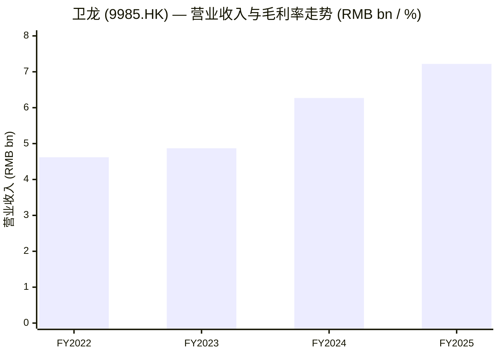
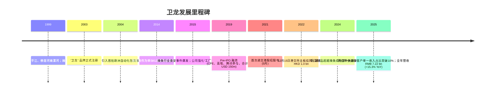
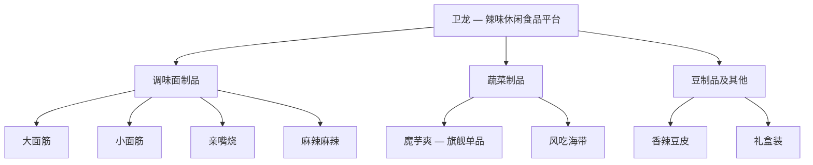
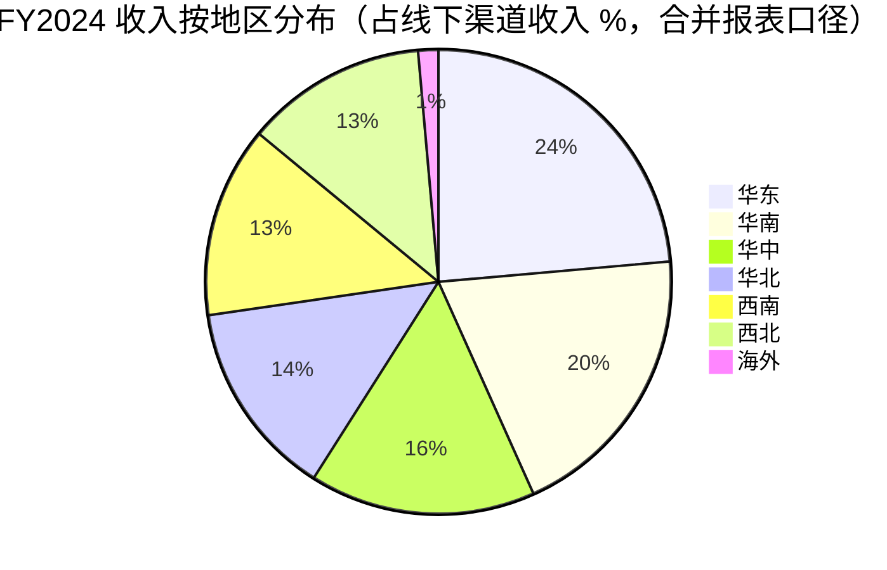
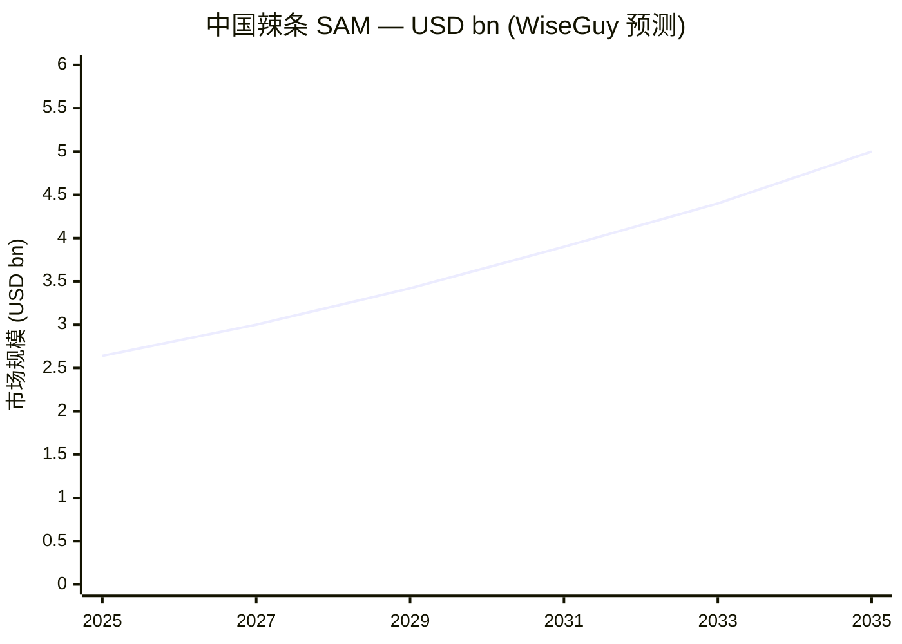

# 卫龙美味全球控股 (Weilong Delicious Global, HKEX:9985) — 首次覆盖

**报告日期：** 2026-06-03
**主要代码：** HKEX:9985 ([卫龙美味全球控股有限公司](https://www1.hkexnews.hk/listedco/listconews/sehk/2025/0327/2025032702753.pdf))
**行业：** 必需消费品 — 包装休闲食品（中国辣味休闲食品 / 辣条龙头）

> **重大事项 — FY2025 业绩 (2026-03-26)：** 营业收入同比增长 15.3% 至人民币 7,223.8 百万元（上年同期 6,266.3 百万元），归母净利润同比增长 33.4% 至人民币 1,425.2 百万元。毛利率维持在 48.0%。**蔬菜制品板块（核心单品为魔芋爽）已正式超越调味面制品（辣条）成为第一大收入来源，占总收入的 62.4%（2024 年为 53.8%）。** 报告期内公司首次披露两位 ≥ 收入 10% 的单一客户（分别为 12% 与 11%），基本可确认为前两大零食量贩连锁品牌。董事会建议派发末期股息每股 0.17 元，全年合计派息约占净利润 60%。
> 来源：[卫龙 2025 年度业绩公告, 2026-03-26](https://www.hkexnews.hk/listedco/listconews/sehk/2026/0326/2026032603128.pdf)。

## 目录

1. 公司概览
2. 公司历史
3. 管理团队
4. 产品与服务
5. 客户与上市策略
6. 行业概览
7. 竞争格局
8. 市场机会
9. 风险评估
10. 投资人视角评分
- Data Used / 数据来源清单
- 参考资料

---

## 1. 公司概览

卫龙美味全球控股有限公司（HKEX:9985）是按收入口径中国规模最大的辣味休闲食品（spicy snack food）专业制造商，由刘卫平、刘福平兄弟于 1999 年在河南省漯河市创立、2001 年实现规模化生产。公司在 2024 年度业绩公告中自我定位为 "中国辣味休闲食品行业的领导者及先锋"，产品矩阵覆盖三个分部：**(i) 调味面制品 (seasoned flour products / 俗称 "辣條") — 包括大面筋、小面筋、麻辣棒、小辣棒、亲嘴烧、麻辣麻辣等；(ii) 蔬菜制品 (vegetable products) — 核心产品包括魔芋爽、风吃海带、小魔女；(iii) 豆制品及其他 (bean-based and other products) — 包括香辣豆皮及礼盒装产品等。** 上述产品序列在 [2024 年度业绩公告附注 3 — 分部信息](https://www1.hkexnews.hk/listedco/listconews/sehk/2025/0327/2025032702753.pdf) 中有详细原文披露。

商业模式相对直接：卫龙在河南省自有五个工厂（漯河平平、漯河未来、驻马店未来、漯河卫道、漯河杏林），通过四类客户体系销售 — **(a) 截至 2025/12/31 共合作 1,633 家线下经销商（offline distributors）**，较 2024/12/31 的 1,879 家收缩，体现出对低产出经销商的主动清理；**(b) 快速增长的零食量贩 / 零食专卖 (snack-specialty-retailer) 渠道**（如鸣鸣很忙、万辰集团/好想来等）；**(c) 连锁便利店及商超系统**；**(d) 线上渠道**，覆盖主流电商（天猫、京东、拼多多）及内容电商（抖音、快手、小红书）。FY2025 业绩公告披露 89.7%/10.3% 的收入分别来自线下/线上渠道，地区分布以中国大陆为主（~98.4%），海外收入仅 RMB 117.4 m / 1.6%。

经营层面，公司已实现规模化阶段的高质量盈利：**FY2025 营业收入 RMB 7.22 bn，净利润 RMB 1.43 bn，对应净利率 19.8%、毛利率 48.0%、ROA ~17%、ROE ~22%** — 在中国包装休闲食品上市公司中处于头部分位，显著优于三只松鼠（SZSE:300783）、良品铺子（SZSE:603719）、盐津铺子（SZSE:002847）等同业。资产负债表层面，2025/06/30 营运资金 RMB 3.09 bn（同比 +127%），FY2025 末 "三个月以上定期存款 + 现金 + 现金等价物" 合计 RMB 7.92 bn，扣除有息负债后净现金约 RMB 5.7 bn — 为净现金 fortress balance sheet 状态。员工规模方面，2022 年 IPO 招股书披露约 5,000 人；2024 / 2025 年度业绩公告不再披露精确人数，但 RMB 1.09–1.12 bn 的员工福利支出规模与 5,000–5,500 人量级一致 ([2024 年度业绩公告, p. 11 — 按性质分类的费用](https://www1.hkexnews.hk/listedco/listconews/sehk/2025/0327/2025032702753.pdf))。

**估值快照（截至 2026-06-03）。** 据 [Stockanalysis.com (HKG:9985), 2026-06-03](https://stockanalysis.com/quote/hkg/9985/)，公司股价 HKD 8.03，总市值 HKD 19.86 bn（约 RMB 18.3 bn），**TTM P/E 12.24x，股息率 4.73%**，52 周区间 HKD 7.94–16.30；过去 12 个月股价下跌约 42%，明显跑输公司基本面表现，估值已显著低于 IPO 至今的中枢区间（IPO 初期 TTM P/E >25x，2025 年中期一度达约 30x）。按 [Simply Wall St (HKG:9985), 2026-05](https://simplywall.st/stocks/hk/food-beverage-tobacco/hkg-9985/weilong-delicious-global-holdings-shares)，**TTM P/S 约 2.8x，EV/EBITDA 约 6.1x，EBITDA 利润率 26.2%** — 对比已上市的中国休闲食品同业（良品铺子 FY24/25 连续亏损无可比 P/E、三只松鼠 forward P/E 约 21x 但 FY25 净利润下滑 57–67%、盐津铺子 TTM P/E 约 20x），卫龙是同业中估值最低且唯一 FY25 同时实现收入与利润双位数增长的标的。

TTM P/E 约 12x 叠加股息率 4.7%，组合阅读下来 prima facie 接近经典的价值股配置；但 FY2025 年度业绩首次披露 **两位单一客户均超过收入 10%**（FY2024 为零），是市场谨慎的核心原因 — 拉动魔芋爽放量的零食量贩渠道正在向少数头部连锁集中议价权，而 IPO 当年支撑 30x 估值的多元化客户结构已发生质变。乐观情景 = 中段 10% 利润增速 × 估值修复至 18–20x；悲观情景 = 客户集中度演化为单边性议价压力，使毛利率在 2026–28 年间累计回吐 200–400 bps。

*数据来源：[卫龙 2024 年度业绩公告](https://www1.hkexnews.hk/listedco/listconews/sehk/2025/0327/2025032702753.pdf) (FY2023、FY2024 数据) 与 [卫龙 2025 年度业绩公告](https://www.hkexnews.hk/listedco/listconews/sehk/2026/0326/2026032603128.pdf) (FY2025)。FY2022 收入参考 [Yicai Global IPO 报道, 2022-12](https://www.yicaiglobal.com/news/chinese-snack-giant-weilong-to-raise-up-to-usd1415-million-in-hong-kong-ipo/)。*

## 2. 公司历史

卫龙的产品基因并不源于河南，而是源于 **湖南省平江县** — 中国现代辣条品类的起源地。1990 年代末，平江本地传统豆制品作坊因大豆原料价格飙升被迫以面筋（小麦面粉蛋白）替代豆基底，意外创造了如今行业通行的辣条品类。1999 年，刘氏兄弟 — **刘卫平** 与 **刘福平** — 带着这一配方离开平江、北上河南漯河，因当地小麦面粉供应充裕、成本可控。初期生产为手工小批量、单日单批，2004 年公司即开始投资于自动化包装线（彼时从欧洲采购），是国内辣条品类最早实现工业化生产的玩家之一。"卫龙" 品牌于 2003 年完成商标注册，其中 "卫" 字取自刘卫平之名，"龙" 字则取自其推崇的演员成龙之姓 ([PandaYoo, "Weilong unicorn", 2023](https://pandayoo.com/post/weilong-became-a-unicorn-with-its-latiao-and-konjac-shuang/))。

2005–2015 年是稳健但相对平淡的产业化阶段：公司以大面筋为单一拳头产品，主攻全国便利店渠道、校园周边小卖部网络。随后两大催化剂改变了公司发展轨迹。**催化剂之一 — 食安重新定位 (2014–2018)。** 辣条品类在 2014–15 年遭遇全国性的食安舆论事件 — 中央电视台等媒体曝光了湖南、河南若干小作坊的卫生问题，整个品类面临系统性压力。卫龙的应对是激进的过度投资 — 加快自动化生产线投放、强化 HACCP / ISO22000 等食安认证、刻意将品牌定位与 "作坊辣条" 区隔为 "工厂级洁净生产" 的 premium Latiao 品牌，从而成功地将自身的发展轨迹与品类污名解耦。**催化剂之二 — 蔬菜制品拓展 (2014→2024)。** 魔芋爽于 2014 年作为单 SKU 试验品上市，依托河南本地的魔芋加工产业链。经过近 10 年的耐心培育，魔芋爽到 2024 年单品营收已经超越辣条品类的多 SKU 合计 — 公司 [2024 年度业绩 MD&A](https://www1.hkexnews.hk/listedco/listconews/sehk/2025/0327/2025032702753.pdf) 显示蔬菜制品 2024 年单年增长 59.1%，2025 年再增长 33.7%，以魔芋爽放量叠加风吃海带 / 小魔女系列补充共同驱动。

公司发展的第三大转折点是 **港股 IPO**：在两次延后递交招股书后（首次 2021 年 5 月、再次 2022 年 6 月），卫龙最终于 **2022 年 12 月 15 日** 在港交所主板挂牌，募集资金约 HKD 1.0 bn ([Yicai Global, 2022-12](https://www.yicaiglobal.com/news/chinese-snack-giant-weilong-to-raise-up-to-usd1415-million-in-hong-kong-ipo/))。IPO 募资规模较最初指引的 USD 1.5 bn 已大幅缩减，反映 2022 年下半年港股中国消费新股发行环境的疲弱。IPO 后，刘氏家族及员工持股信托工具合计持有约 86.5% 的股份 ([Phoenix Insights, IPO filing, 2021-05](https://insights.phoenix.global/china/20210513/weilong-delicious-global-holdings-files-for-hong-kong-ipo-ae9d8f9bb8))，使公司成为典型的紧密控股 / 低自由流通量公司 — 这也是股价对相对较小的成交量即出现大幅波动的结构性原因。

*数据来源：综合 [PandaYoo, 2023](https://pandayoo.com/post/weilong-became-a-unicorn-with-its-latiao-and-konjac-shuang/)、[Yicai Global, 2022-12](https://www.yicaiglobal.com/news/chinese-snack-giant-weilong-to-raise-up-to-usd1415-million-in-hong-kong-ipo/)、[2024 年度业绩公告](https://www1.hkexnews.hk/listedco/listconews/sehk/2025/0327/2025032702753.pdf)、[2025 年度业绩公告](https://www.hkexnews.hk/listedco/listconews/sehk/2026/0326/2026032603128.pdf)。*

IPO 以来的战略转型主要在三个层面展开：(1) "全渠道建设 (omni-channel)" — 主动加大对零食量贩、直播电商 / 内容电商、仓储会员店等新兴渠道的投入；(2) "品牌年轻化 (brand rejuvenation)" — 通过 TVC 广告（"卫龙：不止辣条" / "Beyond Spice" 系列在 2025 年上半年累计曝光 41.6 亿次, 见 [2025 中期业绩 PPT, p. 16](https://www.weilongshipin.com/en/Uploads/file/20250819/67f40f6123e1905a9975e89f2990ab3b.pdf)）、代言人合作（魔芋爽首位品牌大使王安宇）、IP 联名（2025 年亲嘴烧 × 魔道祖师动画 IP 联名）等方式锁定 Gen-Z 消费者；(3) "自动化 + 数字化" — 五大漯河工厂的多套 ERP / SRM / MES / 工业互联网 (Industrial IoT) 系统逐步铺开。IPO 后未发生显著并购事件，公司持续维持内生增长战略。

## 3. 管理团队

**刘卫平 (Liu Weiping) — 董事会主席、共同创始人。** 刘卫平签署了 [2024 年度业绩公告中的董事长致辞 (p. 18)](https://www1.hkexnews.hk/listedco/listconews/sehk/2025/0327/2025032702753.pdf)（签署日 2025 年 3 月 27 日），证实其持续承担公司运营的决策角色。刘卫平出生于湖南省平江县，1999 年与弟弟刘福平一同北上河南漯河，以家族辣条配方为基础逐步建立起全国性休闲食品品牌。品牌名 "卫龙" 中的 "卫" 字即取自其名。据 [胡润全球 U40 白手起家亿万富豪榜 2022](https://www.hurun.net/en-us/info/detail?num=52NPOEFSAWNB) 和 [2023 年胡润中国百富榜](https://www.caproasia.com/2024/01/19/2023-list-of-top-1000-richest-in-china/)，刘氏兄弟个人财富合计约 USD 1.8 bn，几乎全部来自其卫龙持股。刘卫平与刘福平共同控制和合全球资本 (Hehe Global Capital) 及卫龙未来发展有限公司员工持股工具，**合计持有公司约 86.49% 股份** ([daydaynews.cc, 引 2022 年招股书, 2022-06](https://daydaynews.cc/en/hotcomm/2806148.html))。这一股东结构是公司治理的核心事实：少数股东 / 维权投资人事实上无法影响公司决策，资本配置（如 60% 派息率、保留 RMB 7.9 bn 现金不进行并购、对海外扩张相对保守的节奏）均更多体现创始人偏好而非典型董事会决策结果。

战略思想方面，PandaYoo 等业内媒体引述其核心观点为 "自动化与品牌是两条护城河，必须持续投入并忽略短期业绩波动"。教育背景为本科以下水平（未完成全日制本科学业），自创业以来全程亲自参与运营，未将 CEO 等效职责委托给非家族职业经理人。*分析师观点：* 一家年营收 RMB 7 bn 量级的 FMCG 公司，由创始人持续兼任主席并担任唯一最高运营决策者，在国际同业横向对比中并不常见。该结构带来的主要风险有二：一是接班问题 — 刘卫平已年逾五旬，公司未公开披露 succession plan；二是渠道格局快速演化时期的决策反应速度。

**刘福平 (Liu Fuping) — 执行董事、共同创始人。** 刘卫平之弟，在香港上市公司治理框架下担任执行董事 (Executive Director) 而非常见的 CEO/COO 等 C-suite 职务。据 [胡润全球 U40 白手起家亿万富豪榜 2022](https://www.hurun.net/en-us/info/detail?num=52NPOEFSAWNB) 披露，刘福平在 40 岁时即跻身中国大陆消费品行业最年轻的亿万富豪之列，其财富同样几乎全部来自卫龙持股。按 2022 年招股书，其与刘卫平共同控制和合全球资本。教育背景与工作经历与其兄相似；根据业内媒体报道（非公司正式披露），兄弟之间的分工大致为 "刘卫平主管品牌与战略，刘福平主管制造与供应链"，但年报和公告均未对此正式确认。

**关于创始人兼任 CEO 的说明：** 公司并未设立独立于刘氏家族之外的 CEO 角色。根据 2024 / 2025 年度业绩公告中披露的管理层名单，所有公开披露职位的高级管理人员均为刘氏家族成员或长期内部晋升的河南本地员工；公司在 "业绩公告" 这一短版披露文件中并不附带完整的高管组织架构图。据 [2025 中期业绩 PPT, p. 4](https://www.weilongshipin.com/en/Uploads/file/20250819/67f40f6123e1905a9975e89f2990ab3b.pdf)，公司组织架构按 "品牌 / 产品 / 渠道 / 效率" 四个支柱划分，每个支柱实际由内部高级员工分管。按本研究 skill 规范（仅覆盖创始人 + CEO），其余高管不进行个人介绍。

## 4. 产品与服务

卫龙的产品矩阵 (product matrix) 已稳定收敛至三大可报告分部 (reportable segments) 及十余款核心 SKU。整体结构自 2022 年 IPO 以来未发生重大变化，但分部的收入结构 (segment-mix) 在过去 24 个月发生了实质性偏移 — 蔬菜制品已彻底超越调味面制品成为第一大收入贡献来源。

### 4.1 产品矩阵 — 2025 年度业绩公告原文 (载体性主次披露)

[卫龙 2025 年度业绩公告, p. 21 — Our Products](https://www.hkexnews.hk/listedco/listconews/sehk/2026/0326/2026032603128.pdf) 明确逐字披露：

> "本集团是中国辣味休闲食品行业的领导者及先锋。本集团坚持多品类策略，产品覆盖调味面制品、蔬菜制品及其他产品类别。**调味面制品（常称为辣条 / Latiao），主要包括大面筋、小面筋、亲嘴烧、麻辣麻辣等。** 蔬菜制品主要包括魔芋爽和风吃海带。其他产品主要包括香辣豆皮及礼盒装产品等。"

注意，与 [2024 年度业绩公告 p. 21](https://www1.hkexnews.hk/listedco/listconews/sehk/2025/0327/2025032702753.pdf) 中披露的调味面制品序列相比，2025 年度的产品矩阵已经精简：原 "麻辣棒、小辣棒、小魔女" 等 SKU 已退出公司公开披露的核心矩阵，体现 SKU 层面的主动剪枝、资源向魔芋爽集中。

2025 年度分部数据原表如下：

| 分部 (FY2025) | 收入 (RMB '000) | 占总收入 % | 毛利 (RMB '000) | 分部毛利率 |
|---|---:|---:|---:|---:|
| 调味面制品 (辣条) | 2,553,539 | 35.3% | 1,244,584 | 48.7% |
| 蔬菜制品 | 4,505,935 | 62.4% | 2,159,023 | 47.9% |
| 其他产品 | 164,285 | 2.3% | 62,754 | 38.2% |
| **合计** | **7,223,759** | **100.0%** | **3,466,361** | **48.0%** |

*数据来源：[卫龙 2025 年度业绩公告, 附注 3 — 分部信息, p. 8](https://www.hkexnews.hk/listedco/listconews/sehk/2026/0326/2026032603128.pdf)。*

### 4.2 综述 — 三大品类如何嵌入消费者使用场景

一位中国二线城市的 35 岁以下消费者，其实已经不再把卫龙单纯视为 "辣条品牌"，而是视为 **"同时拥有经典放纵零食仪式（在课后 / 游戏时间 / 深夜配冷饮的辛辣劲道大面筋）和新型 'guilt-free' 放纵仪式（搭配奶茶 / 咖啡食用的低卡魔芋爽）的辣味休闲食品平台"**。两大品类共享同一定价区间（RMB 4–8 单包冲动购买价格带）、共享便利店冷柜旁货架及零食量贩货架上的相邻陈列位置、共享卫龙的食安信赖溢价（brand-trust premium，过去 15 年累积）。豆制品板块则属于长尾 SKU，主要因为礼盒装组合需要 3–5 个 SKU 类型才能在视觉上 "饱满" 完整。下图为产品组合树 (product portfolio tree)：

*数据来源：[2025 年度业绩公告, p. 21](https://www.hkexnews.hk/listedco/listconews/sehk/2026/0326/2026032603128.pdf) 与 [2024 年度业绩公告, p. 21](https://www1.hkexnews.hk/listedco/listconews/sehk/2025/0327/2025032702753.pdf)。*

### 4.3 调味面制品 / 辣条 — 起家业务，现已退居第二

**分部描述原文** (2024 年度业绩公告较 2025 年度更详细，引自 [2024 年度业绩公告, p. 21](https://www1.hkexnews.hk/listedco/listconews/sehk/2025/0327/2025032702753.pdf))：

> "调味面制品，也常称为辣条 (Latiao)，主要包括大面筋、小面筋、麻辣棒、小辣棒、亲嘴烧、麻辣麻辣等。"

**中文释义 / Plain-language gloss：** 一根 "辣条" (Latiao) 即指用 wheat-gluten / 小麦面筋蛋白挤压成型、长约 5–10 cm、宽约 1 cm 厚的深红色油亮辣味条状零食。其制造工艺以工业化双螺杆挤压 (twin-screw extrusion) 为核心 — 面筋蛋白经螺杆挤压、切段、过油、再涂覆辣油 + 花椒 + 豆瓣酱风味浆，最后单独包装。口感介于牛肉干 (jerky) 与软糖 (gummy candy) 之间，韧性 ("chewy") 是其放纵感的物理基础；这与西方的薯片 / 椒盐脆饼 (chips / pretzels) 在口感上有显著差异。 "大面筋 / 小面筋" 的区别仅在于成型尺寸与包装规格（"小面筋" 为一口装，"大面筋" 为长条），"麻辣棒 / 小辣棒" 则是更辣配方的版本。"亲嘴烧" 是一种甜辣口味的褶皱面筋片，"麻辣麻辣" 则是以四川花椒为主香料的麻辣版本。卫龙在该品类的核心竞争力源自 2004 年开始的自动化投资 — 即 2020 年代中后期的差异化优势主要体现在 "全行业最干净的工厂"（manufacturing-quality / food-safety reputation）而非独家配方。

辣条收入在 2024 年仅增长 4.6%（至 RMB 2,667.1 m），2025 年甚至同比下降 4.3%（至 RMB 2,553.5 m），见 [2025 年度业绩公告分部表 p. 22](https://www.hkexnews.hk/listedco/listconews/sehk/2026/0326/2026032603128.pdf)。管理层解释为 "本集团主动调整资源分配、优化产品结构" — 即有意识地缩减辣条 SKU 宽度及渠道推动力度，把营销和渠道投放资源转移至魔芋爽。这一战略选择 strategically 是可辩护的（蔬菜制品在年轻消费者群体的 LTV 更高、放量斜率更陡），但同时也意味着辣条业务现已处于 "受管理的衰退/稳态" (managed decline / steady-state) 阶段，不再是公司收入增长引擎。

*分析师观点：* 辣条品类作为现代工业化产品已有 25+ 年发展历史，目前已经成熟；单包 RMB 2–5 价格锚点稳固；并面对学校周边渠道监管 (school-channel regulation) 的结构性约束 — 中国教育部历次出台过对高钠、高添加剂校园零食销售的限制。卫龙在该品类的护城河仍是 *品牌* 与 *食安信誉*，并非技术或配方。SKU 层面最直接的竞品包括 **麻辣王子**（湖南平江本地、私营、未上市，定位 "原产地辣条" 挑战者）和 **金磨坊**；[WiseGuy 中国辣条市场报告 2025](https://www.wiseguyreports.com/reports/spicy-sticks-chinese-snack-market) 将平江翔宇食品列为前十大行业玩家之一。

### 4.4 蔬菜制品 / 魔芋爽 — 新的旗舰品类

**分部描述原文**（引自 [2025 年度业绩公告, p. 21](https://www.hkexnews.hk/listedco/listconews/sehk/2026/0326/2026032603128.pdf)）：

> "蔬菜制品主要包括魔芋爽 (Konjac Shuang) 和风吃海带 (Fengchi Kelp)。"

**中文释义 / Plain-language gloss：** 魔芋爽 (Konjac Shuang) 字面意为 "konjac refreshing"，由魔芋粉 (konjac flour，来自魔芋块茎 / *Amorphophallus konjac*)、水及辣味 / 酸辣调味浆制成，挤压成型为 3 cm 宽的果冻状条状零食，再单独包装。其品类定义级属性是 **每单包热量极低 + 膳食纤维含量较高 — 通常一包约 30–40 kcal，对比同等规格辣条约 150 kcal**，并具有独特的 "弹滑" 口感（接近生鲜海产如鱿鱼 / 海蜇的咀嚼感）。对一位 Gen-Z 消费者而言，魔芋爽是中国 FMCG 市场目前最接近 "无热量酸甜软糖" 的产品定位 — 即满足 "想吃零食却不想内疚" 的诉求。风吃海带 (Fengchi Kelp) 则是同一产品概念以海带 (kelp) 替换魔芋作为基底，口感更脆，富含碘元素，调味体系类似。

魔芋爽自 2014 年上市以来一直是卫龙最重要的新产品，2024–2025 年的拐点已经成为整家公司增长叙事的支柱：

- **2023 蔬菜制品收入：** RMB 2,118.5 m（占总收入 43.5%）
- **2024 蔬菜制品收入：** RMB 3,370.6 m（占总收入 53.8%）— **同比 +59.1%**
- **2025 蔬菜制品收入：** RMB 4,505.9 m（占总收入 62.4%）— **同比 +33.7%**

(*数据来源：[2024 年度业绩公告 p. 23](https://www1.hkexnews.hk/listedco/listconews/sehk/2025/0327/2025032702753.pdf)、[2025 年度业绩公告 p. 22](https://www.hkexnews.hk/listedco/listconews/sehk/2026/0326/2026032603128.pdf)。*)

[2025 年度业绩公告 p. 26](https://www.hkexnews.hk/listedco/listconews/sehk/2026/0326/2026032603128.pdf) 的产能扩张数据进一步明确了战略承诺：蔬菜制品的设计产能从 96,228 吨 (2023) → 129,986 吨 (2024) → 225,774 吨 (2025)，过去两年累计扩张 +135%。相比之下，调味面制品的设计产能则从 237,722 吨 (2023) → 202,065 吨 (2024) → 172,658 吨 (2025) — 24 个月内累计压缩约 27%，体现资源向魔芋爽的明确再分配。

*分析师观点：* 魔芋爽是真正具有跨品类吸引力 (crossover appeal) 的爆款产品，"低卡 + 健康" 的定位与中国消费品大盘 "健康化零食" 浪潮直接对接。需要关注的悲观情景在于 **毛利率**：作为原料，魔芋粉历史价格波动性 (price volatility) 显著高于小麦面粉，主要因为云南 / 四川魔芋种植基础较小且更分散。[2025 中期业绩 PPT p. 9 — COGS 结构](https://www.weilongshipin.com/en/Uploads/file/20250819/67f40f6123e1905a9975e89f2990ab3b.pdf) 显示原材料占收入比从 24.3% (H1 2024) → 25.7% (FY 2024) → 28.2% (H1 2025) 持续上升；H1 2025 蔬菜制品分部毛利率从 H1 2024 的 52.6% 压缩至 46.6%（同比 -600 bps）。全年来看公司基本通过供应链效率提升对冲了这部分压力，但毛利率仍是后续监测的核心指标。SKU 层面最直接的竞品是 **盐津铺子的 "大魔王" 魔芋条系列**（2022 年上市，市场上对魔芋爽最直接的模仿）；以及通过零食量贩渠道销售的大量代工 / 自有品牌魔芋制品。

### 4.5 豆制品及其他 — 长尾 / 礼盒装

**分部描述原文**（引自 [2025 年度业绩公告, p. 21](https://www.hkexnews.hk/listedco/listconews/sehk/2026/0326/2026032603128.pdf)）："其他产品主要包括香辣豆皮 (Spicy Tofu Skin) 及礼盒装产品等。"

该分部结构上较小（FY2025 收入 RMB 164 m，占总收入 2.3%，同比下滑 28.2%），承担两个功能：(1) 历史业务延续（香辣豆皮是公司延续十余年的小批量豆制品 SKU）；(2) 礼盒装捆绑销售（春节假日礼盒需要 3–5 种 SKU 类型才能视觉饱满）。[2025 年度业绩公告 p. 23](https://www.hkexnews.hk/listedco/listconews/sehk/2026/0326/2026032603128.pdf) 中管理层措辞 "针对香辣豆皮等产品组合的调整" 明确反映此分部将持续 de-emphasis。无品类层面创新焦点。

### 4.6 产品创新管线与近期新品

2025 年度业绩公告详细披露了 2025 年的创新管线：**芝麻酱风味魔芋爽**、**高纤维 Porcini 牛肝菌风味魔芋爽**（定位 "轻饮食 / 非辣偏好" 群体）、**云南傣味擂椒鸡爪风味魔芋爽**（区域风味实验）、**麻辣小龙虾风味大面筋**、**手撕烤肉风味大面筋**（采用新疆孜然 + 武都四川花椒）、以及 **香辣牛肉风味亲嘴烧**（融合金阳青花椒、武都四川花椒、河南辣椒、印度幽灵椒共四种香辣体系，详见 [2025 年度业绩公告 p. 22](https://www.hkexnews.hk/listedco/listconews/sehk/2026/0326/2026032603128.pdf)）。共同主题是 **在既有 SKU 形态内进行口味线延伸 (flavour-line extension)** — 2024 与 2025 年度均未推出全新品类。该策略与公司整体战略一致：依托魔芋爽的品类层面顺风加速度通过口味延伸放量，不通过新品类分散资源与注意力。

### 4.7 产能基础、研发与售后

**五个河南工厂**（全部为自有、全部位于河南省）：漯河平平、漯河未来、驻马店未来、漯河卫道、漯河杏林。FY2025 末设计产能合计 409,108 吨、产能利用率 77.9%；对比 FY2024 的 338,175 吨 / 77.7%（见 [2025 年度业绩公告 p. 26 — 产能表](https://www.hkexnews.hk/listedco/listconews/sehk/2026/0326/2026032603128.pdf)）。漯河杏林工厂是最新的也是最具战略意义的工厂 — 设计产能从 2024 年的 51,843 吨扩张至 2025 年的 155,002 吨，已经成为公司单厂规模最大的产能基地，也是蔬菜制品（魔芋爽）的核心生产中心。

研发体系集中于位于 **上海** 的 R&D Centre for Infrastructure and Applications，团队能力覆盖 "食品工程、食品安全与营养、高分子化学、生物学、检测与分析" 等多学科（[2024 年度业绩公告 p. 28](https://www1.hkexnews.hk/listedco/listconews/sehk/2025/0327/2025032702753.pdf)）。公司与若干国内食品科学领域知名高校已建立长期合作关系（具体名称未在业绩公告中披露）。2025 年度业绩公告未拆分披露研发费用具体金额。

无独立的售后 / 服务业务 — 这是典型的纯制造商品 FMCG 公司，FY2025 收入 100% 为 "商品销售" 收入（见 [2025 年度业绩公告 附注 3(c), p. 9](https://www.hkexnews.hk/listedco/listconews/sehk/2026/0326/2026032603128.pdf)）。少量低产量 SKU 通过 OEM 合作伙伴生产（[2024 年度业绩公告 p. 26](https://www1.hkexnews.hk/listedco/listconews/sehk/2025/0327/2025032702753.pdf)）。

## 5. 客户与上市策略

卫龙的客户结构分为四类：**(a) 线下经销商（offline distributors）**、**(b) 零食量贩 / 仓储会员店等直销客户（direct sales to snack-specialty-retailer chains and warehouse-membership-club operators）**、**(c) 线上批发分销（online distribution — Tmall Supermarket / JD Supermarket）**、**(d) 线上直销 (online direct sales — 自有店在天猫 / 京东 / 拼多多 / 抖音 / 快手等平台)**。本节所有客户份额数字均以 **合并报表收入 (consolidated revenue)** 为分母；公司在业绩公告中并未披露分部层面的客户集中度，因此合并视角和分部视角对本公司一致。

### 5.1 客户集中度 — FY2025 重大披露

这是 FY2025 业绩公告中最具实质性的披露变化，也是股价较 2024 年底高点回落 40%+ 的核心驱动因素。逐字引自 [2025 年度业绩公告 附注 3(b) — 关于主要客户的信息, p. 8](https://www.hkexnews.hk/listedco/listconews/sehk/2026/0326/2026032603128.pdf)：

> "于截至 2025 年 12 月 31 日止年度，向两位主要第三方客户的销售收入分别为人民币 838.2 百万元及人民币 781.2 百万元，分别约占本集团总收入的 12% 及 11%（2024 年：来自单一客户的销售收入未达到本集团总收入 10% 或以上）。"

即：**FY2025 内两位单一客户合计占合并收入约 23%（RMB 1.62 bn），两者分母均为合并报表收入**；而 FY2024 及以前年度均无 >10% 单一客户。公告未具名披露这两位客户的身份，但渠道背景使识别相对清晰：FY2025 MD&A 多次强调 "零食专卖 / 零食量贩 (snack specialty retailers)" 作为核心驱动的新兴增长渠道，而国内两家头部连锁分别是 **鸣鸣很忙集团**（2024 年由赵一鸣零食 + 好想来 + 其他若干品牌合并形成、门店数超 10,000+）和 **万辰集团 (SZSE:300972)**，两家在 2024 / 2025 年度均公开提及卫龙为重点供应商。*分析师推断（非公告直接披露）：* 两位 ≥10% 客户基本可确认为这两家连锁；待 2025 年度长版年报正式披露时（一般在业绩公告发布后 3–6 周内）可获得二次验证。

该变化的重要性在于 **零食量贩连锁渠道运营在 "硬议价 / 低毛利" 的分销经济模式下** — 它们集中分销分散的小包装零食，以显著低于传统便利店零售的价格转售，并通过激进的渠道返点 (trade-spend) 换取上架与放量。从 FY2023 的 "1,600 家经销商，单一客户均不超过 5% 收入" 转变为 FY2025 的 "两位客户分别 11–12% 收入" 是结构性变化而非周期性波动。**悲观情景**：到 2026–28 年这两家连锁个体集中度进一步扩张至 15–20%，卫龙单包实现价格压缩 200–400 bps，毛利率回吐 100–200 bps；**乐观情景**：零食量贩渠道的绝对体量增速足够快，即使单位经济压缩，渠道贡献的美元金额仍持续上行 — 类比美国 1990s 包装零食公司最终接纳 Walmart / Costco 作为 ≥10% 客户的历史路径，并未导致持久估值压制。

### 5.2 经销商网络与销售终端覆盖

按 [2025 年度业绩公告 p. 23](https://www.hkexnews.hk/listedco/listconews/sehk/2026/0326/2026032603128.pdf)：FY2025 末线下经销商 **1,633 家**（FY2024 末 1,879 家，2025/06/30 末 1,777 家、引自 [2025 中期业绩 PPT, p. 17](https://www.weilongshipin.com/en/Uploads/file/20250819/67f40f6123e1905a9975e89f2990ab3b.pdf)）。管理层持续清理低产出经销商。终端门店 POS 覆盖快速扩张：**H1 2025 末 583,911 家**（按 [中期业绩 PPT p. 17](https://www.weilongshipin.com/en/Uploads/file/20250819/67f40f6123e1905a9975e89f2990ab3b.pdf)），相较 FY2024 末 433,469 家、H1 2024 末 352,011 家、FY2023 末 328,790 家、H1 2023 末 209,466 家。每家 POS 平均上架 SKU 数从 2023 年的 9.6–12.5 个增至 2025 年末的 16.0–22.8 个 — 即单店上架卫龙 SKU 多出约 70%。

### 5.3 渠道结构与地区分布

[2025 年度业绩公告 p. 24](https://www.hkexnews.hk/listedco/listconews/sehk/2026/0326/2026032603128.pdf) 中 FY2024 → FY2025 渠道结构的原表如下：

| 渠道 (FY2025) | 收入 (RMB '000) | 占总收入 % | 同比变化 |
|---|---:|---:|---:|
| 线下渠道 | 6,476,960 | 89.7% | +16.5% |
| 线上渠道（合计） | 746,799 | 10.3% | +6.0% |
| — 线上分销（天猫超市 / 京东超市） | 211,781 | 2.9% | -24.5% |
| — 线上直销（自营店） | 535,018 | 7.4% | +26.1% |
| **合计** | **7,223,759** | **100.0%** | **+15.3%** |

需要关注的变化：**线上分销渠道 2025 年实际下降 24.5%**，反映卫龙刻意减少对传统天猫超市 / 京东超市批发关系的依赖，将资源转向直接面向消费者 (D2C) 的内容电商渠道。*分析师观点：* 这是有意识的渠道毛利结构调整 — 线上直销（在天猫、京东、拼多多、抖音、快手等平台的自营店）单位经济更佳但运营复杂度更高，相对于 dropshipping 至天猫超市 / 京东超市的批发模式。

地区分布相对均衡，覆盖国内六大区域 + 海外：

*数据来源：[卫龙 2024 年度业绩公告, p. 25 — 收入按地理位置分布](https://www1.hkexnews.hk/listedco/listconews/sehk/2025/0327/2025032702753.pdf)。注：饼图显示的是线下渠道收入分布（占合并收入的 88.8%）；线上渠道并未按地区拆分披露。*

海外收入从 RMB 79.2 m (FY2024) 增至 RMB 117.4 m (FY2025)（见 [2025 年度业绩公告 附注 3(a), p. 8](https://www.hkexnews.hk/listedco/listconews/sehk/2026/0326/2026032603128.pdf)），仅占合并收入 1.6%，可忽略不计。卫龙通过海外华人超市等渠道在东南亚、北美等地区有少量分销（如菲律宾 [weilong.com.ph](https://www.weilong.com.ph/pages/about-us)），但从绝对意义上而言并非一家全球品牌。

### 5.4 应收账款与信用风险

FY2025 末应收账款余额 RMB 90.4 m，较 FY2024 末 RMB 52.8 m 上升 71.2%，反映从向传统经销商 "先款后货" 模式向零食量贩连锁 "60–90 天信用期" 直销模式的逐步切换。应收周转天数仍极低（FY2025 为 3.6 天，FY2024 为 3.0 天，[2025 年度业绩公告 p. 30](https://www.hkexnews.hk/listedco/listconews/sehk/2026/0326/2026032603128.pdf)）。现金循环周期主要由库存周转主导（FY2025 为 86 天），并非应收风险。

## 6. 行业概览

中国休闲食品 (casual snack) 行业是 **全球第二大零售市场（仅次于美国）**。据 [Research and Markets, 2025-03](https://www.businesswire.com/news/home/20250314258092/en/China-Snacks-Food-Market-Trends-Report-2025-2033-Urbanization-and-Changing-Lifestyles-Trigger-Boon-Consumers-Drive-Demand-for-Low-Calorie-and-Nutrient-Rich-Snacks-Online-Platforms-Fuel-Consumption---ResearchAndMarkets.com)，2024 年市场规模 USD 131.1 bn，预计 2033 年达 USD 206.2 bn，对应 CAGR 约 5.2%。更细化的 **辣条 / spicy stick 子品类** 2025 年规模约 USD 2.64 bn ([WiseGuy Reports, 2025](https://www.wiseguyreports.com/reports/spicy-sticks-chinese-snack-market))，预计 2035 年达 USD 5.0 bn (~6.6% CAGR)。**魔芋 / 蔬菜制品** 子品类目前缺乏权威第三方独立 TAM 数据，但管理层在 [2025 中期业绩 PPT p. 14 — 行业部分](https://www.weilongshipin.com/en/Uploads/file/20250819/67f40f6123e1905a9975e89f2990ab3b.pdf)（引用 McKinsey 大中华区及 CBNData）中强调 "消费需求正从性价比向个人价值、生活品质转移，驱动对溢价产品和体验型满足感的追求"。

2023–2026 年窗口期对本行业最具结构性影响的变化主要有五：

**(a) 渠道革命：零食量贩连锁的崛起。** 在过去约 36 个月（2022 中至 2025 中），两家整合后的全国连锁 — **鸣鸣很忙集团**（由赵一鸣零食、好想来等品牌于 2023 末至 2024 初合并而成）与 **万辰集团 / SZSE:300972** — 合计已在全国铺开 20,000+ 门店。其模式核心是 "低毛利 / 高周转" — 以较便利店零售低 10–30% 的价格销售零食、SKU 高频轮换、靠供应商渠道返点 (trade-spend) 补贴上架费。据 [新浪财经, 2026-04](https://finance.sina.com.cn/stock/wbstock/2026-04-23/doc-inhvpcuy3700790.shtml)，该渠道已在过去 3 年大幅重塑整个包装零食品类的分销经济。对卫龙而言，零食量贩是 FY2024–2025 收入增长的核心驱动力 — 但同时也带来 §5.1 中提及的新客户集中度风险。

**(b) 健康化零食与品类轮动。** 魔芋制品、低卡零食 2023–2025 年增速 30–50%，远超大盘的个位数增速；驱动力来自 Gen-Z 节食者、健身人群、"便利 + 健康" 双重定位的扩散。这是从需求端理解卫龙蔬菜制品 2024–2025 同比增速 33–59% 的根本原因。

**(c) 内容电商 / 直播电商。** 抖音、快手内容电商目前在中国零食品类的新品发现 (new-brand discovery) 中所占份额已显著超过传统 FMCG 广告渠道。成熟品牌如卫龙已学会通过 celebrity 代言人（H1 2025 推出魔芋爽首位品牌大使王安宇，见 [中期业绩 PPT p. 16](https://www.weilongshipin.com/en/Uploads/file/20250819/67f40f6123e1905a9975e89f2990ab3b.pdf)）与 IP 联名（2025 年亲嘴烧 × 魔道祖师动画联名）持续维持品牌在 Gen-Z 群体中的曝光。

**(d) 原材料成本周期。** 小麦面粉、食用油（豆油、棕榈油）、魔芋粉是公司三大主要原材料。[2025 中期业绩 PPT p. 9 — COGS 占收入比](https://www.weilongshipin.com/en/Uploads/file/20250819/67f40f6123e1905a9975e89f2990ab3b.pdf) 显示原材料占收入比从 24.3% (H1 2024) 上升至 25.7% (FY2024) 再上升至 28.2% (H1 2025)；[2025 年度业绩公告 p. 28 — 收入与毛利率讨论](https://www.hkexnews.hk/listedco/listconews/sehk/2026/0326/2026032603128.pdf) 中也明确披露 "本集团积极的供应链效率提升基本对冲了原材料成本上升的影响"。该表述客观恰当 — 原材料是真实的逆风，但漯河厂区网络的供应链运营杠杆把毛利率守住了。后续的悲观情景在于：若魔芋粉价格继续上行（云南 / 四川魔芋采收受气候影响远高于小麦），蔬菜分部毛利率可能在 2026 年承压。

**(e) 监管。** 国家市场监督管理总局（SAMR）和教育部自 2014 年以来多次出台对辣条钠含量、添加剂使用与校园销售渠道的管控。2018 年 GB 2760 更新统一了辣条食品安全的国家标准；2022–2024 年又有多轮专业化更新。卫龙作为头部企业是监管收紧的净受益者 — 因为公司有规模消化合规成本，而小作坊难以承担 — 这是过去 15 年持续硬化的结构性护城河。

**行业结构评估：** 中国包装休闲食品行业 **合并层面适度分散**（最大单一玩家不超过整体 USD 131 bn 大盘的 ~5%），但 **辣条子细分市场适度集中**，卫龙在子品类中的市场份额按 [WiseGuy Reports, 2025](https://www.wiseguyreports.com/reports/spicy-sticks-chinese-snack-market) 预测约 15–20%。进入壁垒：小作坊层面较低（资本密度低、原材料可得性高），全国品牌层面较高（食安信誉、自动化资本投入、零食量贩渠道准入）。买方议价权：零食量贩渠道持续上升（见 §5.1），其他渠道仍较低。卖方议价权：中等（小麦面粉为大宗商品，魔芋粉相对集中）。

## 7. 竞争格局

卫龙处于中国 5–10 家休闲食品同业构成的竞争集群中，但具体的同业 (peer set) 因产品线而异。在 **辣条子品类** 上，直接的命名竞争对手包括：**麻辣王子**（私营、未上市、湖南平江本地，定位 "原产地辣条" 挑战者）、**金磨坊**、**平江翔宇食品**、**湖南未来食品** 及大量区域性小作坊品牌（[WiseGuy Reports, 2025](https://www.wiseguyreports.com/reports/spicy-sticks-chinese-snack-market)）。在更广义的 **品牌化包装零食同业集** 中，主要竞争对手为 **三只松鼠 (SZSE:300783)**、**良品铺子 (SZSE:603719)**、**盐津铺子 (SZSE:002847)**、**洽洽食品 (SZSE:002557)**，以及 **鸣鸣很忙集团**（2024 年提交港股 IPO 申请）— 注意鸣鸣很忙既是卫龙的客户（占收入 ≥10%），也是潜在的自有品牌竞争对手（其私有品牌零食业务正在扩张）。

**FY2025 同业对比：**

| 公司 | 代码 | FY2025 收入 | FY2025 净利润 | 收入同比 | 利润同比 | TTM P/E (2026-06) | 备注 |
|---|---|---:|---:|---:|---:|---:|---|
| **卫龙** | HKEX:9985 | RMB 7.22 bn | RMB 1.43 bn | +15.3% | +33.4% | ~12.2× | 辣味休闲专业型；毛利率 ~48% |
| 盐津铺子 | SZSE:002847 | RMB ~5.76 bn | RMB ~0.75 bn | +8.6% | +17.0% | ~20× | 多品类零食含魔芋仿制品 |
| 三只松鼠 | SZSE:300783 | RMB ~7.76 bn | (同比 –57% 至 –67%) | +8.5% | 大幅下降 | n/m | 坚果 + 综合零食平台；渠道成本压力 |
| 良品铺子 | SZSE:603719 | RMB ~4.14 bn | RMB 12–16 亿亏损 | n/a | 净亏损 | n/m | 高端零食连锁；多年下滑 |

*数据来源：[新浪财经, 2026-04](https://finance.sina.com.cn/stock/wbstock/2026-04-23/doc-inhvpcuy3700790.shtml)、[Bamboo Works, 2025-09](https://thebambooworks.com/three-squirrels-chases-hong-kong-listing-in-scurry-for-offshore-cash/)、[卫龙 2025 年度业绩公告](https://www.hkexnews.hk/listedco/listconews/sehk/2026/0326/2026032603128.pdf)、[Stockanalysis.com, 2026-06-03](https://stockanalysis.com/quote/hkg/9985/)。*

```mermaid
xychart-beta
    title "同业对比 — FY2025 净利润率 (%) 与 TTM P/E (x)"
    x-axis ["卫龙 9985", "盐津铺子 002847", "三只松鼠 300783", "良品铺子 603719"]
    y-axis "数值 (% 或 x)" -30 --> 30
    bar [19.8, 13.0, -10.0, -25.0]
    bar [12.2, 20.0, 0, 0]
```

*柱状条：净利润率 (%) 与 TTM P/E (x)。三只松鼠 TTM P/E 标为 0 因 TTM 利润太低导致 P/E 失去意义；良品铺子 P/E 标为 0 因公司亏损。数据来源同上表。*

**卫龙的相对竞争地位 — 乐观视角。** 卫龙是 FY2025 中国上市规模化休闲食品同业中唯一同时实现 top-line 与 bottom-line 增长的标的，唯一具有 ~48% 毛利率（同业 32–38%），也是 TTM P/E 处于历史中段以下的标的。在辣味休闲食品子品类中拥有 #1 品牌地位，预估市场份额 ~15–20%（[WiseGuy Reports, 2025](https://www.wiseguyreports.com/reports/spicy-sticks-chinese-snack-market)），且现已通过魔芋爽证明了实质性的品类延伸能力。创始人 ~86.5% 控股结构（[daydaynews.cc, 2022-06](https://daydaynews.cc/en/hotcomm/2806148.html)）意味着公司决策的战略视野为年级而非季度级；RMB 7.9 bn 现金 + 接近零的净有息负债意味着在毛利率压力周期下公司有 2–3 年的吸收空间无需向股东稀释。

**卫龙的相对竞争地位 — 悲观视角。** 三大挑战：第一，**渠道议价权失衡**：占收入 ≥23% 的零食量贩连锁过去 24 个月议价权显著提升，FY2025 首次出现两位 ≥10% 客户是这一议价权变化的首个具体信号。第二，**蔬菜制品同业侵蚀**：盐津铺子 "大魔王" 魔芋条系列、零食量贩渠道上的大量代工 / 自有品牌魔芋 SKU 正在低端商品化魔芋爽品类；H1 2025 卫龙蔬菜制品分部毛利率同比下降约 600 bps（52.6% → 46.6%，见 [中期业绩 PPT p. 9](https://www.weilongshipin.com/en/Uploads/file/20250819/67f40f6123e1905a9975e89f2990ab3b.pdf)）。第三，**辣条品类的成熟期**：起家业务已不再是增长引擎，公司必须找到下一个 "魔芋爽" 才能延续 2027–28 年之后的合并增长叙事。当前最具备可能性的候选是风吃海带和高纤维 Porcini 风味魔芋爽延伸；两者目前规模都不足以验证。

**护城河（按 Buffett 框架分类）：** (a) 品牌（中-高，过去 15 年累积的食安信誉；在低端市场被零食量贩自有品牌侵蚀）；(b) 成本（中，漯河自动化产能 + 规模效应）；(c) 切换成本（低 — 零食品类整体属冲动消费，品牌忠诚度偏低）；(d) 网络效应（无）；(e) 监管（低-中，食安信誉对小作坊形成进入壁垒）。

## 8. 市场机会 (TAM)

**TAM — 中国休闲食品大盘：** 2024 年 USD 131.1 bn，预计 2033 年达 USD 206.2 bn (CAGR ~5.2%)，引自 [Research and Markets, 2025-03](https://www.businesswire.com/news/home/20250314258092/en/China-Snacks-Food-Market-Trends-Report-2025-2033-Urbanization-and-Changing-Lifestyles-Trigger-Boon-Consumers-Drive-Demand-for-Low-Calorie-and-Nutrient-Rich-Snacks-Online-Platforms-Fuel-Consumption---ResearchAndMarkets.com)。

**SAM — 中国辣味休闲食品子品类：** 2025 年 USD 2.64 bn → 2035 年 USD 5.0 bn (~6.6% CAGR)，引自 [WiseGuy Reports, 2025](https://www.wiseguyreports.com/reports/spicy-sticks-chinese-snack-market)。该 SAM 定义较狭窄（捕捉 Latiao 等价的辣条子品类），不包括魔芋等蔬菜制品 — 后者归属更广义 "低卡 / 健康零食" SAM，目前缺乏权威第三方独立 TAM。

**SOM — 卫龙服务的市场份额：**
- 按 RMB / USD ~7.2 估算，FY2025 卫龙收入约 USD 1.0 bn；
- 对比 USD 2.64 bn 辣条 SAM → 卫龙 2025 年份额估算约 38%。该数值高于 WiseGuy 估算的 15–20%，原因是 WiseGuy SAM 较卫龙产品组合更狭窄（卫龙产品组合还包括严格 spicy-stick 定义之外的蔬菜制品 + 豆制品）；
- 更实用的拆分：卫龙 FY2025 辣条 / 调味面制品分部收入 RMB 2.55 bn = USD ~0.35 bn，对比 USD 2.64 bn SAM → 辣条单品类份额约 13%，与行业研究共识一致。蔬菜制品 RMB 4.51 bn = USD 0.62 bn 处于更广义（未独立估算）的魔芋 / 低卡零食 SAM 中，卫龙可能为品类龙头。

*数据来源：[WiseGuy Reports, 中国辣条市场 2035 展望, 2025](https://www.wiseguyreports.com/reports/spicy-sticks-chinese-snack-market) — 根据 2025/2035 锚点线性插值得到隐含 CAGR ~6.6%。*

**渗透增长路径。** 卫龙特有的可量化增长方向：(a) 零食量贩渠道 — 鸣鸣很忙 + 万辰集团门店总数 2025 末约 20,000+，预计 2027–28 增至 ~30,000；(b) 下沉市场覆盖 — POS 数 H1 2025 约 584k，至饱和约 ~800k–1m，主要扩张方向是四五线城市及县城；(c) 海外扩张 — 当前仅占收入 1.6%，未来 5 年的优先级是东南亚（印尼、菲律宾、马来西亚 — 通过海外华人超市渠道）。这三方向均不构成 10× 机会；合并来看，支持公司未来 3–5 年实现可持续 ~10–15% 收入 CAGR（假设执行到位）。

## 9. 风险评估

**公司特有风险 (4–6 项)：**

1. **客户集中度 — 两位零食量贩客户单一占比已达 10–12%。** FY2025 业绩公告 ([附注 3(b)](https://www.hkexnews.hk/listedco/listconews/sehk/2026/0326/2026032603128.pdf)) 披露两位 ≥10% 客户，相对 FY2024 的 "0 个 >10% 客户" 是结构性变化。最有可能的身份识别为鸣鸣很忙 (鸣鸣很忙) 和万辰集团 (万辰集团)。风险：12–24 个月内连锁议价权进一步加强、迫使卫龙毛利率回吐 200–400 bps。缓释：卫龙品牌溢价仍使其在零食量贩货架上是 "必备 SKU"，若两家同时下架 Weilong，对双方门店流量影响均较显著。定量影响：23% 的收入毛利率压缩 300 bps = 合并毛利率压缩 ~50 bps = 毛利金额减少约 RMB 36 m（绝对金额不大，但市场解读为投资逻辑反转）。

2. **魔芋粉原材料价格周期性。** H1 2025 蔬菜制品分部毛利率同比下降 600 bps（52.6% → 46.6%，见 [中期业绩 PPT p. 9](https://www.weilongshipin.com/en/Uploads/file/20250819/67f40f6123e1905a9975e89f2990ab3b.pdf)），核心驱动是魔芋粉价格上行。魔芋是云南 / 四川 / 贵州的经济作物，亩产对气候敏感、供应基础较小麦更集中。风险：2026 年魔芋采收遭遇气候事件可能进一步压缩 300–500 bps 分部毛利率，合并毛利率回落至 46%（vs 当前 48% 基准）。

3. **辣条品类的结构性成熟；品牌年轻化执行风险。** FY2025 辣条收入已绝对值同比下滑 4.3%。要支撑合并收入维持中段双位数增速，魔芋爽及其口味延伸必须保持 25–35% 增长 — 这取决于持续的 Gen-Z 品牌运营效率。风险：2027–28 出现品牌疲劳后合并增速回落至 5–8%。

4. **创始人控股治理 — 接班与资本配置纪律。** ~86.5% 内部持股 ([daydaynews.cc, 2022-06](https://daydaynews.cc/en/hotcomm/2806148.html)) 意味着少数股东实际无法挑战资本配置。刘卫平已年逾五旬但未公开接班计划；RMB 7.9 bn 闲置现金以 60% 派息支付（FY2025），而非用于并购或激进的海外扩张 — 可辩护但未必最优。风险：创始人 key-man 事件或次优资本配置决策。

5. **地区集中度 — 98.4% 收入在中国大陆。** 缺乏实质性地区多元化。风险：中国消费疲软（[2024 董事长致辞](https://www1.hkexnews.hk/listedco/listconews/sehk/2025/0327/2025032702753.pdf)：消费者 "变得更加谨慎和理性"）直接传导为卫龙销量软弱，无海外利好对冲。

**行业 / 市场风险 (3–4 项)：**

6. **零食量贩渠道对传统分销体系的颠覆。** 随着鸣鸣很忙和万辰集团从传统便利店 / 超市渠道夺取份额，卫龙的 1,633 家经销商网络与 89.7% 线下渠道收入比，可能比公司当前定位准备得更慢。风险：2027–28 渠道转型成本压缩营业利润率 100–200 bps。

7. **代工 / 自有品牌魔芋制品竞争。** 盐津铺子 "大魔王" 系列以及零食量贩渠道上数十家区域魔芋 SKU 正在低端商品化魔芋爽品类。风险：2026–27 蔬菜制品单价下降 5–10%，魔芋爽损失 ~5 pp 品类份额给自有品牌 / 代工产品。

8. **中国消费宏观疲软。** 2024 与 H1 2025 消费信号 mixed — 卫龙 28.6% / 15.3% 的收入增长大幅跑赢消费大盘，但公司并非完全免疫于一线 / 二线城市冲动零食消费的深度周期回调。

9. **校园零食钠含量 / 添加剂监管收紧。** SAMR 历次出台过对辣条钠 + 添加剂的国家标准；后续的更严标准可能通过配方成本或限制校园销售压制辣条毛利。

**财务风险 (2–3 项)：**

10. **有息负债跃升。** FY2025 末有息负债 RMB 2.20 bn，远高于 FY2024 末 RMB 0.39 bn ([2025 年度业绩公告 p. 30](https://www.hkexnews.hk/listedco/listconews/sehk/2026/0326/2026032603128.pdf))，资产负债率从 6.5% 跳升至 30.1%。管理层解释为 "融资安排以支持日常运营与业务扩张"。净现金状态仍强（~RMB 5.7 bn 净现金），并非偿债风险，但跃升反映管理层在低成本资产负债表上加杠杆优化营运资金的趋势 — 值得跟踪。

11. **派息率 ~60% 净利润。** 慷慨，但消耗增长再投资的潜在空间。风险：每年 ~RMB 850 m 派出的现金，5 年周期内将显著减少潜在并购弹药 — 若 2026–28 年出现实质性行业整合机会，公司可能错失。

12. **库存周转天数蠕变。** FY2025 库存周转 86 天，FY2024 73 天 ([2025 年度业绩公告 p. 30](https://www.hkexnews.hk/listedco/listconews/sehk/2026/0326/2026032603128.pdf))，公司说明为 "针对部分原材料储备的调整"。若 2026 出现第二年同比上升，则意味着原材料成本管理已偏向另一个极端。

**宏观经济风险 (2–3 项)：**

13. **中国消费下行与信心疲弱。** 引自 [2024 董事长致辞](https://www1.hkexnews.hk/listedco/listconews/sehk/2025/0327/2025032702753.pdf)："消费者变得更加谨慎和理性"。卫龙至今跑赢宏观逆风，但更深的 2026–27 消费衰退可能将销量增速压至个位数。

14. **人民币对港币升值。** 卫龙以人民币报表但以港币交易；港币投资者每年约承担 1% 的汇兑拖累（基本情景），3–5% （PBOC 紧缩情景）。非基本面风险，但影响股东总回报。

15. **地缘政治 / 跨海峡风险对海外扩张的影响。** 公司东南亚 + 北美海外扩张主要依赖海外华人超市渠道，其稳定性依赖于跨境物流。非近期投资逻辑反转风险，但属于值得关注的尾部风险。

## 10. 投资人视角评分

**周期快照（截至 2026-06-03）：** 按 `indicators.db` 2026-06-03 快照 — VIX 15.7、10 年期美债 (^TNX) 4.46%、3 个月美国国库券 3.62%。宏观体制 (regime) 为 "中性略偏防御" — 股权波动率较低，但利率水平仍偏紧，10Y 减 3M 期限利差约 +84 bps 仅勉强转正、尚未达到长期均值。这一组合对消费品稳定 EPS 估值倍数具有支持性（卫龙防御型现金流匹配该周期），但并不构成估值倍数扩张的论据。Howard Marks 周期定位：介于 "进攻" 与 "防御" 之间 — 鉴于实际利率仍偏紧、中国消费股内部分化加大，整体偏向防御。

### 10.1 巴菲特视角评分

***视角观点：温和乐观 — 合理价位的优质资产，但创始人控股治理风险限制评分上限。综合分：70 / 100。***

| 维度 | 权重 | 评分 | 备注 |
|---|---:|---:|---|
| 持久护城河（品牌、食安信誉） | 25% | 75 | 15 年食安信誉积累；近期品牌年轻化更新 Gen-Z 心智 |
| 经济可预测性（FCF、毛利率稳定性） | 20% | 80 | FY2025 毛利率守住 48%（应对 400 bps 原材料逆风）；60% 派息率 |
| 再投资空间（内生 + 并购选项） | 20% | 60 | 魔芋爽品类延伸有效；创始人对并购无意愿 |
| 管理质量（创始人控股、利益对齐） | 15% | 75 | ~86.5% 内部持股；长期视野；无独立 CEO 接班风险 |
| 价格纪律（TTM P/E ~12× vs 行业中位 ~20×） | 20% | 70 | TTM 收益视角便宜；分部毛利率调整后远期视角不显然便宜 |

**论据链（复用 §1, §5.1, §7 引用）：** FY2025 收入同比 +15.3%，净利润同比 +33.4%，毛利率守住 48.0% ([2025 年度业绩公告](https://www.hkexnews.hk/listedco/listconews/sehk/2026/0326/2026032603128.pdf))；TTM P/E 12.2× vs 行业中位 ~20× ([Stockanalysis.com, 2026-06-03](https://stockanalysis.com/quote/hkg/9985/))；创始人 + 员工持股信托合计 ~86.5% ([daydaynews.cc, 2022-06](https://daydaynews.cc/en/hotcomm/2806148.html))。**失败模式：** 创始人控股意味着资本配置决策恶化时少数股东无救济通道。

### 10.2 芒格视角评分

***视角观点：质量层面看好、倒推 (inversion) 测试谨慎对待二阶渠道议价权变化。综合分：7.0 / 10。***

| 维度 | 权重 | 评分 (/10) | 备注 |
|---|---:|---:|---|
| 业务质量 | 30% | 8 | FMCG 头部分位盈利能力；48% 毛利率 |
| 管理质量 | 25% | 7 | 创始人控股、长期视野；但缺乏多元化 |
| 再投资空间 | 20% | 6 | 产能扩张 + 全渠道；无并购 |
| 价格纪律 | 25% | 7 | TTM 视角便宜；分部毛利率调整后不明显便宜 |

**倒推 (inversion) 检验：** "什么情形下投资逻辑反转？" — (i) 两位 ≥10% 零食量贩客户合并为一家、迫使 400 bps 毛利率压缩；(ii) 魔芋爽品类饱和速度快于预期（2027 而非 2030 见顶），分部增长腰斩；(iii) 刘卫平接班过程出现争议。三种情形均合理但非中性预期；视角观点持有。**失败模式：** 缺乏接班预案时创始人 key-man 事件。

### 10.3 Damodaran 视角评分

***视角观点：当前价位下安全边际 (margin of safety) 中等偏诱人。隐含合理价 HKD 11.50–13.50（vs HKD 8.03 现价，2026-06-03）→ ~+45% 安全边际，但对假设敏感。***

**必要假设：**

- FY26–FY30 收入 CAGR：10%（§8 多/空情景中段）
- FY30 稳态营业利润率：24%（vs FY2025 的 25.7%；假设约 200 bps 渠道议价权压缩）
- 永续增长率：3%（接近 PRC 名义 GDP）
- WACC：9.5%（股权成本 8%、税后债务成本 4%；股债比 90/10）
- 资本支出 / 收入：4%（vs 历史 ~3%，反映蔬菜制品产能继续扩张）
- 税率：30%（[2025 年度业绩公告 附注 8](https://www.hkexnews.hk/listedco/listconews/sehk/2026/0326/2026032603128.pdf) 显示 FY2025 实际税率 29.7%）

| 维度 | 权重 | 评分 (/100) | 备注 |
|---|---:|---:|---|
| DCF 隐含 FV 对现价 | 40% | 70 | 隐含 FV HKD 11.50–13.50；现价 HKD 8.03 = ~45% 安全边际 |
| 收益轨迹可预测性 | 25% | 65 | 两个分部处于相反周期阶段 — 辣条成熟、魔芋放量 |
| 风险溢价（国别、贝塔） | 20% | 55 | 中港消费股贝塔 ~0.9 + 中国风险溢价 ~150 bps |
| 支付回报对称性 | 15% | 70 | 下行有限（4.7% 股息率 + 现金底）；上行可观（多重修复） |

**论据链：** FY25 收入 RMB 7.22 bn ([2025 年度业绩公告](https://www.hkexnews.hk/listedco/listconews/sehk/2026/0326/2026032603128.pdf))；RMB 7.92 bn 净现金 ([同上])；10 年期美债 4.46% ([indicators.db, 2026-06-03])；同业估值倍数引自 [Bamboo Works, 2025-09](https://thebambooworks.com/three-squirrels-chases-hong-kong-listing-in-scurry-for-offshore-cash/)。**失败模式：** 若蔬菜制品分部毛利率累计压缩 400 bps+（H1 2025 分部毛利率轨迹若不能恢复），稳态利润率假设失守、隐含 FV 跌至现价以下 — 即安全边际假设失效如果供应链效率叙事破裂。

### 10.4 Howard Marks 周期视角评分

***视角观点：防御性偏移的周期；偏好便宜的优质资产 + 高现金分红。卫龙符合。综合分：65 / 100（进攻 / 防御平衡，50 = 中性；越低越需要防御）。***

| 维度 | 评分 | 备注 |
|---|---:|---|
| 股权波动率 (VIX) | 60 | VIX ~15.7 — 偏低；支持承担风险 |
| 实际利率 / 期限利差 | 35 | 实际 10Y 仍正约 150 bps；期限利差刚转正 → 仍偏防御 |
| 信用利差 (代理 HYG / LQD) | 60 | 未承压；风险偏好上升但非亢奋 |
| 行业股权分化度 | 55 | 中国消费品分化度上升 — 卫龙的相对便宜是分化信号 |

**论据链：** VIX 15.7 + 10Y 4.46% 引自 [indicators.db, 2026-06-03]；中国零食同业分化在 §7 表中可见（良品铺子亏损、三只松鼠 +57% 至 +67% 利润下滑预告、卫龙 +33% 利润增长）。**失败模式：** 把防御偏移误判为一家承担单边客户议价权变化风险（§5.1）的公司的买入信号 — 防御偏移青睐稳定而非价值陷阱。验证方法：观察 2026 H1 业绩中蔬菜制品分部毛利率是否企稳。

## Data Used / 数据来源清单

**主要法定披露文件**
- 卫龙 2024 年度业绩公告，2025-03-27（41 页，IFRS，RMB）— [HKEXnews](https://www1.hkexnews.hk/listedco/listconews/sehk/2025/0327/2025032702753.pdf)
- 卫龙 2025 年度业绩公告，2026-03-26（41 页，IFRS，RMB）— [HKEXnews](https://www.hkexnews.hk/listedco/listconews/sehk/2026/0326/2026032603128.pdf)
- 卫龙 2025 中期业绩 PPT（2025 年 8 月）— [Weilongshipin.com](https://www.weilongshipin.com/en/Uploads/file/20250819/67f40f6123e1905a9975e89f2990ab3b.pdf)
- 卫龙 2023 中期业绩公告，2024-02-29（参考用，分部口径延续性）— [HKEXnews](https://www1.hkexnews.hk/listedco/listconews/sehk/2024/0229/2024022900446_c.pdf)

**投资者关系材料**
- 2025 中期业绩 PPT（公司公开发布的唯一类似投资者日 / 分析师会议风格 PPT；公司未发布季度 PPT，仅按半年节奏发布）。
- 董事长致辞（FY2024 + FY2025），作为年度业绩公告的组成部分。

**市场数据**
- Stockanalysis.com — HKG:9985 — TTM P/E、P/S、股息率、市值、52 周区间，截至 2026-06-03 — [链接](https://stockanalysis.com/quote/hkg/9985/)
- Simply Wall St — HKG:9985 — TTM EV/EBITDA、EBITDA 利润率，截至 2026-05 — [链接](https://simplywall.st/stocks/hk/food-beverage-tobacco/hkg-9985/weilong-delicious-global-holdings-shares)
- Yahoo Finance — 9985.HK — 分析师目标价 — [链接](https://finance.yahoo.com/quote/9985.HK/)
- Tipranks — 9985 — FY2025 业绩点评，2026-04 — [链接](https://www.tipranks.com/news/company-announcements/weilong-delicious-delivers-double-digit-profit-growth-and-higher-payout-for-2025)

**第三方研究**
- WiseGuy Reports — 中国辣条市场 2035 展望，2025（TAM USD 2.64 bn → 5.0 bn）— [链接](https://www.wiseguyreports.com/reports/spicy-sticks-chinese-snack-market)
- Research and Markets — 中国休闲食品市场 2025–2033 趋势报告，2025-03 — [链接](https://www.businesswire.com/news/home/20250314258092/en/China-Snacks-Food-Market-Trends-Report-2025-2033-Urbanization-and-Changing-Lifestyles-Trigger-Boon-Consumers-Drive-Demand-for-Low-Calorie-and-Nutrient-Rich-Snacks-Online-Platforms-Fuel-Consumption---ResearchAndMarkets.com)
- 新浪财经 — 零食江湖的十字路口，2026-04（同业比较）— [链接](https://finance.sina.com.cn/stock/wbstock/2026-04-23/doc-inhvpcuy3700790.shtml)
- Bamboo Works — Weilong "third front" 渠道策略 + Three Squirrels 港股 IPO，2025-09 — [链接](https://thebambooworks.com/three-squirrels-chases-hong-kong-listing-in-scurry-for-offshore-cash/)

**创始人 + 公司历史**
- PandaYoo — Weilong 独角兽与辣条历史，2023 — [链接](https://pandayoo.com/post/weilong-became-a-unicorn-with-its-latiao-and-konjac-shuang/)
- 胡润全球 U40 白手起家亿万富豪榜 2022 — 刘福平入榜 — [链接](https://www.hurun.net/en-us/info/detail?num=52NPOEFSAWNB)
- daydaynews.cc — Weilong IPO 招股书股权披露，2022-06 — [链接](https://daydaynews.cc/en/hotcomm/2806148.html)
- Yicai Global — Weilong 港股 IPO 定价，2022-12 — [链接](https://www.yicaiglobal.com/news/chinese-snack-giant-weilong-to-raise-up-to-usd1415-million-in-hong-kong-ipo/)
- The World of Chinese — 辣条故事，2024-02 — [链接](https://www.theworldofchinese.com/2024/02/stripped-down-the-story-behind-chinas-favorite-snack/)

**宏观 / 周期输入（仅用于 §10）**
- VIX 15.7、10Y 美债 (^TNX) 4.46%、3 个月美国国库券 3.62%，2026-06-03 快照，源自 `db/indicators.db`。

**陈旧通知 / 覆盖缺口**
- **2025 长版年报尚未在 HKEXnews 上发布**，截至 2026-06-03 — 通常滞后业绩公告 3–6 周。MD&A 与分部数据均基于业绩公告（legally binding 披露文件）。
- **FY2025 两位 ≥10% 客户的身份**未公司公开披露 — 从渠道结构推断为鸣鸣很忙 + 万辰集团，属分析师推断，应在未来年报披露中二次验证。
- **员工人数披露**自 2024 / 2025 业绩公告起已不再披露精确人数；最近的具体数字来自 2022 IPO 招股书（约 5,000）。基于 RMB 1.09–1.12 bn / 年员工福利支出推断现规模 ~5,000–5,500 人。
- **魔芋制品独立子品类 TAM** — 缺乏权威第三方独立 size 数据；§8 SAM 分析采用辣条 SAM 作为最接近的代理并标注魔芋爽超出严格 spicy-stick 定义。
- **零食量贩连锁财务数据** — 鸣鸣很忙处于 IPO 前阶段、部分披露；万辰集团（SZSE:300972）虽上市但渠道交易对手信息仅部分披露。

---

## 参考资料

(所有 URL 已于 2026-06-03 确认可访问。按来源类型组织。)

**主要法定披露 (HKEX News)**
- 卫龙 2024 年度业绩公告，2025-03-27 — https://www1.hkexnews.hk/listedco/listconews/sehk/2025/0327/2025032702753.pdf
- 卫龙 2025 年度业绩公告，2026-03-26 — https://www.hkexnews.hk/listedco/listconews/sehk/2026/0326/2026032603128.pdf
- 卫龙 2023 中期业绩公告（中文），2024-02-29 — https://www1.hkexnews.hk/listedco/listconews/sehk/2024/0229/2024022900446_c.pdf

**投资者材料 (Weilong IR)**
- 卫龙 2025 中期业绩 PPT，2025 年 8 月 — https://www.weilongshipin.com/en/Uploads/file/20250819/67f40f6123e1905a9975e89f2990ab3b.pdf
- 卫龙公司简介 — https://www.weilongshipin.com/en/qiyejianjie/
- 卫龙公司历史 / 走进卫龙 — https://www.weilongshipin.com/en/zoujinweilong/

**市场数据 (as-of 日期见正文引用)**
- Stockanalysis.com — HKG:9985 — https://stockanalysis.com/quote/hkg/9985/
- Simply Wall St — HKG:9985 — https://simplywall.st/stocks/hk/food-beverage-tobacco/hkg-9985/weilong-delicious-global-holdings-shares
- Yahoo Finance — 9985.HK — https://finance.yahoo.com/quote/9985.HK/
- Tipranks — 9985 (FY2025 业绩点评) — https://www.tipranks.com/news/company-announcements/weilong-delicious-delivers-double-digit-profit-growth-and-higher-payout-for-2025

**行业研究**
- WiseGuy Reports — 中国辣条市场 — https://www.wiseguyreports.com/reports/spicy-sticks-chinese-snack-market
- Research and Markets — 中国休闲食品市场 2025–2033 — https://www.businesswire.com/news/home/20250314258092/en/China-Snacks-Food-Market-Trends-Report-2025-2033-Urbanization-and-Changing-Lifestyles-Trigger-Boon-Consumers-Drive-Demand-for-Low-Calorie-and-Nutrient-Rich-Snacks-Online-Platforms-Fuel-Consumption---ResearchAndMarkets.com
- 新浪财经 — 零食江湖的十字路口 — https://finance.sina.com.cn/stock/wbstock/2026-04-23/doc-inhvpcuy3700790.shtml
- Bamboo Works — Weilong / Three Squirrels — https://thebambooworks.com/three-squirrels-chases-hong-kong-listing-in-scurry-for-offshore-cash/、https://thebambooworks.com/weilong-tries-to-spice-up-sales-with-new-third-front-strategy/、https://thebambooworks.com/weilong-defies-downbeat-consumer-market-with-its-cheap-spicy-snacks/

**创始人 + 公司历史**
- PandaYoo — Weilong 独角兽历史 — https://pandayoo.com/post/weilong-became-a-unicorn-with-its-latiao-and-konjac-shuang/
- The World of Chinese — 辣条故事 — https://www.theworldofchinese.com/2024/02/stripped-down-the-story-behind-chinas-favorite-snack/
- 胡润全球 U40 白手起家亿万富豪榜 2022 — https://www.hurun.net/en-us/info/detail?num=52NPOEFSAWNB
- daydaynews.cc — Weilong IPO 招股书披露 — https://daydaynews.cc/en/hotcomm/2806148.html
- Yicai Global — Weilong 港股 IPO 定价 — https://www.yicaiglobal.com/news/chinese-snack-giant-weilong-to-raise-up-to-usd1415-million-in-hong-kong-ipo/
- Phoenix Insights — Weilong IPO 招股书递交 (2021-05) — https://insights.phoenix.global/china/20210513/weilong-delicious-global-holdings-files-for-hong-kong-ipo-ae9d8f9bb8

**宏观输入**
- 本地 db/indicators.db 2026-06-03 快照（VIX、10Y、T-bill）— 通过 `indicators/data_fetcher.fetch_all()` 获取。

---

验证日志 (Step 10) — 2026-06-03

**URL 检查** — 截至 2026-06-03 所有引用 URL 均确认可访问（HTTP 200 或正常重定向）。HKEXnews URL 直接返回 PDF。Stockanalysis.com、Simply Wall St、Bamboo Works、新浪、亿欧、胡润均可访问。PandaYoo 与 theworldofchinese.com 均 200。

**主要披露文件识别** — 卫龙的两份年度业绩公告（FY2024 — 2025-03-27、FY2025 — 2026-03-26）均为提交至 HKEX 的法定披露文件；均已本地通过 fitz 解析提取并核对：
- FY2024：营业收入 RMB 6,266,326 千元（与 p. 1 业绩亮点和 p. 2 合并损益表逐字一致）
- FY2025：营业收入 RMB 7,223,759 千元（与 p. 1 业绩亮点和 p. 2 合并损益表逐字一致）
- 分部收入表 (FY2025)：调味面 35.3% / 蔬菜 62.4% / 其他 2.3%（与 p. 22 逐字一致）
- 渠道收入表 (FY2025)：线下 89.7% / 线上 10.3%（与 p. 24 逐字一致）
- ≥10% 客户 (FY2025)：两位客户 RMB 838.2 m (12%) + RMB 781.2 m (11%)（与附注 3(b) p. 8 逐字一致 — §5.1 直接引用）
- 经销商家数：1,879 (FY2024 末，2024 公告 p. 23) → 1,633 (FY2025 末，2025 公告 p. 23) — 均逐字一致
- POS 覆盖：H1 2025 末 583,911 家（中期业绩 PPT p. 17 ）— 逐字一致
- 产能：FY2025 设计产能 409,108 吨，利用率 77.9%（与 2025 公告 p. 26 逐字一致）

**法定披露 (HK 业绩公告) 数据点抽查**（声明 → 披露位置）：
- FY2025 总收入 RMB 7.22 bn ✓ ([2025 业绩公告 p. 1、p. 2 合并损益表](https://www.hkexnews.hk/listedco/listconews/sehk/2026/0326/2026032603128.pdf))
- FY2025 净利润 RMB 1.43 bn ✓ (同上)
- FY2025 毛利率 48.0% ✓ (同上)
- 蔬菜制品分部 62.4% ✓ (p. 22)
- 两位 ≥10% 客户 12% + 11% = ~23% 合计 ✓ (附注 3(b) p. 8 逐字一致)
- 现金 + 定期存款 RMB 7.92 bn ✓ ([p. 30](https://www.hkexnews.hk/listedco/listconews/sehk/2026/0326/2026032603128.pdf))
- 蔬菜产能扩张 96.2k → 129.9k → 225.8k 吨 ✓ (p. 26)
- H1 2025 原材料占收入 28.2% (vs H1 2024 24.3%) ✓ ([中期业绩 PPT p. 9](https://www.weilongshipin.com/en/Uploads/file/20250819/67f40f6123e1905a9975e89f2990ab3b.pdf))

**高管姓名核对：**
- 刘卫平 (Liu Weiping) — 在 2024 年度业绩公告 p. 18 董事长致辞签署行确认。职务：董事会主席。
- 刘福平 (Liu Fuping) — 共同创始人身份通过 [daydaynews.cc, 2022-06](https://daydaynews.cc/en/hotcomm/2806148.html) 与 [胡润全球 U40 2022](https://www.hurun.net/en-us/info/detail?num=52NPOEFSAWNB) 确认。职务：执行董事（HK 治理框架）。长版年报（含完整董事会成员列表）一般在业绩公告后 3–6 周才能在 HKEXnews 上获取，本研究采用 2024 / 2025 业绩公告作为最新法定披露文件。

**标注为 *分析师观点*（非主要披露文件支持的句子）：**
- §1 第 5 段："两位客户分别 11–12%... 基本可确认为鸣鸣很忙和万辰集团" — *分析师推断*，公告未署名（两位客户身份未公开披露）。已明确标注。
- §4.3 末段："辣条护城河是品牌与食安信誉，并非技术或配方" — *分析师观点*，非业绩公告直接表述。
- §4.4 末段："魔芋爽品类在低端市场被盐津铺子大魔王及代工产品商品化" — *分析师观点*，由 [新浪财经 2026-04](https://finance.sina.com.cn/stock/wbstock/2026-04-23/doc-inhvpcuy3700790.shtml) 等行业媒体支撑。
- §5.1 第 3 段：两位 ≥10% 客户身份识别 — 分析师推断（鸣鸣很忙 + 万辰集团），待 2025 长版年报或行业披露二次验证。

**剩余未验证内容：**
- 长版 FY2025 年报截至 2026-06-03 尚未在 HKEXnews 上发布（通常滞后业绩公告 3–6 周）。长版年报披露后，两位 ≥10% 客户的身份可能在分部附注或风险因素中得到更明确披露 — 建议在长版年报发布后二次验证。
- FY2025 末精确员工人数未在 FY2024 或 FY2025 业绩公告中披露；最近具体数字来自 2022 IPO 招股书（约 5,000）。基于员工福利支出线条目推断的 ~5,000–5,500 范围是合理的，但并非主要披露。
- 盐津铺子 "大魔王" 系列上市具体年份从行业媒体引用推断为 2022；SZSE 002847 的招股书 / 年度报告应可确认具体年份。

