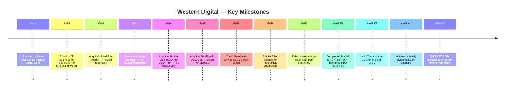
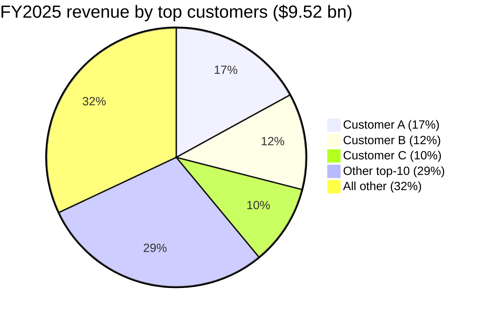
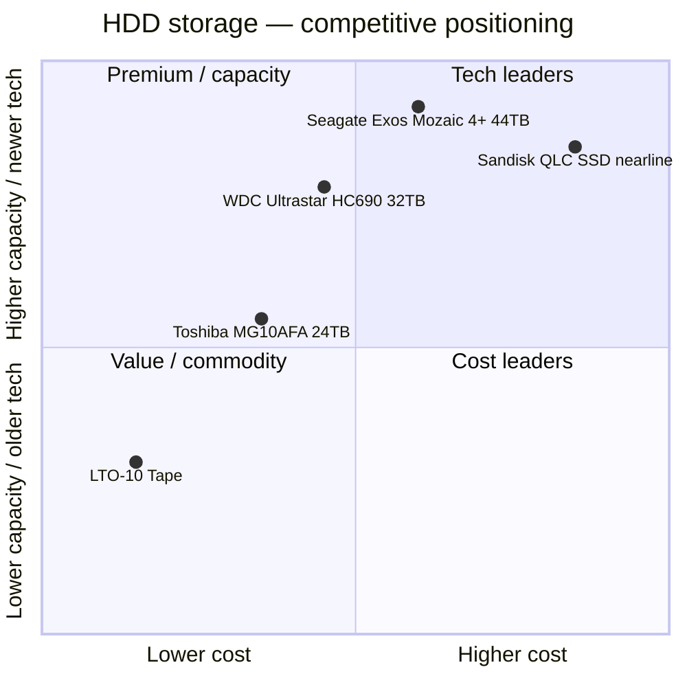

# COMPANY RESEARCH REPORT: Western Digital Corporation (NASDAQ: WDC)
Date: 2026-05-20

> **Update — Q3 FY2026 results raised the full-year trajectory (2026-04-30):** Management guided Q4 FY2026 revenue to **US$3.55–3.75 bn (mid-point $3.65 bn, +36–44% YoY)** with non-GAAP gross margin **51–52%** and non-GAAP EPS **$3.10–3.40** ([Q3 FY2026 earnings release, 2026-04-30](https://www.sec.gov/Archives/edgar/data/0000106040/000162828026028878/a4ex991-pressreleaseq326.htm)). On the same day the board approved a **20% dividend increase to $0.15/quarter**. The guide implies FY2026 revenue of ~$12.8 bn (vs. FY2025 $9.52 bn; +34–35% YoY) and pushes the implied non-GAAP GM exit-rate above 50% for the first time since the Hitachi-storage acquisition in 2012. CEO Irving Tan attributed the strength to "virtually every AI workload, from training, inference, agentic AI to physical AI, creates data that is stored persistently and cost-efficiently on HDDs."

---

## TABLE OF CONTENTS
1. Company Overview
2. Company History
3. Management Team
4. Products & Services
5. Customers & Go-to-Market
6. Industry Overview
7. Competitive Landscape
8. Market Opportunity (TAM)
9. Risk Assessment
References

---

## 1. COMPANY OVERVIEW

Western Digital Corporation (NASDAQ: WDC) is, **as of February 21, 2025, a pure-play hard-disk-drive (HDD) company**. On that date the company completed the planned tax-free spin-off of its NAND-flash and solid-state-drive business as a new independent public company, **Sandisk Corporation (NASDAQ: SNDK)** ([WDC 10-K FY2025, p. 4](https://www.sec.gov/Archives/edgar/data/0000106040/000010604025000038/wdc-20250627.htm); [WDC 8-K, 2025-02-24](https://www.sec.gov/Archives/edgar/data/0000106040/000119312525033383/d847507dex991.htm)). The pre-spin Western Digital was the world's #2 vertically integrated storage company, combining the legacy HDD franchise it built up via the 2012 acquisition of Hitachi GST with the NAND/SSD business it bought via the 2016 acquisition of SanDisk. The transaction was structured as a pro-rata distribution of one Sandisk share for every WDC share, plus a debt-for-equity exchange in which WDC retired a portion of its Term Loan A-3 in exchange for retained Sandisk equity ([WDC 10-K FY2025, Note 3 Discontinued Operations](https://www.sec.gov/Archives/edgar/data/0000106040/000010604025000038/wdc-20250627.htm)).

What remains is **the world's #1 HDD maker by unit shipments**, with FY2025 (year ended June 27, 2025) revenue of **US$9.52 bn (+51% YoY)**, GAAP gross margin of **38.8% (+1,070 bps YoY)**, GAAP operating income of **$2.33 bn** and GAAP net income from continuing operations of **$1.64 bn (vs. a $765 m loss in FY2024)** ([WDC Q4 FY2025 earnings release, 2025-07-30](https://www.sec.gov/Archives/edgar/data/0000106040/000010604025000030/a4ex991-pressreleaseq425.htm); [WDC 10-K FY2025, Item 7 MD&A](https://www.sec.gov/Archives/edgar/data/0000106040/000010604025000038/wdc-20250627.htm)). The company employs **approximately 40,000 people across 24 countries**, with 88% of headcount in Asia Pacific (primarily Thailand, Malaysia and the Philippines for HDD media, head and assembly), 11% in the Americas and <1% in EMEA ([WDC 10-K FY2025, p. 8](https://www.sec.gov/Archives/edgar/data/0000106040/000010604025000038/wdc-20250627.htm)). Headquarters: 5601 Great Oaks Parkway, San Jose, California.

**What it sells.** A single reportable segment — HDD — sold into three end markets ([WDC 10-K FY2025, Item 1 Business](https://www.sec.gov/Archives/edgar/data/0000106040/000010604025000038/wdc-20250627.htm)):

- **Cloud (88% of FY2025 revenue, $8.34 bn, +65% YoY):** capacity-enterprise nearline HDDs sold to hyperscalers, cloud-service providers and large enterprises. This is the strategic anchor; everything else in the portfolio is sized around what the Cloud roadmap leaves unused.
- **Client (5.8% of revenue, $556 m, –4% YoY):** internal HDDs in desktops, all-in-ones, surveillance recorders, gaming consoles and external-storage OEM platforms.
- **Consumer (6.5% of revenue, $623 m, –9% YoY):** retail external-storage products under the **WD**, **WD_BLACK** and **SanDisk Professional** brands (the last brand was licensed back from Sandisk under a long-term TLA executed at the Separation; see Section 2).


Source: [WDC 10-K FY2025, Item 7](https://www.sec.gov/Archives/edgar/data/0000106040/000010604025000038/wdc-20250627.htm), [10-K FY2023, Item 7](https://www.sec.gov/Archives/edgar/data/0000106040/000010604023000024/wdc-20230630.htm), [10-K FY2022, Item 7](https://www.sec.gov/Archives/edgar/data/0000106040/000010604022000055/wdc-20220701.htm). FY20–FY24 use HDD-segment revenue and HDD-segment gross profit / revenue. FY25 is HDD-only continuing operations at the company level.

**Valuation snapshot (2026-05-20 close $459.03).** Market cap **$158.2 bn**, enterprise value **$155.6 bn**, shares outstanding **344.7 m**, 52-week range **$49–$525** ([Yahoo Finance, 2026-05-20](https://finance.yahoo.com/quote/WDC/key-statistics)).

| Multiple | WDC (TTM) | STX (TTM) | WDC 3-yr range | Sector median* |
|---|---|---|---|---|
| P/E | **27.4×** | 71.2× | NM–~28× (deeply negative pre-FY25) | ~21× |
| P/S | **13.4×** | 15.3× | 0.4×–13.7× | 3.5× |
| EV/EBITDA | **39.6×** | 47.7× | NM–~40× | ~15× |
| P/B | 21.9× | 357.3× | low single digits | 4–5× |

*Sector median = Philadelphia Semiconductor Index plus storage peers per [Yahoo Finance sector view](https://finance.yahoo.com/sectors/technology/semiconductors/). Three-year range bracketed by the FY2023 cyclical trough (negative net income, P/E NM, stock $26.81) and the May-2026 peak ([Macrotrends — WDC 15-yr history](https://www.macrotrends.net/stocks/charts/WDC/western-digital/stock-price-history)).

**Reading the multiples.** WDC's TTM P/E of 27× is roughly **5× the long-run cyclical-average P/E of the HDD industry** (~6–8× historically). The expansion is driven by two distinct forces:

1. **Earnings power up-shift.** Non-GAAP operating margin moved from ~5% pre-spin (FY2024) to ~33% in Q2 FY2026 and ~39% in Q3 FY2026 ([Q2 FY2026 release, 2026-01-29](https://www.sec.gov/Archives/edgar/data/0000106040/000162828026004131/a4ex991-pressreleaseq226.htm); [Q3 FY2026 release, 2026-04-30](https://www.sec.gov/Archives/edgar/data/0000106040/000162828026028878/a4ex991-pressreleaseq326.htm)). Operating leverage on a 50%+ GM HDD-only model is mechanically far higher than on the old blended Flash+HDD mix.
2. **AI-storage narrative premium.** Management has repeatedly framed HDDs as "the foundation of the AI data economy" ([WDC blog, 2025-08-12](https://blog.westerndigital.com/western-digital-and-the-foundation-of-the-ai-data-economy/)). The stock has compounded ~970% from the FY2023 lows on this thesis and ETF flows tagged to AI-infrastructure baskets ([Investing.com, 2026-04](https://www.investing.com/analysis/western-digitals-970-moonshot-what-the-ai-storage-charts-dont-show-you-yet-200674947)). The 27× P/E versus a fair-multiple closer to 12–15× for a cyclical, capital-intensive component vendor is essentially the AI premium plus dividend-initiation re-rating. We carry it as a valuation-compression risk in Section 9.

The P/S of 13.4× is even more striking versus the long-run HDD-industry P/S of ~1×; investors are paying for the next two years of expected revenue growth (consensus FY2027E ~$15–16 bn implies ~10× forward sales). Seagate, the closest peer, trades richer on a forward basis because of its 12-month head-start on volume HAMR shipments; we view the WDC/STX gap as warranted by visibility-of-earnings (STX has a single technology pivot to deliver; WDC has dual-path ePMR + HAMR).

---

## 2. COMPANY HISTORY

Western Digital was **founded in 1970** in Santa Ana, California as General Digital Corporation, a maker of MOS test equipment ([WDC 10-K FY2025, Item 1](https://www.sec.gov/Archives/edgar/data/0000106040/000010604025000038/wdc-20250627.htm)). The company adopted its current name in 1971, pivoted into semiconductor design (UART and floppy-disk controllers) through the 1970s and 1980s, and entered the HDD industry in 1988 by acquiring the disk-drive business of Tandon Corporation. From there, Western Digital's story is essentially a series of opportunistic consolidations of a shrinking field of HDD makers, punctuated by one large diversification into NAND flash (now reversed).


Source: [WDC 10-K FY2025, Item 1](https://www.sec.gov/Archives/edgar/data/0000106040/000010604025000038/wdc-20250627.htm); [Reuters — Elliott push, 2022-05-03](https://www.reuters.com/business/finance/elliott-pushes-western-digital-explore-strategic-options-2022-05-03/); [WDC press release — Sandisk spin completion, 2025-02-21](https://investor.wdc.com/news-releases).

**Three strategic pivots worth understanding:**

1. **The Hitachi GST deal (2012, $4.7 bn).** Western Digital and Seagate jointly absorbed every other significant HDD manufacturer (Hitachi GST → WDC; Samsung HDD → STX) during 2011–2012. That left an effective duopoly (plus a much smaller Toshiba) that has held to this day and is the structural reason HDD pricing has stabilised since 2023. The integration was complex and required a five-year delay on full operational consolidation imposed by Chinese antitrust authorities. The deal moved WDC from a tied #2 to a clear #1 in unit share.

2. **The SanDisk acquisition (2016, $19 bn).** Then-CEO Steve Milligan diversified into NAND flash on the thesis that Flash and HDD were converging customer-spend pools. The thesis held only intermittently: Flash and HDD have opposite cycles (Flash is a pure-play memory-commodity oscillation; HDD is more recovery-driven), so the combined entity's earnings became *more* volatile, not less. By 2023, after a 50%+ NAND price collapse and a botched merger attempt with Kioxia, activist Elliott Management held a $1 bn stake and was publicly pressing for separation ([Reuters, 2022-05-03](https://www.reuters.com/business/finance/elliott-pushes-western-digital-explore-strategic-options-2022-05-03/)).

3. **The Sandisk spin (2025-02-21).** Completed under then-CEO David Goeckeler. WDC distributed ~80% of Sandisk equity to WDC shareholders (one SNDK share per WDC share) and retained ~19.9% which it has progressively monetised through debt exchanges and secondary placements through 2025 ([WDC 10-K FY2025, Note 3](https://www.sec.gov/Archives/edgar/data/0000106040/000010604025000038/wdc-20250627.htm)). Goeckeler became Sandisk's CEO; long-time WDC operations executive **Irving Tan** was elevated to WDC CEO the next day. The Separation also reorganised the WD/SanDisk brand split: WDC retained perpetual rights to "Western Digital," "WD," and "WD_BLACK"; Sandisk retained the SanDisk brand for memory products but **licenses the "SanDisk Professional" brand to WDC** for high-end external storage under a long-term trademark licence agreement ([WDC 10-K FY2025, Item 1](https://www.sec.gov/Archives/edgar/data/0000106040/000010604025000038/wdc-20250627.htm)).

**Recent developments (last 12 months) most relevant to thesis:**

- *July 2025:* Initiated **$0.10/quarter dividend** and authorised **$2.0 bn buyback** ([Q4 FY2025 release, 2025-07-30](https://www.sec.gov/Archives/edgar/data/0000106040/000010604025000030/a4ex991-pressreleaseq425.htm)).
- *Sept 2025:* Began volume shipment of **32 TB UltraSMR HDDs** to hyperscale customers ([blocksandfiles, 2025-07-02](https://blocksandfiles.com/2025/07/02/western-digital-hamr-interview/)).
- *Apr 2026:* Announced **20% dividend hike to $0.15/quarter** alongside Q3 FY2026 results ([Q3 FY2026 release](https://www.sec.gov/Archives/edgar/data/0000106040/000162828026028878/a4ex991-pressreleaseq326.htm)).
- *Apr 2026:* Confirmed **40 TB ePMR drive sample shipments**, **44 TB HAMR drives** targeted for late-2026 / early-2027 mass production ([Tom's Hardware roadmap update, 2026-02](https://www.tomshardware.com/pc-components/hdds/high-capacity-hdd-roadmap-the-race-to-100tb-and-zettabyte-scale-storage-toshiba-seagate-and-wd-outline-three-distinct-strategies)).

---

## 3. MANAGEMENT TEAM

### Irving Tan — Chief Executive Officer (since 2025-02-22; ~310-word bio)

Irving Tan is the post-spin CEO and the most consequential operational decision in WDC's recent history. He is Singaporean, ~58 years old, holds an engineering degree and an MBA, and was elevated from EVP of Global Operations — a role he had held since March 2022 — to CEO the day after the Sandisk spin closed ([WDC 8-K, 2025-02-24](https://www.sec.gov/Archives/edgar/data/0000106040/000119312525033383/d847507dex991.htm); [EDB Singapore profile, 2025](https://www.edb.gov.sg/en/business-insights/insights/from-singapore-to-san-jose-tech-veteran-irving-tan-rides-ai-wave-in-his-latest-role.html)). His prior career spent **13 years at Cisco Systems**, where he rose to **Executive Vice President and Chief of Global Operations** and concurrently **Chairman of Asia-Pacific, Japan & Greater China** — a role that gave him direct P&L responsibility over Cisco's APJC business in the high-growth China-customer years and operational oversight of global supply chain. Before Cisco, he held senior operational roles at SATS Ltd. (Singapore Airlines' ground-services subsidiary) and Singapore Technologies Engineering ([LinkedIn, accessed 2026-05](https://www.linkedin.com/in/irving-tan/)).

What he specifically accomplished at WDC before becoming CEO is concrete and central to the current investment case: as EVP Operations from 2022 through 2025 he led the **factory-utilisation right-sizing that took HDD-segment gross margin from 22.2% in FY2023 to 28.1% in FY2024 to 38.8% in FY2025** even before AI-driven nearline demand inflected — i.e., the structural margin reset was a manufacturing-discipline outcome under his watch, not just a price cycle. He inherits a company whose Cloud demand is now booked out 12+ months and whose Q3 FY2026 GM exceeded 50% for the first time in two decades.

Compensation under the post-spin offer letter: base salary $1.25 m, target bonus 200% of base, sign-on equity of $19 m, target annual LTI grant of $14 m ([WDC 2025 DEF 14A, p. 73](https://www.sec.gov/Archives/edgar/data/0000106040/000162828025044298/wdc-20251006.htm)). Beneficial ownership at the last proxy date: ~340,000 shares plus unvested RSUs, ~0.1% of outstanding — typical for a non-founder external-track CEO. Tan adopted a Rule 10b5-1 trading plan on May 12, 2025 permitting sale of up to 80,000 shares before May 2026 ([WDC 10-K FY2025, Item 5](https://www.sec.gov/Archives/edgar/data/0000106040/000010604025000038/wdc-20250627.htm)).

### Kris Sennesael — Chief Financial Officer (since 2025-05-12; ~190 words)

Sennesael, 56, was hired from **Skyworks Solutions** where he served as **CFO from October 2016 through May 2025** ([WDC press release, 2025-05-07](https://www.westerndigital.com/company/newsroom/press-releases/2025/2025-05-07-western-digital-names-chief-financial-officer); [Bloomberg profile](https://www.bloomberg.com/profile/person/16309523)). Before Skyworks, he was CFO of **Enphase Energy (2012–2016)** during its post-IPO scale-up phase, and CFO of **Standard Microsystems Corporation (2009–2012)**, which he led through the company's sale to Microchip. He holds bachelor's and master's degrees in economics from the University of Ghent and an MBA from Vlerick Business School (both Belgium), and currently serves on the board of MaxLinear, where he chairs the audit committee.

Sennesael's hiring is significant for one specific reason: Skyworks was a **>$10 bn revenue mobile-IC franchise heavily concentrated in Apple** that experienced large gross-margin cycles tied to a single mega-customer's product roadmap — almost exactly the operating profile WDC now has with hyperscaler nearline. His track record on capital returns (Skyworks bought back ~25% of shares during his tenure and consistently paid an industry-leading dividend) is presumably why the WDC board recruited him.

### Cynthia Tregillis — EVP, Chief Legal Officer & Corporate Secretary (~90 words)

Tregillis has been with WDC since 2016 and was named Chief Legal Officer in 2022. She led the Sandisk-separation legal work — a transaction that touched antitrust filings in five jurisdictions, an exchange offer, ~$2.6 bn of debt retirement, and a brand-licence carve-out — and is now responsible for IP litigation strategy as WDC pursues HAMR licensing and trade-secret protection ([WDC 10-K FY2025, Item 10](https://www.sec.gov/Archives/edgar/data/0000106040/000010604025000038/wdc-20250627.htm); [LinkedIn](https://www.linkedin.com/in/cynthia-tregillis/)).

### Ashley Gorakhpurwalla — EVP & GM, HDD Business (~90 words)

Gorakhpurwalla joined in 2020 from Dell EMC, where he ran the $13 bn server and infrastructure business. He has direct P&L for the HDD platform roadmap — i.e., the engineering, manufacturing and customer-engagement layer that delivers ePMR, OptiNAND, UltraSMR and HAMR-bound products. He is the executive on stage at most hyperscaler design-in reviews ([WDC Leadership page](https://www.westerndigital.com/company/leadership)).

### Governance footer

The post-spin board has **eight directors, seven of whom are independent**, chaired by **Martin Cole** (former CEO of Accenture's North American Federal business) who succeeded long-time chair Matthew Massengill in February 2025 ([WDC 2025 DEF 14A](https://www.sec.gov/Archives/edgar/data/0000106040/000162828025044298/wdc-20251006.htm)). Other independent directors include **Kimberly Alexy** (chair of audit committee, former Lehman semis analyst), **Tunç Doluca** (former CEO of Maxim Integrated), **Bruce Kiddoo** (former CFO of Maxim), **Roxanne Oulman** (CFO Couchbase), and **Stephanie Streeter** (former CEO Libbey Inc. and Banta Corp.). **Massengill** himself remains on the board as a non-executive director. Insider ownership is **<1% in aggregate**, comp is **~85% performance-linked equity for the CEO** with PSUs tied to relative TSR vs. the S&P 500 and to free-cash-flow milestones ([2025 DEF 14A — CD&A](https://www.sec.gov/Archives/edgar/data/0000106040/000162828025044298/wdc-20251006.htm)). No material related-party transactions disclosed. The post-spin board refresh — three new independent directors added in 2024–25 — was explicitly tied to the Elliott settlement agreement.

### Track-record synthesis

Tan is **untested as a public-company CEO** but inherits a company in the strongest competitive position in WDC's 35-year HDD history, and his operations track record at both Cisco and WDC is well-documented and quantifiable. Sennesael's Skyworks tenure gives the board credibility on capital allocation. The gap is **R&D leadership continuity** — David Goeckeler, the architect of the technology roadmap from 2020–2025, is now running Sandisk; Gorakhpurwalla holds the platform technology baton and is the single most important executive to retain through the 2026–2028 HAMR transition.

---

## 4. PRODUCTS & SERVICES

WDC organises its post-spin product portfolio around three end markets — Cloud, Client, Consumer — using two brand families, **WD** (mainstream) and **WD_BLACK** (premium gaming/creator), plus the licensed-back **SanDisk Professional** line ([WDC product navigation](https://www.westerndigital.com/products)).

```mermaid
graph TD
    WDC[Western Digital — HDD only]
    WDC --> Cloud[Cloud / Datacenter — 88% of FY25 rev]
    WDC --> Client[Client Devices — 5.8% of FY25 rev]
    WDC --> Consumer[Consumer — 6.5% of FY25 rev]

    Cloud --> Ultrastar[Ultrastar DC HC700-series ePMR/UltraSMR]
    Cloud --> Platforms[Ultrastar Data60 / Data102 JBOD platforms]
    Cloud --> OpenFlex[OpenFlex Data24 NVMe-oF — legacy]

    Client --> WDBlue[WD Blue 3.5\" / 2.5\" desktop & laptop]
    Client --> Purple[WD Purple surveillance / NVR]
    Client --> RedPro[WD Red Pro NAS]
    Client --> Gold[WD Gold enterprise client]

    Consumer --> MyBook[My Book / My Passport portable]
    Consumer --> Elements[Elements desktop / portable]
    Consumer --> WDBLACK[WD_BLACK gaming P10 / D10]
    Consumer --> SDProHDD[SanDisk Professional G-DRIVE / G-RAID]
```
Source: [WDC products overview](https://www.westerndigital.com/products); [WDC 10-K FY2025, Item 1](https://www.sec.gov/Archives/edgar/data/0000106040/000010604025000038/wdc-20250627.htm).

### 4.1 Cloud / datacenter (the franchise — 88% of revenue)

**Ultrastar DC HC700-series capacity-enterprise HDD.** The single most important product line. Current flagship is the **Ultrastar DC HC690 (26 TB / 28 TB CMR; 32 TB UltraSMR with eleven platters and ePMR + OptiNAND)** ([Ultrastar DC HC690 product page](https://www.westerndigital.com/products/internal-drives/ultrastar-dc-hc690-hdd)). Target customer: cloud and hyperscale customers buying by the rack. Pricing model: not publicly listed — sold against multi-year capacity-reservation contracts negotiated under master purchase agreements; the press has reported nearline ASP per drive in the **$300–$420** range during the current up-cycle ([Dr. Robert Castellano, 2026-02-15](https://drrobertcastellano.substack.com/p/seagate-and-western-digital-hdd-price)). Key differentiators: **ePMR** (energy-assisted PMR — writes data with a smaller magnetic-grain footprint), **OptiNAND** (embedded iNAND flash that off-loads metadata management), **UltraSMR** (shingled magnetic recording with 11+% capacity uplift on top of the same areal density), and **triple-stage actuators** (3D-printed micro-actuator stack for ultra-fast track positioning).

- *Competitive advantage:* **Yes — technology + manufacturing scale.** Moat = mature mass-production yield for 11-platter helium-filled enclosures. Evidence: WDC and Seagate are the only vendors shipping ≥26 TB capacity-enterprise drives in volume; Toshiba's volume top capacity is ~24 TB ([Tom's Hardware, 2026-02](https://www.tomshardware.com/pc-components/hdds/high-capacity-hdd-roadmap-the-race-to-100tb-and-zettabyte-scale-storage-toshiba-seagate-and-wd-outline-three-distinct-strategies)). At 32 TB UltraSMR, WDC holds the *capacity lead in the pre-HAMR generation*.
- *Closest competing product:* Seagate **Exos Mozaic 4+ (44 TB HAMR; 36 TB CMR Mozaic 3+)**. Seagate is ahead on HAMR (already shipping >1 m HAMR drives by Q1 FY2025; Mozaic 4+ launched 2026-04 [Seagate press release, 2026-04-15](https://www.seagate.com/news/news-archive/seagate-introduces-mozaic-4-plus/)), behind on energy-efficiency-per-TB on pre-HAMR capacity points. **Verdict: at parity on capacity at the 32–36 TB tier; WDC slightly ahead on $/W/TB; Seagate ahead on top-of-range capacity going into 2027.**

**Ultrastar Data60 / Data102 JBOD storage platforms.** 4U enclosures holding 60 or 102 Ultrastar drives, sold as turnkey building blocks to cloud-service providers that want a vendor-integrated platform rather than buying bare drives ([Ultrastar Data102 product page](https://www.westerndigital.com/products/storage-platforms/ultrastar-data102-storage-platform)). Smaller revenue contribution (<10% of Cloud) but strategically important — it lets WDC capture the rack-integration margin layer that hyperscalers' ODMs (Quanta, Wiwynn) would otherwise pocket.

- *Competitive advantage:* **Partial** — moat is the bundle (drives + platform + firmware), not the enclosure itself. Margin profile is mid-teens vs. mid-30s on the drives. Closest competitor: Seagate **Exos AP / Corvault** enclosures. Verdict: at parity; this is a defensive product, not a growth driver.

**OpenFlex Data24 NVMe-oF.** A composable-storage NVMe-over-Fabrics enclosure originally built around SanDisk SSDs. **Sunsetting:** with Sandisk now an independent company, WDC's roadmap for OpenFlex has been wound down; current shipments are end-of-life pricing to existing customers ([blocksandfiles, 2025-04](https://blocksandfiles.com/2025/04/western-digital-openflex-future/)).

### 4.2 Client devices (5.8% of revenue)

**WD Blue (mainstream desktop / laptop), WD Black (gaming and creator client — distinct from WD_BLACK gaming retail), WD Red Pro (NAS), WD Purple (video surveillance and NVR), WD Gold (enterprise client / workstation).**

- *Aggregate competitive advantage:* **Partial.** WDC's client HDD volumes have shrunk every year since 2018 as SSDs displaced HDDs in client PCs; the segment is now an aftermarket and verticals business (NAS, surveillance, workstation) rather than a primary-storage business. Moat = brand recognition with channel partners (Amazon, Best Buy, MicroCenter, Newegg) and the **WD Red NAS validation programme** with Synology / QNAP. Pricing model: open-channel pricing through distributors at a typical 8–14% distributor margin.
- *Closest competing products:* Seagate IronWolf (NAS), SkyHawk (surveillance), BarraCuda (mainstream). Verdict: at parity on technical specs; WDC arguably ahead on channel mind-share in NAS, behind in surveillance (SkyHawk has dominant Hikvision / Dahua reference designs).
- *Roadmap status:* No new capacity-point launches in client during 2025; segment is being managed as a cash-generative declining business with no incremental R&D investment beyond shared technology from the cloud roadmap.

### 4.3 Consumer (6.5% of revenue)

**My Book (3.5" desktop external), My Passport (2.5" portable), Elements (entry-level), WD_BLACK gaming externals (P10, D10, P40 Game Drive), SanDisk Professional G-DRIVE / G-RAID (creator / video professional).**

- *Aggregate competitive advantage:* **Partial — brand moat in retail.** WD and WD_BLACK have dominant shelf presence at Western retailers; SanDisk Professional G-RAID has a near-monopoly in the broadcast / cinema-production rental market because of integration with ProRes RAW and BlackMagic workflows. But: this segment is structurally shrinking as cloud storage and large internal NVMe SSDs displace external HDDs.
- *Closest competing products:* Seagate Backup Plus / Expansion (mainstream); LaCie (Seagate-owned, professional). Verdict: WDC ahead at the prosumer high end (SanDisk Pro G-RAID), at parity in mainstream.
- *Roadmap status:* WD_BLACK launched a 24 TB external D10 in late 2025 ([WDC newsroom, 2025-10](https://www.westerndigital.com/company/newsroom)). SanDisk Professional refreshed G-RAID Mirror/Shuttle SKUs in early 2026.

### Flagship vs. long tail

**The two flagship products are (1) Ultrastar DC HC690 capacity-enterprise HDDs and (2) the upcoming HC700-series HAMR drives.** Together, capacity-enterprise nearline drives drive an estimated **>85% of total revenue and >95% of total gross profit** based on the 88% Cloud-revenue disclosure and management commentary that Cloud GMs are materially above corporate average ([Q3 FY2026 earnings call transcript, 2026-04-30](https://www.westerndigital.com/company/investor-relations)). Everything else — Client, Consumer, JBOD platforms — is the long tail and is being managed for cash, not growth.

### Last-12-month launches / sunsets

- **Launched:** 32 TB Ultrastar UltraSMR (volume Q1 FY2026); 40 TB ePMR engineering samples (Q3 FY2026); 24 TB WD_BLACK D10 external (Q1 FY2026).
- **Sunset / wound down:** OpenFlex Data24 (post-Separation); Ultrastar SSD product lines (transferred to Sandisk at the Separation).
- **In-flight:** First-generation HAMR drives (36 TB CMR, 40 TB SMR, 44 TB UltraSMR) targeted for **volume shipment in late CY2026, scaling through CY2027** ([Tom's Hardware roadmap, 2026-02](https://www.tomshardware.com/pc-components/hdds/high-capacity-hdd-roadmap-the-race-to-100tb-and-zettabyte-scale-storage-toshiba-seagate-and-wd-outline-three-distinct-strategies)).

---

## 5. CUSTOMERS & GO-TO-MARKET

### Segments and channels

- **Cloud:** ~10 named hyperscaler / large CSP / enterprise OEM accounts buy directly via master purchase agreements; this channel accounts for **~88% of revenue** ([WDC 10-K FY2025, Item 1A](https://www.sec.gov/Archives/edgar/data/0000106040/000010604025000038/wdc-20250627.htm)). Sales cycle is 6–18 months from sample qualification to volume; orders are placed on rolling 13- to 52-week purchase orders against a master capacity-reservation framework. Press reporting indicates these are **capacity reservations, not take-or-pay**, meaning customers can renegotiate volumes if demand changes ([Investing.com, 2026-04](https://www.investing.com/analysis/western-digitals-970-moonshot-what-the-ai-storage-charts-dont-show-you-yet-200674947)).
- **Client (OEM):** Sold through major PC OEMs (Dell, HP, Lenovo) and into surveillance / NAS OEMs (Hikvision, Dahua, Synology, QNAP, Western Digital-branded NAS to channel).
- **Consumer (retail and e-tail):** Sold through Amazon, Best Buy, Walmart, MicroCenter, JD.com, Tmall, Mediamarkt, and direct from `westerndigital.com` and `sandiskprofessional.com`.

### Customer concentration — quantified (10-K disclosure)

This is **material and worsening post-spin.** Per the FY2025 10-K customer-concentration note ([WDC 10-K FY2025, Item 7A and Note 1](https://www.sec.gov/Archives/edgar/data/0000106040/000010604025000038/wdc-20250627.htm)):

> "For 2025, three customers accounted for 17%, 12%, and 10%, respectively, of our net revenue. For 2024 and 2023, no single customer accounted for 10% or more of our net revenue."

> "For the year ended June 27, 2025, the Cloud end market accounted for 88% of our total revenue and our top 10 customers accounted for 68% of our net revenue, with three customers each accounting for 10% or more of the Company's net revenue."

| Metric | FY2023 | FY2024 | FY2025 |
|---|---|---|---|
| Customers ≥10% of revenue | 0 | 0 | **3 (17%, 12%, 10%)** |
| Top-10 share of revenue | n/a | n/a | **68%** |
| Cloud share of total revenue | 76% (Flash + HDD blended) | 80% | **88%** |

Customer names are not disclosed by WDC. Press coverage and design-win press releases identify the three ≥10% customers as **a subset of Amazon Web Services, Microsoft Azure, Google Cloud, Meta Platforms, and Oracle Cloud Infrastructure** ([Investing.com, 2026-04](https://www.investing.com/analysis/western-digitals-970-moonshot-what-the-ai-storage-charts-dont-show-you-yet-200674947); [WDC blog, 2025-08-12](https://blog.westerndigital.com/western-digital-and-the-foundation-of-the-ai-data-economy/)). WDC explicitly flagged the concentration as a risk: "As a result of the Separation, there is increased revenue concentration in our Cloud end market and among our top customers" ([WDC 10-K FY2025, Item 1A](https://www.sec.gov/Archives/edgar/data/0000106040/000010604025000038/wdc-20250627.htm)).

**Severity:** Top-1 at 17% and top-3 at 39% **exceeds the 20% / 50% materiality thresholds embedded in this report's framework** — we carry this as a material risk into Section 9.


Source: [WDC 10-K FY2025, Item 7A and Item 1A](https://www.sec.gov/Archives/edgar/data/0000106040/000010604025000038/wdc-20250627.htm). Customer letters used because WDC does not name the three ≥10% customers in the filing.

### Contract structure

Contracts are **multi-year master purchase agreements (MPAs)** with rolling 13- to 52-week purchase orders. The MPAs set pricing methodology (typically a moving formula tied to a benchmark $/TB and a capacity-point premium), service-level provisions (allowable bad-block rates, RMA terms), and capacity-reservation rights — but **most do not include take-or-pay clauses**, so hyperscalers can flex orders down if their internal AI/storage capex plans change. WDC does not disclose the average MPA tenor; press reporting cites 2–3 years as typical for current-cycle reservations ([Investing.com, 2026-04](https://www.investing.com/analysis/western-digitals-970-moonshot-what-the-ai-storage-charts-dont-show-you-yet-200674947)).

### Are top customers also competitors or insourcing?

Three of the four likely top-3 hyperscalers (AWS, Azure, Google) have published research on **all-flash datacenters** for selected workloads, and Meta engineers have written publicly that NAND flash now uses ~80% less power per TB than HDD for certain warm-data workloads. **WDC's commercial counter-argument is acquisition cost** — flash $/TB is still 4–6× HDD $/TB for capacity-class storage, and that gap has actually widened in 2025 as nearline HDD ASPs have risen ([Dr. Robert Castellano, 2026-02-15](https://drrobertcastellano.substack.com/p/seagate-and-western-digital-hdd-price)). None of the top customers is currently developing in-house HDD manufacturing — building an HDD fab from scratch would require >$3 bn capex and 5+ years of head/media tooling — so the substitution risk is technology displacement, not vertical integration.

### Distribution and partnerships

Beyond the direct hyperscaler channel, WDC operates an **authorised distributor network** (Synnex/TD Synnex, Ingram Micro, ASBIS) for channel partners, OEMs and SMBs. WD also runs a **VAR / SI partner programme** for the SanDisk Professional creative-pro line. Recent partnership announcements include validation programmes with Synology, QNAP, Western Digital-branded NAS, and engineering co-development with leading storage-OS vendors (Pure Storage on FlashBlade-adjacent capacity tiers, DDN on AI-training storage stacks).

---

## 6. INDUSTRY OVERVIEW

### Definition and scope

The hard-disk-drive industry produces magnetic rotational storage devices in 2.5" and 3.5" form factors. NAICS 334112 (Computer Storage Device Manufacturing). The post-2025 industry is best understood as **three end-markets at very different stages of life**:

| End-market | 2025 status | Outlook |
|---|---|---|
| **Capacity-enterprise / nearline** (≥12 TB, hyperscaler datacenter) | Booming; demand-constrained | High-single-digit to mid-teens CAGR through 2030 |
| **Performance enterprise** (10K/15K SAS) | Terminal decline | Mostly replaced by NVMe SSD by 2027 |
| **Client / consumer** (mostly 2.5", <8 TB) | Steady decline | Down 5–10% per year as SSDs displace |

Capacity enterprise (nearline) is **>68% of total HDD exabytes shipped in 2025** ([Horizon Technology, 2026-01](https://horizontechnology.com/news/enterprise-hdd-remains-dominant-storage-technology/); [blocksandfiles, 2025-05](https://blocksandfiles.com/2025/05/17/disk-drive-capacity-shipment-out-to-2030-are-set-to-rocket-upwards/)). This is the only segment that matters for WDC's investment case; the rest is incremental.

### Market size and growth

Total HDD unit shipments are around **278 million units in 2025**, down from the >650 m peak in 2010 — the unit base has shrunk by ~60% over 15 years as flash displaced HDDs in clients ([Horizon, 2026-01](https://horizontechnology.com/news/enterprise-hdd-remains-dominant-storage-technology/)). But average capacity per drive has risen so quickly — from 3.6 TB in 2023 to ~4.2 TB in 2025 — that **total exabytes shipped have grown ~20% CAGR over the past three years** and are forecast to grow at a similar pace through 2030 ([blocksandfiles, 2025-05](https://blocksandfiles.com/2025/05/17/disk-drive-capacity-shipment-out-to-2030-are-set-to-rocket-upwards/)).

WDC's own management forecasts **HDD industry exabyte demand growing at ~23% CAGR between 2024 and 2028**, primarily driven by HAMR-enabled density gains converging with AI-training and AI-inference data accumulation ([WDC Investor Day 2025 / blog](https://blog.westerndigital.com/western-digital-and-the-foundation-of-the-ai-data-economy/)).

Industry revenue (HDD only) was approximately **$23–25 bn in calendar 2025** (computed as WDC HDD ~$9.5 bn + Seagate ~$10 bn + Toshiba ~$4 bn), up from a ~$17 bn trough in CY2023 and approaching the previous cycle peak of ~$28 bn in CY2022 ([Seagate FY2025 8-K Q4 release](https://www.sec.gov/Archives/edgar/data/0001137789/000113778925000150/fq425consolidatedscript-8x.htm)).

### Demand drivers

1. **AI-training / inference data accumulation.** Frontier-model training corpora have grown ~10× per year for three years; trained-model artifacts, eval datasets, RLHF transcripts, vector caches and inference-result logs are accumulating in nearline at multi-exabyte rates per hyperscaler. WDC management argues this is structural, not cyclical ([Q3 FY2026 earnings release commentary](https://www.sec.gov/Archives/edgar/data/0000106040/000162828026028878/a4ex991-pressreleaseq326.htm)).
2. **Video surveillance and generative video.** Long-retention 4K/8K video archives.
3. **Regulated archive (financial, healthcare, government).** Multi-decade retention requirements that economics dictate live on tape or nearline HDD.
4. **Cost-per-TB gap to flash.** As of 2026, nearline HDD $/TB is ~$10–14; nearline-class QLC NAND SSD $/TB is ~$50–90, despite the per-bit-power efficiency gap.

### Growth drivers — supply side

1. **Areal-density progress.** ePMR + UltraSMR have delivered ~25% density CAGR since 2022. HAMR is expected to step density up another ~30–40% in 2026–2028.
2. **Helium-filled enclosures.** Enable 9–11 platters per drive (vs. 7 for air-filled), the single biggest capacity unlock of the past decade.
3. **Industry consolidation has structurally stabilised pricing.** The Big 3 (WDC, STX, Toshiba) hold >95% global share; capacity expansion now requires explicit hyperscaler pre-orders ([Mordor Intelligence, HDD Market 2025](https://www.mordorintelligence.com/industry-reports/hard-disk-drive-market); [Dr. Castellano, 2026-02](https://drrobertcastellano.substack.com/p/seagate-and-western-digital-hdd-price)).

### Regulatory environment

- **Export controls.** US Commerce restrictions on advanced semiconductors do not directly cover HDDs, but they could be extended; some hyperscaler buyers in mainland China have already shifted toward Toshiba sourcing to insulate against future Entity-List risk on US-domiciled vendors.
- **PFAS / chemical compliance.** Helium-filled HDDs use perfluorinated compounds in sealing; EU PFAS proposals due 2026–2027 could increase compliance cost.
- **Energy-efficiency regulation.** EU EcoDesign Directive 2025/444 imposes minimum-efficiency thresholds on storage products from 2027.

### Industry structure

- **Fragmentation:** consolidated to three players (~95%+ combined share). Q1 2025 unit share: **WDC 42% (12.1 m drives), Seagate 40% (11.4 m), Toshiba 18% (5.2 m)** ([Tom's Hardware, 2025-08](https://www.tomshardware.com/pc-components/hdds/high-capacity-hdd-roadmap-the-race-to-100tb-and-zettabyte-scale-storage-toshiba-seagate-and-wd-outline-three-distinct-strategies)).
- **Supplier power:** moderate. Two large heads/media vendors (Showa Denko / Resonac for media platters; TDK for heads); WDC is vertically integrated for heads via the 2003 Read-Rite acquisition and for media via the 2007 Komag acquisition, reducing supplier risk versus Seagate.
- **Buyer power:** very high in Cloud (top three customers = 39% of revenue), low in Consumer.
- **Substitutes:** NAND flash is the dominant substitute and is structurally cheaper per *unit power* but ~5× more expensive per *capacity unit*; flash substitution has been argued for two decades but has consistently been delayed at the $/TB crossover.
- **Barriers to entry:** essentially insurmountable. >$3 bn capex, 5+ year head-and-media development cycle, and dependence on a few dozen patented manufacturing recipes that the three incumbents jointly hold.


Source: [WDC 10-K FY2025, Item 7](https://www.sec.gov/Archives/edgar/data/0000106040/000010604025000038/wdc-20250627.htm).


Source: WDC HDD-segment revenue divided by exabytes shipped, both per [WDC 10-K FY2025](https://www.sec.gov/Archives/edgar/data/0000106040/000010604025000038/wdc-20250627.htm) and prior-year 10-Ks.

---

## 7. COMPETITIVE LANDSCAPE

The HDD industry's structure is the single most important fact about WDC's investment case: it is a **rational three-firm oligopoly**. Below we cover the direct competitors first, then adjacent threats.

### Direct competitors (HDD)

**1. Seagate Technology Holdings plc (NASDAQ: STX).** The other half of the duopoly. Calendar-2025 revenue **~$10 bn**, unit share ~40%, exabyte share ~42% in nearline ([Seagate FY2025 Q4 8-K](https://www.sec.gov/Archives/edgar/data/0001137789/000113778925000150/fq425consolidatedscript-8x.htm)). Differentiator: **HAMR — first to market.** Seagate has been shipping its **Mozaic 3+** HAMR platform since CY2024 and its **Mozaic 4+** since Apr 2026 (44 TB CMR); cumulative HAMR shipments crossed one million units by Q2 CY2026 per Seagate management commentary ([blocksandfiles, 2026-04](https://blocksandfiles.com/2026/04/seagate-mozaic-4-plus-44tb/)). Strategy: bet the company on HAMR and use the density lead to win nearline share at price points WDC cannot match in 2026–2027. Vulnerabilities: HAMR reliability data is still being built (Seagate cites 2.5 m hour MTBF and 0.35% annualised failure rate, but the field-data sample is small); higher manufacturing complexity and yield risk.

**2. Toshiba Storage / Kioxia / Toshiba Electronic Devices & Storage.** The smallest of the Big 3. CY2025 HDD revenue ~$4 bn, ~18% unit share. Strategy: cost-competitive nearline + surveillance verticals; top capacity SKU 24 TB MAMR. Has historically been the cost leader at the 16–22 TB tier; in 2024–2025 it captured share in surveillance HDDs (~23% of new enterprise shipments) ([Mordor Intelligence](https://www.mordorintelligence.com/industry-reports/hard-disk-drive-market)). Vulnerabilities: chronic R&D underinvestment relative to peers; capacity-point lag; no announced HAMR product (rumoured 2028).

### Indirect competitors and substitutes

**3. NAND-flash / SSD vendors (Sandisk, Micron, Samsung, Kioxia, SK Hynix).** The structural substitute. Sandisk in particular is awkward: it is WDC's former sibling, shares manufacturing JVs with Kioxia, and is a direct competitor for hyperscaler capacity-tier flash budgets. Meta engineering published in late-2025 the argument that QLC NAND now beats HDD on TCO at certain capacity-class tiers when datacenter power is the binding constraint. **Counter-argument:** even at theoretical power-cost parity, the upfront $/TB gap remains 4–6× and the SSD industry has its own capex cycle that has limited bit-supply growth ([Investing.com, 2026-04](https://www.investing.com/analysis/western-digitals-970-moonshot-what-the-ai-storage-charts-dont-show-you-yet-200674947)).

**4. Tape (LTO / IBM).** A non-trivial substitute at the deepest archive tier (cold storage, regulatory retention). LTO-10 (45 TB native) cassettes are now shipping. Tape captures the workloads where access latency of minutes is acceptable; HDD captures the tier where seconds-to-minutes latency is required.

**5. Cloud-native object-storage as an architectural substitute.** Wasabi, Cloudflare R2, Backblaze and the hyperscalers' own S3 / Azure Blob Cold tiers operate on top of HDDs themselves, but their existence reduces enterprise on-premises HDD demand.

### Positioning framework


Source: positioning derived from current top SKU capacity and capacity-enterprise list pricing per [Tom's Hardware 2026-02](https://www.tomshardware.com/pc-components/hdds/high-capacity-hdd-roadmap-the-race-to-100tb-and-zettabyte-scale-storage-toshiba-seagate-and-wd-outline-three-distinct-strategies) and [Dr. Castellano 2026-02](https://drrobertcastellano.substack.com/p/seagate-and-western-digital-hdd-price).

### WDC's competitive advantages

1. **Vertical integration in heads and media.** WDC manufactures its own heads (legacy Read-Rite, Hitachi GST) and a substantial portion of its own media (Komag) — this is a structural cost and roadmap-control advantage vs. Seagate, which is more reliant on third-party media partners.
2. **Dual-path technology (ePMR + HAMR).** WDC can deliver capacity-point uplift in 2025–2026 without depending on HAMR yield, whereas Seagate's roadmap has a single-point-of-failure on HAMR mass production.
3. **Energy-efficiency at the 26–32 TB tier.** OptiNAND + ePMR architecture gives a measurable $/W/TB advantage at the current-generation capacity points (per WDC technical disclosures and [Yahoo Finance commentary, 2026-04](https://finance.yahoo.com/markets/stocks/articles/next-gen-hamr-epmr-drives-132600296.html)).
4. **Brand and channel position in client / consumer.** WD_BLACK is the dominant gaming-storage retail brand; the WD-branded NAS-validated lineup has stronger Synology/QNAP traction than Seagate IronWolf.

### Vulnerabilities

1. **HAMR follower position.** Seagate's 12-month head-start on volume HAMR matters most in 2026–2027; the longer it persists, the more contracted hyperscaler capacity Seagate locks in.
2. **Customer concentration.** Three customers at ≥10% — the highest in WDC's history. Loss of any one is materially earnings-impactful.
3. **Operating leverage flips both ways.** With Q3 FY2026 GM at 50.5% and dropthrough margins above 60%, a hypothetical demand correction of even 10% would compress GM by ~400 bps under WDC's fixed-cost manufacturing structure.

### Market share trajectory

Q1 CY2025 unit share: **WDC 42%, STX 40%, Toshiba 18%** ([Tom's Hardware, 2025-08](https://www.tomshardware.com/pc-components/hdds/high-capacity-hdd-roadmap-the-race-to-100tb-and-zettabyte-scale-storage-toshiba-seagate-and-wd-outline-three-distinct-strategies)). On nearline-only exabyte share, Seagate currently leads at ~48–55%; WDC ~35–40%; Toshiba ~10–15%. The 2026–2027 HAMR ramp will determine whether the gap widens or closes.


Source: [Yahoo Finance — WDC key statistics, 2026-05-20](https://finance.yahoo.com/quote/WDC/key-statistics), [STX key statistics](https://finance.yahoo.com/quote/STX/key-statistics).

---

## 8. MARKET OPPORTUNITY (TAM)

### TAM definition and sizing

We size the HDD market three ways:

**TAM (the full storage TAM that HDD can address).** Worldwide enterprise storage spend by hyperscalers, cloud-service providers and large enterprises, including HDD, flash, tape and software-defined storage stacks built on commodity media. IDC estimates this at **~$140 bn in CY2025**, growing at ~9% CAGR to **~$210 bn by CY2028** as AI-driven capacity expansion accelerates ([IDC HDD Market Forecast Pivot Update, 2025](https://my.idc.com/getdoc.jsp?containerId=US53966125); summarised in [Horizon Technology, 2026-01](https://horizontechnology.com/news/enterprise-hdd-remains-dominant-storage-technology/)).

**SAM (the HDD market WDC actually competes in).** The global HDD industry generated **~$24 bn in revenue in CY2025** with ~95% of growth concentrated in nearline capacity enterprise. WDC's serviceable market is essentially the entire HDD industry minus the 18% Toshiba share — i.e., **~$20 bn in CY2025, rising to ~$32–35 bn by CY2028** if WDC's 23% exabyte CAGR forecast materialises and ASPs remain at current levels ([WDC IR commentary](https://blog.westerndigital.com/western-digital-and-the-foundation-of-the-ai-data-economy/); [blocksandfiles, 2025-05](https://blocksandfiles.com/2025/05/17/disk-drive-capacity-shipment-out-to-2030-are-set-to-rocket-upwards/)).

**SOM (what WDC could plausibly capture in the next 3 years).** Assuming WDC holds ~42% unit share and ~38–40% nearline exabyte share, and that nearline ASPs rise mid-single-digits through CY2027 then plateau, we model FY2028 revenue of **~$14–16 bn**, with GM in the 45–50% range — i.e., roughly $6.5–7.5 bn of gross profit and ~$4 bn of operating profit. (Estimate, based on company guidance + industry exabyte CAGR + flat market-share assumption; not company-disclosed.)

### Where the growth comes from

The interesting decomposition is **exabyte growth vs. ASP**. Industry exabyte demand is growing ~20–25% per year; ASP per TB has been slowly *declining* in normal years but has actually *risen* in the AI-up-cycle of 2024–2026 as nearline supply has been demand-constrained. WDC's own implied $/TB (revenue / exabytes) has held steady at $13–14/TB in FY2024–FY2025 — i.e., **virtually all WDC revenue growth has come from exabyte growth, not pricing**. If ASP/TB stays in this range, FY2028 revenue follows exabyte growth.

### Penetration strategy

WDC is not pursuing share via price — the HDD industry has agreed implicitly that the duopoly's profitability matters more than share, and aggressive list-price discounting would erase the 1,000+ bps of GM expansion that has driven the stock. The penetration play is **capacity-point leadership** (HAMR delivery timing, 40 TB / 44 TB ramp) and **multi-year supply contracts** that lock in hyperscaler capex commitments before competitors can re-bid. Recent management commentary indicates capacity for FY2026 and most of FY2027 is "effectively sold out" ([Q3 FY2026 earnings release](https://www.sec.gov/Archives/edgar/data/0000106040/000162828026028878/a4ex991-pressreleaseq326.htm)).

### Tail-risk to TAM

The TAM range above assumes ASP/TB stays flat-to-up. If hyperscalers achieve internal flash-vs-HDD TCO parity at the 32 TB+ capacity tier (a thesis Meta has begun publicly advancing), HDD's share of new datacenter storage capex could begin to compress from CY2028 onward — not zero, but down to maybe 50–60% of total bit-capacity additions vs. ~85% today. We treat this as a low-probability / high-impact tail and capture it in Section 9.


Source: [WDC quarterly press releases, FY2025–FY2026](https://www.sec.gov/cgi-bin/browse-edgar?action=getcompany&CIK=0000106040&type=8-K).

---

## 9. RISK ASSESSMENT

### Company-Specific Risks

**1. Customer concentration — high (material).** Three customers represent 17%, 12% and 10% of FY2025 revenue and top-10 customers represent 68% ([WDC 10-K FY2025, Item 1A](https://www.sec.gov/Archives/edgar/data/0000106040/000010604025000038/wdc-20250627.htm)). The top-1 17% is **the highest in WDC's history** and reflects the structural lift in Cloud-end-market share post-Separation (88% of revenue now Cloud vs. ~50% pre-spin). Severity: loss of the top customer would compress revenue by ~$1.6 bn and operating income by ~$700 m at current margins. Mitigants: multi-year MPA frameworks; the customer list is essentially the hyperscaler oligopoly itself, so concentration tracks the buyer-side market structure rather than vendor mismanagement.

**2. HAMR ramp execution.** WDC's competitive position from CY2026 onward depends on shipping HAMR at the 36 TB / 40 TB / 44 TB capacity points by late 2026 ([Tom's Hardware, 2026-02](https://www.tomshardware.com/pc-components/hdds/high-capacity-hdd-roadmap-the-race-to-100tb-and-zettabyte-scale-storage-toshiba-seagate-and-wd-outline-three-distinct-strategies)). Seagate is 12 months ahead. A 6-month-plus slippage would let Seagate lock in the next round of hyperscaler contracts; a yield problem on HAMR media or write-heads would compress nearline share through CY2028. Mitigant: WDC's dual-path strategy (40 TB ePMR + 44 TB HAMR) gives more execution-risk insurance than Seagate's single-bet roadmap, but the company *must* deliver HAMR by 2027 to remain in the capacity race long-term.

**3. Key-person risk: David Goeckeler departed at the Separation.** Goeckeler led the technology roadmap from 2020 to 2025, including the ePMR / OptiNAND / UltraSMR architectural decisions that delivered the FY2025 margin reset. He is now CEO of Sandisk. Tan is a strong operations CEO but is unproven in driving a multi-generation R&D roadmap of HAMR's complexity. Mitigant: Gorakhpurwalla (HDD BU) and the head-and-media engineering organisation remain in place; the HAMR R&D path is now ~7 years in (work started in the early 2010s under Hitachi GST).

**4. Geographic concentration in Asia for manufacturing.** ~88% of WDC headcount and the vast majority of HDD assembly capacity sit in Thailand, Malaysia and the Philippines ([WDC 10-K FY2025, p. 8](https://www.sec.gov/Archives/edgar/data/0000106040/000010604025000038/wdc-20250627.htm)). Severe-weather events, geopolitical disruption or labour disputes at the Thailand sites (the largest single facility, hit by the 2011 Bangkok flood that took 4–6 months to recover) would have material operational consequence. Mitigant: dual-site redundancy on critical media and head production; finished-goods buffer typically ~6–8 weeks.

**5. Brand-license dependency on Sandisk.** WDC licenses the "SanDisk Professional" brand back from Sandisk under a long-term TLA for the G-DRIVE / G-RAID creative-pro line. Should the TLA be modified or not renewed beyond initial term, the high-margin pro creative line would need to be re-branded — a one-time revenue hit of perhaps 1–2% but a structural brand-equity loss in cinema/broadcast workflows.

### Industry / Market Risks

**6. Substitution by NAND flash.** If QLC NAND $/TB declines faster than HDD $/TB, the substitution thesis Meta has begun publicly advancing ([Meta engineering blog citation via Investing.com 2026-04](https://www.investing.com/analysis/western-digitals-970-moonshot-what-the-ai-storage-charts-dont-show-you-yet-200674947)) could compress HDD's share of capacity-class bit additions from CY2028 onward. Severity: high but slow-moving — the $/TB crossover has been forecast for 15+ years and consistently delayed; even an aggressive scenario takes 4–5 years to play out. Mitigant: HDD industry has already absorbed three flash-substitution waves (client SSDs, performance-enterprise SSDs, all-flash arrays) and emerged with a structurally larger, higher-margin nearline business each time.

**7. Hyperscaler capex cyclicality.** AI capex is currently cyclical-up but has well-documented cycle behaviour. A modest 10% pullback in nearline orders post-CY2027 would compress WDC's GM by ~400 bps given its operating leverage. Mitigant: multi-year MPA frameworks limit immediate downside; geographic and customer diversification within hyperscalers (the top 3 are not the same as the bottom-7-of-top-10).

**8. Competitive intensity in capacity race.** If both Seagate and Toshiba reach HAMR maturity by CY2027 and Toshiba is forced to defend share via pricing, the duopoly's tacit pricing discipline could break, compressing ASPs. Severity: moderate — would unwind 2024–2026 margin expansion. Mitigant: vertically integrated cost position and 95% combined share are structurally protective.

**9. Trade / export-control regulation.** US Commerce or Treasury action restricting sale of nearline HDDs to Entity-Listed Chinese cloud customers would directly impact the ~17% of FY2025 revenue from mainland China ([WDC 10-K FY2025 geographic revenue, $1.55 bn China + $1.05 bn Hong Kong](https://www.sec.gov/Archives/edgar/data/0000106040/000010604025000038/wdc-20250627.htm)). Mitigant: WDC sales into China are mostly to commercial cloud rather than military/intelligence customers; export-control language to date has carved out commodity storage.

### Financial Risks

**10. Valuation / multiple-compression risk.** TTM P/E 27×, TTM P/S 13.4×, EV/EBITDA 39.6× — each is ~2–4× the historical HDD-industry median and reflects an embedded AI-storage narrative premium ([Yahoo Finance, 2026-05-20](https://finance.yahoo.com/quote/WDC/key-statistics); [Macrotrends history](https://www.macrotrends.net/stocks/charts/WDC/western-digital/stock-price-history)). De-rate triggers: AI-capex deceleration headline, a Seagate HAMR design win at a top-3 WDC customer, or a sequential revenue miss vs. the $3.65 bn Q4 guide. A re-rating to 15× P/E (still a premium to historical) would imply ~45% downside from May-2026 levels at current EPS. Mitigant: dividend, buyback authorisation, and the genuinely structural step-up in HDD industry economics.

**11. Debt and capital structure.** Post-Separation WDC retained $4.6 bn of long-term debt; FY2025 ended with ~$3.0 bn after the $2.6 bn paydown in the quarter ([Q4 FY2025 release](https://www.sec.gov/Archives/edgar/data/0000106040/000010604025000030/a4ex991-pressreleaseq425.htm)). Net leverage is now <1.0× LTM EBITDA — low for the company historically but worth watching if buyback activity accelerates beyond authorisation. Mitigant: strong free cash flow ($978 m in Q3 FY2026 alone) more than covers dividend + buyback + capex.

### Macroeconomic Risks

**12. Datacenter-power constraints.** Hyperscaler buildout in 2026–2028 is increasingly constrained by grid capacity rather than chip availability. If datacenter power-availability throttles new datacenter capex, storage demand growth slows as a follow-on. Recent industry coverage ([Data Center Knowledge, 2026-04](https://www.datacenterknowledge.com/hyperscalers/hyperscalers-in-2026-what-s-next-for-the-world-s-largest-data-center-operators-)) suggests power is the binding constraint through 2028.

**13. FX exposure.** ~30% of FY2025 revenue is non-USD, primarily Asia-denominated, though WDC reports in USD and natural hedges through Asia-located manufacturing cost base. A material strengthening of the THB / MYR / PHP would compress reported revenue and lift cost-of-goods; the net effect is roughly flat at current FX ratios.

---

## REFERENCES

### Primary — SEC filings

- [WDC Form 10-K, fiscal year ended June 27, 2025 (filed 2025-08-26)](https://www.sec.gov/Archives/edgar/data/0000106040/000010604025000038/wdc-20250627.htm)
- [WDC Form 10-Q, Q3 FY2026, period ended April 3, 2026 (filed 2026-05-08)](https://www.sec.gov/Archives/edgar/data/0000106040/000162828026029054/wdc-20260403.htm)
- [WDC Form 10-Q, Q2 FY2026, period ended January 2, 2026](https://www.sec.gov/Archives/edgar/data/0000106040/000162828026004207/)
- [WDC Form 8-K — Q3 FY2026 earnings release (2026-04-30)](https://www.sec.gov/Archives/edgar/data/0000106040/000162828026028878/a4ex991-pressreleaseq326.htm)
- [WDC Form 8-K — Q2 FY2026 earnings release (2026-01-29)](https://www.sec.gov/Archives/edgar/data/0000106040/000162828026004131/a4ex991-pressreleaseq226.htm)
- [WDC Form 8-K — Q4 FY2025 and full-year results (2025-07-30)](https://www.sec.gov/Archives/edgar/data/0000106040/000010604025000030/a4ex991-pressreleaseq425.htm)
- [WDC Form 8-K — Sandisk Separation completion (2025-02-24)](https://www.sec.gov/Archives/edgar/data/0000106040/000119312525033383/d847507dex991.htm)
- [WDC Form 8-K — Sandisk pro-forma financials (2025-02-26)](https://www.sec.gov/Archives/edgar/data/0000106040/000010604025000012/wdc8-khardxspin.htm)
- [WDC DEF 14A (2025 Proxy Statement, filed 2025-09)](https://www.sec.gov/Archives/edgar/data/0000106040/000162828025044298/wdc-20251006.htm)
- [WDC Form 10-K FY2024](https://www.sec.gov/Archives/edgar/data/0000106040/000010604024000031/wdc-20240628.htm)
- [WDC Form 10-K FY2023](https://www.sec.gov/Archives/edgar/data/0000106040/000010604023000024/wdc-20230630.htm)
- [WDC Form 10-K FY2022](https://www.sec.gov/Archives/edgar/data/0000106040/000010604022000055/wdc-20220701.htm)
- [Seagate Form 8-K FY2025 Q4 results](https://www.sec.gov/Archives/edgar/data/0001137789/000113778925000150/fq425consolidatedscript-8x.htm)

### Primary — Company sources

- [Western Digital — Products](https://www.westerndigital.com/products)
- [Western Digital — Leadership](https://www.westerndigital.com/company/leadership)
- [Western Digital — Investor Relations](https://investor.wdc.com/)
- [WDC press release — Kris Sennesael CFO appointment (2025-05-07)](https://www.westerndigital.com/company/newsroom/press-releases/2025/2025-05-07-western-digital-names-chief-financial-officer)
- [WDC blog — "Western Digital and the Foundation of the AI Data Economy" (2025-08-12)](https://blog.westerndigital.com/western-digital-and-the-foundation-of-the-ai-data-economy/)

### Secondary — News and trade press

- [Reuters — Elliott pushes Western Digital to explore strategic options, 2022-05-03](https://www.reuters.com/business/finance/elliott-pushes-western-digital-explore-strategic-options-2022-05-03/)
- [Tom's Hardware — high-capacity HDD roadmap, 2026-02](https://www.tomshardware.com/pc-components/hdds/high-capacity-hdd-roadmap-the-race-to-100tb-and-zettabyte-scale-storage-toshiba-seagate-and-wd-outline-three-distinct-strategies)
- [Tom's Hardware — Western Digital 50 TB roadmap, 2025-07](https://www.tomshardware.com/news/western-digital-shares-roadmap-26tb-today-50tb-tomorrow)
- [Blocks & Files — Western Digital HAMR interview, 2025-07-02](https://blocksandfiles.com/2025/07/02/western-digital-hamr-interview/)
- [Blocks & Files — disk drive capacity shipments to 2030, 2025-05-17](https://blocksandfiles.com/2025/05/17/disk-drive-capacity-shipment-out-to-2030-are-set-to-rocket-upwards/)
- [Investing.com — Western Digital 970% moonshot AI storage charts, 2026-04](https://www.investing.com/analysis/western-digitals-970-moonshot-what-the-ai-storage-charts-dont-show-you-yet-200674947)
- [Yahoo Finance — Will Next-Gen HAMR & ePMR Drives Give WDC a Storage Edge, 2026-04](https://finance.yahoo.com/markets/stocks/articles/next-gen-hamr-epmr-drives-132600296.html)
- [Dr. Robert Castellano — Seagate and WDC HDD price increases, 2026-02-15](https://drrobertcastellano.substack.com/p/seagate-and-western-digital-hdd-price)
- [Singapore EDB — From Singapore to San Jose: Irving Tan profile, 2025](https://www.edb.gov.sg/en/business-insights/insights/from-singapore-to-san-jose-tech-veteran-irving-tan-rides-ai-wave-in-his-latest-role.html)
- [Bloomberg — Kris Sennesael profile](https://www.bloomberg.com/profile/person/16309523)
- [Data Center Knowledge — AI-First Hyperscalers and Power Bottleneck, 2026-04](https://www.datacenterknowledge.com/hyperscalers/hyperscalers-in-2026-what-s-next-for-the-world-s-largest-data-center-operators-)
- [Horizon Technology — Enterprise HDD Remains Dominant Storage Technology, 2026-01](https://horizontechnology.com/news/enterprise-hdd-remains-dominant-storage-technology-1219/)

### Secondary — Industry research

- [IDC — Worldwide HDD Market Forecast Pivot Update, 2025](https://my.idc.com/getdoc.jsp?containerId=US53966125)
- [Mordor Intelligence — Hard Disk Drive Market companies, share & size, 2025](https://www.mordorintelligence.com/industry-reports/hard-disk-drive-market)

### Market data

- [Yahoo Finance — WDC key statistics, 2026-05-20](https://finance.yahoo.com/quote/WDC/key-statistics)
- [Yahoo Finance — STX key statistics, 2026-05-20](https://finance.yahoo.com/quote/STX/key-statistics)
- [Yahoo Finance — SNDK key statistics, 2026-05-20](https://finance.yahoo.com/quote/SNDK/key-statistics)
- [Macrotrends — Western Digital 15-year stock price history](https://www.macrotrends.net/stocks/charts/WDC/western-digital/stock-price-history)

### Professional / personal profiles

- [Irving Tan — LinkedIn](https://www.linkedin.com/in/irving-tan/)
- [Kris Sennesael — LinkedIn](https://www.linkedin.com/in/krissennesael/)
- [Cynthia Tregillis — LinkedIn](https://www.linkedin.com/in/cynthia-tregillis/)
