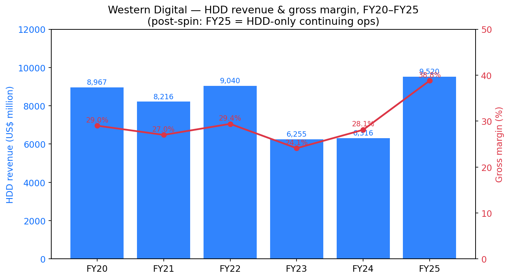
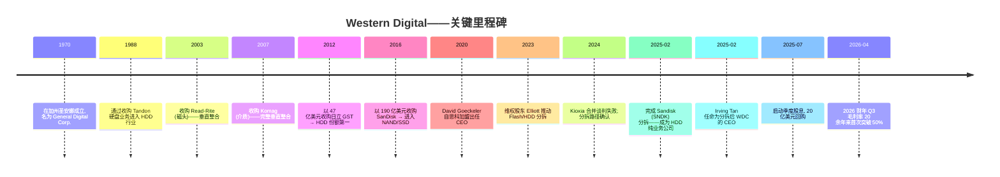
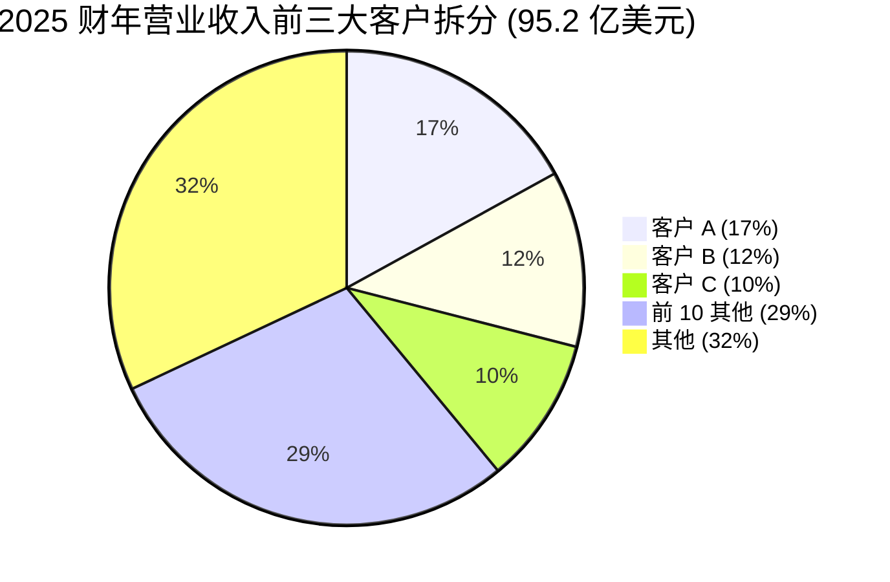
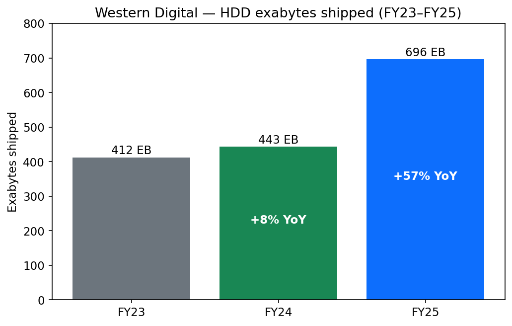
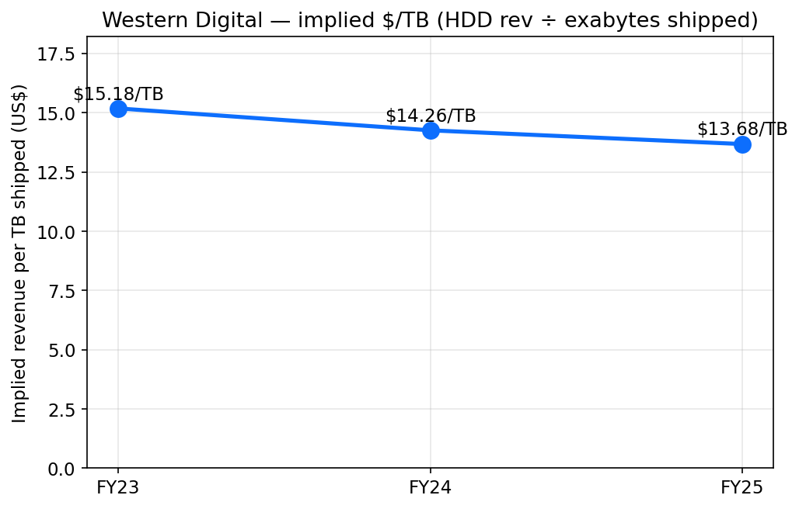
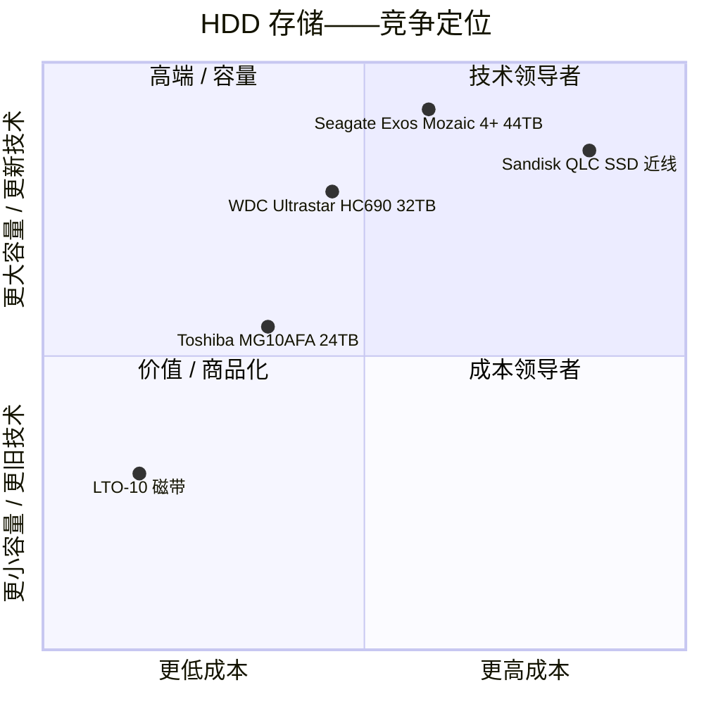
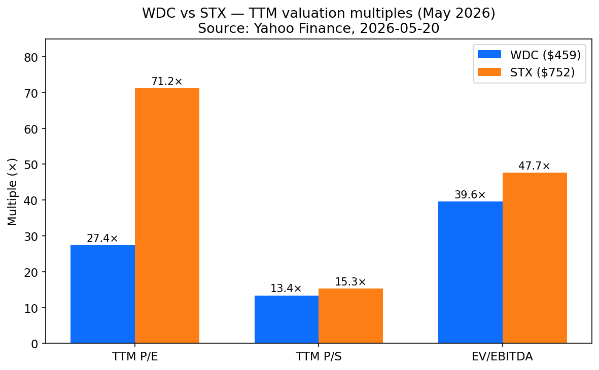
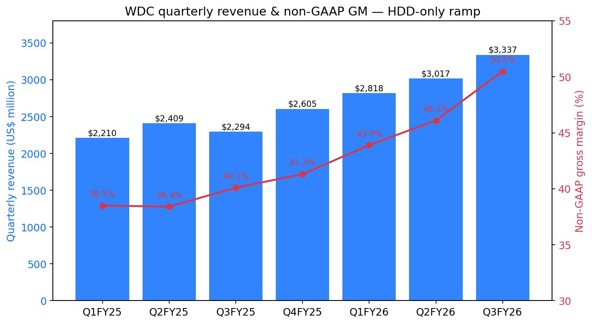

# Western Digital Corporation (NASDAQ:WDC) — 公司研究报告

**截至日期: 2026-05-20**
**上市地: 纳斯达克 (NASDAQ), 代码 WDC**
**注册地: 美国加州圣何塞 (San Jose, California)**
**报告语言: 简体中文 (英文版同时存在于本目录)**

> **业绩更新——2026 财年 Q3 业绩抬升全年走势 (2026-04-30):** 管理层指引 2026 财年 Q4 营业收入 **35.5–37.5 亿美元 (中位数 36.5 亿美元, 同比 +36–44%)**, 非 GAAP 毛利率 **51–52%**, 非 GAAP 每股收益 **3.10–3.40 美元** ([2026 财年 Q3 业绩公告, 2026-04-30](https://www.sec.gov/Archives/edgar/data/0000106040/000162828026028878/a4ex991-pressreleaseq326.htm))。同日, 董事会批准**季度股息上调 20% 至 0.15 美元/股**。该指引意味着 2026 财年营业收入约 128 亿美元 (相较 2025 财年 95.2 亿美元; 同比 +34–35%), 并推动隐含的非 GAAP 毛利率出口率首次自 2012 年并购日立存储以来突破 50%。首席执行官 Irving Tan 将此强势归因于"几乎每一种 AI 工作负载, 从训练、推理、Agentic AI 到 Physical AI, 所产生的数据都会以低成本且高效的方式持久存储于硬盘 (hard disk drive, HDD) 之上"。

---

## 目录
1. 公司概览
2. 公司历史
3. 管理团队
4. 产品与服务
5. 客户与上市策略
6. 行业概览
7. 竞争格局
8. 市场机会 (TAM)
9. 风险评估
10. 参考资料

---

## 1. 公司概览

Western Digital Corporation (NASDAQ:WDC) **自 2025 年 2 月 21 日起, 已转型为纯粹的硬盘 (hard disk drive, HDD) 公司**。在该日, 公司完成了将其 NAND 闪存 (NAND flash) 与固态硬盘 (solid-state drive, SSD) 业务以免税方式分拆为新独立上市公司——**Sandisk Corporation (NASDAQ:SNDK)** ([WDC 2025 财年 10-K, 第 4 页](https://www.sec.gov/Archives/edgar/data/0000106040/000010604025000038/wdc-20250627.htm); [WDC 8-K, 2025-02-24](https://www.sec.gov/Archives/edgar/data/0000106040/000119312525033383/d847507dex991.htm))。分拆前的 Western Digital 是全球第二大垂直一体化存储 (storage) 公司, 将其通过 2012 年并购日立 GST (Hitachi GST) 而建立的 HDD 传统业务, 与 2016 年并购 SanDisk 而获得的 NAND/SSD 业务结合于一体。该交易结构为: 按每一股 WDC 派发一股 Sandisk 股份的同比例分配, 以及一笔"债务换股权"交换——WDC 通过交换所保留的 Sandisk 股权来偿还其部分 Term Loan A-3 ([WDC 2025 财年 10-K, 附注 3 终止经营业务](https://www.sec.gov/Archives/edgar/data/0000106040/000010604025000038/wdc-20250627.htm))。

留下来的, 是**全球出货量第一的 HDD 制造商**, 2025 财年 (截至 2025 年 6 月 27 日) 营业收入 **95.2 亿美元 (同比 +51%)**, GAAP 毛利率 **38.8% (同比 +1,070 bps)**, GAAP 营业利润 **23.3 亿美元**, 持续经营业务 GAAP 净利润 **16.4 亿美元 (相较 2024 财年净亏损 7.65 亿美元)** ([WDC 2025 财年 Q4 业绩公告, 2025-07-30](https://www.sec.gov/Archives/edgar/data/0000106040/000010604025000030/a4ex991-pressreleaseq425.htm); [WDC 2025 财年 10-K, 第 7 项 MD&A](https://www.sec.gov/Archives/edgar/data/0000106040/000010604025000038/wdc-20250627.htm))。公司在 24 个国家共有员工**约 40,000 人**, 其中 88% 集中于亚太地区 (主要在泰国、马来西亚与菲律宾, 负责 HDD 介质、磁头与组装), 11% 在美洲, 不足 1% 在欧洲、中东与非洲 (EMEA) ([WDC 2025 财年 10-K, 第 8 页](https://www.sec.gov/Archives/edgar/data/0000106040/000010604025000038/wdc-20250627.htm))。总部位于加州圣何塞 5601 Great Oaks Parkway。

**公司卖什么。** 单一可报告分部——HDD——销往三个终端市场 ([WDC 2025 财年 10-K, 第 1 项 业务](https://www.sec.gov/Archives/edgar/data/0000106040/000010604025000038/wdc-20250627.htm)):

- **云 (Cloud, 占 2025 财年营业收入 88%, 83.4 亿美元, 同比 +65%):** 销售给超大规模数据中心运营商 (hyperscalers)、云服务商 (cloud service providers, CSP) 与大型企业的容量级企业近线 (capacity-enterprise nearline) HDD。这是战略锚点; 投资组合中的其余产品都根据 Cloud 路线图剩余的产能空间来调整规模。
- **客户端 (Client, 占营业收入 5.8%, 5.56 亿美元, 同比 -4%):** 用于台式机、一体机、安防录像机、游戏主机以及外置存储 OEM 平台的内置 HDD。
- **消费 (Consumer, 占营业收入 6.5%, 6.23 亿美元, 同比 -9%):** **WD**、**WD_BLACK** 和 **SanDisk Professional** 品牌下的零售外置存储产品 (最后一个品牌已通过分拆时签署的长期商标许可协议 (Trademark License Agreement, TLA) 反向授权给 WDC; 详见第 2 节)。


来源: [WDC 2025 财年 10-K, 第 7 项](https://www.sec.gov/Archives/edgar/data/0000106040/000010604025000038/wdc-20250627.htm)、[2023 财年 10-K, 第 7 项](https://www.sec.gov/Archives/edgar/data/0000106040/000010604023000024/wdc-20230630.htm)、[2022 财年 10-K, 第 7 项](https://www.sec.gov/Archives/edgar/data/0000106040/000010604022000055/wdc-20220701.htm)。FY20–FY24 采用 HDD 分部营业收入及 HDD 分部毛利/营业收入。FY25 为公司层面 HDD-only 持续经营业务口径。

**估值快照 (2026-05-20 收盘 459.03 美元)。** 市值 **1,582 亿美元**, 企业价值 **1,556 亿美元**, 总股本 **3.447 亿股**, 52 周区间 **49–525 美元** ([Yahoo Finance, 2026-05-20](https://finance.yahoo.com/quote/WDC/key-statistics))。

| 估值倍数 | WDC (TTM) | STX (TTM) | WDC 3 年区间 | 行业中位数* |
|---|---|---|---|---|
| 市盈率 (P/E) | **27.4×** | 71.2× | 不具备意义至约 28×(2025 财年前深度亏损) | 约 21× |
| 市销率 (P/S) | **13.4×** | 15.3× | 0.4×–13.7× | 3.5× |
| EV/EBITDA | **39.6×** | 47.7× | 不具备意义至约 40× | 约 15× |
| 市净率 (P/B) | 21.9× | 357.3× | 低个位数 | 4–5× |

*行业中位数 = 费城半导体指数加存储同业, 数据源 [Yahoo Finance 行业页](https://finance.yahoo.com/sectors/technology/semiconductors/)。三年区间由 2023 财年周期低谷 (净亏损, P/E 不具备意义, 股价 26.81 美元) 与 2026 年 5 月峰值界定 ([Macrotrends — WDC 15 年历史](https://www.macrotrends.net/stocks/charts/WDC/western-digital/stock-price-history))。

**解读估值倍数。** WDC 的 TTM P/E 27 倍, 大约是**HDD 行业长期周期平均 P/E (历史约 6–8 倍) 的 5 倍**。这一扩张来自两股相互独立的驱动力:

1. **盈利能力的台阶式跃升。** 非 GAAP 营业利润率从分拆前 (2024 财年) 的约 5%, 跃升至 2026 财年 Q2 的约 33% 与 Q3 的约 39% ([2026 财年 Q2 公告, 2026-01-29](https://www.sec.gov/Archives/edgar/data/0000106040/000162828026004131/a4ex991-pressreleaseq226.htm); [2026 财年 Q3 公告, 2026-04-30](https://www.sec.gov/Archives/edgar/data/0000106040/000162828026028878/a4ex991-pressreleaseq326.htm))。50%+ 毛利率的 HDD-only 模型在经营杠杆维度上, 远高于过去混合 Flash + HDD 的组合。
2. **AI 存储叙事溢价。** 管理层多次将 HDD 定位为"AI 数据经济的基石" ([WDC 博客, 2025-08-12](https://blog.westerndigital.com/western-digital-and-the-foundation-of-the-ai-data-economy/))。股价已自 2023 财年低点累计上涨约 970%, 部分受此叙事与挂钩 AI 基础设施篮子的 ETF 资金流推动 ([Investing.com, 2026-04](https://www.investing.com/analysis/western-digitals-970-moonshot-what-the-ai-storage-charts-dont-show-you-yet-200674947))。一个周期性、重资本投入的零部件供应商, 其合理 P/E 应接近 12–15 倍; 当前 27 倍 P/E 与之相差的部分, 本质上是 AI 溢价 + 分红启动的重估幅度。我们在第 9 节中将其作为估值压缩风险列示。

P/S 13.4 倍与 HDD 行业长期约 1 倍的水平形成更鲜明的对比; 投资者已为未来两年的营业收入增长付费 (一致预期 2027 财年约 150–160 亿美元营业收入意味着前瞻 P/S 约为 10 倍)。最近的同业 Seagate 在前瞻基础上估值更高, 原因是它在 HAMR (Heat-Assisted Magnetic Recording, 热辅助磁记录) 量产出货上领先 12 个月; 我们认为 WDC/STX 的差距是合理的, 反映出 STX 盈利可见度更高 (STX 只需完成一次技术枢转; WDC 需要同时执行 ePMR + HAMR 双路径)。

---

## 2. 公司历史

Western Digital **创立于 1970 年**, 在加州圣安娜 (Santa Ana) 作为通用数字公司 (General Digital Corporation) 起步, 主营 MOS 测试设备 ([WDC 2025 财年 10-K, 第 1 项](https://www.sec.gov/Archives/edgar/data/0000106040/000010604025000038/wdc-20250627.htm))。公司于 1971 年改用当前商号, 1970–1980 年代转向半导体设计 (UART 与软盘控制器), 并于 1988 年通过收购 Tandon Corporation 的硬盘业务进入 HDD 行业。自此之后, Western Digital 的故事本质上是一系列对收缩中的 HDD 厂商版图的机会性整合, 中间穿插着一次大型业务多元化 (进入 NAND 闪存, 现已逆转)。


来源: [WDC 2025 财年 10-K, 第 1 项](https://www.sec.gov/Archives/edgar/data/0000106040/000010604025000038/wdc-20250627.htm); [Reuters — Elliott 推动, 2022-05-03](https://www.reuters.com/business/finance/elliott-pushes-western-digital-explore-strategic-options-2022-05-03/); [WDC 新闻稿——Sandisk 分拆完成, 2025-02-21](https://investor.wdc.com/news-releases)。

**值得理解的三次战略转向:**

1. **日立 GST 交易 (2012, 47 亿美元)。** 2011–2012 年间, Western Digital 与 Seagate 共同吸收了其他全部具备规模的 HDD 厂商 (日立 GST → WDC; 三星 HDD → STX)。由此形成了一个有效双寡头格局 (加上规模小得多的东芝), 这一格局延续至今, 也是自 2023 年以来 HDD 定价得以稳定的结构性原因。该并购整合极其复杂, 中国反垄断当局要求延迟五年才能完成全面运营合并。该交易将 WDC 从并列第二推升为绝对第一的份额位。

2. **SanDisk 收购 (2016, 190 亿美元)。** 时任 CEO Steve Milligan 以"Flash 与 HDD 在客户支出口径上正在融合"为由进行多元化。该论点在不同时点都仅部分成立: Flash 与 HDD 的周期实际相反 (Flash 是纯存储商品价格周期; HDD 更多由复苏驱动), 所以合并后实体的盈利变得**更**而非**更不**波动。到 2023 年, 在 NAND 价格暴跌 50%+ 与 Kioxia 合并尝试失败后, 维权基金 Elliott Management 持有 10 亿美元股权并公开推动分拆 ([Reuters, 2022-05-03](https://www.reuters.com/business/finance/elliott-pushes-western-digital-explore-strategic-options-2022-05-03/))。

3. **Sandisk 分拆 (2025-02-21)。** 由时任 CEO David Goeckeler 主导完成。WDC 将约 80% 的 Sandisk 股权按 1:1 比例 (每股 WDC 一股 SNDK) 派发给 WDC 股东, 自身保留约 19.9%, 此后通过 2025 全年陆续进行的债务交换和二级市场配售逐步变现 ([WDC 2025 财年 10-K, 附注 3](https://www.sec.gov/Archives/edgar/data/0000106040/000010604025000038/wdc-20250627.htm))。Goeckeler 出任 Sandisk CEO; WDC 长期运营高管 **Irving Tan** 于次日晋升为 WDC CEO。分拆同时重组了 WD/SanDisk 品牌切分: WDC 保留"Western Digital"、"WD"与"WD_BLACK"的永久权利; Sandisk 保留 SanDisk 品牌用于存储产品, **但向 WDC 授权"SanDisk Professional"品牌**以用于高端外置存储, 双方签订长期商标许可协议 ([WDC 2025 财年 10-K, 第 1 项](https://www.sec.gov/Archives/edgar/data/0000106040/000010604025000038/wdc-20250627.htm))。

**与投资逻辑最相关的过去 12 个月动态:**

- *2025 年 7 月:* 启动 **0.10 美元/股的季度股息**并授权 **20.0 亿美元股票回购** ([2025 财年 Q4 公告, 2025-07-30](https://www.sec.gov/Archives/edgar/data/0000106040/000010604025000030/a4ex991-pressreleaseq425.htm))。
- *2025 年 9 月:* 向超大规模客户开始 **32 TB UltraSMR HDD 的批量出货** ([blocksandfiles, 2025-07-02](https://blocksandfiles.com/2025/07/02/western-digital-hamr-interview/))。
- *2026 年 4 月:* 在 2026 财年 Q3 业绩公布同日, 宣布**股息上调 20% 至 0.15 美元/股** ([2026 财年 Q3 公告](https://www.sec.gov/Archives/edgar/data/0000106040/000162828026028878/a4ex991-pressreleaseq326.htm))。
- *2026 年 4 月:* 确认 **40 TB ePMR 硬盘样品送样**, 目标在 **2026 年底/2027 年初实现 44 TB HAMR 硬盘的量产** ([Tom's Hardware 路线图更新, 2026-02](https://www.tomshardware.com/pc-components/hdds/high-capacity-hdd-roadmap-the-race-to-100tb-and-zettabyte-scale-storage-toshiba-seagate-and-wd-outline-three-distinct-strategies))。

---

## 3. 管理团队

### Irving Tan——首席执行官 (自 2025-02-22 起任职; 约 310 字简介)

Irving Tan 是分拆后的 CEO, 也是 WDC 近期史上最具决定性的运营决策。他是新加坡籍, 约 58 岁, 拥有工程学士学位和 MBA, 在 Sandisk 分拆完成的次日, 由全球运营执行副总裁 (Executive Vice President of Global Operations)——该职位自 2022 年 3 月起担任——晋升为 CEO ([WDC 8-K, 2025-02-24](https://www.sec.gov/Archives/edgar/data/0000106040/000119312525033383/d847507dex991.htm); [新加坡经济发展局简介, 2025](https://www.edb.gov.sg/en/business-insights/insights/from-singapore-to-san-jose-tech-veteran-irving-tan-rides-ai-wave-in-his-latest-role.html))。他此前职业生涯**在思科 (Cisco Systems) 工作了 13 年**, 晋升至**执行副总裁兼全球运营总监 (Chief of Global Operations)**, 并兼任**亚太、日本及大中华区董事长**——该职位让他在思科 APJC 业务的中国客户高增长年代直接承担 P&L, 同时负责全球供应链运营。在思科之前, 他曾在新加坡机场后勤服务 (SATS Ltd., 新航地勤子公司) 与新加坡科技工程 (Singapore Technologies Engineering) 担任高级运营职位 ([LinkedIn, 2026-05 访问](https://www.linkedin.com/in/irving-tan/))。

他在出任 CEO 之前在 WDC 完成的事项, 具体且对当前投资逻辑至关重要: 作为 2022 至 2025 年的运营 EVP, 他主导了**工厂利用率合理化, 使 HDD 分部毛利率从 2023 财年的 22.2% 升至 2024 财年的 28.1%, 再升至 2025 财年的 38.8%**, 甚至发生在 AI 驱动的近线需求未拐点之前——也就是说, 结构性的毛利重置是其任内制造纪律的成果, 并非仅源自价格周期。他接手的公司, 其 Cloud 需求已锁定 12 个月以上, 且 2026 财年 Q3 毛利率二十年来首度突破 50%。

分拆后聘约下的薪酬: 基本工资 125 万美元, 目标奖金占基本工资 200%, 入职股权 1,900 万美元, 目标年度长期激励 (LTI) 授予 1,400 万美元 ([WDC 2025 DEF 14A, 第 73 页](https://www.sec.gov/Archives/edgar/data/0000106040/000162828025044298/wdc-20251006.htm))。最近一次代理声明 (proxy) 日的实益持股: 约 34 万股加未归属 RSU, 占总股本约 0.1%——这对非创始人、外部职业道路的 CEO 属典型水平。Tan 于 2025 年 5 月 12 日采纳 Rule 10b5-1 交易计划, 允许在 2026 年 5 月前出售最多 80,000 股 ([WDC 2025 财年 10-K, 第 5 项](https://www.sec.gov/Archives/edgar/data/0000106040/000010604025000038/wdc-20250627.htm))。

### Kris Sennesael——首席财务官 (自 2025-05-12 起任职; 约 190 字)

Sennesael 现年 56 岁, 此前**自 Skyworks Solutions** 加盟, 在 Skyworks 于 **2016 年 10 月至 2025 年 5 月间出任 CFO** ([WDC 新闻稿, 2025-05-07](https://www.westerndigital.com/company/newsroom/press-releases/2025/2025-05-07-western-digital-names-chief-financial-officer); [Bloomberg 个人档案](https://www.bloomberg.com/profile/person/16309523))。在 Skyworks 之前, 他曾担任 **Enphase Energy (2012–2016)** IPO 后规模化阶段的 CFO, 以及 **Standard Microsystems Corporation (2009–2012)** 的 CFO, 主导后者出售给 Microchip 的交易。他持有比利时根特大学 (University of Ghent) 经济学学士与硕士学位, 以及 Vlerick 商学院 MBA, 现担任 MaxLinear 董事并兼审计委员会主席。

Sennesael 的招聘有一项具体的关键意义: Skyworks 是一家**营业收入 >100 亿美元的移动 IC 公司, 高度集中于苹果客户**, 其毛利率周期与单一巨型客户的产品路线图高度绑定——这几乎与 WDC 当前与超大规模数据中心近线客户的运营特征一致。他在资本回报上的纪录 (Skyworks 在其任期内回购了约 25% 的流通股, 并持续派发行业领先的股息), 大概率是 WDC 董事会招募他的原因。

### Cynthia Tregillis——执行副总裁、首席法务官兼公司秘书 (约 90 字)

Tregillis 自 2016 年起加入 WDC, 2022 年被任命为首席法务官 (Chief Legal Officer)。她主导了 Sandisk 分拆的法律工作——一笔涉及五个司法辖区反垄断申报、要约交换、约 26 亿美元债务偿还以及品牌许可剥离的交易——目前在 WDC 寻求 HAMR 许可与商业秘密保护诉讼时, 负责知识产权诉讼战略 ([WDC 2025 财年 10-K, 第 10 项](https://www.sec.gov/Archives/edgar/data/0000106040/000010604025000038/wdc-20250627.htm); [LinkedIn](https://www.linkedin.com/in/cynthia-tregillis/))。

### Ashley Gorakhpurwalla——执行副总裁兼 HDD 业务总经理 (约 90 字)

Gorakhpurwalla 于 2020 年自 Dell EMC 加盟, 此前他在 Dell EMC 负责 130 亿美元的服务器与基础设施业务。他直接负责 HDD 平台路线图的 P&L——即交付 ePMR、OptiNAND、UltraSMR 和 HAMR 衔接产品的工程、制造与客户互动层。他是大多数超大规模设计导入审查 (design-in review) 现场出席的高管 ([WDC 领导团队页](https://www.westerndigital.com/company/leadership))。

### 治理脚注

分拆后董事会有**八位董事, 其中七位为独立董事**, 由**Martin Cole** (埃森哲北美联邦业务前 CEO) 任主席, 于 2025 年 2 月接任长期主席 Matthew Massengill ([WDC 2025 DEF 14A](https://www.sec.gov/Archives/edgar/data/0000106040/000162828025044298/wdc-20251006.htm))。其他独立董事包括**Kimberly Alexy** (审计委员会主席, 前雷曼半导体分析师)、**Tunç Doluca** (前 Maxim Integrated CEO)、**Bruce Kiddoo** (前 Maxim CFO)、**Roxanne Oulman** (Couchbase CFO) 与**Stephanie Streeter** (Libbey Inc. 与 Banta Corp. 前 CEO)。**Massengill** 本人留任为非执行董事。内部人合计持股 **<1%**, CEO 薪酬 **约 85% 为业绩挂钩股权**, PSU 与相对 TSR (相对 S&P 500) 及自由现金流里程碑挂钩 ([2025 DEF 14A——CD&A](https://www.sec.gov/Archives/edgar/data/0000106040/000162828025044298/wdc-20251006.htm))。无重大关联方交易披露。分拆后董事会改选——2024–25 年新增三位独立董事——明确与 Elliott 和解协议挂钩。

### 业绩纪录综述

Tan **作为公众公司 CEO 尚未经过考验**, 但他接手的公司位居 WDC 35 年 HDD 历史中最强的竞争位置, 且他在思科与 WDC 两处的运营纪录文件完备、可量化。Sennesael 在 Skyworks 的任期为董事会在资本配置层面提供了可信背书。其缺口在**研发领导层的延续性**——David Goeckeler, 2020–2025 年技术路线图的设计师, 目前在 Sandisk 任 CEO; Gorakhpurwalla 接过了平台技术接力棒, 是 2026–2028 年 HAMR 转换期最重要、必须留住的单一高管。

---

## 4. 产品与服务

WDC 将分拆后的产品组合围绕三大终端市场——Cloud、Client、Consumer——加以组织, 使用两个品牌家族 **WD** (主流) 与 **WD_BLACK** (高端游戏/创作者), 以及反向授权的 **SanDisk Professional** 系列 ([WDC 产品导航](https://www.westerndigital.com/products))。

```mermaid
graph TD
    WDC[Western Digital——仅 HDD]
    WDC --> Cloud[Cloud / 数据中心——占 2025 财年营业收入 88%]
    WDC --> Client[客户端设备——占 2025 财年营业收入 5.8%]
    WDC --> Consumer[消费——占 2025 财年营业收入 6.5%]

    Cloud --> Ultrastar[Ultrastar DC HC700 系列 ePMR/UltraSMR]
    Cloud --> Platforms[Ultrastar Data60 / Data102 JBOD 平台]
    Cloud --> OpenFlex[OpenFlex Data24 NVMe-oF——遗留产品]

    Client --> WDBlue[WD Blue 3.5\" / 2.5\" 桌面与笔记本]
    Client --> Purple[WD Purple 安防/NVR]
    Client --> RedPro[WD Red Pro NAS]
    Client --> Gold[WD Gold 企业客户端]

    Consumer --> MyBook[My Book / My Passport 便携]
    Consumer --> Elements[Elements 桌面/便携]
    Consumer --> WDBLACK[WD_BLACK 游戏 P10 / D10]
    Consumer --> SDProHDD[SanDisk Professional G-DRIVE / G-RAID]
```
来源: [WDC 产品总览](https://www.westerndigital.com/products); [WDC 2025 财年 10-K, 第 1 项](https://www.sec.gov/Archives/edgar/data/0000106040/000010604025000038/wdc-20250627.htm)。

### 4.1 Cloud / 数据中心 (主营业务——88% 营业收入)

**Ultrastar DC HC700 系列容量级企业 HDD。** 单一最重要的产品线。现旗舰为 **Ultrastar DC HC690 (26 TB / 28 TB CMR; 32 TB UltraSMR, 含十一张盘片, 配合 ePMR + OptiNAND)** ([Ultrastar DC HC690 产品页](https://www.westerndigital.com/products/internal-drives/ultrastar-dc-hc690-hdd))。目标客户: 按机架采购的云与超大规模客户。定价模式: 不公开报价——在多年期容量预留合同 (capacity-reservation contracts) 下按主采购协议谈判; 媒体报道在当前上行周期中, 近线单盘 ASP 区间约为 **300–420 美元** ([Dr. Robert Castellano, 2026-02-15](https://drrobertcastellano.substack.com/p/seagate-and-western-digital-hdd-price))。核心差异化: **ePMR** (能量辅助 PMR, energy-assisted PMR——以更小的磁畴足迹写入数据)、**OptiNAND** (嵌入式 iNAND 闪存, 卸载元数据管理)、**UltraSMR** (叠瓦磁记录 (shingled magnetic recording), 在同样面密度之上提供 11+% 的容量上行) 以及**三级致动器** (3D 打印微致动器堆叠, 实现超快磁道定位)。

- *竞争优势:* **是——技术 + 制造规模。** 护城河 = 11 张盘片氦填充密封外壳的成熟大规模生产良率。证据: WDC 和 Seagate 是唯一两家批量出货 ≥26 TB 容量级企业硬盘的厂商; 东芝 (Toshiba) 量产的最大容量为约 24 TB ([Tom's Hardware, 2026-02](https://www.tomshardware.com/pc-components/hdds/high-capacity-hdd-roadmap-the-race-to-100tb-and-zettabyte-scale-storage-toshiba-seagate-and-wd-outline-three-distinct-strategies))。在 32 TB UltraSMR 处, WDC 在前 HAMR 世代占据*容量领先地位*。
- *最接近的竞争产品:* Seagate **Exos Mozaic 4+ (44 TB HAMR; 36 TB CMR Mozaic 3+)**。Seagate 在 HAMR 维度领先 (截至 2025 财年 Q1 已出货 100 万颗以上 HAMR 硬盘; Mozaic 4+ 于 2026-04 推出 [Seagate 新闻稿, 2026-04-15](https://www.seagate.com/news/news-archive/seagate-introduces-mozaic-4-plus/)), 在前 HAMR 容量点的每瓦特/每 TB 能效上落后于 WDC。**结论: 32–36 TB 档位上容量平价; WDC 在 $/W/TB 上略领先; Seagate 在 2027 年顶级容量点上领先。**

**Ultrastar Data60 / Data102 JBOD 存储平台。** 4U 机箱, 容纳 60 或 102 颗 Ultrastar 硬盘, 作为厂商集成的整机方案卖给希望直接购买构建块而非裸盘的云服务商 ([Ultrastar Data102 产品页](https://www.westerndigital.com/products/storage-platforms/ultrastar-data102-storage-platform))。营业收入贡献相对较小 (<10% Cloud), 但具战略意义——它让 WDC 捕获本应被超大规模 ODM (Quanta、Wiwynn) 收入囊中的机架集成毛利层。

- *竞争优势:* **部分** —— 护城河在于硬盘 + 平台 + 固件的捆绑, 而非机箱本身。毛利率结构 (mid-teens) 远低于硬盘 (mid-30s)。最接近的竞争对手: Seagate **Exos AP / Corvault** 机箱。结论: 平价; 这是防御性产品, 而非增长驱动。

**OpenFlex Data24 NVMe-oF。** 一种最初围绕 SanDisk SSD 构建的可组合存储 NVMe-over-Fabrics 机箱。**逐步退出:** 随着 Sandisk 已为独立公司, WDC 对 OpenFlex 的路线图已停止维护; 当前出货为已有客户的生命周期末期定价 ([blocksandfiles, 2025-04](https://blocksandfiles.com/2025/04/western-digital-openflex-future/))。

### 4.2 客户端设备 (营业收入 5.8%)

**WD Blue (主流台式/笔记本)、WD Black (游戏与创作者客户端——区别于 WD_BLACK 游戏零售)、WD Red Pro (NAS)、WD Purple (视频安防与 NVR)、WD Gold (企业客户端 / 工作站)。**

- *综合竞争优势:* **部分。** 自 2018 年起 WDC 的客户端 HDD 出货量逐年下滑, SSD 已大量替代客户端 PC 中的 HDD; 该分部目前主要是售后维修与垂直市场业务 (NAS、安防、工作站), 而非主存储业务。护城河 = 渠道伙伴 (Amazon、Best Buy、MicroCenter、Newegg) 中的品牌认知度, 以及与 Synology/QNAP 的 **WD Red NAS 认证项目**。定价模式: 通过分销商按渠道定价, 典型经销利润率为 8–14%。
- *最接近的竞争产品:* Seagate IronWolf (NAS)、SkyHawk (安防)、BarraCuda (主流)。结论: 技术规格上平价; WDC 在 NAS 上心智份额可能领先, 在安防上落后 (SkyHawk 在海康/大华参考设计中占主导)。
- *路线图状态:* 2025 年内客户端无新容量点发布; 该分部已被作为生成现金的衰退性业务管理, 除来自 Cloud 路线图的共享技术外, 不再有增量研发投入。

### 4.3 消费 (营业收入 6.5%)

**My Book (3.5" 桌面外置)、My Passport (2.5" 便携)、Elements (入门级)、WD_BLACK 游戏外置 (P10、D10、P40 Game Drive)、SanDisk Professional G-DRIVE / G-RAID (创作者 / 视频专业人士)。**

- *综合竞争优势:* **部分——零售的品牌护城河。** WD 与 WD_BLACK 在西方零售商中拥有主导的货架曝光; SanDisk Professional G-RAID 在广电/影视生产租赁市场上接近垄断, 原因是与 ProRes RAW 及 BlackMagic 工作流深度集成。但: 随着云存储和大容量内置 NVMe SSD 替代外置 HDD, 该分部在结构性收缩。
- *最接近的竞争产品:* Seagate Backup Plus / Expansion (主流)、LaCie (Seagate 所有, 专业)。结论: WDC 在准专业高端 (SanDisk Pro G-RAID) 领先, 主流平价。
- *路线图状态:* WD_BLACK 在 2025 年末推出 24 TB 外置 D10 ([WDC 新闻稿, 2025-10](https://www.westerndigital.com/company/newsroom))。SanDisk Professional 在 2026 年初刷新 G-RAID Mirror/Shuttle SKU。

### 旗舰产品 vs 长尾

**两个旗舰产品分别是: (1) Ultrastar DC HC690 容量级企业 HDD; (2) 即将到来的 HC700 系列 HAMR 硬盘。** 综合而言, 容量级企业近线硬盘按 88% Cloud 营业收入披露及管理层关于 Cloud 毛利率远高于公司平均水平的评论估算, 驱动**总营业收入的 >85% 与总毛利的 >95%** ([2026 财年 Q3 业绩说明会纪要, 2026-04-30](https://www.westerndigital.com/company/investor-relations))。其他产品——Client、Consumer、JBOD 平台——为长尾, 按现金管理而非增长管理。

### 过去 12 个月发布 / 退出

- **发布:** 32 TB Ultrastar UltraSMR (2026 财年 Q1 量产); 40 TB ePMR 工程样品 (2026 财年 Q3); 24 TB WD_BLACK D10 外置 (2026 财年 Q1)。
- **退出 / 终止:** OpenFlex Data24 (分拆后); Ultrastar SSD 产品线 (分拆时移交 Sandisk)。
- **在途:** 第一代 HAMR 硬盘 (36 TB CMR、40 TB SMR、44 TB UltraSMR), 目标**于 2026 日历年末批量出货, 2027 日历年逐步放量** ([Tom's Hardware 路线图, 2026-02](https://www.tomshardware.com/pc-components/hdds/high-capacity-hdd-roadmap-the-race-to-100tb-and-zettabyte-scale-storage-toshiba-seagate-and-wd-outline-three-distinct-strategies))。

---

## 5. 客户与上市策略

### 分部与渠道

- **Cloud:** 约 10 个具名超大规模数据中心 / 大型 CSP / 企业 OEM 账户通过主采购协议 (master purchase agreements, MPA) 直接采购; 该渠道占**约 88% 营业收入** ([WDC 2025 财年 10-K, 第 1A 项](https://www.sec.gov/Archives/edgar/data/0000106040/000010604025000038/wdc-20250627.htm))。销售周期从样品认证到批量出货为 6–18 个月; 订单在容量预留主框架下以滚动 13–52 周采购订单下达。媒体报道显示这些是**容量预留, 而非 take-or-pay (照付不议)**, 也就是说如果需求改变, 客户可以重新协商数量 ([Investing.com, 2026-04](https://www.investing.com/analysis/western-digitals-970-moonshot-what-the-ai-storage-charts-dont-show-you-yet-200674947))。
- **客户端 (OEM):** 通过主要 PC OEM (Dell、HP、Lenovo) 销售, 并销往安防 / NAS OEM (海康、大华、Synology、QNAP) 以及向渠道销售 Western Digital 品牌 NAS。
- **消费 (零售与电商):** 通过 Amazon、Best Buy、Walmart、MicroCenter、京东 (JD.com)、天猫 (Tmall)、Mediamarkt 以及 `westerndigital.com` 与 `sandiskprofessional.com` 直销。

### 客户集中度——量化披露 (10-K)

这一点**重大且分拆后趋于恶化**。根据 2025 财年 10-K 客户集中度附注 ([WDC 2025 财年 10-K, 第 7A 项与附注 1](https://www.sec.gov/Archives/edgar/data/0000106040/000010604025000038/wdc-20250627.htm)):

> "在 2025 年, 三个客户分别占我们净营业收入的 17%、12% 和 10%。在 2024 年和 2023 年, 无单一客户占我们净营业收入的 10% 或以上。"

> "截至 2025 年 6 月 27 日的财年内, 我们的 Cloud 终端市场占总营业收入的 88%, 而我们的前 10 大客户占净营业收入的 68%, 其中三个客户各自占公司净营业收入的 10% 或以上。"

| 指标 | 2023 财年 | 2024 财年 | 2025 财年 |
|---|---|---|---|
| ≥10% 营业收入的客户 | 0 | 0 | **3 (17%, 12%, 10%)** |
| 前 10 大客户营业收入占比 | n/a | n/a | **68%** |
| Cloud 占总营业收入比 | 76% (Flash + HDD 混合) | 80% | **88%** |

WDC 未披露客户名称。媒体报道与设计赢得新闻稿表明三个 ≥10% 客户为 **Amazon Web Services、Microsoft Azure、Google Cloud、Meta Platforms 与 Oracle Cloud Infrastructure 的子集** ([Investing.com, 2026-04](https://www.investing.com/analysis/western-digitals-970-moonshot-what-the-ai-storage-charts-dont-show-you-yet-200674947); [WDC 博客, 2025-08-12](https://blog.westerndigital.com/western-digital-and-the-foundation-of-the-ai-data-economy/))。WDC 明确将集中度标注为风险: "由于分拆 (the Separation), 我们的营业收入向 Cloud 终端市场以及向头部客户集中度上升" ([WDC 2025 财年 10-K, 第 1A 项](https://www.sec.gov/Archives/edgar/data/0000106040/000010604025000038/wdc-20250627.htm))。

**严重性:** 头部客户 17%、前三客户 39% 已**超过本报告框架中嵌入的 20% / 50% 重要性阈值**——我们将在第 9 节中将此作为重大风险列示。


来源: [WDC 2025 财年 10-K, 第 7A 项与第 1A 项](https://www.sec.gov/Archives/edgar/data/0000106040/000010604025000038/wdc-20250627.htm)。因 WDC 在文件中未具名披露三个 ≥10% 客户, 故使用客户字母代号。

### 合同结构

合同为**多年期主采购协议 (MPA)**, 配滚动 13–52 周采购订单。MPA 设定定价方法 (通常为挂钩基准 $/TB 与容量点溢价的浮动公式)、服务级别条款 (允许的坏块率、RMA 条款) 与容量预留权——但**大多数不含 take-or-pay 条款**, 因此如果内部 AI/存储 capex 计划变更, 超大规模可以下调订单量。WDC 不披露 MPA 平均期限; 媒体报道显示当前周期典型为 2–3 年 ([Investing.com, 2026-04](https://www.investing.com/analysis/western-digitals-970-moonshot-what-the-ai-storage-charts-dont-show-you-yet-200674947))。

### 头部客户是否也是竞争对手或自建产能?

四个可能的前三大超大规模 (AWS、Azure、Google) 中有三家已发表过关于针对特定工作负载的**全闪存数据中心 (all-flash datacenter)** 研究, 而 Meta 工程师公开撰文称 NAND 闪存在某些温数据 (warm-data) 工作负载下, 现已比 HDD 节省约 80% 的每 TB 功耗。**WDC 的商业反驳论点是采购成本**——容量级闪存 $/TB 仍是 HDD 的 4–6 倍, 且这一差距在 2025 年随着近线 HDD ASP 上行而实际**扩大** ([Dr. Robert Castellano, 2026-02-15](https://drrobertcastellano.substack.com/p/seagate-and-western-digital-hdd-price))。当前没有任何头部客户在自建 HDD 制造能力——从零开始建一座 HDD 工厂需要 >30 亿美元资本支出和 5 年以上的磁头/介质工艺导入——因此替代风险源自技术替代, 而非垂直整合。

### 渠道与合作伙伴

除直接超大规模渠道外, WDC 运营**授权分销商网络** (Synnex/TD Synnex、Ingram Micro、ASBIS) 服务渠道伙伴、OEM 与中小企业。WD 还为 SanDisk Professional 创意专业产品线运营 **VAR / SI 合作伙伴计划**。近期合作伙伴动态包括与 Synology、QNAP、WD 品牌 NAS 的认证项目, 以及与领先存储 OS 厂商的工程联合开发 (与 Pure Storage 在 FlashBlade 邻近容量层、与 DDN 在 AI 训练存储栈)。

---

## 6. 行业概览

### 定义与范围

HDD 行业生产 2.5" 与 3.5" 规格的磁性旋转存储设备。NAICS 334112 (计算机存储设备制造)。2025 年之后的行业最佳解读是**三个处于截然不同生命阶段的终端市场**:

| 终端市场 | 2025 年现状 | 展望 |
|---|---|---|
| **容量级企业 / 近线** (≥12 TB, 超大规模数据中心) | 蓬勃增长; 需求受限 | 2030 年前高个位数至两位数 CAGR |
| **性能企业** (10K/15K SAS) | 终端衰退 | 到 2027 年基本被 NVMe SSD 替代 |
| **客户端 / 消费** (主要 2.5", <8 TB) | 平缓下滑 | 每年下降 5–10%, 因 SSD 替代 |

容量级企业 (近线) 占 **2025 年总 HDD 出货量 EB (exabyte) 的 >68%** ([Horizon Technology, 2026-01](https://horizontechnology.com/news/enterprise-hdd-remains-dominant-storage-technology/); [blocksandfiles, 2025-05](https://blocksandfiles.com/2025/05/17/disk-drive-capacity-shipment-out-to-2030-are-set-to-rocket-upwards/))。这是 WDC 投资逻辑中唯一关键的分部; 其余为增量贡献。

### 市场规模与增长

HDD 总出货量约为 **2025 年 2.78 亿台**, 较 2010 年 >6.5 亿台的峰值下滑——15 年来出货基数收缩约 60%, 因闪存替代了客户端的 HDD ([Horizon, 2026-01](https://horizontechnology.com/news/enterprise-hdd-remains-dominant-storage-technology/))。但每台平均容量上升如此之快——从 2023 年 3.6 TB 升至 2025 年约 4.2 TB——以至于**过去三年总出货 EB 的 CAGR 约为 20%**, 预计 2030 年前维持类似增速 ([blocksandfiles, 2025-05](https://blocksandfiles.com/2025/05/17/disk-drive-capacity-shipment-out-to-2030-are-set-to-rocket-upwards/))。

WDC 自身管理层预测 **2024 至 2028 年间 HDD 行业 EB 需求 CAGR 约 23%**, 主要受 HAMR 驱动的密度提升与 AI 训练 / 推理数据积累的叠加推动 ([WDC 投资者日 2025 / 博客](https://blog.westerndigital.com/western-digital-and-the-foundation-of-the-ai-data-economy/))。

行业营业收入 (HDD 维度) 在 **2025 日历年约为 230–250 亿美元** (WDC HDD 约 95 亿美元 + Seagate 约 100 亿美元 + 东芝约 40 亿美元), 较 2023 日历年约 170 亿美元的低点回升, 接近 2022 日历年前一个周期峰值约 280 亿美元 ([Seagate 2025 财年 Q4 8-K](https://www.sec.gov/Archives/edgar/data/0001137789/000113778925000150/fq425consolidatedscript-8x.htm))。

### 需求驱动

1. **AI 训练 / 推理的数据积累。** 前沿模型训练语料三年来每年增长约 10×; 训练完成的模型工件、评估数据集、RLHF 对话记录、向量缓存以及推理结果日志正以每家超大规模数据中心数 EB/年的速率在近线积累。WDC 管理层认为这是结构性的, 而非周期性 ([2026 财年 Q3 业绩公告解读](https://www.sec.gov/Archives/edgar/data/0000106040/000162828026028878/a4ex991-pressreleaseq326.htm))。
2. **视频监控与生成式视频。** 长保留期的 4K/8K 视频档案。
3. **受监管的归档 (金融、医疗、政府)。** 多年保留期要求, 经济上必然落在磁带或近线 HDD 上。
4. **与闪存的 $/TB 差距。** 截至 2026 年, 近线 HDD $/TB 约 10–14 美元; 近线级 QLC NAND SSD $/TB 约 50–90 美元, 尽管单比特功耗存在差距。

### 增长驱动——供给侧

1. **面密度进步。** ePMR + UltraSMR 自 2022 年以来已交付约 25% 的密度 CAGR。HAMR 预计将在 2026–2028 年再提供约 30–40% 的密度阶跃。
2. **氦填充密封外壳。** 实现每盘 9–11 张盘片 (相较空气填充的 7 张), 是过去十年单次最大的容量解锁。
3. **行业整合在结构性上稳定了定价。** Big 3 (WDC、STX、东芝) 合计份额 >95%; 产能扩张如今需要超大规模数据中心明确的预订单 ([Mordor Intelligence, HDD Market 2025](https://www.mordorintelligence.com/industry-reports/hard-disk-drive-market); [Dr. Castellano, 2026-02](https://drrobertcastellano.substack.com/p/seagate-and-western-digital-hdd-price))。

### 监管环境

- **出口管制。** 美国商务部对先进半导体的限制不直接覆盖 HDD, 但可能延伸; 部分中国大陆超大规模采购方已开始向东芝倾斜采购, 以规避未来对美国本土供应商列入实体清单 (Entity List) 的潜在风险。
- **PFAS / 化学合规。** 氦填充 HDD 在密封中使用全氟化合物; 2026–2027 年欧盟 PFAS 提案可能上调合规成本。
- **能效监管。** 欧盟 EcoDesign 指令 2025/444 将自 2027 年起对存储产品施加最低能效阈值。

### 行业结构

- **集中度:** 已整合至三家厂商 (合计份额约 95%+)。2025 年 Q1 出货量份额: **WDC 42% (1,210 万台), Seagate 40% (1,140 万台), 东芝 18% (520 万台)** ([Tom's Hardware, 2025-08](https://www.tomshardware.com/pc-components/hdds/high-capacity-hdd-roadmap-the-race-to-100tb-and-zettabyte-scale-storage-toshiba-seagate-and-wd-outline-three-distinct-strategies))。
- **供应商议价能力:** 中等。两家大型磁头/介质供应商 (Showa Denko / Resonac 提供介质盘片; TDK 提供磁头); WDC 通过 2003 年并购 Read-Rite 实现磁头垂直整合, 通过 2007 年并购 Komag 实现介质垂直整合, 相较 Seagate 降低了供应商风险。
- **客户议价能力:** Cloud 上非常高 (前三客户 = 39% 营业收入), Consumer 上较低。
- **替代品:** NAND 闪存是主导替代品, 在**单位功耗**上结构性更便宜, 但在**容量单位**上价格仍贵约 5×; 闪存替代论已被讨论 20 余年, 但 $/TB 交叉点持续被推后。
- **进入门槛:** 基本不可逾越。资本开支 >30 亿美元, 5+ 年磁头与介质开发周期, 以及对几十项三家在位厂商共同持有的专利制造配方的依赖。


来源: [WDC 2025 财年 10-K, 第 7 项](https://www.sec.gov/Archives/edgar/data/0000106040/000010604025000038/wdc-20250627.htm)。


来源: WDC HDD 分部营业收入除以出货 EB, 数据均来自 [WDC 2025 财年 10-K](https://www.sec.gov/Archives/edgar/data/0000106040/000010604025000038/wdc-20250627.htm) 与前几年 10-K。

---

## 7. 竞争格局

HDD 行业的结构是 WDC 投资逻辑中最重要的一项事实: 它是一个**理性的三家寡头**。下文我们先介绍直接竞争对手, 再涉及邻近威胁。

### 直接竞争对手 (HDD)

**1. Seagate Technology Holdings plc (NASDAQ:STX)。** 双寡头的另一半。2025 日历年营业收入**约 100 亿美元**, 出货量份额约 40%, 近线 EB 份额约 42% ([Seagate 2025 财年 Q4 8-K](https://www.sec.gov/Archives/edgar/data/0001137789/000113778925000150/fq425consolidatedscript-8x.htm))。差异化: **HAMR——首批量产**。Seagate 自 2024 日历年起出货 **Mozaic 3+** HAMR 平台, 自 2026 年 4 月起出货 **Mozaic 4+** (44 TB CMR); 据 Seagate 管理层评论, 累计 HAMR 出货量于 2026 日历年 Q2 突破 100 万颗 ([blocksandfiles, 2026-04](https://blocksandfiles.com/2026/04/seagate-mozaic-4-plus-44tb/))。策略: 押注公司未来于 HAMR, 利用密度领先在 2026–2027 年于 WDC 无法匹配的价格点上抢占近线份额。脆弱性: HAMR 可靠性数据仍在积累中 (Seagate 给出 250 万小时 MTBF 与 0.35% 年化故障率, 但现场样本量小); 制造复杂度更高, 良率风险更大。

**2. Toshiba Storage / Kioxia / Toshiba 电子设备与存储。** Big 3 中规模最小者。2025 日历年 HDD 营业收入约 40 亿美元, 出货量份额约 18%。策略: 成本竞争性近线 + 安防垂直市场; 顶级容量 SKU 24 TB MAMR。历史上一直是 16–22 TB 档位的成本领先者; 2024–2025 年在安防 HDD 上抢占份额 (约占新企业出货量的 23%) ([Mordor Intelligence](https://www.mordorintelligence.com/industry-reports/hard-disk-drive-market))。脆弱性: 长期相对同业研发投入不足; 容量点落后; 无 HAMR 产品发布 (传言 2028 年)。

### 间接竞争对手与替代品

**3. NAND 闪存 / SSD 厂商 (Sandisk、Micron、Samsung、Kioxia、SK Hynix)。** 结构性替代品。Sandisk 尤为尴尬: 它是 WDC 的前手足公司, 与 Kioxia 共享制造合资, 也是超大规模容量层闪存预算的直接竞争对手。Meta 工程在 2025 年末公开发表 QLC NAND 在某些容量层、当数据中心电力是约束性瓶颈时, 已在 TCO 上击败 HDD。**反驳论点:** 即便在理论功耗成本平价之时, 前期 $/TB 差距仍为 4–6×, 而 SSD 行业有自身资本开支周期, 限制了比特供给增长 ([Investing.com, 2026-04](https://www.investing.com/analysis/western-digitals-970-moonshot-what-the-ai-storage-charts-dont-show-you-yet-200674947))。

**4. 磁带 (LTO / IBM)。** 在最深档归档层 (冷存储、合规保留) 是非平凡替代品。LTO-10 (45 TB 原生) 磁带带已开始出货。磁带捕获访问延迟为分钟级可接受的工作负载; HDD 则捕获要求秒到分钟级延迟的层级。

**5. 云原生对象存储作为架构替代。** Wasabi、Cloudflare R2、Backblaze 以及超大规模自家的 S3 / Azure Blob 冷层本身运行于 HDD 之上, 但它们的存在降低了企业本地 HDD 需求。

### 定位框架


来源: 定位基于当前顶级 SKU 容量与容量级企业报价, 数据综合自 [Tom's Hardware 2026-02](https://www.tomshardware.com/pc-components/hdds/high-capacity-hdd-roadmap-the-race-to-100tb-and-zettabyte-scale-storage-toshiba-seagate-and-wd-outline-three-distinct-strategies) 与 [Dr. Castellano 2026-02](https://drrobertcastellano.substack.com/p/seagate-and-western-digital-hdd-price)。

### WDC 的竞争优势

1. **磁头与介质垂直整合。** WDC 自行制造磁头 (源自 Read-Rite、日立 GST) 与相当部分自家介质 (Komag)——这与 Seagate 形成结构性成本与路线图控制差距, 后者更依赖第三方介质合作伙伴。
2. **双路径技术 (ePMR + HAMR)。** WDC 可在不依赖 HAMR 良率的情况下, 在 2025–2026 年间交付容量点提升, 而 Seagate 的路线图存在 HAMR 量产的单点故障风险。
3. **26–32 TB 档位的能效优势。** OptiNAND + ePMR 架构使当前世代容量点上的 $/W/TB 具备可测量优势 (根据 WDC 技术披露及 [Yahoo Finance 评论, 2026-04](https://finance.yahoo.com/markets/stocks/articles/next-gen-hamr-epmr-drives-132600296.html))。
4. **客户端 / 消费的品牌与渠道地位。** WD_BLACK 是游戏存储零售的主导品牌; WD 品牌 NAS 认证产品线在 Synology/QNAP 中的吸引力强于 Seagate IronWolf。

### 脆弱性

1. **HAMR 跟随者地位。** Seagate 在 HAMR 量产上领先 12 个月; 落后时间越长, Seagate 锁定的超大规模签约容量越多, 影响越大。
2. **客户集中度。** 三个客户 ≥10%——WDC 史上最高。任何一家客户的丢失对盈利影响重大。
3. **经营杠杆双向放大。** 2026 财年 Q3 毛利率达 50.5%, 边际下沉率 (dropthrough margin) 高于 60%, 在 WDC 的固定成本制造结构下, 假设需求修正 10% 就会压缩毛利率约 400 bps。

### 市场份额走势

2025 日历年 Q1 出货量份额: **WDC 42%, STX 40%, 东芝 18%** ([Tom's Hardware, 2025-08](https://www.tomshardware.com/pc-components/hdds/high-capacity-hdd-roadmap-the-race-to-100tb-and-zettabyte-scale-storage-toshiba-seagate-and-wd-outline-three-distinct-strategies))。仅就近线 EB 份额, Seagate 当前领先于约 48–55%; WDC 约 35–40%; 东芝约 10–15%。2026–2027 年 HAMR 爬坡将决定差距扩大或收敛。


来源: [Yahoo Finance — WDC 关键统计, 2026-05-20](https://finance.yahoo.com/quote/WDC/key-statistics)、[STX 关键统计](https://finance.yahoo.com/quote/STX/key-statistics)。

---

## 8. 市场机会 (TAM)

### TAM 定义与规模估算

我们以三种方式衡量 HDD 市场:

**TAM (HDD 可处理的全部存储 TAM)。** 全球超大规模、云服务商及大型企业的企业存储支出, 包括 HDD、闪存、磁带及构建于商品化介质之上的软件定义存储栈。IDC 估算 **2025 日历年约为 1,400 亿美元**, 增速约 9% CAGR, **到 2028 日历年约 2,100 亿美元**, 因 AI 驱动的容量扩张加速 ([IDC HDD Market Forecast Pivot Update, 2025](https://my.idc.com/getdoc.jsp?containerId=US53966125); 引用于 [Horizon Technology, 2026-01](https://horizontechnology.com/news/enterprise-hdd-remains-dominant-storage-technology/))。

**SAM (WDC 实际竞争的 HDD 市场)。** 全球 HDD 行业在 2025 日历年实现**约 240 亿美元营业收入**, 增长约 95% 集中于近线容量级企业。WDC 可服务市场基本上等于整个 HDD 行业减去 18% 的东芝份额——即**2025 日历年约 200 亿美元**, 若 WDC 的 23% EB CAGR 预测成真且 ASP 维持当前水平, **2028 日历年升至约 320–350 亿美元** ([WDC IR 评论](https://blog.westerndigital.com/western-digital-and-the-foundation-of-the-ai-data-economy/); [blocksandfiles, 2025-05](https://blocksandfiles.com/2025/05/17/disk-drive-capacity-shipment-out-to-2030-are-set-to-rocket-upwards/))。

**SOM (WDC 在未来 3 年可合理捕获的份额)。** 假设 WDC 维持约 42% 出货量份额和约 38–40% 近线 EB 份额, 且近线 ASP 在 2027 日历年前维持中个位数上涨、之后趋平, 我们建模 2028 财年营业收入**约 140–160 亿美元**, 毛利率在 45–50% 区间——即约 65–75 亿美元毛利与约 40 亿美元营业利润。(估算基于公司指引 + 行业 EB CAGR + 份额持平假设; 非公司披露。)

### 增长从何而来

最具洞见的拆分是**EB 增长 vs ASP**。行业 EB 需求以约 20–25% / 年增长; 每 TB ASP 在正常年份缓慢*下行*, 但在 2024–2026 年 AI 上行周期中实际*上行*, 因近线供给受需求限制。WDC 自身的隐含 $/TB (营业收入 / EB) 在 2024–2025 财年内稳定在 13–14 美元/TB——也就是说, **WDC 营业收入增长基本完全来自 EB 增长, 而非定价**。如果 $/TB 维持在此区间, 2028 财年营业收入随 EB 增长。

### 渗透策略

WDC 并不通过价格争夺份额——HDD 行业已经隐含地达成共识: 双寡头的盈利能力比份额更重要, 激进的牌价折扣会抹去推动股价的 1,000+ bps 毛利率扩张。渗透路径在于**容量点领导力** (HAMR 交付时点, 40 TB / 44 TB 爬坡) 与**多年期供货合约**——后者可在竞争对手重新报价之前锁定超大规模 capex 承诺。最新管理层评论显示, 2026 财年和 2027 财年大部分产能"实际上已被销售一空" ([2026 财年 Q3 业绩公告](https://www.sec.gov/Archives/edgar/data/0000106040/000162828026028878/a4ex991-pressreleaseq326.htm))。

### TAM 尾部风险

以上 TAM 区间假设 $/TB 保持平至小幅上行。如果超大规模在 32 TB+ 容量层级实现内部闪存 vs HDD 的 TCO 平价 (这是 Meta 已开始公开推进的论点), HDD 在新数据中心存储 capex 中的份额可能从 2028 日历年起开始收缩——并非归零, 但可能从当前约 85% 降至总比特容量新增的约 50–60%。我们将其视为低概率 / 高影响尾部风险, 并在第 9 节中纳入。


来源: [WDC 季度业绩公告, FY2025–FY2026](https://www.sec.gov/cgi-bin/browse-edgar?action=getcompany&CIK=0000106040&type=8-K)。

---

## 9. 风险评估

### 公司特定风险

**1. 客户集中度——高 (重大)。** 三个客户分别占 2025 财年营业收入 17%、12% 和 10%, 前 10 大客户占 68% ([WDC 2025 财年 10-K, 第 1A 项](https://www.sec.gov/Archives/edgar/data/0000106040/000010604025000038/wdc-20250627.htm))。头部 17% 是**WDC 史上最高**, 反映了分拆后 Cloud 终端市场结构性份额提升 (营业收入 88% 为 Cloud, 较分拆前约 50% 上升)。严重性: 头部客户的丢失将在当前毛利率下压缩营业收入约 16 亿美元、营业利润约 7 亿美元。缓解因素: 多年期 MPA 框架; 客户列表本质上是超大规模寡头本身, 因此集中度反映的是买方侧的市场结构, 而非供应商管理失误。

**2. HAMR 量产执行。** WDC 自 2026 日历年起的竞争地位取决于能否在 2026 年末按 36 TB / 40 TB / 44 TB 容量点出货 HAMR ([Tom's Hardware, 2026-02](https://www.tomshardware.com/pc-components/hdds/high-capacity-hdd-roadmap-the-race-to-100tb-and-zettabyte-scale-storage-toshiba-seagate-and-wd-outline-three-distinct-strategies))。Seagate 领先 12 个月。6 个月以上的延期将令 Seagate 锁定下一轮超大规模合同; HAMR 介质或写头良率问题将压缩 2028 日历年前的近线份额。缓解因素: WDC 双路径策略 (40 TB ePMR + 44 TB HAMR) 比 Seagate 的单路径下注提供更多执行风险保险, 但公司*必须*在 2027 年前交付 HAMR 以维持长期容量竞赛地位。

**3. 关键人员风险: David Goeckeler 在分拆时离任。** Goeckeler 主导了 2020–2025 年的技术路线图, 包括交付 2025 财年毛利率重置的 ePMR / OptiNAND / UltraSMR 架构决策。他目前是 Sandisk CEO。Tan 是强力运营 CEO, 但在驱动 HAMR 复杂度的多代研发路线图上尚未经过验证。缓解因素: Gorakhpurwalla (HDD BU) 和磁头与介质工程组织保持原位; HAMR 研发路径已积累约 7 年 (在日立 GST 名下于 2010 年代初启动)。

**4. 制造业地理集中于亚洲。** WDC 约 88% 员工和绝大多数 HDD 组装产能位于泰国、马来西亚与菲律宾 ([WDC 2025 财年 10-K, 第 8 页](https://www.sec.gov/Archives/edgar/data/0000106040/000010604025000038/wdc-20250627.htm))。严重天气事件、地缘政治扰动或泰国基地 (最大单体设施, 曾在 2011 年曼谷洪水时遭受 4–6 个月的复产) 的劳工争议将产生重大运营后果。缓解因素: 关键介质与磁头生产双基地冗余; 成品库存缓冲通常为 6–8 周。

**5. 对 Sandisk 的品牌许可依赖。** WDC 在长期 TLA 下向 Sandisk 反向授权"SanDisk Professional"品牌用于 G-DRIVE / G-RAID 创意专业线。如果 TLA 被修订或在初始期满后不续约, 高毛利率的专业创意线将需重塑品牌——一次性营业收入冲击或在 1–2%, 但对影视/广电工作流的结构性品牌资产损失更重大。

### 行业 / 市场风险

**6. NAND 闪存替代。** 如果 QLC NAND 的 $/TB 跌幅快于 HDD 的 $/TB, Meta 已开始公开推动的替代论点 ([Investing.com 2026-04 援引 Meta 工程博客](https://www.investing.com/analysis/western-digitals-970-moonshot-what-the-ai-storage-charts-dont-show-you-yet-200674947)) 可能从 2028 日历年起压缩 HDD 在容量层级比特新增中的份额。严重性: 高但缓慢——$/TB 交叉点已被预测 15+ 年并一再被推后; 即便激进情形也需要 4–5 年才能显现。缓解因素: HDD 行业已经吸收过三波闪存替代浪潮 (客户端 SSD、性能企业 SSD、全闪存阵列), 每次都以结构性更大、毛利更高的近线业务卷土重来。

**7. 超大规模 capex 周期性。** AI capex 当前处于周期上行, 但有充分文献记载的周期性行为。2027 日历年后近线订单 10% 的小幅回撤将在 WDC 经营杠杆下压缩毛利率约 400 bps。缓解因素: 多年期 MPA 框架限制即时下行; 超大规模客户内部的地理与客户分散度 (前三家不同于前 10 名中后 7 家)。

**8. 容量赛跑中的竞争强度。** 如果 Seagate 和东芝均于 2027 日历年达到 HAMR 量产成熟度, 且东芝被迫通过价格保护份额, 双寡头的隐含定价纪律可能瓦解, 压缩 ASP。严重性: 中等——将逆转 2024–2026 年毛利率扩张。缓解因素: 垂直整合的成本位置与 95% 合并份额具有结构性保护。

**9. 贸易 / 出口管制监管。** 美国商务部或财政部对将近线 HDD 销往实体清单列入的中国云客户的限制将直接影响 2025 财年营业收入中来自中国大陆的约 17% ([WDC 2025 财年 10-K 地理营业收入, 中国 15.5 亿美元 + 香港 10.5 亿美元](https://www.sec.gov/Archives/edgar/data/0000106040/000010604025000038/wdc-20250627.htm))。缓解因素: WDC 在中国的销售主要面向商业云而非军事/情报客户; 出口管制语言迄今为商品化存储设有豁免空间。

### 财务风险

**10. 估值 / 倍数压缩风险。** TTM P/E 27×、TTM P/S 13.4×、EV/EBITDA 39.6×——均为 HDD 行业历史中位数的约 2–4 倍, 反映了嵌入的 AI 存储叙事溢价 ([Yahoo Finance, 2026-05-20](https://finance.yahoo.com/quote/WDC/key-statistics); [Macrotrends 历史](https://www.macrotrends.net/stocks/charts/WDC/western-digital/stock-price-history))。重估触发器: AI capex 减速头条、Seagate 在 WDC 前三大客户处获得 HAMR 设计赢、相对 36.5 亿美元 Q4 指引的连续营业收入未达预期。重估至 15× P/E (仍高于历史溢价) 将意味着相对 2026 年 5 月水平的 EPS 约 45% 下行空间。缓解因素: 股息、回购授权以及 HDD 行业经济性的真正结构性阶跃。

**11. 债务与资本结构。** 分拆后 WDC 保留 46 亿美元长期债务; 2025 财年末经过 26 亿美元季度偿还后约为 30 亿美元 ([2025 财年 Q4 公告](https://www.sec.gov/Archives/edgar/data/0000106040/000010604025000030/a4ex991-pressreleaseq425.htm))。净杠杆现在 <1.0× LTM EBITDA——这对公司历史而言为低水平, 但如果回购活动加速超过授权额度则需关注。缓解因素: 强劲自由现金流 (仅 2026 财年 Q3 就达 9.78 亿美元) 远超股息 + 回购 + 资本开支。

### 宏观风险

**12. 数据中心电力约束。** 超大规模数据中心 2026–2028 年建设越来越受电网容量而非芯片可用性约束。如果数据中心电力可用性扼制新数据中心 capex, 存储需求增长将随之放缓。最近的行业报道 ([Data Center Knowledge, 2026-04](https://www.datacenterknowledge.com/hyperscalers/hyperscalers-in-2026-what-s-next-for-the-world-s-largest-data-center-operators-)) 表明电力是 2028 年前的约束性瓶颈。

**13. 汇率敞口。** 2025 财年营业收入的约 30% 为非美元, 主要为亚洲计价货币, 尽管 WDC 以美元报告并通过位于亚洲的制造成本基础形成自然对冲。泰铢/林吉特/比索的大幅升值将压缩报告营业收入并抬升销货成本; 在当前 FX 比率下净影响大致为零。

---

## 10. 参考资料

### 一级——SEC 文件

- [WDC Form 10-K, 截至 2025 年 6 月 27 日财年 (递交于 2025-08-26)](https://www.sec.gov/Archives/edgar/data/0000106040/000010604025000038/wdc-20250627.htm)
- [WDC Form 10-Q, 2026 财年 Q3, 截至 2026 年 4 月 3 日 (递交于 2026-05-08)](https://www.sec.gov/Archives/edgar/data/0000106040/000162828026029054/wdc-20260403.htm)
- [WDC Form 10-Q, 2026 财年 Q2, 截至 2026 年 1 月 2 日](https://www.sec.gov/Archives/edgar/data/0000106040/000162828026004207/)
- [WDC Form 8-K——2026 财年 Q3 业绩公告 (2026-04-30)](https://www.sec.gov/Archives/edgar/data/0000106040/000162828026028878/a4ex991-pressreleaseq326.htm)
- [WDC Form 8-K——2026 财年 Q2 业绩公告 (2026-01-29)](https://www.sec.gov/Archives/edgar/data/0000106040/000162828026004131/a4ex991-pressreleaseq226.htm)
- [WDC Form 8-K——2025 财年 Q4 与全年业绩 (2025-07-30)](https://www.sec.gov/Archives/edgar/data/0000106040/000010604025000030/a4ex991-pressreleaseq425.htm)
- [WDC Form 8-K——Sandisk 分拆完成 (2025-02-24)](https://www.sec.gov/Archives/edgar/data/0000106040/000119312525033383/d847507dex991.htm)
- [WDC Form 8-K——Sandisk 备考财务 (2025-02-26)](https://www.sec.gov/Archives/edgar/data/0000106040/000010604025000012/wdc8-khardxspin.htm)
- [WDC DEF 14A (2025 代理声明, 递交于 2025-09)](https://www.sec.gov/Archives/edgar/data/0000106040/000162828025044298/wdc-20251006.htm)
- [WDC Form 10-K FY2024](https://www.sec.gov/Archives/edgar/data/0000106040/000010604024000031/wdc-20240628.htm)
- [WDC Form 10-K FY2023](https://www.sec.gov/Archives/edgar/data/0000106040/000010604023000024/wdc-20230630.htm)
- [WDC Form 10-K FY2022](https://www.sec.gov/Archives/edgar/data/0000106040/000010604022000055/wdc-20220701.htm)
- [Seagate Form 8-K 2025 财年 Q4 业绩](https://www.sec.gov/Archives/edgar/data/0001137789/000113778925000150/fq425consolidatedscript-8x.htm)

### 一级——公司来源

- [Western Digital——产品](https://www.westerndigital.com/products)
- [Western Digital——领导团队](https://www.westerndigital.com/company/leadership)
- [Western Digital——投资者关系](https://investor.wdc.com/)
- [WDC 新闻稿——Kris Sennesael 任命为 CFO (2025-05-07)](https://www.westerndigital.com/company/newsroom/press-releases/2025/2025-05-07-western-digital-names-chief-financial-officer)
- [WDC 博客——"Western Digital and the Foundation of the AI Data Economy" (2025-08-12)](https://blog.westerndigital.com/western-digital-and-the-foundation-of-the-ai-data-economy/)

### 二级——新闻与行业媒体

- [Reuters——Elliott 推动 Western Digital 探索战略选项, 2022-05-03](https://www.reuters.com/business/finance/elliott-pushes-western-digital-explore-strategic-options-2022-05-03/)
- [Tom's Hardware——高容量 HDD 路线图, 2026-02](https://www.tomshardware.com/pc-components/hdds/high-capacity-hdd-roadmap-the-race-to-100tb-and-zettabyte-scale-storage-toshiba-seagate-and-wd-outline-three-distinct-strategies)
- [Tom's Hardware——Western Digital 50 TB 路线图, 2025-07](https://www.tomshardware.com/news/western-digital-shares-roadmap-26tb-today-50tb-tomorrow)
- [Blocks & Files——Western Digital HAMR 访谈, 2025-07-02](https://blocksandfiles.com/2025/07/02/western-digital-hamr-interview/)
- [Blocks & Files——硬盘容量出货量至 2030 年, 2025-05-17](https://blocksandfiles.com/2025/05/17/disk-drive-capacity-shipment-out-to-2030-are-set-to-rocket-upwards/)
- [Investing.com——Western Digital 970% 飙升 AI 存储图表, 2026-04](https://www.investing.com/analysis/western-digitals-970-moonshot-what-the-ai-storage-charts-dont-show-you-yet-200674947)
- [Yahoo Finance——下一代 HAMR 与 ePMR 硬盘是否将赋予 WDC 存储优势, 2026-04](https://finance.yahoo.com/markets/stocks/articles/next-gen-hamr-epmr-drives-132600296.html)
- [Dr. Robert Castellano——Seagate 与 WDC HDD 涨价, 2026-02-15](https://drrobertcastellano.substack.com/p/seagate-and-western-digital-hdd-price)
- [新加坡经济发展局——从新加坡到圣何塞: Irving Tan 简介, 2025](https://www.edb.gov.sg/en/business-insights/insights/from-singapore-to-san-jose-tech-veteran-irving-tan-rides-ai-wave-in-his-latest-role.html)
- [Bloomberg——Kris Sennesael 个人档案](https://www.bloomberg.com/profile/person/16309523)
- [Data Center Knowledge——AI 优先超大规模与电力瓶颈, 2026-04](https://www.datacenterknowledge.com/hyperscalers/hyperscalers-in-2026-what-s-next-for-the-world-s-largest-data-center-operators-)
- [Horizon Technology——企业级 HDD 仍为主导存储技术, 2026-01](https://horizontechnology.com/news/enterprise-hdd-remains-dominant-storage-technology-1219/)

### 二级——行业研究

- [IDC——全球 HDD 市场预测枢转更新, 2025](https://my.idc.com/getdoc.jsp?containerId=US53966125)
- [Mordor Intelligence——硬盘市场公司、份额与规模, 2025](https://www.mordorintelligence.com/industry-reports/hard-disk-drive-market)

### 市场数据

- [Yahoo Finance——WDC 关键统计, 2026-05-20](https://finance.yahoo.com/quote/WDC/key-statistics)
- [Yahoo Finance——STX 关键统计, 2026-05-20](https://finance.yahoo.com/quote/STX/key-statistics)
- [Yahoo Finance——SNDK 关键统计, 2026-05-20](https://finance.yahoo.com/quote/SNDK/key-statistics)
- [Macrotrends——Western Digital 15 年股价历史](https://www.macrotrends.net/stocks/charts/WDC/western-digital/stock-price-history)

### 专业 / 个人档案

- [Irving Tan——LinkedIn](https://www.linkedin.com/in/irving-tan/)
- [Kris Sennesael——LinkedIn](https://www.linkedin.com/in/krissennesael/)
- [Cynthia Tregillis——LinkedIn](https://www.linkedin.com/in/cynthia-tregillis/)
