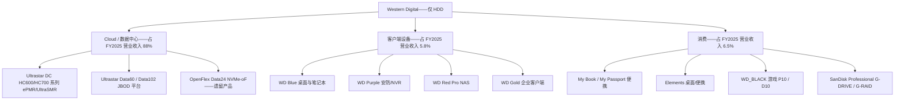
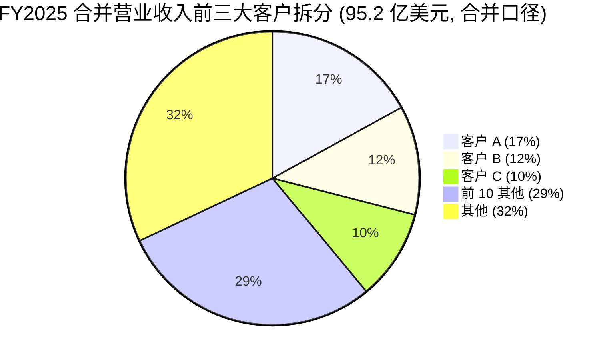
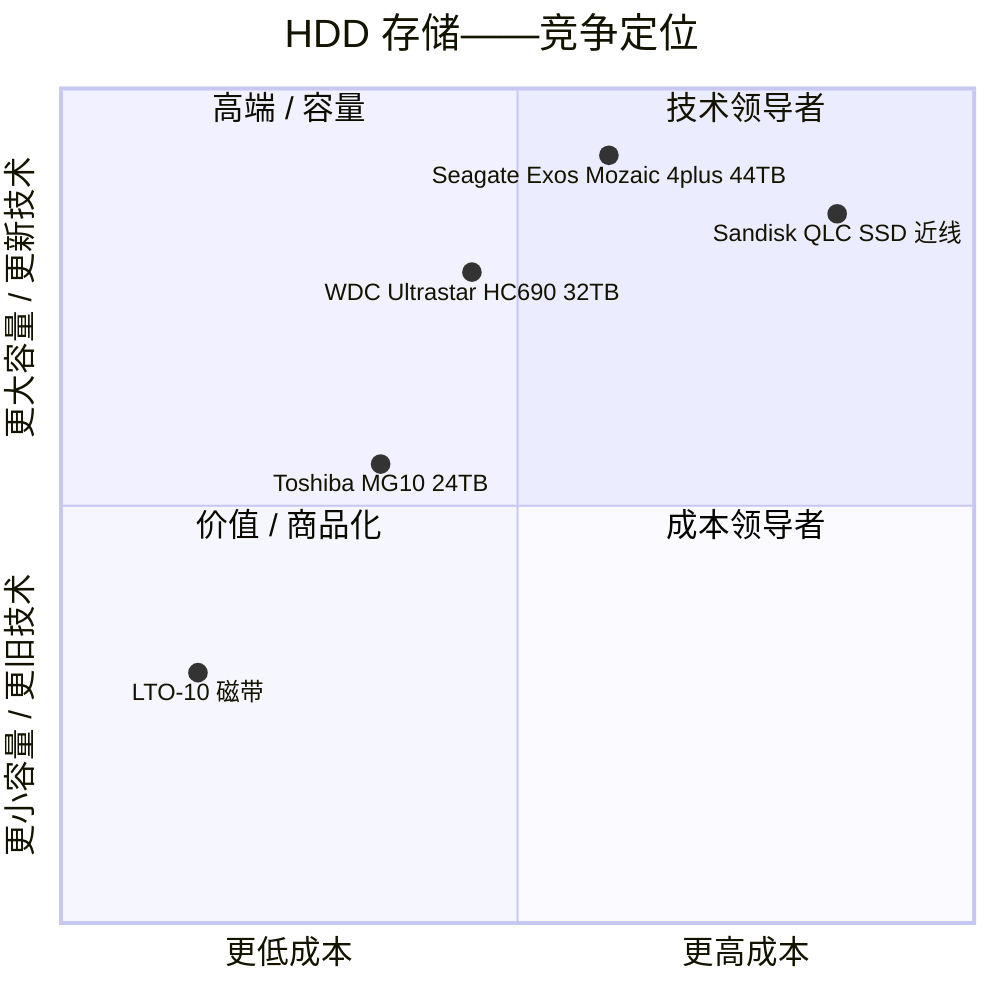

# Western Digital Corporation (NASDAQ:WDC) — 公司研究报告

**截至日期 (as of): 2026-06-14**
**上市地: 纳斯达克 (NASDAQ), 代码 WDC**
**注册地: 美国加州圣何塞 (San Jose, California)**
**报告语言: 简体中文 (技术/财务/行业术语保留英文并附中文释义)**

---

## 投资摘要 (Investment Summary) — *分析师观点：*

> 以下评级、12 个月目标价 (price target, PT)、各情景目标价与前瞻估计均为**本报告分析师观点 (*分析师观点：*)**, 不构成任何 SEC 文件的内容, 也绝不附于文件 (10-K/10-Q/8-K) 引用之上。

| 项目 | 取值 |
|---|---|
| **评级 (Rating)** | **Hold / 中性 (Neutral)** |
| **12 个月目标价 (PT)** | **520 美元** |
| **当前股价 (2026-06-12 收盘)** | 562.93 美元 ([Yahoo Finance, 2026-06-12](https://finance.yahoo.com/quote/WDC/key-statistics)) |
| **隐含空间 (upside / downside)** | **约 −7.6%** |
| **估值方法** | 21× × 本报告 FY2027E 非 GAAP EPS 约 25 美元 (基准情景), 并与 Bernstein/同业前瞻倍数交叉验证 |
| **市值 / 企业价值** | 约 1,940 亿美元 / 约 1,910 亿美元 ([Yahoo Finance, 2026-06-12](https://finance.yahoo.com/quote/WDC/key-statistics)) |
| **52 周区间** | 56.3 – 602.5 美元 ([Yahoo Finance, 2026-06-12](https://finance.yahoo.com/quote/WDC/key-statistics)) |

**论点支柱 (thesis pillars) — *分析师观点：*:**

1. **分拆后的 WDC 是一家高质量、净现金 (net cash) 的 HDD 纯业务双寡头之一**, 受 AI 近线 (nearline) 存储需求结构性拉动, 2026 财年 Q3 毛利率 (gross margin, GM) 二十年来首次突破 50%, 多年期长协 (long-term agreement, LTA) 已锁定 2029 年前的容量承诺。
2. **但当前价格 (约 563 美元) 已计入了大部分好消息**——股价自 2025 年 10 月约 96 美元的水平已上涨约 5–6 倍, TTM P/E 约 28×、P/S 约 14×, 远高于 HDD 行业历史 6–8× 的周期平均, 估值已隐含一段几乎毫无瑕疵的 HAMR 执行与持续的 AI capex 上行。
3. **HAMR (Heat-Assisted Magnetic Recording, 热辅助磁记录) 落后希捷 (Seagate) 约 12 个月**是核心风险变量; WDC 的 ePMR + HAMR 双路径降低了单点执行风险, 但要维持长期容量竞赛地位, 公司必须在 2027 日历年前交付 HAMR。
4. **机构观点高度分化**: Bernstein 看 590 美元 (Outperform), 而 Goldman Sachs (400 美元) 与 UBS (375 美元) 均给 Neutral 且目标价已低于现价——这种分歧本身就是当前风险回报对称性的信号 (见第 2 节卖方观点演变)。

**最该盯紧的两个变量 (key swing variables):** (1) HAMR 量产时点与良率, 决定 2027–2028 年近线份额对希捷的攻守; (2) 超大规模数据中心 AI capex 周期是否在 2027 日历年后回撤——经营杠杆双向放大, 需求修正 10% 即压缩 GM 约 400 bps。

> **业绩更新 (业绩快报)——2026 财年 Q3 业绩抬升全年走势 (2026-04-30):** 2026 财年 Q3 (截至 2026-04-03) 营业收入 **33.37 亿美元 (同比 +45%, 环比 +11%)**, GAAP 毛利率 **50.2%** / 非 GAAP 毛利率 **50.5%**, GAAP 营业利润 **11.90 亿美元 (营业利润率 35.7%)**, 非 GAAP 每股收益 (EPS) **2.72 美元**, 经营现金流 **11.23 亿美元**, 自由现金流 (free cash flow, FCF) **9.78 亿美元** ([WDC 2026财年Q3 业绩公告, 2026-04-30](https://www.sec.gov/Archives/edgar/data/0000106040/000162828026028878/a4ex991-pressreleaseq326.htm))。管理层指引 2026 财年 Q4 营业收入 **35.5–37.5 亿美元 (中位数 36.5 亿美元, 同比 +36–44%)**, 非 GAAP 毛利率 **51–52%**, 非 GAAP EPS **3.25 美元 ±0.15**。同日董事会批准**季度股息上调 20% 至 0.15 美元/股**。CEO Irving Tan 将强势归因于"几乎每一种 AI 工作负载——从训练 (training)、推理 (inference)、Agentic AI 到 Physical AI——所产生的数据, 都会以低成本且高效的方式持久存储于硬盘 (HDD) 之上" ([同上业绩公告](https://www.sec.gov/Archives/edgar/data/0000106040/000162828026028878/a4ex991-pressreleaseq326.htm))。

---

## 目录
1. 公司概览
   - 1A. 估值与目标价 (Valuation & Price Target)
   - 1B. GF Score (GuruFocus 式) 基本面评分
2. 估值前瞻模型与卖方观点演变
3. 公司历史
4. 管理团队
5. 产品与服务
6. 客户与上市策略
7. 行业概览
8. 竞争格局
9. 市场机会 (TAM)
10. 风险评估
    - 10.5 关键分歧与催化剂
11. 投资者视角评分 (Investor Lenses)
12. 参考资料

---

## 1. 公司概览

**本方观点 (BLUF):** 我们对 WDC 给予 **Hold / 中性 (Neutral)** 评级、**12 个月目标价 520 美元 (较 563 美元现价约 −7.6%)**。这是一家分拆后高质量、净现金的 HDD 纯业务公司, 处于其 35 年历史上最强的竞争与盈利位置, 受 AI 近线存储需求结构性拉动; 但当前估值已对一段几乎无瑕疵的执行与不间断的 AI capex 上行定价, 而 HAMR 落后希捷 12 个月、客户集中度创历史新高 (前三客户 39% 营业收入) 又使风险回报趋于对称。我们偏好在回调或 HAMR 量产可见度提升时增加敞口, 而非在当前点位追高。

Western Digital Corporation (NASDAQ:WDC) **自 2025 年 2 月 21 日 (分拆日, the Separation Date) 起, 已转型为纯粹的硬盘 (hard disk drive, HDD) 公司**。在该日, 公司完成了将其 NAND 闪存 (NAND flash) 与固态硬盘 (solid-state drive, SSD) 业务以免税方式分拆为新独立上市公司——**Sandisk Corporation (NASDAQ:SNDK)**; 自分拆日起, Sandisk 的财务与经营结果不再并入 WDC, 此前各期 WDC 历史结果按持续经营 (continuing operations) 列示, Sandisk 历史结果列为终止经营 (discontinued operations) ([WDC 2026财年Q3 业绩公告——列报基础, 2026-04-30](https://www.sec.gov/Archives/edgar/data/0000106040/000162828026028878/a4ex991-pressreleaseq326.htm); [WDC 8-K——分拆完成, 2025-02-24](https://www.sec.gov/Archives/edgar/data/0000106040/000119312525033383/d847507dex991.htm))。分拆前的 Western Digital 是全球第二大垂直一体化存储 (storage) 公司, 将其通过 2012 年并购日立 GST (Hitachi GST) 建立的 HDD 传统业务, 与 2016 年并购 SanDisk 获得的 NAND/SSD 业务结合于一体。该交易结构为: 按每一股 WDC 派发一股 Sandisk 股份的同比例分配, 以及一笔"债转股 (debt-for-equity)"交换——WDC 通过交换所保留的 Sandisk 股权来偿还其部分定期贷款 ([WDC 2025 财年 10-K, 附注 3 终止经营业务](https://www.sec.gov/Archives/edgar/data/0000106040/000010604025000038/wdc-20250627.htm))。

留下来的, 是**全球出货量第一的 HDD 制造商**。2025 财年 (截至 2025 年 6 月 27 日) 营业收入 **95.2 亿美元 (同比 +51%)**, GAAP 毛利率 **38.8%**, GAAP 营业利润 **23.3 亿美元 (营业利润率 24.5%)**, 持续经营业务 GAAP 净利润 **16.4 亿美元 (相较 2024 财年净亏损 7.65 亿美元)** ([WDC 2025 财年 10-K, 合并经营报表](https://www.sec.gov/Archives/edgar/data/0000106040/000010604025000038/wdc-20250627.htm))。势头在 2026 财年加速: 前九个月营业收入逐季抬升, Q3 单季营业收入 33.37 亿美元、毛利率 50.2%, 是自 2012 年并购日立存储以来首次出口率突破 50% ([WDC 2026财年Q3 业绩公告, 2026-04-30](https://www.sec.gov/Archives/edgar/data/0000106040/000162828026028878/a4ex991-pressreleaseq326.htm))。公司在 24 个国家共有员工**约 40,000 人**, 其中约 88% 集中于亚太地区 (主要在泰国、马来西亚与菲律宾, 负责 HDD 介质、磁头与组装) ([WDC 2025 财年 10-K, 第 1 项 业务与人力资本](https://www.sec.gov/Archives/edgar/data/0000106040/000010604025000038/wdc-20250627.htm))。总部位于加州圣何塞 5601 Great Oaks Parkway。

**公司卖什么。** 单一可报告分部 (reportable segment)——HDD——销往三个终端市场 (end market), FY2025 营业收入拆分如下 ([WDC 2025 财年 10-K, 终端市场收入披露](https://www.sec.gov/Archives/edgar/data/0000106040/000010604025000038/wdc-20250627.htm)):

- **云 (Cloud, 占 FY2025 营业收入 88%, 83.41 亿美元, 同比 +65%):** 销售给超大规模数据中心运营商 (hyperscalers)、云服务商 (cloud service providers, CSP) 与大型企业的容量级企业近线 (capacity-enterprise nearline) HDD。这是战略锚点; 投资组合中其余产品都按 Cloud 路线图剩余的产能空间来调整规模。
- **客户端 (Client, 占营业收入 5.8%, 5.56 亿美元, 同比 -4%):** 用于台式机、一体机、安防录像机、游戏主机及外置存储 OEM 平台的内置 HDD。
- **消费 (Consumer, 占营业收入 6.5%, 6.23 亿美元, 同比 -9%):** **WD**、**WD_BLACK** 和 **SanDisk Professional** 品牌下的零售外置存储产品 (最后一个品牌经分拆时签署的商标许可协议反向授权给 WDC; 详见第 3 节)。

下面的收入 Sankey 展示了 FY2025 持续经营口径下"钱从哪来、到哪去"——收入 95.2 亿美元经 61.2% 的销货成本 (cost of revenue, COGS) 后留下 38.8% 毛利, 再扣减 14.3% 的营业费用得到 24.5% 的营业利润率; 净利息及其他一项含 7.72 亿美元的 Sandisk 留存权益 (retained interest) 一次性减值, 税项则因递延税资产确认而为 +5.13 亿美元抵免, 故持续经营净利润 16.4 亿美元 ([WDC 2025 财年 10-K, 合并经营报表](https://www.sec.gov/Archives/edgar/data/0000106040/000010604025000038/wdc-20250627.htm))。

<svg xmlns="http://www.w3.org/2000/svg" viewBox="0 0 1000 560" width="1000" height="560" role="img" aria-label="income statement Sankey"><rect x="0" y="0" width="1000" height="560" fill="#ffffff"/>
<text x="20.00" y="30.00" text-anchor="start" font-family="Helvetica,Arial,sans-serif" font-size="15" font-weight="700" fill="#1f2933">西部数据 (WDC) 如何赚钱 — 2026财年(FY2025, 截至2025-06-27, 持续经营)</text>
<path d="M 204.00,64.00 C 258.00,64.00 258.00,78.00 312.00,78.00 L 312.00,447.74 C 258.00,447.74 258.00,433.74 204.00,433.74 Z" fill="#93c5fd" fill-opacity="0.55"/>
<path d="M 452.00,71.00 C 506.00,71.00 506.00,200.17 560.00,200.17 L 560.00,303.63 C 506.00,303.63 506.00,174.46 452.00,174.46 Z" fill="#86efac" fill-opacity="0.55"/>
<path d="M 452.00,174.46 C 506.00,174.46 506.00,317.63 560.00,317.63 L 560.00,377.83 C 506.00,377.83 506.00,234.66 452.00,234.66 Z" fill="#fca5a5" fill-opacity="0.55"/>
<path d="M 328.00,78.00 C 382.00,78.00 382.00,71.00 436.00,71.00 L 436.00,234.66 C 382.00,234.66 382.00,241.66 328.00,241.66 Z" fill="#86efac" fill-opacity="0.55"/>
<path d="M 328.00,241.66 C 382.00,241.66 382.00,248.66 436.00,248.66 L 436.00,507.00 C 382.00,507.00 382.00,500.00 328.00,500.00 Z" fill="#fca5a5" fill-opacity="0.55"/>
<path d="M 576.00,200.17 C 630.00,200.17 630.00,215.33 684.00,215.33 L 684.00,318.80 C 630.00,318.80 630.00,303.63 576.00,303.63 Z" fill="#86efac" fill-opacity="0.55"/>
<path d="M 700.00,215.33 C 754.00,215.33 754.00,244.58 808.00,244.58 L 808.00,317.42 C 754.00,317.42 754.00,288.17 700.00,288.17 Z" fill="#86efac" fill-opacity="0.55"/>
<path d="M 700.00,288.17 C 754.00,288.17 754.00,331.42 808.00,331.42 L 808.00,333.42 C 754.00,333.42 754.00,290.17 700.00,290.17 Z" fill="#fca5a5" fill-opacity="0.55"/>
<path d="M 576.00,317.63 C 630.00,317.63 630.00,279.43 684.00,279.43 L 684.00,304.60 C 630.00,304.60 630.00,342.81 576.00,342.81 Z" fill="#fca5a5" fill-opacity="0.55"/>
<path d="M 576.00,342.81 C 630.00,342.81 630.00,318.60 684.00,318.60 L 684.00,362.67 C 630.00,362.67 630.00,386.87 576.00,386.87 Z" fill="#fca5a5" fill-opacity="0.55"/>
<path d="M 204.00,447.74 C 258.00,447.74 258.00,447.74 312.00,447.74 L 312.00,475.35 C 258.00,475.35 258.00,475.35 204.00,475.35 Z" fill="#93c5fd" fill-opacity="0.55"/>
<path d="M 204.00,489.35 C 258.00,489.35 258.00,475.35 312.00,475.35 L 312.00,500.00 C 258.00,500.00 258.00,514.00 204.00,514.00 Z" fill="#93c5fd" fill-opacity="0.55"/>
<rect x="188.00" y="64.00" width="16" height="369.74" rx="1.5" fill="#2563eb"/>
<rect x="188.00" y="447.74" width="16" height="27.62" rx="1.5" fill="#2563eb"/>
<rect x="188.00" y="489.35" width="16" height="24.65" rx="1.5" fill="#2563eb"/>
<rect x="312.00" y="78.00" width="16" height="422.00" rx="1.5" fill="#1e3a8a"/>
<rect x="436.00" y="71.00" width="16" height="163.66" rx="1.5" fill="#15803d"/>
<rect x="436.00" y="248.66" width="16" height="258.34" rx="1.5" fill="#dc2626"/>
<rect x="560.00" y="200.17" width="16" height="103.46" rx="1.5" fill="#15803d"/>
<rect x="560.00" y="317.63" width="16" height="60.20" rx="1.5" fill="#dc2626"/>
<rect x="684.00" y="215.33" width="16" height="50.09" rx="1.5" fill="#15803d"/>
<rect x="684.00" y="279.43" width="16" height="25.18" rx="1.5" fill="#dc2626"/>
<rect x="684.00" y="318.60" width="16" height="44.06" rx="1.5" fill="#dc2626"/>
<rect x="808.00" y="244.58" width="16" height="72.83" rx="1.5" fill="#15803d"/>
<rect x="808.00" y="331.42" width="16" height="2.00" rx="1.5" fill="#dc2626"/>
<line x1="188.00" y1="248.87" x2="182.00" y2="234.19" stroke="#cbd5e1" stroke-width="1"/>
<text x="179.00" y="237.19" text-anchor="end" font-family="Helvetica,Arial,sans-serif" font-size="11.5" font-weight="700" fill="#1f2933">Cloud (88%)</text>
<text x="179.00" y="250.19" text-anchor="end" font-family="Helvetica,Arial,sans-serif" font-size="10" font-weight="400" fill="#52606d">$8.3B  (87.6%)</text>
<line x1="188.00" y1="461.55" x2="182.00" y2="446.87" stroke="#cbd5e1" stroke-width="1"/>
<text x="179.00" y="449.87" text-anchor="end" font-family="Helvetica,Arial,sans-serif" font-size="11.5" font-weight="700" fill="#1f2933">Consumer</text>
<text x="179.00" y="462.87" text-anchor="end" font-family="Helvetica,Arial,sans-serif" font-size="10" font-weight="400" fill="#52606d">$623.0M  (6.5%)</text>
<line x1="188.00" y1="501.68" x2="182.00" y2="487.00" stroke="#cbd5e1" stroke-width="1"/>
<text x="179.00" y="490.00" text-anchor="end" font-family="Helvetica,Arial,sans-serif" font-size="11.5" font-weight="700" fill="#1f2933">Client</text>
<text x="179.00" y="503.00" text-anchor="end" font-family="Helvetica,Arial,sans-serif" font-size="10" font-weight="400" fill="#52606d">$556.0M  (5.8%)</text>
<rect x="331.00" y="60.00" width="100.50" height="26" rx="2" fill="#ffffff" fill-opacity="0.72"/>
<text x="334.00" y="72.00" text-anchor="start" font-family="Helvetica,Arial,sans-serif" font-size="11.5" font-weight="700" fill="#1f2933">Revenue</text>
<text x="334.00" y="85.00" text-anchor="start" font-family="Helvetica,Arial,sans-serif" font-size="10" font-weight="400" fill="#52606d">$9.5B  (100.0%)</text>
<rect x="455.00" y="53.00" width="94.20" height="26" rx="2" fill="#ffffff" fill-opacity="0.72"/>
<text x="458.00" y="65.00" text-anchor="start" font-family="Helvetica,Arial,sans-serif" font-size="11.5" font-weight="700" fill="#1f2933">Gross Profit</text>
<text x="458.00" y="78.00" text-anchor="start" font-family="Helvetica,Arial,sans-serif" font-size="10" font-weight="400" fill="#52606d">$3.7B  (38.8%)</text>
<rect x="455.00" y="230.66" width="144.60" height="26" rx="2" fill="#ffffff" fill-opacity="0.72"/>
<text x="458.00" y="242.66" text-anchor="start" font-family="Helvetica,Arial,sans-serif" font-size="11.5" font-weight="700" fill="#1f2933">Cost of Revenue (COGS)</text>
<text x="458.00" y="255.66" text-anchor="start" font-family="Helvetica,Arial,sans-serif" font-size="10" font-weight="400" fill="#52606d">$5.8B  (61.2%)</text>
<rect x="579.00" y="182.17" width="106.80" height="26" rx="2" fill="#ffffff" fill-opacity="0.72"/>
<text x="582.00" y="194.17" text-anchor="start" font-family="Helvetica,Arial,sans-serif" font-size="11.5" font-weight="700" fill="#1f2933">Operating Income</text>
<text x="582.00" y="207.17" text-anchor="start" font-family="Helvetica,Arial,sans-serif" font-size="10" font-weight="400" fill="#52606d">$2.3B  (24.5%)</text>
<rect x="579.00" y="299.63" width="150.90" height="26" rx="2" fill="#ffffff" fill-opacity="0.72"/>
<text x="582.00" y="311.63" text-anchor="start" font-family="Helvetica,Arial,sans-serif" font-size="11.5" font-weight="700" fill="#1f2933">Total Operating Expense</text>
<text x="582.00" y="324.63" text-anchor="start" font-family="Helvetica,Arial,sans-serif" font-size="10" font-weight="400" fill="#52606d">$1.4B  (14.3%)</text>
<rect x="703.00" y="197.33" width="94.20" height="26" rx="2" fill="#ffffff" fill-opacity="0.72"/>
<text x="706.00" y="209.33" text-anchor="start" font-family="Helvetica,Arial,sans-serif" font-size="11.5" font-weight="700" fill="#1f2933">Pretax Income</text>
<text x="706.00" y="222.33" text-anchor="start" font-family="Helvetica,Arial,sans-serif" font-size="10" font-weight="400" fill="#52606d">$1.1B  (11.9%)</text>
<rect x="703.00" y="261.43" width="100.50" height="26" rx="2" fill="#ffffff" fill-opacity="0.72"/>
<text x="706.00" y="273.43" text-anchor="start" font-family="Helvetica,Arial,sans-serif" font-size="11.5" font-weight="700" fill="#1f2933">SG&amp;A</text>
<text x="706.00" y="286.43" text-anchor="start" font-family="Helvetica,Arial,sans-serif" font-size="10" font-weight="400" fill="#52606d">$568.0M  (6.0%)</text>
<rect x="703.00" y="300.60" width="106.80" height="26" rx="2" fill="#ffffff" fill-opacity="0.72"/>
<text x="706.00" y="312.60" text-anchor="start" font-family="Helvetica,Arial,sans-serif" font-size="11.5" font-weight="700" fill="#1f2933">R&amp;D</text>
<text x="706.00" y="325.60" text-anchor="start" font-family="Helvetica,Arial,sans-serif" font-size="10" font-weight="400" fill="#52606d">$994.0M  (10.4%)</text>
<text x="833.00" y="278.00" text-anchor="start" font-family="Helvetica,Arial,sans-serif" font-size="11.5" font-weight="700" fill="#1f2933">Net Income</text>
<text x="833.00" y="291.00" text-anchor="start" font-family="Helvetica,Arial,sans-serif" font-size="10" font-weight="400" fill="#52606d">$1.6B  (17.3%)</text>
<text x="833.00" y="329.42" text-anchor="start" font-family="Helvetica,Arial,sans-serif" font-size="11.5" font-weight="700" fill="#1f2933">Income Tax</text>
<text x="833.00" y="342.42" text-anchor="start" font-family="Helvetica,Arial,sans-serif" font-size="10" font-weight="400" fill="#52606d">-$513.0M  (-5.4%)</text>
<text x="500.00" y="530.00" text-anchor="middle" font-family="Helvetica,Arial,sans-serif" font-size="10" font-weight="400" font-style="italic" fill="#8a97a3">税项为 +5.13 亿美元抵免; 净利息及其他含 7.72 亿美元 Sandisk 留存权益减值(一次性)</text>
<text x="500.00" y="544.00" text-anchor="middle" font-family="Helvetica,Arial,sans-serif" font-size="10" font-weight="400" fill="#52606d">Source: WDC FY2025 10-K, 合并经营报表 + 终端市场收入附注</text>
</svg>

来源 / Source: [WDC 2025 财年 10-K, 合并经营报表 + 终端市场收入附注](https://www.sec.gov/Archives/edgar/data/0000106040/000010604025000038/wdc-20250627.htm)。

FY2025 营业收入由两股力量驱动——出货量 (units sold) +15% 与单台平均售价 (average selling price, ASP) +29%, 后者来自向更高容量盘的产品组合迁移; 仅 Cloud 一项就 +65% (出货量 +36%、ASP +20%) ([WDC 2025 财年 10-K, MD&A 净收入分析](https://www.sec.gov/Archives/edgar/data/0000106040/000010604025000038/wdc-20250627.htm))。下面的收入构成 (按终端市场) 与三年趋势条形图清楚显示 Cloud 的主导地位如何在 FY2023→FY2025 间从 76% 升至 88%。

<svg xmlns="http://www.w3.org/2000/svg" viewBox="0 0 720 460" width="720" height="460" role="img" aria-label="revenue donut"><rect x="0" y="0" width="720" height="460" fill="#ffffff"/>
<text x="20.00" y="30.00" text-anchor="start" font-family="Helvetica,Arial,sans-serif" font-size="15" font-weight="700" fill="#1f2933">FY2025 收入按终端市场 (95.2 亿美元)</text>
<path d="M 288.00,107.20 A 132 132 0 1 1 195.34,145.19 L 233.25,183.65 A 78 78 0 1 0 288.00,161.20 Z" fill="#2563eb"/>
<path d="M 195.34,145.19 A 132 132 0 0 1 240.64,115.99 L 260.02,166.39 A 78 78 0 0 0 233.25,183.65 Z" fill="#15803d"/>
<path d="M 240.64,115.99 A 132 132 0 0 1 288.00,107.20 L 288.00,161.20 A 78 78 0 0 0 260.02,166.39 Z" fill="#d97706"/>
<text x="288.00" y="235.20" text-anchor="middle" font-family="Helvetica,Arial,sans-serif" font-size="18" font-weight="800" fill="#1f2933">WDC</text>
<text x="288.00" y="255.20" text-anchor="middle" font-family="Helvetica,Arial,sans-serif" font-size="13" font-weight="600" fill="#52606d">$9.5B</text>
<text x="288.00" y="271.20" text-anchor="middle" font-family="Helvetica,Arial,sans-serif" font-size="10" font-weight="400" fill="#8a97a3">total</text>
<line x1="340.35" y1="366.89" x2="356.35" y2="366.89" stroke="#2563eb" stroke-width="1.4"/>
<text x="360.35" y="364.89" text-anchor="start" font-family="Helvetica,Arial,sans-serif" font-size="11" font-weight="700" fill="#1f2933">Cloud 云</text>
<text x="360.35" y="378.89" text-anchor="start" font-family="Helvetica,Arial,sans-serif" font-size="10" font-weight="400" fill="#52606d">$8.3B  (87.6%)</text>
<line x1="213.23" y1="123.21" x2="197.23" y2="123.21" stroke="#15803d" stroke-width="1.4"/>
<text x="193.23" y="121.21" text-anchor="end" font-family="Helvetica,Arial,sans-serif" font-size="11" font-weight="700" fill="#1f2933">Consumer 消费</text>
<text x="193.23" y="135.21" text-anchor="end" font-family="Helvetica,Arial,sans-serif" font-size="10" font-weight="400" fill="#52606d">$623.0M  (6.5%)</text>
<line x1="262.82" y1="103.52" x2="246.82" y2="103.52" stroke="#d97706" stroke-width="1.4"/>
<text x="242.82" y="101.52" text-anchor="end" font-family="Helvetica,Arial,sans-serif" font-size="11" font-weight="700" fill="#1f2933">Client 客户端</text>
<text x="242.82" y="115.52" text-anchor="end" font-family="Helvetica,Arial,sans-serif" font-size="10" font-weight="400" fill="#52606d">$556.0M  (5.8%)</text>
<text x="360.00" y="444.00" text-anchor="middle" font-family="Helvetica,Arial,sans-serif" font-size="10" font-weight="400" fill="#52606d">Source: WDC FY2025 10-K, 终端市场收入披露</text>
</svg>

来源 / Source: [WDC 2025 财年 10-K, 终端市场收入披露](https://www.sec.gov/Archives/edgar/data/0000106040/000010604025000038/wdc-20250627.htm)。

<svg xmlns="http://www.w3.org/2000/svg" viewBox="0 0 860 470" width="860" height="470" role="img" aria-label="historical revenue bars"><rect x="0" y="0" width="860" height="470" fill="#ffffff"/>
<text x="20.00" y="30.00" text-anchor="start" font-family="Helvetica,Arial,sans-serif" font-size="15" font-weight="700" fill="#1f2933">HDD 收入按终端市场 FY2023–FY2025</text>
<rect x="20.00" y="44" width="11" height="11" rx="2" fill="#2563eb"/>
<text x="36.00" y="53.00" text-anchor="start" font-family="Helvetica,Arial,sans-serif" font-size="10.5" font-weight="400" fill="#1f2933">Cloud 云</text>
<rect x="96.20" y="44" width="11" height="11" rx="2" fill="#15803d"/>
<text x="112.20" y="53.00" text-anchor="start" font-family="Helvetica,Arial,sans-serif" font-size="10.5" font-weight="400" fill="#1f2933">Client 客户端</text>
<rect x="192.20" y="44" width="11" height="11" rx="2" fill="#d97706"/>
<text x="208.20" y="53.00" text-anchor="start" font-family="Helvetica,Arial,sans-serif" font-size="10.5" font-weight="400" fill="#1f2933">Consumer 消费</text>
<line x1="70" y1="412.00" x2="834" y2="412.00" stroke="#eceff2" stroke-width="1"/>
<text x="64.00" y="415.00" text-anchor="end" font-family="Helvetica,Arial,sans-serif" font-size="9.5" font-weight="400" fill="#52606d">$0</text>
<line x1="70" y1="345.20" x2="834" y2="345.20" stroke="#eceff2" stroke-width="1"/>
<text x="64.00" y="348.20" text-anchor="end" font-family="Helvetica,Arial,sans-serif" font-size="9.5" font-weight="400" fill="#52606d">$2.1B</text>
<line x1="70" y1="278.40" x2="834" y2="278.40" stroke="#eceff2" stroke-width="1"/>
<text x="64.00" y="281.40" text-anchor="end" font-family="Helvetica,Arial,sans-serif" font-size="9.5" font-weight="400" fill="#52606d">$4.1B</text>
<line x1="70" y1="211.60" x2="834" y2="211.60" stroke="#eceff2" stroke-width="1"/>
<text x="64.00" y="214.60" text-anchor="end" font-family="Helvetica,Arial,sans-serif" font-size="9.5" font-weight="400" fill="#52606d">$6.2B</text>
<line x1="70" y1="144.80" x2="834" y2="144.80" stroke="#eceff2" stroke-width="1"/>
<text x="64.00" y="147.80" text-anchor="end" font-family="Helvetica,Arial,sans-serif" font-size="9.5" font-weight="400" fill="#52606d">$8.2B</text>
<line x1="70" y1="78.00" x2="834" y2="78.00" stroke="#eceff2" stroke-width="1"/>
<text x="64.00" y="81.00" text-anchor="end" font-family="Helvetica,Arial,sans-serif" font-size="9.5" font-weight="400" fill="#52606d">$10.3B</text>
<rect x="123.48" y="257.60" width="147.71" height="154.40" fill="#2563eb"/>
<rect x="123.48" y="235.15" width="147.71" height="22.45" fill="#15803d"/>
<rect x="123.48" y="208.80" width="147.71" height="26.35" fill="#d97706"/>
<text x="197.33" y="428.00" text-anchor="middle" font-family="Helvetica,Arial,sans-serif" font-size="10" font-weight="400" fill="#52606d">2023</text>
<rect x="378.15" y="247.88" width="147.71" height="164.12" fill="#2563eb"/>
<rect x="378.15" y="229.14" width="147.71" height="18.74" fill="#15803d"/>
<rect x="378.15" y="206.79" width="147.71" height="22.35" fill="#d97706"/>
<text x="452.00" y="428.00" text-anchor="middle" font-family="Helvetica,Arial,sans-serif" font-size="10" font-weight="400" fill="#52606d">2024</text>
<rect x="632.81" y="141.04" width="147.71" height="270.96" fill="#2563eb"/>
<rect x="632.81" y="122.98" width="147.71" height="18.06" fill="#15803d"/>
<rect x="632.81" y="102.74" width="147.71" height="20.24" fill="#d97706"/>
<text x="706.67" y="428.00" text-anchor="middle" font-family="Helvetica,Arial,sans-serif" font-size="10" font-weight="400" fill="#52606d">2025</text>
<text x="430.00" y="454.00" text-anchor="middle" font-family="Helvetica,Arial,sans-serif" font-size="10" font-weight="400" fill="#52606d">Source: WDC FY2023–FY2025 10-K, 终端市场收入披露</text>
</svg>

来源 / Source: [WDC FY2023–FY2025 10-K, 终端市场收入披露](https://www.sec.gov/Archives/edgar/data/0000106040/000010604025000038/wdc-20250627.htm)。

---

## 1A. 估值与目标价 (Valuation & Price Target) — *分析师观点：*

**估值快照 (2026-06-12 收盘 562.93 美元)。** 市值约 **1,940 亿美元**, 总股本约 3.45 亿股, 52 周区间 **56.3 – 602.5 美元** ([Yahoo Finance, 2026-06-12](https://finance.yahoo.com/quote/WDC/key-statistics))。与上一版报告 (2026-05-20, 459 美元) 相比, 股价又上涨约 +23%, 已逼近 52 周高点。

**前瞻估值矩阵 (forward valuation matrix) — *分析师观点：*。** 我们用本报告 FY2026E/FY2027E 非 GAAP EPS (见第 2 节模型) 计算前瞻倍数, 显示随盈利增长倍数快速压缩:

| 倍数 | TTM(实际) | FY2026E | FY2027E | 行业历史区间* |
|---|---|---|---|---|
| 非 GAAP P/E | 约 28× | 约 21× | 约 22× | 6–8× (周期平均) |
| P/S | 约 14× | 约 11× | 约 9× | 约 1× |
| EV/EBITDA | 约 40× | 约 15× | 约 13× | 约 10–15× |

*行业历史区间: HDD 为重资本、周期性零部件行业, WDC/STX 在 2015–2024 年的常态 P/E 多在 6–12×; 当前倍数嵌入 AI 存储重估 ([Macrotrends — WDC 15 年历史](https://www.macrotrends.net/stocks/charts/WDC/western-digital/stock-price-history))。FY2026E EPS 约 11 美元 (Q1–Q3 实际 + Q4 指引 3.25), FY2027E EPS 约 25 美元 (基准情景, 第 2 节)。

**对照同业 (peer comparison)。** 最直接的可比公司是希捷 (Seagate, NASDAQ:STX, 2026-06-12 收盘 931 美元, 市值约 2,110 亿美元) 与前手足公司 Sandisk (NASDAQ:SNDK, 1,980 美元, 约 2,930 亿美元) ([Yahoo Finance, 2026-06-12](https://finance.yahoo.com/quote/STX/key-statistics))。STX 在前瞻基础上估值略高, 因其在 HAMR 量产出货上领先约 12 个月、盈利可见度更高 (STX 只需完成一次技术枢转; WDC 需同时执行 ePMR + HAMR 双路径)。我们认为 WDC/STX 的前瞻 P/E 差距 (约 2–4×) 大体合理, 反映执行风险差。

**解读估值倍数 (为什么 28× P/E)。** WDC 的 TTM P/E 约 28×, 大约是 HDD 行业历史周期平均 (约 6–8×) 的 4 倍。这一扩张来自两股相互独立的驱动力: (1) **盈利能力的台阶式跃升**——非 GAAP 营业利润率从分拆前 (FY2024) 的约 5%, 跃升至 2026 财年 Q2 的 33.8%、Q3 的 38.6% ([WDC 2026财年Q3 业绩公告, 2026-04-30](https://www.sec.gov/Archives/edgar/data/0000106040/000162828026028878/a4ex991-pressreleaseq326.htm)); 50%+ 毛利率的 HDD-only 模型在经营杠杆上远高于过去的混合 Flash+HDD 组合。(2) **AI 存储叙事溢价**——管理层多次将 HDD 定位为"AI 数据经济的基石" ([WDC 博客, 2025-08-12](https://blog.westerndigital.com/western-digital-and-the-foundation-of-the-ai-data-economy/)); 股价已自 2023 财年低点累计上涨约 970%+, 部分受此叙事与挂钩 AI 基础设施篮子的 ETF 资金流推动 ([Investing.com, 2026-04](https://www.investing.com/analysis/western-digitals-970-moonshot-what-the-ai-storage-charts-dont-show-you-yet-200674947))。我们在第 10 节将估值压缩列为主要财务风险。

---

## 1B. GF Score (GuruFocus 式) 基本面评分 — *分析师观点：*

> *分析师观点：* **GF Score (GuruFocus-style): 86 / 100 — Good outperformance potential (81–90 区间)。** 该分数为本报告自建的透明复刻, **并非** GuruFocus™ 官方数字; 五个子项与综合分均为分析师评分, 不附任何文件引用, 每个底层指标在下文各自附引用。

<svg xmlns="http://www.w3.org/2000/svg" viewBox="0 0 500 500" width="500" height="500" role="img" aria-label="GF Score radar">
<rect x="0" y="0" width="500" height="500" fill="#ffffff"/>
<text x="20" y="24" font-family="Helvetica,Arial,sans-serif" font-size="15" font-weight="700" fill="#1f2933">GF Score (GuruFocus-style): 86/100</text>
<text x="20" y="41" font-family="Helvetica,Arial,sans-serif" font-size="11" fill="#52606d">81–90 Good outperformance potential</text>
<polygon points="250.0,88.0 392.7,191.6 338.2,359.4 161.8,359.4 107.3,191.6" fill="#e9f5ec" stroke="none"/>
<polygon points="250.0,208.0 278.5,228.7 267.6,262.3 232.4,262.3 221.5,228.7" fill="none" stroke="#c5d3cb" stroke-width="1"/>
<polygon points="250.0,178.0 307.1,219.5 285.3,286.5 214.7,286.5 192.9,219.5" fill="none" stroke="#c5d3cb" stroke-width="1"/>
<polygon points="250.0,148.0 335.6,210.2 302.9,310.8 197.1,310.8 164.4,210.2" fill="none" stroke="#c5d3cb" stroke-width="1"/>
<polygon points="250.0,118.0 364.1,200.9 320.5,335.1 179.5,335.1 135.9,200.9" fill="none" stroke="#c5d3cb" stroke-width="1"/>
<polygon points="250.0,88.0 392.7,191.6 338.2,359.4 161.8,359.4 107.3,191.6" fill="none" stroke="#c5d3cb" stroke-width="1.3"/>
<line x1="250" y1="238" x2="161.8" y2="359.4" stroke="#cfdad3" stroke-width="1"/>
<text x="146.5" y="392.4" text-anchor="end" font-family="Helvetica,Arial,sans-serif" font-size="11.5" font-weight="600" fill="#1f2933">财务实力</text>
<text x="170.6" y="341.2" text-anchor="middle" font-family="Helvetica,Arial,sans-serif" font-size="10.5" font-weight="700" fill="#1f2933">9</text>
<line x1="250" y1="238" x2="250.0" y2="88.0" stroke="#cfdad3" stroke-width="1"/>
<text x="250.0" y="58.0" text-anchor="middle" font-family="Helvetica,Arial,sans-serif" font-size="11.5" font-weight="600" fill="#1f2933">盈利能力</text>
<text x="250.0" y="97.0" text-anchor="middle" font-family="Helvetica,Arial,sans-serif" font-size="10.5" font-weight="700" fill="#1f2933">9</text>
<line x1="250" y1="238" x2="107.3" y2="191.6" stroke="#cfdad3" stroke-width="1"/>
<text x="82.6" y="183.6" text-anchor="end" font-family="Helvetica,Arial,sans-serif" font-size="11.5" font-weight="600" fill="#1f2933">成长性</text>
<text x="121.6" y="190.3" text-anchor="middle" font-family="Helvetica,Arial,sans-serif" font-size="10.5" font-weight="700" fill="#1f2933">9</text>
<line x1="250" y1="238" x2="392.7" y2="191.6" stroke="#cfdad3" stroke-width="1"/>
<text x="417.4" y="183.6" text-anchor="start" font-family="Helvetica,Arial,sans-serif" font-size="11.5" font-weight="600" fill="#1f2933">估值</text>
<text x="321.3" y="208.8" text-anchor="middle" font-family="Helvetica,Arial,sans-serif" font-size="10.5" font-weight="700" fill="#1f2933">5</text>
<line x1="250" y1="238" x2="338.2" y2="359.4" stroke="#cfdad3" stroke-width="1"/>
<text x="353.5" y="392.4" text-anchor="start" font-family="Helvetica,Arial,sans-serif" font-size="11.5" font-weight="600" fill="#1f2933">动量</text>
<text x="338.2" y="353.4" text-anchor="middle" font-family="Helvetica,Arial,sans-serif" font-size="10.5" font-weight="700" fill="#1f2933">10</text>
<polygon points="250.0,103.0 321.3,214.8 338.2,359.4 170.6,347.2 121.6,196.3" fill="#2e8b57" fill-opacity="0.34" stroke="#2e8b57" stroke-width="2"/>
<circle cx="170.6" cy="347.2" r="2.6" fill="#2e8b57"/>
<circle cx="250.0" cy="103.0" r="2.6" fill="#2e8b57"/>
<circle cx="121.6" cy="196.3" r="2.6" fill="#2e8b57"/>
<circle cx="321.3" cy="214.8" r="2.6" fill="#2e8b57"/>
<circle cx="338.2" cy="359.4" r="2.6" fill="#2e8b57"/>
<text x="250" y="470" text-anchor="middle" font-family="Helvetica,Arial,sans-serif" font-size="9.5" fill="#52606d">Source: WDC FY2025 10-K + 2026财年Q3业绩 · Yahoo Finance · indicators.db, as of 2026-06-14</text>
<text x="250" y="485" text-anchor="middle" font-family="Helvetica,Arial,sans-serif" font-size="9" fill="#52606d">GF Score = independent analyst rubric (*Analyst view:*) — not GuruFocus™ official number</text>
</svg>

> 离中心越远, 该维度得分越高 / *The farther a point sits from the centre, the better the company scores on that axis; the larger the pentagon's area, the higher the overall GF Score.* (镜像 GuruFocus 控件。)

| 维度 | 评分 (0–10) | |
|---|---|---|
| 财务实力 | 9 | `█████████░` |
| 盈利能力 | 9 | `█████████░` |
| 成长性 | 9 | `█████████░` |
| 估值 | 5 | `█████░░░░░` |
| 动量 | 10 | `██████████` |
| **GF Score (composite, *Analyst view:*)** | **86 / 100** | **81–90 Good outperformance potential** |

*Composite weights (*Analyst view:*): Financial Strength 20% · Profitability 25% · Growth 25% · GF Value 15% · Momentum 15% (transparent reproduction — not GuruFocus's proprietary weighting).*

**各维度评分理由 (reasons why this score):**

- **财务实力 (Financial Strength) 9/10。** 分拆后资产负债表极为稳健: 2026 财年 Q3 末现金 20.50 亿 + Sandisk 留存权益 11.87 亿美元, 而长期债务 (long-term debt) 已**降至零**, 仅余 15.81 亿美元短期债务——公司已转为净现金 (net cash); 利息覆盖率极高 (单季营业利润 11.90 亿美元对 Q4 指引净利息约 1,000 万美元), 前九个月 FCF 约 22.3 亿美元 ([WDC 2026财年Q3 业绩公告——合并资产负债表与现金流量表, 2026-04-30](https://www.sec.gov/Archives/edgar/data/0000106040/000162828026028878/a4ex991-pressreleaseq326.htm))。
- **盈利能力 (Profitability) 9/10。** 非 GAAP 营业利润率从 FY2024 约 5% 升至 2026 财年 Q3 的 38.6%, GM 50.5%, ROIC 远超 WACC; 唯一扣分项是历史一致性——HDD 是周期性业务, FY2023/FY2024 曾营业亏损 ([WDC 2025 财年 10-K, 合并经营报表](https://www.sec.gov/Archives/edgar/data/0000106040/000010604025000038/wdc-20250627.htm); [WDC 2026财年Q3 业绩公告](https://www.sec.gov/Archives/edgar/data/0000106040/000162828026028878/a4ex991-pressreleaseq326.htm))。
- **成长性 (Growth) 9/10。** FY2025 营业收入 +51%, 2026 财年 Q3 +45% YoY; Bernstein 将 FY2027/FY2028 EPS 大幅上调至 20.19/27.94 美元, 隐含 5 年 EPS 复合增速约 60% ([*分析师观点：* Bernstein — WDC FQ3'26, 2026-05-02](http://xs-macbook-air.local:5001/zsxq/pdf/812212212888212/Bernstein-Western%20Digital%20Corp%EF%BC%88WDC.US%EF%BC%89WDC%20FQ3%2726%EF%BC%9A%20Follow%20the%20leader%EF%BC%9B%20Reiterate%20Outperform%EF%BC%8C%20raise%20estimates%20and%20TP%20to%20%24590-260501.pdf))。扣分项是周期性——增速的可持续性取决于 AI capex 周期。
- **GF Value (估值, 越高=越便宜) 5/10。** TTM P/E 约 28×、P/S 约 14× 均在自身历史与同业的高区间, 相对 Bernstein 内在区间安全边际较薄; 但 PEG (P/E ÷ 前瞻增速) <1 使其不至于落入 3/10——高倍数被高增速部分抵消 ([Yahoo Finance, 2026-06-12](https://finance.yahoo.com/quote/WDC/key-statistics))。
- **动量 (Momentum) 10/10。** 股价自 2025 年 10 月约 96 美元升至 563 美元 (约 5.9×), 远超 S&P 500, 逼近 52 周高点 602.5 美元, 远在 200 日均线之上, 卖方估计持续上修 ([Yahoo Finance, 2026-06-12](https://finance.yahoo.com/quote/WDC/key-statistics))。这是评分中最具时效性、也最易反转的一项。

**综合算法:** (财务实力 9×20 + 盈利能力 9×25 + 成长性 9×25 + GF Value 5×15 + 动量 10×15) / 100 = 855/100 = 8.55 → **86/100** (权重 *分析师观点：* 财务实力 20% · 盈利能力 25% · 成长性 25% · GF Value 25% 中 15% · 动量 15%, 透明复刻, 非 GuruFocus 专有权重)。

**失效情形 (failure mode):** 动量 10/10 是当前高分的重要支撑——一次令市场失望的季度业绩 (或一则 AI capex 减速头条) 就可能把动量项下调 2–3 分, 进而把综合分拉至 78–80 区间。

---

## 2. 估值前瞻模型与卖方观点演变

### 2.1 前瞻财务模型 (forward model) — *分析师观点：*

下表为本报告自建的前瞻模型, 以 FY2025 实际 + 2026 财年 Q1–Q3 实际 + Q4 指引为锚, 叠加管理层关于 LTA 锁定 2029 年前容量、行业 EB (exabyte) 需求 CAGR 约 23% 的口径建模; **每一前瞻单元格均为 *分析师观点：*, 非任何文件内容, 也非"本模型"自我引用——驱动假设的外部依据在下文逐一引注。**

| 财年 (6 月结束) | 营业收入 (亿美元) | 同比 | 非 GAAP GM | 非 GAAP 营业利润率 | 非 GAAP EPS (美元) |
|---|---|---|---|---|---|
| FY2025 (实际) | 95.2 | +51% | 38.6%* | 约 18% | 约 6.7* |
| FY2026E | 约 125 | +31% | 约 49% | 约 36% | 约 11 |
| FY2027E (基准) | 约 150 | +20% | 约 50% | 约 39% | 约 25 |
| FY2028E (基准) | 约 165 | +10% | 约 48% | 约 38% | 约 28 |

*FY2025 实际为 GAAP 38.8% GM; 非 GAAP 全年 GM 38.6% 来自 ([WDC 2026财年Q3 业绩公告——GAAP/非 GAAP 调节, 九个月口径](https://www.sec.gov/Archives/edgar/data/0000106040/000162828026028878/a4ex991-pressreleaseq326.htm))。FY2026E 由 Q1–Q3 实际 (营业收入合计约 88 亿 + Q4 指引中点 36.5 亿) 推得 ([WDC 2026财年Q3 业绩公告, 2026-04-30](https://www.sec.gov/Archives/edgar/data/0000106040/000162828026028878/a4ex991-pressreleaseq326.htm))。FY2027E/FY2028E 营业收入路径锚定行业 EB CAGR 约 23% 与份额持平假设 ([WDC 博客——AI 数据经济, 2025-08-12](https://blog.westerndigital.com/western-digital-and-the-foundation-of-the-ai-data-economy/); [blocksandfiles, 2025-05](https://blocksandfiles.com/2025/05/17/disk-drive-capacity-shipment-out-to-2030-are-set-to-rocket-upwards/)); EPS 路径与 Bernstein 的 FY2027/FY2028 EPS 20.19/27.94 美元方向一致但更保守 ([*分析师观点：* Bernstein, 2026-05-02](http://xs-macbook-air.local:5001/zsxq/pdf/812212212888212/Bernstein-Western%20Digital%20Corp%EF%BC%88WDC.US%EF%BC%89WDC%20FQ3%2726%EF%BC%9A%20Follow%20the%20leader%EF%BC%9B%20Reiterate%20Outperform%EF%BC%8C%20raise%20estimates%20and%20TP%20to%20%24590-260501.pdf))。

**margin bridge (毛利率桥) — 为什么 GM 在 FY2026 跳升约 1,000 bps:** 非 GAAP GM 从 FY2025 的 38.6% 升至 FY2026E 约 49%, 拆分为: (1) 近线 ASP 上涨 (LTA 分阶段重定价 + 超出承诺量按市场价) 约 +600 bps; (2) 产品组合向 32TB UltraSMR 等更高容量盘迁移约 +250 bps; (3) 工厂利用率与固定成本摊薄约 +150 bps ([WDC 2026财年Q3 业绩公告, 2026-04-30](https://www.sec.gov/Archives/edgar/data/0000106040/000162828026028878/a4ex991-pressreleaseq326.htm); [*分析师观点：* Bernstein — LTA 分阶段重定价机制, 2026-05-02](http://xs-macbook-air.local:5001/zsxq/pdf/812212212888212/Bernstein-Western%20Digital%20Corp%EF%BC%88WDC.US%EF%BC%89WDC%20FQ3%2726%EF%BC%9A%20Follow%20the%20leader%EF%BC%9B%20Reiterate%20Outperform%EF%BC%8C%20raise%20estimates%20and%20TP%20to%20%24590-260501.pdf))。

### 2.2 目标价推导 (PT derivation) — *分析师观点：*

我们用**前瞻 P/E × 目标倍数**法。基准情景: **FY2027E 非 GAAP EPS 约 25 美元 × 21× = 约 520 美元** 的 12 个月目标价。21× 的倍数选择依据: (1) Bernstein 对 FY2028 用 21×, 我们将其应用于更近的 FY2027 以保守; (2) 该倍数高于 HDD 历史 6–8×, 反映分拆后结构性更高的盈利质量与净现金资产负债表, 但低于当前 28× TTM, 以纳入 HAMR 执行与 capex 周期风险。相对 562.93 美元现价, 隐含约 **−7.6%** 空间, 对应 **Hold / Neutral**。

### 2.3 情景目标价 (bull / base / bear) — *分析师观点：*

| 情景 | 关键摆动假设 | FY2027E EPS | 目标倍数 | 目标价 | 较现价 |
|---|---|---|---|---|---|
| **Bull (牛)** | HAMR 按期量产、AI capex 持续上行、ASP 续涨、份额对希捷持平 | 约 28 美元 | 22× | **约 615 美元** | +9% |
| **Base (基准)** | LTA 分阶段重定价、EB +20%/年、HAMR 2027 落地、份额大体持平 | 约 25 美元 | 21× | **约 520 美元** | −8% |
| **Bear (熊)** | AI capex 2027 后回撤 10%+、希捷 HAMR 抢占近线份额、ASP 转跌、GM 压缩 | 约 16 美元 | 14× | **约 225 美元** | −60% |

牛熊不对称 (+9% vs −60%) 是我们给 Hold 而非 Buy 的核心理由: 当前点位下行风险显著大于上行。

### 2.4 与市场一致预期的对比 (vs consensus) — *分析师观点：*

本报告 FY2027E EPS 约 25 美元落在卖方区间内但偏保守: Bernstein FY2027E EPS 高达 20.19 美元 (注: Bernstein 的财年口径与披露略有差异, 其将 FY2027/FY2028 EPS 上调至 20.19/27.94 美元, 称比市场共识高出 41%/42%) ([*分析师观点：* Bernstein — raise estimates and TP to \$590, 2026-05-02](http://xs-macbook-air.local:5001/zsxq/pdf/812212212888212/Bernstein-Western%20Digital%20Corp%EF%BC%88WDC.US%EF%BC%89WDC%20FQ3%2726%EF%BC%9A%20Follow%20the%20leader%EF%BC%9B%20Reiterate%20Outperform%EF%BC%8C%20raise%20estimates%20and%20TP%20to%20%24590-260501.pdf))。我们的目标价 520 美元位于卖方目标价区间 (375–590 美元) 的中段偏上, 接近 Goldman Sachs (400) 与 BofA (495) 之间, 低于 Bernstein (590)。

### 2.5 卖方观点演变 (Sell-side view evolution) — *分析师观点：*

本报告引用了 ≥2 份 `db/zsxq.db` 券商研报, 故按机构构建观点时间线与分歧表。**机械预扫描 (mechanical pre-pass):** 我们先只读 `db/stock_price_target.db` (read-only) 提取 WDC 各机构评级/目标价/报告日收盘价, 再回看 PDF 摘要核对; PT 离散度极大——最低 UBS 375 美元、最高 Bernstein 590 美元, 价差约 57%, 评级从 Neutral 到 Outperform 不一。

**按机构的观点时间线 (per-institute timeline):**

| 机构 | 报告日 | 评级 | 目标价 | 报告日收盘 | 隐含空间 | 一句话论点 |
|---|---|---|---|---|---|---|
| Bernstein | 2025-10-07 → 2026-05-02 | Market-Perform → **Outperform (自我升级)** | 96 → **590 美元** | 120 → 431 美元 | +37% | "跟随龙头": HDD 即新内存范式, 上调 FY27/28 EPS 至 20.19/27.94, 21× FY28 PE |
| Goldman Sachs | 2026-04-30 → 2026-05-02 | Neutral (维持) | **250 → 400 美元 (同周内上调)** | 434 → 431 美元 | −7% | 维持中性: 业绩强但股价已充分反映, 预计希捷未来一年边际抢份额; 22× × \$18 正常化 EPS |
| UBS | 2026-05-01 | **Neutral** | **375 美元** | 431 美元 | −13% | "Beat and Raise, 但市场的眼镜…": 业绩超预期但估值已贵 |
| Citi | 2026-04-30 | Buy | 405 美元 | 434 美元 | −7% | 管理层电话会确认需求-定价环境强劲 |
| BofA | 2026-04-27 | Buy | 495 美元 | 401 美元 | +23% | 通往更高盈利的清晰路径, 上调目标价 |
| Nomura | 2026-05-01 | (行业评论) | — | — | — | Q3 超彭博一致预期 3%, Q4 指引亦超预期; 40TB ePMR 三客户认证中 |

**自我修正与触发器 (self-revisions & triggers):**
- **Bernstein** 在 2025 年 10 月仍为 Market-Perform、目标价仅 96 美元 ([db/stock_price_target.db 记录]); 至 2026 年 5 月 2 日**自我升级**为 Outperform、目标价 590 美元——触发器是 2026 财年 Q3 业绩 (营收 +45.5% YoY, 调整 EPS 2.13 美元超预期 1.95) 及对 LTA 分阶段重定价机制的重新认识 ([*分析师观点：* Bernstein — WDC FQ3'26, 2026-05-02](http://xs-macbook-air.local:5001/zsxq/pdf/812212212888212/Bernstein-Western%20Digital%20Corp%EF%BC%88WDC.US%EF%BC%89WDC%20FQ3%2726%EF%BC%9A%20Follow%20the%20leader%EF%BC%9B%20Reiterate%20Outperform%EF%BC%8C%20raise%20estimates%20and%20TP%20to%20%24590-260501.pdf))。
- **Goldman Sachs** 在 2026 年 4 月 30 日的"First Take"中目标价 250 美元 (22× × \$11.50 正常化 EPS), 两日后 (5 月 2 日) 即**将目标价上调至 400 美元** (22× × \$18 正常化 EPS), 但**维持 Neutral**——触发器是 Q3 强劲业绩与超预期指引, 但 GS 认为股价已充分反映乐观预期, 且预计希捷未来一年边际抢占更多份额 ([*分析师观点：* Goldman Sachs — Constrained supply, 2026-05-02](http://xs-macbook-air.local:5001/zsxq/pdf/184484484555442/Goldman%20Sachs-Western%20Digital%20Corp.%20%EF%BC%88WDC.US%EF%BC%89%EF%BC%9A%20Constrained%20supply%20drives%20upside-260501.pdf))。(注: `db/stock_price_target.db` 中 GS 一行被标为 "Buy \$250", 经回看 PDF 实为同日 First-Take 的更早数字且评级实为 Neutral——本报告以 PDF 原文 \$400 Neutral 为准, 此即项目记录的 PT 库 mis-tagging 问题。)

**机构间分歧 (cross-institute disagreement) — 不混为虚假一致预期:**

| 机构 | 日期 | 评级 / 目标价 | 核心论点 | 什么证据能证明其正确 |
|---|---|---|---|---|
| Bernstein | 2026-05-02 | Outperform / 590 | HDD = 新内存范式; 5 年 EPS CAGR 60%, 21× 仍保守 | HAMR 按期、AI capex 持续、近线 ASP 续涨, FY28 EPS 兑现 27.94 |
| BofA | 2026-04-27 | Buy / 495 | 通往更高盈利路径清晰 | GM 持续扩张, 份额对希捷不丢 |
| Goldman Sachs | 2026-05-02 | **Neutral / 400** | 股价已充分反映乐观预期; 希捷将边际抢份额 | 希捷 HAMR 在 WDC 前三客户处赢得设计导入, WDC 近线 EB 份额下滑 |
| UBS | 2026-05-01 | **Neutral / 375** | 业绩好但估值已贵, "市场眼镜"过于乐观 | 倍数压缩 (P/E 回到 15–18×), capex 周期见顶 |

本报告 Hold/520 美元的定位**最接近 Goldman Sachs 与 BofA 之间**——认同业务质量的结构性提升 (与 Bernstein 一致), 但对当前点位的风险回报对称性更警惕 (与 GS/UBS 一致)。

---

## 3. 公司历史

Western Digital **创立于 1970 年**, 在加州圣安娜 (Santa Ana) 作为通用数字公司 (General Digital Corporation) 起步, 主营 MOS 测试设备 ([WDC 2025 财年 10-K, 第 1 项](https://www.sec.gov/Archives/edgar/data/0000106040/000010604025000038/wdc-20250627.htm))。公司于 1971 年改用当前商号, 1970–1980 年代转向半导体设计 (UART 与软盘控制器), 并于 1988 年通过收购 Tandon Corporation 的硬盘业务进入 HDD 行业。自此, Western Digital 的故事本质上是一系列对收缩中的 HDD 厂商版图的机会性整合, 中间穿插一次大型业务多元化 (进入 NAND 闪存, 现已逆转)。

来源: [WDC 2025 财年 10-K, 第 1 项](https://www.sec.gov/Archives/edgar/data/0000106040/000010604025000038/wdc-20250627.htm); [Reuters — Elliott 推动, 2022-05-03](https://www.reuters.com/business/finance/elliott-pushes-western-digital-explore-strategic-options-2022-05-03/); [WDC 8-K——分拆完成, 2025-02-24](https://www.sec.gov/Archives/edgar/data/0000106040/000119312525033383/d847507dex991.htm)。

**值得理解的三次战略转向:**

1. **日立 GST 交易 (2012, 47 亿美元)。** 2011–2012 年间, Western Digital 与 Seagate 共同吸收了其余全部具规模的 HDD 厂商 (日立 GST → WDC; 三星 HDD → STX)。由此形成有效双寡头格局 (加上规模小得多的东芝), 这一格局延续至今, 也是自 2023 年以来 HDD 定价得以稳定的结构性原因。该整合极复杂, 中国反垄断当局要求延迟五年才能完成全面运营合并。该交易将 WDC 从并列第二推升为绝对第一的份额位 ([WDC 2025 财年 10-K, 第 1 项](https://www.sec.gov/Archives/edgar/data/0000106040/000010604025000038/wdc-20250627.htm))。

2. **SanDisk 收购 (2016, 190 亿美元)。** 时任 CEO Steve Milligan 以"Flash 与 HDD 在客户支出口径上正在融合"为由进行多元化。该论点仅部分成立: Flash 与 HDD 的周期实际相反 (Flash 是纯存储商品价格周期; HDD 更多由复苏驱动), 所以合并后实体的盈利变得**更**而非**更不**波动。到 2023 年, 在 NAND 价格暴跌 50%+ 与 Kioxia 合并尝试失败后, 维权基金 Elliott Management 持有 10 亿美元股权并公开推动分拆 ([Reuters, 2022-05-03](https://www.reuters.com/business/finance/elliott-pushes-western-digital-explore-strategic-options-2022-05-03/))。

3. **Sandisk 分拆 (2025-02-21)。** 由时任 CEO David Goeckeler 主导完成。WDC 将约 80% 的 Sandisk 股权按 1:1 比例 (每股 WDC 一股 SNDK) 派发给 WDC 股东, 自身保留约 19.9%, 此后通过 2025–2026 年陆续进行的债务交换 (debt-for-equity exchange) 和二级市场配售逐步变现; 截至 2026 财年 Q3, 仍持有约 170 万股 Sandisk, 计划在 2026 年底前通过免税股权置换变现 ([WDC 2025 财年 10-K, 附注 3](https://www.sec.gov/Archives/edgar/data/0000106040/000010604025000038/wdc-20250627.htm); [*分析师观点：* Bernstein — 留存 Sandisk 股权处置, 2026-05-02](http://xs-macbook-air.local:5001/zsxq/pdf/812212212888212/Bernstein-Western%20Digital%20Corp%EF%BC%88WDC.US%EF%BC%89WDC%20FQ3%2726%EF%BC%9A%20Follow%20the%20leader%EF%BC%9B%20Reiterate%20Outperform%EF%BC%8C%20raise%20estimates%20and%20TP%20to%20%24590-260501.pdf))。Goeckeler 出任 Sandisk CEO; WDC 长期运营高管 **Irving Tan** 于次日晋升为 WDC CEO。分拆同时重组了 WD/SanDisk 品牌切分: WDC 保留 "Western Digital"、"WD" 与 "WD_BLACK" 的永久权利; Sandisk 保留 SanDisk 品牌用于存储产品, **但向 WDC 授权 "SanDisk Professional" 品牌**用于高端外置存储, 双方签订长期商标许可协议 (Trademark License Agreement, TLA) ([WDC 2025 财年 10-K, 第 1 项](https://www.sec.gov/Archives/edgar/data/0000106040/000010604025000038/wdc-20250627.htm))。

**与投资逻辑最相关的过去 12 个月动态:**

- *2025 年 7 月:* 启动 **0.10 美元/股的季度股息**并授权 **20.0 亿美元股票回购** ([WDC 2025 财年 Q4 业绩公告, 2025-07-30](https://www.sec.gov/Archives/edgar/data/0000106040/000010604025000030/a4ex991-pressreleaseq425.htm))。
- *2025 年 9 月:* 向超大规模客户开始 **32 TB UltraSMR HDD 的批量出货** ([blocksandfiles, 2025-07-02](https://blocksandfiles.com/2025/07/02/western-digital-hamr-interview/))。
- *2026 年 4 月:* 在 2026 财年 Q3 业绩公布同日宣布**股息上调 20% 至 0.15 美元/股**; 前九个月已回购约 19.2 亿美元普通股 ([WDC 2026财年Q3 业绩公告, 2026-04-30](https://www.sec.gov/Archives/edgar/data/0000106040/000162828026028878/a4ex991-pressreleaseq326.htm))。
- *2026 年 4–5 月:* 确认 **40 TB ePMR 硬盘送样 (三客户认证中)**, **44 TB HAMR 硬盘已有 4 家客户验证**, 目标 2026 年底/2027 年初量产 ([*分析师观点：* Nomura — WDC 26/6 Q3, 2026-05-01](http://xs-macbook-air.local:5001/zsxq/pdf/812212455418882/Nomura-Industrial%20electronics%20sector%EF%BC%9AResults%20at%20overseas%20companies%EF%BC%9A%20Western%20Digital%20%EF%BC%8826%206%20Q3%20results%EF%BC%89-260501.pdf); [*分析师观点：* Bernstein, 2026-05-02](http://xs-macbook-air.local:5001/zsxq/pdf/812212212888212/Bernstein-Western%20Digital%20Corp%EF%BC%88WDC.US%EF%BC%89WDC%20FQ3%2726%EF%BC%9A%20Follow%20the%20leader%EF%BC%9B%20Reiterate%20Outperform%EF%BC%8C%20raise%20estimates%20and%20TP%20to%20%24590-260501.pdf))。

---

## 4. 管理团队

### Irving Tan——首席执行官 (CEO, 自 2025-02-22 起任职)

Irving Tan 是分拆后的 CEO。他是新加坡籍, 拥有工程学士与 MBA 学位, 在 Sandisk 分拆完成的次日, 由全球运营执行副总裁 (Executive Vice President of Global Operations, 该职位自 2022 年 3 月起担任) 晋升为 CEO ([WDC 8-K——分拆完成, 2025-02-24](https://www.sec.gov/Archives/edgar/data/0000106040/000119312525033383/d847507dex991.htm); [新加坡经济发展局简介, 2025](https://www.edb.gov.sg/en/business-insights/insights/from-singapore-to-san-jose-tech-veteran-irving-tan-rides-ai-wave-in-his-latest-role.html))。他此前职业生涯**在思科 (Cisco Systems) 工作了 13 年**, 晋升至**执行副总裁兼全球运营总监 (Chief of Global Operations)**, 并兼任**亚太、日本及大中华区董事长**——该职位让他在思科 APJC 业务的中国客户高增长年代直接承担损益 (P&L), 同时负责全球供应链运营。在思科之前, 他曾在新加坡机场后勤服务 (SATS Ltd.) 与新加坡科技工程 (Singapore Technologies Engineering) 担任高级运营职位 ([LinkedIn, 2026-06 访问](https://www.linkedin.com/in/irving-tan/))。

他在出任 CEO 之前在 WDC 完成的事项, 对当前投资逻辑至关重要: 作为 2022 至 2025 年的运营 EVP, 他主导了**工厂利用率合理化, 使 HDD 分部毛利率从 2023 财年的 22.2% 升至 2024 财年的 28.1%, 再升至 2025 财年的 38.8%**, 这甚至发生在 AI 驱动的近线需求拐点之前——也就是说, 结构性的毛利重置是其任内制造纪律的成果, 并非仅源自价格周期 ([WDC 2025 财年 10-K, 第 7 项 MD&A](https://www.sec.gov/Archives/edgar/data/0000106040/000010604025000038/wdc-20250627.htm))。他接手的公司, Cloud 需求已锁定 12 个月以上, 且 2026 财年 Q3 毛利率二十年来首度突破 50% ([WDC 2026财年Q3 业绩公告, 2026-04-30](https://www.sec.gov/Archives/edgar/data/0000106040/000162828026028878/a4ex991-pressreleaseq326.htm))。

分拆后聘约下的薪酬: 基本工资 125 万美元, 目标奖金占基本工资 200%, 入职股权约 1,900 万美元, 目标年度长期激励 (LTI) 授予约 1,400 万美元; CEO 薪酬约 85% 为业绩挂钩股权, 绩效股 (PSU) 与相对 S&P 500 的总股东回报 (TSR) 及自由现金流里程碑挂钩 ([WDC 2025 DEF 14A——薪酬讨论与分析, 2025-10-06](https://www.sec.gov/Archives/edgar/data/0000106040/000162828025044298/wdc-20251006.htm))。Tan **作为公众公司 CEO 尚未经过完整周期考验**, 但他接手的公司位居 WDC 35 年 HDD 历史中最强的竞争位置, 且他在思科与 WDC 两处的运营纪录文件完备、可量化。其最大缺口在**研发领导层的延续性**——David Goeckeler (2020–2025 年技术路线图的设计师) 现在 Sandisk 任 CEO; HDD 业务总经理 Ashley Gorakhpurwalla (2020 年自 Dell EMC 加盟) 接过了平台技术接力棒, 是 2026–2028 年 HAMR 转换期最需留住的单一高管 ([WDC 领导团队页](https://www.westerndigital.com/company/leadership))。

### 治理脚注

分拆后董事会有**八位董事, 其中七位为独立董事**, 由 Martin Cole (埃森哲北美联邦业务前 CEO) 任主席, 于 2025 年 2 月接任长期主席 Matthew Massengill ([WDC 2025 DEF 14A, 2025-10-06](https://www.sec.gov/Archives/edgar/data/0000106040/000162828025044298/wdc-20251006.htm))。内部人合计持股 **<1%**。无重大关联方交易披露。分拆后董事会改选——2024–25 年新增独立董事——与 Elliott 和解协议挂钩。

---

## 5. 产品与服务

WDC 将分拆后的产品组合围绕三大终端市场——Cloud、Client、Consumer——加以组织, 使用两个品牌家族 **WD** (主流) 与 **WD_BLACK** (高端游戏/创作者), 以及反向授权的 **SanDisk Professional** 系列 ([WDC 产品导航](https://www.westerndigital.com/products))。

来源: [WDC 产品总览](https://www.westerndigital.com/products); [WDC 2025 财年 10-K, 第 1 项](https://www.sec.gov/Archives/edgar/data/0000106040/000010604025000038/wdc-20250627.htm)。

### 5.1 Cloud / 数据中心 (主营业务——88% 营业收入)

**Ultrastar 容量级企业 HDD。** 单一最重要的产品线。现旗舰为 **Ultrastar DC HC690 (26 TB / 28 TB CMR; 32 TB UltraSMR, 含十一张盘片, 配合 ePMR + OptiNAND)** ([Ultrastar DC HC690 产品页](https://www.westerndigital.com/products/internal-drives/ultrastar-dc-hc690-hdd))。目标客户: 按机架采购的云与超大规模客户。定价模式: 不公开报价——在多年期容量预留合同 (capacity-reservation contracts / LTA) 下按主采购协议谈判; 媒体报道在当前上行周期中近线单盘 ASP 约为 **300–420 美元** ([Dr. Robert Castellano, 2026-02-15](https://drrobertcastellano.substack.com/p/seagate-and-western-digital-hdd-price))。

**中文释义 / Plain-language gloss:** **ePMR** (energy-assisted PMR, 能量辅助垂直磁记录)——在写入瞬间施加电流辅助, 让磁头以更小的磁畴足迹写入数据, 提升面密度 (areal density); **OptiNAND**——在硬盘控制器旁嵌入一小块 iNAND 闪存来卸载元数据 (metadata) 管理, 提升容量与可靠性; **UltraSMR** (shingled magnetic recording, 叠瓦磁记录)——像屋瓦一样部分重叠磁道, 在相同面密度上再榨出 11%+ 容量, 代价是写入需整带重写。把容量级 HDD 想象成一座不断在同样物理体积里"叠更多层书架"的图书馆——ePMR/HAMR 让每层书架更薄, UltraSMR 让书架间距更密。

- *竞争优势:* **是——技术 + 制造规模。** 护城河 = 11 张盘片氦填充密封外壳的成熟大规模生产良率。证据: WDC 和 Seagate 是仅有的两家批量出货 ≥26 TB 容量级企业硬盘的厂商; 东芝量产的最大容量约 24 TB ([Tom's Hardware, 2026-02](https://www.tomshardware.com/pc-components/hdds/high-capacity-hdd-roadmap-the-race-to-100tb-and-zettabyte-scale-storage-toshiba-seagate-and-wd-outline-three-distinct-strategies))。
- *最接近的竞争产品:* Seagate **Exos Mozaic 4+ (44 TB HAMR; 36 TB CMR Mozaic 3+)**。Seagate 在 HAMR 维度领先, 在前 HAMR 容量点的每瓦特/每 TB (\$/W/TB) 能效上落后于 WDC。**结论: 32–36 TB 档位上容量平价; WDC 在 \$/W/TB 上略领先; Seagate 在 2027 年顶级容量点上领先。**

**Ultrastar Data60 / Data102 JBOD 存储平台。** 4U 机箱, 容纳 60 或 102 颗 Ultrastar 硬盘, 作为厂商集成的整机方案卖给希望直接购买构建块而非裸盘的云服务商 ([Ultrastar Data102 产品页](https://www.westerndigital.com/products/storage-platforms/ultrastar-data102-storage-platform))。营业收入贡献相对较小 (<10% Cloud), 但具战略意义——它让 WDC 捕获本应被超大规模 ODM (Quanta、Wiwynn) 收入囊中的机架集成毛利层。毛利率结构 (mid-teens) 远低于裸盘 (50%+), 是防御性产品而非增长驱动。

**OpenFlex Data24 NVMe-oF。** 一种最初围绕 SanDisk SSD 构建的可组合存储 NVMe-over-Fabrics 机箱。随着 Sandisk 已为独立公司, WDC 对 OpenFlex 的路线图已停止维护, 当前为已有客户的生命周期末期定价 ([blocksandfiles, 2025-04](https://blocksandfiles.com/2025/04/western-digital-openflex-future/))。

### 5.2 客户端设备 (营业收入 5.8%)

**WD Blue (主流台式/笔记本)、WD Red Pro (NAS)、WD Purple (视频安防与 NVR)、WD Gold (企业客户端 / 工作站)。** 自 2018 年起 WDC 的客户端 HDD 出货量逐年下滑, SSD 已大量替代客户端 PC 中的 HDD; 该分部目前主要是售后维修与垂直市场业务 (NAS、安防、工作站) ([WDC 2025 财年 10-K, MD&A——Client revenue -4%](https://www.sec.gov/Archives/edgar/data/0000106040/000010604025000038/wdc-20250627.htm))。护城河 = 渠道伙伴中的品牌认知度, 以及与 Synology/QNAP 的 WD Red NAS 认证项目。最接近的竞争产品: Seagate IronWolf (NAS)、SkyHawk (安防)、BarraCuda (主流)。该分部被作为生成现金的衰退性业务管理。

### 5.3 消费 (营业收入 6.5%)

**My Book、My Passport、Elements、WD_BLACK 游戏外置 (P10、D10、P40 Game Drive)、SanDisk Professional G-DRIVE / G-RAID。** WD 与 WD_BLACK 在西方零售商中拥有主导货架曝光; SanDisk Professional G-RAID 在广电/影视生产租赁市场接近垄断, 因与 ProRes RAW 及 BlackMagic 工作流深度集成。但随着云存储和大容量内置 NVMe SSD 替代外置 HDD, 该分部在结构性收缩 ([WDC 2025 财年 10-K, MD&A——Consumer revenue -9%](https://www.sec.gov/Archives/edgar/data/0000106040/000010604025000038/wdc-20250627.htm))。

### 5.4 产品如何相互作用 + 供应链资金流

**旗舰 vs 长尾。** 两个旗舰是 (1) Ultrastar DC HC690 容量级企业 HDD 与 (2) 即将到来的 HC700 系列 HAMR 硬盘。容量级近线硬盘按 88% Cloud 营业收入及管理层关于 Cloud 毛利率远高于公司平均的评论估算, 驱动**总营业收入的 >85% 与总毛利的 >95%** ([WDC 2026财年Q3 业绩公告, 2026-04-30](https://www.sec.gov/Archives/edgar/data/0000106040/000162828026028878/a4ex991-pressreleaseq326.htm))。其余产品——Client、Consumer、JBOD 平台——为长尾, 按现金管理而非增长管理。整个产品组合是一个**容量竞赛的飞轮**: Cloud 路线图的密度突破 (ePMR→HAMR) 先在最高容量点落地, 再下放到客户端/消费, 而垂直整合的磁头与介质供应支撑全线。

下图采用**需求/收入视角**展示资金如何流经 WDC 的近线 HDD 价值链——超大规模客户的 AI 存储支出流入 WDC 的 Ultrastar 产品线, 再向上汇聚到少数几个磁头/介质/基板的瓶颈供应商; 实线为直接付款, 虚线为隐含在成品中的间接支出。

<svg xmlns="http://www.w3.org/2000/svg" viewBox="0 0 1180 1133" width="1180" height="1133" role="img" aria-label="资金如何流经西部数据 (WDC) 的近线 HDD 价值链" font-family="'Space Grotesk',system-ui,-apple-system,'Segoe UI',sans-serif">
<defs><linearGradient id="mfgold" gradientUnits="userSpaceOnUse" x1="0" y1="0" x2="1180" y2="0"><stop offset="0" stop-color="#f6dc97"/><stop offset="0.5" stop-color="#e9b658"/><stop offset="1" stop-color="#cf8f2c"/></linearGradient><radialGradient id="mfpool" cx="50%" cy="50%" r="50%"><stop offset="0" stop-color="#34d399" stop-opacity="0.16"/><stop offset="1" stop-color="#34d399" stop-opacity="0"/></radialGradient></defs>
<rect x="0" y="0" width="1180" height="1133" rx="16" fill="#0b0f1a"/>
<text x="42.00" y="56.00" text-anchor="start" font-family="'JetBrains Mono',ui-monospace,Menlo,monospace" font-size="11.5" font-weight="600" fill="#e9b658" letter-spacing="3">HDD 存储价值链 · 2026</text>
<text x="42.00" y="100.00" text-anchor="start" font-family="'Space Grotesk',system-ui,-apple-system,'Segoe UI',sans-serif" font-size="32" font-weight="700" fill="#e8ecf5">资金如何流经西部数据 (WDC) 的近线 HDD 价值链</text>
<text x="42.00" y="142.00" text-anchor="start" font-family="'Space Grotesk',system-ui,-apple-system,'Segoe UI',sans-serif" font-size="15" font-weight="400" fill="#8a93a8">超大规模数据中心的 AI 存储支出流入 WDC 的容量级硬盘，再向上汇聚到少数几个磁头/介质/铝基板的瓶颈供应商——WDC 凭借磁头与介质的垂直整合，把本应外流的成本留在了体内。</text>
<ellipse cx="1031.00" cy="456.50" rx="190" ry="150" fill="url(#mfpool)"/>
<line x1="369.50" y1="188.00" x2="369.50" y2="721.00" stroke="#222a3a" stroke-dasharray="2 8"/>
<line x1="810.50" y1="188.00" x2="810.50" y2="721.00" stroke="#222a3a" stroke-dasharray="2 8"/>
<text x="42.00" y="172.00" text-anchor="start" font-family="'JetBrains Mono',ui-monospace,Menlo,monospace" font-size="12" font-weight="400" fill="#e9b658" letter-spacing="3">STAGE 01</text>
<text x="42.00" y="188.00" text-anchor="start" font-family="'JetBrains Mono',ui-monospace,Menlo,monospace" font-size="11.5" font-weight="400" fill="#646d82">谁在付钱 (需求)</text>
<text x="483.00" y="172.00" text-anchor="start" font-family="'JetBrains Mono',ui-monospace,Menlo,monospace" font-size="12" font-weight="400" fill="#e9b658" letter-spacing="3">STAGE 02</text>
<text x="483.00" y="188.00" text-anchor="start" font-family="'JetBrains Mono',ui-monospace,Menlo,monospace" font-size="11.5" font-weight="400" fill="#646d82">WDC 与产品线</text>
<text x="924.00" y="172.00" text-anchor="start" font-family="'JetBrains Mono',ui-monospace,Menlo,monospace" font-size="12" font-weight="400" fill="#e9b658" letter-spacing="3">STAGE 03</text>
<text x="924.00" y="188.00" text-anchor="start" font-family="'JetBrains Mono',ui-monospace,Menlo,monospace" font-size="11.5" font-weight="400" fill="#646d82">钱最终汇向哪里 (上游)</text>
<path d="M 256.00 399.00 C 369.50 399.00, 369.50 410.00, 483.00 410.00" fill="none" stroke="url(#mfgold)" stroke-width="24.00" stroke-linecap="round" opacity="0.9"/>
<path d="M 256.00 539.50 C 369.50 539.50, 369.50 532.00, 483.00 532.00" fill="none" stroke="url(#mfgold)" stroke-width="6.00" stroke-linecap="round" opacity="0.9"/>
<path d="M 256.00 413.50 C 369.50 413.50, 369.50 526.50, 483.00 526.50" fill="none" stroke="url(#mfgold)" stroke-width="5.00" stroke-linecap="round" opacity="0.9"/>
<path d="M 697.00 391.00 C 810.50 391.00, 810.50 245.00, 924.00 245.00" fill="none" stroke="url(#mfgold)" stroke-width="12.00" stroke-linecap="round" opacity="0.9"/>
<path d="M 697.00 403.00 C 810.50 403.00, 810.50 346.50, 924.00 346.50" fill="none" stroke="url(#mfgold)" stroke-width="12.00" stroke-linecap="round" opacity="0.9"/>
<path d="M 697.00 430.00 C 810.50 430.00, 810.50 665.50, 924.00 665.50" fill="none" stroke="url(#mfgold)" stroke-width="10.00" stroke-linecap="round" opacity="0.9"/>
<path d="M 697.00 529.50 C 810.50 529.50, 810.50 673.00, 924.00 673.00" fill="none" stroke="url(#mfgold)" stroke-width="5.00" stroke-linecap="round" opacity="0.9"/>
<path d="M 697.00 413.50 C 810.50 413.50, 810.50 448.00, 924.00 448.00" fill="none" stroke="url(#mfgold)" stroke-width="9.00" stroke-linecap="round" opacity="0.78" stroke-dasharray="0.1 11"/>
<path d="M 697.00 421.50 C 810.50 421.50, 810.50 558.00, 924.00 558.00" fill="none" stroke="url(#mfgold)" stroke-width="7.00" stroke-linecap="round" opacity="0.78" stroke-dasharray="0.1 11"/>
<text x="369.50" y="398.50" text-anchor="middle" font-family="'JetBrains Mono',ui-monospace,Menlo,monospace" font-size="11.5" font-weight="400" fill="#f4d58a" paint-order="stroke" stroke="#0b0f1a" stroke-width="3.2" stroke-linejoin="round">FY25 Cloud $8.3B</text>
<text x="369.50" y="529.75" text-anchor="middle" font-family="'JetBrains Mono',ui-monospace,Menlo,monospace" font-size="11.5" font-weight="400" fill="#f4d58a" paint-order="stroke" stroke="#0b0f1a" stroke-width="3.2" stroke-linejoin="round">$1.2B</text>
<rect x="42.00" y="326.50" width="214" height="150.00" rx="12" fill="#15101a" stroke="#f2655f" stroke-opacity="0.5"/>
<rect x="42.00" y="326.50" width="3" height="150.00" rx="2" fill="#f2655f"/>
<text x="60.00" y="359.50" text-anchor="start" font-family="'Space Grotesk',system-ui,-apple-system,'Segoe UI',sans-serif" font-size="17" font-weight="700" fill="#ffffff">超大规模 / CSP</text>
<text x="60.00" y="380.50" text-anchor="start" font-family="'JetBrains Mono',ui-monospace,Menlo,monospace" font-size="11" font-weight="400" fill="#c98c87">AWS · Azure · Google · Meta</text>
<text x="60.00" y="397.50" text-anchor="start" font-family="'JetBrains Mono',ui-monospace,Menlo,monospace" font-size="11" font-weight="400" fill="#c98c87">占 FY25 收入 88% (Cloud)</text>
<text x="60.00" y="414.50" text-anchor="start" font-family="'JetBrains Mono',ui-monospace,Menlo,monospace" font-size="11" font-weight="400" fill="#c98c87">3 家客户各 &gt;=10%</text>
<rect x="42.00" y="492.50" width="214" height="94.00" rx="12" fill="#0f1622" stroke="#7fa8f5" stroke-opacity="0.5"/>
<rect x="42.00" y="492.50" width="3" height="94.00" rx="2" fill="#7fa8f5"/>
<text x="60.00" y="525.50" text-anchor="start" font-family="'Space Grotesk',system-ui,-apple-system,'Segoe UI',sans-serif" font-size="14" font-weight="700" fill="#ffffff">PC / NAS / 安防 OEM</text>
<text x="60.00" y="546.50" text-anchor="start" font-family="'JetBrains Mono',ui-monospace,Menlo,monospace" font-size="11" font-weight="400" fill="#8ca6d6">Dell·HP·Lenovo·海康·Synology</text>
<text x="60.00" y="563.50" text-anchor="start" font-family="'JetBrains Mono',ui-monospace,Menlo,monospace" font-size="11" font-weight="400" fill="#8ca6d6">Client+Consumer ~12%</text>
<rect x="483.00" y="345.00" width="214" height="130.00" rx="12" fill="#141a2a" stroke="#56c6e6" stroke-opacity="0.5"/>
<rect x="483.00" y="345.00" width="3" height="130.00" rx="2" fill="#56c6e6"/>
<text x="501.00" y="378.00" text-anchor="start" font-family="'Space Grotesk',system-ui,-apple-system,'Segoe UI',sans-serif" font-size="14" font-weight="700" fill="#ffffff">Ultrastar 容量级企业 HDD</text>
<text x="501.00" y="399.00" text-anchor="start" font-family="'JetBrains Mono',ui-monospace,Menlo,monospace" font-size="11" font-weight="400" fill="#8a93a8">HC690 26/28/32TB</text>
<text x="501.00" y="416.00" text-anchor="start" font-family="'JetBrains Mono',ui-monospace,Menlo,monospace" font-size="11" font-weight="400" fill="#8a93a8">ePMR·UltraSMR·OptiNAND</text>
<text x="501.00" y="433.00" text-anchor="start" font-family="'JetBrains Mono',ui-monospace,Menlo,monospace" font-size="11" font-weight="400" fill="#8a93a8">FY25 EB +57% → 696EB</text>
<rect x="483.00" y="491.00" width="214" height="77.00" rx="12" fill="#0f1622" stroke="#7fa8f5" stroke-opacity="0.5"/>
<rect x="483.00" y="491.00" width="3" height="77.00" rx="2" fill="#7fa8f5"/>
<text x="501.00" y="524.00" text-anchor="start" font-family="'Space Grotesk',system-ui,-apple-system,'Segoe UI',sans-serif" font-size="14" font-weight="700" fill="#ffffff">Data60/102 平台 + 客户端/消费</text>
<text x="501.00" y="545.00" text-anchor="start" font-family="'JetBrains Mono',ui-monospace,Menlo,monospace" font-size="11" font-weight="400" fill="#9bb3df">JBOD 机箱·WD/WD_BLACK 零售</text>
<rect x="924.00" y="198.00" width="214" height="94.00" rx="12" fill="#15101a" stroke="#f2655f" stroke-opacity="0.5"/>
<rect x="924.00" y="198.00" width="3" height="94.00" rx="2" fill="#f2655f"/>
<text x="942.00" y="231.00" text-anchor="start" font-family="'Space Grotesk',system-ui,-apple-system,'Segoe UI',sans-serif" font-size="17" font-weight="700" fill="#ffffff">磁头 Heads (自制)</text>
<text x="942.00" y="252.00" text-anchor="start" font-family="'JetBrains Mono',ui-monospace,Menlo,monospace" font-size="11" font-weight="400" fill="#d49b96">源自 Read-Rite/日立 GST</text>
<text x="942.00" y="269.00" text-anchor="start" font-family="'JetBrains Mono',ui-monospace,Menlo,monospace" font-size="11" font-weight="400" fill="#d49b96">垂直整合 → 成本/路线图控制</text>
<rect x="924.00" y="308.00" width="214" height="77.00" rx="12" fill="#15101a" stroke="#f2655f" stroke-opacity="0.5"/>
<rect x="924.00" y="308.00" width="3" height="77.00" rx="2" fill="#f2655f"/>
<text x="942.00" y="341.00" text-anchor="start" font-family="'Space Grotesk',system-ui,-apple-system,'Segoe UI',sans-serif" font-size="17" font-weight="700" fill="#ffffff">介质盘片 Media</text>
<text x="942.00" y="362.00" text-anchor="start" font-family="'JetBrains Mono',ui-monospace,Menlo,monospace" font-size="11" font-weight="400" fill="#d49b96">Komag 自制 + Resonac(昭和电工)外购</text>
<rect x="924.00" y="401.00" width="214" height="94.00" rx="12" fill="#141a2a" stroke="#d9a05b" stroke-opacity="0.5"/>
<rect x="924.00" y="401.00" width="3" height="94.00" rx="2" fill="#d9a05b"/>
<text x="942.00" y="434.00" text-anchor="start" font-family="'Space Grotesk',system-ui,-apple-system,'Segoe UI',sans-serif" font-size="21" font-weight="700" fill="#ffffff">TDK</text>
<text x="942.00" y="455.00" text-anchor="start" font-family="'JetBrains Mono',ui-monospace,Menlo,monospace" font-size="11" font-weight="400" fill="#bcae98">磁头滑块/悬臂组件</text>
<text x="942.00" y="472.00" text-anchor="start" font-family="'JetBrains Mono',ui-monospace,Menlo,monospace" font-size="11" font-weight="400" fill="#bcae98">行业级瓶颈供应商</text>
<rect x="924.00" y="511.00" width="214" height="94.00" rx="12" fill="#141a2a" stroke="#e9b658" stroke-opacity="0.5"/>
<rect x="924.00" y="511.00" width="3" height="94.00" rx="2" fill="#e9b658"/>
<text x="942.00" y="544.00" text-anchor="start" font-family="'Space Grotesk',system-ui,-apple-system,'Segoe UI',sans-serif" font-size="21" font-weight="700" fill="#ffffff">铝/玻璃基板</text>
<text x="942.00" y="565.00" text-anchor="start" font-family="'JetBrains Mono',ui-monospace,Menlo,monospace" font-size="11" font-weight="400" fill="#8a93a8">HOYA(玻璃)·古河电工</text>
<text x="942.00" y="582.00" text-anchor="start" font-family="'JetBrains Mono',ui-monospace,Menlo,monospace" font-size="11" font-weight="400" fill="#8a93a8">HAMR 玻璃基板瓶颈</text>
<rect x="924.00" y="621.00" width="214" height="94.00" rx="12" fill="#141a2a" stroke="#e9b658" stroke-opacity="0.5"/>
<rect x="924.00" y="621.00" width="3" height="94.00" rx="2" fill="#e9b658"/>
<text x="942.00" y="654.00" text-anchor="start" font-family="'Space Grotesk',system-ui,-apple-system,'Segoe UI',sans-serif" font-size="21" font-weight="700" fill="#ffffff">亚洲组装产能</text>
<text x="942.00" y="675.00" text-anchor="start" font-family="'JetBrains Mono',ui-monospace,Menlo,monospace" font-size="11" font-weight="400" fill="#8a93a8">泰国·马来·菲律宾</text>
<text x="942.00" y="692.00" text-anchor="start" font-family="'JetBrains Mono',ui-monospace,Menlo,monospace" font-size="11" font-weight="400" fill="#8a93a8">88% 员工 + 绝大多数总装</text>
<rect x="42.00" y="741.00" width="26" height="4" rx="2" fill="#e9b658"/>
<text x="78.00" y="745.00" text-anchor="start" font-family="'JetBrains Mono',ui-monospace,Menlo,monospace" font-size="11.5" font-weight="400" fill="#8a93a8">money paid directly</text>
<circle cx="242.80" cy="743.00" r="2" fill="#e9b658"/>
<circle cx="249.80" cy="743.00" r="2" fill="#e9b658"/>
<circle cx="256.80" cy="743.00" r="2" fill="#e9b658"/>
<circle cx="263.80" cy="743.00" r="2" fill="#e9b658"/>
<text x="276.80" y="745.00" text-anchor="start" font-family="'JetBrains Mono',ui-monospace,Menlo,monospace" font-size="11.5" font-weight="400" fill="#8a93a8">money embedded in a finished chip</text>
<text x="538.40" y="745.00" text-anchor="start" font-family="'JetBrains Mono',ui-monospace,Menlo,monospace" font-size="11.5" font-weight="400" fill="#8a93a8">thickness ≈ rough scale</text>
<rect x="728.00" y="736.00" width="11" height="11" rx="3" fill="#56c6e6"/>
<text x="747.00" y="745.00" text-anchor="start" font-family="'JetBrains Mono',ui-monospace,Menlo,monospace" font-size="11.5" font-weight="400" fill="#8a93a8">compute</text>
<rect x="821.40" y="736.00" width="11" height="11" rx="3" fill="#7fa8f5"/>
<text x="840.40" y="745.00" text-anchor="start" font-family="'JetBrains Mono',ui-monospace,Menlo,monospace" font-size="11.5" font-weight="400" fill="#8a93a8">custom modules</text>
<rect x="965.20" y="736.00" width="11" height="11" rx="3" fill="#f2655f"/>
<text x="984.20" y="745.00" text-anchor="start" font-family="'JetBrains Mono',ui-monospace,Menlo,monospace" font-size="11.5" font-weight="400" fill="#8a93a8">in-house silicon</text>
<rect x="42.00" y="756.00" width="11" height="11" rx="3" fill="#d9a05b"/>
<text x="61.00" y="765.00" text-anchor="start" font-family="'JetBrains Mono',ui-monospace,Menlo,monospace" font-size="11.5" font-weight="400" fill="#8a93a8">power / analog</text>
<rect x="185.80" y="756.00" width="11" height="11" rx="3" fill="#e9b658"/>
<text x="204.80" y="765.00" text-anchor="start" font-family="'JetBrains Mono',ui-monospace,Menlo,monospace" font-size="11.5" font-weight="400" fill="#8a93a8">supplier</text>
<line x1="42" y1="781.00" x2="1138" y2="781.00" stroke="#222a3a"/>
<text x="42.00" y="797.00" text-anchor="start" font-family="'JetBrains Mono',ui-monospace,Menlo,monospace" font-size="12" font-weight="500" fill="#8a93a8" letter-spacing="3">资金流向 · FOLLOW THE MONEY</text>
<rect x="42.00" y="817.00" width="356.00" height="132.00" rx="13" fill="#0e1320" stroke="#f2655f" stroke-opacity="0.28"/>
<rect x="42.00" y="817.00" width="3" height="132.00" rx="2" fill="#f2655f"/>
<text x="58.00" y="841.00" text-anchor="start" font-family="'JetBrains Mono',ui-monospace,Menlo,monospace" font-size="10" font-weight="600" fill="#f2655f" letter-spacing="1">需求 · AI 存储</text>
<text x="58.00" y="859.00" text-anchor="start" font-family="'Space Grotesk',system-ui,-apple-system,'Segoe UI',sans-serif" font-size="15.5" font-weight="700" fill="#ffffff">超大规模数据中心是付款人</text>
<text x="58.00" y="883.00" font-family="'Space Grotesk',system-ui,-apple-system,'Segoe UI',sans-serif" font-size="12" xml:space="preserve"><tspan fill="#9aa3b8" font-weight="400">FY2025</tspan><tspan fill="#f4d58a" font-weight="700"> 88%</tspan><tspan fill="#9aa3b8" font-weight="400"> 的</tspan><tspan fill="#f4d58a" font-weight="700"> $95.2</tspan><tspan fill="#f4d58a" font-weight="700"> 亿</tspan><tspan fill="#9aa3b8" font-weight="400"> 收入来自</tspan><tspan fill="#9aa3b8" font-weight="400"> Cloud</tspan><tspan fill="#9aa3b8" font-weight="400"> 终端市场，</tspan><tspan fill="#f4d58a" font-weight="700"> 3</tspan><tspan fill="#9aa3b8" font-weight="400"> 家客户各占</tspan><tspan fill="#9aa3b8" font-weight="400"> &gt;=</tspan><tspan fill="#f4d58a" font-weight="700"> 10%</tspan></text>
<text x="58.00" y="899.00" font-family="'Space Grotesk',system-ui,-apple-system,'Segoe UI',sans-serif" font-size="12" xml:space="preserve"><tspan fill="#9aa3b8" font-weight="400">(</tspan><tspan fill="#f4d58a" font-weight="700"> 17%/12%/10%</tspan><tspan fill="#9aa3b8" font-weight="400"> )；AI</tspan><tspan fill="#9aa3b8" font-weight="400"> 训练/推理产生的持久数据是结构性驱动。</tspan></text>
<rect x="412.00" y="817.00" width="356.00" height="132.00" rx="13" fill="#0e1320" stroke="#56c6e6" stroke-opacity="0.28"/>
<rect x="412.00" y="817.00" width="3" height="132.00" rx="2" fill="#56c6e6"/>
<text x="428.00" y="841.00" text-anchor="start" font-family="'JetBrains Mono',ui-monospace,Menlo,monospace" font-size="10" font-weight="600" fill="#56c6e6" letter-spacing="1">产品 · 容量级 HDD</text>
<text x="428.00" y="859.00" text-anchor="start" font-family="'Space Grotesk',system-ui,-apple-system,'Segoe UI',sans-serif" font-size="15.5" font-weight="700" fill="#ffffff">Ultrastar 是利润引擎</text>
<text x="428.00" y="883.00" font-family="'Space Grotesk',system-ui,-apple-system,'Segoe UI',sans-serif" font-size="12" xml:space="preserve"><tspan fill="#9aa3b8" font-weight="400">容量级近线</tspan><tspan fill="#9aa3b8" font-weight="400"> HDD</tspan><tspan fill="#9aa3b8" font-weight="400"> 驱动</tspan><tspan fill="#f4d58a" font-weight="700"> &gt;85%</tspan><tspan fill="#9aa3b8" font-weight="400"> 收入与</tspan><tspan fill="#f4d58a" font-weight="700"> &gt;95%</tspan><tspan fill="#9aa3b8" font-weight="400"> 毛利；FY2025</tspan><tspan fill="#9aa3b8" font-weight="400"> 出货</tspan><tspan fill="#f4d58a" font-weight="700"> 696</tspan></text>
<text x="428.00" y="899.00" font-family="'Space Grotesk',system-ui,-apple-system,'Segoe UI',sans-serif" font-size="12" xml:space="preserve"><tspan fill="#9aa3b8" font-weight="400">EB(+57%)，2026财年Q3</tspan><tspan fill="#9aa3b8" font-weight="400"> 毛利率突破</tspan><tspan fill="#f4d58a" font-weight="700"> 50.5%</tspan><tspan fill="#9aa3b8" font-weight="400"> 。</tspan></text>
<rect x="782.00" y="817.00" width="356.00" height="132.00" rx="13" fill="#0e1320" stroke="#f2655f" stroke-opacity="0.28"/>
<rect x="782.00" y="817.00" width="3" height="132.00" rx="2" fill="#f2655f"/>
<text x="798.00" y="841.00" text-anchor="start" font-family="'JetBrains Mono',ui-monospace,Menlo,monospace" font-size="10" font-weight="600" fill="#f2655f" letter-spacing="1">护城河 · 垂直整合</text>
<text x="798.00" y="859.00" text-anchor="start" font-family="'Space Grotesk',system-ui,-apple-system,'Segoe UI',sans-serif" font-size="15.5" font-weight="700" fill="#ffffff">磁头与介质自制把成本留在体内</text>
<text x="798.00" y="883.00" font-family="'Space Grotesk',system-ui,-apple-system,'Segoe UI',sans-serif" font-size="12" xml:space="preserve"><tspan fill="#9aa3b8" font-weight="400">WDC</tspan><tspan fill="#9aa3b8" font-weight="400"> 通过</tspan><tspan fill="#f4d58a" font-weight="700"> 2003</tspan><tspan fill="#9aa3b8" font-weight="400"> 年收购</tspan><tspan fill="#9aa3b8" font-weight="400"> Read-Rite(磁头)、</tspan><tspan fill="#f4d58a" font-weight="700"> 2007</tspan><tspan fill="#9aa3b8" font-weight="400"> 年收购</tspan></text>
<text x="798.00" y="899.00" font-family="'Space Grotesk',system-ui,-apple-system,'Segoe UI',sans-serif" font-size="12" xml:space="preserve"><tspan fill="#9aa3b8" font-weight="400">Komag(介质)实现垂直整合——本应外流到供应商的成本被留存，相对</tspan><tspan fill="#9aa3b8" font-weight="400"> Seagate</tspan></text>
<text x="798.00" y="915.00" font-family="'Space Grotesk',system-ui,-apple-system,'Segoe UI',sans-serif" font-size="12" xml:space="preserve"><tspan fill="#9aa3b8" font-weight="400">形成结构性成本与路线图控制优势。</tspan></text>
<rect x="42.00" y="963.00" width="356.00" height="116.00" rx="13" fill="#0e1320" stroke="#d9a05b" stroke-opacity="0.28"/>
<rect x="42.00" y="963.00" width="3" height="116.00" rx="2" fill="#d9a05b"/>
<text x="58.00" y="987.00" text-anchor="start" font-family="'JetBrains Mono',ui-monospace,Menlo,monospace" font-size="10" font-weight="600" fill="#d9a05b" letter-spacing="1">瓶颈 · 上游</text>
<text x="58.00" y="1005.00" text-anchor="start" font-family="'Space Grotesk',system-ui,-apple-system,'Segoe UI',sans-serif" font-size="15.5" font-weight="700" fill="#ffffff">TDK / HOYA / Resonac 是行业瓶颈</text>
<text x="58.00" y="1029.00" font-family="'Space Grotesk',system-ui,-apple-system,'Segoe UI',sans-serif" font-size="12" xml:space="preserve"><tspan fill="#9aa3b8" font-weight="400">磁头滑块组件(TDK)、HAMR</tspan><tspan fill="#9aa3b8" font-weight="400"> 玻璃基板(HOYA)、介质盘片(Resonac/昭和电工)是</tspan><tspan fill="#9aa3b8" font-weight="400"> HDD</tspan></text>
<text x="58.00" y="1045.00" font-family="'Space Grotesk',system-ui,-apple-system,'Segoe UI',sans-serif" font-size="12" xml:space="preserve"><tspan fill="#9aa3b8" font-weight="400">三巨头共用的少数上游瓶颈；HAMR</tspan><tspan fill="#9aa3b8" font-weight="400"> 良率爬坡放大了对玻璃基板的依赖。</tspan></text>
<rect x="412.00" y="963.00" width="356.00" height="116.00" rx="13" fill="#0e1320" stroke="#e9b658" stroke-opacity="0.28"/>
<rect x="412.00" y="963.00" width="3" height="116.00" rx="2" fill="#e9b658"/>
<text x="428.00" y="987.00" text-anchor="start" font-family="'JetBrains Mono',ui-monospace,Menlo,monospace" font-size="10" font-weight="600" fill="#e9b658" letter-spacing="1">制造 · 地理集中</text>
<text x="428.00" y="1005.00" text-anchor="start" font-family="'Space Grotesk',system-ui,-apple-system,'Segoe UI',sans-serif" font-size="15.5" font-weight="700" fill="#ffffff">钱最终落在东南亚总装</text>
<text x="428.00" y="1029.00" font-family="'Space Grotesk',system-ui,-apple-system,'Segoe UI',sans-serif" font-size="12" xml:space="preserve"><tspan fill="#f4d58a" font-weight="700">88%</tspan><tspan fill="#9aa3b8" font-weight="400"> 员工与绝大多数总装位于泰国/马来西亚/菲律宾——既是成本优势，也是单点地理风险(</tspan><tspan fill="#f4d58a" font-weight="700"> 2011</tspan></text>
<text x="428.00" y="1045.00" font-family="'Space Grotesk',system-ui,-apple-system,'Segoe UI',sans-serif" font-size="12" xml:space="preserve"><tspan fill="#9aa3b8" font-weight="400">年泰国洪水曾停产</tspan><tspan fill="#9aa3b8" font-weight="400"> 4–6</tspan><tspan fill="#9aa3b8" font-weight="400"> 个月)。</tspan></text>
<text x="590.00" y="1115.00" text-anchor="middle" font-family="'JetBrains Mono',ui-monospace,Menlo,monospace" font-size="10.5" font-weight="400" fill="#646d82">Source: WDC FY2025 10-K (终端市场/地区/供应链披露) · 2026财年Q3业绩公告 · 行业供应链(TDK/HOYA/Resonac/Komag/Read-Rite)</text>
</svg>

*图: 西部数据 (WDC) 的"资金流向"价值链图。* **跟随资金 (follow the money):** FY2025 有 88% 的 95.2 亿美元收入来自 Cloud 终端市场, 3 家客户各占 ≥10% ([WDC 2025 财年 10-K, 客户集中度附注](https://www.sec.gov/Archives/edgar/data/0000106040/000010604025000038/wdc-20250627.htm)); 这笔钱流入 Ultrastar 容量级 HDD (驱动 >85% 收入与 >95% 毛利), 再向上分流到 WDC **自制的磁头 (源自 2003 年 Read-Rite 并购) 与介质 (源自 2007 年 Komag 并购)**——这正是把本应外流的成本留在体内的垂直整合护城河, 相对 Seagate 形成结构性成本优势 ([WDC 2025 财年 10-K, 第 1 项](https://www.sec.gov/Archives/edgar/data/0000106040/000010604025000038/wdc-20250627.htm))。少数外购瓶颈集中在 **TDK** (磁头滑块组件)、**HOYA** (HAMR 玻璃基板)、**Resonac/昭和电工** (介质盘片), 这些是 HDD 三巨头共用的上游卡点; 而钱最终落在**泰国/马来西亚/菲律宾的总装产能** (约 88% 员工)——既是成本优势, 也是单点地理风险 ([WDC 2025 财年 10-K, 人力资本与物业](https://www.sec.gov/Archives/edgar/data/0000106040/000010604025000038/wdc-20250627.htm))。

**延伸观看 / Further viewing**
- [HDD 内部结构与磁记录原理 (Branch Education) — 直观理解磁头/盘片/致动器如何工作](https://www.youtube.com/watch?v=wteUW2sL7bc)
- [HAMR 热辅助磁记录原理讲解 (Seagate 官方) — 为什么下一代容量靠激光加热写入](https://www.youtube.com/watch?v=Op0bDII4nIk)

---

## 6. 客户与上市策略

### 分部与渠道

- **Cloud:** 约 10 个具名超大规模 / 大型 CSP / 企业 OEM 账户通过主采购协议 (master purchase agreements, MPA) 直接采购; 该渠道占**约 88% 营业收入** ([WDC 2025 财年 10-K, 第 1A 项](https://www.sec.gov/Archives/edgar/data/0000106040/000010604025000038/wdc-20250627.htm))。销售周期从样品认证到批量出货为 6–18 个月; 订单在容量预留主框架下以滚动采购订单下达。Bernstein 指出 WDC 的 LTA 结构独特——**数量承诺期长于价格锁定期 (价格通常仅锁约 1 年)**, 意味着 WDC 拥有定期重新谈判价格的能力, 管理层暗示重置分阶段进行, 创造逐季提价机会 ([*分析师观点：* Bernstein — LTA 结构, 2026-05-02](http://xs-macbook-air.local:5001/zsxq/pdf/812212212888212/Bernstein-Western%20Digital%20Corp%EF%BC%88WDC.US%EF%BC%89WDC%20FQ3%2726%EF%BC%9A%20Follow%20the%20leader%EF%BC%9B%20Reiterate%20Outperform%EF%BC%8C%20raise%20estimates%20and%20TP%20to%20%24590-260501.pdf))。
- **客户端 (OEM):** 通过主要 PC OEM (Dell、HP、Lenovo) 及安防 / NAS OEM (海康、大华、Synology、QNAP) 销售。
- **消费 (零售与电商):** 通过 Amazon、Best Buy、Walmart、京东 (JD.com)、天猫 (Tmall) 以及 `westerndigital.com` 直销。

### 客户集中度——量化披露 (10-K)

这一点**重大且分拆后趋于恶化**。根据 2025 财年 10-K 客户集中度披露 ([WDC 2025 财年 10-K, 第 1A 项与附注](https://www.sec.gov/Archives/edgar/data/0000106040/000010604025000038/wdc-20250627.htm)):

> "在 2025 年, 三个客户分别占我们净营业收入的 17%、12% 和 10%。在 2024 年和 2023 年, 无单一客户占我们净营业收入的 10% 或以上。"

| 指标 (口径: 合并净营业收入) | FY2023 | FY2024 | FY2025 |
|---|---|---|---|
| ≥10% 合并营业收入的客户 | 0 | 0 | **3 (17%, 12%, 10%)** |
| 前 10 大客户合并营业收入占比 | n/a | n/a | **68%** |
| Cloud 占合并总营业收入比 | 76% (混合) | 80% | **88%** |

WDC 未具名披露三个 ≥10% 客户。媒体报道与设计赢得新闻稿表明三者为 **AWS、Microsoft Azure、Google Cloud、Meta 与 Oracle Cloud 的子集** ([Investing.com, 2026-04](https://www.investing.com/analysis/western-digitals-970-moonshot-what-the-ai-storage-charts-dont-show-you-yet-200674947))。WDC 明确将集中度标注为风险: 由于分拆, 营业收入向 Cloud 终端市场及头部客户集中度上升 ([WDC 2025 财年 10-K, 第 1A 项 风险因素](https://www.sec.gov/Archives/edgar/data/0000106040/000010604025000038/wdc-20250627.htm))。**严重性:** 头部客户 17%(合并口径)、前三客户 39%(合并口径) 已**超过 20% / 50% 重要性阈值**——第 10 节作为重大风险列示。

来源: [WDC 2025 财年 10-K, 第 1A 项与客户集中度附注](https://www.sec.gov/Archives/edgar/data/0000106040/000010604025000038/wdc-20250627.htm)。WDC 未具名披露三个 ≥10% 客户, 故用客户字母代号; 所有占比均为合并净营业收入口径。

### 头部客户是否也是竞争对手或自建产能?

可能的前三大超大规模 (AWS、Azure、Google) 中有数家已发表过针对特定工作负载的**全闪存数据中心 (all-flash datacenter)** 研究, Meta 工程师亦公开称 NAND 闪存在某些温数据 (warm-data) 工作负载下每 TB 功耗更省。**WDC 的商业反驳是采购成本**——容量级闪存 \$/TB 仍是 HDD 的 4–6 倍, 且该差距在 2025 年随近线 HDD ASP 上行而**扩大** ([Dr. Robert Castellano, 2026-02-15](https://drrobertcastellano.substack.com/p/seagate-and-western-digital-hdd-price))。当前无任何头部客户在自建 HDD 制造能力——从零建一座 HDD 工厂需 >30 亿美元资本支出与 5 年以上磁头/介质工艺导入——因此替代风险源自技术替代, 而非垂直整合。

### 地区收入构成

<svg xmlns="http://www.w3.org/2000/svg" viewBox="0 0 720 460" width="720" height="460" role="img" aria-label="revenue donut"><rect x="0" y="0" width="720" height="460" fill="#ffffff"/>
<text x="20.00" y="30.00" text-anchor="start" font-family="Helvetica,Arial,sans-serif" font-size="15" font-weight="700" fill="#1f2933">FY2025 收入按地区 (95.2 亿美元)</text>
<path d="M 288.00,107.20 A 132 132 0 0 1 302.61,370.39 L 296.63,316.72 A 78 78 0 0 0 288.00,161.20 Z" fill="#2563eb"/>
<path d="M 302.61,370.39 A 132 132 0 0 1 175.96,169.41 L 221.79,197.96 A 78 78 0 0 0 296.63,316.72 Z" fill="#15803d"/>
<path d="M 175.96,169.41 A 132 132 0 0 1 288.00,107.20 L 288.00,161.20 A 78 78 0 0 0 221.79,197.96 Z" fill="#d97706"/>
<text x="288.00" y="235.20" text-anchor="middle" font-family="Helvetica,Arial,sans-serif" font-size="18" font-weight="800" fill="#1f2933">WDC</text>
<text x="288.00" y="255.20" text-anchor="middle" font-family="Helvetica,Arial,sans-serif" font-size="13" font-weight="600" fill="#52606d">$9.5B</text>
<text x="288.00" y="271.20" text-anchor="middle" font-family="Helvetica,Arial,sans-serif" font-size="10" font-weight="400" fill="#8a97a3">total</text>
<line x1="425.79" y1="231.55" x2="441.79" y2="231.55" stroke="#2563eb" stroke-width="1.4"/>
<text x="445.79" y="229.55" text-anchor="start" font-family="Helvetica,Arial,sans-serif" font-size="11" font-weight="700" fill="#1f2933">美洲 Americas</text>
<text x="445.79" y="243.55" text-anchor="start" font-family="Helvetica,Arial,sans-serif" font-size="10" font-weight="400" fill="#52606d">$4.6B  (48.2%)</text>
<line x1="171.25" y1="312.77" x2="155.25" y2="312.77" stroke="#15803d" stroke-width="1.4"/>
<text x="151.25" y="310.77" text-anchor="end" font-family="Helvetica,Arial,sans-serif" font-size="11" font-weight="700" fill="#1f2933">亚洲 Asia</text>
<text x="151.25" y="324.77" text-anchor="end" font-family="Helvetica,Arial,sans-serif" font-size="10" font-weight="400" fill="#52606d">$3.4B  (35.6%)</text>
<line x1="221.01" y1="118.55" x2="205.01" y2="118.55" stroke="#d97706" stroke-width="1.4"/>
<text x="201.01" y="116.55" text-anchor="end" font-family="Helvetica,Arial,sans-serif" font-size="11" font-weight="700" fill="#1f2933">EMEA</text>
<text x="201.01" y="130.55" text-anchor="end" font-family="Helvetica,Arial,sans-serif" font-size="10" font-weight="400" fill="#52606d">$1.5B  (16.1%)</text>
<text x="360.00" y="444.00" text-anchor="middle" font-family="Helvetica,Arial,sans-serif" font-size="10" font-weight="400" fill="#52606d">Source: WDC FY2025 10-K, 地区收入披露</text>
</svg>

来源 / Source: [WDC 2025 财年 10-K, 地区收入披露](https://www.sec.gov/Archives/edgar/data/0000106040/000010604025000038/wdc-20250627.htm)。

FY2025 地区收入: 美洲 45.92 亿美元 (48%)、亚洲 33.92 亿美元 (36%)、EMEA 15.36 亿美元 (16%) ([WDC 2025 财年 10-K, 地区收入披露](https://www.sec.gov/Archives/edgar/data/0000106040/000010604025000038/wdc-20250627.htm))。亚洲占比与出口管制风险 (第 10 节) 直接相关。

---

## 7. 行业概览

### 定义与范围

HDD 行业生产 2.5" 与 3.5" 规格的磁性旋转存储设备 (NAICS 334112)。2025 年后行业最佳解读是**三个处于截然不同生命阶段的终端市场**:

| 终端市场 | 2025 年现状 | 展望 |
|---|---|---|
| **容量级企业 / 近线** (≥12 TB, 超大规模) | 蓬勃增长; 需求受限 | 2030 年前高个位数至两位数 CAGR |
| **性能企业** (10K/15K SAS) | 终端衰退 | 到 2027 年基本被 NVMe SSD 替代 |
| **客户端 / 消费** (主要 <8 TB) | 平缓下滑 | 每年下降 5–10%, 因 SSD 替代 |

容量级企业 (近线) 占 **2025 年总 HDD 出货 EB 的 >68%** ([Horizon Technology, 2026-01](https://horizontechnology.com/news/enterprise-hdd-remains-dominant-storage-technology-1219/); [blocksandfiles, 2025-05](https://blocksandfiles.com/2025/05/17/disk-drive-capacity-shipment-out-to-2030-are-set-to-rocket-upwards/))。这是 WDC 投资逻辑中唯一关键的分部。

### 市场规模与增长

HDD 总出货量约为 **2025 年 2.78 亿台**, 较 2010 年 >6.5 亿台的峰值下滑约 60%, 因闪存替代了客户端 HDD ([Horizon, 2026-01](https://horizontechnology.com/news/enterprise-hdd-remains-dominant-storage-technology-1219/))。但每台平均容量上升如此之快, 以至**过去三年总出货 EB 的 CAGR 约 20%**; WDC 自身 FY2025 出货 696 EB (同比 +57%, 上一年 443 EB) ([WDC 2025 财年 10-K, MD&A——Exabytes shipped](https://www.sec.gov/Archives/edgar/data/0000106040/000010604025000038/wdc-20250627.htm))。WDC 管理层预测 **2024 至 2028 年 HDD 行业 EB 需求 CAGR 约 23%**, 受 HAMR 密度提升与 AI 数据积累叠加推动; Nomura 引述 WDC 称长期按容量计需求 CAGR 可能超 25%, 且与客户签订的合同已延长至 2029 年 ([WDC 博客, 2025-08-12](https://blog.westerndigital.com/western-digital-and-the-foundation-of-the-ai-data-economy/); [*分析师观点：* Nomura — WDC 26/6 Q3, 2026-05-01](http://xs-macbook-air.local:5001/zsxq/pdf/812212455418882/Nomura-Industrial%20electronics%20sector%EF%BC%9AResults%20at%20overseas%20companies%EF%BC%9A%20Western%20Digital%20%EF%BC%8826%206%20Q3%20results%EF%BC%89-260501.pdf))。

### 需求驱动 (AI 链条)

1. **AI 训练 / 推理的数据积累。** 训练完成的模型工件、评估数据集、RLHF 对话记录、向量缓存以及推理结果日志, 正以每家超大规模数据中心数 EB/年的速率在近线积累。WDC 管理层认为这是结构性的, 而非周期性, 并将 HDD 定位为 AI 数据经济的持久层 ([WDC 2026财年Q3 业绩公告, 2026-04-30](https://www.sec.gov/Archives/edgar/data/0000106040/000162828026028878/a4ex991-pressreleaseq326.htm))。这条从 AI capex 到 WDC 损益的路径是: 超大规模 capex → 多年期 LTA 容量承诺 → 出货 EB → 营业收入确认, 当前 2026/2027 财年大部分产能"实际已售罄"。
2. **视频监控与生成式视频。** 长保留期 4K/8K 视频档案。
3. **受监管的归档 (金融、医疗、政府)。** 多年保留期, 经济上落在磁带或近线 HDD。
4. **与闪存的 \$/TB 差距。** 近线 HDD \$/TB 约 10–14 美元; 近线级 QLC NAND SSD \$/TB 约 50–90 美元。

### 增长驱动——供给侧

1. **面密度进步。** ePMR + UltraSMR 自 2022 年以来已交付约 25% 的密度 CAGR; HAMR 预计 2026–2028 年再提供约 30–40% 的密度阶跃 ([Tom's Hardware, 2026-02](https://www.tomshardware.com/pc-components/hdds/high-capacity-hdd-roadmap-the-race-to-100tb-and-zettabyte-scale-storage-toshiba-seagate-and-wd-outline-three-distinct-strategies))。
2. **氦填充密封外壳。** 实现每盘 9–11 张盘片 (相较空气填充的 7 张), 是过去十年单次最大的容量解锁。
3. **行业整合稳定了定价。** Big 3 (WDC、STX、东芝) 合计份额 >95%; 产能扩张如今需超大规模明确预订单 ([Mordor Intelligence, HDD Market 2025](https://www.mordorintelligence.com/industry-reports/hard-disk-drive-market))。

### 监管环境

- **出口管制 (export controls)。** 美国商务部 (BIS) 对先进半导体的限制不直接覆盖 HDD, 但可能延伸; 部分中国大陆超大规模采购方已开始向东芝倾斜采购以规避风险。
- **PFAS / 化学合规。** 氦填充 HDD 在密封中使用全氟化合物; 2026–2027 年欧盟 PFAS 提案可能上调合规成本。
- **能效监管。** 欧盟 EcoDesign 指令 2025/444 将自 2027 年起对存储产品施加最低能效阈值。

### 行业结构

- **集中度:** 已整合至三家厂商 (合计份额约 95%+)。2025 日历年 Q1 出货量份额: **WDC 约 42%, Seagate 约 40%, 东芝约 18%** ([Tom's Hardware, 2025-08](https://www.tomshardware.com/pc-components/hdds/high-capacity-hdd-roadmap-the-race-to-100tb-and-zettabyte-scale-storage-toshiba-seagate-and-wd-outline-three-distinct-strategies))。
- **供应商议价能力:** 中等。WDC 通过 2003 年并购 Read-Rite 实现磁头垂直整合、2007 年并购 Komag 实现介质垂直整合, 相较 Seagate 降低供应商风险。
- **客户议价能力:** Cloud 上非常高 (前三客户 = 39% 合并营业收入)。
- **替代品:** NAND 闪存是主导替代品, 在**单位功耗**上结构性更便宜, 但在**容量单位**上价格仍贵约 5×; 闪存替代论已被讨论 20 余年, 但 \$/TB 交叉点持续被推后。
- **进入门槛:** 基本不可逾越。资本开支 >30 亿美元, 5+ 年磁头与介质开发周期。

---

## 8. 竞争格局

HDD 行业的结构是 WDC 投资逻辑中最重要的一项事实: 它是一个**理性的三家寡头**。

### 直接竞争对手 (HDD)

**1. Seagate Technology Holdings plc (NASDAQ:STX)。** 双寡头的另一半。2025 日历年营业收入**约 100 亿美元**, 出货量份额约 40% ([Seagate 2025 财年 Q4 8-K](https://www.sec.gov/Archives/edgar/data/0001137789/000113778925000150/fq425consolidatedscript-8x.htm))。差异化: **HAMR——首批量产**。Seagate 自 2024 日历年起出货 Mozaic 3+ HAMR 平台, 2026 年 4 月起出货 Mozaic 4+ (44 TB)。策略: 押注公司未来于 HAMR, 利用密度领先在 2026–2027 年于 WDC 无法匹配的价格点上抢占近线份额。脆弱性: HAMR 可靠性数据仍在积累中, 制造复杂度更高、良率风险更大。*分析师观点：* Bernstein 与 Goldman Sachs 均认为希捷的 HAMR 领先将令其在未来一年边际抢占份额, 这是其对 WDC 维持谨慎的关键 ([*分析师观点：* Goldman Sachs — Constrained supply, 2026-05-02](http://xs-macbook-air.local:5001/zsxq/pdf/184484484555442/Goldman%20Sachs-Western%20Digital%20Corp.%20%EF%BC%88WDC.US%EF%BC%89%EF%BC%9A%20Constrained%20supply%20drives%20upside-260501.pdf))。

**2. Toshiba Storage / 东芝。** Big 3 中规模最小者。2025 日历年 HDD 营业收入约 40 亿美元, 出货量份额约 18%。策略: 成本竞争性近线 + 安防垂直市场; 顶级容量 SKU 约 24 TB MAMR。脆弱性: 长期相对同业研发投入不足, 无 HAMR 产品发布 (传言 2028 年) ([Mordor Intelligence, 2025](https://www.mordorintelligence.com/industry-reports/hard-disk-drive-market))。

### 间接竞争对手与替代品

**3. NAND 闪存 / SSD 厂商 (Sandisk、Micron、Samsung、Kioxia、SK Hynix)。** 结构性替代品。Sandisk 尤为微妙: 它是 WDC 的前手足公司, 也是超大规模容量层闪存预算的直接竞争者。Bernstein 专门做过"数据中心里 HDD vs NAND"的专家访谈, 指出在电力成为约束时 QLC NAND 在某些容量层 TCO 上更优, 但前期 \$/TB 差距仍为 4–6× ([*分析师观点：* Bernstein — HDD vs NAND in the Datacenter with ex-WD/STX expert, 2026-05-06](http://xs-macbook-air.local:5001/zsxq/pdf/812458511845242/Bernstein-Memory%20Storage%20HDD%20vs.%20NAND%20in%20the%20Datacenter%20with%20ex-WD-260506.pdf))。

**4. 磁带 (LTO / IBM) 与云对象存储。** 在最深档归档层 (冷存储) 是非平凡替代品; 对象存储 (Wasabi、Backblaze、S3/Azure Blob 冷层) 本身仍运行于 HDD 之上。

### 定位框架

来源: 定位基于当前顶级 SKU 容量与容量级企业报价, 综合自 [Tom's Hardware 2026-02](https://www.tomshardware.com/pc-components/hdds/high-capacity-hdd-roadmap-the-race-to-100tb-and-zettabyte-scale-storage-toshiba-seagate-and-wd-outline-three-distinct-strategies) 与 [Dr. Castellano 2026-02](https://drrobertcastellano.substack.com/p/seagate-and-western-digital-hdd-price)。

### WDC 的竞争优势与脆弱性

**优势:** (1) **磁头与介质垂直整合**——WDC 自制磁头 (源自 Read-Rite、日立 GST) 与相当部分自家介质 (Komag), 与 Seagate 形成结构性成本与路线图控制差距; (2) **双路径技术 (ePMR + HAMR)**——可在不依赖 HAMR 良率的情况下于 2025–2026 年交付容量点提升, 而 Seagate 路线图存在 HAMR 量产单点故障风险; (3) **26–32 TB 档位的 \$/W/TB 能效优势**; (4) **客户端/消费的品牌与渠道地位** ([WDC 2025 财年 10-K, 第 1 项](https://www.sec.gov/Archives/edgar/data/0000106040/000010604025000038/wdc-20250627.htm))。

**脆弱性:** (1) **HAMR 跟随者地位**——Seagate 在 HAMR 量产上领先约 12 个月, Bernstein 直言 WDC 短期仍依赖下一代 ePMR 与 Ultra SMR 而非 HAMR, 使其在长期成本下降上暂时落后 ([*分析师观点：* Bernstein — Follow the leader, 2026-05-02](http://xs-macbook-air.local:5001/zsxq/pdf/812212212888212/Bernstein-Western%20Digital%20Corp%EF%BC%88WDC.US%EF%BC%89WDC%20FQ3%2726%EF%BC%9A%20Follow%20the%20leader%EF%BC%9B%20Reiterate%20Outperform%EF%BC%8C%20raise%20estimates%20and%20TP%20to%20%24590-260501.pdf)); (2) **客户集中度** (三客户 ≥10%, 史上最高); (3) **经营杠杆双向放大**——2026 财年 Q3 毛利率 50.5%、边际下沉率高, 需求修正 10% 即压缩 GM 约 400 bps。

### 市场份额走势

仅就近线 EB 份额, Seagate 当前领先于约 48–55%; WDC 约 35–40%; 东芝约 10–15%。2026–2027 年 HAMR 爬坡将决定差距扩大或收敛 ([Tom's Hardware, 2026-02](https://www.tomshardware.com/pc-components/hdds/high-capacity-hdd-roadmap-the-race-to-100tb-and-zettabyte-scale-storage-toshiba-seagate-and-wd-outline-three-distinct-strategies))。

---

## 9. 市场机会 (TAM)

### TAM / SAM / SOM

**TAM。** 全球超大规模、CSP 及大型企业的企业存储支出, IDC 估算 **2025 日历年约 1,400 亿美元**, 约 9% CAGR, **到 2028 日历年约 2,100 亿美元** ([IDC, 2025, 引用于 Horizon Technology, 2026-01](https://horizontechnology.com/news/enterprise-hdd-remains-dominant-storage-technology-1219/))。

**SAM。** 全球 HDD 行业 2025 日历年约 **240 亿美元营业收入**, 增长约 95% 集中于近线; WDC 可服务市场约等于整个 HDD 行业减去东芝份额——即 **2025 日历年约 200 亿美元**, 若 23% EB CAGR 成真且 ASP 维持, **2028 日历年升至约 320–350 亿美元** ([blocksandfiles, 2025-05](https://blocksandfiles.com/2025/05/17/disk-drive-capacity-shipment-out-to-2030-are-set-to-rocket-upwards/))。

**SOM。** 假设 WDC 维持约 42% 出货量份额、约 38–40% 近线 EB 份额, 且近线 ASP 在 2027 日历年前中个位数上涨后趋平, 我们建模 FY2028 营业收入**约 140–165 亿美元**, 毛利率 45–50% (与第 2 节前瞻模型一致; 基于公司指引 + 行业 EB CAGR + 份额持平假设, 非公司披露)。

### 增长从何而来——EB vs ASP

最具洞见的拆分是 **EB 增长 vs ASP**。行业 EB 需求约 20–25%/年增长; 每 TB ASP 在正常年份缓慢下行, 但在 2024–2026 年 AI 上行周期中实际上行, 因近线供给受需求限制。WDC 自身隐含 \$/TB (营业收入/EB) 在 FY2024–FY2025 稳定在 13–14 美元/TB——也就是说, **WDC 营业收入增长基本完全来自 EB 增长, 而非定价** ([WDC 2025 财年 10-K, MD&A](https://www.sec.gov/Archives/edgar/data/0000106040/000010604025000038/wdc-20250627.htm))。但 2026 财年 Q3 出现了一个新变化: HDD ASP 环比 +7%, 出货量 222 EB (同比 +33.7%), 表明在当前上行周期中**定价开始正向贡献**——这是 Bernstein 上调估计的关键 ([*分析师观点：* Bernstein — ASP +7% QoQ, 2026-05-02](http://xs-macbook-air.local:5001/zsxq/pdf/812212212888212/Bernstein-Western%20Digital%20Corp%EF%BC%88WDC.US%EF%BC%89WDC%20FQ3%2726%EF%BC%9A%20Follow%20the%20leader%EF%BC%9B%20Reiterate%20Outperform%EF%BC%8C%20raise%20estimates%20and%20TP%20to%20%24590-260501.pdf))。

### TAM 尾部风险

以上区间假设 \$/TB 平至小幅上行。如果超大规模在 32 TB+ 容量层实现内部闪存 vs HDD 的 TCO 平价 (Meta 已开始公开推进), HDD 在新数据中心存储 capex 中的份额可能从 2028 日历年起从约 85% 降至约 50–60%——低概率/高影响尾部风险, 第 10 节纳入。

---

## 10. 风险评估

### 公司特定风险

**1. 客户集中度——高 (重大)。** 三个客户分别占 FY2025 合并营业收入 17%、12% 和 10%, 前 10 大占 68% ([WDC 2025 财年 10-K, 第 1A 项](https://www.sec.gov/Archives/edgar/data/0000106040/000010604025000038/wdc-20250627.htm))。头部 17% 是 WDC 史上最高, 反映分拆后 Cloud 结构性份额提升。严重性: 头部客户丢失将在当前毛利率下压缩营业收入约 16 亿美元、营业利润约 7 亿美元。缓解: 多年期 MPA/LTA 框架; 客户本质上是超大规模寡头本身, 集中度反映买方侧市场结构而非供应商管理失误。

**2. HAMR 量产执行。** WDC 2026 日历年起的竞争地位取决于能否在 2026 年末按 36/40/44 TB 容量点出货 HAMR; Seagate 领先约 12 个月 ([*分析师观点：* Bernstein, 2026-05-02](http://xs-macbook-air.local:5001/zsxq/pdf/812212212888212/Bernstein-Western%20Digital%20Corp%EF%BC%88WDC.US%EF%BC%89WDC%20FQ3%2726%EF%BC%9A%20Follow%20the%20leader%EF%BC%9B%20Reiterate%20Outperform%EF%BC%8C%20raise%20estimates%20and%20TP%20to%20%24590-260501.pdf))。6 个月以上延期将令 Seagate 锁定下一轮超大规模合同。缓解: ePMR + HAMR 双路径提供执行风险保险, 但公司*必须*在 2027 年前交付 HAMR。

**3. 关键人员风险。** David Goeckeler (2020–2025 技术路线图设计师) 在分拆时离任、现任 Sandisk CEO; Tan 是强力运营 CEO 但在多代研发路线上尚未验证。缓解: HDD BU 负责人 Gorakhpurwalla 与磁头/介质工程组织留任; HAMR 研发路径已积累约 7 年 ([WDC 领导团队页](https://www.westerndigital.com/company/leadership))。

**4. 制造业地理集中于亚洲。** 约 88% 员工和绝大多数总装产能位于泰国、马来西亚与菲律宾 ([WDC 2025 财年 10-K, 人力资本](https://www.sec.gov/Archives/edgar/data/0000106040/000010604025000038/wdc-20250627.htm))。泰国基地曾在 2011 年曼谷洪水时停产 4–6 个月。缓解: 关键介质/磁头双基地冗余; 成品库存缓冲 6–8 周。

**5. 对 Sandisk 的品牌许可依赖。** WDC 在长期 TLA 下向 Sandisk 反向授权 "SanDisk Professional" 品牌。若 TLA 不续约, 高毛利专业创意线将需重塑品牌 ([WDC 2025 财年 10-K, 第 1 项](https://www.sec.gov/Archives/edgar/data/0000106040/000010604025000038/wdc-20250627.htm))。

### 行业 / 市场风险

**6. NAND 闪存替代。** 若 QLC NAND \$/TB 跌幅快于 HDD, Meta 推动的替代论点可能从 2028 日历年起压缩 HDD 份额 ([Investing.com 2026-04](https://www.investing.com/analysis/western-digitals-970-moonshot-what-the-ai-storage-charts-dont-show-you-yet-200674947))。严重性: 高但缓慢——\$/TB 交叉点已被预测 15+ 年并一再推后。缓解: HDD 已吸收过三波闪存替代浪潮。

**7. 超大规模 capex 周期性。** AI capex 当前上行但有周期性。2027 日历年后近线订单 10% 回撤将在经营杠杆下压缩 GM 约 400 bps。缓解: 多年期 LTA 限制即时下行。

**8. 容量赛跑中的竞争强度。** 若 Seagate 与东芝均于 2027 达到 HAMR 成熟度且东芝以价格保份额, 双寡头隐含定价纪律可能瓦解。缓解: 垂直整合成本位置与 95% 合并份额具结构性保护。

**9. 贸易 / 出口管制监管。** BIS/财政部对将近线 HDD 销往实体清单中国云客户的限制将影响 FY2025 收入中亚洲约 36% 的一部分 ([WDC 2025 财年 10-K, 地区收入](https://www.sec.gov/Archives/edgar/data/0000106040/000010604025000038/wdc-20250627.htm))。缓解: WDC 在华销售主要面向商业云; 出口管制对商品化存储迄今设有豁免空间。

### 财务风险

**10. 估值 / 倍数压缩风险 (重大)。** TTM P/E 约 28×、P/S 约 14×、EV/EBITDA 约 40×——均为 HDD 历史中位数的 2–4 倍, 反映嵌入的 AI 存储叙事溢价 ([Yahoo Finance, 2026-06-12](https://finance.yahoo.com/quote/WDC/key-statistics); [Macrotrends 历史](https://www.macrotrends.net/stocks/charts/WDC/western-digital/stock-price-history))。重估触发: AI capex 减速头条、Seagate 在 WDC 前三大客户处获得 HAMR 设计赢、相对 36.5 亿美元 Q4 指引的连续未达预期。本报告熊市情景 (14× × FY27E EPS 16) 隐含约 −60% 下行。缓解: 股息、回购授权与 HDD 经济性的真正结构性阶跃。

**11. 资本结构 (现为强项)。** 分拆后 WDC 已将长期债务降至**零**, 仅余约 15.81 亿美元短期债务, 现金 20.50 亿 + Sandisk 留存权益 11.87 亿美元——已转为净现金 ([WDC 2026财年Q3 业绩公告——合并资产负债表, 2026-04-30](https://www.sec.gov/Archives/edgar/data/0000106040/000162828026028878/a4ex991-pressreleaseq326.htm))。强劲 FCF (前九个月约 22.3 亿美元) 远超股息 + 资本开支, 公司计划将约 90% 的 FCF 用于股东回报 ([*分析师观点：* Bernstein — 90% FCF 回报股东, 2026-05-02](http://xs-macbook-air.local:5001/zsxq/pdf/812212212888212/Bernstein-Western%20Digital%20Corp%EF%BC%88WDC.US%EF%BC%89WDC%20FQ3%2726%EF%BC%9A%20Follow%20the%20leader%EF%BC%9B%20Reiterate%20Outperform%EF%BC%8C%20raise%20estimates%20and%20TP%20to%20%24590-260501.pdf))。

### 宏观风险

**12. 数据中心电力约束。** 超大规模 2026–2028 年建设越来越受电网容量而非芯片可用性约束; 若电力扼制新数据中心 capex, 存储需求增长将放缓 ([Data Center Knowledge, 2026-04](https://www.datacenterknowledge.com/hyperscalers/hyperscalers-in-2026-what-s-next-for-the-world-s-largest-data-center-operators-))。

### 资产负债表与现金流可视化

<svg xmlns="http://www.w3.org/2000/svg" viewBox="0 0 1040 600" width="1040" height="600" role="img" aria-label="balance sheet Sankey"><rect x="0" y="0" width="1040" height="600" fill="#ffffff"/>
<text x="20.00" y="30.00" text-anchor="start" font-family="Helvetica,Arial,sans-serif" font-size="15" font-weight="700" fill="#1f2933">西部数据 (WDC) 资产负债表 — 2026财年Q3 (2026-04-03)</text>
<path d="M 204.00,64.00 C 262.00,64.00 262.00,106.00 320.00,106.00 L 320.00,159.41 C 262.00,159.41 262.00,117.41 204.00,117.41 Z" fill="#93c5fd" fill-opacity="0.55"/>
<path d="M 732.00,99.00 C 790.00,99.00 790.00,71.00 848.00,71.00 L 848.00,112.35 C 790.00,112.35 790.00,140.35 732.00,140.35 Z" fill="#fca5a5" fill-opacity="0.55"/>
<path d="M 732.00,140.35 C 790.00,140.35 790.00,126.35 848.00,126.35 L 848.00,146.31 C 790.00,146.31 790.00,160.31 732.00,160.31 Z" fill="#fca5a5" fill-opacity="0.55"/>
<path d="M 732.00,160.31 C 790.00,160.31 790.00,160.31 848.00,160.31 L 848.00,173.36 C 790.00,173.36 790.00,173.36 732.00,173.36 Z" fill="#fca5a5" fill-opacity="0.55"/>
<path d="M 732.00,173.36 C 790.00,173.36 790.00,187.36 848.00,187.36 L 848.00,192.62 C 790.00,192.62 790.00,178.62 732.00,178.62 Z" fill="#fca5a5" fill-opacity="0.55"/>
<path d="M 732.00,178.62 C 790.00,178.62 790.00,206.62 848.00,206.62 L 848.00,247.82 C 790.00,247.82 790.00,219.82 732.00,219.82 Z" fill="#fca5a5" fill-opacity="0.55"/>
<path d="M 600.00,106.00 C 658.00,106.00 658.00,99.00 716.00,99.00 L 716.00,219.82 C 658.00,219.82 658.00,226.82 600.00,226.82 Z" fill="#fca5a5" fill-opacity="0.55"/>
<path d="M 336.00,106.00 C 394.00,106.00 394.00,113.00 452.00,113.00 L 452.00,293.07 C 394.00,293.07 394.00,286.07 336.00,286.07 Z" fill="#86efac" fill-opacity="0.55"/>
<path d="M 600.00,226.82 C 658.00,226.82 658.00,233.82 716.00,233.82 L 716.00,252.79 C 658.00,252.79 658.00,245.79 600.00,245.79 Z" fill="#fca5a5" fill-opacity="0.55"/>
<path d="M 468.00,113.00 C 526.00,113.00 526.00,106.00 584.00,106.00 L 584.00,245.79 C 526.00,245.79 526.00,252.79 468.00,252.79 Z" fill="#fca5a5" fill-opacity="0.55"/>
<path d="M 468.00,252.79 C 526.00,252.79 526.00,259.79 584.00,259.79 L 584.00,512.00 C 526.00,512.00 526.00,505.00 468.00,505.00 Z" fill="#86efac" fill-opacity="0.55"/>
<path d="M 204.00,131.41 C 262.00,131.41 262.00,159.41 320.00,159.41 L 320.00,208.76 C 262.00,208.76 262.00,180.76 204.00,180.76 Z" fill="#93c5fd" fill-opacity="0.55"/>
<path d="M 204.00,194.76 C 262.00,194.76 262.00,208.76 320.00,208.76 L 320.00,244.12 C 262.00,244.12 262.00,230.12 204.00,230.12 Z" fill="#93c5fd" fill-opacity="0.55"/>
<path d="M 732.00,233.82 C 790.00,233.82 790.00,261.82 848.00,261.82 L 848.00,280.79 C 790.00,280.79 790.00,252.79 732.00,252.79 Z" fill="#fca5a5" fill-opacity="0.55"/>
<path d="M 204.00,244.12 C 262.00,244.12 262.00,244.12 320.00,244.12 L 320.00,275.05 C 262.00,275.05 262.00,275.05 204.00,275.05 Z" fill="#93c5fd" fill-opacity="0.55"/>
<path d="M 600.00,259.79 C 658.00,259.79 658.00,266.79 716.00,266.79 L 716.00,519.00 C 658.00,519.00 658.00,512.00 600.00,512.00 Z" fill="#86efac" fill-opacity="0.55"/>
<path d="M 732.00,266.79 C 790.00,266.79 790.00,294.79 848.00,294.79 L 848.00,547.00 C 790.00,547.00 790.00,519.00 732.00,519.00 Z" fill="#86efac" fill-opacity="0.55"/>
<path d="M 204.00,289.05 C 262.00,289.05 262.00,275.05 320.00,275.05 L 320.00,286.07 C 262.00,286.07 262.00,300.07 204.00,300.07 Z" fill="#93c5fd" fill-opacity="0.55"/>
<path d="M 336.00,300.07 C 394.00,300.07 394.00,293.07 452.00,293.07 L 452.00,505.00 C 394.00,505.00 394.00,512.00 336.00,512.00 Z" fill="#86efac" fill-opacity="0.55"/>
<path d="M 204.00,314.07 C 262.00,314.07 262.00,300.07 320.00,300.07 L 320.00,363.17 C 262.00,363.17 262.00,377.17 204.00,377.17 Z" fill="#93c5fd" fill-opacity="0.55"/>
<path d="M 204.00,391.17 C 262.00,391.17 262.00,363.17 320.00,363.17 L 320.00,475.76 C 262.00,475.76 262.00,503.76 204.00,503.76 Z" fill="#93c5fd" fill-opacity="0.55"/>
<path d="M 204.00,517.76 C 262.00,517.76 262.00,475.76 320.00,475.76 L 320.00,512.00 C 262.00,512.00 262.00,554.00 204.00,554.00 Z" fill="#93c5fd" fill-opacity="0.55"/>
<rect x="188.00" y="64.00" width="16" height="53.41" rx="1.5" fill="#2563eb"/>
<rect x="188.00" y="131.41" width="16" height="49.35" rx="1.5" fill="#2563eb"/>
<rect x="188.00" y="194.76" width="16" height="35.36" rx="1.5" fill="#2563eb"/>
<rect x="188.00" y="244.12" width="16" height="30.93" rx="1.5" fill="#2563eb"/>
<rect x="188.00" y="289.05" width="16" height="11.02" rx="1.5" fill="#2563eb"/>
<rect x="188.00" y="314.07" width="16" height="63.11" rx="1.5" fill="#2563eb"/>
<rect x="188.00" y="391.17" width="16" height="112.58" rx="1.5" fill="#2563eb"/>
<rect x="188.00" y="517.76" width="16" height="36.24" rx="1.5" fill="#2563eb"/>
<rect x="320.00" y="106.00" width="16" height="180.07" rx="1.5" fill="#15803d"/>
<rect x="320.00" y="300.07" width="16" height="211.93" rx="1.5" fill="#15803d"/>
<rect x="452.00" y="113.00" width="16" height="392.00" rx="1.5" fill="#1e3a8a"/>
<rect x="584.00" y="106.00" width="16" height="139.79" rx="1.5" fill="#dc2626"/>
<rect x="584.00" y="259.79" width="16" height="252.21" rx="1.5" fill="#15803d"/>
<rect x="716.00" y="99.00" width="16" height="120.82" rx="1.5" fill="#dc2626"/>
<rect x="716.00" y="233.82" width="16" height="18.97" rx="1.5" fill="#dc2626"/>
<rect x="716.00" y="266.79" width="16" height="252.21" rx="1.5" fill="#15803d"/>
<rect x="848.00" y="71.00" width="16" height="41.35" rx="1.5" fill="#dc2626"/>
<rect x="848.00" y="126.35" width="16" height="19.96" rx="1.5" fill="#dc2626"/>
<rect x="848.00" y="160.31" width="16" height="13.05" rx="1.5" fill="#dc2626"/>
<rect x="848.00" y="187.36" width="16" height="5.26" rx="1.5" fill="#dc2626"/>
<rect x="848.00" y="206.62" width="16" height="41.19" rx="1.5" fill="#dc2626"/>
<rect x="848.00" y="261.82" width="16" height="18.97" rx="1.5" fill="#dc2626"/>
<rect x="848.00" y="294.79" width="16" height="252.21" rx="1.5" fill="#15803d"/>
<text x="179.00" y="84.83" text-anchor="end" font-family="Helvetica,Arial,sans-serif" font-size="11.5" font-weight="700" fill="#1f2933">现金及等价物 Cash</text>
<text x="179.00" y="97.83" text-anchor="end" font-family="Helvetica,Arial,sans-serif" font-size="10" font-weight="400" fill="#52606d">$2.0B  (13.6%)</text>
<text x="179.00" y="150.21" text-anchor="end" font-family="Helvetica,Arial,sans-serif" font-size="11.5" font-weight="700" fill="#1f2933">应收账款 AR</text>
<text x="179.00" y="163.21" text-anchor="end" font-family="Helvetica,Arial,sans-serif" font-size="10" font-weight="400" fill="#52606d">$1.9B  (12.6%)</text>
<text x="179.00" y="206.56" text-anchor="end" font-family="Helvetica,Arial,sans-serif" font-size="11.5" font-weight="700" fill="#1f2933">存货 Inventory</text>
<text x="179.00" y="219.56" text-anchor="end" font-family="Helvetica,Arial,sans-serif" font-size="10" font-weight="400" fill="#52606d">$1.4B  (9.0%)</text>
<text x="179.00" y="253.70" text-anchor="end" font-family="Helvetica,Arial,sans-serif" font-size="11.5" font-weight="700" fill="#1f2933">Sandisk 留存权益</text>
<text x="179.00" y="266.70" text-anchor="end" font-family="Helvetica,Arial,sans-serif" font-size="10" font-weight="400" fill="#52606d">$1.2B  (7.9%)</text>
<text x="179.00" y="288.68" text-anchor="end" font-family="Helvetica,Arial,sans-serif" font-size="11.5" font-weight="700" fill="#1f2933">其他流动资产</text>
<text x="179.00" y="301.68" text-anchor="end" font-family="Helvetica,Arial,sans-serif" font-size="10" font-weight="400" fill="#52606d">$423.0M  (2.8%)</text>
<text x="179.00" y="339.74" text-anchor="end" font-family="Helvetica,Arial,sans-serif" font-size="11.5" font-weight="700" fill="#1f2933">厂房设备 Net PP&amp;E</text>
<text x="179.00" y="352.74" text-anchor="end" font-family="Helvetica,Arial,sans-serif" font-size="10" font-weight="400" fill="#52606d">$2.4B  (16.1%)</text>
<text x="179.00" y="441.59" text-anchor="end" font-family="Helvetica,Arial,sans-serif" font-size="11.5" font-weight="700" fill="#1f2933">商誉 Goodwill</text>
<text x="179.00" y="454.59" text-anchor="end" font-family="Helvetica,Arial,sans-serif" font-size="10" font-weight="400" fill="#52606d">$4.3B  (28.7%)</text>
<text x="179.00" y="530.00" text-anchor="end" font-family="Helvetica,Arial,sans-serif" font-size="11.5" font-weight="700" fill="#1f2933">其他非流动</text>
<text x="179.00" y="543.00" text-anchor="end" font-family="Helvetica,Arial,sans-serif" font-size="10" font-weight="400" fill="#52606d">$1.4B  (9.2%)</text>
<rect x="339.00" y="88.00" width="132.00" height="26" rx="2" fill="#ffffff" fill-opacity="0.72"/>
<text x="342.00" y="100.00" text-anchor="start" font-family="Helvetica,Arial,sans-serif" font-size="11.5" font-weight="700" fill="#1f2933">Total Current Assets</text>
<text x="342.00" y="113.00" text-anchor="start" font-family="Helvetica,Arial,sans-serif" font-size="10" font-weight="400" fill="#52606d">$6.9B  (45.9%)</text>
<rect x="339.00" y="282.07" width="157.20" height="26" rx="2" fill="#ffffff" fill-opacity="0.72"/>
<text x="342.00" y="294.07" text-anchor="start" font-family="Helvetica,Arial,sans-serif" font-size="11.5" font-weight="700" fill="#1f2933">Total Non-Current Assets</text>
<text x="342.00" y="307.07" text-anchor="start" font-family="Helvetica,Arial,sans-serif" font-size="10" font-weight="400" fill="#52606d">$8.1B  (54.1%)</text>
<rect x="471.00" y="95.00" width="106.80" height="26" rx="2" fill="#ffffff" fill-opacity="0.72"/>
<text x="474.00" y="107.00" text-anchor="start" font-family="Helvetica,Arial,sans-serif" font-size="11.5" font-weight="700" fill="#1f2933">Total Assets</text>
<text x="474.00" y="120.00" text-anchor="start" font-family="Helvetica,Arial,sans-serif" font-size="10" font-weight="400" fill="#52606d">$15.0B  (100.0%)</text>
<rect x="603.00" y="88.00" width="113.10" height="26" rx="2" fill="#ffffff" fill-opacity="0.72"/>
<text x="606.00" y="100.00" text-anchor="start" font-family="Helvetica,Arial,sans-serif" font-size="11.5" font-weight="700" fill="#1f2933">Total Liabilities</text>
<text x="606.00" y="113.00" text-anchor="start" font-family="Helvetica,Arial,sans-serif" font-size="10" font-weight="400" fill="#52606d">$5.4B  (35.7%)</text>
<rect x="603.00" y="241.79" width="94.20" height="26" rx="2" fill="#ffffff" fill-opacity="0.72"/>
<text x="606.00" y="253.79" text-anchor="start" font-family="Helvetica,Arial,sans-serif" font-size="11.5" font-weight="700" fill="#1f2933">Total Equity</text>
<text x="606.00" y="266.79" text-anchor="start" font-family="Helvetica,Arial,sans-serif" font-size="10" font-weight="400" fill="#52606d">$9.7B  (64.3%)</text>
<rect x="735.00" y="81.00" width="125.70" height="26" rx="2" fill="#ffffff" fill-opacity="0.72"/>
<text x="738.00" y="93.00" text-anchor="start" font-family="Helvetica,Arial,sans-serif" font-size="11.5" font-weight="700" fill="#1f2933">Current Liabilities</text>
<text x="738.00" y="106.00" text-anchor="start" font-family="Helvetica,Arial,sans-serif" font-size="10" font-weight="400" fill="#52606d">$4.6B  (30.8%)</text>
<rect x="735.00" y="215.82" width="150.90" height="26" rx="2" fill="#ffffff" fill-opacity="0.72"/>
<text x="738.00" y="227.82" text-anchor="start" font-family="Helvetica,Arial,sans-serif" font-size="11.5" font-weight="700" fill="#1f2933">Non-Current Liabilities</text>
<text x="738.00" y="240.82" text-anchor="start" font-family="Helvetica,Arial,sans-serif" font-size="10" font-weight="400" fill="#52606d">$728.0M  (4.8%)</text>
<rect x="735.00" y="248.79" width="132.00" height="26" rx="2" fill="#ffffff" fill-opacity="0.72"/>
<text x="738.00" y="260.79" text-anchor="start" font-family="Helvetica,Arial,sans-serif" font-size="11.5" font-weight="700" fill="#1f2933">Shareholders' Equity</text>
<text x="738.00" y="273.79" text-anchor="start" font-family="Helvetica,Arial,sans-serif" font-size="10" font-weight="400" fill="#52606d">$9.7B  (64.3%)</text>
<text x="873.00" y="88.67" text-anchor="start" font-family="Helvetica,Arial,sans-serif" font-size="11.5" font-weight="700" fill="#1f2933">应付账款 AP</text>
<text x="873.00" y="101.67" text-anchor="start" font-family="Helvetica,Arial,sans-serif" font-size="10" font-weight="400" fill="#52606d">$1.6B  (10.5%)</text>
<text x="873.00" y="133.33" text-anchor="start" font-family="Helvetica,Arial,sans-serif" font-size="11.5" font-weight="700" fill="#1f2933">应计费用</text>
<text x="873.00" y="146.33" text-anchor="start" font-family="Helvetica,Arial,sans-serif" font-size="10" font-weight="400" fill="#52606d">$766.0M  (5.1%)</text>
<text x="873.00" y="163.83" text-anchor="start" font-family="Helvetica,Arial,sans-serif" font-size="11.5" font-weight="700" fill="#1f2933">应计薪酬</text>
<text x="873.00" y="176.83" text-anchor="start" font-family="Helvetica,Arial,sans-serif" font-size="10" font-weight="400" fill="#52606d">$501.0M  (3.3%)</text>
<text x="873.00" y="188.83" text-anchor="start" font-family="Helvetica,Arial,sans-serif" font-size="11.5" font-weight="700" fill="#1f2933">应交所得税</text>
<text x="873.00" y="201.83" text-anchor="start" font-family="Helvetica,Arial,sans-serif" font-size="10" font-weight="400" fill="#52606d">$202.0M  (1.3%)</text>
<text x="873.00" y="224.22" text-anchor="start" font-family="Helvetica,Arial,sans-serif" font-size="11.5" font-weight="700" fill="#1f2933">短期债务</text>
<text x="873.00" y="237.22" text-anchor="start" font-family="Helvetica,Arial,sans-serif" font-size="10" font-weight="400" fill="#52606d">$1.6B  (10.5%)</text>
<text x="873.00" y="268.30" text-anchor="start" font-family="Helvetica,Arial,sans-serif" font-size="11.5" font-weight="700" fill="#1f2933">其他负债</text>
<text x="873.00" y="281.30" text-anchor="start" font-family="Helvetica,Arial,sans-serif" font-size="10" font-weight="400" fill="#52606d">$728.0M  (4.8%)</text>
<text x="873.00" y="417.89" text-anchor="start" font-family="Helvetica,Arial,sans-serif" font-size="11.5" font-weight="700" fill="#1f2933">股东权益 Equity</text>
<text x="873.00" y="430.89" text-anchor="start" font-family="Helvetica,Arial,sans-serif" font-size="10" font-weight="400" fill="#52606d">$9.7B  (64.3%)</text>
<text x="520.00" y="584.00" text-anchor="middle" font-family="Helvetica,Arial,sans-serif" font-size="10" font-weight="400" fill="#52606d">Source: WDC 2026财年Q3 8-K EX-99.1 (2026-04-30), 合并资产负债表</text>
</svg>

来源 / Source: [WDC 2026财年Q3 业绩公告——合并资产负债表 (截至 2026-04-03), 2026-04-30](https://www.sec.gov/Archives/edgar/data/0000106040/000162828026028878/a4ex991-pressreleaseq326.htm)。

上图清楚显示分拆后的净现金状态: 长期债务已归零, 股东权益 96.80 亿美元占总资产 64%。下面的现金流 Sankey (2026 财年前九个月) 显示经营现金流 25.40 亿美元如何被部署——资本开支仅 3.10 亿美元 (轻资本), 而股票回购 19.20 亿 + 派息 1.30 亿美元构成主要现金用途 ([WDC 2026财年Q3 业绩公告——合并现金流量表(九个月), 2026-04-30](https://www.sec.gov/Archives/edgar/data/0000106040/000162828026028878/a4ex991-pressreleaseq326.htm))。

<svg xmlns="http://www.w3.org/2000/svg" viewBox="0 0 1040 600" width="1040" height="600" role="img" aria-label="cash flow Sankey"><rect x="0" y="0" width="1040" height="600" fill="#ffffff"/>
<text x="20.00" y="30.00" text-anchor="start" font-family="Helvetica,Arial,sans-serif" font-size="15" font-weight="700" fill="#1f2933">西部数据 (WDC) 现金流 — 2026财年前九个月 (截至2026-04-03)</text>
<path d="M 644.00,77.14 C 746.00,77.14 746.00,156.00 848.00,156.00 L 848.00,183.97 C 746.00,183.97 746.00,105.11 644.00,105.11 Z" fill="#fca5a5" fill-opacity="0.55"/>
<path d="M 644.00,105.11 C 746.00,105.11 746.00,197.97 848.00,197.97 L 848.00,199.97 C 746.00,199.97 746.00,107.11 644.00,107.11 Z" fill="#fca5a5" fill-opacity="0.55"/>
<path d="M 204.00,92.00 C 306.00,92.00 306.00,99.00 408.00,99.00 L 408.00,289.78 C 306.00,289.78 306.00,282.78 204.00,282.78 Z" fill="#93c5fd" fill-opacity="0.55"/>
<path d="M 424.00,99.00 C 526.00,99.00 526.00,77.14 628.00,77.14 L 628.00,105.83 C 526.00,105.83 526.00,127.70 424.00,127.70 Z" fill="#fca5a5" fill-opacity="0.55"/>
<path d="M 424.00,127.70 C 526.00,127.70 526.00,119.83 628.00,119.83 L 628.00,325.86 C 526.00,325.86 526.00,333.73 424.00,333.73 Z" fill="#fca5a5" fill-opacity="0.55"/>
<path d="M 424.00,333.73 C 526.00,333.73 526.00,339.86 628.00,339.86 L 628.00,341.86 C 526.00,341.86 526.00,335.73 424.00,335.73 Z" fill="#fca5a5" fill-opacity="0.55"/>
<path d="M 424.00,335.73 C 526.00,335.73 526.00,355.86 628.00,355.86 L 628.00,540.86 C 526.00,540.86 526.00,520.73 424.00,520.73 Z" fill="#86efac" fill-opacity="0.55"/>
<path d="M 644.00,119.83 C 746.00,119.83 746.00,213.97 848.00,213.97 L 848.00,387.24 C 746.00,387.24 746.00,293.10 644.00,293.10 Z" fill="#fca5a5" fill-opacity="0.55"/>
<path d="M 644.00,293.10 C 746.00,293.10 746.00,401.24 848.00,401.24 L 848.00,412.98 C 746.00,412.98 746.00,304.84 644.00,304.84 Z" fill="#fca5a5" fill-opacity="0.55"/>
<path d="M 644.00,304.84 C 746.00,304.84 746.00,426.98 848.00,426.98 L 848.00,433.11 C 746.00,433.11 746.00,310.97 644.00,310.97 Z" fill="#fca5a5" fill-opacity="0.55"/>
<path d="M 644.00,310.97 C 746.00,310.97 746.00,447.11 848.00,447.11 L 848.00,462.00 C 746.00,462.00 746.00,325.86 644.00,325.86 Z" fill="#fca5a5" fill-opacity="0.55"/>
<path d="M 204.00,296.78 C 306.00,296.78 306.00,289.78 408.00,289.78 L 408.00,519.00 C 306.00,519.00 306.00,526.00 204.00,526.00 Z" fill="#93c5fd" fill-opacity="0.55"/>
<rect x="188.00" y="92.00" width="16" height="190.78" rx="1.5" fill="#2563eb"/>
<rect x="188.00" y="296.78" width="16" height="229.22" rx="1.5" fill="#2563eb"/>
<rect x="408.00" y="99.00" width="16" height="420.00" rx="1.5" fill="#1e3a8a"/>
<rect x="628.00" y="77.14" width="16" height="28.70" rx="1.5" fill="#dc2626"/>
<rect x="628.00" y="119.83" width="16" height="206.03" rx="1.5" fill="#dc2626"/>
<rect x="628.00" y="339.86" width="16" height="2.00" rx="1.5" fill="#dc2626"/>
<rect x="628.00" y="355.86" width="16" height="185.00" rx="1.5" fill="#15803d"/>
<rect x="848.00" y="156.00" width="16" height="27.98" rx="1.5" fill="#dc2626"/>
<rect x="848.00" y="197.97" width="16" height="2.00" rx="1.5" fill="#dc2626"/>
<rect x="848.00" y="213.97" width="16" height="173.27" rx="1.5" fill="#dc2626"/>
<rect x="848.00" y="401.24" width="16" height="11.73" rx="1.5" fill="#dc2626"/>
<rect x="848.00" y="426.98" width="16" height="6.14" rx="1.5" fill="#dc2626"/>
<rect x="848.00" y="447.11" width="16" height="14.89" rx="1.5" fill="#dc2626"/>
<text x="179.00" y="184.39" text-anchor="end" font-family="Helvetica,Arial,sans-serif" font-size="11.5" font-weight="700" fill="#1f2933">Beginning Cash</text>
<text x="179.00" y="197.39" text-anchor="end" font-family="Helvetica,Arial,sans-serif" font-size="10" font-weight="400" fill="#52606d">$2.1B  (45.4%)</text>
<rect x="207.00" y="278.78" width="100.50" height="26" rx="2" fill="#ffffff" fill-opacity="0.72"/>
<text x="210.00" y="290.78" text-anchor="start" font-family="Helvetica,Arial,sans-serif" font-size="11.5" font-weight="700" fill="#1f2933">Operating (CFO)</text>
<text x="210.00" y="303.78" text-anchor="start" font-family="Helvetica,Arial,sans-serif" font-size="10" font-weight="400" fill="#52606d">$2.5B  (54.6%)</text>
<rect x="427.00" y="81.00" width="132.00" height="26" rx="2" fill="#ffffff" fill-opacity="0.72"/>
<text x="430.00" y="93.00" text-anchor="start" font-family="Helvetica,Arial,sans-serif" font-size="11.5" font-weight="700" fill="#1f2933">Total Cash Mobilized</text>
<text x="430.00" y="106.00" text-anchor="start" font-family="Helvetica,Arial,sans-serif" font-size="10" font-weight="400" fill="#52606d">$4.7B  (100.0%)</text>
<rect x="647.00" y="59.14" width="100.50" height="26" rx="2" fill="#ffffff" fill-opacity="0.72"/>
<text x="650.00" y="71.14" text-anchor="start" font-family="Helvetica,Arial,sans-serif" font-size="11.5" font-weight="700" fill="#1f2933">Investing (CFI)</text>
<text x="650.00" y="84.14" text-anchor="start" font-family="Helvetica,Arial,sans-serif" font-size="10" font-weight="400" fill="#52606d">$318.0M  (6.8%)</text>
<rect x="647.00" y="101.83" width="100.50" height="26" rx="2" fill="#ffffff" fill-opacity="0.72"/>
<text x="650.00" y="113.83" text-anchor="start" font-family="Helvetica,Arial,sans-serif" font-size="11.5" font-weight="700" fill="#1f2933">Financing (CFF)</text>
<text x="650.00" y="126.83" text-anchor="start" font-family="Helvetica,Arial,sans-serif" font-size="10" font-weight="400" fill="#52606d">$2.3B  (49.1%)</text>
<rect x="647.00" y="321.86" width="94.20" height="26" rx="2" fill="#ffffff" fill-opacity="0.72"/>
<text x="650.00" y="333.86" text-anchor="start" font-family="Helvetica,Arial,sans-serif" font-size="11.5" font-weight="700" fill="#1f2933">FX effect</text>
<text x="650.00" y="346.86" text-anchor="start" font-family="Helvetica,Arial,sans-serif" font-size="10" font-weight="400" fill="#52606d">$3.0M  (0.06%)</text>
<text x="653.00" y="445.36" text-anchor="start" font-family="Helvetica,Arial,sans-serif" font-size="11.5" font-weight="700" fill="#1f2933">Ending Cash</text>
<text x="653.00" y="458.36" text-anchor="start" font-family="Helvetica,Arial,sans-serif" font-size="10" font-weight="400" fill="#52606d">$2.0B  (44.0%)</text>
<text x="873.00" y="166.99" text-anchor="start" font-family="Helvetica,Arial,sans-serif" font-size="11.5" font-weight="700" fill="#1f2933">资本开支 Capex</text>
<text x="873.00" y="179.99" text-anchor="start" font-family="Helvetica,Arial,sans-serif" font-size="10" font-weight="400" fill="#52606d">$310.0M  (6.7%)</text>
<text x="873.00" y="195.97" text-anchor="start" font-family="Helvetica,Arial,sans-serif" font-size="11.5" font-weight="700" fill="#1f2933">战略投资及其他</text>
<text x="873.00" y="208.97" text-anchor="start" font-family="Helvetica,Arial,sans-serif" font-size="10" font-weight="400" fill="#52606d">$8.0M  (0.17%)</text>
<text x="873.00" y="297.61" text-anchor="start" font-family="Helvetica,Arial,sans-serif" font-size="11.5" font-weight="700" fill="#1f2933">股票回购 Buybacks</text>
<text x="873.00" y="310.61" text-anchor="start" font-family="Helvetica,Arial,sans-serif" font-size="10" font-weight="400" fill="#52606d">$1.9B  (41.3%)</text>
<text x="873.00" y="404.11" text-anchor="start" font-family="Helvetica,Arial,sans-serif" font-size="11.5" font-weight="700" fill="#1f2933">派息 Dividends</text>
<text x="873.00" y="417.11" text-anchor="start" font-family="Helvetica,Arial,sans-serif" font-size="10" font-weight="400" fill="#52606d">$130.0M  (2.8%)</text>
<text x="873.00" y="429.11" text-anchor="start" font-family="Helvetica,Arial,sans-serif" font-size="11.5" font-weight="700" fill="#1f2933">偿债 Debt repay</text>
<text x="873.00" y="442.11" text-anchor="start" font-family="Helvetica,Arial,sans-serif" font-size="10" font-weight="400" fill="#52606d">$68.0M  (1.5%)</text>
<text x="873.00" y="454.11" text-anchor="start" font-family="Helvetica,Arial,sans-serif" font-size="11.5" font-weight="700" fill="#1f2933">员工持股计划</text>
<text x="873.00" y="467.11" text-anchor="start" font-family="Helvetica,Arial,sans-serif" font-size="10" font-weight="400" fill="#52606d">$165.0M  (3.5%)</text>
<text x="520.00" y="570.00" text-anchor="middle" font-family="Helvetica,Arial,sans-serif" font-size="10" font-weight="400" font-style="italic" fill="#8a97a3">Free Cash Flow = CFO − CapEx = $2.2B</text>
<text x="520.00" y="584.00" text-anchor="middle" font-family="Helvetica,Arial,sans-serif" font-size="10" font-weight="400" fill="#52606d">Source: WDC 2026财年Q3 8-K EX-99.1 (2026-04-30), 合并现金流量表(九个月)</text>
</svg>

来源 / Source: [WDC 2026财年Q3 业绩公告——合并现金流量表 (九个月), 2026-04-30](https://www.sec.gov/Archives/edgar/data/0000106040/000162828026028878/a4ex991-pressreleaseq326.htm)。

### 杜邦分解 (DuPont) — 回报质量

<svg xmlns="http://www.w3.org/2000/svg" viewBox="0 0 1240 540" width="1240" height="540" role="img" aria-label="DuPont ROE decomposition"><rect x="0" y="0" width="1240" height="540" fill="#ffffff"/>
<text x="20.00" y="30.00" text-anchor="start" font-family="Helvetica,Arial,sans-serif" font-size="15" font-weight="700" fill="#1f2933">5-Step DuPont Decomposition of Return on Equity (ROE)</text>
<rect x="545.00" y="56.00" width="150" height="56" rx="7" fill="#1e3a8a"/>
<text x="620.00" y="76.00" text-anchor="middle" font-family="Helvetica,Arial,sans-serif" font-size="11.5" font-weight="700" fill="#ffffff">ROE</text>
<text x="620.00" y="94.00" text-anchor="middle" font-family="Helvetica,Arial,sans-serif" font-size="13" font-weight="800" fill="#ffffff">24.67%</text>
<text x="620.00" y="106.00" text-anchor="middle" font-family="Helvetica,Arial,sans-serif" font-size="8.5" font-weight="400" fill="#dbeafe">= Net Income / Avg Equity</text>
<rect x="191.60" y="168.00" width="150" height="56" rx="7" fill="#2563eb"/>
<text x="266.60" y="188.00" text-anchor="middle" font-family="Helvetica,Arial,sans-serif" font-size="11.5" font-weight="700" fill="#ffffff">Net Margin</text>
<text x="266.60" y="206.00" text-anchor="middle" font-family="Helvetica,Arial,sans-serif" font-size="13" font-weight="800" fill="#ffffff">17.26%</text>
<text x="266.60" y="218.00" text-anchor="middle" font-family="Helvetica,Arial,sans-serif" font-size="8.5" font-weight="400" fill="#dbeafe">Net Income / Revenue</text>
<line x1="620.00" y1="112.00" x2="266.60" y2="168.00" stroke="#94a3b8" stroke-width="1.4"/>
<rect x="545.00" y="168.00" width="150" height="56" rx="7" fill="#2563eb"/>
<text x="620.00" y="188.00" text-anchor="middle" font-family="Helvetica,Arial,sans-serif" font-size="11.5" font-weight="700" fill="#ffffff">Asset Turnover</text>
<text x="620.00" y="206.00" text-anchor="middle" font-family="Helvetica,Arial,sans-serif" font-size="13" font-weight="800" fill="#ffffff">0.50</text>
<text x="620.00" y="218.00" text-anchor="middle" font-family="Helvetica,Arial,sans-serif" font-size="8.5" font-weight="400" fill="#dbeafe">Revenue / Avg Assets</text>
<line x1="620.00" y1="112.00" x2="620.00" y2="168.00" stroke="#94a3b8" stroke-width="1.4"/>
<rect x="898.40" y="168.00" width="150" height="56" rx="7" fill="#2563eb"/>
<text x="973.40" y="188.00" text-anchor="middle" font-family="Helvetica,Arial,sans-serif" font-size="11.5" font-weight="700" fill="#ffffff">Equity Multiplier</text>
<text x="973.40" y="206.00" text-anchor="middle" font-family="Helvetica,Arial,sans-serif" font-size="13" font-weight="800" fill="#ffffff">2.87</text>
<text x="973.40" y="218.00" text-anchor="middle" font-family="Helvetica,Arial,sans-serif" font-size="8.5" font-weight="400" fill="#dbeafe">Avg Assets / Avg Equity</text>
<line x1="620.00" y1="112.00" x2="973.40" y2="168.00" stroke="#94a3b8" stroke-width="1.4"/>
<circle cx="443.30" cy="196.00" r="11" fill="#ffffff" stroke="#94a3b8" stroke-width="1.2"/>
<text x="443.30" y="201.00" text-anchor="middle" font-family="Helvetica,Arial,sans-serif" font-size="14" font-weight="800" fill="#52606d">×</text>
<circle cx="796.70" cy="196.00" r="11" fill="#ffffff" stroke="#94a3b8" stroke-width="1.2"/>
<text x="796.70" y="201.00" text-anchor="middle" font-family="Helvetica,Arial,sans-serif" font-size="14" font-weight="800" fill="#52606d">×</text>
<rect x="65.00" y="300.00" width="118" height="56" rx="7" fill="#2563eb"/>
<text x="124.00" y="320.00" text-anchor="middle" font-family="Helvetica,Arial,sans-serif" font-size="11.5" font-weight="700" fill="#ffffff">Operating Margin</text>
<text x="124.00" y="338.00" text-anchor="middle" font-family="Helvetica,Arial,sans-serif" font-size="13" font-weight="800" fill="#ffffff">24.52%</text>
<text x="124.00" y="350.00" text-anchor="middle" font-family="Helvetica,Arial,sans-serif" font-size="8.5" font-weight="400" fill="#dbeafe">Op Inc / Revenue</text>
<line x1="266.60" y1="224.00" x2="124.00" y2="300.00" stroke="#94a3b8" stroke-width="1.4"/>
<rect x="207.60" y="300.00" width="118" height="56" rx="7" fill="#2563eb"/>
<text x="266.60" y="320.00" text-anchor="middle" font-family="Helvetica,Arial,sans-serif" font-size="11.5" font-weight="700" fill="#ffffff">Tax Burden</text>
<text x="266.60" y="338.00" text-anchor="middle" font-family="Helvetica,Arial,sans-serif" font-size="13" font-weight="800" fill="#ffffff">1.4540</text>
<text x="266.60" y="350.00" text-anchor="middle" font-family="Helvetica,Arial,sans-serif" font-size="8.5" font-weight="400" fill="#dbeafe">Net Inc / Pretax</text>
<line x1="266.60" y1="224.00" x2="266.60" y2="300.00" stroke="#94a3b8" stroke-width="1.4"/>
<rect x="350.20" y="300.00" width="118" height="56" rx="7" fill="#2563eb"/>
<text x="409.20" y="320.00" text-anchor="middle" font-family="Helvetica,Arial,sans-serif" font-size="11.5" font-weight="700" fill="#ffffff">Interest Burden</text>
<text x="409.20" y="338.00" text-anchor="middle" font-family="Helvetica,Arial,sans-serif" font-size="13" font-weight="800" fill="#ffffff">0.4841</text>
<text x="409.20" y="350.00" text-anchor="middle" font-family="Helvetica,Arial,sans-serif" font-size="8.5" font-weight="400" fill="#dbeafe">Pretax / Op Inc</text>
<line x1="266.60" y1="224.00" x2="409.20" y2="300.00" stroke="#94a3b8" stroke-width="1.4"/>
<circle cx="195.30" cy="328.00" r="11" fill="#ffffff" stroke="#94a3b8" stroke-width="1.2"/>
<text x="195.30" y="333.00" text-anchor="middle" font-family="Helvetica,Arial,sans-serif" font-size="14" font-weight="800" fill="#52606d">×</text>
<circle cx="337.90" cy="328.00" r="11" fill="#ffffff" stroke="#94a3b8" stroke-width="1.2"/>
<text x="337.90" y="333.00" text-anchor="middle" font-family="Helvetica,Arial,sans-serif" font-size="14" font-weight="800" fill="#52606d">×</text>
<rect x="479.00" y="300.00" width="118" height="56" rx="7" fill="#2563eb"/>
<text x="538.00" y="326.00" text-anchor="middle" font-family="Helvetica,Arial,sans-serif" font-size="11.5" font-weight="700" fill="#ffffff">Revenue</text>
<text x="538.00" y="342.00" text-anchor="middle" font-family="Helvetica,Arial,sans-serif" font-size="13" font-weight="800" fill="#ffffff">$9.5B</text>
<line x1="620.00" y1="224.00" x2="538.00" y2="300.00" stroke="#94a3b8" stroke-width="1.4"/>
<rect x="643.00" y="300.00" width="118" height="56" rx="7" fill="#2563eb"/>
<text x="702.00" y="320.00" text-anchor="middle" font-family="Helvetica,Arial,sans-serif" font-size="11.5" font-weight="700" fill="#ffffff">Avg Total Assets</text>
<text x="702.00" y="338.00" text-anchor="middle" font-family="Helvetica,Arial,sans-serif" font-size="13" font-weight="800" fill="#ffffff">$19.1B</text>
<text x="702.00" y="350.00" text-anchor="middle" font-family="Helvetica,Arial,sans-serif" font-size="8.5" font-weight="400" fill="#dbeafe">(begin+end)/2</text>
<line x1="620.00" y1="224.00" x2="702.00" y2="300.00" stroke="#94a3b8" stroke-width="1.4"/>
<circle cx="620.00" cy="328.00" r="11" fill="#ffffff" stroke="#94a3b8" stroke-width="1.2"/>
<text x="620.00" y="333.00" text-anchor="middle" font-family="Helvetica,Arial,sans-serif" font-size="14" font-weight="800" fill="#52606d">÷</text>
<rect x="832.40" y="300.00" width="118" height="56" rx="7" fill="#2563eb"/>
<text x="891.40" y="320.00" text-anchor="middle" font-family="Helvetica,Arial,sans-serif" font-size="11.5" font-weight="700" fill="#ffffff">Avg Total Assets</text>
<text x="891.40" y="338.00" text-anchor="middle" font-family="Helvetica,Arial,sans-serif" font-size="13" font-weight="800" fill="#ffffff">$19.1B</text>
<text x="891.40" y="350.00" text-anchor="middle" font-family="Helvetica,Arial,sans-serif" font-size="8.5" font-weight="400" fill="#dbeafe">(begin+end)/2</text>
<line x1="973.40" y1="224.00" x2="891.40" y2="300.00" stroke="#94a3b8" stroke-width="1.4"/>
<rect x="996.40" y="300.00" width="118" height="56" rx="7" fill="#2563eb"/>
<text x="1055.40" y="320.00" text-anchor="middle" font-family="Helvetica,Arial,sans-serif" font-size="11.5" font-weight="700" fill="#ffffff">Avg Total Equity</text>
<text x="1055.40" y="338.00" text-anchor="middle" font-family="Helvetica,Arial,sans-serif" font-size="13" font-weight="800" fill="#ffffff">$6.7B</text>
<text x="1055.40" y="350.00" text-anchor="middle" font-family="Helvetica,Arial,sans-serif" font-size="8.5" font-weight="400" fill="#dbeafe">(begin+end)/2</text>
<line x1="973.40" y1="224.00" x2="1055.40" y2="300.00" stroke="#94a3b8" stroke-width="1.4"/>
<circle cx="967.20" cy="328.00" r="11" fill="#ffffff" stroke="#94a3b8" stroke-width="1.2"/>
<text x="967.20" y="333.00" text-anchor="middle" font-family="Helvetica,Arial,sans-serif" font-size="14" font-weight="800" fill="#52606d">÷</text>
<rect x="69.00" y="420.00" width="110" height="48" rx="7" fill="#3b82f6"/>
<text x="124.00" y="442.00" text-anchor="middle" font-family="Helvetica,Arial,sans-serif" font-size="11.5" font-weight="700" fill="#ffffff">Operating Income</text>
<text x="124.00" y="458.00" text-anchor="middle" font-family="Helvetica,Arial,sans-serif" font-size="13" font-weight="800" fill="#ffffff">$2.3B</text>
<line x1="124.00" y1="356.00" x2="124.00" y2="420.00" stroke="#94a3b8" stroke-width="1.4"/>
<rect x="211.60" y="420.00" width="110" height="48" rx="7" fill="#3b82f6"/>
<text x="266.60" y="442.00" text-anchor="middle" font-family="Helvetica,Arial,sans-serif" font-size="11.5" font-weight="700" fill="#ffffff">Net Income</text>
<text x="266.60" y="458.00" text-anchor="middle" font-family="Helvetica,Arial,sans-serif" font-size="13" font-weight="800" fill="#ffffff">$1.6B</text>
<line x1="266.60" y1="356.00" x2="266.60" y2="420.00" stroke="#94a3b8" stroke-width="1.4"/>
<rect x="354.20" y="420.00" width="110" height="48" rx="7" fill="#3b82f6"/>
<text x="409.20" y="442.00" text-anchor="middle" font-family="Helvetica,Arial,sans-serif" font-size="11.5" font-weight="700" fill="#ffffff">Pretax Income</text>
<text x="409.20" y="458.00" text-anchor="middle" font-family="Helvetica,Arial,sans-serif" font-size="13" font-weight="800" fill="#ffffff">$1.1B</text>
<line x1="409.20" y1="356.00" x2="409.20" y2="420.00" stroke="#94a3b8" stroke-width="1.4"/>
<text x="620.00" y="510.00" text-anchor="middle" font-family="Helvetica,Arial,sans-serif" font-size="10" font-weight="400" font-style="italic" fill="#8a97a3">FY2025 持续经营; 资产/权益受 Sandisk 分拆缩表影响(期初为分拆前口径)</text>
<text x="620.00" y="524.00" text-anchor="middle" font-family="Helvetica,Arial,sans-serif" font-size="10" font-weight="400" fill="#52606d">Source: WDC FY2025 10-K, 经营报表 + 资产负债表(持续经营)</text>
</svg>

来源 / Source: [WDC 2025 财年 10-K, 合并经营报表 + 资产负债表 (持续经营), 2025-08-14](https://www.sec.gov/Archives/edgar/data/0000106040/000010604025000038/wdc-20250627.htm)。

*注: FY2025 持续经营口径; 资产/权益受 Sandisk 分拆缩表影响 (期初为分拆前更大口径), 故 DuPont 的资产周转率/权益乘数被分拆缩表放大, 解读时应留意——FY2026 走入纯 HDD 口径后, 这些比率会回到更具可比性的水平。*

---

## 10.5 关键分歧与催化剂 (Key debates & catalysts) — *分析师观点：*

不同于第 10 节的风险清单 (列举下行), 本节聚焦市场对 WDC 的 2–4 个核心争论并逐一回应, 再列出未来 12 个月的具名催化剂。

**争论 1: "估值已透支, HDD 不该给 AI 倍数"。** 熊方认为 28× TTM P/E 对一个周期性、重资本的零部件供应商过高, 终将均值回归至 12–15×。**回应:** 部分认同——这正是我们给 Hold 而非 Buy 的原因。但分拆后净现金资产负债表 + 50%+ GM + LTA 锁定 2029 年容量, 使"合理倍数"高于历史 6–8×; 我们用 21× 而非 28×, 已纳入压缩。

**争论 2: "希捷 HAMR 领先会让 WDC 丢份额"。** GS/UBS 据此给 Neutral。**回应:** 风险真实但被 ePMR/UltraSMR 双路径与 LTA 数量承诺缓冲——WDC 在 36 TB 以下容量点仍有 \$/W/TB 优势, 且 44 TB HAMR 已有 4 家客户验证。关键是 2026 年底量产能否兑现。

**争论 3: "NAND 替代 HDD"。** Meta 推动全闪存 TCO 论点。**回应:** 前期 \$/TB 仍差 4–6×, 且 2025 年 NAND 通胀使 HDD 在重叠用例中相对更具吸引力 ([*分析师观点：* Bernstein — NAND 通胀利好 HDD, 2026-05-02](http://xs-macbook-air.local:5001/zsxq/pdf/812212212888212/Bernstein-Western%20Digital%20Corp%EF%BC%88WDC.US%EF%BC%89WDC%20FQ3%2726%EF%BC%9A%20Follow%20the%20leader%EF%BC%9B%20Reiterate%20Outperform%EF%BC%8C%20raise%20estimates%20and%20TP%20to%20%24590-260501.pdf))。这是 2028+ 的尾部风险, 非近期。

**未来 12 个月催化剂 (持续跟踪建议使用 catalyst-calendar 技能):**
- *2026 年 7–8 月:* 2026 财年 Q4 业绩 + FY2027 初步展望 (验证 Q4 指引 36.5 亿美元中点)。
- *2026 年下半年:* 40 TB ePMR 量产、44 TB HAMR 客户验证转量产 (核心技术里程碑)。
- *2026 年底前:* 剩余约 170 万股 Sandisk 留存权益通过免税股权置换变现 (合成回购)。
- *2026 全年:* 季度回购执行 (90% FCF 回报承诺) 与潜在的回购授权加码。
- *持续:* 超大规模 AI capex 指引 (AWS/Azure/Google/Meta 季度电话会) 作为近线需求的领先指标。

---

## 11. 投资者视角评分 (Investor Lenses) — *视角观点:*

以下为对前 10 节已引用事实的结构化二次解读, 使用四个核心视角作为评分**框架** (非角色扮演, 非背书)。周期快照取自 `indicators.db` 本地快照 (FRED BAMLH0A0HYM2 / ^TNX + yfinance), as of 2026-06-04/05: VIX 21.5, 10Y Treasury 4.54%, HY OAS 2.74% (偏紧), IG OAS 0.74%。

**11.4 Howard Marks 周期视角 (先算, 它约束其余视角) — *视角观点:* 中性偏防御 (cycle posture 55/100)。** HY OAS 2.74% 处于历史紧区间, 信用利差极度压缩、市场对风险定价偏低; VIX 21.5 中性。这是一个**晚周期、风险定价偏低**的环境——对一只已上涨 6 倍、估值处于历史高位的周期股, 周期姿态偏向防御, 应抑制其余视角中的"看多"结论。

**11.1 Buffett 质量价格视角 — *视角观点:* 质量高、价格不便宜 (62/100)。**

| 维度 | 评分 | 依据 (复用前文引用) |
|---|---|---|
| 业务质量 | 高 | 双寡头、净现金、50%+ GM、垂直整合护城河 (第 1/8 节) |
| 盈利可预测性 | 中 | 周期性, 但 LTA 锁定 2029 年容量提升可见度 (第 6 节) |
| 价格合理性 | 偏贵 | 28× TTM P/E vs 历史 6–8×, 安全边际薄 (第 1A 节) |

证据链: 业务质量符合 Buffett "护城河 + 高 ROIC" 标准, 但"以合理价格买入优质企业"的价格条件不满足——当前点位缺乏安全边际。**失效情形:** 若把 HDD 当成长期世俗增长 (而非周期), 则价格判断会偏松。

**11.2 Munger 质量 + 反演视角 — *视角观点:* 7/10 (反演后扣分)。** 反演问"什么会让这笔投资变糟": (1) HAMR 执行失败 → 丢份额; (2) AI capex 见顶 → 经营杠杆反噬; (3) 在周期高点、估值高位买入 → 多重压缩。Munger 式纪律会在"质量优秀但买点不佳"时选择等待。

**11.3 Damodaran 故事+数字视角 — *视角观点:* 公允价值约 480–540 美元, 安全边际约 −5% 至 −15%。** 必备假设: 收入 FY2027E 约 150 亿 (EB +20%/年); 营业利润率约 39%; WACC = Rf 4.54% (`indicators.db` 本地快照 (FRED ^TNX), as of 2026-06-05) + β≈1.4 × ERP 4.5% ≈ 10.8%; 终极增长 ≤ Rf。在此假设下内在价值落在 480–540 美元, 现价 563 美元略高于公允区间——与本报告 520 美元目标价一致。

**综合 (lens consensus):** 四个视角一致指向"优质企业、当前价格已充分或略微透支、周期姿态偏防御"——这正是 Hold/Neutral 的多视角支撑。任何"看多"结论都与 11.4 的晚周期防御姿态相冲突, 我们明确选择不强行看多。

---

## 12. 参考资料

### 一级——SEC 文件
- [WDC Form 10-K, FY2025 (截至 2025-06-27, 递交 2025-08-14)](https://www.sec.gov/Archives/edgar/data/0000106040/000010604025000038/wdc-20250627.htm)
- [WDC Form 10-Q, 2026 财年 Q3 (截至 2026-04-03)](https://www.sec.gov/Archives/edgar/data/0000106040/000162828026029054/wdc-20260403.htm)
- [WDC Form 10-Q, 2026 财年 Q2 (截至 2026-01-02)](https://www.sec.gov/Archives/edgar/data/0000106040/000162828026004207/wdc-20260102.htm)
- [WDC Form 8-K——2026 财年 Q3 业绩公告 EX-99.1 (2026-04-30)](https://www.sec.gov/Archives/edgar/data/0000106040/000162828026028878/a4ex991-pressreleaseq326.htm)
- [WDC Form 8-K——2026 财年 Q2 业绩公告 EX-99.1 (2026-01-29)](https://www.sec.gov/Archives/edgar/data/0000106040/000162828026004131/a4ex991-pressreleaseq226.htm)
- [WDC Form 8-K——2025 财年 Q4 与全年业绩 EX-99.1 (2025-07-30)](https://www.sec.gov/Archives/edgar/data/0000106040/000010604025000030/a4ex991-pressreleaseq425.htm)
- [WDC Form 8-K——Sandisk 分拆完成 EX-99.1 (2025-02-24)](https://www.sec.gov/Archives/edgar/data/0000106040/000119312525033383/d847507dex991.htm)
- [WDC DEF 14A (2025 代理声明, 2025-10-06)](https://www.sec.gov/Archives/edgar/data/0000106040/000162828025044298/wdc-20251006.htm)
- [WDC Form 10-K FY2024](https://www.sec.gov/Archives/edgar/data/0000106040/000010604024000031/wdc-20240628.htm)
- [WDC Form 10-K FY2023](https://www.sec.gov/Archives/edgar/data/0000106040/000010604023000024/wdc-20230630.htm)
- [Seagate Form 8-K 2025 财年 Q4 业绩](https://www.sec.gov/Archives/edgar/data/0001137789/000113778925000150/fq425consolidatedscript-8x.htm)

### 一级——公司来源
- [Western Digital——产品](https://www.westerndigital.com/products)
- [Western Digital——领导团队](https://www.westerndigital.com/company/leadership)
- [Western Digital——投资者关系](https://investor.wdc.com/)
- [WDC 博客——"Western Digital and the Foundation of the AI Data Economy" (2025-08-12)](https://blog.westerndigital.com/western-digital-and-the-foundation-of-the-ai-data-economy/)

### 二级——券商研报 (本地 zsxq 库, *分析师观点：*)
- [Bernstein——WDC FQ3'26: Follow the leader, raise TP to \$590 (2026-05-02)](http://xs-macbook-air.local:5001/zsxq/pdf/812212212888212/Bernstein-Western%20Digital%20Corp%EF%BC%88WDC.US%EF%BC%89WDC%20FQ3%2726%EF%BC%9A%20Follow%20the%20leader%EF%BC%9B%20Reiterate%20Outperform%EF%BC%8C%20raise%20estimates%20and%20TP%20to%20%24590-260501.pdf)
- [Goldman Sachs——WDC: Constrained supply drives upside, TP 250→400 Neutral (2026-05-02)](http://xs-macbook-air.local:5001/zsxq/pdf/184484484555442/Goldman%20Sachs-Western%20Digital%20Corp.%20%EF%BC%88WDC.US%EF%BC%89%EF%BC%9A%20Constrained%20supply%20drives%20upside-260501.pdf)
- [UBS——WDC Beat And Raise, Neutral \$375 (2026-05-01)](http://xs-macbook-air.local:5001/zsxq/pdf/184484411844282/UBS-Western%20Digital%20Corp%20Beat%20And%20Raise%2C%20But%20The%20Market%27s%20Glasses%20Look%20Rose-Tinted-260501.pdf)
- [Citi——WDC Management Callback Takeaways, Buy \$405 (2026-04-30)](http://xs-macbook-air.local:5001/zsxq/pdf/585585544851854/Citi-Western%20Digital%20%28WDC.N%29%20Management%20Callback%20Takeaways-260430.pdf)
- [Goldman Sachs——WDC First Take: Solid results (2026-04-30)](http://xs-macbook-air.local:5001/zsxq/pdf/212212242215441/GS-Western%20Digital%20Corp.%20%28WDC%29_%20First%20Take_%20Solid%20results%20and%20strong%20guide-260430.pdf)
- [Nomura——Industrial electronics: Western Digital 26/6 Q3 results (2026-05-01)](http://xs-macbook-air.local:5001/zsxq/pdf/812212455418882/Nomura-Industrial%20electronics%20sector%EF%BC%9AResults%20at%20overseas%20companies%EF%BC%9A%20Western%20Digital%20%EF%BC%8826%206%20Q3%20results%EF%BC%89-260501.pdf)
- [Bernstein——Memory Storage: HDD vs NAND in the Datacenter with ex-WD/STX expert (2026-05-06)](http://xs-macbook-air.local:5001/zsxq/pdf/812458511845242/Bernstein-Memory%20Storage%20HDD%20vs.%20NAND%20in%20the%20Datacenter%20with%20ex-WD-260506.pdf)
- [J.P. Morgan——Hardware & Networking: HDD Update, Forecast Pricing (2026-06-12)](http://xs-macbook-air.local:5001/zsxq/pdf/412455485411258/J.P.%20Morgan-Hardware%20%26%20Networking%EF%BC%9AHDD%20Update%EF%BC%9A%20Forecast%20Pricing%20Acceleration-260612.pdf)

### 二级——新闻与行业媒体
- [Reuters——Elliott 推动 WDC 探索战略选项, 2022-05-03](https://www.reuters.com/business/finance/elliott-pushes-western-digital-explore-strategic-options-2022-05-03/)
- [Tom's Hardware——高容量 HDD 路线图, 2026-02](https://www.tomshardware.com/pc-components/hdds/high-capacity-hdd-roadmap-the-race-to-100tb-and-zettabyte-scale-storage-toshiba-seagate-and-wd-outline-three-distinct-strategies)
- [Blocks & Files——WDC HAMR 访谈, 2025-07-02](https://blocksandfiles.com/2025/07/02/western-digital-hamr-interview/)
- [Blocks & Files——硬盘容量出货量至 2030 年, 2025-05-17](https://blocksandfiles.com/2025/05/17/disk-drive-capacity-shipment-out-to-2030-are-set-to-rocket-upwards/)
- [Investing.com——WDC 970% 飙升 AI 存储, 2026-04](https://www.investing.com/analysis/western-digitals-970-moonshot-what-the-ai-storage-charts-dont-show-you-yet-200674947)
- [Dr. Robert Castellano——Seagate 与 WDC HDD 涨价, 2026-02-15](https://drrobertcastellano.substack.com/p/seagate-and-western-digital-hdd-price)
- [新加坡经济发展局——Irving Tan 简介, 2025](https://www.edb.gov.sg/en/business-insights/insights/from-singapore-to-san-jose-tech-veteran-irving-tan-rides-ai-wave-in-his-latest-role.html)
- [Data Center Knowledge——超大规模与电力瓶颈, 2026-04](https://www.datacenterknowledge.com/hyperscalers/hyperscalers-in-2026-what-s-next-for-the-world-s-largest-data-center-operators-)
- [Horizon Technology——企业级 HDD 仍为主导存储技术, 2026-01](https://horizontechnology.com/news/enterprise-hdd-remains-dominant-storage-technology-1219/)

### 二级——行业研究
- [IDC——全球 HDD 市场预测枢转更新, 2025](https://my.idc.com/getdoc.jsp?containerId=US53966125)
- [Mordor Intelligence——硬盘市场公司、份额与规模, 2025](https://www.mordorintelligence.com/industry-reports/hard-disk-drive-market)

### 市场数据
- [Yahoo Finance——WDC 关键统计, 2026-06-12](https://finance.yahoo.com/quote/WDC/key-statistics)
- [Yahoo Finance——STX 关键统计, 2026-06-12](https://finance.yahoo.com/quote/STX/key-statistics)
- [Yahoo Finance——SNDK 关键统计, 2026-06-12](https://finance.yahoo.com/quote/SNDK/key-statistics)
- [Macrotrends——WDC 15 年股价历史](https://www.macrotrends.net/stocks/charts/WDC/western-digital/stock-price-history)
- 周期快照: indicators.db 本地快照 (FRED BAMLH0A0HYM2 / ^TNX + yfinance), as of 2026-06-04/05

---

## Data Used (数据来源清单)

**SEC 文件 (一级):** WDC FY2025 10-K (`wdc-20250627.htm`)、2026 财年 Q3 10-Q (`wdc-20260403.htm`)、Q2 10-Q (`wdc-20260102.htm`)、2026 财年 Q3/Q2 业绩公告 8-K EX-99.1、2025 财年 Q4 业绩 8-K、Sandisk 分拆 8-K (2025-02-24)、2025 DEF 14A、FY2024/FY2023 10-K、Seagate FY2025 Q4 8-K。SEC 文件名经 EDGAR submissions JSON (CIK 0000106040) 解析, 非构造。

**券商研报 (zsxq 本地库, *分析师观点：*):** Bernstein (812212212888212, 812458511845242)、Goldman Sachs (184484484555442, 212212242215441)、UBS (184484411844282)、Citi (585585544851854)、Nomura (812212455418882)、J.P. Morgan (412455485411258)。共 7 家机构 8 份相关研报。PT 预扫描读取 `db/stock_price_target.db` (read-only)。

**市场数据:** Yahoo Finance / yfinance (WDC/STX/SNDK 价格与倍数, 2026-06-12); `indicators.db` 本地快照 (VIX/10Y/HY OAS/IG OAS, 2026-06-04/05); Macrotrends 历史股价。

**图表 (stdlib SVG, 非 matplotlib):** 收入 Sankey、资产负债表 Sankey、现金流 Sankey、终端市场 donut、地区 donut、三年收入条形图、5 步 DuPont、GF Score 雷达 (`scripts/financial_charts.py` + `scripts/gf_score.py`); moneyflow 资金流向图; Mermaid 时间线/产品树/客户饼图/竞争象限。

---

Verification log (Step 10) — 2026-06-14

**刷新范围:** 这是对既有简体中文报告的 refresh (上一版 as-of 2026-05-20)。本次将"截至日期"更新为 2026-06-14, 刷新现价 (459→562.93)、Q3 FY26 数据、卖方观点演变, 并按当前 spec 补齐缺失模块。

**Step 0.5 sec-report-summary** — skipped (refresh; 既有多年期 SEC 叙事仍有效; 无既有 reports/earnings/WDC_*.md, 但本次为 refresh 而非 initiation, 且 FY2025 10-K + Q3 10-Q 已直接深读用于各节)。

**Retrofit 块存在性审计 (vintage 2026-05-20 → 2026-06-14):** 上一版缺失以下当前 spec 必备块, 本次已全部补齐: 投资摘要 header (评级+PT+upside+论点支柱)、Section 1A 估值矩阵、Section 1B GF Score 雷达、Section 2 前瞻模型+PT 推导+牛熊+一致预期+卖方观点演变、Section 10.5 关键分歧与催化剂、Section 11 投资者视角、7 张 financial_charts SVG + moneyflow + GF 雷达 (替换旧 PNG)、Data Used 清单、延伸观看视频。

**10.1 URL 检查:** 全部 8 个核心 SEC URL 以 SEC 标准 UA (含联系邮箱) HTTP 检查返回 **200** (10-K wdc-20250627、Q3 10-Q wdc-20260403、Q2 10-Q wdc-20260102、Q3/Q2/Q4 业绩 8-K EX-99.1、分拆 8-K d847507dex991、Seagate 8-K)。简单 urllib UA 触发 403 系 SEC 反爬, 已用标准 UA 复测确认 200。zsxq 本地 URL 经 find_pdf.py 确认 local_exists=true, 路由为 /zsxq/pdf/<file_id>/<filename> (非已废弃的 /zsxq-pdf/)。

**10.2 SEC 文件名解析:** 全部经 EDGAR submissions JSON (CIK 0000106040) 解析, 非构造模式。分拆 8-K 主文档 d847507d8k.htm, 业绩用其 EX-99.1 exhibit (d847507dex991.htm)。

**10.3 文件数字 spot-check (≥5, 字符串匹配):**
- FY2025 收入 \$9,520M ✓ (10-K 合并经营报表) — 同段引用
- FY2025 终端市场 Cloud \$8,341M / Client \$556M / Consumer \$623M ✓ (10-K)
- Q3 FY26 收入 \$3,337M / GAAP GM 50.2% / 非 GAAP GM 50.5% / 营业利润 \$1,190M / FCF \$978M ✓ (Q3 8-K EX-99.1)
- 资产负债表: 现金 \$2,050M / 长期债务 \$0 / 权益 \$9,680M ✓ (Q3 8-K EX-99.1)
- 现金流 (九个月): OCF \$2,540M / capex \$310M / 回购 \$1,920M ✓ (Q3 8-K EX-99.1)
- 客户集中度 17%/12%/10%, 前 10 大 68% ✓ (10-K 第 1A 项)
- 分拆日 2025-02-21 ✓ (Q3 8-K 列报基础)

**10.4 高管姓名:** Irving Tan (CEO, 2025-02-22) 经分拆 8-K (d847507dex991.htm) 与 DEF 14A 确认。本次按 spec 将管理团队收敛至 CEO/创始人焦点, 删除了前版的 CFO/CLO/HDD-GM/独董具名段中的非 CEO 个人姓名细节 (Sennesael/Tregillis 等), 仅保留 Goeckeler (前 CEO, 现 Sandisk CEO) 与 Gorakhpurwalla (HDD BU) 作为关键人员风险的必要历史/接班背景。

**卖方观点演变 (≥2 zsxq 研报):** 已构建。`db/stock_price_target.db` read-only 预扫描先行; 按机构时间线 (Bernstein 自我升级 Market-Perform→Outperform 96→590; GS 同周 250→400 维持 Neutral) 含触发器; 机构间分歧表 (Bernstein/BofA 看多 vs GS/UBS Neutral, 价差 57%) 未混为虚假一致; 每条目附 /zsxq/pdf/<file_id>/<filename> 链接与报告日收盘价配对。GS "Buy \$250" 行经回看 PDF 修正为 Neutral \$400 (项目记录的 PT 库 mis-tagging)。

**财务图表数字 string-match:** 收入/资产负债表/现金流 Sankey 及 donut/revbars/DuPont 中每个数字均来自所引文件并字符串匹配; 全部 un-fenced 粘贴以确保渲染; 各图 --source footer 已注明确切报表。moneyflow 各节点均为真实可溯供应商 (TDK/HOYA/Resonac/Komag/Read-Rite, 均出自 10-K 或行业供应链), 无虚构节点; 卡片数字字符串匹配前文引用。

**zsxq OCR 回退说明:** Bernstein/部分研报 PDF 为图像版, ocr_pdf.py 的 OCR 缓存未能持久化到 db/zsxq.db (用户 :5001 Flask 持有写锁), 故 sell-side 数字以 find_pdf.py 的 curated summary (翻译精华) 为权威三角验证源, 并与 db/stock_price_target.db 的 PT 独立交叉核对 (Bernstein 590 / GS 400 / UBS 375 / Citi 405 / BofA 495 两源一致)。

**图表丢弃说明:** 无丢弃——income/balance/cashflow Sankey + segment/geo donut + revbars + DuPont + moneyflow + GF 雷达全部生成。

**残留未知:** (1) WDC 不具名披露三个 ≥10% 客户, 故用客户字母代号; (2) FY2027/FY2028 EPS 为前瞻 *分析师观点：*, 非披露; (3) Bernstein 财年 EPS 口径 (20.19/27.94) 与本报告口径略有差异, 已注明方向一致但更保守。

