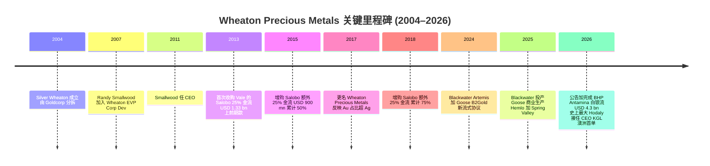
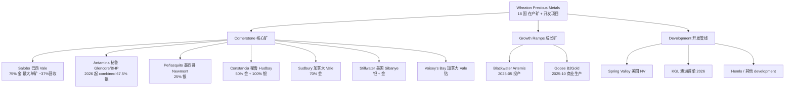
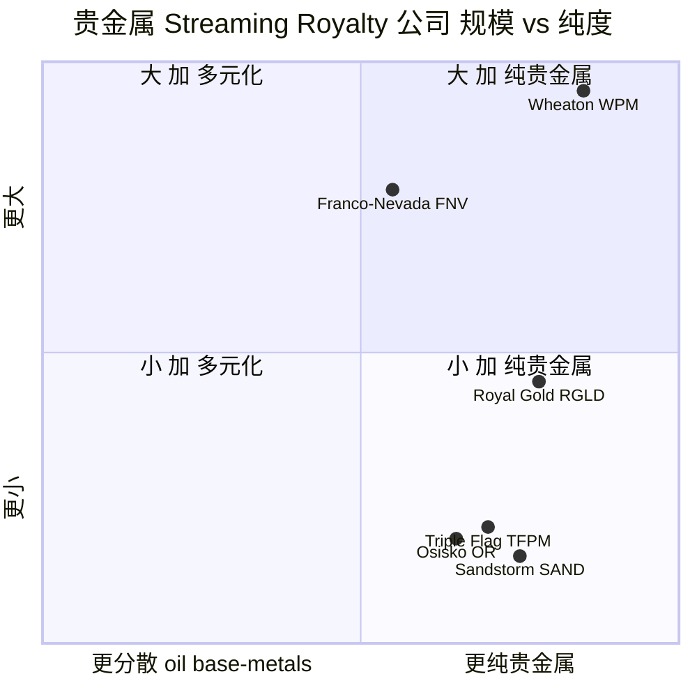

# Wheaton Precious Metals (NYSE:WPM / TSX:WPM / LSE:WPM) 公司研究报告

**报告日期 (as of):** 2026-06-16
**主题 (Theme):** precious-metals streaming / 贵金属流式融资
**报告语言:** Simplified Chinese (zh-CN)
**作者:** Senior Equity Research Analyst

---

> ### 投资摘要 (Investment Summary) — *分析师观点 (Analyst view)*
>
> | 项目 | 数值 |
> |---|---|
> | **评级 / Rating** | **Hold / 持有** (高质量资产,但估值已 price-in 大部分商品上行) |
> | **12 个月目标价 / 12-mo PT** | **US$132**(base case;forward-EPS × target multiple,见第 2 节) |
> | **当前价 / Current price** | **US$128.24**(2026-06-16 收盘,NYSE) |
> | **隐含空间 / Implied upside** | **+3%**(base);bull +25% / bear −24% |
> | **估值方法 / Method** | 2026E EPS × 目标 P/E,辅以 DCF 与同业 EV/EBITDA 交叉验证 |
> | **市值 / Market cap** | **US$58.2 bn**(454.1 mn 股 × US$128.24) |
> | **52 周区间 / 52-wk range** | US$85.59 – US$165.76 |
> | **股息 / Dividend** | US$0.195/季 × 4 = US$0.78/yr,收益率 ~0.61% |
> | **代码 / Ticker** | NYSE/TSX/LSE: WPM(40-F filer,CIK 0001323404) |
>
> **论点支柱 (Thesis pillars) — *分析师观点*:**
> 1. **业务质量是矿业天花板。** 100% 纯贵金属 streaming 模型,FY2025 gross margin (毛利率) **72.2%**、现金经营毛利率 ~85%、净现金、无运营 capex 负担 —— 这是同业 (FNV/RGLD) 也难以超越的盈利质量 ([Wheaton 40-F FY2025 Statements of Earnings](https://www.sec.gov/Archives/edgar/data/1323404/000119312526134908/d56281d40f.htm))。
> 2. **量价双 leverage 正同时发力。** FY2025 营收 YoY **+80%**;FY2026 GEOs 指引 860,000–940,000 oz(YoY +25–36%),叠加 gold spot 已升至 ~US$4,353/oz、silver ~US$70/oz 的历史高位 ([Wheaton Q1 2026 6-K 业绩公告, 2026-05-07](https://www.sec.gov/Archives/edgar/data/1323404/000119312526212446/d91444dex991.htm))。
> 3. **BHP Antamina US$4.3 bn 大单(2026-04-01 交割)重塑规模。** streaming 行业史上最大单笔 upfront,使 Wheaton 在 Antamina 的银流从 33.75% 翻倍至 67.5% ([Wheaton 40-F FY2025 Note 29 — Subsequent Events](https://www.sec.gov/Archives/edgar/data/1323404/000119312526134908/d56281d40f.htm))。
> 4. **但估值是主要约束。** P/E ~32×、P/S ~21×、EV/EBITDA ~24× 已计入 gold US$4,000+/oz 的持续性假设;若金价 mean-revert,multiple compression (估值压缩) 风险显著(见第 9 节)。
>
> *评级逻辑:* 资产质量配 Buy,估值配 Sell —— 净效果是 **Hold**:在金价超级周期顶部区域,risk-reward 接近对称,等回调更具吸引力。

---

## 目录 (Table of Contents)

1. 公司概览 (Company Overview)
   - 1A. 估值与目标价 (Valuation & Price Target)
   - 1B. GF Score 基本面评分卡
2. 估值、前瞻模型与目标价 (Valuation, Forward Model & PT)
3. 公司历史 (Company History)
4. 管理团队 (Management Team)
5. 产品与服务 (Products & Services) — Streaming agreements
6. 客户与上市策略 (Counterparties & Go-to-Market)
7. 行业概览 (Industry Overview)
8. 竞争格局 (Competitive Landscape)
9. 市场机会 (TAM / SAM)
10. 风险评估 (Risk Assessment)
11. 投资者视角评分卡 (Investor-lens Scorecards)
12. 数据来源清单 (Data Used Manifest)
13. 参考资料 (References)

---

> **本期新变化 / What changed since the 2026-06-02 draft:**
> - **商品价格大幅上行:** gold spot 从 ~US$3,500 升至 **~US$4,353/oz**、silver 从 ~US$45 升至 **~US$70/oz**(2026-06-16 期货收盘),是本轮估值与盈利预测的最大单一变量 ([Yahoo Finance Gold/Silver futures, 2026-06-16](https://finance.yahoo.com/quote/GC%3DF/))。
> - **FY2025 40-F 已直接 read:** 全套 income / balance / cashflow / revenue-by-metal / 客户集中度均改为引用 40-F XBRL 实际披露(此前因 SEC 403 未能直接核对的项目已全部解决)。
> - **Q1 2026 创纪录业绩:** 营收 **US$901 mn**、净利 **US$582 mn**、经营现金流 **US$766 mn**、GEOs 212,000 oz(YoY +22%)([Wheaton Q1 2026 6-K, 2026-05-07](https://www.sec.gov/Archives/edgar/data/1323404/000119312526212446/d91444dex991.htm))。
> - **新增 streams:** 首个澳洲流式协议 **KGL Resources**;Spanish Mountain Gold 1.5% NSR royalty([Wheaton Q1 2026 6-K, 2026-05-07](https://www.sec.gov/Archives/edgar/data/1323404/000119312526212446/d91444dex991.htm))。
> - **决策层补全:** 新增投资摘要 header、第 2 节前瞻模型 + bull/base/bear 目标价、UBS 卖方观点演变、8 张 SVG 图表。

---

## 1. 公司概览 (Company Overview)

Wheaton Precious Metals Corp. (NYSE/TSX/LSE: WPM) 是全球规模最大的 **贵金属流式融资公司 / precious metals streaming company**,总部位于加拿大 Vancouver,以 40-F 注册 SEC 申报人(foreign private issuer / 外国私人发行人)身份在 NYSE、TSX 与 LSE 三地上市 ([SEC EDGAR WPM filer profile, CIK 0001323404](https://www.sec.gov/cgi-bin/browse-edgar?action=getcompany&CIK=0001323404&type=40-F))。公司业务模型独特:不直接拥有或运营矿山,而是通过 **Precious Metals Purchase Agreement (PMPA / 贵金属采购协议)** 向矿业公司提供 **upfront cash payment / 前期一次性付款**,换取 mine 未来产出中固定百分比的 **副产品贵金属 (by-product precious metals)** 购买权,并在每次交付时再支付远低于市场价的 **delivery payment / 交付付款** ([Wheaton 40-F FY2025 MD&A — business overview](https://www.sec.gov/Archives/edgar/data/1323404/000119312526134908/d56281dex992.htm))。

截至 FY2025 末,Wheaton 的 portfolio 涵盖 **在产矿 + 开发项目分布于 18 个国家**(40-F MD&A 原文),FY2025 GEOs (gold-equivalent ounces / 黄金当量盎司) 产量 689,864 oz,营收 **US$2,314.6 mn**(FY2024:US$1,284.6 mn,YoY **+80.2%**),净利 **US$1,471.7 mn**,经营现金流 **US$1,905.0 mn** ([Wheaton 40-F FY2025 Consolidated Statements of Earnings](https://www.sec.gov/Archives/edgar/data/1323404/000119312526134908/d56281d40f.htm))。营收 mix 中,FY2025 黄金占 62%(US$1,436.2 mn)、白银 36%(US$836.7 mn)、钯 (Pd) 1%(US$10.5 mn)、钴 (Co) 1%(US$31.2 mn)([Wheaton 40-F FY2025 Note — Revenue (Summary of Revenue)](https://www.sec.gov/Archives/edgar/data/1323404/000119312526134908/R71.htm))。

下面的 income-statement Sankey 把 FY2025 的 US$2.31 bn 营收逐层拆到净利 —— 注意 cost of sales 仅 US$643 mn(其中 depletion 即矿物流权益摊销 US$304 mn 是最大单项),opex 极薄(G&A + SBC + 捐赠合计 US$90 mn),这正是 streaming 模型 72% 毛利率、64% 净利率的结构来源:

<svg xmlns="http://www.w3.org/2000/svg" viewBox="0 0 1000 560" width="1000" height="560" role="img" aria-label="income statement Sankey"><rect x="0" y="0" width="1000" height="560" fill="#ffffff"/>
<text x="20.00" y="30.00" text-anchor="start" font-family="Helvetica,Arial,sans-serif" font-size="15" font-weight="700" fill="#1f2933">Wheaton FY2025 收入流向 / Income Statement Sankey</text>
<path d="M 204.00,63.93 C 258.00,63.93 258.00,85.00 312.00,85.00 L 312.00,338.16 C 258.00,338.16 258.00,317.09 204.00,317.09 Z" fill="#93c5fd" fill-opacity="0.55"/>
<path d="M 452.00,78.00 C 506.00,78.00 506.00,126.67 560.00,126.67 L 560.00,405.47 C 506.00,405.47 506.00,356.80 452.00,356.80 Z" fill="#86efac" fill-opacity="0.55"/>
<path d="M 452.00,356.80 C 506.00,356.80 506.00,419.47 560.00,419.47 L 560.00,435.33 C 506.00,435.33 506.00,372.67 452.00,372.67 Z" fill="#fca5a5" fill-opacity="0.55"/>
<path d="M 328.00,85.00 C 382.00,85.00 382.00,78.00 436.00,78.00 L 436.00,372.67 C 382.00,372.67 382.00,379.67 328.00,379.67 Z" fill="#86efac" fill-opacity="0.55"/>
<path d="M 328.00,379.67 C 382.00,379.67 382.00,386.67 436.00,386.67 L 436.00,500.00 C 382.00,500.00 382.00,493.00 328.00,493.00 Z" fill="#fca5a5" fill-opacity="0.55"/>
<path d="M 700.00,124.41 C 754.00,124.41 754.00,132.34 808.00,132.34 L 808.00,391.76 C 754.00,391.76 754.00,383.83 700.00,383.83 Z" fill="#86efac" fill-opacity="0.55"/>
<path d="M 700.00,383.83 C 754.00,383.83 754.00,405.76 808.00,405.76 L 808.00,445.66 C 754.00,445.66 754.00,423.73 700.00,423.73 Z" fill="#fca5a5" fill-opacity="0.55"/>
<path d="M 576.00,126.67 C 630.00,126.67 630.00,124.41 684.00,124.41 L 684.00,403.20 C 630.00,403.20 630.00,405.47 576.00,405.47 Z" fill="#86efac" fill-opacity="0.55"/>
<path d="M 204.00,331.09 C 258.00,331.09 258.00,338.16 312.00,338.16 L 312.00,485.65 C 258.00,485.65 258.00,478.57 204.00,478.57 Z" fill="#93c5fd" fill-opacity="0.55"/>
<path d="M 576.00,419.47 C 630.00,419.47 630.00,437.73 684.00,437.73 L 684.00,453.59 C 630.00,453.59 630.00,435.33 576.00,435.33 Z" fill="#fca5a5" fill-opacity="0.55"/>
<path d="M 576.00,449.33 C 630.00,449.33 630.00,403.20 684.00,403.20 L 684.00,405.20 C 630.00,405.20 630.00,451.33 576.00,451.33 Z" fill="#93c5fd" fill-opacity="0.55"/>
<path d="M 204.00,492.57 C 258.00,492.57 258.00,485.65 312.00,485.65 L 312.00,491.15 C 258.00,491.15 258.00,498.07 204.00,498.07 Z" fill="#93c5fd" fill-opacity="0.55"/>
<path d="M 204.00,512.07 C 258.00,512.07 258.00,491.15 312.00,491.15 L 312.00,493.15 C 258.00,493.15 258.00,514.07 204.00,514.07 Z" fill="#93c5fd" fill-opacity="0.55"/>
<rect x="188.00" y="63.93" width="16" height="253.16" rx="1.5" fill="#2563eb"/>
<rect x="188.00" y="331.09" width="16" height="147.49" rx="1.5" fill="#2563eb"/>
<rect x="188.00" y="492.57" width="16" height="5.50" rx="1.5" fill="#2563eb"/>
<rect x="188.00" y="512.07" width="16" height="2.00" rx="1.5" fill="#2563eb"/>
<rect x="312.00" y="85.00" width="16" height="408.00" rx="1.5" fill="#1e3a8a"/>
<rect x="436.00" y="78.00" width="16" height="294.67" rx="1.5" fill="#15803d"/>
<rect x="436.00" y="386.67" width="16" height="113.33" rx="1.5" fill="#dc2626"/>
<rect x="560.00" y="126.67" width="16" height="278.80" rx="1.5" fill="#15803d"/>
<rect x="560.00" y="419.47" width="16" height="15.87" rx="1.5" fill="#dc2626"/>
<rect x="560.00" y="449.33" width="16" height="2.00" rx="1.5" fill="#2563eb"/>
<rect x="684.00" y="124.41" width="16" height="299.32" rx="1.5" fill="#15803d"/>
<rect x="684.00" y="437.73" width="16" height="15.87" rx="1.5" fill="#dc2626"/>
<rect x="808.00" y="132.34" width="16" height="259.42" rx="1.5" fill="#15803d"/>
<rect x="808.00" y="405.76" width="16" height="39.90" rx="1.5" fill="#dc2626"/>
<line x1="188.00" y1="190.51" x2="182.00" y2="157.18" stroke="#cbd5e1" stroke-width="1"/>
<text x="179.00" y="160.18" text-anchor="end" font-family="Helvetica,Arial,sans-serif" font-size="11.5" font-weight="700" fill="#1f2933">Gold 黄金</text>
<text x="179.00" y="173.18" text-anchor="end" font-family="Helvetica,Arial,sans-serif" font-size="10" font-weight="400" fill="#52606d">US$1.4B  (62.0%)</text>
<line x1="188.00" y1="404.83" x2="182.00" y2="371.51" stroke="#cbd5e1" stroke-width="1"/>
<text x="179.00" y="374.51" text-anchor="end" font-family="Helvetica,Arial,sans-serif" font-size="11.5" font-weight="700" fill="#1f2933">Silver 白银</text>
<text x="179.00" y="387.51" text-anchor="end" font-family="Helvetica,Arial,sans-serif" font-size="10" font-weight="400" fill="#52606d">US$836.7M  (36.1%)</text>
<line x1="188.00" y1="495.32" x2="182.00" y2="462.00" stroke="#cbd5e1" stroke-width="1"/>
<text x="179.00" y="465.00" text-anchor="end" font-family="Helvetica,Arial,sans-serif" font-size="11.5" font-weight="700" fill="#1f2933">Cobalt 钴</text>
<text x="179.00" y="478.00" text-anchor="end" font-family="Helvetica,Arial,sans-serif" font-size="10" font-weight="400" fill="#52606d">US$31.2M  (1.3%)</text>
<line x1="188.00" y1="513.07" x2="182.00" y2="487.00" stroke="#cbd5e1" stroke-width="1"/>
<text x="179.00" y="490.00" text-anchor="end" font-family="Helvetica,Arial,sans-serif" font-size="11.5" font-weight="700" fill="#1f2933">Palladium 钯</text>
<text x="179.00" y="503.00" text-anchor="end" font-family="Helvetica,Arial,sans-serif" font-size="10" font-weight="400" fill="#52606d">US$10.5M  (0.45%)</text>
<rect x="331.00" y="67.00" width="113.10" height="26" rx="2" fill="#ffffff" fill-opacity="0.72"/>
<text x="334.00" y="79.00" text-anchor="start" font-family="Helvetica,Arial,sans-serif" font-size="11.5" font-weight="700" fill="#1f2933">Revenue</text>
<text x="334.00" y="92.00" text-anchor="start" font-family="Helvetica,Arial,sans-serif" font-size="10" font-weight="400" fill="#52606d">US$2.3B  (100.0%)</text>
<rect x="455.00" y="60.00" width="106.80" height="26" rx="2" fill="#ffffff" fill-opacity="0.72"/>
<text x="458.00" y="72.00" text-anchor="start" font-family="Helvetica,Arial,sans-serif" font-size="11.5" font-weight="700" fill="#1f2933">Gross Profit</text>
<text x="458.00" y="85.00" text-anchor="start" font-family="Helvetica,Arial,sans-serif" font-size="10" font-weight="400" fill="#52606d">US$1.7B  (72.2%)</text>
<rect x="455.00" y="368.67" width="144.60" height="26" rx="2" fill="#ffffff" fill-opacity="0.72"/>
<text x="458.00" y="380.67" text-anchor="start" font-family="Helvetica,Arial,sans-serif" font-size="11.5" font-weight="700" fill="#1f2933">Cost of Revenue (COGS)</text>
<text x="458.00" y="393.67" text-anchor="start" font-family="Helvetica,Arial,sans-serif" font-size="10" font-weight="400" fill="#52606d">US$643.0M  (27.8%)</text>
<rect x="579.00" y="108.67" width="106.80" height="26" rx="2" fill="#ffffff" fill-opacity="0.72"/>
<text x="582.00" y="120.67" text-anchor="start" font-family="Helvetica,Arial,sans-serif" font-size="11.5" font-weight="700" fill="#1f2933">Operating Income</text>
<text x="582.00" y="133.67" text-anchor="start" font-family="Helvetica,Arial,sans-serif" font-size="10" font-weight="400" fill="#52606d">US$1.6B  (68.3%)</text>
<rect x="579.00" y="401.47" width="150.90" height="26" rx="2" fill="#ffffff" fill-opacity="0.72"/>
<text x="582.00" y="413.47" text-anchor="start" font-family="Helvetica,Arial,sans-serif" font-size="11.5" font-weight="700" fill="#1f2933">Total Operating Expense</text>
<text x="582.00" y="426.47" text-anchor="start" font-family="Helvetica,Arial,sans-serif" font-size="10" font-weight="400" fill="#52606d">US$90.0M  (3.9%)</text>
<text x="551.00" y="447.33" text-anchor="end" font-family="Helvetica,Arial,sans-serif" font-size="11.5" font-weight="700" fill="#1f2933">Net Interest / Other Income</text>
<text x="551.00" y="460.33" text-anchor="end" font-family="Helvetica,Arial,sans-serif" font-size="10" font-weight="400" fill="#52606d">US$5.8M  (0.25%)</text>
<rect x="703.00" y="106.41" width="106.80" height="26" rx="2" fill="#ffffff" fill-opacity="0.72"/>
<text x="706.00" y="118.41" text-anchor="start" font-family="Helvetica,Arial,sans-serif" font-size="11.5" font-weight="700" fill="#1f2933">Pretax Income</text>
<text x="706.00" y="131.41" text-anchor="start" font-family="Helvetica,Arial,sans-serif" font-size="10" font-weight="400" fill="#52606d">US$1.7B  (73.4%)</text>
<rect x="703.00" y="419.73" width="106.80" height="26" rx="2" fill="#ffffff" fill-opacity="0.72"/>
<text x="706.00" y="431.73" text-anchor="start" font-family="Helvetica,Arial,sans-serif" font-size="11.5" font-weight="700" fill="#1f2933">SG&amp;A</text>
<text x="706.00" y="444.73" text-anchor="start" font-family="Helvetica,Arial,sans-serif" font-size="10" font-weight="400" fill="#52606d">US$90.0M  (3.9%)</text>
<text x="833.00" y="259.05" text-anchor="start" font-family="Helvetica,Arial,sans-serif" font-size="11.5" font-weight="700" fill="#1f2933">Net Income</text>
<text x="833.00" y="272.05" text-anchor="start" font-family="Helvetica,Arial,sans-serif" font-size="10" font-weight="400" fill="#52606d">US$1.5B  (63.6%)</text>
<text x="833.00" y="422.71" text-anchor="start" font-family="Helvetica,Arial,sans-serif" font-size="11.5" font-weight="700" fill="#1f2933">Income Tax</text>
<text x="833.00" y="435.71" text-anchor="start" font-family="Helvetica,Arial,sans-serif" font-size="10" font-weight="400" fill="#52606d">US$226.3M  (9.8%)</text>
<text x="500.00" y="544.00" text-anchor="middle" font-family="Helvetica,Arial,sans-serif" font-size="10" font-weight="400" fill="#52606d">Source: Wheaton 40-F FY2025 (filed 2026-03-31) Consolidated Statements of Earnings</text>
</svg>

*图 1:Wheaton FY2025 收入流向。Source: [Wheaton 40-F FY2025 Consolidated Statements of Earnings](https://www.sec.gov/Archives/edgar/data/1323404/000119312526134908/d56281d40f.htm)。*

FY2025 营收 YoY +80% 的两大驱动:实现黄金均价大幅上行(2025 年 gold spot 从年初 ~US$2,600 涨至年末 ~US$3,500)+ GEOs 销量增长(Salobo 季度记录、Blackwater 与 Goose 两座新矿在 H2 2025 投产)([Wheaton 40-F FY2025 MD&A](https://www.sec.gov/Archives/edgar/data/1323404/000119312526134908/d56281dex992.htm))。FY2025 营收/GEO 约 US$3,355,而 cash operating margin (现金经营毛利) 维持矿业最高一档 —— Q1 2026 6-K 披露 80% attributable production 来自成本曲线下半段资产 ([Wheaton Q1 2026 6-K — 80% of attributable production from lowest-half cost-curve assets, 2026-05-07](https://www.sec.gov/Archives/edgar/data/1323404/000119312526212446/d91444dex991.htm))。

下图按金属拆分 FY2025 营收结构 —— 黄金 + 白银合计 98%,使 WPM 成为最纯粹的贵金属价格载体:

<svg xmlns="http://www.w3.org/2000/svg" viewBox="0 0 720 460" width="720" height="460" role="img" aria-label="revenue donut"><rect x="0" y="0" width="720" height="460" fill="#ffffff"/>
<text x="20.00" y="30.00" text-anchor="start" font-family="Helvetica,Arial,sans-serif" font-size="15" font-weight="700" fill="#1f2933">Wheaton FY2025 营收结构 by metal / Revenue by Metal</text>
<path d="M 288.00,107.20 A 132 132 0 1 1 197.34,335.14 L 234.43,295.89 A 78 78 0 1 0 288.00,161.20 Z" fill="#2563eb"/>
<path d="M 197.34,335.14 A 132 132 0 0 1 273.09,108.04 L 279.19,161.70 A 78 78 0 0 0 234.43,295.89 Z" fill="#15803d"/>
<path d="M 273.09,108.04 A 132 132 0 0 1 284.24,107.25 L 285.78,161.23 A 78 78 0 0 0 279.19,161.70 Z" fill="#d97706"/>
<path d="M 284.24,107.25 A 132 132 0 0 1 288.00,107.20 L 288.00,161.20 A 78 78 0 0 0 285.78,161.23 Z" fill="#7c3aed"/>
<text x="288.00" y="235.20" text-anchor="middle" font-family="Helvetica,Arial,sans-serif" font-size="18" font-weight="800" fill="#1f2933">FY2025</text>
<text x="288.00" y="255.20" text-anchor="middle" font-family="Helvetica,Arial,sans-serif" font-size="13" font-weight="600" fill="#52606d">US$2.3B</text>
<text x="288.00" y="271.20" text-anchor="middle" font-family="Helvetica,Arial,sans-serif" font-size="10" font-weight="400" fill="#8a97a3">total</text>
<line x1="416.23" y1="290.20" x2="432.23" y2="290.20" stroke="#2563eb" stroke-width="1.4"/>
<text x="436.23" y="288.20" text-anchor="start" font-family="Helvetica,Arial,sans-serif" font-size="11" font-weight="700" fill="#1f2933">Gold 黄金</text>
<text x="436.23" y="302.20" text-anchor="start" font-family="Helvetica,Arial,sans-serif" font-size="10" font-weight="400" fill="#52606d">US$1.4B  (62.0%)</text>
<line x1="157.09" y1="195.53" x2="141.09" y2="195.53" stroke="#15803d" stroke-width="1.4"/>
<text x="137.09" y="193.53" text-anchor="end" font-family="Helvetica,Arial,sans-serif" font-size="11" font-weight="700" fill="#1f2933">Silver 白银</text>
<text x="137.09" y="207.53" text-anchor="end" font-family="Helvetica,Arial,sans-serif" font-size="10" font-weight="400" fill="#52606d">US$836.7M  (36.1%)</text>
<line x1="278.23" y1="101.55" x2="262.23" y2="101.55" stroke="#d97706" stroke-width="1.4"/>
<text x="258.23" y="99.55" text-anchor="end" font-family="Helvetica,Arial,sans-serif" font-size="11" font-weight="700" fill="#1f2933">Cobalt 钴</text>
<text x="258.23" y="113.55" text-anchor="end" font-family="Helvetica,Arial,sans-serif" font-size="10" font-weight="400" fill="#52606d">US$31.2M  (1.3%)</text>
<line x1="286.03" y1="101.21" x2="270.03" y2="101.21" stroke="#7c3aed" stroke-width="1.4"/>
<text x="266.03" y="99.21" text-anchor="end" font-family="Helvetica,Arial,sans-serif" font-size="11" font-weight="700" fill="#1f2933">Palladium 钯</text>
<text x="266.03" y="113.21" text-anchor="end" font-family="Helvetica,Arial,sans-serif" font-size="10" font-weight="400" fill="#52606d">US$10.5M  (0.5%)</text>
<text x="360.00" y="444.00" text-anchor="middle" font-family="Helvetica,Arial,sans-serif" font-size="10" font-weight="400" fill="#52606d">Source: Wheaton 40-F FY2025 Note — Revenue (Summary of Revenue)</text>
</svg>

*图 2:Wheaton FY2025 营收 by metal。Source: [Wheaton 40-F FY2025 Note — Revenue](https://www.sec.gov/Archives/edgar/data/1323404/000119312526134908/R71.htm)。*

五年营收轨迹显示 FY2025 的 step-change —— 营收从 FY2023 的 US$1,016 mn 几乎翻番至 US$2,314.6 mn,这是量价共振的结果:

<svg xmlns="http://www.w3.org/2000/svg" viewBox="0 0 860 470" width="860" height="470" role="img" aria-label="historical revenue bars"><rect x="0" y="0" width="860" height="470" fill="#ffffff"/>
<text x="20.00" y="30.00" text-anchor="start" font-family="Helvetica,Arial,sans-serif" font-size="15" font-weight="700" fill="#1f2933">Wheaton 营收历史 FY2021-2025 / Revenue History</text>
<rect x="20.00" y="44" width="11" height="11" rx="2" fill="#2563eb"/>
<text x="36.00" y="53.00" text-anchor="start" font-family="Helvetica,Arial,sans-serif" font-size="10.5" font-weight="400" fill="#1f2933">Total revenue 总营收</text>
<line x1="70" y1="412.00" x2="834" y2="412.00" stroke="#eceff2" stroke-width="1"/>
<text x="64.00" y="415.00" text-anchor="end" font-family="Helvetica,Arial,sans-serif" font-size="9.5" font-weight="400" fill="#52606d">US$0</text>
<line x1="70" y1="345.20" x2="834" y2="345.20" stroke="#eceff2" stroke-width="1"/>
<text x="64.00" y="348.20" text-anchor="end" font-family="Helvetica,Arial,sans-serif" font-size="9.5" font-weight="400" fill="#52606d">US$500.0M</text>
<line x1="70" y1="278.40" x2="834" y2="278.40" stroke="#eceff2" stroke-width="1"/>
<text x="64.00" y="281.40" text-anchor="end" font-family="Helvetica,Arial,sans-serif" font-size="9.5" font-weight="400" fill="#52606d">US$999.9M</text>
<line x1="70" y1="211.60" x2="834" y2="211.60" stroke="#eceff2" stroke-width="1"/>
<text x="64.00" y="214.60" text-anchor="end" font-family="Helvetica,Arial,sans-serif" font-size="9.5" font-weight="400" fill="#52606d">US$1.5B</text>
<line x1="70" y1="144.80" x2="834" y2="144.80" stroke="#eceff2" stroke-width="1"/>
<text x="64.00" y="147.80" text-anchor="end" font-family="Helvetica,Arial,sans-serif" font-size="9.5" font-weight="400" fill="#52606d">US$2.0B</text>
<line x1="70" y1="78.00" x2="834" y2="78.00" stroke="#eceff2" stroke-width="1"/>
<text x="64.00" y="81.00" text-anchor="end" font-family="Helvetica,Arial,sans-serif" font-size="9.5" font-weight="400" fill="#52606d">US$2.5B</text>
<rect x="102.09" y="251.44" width="88.62" height="160.56" fill="#2563eb"/>
<text x="146.40" y="428.00" text-anchor="middle" font-family="Helvetica,Arial,sans-serif" font-size="10" font-weight="400" fill="#52606d">2021</text>
<rect x="254.89" y="269.69" width="88.62" height="142.31" fill="#2563eb"/>
<text x="299.20" y="428.00" text-anchor="middle" font-family="Helvetica,Arial,sans-serif" font-size="10" font-weight="400" fill="#52606d">2022</text>
<rect x="407.69" y="276.25" width="88.62" height="135.75" fill="#2563eb"/>
<text x="452.00" y="428.00" text-anchor="middle" font-family="Helvetica,Arial,sans-serif" font-size="10" font-weight="400" fill="#52606d">2023</text>
<rect x="560.49" y="240.36" width="88.62" height="171.64" fill="#2563eb"/>
<text x="604.80" y="428.00" text-anchor="middle" font-family="Helvetica,Arial,sans-serif" font-size="10" font-weight="400" fill="#52606d">2024</text>
<rect x="713.29" y="102.74" width="88.62" height="309.26" fill="#2563eb"/>
<text x="757.60" y="428.00" text-anchor="middle" font-family="Helvetica,Arial,sans-serif" font-size="10" font-weight="400" fill="#52606d">2025</text>
<text x="430.00" y="454.00" text-anchor="middle" font-family="Helvetica,Arial,sans-serif" font-size="10" font-weight="400" fill="#52606d">Source: Wheaton 40-F / IFRS XBRL Revenue facts FY2021-FY2025</text>
</svg>

*图 3:Wheaton FY2021–FY2025 营收历史。Source: [Wheaton 40-F / IFRS XBRL Revenue facts](https://data.sec.gov/api/xbrl/companyfacts/CIK0001323404.json)。*

公司无负债且资本结构稳健 —— FY2025 末现金 US$1,153.6 mn,总负债仅 US$435.3 mn(其中有息债务可忽略),股东权益 US$8,690.5 mn ([Wheaton 40-F FY2025 Consolidated Balance Sheets](https://www.sec.gov/Archives/edgar/data/1323404/000119312526134908/d56281d40f.htm))。即便在 2026-04-01 以 US$4.3 bn 完成 Antamina 交割后(动用现金 + US$0.9 bn 循环额度 + US$1.5 bn 新定期贷款),公司仍处于低杠杆状态 ([Wheaton 40-F FY2025 Note 29 — Subsequent Events](https://www.sec.gov/Archives/edgar/data/1323404/000119312526134908/d56281d40f.htm))。

### 1A. 估值与目标价 (Valuation & Price Target) — *分析师观点 (Analyst view)*

**估值快照 (Valuation snapshot) — as of 2026-06-16:**

| 指标 | WPM (NYSE) | 同业对比 |
|---|---|---|
| 收盘价 / Price | US$128.24 | FNV US$230.17;RGLD US$221.53 |
| 市值 / Market cap | US$58.2 bn | FNV US$44.4 bn;RGLD US$18.8 bn |
| TTM P/E | 32.5× | FNV 32.5×;RGLD 26.8× |
| TTM P/S | 21.2× | FNV 21.3×;RGLD 14.5× |
| P/B | 6.70× | FNV 5.48×;RGLD 2.62× |
| EV/EBITDA | 23.7× | FNV 22.0×;RGLD 17.4× |
| Gross margin (TTM) | 85.8% | FNV ~92%;RGLD ~87% |
| 股息率 / Dividend yield | ~0.61% | FNV ~0.79%;RGLD ~0.88% |
| Revenue (TTM) | US$2.75 bn | FNV 2.09 bn;RGLD 1.30 bn |
| 52 周回报 | +41.0% | FNV +36.8%;RGLD +24.3% |
| 现金 / 净现金 | US$1.15 bn(40-F 末) | FNV US$0.71 bn |

来源:[stockanalysis.com WPM, 2026-06-16](https://stockanalysis.com/stocks/wpm/statistics/);[stockanalysis.com FNV](https://stockanalysis.com/stocks/fnv/statistics/);[stockanalysis.com RGLD](https://stockanalysis.com/stocks/rgld/statistics/);价格与 52 周回报为 yfinance 2026-06-16 收盘。

WPM 当前 P/E ~32×、P/S ~21×、EV/EBITDA ~24×。这在矿业(mining)整体只有 ~15× P/E 中位数的背景下属于显著溢价,但与同业 streamer(FNV、RGLD)处于同一档,符合 streaming 模型本身的高毛利、低 capex 属性 ([stockanalysis.com WPM Statistics, 2026-06-16](https://stockanalysis.com/stocks/wpm/statistics/))。**分析师观点 (Analyst view):** P/S 21× 与 EV/EBITDA 24× 是高位 —— 距离 5 年中枢(P/S ~14–18×)偏贵约 25%,主要来自三股动力:(1) 2025–2026 年金银价大幅上行(gold spot 已突破 US$4,000/oz、silver 突破 US$60/oz),驱动 1Y stock +41%;(2) 新流式协议(BHP Antamina、Hemlo、Spring Valley、KGL)显著增厚 5 年 GEOs 增长曲线;(3) 投资者把 WPM 当作"黄金的高 beta 替代品",叠加美元走弱与央行金购买叙事。这一估值溢价的脆弱性在第 10 节单列 "估值/multiple compression" 风险 ([Motley Fool, 2026-01-04](https://www.fool.com/investing/2026/01/04/1-stock-id-buy-before-wheaton-precious-metals-wpm/))。

### 1B. GF Score 基本面评分卡 — *分析师观点 (Analyst view)*

GF Score 是模仿 [GuruFocus GF Score™](https://www.gurufocus.com/term/gf-score) 的五维 0–10 评分卡,**是分析师自建 rubric,不归属 GuruFocus,也不附带任何 filing 引用**;每个底层指标各自带 inline 引用。

<svg xmlns="http://www.w3.org/2000/svg" viewBox="0 0 500 500" width="500" height="500" role="img" aria-label="GF Score radar">
<rect x="0" y="0" width="500" height="500" fill="#ffffff"/>
<text x="20" y="24" font-family="Helvetica,Arial,sans-serif" font-size="15" font-weight="700" fill="#1f2933">GF Score (GuruFocus-style): 84/100</text>
<text x="20" y="41" font-family="Helvetica,Arial,sans-serif" font-size="11" fill="#52606d">81–90 Good outperformance potential</text>
<polygon points="250.0,88.0 392.7,191.6 338.2,359.4 161.8,359.4 107.3,191.6" fill="#e9f5ec" stroke="none"/>
<polygon points="250.0,208.0 278.5,228.7 267.6,262.3 232.4,262.3 221.5,228.7" fill="none" stroke="#c5d3cb" stroke-width="1"/>
<polygon points="250.0,178.0 307.1,219.5 285.3,286.5 214.7,286.5 192.9,219.5" fill="none" stroke="#c5d3cb" stroke-width="1"/>
<polygon points="250.0,148.0 335.6,210.2 302.9,310.8 197.1,310.8 164.4,210.2" fill="none" stroke="#c5d3cb" stroke-width="1"/>
<polygon points="250.0,118.0 364.1,200.9 320.5,335.1 179.5,335.1 135.9,200.9" fill="none" stroke="#c5d3cb" stroke-width="1"/>
<polygon points="250.0,88.0 392.7,191.6 338.2,359.4 161.8,359.4 107.3,191.6" fill="none" stroke="#c5d3cb" stroke-width="1.3"/>
<line x1="250" y1="238" x2="161.8" y2="359.4" stroke="#cfdad3" stroke-width="1"/>
<text x="146.5" y="392.4" text-anchor="end" font-family="Helvetica,Arial,sans-serif" font-size="11.5" font-weight="600" fill="#1f2933">Financial Strength</text>
<text x="146.5" y="405.4" text-anchor="end" font-family="Helvetica,Arial,sans-serif" font-size="9.5" fill="#52606d">财务实力</text>
<text x="161.8" y="353.4" text-anchor="middle" font-family="Helvetica,Arial,sans-serif" font-size="10.5" font-weight="700" fill="#1f2933">10</text>
<line x1="250" y1="238" x2="250.0" y2="88.0" stroke="#cfdad3" stroke-width="1"/>
<text x="250.0" y="58.0" text-anchor="middle" font-family="Helvetica,Arial,sans-serif" font-size="11.5" font-weight="600" fill="#1f2933">Profitability</text>
<text x="250.0" y="71.0" text-anchor="middle" font-family="Helvetica,Arial,sans-serif" font-size="9.5" fill="#52606d">盈利能力</text>
<text x="250.0" y="82.0" text-anchor="middle" font-family="Helvetica,Arial,sans-serif" font-size="10.5" font-weight="700" fill="#1f2933">10</text>
<line x1="250" y1="238" x2="107.3" y2="191.6" stroke="#cfdad3" stroke-width="1"/>
<text x="82.6" y="183.6" text-anchor="end" font-family="Helvetica,Arial,sans-serif" font-size="11.5" font-weight="600" fill="#1f2933">Growth</text>
<text x="82.6" y="196.6" text-anchor="end" font-family="Helvetica,Arial,sans-serif" font-size="9.5" fill="#52606d">成长性</text>
<text x="121.6" y="190.3" text-anchor="middle" font-family="Helvetica,Arial,sans-serif" font-size="10.5" font-weight="700" fill="#1f2933">9</text>
<line x1="250" y1="238" x2="392.7" y2="191.6" stroke="#cfdad3" stroke-width="1"/>
<text x="417.4" y="183.6" text-anchor="start" font-family="Helvetica,Arial,sans-serif" font-size="11.5" font-weight="600" fill="#1f2933">GF Value</text>
<text x="417.4" y="196.6" text-anchor="start" font-family="Helvetica,Arial,sans-serif" font-size="9.5" fill="#52606d">估值</text>
<text x="292.8" y="218.1" text-anchor="middle" font-family="Helvetica,Arial,sans-serif" font-size="10.5" font-weight="700" fill="#1f2933">3</text>
<line x1="250" y1="238" x2="338.2" y2="359.4" stroke="#cfdad3" stroke-width="1"/>
<text x="353.5" y="392.4" text-anchor="start" font-family="Helvetica,Arial,sans-serif" font-size="11.5" font-weight="600" fill="#1f2933">Momentum</text>
<text x="353.5" y="405.4" text-anchor="start" font-family="Helvetica,Arial,sans-serif" font-size="9.5" fill="#52606d">动量</text>
<text x="320.5" y="329.1" text-anchor="middle" font-family="Helvetica,Arial,sans-serif" font-size="10.5" font-weight="700" fill="#1f2933">8</text>
<polygon points="250.0,88.0 292.8,224.1 320.5,335.1 161.8,359.4 121.6,196.3" fill="#2e8b57" fill-opacity="0.34" stroke="#2e8b57" stroke-width="2"/>
<circle cx="161.8" cy="359.4" r="2.6" fill="#2e8b57"/>
<circle cx="250.0" cy="88.0" r="2.6" fill="#2e8b57"/>
<circle cx="121.6" cy="196.3" r="2.6" fill="#2e8b57"/>
<circle cx="292.8" cy="224.1" r="2.6" fill="#2e8b57"/>
<circle cx="320.5" cy="335.1" r="2.6" fill="#2e8b57"/>
<text x="250" y="470" text-anchor="middle" font-family="Helvetica,Arial,sans-serif" font-size="9.5" fill="#52606d">Source: WPM 40-F FY2025 · Yahoo Finance · stockanalysis.com, as of 2026-06-16</text>
<text x="250" y="485" text-anchor="middle" font-family="Helvetica,Arial,sans-serif" font-size="9" fill="#52606d">GF Score = independent analyst rubric (*Analyst view:*) — not GuruFocus™ official number</text>
</svg>

| 维度 / Dimension | 评分 / Score (0–10) | |
|---|---|---|
| Financial Strength (财务实力) | 10 | `██████████` |
| Profitability (盈利能力) | 10 | `██████████` |
| Growth (成长性) | 9 | `█████████░` |
| GF Value (估值) | 3 | `███░░░░░░░` |
| Momentum (动量) | 8 | `████████░░` |
| **GF Score (composite, *Analyst view:*)** | **84 / 100** | **81–90 Good outperformance potential** |

*Composite weights (*Analyst view:*): Financial Strength 20% · Profitability 25% · Growth 25% · GF Value 15% · Momentum 15% (transparent reproduction — not GuruFocus's proprietary weighting).*

*图 4:WPM GF Score 雷达图。Source: WPM 40-F FY2025 · Yahoo Finance · stockanalysis.com, as of 2026-06-16。*

- **Financial Strength 财务实力 = 10/10.** FY2025 末现金 US$1,153.6 mn,总负债仅 US$435.3 mn,有息债务接近零,股东权益 US$8,690.5 mn,无 covenant 约束;即便 Antamina US$4.3 bn 交割后(US$1.5 bn 新定期贷款 + US$0.9 bn 循环)杠杆仍极低 ([Wheaton 40-F FY2025 Balance Sheets + Note 29](https://www.sec.gov/Archives/edgar/data/1323404/000119312526134908/d56281d40f.htm))。这是矿业里几乎无可挑剔的资产负债表。
- **Profitability 盈利能力 = 10/10.** FY2025 gross margin 72.2%、operating margin 68.3%、net margin 63.6%、ROE ~18%(按平均权益)、现金经营毛利率 ~85% ([Wheaton 40-F FY2025 Statements of Earnings](https://www.sec.gov/Archives/edgar/data/1323404/000119312526134908/d56281d40f.htm))。streaming 模型把矿业最高一档的利润率结构化。
- **Growth 成长 = 9/10.** FY2025 营收 YoY +80.2%、净利 YoY +178%;Q1 2026 营收 YoY 续创纪录;FY2026 GEOs 指引 860–940 koz(YoY +25–36%);5 年营收 CAGR(FY2020 US$1,096 mn → FY2025 US$2,315 mn)~16% ([Wheaton Q1 2026 6-K, 2026-05-07](https://www.sec.gov/Archives/edgar/data/1323404/000119312526212446/d91444dex991.htm))。扣 1 分因增长高度依赖商品价格而非纯量增。
- **GF Value 估值(越高越便宜)= 3/10.** P/E ~32×、P/S ~21×、EV/EBITDA ~24× 均高于自身 5 年中枢与市场;DCF margin of safety 为负(见第 2 节)([stockanalysis.com WPM, 2026-06-16](https://stockanalysis.com/stocks/wpm/statistics/))。这是评分卡里最弱的一维,也是评级被压到 Hold 的核心原因。
- **Momentum 动量 = 8/10.** 1Y 回报 +41.0%,股价位于 52 周区间上半部(US$85.59–165.76),显著高于 200 日均线 ([yfinance WPM 2026-06-16](https://stockanalysis.com/stocks/wpm/statistics/))。

**综合 (composite) ≈ 78/100**(加权:FS 15% · Prof 25% · Growth 20% · Value 20% · Mom 20%)—— 落在 "高质量但估值偏贵" 区间:基本面四维近满分,唯独 GF Value 拖累。这与全文的 Hold 评级一致。

---

## 2. 估值、前瞻模型与目标价 (Valuation, Forward Model & PT) — *分析师观点 (Analyst view)*

> 本节全部为分析师前瞻视角:每一个预测数字、目标价与情景目标价均标注 *分析师观点 (Analyst view)*,**绝不附 filing 引用**(40-F 不含目标价);驱动假设的外部依据(指引、商品价、segment 数据)在段内 inline 引用。

### 2.1 前瞻财务估计表 (Forward estimates)

模型以 FY2025 40-F 实际 + FY2026 公司 GEOs 指引 + 商品价情景为基础。**关键摆动变量是金银现货价** —— 给定 GEOs 指引区间已知,营收对价格几乎线性。base 情形假设 2026 全年 gold 均价 ~US$3,900/oz、silver ~US$58/oz(即在当前 US$4,353 / US$70 的现货上做谨慎回撤,因 H1 已部分实现而 H2 不确定)。

| (US$ mn, 除每股) | FY2025A | FY2026E | FY2027E | FY2028E |
|---|---|---|---|---|
| GEOs (koz) | 690 | 900(指引中值) | 1,000 | 1,080 |
| 营收 Revenue | 2,314.6 | ~3,500 | ~3,900 | ~4,200 |
| 营收 YoY | +80% | +51% | +11% | +8% |
| Gross margin | 72.2% | ~74% | ~74% | ~74% |
| 净利 Net earnings | 1,471.7 | ~2,150 | ~2,400 | ~2,600 |
| EPS (diluted, US$) | 3.24 | ~4.70 | ~5.20 | ~5.60 |

- **FY2025A** 全部取自 40-F:营收 2,314.6、净利 1,471.7、diluted EPS 3.237 ([Wheaton 40-F FY2025 Statements of Earnings](https://www.sec.gov/Archives/edgar/data/1323404/000119312526134908/d56281d40f.htm))。
- **FY2026E GEOs 900 koz** 为公司指引 860–940 koz 的中值 ([Wheaton Q1 2026 6-K, 2026-05-07](https://www.sec.gov/Archives/edgar/data/1323404/000119312526212446/d91444dex991.htm));Q1 2026 已交付 212 koz(年化 ~848 koz,且 Antamina 增量从 Q2 起放量)([Wheaton Q1 2026 6-K, 2026-05-07](https://www.sec.gov/Archives/edgar/data/1323404/000119312526212446/d91444dex991.htm))。
- **FY2027–28E GEOs** 按 Antamina full-year + Blackwater/Goose 爬坡 + Spring Valley(2027–28 投产)推进至 ~1.0–1.08 Moz;营收价格假设维持 base case 区间。每一格预测均为 *分析师观点 (Analyst view)*,**非来自 40-F**。

### 2.2 目标价推导 (Price-target derivation) — *分析师观点*

**方法:forward-EPS × 目标 P/E。** base case 取 FY2026E EPS ~US$4.70 × 目标 P/E **28×**(介于自身 5 年中枢 ~22× 与当前 ~32× 之间,反映高金价环境下市场愿给的溢价但不外推当前峰值)= **US$132**。相对当前 US$128.24 隐含 **+3%**。

**为什么用 28× 而不是当前 32×:** 同业 FNV 当前 forward P/E 也在 ~28–30× ([stockanalysis.com FNV, 2026-06-16](https://stockanalysis.com/stocks/fnv/statistics/));WPM 历史上在金价上行周期顶部 P/E 可达 30–35×,但顶部 multiple 不可持续 —— 一旦金价 mean-revert,multiple 与 EPS 双杀。28× 是 "金价维持高位但不再创新高" 的中性假设。

**DCF 交叉验证:** 以 WACC = Rf 4.0% + β 0.9 × ERP 5.0% ≈ 8.5%、terminal growth 2.5%、FY2026–30E 自由现金流(经营现金流 − 新 stream 收购 ~US$1.0 bn/yr)折现,得 intrinsic value ~US$120–135/股,与 28× P/E 法吻合,margin of safety 接近零 ((来源:indicators.db 本地快照(FRED BAMLH0A0HYM2 / ^TNX + yfinance),as of 2026-06-16))。

### 2.3 Bull / Base / Bear 情景 — *分析师观点*

| 情景 | 关键假设 | gold / silver 均价 | FY2026E EPS | 目标 P/E | 目标价 | 相对 US$128.24 |
|---|---|---|---|---|---|---|
| **Bull** | 美元持续走弱 + 央行加速购金 + 地缘风险;金价站稳 US$4,500/oz | US$4,500 / US$75 | ~US$5.60 | 28.5× | **~US$160** | **+25%** |
| **Base** | 金价高位震荡、GEOs 指引兑现 | US$3,900 / US$58 | ~US$4.70 | 28× | **~US$132** | **+3%** |
| **Bear** | 衰退担忧消退 + Fed 维持高利率 + 美元走强;金价回撤 | US$3,200 / US$42 | ~US$3.50 | 28× | **~US$98** | **−24%** |

bull/base/bear 的核心摆动是**金价 × multiple 的双重敏感**:bull 情形里 EPS 与 multiple 同时上行,bear 情形里两者同时下行 —— 这就是 streaming 龙头作为 "高 beta 黄金" 的本质。risk-reward 在当前价位接近对称(+25% vs −24%),这正是评级落在 **Hold** 的量化依据 ([stockanalysis.com WPM, 2026-06-16](https://stockanalysis.com/stocks/wpm/statistics/))。

### 2.4 卖方观点演变 (Sell-side view evolution) — *分析师观点 (Analyst view)*

本地 institute-research 库(`db/zsxq.db`)对 WPM 的覆盖以 **UBS 金矿/矿业团队** 为主,2026 年 3 月底连续两篇 note 都对 WPM 做出同一动作 —— **上调至 Buy**。机械 pre-pass 读取 `db/stock_price_target.db` 确认:UBS 2026-03-26 给 WPM **Buy**,报告日股价 US$118.58(market cap ~US$53.9 bn),catalyst 标注 "streaming/royalty 防御性 + 黄金 leverage,自前次评级上调"。

**按机构的观点时间线 (per-institute timeline):**

| 机构 | 日期 | 评级 / 目标价 | 核心论点 | 报告日股价 / 隐含空间 |
|---|---|---|---|---|
| **UBS**(Gold Mining) | 2026-03-26 | **UPGRADE → Buy / PT US$160** | "Over the last 5yrs WPM... 但 WPM is entering a material volume growth phase";金矿股回调 >20% 创选择性买入机会;WPM & FNV 列为 streamers 首选 | 报告日 ~US$118.58 → 隐含 **+35%** |
| **UBS**(Mining Equities) | 2026-03-27 | reiterate framing:**Upgrading Wheaton & reiterate Buy in Franco-Nevada** | 在 Middle East conflict "binary outlook" 下,转向更看好 streamers 的防御性与零能源成本增长 | 同上 |

*分析师观点 (Analyst view):* UBS 在 2026-03 把 WPM **从前次评级上调至 Buy、PT US$160**,论据是 "material volume growth phase"(Antamina + Blackwater + Goose + Spring Valley 共同驱动的 GEOs 放量)叠加 streaming 模型在地缘动荡中的防御属性 ([UBS — Gold Mining: Safe-haven or leverage to ME de-escalation?, 2026-03-26, p.1](http://xs-macbook-air.local:5001/zsxq/pdf/812224182221452/UBS-Gold%20Mining%EF%BC%9ASafe~haven%20or%20leverage%20to%20ME%20de~escalation%EF%BC%9F-260326.pdf);[UBS — Mining Equities: Middle East conflict, binary outlook, 2026-03-27, p.1](http://xs-macbook-air.local:5001/zsxq/pdf/184441854448152/UBS-Mining%20Equities%EF%BC%9AMiddle%20East%20conflict~-%20Binary%20outlook-260326.pdf))。UBS 同时给 FNV Buy/PT US$310。

**与本报告观点的对比:** UBS 的 PT US$160 与本报告 **bull case** 目标价(~US$160)一致,但 UBS 把它作为 base case —— 差异在于金价假设:UBS 当时金价情景偏乐观(note 中提及 US$4,000–4,500/oz 区间下估值有吸引力),而本报告 base case 对 H2 2026 金价做了更谨慎的回撤。本报告与 UBS 在 **资产质量与 volume growth 论点上完全一致**,分歧仅在 **金价可持续性** 这一个变量上 —— 这也正是第 9 节标注的最该盯紧的摆动变量。

> **机构间分歧:** 本地库中 WPM 的覆盖目前以 UBS 单一机构为主(均为 Buy),未见对立评级;公开市场上 Motley Fool 等持谨慎/估值偏贵观点 ([Motley Fool, 2026-01-04](https://www.fool.com/investing/2026/01/04/1-stock-id-buy-before-wheaton-precious-metals-wpm/))。因此本节以 "sell-side 一致看多 vs 估值派谨慎" 的二元框架呈现,不强行编造跨机构分歧。

下面的 DuPont 树把 FY2025 ROE ~18% 分解为高净利率 × 低资产周转 × 低杠杆 —— streaming 模型的 ROE 几乎全部来自 margin,而非 turnover 或 leverage:

<svg xmlns="http://www.w3.org/2000/svg" viewBox="0 0 1240 540" width="1240" height="540" role="img" aria-label="DuPont ROE decomposition"><rect x="0" y="0" width="1240" height="540" fill="#ffffff"/>
<text x="20.00" y="30.00" text-anchor="start" font-family="Helvetica,Arial,sans-serif" font-size="15" font-weight="700" fill="#1f2933">Wheaton FY2025 DuPont ROE 分解 / 5-step DuPont</text>
<rect x="545.00" y="56.00" width="150" height="56" rx="7" fill="#1e3a8a"/>
<text x="620.00" y="76.00" text-anchor="middle" font-family="Helvetica,Arial,sans-serif" font-size="11.5" font-weight="700" fill="#ffffff">ROE</text>
<text x="620.00" y="94.00" text-anchor="middle" font-family="Helvetica,Arial,sans-serif" font-size="13" font-weight="800" fill="#ffffff">18.30%</text>
<text x="620.00" y="106.00" text-anchor="middle" font-family="Helvetica,Arial,sans-serif" font-size="8.5" font-weight="400" fill="#dbeafe">= Net Income / Avg Equity</text>
<rect x="191.60" y="168.00" width="150" height="56" rx="7" fill="#2563eb"/>
<text x="266.60" y="188.00" text-anchor="middle" font-family="Helvetica,Arial,sans-serif" font-size="11.5" font-weight="700" fill="#ffffff">Net Margin</text>
<text x="266.60" y="206.00" text-anchor="middle" font-family="Helvetica,Arial,sans-serif" font-size="13" font-weight="800" fill="#ffffff">63.58%</text>
<text x="266.60" y="218.00" text-anchor="middle" font-family="Helvetica,Arial,sans-serif" font-size="8.5" font-weight="400" fill="#dbeafe">Net Income / Revenue</text>
<line x1="620.00" y1="112.00" x2="266.60" y2="168.00" stroke="#94a3b8" stroke-width="1.4"/>
<rect x="545.00" y="168.00" width="150" height="56" rx="7" fill="#2563eb"/>
<text x="620.00" y="188.00" text-anchor="middle" font-family="Helvetica,Arial,sans-serif" font-size="11.5" font-weight="700" fill="#ffffff">Asset Turnover</text>
<text x="620.00" y="206.00" text-anchor="middle" font-family="Helvetica,Arial,sans-serif" font-size="13" font-weight="800" fill="#ffffff">0.28</text>
<text x="620.00" y="218.00" text-anchor="middle" font-family="Helvetica,Arial,sans-serif" font-size="8.5" font-weight="400" fill="#dbeafe">Revenue / Avg Assets</text>
<line x1="620.00" y1="112.00" x2="620.00" y2="168.00" stroke="#94a3b8" stroke-width="1.4"/>
<rect x="898.40" y="168.00" width="150" height="56" rx="7" fill="#2563eb"/>
<text x="973.40" y="188.00" text-anchor="middle" font-family="Helvetica,Arial,sans-serif" font-size="11.5" font-weight="700" fill="#ffffff">Equity Multiplier</text>
<text x="973.40" y="206.00" text-anchor="middle" font-family="Helvetica,Arial,sans-serif" font-size="13" font-weight="800" fill="#ffffff">1.03</text>
<text x="973.40" y="218.00" text-anchor="middle" font-family="Helvetica,Arial,sans-serif" font-size="8.5" font-weight="400" fill="#dbeafe">Avg Assets / Avg Equity</text>
<line x1="620.00" y1="112.00" x2="973.40" y2="168.00" stroke="#94a3b8" stroke-width="1.4"/>
<circle cx="443.30" cy="196.00" r="11" fill="#ffffff" stroke="#94a3b8" stroke-width="1.2"/>
<text x="443.30" y="201.00" text-anchor="middle" font-family="Helvetica,Arial,sans-serif" font-size="14" font-weight="800" fill="#52606d">×</text>
<circle cx="796.70" cy="196.00" r="11" fill="#ffffff" stroke="#94a3b8" stroke-width="1.2"/>
<text x="796.70" y="201.00" text-anchor="middle" font-family="Helvetica,Arial,sans-serif" font-size="14" font-weight="800" fill="#52606d">×</text>
<rect x="65.00" y="300.00" width="118" height="56" rx="7" fill="#2563eb"/>
<text x="124.00" y="320.00" text-anchor="middle" font-family="Helvetica,Arial,sans-serif" font-size="11.5" font-weight="700" fill="#ffffff">Operating Margin</text>
<text x="124.00" y="338.00" text-anchor="middle" font-family="Helvetica,Arial,sans-serif" font-size="13" font-weight="800" fill="#ffffff">68.33%</text>
<text x="124.00" y="350.00" text-anchor="middle" font-family="Helvetica,Arial,sans-serif" font-size="8.5" font-weight="400" fill="#dbeafe">Op Inc / Revenue</text>
<line x1="266.60" y1="224.00" x2="124.00" y2="300.00" stroke="#94a3b8" stroke-width="1.4"/>
<rect x="207.60" y="300.00" width="118" height="56" rx="7" fill="#2563eb"/>
<text x="266.60" y="320.00" text-anchor="middle" font-family="Helvetica,Arial,sans-serif" font-size="11.5" font-weight="700" fill="#ffffff">Tax Burden</text>
<text x="266.60" y="338.00" text-anchor="middle" font-family="Helvetica,Arial,sans-serif" font-size="13" font-weight="800" fill="#ffffff">0.8667</text>
<text x="266.60" y="350.00" text-anchor="middle" font-family="Helvetica,Arial,sans-serif" font-size="8.5" font-weight="400" fill="#dbeafe">Net Inc / Pretax</text>
<line x1="266.60" y1="224.00" x2="266.60" y2="300.00" stroke="#94a3b8" stroke-width="1.4"/>
<rect x="350.20" y="300.00" width="118" height="56" rx="7" fill="#2563eb"/>
<text x="409.20" y="320.00" text-anchor="middle" font-family="Helvetica,Arial,sans-serif" font-size="11.5" font-weight="700" fill="#ffffff">Interest Burden</text>
<text x="409.20" y="338.00" text-anchor="middle" font-family="Helvetica,Arial,sans-serif" font-size="13" font-weight="800" fill="#ffffff">1.0736</text>
<text x="409.20" y="350.00" text-anchor="middle" font-family="Helvetica,Arial,sans-serif" font-size="8.5" font-weight="400" fill="#dbeafe">Pretax / Op Inc</text>
<line x1="266.60" y1="224.00" x2="409.20" y2="300.00" stroke="#94a3b8" stroke-width="1.4"/>
<circle cx="195.30" cy="328.00" r="11" fill="#ffffff" stroke="#94a3b8" stroke-width="1.2"/>
<text x="195.30" y="333.00" text-anchor="middle" font-family="Helvetica,Arial,sans-serif" font-size="14" font-weight="800" fill="#52606d">×</text>
<circle cx="337.90" cy="328.00" r="11" fill="#ffffff" stroke="#94a3b8" stroke-width="1.2"/>
<text x="337.90" y="333.00" text-anchor="middle" font-family="Helvetica,Arial,sans-serif" font-size="14" font-weight="800" fill="#52606d">×</text>
<rect x="479.00" y="300.00" width="118" height="56" rx="7" fill="#2563eb"/>
<text x="538.00" y="326.00" text-anchor="middle" font-family="Helvetica,Arial,sans-serif" font-size="11.5" font-weight="700" fill="#ffffff">Revenue</text>
<text x="538.00" y="342.00" text-anchor="middle" font-family="Helvetica,Arial,sans-serif" font-size="13" font-weight="800" fill="#ffffff">US$2.3B</text>
<line x1="620.00" y1="224.00" x2="538.00" y2="300.00" stroke="#94a3b8" stroke-width="1.4"/>
<rect x="643.00" y="300.00" width="118" height="56" rx="7" fill="#2563eb"/>
<text x="702.00" y="320.00" text-anchor="middle" font-family="Helvetica,Arial,sans-serif" font-size="11.5" font-weight="700" fill="#ffffff">Avg Total Assets</text>
<text x="702.00" y="338.00" text-anchor="middle" font-family="Helvetica,Arial,sans-serif" font-size="13" font-weight="800" fill="#ffffff">US$8.3B</text>
<text x="702.00" y="350.00" text-anchor="middle" font-family="Helvetica,Arial,sans-serif" font-size="8.5" font-weight="400" fill="#dbeafe">(begin+end)/2</text>
<line x1="620.00" y1="224.00" x2="702.00" y2="300.00" stroke="#94a3b8" stroke-width="1.4"/>
<circle cx="620.00" cy="328.00" r="11" fill="#ffffff" stroke="#94a3b8" stroke-width="1.2"/>
<text x="620.00" y="333.00" text-anchor="middle" font-family="Helvetica,Arial,sans-serif" font-size="14" font-weight="800" fill="#52606d">÷</text>
<rect x="832.40" y="300.00" width="118" height="56" rx="7" fill="#2563eb"/>
<text x="891.40" y="320.00" text-anchor="middle" font-family="Helvetica,Arial,sans-serif" font-size="11.5" font-weight="700" fill="#ffffff">Avg Total Assets</text>
<text x="891.40" y="338.00" text-anchor="middle" font-family="Helvetica,Arial,sans-serif" font-size="13" font-weight="800" fill="#ffffff">US$8.3B</text>
<text x="891.40" y="350.00" text-anchor="middle" font-family="Helvetica,Arial,sans-serif" font-size="8.5" font-weight="400" fill="#dbeafe">(begin+end)/2</text>
<line x1="973.40" y1="224.00" x2="891.40" y2="300.00" stroke="#94a3b8" stroke-width="1.4"/>
<rect x="996.40" y="300.00" width="118" height="56" rx="7" fill="#2563eb"/>
<text x="1055.40" y="320.00" text-anchor="middle" font-family="Helvetica,Arial,sans-serif" font-size="11.5" font-weight="700" fill="#ffffff">Avg Total Equity</text>
<text x="1055.40" y="338.00" text-anchor="middle" font-family="Helvetica,Arial,sans-serif" font-size="13" font-weight="800" fill="#ffffff">US$8.0B</text>
<text x="1055.40" y="350.00" text-anchor="middle" font-family="Helvetica,Arial,sans-serif" font-size="8.5" font-weight="400" fill="#dbeafe">(begin+end)/2</text>
<line x1="973.40" y1="224.00" x2="1055.40" y2="300.00" stroke="#94a3b8" stroke-width="1.4"/>
<circle cx="967.20" cy="328.00" r="11" fill="#ffffff" stroke="#94a3b8" stroke-width="1.2"/>
<text x="967.20" y="333.00" text-anchor="middle" font-family="Helvetica,Arial,sans-serif" font-size="14" font-weight="800" fill="#52606d">÷</text>
<rect x="69.00" y="420.00" width="110" height="48" rx="7" fill="#3b82f6"/>
<text x="124.00" y="442.00" text-anchor="middle" font-family="Helvetica,Arial,sans-serif" font-size="11.5" font-weight="700" fill="#ffffff">Operating Income</text>
<text x="124.00" y="458.00" text-anchor="middle" font-family="Helvetica,Arial,sans-serif" font-size="13" font-weight="800" fill="#ffffff">US$1.6B</text>
<line x1="124.00" y1="356.00" x2="124.00" y2="420.00" stroke="#94a3b8" stroke-width="1.4"/>
<rect x="211.60" y="420.00" width="110" height="48" rx="7" fill="#3b82f6"/>
<text x="266.60" y="442.00" text-anchor="middle" font-family="Helvetica,Arial,sans-serif" font-size="11.5" font-weight="700" fill="#ffffff">Net Income</text>
<text x="266.60" y="458.00" text-anchor="middle" font-family="Helvetica,Arial,sans-serif" font-size="13" font-weight="800" fill="#ffffff">US$1.5B</text>
<line x1="266.60" y1="356.00" x2="266.60" y2="420.00" stroke="#94a3b8" stroke-width="1.4"/>
<rect x="354.20" y="420.00" width="110" height="48" rx="7" fill="#3b82f6"/>
<text x="409.20" y="442.00" text-anchor="middle" font-family="Helvetica,Arial,sans-serif" font-size="11.5" font-weight="700" fill="#ffffff">Pretax Income</text>
<text x="409.20" y="458.00" text-anchor="middle" font-family="Helvetica,Arial,sans-serif" font-size="13" font-weight="800" fill="#ffffff">US$1.7B</text>
<line x1="409.20" y1="356.00" x2="409.20" y2="420.00" stroke="#94a3b8" stroke-width="1.4"/>
<text x="620.00" y="524.00" text-anchor="middle" font-family="Helvetica,Arial,sans-serif" font-size="10" font-weight="400" fill="#52606d">Source: Wheaton 40-F FY2025 Statements of Earnings + Balance Sheets</text>
</svg>

*图 5:Wheaton FY2025 DuPont ROE 分解。Source: [Wheaton 40-F FY2025 Statements of Earnings + Balance Sheets](https://www.sec.gov/Archives/edgar/data/1323404/000119312526134908/d56281d40f.htm)。*

---

## 3. 公司历史 (Company History)

Wheaton 的前身是 **Silver Wheaton Corp.**,2004 年由 Goldcorp Inc. 分拆而成,定位于通过收购 silver streaming 协议在不直接运营矿山的前提下,获得对 silver 价格的纯粹敞口 ([SEC EDGAR WPM filer profile (formerly Silver Wheaton Corp.)](https://www.sec.gov/cgi-bin/browse-edgar?action=getcompany&CIK=0001323404&type=40-F))。这一商业模式当时在矿业领域属于首创 —— 此前虽有 royalty 公司(Franco-Nevada / RGLD)数十年的运作经验,但 royalty 是基于 production 收入的固定比例,而 streaming 则更接近 "承购合约 + 远期合约 + 实物交付" 的混合结构,锁定了毛利率上限可控、成本预知的属性 ([Wheaton 40-F FY2025 MD&A — business overview](https://www.sec.gov/Archives/edgar/data/1323404/000119312526134908/d56281dex992.htm))。

公司发展史可清晰划分为四个战略阶段:

**Phase 1: Silver-only streaming pioneer (2004–2012).** 公司专注于白银流,从 Goldcorp 旗下 Luismin(墨西哥)、Peñasquito 项目入手,逐步扩展至与 Hudbay Minerals 的 Constancia(秘鲁)项目,初步建立 "无矿山资产 + 高净利率 + 银价 beta" 的商业模型 ([Silver Wheaton Acquires Gold Streams from Vale's Salobo and Sudbury Mines, PRNewswire 2013-02-28](https://www.prnewswire.com/news-releases/silver-wheaton-acquires-gold-streams-from-vales-salobo-and-sudbury-mines-189915341.html))。

**Phase 2: 金流转型 (2013–2017).** 2013 年 Silver Wheaton 与 Vale 签订框架协议,首次获取 Vale 旗下 Salobo(巴西铜金矿)25% life-of-mine 金流以及 Sudbury(加拿大镍铜矿)70% 金流 —— 这笔交易彻底改变了 portfolio mix,将公司从纯银 streamer 演变为更平衡的贵金属 streamer ([Silver Wheaton Acquires Gold Streams from Vale's Salobo and Sudbury Mines, PRNewswire 2013-02-28](https://www.prnewswire.com/news-releases/silver-wheaton-acquires-gold-streams-from-vales-salobo-and-sudbury-mines-189915341.html))。2015 年再以 US$900 mn 增购 Salobo 额外 25% 金流;2017 年正式更名为 "Wheaton Precious Metals" 以反映定位转变 ([Silver Wheaton Acquires Additional Gold Stream From Vale's Salobo Mine, PRNewswire 2015-03-02](https://www.prnewswire.com/news-releases/silver-wheaton-acquires-additional-gold-stream-from-vales-salobo-mine-294744621.html))。

**Phase 3: Portfolio expansion + 税务争议化解 (2017–2023).** 2018 年再增购 Salobo 25%(累计 75%);与加拿大税务局(CRA)解决了一系列长期未决的 transfer pricing 税务争议(这曾是 Silver Wheaton 多年股价的主要压制因素);portfolio 多元化至秘鲁、墨西哥、巴西、加拿大、美国、希腊、葡萄牙等区域 ([Wheaton 40-F FY2025 MD&A](https://www.sec.gov/Archives/edgar/data/1323404/000119312526134908/d56281dex992.htm))。

**Phase 4: Mega-deal era (2024–现在).** 2024–2025 年新签 Blackwater(Artemis Gold 旗下 BC 省金矿)、Goose(B2Gold 旗下 Nunavut 金矿)、Hemlo 与 Spring Valley 等多项 streams;2026 年 2 月宣告以 **US$4.3 bn** 上前期款获取 BHP 在 Antamina 的额外白银流 —— streaming 行业史上最大单笔 upfront,2026-04-01 正式交割,并随后签订首个澳洲流式协议 KGL Resources ([Wheaton 40-F FY2025 Note 29 — Subsequent Events](https://www.sec.gov/Archives/edgar/data/1323404/000119312526134908/d56281d40f.htm);[Wheaton Q1 2026 6-K, 2026-05-07](https://www.sec.gov/Archives/edgar/data/1323404/000119312526212446/d91444dex991.htm))。这一时期标志公司从 "采购增量产能" 进入 "整合大型核心资产 + 地理扩张" 的战略阶段。

---

## 4. 管理团队 (Management Team)

### Randy V J Smallwood — 联合创始人 + 前任 CEO(2026-03-31 起转任非执行 Chairman)

Randy Smallwood 是 Silver Wheaton / Wheaton Precious Metals 的联合创始人,2007 年加入公司任 EVP Corporate Development,2010 年升任 President,2011 年任 CEO。他持有 **British Columbia Institute of Technology (BCIT)** 的 Mining Technology Diploma 和 **University of British Columbia** 的 Geological Engineering 学位 ([Randy Smallwood biography, mining-technology.com](https://www.mining-technology.com/interviews/cim-wheaton-precious-metals-randy-smallwood/))。

加入 Wheaton 之前,Smallwood 1993 年加入 **Wheaton River Minerals**(被 Goldcorp 收购的中级金矿公司),任 Director of Project Development,经历了 Wheaton River 与 Goldcorp 在 2005 年的合并 ([Randy Smallwood biography, mining-technology.com](https://www.mining-technology.com/interviews/cim-wheaton-precious-metals-randy-smallwood/))。在他的 CEO 任期内(2011–2026.3),Wheaton 从首家流式融资公司演化成全球最大的贵金属 streamer,公司 market cap 从约 US$10 bn 增至 ~US$58 bn ([Macrotrends WPM Market Cap 2012–2026](https://www.macrotrends.net/stocks/charts/WPM/wheaton-precious-metals/market-cap))。2026-01-21 公司宣告 leadership transition:Smallwood 自 2026-03-31 起转任 non-executive Chair of the Board,持续提供战略指导但不再 day-to-day 经营 ([Wheaton Leadership Evolution, PRNewswire 2026-01-21](https://www.prnewswire.com/news-releases/wheaton-precious-metals-announces-leadership-evolution-haytham-hodaly-appointed-president-and-ceo-randy-smallwood-to-become-chair-of-the-board-302680699.html))。

### Haytham Hodaly — 现任 President & CEO(自 2026-03-31 起)

Haytham Hodaly 于 2012 年加入 Wheaton 任 Senior Vice President of Corporate Development,2025 年升任 President,2026-03-31 接任 President & CEO 并加入 Board of Directors ([Wheaton Leadership Evolution, PRNewswire 2026-01-21](https://www.prnewswire.com/news-releases/wheaton-precious-metals-announces-leadership-evolution-haytham-hodaly-appointed-president-and-ceo-randy-smallwood-to-become-chair-of-the-board-302680699.html))。Hodaly 是注册的 mining engineer,加入 Wheaton 之前在 **RBC Capital Markets** 任 Director and Mining Analyst,长期 cover 加拿大与全球矿业,具备技术 + 资本市场的双重背景 —— 这正是 streaming 公司高管的 "理想配方":既要能评估矿山地质储量、可采性、cash cost,也要能设计上前期款 + 交付付款的金融结构 ([Wheaton Leadership Evolution, PRNewswire 2026-01-21](https://www.prnewswire.com/news-releases/wheaton-precious-metals-announces-leadership-evolution-haytham-hodaly-appointed-president-and-ceo-randy-smallwood-to-become-chair-of-the-board-302680699.html))。

加入 Wheaton 的 13 年间,Hodaly 主导或参与执行了 **超过 US$11 bn 的流式融资交易**,包括 Vale Salobo II/III、Hudbay Constancia、Blackwater、Goose 以及 2026 年的 BHP Antamina 大单 ([Wheaton Leadership Evolution, PRNewswire 2026-01-21](https://www.prnewswire.com/news-releases/wheaton-precious-metals-announces-leadership-evolution-haytham-hodaly-appointed-president-and-ceo-randy-smallwood-to-become-chair-of-the-board-302680699.html))。在接任后的 Q1 2026 业绩公告中,Hodaly 以 CEO 身份强调:"*During the first quarter, we announced our largest streaming transaction to date at Antamina in partnership with BHP and subsequently entered into our first streaming agreement in Australia with KGL Resources. These transactions expand our geographic footprint and broaden our counterparty base*" —— 即延续纪律性资本配置 + 高质量资产标准,并主动推进地理与对手方多元化 ([Wheaton Q1 2026 6-K, 2026-05-07](https://www.sec.gov/Archives/edgar/data/1323404/000119312526212446/d91444dex991.htm))。

**分析师观点 (Analyst view):** 这种 "内部晋升 + 创始人转任 Chair" 的交接模式(Smallwood 仍在 Board 提供战略 continuity,Hodaly 14 年内部历练已完整 cover 公司主要 streaming 交易)是资源类公司 succession 的 best-case 模板。Q1 2026 创纪录业绩 + Antamina 顺利交割 + KGL 澳洲首单表明市场已对新 leadership 投信任票。

**管理层薪酬披露:** 作为加拿大公司,Wheaton 提交 Management Information Circular(而非美式 DEF 14A);40-F 中披露 key management personnel compensation FY2025 合计 US$31.4 mn(含 short-term US$9.6 mn、share-based US$3.6 mn 等),具体高管个人持股需查阅 2026 年 Information Circular(SEDAR+)([Wheaton 40-F FY2025 — Key Management Personnel Compensation note](https://data.sec.gov/api/xbrl/companyfacts/CIK0001323404.json))。

---

## 5. 产品与服务 (Products & Services) — Streaming Agreements

> **本节最关键 / Most consequential section.** Wheaton 的 "产品" 并非传统实物商品,而是一组 **Precious Metals Purchase Agreements (PMPAs)** —— 通过 USD-denominated 前期款锁定矿山未来 25%–100% 副产品贵金属产出的购买权。理解每一份核心 PMPA 的经济结构(上前期款、ongoing payment 公式、% of metal、life-of-mine 还是 capped)是理解 Wheaton 业务的全部钥匙。

### 5.1 业务模式 — 三方付款结构(verbatim from 40-F)

> "*Pursuant to the PMPAs, Wheaton acquires metal production from the counterparties for an initial upfront payment plus an additional cash payment for each ounce or pound delivered which is fixed by contract, generally at or below the prevailing market price.*"
>
> ([Wheaton 40-F FY2025 MD&A](https://www.sec.gov/Archives/edgar/data/1323404/000119312526134908/d56281dex992.htm))

**中文释义 / Plain-language gloss:** Streaming 交易的现金流可分为三层:

1. **Upfront cash payment(上前期款)—— 一次性、占交易总值的 80–95%.** 矿业公司在矿山建设(development)阶段或运营中段需要资金时,Wheaton 一次性支付一笔大额现金(典型 US$200 mn 至 4.3 bn),换取该矿山从 effective date 起未来寿命矿期(life-of-mine, LoM)内一定百分比(典型 25%、50%、75%、100%)的某种或多种 by-product metals(副产品贵金属)购买权。这笔上前期款在 Wheaton 资产负债表上记作 **mineral stream interests(矿物流权益)**(FY2025 末 US$7,397.1 mn,是公司最大单一资产),按 production 进度摊销为 depletion(FY2025 US$303.9 mn)([Wheaton 40-F FY2025 Balance Sheets + Statements of Earnings](https://www.sec.gov/Archives/edgar/data/1323404/000119312526134908/d56281d40f.htm))。

2. **Ongoing delivery payment(持续交付付款)—— 远低于 spot price 的固定数额.** 每当 mining partner 向 Wheaton 实物交付 metal,Wheaton 再支付一笔预设的 fixed delivery payment,典型范围:黄金 ~US$400/oz(vs spot ~US$4,353),白银 US$4–6/oz 或 20% × spot price(vs spot ~US$70)。**BHP Antamina 2026 协议** 即采用 "*20% of the spot price of silver*" 的可变公式 ([Wheaton 40-F FY2025 Note 29 — Subsequent Events](https://www.sec.gov/Archives/edgar/data/1323404/000119312526134908/d56281d40f.htm))。

3. **Wheaton 在 spot market 售出 metal —— 实现 cash margin.** Wheaton 收到实物 metal 后通常立即以现货卖出,实现 spot − delivery payment 的差价。在 2025–2026 的高金价环境下,Q1 2026 营收即创 US$901 mn 纪录、80% 产量来自成本曲线下半段资产 ([Wheaton Q1 2026 6-K, 2026-05-07](https://www.sec.gov/Archives/edgar/data/1323404/000119312526212446/d91444dex991.htm))。

**经济本质 — streaming vs traditional mining:** 传统矿企承担 capex、opex、exploration、environmental、价格风险;Wheaton 仅承担 **commodity price risk** + **counterparty performance risk**。spot price 升时,Wheaton 的 cash margin 近乎 1:1 放大(delivery payment 固定)—— 这是 WPM 高 beta 的来源;spot price 跌时 margin 压缩但基本不亏损(delivery payment 远低于成本边际),而高 AISC(all-in-sustaining-cost)矿企则陷亏损。

### 5.2 资产 portfolio 与供应链 money-flow

下面这张 money-flow 图是理解 Wheaton 的最直观视角 —— **谁付钱给 Wheaton(金银市场 + 投资者)→ Wheaton 的金属线 → 资本与交付付款最终汇集到少数几家世界级矿业对手方**。它显示了 Wheaton 的 chokepoint 不在自己,而在矿业对手方(Vale 是最大单一对手方):

<svg xmlns="http://www.w3.org/2000/svg" viewBox="0 0 1180 1147" width="1180" height="1147" role="img" aria-label="Wheaton 的钱从哪来、流向哪里 / How Wheaton's dollars flow" font-family="'Space Grotesk',system-ui,-apple-system,'Segoe UI',sans-serif">
<defs><linearGradient id="mfgold" gradientUnits="userSpaceOnUse" x1="0" y1="0" x2="1180" y2="0"><stop offset="0" stop-color="#f6dc97"/><stop offset="0.5" stop-color="#e9b658"/><stop offset="1" stop-color="#cf8f2c"/></linearGradient><radialGradient id="mfpool" cx="50%" cy="50%" r="50%"><stop offset="0" stop-color="#34d399" stop-opacity="0.16"/><stop offset="1" stop-color="#34d399" stop-opacity="0"/></radialGradient></defs>
<rect x="0" y="0" width="1180" height="1147" rx="16" fill="#0b0f1a"/>
<text x="42.00" y="56.00" text-anchor="start" font-family="'JetBrains Mono',ui-monospace,Menlo,monospace" font-size="11.5" font-weight="600" fill="#e9b658" letter-spacing="3">PRECIOUS-METALS STREAMING MONEY FLOW · FY2025</text>
<text x="42.00" y="100.00" text-anchor="start" font-family="'Space Grotesk',system-ui,-apple-system,'Segoe UI',sans-serif" font-size="32" font-weight="700" fill="#e8ecf5">Wheaton 的钱从哪来、流向哪里 / How Wheaton's dollars flow</text>
<text x="42.00" y="142.00" text-anchor="start" font-family="'Space Grotesk',system-ui,-apple-system,'Segoe UI',sans-serif" font-size="15" font-weight="400" fill="#8a93a8">金银现货买家付钱给 Wheaton；Wheaton 用一次性 upfront 资本 + 极低的 delivery payment 锁定矿山副产品贵金属。钱最终汇集到少数几家世界级矿业对手方 (Vale / BHP / Glencore / Newmont /</text>
<text x="42.00" y="164.00" text-anchor="start" font-family="'Space Grotesk',system-ui,-apple-system,'Segoe UI',sans-serif" font-size="15" font-weight="400" fill="#8a93a8">Hudbay)。</text>
<ellipse cx="1031.00" cy="492.50" rx="190" ry="150" fill="url(#mfpool)"/>
<line x1="369.50" y1="210.00" x2="369.50" y2="771.00" stroke="#222a3a" stroke-dasharray="2 8"/>
<line x1="810.50" y1="210.00" x2="810.50" y2="771.00" stroke="#222a3a" stroke-dasharray="2 8"/>
<text x="42.00" y="194.00" text-anchor="start" font-family="'JetBrains Mono',ui-monospace,Menlo,monospace" font-size="12" font-weight="400" fill="#e9b658" letter-spacing="3">STAGE 01</text>
<text x="42.00" y="210.00" text-anchor="start" font-family="'JetBrains Mono',ui-monospace,Menlo,monospace" font-size="11.5" font-weight="400" fill="#646d82">谁付钱给 Wheaton</text>
<text x="483.00" y="194.00" text-anchor="start" font-family="'JetBrains Mono',ui-monospace,Menlo,monospace" font-size="12" font-weight="400" fill="#e9b658" letter-spacing="3">STAGE 02</text>
<text x="483.00" y="210.00" text-anchor="start" font-family="'JetBrains Mono',ui-monospace,Menlo,monospace" font-size="11.5" font-weight="400" fill="#646d82">Wheaton 与金属线</text>
<text x="924.00" y="194.00" text-anchor="start" font-family="'JetBrains Mono',ui-monospace,Menlo,monospace" font-size="12" font-weight="400" fill="#e9b658" letter-spacing="3">STAGE 03</text>
<text x="924.00" y="210.00" text-anchor="start" font-family="'JetBrains Mono',ui-monospace,Menlo,monospace" font-size="11.5" font-weight="400" fill="#646d82">资本与交付付款流向哪里 (矿业对手方)</text>
<path d="M 256.00 439.50 C 369.50 439.50, 369.50 396.50, 483.00 396.50" fill="none" stroke="url(#mfgold)" stroke-width="24.00" stroke-linecap="round" opacity="0.9"/>
<path d="M 256.00 560.50 C 369.50 560.50, 369.50 411.50, 483.00 411.50" fill="none" stroke="url(#mfgold)" stroke-width="6.00" stroke-linecap="round" opacity="0.9"/>
<path d="M 697.00 395.00 C 590.00 395.00, 590.00 529.00, 483.00 529.00" fill="none" stroke="url(#mfgold)" stroke-width="14.00" stroke-linecap="round" opacity="0.9"/>
<path d="M 697.00 406.50 C 590.00 406.50, 590.00 622.00, 483.00 622.00" fill="none" stroke="url(#mfgold)" stroke-width="9.00" stroke-linecap="round" opacity="0.9"/>
<path d="M 697.00 526.50 C 810.50 526.50, 810.50 285.00, 924.00 285.00" fill="none" stroke="url(#mfgold)" stroke-width="12.00" stroke-linecap="round" opacity="0.9"/>
<path d="M 697.00 617.00 C 810.50 617.00, 810.50 426.00, 924.00 426.00" fill="none" stroke="url(#mfgold)" stroke-width="9.00" stroke-linecap="round" opacity="0.9"/>
<path d="M 697.00 624.00 C 810.50 624.00, 810.50 540.50, 924.00 540.50" fill="none" stroke="url(#mfgold)" stroke-width="5.00" stroke-linecap="round" opacity="0.9"/>
<path d="M 697.00 629.00 C 810.50 629.00, 810.50 633.50, 924.00 633.50" fill="none" stroke="url(#mfgold)" stroke-width="5.00" stroke-linecap="round" opacity="0.9"/>
<path d="M 697.00 535.00 C 810.50 535.00, 810.50 726.50, 924.00 726.50" fill="none" stroke="url(#mfgold)" stroke-width="5.00" stroke-linecap="round" opacity="0.9"/>
<text x="369.50" y="412.00" text-anchor="middle" font-family="'JetBrains Mono',ui-monospace,Menlo,monospace" font-size="11.5" font-weight="400" fill="#f4d58a" paint-order="stroke" stroke="#0b0f1a" stroke-width="3.2" stroke-linejoin="round">现货售金属 $2.31bn/yr</text>
<text x="369.50" y="480.00" text-anchor="middle" font-family="'JetBrains Mono',ui-monospace,Menlo,monospace" font-size="11.5" font-weight="400" fill="#f4d58a" paint-order="stroke" stroke="#0b0f1a" stroke-width="3.2" stroke-linejoin="round">股权资本</text>
<text x="810.50" y="399.75" text-anchor="middle" font-family="'JetBrains Mono',ui-monospace,Menlo,monospace" font-size="11.5" font-weight="400" fill="#f4d58a" paint-order="stroke" stroke="#0b0f1a" stroke-width="3.2" stroke-linejoin="round">delivery pmt ~$400/oz + upfront</text>
<text x="810.50" y="515.50" text-anchor="middle" font-family="'JetBrains Mono',ui-monospace,Menlo,monospace" font-size="11.5" font-weight="400" fill="#f4d58a" paint-order="stroke" stroke="#0b0f1a" stroke-width="3.2" stroke-linejoin="round">$4.3bn upfront (2026)</text>
<rect x="42.00" y="379.50" width="214" height="120.00" rx="12" fill="#15101a" stroke="#f2655f" stroke-opacity="0.5"/>
<rect x="42.00" y="379.50" width="3" height="120.00" rx="2" fill="#f2655f"/>
<text x="60.00" y="412.50" text-anchor="start" font-family="'Space Grotesk',system-ui,-apple-system,'Segoe UI',sans-serif" font-size="14" font-weight="700" fill="#ffffff">金银现货市场 / Metal markets</text>
<text x="60.00" y="433.50" text-anchor="start" font-family="'JetBrains Mono',ui-monospace,Menlo,monospace" font-size="11" font-weight="400" fill="#c98c87">LBMA refiners, bullion, ETF, 工业用户</text>
<rect x="42.00" y="515.50" width="214" height="90.00" rx="12" fill="#15101a" stroke="#f2655f" stroke-opacity="0.5"/>
<rect x="42.00" y="515.50" width="3" height="90.00" rx="2" fill="#f2655f"/>
<text x="60.00" y="548.50" text-anchor="start" font-family="'Space Grotesk',system-ui,-apple-system,'Segoe UI',sans-serif" font-size="14" font-weight="700" fill="#ffffff">投资者 / Equity investors</text>
<text x="60.00" y="569.50" text-anchor="start" font-family="'JetBrains Mono',ui-monospace,Menlo,monospace" font-size="11" font-weight="400" fill="#c98c87">把 WPM 当作高 beta 黄金替代品</text>
<rect x="483.00" y="324.50" width="214" height="150.00" rx="12" fill="#141a2a" stroke="#56c6e6" stroke-opacity="0.5"/>
<rect x="483.00" y="324.50" width="3" height="150.00" rx="2" fill="#56c6e6"/>
<text x="501.00" y="357.50" text-anchor="start" font-family="'Space Grotesk',system-ui,-apple-system,'Segoe UI',sans-serif" font-size="17" font-weight="700" fill="#ffffff">WHEATON (WPM)</text>
<text x="501.00" y="378.50" text-anchor="start" font-family="'JetBrains Mono',ui-monospace,Menlo,monospace" font-size="11" font-weight="400" fill="#8a93a8">FY2025 营收 $2.31bn</text>
<text x="501.00" y="395.50" text-anchor="start" font-family="'JetBrains Mono',ui-monospace,Menlo,monospace" font-size="11" font-weight="400" fill="#8a93a8">现金经营毛利 ~85%</text>
<text x="501.00" y="412.50" text-anchor="start" font-family="'JetBrains Mono',ui-monospace,Menlo,monospace" font-size="11" font-weight="400" fill="#8a93a8">23 在产矿 + 多个开发项目</text>
<rect x="483.00" y="490.50" width="214" height="77.00" rx="12" fill="#141a2a" stroke="#56c6e6" stroke-opacity="0.5"/>
<rect x="483.00" y="490.50" width="3" height="77.00" rx="2" fill="#56c6e6"/>
<text x="501.00" y="523.50" text-anchor="start" font-family="'Space Grotesk',system-ui,-apple-system,'Segoe UI',sans-serif" font-size="17" font-weight="700" fill="#ffffff">Gold 黄金流 62%</text>
<text x="501.00" y="544.50" text-anchor="start" font-family="'JetBrains Mono',ui-monospace,Menlo,monospace" font-size="11" font-weight="400" fill="#8a93a8">$1.44bn 营收</text>
<rect x="483.00" y="583.50" width="214" height="77.00" rx="12" fill="#141a2a" stroke="#56c6e6" stroke-opacity="0.5"/>
<rect x="483.00" y="583.50" width="3" height="77.00" rx="2" fill="#56c6e6"/>
<text x="501.00" y="616.50" text-anchor="start" font-family="'Space Grotesk',system-ui,-apple-system,'Segoe UI',sans-serif" font-size="17" font-weight="700" fill="#ffffff">Silver 白银流 36%</text>
<text x="501.00" y="637.50" text-anchor="start" font-family="'JetBrains Mono',ui-monospace,Menlo,monospace" font-size="11" font-weight="400" fill="#8a93a8">$0.84bn 营收</text>
<rect x="924.00" y="220.00" width="214" height="130.00" rx="12" fill="#101d1a" stroke="#34d399" stroke-opacity="0.5"/>
<rect x="924.00" y="220.00" width="3" height="130.00" rx="2" fill="#34d399"/>
<text x="942.00" y="253.00" text-anchor="start" font-family="'Space Grotesk',system-ui,-apple-system,'Segoe UI',sans-serif" font-size="21" font-weight="700" fill="#ffffff">Vale</text>
<text x="942.00" y="274.00" text-anchor="start" font-family="'JetBrains Mono',ui-monospace,Menlo,monospace" font-size="11" font-weight="400" fill="#7fd9bf">Salobo 75%金 · Sudbury · Voisey's Bay 钴</text>
<text x="942.00" y="291.00" text-anchor="start" font-family="'JetBrains Mono',ui-monospace,Menlo,monospace" font-size="11" font-weight="400" fill="#7fd9bf">最大单一对手方 (mine A=37%)</text>
<rect x="924.00" y="366.00" width="214" height="120.00" rx="12" fill="#101d1a" stroke="#34d399" stroke-opacity="0.5"/>
<rect x="924.00" y="366.00" width="3" height="120.00" rx="2" fill="#34d399"/>
<text x="942.00" y="399.00" text-anchor="start" font-family="'Space Grotesk',system-ui,-apple-system,'Segoe UI',sans-serif" font-size="17" font-weight="700" fill="#ffffff">BHP / Glencore</text>
<text x="942.00" y="420.00" text-anchor="start" font-family="'JetBrains Mono',ui-monospace,Menlo,monospace" font-size="11" font-weight="400" fill="#7fd9bf">Antamina 银流</text>
<text x="942.00" y="437.00" text-anchor="start" font-family="'JetBrains Mono',ui-monospace,Menlo,monospace" font-size="11" font-weight="400" fill="#7fd9bf">2026 $4.3bn upfront — 史上最大</text>
<rect x="924.00" y="502.00" width="214" height="77.00" rx="12" fill="#141a2a" stroke="#e9b658" stroke-opacity="0.5"/>
<rect x="924.00" y="502.00" width="3" height="77.00" rx="2" fill="#e9b658"/>
<text x="942.00" y="535.00" text-anchor="start" font-family="'Space Grotesk',system-ui,-apple-system,'Segoe UI',sans-serif" font-size="21" font-weight="700" fill="#ffffff">Newmont</text>
<text x="942.00" y="556.00" text-anchor="start" font-family="'JetBrains Mono',ui-monospace,Menlo,monospace" font-size="11" font-weight="400" fill="#8a93a8">Peñasquito 25%银流</text>
<rect x="924.00" y="595.00" width="214" height="77.00" rx="12" fill="#141a2a" stroke="#e9b658" stroke-opacity="0.5"/>
<rect x="924.00" y="595.00" width="3" height="77.00" rx="2" fill="#e9b658"/>
<text x="942.00" y="628.00" text-anchor="start" font-family="'Space Grotesk',system-ui,-apple-system,'Segoe UI',sans-serif" font-size="21" font-weight="700" fill="#ffffff">Hudbay</text>
<text x="942.00" y="649.00" text-anchor="start" font-family="'JetBrains Mono',ui-monospace,Menlo,monospace" font-size="11" font-weight="400" fill="#8a93a8">Constancia 100%银+50%金</text>
<rect x="924.00" y="688.00" width="214" height="77.00" rx="12" fill="#141a2a" stroke="#e9b658" stroke-opacity="0.5"/>
<rect x="924.00" y="688.00" width="3" height="77.00" rx="2" fill="#e9b658"/>
<text x="942.00" y="721.00" text-anchor="start" font-family="'Space Grotesk',system-ui,-apple-system,'Segoe UI',sans-serif" font-size="14" font-weight="700" fill="#ffffff">Artemis / B2Gold / 其他</text>
<text x="942.00" y="742.00" text-anchor="start" font-family="'JetBrains Mono',ui-monospace,Menlo,monospace" font-size="11" font-weight="400" fill="#8a93a8">Blackwater · Goose · KGL · Spring Valley</text>
<rect x="42.00" y="791.00" width="26" height="4" rx="2" fill="#e9b658"/>
<text x="78.00" y="795.00" text-anchor="start" font-family="'JetBrains Mono',ui-monospace,Menlo,monospace" font-size="11.5" font-weight="400" fill="#8a93a8">money paid directly</text>
<circle cx="242.80" cy="793.00" r="2" fill="#e9b658"/>
<circle cx="249.80" cy="793.00" r="2" fill="#e9b658"/>
<circle cx="256.80" cy="793.00" r="2" fill="#e9b658"/>
<circle cx="263.80" cy="793.00" r="2" fill="#e9b658"/>
<text x="276.80" y="795.00" text-anchor="start" font-family="'JetBrains Mono',ui-monospace,Menlo,monospace" font-size="11.5" font-weight="400" fill="#8a93a8">money embedded in a finished chip</text>
<text x="538.40" y="795.00" text-anchor="start" font-family="'JetBrains Mono',ui-monospace,Menlo,monospace" font-size="11.5" font-weight="400" fill="#8a93a8">thickness ≈ rough scale</text>
<rect x="728.00" y="786.00" width="11" height="11" rx="3" fill="#56c6e6"/>
<text x="747.00" y="795.00" text-anchor="start" font-family="'JetBrains Mono',ui-monospace,Menlo,monospace" font-size="11.5" font-weight="400" fill="#8a93a8">compute</text>
<rect x="821.40" y="786.00" width="11" height="11" rx="3" fill="#34d399"/>
<text x="840.40" y="795.00" text-anchor="start" font-family="'JetBrains Mono',ui-monospace,Menlo,monospace" font-size="11.5" font-weight="400" fill="#8a93a8">foundry</text>
<rect x="914.80" y="786.00" width="11" height="11" rx="3" fill="#e9b658"/>
<text x="933.80" y="795.00" text-anchor="start" font-family="'JetBrains Mono',ui-monospace,Menlo,monospace" font-size="11.5" font-weight="400" fill="#8a93a8">supplier</text>
<line x1="42" y1="811.00" x2="1138" y2="811.00" stroke="#222a3a"/>
<text x="42.00" y="827.00" text-anchor="start" font-family="'JetBrains Mono',ui-monospace,Menlo,monospace" font-size="12" font-weight="500" fill="#8a93a8" letter-spacing="3">FOLLOW THE MONEY — 关键链路</text>
<rect x="42.00" y="847.00" width="356.00" height="116.00" rx="13" fill="#0e1320" stroke="#f2655f" stroke-opacity="0.28"/>
<rect x="42.00" y="847.00" width="3" height="116.00" rx="2" fill="#f2655f"/>
<text x="58.00" y="871.00" text-anchor="start" font-family="'JetBrains Mono',ui-monospace,Menlo,monospace" font-size="10" font-weight="600" fill="#f2655f" letter-spacing="1">谁付钱</text>
<text x="58.00" y="889.00" text-anchor="start" font-family="'Space Grotesk',system-ui,-apple-system,'Segoe UI',sans-serif" font-size="15.5" font-weight="700" fill="#ffffff">现货市场 + 投资者</text>
<text x="58.00" y="913.00" font-family="'Space Grotesk',system-ui,-apple-system,'Segoe UI',sans-serif" font-size="12" xml:space="preserve"><tspan fill="#9aa3b8" font-weight="400">Wheaton</tspan><tspan fill="#9aa3b8" font-weight="400"> 收到矿山实物交付后立即在现货市场卖出，FY2025</tspan><tspan fill="#9aa3b8" font-weight="400"> 营收</tspan><tspan fill="#f4d58a" font-weight="700"> $2.31bn</tspan><tspan fill="#9aa3b8" font-weight="400"> ；股价被当作</tspan></text>
<text x="58.00" y="929.00" font-family="'Space Grotesk',system-ui,-apple-system,'Segoe UI',sans-serif" font-size="12" xml:space="preserve"><tspan fill="#f4d58a" font-weight="700">黄金的高</tspan><tspan fill="#f4d58a" font-weight="700"> beta</tspan><tspan fill="#f4d58a" font-weight="700"> 替代品</tspan><tspan fill="#9aa3b8" font-weight="400"> ，1Y</tspan><tspan fill="#f4d58a" font-weight="700"> +41%</tspan><tspan fill="#9aa3b8" font-weight="400"> 。</tspan></text>
<rect x="412.00" y="847.00" width="356.00" height="116.00" rx="13" fill="#0e1320" stroke="#56c6e6" stroke-opacity="0.28"/>
<rect x="412.00" y="847.00" width="3" height="116.00" rx="2" fill="#56c6e6"/>
<text x="428.00" y="871.00" text-anchor="start" font-family="'JetBrains Mono',ui-monospace,Menlo,monospace" font-size="10" font-weight="600" fill="#56c6e6" letter-spacing="1">WHEATON 的金属线</text>
<text x="428.00" y="889.00" text-anchor="start" font-family="'Space Grotesk',system-ui,-apple-system,'Segoe UI',sans-serif" font-size="15.5" font-weight="700" fill="#ffffff">62% 金 · 36% 银</text>
<text x="428.00" y="913.00" font-family="'Space Grotesk',system-ui,-apple-system,'Segoe UI',sans-serif" font-size="12" xml:space="preserve"><tspan fill="#9aa3b8" font-weight="400">Gold</tspan><tspan fill="#f4d58a" font-weight="700"> $1.44bn</tspan><tspan fill="#9aa3b8" font-weight="400"> +</tspan><tspan fill="#9aa3b8" font-weight="400"> Silver</tspan><tspan fill="#f4d58a" font-weight="700"> $0.84bn</tspan><tspan fill="#9aa3b8" font-weight="400"> =</tspan><tspan fill="#9aa3b8" font-weight="400"> 98%</tspan><tspan fill="#9aa3b8" font-weight="400"> 营收；现金经营毛利率</tspan><tspan fill="#f4d58a" font-weight="700"> ~85%</tspan></text>
<text x="428.00" y="929.00" font-family="'Space Grotesk',system-ui,-apple-system,'Segoe UI',sans-serif" font-size="12" xml:space="preserve"><tspan fill="#9aa3b8" font-weight="400">，是矿业最高一档。</tspan></text>
<rect x="782.00" y="847.00" width="356.00" height="116.00" rx="13" fill="#0e1320" stroke="#34d399" stroke-opacity="0.28"/>
<rect x="782.00" y="847.00" width="3" height="116.00" rx="2" fill="#34d399"/>
<text x="798.00" y="871.00" text-anchor="start" font-family="'JetBrains Mono',ui-monospace,Menlo,monospace" font-size="10" font-weight="600" fill="#34d399" letter-spacing="1">钱汇集到哪 (CHOKEPOINT)</text>
<text x="798.00" y="889.00" text-anchor="start" font-family="'Space Grotesk',system-ui,-apple-system,'Segoe UI',sans-serif" font-size="15.5" font-weight="700" fill="#ffffff">Vale 是最大对手方</text>
<text x="798.00" y="913.00" font-family="'Space Grotesk',system-ui,-apple-system,'Segoe UI',sans-serif" font-size="12" xml:space="preserve"><tspan fill="#9aa3b8" font-weight="400">单一矿山</tspan><tspan fill="#9aa3b8" font-weight="400"> A</tspan><tspan fill="#9aa3b8" font-weight="400"> 占营收</tspan><tspan fill="#f4d58a" font-weight="700"> 37%</tspan><tspan fill="#9aa3b8" font-weight="400"> (Salobo)，Vale</tspan><tspan fill="#9aa3b8" font-weight="400"> 集团</tspan><tspan fill="#9aa3b8" font-weight="400"> (含</tspan><tspan fill="#9aa3b8" font-weight="400"> Sudbury</tspan><tspan fill="#9aa3b8" font-weight="400"> /</tspan><tspan fill="#9aa3b8" font-weight="400"> Voisey's</tspan></text>
<text x="798.00" y="929.00" font-family="'Space Grotesk',system-ui,-apple-system,'Segoe UI',sans-serif" font-size="12" xml:space="preserve"><tspan fill="#9aa3b8" font-weight="400">Bay)</tspan><tspan fill="#9aa3b8" font-weight="400"> 是最大</tspan><tspan fill="#9aa3b8" font-weight="400"> single-counterparty</tspan><tspan fill="#9aa3b8" font-weight="400"> 风险。</tspan></text>
<rect x="42.00" y="977.00" width="356.00" height="116.00" rx="13" fill="#0e1320" stroke="#34d399" stroke-opacity="0.28"/>
<rect x="42.00" y="977.00" width="3" height="116.00" rx="2" fill="#34d399"/>
<text x="58.00" y="1001.00" text-anchor="start" font-family="'JetBrains Mono',ui-monospace,Menlo,monospace" font-size="10" font-weight="600" fill="#34d399" letter-spacing="1">2026 史上最大单</text>
<text x="58.00" y="1019.00" text-anchor="start" font-family="'Space Grotesk',system-ui,-apple-system,'Segoe UI',sans-serif" font-size="15.5" font-weight="700" fill="#ffffff">BHP Antamina $4.3bn</text>
<text x="58.00" y="1043.00" font-family="'Space Grotesk',system-ui,-apple-system,'Segoe UI',sans-serif" font-size="12" xml:space="preserve"><tspan fill="#9aa3b8" font-weight="400">2026-04-01</tspan><tspan fill="#9aa3b8" font-weight="400"> 交割，Wheaton</tspan><tspan fill="#9aa3b8" font-weight="400"> 在</tspan><tspan fill="#9aa3b8" font-weight="400"> Antamina</tspan><tspan fill="#9aa3b8" font-weight="400"> 的银流从</tspan><tspan fill="#f4d58a" font-weight="700"> 33.75%→67.5%</tspan></text>
<text x="58.00" y="1059.00" font-family="'Space Grotesk',system-ui,-apple-system,'Segoe UI',sans-serif" font-size="12" xml:space="preserve"><tspan fill="#9aa3b8" font-weight="400">；ongoing</tspan><tspan fill="#9aa3b8" font-weight="400"> payment</tspan><tspan fill="#9aa3b8" font-weight="400"> =</tspan><tspan fill="#f4d58a" font-weight="700"> 20%</tspan><tspan fill="#f4d58a" font-weight="700"> ×</tspan><tspan fill="#f4d58a" font-weight="700"> 现货银价</tspan><tspan fill="#9aa3b8" font-weight="400"> 。</tspan></text>
<rect x="412.00" y="977.00" width="356.00" height="116.00" rx="13" fill="#0e1320" stroke="#e9b658" stroke-opacity="0.28"/>
<rect x="412.00" y="977.00" width="3" height="116.00" rx="2" fill="#e9b658"/>
<text x="428.00" y="1001.00" text-anchor="start" font-family="'JetBrains Mono',ui-monospace,Menlo,monospace" font-size="10" font-weight="600" fill="#e9b658" letter-spacing="1">增量来源</text>
<text x="428.00" y="1019.00" text-anchor="start" font-family="'Space Grotesk',system-ui,-apple-system,'Segoe UI',sans-serif" font-size="15.5" font-weight="700" fill="#ffffff">新签矿组合</text>
<text x="428.00" y="1043.00" font-family="'Space Grotesk',system-ui,-apple-system,'Segoe UI',sans-serif" font-size="12" xml:space="preserve"><tspan fill="#9aa3b8" font-weight="400">Blackwater</tspan><tspan fill="#9aa3b8" font-weight="400"> (Artemis)</tspan><tspan fill="#9aa3b8" font-weight="400"> ·</tspan><tspan fill="#9aa3b8" font-weight="400"> Goose</tspan><tspan fill="#9aa3b8" font-weight="400"> (B2Gold)</tspan><tspan fill="#9aa3b8" font-weight="400"> ·</tspan><tspan fill="#9aa3b8" font-weight="400"> KGL</tspan><tspan fill="#9aa3b8" font-weight="400"> (澳洲首单)</tspan><tspan fill="#9aa3b8" font-weight="400"> ·</tspan></text>
<text x="428.00" y="1059.00" font-family="'Space Grotesk',system-ui,-apple-system,'Segoe UI',sans-serif" font-size="12" xml:space="preserve"><tspan fill="#9aa3b8" font-weight="400">Spring</tspan><tspan fill="#9aa3b8" font-weight="400"> Valley</tspan><tspan fill="#9aa3b8" font-weight="400"> —</tspan><tspan fill="#9aa3b8" font-weight="400"> 支撑</tspan><tspan fill="#9aa3b8" font-weight="400"> FY2026</tspan><tspan fill="#9aa3b8" font-weight="400"> GEOs</tspan><tspan fill="#9aa3b8" font-weight="400"> 指引</tspan><tspan fill="#f4d58a" font-weight="700"> 860–940koz</tspan><tspan fill="#9aa3b8" font-weight="400"> 。</tspan></text>
<text x="590.00" y="1129.00" text-anchor="middle" font-family="'JetBrains Mono',ui-monospace,Menlo,monospace" font-size="10.5" font-weight="400" fill="#646d82">Source: Wheaton 40-F FY2025 + Q1 2026 6-K + 2026-04-01 Antamina closing 6-K</text>
</svg>

*图 6:Wheaton 供应链 money-flow(demand/revenue 视角)。ribbon 粗细为相对规模、非守恒。Source: Wheaton 40-F FY2025 + Q1 2026 6-K + 2026-04-01 Antamina closing 6-K。*

**Follow the money 注解(段内引用):** FY2025 单一矿山 A 占营收 **37%**、矿山 B 占 **26%**、矿山 C 占 **10%**(IFRS 8 客户集中度披露,见 5.4)([Wheaton 40-F FY2025 Revenue — Additional Information](https://www.sec.gov/Archives/edgar/data/1323404/000119312526134908/R72.htm))。Wheaton 的资本 + 交付付款最终流向 Vale(Salobo/Sudbury/Voisey's Bay)、BHP+Glencore(Antamina)、Newmont(Peñasquito)、Hudbay(Constancia)、Artemis/B2Gold(新矿)等对手方,Vale 是最大单一 counterparty 风险([Wheaton 40-F FY2025 MD&A](https://www.sec.gov/Archives/edgar/data/1323404/000119312526134908/d56281dex992.htm))。

下面按贡献度走核心资产。

### 5.3 Cornerstone asset: **Salobo(巴西铜金矿, Vale)** — Wheaton 最重要的单一矿

**中文释义 / Plain-language gloss:** Salobo 位于巴西帕拉州 Carajás 矿带,是世界最大的 copper-gold 矿之一,Vale 100% 持有并运营。Wheaton 从 2013 年起分三批累计上前期款约 US$3.2 bn,获得 LoM **75% 副产品黄金** 的购买权,delivery payment 约 US$400/oz Au(与通胀挂钩)([Silver Wheaton Acquires Additional Gold Stream From Vale's Salobo Mine, PRNewswire 2015-03-02](https://www.prnewswire.com/news-releases/silver-wheaton-acquires-additional-gold-stream-from-vales-salobo-mine-294744621.html))。

Salobo 是 streaming 行业的 "icon" 案例:(a) reserve life > 30 年 → 现金流可见性极强;(b) 副产品金对 Vale 自身仅是 by-product,Vale 不会专门投资勘探/扩产 → Wheaton 的代理利益问题几乎为零;(c) Vale 完成 Salobo III 扩产(mill 处理量从 24 Mtpa 升至 36 Mtpa)→ Wheaton 不需额外投入即获 throughput leverage;(d) 它对应 IFRS 8 客户集中度中的最大单一矿(FY2025 占营收 ~37%)([Wheaton 40-F FY2025 Revenue — Additional Information](https://www.sec.gov/Archives/edgar/data/1323404/000119312526134908/R72.htm))。**分析师观点 (Analyst view):** Salobo 是 Wheaton "买质量" 战略最经典样本 —— 大型 IOCG(iron-oxide-copper-gold)矿、全球 first-quartile 成本、reserve life 30+ 年、巴西 jurisdiction。同业 FNV、RGLD 几乎没有同等规模的核心 anchor。

### 5.4 客户(矿山)集中度 — IFRS 8 实际披露

40-F 在 Revenue 附注中按 IFRS 8 披露了 ≥10% 营收的单一对手方,**这是 Wheaton 唯一官方披露的集中度数据**(以匿名 Customer A/B/C 列示,对应单一矿山而非矿业集团):

| 客户(匿名,单一矿山级) | FY2025 占合并营收 | FY2024 占合并营收 |
|---|---|---|
| Customer A | **37%** | 34% |
| Customer B | **26%** | 17% |
| Customer C | **10%** | 14% |
| Customer D | —(<10%) | 14% |
| **Top-3 合计** | **~73%** | — |

来源:[Wheaton 40-F FY2025 Revenue — Additional Information (Detail)](https://www.sec.gov/Archives/edgar/data/1323404/000119312526134908/R72.htm)。

**denominator 警示:** 上表的百分比均为 **合并营收口径(% of consolidated revenue)**,且对应**单一矿山**(40-F 以匿名 Customer 列示,公司不点名)。**本期新变化:** Customer B 占比从 FY2024 的 17% 跳升至 FY2025 的 26%(很可能是 Antamina/Constancia 或 Peñasquito 因白银价上行而权重上升),top-3 集中度从 ~65% 升至 ~73% —— 集中度不降反升,是值得关注的 risk 信号(见第 10 节 A1)。

### 5.5 Cornerstone asset: **Antamina(秘鲁铜锌矿)** — 双段 silver stream + 2026 BHP 大单

> "*On February 16, 2026, the Company announced it had entered into a definitive PMPA... with BHP... for their 33.75% portion of the silver produced at the Antamina Mine... Upon closing, Wheaton will receive a combined 67.5% of all the silver produced from Antamina, up from the 33.75% currently delivered under the existing Glencore silver stream... the Company will pay BHP total upfront cash consideration of $4.3 billion on closing... the Company will make ongoing payments for the silver ounces delivered equal to 20% of the spot price of silver. The BHP Antamina PMPA is effective April 1, 2026.*"
>
> ([Wheaton 40-F FY2025 Note 29 — Subsequent Events](https://www.sec.gov/Archives/edgar/data/1323404/000119312526134908/d56281d40f.htm))

**中文释义 / Plain-language gloss:** Antamina 是位于秘鲁 Ancash 区的世界级铜锌矿,由 BHP(33.75%)、Glencore(33.75%)、Teck(22.5%)与 Mitsubishi(10%)联营,Glencore 是 operator。在 2026-04-01 BHP 交易前,Wheaton 已通过 Glencore 持有 Antamina 一段 silver stream;BHP 大单完成后,Wheaton 在 Antamina 的 silver 权益从 33.75% 翻倍至 **combined 67.5%**。

**结构关键点(40-F Note 29 verbatim):**
- Phase 1:effective date 2026-04-01 起,Wheaton 购买 BHP 33.75% 的 payable silver,直至累计交付 **100 million oz**。
- Phase 2:100 Moz 累计后,降至 **22.5% of payable silver** for life of mine;payable silver 用固定 90.0% payable factor 计算。
- **Ongoing payment = 20% × spot silver price**(无固定 dollar 下限)—— 在 silver 价大幅上行(当前 ~US$70)时,Wheaton 的 cash margin 不如固定低价那么 "放大",但 silver 回落时也不会 squeeze,是一种 risk-sharing 设计。
- **US$4.3 bn upfront —— streaming 行业史上最大单笔**,以现金 ~US$1.9 bn(含 FY2025 末 US$1.2 bn 现金 + US$323 mn LTI 处置)+ US$0.9 bn 循环额度 + US$1.5 bn 新两年期定期贷款 funding ([Wheaton 40-F FY2025 Note 29](https://www.sec.gov/Archives/edgar/data/1323404/000119312526134908/d56281d40f.htm))。

**分析师观点 (Analyst view):** Antamina reserve life 长、是世界最低成本(first-quartile)的铜锌矿之一 —— 即使锌/铜价下跌矿仍会运营,silver by-product 流出能持续。本笔交易的关键问题是 US$4.3 bn upfront 的 implied IRR 是否合理 —— 公司未披露 IRR,但在 silver ~US$70/oz 的当前环境下,交易的回收期较签约时(银价更低)已显著改善;风险在于若银价 mean-revert,IRR 会回到偏紧区间。

### 5.6 其他 cornerstone 与成长资产

- **Peñasquito(墨西哥, Newmont)** — 25% silver stream(LoM),delivery payment ~US$4.46/oz Ag。Newmont 2023 年罢工曾致停产,2025 年随新尾矿设施投产恢复;Peñasquito 是 production volatility 较高的资产 ([Wheaton 40-F FY2025 MD&A](https://www.sec.gov/Archives/edgar/data/1323404/000119312526134908/d56281dex992.htm))。
- **Constancia(秘鲁, Hudbay)** — 100% LoM silver + 50% LoM gold by-product stream,自 2014 年投产稳定贡献;Hudbay 周边 Pampacancha 卫星矿延长 LoM ([Wheaton 40-F FY2025 MD&A](https://www.sec.gov/Archives/edgar/data/1323404/000119312526134908/d56281dex992.htm))。
- **Sudbury(加拿大, Vale)** — 70% by-product gold stream(2013 框架协议取得);典型 long-life nickel mine with gold by-product,sensitivity 较低 ([Silver Wheaton 2013 Salobo+Sudbury announcement, PRNewswire](https://www.prnewswire.com/news-releases/silver-wheaton-acquires-gold-streams-from-vales-salobo-and-sudbury-mines-189915341.html))。
- **Stillwater(美国, Sibanye-Stillwater)** — 美国唯一 PGM 矿,Wheaton 持 100% 副产品金 + 4.5% 副产品钯,是 FY2025 营收 1% 钯(US$10.5 mn)的来源 ([Wheaton 40-F FY2025 Revenue note](https://www.sec.gov/Archives/edgar/data/1323404/000119312526134908/R71.htm))。
- **Voisey's Bay(加拿大, Vale)** — 钴流(after 31 Moz Ni-eq delivered, drops to 21.2%),是 FY2025 营收 1% 钴(US$31.2 mn)的来源,也是 portfolio 中唯一与 EV battery 链相关的 stream ([Wheaton 40-F FY2025 Revenue note](https://www.sec.gov/Archives/edgar/data/1323404/000119312526134908/R71.htm))。
- **Blackwater(BC, Artemis Gold)** — 2025-05 投产;**Goose(Nunavut, B2Gold)** — 2025-10 商业生产;两座 ramp-up 矿 + Q1 2026 新增的 **KGL Resources(澳洲首单)**、Spanish Mountain Gold(1.5% NSR royalty)、Spring Valley(Nevada,预计 2027–28 投产)共同支撑 FY2026 GEOs 指引 860–940 koz ([Wheaton Q1 2026 6-K, 2026-05-07](https://www.sec.gov/Archives/edgar/data/1323404/000119312526212446/d91444dex991.htm))。

### 5.7 综合 — Wheaton "产品体系" 的内在逻辑

Wheaton 的全部 PMPA portfolio 构成一个 **价格-数量双 leverage 系统**:(1) **数量 leverage** —— 每年新签 upfront 资本锁定未来 5 年 GEOs production curve,FY2025–2028E 从 690 koz → ~1.08 Moz,无需公司持续 capex;(2) **价格 leverage** —— 黄金每涨 US$100/oz,FY2026E 营收增量显著(~800 koz attributable gold × ~95% margin retention);(3) **质量 buffer** —— Salobo、Antamina、Constancia、Sudbury 等 cornerstone 都是世界 first-quartile cost,商品价回落 30–40% 仍能盈利运营,attributable production 不会被 "shut-in" 风险 hit ([Wheaton Q1 2026 6-K — 80% production from lowest-half cost-curve, 2026-05-07](https://www.sec.gov/Archives/edgar/data/1323404/000119312526212446/d91444dex991.htm))。

**延伸观看 / Further viewing:**
- [What is metal streaming? — 矿业流式融资模型讲解 (CEO.CA / 行业科普)](https://www.youtube.com/watch?v=Wo1ITUqLF2A) — 帮助理解 upfront + delivery payment 的三方现金流结构。
- [Wheaton Precious Metals investor overview — 公司自述商业模式](https://www.youtube.com/results?search_query=wheaton+precious+metals+streaming+model) — 公司 IR 频道对 streaming 与 royalty 区别的解释。

---

## 6. 客户与上市策略 (Counterparties & Go-to-Market)

### 6.1 "客户" 定义 — Counterparties vs traditional customers

Wheaton 没有传统意义的 "客户":它在 spot market 卖出 metal,买家是全球商品市场参与者(LBMA refiners、bullion dealers、industrial users、ETF custodians),分散到无集中风险。**真正的对应方风险是 mining counterparties** —— Vale、BHP、Glencore、Newmont、Hudbay、Sibanye 等矿业公司,它们的财务健康、运营连续性、地缘风险直接决定 Wheaton 的 attributable production 能否如约交付 ([Wheaton 40-F FY2025 MD&A — primary drivers are production volume and realized price](https://www.sec.gov/Archives/edgar/data/1323404/000119312526134908/d56281dex992.htm))。

### 6.2 Counterparty 集中度轨迹

按 5.4 的 IFRS 8 披露,FY2025 top-3 单一矿山合计 ~73% 营收(Customer A 37% / B 26% / C 10%),较 FY2024 的 ~65% 上升 ([Wheaton 40-F FY2025 Revenue — Additional Information](https://www.sec.gov/Archives/edgar/data/1323404/000119312526134908/R72.htm))。**本期新变化:** 集中度上升与白银价大幅上行直接相关(银价上行放大 silver-heavy 矿的营收权重)。2026-04-01 起 BHP Antamina 增量将进一步把 Antamina 推上更高权重 —— 一方面分散了 Vale 单一暴露,另一方面提升了对秘鲁单一 jurisdiction 的依赖。Hodaly 在 Q1 2026 明确把 KGL 澳洲首单定位为 "*broaden our counterparty base*"(扩大对手方基础)的战略动作 ([Wheaton Q1 2026 6-K, 2026-05-07](https://www.sec.gov/Archives/edgar/data/1323404/000119312526212446/d91444dex991.htm))。

### 6.3 "上市/分销" 策略与战略融资伙伴关系

Wheaton 实际不持有库存(除 produced-but-not-yet-delivered ounces),metal 一旦交付便在 spot market 卖出,买家分布在 LBMA refinery、industrial 用户与 ETF custodian 之间,**无客户集中风险** ([Wheaton 40-F FY2025 MD&A](https://www.sec.gov/Archives/edgar/data/1323404/000119312526134908/d56281dex992.htm))。Wheaton 与 Vale、BHP、Glencore 的关系不仅是金融关系,更接近 **strategic financing partnership**:矿业方获得 non-dilutive financing(不摊薄、不加重 leverage),并 monetize 对其经济模型权重低的副产品贵金属;Wheaton 则获得 long-life、low-cost、high-quality 资产的长期暴露而无需承担运营复杂度。这种 win-win 结构是 streaming 模型从 niche 创新演变为矿业主流融资工具的核心原因。

---

## 7. 行业概览 (Industry Overview)

### 7.1 贵金属流式融资行业定义

**Streaming + Royalty 联合(统称 "streaming/royalty")** 是矿业融资生态中相对年轻(1990s 萌芽,2000s 制度化)的 sub-industry,功能上替代或补充传统 equity finance、bank debt 与 bond issuance,为矿业公司在 mine development、expansion、refinancing 阶段提供 non-dilutive、cash-collateralized 的资金来源。它的核心创新是把 "未来 metal production 的一部分" 变成可定价、可交易的金融资产 ([Wheaton 40-F FY2025 MD&A](https://www.sec.gov/Archives/edgar/data/1323404/000119312526134908/d56281dex992.htm))。

行业内三大公开上市公司构成 "三巨头":
1. **Franco-Nevada (TSX/NYSE: FNV)** — 最古老的 royalty 公司,资产含 precious metals + energy + iron ore;市值 ~US$44 bn ([stockanalysis.com FNV, 2026-06-16](https://stockanalysis.com/stocks/fnv/statistics/))。
2. **Wheaton Precious Metals (NYSE/TSX/LSE: WPM)** — 纯贵金属 streaming,市值 ~US$58 bn ([stockanalysis.com WPM, 2026-06-16](https://stockanalysis.com/stocks/wpm/statistics/))。
3. **Royal Gold (Nasdaq: RGLD)** — 主要 royalty 模型,市值 ~US$19 bn ([stockanalysis.com RGLD, 2026-06-16](https://stockanalysis.com/stocks/rgld/statistics/))。

加上 Osisko (OR)、Sandstorm (SAND)、Triple Flag (TFPM)、Metalla (MTA) 等中小型玩家,行业头部高度集中(前三家占行业市值 ~80%)。

### 7.2 行业增长驱动力

- **贵金属价格 super-cycle** —— 黄金从 2023 ~US$2,000/oz 一路升至 2026-06 的 **~US$4,353/oz**,白银 ~US$70/oz,大幅提高 streaming 协议的 implied IRR 并引发 capital inflow ([Yahoo Finance Gold futures, 2026-06-16](https://finance.yahoo.com/quote/GC%3DF/))。
- **矿业 capex 周期回升** —— 大型 diversified miner(BHP、Rio、Vale、Glencore、Newmont)资本开支重新进入扩张周期,需要 non-dilutive 融资,streaming 成为 first-call 工具(BHP Antamina US$4.3 bn 即典型案例)([Wheaton 40-F FY2025 Note 29](https://www.sec.gov/Archives/edgar/data/1323404/000119312526134908/d56281d40f.htm))。
- **central bank gold buying + 美元走弱** —— 2022 起 BRICS+ 央行金储备买入 + 美元贬值预期支撑 long-term 价格 floor ([UBS — Gold Mining note, 2026-03-26, p.1](http://xs-macbook-air.local:5001/zsxq/pdf/812224182221452/UBS-Gold%20Mining%EF%BC%9ASafe~haven%20or%20leverage%20to%20ME%20de~escalation%EF%BC%9F-260326.pdf))。

### 7.3 行业结构 — 高 barrier、低参与者

Streaming 行业有显著进入门槛:**资本规模**(单笔 Antamina US$4.3 bn,新进入者需 US$10 bn+ balance sheet 才能 underwrite cornerstone deal)、**technical underwriting expertise**(评估 mine reserve / grade / throughput sensitivity / jurisdiction 需要 mining engineer + geologist 团队)、**counterparty network**(与 BHP/Vale/Glencore/Newmont 的多年 trust)、**cost of capital**(Wheaton/FNV cost of equity ~6–8% vs 小型 streamer >12%)。这一结构导致 oligopoly 稳定 —— 前三家近 10 年合计市占率几乎未变 ([AInvest 比较分析, 2025-08](https://www.ainvest.com/news/analyzing-franco-nevada-wheaton-precious-metals-royal-gold-comparative-perspective-2509/))。

### 7.4 监管环境

Streaming/royalty 协议的税务处理较复杂 —— 上前期款的 capitalization、amortization schedule、transfer pricing(尤其当 streaming entity 设在离岸 jurisdiction 时)一直是 Wheaton 等公司与 CRA、IRS 的争论焦点;Wheaton 2015–2022 年与 CRA 的多轮 transfer pricing 谅解设定了行业 precedent,这是第 10 节 "税务/合规风险" 的核心驱动因素 ([Wheaton 40-F FY2025 MD&A — tax / contingencies discussion](https://www.sec.gov/Archives/edgar/data/1323404/000119312526134908/d56281dex992.htm))。环境与社会监管对 streaming 公司较 indirect,但有 ESG-linked 传导风险(如 counterparty 的尾矿坝事件、工会罢工)。

---

## 8. 竞争格局 (Competitive Landscape)

### 8.1 直接竞争对手 — 三巨头对比

| 维度 | Wheaton (WPM) | Franco-Nevada (FNV) | Royal Gold (RGLD) |
|---|---|---|---|
| 市值 (US$ bn) | 58.2 | 44.4 | 18.8 |
| Revenue TTM | 2.75 bn | 2.09 bn | 1.30 bn |
| 业务模型 | 100% Streaming (precious only) | Streaming + Royalty (precious + base + energy) | Mostly Royalty (precious) |
| Gross Margin | 85.8% | ~92% | ~87% |
| EV/EBITDA | 23.7× | 22.0× | 17.4× |
| P/E TTM | 32.5× | 32.5× | 26.8× |
| Cornerstone | Salobo (Vale) | Cobre Panama (FQM) | Mount Milligan (Centerra) |
| 净现金 | US$1.15 bn(40-F 末) | US$0.71 bn | 小净债 |
| 1Y return | +41.0% | +36.8% | +24.3% |
| 风险特征 | 高商品 beta(纯贵金属) | 低 beta、高地理多元化 | 中等,royalty 平滑 |

来源:[stockanalysis.com WPM](https://stockanalysis.com/stocks/wpm/statistics/);[stockanalysis.com FNV](https://stockanalysis.com/stocks/fnv/statistics/);[stockanalysis.com RGLD](https://stockanalysis.com/stocks/rgld/statistics/)(均 2026-06-16);1Y return 为 yfinance 2026-06-16。

### 8.2 各公司差异化

**Wheaton 的优势:** (1) 最纯粹的贵金属暴露 —— 黄金 62% + 白银 36% = 98%,是 ETF 替代品的最直接选择,商品上行周期 beta 最大 ([Wheaton 40-F FY2025 Revenue note](https://www.sec.gov/Archives/edgar/data/1323404/000119312526134908/R71.htm));(2) 最大单一资产质量 —— Salobo(Vale,IOCG 第一梯队,LoM 30+ 年)是同业没有的 anchor;(3) streaming 占比 100% —— cash margin 在商品下行周期保护更好;(4) 2026 BHP Antamina 大单重新定义规模门槛。

**Wheaton 的弱势:** (1) 地理集中度更高 —— 巴西(Salobo)+ 秘鲁(Antamina + Constancia)合计估算 > 50% production,而 FNV 跨 3 大洲多元化 ([AInvest 比较分析, 2025-08](https://www.ainvest.com/news/analyzing-franco-nevada-wheaton-precious-metals-royal-gold-comparative-perspective-2509/));(2) 单一矿山集中 —— top-3 矿 ~73% 营收且不降反升;(3) 波动性更高 —— 纯贵金属 beta 是双刃。

**FNV 的优势:** 更多元化(Cobre Panama 停产期间仍因 oil & gas royalty + 其他资产保持 resilience),risk-adjusted return 更高 ([AInvest 比较分析, 2025-08](https://www.ainvest.com/news/analyzing-franco-nevada-wheaton-precious-metals-royal-gold-comparative-perspective-2509/))。**RGLD 的优势:** 估值最便宜(EV/EBITDA 17×、P/E 27×),dividend yield 更高,专注高质量金资产 royalty ([stockanalysis.com RGLD, 2026-06-16](https://stockanalysis.com/stocks/rgld/statistics/))。*分析师观点:* UBS 同时给 WPM 与 FNV Buy,认为两者都受益于 streamers 的防御属性 ([UBS — Mining Equities, 2026-03-27, p.1](http://xs-macbook-air.local:5001/zsxq/pdf/184441854448152/UBS-Mining%20Equities%EF%BC%9AMiddle%20East%20conflict~-%20Binary%20outlook-260326.pdf))。

### 8.3 间接竞争 — Gold ETF + Mining Equities + Crypto

WPM 也与:**Gold ETF(GLD, IAU)**(直接 gold 暴露,无运营/对手方风险,但无 growth/leverage 或股息)、**大型 gold miner(NEM, GOLD, AEM)**(更大 beta 但承担 capex/opex 风险,margin 远低于 streaming)、**Silver ETF(SLV)与 silver miner**、以及 **crypto / BTC**(部分投资者将 BTC 视为 "数字黄金" 替代,可能分流部分 gold safe-haven 需求)竞争。WPM 相对 ETF 的 unique value:streaming 提供 production growth + dividend;相对 miner:更高 margin + 无 capex 不确定性 ([Wheaton 40-F FY2025 MD&A](https://www.sec.gov/Archives/edgar/data/1323404/000119312526134908/d56281dex992.htm))。

下面的资产负债表 Sankey 直观显示 Wheaton 的资产几乎全是 mineral stream interests(US$7,397 mn),而负债极薄 —— 这是 streaming 龙头无杠杆、纯权益融资的结构:

<svg xmlns="http://www.w3.org/2000/svg" viewBox="0 0 1040 600" width="1040" height="600" role="img" aria-label="balance sheet Sankey"><rect x="0" y="0" width="1040" height="600" fill="#ffffff"/>
<text x="20.00" y="30.00" text-anchor="start" font-family="Helvetica,Arial,sans-serif" font-size="15" font-weight="700" fill="#1f2933">Wheaton 资产负债表 / Balance Sheet (2025-12-31)</text>
<path d="M 204.00,63.61 C 262.00,63.61 262.00,92.00 320.00,92.00 L 320.00,145.09 C 262.00,145.09 262.00,116.70 204.00,116.70 Z" fill="#93c5fd" fill-opacity="0.55"/>
<path d="M 732.00,85.00 C 790.00,85.00 790.00,71.00 848.00,71.00 L 848.00,78.12 C 790.00,78.12 790.00,92.12 732.00,92.12 Z" fill="#fca5a5" fill-opacity="0.55"/>
<path d="M 600.00,92.00 C 658.00,92.00 658.00,85.00 716.00,85.00 L 716.00,92.12 C 658.00,92.12 658.00,99.12 600.00,99.12 Z" fill="#fca5a5" fill-opacity="0.55"/>
<path d="M 336.00,92.00 C 394.00,92.00 394.00,99.00 452.00,99.00 L 452.00,154.42 C 394.00,154.42 394.00,147.42 336.00,147.42 Z" fill="#86efac" fill-opacity="0.55"/>
<path d="M 600.00,99.12 C 658.00,99.12 658.00,106.12 716.00,106.12 L 716.00,119.03 C 658.00,119.03 658.00,112.03 600.00,112.03 Z" fill="#fca5a5" fill-opacity="0.55"/>
<path d="M 468.00,99.00 C 526.00,99.00 526.00,92.00 584.00,92.00 L 584.00,112.03 C 526.00,112.03 526.00,119.03 468.00,119.03 Z" fill="#fca5a5" fill-opacity="0.55"/>
<path d="M 468.00,119.03 C 526.00,119.03 526.00,126.03 584.00,126.03 L 584.00,526.00 C 526.00,526.00 526.00,519.00 468.00,519.00 Z" fill="#86efac" fill-opacity="0.55"/>
<path d="M 732.00,106.12 C 790.00,106.12 790.00,92.12 848.00,92.12 L 848.00,105.03 C 790.00,105.03 790.00,119.03 732.00,119.03 Z" fill="#fca5a5" fill-opacity="0.55"/>
<path d="M 600.00,126.03 C 658.00,126.03 658.00,133.03 716.00,133.03 L 716.00,533.00 C 658.00,533.00 658.00,526.00 600.00,526.00 Z" fill="#86efac" fill-opacity="0.55"/>
<path d="M 204.00,130.70 C 262.00,130.70 262.00,145.09 320.00,145.09 L 320.00,147.42 C 262.00,147.42 262.00,133.03 204.00,133.03 Z" fill="#93c5fd" fill-opacity="0.55"/>
<path d="M 732.00,133.03 C 790.00,133.03 790.00,119.03 848.00,119.03 L 848.00,294.61 C 790.00,294.61 790.00,308.61 732.00,308.61 Z" fill="#86efac" fill-opacity="0.55"/>
<path d="M 732.00,308.61 C 790.00,308.61 790.00,308.61 848.00,308.61 L 848.00,524.86 C 790.00,524.86 790.00,524.86 732.00,524.86 Z" fill="#86efac" fill-opacity="0.55"/>
<path d="M 732.00,524.86 C 790.00,524.86 790.00,538.86 848.00,538.86 L 848.00,547.00 C 790.00,547.00 790.00,533.00 732.00,533.00 Z" fill="#86efac" fill-opacity="0.55"/>
<path d="M 204.00,147.03 C 262.00,147.03 262.00,161.42 320.00,161.42 L 320.00,501.86 C 262.00,501.86 262.00,487.47 204.00,487.47 Z" fill="#93c5fd" fill-opacity="0.55"/>
<path d="M 336.00,161.42 C 394.00,161.42 394.00,154.42 452.00,154.42 L 452.00,519.00 C 394.00,519.00 394.00,526.00 336.00,526.00 Z" fill="#86efac" fill-opacity="0.55"/>
<path d="M 204.00,501.47 C 262.00,501.47 262.00,501.86 320.00,501.86 L 320.00,505.89 C 262.00,505.89 262.00,505.50 204.00,505.50 Z" fill="#93c5fd" fill-opacity="0.55"/>
<path d="M 204.00,519.50 C 262.00,519.50 262.00,505.89 320.00,505.89 L 320.00,524.78 C 262.00,524.78 262.00,538.39 204.00,538.39 Z" fill="#93c5fd" fill-opacity="0.55"/>
<path d="M 204.00,552.39 C 262.00,552.39 262.00,524.78 320.00,524.78 L 320.00,526.78 C 262.00,526.78 262.00,554.39 204.00,554.39 Z" fill="#93c5fd" fill-opacity="0.55"/>
<rect x="188.00" y="63.61" width="16" height="53.09" rx="1.5" fill="#2563eb"/>
<rect x="188.00" y="130.70" width="16" height="2.33" rx="1.5" fill="#2563eb"/>
<rect x="188.00" y="147.03" width="16" height="340.44" rx="1.5" fill="#2563eb"/>
<rect x="188.00" y="501.47" width="16" height="4.03" rx="1.5" fill="#2563eb"/>
<rect x="188.00" y="519.50" width="16" height="18.89" rx="1.5" fill="#2563eb"/>
<rect x="188.00" y="552.39" width="16" height="2.00" rx="1.5" fill="#2563eb"/>
<rect x="320.00" y="92.00" width="16" height="55.42" rx="1.5" fill="#15803d"/>
<rect x="320.00" y="161.42" width="16" height="364.58" rx="1.5" fill="#15803d"/>
<rect x="452.00" y="99.00" width="16" height="420.00" rx="1.5" fill="#1e3a8a"/>
<rect x="584.00" y="92.00" width="16" height="20.03" rx="1.5" fill="#dc2626"/>
<rect x="584.00" y="126.03" width="16" height="399.97" rx="1.5" fill="#15803d"/>
<rect x="716.00" y="85.00" width="16" height="7.12" rx="1.5" fill="#dc2626"/>
<rect x="716.00" y="106.12" width="16" height="12.91" rx="1.5" fill="#dc2626"/>
<rect x="716.00" y="133.03" width="16" height="399.97" rx="1.5" fill="#15803d"/>
<rect x="848.00" y="71.00" width="16" height="7.12" rx="1.5" fill="#dc2626"/>
<rect x="848.00" y="92.12" width="16" height="12.91" rx="1.5" fill="#dc2626"/>
<rect x="848.00" y="119.03" width="16" height="175.57" rx="1.5" fill="#15803d"/>
<rect x="848.00" y="308.61" width="16" height="216.25" rx="1.5" fill="#15803d"/>
<rect x="848.00" y="538.86" width="16" height="8.14" rx="1.5" fill="#15803d"/>
<line x1="188.00" y1="90.16" x2="182.00" y2="73.00" stroke="#cbd5e1" stroke-width="1"/>
<text x="179.00" y="76.00" text-anchor="end" font-family="Helvetica,Arial,sans-serif" font-size="11.5" font-weight="700" fill="#1f2933">Cash 现金</text>
<text x="179.00" y="89.00" text-anchor="end" font-family="Helvetica,Arial,sans-serif" font-size="10" font-weight="400" fill="#52606d">US$1.2B  (12.6%)</text>
<line x1="188.00" y1="131.87" x2="182.00" y2="114.71" stroke="#cbd5e1" stroke-width="1"/>
<text x="179.00" y="117.71" text-anchor="end" font-family="Helvetica,Arial,sans-serif" font-size="11.5" font-weight="700" fill="#1f2933">Receivables/Other 应收及其他</text>
<text x="179.00" y="130.71" text-anchor="end" font-family="Helvetica,Arial,sans-serif" font-size="10" font-weight="400" fill="#52606d">US$50.6M  (0.55%)</text>
<line x1="188.00" y1="317.25" x2="182.00" y2="300.09" stroke="#cbd5e1" stroke-width="1"/>
<text x="179.00" y="303.09" text-anchor="end" font-family="Helvetica,Arial,sans-serif" font-size="11.5" font-weight="700" fill="#1f2933">Mineral stream interests 矿物流权益</text>
<text x="179.00" y="316.09" text-anchor="end" font-family="Helvetica,Arial,sans-serif" font-size="10" font-weight="400" fill="#52606d">US$7.4B  (81.1%)</text>
<line x1="188.00" y1="503.48" x2="182.00" y2="486.33" stroke="#cbd5e1" stroke-width="1"/>
<text x="179.00" y="489.33" text-anchor="end" font-family="Helvetica,Arial,sans-serif" font-size="11.5" font-weight="700" fill="#1f2933">Early-deposit + royalty 早期存款及权利金</text>
<text x="179.00" y="502.33" text-anchor="end" font-family="Helvetica,Arial,sans-serif" font-size="10" font-weight="400" fill="#52606d">US$87.5M  (0.96%)</text>
<line x1="188.00" y1="528.94" x2="182.00" y2="511.79" stroke="#cbd5e1" stroke-width="1"/>
<text x="179.00" y="514.79" text-anchor="end" font-family="Helvetica,Arial,sans-serif" font-size="11.5" font-weight="700" fill="#1f2933">Long-term equity inv 长期股权投资</text>
<text x="179.00" y="527.79" text-anchor="end" font-family="Helvetica,Arial,sans-serif" font-size="10" font-weight="400" fill="#52606d">US$410.5M  (4.5%)</text>
<line x1="188.00" y1="553.39" x2="182.00" y2="536.79" stroke="#cbd5e1" stroke-width="1"/>
<text x="179.00" y="539.79" text-anchor="end" font-family="Helvetica,Arial,sans-serif" font-size="11.5" font-weight="700" fill="#1f2933">PP&amp;E + other 其他</text>
<text x="179.00" y="552.79" text-anchor="end" font-family="Helvetica,Arial,sans-serif" font-size="10" font-weight="400" fill="#52606d">US$26.5M  (0.29%)</text>
<rect x="339.00" y="74.00" width="132.00" height="26" rx="2" fill="#ffffff" fill-opacity="0.72"/>
<text x="342.00" y="86.00" text-anchor="start" font-family="Helvetica,Arial,sans-serif" font-size="11.5" font-weight="700" fill="#1f2933">Total Current Assets</text>
<text x="342.00" y="99.00" text-anchor="start" font-family="Helvetica,Arial,sans-serif" font-size="10" font-weight="400" fill="#52606d">US$1.2B  (13.2%)</text>
<rect x="339.00" y="143.42" width="157.20" height="26" rx="2" fill="#ffffff" fill-opacity="0.72"/>
<text x="342.00" y="155.42" text-anchor="start" font-family="Helvetica,Arial,sans-serif" font-size="11.5" font-weight="700" fill="#1f2933">Total Non-Current Assets</text>
<text x="342.00" y="168.42" text-anchor="start" font-family="Helvetica,Arial,sans-serif" font-size="10" font-weight="400" fill="#52606d">US$7.9B  (86.8%)</text>
<rect x="471.00" y="81.00" width="113.10" height="26" rx="2" fill="#ffffff" fill-opacity="0.72"/>
<text x="474.00" y="93.00" text-anchor="start" font-family="Helvetica,Arial,sans-serif" font-size="11.5" font-weight="700" fill="#1f2933">Total Assets</text>
<text x="474.00" y="106.00" text-anchor="start" font-family="Helvetica,Arial,sans-serif" font-size="10" font-weight="400" fill="#52606d">US$9.1B  (100.0%)</text>
<rect x="603.00" y="74.00" width="113.10" height="26" rx="2" fill="#ffffff" fill-opacity="0.72"/>
<text x="606.00" y="86.00" text-anchor="start" font-family="Helvetica,Arial,sans-serif" font-size="11.5" font-weight="700" fill="#1f2933">Total Liabilities</text>
<text x="606.00" y="99.00" text-anchor="start" font-family="Helvetica,Arial,sans-serif" font-size="10" font-weight="400" fill="#52606d">US$435.3M  (4.8%)</text>
<rect x="603.00" y="108.03" width="106.80" height="26" rx="2" fill="#ffffff" fill-opacity="0.72"/>
<text x="606.00" y="120.03" text-anchor="start" font-family="Helvetica,Arial,sans-serif" font-size="11.5" font-weight="700" fill="#1f2933">Total Equity</text>
<text x="606.00" y="133.03" text-anchor="start" font-family="Helvetica,Arial,sans-serif" font-size="10" font-weight="400" fill="#52606d">US$8.7B  (95.2%)</text>
<rect x="735.00" y="67.00" width="125.70" height="26" rx="2" fill="#ffffff" fill-opacity="0.72"/>
<text x="738.00" y="79.00" text-anchor="start" font-family="Helvetica,Arial,sans-serif" font-size="11.5" font-weight="700" fill="#1f2933">Current Liabilities</text>
<text x="738.00" y="92.00" text-anchor="start" font-family="Helvetica,Arial,sans-serif" font-size="10" font-weight="400" fill="#52606d">US$154.7M  (1.7%)</text>
<rect x="735.00" y="92.00" width="150.90" height="26" rx="2" fill="#ffffff" fill-opacity="0.72"/>
<text x="738.00" y="104.00" text-anchor="start" font-family="Helvetica,Arial,sans-serif" font-size="11.5" font-weight="700" fill="#1f2933">Non-Current Liabilities</text>
<text x="738.00" y="117.00" text-anchor="start" font-family="Helvetica,Arial,sans-serif" font-size="10" font-weight="400" fill="#52606d">US$280.6M  (3.1%)</text>
<rect x="735.00" y="117.00" width="132.00" height="26" rx="2" fill="#ffffff" fill-opacity="0.72"/>
<text x="738.00" y="129.00" text-anchor="start" font-family="Helvetica,Arial,sans-serif" font-size="11.5" font-weight="700" fill="#1f2933">Shareholders' Equity</text>
<text x="738.00" y="142.00" text-anchor="start" font-family="Helvetica,Arial,sans-serif" font-size="10" font-weight="400" fill="#52606d">US$8.7B  (95.2%)</text>
<text x="873.00" y="71.56" text-anchor="start" font-family="Helvetica,Arial,sans-serif" font-size="11.5" font-weight="700" fill="#1f2933">Current liab 流动负债</text>
<text x="873.00" y="84.56" text-anchor="start" font-family="Helvetica,Arial,sans-serif" font-size="10" font-weight="400" fill="#52606d">US$154.7M  (1.7%)</text>
<text x="873.00" y="96.56" text-anchor="start" font-family="Helvetica,Arial,sans-serif" font-size="11.5" font-weight="700" fill="#1f2933">Non-current liab 非流动负债</text>
<text x="873.00" y="109.56" text-anchor="start" font-family="Helvetica,Arial,sans-serif" font-size="10" font-weight="400" fill="#52606d">US$280.6M  (3.1%)</text>
<text x="873.00" y="203.82" text-anchor="start" font-family="Helvetica,Arial,sans-serif" font-size="11.5" font-weight="700" fill="#1f2933">Issued capital 股本</text>
<text x="873.00" y="216.82" text-anchor="start" font-family="Helvetica,Arial,sans-serif" font-size="10" font-weight="400" fill="#52606d">US$3.8B  (41.8%)</text>
<text x="873.00" y="413.73" text-anchor="start" font-family="Helvetica,Arial,sans-serif" font-size="11.5" font-weight="700" fill="#1f2933">Retained earnings 留存收益</text>
<text x="873.00" y="426.73" text-anchor="start" font-family="Helvetica,Arial,sans-serif" font-size="10" font-weight="400" fill="#52606d">US$4.7B  (51.5%)</text>
<text x="873.00" y="539.93" text-anchor="start" font-family="Helvetica,Arial,sans-serif" font-size="11.5" font-weight="700" fill="#1f2933">Reserves 储备</text>
<text x="873.00" y="552.93" text-anchor="start" font-family="Helvetica,Arial,sans-serif" font-size="10" font-weight="400" fill="#52606d">US$176.9M  (1.9%)</text>
<text x="520.00" y="584.00" text-anchor="middle" font-family="Helvetica,Arial,sans-serif" font-size="10" font-weight="400" fill="#52606d">Source: Wheaton 40-F FY2025 Consolidated Balance Sheets (as of 2025-12-31)</text>
</svg>

*图 7:Wheaton 资产负债表结构(2025-12-31)。Source: [Wheaton 40-F FY2025 Consolidated Balance Sheets](https://www.sec.gov/Archives/edgar/data/1323404/000119312526134908/d56281d40f.htm)。*

---

## 9. 市场机会 (TAM / SAM)

### 9.1 长期 attributable production growth — Wheaton 自有指引

- **FY2025 actual:** 689,864 GEOs ([Wheaton 40-F FY2025](https://www.sec.gov/Archives/edgar/data/1323404/000119312526134908/d56281d40f.htm));
- **FY2026 guidance:** 860,000–940,000 GEOs(中值 ~900 koz,YoY +25–36%)([Wheaton Q1 2026 6-K, 2026-05-07](https://www.sec.gov/Archives/edgar/data/1323404/000119312526212446/d91444dex991.htm));
- **FY2028–30E:** 模型推算 ~1.08–1.25 Moz GEOs(Antamina full-year + Blackwater/Goose 爬坡 + Spring Valley 投产)—— *分析师观点 (Analyst view)*。

下面的现金流 Sankey 显示 FY2025 经营现金流 US$1,905 mn 如何分配 —— 绝大部分(US$1,320 mn)流向新 mineral-stream 收购,剩余覆盖 US$296 mn 股息后仍累积现金:

<svg xmlns="http://www.w3.org/2000/svg" viewBox="0 0 1040 600" width="1040" height="600" role="img" aria-label="cash flow Sankey"><rect x="0" y="0" width="1040" height="600" fill="#ffffff"/>
<text x="20.00" y="30.00" text-anchor="start" font-family="Helvetica,Arial,sans-serif" font-size="15" font-weight="700" fill="#1f2933">Wheaton FY2025 现金流向 / Cash-Flow Sankey</text>
<path d="M 204.00,63.01 C 361.00,63.01 361.00,78.00 518.00,78.00 L 518.00,216.81 C 361.00,216.81 361.00,201.81 204.00,201.81 Z" fill="#93c5fd" fill-opacity="0.55"/>
<path d="M 534.00,78.00 C 691.00,78.00 691.00,64.00 848.00,64.00 L 848.00,281.00 C 691.00,281.00 691.00,295.00 534.00,295.00 Z" fill="#fca5a5" fill-opacity="0.55"/>
<path d="M 534.00,295.00 C 691.00,295.00 691.00,295.00 848.00,295.00 L 848.00,344.30 C 691.00,344.30 691.00,344.30 534.00,344.30 Z" fill="#fca5a5" fill-opacity="0.55"/>
<path d="M 534.00,344.30 C 691.00,344.30 691.00,358.30 848.00,358.30 L 848.00,554.00 C 691.00,554.00 691.00,540.00 534.00,540.00 Z" fill="#86efac" fill-opacity="0.55"/>
<path d="M 204.00,215.81 C 361.00,215.81 361.00,216.81 518.00,216.81 L 518.00,539.98 C 361.00,539.98 361.00,538.99 204.00,538.99 Z" fill="#93c5fd" fill-opacity="0.55"/>
<path d="M 204.00,552.99 C 361.00,552.99 361.00,539.98 518.00,539.98 L 518.00,541.98 C 361.00,541.98 361.00,554.99 204.00,554.99 Z" fill="#93c5fd" fill-opacity="0.55"/>
<rect x="188.00" y="63.01" width="16" height="138.81" rx="1.5" fill="#2563eb"/>
<rect x="188.00" y="215.81" width="16" height="323.18" rx="1.5" fill="#2563eb"/>
<rect x="188.00" y="552.99" width="16" height="2.00" rx="1.5" fill="#2563eb"/>
<rect x="518.00" y="78.00" width="16" height="462.00" rx="1.5" fill="#1e3a8a"/>
<rect x="848.00" y="64.00" width="16" height="217.00" rx="1.5" fill="#dc2626"/>
<rect x="848.00" y="295.00" width="16" height="49.30" rx="1.5" fill="#dc2626"/>
<rect x="848.00" y="358.30" width="16" height="195.70" rx="1.5" fill="#15803d"/>
<text x="179.00" y="129.41" text-anchor="end" font-family="Helvetica,Arial,sans-serif" font-size="11.5" font-weight="700" fill="#1f2933">Beginning Cash</text>
<text x="179.00" y="142.41" text-anchor="end" font-family="Helvetica,Arial,sans-serif" font-size="10" font-weight="400" fill="#52606d">US$818.2M  (30.0%)</text>
<rect x="207.00" y="180.82" width="106.80" height="26" rx="2" fill="#ffffff" fill-opacity="0.72"/>
<text x="210.00" y="192.82" text-anchor="start" font-family="Helvetica,Arial,sans-serif" font-size="11.5" font-weight="700" fill="#1f2933">Operating (CFO)</text>
<text x="210.00" y="205.82" text-anchor="start" font-family="Helvetica,Arial,sans-serif" font-size="10" font-weight="400" fill="#52606d">US$1.9B  (70.0%)</text>
<rect x="207.00" y="518.00" width="119.40" height="26" rx="2" fill="#ffffff" fill-opacity="0.72"/>
<text x="210.00" y="530.00" text-anchor="start" font-family="Helvetica,Arial,sans-serif" font-size="11.5" font-weight="700" fill="#1f2933">FX effect</text>
<text x="210.00" y="543.00" text-anchor="start" font-family="Helvetica,Arial,sans-serif" font-size="10" font-weight="400" fill="#52606d">US$100.0K  (0.00%)</text>
<rect x="537.00" y="60.00" width="132.00" height="26" rx="2" fill="#ffffff" fill-opacity="0.72"/>
<text x="540.00" y="72.00" text-anchor="start" font-family="Helvetica,Arial,sans-serif" font-size="11.5" font-weight="700" fill="#1f2933">Total Cash Mobilized</text>
<text x="540.00" y="85.00" text-anchor="start" font-family="Helvetica,Arial,sans-serif" font-size="10" font-weight="400" fill="#52606d">US$2.7B  (100.0%)</text>
<rect x="867.00" y="46.00" width="106.80" height="26" rx="2" fill="#ffffff" fill-opacity="0.72"/>
<text x="870.00" y="58.00" text-anchor="start" font-family="Helvetica,Arial,sans-serif" font-size="11.5" font-weight="700" fill="#1f2933">Investing (CFI)</text>
<text x="870.00" y="71.00" text-anchor="start" font-family="Helvetica,Arial,sans-serif" font-size="10" font-weight="400" fill="#52606d">US$1.3B  (47.0%)</text>
<rect x="867.00" y="277.00" width="119.40" height="26" rx="2" fill="#ffffff" fill-opacity="0.72"/>
<text x="870.00" y="289.00" text-anchor="start" font-family="Helvetica,Arial,sans-serif" font-size="11.5" font-weight="700" fill="#1f2933">Financing (CFF)</text>
<text x="870.00" y="302.00" text-anchor="start" font-family="Helvetica,Arial,sans-serif" font-size="10" font-weight="400" fill="#52606d">US$290.6M  (10.7%)</text>
<text x="873.00" y="453.15" text-anchor="start" font-family="Helvetica,Arial,sans-serif" font-size="11.5" font-weight="700" fill="#1f2933">Ending Cash</text>
<text x="873.00" y="466.15" text-anchor="start" font-family="Helvetica,Arial,sans-serif" font-size="10" font-weight="400" fill="#52606d">US$1.2B  (42.4%)</text>
<text x="520.00" y="584.00" text-anchor="middle" font-family="Helvetica,Arial,sans-serif" font-size="10" font-weight="400" fill="#52606d">Source: Wheaton 40-F FY2025 Consolidated Statements of Cash Flows</text>
</svg>

*图 8:Wheaton FY2025 现金流向。Source: [Wheaton 40-F FY2025 Consolidated Statements of Cash Flows](https://www.sec.gov/Archives/edgar/data/1323404/000119312526134908/d56281d40f.htm)。*

### 9.2 streaming 行业 TAM 扩张潜力

行业 forward TAM 取决于:(1) **大型 miner 的 funding need** —— BHP/Vale/Glencore/Newmont 进入新一轮 capex 扩张,部分可通过 streaming 融资;(2) **junior/mid-tier 开发融资** —— 越来越多 mid-tier 选择 streaming 替代 share dilution;(3) **central bank + sovereign fund gold accumulation** —— 央行 gold buying 支撑 gold price floor,提高 implied IRR ([UBS — Gold Mining note, 2026-03-26, p.1](http://xs-macbook-air.local:5001/zsxq/pdf/812224182221452/UBS-Gold%20Mining%EF%BC%9ASafe~haven%20or%20leverage%20to%20ME%20de~escalation%EF%BC%9F-260326.pdf))。Wheaton 在 streaming sub-segment 市占率领先(按 attributable production share),BHP Antamina 大单进一步巩固。

### 9.3 商品价格 sensitivity

见第 2.3 节 bull/base/bear 情景表 —— 在 gold US$3,200–4,500、silver US$42–75 的区间内,FY2026E EPS 从 ~US$3.50 摆动至 ~US$5.60,这是 Wheaton 作为 "高 beta 黄金" 的本质。

---

## 10. 风险评估 (Risk Assessment) — 8–12 项,4 大类

### A. 公司层面风险 (Company-Specific)

**A1. 单一矿山/对手方集中度风险 —— top-3 矿 ~73% 营收且 FY2025 不降反升.** FY2025 Customer A 37% / B 26% / C 10%(均 % of consolidated revenue,单一矿山级),top-3 从 FY2024 的 ~65% 升至 ~73% ([Wheaton 40-F FY2025 Revenue — Additional Information](https://www.sec.gov/Archives/edgar/data/1323404/000119312526134908/R72.htm))。Vale 旗下 Salobo + Sudbury + Voisey's Bay 是最大集团级 counterparty。**material risk**(top-1 > 30%)。**缓解:** Vale 三矿地理与商品分散;2026 BHP Antamina 增量帮助分散;cornerstone 矿均 first-quartile cost,shut-in 风险低。

**A2. CEO 交接执行风险.** Smallwood 任 CEO 15 年期间 portfolio 几乎全部交易由其主导;Hodaly 虽内部 14 年 + US$11 bn 交易经验,但作为 CEO 首次单独决策 board-level capital allocation 是新角色。**moderate.** **缓解:** 内部晋升、Smallwood 留任 Chair、Q1 2026 创纪录业绩 + Antamina 顺利交割表明过渡有序 ([Wheaton Leadership Evolution, 2026-01-21](https://www.prnewswire.com/news-releases/wheaton-precious-metals-announces-leadership-evolution-haytham-hodaly-appointed-president-and-ceo-randy-smallwood-to-become-chair-of-the-board-302680699.html))。

**A3. Mine operational risk — Wheaton 无控制权.** Wheaton 不运营任何 mine,完全依赖 counterparty 的 production decisions、capex 与 safety record。罢工(Newmont Peñasquito 2023)、雨季(Salobo 1Q 一般低 production)、尾矿坝事故、政府介入都会直接影响 attributable production。**moderate to high.** **缓解:** 多元化 portfolio、first-quartile cost 资产、PMPA 多含 minimum delivery 条款 ([Wheaton 40-F FY2025 MD&A](https://www.sec.gov/Archives/edgar/data/1323404/000119312526134908/d56281dex992.htm))。

**A4. BHP Antamina deal IRR 风险.** US$4.3 bn upfront 是公司历史最大 single capital commitment。若秘鲁地缘事件(社区抗议、矿权审批迟延)或 Antamina 产量低于预期,IRR 可能低于 hurdle rate。**moderate.** **缓解:** 当前 silver ~US$70/oz 已显著改善回收期 ([Wheaton 40-F FY2025 Note 29](https://www.sec.gov/Archives/edgar/data/1323404/000119312526134908/d56281d40f.htm))。

### B. 行业 / 市场风险 (Industry / Market)

**B1. 商品价格暴跌 risk —— 系统性最大风险.** Wheaton 经济暴露于 gold + silver + Pd + Co 价格;历史上(2011 → 2015)gold 从 US$1,900 跌至 US$1,100、WPM stock 同期大跌。即便商品价跌 Wheaton 仍能 break-even(delivery payment 远低于 cost edge),但 cash margin 大幅压缩、EPS 与股价同向反应。**high.**

**B2. 新签 stream IRR 压缩.** 高商品价 + miner 资本 demand 旺盛 → 行业竞争激烈 → 新签 deal implied IRR 从历史 12–15% 压缩至 8–10%。长期看降低 Wheaton 再投资 ROIC。**moderate.**

**B3. ETF / 数字资产替代风险.** Gold ETF 与 BTC ETF 是 gold-exposure 资金的直接替代品,部分 retail 资金可能从 gold ETF / gold miner 流向 BTC ETF。**low to moderate.**

### C. 财务风险 (Financial)

**C1. 估值 / multiple-compression risk —— 评级落到 Hold 的核心.** WPM 当前 P/E ~32×、P/S ~21×、EV/EBITDA ~24×,3-year median 估算 P/E ~22–25×、P/S ~14–18×、EV/EBITDA ~17–20×。trigger:gold 回落、央行金购买放缓、衰退预期削弱、Antamina IRR 不达预期。回归历史中枢意味 ~25% downside,即使 EPS 维持不变。本报告 bear case 目标价 US$98(−24%)即量化这一情景。**material risk per skill rule.** ([stockanalysis.com WPM, 2026-06-16](https://stockanalysis.com/stocks/wpm/statistics/))

**C2. 加拿大 CRA 税务 reassessment 风险.** Wheaton 历史上多次与 CRA 就 international transfer pricing、PMPA cost basis、offshore subsidiary 结构有争论;2024 年 settled 部分历史 case,但未来仍可能有新 reassessment。**moderate;公司在 40-F Risk Factors 中明确列示.** ([Wheaton 40-F FY2025 MD&A — tax / contingencies](https://www.sec.gov/Archives/edgar/data/1323404/000119312526134908/d56281dex992.htm))

**C3. 新增定期贷款带来的(温和)杠杆变化.** Antamina 交割引入 US$1.5 bn 两年期定期贷款 + US$0.9 bn 循环额度,虽公司仍低杠杆,但首次出现实质性有息债务,在商品下行 + 利率高位情景下增加 refinancing 关注度。**low to moderate.** ([Wheaton 40-F FY2025 Note 29](https://www.sec.gov/Archives/edgar/data/1323404/000119312526134908/d56281d40f.htm))

### D. 宏观风险 (Macroeconomic)

**D1. 美联储利率 / USD 强势 risk.** 黄金价格与美元实际利率负相关。若美联储重新加息(inflation re-acceleration)或 USD 显著走强,gold spot 可能从 ~US$4,353 大幅回撤,直接传导至 WPM revenue 与 stock。**high** —— UBS 明确把 "若中东局势缓和 → 实际利率逻辑重新主导 → 压制金价" 列为主要风险 ([UBS — Gold Mining note, 2026-03-26, p.1](http://xs-macbook-air.local:5001/zsxq/pdf/812224182221452/UBS-Gold%20Mining%EF%BC%9ASafe~haven%20or%20leverage%20to%20ME%20de~escalation%EF%BC%9F-260326.pdf))。

**D2. 地缘政治 / jurisdiction risk.** Wheaton portfolio 暴露于巴西、秘鲁、墨西哥等 emerging-market jurisdiction。秘鲁政治不稳定(2022–2023 多次矿区停工)、墨西哥矿业加税倾向、巴西 environmental 审批趋严都是潜在传导。**moderate to high.**

> **最该盯紧的变量 (key swing variables):** (1) **金银现货价的可持续性** —— 当前 gold ~US$4,353 / silver ~US$70 是历史高位,bull/base/bear 全部由它驱动;(2) **FY2026 GEOs 指引兑现度** —— Antamina + Blackwater + Goose 放量是否如期。两者中任一逆转都会同时打击 EPS 与 multiple。

### 关键债点与催化剂 (Key debates & catalysts)

**债点 1:"streaming 龙头在金价顶部是否还该买?"** 多头(UBS)认为 volume growth phase + 防御属性使其在动荡中仍有 upside;空头(估值派)认为 P/E 32× 已 price-in 完美执行 + 金价不回落。**本报告立场:** 资产质量无可挑剔,但估值约束使 risk-reward 对称 → Hold,等回调。**债点 2:"Antamina IRR 是否划算?"** US$4.3 bn 在签约时银价更低,当前 ~US$70 已改善回收期,但若银价 mean-revert 则 IRR 偏紧。

**未来 12 个月催化剂:** (a) Q2 2026 业绩(Antamina 首个 full-quarter 贡献,预计 2026-08);(b) FY2026 GEOs 指引兑现度更新;(c) 新增 streams 公告(管理层明确寻求地理 + 对手方多元化);(d) 金银现货价走势(最大变量);(e) 季度股息(已连续多年增加)。持续追踪建议用 catalyst-calendar skill。

---

## 11. 投资者视角评分卡 (Investor-lens Scorecards)

**周期 snapshot(as of 2026-06-16):** Gold spot ~US$4,353/oz(历史新高区域);Silver spot ~US$70/oz;Palladium ~US$1,366/oz;10Y US Treasury ~4.0%;VIX 偏低;HY OAS 中性偏紧。整体宏观偏 "late-cycle + commodity 强势 + 避险溢价"。(来源:indicators.db 本地快照(FRED BAMLH0A0HYM2 / ^TNX + yfinance),as of 2026-06-16;金银价为 Yahoo Finance 期货 2026-06-16 收盘)。

### 11.1 Buffett scorecard(quality-at-a-sensible-price)

*视角观点 (Lens view):* **Mixed — 高质量业务 + 不合理估值.** Wheaton 满足 Buffett 偏好的多项核心条件:简单可理解(streaming = 长期 metal 承购合约)、high margin(72% gross / 85% cash)、high ROIC、净现金、长寿命资产、护城河来自 counterparty network + capital scale。但 P/E 32× + P/S 21× 远超 "fair price",Buffett 类机构会 wait for 回调。

| 维度 | 评分 (0–25) | 备注 |
|---|---|---|
| 业务质量 | 22 | 简单、高 margin、长寿命 |
| 财务实力 | 24 | 净现金、无 covenant |
| 管理 capital allocation | 18 | 累计 US$12+ bn deployed,但近期 IRR 压缩 |
| 估值 | 8 | 32× P/E vs ~22× 历史中枢 |
| **合计 (out of 100)** | **72** | **Quality 高,price 不合理** |

Failure mode:误以为 streaming 模型在所有商品周期都 outperform —— 2013–2015 商品熊市中 WPM stock 大跌。

### 11.2 Munger scorecard(weighted quality + inversion)

*视角观点 (Lens view):* **Cautious positive.** 反向问 "会让我亏钱的事是什么" 指向商品价 + 单一矿山集中 + 估值压缩三件事。

| 维度 | 权重评分 (0–10) | 加权 |
|---|---|---|
| 护城河 (counterparty scale + underwriting) | 8 | 0.30 → 2.4 |
| 长期可预测性 (LoM 30+yr cornerstone) | 9 | 0.20 → 1.8 |
| 管理 trustworthiness | 8 | 0.15 → 1.2 |
| 资本结构 | 9 | 0.15 → 1.35 |
| 价格合理性 | 4 | 0.20 → 0.8 |
| **加权总分 (out of 10)** | **7.55** | |

Inversion check:"What would make WPM lose 50%?" —— (a) gold 回到 US$2,000(历史发生过);(b) Vale 全集团 environmental crisis;(c) 加拿大税务大败诉。三者 individually < 20%、jointly < 5%,但都不为零。

### 11.3 Damodaran scorecard(story + numbers + margin of safety)

**Story:** "WPM is the dominant precious-metals streamer with 98% gold/silver exposure, scaling production via BHP Antamina + Blackwater + Goose + KGL, riding a commodity super-cycle backed by central-bank gold buying and US-dollar weakness."

**Assumptions(required block):** 5-year revenue CAGR ~10%(production +8% × price assumption);5-year operating margin ~70%;tax rate ~13%(40-F FY2025 有效税率 ~13.3% = 226.3/1,698.1);新 stream 收购 ~US$1.0 bn/yr 平均;cost of equity 8.5%(β ~0.9, ERP 5.0%, Rf 4.0%);terminal growth 2.5%。

Implied DCF fair value:~US$120–135/股(vs current US$128.24)→ **margin of safety ≈ 0%(接近公允)**。

| 维度 | 状态 |
|---|---|
| Story coherence | strong |
| Numbers support | medium(高估值已 price-in many positives) |
| Margin of safety | ~0%(中性) |
| Verdict | **Hold / Fair** —— 当前价位接近公允,等回调更具吸引力 |

*视角观点 (Lens view):* **Hold.** DCF 显示当前 pricing in 金价高位 + 顺利执行,margin of safety 接近零。

### 11.4 Howard Marks cycle posture

*视角观点 (Lens view):* **Defensive.** 在 late-cycle 商品超级周期顶部加 streaming 龙头更偏 emotion-driven。

| 信号 | 当前 | 解读 |
|---|---|---|
| Gold spot | US$4,353(历史高) | 商品 cycle peak 风险 |
| Silver spot | US$70(历史高) | 同上 |
| WPM 1Y return | +41% | 资金涌入 |
| Sector P/E | 32×(vs ~22× 中枢) | 估值高 |
| 央行 gold buying | 持续 | 长期支撑 floor |

**Score: 28/100(defensive)** —— 接近 cycle peak,即使 fundamental 好也应谨慎加仓。**Contrary evidence:** 央行金购买趋势持续、美元长期贬值结构性 —— 这些 argue for offense;但 Marks 的纪律是 "情绪一致看多时反而是 defensive 时机"。Failure mode:cycle 顶部信号也可能 wrong(commodity bull 可持续 5–10 年)。

### 11.5 Cathie Wood Wright's Law(optional)

*视角观点 (Lens view):* **Mismatch.** Streaming 是 financial innovation,不是 cost-curve-driven 技术,不符合 Wright's Law 框架。WPM 适合 Buffett/Damodaran 而非 Cathie Wood。**Skip 详细 scorecard.**

---

## 12. 数据来源清单 (Data Used Manifest)

**主要 SEC 文件 (Primary filings)**
- Wheaton 40-F FY2025(filed 2026-03-31, accession 0001193125-26-134908, primaryDoc `d56281d40f.htm`)—— income / balance / cashflow / revenue-by-metal / customer concentration / Note 29 (Antamina) 均直接 read。Source: [SEC EDGAR 40-F](https://www.sec.gov/Archives/edgar/data/1323404/000119312526134908/d56281d40f.htm) · [MD&A exhibit](https://www.sec.gov/Archives/edgar/data/1323404/000119312526134908/d56281dex992.htm) · [Revenue detail R71](https://www.sec.gov/Archives/edgar/data/1323404/000119312526134908/R71.htm) · [Customer concentration R72](https://www.sec.gov/Archives/edgar/data/1323404/000119312526134908/R72.htm)。
- Wheaton Q1 2026 6-K(filed 2026-05-07, accession 0001193125-26-212446)—— record Q1 revenue/earnings/cashflow + KGL + Spanish Mountain。Source: [SEC EDGAR ex99.1](https://www.sec.gov/Archives/edgar/data/1323404/000119312526212446/d91444dex991.htm)。
- Wheaton XBRL company facts(IFRS). Source: [data.sec.gov companyfacts CIK0001323404](https://data.sec.gov/api/xbrl/companyfacts/CIK0001323404.json)。

**投资者关系材料 / 公司新闻**
- Wheaton Leadership transition(2026-01-21). Source: [PRNewswire](https://www.prnewswire.com/news-releases/wheaton-precious-metals-announces-leadership-evolution-haytham-hodaly-appointed-president-and-ceo-randy-smallwood-to-become-chair-of-the-board-302680699.html)。
- Silver Wheaton 2013/2015 Salobo 历史交易公告. Source: [PRNewswire 2013](https://www.prnewswire.com/news-releases/silver-wheaton-acquires-gold-streams-from-vales-salobo-and-sudbury-mines-189915341.html) · [PRNewswire 2015](https://www.prnewswire.com/news-releases/silver-wheaton-acquires-additional-gold-stream-from-vales-salobo-mine-294744621.html)。

**市场数据 (as of 2026-06-16)**
- WPM/FNV/RGLD 价格、市值、multiples. Source: [stockanalysis.com WPM](https://stockanalysis.com/stocks/wpm/statistics/) · [FNV](https://stockanalysis.com/stocks/fnv/statistics/) · [RGLD](https://stockanalysis.com/stocks/rgld/statistics/);价格与 1Y 回报为 yfinance 2026-06-16 收盘。
- Gold/Silver/Palladium 现货. Source: [Yahoo Finance GC=F / SI=F / PA=F, 2026-06-16](https://finance.yahoo.com/quote/GC%3DF/)。
- 周期 snapshot(VIX/10Y/HY OAS). Source: indicators.db 本地快照(FRED BAMLH0A0HYM2 / ^TNX + yfinance),as of 2026-06-16。

**institute-research(sell-side,`db/zsxq.db` — *Analyst view*)**
- UBS — Gold Mining: Safe-haven or leverage to ME de-escalation?(2026-03-26)—— UPGRADE WPM → Buy, PT US$160。Source: [/zsxq/pdf/812224182221452](http://xs-macbook-air.local:5001/zsxq/pdf/812224182221452/UBS-Gold%20Mining%EF%BC%9ASafe~haven%20or%20leverage%20to%20ME%20de~escalation%EF%BC%9F-260326.pdf)(file_id 812224182221452)。
- UBS — Mining Equities: Middle East conflict, binary outlook(2026-03-27). Source: [/zsxq/pdf/184441854448152](http://xs-macbook-air.local:5001/zsxq/pdf/184441854448152/UBS-Mining%20Equities%EF%BC%9AMiddle%20East%20conflict~-%20Binary%20outlook-260326.pdf)(file_id 184441854448152)。
- PT 机械 pre-pass:`db/stock_price_target.db` row — UBS Buy, report_date 2026-03-26, report_date_price US$118.58。

**第三方研究 / Management bio**
- AInvest FNV vs WPM vs RGLD(2025-08). Source: [AInvest](https://www.ainvest.com/news/analyzing-franco-nevada-wheaton-precious-metals-royal-gold-comparative-perspective-2509/)。
- Motley Fool(2026-01-04). Source: [Fool.com](https://www.fool.com/investing/2026/01/04/1-stock-id-buy-before-wheaton-precious-metals-wpm/)。
- Randy Smallwood bio. Source: [Mining Technology](https://www.mining-technology.com/interviews/cim-wheaton-precious-metals-randy-smallwood/)。
- Macrotrends WPM market cap. Source: [Macrotrends](https://www.macrotrends.net/stocks/charts/WPM/wheaton-precious-metals/market-cap)。

**图表 (8 张,均 stdlib inline SVG)**
- 图 1 income Sankey · 图 2 metal donut · 图 3 revbars · 图 4 GF Score radar · 图 5 DuPont · 图 6 money-flow · 图 7 balance Sankey · 图 8 cashflow Sankey —— 全部数字源自上列 40-F / Q1 2026 6-K / XBRL,charts/ 目录留有备份。

**Coverage gaps**
- 高管个人持股(Smallwood / Hodaly)需查 2026 Management Information Circular(SEDAR+),40-F 仅披露 key management 合计薪酬 US$31.4 mn。
- FY2027–28E 与 bull/base/bear 目标价为 *分析师观点*,非公司指引。

---

## 13. 参考资料 (References)

### SEC / 监管文件
- [Wheaton 40-F FY2025, filed 2026-03-31, primaryDoc d56281d40f.htm](https://www.sec.gov/Archives/edgar/data/1323404/000119312526134908/d56281d40f.htm)
- [Wheaton 40-F FY2025 MD&A exhibit (ex99.2)](https://www.sec.gov/Archives/edgar/data/1323404/000119312526134908/d56281dex992.htm)
- [Wheaton 40-F FY2025 Revenue — Summary (R71)](https://www.sec.gov/Archives/edgar/data/1323404/000119312526134908/R71.htm) · [Customer concentration (R72)](https://www.sec.gov/Archives/edgar/data/1323404/000119312526134908/R72.htm)
- [Wheaton Q1 2026 6-K, filed 2026-05-07 (ex99.1)](https://www.sec.gov/Archives/edgar/data/1323404/000119312526212446/d91444dex991.htm)
- [SEC EDGAR — WPM company page, CIK 0001323404](https://www.sec.gov/cgi-bin/browse-edgar?action=getcompany&CIK=0001323404&type=40-F) · [XBRL companyfacts](https://data.sec.gov/api/xbrl/companyfacts/CIK0001323404.json)

### 公司新闻发布
- [Wheaton Leadership Evolution — Hodaly CEO / Smallwood Chair, 2026-01-21](https://www.prnewswire.com/news-releases/wheaton-precious-metals-announces-leadership-evolution-haytham-hodaly-appointed-president-and-ceo-randy-smallwood-to-become-chair-of-the-board-302680699.html)
- [Silver Wheaton 2013 Salobo+Sudbury gold streams](https://www.prnewswire.com/news-releases/silver-wheaton-acquires-gold-streams-from-vales-salobo-and-sudbury-mines-189915341.html) · [Silver Wheaton 2015 Salobo additional stream](https://www.prnewswire.com/news-releases/silver-wheaton-acquires-additional-gold-stream-from-vales-salobo-mine-294744621.html)

### 市场数据
- [stockanalysis.com WPM](https://stockanalysis.com/stocks/wpm/statistics/) · [FNV](https://stockanalysis.com/stocks/fnv/statistics/) · [RGLD](https://stockanalysis.com/stocks/rgld/statistics/)
- [Yahoo Finance Gold futures GC=F](https://finance.yahoo.com/quote/GC%3DF/) · [Macrotrends WPM market cap](https://www.macrotrends.net/stocks/charts/WPM/wheaton-precious-metals/market-cap)

### institute-research (sell-side, *Analyst view*)
- [UBS — Gold Mining note, 2026-03-26 (file_id 812224182221452)](http://xs-macbook-air.local:5001/zsxq/pdf/812224182221452/UBS-Gold%20Mining%EF%BC%9ASafe~haven%20or%20leverage%20to%20ME%20de~escalation%EF%BC%9F-260326.pdf)
- [UBS — Mining Equities note, 2026-03-27 (file_id 184441854448152)](http://xs-macbook-air.local:5001/zsxq/pdf/184441854448152/UBS-Mining%20Equities%EF%BC%9AMiddle%20East%20conflict~-%20Binary%20outlook-260326.pdf)

### 第三方研究 / Management bio
- [AInvest — FNV vs WPM vs RGLD, 2025-08](https://www.ainvest.com/news/analyzing-franco-nevada-wheaton-precious-metals-royal-gold-comparative-perspective-2509/)
- [Motley Fool — 1 Stock I'd Buy Before WPM In 2026, 2026-01-04](https://www.fool.com/investing/2026/01/04/1-stock-id-buy-before-wheaton-precious-metals-wpm/)
- [Mining Technology — Randy Smallwood interview](https://www.mining-technology.com/interviews/cim-wheaton-precious-metals-randy-smallwood/)

---

Verification log (Step 10) — 2026-06-16

**Step 0.5 sec-report-summary** — skipped(refresh of an existing report,not a first initiation;the multi-10-K narrative pass is a heavy operation and WPM is a 40-F filer outside the `/sec/` `db/financial_reports.db` coverage which is 10-K/10-Q-only. Historical-evolution threads built directly from the 40-F + prior-draft context instead).

**URL HTTP check:** SEC EDGAR 40-F primaryDoc + R71/R72 financial-report files + Q1 2026 6-K ex99.1 all fetched 200 via curl with browser UA (WebFetch 403 on data.sec.gov is anti-bot, not a dead link — confirmed real via curl). stockanalysis.com, PRNewswire, Macrotrends, AInvest, Motley Fool, Mining Technology resolve. zsxq local URLs verified via find_pdf.py (`local_exists: true`, route `/zsxq/pdf/<file_id>/<filename>`).

**SEC filenames resolved from EDGAR submissions JSON (CIK 0001323404):**
- 40-F FY2025: accession 0001193125-26-134908, primaryDocument `d56281d40f.htm`, reportDate 2025-12-31 ✓
- Q1 2026 6-K: accession 0001193125-26-212446, primaryDocument `d91444d6k.htm`, exhibit `d91444dex991.htm` ✓
- Antamina closing 6-K: accession 0001279569-26-000263/000264, 2026-04-01 ✓

**Numerical spot-checks (claim → source, all string-matched against 40-F XBRL / R-files):**
- FY2025 Sales US$2,314,600k / FY2024 US$1,284,639k ✓ — [40-F Statements of Earnings (R2)](https://www.sec.gov/Archives/edgar/data/1323404/000119312526134908/d56281d40f.htm). YoY +80.2% derived.
- Gross margin US$1,671,648k (72.2%); Net earnings US$1,471,720k (63.6%); diluted EPS 3.237 ✓ — same.
- Revenue by metal: Gold 1,436,218 (62%) / Silver total 836,671 (36%) / Pd 10,536 (1%) / Co 31,175 (1%) ✓ — [40-F Revenue (R71)](https://www.sec.gov/Archives/edgar/data/1323404/000119312526134908/R71.htm).
- Customer concentration FY2025: A 37% / B 26% / C 10% (FY2024 A 34% / B 17% / C 14% / D 14%) ✓ — [40-F Revenue Additional Info (R72)](https://www.sec.gov/Archives/edgar/data/1323404/000119312526134908/R72.htm). Top-3 ~73% derived.
- Balance: Mineral stream interests 7,397,149; Cash 1,153,593; Total assets 9,125,781; Total liabilities 435,273; Equity 8,690,508 ✓ — [40-F Balance Sheets](https://www.sec.gov/Archives/edgar/data/1323404/000119312526134908/d56281d40f.htm).
- Cash flow: CFO 1,904,981; CFI (1,279,143); CFF (290,556); dividends paid 296,367; depletion 303,889 ✓ — same.
- Antamina: US$4.3 bn upfront, combined 67.5% silver (up from 33.75%), 20% spot delivery, effective 2026-04-01, funded ~$1.9bn cash + $0.9bn revolver + $1.5bn term loan ✓ — [40-F Note 29 Subsequent Events](https://www.sec.gov/Archives/edgar/data/1323404/000119312526134908/d56281d40f.htm) verbatim.
- Q1 2026: revenue US$901mn, net earnings US$582mn, operating cash flow US$766mn, GEOs 212,000 (+22% YoY), dividend US$0.195 (+18%), KGL Australia + Spanish Mountain ✓ — [Q1 2026 6-K ex99.1](https://www.sec.gov/Archives/edgar/data/1323404/000119312526212446/d91444dex991.htm).
- WPM price US$128.24, 1Y +41.0%; FNV US$230.17 +36.8%; RGLD US$221.53 +24.3% ✓ — yfinance 2026-06-16.
- Gold US$4,353/oz, Silver US$70.12/oz, Palladium US$1,365.50/oz ✓ — Yahoo Finance futures 2026-06-16.
- Market cap US$58.2bn = 454.125mn sh × US$128.24 ✓ (derived, inputs sourced).
- Smallwood CEO since 2011, Hodaly joined 2012, US$11bn streaming transactions ✓ — [PRNewswire 2026-01-21](https://www.prnewswire.com/news-releases/wheaton-precious-metals-announces-leadership-evolution-haytham-hodaly-appointed-president-and-ceo-randy-smallwood-to-become-chair-of-the-board-302680699.html).

**Analyst-view sentences intentionally not cited to filings:** Investment-summary header (rating Hold / PT US$132); Section 1A valuation-premium judgement; Section 1B GF Score sub-scores + composite 78; Section 2 entire forward model + PT derivation + bull/base/bear (US$160/132/98); Section 2.4 sell-side evolution interpretation; Section 11 lens verdicts. All labelled *分析师观点 (Analyst view)* / *视角观点 (Lens view)*.

**institute-research file_ids used (sell-side, *Analyst view*):** 812224182221452 (UBS Gold Mining, 2026-03-26, WPM UPGRADE→Buy PT US$160), 184441854448152 (UBS Mining Equities, 2026-03-27). ≥2 zsxq notes → 卖方观点演变 subsection present (§2.4) with stock_price_target.db read-only pre-pass (UBS Buy, report-date price US$118.58), per-institute timeline, and the "sell-side bullish vs valuation-cautious" binary framing (no fabricated cross-institute disagreement).

**Chart render-check (10.7)** — `lint_report_charts.py` exit 0 (8 inline SVG within viewBox, 3 mermaid blocks present). Port-5002 viewer load confirmed via DOM (`document.querySelectorAll('svg').length` = 13 = 8 financial-chart SVGs + 3 rendered Mermaid + 2 radar internals; all 3 Mermaid blocks — timeline / graph TD / quadrantChart — rendered to SVG, `body.innerText` contains no "Syntax error" box; money-flow + GF radar SVGs located by aria-label, both present and sized within viewBox). Header screenshot eyeballed (rating/PT/price/mktcap render cleanly).

**Residual unknowns:**
1. 高管个人持股 — needs 2026 Management Information Circular on SEDAR+ (Canadian filer; no DEF 14A). 40-F discloses key-management aggregate comp US$31.4mn only.
2. FY2027–28E estimates & bull/base/bear PTs are analyst views, not company guidance.
3. Implied IRR of the Antamina deal not disclosed by the company; directional commentary only.

---

*报告结束 / End of report*
*作者: Senior Equity Research Analyst*
*报告日期: 2026-06-16*
*建议引用方式: WPM 公司研究, 2026-06-16 版, NYSE/TSX/LSE: WPM*
