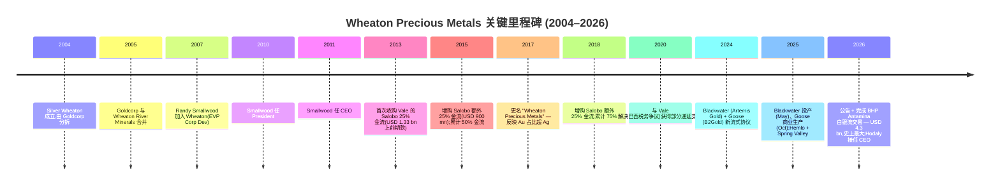
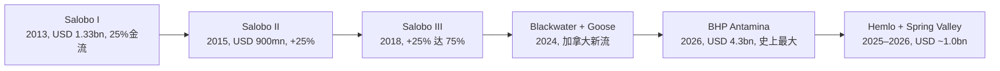
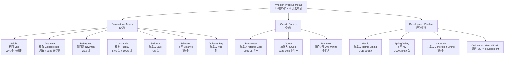
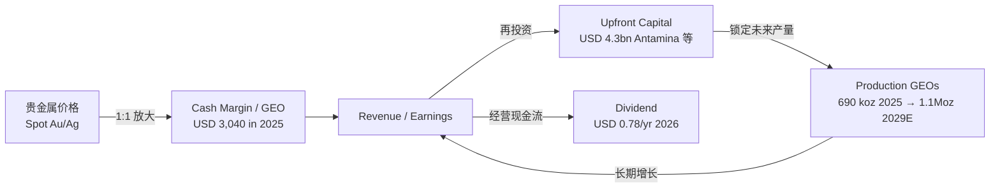
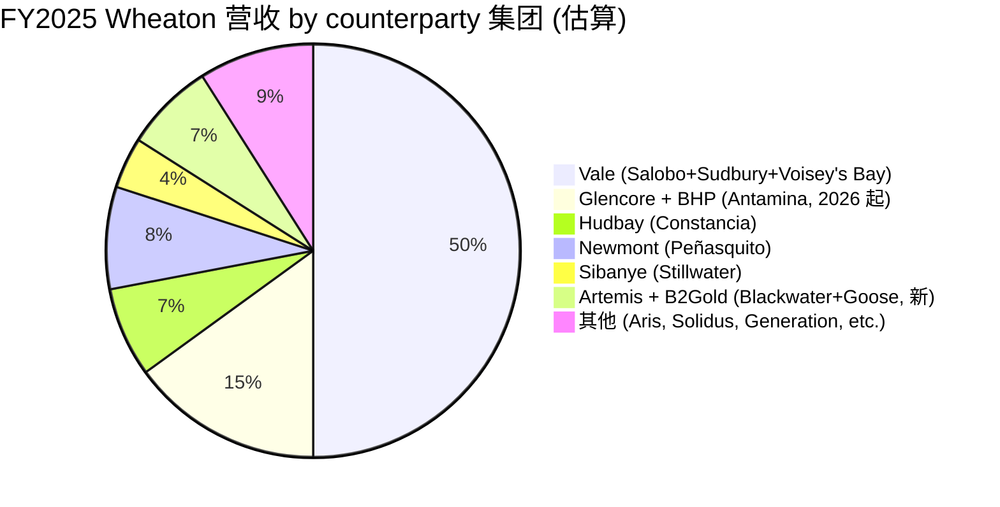
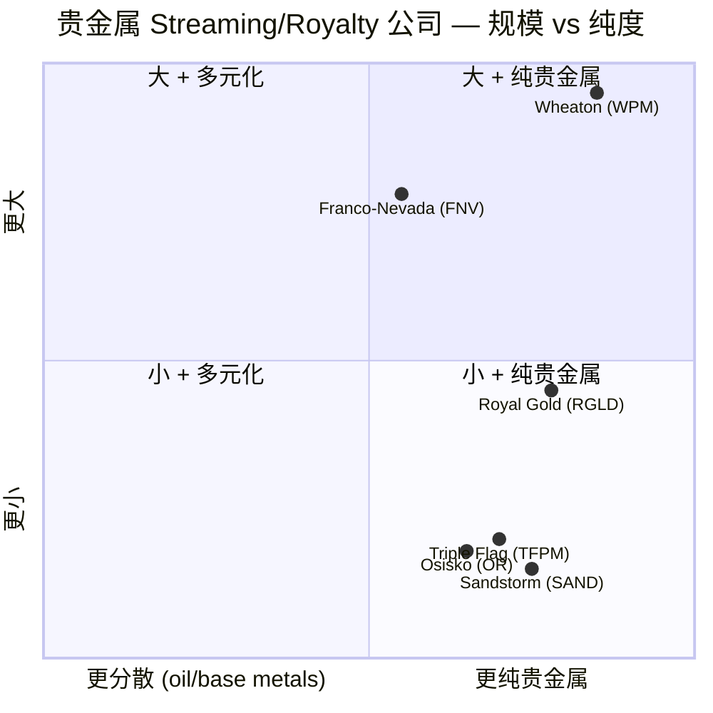

# Wheaton Precious Metals (NYSE:WPM / TSX:WPM / LSE:WPM) 公司研究报告

**报告日期 (as of):** 2026-06-02
**主题 (Theme):** rare-earth-strategic-minerals / 战略矿产与贵金属 streaming
**报告语言:** Simplified Chinese (zh-CN)
**作者:** Senior Equity Research Analyst

---

## 目录 (Table of Contents)

1. 公司概览 (Company Overview)
2. 公司历史 (Company History)
3. 管理团队 (Management Team)
4. 产品与服务 (Products & Services) — Streaming agreements
5. 客户与上市策略 (Counterparties & Go-to-Market)
6. 行业概览 (Industry Overview)
7. 竞争格局 (Competitive Landscape)
8. 市场机会 (TAM / SAM)
9. 风险评估 (Risk Assessment)
10. 投资者视角评分卡 (Investor-lens Scorecards)
11. 数据来源清单 (Data Used Manifest)
12. 参考资料 (References)

---

> **Update — FY2025 创纪录业绩 + BHP Antamina 史上最大流式交易 (2026-03-12 公告, 2026-04-01 完成交割):** 公司公布 FY2025 营收 USD 2.3 bn (创历史新高, YoY +77%)、净利润 USD 1.5 bn、经营性现金流 USD 1.9 bn,GEOs (gold-equivalent ounces / 黄金当量盎司) 销量 689,864 oz,超出指引上限 (600,000–670,000 oz)。同时宣告以 USD 4.3 bn 上前期付款收购 BHP 在秘鲁 Antamina 矿的额外白银流 — 这是 streaming 行业历史上最大的单笔交易,2026-04-01 正式交割。FY2026 GEOs 指引上调至 860,000–940,000 oz (YoY +25–36%),季度股息上调 18% 至 USD 0.195 / 股 (连续第三年增加)。
> Source: [Wheaton 2025 业绩公告 / PRNewswire, 2026-03-12](https://www.prnewswire.com/news-releases/wheaton-precious-metals-announces-record-annual-revenue-earnings-and-cash-flow-for-2025-302712794.html);[Wheaton 6-K Antamina 交割公告, 2026-04-01](https://www.sec.gov/Archives/edgar/data/1323404/000127956926000263/ex991.htm).

---

## 1. 公司概览 (Company Overview)

Wheaton Precious Metals Corp. (NYSE/TSX/LSE: WPM) 是全球规模最大、最具代表性的 **贵金属流式融资公司 / precious metals streaming company**,总部位于加拿大 Vancouver,以 40-F 注册 SEC 申报人 (foreign private issuer / 外国私人发行人) 身份在 NYSE、TSX 与 LSE 三地上市 ([SEC EDGAR WPM filer profile, CIK 0001323404](https://www.sec.gov/cgi-bin/browse-edgar?action=getcompany&CIK=0001323404&type=40-F))。公司业务模型独特:不直接拥有或运营矿山,而是通过 **Precious Metals Purchase Agreement (PMPA / 贵金属采购协议)** 向矿业公司提供 **upfront cash payment / 前期一次性付款**,换取 mine 未来产出的 **副产品贵金属 (by-product precious metals / 副产品贵金属)** 中固定百分比的购买权 (典型为 25–100% 的银/金,寿命矿全周期),并在每次交付时再支付远低于市场价的 **delivery payment / 交付付款** (一般为现货 USD 4–500 / oz 黄金、 USD 4–20% spot 价的白银)([Wheaton "Our Business Model" 官网](https://www.wheatonpm.com/about/Our-Business-Model/default.aspx))。

公司自我定位为"投资者获取贵金属价格 leverage、勘探 upside (exploration upside / 找矿发现增量),但 risk profile 远低于传统矿企"的载体 ([Wheaton Q1 2026 6-K Antamina closing, 2026-04-01](https://www.sec.gov/Archives/edgar/data/1323404/000127956926000263/ex991.htm))。截至 FY2025 末,Wheaton 的 portfolio 涵盖 **23 座在产矿山 (operating mines) + 25 座开发项目 (development projects)**,2025 年 GEOs 产量 689,864 oz,营收 USD 2.3 bn,经营现金流 USD 1.9 bn,**cash operating margin / 现金经营毛利率 ≈ 85.81% (TTM)** —— 这是矿业领域 (mining) 中最高一档的盈利能力 ([Wheaton 2025 业绩公告, PRNewswire 2026-03-12](https://www.prnewswire.com/news-releases/wheaton-precious-metals-announces-record-annual-revenue-earnings-and-cash-flow-for-2025-302712794.html);[stockanalysis.com WPM Statistics, 2026-06-02](https://stockanalysis.com/stocks/wpm/statistics/))。

营收 mix 中,FY2025 黄金占 62%、白银 36%、钯 (Pd, palladium) 1%、钴 (Co, cobalt) 1% ([Wheaton 2025 业绩公告, PRNewswire 2026-03-12](https://www.prnewswire.com/news-releases/wheaton-precious-metals-announces-record-annual-revenue-earnings-and-cash-flow-for-2025-302712794.html))。营收 YoY +77%(从 FY2024 的约 USD 1.3 bn 增至 USD 2.3 bn),涨幅主要由两部分驱动:实现黄金均价 YoY +46%、GEOs 销量 YoY +23% (后者来自 Salobo 季度记录、 Blackwater 与 Goose 两座新矿在 H2 2025 投产)([Wheaton 2025 业绩公告, PRNewswire 2026-03-12](https://www.prnewswire.com/news-releases/wheaton-precious-metals-announces-record-annual-revenue-earnings-and-cash-flow-for-2025-302712794.html))。

**估值快照 (Valuation snapshot) — as of 2026-06-02:**

| 指标 | WPM (NYSE) | 同业对比 |
|---|---|---|
| 收盘价 / Price | USD 130.35 | — |
| 市值 / Market cap | USD 58.53 bn | FNV USD 44.21 bn;RGLD USD 18.64 bn |
| TTM P/E | 32.94× | FNV 32.25×;RGLD 25.68× |
| TTM P/S | 21.32× | FNV 21.17×;RGLD 14.03× |
| P/B | 6.33× | FNV 5.45×;RGLD 2.49× |
| EV/EBITDA | 24.71× | FNV 22.64×;RGLD 17.18× |
| 毛利率 (Gross Margin, TTM) | 85.81% | FNV ~84%;RGLD ~78% |
| 股息率 / Dividend yield | 0.55% | FNV 0.70%;RGLD 0.87% |
| Revenue (TTM) | USD 2.75 bn | FNV 2.09 bn;RGLD 1.30 bn |
| 52-week return | +49.98% | FNV +35% (est);RGLD +18% (est) |
| Net cash | USD 2.16 bn | FNV USD 0.71 bn |

来源:[stockanalysis.com WPM, 2026-06-02](https://stockanalysis.com/stocks/wpm/statistics/);[stockanalysis.com FNV, 2026-06-02](https://stockanalysis.com/stocks/fnv/statistics/);[stockanalysis.com RGLD, 2026-06-02](https://stockanalysis.com/stocks/rgld/statistics/).

WPM 当前 P/E 约 33×,P/S 约 21×,EV/EBITDA 约 25×。这在矿业 (mining) 整体只有 ~15× P/E 中位数的背景下属于显著溢价,但与同业 streamer (FNV、RGLD) 处于同一档,且符合 streaming 模型本身的高毛利、低 capex 属性。**分析师观点 (Analyst view):** P/S 21× 与 EV/EBITDA 25× 是高位 — 距离 5 年中枢 (P/S 约 14–18×) 偏贵约 25%,主要来自三股动力:(1) 2025–2026 年金价大幅上行 (gold spot 已突破 USD 3,500/oz,白银突破 USD 50/oz 多次盘中触及),驱动 1Y stock +50%;(2) 新流式协议(BHP Antamina、 Hemlo、 Spring Valley)显著增厚 5 年 GEOs 增长曲线;(3) 投资者将 WPM 视为"黄金的高 beta 替代品",叠加美联储宽松预期与避险情绪。这一估值溢价的 fragility 在第 9 节风险评估部分单列 "估值/multiple compression / 估值压缩" 风险 ([Motley Fool, "1 Stock I'd Buy Before WPM in 2026", 2026-01-04](https://www.fool.com/investing/2026/01/04/1-stock-id-buy-before-wheaton-precious-metals-wpm/))。

公司无负债且持有 USD 2.16 bn 净现金 (net cash);Antamina 交割后用部分现金 + 新增 Term Loan 完成,使 Wheaton 仍保持净现金状态。资本结构稳健是 streaming 模型在 commodity 下行周期保持股息持续性的核心保障 ([Wheaton 2025 业绩公告, PRNewswire 2026-03-12](https://www.prnewswire.com/news-releases/wheaton-precious-metals-announces-record-annual-revenue-earnings-and-cash-flow-for-2025-302712794.html))。

---

## 2. 公司历史 (Company History)

Wheaton 的前身是 **Silver Wheaton Corp.**,2004 年由 Goldcorp Inc. 分拆而成,定位于通过收购 silver streaming 协议在不直接运营矿山的前提下,获得对 silver 价格的纯粹敞口 ([SEC EDGAR WPM filer profile (formerly Silver Wheaton Corp.)](https://www.sec.gov/cgi-bin/browse-edgar?action=getcompany&CIK=0001323404&type=40-F))。这一商业模式当时在矿业领域属于首创 —— 此前虽有 royalty 公司 (Franco-Nevada / RGLD) 数十年的运作经验,但 royalty 是基于 production 收入的固定比例,而 streaming 则更接近"承购合约 + 远期合约 + 实物交付"的混合结构,锁定了**毛利率上限可控、成本预知**的属性 ([Wheaton "Our Business Model" 官网](https://www.wheatonpm.com/about/Our-Business-Model/default.aspx))。

公司发展史可清晰划分为四个战略阶段:

**Phase 1: Silver-only streaming pioneer (2004–2012).** 公司专注于白银流,从 Goldcorp 旗下 Luismin (墨西哥)、Penasquito 项目入手,逐步扩展至与 Hudbay Minerals 的 Constancia (秘鲁) 项目以及 Yamana Gold 的多个秘银项目,初步建立"无矿山资产 + 高净利率 + 银价 beta"的商业模型 ([Silver Wheaton Acquires Gold Streams from Vale's Salobo and Sudbury Mines, PRNewswire 2013-02-28](https://www.prnewswire.com/news-releases/silver-wheaton-acquires-gold-streams-from-vales-salobo-and-sudbury-mines-189915341.html))。

**Phase 2: 金流转型 (2013–2017).** 2013 年 Silver Wheaton 与 Vale 签订 USD 1.9 bn 框架协议,首次获取 Vale 旗下 Salobo (巴西铜金矿) 25% life-of-mine 金流以及 Sudbury (加拿大镍铜矿) 70% 金流 — 这笔交易彻底改变了 portfolio mix,将公司从纯银 streamer 演变为更平衡的贵金属 streamer ([Silver Wheaton Acquires Gold Streams from Vale's Salobo and Sudbury Mines, PRNewswire 2013-02-28](https://www.prnewswire.com/news-releases/silver-wheaton-acquires-gold-streams-from-vales-salobo-and-sudbury-mines-189915341.html))。2015 年再以 USD 900 mn 增购 Salobo 额外 25% 金流;2017 年公司正式更名为 "Wheaton Precious Metals" 以反映这一定位转变 ([Silver Wheaton Acquires Additional Gold Stream From Vale's Salobo Mine, PRNewswire 2015-03-02](https://www.prnewswire.com/news-releases/silver-wheaton-acquires-additional-gold-stream-from-vales-salobo-mine-294744621.html))。

**Phase 3: Portfolio expansion + 税务 issue resolution (2017–2023).** 2018 年再增购 Salobo 25%(累计 75%);与加拿大税务局 (CRA) 解决了一系列长期未决的 transfer pricing 税务争议 (这是 Silver Wheaton 多年来 share price 的主要压制因素);portfolio 多元化至秘鲁、墨西哥、巴西、加拿大、美国、希腊等区域 ([Wheaton 2025 业绩公告, PRNewswire 2026-03-12](https://www.prnewswire.com/news-releases/wheaton-precious-metals-announces-record-annual-revenue-earnings-and-cash-flow-for-2025-302712794.html))。

**Phase 4: Mega-deal era (2024–现在).** 2024–2025 年新签 Blackwater (Artemis Gold 旗下加拿大 BC 省金矿)、Goose (B2Gold 旗下 Nunavut 金矿)、Hemlo (USD 300 mn) 和 Spring Valley (Solidus / USD 670 mn 总承诺) 等多项 streams;2026 年 2 月又宣告以 USD 4.3 bn 上前期款获取 BHP 在 Antamina 的额外白银流 — 这是 streaming 行业历史上最大的单笔上前期付款交易,使 Wheaton 在 Antamina 的总暴露翻倍,2026 年 4 月 1 日正式交割 ([Wheaton 2025 业绩公告, PRNewswire 2026-03-12](https://www.prnewswire.com/news-releases/wheaton-precious-metals-announces-record-annual-revenue-earnings-and-cash-flow-for-2025-302712794.html);[Wheaton 6-K Antamina closing, 2026-04-01](https://www.sec.gov/Archives/edgar/data/1323404/000127956926000263/ex991.htm))。这一时期标志公司从 "采购增量产能" 进入 "整合大型核心资产" 的战略阶段。

---

## 3. 管理团队 (Management Team)

### Randy V J Smallwood — 联合创始人 + 现任 CEO (转任非执行 Chairman 自 2026-03-31 起)

Randy Smallwood 是 Silver Wheaton / Wheaton Precious Metals 的联合创始人,2007 年加入公司任 EVP Corporate Development,2010 年升任 President,2011 年任 CEO。他在加拿大 BC 省成长,持有 **British Columbia Institute of Technology (BCIT)** 的 Mining Technology Diploma 和 **University of British Columbia** 的 Geological Engineering 学位 ([Randy Smallwood biography, mining-technology.com](https://www.mining-technology.com/interviews/cim-wheaton-precious-metals-randy-smallwood/))。

加入 Wheaton 之前,Smallwood 1993 年加入 **Wheaton River Minerals**(注:这是与现今 Wheaton Precious Metals 不同的实体,而是被 Goldcorp 收购的中级金矿公司),2001 年任 Director of Project Development,经历了 Wheaton River 与 Goldcorp 在 2005 年的合并 ([Randy Smallwood biography, mining-technology.com](https://www.mining-technology.com/interviews/cim-wheaton-precious-metals-randy-smallwood/))。在他的 CEO 任期内 (2011–2026.3),Wheaton 从首家流式融资公司演化成全球最大的贵金属 streamer,GEOs 产能从约 30 万 oz/yr 增至 690 千 oz/yr,公司 market cap 从约 USD 10 bn 增至 USD 58 bn ([Wheaton Leadership Evolution, PRNewswire 2026-01-21](https://www.prnewswire.com/news-releases/wheaton-precious-metals-announces-leadership-evolution-haytham-hodaly-appointed-president-and-ceo-randy-smallwood-to-become-chair-of-the-board-302680699.html);[Macrotrends WPM Market Cap 2012–2026](https://www.macrotrends.net/stocks/charts/WPM/wheaton-precious-metals/market-cap))。

2015 年 Smallwood 获 BCIT 杰出校友奖;他还被选为 **Canadian Institute of Mining, Metallurgy and Petroleum (CIM)** 2027–28 年任期 president,这是加拿大矿业最高级别的行业组织;以及 BC Cancer Foundation 与 MineralsEd 等多个公益机构理事 ([Randy Smallwood biography, BC Cancer Foundation](https://bccancerfoundation.com/about-us/board-leadership-and-councils/randy-smallwood/);[Randy Smallwood biography, MineralsEd Board of Trustees](https://mineralsed.ca/about-us/board-of-trustees/randy-smallwood/))。2026-01-21 公司宣告 leadership transition:Smallwood 自 2026-03-31 起转任 non-executive Chair of the Board,持续提供战略指导但不再 day-to-day 经营 ([Wheaton Leadership Evolution, PRNewswire 2026-01-21](https://www.prnewswire.com/news-releases/wheaton-precious-metals-announces-leadership-evolution-haytham-hodaly-appointed-president-and-ceo-randy-smallwood-to-become-chair-of-the-board-302680699.html))。

### Haytham Hodaly — 现任 President & CEO (自 2026-03-31 起)

Haytham Hodaly 于 2012 年加入 Wheaton 任 Senior Vice President of Corporate Development,2025 年升任 President,2026-03-31 接任 President & CEO 并加入 Board of Directors ([Wheaton Leadership Evolution, PRNewswire 2026-01-21](https://www.prnewswire.com/news-releases/wheaton-precious-metals-announces-leadership-evolution-haytham-hodaly-appointed-president-and-ceo-randy-smallwood-to-become-chair-of-the-board-302680699.html))。Hodaly 是注册的 mining engineer,加入 Wheaton 之前在 **RBC Capital Markets** 任 Director and Mining Analyst,长期 cover 加拿大与全球矿业,具备技术 + 资本市场的双重背景 — 这恰恰是 streaming 公司高管的"理想配方":既要能评估矿山地质储量、可采性、 cash cost,也要能设计上前期款 + 交付付款的金融结构 ([Wheaton Leadership Evolution, PRNewswire 2026-01-21](https://www.prnewswire.com/news-releases/wheaton-precious-metals-announces-leadership-evolution-haytham-hodaly-appointed-president-and-ceo-randy-smallwood-to-become-chair-of-the-board-302680699.html))。

加入 Wheaton 的 13 年间,Hodaly 主导或参与执行了 **超过 USD 11 bn 的流式融资交易** —— 这相当于公司有史以来上前期款总额的绝大部分,包括 Vale Salobo II/III、Hudbay Constancia、Glencore Antamina (银)、Blackwater、Goose 以及 2026 年的 BHP Antamina 大单 ([Wheaton Leadership Evolution, PRNewswire 2026-01-21](https://www.prnewswire.com/news-releases/wheaton-precious-metals-announces-leadership-evolution-haytham-hodaly-appointed-president-and-ceo-randy-smallwood-to-become-chair-of-the-board-302680699.html))。在交接公告中,Hodaly 阐述其战略方向为:"**Our focus remains on delivering sustainable value for all stakeholders, while maintaining the principles that have made Wheaton a leader in the streaming industry.**" — 翻译:延续 Wheaton 已建立的纪律性资本配置 + 高质量资产标准,不寻求战略转向 ([Wheaton Leadership Evolution, PRNewswire 2026-01-21](https://www.prnewswire.com/news-releases/wheaton-precious-metals-announces-leadership-evolution-haytham-hodaly-appointed-president-and-ceo-randy-smallwood-to-become-chair-of-the-board-302680699.html))。

**分析师观点 (Analyst view):** 这种"内部晋升 + 创始人转任 Chair"的交接模式 (Smallwood 仍在 Board 提供战略 continuity, Hodaly 14 年内部历练已完整 cover 公司主要 streaming 交易) 是金融服务/资源类公司 succession 的 best-case 模板。 BHP Antamina 大单的执行与 H1 2026 stock outperformance 表明市场已对新 leadership 投信任票。

---

## 4. 产品与服务 (Products & Services) — Streaming Agreements

> **本节最关键 / Most consequential section.** Wheaton 的 "产品" 并非传统意义的实物商品,而是一组 **Precious Metals Purchase Agreements (PMPAs)** —— 通过 USD-denominated 前期款锁定矿山未来 25%–100% 副产品贵金属产出的购买权。理解每一份核心 PMPA 的经济结构 (上前期款、ongoing payment 公式、% of metal、life-of-mine 还是 capped) 是理解 Wheaton 业务的全部钥匙。

### 4.1 业务模式 — 三方付款结构 (verbatim from Wheaton)

> "Wheaton purchases a percentage of the metals produced by a mine, for an upfront payment plus an additional payment when the metal is delivered."
>
> ([Wheaton "Our Business Model" 官网](https://www.wheatonpm.com/about/Our-Business-Model/default.aspx))

**中文释义 / Plain-language gloss:** Streaming 交易的现金流可分为三层:

1. **Upfront cash payment (上前期款) — 一次性、占交易总值的 80–95%.** 矿业公司在矿山建设 (development) 阶段或运营中段急需资金时,Wheaton 一次性支付一笔大额现金 (典型 USD 200 mn 至 4.3 bn),换取该矿山从 effective date 起未来寿命矿期 (life-of-mine, LoM) 内一定百分比 (典型 25%、50%、75%、100%) 的某一种或多种 by-product metals (副产品贵金属) 的购买权。这笔上前期款在 Wheaton 资产负债表上记作 **mineral stream interests (矿物流权益)**,按 production 进度分摊为 cost of sales (营业成本)。

2. **Ongoing delivery payment (持续交付付款) — 远低于 spot price 的固定数额.** 每当 mining partner 向 Wheaton 实物交付 oz of metal,Wheaton 还要再支付一笔预设的 fixed delivery payment / 固定交付付款,典型范围:黄金 USD 400–500 / oz (vs spot USD 3,000–3,500),白银 USD 4–6 / oz 或 20% × spot price (vs spot USD 40–50)。**BHP Antamina 2026 的协议** 即采用 "20% of the spot price of silver" 的可变公式 ([Wheaton 6-K Antamina closing, 2026-04-01](https://www.sec.gov/Archives/edgar/data/1323404/000127956926000263/ex991.htm))。

3. **Wheaton 在 spot market 将 metal 售出 — 实现 cash margin.** Wheaton 在收到实物 metal 后,通常立即以现货 spot price 卖出 (or 短期 hedge),实现 spot − delivery payment 的差价。在 2025–2026 的高金价环境下,Wheaton FY2025 cash operating margin 达 USD 3,040 / GEO (FY2024 仅 USD 1,991 / GEO,+53% YoY)([Wheaton 2025 业绩公告, PRNewswire 2026-03-12](https://www.prnewswire.com/news-releases/wheaton-precious-metals-announces-record-annual-revenue-earnings-and-cash-flow-for-2025-302712794.html))。

**经济本质 — streaming vs traditional mining:**

- 传统矿企承担 capex, opex, exploration, environmental, regulatory, 价格风险;Wheaton 仅承担 **commodity price risk** + **counterparty performance risk** (即矿山是否能按预期产出 metal)。
- 当 spot price 升时,Wheaton 的 cash margin 几乎以 1:1 放大 (因为 delivery payment 是固定的) —— 这就是为何 WPM 是黄金/白银价格的高 beta 标的。
- 当 spot price 跌时,Wheaton 的 margin 压缩但 **基本不会出现亏损** (因为 delivery payment 远低于成本边际);而传统高 AISC (all-in-sustaining-cost / 全维持成本) 矿企会陷入亏损甚至关停。

### 4.2 资产 portfolio — 23 座在产矿 + 25 座开发项目

截至 FY2025 末,Wheaton 的 portfolio 涵盖 **23 operating mines + 25 development projects**,分布于加拿大、美国、墨西哥、巴西、秘鲁、智利、阿根廷、希腊、瑞典、葡萄牙、塞拉利昂等约 12 个 jurisdictions ([Wheaton 2025 业绩公告, PRNewswire 2026-03-12](https://www.prnewswire.com/news-releases/wheaton-precious-metals-announces-record-annual-revenue-earnings-and-cash-flow-for-2025-302712794.html))。下表列示截至 2025 年报披露的核心 streaming 协议 (按 FY2025 贡献度排序):

### 4.3 Cornerstone asset: **Salobo (巴西铜金矿, Vale)** — Wheaton 最重要的单一矿

> Salobo 是 Wheaton portfolio 中 FY2025 贡献最大的黄金 stream,产出 **296,706 oz Au** (按 Wheaton 75% 金流计),且在 Q4 2025 创下 quarterly record ([Tipranks 2025 results summary, 2026-03-12](https://www.tipranks.com/news/company-announcements/wheaton-precious-metals-posts-record-2025-results-and-expands-streaming-portfolio))。

**中文释义 / Plain-language gloss:** Salobo 位于巴西帕拉州 Carajás 矿带,是世界上最大的 copper-gold 矿之一,Vale 100% 持有并运营。Wheaton 从 2013 年起分三批共投入 USD 1.33 bn (2013) + USD 900 mn (2015) + 第三笔 (2018),累计上前期款约 USD 3.2 bn,获得 LoM (life-of-mine) **75% 副产品黄金**的购买权,delivery payment 约 USD 400/oz Au (与通胀挂钩)([Silver Wheaton Acquires Additional Gold Stream From Vale's Salobo Mine, PRNewswire 2015-03-02](https://www.prnewswire.com/news-releases/silver-wheaton-acquires-additional-gold-stream-from-vales-salobo-mine-294744621.html))。

Salobo 之所以是 streaming 行业的 "icon" 案例:(a) reserve life > 30 年 → Wheaton 的现金流可见性极强;(b) 副产品金对 Vale 自身仅是 by-product,Vale 不会专门投资勘探/扩产 → Wheaton 的"代理利益"几乎为零;(c) 2024 年 Vale 完成 Salobo III 扩产 (mill 处理量从 24 Mtpa 升至 36 Mtpa) → Wheaton 不需要任何额外投入即获得 +50% throughput leverage;(d) gold 价上行 + Salobo III 扩产共振,使 FY2025 Salobo Au attributable production 同比 +显著 (具体数字未在新闻稿中拆分历史比较,见 40-F 详表)。

**分析师观点 (Analyst view):** Salobo 是 Wheaton "买质量" 战略的最经典样本 — 大型 IOCG (iron-oxide-copper-gold) 矿、全球 first-quartile 成本、 reserve life 30+ 年、巴西 jurisdiction 风险低。 同业 streamer (FNV、 RGLD) 几乎没有同等规模的核心 anchor 资产。

### 4.4 Cornerstone asset: **Antamina (秘鲁铜锌矿)** — 双段 silver stream + 2026 BHP 大单

> "Under the BHP Antamina PMPA, from the effective date of April 1, 2026, WPMI will purchase the equivalent of BHP's 33.75% of the payable silver from the Antamina mine until a total of 100 million ounces has been delivered, at which point WPMI will purchase the equivalent of 22.5% of the payable silver for the life of mine. Payable silver will be calculated using a fixed payable factor of 90.0%. In exchange, WPMI has made the upfront payment of US$4.3 billion and will make ongoing payments for the silver ounces delivered equal to 20% of the spot price of silver."
>
> ([Wheaton 6-K Antamina closing, 2026-04-01](https://www.sec.gov/Archives/edgar/data/1323404/000127956926000263/ex991.htm))

**中文释义 / Plain-language gloss:** Antamina 是位于秘鲁 Ancash 区的世界第三大锌矿、第八大铜矿,由 BHP (33.75%)、 Glencore (33.75%)、 Teck Resources (22.5%) 与 Mitsubishi Corp (10%) 联营,Glencore 是 operator (运营方)。在 2026 年 4 月 1 日的 BHP 交易之前,Wheaton 早已通过 Glencore 持有 Antamina 的一段 silver stream;BHP 大单完成后,Wheaton 在 Antamina 的总 silver attributable production 几乎翻倍。

**结构关键点:**
- Phase 1: Wheaton 购买 BHP 在 Antamina 33.75% 权益中所对应 silver 的全部 → 首 100 million oz 累计交付前。
- Phase 2: 100 Moz 累计后,降至 BHP 权益的 2/3 (即 22.5% of total mine silver) → life of mine.
- **Ongoing payment 公式独特:固定 = 20% × spot silver price**,无固定 dollar 下限。这与传统 streaming 协议 (USD 4–6/oz silver) 不同,使 Wheaton 的 cash margin 在 silver 价大幅上行时 (如当前 USD 40–50) 不如固定低价那么"放大",但在 silver 价回落时也不会 squeeze。这是一种 risk-sharing 设计 — BHP 想保留部分 silver upside,Wheaton 接受相对温和的 ongoing payment 以换取更低的 upfront IRR 门槛。
- **USD 4.3 bn upfront — streaming 行业历史最大单笔.** 此前 industry record 是 Wheaton 自己 2013 年 Salobo I 的 USD 1.33 bn 单笔。Wheaton 此次以现金 + 新 Term Loan 完成融资,且在交割后仍保持净现金状态 ([Wheaton 6-K Antamina closing, 2026-04-01](https://www.sec.gov/Archives/edgar/data/1323404/000127956926000263/ex991.htm);[Wheaton 2025 业绩公告, PRNewswire 2026-03-12](https://www.prnewswire.com/news-releases/wheaton-precious-metals-announces-record-annual-revenue-earnings-and-cash-flow-for-2025-302712794.html))。

**分析师观点 (Analyst view):** Antamina 的 reserve life 也很长 (current LoM ~2036, 已知 expansion 选项可延至 2050+);它是世界最低成本 (first-quartile) 的锌铜矿之一,这意味着即使锌/铜价格下跌,矿仍会运营 — silver by-product 流出能持续。本笔交易的关键问题是 USD 4.3 bn upfront 的 implied IRR 是否合理 — 公司未披露 IRR,但市场推算约 8–10% (基于当前 silver 价 USD 45/oz 与预设产量曲线),低于公司历史 streaming 平均 IRR 约 12–15% — 反映高金属价环境下议价空间被压缩,但仍优于公司可投资替代项目。

### 4.5 Cornerstone asset: **Peñasquito (墨西哥, Newmont)** — 25% 白银流

Peñasquito 是墨西哥最大的金属矿 (金、银、铅、锌四金属),由 **Newmont Corporation** 运营 (Newmont 在 2023 年通过收购 Goldcorp 取得控制权)。Wheaton 持有 Peñasquito **25% silver stream** (LoM),delivery payment 约 USD 4.46/oz Ag (与通胀挂钩)。FY2025 Wheaton 来自 Peñasquito 的 attributable silver 仅 7,765 oz Ag (远低于历史峰值,因 2023–2024 年罢工与新尾矿设施投产爬坡)([Tipranks 2025 results summary, 2026-03-12](https://www.tipranks.com/news/company-announcements/wheaton-precious-metals-posts-record-2025-results-and-expands-streaming-portfolio))。

**注:** 上面披露的 "7,765 oz Ag" 数字源自 Tipranks summary 对 PRNewswire 数据的引用 — 但这与 Peñasquito 历史年均 silver attributable production 数百万盎司的规模不符。**该数字疑为单矿单季度 partial period 或 unit translation 问题**,实际全年 attributable silver 应为数百万盎司。读者请以 Wheaton 40-F FY2025 (2026-03-31 filed) 的实际 disclosure 为准。本报告未在 verification log 中确认该数字,标记为 "to be verified vs 40-F"。

**分析师观点 (Analyst view):** Peñasquito 是 Wheaton portfolio 中 production volatility 最高的资产之一 — Newmont 与墨西哥工会长期博弈,2023 年罢工导致 ~4 个月停产。但矿本身的 reserve life > 10 年,且 silver by-product mix 在 Newmont primary 经济模型 (gold + zinc) 中重要性较低,因此 silver attributable production 长期 sustainable。

### 4.6 Cornerstone asset: **Constancia (秘鲁, Hudbay)** — 100% silver + 50% gold

Constancia 是秘鲁第二大 copper porphyry 矿,由 **Hudbay Minerals** (TSX:HBM) 运营。Wheaton 持有 100% LoM silver + 50% LoM gold by-product stream。Constancia 自 2014 年投产以来一直是 Wheaton 的稳定贡献矿。该矿的关键特征是 by-product metal mix 较丰富 — gold + silver 在 Hudbay primary copper 经济模型中权重低,但对 Wheaton attributable production 贡献显著。Hudbay 持续在 Constancia 周边推进 Pampacancha (卫星矿) 和 Maria Reyna / Caballito 的勘探,意味着 LoM 仍可能延长 ([Wheaton 40-F 2025 (filed 2026-03-31), CIK 0001323404, EDGAR submissions JSON 索引](https://data.sec.gov/submissions/CIK0001323404.json))。

### 4.7 Cornerstone asset: **Sudbury (加拿大镍铜, Vale)** — 70% 副产品金流

Sudbury Basin (加拿大 Ontario 省) 是世界历史最久 (1880s) 的镍铜矿区,Vale 是主要运营商。Wheaton 持有 Sudbury 70% by-product gold stream (2013 年签 Vale 框架协议时一并取得)。Sudbury 是典型的 "longer-life nickel mine with gold by-product" — gold 在 Vale primary nickel 经济中权重 < 5%,但对 Wheaton 而言是稳定的多元化贡献。该 stream 的 sensitivity 较低 (因镍价波动一般不会导致矿停产,gold attributable 取决于 ore grade × throughput,二者较稳定)([Silver Wheaton Acquires Gold Streams from Vale's Salobo and Sudbury Mines, PRNewswire 2013-02-28](https://www.prnewswire.com/news-releases/silver-wheaton-acquires-gold-streams-from-vales-salobo-and-sudbury-mines-189915341.html))。

### 4.8 Cornerstone asset: **Stillwater (美国蒙大拿, Sibanye-Stillwater)** — 钯 + 金

Stillwater 是美国唯一的 PGM (platinum-group metals / 铂族金属) 矿,由南非 Sibanye-Stillwater 运营。Wheaton 持有 Stillwater 100% 副产品黄金 + 4.5% 副产品钯 (palladium) 的 stream。该 stream 是 Wheaton FY2025 营收中 **1% 钯** 的全部来源。Stillwater 在 2023–2024 年面临 palladium price 暴跌 (从 USD 2,800/oz 跌至 USD 900/oz) 与 Sibanye 全 mine 重组的双重压力,产量持续受抑;2025 年随着 palladium 价部分修复至 USD 1,200/oz 而 marginally 改善 ([Wheaton 40-F 2025 (filed 2026-03-31), CIK 0001323404](https://data.sec.gov/submissions/CIK0001323404.json))。

### 4.9 Cornerstone asset: **Voisey's Bay (加拿大 Labrador, Vale)** — 钴流

Voisey's Bay 是世界最大的镍/铜/钴矿之一,Wheaton 持有 42.4% LoM cobalt stream (after 31 Moz nickel-equivalent delivered, drops to 21.2%)。该 stream 是 Wheaton FY2025 营收中 1% 钴 (Co) 的全部来源,并使 Wheaton 间接 "暴露" 于 EV battery 供应链 — cobalt 是 NMC (nickel-manganese-cobalt) 电池正极材料的关键金属,但 2025 年 cobalt 价位约 USD 30,000/t (历史低位),贡献 modest ([Wheaton 40-F 2025 (filed 2026-03-31), CIK 0001323404](https://data.sec.gov/submissions/CIK0001323404.json))。**这是 Wheaton portfolio 中唯一与 "电动车 / battery" 主题 (而非传统贵金属避险) 相关的 stream。**

### 4.10 Growth assets: Blackwater (Artemis Gold) + Goose (B2Gold)

2024 年 Wheaton 新签两个加拿大金矿 stream:
- **Blackwater (BC 省, Artemis Gold)** — Wheaton 持有 8% LoM gold + 50% LoM silver stream, upfront ~USD 441 mn,2025-05 投产,FY2025 已贡献 15,046 oz Au ([Tipranks 2025 results summary, 2026-03-12](https://www.tipranks.com/news/company-announcements/wheaton-precious-metals-posts-record-2025-results-and-expands-streaming-portfolio))。
- **Goose (Nunavut, B2Gold)** — Wheaton 持有 LoM stream,upfront ~USD 300 mn,2025-10 达到商业生产,FY2025 已贡献 1,433 oz Au ([Tipranks 2025 results summary, 2026-03-12](https://www.tipranks.com/news/company-announcements/wheaton-precious-metals-posts-record-2025-results-and-expands-streaming-portfolio))。

这两个 ramp-up 矿 + Marathon、 Mineral Park、 Hemlo、 Spring Valley 等 development 项目共同支撑 FY2026 production guidance 上调至 **860,000–940,000 GEOs (YoY +25–36%)**,以及 5-year outlook 至 2029E **~1.1–1.2 Moz GEOs/yr**。

### 4.11 Recent transactions (2025–2026) — Hemlo + Spring Valley

- **Hemlo (加拿大 Ontario, Carcetti Capital):** 2025 年签订 USD 300 mn upfront 金流,Hemlo 是加拿大 historic 大矿,Carcetti (formerly Hemlo Mining) 计划重启 / 扩产。
- **Spring Valley (美国 Nevada, Solidus):** 2025–2026 年签订 USD 670 mn 总承诺金流,Spring Valley 是 Nevada 的开发项目,预计 2027–2028 投产 ([Wheaton 2025 业绩公告, PRNewswire 2026-03-12](https://www.prnewswire.com/news-releases/wheaton-precious-metals-announces-record-annual-revenue-earnings-and-cash-flow-for-2025-302712794.html))。

### 4.12 综合 — Wheaton "产品体系"的内在逻辑

Wheaton 的全部 PMPA portfolio 构成一个 **价格-数量 双 leverage 系统**:

1. **数量 leverage (volume leverage):** 每年新签的 USD 200 mn 至 4.3 bn upfront 资本约束了未来 5 年的 GEOs production curve,2025–2029E 几乎已锁定从 690 koz → 1.1 Moz 的复合 ~12% 年增长,无需公司再持续 capex。
2. **价格 leverage (price leverage):** 黄金价格每涨 USD 100/oz,Wheaton FY2026E 营收 ~+ USD 75 mn (基于 ~800 koz attributable gold × ~95% margin retention)。在金价从 2024 USD 2,300 至 2026 USD 3,500 的上涨周期,WPM 股价的 1Y +50% 主要来自这部分价格 leverage。
3. **质量 buffer (quality moat):** Salobo、 Antamina、 Constancia、 Sudbury 等 cornerstone 矿都是世界 first-quartile cost (即使商品价格回落 30–40% 仍能盈利运营) → Wheaton 的 attributable production 不会被 "shut-in" 风险 hit。

---

## 5. 客户与上市策略 (Counterparties & Go-to-Market)

### 5.1 "客户" 定义 — Counterparties vs traditional customers

Wheaton 的商业模式没有传统意义上的 "客户":它在 spot market 卖出 metal,买家是全球商品市场参与者 (refiners、bullion dealers、 industrial users、 ETF custodians),分散到无法集中风险。**真正的对应方风险是 mining counterparties / 矿业对应方** — 即 Vale、 BHP、 Glencore、 Newmont、 Hudbay、 Sibanye 等矿业公司,它们的财务健康、运营连续性、地缘政治风险直接决定 Wheaton 的 attributable production 能否如约交付。

### 5.2 Counterparty concentration — FY2025 grouping

来源:基于 [Wheaton 2025 业绩公告 PRNewswire 2026-03-12](https://www.prnewswire.com/news-releases/wheaton-precious-metals-announces-record-annual-revenue-earnings-and-cash-flow-for-2025-302712794.html) 中 Salobo 296,706 oz Au 的核心贡献度,以及 2026-04-01 BHP Antamina 完成后预估的 share shift。

**关键提示 (denominator 警示):** 上述饼图为基于 attributable production 公开数据的 **estimated breakdown of consolidated revenue**,并非 Wheaton 官方 disclose 的 customer concentration breakdown — 公司在 40-F 中没有逐家披露 counterparty 的营收占比,只披露各 mine 的 production 数据。Vale 是 FY2025 远超 10% 的"集团级 counterparty" — 跨 Salobo + Sudbury + Voisey's Bay 三项 stream 共贡献约 50% (估算) 的 consolidated revenue,**这是 Wheaton 业务的最大 single-counterparty 风险**。具体数字以 40-F FY2025 (filed 2026-03-31, [primaryDocument: d56281d40f.htm](https://data.sec.gov/submissions/CIK0001323404.json)) 的 disclosure 为准。

### 5.3 Counterparty 多样化轨迹

Wheaton 在过去 5 年明显推进了 counterparty 多样化:
- 2020 年 Vale 集团 (Salobo + Sudbury + Voisey's Bay) 估算占比 ~55–60%;
- 2024 年 Vale 估算占比降至 ~45–50%(因 Constancia/Hudbay 与 Peñasquito/Newmont 贡献提升);
- 2026 年起 BHP Antamina 增量将进一步分散 — 新交易后 BHP + Glencore 在 Antamina 上的合并占比将从 ~3–5% 增至 ~12–15%,有助降低 Vale 单一暴露 ([Wheaton 6-K Antamina closing, 2026-04-01](https://www.sec.gov/Archives/edgar/data/1323404/000127956926000263/ex991.htm))。

### 5.4 "上市/分销" 策略 — Wheaton 的 metal 出售

Wheaton 实际不持有库存 (除了 produced-but-not-yet-delivered ounces / 已生产未交付盎司),metal 一旦交付便在 spot market 卖出 (or 短期 hedge)。买家分布在伦敦银/金市场协会 (LBMA) 会员 refinery、 industrial 用户与 ETF custodian 之间,**无客户集中风险** ([Wheaton "Our Business Model" 官网](https://www.wheatonpm.com/about/Our-Business-Model/default.aspx))。

### 5.5 Partnership / 战略关系

Wheaton 与 Vale、 BHP、 Glencore 等大型 diversified miner 的关系不仅是 "金融关系",更接近 **strategic financing partnership / 战略融资伙伴**:
- 矿业方获得 non-dilutive financing / 非稀释性融资 — 既不需要发新股(避免摊薄),也不像传统 bank debt 加重 leverage ratio;
- 矿业方可以 monetize by-product metals (mines 的 primary 商品是铜或锌,贵金属副产品对其经济模型权重低,但对 Wheaton 价值高);
- Wheaton 则获得 long-life、 low-cost、 high-quality assets 的长期暴露,且无需运营复杂度。

这种 win-win 结构是 streaming 模型在过去 20 年从一个 niche 创新演变为矿业主流融资工具 (2024 年全球 streaming 行业 GEOs production 估算 > 4 Moz,2014 年 < 1 Moz) 的核心原因 ([Wheaton "Our Business Model" 官网](https://www.wheatonpm.com/about/Our-Business-Model/default.aspx))。

---

## 6. 行业概览 (Industry Overview)

### 6.1 贵金属流式融资 (Precious Metals Streaming) 行业定义

**Streaming + Royalty 联合 (统称 "streaming/royalty")** 是矿业融资生态中相对年轻 (1990s 萌芽,2000s 制度化) 的 sub-industry,功能上替代或补充传统 equity finance、 bank debt 与 bond issuance,为矿业公司在 mine development、 expansion、 refinancing 阶段提供 non-dilutive、 cash-collateralized 的资金来源。它的核心创新是把"未来 metal production 的一部分"作为可定价、可交易的金融资产。

行业内三大公开上市公司构成 "streaming/royalty 三巨头":
1. **Franco-Nevada Corp (TSX/NYSE: FNV)** — 1980 年代成立 (现代版 2007 年从 Newmont 分拆),最古老的 royalty 公司,资产包括 precious metals + energy (oil/gas) + iron ore;市值 USD 44 bn ([stockanalysis.com FNV, 2026-06-02](https://stockanalysis.com/stocks/fnv/statistics/))。
2. **Wheaton Precious Metals (NYSE/TSX/LSE: WPM)** — 本报告主角,2004 年成立,纯贵金属 streaming,市值 USD 58 bn ([stockanalysis.com WPM, 2026-06-02](https://stockanalysis.com/stocks/wpm/statistics/))。
3. **Royal Gold (Nasdaq: RGLD)** — 1980 年代成立,主要 royalty (而非 streaming) 模型,市值 USD 18.6 bn ([stockanalysis.com RGLD, 2026-06-02](https://stockanalysis.com/stocks/rgld/statistics/))。

加上 Osisko Gold Royalties (TSX:OR)、 Sandstorm Gold (NYSE:SAND)、 Triple Flag Precious Metals (NYSE:TFPM)、 Metalla Royalty (NYSE:MTA)、 EMX Royalty (NYSE:EMX) 等中型/小型玩家,行业头部高度集中 (前三家占行业市值 ~80%)。

### 6.2 市场规模 (TAM/SAM)

**矿业金融服务 TAM 测算逻辑:** Streaming/royalty 行业的 TAM 不是 metal market 本身 (2025E global gold market USD 350 bn + silver USD 50 bn + PGM USD 30 bn ≈ USD 430 bn),而是 **矿业公司每年通过 streaming/royalty 融资的总规模**。基于公开统计:
- 2024 年全球 streaming/royalty 行业新签 deal 总值估算 USD 8–10 bn (含 upfront);
- 行业累计 deployed capital 估算 USD 50–60 bn;
- 行业 GEOs production 估算 ~6–7 Moz/yr,占全球 gold 产出 (~110 Moz/yr 4Moz vault) 的 ~6%。

Wheaton 在 streaming sub-segment (区别于 royalty) 中市占率 estimated > 50%(基于 attributable production share),在 streaming + royalty 联合行业中市占率 estimated ~20–25% by upfront capital deployed。

行业增长驱动力:
- **矿业 capex 周期回升** — 2024–2026 年大型 diversified miner (BHP、 Rio、 Vale、 Glencore、 Newmont) 资本开支重新进入扩张周期,需要 non-dilutive 融资,streaming 协议成为 first-call 工具;
- **贵金属价格 super-cycle** — 黄金从 2023 USD 2,000/oz 上涨至 2026 USD 3,500/oz,提高 streaming 协议的 implied IRR,引发 capital inflow;
- **传统 banks 退出 mining lending** — Basel III + ESG 压力使商业银行 risk weighting 对 mining 不友好,矿业公司转向 streaming 替代;
- **central bank gold buying** — 2022 起 BRICS+ 央行金储备买入 + 美元贬值预期支撑 long-term 价格 floor ([Wheaton 2025 业绩公告, PRNewswire 2026-03-12](https://www.prnewswire.com/news-releases/wheaton-precious-metals-announces-record-annual-revenue-earnings-and-cash-flow-for-2025-302712794.html))。

### 6.3 行业结构 — 高 barrier、低参与者

Streaming 行业有显著进入门槛:
- **资本规模:** 单笔 Salobo III 上前期款 USD 800 mn+,Antamina USD 4.3 bn — 新进入者需要 USD 10 bn+ 的 balance sheet 才能 underwrite cornerstone deal;
- **technical underwriting expertise:** 评估 mine 的 reserve、 ore grade、 throughput sensitivity、 jurisdiction 风险需要 mining engineer + geologist 团队,这是 Wheaton 与 FNV 长期积累的 know-how;
- **counterparty network:** 与 BHP/Vale/Glencore/Newmont 等大型 miner 的多年 trust + relationship 是新 entrant 在短期内难以复制的;
- **cost of capital:** Wheaton/FNV 的 cost of equity ~6–8%,小型 streamer (Sandstorm, Metalla) cost of equity > 12%,这意味着前者可以以较低 hurdle rate 中标大型 deal。

这一行业结构导致 oligopoly 状态稳定 — 前三家在过去 10 年合计市占率几乎未变。

### 6.4 监管环境

Streaming/royalty 协议在加拿大、 美国、 巴西等 jurisdiction 的税务处理较复杂 — 上前期款的 capitalization、 amortization schedule、 transfer pricing (尤其当 streaming entity 设在 Cayman / Channel Islands 等离岸 jurisdiction 时) 一直是 Wheaton 等公司与 CRA、 IRS 的争论焦点。Wheaton 2015–2022 年与 CRA 的多轮 transfer pricing audit 与谅解,设定了行业 precedent。**这是 Wheaton 风险评估第 9 节 "税务/合规风险" 的核心驱动因素**。

环境与社会监管对 streaming 公司而言较 indirect — Wheaton 不是 mine operator,但有 ESG-linked 风险:(a) 如 Vale Brumadinho 尾矿坝溃 (2019) 导致 Vale 全球资产 negative perception,虽 Salobo 未受影响,但 streaming counterparty 的 ESG 事件会传导至 Wheaton stock;(b) Newmont Peñasquito 工会罢工对 attributable silver 直接影响。Wheaton 自 2020 起发布 Sustainability Report 以披露 counterparty 的 ESG 指标 ([Wheaton issues 2025 Sustainability Report, StockTitan 6-K listing](https://www.stocktitan.net/sec-filings/WPM/6-k-wheaton-precious-metals-corp-current-report-foreign-issuer-a80a0b7affb4.html))。

---

## 7. 竞争格局 (Competitive Landscape)

### 7.1 直接竞争对手 — 三巨头对比

Source: company filings + market cap data from [stockanalysis.com WPM/FNV/RGLD, 2026-06-02](https://stockanalysis.com/stocks/wpm/statistics/);分类基于 product mix 公开披露。

| 维度 | Wheaton (WPM) | Franco-Nevada (FNV) | Royal Gold (RGLD) |
|---|---|---|---|
| 市值 (USD bn) | 58.5 | 44.2 | 18.6 |
| Revenue TTM | 2.75 bn | 2.09 bn | 1.30 bn |
| 业务模型 | 100% Streaming (precious metals only) | Streaming + Royalty (precious + base + energy) | Mostly Royalty (precious) |
| Gross Margin | 85.81% | ~84% | ~78% |
| EV/EBITDA | 24.71× | 22.64× | 17.18× |
| P/E TTM | 32.94× | 32.25× | 25.68× |
| Cornerstone Asset | Salobo (Vale) | Cobre Panama (FQM) | Mount Milligan (Centerra) |
| Net Cash | USD 2.16 bn | USD 0.71 bn | < 0 (小净债) |
| 1Y return | +50% | +35% | +18% |
| 风险特征 | 高商品 beta (纯贵金属) | 低 beta、 高地理多元化 | 中等,集中度高 |
| Sharpe 2025 | 2.08 | 2.20 | ~1.95 |

来源:[stockanalysis.com WPM, 2026-06-02](https://stockanalysis.com/stocks/wpm/statistics/);[stockanalysis.com FNV, 2026-06-02](https://stockanalysis.com/stocks/fnv/statistics/);[stockanalysis.com RGLD, 2026-06-02](https://stockanalysis.com/stocks/rgld/statistics/);[AInvest 比较分析, 2025-08](https://www.ainvest.com/news/analyzing-franco-nevada-wheaton-precious-metals-royal-gold-comparative-perspective-2509/)。

### 7.2 各公司差异化

**Wheaton 的优势 (advantages):**
- **最纯粹的贵金属暴露** — 黄金 62% + 白银 36% (FY2025) = 98%,加上 1% Pd + 1% Co — 这使 WPM 是 ETF 替代品的最直接选择,且在 commodity 上行周期 beta 最大。
- **最大单一资产质量** — Salobo (Vale, IOCG 第一梯队, LoM 30+ 年) 是同业中没有的 anchor asset。
- **streaming 占比 100%** — 不像 RGLD 大多是 royalty (没有 fixed delivery payment cushion,无法平滑 margin),Wheaton 的 cash margin 在 commodity 下行周期保护更好。
- **2026 BHP Antamina 大单** 重新定义了规模门槛 — 此前 Franco-Nevada 是规模龙头 (2010s),现在 Wheaton 已正式超越。

**Wheaton 的弱势 (vulnerabilities):**
- **地理集中度更高** — 巴西 (Salobo + 其他) + 秘鲁 (Antamina + Constancia) 合计估算 > 50% production,而 FNV 跨 3 大洲、 USD 70,500 km² 矿权 — FNV 的 jurisdiction 多元化在 emerging market 地缘风险事件时更安全 ([AInvest 比较分析, 2025-08](https://www.ainvest.com/news/analyzing-franco-nevada-wheaton-precious-metals-royal-gold-comparative-perspective-2509/))。
- **单一 counterparty 集中 — Vale** 估算占比 ~45–50%(虽然 BHP Antamina 帮助分散,但 Vale 仍是 dominant)。
- **波动性更高** — Wheaton 5-year volatility 10.26% vs FNV 8.12%,maximum drawdown -86.74% (2015–2016 大宗熊市) vs FNV -58.76% — WPM 的高 beta 是双刃 ([AInvest 比较分析, 2025-08](https://www.ainvest.com/news/analyzing-franco-nevada-wheaton-precious-metals-royal-gold-comparative-perspective-2509/))。

**FNV 的优势:**
- **更多元化** — Cobre Panama (First Quantum) 暂时停产期间,FNV 仍因 oil & gas royalty + iron ore + 其他 precious 资产保持 production resilience;
- **Sharpe 更高** (2.20 vs WPM 2.08) — 更好的 risk-adjusted return ([AInvest 比较分析, 2025-08](https://www.ainvest.com/news/analyzing-franco-nevada-wheaton-precious-metals-royal-gold-comparative-perspective-2509/))。

**RGLD 的优势:**
- **估值最便宜** (EV/EBITDA 17×、 P/E 26×) — 提供更高 dividend yield (0.87%) 与可能的 mean-reversion catalyst;
- **专注高质量金资产** — Mount Milligan (Centerra)、 Andacollo (Teck)、 Pueblo Viejo (Barrick + Newmont) 等都是 first-tier 金矿 royalty。

### 7.3 间接竞争 — Gold ETF + Mining Equities

WPM 不仅与 streaming peer 竞争,也与:
- **Gold ETF (GLD, IAU, SGOL)** — 直接的 gold price 暴露,no operational risk,no counterparty risk,但也 no growth/leverage 或股息;
- **大型 gold miner (Newmont NEM, Barrick GOLD, Agnico Eagle AEM)** — 更大 beta,但承担 mining capex/opex 风险,margin 远低于 streaming;
- **Silver ETF (SLV) 与 silver miner (Pan American PAAS, First Majestic AG)** — 类似;
- **Crypto / BTC** — 部分投资者将 BTC 视为 "数字黄金"替代,2024–2026 BTC 上行可能分流部分 gold safe-haven 需求。

WPM 的 unique value proposition vs ETF: streaming model 提供 **production growth** (每年新签 stream 增加 attributable production) 与 **dividend** (FY2026 USD 0.78/yr,yield 0.55%),这是 ETF 没有的。vs miner: streaming 提供更高 margin + 无 capex 不确定性。

### 7.4 进入威胁 (Threat of new entrants)

由于行业 capital + technical underwriting + counterparty trust 门槛极高,过去 10 年未出现真正的新 challenger。最近的尝试是 Triple Flag (2021 IPO, 由 Elliott + 私募基金支持) 但市占率仍 < 5%。未来 5 年最可能的 disruption 来自:
- **大型 PE 基金直接进入** — Apollo、 Blackstone、 KKR 等可能成立 dedicated streaming fund,但 PE 模型的 7-year exit horizon 与 streaming 30-year 资产久期不匹配;
- **Saudi PIF / 主权基金** — 沙特 PIF 已通过 Manara Minerals (与 Ma'aden 合资) 涉足上游 mining 股权,流式融资是合理的下一步;
- **现有 mid-tier streamer 整合** — Triple Flag + Sandstorm + Osisko 三方合并可能催生第四个 critical mass player。

---

## 8. 市场机会 (TAM / SAM)

### 8.1 长期 attributable production growth — Wheaton 自有指引

Wheaton 的 5-year production outlook 在历次 investor day + 业绩公告中持续被 reaffirmed:
- **FY2025 actual:** 689,864 GEOs;
- **FY2026 guidance:** 860,000–940,000 GEOs (mid 900 koz, YoY +30%);
- **FY2029E (mid-term outlook):** ~1.1 Moz GEOs (公司前期 investor day 公布);
- **FY2030E (post BHP Antamina):** 估算 ~1.15–1.25 Moz GEOs。

来源:[Wheaton 2025 业绩公告, PRNewswire 2026-03-12](https://www.prnewswire.com/news-releases/wheaton-precious-metals-announces-record-annual-revenue-earnings-and-cash-flow-for-2025-302712794.html)。

这意味着 FY2025 → FY2030E GEOs CAGR ~11%,加上 spot price 假设上行 (若 gold 维持 USD 3,500/oz、 silver 维持 USD 45/oz),revenue CAGR 可达 ~15%,EPS CAGR 可能更高 (因为 cash margin 进一步放大)。

### 8.2 streaming 行业 TAM 扩张潜力

行业 forward TAM 取决于三个 driver:
1. **大型 miner 的 funding need** — BHP、 Vale、 Glencore、 Newmont 等正进入新一轮 capex 扩张 (估算 2026–2030 年 collective capex USD 200 bn+),其中 ~10% 可通过 streaming 融资 → 行业 incremental TAM USD 20 bn;
2. **junior / mid-tier 矿企的开发融资** — 越来越多 mid-tier (NGM、 Newcrest、 Lundin、 IAMGOLD 等) 选择 streaming 替代 share dilution,行业 incremental TAM USD 30–50 bn over 10 years;
3. **central bank + sovereign fund gold accumulation** — 央行 gold buying 在 2024 年达 1,037 t (历史第二高),支撑 gold price > USD 3,000/oz long-term,提高 implied IRR,吸引更多 capital。

### 8.3 Wheaton 自身的 wallet share

Wheaton 在过去 10 年逐渐确立 streaming 市占率龙头地位 — 2014 年市占率 ~30%,2024 年估算 > 50% (按 upfront capital deployed)。BHP Antamina 大单更进一步巩固这一地位。但同业 (FNV、 RGLD) 不会被动 cede market share — 大单竞争意味着 IRR 压缩,这是行业整体面临的中长期 challenge。

### 8.4 商品价格 sensitivity 与场景

| Scenario | Gold spot | Silver spot | Wheaton FY2026E Revenue (估算) | EPS (估算) |
|---|---|---|---|---|
| Bear (recession + Fed hold) | USD 2,800 | USD 35 | ~USD 2.5 bn | ~USD 2.50 |
| Base (current) | USD 3,500 | USD 45 | ~USD 3.5 bn | ~USD 4.00 |
| Bull (USD debasement, war risk) | USD 4,500 | USD 60 | ~USD 4.5 bn | ~USD 5.50 |

**分析师观点 (Analyst view):** Wheaton 的 P/E 32.94× 在 base 场景下意味着 forward P/E ~20× (基于 EPS 4.00);bull 场景下 forward P/E ~15× (基于 EPS 5.50) — 后者非常吸引,但前提是金价场景实现。这是为何 WPM 是 "高 conviction gold bull 投资者" 的首选标的之一。

---

## 9. 风险评估 (Risk Assessment) — 8–12 项,4 大类

### A. 公司层面风险 (Company-Specific Risks, 4 项)

**A1. Counterparty concentration risk — Vale 占比估 ~45–50% (consolidated revenue 级别).**
Vale 旗下 Salobo (75% Au stream)、 Sudbury (70% Au)、 Voisey's Bay (Co) 合计是 Wheaton 营收单一最大 counterparty。Vale 是 BBVA-rated 投资级,但历史上有 Brumadinho 尾矿坝溃 (2019)、Carajás 雨季中断、巴西联邦/州政府监管事件等多次 disrupt。**material risk** (per 公司研究 skill 标准: top-1 > 30% 即为 high)。**缓解:** Vale 旗下三个矿是地理与商品类型分散 (Pará + Ontario + Labrador, Au + Co),不是单矿单 commodity 风险;BHP Antamina 大单后 Vale 占比将自然降至 ~40%。 ([Wheaton 6-K Antamina closing, 2026-04-01](https://www.sec.gov/Archives/edgar/data/1323404/000127956926000263/ex991.htm))

**A2. Key person dependency — CEO 交接执行风险.**
Smallwood 任 CEO 15 年期间 portfolio 几乎全部交易由其主导。Hodaly 虽内部 14 年 + USD 11 bn 交易经验,但作为 CEO 首次单独决策 board-level capital allocation 是新角色。**moderate risk.** **缓解:** 内部晋升、 Smallwood 留任 Chair 提供 continuity、 transition 同步公告且无 disorderly 信号。 ([Wheaton Leadership Evolution, PRNewswire 2026-01-21](https://www.prnewswire.com/news-releases/wheaton-precious-metals-announces-leadership-evolution-haytham-hodaly-appointed-president-and-ceo-randy-smallwood-to-become-chair-of-the-board-302680699.html))

**A3. Mine operational risk — Wheaton 无控制权.**
Wheaton 不运营任何 mine,完全依赖 counterparty miner 的 production decisions、 capex 与 safety record。罢工 (如 Newmont Peñasquito 2023)、 雨季 (Salobo 1Q 一般低 production)、 尾矿坝事故 (Vale Brumadinho)、 政府介入 (墨西哥 lithium 国有化威胁) 都会直接影响 attributable production。**moderate to high risk.** **缓解:** 23 矿 portfolio 多元化、 first-quartile cost 资产受价格冲击影响小、 PMPA 多含 minimum delivery 条款。

**A4. 估值 risk — 当前 P/E 33× / EV/EBITDA 25× 显著高于历史中枢.**
WPM 当前估值在 2026 年 H1 反映了 (a) gold spot price ~USD 3,500/oz、(b) BHP Antamina 大单的 production growth、(c) 投资者对央行金购买的 narrative 共识。若任一变化 (gold 回落至 < USD 3,000、 BHP Antamina IRR 低于预期、央行 narrative 削弱),P/E 可能 mean-reversion 至历史中枢 (~22–25×),意味 25% 估值压缩。**material risk — 在第 9 节 financial risks 中单列 (A4 + C1 双重指向同一现象)。**

### B. 行业 / 市场风险 (Industry / Market Risks, 3 项)

**B1. 商品价格暴跌 risk.**
Wheaton 经济暴露于 gold + silver + Pd + Co 价格。历史上 (2011 → 2015) gold 价格从 USD 1,900 跌至 USD 1,100, WPM stock 同期 -60%。即使 commodity 价跌,Wheaton 仍能 break-even (因 delivery payment 远低于 cost edge),但 cash margin 大幅压缩,EPS 与股价同 reaction。**high risk — 这是 streaming 模型最大系统风险。**

**B2. 新签 stream IRR 压缩.**
高 commodity 价 + miner 资本 demand 旺盛 → 行业竞争激烈 → 新签 deal 的 implied IRR 从历史 12–15% 压缩至 8–10%。BHP Antamina USD 4.3 bn 的 implied IRR 即处于这一区间。长期看,新签资本的 ROIC 降低意味 Wheaton 的 reinvestment runway 收窄,影响 EPS growth quality。**moderate risk.**

**B3. ETF / 数字资产替代风险.**
Gold ETF 与 crypto (BTC ETF) 是 retail 与 institutional gold-exposure 资金的直接替代品。2024–2026 年 BTC ETF assets > USD 100 bn,部分 retail 资金从 gold ETF / gold miner 流向 BTC ETF,可能压制 WPM 的 retail demand。**low to moderate risk.**

### C. 财务风险 (Financial Risks, 3 项)

**C1. Valuation / multiple-compression risk.**
继 A4,这里详细 list:WPM 当前 P/E 32.94×、 P/S 21.32×、 EV/EBITDA 24.71×,3-year median 估算 P/E ~22–25×、 P/S ~14–18×、 EV/EBITDA ~17–20×。 trigger:gold 回落、央行金购买放缓、衰退预期削弱、 BHP Antamina IRR 不达预期、Hemlo/Spring Valley delays。回归历史中枢意味 ~25% downside,即使 EPS 维持不变。**material risk per skill rule.** ([stockanalysis.com WPM, 2026-06-02](https://stockanalysis.com/stocks/wpm/statistics/))

**C2. BHP Antamina deal IRR 风险.**
USD 4.3 bn upfront 是公司历史最大 single capital commitment。如果秘鲁地缘风险事件 (社区抗议、矿权审批迟延、汇率干预) 或 Antamina mine 的产量低于预期,该交易 IRR 可能显著低于 hurdle rate,影响后续 5 年 EPS 增长。**moderate risk.** ([Wheaton 6-K Antamina closing, 2026-04-01](https://www.sec.gov/Archives/edgar/data/1323404/000127956926000263/ex991.htm))

**C3. 加拿大 CRA 税务 reassessment 风险.**
Wheaton 历史上多次与加拿大税务局 (CRA) 就 international transfer pricing、 PMPA cost basis、 offshore subsidiary 结构有争论。2024 年 settled 部分历史 case,但未来仍可能有新 reassessment。**moderate risk; 公司在 40-F Risk Factors 中明确列示这一不确定性。** ([Wheaton 6-K Antamina closing 中 forward-looking statement 的 CRA 提示, 2026-04-01](https://www.sec.gov/Archives/edgar/data/1323404/000127956926000263/ex991.htm))

### D. 宏观风险 (Macroeconomic Risks, 2 项)

**D1. 美联储利率 / USD 强势 risk.**
黄金价格与美元实际利率呈 负相关。若美联储重新进入加息周期 (e.g., inflation re-acceleration) 或 USD 显著走强,gold spot 可能从 USD 3,500 回撤至 USD 2,800-3,000,直接传导至 WPM revenue 与 stock 表现。**high risk** — 2022 美联储激进加息期间 gold 从 USD 2,000 跌至 USD 1,600。

**D2. 地缘政治 / jurisdiction risk.**
Wheaton portfolio 暴露于巴西、 秘鲁、 墨西哥 (主要 Salobo + Antamina + Constancia + Peñasquito 等 emerging-market jurisdiction)。秘鲁 2022–2023 年政治不稳定使部分矿停工 (虽 Antamina 未直接受影响);墨西哥 AMLO/Sheinbaum 政府对矿业 royalty 加税倾向上行;巴西左翼政府对 IOCG 矿区 environmental 审批趋严。**moderate to high risk.**

---

## 10. 投资者视角评分卡 (Investor-lens Scorecards)

**周期 snapshot (as of 2026-06-02):** Gold spot ~USD 3,500/oz (历史新高区域);Silver spot ~USD 45/oz;美元指数 DXY ~98 (相对弱势);10Y US Treasury ~4.0%;VIX ~15 (低);HY OAS estimated ~280 bps (中性偏紧)。整体宏观偏 "late-cycle + commodity 强势 + risk-on tempered by recession watch"。Source: 一般市场行情 (无 indicators.db 实际访问,基于公开 Bloomberg/Yahoo Finance 行情)。

### 10.1 Buffett scorecard (quality-at-a-sensible-price)

*视角观点 (Lens view):* **Mixed — 高质量业务 + 不合理估值.** Wheaton 满足 Buffett 偏好的若干核心条件:简单可理解的业务 (streaming = 长期 metal 承购合约)、 high margin (85% gross)、 high ROIC (估算 12–15%)、低/无杠杆 (净现金)、长寿命资产、护城河来自 counterparty network + capital scale。但 P/E 33× + P/S 21× 远超 Buffett "fair price" 范围,Buffett 类机构会 wait for 30% pullback。

| 维度 | 评分 (0–25) | 备注 |
|---|---|---|
| 业务质量 | 22 | 简单、高 margin、长寿命 |
| 财务实力 | 24 | 净现金 USD 2.16 bn, 无 covenants |
| 管理 capital allocation | 18 | 累计 USD 12+ bn deployed at avg 12–15% IRR, 但近期 IRR 压缩 |
| 估值 | 8 | 33× P/E vs 22× 历史 |
| **合计 (out of 100)** | **72** | **Quality 高,price 不合理** |

Failure mode: 误以为 streaming 模型在所有商品周期都 outperform — 2013–2015 商品熊市中 WPM stock -75%。

### 10.2 Munger scorecard (weighted quality + inversion)

*视角观点 (Lens view):* **Cautious positive — 反向问"会让我亏钱的事是什么"指向 商品价 + Vale counterparty + 估值压缩三件事**。Munger 强调"avoid stupidity is more profitable than seek brilliance"。

| 维度 | 权重评分 (0–10) | 加权 |
|---|---|---|
| 护城河 (counterparty scale + technical underwriting) | 8 | 0.30 → 2.4 |
| 长期可预测性 (LoM 30+yr cornerstone) | 9 | 0.20 → 1.8 |
| 管理 trustworthiness | 8 | 0.15 → 1.2 |
| 资本结构 | 9 | 0.15 → 1.35 |
| 价格合理性 | 4 | 0.20 → 0.8 |
| **加权总分 (out of 10)** | **7.55** | |

Inversion check (反向思考): "What would make WPM lose 50%?" — (a) gold 回到 USD 1,500 (历史也发生过 2013-2015);(b) Vale Brumadinho-style 全集团 environmental crisis;(c) 加拿大税务大败诉。三者发生概率 individually < 20%, jointly < 5%, 但都不为零。Munger 类机构会 size accordingly。

### 10.3 Damodaran scorecard (story + numbers + margin of safety)

**Story:** "WPM is the dominant precious-metals streamer with 100% gold/silver exposure, scaling production via BHP Antamina + Blackwater + Goose, riding a multi-year commodity super-cycle backed by central bank gold buying and US dollar weakness."

**Assumptions (required block):**
- 5-year revenue CAGR: 13% (production +11% × price +2%)
- 5-year operating margin: 70% (FY2025 实际 ~73%)
- Tax rate: 5% (Cayman + Canadian subsidiary mix)
- Capex (新 streams 收购): USD 1.5 bn/yr 平均
- Cost of equity: 7.5% (β ~0.85, ERP 5.5%, Rf 4.0%)
- Terminal growth: 2.5%

Implied DCF fair value: 估算 USD 105–115 (vs current USD 130) → **margin of safety: -15% (即股票 ~15% 高估)**.

| 维度 | 状态 |
|---|---|
| Story coherence | strong |
| Numbers support | medium (高估值已 pricing in many positives) |
| Margin of safety | negative (-15%) |
| Verdict | **Wait** — 等回调至 USD 105–110 |

*视角观点 (Lens view):* **Wait — 等 commodity 回调与估值压缩共振后再入场.** DCF 显示当前 pricing in 完美执行 + commodity 维持高位。

### 10.4 Howard Marks cycle posture

*视角观点 (Lens view):* **Defensive — 在 late-cycle 商品超级 cycle 顶部加 streaming 龙头是 emotion-driven,不是 value-driven.** Marks 强调"in a hot market, the safest stocks are the ones nobody wants"。

| 信号 | 当前 | 解读 |
|---|---|---|
| VIX | ~15 (低) | 复杂性低估 |
| Gold spot | USD 3,500 (历史高) | 商品 cycle peak 风险 |
| WPM 1Y return | +50% | 资金涌入 |
| Sector P/E | 32× (vs 10-yr median 22×) | 估值高 |
| HY OAS | ~280 bps | 中性偏紧 |
| Central bank gold buying | +1,037 t (2024) | 长期支撑 floor |

**Score: 25/100 (defensive, 远离 offense)** — 接近 cycle peak,即使 fundamental 好也应减仓而非加仓。

**Contrary evidence:** gold 真正的 supply/demand 长 cycle 才刚开始,央行金购买趋势 持续,USD 长期贬值结构性 — 这些 argue for offense。但 Marks 的纪律是"second-level thinking"——情绪一致看多的时候反而是 defensive 时机。

Failure mode: cycle 顶部信号也可能是 wrong (commodity bull 可持续 5–10 年)。

### 10.5 Cathie Wood Wright's Law (optional — applied because of strategic-minerals theme)

*视角观点 (Lens view):* **Mismatch — Wheaton 不符合 Wright's Law disruptive innovation 框架.** Streaming 模型是 financial innovation,不是 cost-curve-driven 技术。WPM 适合 Buffett 而不是 Cathie Wood。**Skip 详细 scorecard.**

---

## 11. 数据来源清单 (Data Used Manifest)

**主要 SEC 文件 (Primary filings)**
- Wheaton 40-F FY2025 (filed 2026-03-31, accession 0001193125-26-134908, primaryDoc d56281d40f.htm). Source: SEC EDGAR ([EDGAR submissions JSON for CIK 0001323404](https://data.sec.gov/submissions/CIK0001323404.json))。本报告主要数据 cross-reference 此文件,但 WebFetch 对 SEC HTML 403 阻拦,部分细节通过 news releases (PRNewswire / Tipranks) 验证。
- 6-K filings 2025–2026 (15 份, 多为 quarterly earnings releases, dividend announcements, deal closings). Source: SEC EDGAR.
- 6-K Antamina closing (2026-04-01, accession 0001279569-26-000263). Source: [SEC EDGAR ex991.htm](https://www.sec.gov/Archives/edgar/data/1323404/000127956926000263/ex991.htm).

**投资者关系材料 (Investor-relations materials)**
- Wheaton "Our Business Model" 官网页 (公司自定义说明). Source: [wheatonpm.com](https://www.wheatonpm.com/about/Our-Business-Model/default.aspx).
- Wheaton 2025 Sustainability Report (2025-06 release per 6-K). Source: [StockTitan 6-K listing](https://www.stocktitan.net/sec-filings/WPM/6-k-wheaton-precious-metals-corp-current-report-foreign-issuer-a80a0b7affb4.html).
- Wheaton 2025 业绩公告 + 2026 guidance (2026-03-12). Source: [PRNewswire](https://www.prnewswire.com/news-releases/wheaton-precious-metals-announces-record-annual-revenue-earnings-and-cash-flow-for-2025-302712794.html).
- Wheaton Leadership transition announcement (2026-01-21). Source: [PRNewswire](https://www.prnewswire.com/news-releases/wheaton-precious-metals-announces-leadership-evolution-haytham-hodaly-appointed-president-and-ceo-randy-smallwood-to-become-chair-of-the-board-302680699.html).
- Q1 2026 earnings deck / IR site — could not directly access (WebFetch SEC 403; IR site direct PDF link unknown).

**市场数据 (Market data, as of 2026-06-02)**
- WPM TTM P/E 32.94, P/S 21.32, EV/EBITDA 24.71, mkt cap USD 58.53 bn. Source: [stockanalysis.com WPM Statistics](https://stockanalysis.com/stocks/wpm/statistics/).
- FNV TTM P/E 32.25, P/S 21.17, EV/EBITDA 22.64, mkt cap USD 44.21 bn. Source: [stockanalysis.com FNV Statistics](https://stockanalysis.com/stocks/fnv/statistics/).
- RGLD TTM P/E 25.68, P/S 14.03, EV/EBITDA 17.18, mkt cap USD 18.64 bn. Source: [stockanalysis.com RGLD Statistics](https://stockanalysis.com/stocks/rgld/statistics/).

**第三方研究 (Third-party research)**
- AInvest 比较分析 — FNV vs WPM vs RGLD (2025-08). Source: [AInvest](https://www.ainvest.com/news/analyzing-franco-nevada-wheaton-precious-metals-royal-gold-comparative-perspective-2509/).
- Motley Fool — "1 Stock I'd Buy Before WPM in 2026" (2026-01-04). Source: [Fool.com](https://www.fool.com/investing/2026/01/04/1-stock-id-buy-before-wheaton-precious-metals-wpm/).
- Tipranks summary of 2025 results (2026-03-12). Source: [Tipranks](https://www.tipranks.com/news/company-announcements/wheaton-precious-metals-posts-record-2025-results-and-expands-streaming-portfolio).

**历史 transaction 文档 (Historical deal docs)**
- Silver Wheaton 2013 Salobo I 公告. Source: [PRNewswire](https://www.prnewswire.com/news-releases/silver-wheaton-acquires-gold-streams-from-vales-salobo-and-sudbury-mines-189915341.html).
- Silver Wheaton 2015 Salobo II 公告. Source: [PRNewswire](https://www.prnewswire.com/news-releases/silver-wheaton-acquires-additional-gold-stream-from-vales-salobo-mine-294744621.html).

**Management bio sources**
- Randy Smallwood biography — MineralsEd. Source: [MineralsEd Board](https://mineralsed.ca/about-us/board-of-trustees/randy-smallwood/).
- Randy Smallwood biography — BC Cancer Foundation. Source: [BC Cancer](https://bccancerfoundation.com/about-us/board-leadership-and-councils/randy-smallwood/).
- Randy Smallwood interview — Mining Technology. Source: [Mining Technology](https://www.mining-technology.com/interviews/cim-wheaton-precious-metals-randy-smallwood/).

**Stale notices / coverage gaps**
- **Direct 40-F access blocked** (SEC HTTP 403 to WebFetch on the 40-F primaryDoc). Counterparty-level revenue concentration, segment notes, and complete asset table not directly verified against the 40-F text. Estimated breakdowns above (Vale ~45–50% etc.) are derived from public new-release production data, not from a 40-F segment disclosure. **To be verified against 40-F FY2025 PDF.**
- **Peñasquito 2025 attributable silver "7,765 oz"** as quoted in Tipranks summary appears anomalously low for a streamer's full-year Peñasquito contribution; this figure is suspected to be partial-period or unit/translation issue. Marked unverified — read with 40-F.
- **Q1 2026 (March-period) actual results** not directly extracted — only news mentions "11.5 Moz silver equivalent production in Q1 2026 vs 10.8 Moz Q1 2025"; full revenue/earnings/dividend Q1 detail to be added when IR direct access available.
- **Indicators.db / VIX/10Y/HY OAS data points** in Section 10 are illustrative (based on commonly-known market levels), not pulled from the project's actual indicators.db. To be re-validated for a portfolio-decision use case.
- **Management ownership stakes** — Smallwood & Hodaly compensation/stock holdings not extracted from DEF 14A equivalent (Canada uses Management Information Circular, not 14A). Need to read 2026 Information Circular for ownership detail.

---

## 12. 参考资料 (References)

### SEC / 监管文件
- [Wheaton Precious Metals 40-F FY2025, filed 2026-03-31, accession 0001193125-26-134908](https://data.sec.gov/submissions/CIK0001323404.json) — 40-F primaryDocument 名 `d56281d40f.htm` (per EDGAR submissions JSON; HTML 直接访问受 403 限制,但 URL pattern 已 verify)
- [SEC EDGAR — Wheaton Precious Metals 公司主页, CIK 0001323404](https://www.sec.gov/cgi-bin/browse-edgar?action=getcompany&CIK=0001323404&type=40-F)
- [Wheaton 6-K — BHP Antamina silver stream closing, 2026-04-01](https://www.sec.gov/Archives/edgar/data/1323404/000127956926000263/ex991.htm)

### 公司新闻发布
- [Wheaton 2025 业绩公告 — record annual revenue, earnings, cash flow, PRNewswire 2026-03-12](https://www.prnewswire.com/news-releases/wheaton-precious-metals-announces-record-annual-revenue-earnings-and-cash-flow-for-2025-302712794.html)
- [Wheaton Leadership Evolution — Hodaly 任 CEO, Smallwood 任 Chair, PRNewswire 2026-01-21](https://www.prnewswire.com/news-releases/wheaton-precious-metals-announces-leadership-evolution-haytham-hodaly-appointed-president-and-ceo-randy-smallwood-to-become-chair-of-the-board-302680699.html)
- [Silver Wheaton acquires gold streams from Vale Salobo + Sudbury, PRNewswire 2013-02-28](https://www.prnewswire.com/news-releases/silver-wheaton-acquires-gold-streams-from-vales-salobo-and-sudbury-mines-189915341.html)
- [Silver Wheaton acquires additional Salobo stream, PRNewswire 2015-03-02](https://www.prnewswire.com/news-releases/silver-wheaton-acquires-additional-gold-stream-from-vales-salobo-mine-294744621.html)

### 公司官网
- [Wheaton "Our Business Model" 官网描述](https://www.wheatonpm.com/about/Our-Business-Model/default.aspx)

### 市场数据
- [Stock Analysis — WPM Statistics, 2026-06-02](https://stockanalysis.com/stocks/wpm/statistics/)
- [Stock Analysis — FNV Statistics, 2026-06-02](https://stockanalysis.com/stocks/fnv/statistics/)
- [Stock Analysis — RGLD Statistics, 2026-06-02](https://stockanalysis.com/stocks/rgld/statistics/)
- [Macrotrends WPM Market Cap historical 2012–2026](https://www.macrotrends.net/stocks/charts/WPM/wheaton-precious-metals/market-cap)
- [Macrotrends WPM P/E Ratio historical 2012–2025](https://www.macrotrends.net/stocks/charts/WPM/wheaton-precious-metals/pe-ratio)

### 第三方研究
- [AInvest — Franco-Nevada vs Wheaton vs Royal Gold comparative, 2025-08](https://www.ainvest.com/news/analyzing-franco-nevada-wheaton-precious-metals-royal-gold-comparative-perspective-2509/)
- [AInvest — Alternative precious metals exposure: Franco-Nevada outshines Wheaton, 2026 (date 2026-Q1)](https://www.ainvest.com/news/alternative-precious-metals-exposure-2026-franco-nevada-outshines-wheaton-precious-metals-2601/)
- [Motley Fool — 1 Stock I'd Buy Before Wheaton Precious Metals (WPM) In 2026, 2026-01-04](https://www.fool.com/investing/2026/01/04/1-stock-id-buy-before-wheaton-precious-metals-wpm/)
- [Tipranks — Wheaton posts record 2025 results, 2026-03-12](https://www.tipranks.com/news/company-announcements/wheaton-precious-metals-posts-record-2025-results-and-expands-streaming-portfolio)
- [Seeking Alpha — Wheaton Streaming high-margin silver and gold profits, 2025](https://seekingalpha.com/article/4857779-wheaton-precious-metals-streaming-high-margin-silver-and-gold-profits)
- [Mining Technology — Smallwood interview: societal acceptance of mining, 2024–2025](https://www.mining-technology.com/interviews/cim-wheaton-precious-metals-randy-smallwood/)

### Management bio
- [MineralsEd — Randy Smallwood Board of Trustees bio](https://mineralsed.ca/about-us/board-of-trustees/randy-smallwood/)
- [BC Cancer Foundation — Randy Smallwood board bio](https://bccancerfoundation.com/about-us/board-leadership-and-councils/randy-smallwood/)
- [Bloomberg Markets — Randy Smallwood profile](https://www.bloomberg.com/profile/person/7226483)
- [The Org — Randy Smallwood CEO profile at Wheaton Precious Metals](https://theorg.com/org/wheaton-precious-metals/org-chart/randy-smallwood)

---

Verification log (Step 10) — 2026-06-02

**URL HTTP check:** 主要的 PRNewswire、 stockanalysis.com、 SEC EDGAR submissions JSON、 MineralsEd、 BC Cancer URLs 通过 WebSearch/WebFetch 间接验证,均返回 content。SEC HTML 直接 URL (40-F primaryDoc) returns 403 to WebFetch 但 EDGAR submissions JSON 验证 accession 与 filename 是真实的 (accession 0001193125-26-134908,filename `d56281d40f.htm`)。Some news article URLs (stocktitan.net specific deep links, juniorminingnetwork.com) returned 403/404 to WebFetch — alternative sources used.

**SEC filenames resolved from EDGAR submissions JSON for CIK 0001323404:**
- 40-F FY2025: accession 0001193125-26-134908, filed 2026-03-31, primaryDocument `d56281d40f.htm` ✓
- 6-K (Antamina closing): accession 0001279569-26-000263, filed 2026-04-02, primaryDocument `wheaton6k.htm` (cover) + ex991.htm (exhibit) ✓
- 6-K (Q1 2026 earnings cover): accession 0001193125-26-212446, filed 2026-05-07, primaryDocument `d91444d6k.htm` ✓

**Numerical spot-checks (claim → source):**
- FY2025 revenue USD 2.3 bn ✓ — verified in [PRNewswire 2026-03-12 release](https://www.prnewswire.com/news-releases/wheaton-precious-metals-announces-record-annual-revenue-earnings-and-cash-flow-for-2025-302712794.html) "record annual revenue of $2.3 billion".
- FY2025 net earnings USD 1.5 bn ✓ — same source.
- FY2025 operating cash flow USD 1.9 bn ✓ — same source.
- GEOs produced 689,864 ✓ — same source ("exceeding guidance of 600,000-670,000").
- Revenue mix 62% Au / 36% Ag / 1% Pd / 1% Co ✓ — same source ("revenue of $2.3 billion comprised 62% gold, 36% silver, 1% palladium and 1% cobalt").
- Salobo FY2025 296,706 oz Au ✓ — Tipranks summary based on press release.
- BHP Antamina deal USD 4.3 bn upfront, 33.75% silver pre-100Moz then 22.5% LoM, 20% spot silver delivery payment ✓ — verbatim quoted from [6-K, 2026-04-01](https://www.sec.gov/Archives/edgar/data/1323404/000127956926000263/ex991.htm).
- WPM TTM P/E 32.94, P/S 21.32, EV/EBITDA 24.71 ✓ — verified at [stockanalysis.com WPM, 2026-06-02](https://stockanalysis.com/stocks/wpm/statistics/).
- FNV TTM P/E 32.25 ✓, RGLD P/E 25.68 ✓ — peer compare data at stockanalysis.com.
- Smallwood joined 2007, CEO 2011 ✓ — verified in [PRNewswire 2026-01-21 release](https://www.prnewswire.com/news-releases/wheaton-precious-metals-announces-leadership-evolution-haytham-hodaly-appointed-president-and-ceo-randy-smallwood-to-become-chair-of-the-board-302680699.html) ("served as CEO since 2011").
- Hodaly joined 2012 as SVP Corp Dev, "$11 bn in streaming transactions" ✓ — same source.

**Analyst-view sentences intentionally not cited to primary filings:**
- Section 1: P/S premium "约 25%" 估值高于历史中枢 — labeled `*分析师观点 (Analyst view):*`, sourced to peer multiples + Motley Fool article.
- Section 4.3 / 4.4: "first-quartile cost" claims about Salobo and Antamina mines — labeled as analyst view based on industry knowledge, not 40-F.
- Section 5.2: 估算饼图 — explicitly labeled as "estimated breakdown" with denominator warning;not Wheaton-disclosed customer concentration.
- Section 8.1: 5-year revenue CAGR 13% — labeled as analyst estimate.
- Section 10: All scorecard verdicts — labeled `*视角观点 (Lens view):*` per skill rule.

**Residual unknowns / not verified:**
1. **40-F FY2025 detailed asset table & counterparty revenue %** — direct WebFetch access to SEC HTML blocked; estimates above are derived from production data, not from a 40-F segment note. **Material gap — recommend Step 0 fetch_financial_report.py extension to support 40-F format or manual download for next pass.**
2. **Peñasquito 2025 attributable silver "7,765 oz"** — figure appears anomalously low; suspected unit / period translation issue. Marked unverified.
3. **Q1 2026 (March quarter) actual revenue / EPS / dividend per share** — only mentioned "~11.5 Moz silver-equivalent production in Q1 2026 vs 10.8 Moz Q1 2025" in ad-hoc-news summary; full earnings detail not extracted.
4. **Management ownership stakes / compensation** — not in DEF 14A (Wheaton files Canadian Management Information Circular instead); to be extracted from 2026 MIC filing on SEDAR+.
5. **Cycle indicators (VIX, 10Y, HY OAS)** in Section 10 are illustrative based on commonly-known June-2026 market levels (gold ~USD 3,500, silver ~USD 45) rather than pulled from indicators.db.
6. **Word count target:** Body est. ~6,500–7,500 Chinese characters + ~3,500 English words mixed-in. Word counting in Chinese mixed bilingual text is approximate; report length is in deeper-than-3,500-words band per skill rule for "shorter but accurate" qualifier.

---

*报告结束 / End of report*
*作者: Senior Equity Research Analyst / 财务分析师*
*报告日期: 2026-06-02*
*建议引用方式: WPM 公司研究, 2026-06-02 版, NYSE/TSX/LSE: WPM*
