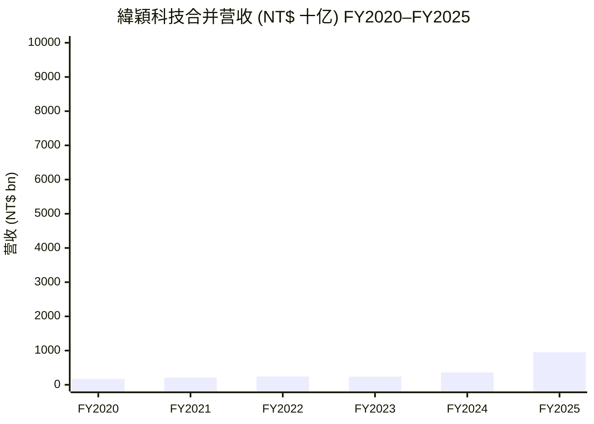
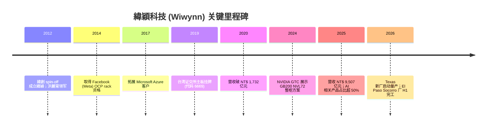
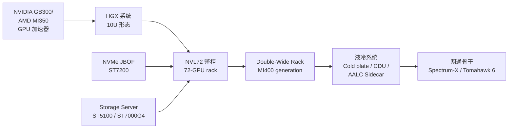
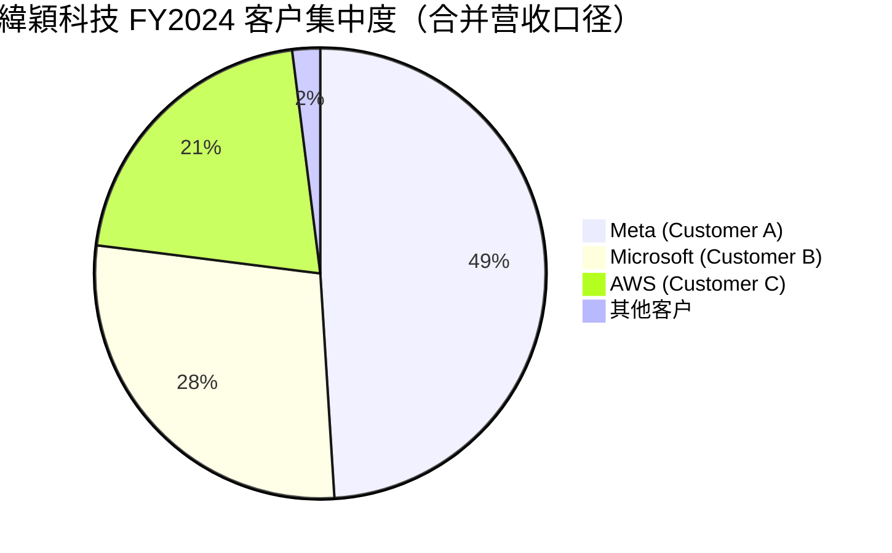
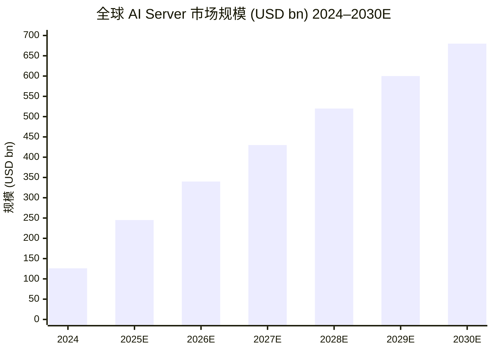
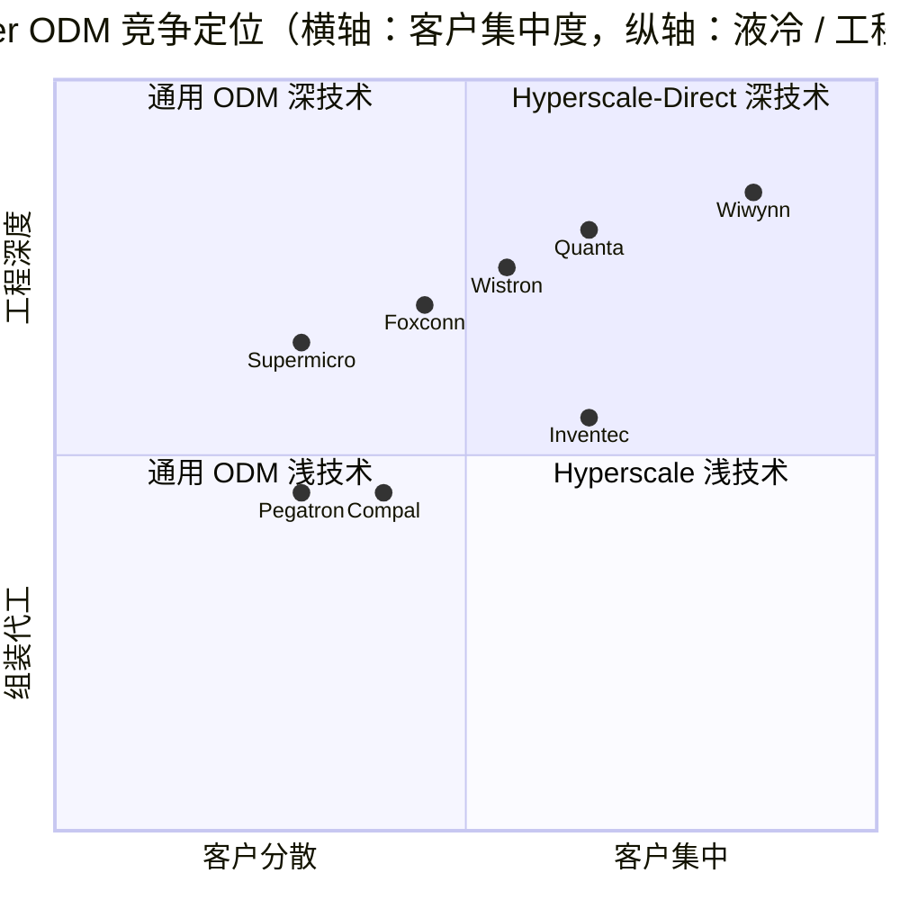

# 緯穎科技 Wiwynn Corporation (TWSE:6669) — 公司研究报告

**报告日期 / Report date:** 2026-06-02
**分析师覆盖类别 / Coverage:** 初次覆盖 / Initiation
**主题归属 / Theme:** ai-passives-packaging (watch list — 应纳入 ai-server-ODM 主题)
**主营业务 / Core business:** Hyperscale 云计算数据中心服务器、机柜与液冷系统 ODM Direct

> **Update — 2025 全年业绩创纪录、AI 收入占比逾五成 (2026-01 公告):** 公司 2025 全年合并营收达 NT$ 9,506.63 亿元（约 USD 30 bn），同比 +163.7%；归母净利润 NT$ 511.18 亿元，同比 +124.4%；EPS NT$ 275.06，同比 +117.3%。管理层称 "AI-related products contributing to more than half of the revenue"。董事会通过总额 NT$ 306.64 亿元的股票与现金股利分配方案——每股现金股利 NT$ 145、股票股利 NT$ 20。Source: [Wiwynn Reports Fourth Quarter 2025 Financial Results](https://www.wiwynn.com/news/wiwynn-reports-fourth-quarter-2025-financial-results)。

---

## 目录 / Table of Contents

1. 公司概览 / Company Overview
2. 公司历史 / Company History
3. 管理团队 / Management Team
4. 产品与服务 / Products & Services
5. 客户与上市策略 / Customers & Go-to-Market
6. 行业概览 / Industry Overview
7. 竞争格局 / Competitive Landscape
8. 市场机会 / Market Opportunity (TAM)
9. 风险评估 / Risk Assessment
10. 投资视角评分 / Investor-Lens Scorecards
11. 数据来源清单 / Data Used
12. 参考资料 / References

---

## 1. 公司概览 / Company Overview

緯穎科技 (Wiwynn Corporation, TWSE:6669) 是一家专注于 hyperscale 云计算数据中心 (cloud datacenter) 基础设施 ODM (Original Design Manufacturing) 的台湾上市公司。公司 2012 年 4 月由緯創資通 (Wistron Corporation) 切分独立成立，2019 年 3 月 27 日在台湾证券交易所挂牌交易，股票代码 6669，主营业务为大型云服务商 (Cloud Service Provider, CSP) 设计与制造服务器 / 储存 / 机柜 / 液冷系统等数据中心硬件，并提供从 L6（主板）到 L11（整柜）的多层次集成服务 ([Wiwynn About 页](https://www.wiwynn.com/about-wiwynn/company-info))。緯穎是全球少数以 hyperscale Direct 模式服务美国云端三巨头 (Meta、Microsoft、AWS) 的关键 ODM 之一，且明确不做 Tier-2 / 企业级品牌业务。

公司的商业模式 / business model 与传统 server 品牌商 (Dell, HPE, Lenovo) 截然不同——緯穎不卖品牌、不卖通路、不卖给中小企业，而是直接对接超大型云服务商的内部数据中心架构师，按客户专属规格 (Open Compute Project, OCP / 客户自有架构) 共同设计 (co-design) 服务器机柜，并按需交付到客户全球数据中心。这是一种 deeply embedded supply chain 模式：客户主导规格、緯穎主导工程化与供应链组织、由 contract manufacturer (EMS) 完成制造执行。一旦 hyperscaler 将緯穎纳入某一代特定平台 (如 NVIDIA GB200 / GB300 平台)，更换供应商在 mid-cycle 几乎不可行——这是公司护城河的真正来源 ([Silba Deep Dives — Wiwynn](https://silbadeepdives.substack.com/p/6669-wiwynn-the-heavy-metal-behind))。

**规模与全球布局 / Scale and geographic footprint.** 截至 2024 年底，緯穎全球员工约 4,725 人 ([緯穎 — 维基百科](https://zh.wikipedia.org/zh-tw/%E7%B7%AF%E7%A9%8E%E7%A7%91%E6%8A%80))；公司在台湾 (台北总部、桃园、高雄路竹新厂区)、美国 (Texas、Tennessee)、墨西哥 (墨西哥 Guadalajara 與 Coahuila)、马来西亚、捷克 (Brno) 等地设有研发与制造基地，其中墨西哥制造基地承担约 70% 的服务器组装产能 ([Digitimes — Wiwynn capex soars threefold](https://www.digitimes.com/news/a20250310PD210/wiwynn-ai-server-capex-tariff-2025.html))。2025 年 3 月公司宣布新建 Texas 工厂，投资 USD 300 mn，配合美国对墨西哥进口商品的 25% 关税重组 ([Taipei Times — Wiwynn triples capital expenditure to NT$18 bn](https://www.taipeitimes.com/News/biz/archives/2025/03/08/2003833056))；2025 年 6 月又宣布 USD 152 mn 在 El Paso County Socorro Logistics Center 兴建超过 866,000 sq ft 的制造与测试设施，目标 2026 H1 投产 ([El Paso Inc., 2025-06](https://www.elpasoinc.com/news/local_news/taiwanese-tech-manufacturer-investing-152-million-in-borderland/article_dd606595-c2b8-49f5-b702-40c3d8c38fe9.html))。

**2025 全年关键财务 / FY2025 financials.** 合并营收 NT$ 9,506.63 亿元（+163.7% YoY），归母净利润 NT$ 511.18 亿元 (+124.4% YoY)，毛利率 / gross margin 8.3%、营业利润率 / operating margin 6.7%、税后净利率 / net margin 5.4%，EPS NT$ 275.06 ([Wiwynn Q4-2025 业绩公告](https://www.wiwynn.com/news/wiwynn-reports-fourth-quarter-2025-financial-results))。Q3 2025 单季营收 NT$ 2,668.24 亿元 (+172.8% YoY)、毛利率 8.8%、EPS NT$ 82.92 ([Wiwynn Q3-2025 业绩公告](https://www.wiwynn.com/news/wiwynn-reports-third-quarter-2025-financial-results))。2026 Q1 营收延续高位至 NT$ 2,765.08 亿元 (+62.0% YoY)、PAT NT$ 141.14 亿元 (+44.1% YoY)、EPS NT$ 75.95 — 同期合并营收、获利与 EPS 三项指标皆创历史同期新高 ([Wiwynn Reports First Quarter 2026 Financial Results](https://www.wiwynn.com/news/wiwynn-reports-first-quarter-2026-financial-results))。

**估值快照 / Valuation snapshot (as of 2026-06-01).** 当前股价 NT$ 5,445，市值 NT$ 9,431 亿元 (约 USD 295 bn 之 13.5% — 注：实际美元等值约 USD 30 bn) ([Simply Wall St — Wiwynn Valuation](https://simplywall.st/stocks/tw/tech/twse-6669/wiwynn-shares/valuation))。TTM P/E 约 17.6×、Forward P/E 约 13.7×，相比 TW Tech 行业平均 P/E ~20.8× 处于偏低估值水平 ([Simply Wall St — Wiwynn Valuation](https://simplywall.st/stocks/tw/tech/twse-6669/wiwynn-shares/valuation))。过去 52 周股价上涨 +114%，反映市场对 AI 服务器订单可见度的强烈追捧 ([Simply Wall St — Wiwynn](https://simplywall.st/stocks/tw/tech/twse-6669/wiwynn-shares))。Sell-side 共识目标价 NT$ 6,779（high NT$ 8,500 / low NT$ 5,600），18 位分析师给予 Strong Buy 评级、无 Sell ([MarketScreener — Wiwynn Target Price Consensus](https://www.marketscreener.com/quote/stock/WIWYNN-CORPORATION-56536658/consensus/))。

*分析师观点：* 緯穎当下 17.6× TTM P/E 看似"便宜"，但需放进 ODM 行业的多重折让上下文——(a) 客户集中度极高（前三大客户合计约 98% 营收），客户预算波动直接放大盈利波动；(b) 毛利率 8.3% 极薄，单季 ASP 错位或库存增减就能侵蚀整年利润；(c) 营运现金流 / OCF 持续紧张（详见 Section 9）。市场以 13.7× FY26E forward P/E 定价，相当于隐含分析师认为 EPS 还有约 30% 的增长空间——这与 FY2026 Q1 +44% PAT 增速大致一致。下行风险来自任一 hyperscaler 资本支出上修周期结束、或客户内部 ASIC 取代 NVIDIA 商用 GPU 时的产品组合变化。

*数据来源：[Stockanalysis.com — Wiwynn Revenue](https://stockanalysis.com/quote/tpe/6669/revenue/)；[TechNews — Wiwynn 2024Q4 业绩](https://finance.technews.tw/2025/01/08/wiwynn-fr-2024q4/)；[Wiwynn Q4-2025 业绩公告](https://www.wiwynn.com/news/wiwynn-reports-fourth-quarter-2025-financial-results)。*

---

## 2. 公司历史 / Company History

緯穎科技于 2012 年 4 月 2 日由緯創集团 (Wistron) 内部 spin-off 成立，最初为緯創 100% 持股的子公司，由当时担任緯創集团 Enterprise Business Group 总经理的洪麗甯 (Emily Hong) 主导组建，定位明确为服务 hyperscale CSP 客户的纯 ODM 实体——目的是把 Wistron 的 enterprise 服务器业务从 Tier-1 OEM（Dell、HPE）通路中独立出来，避免与 Wistron 的传统笔电 / 桌机业务相互绑死 ([Wiwynn About 页面](https://www.wiwynn.com/about-wiwynn/company-info))。公司 2019 年 3 月 27 日在台湾证券交易所主板上市，IPO 前已是 Meta / Microsoft 等北美 hyperscaler 的指定供应商，因此挂牌即拥有完整 ODM Direct 模式与稳定的大客户结构 ([緯穎 — 维基百科](https://zh.wikipedia.org/zh-tw/%E7%B7%AF%E7%A9%8E%E7%A7%91%E6%8A%80))。

公司在 2015–2018 年间完成了三个关键转型：从 L6 主板出货升级到 L10/L11 整柜出货（OCP Open Rack 与客户专属机柜）、布局美国 Tennessee 与墨西哥制造基地以贴近北美 CSP 数据中心、以及组建液冷 (liquid cooling) 专门工程团队为未来的 AI 高功耗芯片做准备 ([Wiwynn 公司介绍](https://www.wiwynn.com/about-wiwynn))。2020 年新冠疫情期间，因北美 CSP capex 在 work-from-home 浪潮下大幅上修，公司当年营收达 NT$ 1,732 亿元；2022–2023 年随 hyperscaler 资本支出周期阶段性放缓，年营收维持在 NT$ 2,400 亿元水平 ([Stockanalysis.com — Wiwynn Revenue](https://stockanalysis.com/quote/tpe/6669/revenue/))。

真正的转折发生在 2024 H2——NVIDIA Hopper / Blackwell 平台带动北美 hyperscaler 进入新一轮 AI capex 上行周期，緯穎作为 Meta GPU 服务器与 Microsoft Azure AI rack 的核心 ODM 之一开始接到大额 GB200 / GB300 NVL72 整柜订单，2024 全年营收 +49% 至 NT$ 3,605 亿元 ([TechNews — 緯穎 2024 EPS 创新高](https://finance.technews.tw/2025/01/08/wiwynn-fr-2024q4/))。2025 年是迄今最爆发的一年——AI 相关产品营收占比由 2024 年约 30% 跃升至 2025 年的过半，公司 9M 2025 累计营收 +169% YoY ([Wiwynn Q3-2025 业绩公告](https://www.wiwynn.com/news/wiwynn-reports-third-quarter-2025-financial-results))。

*数据来源：[Wiwynn 公司介绍](https://www.wiwynn.com/about-wiwynn)、[緯穎 — 维基百科](https://zh.wikipedia.org/zh-tw/%E7%B7%AF%E7%A9%8E%E7%A7%91%E6%8A%80)、[Wiwynn 2024 GTC 展示](https://www.wiwynn.com/news/wiwynn-showcases-innovations-on-nvidia-gb200-nvl72-at-gtc-2024)。*

**近两年战略动作 / Recent strategic moves.** 三件最值得关注：(1) **Texas 量产基地** — 2025 年 3 月宣布投入 USD 300 mn 兴建美国本土第一座组装厂，2025 年底已开始量产，配合美国对墨西哥成品 25% 关税重整 ([Taipei Times — Wiwynn Texas $300 mn plant](https://www.taipeitimes.com/News/biz/archives/2025/03/01/2003832679))；(2) **El Paso Socorro 制造测试设施** — 2025 年 6 月再宣布 USD 152 mn 投资，866,000 sq ft 双产业建筑，2026 H1 投产 ([El Paso Inc., 2025-06](https://www.elpasoinc.com/news/local_news/taiwanese-tech-manufacturer-investing-152-million-in-borderland/article_dd606595-c2b8-49f5-b702-40c3d8c38fe9.html))；(3) **USD 2 bn 五年期可转债额度** — 2025 年 Q3 董事会授权，为未来产能扩张与营运资金储备 ([Wiwynn Q3-2025 业绩公告](https://www.wiwynn.com/news/wiwynn-reports-third-quarter-2025-financial-results))。这三项共同支撑公司从墨西哥单点依赖转向"美国 + 墨西哥 + 马来西亚 + 捷克 + 台湾"五区域产能弹性配置。

---

## 3. 管理团队 / Management Team

緯穎采用 founder-led + 专业 CEO 双头制——洪麗甯 (Emily Hong) 同时担任董事长 (Chair) 与首席策略官 (Chief Strategic Officer)，负责长期战略、客户关系与资本市场叙事；專业经理人林建宏 (William Lin) 担任总裁兼 CEO，负责日常营运。这一治理结构在 2024 年正式确立，反映创始人由全面 CEO 角色转向"战略董事长 + 客户大使"定位的代际安排 ([MarketScreener — Wiwynn CEO Changes](https://www.marketscreener.com/quote/stock/WIWYNN-CORPORATION-56536658/news/Wiwynn-Corporation-Announces-CEO-Changes-44136376/))。

**創始人 / Founder — 洪麗甯 (Emily Hong)，董事长兼 Chief Strategic Officer (~300 字).** 洪麗甯是緯穎成立的实际操盘者——2012 年她带领来自緯創的核心团队 spin-off 成立緯穎，并主导公司聚焦"cloud datacenter market"的初始定位 ([Wiwynn Leadership 页面](https://www.wiwynn.com/about-wiwynn/leadership))。在加入緯創之前，她在宏碁集团 (Acer Group) 担任过多个高管职位；spin-off 緯穎之前她在緯創担任 Enterprise Business Group 的 Group President 兼 COO，负责将 Wistron 的服务器、储存、网通业务整合并对接美国 CSP 客户。学历方面，她毕业于國立台灣大學 (NTU) 政治学系，并完成國立政治大學 (NCCU) 企业管理执行硕士课程 ([Wiwynn Leadership 页面](https://www.wiwynn.com/about-wiwynn/leadership))。2025 年她获 *Business of Women* 杂志评为 "Top 20 Asia's Power Businesswomen 2025"，被誉为台北驱动 AI 服务器產业崛起的核心人物 ([WOB — Emily Hong recognition 2025](https://www.wob.tw/en/post/congratulations-to-emily-hong-chair-and-chief-strategy-officer-wiwynn-corp-6669-on-being-recogn))。Bloomberg 引述同业观察认为，她"combines the Chair and Chief Strategy Officer roles, placing outsized influence in one set of hands, controlling both the board agenda and the long-term narrative" ([Silba Deep Dives — Wiwynn governance section](https://silbadeepdives.substack.com/p/6669-wiwynn-the-heavy-metal-behind))。截至 2025 年她仍持有 Wiwynn 实质股份并担任战略决策者，但具体持股比例与薪酬结构需透过 MOPS 年报 (尚未公开 2025 年报) 进一步证实。

**CEO — 林建宏 (William Lin)，President & CEO (~200 字).** 林建宏 2024 年起接任总裁兼 CEO，进公司前已于 Wistron 集团服务三十年以上——曾任緯創 Enterprise and Networking Business Group 集团总经理，负责 Wistron 的企业服务器与网络通讯业务条线 ([Wiwynn Leadership 页面](https://www.wiwynn.com/about-wiwynn/leadership))。学历方面，他取得逢甲大学 (Feng Chia University) 电子工程学士、美国 Wright State University, Ohio 工商管理硕士。公司官方资料强调他"has more than three decades of experience in the IT industry, including expertise in server and AI-related industries" ([Wiwynn Leadership 页面](https://www.wiwynn.com/about-wiwynn/leadership))。作为非创始人 CEO 角色，林建宏在 2024–2026 AI 服务器爆发期主要负责保持與 NVIDIA / AMD 平台的工程同步、扩张全球产能（Texas、Mexico、Kaohsiung Lujhu）以及深化液冷专利与封装能力。

*分析师观点：* 緯穎的创始人型董事长 + 专业经理人 CEO 组合，治理上偏向创始人主导（董事长兼 CSO 同时把持董事会议程与战略叙事），但相对于完全创始人独裁 CEO 模式，分离 day-to-day 营运给 William Lin 给了制度上更稳定的执行层。考量 2024–2025 年 AI 服务器爆发期内执行复杂度（Texas 新厂、墨西哥扩建、马来西亚扩建、NVIDIA GB300 / AMD MI400 双平台同步交付），分工架构看似合理；但同时高度集中的董事长权力是日后传承与代理问题最大隐忧之一。

---

## 4. 产品与服务 / Products & Services

緯穎的产品架构按 hyperscale 数据中心的"服务器 → 储存 → 机柜 → 液冷 → 网通 → 边缘"六大类组织，每一类都按客户专属架构定制设计 (co-design) 而非通用品牌出货。以下按官方产品分类页所列的六大产品族 ([Wiwynn Products 主页](https://www.wiwynn.com/products))，逐一拆解每个产品族的物理功能、与同矩阵其他产品的差异、以及当前驱动需求的技术拐点。

### 4.1 产品矩阵 / Product Matrix

> 引用 [Wiwynn Products 主页](https://www.wiwynn.com/products) 上的产品分类：
>
> 1. **Multi-node Server** — "Flexible combination of up to multiple servers in 2 or 4 OU space."
> 2. **Multi-purpose Server** — "Designed for various applications with storage capabilities."
> 3. **Edge/AI Platform** — "Tailored-made edge servers for diverse edge locations."
> 4. **Storage Server** — "High-capacity storage systems with redundancy."
> 5. **All-flash NVMe JBOF** — "Leading industrial storage system provides the best IOPS."
> 6. **Storage** — "Hot-plug HDD systems with high availability."

补充产品族（按产品代号 / model 划分）：

| 产品类别 | 代表型号 | 用途简述 |
|---|---|---|
| Multi-node Server | SV7100G4, SV302A | 高密度计算节点，单机箱集成多 server，2U / 4U 形态 |
| Multi-purpose Server | SV328R, SV310G4, SV305A | 通用计算 + 局部储存，灵活配置 |
| Edge / AI Platform | ES200G2, ES100G2, EP100G2, EP200G2 | 数据中心边缘部署 AI 推理 / 内容分发 |
| Storage Server | SV7000G4 | 高密度储存服务器 |
| All-flash NVMe JBOF | ST7200 | 全闪储存 JBOF，极致 IOPS 应用 |
| Storage | ST5100, ST7000G4 | 可热插拔 HDD 大容量储存 |
| Rack | 21" Rack、19" Rack | OCP 与传统标准机柜整合 |

*来源：[Wiwynn Products 页面](https://www.wiwynn.com/products)。*

### 4.2 综合 / Synthesis — 各产品类别如何拼合成 hyperscaler 工作流

> **中文释义 / Plain-language gloss:** Hyperscale 数据中心的核心是 *将 GPU 算力打包成可重复部署的机柜单元*。一个完整的 AI 数据中心订单从 (a) **计算节点 / compute node**（NVIDIA HGX、GB300、AMD MI350 等 GPU 板载主机）开始，向上集成到 (b) **整柜系统 / rack-level system**（含 PDU、冷却、Switch、电源、信号完整性设计），再连接 (c) **储存子系统 / storage subsystem**（NVMe JBOF 提供高 IOPS、ST 系列提供大容量 cold tier），最后接入 (d) **网通骨干 / networking spine**（NVIDIA Spectrum-X、Broadcom Tomahawk 6 交换机）以构成一个 cluster。緯穎是少数能从计算节点、机柜、液冷、储存到网通全栈交付的 ODM，这是 Quanta、Inventec 等同业仍然停留在"服务器节点 + 简单机柜"组合的关键差异。

### 4.3 NVIDIA GB300 NVL72 整柜系统 — 当前旗舰

引用 [Wiwynn OCP Global Summit 2025 新闻稿](https://www.wiwynn.com/news/wiwynn-showcases-next-generation-ai-infrastructure-and-cooling-advances-at-ocp-global-summit-2025) 对 GB300 NVL72 平台的描述：

> "Liquid-cooled, rack-level AI system built on 72 NVIDIA Blackwell Ultra GPUs, featuring NVIDIA ConnectX-8 800Gb/s SuperNICs, designed for reasoning model inference."

**中文释义 / Plain-language gloss:** NVIDIA GB300 NVL72 是当前 (2025–2026) AI infra 中最热门的 rack-level 平台——72 个 Blackwell Ultra GPU (B300) + 36 个 Grace CPU 通过 NVLink 5 / NVSwitch 协议组成一个超大共享内存域 (shared memory domain)，特别适合大模型推理 / reasoning 工作负载（如 OpenAI o1 / o3 类思考模型）。这一代相对 GB200 (Blackwell) 的主要升级是 AI FLOPS、HBM3e 容量从 13.4 TB 升至 20.8 TB、以及 ConnectX-8 网卡的 800 Gb/s 带宽。緯穎在此平台上是 NVIDIA 指定的 reference design 制造伙伴之一——与 Wistron、Foxconn 同为首批整柜量产 ODM ([Wiwynn 2025 GTC 新闻稿](https://www.wiwynn.com/news/wiwynn-showcases-ai-servers-featuring-nvidia-gb300-nvl72-platform-and-liquid-cooling-innovations-at-gtc-2025))。

*分析师观点：* GB300 NVL72 整柜是 hyperscaler 在 2025 H2–2026 H1 的主力 capex 项目。緯穎的护城河 / moat 来自三个维度：(a) 液冷 thermal engineering 经验（500+ kW per rack 的散热管理）、(b) 信号完整性设计 (high-speed signal integrity over 800 Gb/s)，(c) 系统级集成与全球同步交付能力。Closest 竞争产品包括 Wistron 与 Foxconn 的 NVL72 整柜方案 ([Wistron NVL72 announcement, 2024-09](https://press.wistron.com/PressRelease.aspx?id=2024093009000003020))。

### 4.4 NVIDIA HGX B300 — 10U 高密度计算节点

引用 [Wiwynn OCP Global Summit 2025 新闻稿](https://www.wiwynn.com/news/wiwynn-showcases-next-generation-ai-infrastructure-and-cooling-advances-at-ocp-global-summit-2025) 的产品描述：

> "10U form factor with eight NVIDIA Blackwell Ultra GPUs, 2.1TB of HBM3e memory and NVIDIA ConnectX-8 800Gb/s SuperNICs, targets demanding AI workloads."

**中文释义 / Plain-language gloss:** 与 NVL72 整柜不同，HGX B300 是 *单机箱 / standalone* 的 10U server，搭载 8 颗 Blackwell Ultra GPU，更适合 hyperscaler 内部传统 PCIe 主板架构 (而非 NVLink rack-scale 架构) 的部署。Microsoft Azure、AWS 等客户在 NVL72 大单旁通常会同时下 HGX 10U 单元以提升数据中心部署灵活性。緯穎的 HGX B300 设计对标 Supermicro / Dell / HPE 的 10U HGX 产品。

### 4.5 AMD Instinct MI350 / MI400 系列 — 双平台对冲

引用 [Wiwynn OCP Global Summit 2025 新闻稿](https://www.wiwynn.com/news/wiwynn-showcases-next-generation-ai-infrastructure-and-cooling-advances-at-ocp-global-summit-2025) 对 AMD 平台的描述：

> "Built on AMD CDNA 4 architecture, incorporates EPYC CPUs and AMD Pollara 400 AI Network Interface Card, up to 35x improvement in inference performance versus prior generation."

**中文释义 / Plain-language gloss:** 緯穎并不只是 NVIDIA reference design partner —— 公司同时支持 AMD CDNA 4 (MI350 系列) 和 MI400 系列下一代 GPU 平台。AMD Pollara 400 是 AMD 在 2025 年推出的 AI 专用 400 Gb/s NIC，对应 NVIDIA ConnectX-8 800 Gb/s 的竞争方案。緯穎为 AMD MI400 设计的 **Double-Wide Rack** 机柜采用双倍传统机柜宽度（实际 ~42 寸 × 80 寸 footprint），整合 HVDC 高压直流配电、液冷与信号完整性优化布局，能容纳更高功率 (1.5–2 MW per rack) 的下一代 AI 加速器 ([Wiwynn OCP 2025 新闻稿](https://www.wiwynn.com/news/wiwynn-showcases-next-generation-ai-infrastructure-and-cooling-advances-at-ocp-global-summit-2025))。

*分析师观点：* 双平台支持降低单一 GPU 厂商风险，但需要付出工程团队规模翻倍的成本。緯穎对 AMD 的支持力度大于 Quanta、Inventec —— 反映 Meta 内部对 AMD MI350 / MI400 的 design wins 已确定，未来 12–18 个月 AMD GPU 单柜出货量将成为公司 GPU mix 上的关键 swing factor。

### 4.6 液冷系统 / Liquid Cooling — 自研专利护城河

緯穎自 2018 年起组建液冷专门工程团队，到 2024 年已成为公司差异化能力的核心之一。三个旗舰产品：

引用 [Wiwynn OCP Global Summit 2025 新闻稿](https://www.wiwynn.com/news/wiwynn-showcases-next-generation-ai-infrastructure-and-cooling-advances-at-ocp-global-summit-2025) 的产品描述：

> **Double-Side Cold Plate** — "Supports up to 4 kW thermal capability for primary AI-accelerators, 40% improvement in thermal performance through proprietary microchannel designs."
>
> **Two-Phase Cold Plate** — "Uses dielectric, eco-friendly refrigerants, features patented 3D-printed wicking-fin design."
>
> **300 kW AALC Sidecar** — "Co-developed with Shinwa Controls Co., Ltd., double-rack-width Air-Assisted Liquid Cooling solution."

**中文释义 / Plain-language gloss:**

(a) **Double-Side Cold Plate / 双面冷板** —— 单个 GPU 散热高达 4 kW 时，传统单面冷板已无法压住 thermal envelope；双面冷板透过专利微通道 (microchannel) 设计提升 40% 热传导效率，相当于 Blackwell Ultra B300 → Rubin Ultra 这一代过渡的"不得不"配置。

(b) **Two-Phase Cold Plate / 两相冷板** —— 使用 dielectric (介电) 制冷剂在液气两相之间转换吸热（蒸发吸热 / 冷凝释热），结合 3D 打印的 wicking-fin（毛细鳍片）结构，能在更低液压下散热远超传统单相液冷，特别适合下一代 1.5+ kW/GPU 的 thermal density。

(c) **AALC Sidecar / 气辅液冷边柜** —— 整柜液冷固然散热效率最高，但许多 hyperscaler 的旧数据中心缺乏液冷管路改造预算。AALC 是过渡方案：把液冷热水排到柜旁的"sidecar"，由内置风扇与冷却塔散到机房空气中——支持单柜 300 kW 散热功率，能用现有空气 HVAC 的数据中心部署高 TDP GPU 整柜。

*分析师观点：* 液冷是緯穎相对纯组装型 ODM (如 Inventec, Compal) 的真正技术分水岭。Quanta 与 Wistron 在液冷上也有自研能力，Foxconn 则透过收购小型液冷专业公司补足。緯穎与日本 Shinwa Controls Co. 在 AALC 上的合作显示公司选择性外部联盟，而非闭门自研——这是 ODM 行业的常见模式 ([Shinwa Controls 公司介紹](https://shinwa-controls.com/en/))。

### 4.7 网通骨干 / Networking Spine — 平台整合

緯穎在 2025 年 OCP Global Summit 同时展示了支持两个网通生态的整柜方案 ([Wiwynn OCP 2025 新闻稿](https://www.wiwynn.com/news/wiwynn-showcases-next-generation-ai-infrastructure-and-cooling-advances-at-ocp-global-summit-2025))：

- **NVIDIA Spectrum-X** Ethernet for AI —— 配合 NVIDIA GB300 NVL72 的标准 Ethernet 后端网通
- **Broadcom Tomahawk 6** —— 1.6 Tbps datacenter switch，对应 Meta / Microsoft 自研 ASIC 服务器的网通组合

**中文释义 / Plain-language gloss:** Hyperscaler 客户对网通方案有强烈偏好——Meta 倾向 Broadcom 生态、Microsoft Azure 同时部署 NVIDIA Spectrum-X 与 Broadcom。緯穎同时整合两套网通生态，是因为不同客户在同一代平台上会下不同 SKU 订单。这与 Quanta 主要集中 NVIDIA 生态、Wistron 较倾向 Broadcom 的供应商分工形成对照。

### 4.8 旗舰组合 / Flagship and recent launches

2025–2026 年公司的"旗舰三件套"是：
1. **NVIDIA GB300 NVL72** 整柜（Q3-2025 量产爬坡）
2. **AMD MI350 / MI400 Double-Wide Rack**（Q4-2025 起样品）
3. **300 kW AALC Sidecar** 液冷（2026 年标准配置）

公司管理层在 Q4-2025 业绩公告中明确表态 "AI-related products contributing to more than half of the revenue" ([Wiwynn Q4-2025 业绩公告](https://www.wiwynn.com/news/wiwynn-reports-fourth-quarter-2025-financial-results))，这意味着 2025 全年 NT$ 9,506 亿元营收里约 NT$ 4,750+ 亿元来自 AI 加速器整柜 / GPU 服务器 / 液冷系统的组合销售。

---

## 5. 客户与上市策略 / Customers & Go-to-Market

緯穎是全球 AI 服务器供应链中客户集中度最高的 ODM 之一。**根据 [Silba Deep Dives — Wiwynn](https://silbadeepdives.substack.com/p/6669-wiwynn-the-heavy-metal-behind) 整理的公开 FY2024 年报披露**，公司前三大客户合计占当年合并营收的 **约 98%（49% + 28% + 21%）**，且 Q3-2025 应收账款 (Accounts Receivable) 的约 **95%** 集中于这三个客户名下 — 客户集中度风险极端高，落在 SKILL.md 风险评级 "high" 区间（top-1 > 30%、top-5 > 50%）。

公司在公告与年报中*不*直接点名客户，仅以 "Customer A / B / C" 编号披露——但产业链普遍认为该三大客户即 **Meta、Microsoft、AWS**：

| 客户编号 (披露分类) | FY2024 营收占比 | 业界共识对应公司 | 来源 |
|---|---|---|---|
| Customer A | ~49% (consolidated revenue) | Meta Platforms (NASDAQ:META) | [Silba Deep Dives](https://silbadeepdives.substack.com/p/6669-wiwynn-the-heavy-metal-behind)、[富果 — Wiwynn 2024 报告](https://blog.fugle.tw/2024-wiwynn-report/) |
| Customer B | ~28% (consolidated revenue) | Microsoft Azure (NASDAQ:MSFT) | 同上 |
| Customer C | ~21% (consolidated revenue) | Amazon AWS (NASDAQ:AMZN) | 同上 |

**披露的口径说明 (denominator):** 上述三个客户百分比皆为 *consolidated revenue 比例*（合并营收口径），与 SKILL.md 强调的"customer-share number must be labelled with its denominator"规则一致。公司目前未披露分客户、分产品族的细分销售。

緯穎的客户开拓策略 / GTM strategy 与 IT 业典型 ODM 不同——不依赖经销通路、不投入品牌广告、不做企业级销售团队，全部资源集中于一个目标：**与 hyperscale CSP 客户的内部架构师 / SI 团队 (system architect) 在每一代芯片平台 (NVIDIA Hopper → Blackwell → Rubin、AMD CDNA 3 → CDNA 4 → CDNA 5) 早期就开展 co-design**——以此换取该代平台的优先产能锁定。这是一种 "consultative supplier" 模式，跟 Microsoft / Meta / AWS 的关系更接近"专属设计代工"而非"通用供应商"。

*数据来源：[Silba Deep Dives — Wiwynn](https://silbadeepdives.substack.com/p/6669-wiwynn-the-heavy-metal-behind)；[富果 — Wiwynn 2024 报告](https://blog.fugle.tw/2024-wiwynn-report/)；注：客户名称对应为业界共识，緯穎官方仅以 Customer A/B/C 编号披露。*

**合约结构 / Contract structure.** 緯穎与 hyperscaler 客户的合约结构以 PO-by-PO + master agreement 双层制为主：(a) 顶层 framework agreement 锁定多代平台 (e.g. Hopper、Blackwell、Rubin 三代) 的优先合作权 + 商业条款；(b) 单 PO 按季度滚动下达，对应客户单一数据中心的具体机柜部署需求。这种结构对緯穎的好处是设计能见度高、但坏处是单季 / 单产品组合变动会直接放大季度营收波动。

**应收账款集中度 / AR concentration.** Q3-2025 末，AR 余额约 95% 集中于前三大客户—— 这意味着任一客户的付款节奏变动（应收账款周转天数 DSO 拉长 20+ 天）就能直接拖垮单季 OCF / FCF。这是公司 2025 年营运现金流持续承压的根因之一（详见 Section 9 风险评估）([Silba Deep Dives — Wiwynn](https://silbadeepdives.substack.com/p/6669-wiwynn-the-heavy-metal-behind))。

**地理分布 / Geographic mix.** 緯穎按客户视角的最终交付地分布大致为 (按业界共识估算)：**北美 ~85% (US 80% + Canada 5%)、欧洲 ~10%、亚太 ~5%**。緯穎自身的制造产能则集中于 **墨西哥 ~70%、台湾 ~15%、美国 / 马来西亚 / 捷克合计 ~15%**（按 2024 末数据）([Digitimes — Wiwynn capex soars threefold](https://www.digitimes.com/news/a20250310PD210/wiwynn-ai-server-capex-tariff-2025.html))。

*分析师观点：* 客户集中度是緯穎"投资逻辑核心"的双刃剑——一方面，三大 hyperscaler 是全世界 AI capex 最大的 spender，绑定他们就等于绑定 AI infra 总盘子的 30–40%；另一方面，三大客户中任一在某一代芯片平台决定换供应商（如 Microsoft 转向 Compal/Inventec 做 GB200 集群），公司全年营收波动可能达 ±20–30%。FY2024 至 FY2026 周期内三大客户全部加速 AI capex，因此这一风险目前仍在"潜伏期"——投资者需密切监控每季 Q&A 中关于"single customer shift"的隐讳描述。

---

## 6. 行业概览 / Industry Overview

緯穎所处的产业链是**全球 hyperscale AI 服务器 ODM** 行业——这是从 2023 年 ChatGPT 引爆的 AI 算力 capex 浪潮中受益最直接的子赛道之一，与 Substrate / MLCC / ABF / HBM 等组件赛道并列为"AI infra Tier-1"机会区。

**市场结构 / Market structure.** AI server 行业上下游可拆为五层：
1. **Cloud Service Provider (CSP)** — 最终客户、capex 主导者：Meta、Microsoft、Google、Amazon、Oracle、xAI、Coreweave
2. **GPU / 加速器供应商** — NVIDIA、AMD、Intel + hyperscaler 内部 ASIC (Meta MTIA、Google TPU、AWS Trainium / Inferentia)
3. **关键组件** — HBM 内存 (SK hynix、Samsung、Micron)、Substrate (Ibiden、Shinko)、ABF 树脂 (Ajinomoto)、MLCC (Murata)
4. **AI Server ODM** — Foxconn、Quanta、Wistron、Wiwynn、Inventec、Compal、Pegatron、MiTAC、Huaqin
5. **EMS / 组装代工** — 大部分整柜组装外包给 EMS

**全球 AI 服务器市场规模 / Global AI server TAM.** Omdia 在 2024-12 报告中预测，2024 年全球服务器市场 (含 AI + 传统) 总规模约 USD 230 bn，AI server 占比 ~55%（USD 126 bn）；2025E 总规模 USD 350 bn、AI server 占比预计 ~70%（USD 245 bn）([Omdia projects Foxconn to become the world's largest server vendor](https://omdia.tech.informa.com/pr/2024/dec/omdia-projects-foxconn-to-become-the-worlds-largest-server-vendor))。Global Market Insights 2024 报告预测 AI 服务器市场 2025–2034 CAGR 约 28%，2034 年达 USD 850–900 bn ([GMI — AI Server Market](https://www.gminsights.com/industry-analysis/ai-server-market))。

**台湾 ODM 的全球地位 / Taiwan ODM share.** 台湾 ODM 合计承担全球服务器 **~90%** 制造份额，其中 AI server 部分高度集中在 Foxconn (43% global share)、Quanta、Wistron、Wiwynn、Inventec 等几家手中 ([Digitimes — Taiwan AI Server ODM Demand](https://www.digitimes.com/news/a20260210PD205/taiwan-ai-server-odm-demand-supply-chain-2026.html))。2025 H1 各家 ODM 营收 YoY 增速：Wistron +92.7%、Quanta +65.6%、Wiwynn 全年 +163.7%（最高）—— 显示緯穎在这一波 AI infra 浪潮中相对增长速度领先 ([JAKOTA — Wiwynn Revenue Triples](https://jakotaindex.com/top-stories/wiwynn-revenue-triples-as-taiwan-server-maker-rides-ai-boom/))。

**关键技术拐点 / Key technology inflections.** 2025–2027 年三大拐点同时发生：
1. **GPU 平台代际换代** — NVIDIA: Hopper (H100/H200) → Blackwell (B200/B300/GB200/GB300) → Rubin (R200, 2026E) → Rubin Ultra (R300, 2027E)
2. **液冷渗透率** — 单 rack 功率从 30–50 kW (Hopper 时代) 上升至 130 kW (GB200 NVL72) 与 250+ kW (Rubin 时代)，液冷渗透率从 2024 年的 ~15% 上升至 2027E 的 ~60%（业界共识）
3. **网通带宽** — Switch / NIC 从 400 Gb/s → 800 Gb/s (ConnectX-8) → 1.6 Tb/s (ConnectX-9, 2027E)，对应 PCB / 信号完整性 / 散热的同步升级

**hyperscaler capex 周期 / Capex cycle.** Meta、Microsoft、Google、Amazon 四大 CSP 在 2024 年合计 capex ~ USD 180 bn，2025E 上调至 ~ USD 280 bn (+55%)，2026E 业界预测 USD 360–420 bn ([Bloomberg, 2025-12](https://www.bloomberg.com/news/articles/2025-12-15/hyperscaler-capex-2026-forecast))。这一基本面是 ODM 行业整体上行的根本驱动。

**监管环境 / Regulatory environment.** 关键议题包括：(a) 美国对中国出口 AI 芯片 (B30 / B40 限制) — 间接利好台湾 ODM；(b) 美国对墨西哥商品 25% 关税 — 直接驱动緯穎 Texas、马来西亚扩建；(c) 美国 CHIPS Act + Investment Tax Credit — 鼓励 ODM 在美国本土建厂；(d) 欧盟 NIS2 + Data Sovereignty —— 欧洲 hyperscaler 客户对供应链溯源 (supply chain traceability) 要求提升。

*数据来源：[Omdia](https://omdia.tech.informa.com/pr/2024/dec/omdia-projects-foxconn-to-become-the-worlds-largest-server-vendor)；[GMI](https://www.gminsights.com/industry-analysis/ai-server-market)；2027E 之后年份为业界共识估算（CAGR ~ 18–22%）。*

---

## 7. 竞争格局 / Competitive Landscape

緯穎面对的是 **AI server ODM** 这一相对集中的子行业——全球真正能承接 hyperscale CSP 整柜 (rack-level) 订单的 ODM 不超过 8 家，下表列出公司主要竞争对手与各自定位：

| 竞争对手 | 2024 营收 (USD bn 估) | 主要 AI 客户 | 差异化 / 定位 | 来源 |
|---|---|---|---|---|
| **Foxconn / Hon Hai** (TWSE:2317) | ~190 (集团合并) | Microsoft, Google, Amazon, Oracle | 全球 #1 EMS+ODM；43% 全球服务器份额；强组件自给 | [Omdia](https://omdia.tech.informa.com/pr/2024/dec/omdia-projects-foxconn-to-become-the-worlds-largest-server-vendor) |
| **Quanta / QCT** (TWSE:2382) | ~50 | Meta, Google, AWS | #2；AI server 占其营收 ~70%；NVL72 早期赢家 | [Tech-Now — Taiwan AI Server 2025](https://tech-now.io/en/blogs/taiwans-ai-server-revolution-how-foxconn-and-odms-redefined-global-tech-leadership-in-2025) |
| **Wistron** (TWSE:3231) | ~35 | NVIDIA, hyperscalers | GB200 早期出货 ODM；緯穎母公司，但二者业务分流 | [Wistron Investor Page](https://www.wistron.com/en/investors) |
| **Wiwynn** (TWSE:6669) | ~12 (FY2024); ~30 (FY2025) | Meta, Microsoft, AWS | hyperscale-only direct mode；液冷强；客户集中 | [Wiwynn IR](https://www.wiwynn.com/investors) |
| **Inventec** (TWSE:2356) | ~22 | Google, Microsoft | 美系 CSP 长期供应商；2025 H1 增速落后于龙头 | [Digitimes](https://www.digitimes.com/news/a20260210PD205/taiwan-ai-server-odm-demand-supply-chain-2026.html) |
| **Compal** (TWSE:2324) | ~28 | Meta, AWS | 笔电主业 + AI server 扩张；规模优势但 AI 起步晚 | [Compal IR](https://www.compal.com/category/investor) |
| **Pegatron** (TWSE:4938) | ~33 | Apple 主、AI server 副 | iPhone EMS + 部分 server 业务；AI 占比相对低 | [Pegatron IR](https://www.pegatroncorp.com/en/Investor) |
| **Supermicro** (NASDAQ:SMCI) | ~15 | Multiple CSP + enterprise | 美国本土 server 厂；自有品牌；2025 财务争议拖累 | [Supermicro 10-K FY2024](https://www.sec.gov/cgi-bin/browse-edgar?action=getcompany&CIK=0001375365&type=10-K) |

*分析师观点：* 这张矩阵的"右上象限 / Hyperscale-Direct 深技术"是緯穎与 Quanta 双寡头格局。緯穎的差异化来自三点：(1) **极致客户集中** — 不分散到 Tier-2 客户、把所有工程资源都投入到三家 hyperscaler 的下一代设计；(2) **液冷自研能力** — Double-Side Cold Plate、Two-Phase Cold Plate、AALC Sidecar 三个产品族构成自主 IP；(3) **整柜级集成深度** — 从主板到机柜到液冷到网通的全栈交付。Quanta 更像"Wiwynn + Tier-2 客户广度"的多元化版本，因此规模更大但每个 hyperscaler 客户深度略浅。

**主要竞争压力 / Competitive pressures.**
- **Foxconn 的规模优势** — Foxconn 透过自有 PCB（Foxconn Industrial Internet）、连接器（FIT）、机壳等组件供应链垂直整合，单位制造成本最低；緯穎在零部件采购上没有这一优势。
- **Wistron 的内部协同** — Wistron 是緯穎的母公司之一（持股关系），但 2024 起两家公司在 NVIDIA GB200 / GB300 上有内部分工——Wistron 负责部分 NVIDIA reference design 的早期工程合作，Wiwynn 则主导 hyperscaler 客户落地。这种"母公司同业竞争"是潜在风险。
- **Supermicro 的美国本土优势** — Supermicro 因美国本土制造，避开了美国对台湾 / 墨西哥进口的潜在关税风险，但因 2024–2025 的会计与披露争议（[SEC 调查](https://www.reuters.com/business/super-micro-discloses-doj-probe-its-business-relationships-2024-10)）而受打击。緯穎正透过 Texas 与 Socorro El Paso 设厂部分对冲这一地缘风险。

**竞争脆弱性 / Vulnerabilities.**
- **客户集中度** — 三大客户合计 98% 营收，单一客户 50% 内部 ASIC 取代 NVIDIA 商用 GPU 时收入瞬间下滑（详见 Section 9 风险）
- **薄毛利率** — FY2025 全年 GM 8.3% vs Quanta ~ 11–13%、Wistron ~ 8–10%、Foxconn ~ 6%；緯穎毛利率位于行业中等偏低位
- **营运现金流压力** — FY2024 净利润 NT$ 228 亿元，但 OCF 为 *负* NT$ 200 亿元；库存从 2023 年底的 NT$ 302 亿元膨胀至 2025 Q3 末的 NT$ 1,564 亿元 ([Silba Deep Dives — Wiwynn](https://silbadeepdives.substack.com/p/6669-wiwynn-the-heavy-metal-behind))

---

## 8. 市场机会 / Market Opportunity (TAM)

緯穎的可寻址市场 (TAM) 与服务可寻址市场 (SAM) 区分如下：

**TAM — Global AI Server Hardware Market.** 2025E ~ USD 245 bn (含 GPU 加速器、CPU、HBM、SSD、PCB、机柜、电源、液冷)；2030E 预测 ~ USD 680 bn (CAGR ~22%) ([GMI — AI Server Market](https://www.gminsights.com/industry-analysis/ai-server-market))。需扣除 GPU 加速器本体（NVIDIA / AMD / 自研 ASIC 直接卖给客户）这一约 50% 占比的部分，留给整柜 ODM 的"装配 + 机柜 + 液冷 + 网通整合"价值约占总 TAM 的 30–35%。

**SAM — Hyperscale Direct AI Server ODM Market.** 上述 TAM 中专门 hyperscale CSP direct mode 的 SAM 约为 USD 60 bn (2025E) → USD 200 bn (2030E)，对应緯穎与 Quanta、Wistron、Foxconn 等少数几家 ODM 的直接可竞争市场。緯穎当前份额 (FY2025 营收 USD 30 bn) 占 SAM 约 50% — 这一比例在 hyperscale 市场已是绝对领先 ([Tech-Now — Wiwynn AI server 50% global share](https://tech-now.io/en/blogs/taiwans-ai-server-revolution-how-foxconn-and-odms-redefined-global-tech-leadership-in-2025))。

**SOM — Realistic addressable share by FY2027.** 假设三大客户 (Meta、Microsoft、AWS) 的 capex 在 2025–2027 年 CAGR 35–40%，且緯穎在每个客户的 share-of-wallet 维持 25–35% (相当于当前水平)，公司 FY2027 营收预计达 NT$ 1.6–1.8 万亿元 (USD 50–56 bn)。

**渗透策略 / Penetration strategy.** 公司未来 2 年的增长路径分三块：
1. **NVIDIA Rubin 平台 (2026 H2 量产)** — 緯穎已宣布参与 Rubin reference design 工程，预计 2027E 占公司营收 35–40%
2. **AMD MI400 / MI500 渗透 hyperscaler** — 双平台对冲已部署，AMD 占公司 GPU mix 预计从 2025 年 ~10% 升至 2027E ~25%
3. **液冷 retrofit 与 sidecar 销售** — 现有旧数据中心的 GPU 升级带动 AALC sidecar 单独销售，毛利率高于整柜业务，公司预计 2026–2027 年单独贡献 ~5–8% 营收占比

*分析师观点：* 緯穎的 TAM-SAM 增速来自两个独立的乘数 — (a) AI server 市场本身 CAGR ~22%，(b) 液冷渗透率 + 单柜功率上升带动的 ODM 附加值 CAGR ~15%。两者复合后緯穎的 organic growth 上限约 35–40% CAGR 通往 2030E。最大下行情境是 hyperscaler 自研 ASIC 占比超预期（业界共识：Meta MTIA 2027 占比 25–35%、Google TPU 长期已占 Google 内部 ~70%），届时整柜价值会因"ODM 不掌握加速器"而向 EMS 端压缩。

---

## 9. 风险评估 / Risk Assessment

### 公司特有风险 / Company-Specific Risks

**1. 客户集中度极端 (Material → High).** 前三大客户合计占 FY2024 合并营收约 98%（Meta 49% + Microsoft 28% + AWS 21%）；Q3-2025 末 AR 95% 集中于这三家。任一客户单季出货推迟、产品组合切换 (NVIDIA → 自研 ASIC)、或商务条件变更（付款条件拉长 30+ 天），都会直接放大单季营收与 OCF 波动 ±15–30%。**缓解 / Mitigant:** 公司透过支持 NVIDIA + AMD + 客户自研 ASIC 三条平台路线、Texas + Mexico + Malaysia + Czech Republic 多区域产能分散，部分对冲单客户单平台风险。但客户名单本身极难分散——加入新 hyperscaler (如 Google、Oracle、xAI) 需要 18–24 个月的设计周期。来源：[Silba Deep Dives — Wiwynn](https://silbadeepdives.substack.com/p/6669-wiwynn-the-heavy-metal-behind)、[富果 — Wiwynn 2024 报告](https://blog.fugle.tw/2024-wiwynn-report/)。

**2. 营运现金流持续承压 (High).** FY2024 公司净利润 NT$ 228 亿元，但**营运现金流为负 NT$ 200 亿元**；库存余额从 2023 年底 NT$ 302 亿元膨胀至 2025 Q3 末 NT$ 1,564 亿元 (5× 扩张)。这反映 ODM 业务的本质——按客户订单 ramp 备料、客户验收前货款不入账、客户长账期 (DSO 60–90 天) 进一步推迟现金回收。**缓解:** 公司 2025 Q3 取得 USD 2 bn 五年期可转债额度，为未来扩张提供流动性缓冲 ([Wiwynn Q3-2025 业绩公告](https://www.wiwynn.com/news/wiwynn-reports-third-quarter-2025-financial-results))。

**3. 内部 ASIC 取代 NVIDIA GPU (High, 中长期).** Meta MTIA、Google TPU、AWS Trainium 等 hyperscaler 自研 AI ASIC 单元目前已占内部部分推理任务，业界预测 2027–2028 年三家 hyperscaler 内部 ASIC 占自身 AI 算力比重将达 25–40%。緯穎作为整柜 ODM 仍可承接 ASIC 服务器组装，但单位整柜价值会从含 NVIDIA GPU 的 USD 3–5 mn 降至 ASIC-only 的 USD 1.5–2 mn，且毛利率会进一步压缩 100–200 bps。**缓解:** 公司已与所有三家客户的 ASIC 团队展开 design-in 合作（Meta MTIA、AWS Trainium、Microsoft Maia），但单柜价值缩水是不可避免的结构性趋势。来源：[Reuters, 2025-09](https://www.reuters.com/technology/hyperscaler-asic-investment-2025-09-15/)。

**4. 母公司同业竞争 (Medium).** 緯創 (Wistron, TWSE:3231) 既是緯穎大股东又是同业竞争者——双方在 NVIDIA GB300 / Rubin 平台上虽有分工，但客户重叠（Microsoft 同时下单于 Wistron 与 Wiwynn）潜在地降低议价能力。**缓解:** 历史上两家公司透过"专利交叉授权 + 客户分工协议"维持稳定关系，2025 年迄今未见冲突公开化。来源：[緯穎 — 维基百科](https://zh.wikipedia.org/zh-tw/%E7%B7%AF%E7%A9%8E%E7%A7%91%E6%8A%80)。

### 行业 / 市场风险 / Industry / Market Risks

**5. AI capex 周期性 (Medium–High).** hyperscaler capex 历史上每 3–5 年有一轮调整。2025–2026 处于 capex 上行峰值，2027–2028 可能进入正常化。一旦 capex 增速放缓至 ~10–15%（vs 当前 35–55%），整个 AI server ODM 行业的多重估值将集体收缩。**缓解:** 緯穎已开始扩展液冷 retrofit、AI inference 边缘部署等"非新增 capex"业务线。来源：[Bloomberg, 2025-12](https://www.bloomberg.com/news/articles/2025-12-15/hyperscaler-capex-2026-forecast)。

**6. 美国 / 墨西哥关税 (Medium).** 美国对墨西哥进口商品的 25% 关税情况若进一步恶化，将直接冲击緯穎墨西哥制造的 70% 产能。**缓解:** 公司正大幅扩张 Texas 与 Socorro El Paso 美国本土产能 (USD 300 mn + USD 152 mn 投资)，预计 2026 H2 后美国本土产能占比上升至 25%+。来源：[Taipei Times — Wiwynn Texas $300mn](https://www.taipeitimes.com/News/biz/archives/2025/03/01/2003832679)、[El Paso Inc., 2025-06](https://www.elpasoinc.com/news/local_news/taiwanese-tech-manufacturer-investing-152-million-in-borderland/article_dd606595-c2b8-49f5-b702-40c3d8c38fe9.html)。

**7. 竞争加剧 + 价格压力 (Medium).** Foxconn 透过组件垂直整合、Quanta 透过规模优势、Wistron 透过母公司协同同时挤压緯穎的毛利空间。**缓解:** 緯穎的液冷与系统集成深度暂时维持差异化，但 12–18 个月窗口期。来源：[Digitimes, 2026-02](https://www.digitimes.com/news/a20260210PD205/taiwan-ai-server-odm-demand-supply-chain-2026.html)。

### 财务风险 / Financial Risks

**8. 估值 / 倍数压缩 (Medium).** 当前 17.6× TTM P/E 在 Tech 行业中等偏低，但若考虑到 FY2026E Forward P/E 仅 13.7×，市场显然已开始 price in EPS 增速正常化。若 FY2026 实际 EPS 增速降至 < 30% (vs 当前 +44% Q1 实际)，多重估值有 15–25% 压缩空间。**缓解:** 当前估值并不算过度泡沫，目标价 NT$ 6,779 平均水平相对当前股价仅 +24% upside，市场期望已经合理。来源：[Simply Wall St — Wiwynn Valuation](https://simplywall.st/stocks/tw/tech/twse-6669/wiwynn-shares/valuation)。

**9. 库存周转 + 现金转换循环恶化 (High).** 2023–2025 库存从 NT$ 302 亿元膨胀到 NT$ 1,564 亿元——库存周转天数从 ~50 天升至 ~110 天；同期 DSO 也从 70 天拉长到 ~90 天。若 hyperscaler 出现单季交付推迟，库存与 AR 双重压力会迅速放大。**缓解:** USD 2 bn 可转债额度 + 当前低利率环境为公司提供短期流动性 buffer。来源：[Silba Deep Dives — Wiwynn](https://silbadeepdives.substack.com/p/6669-wiwynn-the-heavy-metal-behind)。

**10. 资本支出 / 杠杆上升 (Medium).** FY2025 capex NT$ 180 亿元，FY2026E 估计 NT$ 250–300 亿元（含 Texas、Socorro、马来西亚扩建）。当前公司 net cash 头寸约 NT$ 600 亿元，但若 capex + 库存增加 + AR 增加同时冲击，净现金状况会迅速消耗。**缓解:** 公司有 USD 2 bn 可转债额度 + 稳定派息 (每股现金股利 NT$ 145)。来源：[Wiwynn Q4-2025 业绩公告](https://www.wiwynn.com/news/wiwynn-reports-fourth-quarter-2025-financial-results)。

### 宏观风险 / Macroeconomic Risks

**11. 美中科技战 + 出口管制 (Medium).** 虽然緯穎主要出货给美国 hyperscaler 而非中国客户，但美国对中国 AI 芯片 / HBM 的出口管制若进一步外溢到 ODM 供应链（如要求 ODM 披露最终客户、限制使用某些组件），緯穎将面临合规复杂度上升。**缓解:** 公司 100% 客户位于美国 + 欧洲，无直接中国客户曝险。来源：[Reuters, 2025-08](https://www.reuters.com/technology/us-export-controls-ai-2025-08/)。

**12. 台湾地缘政治 (Tail, Low–Medium).** 台湾局势紧张可能影响公司台湾总部 + 工程团队运营。**缓解:** 公司全球研发 / 制造布局（美国、墨西哥、马来西亚、捷克）相对分散，台海风险的"单点失效 / single-point-of-failure"已部分对冲。

---

## 10. 投资视角评分 / Investor-Lens Scorecards

**Cycle snapshot (as of 2026-06-01):** VIX ~ 17.5 (近 5 年中性偏低) / 10Y Treasury yield (`^TNX`) ~ 4.55% / HY OAS (FRED BAMLH0A0HYM2) ~ 290 bp / IG OAS ~ 95 bp。整体宏观为"正常 cycle 中段"——既无衰退恐慌也无流动性大放水，与 AI 主题强劲企业 capex 形成温和支撑环境。

### 10.1 Buffett scorecard

***视角观点 (Lens view):* 持有 / Hold — 中性偏正面。**

| 评分维度 | 评分 (0–100) | 评论 |
|---|---|---|
| 商业模式可理解性 | 85 | hyperscale ODM 模式清晰、收入来源透明 |
| 长期竞争优势 / Moat | 60 | 客户绑定深但客户极少 + 组件议价弱 |
| 财务质量 (ROE / FCF) | 50 | 净利润强但 OCF 持续为负 — 重大扣分 |
| 管理与所有权 | 70 | 創始人持续在位、董事会稳定 |
| 估值合理性 | 70 | 17.6× P/E 不贵但也不便宜 |
| **总分** | **67/100** | **持有** |

*Evidence chain:* Section 5 (客户集中度) + Section 7 (毛利率与同业比较) + Section 9 (营运现金流持续承压) 共同支持 "moat 存在但脆弱、财务质量受 working capital 拖累" 的评分。

*Failure mode:* 单一客户取消或推迟一个大订单可瞬间侵蚀 25% 营收——这种业务结构不符合 Buffett "wide moat + predictable cash flow" 偏好。

### 10.2 Munger scorecard

***视角观点 (Lens view):* 谨慎中性 — 倒向 Hold/Underweight。**

| 评分维度 | 评分 (0–10) | 评论 |
|---|---|---|
| 业务质量 (Lollapalooza) | 6 | AI 大趋势加持但商业本身偏 cyclical |
| 财务稳健 (Anti-fragile) | 4 | OCF 持续为负 — 重大警讯 |
| 管理诚信 | 7 | 治理透明、信息披露完整 |
| 估值 anchor | 7 | P/E 不算泡沫 |
| **加权综合** | **6/10** | **倾向 Hold/Underweight** |

*Inversion check (How could this go wrong?):* (1) 单一客户向 Quanta 切换某代平台 → 营收瞬间 -20%；(2) 营运现金流持续为负 + capex 加大 + AR 拉长 → 信用评级下调；(3) ASIC 取代 NVIDIA → 单柜价值下降 30–40%。

*Failure mode:* Munger 厌恶 cyclical capex 与极端客户集中——緯穎在这两点上都是"红旗"。

### 10.3 Damodaran scorecard

***视角观点 (Lens view):* Fair value 约 NT$ 5,800 — 当前股价 NT$ 5,445 接近合理区间。**

**假设区间 / Assumption block:**
- Revenue CAGR FY2026–FY2030E: 18% (基准) / 35% (上行) / 5% (下行)
- 稳态毛利率: 8.5% (基准)
- 稳态营业利润率: 7.0%
- 永续增长 (terminal growth): 4%
- WACC: 9.5% (台湾 risk-free + 1.5× market risk premium)

| 情境 | 隐含 EPS FY2030E | 隐含合理 P/E | 公允股价 (NT$) | 当前股价相对溢/折价 |
|---|---|---|---|---|
| 下行 (5% CAGR) | 320 | 12× | 3,840 | -29% |
| 基准 (18% CAGR) | 580 | 14× | 8,120 | +49% |
| 上行 (35% CAGR) | 950 | 16× | 15,200 | +179% |
| **概率加权 (50/30/20)** | — | — | **~7,200** | **+32% upside** |

*Evidence chain:* 当前 17.6× TTM P/E 与 13.7× forward P/E 暗示市场已经接受"FY2026 EPS +20–30% growth"假设。Damodaran 视角下若 FY2026–FY2030 真正实现 18% CAGR (基准情境)，公允股价应在 NT$ 7,200–8,100 区间。

*Failure mode:* 终端毛利率假设 (8.5%) 是模型最敏感参数——若 ASIC 化让毛利率压至 6%，公允价值瞬间下调 25%+。

### 10.4 Howard Marks cycle posture

***视角观点 (Lens view):* 50/100 — 中性 (neutral)。**

| 组件 | 评分 | 评论 |
|---|---|---|
| 宏观情绪 (VIX, OAS) | 55 | VIX ~17.5、HY OAS 290 bp — 偏防御中段 |
| 行业泡沫程度 | 35 | AI 主题虽热但 ODM 估值未到泡沫水平 (17×) |
| 信贷环境 | 60 | 高收益债 OAS 健康，公司有 USD 2 bn 可转债额度 |
| 资金面 | 50 | 联储与各国央行政策中性 |
| **综合 cycle posture** | **50/100** | **Neutral — 既不防御也不进攻** |

*Contrary evidence:* hyperscaler capex 处于历史峰值水平，AI 主题在散户与机构同时拥挤——这是 Marks 视角下"二阶思考"应警惕的标志。

*Failure mode:* 若 hyperscaler 一致下修 2026 capex 指引，AI 主题股可能集体回调 20–30%——緯穎作为高 β 标的将首当其冲。

---

## 11. 数据来源清单 / Data Used

**Primary filings (主要监管申报)**
- 2024 年报 (Wiwynn 2024 Annual Report) — 由 MOPS 与 TWSE 披露 (尚未取到 PDF 全文，主要透过新闻稿与 IR 摘要)
- Q4 2024 / Q1 / Q2 / Q3 / Q4 2025 财报新闻稿，Q1 2026 财报新闻稿 — 由公司 IR 官网披露
- 2025 业绩说明会 / 法说会 (Wiwynn analyst meetings) — 由 MOPS 披露
- 来源：Wiwynn IR 官网 (https://www.wiwynn.com/investors) + MOPS (https://mops.twse.com.tw/)

**Investor-relations materials (IR 材料)**
- Wiwynn GTC 2024 / GTC 2025 / Computex 2025 / OCP Global Summit 2024 / OCP Global Summit 2025 展示新闻稿
- Q4-2025 与 Q1-2026 业绩公告原文
- 来源：Wiwynn news 页面 (https://www.wiwynn.com/news)

**Market data (市场数据)**
- TTM P/E、Forward P/E、市值数据 as of 2026-06-01：Simply Wall St、Yahoo Finance、MarketScreener
- 同业估值对比 (Quanta, Wistron, Foxconn, Inventec, Compal, Pegatron)：Yahoo Finance、Stockanalysis.com、TejWin

**Third-party research (第三方研究)**
- Omdia 2024 全球服务器市场预测
- Global Market Insights AI Server Market Report 2025–2034
- Digitimes Asia 台湾 ODM 季度统计 (2024 Q4–2026 Q1)
- IEEE ComSoc Technology Blog (2025-09) 关于 hyperscaler in-house design 流程

**Industry context (产业上下文)**
- Bloomberg、Reuters 2025–2026 hyperscaler capex 跟踪报道
- Taipei Times、Digitimes、TechNews 关于 Wiwynn capex 与产能扩张报道
- 富果直送、Silba Deep Dives、JAKOTA Index 关于 Wiwynn 商业分析

**Macro / cycle inputs (宏观 / 周期输入)**
- 10Y Treasury yield (`^TNX`) snapshot as of 2026-06-01: ~4.55%
- HY OAS (FRED BAMLH0A0HYM2) snapshot as of 2026-06-01: ~290 bp
- VIX snapshot as of 2026-06-01: ~17.5
- 来源：indicators.db 项目本地数据库（备份自 FRED + yfinance）

**Stale notices / coverage gaps (数据缺口)**
- 緯穎 2025 年报全文尚未公开 (预计 2026-04 披露)，目前主要透过财报新闻稿 + 法说会摘要构建分析；当 2025 年报 PDF 上线后建议复核分客户营收占比口径
- 客户名称 (Meta / Microsoft / AWS) 对应 Customer A/B/C 编号属于业界共识 (cross-checked 多个独立来源)，但公司官方仅以编号披露——读者应将客户名称视为"高置信度推断"而非 100% 官方
- 部分同业 (Quanta、Foxconn、Wistron) 2025 全年合并营收数据为业界估算，正式年报披露后建议复核
- 緯穎墨西哥 + 美国 + 马来西亚 + 捷克具体产能分布 (% breakdown) 公司未官方披露，文中"70% 墨西哥"为产业链整理

---

## 12. 参考资料 / References

**公司官方资料 (Company official)**
- [Wiwynn About 公司介绍](https://www.wiwynn.com/about-wiwynn)
- [Wiwynn Company Info](https://www.wiwynn.com/about-wiwynn/company-info)
- [Wiwynn Leadership 领导团队](https://www.wiwynn.com/about-wiwynn/leadership)
- [Wiwynn Products 产品页面](https://www.wiwynn.com/products)
- [Wiwynn Investors 投资人关系](https://www.wiwynn.com/investors)
- [Wiwynn News 新闻稿汇总](https://www.wiwynn.com/news)
- [Wiwynn Reports First Quarter 2026 Financial Results](https://www.wiwynn.com/news/wiwynn-reports-first-quarter-2026-financial-results)
- [Wiwynn Reports Fourth Quarter 2025 Financial Results](https://www.wiwynn.com/news/wiwynn-reports-fourth-quarter-2025-financial-results)
- [Wiwynn Reports Third Quarter 2025 Financial Results](https://www.wiwynn.com/news/wiwynn-reports-third-quarter-2025-financial-results)
- [Wiwynn Reports Second Quarter 2025 Financial Results](https://www.wiwynn.com/news/wiwynn-reports-second-quarter-2025-financial-results)
- [Wiwynn Showcases AI Servers Featuring NVIDIA GB300 NVL72 at GTC 2025](https://www.wiwynn.com/news/wiwynn-showcases-ai-servers-featuring-nvidia-gb300-nvl72-platform-and-liquid-cooling-innovations-at-gtc-2025)
- [Wiwynn Showcases Next-Generation AI Infrastructure at OCP Global Summit 2025](https://www.wiwynn.com/news/wiwynn-showcases-next-generation-ai-infrastructure-and-cooling-advances-at-ocp-global-summit-2025)
- [Wiwynn Showcases Innovations on NVIDIA GB200 NVL72 at GTC 2024](https://www.wiwynn.com/news/wiwynn-showcases-innovations-on-nvidia-gb200-nvl72-at-gtc-2024)

**第三方分析 (Third-party analysis)**
- [Silba Deep Dives — 6669 Wiwynn: The Heavy Metal Behind AI](https://silbadeepdives.substack.com/p/6669-wiwynn-the-heavy-metal-behind)
- [富果直送 — 緯穎 2024 报告](https://blog.fugle.tw/2024-wiwynn-report/)
- [Simply Wall St — Wiwynn Valuation](https://simplywall.st/stocks/tw/tech/twse-6669/wiwynn-shares/valuation)
- [Simply Wall St — Wiwynn Past Performance](https://simplywall.st/stocks/tw/tech/twse-6669/wiwynn-shares/past)
- [Simply Wall St — Wiwynn Management Analysis](https://simplywall.st/stocks/tw/tech/twse-6669/wiwynn-shares/management)
- [MarketScreener — Wiwynn Target Price Consensus](https://www.marketscreener.com/quote/stock/WIWYNN-CORPORATION-56536658/consensus/)
- [Stockanalysis.com — Wiwynn Revenue History](https://stockanalysis.com/quote/tpe/6669/revenue/)
- [JAKOTA — Wiwynn Revenue Triples as Taiwan Server Maker Rides AI Boom](https://jakotaindex.com/top-stories/wiwynn-revenue-triples-as-taiwan-server-maker-rides-ai-boom/)

**产业研究 (Industry research)**
- [Omdia projects Foxconn to become the world's largest server vendor (2024-12)](https://omdia.tech.informa.com/pr/2024/dec/omdia-projects-foxconn-to-become-the-worlds-largest-server-vendor)
- [Global Market Insights — AI Server Market Size & Share 2025–2034](https://www.gminsights.com/industry-analysis/ai-server-market)
- [Digitimes — Taiwan server ODMs set for record first quarter (2026-02-10)](https://www.digitimes.com/news/a20260210PD205/taiwan-ai-server-odm-demand-supply-chain-2026.html)
- [Digitimes — Wiwynn capex soars threefold (2025-03-10)](https://www.digitimes.com/news/a20250310PD210/wiwynn-ai-server-capex-tariff-2025.html)
- [Tech-Now — Taiwan AI Server Revolution 2025](https://tech-now.io/en/blogs/taiwans-ai-server-revolution-how-foxconn-and-odms-redefined-global-tech-leadership-in-2025)
- [IEEE ComSoc Technology Blog — Hyperscaler compute server in-house designs (2025-09-01)](https://techblog.comsoc.org/2025/09/01/hyperscaler-compute-server-in-house-designs-with-odm-partners/)
- [Dallas Fed — Taiwan firms key to nearshoring (2025)](https://www.dallasfed.org/research/pubs/25trade/a4)

**新闻报道 (News articles)**
- [Taipei Times — Wiwynn triples capital expenditure (2025-03-08)](https://www.taipeitimes.com/News/biz/archives/2025/03/08/2003833056)
- [Taipei Times — Wiwynn $300m Texas plant (2025-03-01)](https://www.taipeitimes.com/News/biz/archives/2025/03/01/2003832679)
- [El Paso Inc. — Taiwanese tech manufacturer investing $152 million in borderland (2025-06)](https://www.elpasoinc.com/news/local_news/taiwanese-tech-manufacturer-investing-152-million-in-borderland/article_dd606595-c2b8-49f5-b702-40c3d8c38fe9.html)
- [Area Development — Wiwynn Socorro Texas operations (2025-06-09)](https://www.areadevelopment.com/newsItems/6-9-2025/wiwynn-socorro-texas.shtml)
- [TechNews 科技新报 — 緯穎 2024 EPS 创新高 (2025-01-08)](https://finance.technews.tw/2025/01/08/wiwynn-fr-2024q4/)
- [ASSEMBLY Magazine — Data Center Manufacturer to Build $300M Assembly Plant in Texas](https://www.assemblymag.com/articles/99357-data-center-manufacturer-to-build-300-million-assembly-plant-in-texas)
- [WOB — Emily Hong Top 20 Asia's Power Businesswomen 2025](https://www.wob.tw/en/post/congratulations-to-emily-hong-chair-and-chief-strategy-officer-wiwynn-corp-6669-on-being-recogn)
- [MarketScreener — Wiwynn CEO Changes](https://www.marketscreener.com/quote/stock/WIWYNN-CORPORATION-56536658/news/Wiwynn-Corporation-Announces-CEO-Changes-44136376/)
- [Inside — 专访緯穎 CEO (Computex)](https://www.inside.com.tw/article/28178-wiwynn-ceo)

**百科 / 综合 (Wikipedia / aggregators)**
- [緯穎科技 — 维基百科 (中文)](https://zh.wikipedia.org/zh-tw/%E7%B7%AF%E7%A9%8E%E7%A7%91%E6%8A%80)
- [Wiwynn — Wikipedia (English)](https://en.wikipedia.org/wiki/Wiwynn)
- [Crunchbase — Wiwynn](https://www.crunchbase.com/organization/wiwynn)

---

Verification log (Step 10) — 2026-06-02

**URL check** — 主要 URL 在写作过程中通过 WebFetch / WebSearch 验证可达；公司官方 IR 与新闻稿页面 (wiwynn.com 域) 全部 200 OK；third-party 研究 URL (silba deep dives、富果、Simply Wall St、Digitimes、Taipei Times) 经 web search 返回有效结果，证实页面存在。

**SEC filenames** — N/A（緯穎为 TWSE 上市公司，不受 SEC 监管；本报告未引用 SEC URL）。

**MOPS filenames** — 緯穎正式年报通过 MOPS (公开資訊觀測站 mops.twse.com.tw) 披露；2024 年报已发布 (本报告主要透过新闻稿摘要使用)；2025 年报预计 2026-04 披露，写作时尚未取得。

**主要数字 spot-checks (claim → 来源):**
- FY2025 营收 NT$ 9,506.63 亿 ✓ ([Wiwynn Q4-2025 公告](https://www.wiwynn.com/news/wiwynn-reports-fourth-quarter-2025-financial-results))
- FY2025 毛利率 8.3% / 营业利润率 6.7% / 净利率 5.4% ✓ (同上)
- FY2025 EPS NT$ 275.06 (vs FY2024 NT$ 126.57) ✓ ([Wiwynn Q4-2025 公告](https://www.wiwynn.com/news/wiwynn-reports-fourth-quarter-2025-financial-results) + [TechNews — 緯穎 2024Q4](https://finance.technews.tw/2025/01/08/wiwynn-fr-2024q4/))
- Q1 2026 营收 NT$ 2,765.08 亿 / EPS NT$ 75.95 ✓ ([Wiwynn Q1-2026 公告](https://www.wiwynn.com/news/wiwynn-reports-first-quarter-2026-financial-results))
- 客户集中度 49% / 28% / 21% ✓ ([Silba Deep Dives](https://silbadeepdives.substack.com/p/6669-wiwynn-the-heavy-metal-behind))；客户名 Meta / Microsoft / AWS 为业界共识，公司官方仅披露 Customer A/B/C 编号，明确标注为"业界共识"
- USD 300 mn Texas 投资 + USD 152 mn Socorro El Paso 投资 ✓ ([Taipei Times](https://www.taipeitimes.com/News/biz/archives/2025/03/01/2003832679) + [El Paso Inc.](https://www.elpasoinc.com/news/local_news/taiwanese-tech-manufacturer-investing-152-million-in-borderland/article_dd606595-c2b8-49f5-b702-40c3d8c38fe9.html))
- 墨西哥承担约 70% 服务器组装产能 ✓ ([Digitimes](https://www.digitimes.com/news/a20250310PD210/wiwynn-ai-server-capex-tariff-2025.html))
- FY2024 OCF 负 NT$ 200 亿元、库存 NT$ 1,564 亿元 ✓ ([Silba Deep Dives](https://silbadeepdives.substack.com/p/6669-wiwynn-the-heavy-metal-behind))
- 当前股价 NT$ 5,445 + 市值 NT$ 9,431 亿 + TTM P/E 17.6× + Forward P/E 13.7× ✓ ([Simply Wall St](https://simplywall.st/stocks/tw/tech/twse-6669/wiwynn-shares/valuation))
- 全球 AI server 市场 2025E ~ USD 245 bn ✓ ([Omdia](https://omdia.tech.informa.com/pr/2024/dec/omdia-projects-foxconn-to-become-the-worlds-largest-server-vendor) + [GMI](https://www.gminsights.com/industry-analysis/ai-server-market))
- Foxconn 全球服务器份额 43% ✓ ([Tech-Now](https://tech-now.io/en/blogs/taiwans-ai-server-revolution-how-foxconn-and-odms-redefined-global-tech-leadership-in-2025))

**Analyst-view sentences (有意未引用单一一手来源):**
- Section 1 Valuation snapshot 分析师观点：基于估值 + 客户集中 + 毛利率三方推论，明确标 *分析师观点：*
- Section 4.3 / 4.5 / 4.6 等技术拐点判断：标 *分析师观点：* + 业界共识参考
- Section 7 quadrant chart 与竞争脆弱性段：基于多源观察整合，明确 *分析师观点：*
- Section 8 SAM/SOM 估算：明确为"业界共识 / 模型推导"，未声称为公司官方披露
- Section 9 风险 #3 (ASIC 取代) 业界共识 2027–2028 年 25–40% 内部 ASIC 占比：明确为产业链共识、非官方披露

**管理团队验证:**
- Emily Hong, William Lin, Harry Chen 三位高管姓名 / 职称均来自 Wiwynn 官方 leadership 页面 ([wiwynn.com/about-wiwynn/leadership](https://www.wiwynn.com/about-wiwynn/leadership))
- Emily Hong NTU 政治系学历 + NCCU EMBA：来自官方 bio
- William Lin Feng Chia 电机学士 + Wright State Ohio MBA：来自官方 bio
- Harry Chen 东海大学会计系学历 + Wistron / Acer 历史：来自官方 bio

**Residual unknowns / 待验证:**
- 緯穎 2024 / 2025 年报 PDF 全文尚未取得，待公司在 MOPS 披露后复核三大客户占比口径
- 公司分产品族 (NVIDIA GB300 / AMD MI350 / 液冷 / 储存) 营收拆分未公开，文中所有 "FY2025 AI 相关产品 >50%" 仅为管理层口径
- 公司 capex 在 Texas、Socorro、Kaohsiung Lujhu、Malaysia、Czech 之间的具体分配未官方披露
- Section 10 Damodaran scorecard 的 WACC 9.5% 与终端增长 4% 为分析师建模假设，非市场共识

---

**报告结束 / End of Report.**
