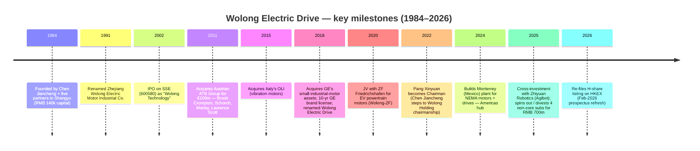
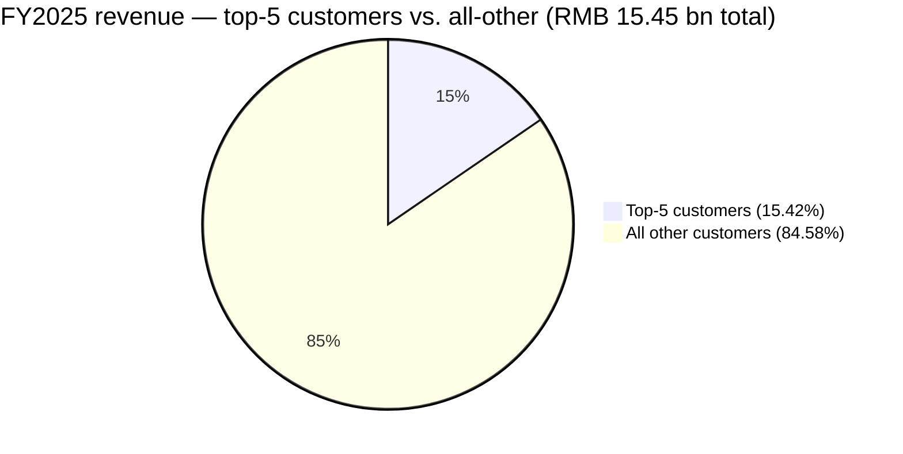
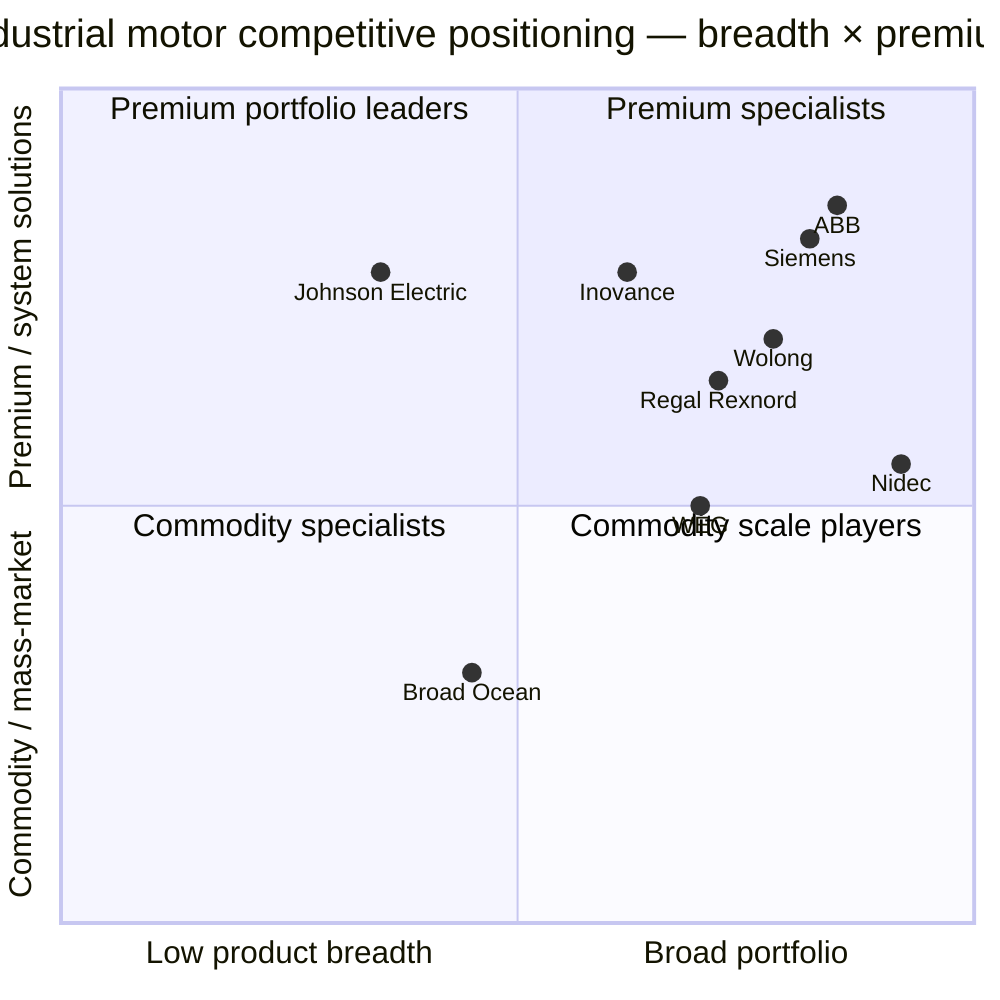

# COMPANY RESEARCH REPORT: Wolong Electric Drive Group (卧龙电气驱动集团股份有限公司, SSE:600580)

**Date:** 2026-05-16
**Analyst output language:** English (per `company-research` skill spec; Chinese names preserved on first mention)
**Primary disclosures cited:** [2025 年年度报告 (filed 2026-03-20)](http://static.cninfo.com.cn/finalpage/2026-03-20/1224867020.PDF), [2024 年年度报告 (filed 2025-04-25)](http://static.cninfo.com.cn/finalpage/2025-04-25/1224125531.PDF), [2025 年半年度报告 (filed 2025-08-12)](http://static.cninfo.com.cn/finalpage/2025-08-12/1224444818.PDF)

---

## Table of Contents

1. Company Overview
2. Company History
3. Management Team
4. Products & Services
5. Customers & Go-to-Market
6. Industry Overview
7. Competitive Landscape
8. Market Opportunity (TAM)
9. Risk Assessment

---

> **Update — Hong Kong dual-listing in flight, FY2025 net income +42% (2026-03-20):** Wolong Electric Drive filed its FY2025 annual report on 2026-03-20 ([2025 年年度报告](http://static.cninfo.com.cn/finalpage/2026-03-20/1224867020.PDF)). Revenue came in at RMB 15.45 bn (-4.88% YoY; +2.59% ex-divestiture), attributable net income RMB 1.126 bn (+42.04%), and operating cash flow RMB 1.78 bn (+15.98%). Separately, the company re-filed its H-share listing application to HKEX on 2026-02-27 (after the August 2025 prospectus lapsed), targeting a circa-USD 500 mn raise to fund its overseas-headquarters build-out and robotics / data-center / eVTOL growth lines ([新浪财经, 2026-03-01](https://finance.sina.com.cn/roll/2026-03-01/doc-inhpnscq6081856.shtml); [21 经济网, 2025-08-18](https://www.21jingji.com/article/20250818/herald/4ddfe4279ccb1ceddf38f9062c6bdb07.html)). Management did not initiate a formal full-year FY2026 revenue / EPS range, so this banner reports a printed-result raise rather than a guidance change.

---

## 1. Company Overview

Wolong Electric Drive Group (卧龙电气驱动集团股份有限公司, "Wolong Electric Drive" or "the Company"; SSE:600580) is China's largest and the world's leading group of motor and motion-control businesses. Founded in 1984 in Shangyu, Zhejiang and listed on the Shanghai Stock Exchange in June 2002, the Company today operates 30+ manufacturing plants across China, Italy, Austria, Germany, the UK, Mexico, Vietnam, the U.S. and Korea, and sells through five reporting segments: explosion-proof electric-drive system solutions (防爆电驱动系统解决方案), industrial electric-drive system solutions (工业电驱动系统解决方案), HVAC electric-drive system solutions (暖通电驱动系统解决方案), new-energy transport electric-drive system solutions (新能源交通电驱动系统解决方案), and robotics components & system applications (机器人组件及系统应用) ([2025 年年度报告, 第 24 页](http://static.cninfo.com.cn/finalpage/2026-03-20/1224867020.PDF)).

**What the company does.** Wolong designs, manufactures and services electric motors and the drives, inverters and control electronics that go with them — the literal "actuators" of industrial automation, HVAC, EVs, mining, oil & gas, marine, low-altitude aircraft and now humanoid robots. The product range spans from sub-watt fractional-horsepower home-appliance motors to multi-megawatt high-voltage explosion-proof motors for hydrocarbon, mining and power generation customers. The Company differentiates itself from low-cost commodity OEMs by leaning on (a) global brand portfolio acquired through a decade of M&A (Brook Crompton, Laurence Scott, Morley, Schorch, ATB, OLI, plus a 10-year license to GE's small-industrial-motor brand), and (b) integrated "system solutions" — selling not just the motor but the variable-frequency drive, gearbox, controller, condition monitoring and aftermarket service wrapped together ([Brands — Wolong](https://www.wolong-electric.com/about-wolong/wolong-brand); [2025 年年度报告, 第 22 页](http://static.cninfo.com.cn/finalpage/2026-03-20/1224867020.PDF)).

**How they make money.** Roughly 90% of revenue is product sales of motors, drives and rotating equipment; the balance comes from system-integration projects, third-party testing / certification services and a small trading-business line (RMB 397.7 mn in FY2025, -16.83% YoY — [2025 年年度报告, 第 26 页](http://static.cninfo.com.cn/finalpage/2026-03-20/1224867020.PDF)). Pricing is largely engineered-product / spec-in, sold direct to global OEMs and end-users (Tier-1 HVAC brands, oil-and-gas EPCs, mining houses, EV OEMs, robotics start-ups) with a 143-distributor channel for spare-parts, service and certain SKU families ([每经网, 2025-08-14](https://www.nbd.com.cn/articles/2025-08-14/4013235.html)). Gross margin for FY2025 was 25.4% (FY2024: 24.1%; FY2023: 22.4%) — a clear multi-year up-shift driven by mix improvement into permanent-magnet and HVAC EC motors, plus the divestiture of lower-margin new-energy businesses in 2025 ([2025 年年度报告, 第 23 页](http://static.cninfo.com.cn/finalpage/2026-03-20/1224867020.PDF)).

**Geography.** Wolong has been pursuing a "Three-Thirds" strategy — one-third Americas, one-third EMEA, one-third Asia-Pacific. Disclosed FY2025 splits: Americas RMB 2.18 bn (+4.1% YoY), EMEA RMB 2.47 bn (-3.3%), APAC ex-China RMB 1.56 bn (+45.6%), Mainland China RMB 8.91 bn (-12.1%) — total overseas now 39% of segment revenue, up from a low-30s base in 2023 ([2025 年年度报告, 第 24 页](http://static.cninfo.com.cn/finalpage/2026-03-20/1224867020.PDF)). The 45.6% APAC-ex-China jump and the 12% China-domestic drop both reflect deliberate "overseas trench-warfare" (海外阵地战) prioritization that management has been pushing since 2023.

**Scale.** FY2025 revenue RMB 15.45 bn (USD ~2.14 bn at 7.20 RMB/USD), attributable net income RMB 1.126 bn, attributable equity RMB 10.96 bn, total assets RMB 25.22 bn. Annualized production for FY2025: 15.63 GW of explosion-proof drives, 14.83 GW of industrial drives, 83.3 mn HVAC motors and 557k EV powertrain motors ([2025 年年度报告, 第 25 页](http://static.cninfo.com.cn/finalpage/2026-03-20/1224867020.PDF)). Wolong's own H-share prospectus claims it is the **#1 global supplier of explosion-proof drive systems by FY2024 revenue (≈4.5% share)**, **#4 in industrial drive systems (≈2.8%)**, and **#5 in HVAC drive systems (≈2.0%)** ([新浪财经, 2026-03-19, citing Frost & Sullivan](https://finance.sina.com.cn/wm/2026-03-19/doc-inhrnvix8759528.shtml)).

**Valuation snapshot (as of 2026-05-16).** Share price RMB 44.66, market cap RMB ≈65.6 bn (≈ USD 9.1 bn). TTM EPS RMB 0.63, putting **TTM P/E at ≈70.9×**; TTM P/S at ≈4.2× on FY2025 revenue ([Investing.com — Wolong (600580)](https://www.investing.com/equities/wolong); cross-check [stockanalysis.com — SHA:600580](https://stockanalysis.com/quote/sha/600580/)). The stock has run ≈91% over the last 12 months on the back of the humanoid-robot narrative. The trailing P/E sits well above the company's own 3-year average of mid-20s (in the 2022–2023 trough the multiple was 25–35×) — a clear re-rating from "global mid-cap industrial" toward "humanoid-supply-chain pure-play".

**Peer comp & interpretation.** The peer set is a mix of pure-play industrial automation (Inovance), regional motor giants (Nidec, Regal Rexnord) and Western diversified electricals (ABB, Siemens) — see Section 7 for the framework and Figure 3 below for the bar chart.

| Peer | Ticker | TTM P/E | TTM P/S | Source |
|---|---|---|---|---|
| Wolong Electric Drive | SSE:600580 | **70.9×** | 4.2× | [Investing.com](https://www.investing.com/equities/wolong) |
| Shenzhen Inovance | SZSE:300124 | 35.4× | 4.2× | [Yahoo Finance — 300124.SZ](https://finance.yahoo.com/quote/300124.SZ/key-statistics/) |
| Nidec | TYO:6594 | 13.7× | 0.8× | [Macrotrends — Nidec PE](https://www.macrotrends.net/stocks/charts/NJDCY/nidec/pe-ratio) |
| Regal Rexnord | NYSE:RRX | 49.6× | 2.4× | [PitchBook profile](https://pitchbook.com/profiles/company/12764-26) |
| ABB | SIX:ABBN | 35.0× | 3.6× | [stockanalysis.com — ABBN](https://stockanalysis.com/quote/swx/ABBN/statistics/) |
| Siemens | ETR:SIE | 24.0× | 1.4× | [Simply Wall St — Siemens](https://simplywall.st/stocks/de/capital-goods/etr-sie/siemens-shares) |

Peer median P/E ≈ 35×; peer median P/S ≈ 3.0×. **Wolong trades at almost exactly 2× the peer P/E median**, which clears the "stretched multiple" threshold defined in the SKILL spec. The driver is not core motor margins (the legacy book is growing only low-single-digit) but the **humanoid-robot optionality**: investors are pricing the robotics-components segment (FY2025 revenue RMB 516 mn, 3.3% of group) as if it were going to compound at 50%+ for a decade, and treating the rest of the company as a free option. That stance is defensible if Tesla Optimus, Unitree, UBTECH, Zhiyuan (Agibot) and Figure each get to even modest five-figure shipment volumes by 2028; it is fragile if any single major OEM insources motor stacks or if government-subsidy tailwinds reverse. We carry this multiple compression as a Section 9 risk.

Source: [2025 年年度报告, 第 8 页](http://static.cninfo.com.cn/finalpage/2026-03-20/1224867020.PDF); [2024 年年度报告, 第 9 页](http://static.cninfo.com.cn/finalpage/2025-04-25/1224125531.PDF); [2022 年年度报告, 第 11 页](http://static.cninfo.com.cn/finalpage/2023-04-28/1216699648.PDF).

## 2. Company History

Wolong's origin is one of the canonical 1980s Chinese township-enterprise stories. In 1984, in Hao-bei Village, Hao-ba Township at the foot of **Wolong Mountain (卧龙山) in Shangyu County, Zhejiang**, Chen Jiancheng (陈建成, then a 26-year-old deputy director of a local fiberglass factory) and five partners pooled RMB 140,000 to start the Shangyu Multi-speed Micro-motor Factory (上虞多速微电机厂). The first product, a JW-series electric motor, shipped in 1985 ([极趣网 — 陈建成简介](http://ji7.net/chuangye/show_3159.html); [百度百科 — 陈建成](https://baike.baidu.com/item/%E9%99%88%E5%BB%BA%E6%88%90/3256636)). The plant was renamed Zhejiang Wolong Electric in 1991, listed on the Shanghai Stock Exchange in June 2002 ("Wolong Technology"), and re-branded as "Wolong Electric Drive Group" in 2018 to signal the pivot from electric motors to integrated drive systems.

From 2002 onward Chen used the listed-co balance sheet — plus the unlisted parent Wolong Holding (卧龙控股) — to roll up overseas brands at distressed prices. Three deals matter most: (1) the **2011 takeout of Austrian ATB Group for €100.5 mn**, which brought UK brands Brook Crompton, Laurence Scott and Morley plus Germany's Schorch under one roof and instantly made Wolong the #3 motor manufacturer in Europe ([Drives & Controls, 2011](https://drivesncontrols.com/chinese-company-buys-brook-cromptons-parent-atb-for-e100m/)); (2) the **2015 acquisition of Italy's OLI** (vibration motors / industrial vibrators), expanding the niche-motor portfolio and giving Wolong an Italian R&D base; and (3) the **2018 license-and-asset deal with General Electric** for GE's small-industrial-motor business in North America, including a 10-year right to use the GE brand on industrial motors — a positioning coup that legitimized Wolong with U.S. OEMs ([Brands — Wolong](https://www.wolong-electric.com/about-wolong/wolong-brand)).

Source: timeline assembled from [发展历程 — 卧龙电驱](https://www.wolong.com.cn/about-wolong/milestones), [新浪财经, 2025-03-26](https://finance.sina.com.cn/roll/2025-03-26/doc-ineqxtzs6181869.shtml), [新浪财经, 2025-09-05](https://finance.sina.com.cn/stock/hkstock/hkzmt/2025-09-05/doc-infpkxsq2688181.shtml).

**Three strategic pivots stand out.** First, in 2010-2011 Wolong shifted from a domestic-only motor company to a *globalizer-by-acquisition* — the ATB deal was effectively a reverse channel-acquisition, buying Wolong instant credibility with European HVAC, oil-gas and marine customers. Second, around 2017-2019 Wolong added *system solutions* on top of components, integrating drives + motors + controllers so it could compete in solution RFPs against Siemens and ABB rather than only on motor unit price. Third, since 2023 it has actively *pruned non-core* — divesting solar PV, hydrogen and several real-estate-like subsidiaries, with management saying the proceeds free up capital for robotics, data-center motors and electric-aviation propulsion ([新浪财经, 2025-03-26](https://finance.sina.com.cn/roll/2025-03-26/doc-ineqxtzs6181869.shtml); [2025 年年度报告, 第 12 页](http://static.cninfo.com.cn/finalpage/2026-03-20/1224867020.PDF)). The current playbook — "three growth curves" of legacy motor base, system solutions, and humanoid / aviation / data-center — was formally codified in the 2025 annual report.

**Recent developments (last 24 months).** (a) March 2025 cross-investment with Shanghai Zhiyuan New Creation Technology (智元机器人 / Agibot) — Wolong subsidiary Hill Robotics (希尔机器人) took capital from Zhiyuan, and nine days later Wolong invested in Zhiyuan's Series B+ for an 0.74% stake at a post-money north of RMB 15 bn ([新浪财经, 2025-03-27](https://finance.sina.com.cn/stock/relnews/cn/2025-03-27/doc-ineqzssz8442826.shtml); [中国创投, 2025-04-15](https://www.chinaventure.com.cn/news/80-20250415-385895.html)). (b) August 2025: filed first H-share prospectus with HKEX; lapsed Feb-2026; refiled Feb-27-2026 ([网易, 2026-02-28](https://c.m.163.com/news/a/KN5UVHEC05199NHJ.html)). (c) Spring 2026 Spring Festival Gala (春晚) viral moment: Unitree H1 robots performed at the gala — Unitree subsequently confirmed Wolong as one of the joint-motor suppliers, which catalyzed a re-rating of the stock ([东方财富, 2026-02-19](https://emcreative.eastmoney.com/app_fortune/article/index.html?artCode=20260219072316669158380&postId=1670060671); [钛媒体, 2026-02](https://www.tmtpost.com/7886661.html)). (d) Mid-2025 onward: management split sales into three regional HQs (Americas / EMEA / APAC) plus China-domestic; opened Monterrey, Mexico plant for NEMA motors and drives, and ramped Vietnam capacity.

## 3. Management Team

### Pang Xinyuan (庞欣元) — Chairman (2022-present)

Pang Xinyuan is the principal architect of today's Wolong Electric Drive and runs the day-to-day strategy of the listed company, while founder Chen Jiancheng has retained the chairmanship of the unlisted parent Wolong Holding. Born 1979 (Macao SAR Chinese national), Pang is unusually well-credentialed for a Chinese mid-cap industrial CEO: B.Eng. in industrial foreign trade from Shanghai Jiao Tong University, M.Sc. from the University of Leeds (UK), EMBA from CEIBS, and a Doctor of Business Administration from Arizona State University ([2025 年年度报告, 第 41 页](http://static.cninfo.com.cn/finalpage/2026-03-20/1224867020.PDF); [证券大数据 — 庞欣元](https://stock.zlck.com/djg/V14ojT.html)).

He started his career at Vishay China Investment, joined Wolong Holding in April 2013 as VP, became a director of Wolong Electric Drive in September 2014, and was appointed GM (总经理) of the listed company in January 2016 at age 36. From mid-2017 he ran the international-sales business unit, then global-sales HQ from 2019 to 2021. He took over as Chairman in January 2022 from founder Chen Jiancheng ([产业在线, 2022](http://www.chinaiol.com/News/Content/202201/33_35309.html)).

What Pang has specifically delivered: (a) revenue compounded from RMB 14.0 bn (FY2021) to RMB 15.45 bn (FY2025), a modest 2.5%/yr CAGR on the headline but with substantial mix improvement — net income roughly tripled from RMB 0.31 bn (FY2022 trough, after a one-off impairment hit) to RMB 1.126 bn (FY2025); (b) gross margin lifted from 21.1% (FY2022) to 25.4% (FY2025), entirely from product-mix, plant-level cost-out and the prune of low-margin trading + new-energy businesses; (c) overseas revenue share lifted from low-30s% to 39% of segment revenue in FY2025; (d) the cross-investment with Zhiyuan Robotics, which (together with the Unitree relationship) re-cast Wolong from "global mid-cap motor company" to "China humanoid Tier-1 supplier" in equity-market eyes; (e) opened the Monterrey (Mexico) production base and is ramping Vietnam capacity to insulate from US tariffs ([2025 年年度报告, 第 19-20 页](http://static.cninfo.com.cn/finalpage/2026-03-20/1224867020.PDF)).

Pang holds 977,471 shares directly (≈RMB 43.6 mn at the current price) and received RMB 1.36 mn cash compensation in FY2025 ([2025 年年度报告, 第 41 页](http://static.cninfo.com.cn/finalpage/2026-03-20/1224867020.PDF)). His relevance is high but his personal wealth from the platform is dwarfed by the parent's stake — i.e. Pang is a professional CEO, not a controlling owner.

### Wan Chuangqi (万创奇) — President (2025-present, formerly large-drives division head)

Promoted to Group President in July 2025, replacing Li Ming who retired. Born 1972, senior engineer, master's degree, deputy at Henan Provincial People's Congress. Career inside Wolong since at least 2010 — ran Wolong Huai'an Qingjiang Motor, then Wolong Jinan Electric Motor, then the China-sales HQ. From November 2019 to August 2025 he was president of the Large Drives Business Group (the explosion-proof + heavy-industrial unit, which is the highest-margin part of the company), and concurrently chairman / GM of the Nanyang Explosion-proof subsidiary. As president, he now owns the day-to-day P&L responsibility across all five segments. Holds 1.64 mn shares (RMB ~73 mn at current price); FY2025 cash comp RMB 1.57 mn ([2025 年年度报告, 第 41-42 页](http://static.cninfo.com.cn/finalpage/2026-03-20/1224867020.PDF)).

### Yang Zijiang (杨子江) — CFO

Born 1982, CFO since September 2023. Prior role: CFO of Austrian subsidiary ATB Austria Antriebstechnik AG — a critical credential because ATB is Wolong's largest cross-border operating unit and was where the group cut its teeth on European cost-of-capital, multi-currency hedging and IFRS reporting. Yang brought 80,000 restricted shares of compensation grant in 2024 and earned RMB 906k cash in FY2025 ([2025 年年度报告, 第 42 页](http://static.cninfo.com.cn/finalpage/2026-03-20/1224867020.PDF)). His near-term task is the HKEX dual-listing — translating Chinese-GAAP accounts into IFRS-ready disclosure, getting the Cornerstone book locked, and managing the US tariff-related foreign-exchange exposure (the Company's Mexican / Vietnamese expansions have meaningfully complicated working-capital management).

### Chen Jiancheng (陈建成) — Founder, Wolong Holding chairman; personal stake in 600580

Although Chen relinquished the listed-co chairmanship in 2022, he remains the controlling shareholder via two vehicles — **Zhejiang Wolong Shunyu Investment** (浙江卧龙舜禹投资, holding 32.48% of 600580) and **Wolong Holding Group** (卧龙控股, holding 4.74%) — plus direct ownership of 25.38 mn shares (1.62%) ([2025 年年度报告, 第 69 页](http://static.cninfo.com.cn/finalpage/2026-03-20/1224867020.PDF)). Aggregated, the Chen family / Wolong Holding orbit controls ≈39% of the listed company. Chen is a Zhejiang serial industrialist who has also been involved in solar PV, real estate and trading — not without controversy: a 2025 OFweek article catalogued four loss-making solar / new-energy subsidiaries that the group has rotated through in recent years ([OFweek, 2025-01](https://solar.ofweek.com/2025-01/ART-260001-8420-30655331.html)). For investors in 600580, Chen's influence is structural — major capital-allocation moves (acquisitions, the H-share listing, the Zhiyuan cross-investment) all bear his fingerprints, even when Pang signs the announcements.

### Governance

The Board has 9 directors (3 independent), with audit, nomination, compensation and strategy committees. New PRC Company Law (effective 2024-07) led Wolong to dissolve the 监事会 (supervisory board) and migrate oversight to the Board's Audit Committee — implemented in 2025 ([2025 年年度报告, 第 38 页](http://static.cninfo.com.cn/finalpage/2026-03-20/1224867020.PDF)). Insider ownership is high (≈39% controlled by Chen family vehicles); free float is ~50%. No related-party transactions of material consequence in FY2025; no horizontal-competition concerns flagged. Total comp of all directors / senior management combined was RMB 10.3 mn for FY2025 — modest by global standards, reflecting equity-heavy compensation (employee restricted-stock plans). Two directors (Ma Yajun, Li Yinggang) joined in August 2025 and represent Wolong Holding (the controlling shareholder); they receive zero comp from the listed co. The Auditor is XYZH (信永中和) — a Big-Four-adjacent firm that has audited Wolong continuously for many years.

### Track record synthesis

Pang has demonstrably executed: margins up 400 bps over three years, net income tripled, overseas mix lifted, and the company has been re-framed as a humanoid-supply-chain Tier-1 in the eyes of the market — all without an equity raise. The gap is mostly in the new-business curves: data-center motors, eVTOL propulsion and robotics components are still single-digit-percent of revenue, and the Company has yet to prove it can scale these without margin dilution. The founder's involvement is a feature (capital-allocation patience) but also a risk (related-party complexity at the parent).

## 4. Products & Services

Wolong's website organizes the catalog by application (smart building, green industry, e-mobility) and the annual report by segment ([产品中心 — Wolong](https://www.wolong.com.cn/products)). The five reporting segments below capture everything material.

```mermaid
graph TD
    A[Wolong Electric Drive] --> B[Explosion-proof drives<br/>RMB 4.63 bn FY25, 30% gross margin]
    A --> C[Industrial drives<br/>RMB 4.10 bn, 30% gross margin]
    A --> D[HVAC / appliance drives<br/>RMB 4.96 bn, 17.5% gross margin]
    A --> E[New-energy transport drives<br/>RMB 0.43 bn, 6.1% gross margin]
    A --> F[Robotics components & systems<br/>RMB 0.52 bn, 26.2% gross margin]
    B --> B1[Ex-d / Ex-e LV/HV motors<br/>Nanyang Explosion-proof base]
    B --> B2[Mining motors / drives<br/>methane-rated, 6kV–10kV]
    B --> B3[O&G system solutions<br/>integrated drives + control]
    C --> C1[HV/LV induction motors<br/>NEMA / IEC]
    C --> C2[Permanent-magnet motors<br/>IE5 / IE4 efficiency]
    C --> C3[Variable-frequency drives<br/>Brook Crompton, Schorch, ATB brands]
    C --> C4[Water-treatment pumps & systems]
    D --> D1[Air-conditioner motors<br/>Wuhu / Jinan plants]
    D --> D2[EC fan motors / blower motors]
    D --> D3[Washer-dryer / refrigerator motors]
    E --> E1[NEV traction motors<br/>Wolong-ZF JV]
    E --> E2[Marine / e-boat motors]
    E --> E3[E-motorcycle motors]
    E --> E4[eVTOL propulsion motors<br/>SJTU JV, early-stage]
    F --> F1[Frameless torque motors<br/>42 N·m/kg density]
    F --> F2[Hollow-shaft motors<br/>aka 'hollow-cup' / coreless]
    F --> F3[Joint modules / actuators<br/>integrated motor+gearbox+driver]
    F --> F4[Servo motors + controllers]
    F --> F5[Hill Robotics — system integration<br/>industrial cobots, SCARA]
```

Source: structure from [2025 年年度报告, 第 24 页](http://static.cninfo.com.cn/finalpage/2026-03-20/1224867020.PDF) and [Wolong product center](https://www.wolong.com.cn/products); FY2025 segment revenue from same.

### Segment 1 — Explosion-proof drives (防爆电驱动) — RMB 4.63 bn, 30.0% segment GM

Wolong is the global #1 in explosion-proof motors by FY2024 revenue (≈4.5% share, Frost & Sullivan via H-share filing) ([新浪财经, 2026-03-19](https://finance.sina.com.cn/wm/2026-03-19/doc-inhrnvix8759528.shtml)). The line is anchored at the Henan Nanyang Explosion-proof subsidiary (南阳防爆) — a large-frame motor plant that Wolong rolled up. Customers are global oil & gas operators (Sinopec, CNPC, Aramco, Shell), petrochemical EPCs, coal-mining houses, and increasingly the rotating-equipment buyers inside coal-to-chemicals projects (煤化工) in Shaanxi, Inner Mongolia and Xinjiang. **Competitive advantage: yes — regulatory / certification + scale.** The Ex-d / Ex-e certification process is multi-year and country-specific; Wolong has IECEx / ATEX / GB approvals across its full SKU range and the brand list (Schorch, ATB, Brook Crompton) carries 100+ years of OEM-approval credibility in Europe and the Middle East. Closest competing products: Siemens Innomotics' SIMOTICS explosion-proof line and ABB's M3JP series; on Ex-d HV motors > 3 MW Wolong is at parity on spec but 10-20% below Siemens / ABB on price (channel checks from rotating-equipment trade press). Revenue grew -1.4% in FY2025 (-2.6% on cost), but gross margin expanded 80 bps to 32.2% — i.e. management is sacrificing top-line growth for margin discipline in a soft global capex cycle ([2025 年年度报告, 第 24 页](http://static.cninfo.com.cn/finalpage/2026-03-20/1224867020.PDF)).

### Segment 2 — Industrial drives (工业电驱动) — RMB 4.10 bn, 30.0% GM

The "horizontal" book — LV/HV induction and permanent-magnet motors for water pumps, compressors, fans, conveyors and general machinery. Sold through the ATB Group + Brook Crompton + Schorch + GE-branded channels overseas, and through Wolong-direct + distributors in China. Big FY2025 push: replacing legacy IE3 induction motors with IE4 / IE5 permanent-magnet units to capture the EU Eco-design tightening that took effect in 2023 and China's new GB 18613-2025 motor-efficiency standard. **Competitive advantage: partial — brand + scale, but moat is narrower than explosion-proof.** Closest competing products: WEG's W22 PM, ABB's M3BP, Siemens SIMOTICS GP, Nidec's Leroy-Somer LSRPM. Wolong is at parity on efficiency curves but behind ABB / Siemens on factory-automation system integration. Revenue +0.8% in FY2025; gross margin +1.6 pp to 30.0%.

### Segment 3 — HVAC / appliance drives (暖通电驱动) — RMB 4.96 bn, 17.5% GM

The volume engine — fractional-HP motors for room air conditioners, refrigerators, washing machines, dryers, kitchen hoods. Two dynamics: (a) China's 以旧换新 ("trade-in") household-appliance subsidies have boosted demand from Midea, Gree, Haier, Hisense, and (b) North American / European heat-pump conversions are pulling Wolong's EC fan motors at a faster rate (8.0% segment revenue growth in FY2025, the fastest of the legacy segments). Production volume 83.3 mn units in FY2025, +10.0% YoY. **Competitive advantage: partial — scale + China cost position.** Closest competing products: Nidec's appliance-motor unit (the largest globally), Welling (Midea's in-house), Broad Ocean. Wolong is mid-pack; the segment's 17.5% gross margin (lowest of the five) reflects commodity-like pricing.

### Segment 4 — New-energy transport (新能源交通) — RMB 0.43 bn, 6.1% GM

EV / NEV powertrain motors via the Wolong-ZF JV (with ZF Friedrichshafen, established 2020 in Jiaxing for EV drive motors), plus marine motors for electric inland vessels and e-motorcycle motors. Volume 557k units FY2025, +16.3% YoY in shipments. **Margin is structurally low** (6.1% segment GM) because Chinese NEV OEMs use motor suppliers as price-takers. Management has been actively *de-emphasizing* this segment — the divestiture of new-energy subsidiaries in 2025 was specifically this line of business. **Competitive advantage: no, at the consolidated level — over-supplied market.** Closest competing products: Inovance EV powertrains, Founder Motor, Broad Ocean. Wolong's edge is the ZF brand and engineering, but in China's NEV downcycle that has not been enough to defend margin. **Roadmap note**: management is repositioning toward higher-spec applications — eVTOL propulsion via the 2024 JV with Shanghai Jiao Tong University's electric-aviation research center ([SJTU AITRI announcement](https://aitri.sjtu.edu.cn/aitri/doc/a89f92b3-dfc9-4d74-b2b5-4c8505912aa2)) — where unit prices and ASPs are 10-50× higher than ground-EV motors.

### Segment 5 — Robotics components & system applications (机器人组件及系统应用) — RMB 0.52 bn, 26.2% GM, **the optionality**

The segment investors are paying for. FY2025 revenue RMB 516 mn (+14.1% YoY), gross margin 26.2% (slightly lower than FY2024's 27.2% as production scales). The portfolio:

- **Frameless torque motors (无框力矩电机)** — high-torque-density, hollow-shaft motors that go inside humanoid-robot joints (elbows, knees, shoulders, hips). Wolong's published spec is 42 N·m/kg torque density, which the Company claims passed Tesla's Optimus Gen-3 72-hour endurance test ([机器人大讲堂, 2025](https://www.leaderobot.com/news/6073); [honest-hls.com analysis, 2025](https://www.honest-hls.com/frameless-torque-motor)). Per Wolong's own breakdown, a humanoid robot uses ≈26 frameless torque motors per unit.
- **Joint modules (关节模组)** — integrated assemblies combining a frameless torque motor + harmonic-reducer / planetary gearbox + servo driver + position encoder, sold as one "joint" SKU. Wolong's joint modules are deployed in Zhejiang Humanoid Robot Innovation Center's "Navigator 2" ("领航者 2 号") and supplied to Zhiyuan ([leaderobot, 2025](https://www.leaderobot.com/news/6073)).
- **Hollow-cup / coreless motors** — for dexterous hands and fine-motion joints.
- **Servo motors & controllers** — for industrial cobot OEMs and increasingly humanoid customers.
- **Industrial cobot system integration via Hill Robotics (希尔机器人)** — Wolong's holding-level subsidiary that resells SCARA and cobot systems and now has Zhiyuan as a minority shareholder.

**Competitive advantage: yes — moat is technology / process know-how plus scale economies in motor manufacturing.** The frameless-torque-motor market is being chased by Inovance, Nidec, Moog and ~20 Chinese start-ups; Wolong's edge is that it can pour torque-motor production into existing motor lines and amortize the metal-stamping / winding capex against its 80+ mn-unit HVAC platform. Closest competing products: **Johnson Electric's frameless torque motor for humanoid joints** ([Johnson Electric — Humanoid Joint Motors](https://www.johnsonelectric.com/en/products/humanoid-robot-joints/frameless-torque-motor)) and **CubeMars humanoid robot motors** ([CubeMars](https://www.cubemars.com/categorys/humanoid-robot-motor)) — Wolong appears ahead of CubeMars on torque density and at parity with Johnson Electric on spec but with a sharper China-OEM commercial footprint. Named OEM relationships confirmed so far: **Unitree Robotics** (公开确认 — joint-motor supply for H1, sources cite collaboration ongoing; Unitree shipped 5,500+ humanoid units in 2025) ([新浪财经, 2026-02-19](https://finance.sina.cn/stock/jdts/2026-02-19/detail-inhnkimk0943097.d.html)); **Zhiyuan / Agibot** (智元) — direct customer and cross-shareholder; **UBTECH** (优必选) — supplier relationship reported; **Tesla Optimus** — small-batch trial / qualification samples confirmed, but the widely-circulated "500,000 motors" headline order has *not* been confirmed by either Tesla or Wolong and should be treated as unverified rumor (multiple Chinese-media outlets, no SEC or HKEX filing as of report date). FY2025 H1 robotics revenue was RMB 218 mn (2.7% of H1 revenue), implying the segment doubled in 2H 2025 to reach the full-year RMB 516 mn ([搜狐, 2025-08](https://m.sohu.com/a/965808341_122014422)).

### Flagship vs long-tail

The **three flagships** driving the equity story today are: (1) explosion-proof drives (cash cow, #1 globally), (2) HVAC EC motors (the trade-in tailwind beneficiary, and the production base that gives Wolong scale economies it can leverage into robotics), and (3) frameless torque motors + joint modules (the option). Long-tail / decline: low-end NEV powertrains, vibration-machinery accessories, the trading-business subsidiaries.

### Recent launches / sunsets

- **Launched (2025)**: 26-DoF humanoid joint module family; IE5-class permanent-magnet HVAC EC motor series; first commercial eVTOL electric propulsion unit prototypes; Monterrey-built NEMA medium-voltage motors and drives for North America.
- **Sunset / divested (2025)**: four solar / new-energy / property-adjacent subsidiaries sold for RMB ~700 mn ([新浪财经, 2025-03-26](https://finance.sina.com.cn/roll/2025-03-26/doc-ineqxtzs6181869.shtml)); legacy trading business shrunk to RMB 398 mn (-16.8% YoY).

Source: [2025 年年度报告, 第 24 页](http://static.cninfo.com.cn/finalpage/2026-03-20/1224867020.PDF); FY2024 numbers from [2024 年年度报告, 第 25 页](http://static.cninfo.com.cn/finalpage/2025-04-25/1224125531.PDF).

## 5. Customers & Go-to-Market

**Customer segments.** Wolong sells into five customer pools that map cleanly to the five reporting segments: (a) global O&G operators + EPC contractors + mining houses (explosion-proof); (b) industrial OEMs (compressors, pumps, fans, conveyors), water-utility integrators, machinery builders (industrial); (c) global household-appliance OEMs and HVAC system makers (HVAC) — named customers in IR materials include Midea (美的), Gree (格力), Haier (海尔), Hisense, Whirlpool, BSH, Carrier and Daikin; (d) NEV OEMs and marine builders (new-energy transport); and (e) humanoid-robot OEMs + industrial-cobot system integrators (robotics) — named relationships include Unitree (宇树), Zhiyuan / Agibot (智元), UBTECH (优必选), Zhejiang Humanoid Robot Innovation Center, with Tesla Optimus as a qualified sample customer.

Source: [2025 年年度报告, 第 26 页](http://static.cninfo.com.cn/finalpage/2026-03-20/1224867020.PDF) — top-5 sales RMB 2,382.17 mn / total revenue RMB 15,453.54 mn = 15.42%. Wolong does *not* name its top-5 customers in the public filing.

**Customer concentration — quantified multi-year trend.**

| Fiscal year | Top-5 customer sales (RMB mn) | Top-5 % of revenue | Source |
|---|---|---|---|
| FY2021 | 1,599.14 | **11.42%** | [2021 年报, 第 15 页](http://static.cninfo.com.cn/finalpage/2022-04-29/1213188459.PDF) |
| FY2022 | 2,014.67 | **13.43%** | [2022 年报, 第 19 页](http://static.cninfo.com.cn/finalpage/2023-04-28/1216699648.PDF) |
| FY2023 | 1,468.02 | **9.64%** | [2023 年报, 第 21 页](http://static.cninfo.com.cn/finalpage/2024-04-28/1219810000.PDF) |
| FY2024 | 2,236.32 | **14.10%** | [2024 年报, 第 25 页](http://static.cninfo.com.cn/finalpage/2025-04-25/1224125531.PDF) |
| FY2025 | 2,382.17 | **15.42%** | [2025 年报, 第 26 页](http://static.cninfo.com.cn/finalpage/2026-03-20/1224867020.PDF) |

This is one of the **most-fragmented customer books in our coverage of Chinese industrial mid-caps**. Top-5 share has averaged 12.8% over five years and was never above 16%. Wolong does not disclose single-largest-customer share, but with top-5 at 15.4%, even an evenly-split top-5 would put the largest customer below 5% — well clear of the SKILL.md 10% / 20% / 30% concentration thresholds. The structural reason is the breadth of end-applications: an oil & gas EPC, a Chinese HVAC giant, a European industrial-pump OEM, a humanoid-robot start-up and a marine builder do not concentrate purchases against each other. The fragmentation is a *defensive moat* on the demand side (no single customer can squeeze pricing) but cuts the other way too — Wolong has no "anchor whale" relationship like Foxconn's Apple business that can pull the company up by the scale of one customer. **No Section 9 customer-concentration risk is triggered**; in fact, we treat the low concentration as a positive in the risk discussion.

**Supplier concentration.** Top-5 supplier purchases were RMB 1,673.95 mn (15.25% of total procurement) in FY2025 — also low ([2025 年年度报告, 第 26 页](http://static.cninfo.com.cn/finalpage/2026-03-20/1224867020.PDF)). Wolong is vertically integrated for the higher-value motor steps (lamination stamping, winding, magnet assembly) so it consumes commodity steel, copper, NdFeB magnets and electronic components from broad supplier bases.

**Distribution channels.** Wolong's H-share prospectus disclosed 143 distributors handling ~9% of revenue, with the remaining 91% sold direct ([每经网, 2025-08-14](https://www.nbd.com.cn/articles/2025-08-14/4013235.html)). The direct channel uses an unusual three-axis matrix sales model: region sales (China, Americas, EMEA, APAC) × industry sales (O&G, HVAC, mining, etc.) × product managers — so the same target account (e.g. a global HVAC OEM with plants in Mexico) sees coordinated coverage. Aftermarket service and rotating-equipment overhaul go through ~30 regional service bases, which is a non-trivial moat — competitors selling motors from a single national HQ cannot match 24-hour onsite response in places like Saudi Arabia, Mexico, the UK and India.

**Sales cycle.** For explosion-proof and industrial systems: 6–24 months from RFQ to first shipment, then recurring orders. For HVAC: long-term frame agreements with OEMs (annual renewal, monthly call-offs). For robotics: 12–18 months qualification, then small-batch supply followed by volume ramps as the OEM's robot moves into mass production.

**Key partnerships.** ZF Friedrichshafen JV (EV motors), Shanghai Jiao Tong University AITRI (electric-aviation propulsion R&D), the GE small-motor license, and the equity / commercial cross-link with Zhiyuan Robotics. The Zhiyuan tie-up is the most consequential — it embeds Wolong as Tier-1 motor supplier into one of China's three best-funded humanoid platforms, where Zhiyuan was last valued at ≈ RMB 15 bn after its B+ round in 2025.

## 6. Industry Overview

Wolong sits across five overlapping industries — motors & drives, industrial automation, HVAC equipment, EV powertrain, and humanoid robot components. The first two are mature and slow-growing; the last is explosive and small.

**Industry definition — motors & drives.** Electric motors convert electrical energy into mechanical rotation; drives (variable-frequency drives / inverters / servo controllers) modulate motor speed and torque. The combined market includes induction motors, permanent-magnet (PM) synchronous motors, brushless DC (BLDC / EC), reluctance motors, plus the power-electronics drives that pair with them. NAICS 335312 (motor & generator manufacturing) covers the US scope; in China the industry is classified under C3812.

**Market size.** The global motors-and-drives market reached **USD 60.1 bn in 2025 and is forecast to reach USD 82.8 bn by 2031** at a 5.5% CAGR ([GlobeNewswire / Research and Markets, 2026-02-16](https://www.globenewswire.com/news-release/2026/02/16/3238603/0/en/Motors-and-Drives-Industry-Research-Report-2026-An-82-79-Billion-Market-by-2031-from-61-Billion-in-2025-with-ABB-Emerson-Electric-Nidec-Regal-Rexnord-Rockwell-Automation-and-WEG-Do.html)). The broader electric-motors market (including consumer / appliance / EV) was estimated at USD 205 bn+ for industrial+commercial+residential+transportation, with a 6%+ CAGR to 2029 ([Yahoo Finance / Research and Markets, 2024](https://finance.yahoo.com/news/205-bn-electric-motors-markets-084300219.html)). Within that, the energy-efficient motors sub-segment is forecast to reach **USD 59.3 bn by 2028** at an 8.2% CAGR — and this is where Wolong has its strongest growth tilt ([MarketsandMarkets, 2024](https://www.marketsandmarkets.com/ResearchInsight/energy-efficient-motor.asp)).

**Growth drivers (motors & drives).** (i) **Efficiency regulations** — EU Ecodesign Lot 30 (IE4 mandatory since 2023 for many ratings), China GB 18613-2025 (new motor energy efficiency standard pulling IE4/IE5), US DOE rule revisions — all force replacement of installed-base IE2/IE3 motors. (ii) **Electrification of mobility** (EVs, e-trucks, e-marine, eVTOL) — each EV uses 3–6 motors, traction + steering + pumps + HVAC; eVTOLs each use 6–8 high-power propulsion motors. (iii) **Data-center power capex** — AI training facilities require massive backup-generation + cooling-pump + HVAC fan-motor infrastructure; US data-center motor demand is being pulled by the Microsoft / OpenAI / Anthropic capex surge. (iv) **Robotics** — humanoid robots use ~24-30 actuators each; even 50,000 humanoid units = 1.2-1.5 mn motors. (v) **Heat-pump electrification** in Europe and North America.

**Industry structure (motors & drives).** Moderately consolidated. The global top-5 brands hold about 55% of shipments (ABB, Siemens / Innomotics, Nidec, Regal Rexnord, WEG), with a long tail of Chinese (Wolong, Inovance, Founder Motor) and regional (TECO, Toshiba, Hitachi, Sumitomo) brands ([Mordor Intelligence — Europe AC Motors](https://www.mordorintelligence.com/industry-reports/europe-alternating-current-motor-market)). Switching cost is moderate — motor specs are standardized (IEC / NEMA frames) but in spec-in industries (oil & gas Ex-rated, mission-critical HVAC, machine-tool servos) there are 12-36 month qualification cycles, which is what protects Wolong's explosion-proof and industrial books from low-cost Chinese commodity entrants.

**Industry definition — humanoid robotics / embodied AI.** The application industry pulling Wolong's robotics segment is humanoid bipedal robots — Tesla Optimus, Figure 02, Unitree H1/H2, UBTECH Walker S, Zhiyuan A1/G1, Boston Dynamics Atlas-Electric, Apptronik Apollo, 1X Neo. Each humanoid robot is, electrically, a collection of 20–30 motorized joints + sensors + controller + battery + AI brain. The "actuator stack" (motor + reducer + driver + encoder) is the largest hardware-BOM line item, comprising 35-50% of robot hardware cost depending on architecture.

**Growth driver (humanoid).** Per Wolong's own 2025 annual report, 2025 was "the year-zero of humanoid mass production" (人形机器人量产元年). Unitree disclosed 2025 humanoid shipments of 5,500+ units (excluding quadrupeds and wheeled designs) — six months after the Spring Festival Gala viral moment that put H1 in front of 800m TV viewers and lit up the supply-chain stocks ([新浪财经, 2026-02-19](https://finance.sina.cn/stock/jdts/2026-02-19/detail-inhnkimk0943097.d.html)). Tesla guided to "several thousand" Optimus in 2025 and "50-100k" in 2026, scaling to 500k by 2027 ([DeepNewz, 2025](https://deepnewz.com/robotics/tesla-to-scale-optimus-robot-production-to-500000-2027-50000-100000-2026-fa0951b6)). UBTECH, Figure, Zhiyuan have all announced four-figure 2026 build targets. The Chinese government's 2025 humanoid-robot industry policy designated it a "strategic emerging industry"; the EU and Japan have announced parallel R&D supports.

**Regulatory environment.** Motors are regulated primarily by efficiency standards (above). Explosion-proof has its own thicket — IECEx, ATEX, GB 3836, North American HazLoc CSA / UL — which is what makes Wolong's Nanyang base such a defensible asset (full multi-certificate coverage takes years to build). NEV motors are subject to vehicle-level type-approval. Humanoid robotics is essentially unregulated at the actuator-component level today; safety standards (ISO 13482 service-robot) apply at the integrator level.

**Industry dynamics.** Supplier power: moderate (NdFeB magnet supply is concentrated in Chinese rare-earths processors — Wolong benefits but is also exposed to export-control swings). Buyer power: moderate to high in HVAC and NEV (where OEMs dual-source); low in explosion-proof (where switching cost and certification stickiness protect incumbents). Substitutes: limited for rotating equipment (linear actuators substitute in narrow cases; pneumatics losing share to electric); barriers to entry: high in HV / Ex-rated motors, low in commodity LV induction motors. The dynamic is best characterized as a slow-growth, consolidating commodity core with several high-growth premium adjacencies (PM motors, humanoid actuators, eVTOL propulsion).

## 7. Competitive Landscape

We frame the competitive set into three groups — global incumbents, China industrial peers, and humanoid-actuator specialists.

Source: positioning composite from segment-level revenue / ASP analysis and brand-tier observations; revenue scale and breadth from each company's most recent annual report / 10-K.

### Direct global competitors

- **ABB (SIX:ABBN)** — global #1 in industrial drives and a top-3 motor brand. FY2024 revenue ~USD 33 bn, electrification + motion segments ~60% of that. Strong NEMA / IEC catalog; SCADA + drives + motors fully integrated. **vs Wolong**: ABB wins on system-integration credibility with industrial-automation buyers and Western OEMs; Wolong wins on price (10-20% below ABB on directly-comparable explosion-proof and IE4 PM motors) and on the China home market. ABB trades at TTM P/E ≈35× ([stockanalysis.com — ABBN](https://stockanalysis.com/quote/swx/ABBN/statistics/)).
- **Siemens / Innomotics (ETR:SIE; Innomotics is the carved-out motors business now majority-owned by KPS Capital)** — large-motor specialist, particularly strong in HV motors > 1 MW. **vs Wolong**: parity on top-of-range motors, but Innomotics has been losing share since the KPS carve-out and Wolong has been picking up Chinese / Middle East tenders that previously went to Innomotics ([impeller.net, 2024](https://impeller.net/magazin/innomotics-who-will-purchase-this-motor-giant/)).
- **Nidec (TYO:6594)** — global largest pure-play motor company, USD ~17 bn revenue, dominant in HDD / appliance / EV. **vs Wolong**: Nidec wins on appliance scale and on automotive integration (Leroy-Somer brand for industrial), but its EV motor business has been a margin disaster (Nidec wrote down its China EV business in 2024). Nidec trades at TTM P/E ≈14× — i.e. the market views it as a stressed leader, not a growth story.
- **Regal Rexnord (NYSE:RRX)** — USD 6 bn revenue post-Altra acquisition; strong in US commercial HVAC + industrial drivetrain. **vs Wolong**: RRX wins in US channel but is regional; Wolong is more global. RRX P/E ≈50× reflects the Altra deleveraging story plus US data-center HVAC pull.
- **WEG (B3:WEGE3)** — Brazilian motor giant, USD 7+ bn revenue, strong in industrial and renewable-energy generation. **vs Wolong**: similar profile but stronger in Latin America wind-turbine generators.

### China industrial peers

- **Shenzhen Inovance (SZSE:300124)** — the most-comparable Chinese peer. FY2024 revenue RMB 37.6 bn (TTM RMB 43.3 bn), market cap RMB 184 bn. Inovance leads in industrial drives (VFDs) and servos and has a fast-growing EV powertrain business; Wolong leads in motors, especially explosion-proof and HVAC. The two have only ~30% product-line overlap and increasingly look like complementary national champions. Inovance trades at TTM P/E ≈35× / P/S ≈4.2× ([Yahoo Finance — 300124.SZ](https://finance.yahoo.com/quote/300124.SZ/key-statistics/)).
- **Broad Ocean Motor (SZSE:002249)** — direct competitor in HVAC EC motors; weaker on premium PM and explosion-proof.
- **Founder Motor (SHE:002196)** — China-domestic NEV powertrain specialist; overlaps Wolong's lowest-margin segment.

### Humanoid-actuator specialists

- **Johnson Electric (HKEX:0179)** — Hong Kong-listed micro-motor specialist that has explicitly pivoted to humanoid-joint motors (frameless torque, hollow-shaft) over the last 24 months ([Johnson Electric humanoid joint motors](https://www.johnsonelectric.com/en/products/humanoid-robot-joints/frameless-torque-motor)). At parity with Wolong on torque-density spec; arguably ahead on miniaturization. Smaller in core motor revenue.
- **Leaderdrive (SSE:688017)** — Chinese harmonic-reducer specialist; complements motor suppliers like Wolong inside the joint module.
- **CubeMars / T-motor** — Chinese specialist brands aimed at the humanoid + drone market, but small (sub-RMB 1 bn revenue) and limited in heavy-industrial credibility.
- **Moog** — premium US specialist, strong in aerospace actuators, not yet major in humanoid mass production.

### Competitive advantages — synthesis

Wolong's defensible advantages are: (1) **the multi-brand portfolio** (Wolong + ATB + Brook Crompton + Schorch + Morley + Laurence Scott + Nanyang + OLI + licensed GE) — a feat no Chinese competitor can match cheaply, because these brands carry 50-100 years of OEM-qualification history; (2) **scale economies in motor manufacturing** that let it underprice Western incumbents by 10-20% while still earning 30%+ segment gross margin in explosion-proof and industrial; (3) **operational global footprint** — having a Mexican plant + a Vietnamese plant + multiple European plants is exactly the configuration Western OEMs are looking for in a post-tariff, "China-plus-one" sourcing environment; (4) **the early-mover position in humanoid frameless motors** with confirmed supply to Unitree, Zhiyuan, UBTECH; (5) **founder-controlled, patient capital** — Chen's 39% stake means Wolong can fund the eVTOL and humanoid build-out without dilutive equity raises (the HKEX listing is incremental, not survival capital).

### Competitive vulnerabilities

(a) Slower China-domestic growth has masked headline revenue stagnation — FY2025 China revenue was -12.1% YoY ([2025 年年度报告, 第 24 页](http://static.cninfo.com.cn/finalpage/2026-03-20/1224867020.PDF)). (b) The HVAC and NEV books have margins below the group average and are exposed to OEM price pressure (Midea / Gree / BYD / Geely are aggressive negotiators). (c) The robotics segment is still tiny (3.3% of revenue) and could be insourced — Tesla in particular has explicitly stated it wants vertical actuator integration. (d) Western customers have begun to mention "China-controlled supplier" as a procurement flag, especially in defense-adjacent applications.

Source: composite — [Investing.com — Wolong](https://www.investing.com/equities/wolong); [Yahoo Finance — 300124.SZ](https://finance.yahoo.com/quote/300124.SZ/key-statistics/); [PitchBook — RRX](https://pitchbook.com/profiles/company/12764-26); [stockanalysis.com — ABBN](https://stockanalysis.com/quote/swx/ABBN/statistics/); [Macrotrends — Nidec PE](https://www.macrotrends.net/stocks/charts/NJDCY/nidec/pe-ratio); [Simply Wall St — Siemens](https://simplywall.st/stocks/de/capital-goods/etr-sie/siemens-shares).

## 8. Market Opportunity (TAM)

We size Wolong's TAM in two parts — the legacy electric-motor TAM and the humanoid-actuator option.

**Part 1 — Motors & drives.** Per Research and Markets, the global motors-and-drives industry was **USD 60.1 bn in 2025 and is projected at USD 82.8 bn by 2031** (5.5% CAGR) ([GlobeNewswire, 2026-02-16](https://www.globenewswire.com/news-release/2026/02/16/3238603/0/en/Motors-and-Drives-Industry-Research-Report-2026-An-82-79-Billion-Market-by-2031-from-61-Billion-in-2025-with-ABB-Emerson-Electric-Nidec-Regal-Rexnord-Rockwell-Automation-and-WEG-Do.html)). Broader electric motors (consumer + commercial + industrial + transport) is USD 205 bn+ headed to USD 285+ bn by 2029 ([Yahoo Finance, 2024](https://finance.yahoo.com/news/205-bn-electric-motors-markets-084300219.html)). Within those, the energy-efficient (IE3/IE4/IE5) sub-segment is USD 59.3 bn by 2028 at 8.2% CAGR — fastest-growing of the motor sub-segments ([MarketsandMarkets](https://www.marketsandmarkets.com/ResearchInsight/energy-efficient-motor.asp)). Wolong's serviceable addressable market (SAM) is most of industrial + most of HVAC + the energy-efficient slice, which we estimate at USD ~50 bn growing 6-8%. Today's revenue of USD 2.1 bn = roughly **4% SAM share** — consistent with its disclosed #1 explosion-proof share of 4.5%, #4 industrial of 2.8% and #5 HVAC of 2.0% ([新浪财经 H-share filing summary, 2026-03-19](https://finance.sina.com.cn/wm/2026-03-19/doc-inhrnvix8759528.shtml)).

**Part 2 — Humanoid actuators (the option).** Sizing humanoid TAM requires assumptions: (a) unit price per humanoid: USD 20-50k retail in 2025-2027, falling to USD 5-15k by 2030; (b) actuator content per humanoid: USD 3-6k today (26+ joints × ~USD 150-250 each, including motor + reducer + encoder + driver), falling to USD 1-3k as scale drives motor cost down; (c) shipment volume: 2025 ≈ 15-20k humanoids globally, 2026 ≈ 100-200k (Tesla 50-100k + Unitree 10-20k + UBTECH / Zhiyuan / Figure / 1X cumulatively 30-80k), and 2030 plausibly 2-5 mn units in a base case ([DeepNewz, 2025](https://deepnewz.com/robotics/tesla-to-scale-optimus-robot-production-to-500000-2027-50000-100000-2026-fa0951b6); [新浪财经 — Unitree H1, 2026-02-19](https://finance.sina.cn/stock/jdts/2026-02-19/detail-inhnkimk0943097.d.html)). Base-case 2030 humanoid actuator TAM = 3 mn units × USD 3k actuator content = **USD 9 bn**. Bull case 5 mn units × USD 5k = USD 25 bn. Bear case 1 mn × USD 2k = USD 2 bn.

**Wolong's reasonable share.** As one of three-to-five qualified motor Tier-1s with confirmed customer wins, a 10-20% share of the humanoid-motor TAM is plausible — implying USD 0.9-1.8 bn revenue from humanoid alone in the base 2030 case, i.e. **comparable in size to Wolong's entire current explosion-proof or HVAC book**. That is the multi-bagger thesis the market is paying for.

**Adjacency opportunities.** (a) **Data-center motors and fans** — Wolong's H-share prospectus calls this out as a growth focus; with hyperscaler capex at USD 200+ bn / year and motor-content per MW of DC capacity at USD 50-100k, even 1% share of new builds is a USD 100-200 mn opportunity. (b) **eVTOL propulsion** — the JV with Shanghai Jiao Tong University's electric-aviation research center positions Wolong for the China low-altitude economy, sized at RMB 1.8-2.0 trillion by 2026 per Chinese government targets ([2025 年年度报告, 第 18 页](http://static.cninfo.com.cn/finalpage/2026-03-20/1224867020.PDF)). (c) **NEMA medium-voltage motors in North America** — the Monterrey plant directly addresses the US re-industrialization / nearshoring wave with USTR-safe production.

**Penetration strategy.** Wolong's playbook is unchanged: (a) be price-competitive on the commodity book; (b) use the global brand portfolio to win OEM spec-ins; (c) ride permanent-magnet penetration into IE4/IE5 share; (d) co-develop with humanoid OEMs (Zhiyuan cross-shareholding is the template) to lock in design-in.

## 9. Risk Assessment

### Company-specific risks (5)

**1. Execution risk — humanoid optionality may not convert to material revenue.** The robotics segment is RMB 516 mn (3.3% of FY2025 revenue) but is driving ~70% of the stock's re-rating. If Tesla / Unitree / Zhiyuan combined humanoid shipments in 2026-2027 disappoint relative to current expectations (50-100k Tesla + 10-20k Unitree + 30-80k Chinese others), the segment's growth trajectory could miss consensus by an order of magnitude. Mitigant: Wolong has confirmed multi-customer relationships and its legacy business funds the R&D so opportunity cost is modest.

**2. Insourcing risk by major humanoid OEMs.** Tesla has been explicit that it wants vertical integration of actuators for Optimus. Figure has insourced its actuator design. Wolong could be a *transitional* Tier-1 — useful in the qualification / small-batch phase, then displaced once OEMs hit scale. Mitigant: Wolong's manufacturing-cost position is hard to replicate, especially for OEMs without large motor plants; multi-customer base means losing one large OEM is recoverable.

**3. China-trading-business / related-party complexity at the parent.** Wolong Holding (the parent) has historically operated solar, real-estate-adjacent and trading businesses that have lost money. The H-share prospectus disclosure noted that some customers and suppliers overlap with related-party entities, and the trading business has been a recurring restructuring item ([每经网, 2025-08-14](https://www.nbd.com.cn/articles/2025-08-14/4013235.html); [财联社, 2025-08](https://www.cls.cn/detail/xk/68a72379480af9b64d0abd58)). Likelihood low for material accounting issues; severity moderate (potential governance discount).

**4. Geographic concentration in EMEA exposes to European industrial weakness.** EMEA revenue was RMB 2.47 bn (-3.3% YoY) in FY2025 — a 16% revenue contribution that is shrinking. If European industrial capex continues to soften, EMEA could become a sustained drag. Mitigant: Wolong is actively shifting EMEA-served production to lower-cost Vietnamese / Chinese plants and reallocating sales effort to APAC ex-China (+45.6% YoY in FY2025).

**5. Product-technology obsolescence in low-end NEV motors.** The new-energy-transport segment runs at 6.1% gross margin — a clear sign Wolong is unable to differentiate against Inovance / Founder / domestic Chinese competitors. The eVTOL pivot is a credible strategic answer but is years from material revenue.

### Industry / market risks (3)

**6. Competitive intensity in mid-range industrial motors.** ABB, Siemens / Innomotics, Nidec, WEG and Inovance are all targeting Wolong's mid-range IE4/IE5 sweet spot. The motor-and-drives market grows 5-6%/year in volume — i.e. competition is for share gains, not volume tailwind. Wolong's FY2025 revenue declined 4.9% (or +2.6% ex-divestitures), illustrating the difficulty of growing in a flat market.

**7. Humanoid-robot technology disruption — actuator architecture risk.** If next-generation humanoids shift from brushless rotary actuators to linear actuators (the Tesla / Sanhua reported approach), or to hybrid hydraulic-electric systems, the frameless-torque-motor TAM could grow more slowly than expected. Sanhua's reported USD 685 mn linear-actuator order from Tesla is suggestive ([Teslarati, 2025](https://www.teslarati.com/tesla-optimus-v3-design-finalized-china-rumors/)). Wolong sells both linear and rotary, but its current robotics revenue mix skews to rotary.

**8. Regulatory / efficiency-standard cycle risk.** A delay or softening of GB 18613-2025, EU Ecodesign Lot 30 tightenings, or US DOE motor rules would slow the IE4/IE5 replacement cycle that Wolong is positioning behind. Likelihood: low; severity: moderate.

### Financial risks (2)

**9. Valuation / multiple-compression risk — flagged here per Section 1 stretched-multiple analysis.** Wolong trades at TTM P/E 70.9× vs. peer median 35× — i.e. **2.0× the peer median, which clears the SKILL-defined stretched-multiple threshold**. The implied "fair" multiple given Wolong's underlying ~2-3% organic growth and ~25% gross margin would be 25-35× — meaning a humanoid-narrative breakdown could compress the share price by 40-60% even without any earnings miss. Triggers for de-rate: (a) a Tesla / Unitree / Zhiyuan shipment miss reported in 2H 2026; (b) a competitor (Johnson Electric, CubeMars, an OEM in-house team) winning a flagship contract Wolong was expected to win; (c) macro rotation out of "robotics theme" trades; (d) RMB FX move that depresses earnings translation. Mitigant: the humanoid customer list is broad, not single-OEM, and the H-share listing should bring fresh institutional support if it lands in late 2026.

**10. Working-capital intensity and elevated receivables.** Accounts receivable have grown faster than revenue in 2024-2025, partly because the overseas customer mix runs on longer payment terms than China-domestic; partly because the divestitures booked one-off receivables. Operating cash flow at RMB 1.78 bn in FY2025 still comfortably covers FY2025 capex of ~RMB 1.2 bn ([2025 年年度报告, 第 23 页](http://static.cninfo.com.cn/finalpage/2026-03-20/1224867020.PDF)), so cash conversion remains adequate. Severity: low.

### Macroeconomic risks (2)

**11. US-China tariff and export-control escalation.** Wolong has built Mexico (Monterrey) and Vietnam plants explicitly to mitigate US-China tariff exposure — and the strategy is working — but any extension of US tariffs to Mexico (USMCA renegotiation in 2026) or to Vietnam-China rules-of-origin would damage the Americas business. The Americas segment was RMB 2.18 bn (14% of revenue) in FY2025 and growing 4%.

**12. Foreign-exchange volatility on EUR / USD / VND / MXN.** With overseas revenue at 39% of segment total and growing, Wolong's reported earnings are increasingly sensitive to RMB FX. A 5% RMB appreciation could compress reported group revenue growth by ~2pp. Mitigant: natural hedge from European cost base, plus active FX hedging program disclosed in the financial notes.

---

## References (consolidated, deduplicated, with dates and URLs)

### Primary disclosure — Wolong Electric Drive cninfo filings
- [2025 年年度报告, 2026-03-20](http://static.cninfo.com.cn/finalpage/2026-03-20/1224867020.PDF) — FY2025 annual report (PDF, 241 pages, locally cached).
- [2024 年年度报告, 2025-04-25](http://static.cninfo.com.cn/finalpage/2025-04-25/1224125531.PDF) — FY2024 annual report.
- [2023 年年度报告, 2024-04-28](http://static.cninfo.com.cn/finalpage/2024-04-28/1219810000.PDF) — FY2023 annual report.
- [2022 年年度报告, 2023-04-28](http://static.cninfo.com.cn/finalpage/2023-04-28/1216699648.PDF) — FY2022 annual report.
- [2021 年年度报告, 2022-04-29](http://static.cninfo.com.cn/finalpage/2022-04-29/1213188459.PDF) — FY2021 annual report.
- [2025 年半年度报告, 2025-08-12](http://static.cninfo.com.cn/finalpage/2025-08-12/1224444818.PDF) — H1 2025 interim report.

### Market data
- [Investing.com — Wolong (600580)](https://www.investing.com/equities/wolong) — quote, market cap, TTM ratios.
- [stockanalysis.com — SHA:600580](https://stockanalysis.com/quote/sha/600580/) — Wolong overview.
- [Yahoo Finance — 600580.SS](https://finance.yahoo.com/quote/600580.SS/) — quote, history.
- [Yahoo Finance — 300124.SZ key statistics](https://finance.yahoo.com/quote/300124.SZ/key-statistics/) — Inovance valuation.
- [stockanalysis.com — ABBN statistics](https://stockanalysis.com/quote/swx/ABBN/statistics/) — ABB valuation.
- [Macrotrends — Nidec P/E history](https://www.macrotrends.net/stocks/charts/NJDCY/nidec/pe-ratio) — Nidec multiple time series.
- [Simply Wall St — Siemens](https://simplywall.st/stocks/de/capital-goods/etr-sie/siemens-shares) — Siemens valuation.
- [PitchBook — Regal Rexnord 2026 profile](https://pitchbook.com/profiles/company/12764-26) — RRX market cap & earnings.

### Industry research
- [GlobeNewswire / Research and Markets — Motors & Drives 2026 Forecast, 2026-02-16](https://www.globenewswire.com/news-release/2026/02/16/3238603/0/en/Motors-and-Drives-Industry-Research-Report-2026-An-82-79-Billion-Market-by-2031-from-61-Billion-in-2025-with-ABB-Emerson-Electric-Nidec-Regal-Rexnord-Rockwell-Automation-and-WEG-Do.html).
- [Yahoo Finance / Research and Markets — Electric Motors USD 205 bn forecast](https://finance.yahoo.com/news/205-bn-electric-motors-markets-084300219.html).
- [MarketsandMarkets — Energy Efficient Motors USD 59.3 bn 2028](https://www.marketsandmarkets.com/ResearchInsight/energy-efficient-motor.asp).
- [Mordor Intelligence — Europe AC Motor Market 2031](https://www.mordorintelligence.com/industry-reports/europe-alternating-current-motor-market).
- [Future Market Insights — Inverter Duty Motor 2036](https://www.futuremarketinsights.com/reports/inverter-duty-motor-market).

### Company website / brand pages
- [Wolong Electric Drive — corporate site](https://www.wolong.com.cn) and [milestones page](https://www.wolong.com.cn/about-wolong/milestones).
- [Wolong overseas IR — wolong-electric.com](https://www.wolong-electric.com/about-wolong/wolong-brand).
- [ATB Wolong — atb.wolong.com](https://www.atb.wolong.com/) — ATB brand portfolio.
- [Wolong Nanyang Explosion-proof — motorwolong.com](https://www.motorwolong.com/history/).
- [SJTU AITRI — electric-aviation research center JV with Wolong](https://aitri.sjtu.edu.cn/aitri/doc/a89f92b3-dfc9-4d74-b2b5-4c8505912aa2).
- [Wolong company news — Zhiyuan strategic investment, 2025-03](https://www.wolong.com.cn/media-center/company-news/325).

### News & trade press
- [Drives & Controls — Wolong acquires ATB for €100m, 2011](https://drivesncontrols.com/chinese-company-buys-brook-cromptons-parent-atb-for-e100m/).
- [新浪财经 — Wolong + Zhiyuan cross-investment, 2025-03-27](https://finance.sina.com.cn/stock/relnews/cn/2025-03-27/doc-ineqzssz8442826.shtml).
- [新浪财经 — Wolong divests 4 subsidiaries for RMB 700m, 2025-03-26](https://finance.sina.com.cn/roll/2025-03-26/doc-ineqxtzs6181869.shtml).
- [新浪财经 — Wolong HK NDR September 2025](https://finance.sina.com.cn/stock/hkstock/hkzmt/2025-09-05/doc-infpkxsq2688181.shtml).
- [新浪财经 — Wolong H-share refile, 2026-03-01](https://finance.sina.com.cn/roll/2026-03-01/doc-inhpnscq6081856.shtml).
- [新浪财经 — Wolong files H-share with HKEX, 2026-03-19](https://finance.sina.com.cn/wm/2026-03-19/doc-inhrnvix8759528.shtml).
- [新浪财经 — Unitree 2025 humanoid shipments + Wolong supplier role, 2026-02-19](https://finance.sina.cn/stock/jdts/2026-02-19/detail-inhnkimk0943097.d.html).
- [新浪财经 — Wolong + Zhiyuan article, 2025-08](https://finance.sina.com.cn/stock/stockzmt/2025-05-13/doc-inewkmnk2279603.shtml).
- [东方财富 — Spring Festival Gala humanoid suppliers, 2026-02-19](https://emcreative.eastmoney.com/app_fortune/article/index.html?artCode=20260219072316669158380&postId=1670060671).
- [钛媒体 — humanoid robot suppliers at Gala](https://www.tmtpost.com/7886661.html).
- [21 经济网 — Zhiyuan-concept Wolong H-share, 2025-08-18](https://www.21jingji.com/article/20250818/herald/4ddfe4279ccb1ceddf38f9062c6bdb07.html).
- [界面新闻 — Wolong A+H listing, 2025](https://www.jiemian.com/article/13194294.html).
- [每经网 — Wolong customer/supplier overlap, 2025-08-14](https://www.nbd.com.cn/articles/2025-08-14/4013235.html).
- [财联社 — Wolong main-business slowdown, 2025-08](https://www.cls.cn/detail/xk/68a72379480af9b64d0abd58).
- [网易 — Wolong refiles HKEX after 14-day lapse, 2026-02](https://c.m.163.com/news/a/KN5UVHEC05199NHJ.html).
- [机器人大讲堂 — Wolong as humanoid 'hidden chain leader', 2025](https://www.leaderobot.com/news/6073).
- [Honest HLS — frameless torque motor analysis, 2025](https://www.honest-hls.com/frameless-torque-motor).
- [Johnson Electric — Humanoid Joint Motors product page](https://www.johnsonelectric.com/en/products/humanoid-robot-joints/frameless-torque-motor).
- [CubeMars — humanoid robot motor portfolio](https://www.cubemars.com/categorys/humanoid-robot-motor).
- [DeepNewz — Tesla Optimus production plan to 500k by 2027](https://deepnewz.com/robotics/tesla-to-scale-optimus-robot-production-to-500000-2027-50000-100000-2026-fa0951b6).
- [Teslarati — Tesla Optimus V3 + Sanhua linear-actuator rumor, 2025](https://www.teslarati.com/tesla-optimus-v3-design-finalized-china-rumors/).
- [中国创投 — Zhiyuan B+ round, 2025-04-15](https://www.chinaventure.com.cn/news/80-20250415-385895.html).
- [Tom's Hardware — Optimus production halt rumor, 2025](https://www.tomshardware.com/maker-stem/robot-kits/elon-musks-optimus-boast-in-doubt-as-humanoid-robot-production-plans-halted-telsas-projections-for-10-000-robots-in-2025-cast-into-doubt-according-to-supply-chain-sources).
- [impeller.net — Innomotics carve-out, 2024](https://impeller.net/magazin/innomotics-who-will-purchase-this-motor-giant/).
- [搜狐 — Wolong H1 2025 robotics revenue 2.71%, 2025-08](https://m.sohu.com/a/965808341_122014422).
- [OFweek — Chen Jiancheng's solar / new-energy holdings, 2025-01](https://solar.ofweek.com/2025-01/ART-260001-8420-30655331.html).

### Management bios
- [极趣网 — Chen Jiancheng founding story](http://ji7.net/chuangye/show_3159.html).
- [百度百科 — 陈建成](https://baike.baidu.com/item/%E9%99%88%E5%BB%BA%E6%88%90/3256636).
- [产业在线 — Chen Jiancheng resignation / Pang Xinyuan succession, 2022](http://www.chinaiol.com/News/Content/202201/33_35309.html).
- [证券大数据 — Pang Xinyuan bio](https://stock.zlck.com/djg/V14ojT.html).
- [Wolong Holding — 凤凰网 Chen Jiancheng profile](https://finance.ifeng.com/people/detail/comchief/chenjiancheng.shtml).
