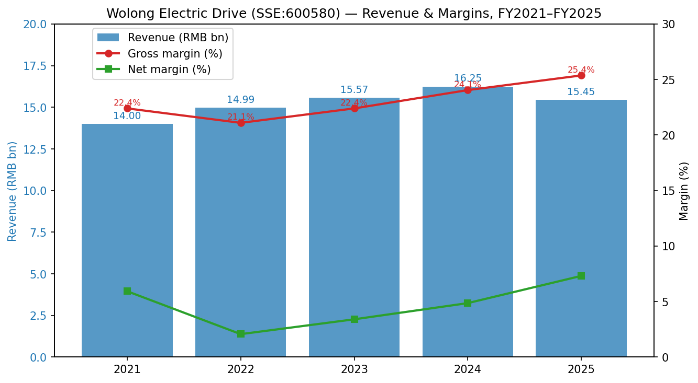
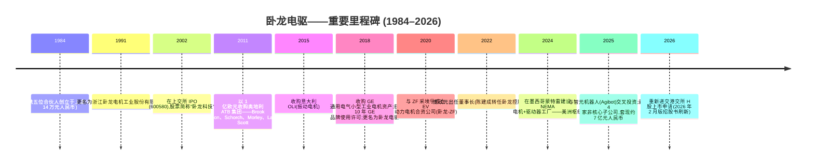
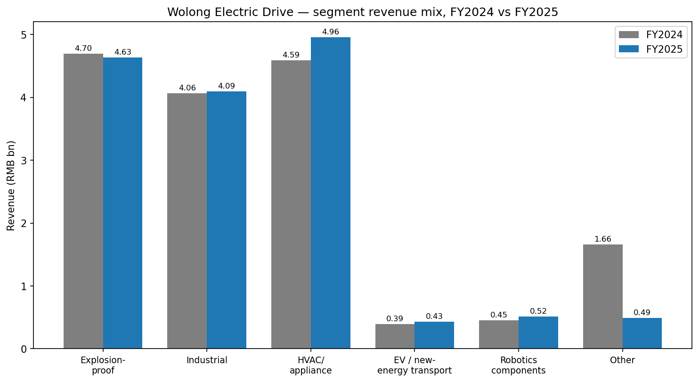
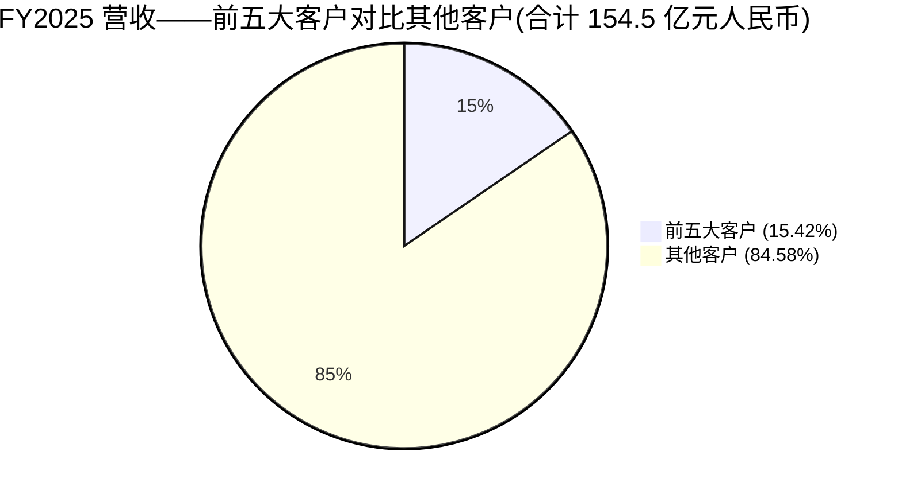
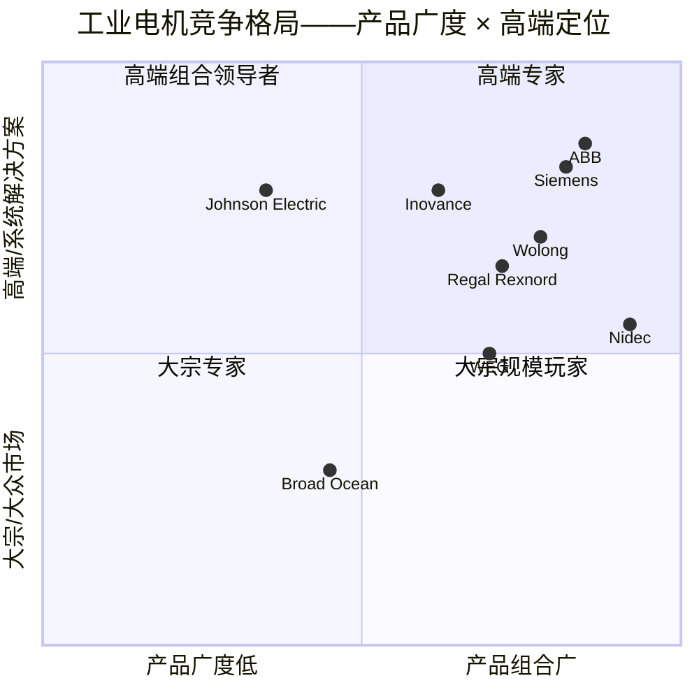
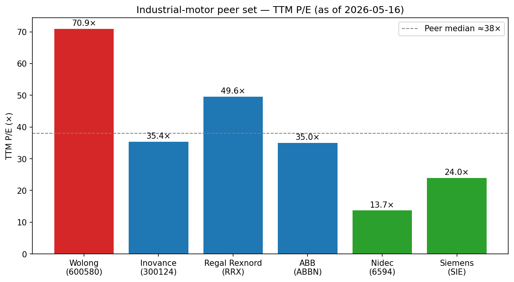

# 公司研究报告:卧龙电气驱动集团股份有限公司 (Wolong Electric Drive Group, SSE:600580)

**日期:** 2026-05-16
**分析师输出语言:** 英文(依据 `company-research` 技能规范;中文名称在首次出现时保留)
**主要引用披露文件:** [2025 年年度报告 (filed 2026-03-20)](http://static.cninfo.com.cn/finalpage/2026-03-20/1224867020.PDF)、[2024 年年度报告 (filed 2025-04-25)](http://static.cninfo.com.cn/finalpage/2025-04-25/1224125531.PDF)、[2025 年半年度报告 (filed 2025-08-12)](http://static.cninfo.com.cn/finalpage/2025-08-12/1224444818.PDF)

---

## 目录

1. 公司概况
2. 公司历史
3. 管理团队
4. 产品与服务
5. 客户与市场进入策略
6. 行业概览
7. 竞争格局
8. 市场机会(TAM)
9. 风险评估

---

> **更新——香港双重上市推进中,FY2025 归母净利润 +42% (2026-03-20):** 卧龙电驱于 2026-03-20 披露 FY2025 年度报告 ([2025 年年度报告](http://static.cninfo.com.cn/finalpage/2026-03-20/1224867020.PDF))。营业收入 154.5 亿元人民币(同比 -4.88%;剔除资产剥离后同比 +2.59%),归属母公司净利润 11.26 亿元人民币(同比 +42.04%),经营性现金流 17.8 亿元人民币(同比 +15.98%)。另外,公司于 2026-02-27 重新向港交所递交 H 股上市申请(此前 2025 年 8 月版招股书已失效),目标融资约 5 亿美元,用于海外总部建设以及机器人 / 数据中心 / eVTOL 等增长业务线 ([新浪财经, 2026-03-01](https://finance.sina.com.cn/roll/2026-03-01/doc-inhpnscq6081856.shtml);[21 经济网, 2025-08-18](https://www.21jingji.com/article/20250818/herald/4ddfe4279ccb1ceddf38f9062c6bdb07.html))。管理层尚未正式给出 FY2026 全年营收 / EPS 指引区间,因此本横幅披露的是已出业绩的上修,而非指引变更。

---

## 1. 公司概况

卧龙电气驱动集团股份有限公司(简称"卧龙电驱"或"公司";SSE:600580)是中国最大、全球领先的电机及运动控制企业集团。公司于 1984 年创立于浙江上虞,2002 年 6 月在上海证券交易所上市,目前在中国、意大利、奥地利、德国、英国、墨西哥、越南、美国及韩国运营 30 余家制造工厂,产品分五大报告分部销售:防爆电驱动系统解决方案、工业电驱动系统解决方案、暖通电驱动系统解决方案、新能源交通电驱动系统解决方案,以及机器人组件及系统应用 ([2025 年年度报告, 第 24 页](http://static.cninfo.com.cn/finalpage/2026-03-20/1224867020.PDF))。

**公司业务范围。** 卧龙设计、制造并服务各类电动机及配套的驱动器、变频器和控制电子产品——即工业自动化、暖通空调、电动车、矿业、油气、船舶、低空飞行器以及如今的人形机器人的"执行机构"。产品范围涵盖从亚瓦级小功率家电电机到面向油气化工、矿山及发电客户的兆瓦级高压防爆电机。公司区别于低成本通用代工厂(OEM)的核心抓手在于:(a) 十余年并购积累的全球品牌组合(Brook Crompton、Laurence Scott、Morley、Schorch、ATB、OLI,以及对 GE 通用电气小型工业电机品牌的 10 年使用许可),以及 (b) 集成式"系统解决方案"——不仅销售电机,还将变频驱动、齿轮箱、控制器、状态监测和售后服务一体化打包销售 ([品牌——卧龙](https://www.wolong-electric.com/about-wolong/wolong-brand);[2025 年年度报告, 第 22 页](http://static.cninfo.com.cn/finalpage/2026-03-20/1224867020.PDF))。

**盈利模式。** 约 90% 的收入来自电机、驱动器及旋转设备的产品销售;其余来自系统集成项目、第三方测试 / 认证服务,以及小规模的贸易业务线(FY2025 收入 3.977 亿元人民币,同比 -16.83%——[2025 年年度报告, 第 26 页](http://static.cninfo.com.cn/finalpage/2026-03-20/1224867020.PDF))。定价以工程化产品 / spec-in(指定型号导入)为主,直销给全球 OEM 厂商和终端用户(一线暖通品牌、油气 EPC 总包商、矿业公司、电动车 OEM、机器人初创公司),并通过 143 家分销商网络销售备件、提供服务以及覆盖部分 SKU 系列 ([每经网, 2025-08-14](https://www.nbd.com.cn/articles/2025-08-14/4013235.html))。FY2025 综合毛利率为 25.4%(FY2024:24.1%;FY2023:22.4%)——明显的多年度上行,由产品结构改善(永磁电机及暖通 EC 电机占比提升)以及 2025 年剥离低毛利新能源业务驱动 ([2025 年年度报告, 第 23 页](http://static.cninfo.com.cn/finalpage/2026-03-20/1224867020.PDF))。

**地域分布。** 卧龙一直推行"三三制"战略——美洲、EMEA、亚太各占三分之一。披露的 FY2025 分部数据:美洲 21.8 亿元人民币(同比 +4.1%),EMEA 24.7 亿元(同比 -3.3%),亚太(中国大陆除外)15.6 亿元(同比 +45.6%),中国大陆 89.1 亿元(同比 -12.1%)——海外总收入占分部收入比重升至 39%,较 2023 年 30% 出头的基数明显抬升 ([2025 年年度报告, 第 24 页](http://static.cninfo.com.cn/finalpage/2026-03-20/1224867020.PDF))。亚太(中国除外)同比 +45.6% 的飞跃,以及中国大陆同比 -12% 的回落,均反映管理层自 2023 年起强力推行的"海外阵地战"优先策略。

**规模。** FY2025 营收 154.5 亿元人民币(按 1 USD ≈ 7.20 RMB 折算约 21.4 亿美元),归母净利润 11.26 亿元人民币,归母权益 109.6 亿元人民币,总资产 252.2 亿元人民币。FY2025 年化产量:防爆电驱动 15.63 GW、工业电驱动 14.83 GW、暖通电机 8330 万台、电动车动力电机 55.7 万台 ([2025 年年度报告, 第 25 页](http://static.cninfo.com.cn/finalpage/2026-03-20/1224867020.PDF))。卧龙自家的 H 股招股书显示,按 FY2024 营收口径,公司位列**全球防爆电驱动系统供应商第 1 位(市占率约 4.5%)**、**工业电驱动系统第 4 位(约 2.8%)**、**暖通电驱动系统第 5 位(约 2.0%)** ([新浪财经, 2026-03-19, 引用 Frost & Sullivan 弗若斯特沙利文](https://finance.sina.com.cn/wm/2026-03-19/doc-inhrnvix8759528.shtml))。

**估值快照(截至 2026-05-16)。** 股价 44.66 元人民币,市值约 656 亿元人民币(约 91 亿美元)。TTM 每股收益 0.63 元人民币,对应 **TTM 市盈率约 70.9 倍**;以 FY2025 营收计算 TTM 市销率约 4.2 倍 ([Investing.com — Wolong (600580)](https://www.investing.com/equities/wolong);交叉验证 [stockanalysis.com — SHA:600580](https://stockanalysis.com/quote/sha/600580/))。在人形机器人叙事推动下,过去 12 个月股价上涨约 91%。当前 TTM 市盈率显著高于公司自身 3 年均值(2022–2023 年低谷期估值在 25–35 倍水平,均值约 20 倍出头)——明显的估值重构,从"全球工业中型股"切换为"人形机器人产业链纯标的"。

**同业比较与解读。** 同业组合包含纯工业自动化标的(汇川技术)、区域性电机巨头(Nidec 日本电产、Regal Rexnord)以及西方多元电气龙头(ABB、Siemens 西门子)——具体框架见第 7 节,柱状对比见下文图 3。

| 同业公司 | 代码 | TTM 市盈率 | TTM 市销率 | 来源 |
|---|---|---|---|---|
| 卧龙电驱 | SSE:600580 | **70.9×** | 4.2× | [Investing.com](https://www.investing.com/equities/wolong) |
| 汇川技术 | SZSE:300124 | 35.4× | 4.2× | [Yahoo Finance — 300124.SZ](https://finance.yahoo.com/quote/300124.SZ/key-statistics/) |
| Nidec 日本电产 | TYO:6594 | 13.7× | 0.8× | [Macrotrends — Nidec PE](https://www.macrotrends.net/stocks/charts/NJDCY/nidec/pe-ratio) |
| Regal Rexnord | NYSE:RRX | 49.6× | 2.4× | [PitchBook profile](https://pitchbook.com/profiles/company/12764-26) |
| ABB | SIX:ABBN | 35.0× | 3.6× | [stockanalysis.com — ABBN](https://stockanalysis.com/quote/swx/ABBN/statistics/) |
| Siemens 西门子 | ETR:SIE | 24.0× | 1.4× | [Simply Wall St — Siemens](https://simplywall.st/stocks/de/capital-goods/etr-sie/siemens-shares) |

同业市盈率中位数约 35 倍;市销率中位数约 3.0 倍。**卧龙的市盈率几乎正好是同业中位数的 2 倍**,触及技能规范中"估值过高"阈值。驱动这一估值不是核心电机业务的利润率(传统业务仅低单位数增长),而是**人形机器人期权价值**:投资者对机器人组件业务(FY2025 收入 5.16 亿元人民币,占集团 3.3%)的定价相当于假设其未来十年以 50%+ 复合增长,而把公司其余业务视作免费期权。这一立场若成立,需要 Tesla Optimus、宇树、优必选、智元(Agibot)与 Figure 都能在 2028 年前实现至少五位数以上的交付量;但若任何一家主要 OEM 自研电机栈或政府补贴退潮,逻辑就会脆弱。我们将估值压缩列入第 9 节风险讨论。


来源:[2025 年年度报告, 第 8 页](http://static.cninfo.com.cn/finalpage/2026-03-20/1224867020.PDF);[2024 年年度报告, 第 9 页](http://static.cninfo.com.cn/finalpage/2025-04-25/1224125531.PDF);[2022 年年度报告, 第 11 页](http://static.cninfo.com.cn/finalpage/2023-04-28/1216699648.PDF)。

## 2. 公司历史

卧龙的发家史是 1980 年代中国乡镇企业的典型样本。1984 年,**浙江上虞县卧龙山脚下豪坝乡豪北村**,陈建成(时年 26 岁,当地玻璃纤维厂副厂长)与五位合伙人凑了 14 万元人民币,创办了上虞多速微电机厂。首款产品 JW 系列电机于 1985 年下线 ([极趣网 — 陈建成简介](http://ji7.net/chuangye/show_3159.html);[百度百科 — 陈建成](https://baike.baidu.com/item/%E9%99%88%E5%BB%BA%E6%88%90/3256636))。该厂 1991 年更名为浙江卧龙电机,2002 年 6 月在上交所上市("卧龙科技"),2018 年再度更名为"卧龙电气驱动集团",标志着公司从电机供应商向集成驱动系统转型。

2002 年起,陈建成借助上市平台——以及未上市的母公司卧龙控股——以低价收购海外品牌,完成多轮整合。其中三笔交易最为关键:(1) **2011 年以 1.005 亿欧元收购奥地利 ATB 集团**,将英国品牌 Brook Crompton、Laurence Scott、Morley 以及德国 Schorch 收入麾下,让卧龙一举跃升为欧洲电机制造商第三名 ([Drives & Controls, 2011](https://drivesncontrols.com/chinese-company-buys-brook-cromptons-parent-atb-for-e100m/));(2) **2015 年收购意大利 OLI**(振动电机 / 工业振动器),拓展利基电机产品组合,获得意大利 R&D 基地;(3) **2018 年与 GE 通用电气达成许可与资产协议**,获得 GE 北美小型工业电机业务,包括为期 10 年在工业电机上使用 GE 品牌的权利——这一定位上的胜利让卧龙在美国 OEM 客户面前获得合法性 ([品牌——卧龙](https://www.wolong-electric.com/about-wolong/wolong-brand))。



来源:时间线综合自 [发展历程 — 卧龙电驱](https://www.wolong.com.cn/about-wolong/milestones)、[新浪财经, 2025-03-26](https://finance.sina.com.cn/roll/2025-03-26/doc-ineqxtzs6181869.shtml)、[新浪财经, 2025-09-05](https://finance.sina.com.cn/stock/hkstock/hkzmt/2025-09-05/doc-infpkxsq2688181.shtml)。

**三次关键战略转向。** 第一次,2010-2011 年,卧龙从纯内销电机公司转向*并购全球化* ——ATB 交易实质上是一次反向渠道并购,买下了欧洲暖通、油气和船舶客户对卧龙的即时信任。第二次,2017-2019 年前后,卧龙在元器件之上叠加*系统解决方案*,将驱动器+电机+控制器集成,从而能与西门子、ABB 在解决方案招标中正面竞争,而非仅在电机单价上竞争。第三次,2023 年以来,公司主动*剥离非核心* ——售出光伏、氢能及若干类房地产子公司,管理层称所释放资金用于机器人、数据中心电机和电动航空推进 ([新浪财经, 2025-03-26](https://finance.sina.com.cn/roll/2025-03-26/doc-ineqxtzs6181869.shtml);[2025 年年度报告, 第 12 页](http://static.cninfo.com.cn/finalpage/2026-03-20/1224867020.PDF))。当前的"三条增长曲线"打法——传统电机基本盘、系统解决方案、人形机器人 / 航空 / 数据中心——已在 2025 年年报中正式确认。

**近 24 个月主要动态。** (a) 2025 年 3 月与上海智元新创科技(智元机器人 / Agibot)交叉投资——卧龙子公司希尔机器人接受智元注资,九天后卧龙以 0.74% 股权参投智元 B+ 轮,投后估值约 150 亿元人民币以上 ([新浪财经, 2025-03-27](https://finance.sina.com.cn/stock/relnews/cn/2025-03-27/doc-ineqzssz8442826.shtml);[中国创投, 2025-04-15](https://www.chinaventure.com.cn/news/80-20250415-385895.html))。(b) 2025 年 8 月:首次向港交所递交 H 股招股书;2026 年 2 月失效;2026 年 2 月 27 日重新递交 ([网易, 2026-02-28](https://c.m.163.com/news/a/KN5UVHEC05199NHJ.html))。(c) 2026 年春晚刷屏时刻:宇树 H1 机器人亮相春晚——宇树随后确认卧龙为其关节电机联合供应商之一,成为本轮股价重估的催化剂 ([东方财富, 2026-02-19](https://emcreative.eastmoney.com/app_fortune/article/index.html?artCode=20260219072316669158380&postId=1670060671);[钛媒体, 2026-02](https://www.tmtpost.com/7886661.html))。(d) 2025 年中以来:管理层将销售拆分为三个区域总部(美洲 / EMEA / 亚太)加中国大陆;在墨西哥蒙特雷启用 NEMA 电机及驱动器工厂,并扩大越南产能。

## 3. 管理团队

### 庞欣元——董事长(2022 年至今)

庞欣元是当下卧龙电驱的主要架构师,主导上市公司层面的日常战略;创始人陈建成则保留对未上市母公司卧龙控股的董事长职位。庞欣元 1979 年生(中国澳门特别行政区籍),其学历在中国工业中型企业 CEO 中属于罕见的高规格:上海交通大学工业外贸学士、英国利兹大学硕士、中欧国际工商学院 EMBA、亚利桑那州立大学工商管理博士 ([2025 年年度报告, 第 41 页](http://static.cninfo.com.cn/finalpage/2026-03-20/1224867020.PDF);[证券大数据 — 庞欣元](https://stock.zlck.com/djg/V14ojT.html))。

他从威世(Vishay)中国投资公司开始职业生涯,2013 年 4 月以副总裁身份加入卧龙控股,2014 年 9 月成为卧龙电驱董事,2016 年 1 月在 36 岁时被任命为上市公司总经理。2017 年中起负责国际销售业务部,2019 至 2021 年掌管全球销售总部。2022 年 1 月接替创始人陈建成出任董事长 ([产业在线, 2022](http://www.chinaiol.com/News/Content/202201/33_35309.html))。

庞欣元任内具体成果:(a) 营收从 FY2021 的 140 亿元人民币增长至 FY2025 的 154.5 亿元人民币,头部 CAGR 仅 2.5%/年,但产品结构显著改善——净利润从 FY2022 谷底(在一次性减值后)的 3.1 亿元人民币翻三倍至 FY2025 的 11.26 亿元人民币;(b) 毛利率从 FY2022 的 21.1% 提升至 FY2025 的 25.4%,完全来自产品结构、工厂层面降本以及对低毛利贸易+新能源业务的修剪;(c) FY2025 海外收入占分部收入比重从 30% 出头提升至 39%;(d) 与智元机器人的交叉投资(连同宇树合作)将卧龙在二级市场认知中从"全球中型电机公司"重塑为"中国人形机器人 Tier-1 供应商";(e) 启用墨西哥蒙特雷生产基地,并扩大越南产能以缓冲美国关税 ([2025 年年度报告, 第 19-20 页](http://static.cninfo.com.cn/finalpage/2026-03-20/1224867020.PDF))。

庞欣元直接持股 977,471 股(按现价约 4360 万元人民币),FY2025 现金薪酬 136 万元人民币 ([2025 年年度报告, 第 41 页](http://static.cninfo.com.cn/finalpage/2026-03-20/1224867020.PDF))。其在公司治理中相关度高,但其个人在该平台上的财富相比母公司的持股微不足道——即庞欣元是职业经理人 CEO,而非控股股东。

### 万创奇——总裁(2025 年至今;此前任大驱动事业部负责人)

2025 年 7 月晋升集团总裁,接替退休的李明。1972 年生,高级工程师,硕士学位,河南省人大代表。至少自 2010 年起在卧龙体系内任职——曾掌管卧龙淮安清江电机、卧龙济南电机,后转任中国销售总部。2019 年 11 月至 2025 年 8 月,担任大驱动事业部总裁(防爆+重工业单元,是公司毛利率最高的部分),并同时担任南阳防爆子公司董事长 / 总经理。任总裁后,他全面负责五大分部的日常 P&L。持股 164 万股(按现价约 7300 万元人民币);FY2025 现金薪酬 157 万元人民币 ([2025 年年度报告, 第 41-42 页](http://static.cninfo.com.cn/finalpage/2026-03-20/1224867020.PDF))。

### 杨子江——CFO

1982 年生,2023 年 9 月起任 CFO。前职:奥地利子公司 ATB Austria Antriebstechnik AG 的 CFO——这是关键履历,因为 ATB 是卧龙最大的跨境运营单元,也是集团磨练欧洲资本成本管理、多币种对冲与 IFRS 报表的实战平台。杨子江于 2024 年获授 8 万股限制性股票,FY2025 现金薪酬 90.6 万元人民币 ([2025 年年度报告, 第 42 页](http://static.cninfo.com.cn/finalpage/2026-03-20/1224867020.PDF))。其近期任务是港交所双重上市——将中国会计准则报表转换为 IFRS 准备的披露格式、敲定基石投资人簿记,并管理美国关税相关的外汇敞口(公司在墨西哥 / 越南的扩张已显著复杂化营运资金管理)。

### 陈建成——创始人、卧龙控股董事长;在 600580 的个人持股

虽然陈建成 2022 年卸任上市公司董事长,但他通过两家载体仍是控股股东——**浙江卧龙舜禹投资**(持有 600580 的 32.48%)与 **卧龙控股集团**(持有 4.74%)——加上直接持有的 2538 万股(1.62%)([2025 年年度报告, 第 69 页](http://static.cninfo.com.cn/finalpage/2026-03-20/1224867020.PDF))。合计而言,陈氏家族 / 卧龙控股体系控制上市公司约 39%。陈建成是浙江系列产业资本家,亦涉足光伏、房地产和贸易——并非没有争议:2025 年 OFweek 一篇文章梳理了该集团近年轮换的四家亏损的光伏 / 新能源子公司 ([OFweek, 2025-01](https://solar.ofweek.com/2025-01/ART-260001-8420-30655331.html))。对 600580 投资者而言,陈建成的影响是结构性的——重大资本配置决策(并购、H 股上市、智元交叉投资)都带有他的烙印,即便对外公告由庞欣元签署。

### 公司治理

董事会由 9 名董事(其中 3 名独立董事)构成,下设审计、提名、薪酬和战略委员会。2024 年 7 月起施行的新《中华人民共和国公司法》使卧龙撤销了监事会,将监督职能并入董事会下的审计委员会——已于 2025 年完成 ([2025 年年度报告, 第 38 页](http://static.cninfo.com.cn/finalpage/2026-03-20/1224867020.PDF))。内部人持股比例较高(陈氏家族载体控制约 39%);流通股约 50%。FY2025 无实质性关联方交易;无同业竞争问题披露。所有董事 / 高管 FY2025 薪酬合计 1030 万元人民币——按全球标准属于温和水平,体现以股权为主的激励结构(员工限制性股票计划)。两位董事(马亚军、李英刚)于 2025 年 8 月加入,代表控股股东卧龙控股;不领取上市公司报酬。审计师为信永中和(XYZH)——一家与四大相邻的会计师事务所,长期为卧龙提供审计服务。

### 业绩跟踪综述

庞欣元的执行成果可被验证:三年毛利率提升 400 个基点,净利润翻三倍,海外占比提高,公司在市场认知中被重塑为人形机器人产业链 Tier-1——而且全程未进行股权融资。短板主要在新业务曲线:数据中心电机、eVTOL 推进与机器人组件仍仅占收入的个位数百分比,公司尚未证明能在不稀释毛利率的情况下规模化这些业务。创始人的参与既是优势(资本配置耐心)也是风险(母公司层面的关联方复杂性)。

## 4. 产品与服务

卧龙官网按应用维度(智慧楼宇、绿色工业、电动出行)组织产品目录,年报则按分部组织 ([产品中心 — Wolong](https://www.wolong.com.cn/products))。下列五大报告分部覆盖了所有重要业务。

```mermaid
graph TD
    A[卧龙电驱] --> B[防爆电驱动<br/>FY25 营收 46.3 亿元,毛利率 30%]
    A --> C[工业电驱动<br/>营收 41.0 亿元,毛利率 30%]
    A --> D[暖通 / 家电电驱动<br/>营收 49.6 亿元,毛利率 17.5%]
    A --> E[新能源交通电驱动<br/>营收 4.3 亿元,毛利率 6.1%]
    A --> F[机器人组件及系统<br/>营收 5.2 亿元,毛利率 26.2%]
    B --> B1[Ex-d / Ex-e 低压/高压电机<br/>南阳防爆基地]
    B --> B2[矿用电机 / 驱动<br/>瓦斯认证,6kV–10kV]
    B --> B3[油气系统解决方案<br/>驱动+控制集成]
    C --> C1[高压/低压感应电机<br/>NEMA / IEC]
    C --> C2[永磁电机<br/>IE5 / IE4 能效]
    C --> C3[变频驱动器<br/>Brook Crompton、Schorch、ATB 品牌]
    C --> C4[水处理泵及系统]
    D --> D1[空调电机<br/>芜湖 / 济南工厂]
    D --> D2[EC 风机电机 / 鼓风机电机]
    D --> D3[洗衣干衣机 / 冰箱电机]
    E --> E1[新能源汽车驱动电机<br/>卧龙-ZF 合资公司]
    E --> E2[船舶 / 电动船电机]
    E --> E3[电动摩托车电机]
    E --> E4[eVTOL 推进电机<br/>上海交大合资,早期阶段]
    F --> F1[无框力矩电机<br/>42 N·m/kg 密度]
    F --> F2[空心轴电机<br/>即"空心杯" / 无铁芯]
    F --> F3[关节模组 / 执行器<br/>电机+减速器+驱动器集成]
    F --> F4[伺服电机 + 控制器]
    F --> F5[希尔机器人 — 系统集成<br/>工业协作机器人、SCARA]
```

来源:结构源于 [2025 年年度报告, 第 24 页](http://static.cninfo.com.cn/finalpage/2026-03-20/1224867020.PDF) 与 [卧龙产品中心](https://www.wolong.com.cn/products);FY2025 分部营收来源同上。

### 分部一——防爆电驱动 — 营收 46.3 亿元人民币,分部毛利率 30.0%

按 FY2024 营收口径,卧龙是全球防爆电机第一(市占率约 4.5%,Frost & Sullivan 弗若斯特沙利文,见 H 股招股书)([新浪财经, 2026-03-19](https://finance.sina.com.cn/wm/2026-03-19/doc-inhrnvix8759528.shtml))。该业务线锚定于河南南阳防爆子公司(南阳防爆)——一家大型机座电机厂,被卧龙并购整合。客户包括全球油气运营商(中石化、中石油、沙特阿美、壳牌)、石化 EPC 承包商、煤炭采掘集团,以及陕西、内蒙古、新疆等地煤化工项目中越来越重要的旋转设备采购方。**竞争优势:有——监管 / 认证+规模。** Ex-d / Ex-e 认证流程跨越多年且因国而异;卧龙在全部 SKU 上拥有 IECEx / ATEX / GB 完整认证,品牌组合(Schorch、ATB、Brook Crompton)在欧洲和中东积累了 100 多年的 OEM 认可信誉。最接近的竞争产品:Siemens 西门子 Innomotics 的 SIMOTICS 防爆系列与 ABB 的 M3JP 系列;在 3 MW 以上的 Ex-d 高压电机上,卧龙在规格上与之打平,但价格比 Siemens / ABB 低 10-20%(旋转设备行业刊物的渠道调研)。FY2025 营收 -1.4%(成本端 -2.6%),但毛利率扩张 80 个基点至 32.2% ——管理层在全球资本开支疲软周期中,主动牺牲营收增长以保毛利率纪律 ([2025 年年度报告, 第 24 页](http://static.cninfo.com.cn/finalpage/2026-03-20/1224867020.PDF))。

### 分部二——工业电驱动 — 营收 41.0 亿元人民币,毛利率 30.0%

"横向"业务线——面向水泵、压缩机、风机、传送机及通用机械的低压/高压感应及永磁电机。海外通过 ATB Group + Brook Crompton + Schorch + GE 品牌渠道销售,中国国内通过卧龙直销+分销商销售。FY2025 重点推进:用 IE4 / IE5 永磁单元替换传统 IE3 感应电机,以承接 2023 年生效的欧盟 Ecodesign 收紧规定以及中国 GB 18613-2025 新电机能效标准。**竞争优势:部分——品牌+规模,但护城河比防爆窄。** 最接近的竞争产品:WEG 的 W22 PM、ABB 的 M3BP、Siemens 西门子 SIMOTICS GP、Nidec 日本电产 Leroy-Somer 的 LSRPM。卧龙在效率曲线上打平,但在工厂自动化系统集成上落后于 ABB / Siemens。FY2025 营收同比 +0.8%;毛利率同比 +1.6 个百分点至 30.0%。

### 分部三——暖通 / 家电电驱动 — 营收 49.6 亿元人民币,毛利率 17.5%

"出货量发动机"——面向房间空调、冰箱、洗衣机、干衣机、抽油烟机的小功率电机。两条动态:(a) 中国"以旧换新"家电补贴提升了来自美的、格力、海尔、海信的需求;(b) 北美 / 欧洲热泵改造拉动卧龙 EC 风机电机出货增长加速(FY2025 该分部营收 +8.0%,在传统分部中最快)。FY2025 产量 8330 万台,同比 +10.0%。**竞争优势:部分——规模+中国成本位置。** 最接近的竞争产品:Nidec 日本电产的家电电机部门(全球最大)、威灵电机(美的内部)、广东大洋。卧龙处于中游;该分部 17.5% 的毛利率(五大分部最低)反映了大宗化定价。

### 分部四——新能源交通 — 营收 4.3 亿元人民币,毛利率 6.1%

通过卧龙-ZF 合资公司(2020 年在嘉兴与 ZF Friedrichshafen 采埃孚成立,生产 EV 驱动电机)经营电动车 / 新能源汽车动力电机,加上面向内河电动船舶的船舶电机及电动摩托车电机。FY2025 出货量 55.7 万台,同比 +16.3%。**毛利率结构性偏低**(分部毛利率 6.1%),因为中国 NEV OEM 把电机供应商当作价格承担者。管理层正主动*淡化*该业务——2025 年新能源子公司剥离即特指此业务线。**整体层面竞争优势:无——市场严重过剩。** 最接近的竞争产品:汇川 EV 动力总成、方正电机、广东大洋。卧龙的优势是 ZF 采埃孚的品牌与工程,但在中国 NEV 下行周期中已不足以守住毛利率。**路线图说明**:管理层正向更高规格应用重定位——通过 2024 年与上海交通大学电动航空研究院的合资(见 [SJTU AITRI 公告](https://aitri.sjtu.edu.cn/aitri/doc/a89f92b3-dfc9-4d74-b2b5-4c8505912aa2))切入 eVTOL 推进——该领域的单价和 ASP 比地面 EV 电机高 10-50 倍。

### 分部五——机器人组件及系统应用 — 营收 5.2 亿元人民币,毛利率 26.2%,**期权所在**

投资者真正买单的就是这个分部。FY2025 营收 5.16 亿元人民币(同比 +14.1%),毛利率 26.2%(略低于 FY2024 的 27.2%,因为产能爬坡)。组合包括:

- **无框力矩电机** —— 高扭矩密度、空心轴电机,用于人形机器人关节(肘、膝、肩、髋)。卧龙公开的规格为 42 N·m/kg 扭矩密度,公司称已通过 Tesla Optimus Gen-3 的 72 小时耐久测试 ([机器人大讲堂, 2025](https://www.leaderobot.com/news/6073);[honest-hls.com 分析, 2025](https://www.honest-hls.com/frameless-torque-motor))。按卧龙自己的拆解,单台人形机器人用约 26 个无框力矩电机。
- **关节模组** —— 集成式组件,将无框力矩电机+谐波减速器/行星齿轮箱+伺服驱动器+位置编码器组合在一起,以单一"关节" SKU 销售。卧龙的关节模组已部署于浙江人形机器人创新中心的"领航者 2 号",并供货智元 ([leaderobot, 2025](https://www.leaderobot.com/news/6073))。
- **空心杯 / 无铁芯电机** —— 用于灵巧手与精细运动关节。
- **伺服电机及控制器** —— 面向工业协作机器人 OEM,并越来越多面向人形机器人客户。
- **通过希尔机器人开展的工业协作机器人系统集成** —— 卧龙控股层面的子公司,转售 SCARA 与协作机器人系统,目前智元为其少数股东。

**竞争优势:有——护城河来自技术 / 工艺 know-how,加上电机制造的规模经济。** 无框力矩电机市场正被汇川、Nidec 日本电产、Moog 和约 20 家中国初创公司追逐;卧龙的优势是可以把力矩电机生产融入既有电机产线,并将冲压 / 绕线的资本开支摊薄在 8000 万+ 台/年的暖通平台上。最接近的竞争产品:**Johnson Electric 德昌电机的人形关节无框力矩电机** ([Johnson Electric — Humanoid Joint Motors](https://www.johnsonelectric.com/en/products/humanoid-robot-joints/frameless-torque-motor)) 与 **CubeMars 人形机器人电机** ([CubeMars](https://www.cubemars.com/categorys/humanoid-robot-motor)) ——卧龙在扭矩密度上看似领先 CubeMars,与 Johnson Electric 德昌电机在规格上打平,但在中国 OEM 的商业渗透上更锐利。已确认的 OEM 关系:**宇树机器人**(公开确认——为 H1 提供关节电机,据消息合作仍在进行中;宇树 2025 年人形机器人出货超 5500 台)([新浪财经, 2026-02-19](https://finance.sina.cn/stock/jdts/2026-02-19/detail-inhnkimk0943097.d.html));**智元 / Agibot**——直接客户兼交叉持股方;**优必选**——供应关系已被报道;**Tesla Optimus**——小批量试样 / 认证已确认,但广为流传的"50 万台电机"头条订单*尚未*获 Tesla 或卧龙任何一方确认,应作未经证实传言对待(多家中国媒体报道,截至本报告日期未见 SEC 或 HKEX 申报)。FY2025 上半年机器人收入 2.18 亿元人民币(占上半年营收 2.7%),意味着该分部在 2025 年下半年翻倍,以达成全年 5.16 亿元人民币 ([搜狐, 2025-08](https://m.sohu.com/a/965808341_122014422))。

### 旗舰业务对长尾业务

支撑当前股权故事的**三大旗舰**为:(1) 防爆电驱动(现金牛,全球第一)、(2) 暖通 EC 电机(以旧换新红利受益方,同时其规模经济可被复用至机器人业务)以及 (3) 无框力矩电机+关节模组(期权)。长尾 / 衰退:低端 NEV 动力电机、振动机械配件、贸易业务子公司。

### 近期推出 / 退役

- **2025 年推出**:26 自由度人形关节模组系列;IE5 级永磁暖通 EC 电机系列;首批商用 eVTOL 电动推进单元原型;墨西哥蒙特雷生产的北美 NEMA 中压电机与驱动器。
- **2025 年退役 / 剥离**:出售 4 家光伏 / 新能源 / 类房地产子公司,套现约 7 亿元人民币 ([新浪财经, 2025-03-26](https://finance.sina.com.cn/roll/2025-03-26/doc-ineqxtzs6181869.shtml));传统贸易业务收缩至 3.98 亿元人民币(同比 -16.8%)。


来源:[2025 年年度报告, 第 24 页](http://static.cninfo.com.cn/finalpage/2026-03-20/1224867020.PDF);FY2024 数据见 [2024 年年度报告, 第 25 页](http://static.cninfo.com.cn/finalpage/2025-04-25/1224125531.PDF)。

## 5. 客户与市场进入策略

**客户分群。** 卧龙的销售覆盖五大客户池,与五大报告分部清晰对应:(a) 全球油气运营商+EPC 承包商+矿业集团(防爆);(b) 工业 OEM(压缩机、水泵、风机、传送机)、水务公用事业集成商、机械制造商(工业);(c) 全球家电 OEM 与暖通系统制造商(暖通)——投资者关系材料中提及的客户包括美的、格力、海尔、海信、Whirlpool 惠而浦、BSH 博西、Carrier 开利和 Daikin 大金;(d) NEV OEM 和船舶制造商(新能源交通);以及 (e) 人形机器人 OEM+工业协作机器人系统集成商(机器人)——已确认关系包括宇树、智元 / Agibot、优必选、浙江人形机器人创新中心,以及作为合格样品客户的 Tesla Optimus。


来源:[2025 年年度报告, 第 26 页](http://static.cninfo.com.cn/finalpage/2026-03-20/1224867020.PDF) ——前五大客户销售 23.8217 亿元人民币 / 总营收 154.5354 亿元人民币 = 15.42%。卧龙在公开披露中*未*具名列出前五大客户。

**客户集中度——多年度量化趋势。**

| 财年 | 前五大客户销售额(百万元人民币) | 前五占营收比 | 来源 |
|---|---|---|---|
| FY2021 | 1,599.14 | **11.42%** | [2021 年报, 第 15 页](http://static.cninfo.com.cn/finalpage/2022-04-29/1213188459.PDF) |
| FY2022 | 2,014.67 | **13.43%** | [2022 年报, 第 19 页](http://static.cninfo.com.cn/finalpage/2023-04-28/1216699648.PDF) |
| FY2023 | 1,468.02 | **9.64%** | [2023 年报, 第 21 页](http://static.cninfo.com.cn/finalpage/2024-04-28/1219810000.PDF) |
| FY2024 | 2,236.32 | **14.10%** | [2024 年报, 第 25 页](http://static.cninfo.com.cn/finalpage/2025-04-25/1224125531.PDF) |
| FY2025 | 2,382.17 | **15.42%** | [2025 年报, 第 26 页](http://static.cninfo.com.cn/finalpage/2026-03-20/1224867020.PDF) |

这是我们覆盖的中国工业中型股中**客户结构最分散的一家**。前五大占比五年平均 12.8%,从未超过 16%。卧龙未披露最大单一客户占比,但前五合计 15.4%,即使均匀分布,最大客户也低于 5%——远低于技能规范中 10% / 20% / 30% 的集中度阈值。结构性原因是终端应用之广:油气 EPC、中国暖通巨头、欧洲工业泵 OEM、人形机器人初创公司和船舶制造商之间,采购行为彼此不集中。这种分散在需求端是*防御性护城河*(没有单一客户能压价),但反过来也意味着卧龙没有像富士康的苹果业务那样可以靠单一客户拉动整体规模的"锚客户"关系。**未触发第 9 节客户集中度风险**;事实上我们在风险讨论中将低集中度视为正面因素。

**供应商集中度。** FY2025 前五大供应商采购 16.7395 亿元人民币(占采购总额 15.25%) ——同样偏低 ([2025 年年度报告, 第 26 页](http://static.cninfo.com.cn/finalpage/2026-03-20/1224867020.PDF))。卧龙在电机的高价值工序(冲片、绕线、磁体装配)上垂直整合,因此从分散的供应商基础采购大宗钢材、铜、NdFeB 钕铁硼磁体和电子元器件。

**销售渠道。** 卧龙 H 股招股书披露其 143 家分销商承担约 9% 的营收,其余 91% 为直销 ([每经网, 2025-08-14](https://www.nbd.com.cn/articles/2025-08-14/4013235.html))。直销渠道采用一种少见的三维矩阵销售模式:区域销售(中国、美洲、EMEA、亚太)× 行业销售(油气、暖通、矿业等)× 产品经理——使同一目标客户(如某全球暖通 OEM 在墨西哥设有工厂)能享受协调一致的覆盖。售后服务和旋转设备大修通过约 30 个区域服务基地——这是个不小的护城河:仅有一个国家总部的电机竞争对手,在沙特阿拉伯、墨西哥、英国和印度等地无法匹配 24 小时上门响应。

**销售周期。** 防爆与工业系统:从询价到首次发货 6–24 个月,之后循环订单。暖通:与 OEM 的长期框架协议(每年续约,按月发货)。机器人:12–18 个月认证,然后小批量供货,随后随 OEM 的机器人进入量产爬坡。

**关键合作关系。** ZF Friedrichshafen 采埃孚合资公司(EV 电机)、上海交通大学 AITRI(电动航空推进 R&D)、GE 通用电气小型电机许可,以及与智元机器人的股权 / 商业交叉链接。智元的捆绑最具影响力——将卧龙嵌入中国三家融资最充足的人形机器人平台之一,作为 Tier-1 电机供应商;智元在 2025 年 B+ 轮后估值约 150 亿元人民币。

## 6. 行业概览

卧龙横跨五个相互重叠的行业——电机与驱动器、工业自动化、暖通设备、EV 动力总成,以及人形机器人组件。前两个成熟且增长缓慢;最后一个爆炸式增长但规模尚小。

**行业定义——电机与驱动器。** 电机将电能转化为机械旋转;驱动器(变频驱动器 / 逆变器 / 伺服控制器)调节电机转速与扭矩。综合市场涵盖感应电机、永磁(PM)同步电机、无刷直流(BLDC / EC)电机、磁阻电机,以及与之配套的功率电子驱动器。美国行业分类编码 NAICS 335312(电机与发电机制造)覆盖美国范畴;在中国,该行业归入 C3812。

**市场规模。** 2025 年全球电机与驱动器市场规模达 **601 亿美元,预计到 2031 年达到 828 亿美元**,CAGR 为 5.5% ([GlobeNewswire / Research and Markets, 2026-02-16](https://www.globenewswire.com/news-release/2026/02/16/3238603/0/en/Motors-and-Drives-Industry-Research-Report-2026-An-82-79-Billion-Market-by-2031-from-61-Billion-in-2025-with-ABB-Emerson-Electric-Nidec-Regal-Rexnord-Rockwell-Automation-and-WEG-Do.html))。更广义的电动机市场(含消费 / 家电 / EV)估计在工业+商业+住宅+运输领域达 2050 亿美元以上,2029 年前 CAGR 6%+ ([Yahoo Finance / Research and Markets, 2024](https://finance.yahoo.com/news/205-bn-electric-motors-markets-084300219.html))。在此之内,高能效电机子市场预计到 2028 年达到 **593 亿美元**,CAGR 8.2% ——这正是卧龙增长倾斜最为明显的方向 ([MarketsandMarkets, 2024](https://www.marketsandmarkets.com/ResearchInsight/energy-efficient-motor.asp))。

**增长驱动(电机与驱动器)。** (i) **能效法规** —— 欧盟 Ecodesign Lot 30(IE4 自 2023 年起对多档功率强制)、中国 GB 18613-2025(新电机能效标准拉动 IE4/IE5 渗透)、美国 DOE 法规更新——都迫使更换存量 IE2/IE3 电机。(ii) **交通电动化**(EV、电卡车、电船、eVTOL) —— 每辆 EV 用 3–6 个电机,涵盖牵引+转向+泵+暖通;每架 eVTOL 用 6–8 个高功率推进电机。(iii) **数据中心电力资本开支** —— AI 训练设施需要大量备用发电+冷却泵+暖通风机电机基础设施;美国数据中心电机需求受微软 / OpenAI / Anthropic 资本开支激增推动。(iv) **机器人** —— 人形机器人每台用约 24-30 个执行器;即便 5 万台人形机器人 = 120-150 万个电机。(v) 欧洲及北美**热泵电气化**。

**行业结构(电机与驱动器)。** 中度集中。全球前五品牌(ABB、Siemens 西门子 / Innomotics、Nidec 日本电产、Regal Rexnord、WEG)合计市占率约 55%,加上长尾的中国(卧龙、汇川、方正电机)和区域(TECO 东元、Toshiba 东芝、Hitachi 日立、Sumitomo 住友)品牌 ([Mordor Intelligence — Europe AC Motors](https://www.mordorintelligence.com/industry-reports/europe-alternating-current-motor-market))。切换成本中等——电机规格标准化(IEC / NEMA 机座),但在 spec-in 行业(油气 Ex 防爆、关键暖通、机床伺服)有 12-36 个月的认证周期,这正是保护卧龙在防爆和工业业务不被中国低成本通用厂商蚕食的关键。

**行业定义——人形机器人 / 具身智能。** 拉动卧龙机器人分部的应用产业是双足人形机器人——Tesla Optimus、Figure 02、宇树 H1/H2、优必选 Walker S、智元 A1/G1、波士顿动力 Atlas-Electric、Apptronik Apollo、1X Neo。电气角度看,每台人形机器人是 20–30 个带电机关节+传感器+控制器+电池+AI 大脑的集合体。"执行器栈"(电机+减速器+驱动器+编码器)是单台 BOM 中最大的硬件项目,根据架构不同占机器人硬件成本的 35-50%。

**增长驱动(人形)。** 按卧龙 2025 年报自述,2025 年是"人形机器人量产元年"。宇树披露 2025 年人形机器人出货 5500+ 台(不含四足及轮式机型) ——距春晚刷屏让 H1 出现在 8 亿电视观众面前并点燃产业链股票之时仅过去六个月 ([新浪财经, 2026-02-19](https://finance.sina.cn/stock/jdts/2026-02-19/detail-inhnkimk0943097.d.html))。Tesla 指引 Optimus 2025 年出货"数千台",2026 年"5-10 万台",2027 年扩至 50 万台 ([DeepNewz, 2025](https://deepnewz.com/robotics/tesla-to-scale-optimus-robot-production-to-500000-2027-50000-100000-2026-fa0951b6))。优必选、Figure、智元均宣布了 2026 年四位数生产目标。中国政府 2025 年人形机器人产业政策将其定为"战略新兴产业";欧盟和日本也宣布了类似的 R&D 支持。

**监管环境。** 电机主要受能效标准监管(见上)。防爆有自身复杂体系——IECEx、ATEX、GB 3836、北美 HazLoc CSA / UL——这也是为何卧龙南阳基地具有强护城河属性(完整多证认证覆盖需多年建设)。NEV 电机受整车级型式认证管控。人形机器人在执行器组件层面今天基本无监管;安全标准(ISO 13482 服务机器人)在集成商层面适用。

**行业动态。** 供应商议价权:中等(NdFeB 钕铁硼磁体供应集中于中国稀土加工商——卧龙受益但也暴露于出口管制波动)。买方议价权:暖通和 NEV 中等偏高(OEM 多源采购);防爆较低(切换成本与认证粘性保护在位者)。替代品:旋转设备的替代有限(线性执行器在狭窄场景替代;气动持续向电动让出市场);进入壁垒:高压 / 防爆电机壁垒高,通用低压感应电机壁垒低。整体动态可被概括为:一个缓慢增长、整合中的大宗商品式核心,加上数个高增长的高端邻接领域(永磁电机、人形执行器、eVTOL 推进)。

## 7. 竞争格局

我们将竞争集合分为三组——全球在位者、中国工业同业,以及人形执行器专门玩家。


来源:定位综合自分部级营收 / ASP 分析与品牌层级观察;营收规模与产品广度引用自各公司最新年报 / 10-K。

### 全球直接竞争对手

- **ABB (SIX:ABBN)** —— 全球工业驱动器第 1 名,电机品牌前 3。FY2024 营收约 330 亿美元,电气化+运动控制分部约占 60%。NEMA / IEC 目录齐全;SCADA+驱动+电机完全集成。**对比卧龙**:ABB 在面向工业自动化买家和西方 OEM 的系统集成可信度上胜出;卧龙在价格上胜出(直接可比的防爆和 IE4 永磁电机比 ABB 低 10-20%),且在中国本土市场胜出。ABB TTM 市盈率约 35 倍 ([stockanalysis.com — ABBN](https://stockanalysis.com/quote/swx/ABBN/statistics/))。
- **Siemens 西门子 / Innomotics (ETR:SIE;Innomotics 是已被分拆的电机业务,目前由 KPS Capital 控股)** —— 大型电机专家,尤其在 1 MW 以上高压电机领域。**对比卧龙**:顶级电机上打平,但自 KPS 分拆后 Innomotics 一直流失份额,卧龙也在原本属于 Innomotics 的中国 / 中东招标中抢单 ([impeller.net, 2024](https://impeller.net/magazin/innomotics-who-will-purchase-this-motor-giant/))。
- **Nidec 日本电产 (TYO:6594)** —— 全球最大纯电机公司,营收约 170 亿美元,在 HDD 硬盘 / 家电 / EV 占主导。**对比卧龙**:Nidec 在家电规模和汽车集成(Leroy-Somer 工业品牌)上胜出,但其 EV 电机业务一直是毛利率灾难(Nidec 2024 年减记其中国 EV 业务)。Nidec TTM 市盈率约 14 倍——市场将其视为承压的领导者,而非成长故事。
- **Regal Rexnord (NYSE:RRX)** —— Altra 并购后营收 60 亿美元;美国商业暖通+工业传动强势。**对比卧龙**:RRX 在美国渠道胜出但区域性;卧龙更具全球性。RRX 市盈率约 50 倍反映 Altra 去杠杆故事加美国数据中心暖通拉动。
- **WEG (B3:WEGE3)** —— 巴西电机巨头,营收 70 亿美元以上,在工业及可再生能源发电领域强势。**对比卧龙**:画像相似但拉美风电发电机更强。

### 中国工业同业

- **汇川技术 (SZSE:300124)** —— 最具可比性的中国同业。FY2024 营收 376 亿元人民币(TTM 433 亿元人民币),市值 1840 亿元人民币。汇川在工业驱动器(VFD)和伺服领域领先,EV 动力总成业务快速增长;卧龙在电机端领先,尤其在防爆和暖通。两家产品线重叠仅约 30%,越来越像互补的国家冠军。汇川 TTM 市盈率约 35 倍 / 市销率约 4.2 倍 ([Yahoo Finance — 300124.SZ](https://finance.yahoo.com/quote/300124.SZ/key-statistics/))。
- **广东大洋电机 (SZSE:002249)** —— 在暖通 EC 电机上的直接对手;在高端永磁和防爆上弱于卧龙。
- **方正电机 (SHE:002196)** —— 中国本土 NEV 动力总成专家;与卧龙最低毛利分部重叠。

### 人形执行器专门玩家

- **Johnson Electric 德昌电机 (HKEX:0179)** —— 香港上市的微特电机专家,过去 24 个月明确转向人形关节电机(无框力矩、空心轴) ([Johnson Electric humanoid joint motors](https://www.johnsonelectric.com/en/products/humanoid-robot-joints/frameless-torque-motor))。扭矩密度规格上与卧龙打平;在小型化上可能略胜。核心电机营收规模较小。
- **绿的谐波 (SSE:688017)** —— 中国谐波减速器专家;与卧龙等电机供应商在关节模组内互补。
- **CubeMars / T-motor** —— 中国专家品牌,瞄准人形+无人机市场,但体量较小(营收不足 10 亿元人民币),且在重工业可信度上有限。
- **Moog** —— 美国高端专家,航空航天执行器强势,但在人形量产领域尚未成主力。

### 竞争优势——综述

卧龙可被防御的优势包括:(1) **多品牌组合**(卧龙+ATB+Brook Crompton+Schorch+Morley+Laurence Scott+南阳+OLI+GE 通用电气授权) ——这是任何中国对手都无法廉价复制的成就,因为这些品牌承载了 50-100 年的 OEM 认证历史;(2) **电机制造规模经济**,使其能比西方在位者低 10-20% 定价,同时仍在防爆和工业分部赚取 30%+ 毛利率;(3) **运营性全球足迹** ——拥有墨西哥工厂+越南工厂+多家欧洲工厂,正是西方 OEM 在后关税"中国+1"采购环境中所需的配置;(4) **人形无框电机的早期卡位**,已确认供货宇树、智元、优必选;(5) **创始人控股的耐心资本** ——陈氏家族 39% 持股意味着卧龙可在不增发的情况下推进 eVTOL 与人形机器人建设(港交所上市是增量,而非生存资本)。

### 竞争脆弱点

(a) 中国本土增长放缓掩盖了头部营收停滞——FY2025 中国营收同比 -12.1% ([2025 年年度报告, 第 24 页](http://static.cninfo.com.cn/finalpage/2026-03-20/1224867020.PDF))。(b) 暖通和 NEV 业务毛利率低于集团均值,受 OEM 价格压力影响(美的 / 格力 / 比亚迪 / 吉利都是强势议价方)。(c) 机器人分部仍很小(占营收 3.3%),且可能被自研化——Tesla 已明确表示希望执行器垂直整合。(d) 西方客户开始把"中国控股供应商"作为采购红旗,尤其在国防邻接应用中。


来源:综合自 [Investing.com — Wolong](https://www.investing.com/equities/wolong);[Yahoo Finance — 300124.SZ](https://finance.yahoo.com/quote/300124.SZ/key-statistics/);[PitchBook — RRX](https://pitchbook.com/profiles/company/12764-26);[stockanalysis.com — ABBN](https://stockanalysis.com/quote/swx/ABBN/statistics/);[Macrotrends — Nidec PE](https://www.macrotrends.net/stocks/charts/NJDCY/nidec/pe-ratio);[Simply Wall St — Siemens](https://simplywall.st/stocks/de/capital-goods/etr-sie/siemens-shares)。

## 8. 市场机会(TAM)

我们将卧龙的 TAM 拆为两部分——传统电机 TAM 与人形执行器期权。

**第一部分——电机与驱动器。** 按 Research and Markets,2025 年全球电机与驱动器行业 **601 亿美元,预测 2031 年达 828 亿美元**(CAGR 5.5%) ([GlobeNewswire, 2026-02-16](https://www.globenewswire.com/news-release/2026/02/16/3238603/0/en/Motors-and-Drives-Industry-Research-Report-2026-An-82-79-Billion-Market-by-2031-from-61-Billion-in-2025-with-ABB-Emerson-Electric-Nidec-Regal-Rexnord-Rockwell-Automation-and-WEG-Do.html))。更广义的电动机(消费+商业+工业+运输)2050 亿美元以上,2029 年前升至 2850 亿美元 ([Yahoo Finance, 2024](https://finance.yahoo.com/news/205-bn-electric-motors-markets-084300219.html))。其中,高能效(IE3/IE4/IE5)子市场预计 2028 年达 593 亿美元,CAGR 8.2% ——电机子市场中增速最快 ([MarketsandMarkets](https://www.marketsandmarkets.com/ResearchInsight/energy-efficient-motor.asp))。卧龙的可服务市场(SAM)是工业+暖通的大部分加上能效细分,我们估计约 500 亿美元,增速 6-8%。当前 21 亿美元营收 = 约 **4% SAM 份额**,与其披露的全球第 1 防爆 4.5%、第 4 工业 2.8%、第 5 暖通 2.0% 一致 ([新浪财经 H 股招股书摘要, 2026-03-19](https://finance.sina.com.cn/wm/2026-03-19/doc-inhrnvix8759528.shtml))。

**第二部分——人形执行器(期权)。** 估算人形 TAM 需要若干假设:(a) 单台人形机器人售价:2025-2027 年零售 2-5 万美元,2030 年降至 0.5-1.5 万美元;(b) 单台执行器价值含量:今天 3000-6000 美元(26+ 关节 × 每个约 150-250 美元,含电机+减速器+编码器+驱动器),随规模化使电机成本下降至 1000-3000 美元;(c) 出货量:2025 年全球约 1.5-2 万台,2026 年约 10-20 万台(Tesla 5-10 万+宇树 1-2 万+优必选 / 智元 / Figure / 1X 累计 3-8 万),2030 年基准情形 200-500 万台 ([DeepNewz, 2025](https://deepnewz.com/robotics/tesla-to-scale-optimus-robot-production-to-500000-2027-50000-100000-2026-fa0951b6);[新浪财经 — 宇树 H1, 2026-02-19](https://finance.sina.cn/stock/jdts/2026-02-19/detail-inhnkimk0943097.d.html))。基准情形 2030 年人形执行器 TAM = 300 万台 × 3000 美元执行器内容 = **90 亿美元**。乐观:500 万台 × 5000 美元 = 250 亿美元。悲观:100 万台 × 2000 美元 = 20 亿美元。

**卧龙合理份额。** 作为有客户实绩的三到五家合格 Tier-1 电机供应商之一,占据人形电机 TAM 10-20% 的份额是合理的——意味着 2030 年基准情形仅人形业务收入达 9-18 亿美元,即**与卧龙当前防爆或暖通业务整个体量相当**。这就是市场为之买单的多倍增长论点。

**邻接机会。** (a) **数据中心电机及风机** —— 卧龙 H 股招股书将其列为增长重点;以超大规模云厂商资本开支每年 2000+ 亿美元,数据中心每兆瓦容量电机含量 5-10 万美元计算,即便 1% 新建份额也是 1-2 亿美元机会。(b) **eVTOL 推进** —— 与上海交大电动航空研究院的合资公司,使卧龙卡位中国低空经济,按中国政府目标 2026 年规模达 1.8-2.0 万亿元人民币 ([2025 年年度报告, 第 18 页](http://static.cninfo.com.cn/finalpage/2026-03-20/1224867020.PDF))。(c) **北美 NEMA 中压电机** —— 蒙特雷工厂直接对接美国再工业化 / 近岸外包浪潮,以 USTR 合规的产能形式。

**渗透策略。** 卧龙打法不变:(a) 大宗业务保持价格竞争力;(b) 用全球品牌组合赢得 OEM spec-in;(c) 借永磁渗透抢占 IE4/IE5 份额;(d) 与人形 OEM 共研(智元交叉持股是范本)以锁定设计导入。

## 9. 风险评估

### 公司层面风险(5 项)

**1. 执行风险——人形期权可能无法兑现为实质性营收。** 机器人分部仅 5.16 亿元人民币(占 FY2025 营收 3.3%),却驱动股价重估约 70%。如果 Tesla / 宇树 / 智元 2026-2027 年合计人形出货低于当前预期(Tesla 5-10 万+宇树 1-2 万+中国其他 3-8 万),该分部的增长轨迹可能与共识相差一个数量级。缓释:卧龙已确认多客户关系,且传统业务为 R&D 提供资金,机会成本不高。

**2. 主要人形 OEM 的自研化风险。** Tesla 已明确表示希望 Optimus 执行器垂直整合。Figure 已自研执行器设计。卧龙可能成为*过渡性* Tier-1 ——在认证 / 小批量阶段被使用,然后在 OEM 规模化时被替换。缓释:卧龙的制造成本位置难以复制,尤其对没有大型电机工厂的 OEM;多客户基础意味着失去一家大 OEM 是可恢复的。

**3. 母公司中国贸易业务 / 关联方复杂性。** 卧龙控股(母公司)历史上经营光伏、类房地产和贸易业务,均录得亏损。H 股招股书披露中提到部分客户和供应商与关联方实体重叠,贸易业务一直是重组事项的循环主题 ([每经网, 2025-08-14](https://www.nbd.com.cn/articles/2025-08-14/4013235.html);[财联社, 2025-08](https://www.cls.cn/detail/xk/68a72379480af9b64d0abd58))。重大会计问题可能性低;严重性中等(潜在治理折价)。

**4. EMEA 地域集中暴露于欧洲工业疲弱。** FY2025 EMEA 营收 24.7 亿元人民币(同比 -3.3%) ——占营收 16% 且在萎缩。如果欧洲工业资本开支继续走软,EMEA 可能成为持续拖累。缓释:卧龙正主动将 EMEA 服务的产能转移至成本更低的越南 / 中国工厂,并将销售资源重新分配至亚太(中国除外)(FY2025 同比 +45.6%)。

**5. 低端 NEV 电机的产品技术过时风险。** 新能源交通分部毛利率 6.1% ——明显表明卧龙在面对汇川 / 方正 / 国内中国对手时无法差异化。eVTOL 转向是可信的战略回应,但距离实质性营收仍有数年。

### 行业 / 市场风险(3 项)

**6. 中档工业电机的竞争强度。** ABB、Siemens 西门子 / Innomotics、Nidec 日本电产、WEG 和汇川都在瞄准卧龙的中档 IE4/IE5 甜区。电机与驱动器市场年增速 5-6%(按量计) ——即竞争是争夺份额,而非享受规模红利。卧龙 FY2025 营收同比 -4.9%(剔除剥离影响则 +2.6%),说明在平市场中增长之难。

**7. 人形机器人技术颠覆——执行器架构风险。** 如果下一代人形机器人从无刷旋转执行器转向线性执行器(Tesla / 三花报道的路径),或转向液电混合系统,则无框力矩电机 TAM 可能慢于预期增长。三花报告的 Tesla 6.85 亿美元线性执行器订单具有提示性 ([Teslarati, 2025](https://www.teslarati.com/tesla-optimus-v3-design-finalized-china-rumors/))。卧龙同时提供线性和旋转,但当前机器人收入结构偏旋转。

**8. 监管 / 能效标准周期风险。** GB 18613-2025、欧盟 Ecodesign Lot 30 收紧或美国 DOE 电机规则的延迟或软化,将放慢卧龙押注的 IE4/IE5 替换周期。可能性:低;严重性:中等。

### 财务风险(2 项)

**9. 估值 / 估值压缩风险——按第 1 节估值过高分析在此再次标注。** 卧龙 TTM 市盈率 70.9 倍,而同业中位数 35 倍——即**为同业中位数的 2.0 倍,触发技能规范定义的估值过高阈值**。考虑卧龙底层约 2-3% 的有机增长和约 25% 的毛利率,隐含"合理"倍数应为 25-35 倍——意味着即便没有业绩缺口,人形叙事破裂也可能压缩股价 40-60%。重估触发因素:(a) 2026 年下半年 Tesla / 宇树 / 智元出货不及预期;(b) 竞争对手(Johnson Electric 德昌电机、CubeMars、OEM 内部团队)拿下卧龙原本被期待赢得的旗舰订单;(c) 宏观资金从"机器人主题"撤出;(d) 人民币汇率波动压缩盈利换算。缓释:人形客户名单广泛而非单一 OEM;若 H 股上市能在 2026 年下半年落地,可带来新增机构买盘。

**10. 营运资金占用与应收账款上升。** 2024-2025 年应收账款增速快于营收,部分因海外客户结构使用比中国国内更长的账期;部分因资产剥离一次性入账应收。FY2025 经营性现金流 17.8 亿元人民币仍能从容覆盖 FY2025 资本开支约 12 亿元人民币 ([2025 年年度报告, 第 23 页](http://static.cninfo.com.cn/finalpage/2026-03-20/1224867020.PDF)),现金转换仍属充足。严重性:低。

### 宏观风险(2 项)

**11. 中美关税与出口管制升级。** 卧龙建设墨西哥(蒙特雷)和越南工厂正是为缓释中美关税敞口——策略奏效——但若美国对墨西哥扩大关税(2026 年 USMCA 重谈)或对越南-中国原产地规则收紧,将损害美洲业务。FY2025 美洲分部营收 21.8 亿元人民币(占营收 14%),增长 4%。

**12. EUR / USD / VND / MXN 外汇波动。** 海外营收占分部总额 39% 且仍在增长,卧龙的报告利润对人民币汇率敏感度持续上升。人民币升值 5% 可能压缩报告口径集团营收增速约 2 个百分点。缓释:欧洲成本基础形成自然对冲,加上财务附注披露的主动外汇对冲计划。

---

## 参考文献(合并、去重,含日期与 URL)

### 一手披露——卧龙电驱巨潮资讯(cninfo)申报

- [2025 年年度报告, 2026-03-20](http://static.cninfo.com.cn/finalpage/2026-03-20/1224867020.PDF) —— FY2025 年报(PDF,241 页,本地已缓存)。
- [2024 年年度报告, 2025-04-25](http://static.cninfo.com.cn/finalpage/2025-04-25/1224125531.PDF) —— FY2024 年报。
- [2023 年年度报告, 2024-04-28](http://static.cninfo.com.cn/finalpage/2024-04-28/1219810000.PDF) —— FY2023 年报。
- [2022 年年度报告, 2023-04-28](http://static.cninfo.com.cn/finalpage/2023-04-28/1216699648.PDF) —— FY2022 年报。
- [2021 年年度报告, 2022-04-29](http://static.cninfo.com.cn/finalpage/2022-04-29/1213188459.PDF) —— FY2021 年报。
- [2025 年半年度报告, 2025-08-12](http://static.cninfo.com.cn/finalpage/2025-08-12/1224444818.PDF) —— 2025 年上半年中报。

### 市场数据

- [Investing.com — Wolong (600580)](https://www.investing.com/equities/wolong) —— 股价、市值、TTM 财务比率。
- [stockanalysis.com — SHA:600580](https://stockanalysis.com/quote/sha/600580/) —— 卧龙概览。
- [Yahoo Finance — 600580.SS](https://finance.yahoo.com/quote/600580.SS/) —— 报价、历史。
- [Yahoo Finance — 300124.SZ key statistics](https://finance.yahoo.com/quote/300124.SZ/key-statistics/) —— 汇川估值。
- [stockanalysis.com — ABBN statistics](https://stockanalysis.com/quote/swx/ABBN/statistics/) —— ABB 估值。
- [Macrotrends — Nidec P/E history](https://www.macrotrends.net/stocks/charts/NJDCY/nidec/pe-ratio) —— Nidec 日本电产估值时序。
- [Simply Wall St — Siemens](https://simplywall.st/stocks/de/capital-goods/etr-sie/siemens-shares) —— Siemens 西门子估值。
- [PitchBook — Regal Rexnord 2026 profile](https://pitchbook.com/profiles/company/12764-26) —— RRX 市值与盈利。

### 行业研究

- [GlobeNewswire / Research and Markets — Motors & Drives 2026 Forecast, 2026-02-16](https://www.globenewswire.com/news-release/2026/02/16/3238603/0/en/Motors-and-Drives-Industry-Research-Report-2026-An-82-79-Billion-Market-by-2031-from-61-Billion-in-2025-with-ABB-Emerson-Electric-Nidec-Regal-Rexnord-Rockwell-Automation-and-WEG-Do.html)。
- [Yahoo Finance / Research and Markets — Electric Motors USD 205 bn forecast](https://finance.yahoo.com/news/205-bn-electric-motors-markets-084300219.html)。
- [MarketsandMarkets — Energy Efficient Motors USD 59.3 bn 2028](https://www.marketsandmarkets.com/ResearchInsight/energy-efficient-motor.asp)。
- [Mordor Intelligence — Europe AC Motor Market 2031](https://www.mordorintelligence.com/industry-reports/europe-alternating-current-motor-market)。
- [Future Market Insights — Inverter Duty Motor 2036](https://www.futuremarketinsights.com/reports/inverter-duty-motor-market)。

### 公司网站 / 品牌页面

- [卧龙电驱——公司官网](https://www.wolong.com.cn) 与 [发展历程页面](https://www.wolong.com.cn/about-wolong/milestones)。
- [卧龙海外 IR — wolong-electric.com](https://www.wolong-electric.com/about-wolong/wolong-brand)。
- [ATB 卧龙 — atb.wolong.com](https://www.atb.wolong.com/) —— ATB 品牌组合。
- [卧龙南阳防爆 — motorwolong.com](https://www.motorwolong.com/history/)。
- [上海交大 AITRI ——与卧龙的电动航空研究中心合资](https://aitri.sjtu.edu.cn/aitri/doc/a89f92b3-dfc9-4d74-b2b5-4c8505912aa2)。
- [卧龙公司新闻——智元战略投资, 2025-03](https://www.wolong.com.cn/media-center/company-news/325)。

### 新闻与行业刊物

- [Drives & Controls — Wolong acquires ATB for €100m, 2011](https://drivesncontrols.com/chinese-company-buys-brook-cromptons-parent-atb-for-e100m/)。
- [新浪财经 — 卧龙+智元交叉投资, 2025-03-27](https://finance.sina.com.cn/stock/relnews/cn/2025-03-27/doc-ineqzssz8442826.shtml)。
- [新浪财经 — 卧龙剥离 4 家子公司套现 7 亿元, 2025-03-26](https://finance.sina.com.cn/roll/2025-03-26/doc-ineqxtzs6181869.shtml)。
- [新浪财经 — 卧龙香港路演 2025 年 9 月](https://finance.sina.com.cn/stock/hkstock/hkzmt/2025-09-05/doc-infpkxsq2688181.shtml)。
- [新浪财经 — 卧龙 H 股重新递交, 2026-03-01](https://finance.sina.com.cn/roll/2026-03-01/doc-inhpnscq6081856.shtml)。
- [新浪财经 — 卧龙向港交所递交 H 股, 2026-03-19](https://finance.sina.com.cn/wm/2026-03-19/doc-inhrnvix8759528.shtml)。
- [新浪财经 — 宇树 2025 年人形出货+卧龙供应商角色, 2026-02-19](https://finance.sina.cn/stock/jdts/2026-02-19/detail-inhnkimk0943097.d.html)。
- [新浪财经 — 卧龙+智元文章, 2025-08](https://finance.sina.com.cn/stock/stockzmt/2025-05-13/doc-inewkmnk2279603.shtml)。
- [东方财富 — 春晚人形机器人供应商, 2026-02-19](https://emcreative.eastmoney.com/app_fortune/article/index.html?artCode=20260219072316669158380&postId=1670060671)。
- [钛媒体 — 春晚人形机器人供应商](https://www.tmtpost.com/7886661.html)。
- [21 经济网 — 智元概念卧龙 H 股, 2025-08-18](https://www.21jingji.com/article/20250818/herald/4ddfe4279ccb1ceddf38f9062c6bdb07.html)。
- [界面新闻 — 卧龙 A+H 上市, 2025](https://www.jiemian.com/article/13194294.html)。
- [每经网 — 卧龙客户/供应商重叠, 2025-08-14](https://www.nbd.com.cn/articles/2025-08-14/4013235.html)。
- [财联社 — 卧龙主业放缓, 2025-08](https://www.cls.cn/detail/xk/68a72379480af9b64d0abd58)。
- [网易 — 卧龙 14 日失效后重新递交港交所, 2026-02](https://c.m.163.com/news/a/KN5UVHEC05199NHJ.html)。
- [机器人大讲堂 — 卧龙作为人形"隐形链主", 2025](https://www.leaderobot.com/news/6073)。
- [Honest HLS — 无框力矩电机分析, 2025](https://www.honest-hls.com/frameless-torque-motor)。
- [Johnson Electric — Humanoid Joint Motors 产品页面](https://www.johnsonelectric.com/en/products/humanoid-robot-joints/frameless-torque-motor)。
- [CubeMars — 人形机器人电机组合](https://www.cubemars.com/categorys/humanoid-robot-motor)。
- [DeepNewz — Tesla Optimus 2027 年产能 50 万台计划](https://deepnewz.com/robotics/tesla-to-scale-optimus-robot-production-to-500000-2027-50000-100000-2026-fa0951b6)。
- [Teslarati — Tesla Optimus V3+三花线性执行器传闻, 2025](https://www.teslarati.com/tesla-optimus-v3-design-finalized-china-rumors/)。
- [中国创投 — 智元 B+ 轮, 2025-04-15](https://www.chinaventure.com.cn/news/80-20250415-385895.html)。
- [Tom's Hardware — Optimus 停产传闻, 2025](https://www.tomshardware.com/maker-stem/robot-kits/elon-musks-optimus-boast-in-doubt-as-humanoid-robot-production-plans-halted-telsas-projections-for-10-000-robots-in-2025-cast-into-doubt-according-to-supply-chain-sources)。
- [impeller.net — Innomotics 分拆, 2024](https://impeller.net/magazin/innomotics-who-will-purchase-this-motor-giant/)。
- [搜狐 — 卧龙 2025 上半年机器人收入 2.71%, 2025-08](https://m.sohu.com/a/965808341_122014422)。
- [OFweek — 陈建成光伏/新能源持股, 2025-01](https://solar.ofweek.com/2025-01/ART-260001-8420-30655331.html)。

### 管理层简历

- [极趣网 — 陈建成创业故事](http://ji7.net/chuangye/show_3159.html)。
- [百度百科 — 陈建成](https://baike.baidu.com/item/%E9%99%88%E5%BB%BA%E6%88%90/3256636)。
- [产业在线 — 陈建成卸任 / 庞欣元接任, 2022](http://www.chinaiol.com/News/Content/202201/33_35309.html)。
- [证券大数据 — 庞欣元简历](https://stock.zlck.com/djg/V14ojT.html)。
- [卧龙控股 — 凤凰网陈建成简介](https://finance.ifeng.com/people/detail/comchief/chenjiancheng.shtml)。
