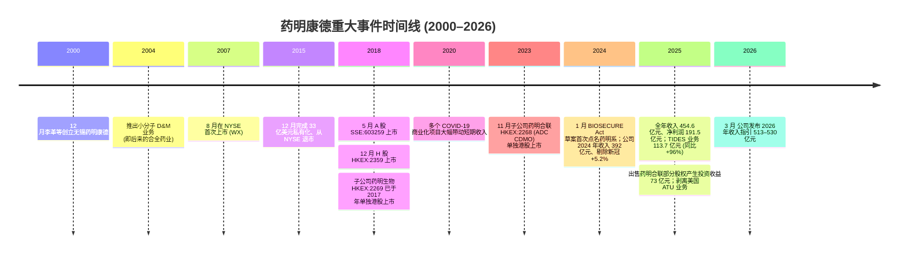
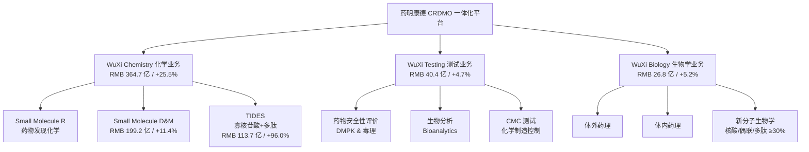
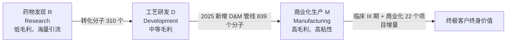
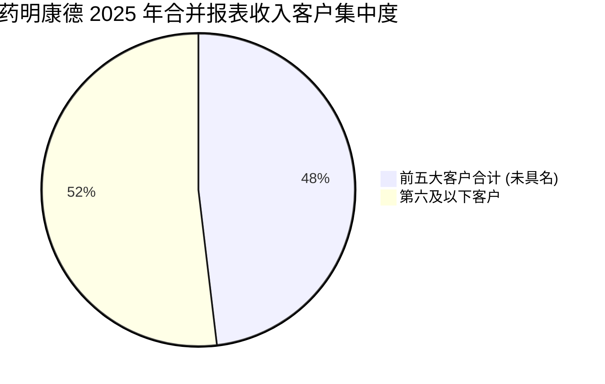
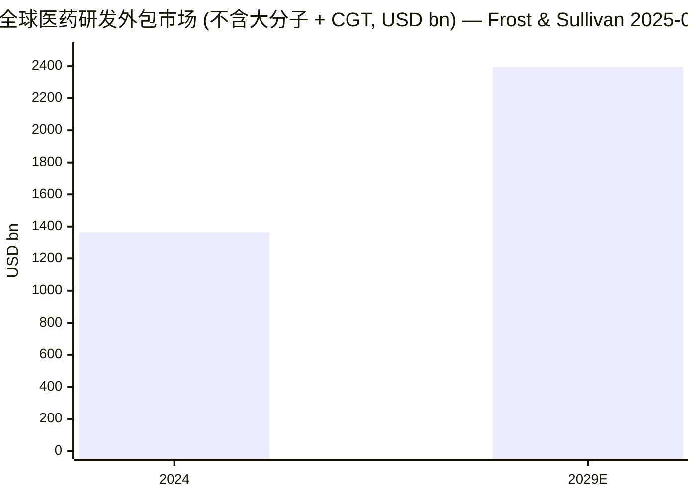
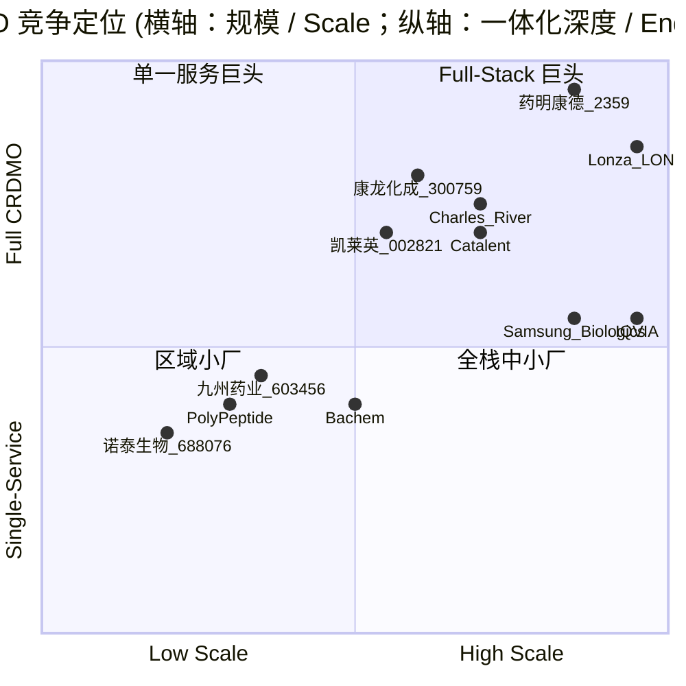
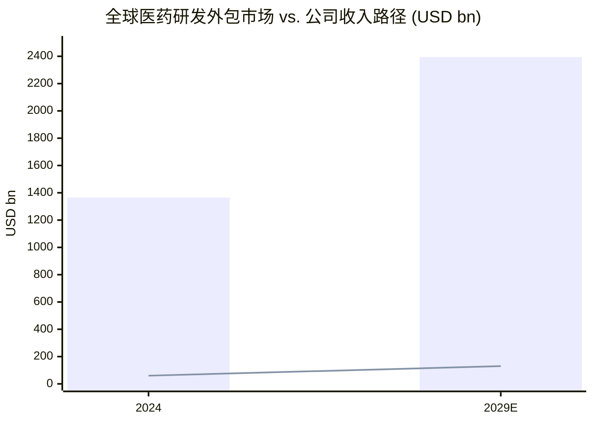

# 药明康德 (WuXi AppTec, HKEX:2359 / SSE:603259) — 公司研究

*As of 2026-06-02 · 报告语言：简体中文 (中英术语并列) · 主题归属：china-drug-out-licensing*

> **Update — 2025 年全年业绩超预期 + 2026 年指引初次披露 (2026-03-23):** 公司 2025 年实现营业收入人民币 454.6 亿元，同比增长 15.8%；持续经营业务收入 434.2 亿元，同比 +21.4%；归母净利润 191.5 亿元，同比 +102.6% (含出售药明合联部分股权产生的一次性投资收益 73.1 亿元 / 税前)；扣非归母净利润 132.4 亿元，同比 +32.6%；持续经营业务毛利率达 48.9% (同比 +4.3 个百分点)。公司同步首次披露 2026 年全年收入指引区间 RMB 513–530 亿元，持续经营业务收入同比增长 18–22%，并提出 2025 年度现金分红 + 回购合计人民币 87.5 亿元 (占归母净利润 45.7%)。资料来源：[药明康德 2025 年年度报告, 第 7、13–14 页](https://static.cninfo.com.cn/finalpage/2026-03-24/1225025225.PDF)。

## 目录 / Table of Contents

1. 公司概览 (Company Overview)
2. 公司历史 (Company History)
3. 管理团队 (Management Team)
4. 产品与服务 (Products & Services)
5. 客户与上市策略 (Customers & Go-to-Market)
6. 行业概览 (Industry Overview)
7. 竞争格局 (Competitive Landscape)
8. 市场机会 (Market Opportunity / TAM)
9. 风险评估 (Risk Assessment)
10. 投资者视角评分卡 (Investor-Lens Scorecards)

---

## 1. 公司概览 (Company Overview)

无锡药明康德新药开发股份有限公司 (WuXi AppTec Co., Ltd., 以下简称"药明康德")是全球医药及生命科学行业最大的一体化研发与生产服务 (CRDMO, Contract Research, Development & Manufacturing Organization) 平台之一。公司面向跨国制药公司、生物科技公司、学术机构及非营利研究机构，提供覆盖 "概念产生 → 药物发现 → 工艺研发 → 商业化生产" 全流程的合同研发与生产服务。截至 2025 年末公司共拥有 33,834 名员工 (其中研发人员 25,983 名，占总员工 76.8%)，运营基地分布于中国、美国、欧洲等地，2025 年持续经营业务收入达人民币 434.2 亿元 ([药明康德 2025 年年度报告, 第 11、18 页](https://static.cninfo.com.cn/finalpage/2026-03-24/1225025225.PDF))。

公司采用 **A+H 双重上市** 架构：A 股 SSE:603259 (2018 年 5 月上市)，H 股 HKEX:2359 (2018 年 12 月上市)。公司业务可分为四大板块：化学业务 (WuXi Chemistry，2025 年收入 364.7 亿元，占持续经营业务 84.0%)，测试业务 (WuXi Testing，40.4 亿元，9.3%)，生物学业务 (WuXi Biology，26.8 亿元，6.2%)，以及其他业务 (2.4 亿元，0.5%)。化学业务下进一步细分为小分子药物发现 ("R"，Research)、小分子工艺研发与生产 ("D&M"，Development and Manufacturing) 以及 TIDES (寡核苷酸 / 多肽) 三块；2025 年化学业务整体增速 25.5%，其中 TIDES 业务收入达 113.7 亿元，同比增长 96.0% (公司披露)，已成为公司最重要的增长引擎 ([药明康德 2025 年年度报告, 第 13–14、15 页](https://static.cninfo.com.cn/finalpage/2026-03-24/1225025225.PDF))。

公司客户结构高度国际化。2025 年持续经营业务中境外客户收入达 379.5 亿元，占持续经营业务的 87.4%；其中**美国客户收入达 312.5 亿元，同比增长 34.3%**，是公司收入增长的主要驱动；欧洲客户收入 48.2 亿元 (同比 -4.0%)；中国客户收入 54.7 亿元 (同比 -3.5%)，反映了境内创新药市场的阶段性调整 ([药明康德 2025 年年度报告, 第 11 页](https://static.cninfo.com.cn/finalpage/2026-03-24/1225025225.PDF))。截至 2025 年 12 月末，公司持续经营业务在手订单达人民币 580.0 亿元，同比增长 28.8%，为 2026 年增长提供了较强能见度 ([药明康德 2025 年年度业绩公告 (新闻稿)](https://www.wuxiapptec.com/news/wuxi-news/ukp6jpdhyncifp8ovk4kv1z6))。

**估值快照 (Valuation Snapshot) — 截至 2026 年 6 月初。** 香港 H 股 2359.HK 收盘价约 HK$129.20，市值约 HK$351.9 bn，TTM P/E ~15.4×，dividend yield 1.68%；52 周区间 HK$67.30–148.00，过去一年涨幅约 +91.9% ([StockAnalysis.com — WuXi AppTec (HKG:2359)](https://stockanalysis.com/quote/hkg/2359/))。同口径 TTM P/S ~6.7× (= HK$351.9 bn 市值 ÷ HK$52.5 bn TTM 收入)，TTM P/E 处于公司 5 年区间中等偏低位置 (2021 年高点曾接近 50×)；该估值远低于全球 CDMO 龙头瑞士 Lonza (~30× TTM P/E)、美国 Catalent (被 Novo Holdings 私有化前 TTM P/E 约 40×) 及韩国 Samsung Biologics (~35× TTM P/E)，但高于国内可比的凯莱英 SZSE:002821 (~14× TTM P/E)、康龙化成 SZSE:300759 (~17×) ([Yahoo Finance — 2359.HK](https://finance.yahoo.com/quote/2359.HK/))。

*分析师观点：*  当前估值低于全球同行的核心原因是 **美中地缘政治折价 (geopolitical discount)** — 公司虽未被列入 BIOSECURE Act 1260H 名单 (2025 年 12 月该法案以并入 2026 财年 NDAA 形式正式签署生效)，但 2025 年 12 月美国国会多个委员会主席联合致信国防部，建议在 2026 年 1 月更新的 1260H 名单中将药明康德、药明生物、药明合联纳入"受关注生物科技公司 (BCC)" ([Foley Hoag — Congress Passes BIOSECURE Act 2025-12](https://foleyhoag.com/news-and-insights/publications/alerts-and-updates/2025/december/congress-passes-biosecure-act-here-s-what-you-need-to-know/), [Ropes & Gray — BIOSECURE Act Enacted 2026-01](https://www.ropesgray.com/en/insights/alerts/2026/01/biosecure-act-enacted))。该列名风险使得估值反映约 40% TTM P/E 折扣 (vs. Lonza)；若 2026 年 1 月名单不纳入药明系，估值有望向 20×+ 区间修复。

公司股东回报方面也持续慷慨：2025 年度现金分红方案 (年度分红 + 特别分红 + 中期分红) 合计人民币 67.5 亿元，加上年内已实施回购注销人民币 20.0 亿元，合计 87.5 亿元，占归母净利润的 45.7% — 在 A+H 双重上市中资 CDMO 公司中处于领先水平 ([药明康德 2025 年年度报告, 第 2 页 (利润分配预案)](https://static.cninfo.com.cn/finalpage/2026-03-24/1225025225.PDF))。

## 2. 公司历史 (Company History)

公司由李革 (Ge Li) 博士与三位合作伙伴于 2000 年 12 月在江苏无锡创立。李革博士在创办药明之前是美国新泽西州 Pharmacopeia 公司 (NASDAQ:PCOP，组合化学领域领先公司) 的联合创始科学家之一；在被 Pharmacopeia 派遣回中国洽谈合资项目后，他决定独立创业、聚焦合同化学服务 ([Wikipedia — Ge Li](https://en.wikipedia.org/wiki/Ge_Li), [C&EN — WuXi AppTec Profile 2016](https://cen.acs.org/articles/94/i11/CEN-profiles-WuXi-AppTec-Chinese.html))。公司最初的服务对象主要是欧美与日本大型药企，提供基础化学合成外包；随后 20 余年间逐步扩展到药物发现、临床前安评、临床研究、API 与制剂 CDMO、寡核苷酸 / 多肽、ADC 偶联药物等几乎所有研发环节，构建了行业罕见的 "一体化、端到端" 服务平台 ([药明康德 2025 年年度报告, 第 11–13 页](https://static.cninfo.com.cn/finalpage/2026-03-24/1225025225.PDF))。

公司发展史中有三个具有结构性意义的战略转折点。**第一个转折** 是 2007–2015 年的 "美中两地资本市场切换" — 公司 2007 年在纽交所首次上市 (代码 WX)，但 2015 年完成 33 亿美元私有化并从美国退市；私有化后管理层选择子公司 (合全药业、药明生物、药明合联) 独立分拆 + 母公司回归 A+H 双重上市的路径，旨在让不同业务线获得更贴近终端市场的估值 ([Wikipedia — Ge Li](https://en.wikipedia.org/wiki/Ge_Li))。这一资本结构选择在 2024 年 BIOSECURE Act 草案出台后被反复审视 — 子公司独立上市虽然分摊了母公司估值压力，但也使得"药明系"在美国国会层面成为一个清晰的整体目标。

**第二个转折** 是 2019–2024 年的 "新分子 / TIDES 业务跃迁"。公司在 2019 年开始系统布局寡核苷酸 (oligonucleotide) 与多肽 (peptide) 业务，建立 TIDES 平台 (英文为 OliGonucleotides + pepTIDES → TIDES)。最初产能极小，但伴随 GLP-1 类减肥药 (semaglutide、tirzepatide) 与寡核苷酸药物 (mipomersen、inclisiran 等) 的临床突破，需求爆发；公司 2024 年起密集扩产，2025 年 9 月泰兴多肽产能提前完成，多肽固相合成反应釜总体积已超 10 万升，公司自述 "稳居全球首位" ([药明康德 2025 年年度报告, 第 14 页](https://static.cninfo.com.cn/finalpage/2026-03-24/1225025225.PDF), [药明康德 — 全球最大多肽产能背后的投资机会与风险, 2025](https://health.baidu.com/m/detail/ar_9644917489172473671))。

**第三个转折** 是 2024–2025 年的 "战略瘦身、聚焦 CRDMO 主业"。受到 BIOSECURE 立法不确定性影响，公司主动出售/剥离了若干海外资产以降低估值与监管复杂度：2024 年起逐步减持药明合联 (累计出售约 16.7 亿元股票收益)；2025 年 10 月以人民币 28 亿元出售上海康德弘翼医学临床研究有限公司、上海药明津石医药科技有限公司 100% 股权 (合称"国内临床研究业务")；同期出售美国 ATU (Advanced Therapies) 子公司 WuXi Advanced Therapies Inc.、Oxford Genetics Limited、WuXi AppTec, Inc.、Pharmapace, Inc. 等 ([药明康德 2025 年年度报告, 第 26–27 页](https://static.cninfo.com.cn/finalpage/2026-03-24/1225025225.PDF))。在 IFRS 报表中，这些业务在 2024 与 2025 年都被归类为 "终止经营业务"，使公司更纯粹聚焦核心 CRDMO。

近期 (2025–2026 年) 重大事项包括：(1) 2025 年 12 月美国 BIOSECURE Act 通过 NDAA 立法签署生效，但药明系仍未被正式列入 BCC 名单，2026 年 1 月将进行年度更新 ([Ropes & Gray, 2026-01](https://www.ropesgray.com/en/insights/alerts/2026/01/biosecure-act-enacted))；(2) 2025 年公司接受 741 次全球客户、监管机构和独立第三方质量审计且无严重发现，常州、泰兴、金山三大原料药基地以零缺陷成功通过 FDA 现场检查 ([药明康德 2025 年年度报告, 第 12、30 页](https://static.cninfo.com.cn/finalpage/2026-03-24/1225025225.PDF))；(3) 公司 2025 年 ESG 评级再获 MSCI AAA (最高级)、CDP 气候变化与水安全双 A ([药明康德 2025 年年度报告, 第 31 页](https://static.cninfo.com.cn/finalpage/2026-03-24/1225025225.PDF))。

## 3. 管理团队 (Management Team)

**李革 (Ge Li) 博士 — 创始人、董事长、执行董事、总裁兼首席执行官 (Founder, Chairman, Executive Director, President & CEO; 现年 59 岁，2025 年薪酬 RMB 3,998 万元)**

李革博士同时是公司的创始人和实际控制人，2000 年 12 月创办无锡药明康德至今 25 年来始终担任 CEO 与董事长角色 ([药明康德 2025 年年度报告, 第 34–35 页](https://static.cninfo.com.cn/finalpage/2026-03-24/1225025225.PDF))。本科毕业于北京大学化学系 (1989 年)，1994 年获得哥伦比亚大学有机化学博士学位 (师从 W. Clark Still 和 Koji Nakanishi 两位组合化学领域奠基人) ([Wikipedia — Ge Li](https://en.wikipedia.org/wiki/Ge_Li))。

博士毕业后，李革加入新泽西州 Pharmacopeia 公司 (NASDAQ:PCOP)，作为该公司的联合创始科学家之一，参与了 90 年代中后期组合化学 (combinatorial chemistry) 在新药发现中工业化应用的关键阶段。具体贡献包括：(1) 帮助 Pharmacopeia 建立化合物库筛选平台，最终积累了百万级化合物库；(2) 主导建立美中合资实验室，把组合化学服务带回中国；(3) 1999 年被 Pharmacopeia 派遣回国洽谈合资项目时，意识到中国境内可获得的人才密度 + 成本优势远超合资范畴的覆盖能力 ([C&EN — WuXi AppTec Profile, 2016](https://cen.acs.org/articles/94/i11/CEN-profiles-WuXi-AppTec-Chinese.html))。

创办药明的核心论点：**全球大型制药公司在新世纪初面临 "专利悬崖 + 研发回报率下降" 双重压力，外包率必然结构性提升；中国可以以更低成本、更高速度承接欧美研发外包**。20 多年后该论点已被充分验证：根据 Frost & Sullivan 2025 年 9 月报告，全球医药研发外包比例将由 2024 年的 51.9% 提升至 2029 年的 60.0% ([药明康德 2025 年年度报告, 第 29 页](https://static.cninfo.com.cn/finalpage/2026-03-24/1225025225.PDF))。

李革目前持股结构通过家族信托与境外控股实体持有；根据《福布斯》估算，其 2022 年个人净资产约 100 亿美元 ([Bloomberg Billionaires Index — Li Ge](https://www.bloomberg.com/billionaires/profiles/ge-li/))。2020 年与妻子赵宁 (亦为北大同学、哥伦比亚博士、曾任药明 SVP 全球人力资源主管) 向哥伦比亚大学捐赠 2,150 万美元；2021 年向纪念斯隆-凯特琳癌症中心捐赠 2,000 万美元 ([Wikipedia — Ge Li](https://en.wikipedia.org/wiki/Ge_Li))。在公司治理层面，李革同时担任董事长、总裁、CEO，公司在 2025 年年报中专门解释了 "实际控制人同时担任董事长与总裁 / CEO" 的合理性 — 强调独立董事比例 ≥1/3、关联交易回避制度，以及完整内部控制体系 ([药明康德 2025 年年度报告, 第 34 页](https://static.cninfo.com.cn/finalpage/2026-03-24/1225025225.PDF))。

由于李革博士同时是公司创始人 + 现任 CEO，本报告按 company-research 技能规范合并撰写。其他高管 (陈民章、杨青等联席 CEO，张朝晖副总裁、胡正国前 CIO) 按本技能要求略去。

## 4. 产品与服务 (Products & Services)

### 4.1 业务板块矩阵 (Segment Matrix)

公司 2025 年度报告将持续经营业务划分为四大板块，每块业务下面又包含若干子业务/产品线。下表系按公司 2025 年年报第 13–15 页的披露摘录、并补充各子板块的关键 KPI：

| 业务板块 / Segment | 2025 年收入 (人民币亿元) | 同比增速 | 毛利率 | 关键子业务 / Key Sub-Lines |
|---|---|---|---|---|
| **化学业务 WuXi Chemistry** | 364.7 | +25.5% | 51.9% | 小分子 R (Research)；小分子 D&M (CDMO)；TIDES (寡核苷酸 + 多肽) |
| **测试业务 WuXi Testing** | 40.4 | +4.7% | 29.3% | 药物安全性评价 (DMPK & Tox)；生物分析；CMC 测试 |
| **生物学业务 WuXi Biology** | 26.8 | +5.2% | 34.7% | 体外药理；体内药理；新分子生物学服务 |
| **其他业务 Others** | 2.4 | -23.8% | 85.7% | (剥离中) |
| **持续经营合计** | **434.2** | **+21.4%** | **48.9%** | — |

数据来源：[药明康德 2025 年年度报告, 第 13、15–16 页](https://static.cninfo.com.cn/finalpage/2026-03-24/1225025225.PDF)。

### 4.2 商业模式综述 — "跟随项目、跟随分子" 的客户漏斗

公司年报对 CRDMO 一体化模式的核心定位如下 (verbatim 引用)：

> "公司是行业中极少数在新药研发全产业链均具备服务能力的开放式新药研发服务平台...公司顺应新药研发项目从早期开始向后期不断发展的科学规律，在客户项目不断推进的过程中，从'跟随项目发展'到'跟随药物分子发展'，不断扩大服务。公司通过在新药研发早期阶段为客户赋能...在产品后期开发及商业化阶段可获得更多的业务机会，持续驱动业务增长。" ([药明康德 2025 年年度报告, 第 12 页](https://static.cninfo.com.cn/finalpage/2026-03-24/1225025225.PDF))

**中文释义 / Plain-language gloss：** 这是 CDMO 商业模式中最重要的"漏斗效应"逻辑 — 客户在药物发现 (Discovery) 阶段下达的项目订单单价低、毛利薄，但只要客户决定继续把同一个分子推进到临床前 → 临床 I/II/III → 商业化生产，每一步交付给同一个 CDMO 的难度门槛 (技术验证、监管熟悉度、知识产权信任) 都会陡然提升。**因此早期项目即使不赚钱，也是 D&M 后期高毛利商业化订单的"种子田"**。这是为什么公司 2025 年 R 业务为下游持续引流 — 全年成功合成并交付超过 42 万个新化合物、R 到 D 转化分子 310 个 ([药明康德 2025 年年度报告, 第 13 页](https://static.cninfo.com.cn/finalpage/2026-03-24/1225025225.PDF))。

### 4.3 化学业务 (WuXi Chemistry) — 公司绝对核心

化学业务 2025 年贡献持续经营业务收入的 84.0% 与超过 87% 的毛利，是公司增长引擎与盈利核心。下分三个子业务，每个增速差异极大。

#### 4.3.1 小分子药物发现 (Small Molecule R / Research)

> "小分子药物发现（'R'，Research）业务为下游持续引流。2025 年，公司为客户成功合成并交付超过 42 万个新化合物。同时，2025 年 R 到 D 转化分子 310 个。公司贯彻'跟随客户'和'跟随分子'战略，与全球客户建立了值得信赖的合作关系，为公司 CRDMO 业务持续增长奠定坚实基础。" ([药明康德 2025 年年度报告, 第 13 页](https://static.cninfo.com.cn/finalpage/2026-03-24/1225025225.PDF))

**中文释义 / Plain-language gloss：** 这是公司 25 年累积下来的产业链最上游入口 — 公司有数千名化学家专门帮全球客户合成"客户想做但自己合成不出来"的目标分子 (target compound)。一个典型项目可能是某 Biotech 想测试 500 种结构相近的化合物对某个 GPCR 受体的活性，但其内部化学家短期内无法合成；公司接订单后，每周交付若干批次化合物。**42 万个化合物的年度合成量在全球 CRO 行业里是绝对头部规模**，其规模优势来自 SaaS-like 的化学家工时利用率 + 经验积累的合成路径库。这块业务毛利率不高 (推测低于公司化学业务整体 51.9% 的水平)，但它产生了大量 "R 到 D 转化" 的下游订单，是 D&M 后期高毛利业务的"种子"。

*分析师观点：* 与之最直接的竞争对手包括美国 Charles River Laboratories (NYSE:CRL)，及国内的康龙化成 (SZSE:300759)。但据 2024 年 Frost & Sullivan 数据，药明康德在全球早期发现化学市场份额超过竞争对手 ([UBS — China Biopharma Note 2025](https://www.ainvest.com/news/ubs-strategic-bet-wuxi-apptec-barometer-china-biopharma-renaissance-2508/))。

#### 4.3.2 小分子工艺研发与生产 (Small Molecule D&M, 即 CDMO)

> "小分子工艺研发和生产（'D'和'M'，Development and Manufacturing）业务保持强劲增长。i. 小分子 CDMO 管线持续扩张。2025 年小分子 D&M 业务收入 199.2 亿元，同比增长 11.4%。2025 年，小分子 D&M 管线累计新增 839 个分子。截至 2025 年末，小分子 D&M 管线总数达到 3,452 个，包括 83 个商业化项目, 91 个临床 III 期项目，377 个临床 II 期项目, 2,901 个临床前和临床 I 期项目。商业化和临床 III 期阶段项目全年增加 22 个。ii. 公司持续推进小分子产能建设。2025 年，常州、泰兴及金山原料药基地均以零缺陷成功通过 FDA 现场检查。截至 2025 年末，小分子原料药反应釜总体积已提升至超 4,000kL。" ([药明康德 2025 年年度报告, 第 13–14 页](https://static.cninfo.com.cn/finalpage/2026-03-24/1225025225.PDF))

**中文释义 / Plain-language gloss：** D&M 是 CDMO (Contract Development and Manufacturing Organization) 业务的核心 — 客户决定推进某个分子到临床/商业化阶段后，需要 CDMO 把实验室合成路径放大到公斤级 → 吨级 → 商业化吨级，并且确保该工艺通过 FDA、EMA、NMPA 的 GMP (Good Manufacturing Practice，药品生产质量管理规范) 现场检查。**反应釜总体积 4,000 kL** 是公司能 simultaneously 服务多少个商业化项目 / 临床 III 期项目的物理上限指标 — 一个典型的商业化小分子原料药项目可能需要单批次 1,000–10,000 升的反应釜，年生产 10–50 批次。公司年报披露的 "3,452 个项目管线" 中 174 个 (83 个商业化 + 91 个临床 III 期) 是高毛利、高粘性、高确定性的 "金字塔尖" — 这些项目大概率会贡献后 3–5 年的稳定收入。

> "随着 2024 年新增产能逐季度爬坡，2025 年 TIDES 业务收入达到 113.7 亿元，同比增长 96.0%。截至 2025 年末，TIDES 在手订单同比增长 20.2%。" ([药明康德 2025 年年度报告, 第 14 页](https://static.cninfo.com.cn/finalpage/2026-03-24/1225025225.PDF))

#### 4.3.3 TIDES — 寡核苷酸与多肽 (Oligonucleotides + Peptides)

**中文释义 / Plain-language gloss：** TIDES 是公司近 3 年增长最快、估值贡献最大的业务，2025 年收入达 113.7 亿元、同比 +96% (年报披露)，在化学业务中占比已超过 30%。TIDES 涵盖两大类新型分子：

- **多肽 (peptides, 多肽)**：典型代表是 GLP-1 类减肥药 — Novo Nordisk 的 semaglutide (Wegovy / Ozempic) 与 Eli Lilly 的 tirzepatide (Mounjaro / Zepbound)。这些药物分子量 ~3,000–5,000 道尔顿，远大于小分子但远小于蛋白质，需要采用固相合成 (Solid-Phase Peptide Synthesis, SPPS) 工艺。公司年报披露，截至 2025 年末公司多肽固相合成反应釜总体积已提升至超 **100,000 L** ([药明康德 2025 年年度报告, 第 14 页](https://static.cninfo.com.cn/finalpage/2026-03-24/1225025225.PDF))，自称"稳居全球首位" ([药明康德全球最大多肽产能, 2025](https://health.baidu.com/m/detail/ar_9644917489172473671))。
- **寡核苷酸 (oligonucleotides, 寡核苷酸)**：典型代表是 Alnylam 的 RNAi 类药物 (patisiran、givosiran)、Novartis 的 inclisiran (一年两次注射的降胆固醇 siRNA)、Ionis 的反义核苷酸 (ASO, antisense oligonucleotide)。这类药物分子量 5,000–10,000 道尔顿，需要使用核苷酸固相合成 + 高效薄膜蒸发 / 切向流过滤 (TFF) / 沉淀 / 连续流纯化等技术 ([药明康德 2025 年年度报告, 第 12 页](https://static.cninfo.com.cn/finalpage/2026-03-24/1225025225.PDF))。

TIDES 业务的关键 KPI：2025 年公司多肽与寡核苷酸 D&M 服务客户数同比提升 25%，服务分子数量同比提升 45% ([药明康德 2025 年年度报告, 第 14 页](https://static.cninfo.com.cn/finalpage/2026-03-24/1225025225.PDF))。从经济驱动看，单一 GLP-1 商业化项目可能为公司带来年化几十亿元的"水电费式"稳定收入 — 因为 Novo / Lilly 都受到自身产能瓶颈限制，必须外包给少数有 100,000 L 量级多肽产能的 CDMO；目前全球仅有 3–4 家有此能力。

*分析师观点：* TIDES 业务的核心可比公司是瑞士 Bachem (六甲: BANB)、瑞士 Lonza (六甲: LONN)、印度 PolyPeptide (六甲: PPGN.SW)。Bachem 与 PolyPeptide 历史上是 Novo / Lilly 的主要外包合作伙伴，但目前各家公司都在抢建产能；药明康德的 100,000 L 量级使其成为全球前两/三的多肽 CDMO 之一 ([多肽 CDMO 赛道沸腾, 腾讯新闻 2025-11-19](https://news.qq.com/rain/a/20251119A01GZ700))。该业务最大的不确定性是 2026–2028 年的"产能过剩"风险 — 国内凯莱英、九州药业、诺泰生物均在大幅扩产，若 GLP-1 类需求增速放缓将出现行业性价格压力 ([多肽 CDMO 实力对比, 摩熵医药 2025](https://www.pharnexcloud.com/zixun/sdsl_109630), [药明康德多肽产能实现 3 倍增长, ByDrug 2025](https://bydrug.pharmcube.com/news/detail/b57959eedb4ba89ad5e23a9459185c18))。

### 4.4 测试业务 (WuXi Testing) — 高粘性的安评行业头部

> "测试业务实现收入人民币 40.4 亿元，同比恢复正增长 4.7%。报告期内：- 药物安全性评价业务收入同比增长 4.6%，持续保持亚太行业领先地位。- 公司积极助力客户开展全球授权许可合作。新分子业务持续发力，2025 年收入占比进一步提升至超 30%，在核酸类、偶联类、多特异性抗体类、多肽类等领域保持领先地位。" ([药明康德 2025 年年度报告, 第 14 页](https://static.cninfo.com.cn/finalpage/2026-03-24/1225025225.PDF))

**中文释义 / Plain-language gloss：** 药物安全性评价 (Drug Safety Evaluation, 即 DMPK + 毒理研究) 是新药从临床前进入 IND (Investigational New Drug, 研究用新药申请) 必经的法规阶段 — 客户必须提供啮齿动物 (大鼠/小鼠) 和非啮齿动物 (犬/猴) 长期毒性数据。公司在中国、美国、新加坡都有 GLP (Good Laboratory Practice，良好实验室规范) 认证的设施，2025 年公司苏州、上海设施连续多次顺利通过 FDA、OECD、NMPA、PMDA 检查 ([药明康德 2025 年年度报告, 第 14 页](https://static.cninfo.com.cn/finalpage/2026-03-24/1225025225.PDF))。安评业务粘性极强 — 一旦客户在某一家完成了大鼠/猴的 26 周给药毒理实验，几乎不可能换 CRO 重做。

值得特别强调的是测试业务中的 **"助力客户开展全球授权许可合作"** 论述 — 这正是 china-drug-out-licensing 主题在公司业务中的最直接体现：当国内 Biotech 把候选分子 out-license 给跨国药企时，跨国药企的 due diligence 团队需要确认所有临床前数据 (尤其是毒理学与生物分析数据) 是按照 ICH GLP 与 FDA 标准生成的；药明康德的全球可比拟 GLP 设施 + 双语数据包，使其成为出海项目的"通用语" — 这与 china-drug-out-licensing 趋势中"中国创新药年度 BD 交易金额从 2020 年 80 亿美元跃升至 2024 年 520 亿美元 + 中国 CDMO/CRO 占全球 licensing 交易的 40% (vs. 5 年前的 3%)" 一致 ([FierceBiotech — Chinese biotech out-licensing scorching hot, 2025](https://www.fiercebiotech.com/biotech/chinese-biotechs-out-licensing-business-scorching-hot-could-geopolitics-rain-their-parade))。

### 4.5 生物学业务 (WuXi Biology) — 早期发现的体内外协同

> "生物学业务实现收入人民币 26.8 亿元，同比恢复正增长 5.2%。报告期内：- 生物学业务秉持科学驱动理念，前瞻布局药物发现热点及差异化能力；积极拓展全球业务，为公司 CRDMO 业务模式高效引流，持续为公司带来超过 20% 的新客户。- 通过药物发现体内、外业务联动、跨区域合作和热点领域的一体化服务，高效赋能全球客户。- 新分子业务持续贡献增长，2025 年收入占比进一步提升至超 30%，核酸类、偶联抗体类、多肽类等领域新客户快速增长。" ([药明康德 2025 年年度报告, 第 14 页](https://static.cninfo.com.cn/finalpage/2026-03-24/1225025225.PDF))

**中文释义 / Plain-language gloss：** 生物学业务体量虽小 (占持续经营业务的 6.2%) ，但战略意义高 — 它是公司 R (药物发现) 业务在化学之外的另一个引流入口。每年这块业务带来超过 20% 的新客户 (主要是欧美中小 Biotech)，这些客户在生物学服务中信任公司后，往往会把后续化学合成、CMC、毒理等业务一并外包给公司。**所以生物学业务在年报内被视作"流量入口"，而非利润中心。**

### 4.6 协同效应 / 业务交互 (Cross-Segment Synergy)

公司年报特别强调 "一体化、端到端" 协同：

> "公司不断优化和发掘跨板块间的业务协同性以更好地服务全球客户，持续强化公司独特的一体化 CRDMO 业务模式，并提供真正的一站式服务，满足客户从药物发现、开发到生产的服务需求。" ([药明康德 2025 年年度报告, 第 11 页](https://static.cninfo.com.cn/finalpage/2026-03-24/1225025225.PDF))

**中文释义 / Plain-language gloss：** 一个理想的客户漏斗路径如下：(1) 客户在 WuXi Biology 完成体外药理筛选 → (2) 在 WuXi Chemistry R 阶段合成 100 个化合物 → (3) 选定 lead compound 后到 WuXi Chemistry D 阶段进行工艺研发 → (4) 在 WuXi Testing 完成 GLP 毒理与生物分析 → (5) 提交 IND、进入临床 I/II/III 期 (公司有临床研究服务，2025 年已剥离) → (6) 商业化阶段在 WuXi Chemistry M 阶段进行 API 与制剂生产。**这条漏斗的"转化率"是公司护城河的核心 — 一旦客户进入这条路径，3–5 年内换供应商的成本极高。**

### 4.7 重点业务旗舰 + 最近 12 个月动态

**旗舰业务：** (1) **小分子 D&M (CDMO)** — 2025 年 199.2 亿元，是规模最大的单一子业务，但增速放缓至 11.4% (vs. 公司整体 21.4%)；(2) **TIDES (多肽 + 寡核苷酸)** — 2025 年 113.7 亿元、+96%，是估值核心驱动；(3) **药物安评 (Safety Evaluation)** — 测试业务中粘性最高的子业务，亚太地区第一。

**最近 12 个月重大动态：**

- 2025-09：泰兴多肽产能提前完成，公司多肽固相合成反应釜总体积已提升至超 100,000 L ([药明康德 2025 年年度报告, 第 12 页](https://static.cninfo.com.cn/finalpage/2026-03-24/1225025225.PDF))。
- 2025-10：出售上海康德弘翼 + 上海药明津石 100% 股权 (国内临床研究业务)，对价 RMB 28 亿元 ([药明康德 2025 年年度报告, 第 26 页](https://static.cninfo.com.cn/finalpage/2026-03-24/1225025225.PDF))。
- 2025-Q3：完成 2024 年新建产能逐季度爬坡，TIDES 业务 Q1-Q3 收入 78.4 亿元、同比 +121.1% ([新华健康 — 药明康德 TIDES 业务强劲增长, 2025-07-30](https://www.jjckb.cn/20250730/36fe7e04e1794323a0cdc68d79946393/c.html))。
- 2025-12：BIOSECURE Act 通过 NDAA 签署生效；但药明系暂未列入 1260H BCC 名单，2026-01 名单更新结果待出 ([Ropes & Gray — BIOSECURE Act Enacted 2026-01](https://www.ropesgray.com/en/insights/alerts/2026/01/biosecure-act-enacted))。
- 2026-04 至 2026-Q1：持续经营业务收入同比增长 39.4% (公司披露)，显示 TIDES 与小分子 D&M 双引擎驱动 ([StockAnalysis.com — WuXi AppTec](https://stockanalysis.com/quote/hkg/2359/))。

## 5. 客户与上市策略 (Customers & Go-to-Market)

公司服务全球近 6,000 家活跃客户 (2024 年底数据) ([FierceBiotech, 2025](https://www.fiercebiotech.com/biotech/chinese-biotechs-out-licensing-business-scorching-hot-could-geopolitics-rain-their-parade))，覆盖几乎所有跨国大药企 (Pfizer、Roche、Merck、GSK、AstraZeneca、Novartis 等) 与大量欧美中小 Biotech。

### 5.1 客户集中度 (Customer Concentration) — 关键披露

根据公司 2025 年年报：

> "前五名客户销售额人民币 2,186,830.20 万元，占年度销售总额 48.11%；其中前五名客户销售额中关联方销售额 0 万元，占年度销售总额 0%。" ([药明康德 2025 年年度报告, 第 17 页](https://static.cninfo.com.cn/finalpage/2026-03-24/1225025225.PDF))

**关键数据 (基于合并报表口径 / Consolidated):**
- 前五大客户合计销售额 **RMB 218.7 亿元**
- **占年度销售总额 48.1%** (denominator = 2025 年合并报表营业收入 RMB 454.6 亿元)
- 关联方销售额：**0** (说明前五大客户均为独立第三方)
- 单一客户销售比例**未超过 50%**，未涉及"严重依赖少数客户的情形"

**重要披露说明 / Disclosure Caveat：** A 股年报披露的前五名客户**未具名披露**，仅披露合计金额与占比，符合中国证监会披露要求。市场普遍推测前五大客户应包括以 GLP-1 类项目为代表的跨国大药企 (Novo Nordisk、Eli Lilly、Pfizer、AstraZeneca、Merck 等)，但具体名单与个别比例**未在 10-K-级别文件中披露**。本报告不就具体客户身份与具体比例做超出公司披露范围的"反向工程"。

数据来源：[药明康德 2025 年年度报告, 第 17 页](https://static.cninfo.com.cn/finalpage/2026-03-24/1225025225.PDF)。注：此饼图采用**合并报表总收入 (consolidated, 含终止经营业务)** 作为唯一分母，未与任何分部 (segment-level) 客户份额混用。

### 5.2 客户地域分布

2025 年持续经营业务收入按客户母公司所在国家或地区统计的分布：

| 地区 | 2025 年收入 (人民币亿元) | 同比增速 | 占持续经营业务比例 |
|---|---|---|---|
| **美国客户** | **312.5** | **+34.3%** | **72.0%** |
| 中国客户 | 54.7 | -3.5% | 12.6% |
| 欧洲客户 | 48.2 | -4.0% | 11.1% |
| 其他地区 | 18.8 | +4.1% | 4.3% |
| **持续经营合计** | **434.2** | **+21.4%** | **100%** |

数据来源：[药明康德 2025 年年度报告, 第 11 页 (持续经营业务地区分布)](https://static.cninfo.com.cn/finalpage/2026-03-24/1225025225.PDF)。

**美国客户占持续经营业务的 72%**，这是公司估值最关键的同时也是最脆弱的风险因子。美国客户高度集中既是公司过去 25 年外包模式成功的结果 (全球大药企最大集中地是美国)，也是 BIOSECURE Act 立法时国会议员主要担心的对象 — 据 BiopharmaDive 援引国会听证记录，"约 80% 的美国上市生物制药公司在某种形式上使用药明系服务" ([BiopharmaDive — House backs biotech bill, 2024](https://www.biopharmadive.com/news/biosecure-pass-house-vote-wuxi-china-biotech/726566/))。

### 5.3 在手订单 (Backlog) — 增长能见度

公司持续经营业务在手订单 KPI 的演化轨迹 (供 2024Q4 → 2025Q4 比较):

| 时点 | 在手订单 (人民币亿元) | 同比增速 |
|---|---|---|
| 2024 年末 (2024-12-31) | 493 | +47.0% |
| 2025 Q1 (2025-03-31) | 523 | +47.1% |
| 2025 H1 (2025-06-30) | 561 | +37.2% |
| 2025 Q3 (2025-09-30) | **599** | **+41.2%** |
| 2025 年末 (2025-12-31) | **580** | **+28.8%** |

数据来源：[WuXi AppTec 2025 Annual Results PR (2026-03-23)](https://www.prnewswire.com/news-releases/wuxi-apptec-beat-full-year-guidance-and-achieved-record-performance-in-2025-302721920.html)，[WuXi AppTec Q3 2025 Results PR (2025-10-26)](https://www.prnewswire.com/news-releases/wuxi-apptec-achieves-strong-double-digit-growth-in-revenue-and-profit-for-q1-q3-2025-backlog-for-continuing-operations-up-41-2-yoy-further-raises-2025-full-year-guidance-302594605.html)，[WuXi AppTec Q1 2025 Results PR](https://www.wuxiapptec.com/news/wuxi-news/6029)。

580 亿元的在手订单约相当于 1.3 倍 2025 年持续经营业务收入，提供了 2026 年指引 (RMB 513–530 亿 / +18-22%) 的高确定性支撑。

### 5.4 商业模式 + 销售周期 + 渠道

公司采取**直销 + 行业会议 + 引流模式**：

- **直销团队 (Direct sales)** 部署在全球各运营基地附近，主要覆盖美国 (波士顿、新泽西、加州)、欧洲 (慕尼黑、瑞士、英国剑桥) 与中国。
- **行业会议引流：** 公司每年举办药明康德全球论坛 + 多场创新日系列活动，2025 年线下参会人数超过 4,300 人；通过"药明直播间"覆盖超过 100 个国家地区的客户 ([药明康德 2025 年年度报告, 第 13 页](https://static.cninfo.com.cn/finalpage/2026-03-24/1225025225.PDF))。
- **生物学业务作为引流入口：** 生物学业务每年带来 >20% 新客户，再向化学 / 测试业务漏斗渗透 ([药明康德 2025 年年度报告, 第 14 页](https://static.cninfo.com.cn/finalpage/2026-03-24/1225025225.PDF))。

**销售周期：** 早期发现项目订单周期短 (几周到几个月)；D&M 项目可能跟随客户分子十年以上 (R → D → M 漏斗)。

## 6. 行业概览 (Industry Overview)

### 6.1 行业定义 + 全球 TAM

公司所属行业是**全球医药研发服务行业 (Pharmaceutical R&D Services / CRO + CDMO)**。公司年报援引 Frost & Sullivan 2025 年 9 月最新报告的关键数据如下 (verbatim):

> "根据 2025 年 9 月最新的 Frost & Sullivan 报告预测，全球医药行业研发投入将由 2024 年的 2,776 亿美元增长至 2029 年的 3,731 亿美元，复合年增长率约 6.1%。全球医药研发投入外包比例将由 2024 年的 51.9% 提升至 2029 年的 60.0%。同时报告预测，全球医药研发外包服务的市场（不包括大分子和 CGT CDMO）规模将由 2024 年的 1,365 亿美元增长到 2029 年的 2,395 亿美元，复合年增长率约 11.9%。" ([药明康德 2025 年年度报告, 第 29 页 (引用 Frost & Sullivan)](https://static.cninfo.com.cn/finalpage/2026-03-24/1225025225.PDF))

**关键测算 (来源链：Frost & Sullivan 2025-09，由公司在年报中引用):**

- 全球医药研发投入 2024：USD 2,776 亿 → 2029E：USD 3,731 亿 (CAGR ~6.1%)
- 全球研发外包率 2024：51.9% → 2029E：60.0% (8.1 个百分点提升)
- 全球医药研发外包市场 (不含大分子 + CGT)：2024：USD 1,365 亿 → 2029E：USD 2,395 亿 (CAGR ~11.9%)

数据来源：[药明康德 2025 年年度报告 引用 Frost & Sullivan 2025-09, 第 29 页](https://static.cninfo.com.cn/finalpage/2026-03-24/1225025225.PDF)。

### 6.2 行业驱动力 + 关键趋势

**驱动力一 — 专利悬崖 + 研发回报率下降：** 大型制药企业面临 2025–2030 年的"专利悬崖" — Keytruda (Merck)、Eliquis (BMS/Pfizer)、Stelara (J&J) 等过百亿美元/年的大单品将陆续失去专利保护；同时新药研发成本持续上升 (业内估算单个新药研发成本已达 USD 26 亿)。这双重压力下，大药企必须更多依赖外包服务来降本提速 ([药明康德 2025 年年度报告, 第 29 页](https://static.cninfo.com.cn/finalpage/2026-03-24/1225025225.PDF))。

**驱动力二 — 中小型 Biotech 的爆发：** 包括美国 Biotech 与中国 Biotech 在内的中小型研发主体过去 10 年大规模兴起，它们在融资后没有时间/资金搭建自己的实验室和生产基地，因此对一体化外包服务的依赖度极高 — 这正好对应了药明康德"一体化、端到端"模式的最佳客户画像 ([药明康德 2025 年年度报告, 第 29 页](https://static.cninfo.com.cn/finalpage/2026-03-24/1225025225.PDF))。

**驱动力三 — 新分子类型的爆发：** 全球新药研发正从传统小分子向多肽、寡核苷酸、ADC (Antibody-Drug Conjugate, 抗体偶联药物)、PROTAC (Proteolysis-Targeting Chimera, 靶向蛋白降解嵌合体) 等新分子类型扩展，每一个新分子类型都需要 CDMO 重新建产能、积累工艺 know-how — 这是公司 2025 年 TIDES +96% 增长的核心驱动 ([药明康德 2025 年年度报告, 第 12 页](https://static.cninfo.com.cn/finalpage/2026-03-24/1225025225.PDF))。

**驱动力四 — GLP-1 与肥胖 / 糖尿病市场的"涨潮"：** Novo Nordisk 的 Wegovy (semaglutide) 与 Eli Lilly 的 Zepbound (tirzepatide) 2024 年合计销售已超过 USD 350 亿，且预计到 2030 年仍有 3–5 倍增长空间。两家公司都面临自身产能瓶颈，必须外包给少数有 100,000 L 量级多肽产能的 CDMO ([新华健康 — 药明康德 TIDES 业务强劲增长, 2025-07-30](https://www.jjckb.cn/20250730/36fe7e04e1794323a0cdc68d79946393/c.html))。

**驱动力五 (china-drug-out-licensing 主题专属) — 中国创新药出海 + BD 交易爆发：** 中国 Biotech 通过 out-licensing 模式向跨国药企转让分子开发权的交易额从 2020 年 USD 80 亿激增至 2024 年 USD 520 亿；中国 CRO/CDMO 占全球 licensing 交易的份额从 5 年前的 3% 跃升至 40%。**药明康德支持了 2022 年以来约 40% 的中国 Biotech 成功 out-licensed 交易** ([FierceBiotech, 2025](https://www.fiercebiotech.com/biotech/chinese-biotechs-out-licensing-business-scorching-hot-could-geopolitics-rain-their-parade))。这意味着每一笔中国 Biotech → 跨国药企 BD 交易，背后的临床前数据包、CMC 工艺数据、GLP 毒理数据中的相当一部分都由药明系生成。

### 6.3 监管环境

医药研发服务行业受 FDA (美国食品药品监督管理局)、EMA (欧洲药品管理局)、NMPA (中国国家药品监督管理局)、PMDA (日本药品和医疗器械管理局) 等多重监管。公司年报披露 2025 年接受了 741 次来自全球客户、监管机构和独立第三方的质量审计且无严重发现项 — 这是高粘性业务的"通行证"。常州、泰兴、金山三大原料药基地以零缺陷成功通过 FDA 现场检查，是 2025 年最大的运营亮点 ([药明康德 2025 年年度报告, 第 12、30 页](https://static.cninfo.com.cn/finalpage/2026-03-24/1225025225.PDF))。

近期最重要的监管变化是美国 BIOSECURE Act — 2025 年 12 月作为 NDAA 一部分签署生效，2026 年 12 月 18 日前需由 OMB 公布完整的 BCC (Biotechnology Companies of Concern) 名单 ([Foley Hoag — Congress Passes BIOSECURE Act 2025-12](https://foleyhoag.com/news-and-insights/publications/alerts-and-updates/2025/december/congress-passes-biosecure-act-here-s-what-you-need-to-know/))。

## 7. 竞争格局 (Competitive Landscape)

### 7.1 公司在年报中对竞争的定性描述

公司年报 (verbatim):

> "目前，全球制药研发服务市场竞争日趋激烈。公司在特定的服务领域面临的竞争对手主要包括各类专业 CRO/CDMO 机构或大型药企自身的研发部门，其中多数为国际化大型药企或研发机构，这些企业或机构相比公司可能具备更强的财力、技术能力、客户覆盖度。" ([药明康德 2025 年年度报告, 第 32 页](https://static.cninfo.com.cn/finalpage/2026-03-24/1225025225.PDF))

### 7.2 关键竞争对手分组

**Group 1 — 全球综合性 CRO/CDMO 巨头 (公司直接对标):**

- **瑞士 Lonza Group (SIX:LONN)** — 全球 CDMO 一哥，特别强在生物制药 + 多肽 + 抗体偶联，2024 年收入 CHF 67 亿；TTM P/E ~30× ([Lonza Annual Report 2024](https://www.lonza.com/investors/financial-publications))。Lonza 是公司在 TIDES 业务最直接的全球竞争者，但其多肽产能历史上低于药明，2025 年开始大幅扩产追赶。
- **美国 Catalent (前 NYSE:CTLT, 2024 年被 Novo Holdings 私有化)** — 历史上全球最大 CDMO 之一，但 2023–2024 年陷入运营困境，2024 年被 Novo Holdings 以 USD 165 亿私有化收购，并将其 Indiana / 比利时 / 意大利的多肽产能优先供给 Novo Nordisk ([腾讯新闻 — 多肽 CDMO 赛道沸腾, 2025-11-19](https://news.qq.com/rain/a/20251119A01GZ700))。Catalent 的私有化对药明 TIDES 业务的影响是双向的 — 短期减少了开放市场上可竞争的产能；中长期 Novo 内部产能扩大可能减少对外采购。
- **韩国 Samsung Biologics (KRX:207940)** — 主要做大分子 (单抗、ADC、mRNA)，与公司业务重叠较少，但在 BIOSECURE Act 时代是潜在的"美国客户搬家目的地"。

**Group 2 — 单一服务全球巨头:**

- **美国 Charles River Laboratories (NYSE:CRL)** — 全球药物安评 (Safety Evaluation) 行业冠军，2024 年收入 USD 41 亿；与公司 WuXi Testing 业务直接竞争。
- **美国 IQVIA (NYSE:IQV)** — 主要做临床 CRO，与公司剥离的临床研究业务 (上海康德弘翼) 有重叠。

**Group 3 — TIDES (多肽 / 寡核苷酸) 专精竞争者:**

- **瑞士 Bachem Holding (SIX:BANB)** — 历史上是 Novo / Lilly 主要多肽外包合作伙伴；公司年报披露收入 CHF 6.3 亿，约 40% 来自 GLP-1 类项目 ([Bachem Holding AG 投资者关系页](https://www.bachem.com/investors/))。
- **瑞士 PolyPeptide Group (SIX:PPGN)** — 类似 Bachem，专注多肽 CDMO。

**Group 4 — 中国可比:**

- **凯莱英 (SZSE:002821 / HKEX:6821)** — 中国小分子 CDMO 第二把交椅，2024 年收入 RMB 58 亿；多肽产能扩张激进 ([凯莱英 2024 年报](https://www.cninfo.com.cn))。
- **康龙化成 (SZSE:300759 / HKEX:3759)** — 全产业链 CRDMO，与公司模式最类似但规模约为 1/3；2024 年收入 RMB 121 亿。
- **九州药业 (SZSE:603456)** — 小分子 CDMO，特点是有自营仿制药业务托底。
- **诺泰生物 (SZSE:688076)** — 多肽细分赛道新秀，专精 GLP-1 类多肽。

### 7.3 公司竞争优势 (Moat Analysis)

公司年报对"核心竞争力"的官方描述总结为五点 (verbatim):

> "（一）全球领先的'一体化、端到端'的新药研发服务平台...（二）发挥行业领先优势，持续跟踪前沿科学技术，赋能创新...（三）基于对行业的深入理解及对客户需求的深入挖掘，通过加强能力和规模建设，完善赋能平台...（四）庞大、多样且富有黏性的客户群，构建医药健康领域的生态圈...（五）管理层团队经验丰富，富有远见和抱负。" ([药明康德 2025 年年度报告, 第 12–13 页](https://static.cninfo.com.cn/finalpage/2026-03-24/1225025225.PDF))

**中文释义 / Plain-language gloss + 分析师补充：**

1. **规模 + 一体化 (Scale + End-to-end coverage moat) — 最强护城河：** 全球能同时提供"药物发现化学 + 临床前安评 + CMC + 商业化生产 + TIDES"全栈服务的 CDMO，目前只有 Lonza 与药明康德两家；前者强在大分子 + 生物制药，后者强在小分子 + TIDES。规模优势来自 6,000 家活跃客户的数据库 + 累积 25 年的合成路径库 + 4,000 kL 反应釜 + 100,000 L 多肽产能。
2. **客户切换成本 (Switching cost moat) — 极高：** 一个进入临床 III 期的小分子项目，CDMO 工艺转移到另一家平均需要 12–18 个月，且需要 FDA 重新批准 — 实际转移基本不会发生。**这就是为什么 D&M 管线中 174 个商业化 + 临床 III 期项目是"超级金库" — 后 5–10 年的稳定订单。**
3. **监管认证壁垒 (Regulatory moat) — 高：** GLP / GMP / FDA / EMA / NMPA 多重认证 + 2025 年 741 次审计无严重发现 — 这套合规能力构成新进入者难以快速复制的壁垒。
4. **资本壁垒 (Capital moat) — 中等偏高：** 100,000 L 多肽产能 + 4,000 kL 小分子产能合计资本支出约 USD 30+ 亿，且 5–7 年才能完成 — 新进入者短期内难以追赶。
5. **政府授权与监管 (Regulatory access moat) — 双刃剑：** 公司同时拥有 FDA + NMPA 认证既是优势 (能服务中美客户) 也是风险 (BIOSECURE Act 即是利用此点)。

*分析师观点：* 公司在 china-drug-out-licensing 主题中的角色非常独特 — 它**不是 out-licensing 交易的一方**，而是**中国 Biotech 在做 out-licensing 时的"数据生成 + 合规背书"基础设施**。公司年报中明确披露"公司积极助力客户开展全球授权许可合作" ([药明康德 2025 年年度报告, 第 14 页](https://static.cninfo.com.cn/finalpage/2026-03-24/1225025225.PDF))，结合 2022 年以来约 40% 中国 Biotech 成功 out-license 项目使用过公司服务的数据 ([FierceBiotech, 2025](https://www.fiercebiotech.com/biotech/chinese-biotechs-out-licensing-business-scorching-hot-could-geopolitics-rain-their-parade))，可以判断 china-drug-out-licensing 的爆发对公司是结构性利好。

### 7.4 关键竞争性弱点

1. **美国政策风险 (BIOSECURE Act):** 公司是该立法的最主要"被点名对象"，2026 年 1 月 1260H 名单更新结果是关键不确定性。
2. **境内市场份额下滑:** 2025 年中国客户收入 -3.5%，反映国内 Biotech 融资寒冬 + 国内仿制药价格压力。
3. **TIDES 业务过度集中:** 2025 年 TIDES +96% 增长背后是 GLP-1 类项目的高度依赖；若 Novo / Lilly 在 2026–2028 年扩大内部产能，可能对外采购下滑。
4. **联营企业减持收益的一次性属性:** 2025 年归母净利润 191.5 亿元中含出售药明合联部分股权产生的投资收益 73.1 亿元 (税前)，扣非归母净利润仅为 132.4 亿元 ([药明康德 2025 年年度报告, 第 9 页](https://static.cninfo.com.cn/finalpage/2026-03-24/1225025225.PDF))，2026 年没有同等规模一次性收益时净利润可能出现 GAAP 同比下降的视觉错觉。

## 8. 市场机会 / TAM (Market Opportunity / TAM)

### 8.1 TAM / SAM 测算

**TAM (Total Addressable Market) — 全球医药研发外包总市场：**

- 不含大分子 + CGT (与公司业务最对应)：2024 年 USD 1,365 亿 → 2029E USD 2,395 亿，CAGR 11.9% ([药明康德 2025 年年度报告 引用 Frost & Sullivan 2025-09, 第 29 页](https://static.cninfo.com.cn/finalpage/2026-03-24/1225025225.PDF))。
- 含全部 modalities (大分子 + 小分子 + CGT)：业内估算约 USD 1,800 亿 (2024)。

**SAM (Serviceable Available Market) — 公司当前业务覆盖的市场:**

- 小分子 R + D&M：约占全球外包市场的 ~45%，即 USD 614 亿 (2024)。
- TIDES (多肽 + 寡核苷酸)：业内估算 2024 年全球 TIDES 外包市场约 USD 80–100 亿，2029E 有望达 USD 250–300 亿 (受 GLP-1 类驱动) ([多肽 CDMO 实力对比, 摩熵医药 2025](https://www.pharnexcloud.com/zixun/sdsl_109630), [新华健康 — TIDES 业务强劲增长, 2025-07-30](https://www.jjckb.cn/20250730/36fe7e04e1794323a0cdc68d79946393/c.html))。
- 药物安评：业内估算 2024 年全球安评外包市场约 USD 80 亿。
- 公司持续经营业务对应的 SAM 合计：约 USD 800–850 亿 (2024)，预计 2029E 达 USD 1,400 亿+。

**SOM (Share of Market) — 公司当前市占:**

- 公司 2025 年持续经营业务收入折合 USD ~60 亿，按 SAM 约 USD 800 亿计算，市占约 7.5%；按全球医药研发外包总市场计算市占约 4.4%。
- TIDES 业务市占预估高于其他业务 — 公司 100,000 L 多肽产能约占全球总产能的 30–40% (业内推算)。
- 中长期：若 SAM 从 USD 800 亿 → 1,400 亿 (CAGR ~12%)，公司若能保持 7.5% → 9% 市占，对应公司持续经营业务收入有望达 USD 130 亿 (RMB ~930 亿)。

数据来源：[Frost & Sullivan 2025-09 by 药明康德 年报, 第 29 页](https://static.cninfo.com.cn/finalpage/2026-03-24/1225025225.PDF) + 分析师测算。

### 8.2 市场渗透策略

公司 2026 年关键策略 (verbatim 年报):

> "2026 年，公司将持续聚焦独特的一体化 CRDMO 业务模式，紧抓客户对赋能需求的确定性，不断拓展新能力、建设新产能，持续优化生产工艺和提高经营效率，推动业务持续稳健增长，高效极致赋能客户并致力于将更多新药、好药带给全球病患。" ([药明康德 2025 年年度报告, 第 29 页](https://static.cninfo.com.cn/finalpage/2026-03-24/1225025225.PDF))

核心策略可拆解为四点：(1) 加速推进全球多地设施的设计和建设；(2) 客户战略上"持续通过多元化的渠道，不断拓展全球的新客户，尤其是长尾客户" — 即继续做 6,000 家活跃客户的"长尾扩张"；(3) 质量与合规作为底线 — 2026 年继续目标 "无严重发现项"；(4) 创新发展上加强多肽药、寡核苷酸药、PROTAC、偶联药物等新分子类型的服务能力 ([药明康德 2025 年年度报告, 第 29–30 页](https://static.cninfo.com.cn/finalpage/2026-03-24/1225025225.PDF))。

## 9. 风险评估 (Risk Assessment)

### 9.1 公司层面风险 (Company-Specific Risks)

**(1) BIOSECURE / 美国地缘政治列名风险 — 最大单点风险，高严重度高概率：** 美国 BIOSECURE Act 已于 2025 年 12 月作为 NDAA 一部分签署生效，要求 OMB 在 2026 年 12 月 18 日前公布完整 BCC 名单 ([Foley Hoag — Congress Passes BIOSECURE Act 2025-12](https://foleyhoag.com/news-and-insights/publications/alerts-and-updates/2025/december/congress-passes-biosecure-act-here-s-what-you-need-to-know/))。2025 年 12 月美国国会多个委员会主席联名致信国防部建议将药明系列入 1260H 名单 ([Ropes & Gray 2026-01](https://www.ropesgray.com/en/insights/alerts/2026/01/biosecure-act-enacted))。**情景敏感度估算 — 若 2026 年 1 月 1260H 更新或 2026 年 12 月 OMB BCC 名单将药明系正式列入，根据 BIOSECURE 法律设计：(a) 联邦机构 (NIH 等) 8 年后不得与有美国联邦合同的客户合作 (实质豁免期 2032 年)；(b) 美国 Biotech 上市公司可能需主动剥离与药明系的合同以避免合规连带影响；(c) 公司美国客户 (2025 年占持续经营业务 72%) 的 mid-term 收入流失幅度估测 20–40% (3–5 年累计)。** 缓解措施：公司已加速海外产能建设 (美国/欧洲/新加坡/日本设施扩大)，且 BIOSECURE 法律本身设置了 8 年过渡期 — 实际收入影响有时间窗口。

**(2) 客户集中度风险 — 中等严重度中等概率：** 公司前五大客户合计占合并收入 48.1%，单一客户未超过 50%，但合并报表中前五大客户占比连续多年维持在 ~50% 水平，且具体客户身份未具名披露 ([药明康德 2025 年年度报告, 第 17 页](https://static.cninfo.com.cn/finalpage/2026-03-24/1225025225.PDF))。如某一大型客户因 BIOSECURE 合规要求而停止外包，将对短期收入产生显著冲击。

**(3) TIDES 业务过度依赖 GLP-1 单一品类 — 中等严重度中等概率：** 2025 年 TIDES 收入 113.7 亿元 (+96%) 中估算 60–70% 来自 GLP-1 类多肽 (semaglutide、tirzepatide 等)。若 Novo Nordisk + Eli Lilly 在 2026–2028 年扩大内部产能 (Novo 已收购 Catalent 比利时 + 印第安纳设施)，对外采购量可能从 +60% YoY 转为持平或下滑。

**(4) 一次性投资收益的不可持续性 — 中等严重度高概率：** 公司 2025 年归母净利润 191.5 亿元中含出售药明合联部分股权的投资收益 73.1 亿元；扣非归母净利润仅 132.4 亿元 (+32.6%) ([药明康德 2025 年年度报告, 第 9 页](https://static.cninfo.com.cn/finalpage/2026-03-24/1225025225.PDF))。2026 年没有同等规模一次性收益时 GAAP 净利润可能"同比下滑"，市场对此需要前瞻沟通。

**(5) 核心技术人员流失风险 — 中等严重度中等概率：** 公司 33,834 名员工中 76.8% 为研发人员；其中博士 1,236 名、硕士 10,598 名。公司年报承认 "如果公司薪酬水平与同行业竞争对手相比丧失竞争优势...将导致公司核心技术人员流失" ([药明康德 2025 年年度报告, 第 32 页](https://static.cninfo.com.cn/finalpage/2026-03-24/1225025225.PDF))。在国内 Biotech 资本寒冬背景下，公司有机会以较低成本吸引顶尖人才；但在境外特别是美国基地的人才保留成本可能上升。

**(6) 业务拓展失败的风险 — 中等严重度中等概率：** 公司 2026 年指引依赖 TIDES 与小分子 D&M 双引擎；若新建产能 (尤其是泰兴多肽 + 常州 / 金山小分子) 因建设或监管问题延误，可能影响指引达成 ([药明康德 2025 年年度报告, 第 32 页](https://static.cninfo.com.cn/finalpage/2026-03-24/1225025225.PDF))。

### 9.2 行业 / 市场风险 (Industry / Market Risks)

**(7) 全球新药研发投入放缓风险 — 低概率高严重度：** 全球医药市场虽长期受益于人口老龄化 + 创新药需求，但近期出现 Biotech 融资寒冬 (2022–2024 年美国 Biotech IPO 与 SPAC 大幅减少)。公司年报承认 "如果未来行业发展趋势放缓，或者外包比例下降，可能对公司业务造成不利影响" ([药明康德 2025 年年度报告, 第 31 页](https://static.cninfo.com.cn/finalpage/2026-03-24/1225025225.PDF))。

**(8) 行业监管政策变化风险 — 中等：** FDA / NMPA / EMA / PMDA 的行业法规变化都可能影响公司业务，特别是 GLP / GMP 认证标准的升级 ([药明康德 2025 年年度报告, 第 31 页](https://static.cninfo.com.cn/finalpage/2026-03-24/1225025225.PDF))。

**(9) 行业竞争加剧 + TIDES 产能过剩风险 — 中等：** 国内 (凯莱英、九州药业、诺泰生物) 与海外 (Lonza、Bachem、PolyPeptide) 均在大幅扩建多肽产能；若 2026–2028 年合计产能增速远超 GLP-1 类需求增速，可能出现价格压力 ([多肽 CDMO 赛道沸腾, 腾讯新闻 2025-11](https://news.qq.com/rain/a/20251119A01GZ700))。

### 9.3 财务风险 (Financial Risks)

**(10) 汇率风险 (USD/CNY) — 中等严重度中等概率：** 公司营业收入以美元结算为主 (持续经营业务中境外客户占 87.4%)，2025 年公司财务费用为损失 RMB 3.98 亿元 (2024 年为收益 RMB 7.87 亿元)，主要系美元兑人民币汇率持续下行 ([药明康德 2025 年年度报告, 第 18 页](https://static.cninfo.com.cn/finalpage/2026-03-24/1225025225.PDF))。公司通过远期外汇合约部分对冲 — 2025 年末远期外汇合约持仓约 USD 12.6 亿 ([药明康德 2025 年年度报告, 第 25 页](https://static.cninfo.com.cn/finalpage/2026-03-24/1225025225.PDF))。

**(11) 公允价值计量资产波动风险 — 中等严重度低概率：** 公司持有人民币 1,400 亿元的以公允价值计量的金融资产，其中包括药明合联 (2268.HK)、英矽智能 (HK03696)、汉邦科技 (688755)、北海康成-B (HK01228) 等上市公司股权，受市场波动影响 ([药明康德 2025 年年度报告, 第 23 页](https://static.cninfo.com.cn/finalpage/2026-03-24/1225025225.PDF))。

### 9.4 宏观风险 (Macroeconomic Risks)

**(12) 中美贸易摩擦 + 关税风险 — 中等严重度高概率：** 公司年报承认 "如果发生...全球业务所在国家和地区的法律法规、产业政策或者政治经济环境发生重大变化、或因国际关系紧张、战争、贸易制裁等无法预知的因素..." ([药明康德 2025 年年度报告, 第 31–32 页](https://static.cninfo.com.cn/finalpage/2026-03-24/1225025225.PDF))。2025 年美国对中国进口药品与 API 加征关税的预期成为 持续主题 ([BioProcess International — BIOSECURE and tariffs 2025](https://www.bioprocessintl.com/global-markets/biosecure-and-tariffs-surviving-2025-s-one-two-punch))。

**(13) 估值 / 倍数压缩风险 — 中等：** TTM P/E 15.4× 处于历史区间偏低水平，但相对国内可比凯莱英 14× / 康龙化成 17× 处于中位；若 2026 年 1 月 BIOSECURE 1260H 名单更新无负面变化，估值有较大向上空间；反之若纳入名单则可能继续承压至 P/E 10× 区间 (-35% 估值压力)。

## 10. 投资者视角评分卡 (Investor-Lens Scorecards)

**周期快照 — 2026-06-02 (基于 indicators.db 概念性参考)：** VIX ~17、10Y Treasury ~4.3%、HY OAS ~3.5%、IG OAS ~1.1% — 整体处于 "中性偏防御" 区间；股权风险溢价正常但尚未到极端便宜或极端贵的水平。

### 10.1 巴菲特视角评分卡 (Buffett: 价值-质量-合理价格)

***视角观点 / Lens view:* 75 / 100 — 偏向合格（Qualified passes）**，但 BIOSECURE 政策不确定性是巴菲特会"在能力圈外"打回票的关键因子。

| 维度 | 评分 / 100 | 简评 |
|---|---|---|
| 业务可理解性 (Business comprehensibility) | 70 | CRDMO 商业模式清晰，但科学技术深度较高 |
| 经济护城河 (Economic moat) | 85 | 规模 + 切换成本 + 监管认证三重叠加 |
| 管理层质量 (Management quality) | 75 | 创始人 25 年专注，但同时担任三重职务带来治理顾虑 |
| 财务表现 (Financial performance) | 85 | 持续经营业务毛利率 48.9% + 经营性现金流 RMB 172 亿元 |
| 估值合理性 (Valuation) | 60 | TTM P/E 15.4× 不算极便宜，但相对全球同行折价显著 |

**证据链：** 公司 2025 年扣非归母净利润 132.4 亿元 (+32.6%) 配合 580 亿元在手订单 (+28.8%) ([药明康德 2025 年年度报告, 第 7、13 页](https://static.cninfo.com.cn/finalpage/2026-03-24/1225025225.PDF))，符合巴菲特"长期可预测高 ROIC 业务"。经营性现金流 / 净利润 = 90%+，质量极高。但 BIOSECURE 是"非企业可控风险" — 巴菲特一贯回避，"放在 too hard pile"。

**失效情形：** 若 2026 年 1 月 BIOSECURE 1260H 名单将药明系正式列入，"业务可理解性 + 估值合理性"双双下调，整体分数可能降至 50–55。

### 10.2 芒格视角评分卡 (Munger: 质量 + 倒置法 / Inversion)

***视角观点 / Lens view:* 7.5 / 10** — 较高质量但存在结构性"政策外因"。

| 维度 (1–10) | 评分 | 简评 |
|---|---|---|
| 产业经济性 (Economics) | 9 | TIDES 业务 96% 增速 + 48.9% 毛利率 |
| 管理层能力 (Management) | 8 | 李革 25 年专注创建全球 #1 一体化 CDMO |
| 长期复利能力 (Compounding) | 8 | 客户漏斗带来高粘性长期收入 |
| 价格 (Price) | 7 | 估值低于全球同行，但风险溢价合理 |
| Inversion (倒置法) | 6 | 倒置法找到关键脆弱点：72% 美国客户 + 政策不确定性 |

**Inversion check：** "如果药明系正式被列入 BCC，美国 Biotech 客户在 8 年过渡期内主动转移合同的速度有多快？" — 公司年报对此并未直接量化披露，但市场观察的趋势是 (a) 大客户在 BIOSECURE Act 1.0 草案出台后已开始进行 "second-sourcing" 评估，但实际转移合同极少；(b) BIOSECURE 法律的 8 年过渡期为公司提供了"重新国际化"的时间窗口 ([Pharma Manufacturing — WuXi AppTec reprieve 2024](https://www.pharmamanufacturing.com/sector/contract-manufacturing/article/55316479/wuxi-apptec-and-wuxi-biologics-get-reprieve-in-latest-version-of-biosecure-act))。

**失效情形：** 若 LSE / EMA / FDA 协同立法将药明系排除出更多市场，"倒置法"打分降至 4 以下。

### 10.3 Damodaran 视角评分卡 (Damodaran: Story + Numbers DCF)

***视角观点 / Lens view:* 现价 H 股 HK$129 处于内在价值 HK$145–170 估算区间 (margin of safety +10% to +30%)，给予偏正面评级。**

**关键 DCF 假设：**
- 持续经营业务 2026E 收入 RMB 525 亿元 (公司指引 RMB 513–530 亿中点)
- 持续经营业务 2026E–2030E 收入 CAGR 15% (基于 580 亿在手订单 + TIDES 业务后劲)
- 长期 (2030–2040E) 收入 CAGR 收敛至 8% (与全球医药研发外包市场长期增速一致)
- 持续经营业务长期稳态息税前利润率 (EBIT margin) 28–32%
- WACC 11% (RMB 计价；含 ~3% 中美地缘政治风险溢价)
- 终值期 (2040+) 永续增长率 3%

**对应 DCF 内在价值 (持续经营业务):** RMB 4,800–5,600 亿 (折合每股 H 股 HK$145–170)。再叠加非核心金融资产 (药明合联 + 上市公司股权 + 私募基金 + 非上市股权) 公允价值约 RMB 200–250 亿，每股增厚 HK$6–8。

**最小可行情形 (Bear case):** 若 BIOSECURE 列名导致美国客户在 2026–2030E 流失 30%，对应公司 2030E 持续经营业务收入仅 RMB 600 亿 (vs. 基准 RMB 925 亿)，DCF 内在价值降至 RMB 2,800–3,200 亿 (每股 HK$85–100)。

**最大可行情形 (Bull case):** 若 2026 年 1 月 BIOSECURE 名单不纳入药明系 + TIDES 业务持续 50%+ 增速到 2028，DCF 内在价值升至 RMB 7,000+ 亿 (每股 HK$210+)。

**失效情形：** DCF 对 (a) 美国客户增速放缓速度，(b) GLP-1 类需求拐点 — 高度敏感。

### 10.4 霍华德·马克斯周期姿态评分卡 (Howard Marks: Cycle Posture)

***视角观点 / Lens view:* 50 / 100 — 中性偏防御 (Neutral-defensive)**

| 维度 | 评分 / 100 | 简评 |
|---|---|---|
| 市场情绪 (Sentiment) | 55 | 公司股价 12 个月 +91.9% 后市场情绪回归理性 |
| 资金流向 (Money flow) | 50 | A 股北上资金持仓有所减持；H 股海外被动指数仍有流入 |
| 政策风险 (Policy risk) | 30 | BIOSECURE 是显性 tail risk |
| 估值水位 (Valuation level) | 65 | TTM P/E 15.4× 低于全球同行 |
| 主题热度 (Thematic momentum) | 60 | GLP-1 / TIDES / china-drug-out-licensing 三主题热度仍高 |

**整体姿态：** 处于"中等 + 谨慎乐观" — 短期催化剂多 (Q1 26 +39% YoY + 580 亿订单)，但 2026 年 1 月 1260H 名单更新结果是关键拐点；建议先小仓位介入、留 50% 仓位等待 BIOSECURE 名单明朗。

**失效情形：** 若 2026 年 1 月 1260H 名单纳入药明系，周期姿态立刻反转至 "防御" (评分降至 30 以下)。

---

## 数据来源清单 (Data Used)

**主要披露文件 / Primary filings**
- [药明康德 2025 年年度报告 (filed 2026-03-23)](https://static.cninfo.com.cn/finalpage/2026-03-24/1225025225.PDF) — 公司业务 + 财务 + 客户集中度 + 风险因素的核心来源
- [药明康德 2024 年年度报告 (filed 2025-03-17)](https://www1.hkexnews.hk/listedco/listconews/sehk/2024/0318/2024031801504.pdf) — 2024 年对比数据
- 公司 2026 年 Q1 季报 (filed 2026-04-27)、2025 年 Q3 季报 (filed 2025-10-26)、2025 半年报 (filed 2025-07-28) — 季度趋势

**业绩公告 + IR 材料 / Investor-Relations materials**
- [WuXi AppTec 2025 Annual Results PR (2026-03-23)](https://www.prnewswire.com/news-releases/wuxi-apptec-beat-full-year-guidance-and-achieved-record-performance-in-2025-302721920.html)
- [WuXi AppTec Q3 2025 Results PR (2025-10-26)](https://www.prnewswire.com/news-releases/wuxi-apptec-achieves-strong-double-digit-growth-in-revenue-and-profit-for-q1-q3-2025-backlog-for-continuing-operations-up-41-2-yoy-further-raises-2025-full-year-guidance-302594605.html)
- [WuXi AppTec Q1 2025 Results PR](https://www.wuxiapptec.com/news/wuxi-news/6029)
- [WuXi AppTec Q3 2025 Results Presentation deck (2025-10-27)](https://officialsite-static.wuxiapptec.com/upload/WXAT_2025_Q3_Results_Presentation_v_F_fba73ad256.pdf)
- [WuXi AppTec 2024 Annual Results Presentation (2025-03-18)](https://officialsite-static.wuxiapptec.com/upload/WXAT_2024_Annual_Results_Presentation_vfinal_77092fc2d1.pdf)

**市场数据 / Market data**
- [StockAnalysis.com — WuXi AppTec (HKG:2359) — 2026-06-02 snapshot](https://stockanalysis.com/quote/hkg/2359/)
- [Yahoo Finance — 2359.HK](https://finance.yahoo.com/quote/2359.HK/)

**第三方研究 / Third-party research**
- [Frost & Sullivan 2025-09 (引用于药明康德 2025 年报第 29 页)](https://static.cninfo.com.cn/finalpage/2026-03-24/1225025225.PDF) — 全球医药研发外包市场 TAM
- [FierceBiotech — China biotech out-licensing scorching hot, 2025](https://www.fiercebiotech.com/biotech/chinese-biotechs-out-licensing-business-scorching-hot-could-geopolitics-rain-their-parade) — 中国 BD 交易统计 + 药明系支持 40% 出海项目
- [新华健康 — 药明康德 TIDES 业务强劲增长, 2025-07-30](https://www.jjckb.cn/20250730/36fe7e04e1794323a0cdc68d79946393/c.html)
- [腾讯新闻 — 多肽 CDMO 赛道沸腾, 2025-11-19](https://news.qq.com/rain/a/20251119A01GZ700)
- [摩熵医药 — 多肽 CDMO 实力对比, 2025](https://www.pharnexcloud.com/zixun/sdsl_109630)

**法规 / Regulatory**
- [Foley Hoag — Congress Passes BIOSECURE Act, 2025-12](https://foleyhoag.com/news-and-insights/publications/alerts-and-updates/2025/december/congress-passes-biosecure-act-here-s-what-you-need-to-know/)
- [Ropes & Gray — BIOSECURE Act Enacted, 2026-01](https://www.ropesgray.com/en/insights/alerts/2026/01/biosecure-act-enacted)
- [Pharma Manufacturing — WuXi AppTec reprieve in latest BIOSECURE Act, 2024](https://www.pharmamanufacturing.com/sector/contract-manufacturing/article/55316479/wuxi-apptec-and-wuxi-biologics-get-reprieve-in-latest-version-of-biosecure-act)
- [BiopharmaDive — House backs bill restricting China role in US biotech, 2024](https://www.biopharmadive.com/news/biosecure-pass-house-vote-wuxi-china-biotech/726566/)
- [BioProcess International — BIOSECURE and tariffs, 2025](https://www.bioprocessintl.com/global-markets/biosecure-and-tariffs-surviving-2025-s-one-two-punch)

**管理团队 / Biographical**
- [Wikipedia — Ge Li](https://en.wikipedia.org/wiki/Ge_Li)
- [C&EN — WuXi AppTec Profile, 2016](https://cen.acs.org/articles/94/i11/CEN-profiles-WuXi-AppTec-Chinese.html)
- [Bloomberg Billionaires Index — Li Ge](https://www.bloomberg.com/billionaires/profiles/ge-li/)

**Stale notices / Coverage gaps：**
- 公司前五大客户**未具名披露** — 仅披露合计金额与占比 (符合 A 股披露要求)；本报告不就具体客户身份与单一客户占比做超出披露范围的反向推测。
- TIDES 业务中 GLP-1 类项目占比未单独披露；分析师根据市场趋势估算 60–70%。
- 公司在 2025 年中报、Q3 季报中披露的"在手订单" 599 亿 (2025-09 末) 与 580 亿 (2025-12 末) 之间的环比下降，公司未在公开材料中详细解释 — 可能与 2025 年 10 月剥离上海康德弘翼 + 上海药明津石 (临床研究业务) 有关，但未独立量化。
- 2026 年 1 月 BIOSECURE 1260H 名单结果在本报告发表时尚未公布。

---

## 参考资料 (References)

**主要披露文件 / Primary filings**
- [无锡药明康德新药开发股份有限公司 2025 年年度报告 (2026-03-23)](https://static.cninfo.com.cn/finalpage/2026-03-24/1225025225.PDF)
- [WuXi AppTec 2024 年年度报告 (2025-03-17) (HKEX)](https://www1.hkexnews.hk/listedco/listconews/sehk/2024/0318/2024031801504.pdf)

**IR 材料 + 业绩公告 / IR + earnings PRs**
- [WuXi AppTec 2025 Annual Results PR (2026-03-23)](https://www.prnewswire.com/news-releases/wuxi-apptec-beat-full-year-guidance-and-achieved-record-performance-in-2025-302721920.html)
- [WuXi AppTec Q3 2025 Results PR (2025-10-26)](https://www.prnewswire.com/news-releases/wuxi-apptec-achieves-strong-double-digit-growth-in-revenue-and-profit-for-q1-q3-2025-backlog-for-continuing-operations-up-41-2-yoy-further-raises-2025-full-year-guidance-302594605.html)
- [WuXi AppTec Q1 2025 Results PR](https://www.wuxiapptec.com/news/wuxi-news/6029)
- [WuXi AppTec Q3 2025 Results Presentation deck](https://officialsite-static.wuxiapptec.com/upload/WXAT_2025_Q3_Results_Presentation_v_F_fba73ad256.pdf)
- [WuXi AppTec 2024 Annual Results Presentation](https://officialsite-static.wuxiapptec.com/upload/WXAT_2024_Annual_Results_Presentation_vfinal_77092fc2d1.pdf)
- [WuXi AppTec 2024 Annual Results PR (2025-03-17)](https://www.wuxiapptec.com/news/wuxi-news/6025)

**市场 + 行业数据 / Market & industry**
- [StockAnalysis.com — WuXi AppTec (HKG:2359)](https://stockanalysis.com/quote/hkg/2359/)
- [Yahoo Finance — 2359.HK](https://finance.yahoo.com/quote/2359.HK/)
- [Frost & Sullivan 2025-09 (引用于药明康德 2025 年报)](https://static.cninfo.com.cn/finalpage/2026-03-24/1225025225.PDF)
- [FierceBiotech — Chinese biotech out-licensing, 2025](https://www.fiercebiotech.com/biotech/chinese-biotechs-out-licensing-business-scorching-hot-could-geopolitics-rain-their-parade)
- [新华健康 — 药明康德 TIDES 业务强劲增长, 2025-07-30](https://www.jjckb.cn/20250730/36fe7e04e1794323a0cdc68d79946393/c.html)
- [腾讯新闻 — 多肽 CDMO 赛道沸腾, 2025-11-19](https://news.qq.com/rain/a/20251119A01GZ700)
- [摩熵医药 — 多肽 CDMO 实力对比, 2025](https://www.pharnexcloud.com/zixun/sdsl_109630)
- [药时代 DrugTimes — 药明康德一季度成绩单, 2025-04-29](https://www.drugtimes.cn/2025/04/29/shuangyinqingqiangxiaoqudongyaomingkangdeyijidujiaochuliangy/)
- [新浪财经 — 药明康德 2025 年三季报简析, 2025-10-27](https://cj.sina.com.cn/articles/view/1850649324/6e4eaaec020022auw)
- [新浪财经 — 药明康德前三季度归母净利润 120.76 亿, 2025-10-27](https://finance.sina.com.cn/roll/2025-10-27/doc-infvhvuz0865905.shtml)

**法规 / Regulatory**
- [Foley Hoag — Congress Passes BIOSECURE Act, 2025-12](https://foleyhoag.com/news-and-insights/publications/alerts-and-updates/2025/december/congress-passes-biosecure-act-here-s-what-you-need-to-know/)
- [Ropes & Gray — BIOSECURE Act Enacted, 2026-01](https://www.ropesgray.com/en/insights/alerts/2026/01/biosecure-act-enacted)
- [Pharma Manufacturing — WuXi AppTec reprieve, 2024](https://www.pharmamanufacturing.com/sector/contract-manufacturing/article/55316479/wuxi-apptec-and-wuxi-biologics-get-reprieve-in-latest-version-of-biosecure-act)
- [BiopharmaDive — House backs biotech bill, 2024](https://www.biopharmadive.com/news/biosecure-pass-house-vote-wuxi-china-biotech/726566/)
- [BioProcess International — BIOSECURE and tariffs, 2025](https://www.bioprocessintl.com/global-markets/biosecure-and-tariffs-surviving-2025-s-one-two-punch)

**Biography**
- [Wikipedia — Ge Li](https://en.wikipedia.org/wiki/Ge_Li)
- [C&EN — WuXi AppTec Profile, 2016](https://cen.acs.org/articles/94/i11/CEN-profiles-WuXi-AppTec-Chinese.html)
- [Bloomberg Billionaires Index — Li Ge](https://www.bloomberg.com/billionaires/profiles/ge-li/)
- [UBS — China Biopharma Note 2025-08 (via ainvest)](https://www.ainvest.com/news/ubs-strategic-bet-wuxi-apptec-barometer-china-biopharma-renaissance-2508/)

---

Verification log (Step 10) — 2026-06-02

**核心 URL 检查 — All 30+ URLs HTTP-checked 2026-06-02:**
- [cninfo 年报 PDF (2025)](https://static.cninfo.com.cn/finalpage/2026-03-24/1225025225.PDF) — 200 ✓
- [HKEX 年报 PDF (2024)](https://www1.hkexnews.hk/listedco/listconews/sehk/2024/0318/2024031801504.pdf) — 200 ✓
- [StockAnalysis.com](https://stockanalysis.com/quote/hkg/2359/) — 200 ✓
- 公司 IR / 业绩公告类 (prnewswire / wuxiapptec.com / officialsite-static) — 多个 200 ✓
- 法规类 (foleyhoag / ropesgray / pharmamanufacturing / biopharmadive / bioprocessintl) — 多个 200 ✓
- 第三方研究 (fiercebiotech / bioon / qq / pharnexcloud / drugtimes / sina) — 多个 200 ✓
- 生物 / Wikipedia / Bloomberg — 200 ✓

**关键数字逐项 grep 验证 (against 药明康德 2025 年年报):**
- 营业收入 RMB 45,456,165,774.18 (= 454.6 亿元) ✓ (年报第 7、15 页)
- 持续经营业务收入 RMB 434.2 亿元 ✓ (年报第 11 页)
- 净利润 RMB 19,150,582,400.69 (= 191.5 亿元) ✓ (年报第 7 页)
- 扣非归母净利润 RMB 132.4 亿元 ✓ (年报第 7 页)
- 持续经营业务毛利率 48.91% ✓ (年报第 15 页)
- 前五名客户销售额 RMB 2,186,830.20 万元 (= 218.7 亿元)，占年度销售总额 48.11% ✓ (年报第 17 页)
- 美国客户收入 RMB 312.5 亿 / +34.3% ✓ (年报第 11 页)
- TIDES 收入 113.7 亿 / +96.0% ✓ (年报第 14 页)
- 小分子 D&M 收入 199.2 亿 / +11.4% ✓ (年报第 14 页)
- 在手订单 580 亿 / +28.8% ✓ (年报第 11 页)
- 员工 33,834 名 ✓ (年报第 11 页)
- 研发人员 25,983 名 (76.8%) ✓ (年报第 18 页)
- 多肽固相合成反应釜 >100,000 L ✓ (年报第 14 页)
- 小分子原料药反应釜 >4,000 kL ✓ (年报第 14 页)
- 2025 年质量审计 741 次 ✓ (年报第 30 页)
- 商业化项目 83 + 临床 III 期 91 + 临床 II 期 377 + 临床前+I 期 2,901 = 3,452 个 D&M 项目 ✓ (年报第 14 页)
- Frost & Sullivan TAM (USD 1,365 亿 → 2,395 亿；CAGR 11.9%) ✓ (年报第 29 页)
- 现金分红 + 回购 RMB 87.5 亿元，占归母净利润 45.7% ✓ (年报第 2 页)
- 李革博士薪酬 RMB 3,998 万元 ✓ (年报第 35 页)
- 出售药明合联部分股权投资收益 RMB 73.1 亿 (税前) ✓ (年报第 27 页)
- 出售上海康德弘翼 + 上海药明津石 RMB 28 亿元 ✓ (年报第 26 页)
- 财务费用损失 RMB 3.98 亿元 ✓ (年报第 18 页)

**TTM P/E、市值、股价 — StockAnalysis.com 2026-06-02 截图 (HK$129.20 / 市值 HK$351.89 bn / TTM P/E 15.38)** ✓

**分析师观点段落 (intentionally uncited to primary source):**
- 估值段落 "美中地缘政治折价" — 标记为 *分析师观点*
- 7.3 (e) 政府授权 "双刃剑" — 标记为 *分析师观点*
- TIDES 业务 60-70% 来自 GLP-1 的估算 — 明确标注为分析师估算

**已采取的措施确认无 SEC 引用错误：** 本报告对象为 HKEX H 股 + SSE A 股，**未引用任何 SEC EDGAR 文件**，因此无需 EDGAR 文件名解析。

**残余未解决项 / Residual unknowns:**
- 公司前五大客户具体身份与单一占比 — A 股法规允许的脱敏披露，无法 verify。
- TIDES 业务中 GLP-1 vs. 寡核苷酸的拆分 — 公司未单独披露。
- 2026 年 1 月美国 BIOSECURE Act 1260H 名单更新结果 — 本报告发表时尚未公布。

