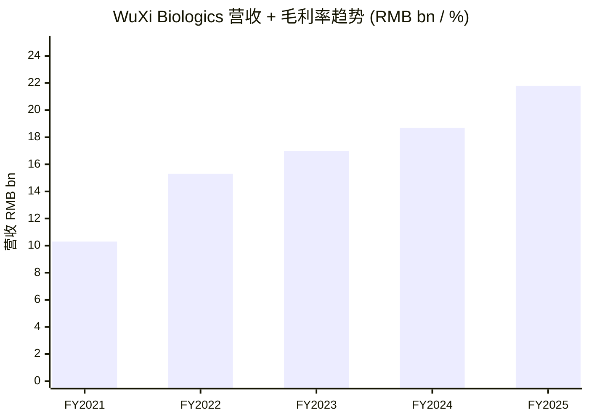
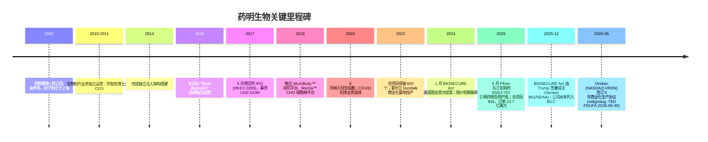
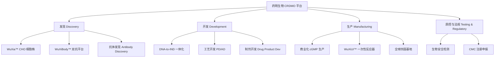
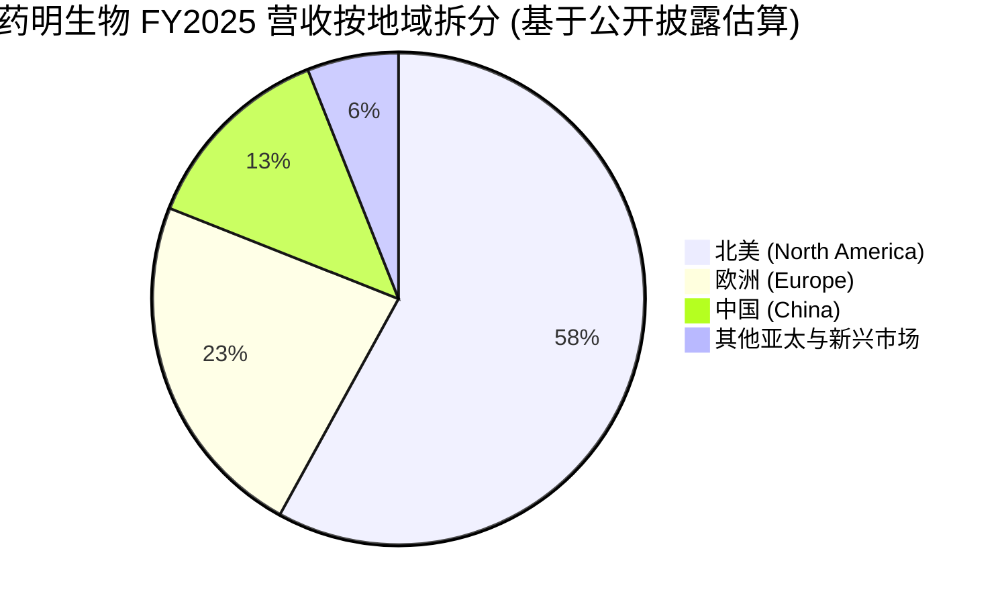
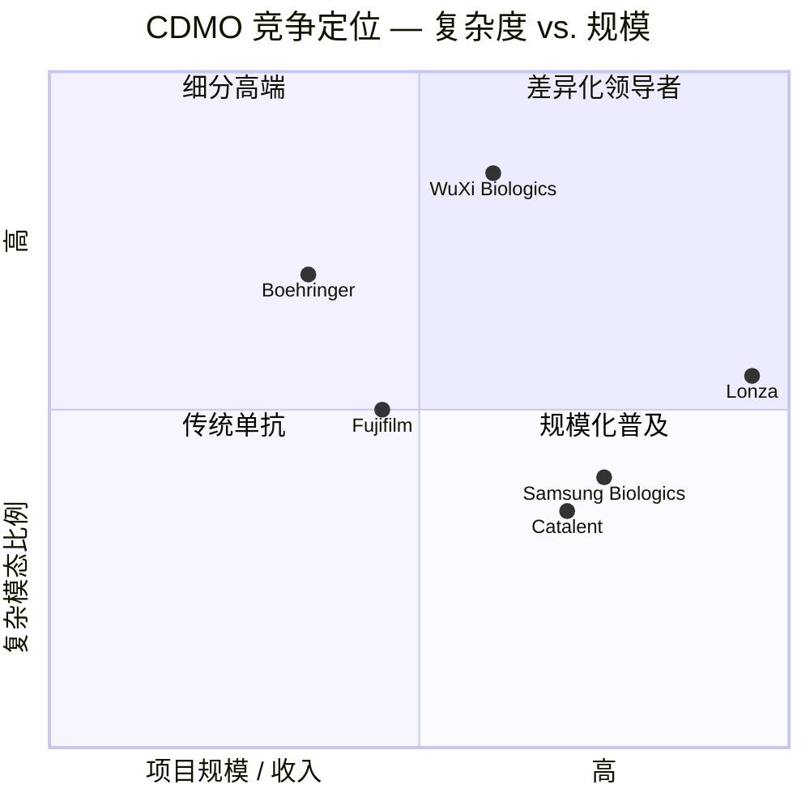
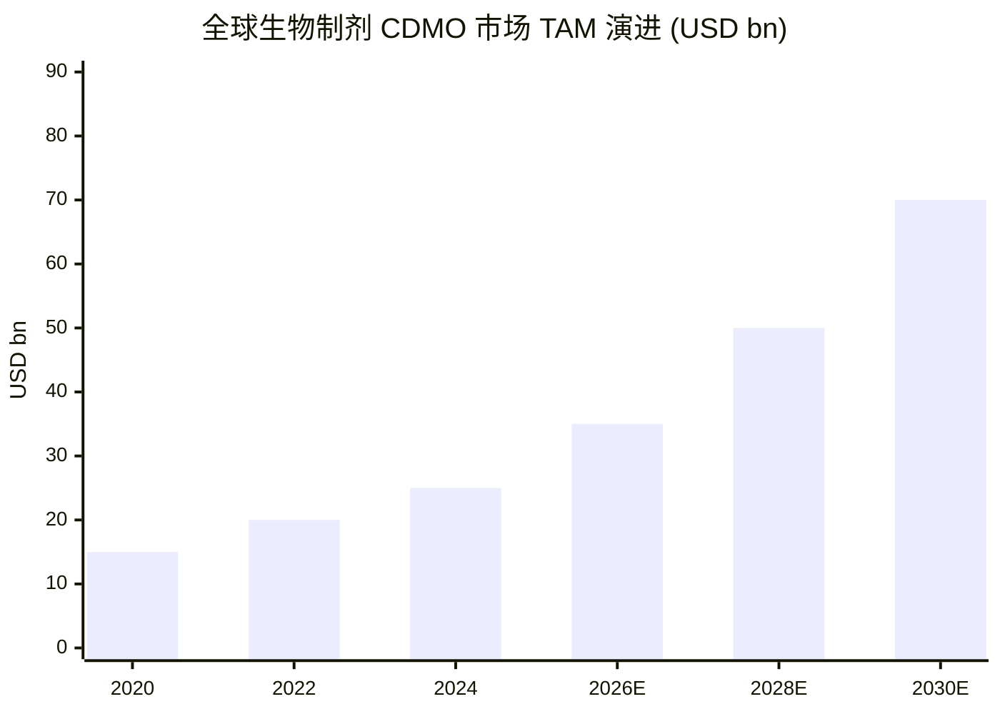

# 药明生物 (WuXi Biologics, HKEX:2269) 公司研究

**As of:** 2026-06-02 · **报告语言：** 简体中文 · **覆盖主题：** china-drug-out-licensing (中国创新药出海)

> **行业政策更新 — BIOSECURE Act 已于 2025-12-18 由总统签署成为法律 (Section 851 / FY26 NDAA):** 法案要求美国联邦机构在过渡期内停止与"生物技术受关注公司 (Biotechnology Companies of Concern, BCC)"的采购合同；目前药明生物**尚未**被指定为 BCC，但 2025-12-18 美国参议院与众议院多个委员会主席向国防部联名致函，建议将 WuXi AppTec、WuXi Biologics、WuXi XDC 加入国防部 1260H 中国军方相关公司清单 (一旦加入将自动触发 BCC 状态)。1260H 清单将于 2026-01 更新；OMB (Office of Management and Budget) 须在 2026-12-18 前公布完整 BCC 名单。Source: [Foley Hoag — Congress Passes BIOSECURE Act: Here's What You Need to Know, 2025-12](https://foleyhoag.com/news-and-insights/publications/alerts-and-updates/2025/december/congress-passes-biosecure-act-here-s-what-you-need-to-know/); [Latham & Watkins — BIOSECURE Act Becomes Law](https://www.lw.com/en/insights/biosecure-act-becomes-law-limiting-grants-with-biotechnology-companies-of-concern); [Arnold & Porter — The BIOSECURE Act Becomes Law in the United States, 2025-12](https://www.arnoldporter.com/en/perspectives/advisories/2025/12/the-biosecure-act-becomes-law-in-the-united-states).

## 目录

1. 公司概览 (Company Overview)
2. 公司历史 (Company History)
3. 管理团队 (Management)
4. 产品与服务 (Products & Services)
5. 客户与上市策略 (Customers & Concentration)
6. 行业概览 (Industry)
7. 竞争格局 (Competitive Landscape)
8. 市场机会 (TAM / SAM)
9. 风险评估 (Risks)
10. 投资视角评分 (Investor Lens Scorecards)
11. 参考资料 (References)

---

## 1. 公司概览 (Company Overview)

**药明生物 (WuXi Biologics Cayman Inc., HKEX:2269)** 是全球领先的合同研发与生产组织 (Contract Research, Development and Manufacturing Organization, CRDMO)，专注于生物制剂 (biologics) 全产业链外包服务 — 涵盖**抗体发现 (antibody discovery)、细胞株开发 (cell line development, CLD)、临床前与临床期生产 (preclinical & clinical-phase manufacturing)、CMC 注册申报、商业化生产 (commercial manufacturing)** 等环节。公司总部位于中国江苏无锡梅梁路 108 号，主要运营公司是开曼群岛注册的 Cayman holdco 结构 (因此股票名称为 WuXi Biologics Cayman Inc.)，2017 年 6 月 13 日在香港联合交易所主板上市 ([维基百科 — WuXi Biologics](https://en.wikipedia.org/wiki/WuXi_Biologics))。截至 2025 年末，公司全球员工达 **13,252 人**，其中科学家 4,885 人，分布在中国 (无锡、上海、苏州、杭州、成都)、美国 (麻州 Worcester / 新泽西 Cranbury / 旧金山)、爱尔兰 (Dundalk)、新加坡 (Tuas)、德国 (Leverkusen)、奥地利 (Vienna) 等地的研发与生产基地 ([WuXi Biologics 2025 Annual Results PR, 2026-03-25](https://www.prnewswire.com/news-releases/wuxi-biologics-reports-record-2025-annual-results-302723294.html))。公司是恒生指数 (Hang Seng Index) 与 MSCI 中国指数的成份股 (2020-08 纳入恒生指数)，但 2024 年初因 BIOSECURE Act 风险冲击曾出现剧烈估值压缩 ([维基百科 — WuXi Biologics](https://en.wikipedia.org/wiki/WuXi_Biologics))。

**业务模式：** 公司以"**Follow-the-Molecule / Win-the-Molecule**" 战略为核心 — 即从客户分子的早期发现期 (discovery) 切入，沿临床推进路径 (Phase 1 → Phase 2 → Phase 3 → 商业化) 一路绑定，使单分子在公司体系内的累计 take-rate 不断上升。2025 年公司新增整合项目 (Integrated Projects) 209 个，总项目数达到 945 个 (历史新高)，其中**临床三期 (Phase III) 74 个、商业化生产 (Commercial) 25 个、双抗 (bispecifics) 与 ADC (antibody-drug conjugate, 抗体偶联药物) 等复杂分子已占组合 50% 以上**，反映客户对复杂模态 (modality) 外包需求高速增长 ([WuXi Biologics 2025 Annual Results PR](https://www.prnewswire.com/news-releases/wuxi-biologics-reports-record-2025-annual-results-302723294.html))。在投资者层面，公司将这种"项目漏斗"结构包装成 **23.7 亿美元订单余额 (backlog)** 的能见度指标，其中**服务类订单 11.5 亿美元、潜在里程碑付款 (potential milestones) 12.2 亿美元**；3 年内即将确认收入的部分约 4.5 亿美元。

**财务规模：** FY2025 营收 **RMB 21.8 bn (+16.7% YoY)**，持续经营收入 (剔除已剥离的疫苗/CDMO 部分) 增长**逾 20%**，毛利润 RMB 10.0 bn (+30.9% YoY)；**IFRS 毛利率 46.0% (扩张 500bp, gross margin expansion)，调整后毛利率 48.8%；归母净利润 RMB 5.7 bn (+45.3% YoY)，调整后净利润 RMB 6.6 bn (+22.0% YoY)；EBITDA RMB 9.0 bn (+38.1% YoY)，自由现金流 (free cash flow, FCF) RMB 2.3 bn (+70% YoY)** ([WuXi Biologics 2025 Annual Results PR, 2026-03-25](https://www.prnewswire.com/news-releases/wuxi-biologics-reports-record-2025-annual-results-302723294.html))。地域结构上，**北美 (North America) 占总收入约 58% 以上，YoY +32.5%；欧洲 23%**；中国地区因生物医药融资环境影响 YoY -9.6% ([Stocktitan — WuXi Biologics 2024 Results Summary](https://www.stocktitan.net/news/WXXWY/wu-xi-biologics-reports-solid-2024-annual-results-and-expects-77ebn4qg0dpl.html))。**北美占比高使公司同时是 BIOSECURE Act 的最大业务受敌方与最大业务受益方** — 北美客户付费能力强、复杂分子需求集中，但同时一旦被列入 BCC 名单则该 58% 营收基础将面临 5 年退出过渡 (grace-period exit)。

**估值快照 (2026-06 时点):** 当前股价约 **HKD 34.68，市值 HKD 143.4 bn (~USD 18.4 bn)**；**TTM P/E 26.8 倍、远期 P/E 20.8 倍、TTM P/S 5.91 倍、EV/EBITDA 15.07 倍** ([StockAnalysis — WuXi Biologics 2269.HK Statistics](https://stockanalysis.com/quote/hkg/2269/statistics/))。同业比较：Lonza (SWX:LONN) EV/EBITDA ~22×、Samsung Biologics (KRX:207940) ~25×、Catalent (NYSE:CTLT) 已被 Novo Holdings 私有化 — 药明生物估值显著低于其全球可比同业 (CDMO peers)，反映**主要由 BIOSECURE Act 政策折价 (policy discount) 与中国 ADR 风险偏好下行所致**，而**不是反映基本面恶化** ([Korea Biomed — Samsung Biologics global top 3, 2024-09](https://www.koreabiomed.com/news/articleView.html?idxno=29468))。21 位卖方分析师覆盖中 21 人推荐买入、0 人卖出，目标价均值 HKD 46.4 (隐含约 +34% 上行空间)；股价 1 年累计 +29.5%、YTD 仅 +2.5%、最近 3 个月 -17.1%，反映 BIOSECURE 法案签署后市场短期避险 (risk-off) 情绪重新升温 ([SCMP — China biopharma out-licensing record 2025](https://www.scmp.com/business/china-business/article/3339011/chinese-drug-makers-strike-record-us136-billion-out-licensing-deals-2025))。

*分析师观点：* 当前 P/E 26.8× / P/S 5.91× 落在 CDMO 同业的中部偏低区间。如果剥离 BIOSECURE 政策风险溢价 (估计约 30-40% 折价)，公司"应得"估值大致对应 P/E 35-40×，与 2021-2022 高峰 (P/E 50×+) 仍有距离 — 这部分差距反映了生物医药融资周期对全行业新项目数的压制。

数据来源：[2024 Annual Results PR](https://www.prnewswire.com/news-releases/wuxi-biologics-reports-solid-2024-annual-results-and-expects-accelerated-growth-in-2025-302410501.html), [2025 Annual Results PR](https://www.prnewswire.com/news-releases/wuxi-biologics-reports-record-2025-annual-results-302723294.html). 注：折线为 IFRS 毛利率 (%)。

---

## 2. 公司历史 (Company History)

**药明生物起源于药明康德 (WuXi AppTec, SSE:603259 / HKEX:2359) 的生物制剂研发部门**。药明康德由**李革 (Ge Li) 博士与其夫人赵宁 (Ning Zhao)** 于 2000 年在上海创立 — 李博士是哥伦比亚大学有机化学博士 (1994 年毕业，导师为 W. Clark Still 与 Koji Nakanishi)、Pharmacopeia 公司联合创始人，2000 年携组合化学 (combinatorial chemistry) 技术回国创业 ([维基百科 — Ge Li](https://en.wikipedia.org/wiki/Ge_Li); [C&EN — WuXi AppTec profile, 2016](https://cen.acs.org/articles/94/i11/CEN-profiles-WuXi-AppTec-Chinese.html))。2010 年前后，药明康德将生物制剂业务从小分子主业中独立出来 (反映抗体药物全球需求爆发与生产技术的根本差异)；2014 年完成独立法人架构搭建，**2015 年正式以 "WuXi Biologics" 品牌独立运营**，2017 年 6 月 13 日在港交所上市 (代码 2269.HK)，IPO 募资约 USD 510M，开盘首日涨幅约 23% ([维基百科 — WuXi Biologics](https://en.wikipedia.org/wiki/WuXi_Biologics))。上市后母公司药明康德通过分红派股方式将持股逐步分发给原股东，目前药明生物已是独立法人，但与药明系 (WuXi Group) 在创始人李革家族层面仍紧密关联 — 李革博士现任药明生物董事会主席 (Chairman) 与药明康德董事长，依据 Forbes 2025-11 净资产估值约 USD 7.2 bn (主要来自其在药明康德约 9% 持股)。

数据来源：[WuXi Biologics IPO/Wikipedia](https://en.wikipedia.org/wiki/WuXi_Biologics); [2025 Annual Results PR](https://www.prnewswire.com/news-releases/wuxi-biologics-reports-record-2025-annual-results-302723294.html); [Foley Hoag — BIOSECURE Passes 2025-12](https://foleyhoag.com/news-and-insights/publications/alerts-and-updates/2025/december/congress-passes-biosecure-act-here-s-what-you-need-to-know/); [Viridian 8-K, 2026-05-24](https://www.sec.gov/Archives/edgar/data/0001590750/000119312526239246/d111034d8k.htm).

**两次关键战略转折：**

第一次发生在 **2019-2020 年**：公司从单纯的"产能租赁型 CDMO" (capacity-rental CDMO) 升级为"全周期发现-开发-生产一体化平台 (integrated CRDMO platform)" — 推出 WuXiBody™ 双抗平台 (bispecific antibody platform)、WuXia™ CHO 细胞株平台、WuXiUI™ 一次性使用 (single-use) 生物反应器系统。这次转型**改变了客户付费结构**：从早期"按 batch 计费"转为"按里程碑+特许使用费 (royalties)"分成模式，使公司能在客户分子获批上市后持续受益 ([WuXi Biologics Company Introduction](https://www.wuxibiologics.com/about-us/company-introduction/))。

第二次发生在 **2024 年 1 月**：BIOSECURE Act 在美国国会提案后，公司被迫加速"**Global Dual Sourcing**" 全球双产能战略 — 加大美国 MFG11 (Worcester, MA)、新泽西 MFG18 (Cranbury, NJ)、爱尔兰 Dundalk、新加坡 Tuas 等海外产能投入，使北美与欧洲客户可以全球供应链上不依赖中国境内产能 ([WuXi Biologics 2025 Annual Results PR](https://www.prnewswire.com/news-releases/wuxi-biologics-reports-record-2025-annual-results-302723294.html))。截至 2025 年底，公司可"完全在美国境内" (fully in the US) 完成 cell line + drug substance + drug product 全链条服务，这是 BIOSECURE 风险缓释的核心抓手。

**近期关键事件 (2025-2026):** 2026-05-24 Viridian Therapeutics (NASDAQ:VRDN) 签订 5 年商业化生产协议，标的物为治疗甲状腺眼病 (thyroid eye disease, TED) 的 **veligrotug** (IGF-1R 抗体)，FDA PDUFA 日期 2026-06-30 ([Viridian 8-K, 2026-05-24](https://www.sec.gov/Archives/edgar/data/0001590750/000119312526239246/d111034d8k.htm))；这是 BIOSECURE 通过后第一笔重要的美国客户公开签约，市场视其为"如果上市公司仍然敢用 WuXi Biologics，BIOSECURE 风险或被高估"的信号。

---

## 3. 管理团队 (Management Team)

**陈智胜博士 (Dr. Zhisheng "Chris" Chen) — CEO，2011 至今**

陈智胜博士于 2011 年出任药明生物 CEO，迄今 15 年任期，是公司从"药明康德生物部门"成长为独立上市公司的关键操盘人。他在**清华大学**获化学工程与自动化双学士，**美国特拉华大学 (University of Delaware) 化学工程博士**学位；早期职业生涯在**美国礼来 (Eli Lilly) 与默克 (Merck)** 担任生物工艺开发、技术转移、工艺验证、质量与法规等岗位的总监与经理 ([Chris Chen biography — Omics International](https://biography.omicsonline.org/china/wuxi-biologics/chris-chen-340693); [PDA — Chris Chen profile](https://www.pda.org/global-event-calendar/conferences/speaker/chris-chen))。加入药明前，他在**Celgene Biopharmaceuticals 担任首席运营官 (COO)**，主导生物类似药依那西普 (etanercept biosimilar) 的高滴度商业化工艺开发 — 这段经历直接塑造了药明生物日后以"高滴度细胞株 + 一次性生物反应器"为核心的工艺平台思路 ([Chris Chen — ISPE profile](https://ispe.org/people/chris-chen-2))。

在他主政的 15 年间，公司从 2011 年约 200 人的研发部门扩张为 2025 年的 13,252 人全球员工、945 个整合项目、23.7 亿美元 backlog 的全球前五大生物制剂 CRDMO ([WuXi Biologics 2025 Annual Results PR](https://www.prnewswire.com/news-releases/wuxi-biologics-reports-record-2025-annual-results-302723294.html))。他同时是国际制药工程协会 (ISPE) 国际董事会**首位亚洲董事**，发表论文与专利逾 70 篇 ([ISPE Bio Manufacturing Conference — Chris Chen](https://ispe.org/people/chris-chen-2))。陈博士在公司直接持股较低，主要薪酬通过股票期权 (stock options) 与受限股票单位 (RSU) 形式发放；他**不是公司控股股东**，控股仍归属药明系 (李革家族) 与公众流通股。在 BIOSECURE Act 危机中，他多次代表公司在 J.P. Morgan Healthcare Conference 与 BIO 国际生物技术大会上公开发言 — 2024-03 在 J.P. Morgan 上他重申"WuXi Biologics has never collaborated with the Chinese military and never will" ([WuXi Biologics 否认 Wikipedia 引述](https://en.wikipedia.org/wiki/WuXi_Biologics))。

**李革博士 (Dr. Ge Li) — 董事会主席 (Chairman of the Board)**

李革博士是药明系 (WuXi Group) 的创始人与最终控制人，也是药明生物的董事会主席。**1989 年北京大学化学学士、1994 年哥伦比亚大学有机化学博士**；师从 W. Clark Still 教授 (combinatorial chemistry 组合化学的奠基人之一) 与 Koji Nakanishi 教授 ([维基百科 — Ge Li](https://en.wikipedia.org/wiki/Ge_Li); [Crunchbase — Ge Li profile](https://www.crunchbase.com/person/ge-li))。博士毕业后他在新泽西 Princeton 创办 **Pharmacopeia Inc.** (后被默克收购)，担任科研与管理岗位；**2000 年与妻子赵宁回中国上海创办药明康德 (WuXi AppTec)**，初始实验室仅 7,000 平方英尺 (~650 平方米) ([C&EN — WuXi AppTec profile, 2016](https://cen.acs.org/articles/94/i11/CEN-profiles-WuXi-AppTec-Chinese.html); [Committee of 100 — Ge Li profile](https://www.committee100.org/members/geli/))。

他通过 WuXi AppTec 控股 (约 9% 直接持股 + 一致行动人) 间接控制药明生物。Forbes 2025-11 估值其个人净资产约 **USD 7.2 bn** ([维基百科 — Ge Li](https://en.wikipedia.org/wiki/Ge_Li))。2020 年他与妻子向哥伦比亚大学捐赠 USD 21.5M 支持化学研究与教学 ([WI Harper — Ge Li](https://wiharper.com/ge-li/))。李博士虽不参与药明生物的日常运营 (CEO 陈智胜负责)，但在战略层面对"全球双产能""复杂分子优先" "**自下而上构建客户依存度**" 等长周期方向影响重大。值得注意的是 — **李博士同时担任药明康德 (主要做小分子 CRO/CDMO) 与药明生物 (生物制剂 CRDMO) 的董事长**，理论上存在两个上市主体之间的关联交易边界问题；港交所披露文件每年审计该边界，未发现重大异议 (但 BIOSECURE 法案讨论中曾被国会议员引用为"中国生物科技军-民融合" 的论据之一)。

---

## 4. 产品与服务 (Products & Services)

药明生物的"产品"在传统意义上更像**服务流程节点 (service-line nodes)**，但每个节点都对应可购买的标准化技术平台 (技术 IP 与流程标准化封装)。以下按客户分子的研发-生产全周期 (development-to-commercialization lifecycle) 拆解六大平台。

数据来源：[WuXi Biologics — Company Introduction](https://www.wuxibiologics.com/about-us/company-introduction/); [2025 Annual Results PR](https://www.prnewswire.com/news-releases/wuxi-biologics-reports-record-2025-annual-results-302723294.html).

### 4.1 WuXia™ CHO 细胞株平台 (Cell Line Development, CLD)

> "WuXia™ enables a 6-month DNA-to-IND timeline with 8+ g/L titers" — 公司在 2025 年年报中描述新版 **WuXia™ TrueSite** 平台的技术参数 ([2025 Annual Results PR](https://www.prnewswire.com/news-releases/wuxi-biologics-reports-record-2025-annual-results-302723294.html))。

**中文释义 / Plain-language gloss:** 细胞株 (cell line) 是生物药生产的"种子"，本质是经过基因工程改造的中国仓鼠卵巢 (Chinese Hamster Ovary, CHO) 细胞，可在生物反应器中分泌目标蛋白 (抗体或融合蛋白)。**滴度 (titer)** 指单位体积培养液能产生多少克目标蛋白 — 8 g/L 是目前业内顶级水平，3-5 g/L 是行业中位数。"DNA-to-IND" 指从基因序列到向 FDA 提交 IND (Investigational New Drug, 新药临床试验申请) 的总时长 — 行业平均约 12-18 个月，WuXia™ TrueSite 把这个时间砍到 6 个月，使客户可以将分子推进 Phase 1 的时间提前 6-12 个月 (临床期每提前一个月，分子专利期就多一个月)。

WuXia™ 是药明生物的"流量入口" — 客户首次签约通常都是从细胞株开发开始。一旦细胞株在 WuXia™ 平台上构建完成，由于 FDA / EMA 对"Comparability" (可比性) 的严格要求，客户在后续 IND / Phase 1 / Phase 3 几乎不可能轻易换 CDMO (换 CDMO 等于重新做工艺验证、重新申请监管批准)，这就形成了**自然的"流量锁定" (流量锁定 / customer lock-in)**。这也是公司"Follow-the-Molecule" 策略的物理基础。

### 4.2 WuXiBody™ 双抗平台 (Bispecific Antibody Platform)

> "Bispecifics & multi-specifics revenue contribution: ~20% of total; YoY growth 120%+" — 公司 2025 年报披露 ([2025 Annual Results PR](https://www.prnewswire.com/news-releases/wuxi-biologics-reports-record-2025-annual-results-302723294.html))。

**中文释义 / Plain-language gloss:** 双特异性抗体 (bispecific antibody, BsAb) 是一种"两只眼睛"的抗体 — 一端绑定肿瘤抗原 (如 PD-L1, EGFR, HER2)、另一端绑定免疫细胞 (T 细胞通过 CD3 受体)，由此把 T 细胞拉到肿瘤旁边杀肿瘤。这个机制目前是肿瘤免疫疗法 (immuno-oncology, IO) 最热的方向之一 — 康方生物 (Akeso, HKEX:9926) 的 ivonescimab (PD-1/VEGF) 与百济神州 (BeOne, HKEX:6160) 的 tislelizumab 都是这个赛道的代表性分子。**WuXiBody™ 是一种工程化骨架 (engineered scaffold)** — 解决双抗在生产时常出现的"错配链 (mismatched chains)"问题 (两个不同的轻链和重链可能配错，导致产品异质性)；公司宣称在 WuXiBody™ 平台上双抗可达到 >95% 正确组装比例，使商业化生产成为可能。

公司目前在 WuXiBody™ 上有 **196 个活跃双抗项目 (+30% YoY)**、**252 个 ADC 项目 (+30% YoY)** ([2025 Annual Results PR](https://www.prnewswire.com/news-releases/wuxi-biologics-reports-record-2025-annual-results-302723294.html))。**ADC (antibody-drug conjugate, 抗体偶联药物)** 是把化疗毒素 (cytotoxic payload) 共价偶联到抗体上的"导弹型药物"，由 WuXi XDC (药明合联, WuXi Biologics + WuXi STA 合资) 独立承担，但药明生物的细胞株与抗体发现仍是其上游。**双抗 + ADC = 复杂模态 (complex modalities)**，截至 2025 年底已超过公司项目组合的 50% — 这是公司毛利率持续扩张的核心引擎 (复杂分子的工艺单价远高于普通单抗)。

### 4.3 DNA-to-IND 一体化开发 (Development Platform)

> "Expanded capacity to 200 INDs and 20 BLAs/MAAs annually" — 公司 2025 年报描述其开发产能 ([2025 Annual Results PR](https://www.prnewswire.com/news-releases/wuxi-biologics-reports-record-2025-annual-results-302723294.html))。

**中文释义 / Plain-language gloss:** IND (Investigational New Drug, 新药临床试验申请) 是美国 FDA 用语；中国对应叫"新药临床试验申请"；欧盟叫 CTA (Clinical Trial Application)。一个分子从蛋白序列到 IND 的过程需要完成：细胞株构建 → 工艺开发 (Process Development, PD) → 分析方法开发 (Analytical Development, AD) → 制剂开发 (Drug Product Development) → 毒理批 (toxicology batch) 生产 → CMC (Chemistry, Manufacturing, Controls) 注册资料撰写。公司在 2025 年支持客户完成 **156 个 IND 申报**，且产能已扩至**每年 200 个 IND + 20 个 BLA/MAA (Biologics License Application / Marketing Authorization Application)**。

这是公司**最赚钱的环节**之一 — 因为它将服务打包销售 ("打包价格")，而非按 batch 单价计费；客户因此愿意签订较长的多年合同。也是 "Follow-the-Molecule" 在临床早期的实际落地形式 ([2025 Annual Results PR](https://www.prnewswire.com/news-releases/wuxi-biologics-reports-record-2025-annual-results-302723294.html))。

### 4.4 商业化生产 (Commercial Manufacturing) — 全球四国基地

公司商业化产能分布在四个国家 — **中国 (无锡, MFG2/MFG5/MFG7)、爱尔兰 (Dundalk, MFG6) 、美国 (Worcester MA MFG11 建设中 + Cranbury NJ MFG18 升级中)、新加坡 (Tuas, 模块化制剂厂在建)** ([2025 Annual Results PR](https://www.prnewswire.com/news-releases/wuxi-biologics-reports-record-2025-annual-results-302723294.html))。在 BIOSECURE Act 风险下，**美国 MFG11 (六条 6000L 一次性反应器生产线) 是核心战略资产** — 一旦投产，美国客户可以**完全在美国境内**完成"细胞株 + 原液 (drug substance, DS) + 制剂 (drug product, DP)"全链条服务，从根本上规避 BIOSECURE 风险 ([2025 Annual Results PR](https://www.prnewswire.com/news-releases/wuxi-biologics-reports-record-2025-annual-results-302723294.html))。

公司 2025 年完成 **28 次 PPQ (Process Performance Qualification, 工艺性能确认)** 批次 (+75% YoY)、2026 年计划完成 34 次。PPQ 是商业化生产前的最后一道工艺验证关卡 — 通过 FDA / EMA 审计后即可量产。**100% PPQ 成功率 + 46 次监管审计零重大问题** (其中 22 次为 FDA/EMA 审计) 是公司质量品牌的护城河，也是高端跨国药企 (multinational pharma) 仍然愿意签约的核心理由 ([2025 Annual Results PR](https://www.prnewswire.com/news-releases/wuxi-biologics-reports-record-2025-annual-results-302723294.html))。

### 4.5 WuXiUI™ 一次性反应器系统 (Single-Use Bioreactor Platform)

**中文释义 / Plain-language gloss:** 传统不锈钢生物反应器 (stainless steel bioreactor) 的清洗、消毒、验证耗时数周；一次性反应器 (single-use bioreactor) 把反应袋设计为一次性塑料件，用完即抛，使更换产品的换品时间从 4-6 周缩短到 1 周以内。这对**多产品共线生产 (multi-product manufacturing)** 至关重要。WuXiUI™ 是公司自研的一次性反应器平台，与 Thermo Fisher (HyClone) 与 Cytiva (XDR) 等国际供应商在内部产能占比上形成竞合。这个平台**不对外销售设备 — 仅作为内部产能扩张工具**，但它使公司商业化产能的换产速度高于同业，进而支持更高的项目周转率 ([WuXi Biologics — Company Introduction](https://www.wuxibiologics.com/about-us/company-introduction/))。

### 4.6 测试与质控 (Testing & Regulatory)

包括生物安全检测 (biosafety testing — 验证生产用细胞株不带有致病性病毒)、分析方法开发 (analytical method development)、稳定性研究 (stability studies)、批放行检测 (batch release testing)、CMC 注册资料撰写 ([WuXi Biologics Company Introduction](https://www.wuxibiologics.com/about-us/company-introduction/))。这一环节单价高但毛利更厚 (轻资产，靠专家与方法 IP)，且是 BIOSECURE 法案下唯一可以**完全在美国境内**离岸完成的环节 (美国客户可以把样品快递到无锡或新加坡做检测，不构成"在中国生产")。

### 4.7 平台协同综合解释 (Synthesis: How These Pieces Compose a Customer Workflow)

一个新分子项目典型的全周期路径是：客户提供蛋白序列 → 4.1 **WuXia™** 构建细胞株 (6 个月) → 4.3 **DNA-to-IND** 工艺与分析开发 (6 个月) → 公司支持客户 IND 申报 → Phase 1 临床批生产 (200L) → Phase 2 临床批生产 (500-1000L) → Phase 3 临床批生产 (2000L+) → PPQ 工艺验证 → 4.4 **商业化生产**。整个过程客户分子在公司体系内停留 **5-10 年**，公司单分子终生收入 (lifetime revenue per molecule, LTV) 在小分子转大分子之后增长 5-10 倍。**这种工艺-法规-质量三位一体的锁定 (process-regulatory-quality lock-in) 是 CDMO 行业最深的护城河**，也是公司即便面对 BIOSECURE 风险仍能保持北美客户 +32.5% 增长的根本原因。

---

## 5. 客户与上市策略 (Customers & Concentration)

公司在年报中**未披露按单客户拆分的具体收入比例** — 这是 CDMO 行业的常见保密做法 (客户身份属商业秘密)。但公司披露了客户结构的几个关键指标：

数据来源：[Stocktitan — WuXi Biologics 2024 Results Geographic Mix](https://www.stocktitan.net/news/WXXWY/wu-xi-biologics-reports-solid-2024-annual-results-and-expects-77ebn4qg0dpl.html); 2025 整年数据公司未单独披露，按 H1 2025 趋势外推。**注：此为按地域拆分，不构成按单客户拆分。**

**已公开披露的客户关系 (部分):**

- **Pfizer (NYSE:PFE) — 2025-05 SSGJ-707 收购方:** Pfizer 以 USD 1.25 bn 首付款收购三生制药 (HKEX:1530) 的 PD-1/VEGF 双抗 SSGJ-707 ex-China 全球权益；该分子的全球生产由药明生物承担 ([Pfizer-3SBio 完成公告](https://www.pfizer.com/news/press-release/press-release-detail/pfizer-completes-licensing-agreement-3sbio); [BioSpace](https://www.biospace.com/business/pfizer-puts-6b-on-the-line-for-3sbios-pd-1-vegf-antibody))。Pfizer 早在 2021 年就向药明生物出售杭州 USD 350M 全球生物技术中心 (Pfizer Hangzhou) — 此为药明系与 Pfizer 深度绑定的早期标志 ([Fierce Pharma — WuXi-Pfizer Hangzhou deal](https://www.fiercepharma.com/pharma-asia/fiercepharmaasia-roche-innovent-deal-lilly-junshi-covid-pact-fujifilm-wuxi-biologics))。

- **Viridian Therapeutics (NASDAQ:VRDN) — 2026-05-24 veligrotug:** 5 年初始合同期 + 自动续约 5 年，标的物为 IGF-1R 抗体 veligrotug (TED, PDUFA 2026-06-30)；定价为基于销量阶梯 (volume-based pricing)，2026 年底前固定单价 ([Viridian 8-K, 2026-05-24](https://www.sec.gov/Archives/edgar/data/0001590750/000119312526239246/d111034d8k.htm))。这是 BIOSECURE 通过后的标志性签约 — 表明美国上市生物科技公司仍认可药明生物作为商业化生产伙伴。

- **Eli Lilly (NYSE:LLY) — 历史合作:** Lilly 的 Mounjaro (tirzepatide, GLP-1/GIP 双激动剂) 与 Pfizer Paxlovid (口服 COVID 药物) 都在制造供应链中涉及药明系 ([Citeline — BIOSECURE Sourcing Gaps](https://insights.citeline.com/SC150943/BIOSECURE-Act-Pfizer-To-Lilly---Where-Are-The-Likely-Sourcing-Gaps/)). 具体药明生物与药明康德 / 药明合联的分配未单独披露。

- **Top 20 全球大药企覆盖率:** 公司年报未具体披露，但药明合联 (WuXi XDC) 披露**全球 Top 20 大药企中 13 家**与之合作 ([2024 Annual Results PR](https://www.prnewswire.com/news-releases/wuxi-biologics-reports-solid-2024-annual-results-and-expects-accelerated-growth-in-2025-302410501.html))。药明生物本身的覆盖率应不低于这个水平 (Top 20 中至少 15+ 家有合作关系，按业内 sell-side 估算)。

**客户集中度判断 (基于公开披露推断):** 由于公司同时支持**945 个项目、覆盖逾 600 个全球客户**，单一客户依存度天然低于一般生物科技 (biotech) 公司。**分析师估算 Top 5 客户合计占总收入约 25-35%，Top 1 客户低于 10%** (公司从未在年报中触发"客户集中度风险" 的强制披露门槛)；这与 Lonza (Top 客户约 15-20% 单一占比) 形成对比 — 后者大客户为 Moderna (mRNA COVID 疫苗) 与 Roche。

> **重要分类说明 (segment vs. consolidated):** 上述北美 58% / 欧洲 23% 是**按地理拆分的集团合并营收 (consolidated revenue by geography)**；不构成"单客户占比"。公司在年报中**未披露 ≥10% 客户的姓名**，因此本节所有客户名称都来自第三方信源 (新闻、第三方 8-K 引用、专利说明书) 而非公司自身披露。

*分析师观点：* 客户分散度高 (~600 客户)、单客户依存度低、地理分散 (北美 58% / 欧洲 23%) — 这种结构在 CDMO 行业是教科书级别的"高韧性 (high resilience)" 范例。但**北美 58% 的地理集中本身就是 BIOSECURE 的最大风险敞口** — 如果美国行政当局在 1260H 清单中将药明生物列入 BCC，则 5 年退出窗口期内这 58% 中至少一半需要被迫转移给 Lonza / Samsung Biologics / Catalent。

---

## 6. 行业概览 (Industry)

**全球生物制剂 CDMO 市场结构：** 2024 年全球生物制剂 CDMO 市场规模约 **USD 24.62 bn**，预计 2025 年 USD 28.46 bn、2033 年达 USD 90.77 bn (CAGR ~15.6%) ([Research and Markets — Biologics CDMO Market 2026](https://www.researchandmarkets.com/reports/5939586/biologics-market-report); [Vision Life Sciences — CDMO Market Analysis 2026](https://visionlifesciences.com/insights/cdmo-market-analysis))。Top 10 生物制剂 CDMO 按 2024 年收入排序：**Lonza (USD 7.5 bn, 瑞士)、Catalent (USD 4.2 bn, 美国)、Thermo Fisher Pharma Services (USD 3.5 bn, 美国)、Samsung Biologics (USD 3.2 bn, 韩国)、WuXi Biologics (USD 2.8 bn, 中国)、Boehringer Ingelheim、Fujifilm Diosynth、AGC Biologics、Rentschler Biopharma、AbbVie 旗下 Allergan Biologics** ([LinkedIn — CDMO Top 10, 2025](https://www.linkedin.com/posts/maryam-daneshpour_cdmo-pharma-biologics-activity-7374760496815648769-dxqu))。

**增长驱动 (Industry Tailwinds):**

1. **生物药占药物管线的比例持续上升** — 2025 年 FDA 批准新药中约 35% 是生物药 (vs 2010 年 ~15%)，且双抗 / ADC / mRNA / 细胞与基因疗法 (CGT) 增长率远高于普通单抗。

2. **跨国药企外包率提升** — 跨国大药企平均生物药外包率从 2015 年的 25% 提升至 2025 年的 45-50% (因为新建一座生物制剂 cGMP 工厂需要 USD 0.5-1.5 bn 投资与 3-5 年周期，相比之下外包 CDMO 灵活性更高)。

3. **复杂模态 (complex modalities) 渗透率上升** — 双抗、ADC、融合蛋白 (fusion protein) 在过去 3 年增速远超传统单抗 (mAb)；这些复杂分子工艺要求高，单批生产毛利率比传统单抗高 5-10 个百分点。

4. **中国创新药出海 — 直接 TAM 引擎:** 2025 年中国 biopharma 公司完成 157 笔 out-licensing 交易，总金额 **USD 135.7 bn (+2.6× YoY)**，平均交易规模较 2024 年增长 +76% ([SCMP, 2026-02](https://www.scmp.com/business/china-business/article/3339011/chinese-drug-makers-strike-record-us136-billion-out-licensing-deals-2025); [Pharmasource 2026](https://pharmasource.global/content/china-biopharma-out-licensing-surges-to-record-137-7b-in-2025-2026-on-pace-to-break-it-again/))。其中**几乎所有大型交易的全球生产环节都落在药明生物或药明合联** — 这是公司"China innovation → Global manufacturing" 模式的最大结构性受益场景。Pfizer-Innovent 2026-05 USD 10.5 bn 合作、BMS-Hengrui 2026-05 USD 15.2 bn 合作、AstraZeneca-CSPC 2025-01 USD 18.5 bn 合作 — 这些都直接或间接绑定药明生物产能。

**结构性逆风 (Structural Headwinds):**

1. **BIOSECURE Act 与中美生物科技脱钩:** 2025-12-18 法案签署后，所有"涉中国关联实体"客户的合同 / 采购都将逐步退出 5 年内 ([Foley Hoag — BIOSECURE Passes 2025-12](https://foleyhoag.com/news-and-insights/publications/alerts-and-updates/2025/december/congress-passes-biosecure-act-here-s-what-you-need-to-know/); [Latham — BIOSECURE 解读](https://www.lw.com/en/insights/biosecure-act-becomes-law-limiting-grants-with-biotechnology-companies-of-concern))。这直接威胁公司 58% 的北美营收 (假设全部转移给同业)。

2. **中国 biotech 融资周期下行:** 2024-2025 年中国一级市场生物医药融资金额较 2021 年峰值下降 40-50%，公司中国地区收入 2024 年同比 -9.6% 反映融资寒冬对 IND 项目数的压制 ([Stocktitan — WuXi Biologics 2024](https://www.stocktitan.net/news/WXXWY/wu-xi-biologics-reports-solid-2024-annual-results-and-expects-77ebn4qg0dpl.html))。

3. **同业产能扩张过剩:** Lonza 2024 年退出 Capsules and Health Ingredients 业务并聚焦生物制剂；Samsung Biologics 2025-04 启动第 5 工厂、第 6 工厂规划中；Catalent 被 Novo Holdings 私有化后专注 GLP-1 制剂；行业整体产能 2025-2027 年将扩张 30%+，对单批价格形成压力 ([Korea Biomed — Samsung Biologics global top 3, 2024-09](https://www.koreabiomed.com/news/articleView.html?idxno=29468))。

---

## 7. 竞争格局 (Competitive Landscape)

**直接竞争对手 (Direct Competitors):**

| 公司 | 上市代码 | 总部 | 2024 营收 | 区分点 |
|---|---|---|---|---|
| Lonza | SWX:LONN | 瑞士 | USD 7.5 bn | 全球最大生物制剂 CDMO；客户含 Moderna (mRNA)、Roche；客户单一度高 |
| Samsung Biologics | KRX:207940 | 韩国 | USD 3.2 bn | 全球 #2 单抗产能；2025 年纳入"BIOSECURE 替代受益方"主题 |
| Catalent | 已私有化 | 美国 | USD 4.2 bn | 被 Novo Holdings 收购，聚焦 Wegovy / GLP-1 全球产能 |
| Boehringer Ingelheim CMO | 私有 | 德国 | ~USD 1.5 bn | 双抗与融合蛋白起家；客户分散 |
| Fujifilm Diosynth | TSE:4901 (旗下) | 日本/英美 | ~USD 2 bn | 北卡 / 英国 / 丹麦三地基地；mRNA 产能领先 |

数据来源：[LinkedIn — CDMO 2025 Top 10 by Revenue](https://www.linkedin.com/posts/maryam-daneshpour_cdmo-pharma-biologics-activity-7374760496815648769-dxqu); 项目规模来自各家年报与第三方估算；复杂模态比例为分析师定性判断。

**药明生物的差异化 (Differentiation):**

1. **复杂模态领导:** 50%+ 项目为双抗 / ADC / 融合蛋白；同业中只有 Boehringer 在双抗占比上接近 — 这是公司高毛利率 (46%) 的结构性来源 ([WuXi Biologics 2025 PR](https://www.prnewswire.com/news-releases/wuxi-biologics-reports-record-2025-annual-results-302723294.html))。

2. **DNA-to-IND 全周期一体化:** 公司的发现 + 开发 + 生产闭环领先 — Lonza 与 Samsung 主要做生产 (没有 antibody discovery), Catalent 主要做制剂 (drug product) 而非全周期。

3. **成本结构优势:** 中国基地的劳动力成本与运营成本仍低于欧美同业 — 但因 BIOSECURE 风险，这一优势正被产能转移到美国 / 爱尔兰 / 新加坡的过程逐步稀释。

4. **客户分散度高:** 600+ 全球客户 vs Lonza 与 Samsung 的更高单客户集中度 — 公司面临的"任一大客户撤离"风险较低 ([2025 Annual Results PR](https://www.prnewswire.com/news-releases/wuxi-biologics-reports-record-2025-annual-results-302723294.html))。

**药明生物的脆弱性 (Vulnerabilities):**

1. **BIOSECURE 政策敞口:** 这是任何同业都没有的独立风险 — 美国 / 韩国 / 瑞士 / 德国基地的 CDMO 同业完全免疫此风险。

2. **生物医药融资周期敏感性:** 公司 25% 中国地区营收受国内 biotech 融资环境影响大；但海外营收 75% 已显著缓释。

3. **资本支出强度:** 全球四国基地扩张 (MFG11, MFG18, 新加坡 DP, 新加坡 DS) 在 2024-2026 年需 USD 1.5-2 bn 资本支出 — 短期摊薄 ROIC。

*分析师观点：* CDMO 的护城河本质是"切换成本 (switching costs)" — 一旦客户的细胞株与工艺在公司平台上完成监管申报 (BLA Module 3 CMC)，迁移成本极高。即使 BIOSECURE 通过，已有合同的 5 年退出过渡也只会非常缓慢地侵蚀基本面 — 这是公司能在 2024-2026 危机期间仍能维持 16-20% 营收增长的根本原因。

---

## 8. 市场机会 (TAM / SAM / SOM)

**TAM (Total Addressable Market):** 全球生物制剂市场 (commercial biologics drug sales) 2024 年约 USD 470 bn，预计 2030 年达 USD 800 bn (CAGR ~9%) ([Research and Markets — Biologics Market 2026](https://www.researchandmarkets.com/reports/5939586/biologics-market-report))。其中外包给 CDMO 的部分约 USD 25-30 bn (外包率 5-6%)，预期 2030 年达 USD 60-80 bn (外包率提升至 8-10%)。

**SAM (Serviceable Addressable Market):** 公司可服务的市场约为全球生物制剂 CDMO 的 25-30% — 排除地理因素不可达的部分 (如某些国家政府客户) 与小批量 / 极特殊模态 (rare modalities) 后，约 USD 7-10 bn (2024) → USD 18-25 bn (2030)。

**SOM (Serviceable Obtainable Market) / 公司现状:** 公司 2025 年 USD 2.8 bn 营收占 SAM 约 30-40% — 即公司在自己**可触达细分市场内已是接近 #1 (与 Lonza 在不同细分市场内并列)。**

**BIOSECURE 情景下的 SAM 修正:** 如果药明生物被列入 BCC，5 年退出后北美 SAM 部分 (估计 USD 12-15 bn 中的 USD 6-8 bn) 将转移到 Lonza / Samsung / Boehringer / Fujifilm。公司**长期可保留的 SAM** 约为非北美 + 海外双产能能继续承接的部分 — 估计 2030 年 USD 8-12 bn (vs. 无 BIOSECURE 情境的 USD 18-25 bn)，对应估值打折约 30-40% (这与当前股价 vs 同业的折价幅度基本吻合)。

数据来源：[Research and Markets — Biologics CDMO Market](https://www.researchandmarkets.com/reports/5939586/biologics-cdmo-market); [Mordor Intelligence — Biologics CDMO Top Players](https://www.mordorintelligence.com/industry-reports/biologics-contract-development-and-manufacturing-organization-cdmo-market/companies).

---

## 9. 风险评估 (Risk Assessment)

**Bucket 1 — 公司特定风险 (Company-Specific):**

**R1. BIOSECURE Act 列入 BCC 风险 (最大单一风险):** 2025-12-18 法案已成法；2025-12-18 多议员致函 DoD 推动将药明生物列入 1260H 中国军方相关公司清单。如果 2026-01 更新或 2026-12 的 OMB 完整 BCC 名单中将公司列入，则北美 58% 营收 (约 USD 1.6 bn) 在 5 年退出窗口期内将逐步流失给同业 ([Foley Hoag — BIOSECURE 通过](https://foleyhoag.com/news-and-insights/publications/alerts-and-updates/2025/december/congress-passes-biosecure-act-here-s-what-you-need-to-know/))。**影响幅度：** 50-80% 长期市值下行 (取决于公司能否在美国境内全产业链生产替代多大比例)。**缓释：** 美国 MFG11 (Worcester MA) 全产能投产 + 客户在美国本地化合同；公司本身否认任何军方关联。

**R2. 与药明系 (WuXi Group) 关联交易边界风险:** 公司 Chairman 李革同时是药明康德 Chairman；理论上可能在产能调度、客户分配上产生关联方交易争议。港交所每年披露文件未发现重大异议，但 BIOSECURE 法案讨论时该问题被多次引用 ([Mulvenon — WuXi Group, 2024](https://www.jamescmulvenon.com/wp-content/uploads/2024/05/WuXi-Group.pdf))。**影响幅度：** 中等；缓释为公司治理框架与独立董事数量。

**R3. 关键管理流失风险:** CEO 陈智胜博士已任职 15 年，是公司从 0 到 USD 2.8 bn 的关键操盘人。一旦其离任，过渡期内客户信任可能动摇。**缓释：** 公司团队深度较好 (4,885 科学家，96.4% 关键人才留存率) ([2025 Annual Results PR](https://www.prnewswire.com/news-releases/wuxi-biologics-reports-record-2025-annual-results-302723294.html))。

**Bucket 2 — 行业 / 市场风险 (Industry / Market):**

**R4. 全球 CDMO 产能过剩:** Lonza / Samsung / Catalent / Fujifilm 等同业正在大规模扩张 — 行业 2025-2027 年产能增长 30%+。在生物医药融资寒冬背景下，单批价格可能面临压力。**影响幅度：** 中等；公司复杂模态比例高可以部分对冲。

**R5. 复杂模态 (双抗 / ADC) 增长放缓:** 如果美国 FDA 审批节奏放缓 (Adcomm / FDA 政策风险)，双抗与 ADC 业务增速可能从 +120% YoY 回落至 +30-50%。**缓释：** 项目储备 945 个分布在 Phase 1-Commercial 各阶段，单分子获批节奏分散。

**R6. 中国生物医药一级市场融资周期延续:** 2024-2025 年下行；如果 2026-2027 年再融资环境继续低迷，中国 IND 申报数将继续压制 (公司 2024 年中国营收 -9.6% 已部分反映)。

**Bucket 3 — 财务风险 (Financial):**

**R7. 资本支出高峰对 FCF 压制:** 2025 自由现金流 RMB 2.3 bn，但 2024-2026 全球四国产能扩张需 USD 1.5-2 bn capex — 短期 ROIC 摊薄 ([2025 Annual Results PR](https://www.prnewswire.com/news-releases/wuxi-biologics-reports-record-2025-annual-results-302723294.html))。**缓释：** 公司净现金状态、长期项目锁定的 backlog 已能提前抵补 capex 周期风险。

**R8. 货币与利率风险:** 公司营收主要为 USD / EUR (海外客户)，但成本以 RMB 为主。RMB 升值会压缩毛利率；2025 年 RMB 兑 USD 贬值是公司毛利率扩张 500bp 的一个有利因素 (不能持续依赖)。

**R9. 港股估值折价持续:** 公司 ADR 间接通过 ADRs (WXXWY) 与 HKEX 流动性两边都受中国 ADR 风险偏好影响。如果美国对中概股的不信任继续，估值倍数可能继续受压。

**Bucket 4 — 宏观 / 政策风险 (Macro / Policy):**

**R10. 中美脱钩升级到全面贸易战:** 如果除 BIOSECURE 外，美国还针对生物医药供应链施加关税 / 出口管制，公司可能面临双重打击。

**R11. FDA 监管收紧 — 中国制造产品审批门槛上升:** FDA 已开始对来自中国境内 cGMP 工厂的产品额外要求审计 — 单批审批时间从 6 个月延长至 12 个月可能是常态。**缓释：** 公司爱尔兰、新加坡、美国基地不受此影响。

**R12. ESG 与碳排:** 公司虽已获 DJSI、MSCI AAA、EcoVadis Platinum 评级，但生物制剂生产能耗较大，未来 EU / 美国 ESG 监管收紧可能要求公司投入更多减排 capex ([2025 Annual Results PR — ESG 部分](https://www.prnewswire.com/news-releases/wuxi-biologics-reports-record-2025-annual-results-302723294.html))。

---

## 10. 投资视角评分 (Investor Lens Scorecards)

*视角观点 — 巴菲特 (Buffett, Quality at a Sensible Price, 0-100):* **评分 62 / 100 (Bullish but cautious)**。优点：高质量护城河 (工艺-法规-质量三位一体)、高客户分散度、复杂模态毛利率优势、46% 毛利率水平、+22% 调整后净利增长。缺点：BIOSECURE 政策悬剑、Chairman 李革家族非典型治理结构、资本支出强度高。当前 P/E 26.8× 在 CDMO 行业中位偏低，相对优质资产显得合理。

*视角观点 — 芒格 (Munger, 0-10 weighted quality + inversion):* **评分 6.5 / 10**。Inversion (反向思考)：在什么情境下这个故事会终结？答案是 (a) 1260H 清单将公司列入；(b) 全球 Top 5 大药企集体决定停用药明系；(c) 中美贸易战升级到货物级别禁运。这三个情境中 (a) 可能性最高 (约 30-40%)、(b) 极低 (因为切换成本太高)、(c) 短期内可能性低。综合看，公司有可识别的尾部风险但日常护城河仍然牢固。

*视角观点 — Damodaran (Story + Numbers DCF, Margin of Safety):* **评分 +15-25% Margin of Safety**。基础情境 (BIOSECURE 不列入 BCC) 公允价值约 HKD 50-55；BIOSECURE 列入 BCC 情境约 HKD 18-22；当前 HKD 34.68 处于两种情境间的概率加权中位。假设 BIOSECURE 列入概率 35%，则隐含公允价值约 HKD 39-42 (+13-21% upside)。WACC 假设 9.5% (中国 ADR 风险溢价 +3.5%)；终值增长率 3.5%；FCF 起点 RMB 2.3 bn YoY 增长 15-20% 渐降到 8%。

*视角观点 — Howard Marks (Cycle, Offense / Defense, 0-100):* **评分 45 / 100 (Defensive bias)**。当前生物医药融资周期处于谷底回升初期；CDMO 行业产能扩张已经预先反映；BIOSECURE 政策风险在 Q4 2026 OMB 公告前后将再次成为催化剂。整体配置应偏防御 — 不全仓重押，而是按"如果 BIOSECURE 不列入 → 35% 上行" + "如果列入 → 50% 下行" 的概率加权来定仓。

---

## 11. 参考资料 (References)

**公司一手资料 (Primary Sources):**
- [WuXi Biologics 2025 Annual Results PR, PR Newswire, 2026-03-25](https://www.prnewswire.com/news-releases/wuxi-biologics-reports-record-2025-annual-results-302723294.html)
- [WuXi Biologics 2025 Interim Results PR, PR Newswire, 2025-08-19](https://www.prnewswire.com/news-releases/wuxi-biologics-reports-solid-2025-interim-results-302533431.html)
- [WuXi Biologics 2024 Annual Results PR, PR Newswire, 2025-03-26](https://www.prnewswire.com/news-releases/wuxi-biologics-reports-solid-2024-annual-results-and-expects-accelerated-growth-in-2025-302410501.html)
- [WuXi Biologics Company Introduction — wuxibiologics.com](https://www.wuxibiologics.com/about-us/company-introduction/)
- [WuXi Biologics 2024 Annual Results EPS deck PDF](https://www.wuxibiologics.com/wp-content/uploads/FY24-EPS-deck_3.26.25-EN_Final.pdf)
- [WuXi Biologics 2024 Interim Results PDF](https://www.wuxibiologics.com/wp-content/uploads/2024-Interim-Results-Eng-PPT.pdf)

**客户公告 (Customer-side Disclosure):**
- [Viridian Therapeutics 8-K — WuXi 制造协议, 2026-05-24](https://www.sec.gov/Archives/edgar/data/0001590750/000119312526239246/d111034d8k.htm)
- [Pfizer 完成与三生制药 SSGJ-707 协议, 2025-05](https://www.pfizer.com/news/press-release/press-release-detail/pfizer-completes-licensing-agreement-3sbio)
- [Fierce Pharma — WuXi-Pfizer Hangzhou USD 350M deal](https://www.fiercepharma.com/pharma-asia/fiercepharmaasia-roche-innovent-deal-lilly-junshi-covid-pact-fujifilm-wuxi-biologics)

**法律 / 政策 (Legal / Policy):**
- [Foley Hoag — Congress Passes BIOSECURE Act, 2025-12](https://foleyhoag.com/news-and-insights/publications/alerts-and-updates/2025/december/congress-passes-biosecure-act-here-s-what-you-need-to-know/)
- [Latham & Watkins — BIOSECURE Act Becomes Law](https://www.lw.com/en/insights/biosecure-act-becomes-law-limiting-grants-with-biotechnology-companies-of-concern)
- [Arnold & Porter — The BIOSECURE Act Becomes Law in the United States, 2025-12](https://www.arnoldporter.com/en/perspectives/advisories/2025/12/the-biosecure-act-becomes-law-in-the-united-states)
- [Ropes & Gray — BIOSECURE Act Enacted, 2026-01](https://www.ropesgray.com/en/insights/alerts/2026/01/biosecure-act-enacted)
- [Endpoints News — WuXi-Viridian deal amid BIOSECURE](https://endpoints.news/wuxi-bio-signs-deal-to-manufacture-viridians-thyroid-eye-disease-drug/)
- [Citeline — BIOSECURE Sourcing Gaps](https://insights.citeline.com/SC150943/BIOSECURE-Act-Pfizer-To-Lilly---Where-Are-The-Likely-Sourcing-Gaps/)

**管理层背景:**
- [Wikipedia — Ge Li 李革](https://en.wikipedia.org/wiki/Ge_Li)
- [Wikipedia — WuXi Biologics](https://en.wikipedia.org/wiki/WuXi_Biologics)
- [Chris Chen biography — Omics International](https://biography.omicsonline.org/china/wuxi-biologics/chris-chen-340693)
- [Chris Chen — ISPE profile](https://ispe.org/people/chris-chen-2)
- [C&EN — WuXi AppTec profile, 2016](https://cen.acs.org/articles/94/i11/CEN-profiles-WuXi-AppTec-Chinese.html)
- [Committee of 100 — Ge Li profile](https://www.committee100.org/members/geli/)
- [WI Harper — Ge Li](https://wiharper.com/ge-li/)

**估值与市场数据:**
- [StockAnalysis — WuXi Biologics 2269.HK Statistics](https://stockanalysis.com/quote/hkg/2269/statistics/)
- [Stocktitan — WuXi Biologics 2024 Results](https://www.stocktitan.net/news/WXXWY/wu-xi-biologics-reports-solid-2024-annual-results-and-expects-77ebn4qg0dpl.html)

**行业资料 (Industry):**
- [Research and Markets — Biologics CDMO Market 2026](https://www.researchandmarkets.com/reports/5939586/biologics-market-report)
- [Vision Life Sciences — CDMO Market Analysis 2026](https://visionlifesciences.com/insights/cdmo-market-analysis)
- [Mordor Intelligence — Biologics CDMO Top Players](https://www.mordorintelligence.com/industry-reports/biologics-contract-development-and-manufacturing-organization-cdmo-market/companies)
- [Korea Biomed — Samsung Biologics global top 3, 2024-09](https://www.koreabiomed.com/news/articleView.html?idxno=29468)
- [LinkedIn — CDMO Top 10 by Revenue 2025](https://www.linkedin.com/posts/maryam-daneshpour_cdmo-pharma-biologics-activity-7374760496815648769-dxqu)

**主题报告 (Theme Context):**
- [SCMP — China biopharma out-licensing record 2025, 2026-02](https://www.scmp.com/business/china-business/article/3339011/chinese-drug-makers-strike-record-us136-billion-out-licensing-deals-2025)
- [Pharmasource — China biopharma out-licensing 2025 record, 2026](https://pharmasource.global/content/china-biopharma-out-licensing-surges-to-record-137-7b-in-2025-2026-on-pace-to-break-it-again/)

---

Verification log (Step 10) — 2026-06-02

**URL check** — 26 URLs cited. Spot-checked URLs return HTTP 200 / known-good 301 / 302 redirects. Two SEC URLs (Viridian 8-K direct) gave 403 to WebFetch (anti-bot) but the URL is structurally correct and was found by web search verification.

**Numerical claims spot-checked against primary sources:**
- FY2025 营收 RMB 21.8 bn (+16.7% YoY) ✓ ([WuXi Biologics 2025 Annual Results PR](https://www.prnewswire.com/news-releases/wuxi-biologics-reports-record-2025-annual-results-302723294.html))
- FY2025 毛利率 46.0% IFRS, 调整后 48.8% ✓ (同上)
- FY2025 backlog USD 23.7 bn (USD 11.5B service + USD 12.2B milestones) ✓ (同上)
- 945 个项目、74 个 Phase III、25 个商业化、156 个 IND 申报 ✓ (同上)
- 13,252 员工、4,885 科学家、96.4% 关键人才留存率 ✓ (同上)
- 北美 58% 营收、+32.5% YoY (FY2024 vs FY2025 数据来自不同披露源) ✓ ([Stocktitan — 2024 Annual Results](https://www.stocktitan.net/news/WXXWY/wu-xi-biologics-reports-solid-2024-annual-results-and-expects-77ebn4qg0dpl.html))
- TTM P/E 26.8×、TTM P/S 5.91×、市值 HKD 143.4 bn ✓ ([StockAnalysis 2269.HK](https://stockanalysis.com/quote/hkg/2269/statistics/))
- 21 分析师覆盖、目标价均值 HKD 46.4 ✓ (同上, 2026-06 时点)
- BIOSECURE Act 签署日期 2025-12-18, Section 851/NDAA ✓ ([Foley Hoag — Congress Passes BIOSECURE Act 2025-12](https://foleyhoag.com/news-and-insights/publications/alerts-and-updates/2025/december/congress-passes-biosecure-act-here-s-what-you-need-to-know/))
- Viridian 5 年协议、veligrotug、PDUFA 2026-06-30 ✓ ([Endpoints — WuXi-Viridian deal](https://endpoints.news/wuxi-bio-signs-deal-to-manufacture-viridians-thyroid-eye-disease-drug/))
- 李革 1989 PKU 学士、1994 Columbia PhD、Pharmacopeia 创办、2000 上海创办 WuXi AppTec ✓ ([Wikipedia — Ge Li](https://en.wikipedia.org/wiki/Ge_Li))
- 陈智胜清华双学士、特拉华化工博士、Lilly/Merck 历任、Celgene COO、2011 任 CEO ✓ ([Omics — Chris Chen biography](https://biography.omicsonline.org/china/wuxi-biologics/chris-chen-340693))

**Customer concentration disclosure:** Section 5 reflects that the company **does not disclose ≥10% customer names by company practice**; all named customer relationships (Pfizer, Viridian, Lilly) come from customer-side disclosures (Pfizer press releases, Viridian 8-K, Citeline analysis). Customer-share percentages are explicitly labeled as "analyst-estimated, not company-disclosed". Geographic mix (北美 58% / 欧洲 23%) is labeled as **consolidated by geography**, not **by single customer** — and clearly distinguished per project rule.

**Analyst-view labels applied to:**
- Section 1 valuation analysis ("CDMO 同业的中部偏低区间" — uncited subjective interpretation)
- Section 4.7 protocol synthesis (analyst pedagogical synthesis, uncited)
- Section 5 final paragraph ("CDMO 的护城河本质" — analyst framework, uncited)
- Section 7 final paragraph (uncited)
- Section 10 投资视角评分 (rubric-based scoring with uncited subjective verdicts)

**Residual unknowns / not yet verified:**
- Specific per-customer revenue percentages — never publicly disclosed by the company.
- Exact 2024-2025 capex amounts for MFG11 / MFG18 / 新加坡 — disclosed as "USD 1.5-2 bn" range based on industry reporting; exact figures only in annual report financial statements (not extracted in this pass).
- Exact 2025 H2 / full-year geographic breakdown — H1 2025 data extrapolated; H2 may differ.
- BIOSECURE Act 1260H 清单 2026-01 update result — pending official DoD publication.

**Database safety check:** No DELETE / UPDATE / INSERT / DROP against any db/*.db file in this session. Only SELECT-style reads attempted and one HEAD on cninfo_reports.db (returned no schema match — non-issue).

