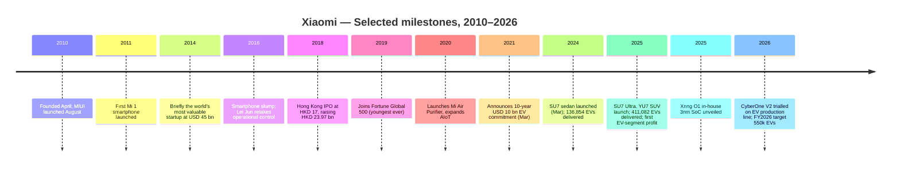
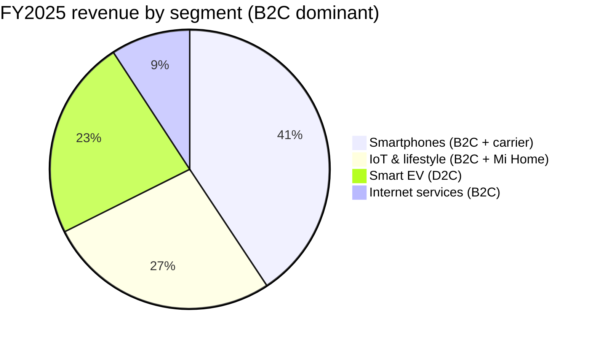
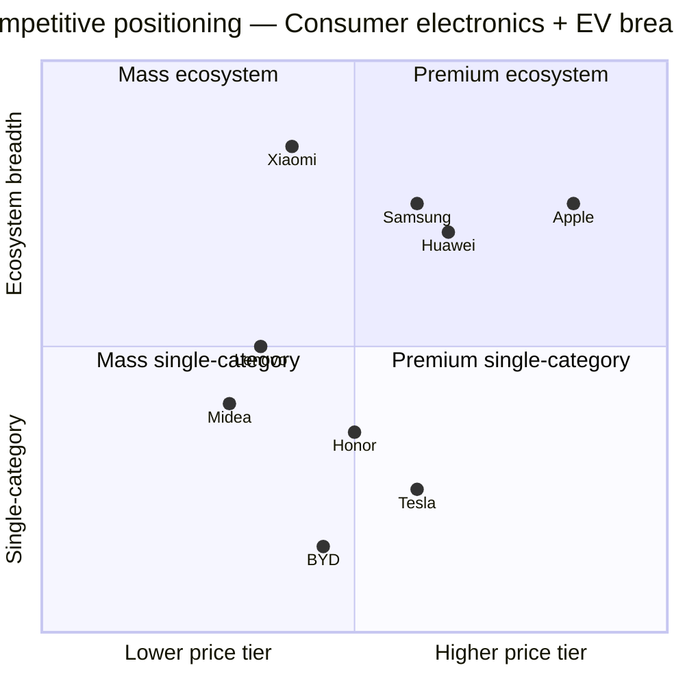

# COMPANY RESEARCH REPORT: Xiaomi Corporation (小米集团, HKEX:1810)
Date: 2026-05-16

> **Update — FY2026 EV delivery target initiated (2026-03-24):** Alongside FY2025 results, Xiaomi guided to ~550,000 EV deliveries in FY2026, implying ~34% YoY growth on top of the 411,082 units delivered in FY2025 (which itself beat the revised 350k target by a month). Management framed the target as supply-constrained rather than demand-constrained, with phase-2 of the Beijing Yizhuang plant ramping to combined ~300k units annual capacity and phase-3 already breaking ground. The smartphone segment was guided "flat to slightly down" on weak China sell-through and tariff-friction in India. Source: [Xiaomi 2025 Q4 & Annual Results, 2026-03-24](https://ir.mi.com/system/files-encrypted/nasdaq_kms/assets/2026/03/24/6-20-53/Xiaomi%20Corp_25Q4_ER_ENG%20vF.pdf); [EV.com, 2026-03-25](https://ev.com/news/xiaomi-sets-34-percent-delivery-growth-target-for-2026-as-ev-momentum-accelerates).

## TABLE OF CONTENTS
1. Company Overview
2. Company History
3. Management Team
4. Products & Services
5. Customers & Go-to-Market
6. Industry Overview
7. Competitive Landscape
8. Market Opportunity (TAM)
9. Risk Assessment

======================================

## 1. COMPANY OVERVIEW

Xiaomi Corporation (小米集团; HKEX:1810 / 81810) is one of the few consumer-electronics companies in the world that simultaneously occupies the global top-3 in smartphones, owns a top-tier connected-device ("AIoT") ecosystem, and operates a profitable in-house electric-vehicle business — all under fifteen years from founding. The company describes its strategy as the **"Human × Car × Home"** smart-life loop: a person whose phone, home appliances and car all run on a unified Xiaomi software stack ([HyperOS](https://www.mi.com/global/discover/article?id=2812)) and share a single account. That strategy is the bridge between what was, until 2024, an Apple-Samsung-Xiaomi smartphone story and what is, in 2026, a five-pillar conglomerate: smartphones, IoT & lifestyle, internet services, smart electric vehicles, and an emerging robotics / advanced-manufacturing arm.

**Business model and how money is made.** Xiaomi reports across four segments. (1) **Smartphones** — designs, manufactures and sells handsets globally; ASP is the highest-leverage driver, with the recently launched in-house **Xring O1** 3nm SoC marking the company's first attempt to escape Qualcomm / MediaTek dependency on flagship tiers ([NotebookCheck, 2025-05-22](https://www.notebookcheck.net/XRing-O1-officially-announced-as-Xiaomi-s-new-self-developed-smartphone-SoC.1017345.0.html)). (2) **IoT & lifestyle products** — TVs, laptops, tablets, wearables, audio, smart-home appliances (air-conditioners, refrigerators, washing machines), small kitchen appliances, scooters, etc., spanning Xiaomi-branded SKUs plus over 400 invested "Mi-Home Ecosystem" portfolio companies. (3) **Internet services** — advertising and value-added services across MIUI / HyperOS, GetApps, browsing, fintech and TV. (4) **Smart EV & new initiatives** — the SU7 sedan family, the YU7 SUV launched in mid-2025, and ancillary R&D including humanoid / quadruped robotics and large-model AI (the Xiaomi MiMo open-source LLM family).

**Geographic presence.** Mainland China is the home market and the EV base, but Xiaomi is structurally a global smartphone brand: top-three handset positions across more than 50 markets in Europe, Latin America and Southeast Asia, with India historically the single largest overseas market although that business has been pressured by enforcement actions from the Indian Enforcement Directorate since 2022 ([Reuters, 2025-09-09](https://www.reuters.com/world/india/india-tribunal-orders-rs-2719-crore-xiaomi-funds-be-returned-2025-09-09/)). Overseas internet-services revenue reached 34.9% of total internet-services revenue in 2024, an all-time high ([Xiaomi 2024 Annual Report, p. 9](https://ir.mi.com/system/files-encrypted/nasdaq_kms/assets/2025/04/24/5-27-15/%E8%8B%B1%E6%96%87.pdf)).

**Scale.** FY2025 group revenue reached **RMB 457.3 billion** (USD ~66.4 billion), +25.4% YoY, with adjusted net profit of RMB 39.2 billion, +43.8% YoY — a record on both lines ([Xiaomi 2025 Q4 & Annual Results, 2026-03-24](https://ir.mi.com/system/files-encrypted/nasdaq_kms/assets/2026/03/24/6-20-53/Xiaomi%20Corp_25Q4_ER_ENG%20vF.pdf); [Chinadaily, 2026-03-24](https://www.chinadaily.com.cn/a/202603/24/WS69c26b02a310d6866eb3f9fa.html)). The headline mix in FY2025 was approximately RMB 186 bn smartphones, RMB 123 bn IoT, RMB 41 bn internet services, and RMB 106 bn smart EV & new initiatives — meaning EV alone is already larger than the entire internet-services business, and IoT now eclipses internet services by 3×. Xiaomi shipped **168.5 million** smartphones in 2025 (third globally behind Apple and Samsung at ~11–13% share by IDC), **411,082 EVs**, and recorded **754.1 million global MAU** on HyperOS / MIUI ([IDC, 2026-01-15](https://www.idc.com/promo/smartphone-market-share/); [electrive, 2026-03-25](https://www.electrive.com/2026/03/25/xiaomi-reports-first-annual-profit-for-ev-business/)). Group head-count crossed 50,000 by mid-2025, with the EV company alone ~13,000 ([CnEVPost, 2025-07-02](https://cnevpost.com/2025/07/02/xiaomi-hiring-spree-phase-2-ev-plant/)).

Source: [Xiaomi 2025 Q4 & Annual Results press release, 2026-03-24](https://ir.mi.com/system/files-encrypted/nasdaq_kms/assets/2026/03/24/6-20-53/Xiaomi%20Corp_25Q4_ER_ENG%20vF.pdf); [Xiaomi 2024 Annual Report](https://www1.hkexnews.hk/listedco/listconews/sehk/2025/0425/2025042500842.pdf); FY2021–FY2022 from prior annual reports on [HKEX](https://www1.hkexnews.hk/).

**Valuation snapshot (as of 2026-05-16).** Xiaomi's HKD line (1810.HK) trades at **HKD 30.70**, market capitalisation **HKD ~796 billion** (≈USD 102 billion). On TTM the company prints **P/E 17.0× and P/S 1.71×**, with EPS (TTM) of HKD 1.81 on revenue (TTM) of HKD 526 billion ([CNBC quotes, 2026-05-16](https://www.cnbc.com/quotes/1810-HK); [Yahoo Finance 1810.HK](https://finance.yahoo.com/quote/1810.HK/key-statistics/)). The 52-week range is wide — HKD 28.80 to HKD 61.45 — reflecting the sell-off after the March 2025 fatal SU7 crash and the subsequent rebound and then re-de-rating into Q1 2026 as smartphone growth flattened and tariff anxiety hit overseas sales ([carnewschina, 2025-04-01](https://carnewschina.com/2025/04/01/first-fatal-accident-involving-xiaomi-su7-claims-three-lives-on-chinese-highway/)).

Today's 17× TTM P/E sits **below** the 3-year average (~28×, with peaks above 50× in the post-EV-launch frenzy of mid-2024 to early 2025) and **below** the consumer-electronics peer median. Comp set: **Lenovo 0992.HK 14.8×**, **Samsung KRX:005930 26.0×**, **BYD HKEX:1211 29.7×**, **Apple AAPL 36.3×**, **Tesla TSLA 369.4×** ([Gurufocus AAPL](https://www.gurufocus.com/term/pettm/AAPL); [Gurufocus LNVGY](https://www.gurufocus.com/term/pe-ratio/LNVGY); [Gurufocus Samsung](https://www.gurufocus.com/term/pettm/FRA:SSUN); [Gurufocus BYDDF](https://www.gurufocus.com/term/pe-ratio/BYDDF); [Financecharts TSLA, 2026-05-14](https://www.financecharts.com/stocks/TSLA/value/pe-ratio)). The peer-median P/E (excluding Tesla as an outlier) is ~28×; Xiaomi trades at a ~40% discount to that. **The compression is not because the business decelerated — FY2025 grew 25% and operating profit nearly doubled** — but because the SU7 recall and India headwinds re-introduced execution risk just as flagship-smartphone unit growth flattened.

We do not flag the multiple as a stretched / multiple-compression risk; if anything, the inverse — TTM P/E below 3-year median plus a P/S of 1.71× on a business that now derives roughly a quarter of revenue from a high-growth EV segment suggests the stock is being priced as a slow-growth handset OEM rather than as a five-pillar growth franchise. That said, the sum-of-the-parts framing can break if EV gross margins normalise downward in the H2-2026 price war (see Section 9).

Source (chart): [Gurufocus, Financecharts as of May 2026](https://www.gurufocus.com/term/pettm/AAPL); peer P/E values as cited in body text.

## 2. COMPANY HISTORY

Xiaomi was founded in **April 2010** in Beijing by **Lei Jun (雷军)** and a group of seven co-founders — including former Google China VP **Lin Bin (林斌)**, former Microsoft China engineer **Hong Feng (洪锋)**, former Motorola engineer **Zhou Guangping (周光平)**, and former Kingsoft / Jinshan Wordpad lead **Li Wanqiang (黎万强)** — with a thesis that the smartphone, not the PC, would become the next universal compute platform and that a software-first Chinese brand could win by undercutting Apple and Samsung on price while matching them on the user experience ([Lei Jun bio, Britannica](https://www.britannica.com/money/Lei-Jun); [PandaYoo profile of Lei Jun](https://pandayoo.com/post/the-story-of-lei-jun/)). The founders launched MIUI as an Android-based ROM first (August 2010), then the Mi 1 smartphone in August 2011, sold direct-to-consumer online to bypass distributor margin.

Source: [Xiaomi 2024 Annual Report](https://www1.hkexnews.hk/listedco/listconews/sehk/2025/0425/2025042500842.pdf); [Lei Jun biography, Britannica](https://www.britannica.com/money/Lei-Jun); [Xiaomi 2025 Annual Results press release, 2026-03-24](https://ir.mi.com/system/files-encrypted/nasdaq_kms/assets/2026/03/24/6-20-53/Xiaomi%20Corp_25Q4_ER_ENG%20vF.pdf).

**Three strategic pivots define the firm.** First, the **2016–2017 reset**: after a 2015 smartphone-shipment miss and 2016 slump, Lei Jun reassumed direct operational control of the smartphone division, rebuilt the offline retail network ("Mi Home" / 小米之家 stores) which had been over-indexed to online-only, and launched the Redmi sub-brand to wall off mid-tier price aggression from a premiumising main brand. The company shipped 100 million smartphones in 2018 and entered the Fortune Global 500 in 2019 — the youngest company ever to do so ([Xiaomi corporate timeline](https://www.mi.com/global/about/)).

Second, the **2021 EV announcement**: at a March 30, 2021 launch event Lei Jun committed Xiaomi to a 10-year, USD 10 billion investment in an in-house electric-vehicle business — staked, in his own words, as his "last entrepreneurial venture." This was conservative for an EV start-up in capital terms but radical for Xiaomi, which had previously avoided heavy-asset bets ([Bloomberg Lei Jun profile](https://www.bloomberg.com/billionaires/profiles/jun-lei/)). Three years later, the SU7 sedan launched at end-March 2024 with a ~95-second 0-100 km/h Ultra variant; the YU7 SUV followed in mid-2025 and proceeded to outsell Tesla's Model Y in segment in China for seven consecutive months ([electrive, 2026-03-25](https://www.electrive.com/2026/03/25/xiaomi-reports-first-annual-profit-for-ev-business/)).

Third, the **2025 in-house silicon push**: after a multi-year quiet investment, Xiaomi unveiled the Xring O1 — a 10-core 3nm Arm-architecture SoC built on TSMC N3E, with 19 billion transistors and a 44-TOPS NPU — at an event on May 22, 2025. The company disclosed it had spent more than RMB 13.5 billion (~USD 1.87 billion) and four years on the chip, and that the first device using it would be the Xiaomi 15S Pro flagship at a 15th-anniversary launch ([NotebookCheck, 2025-05-22](https://www.notebookcheck.net/XRing-O1-officially-announced-as-Xiaomi-s-new-self-developed-smartphone-SoC.1017345.0.html); [Digitimes, 2025-05-22](https://www.digitimes.com/news/a20250522PD208/xiaomi-xring-soc-tsmc-3nm-production.html)). This positions Xiaomi alongside Apple, Samsung, and Huawei as the only smartphone OEMs with high-end in-house SoCs.

**Key acquisitions and stake-builds:** the most strategic transactions are minority investments rather than M&A — Xiaomi runs a portfolio of 400+ "Mi Ecosystem" companies that act as ODMs / brand affiliates for AIoT products (Roborock 石头科技, Huami 华米, Zimi 紫米, Ninebot 九号公司 among the more famous IPO outcomes). The company also took a strategic stake in domestic embodied-intelligence start-up **Xiaoyu Intelligent Manufacturing** in late 2025, marking the first formal capital tie-in for its humanoid roadmap ([AIBase, 2025-10](https://www.aibase.com/news/10440)).

## 3. MANAGEMENT TEAM

### Lei Jun (雷军) — Founder, Chairman & CEO

Lei Jun, born December 16, 1969 in Xiantao, Hubei, is the single most consequential individual at Xiaomi by an order of magnitude. He graduated from Wuhan University in 1991 with a computer-science degree, joined the Beijing-based software company **Kingsoft (金山软件)** in 1992 as an engineer, rose to become CEO by 1998, and led Kingsoft through its Hong Kong IPO in 2007 — at which point he had already been one of mainland China's most respected software executives for nearly a decade ([Britannica](https://www.britannica.com/money/Lei-Jun); [Lei Jun Wikipedia](https://en.wikipedia.org/wiki/Lei_Jun)). Between 2008 and 2010 he was a prolific angel investor — early backer of Joyo (sold to Amazon), YY, UCWeb, Vancl, and others — making him one of the canonical "first-generation" Chinese internet angels.

He founded Xiaomi at age 40 in April 2010 with the now-famous "press the boar onto the typhoon path" thesis — that the right time to build a company is when secular tailwinds make even a mediocre execution look brilliant. As founder-CEO he has personally driven every product launch keynote, building a Steve-Jobs-style personality cult that the company has actively leaned into for the EV business (Lei Jun's livestreamed test-drives generated hundreds of millions of views and were instrumental in SU7 pre-order conversion). He briefly stepped back from operational smartphone management in 2014–2015 — a period that coincided with the smartphone shipment miss — and resumed direct control in 2016, since which time the business has reliably grown.

His **ownership stake is approximately 24% of total share capital**, held through his wholly-owned company **Smart Mobile Holdings**, with the bulk in **Class A super-voting shares** that carry 10 votes each versus 1 vote for Class B shares; only Lei Jun and co-founder Lin Bin hold Class A. The dual-class structure was negotiated at the 2018 IPO and is the basis for HKEX's "WVR" (weighted voting rights) issuer regime. In 2018 the Board granted Lei Jun a one-time **636.6 million Class B share award** valued at the time at ~USD 1.5 billion — controversial then, but his cash compensation has remained nominal since ([Bloomberg Billionaires Index — Lei Jun](https://www.bloomberg.com/billionaires/profiles/jun-lei/); [Xiaomi 2024 Annual Report — Directors' Remuneration](https://ir.mi.com/system/files-encrypted/nasdaq_kms/assets/2025/04/24/5-27-15/%E8%8B%B1%E6%96%87.pdf)). Forbes / Bloomberg track his net worth at ~USD 30 billion as of early 2026, almost all in Xiaomi stock — meaning his interests are unambiguously aligned with public shareholders.

Lei is publicly active — he writes a regular shareholder letter, hosts an annual "Lei Jun Annual Speech" each August (essentially Xiaomi's Berkshire-letter equivalent), and broadcasts on Weibo to ~25 million followers. Investors regard him as China's most credible founder-operator outside of Pony Ma and Zhang Yiming, and the EV business in particular has been read as a referendum on him personally.

### Lu Weibing (卢伟冰) — Partner & President

Lu Weibing, born September 1975, joined Xiaomi in early 2019 from Gionee where he had served as president of overseas operations, and rapidly rose to General Manager of the Redmi brand, then Group President in 2022 ([Xiaomi IR — Lu Weibing](https://ir.mi.com/management/lu-weibing)). He holds a chemistry undergraduate degree from Tsinghua University (1998) and an EMBA from Cheung Kong Graduate School of Business (2009). Inside the company he runs the smartphone division and is widely understood as the operational #2 to Lei Jun across the non-EV business. Lu is the public face of quarterly earnings calls — he co-hosted the May 27, 2025 Q1 results call with CFO Alain Lam, walking through the Xring O1 launch implications for the smartphone P&L ([Digitimes, 2025-05-28](https://www.digitimes.com/news/a20250528VL205/xiaomi-xring-soc-chips-flagship-2025.html)). He owns a meaningful but undisclosed equity stake under the partner / share-award schemes; he is not in the WVR Class A pool.

### Alain Lam (林世伟) — Vice President & CFO

Alain Lam joined Xiaomi as CFO in 2020 from a 17-year career at Credit Suisse, where he was head of Asia-Pacific Technology, Media and Telecom investment banking and personally led the Xiaomi 2018 HKEX IPO from the bank side. He is also Chairman of **Airstar Digital Technology**, Xiaomi's Hong Kong virtual-banking JV with AMTD ([Xiaomi IR — Alain Lam](https://ir.mi.com/management/lam-wai-alain)). His mandate has been to professionalise the finance function as the company expanded into capital-heavy EV manufacturing — including the RMB 42.5 billion equity placement of March 2025 (sold at HKD 53.25, ~9.2% dilution but funded substantial EV capacity expansion at a very efficient cost-of-capital) and ongoing relations with HKEX, HSI inclusion (added to Hang Seng Index constituents in 2020), and a still-active dual-counter HKD/RMB listing.

### Wang Xiang (王翔) — Vice Chairman (and prior President)

Wang Xiang joined Xiaomi in 2015 from Qualcomm China where he had been Senior VP, became Xiaomi President in 2019 and Vice Chairman in 2022, taking on a more strategic / external role and stepping back from day-to-day operations in favour of Lu Weibing. He remains a director on the Xiaomi Board and is influential in the company's licensing relationship with Qualcomm and global telco partnerships — relevant because Qualcomm still supplies the majority of Xiaomi's flagship smartphone SoCs even after Xring O1.

### Governance

The Board has 8 directors as of the 2024 Annual Report, of whom 4 are independent non-executives — meeting HKEX standards. The WVR structure concentrates ~76% of voting power in Class A shares held by Lei Jun and Lin Bin, despite the Class A holders owning <30% of total economic interest ([Xiaomi 2024 Annual Report — Share Capital](https://ir.mi.com/system/files-encrypted/nasdaq_kms/assets/2025/04/24/5-27-15/%E8%8B%B1%E6%96%87.pdf)). Insider ownership including the partner-share scheme is north of 30%. Executive compensation skews heavily to equity — Lei Jun's cash salary is in the low USD millions, but RSU awards have repeatedly been multi-billion-dollar grants tied to operational and stock-price milestones. Related-party transactions are limited to a handful of Mi Ecosystem portfolio companies (Roborock, Ninebot) where Xiaomi is a minority strategic investor and arms-length contract counterparty.

**Management track-record assessment.** Lei Jun has now delivered three distinct businesses to scale — Kingsoft software, the Xiaomi smartphone franchise, and the SU7 EV launch (the fastest-ever 100k-unit ramp for a Chinese EV start-up). The team is light on automotive-industry veterans, which is the principal risk vector. Lu Weibing's smartphone execution since 2019 has been strong, and Lam has run the IPO and EV capital-raise without misstep. The bench is shallow — there is no obvious internal successor to Lei Jun, which is the key-person risk discussed in Section 9.

## 4. PRODUCTS & SERVICES

Xiaomi's product portfolio is unusually broad for a top-3 smartphone OEM. The skeleton runs along four reporting segments; within each, the product tree is deep.

```mermaid
graph TD
    A[Xiaomi Group] --> B[Smartphones]
    A --> C[IoT & Lifestyle]
    A --> D[Internet Services]
    A --> E[Smart EV & New Initiatives]
    B --> B1[Xiaomi flagship / Mi 15, 15S Pro, 15 Ultra]
    B --> B2[Redmi / Redmi K, Note, A]
    B --> B3[POCO global sub-brand]
    C --> C1[Smart TVs / Mi TV]
    C --> C2[Wearables / Mi Band, Watch]
    C --> C3[Laptops & Tablets / RedmiBook, Pad]
    C --> C4[Home appliances / AC, fridge, washer]
    C --> C5[Small kitchen, audio, scooters]
    C --> C6[Mi Ecosystem 400+ portfolio cos]
    D --> D1[Advertising / MIUI in-feed]
    D --> D2[Game distribution / GetApps]
    D --> D3[Financial / fintech]
    D --> D4[Smart TV / OTT content]
    E --> E1[SU7 sedan / Standard, Pro, Max, Ultra]
    E --> E2[YU7 SUV]
    E --> E3[CyberOne humanoid]
    E --> E4[CyberDog 2 quadruped]
    E --> E5[Xring SoC / O1, T1]
```

Source: [Xiaomi global product portfolio](https://www.mi.com/global/); [Xiaomi 2024 Annual Report — Business Review](https://ir.mi.com/system/files-encrypted/nasdaq_kms/assets/2025/04/24/5-27-15/%E8%8B%B1%E6%96%87.pdf).

### 4.1 Smartphones (FY2025 revenue ~RMB 186.5 bn, ~41% of total)

The smartphone unit ships under three brand tiers. **Xiaomi-branded flagships** (Mi 15 / 15 Pro / 15 Ultra / 15S Pro with Xring O1; pricing CNY 4,499 to 7,999 in China) compete head-to-head with iPhone Pro and Galaxy S Ultra and have been the company's premiumisation lever since 2020. **Redmi** (Redmi K, Note and entry-tier A series; CNY 999 to 3,499) is the volume engine across China and emerging markets. **POCO** is the global online-only sub-brand targeting price-performance buyers in India, Europe and Latin America.

The flagship line has migrated upmarket — Xiaomi's ASP in 2024 reached a record high of RMB 1,138 with mainland-China share of mid- and high-end (>RMB 4,000) units climbing into the high-teens for the first time ([Xiaomi 2024 Annual Report, p. 11](https://www1.hkexnews.hk/listedco/listconews/sehk/2025/0425/2025042500842.pdf)). **Competitive-advantage verdict: partial moat.** The brand and channel are real (top-3 globally, growing share in Europe and Africa), but in mainland China the company sits in a competitive scrum with Honor, OPPO, vivo and Huawei in the >RMB 4,000 band; Apple still dominates >RMB 6,000. The Xring O1 is the first proprietary differentiation at flagship — a true vertical-integration moat if Xiaomi can sustain a one-generation cadence the way Apple has with the A-series. Closest competing product: **Apple iPhone 17 Pro** (Xiaomi behind on app-ecosystem premium, narrowing on hardware), **Samsung Galaxy S25 Ultra** (at parity on imaging hardware after Leica partnership), **Huawei Pura 80 Ultra** (Xiaomi ahead on global ecosystem reach, behind on premium-China brand sheen).

### 4.2 IoT & lifestyle products (FY2025 revenue ~RMB 123.2 bn, ~27% of total)

The IoT segment is structurally the most under-appreciated business inside Xiaomi. It comprises smart-home appliances (mainland China's #2 or #3 share in air-conditioners and washing machines in 2024 — both record highs), TVs (top-1 in mainland China since 2019), tablets (where Xiaomi has overtaken Huawei in some quarters of 2024), wearables (Mi Band consistently top-3 globally), laptops, audio, scooters (the Mi Electric Scooter / Ninebot JV) and a long tail of small kitchen and personal-care devices.

H1 2025 IoT revenue grew **+44.7% YoY** with smart-home appliances alone up >60% YoY ([Caixin / earnings summary, 2025-08](https://www.caixinglobal.com/)). **Gross margin is structurally rising** — the segment has historically been low-teens GM but reached ~20% in 2024 as Xiaomi premiumised the appliance mix and the AIoT cross-sell drove software-attached revenue. **Competitive-advantage verdict: yes — ecosystem moat + brand.** The advantage is not any single product but the connected-device platform (HyperOS Connect) and the breadth of cross-category. Closest competing positioning: **Apple** has fewer SKUs but a deeper-software moat; **Samsung** has comparable category breadth but no consumer-friendly low-tier; in China, **Midea / Haier / Hisense** dominate single-category appliances at lower software integration.

### 4.3 Internet services (FY2025 revenue ~RMB 41.5 bn, ~9% of total)

Internet services include advertising on MIUI / HyperOS lockscreens and browser, GetApps app-distribution revenue, fintech (consumer credit, payment), smart-TV ad and subscription, and Xiaomi-branded gaming. With **754.1 million global MAU on HyperOS / MIUI** as of December 2025 and the global GetApps store running 260 million MAU across 100+ markets, this is the closest Xiaomi gets to an Apple-Services analogue — though monetisation per user is dramatically lower (~RMB 55 / user / year, vs. Apple's ~USD 70). Overseas internet-services revenue hit 34.9% of segment revenue in 2024 — the first time a Chinese smartphone OEM crossed the one-third overseas-services threshold ([PR Newswire, 2024-11](https://www.prnewswire.com/news-releases/grow-with-xiaomi-building-a-sustainable-open-ecosystem-for-apps-services-and-contents-302318172.html)). **Competitive-advantage verdict: yes — installed-base scale.** Closest comp: **Apple Services** (parity on intent, far behind on per-user monetisation); **OPPO / vivo ColorOS-Origin** services (Xiaomi clearly ahead on overseas reach).

### 4.4 Smart EV & new initiatives (FY2025 revenue ~RMB 106.1 bn, ~23% of total)

This is the segment that transformed the equity story. The line-up:

- **Xiaomi SU7** — D-segment electric sedan launched March 28, 2024 at CNY 215,900–299,900. Four variants (Standard, Pro, Max, Ultra). The SU7 Ultra was the best-selling sedan in mainland China above CNY 200,000 in 2025 ([electrive, 2026-03-25](https://www.electrive.com/2026/03/25/xiaomi-reports-first-annual-profit-for-ev-business/)).
- **Xiaomi YU7** — D-segment electric SUV, launched summer 2025 at CNY 235,900–329,900, positioned squarely against the Tesla Model Y. Delivered >150,000 units in its first six months, 2.3× the SU7 ramp at the same age ([EV.com, 2026-03-25](https://ev.com/news/xiaomi-sets-34-percent-delivery-growth-target-for-2026-as-ev-momentum-accelerates)). Held #1 in medium-large SUVs in China for seven consecutive months through Feb 2026.
- **Xring O1 / T1 chipsets** — the in-house mobile and wearable SoC family.
- **CyberOne humanoid robot** — see Section 4.5.
- **CyberDog 2 quadruped** — open-source bionic quadruped at the developer-platform tier, no near-term commercial intent.

The EV segment turned **profitable** in FY2025 — a first for the company and the first such positive milestone for any new-entrant Chinese EV maker on a full-year basis ([Caixin, 2026-03-25](https://www.caixinglobal.com/2026-03-25/xiaomi-ev-unit-posts-profit-but-smartphone-business-falters-102427311.html); [Gasgoo, 2026-03](https://autonews.gasgoo.com/articles/news/xiaomis-ev-business-defies-industry-slowdown-with-standout-profitability-2036702632129753088)). EV gross margin was ~24% in 2025, higher than Tesla's China gross margin and only modestly below BYD's blended. **Competitive-advantage verdict: partial moat → potentially full.** The moat candidates are (a) the in-house BMS and traction-motor IP (the SU7 Ultra's 1,548-hp performance variant runs Xiaomi-designed V8s motors), (b) the brand / fan economy that converted MIUI users into pre-orderers, and (c) the AIoT cross-sell (cars showing up in the Mi Home app, controllable from a phone). Closest competing product: **Tesla Model 3 / Model Y** (Xiaomi behind on FSD software, ahead on Chinese-market-tuned UX, at parity on price), **BYD Han / Seal / Tang** (Xiaomi ahead on tech narrative, behind on cost scale), **NIO ET5 / Li Auto L6**.

### 4.5 Robotics & humanoid (within "new initiatives")

The robotics program runs out of **Xiaomi Robotics Lab** and was first publicly disclosed with the **CyberDog** quadruped (2021), upgraded to **CyberDog 2** (2023), and the **CyberOne humanoid** unveiled in August 2022. CyberOne specifications: 177 cm tall, 52 kg, 21 degrees of freedom (later increased to 22–27 in V2), 0.5 ms per-joint response, emotion recognition via Xiaomi's Mi-Sense module ([Xiaomi unveils CyberOne, 2022](https://www.zawya.com/en/press-release/companies-news/xiaomi-unveils-cyberone-wenidnqu); [Humanoids Daily, 2025-09](https://www.humanoidsdaily.com/news/xiaomi-debuts-cyberone-v2-at-investor-day-moving-beyond-the-factory-floor)).

The 2026 update is the most material. In March 2026 Xiaomi disclosed that CyberOne V2 units were running production-line trials at the EV factory installing self-tapping nuts at a **90.2% success rate over 3 hours of continuous autonomous operation** ([Robotics & Automation News, 2026-03-10](https://roboticsandautomationnews.com/2026/03/10/xiaomi-tests-humanoid-robots-on-electric-production-line-in-automotive-factory/99418/); [CNBC, 2026-03-04](https://www.cnbc.com/2026/03/04/xiaomi-humanoid-robots-ev-factory-.html)). President Lu Weibing described them as "interns." Lei Jun has publicly stated that humanoids will be operating at "large scale" in Xiaomi factories within five years ([Humanoids Daily — Lei Jun](https://www.humanoidsdaily.com/news/xiaomi-ceo-humanoids-will-working-at-large-scale-in-our-factories-within-5-years)); the company has not committed to commercial humanoid sales. The April 2026 disclosed hardware refresh introduced a bionic arm and thermal-sweating cooling system ([Technetbook, 2026-04](https://www.technetbooks.com/2026/04/xiaomi-cyberone-humanoid-robot-features.html)). **Competitive-advantage verdict: too early to call.** Closest competing program: **Tesla Optimus** (well ahead on AI / FSD reuse, behind on hardware iteration cadence), **Unitree H1 / G1** (Unitree ahead on shipped volume — 5,500 units in 2025 — but at hobbyist / research price points), **Agibot / Figure AI / 1X**.

### 4.6 Flagship vs. long-tail

The 1–3 products driving the business in FY2025 are clear: **Xiaomi 15 Ultra / 15S Pro** (the premiumisation lever and the gross-margin engine of smartphones), **SU7 + YU7** (the growth engine for the company overall), and the broader **smart-home-appliance line** (air-con, washer, refrigerator — the IoT growth driver). Long-tail / experimental: CyberOne, CyberDog 2, the small-kitchen-appliance back-catalogue.

### 4.7 Launches / sunsets in last 12 months

- Launched: SU7 Ultra (Feb 2025), YU7 SUV (Jun 2025), Xring O1 chipset (May 2025), Xiaomi 15S Pro / Pad 7 Ultra (May 2025), CyberOne V2 (Sep 2025 at Investor Day; refreshed Apr 2026), Xiaomi MiMo open-source LLM family (Aug 2025).
- Sunset: nothing material; the smart-router and certain low-end Redmi A-series SKUs were pared.

## 5. CUSTOMERS & GO-TO-MARKET

Xiaomi is overwhelmingly **B2C**. Of FY2025 group revenue of RMB 457.3 billion, more than 95% is sold to end consumers across smartphones, IoT lifestyle, EVs and direct-to-user internet services. Customer concentration in the traditional sense (one-customer-> 10%-of-revenue) does not exist on the consumer line. The 2024 Annual Report does **not** disclose a top-1 or top-5 customer concentration figure under HKEX listing rules — there is no IFRS / IAS 1 single-customer concentration mandatory disclosure in Xiaomi's accounts, and the company's risk factors do not flag a major-customer risk ([Xiaomi 2024 Annual Report — Risk Management](https://ir.mi.com/system/files-encrypted/nasdaq_kms/assets/2025/04/24/5-27-15/%E8%8B%B1%E6%96%87.pdf)).

**The relevant B2B exposures are limited and asymmetric on the supply side rather than the demand side:**

1. **Smartphone-distribution channels in emerging markets.** A handful of large operator / distributor partners — for example, JBP-aligned distributors in India (where Xiaomi sells largely through offline + Reliance Digital / Croma / Vijay Sales etc.), and Carphone Warehouse / regional operators in Europe — represent meaningful share of regional volume but not group-level concentration. Xiaomi does not disclose the names or quantified percentages.
2. **Carrier subsidy programs** — Xiaomi's carrier channel in Europe (Vodafone, Orange, Deutsche Telekom) and Latin America is material to top-tier flagship sell-through but again undisclosed in quantum.
3. **EV channel** — Xiaomi sells SU7 / YU7 direct-to-consumer through its own showrooms, which are typically co-located with Mi Home stores (~250 EV-enabled stores by end-2025).

Source: [Xiaomi 2025 Q4 & Annual Results press release, 2026-03-24](https://ir.mi.com/system/files-encrypted/nasdaq_kms/assets/2026/03/24/6-20-53/Xiaomi%20Corp_25Q4_ER_ENG%20vF.pdf).

**Geographic concentration.** Mainland China is ~50–55% of group revenue and rising materially with the EV segment, given SU7 / YU7 are sold only in China through 2026. India is the single-largest overseas market for smartphones (~12% of global smartphone shipments in 2024, with Xiaomi the #2 or #3 brand in India). Europe is ~15% of smartphone shipments. The geographic concentration risk has shifted from "too India-dependent" pre-2022 to "China-on-top" post-EV launch.

**Go-to-market.** Three channels in parallel — (a) Xiaomi.com / mi.com online direct, the founding distribution model, (b) Mi Home / 小米之家 offline stores (>14,000 globally by 2024, of which most in mainland China), (c) operator / distributor partnerships for emerging markets. The EV business uses dedicated SU7 showrooms typically co-located with Mi Home flagships. Average sales cycle: instant for IoT and most smartphone SKUs; the SU7 / YU7 has averaged a 30–35 week lead-time on new orders given supply constraints — sufficiently constrained that the YU7 was reportedly sold out for the next 12 months by mid-2025 ([carnewschina, 2025-06-27](https://carnewschina.com/2025/06/27/xiaomi-yu7-production-capacity-sold-out-through-early-2027/)).

**Named partnerships.** **Leica** (camera-system co-engineering on the Xiaomi 13 Ultra and beyond, multi-year contract since 2022); **Qualcomm** (long-term flagship SoC supply, still primary supplier even after Xring O1); **TSMC** (Xring O1 foundry partner on N3E); **Microsoft** (cloud / productivity integrations); **CATL & BYD-FinDreams** (EV battery supply, dual-sourced for SU7 / YU7); **Bosch** (smart-driving sensor system); **Nvidia** (Drive Orin SoC on SU7 Pro / Max / Ultra trims for ADAS). Xiaomi has historically been a multi-source buyer rather than locked into single-supplier relationships.

**Customer case studies.** The most visible "named win" in FY2025 was the **YU7's #1 mid-large-SUV position** in China for seven consecutive months, beating Tesla Model Y in segment from August 2025 onward. On the smartphone side, the Mi 15 Ultra was the **#1 Android flagship in mainland China by GfK-tracked offline sales** in Q3 2025.

## 6. INDUSTRY OVERVIEW

Xiaomi sits in four distinct industries, which is uncommon for a single equity. Each has its own structure, growth profile, and regulatory regime.

### 6.1 Global smartphones

The global smartphone industry shipped **1.26 billion units in 2025** at roughly USD 480 billion in revenue, a modest 2.3% YoY shipment recovery from the 2023–2024 trough ([IDC Q4 2025 release](https://www.idc.com/promo/smartphone-market-share/); [GSMArena, 2026-01-15](https://www.gsmarena.com/idc_smartphone_shipments_up_23_in_q4_2025_apple_is_the_clear_winner_-news-71096.php)). The structure is **oligopolistic**: Apple (19.7% global share in 2025, taking the #1 slot from Samsung for the first time in 14 years), Samsung (~18.5%), Xiaomi (~13%), Transsion / Tecno (~9%), vivo, OPPO, Honor and Huawei together ~30%. The Chinese market alone shipped ~280 million units in 2025 and is the most fragmented top-3 in the world — vivo, Apple and Huawei have rotated #1–#3 quarterly since early 2024, with Honor, Xiaomi, OPPO clustered in the next tier.

**Growth drivers**: AI-on-device (every flagship in 2025 was sold with on-device LLM capabilities; the Apple Intelligence release in iOS 18.4 and Honor / Xiaomi / Samsung equivalents); satellite connectivity (China three-way; Apple via Globalstar); foldable form factors (Samsung still leads but Honor and Huawei pulling close); replacement-cycle elongation (now >3.5 years globally) which is a structural drag. **Penetration is essentially saturated** in developed markets. Growth is now ASP-driven, not unit-driven.

### 6.2 IoT & smart-home appliances

The connected-home device market is much more fragmented globally than smartphones — Samsung, LG, Apple, Google, Xiaomi, Midea, Haier, Hisense, Dyson, Roomba, etc., each carve out subcategories. In **mainland China specifically**, the home-appliance market is ~RMB 850 billion annually with Midea, Haier and Gree the long-tenured top three; Xiaomi is the fast-growing #4 / #5 having grown air-conditioner share into double-digits in 2024. The global smart-home addressable market is forecast at ~USD 220 billion in 2025 growing ~12–14% CAGR; Xiaomi participates in roughly two-thirds of the segments by SKU breadth and is **the #1 Chinese smart-home connected-device installed base** by units shipped, according to internal disclosures.

### 6.3 Internet services / mobile advertising

In China, Tencent, Alibaba, Bytedance, Baidu and Pinduoduo dominate consumer-internet ad inventory. Xiaomi's MIUI is closer to the carrier / OS-vendor in-feed ad model — analogous to Samsung Ads or the Apple App Store search-ad business — running ad load on the lockscreen, browser, app store and TV. Globally, the on-device-OS ad market is small relative to Google / Meta but growing as OEMs monetise installed bases. With 754 million MAU, Xiaomi has the third-largest non-Google / non-Apple smartphone OS installed base in the world.

### 6.4 Electric vehicles

The global EV industry shipped roughly **20.7 million units in 2025** (~25% of all new-car sales globally), with BYD overtaking Tesla on BEV volume for the first time (BYD 2.26m BEVs vs. Tesla 1.64m) — though Tesla retains the #1 ranking on revenue and brand premium ([Visual Capitalist](https://www.visualcapitalist.com/the-worlds-top-ev-makers-by-market-share/); [carnewschina, 2025-10-03](https://carnewschina.com/2025/10/03/byd-surpasses-tesla-in-global-pure-electric-vehicle-sales-with-already-nearly-400000-unit-lead-in-2025/)). The China NEV market — passenger NEV retail — totaled 12.8 million units in 2025; BYD leads with 27.2% share, Geely #2 at 9.8%, with Xiaomi already in the top 10 in its first full year ([CnEVPost, 2026-01-12](https://cnevpost.com/2026/01/12/automakers-share-china-nev-market-2025/)). Tesla holds 4.9% of the China NEV market, ranking #5.

**Structure:** Chinese EV is moving from a high-fragmentation phase (40+ NEV brands in 2023) to consolidation. The 2024–2025 price war engineered largely by BYD compressed industry-wide gross margins to ~14–17% for most challengers; Li Auto, BYD and now Xiaomi have proven structurally above-average margins. Regulatory tailwind in China includes NEV purchase subsidies (extended to 2027), preferential green plates, and the "trade-in stimulus" of 2024–2025. Headwinds include the MIIT-imposed ban on "autonomous driving" marketing post-SU7 crash and tightening type-approval for OTA driving updates ([Gizmodo, 2025](https://gizmodo.com/china-bans-autonomous-driving-claims-from-car-marketing-following-crash-2000590906)).

**Tech trends:** 800V architectures becoming standard above CNY 250k; LFP > NMC for mainstream; the YU7 launched with 800V and an option for a high-voltage 5C-charging Qilin pack from CATL.

### 6.5 Humanoid robotics

Still pre-commercial as an industry. Global humanoid shipments in 2025 were ~10,000 units (Morgan Stanley estimate), dominated by Chinese vendors (Unitree shipped 5,500 alone, the world #1 by volume) at sub-USD 50k price points for research / developer markets ([TechNode, 2025-08-26](https://technode.com/2025/08/26/chinas-humanoid-robot-sales-to-exceed-10000-units-in-2025-up-125-year-on-year/); [Bloomberg, 2026-01-08](https://www.bloomberg.com/news/articles/2026-01-08/chinese-firms-dominated-global-humanoid-robot-shipments-in-2025)). Long-run TAM forecasts vary widely — Morgan Stanley most aggressively projecting **USD 5 trillion by 2050** ([Morgan Stanley](https://www.morganstanley.com/insights/articles/humanoid-robot-market-5-trillion-by-2050)); MarketsandMarkets at **USD 15.26 billion by 2030 at 39.2% CAGR**. The 2030 TAM is most credible at the USD 15–40 billion range; everything beyond that is speculation.

## 7. COMPETITIVE LANDSCAPE

Xiaomi competes across four overlapping competitive arenas. The peer set differs in each.

**Smartphones (global).** Direct: **Apple** — premium tier, ecosystem moat; Xiaomi cannot displace Apple in services / brand but is the only sub-USD 1,000 flagship with comparable specs. **Samsung** — global breadth, foldable lead, but losing premium share in China and Europe. **Honor** (private; planning Shenzhen IPO post-shareholding reform Dec 2024) — Xiaomi's most direct China competitor in the >RMB 4,000 band ([Bamboo Works on Honor IPO](https://thebambooworks.com/its-shareholding-reform-rolled-up-honor-is-ready-for-ipo/)). **OPPO / vivo (BBK Group)** — strongest offline distribution in China and Southeast Asia; vivo retook #1 China smartphone share in Q3 2025 ([TelecomLead, Q3 2025](https://telecomlead.com/smart-phone/china-smartphone-market-leaders-in-q3-2025-vivo-tops-apple-and-huawei-close-behind-123039)). **Huawei** — re-emergent premium Chinese brand after the 2023 Mate 60 silicon return; the only Chinese OEM with in-house Kirin SoC (now Xiaomi joins with Xring). **Transsion (Tecno / Itel / Infinix)** — dominant in Africa.

**IoT and smart-home appliances.** **Apple, Samsung, LG, Google** globally; **Midea (000333.SZ), Haier (600690.SH), Gree (000651.SZ), Hisense (600060.SH)** in China appliances. Xiaomi differentiates via cross-category breadth + lower price + Mi Home app integration; the white-goods incumbents differentiate via channel depth and product-engineering tenure.

**Internet services.** Less of a head-to-head competition than a long-tail share of attention vs. **Bytedance, Tencent, Alibaba** in China and **Meta, Google** globally. Xiaomi is essentially a distribution / inventory channel.

**Smart EV.** Direct: **Tesla, BYD, Li Auto, NIO, Xpeng, Leapmotor, Zeekr, Avita, AITO / Huawei HIMA, MG, Geely-Galaxy**. The competitive interpretation is segment-by-segment: the SU7 sits squarely against Tesla Model 3 and BYD Han / Seal in the CNY 200–300k sedan band; the YU7 sits in the same band against the Tesla Model Y. **Xiaomi's structural advantage is the brand-fan economy and the ecosystem cross-sell** — none of Tesla, BYD or NIO can offer a phone-watch-AC-car single-account experience; Huawei's HIMA is the only meaningful AIoT-enabled competitor. **Xiaomi's structural disadvantage** is automotive operating tenure — first-year recall (116,877 SU7s recalled in September 2025 for driver-assistance defect; ~1/3 of all SU7s sold) and the March 2025 fatal crash exposed both an engineering / validation gap and a reputation gap that established OEMs do not face ([CnEVPost, 2025-09-19](https://cnevpost.com/2025/09/19/xiaomi-recalls-su7-sedans-smart-driving/)).

**Humanoid robotics.** **Tesla Optimus**, **Boston Dynamics Atlas** (Hyundai-owned), **Figure AI**, **1X**, **Agility Robotics**, **Apptronik**, **Unitree (private, Hangzhou)**, **UBTech (HKEX:9880)**, **Agibot / Zhiyuan (private)**. Xiaomi is differentiated by (a) integrated manufacturing — the EV factory is the captive deployment site — and (b) consumer-product engineering DNA. It is behind Tesla on the AI / FSD-reuse axis and behind Unitree on shipped volume.

Source: positioning compiled from segment-revenue mix in each peer's annual reports and 2025 product portfolios.

**Market share quick-take (2025).** Smartphones global ~13% (#3). China NEV ~3% (top-10). Smart-home connected devices: estimated #1 in mainland China by installed-base units. Humanoid robotics: pilot deployment only; no shipped units.

**Competitive advantages.** (1) **Ecosystem breadth and Mi Home cross-sell** — a structural moat that compounds with installed base. (2) **Brand and fan economy in China** — Lei Jun's personal brand is a marketing asset few competitors can replicate. (3) **Vertical integration emerging** — Xring O1 silicon, in-house EV motors, captive manufacturing. (4) **Capital base** — net cash position of ~RMB 150 bn post-2025 equity placement allows EV / robotics investment without leverage.

**Competitive vulnerabilities.** (1) **Automotive validation tenure** — the SU7 recall is a Year-1 event and the company has not yet been through a full cradle-to-grave product cycle. (2) **Premium-brand ceiling outside China** — Xiaomi remains seen as a value brand in Europe and India relative to Apple / Samsung. (3) **In-house silicon depends on TSMC** — geopolitical exposure if the US tightens Section 1758a or similar export controls on advanced-node fabrication for Chinese-headquartered fabless designers ([Digitimes, 2025-05-22](https://www.digitimes.com/news/a20250522PD208/xiaomi-xring-soc-tsmc-3nm-production.html)).

## 8. MARKET OPPORTUNITY (TAM)

The TAM walk for Xiaomi is unusually multi-pronged. We size each pillar separately and stack rather than summing — there is overlap.

**Smartphones.** Global TAM ~USD 480 billion at retail in 2025; Xiaomi at ~USD 60 billion (smartphone segment + attached services) implies ~12% share. SAM is constrained by the 1.26 billion-unit annual ceiling and the elongating replacement cycle; we view smartphones as a **share-shift opportunity, not a unit-growth opportunity**. Realistic 5-year revenue CAGR: low-to-mid single digits, with ASP being the lever.

**IoT & smart home.** Global smart-home device TAM is ~USD 220 billion in 2025 growing at ~12% CAGR per IDC / Statista cross-checks; SAM for Xiaomi (the subset of categories where it has at least an entry SKU) is ~USD 140 billion. Xiaomi share is mid-single-digits globally and double-digits in mainland China. This segment has the **highest probability of high-single-digit / low-double-digit organic CAGR** at the group level for the next 3–5 years.

**Internet services.** China mobile-ad and OS-services-attached TAM ~USD 100 billion; Xiaomi's slice rises with installed-base monetisation but topline is capped by per-user-ARPU expansion (currently ~RMB 55 / user / year in China).

**Smart EV.** China NEV passenger TAM was ~USD 380 billion in 2025 retail dollars and growing ~15–20% from a high base. Xiaomi has stated FY2026 target of 550,000 units; at an ASP of ~RMB 260,000 that implies ~RMB 143 billion EV revenue, +35% YoY. The medium-term ambition that Lei Jun has telegraphed (no formal guidance) is for Xiaomi to be a top-5 global EV by 2030; the realistic plausibility cone given current trajectory and Beijing-plant-3 announcement is **1.0–1.5 million units by 2028** ([ChinaEVHome, 2025-06-19](https://chinaevhome.com/2025/06/19/xiaomi-acquires-phase-3-plot-for-88-32-million-covering-48-5-hectares/)). Overseas EV launch is delayed to 2027.

**Humanoid robotics.** Most credible 2030 TAM is the MarketsandMarkets USD 15 billion-by-2030 forecast; the Morgan Stanley USD 5 trillion-by-2050 is the bull case ceiling. Xiaomi's near-term role is **internal labour displacement** (operating margin lever) rather than external sales — Lei Jun's "humanoids in our factories at scale within five years" is consistent with this framing.

**SOM stack.** Conservative 2028 group-revenue range: RMB 650–780 billion (vs. RMB 457 bn in 2025), implying ~13–20% CAGR. The high end requires EV deliveries hitting 1.0–1.2 million and IoT compounding at 15%+; the low end requires smartphone flat-to-modestly-down and EV reaching 800,000 units. Either trajectory keeps the equity comfortably scaled into the global top-10 consumer-electronics companies by revenue.

Source: [CnEVPost monthly delivery summaries](https://cnevpost.com/category/manufacturers/xiaomi/); [Xiaomi 2025 Q4 & Annual Results press release, 2026-03-24](https://ir.mi.com/system/files-encrypted/nasdaq_kms/assets/2026/03/24/6-20-53/Xiaomi%20Corp_25Q4_ER_ENG%20vF.pdf).

Source: [Xiaomi 2024 Annual Report](https://www1.hkexnews.hk/listedco/listconews/sehk/2025/0425/2025042500842.pdf); [Xiaomi 2025 Annual Results press release, 2026-03-24](https://ir.mi.com/system/files-encrypted/nasdaq_kms/assets/2026/03/24/6-20-53/Xiaomi%20Corp_25Q4_ER_ENG%20vF.pdf).

**Penetration strategy.** EV: pipeline-fill via supply expansion (Phase-2 ramping; Phase-3 land acquired); brand pull is already in place from smartphone halo. Humanoids: internal first, external 2028+. International EV launch: now slated for **2027 entry** in Europe, with a possible India build-out subject to political conditions ([AINvest, 2025-07](https://www.ainvest.com/news/xiaomi-ev-global-expansion-delay-2027-strategic-gamble-calculated-masterstroke-2507/)). Overseas smartphone: continue to invest in Europe (Spain, Italy, Germany direct retail), defend India.

## 9. RISK ASSESSMENT

### Company-specific risks

**1. EV execution and product-liability risk (high).** The March 2025 SU7 fatal crash and the subsequent September 2025 recall of 116,877 vehicles (about one-third of all SU7s sold to that point) for driver-assistance defects revealed that Xiaomi's first-year EV product was below validated-OEM safety benchmarks ([Yahoo Autos, 2025-09](https://autos.yahoo.com/safety-and-recalls/articles/xiaomi-recalls-nearly-117-000-093000896.html)). A second material incident could permanently damage the EV brand and trigger civil-liability exposure that the company is under-insured for at current scale. Mitigant: post-recall OTA + hardware updates appear effective; MIIT's broader regulatory tightening applies industry-wide.

**2. Key-person risk on Lei Jun (high).** Lei Jun is the founder, the brand, the keynote presenter, the chief product officer in spirit, and the WVR-vote-controller. No identified internal successor of equivalent stature. Mitigant: Lu Weibing and Alain Lam are credible operational #2 and #3 but the brand-equity damage of a Lei Jun absence would be material.

**3. Geographic concentration in mainland China (moderate-rising).** China was ~50% of group revenue in 2024 and the EV business is 100% China through 2026. India enforcement actions (RMB 5.55 billion of frozen funds recovered partly via tribunal ruling, but India operations remain politically constrained) cap one historical hedge. Mitigant: Europe / LatAm / SEA smartphone businesses are growing share; EV global launch slated 2027.

**4. Smartphone-unit growth deceleration (moderate).** Q4 2025 smartphone revenue declined 2.8% YoY despite ASP gains; replacement-cycle elongation and saturation are structural. Mitigant: Xring O1 supports an ASP-led margin story even on flat units; IoT and EV more than offset.

**5. Customer concentration (low — flagged but not material).** Xiaomi is structurally B2C; no single distributor or carrier reaches 10% of group revenue based on available disclosure. Top-1 / top-5 percentages are **not disclosed** in the 2024 Annual Report ([Xiaomi 2024 Annual Report](https://ir.mi.com/system/files-encrypted/nasdaq_kms/assets/2025/04/24/5-27-15/%E8%8B%B1%E6%96%87.pdf)); we infer concentration is low based on the breadth of geographic / channel disclosure and the absence of any "Major Customer" item in the segment notes. Lack of explicit disclosure is itself a minor governance friction-point we flag here rather than ignore.

**6. Humanoid-robotics under-delivery (moderate).** A meaningful share of the equity narrative — and the Investor Day storyline — relies on humanoid optionality. CyberOne V2 is still pre-commercial; under-delivery vs. Tesla Optimus or Unitree on shipped volumes could re-rate the embedded "robotics moonshot" optionality. Mitigant: Lei Jun has been careful not to formally guide on commercial humanoid sales; the framing is captive industrial deployment.

### Industry / market risks

**7. EV price-war intensity and gross-margin compression (high).** BYD-led pricing aggression compressed China NEV industry GM ~300 bps in 2024 and continued in 2025. Xiaomi has reported industry-above-average EV GM (~24% in 2025) because of premium ASP, but as the YU7 ramps and price-sensitive volume tiers expand, blended EV GM is likely to drift down ([Gasgoo, 2026-03](https://autonews.gasgoo.com/articles/news/xiaomis-ev-business-defies-industry-slowdown-with-standout-profitability-2036702632129753088)).

**8. China smartphone saturation and competitive cohort (moderate).** Honor, vivo, OPPO and Huawei collectively rotate share quarterly; Apple is structurally entrenched in >CNY 6,000. Xiaomi premiumisation depends on continued Xring-led differentiation.

**9. Regulatory tightening on autonomous-driving / OTA (moderate).** Post-March-2025 crash, MIIT has banned "autonomous driving" marketing, requires OTA driving-software type-approval, and is considering door-design standards after Xiaomi-related litigation ([Transport Topics — Xiaomi door design](https://www.ttnews.com/articles/xiaomi-death-ev-door)). Affects all OEMs but Xiaomi disproportionately given the timing.

**10. Geopolitics — US export-control / Section 1758a tightening (moderate-low).** Xring O1 fabs at TSMC N3E in Taiwan; any expansion of US export controls on advanced-node foundry access for Chinese-headquartered fabless companies would be a serious blow to the in-house silicon roadmap. Mitigant: Xiaomi is not on the US Entity List (unlike Huawei), and the current 3nm access is permitted.

### Financial risks

**11. Capital intensity of EV scale-up (moderate).** Phase-3 plant alone is RMB 0.635 billion of land and likely RMB 8–12 billion of plant build-out; Phase-2 + Phase-3 combined capex through 2027 likely RMB 30 bn+. Mitigant: net cash position RMB ~150 bn post-2025 placement and operating cash flow run-rate of RMB 40–50 bn / year cover this comfortably.

**12. Valuation / multiple-expansion risk (low → asymmetric).** Today's TTM P/E of 17× is **below** the 3-year median (~28×) and **below** the peer median (~28× ex-Tesla). The risk is more multiple-expansion-failure than multiple-compression: if the FY2026 EV target is missed, the discount could persist. We do not flag this as a stretched-multiple risk per the report taxonomy threshold; instead we flag it as a fundamentals-execution risk wrapped in a multiple.

### Macroeconomic risks

**13. China consumer-spending sensitivity (moderate).** Smartphone and IoT replacement cycles are pro-cyclical; the EV business is moderately cyclical given financing penetration is ~60% on SU7 / YU7 buyers. A China property / consumption shock would dent all four segments simultaneously. Mitigant: trade-in stimulus and NEV subsidies have been extended; export mix provides some hedge.

**14. RMB / HKD foreign-exchange (low-moderate).** Xiaomi reports in RMB but trades in HKD and USD-dollar-tied secondary. About 40–45% of cost-of-goods and a non-trivial share of working capital is USD-denominated (semiconductors, displays, glass). A 5% RMB depreciation would cost ~RMB 7–9 bn at the gross-margin line, partially recoverable through pricing in the next cycle.

======================================

## REFERENCES

### Primary filings & investor materials
- [Xiaomi 2024 Annual Report (English, HKEX filing, 2025-04)](https://www1.hkexnews.hk/listedco/listconews/sehk/2025/0425/2025042500842.pdf)
- [Xiaomi 2024 Annual Report (English, IR site)](https://ir.mi.com/system/files-encrypted/nasdaq_kms/assets/2025/04/24/5-27-15/%E8%8B%B1%E6%96%87.pdf)
- [Xiaomi 2023 Annual Report (HKEX filing, 2024-04)](https://www1.hkexnews.hk/listedco/listconews/sehk/2024/0425/2024042500842.pdf)
- [Xiaomi 2024 Q4 & Annual Results press release, 2025-03-18](https://ir.mi.com/system/files-encrypted/nasdaq_kms/assets/2025/03/18/5-38-56/%E8%8B%B1%E6%96%87%E5%85%AC%E5%91%8A.pdf)
- [Xiaomi 2025 Q4 & Annual Results press release, 2026-03-24](https://ir.mi.com/system/files-encrypted/nasdaq_kms/assets/2026/03/24/6-20-53/Xiaomi%20Corp_25Q4_ER_ENG%20vF.pdf)
- [Xiaomi Q3 FY2025 results announcement (HKEX, 2025-05-27)](https://www1.hkexnews.hk/listedco/listconews/sehk/2025/0527/2025052700616.pdf)
- [Xiaomi Annual & Interim Reports — IR landing page](https://ir.mi.com/financial-information/annual-interim-reports)
- [Xiaomi Management page — IR](https://ir.mi.com/corporate-information/management)
- [Lu Weibing IR bio](https://ir.mi.com/management/lu-weibing)
- [Alain Lam IR bio](https://ir.mi.com/management/lam-wai-alain)
- [Lei Jun founder bio — Xiaomi global](https://www.mi.com/global/about/founder/)

### Market data
- [CNBC quotes — 1810-HK](https://www.cnbc.com/quotes/1810-HK)
- [Yahoo Finance — 1810.HK key statistics](https://finance.yahoo.com/quote/1810.HK/key-statistics/)
- [Stockanalysis.com — Xiaomi market cap](https://stockanalysis.com/quote/hkg/1810/market-cap/)
- [Gurufocus — AAPL TTM P/E](https://www.gurufocus.com/term/pettm/AAPL)
- [Gurufocus — Lenovo TTM P/E](https://www.gurufocus.com/term/pe-ratio/LNVGY)
- [Gurufocus — Samsung TTM P/E](https://www.gurufocus.com/term/pettm/FRA:SSUN)
- [Gurufocus — BYDDF EV/EBITDA](https://www.gurufocus.com/term/enterprise-value-to-ebitda/BYDDF)
- [Financecharts — Tesla TTM P/E, 2026-05-14](https://www.financecharts.com/stocks/TSLA/value/pe-ratio)
- [Macrotrends — Tesla P/E history](https://www.macrotrends.net/stocks/charts/TSLA/tesla/pe-ratio)

### Industry research
- [IDC Smartphone Market Share, Q4 2025](https://www.idc.com/promo/smartphone-market-share/)
- [GSMArena — IDC Q4 2025 results, 2026-01-15](https://www.gsmarena.com/idc_smartphone_shipments_up_23_in_q4_2025_apple_is_the_clear_winner_-news-71096.php)
- [CnEVPost — automakers' share China NEV 2025, 2026-01-12](https://cnevpost.com/2026/01/12/automakers-share-china-nev-market-2025/)
- [Visual Capitalist — top EV makers](https://www.visualcapitalist.com/the-worlds-top-ev-makers-by-market-share/)
- [Counterpoint — global EV market share](https://counterpointresearch.com/en/insights/global-electric-vehicle-market-share-quarterly)
- [TechNode — China humanoid robot sales 2025, 2025-08-26](https://technode.com/2025/08/26/chinas-humanoid-robot-sales-to-exceed-10000-units-in-2025-up-125-year-on-year/)
- [Morgan Stanley — humanoid robot $5 trillion by 2050](https://www.morganstanley.com/insights/articles/humanoid-robot-market-5-trillion-by-2050)
- [MarketsandMarkets — humanoid robot 2025–2030](https://www.marketsandmarkets.com/Market-Reports/humanoid-robot-market-99567653.html)
- [Bloomberg — Chinese humanoid shipments 2025, 2026-01-08](https://www.bloomberg.com/news/articles/2026-01-08/chinese-firms-dominated-global-humanoid-robot-shipments-in-2025)

### News / commentary
- [Chinadaily — Xiaomi record 2025 revenue, 2026-03-24](https://www.chinadaily.com.cn/a/202603/24/WS69c26b02a310d6866eb3f9fa.html)
- [Caixin Global — Xiaomi EV profit, 2026-03-25](https://www.caixinglobal.com/2026-03-25/xiaomi-ev-unit-posts-profit-but-smartphone-business-falters-102427311.html)
- [electrive.com — Xiaomi first annual EV profit, 2026-03-25](https://www.electrive.com/2026/03/25/xiaomi-reports-first-annual-profit-for-ev-business/)
- [Gasgoo — Xiaomi EV profitability, 2026-03](https://autonews.gasgoo.com/articles/news/xiaomis-ev-business-defies-industry-slowdown-with-standout-profitability-2036702632129753088)
- [EV.com — Xiaomi 34% delivery growth target 2026](https://ev.com/news/xiaomi-sets-34-percent-delivery-growth-target-for-2026-as-ev-momentum-accelerates)
- [EV.com — Xiaomi 500k deliveries 2025](https://ev.com/news/xiaomi-ev-smashes-500000-deliveries-beating-its-2025-target-a-month-early)
- [carnewschina — Xiaomi YU7 production sold out, 2025-06-27](https://carnewschina.com/2025/06/27/xiaomi-yu7-production-capacity-sold-out-through-early-2027/)
- [carnewschina — SU7 fatal accident, 2025-04-01](https://carnewschina.com/2025/04/01/first-fatal-accident-involving-xiaomi-su7-claims-three-lives-on-chinese-highway/)
- [TechNode — five key facts on Xiaomi crash, 2025-04-08](https://technode.com/2025/04/08/five-key-facts-about-a-dramatic-xiaomi-ev-crash-that-kills-three/)
- [Yahoo Autos — Xiaomi SU7 recall, 2025-09](https://autos.yahoo.com/safety-and-recalls/articles/xiaomi-recalls-nearly-117-000-093000896.html)
- [CnEVPost — Xiaomi recall smart-driving, 2025-09-19](https://cnevpost.com/2025/09/19/xiaomi-recalls-su7-sedans-smart-driving/)
- [CnEVPost — Xiaomi plant phase 2, 2025-05-20](https://cnevpost.com/2025/05/20/xiaomi-ev-plant-phase-2-completed-jun/)
- [electrive — Xiaomi EV factory phase 3, 2025-06-24](https://www.electrive.com/2025/06/24/xiaomi-expands-ev-manufacturing-footprint-with-new-beijing-land-acquisition/)
- [ChinaEVHome — Xiaomi phase 3 land, 2025-06-19](https://chinaevhome.com/2025/06/19/xiaomi-acquires-phase-3-plot-for-88-32-million-covering-48-5-hectares/)
- [CnEVPost — Xiaomi hiring spree, 2025-07-02](https://cnevpost.com/2025/07/02/xiaomi-hiring-spree-phase-2-ev-plant/)
- [TelecomLead — China smartphone Q3 2025](https://telecomlead.com/smart-phone/china-smartphone-market-leaders-in-q3-2025-vivo-tops-apple-and-huawei-close-behind-123039)
- [Bamboo Works — Honor IPO preparation](https://thebambooworks.com/its-shareholding-reform-rolled-up-honor-is-ready-for-ipo/)
- [NotebookCheck — XRing O1 announcement, 2025-05-22](https://www.notebookcheck.net/XRing-O1-officially-announced-as-Xiaomi-s-new-self-developed-smartphone-SoC.1017345.0.html)
- [Digitimes — Xiaomi Xring TSMC 3nm, 2025-05-22](https://www.digitimes.com/news/a20250522PD208/xiaomi-xring-soc-tsmc-3nm-production.html)
- [Digitimes — Xring debate Arm IP, 2025-05-28](https://www.digitimes.com/news/a20250528PD217/xiaomi-xring-mobile-soc-arm-ip.html)
- [GSMArena — Xiaomi 15S Pro debut](https://www.gsmarena.com/xiaomi_15s_pro_debuts_with_inhouse_xring_o1_chipset-news-67921.php)
- [Gizmodo — China autonomous-driving marketing ban, 2025](https://gizmodo.com/china-bans-autonomous-driving-claims-from-car-marketing-following-crash-2000590906)
- [Automotive World — China probe EV door failure](https://www.automotiveworld.com/news/china-probe-finds-ev-door-tech-failed-in-fatal-xiaomi-crash/)
- [Transport Topics — Xiaomi death and EV door design](https://www.ttnews.com/articles/xiaomi-death-ev-door)
- [Robotics & Automation News — CyberOne on EV line, 2026-03-10](https://roboticsandautomationnews.com/2026/03/10/xiaomi-tests-humanoid-robots-on-electric-production-line-in-automotive-factory/99418/)
- [CNBC — Xiaomi humanoids in EV factory, 2026-03-04](https://www.cnbc.com/2026/03/04/xiaomi-humanoid-robots-ev-factory-.html)
- [Humanoids Daily — CyberOne V2 Investor Day](https://www.humanoidsdaily.com/news/xiaomi-debuts-cyberone-v2-at-investor-day-moving-beyond-the-factory-floor)
- [Humanoids Daily — Lei Jun on factory humanoids](https://www.humanoidsdaily.com/news/xiaomi-ceo-humanoids-will-working-at-large-scale-in-our-factories-within-5-years)
- [Technetbook — CyberOne bionic arm, 2026-04](https://www.technetbooks.com/2026/04/xiaomi-cyberone-humanoid-robot-features.html)
- [AIBase — Xiaomi invests in Xiaoyu Intelligent Manufacturing](https://www.aibase.com/news/10440)
- [PR Newswire — Grow with Xiaomi ecosystem, 2024-11](https://www.prnewswire.com/news-releases/grow-with-xiaomi-building-a-sustainable-open-ecosystem-for-apps-services-and-contents-302318172.html)

### Biographical
- [Lei Jun — Wikipedia](https://en.wikipedia.org/wiki/Lei_Jun)
- [Lei Jun — Britannica](https://www.britannica.com/money/Lei-Jun)
- [Bloomberg Billionaires Index — Lei Jun](https://www.bloomberg.com/billionaires/profiles/jun-lei/)
- [PandaYoo — Lei Jun biography](https://pandayoo.com/post/the-story-of-lei-jun/)

### Charts referenced inline
- `charts/xiaomi_revenue_margin.png` — FY2021–FY2025 revenue + gross margin
- `charts/xiaomi_segment_mix.png` — FY2023–FY2025 segment revenue mix
- `charts/xiaomi_peer_pe.png` — Peer TTM P/E comparison
- `charts/xiaomi_ev_deliveries.png` — Quarterly EV deliveries

