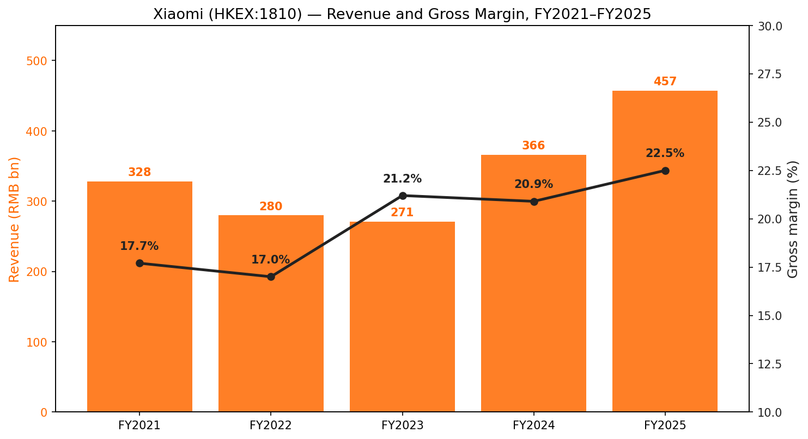
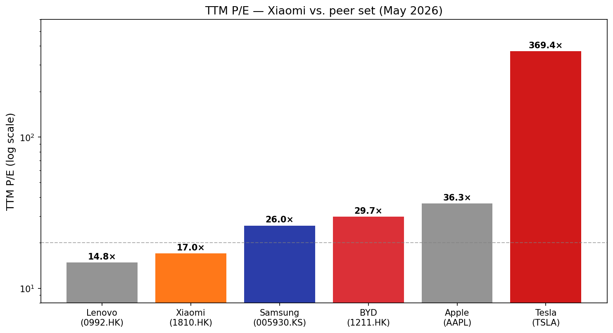
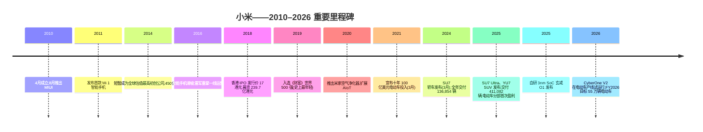
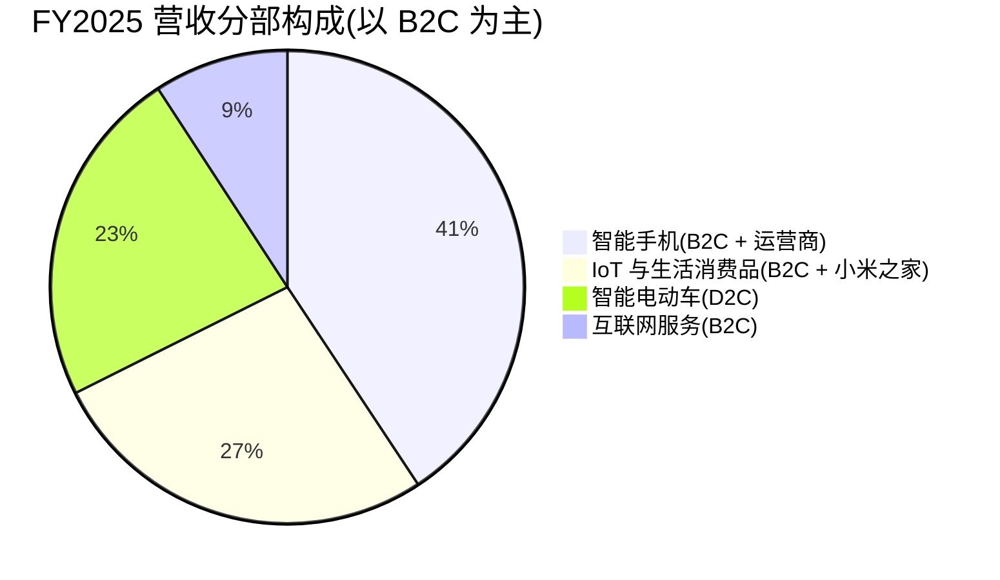
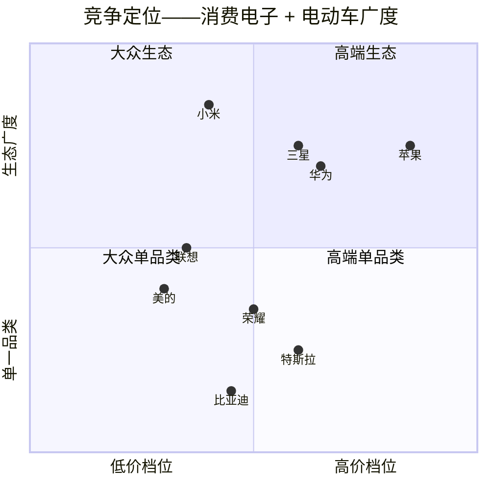
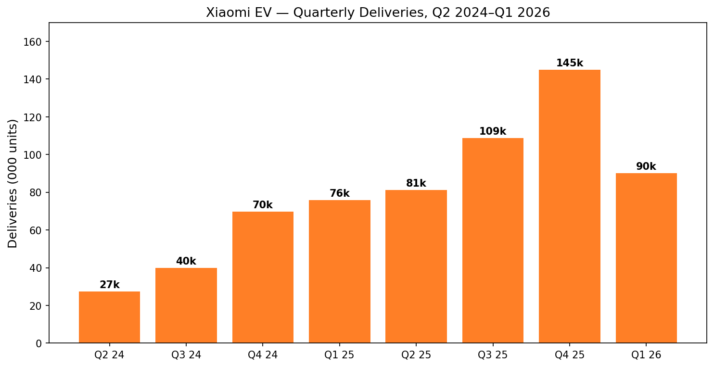
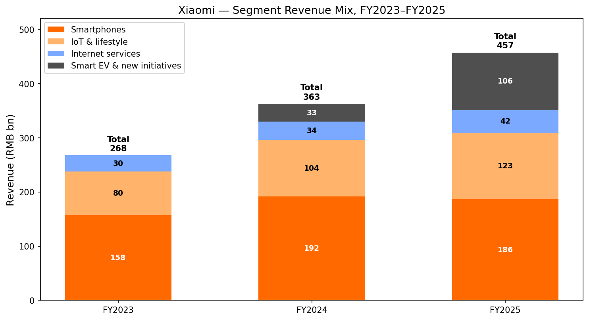

# 公司研究报告:小米集团 (Xiaomi Corporation, HKEX:1810)
日期:2026-05-16

> **更新——FY2026 电动车交付目标启动 (2026-03-24):** 在公布 FY2025 业绩的同时,小米给出 FY2026 约 55 万辆电动车交付指引,意味着在 FY2025 已交付 411,082 辆的基础上再实现约 34% 的同比增长(而 FY2025 本身就比下调后的 35 万辆目标提前一个月达成)。管理层将该目标定性为受产能(供给)约束而非需求约束,北京亦庄工厂二期产能正在爬坡,叠加一期合计年化产能约 30 万辆,三期已破土动工。智能手机分部指引为"持平至小幅下滑",原因是中国市场动销疲弱以及印度市场关税摩擦。来源:[Xiaomi 2025 Q4 & Annual Results, 2026-03-24](https://ir.mi.com/system/files-encrypted/nasdaq_kms/assets/2026/03/24/6-20-53/Xiaomi%20Corp_25Q4_ER_ENG%20vF.pdf);[EV.com, 2026-03-25](https://ev.com/news/xiaomi-sets-34-percent-delivery-growth-target-for-2026-as-ev-momentum-accelerates)。

## 目录
1. 公司概览
2. 公司沿革
3. 管理团队
4. 产品与服务
5. 客户与市场进入策略
6. 行业概览
7. 竞争格局
8. 市场机会 (TAM)
9. 风险评估

======================================

## 1. 公司概览

小米集团(Xiaomi Corporation;HKEX:1810 / 81810)是全球少数几家同时位列全球智能手机前三、拥有头部互联设备("AIoT")生态、并自营盈利电动车业务的消费电子公司——而且这一切都在公司成立不到十五年内实现。公司将自身战略表述为 **"人 × 车 × 家"** 智能生活闭环:一个用户的手机、家电与汽车都运行在统一的小米软件栈([HyperOS](https://www.mi.com/global/discover/article?id=2812))之上,共享同一个账号。这一战略正是连接"截至 2024 年仍以苹果(Apple)—三星(Samsung)—小米的智能手机叙事"与"2026 年五大支柱集团"的桥梁:智能手机、IoT 与生活消费品、互联网服务、智能电动车,以及新兴的机器人 / 先进制造业务。

**商业模式与盈利来源。** 小米按四个分部进行报告。(1) **智能手机**——在全球范围内设计、制造并销售手机;均价 (ASP) 是最具杠杆作用的驱动因素,近期发布的自研 **玄戒 (Xring) O1** 3nm SoC 标志着公司首次尝试在旗舰机型上摆脱对高通 (Qualcomm) / 联发科 (MediaTek) 的依赖([NotebookCheck, 2025-05-22](https://www.notebookcheck.net/XRing-O1-officially-announced-as-Xiaomi-s-new-self-developed-smartphone-SoC.1017345.0.html))。(2) **IoT 与生活消费品**——电视、笔记本、平板、可穿戴设备、音频、智能家电(空调、冰箱、洗衣机)、小厨电、电动滑板车等,涵盖小米品牌 SKU 以及超过 400 家投资的"米家生态链"企业。(3) **互联网服务**——MIUI / HyperOS 内的广告与增值服务、应用商店 (GetApps)、浏览器、金融科技与电视业务。(4) **智能电动车与新业务**——SU7 轿车系列、2025 年中推出的 YU7 SUV,以及包括人形 / 四足机器人和大模型 AI(小米 MiMo 开源大模型系列)在内的辅助研发。

**地域分布。** 中国大陆是大本营市场,也是电动车基地;但小米在结构上是一个全球性的智能手机品牌:在欧洲、拉美和东南亚的 50 多个市场跻身手机销量前三,印度长期以来是最大的海外市场,尽管自 2022 年以来该业务受到印度执法局执法行动的压力([Reuters, 2025-09-09](https://www.reuters.com/world/india/india-tribunal-orders-rs-2719-crore-xiaomi-funds-be-returned-2025-09-09/))。2024 年海外互联网服务收入占整体互联网服务收入的 34.9%,创历史新高([Xiaomi 2024 Annual Report, p. 9](https://ir.mi.com/system/files-encrypted/nasdaq_kms/assets/2025/04/24/5-27-15/%E8%8B%B1%E6%96%87.pdf))。

**规模。** FY2025 集团营收达 **人民币 4,573 亿元**(约合 664 亿美元),同比 +25.4%,经调整净利润 392 亿元,同比 +43.8%——双双创下纪录([Xiaomi 2025 Q4 & Annual Results, 2026-03-24](https://ir.mi.com/system/files-encrypted/nasdaq_kms/assets/2026/03/24/6-20-53/Xiaomi%20Corp_25Q4_ER_ENG%20vF.pdf);[Chinadaily, 2026-03-24](https://www.chinadaily.com.cn/a/202603/24/WS69c26b02a310d6866eb3f9fa.html))。FY2025 总体收入结构大致为:智能手机约 1,860 亿元、IoT 约 1,230 亿元、互联网服务约 410 亿元、智能电动车与新业务约 1,060 亿元——这意味着仅电动车业务的体量已经超过整个互联网服务业务,IoT 现在更是互联网服务的 3 倍。2025 年小米共出货 **1.685 亿部** 智能手机(根据 IDC 数据,以约 11–13% 的市占率位列全球第三,仅次于苹果和三星)、**411,082 辆** 电动车,HyperOS / MIUI 全球月活用户数 **7.541 亿**([IDC, 2026-01-15](https://www.idc.com/promo/smartphone-market-share/);[electrive, 2026-03-25](https://www.electrive.com/2026/03/25/xiaomi-reports-first-annual-profit-for-ev-business/))。截至 2025 年年中,集团员工总数突破 50,000 人,其中电动车公司单独约 13,000 人([CnEVPost, 2025-07-02](https://cnevpost.com/2025/07/02/xiaomi-hiring-spree-phase-2-ev-plant/))。

来源:[Xiaomi 2025 Q4 & Annual Results press release, 2026-03-24](https://ir.mi.com/system/files-encrypted/nasdaq_kms/assets/2026/03/24/6-20-53/Xiaomi%20Corp_25Q4_ER_ENG%20vF.pdf);[Xiaomi 2024 Annual Report](https://www1.hkexnews.hk/listedco/listconews/sehk/2025/0425/2025042500842.pdf);FY2021–FY2022 数据来自此前披露于 [HKEX](https://www1.hkexnews.hk/) 的年报。

**估值快照(截至 2026-05-16)。** 小米港股(1810.HK)报价 **30.70 港元**,市值约 **7,960 亿港元**(约 1,020 亿美元)。基于 TTM 指标,公司当前 **市盈率 17.0× 和市销率 1.71×**,TTM 每股盈利 1.81 港元,TTM 营收 5,260 亿港元([CNBC quotes, 2026-05-16](https://www.cnbc.com/quotes/1810-HK);[Yahoo Finance 1810.HK](https://finance.yahoo.com/quote/1810.HK/key-statistics/))。52 周区间宽幅波动——28.80 港元至 61.45 港元——反映了 2025 年 3 月 SU7 致命事故后的抛售、随后的反弹,以及 2026 年一季度因智能手机增长放平、关税担忧冲击海外销售而再度被压估值的过程([carnewschina, 2025-04-01](https://carnewschina.com/2025/04/01/first-fatal-accident-involving-xiaomi-su7-claims-three-lives-on-chinese-highway/))。

当前 17× 的 TTM 市盈率 **低于** 三年均值(约 28×,在 2024 年中至 2025 年初电动车发布狂潮期间一度突破 50×),也 **低于** 消费电子可比公司中位数。可比组:**联想 0992.HK 14.8×、三星 KRX:005930 26.0×、比亚迪 (BYD) HKEX:1211 29.7×、苹果 AAPL 36.3×、特斯拉 TSLA 369.4×**([Gurufocus AAPL](https://www.gurufocus.com/term/pettm/AAPL);[Gurufocus LNVGY](https://www.gurufocus.com/term/pe-ratio/LNVGY);[Gurufocus Samsung](https://www.gurufocus.com/term/pettm/FRA:SSUN);[Gurufocus BYDDF](https://www.gurufocus.com/term/pe-ratio/BYDDF);[Financecharts TSLA, 2026-05-14](https://www.financecharts.com/stocks/TSLA/value/pe-ratio))。可比组市盈率中位数(剔除作为离群值的特斯拉)约为 28×,小米较其折价约 40%。**估值压缩并非源于业务减速——FY2025 营收增长 25%,经营利润几乎翻倍**——而是因为 SU7 召回和印度业务逆风在旗舰智能手机销量增长趋平的同时,重新引入了执行风险。

我们并未将估值标记为"估值过高 / 多重压缩"风险;若有的话,反而是相反——TTM 市盈率低于三年中位数,叠加 1.71× 的市销率,而公司目前约四分之一的营收来自高增长的电动车板块,意味着市场是按"低增长的手机 OEM"而非"五大支柱的成长型集团"在为该股票定价。话虽如此,如果 2026 年下半年价格战中电动车毛利率出现正常化下行,SOTP(分部加总估值)的逻辑就可能被打破(详见第 9 节)。

图表来源:[Gurufocus, Financecharts as of May 2026](https://www.gurufocus.com/term/pettm/AAPL);同业市盈率数值见正文引用。

## 2. 公司沿革

小米成立于 **2010 年 4 月**,创始地为北京,创始人 **雷军** 及七位联合创始人——包括前 Google 中国副总裁 **林斌**、前微软中国工程师 **洪锋**、前摩托罗拉工程师 **周光平** 以及前金山 / 金山词霸负责人 **黎万强**——他们提出的核心论断是:智能手机而非 PC 才是下一个普适计算平台,以软件先行的中国品牌可以通过在价格上做苹果、三星的低线竞品、同时在体验上对标,从而胜出([Lei Jun bio, Britannica](https://www.britannica.com/money/Lei-Jun);[PandaYoo profile of Lei Jun](https://pandayoo.com/post/the-story-of-lei-jun/))。创始人团队先于 2010 年 8 月发布了基于 Android 的 ROM——MIUI,随后于 2011 年 8 月推出第一款手机 Mi 1,以在线直销绕开经销商利润层。

来源:[Xiaomi 2024 Annual Report](https://www1.hkexnews.hk/listedco/listconews/sehk/2025/0425/2025042500842.pdf);[Lei Jun biography, Britannica](https://www.britannica.com/money/Lei-Jun);[Xiaomi 2025 Annual Results press release, 2026-03-24](https://ir.mi.com/system/files-encrypted/nasdaq_kms/assets/2026/03/24/6-20-53/Xiaomi%20Corp_25Q4_ER_ENG%20vF.pdf)。

**公司发展中有三个战略转折点。** 第一,**2016–2017 年的重整**:在 2015 年智能手机出货量不及预期、2016 年陷入低谷之后,雷军重新接管智能手机业务的一线运营,重建过度依赖纯线上的线下零售网络(小米之家门店),并推出红米 (Redmi) 子品牌,以隔离中端价格段的攻势、为主品牌的高端化让出空间。公司于 2018 年实现 1 亿部出货量,2019 年成为入选《财富》世界 500 强史上最年轻的公司([Xiaomi corporate timeline](https://www.mi.com/global/about/))。

第二,**2021 年宣布造车**:在 2021 年 3 月 30 日的发布会上,雷军承诺将在未来十年内向自营电动车业务投入 100 亿美元——他亲自将其定义为自己"人生最后一次创业"。就一家电动车初创企业的资本规模而言,这一承诺并不激进,但对一向回避重资产投入的小米而言却是颠覆性的([Bloomberg Lei Jun profile](https://www.bloomberg.com/billionaires/profiles/jun-lei/))。三年后,SU7 轿车于 2024 年 3 月底发布,其 Ultra 版本零百加速约 95 秒(原文如此);YU7 SUV 紧随其后,于 2025 年中推出,并在中国细分市场连续 7 个月超越特斯拉 Model Y 的销量([electrive, 2026-03-25](https://www.electrive.com/2026/03/25/xiaomi-reports-first-annual-profit-for-ev-business/))。

第三,**2025 年自研芯片战略发力**:在数年低调投入后,小米于 2025 年 5 月 22 日的发布会上推出了玄戒 O1——一款 10 核 3nm Arm 架构 SoC,基于台积电 (TSMC) N3E 工艺,集成 190 亿晶体管,NPU 算力 44 TOPS。公司披露在该芯片上累计投入逾 135 亿元人民币(约 18.7 亿美元),历时四年;首款搭载机型为小米 15 周年发布会的旗舰小米 15S Pro([NotebookCheck, 2025-05-22](https://www.notebookcheck.net/XRing-O1-officially-announced-as-Xiaomi-s-new-self-developed-smartphone-SoC.1017345.0.html);[Digitimes, 2025-05-22](https://www.digitimes.com/news/a20250522PD208/xiaomi-xring-soc-tsmc-3nm-production.html))。这使小米跻身苹果、三星、华为之列,成为少数几家在高端机型上具备自研 SoC 能力的智能手机 OEM。

**关键收购与持股:** 最具战略意义的交易是少数股权投资而非并购——小米运营着一个由 400 多家"米家生态链"公司组成的投资组合,这些公司充当 AIoT 产品的 ODM / 品牌附属伙伴(石头科技 (Roborock)、华米 (Huami)、紫米 (Zimi)、九号公司 (Ninebot) 等均为知名的 IPO 退出案例)。公司亦于 2025 年末战略入股国内具身智能创业公司 **小鱼智能制造 (Xiaoyu Intelligent Manufacturing)**,标志着其人形机器人路线图的首次正式资本绑定([AIBase, 2025-10](https://www.aibase.com/news/10440))。

## 3. 管理团队

### 雷军 (Lei Jun) ——创始人、董事长兼 CEO

雷军出生于 1969 年 12 月 16 日,湖北仙桃人,是小米至今最重要的个人,且重要性数量级地高于其他人。他于 1991 年毕业于武汉大学计算机系,1992 年加入位于北京的软件公司 **金山软件 (Kingsoft)** 担任工程师,1998 年升任 CEO,并于 2007 年带领金山在香港 IPO——届时他已是中国大陆最受敬重的软件高管之一近十年([Britannica](https://www.britannica.com/money/Lei-Jun);[Lei Jun Wikipedia](https://en.wikipedia.org/wiki/Lei_Jun))。在 2008 至 2010 年间,他活跃地进行天使投资——是卓越网 (Joyo, 后售予亚马逊)、欢聚时代 (YY)、UCWeb、凡客 (Vancl) 等公司的早期投资人,成为中国互联网"第一代"标志性天使投资人之一。

他在 40 岁时,即 2010 年 4 月创立小米,提出"站在台风口上,猪都能飞起来"的著名理论——即一家公司最好的成立时机,是在长期顺风之下,使得即便平庸的执行看起来都极为出色。作为创始 CEO,他亲自主持每一次产品发布主题演讲,逐步建立起类似史蒂夫·乔布斯的人格化品牌,并将其全力用于电动车业务(雷军直播试驾产生了数亿次观看量,对 SU7 预订转化起到关键作用)。他曾在 2014–2015 年短暂退出智能手机业务的一线管理——这段时间恰逢智能手机出货量的不及预期——并于 2016 年重新接管,自此公司业务稳健增长。

他的 **持股比例约占总股本的 24%**,通过其全资控股公司 **Smart Mobile Holdings** 持有,其中大部分为 **A 类超级投票权股份**,每股投票权 10 票,而 B 类股每股 1 票;只有雷军和联合创始人林斌持有 A 类股。这一双重股权结构是 2018 年 IPO 时谈判形成的,也是港交所 "WVR"(同股不同权)发行人制度的基础。2018 年董事会一次性授予雷军 **6.366 亿股 B 类股份** 的奖励,按当时市值估算约为 15 亿美元——彼时颇受争议,但其后他的现金薪酬基本维持名义性的水平([Bloomberg Billionaires Index — Lei Jun](https://www.bloomberg.com/billionaires/profiles/jun-lei/);[Xiaomi 2024 Annual Report — Directors' Remuneration](https://ir.mi.com/system/files-encrypted/nasdaq_kms/assets/2025/04/24/5-27-15/%E8%8B%B1%E6%96%87.pdf))。截至 2026 年初,福布斯/彭博估算其净资产约 300 亿美元,几乎全部为小米股票——这意味着他的利益与公开市场股东高度一致。

雷军公开活跃——他定期撰写致股东信、每年 8 月举办"雷军年度演讲"(本质上是小米版的"巴菲特致股东信"),并在新浪微博上拥有约 2,500 万粉丝。投资者将他视为继马化腾 (Pony Ma) 和张一鸣 (Zhang Yiming) 之后中国最具公信力的创始人型经营者,而电动车业务尤其被解读为对他本人的全民投票。

### 卢伟冰 (Lu Weibing) ——合伙人兼总裁

卢伟冰生于 1975 年 9 月,2019 年初从金立 (Gionee) 海外业务总裁的岗位加入小米,迅速升任红米品牌总经理,2022 年晋升为集团总裁([Xiaomi IR — Lu Weibing](https://ir.mi.com/management/lu-weibing))。他持有清华大学化学本科学位(1998)及长江商学院 EMBA 学位(2009)。在公司内部,他负责智能手机业务,被普遍视为非电动车业务的运营二号人物。卢伟冰也是季度业绩电话会议的公开代言人——他与 CFO 林世伟 (Alain Lam) 于 2025 年 5 月 27 日共同主持了 Q1 业绩会,并详细阐释了玄戒 O1 上市对智能手机 P&L 的影响([Digitimes, 2025-05-28](https://www.digitimes.com/news/a20250528VL205/xiaomi-xring-soc-chips-flagship-2025.html))。根据合伙人 / 股权激励计划,他持有数额可观但未披露的股权;他不在 WVR 之 A 类股池中。

### 林世伟 (Alain Lam) ——副总裁兼 CFO

林世伟于 2020 年加入小米出任 CFO,此前在瑞信 (Credit Suisse) 任职 17 年,担任亚太区 TMT(科技、媒体与电信)投行业务主管,曾作为投行方主导 2018 年小米港交所 IPO 项目。他兼任小米与 AMTD 合资的香港虚拟银行 **天星数字科技 (Airstar Digital Technology)** 的董事长([Xiaomi IR — Alain Lam](https://ir.mi.com/management/lam-wai-alain))。他的职责是在公司向重资产电动车制造业务扩张过程中,推动财务职能专业化——包括 2025 年 3 月发行价 53.25 港元、约稀释 9.2% 但以极高资本成本效率为电动车产能扩张提供资金的 425 亿元人民币股权配售,以及与港交所的持续沟通、恒生指数纳入(2020 年纳入恒指成份股),并维持仍在运行的港币/人民币双币种挂牌。

### 王翔 (Wang Xiang) ——副董事长(此前为总裁)

王翔于 2015 年从高通中国(曾任高级副总裁)加入小米,2019 年出任小米总裁,2022 年升任副董事长,转向更具战略性 / 外部性的角色,将日常运营交给卢伟冰。他仍在小米董事会任职,并在公司与高通 (Qualcomm) 的授权关系以及全球运营商合作中具有影响力——这一点之所以重要,是因为即便有玄戒 O1,小米旗舰手机大部分 SoC 仍来自高通。

### 公司治理

截至 2024 年年报,董事会有 8 名董事,其中 4 名为独立非执行董事——符合港交所规定。WVR 架构令雷军和林斌持有的 A 类股集中了约 76% 的投票权,尽管 A 类股股东拥有的总经济利益低于 30%([Xiaomi 2024 Annual Report — Share Capital](https://ir.mi.com/system/files-encrypted/nasdaq_kms/assets/2025/04/24/5-27-15/%E8%8B%B1%E6%96%87.pdf))。包含合伙人股权计划在内的内部持股比例超过 30%。管理层薪酬严重偏向股权激励——雷军的现金薪资仅在数百万美元低段,但 RSU 奖励多次为与经营和股价里程碑挂钩的数十亿美元授予。关联交易仅限于少数几家米家生态链投资公司(石头科技、九号公司),小米在其中为少数战略投资人和正常商业合同对手方。

**管理层业绩评估。** 雷军已先后将三项业务做到规模:金山软件、小米智能手机业务,以及 SU7 电动车上市(中国电动车初创公司有史以来最快的 10 万辆产能爬坡)。团队在汽车行业老兵方面较薄弱,这是首要风险点。卢伟冰自 2019 年以来在智能手机业务上的执行强劲,林世伟在 IPO 与电动车融资上未出现失误。储备人才偏浅——目前没有明显的内部接班人能够替代雷军,这正是第 9 节讨论的关键人物风险。

## 4. 产品与服务

对于一家全球前三的智能手机 OEM 而言,小米的产品组合异常广泛。骨架为四个分部,而每个分部下的产品树都很深。

```mermaid
graph TD
    A[小米集团] --> B[智能手机]
    A --> C[IoT 与生活消费品]
    A --> D[互联网服务]
    A --> E[智能电动车与新业务]
    B --> B1[小米旗舰 / Mi 15, 15S Pro, 15 Ultra]
    B --> B2[Redmi / Redmi K, Note, A]
    B --> B3[POCO 海外子品牌]
    C --> C1[智能电视 / Mi TV]
    C --> C2[可穿戴设备 / 小米手环, 手表]
    C --> C3[笔记本与平板 / RedmiBook, Pad]
    C --> C4[家电 / 空调、冰箱、洗衣机]
    C --> C5[小厨电、音频、滑板车]
    C --> C6[米家生态链 400+ 投资公司]
    D --> D1[广告 / MIUI 信息流]
    D --> D2[游戏分发 / GetApps]
    D --> D3[金融科技]
    D --> D4[智能电视 / OTT 内容]
    E --> E1[SU7 轿车 / 标准、Pro、Max、Ultra]
    E --> E2[YU7 SUV]
    E --> E3[CyberOne 人形机器人]
    E --> E4[CyberDog 2 四足机器人]
    E --> E5[玄戒 SoC / O1, T1]
```

来源:[Xiaomi global product portfolio](https://www.mi.com/global/);[Xiaomi 2024 Annual Report — Business Review](https://ir.mi.com/system/files-encrypted/nasdaq_kms/assets/2025/04/24/5-27-15/%E8%8B%B1%E6%96%87.pdf)。

### 4.1 智能手机(FY2025 收入约 1,865 亿元,约占总收入 41%)

智能手机业务下分三个品牌梯队。**小米品牌旗舰**(Mi 15 / 15 Pro / 15 Ultra / 搭载玄戒 O1 的 15S Pro;中国市场定价 4,499–7,999 元)直接对标 iPhone Pro 和 Galaxy S Ultra,自 2020 年以来是公司的高端化杠杆。**红米**(Redmi K、Note 系列与入门级 A 系列;999–3,499 元)是中国与新兴市场的销量发动机。**POCO** 为面向印度、欧洲和拉美性价比买家的全球纯线上子品牌。

旗舰线持续上行——2024 年小米手机均价 (ASP) 达到 1,138 元的历史新高,中国大陆中高端档(>4,000 元)单台占比首次跃升至两位数高位([Xiaomi 2024 Annual Report, p. 11](https://www1.hkexnews.hk/listedco/listconews/sehk/2025/0425/2025042500842.pdf))。**竞争优势判定:部分护城河。** 品牌与渠道是真实存在的(全球前三,在欧洲与非洲份额上升),但在中国大陆 >4,000 元价位段,公司处于与荣耀 (Honor)、OPPO、vivo 和华为 (Huawei) 混战的局面;>6,000 元市场仍由苹果主导。玄戒 O1 是小米首次实现旗舰级专有差异化——如果小米能像苹果保持 A 系列一样每代节奏地迭代,这就是真正的垂直整合护城河。最直接竞品:**苹果 iPhone 17 Pro**(小米在高端应用生态上落后,但硬件差距在收窄)、**三星 Galaxy S25 Ultra**(在与徕卡 (Leica) 合作后,影像硬件持平)、**华为 Pura 80 Ultra**(小米在全球生态触达上领先,在中国高端品牌光环上落后)。

### 4.2 IoT 与生活消费品(FY2025 收入约 1,232 亿元,约占总收入 27%)

IoT 分部在结构上是小米内部最被低估的业务。涵盖智能家电(2024 年小米空调、洗衣机在中国大陆均创下市占率第二或第三的历史新高)、电视(2019 年以来稳居中国大陆销量第一)、平板(部分季度已超越华为)、可穿戴(小米手环全球稳定前三)、笔记本、音频、电动滑板车(小米电动滑板车 / 与九号公司的合资项目),以及一长串小厨电与个护设备。

2025 年上半年 IoT 收入同比增长 **+44.7%**,智能家电单独同比增长 >60%([Caixin / earnings summary, 2025-08](https://www.caixinglobal.com/))。**毛利率结构性上行**——该分部历史毛利率为低十几个百分点,但 2024 年随着家电产品组合高端化和 AIoT 交叉销售带动软件附加收入,毛利率达到约 20%。**竞争优势判定:是——生态护城河 + 品牌。** 优势并不来自任何单一产品,而在于互联设备平台(HyperOS Connect)和跨品类的广度。最近的竞品定位:**苹果** SKU 较少但软件护城河更深;**三星** 品类宽度可比但缺乏面向大众用户的低线产品;在中国,**美的 (Midea) / 海尔 (Haier) / 海信 (Hisense)** 在单品类家电中占据主导地位,但软件集成度较低。

### 4.3 互联网服务(FY2025 收入约 415 亿元,约占总收入 9%)

互联网服务包括 MIUI / HyperOS 锁屏与浏览器广告、GetApps 应用分发收入、金融科技(消费信贷、支付)、智能电视广告与订阅,以及小米品牌游戏。截至 2025 年 12 月,HyperOS / MIUI 全球月活用户达到 **7.541 亿**,海外 GetApps 商店在 100 多个市场拥有 2.6 亿月活,这是小米最接近苹果服务 (Apple Services) 的业务——尽管单用户变现能力大幅低于苹果(约 55 元/用户/年,而苹果约 70 美元)。2024 年海外互联网服务收入达分部收入的 34.9%——这是中国手机 OEM 首次跨越三分之一的海外服务收入门槛([PR Newswire, 2024-11](https://www.prnewswire.com/news-releases/grow-with-xiaomi-building-a-sustainable-open-ecosystem-for-apps-services-and-contents-302318172.html))。**竞争优势判定:是——装机量规模。** 最近的对标:**苹果服务**(在意图层面持平,但在单用户变现上远远落后);**OPPO / vivo 的 ColorOS-Origin** 服务(小米在海外覆盖上明显领先)。

### 4.4 智能电动车与新业务(FY2025 收入约 1,061 亿元,约占总收入 23%)

这正是改变了股权故事的分部。产品线:

- **小米 SU7**——D 级电动轿车,2024 年 3 月 28 日发布,售价 215,900–299,900 元。四个版本(标准、Pro、Max、Ultra)。2025 年 SU7 Ultra 是中国大陆 20 万元以上轿车中销量第一的车型([electrive, 2026-03-25](https://www.electrive.com/2026/03/25/xiaomi-reports-first-annual-profit-for-ev-business/))。
- **小米 YU7**——D 级电动 SUV,2025 年夏发布,售价 235,900–329,900 元,正面对标特斯拉 Model Y。上市头六个月交付逾 15 万辆,为 SU7 同期 ramp 速度的 2.3 倍([EV.com, 2026-03-25](https://ev.com/news/xiaomi-sets-34-percent-delivery-growth-target-for-2026-as-ev-momentum-accelerates))。截至 2026 年 2 月,连续 7 个月在中国中大型 SUV 销量中排名第一。
- **玄戒 O1 / T1 芯片**——自研手机和可穿戴 SoC 系列。
- **CyberOne 人形机器人**——参见第 4.5 节。
- **CyberDog 2 四足机器人**——面向开发者平台的开源仿生四足机器人,近期无商业化意图。

电动车分部 FY2025 **首次盈利**——这是公司有史以来第一次,也是任何新进入中国电动车制造商在年度基础上首次实现这一正面里程碑([Caixin, 2026-03-25](https://www.caixinglobal.com/2026-03-25/xiaomi-ev-unit-posts-profit-but-smartphone-business-falters-102427311.html);[Gasgoo, 2026-03](https://autonews.gasgoo.com/articles/news/xiaomis-ev-business-defies-industry-slowdown-with-standout-profitability-2036702632129753088))。2025 年电动车毛利率约 24%,高于特斯拉在中国市场的毛利率,仅略低于比亚迪综合毛利率。**竞争优势判定:部分护城河 → 可能完整护城河。** 护城河候选包括:(a) 自研 BMS 与驱动电机 IP(SU7 Ultra 1,548 马力性能版搭载小米自研的 V8s 电机),(b) 将 MIUI 用户转化为预订客户的品牌粉丝经济,以及 (c) AIoT 交叉销售(车辆出现在米家 App 中,可由手机控制)。最近的竞品:**特斯拉 Model 3 / Model Y**(小米在 FSD 软件上落后,在中国市场调校 UX 上领先,价格持平)、**比亚迪汉 / 海豹 / 唐**(小米科技叙事领先,规模成本落后)、**蔚来 (NIO) ET5 / 理想 (Li Auto) L6**。

### 4.5 机器人与人形机器人(归类于"新业务")

机器人项目由 **小米机器人实验室 (Xiaomi Robotics Lab)** 负责,首次公开亮相的是 **CyberDog** 四足机器人(2021),升级为 **CyberDog 2**(2023),以及在 2022 年 8 月发布的 **CyberOne 人形机器人**。CyberOne 规格:身高 177 cm、体重 52 kg、21 个自由度(在 V2 中提升至 22–27),每关节响应 0.5 ms,搭载小米 Mi-Sense 模块的情绪识别能力([Xiaomi unveils CyberOne, 2022](https://www.zawya.com/en/press-release/companies-news/xiaomi-unveils-cyberone-wenidnqu);[Humanoids Daily, 2025-09](https://www.humanoidsdaily.com/news/xiaomi-debuts-cyberone-v2-at-investor-day-moving-beyond-the-factory-floor))。

2026 年的更新最为重大。2026 年 3 月小米披露,CyberOne V2 已在电动车工厂的产线上试运行,在连续自主作业 3 小时内,以 **90.2% 的成功率** 完成自攻螺母安装([Robotics & Automation News, 2026-03-10](https://roboticsandautomationnews.com/2026/03/10/xiaomi-tests-humanoid-robots-on-electric-production-line-in-automotive-factory/99418/);[CNBC, 2026-03-04](https://www.cnbc.com/2026/03/04/xiaomi-humanoid-robots-ev-factory-.html))。总裁卢伟冰将其形容为"实习生"。雷军公开表示,5 年内人形机器人将在小米工厂"大规模"运作([Humanoids Daily — Lei Jun](https://www.humanoidsdaily.com/news/xiaomi-ceo-humanoids-will-working-at-large-scale-in-our-factories-within-5-years));公司未对人形机器人外销做出承诺。2026 年 4 月披露的硬件升级引入了仿生手臂和热散汗式冷却系统([Technetbook, 2026-04](https://www.technetbooks.com/2026/04/xiaomi-cyberone-humanoid-robot-features.html))。**竞争优势判定:为时尚早。** 最近的对标项目:**特斯拉 Optimus**(在 AI / FSD 复用上明显领先,但硬件迭代节奏落后)、**宇树 (Unitree) H1 / G1**(宇树在出货量上领先——2025 年 5,500 台——但价位为爱好者 / 科研级)、**智元 (Agibot) / Figure AI / 1X**。

### 4.6 旗舰 vs. 长尾

FY2025 推动业务增长的 1–3 款产品很清晰:**小米 15 Ultra / 15S Pro**(智能手机高端化杠杆及毛利率引擎)、**SU7 + YU7**(公司整体的增长引擎),以及更广泛的 **智能家电产品线**(空调、洗衣机、冰箱——IoT 增长驱动力)。长尾 / 试验性:CyberOne、CyberDog 2、小厨电存量目录。

### 4.7 过去 12 个月的发布与停产

- 发布:SU7 Ultra(2025 年 2 月)、YU7 SUV(2025 年 6 月)、玄戒 O1 芯片(2025 年 5 月)、小米 15S Pro / 小米平板 7 Ultra(2025 年 5 月)、CyberOne V2(2025 年 9 月投资者日;2026 年 4 月升级)、小米 MiMo 开源大模型系列(2025 年 8 月)。
- 停产:无实质性停产;智能路由器和部分低端红米 A 系列 SKU 有所精简。

## 5. 客户与市场进入策略

小米压倒性地以 **B2C** 为主。FY2025 集团 4,573 亿元收入中,超过 95% 来自智能手机、IoT 生活消费品、电动车以及直达消费者的互联网服务。在传统意义上(单一客户占收入 >10%)不存在客户集中度问题。根据港交所上市规则,2024 年年报 **未** 披露任何前一大或前五大客户集中度数据——小米账目中没有 IFRS / IAS 1 规定的单一客户集中度强制披露,公司风险因素也未提示重大客户风险([Xiaomi 2024 Annual Report — Risk Management](https://ir.mi.com/system/files-encrypted/nasdaq_kms/assets/2025/04/24/5-27-15/%E8%8B%B1%E6%96%87.pdf))。

**相关的 B2B 敞口规模有限,且不对称地体现在供应端而非需求端:**

1. **新兴市场的智能手机分销渠道。** 少数几家大型运营商 / 经销商合作伙伴——例如印度的 JBP 联盟经销商(小米在印度主要通过线下 + Reliance Digital / Croma / Vijay Sales 等销售),以及欧洲的 Carphone Warehouse / 区域运营商——在区域销量中占有可观比例,但并未达到集团层面的集中度。小米未披露具体名称或量化百分比。
2. **运营商补贴项目**——小米在欧洲(Vodafone、Orange、Deutsche Telekom)与拉美的运营商渠道对顶级旗舰动销具有重要意义,但同样未披露量级。
3. **电动车渠道**——小米通过自营展厅直接面向消费者销售 SU7 / YU7,这些展厅通常与小米之家门店共址(截至 2025 年末约 250 家具备电动车展示功能的门店)。

来源:[Xiaomi 2025 Q4 & Annual Results press release, 2026-03-24](https://ir.mi.com/system/files-encrypted/nasdaq_kms/assets/2026/03/24/6-20-53/Xiaomi%20Corp_25Q4_ER_ENG%20vF.pdf)。

**地域集中度。** 中国大陆占集团收入约 50–55%,且随着电动车业务而显著上升,因为 SU7 / YU7 直至 2026 年仍只在中国销售。印度为最大海外智能手机市场(2024 年约占全球出货 12%,小米在印度位列品牌第二或第三)。欧洲占智能手机出货约 15%。地域集中风险已经从 2022 年前的"过度依赖印度"转为电动车上线后的"中国为主"。

**市场进入策略。** 三种渠道并行——(a) Xiaomi.com / mi.com 线上直销,即创业初期的分销模式;(b) 小米之家线下门店(截至 2024 年全球超过 14,000 家,绝大部分位于中国大陆);(c) 新兴市场的运营商 / 经销商合作。电动车业务使用专门的 SU7 展厅,通常与小米之家旗舰店共址。平均销售周期:IoT 与大多数智能手机 SKU 即时成交;SU7 / YU7 新订单的平均提车周期为 30–35 周,因供给紧张;紧张到 2025 年中 YU7 据报道未来 12 个月产能已售罄([carnewschina, 2025-06-27](https://carnewschina.com/2025/06/27/xiaomi-yu7-production-capacity-sold-out-through-early-2027/))。

**已披露的合作伙伴。** **徕卡 (Leica)**(自 2022 年起在小米 13 Ultra 及后续机型上联合工程化设计相机系统,多年期合同);**高通 (Qualcomm)**(长期旗舰 SoC 供应商,即便在玄戒 O1 推出后仍为主要供应商);**台积电 (TSMC)**(玄戒 O1 的 N3E 代工合作伙伴);**微软 (Microsoft)**(云 / 生产力集成);**宁德时代 (CATL) 与比亚迪弗迪 (BYD-FinDreams)**(电动车电池供应,SU7 / YU7 双源);**博世 (Bosch)**(智能驾驶传感器系统);**英伟达 (Nvidia)**(Drive Orin SoC 应用于 SU7 Pro / Max / Ultra 配置的 ADAS)。小米在历史上一直奉行多源采购,而非锁定单一供应商关系。

**客户案例。** FY2025 最显著的"标杆胜利"是 **YU7 在中国中大型 SUV 中连续 7 个月排名第一**,自 2025 年 8 月起在细分市场战胜特斯拉 Model Y。在智能手机端,2025 年 Q3 小米 15 Ultra 是 **GfK 追踪的中国大陆线下安卓旗舰销售第一**。

## 6. 行业概览

小米同时跨足四个截然不同的行业,这在单一上市公司中并不常见。每个行业都有自己的结构、增长曲线和监管体系。

### 6.1 全球智能手机

2025 年全球智能手机出货量为 **12.6 亿部**,零售收入约 4,800 亿美元,较 2023–2024 年低谷温和回升 2.3%([IDC Q4 2025 release](https://www.idc.com/promo/smartphone-market-share/);[GSMArena, 2026-01-15](https://www.gsmarena.com/idc_smartphone_shipments_up_23_in_q4_2025_apple_is_the_clear_winner_-news-71096.php))。结构上是 **寡头格局**:苹果(2025 年全球份额 19.7%,14 年来首次从三星手中夺回 #1)、三星(约 18.5%)、小米(约 13%)、传音 (Transsion) / Tecno(约 9%),vivo、OPPO、荣耀和华为合计约 30%。中国市场单独 2025 年出货约 2.8 亿部,是全球前三品牌最分散的市场——自 2024 年初以来,vivo、苹果与华为按季度轮换 #1–#3,荣耀、小米、OPPO 集中在次一梯队。

**增长驱动**:端侧 AI(2025 年所有旗舰机均搭载端侧大模型能力;iOS 18.4 中的 Apple Intelligence 上线以及荣耀 / 小米 / 三星的同类功能);卫星通信(中国三种方案;苹果通过 Globalstar);折叠屏机型(三星仍居首,但荣耀和华为正在迫近);换机周期延长(全球已超 3.5 年),这是一个结构性拖累。**发达市场的渗透率基本饱和**。增长目前由 ASP 驱动,而非由销量驱动。

### 6.2 IoT 与智能家电

全球互联家居设备市场比智能手机市场分散得多——三星、LG、苹果、Google、小米、美的、海尔、海信、戴森 (Dyson)、Roomba 等,各自占据若干子品类。在 **中国大陆**,家电市场年规模约 8,500 亿元,长期前三为美的、海尔与格力 (Gree);小米作为快速增长的第四或第五名,2024 年空调份额已升至两位数。全球智能家居可及市场预计 2025 年约 2,200 亿美元,年复合增长率 12–14%;按 SKU 覆盖广度衡量,小米参与了大约三分之二的细分,据公司内部披露,小米是 **中国智能家居互联设备装机量第一**(以出货台数计)。

### 6.3 互联网服务 / 移动广告

中国的消费互联网广告库存由腾讯、阿里巴巴、字节跳动、百度和拼多多主导。小米 MIUI 更接近运营商 / OS 厂商的信息流广告模式——类似于三星 Ads 或苹果 App Store 搜索广告,在锁屏、浏览器、应用商店和电视上投放广告。在全球,设备 OS 广告市场相对于 Google / Meta 体量较小,但随着 OEM 持续将装机量变现而稳步增长。凭借 7.54 亿月活用户,小米已成为全球非 Google / 非苹果智能手机 OS 中第三大装机基数。

### 6.4 电动车

2025 年全球电动车销量约 **2,070 万辆**(约占全球新车销量 25%),比亚迪首次在 BEV 销量上超越特斯拉(比亚迪 226 万辆 BEV vs. 特斯拉 164 万辆)——尽管特斯拉在收入与品牌溢价上仍居 #1([Visual Capitalist](https://www.visualcapitalist.com/the-worlds-top-ev-makers-by-market-share/);[carnewschina, 2025-10-03](https://carnewschina.com/2025/10/03/byd-surpasses-tesla-in-global-pure-electric-vehicle-sales-with-already-nearly-400000-unit-lead-in-2025/))。中国新能源车 (NEV) 市场——乘用 NEV 零售——2025 年总计 1,280 万辆;比亚迪以 27.2% 份额领先,吉利 (Geely) 以 9.8% 位居第二,小米在首个完整经营年度即跻身前 10 名([CnEVPost, 2026-01-12](https://cnevpost.com/2026/01/12/automakers-share-china-nev-market-2025/))。特斯拉在中国 NEV 市场份额 4.9%,排名第五。

**结构:** 中国电动车正从高度分散阶段(2023 年有 40 多个 NEV 品牌)走向整合。2024–2025 年大体上由比亚迪挑起的价格战,将多数挑战者的行业毛利率压缩至 14–17%;理想、比亚迪以及现在的小米,被证明具备结构性高于行业平均的毛利率。中国监管层面的顺风包括 NEV 购置补贴(延长至 2027 年)、绿牌优惠,以及 2024–2025 年的"以旧换新"刺激。逆风方面包括 SU7 事故后工信部 (MIIT) 禁止使用"自动驾驶"营销用语,以及对 OTA 驾驶软件型式批准的趋严([Gizmodo, 2025](https://gizmodo.com/china-bans-autonomous-driving-claims-from-car-marketing-following-crash-2000590906))。

**技术趋势:** 25 万元以上 800V 架构正在成为标配;主流方案 LFP 优于 NMC;YU7 上市时即搭载 800V,并可选 CATL 高压 5C 快充麒麟电池包。

### 6.5 人形机器人

仍处于商业化前阶段。2025 年全球人形机器人出货量约 1 万台(摩根士丹利估计),由中国厂商主导(宇树单家出货 5,500 台,以销量计为全球第一),价格点低于 5 万美元,主要面向科研 / 开发者市场([TechNode, 2025-08-26](https://technode.com/2025/08/26/chinas-humanoid-robot-sales-to-exceed-10000-units-in-2025-up-125-year-on-year/);[Bloomberg, 2026-01-08](https://www.bloomberg.com/news/articles/2026-01-08/chinese-firms-dominated-global-humanoid-robot-shipments-in-2025))。长周期 TAM 预测差距悬殊——摩根士丹利最为激进,预测 **到 2050 年市场规模 5 万亿美元**([Morgan Stanley](https://www.morganstanley.com/insights/articles/humanoid-robot-market-5-trillion-by-2050));MarketsandMarkets 给出 **到 2030 年 152.6 亿美元、CAGR 39.2%** 的预测。2030 年 TAM 在 150–400 亿美元区间最为可信,超出此范围皆属猜测。

## 7. 竞争格局

小米在四个相互重叠的竞争领域中竞争。各领域的同业组合差异显著。

**智能手机(全球)。** 直接竞争对手:**苹果**——高端档、生态护城河;小米无法在服务 / 品牌上撼动苹果,但是 1,000 美元以下唯一具备同级配置的旗舰。**三星**——全球覆盖广、折叠屏领先,但正在中国和欧洲流失高端份额。**荣耀 (Honor)**(非上市;在 2024 年 12 月完成股权改革后,正筹备深圳 IPO)——小米在 >4,000 元价位段在中国最直接的竞争对手([Bamboo Works on Honor IPO](https://thebambooworks.com/its-shareholding-reform-rolled-up-honor-is-ready-for-ipo/))。**OPPO / vivo(步步高 BBK Group)**——中国与东南亚最强的线下渠道;vivo 在 2025 年 Q3 重新拿回中国智能手机销量第一([TelecomLead, Q3 2025](https://telecomlead.com/smart-phone/china-smartphone-market-leaders-in-q3-2025-vivo-tops-apple-and-huawei-close-behind-123039))。**华为**——2023 年 Mate 60 自研芯片回归后再度崛起的中国高端品牌;此前唯一拥有自研麒麟 SoC 的中国 OEM(现在小米凭玄戒加入)。**传音 (Transsion / Tecno / Itel / Infinix)**——在非洲市场占据主导地位。

**IoT 与智能家电。** 全球范围内的 **苹果、三星、LG、Google**;在中国家电领域为 **美的 (000333.SZ)、海尔 (600690.SH)、格力 (000651.SZ)、海信 (600060.SH)**。小米的差异化在于跨品类广度 + 更低价格 + 米家 App 集成;白电老牌厂商的差异化在于渠道深度与产品工程积淀。

**互联网服务。** 与其说是正面竞争,不如说是与 **字节跳动、腾讯、阿里巴巴** 在中国,以及与 **Meta、Google** 在全球争夺注意力的长尾。小米本质上是一个分发 / 库存渠道。

**智能电动车。** 直接竞争对手:**特斯拉、比亚迪、理想、蔚来、小鹏 (Xpeng)、零跑 (Leapmotor)、极氪 (Zeekr)、阿维塔 (Avita)、问界 (AITO) / 华为鸿蒙智行 HIMA、上汽 MG、吉利银河 (Geely-Galaxy)**。竞争格局需按细分逐一判断:SU7 在 20–30 万元轿车段直接对标特斯拉 Model 3 和比亚迪汉 / 海豹;YU7 在同价位段对标特斯拉 Model Y。**小米的结构性优势在于品牌粉丝经济与生态交叉销售**——特斯拉、比亚迪或蔚来都无法提供手机—手表—空调—汽车的单账号体验;华为 HIMA 是唯一具备实际 AIoT 能力的对手。**小米的结构性劣势** 在于汽车制造业经验:首年召回(2025 年 9 月召回 116,877 辆 SU7,因驾驶辅助缺陷,约占当时累计销售的三分之一)以及 2025 年 3 月的致命事故,暴露出工程 / 验证差距和声誉差距,这是老牌 OEM 不必面对的问题([CnEVPost, 2025-09-19](https://cnevpost.com/2025/09/19/xiaomi-recalls-su7-sedans-smart-driving/))。

**人形机器人。** **特斯拉 Optimus**、**波士顿动力 Atlas (Boston Dynamics)**(现为现代汽车旗下)、**Figure AI**、**1X**、**敏捷机器人 (Agility Robotics)**、**Apptronik**、**宇树 (Unitree)**(非上市,杭州)、**优必选 (UBTech) (HKEX:9880)**、**智元 / 知元 (Agibot / Zhiyuan)**(非上市)。小米的差异化在于 (a) 整合制造——电动车工厂即内部部署场景,以及 (b) 消费电子产品工程 DNA。在 AI / FSD 复用维度上落后于特斯拉,在出货量上落后于宇树。

来源:由各家同业年报及 2025 年产品组合中分部营收结构整理而成。

**市场份额速览(2025)。** 全球智能手机约 13%(#3)。中国 NEV 约 3%(进前 10)。智能家居互联设备:按装机台数估算,中国大陆第一。人形机器人:仅试点部署,尚无量产销售。

**竞争优势。** (1) **生态广度与小米之家交叉销售**——一种随装机量复利累积的结构性护城河。(2) **中国本土品牌与粉丝经济**——雷军的个人品牌是少有竞争对手能复制的营销资产。(3) **垂直整合渐露端倪**——玄戒 O1 芯片、自研电动车电机、自有工厂。(4) **资本基础**——2025 年股权配售后净现金约 1,500 亿元,可在不加杠杆的情况下支持电动车 / 机器人投入。

**竞争劣势。** (1) **汽车业验证经验**——SU7 召回是首年事件,公司尚未走完一款车型从孵化到淘汰的完整周期。(2) **中国以外的高端品牌天花板**——在欧洲与印度,小米相对于苹果 / 三星仍被视为价值型品牌。(3) **自研芯片依赖台积电**——若美国针对中国总部 fabless 设计公司收紧 Section 1758a 或类似先进制程出口管制,将构成地缘政治风险([Digitimes, 2025-05-22](https://www.digitimes.com/news/a20250522PD208/xiaomi-xring-soc-tsmc-3nm-production.html))。

## 8. 市场机会 (TAM)

小米的 TAM 路径异常多元。我们对每个支柱单独测算,然后并列而非简单相加——彼此存在重叠。

**智能手机。** 2025 年全球零售 TAM 约 4,800 亿美元;小米约 600 亿美元(智能手机分部 + 附加服务)对应约 12% 份额。SAM 受限于 12.6 亿台年出货上限及不断延长的换机周期;我们将智能手机视为 **份额转移机会,而非销量增长机会**。未来 5 年的合理营收 CAGR:低至中个位数,杠杆在 ASP。

**IoT 与智能家居。** 综合 IDC / Statista 的交叉验证,全球智能家居设备 TAM 2025 年约 2,200 亿美元,CAGR 约 12%;小米 SAM(即其至少有入门 SKU 的品类子集)约 1,400 亿美元。小米在全球份额为中个位数,在中国大陆为两位数。该分部在未来 3–5 年最有可能实现 **集团层面高个位数 / 低两位数的有机 CAGR**。

**互联网服务。** 中国移动广告及 OS 服务附加 TAM 约 1,000 亿美元;小米份额随装机量变现而上升,但顶线受限于单用户 ARPU 扩张能力(目前中国约 55 元/用户/年)。

**智能电动车。** 2025 年中国 NEV 乘用 TAM 按零售口径约 3,800 亿美元,基数较高的情况下仍在以 15–20% 增长。小米已给出 FY2026 目标 55 万辆;以 ASP 约 26 万元计,对应电动车收入约 1,430 亿元,同比 +35%。雷军释放(未做正式指引)的中期愿景是 2030 年跻身全球电动车前 5 名;考虑到当前轨迹和北京三期工厂的发布,可信区间为 **2028 年达到 100–150 万辆**([ChinaEVHome, 2025-06-19](https://chinaevhome.com/2025/06/19/xiaomi-acquires-phase-3-plot-for-88-32-million-covering-48-5-hectares/))。海外电动车上市推迟至 2027 年。

**人形机器人。** 2030 年最可信的 TAM 是 MarketsandMarkets 给出的 150 亿美元;摩根士丹利的 2050 年 5 万亿美元为多头上限情形。小米的近期角色是 **内部劳动力替代**(经营利润率杠杆),而非外部销售——雷军提出的"5 年内人形机器人在我们工厂大规模运行"与该定位一致。

**SOM 叠加。** 2028 年集团营收的保守区间:6,500–7,800 亿元人民币(对比 2025 年的 4,573 亿),对应 CAGR 约 13–20%。区间上沿需要电动车交付达到 100–120 万辆且 IoT 以 15%+ 复合增长;区间下沿要求智能手机持平至小幅下滑、电动车达到 80 万辆。无论哪种轨迹,都使小米从容稳居全球消费电子前 10 大公司行列(按营收计)。

来源:[CnEVPost monthly delivery summaries](https://cnevpost.com/category/manufacturers/xiaomi/);[Xiaomi 2025 Q4 & Annual Results press release, 2026-03-24](https://ir.mi.com/system/files-encrypted/nasdaq_kms/assets/2026/03/24/6-20-53/Xiaomi%20Corp_25Q4_ER_ENG%20vF.pdf)。

来源:[Xiaomi 2024 Annual Report](https://www1.hkexnews.hk/listedco/listconews/sehk/2025/0425/2025042500842.pdf);[Xiaomi 2025 Annual Results press release, 2026-03-24](https://ir.mi.com/system/files-encrypted/nasdaq_kms/assets/2026/03/24/6-20-53/Xiaomi%20Corp_25Q4_ER_ENG%20vF.pdf)。

**渗透策略。** 电动车:通过供给端扩张(二期产能爬坡;三期土地已购)填充订单池;品牌拉动力已由智能手机光环铺垫到位。人形机器人:先内部,2028 年后外部。海外电动车:目前已规划 **2027 年进入** 欧洲,可能扩展印度,视政治条件而定([AINvest, 2025-07](https://www.ainvest.com/news/xiaomi-ev-global-expansion-delay-2027-strategic-gamble-calculated-masterstroke-2507/))。海外智能手机:继续投入欧洲(西班牙、意大利、德国直营零售),守住印度。

## 9. 风险评估

### 公司特定风险

**1. 电动车执行与产品责任风险(高)。** 2025 年 3 月 SU7 致命事故及之后 2025 年 9 月对 116,877 辆(约占截至当时累计销量三分之一)SU7 因驾驶辅助缺陷的召回,表明小米首年电动车产品低于已成熟 OEM 的安全验证基准([Yahoo Autos, 2025-09](https://autos.yahoo.com/safety-and-recalls/articles/xiaomi-recalls-nearly-117-000-093000896.html))。第二次重大事件可能永久损伤电动车品牌,并引发当前规模下保险覆盖不足的民事责任敞口。缓释因素:召回后的 OTA + 硬件更新看似有效;工信部更广泛的监管趋严适用于全行业。

**2. 关键人物——雷军风险(高)。** 雷军是创始人、品牌、发布会主讲人、精神层面的首席产品官,以及 WVR 投票权的实际掌控者。目前没有同等量级的内部接班人。缓释因素:卢伟冰和林世伟是可信的运营 #2 和 #3,但雷军缺位对品牌权益的损害将是重大的。

**3. 中国大陆的地域集中度(中性偏上升)。** 2024 年中国占集团收入约 50%,而电动车业务在 2026 年之前 100% 来自中国。印度的执法行动(根据法庭裁定,部分追回了 55.5 亿元被冻结资金,但印度业务在政治上仍受限制)抑制了一项历史对冲。缓释因素:欧洲 / 拉美 / 东南亚的智能手机业务份额在提升;电动车全球上市规划在 2027 年。

**4. 智能手机销量增长减速(中性)。** 2025 年 Q4 智能手机收入同比下滑 2.8%,即便 ASP 提升;换机周期延长与饱和具有结构性。缓释因素:玄戒 O1 即使在销量持平的情况下,也支持 ASP 拉动的利润率叙事;IoT 与电动车足以补偿。

**5. 客户集中度(低——已标记但不重大)。** 小米在结构上为 B2C;基于现有披露,没有任何单一经销商或运营商达到集团收入 10%。2024 年年报 **未披露** 前一大 / 前五大百分比([Xiaomi 2024 Annual Report](https://ir.mi.com/system/files-encrypted/nasdaq_kms/assets/2025/04/24/5-27-15/%E8%8B%B1%E6%96%87.pdf));我们基于地域 / 渠道披露的广度,以及分部附注中缺少"主要客户"项目,推断集中度较低。明示披露的缺失本身是一项较小的治理摩擦点,我们在此提示,而非忽略。

**6. 人形机器人交付不及预期(中性)。** 股权叙事——以及投资者日的故事线——的重要部分依赖于人形机器人期权价值。CyberOne V2 仍未商业化;若在出货量上落后于特斯拉 Optimus 或宇树,可能引发对"机器人登月项目"期权的重新定价。缓释因素:雷军一直谨慎地不正式承诺人形机器人外销;定位是工厂内部署。

### 行业 / 市场风险

**7. 电动车价格战强度与毛利压缩(高)。** 由比亚迪主导的价格攻势使中国 NEV 行业 2024 年毛利率压缩约 300 bps,2025 年延续。小米电动车毛利率高于行业平均(2025 年约 24%),原因在于高端 ASP;但随着 YU7 爬坡、价格敏感型走量梯队扩张,综合电动车毛利率很可能下行([Gasgoo, 2026-03](https://autonews.gasgoo.com/articles/news/xiaomis-ev-business-defies-industry-slowdown-with-standout-profitability-2036702632129753088))。

**8. 中国智能手机饱和与同业格局(中性)。** 荣耀、vivo、OPPO 与华为按季度轮换份额;苹果在 >6,000 元价位段结构性稳固。小米的高端化取决于玄戒主导的差异化是否持续。

**9. 监管对自动驾驶 / OTA 的趋严(中性)。** 2025 年 3 月事故后,工信部禁止"自动驾驶"营销,要求 OTA 驾驶软件型式批准,并在小米相关诉讼之后正考虑车门设计标准([Transport Topics — Xiaomi door design](https://www.ttnews.com/articles/xiaomi-death-ev-door))。影响全行业 OEM,但鉴于时间点,对小米的影响更为不均衡。

**10. 地缘政治——美国出口管制 / Section 1758a 趋严(中性偏低)。** 玄戒 O1 由台积电 N3E 在台湾代工;若美国对中国总部 fabless 公司在先进制程代工准入上的出口管制扩大,将对自研芯片路线图造成重大打击。缓释因素:小米不在美国实体清单(与华为不同),当前 3nm 准入获批。

### 财务风险

**11. 电动车产能扩张的资本密集度(中性)。** 单是三期工厂的土地约 6.35 亿元,厂房建设可能在 80–120 亿元;二期 + 三期合计 2027 年前的资本支出可能 300 亿元以上。缓释因素:2025 年配售后净现金约 1,500 亿元,叠加每年 400–500 亿元的经营性现金流,完全可覆盖。

**12. 估值 / 估值扩张失败风险(低 → 不对称)。** 当前 TTM 市盈率 17× **低于** 三年中位数(约 28×)且 **低于** 同业中位数(约 28×,剔除特斯拉)。风险更多是估值未能扩张,而非估值压缩:如果 FY2026 电动车目标未达成,折价可能持续。我们没有按本报告分类阈值将其标记为高估值风险;而是将其标记为披着估值外衣的基本面执行风险。

### 宏观经济风险

**13. 中国消费支出敏感性(中性)。** 智能手机和 IoT 换机周期具有顺周期性;电动车业务则带有中度顺周期性,因为 SU7 / YU7 买家的金融渗透率约 60%。中国房地产 / 消费冲击会同时拖累四个分部。缓释因素:以旧换新刺激与 NEV 补贴均已延期;出口结构提供部分对冲。

**14. 人民币 / 港币外汇风险(低至中性)。** 小米以人民币列账,但在港币交易及与美元挂钩的次级市场上交易。约 40–45% 的销货成本以及相当比例的运营资金以美元计价(半导体、显示屏、玻璃)。人民币贬值 5% 将在毛利层面造成约 70–90 亿元的损失,可通过下一周期定价部分回收。

======================================

## 参考资料

### 一手申报材料与投资者材料
- [Xiaomi 2024 Annual Report (English, HKEX filing, 2025-04)](https://www1.hkexnews.hk/listedco/listconews/sehk/2025/0425/2025042500842.pdf)
- [Xiaomi 2024 Annual Report (English, IR site)](https://ir.mi.com/system/files-encrypted/nasdaq_kms/assets/2025/04/24/5-27-15/%E8%8B%B1%E6%96%87.pdf)
- [Xiaomi 2023 Annual Report (HKEX filing, 2024-04)](https://www1.hkexnews.hk/listedco/listconews/sehk/2024/0425/2024042500842.pdf)
- [Xiaomi 2024 Q4 & Annual Results press release, 2025-03-18](https://ir.mi.com/system/files-encrypted/nasdaq_kms/assets/2025/03/18/5-38-56/%E8%8B%B1%E6%96%87%E5%85%AC%E5%91%8A.pdf)
- [Xiaomi 2025 Q4 & Annual Results press release, 2026-03-24](https://ir.mi.com/system/files-encrypted/nasdaq_kms/assets/2026/03/24/6-20-53/Xiaomi%20Corp_25Q4_ER_ENG%20vF.pdf)
- [Xiaomi Q3 FY2025 results announcement (HKEX, 2025-05-27)](https://www1.hkexnews.hk/listedco/listconews/sehk/2025/0527/2025052700616.pdf)
- [Xiaomi Annual & Interim Reports — IR landing page](https://ir.mi.com/financial-information/annual-interim-reports)
- [Xiaomi Management page — IR](https://ir.mi.com/corporate-information/management)
- [Lu Weibing IR bio](https://ir.mi.com/management/lu-weibing)
- [Alain Lam IR bio](https://ir.mi.com/management/lam-wai-alain)
- [Lei Jun founder bio — Xiaomi global](https://www.mi.com/global/about/founder/)

### 市场数据
- [CNBC quotes — 1810-HK](https://www.cnbc.com/quotes/1810-HK)
- [Yahoo Finance — 1810.HK key statistics](https://finance.yahoo.com/quote/1810.HK/key-statistics/)
- [Stockanalysis.com — Xiaomi market cap](https://stockanalysis.com/quote/hkg/1810/market-cap/)
- [Gurufocus — AAPL TTM P/E](https://www.gurufocus.com/term/pettm/AAPL)
- [Gurufocus — Lenovo TTM P/E](https://www.gurufocus.com/term/pe-ratio/LNVGY)
- [Gurufocus — Samsung TTM P/E](https://www.gurufocus.com/term/pettm/FRA:SSUN)
- [Gurufocus — BYDDF EV/EBITDA](https://www.gurufocus.com/term/enterprise-value-to-ebitda/BYDDF)
- [Financecharts — Tesla TTM P/E, 2026-05-14](https://www.financecharts.com/stocks/TSLA/value/pe-ratio)
- [Macrotrends — Tesla P/E history](https://www.macrotrends.net/stocks/charts/TSLA/tesla/pe-ratio)

### 行业研究
- [IDC Smartphone Market Share, Q4 2025](https://www.idc.com/promo/smartphone-market-share/)
- [GSMArena — IDC Q4 2025 results, 2026-01-15](https://www.gsmarena.com/idc_smartphone_shipments_up_23_in_q4_2025_apple_is_the_clear_winner_-news-71096.php)
- [CnEVPost — automakers' share China NEV 2025, 2026-01-12](https://cnevpost.com/2026/01/12/automakers-share-china-nev-market-2025/)
- [Visual Capitalist — top EV makers](https://www.visualcapitalist.com/the-worlds-top-ev-makers-by-market-share/)
- [Counterpoint — global EV market share](https://counterpointresearch.com/en/insights/global-electric-vehicle-market-share-quarterly)
- [TechNode — China humanoid robot sales 2025, 2025-08-26](https://technode.com/2025/08/26/chinas-humanoid-robot-sales-to-exceed-10000-units-in-2025-up-125-year-on-year/)
- [Morgan Stanley — humanoid robot $5 trillion by 2050](https://www.morganstanley.com/insights/articles/humanoid-robot-market-5-trillion-by-2050)
- [MarketsandMarkets — humanoid robot 2025–2030](https://www.marketsandmarkets.com/Market-Reports/humanoid-robot-market-99567653.html)
- [Bloomberg — Chinese humanoid shipments 2025, 2026-01-08](https://www.bloomberg.com/news/articles/2026-01-08/chinese-firms-dominated-global-humanoid-robot-shipments-in-2025)

### 新闻 / 评论
- [Chinadaily — Xiaomi record 2025 revenue, 2026-03-24](https://www.chinadaily.com.cn/a/202603/24/WS69c26b02a310d6866eb3f9fa.html)
- [Caixin Global — Xiaomi EV profit, 2026-03-25](https://www.caixinglobal.com/2026-03-25/xiaomi-ev-unit-posts-profit-but-smartphone-business-falters-102427311.html)
- [electrive.com — Xiaomi first annual EV profit, 2026-03-25](https://www.electrive.com/2026/03/25/xiaomi-reports-first-annual-profit-for-ev-business/)
- [Gasgoo — Xiaomi EV profitability, 2026-03](https://autonews.gasgoo.com/articles/news/xiaomis-ev-business-defies-industry-slowdown-with-standout-profitability-2036702632129753088)
- [EV.com — Xiaomi 34% delivery growth target 2026](https://ev.com/news/xiaomi-sets-34-percent-delivery-growth-target-for-2026-as-ev-momentum-accelerates)
- [EV.com — Xiaomi 500k deliveries 2025](https://ev.com/news/xiaomi-ev-smashes-500000-deliveries-beating-its-2025-target-a-month-early)
- [carnewschina — Xiaomi YU7 production sold out, 2025-06-27](https://carnewschina.com/2025/06/27/xiaomi-yu7-production-capacity-sold-out-through-early-2027/)
- [carnewschina — SU7 fatal accident, 2025-04-01](https://carnewschina.com/2025/04/01/first-fatal-accident-involving-xiaomi-su7-claims-three-lives-on-chinese-highway/)
- [TechNode — five key facts on Xiaomi crash, 2025-04-08](https://technode.com/2025/04/08/five-key-facts-about-a-dramatic-xiaomi-ev-crash-that-kills-three/)
- [Yahoo Autos — Xiaomi SU7 recall, 2025-09](https://autos.yahoo.com/safety-and-recalls/articles/xiaomi-recalls-nearly-117-000-093000896.html)
- [CnEVPost — Xiaomi recall smart-driving, 2025-09-19](https://cnevpost.com/2025/09/19/xiaomi-recalls-su7-sedans-smart-driving/)
- [CnEVPost — Xiaomi plant phase 2, 2025-05-20](https://cnevpost.com/2025/05/20/xiaomi-ev-plant-phase-2-completed-jun/)
- [electrive — Xiaomi EV factory phase 3, 2025-06-24](https://www.electrive.com/2025/06/24/xiaomi-expands-ev-manufacturing-footprint-with-new-beijing-land-acquisition/)
- [ChinaEVHome — Xiaomi phase 3 land, 2025-06-19](https://chinaevhome.com/2025/06/19/xiaomi-acquires-phase-3-plot-for-88-32-million-covering-48-5-hectares/)
- [CnEVPost — Xiaomi hiring spree, 2025-07-02](https://cnevpost.com/2025/07/02/xiaomi-hiring-spree-phase-2-ev-plant/)
- [TelecomLead — China smartphone Q3 2025](https://telecomlead.com/smart-phone/china-smartphone-market-leaders-in-q3-2025-vivo-tops-apple-and-huawei-close-behind-123039)
- [Bamboo Works — Honor IPO preparation](https://thebambooworks.com/its-shareholding-reform-rolled-up-honor-is-ready-for-ipo/)
- [NotebookCheck — XRing O1 announcement, 2025-05-22](https://www.notebookcheck.net/XRing-O1-officially-announced-as-Xiaomi-s-new-self-developed-smartphone-SoC.1017345.0.html)
- [Digitimes — Xiaomi Xring TSMC 3nm, 2025-05-22](https://www.digitimes.com/news/a20250522PD208/xiaomi-xring-soc-tsmc-3nm-production.html)
- [Digitimes — Xring debate Arm IP, 2025-05-28](https://www.digitimes.com/news/a20250528PD217/xiaomi-xring-mobile-soc-arm-ip.html)
- [GSMArena — Xiaomi 15S Pro debut](https://www.gsmarena.com/xiaomi_15s_pro_debuts_with_inhouse_xring_o1_chipset-news-67921.php)
- [Gizmodo — China autonomous-driving marketing ban, 2025](https://gizmodo.com/china-bans-autonomous-driving-claims-from-car-marketing-following-crash-2000590906)
- [Automotive World — China probe EV door failure](https://www.automotiveworld.com/news/china-probe-finds-ev-door-tech-failed-in-fatal-xiaomi-crash/)
- [Transport Topics — Xiaomi death and EV door design](https://www.ttnews.com/articles/xiaomi-death-ev-door)
- [Robotics & Automation News — CyberOne on EV line, 2026-03-10](https://roboticsandautomationnews.com/2026/03/10/xiaomi-tests-humanoid-robots-on-electric-production-line-in-automotive-factory/99418/)
- [CNBC — Xiaomi humanoids in EV factory, 2026-03-04](https://www.cnbc.com/2026/03/04/xiaomi-humanoid-robots-ev-factory-.html)
- [Humanoids Daily — CyberOne V2 Investor Day](https://www.humanoidsdaily.com/news/xiaomi-debuts-cyberone-v2-at-investor-day-moving-beyond-the-factory-floor)
- [Humanoids Daily — Lei Jun on factory humanoids](https://www.humanoidsdaily.com/news/xiaomi-ceo-humanoids-will-working-at-large-scale-in-our-factories-within-5-years)
- [Technetbook — CyberOne bionic arm, 2026-04](https://www.technetbooks.com/2026/04/xiaomi-cyberone-humanoid-robot-features.html)
- [AIBase — Xiaomi invests in Xiaoyu Intelligent Manufacturing](https://www.aibase.com/news/10440)
- [PR Newswire — Grow with Xiaomi ecosystem, 2024-11](https://www.prnewswire.com/news-releases/grow-with-xiaomi-building-a-sustainable-open-ecosystem-for-apps-services-and-contents-302318172.html)

### 人物传记
- [Lei Jun — Wikipedia](https://en.wikipedia.org/wiki/Lei_Jun)
- [Lei Jun — Britannica](https://www.britannica.com/money/Lei-Jun)
- [Bloomberg Billionaires Index — Lei Jun](https://www.bloomberg.com/billionaires/profiles/jun-lei/)
- [PandaYoo — Lei Jun biography](https://pandayoo.com/post/the-story-of-lei-jun/)

### 正文引用图表
- `charts/xiaomi_revenue_margin.png` — FY2021–FY2025 营收 + 毛利率
- `charts/xiaomi_segment_mix.png` — FY2023–FY2025 分部营收构成
- `charts/xiaomi_peer_pe.png` — 同业 TTM 市盈率对比
- `charts/xiaomi_ev_deliveries.png` — 季度电动车交付量

