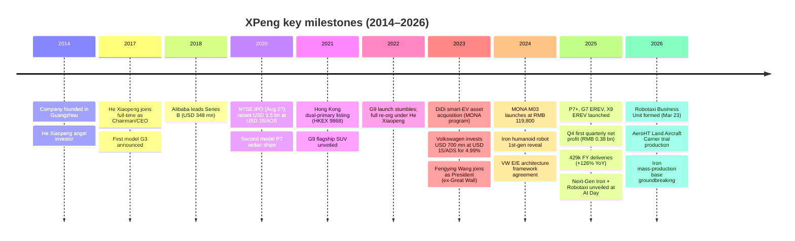
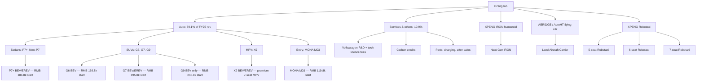
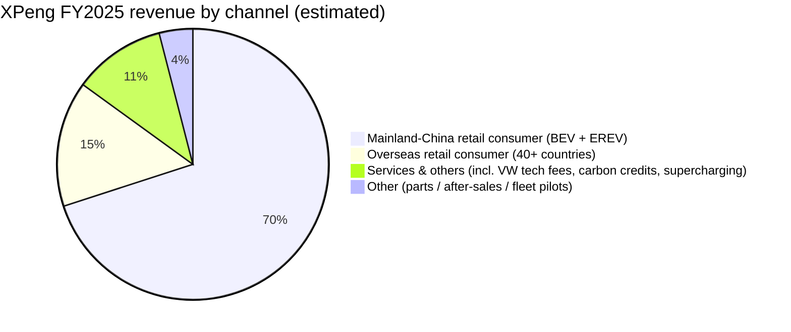

# XPeng Inc. (NYSE: XPEV / HKEX: 9868) — Company Research Report

**Date:** 2026-05-16
**Primary listing:** NYSE (ADR symbol XPEV, each ADS = 2 Class A ordinary shares)
**Secondary listing:** Hong Kong Stock Exchange (9868)
**Founded:** 2014 (operating entity 广州小鹏汽车科技有限公司, Guangzhou Xiaopeng Motors Technology)
**Headquarters:** No. 10 Cencun Fengzhuang Avenue, Tianhe District, Guangzhou, Guangdong 510640, China
**Filing status:** Foreign Private Issuer (20-F annual / 6-K interim)

> **Update — FY2026 guidance initiated (2026-03-19):** Management for the first time issued a full-year delivery target of **550,000–600,000 units** for FY2026 (vs. 429,445 in FY2025), implied volume growth of **+28% to +40%**, and reiterated a 1H2026 quarterly profitability target. The Q1 2026 revenue guide was set at **RMB 12.2–13.2 bn**, a **-22.8% to -16.0% YoY** trough as the company resets pricing on the refreshed P7+/G6/G7/G9 line and ramps EREV variants, with March guided to a +69%–101% MoM delivery rebound. Stated drivers: seven new "Super EREV" models, four global launches, and the start of mass production for the XPENG IRON humanoid robot by end-2026.
> Source: [Xpeng Q4 & FY2025 earnings release, 2026-03-19](https://ir.xiaopeng.com/news-releases) · [CnEVPost: Xpeng logs first-ever net profit, 2026-03-20](https://cnevpost.com/2026/03/20/xpeng-logs-first-ever-net-profit/) · [InsiderFinance: Xpeng Profit Tempered by Weak 2026 Guidance, 2026-03-20](https://www.insiderfinance.io/news/xpeng-profit-tempered-by-weak-2026-guidance).

---

## Table of Contents

1. Company Overview
2. Company History
3. Management Team
4. Products & Services
5. Customers & Go-to-Market
6. Industry Overview
7. Competitive Landscape
8. Market Opportunity (TAM)
9. Risk Assessment
10. References

---

## 1. Company Overview

XPeng Inc. (小鹏汽车) is a vertically-integrated Chinese designer, developer, manufacturer and marketer of smart electric vehicles (Smart EVs and NEVs in its own taxonomy) that competes primarily in the RMB 150,000–300,000 (USD 21k–42k) "mainstream-to-premium" segment of the Chinese passenger-car market. As of 31 December 2025 the company offered seven nameplates — the MONA M03, the Next P7, the P7+ (incl. P7+ EREV), the G6 (incl. G6 EREV), the G7 (incl. G7 EREV), the G9 and the X9 (incl. X9 EREV) — and delivered **429,445 vehicles in FY2025, a +125.9% YoY increase from 190,068 units in FY2024 and 141,601 in FY2023** ([XPeng 2025 20-F, Item 5.A](https://www.sec.gov/Archives/edgar/data/1810997/000119312526157849/0001193125-26-157849-index.htm)). The product portfolio sits alongside three adjacency businesses that the company increasingly positions as the long-run thesis: **XPENG IRON** (humanoid robot, in-house Turing AI silicon), **XPENG AERIDGE / AeroHT** ("Land Aircraft Carrier" modular flying car), and **XPENG Robotaxi** (a dedicated business unit established 2026-03-23 with three robotaxi SKUs and L4 pilots in 2H 2026).

**Business model.** Revenue today is overwhelmingly automotive: **vehicle sales were RMB 68,378.9 million (89.1% of total) and "services & others" were RMB 8,340.8 million (10.9%) in FY2025** ([XPeng 2025 20-F, Item 5.A](https://www.sec.gov/Archives/edgar/data/1810997/000119312526157849/0001193125-26-157849-index.htm)). Total revenue reached **RMB 76,719.7 million in FY2025 (+87.7% YoY)**, with gross profit of **RMB 14,472.9 million and a gross margin of 18.9%** — a 460 bp expansion from 14.3% in FY2024 and a structural reset from 1.5% in FY2023, when the company was selling below cost to clear inventory. Vehicle gross margin specifically reached **13.0% in Q4 2025** while consolidated gross margin hit **21.3%**, helped by a service-and-software step-up that included carbon credits and a one-time uplift from the Volkswagen technology-services revenue ([CnEVPost: Xpeng logs first-ever net profit, 2026-03-20](https://cnevpost.com/2026/03/20/xpeng-logs-first-ever-net-profit/)).

**Geography.** Operations are anchored in China, with three owned plants — Zhaoqing (broad NEV production), Guangzhou (smart-driving and X-series), and Wuhan (EREV / G-series) — plus design centres in Silicon Valley and San Diego. **Overseas deliveries roughly doubled to ~45,000 units in FY2025 (>15% of revenue)**, with the company present in more than 40 countries including Norway, Germany, the Netherlands, Denmark, France, the UK, Australia, Thailand, Indonesia, Singapore, Israel, Malaysia and the UAE ([CnEVPost: Xpeng overseas push, 2026-03-20](https://cnevpost.com/2026/03/20/xpeng-logs-first-ever-net-profit/)).

**Scale.** The 20-F discloses ~15,800 full-time employees with **R&D headcount of ~44.5% of total** ([XPeng 2025 20-F, Item 6.D](https://www.sec.gov/Archives/edgar/data/1810997/000119312526157849/0001193125-26-157849-index.htm)). Cash, restricted cash, short-term investments and time deposits totalled **RMB 47,656.5 million (~USD 6.6 bn) at 31 Dec 2025**, up from RMB 41,962.5 million a year earlier, supported by the **Volkswagen Investment** (Volkswagen Group purchased ~4.99% of XPeng for USD ~700 mn at USD 15/ADS in July 2023). The company has not declared dividends.


*Source: 6-panel chart compiled from [XPeng 2025 20-F, Item 5.A consolidated statements of operations](https://www.sec.gov/Archives/edgar/data/1810997/000119312526157849/0001193125-26-157849-index.htm).*

**Valuation snapshot (as of 2026-05-15).**

| Metric | XPeng (XPEV) | 3-yr range (XPEV) | Sector commentary |
|---|---|---|---|
| Share price (ADS) | USD 15.66 | USD 5.95 – 26.07 | — |
| Market cap | USD ~15.3 bn | USD 5–25 bn | — |
| TTM P/E | **negative (~-44x; EPS -1.20)** | always negative (never profitable on TTM) | most pure-play EV startups negative |
| TTM P/S | **4.05x** | ~1.5x – 7.0x | EV-peer median ex-Tesla ~1.3x |
| P/B | ~3.0x | 1.4x – 5.5x | implies premium to book |

Peer comps (TTM P/S, May 2026): **Li Auto (LI) 1.20x**, **Nio (NIO) 1.40x**, **Zeekr (ZK) 0.70x**, **Tesla (TSLA) 13.5x**, **BYD (002594.SZ) 1.31x** ([stockanalysis.com — XPEV](https://stockanalysis.com/stocks/xpev/statistics/), [stockanalysis.com — LI](https://stockanalysis.com/stocks/li/), [Simply Wall St — ZK valuation](https://simplywall.st/stocks/us/automobiles/nyse-zk/zeekr-intelligent-technology-holding/valuation), [BYD 002594.SZ Yahoo key-stats](https://finance.yahoo.com/quote/002594.SZ/key-statistics/)).

**Interpreting the negative P/E.** TTM EPS is **USD -1.20** ([stockanalysis.com — XPEV](https://stockanalysis.com/stocks/xpev/statistics/)); the FY2025 net loss was **RMB -1,139.5 million** ([XPeng 2025 20-F, Item 5.A](https://www.sec.gov/Archives/edgar/data/1810997/000119312526157849/0001193125-26-157849-index.htm)). This is **cash-burning growth that is rapidly inflecting to profitability**, not cyclical trough or one-off impairment. The drivers were structural and visible:

- **Operating leverage.** R&D / revenue fell from **17.2% (FY2023) → 15.8% (FY2024) → 12.4% (FY2025)** even though absolute R&D rose +47% YoY to RMB 9,490.0 mn, and SG&A / revenue fell **21.4% → 16.8% → 12.2%**. Total opex held roughly flat in margin terms even as the revenue base nearly doubled ([XPeng 2025 20-F, Item 5.A](https://www.sec.gov/Archives/edgar/data/1810997/000119312526157849/0001193125-26-157849-index.htm)).
- **Vehicle gross margin reset.** From -1.6% in FY2023 (selling below cost during the post-COVID destocking) to **8.3% in FY2024 to 13.0% in Q4 2025** — a function of the MONA M03 scale-up sharing the same compute / E/E platform as P7+/G6/G9, plus the carbon credits, services and Volkswagen R&D fees that scaled non-vehicle revenue +66% YoY.
- **Quarterly inflection.** **Q4 2025 produced a GAAP net profit of RMB 0.38 bn**, the **first profitable quarter in company history** ([Yahoo Finance: XPENG Q4 Earnings Call Highlights](https://finance.yahoo.com/markets/stocks/articles/xpeng-q4-earnings-call-highlights-140626380.html)).

**Interpreting the P/S premium.** At 4.05x trailing sales, XPeng trades at **~3x the EV-peer median ex-Tesla (≈1.3x)** but at less than a third of Tesla's 13.5x. The premium is best read as **optionality on three non-auto adjacencies** (Iron / AeroHT / Robotaxi) that the market is now pricing as discrete real options on top of an auto business that just turned profitable, plus an "AI-EV" narrative premium consistent with how the market currently re-rates names that screen as Chinese Physical-AI proxies ([Yahoo Finance: XPENG Q4 Earnings Call Highlights, 2026-03-19](https://finance.yahoo.com/markets/stocks/articles/xpeng-q4-earnings-call-highlights-140626380.html)). Goldman Sachs' Mar-2026 USD 25 PT (vs. ~USD 16 spot) is anchored to **a 40% FY2026 revenue forecast and Volkswagen-related software margin** ([Investing.com — Goldman Sachs raises XPEV PT to USD 25, 2026-03](https://www.investing.com/news/analyst-ratings/goldman-sachs-raises-xpeng-stock-price-target-to-25-on-2026-growth-outlook-93CH-4367011)). Given the 4.05x P/S sits below the >15x "narrative" threshold but above peers, we treat it as a **stretch (yes, explainable; no, not in classic "bubble" territory)** and carry the case for multiple compression into Section 9.


*Source: [stockanalysis.com — XPEV statistics](https://stockanalysis.com/stocks/xpev/statistics/), [stockanalysis.com — LI](https://stockanalysis.com/stocks/li/), [Simply Wall St — ZK](https://simplywall.st/stocks/us/automobiles/nyse-zk/zeekr-intelligent-technology-holding/valuation), [Yahoo Finance — BYD 002594.SZ](https://finance.yahoo.com/quote/002594.SZ/key-statistics/), [companiesmarketcap — TSLA](https://companiesmarketcap.com/tesla/pe-ratio/).*

---

## 2. Company History

**Founding story.** XPeng Inc. (in Chinese 小鹏汽车 — "Little Peng Motors") was founded in **August 2014** by **He Xiaopeng (何小鹏)**, **Henry Xia Heng (夏珩)** and **He Tao (何涛)** in Guangzhou as 广州橙行智动汽车科技有限公司 (later renamed 广州小鹏汽车). The founding thesis was that an internet-native team — Mr. He had just sold mobile-browser pioneer UCWeb to Alibaba for **USD 4.7 bn in June 2014** and personally received a senior role at Alibaba — could build a "smart EV" before Chinese incumbents could catch up to Tesla, with software and ADAS as the core differentiator rather than powertrain ([XPeng 2025 20-F, Item 6.A bio of Xiaopeng He](https://www.sec.gov/Archives/edgar/data/1810997/000119312526157849/0001193125-26-157849-index.htm)). Mr. He initially joined as Chairman and angel investor in 2014; he became full-time CEO in August 2017 after exiting Alibaba.


*Source: [XPeng 2025 20-F, Item 4.A History and Development](https://www.sec.gov/Archives/edgar/data/1810997/000119312526157849/0001193125-26-157849-index.htm); [XPENG IR — VW E/E Architecture Master Agreement](https://ir.xiaopeng.com/news-releases/news-release-details/master-agreement-ee-architecture-technical-collaboration); [CnEVPost: Xpeng sets up robotaxi unit, 2026-03-23](https://cnevpost.com/2026/03/23/xpeng-sets-up-robotaxi-unit-accelerate-commercial-rollout/).*

**Pivots.** Three are material to the current thesis:

1. **The G9 reset (Q4 2022).** XPeng's flagship G9 SUV launched with confusing trim configurations, missed the early reservation conversion, and dragged FY2022 deliveries below expectations. Mr. He responded with a **full management overhaul in early 2023**, recruiting industry veteran **Fengying Wang (王凤英)** — the longest-serving senior executive at Great Wall Motor and one of the most respected operators in Chinese auto — as President. The cost discipline, product roadmap pruning and dealer overhaul she led between 2023 and 2025 set up the FY2025 unit-economics reset.
2. **The DiDi / MONA acquisition (2023).** In August 2023 XPeng acquired DiDi's smart-EV development business and issued 58.16 mn Class A shares to DiDi at closing on 2023-11-13, with a further SOP (start-of-production) tranche closing on 2024-08-13 ([XPeng 2025 20-F, Item 4.A](https://www.sec.gov/Archives/edgar/data/1810997/000119312526157849/0001193125-26-157849-index.htm)). The acquired program became **MONA M03**, a RMB 119,800–155,800 entry-level smart EV that drove the majority of FY2025 incremental volume. The transaction also gave XPeng access to DiDi's ride-share network for future Robotaxi commercialization.
3. **The Volkswagen platform deal (2023→2024).** A USD 700 mn equity investment in July 2023 (closed Q4 2023) was followed by a Framework Agreement on E/E Architecture Technical Collaboration in April 2024 and a Master Agreement in July 2024 — under which XPeng co-develops the China Electronic Architecture ("CEA") that will sit beneath VW's China-specific CMP platform from 2026 and the global MEB platform models built for China ([CARIAD — China Electronic Architecture co-development](https://cariad.technology/de/en/news/stories/co-developement-china-electronic-architecture-xpeng.html), [electrive.com — VW + Xpeng joint architecture, 2024-07-22](https://www.electrive.com/2024/07/22/vw-and-xpeng-introduce-joint-architecture-to-more-models/)).

**Recent developments (last 12 months).** In Nov 2025 the company held its second annual **AI Day** in Guangzhou and unveiled the next-generation **IRON humanoid**, three **Robotaxi** SKUs, the **VLA 2.0** (Vision-Implicit Token-Action) model and the second-generation **AERIDGE / AeroHT flying car**; Volkswagen was named launch customer for VLA 2.0 and the Turing AI chip ([XPENG IR — Physical AI Emergence press release, 2025-11-05](https://www.xpeng.com/news/019a56f54fe99a2a0a8d8a0282e402b7), [Electrek: Xpeng AI Day, 2025-11-05](https://electrek.co/2025/11/05/xpeng-ai-day-new-ai-model-powering-robots-robotaxis-and-flying-cars/)). The Land Aircraft Carrier rolled off its first trial-production line on 2025-11-03 in Huangpu District, Guangzhou ([CnEVPost: Aridge produces 1st flying car, 2025-11-03](https://cnevpost.com/2025/11/03/xpeng-aridge-produces-1st-flying-car-mass-production-facility/)). On 2026-03-23 the Robotaxi Business Unit was formally established ([CnEVPost: Xpeng sets up robotaxi unit, 2026-03-23](https://cnevpost.com/2026/03/23/xpeng-sets-up-robotaxi-unit-accelerate-commercial-rollout/)).

---

## 3. Management Team

### He Xiaopeng (何小鹏) — Co-founder, Chairman & CEO (Age 48)

He Xiaopeng is the founder-archetype CEO whose biography sits at the core of the XPeng thesis. He **co-founded UCWeb in 2004** as Vice President of Product, building it into China's dominant mobile-browser company; UCWeb was acquired by Alibaba in **June 2014 for ~USD 4.7 bn**, then the largest internet M&A deal in Chinese history. Inside Alibaba he served as president of the Alibaba mobile business group, chairman of Alibaba Games and president of Tudou.com, before leaving in August 2017 to take over XPeng full-time. He had angel-invested in the company at founding in 2014 ([XPeng 2025 20-F, Item 6.A bio](https://www.sec.gov/Archives/edgar/data/1810997/000119312526157849/0001193125-26-157849-index.htm)). He holds a bachelor's in computer science from South China University of Technology (1999) and the PRC senior-economist (technology-entrepreneur) qualification (2020). He previously served as an independent director and audit-committee member of NYSE-listed HUYA Inc. from May 2018 to May 2020.

The single most important governance fact at XPeng is that **as of 31 Mar 2026, Mr. He beneficially owns all of the issued and outstanding Class B ordinary shares, representing 69.1% of the voting power** ([XPeng 2025 20-F, Item 6.E / Item 7.A](https://www.sec.gov/Archives/edgar/data/1810997/000119312526157849/0001193125-26-157849-index.htm)). XPeng is therefore a controlled, founder-led, dual-class company. Mr. He has used that control to (a) absorb the G9 reset in 2022 with no investor revolt and re-org the business under Fengying Wang; (b) commit ~12% of revenue to R&D through the FY2025 trough without external pressure to cut it; and (c) push the company hard into adjacencies (humanoid, flying car, robotaxi) where peers either lag (Nio, Li Auto have no humanoid program of consequence) or have outsourced the bet (BYD's robot effort is small and embedded in factory automation). He is publicly active on Chinese social media, hosts XPeng's twice-yearly AI Day in person, and is widely cited as one of the few Chinese tech founders who personally test-drives the company's vehicles weekly. The risk of this concentration is the mirror of its strength: a single point of failure in vision, capital allocation and succession. The company has no announced succession plan and Mr. He is 48 — material but not near-term concern.

### Hongdi Brian Gu (顾宏地) — Honorary Vice Chairman & Co-President (Age 53)

Brian Gu is the company's most senior capital-markets and external-affairs executive. **From 2004 to 2018 he was at J.P. Morgan Chase, last serving as Managing Director and Chairman of J.P. Morgan Chase Asia Pacific Investment Banking**, where he led many of the largest China cross-border deals of the era ([XPeng 2025 20-F, Item 6.A](https://www.sec.gov/Archives/edgar/data/1810997/000119312526157849/0001193125-26-157849-index.htm)). He joined XPeng in 2018 and architected the **NYSE IPO in August 2020 (USD 1.5 bn at USD 15/ADS)**, the **dual-primary HK listing in July 2021** and the **Volkswagen USD 700 mn strategic investment in 2023**. He holds a Ph.D. in biochemistry from the University of Washington (1997), an MBA from Yale (1999) and a bachelor's in chemistry from Oregon (1993). He previously served as director of Uxin Limited (NASDAQ: UXIN) from June 2018 to June 2019. He is the company's primary spokesperson on the Volkswagen relationship and the AeroHT IPO, which Reuters has reported is being prepared for HK as a separate listing.

### Fengying Wang (王凤英) — President (Age 55)

Fengying Wang joined as President in early 2023 and is the operating engine behind the FY2024–FY2025 margin turnaround. She has **30+ years in Chinese automotive industry, all at Great Wall Motor (HK:2333 / SSE:601633)**, where she served from 1991 to 2022, including as Vice Chairman (Mar 2016 – Mar 2022), Executive Director (Jun 2001 – Mar 2022) and General Manager (Nov 2002 – Jul 2022) ([XPeng 2025 20-F, Item 6.A](https://www.sec.gov/Archives/edgar/data/1810997/000119312526157849/0001193125-26-157849-index.htm)). At Great Wall she ran the Haval SUV brand through a decade in which it became the largest SUV brand in China; she is widely credited as one of the strongest commercial-and-channel operators in the Chinese auto industry. Her arrival at XPeng was followed within six months by a dealer-network restructure (a shift toward direct-store + agency hybrid), a price reset across the G6 and the MONA M03 launch — the three operational moves that drove unit economics from 1.5% gross margin in FY2023 to 18.9% in FY2025. She holds a master's in economics from Tianjin Institute of Finance (1999).

### Jiaming "James" Wu (吴佳铭) — Vice President of Finance and Accounting (Age 42)

James Wu is XPeng's senior-most finance officer (titled VP Finance & Accounting rather than CFO). He joined after **CFO and VP roles at SAIC-GM-Wuling Automotive (Jul 2022 – May 2023) and PT SGMW Motor Indonesia (Jul 2019 – Jun 2022)**, having previously worked as a finance manager at the US headquarters of General Motors Company (2017–2019) and as a regional finance manager at GM International Operations (2012–2017) ([XPeng 2025 20-F, Item 6.A](https://www.sec.gov/Archives/edgar/data/1810997/000119312526157849/0001193125-26-157849-index.htm)). MBA from Yale (2012). His SAIC-GM-Wuling tenure is directly relevant — Wuling is the Chinese auto industry's lowest-cost mass-market EV producer and the operator of the Hongguang Mini, which forced sub-RMB 50k EV cost structures into the industry. That cost-engineering background is squarely on the critical path of XPeng's MONA M03 and the future Robotaxi SKU pricing.

### Governance

- **Board (8 directors):** Xiaopeng He (Executive); Ji-Xun Foo (Non-Exec, ex-GGV / Granite Asia); four independent non-executives (Donghao Yang ex-Vipshop CFO and Harvard MBA, Fang Qu co-founder of Xiaohongshu / 小红书, HongJiang Zhang ex-CEO Kingsoft + Microsoft Distinguished Scientist, Yudong Chen); plus Fengying Wang (President) and Hongdi Brian Gu (Honorary Vice Chairman) ([XPeng 2025 20-F, Item 6.C](https://www.sec.gov/Archives/edgar/data/1810997/000119312526157849/0001193125-26-157849-index.htm)). HongJiang Zhang in particular brings deep AI-systems credibility (Microsoft Asia-Pacific R&D CTO 1999–2011).
- **Insider voting concentration:** Class B (Mr. He) = 69.1% of voting power; Class A includes Volkswagen Group with a non-voting board observer and contingent director-nomination rights upon reaching 5% economic ownership ([XPeng 2025 20-F, Item 6.C / Item 7.A](https://www.sec.gov/Archives/edgar/data/1810997/000119312526157849/0001193125-26-157849-index.htm)).
- **Compensation:** Aggregate cash compensation and benefits in kind to directors and executive officers in FY2025 was **RMB 182 million** ([XPeng 2025 20-F, Item 6.B](https://www.sec.gov/Archives/edgar/data/1810997/000119312526157849/0001193125-26-157849-index.htm)). 52.89 mn RSUs were outstanding as of 2026-03-31 under the 2019 / 2025 share-incentive plans.
- **Related-party transactions:** Material — the Huitian / AeroHT flying-car business and Guangzhou Xuetao (GIIA insurance agent) are controlled by Mr. He and Mr. Tao He respectively and supplied by XPeng on cooperation agreements. The 2024 Cooperation Framework Agreement with Guangdong Huitian was renewed on 2025-08-22 for 2026–2028 ([XPeng 2025 20-F, Item 7.B](https://www.sec.gov/Archives/edgar/data/1810997/000119312526157849/0001193125-26-157849-index.htm)). This is a watch-item: the upside is that XPeng accesses flying-car commercialization without consolidating its early losses; the downside is governance complexity if AeroHT IPOs at a high valuation.

### Track record synthesis

This team has now delivered on the most-recent operating thesis — turning a -33.8% net-margin business into a +18.9% gross-margin business in two years while doubling units twice — and has the credibility from prior careers (UCWeb exit, Great Wall, GM Wuling, J.P. Morgan IBD) to attempt the bigger Physical-AI thesis. The principal gap is **succession depth**; XPeng remains a He-Xiaopeng-and-Fengying-Wang company.

---

## 4. Products & Services

XPeng's product taxonomy as disclosed in the 2025 20-F and the [XPENG Hong Kong product page](https://www.xpeng.com/) groups offerings into **(a) Smart EVs (BEV + EREV) for retail consumers, (b) flying vehicles via the Huitian / AeroHT related-party structure, (c) the IRON humanoid robot, (d) Robotaxi (vehicle + L4 software stack), and (e) services & others** (R&D services, after-sales, supercharging, parts, carbon credits, and the Volkswagen technology-services revenue stream).


*Source: [XPeng 2025 20-F, Item 4.B Business Overview](https://www.sec.gov/Archives/edgar/data/1810997/000119312526157849/0001193125-26-157849-index.htm); [Xpeng updates 4 models for 2026, CnEVPost 2026-01-08](https://cnevpost.com/2026/01/08/xpeng-updates-4-models/); [XPENG AI Day 2025 release](https://www.xpeng.com/news/019a56f54fe99a2a0a8d8a0282e402b7).*

### Smart EV portfolio (the 89% of revenue)

- **MONA M03 (sedan).** Entry-level model from RMB 119,800–155,800, derived from the DiDi acquisition. Drove the bulk of FY2024 H2 and FY2025 incremental volume. **Competitive advantage: yes, partial (cost + scale).** Moat type: cost leadership at the RMB 100k–150k tier through shared E/E + ADAS platform with higher-priced P7/G6/G9 — competitors at this price point typically lack a flagship-grade ADAS stack. Closest competitor: **BYD Qin Plus EV / Seal 06 DM-i (RMB 99,800 start, gasoline-PHEV)** — XPeng is ahead on ADAS, BYD is ahead on supply-chain integration and pure cost ([XPENG MONA M03 product page](https://www.xpeng.com/)).
- **Next P7 / P7+ (mid-size sedan).** Refreshed in 2026 with BEV (615 / 725 km CLTC) and EREV variants (49.2 kWh battery, 430 km BEV CLTC). Starts at **RMB 186,800** ([CnEVPost: Xpeng updates 4 models, 2026-01-08](https://cnevpost.com/2026/01/08/xpeng-updates-4-models/)). **Competitive advantage: yes (technology + ADAS).** Moat: native XNGP (XPENG Navigation Guided Pilot) full-scenario ADAS + 800V XPower architecture, plus Turing AI chip in 2026 trims. Closest competitor: **Xiaomi SU7** (RMB 215.9k start) — XPeng is at parity on driving experience, behind on brand momentum and ahead on ADAS field coverage. Tesla Model 3 (RMB 232k start) is also a direct comp where XPeng is slightly behind on global brand but ahead on Chinese-market ADAS feature breadth.
- **G6 (compact SUV).** RMB 169,800–230,800 starting range; refreshed in 2026 with Turing AI chip standard, 625 km CLTC, single-motor RWD. **Competitive advantage: yes (technology + ecosystem).** Moat type: switching costs via XOS Tianji OS + over-the-air feature upgrades + AeroHT / Robotaxi optionality. Closest competitor: **Tesla Model Y (China-built, RMB 263.5k start)** — XPeng is ahead on price-for-spec but behind on Tesla's brand pricing power.
- **G7 (mid-size SUV).** RMB 195,800–235,800; added EREV variant in 2026 with 430 km battery range and combined range over 1,704 km ([CnEVPost: Xpeng updates 4 models, 2026-01-08](https://cnevpost.com/2026/01/08/xpeng-updates-4-models/)). **Partial advantage** — competes head-on with Li Auto L7 EREV (RMB 309.8k start) where Li Auto is the category leader on range-extender volumes; XPeng is ahead on ADAS, behind on family-MPV ergonomics.
- **G9 (premium SUV).** RMB 248,800–278,800 only as BEV; flagship single-/dual-motor RWD/AWD, 0–100 km/h as fast as 4.2 s, 625/680/725 km CLTC. **Competitive advantage: partial.** Direct comp: Nio ES6 (RMB 338k), Tesla Model Y Long Range, Aito M7 (Huawei). XPeng's ADAS competitive — but Huawei's HarmonyOS Intelligent Mobility has won mindshare in the premium-EV-with-driver-assist niche.
- **X9 (premium MPV).** Range-topping 7-seat MPV including X9 EREV. **Partial advantage** — Toyota Sienna and Buick GL8 dominate the family-MPV segment in China; XPeng is the smart-EV alternative but small in absolute volume.

### Services & others (the 11% that doubled in FY25)

- **Volkswagen technology-services revenue.** Under the E/E Architecture Master Agreement (2024-07-22) and the joint development of the China Electronic Architecture (CEA) ([XPENG IR press release](https://ir.xiaopeng.com/news-releases/news-release-details/master-agreement-ee-architecture-technical-collaboration)). VW expects CEA to deliver **40% BOM-cost reduction vs. MEB and 30% control-unit reduction**, with first production around mid-2026 ([Volkswagen Group press release: smart vehicles at China speed](https://www.volkswagen-group.com/en/articles/smart-vehicles-at-china-speed-volkswagen-develops-high-performance-ee-architecture-for-electric-vehicles-in-china-with-xpeng-18335)). **Competitive advantage: yes (strong) — XPeng is the only Chinese EV company licensing a Tier-1-OEM-grade E/E platform to a global incumbent at this scale.** Closest comp: Huawei's HI / Harmony Intelligent Mobility (different business model — Huawei sells a full stack rather than an architecture licence).
- **Carbon credits, supercharging, parts, after-sales.** Material to gross margin upside; FY2025 services revenue rose **+121.9% YoY to RMB 8,340.8 mn** ([XPeng 2025 20-F, Item 5.A](https://www.sec.gov/Archives/edgar/data/1810997/000119312526157849/0001193125-26-157849-index.htm)).

### XPENG IRON (humanoid robot)

First-generation IRON revealed at AI Day 2024; **Next-Gen IRON** unveiled at AI Day 2025 (2025-11-05) ([CnEVPost: Xpeng unveils next-gen Iron, 2025-11-05](https://cnevpost.com/2025/11/05/xpeng-unveils-next-gen-iron-humanoid-robot/)). Spec: **178 cm tall, 70 kg, 22-DoF hand, humanoid spine, bionic muscles, flexible skin, 3D curved-display head, three in-house Turing AI chips delivering 2,250 TOPS, second-generation VLA model**. Currently deployed in **XPeng's own EV assembly lines** doing complex sub-tasks; **Baoshan Iron & Steel (a Baowu Group subsidiary)** is named as the first external industrial pilot, using IRON for equipment-wear monitoring ([Qviro Blog: XPENG IRON](https://qviro.com/blog/xpeng-launches-iron-advanced-humanoid-robot/)). **Mass-production base groundbreaking in Q1 2026** in Guangzhou; site is **~110,000 sqm**; target is **>1,000 units/month by end-2026** ([CnEVPost: Xpeng to break ground on humanoid robot factory, 2026-02-25](https://cnevpost.com/2026/02/25/xpeng-to-break-ground-on-humanoid-robot-factory-q1/)). **Competitive advantage: yes, partial (technology + manufacturing) — closest competitors are Tesla Optimus and Unitree**. Tesla is ahead on AI-and-data integration (FSD shared brain); Unitree and AgiBot have lower-priced product but lack automotive-grade manufacturing ([Rest of World: China humanoid robots, 2026](https://restofworld.org/2026/china-humanoid-robots-unitree-agibot-tesla-optimus/)). XPeng's edge is its own EV assembly lines as a captive volume customer + the shared Turing chip / VLA stack with its cars.

### XPENG AERIDGE / AeroHT (flying car)

Developed under HT Flying Car Inc. ("Huitian"), in which XPeng holds a minority debt-and-equity investment plus cooperation agreement; Mr. He Xiaopeng is the principal shareholder ([XPeng 2025 20-F, Item 13 Long-term Investments](https://www.sec.gov/Archives/edgar/data/1810997/000119312526157849/0001193125-26-157849-index.htm)). **Land Aircraft Carrier** is a six-wheeled range-extended truck with a built-in modular two-seat eVTOL aircraft; combined CLTC range >1,000 km; aircraft uses six-rotor configuration and carbon-fibre body. **First-ever batch trial production at the 120,000 sqm Guangzhou Huangpu factory on 2025-11-03** — described by Global Times as the **world's first dedicated flying-car factory using auto-style assembly lines, theoretical throughput one aircraft every 30 minutes** ([Global Times: China's first flying car factory begins trial production, 2025-11](https://www.globaltimes.cn/page/202511/1348045.shtml); [Autocar: Xpeng Land Aircraft Carrier on track for 2026](https://www.autocar.co.uk/car-news/new-cars/xpeng-land-aircraft-carrier-flying-car-track-2026)). Price ~**RMB 2 million (~USD 280,000)**; order book ~**7,000 reservations (Oct 2025)** including a **600-unit Middle East order** disclosed Oct 2025 ([carnewschina: Aeroht secures 600 orders in Middle East, 2025-10-13](https://carnewschina.com/2025/10/13/xpeng-aeroht-secures-600-orders-for-its-land-aircraft-carrier-in-middle-east/)). Targeted full deliveries end-2026, volume ramp through 2027 ([gsmgotech: Xpeng's Flying Car Dream, 2026-04](https://www.gsmgotech.com/2026/04/xpengs-flying-car-dream-takes-off-land.html)). **Competitive advantage: yes (regulatory + manufacturing first-mover)** — only operating-class flying-car factory in China with type-certification pathway through CAAC; no Western peer at this stage of mass production. Reuters has reported AeroHT is preparing an HK IPO; XPeng would retain a minority economic interest.

### XPENG Robotaxi

Three SKUs unveiled at AI Day 2025 — 5-seat, 6-seat, 7-seat — all targeted **< RMB 200,000 (~USD 29,100)**, four Turing AI chips per vehicle delivering **3,000 TOPS total**, no LiDAR, no HD-map dependency (pure-vision ADAS) ([Self-Driving Cars 360: Robotaxi targets L4 in 2027, 2025-11](https://www.selfdrivingcars360.com/xpengs-new-robotaxi-business-unit-targets-driverless-l4-operations-in-2027/), [globalchinaev: 2026 rollout of three L4 robotaxis](https://globalchinaev.com/post/xpeng-plans-2026-rollout-of-three-l4-robotaxis-using-pure-vision-adas)). **Robotaxi Business Unit established 2026-03-23**. Pilot operations begin **2H 2026**; safety-driver-free targeted for **early 2027** ([CnEVPost: Xpeng sets up robotaxi unit, 2026-03-23](https://cnevpost.com/2026/03/23/xpeng-sets-up-robotaxi-unit-accelerate-commercial-rollout/)). DiDi, a strategic shareholder since the MONA acquisition, is a likely fleet partner. **Competitive advantage: partial — Waymo and Baidu Apollo are years ahead in commercial operations, but XPeng has the lowest published unit cost and is the only player offering customer-owned robotaxi hardware at <USD 30k**.

### Flagship vs. long-tail

The 1–3 flagships driving the business today are: **(1) MONA M03** (incremental-volume driver), **(2) G6 + G7** (margin anchors at mid-price), **(3) P7+** (brand and ADAS halo). Iron / AeroHT / Robotaxi are **option-value flagships** rather than near-term revenue drivers. The legacy G3 and original P5 are sunset or end-of-life.

### Last-12-month launches and sunsets

- **Q3 2025**: G7 launched (mid-size SUV at RMB ~195k start) — successful initial reception, contributed ~30k Q4 deliveries.
- **Q4 2025**: Next-Gen IRON, three Robotaxi SKUs, VLA 2.0 unveiled at AI Day (2025-11-05); AeroHT Land Aircraft Carrier trial production (2025-11-03); X9 EREV launched.
- **Q1 2026**: 2026 MY refreshes for P7+, G6, G7, G9 with Turing AI chip standard (2026-01-08).
- **Q1 2026**: Robotaxi Business Unit formed (2026-03-23); Iron mass-production factory groundbreaking (Q1 2026).
- **2026 roadmap**: 7 new Super-EREV models; 4 global models incl. 6-seat full-size GX flagship; MONA L05 and G9L filed with MIIT.

---

## 5. Customers & Go-to-Market

XPeng's revenue mix is overwhelmingly **B2C** — individual Chinese (and increasingly European, Southeast-Asian, Middle-Eastern) consumers buying through a hybrid of **XPENG-operated retail stores, authorized agency dealers, online direct sales, and a small B2B / fleet channel**. As a Foreign Private Issuer with a Cayman-incorporated topco and a single auto-reportable segment, XPeng's customer concentration disclosure is governed by ASC 280-10-50-42. The company has **no individual customer that meets the 10% threshold** in any year and has **declined to disclose top-1 or top-5 customer share** — consistent with a B2C OEM but a real disclosure gap as fleet, Volkswagen technology-services, and Robotaxi B2B revenue scale.


*Source: [XPeng 2025 20-F, Item 5.A revenue split](https://www.sec.gov/Archives/edgar/data/1810997/000119312526157849/0001193125-26-157849-index.htm) (89.1% vehicles / 10.9% services) and [CnEVPost: Xpeng overseas push, 2026-03-20](https://cnevpost.com/2026/03/20/xpeng-logs-first-ever-net-profit/) (15%+ overseas).*

### Customer concentration — quantified

- **Top-1 customer share of consolidated revenue:** **< 10%** (no single customer disclosed in 20-F segment notes). Confirmed by XPeng's own statement: "the Group has only one reportable segment ... and the chief operating decision maker ... reviews consolidated revenue, gross profit and net loss when making decisions about allocating resources" ([XPeng 2025 20-F, segment note in consolidated financial statements](https://www.sec.gov/Archives/edgar/data/1810997/000119312526157849/0001193125-26-157849-index.htm)).
- **Top-5 customer share:** **not disclosed in 20-F**, but inferable to be **modest** given (a) the company sold ~429k retail vehicles in FY2025, mostly to individual consumers, and (b) the largest B2B revenue stream (Volkswagen technology-services) is itself well below 10% of total revenue based on disclosed VW SOP cadence.
- **B2B flag — Volkswagen.** The CEA / E/E architecture and Turing AI chip licence revenue to Volkswagen are growing but still single-digit % of total revenue; the contract is **multi-year master agreement** structure (April 2024 Framework + July 2024 Master) ([XPENG IR press release on E/E Master Agreement](https://ir.xiaopeng.com/news-releases/news-release-details/master-agreement-ee-architecture-technical-collaboration)). This will materialize as a top-1 B2B customer in 2026–2027 as CEA-vehicle SOP begins; **Volkswagen is the closest XPeng has to a Tier-1 customer relationship**. XPeng's risk-factor language flags VW exposure as "any failure or delay in the Volkswagen Collaboration could harm" the business ([XPeng 2025 20-F, Item 3.D Risk Factors](https://www.sec.gov/Archives/edgar/data/1810997/000119312526157849/0001193125-26-157849-index.htm)).
- **B2B flag — Robotaxi.** Future fleet customers (DiDi, Hello Mobility, T3 Travel, Cao Cao Mobility) are pre-revenue. The 2026-03-23 Robotaxi Business Unit formation contemplates fleet sales to DiDi (a strategic shareholder via the 2023 MONA share-issuance).
- **B2B flag — flying car.** A reported **600-unit AeroHT order from a Middle-Eastern buyer (Oct 2025)** is at list value ~USD 168 mn — material if it converts but small in 2026 ([carnewschina: Aeroht secures 600 orders in Middle East, 2025-10-13](https://carnewschina.com/2025/10/13/xpeng-aeroht-secures-600-orders-for-its-land-aircraft-carrier-in-middle-east/)).

**Verdict.** Top-1 concentration is **low** (<10%, below the materiality threshold for ASC 280); top-5 is most likely **<20%** in FY2025. This is **structurally favourable** vs. a Tier-1 supplier (e.g., XPeng's own chip & ADAS supplier Nvidia / Mobileye) but is shifting: Volkswagen + Robotaxi fleets + AeroHT B2B orders will create new concentration over 2026–2028 that the company should disclose more rigorously.

### Go-to-market

XPeng pioneered the **direct-store + supercharging-network** retail model in China alongside Nio and Tesla, but in 2023–2024 shifted to a **hybrid agency-dealer model** under Fengying Wang to expand lower-tier-city coverage faster. As of FY2025 the network covered ~600 stores in China and ~150 overseas. **Overseas store target for end-2026 is 680 locations** ([Grafa: XPENG reports record FY2025 results & 2026 strategy](https://grafa.com/en/news/united-states/xpeng-xpev-fy-2025-earnings-delivery-growth-margins)).

**Sales cycle** for consumer vehicles is short (days/weeks from configurator to delivery). **Marketing** is primarily digital + AI Day events + tech demonstrations (autonomous-driving public livestreams). **Partnerships** include: Volkswagen (E/E + MEB), DiDi (Robotaxi), Baoshan Iron & Steel (IRON pilot), Suzhou Industrial Park (Robotaxi testing), CATL and major battery suppliers, and Nvidia / Mobileye for non-Turing ADAS variants.

**Customer case studies / wins.** Public named wins: Volkswagen (CEA + Turing chip nomination, 2025-11), Baoshan Iron & Steel (IRON), DiDi (MONA + future Robotaxi), and the unnamed Middle-Eastern fleet for AeroHT.

---

## 6. Industry Overview

XPeng competes in two industries today (Chinese passenger NEV; global automotive E/E and software services) and three industries on its 2027+ roadmap (humanoid robotics; eVTOL / urban air mobility; L4 robotaxi services).

### Chinese passenger NEV market

China is the world's largest auto market and the world's largest NEV market. **NEV retail penetration reached 61.4% in April 2026 — the first month above 60%, up 9.7 pp YoY** ([ChinaEVHome: China NEV penetration hits 60%, 2026-05-11](https://chinaevhome.com/2026/05/11/china-nev-penetration-hits-60-and-export-share-smashes-50-in-april/); [CnEVPost: China April NEV retail sales, 2026-05-11](https://cnevpost.com/2026/05/11/china-apr-2026-nev-retail-sales/)). April NEV retail sales were 849,000 units (-6.8% YoY, 4th consecutive monthly decline as ICE-to-EV cannibalization saturates the largest tier-1 cities), while wholesale was 1.225 mn units (+7.5% YoY) — the gap is exports.

**Structure.** Concentrated and consolidating. **BYD remains #1 with 21.4% NEV retail share in April 2026** ([CnEVPost: Automakers' share in China NEV market April, 2026-05-13](https://cnevpost.com/2026/05/13/automakers-share-china-nev-market-apr-2026/)); Tesla, Geely-Zeekr, Leapmotor, Xiaomi, Li Auto, Aito (Huawei), Nio, XPeng round out the top 10. The **price war** that intensified from 2023 has driven 60+ price cuts at Tesla, BYD and others; XPeng's response has been the MONA M03 launch (entry attack) and the 2026 MY refresh (Turing AI chip standard, EREV variants) rather than across-the-board price cuts.

**Growth drivers.**

- Urban-Chinese consumer shift to NEVs.
- ICE-to-EV transition accelerating: **gas-car retail sales -37% YoY in April 2026** ([Electrek: ICE age over in China, 2026-05-12](https://electrek.co/2026/05/12/the-ice-age-is-over-gas-car-sales-drop-37-in-worlds-biggest-market/)).
- Government incentives (purchase tax exemption extended through 2025; trade-in subsidies into 2026; EREV exempt from license-plate restrictions in some cities).
- **Exports as the next growth leg**: NEV exports +111.8% YoY to 406k units in April 2026; **NEV share of total passenger exports hit 52.7%, the first time above 50%** ([ChinaEVHome](https://chinaevhome.com/2026/05/11/china-nev-penetration-hits-60-and-export-share-smashes-50-in-april/)).

**Regulation.** MIIT product-listing approval required for vehicles; smart-driving / data-localisation rules (CAC, MIIT) tightening through 2025–2026; the **Volkswagen E/E architecture co-development was the first time a Chinese smart-EV company licensed a regulatory-grade platform to a global OEM**. CAAC certification framework for eVTOL flying cars is the regulatory bottleneck for AeroHT.

**Industry dynamics.** Fragmented at the brand level (~50+ NEV brands in China) but **consolidating fast**: 2024–2026 has seen multiple new-entrant failures (Hi-Phi, Aiways, WM Motor bankruptcy, Neta financial distress, Jiyue closure announcement). Supplier power moderate (CATL / BYD / Gotion battery oligopoly); buyer power high (consumers very price-sensitive); substitute threat low (BEV/EREV is the dominant transition path, hydrogen marginal); intra-industry rivalry intense.

### Global automotive E/E and software services

A new addressable market for XPeng created by the Volkswagen deal. Global OEMs (VW, Audi, Porsche, Skoda, Cupra) are racing to compress E/E software-defined-vehicle (SDV) timelines to meet Chinese local competition. **CARIAD's CEA co-developed with XPENG targets a 40% BOM cost reduction and 30% control-unit reduction vs. MEB** ([Volkswagen Group: smart vehicles at China speed](https://www.volkswagen-group.com/en/articles/smart-vehicles-at-china-speed-volkswagen-develops-high-performance-ee-architecture-for-electric-vehicles-in-china-with-xpeng-18335)).

### Humanoid robotics

Nascent — Counterpoint Research counted **16,000 humanoid robots installed globally in 2025**, with a forecast **2026 global market of USD 4–5 bn (vs. USD 2–3 bn in 2025) and 2030 TAM of USD 10–15 bn** ([Standard Bots: Humanoid robots in 2026 types/prices](https://standardbots.com/blog/humanoid-robot)). Chinese makers (Unitree, AgiBot, UBTech, XPeng) hold ~90% global share of unit shipments; **Tesla Optimus has missed its 2025 5,000-unit target** and is scaling toward 50–100k units by 2026 in its public targets ([Rest of World, 2026](https://restofworld.org/2026/china-humanoid-robots-unitree-agibot-tesla-optimus/)). TrendForce projects China humanoid output +94% in 2026, with Unitree + AgiBot holding ~80% Chinese share ([TrendForce, 2026-04-09](https://www.trendforce.com/presscenter/news/20260409-13007.html)).

### eVTOL / urban air mobility

Pre-revenue at scale globally; Joby, Archer, EHang, Volocopter, Lilium are the named Western/Chinese players. **AeroHT's Land Aircraft Carrier is the first to roll batch trial production off an auto-style assembly line**. China CAAC certification timeline is the gate.

### L4 robotaxi

Operational in select cities (Waymo in US, Baidu Apollo Go in China, Pony.ai, WeRide). Commercial revenue still small. XPeng's bet is on **the lowest-cost L4-capable vehicle (<USD 30k) sold to fleet operators**, where Waymo's vehicles cost USD 150k+. The TAM debate is whether fleet TCO economics work; XPeng's published unit economics suggest yes, but unproven at scale.

---

## 7. Competitive Landscape

```mermaid
quadrantChart
    title China smart-EV competitive map (2026)
    x-axis "Cost / Volume" --> "Premium / Tech"
    y-axis "Legacy auto DNA" --> "Internet / AI DNA"
    quadrant-1 Premium tech, AI-native
    quadrant-2 Premium tech, auto-legacy
    quadrant-3 Volume, auto-legacy
    quadrant-4 Volume, AI-native
    XPeng: [0.65, 0.85]
    Li Auto: [0.6, 0.7]
    Nio: [0.8, 0.75]
    Xiaomi: [0.55, 0.9]
    Aito (Huawei): [0.8, 0.85]
    Zeekr: [0.6, 0.45]
    Tesla CN: [0.7, 0.6]
    BYD: [0.35, 0.3]
    Leapmotor: [0.25, 0.5]
    MONA (entry): [0.25, 0.65]
```
*Source: positioning author estimate; underlying data from each company's most recent annual filing and [CnEVPost: China NEV market share series, 2026](https://cnevpost.com/2026/05/13/automakers-share-china-nev-market-apr-2026/).*

### Key competitors

1. **BYD (HKEX:1211 / SZSE:002594).** The 800-lb gorilla — 21.4% China NEV share, vertically integrated batteries-to-vehicles, low cost, modest ADAS. **Advantage vs. XPeng:** cost, scale, supply-chain. **Vulnerability:** ADAS / SDV story is weaker. XPeng's positioning: ADAS-led premium-mainstream. ([CnEVPost market-share series](https://cnevpost.com/2026/05/13/automakers-share-china-nev-market-apr-2026/)).
2. **Li Auto (NASDAQ:LI / HKEX:2015).** EREV-only category leader, RMB 250k+ family SUVs. **Advantage:** profitable on EREV, family-MPV mindshare, high gross margin (~20%). **Vulnerability:** narrow product range, BEV pivot lagging. P/E TTM 125.75x, P/S TTM 1.20x ([stockanalysis.com — LI](https://stockanalysis.com/stocks/li/)).
3. **Nio (NYSE:NIO).** Premium battery-swap pioneer. Slim margins, ~RMB 350k+ ASPs, brand experience. **Vulnerability:** persistent losses (much wider than XPeng's), battery-swap capex burden. P/S TTM 1.40x.
4. **Tesla (NASDAQ:TSLA).** Model Y and Model 3 still account for ~6–8% China NEV share but slipping; market cap **USD 1.66 tn (May 14, 2026)** and P/S TTM 13.5x ([companiesmarketcap — TSLA](https://companiesmarketcap.com/tesla/marketcap/)). **Advantage:** brand, charging-network, FSD globally. **Vulnerability:** China share erosion to BYD / Xiaomi / XPeng.
5. **Xiaomi Auto (HKEX:1810).** New entrant, SU7 (RMB ~215k) was the breakthrough product of 2024–2025. Brand, retail-channel and ecosystem advantages from the parent's consumer-electronics business. **Vulnerability:** single-product company in 2026; YU7 SUV the second salvo.
6. **Aito (Huawei-backed, made by Seres).** M5/M7/M9 family — Huawei HarmonyOS + ADAS partnership with multiple OEMs. **Advantage:** Huawei brand + retail stores. **Vulnerability:** Huawei is a tech provider not an OEM, supply-chain dependent.
7. **Zeekr (NYSE:ZK).** Geely-owned premium-EV brand. 20% gross margin, P/S TTM 0.7x. **Advantage:** Geely backing, capital and supply chain. **Vulnerability:** brand still building.
8. **Leapmotor (HKEX:9863).** Stellantis-backed mass-market — strong volume growth in sub-RMB 150k segment.
9. **Geely / Geometry / Galaxy.** Largest Chinese legacy NEV alternative to BYD.
10. **Emerging / international:** VW (China-built ID series running on XPENG-CEA from 2026); Hyundai/Kia in Southeast Asia overseas markets.

### Positioning

XPeng sits in the **AI-native, premium-mainstream** quadrant — RMB 120k–280k average price band, strongest in software / ADAS, weakest in legacy-auto manufacturing depth (which Fengying Wang is closing). The 2026 strategy is best described as **multi-bet vertical AI**: ride the auto OEM business to profitability while platform-licensing to VW and building out the three adjacency franchises (humanoid, flying car, robotaxi).

### Advantages

- **Turing AI chip** designed in-house — the only Chinese EV maker with proprietary auto-grade compute ([XPENG AI Day 2025 release](https://www.xpeng.com/news/019a56f54fe99a2a0a8d8a0282e402b7)).
- **VLA 2.0** end-to-end Vision-Implicit Token-Action model — unique architecture that bypasses the language-translation step in conventional VLA models.
- **Volkswagen relationship** unlike any other Chinese EV peer (Nio has Audi rumors but no scaled deal; Li Auto has no global OEM partner; BYD has Toyota JVs but not at this software depth).
- **Single Physical-AI stack** spanning car, humanoid robot, flying car, robotaxi — none of XPeng's pure-EV peers have an analogous portfolio.

### Vulnerabilities

- **Brand premium below Nio / Tesla** in pure-premium tiers (>RMB 350k); G9 vs. Nio ES7 / Tesla Model Y high-end.
- **EREV / range-extender expertise lags Li Auto** — XPeng's 2026 EREV push is its first attempt at the family-SUV EREV category Li Auto created.
- **No captive battery cell production** vs. BYD; XPeng buys from CATL and others — input-cost risk.
- **Auto unit-economics still thin** — Q4 2025 vehicle gross margin 13.0% is **half of Tesla auto GM (~17–18%)** and well below Li Auto (~20%+); single missed quarter could push back to losses.

---

## 8. Market Opportunity (TAM)

XPeng's serviceable market spans four addressable layers:

**1. China NEV passenger vehicles.** Annual retail volume ~12.0 mn units in 2025, with retail penetration **61.4% in April 2026 (and climbing)** ([ChinaEVHome, 2026-05-11](https://chinaevhome.com/2026/05/11/china-nev-penetration-hits-60-and-export-share-smashes-50-in-april/)). At an average industry ASP of ~RMB 180k, that is a **TAM of ~RMB 2.2 tn (~USD 305 bn) per annum** within China alone. XPeng's RMB 120k–280k addressable band is roughly 65% of this TAM, or **~USD 200 bn SAM**. At FY2025 deliveries of 429k units, XPeng has **~3–4% volume share** of its addressable band — substantial room to grow toward the 6–10% targeted by management.

**2. NEV exports.** Chinese OEM exports of NEVs reached **406k units in April 2026 alone, run-rate ~4.5 mn units/yr** ([ChinaEVHome](https://chinaevhome.com/2026/05/11/china-nev-penetration-hits-60-and-export-share-smashes-50-in-april/)). XPeng's overseas deliveries were 45k in FY2025; the company targets **doubling in 2026 with 20%+ revenue contribution**. At a global ASP closer to RMB 250k, **export TAM is ~USD 150 bn growing >40% YoY**; XPeng's SOM here is small but rising.

**3. Global automotive E/E + software services.** With Volkswagen as anchor customer and CEA covering MEB + CMP platforms from 2026, the addressable revenue is **a percentage of the BOM cost of every CEA-equipped VW Group vehicle for China**. VW Group plans to deliver ~1 mn EVs/yr in China by 2027; at a software-licence rate of even 1–2% of vehicle BOM that is **USD 0.5–1.0 bn per annum recurring revenue** to XPeng — and global MEB models (Europe, North America) would add to this. Realistic 2027–2028 SAM **~USD 1–3 bn per annum**.

**4. Humanoid robotics.** Global TAM **USD 4–5 bn in 2026, growing to USD 10–15 bn by 2030**, with longer-run consensus from Morgan Stanley and Goldman Sachs reaching **USD 50–60 bn by 2030 and USD 100+ bn by 2035** ([Standard Bots: Humanoid robots 2026](https://standardbots.com/blog/humanoid-robot); [TrendForce: China humanoid robot output, 2026-04](https://www.trendforce.com/presscenter/news/20260409-13007.html)). At a 1,000-unit/month run-rate by end-2026, XPeng's near-term Iron unit revenue is small (a few hundred USD mn at most), but if the company reaches the 50k–100k unit production envelope by 2028 the revenue contribution becomes material — perhaps USD 1–3 bn annual depending on ASP.

**5. eVTOL / flying car.** A pre-revenue category globally; AeroHT's 7,000+ reservation backlog at ~USD 280k unit price implies ~USD 2 bn order-book value; mass deliveries in 2027 ([CnEVPost: Xpeng Aeroht to start delivering 2026 modular flying car, 2024-09-03](https://cnevpost.com/2024/09/03/xpeng-aeroht-to-start-delivering-modular-flying-car-2026/)).

**6. L4 Robotaxi services.** TAM in the multi-trillion USD range globally if L4 economics work (replacing human-driven ride-hailing trips). At 3 mass-produced Robotaxi SKUs <USD 30k each, **XPeng's hardware revenue per fleet vehicle is far below Waymo's USD 150k+ vehicle cost**, giving it the lowest-cost L4 fleet ramp story among public companies.

**Penetration strategy.** XPeng's strategy is "**one Physical-AI stack monetized across four channels**" — drive cost out via the auto-volume P&L, push the same Turing AI chip + VLA model + manufacturing know-how into Iron / AeroHT / Robotaxi, and license the architecture to Volkswagen as a high-margin software stream. The 2026 delivery guide of 550,000–600,000 units would push the company past the volume threshold (often cited as ~500k) at which Chinese EV peers historically achieved full-year operating-cash-flow positivity.

---

## 9. Risk Assessment

### Company-specific risks

**1. Execution risk on Iron + AeroHT + Robotaxi simultaneously.** XPeng is committing >USD 1 bn of cumulative R&D and capex across four programs (auto, humanoid, flying car, robotaxi). Q1 2026 break-ground on the humanoid factory, Q1 2026 EREV launches, Q1 2026 Robotaxi business-unit formation, and 4 overseas market launches are concurrent — each program has a different supply chain, different regulator and different customer. Mitigant: Fengying Wang's operating discipline, the He Xiaopeng founder bandwidth, and the discipline of having to fund this from a cash balance of RMB 47.7 bn rather than dilution.

**2. Key-person dependency on He Xiaopeng.** 69.1% voting power, the brand face of XPeng, principal shareholder of related-party AeroHT/Huitian. No published succession plan. Mitigant: dual-class structure has so far been used responsibly (G9 reset, MONA acquisition, VW deal). Severity: high if a sudden departure event occurred.

**3. Vehicle gross margin still thin (13.0% in Q4 2025).** Half of Tesla's 17–18% and below Li Auto's 20%+. A single price-war round, a single CATL battery-price spike, or a single EREV product miss could push GM back to single digits and reopen losses. Mitigant: the Turing AI chip and shared E/E platform compress BOM as volume scales; VW services revenue is incremental margin.

**4. Related-party transaction risk on AeroHT.** Huitian / AeroHT is controlled by Mr. He and supplied by XPeng under a renewed 2026–2028 cooperation framework agreement. If AeroHT IPOs at a high valuation, the optics of XPeng having funded its development could draw shareholder scrutiny. Mitigant: disclosed each year; arms-length cooperation pricing audited.

**5. Customer concentration shift from B2C to B2B.** Today top-1 < 10%. As Volkswagen E/E platform revenue ramps and Robotaxi B2B sales begin, top-1 could move toward 15–25%, with new disclosure obligations. Mitigant: multi-year master agreements diversified across VW brand portfolio (VW, Audi, Cupra, Skoda).

### Industry / market risks

**6. Chinese EV price war.** Tesla, BYD, Xiaomi, Geely continue to discount aggressively. The Q1 2026 revenue guide of RMB 12.2–13.2 bn (-16% to -23% YoY) reflects this. Mitigant: MONA M03 pricing was set deliberately low; bulk of new EREV models priced same as prior gen.

**7. Chinese consumer demand deceleration.** April 2026 marked the 4th consecutive monthly YoY decline in NEV retail; macro consumption weakness is a non-trivial overhang ([CnEVPost: April NEV retail sales, 2026-05-11](https://cnevpost.com/2026/05/11/china-apr-2026-nev-retail-sales/)). Mitigant: export channel growing >100% YoY.

**8. Regulatory — data localization, ADAS, CAAC certification for eVTOL.** Faster smart-driving regulatory framework in China and CAAC's eVTOL certification pace are key timing variables for VLA 2.0 deployment and AeroHT scale. Mitigant: XPeng has built tight regulator relationships and Iron's automotive-grade pathway is novel.

**9. Geopolitical — US-China tech restrictions / tariffs.** XPeng's Turing AI chip is fabricated in China but uses third-party IP; any US export-control extension to Chinese-made AI chips could complicate ADS investor sentiment even if not direct operations. NYSE delisting risk under HFCAA remains a tail risk; mitigated by the HK dual-listing. Mitigant: HK listing gives non-US capital access.

### Financial risks

**10. Profitability timeline.** Q4 2025 was the first profitable quarter; FY2025 was still a net loss of RMB 1.14 bn. A full-year GAAP profit is not yet assured for FY2026 given the Q1 revenue trough. Mitigant: cash balance of RMB 47.7 bn (~USD 6.6 bn) covers many years of current burn; positive cash flow from operations achieved in Q4 2025 for the first time.

**11. Funding requirements for Iron / AeroHT / Robotaxi.** Cumulative capex through 2027 likely USD 2–3 bn across the three adjacencies. Mitigant: ~USD 6.6 bn cash; AeroHT likely to IPO separately and self-fund.

**12. Valuation / multiple-compression risk.** At P/S TTM 4.05x XPeng trades ~3x the EV peer median ex-Tesla. The "Physical AI" optionality premium could compress if (a) Iron unit ramp slips past end-2026, (b) AeroHT certification pushed beyond 2027, (c) VW revenue lower than 1–2% of VW China BOM, or (d) Q1 2026 results fall below the lower-end of guidance. Reference: peer median P/S ~1.3x; a re-rate to 2.5x would imply ~40% downside even on flat sales. Mitigant: 40%+ revenue growth expected in 2026 absorbs much of the multiple if delivered. Sector ETF (KraneShares MSCI China Clean Tech ETF, MSCI EM EV index) flows tend to amplify both directions.

### Macroeconomic risks

**13. RMB / USD FX exposure.** Approximately 85% of revenue is RMB; ADS investors receive USD via custodian. A 10% RMB depreciation against USD trims reported ADS earnings ~10%; XPeng has no material USD-denominated debt. Mitigant: natural hedge as overseas revenue grows.

**14. PRC macro / consumption cycle.** Consumer-discretionary auto demand cyclical; April 2026 already showed -6.8% NEV retail YoY. Mitigant: Chinese policy backstop (trade-in subsidies; purchase-tax exemption extension); export channel growth.

**15. Interest-rate / equity-flow sensitivity.** XPEV ADS is high-beta to global rate-cut expectations and to risk-on / risk-off shifts in Chinese tech equities. Beta to KraneShares CQQQ historically >1.4. Mitigant: increasing operational fundamentals support the price independent of flows.

---

## 10. References

### Company filings (primary)

- [XPeng Inc. — 2025 Annual Report on Form 20-F (filed 2026-04-16, period 2025-12-31)](https://www.sec.gov/Archives/edgar/data/1810997/000119312526157849/0001193125-26-157849-index.htm) — local cache `financial_reports/XPEV/2025_20F_20-F_0001193125_26_157849.htm`. Source of all FY2023/FY2024/FY2025 income-statement, management, governance, related-party, share-incentive, customer-concentration, and Iron / AeroHT investment data unless otherwise noted.
- [XPeng Inc. — 2021 Form 20-F (historical reference)](https://www.sec.gov/Archives/edgar/data/1810997/000119312522125161/d281767d20f.htm).
- [XPeng Inc. — 6-K series 2025–2026 (Q1 2026 earnings notice, 2026-05-13)](https://www.sec.gov/cgi-bin/browse-edgar?action=getcompany&CIK=0001810997&type=6-K&dateb=&owner=include&count=40).

### Company IR / website

- [XPENG IR — Master Agreement on E/E Architecture Technical Collaboration with Volkswagen Group, 2024-07-22](https://ir.xiaopeng.com/news-releases/news-release-details/master-agreement-ee-architecture-technical-collaboration).
- [XPENG IR — Framework Agreement on E/E Architecture Technical Collaboration with Volkswagen, 2024-04-17](https://ir.xiaopeng.com/news-releases/news-release-details/xpeng-and-volkswagen-group-announce-entry-framework-agreement-ee).
- [XPENG IR — Shares Achievements in Physical AI Emergence (AI Day 2025), 2025-11-05](https://www.xpeng.com/news/019a56f54fe99a2a0a8d8a0282e402b7).
- [XPENG IR — SEC Filings landing page](https://ir.xiaopeng.com/financials/sec-filings).
- [XPENG product website — homepage](https://www.xpeng.com/) and model pages [G9](https://www.xpeng.com/model/g9), [P7](https://www.xpeng.com/p7).

### Partner / regulator releases

- [Volkswagen Group — "Smart vehicles at 'China speed': VW develops high-performance E/E architecture for EVs in China with XPENG"](https://www.volkswagen-group.com/en/articles/smart-vehicles-at-china-speed-volkswagen-develops-high-performance-ee-architecture-for-electric-vehicles-in-china-with-xpeng-18335).
- [CARIAD — China Electronic Architecture co-development with XPENG](https://cariad.technology/de/en/news/stories/co-developement-china-electronic-architecture-xpeng.html).

### Market-data sources

- [stockanalysis.com — XPEV statistics (TTM P/E, P/S, market cap, May 2026)](https://stockanalysis.com/stocks/xpev/statistics/).
- [stockanalysis.com — LI statistics, 2026-05](https://stockanalysis.com/stocks/li/).
- [Simply Wall St — ZEEKR (ZK) valuation, 2026](https://simplywall.st/stocks/us/automobiles/nyse-zk/zeekr-intelligent-technology-holding/valuation).
- [Yahoo Finance — BYD 002594.SZ key statistics, 2026-05-08](https://finance.yahoo.com/quote/002594.SZ/key-statistics/).
- [companiesmarketcap — Tesla (TSLA) market capitalization, 2026-05](https://companiesmarketcap.com/tesla/marketcap/).
- [companiesmarketcap — Tesla P/E ratio, 2026-05](https://companiesmarketcap.com/tesla/pe-ratio/).
- [companiesmarketcap — XPeng P/E ratio](https://companiesmarketcap.com/xpeng/pe-ratio/).
- [Investing.com — Goldman Sachs raises XPEV PT to USD 25, 2026-03](https://www.investing.com/news/analyst-ratings/goldman-sachs-raises-xpeng-stock-price-target-to-25-on-2026-growth-outlook-93CH-4367011).

### Trade press — last 12 months only (unless founding fact)

- [CnEVPost — Xpeng logs first-ever net profit on strong margin growth, 2026-03-20](https://cnevpost.com/2026/03/20/xpeng-logs-first-ever-net-profit/).
- [CnEVPost — Xpeng to break ground on humanoid robot factory in Q1, mass delivery 2026, 2026-02-25](https://cnevpost.com/2026/02/25/xpeng-to-break-ground-on-humanoid-robot-factory-q1/).
- [CnEVPost — Xpeng sets up robotaxi unit to accelerate commercial rollout, 2026-03-23](https://cnevpost.com/2026/03/23/xpeng-sets-up-robotaxi-unit-accelerate-commercial-rollout/).
- [CnEVPost — Xpeng updates 4 models, EREV + smart driving, 2026-01-08](https://cnevpost.com/2026/01/08/xpeng-updates-4-models/).
- [CnEVPost — Xpeng unveils next-gen Iron humanoid robot at 2025 AI Day, 2025-11-05](https://cnevpost.com/2025/11/05/xpeng-unveils-next-gen-iron-humanoid-robot/).
- [CnEVPost — Xpeng Aridge produces 1st flying car at mass-production facility, 2025-11-03](https://cnevpost.com/2025/11/03/xpeng-aridge-produces-1st-flying-car-mass-production-facility/).
- [CnEVPost — Xpeng to report Q1 earnings on May 28, 2026-05-13](https://cnevpost.com/2026/05/13/xpeng-to-report-q1-earnings-may-28/).
- [CnEVPost — Automakers' share in China NEV market April 2026, 2026-05-13](https://cnevpost.com/2026/05/13/automakers-share-china-nev-market-apr-2026/).
- [CnEVPost — China April NEV retail sales / penetration 60%, 2026-05-11](https://cnevpost.com/2026/05/11/china-apr-2026-nev-retail-sales/).
- [Global Times — China's first flying car factory begins trial production, 2025-11](https://www.globaltimes.cn/page/202511/1348045.shtml).
- [carnewschina — Xpeng Aeroht secures 600 orders for Land Aircraft Carrier in Middle East, 2025-10-13](https://carnewschina.com/2025/10/13/xpeng-aeroht-secures-600-orders-for-its-land-aircraft-carrier-in-middle-east/).
- [Autocar — Xpeng Land Aircraft Carrier with 'flying car' on track for 2026](https://www.autocar.co.uk/car-news/new-cars/xpeng-land-aircraft-carrier-flying-car-track-2026).
- [Electrek — Xpeng AI Day: new AI model powering robots, robotaxis, flying cars, 2025-11-05](https://electrek.co/2025/11/05/xpeng-ai-day-new-ai-model-powering-robots-robotaxis-and-flying-cars/).
- [Electrek — The ICE age is over: gas car sales drop 37% in China, 2026-05-12](https://electrek.co/2026/05/12/the-ice-age-is-over-gas-car-sales-drop-37-in-worlds-biggest-market/).
- [ChinaEVHome — China NEV penetration hits 60% and export share 50%, 2026-05-11](https://chinaevhome.com/2026/05/11/china-nev-penetration-hits-60-and-export-share-smashes-50-in-april/).
- [Self-Driving Cars 360 — XPeng Robotaxi Business Unit targets L4 in 2027, 2025-11](https://www.selfdrivingcars360.com/xpengs-new-robotaxi-business-unit-targets-driverless-l4-operations-in-2027/).
- [globalchinaev — XPeng plans 2026 rollout of three L4 robotaxis using pure-vision ADAS](https://globalchinaev.com/post/xpeng-plans-2026-rollout-of-three-l4-robotaxis-using-pure-vision-adas).
- [Yahoo Finance / Quartr — XPENG Q4 Earnings Call Highlights, 2026-03-19](https://finance.yahoo.com/markets/stocks/articles/xpeng-q4-earnings-call-highlights-140626380.html).
- [InsiderFinance — XPeng Profit Tempered by Weak 2026 Guidance, 2026-03-20](https://www.insiderfinance.io/news/xpeng-profit-tempered-by-weak-2026-guidance).
- [Grafa — XPENG reports record FY2025 results & 2026 strategy](https://grafa.com/en/news/united-states/xpeng-xpev-fy-2025-earnings-delivery-growth-margins).
- [electrive.com — VW and XPeng introduce joint architecture to more models, 2024-07-22](https://www.electrive.com/2024/07/22/vw-and-xpeng-introduce-joint-architecture-to-more-models/).
- [gsmgotech — Xpeng's flying-car dream takes off: 2027 deliveries, 2026-04](https://www.gsmgotech.com/2026/04/xpengs-flying-car-dream-takes-off-land.html).

### Industry research

- [TrendForce — China's humanoid robot output to surge 94% in 2026, 2026-04-09](https://www.trendforce.com/presscenter/news/20260409-13007.html).
- [Standard Bots — Humanoid robots in 2026: types, prices, what's next](https://standardbots.com/blog/humanoid-robot).
- [Rest of World — China is winning the humanoid robot race, 2026](https://restofworld.org/2026/china-humanoid-robots-unitree-agibot-tesla-optimus/).
- [Qviro Blog — XPENG IRON: Advanced Humanoid Robot Unveiled](https://qviro.com/blog/xpeng-launches-iron-advanced-humanoid-robot/).
