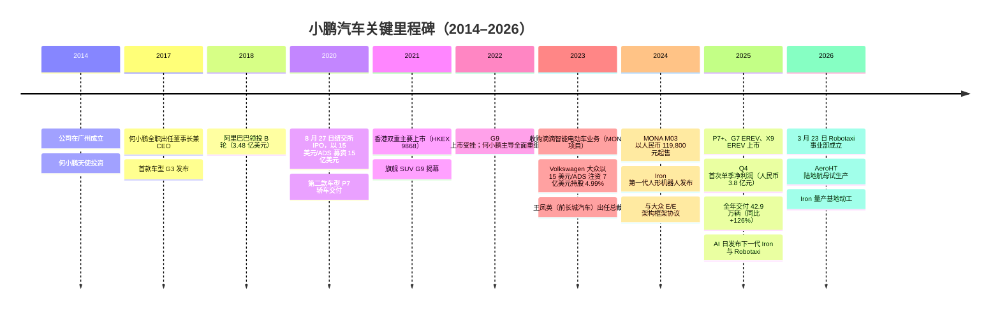
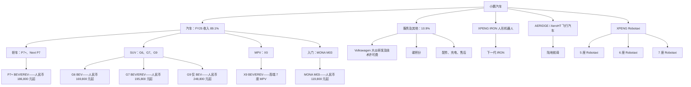
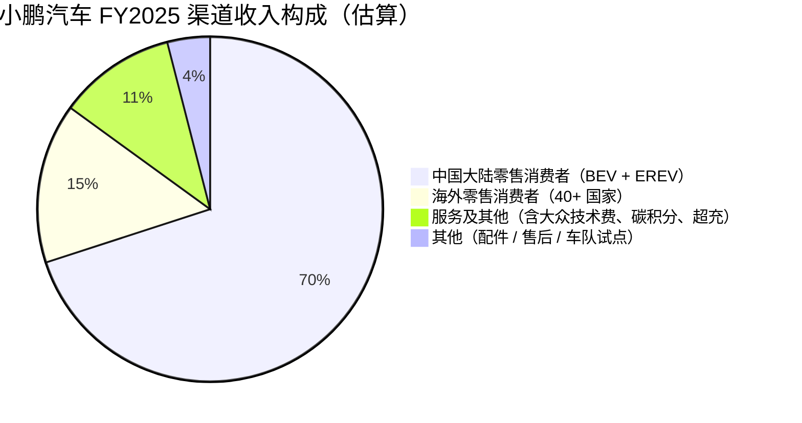

# 小鹏汽车（NYSE: XPEV / HKEX: 9868）——公司研究报告

**日期：** 2026-05-16
**主要上市地：** 纽约证券交易所（ADR 代码 XPEV，每 1 份 ADS = 2 股 A 类普通股）
**第二上市地：** 香港联合交易所（9868）
**成立时间：** 2014 年（经营主体：广州小鹏汽车科技有限公司，Guangzhou Xiaopeng Motors Technology）
**总部地址：** 中国广东省广州市天河区岑村枫庄大道 10 号，邮编 510640
**申报状态：** 外国私人发行人（年度 20-F / 中期 6-K）

> **更新——首次发布 FY2026 全年指引（2026-03-19）：** 管理层首次发布全年交付目标 **55 万至 60 万辆** FY2026 指引（对比 FY2025 的 429,445 辆），隐含销量增速 **+28% 至 +40%**，并重申 2026 年上半年实现单季度盈利的目标。Q1 2026 收入指引设定为 **人民币 122 亿至 132 亿元**，同比 **-22.8% 至 -16.0%**，为公司在更新 P7+/G6/G7/G9 产品线及增程版（EREV）爬坡过程中重置定价所致的低谷期；3 月环比交付指引回升 +69% 至 +101%。管理层列示的驱动因素：七款全新"Super EREV"车型、四款全球车型上市，以及 2026 年底前 XPENG IRON 人形机器人量产启动。
> 资料来源：[Xpeng Q4 & FY2025 earnings release, 2026-03-19](https://ir.xiaopeng.com/news-releases) · [CnEVPost: Xpeng logs first-ever net profit, 2026-03-20](https://cnevpost.com/2026/03/20/xpeng-logs-first-ever-net-profit/) · [InsiderFinance: Xpeng Profit Tempered by Weak 2026 Guidance, 2026-03-20](https://www.insiderfinance.io/news/xpeng-profit-tempered-by-weak-2026-guidance)。

---

## 目录

1. 公司概览
2. 公司历史
3. 管理团队
4. 产品与服务
5. 客户与市场开拓策略
6. 行业概览
7. 竞争格局
8. 市场机会（TAM）
9. 风险评估
10. 参考资料

---

## 1. 公司概览

小鹏汽车（XPeng Inc.）是一家垂直整合的中国智能电动汽车（公司自有分类为 Smart EV 及 NEV）设计、开发、制造和销售商，主要在中国乘用车市场中人民币 15 万至 30 万元（约 21,000 至 42,000 美元）的"主流至高端"细分市场参与竞争。截至 2025 年 12 月 31 日，公司在售七款车型——MONA M03、Next P7、P7+（含 P7+ EREV）、G6（含 G6 EREV）、G7（含 G7 EREV）、G9 及 X9（含 X9 EREV），**FY2025 交付 429,445 辆，同比增长 +125.9%，FY2024 为 190,068 辆，FY2023 为 141,601 辆**（[XPeng 2025 20-F, Item 5.A](https://www.sec.gov/Archives/edgar/data/1810997/000119312526157849/0001193125-26-157849-index.htm)）。在汽车产品线之外，公司持续将三项相邻业务定位为长期增长论点：**XPENG IRON**（自研图灵 AI 芯片驱动的人形机器人）、**XPENG AERIDGE / AeroHT**（"陆地航母"模块化飞行汽车），以及 **XPENG Robotaxi**（2026-03-23 成立的独立事业部，规划三款 Robotaxi 车型，并将于 2026 年下半年开启 L4 试运营）。

**商业模式。** 当前营收以汽车业务为绝对主导：**FY2025 整车销售收入为人民币 683.789 亿元（占比 89.1%），"服务及其他"收入为人民币 83.408 亿元（占比 10.9%）**（[XPeng 2025 20-F, Item 5.A](https://www.sec.gov/Archives/edgar/data/1810997/000119312526157849/0001193125-26-157849-index.htm)）。**FY2025 总收入达人民币 767.197 亿元（同比 +87.7%）**，毛利达人民币 144.729 亿元，**毛利率 18.9%**——较 FY2024 的 14.3% 提升 460 个基点，相对于 FY2023 的 1.5%（彼时公司以低于成本销售来清理库存）则是结构性重置。Q4 2025 汽车毛利率达 **13.0%**，合并毛利率达 **21.3%**，得益于服务及软件收入的阶跃式增长（包含碳积分以及来自 Volkswagen 大众技术服务收入的一次性贡献）（[CnEVPost: Xpeng logs first-ever net profit, 2026-03-20](https://cnevpost.com/2026/03/20/xpeng-logs-first-ever-net-profit/)）。

**地理布局。** 业务以中国为根基，拥有三座自有工厂——肇庆（综合 NEV 生产）、广州（智能驾驶车型及 X 系列）和武汉（增程及 G 系列），并在硅谷和圣地亚哥设有设计中心。**FY2025 海外交付量大致翻倍至约 4.5 万辆（占收入比超过 15%）**，业务覆盖 40 多个国家，包括挪威、德国、荷兰、丹麦、法国、英国、澳大利亚、泰国、印度尼西亚、新加坡、以色列、马来西亚和阿联酋（[CnEVPost: Xpeng overseas push, 2026-03-20](https://cnevpost.com/2026/03/20/xpeng-logs-first-ever-net-profit/)）。

**规模。** 20-F 披露公司约有 15,800 名全职员工，其中 **研发人员占比约 44.5%**（[XPeng 2025 20-F, Item 6.D](https://www.sec.gov/Archives/edgar/data/1810997/000119312526157849/0001193125-26-157849-index.htm)）。截至 2025 年 12 月 31 日，现金、受限制现金、短期投资及定期存款合计 **人民币 476.565 亿元（约 66 亿美元）**，较上年的人民币 419.625 亿元有所增加，**Volkswagen 大众投资**（大众集团于 2023 年 7 月以 15 美元/ADS 的价格出资约 7 亿美元购入小鹏汽车约 4.99% 股权）为其提供了重要支撑。公司未派发股息。


*资料来源：基于 [XPeng 2025 20-F, Item 5.A consolidated statements of operations](https://www.sec.gov/Archives/edgar/data/1810997/000119312526157849/0001193125-26-157849-index.htm) 整理的 6 图组合。*

**估值快照（截至 2026-05-15）。**

| 指标 | 小鹏汽车（XPEV） | 三年区间（XPEV） | 行业评价 |
|---|---|---|---|
| 股价（ADS） | 15.66 美元 | 5.95 – 26.07 美元 | — |
| 市值 | 约 153 亿美元 | 50 – 250 亿美元 | — |
| TTM 市盈率 | **为负（约 -44 倍；EPS -1.20）** | 始终为负（TTM 从未实现盈利） | 大多数纯 EV 初创公司均为负 |
| TTM 市销率 | **4.05 倍** | 约 1.5 – 7.0 倍 | 剔除 Tesla 特斯拉后 EV 同业中位数约 1.3 倍 |
| 市净率 | 约 3.0 倍 | 1.4 – 5.5 倍 | 相对账面价值溢价 |

同业可比（TTM 市销率，2026 年 5 月）：**理想汽车（LI）1.20 倍**、**蔚来（NIO）1.40 倍**、**极氪（ZK）0.70 倍**、**Tesla 特斯拉（TSLA）13.5 倍**、**比亚迪（002594.SZ）1.31 倍**（[stockanalysis.com — XPEV](https://stockanalysis.com/stocks/xpev/statistics/)、[stockanalysis.com — LI](https://stockanalysis.com/stocks/li/)、[Simply Wall St — ZK valuation](https://simplywall.st/stocks/us/automobiles/nyse-zk/zeekr-intelligent-technology-holding/valuation)、[BYD 002594.SZ Yahoo key-stats](https://finance.yahoo.com/quote/002594.SZ/key-statistics/)）。

**对负市盈率的解读。** TTM EPS 为 **-1.20 美元**（[stockanalysis.com — XPEV](https://stockanalysis.com/stocks/xpev/statistics/)）；FY2025 净亏损为 **人民币 -11.395 亿元**（[XPeng 2025 20-F, Item 5.A](https://www.sec.gov/Archives/edgar/data/1810997/000119312526157849/0001193125-26-157849-index.htm)）。这属于 **正快速向盈利拐点转化的烧钱式成长**，而非周期性谷底或一次性减值。驱动因素结构性可见：

- **经营杠杆。** 研发费用率从 **17.2%（FY2023）→ 15.8%（FY2024）→ 12.4%（FY2025）**，尽管研发绝对值同比增长 +47% 至人民币 94.90 亿元；销售管理费用率从 **21.4% → 16.8% → 12.2%**。在收入基数接近翻倍的同时，总运营费用占比基本保持稳定（[XPeng 2025 20-F, Item 5.A](https://www.sec.gov/Archives/edgar/data/1810997/000119312526157849/0001193125-26-157849-index.htm)）。
- **汽车毛利率重置。** 从 FY2023 的 -1.6%（疫情后去库存阶段低于成本销售），到 **FY2024 的 8.3% 再到 Q4 2025 的 13.0%**——得益于 MONA M03 上量与 P7+/G6/G9 共用同一计算与 E/E 平台，叠加碳积分、服务及大众研发费用使非整车收入同比 +66%。
- **季度拐点。** **Q4 2025 实现 GAAP 净利润人民币 3.8 亿元**，为 **公司历史上首个盈利季度**（[Yahoo Finance: XPENG Q4 Earnings Call Highlights](https://finance.yahoo.com/markets/stocks/articles/xpeng-q4-earnings-call-highlights-140626380.html)）。

**对市销率溢价的解读。** 4.05 倍 TTM 市销率使小鹏的估值约为 **剔除 Tesla 后 EV 同业中位数（约 1.3 倍）的 3 倍**，但仍不及 Tesla 13.5 倍的三分之一。该溢价更宜被解读为 **三大非整车相邻业务（Iron / AeroHT / Robotaxi）的期权价值**——市场正将其作为离散的实物期权叠加在已实现单季盈利的整车业务之上，再加上"AI-EV"叙事溢价，与当前市场对被视为中国 Physical AI（具身智能）代理标的的重新评级方式一致（[Yahoo Finance: XPENG Q4 Earnings Call Highlights, 2026-03-19](https://finance.yahoo.com/markets/stocks/articles/xpeng-q4-earnings-call-highlights-140626380.html)）。Goldman Sachs 高盛 2026 年 3 月给出的 25 美元目标价（对比即期约 16 美元）锚定于 **FY2026 收入增速 40% 的预测以及大众相关软件业务的利润率**（[Investing.com — Goldman Sachs raises XPEV PT to USD 25, 2026-03](https://www.investing.com/news/analyst-ratings/goldman-sachs-raises-xpeng-stock-price-target-to-25-on-2026-growth-outlook-93CH-4367011)）。考虑到 4.05 倍市销率虽高于同业但低于 >15 倍的"叙事性"阈值，我们将其定性为 **拉伸式估值（可解释，但尚未进入典型的"泡沫"区间）**，并将多倍数压缩情景的讨论延伸至第 9 节。


*资料来源：[stockanalysis.com — XPEV statistics](https://stockanalysis.com/stocks/xpev/statistics/)、[stockanalysis.com — LI](https://stockanalysis.com/stocks/li/)、[Simply Wall St — ZK](https://simplywall.st/stocks/us/automobiles/nyse-zk/zeekr-intelligent-technology-holding/valuation)、[Yahoo Finance — BYD 002594.SZ](https://finance.yahoo.com/quote/002594.SZ/key-statistics/)、[companiesmarketcap — TSLA](https://companiesmarketcap.com/tesla/pe-ratio/)。*

---

## 2. 公司历史

**创立故事。** 小鹏汽车（英文 XPeng Inc.，中文"小鹏汽车"——意为"Little Peng Motors"）于 **2014 年 8 月** 由 **何小鹏（He Xiaopeng）**、**夏珩（Henry Xia Heng）** 和 **何涛（He Tao）** 在广州创立，最初名为广州橙行智动汽车科技有限公司（后更名为广州小鹏汽车）。创立的核心论点是：一支互联网原生团队——何小鹏刚于 **2014 年 6 月以 47 亿美元** 将移动浏览器先驱 UCWeb 出售给阿里巴巴并亲自加盟担任高级职位——能够在中国传统厂商赶上 Tesla 特斯拉之前打造一款"智能电动车"，并以软件和 ADAS 而非动力总成作为核心差异化（[XPeng 2025 20-F, Item 6.A bio of Xiaopeng He](https://www.sec.gov/Archives/edgar/data/1810997/000119312526157849/0001193125-26-157849-index.htm)）。何小鹏在 2014 年最初以董事长兼天使投资人身份加入；2017 年 8 月离开阿里巴巴后全职出任 CEO。


*资料来源：[XPeng 2025 20-F, Item 4.A History and Development](https://www.sec.gov/Archives/edgar/data/1810997/000119312526157849/0001193125-26-157849-index.htm)；[XPENG IR — VW E/E Architecture Master Agreement](https://ir.xiaopeng.com/news-releases/news-release-details/master-agreement-ee-architecture-technical-collaboration)；[CnEVPost: Xpeng sets up robotaxi unit, 2026-03-23](https://cnevpost.com/2026/03/23/xpeng-sets-up-robotaxi-unit-accelerate-commercial-rollout/)。*

**关键转向。** 对当前投资论点而言，有三次至关重要：

1. **G9 重置（2022 年 Q4）。** 小鹏旗舰 SUV G9 上市时配置体系混乱、错失早期预订转化、拖累 FY2022 交付低于预期。何小鹏在 **2023 年初进行全面管理层调整**，引进行业资深人士 **王凤英（Fengying Wang）**——长城汽车任职时间最长的高管之一，被业内公认为中国汽车业最优秀的运营者之一——出任总裁。她在 2023 至 2025 年间主导的成本纪律、产品路线图收敛及经销商体系重构，为 FY2025 的单车经济性重置奠定基础。
2. **滴滴 / MONA 收购（2023 年）。** 2023 年 8 月，小鹏收购滴滴智能电动车开发业务，交割时（2023-11-13）向滴滴发行 5,816 万股 A 类普通股，并于 2024-08-13 完成基于 SOP（量产启动）触发的另一批次交割（[XPeng 2025 20-F, Item 4.A](https://www.sec.gov/Archives/edgar/data/1810997/000119312526157849/0001193125-26-157849-index.htm)）。该被收购项目演化为 **MONA M03**——人民币 119,800–155,800 元入门级智能电动轿车，贡献了 FY2025 大部分增量销量。该交易同时为小鹏接入滴滴出行网络以服务未来 Robotaxi 商业化打开通道。
3. **大众平台合作（2023→2024）。** 2023 年 7 月 7 亿美元股权投资（2023 年 Q4 交割）之后，2024 年 4 月签署 E/E 架构技术合作框架协议，2024 年 7 月签署主协议——小鹏联合开发"中国电子电气架构（CEA）"，自 2026 年起将搭载于大众中国专属 CMP 平台车型及部分面向中国市场的全球 MEB 平台车型之下（[CARIAD — China Electronic Architecture co-development](https://cariad.technology/de/en/news/stories/co-developement-china-electronic-architecture-xpeng.html)、[electrive.com — VW + Xpeng joint architecture, 2024-07-22](https://www.electrive.com/2024/07/22/vw-and-xpeng-introduce-joint-architecture-to-more-models/)）。

**近期进展（过去 12 个月）。** 2025 年 11 月，公司在广州举办第二届年度 **AI 日**，发布下一代 **IRON** 人形机器人、三款 **Robotaxi** 车型、**VLA 2.0**（Vision-Implicit Token-Action，视觉-隐式 Token-动作）模型，以及第二代 **AERIDGE / AeroHT** 飞行汽车；Volkswagen 大众被宣布为 VLA 2.0 和图灵 AI 芯片的首发客户（[XPENG IR — Physical AI Emergence press release, 2025-11-05](https://www.xpeng.com/news/019a56f54fe99a2a0a8d8a0282e402b7)、[Electrek: Xpeng AI Day, 2025-11-05](https://electrek.co/2025/11/05/xpeng-ai-day-new-ai-model-powering-robots-robotaxis-and-flying-cars/)）。陆地航母于 2025-11-03 在广州黄埔区下线首批试生产产品（[CnEVPost: Aridge produces 1st flying car, 2025-11-03](https://cnevpost.com/2025/11/03/xpeng-aridge-produces-1st-flying-car-mass-production-facility/)）。2026-03-23，Robotaxi 事业部正式成立（[CnEVPost: Xpeng sets up robotaxi unit, 2026-03-23](https://cnevpost.com/2026/03/23/xpeng-sets-up-robotaxi-unit-accelerate-commercial-rollout/)）。

---

## 3. 管理团队

### 何小鹏（He Xiaopeng）——联合创始人、董事长兼 CEO（48 岁）

何小鹏是创始人原型的 CEO，其个人履历是小鹏汽车投资论点的核心。他于 **2004 年联合创办 UCWeb**，担任产品副总裁，将其打造为中国最大的移动浏览器公司；UCWeb 于 **2014 年 6 月以约 47 亿美元被阿里巴巴收购**，是当时中国互联网史上最大的并购交易。在阿里巴巴期间，他先后担任阿里移动事业群总裁、阿里游戏董事长及土豆网总裁，直至 2017 年 8 月离任并全职接手小鹏汽车。他自 2014 年公司创立起即为天使投资人（[XPeng 2025 20-F, Item 6.A bio](https://www.sec.gov/Archives/edgar/data/1810997/000119312526157849/0001193125-26-157849-index.htm)）。何小鹏 1999 年获华南理工大学计算机科学学士学位，2020 年获中华人民共和国高级经济师（技术创业方向）资质。2018 年 5 月至 2020 年 5 月，他曾担任纽交所上市公司虎牙（HUYA Inc.）独立董事兼审计委员会成员。

小鹏治理结构中最重要的事实是：**截至 2026 年 3 月 31 日，何先生为所有已发行 B 类普通股的实际受益人，占公司总投票权的 69.1%**（[XPeng 2025 20-F, Item 6.E / Item 7.A](https://www.sec.gov/Archives/edgar/data/1810997/000119312526157849/0001193125-26-157849-index.htm)）。小鹏汽车因此是一家受控、创始人主导、双重股权结构的公司。何先生借助这种控制力：(a) 在 2022 年 G9 受挫之后毫无投资人异议地完成业务吸收，并由王凤英主导重组业务；(b) 在 FY2025 谷底将营收的约 12% 投入研发，未受外部削减压力；(c) 大力推动公司进入相邻业务（人形机器人、飞行汽车、Robotaxi），而同业要么落后（蔚来、理想均无规模化的人形机器人项目），要么将相关投入外包（比亚迪的机器人项目规模较小且嵌入工厂自动化中）。何先生在中国社交媒体上保持活跃，亲自主持小鹏每年两次的 AI 日，并被广泛认为是中国少数每周亲自试驾自家车辆的科技创始人之一。这一集中度的风险正是其优势的镜像：愿景、资本配置和接班均存在单点故障。公司尚未公布接任计划，何先生现年 48 岁——值得关注但短期内非紧迫担忧。

### 顾宏地（Hongdi Brian Gu）——名誉副董事长兼联席总裁（53 岁）

顾宏地是公司最资深的资本市场及对外事务高管。**2004 至 2018 年期间，他任职于摩根大通（J.P. Morgan Chase），最后职位为董事总经理兼摩根大通亚太投资银行业务主席**，主导了该时期中国大量最大型的跨境交易（[XPeng 2025 20-F, Item 6.A](https://www.sec.gov/Archives/edgar/data/1810997/000119312526157849/0001193125-26-157849-index.htm)）。他于 2018 年加入小鹏，并主导设计了 **2020 年 8 月以 15 美元/ADS 完成的 15 亿美元纽交所 IPO**、**2021 年 7 月香港双重主要上市**，以及 **2023 年 Volkswagen 大众 7 亿美元战略投资**。他持有华盛顿大学生物化学博士学位（1997）、耶鲁大学 MBA（1999）和俄勒冈大学化学学士学位（1993）。2018 年 6 月至 2019 年 6 月期间，他曾任纳斯达克上市公司优信（NASDAQ: UXIN）董事。他是公司在大众合作与 AeroHT IPO 事务上的主要发言人，路透报道 AeroHT 正在筹备以独立公司形式赴港上市。

### 王凤英（Fengying Wang）——总裁（55 岁）

王凤英于 2023 年初加入小鹏出任总裁，是 FY2024–FY2025 利润率转折背后的运营核心。她在 **中国汽车行业拥有 30 余年从业经验，全部在长城汽车（HK:2333 / SSE:601633）度过**，1991 年至 2022 年期间历任副董事长（2016 年 3 月 – 2022 年 3 月）、执行董事（2001 年 6 月 – 2022 年 3 月）及总经理（2002 年 11 月 – 2022 年 7 月）（[XPeng 2025 20-F, Item 6.A](https://www.sec.gov/Archives/edgar/data/1810997/000119312526157849/0001193125-26-157849-index.htm)）。在长城期间，她主导哈弗 SUV 品牌发展，使其在十年间成为中国最大的 SUV 品牌；她被业内广泛认为是中国汽车业最强的商业与渠道运营者之一。其加盟小鹏六个月内，公司便启动经销商网络重整（向直营 + 代理混合模式转型）、对 G6 进行定价重置并推出 MONA M03——三项核心运营动作驱动单车经济性从 FY2023 毛利率 1.5% 升至 FY2025 的 18.9%。她持有天津财经学院经济学硕士学位（1999）。

### 吴佳铭（Jiaming "James" Wu）——财务与会计副总裁（42 岁）

吴佳铭是小鹏最高级别的财务负责人（职衔为财务与会计副总裁而非 CFO）。他在加入小鹏前曾在 **上汽通用五菱（2022 年 7 月 – 2023 年 5 月）及 PT SGMW Motor Indonesia（2019 年 7 月 – 2022 年 6 月）担任 CFO 及副总裁**，更早在通用汽车（General Motors）美国总部任财务经理（2017–2019），以及通用汽车国际运营部任区域财务经理（2012–2017）（[XPeng 2025 20-F, Item 6.A](https://www.sec.gov/Archives/edgar/data/1810997/000119312526157849/0001193125-26-157849-index.htm)）。耶鲁大学 MBA（2012）。其在上汽通用五菱的任职经历高度相关——五菱是中国汽车行业最低成本的大众市场电动车制造商、宏光 MINI 的运营方，并将 5 万元以下电动车的成本结构推入行业。这种成本工程背景与小鹏 MONA M03 及未来 Robotaxi 车型定价的关键路径高度契合。

### 公司治理

- **董事会（8 名董事）：** 何小鹏（执行董事）、Ji-Xun Foo（非执行董事，前 GGV / Granite Asia）、四名独立非执行董事（杨东皓 Donghao Yang，前唯品会 CFO，哈佛 MBA；Fang Qu，小红书联合创始人；张宏江 HongJiang Zhang，前金山 CEO 兼微软杰出科学家；陈宇东 Yudong Chen）；再加上王凤英（总裁）与顾宏地（名誉副董事长）（[XPeng 2025 20-F, Item 6.C](https://www.sec.gov/Archives/edgar/data/1810997/000119312526157849/0001193125-26-157849-index.htm)）。张宏江尤其带来深厚的 AI 系统可信度（1999–2011 年任微软亚太研发集团 CTO）。
- **内部人投票权集中度：** B 类股（何先生）= 69.1% 投票权；A 类股中包括 Volkswagen 大众集团，其设有不具表决权的董事观察员席位，并在经济权益达 5% 后享有附条件的董事提名权（[XPeng 2025 20-F, Item 6.C / Item 7.A](https://www.sec.gov/Archives/edgar/data/1810997/000119312526157849/0001193125-26-157849-index.htm)）。
- **薪酬：** FY2025 年董事及高管现金薪酬与实物福利合计 **人民币 1.82 亿元**（[XPeng 2025 20-F, Item 6.B](https://www.sec.gov/Archives/edgar/data/1810997/000119312526157849/0001193125-26-157849-index.htm)）。截至 2026-03-31，根据 2019 / 2025 股权激励计划尚有 5,289 万股 RSU 在外。
- **关联方交易：** 重要——汇天 / AeroHT 飞行汽车业务和广州雪涛（GIIA 保险代理）分别由何小鹏先生和何涛先生控制，并由小鹏汽车依合作协议供货。2024 年与广东汇天签署的合作框架协议已于 2025-08-22 续签至 2026–2028 年（[XPeng 2025 20-F, Item 7.B](https://www.sec.gov/Archives/edgar/data/1810997/000119312526157849/0001193125-26-157849-index.htm)）。该项为重点观察事项：积极面在于小鹏可在不合并早期亏损的情况下接入飞行汽车商业化；消极面在于若 AeroHT 以高估值 IPO，治理复杂度将上升。

### 履历整合

该团队已交付出最近期的运营论点——在两年内将净利率从 -33.8% 的业务扭转为毛利率 +18.9% 的业务，同时使销量两度翻倍——并凭借此前职业生涯（UCWeb 退出、长城汽车、通用五菱、摩根大通投行）的可信度，向更宏大的"具身智能（Physical AI）"论点进军。核心短板在于 **接班深度**：小鹏仍是一家"何小鹏与王凤英"的公司。

---

## 4. 产品与服务

根据 2025 年 20-F 披露及 [XPENG Hong Kong product page](https://www.xpeng.com/)，小鹏汽车的产品体系可划分为 **(a) 面向零售消费者的智能电动车（BEV + EREV），(b) 通过汇天 / AeroHT 关联方架构提供的飞行器，(c) IRON 人形机器人，(d) Robotaxi（车辆 + L4 软件栈），以及 (e) 服务及其他**（研发服务、售后、超充、配件、碳积分及 Volkswagen 大众技术服务收入流）。


*资料来源：[XPeng 2025 20-F, Item 4.B Business Overview](https://www.sec.gov/Archives/edgar/data/1810997/000119312526157849/0001193125-26-157849-index.htm)；[Xpeng updates 4 models for 2026, CnEVPost 2026-01-08](https://cnevpost.com/2026/01/08/xpeng-updates-4-models/)；[XPENG AI Day 2025 release](https://www.xpeng.com/news/019a56f54fe99a2a0a8d8a0282e402b7)。*

### 智能电动车产品组合（占收入 89%）

- **MONA M03（轿车）。** 入门级车型，价格区间人民币 119,800–155,800 元，源自滴滴收购资产。驱动了 FY2024 下半年及 FY2025 大部分增量销量。**竞争优势：是，部分（成本 + 规模）。** 护城河类型：通过与价格更高的 P7/G6/G9 共享 E/E + ADAS 平台，在人民币 10–15 万元价位实现成本领先；该价位段竞品通常缺乏旗舰级 ADAS 软件栈。最直接竞争对手：**比亚迪秦 PLUS EV / 海豹 06 DM-i（人民币 99,800 元起，混动）**——小鹏在 ADAS 上领先，比亚迪在供应链整合和纯成本上领先（[XPENG MONA M03 product page](https://www.xpeng.com/)）。
- **Next P7 / P7+（中型轿车）。** 2026 款焕新升级，BEV（CLTC 续航 615 / 725 公里）及 EREV 版本（49.2 kWh 电池，CLTC 纯电续航 430 公里）。起售价 **人民币 186,800 元**（[CnEVPost: Xpeng updates 4 models, 2026-01-08](https://cnevpost.com/2026/01/08/xpeng-updates-4-models/)）。**竞争优势：是（技术 + ADAS）。** 护城河：原生 XNGP（XPENG Navigation Guided Pilot，小鹏导航辅助驾驶）全场景 ADAS + 800V XPower 架构，2026 款车型搭载图灵 AI 芯片。最直接竞争对手：**小米 SU7**（人民币 215,900 元起）——驾驶体验持平，品牌势能略落后，但 ADAS 场景覆盖率领先。Tesla Model 3 特斯拉 Model 3（人民币 232,000 元起）亦为直接竞品，小鹏在全球品牌上略弱，但在中国本土 ADAS 功能广度上领先。
- **G6（紧凑型 SUV）。** 起售价区间人民币 169,800–230,800 元；2026 款标配图灵 AI 芯片，CLTC 续航 625 公里，单电机后驱。**竞争优势：是（技术 + 生态）。** 护城河类型：通过 XOS 天玑 OS + OTA 功能升级 + AeroHT / Robotaxi 期权价值构建的转换成本。最直接竞争对手：**Tesla Model Y 特斯拉 Model Y（中国制造，人民币 263,500 元起）**——小鹏在价格-配置比上占优，但落后于特斯拉的品牌溢价定价能力。
- **G7（中型 SUV）。** 人民币 195,800–235,800 元；2026 款新增 EREV 版本，纯电续航 430 公里，综合续航超 1,704 公里（[CnEVPost: Xpeng updates 4 models, 2026-01-08](https://cnevpost.com/2026/01/08/xpeng-updates-4-models/)）。**部分优势**——与理想 L7 EREV（人民币 309,800 元起）正面竞争，理想是增程销量品类领导者；小鹏在 ADAS 上领先，在家庭 MPV 人机工程上落后。
- **G9（高端 SUV）。** 仅 BEV，价格人民币 248,800–278,800 元；旗舰单/双电机 RWD/AWD，0–100 公里/小时最快 4.2 秒，CLTC 续航 625/680/725 公里。**竞争优势：部分。** 直接竞品：蔚来 ES6（人民币 33.8 万元起）、Tesla Model Y Long Range 特斯拉 Model Y 长续航版、问界 M7（华为）。小鹏的 ADAS 具备竞争力——但华为鸿蒙智行已在搭载智能驾驶的高端 EV 细分市场赢得心智份额。
- **X9（高端 MPV）。** 顶配 7 座 MPV，含 X9 EREV。**部分优势**——丰田 Sienna 与别克 GL8 主导中国家庭 MPV 细分市场；小鹏作为智能电动车替代选择，但绝对销量较小。

### 服务及其他（FY25 年翻倍的 11%）

- **Volkswagen 大众技术服务收入。** 依据 2024-07-22 E/E 架构主协议以及对中国电子电气架构（CEA）的联合开发（[XPENG IR press release](https://ir.xiaopeng.com/news-releases/news-release-details/master-agreement-ee-architecture-technical-collaboration)）。大众预计 CEA 将带来 **相对 MEB 平台 40% 的 BOM 成本降低及 30% 的控制单元数减少**，首批量产时间约为 2026 年年中（[Volkswagen Group press release: smart vehicles at China speed](https://www.volkswagen-group.com/en/articles/smart-vehicles-at-china-speed-volkswagen-develops-high-performance-ee-architecture-for-electric-vehicles-in-china-with-xpeng-18335)）。**竞争优势：是（强）——小鹏是唯一以此规模向全球传统 OEM 授权 Tier-1 级 E/E 平台的中国 EV 公司。** 最接近的可比者：华为 HI / 鸿蒙智行（商业模式不同——华为销售全栈而非平台架构授权）。
- **碳积分、超充、配件、售后。** 对毛利率提升有重要贡献；FY2025 服务收入同比 **+121.9% 至人民币 83.408 亿元**（[XPeng 2025 20-F, Item 5.A](https://www.sec.gov/Archives/edgar/data/1810997/000119312526157849/0001193125-26-157849-index.htm)）。

### XPENG IRON（人形机器人）

第一代 IRON 在 2024 年 AI 日发布；**下一代 IRON** 于 2025 年 AI 日（2025-11-05）揭幕（[CnEVPost: Xpeng unveils next-gen Iron, 2025-11-05](https://cnevpost.com/2025/11/05/xpeng-unveils-next-gen-iron-humanoid-robot/)）。规格：**身高 178 厘米、体重 70 公斤、22 自由度仿生手、人形脊柱、仿生肌肉、柔性皮肤、3D 曲面屏头部，搭载三颗自研图灵 AI 芯片提供 2,250 TOPS 算力，搭载第二代 VLA 模型**。当前已部署在 **小鹏自家 EV 生产线** 执行复杂子任务；**宝山钢铁（宝武集团子公司）** 被指定为首个外部工业试点客户，使用 IRON 进行设备磨损监测（[Qviro Blog: XPENG IRON](https://qviro.com/blog/xpeng-launches-iron-advanced-humanoid-robot/)）。**量产基地于 2026 年 Q1 在广州动工**；占地 **约 110,000 平方米**；目标 **2026 年底前月产能 >1,000 台**（[CnEVPost: Xpeng to break ground on humanoid robot factory, 2026-02-25](https://cnevpost.com/2026/02/25/xpeng-to-break-ground-on-humanoid-robot-factory-q1/)）。**竞争优势：是，部分（技术 + 制造）——最接近的竞争对手为 Tesla Optimus 特斯拉 Optimus 和 Unitree 宇树**。特斯拉在 AI 与数据集成上领先（与 FSD 共享大脑）；Unitree 和 AgiBot（智元机器人）产品价格更低但缺乏汽车级制造能力（[Rest of World: China humanoid robots, 2026](https://restofworld.org/2026/china-humanoid-robots-unitree-agibot-tesla-optimus/)）。小鹏的优势在于其自有 EV 生产线作为内部稳定批量客户，以及与汽车业务共享的图灵芯片 / VLA 栈。

### XPENG AERIDGE / AeroHT（飞行汽车）

由 HT Flying Car Inc.（"汇天"）开发，小鹏对其持有少数股权及债权投资并签署合作协议；何小鹏先生为主要股东（[XPeng 2025 20-F, Item 13 Long-term Investments](https://www.sec.gov/Archives/edgar/data/1810997/000119312526157849/0001193125-26-157849-index.htm)）。**陆地航母**为一款六轮增程式皮卡，内置可分离的两座模块化 eVTOL 飞行器；综合 CLTC 续航 >1,000 公里；飞行器采用六旋翼构型及碳纤维机体。**于 2025-11-03 在 120,000 平方米的广州黄埔工厂开启首批量产试制**——《环球时报》称其为 **全球首座采用汽车式装配线的专用飞行汽车工厂，理论产能为每 30 分钟一架**（[Global Times: China's first flying car factory begins trial production, 2025-11](https://www.globaltimes.cn/page/202511/1348045.shtml)；[Autocar: Xpeng Land Aircraft Carrier on track for 2026](https://www.autocar.co.uk/car-news/new-cars/xpeng-land-aircraft-carrier-flying-car-track-2026)）。售价约 **人民币 200 万元（约 28 万美元）**；订单簿约 **7,000 份预订（2025 年 10 月）**，其中包括 2025 年 10 月披露的 **600 台中东订单**（[carnewschina: Aeroht secures 600 orders in Middle East, 2025-10-13](https://carnewschina.com/2025/10/13/xpeng-aeroht-secures-600-orders-for-its-land-aircraft-carrier-in-middle-east/)）。目标 2026 年底前全面交付，2027 年放量爬坡（[gsmgotech: Xpeng's Flying Car Dream, 2026-04](https://www.gsmgotech.com/2026/04/xpengs-flying-car-dream-takes-off-land.html)）。**竞争优势：是（监管 + 制造先发优势）**——是中国唯一具备运营级飞行汽车工厂、且具备通过民航局型号合格证（CAAC）路径的项目；西方同业目前均未达此量产阶段。路透报道 AeroHT 正在筹备港股 IPO；小鹏将保留少数经济权益。

### XPENG Robotaxi

2025 年 AI 日发布三款 SKU——5 座、6 座、7 座——全部目标售价 **低于人民币 20 万元（约 29,100 美元）**，每车配置四颗图灵 AI 芯片提供合计 **3,000 TOPS 算力**，无激光雷达、无高精地图依赖（纯视觉 ADAS）（[Self-Driving Cars 360: Robotaxi targets L4 in 2027, 2025-11](https://www.selfdrivingcars360.com/xpengs-new-robotaxi-business-unit-targets-driverless-l4-operations-in-2027/)、[globalchinaev: 2026 rollout of three L4 robotaxis](https://globalchinaev.com/post/xpeng-plans-2026-rollout-of-three-l4-robotaxis-using-pure-vision-adas)）。**Robotaxi 事业部于 2026-03-23 成立**。试点运营自 **2026 年下半年** 开启；无安全员目标 **2027 年初**（[CnEVPost: Xpeng sets up robotaxi unit, 2026-03-23](https://cnevpost.com/2026/03/23/xpeng-sets-up-robotaxi-unit-accelerate-commercial-rollout/)）。MONA 收购以来作为战略股东的滴滴是潜在的车队合作伙伴。**竞争优势：部分**——Waymo 和百度 Apollo 在商业化运营上领先数年，但小鹏拥有公布单车成本最低的方案，且是唯一一家以低于 3 万美元价格向消费者出售自有 Robotaxi 硬件的玩家。

### 旗舰车型 vs. 长尾车型

驱动当前业务的 1–3 款旗舰车型为：**(1) MONA M03**（增量销量驱动），**(2) G6 + G7**（中端价位的利润锚定），**(3) P7+**（品牌与 ADAS 光环效应）。Iron / AeroHT / Robotaxi 属于 **期权价值型旗舰** 而非近期收入驱动。初代 G3 和原始 P5 已停产或处于产品末期。

### 过去 12 个月的上市与停产

- **2025 年 Q3**：G7 上市（中型 SUV，人民币约 19.5 万元起）——初期市场反响积极，贡献 Q4 约 3 万辆交付。
- **2025 年 Q4**：AI 日发布下一代 IRON、三款 Robotaxi SKU 及 VLA 2.0（2025-11-05）；AeroHT 陆地航母试生产（2025-11-03）；X9 EREV 上市。
- **2026 年 Q1**：P7+、G6、G7、G9 的 2026 年款焕新上市，标配图灵 AI 芯片（2026-01-08）。
- **2026 年 Q1**：Robotaxi 事业部成立（2026-03-23）；Iron 量产工厂动工（2026 年 Q1）。
- **2026 年路线图**：7 款全新 Super-EREV 车型；4 款全球车型，含 6 座全尺寸 GX 旗舰；MONA L05 和 G9L 已在工信部完成申报。

---

## 5. 客户与市场开拓策略

小鹏汽车的收入构成以 **B2C** 为绝对主导——中国（以及越来越多的欧洲、东南亚、中东）个人消费者通过 **小鹏自营零售门店、授权代理商、官网直营销售及小规模 B2B / 车队渠道** 的混合方式购车。作为开曼注册控股公司、单一可报告汽车业务分部的外国私人发行人，小鹏的客户集中度披露受 ASC 280-10-50-42 规则约束。公司 **不存在任何达到 10% 阈值的单一客户**，且 **未披露前 1 或前 5 客户份额**——与 B2C 整车厂特征一致，但随着车队、Volkswagen 大众技术服务及 Robotaxi B2B 收入扩大，这是一项真实的披露缺口。


*资料来源：[XPeng 2025 20-F, Item 5.A revenue split](https://www.sec.gov/Archives/edgar/data/1810997/000119312526157849/0001193125-26-157849-index.htm)（整车 89.1% / 服务 10.9%）和 [CnEVPost: Xpeng overseas push, 2026-03-20](https://cnevpost.com/2026/03/20/xpeng-logs-first-ever-net-profit/)（海外 15%+）。*

### 客户集中度——量化

- **前 1 客户收入占比：** **< 10%**（20-F 分部附注未披露任何单一客户）。小鹏自身声明予以证实："本集团仅有一个可报告分部……首席运营决策者……在做资源配置决策时审阅合并收入、毛利和净亏损"（[XPeng 2025 20-F, segment note in consolidated financial statements](https://www.sec.gov/Archives/edgar/data/1810997/000119312526157849/0001193125-26-157849-index.htm)）。
- **前 5 客户占比：** **20-F 未披露**，但可推断 **较低**，原因在于 (a) 公司 FY2025 共向终端消费者销售约 42.9 万辆车，绝大多数为个人；(b) 最大的 B2B 收入流（大众技术服务）基于披露的大众 SOP 节奏，本身仍远低于总收入的 10%。
- **B2B 关注点——Volkswagen 大众。** 向大众供应 CEA / E/E 架构和图灵 AI 芯片授权的收入正在增长，但目前仍占总收入的个位数；合同采用 **多年期主协议** 结构（2024 年 4 月框架协议 + 2024 年 7 月主协议）（[XPENG IR press release on E/E Master Agreement](https://ir.xiaopeng.com/news-releases/news-release-details/master-agreement-ee-architecture-technical-collaboration)）。随着 2026–2027 年 CEA 车型 SOP 启动，将逐步显现为前 1 B2B 客户；**大众是小鹏目前最接近 Tier-1 客户关系的合作方**。小鹏在风险因素中标注大众敞口："任何 Volkswagen 合作的失败或延迟都可能损害"业务（[XPeng 2025 20-F, Item 3.D Risk Factors](https://www.sec.gov/Archives/edgar/data/1810997/000119312526157849/0001193125-26-157849-index.htm)）。
- **B2B 关注点——Robotaxi。** 未来车队客户（滴滴、哈啰出行、T3 出行、曹操出行）尚未产生收入。2026-03-23 Robotaxi 事业部成立后，计划向滴滴（2023 年 MONA 交易换股后的战略股东）销售车队车辆。
- **B2B 关注点——飞行汽车。** 据报道 AeroHT 在 2025 年 10 月获得一笔 **600 台中东订单**，按目录价约 1.68 亿美元——若落地具有重要意义，但 2026 年规模有限（[carnewschina: Aeroht secures 600 orders in Middle East, 2025-10-13](https://carnewschina.com/2025/10/13/xpeng-aeroht-secures-600-orders-for-its-land-aircraft-carrier-in-middle-east/)）。

**结论。** 前 1 客户集中度 **较低**（<10%，低于 ASC 280 重要性阈值）；FY2025 前 5 客户集中度最有可能 **<20%**。这相对于 Tier-1 供应商（例如小鹏自己的芯片与 ADAS 供应商 Nvidia 英伟达 / Mobileye）属于 **结构性有利**，但情况正在变化：Volkswagen 大众 + Robotaxi 车队 + AeroHT B2B 订单将在 2026–2028 年形成新的集中度，公司应进行更为严格的披露。

### 市场开拓

小鹏与蔚来、特斯拉一起，是中国 **直营门店 + 超充网络** 零售模式的开拓者；但在 2023–2024 年，王凤英主导下转向 **代理-经销混合模式**，以更快覆盖下沉城市。截至 FY2025，门店网络覆盖中国约 600 家及海外约 150 家。**2026 年底海外门店目标 680 家**（[Grafa: XPENG reports record FY2025 results & 2026 strategy](https://grafa.com/en/news/united-states/xpeng-xpev-fy-2025-earnings-delivery-growth-margins)）。

**消费乘用车销售周期** 较短（从配置到交付通常以天/周计）。**营销** 以数字渠道为主，辅以 AI 日活动和技术演示（自动驾驶公开直播）。**合作伙伴** 包括：Volkswagen 大众（E/E + MEB）、滴滴（Robotaxi）、宝山钢铁（IRON 试点）、苏州工业园区（Robotaxi 路测）、宁德时代及主要电池厂商，以及 Nvidia 英伟达 / Mobileye（非图灵芯片 ADAS 版本）。

**典型案例 / 客户胜出。** 公开命名的客户：Volkswagen 大众（CEA + 图灵芯片提名，2025-11）、宝山钢铁（IRON）、滴滴（MONA + 未来 Robotaxi），以及未具名的中东 AeroHT 车队订单方。

---

## 6. 行业概览

小鹏目前在两个行业中竞争（中国乘用车 NEV；全球汽车 E/E 与软件服务），并将于 2027 年及之后进入三个新行业（人形机器人；eVTOL / 城市空中交通；L4 Robotaxi 服务）。

### 中国乘用 NEV 市场

中国是全球最大的汽车市场和最大的 NEV 市场。**2026 年 4 月 NEV 零售渗透率达 61.4%——史上首次超过 60% 的月份，同比提升 9.7 个百分点**（[ChinaEVHome: China NEV penetration hits 60%, 2026-05-11](https://chinaevhome.com/2026/05/11/china-nev-penetration-hits-60-and-export-share-smashes-50-in-april/)；[CnEVPost: China April NEV retail sales, 2026-05-11](https://cnevpost.com/2026/05/11/china-apr-2026-nev-retail-sales/)）。4 月 NEV 零售为 84.9 万辆（同比 -6.8%，因一线城市 ICE 向 EV 替代趋于饱和而连续第 4 个月同比下滑），批发为 122.5 万辆（同比 +7.5%），两者差额为出口。

**结构。** 集中且持续整合。**比亚迪以 21.4% 的 NEV 零售份额位居第一（2026 年 4 月）**（[CnEVPost: Automakers' share in China NEV market April, 2026-05-13](https://cnevpost.com/2026/05/13/automakers-share-china-nev-market-apr-2026/)）；Tesla 特斯拉、吉利-极氪、零跑、小米、理想、问界（华为）、蔚来、小鹏共同构成前十。自 2023 年起加剧的 **价格战** 使 Tesla 特斯拉、比亚迪等先后降价 60 多次；小鹏的应对方式是推出 MONA M03（入门级进攻）和 2026 款焕新（标配图灵 AI 芯片、增程版本），而非全线降价。

**增长驱动。**

- 中国城市消费者向 NEV 迁移。
- ICE 向 EV 转型加速：**2026 年 4 月燃油车零售同比 -37%**（[Electrek: ICE age over in China, 2026-05-12](https://electrek.co/2026/05/12/the-ice-age-is-over-gas-car-sales-drop-37-in-worlds-biggest-market/)）。
- 政府激励（购置税豁免延长至 2025 年；以旧换新补贴延续至 2026 年；EREV 在部分城市免限牌）。
- **出口成为下一增长极**：2026 年 4 月 NEV 出口同比 +111.8% 至 40.6 万辆；**NEV 占乘用车总出口份额达 52.7%，史上首次过半**（[ChinaEVHome](https://chinaevhome.com/2026/05/11/china-nev-penetration-hits-60-and-export-share-smashes-50-in-april/)）。

**监管。** 车辆需通过工信部产品准入；智能驾驶 / 数据本地化规则（网信办、工信部）在 2025–2026 年持续收紧；**与大众的 E/E 架构联合开发是中国智能电动车公司首次向全球 OEM 授权符合监管级别的平台**。CAAC（民航局）对 eVTOL 飞行汽车的认证框架是 AeroHT 规模化的监管瓶颈。

**行业动态。** 品牌层面分散（中国 NEV 品牌 50 余家），但 **整合迅速**：2024–2026 年间多个新进入者退出（高合破产、爱驰、威马破产，哪吒陷入财务困境，极越宣布关闭）。供应商势力中等（宁德时代 / 比亚迪 / 国轩高科电池寡头）；买方议价力高（消费者价格敏感）；替代品威胁低（BEV/EREV 是主流转型路径，氢能边缘化）；行业内竞争激烈。

### 全球汽车 E/E 与软件服务

大众交易为小鹏开辟出新的可触达市场。全球 OEM（大众、奥迪 Audi、保时捷 Porsche、斯柯达 Skoda、Cupra）正在加速压缩 E/E 软件定义汽车（SDV）研发周期，以应对中国本土竞争。**CARIAD 与小鹏共同开发的 CEA 目标相对 MEB 实现 BOM 成本下降 40% 和控制单元数减少 30%**（[Volkswagen Group: smart vehicles at China speed](https://www.volkswagen-group.com/en/articles/smart-vehicles-at-china-speed-volkswagen-develops-high-performance-ee-architecture-for-electric-vehicles-in-china-with-xpeng-18335)）。

### 人形机器人

仍处早期阶段——Counterpoint Research 统计 **2025 年全球人形机器人装机量 16,000 台**，预计 **2026 年全球市场规模 40–50 亿美元（vs. 2025 年 20–30 亿美元），2030 年 TAM 100–150 亿美元**（[Standard Bots: Humanoid robots in 2026 types/prices](https://standardbots.com/blog/humanoid-robot)）。中国厂商（宇树 Unitree、智元 AgiBot、优必选 UBTech、小鹏）占全球出货量约 90% 份额；**Tesla Optimus 特斯拉 Optimus 未达成其 2025 年 5,000 台目标**，公开目标为 2026 年扩产至 5 万至 10 万台（[Rest of World, 2026](https://restofworld.org/2026/china-humanoid-robots-unitree-agibot-tesla-optimus/)）。集邦咨询 TrendForce 预计 2026 年中国人形机器人产量同比 +94%，宇树 + 智元在中国合计份额约 80%（[TrendForce, 2026-04-09](https://www.trendforce.com/presscenter/news/20260409-13007.html)）。

### eVTOL / 城市空中交通

全球尚未规模化产生收入；Joby、Archer、亿航 EHang、Volocopter、Lilium 是已知的西方/中国玩家。**AeroHT 的陆地航母是首个采用汽车式装配线批量试生产的产品**。中国民航局 CAAC 认证时间表是关键限制因素。

### L4 Robotaxi

已在部分城市投入运营（美国 Waymo、中国百度 Apollo Go、小马智行 Pony.ai、文远知行 WeRide）。商业化收入仍较小。小鹏的押注是 **以最低成本（<3 万美元）打造可量产的 L4 车辆并销售给车队运营商**，相比之下 Waymo 车辆成本超过 15 万美元。TAM 的核心争论在于车队 TCO 经济性是否成立；小鹏公开的单车经济性表明可成立，但尚未在规模上得到验证。

---

## 7. 竞争格局

```mermaid
quadrantChart
    title 中国智能电动车竞争图（2026）
    x-axis "成本 / 销量" --> "高端 / 技术"
    y-axis "传统汽车基因" --> "互联网 / AI 基因"
    quadrant-1 高端技术，AI 原生
    quadrant-2 高端技术，传统汽车
    quadrant-3 销量型，传统汽车
    quadrant-4 销量型，AI 原生
    XPeng: [0.65, 0.85]
    Li Auto: [0.6, 0.7]
    Nio: [0.8, 0.75]
    Xiaomi: [0.55, 0.9]
    Aito (Huawei): [0.8, 0.85]
    Zeekr: [0.6, 0.45]
    Tesla CN: [0.7, 0.6]
    BYD: [0.35, 0.3]
    Leapmotor: [0.25, 0.5]
    MONA (entry): [0.25, 0.65]
```
*资料来源：定位为作者估算；底层数据来自各公司最新年度报告及 [CnEVPost: China NEV market share series, 2026](https://cnevpost.com/2026/05/13/automakers-share-china-nev-market-apr-2026/)。*

### 关键竞争对手

1. **比亚迪（HKEX:1211 / SZSE:002594）。** 行业巨头——中国 NEV 份额 21.4%，从电池到整车全栈垂直整合，成本低，ADAS 一般。**相对小鹏的优势：** 成本、规模、供应链。**弱项：** ADAS / SDV 故事较弱。小鹏的定位：ADAS 主导的高端主流（[CnEVPost market-share series](https://cnevpost.com/2026/05/13/automakers-share-china-nev-market-apr-2026/)）。
2. **理想汽车（NASDAQ:LI / HKEX:2015）。** 纯 EREV 品类领导者，人民币 25 万元以上家庭 SUV。**优势：** EREV 已盈利，家庭 MPV 心智份额，毛利率高（约 20%）。**弱项：** 产品线狭窄，BEV 转型滞后。TTM 市盈率 125.75 倍，TTM 市销率 1.20 倍（[stockanalysis.com — LI](https://stockanalysis.com/stocks/li/)）。
3. **蔚来（NYSE:NIO）。** 高端换电先驱。利润率薄，平均售价 35 万元以上，品牌体验良好。**弱项：** 持续亏损（比小鹏更深），换电资本开支负担重。TTM 市销率 1.40 倍。
4. **Tesla 特斯拉（NASDAQ:TSLA）。** Model Y 与 Model 3 在中国 NEV 仍占约 6–8% 份额但持续滑落；市值 **1.66 万亿美元（2026-05-14）**，TTM 市销率 13.5 倍（[companiesmarketcap — TSLA](https://companiesmarketcap.com/tesla/marketcap/)）。**优势：** 品牌、超充网络、全球 FSD。**弱项：** 在中国份额被比亚迪 / 小米 / 小鹏侵蚀。
5. **小米汽车（HKEX:1810）。** 新进入者，SU7（人民币约 21.5 万元）是 2024–2025 年的突破性产品。借助母公司消费电子业务的品牌、零售渠道及生态优势。**弱项：** 2026 年仍为单一产品公司；YU7 SUV 为第二款产品。
6. **问界 Aito（华为支持，赛力斯制造）。** M5/M7/M9 家族——华为鸿蒙 OS + ADAS 与多家 OEM 合作。**优势：** 华为品牌与零售门店。**弱项：** 华为是技术提供方而非 OEM，依赖供应链。
7. **极氪（NYSE:ZK）。** 吉利旗下高端 EV 品牌。毛利率 20%，TTM 市销率 0.7 倍。**优势：** 吉利支持，资本与供应链。**弱项：** 品牌仍在建立中。
8. **零跑（HKEX:9863）。** Stellantis 支持的大众市场品牌——人民币 15 万元以下细分市场销量增长强劲。
9. **吉利 / 几何 / 银河。** 中国本土传统 NEV 厂中最大的比亚迪替代者。
10. **新兴 / 国际：** Volkswagen 大众（自 2026 年起，中国本土生产的 ID 系列采用 XPENG-CEA 架构）；Hyundai 现代 / Kia 起亚 在东南亚海外市场。

### 定位

小鹏处于 **AI 原生、高端主流** 象限——平均价格带在人民币 12–28 万元，软件与 ADAS 最强，传统汽车制造深度最弱（王凤英正在弥补）。2026 年战略最佳描述为 **多元押注的垂直 AI**：通过汽车 OEM 业务实现盈利的同时，向大众进行平台授权，并扩大三个相邻业务（人形机器人、飞行汽车、Robotaxi）。

### 优势

- **自研图灵 AI 芯片**——中国唯一拥有自研车规级算力芯片的 EV 制造商（[XPENG AI Day 2025 release](https://www.xpeng.com/news/019a56f54fe99a2a0a8d8a0282e402b7)）。
- **VLA 2.0** 端到端视觉-隐式 Token-动作模型——独特架构，跳过传统 VLA 模型中的语言翻译环节。
- **大众合作关系** 在中国 EV 同业中独此一家（蔚来曾传出与奥迪 Audi 合作但未规模化；理想没有全球 OEM 合作伙伴；比亚迪有丰田合资但软件深度不及此）。
- **单一具身智能技术栈** 横跨汽车、人形机器人、飞行汽车、Robotaxi——纯 EV 同业中无人具备相似组合。

### 弱项

- **在纯高端（>人民币 35 万元）品牌溢价低于蔚来 / 特斯拉**；G9 vs 蔚来 ES7 / Tesla Model Y 高配。
- **EREV / 增程器经验落后理想**——小鹏 2026 年的 EREV 推进是其首次进入理想开创的家庭 SUV EREV 品类。
- **无自有电池芯产能**（对比比亚迪）；小鹏从宁德时代等外购——存在原材料成本风险。
- **汽车单车经济性仍偏薄**——Q4 2025 整车毛利率 13.0% 是 **Tesla 特斯拉汽车毛利率（约 17–18%）的一半**，远低于理想（约 20%+）；单季度未达目标即可能回到亏损。

---

## 8. 市场机会（TAM）

小鹏的可服务市场跨越四层可触达市场：

**1. 中国 NEV 乘用车。** 2025 年年零售约 1,200 万辆，**2026 年 4 月零售渗透率 61.4% 且仍在上行**（[ChinaEVHome, 2026-05-11](https://chinaevhome.com/2026/05/11/china-nev-penetration-hits-60-and-export-share-smashes-50-in-april/)）。按行业平均售价人民币约 18 万元计，仅中国本土的 **TAM 约人民币 2.2 万亿元（约 3,050 亿美元）每年**。小鹏覆盖的人民币 12–28 万元价格带约占该 TAM 的 65%，即 **约 2,000 亿美元 SAM**。按 FY2025 的 42.9 万辆交付计算，小鹏在其可触达价格带内 **约占 3–4% 销量份额**——相对于管理层目标的 6–10% 仍有充分上升空间。

**2. NEV 出口。** 中国 OEM 的 NEV 出口在 **2026 年 4 月单月达 40.6 万辆，年化约 450 万辆**（[ChinaEVHome](https://chinaevhome.com/2026/05/11/china-nev-penetration-hits-60-and-export-share-smashes-50-in-april/)）。小鹏 FY2025 海外交付 4.5 万辆；公司目标 **2026 年实现海外销量翻倍，海外收入贡献超过 20%**。按全球平均售价约人民币 25 万元计，**出口 TAM 约 1,500 亿美元，年增 >40%**；小鹏当前的可触达份额（SOM）小但正在上升。

**3. 全球汽车 E/E + 软件服务。** 以大众为锚定客户，且 CEA 自 2026 年起将覆盖 MEB + CMP 平台，可触达收入为 **每一台搭载 CEA 的大众中国车辆 BOM 成本的一定比例**。大众集团计划到 2027 年在中国年交付约 100 万辆 EV；按软件授权率即使为 BOM 的 1–2%，对小鹏即可贡献 **每年 5–10 亿美元的经常性收入**——若纳入面向欧洲、北美的 MEB 全球车型则更高。2027–2028 年现实 SAM **约 10–30 亿美元每年**。

**4. 人形机器人。** 全球 TAM **2026 年 40–50 亿美元，至 2030 年增长至 100–150 亿美元**，Morgan Stanley 摩根士丹利和 Goldman Sachs 高盛的长期共识更乐观，达到 **2030 年 500–600 亿美元，2035 年 1,000+ 亿美元**（[Standard Bots: Humanoid robots 2026](https://standardbots.com/blog/humanoid-robot)、[TrendForce: China humanoid robot output, 2026-04](https://www.trendforce.com/presscenter/news/20260409-13007.html)）。按 2026 年底月产能 1,000 台计，小鹏近期 Iron 单价收入贡献较小（充其量数亿美元），但若 2028 年达到 5 万至 10 万台产能区间，收入贡献将显著——按 ASP 不同，约每年 10–30 亿美元。

**5. eVTOL / 飞行汽车。** 全球尚未规模化产生收入；AeroHT 7,000+ 预订量按约 28 万美元/台计，订单簿价值约 20 亿美元，2027 年开始批量交付（[CnEVPost: Xpeng Aeroht to start delivering 2026 modular flying car, 2024-09-03](https://cnevpost.com/2024/09/03/xpeng-aeroht-to-start-delivering-modular-flying-car-2026/)）。

**6. L4 Robotaxi 服务。** 若 L4 经济性成立（取代人类驾驶的网约车出行），全球 TAM 可达数万亿美元规模。三款量产 Robotaxi SKU 售价均低于 3 万美元，**小鹏每台车队车辆硬件收入远低于 Waymo 15 万美元以上的车辆成本**——使其成为公开公司中最低成本 L4 车队爬坡的故事。

**渗透策略。** 小鹏的策略可总结为"**单一具身智能栈在四个渠道的变现**"——通过汽车销量驱动的 P&L 摊薄成本，将同一图灵 AI 芯片 + VLA 模型 + 制造经验推送至 Iron / AeroHT / Robotaxi，并将架构授权给大众形成高利润率软件收入。2026 年交付指引 55 万至 60 万辆将推动公司越过销量门槛（业内通常引用约 50 万辆），中国 EV 同业历史上达此规模即可实现全年经营现金流转正。

---

## 9. 风险评估

### 公司层面风险

**1. Iron + AeroHT + Robotaxi 同步推进的执行风险。** 小鹏在四个项目（汽车、人形机器人、飞行汽车、Robotaxi）上的累计研发与资本开支承诺超过 10 亿美元。2026 年 Q1 同时启动：人形机器人工厂动工、增程车型上市、Robotaxi 事业部成立及 4 个海外市场进入——每个项目都有不同的供应链、不同的监管机构和不同的客户。缓解因素：王凤英的运营纪律、何小鹏的创始人带宽，以及来自人民币 477 亿元现金余额而非增发融资的资金纪律。

**2. 对何小鹏的关键人物依赖。** 69.1% 投票权，小鹏的品牌代言人，关联方 AeroHT/汇天的主要股东。无公开接任计划。缓解因素：双重股权结构迄今已被负责任地运用（G9 重置、MONA 收购、大众交易）。若发生突发离职事件，严重程度高。

**3. 汽车毛利率仍偏薄（Q4 2025 为 13.0%）。** 是 Tesla 特斯拉 17–18% 的一半，低于理想 20%+。任何一轮价格战、宁德时代电池价格的单次跳涨或单款 EREV 产品失利，都可能将毛利率压回个位数并重启亏损。缓解因素：图灵 AI 芯片与共享 E/E 平台在销量爬坡时压低 BOM 成本；大众服务收入是增量利润。

**4. AeroHT 的关联交易风险。** 汇天 / AeroHT 由何先生控制并由小鹏依据 2026–2028 年续签的合作框架协议供货。若 AeroHT 以高估值 IPO，"小鹏资助其开发"的表象可能引发股东关注。缓解因素：逐年披露；公允原则下定价经审计。

**5. 客户集中度由 B2C 向 B2B 迁移。** 当前前 1 客户 <10%。随着大众 E/E 平台收入扩大及 Robotaxi B2B 销售启动，前 1 客户占比可能升至 15–25%，触发新的披露义务。缓解因素：多年期主协议分散于大众品牌组合（VW、Audi、Cupra、Skoda）。

### 行业 / 市场风险

**6. 中国 EV 价格战。** Tesla 特斯拉、比亚迪、小米、吉利持续激进降价。Q1 2026 收入指引人民币 122–132 亿元（同比 -16% 至 -23%）正反映这一压力。缓解因素：MONA M03 定价本就压低；大多数新 EREV 与前代同价。

**7. 中国消费者需求减速。** 2026 年 4 月已是 NEV 零售第 4 个月同比下滑；宏观消费疲软是非微小的压制（[CnEVPost: April NEV retail sales, 2026-05-11](https://cnevpost.com/2026/05/11/china-apr-2026-nev-retail-sales/)）。缓解因素：出口渠道同比 >100% 增长。

**8. 监管——数据本地化、ADAS、CAAC eVTOL 认证。** 中国更快的智能驾驶监管框架及民航局 eVTOL 认证节奏，是 VLA 2.0 部署与 AeroHT 规模化的关键时间变量。缓解因素：小鹏已建立紧密的监管沟通通道，Iron 的汽车级路径也具备开创性。

**9. 地缘政治——中美科技限制 / 关税。** 小鹏图灵 AI 芯片在中国制造但使用第三方 IP；若美国对中国制造的 AI 芯片实施任何出口管制延伸，即便不直接影响业务，也可能影响 ADS 投资者情绪。HFCAA 下的纽交所退市风险仍是尾部风险，但已通过港股双重上市部分对冲。缓解因素：港股上市提供非美资金渠道。

### 财务风险

**10. 盈利时间表。** Q4 2025 为首个盈利季度；FY2025 仍为净亏损 11.4 亿元人民币。考虑到 Q1 2026 收入低谷，FY2026 全年实现 GAAP 盈利尚不确定。缓解因素：人民币 477 亿元（约 66 亿美元）现金余额可支撑多年当前消耗速度；Q4 2025 首次实现经营性现金流为正。

**11. Iron / AeroHT / Robotaxi 的资金需求。** 到 2027 年三个相邻业务的累计资本开支约 20–30 亿美元。缓解因素：约 66 亿美元现金；AeroHT 可能独立 IPO 并自筹资金。

**12. 估值 / 多倍数压缩风险。** TTM 市销率 4.05 倍使小鹏估值约为 EV 同业（剔除特斯拉）中位数的 3 倍。"具身智能"期权价值溢价可能因以下情景而被压缩：(a) Iron 量产爬坡迟于 2026 年底，(b) AeroHT 认证推迟至 2027 年以后，(c) 大众收入低于其中国 BOM 的 1–2%，(d) Q1 2026 业绩跌出指引下限。参考：同业中位市销率约 1.3 倍；若重估值至 2.5 倍，即使销售保持不变也意味着约 40% 的下行风险。缓解因素：2026 年预期 40%+ 收入增长在落地后可吸收大部分多倍数压力。行业 ETF（KraneShares MSCI 中国清洁技术 ETF、MSCI EM EV 指数）资金流动倾向于双向放大波动。

### 宏观经济风险

**13. 人民币 / 美元汇率敞口。** 约 85% 收入为人民币计价；ADS 投资者通过托管行收美元。人民币兑美元每贬值 10%，报告的 ADS 盈利相应削减约 10%；小鹏没有重大美元计价债务。缓解因素：随着海外收入扩大形成自然对冲。

**14. 中国宏观 / 消费周期。** 消费可选品如汽车需求具有周期性；2026 年 4 月 NEV 零售已同比 -6.8%。缓解因素：中国政策托底（以旧换新补贴；购置税豁免延续）；出口渠道增长。

**15. 利率 / 股市资金流敏感性。** XPEV ADS 对全球降息预期及中国科技股风险偏好转换具有高 Beta。历史上对 KraneShares CQQQ 的 Beta >1.4。缓解因素：基本面的持续改善可独立于资金流支撑股价。

---

## 10. 参考资料

### 公司公告（一手资料）

- [XPeng Inc. — 2025 Annual Report on Form 20-F (filed 2026-04-16, period 2025-12-31)](https://www.sec.gov/Archives/edgar/data/1810997/000119312526157849/0001193125-26-157849-index.htm) — 本地缓存 `financial_reports/XPEV/2025_20F_20-F_0001193125_26_157849.htm`。除非另行说明，所有 FY2023/FY2024/FY2025 利润表、管理团队、治理、关联方、股权激励、客户集中度，以及 Iron / AeroHT 投资数据均来自此处。
- [XPeng Inc. — 2021 Form 20-F (historical reference)](https://www.sec.gov/Archives/edgar/data/1810997/000119312522125161/d281767d20f.htm)。
- [XPeng Inc. — 6-K series 2025–2026 (Q1 2026 earnings notice, 2026-05-13)](https://www.sec.gov/cgi-bin/browse-edgar?action=getcompany&CIK=0001810997&type=6-K&dateb=&owner=include&count=40)。

### 公司 IR / 官网

- [XPENG IR — Master Agreement on E/E Architecture Technical Collaboration with Volkswagen Group, 2024-07-22](https://ir.xiaopeng.com/news-releases/news-release-details/master-agreement-ee-architecture-technical-collaboration)。
- [XPENG IR — Framework Agreement on E/E Architecture Technical Collaboration with Volkswagen, 2024-04-17](https://ir.xiaopeng.com/news-releases/news-release-details/xpeng-and-volkswagen-group-announce-entry-framework-agreement-ee)。
- [XPENG IR — Shares Achievements in Physical AI Emergence (AI Day 2025), 2025-11-05](https://www.xpeng.com/news/019a56f54fe99a2a0a8d8a0282e402b7)。
- [XPENG IR — SEC Filings landing page](https://ir.xiaopeng.com/financials/sec-filings)。
- [XPENG product website — homepage](https://www.xpeng.com/) 及车型页面 [G9](https://www.xpeng.com/model/g9)、[P7](https://www.xpeng.com/p7)。

### 合作伙伴 / 监管方发布

- [Volkswagen Group — "Smart vehicles at 'China speed': VW develops high-performance E/E architecture for EVs in China with XPENG"](https://www.volkswagen-group.com/en/articles/smart-vehicles-at-china-speed-volkswagen-develops-high-performance-ee-architecture-for-electric-vehicles-in-china-with-xpeng-18335)。
- [CARIAD — China Electronic Architecture co-development with XPENG](https://cariad.technology/de/en/news/stories/co-developement-china-electronic-architecture-xpeng.html)。

### 市场数据来源

- [stockanalysis.com — XPEV statistics (TTM P/E, P/S, market cap, May 2026)](https://stockanalysis.com/stocks/xpev/statistics/)。
- [stockanalysis.com — LI statistics, 2026-05](https://stockanalysis.com/stocks/li/)。
- [Simply Wall St — ZEEKR (ZK) valuation, 2026](https://simplywall.st/stocks/us/automobiles/nyse-zk/zeekr-intelligent-technology-holding/valuation)。
- [Yahoo Finance — BYD 002594.SZ key statistics, 2026-05-08](https://finance.yahoo.com/quote/002594.SZ/key-statistics/)。
- [companiesmarketcap — Tesla (TSLA) market capitalization, 2026-05](https://companiesmarketcap.com/tesla/marketcap/)。
- [companiesmarketcap — Tesla P/E ratio, 2026-05](https://companiesmarketcap.com/tesla/pe-ratio/)。
- [companiesmarketcap — XPeng P/E ratio](https://companiesmarketcap.com/xpeng/pe-ratio/)。
- [Investing.com — Goldman Sachs raises XPEV PT to USD 25, 2026-03](https://www.investing.com/news/analyst-ratings/goldman-sachs-raises-xpeng-stock-price-target-to-25-on-2026-growth-outlook-93CH-4367011)。

### 行业媒体——除创立性事实外仅采用过去 12 个月内的报道

- [CnEVPost — Xpeng logs first-ever net profit on strong margin growth, 2026-03-20](https://cnevpost.com/2026/03/20/xpeng-logs-first-ever-net-profit/)。
- [CnEVPost — Xpeng to break ground on humanoid robot factory in Q1, mass delivery 2026, 2026-02-25](https://cnevpost.com/2026/02/25/xpeng-to-break-ground-on-humanoid-robot-factory-q1/)。
- [CnEVPost — Xpeng sets up robotaxi unit to accelerate commercial rollout, 2026-03-23](https://cnevpost.com/2026/03/23/xpeng-sets-up-robotaxi-unit-accelerate-commercial-rollout/)。
- [CnEVPost — Xpeng updates 4 models, EREV + smart driving, 2026-01-08](https://cnevpost.com/2026/01/08/xpeng-updates-4-models/)。
- [CnEVPost — Xpeng unveils next-gen Iron humanoid robot at 2025 AI Day, 2025-11-05](https://cnevpost.com/2025/11/05/xpeng-unveils-next-gen-iron-humanoid-robot/)。
- [CnEVPost — Xpeng Aridge produces 1st flying car at mass-production facility, 2025-11-03](https://cnevpost.com/2025/11/03/xpeng-aridge-produces-1st-flying-car-mass-production-facility/)。
- [CnEVPost — Xpeng to report Q1 earnings on May 28, 2026-05-13](https://cnevpost.com/2026/05/13/xpeng-to-report-q1-earnings-may-28/)。
- [CnEVPost — Automakers' share in China NEV market April 2026, 2026-05-13](https://cnevpost.com/2026/05/13/automakers-share-china-nev-market-apr-2026/)。
- [CnEVPost — China April NEV retail sales / penetration 60%, 2026-05-11](https://cnevpost.com/2026/05/11/china-apr-2026-nev-retail-sales/)。
- [Global Times — China's first flying car factory begins trial production, 2025-11](https://www.globaltimes.cn/page/202511/1348045.shtml)。
- [carnewschina — Xpeng Aeroht secures 600 orders for Land Aircraft Carrier in Middle East, 2025-10-13](https://carnewschina.com/2025/10/13/xpeng-aeroht-secures-600-orders-for-its-land-aircraft-carrier-in-middle-east/)。
- [Autocar — Xpeng Land Aircraft Carrier with 'flying car' on track for 2026](https://www.autocar.co.uk/car-news/new-cars/xpeng-land-aircraft-carrier-flying-car-track-2026)。
- [Electrek — Xpeng AI Day: new AI model powering robots, robotaxis, flying cars, 2025-11-05](https://electrek.co/2025/11/05/xpeng-ai-day-new-ai-model-powering-robots-robotaxis-and-flying-cars/)。
- [Electrek — The ICE age is over: gas car sales drop 37% in China, 2026-05-12](https://electrek.co/2026/05/12/the-ice-age-is-over-gas-car-sales-drop-37-in-worlds-biggest-market/)。
- [ChinaEVHome — China NEV penetration hits 60% and export share 50%, 2026-05-11](https://chinaevhome.com/2026/05/11/china-nev-penetration-hits-60-and-export-share-smashes-50-in-april/)。
- [Self-Driving Cars 360 — XPeng Robotaxi Business Unit targets L4 in 2027, 2025-11](https://www.selfdrivingcars360.com/xpengs-new-robotaxi-business-unit-targets-driverless-l4-operations-in-2027/)。
- [globalchinaev — XPeng plans 2026 rollout of three L4 robotaxis using pure-vision ADAS](https://globalchinaev.com/post/xpeng-plans-2026-rollout-of-three-l4-robotaxis-using-pure-vision-adas)。
- [Yahoo Finance / Quartr — XPENG Q4 Earnings Call Highlights, 2026-03-19](https://finance.yahoo.com/markets/stocks/articles/xpeng-q4-earnings-call-highlights-140626380.html)。
- [InsiderFinance — XPeng Profit Tempered by Weak 2026 Guidance, 2026-03-20](https://www.insiderfinance.io/news/xpeng-profit-tempered-by-weak-2026-guidance)。
- [Grafa — XPENG reports record FY2025 results & 2026 strategy](https://grafa.com/en/news/united-states/xpeng-xpev-fy-2025-earnings-delivery-growth-margins)。
- [electrive.com — VW and XPeng introduce joint architecture to more models, 2024-07-22](https://www.electrive.com/2024/07/22/vw-and-xpeng-introduce-joint-architecture-to-more-models/)。
- [gsmgotech — Xpeng's flying-car dream takes off: 2027 deliveries, 2026-04](https://www.gsmgotech.com/2026/04/xpengs-flying-car-dream-takes-off-land.html)。

### 行业研究

- [TrendForce — China's humanoid robot output to surge 94% in 2026, 2026-04-09](https://www.trendforce.com/presscenter/news/20260409-13007.html)。
- [Standard Bots — Humanoid robots in 2026: types, prices, what's next](https://standardbots.com/blog/humanoid-robot)。
- [Rest of World — China is winning the humanoid robot race, 2026](https://restofworld.org/2026/china-humanoid-robots-unitree-agibot-tesla-optimus/)。
