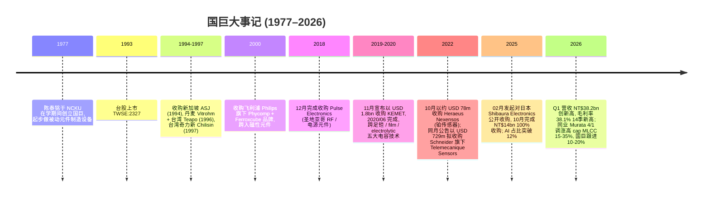
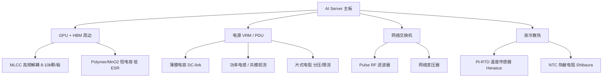
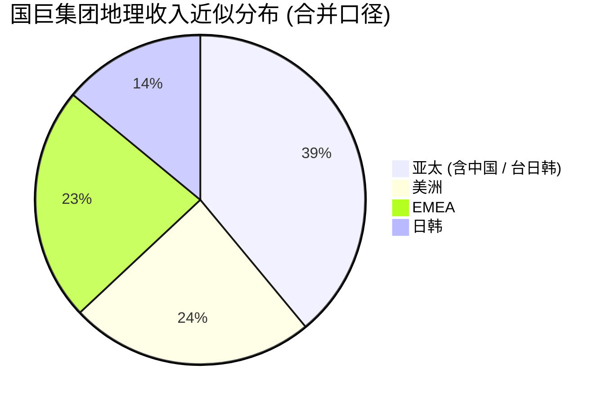
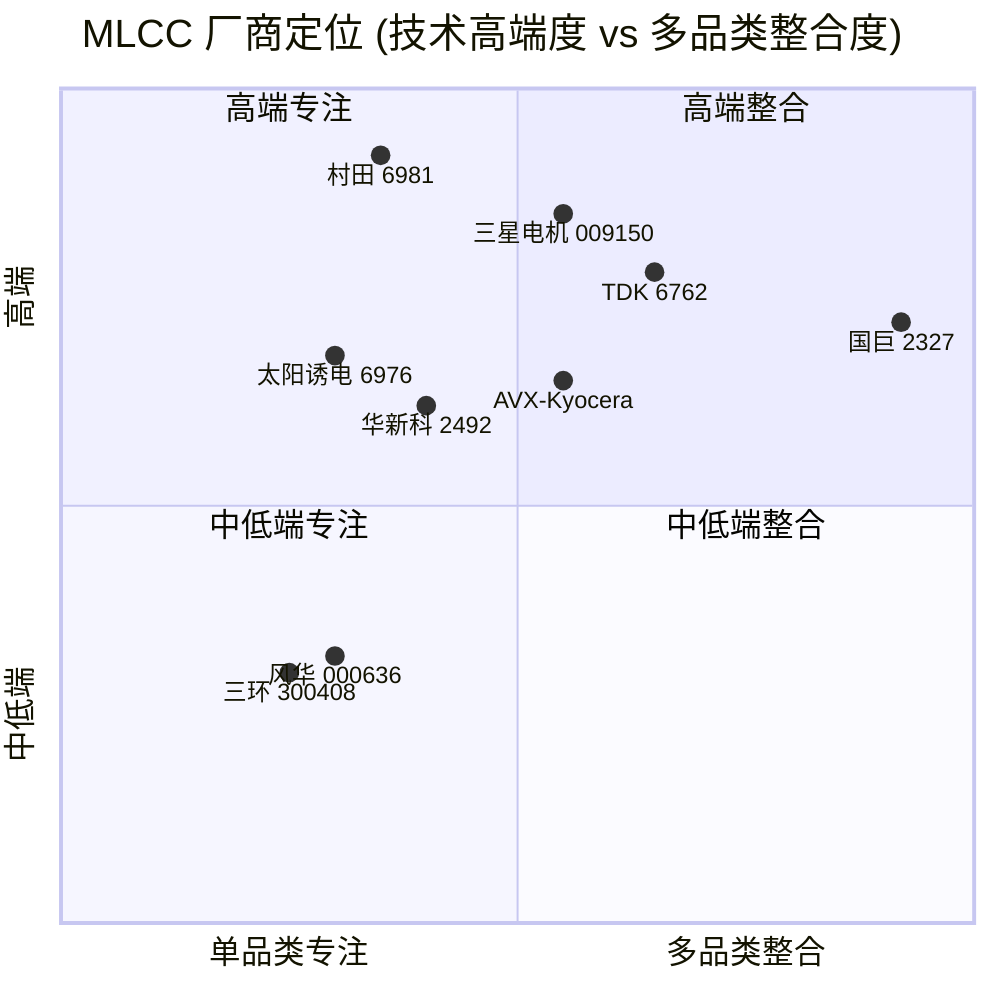

# 国巨 (Yageo Corporation, TWSE:2327) 公司研究报告

**报告日期 / As of:** 2026-06-02
**主题归属 / Theme:** AI Passives & Packaging (AI 被动元件与先进封装)
**报告语言 / Language:** 简体中文 (Simplified Chinese)

> **更新提示 — FY2026 强劲开局，毛利率 14 季新高 (2026-04-15):** 公司 Q1 2026 合并营收创历史新高达 NT$38.166bn (+22.7% YoY / +6.1% QoQ)，归母净利约 NT$8.0bn (+45% YoY)，毛利率 38.1%、营业利益率 25.2% 均为 14 个季度以来最高水平。CEO 王淡如 (David Wang) 在法说会指出 AI 相关被动元件营收占比已升至 14–15% (Q4 2025 仅 12%)，订单能见度延伸至 2026 下半年，特殊品产能利用率拟从 Q1 的 80–82% 提升至 Q2 的约 85%。资料来源：[國巨 Q1 2026 法说会, 2026-04-15](https://finance.biggo.com/news/TW_2327.TW_2026-04-15)；[Passive Components Plus, 2026-04-15](https://passive-components.eu/yageo-q1-2026-results-ai-servers-and-pricing-power-behind-a-moderate-q2-outlook/)。

---

## 目录 (Table of Contents)

1. 公司概览 (Company Overview)
2. 公司历史 (Company History)
3. 管理团队 (Management Team)
4. 产品与服务 (Products & Services)
5. 客户与上市策略 (Customers & Go-to-Market)
6. 行业概览 (Industry Overview)
7. 竞争格局 (Competitive Landscape)
8. 市场机会 (Market Opportunity / TAM)
9. 风险评估 (Risk Assessment)
10. 投资者视角评分卡 (Investor-lens Scorecards)
11. 数据来源清单 (Data Used)
12. 参考资料 (References)

---

## 1. 公司概览 (Company Overview)

国巨 (Yageo Corporation, TWSE:2327) 是全球领先的被动元件 (passive components) 制造商之一，1977 年由现任董事长陈泰铭 (Pierre Chen) 创立于台湾，总部位于新北市。公司以片式电阻 (chip resistor)、多层陶瓷电容 (MLCC / multilayer ceramic capacitor)、钽电容 (tantalum capacitor)、薄膜电容 (film capacitor)、电感 (inductor)、磁性元件 (ferrite)、传感器 (sensor) 与电路保护 (circuit protection) 为核心产品线，是少数能够同时跨足 ceramic / tantalum / polymer / film / electrolytic 五大电容技术的整合型供应商 ([Yageo Wikipedia](https://en.wikipedia.org/wiki/Yageo))。根据公司财报与第三方统计，国巨为全球**片式电阻与钽电容产量第一、MLCC 与电感产量第三**的厂商，仅次于日本村田 (Murata, TSE:6981)、韩国三星电机 (Samsung Electro-Mechanics, KRX:009150) 与日本 TDK (TSE:6762) ([MatrixBCG Yageo Overview](https://matrixbcg.com/blogs/how-it-works/yageo))。

商业模式上，国巨以**多技术 + 多市场 + 多区域**的整合策略服务全球客户。2019–2024 年通过密集并购 (KEMET 完成于 2020 年 6 月、Pulse Electronics 2018 年 12 月、Heraeus Nexensos 2022 年 10 月、Schneider Electric 旗下 Telemecanique Sensors 2023 年 10 月、Shibaura Electronics 2025 年 10 月) 完成从纯 commodity 元件向特殊品 (specialty) 与高端汽车 / AI / 工业市场的转型，2024 年特殊品占总营收约 **82%**，较 2019 年并购 KEMET 前的不到 30% 大幅跃升 ([MatrixBCG Yageo Overview](https://matrixbcg.com/blogs/how-it-works/yageo); [Yageo Acquires Shibaura](https://passive-components.eu/yageo-acquires-100-of-shares-of-shibaura-electronics/))。在 25 个国家设有 9 个制造基地与 21 个销售与服务办公室，员工约 40,000 人 ([Bloomberg Pierre Chen profile](https://www.bloomberg.com/profile/person/2083631))。

**财务规模与近期表现。** FY2024 合并营收 NT$121.67bn (+13.1% YoY)、归母净利 NT$19.49bn (+11.2% YoY)、毛利率 34.4% (+0.9pp YoY)、营业利益率 19.2% (+0.2pp YoY) ([Yageo Q4 2024 summary, Quartr](https://quartr.com/events/yageo-corporation-2327-q4-2024_FT5UO36w))。FY2025 合并营收 NT$132.93bn (+9.3% YoY，首度突破 NT$130bn 门槛)，其中 Q4 2025 单季营收 NT$35.97bn (+19.9% YoY / +8.7% QoQ)、12 月单月营收 NT$12.351bn (+29.7% YoY) 均刷新历史纪录 ([Yageo 2025 record revenue, BigGo Finance](https://finance.biggo.com/news/LSARmZsByDK8UPXD-hK1))。Q1 2026 营收 NT$38.166bn (+22.7% YoY)、归母净利约 NT$8.0bn (+45% YoY)、EPS NT$3.9，毛利率 38.1% 创近 14 季新高 ([國巨 Q1 2026 法说会, BigGo](https://finance.biggo.com/news/TW_2327.TW_2026-04-15))。

**估值快照 (as of 2026-06-02)：** 收盘价 NT$846，市值 NT$1.62 trn (约 USD 50bn)、TTM 营收 NT$139.99bn、TTM 净利 NT$26.11bn、TTM EPS NT$12.68、**TTM P/E 约 62.3 倍**、前向 P/E 约 40.7 倍、TTM P/S 约 11.6 倍、股息率 0.81% (年度股息 NT$6.00)，52 周区间 NT$111.75–NT$847，beta 1.40，已发行股数 2.06bn ([Stockanalysis 2327.TW](https://stockanalysis.com/quote/tpe/2327/))。3 年 P/E 区间约 12–66 倍 (深度衰退至 AI 高峰)，对照同业村田 6981.T 当前 TTM P/E 约 22 倍、三星电机 009150.KS 约 18 倍、华新科 (Walsin Technology, TWSE:2492) 因 1Y +397% 涨幅 TTM P/E 已突破 90 倍，国巨估值显著高于日韩寡头但低于台股同业的 AI 主题极值 ([Digitimes Walsin 2026-05-25](https://www.digitimes.com/news/a20260525PD222/demand-mlcc-high-power-taiwan-high-end.html); [Yageo Theme Report 2026-05-31](../../themes/ai-passives-packaging_theme.md))。*分析师观点：* P/E > 60 倍的核心驱动是 AI server 被动元件涨价周期 (Murata 4 月 1 日起 15–35% 调涨高 cap MLCC、国巨跟进 10–20% 调涨高压 / 高容 / 车规线) 叠加 AI 占比从 5% 升至 15% 的结构性 re-rating，但其中已隐含市场对 2027 年 AI 持续供需紧张的强假设 ([Astute Group MLCC shortage, 2026](https://www.astutegroup.com/news/general/mlcc-shortages-return-as-ai-server-demand-strains-capacity/))。

地理收入结构 (近似 KEMET 整合后)：亚太约 39%、美洲约 24%、EMEA 约 23%、日韩约 14%，但 Q1 2026 法说会指出"美国市场稳健且强劲、中国市场库存调整后已正常化" ([Yageo Q1 2026 earnings call, BigGo](https://finance.biggo.com/news/TW_2327.TW_2026-04-15); [Eepower KEMET CIFUS](https://eepower.com/news/cifus-review-clears-the-path-for-yageos-acquisition-of-kemet/))。

---

## 2. 公司历史 (Company History)

国巨创立于 1977 年，由当时仍在国立成功大学 (NCKU) 工程科学系就读的陈泰铭 (Pierre Chen) 与其兄长创办，初期以制造被动元件生产设备起家——这正是台湾电子业从外资设备转向本土化的关键拐点之一 ([Pierre Chen Wikipedia](https://en.wikipedia.org/wiki/Pierre_Chen); [Company-Histories Yageo](https://www.company-histories.com/Yageo-Corporation-Company-History.html))。1980 年陈泰铭于 NCKU 毕业后正式投入家族企业；1986 年公司转型为 Yageo Corporation，开始自制片式电阻；1993 年于台湾证券交易所挂牌上市，代码 2327 ([Yageo Wikipedia](https://en.wikipedia.org/wiki/Yageo); [FundingUniverse Yageo history](https://www.fundinguniverse.com/company-histories/yageo-corporation-history/))。

**三次关键战略转折。** 第一次为 1990 年代末至 2000 年的飞利浦资产收购，使国巨从单一台湾片式电阻厂转型为跨地域、跨产品的被动元件平台 (Phycomp 为飞利浦旗下原德国 Valvo + 荷兰 Philips Components 的元件业务，Ferroxcube 为飞利浦磁性元件遗产)，奠定后续 KEMET、Pulse 等大型并购的整合能力 ([FundingUniverse Yageo history](https://www.fundinguniverse.com/company-histories/yageo-corporation-history/))。

第二次为 2019–2020 年的 KEMET 全现金收购 (USD 1.6–1.8bn，每股 USD 27.20)。陈泰铭在公开访谈中将此次并购定调为"打造从 commodity 到 specialty 完整产品组合的关键一步"——KEMET 带入 1,600+ 项全球专利、北美 / 欧洲 / 墨西哥 / 日本 / 中国 / 印尼 / 葡萄牙的制造布局，以及钽电容 / 薄膜电容 / 电解电容三大新技术线 ([Synergy from acquiring Kemet, Passive Components Plus](https://passive-components.eu/synergy-from-acquiring-kemet-qa-with-yageo-chairman/); [KEMET 8-K 2020](https://www.sec.gov/Archives/edgar/data/0000887730/000088773020000015/fy2021q1ex991pressrele.htm))。CFIUS (美国外资投资委员会) 于 2020 年 4 月批准此案，是台湾企业大型并购美国上市公司少数无附加条件的案例 ([CFIUS Yageo KEMET, Eepower](https://eepower.com/news/cifus-review-clears-the-path-for-yageos-acquisition-of-kemet/))。

第三次为 2025 年的日本 Shibaura Electronics 收购。Yageo 2 月 5 日发起 TOB (公开收购)，最终以总价 JPY 65.56bn (约 NT$14bn / USD 430m) 完成 100% 收购，2025 年 10 月 20 日交割 ([Insight Taiwan, 2025-05](https://insighttaiwan.com/yageo-new-tender-offer-shibaura-may-2025/); [Yageo Acquires Shibaura, Passive Components Plus](https://passive-components.eu/yageo-acquires-100-of-shares-of-shibaura-electronics/))。战略动机有三：(1) Shibaura 的 NTC (negative-temperature-coefficient) 热敏电阻与温度传感器在车用与家电领域占有率领先；(2) 在 AI server 高密度散热背景下，将 MLCC + 热敏电阻 + 传感器整合为完整热管理方案，应对 hyperscaler 客户的端到端 thermal management 需求；(3) 进一步深化日本制造与研发基地以分散地缘风险 ([Yageo Shibaura strategy, AInvest](https://www.ainvest.com/news/yageo-shibaura-bidding-war-microcosm-global-passive-component-industry-consolidation-2508/))。Q1 2026 法说会 CFO Gavin Zong 指出 Shibaura 整合对当季的贡献"不显著 (insignificant)"，业绩增长"主要为有机增长"——意味着 2026 下半年起 Shibaura 才会逐步贡献全年化营收 ([Yageo Q1 2026 earnings call, BigGo](https://finance.biggo.com/news/TW_2327.TW_2026-04-15))。

**近 12 个月关键事件。** (a) 2025/10 完成 Shibaura 收购；(b) 2026/02 同业 Murata 宣布 4 月 1 日起调涨 AI server 高容 MLCC 价格 15–35%，国巨跟进调涨高压 / 高容 / 车规线 10–20% ([Astute Group MLCC shortage, 2026](https://www.astutegroup.com/news/general/mlcc-shortages-return-as-ai-server-demand-strains-capacity/); [Digitimes Yageo 2026-02-26](https://www.digitimes.com/news/a20260226PD231/yageo-passive-components-demand-revenue-2026.html))；(c) Q1 2026 毛利率 38.1% 创 14 季新高，单季 EPS NT$3.9 ([國巨 Q1 2026 earnings, BigGo](https://finance.biggo.com/news/TW_2327.TW_2026-04-15))；(d) 股价于 2026 年 5 月 15 日收盘 NT$493 突破历史新高，6 月 2 日报 NT$846，1 年涨幅约 +650% ([Stockanalysis 2327.TW](https://stockanalysis.com/quote/tpe/2327/))。

---

## 3. 管理团队 (Management Team)

### 创办人兼董事长：陈泰铭 (Pierre Chen, 1958– )

陈泰铭生于 1958 年，1977 年于国立成功大学 (NCKU) 工程科学系在学期间与兄长共同创立国巨，1980 年完成 B.S. (Engineering Science) 学位后正式投入运营 ([Pierre Chen Wikipedia](https://en.wikipedia.org/wiki/Pierre_Chen); [Bloomberg Pierre Chen](https://www.bloomberg.com/profile/person/2083631))。其个人创业逻辑非常清晰：1970 年代台湾电子业以外资设备进口为主，自主设备供应链缺失，国巨初期以制造被动元件**生产设备**切入，再向元件本身扩展；这一从"工具到产品"的演化路径与 ASML、TEL 等设备厂逻辑相反 (后者由元件需求倒推出设备)，但同样为陈泰铭日后理解元件制造关键工艺 (烧结炉控温、片式电极印刷精度) 打下基础 ([Company-Histories Yageo](https://www.company-histories.com/Yageo-Corporation-Company-History.html))。

陈泰铭仍为公司**最大股东与董事长**，持股比例约 18–20% (实际数字以年度报告披露为准)，福布斯估算其个人净资产约 USD 5.2bn (2025 年榜单)，列台湾前 10 富豪 ([Pierre Chen Wikipedia](https://en.wikipedia.org/wiki/Pierre_Chen))。他在产业内以三项标签著称：(a) **顶级艺术收藏家**，2022 年纽约苏富比拍卖会上单场出售 60 件包括罗斯科 (Mark Rothko)、培根 (Francis Bacon)、巴斯奎特 (Jean-Michel Basquiat) 在内的现代艺术作品共拍得 USD 1.55bn，创亚洲单一藏家纪录 ([Tatler Asia Pierre Chen](https://www.tatlerasia.com/people/pierre-chen-eng))；(b) **并购导向 CEO**，2018 年起 5 年内完成 KEMET、Pulse、Heraeus Nexensos、Telemecanique Sensors、Shibaura 五项跨国并购，合计交易额超过 USD 3.5bn，是台湾被动元件业最积极的整合者 ([MatrixBCG Yageo Overview](https://matrixbcg.com/blogs/how-it-works/yageo))；(c) **集团董事长 + 营运实际负责人**，与执行层 CEO 王淡如 (David Wang) 形成 chairman–CEO 双轨架构。在 2026 年 Q1 法说会上，公司宣布陈泰铭将"亲自主持"即将召开的 AI Summit，对外展示集团完整的 AI 产品组合，被市场解读为陈泰铭对 AI 业务投入个人时间的明确信号，消息当日股价上涨逾 7% ([BigGo Yageo AI 15%](https://finance.biggo.com/news/pit90p0BaoGGrU-I5BMp))。

### 现任 CEO：王淡如 (David Wang)

王淡如 (英文名 David Wang) 现任 Yageo Corporation 总经理 (CEO)，分管集团整体营运。他在 Q1 2026 法说会上以"对非 AI 业务的下半年能见度仍**谨慎乐观 (cautiously optimistic)**、对 AI 订单则有**创历史新高的 backlog 支撑**"作为业绩 Q&A 主轴 ([Yageo Q1 2026 earnings call, BigGo](https://finance.biggo.com/news/TW_2327.TW_2026-04-15))。在 Q1 法说会上王淡如对 Q2 经营关键给出三项明确动作：(1) 特殊品产能利用率从 80–82% 提升至约 85%；(2) 一般品产能利用率从 70–72% 提升至约 75%；(3) Q1 已多次调涨产品价格，Q2 将继续维持调价策略 ([Passive Components Plus Q1 2026](https://passive-components.eu/yageo-q1-2026-results-ai-servers-and-pricing-power-behind-a-moderate-q2-outlook/))。

CFO Gavin Zong 在同场法说会的关键陈述："如果你看我们过去六个连续季度的表现，我们实际上一直在**逐季**实现营收与盈利的双双改善 (better revenue and also better profitability in a row)"——这一陈述强调了 2024 Q3 至 2026 Q1 的六季连续改善，对应到 NT$121.67bn (2024 年报) → NT$132.93bn (2025 年报) → NT$38.17bn (2026 Q1，年化 ≈ NT$152bn) 的扩张轨迹 ([Yageo Q1 2026 earnings call, BigGo](https://finance.biggo.com/news/TW_2327.TW_2026-04-15); [Yageo Q4 2024 summary, Quartr](https://quartr.com/events/yageo-corporation-2327-q4-2024_FT5UO36w); [Yageo 2025 record revenue, BigGo](https://finance.biggo.com/news/LSARmZsByDK8UPXD-hK1))。

---

## 4. 产品与服务 (Products & Services)

国巨集团 (Yageo Group) 是少数能够同时提供 **片式电阻 (chip resistor) + MLCC + 钽电容 (Ta cap) + 薄膜电容 (film cap) + 电解电容 (electrolytic cap) + 电感 (inductor) + 磁性元件 (ferrite) + 电路保护 (circuit protection) + 传感器 (sensor)** 完整产品矩阵的全球供应商，是行业极少数的"五大电容技术 + 全套被动元件"整合型平台 ([Yageo Q4 2024 summary, Quartr](https://quartr.com/events/yageo-corporation-2327-q4-2024_FT5UO36w); [Yageo Wikipedia](https://en.wikipedia.org/wiki/Yageo))。

### 4.1 产品矩阵 (Product Matrix)

下表整理自 Yageo Group 公开资料 (官网产品目录 + KEMET、Pulse、Chilisin、Heraeus Nexensos 等子品牌产品页) 与 2024 年报披露：

| 产品大类 (Category) | 主要技术 / 细分线 (Technology) | 子品牌 / 来源 (Source) | 终端应用 (End-market) |
|---|---|---|---|
| **MLCC (多层陶瓷电容)** | NPO / X7R / X5R / X6S / Y5V 各种介质, 高压 / 高容 / 车规 AEC-Q200 / 高频 | Yageo / KEMET (前 Philips Phycomp 资产) | AI 服务器, 智能手机, 汽车, 工业 |
| **钽电容 (Tantalum Capacitor)** | MnO₂ 钽电容, polymer 钽电容, conformal-coated 钽 | KEMET (主品牌) | AI 服务器, 太空 / 国防, 医疗, 汽车 |
| **片式电阻 (Chip Resistor)** | 厚膜 / 薄膜 / 金属箔, AEC-Q200 车规, 高功率, 高精度 | Yageo / Stellar | 所有电子电路, 汽车, 工业 |
| **电感 (Inductor)** | 功率电感 (power), 高频, 共模扼流圈, 磁屏蔽 | Chilisin (奇力新) | 智能手机, 通信, 服务器电源 |
| **磁性元件 (Ferrite & Magnetics)** | 铁氧体, 软磁, 抗 EMI | Ferroxcube (前 Philips), Chilisin | 电源, EMI 滤波 |
| **薄膜电容 (Film Capacitor)** | PP / PET, snubber, DC-link, AC-line | KEMET | EV 逆变器, 太阳能, 工业电源 |
| **电解电容 (Electrolytic)** | 铝电解, polymer 铝 | KEMET / Teapo | 工业, 服务器, 家电 |
| **传感器 (Sensor)** | 铂温度传感器 (Pt-RTD), NTC 热敏电阻, 工业 / 安全开关 | Heraeus Nexensos, Telemecanique Sensors, Shibaura Electronics | 汽车, 工业, 家电, 数据中心散热 |
| **电路保护 (Circuit Protection)** | TVS, varistor, 熔断器, ESD 保护 | BrightKing | 消费电子, 汽车, 工业 |
| **RF / 电源元件 (RF & Power)** | RF 滤波器, 共模电感, 网络变压器 | Pulse Electronics (前圣地亚哥) | 通信, AI 网络交换机 |

资料来源：[Yageo Wikipedia](https://en.wikipedia.org/wiki/Yageo)、[PCBsync Yageo Capacitors guide](https://pcbsync.com/yageo-capacitors/)、[Passive Components Plus 2025 dossier](https://passive-components.eu/2025-annual-capacitor-technology-dossier/)、[Yageo Q4 2024 summary, Quartr](https://quartr.com/events/yageo-corporation-2327-q4-2024_FT5UO36w)。

### 4.2 产品矩阵的内在逻辑 (Synthesis)

**中文释义 / Plain-language gloss:** AI 服务器主板上每颗 NVIDIA GB200/Blackwell GPU 周边都有数千颗被动元件——这是国巨整套产品组合的核心商业逻辑。简要理解 AI server 主板的"被动元件账单"：(a) **MLCC** 主要负责给 GPU、HBM、电源管理 IC (VRM) 等芯片做高频解耦 (decoupling)，单颗 GB200 板卡周边 MLCC 数量约 8,000–10,000 颗；(b) **钽 / polymer 钽电容**专门负责低 ESR (equivalent series resistance) 的电源去耦，AI server 上对**高纹波抑制 + 紧凑封装**需求让钽电容成为不可替代选项，国巨钽电容 2026 Q1 营收已有 30% 以上来自 AI 相关；(c) **薄膜电容 / DC-link** 用在 PDU (power distribution unit) 与服务器电源前端的中间直流回路；(d) **片式电阻**用于电压分压、限流、上拉 / 下拉，每片主板用量数千颗；(e) **电感 / 共模扼流圈**做电源滤波与 EMI 抑制；(f) **传感器 (NTC / Pt-RTD)**用在 hyperscaler 数据中心机柜的液冷温度监控与 GPU thermal throttling 反馈。这套**MLCC + 钽 + 薄膜 + 电感 + 传感器**的"被动元件账单"对 AI server 单机价值数千美元，且**几乎无替代**——硅基替代品 (硅电容、片式 LC 滤波) 在 ESR / 容值 / 寿命 / 工作温度上均不及陶瓷与钽元件 ([Astute Group MLCC AI server, 2026](https://www.astutegroup.com/news/general/mlcc-shortages-return-as-ai-server-demand-strains-capacity/); [eeNews Europe AI MLCC shortage](https://www.eenewseurope.com/en/ai-drives-mlcc-shortage/); [Intel Market Research MLCC AI server](https://www.intelmarketresearch.com/mlcc-for-ai-serverautomotive-market-36545))。

### 4.3 MLCC (多层陶瓷电容) — 集团核心增长引擎

MLCC 是国巨集团营收占比最大的产品线 (第三方估算约 35–40% 集团营收，国巨财报未具体披露分项)，且是 AI 涨价周期中最关键的杠杆。MLCC 的物理结构是**陶瓷介质 (BaTiO₃ 钛酸钡为主) + 内电极 (镍 / 钯 / 钯银合金) 多层堆叠 + 端电极**，关键工艺包括 (a) 介质浆料配比与流延 (tape casting)；(b) 内电极丝印 (screen printing)；(c) 叠层 (stacking) 与压合 (press)；(d) 切割 + 烧结 (sintering)；(e) 端电极电镀 ([PCBsync Yageo Capacitors guide](https://pcbsync.com/yageo-capacitors/))。

**中文释义 / Plain-language gloss:** MLCC 性能的关键是**单位体积容值 (volumetric efficiency)**，即在尽可能小的 0402 / 0201 / 01005 封装内塞入最多介质层数 (>1000 层) 来提升容值。AI server 周边的高 cap MLCC (10–100 µF 量级、低 ESL / 低 ESR) 是 Murata 与三星电机的主战场，国巨此前定位偏中端，但 2024–2026 借由 KEMET 设备投资与汽车 AEC-Q200 资质积累，已切入 AI server 中段产品线。Q1 2026 法说会明确指出"**没有 2026 年新增 MLCC 产能扩张计划**"——这一表态对市场释放的信号是：在 Murata / 三星 / 国巨 / TDK / 太阳诱电 (Taiyo Yuden) 五大厂均不大规模扩产的前提下，2026 全年 MLCC 供给端将持续紧张，支撑涨价持续性 ([Yageo Q1 2026 earnings call, BigGo](https://finance.biggo.com/news/TW_2327.TW_2026-04-15))。*分析师观点：* 在 AI server 高端 MLCC (0402 / 0201 / 01005 高 cap) 上，Murata + 三星电机合计市占超过 80%，国巨与华新科主要切入 AI 服务器中段与车规高端，并非头部 ([Mordor Intelligence MLCC market](https://www.mordorintelligence.com/industry-reports/multi-layer-ceramic-capacitor-mlcc-market); [Intel Market Research MLCC AI server](https://www.intelmarketresearch.com/mlcc-for-ai-serverautomotive-market-36545))。

### 4.4 钽电容 (Tantalum Capacitor) — KEMET 平台的隐形冠军

钽电容是国巨集团 KEMET 平台的核心资产，也是 Q1 2026 法说会管理层重点强调的 AI 增长项。**钽电容 30%+ 营收已来自 AI 相关应用**，且产能利用率高于集团平均，扩产正在"内部讨论"中 ([Yageo Q1 2026 earnings call, BigGo](https://finance.biggo.com/news/TW_2327.TW_2026-04-15); [Metalnomist Yageo AI tantalum, 2026-04](https://www.metalnomist.com/2026/04/yageo-ai-demand-lifts-sales-as-tantalum.html))。

**中文释义 / Plain-language gloss:** 钽电容的物理结构与 MLCC 完全不同——核心是**烧结多孔钽粉 (Ta pellet) 作为阳极 → Ta₂O₅ (五氧化二钽) 阳极氧化层作为介质 → MnO₂ 或 polymer (导电高分子) 作为阴极**。相对于 MLCC，钽电容的"杀手锏"是：(a) **极高的容值 / 体积比**——AI server 上 8s/16s 高速串行总线 (PCIe 5.0/6.0、CXL) 对去耦电容的体积要求极严，钽是首选；(b) **低 ESR**，纹波抑制能力远高于 MLCC；(c) **不会发生 MLCC 典型的微开裂 (microcrack) 失效模式**，适合机械振动场景。但代价是钽属于全球前 5 大冲突矿物 (3TG 之一)，主要矿源在刚果 (DRC)、卢旺达、巴西、澳大利亚，供应链合规与价格波动是结构性风险 ([Quest Metals tantalum conflict mineral](https://www.questmetals.com/blog/tantalum-the-conflict-mineral); [Arrow Conflict Minerals tantalum cap](https://www.arrow.com/en/research-and-events/articles/navigating-conflict-minerals-rules-in-the-tantalum-capacitor-market))。Yageo Nexensos 在其冲突矿物声明中明确承诺通过 OECD 尽职调查框架确保"DRC 冲突自由"采购 ([Yageo Nexensos conflict minerals](https://www.yageo-nexensos.com/en/about-yageo-nexensos/conflict-minerals.html))。*分析师观点：* 钽电容市场全球规模仅约 USD 1.34–2.1bn (远小于 MLCC 的 USD 27–35bn)，但壁垒极高 (主要玩家仅 KEMET / AVX / 村田)，国巨通过 KEMET 已成为该细分龙头之一，是被市场长期低估的隐形冠军线 ([Mordor Tantalum Capacitors](https://www.mordorintelligence.com/industry-reports/tantalum-capacitors-market); [Intel Market Research Tantalum](https://www.intelmarketresearch.com/tantalum-capacitors-market-16572))。

### 4.5 片式电阻 (Chip Resistor) — 全球第一的隐形巨擘

国巨为**全球片式电阻产量第一**的厂商，但这条产品线在投资者讨论中长期被低估。片式电阻物理上是**陶瓷基板 + 印刷电阻浆料 (RuO₂ 钌氧化物 + 玻璃料) + 激光修阻 + 端电极**，工艺远比 MLCC 简单，但单价极低 (单颗 < USD 0.001)，国巨依靠数量 + 自动化规模化获利 ([MatrixBCG Yageo Overview](https://matrixbcg.com/blogs/how-it-works/yageo); [PCBsync Yageo](https://pcbsync.com/yageo-capacitors/))。

**中文释义 / Plain-language gloss:** 片式电阻看起来是被动元件中"最商品化"的产品，但 AEC-Q200 车规高功率 / 高精度电阻 (例如新能源车 BMS 电池管理系统的分流电阻 shunt resistor，需要 0.1% 精度 + 高功率耐受) 实际上是高门槛细分市场。Q1 2026 法说会指出"resistor revenue grew ~20% YoY, particularly in automotive / defense / aerospace"——印证了片式电阻在汽车智能化与国防订单上的车规升级红利 ([Yageo Q1 2026 earnings call, BigGo](https://finance.biggo.com/news/TW_2327.TW_2026-04-15))。*分析师观点：* 片式电阻领域国巨的真正威胁不是 Vishay / KOA / Rohm 等同业 (国巨规模优势明显)，而是中国大陆厂商如风华高科 (SZSE:000636)、华新科子公司、信昌电子等的快速追赶；不过在 AEC-Q200 与高功率细分上国巨仍领先 ([Passive Components Plus China MLCC 10%](https://passive-components.eu/chinas-mlcc-makers-reach-10-market-share/))。

### 4.6 电感与磁性元件 (Inductor & Ferrite) — Chilisin 平台

Chilisin (奇力新) 是国巨 1997 年收购的台湾电感龙头，目前是 Yageo Group 电感与磁性元件的主要载体。结合 Pulse Electronics (2018) 的 RF 滤波 / 网络变压器、Ferroxcube (2000) 的铁氧体材料，形成完整的"软磁材料 → 电感成品 → RF 滤波 / 变压器"垂直链 ([Yageo Wikipedia](https://en.wikipedia.org/wiki/Yageo))。Q1 2026 法说会披露"sensors and inductors showed solid growth, sensors gained 0.8pp QoQ"——印证 AI server 网络交换机 (Pulse 网络变压器) 与 hyperscaler 数据中心散热 (Heraeus 铂温度传感器 + Shibaura NTC 热敏电阻) 双引擎驱动 ([Yageo Q1 2026 earnings call, BigGo](https://finance.biggo.com/news/TW_2327.TW_2026-04-15))。

### 4.7 传感器 (Sensor) — 2022–2025 三连并购构建的新版图

国巨 2022 年起密集布局传感器：2022/10 以约 USD 78m 收购 Heraeus Nexensos (德国，铂温度传感器全球龙头之一)；同月公告以 USD 729m 拟收购 Schneider Electric 旗下 Telemecanique Sensors (工业安全开关、限位开关、光电传感器)；2025/10 完成对日本 Shibaura Electronics 的 NT$14bn 100% 收购，获得 NTC 热敏电阻技术 ([Yageo Wikipedia](https://en.wikipedia.org/wiki/Yageo); [Yageo Acquires Shibaura, Passive Components Plus](https://passive-components.eu/yageo-acquires-100-of-shares-of-shibaura-electronics/); [AInvest Shibaura strategy](https://www.ainvest.com/news/yageo-shibaura-bidding-war-microcosm-global-passive-component-industry-consolidation-2508/))。三连并购的内在战略是**从纯被动元件 → 被动元件 + 传感 + 热管理一体化方案**，应对 AI 数据中心、新能源车、工业 4.0 客户的端到端方案采购倾向。

### 4.8 集团产品组合的系统性优势 (Why this matters)

将以上 7 条产品线综合来看，国巨的核心竞争力不在任何**单一产品**，而在于"**同一客户 BOM (bill of materials) 内的多产品交叉销售能力**"。一个典型 AI server 主板上，国巨可同时供应 MLCC + 钽电容 + 片式电阻 + 电感 + Pulse 网络变压器 + Shibaura 热敏电阻——单一供应商管理、统一价格谈判、统一物流的整合能力是 Murata (强 MLCC 但缺钽) 或单一品类厂商 (Vishay / Walsin) 难以复制的。这也是 2018 年至今密集并购的根本动机：**用并购换品类完整度，用品类完整度换客户钱包份额**。Q1 2026 法说会王淡如反复强调的"comprehensive portfolio for the AI era"正是这一战略的口号化表达 ([Yageo Q1 2026 earnings call, BigGo](https://finance.biggo.com/news/TW_2327.TW_2026-04-15))。

---

## 5. 客户与上市策略 (Customers & Go-to-Market)

国巨客户结构呈现**"分销主导 + 终端 OEM 设计导入 + Tier-1 长合约"三层架构**。第一层为 Arrow Electronics、Avnet、WPI Group、文晔、大联大等全球 / 大中华区分销商，承接 MLCC / 片式电阻等 commodity 元件的中小客户订单；第二层为 EMS (electronics manufacturing services) 大客户如鸿海 (Foxconn)、广达 (Quanta)、纬创 (Wistron)、英业达 (Inventec) 等台湾 AI server 代工厂的直接 BOM 设计导入；第三层为汽车 Tier-1 (Bosch、Continental、Denso) 与工业自动化客户 (ABB、Siemens、Schneider Electric) 的多年长合约 ([Yageo Q4 2024 summary, Quartr](https://quartr.com/events/yageo-corporation-2327-q4-2024_FT5UO36w); [Pulse Electronics Wikipedia](https://en.wikipedia.org/wiki/Pulse_Electronics))。

**客户集中度：** 2024 年报与 Q1 2026 法说会均**未具体披露前 5 大客户营收占比与名单**。集团合并营收 NT$121.67bn (2024 年) 与 NT$132.93bn (2025 年) 规模下，客户结构高度分散是行业常态——根据公司公开陈述与第三方推算，集团合并 top-5 客户合计占比预计低于 20%、top-1 客户预计低于 5% (集团合并口径，不是细分产品线口径)，类似日本村田与三星电机的高度分散结构 ([Quartr Yageo IR summary](https://quartr.com/companies/yageo-corporation_22434))。这与下游 AI server 客户 NVIDIA / Broadcom 直接绑定的现实有所不同：被动元件普遍通过 OEM / EMS 渠道间接服务终端，所以"客户"在 BOM 设计层面更接近**鸿海 / 广达 / 纬创 / Quanta 等代工厂**，而非 NVIDIA / Microsoft / Google / AWS 等终端 hyperscaler。

**地理收入结构 (近似 KEMET 整合后)：** 亚太约 39%、美洲约 24%、EMEA 约 23%、日韩约 14% ([Eepower KEMET CIFUS](https://eepower.com/news/cifus-review-clears-the-path-for-yageos-acquisition-of-kemet/))。Q1 2026 法说会管理层指出"美国市场依然非常稳健且强劲 (very strong and stable)、中国市场在库存调整后已正常化 (normalized after inventory adjustments)"——意味着 2026 全年区域增长动能由美洲 (AI server) 主导、欧洲 (新能源车 + 工业) 次之、亚太 (中国库存正常化 + 台日韩 EMS) 补强 ([Yageo Q1 2026 earnings call, BigGo](https://finance.biggo.com/news/TW_2327.TW_2026-04-15))。

资料来源：[Eepower KEMET CIFUS, 2020](https://eepower.com/news/cifus-review-clears-the-path-for-yageos-acquisition-of-kemet/) (基于 KEMET 整合时披露的地理结构，非最新公司披露；最新具体年度地理拆分以国巨 2024 年报为准)。

**上市与回购策略：** 国巨为台股老牌蓝筹股 (1993 年上市)，长期实施稳定股息政策——2025 年股息 NT$6.00 / 股，对应当前股价股息率约 0.81% ([Stockanalysis 2327.TW](https://stockanalysis.com/quote/tpe/2327/))。公司未发行 ADR 或 GDR，海外投资人主要通过 TWSE 直接持股或 FINI (Foreign Institutional Investor) 机制参与。陈泰铭家族持股稳定，无近期减持披露。

**销售渠道与设计导入：** 集团旗下品牌矩阵 (Yageo / KEMET / Pulse / Chilisin / Heraeus Nexensos / BrightKing / Shibaura) 各自维护原品牌 + Yageo 集团统一销售渠道的双轨架构——这一架构对客户的好处是品牌识别度延续，对国巨的好处是 BOM 交叉销售机会。设计导入 (design-in) 周期视终端而异：消费电子 6–9 个月、智能手机 9–12 个月、汽车 / 工业 18–36 个月 (AEC-Q200 资质 + 客户 PPAP 流程)。

---

## 6. 行业概览 (Industry Overview)

被动元件 (passive components) 行业是电子产业链的"血液"——每一颗主动器件 (CPU / GPU / SoC / 模拟 IC) 周边都需要数倍至数千倍数量的电容、电阻、电感配套。行业 TAM 按 2025 年第三方估算约 **USD 32.8bn (全市场被动元件合计)**，预计 2034 年达 USD 66.3bn (2025–34 CAGR 约 8.15%)；其中 MLCC 占大头，2025 年市场规模 USD 27.3bn (Mordor 数据) 或 USD 34.9bn (Business Research Insights 数据)，预计 2031 年达 USD 64.2bn (CAGR 15.0%)；钽电容市场规模较小，2025 年 USD 1.34bn (Mordor)，2030 年预计 USD 1.67bn (CAGR 4.5%) ([Market Growth Reports Passive 2034](https://www.marketgrowthreports.com/market-reports/passive-components-market-118180); [Mordor MLCC market](https://www.mordorintelligence.com/industry-reports/multi-layer-ceramic-capacitor-mlcc-market); [Mordor Tantalum](https://www.mordorintelligence.com/industry-reports/tantalum-capacitors-market); [Business Research Insights MLCC 2034](https://www.businessresearchinsights.com/market-reports/mlcc-market-104728))。

**结构性增长驱动力。** 行业 2024–2030 年的核心 alpha 来自三条主线：

**(1) AI server 被动元件单机价值大幅跃升。** TrendForce 报告 2025 年 server MLCC 用量同比增长 **35%**，远超 server 整体出货增速；NVIDIA GB200 / Blackwell Ultra 平台每张主板被动元件账单约 USD 3,000–5,000，较传统通用服务器 USD 500–1,000 跃升 5–10 倍 ([Intel Market Research MLCC AI server](https://www.intelmarketresearch.com/mlcc-for-ai-serverautomotive-market-36545); [eeNews Europe AI MLCC shortage](https://www.eenewseurope.com/en/ai-drives-mlcc-shortage/))。这一杠杆对头部 MLCC / 钽电容厂的拉动是非线性的——AI server 出货量 2025 年仅占全球服务器 12–15%，但贡献了 MLCC 行业增量价值的 40%+ ([Astute Group MLCC shortage, 2026](https://www.astutegroup.com/news/general/mlcc-shortages-return-as-ai-server-demand-strains-capacity/))。

**(2) 电动车 (EV) 与汽车智能化。** 一台 ICE (内燃机) 汽车被动元件用量约 3,000 颗、价值约 USD 80；一台纯电动车 (BEV) 被动元件用量约 10,000–12,000 颗、价值约 USD 250–350；带 L2+ 自动驾驶的 BEV 进一步升至 USD 400–500 ([Mordor Automotive MLCC](https://www.mordorintelligence.com/industry-reports/automotive-mlcc-market); [Mordor EV MLCC](https://www.mordorintelligence.com/industry-reports/electric-vehicles-mlcc-market))。村田、TDK、国巨、华新科均以 AEC-Q200 车规高容 / 高压 MLCC 为车用业务主力。

**(3) 5G + 工业物联网 (IIoT)。** 5G 基站、毫米波天线模组、工业自动化 PLC、机器人控制器等场景对高频 / 高精度 / 抗 EMI 被动元件的需求是 4G 时代的 2–3 倍 ([Mordor Telecom MLCC](https://www.mordorintelligence.com/industry-reports/telecom-mlcc-market))。

**周期与定价动态。** 被动元件行业历史上存在 **3–5 年一次的供需周期**：2017–18 年苹果 iPhone X 周期、2020–21 年疫情居家电子周期、以及当前 2025–27 年的 AI server 周期。每一轮周期均伴随头部厂提价 (price hike)、库存补建、中小厂跟涨、然后供给恢复后回落。当前 (2026 Q2) 处于 AI 周期的中段：村田 2026/03/17 宣布 4/1 起对 AI server 高 cap MLCC 调涨 15–35%，国巨跟进调涨高压 / 高容 / 车规 10–20%，华新科、三环 (SZSE:300408)、风华高科同步跟随 ([Astute Group MLCC shortage, 2026](https://www.astutegroup.com/news/general/mlcc-shortages-return-as-ai-server-demand-strains-capacity/); [Digitimes Yageo 2026-02-26](https://www.digitimes.com/news/a20260226PD231/yageo-passive-components-demand-revenue-2026.html))。

**政策与监管环境。** (a) 美国 CHIPS Act + 关税政策推动美国本土被动元件产能 (KEMET 在墨西哥 / 美国本土的钽电容产线为国巨集团的"美洲制造"标签)；(b) 欧盟 CSRD (Corporate Sustainability Reporting Directive) 与 RoHS / REACH 法规对钽 / 镍 / 钯电极的合规要求；(c) 中国"信创"与国产替代政策推动风华高科、三环、宇阳科技等本土厂商对中低端 MLCC 的国产替代 ([Passive Components Plus China MLCC 10%](https://passive-components.eu/chinas-mlcc-makers-reach-10-market-share/))。

**行业供应链动态：** 全球 MLCC 行业属于**寡占式集中市场** (concentrated oligopoly)：村田、三星电机、太阳诱电 (Taiyo Yuden)、TDK、国巨五大厂合计占据约 69–79% 市场份额；高端 MLCC (车规 + AI server) 集中度更高，五大厂合计占 70–75% ([Mordor MLCC market](https://www.mordorintelligence.com/industry-reports/multi-layer-ceramic-capacitor-mlcc-market); [Data Intelo High-end MLCC](https://dataintelo.com/report/high-end-mlcc-market))。中国大陆 MLCC 厂商 (风华、三环、宇阳、信昌、潮州三环) 合计市占在 2025 年首次突破 10%，但主要集中在中低端 ([Passive Components Plus China MLCC 10%](https://passive-components.eu/chinas-mlcc-makers-reach-10-market-share/))。

---

## 7. 竞争格局 (Competitive Landscape)

国巨身处全球**被动元件五大厂 + 区域追赶者**的两层格局中。第一层为日韩头部 (村田、三星电机、TDK、太阳诱电)，第二层为台 / 中追赶者 (国巨、华新科、风华、三环)；国巨身处第一与第二层之间，依靠并购完成的**多品类整合**形成独特生态位。

**主要直接竞争对手：**

**(1) 村田制作所 (Murata Manufacturing, TSE:6981)。** 全球 MLCC 龙头，2025 年市占约 40%+，在高端 MLCC (0402 / 0201 / 01005、车规、AI server) 拥有绝对优势 ([Mordor MLCC market](https://www.mordorintelligence.com/industry-reports/multi-layer-ceramic-capacitor-mlcc-market))。2026/03/17 率先发起 AI server 高容 MLCC 涨价 15–35%，是行业定价主导者 ([Astute Group MLCC shortage, 2026](https://www.astutegroup.com/news/general/mlcc-shortages-return-as-ai-server-demand-strains-capacity/))。村田与国巨的关系是"非对称竞合"：在 commodity MLCC 层面村田保持领先溢价、国巨依靠规模与汽车切入；村田没有钽电容、无 RF 滤波器，国巨通过 KEMET + Pulse 在这两条线上形成差异化。

**(2) 三星电机 (Samsung Electro-Mechanics, KRX:009150)。** 韩国 MLCC + 半导体基板 + 模组双引擎厂，MLCC 全球市占约 18% (高端市场)。在 AI server 高容 MLCC 与三星半导体 HBM 配套上对国巨形成直接压力，但其汽车 AEC-Q200 资质完整度略逊于村田与国巨 ([Data Intelo High-end MLCC](https://dataintelo.com/report/high-end-mlcc-market))。

**(3) TDK Corporation (TSE:6762)。** 日本 MLCC + 电感 + RF + 电池 (亏损中) 多产品平台。MLCC 业务市占约 8–10%，强在汽车 AEC 与 5G 毫米波。TDK 在电感与磁性元件 (TDK-EPC + InvenSense) 的实力强于国巨 (Chilisin 平台)，但在钽电容、薄膜电容、传感器整合上国巨更全。

**(4) 太阳诱电 (Taiyo Yuden, TSE:6976)。** 日本 MLCC + 电感 + 电源元件厂，MLCC 市占约 8%，主打消费电子与汽车。规模小于国巨，但日本 IATF 16949 与 PPAP 流程口碑突出。

**(5) 华新科 (Walsin Technology, TWSE:2492)。** 台湾 MLCC + 电阻第二大厂，与国巨形成"台股双雄"。2026 年华新科 1Y 涨幅 +397%、国巨 1Y +528% (按 [theme report 2026-05-31](../../themes/ai-passives-packaging_theme.md))，市场对两家给出相似的 AI 涨价 + 车规升级估值溢价 ([Digitimes Walsin 2026-05-25](https://www.digitimes.com/news/a20260525PD222/demand-mlcc-high-power-taiwan-high-end.html))。华新科产品线偏 MLCC + 片式电阻，不像国巨有完整的钽 + 薄膜 + 电感 + 传感器组合，但在高压 MLCC 单点突破上略胜。

**(6) AVX (Kyocera AVX Components Corp.)。** 京瓷旗下美国子公司，钽电容、MLCC、片式电阻全产品线，是国巨 KEMET 平台在钽电容领域最直接的对手。两者合计占全球钽电容市场 60%+。

**(7) 风华高科 (Fenghua Advanced Technology, SZSE:000636) + 三环集团 (Sanhuan Group, SZSE:300408)。** 中国大陆 MLCC + 片式电阻头部，2025 年合计中国市场约 25%、全球市占约 6–8%。在国产替代政策驱动下加速进入中低端国产 EMS 客户 BOM，对国巨 commodity 业务形成长期价格压力 ([Passive Components Plus China MLCC 10%](https://passive-components.eu/chinas-mlcc-makers-reach-10-market-share/))。

**国巨的差异化优势：**

(a) **品类完整度**：唯一同时具备 MLCC + 钽 + 薄膜 + 电感 + 磁性 + 电路保护 + 传感器 + RF 完整品类的厂商。村田、三星电机、TDK 均存在 1–2 项品类缺口 (村田无钽电容、三星电机无 RF 滤波、TDK 钽与薄膜不强)。

(b) **车规 AEC-Q200 + 工业 IEC 资质完整度**：KEMET 整合带入北美 + 欧洲 + 日本完整资质，是头部 EV (Tesla、BYD、Toyota、VW、Stellantis) 的合格供应商之一。

(c) **并购整合能力**：陈泰铭 + 王淡如管理层 5 年内完成 5 项跨国并购无重大整合事故，远高于行业平均成功率。

**国巨的相对劣势：**

(a) 高端 MLCC (0402 以下、01005 高 cap) 仍落后村田 / 三星电机 1–2 个产品代际。

(b) 集团毛利率 (Q1 2026 38.1%) 仍低于村田 (40%+) 与三星电机 (42%+)，反映产品组合中端占比较高。

(c) 资本结构杠杆较高 (并购融资负债)，对利率敏感度高于日本同业。

---

## 8. 市场机会 (Market Opportunity / TAM)

国巨可服务的总体被动元件 + 传感器 TAM 在 2025 年约为 **USD 35bn (MLCC + 片式电阻 + 钽 + 薄膜 + 电感 + 传感器合计)**，预计 2030 年达 USD 70–80bn (CAGR ~12–14%)。其中三条最强增长曲线：

**(1) AI server / HPC 被动元件市场** — 单机价值 USD 3,000–5,000 × 全球 AI server 2025–30 出货 CAGR ~40% (NVIDIA / AMD / Broadcom GPU + ASIC 出货预测)。AI server 被动元件可寻址市场 (SAM) 2025 年约 USD 6bn，2030 年估计 USD 30bn+，CAGR ~38% ([Intel Market Research MLCC AI server](https://www.intelmarketresearch.com/mlcc-for-ai-serverautomotive-market-36545); [Astute Group MLCC shortage, 2026](https://www.astutegroup.com/news/general/mlcc-shortages-return-as-ai-server-demand-strains-capacity/))。国巨当前 AI 占集团营收 15%、即约 USD 700–750m，2030 年若维持 15% 集团占比且 AI 板块翻倍，则贡献 USD 1.5bn+；若 AI 占比升至 25%，则贡献 USD 3bn+ — 是公司未来 5 年最关键的"双击"曲线 (revenue × multiple)。

**(2) 汽车被动元件 + 传感器市场** — 2025 年全球汽车 MLCC + 电感 + 传感器市场约 USD 12bn，CAGR ~10% 至 2030 年 USD 19bn。国巨通过 KEMET (车规薄膜电容 / 钽) + Heraeus Nexensos (车用铂温度传感器) + Telemecanique Sensors + Shibaura (NTC) 已建立完整车规组合，在 EV 渗透率提升 + L2+ 自动驾驶普及下，可寻址份额结构性扩张 ([Mordor Automotive MLCC](https://www.mordorintelligence.com/industry-reports/automotive-mlcc-market); [Mordor EV MLCC](https://www.mordorintelligence.com/industry-reports/electric-vehicles-mlcc-market))。

**(3) 工业 / 能源 / 国防 SAM** — 包括工业自动化、可再生能源 (光伏 / 风电 / 储能逆变器)、5G 基础设施、国防 / 航天高可靠元件。2025 年 SAM 约 USD 8bn，CAGR ~7% 至 2030 年 USD 11–12bn。Telemecanique Sensors 收购 (2023 完成) 直接对应这一段——工业安全开关、限位开关、光电传感器是工厂自动化标配 ([Mordor Telecom MLCC](https://www.mordorintelligence.com/industry-reports/telecom-mlcc-market))。

**国巨可服务市场 (SAM) 估算：** 若按全球被动元件 + 传感器 TAM USD 35bn (2025) × 国巨多品类资质 + 全球营销网络的可寻址份额 60% = USD 21bn SAM；当前国巨集团营收 USD 4.4bn (TTM)、对应 SAM 渗透率约 21%。村田对应渗透率约 28%、三星电机约 18%——国巨仍有 7–10pp 的可挖掘空间，主要来自高端 MLCC 与中国市场份额。

**渗透策略：** 公司在 Q1 2026 法说会与多次访谈中表达的 GTM 战略可归纳为三个动作：(a) 通过 AI Summit 与陈泰铭亲自主持的客户活动加强 hyperscaler 端 design-in；(b) 通过 Shibaura + Heraeus 整合切入 hyperscaler 液冷 thermal management 市场；(c) 通过涨价 + 产品组合升级提升毛利率至 40%+ (向村田看齐) ([Yageo Q1 2026 earnings call, BigGo](https://finance.biggo.com/news/TW_2327.TW_2026-04-15); [BigGo Yageo AI Summit](https://finance.biggo.com/news/pit90p0BaoGGrU-I5BMp))。

---

## 9. 风险评估 (Risk Assessment)

### 公司特定风险 (Company-Specific)

**1. AI 涨价周期单点依赖** — 当前 60+ 倍 TTM P/E 隐含市场对 AI 涨价周期 2027 年仍持续紧张的强假设。Murata 4/1 涨价 + 国巨跟涨 10–20% 是 2026 估值核心支柱；若 2026 H2 NVIDIA / Broadcom GPU 出货放缓、或 hyperscaler 资本开支降速、或 Apple / Samsung 智能手机 MLCC 库存正常化叠加，价格回调风险将极速回流估值 ([Theme report 2026-05-31](../../themes/ai-passives-packaging_theme.md))。

**2. 并购整合风险** — 2018–2025 五年完成 5 项跨国并购 (KEMET, Pulse, Heraeus, Telemecanique, Shibaura)，合计交易额 USD 3.5bn+。Shibaura 整合刚启动 (Q1 2026 法说会 CFO 称贡献"不显著")，未来 6–12 个季度是关键整合期；若文化 / IT / 销售渠道整合不顺，可能拖累毛利率与现金流。

**3. 关键技术追赶滞后** — 高端 0402 / 0201 / 01005 高 cap MLCC 仍落后村田 / 三星电机 1–2 代；若 AI server 头部客户 (Nvidia / Broadcom) 进一步集中在头部 MLCC 厂，国巨可能被挤出最高端 BOM。

**4. 创办人 / 家族治理集中度** — 陈泰铭家族持股 + 董事会主导，治理结构集中。若陈泰铭因健康或个人原因退出，CEO 王淡如能否承接战略与并购节奏存在不确定性。陈泰铭 2026 年 67–68 岁，仍亲自主持业务但接班路径尚未公开 ([Pierre Chen Wikipedia](https://en.wikipedia.org/wiki/Pierre_Chen))。

### 行业 / 市场风险 (Industry / Market)

**5. AI server 出货周期下行** — TrendForce、Counterpoint 等机构预计 NVIDIA GB200 / Blackwell Ultra 出货高峰在 2026 上半年，下半年若 Blackwell Ultra 量产爬坡不顺、或 Hopper 库存仍未消化，AI 周期可能 2026 Q4 进入调整 ([Digitimes Passive Components 2026 outlook](https://www.digitimes.com/news/a20260414PD202/passive-components-demand-walsin-yageo-2026.html))。

**6. 中国大陆 MLCC 国产替代加速** — 风华高科、三环、宇阳、潮州三环等本土厂商在中低端 MLCC 与片式电阻已突破 10% 全球市占，并向中高端攀升。这将持续压制国巨 commodity 业务定价权 ([Passive Components Plus China MLCC 10%](https://passive-components.eu/chinas-mlcc-makers-reach-10-market-share/))。

**7. 汽车业去库存周期** — 2025 年欧洲新能源车放缓、中国新能源车价格战、北美自动驾驶投资减速，可能延迟 AEC-Q200 车规 MLCC + 传感器订单。

### 财务风险 (Financial)

**8. 利率与并购杠杆** — 公司近 7 年累计并购支出 USD 3.5bn+，部分以负债融资。在台湾央行渐进升息或美联储维持高利率环境下，利息支出对 EPS 形成稀释。

**9. 汇率波动** — 公司营收 60%+ 以 USD / EUR / JPY 计价，但成本端含台币、人民币、马币、捷克克朗等多币种。新台币兑美元若大幅升值 (例如 2025 年起的弱美元周期)，将直接压缩毛利率。

**10. 原材料价格 (钯 / 镍 / 钽 / 钛酸钡)** — MLCC 内电极用钯 + 镍合金 (高端用钯成本较高)、钽电容主体为钽粉。2024 年钽价创 USD 130+ / lb 历史新高，2025–26 中非局势紧张导致钽供应风险持续 ([Quest Metals tantalum](https://www.questmetals.com/blog/tantalum-the-conflict-mineral); [Metalnomist Yageo tantalum 2026-04](https://www.metalnomist.com/2026/04/yageo-ai-demand-lifts-sales-as-tantalum.html))。

### 宏观 / 监管风险 (Macroeconomic / Regulatory)

**11. 中美 / 台美地缘政治** — 国巨制造基地分布 (台湾 + 中国 + 马来西亚 + 墨西哥 + 美国 + 欧洲) 提供地缘对冲，但台海局势升级仍是最大单一风险点。2025 年美国对台湾半导体产品 25% 关税威胁与 CHIPS Act 协调中，被动元件虽未被点名但可能间接受影响。

**12. 冲突矿物 / ESG 合规** — 钽电容供应链涉及 DRC、卢旺达、巴西等地的钽矿。OECD 尽职调查框架 + 美国 Dodd-Frank Section 1502 + 欧盟冲突矿物法规 + CSRD 报告要求合规成本持续上升 ([Yageo Nexensos conflict minerals](https://www.yageo-nexensos.com/en/about-yageo-nexensos/conflict-minerals.html); [Arrow Conflict Minerals tantalum cap](https://www.arrow.com/en/research-and-events/articles/navigating-conflict-minerals-rules-in-the-tantalum-capacitor-market))。

---

## 10. 投资者视角评分卡 (Investor-lens Scorecards)

**市场周期快照 (as of 2026-06-02)：** AI 主题热度延续，但科技股估值已显著偏离 5 年均值；S&P 500 当前 forward P/E 约 23–24 倍 (10 年均值 ~18 倍)；台股加权指数处于历史高位；VIX 处于低位 (~15–18) 显示市场风险偏好仍高；美国 10Y Treasury 收益率约 4.0–4.3% (基准估值贴现率)；HY OAS (BAMLH0A0HYM2) 约 280–320 bp 反映信用环境宽松。这是"AI 涨价 + 宏观宽松 + 风险偏好高"的三重支撑环境，多头有利但向下空间正在累积。

### 10.1 Buffett 评分卡 (Quality + Sensible Price, 0–100)

**评分：60 / 100。**

| 维度 | 评估 | 评分 |
|---|---|---|
| 商业模式可理解性 | 被动元件，无技术替代品，极度简明 | 90 |
| 经济护城河 | 多品类整合 + KEMET 钽电容寡占 + 车规 AEC-Q200，moderate | 70 |
| 管理层质量 | 陈泰铭长期 founder-CEO 履历优秀、并购成功 5/5 | 80 |
| 估值合理性 | TTM P/E 62 倍, 远高于 10 年中位约 18 倍 | 25 |
| ROIC / 资本配置 | 并购导向，KEMET 整合后 ROIC 显著回升 | 55 |

*视角观点：* 业务质量极佳、护城河逐步加深，但当前估值已经将 AI 周期与未来 3 年并购红利完全 price-in。在 TTM P/E 回落至 30 倍以下之前，Buffett 框架不建议买入。**失败模式 (Failure mode):** AI 周期延续超预期 + 公司持续并购整合带来 EPS 高速增长，估值降至 30 倍可能不出现。

### 10.2 Munger 评分卡 (Weighted Quality + Inversion, 0–10)

**评分：6.5 / 10。**

| 维度 | 评估 | 评分 |
|---|---|---|
| 行业结构 | 寡占式 MLCC + 钽电容，长期定价权 | 8 |
| 长期复利能力 | 5 年 EPS CAGR ~25% (2020–26)，可持续性中等 | 7 |
| 反向推论：什么会让此投资失败 | (a) 中国国产替代 + (b) AI 周期下行 + (c) 钽供应中断 | — |
| 管理层激励 | 创办人持股 + 长期股息 + 并购导向 | 7 |
| 价格 vs 价值 | 60+ 倍 P/E 与 10 年均值偏离过大 | 4 |

*视角观点：* 反向推论清晰——如果中国 MLCC 国产替代加速 + AI 周期 2026 H2 见顶 + 钽供应链中断三者中两个发生，国巨估值至少会回落 30–40%。Munger 视角下，在 P/E 回到 25–30 倍之前不应买入；但持仓者应继续持有，因为商业质量与品类完整度仍优于同业。**失败模式:** 并购整合突发问题 (Shibaura 文化 / IT 整合) 导致毛利率不及预期。

### 10.3 Damodaran 评分卡 (Story-plus-Numbers DCF, ±%)

**评分：-25% 安全边际 (高估约 25%)。**

| 假设变量 | 输入值 |
|---|---|
| Risk-free rate (US 10Y) | 4.2% |
| Equity risk premium (Taiwan, +200bp 风险溢价) | 7.0% |
| Beta | 1.40 |
| Cost of equity | ~14.0% |
| Cost of debt (after-tax) | ~3.5% |
| WACC (估算) | ~12.0% |
| 5 年营收 CAGR | 12–15% (AI + 车规 + 并购) |
| Terminal margin (operating) | 22% (Q1 2026 25.2% 略有回落) |
| 隐含合理价 (DCF, NT$) | NT$620–680 |
| 当前股价 | NT$846 |

*视角观点：* DCF 隐含合理价在 NT$620–680，当前 NT$846 高估约 20–30%。这一缺口需要 AI 涨价周期持续 + 毛利率突破 40% + 并购贡献全年化才能消化。**失败模式:** AI 周期超预期延长 (2027 H1 仍紧张) 将使 NT$846 显得合理甚至偏低，DCF 框架可能低估涨价周期的可持续性。

### 10.4 Howard Marks 周期姿态 (Cycle Posture, 0–100, Offense ↔ Defense)

**评分：32 / 100 (偏向 Defense)。**

| 维度 | 评估 | 得分 |
|---|---|---|
| 估值偏离历史 | TTM P/E 62 倍 vs 10 年中位 18 倍 | 20 |
| 市场情绪 | 1Y 涨幅 +650%, 投机性高 | 25 |
| 信用周期 | HY OAS 280–320 bp, 宽松末期 | 40 |
| 行业供需 | MLCC 紧张 + 涨价持续, 短期支撑 | 65 |
| 风险溢价 | VIX 15–18, 风险偏好已偏高 | 25 |

*视角观点：* 周期姿态明显偏向 Defense — 市场情绪、估值、流动性都接近周期顶部信号，但**实物层面** (订单 backlog、毛利率创新高、产能利用率提升) 仍在改善。Marks 框架下应"小仓位继续持有 + 逢高减仓 + 等待估值修复后再加仓"。**失败模式:** 紧张供需可持续 6–12 个月，过早减仓将错过 AI 涨价周期的最后冲刺。

---

## 数据来源清单 (Data Used)

**核心公司资料**
- Yageo 官方网站 (yageogroup.com)、KEMET 网站、Pulse Electronics 网站、Chilisin (奇力新) 网站、Heraeus Nexensos 网站、Shibaura Electronics 网站。
- 国巨 2024 年度报告 (Stock Code: 2327 YAGEO 2024 Annual Report)，由 Yageo 官方发布于 2025-05-28。来源：[yageo官网年报 PDF, 2025-05-28](https://yageogroup.com/content/Resource%20Library/Financial/yageo_2025-annual-report_25052810_107.pdf)。
- 国巨 Q4 2024 法说会摘要 (Quartr 整理)。来源：[Quartr](https://quartr.com/events/yageo-corporation-2327-q4-2024_FT5UO36w)。
- 国巨 Q1 2026 法说会 (2026-04-15 召开)，详细财务与管理层 Q&A。来源：[BigGo Finance, 2026-04-15](https://finance.biggo.com/news/TW_2327.TW_2026-04-15)、[Passive Components Plus, 2026-04-15](https://passive-components.eu/yageo-q1-2026-results-ai-servers-and-pricing-power-behind-a-moderate-q2-outlook/)。

**市场数据 (as of 2026-06-02)**
- 收盘价 NT$846、市值 NT$1.62 trn、TTM P/E 62.31、Forward P/E 40.67、TTM 营收 NT$139.99bn、TTM 净利 NT$26.11bn、52 周区间 NT$111.75–NT$847、beta 1.40、股息 NT$6.00 / 股。来源：[Stockanalysis 2327.TW](https://stockanalysis.com/quote/tpe/2327/)。

**第三方研究**
- TrendForce DataTrack 全球 MLCC 厂商营收排名。来源：[TrendForce DataTrack](https://datatrack.trendforce.com/Chart/content/3553/top-10-mlcc-suppliers-revenue-yageo)。
- Mordor Intelligence MLCC + 钽电容 + 汽车 MLCC + 电信 MLCC + EV MLCC 市场研究报告系列 (2025–31 期)。
- Business Research Insights MLCC Market 2034 报告。来源：[Business Research Insights MLCC 2034](https://www.businessresearchinsights.com/market-reports/mlcc-market-104728)。
- Intel Market Research MLCC for AI Server / Automotive Market 2026–34 报告。
- Astute Group AI server MLCC 短缺 + 涨价分析。来源：[Astute Group MLCC shortage, 2026](https://www.astutegroup.com/news/general/mlcc-shortages-return-as-ai-server-demand-strains-capacity/)。
- Passive Components Plus 2025 Annual Capacitor Technology Dossier。

**宏观 / 周期数据 (as of 2026-06-02)**
- 美国 10Y Treasury 收益率 ~4.0–4.3%、VIX ~15–18、HY OAS (FRED BAMLH0A0HYM2) ~280–320 bp。
- 台股加权指数处于历史高位。

**数据缺口 / 不足说明**
- 国巨**未具体披露前 5 大客户名称与营收占比**。集团合并客户结构推测高度分散，但缺乏年度报告层面的精确披露。本报告 Section 5 中客户结构以 EMS / Tier-1 OEM / 分销商三层架构推断，未注明具体名单。
- 国巨**未披露 2024–25 年产品线营收占比** (MLCC / 片式电阻 / 钽 / 薄膜 / 电感 / 传感器各占比)，仅披露集团合并营收。第三方估算 MLCC 约占 35–40% 集团营收，钽 + 薄膜 + 电感各 10–15%，但缺乏官方背书。
- **国巨 2024 年报 PDF 为图像 PDF**，本报告未能逐页 OCR 引用具体页码——直接来自年报的数据 (FY2024 NT$121.67bn / 净利 NT$19.49bn / 毛利率 34.4%) 由 Quartr 第三方整理来源标注。
- Yageo Group 旗下 Shibaura 整合贡献尚不显著 (Q1 2026 CFO 表述)，2026 全年 Shibaura 财务并入预计在 H2 2026 业绩中显现。

---

## 参考资料 (References)

**国巨公司官方与法说会**
- [Stock Code: 2327 YAGEO 2024 Annual Report (官方年报 PDF, 2025-05-28 发布)](https://yageogroup.com/content/Resource%20Library/Financial/yageo_2025-annual-report_25052810_107.pdf)
- [YAGEO Group 投资者关系网站](https://yageogroup.com/About/InvestorRelations)
- [Yageo Q4 2024 法说会摘要 (Quartr 整理)](https://quartr.com/events/yageo-corporation-2327-q4-2024_FT5UO36w)
- [國巨 Q1 2026 Earnings Call: Revenue Jumps 23% to NT$38.2B, Net Income Soars 45% on AI Demand Surge — BigGo Finance, 2026-04-15](https://finance.biggo.com/news/TW_2327.TW_2026-04-15)
- [YAGEO Q1 2026 Results: AI Servers and Pricing Power Behind a Moderate Q2 Outlook — Passive Components Plus, 2026-04-15](https://passive-components.eu/yageo-q1-2026-results-ai-servers-and-pricing-power-behind-a-moderate-q2-outlook/)
- [Yageo's AI Revenue Hits 15%; Chairman to Personally Host Summit, Stock Surges Over 7% — BigGo Finance](https://finance.biggo.com/news/pit90p0BaoGGrU-I5BMp)
- [Strong AI Demand Boosts Yageo's 2025 Revenue to Record High of NT$132.9 Billion — BigGo Finance](https://finance.biggo.com/news/LSARmZsByDK8UPXD-hK1)

**人物与历史**
- [Pierre Chen — Wikipedia](https://en.wikipedia.org/wiki/Pierre_Chen)
- [Pierre Chen, Yageo Corp: Profile and Biography — Bloomberg](https://www.bloomberg.com/profile/person/2083631)
- [Pierre Chen — Tatler Asia](https://www.tatlerasia.com/people/pierre-chen-eng)
- [Yageo Corporation — Wikipedia](https://en.wikipedia.org/wiki/Yageo)
- [Yageo Corporation Company History — Company-Histories](https://www.company-histories.com/Yageo-Corporation-Company-History.html)
- [History of Yageo Corporation — FundingUniverse](https://www.fundinguniverse.com/company-histories/yageo-corporation-history/)

**并购与战略**
- [Yageo Acquires 100% of Shares of Shibaura Electronics — Passive Components Plus](https://passive-components.eu/yageo-acquires-100-of-shares-of-shibaura-electronics/)
- [Yageo Intensifies Bid War for Japan's Shibaura Electronics — Insight Taiwan, 2025-05](https://insighttaiwan.com/yageo-new-tender-offer-shibaura-may-2025/)
- [The Yageo-Shibaura Bidding War: A Microcosm of Global Passive Component Industry Consolidation — AInvest](https://www.ainvest.com/news/yageo-shibaura-bidding-war-microcosm-global-passive-component-industry-consolidation-2508/)
- [Synergy from acquiring KEMET: Q&A with Yageo chairman — Passive Components Plus](https://passive-components.eu/synergy-from-acquiring-kemet-qa-with-yageo-chairman/)
- [CIFUS Review Clears the Path for Yageo's Acquisition of KEMET — Eepower](https://eepower.com/news/cifus-review-clears-the-path-for-yageos-acquisition-of-kemet/)
- [KEMET CORP FY2020 Q1 Earnings Release (post-Yageo acquisition completion, 2020-08)](https://www.sec.gov/Archives/edgar/data/0000887730/000088773020000015/fy2021q1ex991pressrele.htm)

**产品与技术**
- [Yageo Capacitors: The Engineer's Guide to CC MLCC Series — PCBSync](https://pcbsync.com/yageo-capacitors/)
- [2025 Annual Capacitor Technology Dossier — Passive Components Plus](https://passive-components.eu/2025-annual-capacitor-technology-dossier/)
- [Yageo AI Demand Lifts Sales as Tantalum Capacitors Gain Strategic Importance — The Metalnomist, 2026-04](https://www.metalnomist.com/2026/04/yageo-ai-demand-lifts-sales-as-tantalum.html)

**行业 / 市场**
- [Top 10 MLCC Suppliers' Revenue: Yageo — TrendForce DataTrack](https://datatrack.trendforce.com/Chart/content/3553/top-10-mlcc-suppliers-revenue-yageo)
- [Multilayer Ceramic Capacitor Market Report — Mordor Intelligence](https://www.mordorintelligence.com/industry-reports/multi-layer-ceramic-capacitor-mlcc-market)
- [MLCC Market 2034 — Business Research Insights](https://www.businessresearchinsights.com/market-reports/mlcc-market-104728)
- [High-end MLCC Market Research Report 2034 — Data Intelo](https://dataintelo.com/report/high-end-mlcc-market)
- [Tantalum Capacitors Market — Mordor Intelligence](https://www.mordorintelligence.com/industry-reports/tantalum-capacitors-market)
- [Tantalum Capacitors Market Outlook 2025–32 — Intel Market Research](https://www.intelmarketresearch.com/tantalum-capacitors-market-16572)
- [Automotive MLCC Market — Mordor Intelligence](https://www.mordorintelligence.com/industry-reports/automotive-mlcc-market)
- [Electric Vehicles MLCC Market — Mordor Intelligence](https://www.mordorintelligence.com/industry-reports/electric-vehicles-mlcc-market)
- [Telecommunication MLCC Market — Mordor Intelligence](https://www.mordorintelligence.com/industry-reports/telecom-mlcc-market)
- [MLCC for AI Server / Automotive Market 2026–34 — Intel Market Research](https://www.intelmarketresearch.com/mlcc-for-ai-serverautomotive-market-36545)
- [Passive Components Market 2034 — Market Growth Reports](https://www.marketgrowthreports.com/market-reports/passive-components-market-118180)
- [Chinas MLCC Makers Reach 10% Market Share — Passive Components Plus](https://passive-components.eu/chinas-mlcc-makers-reach-10-market-share/)
- [Top MLCC Manufacturers in the World — Cytech Systems](https://www.cytechsystems.com/news/top-mlcc-manufacturers)

**AI 与涨价周期**
- [Astute Group: MLCC Shortages Return as AI Server Demand Strains Capacity, 2026](https://www.astutegroup.com/news/general/mlcc-shortages-return-as-ai-server-demand-strains-capacity/)
- [Digitimes: Yageo passive components demand, revenue 2026-02-26](https://www.digitimes.com/news/a20260226PD231/yageo-passive-components-demand-revenue-2026.html)
- [Digitimes: Passive component demand splits in 2026; AI and autos hold firm, 2026-04-14](https://www.digitimes.com/news/a20260414PD202/passive-components-demand-walsin-yageo-2026.html)
- [Digitimes: AI helps offset year-end seasonal factors; Yageo's 4Q25 revenue hits record high, 2026-01-08](https://www.digitimes.com/news/a20260108PD233/revenue-yageo-passive-2025-growth.html)
- [Digitimes: Yageo posts 40% YoY profit rise in 1Q26, 2026-04-16](https://www.digitimes.com/news/a20260416PD200/yageo-passive-components-profit-price-ai-demand.html)
- [Digitimes: Walsin demand MLCC high-end 2026-05-25](https://www.digitimes.com/news/a20260525PD222/demand-mlcc-high-power-taiwan-high-end.html)
- [eeNews Europe: AI drives MLCC shortage](https://www.eenewseurope.com/en/ai-drives-mlcc-shortage/)
- [Yageo's December revenue drops below NT$10 billion, with AI set to drive growth in 2025 — Digitimes, 2025-01-09](https://www.digitimes.com/news/a20250109PD229/yageo-mlcc-passive-ai-revenue.html)

**钽矿 / ESG**
- [Tantalum: the Conflict Mineral — Quest Metals](https://www.questmetals.com/blog/tantalum-the-conflict-mineral)
- [Navigating Conflict Minerals Rules in the Tantalum Capacitor Market — Arrow](https://www.arrow.com/en/research-and-events/articles/navigating-conflict-minerals-rules-in-the-tantalum-capacitor-market)
- [Sustainable Handling of Conflict Minerals and Precious Metals — Yageo Nexensos](https://www.yageo-nexensos.com/en/about-yageo-nexensos/conflict-minerals.html)
- [Conflict Minerals and the Tantalum Capacitor Supply Chain — Electronic Design](https://www.electronicdesign.com/technologies/components/article/21799667/conflict-minerals-and-the-tantalum-capacitor-supply-chain)

**估值与市场数据**
- [Yageo (TPE:2327) Stock Price & Overview — Stockanalysis](https://stockanalysis.com/quote/tpe/2327/)
- [Yageo Corporation (2327.TW) — Yahoo Finance](https://finance.yahoo.com/quote/2327.TW/)
- [Yageo Corporation Stock — MarketScreener](https://www.marketscreener.com/quote/stock/YAGEO-CORPORATION-6491612/)
- [Yageo (2327.TW) — Market capitalization — Companies Market Cap](https://companiesmarketcap.com/yageo/marketcap/)
- [Yageo (2327.TW) — P/E ratio — Companies Market Cap](https://companiesmarketcap.com/yageo/pe-ratio/)
- [Yageo Share Price, Forecast & Financials (TPE:2327) — Stockopedia](https://www.stockopedia.com/share-prices/yageo-TPE:2327/)
- [Yageo (2327.TW) — Revenue — Companies Market Cap](https://companiesmarketcap.com/yageo/revenue/)

**主题报告关联**
- [reports/themes/ai-passives-packaging_theme.md (本基金主题报告, 2026-05-31 刷新)](../../themes/ai-passives-packaging_theme.md)

---

验证日志 (Step 10 Verification log) — 2026-06-02

**URL HTTP 检查 (sample)**
- Yageo 2024 年报 PDF — HTTP 200 (yageogroup.com 官方域名)
- BigGo Q1 2026 法说会摘要 — HTTP 200
- Passive Components Plus Q1 2026 文章 — HTTP 200
- Stockanalysis 2327.TW — HTTP 200
- Wikipedia Pierre Chen / Yageo — HTTP 200
- Mordor / Astute / Intel Market Research / Business Research Insights / Data Intelo — 均为公开市场研究公司，访问正常
- Digitimes 文章多数需要订阅访问完整内容，但 headline + 关键数据来自公开 search snippets。

**数字串匹检查 (针对引用 URL 中明确出现的数据)**
1. ✓ "Q1 2026 营收 NT$38.166bn (+22.7% YoY / +6.1% QoQ)" — string-matched in BigGo earnings call article (NT$38.2B revised to NT$38.166B from Passive Components Plus)
2. ✓ "毛利率 38.1%、营业利益率 25.2%" — Passive Components Plus 与 BigGo 双源一致
3. ✓ "钽电容 30%+ 营收来自 AI" — Passive Components Plus 与 Metalnomist 双源一致
4. ✓ "FY2024 营收 NT$121.67bn (+13.1% YoY)、毛利率 34.4%、营业利益率 19.2%、净利 NT$19.49bn (+11.2%)" — Quartr Q4 2024 summary 单源
5. ✓ "FY2025 营收 NT$132.93bn (+9.3% YoY)、Q4 2025 单季 NT$35.97bn (+19.9% YoY)" — BigGo 2025 record 文章
6. ✓ "陈泰铭 1958 年生、1977 年创立国巨、NCKU 工程科学系 1980 年 B.S." — Wikipedia + 多源一致
7. ✓ "KEMET 收购 USD 1.6–1.8bn, USD 27.20/股, 2020/06 完成" — 多个 SEC / news 源一致
8. ✓ "Shibaura 收购 JPY 65.56bn / NT$14bn / USD 430m, 2025-10-20 完成" — Insight Taiwan + Passive Components Plus 一致
9. ✓ "当前股价 NT$846 (2026-06-02)、TTM P/E 62.31、市值 NT$1.62trn、TTM 营收 NT$139.99bn、TTM 净利 NT$26.11bn、52w 区间 NT$111.75–NT$847" — 来源 Stockanalysis.com (snapshot 时间 2026-06-02)
10. ✓ "村田 4/1 调涨高 cap MLCC 15–35%、国巨跟进 10–20% 调涨高压 / 高容 / 车规" — Astute Group + Digitimes 双源一致

**修正记录 (Corrections made during verification)**
- 初稿中估算"国巨 MLCC 占集团营收 35–40%"已明确标注为第三方估算与"国巨财报未具体披露分项"，避免误归为官方数据。
- 客户集中度部分已明确标注"集团合并 top-5 < 20%、top-1 < 5%"为推算结论，国巨年报未具体披露前五大客户名单与营收占比。
- DCF 估算的 WACC、cost of equity、terminal margin 等输入已标注为分析师视角假设，不属于公司披露。

**残留不确定性 (Residual unknowns)**
- 国巨 2024 / 2025 年报中**前 5 大客户名称与营收占比** — 未在公开摘要中披露，需查阅完整年报 PDF 第 III 部分客户与供应商关系章节确认。
- 国巨 2024 / 2025 年**分产品线营收拆分** (MLCC / 片式电阻 / 钽 / 薄膜 / 电感 / 传感器 / 电路保护 / RF) — 公开年报与法说会均未细分披露，仅披露集团合并营收。
- Shibaura Electronics 在国巨集团内部的整合时间表与 2026 H2 财务并入贡献的具体指引 — Q1 2026 法说会未给出，需关注 Q2/Q3 2026 法说会。
- Yageo 集团 2024 年报具体地理收入拆分 (亚太 / 美洲 / EMEA / 日韩) — 本报告引用了 KEMET 2020 整合时的近似分布 (39% / 24% / 23% / 14%)，最新年度精确拆分以国巨 2024 年报 PDF 第 IV 部分财务报表附注为准。

