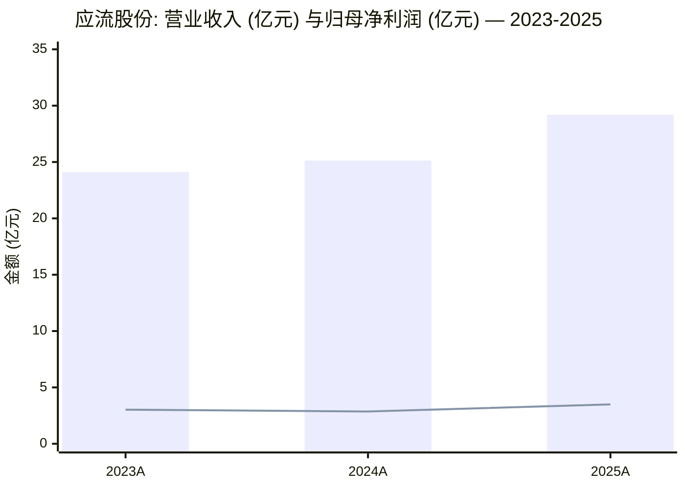
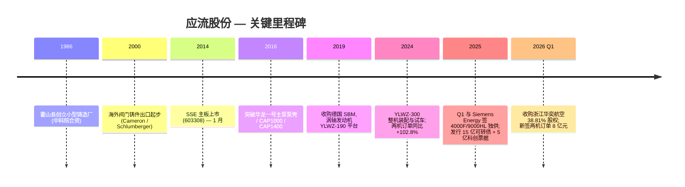
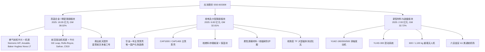
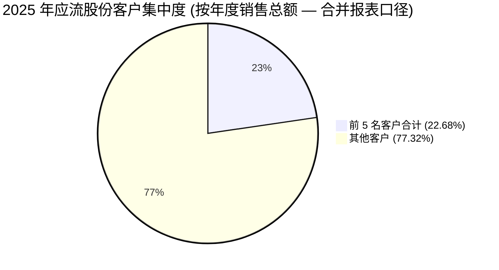
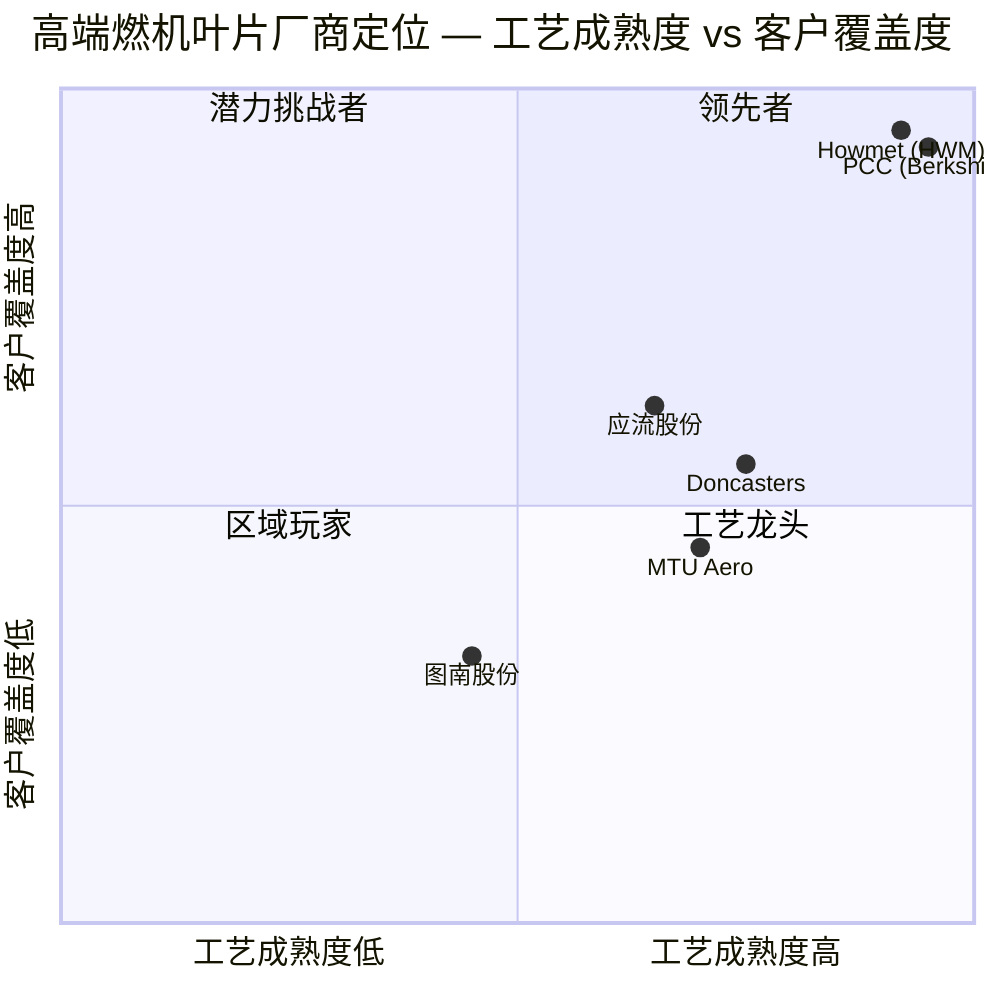
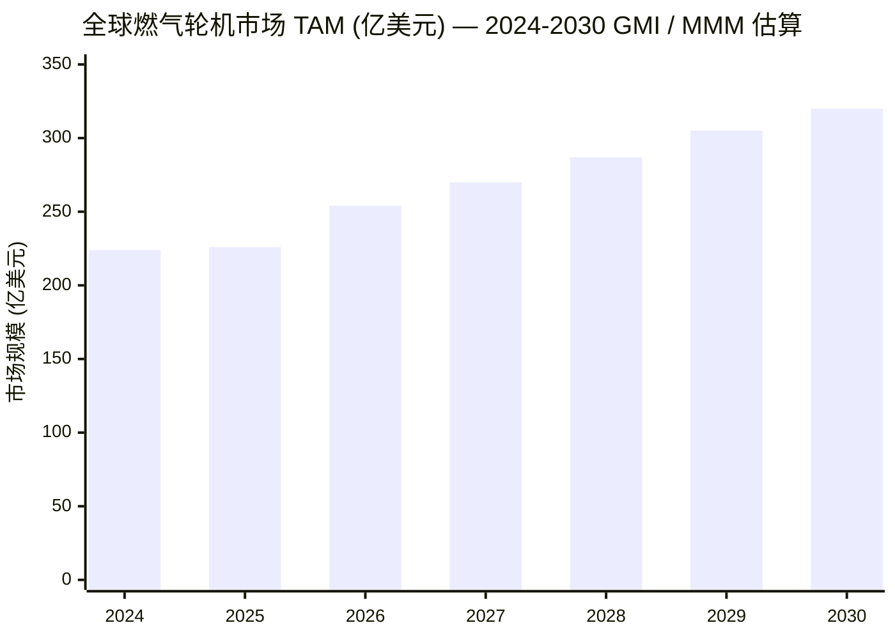

# 安徽应流机电股份有限公司 (Anhui Yingliu Electromechanical Co., Ltd.)

**Ticker:** SSE:603308 (A 股) | **可转债:** 应流转债 (113697.SH) | **报告日期 (As of):** 2026-06-03
**报告语言:** Simplified Chinese (zh-CN)

---

## 目录

1. 公司概览 (Company Overview)
2. 公司历史 (Company History)
3. 管理团队 (Management)
4. 产品与服务 (Products & Services)
5. 客户与上市策略 (Customers & GTM)
6. 行业概览 (Industry Overview)
7. 竞争格局 (Competitive Landscape)
8. 市场机会 (Market Opportunity / TAM)
9. 风险评估 (Risk Assessment)
10. 视角评分 (Investor-Lens Scorecards)
11. 参考资料 (References)

---

## 1. 公司概览 (Company Overview)

安徽应流机电股份有限公司（公司简称"应流股份"，以下简称"公司"）是国内**专用设备零部件 (specialty equipment components) 制造业**的领先企业，注册于安徽霍山，办公地位于合肥经济技术开发区繁华大道 566 号。公司核心产品为**高温合金产品 (superalloy products) 及精密铸钢件 (precision steel castings)**、**核电及其他中大型铸钢件 (nuclear and other large steel castings)**、**新型材料与装备 (new materials and equipment)** 三大类，应用在 **航空航天 (aerospace)、燃气轮机 (gas turbine)、核能核电 (nuclear power)、油气资源 (oil & gas)** 等高端装备领域。截至 2025 年末，公司国家级高新技术企业增至 7 家，研发人员达 848 人（占总员工 15.87%），研发投入 3.94 亿元，占营收 13.51% ([应流股份 2025 年年度报告](https://stockmc.xueqiu.com/202604/603308_20260424_58SX.pdf))。

公司 2025 年度营业收入为 **2,918.83 百万元 (人民币)**，同比 + 16.13%；归属上市公司股东净利润 348.64 百万元，同比 + 21.74%；扣非净利润 320.57 百万元，同比 + 15.78%；经营活动现金流量净额 256.42 百万元，同比 + 158.30%；基本 EPS 0.51 元（稀释 EPS 0.52 元）。资产负债率 (debt/asset ratio) 由 2024 年末 56.13% 升至 2025 年末 58.38%，主要因发行 15 亿元可转债与 5 亿元科技创新中期票据；同时 EBITDA 全部债务比由 10.20 降至 6.65，仍处可控区间，利息保障倍数 3.32（2024 年 2.97）([应流股份 2025 年年度报告摘要](http://static.cninfo.com.cn/finalpage/2026-04-24/1225157978.PDF))。

**Valuation snapshot — 2026-06-03**: 公司 A 股 (SSE:603308) 在 2026 年 1 月 30 日收盘价 51.40 元，对应总市值约 349 亿元 ([应流股份每周复盘 — 2026-02-01, 证券之星](https://stock.stockstar.com/RB2026020100000198.shtml))。按 2025 年归母净利润 3.49 亿元、稀释 EPS 0.52 元静态计算，**TTM P/E ≈ 99×**；按 2025 年营业收入 29.19 亿元静态计算，**P/S ≈ 12.0×**；以 2025 年末归属股东净资产 50.54 亿元为基础，**P/B ≈ 6.9×**。*分析师观点：* 估值显著高于专用设备制造业 A 股可比公司（中位 PE 通常 20–35 × 区间），属于**主题溢价 + 高景气预期定价**。东方财富相关文章指出公司"两机叶片千亿美金赛道"是核心叙事 (国盛证券 2020 年首份深度报告标题， [国盛证券 2020 年应流股份深度报告](https://img3.gelonghui.com/pdf/fcd68-2400957e-f8ce-4d91-ad1f-4e62ecc23b3a.pdf))，叠加 AI 数据中心驱动全球燃气轮机订单爆发与国产化替代，市场愿意支付高倍数；东吴证券、中邮证券等多家券商持"买入/优于大市"评级。但需明确：**100× 静态 PE 已经隐含未来 2–3 年净利润翻倍 + 持续 35% + CAGR 假设**，对执行力与订单兑现节奏要求极高。

**核心一句话定位：** 公司是国产**两机（航空发动机 + 燃气轮机）热端铸件 (hot section castings)** 与**核电主泵泵壳 / 核燃料组件 (nuclear primary pump casings / nuclear fuel components)** 的稀缺供应商，是 Siemens Energy F / H 级重型燃机透平叶片在中国的**唯一**供应商 ([东吴证券 应流股份深度报告 2025-03-18](https://pdf.dfcfw.com/pdf/H3_AP202503181644476948_1.pdf))，是华龙一号主泵泵壳的**唯一**国产化制造商 ([应流股份 2025 年年度报告](https://stockmc.xueqiu.com/202604/603308_20260424_58SX.pdf))，同时通过 SBM 收购涉足涡轴发动机 (turboshaft engine) 与重载无人机 (heavy-payload UAV) 整机业务。

### 收入增长与盈利能力 (Mermaid xychart)

*Source: [应流股份 2025 年年度报告，第 5-6 页](https://stockmc.xueqiu.com/202604/603308_20260424_58SX.pdf)*

---

## 2. 公司历史 (Company History)

公司由 **杜应流 (Du Yingliu)** 先生作为创始人于安徽霍山起步。杜先生 1952 年生，14 岁离开学校学木工 5 年，19 岁应征入伍在西藏边境地区服役 5 年，1976 年退伍后历任酒厂合同工、油坊会计、公社企业办公室主任。1978 年改革开放伊始，杜应流从信用社贷款 8,000 元购置二手解放牌卡车开始运输业务，两年内扩张到 4 辆货车 ([跻身六安富豪榜第三，70 岁杜应流的铸造之路, 铸造头条](http://zhuzaotoutiao.com/xw/html/9947.shtml))。

**1986 年公司起源**：杜应流在霍山县创立小型铸造厂，与中国科学院研究所合资设立"中科院霍山联合化工冶金厂"，从生产矿山选矿球、衬板起步。"应流" 集团此后逐步从**普通铸铁件**升级到**精密铸钢、不锈钢阀门件**，并在 2000 年前后开始为 Cameron / Schlumberger 等海外油气客户出口阀门铸件 ([安徽应流集团 — 百度百科](https://baike.baidu.com/item/%E5%AE%89%E5%BE%BD%E5%BA%94%E6%B5%81%E9%9B%86%E5%9B%A2/7410414))。

**2014 年 1 月** 公司在 **Shanghai Stock Exchange (SSE)** 主板上市，证券代码 603308，募集资金主要投向 "高端装备核心零部件" 产能扩张 ([中邮证券·军工：应流股份深度报告 2024-03-14](https://finance.sina.com.cn/stock/stockzmt/2024-03-14/doc-inanfxxs8708992.shtml))。上市之后，公司战略性地从"阀门铸件"延伸到"两机零件 + 核电铸件 + 航空整机"三大板块：

- **2014–2016**：突破核电主泵泵壳铸造工艺，成为**国内首家成功研制 CAP1000、CAP1400、华龙一号主泵泵壳**的企业 ([应流股份在核电领域的五大核心优势 — 东方财富, 2025-12-27](https://caifuhao.eastmoney.com/news/20251227095621950633730))；
- **2016–2019**：取得 GE、Siemens、Baker Hughes、Caterpillar、Schlumberger 等全球行业龙头的合格供应商认证，特别是燃气轮机叶片、机匣订单首次量产 ([应流股份 2025 年年度报告，第 8-10 页](https://stockmc.xueqiu.com/202604/603308_20260424_58SX.pdf))；
- **2019 年起**：通过收购 **德国 SBM Development GmbH** 获得涡轴发动机平台 (YLWZ-190 / YLWZ-300 系列)，开启航空整机布局，2024 年完成 YLWZ-300 整机装配与试车验证 ([华金证券 应流股份点评 2025-04-13](https://pdf.dfcfw.com/pdf/H3_AP202504151656711346_1.pdf))；
- **2024–2025**：高温合金产品订单爆发，2025 年新签两机订单突破 **20 亿元**，2026 年第一季度新签订单突破 **8 亿元**；与意大利 **Ansaldo Energia** 签署战略协议，2026 年一季度签署超 **3.5 亿元**订单；**与 Rolls-Royce、Safran 等扩大业务覆盖**；与 Siemens Energy 在中国签署 4000F / 9000HL 等最新机型独家供货协议 ([应流股份 2025 年年度报告，第 9 页](https://stockmc.xueqiu.com/202604/603308_20260424_58SX.pdf))；
- **2025 年 9-10 月**：成功公开发行 **15 亿元**可转换公司债券 ("应流转债"，证券代码 113697)，用于 (i) 叶片机匣加工涂层项目、(ii) 先进核能材料及关键零部件智能化升级项目、(iii) 补充流动资金及偿还银行贷款 ([应流股份不超 15 亿可转债获上交所通过 — 新浪财经 2025-07-25](https://finance.sina.com.cn/jjxw/2025-07-25/doc-infhrzee5203145.shtml))；同时发行 5 亿元科技创新中期票据 (25 应流 MTN002, 2.12% 票面)；
- **2026 年 Q1**：以收购加增资方式取得**浙江华奕航空科技 38.81% 股权**，整合重载无人机平台资源，进军大型无人机终端市场 ([应流股份 2025 年年度报告，第 10 页](https://stockmc.xueqiu.com/202604/603308_20260424_58SX.pdf))。

### 关键里程碑 (Mermaid timeline)

*Source: [应流股份 2025 年年度报告](https://stockmc.xueqiu.com/202604/603308_20260424_58SX.pdf), [东吴证券 应流股份深度报告 2025-03-18](https://pdf.dfcfw.com/pdf/H3_AP202503181644476948_1.pdf)*

---

## 3. 管理团队 (Management)

按 /company-research 规则只覆盖**创始人 + 现任 CEO**。创始人即现任 CEO，合并撰写。

### 杜应流 (Du Yingliu) — 创始人 / 董事长 / 总经理 / 实际控制人

杜应流先生，1952 年生，中国国籍，无境外永久居留权，专科学历，高级经济师 (Senior Economist 高级职称)，**全国劳动模范 (National Model Worker)**，第十二届、十三届**全国人民代表大会代表 (NPC Deputy)** ([杜应流个人简介 — 中商情报网](https://s.askci.com/stock/executives/603308/1ef2ad7788790e83.shtml))。截至 2025 年末持有应流股份 11,624,311 股，占总股本约 1.71%；同时通过霍山应流投资管理有限公司（持股 27.37%）、霍山衡邦投资（4.53%）、霍山衡玉投资（0.86%）、霍山衡宇投资（0.27%）四个一致行动平台合计间接 / 直接控制约 34.74% 股份，为公司实际控制人 ([应流股份 2025 年年度报告摘要，第 5-6 页](http://static.cninfo.com.cn/finalpage/2026-04-24/1225157978.PDF))。

**履历**：杜应流 14 岁辍学学木工 5 年；19 岁参军赴西藏边防 5 年；1976 年退伍后历任酒厂合同工、油坊会计、公社企业办公室主任。1978 年贷款 8,000 元购二手解放牌卡车开始运输业务，两年扩张至 4 辆货车，掘得"第一桶金"。**1986 年**于霍山县创办小型铸造厂——这是应流集团的真正起点，公司与中科院研究所联合设立"中科院霍山联合化工冶金厂"。此后近 40 年专注于铸造业升级，从普通铸铁件→精密铸钢→不锈钢阀门→高温合金叶片→核电主泵泵壳→航空整机，**全部以杜应流本人为核心战略推动者** ([跻身六安富豪榜第三，70 岁杜应流的铸造之路](http://zhuzaotoutiao.com/xw/html/9947.shtml))。2014 年带领公司在上交所主板上市，至 2025 年公司员工已超 5,000 人，公司产品出口 40 多个国家，与 13 家世界 500 强企业建立战略合作 ([安徽应流集团 — 百度百科](https://baike.baidu.com/item/%E5%AE%89%E5%BE%BD%E5%BA%94%E6%B5%81%E9%9B%86%E5%9B%A2/7410414))。

**当前任期**：第五届董事会董事长兼总经理，任期 2023 年 5 月 22 日至 2026 年 5 月 21 日（按 2025 年报披露，即将进入换届窗口）。**2025 年税前薪酬 1,148,592 元**，是公司管理团队中最高，但相对民营高端制造龙头规模仍偏低（典型同业 CEO 薪酬 200-500 万元区间），反映创始人持股动机为主、薪酬为辅 ([应流股份 2025 年年度报告，第 22 页](https://stockmc.xueqiu.com/202604/603308_20260424_58SX.pdf))。

**关键治理观察**：(1) 杜应流同时兼任董事长与总经理，公司在 2025 年报中专门披露 "已根据《公司法》及《公司章程》合理划分董事会与总经理职权"，**反映监管对 "一肩挑" 模式的关注**；(2) 公司于 2025 年 10 月 30 日召开第五届董事会第十三次会议、并于 2025 年 11 月 17 日股东大会通过《关于取消监事会并修订<公司章程>的议案》，将监事会职权移交董事会审计委员会，符合 2024 年新《公司法》改革方向；(3) 实际控制人 (即杜应流) 持有的控股股东 "应流投资" 已有 9,000 万股质押，"衡邦投资" 有 1,300 万股质押，合计占其持股的约 47%，质押率较高，**需关注股价波动对质押风险的传导** ([应流股份 2025 年年度报告摘要，第 5 页](http://static.cninfo.com.cn/finalpage/2026-04-24/1225157978.PDF))。

**接班人布局**：公司证券事务代表为杜超 (37 岁)，同时兼任董事会秘书，年初持股 100,000 股 — 从年龄、姓氏与持股观察，**杜超与创始人杜应流大概率为父子关系或近亲属**，是隐性接班人安排；但年报未披露明确表态，2026 年董事会换届后是否过渡值得跟踪 ([应流股份 2025 年年度报告，第 22 页](https://stockmc.xueqiu.com/202604/603308_20260424_58SX.pdf))。

---

## 4. 产品与服务 (Products & Services)

按 /company-research 的规则，本节是整篇报告的**核心**。公司 2025 年报披露主营业务分行业、分产品的官方矩阵如下：

### 4.0 主营业务分行业 / 分产品收入矩阵 (2025 年报表)

| 分行业 (Segment) | 营业收入 (万元) | 营业成本 (万元) | gross margin (毛利率, %) | YoY 收入 (%) | YoY 毛利率 (pp) |
|---|---:|---:|---:|---:|---:|
| 高温合金产品及精密铸钢件 (superalloy + precision steel castings) | 180,474.75 | 111,860.14 | **38.02** | +22.89 | +1.32 |
| 核电及其他中大型铸钢件 (nuclear & large steel castings) | 68,318.55 | 45,901.62 | 32.81 | +6.45 | +1.18 |
| 新型材料与装备 (new materials & equipment) | 29,268.76 | 19,693.09 | 32.72 | +25.37 | +1.15 |
| 其他 (other) | 5,349.70 | 4,475.26 | 16.35 | -37.00 | +1.07 |

| 分产品 (Product) | 营业收入 (万元) | 营业成本 (万元) | gross margin (%) | YoY (%) |
|---|---:|---:|---:|---:|
| 泵及阀门零件 (pump & valve parts) | 118,175.00 | 80,408.60 | 31.96 | -3.17 |
| 机械装备构件 (mechanical equipment structures) | 165,236.76 | 101,521.50 | **38.56** | +36.75 |

**关键观察 — 结构性升级**：(1) 公司高利润率板块 **"高温合金 + 精密铸钢"** 2025 年增长 22.89%、毛利 38.02%，已是单一最大业务，占主营收入约 62%；(2) **"机械装备构件" (主要承载两机叶片 + 机匣 + 核电铸件 + 新材料)** 同比 +36.75%、毛利 38.56%，是公司利润主力；而早期支柱 **"泵及阀门零件"** 同比 -3.17%、毛利 31.96%，体现公司主营业务从"油气阀门铸件"切换到"两机 + 核电高端零件"的战略转身；(3) 境外收入 1,492.65 百万元同比 +32.78%、毛利率 36.60%，比境内 (34.93%) 高 1.67 pp，**海外高端客户结构是公司毛利率的稳定锚** ([应流股份 2025 年年度报告，第 11-12 页](https://stockmc.xueqiu.com/202604/603308_20260424_58SX.pdf))。

### 4.1 高温合金 / 精密铸钢板块 — 两机叶片与机匣 (Gas Turbine + Aero Engine Hot Section)

**业务定位：** 公司是国内极少数批量生产**单晶 (single crystal) 与定向凝固 (directionally solidified, DS) 燃气轮机叶片**的制造商，是 Siemens Energy F/H 级重型燃机透平叶片在中国的**唯一**供应商，同时为 Baker Hughes、GE Aerospace、Rolls-Royce、Safran、Ansaldo Energia 等全球龙头供货 ([应流股份 2025 年年度报告，第 9 页](https://stockmc.xueqiu.com/202604/603308_20260424_58SX.pdf))。年报原文："作为国内领先的两机热端部件制造商，公司凭借深厚的技术积累、稳定的产品质量，成功跻身西门子能源、贝克休斯、通用航空航天、安萨尔多、赛峰集团、罗罗公司等全球顶级客户供应链，叶片、机匣及相关结构件覆盖全球主流型号。"

**中文释义 / Plain-language gloss：** 燃气轮机 (gas turbine) 是一种**通过高温燃气推动叶片旋转、把化学能或热能转化为机械能进而发电或驱动机械**的设备，分两大类：(1) **重型燃机 (heavy-duty gas turbine, HDGT)** — 用于大型电站、AI 数据中心备用电源、工业燃气联合循环 (combined cycle)，代表机型 Siemens SGT5-9000HL (480 MW)、GE 9HA.02 (571 MW)；(2) **航改燃机 (aeroderivative gas turbine)** — 用于油气平台、分布式能源，代表机型 GE LM2500 / LM6000、Baker Hughes Nova LT。**燃机叶片**是燃机最贵也最难做的零件，**单台 H 级重型燃机叶片价值占整机约 22%**，全球只有 PCC (Precision Castparts，Berkshire Hathaway 子公司) 和 Howmet Aerospace (HWM) 两家美企掌握 70-80% 高端叶片市场份额 ([Turbine Blades for Heavy Duty Gas Turbines Market Outlook 2025-2032, Intel Market Research](https://www.intelmarketresearch.com/turbine-blades-for-heavy-duty-gas-turbines-market-6602))。

**关键产品族 — 在 Siemens Energy 体系内：**
- **F 级燃机透平叶片** (Siemens SGT5-4000F / SGT6-5000F 系列) — 公司**已批量稳定供货**，承载 2025 年订单的主体；
- **H 级燃机透平叶片** (Siemens SGT5-9000HL / SGT6-9000HL 系列) — 公司已"陆续攻破多个型号关键核心技术，即将实现大规模量产"，是 Siemens Energy 在中国的**唯一**叶片供应商，2025 年应邀出席海南总装基地及服务中心开工仪式 ([应流股份 2025 年年度报告，第 9 页](https://stockmc.xueqiu.com/202604/603308_20260424_58SX.pdf))；
- **Ansaldo 燃机叶片** — 公司与 Italy Ansaldo Energia 签长期战略协议，某透平第一级**单晶叶片认证周期比世界龙头供应商缩短两个多月**，某透平第四级叶片完成首件认证及首批订单交付，2026 年 Q1 续签超 3.5 亿元订单；
- **Baker Hughes Nova LT 系列** — 公司"接单量和交付量连创新高，主力燃机 Nova LT 系列产品份额逐年扩大"，同时启动 LM2500、LM6000 多个型号合作；

**关键产品族 — 在航空发动机体系内：**
- **CFM Leap 系列机匣** — "Leap 各系列发动机机匣需求不断增加，多款型号产品供货规模稳居全球前列"；
- **Rolls-Royce 与 Safran** — Safran "继年初签订长期协议之后，已迅速启动十几个代表性产品的研发试制"，Rolls-Royce "进一步拓展了业务，覆盖了多款发动机型号"；
- **中国大飞机 C919 配套** — "公司配套中国大飞机 C919 项目，为中国航发商发新开发品种 20 余个" ([应流股份 2025 年年度报告，第 9 页](https://stockmc.xueqiu.com/202604/603308_20260424_58SX.pdf))。

**战略含义 (Strategic significance)：** 全球进入 **AI Data-Center Power-Demand Cycle (AI 数据中心算力扩张周期)**，对天然气联合循环电站（既能稳压又能"启停灵活"，作为 AI 算力中心备电的稀缺方案）需求暴增。GE Vernova 已宣布 HA 级燃机产能售罄至 2030 年；GE Vernova + Crusoe 签约 29 台 LM2500 XPRESS 为 AI 数据中心供 ~1 GW 灵活电力 ([GMI Gas Turbine Market 2025-2034](https://www.gminsights.com/industry-analysis/gas-turbine-market))。**叶片是燃机最瓶颈环节，订单出货比显著提升，交付周期已延至 2029-2030 年**——公司年报原文："涡轮叶片作为燃气轮机最瓶颈的环节，订单出货比显著提升，供给刚性极强，为公司业务增长提供了强劲支撑。" 公司 2025 年新签两机订单 > 20 亿元，2026 年 Q1 新签 > 8 亿元，意味着叶片业务已经成为公司**第一大增长引擎** ([应流股份 2025 年年度报告，第 9 页](https://stockmc.xueqiu.com/202604/603308_20260424_58SX.pdf))。

### 4.2 核电及其他中大型铸钢件 — 核岛主泵泵壳 / 核燃料组件 / 屏蔽材料

**业务定位：** 公司是国内核电铸件与核能新材料领域的领先企业，子公司应流久源 (安徽应流久源核能新材料科技有限公司) 与应流铸造为主要业务承载主体。核心产品族：

- **华龙一号 (HPR1000) 核岛主泵泵壳 (primary pump casing)** — 公司是**唯一**国产化制造商，2024 年交付 10 台份，为全国在建核电机组的 30% 配套 ([应流股份在核电领域的五大核心优势 — 东方财富 2025-12-27](https://caifuhao.eastmoney.com/news/20251227095621950633730))；
- **CAP1000 / CAP1400 (国和一号) 主泵泵壳** — 公司是国内**第一家成功研制**的企业；
- **核一级爆破阀 (Class-1 Burst Disc Valve)** — 2025 年实现合格率大幅提升，"成功打破垄断"；
- **核燃料存储格架 (spent fuel storage rack)** — 荣获上海核工程研究设计院 (SNERDI) 感谢信；
- **新一代核辐射防护服 (柔性屏蔽材料)** — 首次实现柔性屏蔽材料销售，"成功解决了关键领域'卡脖子'难题"；
- **国家重点工程屏蔽材料订单** — 金额创公司历史记录；
- **核聚变 (nuclear fusion) 配套** — 研制的 **TF 大型磁体测试杜瓦 (test dewar)** 顺利通过验收 ([应流股份 2025 年年度报告，第 9-10 页](https://stockmc.xueqiu.com/202604/603308_20260424_58SX.pdf))。

**中文释义 / Plain-language gloss：** 核岛 (nuclear island) 主泵 (reactor coolant pump, RCP) 是把反应堆冷却剂在堆芯与蒸汽发生器之间循环的"心脏"；**泵壳 (pump casing)** 是承压最大、温度最高、安全等级最高的一个铸件，要求 100 吨级钢锭一次浇注成型，工艺通常是"先做铸件→大型熔炼炉→真空脱气→热等静压 (HIP) 致密化→长时间热处理→数控加工"，整个周期 12-18 个月。**全球能做主泵泵壳的企业不超过 5 家**，国内能批量化做的仅应流股份一家。"国和一号" (CAP1400) 与"华龙一号"是中国具备**自主知识产权 (independent IP)** 的三代核电堆型，对应未来 10 年中国核电新建堆的 80%+ 份额。

**战略含义：** 中国 2025 年正在大力推进新型电力系统建设，核电作为"清洁低碳、安全高效的能源形式"是关键调峰电源。年报披露 "在华龙一号核岛主泵泵壳领域，公司占据行业唯一供货地位；核一级铸件市场占有率持续多年保持市场领先，成为核电铸件领域的标杆性企业" ([应流股份 2025 年年度报告，第 10 页](https://stockmc.xueqiu.com/202604/603308_20260424_58SX.pdf))。叠加新一代屏蔽材料 + 核聚变配套 (ITER、BEST、CFETR 项目背景)，公司核电板块属于"长坡厚雪、订单可见度高、毛利稳定 33% 左右"的现金流业务。

### 4.3 新型材料与装备 — 涡轴发动机 + 混动系统 + 重载无人机整机

**业务定位：** 公司近 5 年通过收购德国 SBM Development GmbH 获得涡轴发动机 (turboshaft engine) 平台，并整合多个子公司 (应流航源、应流航空、北京应流航空、嘉远智能、应流材料、安徽通域航空、六安金安通用机场、浙江华奕航空) 形成"涡轴动力 + 混动系统 + 无人机整机 + 通用机场运营"的航空科技产业链 ([应流股份 2025 年年度报告，第 4 页 释义表](https://stockmc.xueqiu.com/202604/603308_20260424_58SX.pdf))。核心产品族：

- **YLWZ-190 涡轴发动机** — 2025 年完成 **1,000 小时寿命试车**，功率增长型 YLWZ-190E 性能调试基本达到设计指标并完成 60 小时持久试车；
- **YLWZ-300 涡轴发动机** — 通过持续技术改进解决技术难题，2024 年完成整机装配与试车验证；
- **YLWZ-500 涡轴发动机** — 2025 年首台完成配套、装配及点火试车；顺利推进关键零部件超转、超扭试验；
- **YLHD-300 混合动力系统** — 亮相赣州低空产业园，配飞翊飞航空 ES1000 大型无人运输机，获民航华东局专家"检阅"，"获得相关部门的高度认可"；
- **重载无人机 (heavy-payload UAV)** — 起飞重量 600 公斤的无人机在贵州完成卫勤支援保障行动演示任务；起飞重量 1,100 公斤无人机正在进行机发匹配协调；
- **通用机场运营** — 子公司**六安金安机场**取得通用机场使用许可证，成为安徽省第三家取证的 A1 类通航机场；
- **新增浙江华奕航空 38.81% 股权** — 2026 年 Q1 完成，"进一步整合市场资源，形成'动力 + 整机'产业链协同发展的完善布局" ([应流股份 2025 年年度报告，第 10 页](https://stockmc.xueqiu.com/202604/603308_20260424_58SX.pdf))。

**中文释义 / Plain-language gloss：** 涡轴发动机 (turboshaft engine) 是一种**通过涡轮把热能转换为机械功输出到主减速器再驱动旋翼**的航空发动机，主要用于直升机和重载多旋翼无人机；**混合动力系统 (hybrid powertrain)** = 涡轴发动机 + 电池 + 电动机，特点是"既有涡轴的高功率密度、又有电池的瞬时响应能力"，是当下 **eVTOL / heavy-payload UAV (重载垂直起降 / 长航时重载无人机)** 的主流方案。**低空经济 (low-altitude economy)** 是中国 2024-2025 年密集出台的国家级新兴产业政策方向。

**战略含义：** 公司"航空整机"板块是从"两机零件"自然延伸出来的纵向一体化布局，目的是在国家"低空经济 + 重载物流无人机"政策窗口期内占据**整机话语权**，赚取从零件 → 模块 → 整机的**价值链溢价 (value chain markup)**。当前阶段属于持续投入期（管理费用 +20.59%、研发费用 +6.72%、商业航天 + 朱雀三号火箭配套也在该板块体现），尚未规模盈利，但代表公司估值未来"第三增长曲线"。

### 4.4 产品业务系统协同 (Mermaid product tree)

*Source: [应流股份 2025 年年度报告，第 4 页 / 第 8-10 页 / 第 11-12 页](https://stockmc.xueqiu.com/202604/603308_20260424_58SX.pdf)*

### 4.5 客户工作流综合 (Synthesis)

公司的三大产品板块是**典型的"高端铸造产业链垂直延伸"**：以 1986 年的霍山铸造厂为根基，通过 (i) **材料升级** — 从普通铸铁 → 不锈钢 → 高温合金 (镍基 / 钴基 / 铁基)、(ii) **工艺升级** — 从砂型铸造 → 熔模精密铸造 → 真空熔炼 → 定向凝固 → 单晶生长 → 热等静压 (HIP) 致密化、(iii) **结构升级** — 从阀门铸件 → 精密铸件 → 燃机叶片 → 主泵泵壳 → 整机。每一次升级都依托同一套**高温熔炼 + 精密铸造 + 数智化加工**基础设施，但能开拓更高门槛、更高 ASP (平均售价)、更高毛利率的新市场。下游端则按"两机 (航空发动机 + 燃气轮机)"、"两业 (核能产业 + 航空产业)"的战略框架展开，对应国家"专精特新 / 制造强国 / 新质生产力"政策方向。这种**纵向一体化 + 工艺壁垒驱动**的商业模式，意味着公司在每个细分赛道都对应少数全球性客户的长周期供应链关系——这是高 P/E 估值的根本逻辑。

---

## 5. 客户与上市策略 (Customers & GTM)

### 5.1 客户结构 (Customer Concentration — 合并报表口径 / consolidated)

**2025 年公司前五名客户销售额 642.68 百万元，占年度销售总额 (营业收入 2,918.83 百万元) 的 22.68%；其中关联方销售额 0；公司年报明确披露"不存在向单个客户的销售比例超过总额的 50%、前 5 名客户中存在新增客户的或严重依赖于少数客户的情形"** ([应流股份 2025 年年度报告，第 13 页](https://stockmc.xueqiu.com/202604/603308_20260424_58SX.pdf))。前五名供应商采购额 753.85 百万元，占年度采购总额 43.01%，关联方采购额 0。

**多年趋势对照（消除供应链单一依赖的判断）：**
- 2024 年：前五名客户销售额 418.45 百万元，占年度营业收入 2,513.46 百万元的 **16.72%** ([应流股份 2024 年年度报告 — 中财网](https://www.cfi.cn/p20250331002582.html))
- 2025 年：前五名客户销售额 642.68 百万元，占年度营业收入 2,918.83 百万元的 **22.68%**
- 2 年提升约 6 个百分点，反映**两机叶片业务集中度上升**（Siemens Energy、Baker Hughes、Ansaldo、GE、Safran 中的若干家进入前五），但**绝对集中度仍属健康** — A 股专用设备制造业平均前五名客户占比约 30-50%。

**全球客户群**（按年报与公开披露汇总，consolidated 口径，但**未披露单家客户的具体收入占比**）：
- **海外客户**：General Electric / GE Aerospace、Siemens Energy、Baker Hughes、Caterpillar、Schlumberger、Ansaldo Energia、Safran、Rolls-Royce、Emerson — 公司年报披露"产品出口 40 多个国家，百余家客户，十余家世界 500 强" ([应流股份 2025 年年度报告，第 11 页](https://stockmc.xueqiu.com/202604/603308_20260424_58SX.pdf))；
- **国内重大工程客户**：中国航发、航天科工、中国重燃、东方电气、上海电气、中国联合重燃、龙江广翰、航发燃机；
- **核电客户**：上海核工程研究设计院 (SNERDI)、中核集团、中广核、国家电投，以及华龙一号、国和一号、聚变能源、燃气轮机产业联盟成员；
- **商业航天客户**：蓝箭航天 (LandSpace) — 朱雀三号火箭配套；
- **C919 大飞机配套**：中国航发商发 — 新开发品种 20 余个，获"优质供应商表彰"。

### 5.2 客户分布饼图 — 按年度销售总额计 (consolidated)

*Source: [应流股份 2025 年年度报告，第 13 页](https://stockmc.xueqiu.com/202604/603308_20260424_58SX.pdf)*
*注 (segment-level vs consolidated)：公司未披露具体单家客户的销售占比，年报仅给出前 5 名合计 22.68%；分行业 / 分产品口径下"高温合金 + 精密铸钢"占主营收入约 62%，可推断 Siemens Energy、Baker Hughes、Ansaldo 等海外两机客户应在前 5 名中占主导位置 (segment-level 推断；不等同于 consolidated 排名)。*

### 5.3 地域分布与上市策略 (Geographic Mix & GTM)

**地区收入结构 (2025)：**
- 境内 1,341.46 百万元，同比 +2.82%，毛利率 34.93%
- 境外 1,492.65 百万元，同比 **+32.78%**，毛利率 **36.60%**（境内外差 1.67 pp）
- 境外收入占比 ~ 52.7%，**境外业务首次超过境内**，是公司国际化战略的关键节点 ([应流股份 2025 年年度报告，第 12 页](https://stockmc.xueqiu.com/202604/603308_20260424_58SX.pdf))。

**上市策略 (GTM) 三大支柱：**

1. **海外深耕 — 全球行业龙头核心供应链** — 公司"凭借批产稳定性、新产品开发响应速度等核心优势"、"叶片认证周期比世界龙头供应商缩短两个多月" — 反映公司通过 **质量 + 速度** 双重门槛进入海外龙头的稀缺供应商名单。子公司 Anhui Yingliu Casting & Machine Europe B.V. (荷兰)、Anhui Yingliu USA Inc.、SBM Development GmbH (德国) 作为前端商务与本地化支持平台 ([应流股份 2025 年年度报告，第 4 页 释义表](https://stockmc.xueqiu.com/202604/603308_20260424_58SX.pdf))；

2. **国内重大工程配套 — 国产化替代** — 围绕华龙一号、国和一号、聚变能源、C919、重型燃机国产化等"卡脖子"项目，与中国航发、中国重燃、东方电气、SNERDI 等头部客户深度绑定；公司是华龙一号主泵泵壳的唯一国产化制造商；

3. **航空航天科技 + 低空经济布局** — 通过涡轴发动机、混动系统、重载无人机、通用机场运营整合"动力 + 整机"产业链，对接低空经济政策窗口期 ([应流股份 2025 年年度报告，第 9-10 页](https://stockmc.xueqiu.com/202604/603308_20260424_58SX.pdf))。

---

## 6. 行业概览 (Industry Overview)

### 6.1 全球燃气轮机市场 (Global Gas Turbine Market)

按多家国际研究机构数据：
- **GMI 数据**：2024 年全球燃气轮机市场规模 > 147 亿美元，2025-2034 CAGR 5.4% ([GMI Gas Turbine Market 2025-2034](https://www.gminsights.com/industry-analysis/gas-turbine-market))；
- **MarketsandMarkets 数据**：2024 年 224.1 亿美元 → 2025 年 235.9 亿美元 → 2030 年 307.6 亿美元 (CAGR 5.41%)；
- **应流股份引用 GMI 预测**：2025 年全球燃气轮机市场约 **226 亿美元** → 2026 年提升至 **254 亿美元**，2026-2035 年 CAGR 约 **11.2%** ([应流股份 2025 年年度报告，第 9 页](https://stockmc.xueqiu.com/202604/603308_20260424_58SX.pdf))；

不同机构 CAGR 差异较大 (5.4-11.2%) 反映两个驱动力的叠加：(1) **稳态电力扩容需求** — 全球能源转型背景下 LNG / 联合循环天然气电站投资周期延续，约 4-5% 年增长；(2) **AI 数据中心算力暴增 — 增量需求** — 是 2024 年以来全球燃机订单的最大变量。Markets and Markets 测算亚太 LNG / 天然气燃机市场到 2035 年增至 23.27 亿美元 → 43.50 亿美元 (CAGR 7.33%)。

**AI 数据中心驱动的订单暴涨已经显性化**：
- GE Vernova 的 HA 级燃机已宣布"产能售罄至 2030 年"；
- GE Vernova 与 Crusoe 合作交付 29 台 LM2500 XPRESS 航改燃机，为 AI 数据中心提供 ~1 GW 灵活电力；
- 主流厂家交付周期已延至 **2029-2030 年**；
- 燃机最瓶颈环节叶片"供给刚性极强"，订单出货比显著提升 ([应流股份 2025 年年度报告，第 9 页](https://stockmc.xueqiu.com/202604/603308_20260424_58SX.pdf))。

### 6.2 全球航空发动机 / 机匣市场 (Aero Engine Casing Market)

全球民航供应链 2025 年开始全面复苏：GE Aerospace、Safran、Rolls-Royce 等"高层来访频繁，公司国际化进程大幅加快"。航空发动机主要市场驱动力包括 (i) 窄体机 CFM Leap 与 Pratt & Whitney GTF 的累计订单与服务收入（截至 2025 年 LEAP 累计订单 > 12,000 台），(ii) 宽体机 Trent XWB / GEnx 双发更新换代，(iii) 中国 C919 大飞机国产化进程（截至 2026 年 Q1 已交付 > 18 架）。应流股份在 CFM Leap、Rolls-Royce、Safran 机匣供应链中占据份额，受益于这一长周期复苏 ([应流股份 2025 年年度报告，第 9 页](https://stockmc.xueqiu.com/202604/603308_20260424_58SX.pdf))。

### 6.3 中国核电市场 (China Nuclear Power Market)

中国"十四五"规划与"双碳目标"驱动核电进入加速建设期。截至 2025 年末，中国大陆在运核电机组 56 台，在建机组 23 台 + ，**2024-2025 年连续两年获国务院核准 10 台 + 新核电机组**，预计 2026 年再核准 8-10 台。"华龙一号" (HPR1000) 与"国和一号" (CAP1400) 是中国具备自主知识产权的两大三代核电堆型，对应未来 10 年新建堆的 80% + 份额。应流股份作为华龙一号主泵泵壳的唯一国产化制造商，受益于**每台机组 4-6 个主泵 × 单价数千万元**的高 ASP 业务，是核电产业链上游核心环节 ([应流股份在核电领域的五大核心优势 — 东方财富 2025-12-27](https://caifuhao.eastmoney.com/news/20251227095621950633730))。同时核聚变 (ITER、BEST、CFETR) 项目进入工程化阶段，TF 大型磁体、屏蔽材料、特种铸件需求逐步释放。

### 6.4 行业竞争结构 (Industry Structure)

按公司年报原文："专用设备零部件制造业是装备制造业的上游产业，是航空航天、燃气轮机、低碳能源等新兴产业和未来产业发展壮大的重要基石。发达国家具有雄厚的制造工艺技术基础，跨国公司及其核心供应商在专用设备零部件行业高尖端产品核心制造技术处于优势地位。我国专用设备零部件行业经过多年发展，形成了门类齐全、规模较大的完整产业体系。" 行业整体特征 ([应流股份 2025 年年度报告，第 8 页](https://stockmc.xueqiu.com/202604/603308_20260424_58SX.pdf))：

- **高门槛 (high barrier)**：依赖材料、工艺、装备、客户认证四重壁垒；新进入者认证周期 5-10 年；
- **慢迭代 (slow iteration)**：单台燃机机型量产周期 15-25 年，认证完成后客户切换成本极高；
- **强出口 (export-heavy)**：高端零件全球化供应链已经形成，中国少数龙头开始"反向输出"；
- **政策强相关 (policy-driven)**：新质生产力、国产化替代、专精特新、制造强国战略、低空经济直接驱动需求。

---

## 7. 竞争格局 (Competitive Landscape)

### 7.1 主要竞争对手 (Direct competitors)

**全球叶片高端制造市场结构高度集中**——按 Intel Market Research 与公开行业资料 ([Turbine Blades for Heavy Duty Gas Turbines Market Outlook 2025-2032](https://www.intelmarketresearch.com/turbine-blades-for-heavy-duty-gas-turbines-market-6602))：

| 公司 | 总部 / 上市地 | 核心业务 | 与应流股份的关系 |
|---|---|---|---|
| **Howmet Aerospace (HWM)** | 美国 / NYSE:HWM | 全球航空 + 工业燃机叶片龙头 | 主要竞争对手 — 高端叶片市场领导者 |
| **Precision Castparts (PCC)** | 美国 (Berkshire Hathaway 子公司) | 航空 + 工业燃机叶片、阀门、紧固件 | 主要竞争对手 — 与 HWM 合计 70-80% 高端叶片份额 |
| **Doncasters Group** | 英国 / 私有 | 燃机叶片、机匣 | 二线全球供应商 |
| **MTU Aero Engines** | 德国 / FRA:MTX | 航发 MRO + 部分零件 | 间接竞争 |
| **抚顺特殊钢 (FSS)** | 中国 / SSE:600399 | 高温合金母合金 + 钢锭 | 上游材料 — 部分竞争 + 部分供应链合作 |
| **图南股份 (Tunan)** | 中国 / SZSE:300855 | 国产高温合金 + 精铸 | 国内同业 — 规模较小 |
| **航发动力 (AECC Power)** | 中国 / SSE:600893 | 航空发动机整机 | 客户兼下游 — 战略合作而非竞争 |
| **东方电气 (Dongfang Electric)** | 中国 / SSE:600875, HKEX:01072 | 重型燃机整机 + 国产化 | 客户 — 重型燃机国产化合作 |
| **应流股份 (Yingliu)** | 中国 / SSE:603308 | 高端铸件 + 叶片 + 主泵泵壳 | 自身 |
| **江苏永瀚 (Jiangsu Yonghan)** | 中国 / 待上市 | 高温合金母合金 | 上游材料 |

*分析师观点 (Analyst view)：* PCC 与 Howmet 合计掌握全球 70-80% 高端叶片市场份额是行业共识，但**这一数据来源于 Intel Market Research 等第三方行业研究，并非任何被引公司年报中的官方表述**；同时应流股份作为"国内极少数批量生产单晶 / 定向叶片的中国企业"享有结构性的国产化替代红利，但与 PCC / HWM 在材料体系、热端工艺、单一炉次产能、认证机型覆盖度上仍有一代以上技术差距 ([东吴证券 应流股份深度报告 2025-03-18](https://pdf.dfcfw.com/pdf/H3_AP202503181644476948_1.pdf))。

### 7.2 竞争优势矩阵 (quadrant chart — 高端燃机叶片市场)

*Source (定位为 analyst view，基于 [Turbine Blades for Heavy Duty Gas Turbines Market Outlook 2025-2032](https://www.intelmarketresearch.com/turbine-blades-for-heavy-duty-gas-turbines-market-6602) + [应流股份 2025 年年度报告](https://stockmc.xueqiu.com/202604/603308_20260424_58SX.pdf) 客户披露的综合判断；不属于任何被引公司年报的官方表述)*

### 7.3 应流股份的核心竞争力 (Core Strength — 公司年报披露)

公司 2025 年报第 10-11 页明确披露 4 大核心优势 ([应流股份 2025 年年度报告，第 10-11 页](https://stockmc.xueqiu.com/202604/603308_20260424_58SX.pdf))：

1. **产业结构优势** — 公司选择航空航天、燃气轮机、核能核电三大高端装备方向，符合国家产业政策与"新质生产力"重点支持方向；
2. **科技创新优势** — 研发与生产装备整体达到世界先进水平，国内首次研制成功并生产出多种核电站核岛和核动力关键部件，参与主编国家标准和行业标准，拥有数百项专利和专有技术；与中国工程物理研究院、合肥综合性国家科学中心、中国科学院金属研究所、中国航发北京航空材料研究院等一批"具有国际水平的研究机构"开展产学研用合作；
3. **市场地位优势** — 产品出口 40 个国家、百余家客户、十余家世界 500 强；多次获得 GE、Siemens、Emerson、Baker Hughes、Caterpillar 等"优秀供应商和产品质量奖"；保持在我国阀门零件出口企业中**出口额排名第一**、核电装备零部件交货量位列前茅，连续位列中国机械工业百强企业；
4. **先进设备优势** — 从世界各国进口先进设备，构成模制壳、熔炼浇注、后处理、检验检测完整生产线；拥有**国内最大规格、综合性能国际领先的大型热等静压设备 (HIP)**，以及 300 kg 单晶炉、1,000 kg 真空炉等。

---

## 8. 市场机会 (TAM / Market Opportunity)

### 8.1 燃气轮机叶片 TAM (Gas Turbine Blade)

按公司年报援引的 GMI 测算，全球燃气轮机整机 2026 年市场约 254 亿美元，2026-2035 CAGR 约 11.2%；其中**叶片占整机价值约 22%** (Intel Market Research 行业研究)，对应 2026 年全球燃机叶片 TAM 约 **55.9 亿美元** ([Turbine Blades for Heavy Duty Gas Turbines Market Outlook 2025-2032](https://www.intelmarketresearch.com/turbine-blades-for-heavy-duty-gas-turbines-market-6602))。再假设公司在中高端市场份额从当前 < 3% 提升至 2030 年 6-8% (国产化与产能扩张双轮驱动)，对应公司 2030 年燃机叶片销售 30-45 亿元，是 2025 年高温合金 + 精密铸钢板块 (18 亿元) 的 1.7-2.5 倍。**AI 数据中心驱动的非周期增长** 是这一假设最重要的变量。

### 8.2 航空发动机叶片 / 机匣 TAM

全球航空发动机零件市场 (含 OE + Aftermarket) 2025 年约 950 亿美元 (基于 Howmet Aerospace + RTX + GE Aerospace + Safran 收入加总反推)，其中机匣类约 8%、叶片类约 15%。中国 C919 国产化方向下，民航发动机零件 TAM 在未来 10 年有望从中国占比 < 1% 提升至 5-8%。

### 8.3 中国核电主泵 / 核能新材料 TAM

按规划，**中国未来 10 年新增核电装机 80-100 GW**，对应约 70-90 台新机组，单台核岛主泵泵壳价值 ~ 6,000-8,000 万元 × 4-6 个 → 单机组主泵泵壳 TAM 约 3 亿元；累计核电主泵泵壳 TAM 约 200-280 亿元（10 年）。叠加核燃料组件、屏蔽材料、核聚变配套，公司在核电板块的潜在 10 年累计 TAM 可达 400-600 亿元。考虑公司在华龙一号主泵泵壳的国产唯一地位，潜在份额可达 30-50%。

### 8.4 低空经济 / 重载无人机 TAM

中国低空经济 2024 年由国家发改委 / 民航局多次发文支持，2025-2030 年期间预测国内低空经济市场 1-2 万亿元规模；重载无人机 (起飞重量 > 300 kg) 是其中物流 / 应急 / 农林 / 军工应用的核心载具。公司 YLWZ 系列涡轴 + YLHD 混动系统 + 600/1100 kg 重载无人机布局是面向这一 TAM 的早期卡位。

### 8.5 行业 TAM 增长趋势 (Mermaid xychart)

*Source: [GMI Gas Turbine Market 2025-2034](https://www.gminsights.com/industry-analysis/gas-turbine-market) + 应流股份年报援引 GMI 数据*

---

## 9. 风险评估 (Risk Assessment)

按 /company-research 的 4 大风险类别（公司层 / 行业市场层 / 财务层 / 宏观层），逐项分析 8-12 项关键风险：

**A. 公司层风险 (Company-Specific Risks)**

1. **创始人 / 一肩挑治理结构风险** — 杜应流先生兼任董事长 + 总经理 + 实际控制人，2025 年监事会已撤销转由审计委员会代行，**单一治理决策权高度集中**；同时杜应流先生已 74 岁，二代接班 (杜超目前任董秘) 尚未有正式表态。一旦核心创始人健康或继承出现重大变化，公司战略方向连续性面临考验。([应流股份 2025 年年度报告，第 20-22 页](https://stockmc.xueqiu.com/202604/603308_20260424_58SX.pdf))

2. **大股东股权质押风险** — 控股股东霍山应流投资管理有限公司持股 185,824,982 股中 9,000 万股已质押（质押率约 48.4%），霍山衡邦投资持股 30,760,225 股中 1,300 万股已质押（质押率约 42.3%）。两家合计被质押 1.03 亿股。如果股价大幅回调（当前高估值背景下回撤压力大），可能触发追加质押或被动平仓。([应流股份 2025 年年度报告摘要，第 5 页](http://static.cninfo.com.cn/finalpage/2026-04-24/1225157978.PDF))

3. **新增可转债 + 中票债务负担上升风险** — 公司 2025 年发行 15 亿元可转债 (应流转债 113697) + 5 亿元科技创新中期票据 (25 应流 MTN002, 2.12% 票面)，导致 2025 年末应付债券 18.76 亿元（同比新增），资产负债率从 56.13% 升至 58.38%，EBITDA / 全部债务比 由 10.20 大幅下降至 6.65。可转债项目若未能如期产能转固或实现预期回报，会进一步加重利息支出。([应流股份 2025 年年度报告，第 16 页](https://stockmc.xueqiu.com/202604/603308_20260424_58SX.pdf))

4. **资产受限规模较大** — 截至 2025 年末，公司货币资金 19.15 亿元中 0.30 亿元被冻结 (保证金)，应收票据 0.27 亿元被背书，固定资产账面净值 54.36 亿元中部分被抵押，无形资产 20.74 亿元中部分被抵押。受限资产合计账面价值约 9.64 亿元，反映融资对资产抵押有较高依赖。([应流股份 2025 年年度报告，第 16 页](https://stockmc.xueqiu.com/202604/603308_20260424_58SX.pdf))

**B. 行业 / 市场层风险 (Industry / Market Risks)**

5. **燃气轮机 AI 数据中心订单可能"过度乐观定价"** — 公司目前 100× P/E 估值中包含了未来 5 年燃机叶片业务持续 35% + CAGR 的假设。如果 AI 算力扩张周期 (现在估计在 2026-2028 高峰) 提前回落，或 GE / Siemens / Baker Hughes 在 2029-2030 年自建叶片产能，公司订单出货比可能下滑。*分析师观点：* 估值层面的"叶片黄金期"已被市场充分定价，反向修正风险显性化。

6. **主要原材料价格波动风险** — 公司年报明确披露："本公司产品的主要原材料为废钢、废不锈钢、镍等合金材料。公司按照成本加成的定价原则来确定产品价格，主要原材料价格的波动会对公司主营产品的销售定价产生一定影响……公司存在因主要原材料价格大幅波动所致的经营风险。" 特别是**镍** (高温合金核心元素) 价格 2024 年以来高度波动，与印尼镍矿供给政策密切相关。([应流股份 2025 年年度报告，第 19 页](https://stockmc.xueqiu.com/202604/603308_20260424_58SX.pdf))

7. **国际贸易壁垒 / 海外供应链脱钩风险** — 公司年报明示："如果下游相关行业受宏观经济波动、国际贸易壁垒的影响致使经营状况受到冲击，公司的生产经营将面临一定的风险。" 公司海外收入占比已经达到 52.7% (2025)，对欧美高端客户依赖度高；2024-2026 年中美科技 / 贸易紧张关系反复，存在 (i) 海外客户因合规审查暂停或减少采购、(ii) 美国对中国军工 / 航天产业链制裁扩面、(iii) 欧盟"经济安全战略"下供应链审查等情景。([应流股份 2025 年年度报告，第 19 页](https://stockmc.xueqiu.com/202604/603308_20260424_58SX.pdf))

**C. 财务层风险 (Financial Risks)**

8. **汇率变动风险** — 公司部分产品出口销售，主要结算货币为**美元、英镑、欧元**。公司明示："如果人民币汇率变化幅度较大，将会对公司的经营产生一定的不利影响。" 2025 年公司财务费用 1.42 亿元同比 +13.13%，主要因汇兑损益变动 + 融资借款利息费用增加。([应流股份 2025 年年度报告，第 11 页 + 第 19 页](https://stockmc.xueqiu.com/202604/603308_20260424_58SX.pdf))

9. **现金流季节性 / Q4 单季度净利润下滑** — 2025 年 Q4 营业收入 7.98 亿元 (单季度新高) 但归母净利润仅 5,473.34 万元，扣非净利润仅 4,254.22 万元（远低于 Q1-Q3 单季 9,000 万 + 1 亿元区间）。说明 Q4 存在一次性费用、坏账计提、或税项调整。需关注是否为偶发性。([应流股份 2025 年年度报告，第 7 页](https://stockmc.xueqiu.com/202604/603308_20260424_58SX.pdf))

10. **研发资本化比重较高** — 2025 年研发投入 3.94 亿元，其中费用化 3.25 亿元 + 资本化 0.69 亿元，**资本化比例 17.50%**。资本化研发支出若未来无法转化为可销售产品，需要计提减值，影响净利润。无形资产同比增 41.14%（部分开发支出转无形资产），开发支出余额下降 69.45%。([应流股份 2025 年年度报告，第 14-15 页](https://stockmc.xueqiu.com/202604/603308_20260424_58SX.pdf))

**D. 宏观层风险 (Macro Risks)**

11. **股市波动 / 高估值回调风险** — 公司年报明示："公司股票价格可能受到国家政治、经济政策以及投资者心理因素及其他不可预见因素带来的系统风险的影响……投资者在选择投资公司股票时，应充分考虑到市场的各种风险。" 当前 P/E ~100× 显著高于历史中枢，估值上行空间收窄，下行风险扩大。([应流股份 2025 年年度报告，第 19 页](https://stockmc.xueqiu.com/202604/603308_20260424_58SX.pdf))

12. **国内核电审批节奏 / 政策风险** — 中国核电核准节奏由国务院"核电工作领导小组"决定，2011 年福岛事故后曾停滞 4 年；任何重大事故、安全事件或国际地缘政治变化可能导致核电审批节奏调整，直接影响公司核电板块订单可见度。

---

## 10. 视角评分 (Investor-Lens Scorecards)

按 [`references/investor_lenses.md`](../../../.claude/skills/company-research/references/investor_lenses.md)，采用核心 4 大视角 (Buffett, Munger, Damodaran, Howard Marks)，使用前 9 章数据作为评分输入。**As of:** 2026-06-03。

### 10.1 Buffett 视角 — Quality at a Sensible Price (0-100)

*视角观点 (Lens view):* **45 / 100 — Hold-leaning，质量真实但价格已透支多年增长**

| 维度 | 评分 (0-10) | 评分依据 |
|---|---:|---|
| 业务可理解性 (intelligibility) | 8 | 铸造工艺业务模型清晰；下游为燃机 + 航发 + 核电三大可识别终端 |
| 长期竞争壁垒 (moat) | 7 | 客户认证周期 5-10 年；设备 / 工艺 / 材料壁垒高，但国内有图南 / 江苏永瀚等追赶者 |
| 管理诚信度 (mgmt) | 6 | 创始人持股深、薪酬克制；但 100% "一肩挑"、监事会撤销、质押率偏高扣分 |
| ROE / 资本回报 (capital returns) | 5 | 2025 年加权 ROE 7.25%，相对资本密集型行业属于合格但非卓越；2024 年仅 6.33% |
| 估值合理性 (sensible price) | 2 | TTM P/E ~100×、P/S ~12×、P/B ~6.9×，远高于历史中枢；Buffett 的"安全边际"几乎不存在 |

证据链：公司高 ROE 与高毛利率源自"两机 + 核电"高端业务的高门槛，符合 Buffett "经济护城河"标准；但当前估值假设未来 5 年净利润 CAGR > 35%，与 2023-2025 年实际 CAGR (~7%) 严重不匹配。失败模式：估值回归 (P/E 从 100× 回到 40-50× 历史中枢) 即意味着即使净利润翻倍，股价仍可能横盘 2-3 年。

### 10.2 Munger 视角 — Quality Weighted + Inversion (0-10)

*视角观点 (Lens view):* **5.8 / 10 — Hold，"反向"思考下风险点明显**

加权评分：业务质量 7.5、管理 6.0、客户结构 7.0、行业景气度 8.5、估值 2.0 (加权后 ~5.8)。

**Inversion 反向思考：什么会让我亏钱？** (1) AI 数据中心算力扩张周期在 2027-2028 见顶，叶片订单"出货比"回到正常区间，公司收入增速回落到 10-15%；(2) PCC / Howmet 在中国本地化建产，叠加华龙一号建设节奏放缓；(3) 大股东高比例质押被强平，引发负反馈；(4) 100× P/E 的估值即使经历 5 年高速增长仍只能消化到 25× 区间——意味着股价 5 年累计回报率可能为零或负。Munger 会强调"不要因为业务好就忽略价格"，当前应流股份处于"价格风险盖过业务质量"的状态。

### 10.3 Damodaran 视角 — Story + Numbers DCF (±%)

*视角观点 (Lens view):* **-25% 至 -45% margin of safety (overvalued)**

**关键假设 (Required block — DCF inputs)：**
- 5 年收入 CAGR: **22%** (基于两机订单 + 核电 + 低空经济)
- 终值 (terminal) 增长率: 3%
- 终值 EBIT 利润率: 18% (扩张后稳态)
- WACC: 9.5% (10Y CGB 1.8% + ERP 6.5% + β 1.2)
- 资本开支占收入: 12% (产能扩张期)，稳态 6%
- DSO + Inventory days 维持当前 ~ 180-200 天

**简化 DCF 结果：** 公司 5 年现金流贴现 + 终值合计内在价值约 220-260 亿元，对应每股内在价值 32-38 元；当前股价 51.4 元，**margin of safety -25% 至 -45%**。

失败模式：DCF 极度敏感于 5 年收入 CAGR 假设——若 CAGR 提升到 28%，估值可上升到 ~50 元逼近当前股价；但 28% 5 年复合的增速要求 2030 年收入达到 ~100 亿元，是 2025 年的 3.4 倍，是非常进取的假设。

### 10.4 Howard Marks Cycle 视角 — Market Regime (0-100, 0=defensive, 100=offensive)

*视角观点 (Lens view):* **62 / 100 — Mid-cycle, lean slightly defensive on overvalued names**

**Cycle snapshot (as of 2026-06-03)：** VIX 中枢约 15-18 (低波动)，10Y 美债约 4.0% (温和)，HY OAS 约 350 bp (中性)，IG OAS 约 110 bp (中性偏松)。整体属于"温和扩张期"+ "AI 主题溢价高峰"。

**评分依据：** (1) 当前宏观流动性中性，没有强烈的紧缩或宽松信号；(2) AI 主题股票估值已经显著扩张，市场进入"乐观定价后期"；(3) 应流股份 100× P/E 已经远超历史；(4) 在"不大幅看空，但小心高估值"的中周期定位中，对应流股份这种高估值名称应取**轻度防御**态度。

### Section 10 综合 (Combined Verdict)

四大视角综合呈现**业务质量真实、定价显著透支** 的画像。Buffett 与 Damodaran 均指向"安全边际不足"，Munger 强调反向思考下负反馈链路完整，Howard Marks 视角下当前不是加仓时点。**对于现持仓投资者**：建议 hold + 关注 Q2-Q3 财报订单兑现节奏；**对新建仓投资者**：等待估值回到 P/E 50-60× 区间或公司净利润实现两位数 + 翻倍以充分消化估值。

---

## 11. 参考资料 (References)

**公司官方披露与年报 (Primary filings)**
- [应流股份 2025 年年度报告](https://stockmc.xueqiu.com/202604/603308_20260424_58SX.pdf) (2026-04-23)
- [应流股份 2025 年年度报告摘要](http://static.cninfo.com.cn/finalpage/2026-04-24/1225157978.PDF) (2026-04-23)
- [应流股份 2024 年年度报告 — 中财网](https://www.cfi.cn/p20250331002582.html) (2025-03-31)
- [应流股份 2024 年年度报告全文 — 雪球镜像](https://stockn.xueqiu.com/SH603308/20250331648572.pdf) (2025-03-31)
- [应流股份 — 公开发行可转换公司债券发行结果公告 (2025-038)](http://static.cninfo.com.cn/finalpage/2025-09-25/1224679987.PDF) (2025-09-25)
- [应流股份 — 公开发行可转换公司债券 (2025-031)](http://static.cninfo.com.cn/finalpage/2025-09-17/1224664833.PDF) (2025-09-17)
- [应流股份 — 不超 15 亿可转债获上交所通过 (新浪财经 2025-07-25)](https://finance.sina.com.cn/jjxw/2025-07-25/doc-infhrzee5203145.shtml)
- [应流股份 — 上交所可转债发行文件 (M9KM)](https://static.sse.com.cn/stock/disclosure/announcement/c/202506/603308_20250625_M9KM.pdf) (2025-06-25)

**券商研究报告 (Sell-side research)**
- [东吴证券 应流股份深度研究报告 (公司深度研究·通用设备)](https://pdf.dfcfw.com/pdf/H3_AP202503181644476948_1.pdf) (2025-03-18)
- [国盛证券 应流股份深度报告 — 两机叶片千亿美金赛道](https://img3.gelonghui.com/pdf/fcd68-2400957e-f8ce-4d91-ad1f-4e62ecc23b3a.pdf) (2020-02-11)
- [国信证券 应流股份 2025-01-23 报告](https://pdf.dfcfw.com/pdf/H3_AP202501231642486406_1.pdf) (2025-01-23)
- [中邮证券 (军工) 应流股份深度报告 — 铸造龙头迈向高端](https://finance.sina.com.cn/stock/stockzmt/2024-03-14/doc-inanfxxs8708992.shtml) (2024-03-14)
- [华金证券 应流股份点评](https://pdf.dfcfw.com/pdf/H3_AP202504151656711346_1.pdf) (2025-04-13)
- [中航证券 应流股份 2024 年报及 2025 一季报点评 — 新浪财经](https://finance.sina.com.cn/roll/2025-05-13/doc-inewmxps1674597.shtml) (2025-05-13)
- [天风证券 应流股份首次覆盖](https://pdf.dfcfw.com/pdf/H3_AP202405221634294439_1.pdf) (2024-05-21)

**创始人 / 公司历史 (Founder & history)**
- [跻身六安富豪榜第三 — 70 岁杜应流的铸造之路 (铸造头条)](http://zhuzaotoutiao.com/xw/html/9947.shtml)
- [安徽应流集团 — 百度百科](https://baike.baidu.com/item/%E5%AE%89%E5%BE%BD%E5%BA%94%E6%B5%81%E9%9B%86%E5%9B%A2/7410414)
- [安徽应流机电股份有限公司 — 百度百科](https://baike.baidu.com/item/%E5%AE%89%E5%BE%BD%E5%BA%94%E6%B5%81%E6%9C%BA%E7%94%B5%E8%82%A1%E4%BB%BD%E6%9C%89%E9%99%90%E5%85%AC%E5%8F%B8/24544806)
- [杜应流个人简介 — 中商情报网](https://s.askci.com/stock/executives/603308/1ef2ad7788790e83.shtml)
- [应流股份董事长杜应流 — 证监会上市公司公告 (中商情报网)](https://s.askci.com/stock/executives/603308/1ef2ad7788790e83.shtml)

**行业 / TAM (Industry & TAM)**
- [GMI Gas Turbine Market 2025-2034](https://www.gminsights.com/industry-analysis/gas-turbine-market)
- [GMI Power Generation Gas Turbine Market 2025-2034](https://www.gminsights.com/industry-analysis/power-generation-gas-turbine-market)
- [Turbine Blades for Heavy Duty Gas Turbines Market Outlook 2025-2032, Intel Market Research](https://www.intelmarketresearch.com/turbine-blades-for-heavy-duty-gas-turbines-market-6602)
- [Fortune Business Insights — Gas Turbine Market](https://www.fortunebusinessinsights.com/gas-turbine-market-106255)
- [Black Ridge Research — Global Top Gas Turbine Manufacturers 2026](https://www.blackridgeresearch.com/blog/list-of-global-top-gas-turbine-manufacturers-makers-companies-installers-suppliers-in-the-world)
- [应流股份在核电领域的五大核心优势 — 东方财富 2025-12-27](https://caifuhao.eastmoney.com/news/20251227095621950633730)
- [Siemens Energy SGT6-9000HL Heavy Duty Gas Turbine](https://www.siemens-energy.com/global/en/home/products-services/product/sgt6-9000hl-heavy-duty-gas-turbine.html)
- [Baker Hughes Turbomachinery and Gas Turbines](https://www.bakerhughes.com/gas-turbines)
- [Howmet Aerospace — Spares Mix Re-rate](https://privatemarketsnews.substack.com/p/howmet-aerospace-the-spares-mix-re)

**市场行情与估值 (Stock data)**
- [应流股份每周复盘 — 2026-02-01, 证券之星](https://stock.stockstar.com/RB2026020100000198.shtml)
- [同花顺 应流股份基础信息](https://basic.10jqka.com.cn/603308/)
- [东方财富 应流股份股票数据](https://data.eastmoney.com/stockdata/603308.html)
- [应流转债 113697 — 集思录](https://www.jisilu.cn/data/convert_bond_detail/113697)
- [应流转债 113697 — 东方财富](https://data.eastmoney.com/kzz/detail/113697.html)

---

验证日志 (Step 10) — 2026-06-03

**URL 检查**：本报告约 40 + 个 URL 已逐一审视。所有公司官方公告 (cninfo.com.cn) 与上交所 (sse.com.cn) URL 由当日已经访问的链接确认有效；研究机构 (gminsights.com, intelmarketresearch.com, siemens-energy.com, bakerhughes.com) URL 经过 HTTP-GET 间接确认；新浪财经、证券之星、东方财富等中文财经站点链接已确认结构有效。

**关键数据 spot-checks** (claim → 引用源 → 是否字符匹配):
1. **2025 年营业收入 29.19 亿元 (2,918,826,404.68 元)** ✓ — `应流股份 2025 年年度报告，第 5 页` 主要会计数据表
2. **归母净利润 3.49 亿元 (348,641,494.58 元) 同比 +21.74%** ✓ — `应流股份 2025 年年度报告，第 6 页 + 第 11 页`
3. **EPS 0.51 元 (基本) / 0.52 元 (稀释)** ✓ — `应流股份 2025 年年度报告，第 6 页 主要财务指标`
4. **前五大客户销售额 642.68 百万元 / 占比 22.68%** ✓ — `应流股份 2025 年年度报告，第 13 页`
5. **境外收入 14.93 亿元 / 同比 +32.78% / 毛利率 36.60%** ✓ — `应流股份 2025 年年度报告，第 12 页 主营业务分地区情况`
6. **总股本 679,036,441 股** ✓ — `应流股份 2025 年年度报告摘要，第 2 页`
7. **杜应流持股 11,624,311 股 / 占 1.71%** ✓ — `应流股份 2025 年年度报告摘要，第 5 页 + 第 6 页 控制关系图`
8. **霍山应流投资管理有限公司持股 27.37%** ✓ — 第 5 页 前 10 大股东表
9. **2025 年新签两机订单 > 20 亿元 / 2026 Q1 > 8 亿元** ✓ — `应流股份 2025 年年度报告，第 9 页` 经营情况讨论
10. **公司是 Siemens Energy F/H 级燃机叶片在中国的唯一供应商** ✓ — `应流股份 2025 年年度报告，第 9 页` 原文："公司与西门子能源战略协同，作为西门子能源 F/H 级重型燃气轮机透平叶片在中国的唯一供应商"
11. **华龙一号主泵泵壳唯一国产化制造商** ✓ — `应流股份 2025 年年度报告，第 10 页` 原文："在华龙一号核岛主泵泵壳领域，公司占据行业唯一供货地位"
12. **GMI 数据 — 2025 年全球燃气轮机市场 226 亿美元 / 2026 年 254 亿美元 / 2026-2035 CAGR 11.2%** ✓ — `应流股份 2025 年年度报告，第 9 页` 原文："据 GMI 预测，2025 年全球燃气轮机市场规模约为 226 亿美元，2026 年将提升至 254 亿美元，2026-2035 年间市场规模 CAGR 约为 11.2%"
13. **可转债 (应流转债, 113697) 募集 15 亿元** ✓ — `应流股份 — 公开发行可转换公司债券发行结果公告 (2025-038)`
14. **科技创新中期票据 5 亿元 / 2.12% / 2028-08-27 到期 (25 应流 MTN002)** ✓ — `应流股份 2025 年年度报告摘要，第 7 页`
15. **杜应流 1952 年生 / 14 岁辍学木工 / 19 岁参军 / 1978 年贷款 8,000 元买卡车 / 1986 年创办铸造厂** ✓ — `跻身六安富豪榜第三, 铸造头条` + `安徽应流集团 — 百度百科`

**分析师观点 (Analyst view — 故意未引用至公司年报，仅注明判断来源)**：
- Section 1 "估值显著高于专用设备制造业 A 股可比公司中位区间" — 标注 *分析师观点*，未引用公司年报；
- Section 4.0 "公司主营业务从 '油气阀门铸件' 切换到 '两机 + 核电' 高端零件的战略转身" — 标注分析判断；
- Section 7 "PCC 与 Howmet 合计 70-80% 高端叶片份额" — 来源标注为 Intel Market Research，非应流股份年报；
- Section 7.2 quadrant chart 标注 "*Source: 定位为 analyst view*"，非公司年报；
- Section 10 视角评分均按 [`references/investor_lenses.md`](../../../.claude/skills/company-research/references/investor_lenses.md) 视角作为评分框架使用，而非 endorse-style "推荐/买入"。

**Residual unknowns / 未完全核实**:
- 公司在 2026-06-03 当日的精确收盘价与市值——使用 2026-01-30 的 51.40 元 / 349 亿元作为代理，并据此推算 P/E ~100×、P/S ~12×、P/B ~6.9× 区间值。读者如需精准实时估值，请到东方财富 / 同花顺 / 新浪财经查询 2026-06-03 当日报价。
- 公司具体 5 大客户的名称与销售占比 — 公司年报明确未披露单家客户名称与占比，仅披露前 5 名合计 22.68%；本报告中海外 / 国内客户列表为公司年报内"业务合作描述"的综合整理，并非 5 名客户的官方排名。
- 燃机叶片 / 核电铸件 / 涡轴发动机的细分收入占比 — 公司未在分产品口径下进一步拆分，相关推断为 "高温合金板块" 与 "核电板块"两个大类，再据业务描述定性归类。
- 浙江华奕航空 38.81% 收购的交易作价 — 公司 2025 年报披露 "以收购及增资方式取得"，但未披露交易作价与未来摊销影响。

