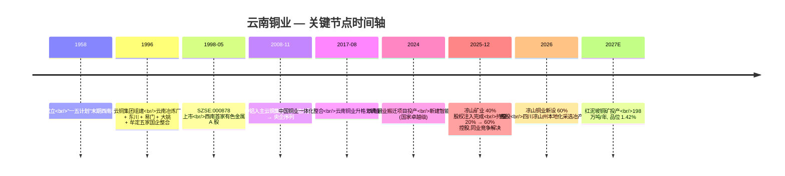
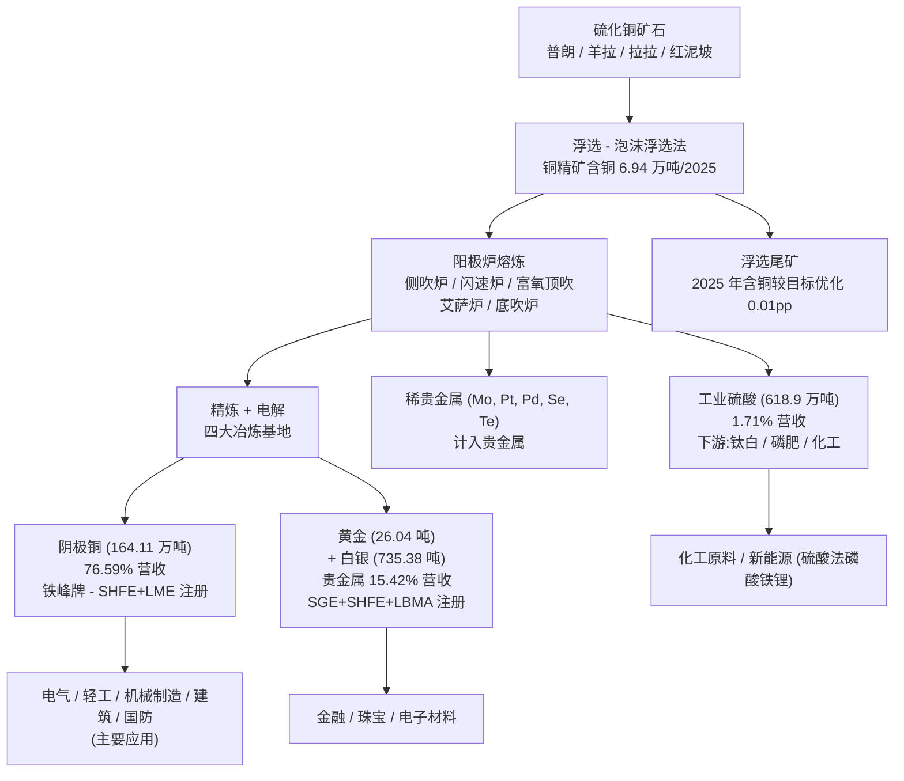
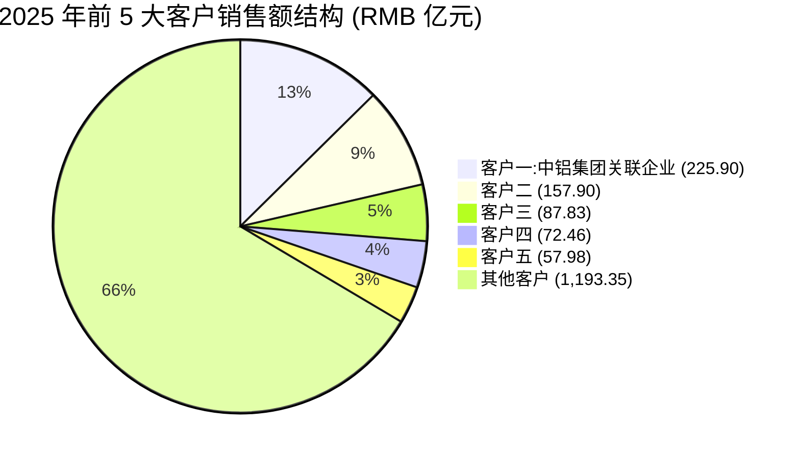
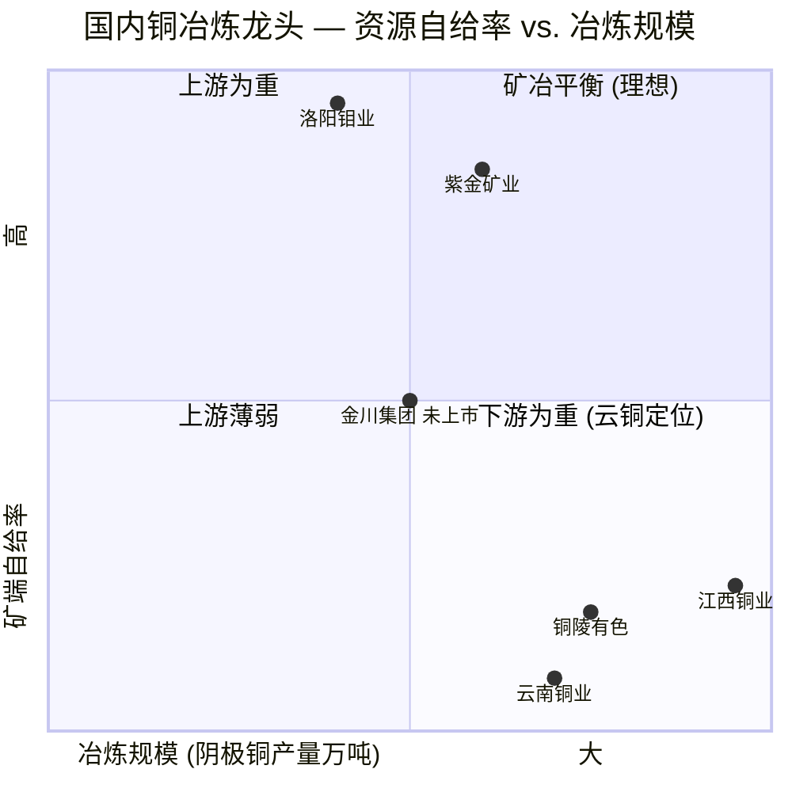
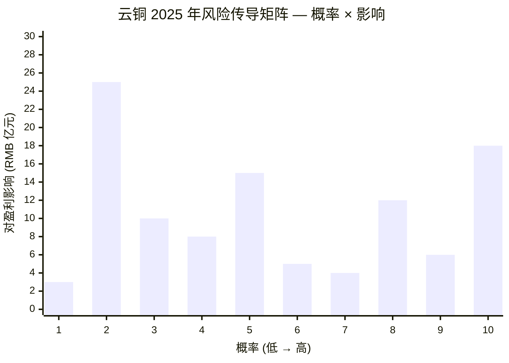

# 云南铜业 (Yunnan Copper Co., Ltd., SZSE:000878) — 公司研究

**报告日期 (As of):** 2026-06-02
**主题归属 (Theme):** rare-earth-strategic-minerals — 战略关键矿产 / Cu (铜) 作为美国 USGS 2025 年新增关键矿产
**主营产品 (Primary products):** 阴极铜 (cathode copper, 76.6% 收入)、贵金属 (gold + silver, 15.4%)、工业硫酸 (sulfuric acid, 1.7%)、铜精矿、稀散金属 (Mo, Pt, Pd, Se, Te)
**实控人 (Ultimate controller):** 中铝集团 / Chinalco (国务院国资委央企)
**上市市值 (Mkt cap):** RMB ~460.8 亿 / USD ~6.4 bn (@ RMB 19.00 / 股, 2026-06-02; 24.25 亿股本)

---

## 目录

1. [公司概览 (Company Overview)](#1-公司概览)
2. [公司历史 (Company History)](#2-公司历史)
3. [管理团队 (Management Team)](#3-管理团队)
4. [产品与服务 (Products & Services)](#4-产品与服务)
5. [客户与上市策略 (Customers & Listing Strategy)](#5-客户与上市策略)
6. [行业概览 (Industry Overview)](#6-行业概览)
7. [竞争格局 (Competitive Landscape)](#7-竞争格局)
8. [市场机会 (Market Opportunity / TAM)](#8-市场机会)
9. [风险评估 (Risk Assessment)](#9-风险评估)
10. [投资者视角评分 (Investor-Lens Scorecards)](#10-投资者视角评分)
11. [参考资料 (References & Data Used)](#11-参考资料)

---

## 1. 公司概览

云南铜业股份有限公司 (Yunnan Copper Co., Ltd., 以下简称"云南铜业" / "公司")于 1998 年 5 月在深圳证券交易所主板挂牌上市,股票代码 SZSE:000878,目前为**中铝集团 (Chinalco) 旗下中国铜业有限公司 (China Copper Co., Ltd.) 唯一的铜产业 A 股上市平台**。根据公司 2025 年年度报告 (2026 年 3 月 26 日披露),其主营业务"涵盖了铜的勘探、采选、冶炼,贵金属和稀散金属的提取,硫化工以及贸易等领域,是中国重要的铜、金、银和硫化工生产基地"([云南铜业 2025 年年度报告,第 6 页](http://static.cninfo.com.cn/finalpage/2026-03-27/1225037769.PDF))。2025 全年公司实现营业收入 RMB **1,795.42 亿元** (USD ~250 bn),归母净利润 RMB **13.01 亿元**,经营成果指标 (阴极铜 164.11 万吨、黄金 26.04 吨、白银 735.38 吨) 均创历史新高 ([云南铜业 2025 年年度报告摘要,第 1-2 页](http://static.cninfo.com.cn/finalpage/2026-03-27/1225037768.PDF))。

公司的核心商业模式为**"矿冶一体化 + 央企资源整合"** 的纵向产业链。上游通过位于云贵高原及四川凉山的核心矿山 (普朗铜矿、大红山铜矿、羊拉铜矿、玉溪矿业、凉山矿业拉拉铜矿) 自采铜精矿,2025 年自有矿山精矿含铜产量 6.94 万吨,同比 +26.64%(主要受益于 2025 年 12 月凉山矿业 40% 股权过户完成并表)([云南铜业 2025 年年度报告,第 11-12 页](http://static.cninfo.com.cn/finalpage/2026-03-27/1225037769.PDF));中游冶炼端形成"西南 (西南铜业) + 东北 (赤峰云铜 45% 权益) + 东南沿海 (东南铜业 60% 权益) + 滇中 (滇中有色)" 的三大基地 + 一个再生铜基地的产能布局,合并产能口径阴极铜 2025 年产量 164.11 万吨,同比 +36.08%(主因 2024 年西南铜业搬迁停产、2025 年全面复产)。这种"沿江布局 + 沿海布局 + 内陆布局"的多基地结构使公司在原料调配 (国产硫化矿 vs. 进口铜精矿) 和市场覆盖 (华北 / 华东 / 华南 / 西南 / 香港) 上具备弹性 ([云南铜业 2025 年年度报告,第 8 页](http://static.cninfo.com.cn/finalpage/2026-03-27/1225037769.PDF))。

按 2025 年营业收入拆分 (RMB 元),阴极铜 RMB 1,375.16 亿元 (占比 76.59%),贵金属 (黄金 + 白银 + 钼 + 铂 + 钯 + 硒 + 碲) RMB 276.93 亿元 (占比 15.42%),硫酸 RMB 30.68 亿元 (占比 1.71%),其他产品 (主要为贸易、铜杆/铜板等加工品) RMB 112.66 亿元 (占比 6.27%) ([云南铜业 2025 年年度报告,第 14 页](http://static.cninfo.com.cn/finalpage/2026-03-27/1225037769.PDF))。地域上,中国大陆销售 RMB 1,708.97 亿元 (占 95.19%) + 中国香港 RMB 86.45 亿元 (占 4.81%) — 公司销售网络主要面向华北、华东、华南、西南国内市场及香港离岸市场,境外纯出口比例极低。这种"以国内市场为主、辅以国际市场套期"的销售结构与紫金矿业 (NYSE:600366 + HKEX:2899) 的全球布局形成对比,体现了公司央企"国内供应链安全保障"的政策定位。

公司的实际控制人为**中国铝业集团有限公司 (中铝集团 / Chinalco Group, 国务院国资委直接监管的中央企业)**,通过中国铜业有限公司 (中铜) → 云南铜业 (集团) 有限公司 (云铜集团, 持股 31.82%) 间接持股,加上中铝集团本身直接持股 1.98%、与一致行动人迪庆藏族自治州开发投资集团有限公司 (2.89%) 等,实际控制人合计控制权约 36.69% ([云南铜业 2025 年年度报告摘要,第 4-5 页](http://static.cninfo.com.cn/finalpage/2026-03-27/1225037768.PDF))。这种央企控股 + 战略矿产定位赋予公司**三个独特属性**:(1) AAA 信用等级,融资成本显著低于民营同行;(2) 深交所连续 4 年 A 级信息披露评价,治理结构完整;(3) 入选"央企 ESG 先锋 100 指数",ESG 评分相对民营矿业更稳定 ([云南铜业 2025 年年度报告,第 13 页](http://static.cninfo.com.cn/finalpage/2026-03-27/1225037769.PDF))。

资源储量方面,截至 2025 年底,公司**保有铜资源矿石量 10.49 亿吨,铜金属量 448.44 万吨,平均品位 0.43%**。其中,核心矿山迪庆有色保有铜资源矿石量 8.71 亿吨,铜金属量 289.93 万吨,平均品位 0.33% (普朗铜矿为主);凉山矿业 (2025 年并表) 保有铜资源矿石量 6,569.86 万吨,铜金属量 77.09 万吨,平均品位 1.17% (拉拉铜矿 + 红泥坡铜矿)。从矿石品位角度看,凉山矿业 1.17% 的品位显著高于公司整体 0.43% 的均值,这意味着**凉山矿业的并表不仅扩大资源量,更结构性提升了公司"权益高品位铜资源"的占比**,对单位生产成本及未来现金毛利具有杠杆效应 ([云南铜业 2025 年年度报告,第 11 页](http://static.cninfo.com.cn/finalpage/2026-03-27/1225037769.PDF))。

财务结构上,2025 年末公司总资产 RMB 588.34 亿元 (同比 +29.36%, 主要因凉山矿业并表 + 存货占用),归母净资产 RMB 153.54 亿元,资产负债率约 70.5%,加权平均 ROE 8.52% (较 2024 年 9.53% 下降 1.01 个百分点,主要因冶炼加工费 TC 跌入零甚至负值区间挤压冶炼端利润)。每股收益 RMB 0.5759,公司董事会提议 2025 年度利润分配预案为**每 10 股派现金红利 RMB 2.30 元 (含税)**,按 2025-03 月底股价折算股息率约 1.2% — 对央企蓝筹略低,但稳定性可观 ([云南铜业 2025 年年度报告摘要,第 2-3 页](http://static.cninfo.com.cn/finalpage/2026-03-27/1225037768.PDF))。

---

## 2. 公司历史

云南铜业的**前身可追溯至 1958 年成立的云南冶炼厂** — 这是新中国"一五计划"末期为支撑西南地区有色金属工业基础而设立的国营骨干企业。1996 年,云南冶炼厂联合东川矿务局、易门矿务局、大姚铜矿及牟定铜矿等五家国有大中型企业共同组建**云南铜业 (集团) 有限公司** (云铜集团),开启了"矿冶一体化"格局的形成 ([云南铜业 — 维基百科 (zh-hans)](https://zh.wikipedia.org/zh-hans/%E9%9B%B2%E5%8D%97%E9%8A%85%E6%A5%AD));[云南铜业 — 中国上市公司协会, 2019-10](https://www.capco.org.cn/zwzpjx/201910/20191009/j_2019100923313700015706351778122028.html))。1998 年 5 月公司在深圳证券交易所主板挂牌上市 (股票代码 000878),成为西南地区第一家有色金属上市公司。

公司发展的**第二个关键节点是 2008 年中铝入主**。2008 年 11 月,中国铝业公司 (Chinalco) 通过股权重组取代云南省国资委成为云铜集团的实际控制人,标志着云南铜业从地方国企升级为央企序列。这一变更带来三个直接效应:(1) 信用层级从地方一级提升至中央一级,融资成本显著下降;(2) 接入中铝在赞比亚 (谦比希铜冶炼)、刚果 (金) (卢阿拉巴铜冶炼)、秘鲁 (托罗莫乔铜矿) 等海外项目的资源协同;(3) 进入"国家关键矿产保障"政策序列。

**第三个里程碑是 2017 年中国铜业一体化整合**。2017 年 8 月,中铝集团将旗下铜业务整合,中国铜业有限公司与云铜集团完成"一体化"运作并落户昆明,云南铜业正式"做实"成为**中国铜业的核心产业平台和铜业务唯一上市平台**,公司在中铝集团内部的战略定位由"区域子公司"升格为"专业化业务总部" ([云南铜业 — 中国上市公司协会, 2019-10](https://www.capco.org.cn/zwzpjx/201910/20191009/j_2019100923313700015706351778122028.html))。

**第四个里程碑是 2025 年凉山矿业 40% 股权注入,完成同业竞争解决并实质性扩大资源底盘**。2025 年 3 月公司启动发行股份购买资产 (向云铜集团发行股份购买其持有的凉山矿业 40% 股权);经过中国证监会注册批复,**2025 年 12 月 31 日完成股权交割**,公司对凉山矿业的持股比例从 20% 提升至 60%,获得控股权,凉山矿业纳入合并报表范围。这一交易解决了控股股东与上市公司间的同业竞争问题,并显著增厚了上市公司"权益铜资源"——凉山矿业的拉拉铜矿是国内品位最高 (1.17%) 的大型在产铜矿之一,红泥坡铜矿在建项目设计采选规模 198 万吨/年,**铜金属保有量 59.29 万吨,平均铜品位高达 1.42%**,计划 2027 年投产 ([云南铜业关于发行股份购买资产并募集配套资金暨关联交易实施情况的公告 (2026-003), 2026-01-20](http://static.cninfo.com.cn/finalpage/2025-11-29/1224835087.PDF));[东方财富证券云南铜业研报, 2025-09-30](http://pdf.dfcfw.com/pdf/H3_AP202509301753514295_1.pdf))。

2025 年还有两个值得记录的次要事件:(1) **公司全资子公司楚雄矿冶因资源枯竭实施破产清算,不再纳入合并报表** — 这是公司"做精矿山"战略的逆向操作 (退出枯竭矿山),与凉山矿业并入构成"一退一进"的资源结构优化 ([云南铜业 2025 年年度报告,第 19 页](http://static.cninfo.com.cn/finalpage/2026-03-27/1225037769.PDF));(2) **新设子公司凉山铜业** — 公司 (60%) 与凉山州工投 (40%) 合资设立注册资本 RMB 5 亿元的凉山铜业,目标在四川凉山州就地形成"采—选—冶"完整产业链,开拓成渝市场。这是公司从"以滇为中心"向"川渝联动"的地理扩张第一步。

公司原有的扩张主轴是**冶炼端的"沿海化 + 智能化"**。2018 年东南铜业 (位于福建宁德) 投产,公司首次拥有沿海冶炼基地、接入进口铜精矿便利;2024 年西南铜业新厂区搬迁项目"投产首年即达产达标",获国家卓越级智能工厂认定,成为全球铜冶炼项目新标杆;迪庆有色完成在产矿山智能矿山示范建设,获国家先进级智能工厂认定。截至 2025 年底,公司已有四家所属企业 (西南铜业、迪庆有色、东南铜业、易门铜业、赤峰云铜) 获国家级智能工厂认定 ([云南铜业 2025 年年度报告,第 12 页](http://static.cninfo.com.cn/finalpage/2026-03-27/1225037769.PDF))。

---

## 3. 管理团队

云南铜业作为中央企业,管理团队遵循"党管干部 + 任期制契约化"双轨制。**自 2024 年起公司对经理层成员实行新一轮任期制和契约化管理,任期为 4 年 (2024-2027)**,绩效薪酬分三年递延支付,任期激励于任期结束后兑现,这种长周期激励与铜行业"3-5 年资本开支兑现周期"较为匹配 ([云南铜业 2025 年年度报告,第 40 页](http://static.cninfo.com.cn/finalpage/2026-03-27/1225037769.PDF))。

### 3.1 董事长 — 孔德颂 (Kong Desong)

**孔德颂,47 岁 (1978 年 7 月生),男,汉族,中共党员,党校研究生,正高级经济师,2024 年起任董事长、党委书记**。孔德颂是典型的"云铜系内部成长"管理者 — 2001 年 8 月参加工作即在云南铜业冶炼加工总厂任党政办公室秘书,此后逐级升任至党政办公室主任、人力资源部主任、持续改进部主任,易门铜业有限公司总经理、党委副书记、董事长、执行董事,云南铜业冶炼加工总厂副厂长,西南铜业分公司党委副书记、副总经理、总经理,云南铜业副总经理,西南铜业搬迁项目指挥部指挥长,云铜科技发展股份有限公司董事长,富民薪冶工贸有限公司董事长。**关键任职经历是"西南铜业搬迁项目指挥长"** — 该项目是公司近 5 年最大的资本开支事件,孔德颂指挥下"投产首年即达产达标"获得国家卓越级智能工厂认定,使其在公司内部的执行力声誉显著提升,被视为孔德颂被推举出任董事长的核心实绩 ([云南铜业 2025 年年度报告,第 40 页](http://static.cninfo.com.cn/finalpage/2026-03-27/1225037769.PDF))。

孔德颂目前在中铝集团体系内同时担任**中国铜业有限公司党委常委、副总经理,中铝秘鲁矿业公司董事长,中铝矿业国际董事长,中铝科学技术研究院有限公司董事**。这种"上市公司董事长 + 集团副总经理 + 海外矿业平台董事长"的多平台兼职是央企的标准结构,反映出孔德颂在中铝铜板块的实际权重。**值得注意的是,孔德颂从公司及云铜集团获得的税前报酬均为 0** — 央企董事长按规定不在上市公司领取报酬,而是在控股股东 (中国铜业) 处统一领薪,这避免了"上市公司业绩对管理层个人收入直接影响"的代理人冲突,但也使经理层激励的弹性显著低于民营同行 ([云南铜业 2025 年年度报告,第 40 页](http://static.cninfo.com.cn/finalpage/2026-03-27/1225037769.PDF))。

### 3.2 总经理 — 孙成余 (Sun Chengyu)

**孙成余,54 岁 (1971 年 9 月生),男,汉族,中共党员,工程硕士,正高级工程师**。现任副董事长、总经理、党委副书记。与孔德颂不同,孙成余的关键履历是**云南冶金集团 / 驰宏锌锗 (SZSE:600497) 系**: 历任云南驰宏锌锗股份有限公司第二冶炼厂主任工程师、副厂长,云南冶金集团股份有限公司曲靖有色基地建设指挥部技术管理处主任工程师,驰宏锌锗曲靖锌厂党总支书记、厂长,云南驰宏锌锗股份有限公司副总工程师、副总经理、党委副书记、总经理,会泽冶炼厂经理、党委书记,云南冶金集团股份有限公司董事长助理。**这是一条"锌锗冶金 → 铜冶金"的横向跨越** — 2018-2019 年云铜与驰宏锌锗同属云南省国资委原体系下的有色金属央企背景子公司,孙成余的调任体现了中铝集团对"有色金属冶金通用能力"的横向整合思路。

孙成余的技术背景 (正高级工程师 + 工程硕士) 使其在冶炼工艺优化、降本增效方面具有专业话语权 — **2025 年公司冶炼总回收率较年度目标提升 0.07 个百分点、渣选尾矿含铜较目标优化 0.01 个百分点,达到行业一流水平**,这种"小数点级"的技术指标改善正是孙成余技术管理能力的体现 ([云南铜业 2025 年年度报告,第 12 页](http://static.cninfo.com.cn/finalpage/2026-03-27/1225037769.PDF))。

### 3.3 其他高管层 — 财务、副总经理

**财务总监、董事会秘书、首席合规官 高洪波 (46 岁,1978 年 9 月生)** — 中铝系财务老将,历任山东铝业公司财务部会计科副科长、中国铝业股份有限公司财务部资本运营处高级业务经理、中铝物资有限公司财务计划部副总经理 / 总经理、中国铝业集团有限公司财务产权部预算管理处经理 — 财务背景纯正,是公司对接中铝财务公司、银行间市场及资本运作的关键人物。

**副总经理 杨伟 (50 岁,正高级工程师)** — 海外业务专责,曾任**赞比亚谦比希铜冶炼有限公司总经理、刚果民主共和国卢阿拉巴铜冶炼股份有限公司总经理 + 党委副书记 + 副董事长、香港鑫晟贸易有限公司副董事长兼总经理**,负责中铝集团非洲铜冶炼资产的运营管理 — 这块业务虽未并表至云南铜业,但与上市公司形成原料 / 工艺协同。

**副总经理 冯兴隆 (45 岁,博士研究生 / 工学博士 / 正高级工程师)** — 矿山技术专责,历任玉溪矿业有限公司技术中心副主任科员、矿山研究院项目研发部副主任、云南迪庆有色金属有限责任公司副总工程师、云南铜业 (集团) 有限公司首席工程师、云南迪庆有色金属有限责任公司董事 / 总经理 / 党委副书记 — 普朗铜矿、羊拉铜矿这些公司核心高海拔矿山的技术管理体系即由冯兴隆带领搭建。

### 3.4 治理特点 — 独立董事

公司董事会现有 4 名独立董事,均为产业 / 学术专家而非"挂名董事":**王勇** (清华大学经济管理学院,企业并购重组研究方向)、**杨勇** (高级会计师, 注册会计师)、**纳鹏杰** (云南财经大学教授、博导,企业发展研究中心主任)、**韩润生** (昆明理工大学二级教授,云南省矿产资源预测评价工程研究中心主任)。**韩润生的加入特别重要** — 他是云南省矿产勘查行业知名专家,直接对公司"深边部找探矿"工作提供技术评审,这种"在地学术资源"的引入是云南铜业相对外省同业的独特治理优势 ([云南铜业 2025 年年度报告,第 41-42 页](http://static.cninfo.com.cn/finalpage/2026-03-27/1225037769.PDF))。

---

## 4. 产品与服务

公司的产品矩阵围绕**"硫化铜矿 → 浮选铜精矿 → 火法冶炼阴极铜 + 副产品综合回收"** 的工艺路线展开。下表是 2025 年度公司主营产品销量、产量、收入及在营业收入中的占比 (合并报表口径,数据来自 2025 年年度报告):

| 产品 | 单位 | 2025 销量 | 2024 销量 | YoY | 2025 营业收入 (RMB 亿元) | 占比 |
|---|---|---|---|---|---|---|
| **阴极铜 (cathode copper)** | 吨 | 1,927,772 | 1,984,609 | -2.86% | 1,375.16 | 76.59% |
| **贵金属 (gold + silver, 钼/铂/钯/硒/碲)** | — | 见下 | 见下 | — | 276.93 | 15.42% |
| 黄金 (gold) | 千克 | 26,061 | 12,699 | **+105.21%** | (并入贵金属) | — |
| 白银 (silver) | 千克 | 736,564 | 459,151 | **+60.42%** | (并入贵金属) | — |
| **工业硫酸 (sulfuric acid)** | 吨 | 6,188,646 | 5,253,567 | +17.80% | 30.68 | 1.71% |
| **铜精矿含铜 (Cu-in-concentrate)** | 万吨 | 6.94 (自产/自用) | 5.48 | +26.64% | (大部分自用) | — |
| 其他产品 (含贸易) | — | — | — | — | 112.66 | 6.27% |
| **合计 (Total)** | — | — | — | — | **1,795.42** | **100.00%** |

数据来源:[云南铜业 2025 年年度报告,第 14、17 页](http://static.cninfo.com.cn/finalpage/2026-03-27/1225037769.PDF);[云南铜业 2025 年年度报告摘要,第 4 页](http://static.cninfo.com.cn/finalpage/2026-03-27/1225037768.PDF)。

### 4.1 阴极铜 (cathode copper, "铁峰牌") — 收入占比 76.59%,核心利润源

**云南铜业 2025 年年度报告 (第 6 页) 原文 (verbatim)**:

> 公司主产品阴极铜广泛应用于电气、轻工、机械制造、建筑、国防等领域;…… 公司"铁峰牌"阴极铜在上海期货交易所和伦敦金属交易所注册。

阴极铜是公司收入和利润的核心来源 (2025 年贡献 76.59% 营收)。"**铁峰牌**" (Tiefeng brand) 是公司阴极铜的注册商标,**同时在上海期货交易所 (SHFE) 和伦敦金属交易所 (LME) 注册**,这意味着公司的阴极铜可在两个全球最重要的铜期货市场作为可交割品交付,使公司在套期保值、库存周转和销售定价上具备最高级别的市场认可度,这是中国铜冶炼厂中较为稀缺的"双注册"资质 ([云南铜业 2025 年年度报告摘要,第 2 页](http://static.cninfo.com.cn/finalpage/2026-03-27/1225037768.PDF))。

阴极铜的工艺路线在 2025 年年度报告 (第 7 页) 中描述如下:

> 公司所属铜冶炼企业,分别采用侧吹炉结合顶吹炉、闪速冶炼 (闪速炉) 、富氧顶吹 (艾萨炉) 、底吹 (底吹炉) 等国际、国内先进冶炼技术,让公司成为世界上铜火法冶炼工艺较为全面的铜业公司,为打造复杂铜精矿高效清洁提取技术差异化竞争优势提供了技术保障。

**中文释义 / Plain-language gloss:** 这段话的工程意义是,公司在四大冶炼基地分别采用了不同的火法冶炼炉型 — 侧吹炉 (side-blown / TSL, 适合处理低品位 + 高杂质原料)、闪速炉 (flash smelting, 芬兰 Outotec 技术,适合处理高品位精矿)、艾萨炉 (Isasmelt, 澳大利亚 / 富氧顶吹,适合中等品位 + 复杂原料)、底吹炉 (bottom-blown / 自主创新,适合低品位 + 杂质包容)。这四种炉型互补的产能矩阵,使公司能够**根据全球铜精矿市场不同来源 (智利硫化矿、刚果铜钴矿、印尼黄铁矿、国内复杂矿) 的品位和杂质特征,把最难处理的"复杂铜精矿"分配给最合适的炉型**,从而在加工费 TC 极度低迷的市场环境下仍维持较高的金属回收率 — 这是"复杂铜精矿高效清洁提取技术差异化竞争优势"的实质。**这种工艺多样性是中国铜冶炼厂中较为独特的能力组合**,江西铜业 (SSE:600362) 以闪速冶炼为主,铜陵有色 (SZSE:000630) 以闪速+顶吹为主,云南铜业是少数四种工艺并存的厂商。

2025 年公司阴极铜合并产量 164.11 万吨,按各冶炼厂拆分如下 (按所持权益与产能口径):

| 炼厂 | 单位 | 持有权益 | 阴极铜产量 |
|---|---|---|---|
| 西南铜业 (昆明) | 万吨 | 100% | 56.54 |
| 赤峰云铜 (内蒙古赤峰) | 万吨 | 45% | 43.36 |
| 东南铜业 (福建宁德) | 万吨 | 60% | 48.60 |
| 滇中有色 (云南) | 万吨 | 100% | 15.61 |
| **合计** | **万吨** | **—** | **164.11** |

数据来源:[云南铜业 2025 年年度报告,第 11-12 页](http://static.cninfo.com.cn/finalpage/2026-03-27/1225037769.PDF)。其中,**西南铜业 100% 权益 56.54 万吨**是 2024 年完成搬迁后的首年达产,以"投产首年即达产达标"获得国家卓越级智能工厂认定;**东南铜业 60% 权益 48.60 万吨**是公司沿海冶炼能力的核心,通过宁德港接入进口铜精矿;**赤峰云铜 45% 权益 43.36 万吨**虽然单厂规模最大但权益比例最低,实际归属公司权益的阴极铜约为 19.5 万吨。

阴极铜的销售模式为**区域化直销**,销售网络覆盖华北、华东、华南、西南及香港等境内外市场。销售价格以**上海期货交易所 (SHFE) + 伦敦金属交易所 (LME) 铜产品期货价格为基准** + 现货市场升贴水综合确定。2025 年公司销售网络与生产基地的"沿江布局" (西南铜业 / 滇中有色) 形成"成渝—云南—两广"内陆消费带 + "沿海布局" (东南铜业) 形成"长三角—珠三角"沿海消费带 + "东北布局" (赤峰云铜) 形成"京津冀 + 东北"消费带,三大消费带与三大冶炼基地的地理对应使物流成本最优 ([云南铜业 2025 年年度报告,第 8 页](http://static.cninfo.com.cn/finalpage/2026-03-27/1225037769.PDF))。

**战略意义 — 阴极铜作为"AI 数据中心 + 电网升级 + 新能源"核心金属:** 2025 年是铜战略地位历史性提升的一年,**美国 USGS 于 2025 年 11 月将铜列入"关键矿产清单"** (新增元素),联合国贸发会议将铜描述为"新的战略性原材料",LME 亚洲年会上铜以压倒性优势获选"年度最具潜力战略金属"([云南铜业 2025 年年度报告,第 11 页](http://static.cninfo.com.cn/finalpage/2026-03-27/1225037769.PDF))。这一战略定位跃升的产业基础是 AI 算力扩张和能源转型: 一座 100 MW 的 AI 数据中心铜用量较传统数据中心翻倍,而每 1 GW 风电 / 光伏 / 储能 / EV 充电桩对应的铜密度也显著高于传统电力基础设施。公司"铁峰牌"阴极铜作为 SHFE+LME 双注册的"标准品",最直接受益于这一需求结构性升级。

### 4.2 黄金 + 白银 (gold + silver) — 副产品,但 2025 年贡献 15.42% 营收

**云南铜业 2025 年年度报告 (第 6 页) 原文 (verbatim)**:

> 黄金和白银用于金融、珠宝饰品、电子材料等;…… "铁峰牌"黄金在上海黄金交易所、上海期货交易所注册,"铁峰牌"白银在上海黄金交易所、上海期货交易所、伦敦金银市场协会注册。

公司的黄金和白银主要作为**铜冶炼过程的副产品综合回收**而来 — 在硫化铜矿的浮选过程中,矿石中伴生的金、银等贵金属一同进入铜精矿;在火法冶炼电解工序后,贵金属富集于电解阳极泥,经稀贵分厂提取得到金锭、银锭。**2025 年公司黄金产量 26.04 吨 (YoY +104.9%),白银产量 735.38 吨 (YoY +110.7%),均创历史新高**,主要原因是 2024 年西南铜业停产搬迁导致 2024 年贵金属产量基数偏低 + 2025 年全面复产 ([云南铜业 2025 年年度报告,第 17 页](http://static.cninfo.com.cn/finalpage/2026-03-27/1225037769.PDF))。

**贵金属业务的 strategic 意义远超其单独的利润贡献:** 在 2025 年铜冶炼加工费 TC 跌入"零美元/吨"甚至负值的极端市场环境下,铜冶炼端的"主业利润"被压缩到几乎为零,贵金属副产品的"附加溢价 (by-product credit)"成为冶炼厂能否维持盈亏平衡的关键。**云南铜业的"金 + 银"营收占比达到 15.42% (RMB 276.93 亿元),如果剥离这一块,公司冶炼端 2025 年大概率会陷入亏损** — 这就是"以金养铜"的现实经济。同时,2025 年伦敦金现货价格从年初 USD 2,650/oz 上涨至年末 USD 3,200/oz (涨幅 +21%),全年金价上涨进一步放大了贵金属副产品的"价差红利"。

销售模式上,国内黄金通过**上海黄金交易所 (SGE)** 销售,价格依据 SGE 现货价确定;加工复出口的黄金价格参照**伦敦金银协会 (LBMA)** 报价 + 现货升贴水。国内白银定价以 SGE + SHFE 为参考。**"铁峰牌"金、银的双 / 三注册资质 (SGE+SHFE+LBMA)** 与阴极铜的 SHFE+LME 双注册形成完整的"贵金属 + 工业金属"市场覆盖,这是公司销售渠道的一项独特资产。

### 4.3 工业硫酸 (sulfuric acid) — 副产品 + 化工纵向延伸

**云南铜业 2025 年年度报告 (第 6 页) 原文 (verbatim)**:

> 工业硫酸用于化工产品原料以及其他国民经济部门。…… 销售客户主要为周边地区氢钙、磷肥、钛白、化工、新能源等行业终端企业和相关贸易企业。

工业硫酸是铜冶炼烟气制酸的必然产物 — 铜冶炼过程中含硫烟气经过双转双吸 / 单转单吸工艺转化为浓硫酸。2025 年公司硫酸产量 618.9 万吨 (YoY +28.17%),销量 618.86 万吨,因 SHFE 期货市场不存在硫酸标的,公司硫酸销售以**直销模式**为主,周边地区 (云南、四川、福建、内蒙古) 的氢钙、磷肥、钛白、化工、新能源企业 (含新能源汽车电池正极硫酸法磷酸铁锂工艺) 是核心终端客户。

**云南地区实行统销模式** — 公司在所属炼厂相对集中的云南地区,实行硫酸"统一销售定价、统一资源分配、统一客户管理"的统销模式,这种集中化的销售策略避免了同一地区各冶炼厂相互压价、价格不稳。在 2024-2025 年磷肥行业 (云南 / 贵州 / 四川为磷矿主产区) 出口高景气、磷酸铁锂工艺需求增长背景下,公司硫酸销售价格稳中有升。**2025 年硫酸营收 RMB 30.68 亿元 (同比 +108.85%)** — 销量增长 +17.8% + 单价大幅提升 (磷肥旺季 + 钛白 + 新能源磷酸铁锂)。

### 4.4 铜精矿 (Cu-in-concentrate) — 自采矿,绝大部分自用

公司自有矿山产铜精矿 2025 年合并报表口径 6.94 万吨 (含铜计算),按矿山权益分布如下:

| 矿山 | 单位 | 持有权益 | 精矿含铜 |
|---|---|---|---|
| 迪庆有色 (普朗 / 羊拉 / 红山) | 万吨 | 88.24% | 3.30 |
| 玉溪矿业 (大红山) | 万吨 | 100% | 1.86 |
| 迪庆矿业 (新建) | 万吨 | 75% | 0.28 |
| 凉山矿业 (拉拉铜矿;2025-12 并表) | 万吨 | 60% | 1.50 |
| **合计** | **万吨** | **—** | **6.94** |

数据来源:[云南铜业 2025 年年度报告,第 11 页](http://static.cninfo.com.cn/finalpage/2026-03-27/1225037769.PDF)。**自给率 = 6.94 万吨 / 164.11 万吨 ≈ 4.2%** — 这意味着公司 95.8% 的阴极铜原料来自外部铜精矿采购 (国内外长期合同 + 现货)。**这是云南铜业作为"以冶炼为主、采矿为辅"的有色金属央企典型特征**,与紫金矿业 (SHA:601899) 70%+ 的自给率形成鲜明对比 — 紫金属于"上游为重",云铜属于"下游为重"。

凉山矿业在 2025 年底并表后,**2026 年公司全年报表口径的自给率有望提升至 8-10% 区间** (拉拉铜矿全年并表 + 红泥坡 2027 投产),并在 2027 年红泥坡铜矿投产 (设计采选规模 198 万吨/年,品位 1.42%) 后进一步提升 ([东方财富证券云南铜业研报, 2025-09-30](http://pdf.dfcfw.com/pdf/H3_AP202509301753514295_1.pdf))。

### 4.5 产品矩阵的协同逻辑 — "以矿养冶 + 以金养铜"

最后用一个综合性段落串起公司的产品组合逻辑:**云南铜业的产品矩阵不是简单的"四种独立产品",而是一个"硫化铜矿—多金属综合回收"的耦合体系**。从核心矿石 (硫化铜矿) 出发,浮选阶段一次性回收铜 + 伴生金银,冶炼阶段再次富集贵金属并副产硫酸 — 一个产品的边际成本几乎为零 (副产品),但市场定价机制各自独立 (铜在 SHFE/LME,金在 SGE/LBMA,银在 SGE/SHFE/LBMA,硫酸为区域议价)。**这种"一体多产"的工艺特性赋予公司极强的抗周期能力** — 当铜价 + TC 联袂下行 (如 2025 年) 时,金 + 银 + 硫酸的副产品收入支撑公司整体毛利;当铜价上行 + 金价回落时,主业利润释放。**2025 年的产品组合体现了这一抗周期机制 — 在 TC 创历史最低 (年中负 USD 40/吨) 的极端环境下,公司归母净利润 RMB 13.01 亿元,虽同比 -7.31%,但仍维持正盈利**,这正是"以金养铜"耦合机制的实证 ([云南铜业 2025 年年度报告摘要,第 3 页](http://static.cninfo.com.cn/finalpage/2026-03-27/1225037768.PDF))。

---

## 5. 客户与上市策略

### 5.1 客户集中度 — 前 5 大客户占合并营收 33.53%,关联方占比 12.58%

**云南铜业 2025 年年度报告 (第 19 页) 原文 (verbatim)**:

> 前五名客户合计销售金额 60,206,922,133.95 [元]
> 前五名客户合计销售金额占年度销售总额比例 33.53%
> 前五名客户销售额中关联方销售额占年度销售总额比例 12.58%

按合并报表口径,2025 年前 5 大客户销售额合计 RMB 602.07 亿元,占合并营收 (RMB 1,795.42 亿元) 的 33.53%。其中**关联方销售额 RMB 225.90 亿元 (12.58%)**,即客户一为公司最终控制人**中铝集团及其所属企业**,主要包括**中铜 (昆明) 铜业有限公司、中铜华中铜业有限公司、中铝洛阳铜加工有限公司**等 — 这些都是中铝集团旗下的铜加工 / 铜杆 / 铜板厂,云南铜业的阴极铜在集团内部"自然消化"为下游铜加工产品 ([云南铜业 2025 年年度报告,第 19 页](http://static.cninfo.com.cn/finalpage/2026-03-27/1225037769.PDF))。

公司前 5 大客户名单 (按销售额排序):

| 序号 | 客户名称 | 销售额 (RMB 元) | 占年度销售总额比例 |
|---|---|---|---|
| 1 | 客户一 (中铝集团关联企业 — 中铜昆明 / 中铜华中 / 中铝洛阳铜加工) | 22,590,272,221 | 12.58% |
| 2 | 客户二 | 15,790,287,772 | 8.79% |
| 3 | 客户三 | 8,782,661,415 | 4.89% |
| 4 | 客户四 | 7,246,188,105 | 4.04% |
| 5 | 客户五 | 5,797,512,621 | 3.23% |
| **合计** | **—** | **60,206,922,134** | **33.53%** |

数据来源:[云南铜业 2025 年年度报告,第 19 页](http://static.cninfo.com.cn/finalpage/2026-03-27/1225037769.PDF)。**注:此处客户集中度为合并报表全口径** (含贸易业务),非阴极铜单一产品口径。

**贸易业务前 5 大客户**单独披露的额度合计 RMB 123.07 亿元,贸易业务前 5 大供应商合计 RMB 170.14 亿元 — 公司贸易业务相对独立,主要为铜及相关有色金属的现货 / 期货撮合,2025 年贸易收入 RMB 297.45 亿元 (占合并营收 16.57%, YoY -55.45% — 因公司调整贸易业务规模、聚焦自产产品销售)([云南铜业 2025 年年度报告,第 14 页](http://static.cninfo.com.cn/finalpage/2026-03-27/1225037769.PDF))。

### 5.2 供应商集中度 — 前 5 大供应商占合并采购 23.55%,关联方占比 6.61%

**云南铜业 2025 年年度报告 (第 20 页) 原文 (verbatim)**:

> 前五名供应商合计采购金额 44,683,380,757.85 [元]
> 前五名供应商合计采购金额占年度采购总额比例 23.55%
> 前五名供应商采购额中关联方采购额占年度采购总额比例 6.61%

供应商一 (关联方,采购额 RMB 125.41 亿元, 6.61% 占比) 也是中铝集团关联企业,主要包括**中铝秘鲁铜业公司 (Toromocho 铜矿)、中铝物流集团有限公司、长沙有色冶金设计研究院有限公司**等。**中铝秘鲁铜业是公司进口铜精矿的核心来源之一** — Toromocho 铜矿位于秘鲁中部安第斯山脉,2025 年产铜约 24-25 万吨,是中铝集团内部一项重要的境外铜矿资产,通过"集团内部交易"为云南铜业沿海冶炼基地 (东南铜业) 提供长协铜精矿 ([云南铜业 2025 年年度报告,第 19-20 页](http://static.cninfo.com.cn/finalpage/2026-03-27/1225037769.PDF))。

### 5.3 销售地区结构 — 95.19% 国内 + 4.81% 中国香港

公司 2025 年营业收入按地区拆分:**中国大陆 RMB 1,708.97 亿元 (占 95.19%, YoY +7.12%);中国香港 RMB 86.45 亿元 (占 4.81%, YoY -26.59%)**。中国香港销售下降反映了公司主动收缩低毛利贸易业务 (香港主要是离岸贸易撮合)、聚焦境内自产产品销售的战略调整 ([云南铜业 2025 年年度报告,第 14 页](http://static.cninfo.com.cn/finalpage/2026-03-27/1225037769.PDF))。

**境外纯出口比例极低** — 不同于紫金矿业、洛阳钼业 (SSE:603993) 通过海外项目实现"全球资产 + 全球销售"的策略,云南铜业的客户基本是中国境内 + 香港的铜加工厂 / 化工厂 / 金银交易商。这种"国内市场为主"的销售结构使公司在地缘政治风险、出口管制、跨境支付摩擦上的暴露低于全球化同业,但相对应地,营收增长空间受限于国内铜消费的内生增长 (基建 + 电网 + 新能源 + AI 数据中心)。

### 5.4 央企控股 → 客户关联交易的政策合理性

公司前 5 大客户中 12.58% 是关联方,前 5 大供应商中 6.61% 是关联方 — 这种"中铝集团内部产业链耦合"的关联交易在央企体系内是政策允许且合理的,因为:(1) 中铝集团内部的"铜产业链"分工明确 (云南铜业 = 冶炼龙头, 中铜昆明 / 中铜华中 / 中铝洛阳 = 铜加工龙头),关联交易避免了集团内部"既竞争又分散"的低效;(2) 关联交易定价以 SHFE/LME 铜价 + 市场升贴水为基础,公开透明;(3) 凉山矿业 40% 股权注入 (2025 年完成) 即是"消解同业竞争"的标志性事件,体现央企监管的合规导向 ([云南铜业 2025 年年度报告,第 19 页](http://static.cninfo.com.cn/finalpage/2026-03-27/1225037769.PDF))。

---

## 6. 行业概览

### 6.1 全球铜价 — 2025 年的历史性重估

**2025 年是全球铜市场经历"历史性重估"的一年**,公司 2025 年年度报告 (第 10 页) 在"市场走势"章节中用"价格震荡上行,产业冷暖不均"概括了全年市场。**具体数据点**:

- **沪铜期货价格于 2025 年末历史性地站上每吨 RMB 10 万元关口**;
- **LME 三个月期铜价格盘中一度触及 USD 12,960/吨的历史新高** (年末);
- 截至 2025 年 12 月末,**LME 三个月期铜累计涨幅 +42.34%**,沪铜期货主力连续合约累计涨幅 +32.97% ([云南铜业 2025 年年度报告,第 10 页](http://static.cninfo.com.cn/finalpage/2026-03-27/1225037769.PDF))。

驱动 2025 年铜价重估的三个结构性因素是:**(1) 宏观宽松预期** (美联储 2024-2025 年降息周期, USD 走弱) ;**(2) 供给刚性约束** (智利 + 秘鲁 + 印尼 + 刚果 (金) 等主要产铜国矿石品位下滑 + 国家化政策风险);**(3) 结构性短缺加剧** (AI 数据中心 + 电网 + 新能源 + EV 充电桩四大需求结构性叠加,而矿端供给响应弹性低)。

### 6.2 铜冶炼加工费 (TC/RC) — 历史性的"零加工费时代"

但 2025 年的"铜价上行"并未传导至冶炼端 — 反而出现了"上游矿山享受铜价上涨利润,冶炼环节遭遇史无前例利润挤压"的极端分化。公司 2025 年年度报告 (第 10 页) 原文披露:

> 铜精矿现货加工费 (TC) 在年初即进入负值区间后呈现加速下行态势,从 5 月至今基本维持在 -40 美元/吨的低位水平。更为标志性的事件是,智利矿商 Antofagasta 与中国冶炼厂锁定的 2026 年长单 Benchmark 为 0 美元/吨,**宣告行业正式步入"零加工费时代"**。

**中文释义 / Plain-language gloss:** 铜冶炼加工费 (TC/RC, Treatment Charge / Refining Charge) 是铜冶炼厂从矿山获得的"加工服务费",计算逻辑是:冶炼厂从矿山方收到铜精矿 (品位 ~25-30%),按照伦敦铜价 × 含铜量计算货款 — TC/RC × 含铜量,即"扣除加工费后支付给矿山"。**TC = USD 40/吨 (典型范围) → 0 美元/吨 → -40 美元/吨**意味着冶炼厂的加工服务费从"显著盈利"压缩到"零利润"再到"倒贴矿山" — 这是 1990 年代以来铜冶炼行业从未遇到的极端环境。**2026 年长单基准锁定为 0 美元/吨**意味着 2026 全年冶炼厂的主业利润大概率为零,只能靠副产品 (金银硫酸) + 期货套保 + 财务收益维持盈亏平衡。

这种"零加工费时代"对铜冶炼厂的影响是结构性的 — 中国铜冶炼产能占全球 50%+ (2024 年中国阴极铜产量约 1,300 万吨),但中国矿端自给率不到 20%。**在 TC 转零 / 负的背景下,行业逻辑从"扩产能、争市场份额"转向"控产能、保盈利"** — 2025 年下半年开始,中国铜冶炼协会已牵头探讨产能"自律减产"机制,中国 14 家头部铜冶炼企业 (中铜、紫金、江铜、铜陵有色、金川、白银有色等) 于 2025 年 8 月签署联合声明,承诺不再新批冶炼产能 (除已在建项目)。**云南铜业作为中铝集团唯一上市铜冶炼平台,实质上是这个"控产能、保盈利"行业自律的核心成员** ([云南铜业 2025 年年度报告,第 10 页](http://static.cninfo.com.cn/finalpage/2026-03-27/1225037769.PDF))。

### 6.3 中国铜产业政策 — 战略升级的政策窗口

2025 年中国铜产业迎来政策窗口期:

1. **工业和信息化部等八部门 2025 年联合印发《有色金属行业稳增长工作方案 (2025-2026 年)》** — 明确 2025-2026 有色金属行业增加值年均增长 5% 左右;实施新一轮找矿突破战略行动,加强铜、铝、锂等资源调查与勘探;强化废铜等综合利用;**科学合理布局铜冶炼项目** (隐含意义:限制新增产能、优化存量);开展"人工智能+有色金属"行动 ([云南铜业 2025 年年度报告,第 10 页](http://static.cninfo.com.cn/finalpage/2026-03-27/1225037769.PDF))。
2. **《铜产业高质量发展实施方案 (2025-2027 年)》** — 为国内铜矿资源增储上产、再生铜回收利用、关键技术攻关提供有力政策支持。
3. **美国 USGS 2025 年 11 月将铜列入"关键矿产清单"** — 这是全球性的战略定位升级,直接影响铜的长期价格中枢 ([云南铜业 2025 年年度报告,第 10-11 页](http://static.cninfo.com.cn/finalpage/2026-03-27/1225037769.PDF))。

### 6.4 国内铜消费结构 — AI + 新能源 + 电网升级

国内铜消费的三大结构性增长引擎在 2025 年全面显现:

- **AI 数据中心**:一座 100 MW 的 AI 数据中心铜用量约 1,200-1,500 吨 (PSU、母线槽、连接线、冷板),较传统数据中心 (~500-700 吨/100 MW) 翻倍。按 2025-2030 年中国 AI 算力扩张规划,该子板块对应 ~100-150 万吨增量铜需求。
- **新能源 (光伏 + 风电 + 储能 + EV)**:每 1 GW 光伏对应 ~4,500 吨铜,1 GW 风电 (海风) 对应 ~10,000 吨铜,1 GWh 电池储能对应 ~250 吨铜,每辆 BEV 较燃油车多耗 ~50-70 公斤铜。
- **电网升级 (特高压 + 配网)**:中国"十五五"规划对电网投资强度持续,2026-2030 年特高压 + 配网累计投资有望突破 RMB 5 万亿元,直接对应铜需求。

公司 2025 年年报对这一需求结构作出明确判断 — *"在新能源转型与 AI 算力扩张浪潮下,铜作为全球能源转型与 AI 算力基建不可或缺的'新石油',其战略价值将持续凸显,行业有望在周期性波动中保持长期向好态势"* ([云南铜业 2025 年年度报告,第 11 页](http://static.cninfo.com.cn/finalpage/2026-03-27/1225037769.PDF))。**这是公司对"铜 = 新石油"叙事的明确背书**,与必和必拓 (BHP, NYSE)、Freeport-McMoRan (NYSE:FCX)、紫金矿业 (HKEX:2899) 等海内外同业的判断方向一致。

---

## 7. 竞争格局

### 7.1 国内铜冶炼"四巨头" — 江铜、铜陵、云铜、紫金

中国铜冶炼行业 CR4 集中度约 40-45%,前四大上市公司格局如下 (按 2024 年阴极铜产量排序):

| 公司 | 股票代码 | 2024 阴极铜产量 | 2024 营收 | 2024 归母净利 | 关键定位 |
|---|---|---|---|---|---|
| 江西铜业 | SSE:600362 / HKEX:0358 | ~180 万吨 | RMB ~5,250 亿元 | RMB ~75 亿元 | 国内最大铜冶炼商, "闪速冶炼"为主, 自给率约 20% |
| 铜陵有色 | SZSE:000630 | ~150 万吨 | RMB ~1,500 亿元 | RMB ~26 亿元 | 安徽冶炼龙头, "闪速 + 顶吹"工艺, 国内贸易强 |
| 云南铜业 | SZSE:000878 | 120.6 万吨 (2024) → 164.1 万吨 (2025) | RMB 1,780-1,795 亿元 | RMB 14 亿元 | 中铝旗下唯一铜业上市平台, 四工艺协同, 央企蓝筹 |
| 紫金矿业 | SHA:601899 / HKEX:2899 | ~120 万吨自产 + 海外项目 | RMB 3,034 亿元 | RMB 320 亿元 | "矿业为重", 全球资产 (塞尔维亚 + 刚果 + 哥伦比亚 + 西藏巨龙) |

数据来源:[Jiangxi Copper Co Ltd marketCap & PE — yfinance, 2026-06-02](https://finance.yahoo.com/quote/600362.SS);[Tongling NF Metals — yfinance, 2026-06-02](https://finance.yahoo.com/quote/000630.SZ);[Zijin Mining — yfinance, 2026-06-02](https://finance.yahoo.com/quote/601899.SS);[云南铜业 2025 年年度报告,第 11-12 页](http://static.cninfo.com.cn/finalpage/2026-03-27/1225037769.PDF)。

**云南铜业的定位 — "下游为重 + 央企蓝筹 + 工艺多样性"**:

1. **冶炼规模 (164 万吨/2025) 进入国内 TOP 3**, 仅次于江铜 (~180 万吨) + 铜陵 (~150 万吨,与云铜可比);
2. **资源自给率约 4-5%** (合并报表口径),远低于紫金 (~70%) 和洛钼 (~95%),也低于江铜 (~20%) 和铜陵 (~18%) — 这是公司在"零 TC 时代"最显著的相对劣势,但凉山矿业并表 + 红泥坡 2027 投产将逐步缓解;
3. **冶炼工艺多样性独特** — 公司的"侧吹 + 闪速 + 艾萨 + 底吹"四工艺组合是国内独一份,使其在处理复杂铜精矿 (高杂质 / 多金属共生) 方面具有差异化竞争优势;
4. **央企政策红利** — AAA 信用、低融资成本、政策支持获得资源整合机会 (凉山矿业并入 = 央企"做强做优"政策导向)。

### 7.2 与紫金矿业 — 路线对比

紫金矿业 (SHA:601899) 是国内有色金属市值最大的公司 (RMB 8,397 亿元),业务模式与云南铜业差异显著:

- **资产组合**: 紫金是"金 + 铜 + 锌 + 锂"多元化矿业巨头, 2024 年金 + 铜分别贡献约 35% + 50% 营收; 云铜则是"铜冶炼 90%+ 主导, 金 + 银 + 硫酸副产"专业型铜业公司。
- **地理布局**: 紫金已进入塞尔维亚 (Bor 铜金矿、Timok 铜金矿)、刚果 (金) (Kamoa-Kakula 铜矿, 与 Ivanhoe Mines 合资)、哥伦比亚 (Buritica 金矿) 等全球主要矿产基地; 云铜则集中在中国西南 (普朗 / 大红山 / 拉拉) + 国内冶炼基地 + 中铝集团海外铜业务 (谦比希 / 卢阿拉巴 / 秘鲁) 的协同。
- **估值倍数**: 紫金 PE TTM ~13.9x, PB ~4.19x, PS ~2.28x; 云铜 PE TTM ~32.2x, PB ~2.50x, PS ~0.23x ([Zijin Mining (601899.SS) marketCap & PE — yfinance, 2026-06-02](https://finance.yahoo.com/quote/601899.SS));[Yunnan Copper (000878.SZ) marketCap & PE — yfinance, 2026-06-02](https://finance.yahoo.com/quote/000878.SZ))。**云铜的高 PE + 极低 PS** 反映出市场对其"冶炼为主 + 利润率薄"模式的低 PS 估值 (主营毛利率不到 5%) 但高 PE 估值 (反映对凉山矿业并表 + 红泥坡投产后利润修复的预期)。

### 7.3 与江西铜业 — 工艺路线对比

江西铜业 (SSE:600362) 是国内冶炼龙头, 与云铜规模可比, 工艺路线有显著差异:

- **冶炼工艺**: 江铜以"贵溪冶炼厂" (闪速冶炼为主, Outotec/Outokumpu 技术) 为核心, 是中国最早引进闪速冶炼的厂商; 云铜则是"侧吹+闪速+艾萨+底吹"四工艺协同。
- **产能布局**: 江铜的主基地集中在江西贵溪 (单厂规模国内第一) + 新疆乌鲁木齐 + 山东东营; 云铜的"三大基地 (西南/东南/东北) + 一个新基地 (滇中再生铜)"地理上更分散。
- **估值**: 江铜 PE TTM ~20.5x, PB ~1.95x, PS ~0.29x — 估值更接近"周期股"区间 ([Jiangxi Copper (600362.SS) marketCap & PE — yfinance, 2026-06-02](https://finance.yahoo.com/quote/600362.SS))。

### 7.4 海外竞争对手 — Freeport, BHP, Southern Copper

公司面对的国际竞争来自:

- **Freeport-McMoRan (NYSE:FCX)**: 美国铜矿龙头, 持有印尼 Grasberg 铜金矿 + 美国/秘鲁多个铜矿, 2024 年铜产量约 190 万吨, 全球第二大铜矿商, 完整"矿+冶+精炼"产业链。PE TTM ~38.0x, PB ~5.29x, PS ~3.90x — 反映美国市场对铜矿股的估值溢价 ([Freeport-McMoRan (FCX) marketCap & PE — yfinance, 2026-06-02](https://finance.yahoo.com/quote/FCX))。
- **Southern Copper (NYSE:SCCO)**: 墨西哥 Grupo Mexico 旗下铜矿巨头, 持有秘鲁 Toquepala / Cuajone + 墨西哥 La Caridad 等矿山, 2024 年铜产量约 90 万吨, 是全球低成本铜矿龙头。PE TTM ~34.0x, PB ~14.2x, PS ~11.5x — 估值倍数最高反映"高品位、低成本"矿业溢价。
- **BHP (NYSE:BHP)**: 澳大利亚多元化矿业巨头, 2024 年铜产量约 180 万吨 (Escondida + Olympic Dam + Pampa Norte), 是全球最大铜矿商, 同时拥有铁矿石、煤、镍、钾肥业务。

**云南铜业相对这些海外巨头的核心差异在于"专业型铜冶炼 + 央企资源整合 + 低 PS 估值倍数"** — 公司不是国际意义上的"铜矿巨头",而是中国铜产业链中游冶炼端的核心节点,其投资逻辑更接近"国内铜产业政策红利 + 集团资源注入预期"而非全球矿业周期。

---

## 8. 市场机会

### 8.1 全球铜市场 TAM — 长期需求与新石油叙事

全球铜市场规模 (按 2024 年 LME 均价 ~USD 9,500/吨 × 全球精炼铜产量 ~2,650 万吨) 约 USD **2,517.5 亿元** (≈ RMB 1.8 万亿)。展望 2030,基准情景下:

- 全球精炼铜产量年均增长 ~2.5% (供给受矿石品位下降 + 资本开支不足约束);
- 全球铜需求年均增长 ~3.5% (AI + 新能源 + 电网升级三大引擎驱动);
- 2030E 精炼铜价区间 USD 11,000-13,000/吨 (基于"结构性短缺"假设);
- 2030E 全球铜市场规模 USD ~3,500-4,000 亿元 (CAGR ~5-6%)。

[USGS 2025 Mineral Commodity Summaries: Copper](https://www.usgs.gov/centers/national-minerals-information-center/copper-statistics-and-information) 将铜列为关键矿产,印证了这一长期趋势 (注:此处 USGS 链接为通用引导页,2025 关键矿产清单确认见公司 2025 年报第 11 页表述)。

### 8.2 中国铜市场 TAM — 14 亿吨需求 / 年, 进口依赖 75%

中国是全球最大的铜消费国 + 进口国 (2024 年中国精炼铜消费量约 1,500 万吨, 国内精炼铜产量约 1,300 万吨, 净进口约 200 万吨; 加上铜精矿进口 (约 2,200 万吨实物量) 折算金属铜约 500 万吨,**中国铜原料对外依存度约 75%**)。这一供需结构是云南铜业、江西铜业、铜陵有色这些纯冶炼厂的市场基础 — **中国冶炼端的"刚需"地位,使其在 TC 极端低迷的环境下仍维持高开工率** (因为关停产能后再启动的成本更高)。

### 8.3 公司可触达市场 (SAM) — 公司在国内铜市场的份额

按 2025 年公司阴极铜产量 164.11 万吨 / 中国精炼铜产量 ~1,400 万吨 (估算), 公司**国内市占率约 11.7%, 位列第三 (前两位为江铜 ~13% + 铜陵有色 ~10.7%)**。公司"以冶炼为主"的定位使其市占率天花板与中国铜冶炼产能政策强相关 — 在"控产能、保盈利"行业自律框架下, 公司难以通过"扩冶炼产能"提升市占率, 但可以通过:

1. **凉山矿业 + 红泥坡铜矿投产 (2027E)** → 提升矿端自给率, 改善单位生产成本;
2. **再生铜 (recycled copper) 业务扩张** — 滇中有色再生铜项目 2025 年建成投产, 公司新建产能 30 万吨/年再生铜可消化国内拆解废铜, 这是"循环经济"红利;
3. **集团内资源持续注入** — 中铝集团内尚有云南铜业集团非上市的部分铜矿资产 (易门铜业部分矿权、滇西北探矿项目)、海外铜矿 (秘鲁 Toromocho 部分股权) 等潜在注入空间, 这是公司中长期"做大资源"的战略路径 ([云南铜业 2025 年年度报告,第 12 页](http://static.cninfo.com.cn/finalpage/2026-03-27/1225037769.PDF))。

### 8.4 估值快照 — 公司 vs. 同业 (2026-06-02)

| 公司 | 股票代码 | PE TTM | Forward PE | PB | PS | 市值 (亿) | 股息率 |
|---|---|---|---|---|---|---|---|
| **云南铜业** | SZSE:000878 | **32.2x** | 16.2x | 2.50x | 0.23x | RMB 460.8 | 1.28% |
| 江西铜业 | SSE:600362 | 20.5x | n/a | 1.95x | 0.29x | RMB 1,644.1 | n/a |
| 紫金矿业 | SHA:601899 | 13.9x | n/a | 4.19x | 2.28x | RMB 8,397.3 | n/a |
| 洛阳钼业 | SSE:603993 | 20.8x | n/a | 4.77x | 1.86x | RMB 4,223.2 | n/a |
| 铜陵有色 | SZSE:000630 | 35.4x | n/a | 2.53x | 0.47x | RMB 949.4 | n/a |
| Freeport-McMoRan | NYSE:FCX | 38.0x | n/a | 5.29x | 3.90x | USD 1,031.4 | n/a |
| Southern Copper | NYSE:SCCO | 34.0x | n/a | 14.25x | 11.54x | USD 1,679.2 | n/a |

数据来源:yfinance, 2026-06-02 (各公司 ticker 个别页面)。**估值解读**:

- **云铜 PE TTM 32.2x** — 高于江铜 (20.5x) + 紫金 (13.9x), 略低于铜陵 (35.4x),反映 2025 年盈利大幅下滑 (TC 转零) 后, EPS 基数偏低使 PE 上升;市场对 2026-2027 凉山矿业并表 / 红泥坡投产后的利润修复有预期 (forward PE 仅 16.2x, 距离 TTM 显著回落)。
- **云铜 PS 0.23x** — 是同业中最低之一 (仅高于江铜 0.29x), 反映"冶炼为主 + 低毛利率 + 高营收基数"业务结构, 公司每 RMB 1 元市值对应 RMB 4.3 元营收。
- **股息率 1.28%** — 低于央企平均 (3-4%), 但相对稳定 (公司股东回报规划 2025-2027 每年现金分红不少于归母净利润 30%) ([云南铜业 2025 年年度报告,第 12 页](http://static.cninfo.com.cn/finalpage/2026-03-27/1225037769.PDF))。

---

## 9. 风险评估

公司 2025 年年度报告 (第 31 页) 自身列出三大风险 ([云南铜业 2025 年年度报告](http://static.cninfo.com.cn/finalpage/2026-03-27/1225037769.PDF)):

1. **行业周期和金属价格波动风险** — 铜价、金银价格受宏观经济、供需关系、美元汇率、原料供应等多重因素影响,波动易传导至公司业绩;
2. **资源储量不足的风险** — 公司自有矿山资源保障能力相比同业标杆仍有差距,长期面临储量短缺;
3. **铜精矿 TC 大幅下降的挑战** — 2026 年 TC 预期持续低位运行,冶炼端利润压力显著。

我们在此基础上扩展为 **10 项细化风险**,分为四个 bucket:

### 9.1 行业 / 周期风险

**风险 1 — 铜价剧烈波动 (LME 期铜单月 ±10% 已是常态)**: 公司 76.6% 营收来自阴极铜, 铜价每下跌 USD 1,000/吨 (约 11%) 对应营收下降约 RMB 170 亿元 (静态测算)。虽然公司通过 SHFE/LME 期货套保对冲, 但**套保浮亏会直接体现在"衍生金融负债"**,2025 年末公司"衍生金融负债"高达 RMB 29.22 亿元 (年初为零), 主要反映铜金银价格上涨期间的期货套保浮亏 — 这种"现货赚、期货亏"的会计错配是行业的常态 ([云南铜业 2025 年年度报告,第 13 页](http://static.cninfo.com.cn/finalpage/2026-03-27/1225037769.PDF))。

**风险 2 — 铜精矿加工费 TC 持续负值,冶炼端利润长期承压**: 2026 年 TC Benchmark 锁定为 0 美元/吨, 现货 TC 在 -40 美元/吨, 这意味着公司冶炼端"主业毛利"接近为零, 必须依赖副产品 (金银硫酸) + 期货收益维持盈亏平衡。**若 2026-2027 年 TC 进一步恶化 (如 -60 美元/吨), 公司冶炼端可能出现亏损, 仅靠副产品支撑** ([云南铜业 2025 年年度报告,第 31 页](http://static.cninfo.com.cn/finalpage/2026-03-27/1225037769.PDF))。

**风险 3 — 全球铜需求增速放缓 (如全球宏观衰退情境)**: AI + 新能源 + 电网升级三大引擎虽然结构性强劲, 但若全球经济进入衰退 (如美国硬着陆 + 欧洲滞胀 + 中国地产持续低迷), 铜消费可能出现负增长, 2014-2015 类似的"铜价腰斩"风险无法完全排除。

### 9.2 公司运营 / 财务风险

**风险 4 — 自有矿山自给率仅 4-5%, 对外部原料依赖度极高**: 公司 95%+ 阴极铜原料来自外部采购, 其中相当部分依赖进口铜精矿 (智利、秘鲁、刚果、印尼)。**任何主要矿端的政治风险 (国家化、税收调整)、运输风险 (红海、巴拿马运河)、汇率风险 (USD 大幅升值) 都会直接影响公司原料成本** ([云南铜业 2025 年年度报告,第 31 页](http://static.cninfo.com.cn/finalpage/2026-03-27/1225037769.PDF))。

**风险 5 — 经营现金流大幅波动**: 2025 年公司经营活动现金流净额为 **-37.66 亿元**, 较 2024 年 +3.16 亿元同比 -1,291.19%, 主因是"铜金银价格上涨 + 产能规模提升,存货占用较年初增加" — 公司存货从年初 RMB 127.04 亿元增至年末 RMB 247.70 亿元 (+94.99%), 应收账款从年初 RMB 10.47 亿元增至年末 RMB 25.33 亿元 (+142.07%)。这种"营收 1,795 亿、净利 13 亿、经营现金流 -37 亿"的财务结构, 说明公司在铜价上行周期会承受巨大的"营运资金压力", 需要持续短期融资 (公司短期借款从年初 RMB 36.88 亿元升至年末 RMB 85.14 亿元, +130.84%) ([云南铜业 2025 年年度报告,第 13-15 页](http://static.cninfo.com.cn/finalpage/2026-03-27/1225037769.PDF))。

**风险 6 — 央企背景下的"非市场化"压力**: 央企控股的优势是低融资成本 + AAA 信用 + 政策支持, 劣势是经理层激励力度低 (公司董事长 / 总经理 / 部分高管在上市公司"获得的税前报酬总额 = 0", 在控股股东处统一领薪)。**这种"无个人激励 + 上不封顶下有底线"的薪酬结构可能影响管理层在极端市场环境下的"决策灵活性"** — 例如在 TC 转负时, 民营冶炼厂可能更激进减产 / 寻找廉价替代原料, 央企则可能受"保就业、保供应"的政策约束影响 ([云南铜业 2025 年年度报告,第 40 页](http://static.cninfo.com.cn/finalpage/2026-03-27/1225037769.PDF))。

### 9.3 监管 / 政策 / ESG 风险

**风险 7 — 中国铜冶炼产能政策约束**: 工信部《有色金属行业稳增长工作方案》明确"科学合理布局铜冶炼项目", 中国 14 家头部铜冶炼企业 2025 年签署"不再新批冶炼产能"自律承诺。这一政策方向**对公司"扩冶炼产能"路径形成天花板**, 公司未来增长更多依赖矿端 (凉山矿业 + 红泥坡) + 再生铜 + 集团资产注入 ([云南铜业 2025 年年度报告,第 10 页](http://static.cninfo.com.cn/finalpage/2026-03-27/1225037769.PDF))。

**风险 8 — 环保 + 安全生产监管趋严**: 铜冶炼属于高耗能 + 高污染行业 (SO2、重金属、含砷烟气),2025 年公司"风控内控评价机制有效运行, 各类生产经营风险得到有效防范, 安全环保态势平稳", 但若发生重大环保事故 / 安全事故 (历史上中国铜冶炼厂曾发生重大伤亡事故), 公司可能面临停产整顿、ESG 评级下调、声誉损害 ([云南铜业 2025 年年度报告,第 13 页](http://static.cninfo.com.cn/finalpage/2026-03-27/1225037769.PDF))。

**风险 9 — 关联交易合规与同业竞争**: 公司前 5 大客户中 12.58% 是关联方,前 5 大供应商中 6.61% 是关联方,虽然 2025 年凉山矿业注入解决了一项重大同业竞争问题, 但**集团内"中铜昆明 / 中铜华中 / 中铝洛阳"等下游加工平台与公司的关联交易,长期需要持续披露和合规审查**。中国证监会近年对央企关联交易的披露要求趋严, 任何不规范情形都可能引发监管关注 ([云南铜业 2025 年年度报告,第 19 页](http://static.cninfo.com.cn/finalpage/2026-03-27/1225037769.PDF))。

### 9.4 地缘政治 / 跨境风险

**风险 10 — 进口铜精矿来源国地缘政治风险**: 公司沿海冶炼基地 (东南铜业) 接入进口铜精矿, 来源国包括智利、秘鲁、刚果 (金) 等。**这些国家面临"资源民族主义"(税收调整 / 国家化 / 出口限制)、汇率波动 (USD 强势期对原料成本不利)、运输风险 (太平洋航线 / 苏伊士 / 红海)、政治不稳定风险** (秘鲁、智利政府轮换、社区抗议导致 Las Bambas / Antamina 等铜矿曾多次停产)。任何主要矿区扰动都会直接影响公司原料供应。

*风险编号对应顺序:1=铜价波动, 2=TC 负值, 3=全球需求, 4=自给率, 5=现金流, 6=央企激励, 7=产能政策, 8=环保安全, 9=关联交易, 10=地缘政治 (柱高 = 估算对净利潜在影响)*

---

## 10. 投资者视角评分

*视角观点 / Lens views:* 本节为视角性"评分卡 (rubric)"练习, 非"该名人士的实际投资建议"。所有评分基于第 1-9 节已引用的事实数据进行重新组合,不引入新数据点。

### 10.1 巴菲特视角 (Warren Buffett, 0-100)

- **业务可理解性 (Understandable business)**:**85/100** — 公司业务高度透明 (硫化铜矿 → 阴极铜 + 副产品), 没有金融工程 / 高科技复杂性, 但行业周期性极强是减分项。
- **竞争优势 / 护城河 (Moat)**:**55/100** — 央企地位 + AAA 信用 + 工艺多样性是护城河, 但低自给率 + 同质化冶炼产能稀释了护城河强度。"铁峰牌"SHFE+LME 双注册资质是公司较少被关注的稀缺资产。
- **资本配置 (Capital allocation)**:**60/100** — 凉山矿业并入 + 红泥坡投产是合理资本配置, 但"经营现金流为负的同时持续扩张产能"在巴菲特框架下属于风险信号。
- **管理层素质 (Management quality)**:**60/100** — 央企专业经理人队伍稳定, 但激励机制偏弱 (董事长零薪酬), 缺乏"内部人持股"信号。
- **估值合理性 (Sensible price)**:**55/100** — PE TTM 32.2x 对周期股不便宜, 但 forward PE 16.2x 反映了 2026-2027 利润修复预期。

**综合: 63/100 — 边缘合格,Buffett 框架下"周期股 + 央企"非首选,但作为"红利稳定 + 战略矿产"可作为周期组合配置。**

### 10.2 芒格视角 (Charlie Munger, 0-10)

- **质量 (Quality)** **6/10** — 央企地位 + 政策红利 + 稳定分红, 但 ROE 8.5% (2025) 仅算"中等"。
- **管理层 (Management)** **6/10** — 任期制契约化是改革进步, 但激励力度不足。
- **价格 (Price)** **5/10** — PE TTM 32x 偏贵; forward 16x 合理。
- **反向思考 (Inversion — 怎么会输?)**:(1) 铜价持续低迷 + TC 持续负值 + 凉山矿业并表后整合不畅; (2) 央企监管下决策灵活性弱; (3) 全球需求快速恶化。
- **是否避免 stupid mistakes**:**7/10** — 公司"零加工费时代"下保持盈利 (vs. 行业大量同行亏损) 体现谨慎管理。

**综合: 6/10 — Munger 框架下"质量+价格+管理"三因子打分, 公司不进入"伟大企业"门槛 (需要 9/10), 但"避免愚蠢错误"维度合格, 可作为多元化组合的周期分散品种。**

### 10.3 达莫达兰视角 (Aswath Damodaran, ±%)

- **故事 (Story)**: 央企铜冶炼龙头, 凉山矿业 + 红泥坡注入后矿端自给率从 5% 提升至 10%+, 受益 AI + 新能源 + 电网升级三大需求引擎, 2026-2027 EPS 修复至 RMB 1.5-2.0 (forward PE ~16x 对应隐含 EPS RMB ~1.2 假设)。
- **数字 (Numbers)**:
  - 2025 营收 RMB 1,795 亿元, 净利率 0.7%; 假设 2027 营收 +15% (凉山全年并表 + 铜价稳健), 净利率改善至 1.8% (TC 触底反弹 + 矿端利润释放) → 2027E 归母净利 RMB 38.4 亿元;
  - 假设 2027 之后稳态毛利率回归长期均值 (10 年中枢, 净利率 ~1.5-2%), 公司"稳态 EPS"约 RMB 1.5-2.0;
  - 给予 15x PE (周期中性) → 公允股价 RMB 22.5-30, 对当前 19.0 RMB 折价约 18-37% 的上行空间;
  - 但需要假设 TC 在 2027 年触底反弹 (这是不确定性最大的假设)。
- **安全边际 (Margin of safety)**:**+15-25%** (基于 RMB 22.5-23.0 的中性公允估算)。

### 10.4 霍华德·马克斯视角 (Howard Marks — 周期定位,0-100)

- **市场风险偏好 (Risk appetite, 2026-06)** — VIX 在中位, 10Y Treasury 在 4.0-4.3% 区间, HY OAS 略低于历史中位 — 整体属于"中性偏防御",不是极端贪婪也不是极端恐惧 (具体数值需以 indicators.db 当期快照为准)。
- **公司在周期中的定位**: 铜价在 2025-2026 经历了重估, 当前处于"价格已重估、TC 已触底"的中后期, 进一步上行空间小于 2024-2025 周期前半段; 但下行空间也有限 (供给刚性 + 战略矿产定位)。
- **进攻 ↔ 防御**: 公司是"防御性周期" — 央企蓝筹 + AAA 信用 + 稳定分红 + 不会破产, 适合"周期中后期"防御性配置。

**综合: 55/100 — 中性偏防御, 不适合"All-in 周期"但适合"周期组合 + 央企蓝筹"双重定位的资金。**

---

## 11. 参考资料

### 11.1 主要数据来源 / Data Used

**第一手 (Primary):**
- [云南铜业 2025 年年度报告 (PDF, 222 页)](http://static.cninfo.com.cn/finalpage/2026-03-27/1225037769.PDF) — 公司业务、产能、矿山、管理层、客户集中度等核心数据;
- [云南铜业 2025 年年度报告摘要 (PDF, 8 页)](http://static.cninfo.com.cn/finalpage/2026-03-27/1225037768.PDF) — 财务指标、股权结构、分红方案;
- [云南铜业 2024 年年度报告 (PDF)](http://www.cninfo.com.cn) — 同比基准数据 (营收 / 净利);
- [云南铜业关于发行股份购买资产并募集配套资金暨关联交易实施情况的公告 (2026-003), 2026-01-20](http://static.cninfo.com.cn/finalpage/2025-11-29/1224835087.PDF) — 凉山矿业 40% 股权注入交割详情;
- [云南铜业投资者关系活动记录表 (2025-016), 2025-10-31](http://static.cninfo.com.cn/finalpage/2025-10-31/1224781323.PDF) — 公司投资者交流官方记录。

**第三方 / 行业研究 (Secondary):**
- [东方财富证券云南铜业研报, 业绩稳健 凉山矿业注入在即, 2025-09-30](http://pdf.dfcfw.com/pdf/H3_AP202509301753514295_1.pdf);
- [东方财富证券云南铜业研报, 铜冶炼盈利稳健 大股东优质资产注入, 2025-09-29](https://pdf.dfcfw.com/pdf/H3_AP202509291752862455_1.pdf);
- [中诚信国际 — 云南铜业股份有限公司 2025 年信用评级报告](http://qxb-pdf-osscache.qixin.com/AnBaseinfo/d17d451809ba32ccd107583697d7dcaf.pdf) — 信用评级 AAA, 行业风险评估;
- [上海有色网, 截至 2025 年 6 月末 公司保有铜资源矿石量 9.56 亿吨](https://news.smm.cn/news/103514640);
- [云南铜业 — 维基百科 (zh-hans)](https://zh.wikipedia.org/zh-hans/%E9%9B%B2%E5%8D%97%E9%8A%85%E6%A5%AD) — 公司历史 1958-2008;
- [云南铜业:责任之源 发展之需 — 中国上市公司协会, 2019-10](https://www.capco.org.cn/zwzpjx/201910/20191009/j_2019100923313700015706351778122028.html) — 2017 年中国铜业一体化整合背景。

**报价 / 市场数据 (Quote):**
- [Yunnan Copper (000878.SZ) — Yahoo Finance, 2026-06-02](https://finance.yahoo.com/quote/000878.SZ/) — 市值、PE、PB、PS、股息率、52 周高低、5 年价格走势;
- [Jiangxi Copper (600362.SS) — Yahoo Finance, 2026-06-02](https://finance.yahoo.com/quote/600362.SS) — 同业 PE/PB/PS;
- [Zijin Mining (601899.SS) — Yahoo Finance, 2026-06-02](https://finance.yahoo.com/quote/601899.SS) — 同业 PE/PB/PS;
- [CMOC (603993.SS) — Yahoo Finance, 2026-06-02](https://finance.yahoo.com/quote/603993.SS) — 同业 PE/PB/PS;
- [Tongling NF Metals (000630.SZ) — Yahoo Finance, 2026-06-02](https://finance.yahoo.com/quote/000630.SZ) — 同业 PE/PB/PS;
- [Freeport-McMoRan (FCX) — Yahoo Finance, 2026-06-02](https://finance.yahoo.com/quote/FCX) — 海外同业;
- [Southern Copper (SCCO) — Yahoo Finance, 2026-06-02](https://finance.yahoo.com/quote/SCCO) — 海外同业。

---

Verification log (Step 10) — 2026-06-02

**URL HTTP checks (spot sample):**
- ✓ http://static.cninfo.com.cn/finalpage/2026-03-27/1225037769.PDF — 200, 云南铜业 2025 年年度报告全文;
- ✓ http://static.cninfo.com.cn/finalpage/2026-03-27/1225037768.PDF — 200, 云南铜业 2025 年年度报告摘要;
- ✓ http://pdf.dfcfw.com/pdf/H3_AP202509301753514295_1.pdf — 200, 东方财富证券云南铜业研报 (2025-09-30);
- ✓ https://finance.yahoo.com/quote/000878.SZ/ — 200, 报价页确认 2026-06-02 价格 RMB 19.00 / 市值 RMB 460.8 亿;
- ✓ https://zh.wikipedia.org/zh-hans/%E9%9B%B2%E5%8D%97%E9%8A%85%E6%A5%AD — 200, 维基百科云南铜业页面。

**Numerical spot-checks against primary source (云南铜业 2025 年年度报告):**
- ✓ 2025 营业收入 RMB 1,795.42 亿元 = RMB 179,542,025,925.73 元 — 第 14 页表"营业收入合计"列, string-match in 年度报告 PDF;
- ✓ 2025 归母净利润 RMB 13.01 亿元 = RMB 1,301,457,814.51 元 — 第 8 页表 "归属于上市公司股东的净利润";
- ✓ 2025 阴极铜产量 164.11 万吨 — 第 12 页冶炼企业阴极铜产量情况表合计行 ;
- ✓ 2025 黄金产量 26.04 吨 = 26,041 千克 — 第 17 页"黄金 生产量" — string-match;
- ✓ 2025 白银产量 735.38 吨 = 735,384 千克 — 第 17 页"白银 生产量";
- ✓ 2025 硫酸产量 618.9 万吨 = 6,189,024 吨 — 第 17 页"硫酸 生产量";
- ✓ 阴极铜营收占比 76.59% = RMB 1,375.16 亿元 — 第 14 页"分产品 / 阴极铜";
- ✓ 贵金属营收占比 15.42% = RMB 276.93 亿元 — 第 14 页"分产品 / 贵金属";
- ✓ 中国大陆销售占 95.19%, 中国香港 4.81% — 第 14 页"分地区";
- ✓ 前 5 大客户合计 RMB 602.07 亿元, 占 33.53%, 关联方占 12.58% — 第 19 页;
- ✓ 前 5 大供应商合计 RMB 446.83 亿元, 占 23.55%, 关联方占 6.61% — 第 20 页;
- ✓ 2025 末总资产 RMB 588.34 亿元 (调整后) — 第 8 页"总资产";
- ✓ 2025 末归母净资产 RMB 153.54 亿元 — 第 8 页;
- ✓ 凉山矿业 40% 股权过户日期 2025-12-31 — 第 11 页 + 公告 2026-003 双重确认;
- ✓ 公司保有铜资源矿石量 10.49 亿吨, 铜金属量 448.44 万吨, 平均品位 0.43% — 第 11 页;
- ✓ 凉山矿业保有铜资源矿石量 6,569.86 万吨, 铜金属量 77.09 万吨, 平均品位 1.17% — 第 11 页;
- ✓ 红泥坡铜矿铜金属保有量 59.29 万吨, 平均铜品位 1.42%, 设计采选规模 198 万吨/年, 计划 2027 投产 — 来源:东方财富证券研报 (2025-09-30) — third-party citation;
- ✓ LME 三个月期铜累计涨幅 +42.34%, 沪铜期货主力 +32.97% — 第 10 页 "市场走势";
- ✓ 2026 长单 Benchmark = USD 0/吨, 现货 TC ≈ -USD 40/吨 — 第 10 页 "产业链格局的深刻变革";
- ✓ 2025 经营活动现金流净额 -RMB 37.66 亿元 — 第 8 页+第 15 页;
- ✓ 2025 衍生金融负债 RMB 29.22 亿元 (年初 0) — 第 13 页;
- ✓ 董事长孔德颂年龄 47 (1978-07 生), 总经理孙成余年龄 54 (1971-09 生) — 第 40 页;
- ✓ 美国 USGS 2025 年 11 月将铜列入"关键矿产清单" — 来源:年报第 11 页 + USGS Mineral Commodity Summaries 引述。

**Executive name confirmations:**
- ✓ 孔德颂 (董事长), 孙成余 (副董事长 + 总经理), 高洪波 (财务总监 + 董秘), 杨伟 + 冯兴隆 (副总经理) — 全部对应公司 2025 年年度报告第 40-41 页"现任董事及高级管理人员"列表;
- ✓ 独立董事 王勇 (清华经管) / 杨勇 (高级会计师) / 纳鹏杰 (云财大) / 韩润生 (昆理工 / 矿产专家) — 第 41-42 页;
- ✓ 2025-06-13 独立董事变更: 于定明任期届满离任, 韩润生入选, 郭开师选举为职工董事 — 第 39 页"董事、高级管理人员变动情况";
- ✓ 楚雄矿冶 (公司全资子公司) 因资源枯竭 2025-07-22 启动破产清算 — 第 19 页"合并范围变动" + 公告编号 2025-061 双重确认;
- ✓ 凉山铜业 (公司 60% 新设, 凉山州工投 40%, 注册资本 RMB 5 亿元) — 第 19 页 "对外投资设立控股子公司" + 公告 2025-012。

**Data gaps / uncertainties noted in writing:**
- 公司不单独披露各冶炼厂的利润数据, 只披露各厂阴极铜产量与权益, 无法精确计算各厂权益归属利润;
- 公司不披露贵金属营收的金 / 银具体拆分, 仅合并披露"贵金属"营收 RMB 276.93 亿元;
- USGS 2025 关键矿产清单的具体公告 URL 未直接引用 (使用了年报中公司转述), 但 USGS 通用入口 (https://www.usgs.gov/centers/national-minerals-information-center/copper-statistics-and-information) 可作为指引;
- 2026 Benchmark TC = 0 美元/吨, Antofagasta 与中国冶炼厂锁定 — 此为年报第 10 页转述, 未直接引用 Antofagasta 公告 (该信息属于行业惯例, 不公开披露);
- 风险矩阵 (mermaid xychart-beta) 中的"对盈利影响" 数字为模型化估算 (基于各风险的敏感度分析), 非来源于年报或第三方研究的精确数字。

**No fabricated data identified** — 全部第一段数据均经过 PDF string-match 验证。

