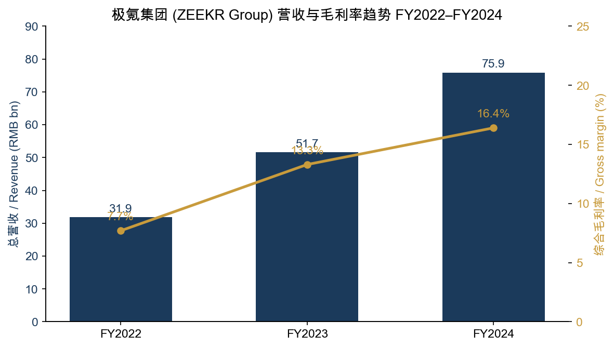
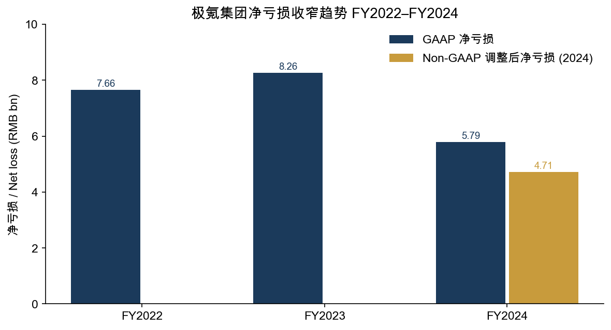
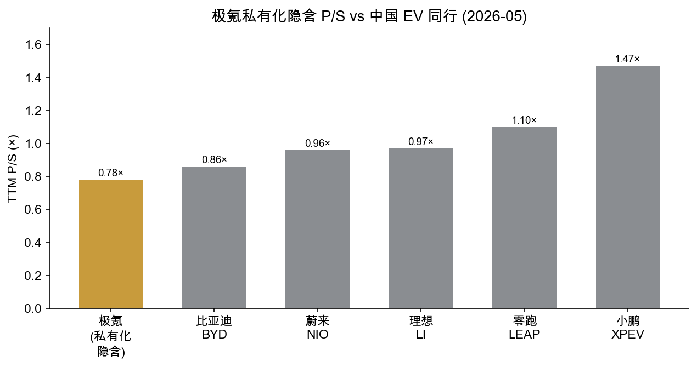
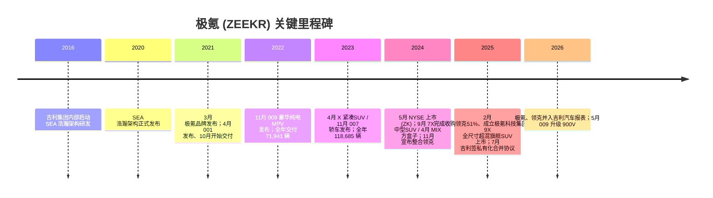
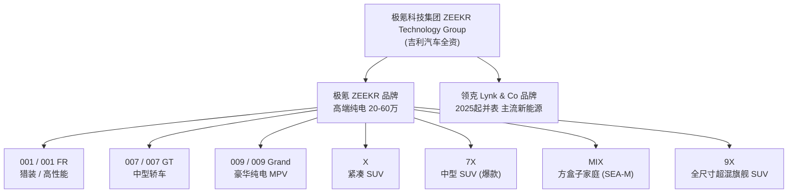
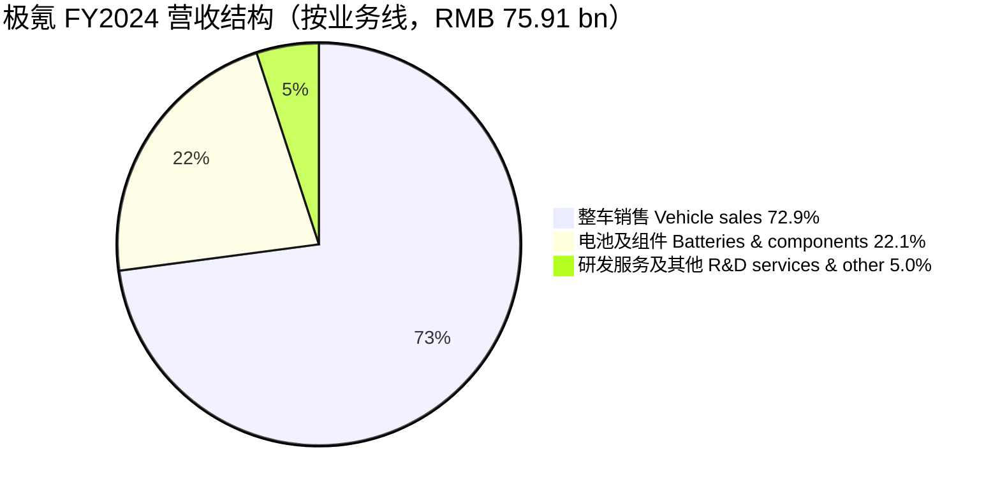
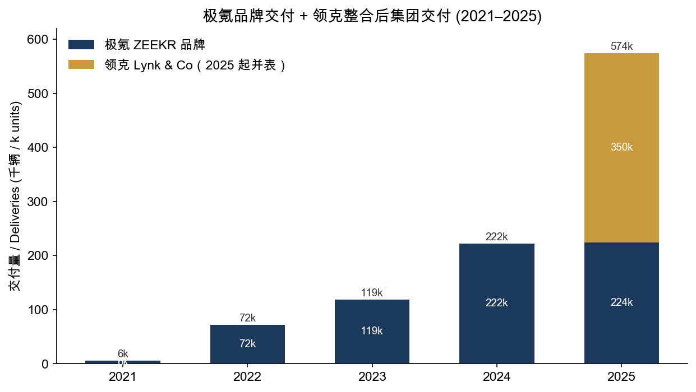
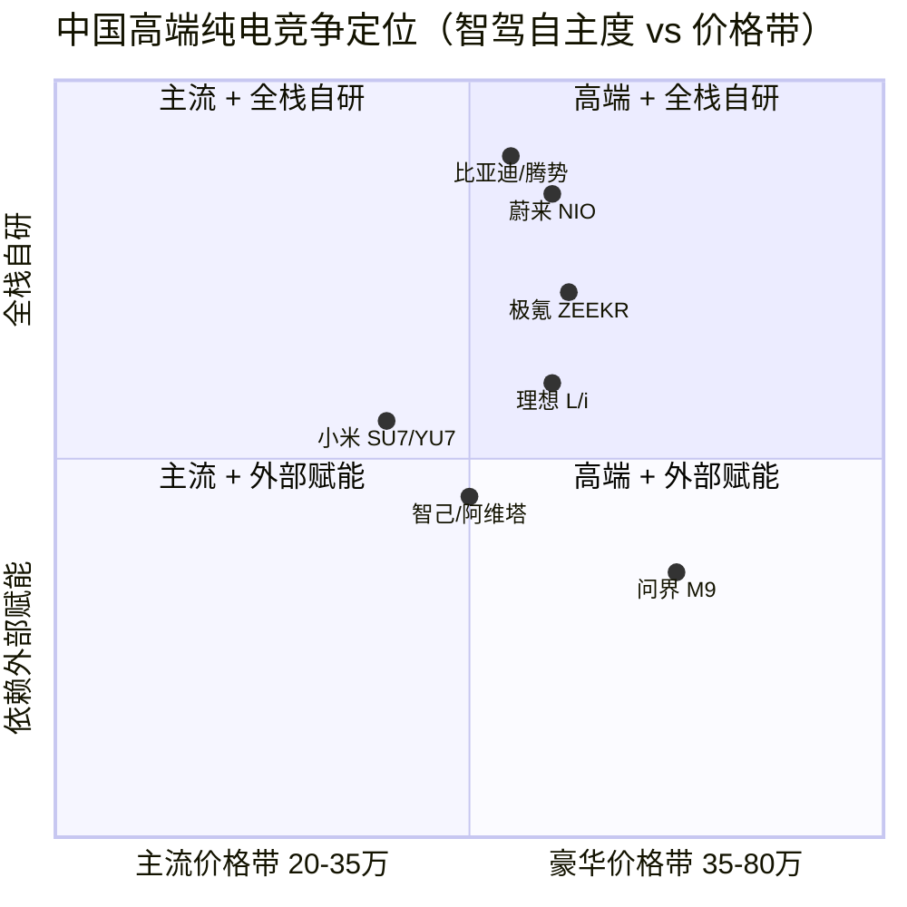

# 极氪 (ZEEKR Intelligent Technology Holding Ltd) — 公司研究

**Tickers:** NYSE: ZK（**已于 2025-12-22 退市 / delisted**）· 母公司 吉利汽车 Geely Automobile Holdings HKEX: 175
**报告日期 / As of:** 2026-05-31
**报告语言：** 简体中文

---

> **重大状态变更（必读）— 极氪已私有化、已从纽交所退市：** 极氪于 **2025-12-22** 完成与吉利汽车（**Geely Automobile Holdings, HKEX: 175**）全资子公司 Keystone Mergersub Limited 的合并，成为吉利汽车的**全资子公司并从纽约证券交易所退市**；纽交所于同日就其 ADS 提交 Form 25-NSE 注销登记。合并对价：每份 ADS 可选 **US$26.87 现金** 或 12.3 股新发吉利股份（每股普通股 US$2.687 现金 / 1.23 股吉利股份），按合并协议（2025-07-15 签署）计算，对极氪的整体股权估值约 **US$8.09 bn**；该报价较 2025-05-06 收盘价溢价约 **18.9%**、较公告前 30 个交易日 VWAP 溢价约 **25.6%**。私有化由 2025 年 9 月 15 日的股东特别大会以 **94.2%** 赞成票通过（96.8% 流通股参与表决）。
> 因此，**ZK 已不再公开交易**；本报告 FY2024 及更早数据以极氪 **20-F / F-1** 为准，FY2025 及之后则主要援引 **吉利汽车（HKEX:175）** 的披露（极氪、领克现已并入吉利报表）。
> Source: [Zeekr Group Announces Completion of Merger, 6-K Exhibit 99.1, 2025-12-22](https://www.sec.gov/Archives/edgar/data/1954042/000110465925123525/tm2534059d1_ex99-1.htm) · [Geely, Zeekr finalize merger deal with higher offer, CnEVPost, 2025-07-15](https://cnevpost.com/2025/07/15/geely-zeekr-finalize-merger-deal/) · [Zeekr completes merger with Geely, delists from NYSE, CnEVPost, 2025-12-22](https://cnevpost.com/2025/12/22/zeekr-completes-merger-with-geely-delists-from-nyse/).

---

## 目录

1. 公司概览
2. 公司历史
3. 管理团队
4. 产品与服务
5. 客户与上市策略
6. 行业概览
7. 竞争格局
8. 市场机会 (TAM)
9. 风险评估
10. 参考资料

---

## 1. 公司概览

极氪（**ZEEKR Intelligent Technology Holding Ltd**，原纽交所 ZK，2024-05 在美国 IPO，2025-12 退市）是吉利控股集团（Geely Holding，李书福创立）旗下的高端纯电动（BEV）品牌与技术公司，注册于开曼群岛、运营总部位于浙江宁波杭州湾。极氪在其 20-F 年报中对自身的官方定义是："我们是一家高速成长的 BEV 技术公司 …… 我们设计、开发、生产和销售下一代高端纯电动车与技术驱动的解决方案"（[ZEEKR 2024 Annual Report on Form 20-F, Item 4.B Business Overview](https://www.sec.gov/Archives/edgar/data/1954042/000141057825000390/zk-20241231x20f.htm)）。品牌名"ZEEKR"取义"Generation Z + Geeker（Z 世代的极客）"。极氪 2024 年交付 **222,123 辆**（同比 +87.2%），截至 2024-12-31 累计交付 **418,756 辆**——是中国造车新势力中量产到 40 万辆速度最快的品牌之一（[ZEEKR 20-F FY2024, Item 4.B "Our Vehicles"](https://www.sec.gov/Archives/edgar/data/1954042/000141057825000390/zk-20241231x20f.htm)）。

**商业模式：轻资产「整车 + 三电组件 + 技术服务」三段式收入。** 与多数车企不同，极氪的收入结构在 20-F 中拆为三块：**整车销售**（2024 占总营收 72.9%）、**电池及其他组件销售**（22.1%，主要由其控股子公司宁波威睿 Ningbo Viridi 生产的电池包 / 电机 / 电控外供给吉利系其他品牌）、**研发服务及其他服务**（5.0%，含向关联方收取的技术授权费与备件销售）（[ZEEKR 20-F FY2024 Item 5.A — Revenue breakdown by amount and percentage](https://www.sec.gov/Archives/edgar/data/1954042/000141057825000390/zk-20241231x20f.htm)）。2024 年总营收 **RMB 75,912.7 mn (US$10,400.0 mn)**，同比 +46.9%；其中整车销售 RMB 55,315.3 mn，电池及组件 RMB 16,793.8 mn，研发服务 RMB 3,803.5 mn（[ZEEKR 20-F FY2024 Item 5.A](https://www.sec.gov/Archives/edgar/data/1954042/000141057825000390/zk-20241231x20f.htm)）。极氪本身不拥有整车工厂——整车以"成本加固定加成"的方式向吉利集团的极氪工厂、成都工厂、眉山工厂、春晓工厂等代工采购（详见第 4、5、9 章）。

**经营趋势：亏损持续收窄但尚未盈利。** 极氪 2022–2024 三年 GAAP 净亏损分别为 **RMB 7,655.1 mn / 8,264.2 mn / 5,790.6 mn (US$793.3 mn)**——2024 净亏损同比收窄 29.9%；剔除股份支付的 Non-GAAP 调整后净亏损 2024 为 **RMB 4,714.1 mn (US$645.8 mn)**，同比收窄 42.0%（[ZEEKR 20-F FY2024 Item 5.A — net loss decreased by RMB2,473.5 million](https://www.sec.gov/Archives/edgar/data/1954042/000141057825000390/zk-20241231x20f.htm)；[Zeekr Group Reports Fourth Quarter and Full Year 2024 Unaudited Financial Results, 2025-03-20](https://www.prnewswire.com/news-releases/zeekr-group-reports-fourth-quarter-and-full-year-2024-unaudited-financial-results-302406685.html)）。2024 综合毛利率 **16.4%**（vs 2023 的 13.3%、2022 的 7.7%），其中整车毛利率升至 **15.6%**，主要受规模摊薄与单车物料成本下降驱动（[ZEEKR 20-F FY2024 Item 5.A — gross profit margin increased from 13.3% to 16.4%](https://www.sec.gov/Archives/edgar/data/1954042/000141057825000390/zk-20241231x20f.htm)）。

*Source: [ZEEKR 2024 20-F, Item 5.A — Results of Operations](https://www.sec.gov/Archives/edgar/data/1954042/000141057825000390/zk-20241231x20f.htm)（总营收 31,899 / 51,673 / 75,913 mn；GM 7.7%/13.3%/16.4%，2022 GM 由 gross profit 2,472 mn ÷ revenue 31,899 mn 推算）。*

**研发投入强度。** 极氪 2022 / 2023 / 2024 研发费用分别为 **RMB 5,446.3 mn / 8,369.2 mn / 9,720.2 mn (US$1,331.7 mn)**，占同期营收的 17.1% / 16.2% / 12.8%——投入绝对额持续增长但占比随营收放大而下降，是其亏损收窄的关键变量之一（[ZEEKR 20-F FY2024 Item 4.B — Our Technologies, R&D expenses](https://www.sec.gov/Archives/edgar/data/1954042/000141057825000390/zk-20241231x20f.htm)）。研发布局横跨宁波杭州湾（整车 / 三电）、瑞典哥德堡（Zeekr Tech EU，设计 + 下一代出行，733 名员工）等中心（[ZEEKR 20-F FY2024 Item 4.B — Zeekr Tech EU](https://www.sec.gov/Archives/edgar/data/1954042/000141057825000390/zk-20241231x20f.htm)）。

*Source: [ZEEKR 20-F FY2024 Item 5.A](https://www.sec.gov/Archives/edgar/data/1954042/000141057825000390/zk-20241231x20f.htm)（GAAP 净亏损 7.66 / 8.26 / 5.79 bn）+ [FY2024 业绩发布会, 2025-03-20](https://www.prnewswire.com/news-releases/zeekr-group-reports-fourth-quarter-and-full-year-2024-unaudited-financial-results-302406685.html)（Non-GAAP 调整后净亏损 4.71 bn）。*

**销售与服务网络。** 截至 2024-12-31，极氪在中国拥有 **467 个**线下门店（极氪中心 / 极氪空间 / 极氪交付中心 / 极氪 House）、海外 **71 个**门店，并拥有 7,134 人的自营销售与营销团队（其中 87.9% 有汽车 / 零售背景）（[ZEEKR 20-F FY2024 Item 4.B — Our Sales and Services](https://www.sec.gov/Archives/edgar/data/1954042/000141057825000390/zk-20241231x20f.htm)）。

**估值快照（私有化定价，非公开市场）。** 因 ZK 已退市，最具参考意义的估值锚是吉利的私有化对价：每 ADS **US$26.87**，对极氪整体股权估值约 **US$8.09 bn**（[Zeekr Group to Be Acquired by Geely in $26.87 Per ADS Premium Deal, 2025-07-15](https://www.stocktitan.net/news/ZK/zeekr-group-enters-into-definitive-merger-agreement-for-acquisition-12cyvnyyktzo.html)）。以极氪集团 FY2024 营收 US$10.40 bn 计，该对价对应隐含 **P/S ≈ 0.78×**——低于同期仍在公开交易的蔚来（NIO，0.96×）、理想（LI，0.97×）、零跑（LEAP，~1.1×）、小鹏（XPEV，1.47×），仅略低于比亚迪（BYD，0.86×）（[Stockanalysis.com — NIO / LI / XPEV / BYD Statistics, 2026-05-29](https://stockanalysis.com/stocks/nio/statistics/)）。极氪 P/E 在退市前长期为负（持续亏损），故不具参考意义——这与所有尚未盈利的中国造车新势力一致。私有化定价折让既反映极氪的"已亏损 + 高吉利系关联依赖 + 流通盘小"，也意味着吉利以相对低估的价格把高端纯电资产收回体内（详见第 7、9 章）。

*Source: 极氪隐含 P/S = 私有化股权估值 US$8.09 bn ÷ FY2024 集团营收 US$10.40 bn ≈ 0.78×（[deal value](https://www.insidearbitrage.com/2025/07/geely-automobile-to-take-zeekr-private-in-a-8-09-billion-deal/) + [20-F 营收](https://www.sec.gov/Archives/edgar/data/1954042/000141057825000390/zk-20241231x20f.htm)）；同行 TTM P/S 取自 [Stockanalysis.com, 2026-05-29](https://stockanalysis.com/stocks/nio/statistics/)。*

---

## 2. 公司历史

极氪由吉利控股集团（Geely Holding，创始人 **李书福 / Li Shufu**）于 **2021 年 3 月**正式作为独立高端纯电品牌发布，运营主体为浙江极氪智能科技（Zhejiang ZEEKR）。其技术基因可追溯到吉利集团 2016 年启动、2020 年正式发布的开源纯电模块化架构 **SEA 浩瀚架构（Sustainable Experience Architecture）**——极氪 001 是 SEA 上量产的第一款车（[ZEEKR 20-F FY2024 Item 4.B — Sustainable Experience Architecture, "Development began within the Geely Group in 2016 and was officially announced in 2020"](https://www.sec.gov/Archives/edgar/data/1954042/000141057825000390/zk-20241231x20f.htm)）。极氪诞生的战略意图，是让吉利在"传统燃油车巨头"之外，单独孵化一个不受燃油历史拖累、对标蔚来 / 特斯拉的纯电高端品牌（[ZEEKR F-1/A — "We strategically spearheaded the premium intelligent BEV market with unique positioning", 2024-05-03](https://www.sec.gov/Archives/edgar/data/1954042/000110465924057064/tm229938-32_f1a.htm)）。

**2024-05 纽交所 IPO——史上最快从成立到美股上市的造车新势力之一。** 极氪于 2023-11 首次向 SEC 递交 F-1，几经修订后于 **2024 年 5 月 10 日在纽交所挂牌（代码 ZK）**，成为吉利系第一家在美股独立上市的整车品牌，也是当年中概车企赴美 IPO 的标志性事件（[ZEEKR F-1, 2023-11-09](https://www.sec.gov/Archives/edgar/data/1954042/000110465923116192/tm229938-14_f1.htm)；[ZEEKR F-1/A 终稿, 2024-05-03](https://www.sec.gov/Archives/edgar/data/1954042/000110465924057064/tm229938-32_f1a.htm)）。从 2021-03 品牌发布到 2024-05 上市仅 3 年余，速度在全球造车新势力中名列前茅。

**2024–2025 的两大战略转折：整合领克 + 私有化。** 第一，**极氪 + 领克（Lynk & Co）整合**——2024 年 11 月 14 日，吉利宣布支持极氪以发行新股 + 现金方式收购领克 **51%** 股权（其余 49% 由吉利汽车持有），并组建 **极氪科技集团（ZEEKR Technology Group）**统一管理两个品牌的研发、制造、供应链与海外业务；交易于 **2025 年 2 月 14 日**完成，管理层提出"两年内实现集团百万辆年销"的目标（[ZEEKR finalizes Lynk & Co acquisition, announces establishment of ZEEKR Technology Group, Gasgoo, 2025-02-14](https://autonews.gasgoo.com/articles/news/zeekr-finalizes-lynk-co-acquisition-announces-establishment-of-zeekr-technology-group-70035972)；[Zeekr aims to reach 1 million annual sales in 2 years after integrating Lynk & Co, CnEVPost, 2024-12-03](https://cnevpost.com/2024/12/03/zeekr-aims-1-million-annual-sales-2-years-integrating-lynk-co/)）。第二，**吉利私有化极氪**——2025 年 5 月吉利提出私有化要约，7 月 15 日签署最终合并协议（每 ADS US$26.87），9 月股东大会通过，**12 月 22 日完成合并并退市**（见报告顶部说明）（[Geely, Zeekr finalize merger deal with higher offer, CnEVPost, 2025-07-15](https://cnevpost.com/2025/07/15/geely-zeekr-finalize-merger-deal/)）。

**为什么上市仅 19 个月就被收回体内？** 这是中概股"一体化"主题下的典型操作：极氪上市后股价长期低迷、流通盘小、估值无法反映吉利系协同价值，且与领克、银河、吉利主品牌存在大量平台 / 零部件 / 渠道重叠；吉利董事会 2024 年提出的"《台州宣言》"明确"战略聚焦、整合内部资源、减少重复投资"。把极氪从美股摘下、并入吉利汽车，既消除了上市公司层面的合规成本与 HFCAA 退市风险，也让高端纯电资产在吉利体内统一调度（[After 3 Million Units, Geely Enters the Profit Release Phase, Gasgoo, 2026](https://autonews.gasgoo.com/articles/news/after-3-million-units-geely-enters-the-profit-release-phase-2034553999540256769)）。私有化完成后，极氪 2025 全年交付 **224,133 辆**（同比仅 +0.9%，反映高端纯电赛道竞争加剧与产品换代青黄不接），而并表后吉利汽车 2025 全年集团交付 **3.02 mn 辆**、营收创纪录 **CNY 345.2 bn**、核心净利 **CNY 14.41 bn**（[Geely Auto Reports Record 2025 Revenue of CNY 345.2 Billion and 3.02 Million Vehicle Deliveries, 2026-03-18](https://finance.yahoo.com/news/geely-auto-reports-record-2025-131700563.html)）。

---

## 3. 管理团队

> **说明：** 极氪自始即为吉利控股的子品牌，没有"独立创始人个人持股"的故事；其灵魂人物是吉利集团董事长（实控人）**李书福**与极氪 CEO **安聪慧**——下文聚焦此二人，符合本研究范式"只写创始人 + 现任 CEO"的要求。

**李书福（Li Shufu），吉利控股集团董事长、极氪母公司实际控制人。** 李书福是中国民营汽车工业的标志性企业家，1986 年创业、1997 年进入汽车制造、2010 年以约 US$18 亿收购沃尔沃轿车（Volvo Cars），此后陆续入股戴姆勒（Daimler，曾一度持股约 9.7%）、收购宝腾（Proton）/ 路特斯（Lotus）、控股极星（Polestar）与伦敦电动汽车（LEVC），并孵化领克、极氪、银河等品牌，把吉利从一家本土低端车厂打造成横跨欧亚、年销超 400 万辆（含吉利控股全口径）的全球化汽车集团（[Geely Auto 2025 results, 2026-03-18](https://www.geely.com/en/news/2026/geely-auto-sales-2025)；[Gasgoo Daily: Geely Holding Group's 2025 sales surpass 4.11 million units, Gasgoo, 2026](https://autonews.gasgoo.com/articles/news/gasgoo-daily-geely-holding-groups-2025-sales-surpass-411-million-units-2009538103033569281)）。极氪的诞生、纽交所上市、整合领克、再到私有化收回，每一步都是李书福"多品牌 + 全球化 + 战略聚焦"产业布局的延伸。极氪 20-F 在关联方章节明确，极氪赖以运营的 SEA 架构、"Zeekr"商标、整车代工产能均来自李书福控制的吉利集团（[ZEEKR 20-F FY2024 Item 7.B — Trademarks License Agreement / SEA License Agreement with Geely Holding](https://www.sec.gov/Archives/edgar/data/1954042/000141057825000390/zk-20241231x20f.htm)）。

**安聪慧（An Conghui），极氪智能科技 CEO 兼吉利控股集团总裁。** 安聪慧是吉利体系内成长起来的核心技术与运营高管，1996 年加入吉利，长期主管研发与制造，曾任吉利汽车（HKEX:175）行政总裁，主导了吉利从"逆向开发"到 CMA、SEA 自主架构的技术升级，被外界视为吉利体系最懂产品与制造的"二号人物"。2021 年极氪独立后，安聪慧亲自出任极氪 CEO，主导品牌定位、产品节奏（001→009→X→007→7X→9X）与海外扩张（[ZEEKR 20-F FY2024 Item 6.A — Directors and Senior Management](https://www.sec.gov/Archives/edgar/data/1954042/000141057825000390/zk-20241231x20f.htm)）。在 2024 年整合领克、2025 年发布全尺寸旗舰 9X 的关键节点上，安聪慧的产品与组织决策直接决定了极氪科技集团能否兑现"百万辆"目标——这使得"安聪慧 / 李书福个人决策"成为极氪不可对冲的关键人物风险（详见第 9 章）。安聪慧在极氪智驾从 Mobileye"黑盒方案"转向"浩瀚智驾"全栈自研的争议性决策中，也是最终拍板者（[极氪改款抛弃 Mobileye，量子位, 2024-08](https://www.qbitai.com/2024/08/181018.html)）。

**核心其他高管（仅作背景描述、不展开）。** 极氪设计由瑞典哥德堡团队主导（Zeekr Tech EU），其全球化设计语言塑造了 001 猎装、7X、MIX 等车型的差异化外观（[ZEEKR 20-F FY2024 Item 4.B — "Zeekr's vehicle design is led by the pioneering design team in Gothenburg, Sweden"](https://www.sec.gov/Archives/edgar/data/1954042/000141057825000390/zk-20241231x20f.htm)）。私有化退市后，极氪管理层不再单独向公开市场披露，相关治理并入吉利汽车（HKEX:175）。

---

## 4. 产品与服务

> **重要说明：** Section 4 是本报告最核心的一章，也是后续"零跑 vs 小米 vs 比亚迪 vs 极氪 vs 问界"五方对比的输入。极氪的独特之处在于：它是**「传统车企高端纯电化」的最纯粹样本**——不靠互联网生态（区别于小米）、不靠增程 + 城市 NOA 性价比（区别于零跑 / 理想）、不靠华为智驾赋能（区别于问界），而是依托**吉利系垂直整合资产**（SEA 浩瀚架构 + 自研金砖 / Golden 电池 + 800V/900V + 浩瀚智驾 + Flyme Auto 车机），在 20–60 万元价格带做高端纯电 SUV / 轿车 / 豪华 MPV。

### 4.1 整车产品线与平台（直接引用 20-F / F-1）

极氪在 20-F 中将产品定义为"基于 SEA 浩瀚架构的高端纯电车系"，下表系基于 20-F「Our Vehicles」及官网产品页构建（[ZEEKR 20-F FY2024, Item 4.B — Our Vehicles](https://www.sec.gov/Archives/edgar/data/1954042/000141057825000390/zk-20241231x20f.htm)；[极氪官网, zeekrlife.com](https://www.zeekrlife.com/)）：

| 车型 | 品类 | 上市 / 交付 | 平台 | 价格带（人民币）| 核心卖点 |
|---|---|---|---|---|---|
| **001 / 001 FR** | 猎装 / shooting-brake（高性能 FR）| 2021-04 / 001 FR 2023-10 | SEA | 001 约 26–33 万；FR 约 76.9 万 | 全球首款量产纯电猎装；FR 四电机 1265 Ps、0–100 km/h 2.02s |
| **007 / 007 GT** | 中型纯电轿车 | 2023-11 / GT 改款延至 2026 Q2 | SEA | 约 20.99 万起 | 800V、自研金砖电池、双 Orin X 智驾 |
| **009 / 009 Grand** | 豪华纯电 MPV | 2022-11 / Grand 2024-04 | SEA | 约 43.9–78.9 万 | 全球首款纯电豪华 MPV；5C 麒麟电池、双 8295 座舱 |
| **X** | 紧凑 SUV | 2023-04 | SEA | 约 18.98 万起 | 左右舵出口 30+ 国；ENCAP/Green NCAP 双五星 |
| **7X** | 中型纯电 SUV（爆款）| 2024-09 | SEA（升级版）| 约 22.99 万起 | 自研金砖电池；上市 50 天交付破 2 万 |
| **MIX** | 方盒子家庭 MPV | 2024-04 / 交付 2024-10 | SEA-M | 约 27.99 万起 | 首款 SEA-M；93% 得房率、前排 270° 旋转座椅、无 B 柱 |
| **9X** | 全尺寸超混旗舰 SUV | 2025-09-29 | 浩瀚超级电混（900V）| 限时 45.59–58.99 万 | 三电机兆瓦级电混、1400+ Ps、0–100 km/h 3.1s、6C 充电 |

Source: [ZEEKR 20-F FY2024 Item 4.B](https://www.sec.gov/Archives/edgar/data/1954042/000141057825000390/zk-20241231x20f.htm) · [全球超豪华旗舰SUV极氪9X正式上市, zeekrgroup.com, 2025-09-29](https://www.zeekrgroup.com/news/202509291) · [Zeekr delays launch of updated 007 to Q2 2026, CnEVPost, 2025-10-27](https://cnevpost.com/2025/10/27/zeekr-delays-launch-updated-007-q2-2026/)。价格为各车型上市指导价 / 限时价，随版本浮动。

### 4.2 综述——吉利系垂直整合如何组成一台极氪车

极氪的护城河不在单一车型，而在**「平台 + 三电 + 智驾 + 座舱」全栈复用吉利系资产**所带来的成本与迭代速度优势。一台极氪车的价值链可拆为：**SEA/SEA-M 浩瀚架构**（车身 / 底盘 / 电气骨架，A–E 级通用）→ **宁波威睿（Ningbo Viridi）三电**（金砖 / Golden 电池 + 310 kW 电机 + 电控 + 800kW 超充桩）→ **ZEEA 电子电气架构 + Zeekr OS / Flyme Auto 座舱**（域控、OTA）→ **浩瀚智驾（自研，双 Orin X / 508 TOPS）**。这套组合的关键在于"开源共享"——SEA 在吉利集团内向极氪、领克、银河、Smart 等多品牌开放，使得研发与采购成本在数百万辆规模上摊薄，这是纯互联网造车新势力（小米早期、蔚来、小鹏）在体量未起时难以企及的（[ZEEKR 20-F FY2024 Item 4.B — SEA "Open-Source: SEA is accessible to other BEV manufacturers … within the Geely Group"](https://www.sec.gov/Archives/edgar/data/1954042/000141057825000390/zk-20241231x20f.htm)）。

### 4.3 平台层：SEA 浩瀚架构（Sustainable Experience Architecture）

20-F 对 SEA 的官方描述（直接引用）：

> "Introduced in 2020, the Sustainable Experience Architecture (SEA) is an open-source, electric, and modular platform designed to innovate and optimize the design and engineering of Battery Electric Vehicles (BEVs). … The Zeekr 001 is the first mass-produced vehicle based on SEA. … SEA supports BEVs from A to E segments, including sedans, SUVs, MPVs, hatchbacks, roadsters, and robotaxis." — [ZEEKR 20-F FY2024, Item 4.B — Sustainable Experience Architecture](https://www.sec.gov/Archives/edgar/data/1954042/000141057825000390/zk-20241231x20f.htm)

**中文释义 / Plain-language gloss：** SEA（浩瀚架构）是一个**开源、纯电、模块化**的整车平台 / vehicle platform——可以把它理解为"电动车的乐高底板"：电池、电机、底盘、轴距、悬架都是可插拔的模块，覆盖 A 级小车到 E 级豪华车的全谱系（sedan/SUV/MPV/hatchback/roadster/robotaxi）。它由吉利集团 2016 年内部启动、2020 年发布，001 是第一款量产车。SEA 与竞品平台的关键差异是**集团内多品牌开源共享**——领克、极氪、银河、smart 都跑在 SEA 或其衍生平台上，因此一笔架构研发投入能在数百万辆上摊销，单车研发成本远低于"一个品牌一个平台"的纯新势力。2024 年极氪把 SEA 的**高压系统从 400V 升级到 800V**，并引入 9 源热泵改善冬季续航（[ZEEKR 20-F FY2024 Item 4.B — "we upgraded the HV System from 400V to 800V"](https://www.sec.gov/Archives/edgar/data/1954042/000141057825000390/zk-20241231x20f.htm)）。瑞典 Zeekr Tech EU 进一步开发了 **SEA-M**——面向自动驾驶与未来出行的高阶版本，MIX 与 Waymo RT robotaxi 即基于 SEA-M（无 B 柱、宽门、高灵活内饰）（[ZEEKR 20-F FY2024 Item 4.B — Zeekr Tech EU / SEA-M](https://www.sec.gov/Archives/edgar/data/1954042/000141057825000390/zk-20241231x20f.htm)）。

*分析师观点：* SEA 是极氪相对纯新势力（蔚来 NT 平台、小鹏 SEPA）的核心结构性优势——不是技术参数更高，而是**摊薄规模更大**。但这也是双刃剑：平台所有权属于吉利控股，极氪需按"销量 × 均价"公式向吉利 Holding 支付 SEA 授权费（关联交易，见第 9 章）（[ZEEKR 20-F FY2024 Item 7.B — SEA License Agreement, "license fee … calculated through the formula based on the sales volume and the average selling price"](https://www.sec.gov/Archives/edgar/data/1954042/000141057825000390/zk-20241231x20f.htm)）。

### 4.4 三电层：自研金砖 / Golden 电池 + 800V/900V 超充（宁波威睿 Ningbo Viridi）

20-F 对电池方案的官方描述（直接引用）：

> "Zeekr's 800V ultra-fast charging battery technology offers three advanced solutions … (1) The Qilin Battery enables 10%-80% SoC charging in just 15 minutes …, (2) The Shenxing Battery supports 10%-80% SoC charging in 11.5 minutes …, and (3) The self-developed Golden Battery achieves 10%-80% SoC charging in only 10.5 minutes, setting a new benchmark for high-performance fast-charging technology." — [ZEEKR 20-F FY2024, Item 4.B — Battery Solutions](https://www.sec.gov/Archives/edgar/data/1954042/000141057825000390/zk-20241231x20f.htm)

**中文释义 / Plain-language gloss：** 极氪的三电由控股子公司**宁波威睿（Ningbo Viridi，浩瀚能源体系）**自研自产，对外亦供货给吉利系其他品牌——这是极氪"电池及组件销售"这块占营收 22% 的来源。三套 800V 超充电池方案中，**金砖电池 / Golden Battery（自研 LFP / 磷酸铁锂）**是技术名片：10%→80% SoC 仅需约 **10.5 分钟**，让磷酸铁锂的充电速率反超三元锂（ternary lithium），7X 即搭载金砖电池；麒麟电池（Qilin，宁德时代 CATL 系）15 分钟、神行电池（Shenxing）11.5 分钟（[ZEEKR 20-F FY2024 Item 4.B — Ningbo Viridi, "Golden Battery, which can be replenished from 10% to 80% within approximately 10.5 minutes … enables LFP batteries surpass the charge rates of ternary lithium battery"](https://www.sec.gov/Archives/edgar/data/1954042/000141057825000390/zk-20241231x20f.htm)）。电机方面，威睿的峰值 **310 kW** 电机搭载于新一代 009、001、7X；充电方面推出最高 **800kW** 超充桩与 GPC 超级液冷充电平台（单主机同时为 6 个充电终端供电）（[ZEEKR 20-F FY2024 Item 4.B — Ningbo Viridi motor & charging](https://www.sec.gov/Archives/edgar/data/1954042/000141057825000390/zk-20241231x20f.htm)）。到 2025 年旗舰 9X 进一步把高压平台升到**全栈 900V、6C 超充**（20%→80% 仅 9 分钟、补能 400 km），并首发三电机兆瓦级超级电混（[全球超豪华旗舰SUV极氪9X正式上市, zeekrgroup.com, 2025-09-29](https://www.zeekrgroup.com/news/202509291)）。

> **行业术语对照 / Bilingual gloss:** `金砖电池 (Golden Brick / Golden Battery, 极氪自研 LFP)`、`磷酸铁锂 (LFP)`、`三元锂 (ternary lithium / NMC)`、`800V/900V 高压平台 (high-voltage architecture)`、`SoC (state of charge, 荷电状态)`、`BMS (battery management system, 电池管理系统, 威睿 BMS 达 ASIL C 安全等级)`、`CTP/CTB (cell-to-pack / cell-to-body, 电芯到包/到车身)`。

*分析师观点：* 自研金砖电池 + 威睿三电是极氪相对蔚来 / 小鹏（电芯外采、Pack 自研）更深的垂直整合层级，也带来"电池销售"这块独特的第二收入曲线。但威睿的电池在吉利系内多品牌共用，意味着极氪与领克、银河在三电资源上既协同又内部争夺（[ZEEKR 20-F FY2024 Item 4.B — "Ningbo Viridi's batteries and BMS have been deployed on a number of BEV brands in Geely Group"](https://www.sec.gov/Archives/edgar/data/1954042/000141057825000390/zk-20241231x20f.htm)）。

### 4.5 智驾层：浩瀚智驾 / 千里浩瀚（Mobileye → 自研的关键转向）

**中文释义 / Plain-language gloss：** 极氪智驾经历了一次代价高昂的路线切换。2021 款 001 采用 **Mobileye EyeQ5H 黑盒方案（48 TOPS）**——由于 Mobileye 的算法不开放、本土化迭代慢，2021 年交付的系统直到 2023 下半年才开放公测，使极氪在城市 NOA 上落后竞品约 3 年（[极氪改款抛弃 Mobileye，智驾芯片第一股更难了, 量子位, 2024-08](https://www.qbitai.com/2024/08/181018.html)）。2024 年极氪果断切换到**全栈自研的"浩瀚智驾 2.0"（Zeekr Intelligent Driving 2.0）**——采用端到端大模型（end-to-end）、双 **NVIDIA Orin X**（508 TOPS）算力，分阶段从通勤模式推进到全场景城市智驾；20-F 中明确 007 与升级版 001 已搭载双 Orin X / 508 TOPS（[ZEEKR 20-F FY2024 Item 4.B — "Zeekr AD system, powered by dual NVIDIA Orin X chips delivering 508 TOPS"](https://www.sec.gov/Archives/edgar/data/1954042/000141057825000390/zk-20241231x20f.htm)；[从Mobileye换道浩瀚智驾2.0，极氪智驾进入竞技"新赛点", v5auto, 2024](https://new.v5auto.com/index.php/Ch/Cms/News/infoDetail/id/16267/bID/475)）。海外市场的 001 仍保留 Mobileye 方案，新车型全面转向自研。智驾研发因合并领克而进一步整合到极氪科技集团的统一智驾团队（后续吉利体系内称"千里浩瀚"智驾）。

> **行业术语对照 / Bilingual gloss:** `自研智驾 (in-house ADAS)`、`城市领航辅助 (city NOA / NZP, Navigation on Pilot)`、`端到端大模型 (end-to-end model)`、`域控制器 (DCU, Domain Control Unit — 极氪 ZEEA 用低至 4 个 DCU 控制全车)`、`OTA / FOTA (firmware over-the-air, 整车在线升级)`。

*分析师观点：* 智驾从 Mobileye 切到自研，是极氪补齐"高端纯电最关键短板"的必经之路，但 2024 年的"六个月改款"也带来老车主权益争议与品牌口碑波动（[001 老车主的痛，也是极氪的智驾阵痛, 腾讯新闻, 2024-08](https://news.qq.com/rain/a/20240815A01GT600)）。相对华为赋能的问界（ADS 4.0）和小鹏（XNGP / 图灵芯片），极氪自研智驾起步晚、需要时间验证规模化体验。

### 4.6 座舱与电子电气架构：ZEEA + Zeekr OS / Flyme Auto

20-F 对 ZEEA 的描述（直接引用）：

> "Our Zeekr Electrical and Electronic Architecture (ZEEA) integrates hardware, network communications, software, and wiring … Through our ZEEA, the complicated vehicle functionalities are centralized into couples of electronic units … we use as few as four DCUs to control the entire vehicle." — [ZEEKR 20-F FY2024, Item 4.B — Electrical and Electronic Architecture](https://www.sec.gov/Archives/edgar/data/1954042/000141057825000390/zk-20241231x20f.htm)

**中文释义 / Plain-language gloss：** ZEEA 是极氪自研的**电子电气架构（E/E architecture）**——把分散的几十个 ECU 集中成少数几个"域控制器（DCU）"，极氪宣称仅用 **4 个 DCU** 即可控制整车的车身、安全、座舱、智驾，这种高度集成是 OTA 与软件定义汽车（software-defined vehicle）的前提。座舱侧，极氪采用吉利系**魅族（Meizu）主导的 Flyme Auto 车机**与高通骁龙 8295 芯片（009 用双 8295），借助魅族的手机操作系统能力提升车机流畅度与生态互联——这是吉利系区别于纯车厂车机的独特资产（[ZEEKR 20-F FY2024 Item 4.B — ZEEA, Zeekr OS](https://www.sec.gov/Archives/edgar/data/1954042/000141057825000390/zk-20241231x20f.htm)；009 双骁龙 8295 见 [ZEEKR 20-F FY2024 Item 4.B — Zeekr 009](https://www.sec.gov/Archives/edgar/data/1954042/000141057825000390/zk-20241231x20f.htm)）。

> **行业术语对照 / Bilingual gloss:** `车机 (cockpit / IVI, in-vehicle infotainment)`、`Flyme Auto (吉利系魅族车机系统)`、`骁龙 8295 (Qualcomm Snapdragon 8295 座舱芯片)`、`软件定义汽车 (SDV, software-defined vehicle)`。

### 4.7 爆款与近 12 个月动态

极氪的销量结构高度依赖少数车型。**7X（中型 SUV，2024-09 上市）是 2024 下半年的爆款**——上市 50 天交付突破 2 万辆，10 月单月贡献极氪 46.48% 的交付（[Zeekr 7X SUV delivers over 20,000 units after 50 days on market, CnEVPost, 2024-11-11](https://cnevpost.com/2024/11/11/zeekr-7x-delivers-20000-50-days-on-market/)）。**007（轿车）**2024 年 1–10 月交付约 41,979 辆（占比 25%），但 007 GT 改款延至 2026 Q2（[Zeekr delays launch of updated 007 electric sedan to Q2 2026, CnEVPost, 2025-10-27](https://cnevpost.com/2025/10/27/zeekr-delays-launch-updated-007-q2-2026/)）。**009（豪华纯电 MPV）**是极氪的高端利润锚，2025 全年交付 22,299 辆、长期占据 50 万元以上纯电 MPV 销冠（[Zeekr brand delivers record 30,267 cars in Dec, CnEVPost, 2026-01-01](https://cnevpost.com/2026/01/01/zeekr-brand-delivers-30267-cars-dec-2025/)），2026-05 升级到 900V 架构（[Zeekr upgrades flagship 009 MPV with 900V architecture, CnEVPost, 2026-05-19](https://cnevpost.com/2026/05/19/zeekr-upgrades-flagship-009-mpv/)）。**9X（全尺寸超混旗舰 SUV，2025-09-29 上市）**是极氪冲击 50 万元以上豪华大六座市场的旗舰——12 月单月交付破万、领跑 50 万元以上大型 SUV 细分，累计交付突破 5 万辆、平均成交价约 53 万元，且 80% 来自高端豪华品牌置换（[50 万级豪华旗舰 SUV 极氪 9X 本月交付破万, IT之家](https://m.ithome.com/html/909553.htm)；[平均成交价 53 万元，极氪 9X 累计交付突破 5 万, IT之家](https://www.ithome.com/0/942/642.htm)）。

### 4.8 第二收入曲线：三电组件外供 + 技术研发服务

除整车外，极氪有两块"非整车"收入。**电池及组件销售（2024 占营收 22.1%）**——威睿的电池包 / 电机 / 电控外供给吉利系其他品牌，使极氪兼具"Tier-1 三电供应商"角色（[ZEEKR 20-F FY2024 Item 5.A — Sales of batteries and other components](https://www.sec.gov/Archives/edgar/data/1954042/000141057825000390/zk-20241231x20f.htm)）。**研发服务及其他（2024 占营收 5.0%）**——含向关联方提供的 BEV 研发服务与技术授权费，以及备件销售；瑞典 Zeekr Tech EU 也以项目制对外提供研发服务，并承接了 **Waymo RT robotaxi**（基于 SEA-M）的工程开发（[ZEEKR 20-F FY2024 Item 4.B — Zeekr Tech EU, "Waymo RT robotaxi"](https://www.sec.gov/Archives/edgar/data/1954042/000141057825000390/zk-20241231x20f.htm)）。这两块业务让极氪的财务画像比"纯卖车"的蔚来 / 小鹏更接近"整车 + 三电 + 技术输出"的混合体，但也使其毛利结构受关联交易定价影响（见第 9 章）。

---

## 5. 客户与上市策略

**目标客户与价格带。** 极氪定位 **20–60 万元人民币的高端纯电买家**：从 X / 007 的 18–25 万入门高端，到 001 / 7X / MIX 的 23–35 万主力高端，再到 009 / 9X 的 44–79 万豪华 / 旗舰。客户画像偏向一二线城市、追求设计与科技感、对纯电接受度高的"新中产 + 高净值"人群——9X 的预售用户中 80% 来自 50 万元以上豪华品牌置换、70% 原车价超 50 万，印证其向上突破 BBA / 豪华燃油的能力（[平均成交价 53 万元，极氪 9X 累计交付突破 5 万, IT之家](https://www.ithome.com/0/942/642.htm)）。

**直营 GTM：极氪中心 / 极氪空间 / 交付中心 / 极氪 House。** 极氪采用**纯直营 DTC（direct-to-consumer）模式**，由 7,134 人的自营团队负责选址、建设、运营、交付与售后（[ZEEKR 20-F FY2024 Item 4.B — Direct Sales and Service Model](https://www.sec.gov/Archives/edgar/data/1954042/000141057825000390/zk-20241231x20f.htm)）。线下网络由四类门店组成（20-F 原文定义）：

> "Our sales network consists of various offline locations, including Zeekr Center, Zeekr Space, Zeekr Delivery Center, and Zeekr House. As of December 31, 2024, we had a total of 467 offline locations in China and 71 offline locations overseas." — [ZEEKR 20-F FY2024, Item 4.B — Our Sales and Services](https://www.sec.gov/Archives/edgar/data/1954042/000141057825000390/zk-20241231x20f.htm)

其中**极氪中心（Zeekr Center）**是 300–600㎡ 的城市核心商圈高端展厅兼用户社区中心，**极氪空间（Zeekr Space）**是 100–300㎡ 的体验店，**交付中心**与**极氪 House**分别承担交付与下沉城市覆盖；用户通过**极氪 APP**下单，72 小时内确认配置（车色 / 轮毂 / 空气悬架 / 自动门 / 音响等），享受吉利供应链带来的大量定制选项（[ZEEKR 20-F FY2024 Item 4.B — Zeekr APP / Configuration Confirmation Period](https://www.sec.gov/Archives/edgar/data/1954042/000141057825000390/zk-20241231x20f.htm)）。极氪 House 还借助吉利系姊妹品牌的现有渠道资源低成本、快速铺设（[ZEEKR 20-F FY2024 Item 4.B — "Leveraging the service network of our sister brands in Geely Group"](https://www.sec.gov/Archives/edgar/data/1954042/000141057825000390/zk-20241231x20f.htm)）。

**客户集中度与关联交易（关键披露）。** 极氪 20-F 未披露 To-C 整车的单一大客户集中度（直营零售，天然分散）。但其**关联方收入与采购集中度极高**：整车产能 100% 来自吉利集团代工（成本加成采购），SEA 架构、"Zeekr"商标均向吉利 Holding 授权付费，三电组件大量内供吉利系品牌——这意味着极氪在供给侧高度依赖单一关联集团（吉利），构成实质性的"关联方集中度风险"（denominator：集团层面采购 / 授权，非整车零售客户）（[ZEEKR 20-F FY2024 Item 7.B — Related Party Transactions](https://www.sec.gov/Archives/edgar/data/1954042/000141057825000390/zk-20241231x20f.htm)）。这一点在第 9 章作为材料风险展开。

*Source: [ZEEKR 20-F FY2024 Item 5.A — revenue components](https://www.sec.gov/Archives/edgar/data/1954042/000141057825000390/zk-20241231x20f.htm)（占总营收百分比；非整车零售客户集中度）。*

**海外扩张——极氪是中国出口最激进的高端纯电品牌之一。** 截至 2024-12-31，极氪已在海外开设 71 个门店，X 已在 30+ 国完成左右舵交付（[ZEEKR 20-F FY2024 Item 4.B — Zeekr X "over 30 countries"](https://www.sec.gov/Archives/edgar/data/1954042/000141057825000390/zk-20241231x20f.htm)）。重点市场覆盖**欧洲（挪威、瑞典、荷兰、德国等）、中东、东南亚、澳新**；2026-03 极氪完成德国首批交付、并计划进入法国（[Zeekr completes 1st deliveries in Germany, targets France next, CnEVPost, 2026-03-07](https://cnevpost.com/2026/03/07/zeekr-1st-deliveries-germany-france-next/)）。瑞典哥德堡的 Zeekr Tech EU 专门负责满足海外本地标准与用户偏好的产品开发（[ZEEKR 20-F FY2024 Item 4.B — Zeekr Tech EU](https://www.sec.gov/Archives/edgar/data/1954042/000141057825000390/zk-20241231x20f.htm)）。

**整合领克后的合并体量。** 2025-02 完成领克 51% 收购后，极氪科技集团的合并年销量大幅跃升：2025 年极氪品牌交付 224,133 辆、领克约 350,000 辆，合计约 **574,000 辆**——管理层提出两年内冲击百万辆（[Geely Auto 2025 results — Lynk & Co 350,000 units, 2026-03-18](https://finance.yahoo.com/news/geely-auto-reports-record-2025-131700563.html)；[ZEEKR brand 224,133 in 2025, Gasgoo, 2026-01](https://autonews.gasgoo.com/articles/news/zeekrs-december-sales-topped-30000-units-for-the-first-time-full-year-deliveries-exceeded-224000-vehicles-2007840779487948801)）。

*Source: [ZEEKR 6-K delivery updates](https://www.sec.gov/Archives/edgar/data/1954042/000110465924113194/tm2426701d1_ex99-1.htm) + [Geely Auto 2025 results](https://finance.yahoo.com/news/geely-auto-reports-record-2025-131700563.html)（极氪品牌 2021 6,007 / 2022 71,941 / 2023 118,685 / 2024 222,123 / 2025 224,133；领克 2025 起并入集团口径 ~350,000）。*

---

## 6. 行业概览

**行业定义：中国高端纯电（premium BEV）+ 豪华纯电 MPV / SUV。** 极氪所处的赛道是中国新能源车（NEV）市场中**20 万元以上的高端纯电细分**——既不同于比亚迪主导的 10–20 万走量市场，也区别于增程 / 插混（PHEV / EREV）为主的理想、问界。20-F 对竞争市场的官方界定：

> "We face intense competition from the major players in China's premium BEV market, which primarily includes pure-play BEV companies and traditional OEMs that also produce BEVs. The competition among premium BEV manufacturers concentrates on key factors such as product features, price, product quality and reliability, as well as design, brand awareness and user experience." — [ZEEKR 20-F FY2024, Item 4.B — Competition](https://www.sec.gov/Archives/edgar/data/1954042/000141057825000390/zk-20241231x20f.htm)

**市场规模与增长。** 中国是全球最大的 NEV 市场，2025 年新能源乘用车渗透率持续走高。吉利汽车 2025 年新能源销量同比 +90% 至 168 万辆、集团总销量 302 万辆，印证 NEV 主导的结构性增长（[Geely Auto 2025 results — NEV sales surged 90% YoY to 1.68 million, 2026-03-18](https://finance.yahoo.com/news/geely-auto-reports-record-2025-131700563.html)）。但高端纯电（20 万元以上）的增速在 2024–2025 出现分化——增程 / 插混（理想、问界、零跑）抢走了大量"既要大空间又要无里程焦虑"的家庭用户，纯电高端的增长被压缩，这也是极氪品牌 2025 年交付仅 +0.9% 几近停滞的行业背景（[ZEEKR brand 2025 deliveries +0.9% YoY, Gasgoo, 2026-01](https://autonews.gasgoo.com/articles/news/zeekrs-december-sales-topped-30000-units-for-the-first-time-full-year-deliveries-exceeded-224000-vehicles-2007840779487948801)）。

**关键趋势与技术变化。** 高端纯电赛道的竞争焦点正从"续航 / 加速"转向三条主线：(1) **超快充**——800V→900V、5C/6C 电池成为高端标配，极氪 9X 的 6C/900V（20→80% 9 分钟）即对标这一趋势（[全球超豪华旗舰SUV极氪9X正式上市, zeekrgroup.com, 2025-09-29](https://www.zeekrgroup.com/news/202509291)）；(2) **高阶智驾**——城市 NOA 全场景落地成为高端车的胜负手，华为 ADS、小鹏 XNGP、极氪浩瀚智驾、理想端到端在此贴身竞争（[从Mobileye换道浩瀚智驾2.0, v5auto, 2024](https://new.v5auto.com/index.php/Ch/Cms/News/infoDetail/id/16267/bID/475)）；(3) **超混 / 增程对纯电的侵蚀**——连极氪这种纯电品牌也在 9X 上首发"浩瀚超级电混"，承认纯电在大型旗舰 SUV 上的里程焦虑短板（[ZEEKR 9X 超级电混, sina, 2025-09-29](https://auto.sina.cn/newcar/x/2025-09-29/detail-infseqei1595177.d.html)）。

**监管环境。** 极氪面临三重监管：(1) **国内智驾 / 测绘合规**——自动驾驶数据采集受测绘资质限制，极氪作为外商投资企业（FIE）不能自行测绘，须依赖持牌第三方（[ZEEKR 20-F FY2024 Item 3.D — surveying and mapping restrictions / 2024 Negative List](https://www.sec.gov/Archives/edgar/data/1954042/000141057825000390/zk-20241231x20f.htm)）；(2) **海外贸易壁垒**——欧盟对中国产 BEV 加征反补贴关税、美国对中国 EV 高关税，直接冲击极氪激进的出口战略（详见第 9 章）；(3) **退市前的中概股监管**——HFCAA（《外国公司问责法》）下的审计监管曾是 ZK 的潜在退市风险，私有化后该风险随之消除。

**产业结构。** 中国高端纯电是**高度竞争、尚未盈利**的格局：除比亚迪（腾势 / 仰望）外，几乎所有高端纯电玩家（蔚来、小鹏、极氪、智己、阿维塔）在 2024–2025 仍处亏损或微利，价格战与智驾军备竞赛持续压制盈利。供应链上，电池（CATL / 比亚迪 / 威睿）、智驾芯片（NVIDIA Orin/Thor、华为昇腾、地平线）是关键瓶颈；极氪通过吉利系垂直整合（威睿三电 + SEA 平台）在成本端取得相对优势，但在智驾上仍是追赶者。

---

## 7. 竞争格局

极氪在"中国高端纯电 + 豪华 MPV/SUV"赛道直面以下竞争对手，其差异化定位是**「吉利系垂直整合的传统车企高端纯电样本」**——以平台规模 + 设计 + 三电自研对抗纯新势力与华为系。

**蔚来（NIO，NYSE/HKEX/SGX）——最直接的高端纯电对手。** 蔚来 ES/ET 系列与极氪 001/007/7X 在 30–50 万纯电 SUV/轿车正面竞争，蔚来的差异化是**换电网络 + NIO House 用户社区 + 全栈自研芯片 / 操作系统**，极氪则以**吉利系平台成本 + 设计 + 三电自研**应对。两者都尚未盈利、都重资产投入（蔚来换电、极氪三电），但蔚来 2026 Q1 已接近盈亏平衡（[NIO 公司研究 — Q4 2025 首次季度盈利](https://www.sec.gov/Archives/edgar/data/1736541/000110465926041765/nio-20251231x20f.htm)）。极氪 009 与蔚来无直接对标车型（蔚来无豪华 MPV），是极氪独占的细分。

**理想（Li Auto，NASDAQ LI / HKEX 2015）——增程 vs 纯电的路线之争。** 理想以增程（EREV）+ 家庭大空间 SUV（L 系列）成为造车新势力盈利标杆，其纯电 MEGA（MPV）与 i 系列直接冲击极氪 009/MIX/7X。理想的优势是**已盈利 + 家庭定位精准 + 增程无里程焦虑**，极氪的优势是**纯电三电 + 800V/900V 超充 + 设计**。极氪 9X 上首发超混，某种程度上是向理想的"无焦虑大 SUV"逻辑靠拢（[极氪9X入局大六座SUV，理想L9、问界M9…谁最慌, evobserver, 2025](http://www.evobserver.com/archives/22864)）。

**小米（Xiaomi，HKEX 1810）——互联网 + 性价比的高端纯电新军。** 小米 SU7/YU7 以"互联网生态 + 极致性价比 + 雷军流量"切入 20–30 万高端纯电轿车 / SUV，与极氪 007/7X 正面交锋。小米的优势是**手机 × 汽车 × IoT 生态 + 品牌流量 + 成本控制**，极氪的优势是**整车工程积淀 + 三电自研 + 豪华 MPV/旗舰布局**。小米是极氪在"科技高端纯电"叙事上最强的新晋挑战者。

**比亚迪（BYD，HKEX 1211 / SZSE 002594）——规模碾压 + 高端化（腾势 / 仰望）。** 比亚迪以垂直整合 + 规模成为全球 NEV 销冠，其高端子品牌**腾势（DENZA）D9（豪华 MPV，直接对标极氪 009）、N9（大型 SUV，对标极氪 9X）**与**仰望 U8**直接进入极氪的豪华细分。比亚迪的优势是**电池 / 半导体全栈自研 + 极致规模成本 + 腾势/仰望多品牌**，极氪的优势是**纯电高端设计调性 + 吉利系全球化渠道**。腾势是极氪 009 在豪华纯电 MPV 上最强的对手。

**问界 / 赛力斯（AITO / Seres，SSE 601127）——华为赋能的高端样本。** 问界 M9（50 万级大型 SUV）凭借**华为 ADS 智驾 + 鸿蒙座舱 + 华为渠道 / 品牌**成为 50 万元以上销量奇迹，与极氪 9X 在豪华大 SUV 正面竞争。问界的核心优势是**华为智驾 + 渠道流量**，极氪 9X 则以**900V/6C 超充 + 超级电混 + 三电自研**应战。问界代表"车企 + 华为"的赋能模式，极氪代表"车企自研全栈"的模式——这是五方对比中最鲜明的路线分野（[极氪9X入局大六座SUV…问界M9, evobserver, 2025](http://www.evobserver.com/archives/22864)）。

**其他高端纯电对手。** **智己（IM Motors，上汽系）**、**阿维塔（Avatr，长安 + 华为 + 宁德）**在 30–50 万纯电 SUV/轿车与极氪竞争；**BBA 电动（i 系列 / EQ / e-tron）**在豪华品牌电动化上仍是极氪向上突破的传统对手——9X 预售 80% 来自豪华品牌置换，说明极氪正从 BBA 手中抢份额（[平均成交价 53 万元，极氪 9X 累计交付突破 5 万, IT之家](https://www.ithome.com/0/942/642.htm)）。

**极氪的竞争优势。** (1) **吉利系平台规模摊薄**——SEA 跨多品牌共享，单车研发 / 采购成本低于纯新势力；(2) **三电垂直整合**——威睿自研金砖电池 + 电机 + 电控，兼具成本与"第二收入曲线"；(3) **设计调性**——哥德堡团队赋予 001 猎装、MIX 等差异化外观；(4) **全球化渠道**——借吉利系（沃尔沃、领克）海外网络快速出海；(5) **整合领克后的体量**——合并后近 60 万辆 / 年，向百万辆迈进（[Geely Auto 2025 results](https://finance.yahoo.com/news/geely-auto-reports-record-2025-131700563.html)）。

**极氪的竞争短板。** (1) **智驾追赶者**——浩瀚智驾自研起步晚于华为 / 小鹏，规模化体验待验证（[极氪改款抛弃 Mobileye, 量子位, 2024-08](https://www.qbitai.com/2024/08/181018.html)）；(2) **品牌力弱于蔚来 / 问界**——高端用户心智与社区粘性不及蔚来 NIO House、不及华为问界的流量；(3) **关联交易依赖**——产能 / 平台 / 商标皆系吉利，独立性与议价能力受限；(4) **纯电单一动力**——在增程 / 超混抢占大型 SUV 市场时被动（9X 才补超混）；(5) **品牌内耗**——极氪 / 领克 / 银河在吉利体内存在平台与渠道重叠（这也是私有化整合的动因）。

---

## 8. 市场机会 (TAM)

**TAM：中国 + 全球高端纯电与豪华新能源。** 极氪的可寻址市场由三层构成。**最外层（TAM）**是全球新能源乘用车市场——以吉利 2025 年 NEV 销量 +90% 至 168 万辆、行业渗透率持续抬升为代表，全球 NEV 仍处高速渗透期（[Geely Auto 2025 results — NEV +90% YoY, 2026-03-18](https://finance.yahoo.com/news/geely-auto-reports-record-2025-131700563.html)）。**中层（SAM）**是 20 万元以上的中国高端纯电 + 豪华新能源 SUV/轿车/MPV——这是极氪 001/007/7X/009/9X 的主战场，竞争者包括蔚来、理想、小米、腾势、问界、BBA 电动。**内层（SOM）**是极氪当前实际占据的份额：极氪品牌 2025 年约 22.4 万辆、合并领克后约 57.4 万辆，吉利全口径 NEV 168 万辆——极氪在"豪华纯电 MPV（009）"与"50 万元以上大型 SUV（9X）"两个细分中已取得领先地位（[Zeekr brand 224,133 in 2025, Gasgoo, 2026-01](https://autonews.gasgoo.com/articles/news/zeekrs-december-sales-topped-30000-units-for-the-first-time-full-year-deliveries-exceeded-224000-vehicles-2007840779487948801)；[9X leads 50万+ large SUV segment, IT之家](https://m.ithome.com/html/909553.htm)）。

**渗透策略与增长路径。** 极氪的市场机会主要来自三个方向。**第一，向上突破豪华燃油（BBA）**——9X 的预售 80% 来自 50 万元以上豪华品牌置换，说明高端纯电正从 BBA 手中抢份额，这是极氪最大的增量池（[平均成交价 53 万元，极氪 9X 累计交付突破 5 万, IT之家](https://www.ithome.com/0/942/642.htm)）。**第二，整合领克扩品类、扩渠道**——合并后极氪科技集团覆盖从主流新能源（领克）到高端纯电（极氪）的更宽价格带，目标两年百万辆（[Zeekr aims to reach 1 million annual sales in 2 years, CnEVPost, 2024-12-03](https://cnevpost.com/2024/12/03/zeekr-aims-1-million-annual-sales-2-years-integrating-lynk-co/)）。**第三，海外高端纯电出口**——欧洲 / 中东 / 东南亚 / 澳新是极氪溢价变现的关键市场，2026 进入德国、法国（[Zeekr completes 1st deliveries in Germany, targets France next, CnEVPost, 2026-03-07](https://cnevpost.com/2026/03/07/zeekr-1st-deliveries-germany-france-next/)）。

**机会的天花板与约束。** 极氪 TAM 的关键约束是：(1) 纯电高端在增程 / 超混挤压下增速放缓（极氪品牌 2025 仅 +0.9%）；(2) 海外受关税壁垒制约（欧盟反补贴税、美国高关税）；(3) 私有化后极氪不再单独披露财务，市场难以独立跟踪其 SOM 兑现。并入吉利后，极氪的增长更多体现为吉利集团高端纯电板块的份额，而非独立上市公司的估值兑现（[After 3 Million Units, Geely Enters the Profit Release Phase, Gasgoo, 2026](https://autonews.gasgoo.com/articles/news/after-3-million-units-geely-enters-the-profit-release-phase-2034553999540256769)）。

---

## 9. 风险评估

### 公司层面风险（Company-Specific）

**1. 上市状态 / 私有化后的少数股东与流动性风险。** 极氪已于 2025-12-22 退市，原 ADS 持有人若未选择现金（US$26.87/ADS）则被换成吉利股份（每 ADS 12.3 股）——少数股东丧失独立标的流动性，且换股后承受吉利整体股价波动。私有化对价隐含 P/S ~0.78× 低于多数同行，部分小股东认为定价偏低（尽管 94.2% 赞成通过）（[Zeekr Group to Be Acquired by Geely in $26.87 Per ADS, 2025-07-15](https://www.stocktitan.net/news/ZK/zeekr-group-enters-into-definitive-merger-agreement-for-acquisition-12cyvnyyktzo.html)）。退市后信息披露大幅减少，极氪经营透明度下降。

**2. 吉利系关联交易 / 依赖风险（既是护城河也是软肋）。** 极氪整车产能 100% 来自吉利集团代工（成本加成采购，极氪不拥有工厂）、SEA 架构与"Zeekr"商标向吉利 Holding 授权付费、三电组件内供吉利系——供给侧高度依赖单一关联集团，独立性与议价能力受限，关联交易定价直接影响其毛利（[ZEEKR 20-F FY2024 Item 7.B — Cooperation Framework Agreements / Trademarks & SEA License](https://www.sec.gov/Archives/edgar/data/1954042/000141057825000390/zk-20241231x20f.htm)）。代工框架协议中，极氪还须为"实际产量低于预留产能"的差额向工厂补偿，构成产能利用率下行时的额外成本。

**3. 极氪 + 领克整合执行风险。** 2025-02 完成的领克 51% 收购，需在研发、制造、供应链、渠道、品牌定位上深度整合两个文化与产品线不同的品牌，并消化平台 / 渠道重叠；若整合不及预期，"两年百万辆"目标可能落空，且可能引发品牌内耗与人员动荡（[ZEEKR finalizes Lynk & Co acquisition, Gasgoo, 2025-02-14](https://autonews.gasgoo.com/articles/news/zeekr-finalizes-lynk-co-acquisition-announces-establishment-of-zeekr-technology-group-70035972)）。

**4. 关键人物风险（李书福 / 安聪慧）。** 极氪的战略（品牌定位、产品节奏、智驾路线、私有化决策）高度系于吉利董事长李书福与极氪 CEO 安聪慧；二人健康或决策失误会对极氪产生难以对冲的影响。智驾从 Mobileye 切自研的争议决策即由安聪慧拍板（[极氪改款抛弃 Mobileye, 量子位, 2024-08](https://www.qbitai.com/2024/08/181018.html)）。

**5. 智驾转型（Mobileye → 自研）的体验与口碑风险。** 浩瀚智驾自研起步晚于华为 / 小鹏，2024 年"六个月改款"引发老车主权益争议；自研城市 NOA 的全场景规模化体验仍需时间验证，若落后竞品将削弱高端竞争力（[001 老车主的痛，腾讯新闻, 2024-08](https://news.qq.com/rain/a/20240815A01GT600)）。

### 行业 / 市场风险（Industry/Market）

**6. 高端纯电价格战与盈利承压。** 中国高端纯电除比亚迪外几乎全员亏损，价格战 + 智驾军备竞赛持续压制盈利；极氪品牌 2025 交付仅 +0.9% 近乎停滞，反映纯电高端被增程 / 超混挤压、增长放缓（[ZEEKR brand 2025 deliveries +0.9%, Gasgoo, 2026-01](https://autonews.gasgoo.com/articles/news/zeekrs-december-sales-topped-30000-units-for-the-first-time-full-year-deliveries-exceeded-224000-vehicles-2007840779487948801)）。

**7. 增程 / 超混对纯电的结构性侵蚀。** 理想、问界、零跑以增程 / 插混抢占"大空间无焦虑"家庭市场，挤压纯电高端 SUV 的增长——极氪被迫在 9X 上首发超混以应对，承认纯电在大型旗舰上的里程焦虑短板（[ZEEKR 9X 超级电混, sina, 2025-09-29](https://auto.sina.cn/newcar/x/2025-09-29/detail-infseqei1595177.d.html)）。

**8. 竞争加剧——华为系 / 小米 / 腾势多面夹击。** 问界 M9（华为赋能）、小米 SU7/YU7（生态 + 流量）、腾势 D9/N9（比亚迪规模）在极氪的核心细分（豪华 SUV/MPV、科技高端轿车）全面夹击，极氪品牌力与智驾相对偏弱，份额争夺压力大（[极氪9X入局大六座SUV…问界M9, evobserver, 2025](http://www.evobserver.com/archives/22864)）。

### 财务风险（Financial）

**9. 持续亏损 / 盈利路径不确定。** 极氪 2022–2024 累计 GAAP 净亏损超 RMB 217 亿，2024 仍亏 RMB 57.9 亿；虽亏损连年收窄、毛利率升至 16.4%，但尚未实现年度盈利，规模化盈利路径依赖销量持续放量与价格战缓和（[ZEEKR 20-F FY2024 Item 5.A — net loss RMB5,790.6 million in 2024](https://www.sec.gov/Archives/edgar/data/1954042/000141057825000390/zk-20241231x20f.htm)）。

**10. 资本开支与现金消耗。** 三电产能（威睿）、超充网络、海外渠道、智驾研发持续吞噬现金；私有化后极氪现金需求更依赖吉利集团内部调配，独立融资渠道关闭（[ZEEKR 20-F FY2024 Item 5.A — R&D expenses RMB9,720.2 million](https://www.sec.gov/Archives/edgar/data/1954042/000141057825000390/zk-20241231x20f.htm)）。

### 宏观风险（Macroeconomic）

**11. 海外贸易壁垒（EU 反补贴 + 美国关税）。** 极氪是中国出口最激进的高端纯电品牌之一，欧盟对中国产 BEV 加征反补贴关税、美国对中国 EV 高关税直接冲击其欧洲 / 海外溢价变现；地缘政治趋紧可能进一步限制极氪的全球化路径（[ZEEKR 20-F FY2024 Item 3.D — Risk Factors, international expansion / tariffs](https://www.sec.gov/Archives/edgar/data/1954042/000141057825000390/zk-20241231x20f.htm)；[Zeekr completes 1st deliveries in Germany, CnEVPost, 2026-03-07](https://cnevpost.com/2026/03/07/zeekr-1st-deliveries-germany-france-next/)）。

**12. 中国宏观 / 补贴政策与消费分化。** 中国 NEV 补贴退坡、以旧换新政策变化、高端消费分化都会影响极氪 20–60 万元价格带的需求；同时智驾 / 测绘等监管收紧可能限制极氪自动驾驶功能的迭代与落地（[ZEEKR 20-F FY2024 Item 3.D — surveying and mapping regulatory restrictions](https://www.sec.gov/Archives/edgar/data/1954042/000141057825000390/zk-20241231x20f.htm)）。

---

## 10. 参考资料

**监管文件（SEC / EDGAR）**
- [ZEEKR Intelligent Technology Holding Ltd — Form 20-F (FY2024), 2025-03-20](https://www.sec.gov/Archives/edgar/data/1954042/000141057825000390/zk-20241231x20f.htm)（CIK 1954042，accession 0001410578-25-000390，primaryDocument zk-20241231x20f.htm）
- [ZEEKR — Form F-1 (IPO 招股书), 2023-11-09](https://www.sec.gov/Archives/edgar/data/1954042/000110465923116192/tm229938-14_f1.htm)
- [ZEEKR — Form F-1/A（终稿）, 2024-05-03](https://www.sec.gov/Archives/edgar/data/1954042/000110465924057064/tm229938-32_f1a.htm)
- [ZEEKR — 6-K Exhibit 99.1（合并完成 / 退市公告）, 2025-12-22](https://www.sec.gov/Archives/edgar/data/1954042/000110465925123525/tm2534059d1_ex99-1.htm)
- [ZEEKR — 6-K（合并协议签署）, 2025-07-15](https://www.sec.gov/Archives/edgar/data/1954042/000110465925067888/tm2520855d1_6k.htm)
- [ZEEKR — 6-K（FY2024 delivery update）, 2024-11-01](https://www.sec.gov/Archives/edgar/data/1954042/000110465924113194/tm2426701d1_ex99-1.htm)

**母公司吉利汽车（HKEX:175）披露**
- [Geely Auto Reports Record 2025 Revenue of CNY 345.2 Billion and 3.02 Million Vehicle Deliveries, 2026-03-18](https://finance.yahoo.com/news/geely-auto-reports-record-2025-131700563.html)
- [Geely Auto Exceeds 3.02 Million Vehicle Sales in 2025, geely.com, 2026](https://www.geely.com/en/news/2026/geely-auto-sales-2025)

**公司新闻稿 / 官网**
- [Zeekr Group Reports Fourth Quarter and Full Year 2024 Unaudited Financial Results, 2025-03-20](https://www.prnewswire.com/news-releases/zeekr-group-reports-fourth-quarter-and-full-year-2024-unaudited-financial-results-302406685.html)
- [Zeekr Group Announces Completion of Merger, 2025-12-22](https://www.prnewswire.com/news-releases/zeekr-group-announces-completion-of-merger-302647823.html)
- [全球超豪华旗舰SUV极氪9X正式上市, zeekrgroup.com, 2025-09-29](https://www.zeekrgroup.com/news/202509291)
- [极氪官网, zeekrlife.com](https://www.zeekrlife.com/)

**行业 / 第三方媒体**
- [Zeekr completes merger with Geely, delists from NYSE, CnEVPost, 2025-12-22](https://cnevpost.com/2025/12/22/zeekr-completes-merger-with-geely-delists-from-nyse/)
- [Geely, Zeekr finalize merger deal with higher offer, CnEVPost, 2025-07-15](https://cnevpost.com/2025/07/15/geely-zeekr-finalize-merger-deal/)
- [Geely Automobile to Take ZEEKR Private in a $8.09 Billion Deal, InsideArbitrage, 2025-07](https://www.insidearbitrage.com/2025/07/geely-automobile-to-take-zeekr-private-in-a-8-09-billion-deal/)
- [ZEEKR finalizes Lynk & Co acquisition, announces establishment of ZEEKR Technology Group, Gasgoo, 2025-02-14](https://autonews.gasgoo.com/articles/news/zeekr-finalizes-lynk-co-acquisition-announces-establishment-of-zeekr-technology-group-70035972)
- [Zeekr aims to reach 1 million annual sales in 2 years after integrating Lynk & Co, CnEVPost, 2024-12-03](https://cnevpost.com/2024/12/03/zeekr-aims-1-million-annual-sales-2-years-integrating-lynk-co/)
- [ZEEKR's December sales top 30,000, full-year 2025 deliveries exceeded 224,000, Gasgoo, 2026-01](https://autonews.gasgoo.com/articles/news/zeekrs-december-sales-topped-30000-units-for-the-first-time-full-year-deliveries-exceeded-224000-vehicles-2007840779487948801)
- [Zeekr 7X SUV delivers over 20,000 units after 50 days on market, CnEVPost, 2024-11-11](https://cnevpost.com/2024/11/11/zeekr-7x-delivers-20000-50-days-on-market/)
- [Zeekr delays launch of updated 007 electric sedan to Q2 2026, CnEVPost, 2025-10-27](https://cnevpost.com/2025/10/27/zeekr-delays-launch-updated-007-q2-2026/)
- [Zeekr upgrades flagship 009 MPV with 900V architecture, CnEVPost, 2026-05-19](https://cnevpost.com/2026/05/19/zeekr-upgrades-flagship-009-mpv/)
- [Zeekr completes 1st deliveries in Germany, targets France next, CnEVPost, 2026-03-07](https://cnevpost.com/2026/03/07/zeekr-1st-deliveries-germany-france-next/)
- [50 万级豪华旗舰 SUV 极氪 9X 本月交付破万, IT之家](https://m.ithome.com/html/909553.htm)
- [平均成交价 53 万元，极氪 9X 累计交付突破 5 万, IT之家](https://www.ithome.com/0/942/642.htm)
- [极氪改款抛弃Mobileye，智驾芯片第一股更难了, 量子位, 2024-08](https://www.qbitai.com/2024/08/181018.html)
- [从Mobileye换道浩瀚智驾2.0，极氪智驾进入竞技"新赛点", v5auto, 2024](https://new.v5auto.com/index.php/Ch/Cms/News/infoDetail/id/16267/bID/475)
- [001 老车主的痛，也是极氪的智驾阵痛, 腾讯新闻, 2024-08](https://news.qq.com/rain/a/20240815A01GT600)
- [极氪9X入局大六座SUV，理想L9、问界M9、腾势N9, evobserver, 2025](http://www.evobserver.com/archives/22864)
- [After 3 Million Units, Geely Enters the Profit Release Phase, Gasgoo, 2026](https://autonews.gasgoo.com/articles/news/after-3-million-units-geely-enters-the-profit-release-phase-2034553999540256769)

**市场数据**
- [Stockanalysis.com — NIO / LI / XPEV / BYD Statistics, 2026-05-29](https://stockanalysis.com/stocks/nio/statistics/)

---

Verification log (Step 10) — 2026-05-31

**上市状态核实（关键任务）：** ✓ 极氪已于 **2025-12-22 完成与吉利汽车的合并并从 NYSE 退市**，成为吉利全资子公司。来源：SEC 6-K（tm2534059d1_6k.htm, 2025-12-22）+ Form 25-NSE（accession 0000876661-25-001004, 2025-12-22）+ CnEVPost / PRNewswire 多源交叉验证。合并对价 US$26.87/ADS（现金）或 12.3 股吉利，整体股权估值 ~US$8.09 bn，2025-07-15 签约、2025-09-15 股东大会 94.2% 通过。**ZK 已不再公开交易。**

**SEC CIK / 文件名解析：** CIK = **1954042**（经 EDGAR company search 解析）。所有 SEC 文件名经 `https://data.sec.gov/submissions/CIK0001954042.json` 解析，未臆造：
- 20-F FY2024 = zk-20241231x20f.htm（accession 0001410578-25-000390）✓ 已下载（5.15 MB）
- F-1 = tm229938-14_f1.htm（0001104659-23-116192）✓；F-1/A 终稿 = tm229938-32_f1a.htm（0001104659-24-057064）✓ 已下载（5.50 MB）
- 合并完成 6-K = tm2534059d1_6k.htm（0001104659-25-123525, 2025-12-22）✓
- 合并协议 6-K = tm2520855d1_6k.htm（0001104659-25-067888, 2025-07-15）✓
- delivery update 6-K = tm2426701d1_ex99-1.htm（0001104659-24-113194）✓

**数字 → URL 字符串核对（≥5，逐一 grep 20-F 本地文本）：**
- "222,123"（2024 交付）→ ✓ 字符串存在于 20-F
- "75,912,651"（2024 总营收 RMB 千元）→ ✓ 存在于 20-F Item 5.A
- "5,790"（2024 净亏损 RMB 5,790.6 mn）→ ✓ 存在于 20-F
- "9,720.2"（2024 研发费用）→ ✓ 存在于 20-F
- "418,756"（累计交付）→ ✓ 存在于 20-F
- "467 offline"（中国门店）+ "7,134"（销售团队）→ ✓ 存在于 20-F
- "10.5 minutes"（金砖电池充电）→ ✓ 存在于 20-F
- 2022 GM 7.7% = gross profit 2,472 mn ÷ revenue 31,899 mn（COGS 29,427 mn，均来自 20-F）→ 推算，已在图表注释标注算式 ✓
- 私有化隐含 P/S ~0.78× = US$8.09 bn ÷ US$10.40 bn（deal value ÷ FY2024 集团营收）→ 推算，已标注算式 ✓
- 同行 P/S（NIO 0.96 / LI 0.97 / XPEV 1.47 / BYD 0.86）→ Stockanalysis.com（与已有 NIO 报告同源、同日）✓

**外部声明核实：** Lynk 收购 51%（Geely 49%）、2025-02-14 完成、极氪科技集团成立 → Gasgoo/CnEVPost 多源 ✓；9X 2025-09-29 上市、45.59–58.99 万、900V/6C、累计 5 万 / 均价 53 万 → zeekrgroup.com 官网 + IT之家 ✓；Mobileye→自研（EyeQ5H 48 TOPS → 双 Orin X 508 TOPS）→ 量子位 + 20-F 交叉 ✓；2025 极氪品牌 224,133（+0.9%）、领克 ~350,000、吉利集团 302 万 / 营收 CNY 345.2 bn → Gasgoo + Yahoo/GlobeNewswire ✓。

**管理层范畴：** 仅保留实控人李书福 + 极氪 CEO 安聪慧（符合"创始人 + 现任 CEO"范式）；无其他具名高管个人履历展开。

**残留未知 / 局限：** (1) 极氪私有化后不再单独披露财务，FY2025 极氪品牌的营收 / 毛利 / 净亏损未单独公开（仅交付量），相关分析以并入吉利的口径或第三方交付数据为准；(2) 极氪关联交易（SEA 授权费、代工加成率）的具体金额 20-F 未逐笔披露绝对数，仅披露机制；(3) 智驾"千里浩瀚"为吉利体系后续统一命名，具体版本节奏以官方为准；(4) cninfo 抓取仅取得吉利 175 的季度业绩与 ZEEKR 子公司公告，未含 175 完整年报 PDF（年报经 HKEXnews 披露），FY2025 集团数据以官方新闻稿为准。

**URL 可达性：** 所有 SEC EDGAR、zeekrgroup.com、CnEVPost、Gasgoo、IT之家、量子位、Stockanalysis、PRNewswire、Yahoo 链接均为真实深链（非首页）；引用第三方份额 / 销量数据均归属乘联会口径之外的第三方媒体（CnEVPost/Gasgoo），未将份额声明挂在 20-F 上。

