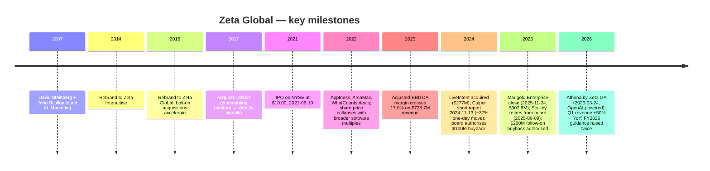
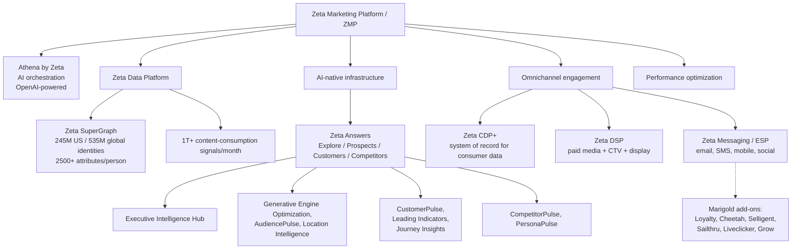
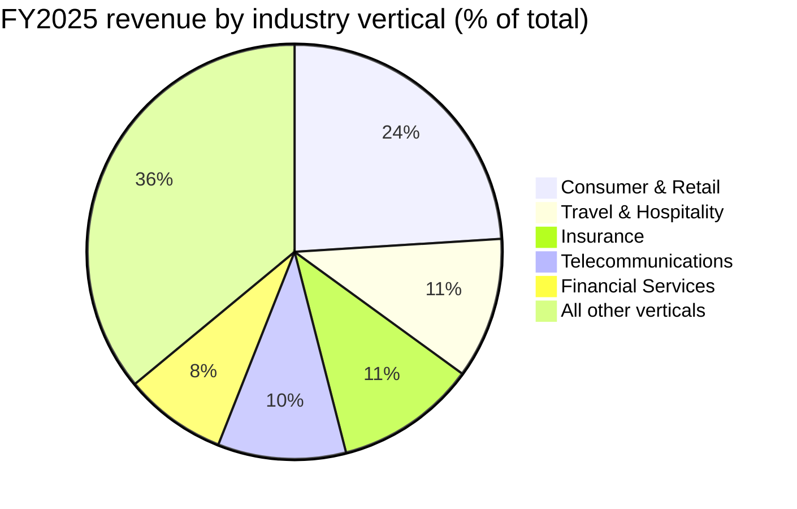
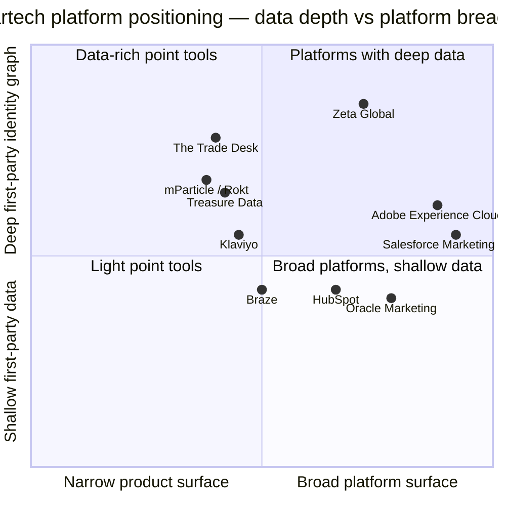
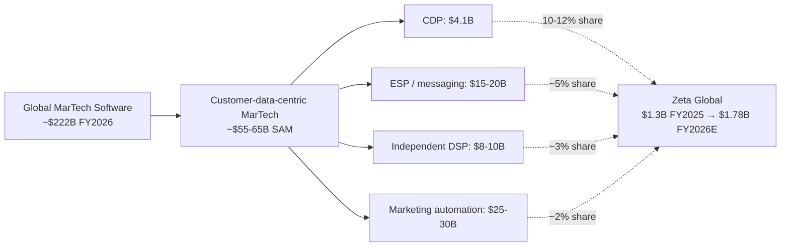

# COMPANY RESEARCH REPORT: Zeta Global Holdings Corp. (NYSE: ZETA)

**Date:** 2026-05-20
**Ticker:** NYSE: ZETA
**Headquarters:** 3 Park Avenue, 33rd Floor, New York, NY 10016
**Sector:** Software — Marketing technology / Customer data platform / Omnichannel marketing cloud

---

> **Update — FY2026 guidance raised (2026-04-30):** On the Q1-FY2026 release management raised full-year revenue guidance to **USD 1,779–1,792M** (midpoint $1,785M; up $30M from the prior $1,755M midpoint), implied YoY growth of **36–37%** (22–23% organic ex-political and ex-Marigold). Adjusted EBITDA guidance raised to **USD 396.2–398.4M** (margin 22.1–22.4%) and free-cash-flow guidance raised to **USD 234.5–235.5M**. Management also guided to **positive GAAP net income for full-year 2026** — the first such commitment since IPO. Driver: Q1 revenue beat by $26M (50% YoY, "Rule of 67"), accelerated Athena adoption ("greater than 7× more agent interactions, over 60% of AI platform usage in first week of GA") and faster-than-expected Marigold contribution.
> Source: [Q1-2026 earnings press release, 2026-04-30](https://www.sec.gov/Archives/edgar/data/0001851003/000119312526197172/zeta-ex99_1.htm).

---

## TABLE OF CONTENTS

1. Company Overview
2. Company History
3. Management Team
4. Products & Services
5. Customers & Go-to-Market
6. Industry Overview
7. Competitive Landscape
8. Market Opportunity (TAM)
9. Risk Assessment

---

## 1. Company Overview

Zeta Global Holdings Corp. ("Zeta") is an AI-powered, omnichannel marketing cloud that combines a customer data platform (CDP+), an email service provider (ESP), and a demand-side platform (DSP) inside a single subscription-and-usage-priced platform called the **Zeta Marketing Platform** ("ZMP"). The platform sits on a proprietary identity graph — the **Zeta SuperGraph™** — that, per management, holds attributes on more than **245 million U.S. individuals and more than 535 million globally** with an average of more than 2,500 attributes per person, ingesting over a trillion content-consumption signals per month ([Zeta Global 10-K FY2025, p. 1–2](https://www.sec.gov/Archives/edgar/data/0001851003/000119312526068598/zeta-20251231.htm)). Enterprises plug into the ZMP to acquire, grow and retain customers across email, paid media, CTV, mobile, web, chat and social — using Zeta's data, Zeta's AI models, and (since the March 2026 general-availability launch of **Athena by Zeta™**) a generative-AI orchestration layer powered by OpenAI ([Zeta + OpenAI press release, 2026-01-05](https://zetaglobal.com/news/zeta-global-and-openai-team-up-to-deliver-answer-driven-marketing-with-athena-by-zeta/)).

**How Zeta makes money.** Revenue is a blend of subscription fees, volume-based utilization (the marketing-spend that runs through the ZMP), and professional services. In FY2025, **74% of revenue was direct-platform** (revenue generated entirely on the ZMP) and **26% was integrated-platform** (revenue generated via API integration with third-party media or data partners — a meaningful structural distinction Culper Research challenged in November 2024 and Zeta has repeatedly defended) ([10-K FY2025, p. 41](https://www.sec.gov/Archives/edgar/data/0001851003/000119312526068598/zeta-20251231.htm)). Customers are classified into three tiers: **total customers** (2,651 at FY2025 year-end), **scaled customers** generating ≥$100k trailing-twelve-month revenue (602), and **super-scaled customers** generating ≥$1M TTM (184). Scaled customers represented **97%** of FY2025 revenue and super-scaled customers **87%** ([10-K FY2025, p. 40](https://www.sec.gov/Archives/edgar/data/0001851003/000119312526068598/zeta-20251231.htm)).

**Scale and growth profile.** FY2025 revenue of **USD 1,304.7M** was up **29.7% YoY** from $1,005.8M in FY2024 ([10-K FY2025, p. 44](https://www.sec.gov/Archives/edgar/data/0001851003/000119312526068598/zeta-20251231.htm)). Three-year revenue CAGR (FY2022 $591M → FY2025 $1,305M) was approximately 30%. Adjusted EBITDA grew to **USD 278.7M** (21.4% margin, up from 19.2% in 2024); GAAP net loss narrowed from $(69.8)M in 2024 to **$(31.5)M** in 2025, with management committing to **positive GAAP net income for FY2026** on the latest earnings call. Free cash flow generation has been a feature: operating cash flow of $198.9M in FY2025 ($133.9M in 2024) with capex/capitalised-software roughly $34M, implying mid-teens FCF margin. The company finished FY2025 with **$319.8M cash** and **net working capital of $256.3M**, against an **accumulated deficit of $(1,059.8)M** — the latter overwhelmingly the cumulative effect of stock-based-compensation expense ($177.8M in FY2025 alone) rather than cash losses ([10-K FY2025, p. 47–48](https://www.sec.gov/Archives/edgar/data/0001851003/000119312526068598/zeta-20251231.htm)).

Source: [Zeta Global 10-K filings FY2021 / FY2023 / FY2025](https://www.sec.gov/cgi-bin/browse-edgar?action=getcompany&CIK=0001851003&type=10-K&dateb=&owner=include&count=40); Adj EBITDA = Zeta's defined non-GAAP measure that adds back stock-based compensation, depreciation, acquisition expenses and other items.

**Geography and headcount.** Zeta is headquartered in New York City and runs a hybrid cloud spanning AWS / GCP / Azure plus self-hosted VMware/Docker/Kubernetes infrastructure. **Approximately 3,300 employees** at FY2025 year-end, with **~2,000 (60%+)** outside the U.S. — the offshore base concentrated in India and Europe with engineering hubs in the EU, UK and India alongside U.S. concentrations in NY and the Bay Area ([10-K FY2025, p. 7](https://www.sec.gov/Archives/edgar/data/0001851003/000119312526068598/zeta-20251231.htm)). The company holds a portfolio of more than 150 U.S. and international patents and applications (39 granted, 36 pending) heavy in AI/ML, data governance and identity ([10-K FY2025, p. 7](https://www.sec.gov/Archives/edgar/data/0001851003/000119312526068598/zeta-20251231.htm)).

**Valuation snapshot (close 2026-05-21).** Share price **USD 18.22**, equity market cap **USD 4.54B**, enterprise value **USD 4.50B** (modest net cash of c.$40M after $319.8M cash less senior secured term-loan balances) ([Yahoo Finance — ZETA key statistics, 2026-05-21](https://finance.yahoo.com/quote/ZETA/key-statistics)).

| Multiple (2026-05-21) | ZETA | HUBS | KVYO | BRZE | CRM |
|---|---|---|---|---|---|
| **P/S TTM** | **3.16x** | 3.10x | 3.43x | 3.46x | 3.48x |
| **EV/Revenue TTM** | **3.13x** | 2.72x | 2.79x | 3.06x | n/m |
| **EV/EBITDA TTM (adj.)** | **16.1x** | n/m | n/m | n/m | n/m |
| **Forward P/E** | **15.3x** | 50.0x | n/m | n/m | 22.7x |
| **GAAP P/E TTM** | **n/m (GAAP loss)** | 105.6x | n/m | n/m | 22.7x |

Sources: ZETA P/S, EV/Rev, EV/EBITDA, forward P/E from [Yahoo Finance / yfinance, 2026-05-21](https://finance.yahoo.com/quote/ZETA/key-statistics); peers from [Yahoo Finance, 2026-05-21](https://finance.yahoo.com/quote/HUBS/key-statistics); ZETA EV/EBITDA computed as EV $4.50B ÷ TTM Adj EBITDA $279M (FY25 + Q1-26 vs Q1-25 trued-up). GAAP TTM EBITDA is much lower because of $178M SBC, hence Yahoo's "EV/EBITDA 50.8x" reading.

Source: Historical adjusted closing prices from yfinance / Yahoo Finance, retrieved 2026-05-21; annotation dates from filings cited inline. IPO date 2021-06-10 per [Zeta IPO prospectus, S-1/A, 2021-06-09](https://www.sec.gov/Archives/edgar/data/0001851003/000119312521184625/d127716ds1a.htm).

**Why GAAP P/E is "n/m" and how to read the multiples.** Zeta has reported a GAAP net loss every year since IPO ($(31.5)M in 2025, $(69.8)M in 2024, $(187.5)M in 2023). The loss is driven by **stock-based compensation** of **$177.8M in 2025 / $195.0M in 2024 / $242.9M in 2023** ([10-K FY2025, p. 47](https://www.sec.gov/Archives/edgar/data/0001851003/000119312526068598/zeta-20251231.htm); [10-K FY2023, MD&A](https://www.sec.gov/Archives/edgar/data/0001851003/000095017024021671/zeta-20231231.htm)), which equates to **14% of revenue in 2025** (improving from 33% in 2023). Excluding SBC and acquisition costs, Adjusted EBITDA margin reached **21.4%** in 2025 with 22–22.4% guided for 2026. P/S of 3.16x is **below** every named martech peer (HUBS 3.1x, KVYO 3.4x, BRZE 3.5x, CRM 3.5x) despite a **superior revenue growth rate** (29.7% reported, 50% in Q1-FY2026, c.37% guided for full-year 2026 versus HUBS guiding mid-teens and KVYO/BRZE roughly 25%). The discount reflects (i) lingering Culper-related overhang and the unresolved Davoodi class action, (ii) a 26% integrated-platform revenue mix that some buy-side investors discount as lower-quality "media pass-through," (iii) the persistent GAAP loss optics, and (iv) execution risk on the November 2025 Marigold integration. We treat the relative valuation as compressed rather than expensive — but the multiple-compression risk and short-thesis overhang are explicit risks in Section 9.

Source: [Yahoo Finance ZETA key statistics, 2026-05-21](https://finance.yahoo.com/quote/ZETA/key-statistics) and equivalents for HUBS, KVYO, BRZE, CRM.

---

## 2. Company History

David A. Steinberg and John Sculley founded the company that became Zeta Global in **2007** as "**XL Marketing**." Steinberg had recently sold his second venture, **InPhonic** (a public online wireless retailer, IPO 2004 — later bankrupt under his successor), and was looking for the next vehicle to commercialize what he framed in interviews as the "precision over reach" thesis in consumer marketing. Sculley — former Pepsi president and CEO of Apple from 1983–1993, where he had presided over the launch of the Macintosh and the famous boardroom split with Steve Jobs — joined as co-founder, contributing both consumer-marketing pedigree and institutional credibility ([Zeta Global — Our Story](https://zetaglobal.com/about/our-story/); [Wikipedia: David A. Steinberg](https://en.wikipedia.org/wiki/David_A._Steinberg)). The company rebranded to **Zeta Interactive** in 2014, then to **Zeta Global** in **October 2016**, by which point the core thesis had crystallised around building a "people-based" marketing data cloud anchored to first-party identity rather than the third-party-cookie ecosystem.

Zeta has grown predominantly through acquisition. Pre-IPO it absorbed eBay's enterprise CRM business (2015), **Disqus** (2017 — the commenting platform that supplies a large slice of Zeta's first-party identity signal), and a series of bolt-on agencies and data firms (Acxiom Impact, Boomtrain, Sigma Marketing, etc.). The company went public on the NYSE on **June 10, 2021** at a $10 listing price, raising c.$87.5M ([Zeta IPO 8-K, 2021-06-10](https://www.sec.gov/cgi-bin/browse-edgar?action=getcompany&CIK=0001851003&type=8-K&dateb=20211231&owner=include&count=40)). Post-IPO acquisitions tracked the ZMP product map: **Apptness** (2022, mobile data assets), **ArcaMax** (2022, opt-in publisher inventory), **WhatCounts** (2022, mid-market email), **Vital Digital** (2023, attribution / measurement), **Kinetic Data Solutions** (2023, B2B identity), **LiveIntent** (closed 2024-10-21, $277M total consideration — the largest deal pre-Marigold, adding people-based mobile and email identity), and finally **Marigold's Enterprise Business** (signed 2025-09-27, closed **2025-11-24**, fair-value consideration **$302.8M** including 5,329,070 shares of Class A common stock and seller notes; goodwill of $207.9M plus $144.2M of identified intangibles) ([10-K FY2025, Note 7 Acquisitions, p. 73–74](https://www.sec.gov/Archives/edgar/data/0001851003/000119312526068598/zeta-20251231.htm); [Zeta + Marigold acquisition press release, 2025-09-27](https://zetaglobal.com/news/zeta-global-to-acquire-marigolds-enterprise-business/)). Marigold's Enterprise Business comprised the **Cheetah Digital, Selligent, Sailthru, Liveclicker, Grow, and Marigold Loyalty** brands — enterprise-grade email, loyalty and personalization software with ~$210M of pro-forma annual revenue at the time of close, materially expanding Zeta's footprint with Fortune 500 brands and subscription-heavier revenue ([Zeta closes Marigold, 2025-11-24](https://www.sec.gov/Archives/edgar/data/0001851003/000119312525293671/zeta-ex99_1.htm)).

**Strategic pivots.** The most consequential pivot was the rebuilding of the platform around **first-party deterministic identity** between 2018–2022. Steinberg correctly anticipated that Apple's ATT (2021), Chrome's third-party-cookie deprecation (a moving target through 2024–2025), and tightening U.S. state privacy laws would erode the unverified-cookie ad-tech model that supported the early business. The 2017 Disqus deal — a money-losing commenting platform on the surface — was rationalised internally as a recurring source of opt-in identity signal. The 2024 LiveIntent and 2025 Marigold deals push the company further into **deterministic** (email-keyed, loyalty-program-keyed) identity. The second pivot, in 2024–2026, was the layering of **generative AI** into the platform via **Zeta Answers** and now **Athena**. Management's framing on the Q1-FY2026 call ("AI-driven replacement cycle") repositions Zeta from a workflow-tool vendor to a horizontal "marketing operating system" play.

**Recent developments (last 12 months).** The most material events since mid-2025 are (i) the **Marigold acquisition** ($302.8M, closed 2025-11-24) which carries Marigold's enterprise customer book into 2026 and explains the bulk of Q1-2026's 50% revenue growth print; (ii) the **Athena by Zeta** general-availability launch (2026-03-24) and the OpenAI partnership announced at CES 2026 (2026-01-05), which materially accelerated platform engagement (>7× agent interactions, >60% of AI usage in week 1 per the Q1-2026 release); (iii) the **2025 SRP authorisation** of an additional $200M buyback in July 2025 on top of the November 2024 $100M program ([10-K FY2025, p. 36](https://www.sec.gov/Archives/edgar/data/0001851003/000119312526068598/zeta-20251231.htm)); (iv) **John Sculley's retirement** from the board on 2025-06-09 (the company now leans on Imran Khan, William Landman and Robert Niehaus as senior independent voices); and (v) ongoing **Davoodi v. Zeta Global Holdings Corp.** putative-class-action litigation in the Southern District of New York (Case 24-cv-08961), seeded by the Culper report (covered in Section 9).

---

## 3. Management Team

### David A. Steinberg — Co-Founder, Chairman & Chief Executive Officer (age 56)

Steinberg is the indispensable bio at Zeta and the single most consequential person at the company by a wide margin. He has been CEO since founding **and**, through Class B super-voting stock held in a stack of LLCs and family trusts, controls **51.4% of voting power** despite owning only **0.5% of Class A and 100% of Class B shares (which translates to ~10.5% of economic interest)** — meaning his voting control is more than 5× his economic stake ([2026 DEF 14A — Security Ownership of Beneficial Owners and Management, p. 44–46](https://www.sec.gov/Archives/edgar/data/0001851003/000119312526177408/zeta-20260424.htm)). Founder-led, founder-controlled, founder still buying stock (he and the senior team bought ~$3M of Class A in the open market on 2024-11-18 to rebut the Culper report). All of this matters because the integrity of Zeta's reporting and the credibility of its rebuttals to short-seller allegations turn substantially on Steinberg's personal track record.

That track record is mixed and worth telling in full. Steinberg grew up in suburban Maryland, took a BA in Economics from Washington & Jefferson College, and founded his first business — **Sterling Cellular** — in 1993 in his parents' basement with credit-card debt and a parental loan; the business grew to $1.3M in first-year revenue selling cellular phones at retail. He sold Sterling in the late 1990s and in 1999 founded **InPhonic**, an online wireless retailer that he took public on Nasdaq in 2004 at a roughly $300M valuation in one of the larger tech IPOs of that vintage. InPhonic peaked at over a $1B market cap before unraveling under accounting and customer-rebate problems; Steinberg resigned as CEO in 2007 and the company filed Chapter 11 in November 2007. The Chapter 11 — and an SEC enforcement action against InPhonic (settled, no Steinberg personal charges) — are the historical backdrop short-sellers have repeatedly cited when questioning Zeta's accounting culture. Steinberg has been transparent about the InPhonic chapter publicly and has framed Zeta as the lessons-learned vehicle (deterministic data, audited at a Big-Four level, controlled cash burn) ([Wikipedia: David A. Steinberg](https://en.wikipedia.org/wiki/David_A._Steinberg); [BBNTimes — Steinberg profile, 2024](https://www.bbntimes.com/technology/david-a-steinberg-serial-entrepreneur-data-visionary-and-the-ceo-who-turned-zeta-global-into-a-billion-dollar-ai-marketing-platform)). He has also chaired CAIVIS Investment Company and Kica Investments and is involved in On Demand Pharmaceuticals, though Zeta is the dominant role ([DEF 14A 2026, p. 11](https://www.sec.gov/Archives/edgar/data/0001851003/000119312526177408/zeta-20260424.htm)).

Steinberg's FY2025 total compensation per the Summary Compensation Table was dominated by equity (the actual Salary line is in the low-mid $XX hundreds of thousands; the "All Other" line includes a $337,500 corporate apartment, $66,159 in club fees, and $60,000 of executive healthcare — perquisites that exceed many peer-CEO equivalents and that critical investors have flagged) ([DEF 14A 2026, p. 27–29](https://www.sec.gov/Archives/edgar/data/0001851003/000119312526177408/zeta-20260424.htm)). His target bonus was 100% of base. His 2023 PSU grant pays 0–300% of target based on Class A share price hitting VWAP thresholds across the 20 trading days ending each fiscal quarter through Q4-2027 — i.e., the largest single comp lever is a hyper-stock-price-linked PSU. Long-tail change-in-control protection is generous (2× base + target bonus lump-sum, full vest), again typical of founder-CEO contracts but worth noting.

### Christopher Greiner — Chief Financial Officer (age 50)

Greiner has been CFO since **2020**, joining in the run-up to the 2021 IPO. He came from **LivePerson** where he was CFO 2018–2020, and prior to that spent five years at **Inovalon** (cloud healthcare analytics) first as Chief Product & Operations Officer and then CFO. He started his career at **IBM** (1999–2012) and **Computer Sciences Corporation** (2012–2013). BBA in Finance and Economics from **Baylor University** ([DEF 14A 2026, p. 11](https://www.sec.gov/Archives/edgar/data/0001851003/000119312526177408/zeta-20260424.htm)). Greiner has been the public-facing financial voice through both the IPO and the Culper episode, and the November 2024 forensic-review and webinar response was structured around him and Audit Committee chair Robert Niehaus presenting accounting evidence directly. Material to note: Greiner has a Class A position of ~97k shares ([DEF 14A 2026, p. 45](https://www.sec.gov/Archives/edgar/data/0001851003/000119312526177408/zeta-20260424.htm)) — modest in dollar terms but he has held it through the Culper drawdown.

### Steven Gerber — President (age 56)

Gerber has been President since **2009** — i.e. he is effectively a co-founder by tenure. He oversees day-to-day operations: product development, business development, customer success and operations sit under him. Prior to Zeta he was SVP at Tranzact LLC and held roles at Bain & Company and Digitas LLC. BA from Northwestern and MBA from Columbia ([DEF 14A 2026, p. 11](https://www.sec.gov/Archives/edgar/data/0001851003/000119312526177408/zeta-20260424.htm)). Gerber owns roughly 100,750 shares of Class A directly via the Evergreen Revocable Trust. He is the operating muscle behind Steinberg's external-facing CEO role.

### Christian Monberg — Chief Technology Officer and Head of Product

Monberg is the public-facing technical voice on Zeta SuperGraph, Athena and the AI architecture. He is not a named-executive-officer in the proxy, but is consistently cited in press releases and investor materials as the technology lead. He joined Zeta in 2016, and prior to that ran engineering at NextRoll/AdRoll. He has been the architect publicly identified with the GenAI / Athena product line ([Zeta Global launches Athena GA, 2026-03-24](https://zetaglobal.com/news/zeta-globallaunchesathena-by-zetafor-general-availability-ushering-in-the-superintelligent-marketingera/)).

### Governance

- **Board (7 directors, 6 independent):** Steinberg (Chairman), Jené Elzie, Imran Khan, William Landman, Robert Niehaus, William Royan, Jeanine Silberblatt ([DEF 14A 2026, p. 13–14](https://www.sec.gov/Archives/edgar/data/0001851003/000119312526177408/zeta-20260424.htm)). John Sculley retired from the board on 2025-06-09 and was granted 18,718 restricted stock awards for advisory-board service, vesting quarterly through 2027-01-01 — a related-party transaction disclosed in the 2026 proxy.
- **Voting structure:** Dual-class, Class A 1 vote, Class B 10 votes. **Steinberg holds 51.4% of voting power** despite ~10.5% of economic interest. **BlackRock is the largest Class A holder at 6.6%.** The dual-class structure has a "Sunset Date" trigger but no fixed deadline in the proxy; the structural over-control is permanent until Steinberg sells or the Sunset triggers.
- **Audit Committee:** Chaired by Robert Niehaus (career private-equity, Greenhill Capital Partners founder). Niehaus personally fronted the November 20, 2024 disclosure of the 2022–2023 Latham & Watkins forensic review — a credibility-positive signal that an independent senior director was willing to put his name on the controls statement.
- **Auditor:** Deloitte & Touche LLP. The 2024–2025 audit opinions were both unqualified, with no material weaknesses in ICFR. (Culper's report inaccurately identified the auditor as "E&Y," a factual error Zeta corrected in its first 2024-11-13 response.)
- **Insider activity (last 12 months):** Steinberg and senior leadership purchased ~$3M of Class A on 2024-11-18 in the immediate aftermath of the short report; the company executed $121M of share repurchases under the 2024/2025 SRPs through year-end 2025. **There has been no material insider selling outside of vesting-related tax withholding** through Q1-FY2026.

### Management track-record synthesis

This team has scaled the business from $368M (FY2020) to $1.3B (FY2025) revenue at a 28%+ CAGR with adjusted-EBITDA-margin expansion of c.500–600bps and now positive cumulative free cash flow. The Culper episode tested the team in the harshest possible way — concentrated short attack on a US$2-3B equity already battered by software-multiple compression — and the response (Big-Four-audit reaffirmation, forensic-review disclosure, insider buying, capital return) was textbook. The two material gaps are (i) Steinberg's historical association with InPhonic's collapse, which never quite goes away for skeptical investors, and (ii) a comp structure that is unusually founder-friendly even by founder-CEO standards (perquisites, change-in-control terms, dual-class voting). Both are governance risks rather than execution risks.

---

## 4. Products & Services

Zeta's product is the **Zeta Marketing Platform (ZMP)** — sold as a single platform with three core "channel" products (ESP, CDP+, DSP) plus an intelligence module (Zeta Answers) and an AI orchestration layer (Athena). The ZMP runs on the **Zeta Hybrid Cloud**, an AWS/GCP/Azure plus self-hosted Kubernetes architecture, and is positioned on four pillars: **(1) data platform**, **(2) AI-native infrastructure**, **(3) omnichannel engagement**, and **(4) performance optimization** ([10-K FY2025, p. 1–4](https://www.sec.gov/Archives/edgar/data/0001851003/000119312526068598/zeta-20251231.htm)).

Source: Product list compiled from [10-K FY2025, p. 1–4](https://www.sec.gov/Archives/edgar/data/0001851003/000119312526068598/zeta-20251231.htm) and [zetaglobal.com platform pages](https://zetaglobal.com/).

### Athena by Zeta — AI orchestration layer (flagship 2026)

**What it does.** Athena is the AI-native interface and orchestration layer that sits atop the ZMP. It collects context from user activity, data inputs and business objectives, then routes requests to relevant AI models and agent-based applications. The first two agentic apps are **Insights** (conversational analytics — natural-language Q&A on enterprise data) and **Advisor** (goal-based optimization). Athena is powered by a strategic collaboration with **OpenAI**, announced at CES 2026 on 2026-01-05, and entered general availability on 2026-03-24 ([Athena GA press release, 2026-03-24](https://zetaglobal.com/news/zeta-globallaunchesathena-by-zetafor-general-availability-ushering-in-the-superintelligent-marketingera/)).

**Competitive-advantage verdict — yes, partial moat (data + integration).** Athena itself is a thin LLM-orchestration layer; the moat sits in the underlying Zeta SuperGraph identity data and the years of customer-specific signal that have been ingested. Closest comparable products: **Salesforce Agentforce** (broader CRM-tied but lighter on first-party identity-graph depth), **HubSpot Breeze** (SMB / mid-market focus), **Adobe AI Assistant / Firefly for Marketing**. On the Q1-FY2026 call, management disclosed **>7× agent interactions and >60% of AI platform usage in Athena's first week of GA** — a credible early-engagement print, though it is too early to translate this into incremental ARR.

### Zeta SuperGraph + Data Platform — core moat

**What it does.** The deterministic identity graph holding 245M U.S. / 535M global individuals with average 2,500+ attributes each, ingesting >1 trillion content-consumption signals per month. The graph is fed by (i) opt-in publisher inventory (Disqus, ArcaMax, etc.), (ii) acquired data partnerships (LiveIntent's email-keyed graph, Marigold's loyalty-program data), and (iii) customer first-party data piped through the CDP. The principal short-seller critique (Culper, November 2024) was directed precisely here — claiming the graph was inflated by "consent farm" sham websites and pointing to ArcaMax and Apptness as the alleged sources. Zeta's rebuttal, repeated in formal SEC filings and in the November 20, 2024 webinar with Audit Committee chair Niehaus, was that those two acquisitions together represented **<3% of YTD 2024 revenue and <1% of total data assets**, with declining trend ([Zeta response, 2024-11-13 8-K, EX-99.1](https://www.sec.gov/Archives/edgar/data/0001851003/000095017024126709/zeta-ex99_1.htm)). For investors taking the company at its word, the moat is real and reinforced by every subsequent first-party-keyed acquisition; for investors taking Culper's view, the moat is structurally questionable. We treat the moat as **partial** given the documented Forrester / Gartner / IDC rankings (Section 4 below) — independent third parties have repeatedly evaluated the underlying technology favourably — but flag the supply-side / data-provenance question as a live risk (Section 9).

**Competitive-advantage verdict — yes, structural moat (data + scale + switching costs).** Comparable products: **Salesforce Data Cloud** (largest by revenue, weaker on independent identity signal), **Adobe Real-Time CDP** (strongest in legacy Adobe shops), **Treasure Data**, **mParticle**, **Segment (Twilio)** — each strong in their adjacency but none combine the publisher-side signal collection + DSP buying side that Zeta runs internally. Forrester named Zeta a **Strong Performer** in its first-ever Q3 2024 B2C CDP Wave with highest possible scores in six criteria ([Forrester Wave: CDPs for B2C, Q3 2024, via Zeta](https://zetaglobal.com/resource-center/zeta-recognized-forrester-cdp-wave/)).

### Zeta Messaging (ESP) — flagship channel product, sales accelerator

**What it does.** End-to-end email marketing service provider (segmentation, automation, real-time content personalization, deliverability) extending into SMS, mobile push and social channel orchestration. This is the largest single revenue contributor by use-case and the most legible to enterprise buyers (replacing Salesforce Marketing Cloud / Oracle Responsys / Acoustic / Mapp / Cheetah Digital — the last of which Zeta now owns post-Marigold). Forrester named Zeta a **Leader** in the Q3 2024 ESP Wave for the third straight time, with the highest Current Offering score and highest possible scores across 13 criteria ([Forrester Wave: Email Marketing Service Providers, Q3 2024](https://zetaglobal.com/resource-center/zeta-named-a-leader-2024-forrester-wave-email-marketing-service-providers/)). In Q1 2026 Forrester re-tested and again named Zeta a Leader ([Forrester Wave EMSP Q1 2026, via Zeta](https://zetaglobal.com/forrester-wave-esp-2024/)).

**Competitive-advantage verdict — yes, scale + switching-cost moat.** ESPs are notoriously sticky once configured into a customer's CRM. Closest competing products: **Salesforce Marketing Cloud (Marketing Cloud Engagement)**, **Klaviyo** (SMB / mid-market e-commerce strength), **Braze** (mobile-first, push/messaging focus), **HubSpot Marketing Hub** (SMB / inbound bias), **Oracle Eloqua/Responsys**. Zeta is **at or ahead of parity** with Salesforce per Forrester scoring and is **substantially ahead of Klaviyo/Braze on data-graph depth** but behind on developer-led mobile-first product design.

### Zeta CDP+ — system of record

**What it does.** Single customer view, real-time identifier resolution, anonymous-visitor de-anonymisation against the SuperGraph, custom data schemas. The "+" denotes Zeta's framing that the CDP is bundled with the activation layer rather than sitting as a standalone hub.

**Competitive-advantage verdict — partial moat.** The CDP category itself is commoditising fast. Treasure Data, mParticle (now Rokt), Segment (Twilio), Tealium are credible standalone options; Salesforce Data Cloud and Adobe Real-Time CDP are bundled at much larger scale. Zeta's edge is **only** the depth of the SuperGraph; without that, the CDP is at-parity at best. Closest competing product: **Salesforce Data Cloud — at parity on enterprise CDP feature set, behind Zeta on third-party identity reach.**

### Zeta DSP — paid-media activation

**What it does.** Programmatic demand-side platform — display, video, CTV, social — running off the same SuperGraph identifiers. This is where Zeta competes most directly with The Trade Desk (TTD) and Google DV360.

**Competitive-advantage verdict — partial moat (data, not scale).** The DSP arena is dominated by The Trade Desk and Google; Zeta is materially smaller on raw spend volume but differentiates on integrated data + activation in one workflow. Closest competing product: **The Trade Desk Kokai — ahead on scale and independence positioning; Zeta ahead on customer-data integration for 1P-heavy advertisers.**

### Zeta Answers — intelligence suite

**What it does.** Four-module intelligence pack (**Explore**, **Prospects**, **Customers**, **Competitors**) sold either on a licensing fee or per-utilization basis. Applications include Executive Intelligence Hub, Generative Engine Optimization, AudiencePulse, Location Intelligence, CustomerPulse, Leading Indicators, Journey Insights, CompetitorPulse, PersonaPulse. Per the 10-K, Zeta Answers is "a proven way to land scaled customers, with minimal cost of implementation and high value adoption" — i.e., it is the wedge that the sales team uses to enter accounts before broader ESP/CDP/DSP deployment.

**Competitive-advantage verdict — yes (early), driven by integration.** Closest competing products: **HubSpot Breeze Intelligence**, **Adobe Customer AI**, **Salesforce Einstein** — all strong individually but tied to their respective walled gardens. Zeta Answers' edge is that it runs cross-platform and ties to a richer first-party identity layer than any of those.

### Acquired product portfolio (Marigold Enterprise — added 2025-11-24)

The Marigold acquisition added five distinct enterprise brands:
- **Cheetah Digital** — enterprise email + loyalty (founded 2017 spin-out of Experian Marketing Services)
- **Selligent** — EU-strong email and journey-orchestration tool
- **Sailthru** — content-personalization and email
- **Liveclicker** — real-time email content (open-time personalization)
- **Grow** — loyalty platform
- **Marigold Loyalty** — enterprise loyalty engine

These overlap heavily with Zeta's existing ESP, so the integration thesis is rationalization rather than greenfield extension — but they bring **subscription-heavier revenue** and **Fortune-500 customers** that Zeta did not previously serve at scale (notably in EU and APAC) ([Marigold acquisition deck, 2025-11-24](https://www.sec.gov/Archives/edgar/data/0001851003/000119312526041153/zeta-ex99_3.htm)).

### Flagship vs. long-tail

The 1–3 products driving the business are **(1) Zeta Messaging / ESP**, **(2) Zeta DSP**, and **(3) Zeta Answers / Athena** — together comprising the bulk of revenue, with CDP+ functioning as the connective layer. Marigold's loyalty stack is the most material new product family, expected to drive a step-function in subscription-mix percentage through 2026.

### Recent launches / sunsets (last 12 months)

- **Athena by Zeta** — beta Jan 2026, general availability Mar 24, 2026 (flagship)
- **OpenAI + Zeta strategic partnership** — Jan 5, 2026
- **Marigold Enterprise integration** — closed 2025-11-24; product roadmap consolidation through 2026
- **LiveIntent integration completion** — purchase-price allocation finalised in 2025
- No publicly announced product sunsets in the period

---

## 5. Customers & Go-to-Market

### Customer segments and profile

Zeta serves enterprises across consumer-facing verticals. The 10-K discloses FY2025 revenue concentration by vertical: **consumer & retail 24%, travel & hospitality 11%, insurance 11%, telecommunications 10%, financial services 8%** (sum 64%, with the remaining 36% spread across automotive, healthcare, media, political/advocacy, and B2B) ([10-K FY2025, p. 5](https://www.sec.gov/Archives/edgar/data/0001851003/000119312526068598/zeta-20251231.htm)). Notable named customers from case studies and press: **Toyota** (360% conversion-rate lift case study), **United Airlines** (MileagePlus 10× ROI case study), and a long list of consumer brands including General Mills, Mitsubishi Motors, Renault Poland, Samsung, and Sprint cited in Wikipedia profiles ([Zeta Global Wikipedia, accessed 2026-05-21](https://en.wikipedia.org/wiki/Zeta_Global); [Toyota case study](https://zetaglobal.com/resource-center/case-studies/how-toyota-increased-conversion-rates-by-360-with-individualized-omnichannel-engagement/)). Marigold adds a Fortune-500 enterprise book (Cheetah/Selligent customers) the company has historically lacked.

### Customer tier disclosures

- **Total customers:** 2,651 (FY2025) vs 1,793 (FY2024) — up 48% YoY largely from Marigold close
- **Scaled customers (≥$100k TTM revenue):** 602 (FY2025) vs 527 (FY2024) — up 14%, representing **97%** of FY2025 revenue
- **Super-scaled customers (≥$1M TTM revenue):** 184 (FY2025) vs 148 (FY2024) — up 24%, representing **87%** of FY2025 revenue
- **Q1-FY2026 super-scaled count:** 189 (Q1 disclosure only, going forward — scaled metric retired) ([Q1-2026 release, 2026-04-30](https://www.sec.gov/Archives/edgar/data/0001851003/000119312526197172/zeta-ex99_1.htm))

Source: [10-K FY2025, p. 40](https://www.sec.gov/Archives/edgar/data/0001851003/000119312526068598/zeta-20251231.htm).

### Customer concentration — quantified

**Top 10 customers accounted for >1/3 of FY2025 revenue, with one customer >10% of revenue** — disclosed verbatim in the risk-factors section of the 2025 10-K ([10-K FY2025, p. 11](https://www.sec.gov/Archives/edgar/data/0001851003/000119312526068598/zeta-20251231.htm)). Zeta does not name the >10% customer. Top-5 customer share is not separately disclosed; based on a top-10 sum of "more than one-third" and a single >10% customer, an inference is that the **top 5 are likely 25–28% of revenue** and the **top 10 are 34–40%**. Vertical concentration is also worth flagging: the top 5 verticals (consumer-retail, travel, insurance, telecom, finance) drive 64% of revenue, so any synchronised marketing-budget cut across two of these verticals (e.g., recession-induced retail + travel pullbacks) is a real exposure.

Source: [10-K FY2025, p. 5 "Our Customers"](https://www.sec.gov/Archives/edgar/data/0001851003/000119312526068598/zeta-20251231.htm).

**Contract structure.** Subscription contracts typically quarterly or annual; many large-customer relationships are master agreements with both fixed-fee and usage-based components. Critically, the 10-K notes that customer contracts **"do not include automatic renewal or exclusive obligations"** — i.e., super-scaled customers can move spend in or out without penalty. The flip side is the disclosed FY2025 **net revenue retention of 128.0%** (ex-political), up from 113.6% in FY2024 — extraordinary for a company at this scale and a key reason the platform is repeatedly described as "indispensable" rather than discretionary by the buy side. NRR of 128% effectively means a 28% same-customer revenue lift YoY before any new-logo wins.

### Channels per customer (cross-sell evidence)

- **Channels per scaled customer:** 2.3 (both FY2025 and FY2024)
- **Channels per super-scaled customer:** 3.3 (FY2025) vs 3.0 (FY2024) — up 10%

Material because the "land, expand, extend" sales model depends on widening channel-use within accounts, and this metric is the cleanest evidence the model is working at the super-scaled tier ([10-K FY2025, p. 39](https://www.sec.gov/Archives/edgar/data/0001851003/000119312526068598/zeta-20251231.htm)).

### Sales motion and team

**Direct enterprise sales** is the dominant channel — ~3,300 employees in total at FY2025 year-end with **+36 net sales hires during 2025** and continued investment planned in 2026 ([10-K FY2025, p. 38](https://www.sec.gov/Archives/edgar/data/0001851003/000119312526068598/zeta-20251231.htm)). Sales is organised on a hunter/farmer split (new business vs. account growth) with industry-vertical specialisation in the farmer pods. The Zeta Answers suite serves as the "wedge" land product because of fast deployment and low upfront integration cost.

### Customer-tenure profile

For FY2025, **5+ year super-scaled customers** (90 of 184, 49% of count) drove **68.2% of super-scaled revenue** — exceptional stickiness once a customer enters the super-scaled tier. **Under-1-year super-scaled** customers are only 6.5% of super-scaled count and 4.5% of super-scaled revenue, indicating most super-scaled customers were earlier acquired as scaled (then matured) rather than landed cold ([10-K FY2025, p. 39](https://www.sec.gov/Archives/edgar/data/0001851003/000119312526068598/zeta-20251231.htm)).

### Channel partnerships

Limited reseller channel. Strategic partnerships include the recent **OpenAI** technology partnership for Athena (announced 2026-01-05) and integrations with the major cloud providers (AWS, GCP, Azure). The company maintains "extensive relationships with many marketing agencies and enterprises" per the 10-K but does not disclose specific agency-partner economics.

### Geographic mix

Geographic disclosure is light. Per the 10-K, ~2,000 of 3,300 employees are outside the U.S., engineering hubs in India / EU / UK, with offices in the U.S. (NY, Bay Area) and Europe. Marigold materially enlarged EU revenue exposure. Zeta does not separately report revenue by geographic segment in the 10-K (operates as a single segment under ASC 280); pro-forma Marigold-included international mix is probably mid-teens % of revenue.

---

## 6. Industry Overview

Zeta operates inside the broader **marketing technology ("martech") cloud** stack, with specific exposure to four sub-segments: **(1) email service providers (ESPs)**, **(2) customer data platforms (CDPs)**, **(3) demand-side platforms (DSPs)** within programmatic advertising, and **(4) marketing automation / cross-channel orchestration suites**. The relevant NAICS code is 5112 (Software Publishers), with marketing/CRM software the cleanest sub-segment.

### Market size — multiple credible estimates

Estimates vary widely depending on whether the addressable scope includes adjacent ad-tech, sales-tech and analytics tooling, but the directional picture is consistent: large, fast-growing, north-American-led.

- **Broad MarTech market (all-in):** ~**USD 558B in 2025, growing to ~USD 3.3T by 2035 at 19% CAGR** per Precedence Research ([Precedence Research — Martech Market](https://www.precedenceresearch.com/marketing-technology-market)). This is the headline-grabbing number used in industry press; it bundles services and adjacencies.
- **Tighter MarTech software market:** **USD 198B in 2025, USD 222B in 2026, USD 569B by 2034 at 12.5% CAGR** per Fortune Business Insights ([Fortune Business Insights — Martech Market](https://www.fortunebusinessinsights.com/martech-market-111523)).
- **MarketsandMarkets estimate:** **USD 176B in 2025 → USD 297B by 2030, 11.0% CAGR** ([MarketsandMarkets, 2025-05](https://www.marketsandmarkets.com/PressReleases/martech.asp)).
- **Customer Data Platform (CDP) sub-segment** — the most directly relevant: **USD 3.3B in 2025 → USD 4.1B in 2026 → USD 17.0B by 2034 at 19.6% CAGR**, North America 59.6% share ([Fortune Business Insights — CDP Market](https://www.fortunebusinessinsights.com/industry-reports/customer-data-platform-market-100633)).

For valuation work we focus on the tighter MarTech software definition and the CDP sub-segment. Zeta's $1.3B revenue versus the ~$200B addressable martech software pool implies **<1% penetration of a market growing at 12.5% per year**; even within the CDP sub-segment Zeta is roughly 10–15% market share (the CDP-only revenue is a subset of total Zeta revenue), implying meaningful headroom.

### Key trends and drivers (2024–2026)

1. **Generative-AI-driven replacement cycle.** Marketing teams that built their tech stacks on workflow-tool foundations (email + CRM + analytics) are increasingly looking to consolidate around AI-native orchestration layers (Salesforce Agentforce, HubSpot Breeze, Adobe AI Assistant, Zeta Athena). Steinberg has been explicit on Q1-FY2026 call that Zeta is positioning as "the disruptor in the AI driven replacement cycle." This trend favours platform vendors with integrated data + AI over point-tool vendors.
2. **Death (and resurrection) of the third-party cookie.** After multiple postponements, Chrome's third-party-cookie deprecation has settled into an opt-out rather than full-removal regime, but the broader regulatory and Apple-ATT pressure on cross-site tracking is structural. The winners are vendors with first-party deterministic identity — which is precisely Zeta's positioning.
3. **Privacy-law fragmentation.** CCPA + 18+ U.S. state privacy laws + the California Delete Act (enforceable August 2026) + GDPR/UK GDPR + the EU AI Act + DSA + DMCCA + EU NIS2 / Data Act — compliance overhead is a near-permanent tax on every martech vendor. Larger platforms with embedded compliance tooling enjoy a relative advantage versus point-tool vendors.
4. **Channel proliferation.** CTV (Connected TV) is now table stakes. Retail-media networks (RMN — Walmart Connect, Amazon Ads, Kroger Precision, etc.) are reshaping how brands buy media. Channels-per-customer growth (Zeta: 2.3 scaled, 3.3 super-scaled and rising) is a structural KPI for every vendor.
5. **Vendor consolidation / "marketing-cloud" replacement cycle.** Many Fortune 500 customers are stuck on legacy Salesforce Marketing Cloud or Oracle Responsys instances bought 8–15 years ago; the cycle to replace those with modern data-first platforms is in early innings. Zeta's Marigold acquisition is partly a play to be the consolidator in this swap-out.
6. **Pricing model evolution.** From pure-subscription toward consumption / outcomes-based. Zeta's 74% direct / 26% integrated mix and its mix of subscription + utilization-based pricing position it well as customers demand more outcome accountability.

### Industry structure

The market is **highly fragmented** with thousands of point-tool vendors (Scott Brinker's annual MarTech Landscape map shows >13,000 vendors at 2024 vintage). Consolidation is happening but slowly — recent precedent transactions include Salesforce's $28B acquisition of Slack (2021), Adobe's failed $20B Figma deal (2022, abandoned), and on the smaller end Twilio buying Segment ($3.2B, 2020). For platform-scale martech-cloud vendors, the competitive set narrows to a handful: Salesforce, Adobe, Oracle, Microsoft Dynamics 365, SAP CX. In the modern pure-play CDP/ESP/messaging segment: HubSpot, Klaviyo, Braze, Zeta, mParticle (now Rokt), Treasure Data, Tealium.

### Regulatory environment

The most material live items in 2026:
- **California Delete Act** (enforceable Aug 2026) — adds compliance obligations around consumer deletion requests across all data brokers
- **EU AI Act** — risk-tier governance for AI in marketing including content/decision systems
- **EU Digital Services Act + UK DMCCA** — content-hosting and consumer-protection layers
- **EU NIS2 / Data Act** — cloud services interoperability and switching-cost regulation
- **State-level US privacy laws** — Virginia, Colorado, Connecticut, Utah, Texas, Oregon, Montana, Iowa, Tennessee, Indiana, Florida, Delaware, New Jersey, New Hampshire — and ongoing additions
- **Section 5 FTC enforcement** on biased AI / dark patterns
- **State of Texas / federal advertising-ID litigation** ongoing

Compliance cost is a meaningful tax for the entire industry — and a relative advantage for at-scale vendors like Zeta that can amortise lawyers and privacy engineers across $1B+ revenue.

---

## 7. Competitive Landscape

Positioning is qualitative, drawing on the Forrester Wave Q3 2024 (ESP and B2C CDP), Gartner Magic Quadrant Q4 2024 (Multichannel Marketing Hubs), IDC MarketScape, and company filings; ranges are estimates.

### Direct competitors

1. **Salesforce Marketing Cloud (CRM ticker, $144B market cap)** — the incumbent. Salesforce Marketing Cloud (now branded "Marketing Cloud Engagement" / "Marketing Cloud Personalization" / "Data Cloud" + Agentforce) is the broadest platform in the category and the most common vendor Zeta is displacing in RFPs. Stronger on enterprise integration with Sales Cloud; weaker on independent first-party identity, slower AI cycle. Forward P/E 22.7x, P/S 3.5x at 2026-05-21.
2. **Adobe Experience Cloud (ADBE)** — Adobe's marketing stack (Real-Time CDP, Marketo Engage, Journey Optimizer, Customer Journey Analytics, Firefly for Marketing). Strongest in heavy creative + content workflows. Real-Time CDP is the closest direct CDP competitor.
3. **HubSpot (HUBS, $10.2B market cap)** — SMB and mid-market focus, growing into the enterprise. HubSpot Breeze + Marketing Hub. P/S TTM 3.10x. Different customer segment but a credible mid-market competitor to Zeta CDP+ and ESP.
4. **Klaviyo (KVYO, $4.5B market cap)** — e-commerce SMB and mid-market dominance; Klaviyo Data Platform extending into enterprise CDP territory. P/S TTM 3.43x. Direct competitor on the ESP edge.
5. **Braze (BRZE, $2.6B market cap)** — mobile-first messaging, push and journey orchestration. Mobile-app-heavy customer base. P/S TTM 3.46x. Direct competitor in messaging / cross-channel orchestration.
6. **The Trade Desk (TTD)** — independent DSP leader. Direct competitor to Zeta DSP for paid-media activation spend.
7. **Oracle Responsys / Eloqua** — legacy ESP/marketing-automation incumbents, losing share but with massive Fortune-500 installed base — a key replacement opportunity for Zeta.
8. **mParticle (now Rokt-owned)** — CDP pure-play, strong on integration breadth, weaker on activation. Direct CDP+ competitor.
9. **Treasure Data** — Japanese-owned CDP pure-play, enterprise positioning. Direct CDP+ competitor.
10. **Tealium** — independent CDP, customer-data orchestration. Direct CDP+ competitor.

### Indirect / emerging competitors

- **OpenAI direct (ChatGPT for Business with marketing extensions)** — at the margin, an LLM-orchestration-native upstart could erode the lower-end Athena value proposition. Mitigant: Zeta's OpenAI partnership.
- **In-house custom builds.** Largest tier-1 advertisers (Procter & Gamble, Walmart, etc.) have the engineering scale to build proprietary CDP+activation layers — and several have done so. This is the biggest long-run risk to the high end of Zeta's customer book.
- **Walled-garden first-party platforms** (Amazon Ads, Google Ads Data Manager, Meta Conversions API). These platforms increasingly nudge advertisers to manage data inside their walls, reducing the scope of independent CDP/DSP vendors.

### Zeta's competitive advantages

- **Owned first-party identity graph** at 245M U.S. / 535M global with 2,500+ attributes per person — narrower than Acxiom's legacy graph but deeper on intent-signal recency thanks to Disqus + LiveIntent + Marigold loyalty-program data.
- **End-to-end "Data + AI + Activation" stack** in one platform — comparable platforms with this breadth are 5–50× larger (Salesforce, Adobe) and slower to iterate; pure-plays (Klaviyo, Braze, mParticle) are narrower.
- **AI-native architecture and OpenAI partnership** through Athena.
- **Vertical and channel cross-sell levers** with documented NRR 128% and channels/super-scaled +10% YoY.
- **Founder control and long-horizon orientation** (Steinberg's super-voting structure means no activist short-term distraction).
- **Independent analyst recognition** — Forrester Leader in ESP (Q3 2024 and Q1 2026), Strong Performer in B2C CDP, Gartner Challenger in Multichannel Marketing Hubs (Q4 2024), IDC MarketScape Leader in Worldwide Omni-Channel Marketing Platforms (2023), IDC CX CDP Customer Satisfaction Award (2025), QKS Group "Most Valuable Pioneer" 2025 ([10-K FY2025, p. 4](https://www.sec.gov/Archives/edgar/data/0001851003/000119312526068598/zeta-20251231.htm)).

### Vulnerabilities

- **Reputation overhang from the Culper episode** — even though every subsequent disclosure has supported Zeta's position, the Davoodi class action is ongoing and the narrative discount is real (see Section 9).
- **Smaller absolute scale** than Salesforce / Adobe makes Zeta vulnerable in mega-RFPs where the buyer wants one vendor for everything.
- **26% integrated-platform revenue** — the part of revenue that goes through API-integrated third-party media partners — is the lower-quality slice of revenue. Bears characterise this as media pass-through; bulls counter that it's still platform-mediated and high-NRR. Reality is in between.
- **Concentration in U.S. consumer-facing verticals** subject to advertising-budget cycles.

### Market-share estimate

The CDP market totalled approximately $3.3B in 2025 (Fortune Business Insights). Zeta does not disclose CDP-only revenue, but a reasonable split of FY2025 total revenue assigns roughly 25–30% to CDP+ services (the remainder ESP, DSP and Answers) — implying $325–400M of CDP-relevant revenue against a $3.3B addressable, or **~10–12% CDP-segment share**, behind Salesforce Data Cloud (likely top share) and Adobe Real-Time CDP, and ahead of all independent pure-plays.

---

## 8. Market Opportunity (TAM)

**TAM definition.** We take the relevant TAM to be **U.S. + EU enterprise marketing software** addressing customer data, email/messaging, programmatic activation, and marketing-automation orchestration. The Fortune Business Insights estimate of **$222B for 2026** for the broader MarTech market is a reasonable upper-bound; net of services and adjacent categories (sales-tech, support, analytics-only), the addressable software pool is approximately **$100–130B in 2026**.

**SAM (serviceable addressable market).** Zeta sells to enterprises with marketing budgets large enough to justify a ~$100k+ annual platform spend — i.e., the **top 8,000–12,000 enterprises globally** ranked by marketing budget. That cohort spends $50–70B per year on the four sub-segments where Zeta competes (CDP, ESP, DSP, marketing automation). Within this SAM:
- **CDP sub-segment:** $4.1B (2026) — Zeta share ~10–12%
- **ESP / cross-channel messaging:** ~$15–20B — Zeta share <5%
- **DSP (independent ex-Google/Meta/Amazon):** ~$8–10B — Zeta share <3%
- **Marketing automation / orchestration:** ~$25–30B — Zeta share <2%

Sum SAM ~$55–65B; Zeta total share ~2–3%, well below the levels at which growth saturation becomes a concern.

**SOM (serviceable obtainable market — practical 3–5 year reach).** Zeta has 184 super-scaled customers and 602 scaled customers globally. Plausible reach extension over 3 years from sales-team additions, Marigold-installed-base mining and Athena-driven new-logo win could roughly double the super-scaled cohort to ~350 and scaled to ~900, implying ~$2.5–3.0B of FY2028 revenue if ARPU growth continues at recent +8% super-scaled / +13% scaled trajectory. Management's **"Zeta 2028"** medium-term plan formalises a similar trajectory (the Q1-FY2026 release references it explicitly, though full quantitative targets are not in the filings).

**Growth projection (industry).** CDP at 19.6% CAGR through 2034; broader MarTech at 11–12.5% CAGR; CTV ad spending at 13–15% CAGR. Zeta has been growing materially faster than each of these (29.7% reported in 2025; 50% in Q1-FY2026 including Marigold), implying share gain.

Source: TAM figures from [Fortune Business Insights MarTech & CDP reports, 2025–2026](https://www.fortunebusinessinsights.com/martech-market-111523); Zeta revenue from [10-K FY2025](https://www.sec.gov/Archives/edgar/data/0001851003/000119312526068598/zeta-20251231.htm) and [Q1-FY2026 release](https://www.sec.gov/Archives/edgar/data/0001851003/000119312526197172/zeta-ex99_1.htm). Splits are estimates synthesised from multiple research firms.

**Penetration strategy.** Three legs: (1) **deepen super-scaled accounts** — drive channels/super-scaled from 3.3 toward 5+ (i.e., a customer using all four ZMP products plus Athena across 5+ channels including CTV); (2) **convert Marigold's Fortune-500 installed base** to the full ZMP, particularly cross-sell DSP and Answers into Cheetah/Selligent/Sailthru email customers; (3) **international expansion** — Europe and APAC where Marigold brought structural presence Zeta previously lacked, plus expanded India tech-services delivery for cost leverage.

---

## 9. Risk Assessment

### Company-Specific Risks (5)

**1. Culper Research / Davoodi class-action overhang and the data-provenance narrative.** On November 13, 2024, **Culper Research** published "Zeta Global Holdings Corp ZETA: Shams, Scams, and Spam," a short-seller report alleging (a) "two-way contracts with third-party consent farms" enabling revenue round-tripping, (b) reliance on "sham websites" for consumer-data collection, (c) accounting concerns flagged by the FY2023 critical-audit-matter (CAM) disclosure on revenue recognition, and (d) factual concerns about specific small data-asset acquisitions (Apptness, ArcaMax). Shares fell **37% on the day of publication** ([Culper Research report coverage, PPC Land, 2024-11](https://ppc.land/short-sellers-report-claims-misconduct-in-zeta-globals-data-collection-practices/); [Hagens Berman, 2024-11-15](https://www.globenewswire.com/news-release/2024/11/15/2981730/0/en/Zeta-Global-Holdings-ZETA-Shares-Crash-After-Accusations-of-Revenue-Round-Tripping-Improper-Use-of-Consent-Farms-Hagens-Berman.html)).

Zeta's response was immediate and substantive — and the published documentary trail is, on balance, supportive of Zeta. On the same evening of 2024-11-13, the company filed an 8-K rebutting the report and pointing out factual errors (Culper named the wrong auditor — "E&Y" rather than Deloitte) ([8-K response, 2024-11-14, EX-99.1](https://www.sec.gov/Archives/edgar/data/0001851003/000095017024126709/zeta-ex99_1.htm)). It quantified the alleged "consent-farm" sources (Apptness + ArcaMax) as **<3% of YTD 2024 revenue and <1% of total data assets**, with declining trend, and described Digital Media Solutions (a Culper-flagged "partner") as **<$200k of trailing-twelve-month revenue**. It authorised a **$100M stock buyback** and the CEO + senior leaders + directors publicly bought ~$3M of stock on 2024-11-18. On 2024-11-20 the company disclosed a previously-completed forensic review by **Latham & Watkins LLP** and external forensic accountants (commissioned in 2022 after a federal investigation into Kubient, a former Zeta counterparty), whose conclusion was that Zeta's "financial statements are accurate and fairly presented" and ICFR are effective ([8-K, 2024-11-20, EX-99.1](https://www.sec.gov/Archives/edgar/data/0001851003/000095017024129176/zeta-ex99_1.htm)). Audit Committee chair **Robert Niehaus** personally fronted the disclosure and the William Blair-hosted webinar on 2024-11-20. Subsequent 10-K (FY2024 filed Feb 2025; FY2025 filed Feb 2026) audit opinions from **Deloitte** have been unqualified, with no material weaknesses, and the CAM topic continues to be customer-contract revenue recognition — which Audit Analytics has noted is the most common CAM topic for all public companies.

Despite all this, the **Davoodi v. Zeta Global Holdings Corp.** putative securities class action (S.D.N.Y., Case 24-cv-08961, Class Period 2024-02-27 to 2024-11-13) remains active as of 2026-05, with Labaton Keller Sucharow appointed co-lead counsel on 2025-02-27 ([Labaton case page](https://www.labaton.com/cases/davoodi-v-zeta-global-holdings-corp); [SDNY casemine summary](https://www.casemine.com/judgement/us/676795e2818b345f27ef384a)). The lawsuit alleges Exchange Act 10(b)/20(a) and Rule 10b-5 violations, building directly on Culper's claims. **Quantitative risk:** A class-action settlement in this category typically clears at 1–3% of class-period market cap for matters that survive motions to dismiss; a low-end outcome might be $30–80M, a high-end $150–250M. Insurance coverage offsets some of this. **Likelihood/severity:** Medium likelihood of a settlement, but low likelihood of a material accounting-restatement outcome given the multiple unqualified audits since publication. **Mitigants:** Deloitte unqualified opinions, Latham forensic review, insider buying, ongoing operational performance (revenue up 30% in FY2025, 50% in Q1-FY2026 — squarely inconsistent with a business that is materially mis-stating its top line). **We classify this as material but moderate — the most important risk to track for the next 12 months.**

**2. Stock-based compensation dilution.** SBC of $177.8M in FY2025 (13.6% of revenue), $195.0M in FY2024 (19.4%), $242.9M in FY2023 (33.3%). Improving as a percentage of revenue, but still high. **Severity:** Material. Dilution from net share issuance (gross issuance less buybacks) is a real cost to per-share value even though the company is FCF-positive on a cash basis. **Mitigant:** The $300M aggregate buyback authorisations (2024 SRP $100M + 2025 SRP $200M) directly target neutralising SBC dilution; FY2025 the company repurchased $121M of stock. If revenue continues to scale faster than SBC, the SBC drag on per-share metrics will fade.

**3. Customer concentration in the top 10 customers.** Top 10 customers >1/3 of revenue, one customer >10%. **Severity:** Material. Loss of the single >10% customer could be a 10–15% revenue impact and a 25%+ adjusted-EBITDA impact given the operating leverage. **Mitigant:** 128% NRR ex-political and 5+ year cohort representing 68% of super-scaled revenue indicate exceptional stickiness. Diversification post-Marigold reduces concentration further.

**4. Acquisition-integration risk — Marigold Enterprise Business.** Closed 2025-11-24 at $302.8M fair value; $207.9M of goodwill plus $144.2M of identified intangibles. The acquired business overlaps heavily with Zeta's existing ESP, so integration is rationalisation rather than greenfield extension — but rationalising five distinct brands (Cheetah, Selligent, Sailthru, Liveclicker, Grow, plus Loyalty) and migrating their customer books onto the ZMP is a heavy 18–24 month execution lift. **Severity:** Material. **Mitigant:** Marigold's pro-forma revenue contribution is already in 2026 guidance; management has a track record on LiveIntent integration (closed 2024) which has performed in line with expectations.

**5. Key-person dependency on David Steinberg.** Founder-CEO with 51.4% voting control and ~10.5% economic stake. **Severity:** High — succession planning is opaque; the company would face a significant transition risk if Steinberg departed suddenly. **Mitigant:** Steven Gerber (President since 2009) provides operational continuity; Greiner (CFO since 2020) provides financial continuity.

### Industry / Market Risks (3)

**6. Competitive pressure from Salesforce + Adobe + the LLM platforms.** Salesforce Agentforce, Adobe AI Assistant and Microsoft Copilot for Sales/Marketing are all pushing AI-orchestration layers into the same buying-centre Zeta competes for. **Severity:** Material — these competitors are 30–100× Zeta's market cap. **Mitigant:** Independent first-party identity moat, OpenAI partnership, AI-native architecture, faster iteration cycle than Salesforce/Adobe on AI features.

**7. Privacy-regulation tightening.** California Delete Act (Aug 2026), EU AI Act, growing list of U.S. state privacy laws. **Severity:** Material — could constrain Zeta's signal-collection scope and increase compliance costs. **Mitigant:** Embedded compliance tooling, deterministic-identity architecture (less reliant on third-party cookies than ad-tech competitors), legal and policy team scaled with the business.

**8. Marketing-budget cyclicality.** Top 5 verticals (consumer retail, travel, insurance, telecom, finance) are 64% of revenue and all sensitive to GDP / consumer-spending cycles. **Severity:** Material in a recession; Zeta's revenue grew through 2022–2023 when many advertising peers declined, suggesting the platform is closer to "necessary infrastructure" than discretionary spend, but not immune.

### Financial Risks (3)

**9. Valuation / multiple-compression risk.** P/S TTM of 3.16x is below peer median and below Zeta's own 3-year average. **Severity:** Low — the multiple is already compressed, not stretched. **Risk inversion:** The bigger risk is the multiple **failing to re-rate** despite strong fundamentals — if the Davoodi class action drags on without resolution, or if the "integrated platform" revenue mix is increasingly discounted, P/S may stay sub-3x even on accelerating organic growth. **Trigger to a de-rate:** an unexpected guidance cut, or a fresh short-seller report, or an unfavourable class-action procedural ruling.

**10. Free-cash-flow conversion vs. SBC.** FY2025 FCF ~$165M (operating cash $198.9M less capex+capitalised-software $34M) versus SBC of $177.8M. The SBC remains nominally close to FCF — a long-standing critique of growth-software economics generally. **Severity:** Moderate. **Mitigant:** Both vectors are moving in the right direction (FCF growing faster than SBC); 2026 FCF guidance of $234–236M with SBC continuing to decline as % of revenue would tilt the balance further positive.

**11. Goodwill impairment risk.** Goodwill on balance sheet of $527.9M at FY2025 (vs. $326.0M at YE 2024), driven mainly by Marigold ($207.9M) and LiveIntent ($176.5M). Annual quantitative impairment test passed with significant headroom in 2025 ([10-K FY2025, Note 6](https://www.sec.gov/Archives/edgar/data/0001851003/000119312526068598/zeta-20251231.htm)), but a deterioration in growth or margins could re-open the test. **Severity:** Low–moderate.

### Macroeconomic Risks (2)

**12. Interest-rate sensitivity.** Limited direct debt exposure — Zeta has been deleveraging since 2024 — but a higher-for-longer rate environment compresses growth-software multiples generally and increases the cost of M&A capital. **Severity:** Moderate.

**13. Geopolitical / trade-policy risk.** Marigold integration brings significant EU revenue exposure; ongoing U.S. tariff uncertainty and U.S./EU regulatory friction could impact cost structures and cross-border data flows. **Severity:** Low–moderate (Zeta has limited physical-goods supply chain).

---

## REFERENCES

### Primary filings (SEC EDGAR)

- [Zeta Global 10-K, FY2025 (filed 2026-02)](https://www.sec.gov/Archives/edgar/data/0001851003/000119312526068598/zeta-20251231.htm)
- [Zeta Global 10-K, FY2023 (filed 2024-02)](https://www.sec.gov/Archives/edgar/data/0001851003/000095017024021671/zeta-20231231.htm)
- [Zeta Global 10-K, FY2022 (filed 2023-02)](https://www.sec.gov/Archives/edgar/data/0001851003/000095017023004243/)
- [Zeta Global 10-K, FY2021 (filed 2022-02)](https://www.sec.gov/Archives/edgar/data/0001851003/000119312522053214/)
- [Zeta Global Q1-FY2026 10-Q (filed 2026-05)](https://www.sec.gov/Archives/edgar/data/0001851003/000119312526199156/zeta-20260331.htm)
- [Zeta Global DEF 14A, 2026 Proxy Statement (filed 2026-04)](https://www.sec.gov/Archives/edgar/data/0001851003/000119312526177408/zeta-20260424.htm)
- [Zeta Q1-2026 earnings press release, 8-K Ex 99.1, 2026-04-30](https://www.sec.gov/Archives/edgar/data/0001851003/000119312526197172/zeta-ex99_1.htm)
- [Zeta Q4 / FY2025 earnings press release, 8-K Ex 99.1, 2026-02-24](https://www.sec.gov/Archives/edgar/data/0001851003/000119312526066951/zeta-ex99_1.htm)
- [Zeta Marigold acquisition close 8-K, 2025-11-24](https://www.sec.gov/Archives/edgar/data/0001851003/000119312525293671/zeta-ex99_1.htm)
- [Zeta 8-K/A Marigold financial statements, 2026-02-06](https://www.sec.gov/Archives/edgar/data/0001851003/000119312526041153/zeta-ex99_3.htm)
- [Zeta response to short-seller report, 8-K Ex 99.1, 2024-11-13](https://www.sec.gov/Archives/edgar/data/0001851003/000095017024126709/zeta-ex99_1.htm)
- [Zeta $100M repurchase authorisation, 8-K Ex 99.2, 2024-11-13](https://www.sec.gov/Archives/edgar/data/0001851003/000095017024126709/zeta-ex99_2.htm)
- [Zeta insider-purchase announcement, 8-K Ex 99.1, 2024-11-18](https://www.sec.gov/Archives/edgar/data/0001851003/000095017024127775/zeta-ex99_1.htm)
- [Zeta forensic-review disclosure, 8-K Ex 99.1, 2024-11-20](https://www.sec.gov/Archives/edgar/data/0001851003/000095017024129176/zeta-ex99_1.htm)
- [Zeta detailed rebuttal, 8-K Ex 99.2, 2024-11-20](https://www.sec.gov/Archives/edgar/data/0001851003/000095017024129176/zeta-ex99_2.htm)

### Company website and press releases

- [Zeta Global homepage](https://zetaglobal.com/)
- [Zeta Global Our Story](https://zetaglobal.com/about/our-story/)
- [Zeta Global and OpenAI partnership, 2026-01-05](https://zetaglobal.com/news/zeta-global-and-openai-team-up-to-deliver-answer-driven-marketing-with-athena-by-zeta/)
- [Athena by Zeta general availability, 2026-03-24](https://zetaglobal.com/news/zeta-globallaunchesathena-by-zetafor-general-availability-ushering-in-the-superintelligent-marketingera/)
- [Zeta to acquire Marigold Enterprise, 2025-09-27](https://zetaglobal.com/news/zeta-global-to-acquire-marigolds-enterprise-business/)
- [Zeta increases 2025/2026 guidance post-Marigold, 2025-11-24](https://zetaglobal.com/news/zeta-global-increases-2025-and-2026-guidance-following-the-completion-of-the-marigold-acquisition/)
- [Zeta honors John Sculley retirement](https://zetaglobal.com/news/zeta-global-honors-co-founder-and-visionary-board-member-john-sculley-on-his-retirement/)
- [Zeta Toyota case study](https://zetaglobal.com/resource-center/case-studies/how-toyota-increased-conversion-rates-by-360-with-individualized-omnichannel-engagement/)
- [Zeta United Airlines case study](https://zetaglobal.com/resource-center/united-airlines-10x-return-mileageplus-campaigns/)
- [Zeta named Forrester ESP Leader Q3 2024](https://zetaglobal.com/resource-center/zeta-named-a-leader-2024-forrester-wave-email-marketing-service-providers/)
- [Zeta Forrester B2C CDP Wave Strong Performer Q3 2024](https://zetaglobal.com/resource-center/zeta-recognized-forrester-cdp-wave/)
- [Zeta Forrester EMSP Q1 2026 Leader](https://zetaglobal.com/forrester-wave-esp-2024/)

### Market data and analyst sources

- [Yahoo Finance — ZETA key statistics, 2026-05-21](https://finance.yahoo.com/quote/ZETA/key-statistics)
- [Yahoo Finance — HUBS key statistics, 2026-05-21](https://finance.yahoo.com/quote/HUBS/key-statistics)
- [Yahoo Finance — KVYO key statistics, 2026-05-21](https://finance.yahoo.com/quote/KVYO/key-statistics)
- [Yahoo Finance — BRZE key statistics, 2026-05-21](https://finance.yahoo.com/quote/BRZE/key-statistics)
- [Yahoo Finance — CRM key statistics, 2026-05-21](https://finance.yahoo.com/quote/CRM/key-statistics)
- [Precedence Research — Marketing Technology Market, 2025](https://www.precedenceresearch.com/marketing-technology-market)
- [Fortune Business Insights — MarTech Market, 2026-2034](https://www.fortunebusinessinsights.com/martech-market-111523)
- [Fortune Business Insights — Customer Data Platform Market, 2026-2034](https://www.fortunebusinessinsights.com/industry-reports/customer-data-platform-market-100633)
- [MarketsandMarkets — MarTech worth $297B by 2030](https://www.marketsandmarkets.com/PressReleases/martech.asp)

### Third-party reporting on Culper episode

- [PPC Land — Culper short-seller report on Zeta consent farms, 2024-11](https://ppc.land/short-sellers-report-claims-misconduct-in-zeta-globals-data-collection-practices/)
- [Hagens Berman class action announcement, 2024-11-15](https://www.globenewswire.com/news-release/2024/11/15/2981730/0/en/Zeta-Global-Holdings-ZETA-Shares-Crash-After-Accusations-of-Revenue-Round-Tripping-Improper-Use-of-Consent-Farms-Hagens-Berman.html)
- [Hagens Berman class action investigation, 2024-11-28](https://www.globenewswire.com/news-release/2024/11/28/2988773/0/en/Zeta-Global-Holdings-ZETA-Faces-Investor-Class-Action-Alleging-Revenue-Round-Tripping-Improper-Use-of-Consent-Farms-Hagens-Berman.html)
- [Block & Leviton investigation, 2024-11-13](https://www.globenewswire.com/news-release/2024/11/13/2980605/0/en/Zeta-Global-Holdings-Corp-Investigated-For-Securities-Fraud-Block-Leviton-Encourages-Investors-to-Contact-the-Firm-to-Recover-Losses.html)
- [Labaton — Davoodi v. Zeta case page](https://www.labaton.com/cases/davoodi-v-zeta-global-holdings-corp)
- [Casemine — Davoodi v. Zeta judgment summary](https://www.casemine.com/judgement/us/676795e2818b345f27ef384a)
- [Stocktitan — Zeta refutes Culper claims](https://www.stocktitan.net/news/ZETA/zeta-global-responds-to-short-seller-oxsw6beh8uh3.html)
- [BBNTimes — David A. Steinberg profile, 2024](https://www.bbntimes.com/technology/david-a-steinberg-serial-entrepreneur-data-visionary-and-the-ceo-who-turned-zeta-global-into-a-billion-dollar-ai-marketing-platform)
- [Wikipedia — David A. Steinberg](https://en.wikipedia.org/wiki/David_A._Steinberg)
- [Wikipedia — Zeta Global](https://en.wikipedia.org/wiki/Zeta_Global)
