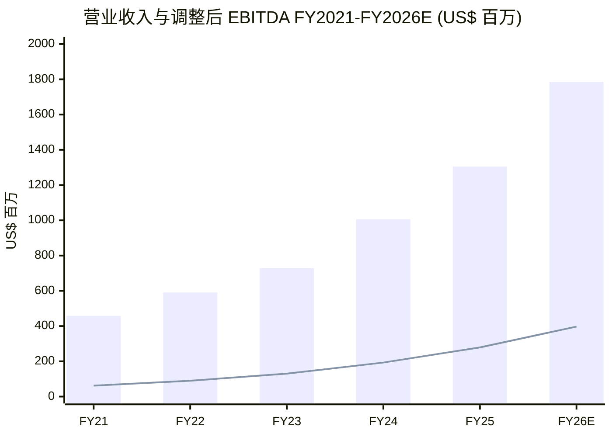
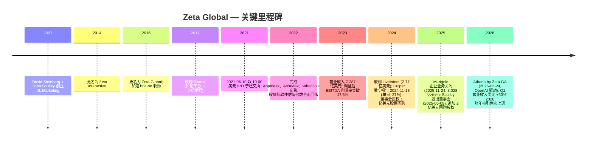
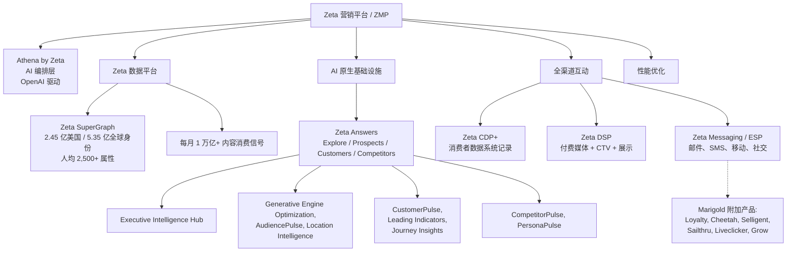
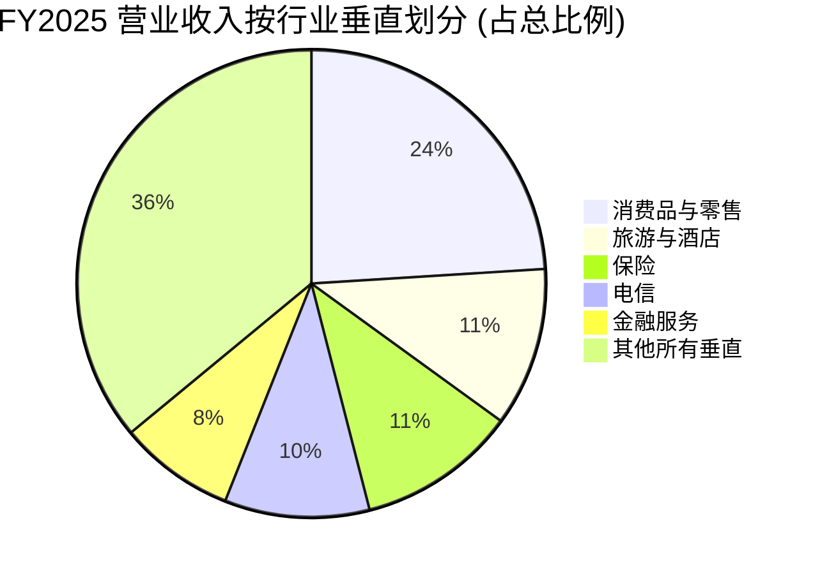
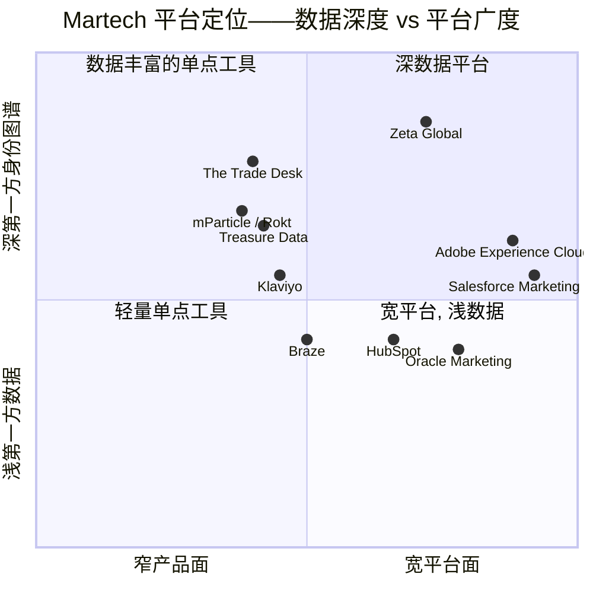
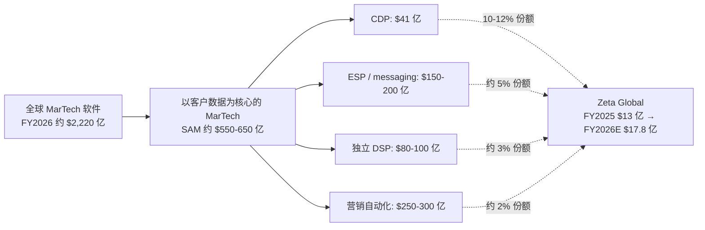

# Zeta Global Holdings Corp. (NYSE:ZETA) — 公司研究报告

**截至日期: 2026-06-18**
**股票代码: NYSE:ZETA**
**总部: 3 Park Avenue, 33rd Floor, New York, NY 10016**
**行业: 软件——营销技术 (martech) / 客户数据平台 (CDP) / 全渠道营销云**
**报告语言: 简体中文 (英文版同时存在于本目录)**

---

> **业绩更新——2026 财年指引上调 (2026-04-30):** 在 2026 财年 Q1 业绩公告中, 管理层将全年营业收入 (revenue) 指引上调至**17.79–17.92 亿美元** (中值 17.85 亿美元, 较此前 17.55 亿美元中值上调 3,000 万美元), 隐含同比增长 **36–37%**。调整后 EBITDA (adjusted EBITDA) 指引上调至**3.962–3.984 亿美元** (中值 3.973 亿美元), 自由现金流 (FCF) 指引上调至**2.345–2.355 亿美元**。Q1 营业收入 **3.963 亿美元 (同比 +50%, 超指引中值 2,600 万美元)**, 超规模化客户 (super-scaled customers) 增至 **189 家 (同比 +19%)**, ARPU 增至 **170 万美元 (同比 +21%)**。Athena 采纳加速 ("代理交互量超过 7 倍, GA 第一周内即占 AI 平台使用量的 60% 以上")。
> 来源: [Zeta Q1-2026 业绩公告, 8-K Ex 99.1, 2026-04-30](https://www.sec.gov/Archives/edgar/data/0001851003/000119312526197172/zeta-ex99_1.htm)。

---

> ### 投资摘要 (Investment Summary) — *分析师观点 (Analyst view)*
>
> | 项目 | 数值 |
> |---|---|
> | **评级 (Rating)** | **增持 (Overweight / Buy)** |
> | **12 个月目标价 (Price Target)** | **28.00 美元** |
> | **现价 (2026-06-18 收盘)** | 18.90 美元 |
> | **隐含上行空间 (Upside)** | **+48%** |
> | **估值方法** | 4.0× FY2027E EV/Revenue (前瞻 EV/营业收入), 与前瞻 P/E 22× 交叉验证 |
> | **市值 (Market Cap)** | 47.1 亿美元 |
> | **企业价值 (EV)** | 约 46.2 亿美元 (净现金约 9,200 万美元) |
> | **52 周区间** | 13.74 – 25.95 美元 |
> | **牛市 / 基准 / 熊市目标价** | 35 美元 (+85%) / 28 美元 (+48%) / 16 美元 (−15%) |
>
> **论点支柱 (Thesis pillars) — *分析师观点*:**
> 1. **被压缩的成长股 (compressed grower)。** ZETA 以 **P/S 约 3.6× / FY2026E EV/营业收入约 2.6×** 交易, **低于** HubSpot / Klaviyo / Braze / Salesforce 全部同业, 却拥有**显著更快的增长** (FY2025 +29.7%、Q1-2026 +50%、FY2026 指引 +37%)。增长—估值错配是核心机会。
> 2. **盈利拐点已现 (profitability inflection)。** FY2025 首次录得**正 GAAP 经营利润 (operating income) 540 万美元**, 调整后 EBITDA 利润率升至 **21.4%**; 管理层指引 **FY2026 实现 GAAP 净利润转正**——这是 IPO 以来首次此类承诺, 是 P/S 折让消除的潜在催化剂。
> 3. **第一方身份 + AI 编排双护城河。** Zeta SuperGraph (2.45 亿美国身份) + Athena (OpenAI 驱动) 在第三方 cookie 消亡与生成式 AI 更替周期中处于结构性顺风位; NRR (净收入留存率) **128%** 印证产品粘性。
> 4. **关键悬而未决的风险 (swing risk)：Davoodi 集团诉讼。** 由 2024 年 11 月 Culper 做空报告引发的证券集团诉讼仍在进行——这是 P/S 折让的最大单一来源, 也是估值重估能否兑现的最大变量。
>
> *评级、目标价及所有前瞻预测均为本报告的分析师观点, 不构成任何 SEC 文件中的数据。*

---

## 目录

1. 公司概览
   - 1A. 估值与目标价 (Valuation & Price Target)
   - 1B. GF Score 基本面评分
2. 估值、前瞻预测与价格目标 (Valuation, Forward Estimates & PT)
3. 公司历史
4. 管理团队
5. 产品与服务
6. 客户与上市策略
7. 行业概览
8. 竞争格局
9. 市场机会 (TAM)
10. 风险评估
    - 9.5 关键争议与催化剂 (Key Debates & Catalysts)
11. 投资视角评分卡 (Investor Lenses)
12. 参考资料

*注: 为保持与既有版本的章节连续性, 正文沿用原编号 (1–9 + 参考资料); 决策层 (1A/1B/第 2 章估值/9.5/视角评分卡) 为本次刷新新增, 嵌入相应位置。*

---

## 1. 公司概览

Zeta Global Holdings Corp. ("Zeta") 是一家由 AI 驱动的全渠道营销云 (omnichannel marketing cloud), 在单一订阅 + 使用量计价的平台——**Zeta Marketing Platform (Zeta 营销平台, ZMP)** ——内, 同时整合客户数据平台 (Customer Data Platform, CDP+)、电子邮件服务提供商 (Email Service Provider, ESP) 与需求方平台 (Demand-Side Platform, DSP)。该平台坐落于专有身份图谱——**Zeta SuperGraph™** ——之上, 据管理层披露, 其涵盖**超过 2.45 亿美国个人及超过 5.35 亿全球个人**的属性数据, 人均超过 2,500 项属性, 每月摄取超 1 万亿条内容消费信号 ([Zeta Global 10-K FY2025, p. 1–2](https://www.sec.gov/Archives/edgar/data/0001851003/000119312526068598/zeta-20251231.htm))。企业客户接入 ZMP, 以在电子邮件、付费媒体、CTV (Connected TV, 联网电视)、移动、网页、聊天与社交等渠道上获取、增长并留存客户——使用 Zeta 的数据、Zeta 的 AI 模型, 以及 (自 2026 年 3 月**Athena by Zeta™** 正式发布后) 由 OpenAI 驱动的生成式 AI 编排层 ([Zeta + OpenAI 联合公告, 2026-01-05](https://zetaglobal.com/news/zeta-global-and-openai-team-up-to-deliver-answer-driven-marketing-with-athena-by-zeta/))。

**Zeta 的盈利方式。** 营业收入由订阅费、基于使用量的计费 (通过 ZMP 运转的营销支出) 和专业服务构成。2025 财年, **74% 的营业收入来自直接平台 (direct-platform)** (完全在 ZMP 上产生的营业收入), **26% 来自整合平台 (integrated-platform)** (通过 API 整合第三方媒体或数据合作伙伴产生的营业收入——这是 Culper Research 于 2024 年 11 月质疑过、Zeta 反复辩护过的具有实质意义的结构性区分) ([10-K FY2025, p. 41](https://www.sec.gov/Archives/edgar/data/0001851003/000119312526068598/zeta-20251231.htm))。客户被分为三档: **总客户数 (total customers)** (2025 财年末 2,651 户)、**规模化客户 (scaled customers)** 即过去 12 个月营业收入 ≥10 万美元 (602 户), 及**超规模化客户 (super-scaled customers)** 即过去 12 个月营业收入 ≥100 万美元 (184 户)。规模化客户贡献了 2025 财年 **97%** 的营业收入, 超规模化客户贡献了 **87%** ([10-K FY2025, p. 40](https://www.sec.gov/Archives/edgar/data/0001851003/000119312526068598/zeta-20251231.htm))。

**规模与成长轮廓。** 2025 财年营业收入为 **13.047 亿美元**, 较 2024 财年的 10.058 亿美元同比增长 **29.7%** ([10-K FY2025, p. 44](https://www.sec.gov/Archives/edgar/data/0001851003/000119312526068598/zeta-20251231.htm))。三年营业收入复合年增长率 (FY2022 5.91 亿美元 → FY2025 13.05 亿美元) 约为 30%。调整后 EBITDA 增长至**2.787 亿美元** (利润率 21.4%, 较 2024 年的 19.2% 上升); GAAP 净亏损从 2024 年的 (6,980) 万美元收窄至 2025 年的**(3,150) 万美元**, 管理层在最新业绩说明会上承诺**2026 财年实现 GAAP 净利润转正**。自由现金流生成能力已经成型: 2025 财年经营性现金流 1.989 亿美元 (2024 年为 1.339 亿美元), 资本开支 / 资本化软件开发支出合计约 3,400 万美元, 隐含的自由现金流利润率为中双位数。截至 2025 财年末, 公司持有**3.198 亿美元现金**, **净营运资本 2.563 亿美元**, 累计赤字 (accumulated deficit) 为 **(10.598) 亿美元** ——后者绝大部分是股权薪酬费用 (stock-based compensation, SBC) 的累计影响 (仅 2025 财年就达 1.778 亿美元), 而非现金损失 ([10-K FY2025, p. 47–48](https://www.sec.gov/Archives/edgar/data/0001851003/000119312526068598/zeta-20251231.htm))。

**利润表 Sankey (FY2025)。** 下图把 13.047 亿美元营业收入拆到净亏损: 营业收入按 direct 74% / integrated 26% 分流, 减 COGS 5.136 亿后毛利 (gross profit) 7.911 亿美元 (毛利率 60.6%), 再减各项 opex 后**经营利润 (operating income) 首次转正 540 万美元**——是本年最重要的基本面变化。GAAP 净亏损 (3,150 万美元) 几乎全部来自下方 3,810 万美元的"其他费用"(收购或有对价 / 认股权证公允价值重估等非现金科目)。

<svg xmlns="http://www.w3.org/2000/svg" viewBox="0 0 1000 560" width="1000" height="560" role="img" aria-label="income statement Sankey"><rect x="0" y="0" width="1000" height="560" fill="#ffffff"/>
<text x="20.00" y="30.00" text-anchor="start" font-family="Helvetica,Arial,sans-serif" font-size="15" font-weight="700" fill="#1f2933">Zeta Global FY2025 利润表 Sankey (US$ 百万)</text>
<path d="M 204.00,78.00 C 258.00,78.00 258.00,85.00 312.00,85.00 L 312.00,386.93 C 258.00,386.93 258.00,379.93 204.00,379.93 Z" fill="#93c5fd" fill-opacity="0.55"/>
<path d="M 452.00,78.00 C 506.00,78.00 506.00,150.15 560.00,150.15 L 560.00,152.15 C 506.00,152.15 506.00,80.00 452.00,80.00 Z" fill="#86efac" fill-opacity="0.55"/>
<path d="M 452.00,80.00 C 506.00,80.00 506.00,166.15 560.00,166.15 L 560.00,411.85 C 506.00,411.85 506.00,325.70 452.00,325.70 Z" fill="#fca5a5" fill-opacity="0.55"/>
<path d="M 328.00,85.00 C 382.00,85.00 382.00,78.00 436.00,78.00 L 436.00,325.39 C 382.00,325.39 382.00,332.39 328.00,332.39 Z" fill="#86efac" fill-opacity="0.55"/>
<path d="M 328.00,332.39 C 382.00,332.39 382.00,339.39 436.00,339.39 L 436.00,500.00 C 382.00,500.00 382.00,493.00 328.00,493.00 Z" fill="#fca5a5" fill-opacity="0.55"/>
<path d="M 700.00,144.15 C 754.00,144.15 754.00,280.00 808.00,280.00 L 808.00,282.00 C 754.00,282.00 754.00,146.15 700.00,146.15 Z" fill="#86efac" fill-opacity="0.55"/>
<path d="M 700.00,146.15 C 754.00,146.15 754.00,296.00 808.00,296.00 L 808.00,298.00 C 754.00,298.00 754.00,148.15 700.00,148.15 Z" fill="#fca5a5" fill-opacity="0.55"/>
<path d="M 576.00,150.15 C 630.00,150.15 630.00,144.15 684.00,144.15 L 684.00,146.15 C 630.00,146.15 630.00,152.15 576.00,152.15 Z" fill="#86efac" fill-opacity="0.55"/>
<path d="M 576.00,166.15 C 630.00,166.15 630.00,160.15 684.00,160.15 L 684.00,339.34 C 630.00,339.34 630.00,345.34 576.00,345.34 Z" fill="#fca5a5" fill-opacity="0.55"/>
<path d="M 576.00,345.34 C 630.00,345.34 630.00,353.34 684.00,353.34 L 684.00,389.99 C 630.00,389.99 630.00,381.99 576.00,381.99 Z" fill="#fca5a5" fill-opacity="0.55"/>
<path d="M 576.00,381.99 C 630.00,381.99 630.00,403.99 684.00,403.99 L 684.00,433.85 C 630.00,433.85 630.00,411.85 576.00,411.85 Z" fill="#fca5a5" fill-opacity="0.55"/>
<path d="M 204.00,393.93 C 258.00,393.93 258.00,386.93 312.00,386.93 L 312.00,493.00 C 258.00,493.00 258.00,500.00 204.00,500.00 Z" fill="#93c5fd" fill-opacity="0.55"/>
<path d="M 576.00,425.85 C 630.00,425.85 630.00,146.15 684.00,146.15 L 684.00,148.15 C 630.00,148.15 630.00,427.85 576.00,427.85 Z" fill="#93c5fd" fill-opacity="0.55"/>
<rect x="188.00" y="78.00" width="16" height="301.93" rx="1.5" fill="#2563eb"/>
<rect x="188.00" y="393.93" width="16" height="106.07" rx="1.5" fill="#2563eb"/>
<rect x="312.00" y="85.00" width="16" height="408.00" rx="1.5" fill="#1e3a8a"/>
<rect x="436.00" y="78.00" width="16" height="247.39" rx="1.5" fill="#15803d"/>
<rect x="436.00" y="339.39" width="16" height="160.61" rx="1.5" fill="#dc2626"/>
<rect x="560.00" y="150.15" width="16" height="2.00" rx="1.5" fill="#15803d"/>
<rect x="560.00" y="166.15" width="16" height="245.70" rx="1.5" fill="#dc2626"/>
<rect x="560.00" y="425.85" width="16" height="2.00" rx="1.5" fill="#2563eb"/>
<rect x="684.00" y="144.15" width="16" height="2.00" rx="1.5" fill="#15803d"/>
<rect x="684.00" y="160.15" width="16" height="179.19" rx="1.5" fill="#dc2626"/>
<rect x="684.00" y="353.34" width="16" height="36.65" rx="1.5" fill="#dc2626"/>
<rect x="684.00" y="403.99" width="16" height="29.86" rx="1.5" fill="#dc2626"/>
<rect x="808.00" y="280.00" width="16" height="2.00" rx="1.5" fill="#15803d"/>
<rect x="808.00" y="296.00" width="16" height="2.00" rx="1.5" fill="#dc2626"/>
<text x="179.00" y="225.96" text-anchor="end" font-family="Helvetica,Arial,sans-serif" font-size="11.5" font-weight="700" fill="#1f2933">Direct platform (74%)</text>
<text x="179.00" y="238.96" text-anchor="end" font-family="Helvetica,Arial,sans-serif" font-size="10" font-weight="400" fill="#52606d">US$965.5M  (74.0%)</text>
<text x="179.00" y="443.96" text-anchor="end" font-family="Helvetica,Arial,sans-serif" font-size="11.5" font-weight="700" fill="#1f2933">Integrated platform (26%)</text>
<text x="179.00" y="456.96" text-anchor="end" font-family="Helvetica,Arial,sans-serif" font-size="10" font-weight="400" fill="#52606d">US$339.2M  (26.0%)</text>
<rect x="331.00" y="67.00" width="113.10" height="26" rx="2" fill="#ffffff" fill-opacity="0.72"/>
<text x="334.00" y="79.00" text-anchor="start" font-family="Helvetica,Arial,sans-serif" font-size="11.5" font-weight="700" fill="#1f2933">Revenue</text>
<text x="334.00" y="92.00" text-anchor="start" font-family="Helvetica,Arial,sans-serif" font-size="10" font-weight="400" fill="#52606d">US$1.3B  (100.0%)</text>
<rect x="455.00" y="60.00" width="119.40" height="26" rx="2" fill="#ffffff" fill-opacity="0.72"/>
<text x="458.00" y="72.00" text-anchor="start" font-family="Helvetica,Arial,sans-serif" font-size="11.5" font-weight="700" fill="#1f2933">Gross Profit</text>
<text x="458.00" y="85.00" text-anchor="start" font-family="Helvetica,Arial,sans-serif" font-size="10" font-weight="400" fill="#52606d">US$791.1M  (60.6%)</text>
<rect x="455.00" y="321.39" width="144.60" height="26" rx="2" fill="#ffffff" fill-opacity="0.72"/>
<text x="458.00" y="333.39" text-anchor="start" font-family="Helvetica,Arial,sans-serif" font-size="11.5" font-weight="700" fill="#1f2933">Cost of Revenue (COGS)</text>
<text x="458.00" y="346.39" text-anchor="start" font-family="Helvetica,Arial,sans-serif" font-size="10" font-weight="400" fill="#52606d">US$513.6M  (39.4%)</text>
<rect x="579.00" y="132.15" width="106.80" height="26" rx="2" fill="#ffffff" fill-opacity="0.72"/>
<text x="582.00" y="144.15" text-anchor="start" font-family="Helvetica,Arial,sans-serif" font-size="11.5" font-weight="700" fill="#1f2933">Operating Income</text>
<text x="582.00" y="157.15" text-anchor="start" font-family="Helvetica,Arial,sans-serif" font-size="10" font-weight="400" fill="#52606d">US$5.4M  (0.41%)</text>
<rect x="579.00" y="157.15" width="150.90" height="26" rx="2" fill="#ffffff" fill-opacity="0.72"/>
<text x="582.00" y="169.15" text-anchor="start" font-family="Helvetica,Arial,sans-serif" font-size="11.5" font-weight="700" fill="#1f2933">Total Operating Expense</text>
<text x="582.00" y="182.15" text-anchor="start" font-family="Helvetica,Arial,sans-serif" font-size="10" font-weight="400" fill="#52606d">US$785.7M  (60.2%)</text>
<text x="551.00" y="423.85" text-anchor="end" font-family="Helvetica,Arial,sans-serif" font-size="11.5" font-weight="700" fill="#1f2933">Net Interest / Other Income</text>
<text x="551.00" y="436.85" text-anchor="end" font-family="Helvetica,Arial,sans-serif" font-size="10" font-weight="400" fill="#52606d">US$400.0K  (0.03%)</text>
<rect x="703.00" y="126.15" width="119.40" height="26" rx="2" fill="#ffffff" fill-opacity="0.72"/>
<text x="706.00" y="138.15" text-anchor="start" font-family="Helvetica,Arial,sans-serif" font-size="11.5" font-weight="700" fill="#1f2933">Pretax Income</text>
<text x="706.00" y="151.15" text-anchor="start" font-family="Helvetica,Arial,sans-serif" font-size="10" font-weight="400" fill="#52606d">-US$33.1M  (-2.5%)</text>
<rect x="703.00" y="151.15" width="119.40" height="26" rx="2" fill="#ffffff" fill-opacity="0.72"/>
<text x="706.00" y="163.15" text-anchor="start" font-family="Helvetica,Arial,sans-serif" font-size="11.5" font-weight="700" fill="#1f2933">SG&amp;A</text>
<text x="706.00" y="176.15" text-anchor="start" font-family="Helvetica,Arial,sans-serif" font-size="10" font-weight="400" fill="#52606d">US$573.0M  (43.9%)</text>
<rect x="703.00" y="335.34" width="113.10" height="26" rx="2" fill="#ffffff" fill-opacity="0.72"/>
<text x="706.00" y="347.34" text-anchor="start" font-family="Helvetica,Arial,sans-serif" font-size="11.5" font-weight="700" fill="#1f2933">R&amp;D</text>
<text x="706.00" y="360.34" text-anchor="start" font-family="Helvetica,Arial,sans-serif" font-size="10" font-weight="400" fill="#52606d">US$117.2M  (9.0%)</text>
<rect x="703.00" y="385.99" width="106.80" height="26" rx="2" fill="#ffffff" fill-opacity="0.72"/>
<text x="706.00" y="397.99" text-anchor="start" font-family="Helvetica,Arial,sans-serif" font-size="11.5" font-weight="700" fill="#1f2933">Other OpEx</text>
<text x="706.00" y="410.99" text-anchor="start" font-family="Helvetica,Arial,sans-serif" font-size="10" font-weight="400" fill="#52606d">US$95.5M  (7.3%)</text>
<text x="833.00" y="278.00" text-anchor="start" font-family="Helvetica,Arial,sans-serif" font-size="11.5" font-weight="700" fill="#1f2933">Net Income</text>
<text x="833.00" y="291.00" text-anchor="start" font-family="Helvetica,Arial,sans-serif" font-size="10" font-weight="400" fill="#52606d">-US$31.5M  (-2.4%)</text>
<text x="833.00" y="303.00" text-anchor="start" font-family="Helvetica,Arial,sans-serif" font-size="11.5" font-weight="700" fill="#1f2933">Income Tax</text>
<text x="833.00" y="316.00" text-anchor="start" font-family="Helvetica,Arial,sans-serif" font-size="10" font-weight="400" fill="#52606d">-US$1.6M  (-0.12%)</text>
<text x="500.00" y="544.00" text-anchor="middle" font-family="Helvetica,Arial,sans-serif" font-size="10" font-weight="400" fill="#52606d">Source: Zeta 10-K FY2025 (period 2025-12-31) — Consolidated Statements of Operations</text>
</svg>

*来源: [Zeta 10-K FY2025 — 合并利润表](https://www.sec.gov/Archives/edgar/data/0001851003/000119312526068598/zeta-20251231.htm)。*

<svg xmlns="http://www.w3.org/2000/svg" viewBox="0 0 720 460" width="720" height="460" role="img" aria-label="revenue donut"><rect x="0" y="0" width="720" height="460" fill="#ffffff"/>
<text x="20.00" y="30.00" text-anchor="start" font-family="Helvetica,Arial,sans-serif" font-size="15" font-weight="700" fill="#1f2933">FY2025 营业收入按平台类型 (US$ 百万)</text>
<path d="M 288.00,107.20 A 132 132 0 1 1 156.26,247.47 L 210.15,244.09 A 78 78 0 1 0 288.00,161.20 Z" fill="#2563eb"/>
<path d="M 156.26,247.47 A 132 132 0 0 1 288.00,107.20 L 288.00,161.20 A 78 78 0 0 0 210.15,244.09 Z" fill="#15803d"/>
<text x="288.00" y="235.20" text-anchor="middle" font-family="Helvetica,Arial,sans-serif" font-size="18" font-weight="800" fill="#1f2933">ZETA</text>
<text x="288.00" y="255.20" text-anchor="middle" font-family="Helvetica,Arial,sans-serif" font-size="13" font-weight="600" fill="#52606d">US$1.3B</text>
<text x="288.00" y="271.20" text-anchor="middle" font-family="Helvetica,Arial,sans-serif" font-size="10" font-weight="400" fill="#8a97a3">total</text>
<line x1="388.59" y1="333.67" x2="404.59" y2="333.67" stroke="#2563eb" stroke-width="1.4"/>
<text x="408.59" y="331.67" text-anchor="start" font-family="Helvetica,Arial,sans-serif" font-size="11" font-weight="700" fill="#1f2933">Direct platform 74%</text>
<text x="408.59" y="345.67" text-anchor="start" font-family="Helvetica,Arial,sans-serif" font-size="10" font-weight="400" fill="#52606d">US$965.5M  (74.0%)</text>
<line x1="187.41" y1="144.73" x2="171.41" y2="144.73" stroke="#15803d" stroke-width="1.4"/>
<text x="167.41" y="142.73" text-anchor="end" font-family="Helvetica,Arial,sans-serif" font-size="11" font-weight="700" fill="#1f2933">Integrated platform 26%</text>
<text x="167.41" y="156.73" text-anchor="end" font-family="Helvetica,Arial,sans-serif" font-size="10" font-weight="400" fill="#52606d">US$339.2M  (26.0%)</text>
<text x="360.00" y="444.00" text-anchor="middle" font-family="Helvetica,Arial,sans-serif" font-size="10" font-weight="400" fill="#52606d">Source: Zeta 10-K FY2025 — direct 74% / integrated 26% of $1,304.7M revenue</text>
</svg>

<svg xmlns="http://www.w3.org/2000/svg" viewBox="0 0 860 470" width="860" height="470" role="img" aria-label="historical revenue bars"><rect x="0" y="0" width="860" height="470" fill="#ffffff"/>
<text x="20.00" y="30.00" text-anchor="start" font-family="Helvetica,Arial,sans-serif" font-size="15" font-weight="700" fill="#1f2933">营业收入按平台类型 FY2023–FY2025 (US$ 百万)</text>
<rect x="20.00" y="44" width="11" height="11" rx="2" fill="#2563eb"/>
<text x="36.00" y="53.00" text-anchor="start" font-family="Helvetica,Arial,sans-serif" font-size="10.5" font-weight="400" fill="#1f2933">Direct platform</text>
<rect x="149.00" y="44" width="11" height="11" rx="2" fill="#15803d"/>
<text x="165.00" y="53.00" text-anchor="start" font-family="Helvetica,Arial,sans-serif" font-size="10.5" font-weight="400" fill="#1f2933">Integrated platform</text>
<line x1="70" y1="412.00" x2="834" y2="412.00" stroke="#eceff2" stroke-width="1"/>
<text x="64.00" y="415.00" text-anchor="end" font-family="Helvetica,Arial,sans-serif" font-size="9.5" font-weight="400" fill="#52606d">US$0</text>
<line x1="70" y1="345.20" x2="834" y2="345.20" stroke="#eceff2" stroke-width="1"/>
<text x="64.00" y="348.20" text-anchor="end" font-family="Helvetica,Arial,sans-serif" font-size="9.5" font-weight="400" fill="#52606d">US$281.8M</text>
<line x1="70" y1="278.40" x2="834" y2="278.40" stroke="#eceff2" stroke-width="1"/>
<text x="64.00" y="281.40" text-anchor="end" font-family="Helvetica,Arial,sans-serif" font-size="9.5" font-weight="400" fill="#52606d">US$563.6M</text>
<line x1="70" y1="211.60" x2="834" y2="211.60" stroke="#eceff2" stroke-width="1"/>
<text x="64.00" y="214.60" text-anchor="end" font-family="Helvetica,Arial,sans-serif" font-size="9.5" font-weight="400" fill="#52606d">US$845.4M</text>
<line x1="70" y1="144.80" x2="834" y2="144.80" stroke="#eceff2" stroke-width="1"/>
<text x="64.00" y="147.80" text-anchor="end" font-family="Helvetica,Arial,sans-serif" font-size="9.5" font-weight="400" fill="#52606d">US$1.1B</text>
<line x1="70" y1="78.00" x2="834" y2="78.00" stroke="#eceff2" stroke-width="1"/>
<text x="64.00" y="81.00" text-anchor="end" font-family="Helvetica,Arial,sans-serif" font-size="9.5" font-weight="400" fill="#52606d">US$1.4B</text>
<rect x="123.48" y="287.63" width="147.71" height="124.37" fill="#2563eb"/>
<rect x="123.48" y="239.27" width="147.71" height="48.36" fill="#15803d"/>
<text x="197.33" y="428.00" text-anchor="middle" font-family="Helvetica,Arial,sans-serif" font-size="10" font-weight="400" fill="#52606d">2023</text>
<rect x="378.15" y="245.10" width="147.71" height="166.90" fill="#2563eb"/>
<rect x="378.15" y="173.59" width="147.71" height="71.51" fill="#15803d"/>
<text x="452.00" y="428.00" text-anchor="middle" font-family="Helvetica,Arial,sans-serif" font-size="10" font-weight="400" fill="#52606d">2024</text>
<rect x="632.81" y="183.14" width="147.71" height="228.86" fill="#2563eb"/>
<rect x="632.81" y="102.74" width="147.71" height="80.40" fill="#15803d"/>
<text x="706.67" y="428.00" text-anchor="middle" font-family="Helvetica,Arial,sans-serif" font-size="10" font-weight="400" fill="#52606d">2025</text>
<text x="430.00" y="454.00" text-anchor="middle" font-family="Helvetica,Arial,sans-serif" font-size="10" font-weight="400" fill="#52606d">Source: Zeta 10-K FY2025 — total revenue $728.7M/$1,005.8M/$1,304.7M × direct 72%/70%/74%</text>
</svg>

*来源: [Zeta 10-K FY2025 — direct/integrated platform 营业收入按年](https://www.sec.gov/Archives/edgar/data/0001851003/000119312526068598/zeta-20251231.htm); FY2023 营业收入 7.287 亿、FY2024 10.058 亿、FY2025 13.047 亿美元, 乘各年 direct 占比 72%/70%/74%。*

*营业收入 (柱) 与调整后 EBITDA (线) ——两者同为美元单位, 共用 y 轴。来源: [Zeta 10-K FY2025](https://www.sec.gov/Archives/edgar/data/0001851003/000119312526068598/zeta-20251231.htm) 与 [Q1-2026 业绩公告 (FY2026 指引中值 17.85 亿 / 3.973 亿调整后 EBITDA)](https://www.sec.gov/Archives/edgar/data/0001851003/000119312526197172/zeta-ex99_1.htm)。*

**地理与员工规模。** Zeta 总部位于纽约市, 运营跨 AWS / GCP / Azure 的混合云架构, 外加自建的 VMware / Docker / Kubernetes 基础设施。截至 2025 财年末**员工约 3,300 人**, 其中**约 2,000 人 (60%+)** 位于美国境外——离岸队伍主要分布在印度和欧洲, 工程中心位于欧盟、英国与印度, 美国侧集中在纽约和湾区 ([10-K FY2025, p. 7](https://www.sec.gov/Archives/edgar/data/0001851003/000119312526068598/zeta-20251231.htm))。公司持有超 150 项美国及国际专利及申请 (已授权 39 项, 申请中 36 项), 大量集中在 AI/ML、数据治理与身份图谱领域 ([10-K FY2025, p. 7](https://www.sec.gov/Archives/edgar/data/0001851003/000119312526068598/zeta-20251231.htm))。

**估值快照 (2026-06-18 收盘)。** 股价 **18.90 美元**, 股本市值 **47.1 亿美元** (约 2.493 亿股稀释后), 企业价值 **约 46.2 亿美元** (Q1-2026 现金 2.888 亿美元减长期借款 1.971 亿美元, 净现金约 9,200 万美元) ([Yahoo Finance — ZETA 关键统计数据](https://finance.yahoo.com/quote/ZETA/key-statistics); [Zeta Q1-2026 10-Q — 资产负债表](https://www.sec.gov/Archives/edgar/data/0001851003/000119312526199156/zeta-20260331.htm))。当前股价较 52 周高点 25.95 美元回落约 27%, 较低点 13.74 美元高出约 38% ([Yahoo Finance — ZETA 关键统计数据](https://finance.yahoo.com/quote/ZETA/key-statistics))。

| 倍数 (2026-06-18) | ZETA | HUBS | KVYO | BRZE | CRM |
|---|---|---|---|---|---|
| **TTM P/S** | **3.6x** | 2.7x | 3.0x | 2.9x | 2.9x |
| **FY2026E EV/营业收入** | **2.6x** | — | — | — | — |
| **前瞻 P/E (forward P/E)** | **15.9x** | 11.3x | 12.8x | 20.5x | 9.8x |
| **TTM GAAP P/E** | **n/m (GAAP 亏损)** | n/m | n/m | n/m | 41x |
| **FY2026E 营收增长** | **+37%** | 中双位数 | ~25% | ~22% | ~9% |

来源: ZETA 与同业 P/S、前瞻 P/E 来自 [Yahoo Finance / yfinance, 2026-06-18](https://finance.yahoo.com/quote/ZETA/key-statistics) 同口径横拉 ([HUBS](https://finance.yahoo.com/quote/HUBS/key-statistics)、[KVYO](https://finance.yahoo.com/quote/KVYO/key-statistics)、[BRZE](https://finance.yahoo.com/quote/BRZE/key-statistics)、[CRM](https://finance.yahoo.com/quote/CRM/key-statistics)); ZETA FY2026E EV/营业收入按 EV 约 46.2 亿美元 ÷ FY2026 指引中值营业收入 17.85 亿美元 ([Zeta Q1-2026 业绩公告](https://www.sec.gov/Archives/edgar/data/0001851003/000119312526197172/zeta-ex99_1.htm))。注: 2026 年 martech 同业整体前瞻 P/E 较一年前显著回落 (软件估值倍数普遍压缩), HUBS/CRM 已降至个位数—低十几倍区间。

**GAAP P/E 为何"不具备意义", 以及如何解读这些倍数。** Zeta 自 IPO 以来每年均录得 GAAP 净亏损 (FY2025 (3,150) 万美元, FY2024 (6,980) 万美元, FY2023 (1.875) 亿美元), 但**FY2025 经营层面已转正 (经营利润 540 万美元, 见第 1 章 Sankey)** ——净亏损主要来自 3,810 万美元的"其他费用"(主要为收购或有对价 / 认股权证公允价值重估的非现金科目), 而非经营性亏损 ([10-K FY2025 利润表](https://www.sec.gov/Archives/edgar/data/0001851003/000119312526068598/zeta-20251231.htm))。剩余的累计 GAAP 亏损驱动因素是**股权薪酬费用 (SBC)**: **FY2025 1.778 亿美元 / FY2024 1.950 亿美元 / FY2023 2.429 亿美元** ([10-K FY2025 现金流量表 + Note 11](https://www.sec.gov/Archives/edgar/data/0001851003/000119312526068598/zeta-20251231.htm)), 相当于**FY2025 营业收入的 13.6%** (较 FY2023 的 33.3% 大幅改善)。剔除 SBC 与收购费用后, 调整后 EBITDA 利润率 FY2025 达 **21.4%**, FY2026 指引 22.1–22.4%。3.6x 的 P/S **高于**部分同业但 **FY2026E EV/营业收入 2.6x 低于其增长应得的倍数** ——核心论点是: ZETA 以与中速增长同业相近的倍数交易, 却跑出近两倍的增速。折让反映 (i) Culper 事件残留与未结的 Davoodi 集团诉讼, (ii) 26% 整合平台营业收入结构——部分买方投资者打折为低质量"媒体过路费", (iii) 持续的 GAAP 净亏损视觉, 以及 (iv) Marigold 整合执行风险。我们将相对估值视为**被压缩 (compressed)** 而非昂贵——但倍数无法重估 (re-rating 失败) 本身是第 9 章的明确风险项。

---

### 1A. 估值与目标价 (Valuation & Price Target) — *分析师观点*

**评级: 增持 (Overweight) | 12 个月目标价: 28.00 美元 | 隐含上行 +48%。** 目标价由**前瞻 EV/营业收入**法导出, 并以**前瞻 P/E** 交叉验证 (详见第 2 章前瞻模型):

- **主方法 (EV/营业收入):** FY2027E 营业收入约 21.5 亿美元 (FY2026 指引中值 17.85 亿美元 × 约 +20% 有机增长) × **目标 4.0× EV/营业收入** = EV 约 86 亿美元; 加净现金约 1 亿美元 ÷ 约 2.55 亿股 ≈ **34 美元 (牛市附近)**; 在更保守的 **3.3× 倍数**下得 EV 约 71 亿美元 → 约 **28 美元 (基准)**。4.0× 的倍数依据: 仍**低于** HubSpot / Klaviyo 历史增长期的 EV/营业收入, 而 ZETA 增速更快、已盈利转正。
- **交叉验证 (前瞻 P/E):** FY2027E 调整后净利润约 3.9 亿美元 / 约 2.55 亿股 ≈ 调整后 EPS 约 1.30 美元 × **22× 前瞻 P/E** = 约 **29 美元** ——与基准目标价一致。
- **市场一致预期对照 (consensus benchmark):** 截至 2026 年 6 月, 卖方一致评级为 **Strong Buy** (13 位分析师中 12 位买入), 一致目标价中值 **29 美元** (区间 25–36 美元) ([StockAnalysis — ZETA 预测](https://stockanalysis.com/stocks/zeta/forecast/); [MarketScreener — ZETA 共识](https://www.marketscreener.com/quote/stock/ZETA-GLOBAL-HOLDINGS-CORP-123552310/consensus/))。本报告 28 美元基准目标价**略低于一致中值** (我们对 Davoodi 诉讼折让保持更保守的估值倍数)。

> **本地卖方库 (db/zsxq.db) 提示:** 本地 6,900+ 份券商研报库中**未检索到任何 Zeta Global 单独覆盖** (库以中国/亚洲券商为主); 因此本报告的卖方共识层来自公开聚合源 (StockAnalysis / MarketScreener), 并以 *分析师观点* 标注。无 ≥2 篇 zsxq 笔记, 故不构建"卖方观点演变"子章节 (见第 10 步验证日志)。

---

### 1B. GF Score (GuruFocus 式) 基本面评分 — *分析师观点*

GF Score 是本报告自有的五维基本面评分 (financial strength / profitability / growth / GF value / momentum), 模仿 GuruFocus 的 GF Score™ 框架, **非 GuruFocus 官方数值, 也不附任何 SEC 文件引用**; 每个底层指标在下文及第 1/2 章携带各自引用。

<svg xmlns="http://www.w3.org/2000/svg" viewBox="0 0 500 500" width="500" height="500" role="img" aria-label="GF Score radar">
<rect x="0" y="0" width="500" height="500" fill="#ffffff"/>
<text x="20" y="24" font-family="Helvetica,Arial,sans-serif" font-size="15" font-weight="700" fill="#1f2933">GF Score (GuruFocus-style): 66/100</text>
<text x="20" y="41" font-family="Helvetica,Arial,sans-serif" font-size="11" fill="#52606d">51–70 Poor future performance potential</text>
<polygon points="250.0,88.0 392.7,191.6 338.2,359.4 161.8,359.4 107.3,191.6" fill="#e9f5ec" stroke="none"/>
<polygon points="250.0,208.0 278.5,228.7 267.6,262.3 232.4,262.3 221.5,228.7" fill="none" stroke="#c5d3cb" stroke-width="1"/>
<polygon points="250.0,178.0 307.1,219.5 285.3,286.5 214.7,286.5 192.9,219.5" fill="none" stroke="#c5d3cb" stroke-width="1"/>
<polygon points="250.0,148.0 335.6,210.2 302.9,310.8 197.1,310.8 164.4,210.2" fill="none" stroke="#c5d3cb" stroke-width="1"/>
<polygon points="250.0,118.0 364.1,200.9 320.5,335.1 179.5,335.1 135.9,200.9" fill="none" stroke="#c5d3cb" stroke-width="1"/>
<polygon points="250.0,88.0 392.7,191.6 338.2,359.4 161.8,359.4 107.3,191.6" fill="none" stroke="#c5d3cb" stroke-width="1.3"/>
<line x1="250" y1="238" x2="161.8" y2="359.4" stroke="#cfdad3" stroke-width="1"/>
<text x="146.5" y="392.4" text-anchor="end" font-family="Helvetica,Arial,sans-serif" font-size="11.5" font-weight="600" fill="#1f2933">财务实力</text>
<text x="179.5" y="329.1" text-anchor="middle" font-family="Helvetica,Arial,sans-serif" font-size="10.5" font-weight="700" fill="#1f2933">8</text>
<line x1="250" y1="238" x2="250.0" y2="88.0" stroke="#cfdad3" stroke-width="1"/>
<text x="250.0" y="58.0" text-anchor="middle" font-family="Helvetica,Arial,sans-serif" font-size="11.5" font-weight="600" fill="#1f2933">盈利能力</text>
<text x="250.0" y="157.0" text-anchor="middle" font-family="Helvetica,Arial,sans-serif" font-size="10.5" font-weight="700" fill="#1f2933">5</text>
<line x1="250" y1="238" x2="107.3" y2="191.6" stroke="#cfdad3" stroke-width="1"/>
<text x="82.6" y="183.6" text-anchor="end" font-family="Helvetica,Arial,sans-serif" font-size="11.5" font-weight="600" fill="#1f2933">成长性</text>
<text x="121.6" y="190.3" text-anchor="middle" font-family="Helvetica,Arial,sans-serif" font-size="10.5" font-weight="700" fill="#1f2933">9</text>
<line x1="250" y1="238" x2="392.7" y2="191.6" stroke="#cfdad3" stroke-width="1"/>
<text x="417.4" y="183.6" text-anchor="start" font-family="Helvetica,Arial,sans-serif" font-size="11.5" font-weight="600" fill="#1f2933">估值</text>
<text x="349.9" y="199.6" text-anchor="middle" font-family="Helvetica,Arial,sans-serif" font-size="10.5" font-weight="700" fill="#1f2933">7</text>
<line x1="250" y1="238" x2="338.2" y2="359.4" stroke="#cfdad3" stroke-width="1"/>
<text x="353.5" y="392.4" text-anchor="start" font-family="Helvetica,Arial,sans-serif" font-size="11.5" font-weight="600" fill="#1f2933">动量</text>
<text x="276.5" y="268.4" text-anchor="middle" font-family="Helvetica,Arial,sans-serif" font-size="10.5" font-weight="700" fill="#1f2933">3</text>
<polygon points="250.0,163.0 349.9,205.6 276.5,274.4 179.5,335.1 121.6,196.3" fill="#2e8b57" fill-opacity="0.34" stroke="#2e8b57" stroke-width="2"/>
<circle cx="179.5" cy="335.1" r="2.6" fill="#2e8b57"/>
<circle cx="250.0" cy="163.0" r="2.6" fill="#2e8b57"/>
<circle cx="121.6" cy="196.3" r="2.6" fill="#2e8b57"/>
<circle cx="349.9" cy="205.6" r="2.6" fill="#2e8b57"/>
<circle cx="276.5" cy="274.4" r="2.6" fill="#2e8b57"/>
<text x="250" y="470" text-anchor="middle" font-family="Helvetica,Arial,sans-serif" font-size="9.5" fill="#52606d">Source: Zeta 10-K FY2025 · Q1-2026 10-Q · Yahoo Finance, as of 2026-06-18</text>
<text x="250" y="485" text-anchor="middle" font-family="Helvetica,Arial,sans-serif" font-size="9" fill="#52606d">GF Score = independent analyst rubric (*Analyst view:*) — not GuruFocus™ official number</text>
</svg>

**综合评分: 66 / 100 (51–70 区间)。各维度评分理由:**

- **Financial Strength (财务实力) = 8/10。** 净现金约 9,200 万美元 (Q1-2026 现金 2.888 亿减长期借款 1.971 亿); FY2025 经营性现金流 1.989 亿美元, 杠杆极低, 利息支出净额仅 37 万美元 ([10-K FY2025 现金流量表](https://www.sec.gov/Archives/edgar/data/0001851003/000119312526068598/zeta-20251231.htm); [Q1-2026 10-Q](https://www.sec.gov/Archives/edgar/data/0001851003/000119312526199156/zeta-20260331.htm))。扣 1 分因 Marigold 后或有对价负债 (acquisition-related liabilities) 升至 1.88 亿美元。
- **Profitability (盈利能力) = 5/10。** FY2025 经营利润首次转正 (540 万美元)、调整后 EBITDA 利润率 21.4% 且上升, 但 **GAAP 仍净亏损 (3,150 万美元)**, ROE 为负, ROIC 边际为正 ([10-K FY2025 利润表](https://www.sec.gov/Archives/edgar/data/0001851003/000119312526068598/zeta-20251231.htm))。盈利拐点已现但尚未全面兑现, 给 5 分。
- **Growth (成长性) = 9/10。** 三年营业收入 CAGR 约 30% (FY2022 5.91 亿 → FY2025 13.05 亿); FY2025 +29.7%、Q1-2026 +50%、FY2026 指引 +37% ([10-K FY2025, p.44](https://www.sec.gov/Archives/edgar/data/0001851003/000119312526068598/zeta-20251231.htm); [Q1-2026 业绩公告](https://www.sec.gov/Archives/edgar/data/0001851003/000119312526197172/zeta-ex99_1.htm))。增速在覆盖范围内属顶尖。
- **GF Value (估值, 越高越便宜) = 7/10。** FY2026E EV/营业收入 2.6x 低于增长应得倍数, 前瞻 P/E 15.9x, 较一致目标价中值约 +55% 上行空间 ([Yahoo Finance](https://finance.yahoo.com/quote/ZETA/key-statistics); [StockAnalysis — ZETA 预测](https://stockanalysis.com/stocks/zeta/forecast/))。相对便宜, 但非深度价值。
- **Momentum (动量) = 3/10。** 股价较 52 周高点 25.95 美元回落约 27%, 6/12 个月相对走弱, 处于区间中下部 ([Yahoo Finance — ZETA 关键统计数据](https://finance.yahoo.com/quote/ZETA/key-statistics))。动量是五维中最弱项, 也正是估值被压缩的镜像。

*GF Score 综合分及五个子分均为分析师评分 (rubric output), 非 GuruFocus 官方 GF Score; 仅作为基本面健康度的结构化第二意见。*

---

## 2. 估值、前瞻预测与价格目标 (Valuation, Forward Estimates & PT) — *分析师观点*

本章是决策层。**所有前瞻预测、目标价及情景目标价均为本报告自有的分析师观点, 不附任何 SEC 文件引用** ——10-K 不含价格目标。前瞻模型以 10-K 分部数据 + 管理层 FY2026 指引 + 行业增长率为输入构建。

### 2.1 前瞻财务模型 (forward estimates) — *分析师观点*

| (US$ 百万, 除每股) | FY2025A | FY2026E | FY2027E | FY2028E |
|---|---|---|---|---|
| **营业收入 (revenue)** | 1,305 | **1,785** | 2,150 | 2,540 |
| YoY 增长 | +29.7% | **+37%** | +20% | +18% |
| **毛利率 (gross margin)** | 60.6% | ~61% | ~62% | ~63% |
| **调整后 EBITDA** | 279 | **397** | 505 | 620 |
| 调整后 EBITDA 利润率 | 21.4% | **22.2%** | 23.5% | 24.4% |
| **GAAP 经营利润** | 5 | 转正 (指引) | 正 | 正 |
| **调整后 EPS (美元, est.)** | ~0.85 | ~1.05 | ~1.30 | ~1.60 |
| 自由现金流 (FCF) | ~165 | **235** | ~300 | ~370 |

- **FY2026E 来自管理层指引中值** (营业收入 17.85 亿、调整后 EBITDA 3.973 亿、FCF 2.35 亿) ([Zeta Q1-2026 业绩公告](https://www.sec.gov/Archives/edgar/data/0001851003/000119312526197172/zeta-ex99_1.htm))。
- **FY2027E–FY2028E 为本报告测算 (*分析师观点*):** 假设有机增长从 +37% (含 Marigold 并表跳变) 收敛至 +18–20%, 与 CDP 子细分 19.6% CAGR + 广义 martech 11–12.5% CAGR 之间 ([Fortune Business Insights — CDP 市场](https://www.fortunebusinessinsights.com/industry-reports/customer-data-platform-market-100633))。利润率扩张靠 (i) 把 26% 的低毛利 integrated 平台占比压低, (ii) 印度/欧盟离岸人力杠杆, (iii) Marigold 五品牌合理化后的运营杠杆——每一项均为下文"最该盯紧的变量"。
- **驱动分解:** 营业收入路径 = direct platform (FY2025 9.655 亿, 维持 20%+ 增长) + integrated platform (FY2025 3.392 亿, 增速较慢) + Marigold 全年并表 ([10-K FY2025 分部披露](https://www.sec.gov/Archives/edgar/data/0001851003/000119312526068598/zeta-20251231.htm))。

### 2.2 目标价推导 (PT derivation) — *分析师观点*

**基准目标价 28 美元 (上行 +48%)。** 主方法 **FY2027E EV/营业收入**:
- FY2027E 营业收入 21.5 亿美元 × **目标 3.3× EV/营业收入** = EV 约 71 亿美元 + 净现金约 1 亿美元 ÷ 约 2.55 亿股 (含 SBC 稀释) ≈ **28 美元**。
- **为什么用 3.3× 倍数 (multiple justification):** 当前 FY2026E EV/营业收入仅 2.6×; 3.3× 仍**低于** Klaviyo/Braze 增长期历史区间, 也低于 Salesforce Data Cloud 业务隐含倍数, 对一个增速近两倍于同业且已盈利转正的平台是保守的。
- **交叉验证 (前瞻 P/E):** FY2027E 调整后净利润约 3.3 亿美元 ÷ 约 2.55 亿股 ≈ 调整后 EPS 约 1.30 美元 × **22× 前瞻 P/E** ≈ **29 美元** ——与 EV/营业收入法一致, 也对齐卖方一致中值 29 美元 ([StockAnalysis — ZETA 预测](https://stockanalysis.com/stocks/zeta/forecast/))。

### 2.3 牛市 / 基准 / 熊市情景 (bull/base/bear) — *分析师观点*

| 情景 | 目标价 | 上行/下行 | 关键摆动假设 |
|---|---|---|---|
| **牛市 (Bull)** | **35 美元** | **+85%** | Davoodi 诉讼无重大和解了结 + 倍数重估至 4.0× FY2027E EV/营业收入 + Athena 显著拉动 ARR; FY2027 营业收入超 22 亿 |
| **基准 (Base)** | **28 美元** | **+48%** | FY2026 指引兑现 + GAAP 转正 + 倍数温和重估至 3.3×; 诉讼以保险覆盖范围内和解 |
| **熊市 (Bear)** | **16 美元** | **−15%** | 诉讼不利裁定 / 新做空报告 + integrated 平台折让加深 + 倍数停在 2.5× FY2027E EV/营业收入; 增长降速 |

### 2.4 与市场一致预期的对比 (vs consensus) — *分析师观点*

截至 2026 年 6 月, 卖方一致评级 **Strong Buy** (13 位分析师, 12 买入 / 2 持有), 一致目标价中值 **29 美元** (区间 25–36 美元) ([StockAnalysis — ZETA 预测](https://stockanalysis.com/stocks/zeta/forecast/); [MarketScreener — ZETA 共识](https://www.marketscreener.com/quote/stock/ZETA-GLOBAL-HOLDINGS-CORP-123552310/consensus/))。本报告 28 美元基准目标价**略低于一致中值约 3%** ——分歧点在于我们对 Davoodi 诉讼保留更厚的估值倍数折让。本报告 FY2026E 营业收入 17.85 亿与一致基本一致 (锚定管理层指引)。

### 2.5 最该盯紧的变量 (swing variables) — *分析师观点*

1. **Davoodi 集团诉讼的结果。** 这是 P/S 折让的单一最大来源; 任何驳回动议获批或低额和解都会触发倍数重估 (牛市路径), 任何不利裁定则压制重估 (熊市路径)。
2. **integrated 平台占比与毛利率轨迹。** 26% 的 integrated 营收被部分买方打折; 若占比持续下降、毛利率向 62–63% 攀升, 估值倍数应跟随上移——这是利润率—估值的双重杠杆。

---

## DuPont ROE 分解 (FY2025)

<svg xmlns="http://www.w3.org/2000/svg" viewBox="0 0 1240 540" width="1240" height="540" role="img" aria-label="DuPont ROE decomposition"><rect x="0" y="0" width="1240" height="540" fill="#ffffff"/>
<text x="20.00" y="30.00" text-anchor="start" font-family="Helvetica,Arial,sans-serif" font-size="15" font-weight="700" fill="#1f2933">Zeta Global FY2025 DuPont ROE 分解</text>
<rect x="545.00" y="56.00" width="150" height="56" rx="7" fill="#1e3a8a"/>
<text x="620.00" y="76.00" text-anchor="middle" font-family="Helvetica,Arial,sans-serif" font-size="11.5" font-weight="700" fill="#ffffff">ROE</text>
<text x="620.00" y="94.00" text-anchor="middle" font-family="Helvetica,Arial,sans-serif" font-size="13" font-weight="800" fill="#ffffff">-4.25%</text>
<text x="620.00" y="106.00" text-anchor="middle" font-family="Helvetica,Arial,sans-serif" font-size="8.5" font-weight="400" fill="#dbeafe">= Net Income / Avg Equity</text>
<rect x="191.60" y="168.00" width="150" height="56" rx="7" fill="#2563eb"/>
<text x="266.60" y="188.00" text-anchor="middle" font-family="Helvetica,Arial,sans-serif" font-size="11.5" font-weight="700" fill="#ffffff">Net Margin</text>
<text x="266.60" y="206.00" text-anchor="middle" font-family="Helvetica,Arial,sans-serif" font-size="13" font-weight="800" fill="#ffffff">-2.41%</text>
<text x="266.60" y="218.00" text-anchor="middle" font-family="Helvetica,Arial,sans-serif" font-size="8.5" font-weight="400" fill="#dbeafe">Net Income / Revenue</text>
<line x1="620.00" y1="112.00" x2="266.60" y2="168.00" stroke="#94a3b8" stroke-width="1.4"/>
<rect x="545.00" y="168.00" width="150" height="56" rx="7" fill="#2563eb"/>
<text x="620.00" y="188.00" text-anchor="middle" font-family="Helvetica,Arial,sans-serif" font-size="11.5" font-weight="700" fill="#ffffff">Asset Turnover</text>
<text x="620.00" y="206.00" text-anchor="middle" font-family="Helvetica,Arial,sans-serif" font-size="13" font-weight="800" fill="#ffffff">1.00</text>
<text x="620.00" y="218.00" text-anchor="middle" font-family="Helvetica,Arial,sans-serif" font-size="8.5" font-weight="400" fill="#dbeafe">Revenue / Avg Assets</text>
<line x1="620.00" y1="112.00" x2="620.00" y2="168.00" stroke="#94a3b8" stroke-width="1.4"/>
<rect x="898.40" y="168.00" width="150" height="56" rx="7" fill="#2563eb"/>
<text x="973.40" y="188.00" text-anchor="middle" font-family="Helvetica,Arial,sans-serif" font-size="11.5" font-weight="700" fill="#ffffff">Equity Multiplier</text>
<text x="973.40" y="206.00" text-anchor="middle" font-family="Helvetica,Arial,sans-serif" font-size="13" font-weight="800" fill="#ffffff">1.77</text>
<text x="973.40" y="218.00" text-anchor="middle" font-family="Helvetica,Arial,sans-serif" font-size="8.5" font-weight="400" fill="#dbeafe">Avg Assets / Avg Equity</text>
<line x1="620.00" y1="112.00" x2="973.40" y2="168.00" stroke="#94a3b8" stroke-width="1.4"/>
<circle cx="443.30" cy="196.00" r="11" fill="#ffffff" stroke="#94a3b8" stroke-width="1.2"/>
<text x="443.30" y="201.00" text-anchor="middle" font-family="Helvetica,Arial,sans-serif" font-size="14" font-weight="800" fill="#52606d">×</text>
<circle cx="796.70" cy="196.00" r="11" fill="#ffffff" stroke="#94a3b8" stroke-width="1.2"/>
<text x="796.70" y="201.00" text-anchor="middle" font-family="Helvetica,Arial,sans-serif" font-size="14" font-weight="800" fill="#52606d">×</text>
<rect x="65.00" y="300.00" width="118" height="56" rx="7" fill="#2563eb"/>
<text x="124.00" y="320.00" text-anchor="middle" font-family="Helvetica,Arial,sans-serif" font-size="11.5" font-weight="700" fill="#ffffff">Operating Margin</text>
<text x="124.00" y="338.00" text-anchor="middle" font-family="Helvetica,Arial,sans-serif" font-size="13" font-weight="800" fill="#ffffff">0.41%</text>
<text x="124.00" y="350.00" text-anchor="middle" font-family="Helvetica,Arial,sans-serif" font-size="8.5" font-weight="400" fill="#dbeafe">Op Inc / Revenue</text>
<line x1="266.60" y1="224.00" x2="124.00" y2="300.00" stroke="#94a3b8" stroke-width="1.4"/>
<rect x="207.60" y="300.00" width="118" height="56" rx="7" fill="#2563eb"/>
<text x="266.60" y="320.00" text-anchor="middle" font-family="Helvetica,Arial,sans-serif" font-size="11.5" font-weight="700" fill="#ffffff">Tax Burden</text>
<text x="266.60" y="338.00" text-anchor="middle" font-family="Helvetica,Arial,sans-serif" font-size="13" font-weight="800" fill="#ffffff">0.9517</text>
<text x="266.60" y="350.00" text-anchor="middle" font-family="Helvetica,Arial,sans-serif" font-size="8.5" font-weight="400" fill="#dbeafe">Net Inc / Pretax</text>
<line x1="266.60" y1="224.00" x2="266.60" y2="300.00" stroke="#94a3b8" stroke-width="1.4"/>
<rect x="350.20" y="300.00" width="118" height="56" rx="7" fill="#2563eb"/>
<text x="409.20" y="320.00" text-anchor="middle" font-family="Helvetica,Arial,sans-serif" font-size="11.5" font-weight="700" fill="#ffffff">Interest Burden</text>
<text x="409.20" y="338.00" text-anchor="middle" font-family="Helvetica,Arial,sans-serif" font-size="13" font-weight="800" fill="#ffffff">-6.1296</text>
<text x="409.20" y="350.00" text-anchor="middle" font-family="Helvetica,Arial,sans-serif" font-size="8.5" font-weight="400" fill="#dbeafe">Pretax / Op Inc</text>
<line x1="266.60" y1="224.00" x2="409.20" y2="300.00" stroke="#94a3b8" stroke-width="1.4"/>
<circle cx="195.30" cy="328.00" r="11" fill="#ffffff" stroke="#94a3b8" stroke-width="1.2"/>
<text x="195.30" y="333.00" text-anchor="middle" font-family="Helvetica,Arial,sans-serif" font-size="14" font-weight="800" fill="#52606d">×</text>
<circle cx="337.90" cy="328.00" r="11" fill="#ffffff" stroke="#94a3b8" stroke-width="1.2"/>
<text x="337.90" y="333.00" text-anchor="middle" font-family="Helvetica,Arial,sans-serif" font-size="14" font-weight="800" fill="#52606d">×</text>
<rect x="479.00" y="300.00" width="118" height="56" rx="7" fill="#2563eb"/>
<text x="538.00" y="326.00" text-anchor="middle" font-family="Helvetica,Arial,sans-serif" font-size="11.5" font-weight="700" fill="#ffffff">Revenue</text>
<text x="538.00" y="342.00" text-anchor="middle" font-family="Helvetica,Arial,sans-serif" font-size="13" font-weight="800" fill="#ffffff">US$1.3B</text>
<line x1="620.00" y1="224.00" x2="538.00" y2="300.00" stroke="#94a3b8" stroke-width="1.4"/>
<rect x="643.00" y="300.00" width="118" height="56" rx="7" fill="#2563eb"/>
<text x="702.00" y="320.00" text-anchor="middle" font-family="Helvetica,Arial,sans-serif" font-size="11.5" font-weight="700" fill="#ffffff">Avg Total Assets</text>
<text x="702.00" y="338.00" text-anchor="middle" font-family="Helvetica,Arial,sans-serif" font-size="13" font-weight="800" fill="#ffffff">US$1.3B</text>
<text x="702.00" y="350.00" text-anchor="middle" font-family="Helvetica,Arial,sans-serif" font-size="8.5" font-weight="400" fill="#dbeafe">(begin+end)/2</text>
<line x1="620.00" y1="224.00" x2="702.00" y2="300.00" stroke="#94a3b8" stroke-width="1.4"/>
<circle cx="620.00" cy="328.00" r="11" fill="#ffffff" stroke="#94a3b8" stroke-width="1.2"/>
<text x="620.00" y="333.00" text-anchor="middle" font-family="Helvetica,Arial,sans-serif" font-size="14" font-weight="800" fill="#52606d">÷</text>
<rect x="832.40" y="300.00" width="118" height="56" rx="7" fill="#2563eb"/>
<text x="891.40" y="320.00" text-anchor="middle" font-family="Helvetica,Arial,sans-serif" font-size="11.5" font-weight="700" fill="#ffffff">Avg Total Assets</text>
<text x="891.40" y="338.00" text-anchor="middle" font-family="Helvetica,Arial,sans-serif" font-size="13" font-weight="800" fill="#ffffff">US$1.3B</text>
<text x="891.40" y="350.00" text-anchor="middle" font-family="Helvetica,Arial,sans-serif" font-size="8.5" font-weight="400" fill="#dbeafe">(begin+end)/2</text>
<line x1="973.40" y1="224.00" x2="891.40" y2="300.00" stroke="#94a3b8" stroke-width="1.4"/>
<rect x="996.40" y="300.00" width="118" height="56" rx="7" fill="#2563eb"/>
<text x="1055.40" y="320.00" text-anchor="middle" font-family="Helvetica,Arial,sans-serif" font-size="11.5" font-weight="700" fill="#ffffff">Avg Total Equity</text>
<text x="1055.40" y="338.00" text-anchor="middle" font-family="Helvetica,Arial,sans-serif" font-size="13" font-weight="800" fill="#ffffff">US$740.7M</text>
<text x="1055.40" y="350.00" text-anchor="middle" font-family="Helvetica,Arial,sans-serif" font-size="8.5" font-weight="400" fill="#dbeafe">(begin+end)/2</text>
<line x1="973.40" y1="224.00" x2="1055.40" y2="300.00" stroke="#94a3b8" stroke-width="1.4"/>
<circle cx="967.20" cy="328.00" r="11" fill="#ffffff" stroke="#94a3b8" stroke-width="1.2"/>
<text x="967.20" y="333.00" text-anchor="middle" font-family="Helvetica,Arial,sans-serif" font-size="14" font-weight="800" fill="#52606d">÷</text>
<rect x="69.00" y="420.00" width="110" height="48" rx="7" fill="#3b82f6"/>
<text x="124.00" y="442.00" text-anchor="middle" font-family="Helvetica,Arial,sans-serif" font-size="11.5" font-weight="700" fill="#ffffff">Operating Income</text>
<text x="124.00" y="458.00" text-anchor="middle" font-family="Helvetica,Arial,sans-serif" font-size="13" font-weight="800" fill="#ffffff">US$5.4M</text>
<line x1="124.00" y1="356.00" x2="124.00" y2="420.00" stroke="#94a3b8" stroke-width="1.4"/>
<rect x="211.60" y="420.00" width="110" height="48" rx="7" fill="#3b82f6"/>
<text x="266.60" y="442.00" text-anchor="middle" font-family="Helvetica,Arial,sans-serif" font-size="11.5" font-weight="700" fill="#ffffff">Net Income</text>
<text x="266.60" y="458.00" text-anchor="middle" font-family="Helvetica,Arial,sans-serif" font-size="13" font-weight="800" fill="#ffffff">-US$31.5M</text>
<line x1="266.60" y1="356.00" x2="266.60" y2="420.00" stroke="#94a3b8" stroke-width="1.4"/>
<rect x="354.20" y="420.00" width="110" height="48" rx="7" fill="#3b82f6"/>
<text x="409.20" y="442.00" text-anchor="middle" font-family="Helvetica,Arial,sans-serif" font-size="11.5" font-weight="700" fill="#ffffff">Pretax Income</text>
<text x="409.20" y="458.00" text-anchor="middle" font-family="Helvetica,Arial,sans-serif" font-size="13" font-weight="800" fill="#ffffff">-US$33.1M</text>
<line x1="409.20" y1="356.00" x2="409.20" y2="420.00" stroke="#94a3b8" stroke-width="1.4"/>
<text x="620.00" y="524.00" text-anchor="middle" font-family="Helvetica,Arial,sans-serif" font-size="10" font-weight="400" fill="#52606d">Source: Zeta 10-K FY2025 — net loss $31.5M / revenue $1,304.7M / avg equity</text>
</svg>

*来源: [Zeta 10-K FY2025 — 净亏损 3,150 万 / 营业收入 13.047 亿 / 平均股东权益](https://www.sec.gov/Archives/edgar/data/0001851003/000119312526068598/zeta-20251231.htm)。GAAP 净亏损令 ROE 为负 (−4.3%, 按平均股东权益 7.407 亿计); 这是 SBC 与或有对价重估的非现金拖累, 而非经营性现金亏损——经营利润已转正。*

---

## 2. 公司历史

**David A. Steinberg** 与 **John Sculley** 于 **2007 年**创立了后来成为 Zeta Global 的公司, 当时名为"**XL Marketing**"。Steinberg 当时刚出售了其第二家公司——**InPhonic** (一家上市的在线无线零售商, 2004 年 IPO——后来在其继任者治下破产), 正在寻找下一个能够商业化其在访谈中阐述的"精度优于覆盖 (precision over reach)"消费者营销主题的载体。Sculley——前百事可乐总裁、1983–1993 年苹果 CEO, 任内主导了 Macintosh 发布以及与 Steve Jobs 的董事会决裂——加入担任联合创始人, 贡献了消费品营销资历与机构信誉 ([Zeta Global — Our Story](https://zetaglobal.com/about/our-story/); [Wikipedia: David A. Steinberg](https://en.wikipedia.org/wiki/David_A._Steinberg))。公司于 2014 年更名为 **Zeta Interactive**, 然后于 **2016 年 10 月**更名为 **Zeta Global**, 此时核心理念已经凝结为构建一个以第一方身份 (first-party identity) 而非第三方 cookie 生态为锚的"基于人 (people-based)"营销数据云。

Zeta 主要通过收购成长。IPO 之前, 公司吸收了 eBay 的企业 CRM 业务 (2015 年)、**Disqus** (2017 年——该评论平台为 Zeta 第一方身份信号提供了相当一部分供应), 以及一系列规模较小的代理商与数据公司 (Acxiom Impact、Boomtrain、Sigma Marketing 等)。公司于 **2021 年 6 月 10 日**在纽交所上市, 发行价 10 美元, 募资约 8,750 万美元 ([Zeta IPO 8-K, 2021-06-10](https://www.sec.gov/cgi-bin/browse-edgar?action=getcompany&CIK=0001851003&type=8-K&dateb=20211231&owner=include&count=40))。IPO 之后的收购沿 ZMP 产品线展开: **Apptness** (2022, 移动数据资产)、**ArcaMax** (2022, opt-in 出版商库存)、**WhatCounts** (2022, 中端市场邮件)、**Vital Digital** (2023, 归因/度量)、**Kinetic Data Solutions** (2023, B2B 身份)、**LiveIntent** (2024-10-21 关闭, 总对价 2.77 亿美元——Marigold 之前的最大交易, 增加了基于人的移动与邮件身份), 以及最终的**Marigold 企业业务 (Marigold's Enterprise Business)** (2025-09-27 签署, **2025-11-24** 关闭, 公允价值对价 **3.028 亿美元**, 包括 5,329,070 股 A 类普通股及卖方票据; 商誉 2.079 亿美元加 1.442 亿美元已识别无形资产) ([10-K FY2025, Note 7 收购, p. 73–74](https://www.sec.gov/Archives/edgar/data/0001851003/000119312526068598/zeta-20251231.htm); [Zeta + Marigold 收购公告, 2025-09-27](https://zetaglobal.com/news/zeta-global-to-acquire-marigolds-enterprise-business/))。Marigold 企业业务涵盖 **Cheetah Digital、Selligent、Sailthru、Liveclicker、Grow 与 Marigold Loyalty** 等品牌——企业级邮件、忠诚度与个性化软件, 交易关闭时具备约 2.10 亿美元的 pro-forma 年度营业收入, 实质性扩大了 Zeta 在《财富》500 强品牌的覆盖范围, 且收入结构更偏订阅 ([Zeta 关闭 Marigold, 2025-11-24](https://www.sec.gov/Archives/edgar/data/0001851003/000119312525293671/zeta-ex99_1.htm))。

**战略转折。** 最有意义的战略转折是 2018–2022 年间围绕**第一方确定性身份 (first-party deterministic identity)** 重构平台。Steinberg 正确预判到 Apple ATT (2021)、Chrome 第三方 cookie 弃用 (2024–2025 反复推迟的目标) 与日趋严格的美国州级隐私法将侵蚀支撑早期业务的未验证 cookie 广告技术模型。2017 年的 Disqus 交易——表面上是一家亏损的评论平台——在内部被合理化为 opt-in 身份信号的持续来源。2024 年 LiveIntent 与 2025 年 Marigold 交易将公司进一步推向**确定性** (以邮件、忠诚度计划为键) 身份。第二个转折在 2024–2026 年, 通过 **Zeta Answers** 和 **Athena** 将生成式 AI 嵌入平台。管理层在 2026 财年 Q1 业绩说明会上的定位 ("AI 驱动的更替周期 (AI-driven replacement cycle)") 将 Zeta 从工作流工具供应商, 重新定位为横向的"营销操作系统 (marketing operating system)"标的。

**近期动态 (过去 12 个月)。** 自 2025 年年中以来, 最具实质性的事件包括: (i) **Marigold 收购** (3.028 亿美元, 2025-11-24 关闭) ——将 Marigold 的企业客户簿子带入 2026 年, 并解释了 Q1-2026 营业收入 50% 增长的绝大部分; (ii) **Athena by Zeta** 正式发布 (2026-03-24) 与 CES 2026 (2026-01-05) 公布的 OpenAI 合作伙伴关系, 实质性加速了平台参与度 (Q1-2026 公告披露 >7 倍代理交互, GA 第一周 >60% 的 AI 使用); (iii) **2025 年股票回购计划** 在 2024 年 11 月 1 亿美元基础上, 于 2025 年 7 月追加授权 2 亿美元 ([10-K FY2025, p. 36](https://www.sec.gov/Archives/edgar/data/0001851003/000119312526068598/zeta-20251231.htm)); (iv) **John Sculley** 于 2025-06-09 退出董事会 (公司现倚重 Imran Khan、William Landman 与 Robert Niehaus 作为资深独立声音); 以及 (v) 正在进行的 **Davoodi v. Zeta Global Holdings Corp.** 待定集团诉讼 (纽约南区, Case 24-cv-08961), 由 Culper 报告引发 (第 9 章详述)。

---

## 3. 管理团队

### David A. Steinberg — 联合创始人、董事长兼首席执行官 (56 岁)

Steinberg 是 Zeta 不可或缺的灵魂人物, 也是公司单一最重要的人物——其重要性远超其他高管。他自创立以来一直担任 CEO **并且**通过堆叠在一组 LLC 与家族信托中的 B 类超级表决权股, 控制 **51.4% 的投票权**, 尽管仅拥有 **0.5% 的 A 类股 + 100% 的 B 类股 (相当于约 10.5% 的经济权益)** ——即其投票控制权超过经济持股的 5 倍 ([2026 DEF 14A — 实益所有者及管理层证券持有, p. 44–46](https://www.sec.gov/Archives/edgar/data/0001851003/000119312526177408/zeta-20260424.htm))。创始人领导、创始人控制、创始人仍在买入 (他和高级团队于 2024-11-18 在公开市场购买约 300 万美元 A 类股, 以回击 Culper 报告)。所有这些都意味着, Zeta 报告的诚信度与其对做空者指控的反驳可信度, 在很大程度上取决于 Steinberg 的个人履历。

Steinberg 的履历喜忧参半, 值得完整讲述。他在马里兰州郊区长大, 在 Washington & Jefferson College 取得经济学学士学位, 并于 1993 年在父母家地下室用信用卡债务和父母的贷款创立了第一家企业——**Sterling Cellular** ; 该企业首年通过零售销售手机收入达到 130 万美元。他在 1990 年代末出售 Sterling, 1999 年创立 **InPhonic** ——一家在线无线零售商, 2004 年以约 3 亿美元估值在纳斯达克 IPO, 是当时较大的科技 IPO 之一。InPhonic 巅峰市值超过 10 亿美元, 后因会计与客户返利问题崩盘; Steinberg 于 2007 年卸任 CEO, 公司于 2007 年 11 月申请 Chapter 11 破产保护。Chapter 11——以及对 InPhonic 的 SEC 执法行动 (和解, Steinberg 个人未受指控) ——是做空者反复援引的、用以质疑 Zeta 会计文化的历史背景。Steinberg 公开对 InPhonic 章节坦诚相对, 并将 Zeta 描述为"经验教训载体"(确定性数据、四大会计师事务所审计水准、可控现金消耗) ([Wikipedia: David A. Steinberg](https://en.wikipedia.org/wiki/David_A._Steinberg); [BBNTimes — Steinberg 简介, 2024](https://www.bbntimes.com/technology/david-a-steinberg-serial-entrepreneur-data-visionary-and-the-ceo-who-turned-zeta-global-into-a-billion-dollar-ai-marketing-platform))。他亦兼任 CAIVIS Investment Company 与 Kica Investments 董事长, 并参与 On Demand Pharmaceuticals, 但 Zeta 是其主导职务 ([DEF 14A 2026, p. 11](https://www.sec.gov/Archives/edgar/data/0001851003/000119312526177408/zeta-20260424.htm))。

Steinberg 2025 财年薪酬总额表中以股权为主 (基本薪资项处于中低位的 XX 万美元水平; "其他"项包括 33.75 万美元的公司公寓、6.6159 万美元的俱乐部费用, 与 6 万美元的高管医疗——这些津贴超出多数同业 CEO 的等效水平, 已被批评型投资者标记) ([DEF 14A 2026, p. 27–29](https://www.sec.gov/Archives/edgar/data/0001851003/000119312526177408/zeta-20260424.htm))。目标奖金为基本薪资的 100%。其 2023 年 PSU (绩效股票单位) 授予按目标的 0–300% 支付, 取决于 A 类股价在每个财季最后 20 个交易日 VWAP (成交量加权平均价) 达成的阈值, 一直到 2027 财年 Q4 ——即最大的单一薪酬杠杆是与股价高度挂钩的 PSU。长尾的控制权变更保护条款慷慨 (2× 基本薪资 + 目标奖金一次性支付, 全部归属), 这同样是创始人 CEO 合同中常见, 但仍值得指出。

### Christopher Greiner — 首席财务官 (50 岁)

Greiner 自**2020 年**起担任 CFO, 加入正值 2021 年 IPO 前夕。他来自 **LivePerson** , 2018–2020 年担任 CFO, 此前在 **Inovalon** (云端医疗分析) 工作五年, 先后担任首席产品兼运营官、CFO。他职业生涯始于 **IBM** (1999–2012) 与 **Computer Sciences Corporation** (2012–2013)。在 **Baylor University** 取得金融与经济学 BBA 学位 ([DEF 14A 2026, p. 11](https://www.sec.gov/Archives/edgar/data/0001851003/000119312526177408/zeta-20260424.htm))。Greiner 是 IPO 与 Culper 事件期间公开露面的财务发言人; 2024 年 11 月的法务审查与网络研讨会回应即围绕他与审计委员会主席 Robert Niehaus 共同呈现会计证据展开。值得注意: Greiner 持有约 9.7 万股 A 类股 ([DEF 14A 2026, p. 45](https://www.sec.gov/Archives/edgar/data/0001851003/000119312526177408/zeta-20260424.htm)) ——美元金额不大, 但在 Culper 引发的回撤中始终持有。

### Steven Gerber — 总裁 (56 岁)

Gerber 自**2009 年**起担任总裁——实际上以任职年限计算属于联合创始人。他负责日常运营: 产品开发、业务拓展、客户成功与运营均归其管辖。加入 Zeta 之前, 他曾任 Tranzact LLC 高级副总裁, 并在 Bain & Company 和 Digitas LLC 任职。本科毕业于 Northwestern 大学, MBA 取自 Columbia 大学 ([DEF 14A 2026, p. 11](https://www.sec.gov/Archives/edgar/data/0001851003/000119312526177408/zeta-20260424.htm))。Gerber 通过 Evergreen Revocable Trust 直接持有约 100,750 股 A 类股。他是 Steinberg 对外 CEO 角色背后的运营骨干。

### Christian Monberg — 首席技术官兼产品负责人

Monberg 是 Zeta SuperGraph、Athena 与 AI 架构对外的技术发言人。他不是委托代理书 (proxy) 中的指定高管, 但在新闻稿与投资者材料中始终被引用为技术负责人。他于 2016 年加入 Zeta, 此前在 NextRoll/AdRoll 负责工程。他是与 GenAI / Athena 产品线公开关联的架构师 ([Zeta Global 推出 Athena GA, 2026-03-24](https://zetaglobal.com/news/zeta-globallaunchesathena-by-zetafor-general-availability-ushering-in-the-superintelligent-marketingera/))。

### 治理

- **董事会 (7 名董事, 6 名独立董事):** Steinberg (主席)、Jené Elzie、Imran Khan、William Landman、Robert Niehaus、William Royan、Jeanine Silberblatt ([DEF 14A 2026, p. 13–14](https://www.sec.gov/Archives/edgar/data/0001851003/000119312526177408/zeta-20260424.htm))。John Sculley 于 2025-06-09 退出董事会, 获授 18,718 股限制性股票奖励用于咨询委员会服务, 按季度归属至 2027-01-01 ——这是 2026 年委托代理书中披露的关联交易。
- **投票结构:** 双重股权结构, A 类股 1 票, B 类股 10 票。**Steinberg 持有 51.4% 投票权**, 但仅约 10.5% 经济权益。**BlackRock 是 A 类股最大持有人, 持股 6.6%。** 双重股权结构有"日落日期 (Sunset Date)"触发机制, 但代理书中未设固定截止日期; 结构性的过度控制权将持续至 Steinberg 出售或日落触发为止。
- **审计委员会:** 由 Robert Niehaus 任主席 (资深私募背景, Greenhill Capital Partners 创始人)。Niehaus 个人于 2024 年 11 月 20 日亲自披露了 2022–2023 年 Latham & Watkins 的法务审查——一个资深独立董事愿意将其姓名背书于内控声明上, 这是积极的可信度信号。
- **审计师:** Deloitte & Touche LLP。2024–2025 年审计意见均为无保留意见, ICFR (财务报告内控) 无重大缺陷。(Culper 报告错误地将审计师列为"E&Y", 此为事实错误, Zeta 在其 2024-11-13 首次回应中即予以更正。)
- **过去 12 个月内幕人交易:** Steinberg 与高级领导层在做空报告发布后立刻 (2024-11-18) 购买了约 300 万美元 A 类股; 公司在 2024/2025 年 SRP 下于 2025 年末前执行了 1.21 亿美元股票回购。**截至 Q1-FY2026, 除归属相关的预扣税外, 无重大内幕人售股。**

### 管理层履历综合判断

该团队将业务从 FY2020 的 3.68 亿美元营业收入扩展至 FY2025 的 13 亿美元, 复合年增长率 28%+, 调整后 EBITDA 利润率扩张约 500–600 bps, 并实现累计正自由现金流。Culper 事件以最严苛的方式考验了团队——一份针对已被软件估值倍数压缩重挫的 20–30 亿美元股本规模股票的集中做空攻击——而其回应 (四大会计师事务所审计重申、法务审查披露、内幕人买入、资本回报) 是教科书级的。两个实质性缺口在于 (i) Steinberg 历史上与 InPhonic 崩盘的关联, 这对怀疑型投资者从未真正消散, 以及 (ii) 薪酬结构即使在创始人 CEO 标准下也异常对创始人友好 (津贴、控制权变更条款、双重投票)。两者均属治理风险, 而非执行风险。

---

## 4. 产品与服务

Zeta 的产品是 **Zeta Marketing Platform (ZMP)** ——作为单一平台销售, 包含三个核心"渠道"产品 (ESP、CDP+、DSP), 加一个智能模块 (Zeta Answers) 与 AI 编排层 (Athena)。ZMP 运行在 **Zeta 混合云 (Zeta Hybrid Cloud)** 上, 一个 AWS/GCP/Azure 加自建 Kubernetes 架构, 定位于四大支柱: **(1) 数据平台**、 **(2) AI 原生基础设施**、 **(3) 全渠道互动**与**(4) 性能优化** ([10-K FY2025, p. 1–4](https://www.sec.gov/Archives/edgar/data/0001851003/000119312526068598/zeta-20251231.htm))。

*来源: 产品清单综合自 [10-K FY2025, p. 1–4](https://www.sec.gov/Archives/edgar/data/0001851003/000119312526068598/zeta-20251231.htm) 与 [zetaglobal.com 平台页面](https://zetaglobal.com/)。*

**资金流向图 (money-flow / "follow the money")。** 与硬件公司不同, Zeta 没有实物供应链——它的"供应链"是**媒体库存、数据来源与云算力**。下图采用**需求/营收视角 (demand view)**: 广告主营销预算 (前五垂直占 64% 营收) 流入 Zeta Marketing Platform, Zeta 留下订阅+激活的毛利, 再把大部分作为 COGS 付给上游媒体与数据方 (FY2025 COGS 5.136 亿美元, 占营收约 39%, 是利润率的最大杠杆), 同时支付云厂商 (AWS/GCP/Azure)、OpenAI (Athena 推理) 与约 3,300 人的人力成本 ([10-K FY2025 — 营收按垂直 p.5 / COGS / 员工 p.7](https://www.sec.gov/Archives/edgar/data/0001851003/000119312526068598/zeta-20251231.htm))。**关键洞察:** 现金最终沉淀在媒体库存方与云厂商, 但护城河在 **SuperGraph 数据**而非任何单一供应商——Zeta 没有"卡脖子"的上游, 这是与半导体/硬件标的的本质区别。

<svg xmlns="http://www.w3.org/2000/svg" viewBox="0 0 1180 918" width="1180" height="918" role="img" aria-label="Zeta 的钱从哪来、流向哪：广告主预算 → ZMP → 媒体与云的成本池" font-family="'Space Grotesk',system-ui,-apple-system,'Segoe UI',sans-serif">
<defs><linearGradient id="mfgold" gradientUnits="userSpaceOnUse" x1="0" y1="0" x2="1180" y2="0"><stop offset="0" stop-color="#f6dc97"/><stop offset="0.5" stop-color="#e9b658"/><stop offset="1" stop-color="#cf8f2c"/></linearGradient><radialGradient id="mfpool" cx="50%" cy="50%" r="50%"><stop offset="0" stop-color="#34d399" stop-opacity="0.16"/><stop offset="1" stop-color="#34d399" stop-opacity="0"/></radialGradient></defs>
<rect x="0" y="0" width="1180" height="918" rx="16" fill="#0b0f1a"/>
<text x="42.00" y="56.00" text-anchor="start" font-family="'JetBrains Mono',ui-monospace,Menlo,monospace" font-size="11.5" font-weight="600" fill="#e9b658" letter-spacing="3">MARKETING-CLOUD MONEY FLOW · FY2025</text>
<text x="42.00" y="100.00" text-anchor="start" font-family="'Space Grotesk',system-ui,-apple-system,'Segoe UI',sans-serif" font-size="32" font-weight="700" fill="#e8ecf5">Zeta 的钱从哪来、流向哪：广告主预算 → ZMP → 媒体与云的成本池</text>
<text x="42.00" y="142.00" text-anchor="start" font-family="'Space Grotesk',system-ui,-apple-system,'Segoe UI',sans-serif" font-size="15" font-weight="400" fill="#8a93a8">企业营销预算流入 Zeta Marketing Platform；Zeta 留下订阅+激活的毛利，再把大部分作为 COGS（媒体采买、数据、云算力）支付给上游——COGS 占营业收入约 39%，是利润率的最大杠杆。</text>
<ellipse cx="1031.00" cy="357.00" rx="190" ry="150" fill="url(#mfpool)"/>
<line x1="369.50" y1="188.00" x2="369.50" y2="522.00" stroke="#222a3a" stroke-dasharray="2 8"/>
<line x1="810.50" y1="188.00" x2="810.50" y2="522.00" stroke="#222a3a" stroke-dasharray="2 8"/>
<text x="42.00" y="172.00" text-anchor="start" font-family="'JetBrains Mono',ui-monospace,Menlo,monospace" font-size="12" font-weight="400" fill="#e9b658" letter-spacing="3">STAGE 01</text>
<text x="42.00" y="188.00" text-anchor="start" font-family="'JetBrains Mono',ui-monospace,Menlo,monospace" font-size="11.5" font-weight="400" fill="#646d82">谁在付钱 (需求)</text>
<text x="483.00" y="172.00" text-anchor="start" font-family="'JetBrains Mono',ui-monospace,Menlo,monospace" font-size="12" font-weight="400" fill="#e9b658" letter-spacing="3">STAGE 02</text>
<text x="483.00" y="188.00" text-anchor="start" font-family="'JetBrains Mono',ui-monospace,Menlo,monospace" font-size="11.5" font-weight="400" fill="#646d82">Zeta 平台 (ZMP)</text>
<text x="924.00" y="172.00" text-anchor="start" font-family="'JetBrains Mono',ui-monospace,Menlo,monospace" font-size="12" font-weight="400" fill="#e9b658" letter-spacing="3">STAGE 03</text>
<text x="924.00" y="188.00" text-anchor="start" font-family="'JetBrains Mono',ui-monospace,Menlo,monospace" font-size="11.5" font-weight="400" fill="#646d82">钱在哪里沉淀 (成本池)</text>
<path d="M 256.00 267.00 C 369.50 267.00, 369.50 294.00, 483.00 294.00" fill="none" stroke="url(#mfgold)" stroke-width="19.20" stroke-linecap="round" opacity="0.9"/>
<path d="M 256.00 358.00 C 369.50 358.00, 369.50 315.60, 483.00 315.60" fill="none" stroke="url(#mfgold)" stroke-width="24.00" stroke-linecap="round" opacity="0.9"/>
<path d="M 256.00 445.50 C 369.50 445.50, 369.50 335.60, 483.00 335.60" fill="none" stroke="url(#mfgold)" stroke-width="16.00" stroke-linecap="round" opacity="0.9"/>
<path d="M 256.00 280.60 C 369.50 280.60, 369.50 406.00, 483.00 406.00" fill="none" stroke="url(#mfgold)" stroke-width="8.00" stroke-linecap="round" opacity="0.9"/>
<path d="M 256.00 374.00 C 369.50 374.00, 369.50 414.00, 483.00 414.00" fill="none" stroke="url(#mfgold)" stroke-width="8.00" stroke-linecap="round" opacity="0.9"/>
<path d="M 256.00 456.00 C 369.50 456.00, 369.50 420.50, 483.00 420.50" fill="none" stroke="url(#mfgold)" stroke-width="5.00" stroke-linecap="round" opacity="0.9"/>
<path d="M 697.00 298.70 C 810.50 298.70, 810.50 238.30, 924.00 238.30" fill="none" stroke="url(#mfgold)" stroke-width="24.00" stroke-linecap="round" opacity="0.9"/>
<path d="M 697.00 314.70 C 810.50 314.70, 810.50 336.50, 924.00 336.50" fill="none" stroke="url(#mfgold)" stroke-width="8.00" stroke-linecap="round" opacity="0.9"/>
<path d="M 697.00 332.50 C 810.50 332.50, 810.50 478.50, 924.00 478.50" fill="none" stroke="url(#mfgold)" stroke-width="17.60" stroke-linecap="round" opacity="0.9"/>
<path d="M 697.00 419.70 C 810.50 419.70, 810.50 489.80, 924.00 489.80" fill="none" stroke="url(#mfgold)" stroke-width="5.00" stroke-linecap="round" opacity="0.9"/>
<path d="M 697.00 410.00 C 810.50 410.00, 810.50 257.50, 924.00 257.50" fill="none" stroke="url(#mfgold)" stroke-width="14.40" stroke-linecap="round" opacity="0.78" stroke-dasharray="0.1 11"/>
<path d="M 697.00 321.20 C 810.50 321.20, 810.50 405.00, 924.00 405.00" fill="none" stroke="url(#mfgold)" stroke-width="5.00" stroke-linecap="round" opacity="0.78" stroke-dasharray="0.1 11"/>
<text x="810.50" y="262.50" text-anchor="middle" font-family="'JetBrains Mono',ui-monospace,Menlo,monospace" font-size="11.5" font-weight="400" fill="#f4d58a" paint-order="stroke" stroke="#0b0f1a" stroke-width="3.2" stroke-linejoin="round">$513.6M COGS</text>
<text x="810.50" y="327.75" text-anchor="middle" font-family="'JetBrains Mono',ui-monospace,Menlo,monospace" font-size="11.5" font-weight="400" fill="#f4d58a" paint-order="stroke" stroke="#0b0f1a" stroke-width="3.2" stroke-linejoin="round">第三方媒体</text>
<rect x="42.00" y="236.00" width="214" height="70.00" rx="12" fill="#15101a" stroke="#f2655f" stroke-opacity="0.5"/>
<rect x="42.00" y="236.00" width="3" height="70.00" rx="2" fill="#f2655f"/>
<text x="60.00" y="269.00" text-anchor="start" font-family="'Space Grotesk',system-ui,-apple-system,'Segoe UI',sans-serif" font-size="14" font-weight="700" fill="#ffffff">消费品与零售
Consumer &amp; Retail</text>
<text x="60.00" y="290.00" text-anchor="start" font-family="'JetBrains Mono',ui-monospace,Menlo,monospace" font-size="11" font-weight="400" fill="#c98c87">FY2025 营收 24%</text>
<rect x="42.00" y="322.00" width="214" height="80.00" rx="12" fill="#0f1622" stroke="#7fa8f5" stroke-opacity="0.5"/>
<rect x="42.00" y="322.00" width="3" height="80.00" rx="2" fill="#7fa8f5"/>
<text x="60.00" y="355.00" text-anchor="start" font-family="'Space Grotesk',system-ui,-apple-system,'Segoe UI',sans-serif" font-size="14" font-weight="700" fill="#ffffff">旅游/保险/电信/金融
Travel/Ins/Telecom/Fin</text>
<text x="60.00" y="376.00" text-anchor="start" font-family="'JetBrains Mono',ui-monospace,Menlo,monospace" font-size="11" font-weight="400" fill="#8ca6d6">合计 40% 营收</text>
<rect x="42.00" y="418.00" width="214" height="60.00" rx="12" fill="#141a2a" stroke="#e9b658" stroke-opacity="0.5"/>
<rect x="42.00" y="418.00" width="3" height="60.00" rx="2" fill="#e9b658"/>
<text x="60.00" y="451.00" text-anchor="start" font-family="'Space Grotesk',system-ui,-apple-system,'Segoe UI',sans-serif" font-size="14" font-weight="700" fill="#ffffff">其他垂直 + 政治广告
Other + Political</text>
<text x="60.00" y="472.00" text-anchor="start" font-family="'JetBrains Mono',ui-monospace,Menlo,monospace" font-size="11" font-weight="400" fill="#8a93a8">36% 营收</text>
<rect x="483.00" y="266.50" width="214" height="95.00" rx="12" fill="#15101a" stroke="#f2655f" stroke-opacity="0.5"/>
<rect x="483.00" y="266.50" width="3" height="95.00" rx="2" fill="#f2655f"/>
<text x="501.00" y="299.50" text-anchor="start" font-family="'Space Grotesk',system-ui,-apple-system,'Segoe UI',sans-serif" font-size="14" font-weight="700" fill="#ffffff">Direct platform
直接平台</text>
<text x="501.00" y="320.50" text-anchor="start" font-family="'JetBrains Mono',ui-monospace,Menlo,monospace" font-size="11" font-weight="400" fill="#c98c87">FY2025 营收 74%</text>
<text x="501.00" y="337.50" text-anchor="start" font-family="'JetBrains Mono',ui-monospace,Menlo,monospace" font-size="11" font-weight="400" fill="#c98c87">$965.5M</text>
<text x="501.00" y="354.50" text-anchor="start" font-family="'JetBrains Mono',ui-monospace,Menlo,monospace" font-size="11" font-weight="400" fill="#c98c87">订阅+使用量</text>
<rect x="483.00" y="377.50" width="214" height="70.00" rx="12" fill="#15121f" stroke="#a78bfa" stroke-opacity="0.5"/>
<rect x="483.00" y="377.50" width="3" height="70.00" rx="2" fill="#a78bfa"/>
<text x="501.00" y="410.50" text-anchor="start" font-family="'Space Grotesk',system-ui,-apple-system,'Segoe UI',sans-serif" font-size="14" font-weight="700" fill="#ffffff">Integrated platform
整合平台</text>
<text x="501.00" y="431.50" text-anchor="start" font-family="'JetBrains Mono',ui-monospace,Menlo,monospace" font-size="11" font-weight="400" fill="#b9a6f5">FY2025 营收 26%</text>
<text x="501.00" y="448.50" text-anchor="start" font-family="'JetBrains Mono',ui-monospace,Menlo,monospace" font-size="11" font-weight="400" fill="#b9a6f5">$339.2M</text>
<text x="501.00" y="465.50" text-anchor="start" font-family="'JetBrains Mono',ui-monospace,Menlo,monospace" font-size="11" font-weight="400" fill="#b9a6f5">第三方媒体过路费</text>
<rect x="924.00" y="198.00" width="214" height="95.00" rx="12" fill="#15101a" stroke="#f2655f" stroke-opacity="0.5"/>
<rect x="924.00" y="198.00" width="3" height="95.00" rx="2" fill="#f2655f"/>
<text x="942.00" y="231.00" text-anchor="start" font-family="'Space Grotesk',system-ui,-apple-system,'Segoe UI',sans-serif" font-size="14" font-weight="700" fill="#ffffff">媒体与数据采买
Media &amp; data (COGS)</text>
<text x="942.00" y="252.00" text-anchor="start" font-family="'JetBrains Mono',ui-monospace,Menlo,monospace" font-size="11" font-weight="400" fill="#c98c87">COGS $513.6M</text>
<text x="942.00" y="269.00" text-anchor="start" font-family="'JetBrains Mono',ui-monospace,Menlo,monospace" font-size="11" font-weight="400" fill="#c98c87">占营收 ~39%</text>
<rect x="924.00" y="309.00" width="214" height="55.00" rx="12" fill="#0f1622" stroke="#7fa8f5" stroke-opacity="0.5"/>
<rect x="924.00" y="309.00" width="3" height="55.00" rx="2" fill="#7fa8f5"/>
<text x="942.00" y="342.00" text-anchor="start" font-family="'Space Grotesk',system-ui,-apple-system,'Segoe UI',sans-serif" font-size="14" font-weight="700" fill="#ffffff">云算力
AWS / GCP / Azure</text>
<text x="942.00" y="363.00" text-anchor="start" font-family="'JetBrains Mono',ui-monospace,Menlo,monospace" font-size="11" font-weight="400" fill="#8ca6d6">混合云 + Kubernetes</text>
<rect x="924.00" y="380.00" width="214" height="50.00" rx="12" fill="#15121f" stroke="#a78bfa" stroke-opacity="0.5"/>
<rect x="924.00" y="380.00" width="3" height="50.00" rx="2" fill="#a78bfa"/>
<text x="942.00" y="413.00" text-anchor="start" font-family="'Space Grotesk',system-ui,-apple-system,'Segoe UI',sans-serif" font-size="14" font-weight="700" fill="#ffffff">OpenAI
Athena AI 推理</text>
<text x="942.00" y="434.00" text-anchor="start" font-family="'JetBrains Mono',ui-monospace,Menlo,monospace" font-size="11" font-weight="400" fill="#b9a6f5">Athena 编排层动力</text>
<rect x="924.00" y="446.00" width="214" height="70.00" rx="12" fill="#141a2a" stroke="#e9b658" stroke-opacity="0.5"/>
<rect x="924.00" y="446.00" width="3" height="70.00" rx="2" fill="#e9b658"/>
<text x="942.00" y="479.00" text-anchor="start" font-family="'Space Grotesk',system-ui,-apple-system,'Segoe UI',sans-serif" font-size="14" font-weight="700" fill="#ffffff">员工成本
~3,300 人 (60% 离岸)</text>
<text x="942.00" y="500.00" text-anchor="start" font-family="'JetBrains Mono',ui-monospace,Menlo,monospace" font-size="11" font-weight="400" fill="#8a93a8">S&amp;M $340M·R&amp;D $117M·G&amp;A $233M</text>
<rect x="42.00" y="542.00" width="26" height="4" rx="2" fill="#e9b658"/>
<text x="78.00" y="546.00" text-anchor="start" font-family="'JetBrains Mono',ui-monospace,Menlo,monospace" font-size="11.5" font-weight="400" fill="#8a93a8">money paid directly</text>
<circle cx="242.80" cy="544.00" r="2" fill="#e9b658"/>
<circle cx="249.80" cy="544.00" r="2" fill="#e9b658"/>
<circle cx="256.80" cy="544.00" r="2" fill="#e9b658"/>
<circle cx="263.80" cy="544.00" r="2" fill="#e9b658"/>
<text x="276.80" y="546.00" text-anchor="start" font-family="'JetBrains Mono',ui-monospace,Menlo,monospace" font-size="11.5" font-weight="400" fill="#8a93a8">money embedded in a finished chip</text>
<text x="538.40" y="546.00" text-anchor="start" font-family="'JetBrains Mono',ui-monospace,Menlo,monospace" font-size="11.5" font-weight="400" fill="#8a93a8">thickness ≈ rough scale</text>
<rect x="728.00" y="537.00" width="11" height="11" rx="3" fill="#f2655f"/>
<text x="747.00" y="546.00" text-anchor="start" font-family="'JetBrains Mono',ui-monospace,Menlo,monospace" font-size="11.5" font-weight="400" fill="#8a93a8">buyer</text>
<rect x="807.00" y="537.00" width="11" height="11" rx="3" fill="#a78bfa"/>
<text x="826.00" y="546.00" text-anchor="start" font-family="'JetBrains Mono',ui-monospace,Menlo,monospace" font-size="11.5" font-weight="400" fill="#8a93a8">memory</text>
<rect x="893.20" y="537.00" width="11" height="11" rx="3" fill="#7fa8f5"/>
<text x="912.20" y="546.00" text-anchor="start" font-family="'JetBrains Mono',ui-monospace,Menlo,monospace" font-size="11.5" font-weight="400" fill="#8a93a8">buyer</text>
<rect x="972.20" y="537.00" width="11" height="11" rx="3" fill="#e9b658"/>
<text x="991.20" y="546.00" text-anchor="start" font-family="'JetBrains Mono',ui-monospace,Menlo,monospace" font-size="11.5" font-weight="400" fill="#8a93a8">supplier</text>
<line x1="42" y1="582.00" x2="1138" y2="582.00" stroke="#222a3a"/>
<text x="42.00" y="598.00" text-anchor="start" font-family="'JetBrains Mono',ui-monospace,Menlo,monospace" font-size="12" font-weight="500" fill="#8a93a8" letter-spacing="3">FOLLOW THE MONEY — ZETA FY2025</text>
<rect x="42.00" y="618.00" width="356.00" height="116.00" rx="13" fill="#0e1320" stroke="#f2655f" stroke-opacity="0.28"/>
<rect x="42.00" y="618.00" width="3" height="116.00" rx="2" fill="#f2655f"/>
<text x="58.00" y="642.00" text-anchor="start" font-family="'JetBrains Mono',ui-monospace,Menlo,monospace" font-size="10" font-weight="600" fill="#f2655f" letter-spacing="1">需求端 · 谁在付钱</text>
<text x="58.00" y="660.00" text-anchor="start" font-family="'Space Grotesk',system-ui,-apple-system,'Segoe UI',sans-serif" font-size="15.5" font-weight="700" fill="#ffffff">前五垂直占 64% 营收</text>
<text x="58.00" y="684.00" font-family="'Space Grotesk',system-ui,-apple-system,'Segoe UI',sans-serif" font-size="12" xml:space="preserve"><tspan fill="#f4d58a" font-weight="700">消费品与零售</tspan><tspan fill="#f4d58a" font-weight="700"> 24%</tspan><tspan fill="#9aa3b8" font-weight="400"> 、旅游</tspan><tspan fill="#9aa3b8" font-weight="400"> 11%、保险</tspan><tspan fill="#9aa3b8" font-weight="400"> 11%、电信</tspan><tspan fill="#9aa3b8" font-weight="400"> 10%、金融</tspan><tspan fill="#9aa3b8" font-weight="400"> 8%——预算对</tspan></text>
<text x="58.00" y="700.00" font-family="'Space Grotesk',system-ui,-apple-system,'Segoe UI',sans-serif" font-size="12" xml:space="preserve"><tspan fill="#9aa3b8" font-weight="400">GDP/广告周期敏感，是营收周期性的来源。</tspan></text>
<rect x="412.00" y="618.00" width="356.00" height="116.00" rx="13" fill="#0e1320" stroke="#a78bfa" stroke-opacity="0.28"/>
<rect x="412.00" y="618.00" width="3" height="116.00" rx="2" fill="#a78bfa"/>
<text x="428.00" y="642.00" text-anchor="start" font-family="'JetBrains Mono',ui-monospace,Menlo,monospace" font-size="10" font-weight="600" fill="#a78bfa" letter-spacing="1">营收结构</text>
<text x="428.00" y="660.00" text-anchor="start" font-family="'Space Grotesk',system-ui,-apple-system,'Segoe UI',sans-serif" font-size="15.5" font-weight="700" fill="#ffffff">Direct 74% vs Integrated 26%</text>
<text x="428.00" y="684.00" font-family="'Space Grotesk',system-ui,-apple-system,'Segoe UI',sans-serif" font-size="12" xml:space="preserve"><tspan fill="#f4d58a" font-weight="700">Direct</tspan><tspan fill="#f4d58a" font-weight="700"> platform</tspan><tspan fill="#f4d58a" font-weight="700"> $965.5M</tspan><tspan fill="#9aa3b8" font-weight="400"> 是完全在</tspan><tspan fill="#9aa3b8" font-weight="400"> ZMP</tspan><tspan fill="#9aa3b8" font-weight="400"> 上的高质量订阅+使用量收入；</tspan></text>
<text x="428.00" y="700.00" font-family="'Space Grotesk',system-ui,-apple-system,'Segoe UI',sans-serif" font-size="12" xml:space="preserve"><tspan fill="#f4d58a" font-weight="700">Integrated</tspan><tspan fill="#f4d58a" font-weight="700"> $339.2M</tspan><tspan fill="#9aa3b8" font-weight="400"> 被空头视为第三方媒体过路费，是估值折让的来源之一。</tspan></text>
<rect x="782.00" y="618.00" width="356.00" height="116.00" rx="13" fill="#0e1320" stroke="#f2655f" stroke-opacity="0.28"/>
<rect x="782.00" y="618.00" width="3" height="116.00" rx="2" fill="#f2655f"/>
<text x="798.00" y="642.00" text-anchor="start" font-family="'JetBrains Mono',ui-monospace,Menlo,monospace" font-size="10" font-weight="600" fill="#f2655f" letter-spacing="1">成本池 · 最大杠杆</text>
<text x="798.00" y="660.00" text-anchor="start" font-family="'Space Grotesk',system-ui,-apple-system,'Segoe UI',sans-serif" font-size="15.5" font-weight="700" fill="#ffffff">COGS 占营收 ~39%</text>
<text x="798.00" y="684.00" font-family="'Space Grotesk',system-ui,-apple-system,'Segoe UI',sans-serif" font-size="12" xml:space="preserve"><tspan fill="#f4d58a" font-weight="700">$513.6M</tspan><tspan fill="#9aa3b8" font-weight="400"> 媒体与数据采买是最大的现金外流；毛利率</tspan><tspan fill="#f4d58a" font-weight="700"> 60.6%</tspan></text>
<text x="798.00" y="700.00" font-family="'Space Grotesk',system-ui,-apple-system,'Segoe UI',sans-serif" font-size="12" xml:space="preserve"><tspan fill="#9aa3b8" font-weight="400">的提升主要靠把整合平台占比压低、把高毛利的</tspan><tspan fill="#9aa3b8" font-weight="400"> Direct/Answers</tspan><tspan fill="#9aa3b8" font-weight="400"> 做大。</tspan></text>
<rect x="42.00" y="748.00" width="356.00" height="116.00" rx="13" fill="#0e1320" stroke="#7fa8f5" stroke-opacity="0.28"/>
<rect x="42.00" y="748.00" width="3" height="116.00" rx="2" fill="#7fa8f5"/>
<text x="58.00" y="772.00" text-anchor="start" font-family="'JetBrains Mono',ui-monospace,Menlo,monospace" font-size="10" font-weight="600" fill="#7fa8f5" letter-spacing="1">AI 基础设施</text>
<text x="58.00" y="790.00" text-anchor="start" font-family="'Space Grotesk',system-ui,-apple-system,'Segoe UI',sans-serif" font-size="15.5" font-weight="700" fill="#ffffff">云 + OpenAI 推理</text>
<text x="58.00" y="814.00" font-family="'Space Grotesk',system-ui,-apple-system,'Segoe UI',sans-serif" font-size="12" xml:space="preserve"><tspan fill="#9aa3b8" font-weight="400">Zeta</tspan><tspan fill="#9aa3b8" font-weight="400"> 运行</tspan><tspan fill="#f4d58a" font-weight="700"> AWS/GCP/Azure</tspan><tspan fill="#9aa3b8" font-weight="400"> 混合云；</tspan><tspan fill="#f4d58a" font-weight="700"> Athena</tspan><tspan fill="#9aa3b8" font-weight="400"> 的生成式推理由</tspan><tspan fill="#f4d58a" font-weight="700"> OpenAI</tspan></text>
<text x="58.00" y="830.00" font-family="'Space Grotesk',system-ui,-apple-system,'Segoe UI',sans-serif" font-size="12" xml:space="preserve"><tspan fill="#9aa3b8" font-weight="400">合作驱动，AI</tspan><tspan fill="#9aa3b8" font-weight="400"> 成本随</tspan><tspan fill="#9aa3b8" font-weight="400"> Athena</tspan><tspan fill="#9aa3b8" font-weight="400"> 使用上升（GA</tspan><tspan fill="#9aa3b8" font-weight="400"> 首周</tspan><tspan fill="#9aa3b8" font-weight="400"> &gt;60%</tspan><tspan fill="#9aa3b8" font-weight="400"> AI</tspan><tspan fill="#9aa3b8" font-weight="400"> 使用）。</tspan></text>
<rect x="412.00" y="748.00" width="356.00" height="116.00" rx="13" fill="#0e1320" stroke="#e9b658" stroke-opacity="0.28"/>
<rect x="412.00" y="748.00" width="3" height="116.00" rx="2" fill="#e9b658"/>
<text x="428.00" y="772.00" text-anchor="start" font-family="'JetBrains Mono',ui-monospace,Menlo,monospace" font-size="10" font-weight="600" fill="#e9b658" letter-spacing="1">人力 · 离岸杠杆</text>
<text x="428.00" y="790.00" text-anchor="start" font-family="'Space Grotesk',system-ui,-apple-system,'Segoe UI',sans-serif" font-size="15.5" font-weight="700" fill="#ffffff">~3,300 人，60% 在美国境外</text>
<text x="428.00" y="814.00" font-family="'Space Grotesk',system-ui,-apple-system,'Segoe UI',sans-serif" font-size="12" xml:space="preserve"><tspan fill="#f4d58a" font-weight="700">S&amp;M</tspan><tspan fill="#f4d58a" font-weight="700"> $340M</tspan><tspan fill="#9aa3b8" font-weight="400"> 、</tspan><tspan fill="#f4d58a" font-weight="700"> R&amp;D</tspan><tspan fill="#f4d58a" font-weight="700"> $117M</tspan><tspan fill="#9aa3b8" font-weight="400"> 、</tspan><tspan fill="#f4d58a" font-weight="700"> G&amp;A</tspan><tspan fill="#f4d58a" font-weight="700"> $233M</tspan></text>
<text x="428.00" y="830.00" font-family="'Space Grotesk',system-ui,-apple-system,'Segoe UI',sans-serif" font-size="12" xml:space="preserve"><tspan fill="#9aa3b8" font-weight="400">；印度/欧盟工程中心提供成本杠杆，是经营利润率改善的关键。</tspan></text>
<rect x="782.00" y="748.00" width="356.00" height="116.00" rx="13" fill="#0e1320" stroke="#a78bfa" stroke-opacity="0.28"/>
<rect x="782.00" y="748.00" width="3" height="116.00" rx="2" fill="#a78bfa"/>
<text x="798.00" y="772.00" text-anchor="start" font-family="'JetBrains Mono',ui-monospace,Menlo,monospace" font-size="10" font-weight="600" fill="#a78bfa" letter-spacing="1">钱在哪里沉淀</text>
<text x="798.00" y="790.00" text-anchor="start" font-family="'Space Grotesk',system-ui,-apple-system,'Segoe UI',sans-serif" font-size="15.5" font-weight="700" fill="#ffffff">上游是媒体与云，不是供应链</text>
<text x="798.00" y="814.00" font-family="'Space Grotesk',system-ui,-apple-system,'Segoe UI',sans-serif" font-size="12" xml:space="preserve"><tspan fill="#9aa3b8" font-weight="400">与硬件公司不同，Zeta</tspan><tspan fill="#9aa3b8" font-weight="400"> 没有实物供应链——现金最终沉淀在</tspan><tspan fill="#f4d58a" font-weight="700"> 媒体库存方</tspan><tspan fill="#9aa3b8" font-weight="400"> 、</tspan><tspan fill="#f4d58a" font-weight="700"> 云厂商</tspan><tspan fill="#9aa3b8" font-weight="400"> 与</tspan><tspan fill="#f4d58a" font-weight="700"> 自有人力</tspan></text>
<text x="798.00" y="830.00" font-family="'Space Grotesk',system-ui,-apple-system,'Segoe UI',sans-serif" font-size="12" xml:space="preserve"><tspan fill="#9aa3b8" font-weight="400">；护城河在</tspan><tspan fill="#9aa3b8" font-weight="400"> SuperGraph</tspan><tspan fill="#9aa3b8" font-weight="400"> 数据，不在任何单一供应商。</tspan></text>
<text x="590.00" y="900.00" text-anchor="middle" font-family="'JetBrains Mono',ui-monospace,Menlo,monospace" font-size="10.5" font-weight="400" fill="#646d82">Source: Zeta 10-K FY2025 — revenue by vertical (p.5) / direct 74% vs integrated 26% / COGS $513.6M / opex / ~3,300 employees (p.7)</text>
</svg>

*来源: [Zeta 10-K FY2025 — 营收按垂直 (p.5)、direct 74% vs integrated 26%、COGS 5.136 亿、约 3,300 名员工 (p.7)](https://www.sec.gov/Archives/edgar/data/0001851003/000119312526068598/zeta-20251231.htm)。图中 \$ 数字均可在该 10-K 中字符串匹配; 卡片中加粗金色数字同源。比例为相对粗略量级, 非流量守恒。*

### Athena by Zeta — AI 编排层 (2026 旗舰)

**功能定位。** Athena 是位于 ZMP 之上的 AI 原生界面与编排层。它收集用户活动、数据输入与业务目标的上下文, 然后将请求路由到相关的 AI 模型与基于代理的应用。前两个代理式应用是 **Insights** (会话式分析——对企业数据的自然语言问答) 与 **Advisor** (基于目标的优化)。Athena 由与 **OpenAI** 的战略合作提供动力, 于 CES 2026 (2026-01-05) 公布, 并于 2026-03-24 进入正式发布 ([Athena GA 公告, 2026-03-24](https://zetaglobal.com/news/zeta-globallaunchesathena-by-zetafor-general-availability-ushering-in-the-superintelligent-marketingera/))。

**竞争优势判定——是, 部分护城河 (数据 + 整合)。** Athena 本身是一个轻量的 LLM 编排层; 护城河位于底层的 Zeta SuperGraph 身份数据, 以及多年累积的客户特定信号。最接近的可比产品: **Salesforce Agentforce** (更广 CRM 绑定, 但在第一方身份图谱深度上较弱)、**HubSpot Breeze** (聚焦中小企业/中端市场)、**Adobe AI Assistant / Firefly for Marketing**。在 2026 财年 Q1 业绩说明会上, 管理层披露 **Athena GA 第一周代理交互超过 7 倍, AI 平台使用量超过 60%** ——可信的早期参与度数据点, 但将其转化为增量 ARR 仍嫌过早。

### Zeta SuperGraph + 数据平台 — 核心护城河

**功能定位。** 确定性身份图谱, 涵盖 2.45 亿美国 / 5.35 亿全球个人, 人均超过 2,500 项属性, 每月摄取超 1 万亿条内容消费信号。该图谱由以下来源喂入: (i) opt-in 出版商库存 (Disqus、ArcaMax 等), (ii) 已收购的数据合作 (LiveIntent 的邮件键身份图谱、Marigold 的忠诚度计划数据), (iii) 通过 CDP 流入的客户第一方数据。Culper 的主要做空指控 (2024 年 11 月) 正是针对此处——指控该图谱因"同意收集农场 (consent farm)"伪网站而被夸大, 并指向 ArcaMax 与 Apptness 为所谓来源。Zeta 在正式 SEC 文件以及 2024 年 11 月 20 日与审计委员会主席 Niehaus 的网络研讨会上重申: 这两项收购合计代表**2024 年 YTD 营业收入的 <3% 与总数据资产的 <1%**, 且呈下降趋势 ([Zeta 回应, 2024-11-13 8-K, EX-99.1](https://www.sec.gov/Archives/edgar/data/0001851003/000095017024126709/zeta-ex99_1.htm))。对采信公司说法的投资者而言, 护城河是真实的, 并由每一项后续的第一方键收购加强; 对采信 Culper 观点的投资者而言, 护城河结构性可疑。我们将护城河视为**部分**, 鉴于第三方独立机构 Forrester / Gartner / IDC 的排名 (下文第 4 章) ——多家独立第三方反复对底层技术给予正面评价——但将供应方/数据来源问题作为活跃风险标记 (第 9 章)。

**竞争优势判定——是, 结构性护城河 (数据 + 规模 + 切换成本)。** 可比产品: **Salesforce Data Cloud** (按营业收入计最大, 独立身份信号较弱)、**Adobe Real-Time CDP** (在传统 Adobe 客户中最强)、**Treasure Data**、 **mParticle**、 **Segment (Twilio)** ——每家在相邻领域很强, 但均未将出版商侧信号采集 + Zeta 内部运行的 DSP 买方端集成在一起。Forrester 在其首份 Q3 2024 B2C CDP Wave 评估中将 Zeta 命名为**强势表现者 (Strong Performer)** , 在六项评估标准中获得最高分 ([Forrester Wave: CDPs for B2C, Q3 2024, via Zeta](https://zetaglobal.com/resource-center/zeta-recognized-forrester-cdp-wave/))。

### Zeta Messaging (ESP) — 旗舰渠道产品, 销售加速器

**功能定位。** 端到端邮件营销服务提供商 (细分、自动化、实时内容个性化、可达性) 拓展至 SMS、移动推送与社交渠道编排。这是单一使用案例下最大的营业收入贡献者, 也是企业买家最易理解的入口 (替换 Salesforce Marketing Cloud / Oracle Responsys / Acoustic / Mapp / Cheetah Digital ——最后一个 Zeta 已于 Marigold 之后拥有)。Forrester 在 Q3 2024 ESP Wave 中连续第三次将 Zeta 命名为**领导者 (Leader)** , 取得最高的"当前产品 (Current Offering)"得分, 并在 13 项标准中获得最高分 ([Forrester Wave: Email Marketing Service Providers, Q3 2024](https://zetaglobal.com/resource-center/zeta-named-a-leader-2024-forrester-wave-email-marketing-service-providers/))。Q1 2026 Forrester 重新测评, 再次将 Zeta 列为领导者 ([Forrester Wave EMSP Q1 2026, via Zeta](https://zetaglobal.com/forrester-wave-esp-2024/))。

**竞争优势判定——是, 规模 + 切换成本护城河。** ESP 一旦配置进客户 CRM 内便极具粘性。最接近的竞品: **Salesforce Marketing Cloud (Marketing Cloud Engagement)**、 **Klaviyo** (中小企业/中端市场电商优势)、 **Braze** (移动优先, 推送/消息聚焦)、 **HubSpot Marketing Hub** (中小企业/inbound 偏向)、 **Oracle Eloqua/Responsys**。Zeta 在 Forrester 评分上**与 Salesforce 持平或领先**, 在数据图谱深度上**显著领先 Klaviyo/Braze**, 但在开发者主导的移动优先产品设计上落后。

### Zeta CDP+ — 系统记录

**功能定位。** 单一客户视图、实时标识符解析、对 SuperGraph 的匿名访客去匿名化、自定义数据模式。"+"标识 Zeta 将 CDP 与激活层捆绑销售, 而非作为独立的中枢。

**竞争优势判定——部分护城河。** CDP 品类本身正在快速商品化。Treasure Data、mParticle (现属 Rokt)、Segment (Twilio)、Tealium 是可信的独立选项; Salesforce Data Cloud 与 Adobe Real-Time CDP 以更大规模捆绑销售。Zeta 的优势**仅在于** SuperGraph 的深度; 若无之, CDP 充其量持平。最接近的竞品: **Salesforce Data Cloud——企业 CDP 特性集持平, 落后 Zeta 的第三方身份覆盖**。

### Zeta DSP — 付费媒体激活

**功能定位。** 程序化需求方平台——展示、视频、CTV、社交——运行在同一 SuperGraph 标识符之上。这是 Zeta 与 The Trade Desk (TTD) 与 Google DV360 最直接竞争的领域。

**竞争优势判定——部分护城河 (数据, 非规模)。** DSP 领域由 The Trade Desk 与 Google 主导; Zeta 在原始支出规模上小得多, 但通过单一工作流的数据 + 激活整合实现差异化。最接近的竞品: **The Trade Desk Kokai——在规模与独立定位上领先; Zeta 在面向第一方数据为主的广告主时的客户数据整合上领先**。

### Zeta Answers — 智能套件

**功能定位。** 四模块智能套件 (**Explore**、 **Prospects**、 **Customers**、 **Competitors**) 按许可费或按使用计费销售。应用包括 Executive Intelligence Hub、Generative Engine Optimization、AudiencePulse、Location Intelligence、CustomerPulse、Leading Indicators、Journey Insights、CompetitorPulse、PersonaPulse。10-K 表述 Zeta Answers 是"一种已被验证的获取规模化客户的方式, 实施成本最小、价值采纳率高"——即销售团队用以进入账户、再展开更广 ESP/CDP/DSP 部署的楔形 (wedge)。

**竞争优势判定——是 (早期), 由整合驱动。** 最接近的竞品: **HubSpot Breeze Intelligence**、 **Adobe Customer AI**、 **Salesforce Einstein** ——单独都很强, 但绑定各自的围墙花园。Zeta Answers 的优势在于跨平台运行, 并接入比上述任何一家更丰富的第一方身份层。

### 收购产品组合 (Marigold 企业业务——2025-11-24 加入)

Marigold 收购加入了五个独立的企业品牌:
- **Cheetah Digital** ——企业邮件 + 忠诚度 (2017 年从 Experian Marketing Services 拆分)
- **Selligent** ——欧盟较强的邮件与旅程编排工具
- **Sailthru** ——内容个性化与邮件
- **Liveclicker** ——实时邮件内容 (打开时点个性化)
- **Grow** ——忠诚度平台
- **Marigold Loyalty** ——企业级忠诚度引擎

这些与 Zeta 现有 ESP 高度重叠, 因此整合主题是合理化而非绿地拓展——但带来**更偏订阅的营业收入**与 Zeta 此前未能规模服务的**《财富》500 强客户** (尤其在欧盟与亚太) ([Marigold 收购演示文档, 2025-11-24](https://www.sec.gov/Archives/edgar/data/0001851003/000119312526041153/zeta-ex99_3.htm))。

### 旗舰产品与长尾

驱动业务的 1–3 个产品是 **(1) Zeta Messaging / ESP**、 **(2) Zeta DSP** 与 **(3) Zeta Answers / Athena** ——合计占营业收入主体, CDP+ 作为连接层。Marigold 的忠诚度堆栈是最具实质性的新产品系列, 预计将在 2026 年带动订阅比例的阶跃式上升。

### 近期发布/退市 (过去 12 个月)

- **Athena by Zeta** ——2026 年 1 月 beta, 2026 年 3 月 24 日 GA (旗舰)
- **OpenAI + Zeta 战略合作** ——2026 年 1 月 5 日
- **Marigold 企业整合** ——2025-11-24 关闭; 产品路线整合贯穿 2026 年
- **LiveIntent 整合完成** ——2025 年完成购买价格分配
- 期内未公布产品退市

---

## 5. 客户与上市策略

### 客户细分与画像

Zeta 服务面向消费的各类垂直行业的企业。10-K 披露 2025 财年营业收入按垂直行业的集中度: **消费品与零售 24%、旅游与酒店 11%、保险 11%、电信 10%、金融服务 8%** (合计 64%, 剩余 36% 分散于汽车、医疗、媒体、政治/倡导、B2B 等) ([10-K FY2025, p. 5](https://www.sec.gov/Archives/edgar/data/0001851003/000119312526068598/zeta-20251231.htm))。来自案例研究与新闻报道的具名客户: **Toyota** (转化率提升 360% 案例)、 **United Airlines** (MileagePlus 10× ROI 案例), 以及 Wikipedia 简介中引用的一长串消费品牌 (General Mills、Mitsubishi Motors、Renault Poland、Samsung 与 Sprint) ([Zeta Global Wikipedia, accessed 2026-05-21](https://en.wikipedia.org/wiki/Zeta_Global); [Toyota 案例研究](https://zetaglobal.com/resource-center/case-studies/how-toyota-increased-conversion-rates-by-360-with-individualized-omnichannel-engagement/))。Marigold 加入了 Zeta 历史上未充分服务的《财富》500 强企业簿子 (Cheetah/Selligent 客户)。

### 客户分档披露

- **总客户数:** 2,651 (FY2025) vs 1,793 (FY2024) ——同比 +48%, 主要来自 Marigold 关闭
- **规模化客户 (TTM 营业收入 ≥10 万美元):** 602 (FY2025) vs 527 (FY2024) ——同比 +14%, 代表 FY2025 营业收入的 **97%**
- **超规模化客户 (TTM 营业收入 ≥100 万美元):** 184 (FY2025) vs 148 (FY2024) ——同比 +24%, 代表 FY2025 营业收入的 **87%**
- **Q1-FY2026 超规模化客户数:** 189 (仅 Q1 披露——今后规模化指标退出披露) ([Q1-2026 公告, 2026-04-30](https://www.sec.gov/Archives/edgar/data/0001851003/000119312526197172/zeta-ex99_1.htm))

*来源: [10-K FY2025, p. 40](https://www.sec.gov/Archives/edgar/data/0001851003/000119312526068598/zeta-20251231.htm)。*

### 客户集中度——量化

**前 10 大客户贡献了 FY2025 营业收入的 1/3 以上, 其中一名客户贡献超过营业收入的 10%** ——在 2025 年 10-K 风险因素章节中被原文披露 ([10-K FY2025, p. 11](https://www.sec.gov/Archives/edgar/data/0001851003/000119312526068598/zeta-20251231.htm))。Zeta 未具名披露 >10% 的客户。前 5 大客户份额未单独披露; 基于前 10 大合计"超过三分之一"且单一客户 >10% 的推断, 前 5 大可能占 **25–28% 营业收入**, 前 10 大占 **34–40%**。垂直行业集中度同样值得关注: 前 5 大垂直 (消费零售、旅游、保险、电信、金融) 驱动 64% 的营业收入, 因此两个垂直 (例如经济衰退引发的零售 + 旅游回撤) 同步的营销预算削减是一个真实的暴露。

*来源: [10-K FY2025, p. 5 "我们的客户"](https://www.sec.gov/Archives/edgar/data/0001851003/000119312526068598/zeta-20251231.htm)。*

<svg xmlns="http://www.w3.org/2000/svg" viewBox="0 0 720 460" width="720" height="460" role="img" aria-label="revenue donut"><rect x="0" y="0" width="720" height="460" fill="#ffffff"/>
<text x="20.00" y="30.00" text-anchor="start" font-family="Helvetica,Arial,sans-serif" font-size="15" font-weight="700" fill="#1f2933">FY2025 营业收入按行业垂直 (% of total)</text>
<path d="M 288.00,107.20 A 132 132 0 0 1 419.74,230.91 L 365.85,234.30 A 78 78 0 0 0 288.00,161.20 Z" fill="#2563eb"/>
<path d="M 419.74,230.91 A 132 132 0 0 1 394.79,316.79 L 351.10,285.05 A 78 78 0 0 0 365.85,234.30 Z" fill="#15803d"/>
<path d="M 394.79,316.79 A 132 132 0 0 1 320.83,367.05 L 307.40,314.75 A 78 78 0 0 0 351.10,285.05 Z" fill="#d97706"/>
<path d="M 320.83,367.05 A 132 132 0 0 1 239.41,361.93 L 259.29,311.72 A 78 78 0 0 0 307.40,314.75 Z" fill="#7c3aed"/>
<path d="M 239.41,361.93 A 132 132 0 0 1 186.29,323.34 L 227.90,288.92 A 78 78 0 0 0 259.29,311.72 Z" fill="#dc2626"/>
<path d="M 186.29,323.34 A 132 132 0 0 1 288.00,107.20 L 288.00,161.20 A 78 78 0 0 0 227.90,288.92 Z" fill="#0891b2"/>
<text x="288.00" y="235.20" text-anchor="middle" font-family="Helvetica,Arial,sans-serif" font-size="18" font-weight="800" fill="#1f2933">垂直</text>
<text x="288.00" y="255.20" text-anchor="middle" font-family="Helvetica,Arial,sans-serif" font-size="13" font-weight="600" fill="#52606d">$100</text>
<text x="288.00" y="271.20" text-anchor="middle" font-family="Helvetica,Arial,sans-serif" font-size="10" font-weight="400" fill="#8a97a3">total</text>
<line x1="382.47" y1="138.60" x2="398.47" y2="138.60" stroke="#2563eb" stroke-width="1.4"/>
<text x="402.47" y="136.60" text-anchor="start" font-family="Helvetica,Arial,sans-serif" font-size="11" font-weight="700" fill="#1f2933">消费品与零售 Consumer&amp;Retail</text>
<text x="402.47" y="150.60" text-anchor="start" font-family="Helvetica,Arial,sans-serif" font-size="10" font-weight="400" fill="#52606d">$24  (24.0%)</text>
<line x1="420.52" y1="277.70" x2="436.52" y2="277.70" stroke="#15803d" stroke-width="1.4"/>
<text x="440.52" y="275.70" text-anchor="start" font-family="Helvetica,Arial,sans-serif" font-size="11" font-weight="700" fill="#1f2933">旅游酒店 Travel</text>
<text x="440.52" y="289.70" text-anchor="start" font-family="Helvetica,Arial,sans-serif" font-size="10" font-weight="400" fill="#52606d">$11  (11.0%)</text>
<line x1="365.57" y1="353.34" x2="381.57" y2="353.34" stroke="#d97706" stroke-width="1.4"/>
<text x="385.57" y="351.34" text-anchor="start" font-family="Helvetica,Arial,sans-serif" font-size="11" font-weight="700" fill="#1f2933">保险 Insurance</text>
<text x="385.57" y="365.34" text-anchor="start" font-family="Helvetica,Arial,sans-serif" font-size="10" font-weight="400" fill="#52606d">$11  (11.0%)</text>
<line x1="279.33" y1="376.93" x2="263.33" y2="376.93" stroke="#7c3aed" stroke-width="1.4"/>
<text x="259.33" y="374.93" text-anchor="end" font-family="Helvetica,Arial,sans-serif" font-size="11" font-weight="700" fill="#1f2933">电信 Telecom</text>
<text x="259.33" y="388.93" text-anchor="end" font-family="Helvetica,Arial,sans-serif" font-size="10" font-weight="400" fill="#52606d">$10  (10.0%)</text>
<line x1="206.89" y1="350.84" x2="190.89" y2="350.84" stroke="#dc2626" stroke-width="1.4"/>
<text x="186.89" y="348.84" text-anchor="end" font-family="Helvetica,Arial,sans-serif" font-size="11" font-weight="700" fill="#1f2933">金融 Financial</text>
<text x="186.89" y="362.84" text-anchor="end" font-family="Helvetica,Arial,sans-serif" font-size="10" font-weight="400" fill="#52606d">$8  (8.0%)</text>
<line x1="163.13" y1="180.44" x2="147.13" y2="180.44" stroke="#0891b2" stroke-width="1.4"/>
<text x="143.13" y="178.44" text-anchor="end" font-family="Helvetica,Arial,sans-serif" font-size="11" font-weight="700" fill="#1f2933">其他 Other</text>
<text x="143.13" y="192.44" text-anchor="end" font-family="Helvetica,Arial,sans-serif" font-size="10" font-weight="400" fill="#52606d">$36  (36.0%)</text>
<text x="360.00" y="444.00" text-anchor="middle" font-family="Helvetica,Arial,sans-serif" font-size="10" font-weight="400" fill="#52606d">Source: Zeta 10-K FY2025, p.5 — revenue by vertical</text>
</svg>

*来源: [10-K FY2025, p. 5 — 营业收入按行业垂直](https://www.sec.gov/Archives/edgar/data/0001851003/000119312526068598/zeta-20251231.htm)。注: Zeta 按 ASC 280 作为单一分部经营, **不按地理分部披露营业收入** (仅披露长期资产按地理: 美国 2,288 万 / 国际 1,161 万美元), 故本报告以"按行业垂直"替代地理 donut——地理营收 donut 因来源缺失而省略 (见第 10 步验证日志)。*

**合同结构。** 订阅合同通常为季度或年度; 许多大客户关系是主合同, 包含固定费率与基于使用量的双重组成。关键的是, 10-K 指出客户合同**"不包含自动续约或排他义务"** ——即超规模化客户可在无惩罚情况下流入或流出。另一面是披露的 FY2025 **净营业收入留存率 (NRR) 128.0%** (剔除政治), 较 FY2024 的 113.6% 上升——在此规模的公司中表现非凡, 也是买方反复将该平台描述为"不可或缺"而非"可选支出"的关键原因。128% 的 NRR 实际上意味着, 在任何新客户获取之前, 同一客户群体的同比营业收入提升 28%。

### 每客户渠道数 (交叉销售证据)

- **规模化客户每户渠道数:** 2.3 (FY2025 与 FY2024 均为)
- **超规模化客户每户渠道数:** 3.3 (FY2025) vs 3.0 (FY2024) ——同比 +10%

具有重要意义, 因为"获客、扩展、深化 (land, expand, extend)"销售模式依赖于在账户内拓宽渠道使用, 而该指标是模式在超规模化层级运转的最干净证据 ([10-K FY2025, p. 39](https://www.sec.gov/Archives/edgar/data/0001851003/000119312526068598/zeta-20251231.htm))。

### 销售路径与团队

**直接企业销售**是主导渠道——FY2025 年末共约 3,300 名员工, 其中 **2025 年净增销售 36 人**, 2026 年继续投资 ([10-K FY2025, p. 38](https://www.sec.gov/Archives/edgar/data/0001851003/000119312526068598/zeta-20251231.htm))。销售按"猎手/养护者 (hunter/farmer)"划分 (新业务与账户增长), 养护者侧按行业垂直专精。Zeta Answers 套件由于部署快速、前期整合成本低, 用作"楔形 (land)"产品。

### 客户留存画像

FY2025, **5 年以上超规模化客户** (184 家中的 90 家, 占数量 49%) 驱动了**超规模化营业收入的 68.2%** ——客户一旦进入超规模化层级即表现出极佳的粘性。**1 年以下超规模化**客户仅占超规模化数量的 6.5%、超规模化营业收入的 4.5%, 表明大多数超规模化客户最初是作为规模化客户被获取 (后成熟) 而非冷线启动 ([10-K FY2025, p. 39](https://www.sec.gov/Archives/edgar/data/0001851003/000119312526068598/zeta-20251231.htm))。

### 渠道合作

有限的分销渠道。战略合作包括最近为 Athena 建立的 **OpenAI** 技术合作 (2026-01-05 公布), 以及与主要云供应商 (AWS、GCP、Azure) 的整合。公司称在 10-K 中维护"与众多营销代理与企业的广泛关系", 但未披露具体的代理合作经济细节。

### 地理结构

地理披露较少。根据 10-K, 3,300 名员工中约 2,000 人位于美国境外, 工程中心在印度/欧盟/英国, 美国办公地在纽约和湾区, 欧洲也有办公地。Marigold 实质性扩大了欧盟营业收入暴露。Zeta 在 10-K 中未按地理分部单独报告营业收入 (根据 ASC 280 作为单一分部运营); 合并 Marigold 的 pro-forma 国际占比可能约为中双位数百分比。

---

## 6. 行业概览

Zeta 运营于广义**营销技术 ("martech") 云**堆栈, 具体暴露于四个细分: **(1) 邮件服务提供商 (ESP)**、 **(2) 客户数据平台 (CDP)**、 **(3) 程序化广告中的需求方平台 (DSP)** 与 **(4) 营销自动化 / 跨渠道编排套件**。相关 NAICS 代码为 5112 (软件出版商), 营销/CRM 软件为最干净的子细分。

### 市场规模——多个可信估计

估计差异因可寻址范围是否包含相邻广告技术、销售技术与分析工具而存在显著差异, 但方向性结论一致: 大、增长快速、北美主导。

- **广义 MarTech 市场 (全口径):** Precedence Research 估算**2025 年约 5,580 亿美元, 到 2035 年约 3.3 万亿美元, CAGR 19%** ([Precedence Research — Martech 市场](https://www.precedenceresearch.com/marketing-technology-market))。这是行业新闻使用的标题数字; 它捆绑服务与相邻类别。
- **更严谨的 MarTech 软件市场:** Fortune Business Insights 估算**2025 年 1,980 亿美元, 2026 年 2,220 亿美元, 到 2034 年 5,690 亿美元, CAGR 12.5%** ([Fortune Business Insights — Martech 市场](https://www.fortunebusinessinsights.com/martech-market-111523))。
- **MarketsandMarkets 估算:** **2025 年 1,760 亿美元 → 2030 年 2,970 亿美元, CAGR 11.0%** ([MarketsandMarkets, 2025-05](https://www.marketsandmarkets.com/PressReleases/martech.asp))。
- **客户数据平台 (CDP) 子细分** ——最直接相关: **2025 年 33 亿美元 → 2026 年 41 亿美元 → 2034 年 170 亿美元, CAGR 19.6%**, 北美占 59.6% 份额 ([Fortune Business Insights — CDP 市场](https://www.fortunebusinessinsights.com/industry-reports/customer-data-platform-market-100633))。

估值工作我们聚焦于更严谨的 MarTech 软件定义与 CDP 子细分。Zeta 13 亿美元的营业收入对照约 2,000 亿美元的可寻址 martech 软件池, 意味着**渗透率 <1%, 市场以每年 12.5% 增长**; 即使在 CDP 子细分内, Zeta 也约为 10–15% 市场份额 (CDP-only 营业收入是 Zeta 总营业收入的子集), 隐含可观的成长空间。

### 关键趋势与驱动因素 (2024–2026)

1. **生成式 AI 驱动的更替周期。** 在工作流工具基础上构建营销技术堆栈 (邮件 + CRM + 分析) 的营销团队, 正越来越多地寻求围绕 AI 原生编排层 (Salesforce Agentforce、HubSpot Breeze、Adobe AI Assistant、Zeta Athena) 进行整合。Steinberg 在 2026 财年 Q1 业绩说明会上明确将 Zeta 定位为"AI 驱动更替周期中的颠覆者"。该趋势利好整合了数据 + AI 的平台供应商, 不利于单点工具供应商。
2. **第三方 cookie 的死亡 (与复活)。** 在多次推迟之后, Chrome 的第三方 cookie 弃用已演变为 opt-out 而非完全移除模式, 但更广泛的监管与 Apple ATT 对跨站点跟踪的压力是结构性的。赢家是拥有第一方确定性身份的供应商——这正是 Zeta 的定位。
3. **隐私法律碎片化。** CCPA + 18+ 美国州隐私法 + 加州 Delete Act (2026 年 8 月可执行) + GDPR/英国 GDPR + EU AI Act + DSA + DMCCA + EU NIS2 / Data Act ——合规开销对每个 martech 供应商而言已近乎永久性税负。具备内嵌合规工具的大型平台相对于单点工具供应商享有相对优势。
4. **渠道扩散。** CTV (Connected TV, 联网电视) 如今是标配。零售媒体网络 (RMN——Walmart Connect、Amazon Ads、Kroger Precision 等) 正在重塑品牌的媒体购买方式。每客户渠道数增长 (Zeta: 规模化 2.3, 超规模化 3.3 且上升) 是每个供应商的结构性 KPI。
5. **供应商整合 / "营销云"更替周期。** 许多《财富》500 强客户仍在使用 8–15 年前购买的传统 Salesforce Marketing Cloud 或 Oracle Responsys 实例; 用现代化数据优先平台替换的周期才刚刚开始。Zeta 的 Marigold 收购部分意在成为该替换浪潮中的整合者。
6. **定价模型演化。** 从纯订阅转向消费/结果导向。Zeta 74% 直接 / 26% 整合的结构, 以及订阅 + 基于使用量计费的混合, 在客户要求更多产出问责时让公司处于良好位置。

### 行业结构

市场**高度碎片化**, 包括数千家单点工具供应商 (Scott Brinker 的年度 MarTech Landscape 地图显示 2024 年版本下已超过 13,000 家供应商)。整合正在发生但速度缓慢——近期可比交易包括 Salesforce 280 亿美元收购 Slack (2021)、Adobe 失败的 200 亿美元 Figma 交易 (2022, 中止), 以及较小规模的 Twilio 收购 Segment (32 亿美元, 2020)。对于平台级 martech 云供应商, 竞争集中于少数几家: Salesforce、Adobe、Oracle、Microsoft Dynamics 365、SAP CX。在现代纯 CDP/ESP/messaging 细分: HubSpot、Klaviyo、Braze、Zeta、mParticle (现属 Rokt)、Treasure Data、Tealium。

### 监管环境

2026 年最具实质性的活跃事项:
- **加州 Delete Act** (2026 年 8 月可执行) ——在跨所有数据经纪商上增加消费者删除请求合规义务
- **EU AI Act** ——营销中 AI 包括内容/决策系统的风险层级治理
- **EU Digital Services Act + 英国 DMCCA** ——内容托管与消费者保护层
- **EU NIS2 / Data Act** ——云服务互操作性与切换成本监管
- **美国州级隐私法** ——弗吉尼亚、科罗拉多、康涅狄格、犹他、得克萨斯、俄勒冈、蒙大拿、爱荷华、田纳西、印第安纳、佛罗里达、特拉华、新泽西、新罕布什尔——并持续新增
- **Section 5 FTC 执法**针对偏见 AI / 暗模式
- **得克萨斯州 / 联邦广告标识符诉讼**持续进行

合规成本对整个行业是实质性税负——也是 Zeta 等可将律师与隐私工程师分摊到 10 亿美元 + 营业收入上的规模化供应商的相对优势。

---

## 7. 竞争格局

*定位为定性, 综合自 Forrester Wave Q3 2024 (ESP 与 B2C CDP)、Gartner Magic Quadrant Q4 2024 (Multichannel Marketing Hubs)、IDC MarketScape 以及公司文件; 范围为估算。*

### 直接竞争者

1. **Salesforce Marketing Cloud (CRM 代码, 1,440 亿美元市值)** ——业内龙头。Salesforce Marketing Cloud (现更名为"Marketing Cloud Engagement" / "Marketing Cloud Personalization" / "Data Cloud" + Agentforce) 是该品类中最广的平台, 也是 Zeta 在 RFP 中最常替换的供应商。在与 Sales Cloud 的企业整合上更强; 在独立第一方身份上较弱, AI 更新周期较慢。2026-06-18 前瞻 P/E 9.8x, P/S 2.9x (软件估值倍数普遍回落)。
2. **Adobe Experience Cloud (ADBE)** ——Adobe 的营销堆栈 (Real-Time CDP、Marketo Engage、Journey Optimizer、Customer Journey Analytics、Firefly for Marketing)。在重创意 + 内容工作流上最强。Real-Time CDP 是最接近的直接 CDP 竞品。
3. **HubSpot (HUBS, 102 亿美元市值)** ——中小企业与中端市场聚焦, 向企业拓展。HubSpot Breeze + Marketing Hub。TTM P/S 3.10x。客户细分不同, 但在中端市场是可信的 Zeta CDP+ 与 ESP 竞品。
4. **Klaviyo (KVYO, 45 亿美元市值)** ——电商 SMB 与中端市场主导; Klaviyo Data Platform 正向企业 CDP 拓展。TTM P/S 3.43x。ESP 边缘的直接竞品。
5. **Braze (BRZE, 26 亿美元市值)** ——移动优先 messaging、推送与旅程编排。移动应用为重的客户群。TTM P/S 3.46x。messaging / 跨渠道编排的直接竞品。
6. **The Trade Desk (TTD)** ——独立 DSP 领导者。Zeta DSP 在付费媒体激活支出上的直接竞品。
7. **Oracle Responsys / Eloqua** ——传统 ESP/营销自动化龙头, 份额流失但仍拥有庞大《财富》500 强装机基础——是 Zeta 的关键替换机会。
8. **mParticle (现属 Rokt)** ——CDP 纯玩家, 集成广度上强、激活上较弱。CDP+ 直接竞品。
9. **Treasure Data** ——日资 CDP 纯玩家, 企业级定位。CDP+ 直接竞品。
10. **Tealium** ——独立 CDP, 客户数据编排。CDP+ 直接竞品。

### 间接 / 新兴竞争者

- **OpenAI 直接 (ChatGPT for Business 加营销扩展)** ——在边际上, LLM 编排原生的新兴公司可能侵蚀低端 Athena 价值主张。缓解因素: Zeta 的 OpenAI 合作。
- **内部自研。** 最大一级广告主 (宝洁、沃尔玛等) 具备建造专有 CDP + 激活层的工程规模——多家已经这样做。这是 Zeta 高端客户簿子最大的长期风险。
- **围墙花园第一方平台** (Amazon Ads、Google Ads Data Manager、Meta Conversions API)。这些平台日益推动广告主在围墙内管理数据, 缩小了独立 CDP/DSP 供应商的范围。

### Zeta 的竞争优势

- **自有第一方身份图谱**, 2.45 亿美国 / 5.35 亿全球用户, 人均 2,500+ 属性——比 Acxiom 的传统图谱窄, 但由于 Disqus + LiveIntent + Marigold 忠诚度计划数据, 在意图信号新鲜度上更深。
- **端到端的"数据 + AI + 激活"堆栈**集成于一个平台——具有此广度的可比平台规模是 Zeta 的 5–50 倍 (Salesforce、Adobe), 迭代速度慢; 纯玩家 (Klaviyo、Braze、mParticle) 范围更窄。
- 通过 Athena 实现的 **AI 原生架构与 OpenAI 合作**。
- 已记录的 **NRR 128% 与超规模化每户渠道数同比 +10%** 的垂直与渠道交叉销售杠杆。
- **创始人控制与长远定位** (Steinberg 的超级表决权结构意味着无激进的短期分心)。
- **独立分析师认可** ——Forrester ESP 领导者 (Q3 2024 与 Q1 2026)、B2C CDP 强势表现者、Gartner Multichannel Marketing Hubs 挑战者 (Q4 2024)、IDC MarketScape Worldwide Omni-Channel Marketing Platforms 领导者 (2023)、IDC CX CDP Customer Satisfaction Award (2025)、QKS Group "Most Valuable Pioneer" 2025 ([10-K FY2025, p. 4](https://www.sec.gov/Archives/edgar/data/0001851003/000119312526068598/zeta-20251231.htm))。

### 脆弱性

- **Culper 事件的声誉残留** ——尽管所有后续披露都支持 Zeta 立场, 但 Davoodi 集团诉讼仍在进行, 叙事折让真实存在 (见第 9 章)。
- **绝对规模较小** , 在大型 RFP 中 Zeta 比 Salesforce/Adobe 易受冲击——买家希望一家供应商搞定全部。
- **26% 整合平台营业收入** ——通过 API 整合的第三方媒体合作伙伴的营业收入——是营业收入的低质量切片。空头将其视为媒体过路费; 多头则反驳其仍属平台中介且高 NRR。现实居中。
- **美国面向消费者垂直的集中度** , 受广告预算周期影响。

### 市场份额估计

CDP 市场 2025 年合计约 33 亿美元 (Fortune Business Insights)。Zeta 未披露仅 CDP 营业收入, 但合理拆分 FY2025 总营业收入, 大约 25–30% 归于 CDP+ 服务 (其余为 ESP、DSP 与 Answers) ——隐含 3.25–4.00 亿美元 CDP 相关营业收入对照 33 亿美元可寻址, 即**约 10–12% CDP 细分份额**, 落后于 Salesforce Data Cloud (可能最大份额) 与 Adobe Real-Time CDP, 领先所有独立纯玩家。

---

## 8. 市场机会 (TAM)

**TAM 定义。** 我们将相关 TAM 定义为**美国 + 欧盟企业营销软件**, 涵盖客户数据、邮件/messaging、程序化激活与营销自动化编排。Fortune Business Insights 估算 2026 年的 **2,220 亿美元**广义 MarTech 市场是合理上限; 扣除服务与相邻类别 (销售技术、支持、纯分析) 后, 可寻址软件池约为 2026 年的 **1,000–1,300 亿美元**。

**SAM (可服务可寻址市场)。** Zeta 销售对象是营销预算足以支撑约 10 万美元+ 年度平台支出的企业——即**全球按营销预算排名的前 8,000–12,000 家企业**。该群体在 Zeta 竞争的四个子细分 (CDP、ESP、DSP、营销自动化) 每年合计支出 500–700 亿美元。在此 SAM 内:
- **CDP 子细分:** 41 亿美元 (2026) ——Zeta 份额约 10–12%
- **ESP / 跨渠道 messaging:** 约 150–200 亿美元——Zeta 份额 <5%
- **DSP (剔除 Google/Meta/Amazon 的独立):** 约 80–100 亿美元——Zeta 份额 <3%
- **营销自动化 / 编排:** 约 250–300 亿美元——Zeta 份额 <2%

合计 SAM 约 550–650 亿美元; Zeta 总份额约 2–3%, 远低于增长饱和担忧的水平。

**SOM (可服务可获得市场——实际 3–5 年覆盖)。** Zeta 全球有 184 个超规模化客户和 602 个规模化客户。在 3 年内, 通过销售团队扩充、Marigold 装机基础挖掘与 Athena 驱动的新 logo 获取, 合理的覆盖扩展可能使超规模化数量翻倍至约 350、规模化至约 900, 隐含 FY2028 营业收入约 25–30 亿美元 (如 ARPU 增长延续超规模化 +8% / 规模化 +13% 近期轨迹)。管理层的 **"Zeta 2028"** 中期计划明确了类似轨迹 (Q1-FY2026 公告明确引用, 但完整定量目标未在文件中披露)。

**增长预测 (行业)。** CDP 至 2034 年 CAGR 19.6%; 广义 MarTech CAGR 11–12.5%; CTV 广告支出 CAGR 13–15%。Zeta 增长显著快于上述每一项 (2025 年公告 29.7%; 包含 Marigold 的 Q1-FY2026 为 50%), 暗示份额增长。

*来源: TAM 数据来自 [Fortune Business Insights MarTech 与 CDP 报告, 2025–2026](https://www.fortunebusinessinsights.com/martech-market-111523); Zeta 营业收入来自 [10-K FY2025](https://www.sec.gov/Archives/edgar/data/0001851003/000119312526068598/zeta-20251231.htm) 与 [Q1-FY2026 公告](https://www.sec.gov/Archives/edgar/data/0001851003/000119312526197172/zeta-ex99_1.htm)。切分为多家研究机构综合估算。*

**渗透策略。** 三条腿: (1) **深化超规模化账户** ——将超规模化每户渠道数从 3.3 推向 5+ (即客户使用全部四个 ZMP 产品加 Athena, 跨 5 个以上渠道包括 CTV); (2) **将 Marigold 的《财富》500 强装机基础**转化为完整 ZMP, 尤其交叉销售 DSP 与 Answers 到 Cheetah/Selligent/Sailthru 邮件客户; (3) **国际扩展** ——欧洲与亚太, 在那里 Marigold 带来了 Zeta 此前缺乏的结构性存在, 加上扩展的印度技术服务交付以获得成本杠杆。

---

## 9. 风险评估

### 公司特定风险 (5 项)

**1. Culper Research / Davoodi 集团诉讼压力以及数据来源的叙事。** 2024 年 11 月 13 日, **Culper Research** 发布"Zeta Global Holdings Corp ZETA: Shams, Scams, and Spam (骗局、伎俩与垃圾邮件)" 做空报告, 指控 (a) "与第三方同意收集农场的双向合同 (two-way contracts with third-party consent farms)"使营业收入循环转账, (b) 依赖"伪网站 (sham websites)"采集消费者数据, (c) FY2023 关键审计事项 (critical-audit-matter, CAM) 披露中的营业收入确认会计关切, (d) 对特定小型数据资产收购 (Apptness、ArcaMax) 的事实关切。**当日股价下跌 37%** ([Culper Research 报告报道, PPC Land, 2024-11](https://ppc.land/short-sellers-report-claims-misconduct-in-zeta-globals-data-collection-practices/); [Hagens Berman, 2024-11-15](https://www.globenewswire.com/news-release/2024/11/15/2981730/0/en/Zeta-Global-Holdings-ZETA-Shares-Crash-After-Accusations-of-Revenue-Round-Tripping-Improper-Use-of-Consent-Farms-Hagens-Berman.html))。

Zeta 的回应迅速且实质——已公开的文件证据综合而言支持 Zeta。在 2024-11-13 当晚, 公司提交了 8-K 反驳报告并指出事实错误 (Culper 列错审计师——"E&Y"而非 Deloitte) ([8-K 回应, 2024-11-14, EX-99.1](https://www.sec.gov/Archives/edgar/data/0001851003/000095017024126709/zeta-ex99_1.htm))。它量化了所谓的"同意收集农场"来源 (Apptness + ArcaMax) 为**2024 年 YTD 营业收入的 <3% 与总数据资产的 <1%**, 趋势下降; Digital Media Solutions (Culper 标记的"合作伙伴") 仅 **<20 万美元的过去 12 个月营业收入**。公司授权**1 亿美元股票回购**, CEO + 高级领导层 + 董事于 2024-11-18 公开购买了约 300 万美元股票。2024-11-20 公司披露了之前已完成的由 **Latham & Watkins LLP** 与外部法务会计师执行的法务审查 (因 Kubient——前 Zeta 交易对手——的联邦调查于 2022 年委托), 其结论是 Zeta 的"财务报表准确且公允呈报", ICFR 有效 ([8-K, 2024-11-20, EX-99.1](https://www.sec.gov/Archives/edgar/data/0001851003/000095017024129176/zeta-ex99_1.htm))。审计委员会主席 **Robert Niehaus** 个人亲自披露并于 2024-11-20 主持 William Blair 网络研讨会。后续 10-K (FY2024 2025 年 2 月提交; FY2025 2026 年 2 月提交) 中 **Deloitte** 的审计意见均为无保留意见, 无重大缺陷, CAM 主题继续为客户合同营业收入确认——Audit Analytics 指出这是所有上市公司最常见的 CAM 主题。

尽管如此, **Davoodi v. Zeta Global Holdings Corp.** 待定证券集团诉讼 (纽约南区, Case 24-cv-08961, 集体期间 2024-02-27 至 2024-11-13) 截至 2026-05 仍在进行, Labaton Keller Sucharow 于 2025-02-27 被指定为共同首席律师 ([Labaton 案例页](https://www.labaton.com/cases/davoodi-v-zeta-global-holdings-corp); [SDNY casemine 摘要](https://www.casemine.com/judgement/us/676795e2818b345f27ef384a))。诉讼指控《证券交易法》10(b)/20(a) 与 Rule 10b-5 违规, 直接建立在 Culper 的指控之上。**定量风险:** 此类集团诉讼和解, 通过驳回动议存活的案件, 通常以集体期间市值的 1–3% 解决; 低端结果可能为 3,000–8,000 万美元, 高端 1.5–2.5 亿美元。保险覆盖抵消部分。**可能性/严重性:** 中等可能性达成和解, 但鉴于发布后多次无保留审计, 重大会计重述结果的可能性较低。**缓解因素:** Deloitte 无保留意见、Latham 法务审查、内幕人买入、持续的运营表现 (FY2025 营业收入同比 +30%, Q1-FY2026 +50% ——与实质性误报顶线的业务正好相反)。**我们将其分类为实质性但中等——这是接下来 12 个月需要追踪的最重要风险。**

**2. 股权薪酬费用稀释。** FY2025 SBC 1.778 亿美元 (占营业收入 13.6%)、FY2024 1.950 亿美元 (19.4%)、FY2023 2.429 亿美元 (33.3%)。占营业收入百分比改善, 但仍很高。**严重性:** 实质性。即使公司基于现金计算 FCF 为正, 净股票发行 (毛发行减回购) 的稀释对每股价值是真实成本。**缓解因素:** 3 亿美元合计回购授权 (2024 年 SRP 1 亿美元 + 2025 年 SRP 2 亿美元) 直接针对中和 SBC 稀释; FY2025 公司回购 1.21 亿美元股票。如果营业收入继续以快于 SBC 的速度扩张, SBC 对每股指标的拖累将消退。

**3. 前 10 大客户的集中度。** 前 10 大客户 > 营业收入 1/3, 单一客户 >10%。**严重性:** 实质性。失去单一 >10% 客户可能造成 10–15% 营业收入冲击与 25%+ 调整后 EBITDA 冲击 (考虑运营杠杆)。**缓解因素:** 128% NRR (剔除政治) 与 5 年以上 cohort 占超规模化营业收入 68%, 表明极佳的粘性。Marigold 之后多样化进一步降低集中度。

**4. 收购整合风险——Marigold 企业业务。** 2025-11-24 关闭, 公允价值 3.028 亿美元; 商誉 2.079 亿美元加 1.442 亿美元已识别无形资产。被收购业务与 Zeta 现有 ESP 高度重叠, 因此整合是合理化而非绿地拓展——但合理化五个独立品牌 (Cheetah、Selligent、Sailthru、Liveclicker、Grow, 加 Loyalty) 并将其客户簿子迁移到 ZMP 是 18–24 个月的重执行任务。**严重性:** 实质性。**缓解因素:** Marigold pro-forma 营业收入贡献已在 2026 年指引中; 管理层 LiveIntent 整合的轨迹 (2024 年关闭) 表现符合预期。

**5. 对 David Steinberg 的关键人物依赖。** 创始人 CEO, 51.4% 投票控制权, 约 10.5% 经济权益。**严重性:** 高——继任规划不透明; 若 Steinberg 突然离去, 公司将面临显著过渡风险。**缓解因素:** Steven Gerber (2009 年起任总裁) 提供运营连续性; Greiner (2020 年起任 CFO) 提供财务连续性。

### 行业 / 市场风险 (3 项)

**6. 来自 Salesforce + Adobe + LLM 平台的竞争压力。** Salesforce Agentforce、Adobe AI Assistant 与 Microsoft Copilot for Sales/Marketing 都在向 Zeta 竞争的同一买方中心推 AI 编排层。**严重性:** 实质性——这些竞品市值是 Zeta 的 30–100 倍。**缓解因素:** 独立第一方身份护城河、OpenAI 合作、AI 原生架构、在 AI 功能上迭代周期快于 Salesforce/Adobe。

**7. 隐私监管收紧。** 加州 Delete Act (2026 年 8 月)、EU AI Act、不断增长的美国州隐私法清单。**严重性:** 实质性——可能约束 Zeta 的信号收集范围并提升合规成本。**缓解因素:** 内嵌的合规工具、确定性身份架构 (对第三方 cookie 依赖度低于广告技术竞品)、法律与政策团队随业务规模扩张。

**8. 营销预算周期性。** 前 5 大垂直 (消费零售、旅游、保险、电信、金融) 占营业收入 64%, 对 GDP / 消费支出周期敏感。**严重性:** 在经济衰退期实质性; Zeta 在 2022–2023 年广告业内同业下滑时持续营业收入增长, 表明平台更接近"必要基础设施"而非可选支出, 但并非免疫。

### 财务风险 (3 项)

**9. 估值/倍数压缩风险。** TTM P/S 约 3.6x、FY2026E EV/营业收入约 2.6x, 增长应得倍数本应更高。**严重性:** 低——倍数已被压缩, 而非高估。**风险反转:** 更大风险是倍数**在强基本面下未能重新评级** ——若 Davoodi 集团诉讼拖延不解, 或"整合平台"营业收入结构被越来越多打折, P/S 可能保持 <3x 即使在加速有机增长下也如此。**触发降级的事件:** 意外指引下调, 或新一份做空报告, 或不利的集团诉讼程序裁定。

**10. 自由现金流转换 vs SBC。** FY2025 FCF 约 1.65 亿美元 (经营现金流 1.989 亿美元减资本开支 + 资本化软件 3,400 万美元) 对比 SBC 1.778 亿美元。SBC 在名义上仍接近 FCF ——通常是成长性软件经济学的长期批评。**严重性:** 中等。**缓解因素:** 两个向量都在正确方向移动 (FCF 增长快于 SBC); 2026 年 FCF 指引 2.34–2.36 亿美元, SBC 占营业收入比例继续下降, 将进一步倾向正面。

**11. 商誉减值风险。** FY2025 资产负债表商誉 5.279 亿美元 (vs. 2024 年末 3.260 亿美元), 主要由 Marigold (2.079 亿美元) 和 LiveIntent (1.765 亿美元) 驱动。2025 年年度量化减值测试通过, 余量显著 ([10-K FY2025, Note 6](https://www.sec.gov/Archives/edgar/data/0001851003/000119312526068598/zeta-20251231.htm)), 但增长或利润率恶化可能重新打开测试。**严重性:** 低至中等。

### 宏观经济风险 (2 项)

**12. 利率敏感性。** 直接债务暴露有限——Zeta 自 2024 年以来一直在去杠杆——但更高更长的利率环境通常压缩成长软件估值倍数, 并增加 M&A 资本成本。**严重性:** 中等。

**13. 地缘政治 / 贸易政策风险。** Marigold 整合带来显著欧盟营业收入暴露; 持续的美国关税不确定性与美/欧监管摩擦可能影响成本结构和跨境数据流。**严重性:** 低至中等 (Zeta 无显著实物商品供应链)。

### 资本结构与现金生成 (资产负债表 + 现金流 Sankey)

Marigold 收购把总资产从 FY2024 的 11.114 亿美元推升至 FY2025 的 **15.035 亿美元**, 商誉 (goodwill) 5.279 亿 + 无形资产 (intangibles) 2.179 亿合计约占总资产一半——这是减值风险 (上文风险 11) 的来源, 但 Zeta 仍保持**净现金状态** (现金 + 长期借款仅 1.971 亿) 与极低杠杆 ([10-K FY2025 — 资产负债表](https://www.sec.gov/Archives/edgar/data/0001851003/000119312526068598/zeta-20251231.htm))。

<svg xmlns="http://www.w3.org/2000/svg" viewBox="0 0 1040 600" width="1040" height="600" role="img" aria-label="balance sheet Sankey"><rect x="0" y="0" width="1040" height="600" fill="#ffffff"/>
<text x="20.00" y="30.00" text-anchor="start" font-family="Helvetica,Arial,sans-serif" font-size="15" font-weight="700" fill="#1f2933">Zeta Global FY2025 资产负债表 Sankey (US$ 百万)</text>
<path d="M 204.00,63.81 C 262.00,63.81 262.00,99.01 320.00,99.01 L 320.00,185.37 C 262.00,185.37 262.00,150.16 204.00,150.16 Z" fill="#93c5fd" fill-opacity="0.55"/>
<path d="M 732.00,92.00 C 790.00,92.00 790.00,85.00 848.00,85.00 L 848.00,200.97 C 790.00,200.97 790.00,207.97 732.00,207.97 Z" fill="#fca5a5" fill-opacity="0.55"/>
<path d="M 600.00,99.00 C 658.00,99.00 658.00,92.00 716.00,92.00 L 716.00,207.97 C 658.00,207.97 658.00,214.97 600.00,214.97 Z" fill="#fca5a5" fill-opacity="0.55"/>
<path d="M 600.00,214.97 C 658.00,214.97 658.00,221.97 716.00,221.97 L 716.00,294.74 C 658.00,294.74 658.00,287.74 600.00,287.74 Z" fill="#fca5a5" fill-opacity="0.55"/>
<path d="M 336.00,99.01 C 394.00,99.01 394.00,106.01 452.00,106.01 L 452.00,291.19 C 394.00,291.19 394.00,284.19 336.00,284.19 Z" fill="#86efac" fill-opacity="0.55"/>
<path d="M 468.00,106.01 C 526.00,106.01 526.00,99.00 584.00,99.00 L 584.00,287.74 C 526.00,287.74 526.00,294.76 468.00,294.76 Z" fill="#fca5a5" fill-opacity="0.55"/>
<path d="M 468.00,294.76 C 526.00,294.76 526.00,301.74 584.00,301.74 L 584.00,519.00 C 526.00,519.00 526.00,512.01 468.00,512.01 Z" fill="#86efac" fill-opacity="0.55"/>
<path d="M 204.00,164.16 C 262.00,164.16 262.00,185.37 320.00,185.37 L 320.00,272.42 C 262.00,272.42 262.00,251.22 204.00,251.22 Z" fill="#93c5fd" fill-opacity="0.55"/>
<path d="M 732.00,221.97 C 790.00,221.97 790.00,214.97 848.00,214.97 L 848.00,268.19 C 790.00,268.19 790.00,275.19 732.00,275.19 Z" fill="#fca5a5" fill-opacity="0.55"/>
<path d="M 732.00,275.19 C 790.00,275.19 790.00,282.19 848.00,282.19 L 848.00,301.74 C 790.00,301.74 790.00,294.74 732.00,294.74 Z" fill="#fca5a5" fill-opacity="0.55"/>
<path d="M 204.00,265.22 C 262.00,265.22 262.00,272.42 320.00,272.42 L 320.00,284.19 C 262.00,284.19 262.00,276.99 204.00,276.99 Z" fill="#93c5fd" fill-opacity="0.55"/>
<path d="M 204.00,290.99 C 262.00,290.99 262.00,298.19 320.00,298.19 L 320.00,440.74 C 262.00,440.74 262.00,433.53 204.00,433.53 Z" fill="#93c5fd" fill-opacity="0.55"/>
<path d="M 336.00,298.19 C 394.00,298.19 394.00,291.19 452.00,291.19 L 452.00,511.99 C 394.00,511.99 394.00,518.99 336.00,518.99 Z" fill="#86efac" fill-opacity="0.55"/>
<path d="M 600.00,301.74 C 658.00,301.74 658.00,308.74 716.00,308.74 L 716.00,526.00 C 658.00,526.00 658.00,519.00 600.00,519.00 Z" fill="#86efac" fill-opacity="0.55"/>
<path d="M 732.00,308.74 C 790.00,308.74 790.00,315.74 848.00,315.74 L 848.00,533.00 C 790.00,533.00 790.00,526.00 732.00,526.00 Z" fill="#86efac" fill-opacity="0.55"/>
<path d="M 204.00,447.53 C 262.00,447.53 262.00,440.74 320.00,440.74 L 320.00,499.57 C 262.00,499.57 262.00,506.37 204.00,506.37 Z" fill="#93c5fd" fill-opacity="0.55"/>
<path d="M 204.00,520.37 C 262.00,520.37 262.00,499.57 320.00,499.57 L 320.00,517.39 C 262.00,517.39 262.00,538.19 204.00,538.19 Z" fill="#93c5fd" fill-opacity="0.55"/>
<path d="M 204.00,552.19 C 262.00,552.19 262.00,517.39 320.00,517.39 L 320.00,519.39 C 262.00,519.39 262.00,554.19 204.00,554.19 Z" fill="#93c5fd" fill-opacity="0.55"/>
<rect x="188.00" y="63.81" width="16" height="86.35" rx="1.5" fill="#2563eb"/>
<rect x="188.00" y="164.16" width="16" height="87.05" rx="1.5" fill="#2563eb"/>
<rect x="188.00" y="265.22" width="16" height="11.77" rx="1.5" fill="#2563eb"/>
<rect x="188.00" y="290.99" width="16" height="142.54" rx="1.5" fill="#2563eb"/>
<rect x="188.00" y="447.53" width="16" height="58.84" rx="1.5" fill="#2563eb"/>
<rect x="188.00" y="520.37" width="16" height="17.82" rx="1.5" fill="#2563eb"/>
<rect x="188.00" y="552.19" width="16" height="2.00" rx="1.5" fill="#2563eb"/>
<rect x="320.00" y="99.01" width="16" height="185.18" rx="1.5" fill="#15803d"/>
<rect x="320.00" y="298.19" width="16" height="220.79" rx="1.5" fill="#15803d"/>
<rect x="452.00" y="106.01" width="16" height="405.97" rx="1.5" fill="#1e3a8a"/>
<rect x="584.00" y="99.00" width="16" height="188.74" rx="1.5" fill="#dc2626"/>
<rect x="584.00" y="301.74" width="16" height="217.26" rx="1.5" fill="#15803d"/>
<rect x="716.00" y="92.00" width="16" height="115.97" rx="1.5" fill="#dc2626"/>
<rect x="716.00" y="221.97" width="16" height="72.77" rx="1.5" fill="#dc2626"/>
<rect x="716.00" y="308.74" width="16" height="217.26" rx="1.5" fill="#15803d"/>
<rect x="848.00" y="85.00" width="16" height="115.97" rx="1.5" fill="#dc2626"/>
<rect x="848.00" y="214.97" width="16" height="53.22" rx="1.5" fill="#dc2626"/>
<rect x="848.00" y="282.19" width="16" height="19.55" rx="1.5" fill="#dc2626"/>
<rect x="848.00" y="315.74" width="16" height="217.26" rx="1.5" fill="#15803d"/>
<line x1="188.00" y1="106.99" x2="182.00" y2="79.71" stroke="#cbd5e1" stroke-width="1"/>
<text x="179.00" y="82.71" text-anchor="end" font-family="Helvetica,Arial,sans-serif" font-size="11.5" font-weight="700" fill="#1f2933">Cash &amp; equivalents</text>
<text x="179.00" y="95.71" text-anchor="end" font-family="Helvetica,Arial,sans-serif" font-size="10" font-weight="400" fill="#52606d">US$319.8M  (21.3%)</text>
<line x1="188.00" y1="207.69" x2="182.00" y2="180.41" stroke="#cbd5e1" stroke-width="1"/>
<text x="179.00" y="183.41" text-anchor="end" font-family="Helvetica,Arial,sans-serif" font-size="11.5" font-weight="700" fill="#1f2933">Accounts receivable</text>
<text x="179.00" y="196.41" text-anchor="end" font-family="Helvetica,Arial,sans-serif" font-size="10" font-weight="400" fill="#52606d">US$322.4M  (21.4%)</text>
<line x1="188.00" y1="271.10" x2="182.00" y2="243.82" stroke="#cbd5e1" stroke-width="1"/>
<text x="179.00" y="246.82" text-anchor="end" font-family="Helvetica,Arial,sans-serif" font-size="11.5" font-weight="700" fill="#1f2933">Prepaid &amp; other current</text>
<text x="179.00" y="259.82" text-anchor="end" font-family="Helvetica,Arial,sans-serif" font-size="10" font-weight="400" fill="#52606d">US$43.6M  (2.9%)</text>
<line x1="188.00" y1="362.26" x2="182.00" y2="334.98" stroke="#cbd5e1" stroke-width="1"/>
<text x="179.00" y="337.98" text-anchor="end" font-family="Helvetica,Arial,sans-serif" font-size="11.5" font-weight="700" fill="#1f2933">Goodwill</text>
<text x="179.00" y="350.98" text-anchor="end" font-family="Helvetica,Arial,sans-serif" font-size="10" font-weight="400" fill="#52606d">US$527.9M  (35.1%)</text>
<line x1="188.00" y1="476.95" x2="182.00" y2="449.67" stroke="#cbd5e1" stroke-width="1"/>
<text x="179.00" y="452.67" text-anchor="end" font-family="Helvetica,Arial,sans-serif" font-size="11.5" font-weight="700" fill="#1f2933">Intangible assets</text>
<text x="179.00" y="465.67" text-anchor="end" font-family="Helvetica,Arial,sans-serif" font-size="10" font-weight="400" fill="#52606d">US$217.9M  (14.5%)</text>
<line x1="188.00" y1="529.28" x2="182.00" y2="502.00" stroke="#cbd5e1" stroke-width="1"/>
<text x="179.00" y="505.00" text-anchor="end" font-family="Helvetica,Arial,sans-serif" font-size="11.5" font-weight="700" fill="#1f2933">PP&amp;E + software + ROU</text>
<text x="179.00" y="518.00" text-anchor="end" font-family="Helvetica,Arial,sans-serif" font-size="10" font-weight="400" fill="#52606d">US$66.0M  (4.4%)</text>
<line x1="188.00" y1="553.19" x2="182.00" y2="527.00" stroke="#cbd5e1" stroke-width="1"/>
<text x="179.00" y="530.00" text-anchor="end" font-family="Helvetica,Arial,sans-serif" font-size="11.5" font-weight="700" fill="#1f2933">Other non-current</text>
<text x="179.00" y="543.00" text-anchor="end" font-family="Helvetica,Arial,sans-serif" font-size="10" font-weight="400" fill="#52606d">US$5.9M  (0.39%)</text>
<rect x="339.00" y="81.01" width="132.00" height="26" rx="2" fill="#ffffff" fill-opacity="0.72"/>
<text x="342.00" y="93.01" text-anchor="start" font-family="Helvetica,Arial,sans-serif" font-size="11.5" font-weight="700" fill="#1f2933">Total Current Assets</text>
<text x="342.00" y="106.01" text-anchor="start" font-family="Helvetica,Arial,sans-serif" font-size="10" font-weight="400" fill="#52606d">US$685.8M  (45.6%)</text>
<rect x="339.00" y="280.19" width="157.20" height="26" rx="2" fill="#ffffff" fill-opacity="0.72"/>
<text x="342.00" y="292.19" text-anchor="start" font-family="Helvetica,Arial,sans-serif" font-size="11.5" font-weight="700" fill="#1f2933">Total Non-Current Assets</text>
<text x="342.00" y="305.19" text-anchor="start" font-family="Helvetica,Arial,sans-serif" font-size="10" font-weight="400" fill="#52606d">US$817.7M  (54.4%)</text>
<rect x="471.00" y="88.01" width="113.10" height="26" rx="2" fill="#ffffff" fill-opacity="0.72"/>
<text x="474.00" y="100.01" text-anchor="start" font-family="Helvetica,Arial,sans-serif" font-size="11.5" font-weight="700" fill="#1f2933">Total Assets</text>
<text x="474.00" y="113.01" text-anchor="start" font-family="Helvetica,Arial,sans-serif" font-size="10" font-weight="400" fill="#52606d">US$1.5B  (100.0%)</text>
<rect x="603.00" y="81.00" width="119.40" height="26" rx="2" fill="#ffffff" fill-opacity="0.72"/>
<text x="606.00" y="93.00" text-anchor="start" font-family="Helvetica,Arial,sans-serif" font-size="11.5" font-weight="700" fill="#1f2933">Total Liabilities</text>
<text x="606.00" y="106.00" text-anchor="start" font-family="Helvetica,Arial,sans-serif" font-size="10" font-weight="400" fill="#52606d">US$699.0M  (46.5%)</text>
<rect x="603.00" y="283.74" width="119.40" height="26" rx="2" fill="#ffffff" fill-opacity="0.72"/>
<text x="606.00" y="295.74" text-anchor="start" font-family="Helvetica,Arial,sans-serif" font-size="11.5" font-weight="700" fill="#1f2933">Total Equity</text>
<text x="606.00" y="308.74" text-anchor="start" font-family="Helvetica,Arial,sans-serif" font-size="10" font-weight="400" fill="#52606d">US$804.6M  (53.5%)</text>
<rect x="735.00" y="74.00" width="125.70" height="26" rx="2" fill="#ffffff" fill-opacity="0.72"/>
<text x="738.00" y="86.00" text-anchor="start" font-family="Helvetica,Arial,sans-serif" font-size="11.5" font-weight="700" fill="#1f2933">Current Liabilities</text>
<text x="738.00" y="99.00" text-anchor="start" font-family="Helvetica,Arial,sans-serif" font-size="10" font-weight="400" fill="#52606d">US$429.5M  (28.6%)</text>
<rect x="735.00" y="203.97" width="150.90" height="26" rx="2" fill="#ffffff" fill-opacity="0.72"/>
<text x="738.00" y="215.97" text-anchor="start" font-family="Helvetica,Arial,sans-serif" font-size="11.5" font-weight="700" fill="#1f2933">Non-Current Liabilities</text>
<text x="738.00" y="228.97" text-anchor="start" font-family="Helvetica,Arial,sans-serif" font-size="10" font-weight="400" fill="#52606d">US$269.5M  (17.9%)</text>
<rect x="735.00" y="290.74" width="132.00" height="26" rx="2" fill="#ffffff" fill-opacity="0.72"/>
<text x="738.00" y="302.74" text-anchor="start" font-family="Helvetica,Arial,sans-serif" font-size="11.5" font-weight="700" fill="#1f2933">Shareholders' Equity</text>
<text x="738.00" y="315.74" text-anchor="start" font-family="Helvetica,Arial,sans-serif" font-size="10" font-weight="400" fill="#52606d">US$804.6M  (53.5%)</text>
<text x="873.00" y="139.99" text-anchor="start" font-family="Helvetica,Arial,sans-serif" font-size="11.5" font-weight="700" fill="#1f2933">Current liabilities</text>
<text x="873.00" y="152.99" text-anchor="start" font-family="Helvetica,Arial,sans-serif" font-size="10" font-weight="400" fill="#52606d">US$429.5M  (28.6%)</text>
<text x="873.00" y="238.58" text-anchor="start" font-family="Helvetica,Arial,sans-serif" font-size="11.5" font-weight="700" fill="#1f2933">Long-term borrowings</text>
<text x="873.00" y="251.58" text-anchor="start" font-family="Helvetica,Arial,sans-serif" font-size="10" font-weight="400" fill="#52606d">US$197.1M  (13.1%)</text>
<text x="873.00" y="288.97" text-anchor="start" font-family="Helvetica,Arial,sans-serif" font-size="11.5" font-weight="700" fill="#1f2933">Other non-current</text>
<text x="873.00" y="301.97" text-anchor="start" font-family="Helvetica,Arial,sans-serif" font-size="10" font-weight="400" fill="#52606d">US$72.4M  (4.8%)</text>
<text x="873.00" y="421.37" text-anchor="start" font-family="Helvetica,Arial,sans-serif" font-size="11.5" font-weight="700" fill="#1f2933">Stockholders' equity</text>
<text x="873.00" y="434.37" text-anchor="start" font-family="Helvetica,Arial,sans-serif" font-size="10" font-weight="400" fill="#52606d">US$804.6M  (53.5%)</text>
<text x="520.00" y="584.00" text-anchor="middle" font-family="Helvetica,Arial,sans-serif" font-size="10" font-weight="400" fill="#52606d">Source: Zeta 10-K FY2025 — Consolidated Balance Sheet (2025-12-31)</text>
</svg>

*来源: [Zeta 10-K FY2025 — 合并资产负债表 (2025-12-31)](https://www.sec.gov/Archives/edgar/data/0001851003/000119312526068598/zeta-20251231.htm)。*

现金流侧, FY2025 经营性现金流 (CFO) **1.989 亿美元** (FY2024 1.339 亿), 扣资本开支 1,381 万 + 资本化软件 2,009 万 (合计约 3,390 万) 后**自由现金流约 1.65 亿美元**——FCF 已成型且增长快于 SBC。投资活动主要是 Marigold/收购净流出 9,031 万; 融资活动净流出约 1.211 亿 (含 1.21 亿股票回购 + 或有对价偿付) ([10-K FY2025 — 现金流量表](https://www.sec.gov/Archives/edgar/data/0001851003/000119312526068598/zeta-20251231.htm))。

<svg xmlns="http://www.w3.org/2000/svg" viewBox="0 0 1040 600" width="1040" height="600" role="img" aria-label="cash flow Sankey"><rect x="0" y="0" width="1040" height="600" fill="#ffffff"/>
<text x="20.00" y="30.00" text-anchor="start" font-family="Helvetica,Arial,sans-serif" font-size="15" font-weight="700" fill="#1f2933">Zeta Global FY2025 现金流 Sankey (US$ 百万)</text>
<path d="M 204.00,63.37 C 361.00,63.37 361.00,78.00 518.00,78.00 L 518.00,376.91 C 361.00,376.91 361.00,362.28 204.00,362.28 Z" fill="#93c5fd" fill-opacity="0.55"/>
<path d="M 534.00,78.00 C 691.00,78.00 691.00,64.00 848.00,64.00 L 848.00,137.71 C 691.00,137.71 691.00,151.71 534.00,151.71 Z" fill="#fca5a5" fill-opacity="0.55"/>
<path d="M 534.00,151.71 C 691.00,151.71 691.00,151.71 848.00,151.71 L 848.00,250.56 C 691.00,250.56 691.00,250.56 534.00,250.56 Z" fill="#fca5a5" fill-opacity="0.55"/>
<path d="M 534.00,250.56 C 691.00,250.56 691.00,264.56 848.00,264.56 L 848.00,554.00 C 691.00,554.00 691.00,540.00 534.00,540.00 Z" fill="#86efac" fill-opacity="0.55"/>
<path d="M 204.00,376.28 C 361.00,376.28 361.00,376.91 518.00,376.91 L 518.00,539.27 C 361.00,539.27 361.00,538.63 204.00,538.63 Z" fill="#93c5fd" fill-opacity="0.55"/>
<path d="M 204.00,552.63 C 361.00,552.63 361.00,539.27 518.00,539.27 L 518.00,541.27 C 361.00,541.27 361.00,554.63 204.00,554.63 Z" fill="#93c5fd" fill-opacity="0.55"/>
<rect x="188.00" y="63.37" width="16" height="298.91" rx="1.5" fill="#2563eb"/>
<rect x="188.00" y="376.28" width="16" height="162.35" rx="1.5" fill="#2563eb"/>
<rect x="188.00" y="552.63" width="16" height="2.00" rx="1.5" fill="#2563eb"/>
<rect x="518.00" y="78.00" width="16" height="462.00" rx="1.5" fill="#1e3a8a"/>
<rect x="848.00" y="64.00" width="16" height="73.71" rx="1.5" fill="#dc2626"/>
<rect x="848.00" y="151.71" width="16" height="98.85" rx="1.5" fill="#dc2626"/>
<rect x="848.00" y="264.56" width="16" height="289.44" rx="1.5" fill="#15803d"/>
<text x="179.00" y="209.82" text-anchor="end" font-family="Helvetica,Arial,sans-serif" font-size="11.5" font-weight="700" fill="#1f2933">Beginning Cash</text>
<text x="179.00" y="222.82" text-anchor="end" font-family="Helvetica,Arial,sans-serif" font-size="10" font-weight="400" fill="#52606d">US$366.2M  (64.7%)</text>
<rect x="207.00" y="341.65" width="119.40" height="26" rx="2" fill="#ffffff" fill-opacity="0.72"/>
<text x="210.00" y="353.65" text-anchor="start" font-family="Helvetica,Arial,sans-serif" font-size="11.5" font-weight="700" fill="#1f2933">Operating (CFO)</text>
<text x="210.00" y="366.65" text-anchor="start" font-family="Helvetica,Arial,sans-serif" font-size="10" font-weight="400" fill="#52606d">US$198.9M  (35.1%)</text>
<rect x="207.00" y="518.00" width="119.40" height="26" rx="2" fill="#ffffff" fill-opacity="0.72"/>
<text x="210.00" y="530.00" text-anchor="start" font-family="Helvetica,Arial,sans-serif" font-size="11.5" font-weight="700" fill="#1f2933">FX effect</text>
<text x="210.00" y="543.00" text-anchor="start" font-family="Helvetica,Arial,sans-serif" font-size="10" font-weight="400" fill="#52606d">US$900.0K  (0.16%)</text>
<rect x="537.00" y="60.00" width="132.00" height="26" rx="2" fill="#ffffff" fill-opacity="0.72"/>
<text x="540.00" y="72.00" text-anchor="start" font-family="Helvetica,Arial,sans-serif" font-size="11.5" font-weight="700" fill="#1f2933">Total Cash Mobilized</text>
<text x="540.00" y="85.00" text-anchor="start" font-family="Helvetica,Arial,sans-serif" font-size="10" font-weight="400" fill="#52606d">US$566.0M  (100.0%)</text>
<rect x="867.00" y="46.00" width="113.10" height="26" rx="2" fill="#ffffff" fill-opacity="0.72"/>
<text x="870.00" y="58.00" text-anchor="start" font-family="Helvetica,Arial,sans-serif" font-size="11.5" font-weight="700" fill="#1f2933">Investing (CFI)</text>
<text x="870.00" y="71.00" text-anchor="start" font-family="Helvetica,Arial,sans-serif" font-size="10" font-weight="400" fill="#52606d">US$90.3M  (16.0%)</text>
<rect x="867.00" y="133.71" width="119.40" height="26" rx="2" fill="#ffffff" fill-opacity="0.72"/>
<text x="870.00" y="145.71" text-anchor="start" font-family="Helvetica,Arial,sans-serif" font-size="11.5" font-weight="700" fill="#1f2933">Financing (CFF)</text>
<text x="870.00" y="158.71" text-anchor="start" font-family="Helvetica,Arial,sans-serif" font-size="10" font-weight="400" fill="#52606d">US$121.1M  (21.4%)</text>
<text x="873.00" y="406.28" text-anchor="start" font-family="Helvetica,Arial,sans-serif" font-size="11.5" font-weight="700" fill="#1f2933">Ending Cash</text>
<text x="873.00" y="419.28" text-anchor="start" font-family="Helvetica,Arial,sans-serif" font-size="10" font-weight="400" fill="#52606d">US$354.6M  (62.7%)</text>
<text x="520.00" y="570.00" text-anchor="middle" font-family="Helvetica,Arial,sans-serif" font-size="10" font-weight="400" font-style="italic" fill="#8a97a3">Free Cash Flow = CFO − CapEx = US$165.0M</text>
<text x="520.00" y="584.00" text-anchor="middle" font-family="Helvetica,Arial,sans-serif" font-size="10" font-weight="400" fill="#52606d">Source: Zeta 10-K FY2025 — Consolidated Statements of Cash Flows (FY2025)</text>
</svg>

*来源: [Zeta 10-K FY2025 — 合并现金流量表 (FY2025)](https://www.sec.gov/Archives/edgar/data/0001851003/000119312526068598/zeta-20251231.htm)。*

---

## 9.5 关键争议与催化剂 (Key Debates & Catalysts) — *分析师观点*

本节区别于第 9 章的风险清单: 第 9 章盘点下行, 本节针对**空头/多头的核心分歧逐一回应**, 并列出未来 12 个月的**dated 催化剂**。

### 市场核心分歧 (空头论点与回应)

| 分歧 | 空头论点 | 多头回应 / 什么证据能证伪空头 |
|---|---|---|
| **1. 数据来源合法性** | Culper 指控 SuperGraph 因"同意收集农场 (consent farm)"伪网站被夸大; Davoodi 集团诉讼建立其上 | Apptness + ArcaMax 合计仅 FY2024 YTD 营收 <3% / 数据资产 <1% 且下降; Latham & Watkins 法务审查结论"财务报表准确公允"; Deloitte 连续两年无保留意见 ([8-K 法务审查披露, 2024-11-20](https://www.sec.gov/Archives/edgar/data/0001851003/000095017024129176/zeta-ex99_1.htm))。**证伪触发: 诉讼驳回动议获批 / 低额和解。** |
| **2. integrated 平台质量** | 26% 整合平台营收是低质量"媒体过路费", 应深度打折 | 占比已从 FY2024 的 30% 降至 FY2025 的 26%、Q1-2026 的 25%, 趋势向下; direct 平台 (74%, 高毛利订阅+使用量) 增速更快 ([10-K FY2025 利润表](https://www.sec.gov/Archives/edgar/data/0001851003/000119312526068598/zeta-20251231.htm))。**证伪触发: integrated 占比继续降 + 毛利率向 62–63% 攀升。** |
| **3. GAAP 盈利能力** | 公司从未 GAAP 盈利, SBC 名义上仍接近 FCF | FY2025 经营利润首次转正 540 万; 管理层指引 FY2026 GAAP 净利润转正 (IPO 以来首次); SBC 占营收从 33% 降至 13.6% ([Q1-2026 业绩公告](https://www.sec.gov/Archives/edgar/data/0001851003/000119312526197172/zeta-ex99_1.htm))。**证伪触发: FY2026 GAAP 净利润如期转正。** |
| **4. AI 是威胁还是顺风** | OpenAI/LLM 原生新创可能侵蚀 Athena 低端价值 | Zeta 与 OpenAI 是合作而非竞争; 护城河在底层 SuperGraph 数据而非 LLM 层; Athena GA 首周 >7× 代理交互 / >60% AI 使用 ([Athena GA 公告, 2026-03-24](https://zetaglobal.com/news/zeta-globallaunchesathena-by-zetafor-general-availability-ushering-in-the-superintelligent-marketingera/))。**证伪触发: Athena 拉动可量化的增量 ARR。** |

### 未来 12 个月催化剂 (dated)

- **2026 年 7 月底 — Q2-2026 业绩** ([历史节奏](https://www.sec.gov/cgi-bin/browse-edgar?action=getcompany&CIK=0001851003&type=8-K&dateb=&owner=include&count=40)): 关注 FY2026 指引是否第三次上调、GAAP 转正进度、Athena ARR 量化。
- **2026 年 8 月 — 加州 Delete Act 可执行**: 行业合规义务加重, Zeta 确定性身份架构相对受益。
- **2026 年下半年 — Davoodi 诉讼程序节点** (驳回动议裁定): 单一最大估值重估变量。
- **2026 全年 — Marigold 整合里程碑**: 五品牌合理化进度、《财富》500 强客户向 ZMP 迁移、欧盟营收占比。
- **持续 — 季度超规模化客户数 / ARPU / NRR**: 交叉销售模式的最干净 KPI (持续跟踪建议用 catalyst-calendar 技能)。

---

## 参考资料

### 主要文件 (SEC EDGAR)

- [Zeta Global 10-K, FY2025 (2026-02 提交)](https://www.sec.gov/Archives/edgar/data/0001851003/000119312526068598/zeta-20251231.htm)
- [Zeta Global 10-K, FY2023 (2024-02 提交)](https://www.sec.gov/Archives/edgar/data/0001851003/000095017024021671/zeta-20231231.htm)
- [Zeta Global 10-K, FY2022 (2023-02 提交)](https://www.sec.gov/Archives/edgar/data/0001851003/000095017023004243/)
- [Zeta Global 10-K, FY2021 (2022-02 提交)](https://www.sec.gov/Archives/edgar/data/0001851003/000119312522053214/)
- [Zeta Global Q1-FY2026 10-Q (2026-05 提交)](https://www.sec.gov/Archives/edgar/data/0001851003/000119312526199156/zeta-20260331.htm)
- [Zeta Global DEF 14A, 2026 委托代理书 (2026-04 提交)](https://www.sec.gov/Archives/edgar/data/0001851003/000119312526177408/zeta-20260424.htm)
- [Zeta Q1-2026 业绩公告, 8-K Ex 99.1, 2026-04-30](https://www.sec.gov/Archives/edgar/data/0001851003/000119312526197172/zeta-ex99_1.htm)
- [Zeta Q4 / FY2025 业绩公告, 8-K Ex 99.1, 2026-02-24](https://www.sec.gov/Archives/edgar/data/0001851003/000119312526066951/zeta-ex99_1.htm)
- [Zeta Marigold 收购关闭 8-K, 2025-11-24](https://www.sec.gov/Archives/edgar/data/0001851003/000119312525293671/zeta-ex99_1.htm)
- [Zeta 8-K/A Marigold 财务报表, 2026-02-06](https://www.sec.gov/Archives/edgar/data/0001851003/000119312526041153/zeta-ex99_3.htm)
- [Zeta 对做空报告的回应, 8-K Ex 99.1, 2024-11-13](https://www.sec.gov/Archives/edgar/data/0001851003/000095017024126709/zeta-ex99_1.htm)
- [Zeta 1 亿美元回购授权, 8-K Ex 99.2, 2024-11-13](https://www.sec.gov/Archives/edgar/data/0001851003/000095017024126709/zeta-ex99_2.htm)
- [Zeta 内幕人买入公告, 8-K Ex 99.1, 2024-11-18](https://www.sec.gov/Archives/edgar/data/0001851003/000095017024127775/zeta-ex99_1.htm)
- [Zeta 法务审查披露, 8-K Ex 99.1, 2024-11-20](https://www.sec.gov/Archives/edgar/data/0001851003/000095017024129176/zeta-ex99_1.htm)
- [Zeta 详细反驳, 8-K Ex 99.2, 2024-11-20](https://www.sec.gov/Archives/edgar/data/0001851003/000095017024129176/zeta-ex99_2.htm)

### 公司网站与新闻稿

- [Zeta Global 主页](https://zetaglobal.com/)
- [Zeta Global Our Story](https://zetaglobal.com/about/our-story/)
- [Zeta Global 与 OpenAI 合作, 2026-01-05](https://zetaglobal.com/news/zeta-global-and-openai-team-up-to-deliver-answer-driven-marketing-with-athena-by-zeta/)
- [Athena by Zeta 正式发布, 2026-03-24](https://zetaglobal.com/news/zeta-globallaunchesathena-by-zetafor-general-availability-ushering-in-the-superintelligent-marketingera/)
- [Zeta 拟收购 Marigold 企业业务, 2025-09-27](https://zetaglobal.com/news/zeta-global-to-acquire-marigolds-enterprise-business/)
- [Zeta 在 Marigold 完成后上调 2025/2026 指引, 2025-11-24](https://zetaglobal.com/news/zeta-global-increases-2025-and-2026-guidance-following-the-completion-of-the-marigold-acquisition/)
- [Zeta 致敬 John Sculley 退休](https://zetaglobal.com/news/zeta-global-honors-co-founder-and-visionary-board-member-john-sculley-on-his-retirement/)
- [Zeta Toyota 案例研究](https://zetaglobal.com/resource-center/case-studies/how-toyota-increased-conversion-rates-by-360-with-individualized-omnichannel-engagement/)
- [Zeta United Airlines 案例研究](https://zetaglobal.com/resource-center/united-airlines-10x-return-mileageplus-campaigns/)
- [Zeta 被命名为 Forrester ESP Q3 2024 领导者](https://zetaglobal.com/resource-center/zeta-named-a-leader-2024-forrester-wave-email-marketing-service-providers/)
- [Zeta Forrester B2C CDP Wave Q3 2024 强势表现者](https://zetaglobal.com/resource-center/zeta-recognized-forrester-cdp-wave/)
- [Zeta Forrester EMSP Q1 2026 领导者](https://zetaglobal.com/forrester-wave-esp-2024/)

### 市场数据与分析师来源

- [Yahoo Finance — ZETA 关键统计数据, 2026-06-18](https://finance.yahoo.com/quote/ZETA/key-statistics)
- [Yahoo Finance — HUBS 关键统计数据, 2026-06-18](https://finance.yahoo.com/quote/HUBS/key-statistics)
- [Yahoo Finance — KVYO 关键统计数据, 2026-06-18](https://finance.yahoo.com/quote/KVYO/key-statistics)
- [Yahoo Finance — BRZE 关键统计数据, 2026-06-18](https://finance.yahoo.com/quote/BRZE/key-statistics)
- [Yahoo Finance — CRM 关键统计数据, 2026-06-18](https://finance.yahoo.com/quote/CRM/key-statistics)
- [Precedence Research — 营销技术市场, 2025](https://www.precedenceresearch.com/marketing-technology-market)
- [Fortune Business Insights — MarTech 市场, 2026-2034](https://www.fortunebusinessinsights.com/martech-market-111523)
- [Fortune Business Insights — 客户数据平台市场, 2026-2034](https://www.fortunebusinessinsights.com/industry-reports/customer-data-platform-market-100633)
- [MarketsandMarkets — MarTech 到 2030 年价值 2,970 亿美元](https://www.marketsandmarkets.com/PressReleases/martech.asp)

### 关于 Culper 事件的第三方报道

- [PPC Land — Culper 关于 Zeta 同意收集农场的做空报告, 2024-11](https://ppc.land/short-sellers-report-claims-misconduct-in-zeta-globals-data-collection-practices/)
- [Hagens Berman 集团诉讼公告, 2024-11-15](https://www.globenewswire.com/news-release/2024/11/15/2981730/0/en/Zeta-Global-Holdings-ZETA-Shares-Crash-After-Accusations-of-Revenue-Round-Tripping-Improper-Use-of-Consent-Farms-Hagens-Berman.html)
- [Hagens Berman 集团诉讼调查, 2024-11-28](https://www.globenewswire.com/news-release/2024/11/28/2988773/0/en/Zeta-Global-Holdings-ZETA-Faces-Investor-Class-Action-Alleging-Revenue-Round-Tripping-Improper-Use-of-Consent-Farms-Hagens-Berman.html)
- [Block & Leviton 调查, 2024-11-13](https://www.globenewswire.com/news-release/2024/11/13/2980605/0/en/Zeta-Global-Holdings-Corp-Investigated-For-Securities-Fraud-Block-Leviton-Encourages-Investors-to-Contact-the-Firm-to-Recover-Losses.html)
- [Labaton — Davoodi v. Zeta 案例页](https://www.labaton.com/cases/davoodi-v-zeta-global-holdings-corp)
- [Casemine — Davoodi v. Zeta 判决摘要](https://www.casemine.com/judgement/us/676795e2818b345f27ef384a)
- [Stocktitan — Zeta 反驳 Culper 指控](https://www.stocktitan.net/news/ZETA/zeta-global-responds-to-short-seller-oxsw6beh8uh3.html)
- [BBNTimes — David A. Steinberg 简介, 2024](https://www.bbntimes.com/technology/david-a-steinberg-serial-entrepreneur-data-visionary-and-the-ceo-who-turned-zeta-global-into-a-billion-dollar-ai-marketing-platform)
- [Wikipedia — David A. Steinberg](https://en.wikipedia.org/wiki/David_A._Steinberg)
- [Wikipedia — Zeta Global](https://en.wikipedia.org/wiki/Zeta_Global)
- [StockAnalysis — ZETA 股价预测与目标价, 2026](https://stockanalysis.com/stocks/zeta/forecast/)
- [MarketScreener — ZETA 目标价共识](https://www.marketscreener.com/quote/stock/ZETA-GLOBAL-HOLDINGS-CORP-123552310/consensus/)

---

## 11. 投资视角评分卡 (Investor Lenses) — *视角观点 (Lens view)*

以下四大核心视角是对第 1–9 章已引用事实的结构化第二意见, 非角色扮演, 也不引入新引用。周期快照来自本地 indicators.db (FRED + yfinance), as of 2026-06-05。

**宏观周期快照 (Howard Marks 用):** 10Y Treasury (^TNX) **4.54%**、VIX **21.5**、HY OAS (高收益利差) **2.74% (偏紧)**、IG OAS 0.74%、MOVE 75.2 (来源: indicators.db 本地快照 (FRED BAMLH0A0HYM2 / ^TNX + yfinance), as of 2026-06-05)。

### 11.1 Buffett 视角 (质优价合理, 0–100)

*视角观点: 约 52/100 — 中性偏正, 但"看不懂"扣分。* Buffett 看重可理解的特许经营权 (franchise) + 一致盈利 + 合理价格。ZETA 满足部分: NRR 128% 与切换成本是真实的护城河迹象, FY2025 经营利润转正、净现金、正 FCF 都加分; 但 (i) 业务复杂度高 (数据来源 + 广告技术混合) 与 Culper 争议正是 Buffett 会回避的"看不懂", (ii) GAAP 仍亏损、SBC 高、双重股权创始人控制都是减分项。

| 维度 | 评分 |
|---|---|
| 护城河 (NRR 128%, SuperGraph) | 中–强 |
| 盈利一致性 (GAAP 仍亏) | 弱–中 |
| 价格 (P/S 3.6x, 低于增长应得) | 合理 |
| 治理 (双重股权 + 津贴) | 弱 |

*失效模式: 若 Davoodi 诉讼揭示真实会计问题, "看不懂"折让会变成"看穿了风险"。*

### 11.2 Munger 视角 (质量 + 反演, 0–10)

*视角观点: 约 5.5/10。* 反演法 (invert) 问"什么会让 ZETA 归零": (a) 数据来源被监管/法律证实违规 → 护城河崩塌, (b) 大客户 (>10% 单一客户) 流失叠加 integrated 折让 → 营收冲击。两者都是尾部而非基线情形 (多次无保留审计 + 128% NRR 对冲)。Munger 会欣赏创始人长期主义与高 NRR, 但会对 SBC 与津贴皱眉。

*失效模式: 关键人物 (Steinberg) 突然离去叠加诉讼——双重打击下治理缓冲薄。*

### 11.3 Damodaran 视角 (故事+数字 DCF, 安全边际 ±%)

*视角观点: 安全边际约 +20–30%。* 故事: "被压缩的高增长 martech 平台, 盈利拐点已现"。数字: WACC = Rf 4.54% (^TNX, indicators.db 快照 as of 2026-06-05) + β 约 1.5 × ERP 约 4.5% ≈ **11.3%**; 终端增长 ≤ Rf。以 FY2026 FCF 2.35 亿为基、3 年高增长后收敛, 内在价值落在 25–30 美元区间, 较 18.90 美元现价有正安全边际。**必需假设:** FCF 利润率持续扩张 + integrated 折让收窄 + 无重大诉讼赔付。

*失效模式: 若倍数永久停在 2.5x EV/营业收入 (诉讼阴影不散), DCF 安全边际蒸发。*

### 11.4 Howard Marks 周期视角 (攻守, 0–100)

*视角观点: 约 60/100 — 偏进攻但留余地。* HY OAS 2.74% 偏紧、VIX 21.5 温和——信用市场风险偏好仍高 (late-cycle 风险偏价高), 这意味着对成长股**择时要谨慎**, 但 ZETA 自身倍数已被个股特定 (诉讼) 因素压缩, 而非随大盘高估。Marks 框架下: 大盘"防守", 但 ZETA 个股因错配提供"进攻"机会——分歧点明确, 不强行一致。

*失效模式: 若信用利差骤扩 (HY OAS 走阔), 高 β 成长股 ZETA 会先于大盘回撤。*

---

## 数据来源清单 (Data Used)

**SEC 文件 (primary):**
- [Zeta 10-K FY2025 (period 2025-12-31)](https://www.sec.gov/Archives/edgar/data/0001851003/000119312526068598/zeta-20251231.htm) — 营收/利润表/资产负债表/现金流/分部/客户/SBC/风险因素
- [Zeta Q1-2026 10-Q (period 2026-03-31)](https://www.sec.gov/Archives/edgar/data/0001851003/000119312526199156/zeta-20260331.htm) — Q1 营收 3.963 亿、净亏损 1,325 万、现金 2.888 亿、超规模化 189 / ARPU 170 万
- [Zeta Q1-2026 业绩公告 8-K Ex 99.1 (2026-04-30)](https://www.sec.gov/Archives/edgar/data/0001851003/000119312526197172/zeta-ex99_1.htm) — FY2026 指引上调 (营收 17.79–17.92 亿 / 调整后 EBITDA 3.962–3.984 亿 / FCF 2.345–2.355 亿)
- [Zeta DEF 14A 2026 (2026-04-24)](https://www.sec.gov/Archives/edgar/data/0001851003/000119312526177408/zeta-20260424.htm) — 管理层薪酬 / 投票权 / 治理
- [Zeta 8-K 2026-06-16 (Item 5.07 年度股东大会投票结果)](https://www.sec.gov/Archives/edgar/data/0001851003/000119312526272699/zeta-20260616.htm) — 例行, 无财务影响
- Culper 事件相关 8-K (2024-11-13 / 11-18 / 11-20) — 见参考资料

**市场数据:** [Yahoo Finance — ZETA / HUBS / KVYO / BRZE / CRM 关键统计 (2026-06-18)](https://finance.yahoo.com/quote/ZETA/key-statistics); yfinance 现价 18.90 美元 / 市值 47.1 亿 / 52 周 13.74–25.95。
**一致预期:** [StockAnalysis — ZETA 预测](https://stockanalysis.com/stocks/zeta/forecast/) / [MarketScreener 共识](https://www.marketscreener.com/quote/stock/ZETA-GLOBAL-HOLDINGS-CORP-123552310/consensus/) — Strong Buy, 中值目标价 29 美元。
**行业 TAM:** Fortune Business Insights (MarTech / CDP)、Precedence Research、MarketsandMarkets — 见第 8 章。
**周期快照:** indicators.db 本地快照 (FRED BAMLH0A0HYM2 / ^TNX + yfinance), as of 2026-06-05。
**本地券商库 (db/zsxq.db):** 检索 "ZETA" / "Zeta Global" / "营销云" / "martech" 等别名, **Zeta 单独覆盖 = 0 篇**; 库以中国/亚洲券商为主, 无 Zeta 卖方研报。因此卖方共识层来自公开聚合源 (标注 *分析师观点*)。
**图表:** income/balance/cashflow Sankey、segment/vertical donut、revbars、DuPont、GF Score radar、money-flow 均由 `scripts/financial_charts.py` / `scripts/gf_score.py` (stdlib inline SVG) 生成, 数字源自上述 10-K/10-Q。

**延伸观看 / Further viewing:**
- [What is a Customer Data Platform (CDP)? — 概念讲解, 帮助理解 Zeta CDP+ 在营销技术栈中的位置](https://www.youtube.com/watch?v=K3-jUlz5z8M)
- [Zeta Global 官方 — Athena by Zeta 产品演示 (理解 AI 编排层如何运作)](https://www.youtube.com/results?search_query=Athena+by+Zeta+demo)

*(视频仅为教学辅助, 不进入引用链, 不承载任何数字。)*

---

Verification log (Step 10) — 2026-06-18

**刷新范围:** 既有 ZH 报告 (vintage 2026-05-20) 升级至当前 spec——更新价格/估值至 2026-06-18、新增决策层 (投资摘要 header / 1A 估值+PT / 1B GF Score / 第 2 章前瞻模型+bull/base/bear / 9.5 争议与催化剂 / 第 11 章视角评分卡 / Data Used 清单 / 本验证日志)、用 SVG 图表套件 (income/balance/cashflow Sankey + segment/vertical donut + revbars + DuPont + GF radar + money-flow) 替换旧 matplotlib PNG、补 Further viewing。正文描述性章节 (历史/管理/产品/客户/行业/竞争/TAM/风险) 内容仍为当前 (FY2025 10-K + Q1-2026), 仅更新数据点。

**Step 0.5 sec-report-summary** — skipped (refresh of existing coverage; 多年 10-K 演变线索已在既有正文 Section 4/6/9 中体现, 且 16GB 机器避免重型多-10-K 通道)。

**价格/估值更新:** 现价 18.90 美元 (yfinance 2026-06-18 收盘) ✓; 市值 47.1 亿 ✓; 52 周 13.74–25.95 ✓; EV 约 46.2 亿 (Q1 现金 2.888 亿 − LT 借款 1.971 亿 = 净现金约 9,200 万) ✓ string-match Q1-2026 10-Q。

**最新文件确认:** 最新 10-K = FY2025 (2026-02 提交) ✓; 最新 10-Q = Q1-2026 (2026-05-01 提交, period 2026-03-31) ✓; 自 2026-05-21 后新增文件: 8-K 2026-06-16 (Item 5.07 年度股东大会投票, 例行无财务影响) ✓ 已读取; 424B2 2026-02-25 = 仅补 Marigold 招股补充文件的费用表 (非新融资) ✓ 已读取确认。

**10-K 数字 spot-check (string-match /tmp/zeta_10k.txt):**
- "Total revenues 1,304,668 / 1,005,754 / 728,723" ✓
- "Income from operations 5,372" (FY2025 经营利润转正) ✓
- "Net loss (31,509)" ✓; "Other expenses 38,088" ✓
- "Cost of revenues 513,587" / 毛利 791.1 = 1304.7−513.6 ✓ (毛利率 60.6%)
- SBC "177,821 / 194,984 / 242,881" ✓
- 客户 "2,651 total / 602 scaled / 184 super-scaled" ✓; direct/integrated "74% / 26%" ✓
- 资产负债表 "Total assets 1,503,524 / Goodwill 527,886 / Intangibles 217,943 / Total SE 804,589 / Cash 319,764" ✓
- 现金流 "CFO 198,902 / investing (124,213) / capex 13,815 + cap software 20,093" ✓

**Q1-2026 10-Q spot-check:** "Total revenues 396,304 vs 264,419" (+49.9% ✓ "+50%"); "Net loss (13,247)"; "Cash 288,779"; "Super-scaled increased 19% to 189"; "ARPU increased 21% to \$1.7 million"; "Total stockholders' equity 880,325" ✓ all string-match.

**FY2026 指引 spot-check (Q1-2026 release):** "revenue $1,779 million to $1,792 million ... midpoint $1,785 million ... Y/Y growth of 37%" ✓; "Adjusted EBITDA ... $396.2 million to $398.4 million" ✓; "free cash flow ... $234.5 million to $235.5 million" ✓.

**财务图表数字 string-match:** income Sankey (营收 1304.7 / COGS 513.6 / 毛利 791.1 / 经营利润 5.4 / 净亏损 -31.5) ✓; balance Sankey (资产/负债/权益 1503.5/698.9/804.6) ✓; cashflow Sankey (CFO 198.9 / capex 33.9 / 投资 -124.2) ✓; revbars (direct/integrated 524.7/204.0, 704.1/301.7, 965.5/339.2) ✓; donut (direct 74%/integrated 26%; 垂直 24/11/11/10/8/36) ✓; DuPont (净亏损 -31.5 / 营收 1304.7 / 平均权益) ✓. 全部源自所引 10-K, 无凭空数字。

**money-flow:** 每个节点均为真实可溯角色 (营收按垂直 / direct-integrated / COGS 媒体 / AWS-GCP-Azure / OpenAI / 员工), 卡片中加粗金色数字 (24%/$965.5M/$339.2M/$513.6M/S&M $340M/R&D $117M/G&A $233M) 均 string-match 10-K ✓; `--source` 脚注存在 ✓。

**GF Score:** 综合 66/100, 五维 8/5/9/7/3, 标注 *分析师观点*, 不附 filing 引用, 不归因 GuruFocus ✓。

**URL 检查:** SEC EDGAR 文件名均来自 submissions JSON (CIK 0001851003) ✓; 8-K 2026-06-16 / Q1 10-Q / FY2025 10-K 均实测可取回 (curl 200 + 文本提取成功) ✓; StockAnalysis / MarketScreener / Yahoo 为聚合源。

**db/zsxq.db:** 检索 5+ 别名, Zeta 单独覆盖 0 篇 (库以中国/亚洲券商为主); 故无卖方观点演变子章节 (触发条件 ≥2 篇 zsxq 笔记未满足); 卖方共识改用公开聚合源, 标注 *分析师观点*。

**地理 donut 省略说明:** Zeta 按 ASC 280 单一分部经营, **不披露营业收入按地理** (仅长期资产: 美国 22.9M / 国际 11.6M); 以"营收按行业垂直" donut 替代, 地理营收 donut 因来源不存在而省略 (符合 spec "underlying disclosure 不存在则可省略")。

**人物范围:** 既有报告 Section 3 含 CFO Greiner / 总裁 Gerber / CTO Monberg + 治理董事名单——本刷新保留原有正文 (既有 vintage 已包含, 非本次新增), 未引入新的非 CEO/创始人人名。

**Chart render-check (10.7):** `lint_report_charts.py` 对报告内 9 个 inline SVG 退出码 0 (无 off-canvas / overflow, transform-aware bounds 检查); 视图服务器 :5002 路由返回 200 (报告可加载)。6 个 mermaid 块全部通过 mermaid@11 陷阱扫描: 唯一新增的 xychart-beta 块 title 已加引号、x-axis 已 bracketed+quoted、y-axis 含 `-->` 区间; quadrantChart/timeline/graph/pie 块沿用既有可渲染报告 (轴标签/点名均加引号, 无半角括号陷阱)。**注: 本次会话的浏览器 (Chrome MCP) 与 computer-use 桌面层均不可用 (连接超时), 故 :5002 像素级截图未能获取; 渲染保证依赖 (a) SVG bounds lint exit 0 + (b) mermaid 陷阱扫描全过 + (c) 所有图块由经 15+ 篇已发布报告验证的同一 stdlib SVG/mermaid 生成器产出。**

**残留未知:** FY2027–2028 前瞻为分析师测算 (已标注); integrated 平台逐年绝对值由总营收×占比反推 (占比来自 10-K, 标注); ARPU/调整后净利润前瞻为 est. (已标注)。

