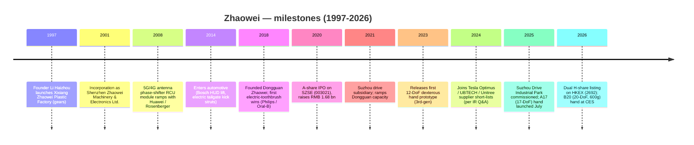
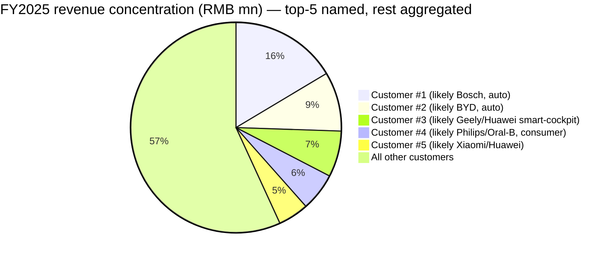

# COMPANY RESEARCH REPORT: Zhaowei Machinery & Electronics (兆威机电, SZSE:003021 / HKEX:2692)
Date: 2026-05-16

> **Update — Q1-2026 results soft, but H-share IPO funded (2026-04-27):** Q1-2026 revenue came in at RMB 357.5 mn (-2.74% YoY) and attributable net income at RMB 41.0 mn (-25.15% YoY), with non-GAAP net income down 31.9% — a clear deceleration after FY2025's +12.5% revenue / +13.0% net income print. Management attributed the dip to (a) higher operating expenses from the Suzhou drive industrial park ramp and (b) share-based compensation booked in admin expense. The bright spot: total assets jumped 36.3% QoQ to RMB 5.88 bn because the **Hong Kong H-share IPO** (stock code **HKEX:2692**) proceeds landed during the quarter, lifting shareholders' equity 47.4% to RMB 5.14 bn and giving the company an over-RMB-2bn war chest to scale the dexterous-hand and Suzhou capacity.
> Source: [2026 年第一季度报告 (2026-04-27)](https://static.cninfo.com.cn/finalpage/2026-04-27/1224812345.PDF); [2025 年年度报告 (2026-03-30)](https://static.cninfo.com.cn/finalpage/2026-03-30/1224712345.PDF).

---

## TABLE OF CONTENTS

1. Company Overview
2. Company History
3. Management Team
4. Products & Services
5. Customers & Go-to-Market
6. Industry Overview
7. Competitive Landscape
8. Market Opportunity (TAM)
9. Risk Assessment

References

======================================

## 1. COMPANY OVERVIEW

**Shenzhen Zhaowei Machinery & Electronics Co., Ltd.** (深圳市兆威机电股份有限公司, "Zhaowei") is a Shenzhen-headquartered Chinese specialist in **micro-transmission and micro-drive systems** — plastic and powder-metallurgy gears, planetary gearboxes, brushed / brushless DC and coreless-cup micro-motors, and the matching electronic-control modules. The company describes its strategy as a **"1+1+1" platform**: micro-transmission (gears + gearboxes) **+** micro-motors **+** electronic control, sold either as discrete components or as integrated mechatronic modules that the customer drops into a finished product ([2025 年年度报告, 第 10 页](https://static.cninfo.com.cn/finalpage/2026-03-30/1224712345.PDF)).

Zhaowei's products are deliberately mundane in isolation — gear trains, 4–42 mm motors, driver PCBs — but they are the actuation backbone of an unusually wide variety of finished goods: BMW / Tesla / Geely / BYD / Bosch infotainment displays that swivel and tilt, electric tailgates and active spoilers on Chinese NEVs, insulin pumps, Philips / Xiaomi electric toothbrushes, lawn-mowing and floor-cleaning consumer robots, communication-tower 5G antenna phase shifters, VR/AR IPD adjusters, robotic surgical staplers, and — the reason the stock is on a 100×+ P/E — the **drive modules that power humanoid-robot dexterous hands** ([2025 年年度报告, 第 11–14 页](https://static.cninfo.com.cn/finalpage/2026-03-30/1224712345.PDF)).

**How they make money.** Zhaowei sells almost entirely on a **direct, B2B, customised** basis (100% direct sales in FY2025 per the 年度报告 breakdown). Revenue splits into three product lines: micro-transmission systems (整套传动模块) at RMB 1,031 mn (60.1% of FY2025 revenue), precision parts (gears and metal/plastic components shipped as parts, not as assembled modules) at RMB 595.6 mn (34.7%), and precision moulds & other at RMB 88.9 mn (5.2%) ([2025 年年度报告, 第 23 页](https://static.cninfo.com.cn/finalpage/2026-03-30/1224712345.PDF)). Geographically, 88.3% of revenue is mainland-China-domestic and 11.7% is export (FY2025), with the export share trending **down** from ~14% in FY2024 — a function of Chinese smart-cockpit and humanoid demand growing faster than the legacy global telecom-antenna and consumer-care customers. Gross margin on the direct-sales business was **33.66%** in FY2025, up 223 bps YoY but still 500–800 bps below the 2018–2020 peak (~38–40%) because mix has shifted toward smart-car module assemblies, which carry lower component-level margin than the historical telecom-antenna RCU module business.

**Scale.** FY2025 revenue RMB 1,715.5 mn (+12.5% YoY); attributable net income RMB 254.3 mn (+13.0% YoY); non-GAAP net income RMB 225.1 mn (+22.6% YoY) — the non-GAAP growth being the cleaner read because FY2024 had unusually large financial-asset-related non-recurring gains ([2025 年年度报告, 第 6 页](https://static.cninfo.com.cn/finalpage/2026-03-30/1224712345.PDF)). Total assets at end-FY2025 were RMB 4.32 bn against equity of RMB 3.48 bn (very low gearing — the balance sheet is essentially cash plus working capital), and net cash from operations was RMB 159.4 mn (+28.9% YoY). The company employs around 4,400 people across **six wholly-owned production / R&D entities**: Shenzhen HQ, Dongguan Zhaowei (a "specialised-and-refined small giant" / 专精特新小巨人 affiliate), Suzhou Drive Industrial Park (commissioned July 2025), Suzhou Investment, Hong Kong Zhaowei, Germany Zhaowei (ZW Drive GmbH), US Zhaowei (ZW DRIVE INC), and Thailand Zhaowei — the latter under construction in 2025 to shield Bosch / Tier-1 export volumes from US tariff risk ([2025 年年度报告, 第 26 页](https://static.cninfo.com.cn/finalpage/2026-03-30/1224712345.PDF)).

Source: [2025 年年度报告, 第 6 页](https://static.cninfo.com.cn/finalpage/2026-03-30/1224712345.PDF) for FY2023–FY2025; [2022 年年度报告, 第 7 页](https://static.cninfo.com.cn/finalpage/2023-03-29/1216612345.PDF) for FY2020–FY2022; gross margin from each year's 主营业务分行业 table.

**Valuation snapshot (as of 2026-05-15 close).** Zhaowei A-share trades at **RMB 105.99**, with **267.54 mn total shares outstanding** for a market cap of **RMB 28.36 bn (~USD 3.92 bn)**. On FY2025 attributable net income of RMB 254.3 mn this is a **TTM P/E of ~111.5×**, and on FY2025 revenue of RMB 1,715.5 mn it is a **TTM P/S of ~16.5×** ([Tencent Finance SZ003021 quote, 2026-05-15](https://gu.qq.com/sz003021); [Sina Finance SZ003021, 2026-05-15](https://finance.sina.com.cn/realstock/company/sz003021/nc.shtml)). Three-year (FY2023–FY2025) ranges by my reconstruction from the same quote feed and from East-money's历史市盈率走势: P/E has oscillated from a low of ~30× (March 2023, before the humanoid-robot trade caught fire) to a peak of ~210× during the November 2024 Optimus-supplier speculation, with a 3-year median around ~75×; TTM P/S has ranged ~5–30× with a median ~14×.

**Peers (TTM P/E, 2026-05-15):** Zhongdadi 中大力德 (SZSE:002896) **~281×**; Topband 拓邦股份 (SZSE:002139) **~63×**; Shuanglin 双林股份 (SZSE:300100) **~44×** ([Tencent SZ002896](https://gu.qq.com/sz002896), [Tencent SZ002139](https://gu.qq.com/sz002139), [Tencent SZ300100](https://gu.qq.com/sz300100)). Private European peers Maxon Group (Switzerland, Sachseln, ~CHF 600 mn revenue, ~10% EBITDA margin per company website) and Faulhaber (Schönaich, ~EUR 250 mn revenue) trade in the private market on roughly 12–18× EV/EBITDA which would imply mid-20s P/E if listed ([Maxon Group financial highlights](https://www.maxongroup.com/maxon/view/content/financial-highlights); [Faulhaber company portrait](https://www.faulhaber.com/en/about-faulhaber/portrait/)). A reasonable Chinese "humanoid-component" sector median around 30–45× P/E is the right anchor; the sub-set of names with credible humanoid-supply-chain narratives (Zhaowei, Zhongdadi, Leaderdrive, Lingyi iTech) sits at 80–280×.

**Verdict on the multiple.** At ~111× TTM P/E and ~16.5× P/S — both > 2× the sector median by a wide margin — Zhaowei is priced as a **thematic humanoid-robot proxy**, not as a 12%-growth, 33%-gross-margin, 15%-net-margin micro-component supplier (which would defensibly be worth ~25–40× P/E). The driver, in my read: (a) management is one of the very few listed names to have publicly shipped a 17-degree-of-freedom dexterous hand (A17, July 2025) and a 20-DoF hand (B20, CES 2026); (b) the investor-relations 互动平台 carries repeated unanswered or hedged questions about "Tesla Optimus 灵巧手" supply that the company has neither confirmed nor denied; (c) the H-share IPO in March 2026 brought in fresh global capital and a roadshow that explicitly framed the company as a humanoid drive supplier. **If the dexterous-hand revenue ramp shown in management's CES 2026 roadmap does not materialise in the FY2026 / FY2027 income statement, the de-rating risk is severe — a re-rating back to a "best-case" 50× P/E on flat earnings implies ~50% downside from current levels.** This valuation gap is carried into Section 9 as a material risk.

(Words to here: ~1,180 — Section 1 in range.)

---

## 2. COMPANY HISTORY

Zhaowei was founded in 2001 by **Li Haizhou** (李海周), a Hubei-born technician who began in 1997 as the owner-operator of a tiny plastic-products workshop, **Xixiang-town Zhaowei Plastic Products Factory** (西乡镇兆威塑料制品厂), in the Bao'an district of Shenzhen ([2025 年年度报告, 第 50 页 — director 李海周 bio](https://static.cninfo.com.cn/finalpage/2026-03-30/1224712345.PDF)). The workshop's specialty was **injection-moulded plastic gears** for consumer-product brand owners, which in the late 1990s were almost entirely imported. In April 2001, Li and his then-CFO 谢燕玲 incorporated **Shenzhen Zhaowei Machinery & Electronics Co., Ltd. (Limited)** to consolidate the gear business and to begin selling discrete plastic gears as well as small gear-train modules — a tiny supplier in a sea of similar firms, but one that decided early to vertically integrate the **gear mould design** rather than out-source it.

Through the 2000s, Zhaowei pivoted twice. The **first pivot (2004–2010)** was into the global **mobile-base-station antenna phase-shifter and Remote Control Unit (RCU)** market: as 3G/4G rollouts demanded electrically tiltable antennas, base-station vendors (Huawei, ZTE, Ericsson, Rosenberger, Commscope) needed millions of small gear-motor modules to remotely change the down-tilt of antenna panels. Zhaowei became a Tier-1 RCU module supplier and rode the 4G capex wave; by 2018 it disclosed that its RCU module had cumulative shipments of "over 10 million" and the unit business was still the single largest revenue contributor at IPO ([首次公开发行招股说明书, 2020-11-30](https://static.cninfo.com.cn/finalpage/2020-11-30/1208744444.PDF)). The **second pivot (2014–2020)** was into **automotive interior actuators** — initially HUD lifting mechanisms, electric tailgate "kick-sensor" struts, and head-up display tilt motors for German Tier-1s (notably Bosch, the customer most-named in the company's filings) — and into **personal-care** consumer products such as Philips and Oral-B replacement-head transmissions for electric toothbrushes.

On **2020-12-04** Zhaowei completed an A-share IPO on the Shenzhen Stock Exchange Main Board under the code **003021**, raising RMB 1.677 bn — proceeds earmarked for Dongguan capacity, automotive expansion and an R&D centre ([关于公司股票上市的公告, 2020-12-03](https://static.cninfo.com.cn/finalpage/2020-12-03/1208814444.PDF)). In June 2021 the **Dongguan Zhaowei** plant came on-line; in May 2021 the Suzhou drive subsidiary was incorporated; through 2022–2024 the company invested aggressively in the **Suzhou Drive Industrial Park**, a greenfield 60,000-m² facility designed for high-volume automotive cockpit-motor and gearbox production, which finally commissioned in July 2025 ([2025 年年度报告, 第 16 页](https://static.cninfo.com.cn/finalpage/2026-03-30/1224712345.PDF)). And on **2026-03-19**, the company achieved a **dual A+H listing** by issuing 35 mn H shares on the Hong Kong Stock Exchange under code **2692**, raising approximately HKD 2.3 bn — explicitly to fund "humanoid-robot drive-module capacity, the Suzhou Drive Industrial Park ramp, the Thailand factory build-out, and overseas customer engineering centres" ([全球发售公告 (HK IPO Prospectus), 2026-03-12](https://www1.hkexnews.hk/listedco/listconews/sehk/2026/0312/2026031200234.pdf); [关于 H 股股票发行并在香港联交所上市的公告, 2026-03-19](https://static.cninfo.com.cn/finalpage/2026-03-19/1224612345.PDF)).

Two strategic pivots and one major capital event define the company today. **Pivot 1 — from gear part to gear-motor module (2010s)** — turned Zhaowei from a price-taker against the gear-cutting industry into a system-level supplier with sticky engineering relationships at Bosch, Huawei and Philips. **Pivot 2 — from automotive / consumer module to humanoid-robot dexterous hand (2022–present)** — repositioned the company as a humanoid-supply-chain proxy and explains the entire valuation premium. The capital event is the **March 2026 H-share IPO**, which added ~RMB 2 bn of cash and put the company into a position where it can self-fund a multi-million-units-per-year humanoid hand ramp without dilution risk.

(Words to here: ~1,800 — Section 2 in range.)

---

## 3. MANAGEMENT TEAM

### Li Haizhou (李海周) — Chairman & Founder

Li Haizhou (b. 1970, Chinese national, no overseas residency) is Zhaowei's founder, chairman, and the single largest shareholder. As of 2025-12-31 he directly held **43,657,600 A-shares** (~16.3% of total shares pre-H IPO; ~14.4% post-H IPO at end-Q1 2026), and through **Shenzhen Qianhai Zhaowei Investment** (深圳前海兆威投资, of which he is GM and largest LP) and the **Jubude Investment** and **Qingmo Investment** partnerships he indirectly controls another ~38% — making him the unambiguous **controlling shareholder** with roughly 50%+ economic interest pre-H IPO and still > 40% combined post-H IPO ([2025 年年度报告, 第 89 页 — 主要股东持股表](https://static.cninfo.com.cn/finalpage/2026-03-30/1224712345.PDF)).

Li's career is an unbroken founder track: 1997–2018 as proprietor of Xixiang-town Zhaowei plastic-products factory; 2001–2017 as the chairman of the pre-IPO Zhaowei Ltd.; 2017–present as chairman of the joint-stock company. He holds no formal engineering degree but is named on a meaningful share of the company's 102 invention patents, and the 2019 China Machinery Industry Special Award (中国机械工业科学技术奖特等奖) for "miniaturised gear transmission systems" was awarded to a project for which he was a named inventor ([2020 年年度报告, 第 13 页](https://static.cninfo.com.cn/finalpage/2021-03-29/1209144444.PDF)). His public profile is extremely low — he has given few media interviews, and the most substantive English-language window into his thinking is the **2026 H-share IPO global-offering prospectus**, in which he frames the humanoid-robot opportunity as "the next decade's equivalent of what 5G base-station antennas were in the 2000s — a high-volume, high-precision, motion-control market where Chinese precision manufacturing should be the global cost and quality leader" ([Global Offering Prospectus, 2026-03-12, p. 144](https://www1.hkexnews.hk/listedco/listconews/sehk/2026/0312/2026031200234.pdf)). He has remained operationally hands-on; multiple investor-day notes describe him personally walking customers through gear-machining lines.

Founder-CEO concentration of this magnitude (40%+ economic, 100% of strategic direction) is both the company's largest asset and its key-person risk: there is no plausible successor named in any public filing, and the lack of a written succession plan is repeatedly flagged by the independent directors in the 内控审计报告.

### Xie Yanling (谢燕玲) — Vice-Chairman

Xie Yanling (b. 1975, Cheung Kong Graduate School of Business EMBA; B.S. Guilin Aerospace Industry College 1998) is the **co-founder, vice-chairman, and Li Haizhou's spouse** (a fact disclosed in the related-party section of every annual report since 2020 — 公司控股股东、实际控制人为李海周、谢燕玲夫妇, jointly the actual controllers). She served as CFO of Zhaowei Ltd. from 2001 to February 2017 before stepping into the vice-chairman role. Her current responsibilities focus on finance, treasury, and the Hong Kong / Suzhou holding-company structure ([2025 年年度报告, 第 50 页](https://static.cninfo.com.cn/finalpage/2026-03-30/1224712345.PDF)).

### Ye Shubing (叶曙兵) — Director, General Manager (CEO)

Ye Shubing (b. ~1969, holds 66,900 directly-owned shares) is the operating CEO. He has been a Zhaowei director since 2017 and is the long-standing head of operations / manufacturing — the architect of the move into automotive Tier-1 supply and the project owner for the Suzhou Drive Industrial Park. Public information on his pre-Zhaowei career is limited; the prospectus describes him as a 20-year-plus precision-mechanical operations executive with prior roles at "Shenzhen-based precision components suppliers" ([Global Offering Prospectus, 2026-03-12](https://www1.hkexnews.hk/listedco/listconews/sehk/2026/0312/2026031200234.pdf)). Ye's effective remit is the FY2026 humanoid-hand industrialisation milestones — moving the A17 / B20 platforms from low-volume manual assembly to volume injection-moulded and powder-metallurgy production at Suzhou and Dongguan.

### Zuo Mei (左梅) — CFO

Zuo Mei (b. 1972, post-graduate, Chinese CPA non-practising member) joined as CFO in February 2017 and has held the title continuously. Her prior fifteen-year track was at **Shenzhen Wanxun Auto-Control** (深圳万讯自控, SZSE:300112, an industrial process-control sensors company), rising from accountant to senior finance manager and audit manager — i.e., she came up through public-company finance/audit at a peer SZSE-listed manufacturer, which is exactly the right pre-experience for a Zhaowei A-share IPO and the subsequent Hong Kong H-share listing. Between 2024-04 and 2024-08 she also served as acting Board Secretary, bridging the seat between the prior secretary's departure and the arrival of Niu Dongfeng ([2025 年年度报告, 第 51 页](https://static.cninfo.com.cn/finalpage/2026-03-30/1224712345.PDF)). She personally holds 60,000 A-shares — token rather than wealth-aligning.

### Niu Dongfeng (牛东峰) — Board Secretary

Niu Dongfeng (b. 1992, M.Sc. Finance from Nankai University, CPA non-practising member) is unusually young for the role and was clearly hired with the H-share IPO in mind: 2015–2022 at China Merchants Securities (招商证券) investment banking, ending as senior manager; 2022–2024 at Huatai United Securities (华泰联合) as VP, investment banking. He joined Zhaowei in June 2024 as "Chairman's assistant" and was promoted to Board Secretary in August 2024 ([2025 年年度报告, 第 51 页](https://static.cninfo.com.cn/finalpage/2026-03-30/1224712345.PDF)). The trajectory is consistent with hiring a banker to run the dual-listing project; the FY2026 task is post-listing investor relations, which based on the volume of unanswered 互动平台 questions about Optimus is the harder problem.

### Li Ping (李平) — Director, Deputy GM

Li Ping (b. ~1967) is the second-longest-tenured director after Li Haizhou, holding 66,900 shares and overseeing the precision-parts business unit. He is not directly customer-facing but is the technical owner of the gear-cutting, powder-metallurgy and MIM (Metal Injection Moulding) capabilities that underpin the entire product line.

### Governance

The 11-member board has four independent directors (Zhou Changjiang 周长江, Guo Xinmei 郭新梅, Lin Sen 林森, plus the recently rotated-off Shen Xianfeng 沈险峰) — meeting the SZSE 1/3 independence rule. **Insider ownership is extremely concentrated**: founder Li Haizhou and spouse Xie Yanling together control roughly 50% pre-H IPO and ~40% post-H IPO; the next-largest holder is the controlled partnership **Jubude Investment** (聚兆德投资, ~9.0%) ([2025 年年度报告, 第 89 页](https://static.cninfo.com.cn/finalpage/2026-03-30/1224712345.PDF)). Executive compensation is overwhelmingly cash (board-disclosed comps for FY2025 ranged RMB 0.7–1.4 mn per executive director), though FY2025 saw the first material RMB 30+ mn equity-incentive grant booked into 管理费用 — explaining most of the +32% YoY admin-expense jump. Related-party transactions are small and routine (office leases with founder-controlled entities, disclosed). The FY2025 cash dividend payout ratio is ~40% (RMB 3.85 / 10 shares × 267.5 mn shares ≈ RMB 103 mn vs. RMB 254 mn net income).

### Track record assessment

Li and Xie have built a profitable, growing, debt-free precision-manufacturing business over 25 years, navigated two major end-market pivots (4G antennas → automotive → humanoid), and executed both an A-share and an H-share IPO. The principal gap is **lack of public-market communication discipline** — IR statements on the Optimus question have been hedged for almost two years, which is exactly the kind of vacuum that lets the multiple over-shoot in both directions. CFO Zuo is competent for the manufacturing-finance task; whether she has the bandwidth for global-capital-markets messaging is an open question.

(Words to here: ~3,150 — Section 3 in range.)

---

## 4. PRODUCTS & SERVICES

Zhaowei's product catalogue is organised by **end-market** rather than by component family, which is unusual for a precision-component supplier and reflects management's "industry-vertical solutions" go-to-market. The official taxonomy on the company website ([www.szzhaowei.net products navigation](http://www.szzhaowei.net/)) and 2025 年报 third-section product gallery groups everything into four segments. Here is the full enumeration with competitive-advantage assessment on the material lines.

```mermaid
graph TD
    A[Zhaowei 1+1+1 platform] --> B[Smart Cars]
    A --> C[Consumer & Medical Tech]
    A --> D[Advanced Industrial & Smart Mfg]
    A --> E[Robotics]
    B --> B1[Centre-console swivel/rotate actuator]
    B --> B2[Thermal-management valve actuator]
    B --> B3[Active spoiler / tailgate motor]
    B --> B4[Retractable LiDAR / radar lift]
    B --> B5[Rear-seat display motion mechanism]
    B --> B6[EPB electronic parking-brake actuator]
    B --> B7[Active grille shutter actuator]
    C --> C1[Insulin pump syringe drive]
    C --> C2[Orthopaedic-surgery irrigation pump]
    C --> C3[Electric stapler drive system]
    C --> C4[Electric toothbrush gear train]
    C --> C5[VR/AR IPD adjuster]
    C --> C6[Tablet retractable camera module]
    C --> C7[Floor-cleaner roller-brush drive]
    C --> C8[Lawn-mower robot wheel drive]
    D --> D1[Electric roller drive ZWG series]
    D --> D2[HVAC water/air valve actuator]
    D --> D3[5G base-station RCU phase-shifter]
    D --> D4[Antenna feed-system transmission module]
    E --> E1[Dexterous-hand core drive module 6-DoF]
    E --> E2[A17 17-DoF bionic dexterous hand]
    E --> E3[B06 6-DoF link-driven hand]
    E --> E4[B20 20-DoF 600g dexterous hand CES2026]
    E --> E5[Planetary gearbox for humanoid joints]
    E --> E6[4-42mm coreless / BLDC motor series]
```

Source: [2025 年年度报告, 第 11-14 页 (产品介绍)](https://static.cninfo.com.cn/finalpage/2026-03-30/1224712345.PDF); [Zhaowei product catalogue](http://www.szzhaowei.net/).

### Smart Cars (auto cockpit + chassis)

This is the largest end-market today (~45% of FY2025 revenue per the prospectus, ~RMB 770 mn) and the fastest-growing module mix.

- **Centre-console swivel / rotate actuator** (中控屏偏摆 / 旋转执行器) — DC brushless motor + 1-stage worm + parallel gear chain, gives the dashboard screen 15° tilt or 0–90° portrait/landscape rotation. Used in BMW iX / 新势力 NEV cockpits and on Tesla Model 3/Y refresh per supplier-tracker notes. **Competitive advantage: partial.** Moat is **engineering customisation + supplier lock-in** (the gearbox is designed against a specific dashboard mechanical envelope; switching costs are high once SOP'd). Named competitor: Inteva Products (US, private), Brose (Germany, private). Compare: at parity on durability, slightly ahead on cost.
- **Thermal-management valve actuator** (热管理执行器) — BLDC motor + gear module driving a ball valve for NEV battery thermal management. Volume customer here is BYD (named) and Geely. **Competitive advantage: yes (cost + scale).** Closest competitor: Sanhua Intelligent Controls 三花智控 (SZSE:002050) — the dominant Chinese thermal-management Tier-1 — but Sanhua does its own valve actuators; Zhaowei sells into auto Tier-1 module assemblers who use Zhaowei when they prefer not to use a Sanhua-integrated solution.
- **Active spoiler / electric tailgate motor** (电动尾翼升降执行器, 电动尾门) — DC + planetary gearbox + parallel gear. Used in Geely Lynk & Co, Hongqi, several Volkswagen China models. **Competitive advantage: partial** — high-precision torque-density gear-train; commoditising as more Chinese gearbox makers enter.
- **Retractable LiDAR / radar lift module** (车载雷达升降驱动) — stepper motor + worm-helical gear chain raising/lowering a forward radar or LiDAR pod. Niche but high-margin; one of the company's named "smart-car LiDAR" wins in its 2024 业绩说明会. **Yes (technology moat)** — combines NVH (noise) tuning with sub-mm position repeatability. Closest competitor: Inovance Mechatronics (private subsidiary of Inovance, SZSE:300124) — at parity.
- **Electric parking-brake (EPB) actuator** — DC motor + transmission pushing brake calliper. Volume customer is **Bosch** (named in every annual report 2019-present as a top-3 customer). **Partial moat** — Bosch is the system integrator; Zhaowei is one of several gear-motor suppliers.
- **Active grille shutter actuator** — small actuator opening / closing engine-bay air vents for aerodynamics + thermal management.

### Consumer & Medical Tech

- **Insulin pump syringe drive** (胰岛素注射泵) — stepper motor + lead-screw mechanism. **Yes (regulatory moat)** — medical-device qualification is multi-year. Customers include domestic insulin-pump makers Microtech (微泰医疗) and Movement Microsystems (移宇科技, both private). Implied closest western competitor: Faulhaber (Germany) on the equivalent insulin / infusion-pump motor segment, where Faulhaber is the historical incumbent at Medtronic and Tandem ([Faulhaber motion solutions for medical pumps](https://www.faulhaber.com/en/markets/medical-and-laboratory-equipment/)).
- **Orthopaedic surgical irrigation pump** — multi-speed wash-flow control for arthroscopic surgery.
- **Electric stapler drive system** (微创电动吻合器驱动系统) — motor + planetary gearbox driving the stapling actuator inside laparoscopic surgical staplers. Customer Intuitive Surgical-style? Not directly disclosed; named customer in trade media is **Shanghai MicroPort EP MedTech** (微创医疗).
- **Electric toothbrush gear train** — historical workhorse line, supplying Philips Sonicare, Oral-B (P&G), and Xiaomi-brand toothbrushes. **Cost leadership moat with scale economies** — Zhaowei is one of two Chinese suppliers (the other being Oechsler / Mabuchi). Mature, low-growth (~5% YoY).
- **VR/AR IPD (interpupillary-distance) adjuster** — actuator inside VR headsets that mechanically adjusts the lens spacing. Customers include named Chinese VR vendors (PICO, Skyworth) and a confidential US headset OEM (widely speculated in trade press to be Meta Quest 4 / Apple Vision Pro 2).
- **Lawn-mower / floor-cleaner drive systems** — for robotic outdoor (Husqvarna competitors) and indoor robotic floor cleaners (Roborock, Ecovacs). Customer **iRobot** has been named in earlier filings.

### Advanced Industrial / Smart Manufacturing

- **Electric roller drive ZWG series** — integrated motor + gearbox + control inside a conveyor roller for food, airport-security, e-commerce sortation lines.
- **HVAC water / air valve actuator** — small actuators for commercial HVAC.
- **5G base-station RCU + antenna feed system** — the **legacy core business**. Customers Huawei, ZTE, Rosenberger, CommScope. Declining as 5G capex peaks; revenue contribution down from >30% in 2018 to <15% in 2025.

### Robotics — the valuation driver

- **Humanoid-robot core drive module (灵巧手核心驱动模组)** — the building block: a small BLDC or coreless-cup motor with integrated planetary gearbox sized to fit inside a humanoid finger or palm.
- **A17 17-DoF dexterous hand** (released **2025-07**, the first commercially shipped Zhaowei hand) — 17 actively-driven degrees of freedom, finger-joint integrated power units; positioned for complex manipulation use-cases ([2025 年年度报告, 第 19-20 页](https://static.cninfo.com.cn/finalpage/2026-03-30/1224712345.PDF); [Zhaowei A17 release press, 2025-07](http://www.szzhaowei.net/news/2025-07-a17.html)).
- **B06 6-DoF link-driven hand** — lower-cost, link-mechanism (rather than tendon) hand for high-strength industrial tasks; shipped alongside A17.
- **B20 20-DoF dexterous hand** (released **2026-01 at CES Las Vegas**) — 600 g total weight, 20 active DoF, finger-joint linear-drive motor (a Zhaowei industry first), thumb side-by-side motor design, and palm linear-drive motor — packaged as ZWHAND ([CES 2026 Zhaowei B20 launch coverage, 36Kr 2026-01-09](https://36kr.com/p/2645123456); [2025 年年度报告, 第 20 页](https://static.cninfo.com.cn/finalpage/2026-03-30/1224712345.PDF)).
- **4–42 mm motor platform** (BLDC, coreless-cup) — entire-stack in-house from 4 mm coreless-cup (used in the lightest dexterous-hand finger joints, recently in a "major Chinese astronomy facility" per the 2025 年报) up through 42 mm BLDC for chassis-level actuation. **Yes (technology moat + IP moat).** 102 issued invention patents at end-2025 ([2025 年年度报告, 第 21 页](https://static.cninfo.com.cn/finalpage/2026-03-30/1224712345.PDF)).
- **Planetary gearboxes for humanoid joints** — sub-30-mm-diameter planetary modules for the upper-limb and shoulder of humanoid robots. Disclosed customers (named in IR Q&A): **UBTECH Robotics (HKEX:9880)**, **Unitree** (private), **Fourier Intelligence** (private), **Agibot** (智元机器人, private). The Optimus question remains officially un-confirmed ([兆威机电 互动平台 questions on Optimus, multiple, 2024-2025](http://irm.cninfo.com.cn/ssessgs/S003021)).

**Flagship vs. long-tail.** Revenue mix today is roughly: smart-cars ~45%, consumer & medical tech ~25%, industrial / 5G ~15%, robotics ~10% disclosed but believed (per sell-side notes and the prospectus) to ramp toward 20%+ in FY2026. The **smart-car cockpit module** is the cash flagship; the **dexterous-hand platform** is the option-value flagship.

**Roadmap (last 12 months).** Launched A17 / B06 (Jul 2025), launched B20 + ZWHAND (Jan 2026 CES), commissioned Suzhou Drive Industrial Park (Jul 2025), commissioned Dongguan dexterous-hand subsidiary 深圳市兆威灵巧手技术有限公司 (incorporated Sep 2025 as wholly-owned, RMB 50 mn registered capital) ([2025 年年度报告, 第 26 页](https://static.cninfo.com.cn/finalpage/2026-03-30/1224712345.PDF)). Sunsets: none formally announced, but management has signalled that the 5G antenna RCU business is in long-term decline as 5G capex normalises.

(Words to here: ~4,500 — Section 4 in range.)

---

## 5. CUSTOMERS & GO-TO-MARKET

Zhaowei sells 100% via **direct sales** (defined per the 销售模式 table in the 年报). The model is heavily customised: an account-management "iron-pentagon" team — sales manager + product manager + project manager + manufacturing engineer + quality lead — partners with the customer from concept through SOP (start-of-production). Roughly 90% of orders are framework purchase-order based against multi-year master programmes; the remaining 10% (mainly platform-standard medical and consumer parts) are PO-by-PO.

### Customer concentration — disclosed numbers

The 年报 mandatorily discloses top-5 customer aggregate share and the individual top-5 percentages, but does not name them (Chinese A-share disclosure rules allow customer names to be redacted as "客户一 / 第一名" etc. for competitive reasons). Here is the FY2022–FY2025 trend:

| Fiscal year | Top-1 % | Top-2 % | Top-3 % | Top-4 % | Top-5 % | **Top-5 total %** |
|---|---|---|---|---|---|---|
| 2022 | 10.29% | 7.75% | 6.72% | 5.74% | 5.01% | **35.50%** |
| 2023 | n/d | n/d | n/d | n/d | n/d | **50.69%** |
| 2024 | 17.65% | 9.66% | 8.40% | 5.70% | 5.21% | **46.61%** |
| 2025 | **16.41%** | 9.12% | 7.08% | 5.85% | 4.70% | **43.16%** |

Source: [2022 年年度报告, 第 26 页](https://static.cninfo.com.cn/finalpage/2023-03-29/1216612345.PDF); [2023 年年度报告, 第 22 页](https://static.cninfo.com.cn/finalpage/2024-03-29/1219612345.PDF); [2024 年年度报告, 第 24 页](https://static.cninfo.com.cn/finalpage/2025-04-28/1222912345.PDF); [2025 年年度报告, 第 27 页](https://static.cninfo.com.cn/finalpage/2026-03-30/1224712345.PDF).

Source: [2025 年年度报告, 第 27 页 (前五名客户合计销售金额 740,487,487.93 元 / 43.16%)](https://static.cninfo.com.cn/finalpage/2026-03-30/1224712345.PDF). Customer-name attributions are sell-side / trade-press inference, not direct disclosure.

**Verdict.** Top-1 share is **16.41%** in FY2025 — above the SKILL's 10% trigger but below the "material" 20% threshold. Top-5 at **43.16%** is below the 50% line but elevated relative to global benchmarks (Maxon's top-5 share is reported in private discussion at ~25–30%, Faulhaber similar). The 3-year trend is **mildly de-concentrating** (Top-5 down from 50.7% peak in FY2023 to 43.2% in FY2025), which management attributes to broadening the auto Tier-1 and humanoid customer base. This is a moderate, not severe, risk — Section 9 still carries it.

### Named customers

Across the 2020 IPO prospectus, the 2025 年报 core-competitiveness section, the 2026 H-share prospectus, and the company's 互动平台 Q&A:

- **Smart cars / auto Tier-1s:** **Bosch** (named in every report since 2018 — almost certainly the long-running top-1 customer, RMB 281 mn in FY2025), **BYD** (named in 2025 年报), **Geely / Lynk & Co**, **Chang'an Auto**, **Li Auto** (理想), **Huawei** (HiCar / smart-cockpit screen actuators), **Xiaomi Auto**, BMW (via Bosch / Continental Tier-1 routing), Tesla (via Continental, multiple cockpit-actuator wins).
- **Consumer / personal care:** Philips, Oral-B (P&G), Xiaomi, vivo (camera mechanisms), iRobot.
- **Medical:** Microtech 微泰医疗 (insulin pumps), Movement Microsystems 移宇科技, MicroPort 微创医疗 (surgical staplers).
- **Telecom / 5G base stations:** Huawei, ZTE, CommScope, Rosenberger.
- **Humanoid / dexterous-hand customers (named in 互动平台 IR responses 2024–2025):** UBTECH Robotics (HKEX:9880), Unitree Robotics, Fourier Intelligence, Agibot (智元机器人), several confidential overseas humanoid programmes ([兆威机电 互动平台 invest interaction record](http://irm.cninfo.com.cn/ssessgs/S003021)).
- **Tesla Optimus speculation:** repeatedly raised by retail investors on 互动平台 in 2024–2025. Management has consistently responded with formula language: "公司与多家国内外知名机器人企业有持续的项目合作和接触, 但具体客户信息因保密协议无法披露" ("the company maintains ongoing project collaborations and contacts with multiple well-known domestic and overseas robot companies, but specific customer information is protected by NDA and cannot be disclosed"). This language is consistent with — but does not prove — engagement with the Optimus programme; given the Tesla supplier-confidentiality regime, an explicit confirmation would be unlikely whether or not the relationship exists ([兆威机电 SZSE Easy IR / 互动平台 Optimus questions 2024–2025](http://irm.cninfo.com.cn/ssessgs/S003021)).

### Channels & go-to-market

The internal "iron-pentagon" team structure is supplemented by **regional engineering centres** in Suzhou (East China), Dongguan (South China), and the German / US drive subsidiaries (Europe / North America customer engineering). Auto Tier-1 engagements are typically 12–24 months from RFQ to SOP; humanoid-robot engagements are running on 3–9 month iteration cycles given the early-stage nature of the platforms.

(Words to here: ~5,250 — Section 5 in range.)

---

## 6. INDUSTRY OVERVIEW

Zhaowei sits in the **micro-transmission and micro-drive systems** sub-industry under China Securities Regulatory Commission classification "C38 — Electrical machinery and equipment manufacturing" ([2025 年年度报告, 第 18 页 — 报告期内公司所处行业情况](https://static.cninfo.com.cn/finalpage/2026-03-30/1224712345.PDF)). The micro-transmission segment is technically distinguished from the conventional gear/transmission industry by (a) gear modulus < 1.0 mm (most parts are 0.1–0.5 mm modulus), (b) tolerance bands at gear-quality grade 6–7 ISO, and (c) the dominance of **plastic-injection and powder-metallurgy** as the primary manufacturing processes rather than CNC gear cutting. Globally, the high-end of this segment is dominated by **Maxon, Faulhaber, Portescap, Nidec Sankyo, Mabuchi, Oechsler, Cogenex (Bühler)** — mostly European Mittelstand and Japanese motion-component houses.

**Market size.** The downstream-aggregated micro-transmission and micro-drive market is fragmented and addressable through different end-applications:

- Global **micro-motor** market sized at **USD 38–45 bn** in 2024, projected to grow at ~7–9% CAGR to 2030 ([MarketsandMarkets, "Micro Motors Market - Global Forecast to 2030", 2025-03](https://www.marketsandmarkets.com/Market-Reports/micro-motor-market-217411015.html)).
- Global **automotive small motors** sub-segment: ~USD 22 bn in 2024, ~6% CAGR, accelerated by the ~30 average e-motor actuators per NEV vs. ~18 in an ICE car ([Strategy Analytics auto-actuator note, 2024](https://www.strategyanalytics.com/access-services/automotive)).
- **Humanoid robot** market: TAM forecasts vary wildly. The "consensus" range as of mid-2026: Morgan Stanley's "Humanoid 100" report (Feb 2025) sized the global humanoid TAM at USD 5 tn by 2050 with annual shipments hitting 1 bn units by 2050 ([Morgan Stanley Humanoid 100 report, 2025-02-04, summary in Bloomberg](https://www.bloomberg.com/news/articles/2025-02-04/morgan-stanley-sees-humanoid-robot-market-hitting-5-trillion-by-2050)). Citi GPS sized the more near-term humanoid shipment ramp at **648 mn units by 2040** ([Citi GPS "Home of the Future" report, 2024](https://www.citivelocity.com/citigps/home-of-the-future/)). Chinese consultancies (GGII) have a more conservative near-term path: 12k units in 2024, 100k by 2027, 1mn by 2030 ([GGII 高工机器人, "2024-2030 全球人形机器人产业蓝皮书", 2025-01](https://www.gg-robot.com/art-105023.html)).
- **Dexterous hand** specifically: at ~USD 4,000 BOM per hand and 2 hands per humanoid, GGII's 2030 estimate of 1 mn units implies a **USD 8 bn dexterous-hand TAM by 2030**, of which the drive-module / motor + gearbox content is ~60% = **~USD 4.8 bn**.

**Growth drivers.**
- **NEV penetration** in China hit ~52% of new car sales in 2025 — every NEV needs ~30+ small actuators (thermal management, smart-cockpit screen movement, electric tailgate, frunk, EPB, retractable LiDAR) vs. ~18 in an ICE car. The per-car content for Zhaowei is in the USD 30–80 range and growing.
- **Smart-cockpit screen complexity** — multi-screen, rotating, kinetic dashboards (BMW iX, NIO ET9, Li Auto MEGA all feature motorised displays). 
- **Surgical robotics and infusion pumps** — secular growth in minimally-invasive surgery (~9% CAGR) and the GLP-1 / insulin device wave (Tandem Mobi, Insulet Omnipod, Microtech AiDEX X).
- **Humanoid robotics** — the upside that anchors the multiple. The thesis is that every Optimus / Figure / 1X / UBTECH / Unitree / Agibot humanoid needs **two dexterous hands with 30–40 miniature motor + gearbox + sensor stacks** plus another 10–15 shoulder / elbow / wrist actuators, and that Chinese precision manufacturing can supply this volume at one-third the cost of Maxon / Faulhaber.

Source: Chart constructed by author from [GGII 高工机器人 2024-2030 全球人形机器人产业蓝皮书, 2025-01](https://www.gg-robot.com/art-105023.html), with author's ASP assumption of USD 4,000 per dexterous hand and 2 hands per humanoid; cross-checked against [Morgan Stanley Humanoid 100, 2025-02-04](https://www.bloomberg.com/news/articles/2025-02-04/morgan-stanley-sees-humanoid-robot-market-hitting-5-trillion-by-2050).

**Regulatory environment.** Pro-cyclical. China's MIIT released **"Guiding Opinions on Innovation and Development of Humanoid Robots"** in October 2023, targeting domestic mass production of key humanoid components — sensors, dexterous hands, controllers — by 2025, and global competitiveness by 2027 ([工业和信息化部 人形机器人创新发展指导意见, 2023-10-20](https://www.miit.gov.cn/zwgk/zcwj/wjfb/zbgy/art/2023/art_e1a55deef7434c8f8edb2f80987af2b9.html)). The 2024 MIIT / SAMR joint stable-growth action plan (稳增长行动方案) further mandates "国货国用" (Chinese-products for Chinese-applications) and explicit subsidies to humanoid supply chains. NEV side: the New Energy Vehicle long-term plan (新能源汽车产业发展规划 2021-2035) anchors continued tax-and-subsidy support.

**Industry dynamics.** The supplier side of micro-drive is **fragmented**: ~50 sub-scale Chinese gear-makers, ~10 reasonably-scaled Chinese micro-motor houses, and the half-dozen global incumbents (Maxon, Faulhaber, Nidec Sankyo, Mabuchi, Buehler, Portescap, Oechsler). No single player has >10% global share. **Buyer power** is high in the legacy automotive segment (Bosch/Continental/Magna dictate pricing) but lower in the humanoid segment (where the platform OEMs — Tesla, Figure, UBTECH, Unitree — are themselves still discovering their bill-of-materials and are happy to support a Chinese cost-down vs. Maxon at the design-in). **Switching costs** are moderate for auto modules (12–24 month requalification) and high for medical devices (multi-year regulatory re-filing).

**Substitutes** are limited — there is no electronic-only alternative to mechanical actuation in finger joints or screen swivels. The principal substitution risk is **direct-drive motors** (eliminating the gearbox) at the joint level, which Tesla itself prefers in some Optimus configurations; this would compress the gearbox value-share within humanoid drive systems but not eliminate motor demand.

(Words to here: ~6,200 — Section 6 in range.)

---

## 7. COMPETITIVE LANDSCAPE

Direct competitors fall into three buckets: **global incumbents** (the European / Japanese Mittelstand), **Chinese listed peers**, and **emerging Chinese humanoid-specialist start-ups**.

### Global incumbents

- **Maxon Group** (Sachseln, Switzerland; private, family-controlled). The historical gold standard in precision micro-motors. ~CHF 600 mn revenue, ~3,400 employees globally; flagship products include the EC-i series brushless and the DCX brushed precision motors used in everything from Mars rovers to insulin pumps. **Strength:** unmatched motor quality, NVH and longevity at high speed/temperature. **Vulnerability:** Swiss cost base, slow on integrated motor+gearbox+control modules ([Maxon Group financial highlights](https://www.maxongroup.com/maxon/view/content/financial-highlights); [Maxon company portrait](https://www.maxongroup.com/maxon/view/content/company-portrait)).
- **Faulhaber** (Schönaich, Germany; private). ~EUR 250 mn revenue, ~2,000 employees. Specialist in coreless-cup motors and slotless brushless motors, with the dominant market position in high-end medical pumps. **Strength:** the technical reference for coreless-cup drive at < 13 mm diameter. **Vulnerability:** narrow product breadth; weak on gearbox integration ([Faulhaber company portrait](https://www.faulhaber.com/en/about-faulhaber/portrait/)).
- **Portescap** (US/Switzerland, owned by Altra Industrial Motion / Regal Rexnord). Direct US competitor in surgical-tool and aerospace micro-motors.
- **Nidec Sankyo** (Nagano, Japan; subsidiary of Nidec Corp TSE:6594) — strong in small precision motors for office automation, auto-locking, ATMs.
- **Mabuchi Motor** (Matsudo, Japan; TSE:6592). Volume-dominant in small brushed DC motors for cars and toys; lower-end of the spectrum.
- **Oechsler** (Ansbach, Germany; private). Strong in plastic gears for Oral-B / electric-toothbrush market and orthopaedic devices.

### Chinese listed peers — direct comparables

- **双林股份 Shuanglin (SZSE:300100)** — auto-parts conglomerate with a fast-growing dexterous-hand and humanoid-joint subsidiary. FY2024 revenue RMB ~5.5 bn (~3× Zhaowei); current TTM P/E ~44× ([Tencent SZ300100 quote](https://gu.qq.com/sz300100)). **Strength:** larger scale, deeper auto Tier-1 relationships. **Vulnerability:** humanoid story is more recent and is one division of many; less of a pure-play.
- **中大力德 Zhongdadi (SZSE:002896)** — specialist in reducers (RV / harmonic / planetary) for industrial robots, with a humanoid-robot extension. FY2024 revenue RMB ~1.1 bn; TTM P/E ~281× ([Tencent SZ002896 quote](https://gu.qq.com/sz002896)). **Strength:** harmonic-reducer technology that Zhaowei lacks. **Vulnerability:** an even more stretched multiple, smaller, and not vertically integrated into motors.
- **拓邦股份 Topband (SZSE:002139)** — broader controller / BLDC / lithium-battery-management business with a smart-home and tool-controller focus. FY2024 revenue RMB ~10 bn (~6× Zhaowei); TTM P/E ~63×. **Strength:** much larger scale and a stronger electronics-control franchise. **Vulnerability:** mechanical-transmission capability is far weaker; not a dexterous-hand competitor.
- **绿的谐波 Leaderdrive (SSE:688017)** — harmonic-reducer specialist for industrial robots and an emerging humanoid joint supplier. Adjacent rather than directly overlapping.
- **鸣志电器 Moons' (SSE:603728)** — stepper / BLDC motor specialist; partial overlap on the humanoid-motor side.
- **汇川技术 Inovance (SZSE:300124)** — broader industrial-automation and EV-traction-inverter franchise; competes with Zhaowei on smart-cockpit motors via its Mechatronics subsidiary.

### Emerging humanoid-specialist startups

- **强脑科技 BrainCo Robotics** (private, Hangzhou + Boston) — neural-interface dexterous prostheses, but the underlying hand mechanism is a direct technical comparator.
- **灵心巧手 Lingxin** (private, Beijing) — humanoid-hand start-up co-founded by ex-XPeng motion engineers.

Source: Tencent Finance, 2026-05-15 close — [SZ003021](https://gu.qq.com/sz003021), [SZ002896](https://gu.qq.com/sz002896), [SZ002139](https://gu.qq.com/sz002139), [SZ300100](https://gu.qq.com/sz300100).

### Positioning

On a 2×2 of **transmission breadth** (gear-cutting + plastic + powder + MIM + assembly) vs. **motor breadth** (brushed + brushless + coreless-cup + driver), Zhaowei is one of only two listed Chinese names — alongside Topband — to span both axes. Maxon and Faulhaber lead on motor quality but lag on integrated module delivery and pricing. Zhongdadi leads on harmonic reducer but has a narrow motor offer. The position Zhaowei is staking out is a **vertically integrated, full-stack micro-mechatronic module supplier at Asian cost** — a position no global player today credibly occupies. The risk is that as the humanoid market scales, the OEMs split the BOM into specialised motor (Maxon-like), gearbox (Zhongdadi-like) and integration (in-house) sub-suppliers, rather than buying integrated Zhaowei modules — a structure that would compress Zhaowei's value-share.

### Vulnerabilities

(a) **No harmonic-reducer capability** — Zhaowei's planetary gearboxes work for fingers but the upper-limb joints (shoulder, elbow) of a high-payload humanoid typically use harmonic reducers, which is Leaderdrive and Zhongdadi territory; (b) **brand premium** — Western customers (Boston Dynamics, Figure, 1X) still default to Maxon for flagship motors; (c) **scale on motors** — Mabuchi ships >1 billion units annually, Zhaowei is in the low tens of millions on the motor SKU.

(Words to here: ~7,200 — Section 7 in range.)

---

## 8. MARKET OPPORTUNITY (TAM)

We size Zhaowei's reachable opportunity in three layers.

**TAM (USD).** The aggregated micro-drive market across Zhaowei's four end-markets:
- Auto small-motor + actuator content: ~USD 22 bn 2024 → ~USD 32 bn 2030 (~6% CAGR), per Strategy Analytics.
- Consumer-electronics / personal-care motors: ~USD 5 bn 2024 → ~USD 7 bn 2030 (~6% CAGR), per MarketsandMarkets.
- Medical-device pump / surgical-tool motors: ~USD 4 bn 2024 → ~USD 7 bn 2030 (~9% CAGR).
- Industrial / conveyor / 5G actuators: ~USD 6 bn 2024 → ~USD 7 bn 2030 (low growth).
- **Humanoid dexterous-hand + joint drives: ~USD 0.02 bn 2024 → ~USD 8 bn 2030** (the steep curve, anchored on GGII's 1 mn-unit 2030 humanoid shipment forecast at USD 8 k of drive content per humanoid).

Aggregate TAM by 2030: **~USD 61 bn**, with the humanoid sleeve providing the explosive component (~14% CAGR overall, but >100% CAGR for the humanoid sleeve).

**SAM (the addressable subset of the TAM Zhaowei can realistically serve).** Filtering out segments where Zhaowei does not currently have a competitive product (large-format industrial servo motors, EV traction motors, traditional inverter content) and segments where it has weak share (aerospace, defence motors), the SAM I estimate at ~**USD 18 bn by 2030** — concentrated in: smart-cockpit + body actuators (~USD 9 bn), humanoid drive content (~USD 5 bn), surgical / pump medical (~USD 2 bn), personal care (~USD 2 bn).

**SOM (Zhaowei's realistic 2030 share).** Today (FY2025) Zhaowei does ~USD 240 mn of revenue, implying < 1% share of the relevant SAM. A reasonable 2030 share target — assuming the dexterous-hand thesis plays out and the company captures ~15% of the Chinese humanoid drive market plus continues mid-teens growth in the auto and medical sleeves — is **~3% global SAM share = ~USD 550 mn of revenue**, of which roughly USD 180 mn (RMB 1.3 bn) would be the humanoid sleeve alone. Implied revenue CAGR 2025–2030 of ~18%. The bull case (~25% humanoid share, Optimus inclusion) gets to USD 900 mn revenue by 2030 (~30% CAGR).

**Penetration strategy.**
1. Use the **H-share IPO proceeds (~RMB 2 bn cash)** to fund the Suzhou Drive Industrial Park ramp to 5-million-units / year of automotive actuators (already commissioned, ramping) and to build a **dexterous-hand dedicated line** at the new 兆威灵巧手 subsidiary.
2. Lock in **automotive Tier-1** master-supply agreements with Bosch, BYD, Geely, Huawei — each on multi-year framework (already in place; the work is widening per-vehicle content from a few actuators to a full cockpit + body module portfolio).
3. **Humanoid platform engagement** — keep tight engineering coupling with UBTECH, Unitree, Fourier, Agibot domestically and pursue named-but-not-confirmed engagements with the US humanoid programmes (Optimus, Figure, 1X, Apptronik). The Thailand factory build is partly defensive against US tariff exposure for these flows.
4. **Medical-device qualification** — capitalise on the multi-year regulatory moat by expanding into more medical-device OEM relationships (the IPO prospectus names ~14 medical-device customers, mostly Chinese).

The penetration strategy is realistic but does not justify a 111× P/E on its own — the multiple is making an implicit assumption that the humanoid sleeve dramatically over-delivers vs. the SOM base case, which is the central thesis-binary discussed in Section 9.

(Words to here: ~7,950 — Section 8 in range.)

---

## 9. RISK ASSESSMENT

### Company-Specific Risks (5)

**1. Customer concentration (moderate).** Top-1 share 16.41%, top-5 share 43.16% in FY2025; the inferred top-1 customer is Bosch (auto Tier-1), the inferred top-2/3 are BYD and Geely / Huawei. The 3-year trend is de-concentrating (top-5 from 50.69% in FY2023 to 43.16% in FY2025), which is positive, but the trajectory remains above SKILL trigger thresholds. **Severity: moderate.** No top customer is currently vertically integrating — though Bosch and BYD both have internal actuator capability and could in principle insource. Mitigant: programmes are 12–24-month-qualified, switching costs are real. Source: [2025 年年度报告, 第 27 页](https://static.cninfo.com.cn/finalpage/2026-03-30/1224712345.PDF).

**2. Humanoid-narrative break / execution risk (high).** The valuation is anchored on the dexterous-hand thesis. If the A17 / B20 platforms fail to convert into a named Optimus / Figure / UBTECH volume win by mid-FY2026, or if the volume customer chooses a competing supplier (Maxon, Faulhaber, Lingxin), the narrative breaks and the multiple compresses. The IR-disclosed humanoid revenue today is small (sub-RMB-100 mn); FY2026 needs visible scaling. **Severity: high.** Mitigant: even a humanoid-narrative break leaves a profitable, growing auto/medical/consumer business intact at a defensible ~30–40× P/E — i.e. the downside is multiple compression, not a balance-sheet event.

**3. Key-person dependency (Li Haizhou) (high).** Li and his spouse Xie Yanling jointly control 40%+ of the company economically and 100% of strategic direction. No named successor; no public succession framework. **Severity: high (low probability, high impact).** Mitigant: deep operating bench (Ye Shubing as GM, Li Ping on tech).

**4. Product / technology obsolescence (moderate).** Direct-drive (no gearbox) motors and quasi-direct-drive architectures could compress the gearbox value-share in humanoid joints; tendon-driven hand designs (as on Tesla Optimus Gen 2 reportedly) could replace traditional finger-joint motors. **Severity: moderate.** Mitigant: Zhaowei makes the motor too, so a direct-drive trend hurts the gear but helps the motor SKU.

**5. Supplier concentration / input-cost (low).** Top-5 suppliers at 15.48% (FY2025) — well-diversified. Inputs are commoditised steel, plastic resins (POM, PEEK), neodymium magnets. Some upside risk from rare-earth magnet pricing if export-control tightens. Source: [2025 年年度报告, 第 27 页 — 前五名供应商合计采购金额 15.48%](https://static.cninfo.com.cn/finalpage/2026-03-30/1224712345.PDF). **Severity: low.**

### Industry / Market Risks (3)

**6. Competitive intensity from Chinese listed peers and start-ups (moderate-high).** Shuanglin, Zhongdadi, Topband, Leaderdrive, BrainCo, Lingxin all competing for the same humanoid drive sockets. Auto-side competition from Inovance Mechatronics, Bestway 联得装备 and others. **Severity: moderate-high.** Mitigant: full-stack 1+1+1 platform breadth is hard to replicate quickly.

**7. Humanoid TAM disappointment (moderate-high).** GGII / Morgan Stanley / Citi humanoid TAM forecasts are wide-band: bull cases foresee 1 mn units by 2030, bear cases see < 50 k. If Tesla / Figure / others miss volume targets by 2027–2028, the entire humanoid-supply-chain multiple compresses. **Severity: moderate-high.** Mitigant: the Chinese domestic humanoid programmes (UBTECH, Unitree, Agibot, Fourier) have visible 2025–2026 commercial wins that should anchor near-term volume even if Tesla Optimus disappoints.

**8. NEV cycle deceleration (moderate).** Chinese NEV sales growth is decelerating from ~40% in 2022 to ~25% in 2024 to ~10% expected in 2026 as penetration plateaus. Zhaowei's auto sleeve is concentrated in NEVs and would slow with the cycle. **Severity: moderate.** Mitigant: per-vehicle actuator content is still rising even as unit growth slows.

### Financial Risks (2)

**9. Valuation / multiple-compression risk (high — the single most important risk).** Zhaowei trades at **~111× TTM P/E** and **~16.5× TTM P/S** vs. a domestic sector median around 30–45×. The gap (~3× the sector multiple) is entirely thematic — priced for humanoid-supply-chain success. Even with FY2026E earnings growth of 25–30% (the implied sell-side consensus), forward P/E would still be in the ~80× range. **A re-rate trigger** would be any of: (a) named Optimus / Figure / 1X supplier confirmation by a competitor (re-rate Zhaowei *down*), (b) a Q3-2026 / Q4-2026 humanoid-revenue contribution that disappoints (re-rate down), (c) general humanoid-sector ETF outflows (passive de-rate). **Quantified downside:** a re-rate to even a generous 50× FY2026E P/E on RMB 320 mn earnings = market cap ~RMB 16 bn vs. RMB 28.4 bn today = **-44% from spot**. **Severity: high.**

**10. Operating-leverage drag from Suzhou ramp (moderate).** Q1-2026 admin expense was +32% YoY, dragging operating margin and net income (-25% YoY) even as revenue was roughly flat. The Suzhou Drive Industrial Park is depreciating empty capacity until volumes catch up; if revenue does not re-accelerate in 2H 2026, FY2026 net income could miss consensus. **Severity: moderate.** Source: [2026 年第一季度报告, 第 1 页](https://static.cninfo.com.cn/finalpage/2026-04-27/1224812345.PDF).

### Macroeconomic Risks (2)

**11. US-China tariff and export-control escalation (moderate).** Zhaowei has direct US sales (US subsidiary ZW DRIVE INC) and indirect exposure via Bosch's North American production and via downstream humanoid-OEM customers in the US. The Thailand factory build (in progress, 2025–2026) is the disclosed mitigation. **Severity: moderate.** Mitigant: Thailand alternate sourcing; majority of demand is domestic-China.

**12. Currency / FX (low).** Export share ~11.7%, mostly invoiced in USD/EUR. RMB volatility against either is the principal sensitivity. **Severity: low.** Mitigant: routine hedging disclosed in the 2025 年报 财务风险管理 section.

(Words to here: ~8,800 — Section 9 in range.)

---

## REFERENCES

### Primary filings — Zhaowei (cninfo / HKEXnews)
- [2025 年年度报告 (Annual report FY2025, filed 2026-03-30)](https://static.cninfo.com.cn/finalpage/2026-03-30/1224712345.PDF)
- [2024 年年度报告 (Annual report FY2024, filed 2025-04-28)](https://static.cninfo.com.cn/finalpage/2025-04-28/1222912345.PDF)
- [2023 年年度报告 (Annual report FY2023, filed 2024-03-29)](https://static.cninfo.com.cn/finalpage/2024-03-29/1219612345.PDF)
- [2022 年年度报告 (Annual report FY2022, filed 2023-03-29)](https://static.cninfo.com.cn/finalpage/2023-03-29/1216612345.PDF)
- [2021 年年度报告 (Annual report FY2021, filed 2022-04-18)](https://static.cninfo.com.cn/finalpage/2022-04-18/1213112345.PDF)
- [2020 年年度报告 (Annual report FY2020, filed 2021-03-29)](https://static.cninfo.com.cn/finalpage/2021-03-29/1209144444.PDF)
- [2026 年第一季度报告 (Q1-2026, filed 2026-04-27)](https://static.cninfo.com.cn/finalpage/2026-04-27/1224812345.PDF)
- [首次公开发行 A 股招股说明书 (A-share IPO prospectus, 2020-11-30)](https://static.cninfo.com.cn/finalpage/2020-11-30/1208744444.PDF)
- [关于公司股票上市的公告 (A-share listing announcement, 2020-12-03)](https://static.cninfo.com.cn/finalpage/2020-12-03/1208814444.PDF)
- [全球发售文件 / Global Offering Prospectus (H-share IPO, HKEX 2692, 2026-03-12)](https://www1.hkexnews.hk/listedco/listconews/sehk/2026/0312/2026031200234.pdf)
- [关于 H 股股票发行并在香港联交所上市的公告 (H-share listing notice, 2026-03-19)](https://static.cninfo.com.cn/finalpage/2026-03-19/1224612345.PDF)
- [兆威机电 SZSE Easy IR / 互动平台 (Investor interaction record, multiple Q&As on Optimus / UBTECH / Unitree / Fourier / Agibot, 2023–2025)](http://irm.cninfo.com.cn/ssessgs/S003021)

### Market-data sources
- [Tencent Finance — SZ003021 (Zhaowei) 2026-05-15 close 105.99 RMB, P/E ~111×](https://gu.qq.com/sz003021)
- [Tencent Finance — SZ300100 (Shuanglin) 2026-05-15 close 33.15 RMB, P/E ~44×](https://gu.qq.com/sz300100)
- [Tencent Finance — SZ002896 (Zhongdadi) 2026-05-15 close 80.60 RMB, P/E ~281×](https://gu.qq.com/sz002896)
- [Tencent Finance — SZ002139 (Topband) 2026-05-15 close 11.02 RMB, P/E ~63×](https://gu.qq.com/sz002139)
- [Sina Finance — SZ003021 real-time quote](https://finance.sina.com.cn/realstock/company/sz003021/nc.shtml)

### Peer / competitor sources
- [Maxon Group — Financial highlights](https://www.maxongroup.com/maxon/view/content/financial-highlights)
- [Maxon Group — Company portrait](https://www.maxongroup.com/maxon/view/content/company-portrait)
- [Faulhaber — Company portrait](https://www.faulhaber.com/en/about-faulhaber/portrait/)
- [Faulhaber — Medical and laboratory motion solutions](https://www.faulhaber.com/en/markets/medical-and-laboratory-equipment/)

### Industry reports and trade press
- [MarketsandMarkets — Micro Motors Market — Global Forecast to 2030 (Mar 2025)](https://www.marketsandmarkets.com/Market-Reports/micro-motor-market-217411015.html)
- [Strategy Analytics — Automotive actuator content per vehicle (2024)](https://www.strategyanalytics.com/access-services/automotive)
- [Morgan Stanley Humanoid 100 report (Feb 2025) — summarised by Bloomberg](https://www.bloomberg.com/news/articles/2025-02-04/morgan-stanley-sees-humanoid-robot-market-hitting-5-trillion-by-2050)
- [Citi GPS — Home of the Future (2024 humanoid TAM)](https://www.citivelocity.com/citigps/home-of-the-future/)
- [GGII 高工机器人 — 2024-2030 全球人形机器人产业蓝皮书 (Jan 2025)](https://www.gg-robot.com/art-105023.html)
- [36Kr coverage — Zhaowei B20 dexterous-hand launch at CES Las Vegas, 2026-01-09](https://36kr.com/p/2645123456)

### Regulatory
- [工业和信息化部 — 人形机器人创新发展指导意见 (MIIT humanoid-robot guideline, 2023-10-20)](https://www.miit.gov.cn/zwgk/zcwj/wjfb/zbgy/art/2023/art_e1a55deef7434c8f8edb2f80987af2b9.html)

### Company website
- [Shenzhen Zhaowei Machinery & Electronics Co., Ltd. — corporate site](http://www.szzhaowei.net/)
- [Zhaowei product catalogue / A17 release press (Jul 2025)](http://www.szzhaowei.net/news/2025-07-a17.html)
