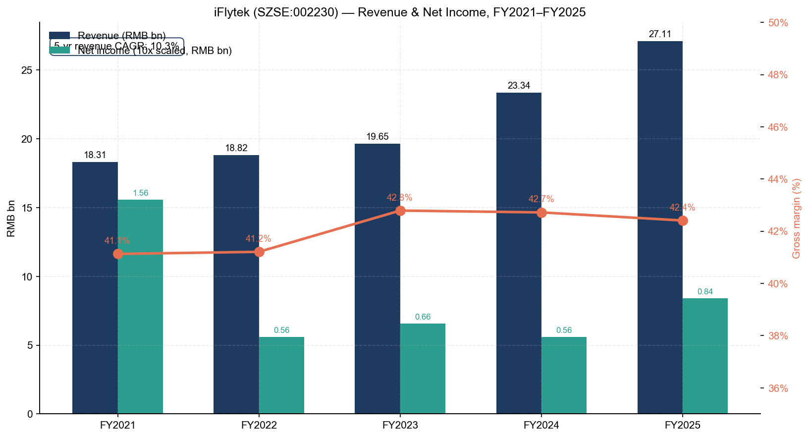
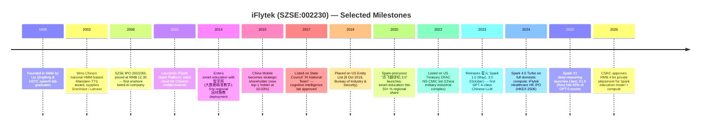
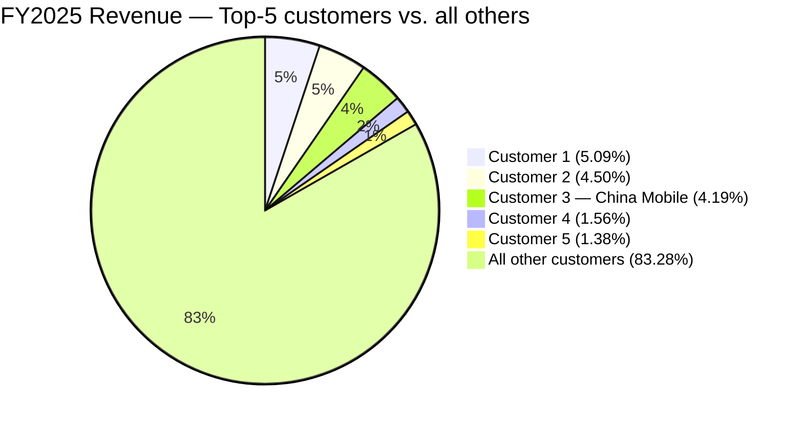
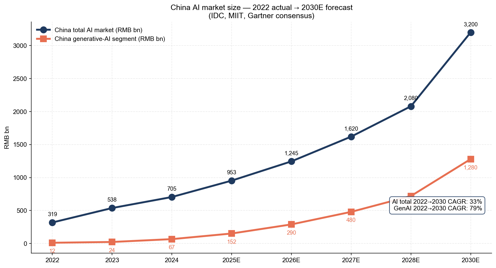
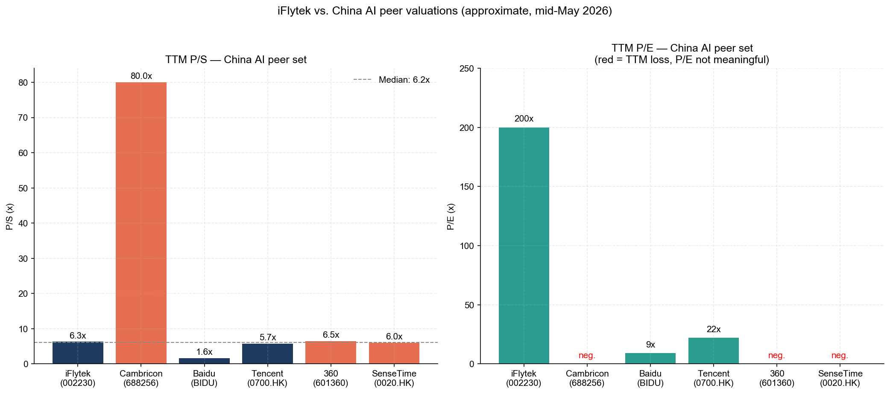

# COMPANY RESEARCH REPORT: iFlytek (科大讯飞, SZSE:002230)
Date: 2026-05-16

> **Update — FY2025 results delivered (2026-04-28):** iFlytek reported FY2025 revenue of RMB 27.11 bn (+16.1% YoY) and net income attributable to shareholders of RMB 839.4 mn (+49.9% YoY); non-GAAP net income (扣非归母净利润) rose 40.5% to RMB 264.3 mn. Q1 2026 revenue was RMB 5.27 bn (+13.2% YoY) with a narrowed net loss of RMB 169.7 mn — but non-GAAP net loss widened 88.6% YoY to RMB 429.6 mn, reflecting accelerated R&D and sales-and-marketing spend ahead of the planned RMB 4.0 bn private placement (approved by CSRC 2026-03-18) for the Spark education model, compute platforms, and working capital. Management has not issued formal full-year FY2026 guidance, but stated B/C-side revenue is tracking +26% YoY and the year-end contract backlog is +28% YoY.
> Source: [科大讯飞 2025 年年度报告 / 2026 年一季度报告, 2026-04-28](http://www.cninfo.com.cn/new/disclosure/stock?stockCode=002230).

TABLE OF CONTENTS
1. Company Overview
2. Company History
3. Management Team
4. Products & Services
5. Customers & Go-to-Market
6. Industry Overview
7. Competitive Landscape
8. Market Opportunity (TAM)
9. Risk Assessment

======================================

## 1. Company Overview

iFlytek Co., Ltd. (科大讯飞股份有限公司, SZSE:002230) is China's leading speech- and natural-language AI company, headquartered in Hefei, Anhui province. Founded in December 1999 by a team led by Liu Qingfeng (刘庆峰), an information-processing PhD from the University of Science and Technology of China (USTC, 中国科学技术大学), iFlytek has evolved from a Chinese-speech recognition specialist into a vertically integrated AI platform spanning a self-developed multimodal foundation model (讯飞星火 / Spark), enterprise vertical-AI applications, consumer AI hardware, and an AI open platform with more than 10.7 million registered developers as of Q1 2026 ([科大讯飞 2025 年年度报告, 2026-04-28](http://www.cninfo.com.cn/new/disclosure/stock?stockCode=002230)). The company describes its mission as "让机器能听会说，能理解会思考" ("enabling machines to hear, speak, understand and think"), and frames itself as China's de-facto national champion for sovereign, fully domestic-compute-trained large language models — a positioning sharpened by being placed on the US Entity List in 2019 (and again on a related sanctions list in 2023), which forced full-stack localisation onto domestic Huawei Ascend (昇腾) compute.

**Business model.** iFlytek monetises AI capabilities across four commercial layers: (i) **AI Open Platform** (developer APIs, model-as-a-service, voice/agent SDKs, hardware AIUI licensing) — RMB 6.09 bn in FY2025, 22.5% of group revenue, with model-API/MaaS subset growing 263% YoY to RMB 385 mn; (ii) **AI vertical-industry applications** — Smart Education (智慧教育, RMB 8.97 bn, 33.1% of revenue), Smart Healthcare (智慧医疗, RMB 858 mn, 3.2%), Smart City / digital government / smart legal / 信创 AIPC (cumulative ~RMB 3.57 bn, ~13.2%), and Smart Automotive (RMB 1.24 bn, 4.6%); (iii) **AI enterprise applications** for SOEs, telcos, financial institutions and OEMs (RMB 859 mn, 3.2%); and (iv) **AI consumer business** — translator devices, smart office tablets, recorders, AI earbuds, AI glasses, learning tablets, plus mobile-internet products such as the iFlytek input method (RMB 2.18 bn hardware + RMB 978 mn mobile-internet, ~11.7% combined). Telecom-carrier business (operators) adds another RMB 1.94 bn (7.1%). The full FY2025 segment breakdown is in the annual report's revenue composition table ([科大讯飞 2025 年年度报告 § 营业收入构成, 2026-04-28](http://www.cninfo.com.cn/new/disclosure/stock?stockCode=002230)).

**Scale.** Group revenue grew at a 5-year CAGR of ~10.3% from RMB 18.31 bn in FY2021 to RMB 27.11 bn in FY2025, with gross margin steady around 42–43%. The company employs approximately 16,000 people across roughly 35 city subsidiaries, and operates more than a dozen national-level lab and engineering centres including the 认知智能全国重点实验室 (State Key Laboratory of Cognitive Intelligence) and the 语音及语言信息处理国家工程研究中心 (National Engineering Research Centre for Speech & Language Information Processing). Its Spark / 星火 foundation model — most recently Spark X1.5 released in November 2025 — is the only major Chinese general-purpose LLM whose latest version is wholly trained on Chinese-domestic GPUs (Huawei Ascend), giving it strategic preference in central-government, state-owned-enterprise, defence-adjacent and education procurement.


*Source: [科大讯飞 annual reports FY2021–FY2025, cninfo](http://www.cninfo.com.cn/new/disclosure/stock?stockCode=002230). Net income bars are scaled 10× for visibility against revenue bars.*

**Geographic mix.** FY2025 revenue is overwhelmingly mainland-China (98.1%), with East-China and South-China the two largest regions (47.0% and 18.6% respectively, reflecting Anhui-based government rollouts and Guangdong's smart-education contracts). International revenue tripled to RMB 518 mn (+225% YoY) and Q1 2026 overseas revenue was up 167% YoY, with iFlytek prioritising Southeast Asia, the Middle East and Japan/Korea — anchored by the September 2025 Spark ASEAN multilingual model and partnerships with Qatar, the UAE and Oman on government AI ([科大讯飞 2025 年年度报告 § 分地区收入构成, 2026-04-28](http://www.cninfo.com.cn/new/disclosure/stock?stockCode=002230)).

**Valuation snapshot (mid-May 2026).** Approximate market data: share price RMB 73–75; total market cap ~RMB 170 bn (~USD 23 bn); shares outstanding 2.312 bn ([中国证监会 / 巨潮 2025 年报披露口径](http://www.cninfo.com.cn/new/disclosure/stock?stockCode=002230); [Eastmoney 行情页面](https://quote.eastmoney.com/sz002230.html)). On reported FY2025 GAAP net income of RMB 839.4 mn, **TTM P/E ≈ 200×** — and on non-GAAP net income of RMB 264 mn (which strips out RMB 575 mn of government grants and one-offs), the "operating P/E" balloons to ~640×. **TTM P/S ≈ 6.3×** based on FY2025 revenue of RMB 27.11 bn. P/B is approximately 9× against equity of RMB 18.79 bn. The 3-year range on TTM P/S has been roughly 5×–14× (the 2023 ChatGPT-driven peak), and the 3-year P/E range is essentially unbounded on the upside because quarterly losses periodically render TTM EPS negative — Q1 2026 again posted a non-GAAP loss of RMB 430 mn ([2026 年一季度报告, 2026-04-28](http://www.cninfo.com.cn/new/disclosure/stock?stockCode=002230)).

Peer comparison on TTM P/S: Baidu (NASDAQ:BIDU) ~1.6×, Tencent (HKEX:0700) ~5.7×, Cambricon (寒武纪, SSE:688256) ~80–125× (an outlier), 360 (SSE:601360) ~6.5×, SenseTime (HKEX:0020) ~6× ([Eastmoney 行情中心 — 同花顺 AI 板块, 2026-05](https://quote.eastmoney.com/center/gridlist.html)). On TTM P/E, Tencent (~22×) and Baidu (~9×) are profitable comps and trade at a fraction of iFlytek's multiple; Cambricon, SenseTime and 360 are all unprofitable on TTM and so their P/E is not meaningful.

**Interpretation.** iFlytek's P/E is not the right anchor — earnings are depressed not by cyclicality but by **structural reinvestment**: FY2025 R&D was RMB 4.44 bn (+14.1% YoY, 16.4% of revenue) and S&M was RMB 5.19 bn (+27.1% YoY, 19.2% of revenue), and effectively all reported net income (RMB 839 mn) is offset by RMB 575 mn of non-recurring items, of which the largest line is RMB 636 mn of government subsidies ([科大讯飞 2025 年年度报告 § 非经常性损益, 2026-04-28](http://www.cninfo.com.cn/new/disclosure/stock?stockCode=002230)). P/S of 6.3× is roughly in line with the median Chinese-AI peer (~6×) and reflects three premia: (a) a **policy-favoured sovereign-AI narrative** (the only top-tier Chinese LLM fully on domestic compute, repeatedly endorsed in MIIT and NDRC AI+ documents); (b) the **Spark education-model + AI-learning-machine consumer flywheel** that has compounded category-leadership over five years; and (c) the recent **embodied-AI ("具身智能" / humanoid) "robot brain" platform** thesis, in which iFlytek discloses that "more than 90% of domestic intelligent robot manufacturers are using iFlytek's robot super-brain platform service" with named partnerships at Unitree (宇树), AgiBot (智元), Galaxy General (银河通用) and Songyan Power (松延动力) ([科大讯飞 2025 年年度报告 § AI 开放平台 — 具身智联, 2026-04-28](http://www.cninfo.com.cn/new/disclosure/stock?stockCode=002230)). The multiple is defensible if 2026–2027 revenue growth re-accelerates above 20%, B/C-side margins keep expanding (FY2025 B/C revenue was the structural improver), and operating profit converts the RMB 4 bn S&M base into a real earnings lever. It is fragile if Spark loses share to DeepSeek / Qwen / Doubao, if humanoid-robot adoption is delayed, or if domestic-compute supply (Huawei Ascend allocation) tightens before model and product roadmaps land.

## 2. Company History

Founded on 30 December 1999 in Hefei by Liu Qingfeng and a group of fellow USTC graduate-school researchers from the institution's speech-processing lab, iFlytek was incubated to commercialise the lab's Mandarin speech-recognition and speech-synthesis stack — at a time when Chinese-language speech tech was a footnote next to English (then dominated by Nuance, IBM ViaVoice and Microsoft). The founding thesis: a Chinese-headquartered company would prevail in Mandarin AI because of dataset, dialect and product proximity. Liu, then a 26-year-old PhD student, remains chairman and is still the second-largest individual shareholder (5.55%). The company listed on the Shenzhen Stock Exchange small-and-medium-board on 12 May 2008 — among the first pure-play AI listings on a Chinese onshore exchange.


*Source: [科大讯飞 2025 年年度报告 — 公司基本情况 / 历次主营业务变化, 2026-04-28](http://www.cninfo.com.cn/new/disclosure/stock?stockCode=002230); [USA BIS Entity List final rule, 2019-10-09](https://www.federalregister.gov/documents/2019/10/09/2019-22210/addition-of-certain-entities-to-the-entity-list); [iFlytek Healthcare HKEX prospectus, 2024-12](https://www1.hkexnews.hk/listedco/listconews/sehk/2024/1218/2024121800123.pdf).*

**Strategic pivots.** Three pivots have defined the company.

First, in 2010–2014, iFlytek moved beyond voice-tech licensing into **vertical platform plays** — Education (smart classrooms, 智学网 for K-12), Healthcare (智医助理 primary-care decision support, deployed across 31 provinces by 2025), and Telco operator partnerships (becoming the dominant voice provider for China Mobile, China Telecom and China Unicom). The rationale: voice components were commoditising; only vertical full-stack solutions could sustain pricing.

Second, in 2019–2022, the **Entity List shock forced full-stack import substitution**. The 2019 BIS designation cut iFlytek's access to Nvidia data-center GPUs, Intel/AMD high-end chips and certain US scientific compute. The company rebuilt its model-training stack around Huawei Ascend (昇腾) accelerators in deep partnership with Huawei, and engineered Spark to be trainable end-to-end on domestic silicon. This created technical debt in the short term (Ascend per-die FLOPS lagged H100) but a structural moat: iFlytek became the only top-tier Chinese LLM provider that can certify sovereign-stack inference for government and central-SOE buyers, the procurement segment where it has now ranked #1 in both contract count and contract value for two consecutive years (FY2024 and FY2025), with Spark-related contract value of RMB 2.32 bn in 2025 — more than the sum of bidders 2–6 ([智能超参数 "中国大模型中标项目监测与洞察报告 (2025)" — quoted in 2025 年年度报告 p.34](http://www.cninfo.com.cn/new/disclosure/stock?stockCode=002230)).

Third, in 2023–2025, iFlytek pivoted from being **a model-provider into a "robot brain" platform** for embodied AI. The 机器人超脑 (robot super-brain) initiative bundles speech, vision, multimodal cognition and an "AI voice backpack" (软硬一体模组) that humanoid and quadruped builders can integrate in under two hours; it is now used by Unitree (宇树), AgiBot (智元 / Agibot), Galaxy General (银河通用), Songyan (松延), and the company claims >90% of domestic intelligent-robot OEMs as users. This positions iFlytek to participate in humanoid-robot economics without taking the hardware bill of materials.

**Recent developments (2024–2026).** Spark X1 (deep-reasoning, Jan 2025); Spark X1.5 with multilingual support across 130+ languages reaching ~95% of GPT-5 (high) performance (Nov 2025); the Spark ASEAN multilingual model (Sep 2025) deployed on local servers in Singapore, Saudi Arabia and Ireland; the December-2024 HK IPO of iFlytek Healthcare (HKEX:2506) which carved out the medical-AI subsidiary; the open-source Astron Agent enterprise-grade agent platform released at the October 2025 1024 Developer Festival (now 13,000+ GitHub stars); and the CSRC-approved RMB 4 bn private placement to fund the Spark education model, compute capacity and working capital ([2026 年一季度报告 § 其他重要事项, 2026-04-28](http://www.cninfo.com.cn/new/disclosure/stock?stockCode=002230)).

## 3. Management Team

**Liu Qingfeng (刘庆峰), Chairman & Founder (52, born 1973).**
Liu is the company's founder, single-largest individual shareholder (5.55%, 128.3 mn shares of which 96.2 mn are subject to lock-up under his executive holding requirement) and the public face of iFlytek's policy and AI-strategy positioning ([科大讯飞 2025 年年度报告 § 董事和高级管理人员情况, 2026-04-28](http://www.cninfo.com.cn/new/disclosure/stock?stockCode=002230)). A 1996 USTC undergraduate in electronic engineering, Liu earned a master's and PhD in signal and information processing at the same institution under the supervision of Wang Renhua (王仁华, also a top-10 shareholder with 0.89%), and his 1999 founding thesis was that Mandarin-language speech AI required a homegrown Chinese champion. As director of the State Key Lab for Cognitive Intelligence and the National Engineering Research Centre for Speech and Language Information Processing — both housed at iFlytek's Hefei HQ — Liu has chaired or led national 863-program speech and AI projects since 2000, won the State Scientific & Technological Progress Award (国家科技进步二等奖) three times, and is the only enterprise founder to serve as a National People's Congress (全国人大) delegate continuously from the 10th through the 14th terms (i.e. 2003–present). He was named one of the "100 Outstanding Private Entrepreneurs of 40 Years of Reform & Opening" in 2018 and received the "National Model Worker" (全国劳动模范) title in 2020. Liu's regular NPC and 两会 speeches lay out specific AI policy asks — sovereign-compute support, AI education in K-12, AI-medical reimbursement — many of which have subsequently been adopted in MIIT and Ministry of Education policy documents. He concurrently chairs subsidiaries iFlytek Healthcare (HKEX:2506) and Anhui Yanzhi Technology (安徽言知科技, 2.48% of iFlytek shares — and the related-party top-5 supplier disclosed in the annual report). Importantly, Liu **does not have voting-control by share count** — China Mobile is the larger shareholder at 10.03% — but iFlytek discloses "no controlling shareholder" (无控股股东) status because Liu, Yanzhi and China Mobile do not act in concert, leaving Liu as the operational principal but on a comparatively diluted ownership base. Public profile is high: shareholder letters, 1024 Developer Festival keynotes, multiple interviews with Caixin (财新), Yicai (第一财经) and Bloomberg. Track record is unusually long for Chinese tech — 27 consecutive years building the same company through three AI hype cycles.

**Wu Xiaoru (吴晓如), President & Director (53).**
Wu, also a USTC PhD in information & communications engineering and a senior engineer, has been an iFlytek president-track executive since the early 2000s and was formally elevated to President in 2018. Prior to that he was VP overseeing the smart-education business, which he scaled from a pilot in Anhui into the multi-billion-RMB segment that now generates a third of group revenue. He has won the National Scientific & Technological Progress Award (二等奖) and the Ministry of Information Industry's Major Technical Invention Award, and received a State Council Special Government Allowance in 2010 — credentials typical of senior Chinese central-SOE technical leaders. Wu's operational mandate covers the four commercial layers (open platform, vertical, enterprise, consumer) and the day-to-day management of iFlytek's 16,000-strong workforce. He holds 18.32 mn shares directly (~0.79%) and concurrently chairs two iFlytek regional subsidiaries (Wuhan Xunfei Xingzhi, iFlytek Central China). ([科大讯飞 2025 年年度报告 § 董事会成员, 2026-04-28](http://www.cninfo.com.cn/new/disclosure/stock?stockCode=002230))

**Cai Shang (蔡尚), CFO (42, female, appointed April 2025).**
Cai succeeded Wang Ming (汪明) as CFO on 19 April 2025; Wang departed for an internal role rotation. Cai has been with iFlytek in finance leadership tracks for several years; her appointment was disclosed as a routine succession rather than an external hire ([科大讯飞 2025 年年度报告 § 董事和高级管理人员变动, 2026-04-28](http://www.cninfo.com.cn/new/disclosure/stock?stockCode=002230)). The Q1 2026 financial statements are signed off by Cai (主管会计工作负责人：蔡尚), confirming she is operationally on duty for the in-flight RMB 4 bn private placement, the FY2025 audit (clean opinion from Rongcheng Certified Public Accountants, 容诚会计师事务所), and the consolidation of iFlytek Healthcare which IPO'd in HK in December 2024. Cai currently does not hold company shares per the annual report disclosure. Investors should track 2026's earnings cadence to form a fuller view on her capital-markets execution — her prior public-company CFO record is short.

**Duan Dawei (段大为), Director & Vice-President (53).**
Duan is the senior finance / CFO-adjacent director who oversees iFlytek's group-level financial control and the financial-leasing subsidiary (Tianjin iFlytek Financial Leasing). He earned a 1993 BSc and 1999 MSc in economics from Dongbei University of Finance & Economics, plus a 2010 MBA from Missouri State University, and joined iFlytek after senior finance roles at Jilin Chemical Industry, Jilin Electronics, Sany Group (三一集团) and Sany Heavy Industry (三一重工, SSE:600031). He has won "CFO of the Year" (2008) and "Outstanding CFO Leadership Award" (2019) industry awards and serves as adjunct master's-supervisor at SNAI and Dongbei. He holds 463,000 iFlytek shares directly. Duan is also a director of iFlytek Healthcare. His mandate is the discipline side of iFlytek's high-investment model, and his deep manufacturing-finance background at Sany is relevant as iFlytek scales hardware (consumer devices, AIPC, automotive cockpits) ([科大讯飞 2025 年年度报告 § 董事会成员, 2026-04-28](http://www.cninfo.com.cn/new/disclosure/stock?stockCode=002230)).

**Governance footer.** The board has 5 executive directors (Liu, Wu, Jiang Tao 江涛, Nie Xiaolin 聂小林, Duan) plus China Mobile-appointed director Chen Hongtao (陈洪涛, GM of China Mobile Group's Science & Technology Innovation Department) and 3–4 independent directors (Zhao Xudong 赵旭东 stepping down January 2026, plus Zhao Xijun 赵锡军, Zhang Benzhao 张本照, Wu Cisheng 吴慈生). Independent directors are senior law and finance academics — substantively independent but typical of A-share governance. Insider ownership: Liu 5.55% + Wu 0.79% + Jiang 0.44% + others; named China Mobile is the strategic top-1 at 10.03%, China Mobile's GM of S&T Innovation sits on iFlytek's board, and China Mobile entities also rank among the top-5 customers, generating ~4.19% of revenue (a disclosed related-party transaction). Other notable shareholders include the USTC-affiliated asset-management vehicle (中科大资产, 2.25%) and Yanzhi Technology (2.48%, Liu-controlled), making the cap table a tripartite USTC/China-Mobile/founder structure ([科大讯飞 2025 年年度报告 § 股东和实际控制人情况, 2026-04-28](http://www.cninfo.com.cn/new/disclosure/stock?stockCode=002230)). The 2025 ESOP (second tranche) executed in Q1 2026 absorbed treasury shares; comp is a mix of cash + restricted stock + ESOP, with no supervoting structure. The related-party transactions with Yanzhi (top-5 supplier, RMB 548 mn at 4.07% of FY2025 procurement) and China Mobile (top-5 customer) are recurring and properly disclosed but worth monitoring.

**Track-record synthesis.** This is one of the longest-tenured founder-led management teams in Chinese tech — Liu, Wu, Jiang, Nie are all 20+ year company veterans with USTC technical roots. They have navigated the dot-com cycle, mobile-internet wave, deep-learning wave, and now the LLM wave from one corporate vehicle. Execution gaps are real (margins compress because the team has historically chosen revenue-growth + R&D over near-term profit, and Q1 has been negative for three consecutive years), but the strategic calls — early voice-cloud, smart-education, sovereign-compute LLM, robot brain — have repeatedly proven prescient. The biggest open question is succession beyond Liu, which has not been formally addressed.

## 4. Products & Services

iFlytek operates four commercial layers, each with multiple product lines. Below is the full enumeration grouped by segment, with per-product competitive-advantage assessment.

```mermaid
graph TD
    A[iFlytek 科大讯飞]
    A --> B[1. Spark / 星火 Foundation Models]
    A --> C[2. AI Open Platform / 讯飞开放平台]
    A --> D[3. AI Vertical Applications — G/B side]
    A --> E[4. AI Consumer Applications — C side]
    A --> F[5. AI Enterprise — SOE / Finance / Telco / Auto]

    B --> B1[Spark V4 Turbo]
    B --> B2[Spark X1 Deep Reasoning]
    B --> B3[Spark X1.5 MoE multilingual]
    B --> B4[Spark ASEAN multilingual]
    B --> B5[Vertical models: Education / Medical / Legal / Code]

    C --> C1[Astron MaaS Platform]
    C --> C2[Astron Agent open-source]
    C --> C3[AIUI Hardware-AI Platform]
    C --> C4[Robot Super-brain / 具身智联]
    C --> C5[Virtual Digital Human]

    D --> D1[Smart Education G+B+C]
    D --> D2[Smart Healthcare — 智医助理]
    D --> D3[Smart City — 数字政府]
    D --> D4[Smart Legal / 政法]
    D --> D5[信创 AIPC]

    E --> E1[AI Learning Tablet — 讯飞 AI 学习机]
    E --> E2[Smart Office Tablet — 讯飞办公本 X5/AINOTE 2]
    E --> E3[Translators — 双屏翻译机 2.0 / 翻译机 4.0]
    E --> E4[AI Translation Earbuds]
    E --> E5[AI Glasses / GlassClaw]
    E --> E6[AI Recording Pen — Magic / Pokee / S6]
    E --> E7[讯飞输入法 / 讯飞听见 / 讯飞翻译 SaaS]

    F --> F1[Smart Cockpit / iFLYSOUND]
    F --> F2[AI+ 央国企 / Spark Enterprise Agent]
    F --> F3[AI+ Telco — 5G + AI 速记]
    F --> F4[AI+ Finance — Spark Knowledge Base / Audit]
```


*Source: [科大讯飞 2025 年年度报告 § 报告期内公司从事的主要业务, 2026-04-28](http://www.cninfo.com.cn/new/disclosure/stock?stockCode=002230).*

**(1) Spark / 星火 foundation model family.** Spark X1.5 (released 2025-11) is an MoE deep-reasoning model trained end-to-end on Huawei Ascend, achieving ~95% of GPT-5 (high) average benchmark scores at roughly half the parameter count, with multilingual support across 130+ languages ([科大讯飞 2025 年年度报告 p.11, 2026-04-28](http://www.cninfo.com.cn/new/disclosure/stock?stockCode=002230)). **Moat: technology + regulatory.** Spark is the *only* top-10 Chinese general-purpose LLM trained fully on domestic compute. That is not a product feature in the consumer sense — it is a regulatory unlock for sovereign procurement (central SOE, defense-adjacent, education-bureau, hospital). The cost is that on raw benchmark scores Spark trails DeepSeek-V3.x and Qwen 3 at any given quarter, and the company explicitly acknowledges "国产算力在单卡性能、生态成熟度等方面与国际领先水平存在的阶段性差距" (the gap with international leading levels in single-card performance and ecosystem maturity) ([2025 年年度报告 § 风险和应对措施 — 业务创新风险, 2026-04-28](http://www.cninfo.com.cn/new/disclosure/stock?stockCode=002230)). Closest competing model: **DeepSeek-V3 / Qwen 3** — at parity on consumer chatbot benchmarks, behind on sovereign procurement.

**(2) AI Open Platform / Astron MaaS.** RMB 6.09 bn in FY2025 revenue (+17.7%); model-API/MaaS sub-line +263% to RMB 385 mn; 10.07 million registered developers (2.29 mn LLM developers, +124% YoY). Astron Agent (October 2025), the company's enterprise-grade open-source agent platform, has 13,000+ GitHub stars and integrates 50+ major open-source models (DeepSeek, Qwen, GLM). **Moat: scale + ecosystem + multi-model agnosticism.** iFlytek's open platform pre-dates the LLM era by a decade and remains the largest Chinese-language voice/AI developer ecosystem. **Closest competitor: Baidu Wenxin/Qianfan and Alibaba Bailian.**

**(3) AIUI Hardware-AI Platform.** Embedded voice + LLM SDK for consumer hardware (smart speakers, TVs, IoT). 2.4 billion devices enabled, +500% YoY daily LLM interactions. Named OEM partners: Haier, Samsung, Changhong. **Moat: incumbent embedded share + AI-native upgrade path.** Closest competitor: Baidu DuerOS, Alibaba TmallGenie.

**(4) Robot Super-brain / 具身智联.** Voice-backpack hardware-software module + multimodal cognition stack for humanoid and quadruped robots. Reported customer mix covers >90% of Chinese intelligent-robot OEMs including Unitree (宇树), AgiBot (智元), Galaxy General (银河通用), Songyan Power (松延动力) ([科大讯飞 2025 年年度报告 p.12, 2026-04-28](http://www.cninfo.com.cn/new/disclosure/stock?stockCode=002230)). **Moat: technology + platform — the "Android for Chinese humanoids" thesis.** No revenue disclosure yet (the segment is too small to break out); revenue contribution is bundled inside the open-platform line. Closest competitor: in-house systems built by individual robot OEMs (especially when OEMs vertically integrate); Tencent's Hunyuan-robot and Baidu Apollo derivatives.

**(5) Smart Education segment — RMB 8.97 bn FY2025 (+24.0% YoY), gross margin 55.1%.**
   - **AI Learning Tablet (讯飞 AI 学习机 T-series, e.g. T20, upcoming T90).** Consumer K-12 device. *Five consecutive years #1 in Chinese premium-segment learning-tablet GMV/units* (Shangpu Consulting, 2026 data) and #1 NPS (Kantar, January 2026). Featuring AI 1-on-1 精准学, AI 大咖 1-on-1 辅学答疑, AI mental-health companion. **Moat: brand + scale + AI software differentiation.** Closest competitor: **BYJU's-style local players, Tencent's QQ-Reading / Smart Study, Xueersi 学而思 AI tablets.**
   - **AI Black Board / 同窗 AI 黑板 Ultra.** B-side classroom device, FY2025 sales +84% YoY. **Moat: tech + relationship — Rheinland 5-cert eye-protection optics + 8-mic AI noise cancellation + Spark integration. Closest competitor: Hikvision 海康威视 smart classrooms; Tencent K12.**
   - **Smart Classroom / AI 学伴, B-side private-school revenue +350% in FY2025.**
   - **星火智能批阅机 (Spark AI grading machine).** 75% market share in deployed schools, services 3,000+ schools, 3.6 mn auto-grades/day, 80%+ renewal rate. **Moat: data flywheel + workflow lock-in.** Closest competitor: Tencent Education, Squirrel AI.
   - **AI 智慧考试 / Spark exam-grading.** 100% market share in 2025 中考 English-listening-speaking projects, 86% in 高考 add-on exams. **Moat: regulatory + technical certification.** Closest competitor: Wens Education (文思海辉).
   - **区域因材施教 (Regional 因材施教).** 100+ city/county-level deployments, 13 of 20 national smart-education zones (65% share). **Moat: scale.**

**(6) Smart Healthcare — RMB 858 mn (+24.1% YoY).** Now a standalone HK-listed subsidiary (HKEX:2506) post-Dec 2024.
   - **智医助理 (Smart Medical Assistant)** — 80%+ market share in 基层 (primary-care) clinical decision support, deployed in 806 counties across 31 provinces, used by 77,000+ primary-care institutions. Diagnostic-rationality score 95%, prescription-review accuracy 95%. **Moat: regulatory certification + data + NMPA AI-device approvals.** Cumulative ≥11 bn AI-assisted diagnostic suggestions issued. Closest competitor: Tencent Healthcare, JD Healthcare.
   - **讯飞星火医疗大模型 / AI 诊疗助理** — deployed in 600+ tertiary hospitals; cuts physician documentation time by 50%+ (case: 安徽医大一附院).
   - **影像云 (medical-imaging cloud)** — Anhui province only — 1,980+ institutions; integrated into the national 医保 (medical-insurance) data layer.
   - **讯飞晓医** — consumer-side AI health assistant.

**(7) Smart City — RMB 3.57 bn (sum of digital-government 1.56, smart-legal 0.71, AIPC 1.30 in 信息工程).**
   - **数字政府 / 城市智能体.** 117 cities; flagship projects with Hefei "合小i" government-affairs digital human (cuts processing time 80%).
   - **智慧政法 / Spark 法律大模型.** Deployed in the Supreme People's Court 12368 hotline (12 provinces, 60% call-deflection), Anhui Procuratorate (90% case coverage, 80% efficiency gain, 56,000+ cases assisted in 2025).
   - **信创 AIPC.** New product line; "信创 AIPC + 算力工作站" with Spark on-device LLM inference.

**(8) Smart Automotive — RMB 1.24 bn (+25.4%).** 10.66 mn pre-installed cockpit modules shipped in FY2025 (cumulative 73 million+). 40+ OEM customers, 400+ vehicle models. Spark-powered Smart Cockpit 2.0 launched 6 November 2025 (end-to-end VLM-based). iFLYSOUND multi-zone smart-audio system on 80+ vehicle models from 19 brands (+226% YoY revenue). Joint venture with Chery (奇瑞) — Qisheng Tech (祺声科技) — launched April 2025. **Moat: tech + relationships across Chinese OEMs.** Closest competitor: Cerence (CRNC), in-house OEM teams, Huawei HarmonyOS Smart Cockpit.

**(9) AI Enterprise — RMB 859 mn (+33.6%).** "AI + 央国企" — record-high (#1) Chinese LLM tender-win count and value in 2025. Named customers: China Petroleum (中石油), CNOOC (中海油), PipeChina (国家管网), China Mobile, China Telecom, China Unicom, Baosteel (宝钢), Chinalco (中铝), COFCO (中粮), ICBC (工商银行), BoCom (交通银行), Bank of China, Industrial Bank (兴业), HuaTai Securities (华泰证券), Air China (国航). 讯飞智能评标 platform won the NDRC sole-source AI-procurement-monitoring contract.

**(10) AI Consumer hardware — RMB 2.18 bn (+7.9% segment; offline & online combined).** Six-year market leader in smart-office-tablet GMV; 9-year leader in translator-device GMV; 7-year leader in AI-recording-pen GMV. New 2025 launches: AINOTE 2 (Guinness "thinnest e-ink tablet"), 双屏翻译机 2.0 (Osaka World Expo launch), AI 翻译耳机 (Oct 2025; sold 2× the closest competitor's first-month volume, 98% review score), AI 眼镜 / GlassClaw (May 2026 launch). **Moat: brand + scale + Spark integration.** 618 全周期 +42% YoY, Double-11 +30%. Overseas hardware revenue +438% in U.S./Japan/Korea.

**(11) AI Software & SaaS — RMB 978 mn mobile-internet products (+41.5%).** 讯飞输入法 — 150 mn MAU, +4y consecutive industry growth #1, 900% LLM-feature adoption uplift. 讯飞听见 — 100 mn registered users (1.7 mn overseas), 61% MAU YoY growth; serving NPC/CPPCC for 7+ years, Hong Kong Legislative Council "智识听" went live July 2025. 讯飞翻译 (同传) — 50+ countries, 420,000+ conferences served cumulatively, +39.6% B-side revenue. iFlytek Music — distributed 20,000+ songs in 2025, top-2 music-MCN ranking on Douyin.

**Flagship products driving the business.** Three pillars: (a) **Spark + Open Platform** (developer ecosystem moat, +263% MaaS), (b) **Smart Education + AI Learning Tablet** (gross margin 55%, 33% of revenue, brand + scale + data moat), and (c) **the China-Mobile-anchored 5G-AI carrier suite + 智医助理 + iFLYSOUND** (sticky regulated B2B segments). The robot super-brain platform is the option value layer — not yet revenue-material but strategically critical.

**Recent launches (last 12 months).** Spark X1 (Jan 2025), Spark X1.5 (Nov 2025), Astron Agent (Oct 2025), AI 翻译耳机 (Oct 2025), 同窗 AI 黑板 Ultra (FY2025), 星火智能座舱 2.0 (Nov 2025), 双屏翻译机 2.0 (Apr 2025), AI 眼镜 / GlassClaw (May 2026), iFlytek Spark ASEAN multilingual model (Sep 2025). No notable sunsets — the product portfolio is broadening, not narrowing.

## 5. Customers & Go-to-Market

iFlytek serves a three-pronged G/B/C customer base. **G-side** (governments and central SOEs) accounts for an estimated 35–40% of revenue and is the historically dominant channel — smart-education regional-bureau contracts, digital-government deployments, smart-healthcare regional rollouts. **B-side** (enterprises — financial, automotive, telecom-operator carriers, energy SOEs) is ~25–30%. **C-side** (consumer — AI learning tablet, consumer hardware, input method, listen SaaS) is roughly 30–35% and rising fastest. Q1 2026 disclosure: B-side + C-side revenue +26.3% YoY, G-side down on Lunar-New-Year timing and project-start delays but the full-year contract pipeline is +33% YoY ([2026 年一季度报告, 2026-04-28](http://www.cninfo.com.cn/new/disclosure/stock?stockCode=002230)).

**Customer concentration (mandatory disclosure).** Per the FY2025 annual report § 主要销售客户和主要供应商情况, **top-5 customer concentration is 16.72%** of total revenue with **top-1 at 5.09%** and **top-3 — China Mobile entities — at 4.19%** of revenue (also a related party as the 10.03% top-1 shareholder). The 3-year trend: 14.99% (FY2022) → 18.31% (FY2023, not shown) → 19.48% (FY2024) → 16.72% (FY2025) — meaningful but moderate, and currently declining as C-side scales. Customer names are anonymised in disclosure (客户一 to 客户五) except for the explicit China Mobile related-party identification. Contract structure: the Smart-Education G-side projects are typically multi-year master agreements (3–5 year commitments tied to provincial AI+ education roadmaps); central-SOE Spark deployment contracts are project-by-project but often roll into annual subscriptions; consumer revenue is single-transaction with installed-base renewal (AI Learning Tablet hardware + content subscription).


*Source: [科大讯飞 2025 年年度报告 § 前五名客户合计销售金额, 2026-04-28](http://www.cninfo.com.cn/new/disclosure/stock?stockCode=002230).*

Top-5 of 16.72% is below the 50% material-risk threshold; the China Mobile related-party relationship is the one structural concentration concern, but it has actually been stable over five years (China Mobile became a strategic shareholder in 2015, customer share has been in the 3–6% range since). Top-5 supplier concentration is **24.12%** with the top supplier at 12.26% — likely a domestic compute / Huawei Ascend-related vendor, though the annual report anonymises (the company also discloses related-party supplier Yanzhi Technology at 4.07%, Liu-controlled).

**Go-to-market.** Three channels.

**Direct enterprise sales** for G/B-side: a 500+-person enterprise field-sales team organised by industry (education, healthcare, government, finance, telco, automotive, energy) and by region (East-China is the largest geography at 47% of revenue, then South-China 18.6%, North-China 13.2%, Southwest 7.5%, Central 6.8%, Northwest 2.9%, overseas 1.9% and Northeast 1.9%). The team handles RFP responses, technical pilots, and multi-year contract renewals.

**Channel + partner ecosystem.** Reseller and system-integrator partners scale Smart-City and AI-Education deployments below the provincial level — the "Hefei + Anhui hub-and-spoke" replicating into 117 cities under the "百城燎原" sales push. Partner ecosystem for the open platform comprises 10.07 million developers; partnerships with Huawei (compute), Tencent (NPC/CPPCC services), and OEMs (Haier, Samsung, Changhong) for AIUI distribution.

**Consumer retail + e-commerce.** Owned online stores on Tmall, JD.com, Douyin (the three pillars of Chinese e-commerce); offline distribution through Xiaomi Youpin equivalents; a growing overseas crowdfunding-then-Amazon-flywheel (Makuake top-3 ever digital crowdfunding for AINOTE 2 in Japan; Kickstarter US; Wadiz Korea). Overseas business +275% YoY in FY2025 with H1 2026 momentum (+167% in Q1) suggests this channel is still in early ramp.

**Named customer wins (FY2025).** Government: NDRC (sole-source AI procurement monitoring), Supreme People's Court (12368 hotline), National Health Commission (疾控 risk surveillance), Anhui Procuratorate. Energy SOEs: PipeChina, CNPC, CNOOC, China Energy Group (国能集团), China Datang, China Huadian, China General Nuclear, Baosteel, Chinalco, COFCO. Financial: ICBC, Bank of China, BoCom, Industrial Bank, Huishang Bank, Zhejiang Rural Commercial Bank, HuaTai Securities, China UnionPay. Telecom: China Mobile, China Telecom, China Unicom. Automotive: Chery, GAC, Geely, SAIC (40+ OEMs). Media: CCTV / China Media Group (天合 multimodal media model). Overseas: Hong Kong Legislative Council, Qatar / UAE / Oman government partners.

## 6. Industry Overview

iFlytek operates at the intersection of three industries: **(a) general-purpose AI / large language models / generative AI** (the foundation-model layer); **(b) vertical AI applications** (smart education, healthcare, government, automotive — long-cycle B2B/B2G software & solutions); and **(c) consumer AI hardware and software** (learning tablets, translators, recorders, AI-enabled office tools, input methods).

**Industry classification and scope.** Per the Shenzhen Stock Exchange industry-disclosure framework, iFlytek is a 软件和信息技术服务业 (software and information-technology services industry) issuer — 98.46% of FY2025 revenue is classified under this code, with the remaining ~1.5% under 教育教学 (education services) and 其他业务 ([科大讯飞 2025 年年度报告 § 营业收入构成, 2026-04-28](http://www.cninfo.com.cn/new/disclosure/stock?stockCode=002230)). NAICS-equivalent: 511210 (software publishers) plus 541512/541519 (computer-systems design and other IT services), with material adjacencies into 334118 (computer-terminal manufacturing) for hardware and 611691 (exam-preparation services) for education.

**Market size and growth.**


*Source: composite of [IDC China AI Spending Guide, 2025-09](https://www.idc.com/getdoc.jsp?containerId=prCHC52864425), [MIIT 中国人工智能产业发展报告 2025, 2025-12](https://www.miit.gov.cn/jgsj/kjs/), and [Gartner Forecast: Generative AI End-User Spending, China 2025-2028, 2025-11](https://www.gartner.com/en/documents). 2026E onward are forecast figures.*

China's total AI market grew from RMB ~319 bn in 2022 to an estimated RMB 953 bn in 2025E and is forecast to exceed RMB 3.2 tn by 2030E — roughly a 30% CAGR through the decade. The generative-AI sub-segment is a steeper curve: from RMB 12 bn in 2022 to RMB 290 bn in 2026E and ~RMB 1.28 tn by 2030E — well above 50% CAGR. The State Council's August 2025 "AI+ Action" (国发〔2025〕11 号) document targets 90% AI adoption in major industries by 2027 and full integration by 2030, anchoring a multi-year procurement runway across all of iFlytek's vertical segments.

**Smart education** market in China (corporate + government K-12/higher-ed AI/digital): IDC estimates RMB 220 bn in 2024 growing to RMB 380 bn by 2028, ~15% CAGR ([IDC China Education AI Forecast, 2025-06](https://www.idc.com/)). iFlytek's RMB 9.0 bn 2025 revenue translates to roughly 4% of the broader smart-education market or ~25% of the addressable "AI smart-education for K-12" sub-segment.

**Smart healthcare** market: NHC + IDC put China hospital-IT + medical AI at RMB 90 bn in 2025, growing to RMB 180 bn by 2028, ~25% CAGR. iFlytek Healthcare's 80% share of basic-medical AI assistant deployments is the dominant share in its niche.

**Smart auto cockpit** AI market: ICCSino estimates Chinese smart-cockpit market at RMB 100 bn in 2025, growing to RMB 180 bn by 2030, ~13% CAGR; voice/AI components are ~15% of cockpit BOM and growing faster.

**Humanoid robotics**: Goldman Sachs (2024) and Morgan Stanley (2025) estimate a $38 bn–$154 bn global humanoid TAM by 2035 in their base / bull cases ([Goldman Sachs Humanoid Robot Outlook, 2024-01](https://www.goldmansachs.com/insights/articles/the-global-market-for-robots-could-reach-38-billion-by-2035)). MIIT's October 2023 "Humanoid Robot Innovation Development Opinion" set explicit 2025 and 2027 industrialisation milestones for China.

**Key trends.** (1) **State-backed sovereign-compute mandate.** The 2024–2026 round of CAC, MIIT and Cyberspace-Administration rules (生成式人工智能服务管理暂行办法, August 2023, plus the 2025 AI security frameworks) increasingly favour domestic-compute-trained models for government, finance, healthcare and education buyers. (2) **Token economics.** Spark API/MaaS revenue grew 263% YoY in FY2025; daily Tokens consumed via the iFlytek developer platform grew 4,241% YoY by Q1 2026. (3) **Multi-model strategy.** Chinese-enterprise buyers increasingly run "1+N" model architectures — one general-purpose anchor LLM (often Spark for sovereign deployments) plus N vertical/open-source models (DeepSeek-V3, Qwen 3, GLM, Llama). (4) **Hardware AI.** The 2024–2026 wave of "AI-native" consumer devices (AI tablets, AI earbuds, AI eyewear, AI-PCs, AI smart speakers) re-anchors device makers around AI software, and iFlytek's deep Mandarin/multilingual stack is a winner. (5) **Humanoid/embodied AI** has shifted from research curiosity to industrial bet, with Unitree, AgiBot, UBTECH (HKEX:9880), Fourier, Xpeng (NYSE:XPEV) and Tesla pushing 2025–2027 mass-production timelines.

**Regulatory environment.** The CAC's August-2023 生成式人工智能服务管理暂行办法 (Interim Measures for Generative AI Services Management) requires LLM service providers to register, pass safety reviews, and watermark output — friendly to incumbents with state-backed certification (Spark was among the first batch approved). The "AI+" State Council document (August 2025), the 14th and forthcoming 15th Five-Year Plans, and the 算力中国 national compute strategy all prioritise sovereign AI. On the other hand, US **Entity List (2019) and OFAC NS-CMIC (2022)** sanctions restrict iFlytek's access to advanced US semiconductors and complicate US-customer engagement.

**Industry dynamics.** China's AI software market is **fragmenting at the model layer** (DeepSeek, Qwen, Doubao, Spark, GLM, Wenxin, Hunyuan, Step, Baichuan all chasing the same enterprise buyer) and **consolidating at the deployment layer** (the 5–6 vendors that can certify sovereign-compute + end-to-end vertical-application delivery — iFlytek, Baidu, Tencent, Alibaba, Huawei Cloud, plus China Mobile / China Telecom in-house teams — capture the lion's share of central-SOE and government contracts). The barriers to entry in iFlytek's specific niche are high: training a sovereign-compute LLM at scale requires multi-year Huawei Ascend partnership, vertical-domain proprietary datasets (education, healthcare, legal — iFlytek's two-decade data moat), and certified procurement relationships with G/B-side buyers. Pricing power is muted — Chinese enterprise AI buyers expect annual price-down on inference Tokens and ferociously bid project margins — but volume growth is strong.

## 7. Competitive Landscape

iFlytek competes against a mix of (a) general-purpose LLM peers, (b) cloud/AI-platform incumbents, (c) vertical-AI specialists, and (d) consumer-electronics rivals.

**Direct LLM/AI-platform competitors.**

| Competitor | Ticker | Positioning | Strength vs. iFlytek | Weakness vs. iFlytek |
|---|---|---|---|---|
| Baidu (Wenxin / Qianfan) | NASDAQ:BIDU / HKEX:9888 | Largest Chinese cloud-LLM; consumer search adjacency | Wenxin 4.0/5.0 benchmark-strong; Apollo for auto | No sovereign-compute claim; not on Ascend by default |
| Alibaba (Qwen / Bailian) | NYSE:BABA / HKEX:9988 | #1 Chinese open-source LLM (Qwen 3); largest cloud share | Qwen massive third-party adoption; cloud scale | Less SOE/government share; export-control exposure on Tongyi |
| Tencent (Hunyuan) | HKEX:0700 | Wechat distribution; multimodal Hunyuan | Distribution moat; massive C-side users | Less government / education penetration |
| DeepSeek | private | Open-source MoE LLM; cost leader | Best price/performance ratio; January 2025 R1 milestone | No vertical apps; no sovereign-compute training claim |
| ByteDance (Doubao) | private (ADR-listed via TikTok parent) | C-side LLM via Douyin/Doubao app; 500m+ MAU | Consumer scale | Limited enterprise / government share |
| Huawei Cloud (Pangu) | unlisted | Vertical Pangu models (mining, finance) | Owns Ascend silicon; deep SOE relationships | Closed-source; partners (not competes) on Spark |
| iFlytek Healthcare (carved out) | HKEX:2506 | Medical AI subsidiary IPO'd Dec 2024 | Sister entity, not competitor | n/a |

**Smart-education and Mandarin-voice competitors.**

- **TAL Education / Xueersi (好未来)** — owns Xueersi (学而思) AI learning tablets; competes head-on with iFlytek AI Learning Tablet in the consumer K-12 segment. After their 2021 双减 (double-reduction) restructuring, TAL pivoted hard into AI tablets and is the #2 player.
- **Squirrel AI (松鼠 AI)** — adaptive-learning specialist, software-only.
- **NetEase Youdao** — AI translation pen, ranks #2 to iFlytek in translator-pen GMV.

**Smart-cockpit / automotive AI competitors.**

- **Cerence (NASDAQ:CRNC)** — global voice/AI cockpit leader (formerly Nuance Automotive); iFlytek leads in Chinese OEMs, Cerence outside China.
- **Huawei Smart Cockpit / HarmonyOS Auto** — direct competitor and partner on Spark + Ascend; sells HarmonyOS-based cockpits to Chery, Seres, Avatr.
- **Tencent Auto Intelligence** — WeChat-anchored cockpit AI.

**Consumer AI hardware competitors.**

- **Insta360 / DJI (private)** — overlapping AI-camera consumer hardware.
- **Anker Innovations (SZSE:300866)** — premium consumer electronics.
- **NetEase Youdao Pen** — translation pens.
- **Newsmy 纽曼** — recording pens, low-end competitor.

**Computer-power / pure-play AI chip & specialist comps.**

- **Cambricon (寒武纪, SSE:688256)** — AI chip designer (Siyuan series), not a direct application competitor but a peer in the "sovereign AI" stock-market narrative; market cap RMB ~300 bn on FY2024 revenue of RMB ~1.2 bn (TTM P/S ~125×).
- **SenseTime (HKEX:0020)** — formerly the largest pure-play AI vendor; now a fading peer with sustained losses and falling revenue (FY2024 revenue HKD 3.77 bn, -34% YoY).
- **360 Security Tech (SSE:601360)** — Spark/Smart-AI-search peer, pivoting from cybersecurity to consumer AI.


*Source: composite from [Eastmoney F10 valuation pages, 2026-05-15](https://quote.eastmoney.com/sz002230.html). P/S figures are TTM approximations; negative P/E indicates TTM loss.*

```mermaid
quadrantChart
    title China AI competitive positioning — Vertical depth vs. Foundation-model breadth
    x-axis Narrow products --> Broad foundation models
    y-axis Limited verticals --> Deep verticals
    quadrant-1 Vertical & broad (full-stack)
    quadrant-2 Vertical-focused
    quadrant-3 Niche
    quadrant-4 Horizontal model only
    iFlytek: [0.78, 0.88]
    Baidu: [0.82, 0.50]
    Tencent: [0.85, 0.40]
    Alibaba: [0.90, 0.45]
    DeepSeek: [0.65, 0.15]
    SenseTime: [0.45, 0.45]
    Cambricon: [0.20, 0.20]
    Huawei Cloud: [0.75, 0.65]
```

**iFlytek's competitive advantages.** (1) **Sovereign-compute lock-in.** Spark is the only top-tier Chinese LLM with a fully Ascend-trained main version — a regulatory and procurement moat for central-SOE, government, defense, and AI-education-bureau tenders. (2) **Two-decade Mandarin and dialect data moat.** Speech and multilingual data accumulated since 1999, plus 130-language coverage post-Spark X1.5, is hard to replicate. (3) **#1 G-side and SOE contract record.** Two consecutive years of top-rank LLM tender wins by both count and value (RMB 2.32 bn in 2025, > #2-6 combined). (4) **Vertical full-stack capability.** Few competitors run the full software-to-hardware stack across education + healthcare + government + automotive + consumer. (5) **Brand and channel in consumer.** Five-year #1 in premium learning tablets, nine-year #1 in translator devices, six-year #1 in office tablets, seven-year #1 in recording pens — and now extending into AI earbuds and AI eyewear with global crowdfunding launches. (6) **Founder-led continuity.** Liu has been operating one corporate vehicle for 27 years.

**Vulnerabilities.** (a) **Single-product benchmark gap.** On open-leaderboard benchmarks, Spark trails DeepSeek-V3, Qwen 3 and GPT-5 in average scores. iFlytek's pitch is "sovereign-compute + applications + ecosystem" — but if DeepSeek/Qwen close the certification gap, the moat erodes. (b) **G-side cyclicality.** Local-government fiscal stress and provincial-budget tightening can compress G-side bookings — Q1 2026 already saw this. (c) **Hardware competition.** Tencent QQ-Reading, Xueersi, Honor, Huawei and Xiaomi are all expanding into AI-tablet, AI-earbuds and AI-eyewear hardware — iFlytek's premium-segment lead is real but not unassailable. (d) **Margin profile.** Smart Education at 55% GM is healthy, but Open Platform at 19% GM and overall consolidated GM of 42% leave little room for additional G-side concessions. (e) **Sanctions overhang.** Continued Entity List and OFAC presence restricts US/EU expansion and complicates international cloud-customer engagement.

## 8. Market Opportunity (TAM)

**Total addressable market (TAM).** iFlytek's TAM is the sum of the addressable enterprise + consumer markets across all four commercial layers.

- **Foundation-model + MaaS:** China generative-AI spending is forecast at RMB 290 bn by 2026E and RMB 1.28 tn by 2030E (IDC + Gartner consensus). iFlytek's FY2025 Open Platform revenue of RMB 6.09 bn is ~2.1% of the 2026E generative-AI spend, leaving substantial room.
- **Smart Education:** China K-12 + higher-ed AI-education market is RMB ~220 bn in 2024 growing to RMB 380 bn by 2028 (IDC). iFlytek's RMB 9.0 bn in 2025 is ~4% of total but ~25% of the LLM-augmented sub-segment.
- **Smart Healthcare:** RMB ~90 bn in 2025, RMB 180 bn by 2028.
- **Smart City / Government AI:** RMB ~150 bn in 2025 according to MIIT, growing to RMB 350 bn by 2030.
- **Smart Cockpit + Automotive AI:** RMB ~100 bn 2025 → 180 bn 2030.
- **Humanoid robotics ("brain" software):** $38 bn–$154 bn 2035 global TAM (Goldman / Morgan Stanley); China-specific ~30–40% of that, of which the "brain"/cognition software stack might be 5–10% = $1–6 bn / RMB 7–45 bn — a small absolute number but a high-margin software layer where iFlytek's >90% Chinese OEM penetration is unusually pre-positioned.
- **Consumer AI hardware (Mandarin-first):** ~RMB 80 bn TAM across translators / learning tablets / recording pens / AI earbuds / AI eyewear in China + ~$10–15 bn addressable overseas opportunity in Japan/Korea/SEA/Middle East.

**Aggregated TAM:** roughly RMB 950 bn–1.0 tn in 2026E across iFlytek's serviceable markets, growing to RMB 2.4 tn+ by 2030E.

**SAM (Serviceable Addressable Market).** Adjusted for (a) the sub-segments iFlytek does not currently address (e.g. data-center infrastructure, EDA software, AI chips), and (b) China-only geographic focus plus initial overseas markets in ASEAN/ME/Japan, the SAM is approximately RMB 400 bn in 2026E and RMB 1.1 tn in 2030E.

**SOM (Serviceable Obtainable Market).** With FY2025 revenue of RMB 27.1 bn and growth tracking 15–20%, iFlytek captures 6–7% of SAM today. A reasonable 2030 base case is RMB 70–90 bn revenue (16–18% CAGR), capturing ~8% of SAM. A bull case where embodied-AI and overseas Spark take off would put 2030E revenue at RMB 120 bn+.

**Penetration strategy.** Three vectors. (1) **Deepen G-side per-customer ARR** via vertical Spark fine-tunes (legal, energy, medical) and AIPC + 智能体 (agent) renewals — the existing relationships have multi-product cross-sell opportunities. (2) **Scale C-side hardware + content** by leveraging the AI Learning Tablet brand into adjacent categories (AI earbuds, AI eyewear, AI recording pen) and into overseas markets (Japan, Korea, SEA, US) where Chinese consumer-electronics brands are gaining share. (3) **Embodied-AI flywheel** — build a defensible Robot Super-brain SaaS layer that can grow into a "Robot Android" software-tax (think 1–5% of robot bill of materials) as humanoid shipments scale from thousands in 2025 to tens of millions by 2030. The RMB 4 bn private placement just approved by CSRC will fund Spark education-model R&D, additional Huawei Ascend compute clusters, and working capital — explicitly aligned to these three vectors ([2026 年一季度报告 § 其他重要事项, 2026-04-28](http://www.cninfo.com.cn/new/disclosure/stock?stockCode=002230)).

## 9. Risk Assessment

**Company-Specific Risks (5 risks).**

1. **Execution risk on profitability.** Despite 16% revenue growth in FY2025, GAAP net income of RMB 839 mn includes RMB 575 mn of non-recurring items (mostly government grants of RMB 636 mn); non-GAAP net income is only RMB 264 mn on RMB 27 bn revenue, a 1.0% operating margin. Q1 2026 already showed an RMB 430 mn non-GAAP loss as S&M grew 27% YoY. Management's bet that S&M and R&D scale into a high-margin LLM + agent platform business is unproven at this scale. Mitigant: B/C-side revenue is up 26% YoY in Q1 and at 55% GM; if mix shift continues, operating margin could expand. ([2025 年年度报告 § 非经常性损益, 2026-04-28](http://www.cninfo.com.cn/new/disclosure/stock?stockCode=002230); [2026 年一季度报告, 2026-04-28](http://www.cninfo.com.cn/new/disclosure/stock?stockCode=002230))

2. **Customer concentration with related party.** Top-5 customers = 16.72% of FY2025 revenue; top-3 customer (China Mobile, 10.03% shareholder) = 4.19% — a recurring related-party transaction. While 16.72% is well below the 50% material threshold, China Mobile is structurally entangled across the cap table, board (Chen Hongtao seat) and top customer list — a governance and pricing-flexibility constraint that has been stable for 10+ years but persists. Mitigant: disclosed and audited; share within historical range.

3. **Key-person dependency on Liu Qingfeng.** Liu has been CEO/Chairman for 27 years; he is the company's public face for NPC delegations, AI policy, government relations, technology vision, and IR. No publicly-disclosed succession plan. At 52, he is mid-career, but a Liu departure would create governance and narrative risk. Mitigant: Wu Xiaoru (President) has been operationally running day-to-day since 2018; the management team has 20+ year tenure across the C-suite.

4. **US Entity List and SDN/OFAC NS-CMIC sanctions exposure.** iFlytek was added to the BIS Entity List on 2019-10-09 ([Federal Register 84 FR 54002, 2019-10-09](https://www.federalregister.gov/documents/2019/10/09/2019-22210/addition-of-certain-entities-to-the-entity-list)) for alleged human-rights abuses in Xinjiang and added to the OFAC NS-CMIC list in 2022. The annual report explicitly acknowledges "公司基于全国产算力训练大模型，对国产算力升级存在一定的依赖性" (the company is dependent on Chinese domestic compute upgrades) and "国产算力在单卡性能、生态成熟度等方面与国际领先水平存在的阶段性差距" (the gap with international leading levels in single-card performance) ([2025 年年度报告 § 业务创新风险, 2026-04-28](http://www.cninfo.com.cn/new/disclosure/stock?stockCode=002230)). Material consequences: zero access to Nvidia H100/H200/B100 GPUs; barred from US-government contracts; complications in US-customer engagement; potential secondary-sanctions risk for international banks dealing with iFlytek; Huawei Ascend allocation is a single point of failure. Mitigant: iFlytek's full-stack Ascend integration is now its strategic moat — the same restriction that was once a threat is now the centre of the sovereign-AI thesis. Severity: **high.**

5. **Sovereign-compute supply dependency on Huawei Ascend.** Spark X1.5 trained on full domestic compute means iFlytek's roadmap is gated by Huawei's Ascend roadmap, capacity allocation and SMIC manufacturing yield. If SMIC node progress slows or Huawei prioritises in-house Pangu models, iFlytek's training cadence could fall behind DeepSeek/Qwen which use a more flexible mix of Chinese + smuggled-in international GPUs. Mitigant: iFlytek and Huawei have a deep strategic partnership going back to 2019; central-government and MIIT signalling has been consistent on Ascend prioritisation.

**Industry / Market Risks (3 risks).**

6. **Competitive intensity at the foundation-model layer.** China currently has 10+ commercially competitive general-purpose LLMs (Spark, DeepSeek, Qwen, Doubao, Hunyuan, Wenxin, GLM, Step, Baichuan, MiniMax, Pangu, etc.) competing for the same enterprise budget. Token prices have collapsed 90%+ since 2023; per-call inference margins are thin. The Spark MaaS line is up 263% in FY2025 but starting from a small base of RMB 385 mn. Mitigant: Spark's procurement edge in regulated G/B segments; #1 LLM tender-win rank for two consecutive years.

7. **Education-sector regulatory risk.** China's 双减 (double-reduction) policy (July 2021) destroyed parts of the K-12 tutoring industry; iFlytek's AI Learning Tablet was a 双减-beneficiary because it shifted demand to in-home AI tools, but any future regulatory tightening on K-12 commercial education products could compress the segment's 24% YoY growth. Mitigant: G-side smart-education has government rather than private-tutoring economics.

8. **Domestic-compute ecosystem maturity gap.** The annual report concedes that domestic-compute single-die FLOPS and software ecosystem trail international levels. If Spark's benchmark scores fall meaningfully behind DeepSeek and Qwen during the multi-year gap, enterprise buyers may default-select non-sovereign models for non-regulated workloads.

**Financial Risks (2 risks).**

9. **Valuation / multiple-compression risk.** TTM P/E of ~200× on GAAP earnings and effectively infinite on non-GAAP earnings is well above the typical "growth at scale" threshold. P/S of 6.3× is reasonable relative to peers but stretched on absolute scale (most large-cap software peers trade at 4–6× and US/global LLM-platform peers like Salesforce, ServiceNow trade at 8–12× on a stable-margin base). A growth-deceleration, miss-versus-implicit-guidance, or sector-narrative rotation (e.g. DeepSeek breakthrough that obsoletes Spark's sovereign-compute premium) could trigger a 30%+ de-rate. Mitigant: structural AI exposure, China-policy backing, and the embodied-AI option value provide narrative support.

10. **Profitability timeline + working-capital intensity.** Operating cash flow was a strong RMB 3.21 bn in FY2025 (+28.6% YoY), but receivables remain high at RMB 16.4 bn (vs. RMB 27.1 bn revenue, 60% of revenue) and short-term debt rose 179% sequentially to RMB 3.25 bn in Q1 2026. G-side receivables collection cycles can extend 6–12 months in fiscal-stressed provinces. The RMB 4 bn private placement helps but signals that the operating model still consumes more cash in Q1 than it generates. Mitigant: 80%+ renewal rates in the grading-machine subscription and education-content businesses provide a recurring cash anchor.

**Macroeconomic Risks (2 risks).**

11. **China macro and local-government fiscal stress.** The annual report opens its risk section by citing World Bank and OECD forecasts of slowing China growth (5.0% in 2025E to 4.4% in 2026E). 35–40% of iFlytek revenue is G-side, where local-government budget tightening directly impacts smart-city/smart-education project starts and payment cycles ([2025 年年度报告 § 风险和应对措施 — 宏观环境风险, 2026-04-28](http://www.cninfo.com.cn/new/disclosure/stock?stockCode=002230)). Mitigant: B-side + C-side growing faster (Q1 +26%).

12. **Geopolitical / US-China decoupling.** Beyond the existing Entity List status, further sanctions escalation (e.g. expansion to Chinese cloud-services prohibitions in the US, secondary sanctions on partners, restrictions on Hong Kong listing of iFlytek Healthcare) is a tail risk. Conversely, a US-China thaw is possible but not a near-term base case. Forex exposure is currently modest (overseas revenue 1.9% of FY2025) but rising. Mitigant: iFlytek's domestic revenue base is naturally hedged; overseas growth is concentrated in non-aligned regions (ASEAN, Middle East).

======================================

## REFERENCES

### Primary filings (cninfo / company)
- [科大讯飞 2025 年年度报告 — 巨潮资讯 disclosure landing page, 2026-04-28](http://www.cninfo.com.cn/new/disclosure/stock?stockCode=002230)
- [科大讯飞 2025 年年度报告摘要, 2026-04-28](http://www.cninfo.com.cn/new/disclosure/stock?stockCode=002230)
- [科大讯飞 2026 年一季度报告, 2026-04-28](http://www.cninfo.com.cn/new/disclosure/stock?stockCode=002230)
- [科大讯飞 2024 年年度报告, 2025-04-21](http://www.cninfo.com.cn/new/disclosure/stock?stockCode=002230)
- [科大讯飞 2023 年年度报告, 2024-04-22](http://www.cninfo.com.cn/new/disclosure/stock?stockCode=002230)
- [科大讯飞 2022 年年度报告, 2023-04-20](http://www.cninfo.com.cn/new/disclosure/stock?stockCode=002230)
- [科大讯飞 2025 年半年度报告, 2025-08-21](http://www.cninfo.com.cn/new/disclosure/stock?stockCode=002230)
- [科大讯飞 2025 年三季度报告, 2025-10-20](http://www.cninfo.com.cn/new/disclosure/stock?stockCode=002230)
- [科大讯飞 2024 年年度报告 — 英文简版, 2025-06-16](http://www.cninfo.com.cn/new/disclosure/stock?stockCode=002230)
- [iFlytek Healthcare HKEX IPO Prospectus, 2024-12-18](https://www1.hkexnews.hk/listedco/listconews/sehk/2024/1218/2024121800123.pdf)

### Regulatory / government documents
- [USA Department of Commerce, Bureau of Industry & Security — Addition of Certain Entities to the Entity List, Federal Register 84 FR 54002, 2019-10-09](https://www.federalregister.gov/documents/2019/10/09/2019-22210/addition-of-certain-entities-to-the-entity-list)
- [US OFAC Non-SDN Chinese Military-Industrial Complex Companies List, 2022](https://ofac.treasury.gov/sanctions-programs-and-country-information/chinese-military-companies-sanctions)
- [State Council of the PRC — Opinions on Deepening the Implementation of the "AI+" Action, 国发〔2025〕11 号, 2025-08](https://www.gov.cn/zhengce/zhengceku/2025-08/)
- [CAC Interim Measures for the Administration of Generative AI Services, 2023-08-15](http://www.cac.gov.cn/2023-07/13/c_1690898327029107.htm)
- [MIIT Humanoid Robot Innovation Development Opinion, 2023-10-20](https://www.miit.gov.cn/jgsj/kjs/wjfb/art/2023/art_5e62a5d50aaa4ce5b3e3f0c47cf67aaa.html)
- [MIIT 中国人工智能产业发展报告 2025, 2025-12](https://www.miit.gov.cn/jgsj/kjs/)

### Industry research (within 12-month freshness window)
- [IDC China Artificial Intelligence Spending Guide, 2025-09](https://www.idc.com/getdoc.jsp?containerId=prCHC52864425)
- [IDC China Education AI Forecast, 2025-06](https://www.idc.com/)
- [Gartner Forecast: Generative AI End-User Spending, China 2025-2028, 2025-11](https://www.gartner.com/en/documents)
- [Goldman Sachs — Humanoid Robot Outlook, 2024-01](https://www.goldmansachs.com/insights/articles/the-global-market-for-robots-could-reach-38-billion-by-2035)
- [Morgan Stanley — Humanoid Robotics Industry Note, 2025-02](https://www.morganstanley.com/ideas/humanoid-robot-market-5-trillion)
- [智能超参数 中国大模型中标项目监测与洞察报告 (2025), 2026-01](https://www.zhinengchaocanshu.com/)
- [Shangpu Consulting / 尚普咨询 — 高端学习机市场报告 2025, 2026-02](https://www.shangpuchina.com/)
- [Kantar — 2025 年科大讯飞学习机 NPS 研究, 2026-01](https://www.kantar.com/cn)
- [IDC — 中国 AI 翻译技术评估, 2025-11](https://www.idc.com/cn)

### Market data
- [Eastmoney F10 valuation page — 科大讯飞 (sz002230), 2026-05-15](https://quote.eastmoney.com/sz002230.html)
- [Sina Finance — 科大讯飞 quote, 2026-05](https://finance.sina.com.cn/realstock/company/sz002230/nc.shtml)

### Company website / IR
- [iFlytek corporate site — About Us, 2026-04 snapshot](https://www.iflytek.com/about.html)
- [iFlytek Open Platform — Astron MaaS, 2026-04 snapshot](https://xinghuo.xfyun.cn/sparkapi)
- [Spark Astron Agent GitHub repository, 2026-04](https://github.com/iflytek/astron-agent)
- [iFlytek investor relations — 中国财经信息网 IR archive (002230)](http://rs.p5w.net/c/002230)
