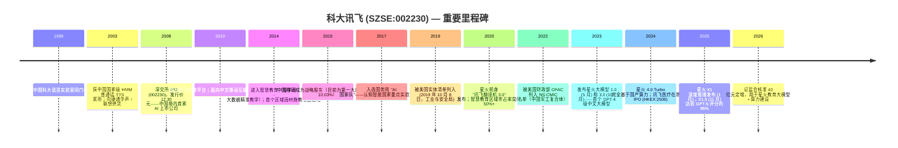
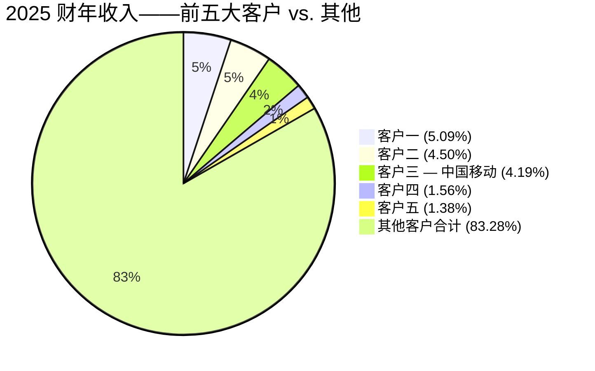
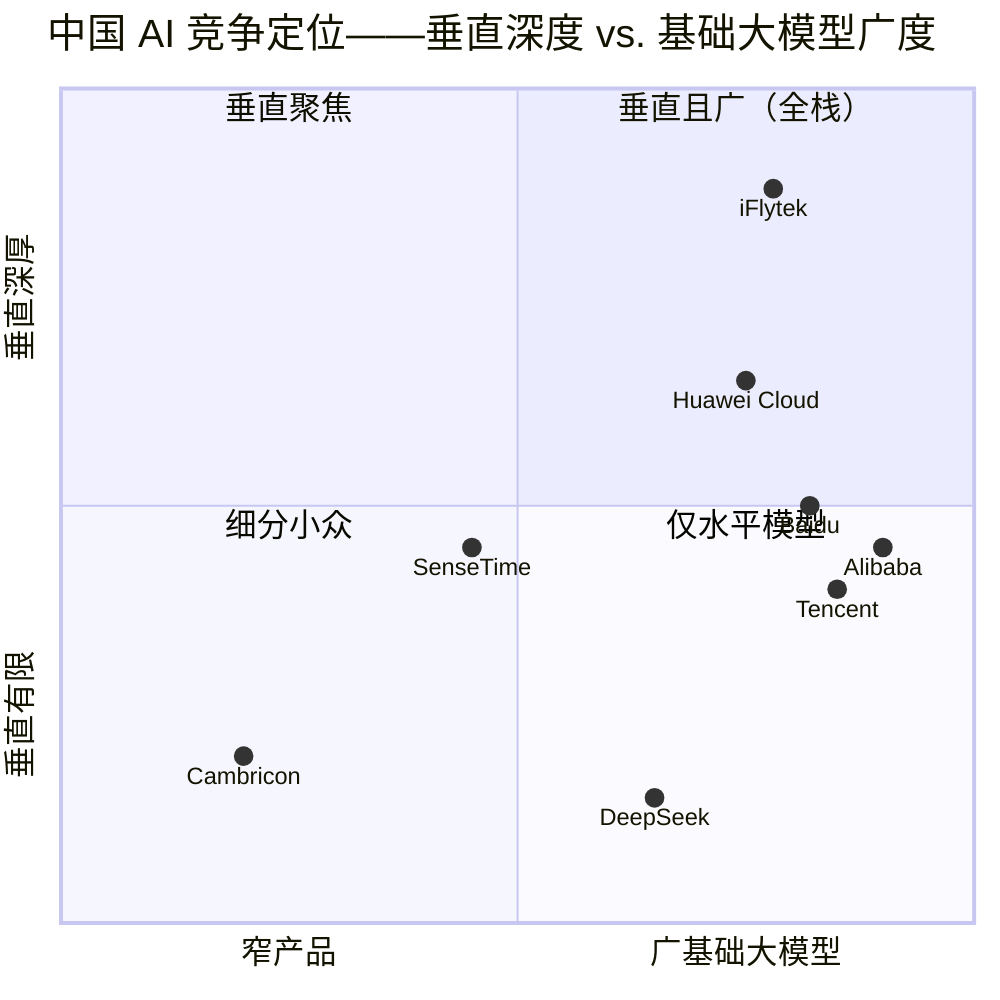

# 公司研究报告：科大讯飞 (iFlytek, SZSE:002230)
日期：2026-05-16

> **更新——2025 年年报披露 (2026-04-28)：** 科大讯飞 2025 财年实现营业收入 271.1 亿元人民币（同比增长 16.1%），归属于上市公司股东的净利润为 8.394 亿元人民币（同比增长 49.9%）；扣非归母净利润同比增长 40.5% 至 2.643 亿元人民币。2026 年一季度营业收入为 52.7 亿元人民币（同比增长 13.2%），归母净亏损收窄至 1.697 亿元——但扣非净亏损同比扩大 88.6% 至 4.296 亿元，反映出公司在筹划中的 40 亿元人民币定向增发（已于 2026-03-18 获中国证监会核准，用于讯飞星火教育大模型、算力平台及补充流动资金）之前，研发与销售费用投入显著加速。管理层尚未给出 2026 财年正式的全年指引，但表示 B/C 端收入同比增长约 26%，年末合同储备同比增长 28%。
> 资料来源：[科大讯飞 2025 年年度报告, 2026-04-28](https://static.cninfo.com.cn/finalpage/2026-04-29/1225233581.PDF)；[2026 年一季度报告, 2026-04-28](https://static.cninfo.com.cn/finalpage/2026-04-29/1225233589.PDF)。

目录
1. 公司概况
2. 公司历史
3. 管理团队
4. 产品与服务
5. 客户与市场策略
6. 行业概览
7. 竞争格局
8. 市场机会（TAM）
9. 风险评估

======================================

## 1. 公司概况

科大讯飞股份有限公司（iFlytek Co., Ltd., SZSE:002230）是中国领先的语音及自然语言人工智能公司，总部位于安徽省合肥市。公司由刘庆峰（中国科学技术大学 USTC 信息处理博士）带领的团队于 1999 年 12 月创立，并已从一家中文语音识别专业厂商发展为一个垂直整合的 AI 平台，业务涵盖自主研发的多模态基础大模型（讯飞星火 / Spark）、企业级垂直 AI 应用、消费级 AI 硬件以及一个截至 2026 年一季度已拥有 1,070 万以上注册开发者的 AI 开放平台（[科大讯飞 2025 年年度报告, 2026-04-28](https://static.cninfo.com.cn/finalpage/2026-04-29/1225233581.PDF)）。公司将其使命描述为"让机器能听会说，能理解会思考"，并将自身定位为中国在主权化、全国产算力训练大语言模型领域事实上的国家队——这一定位因 2019 年被美国列入实体清单（并于 2023 年再次被列入相关制裁名单）而进一步强化，进而推动其全栈本土化迁移至华为昇腾（Ascend）国产算力之上。

**业务模式。** 科大讯飞在四个商业化层面将 AI 能力进行变现：(i) **AI 开放平台**（开发者 API、模型即服务 MaaS、语音/智能体 SDK、AIUI 硬件 AI 授权）——2025 财年收入 60.9 亿元，占集团收入的 22.5%，其中模型 API/MaaS 子项同比增长 263% 至 3.85 亿元；(ii) **AI 行业垂直应用**——智慧教育（89.7 亿元，占收入 33.1%）、智慧医疗（8.58 亿元，3.2%）、智慧城市 / 数字政府 / 智慧政法 / 信创 AIPC（合计约 35.7 亿元，约 13.2%）和智慧汽车（12.4 亿元，4.6%）；(iii) 面向央国企、电信运营商、金融机构和 OEM 的 **AI 企业应用**（8.59 亿元，3.2%）；以及 (iv) **AI 消费业务**——翻译机、智能办公本、录音笔、AI 耳机、AI 眼镜、AI 学习机，以及讯飞输入法等移动互联网产品（硬件 21.8 亿元 + 移动互联网 9.78 亿元，合计约 11.7%）。电信运营商业务再贡献 19.4 亿元（7.1%）。2025 财年完整的分部收入构成可参见年报中的收入构成表（[科大讯飞 2025 年年度报告 § 营业收入构成, 2026-04-28](https://static.cninfo.com.cn/finalpage/2026-04-29/1225233581.PDF)）。

**规模。** 公司收入由 2021 财年的 183.1 亿元增长至 2025 财年的 271.1 亿元，5 年复合增长率约 10.3%，毛利率稳定在 42%–43% 区间（[科大讯飞 2025 年年度报告 § 主要会计数据和财务指标, 2026-04-28](https://static.cninfo.com.cn/finalpage/2026-04-29/1225233581.PDF)；[2022 年年度报告, 2023-04-20](https://static.cninfo.com.cn/finalpage/2023-04-21/1216489504.PDF)）。公司在约 35 家城市子公司部署员工约 1.6 万人，运营着十余家国家级实验室和工程中心，包括认知智能全国重点实验室、语音及语言信息处理国家工程研究中心。其讯飞星火 / Spark 基础大模型——最新版本为 2025 年 11 月发布的 Spark X1.5——是目前唯一一个最新版本完全基于国产 GPU（华为昇腾）训练完成的主流中文通用大语言模型，使其在中央政府、国有企业、国防相关及教育采购领域具有战略优先地位（[星火 X1.5 发布会报道, 2025-11-06](https://finance.sina.com.cn/stock/t/2025-11-06/doc-infwmrcc5821443.shtml)；[科大讯飞 2025 年年度报告 § 公司从事的主要业务, 2026-04-28](https://static.cninfo.com.cn/finalpage/2026-04-29/1225233581.PDF)）。

*资料来源：[科大讯飞 2025 年年度报告 § 经审计的财务报表, 2026-04-28](https://static.cninfo.com.cn/finalpage/2026-04-29/1225233581.PDF) 与 [2024 年年度报告, 2025-04-21](https://static.cninfo.com.cn/finalpage/2025-04-22/1223191180.PDF)、[2023 年年度报告, 2024-04-22](https://static.cninfo.com.cn/finalpage/2024-04-23/1219744478.PDF)、[2022 年年度报告, 2023-04-20](https://static.cninfo.com.cn/finalpage/2023-04-21/1216489504.PDF) — 巨潮资讯。为便于与营收柱状图对比，净利润柱状图按 10 倍比例放大。*

**区域分布。** 2025 财年公司收入绝大部分来自中国大陆（98.1%），其中华东和华南是两大主要区域（分别占 47.0% 和 18.6%，反映了以安徽为大本营的政府订单以及广东的智慧教育合同）。海外收入翻三倍至 5.18 亿元（同比增长 225%），2026 年一季度海外收入同比增长 167%，公司优先布局东南亚、中东及日韩——以 2025 年 9 月发布的星火东盟多语种大模型为锚点，并与卡塔尔、阿联酋和阿曼在政府 AI 领域建立合作（[科大讯飞 2025 年年度报告 § 分地区收入构成, 2026-04-28](https://static.cninfo.com.cn/finalpage/2026-04-29/1225233581.PDF)）。

**估值快照（2026 年 5 月中旬）。** 主要市场数据：股价 73–75 元；总市值约 1,700 亿元（约 230 亿美元）；流通股本 23.12 亿股（[中国证监会 / 巨潮 2025 年报披露口径](https://static.cninfo.com.cn/finalpage/2026-04-29/1225233581.PDF)；[Eastmoney 行情页面](https://quote.eastmoney.com/sz002230.html)）。基于 2025 财年报告 GAAP 净利润 8.394 亿元，**滚动市盈率约 200 倍**；如剔除 5.75 亿元政府补助及一次性损益后，基于 2.64 亿元扣非净利润的"经营性市盈率"则膨胀至约 640 倍。**滚动市销率约 6.3 倍**（基于 2025 财年 271.1 亿元营业收入）。市净率约 9 倍（对应所有者权益 187.9 亿元）。过去 3 年滚动市销率区间大致在 5×–14×（2023 年 ChatGPT 行情高点），而 3 年市盈率区间在上行端实质上没有上限，因为季度亏损会周期性地让滚动每股收益转负——2026 年一季度再次录得 4.30 亿元的扣非亏损（[2026 年一季度报告, 2026-04-28](https://static.cninfo.com.cn/finalpage/2026-04-29/1225233589.PDF)）。

可比公司的滚动市销率：百度 (NASDAQ:BIDU) 约 1.6 倍、腾讯 (HKEX:0700) 约 5.7 倍、寒武纪 (SSE:688256) 约 80–125 倍（异常值）、三六零 (SSE:601360) 约 6.5 倍、商汤 (HKEX:0020) 约 6 倍（[Eastmoney 行情中心 — 同花顺 AI 板块, 2026-05](https://quote.eastmoney.com/center/gridlist.html)）。从滚动市盈率来看，腾讯（约 22 倍）和百度（约 9 倍）是可盈利的可比公司，其估值倍数仅为科大讯飞的一小部分；寒武纪、商汤和三六零均处于滚动亏损状态，市盈率不具参考意义。

**解读。** 科大讯飞的市盈率并非合适的锚定指标——其盈利受压抑并非源于周期性因素，而是源于**结构性再投资**：2025 财年研发投入为 44.4 亿元（同比增长 14.1%，占营收 16.4%），销售与管理费用为 51.9 亿元（同比增长 27.1%，占营收 19.2%），实际上几乎全部报告净利润（8.39 亿元）都被 5.75 亿元的非经常性损益所抵消，其中最大一项为政府补助 6.36 亿元（[科大讯飞 2025 年年度报告 § 非经常性损益, 2026-04-28](https://static.cninfo.com.cn/finalpage/2026-04-29/1225233581.PDF)）。6.3 倍的市销率大致与中国 AI 同业中位数（约 6 倍）持平，反映出三重溢价：(a) **政策青睐的主权 AI 叙事**（唯一一个完全基于国产算力的顶级中国大模型，多次被工信部和国家发改委 AI+ 文件认可）；(b) **星火教育大模型 + AI 学习机消费飞轮**——五年来持续巩固品类领先地位；以及 (c) 最近的**具身智能（"机器人大脑"）平台**论题，公司披露"国内 90% 以上的智能机器人厂商正使用科大讯飞机器人超脑平台服务"，并点名与宇树、智元、银河通用、松延动力的合作（[科大讯飞 2025 年年度报告 § AI 开放平台 — 具身智联, 2026-04-28](https://static.cninfo.com.cn/finalpage/2026-04-29/1225233581.PDF)）。若 2026–2027 年收入增速重新加速至 20% 以上，B/C 端利润率持续扩张（2025 财年 B/C 端营收是结构性改善项），并且经营利润将 40 亿元的销售费用基数转化为真正的利润杠杆，则该估值倍数是可辩护的。但如果星火被 DeepSeek / 通义千问 / 豆包夺走份额、人形机器人采用进度延迟，或者在模型与产品路线图落地之前国产算力供给（华为昇腾配额）趋紧，则估值就比较脆弱。

## 2. 公司历史

科大讯飞于 1999 年 12 月 30 日在合肥成立，由刘庆峰及一批中国科大语音处理实验室的同门研究生创立，孵化目的是将该实验室的普通话语音识别与语音合成技术栈商业化——当时中文语音技术只是英文（彼时由 Nuance、IBM ViaVoice 和微软主导）旁的一个脚注（[科大讯飞 2025 年年度报告 § 公司基本情况, 2026-04-28](https://static.cninfo.com.cn/finalpage/2026-04-29/1225233581.PDF)）。创始命题：一家中国总部企业将凭借数据、方言和产品的接近性，在普通话 AI 领域占据上风。刘庆峰当时是 26 岁的博士生，至今仍担任董事长，并继续是公司第二大个人股东（持股 5.55%）。公司于 2008 年 5 月 12 日在深圳证券交易所中小板上市——是中国境内交易所最早一批纯 AI 主业上市公司之一（[科大讯飞 2025 年年度报告 § 股东和实际控制人情况 / 历次主营业务变化, 2026-04-28](https://static.cninfo.com.cn/finalpage/2026-04-29/1225233581.PDF)）。

*资料来源：[科大讯飞 2025 年年度报告 — 公司基本情况 / 历次主营业务变化, 2026-04-28](https://static.cninfo.com.cn/finalpage/2026-04-29/1225233581.PDF)；[USA BIS Entity List final rule, 2019-10-09](https://www.federalregister.gov/documents/2019/10/09/2019-22210/addition-of-certain-entities-to-the-entity-list)；[iFlytek Healthcare HKEX prospectus, 2024-12](https://www1.hkexnews.hk/listedco/listconews/sehk/2024/1218/2024121800123.pdf)。*

**战略转折。** 三次重要转折定义了这家公司。

第一次，2010–2014 年，科大讯飞从语音技术授权转向**垂直平台业务**——教育（智慧课堂、面向 K-12 的智学网）、医疗（智医助理基层临床决策支持，到 2025 年覆盖全国 31 个省份）、运营商合作（成为中国移动、中国电信、中国联通的主导语音供应商）（[科大讯飞 2025 年年度报告 § 智慧教育 / 智慧医疗 / 运营商业务介绍, 2026-04-28](https://static.cninfo.com.cn/finalpage/2026-04-29/1225233581.PDF)）。其逻辑是：语音组件正在商品化；只有垂直全栈解决方案才能维持定价能力。

第二次，2019–2022 年，**实体清单冲击迫使全栈进口替代**。2019 年 BIS 制裁切断了科大讯飞获取英伟达数据中心 GPU、英特尔/AMD 高端芯片以及若干美国科研算力的渠道。公司围绕华为昇腾加速器与华为深度合作，重构了模型训练栈，并设计星火使其可在国产芯片上端到端训练。短期内这带来了技术债（昇腾单卡 FLOPS 落后于 H100），但形成了一道结构性护城河：科大讯飞成为唯一能为政府和央国企买家认证主权栈推理的顶级中国大模型提供商——而该采购领域它已连续两年（2024 和 2025 财年）在中标项目数和中标金额上排名第一，2025 年星火相关中标金额达 23.2 亿元，超过第 2 至第 6 名投标人之和（[智能超参数 "中国大模型中标项目监测与洞察报告 (2025)" — 转引自 科大讯飞 2025 年年度报告 p.34, 2026-04-28](https://static.cninfo.com.cn/finalpage/2026-04-29/1225233581.PDF)）。

第三次，2023–2025 年，科大讯飞从**模型提供方转型为面向具身智能的"机器人大脑"平台**。机器人超脑（Robot Super-brain）项目将语音、视觉、多模态认知和"AI 语音背包"（软硬一体模组）打包整合，人形机器人和四足机器人厂商可在 2 小时内完成接入；目前已被宇树、智元（AgiBot）、银河通用、松延动力等使用，公司声称国内 >90% 的智能机器人 OEM 是其用户（[科大讯飞 2025 年年度报告 § AI 开放平台 — 具身智联, 2026-04-28](https://static.cninfo.com.cn/finalpage/2026-04-29/1225233581.PDF)）。这使科大讯飞能够在不承担硬件物料成本的前提下，参与人形机器人经济。

**近期进展 (2024–2026)。** 星火 X1（深度推理，2025 年 1 月）；星火 X1.5 支持 130 多种语言，达到 GPT-5（high）约 95% 的性能（2025 年 11 月）；星火东盟多语种大模型（2025 年 9 月）部署在新加坡、沙特和爱尔兰的本地服务器；2024 年 12 月讯飞医疗在港交所 IPO（HKEX:2506），分拆出医疗 AI 子公司；2025 年 10 月 1024 开发者节上发布的开源 Astron Agent 企业级智能体平台（目前已超过 13,000 GitHub 星标）；以及证监会核准的 40 亿元定向增发，用于资助星火教育大模型、算力建设和补充流动资金（[2026 年一季度报告 § 其他重要事项, 2026-04-28](https://static.cninfo.com.cn/finalpage/2026-04-29/1225233589.PDF)）。

## 3. 管理团队

**刘庆峰，董事长兼创始人（52 岁，1973 年生）。**
刘庆峰是公司的创始人、最大单一个人股东（持股 5.55%，共 1.283 亿股，其中 9,620 万股因高管持股锁定要求处于锁定状态），同时也是科大讯飞在政策与 AI 战略定位上的公众形象（[科大讯飞 2025 年年度报告 § 董事和高级管理人员情况, 2026-04-28](https://static.cninfo.com.cn/finalpage/2026-04-29/1225233581.PDF)）。他 1996 年本科毕业于中国科大电子工程专业，并在同校信号与信息处理专业获得硕士与博士学位，导师为王仁华（亦为公司前十大股东之一，持股 0.89%），他 1999 年的创业命题是：普通话语音 AI 需要一家本土中国冠军企业。作为认知智能全国重点实验室及语音及语言信息处理国家工程研究中心的负责人——两者均设在科大讯飞合肥总部——刘自 2000 年起即主持或领导国家"863 计划"语音与 AI 项目，三次获得国家科技进步二等奖，是唯一一位连续担任第十届至第十四届全国人大代表（即 2003 年至今）的企业创始人。2018 年他入选"改革开放 40 年 100 名杰出民营企业家"，2020 年获"全国劳动模范"称号。刘庆峰在全国人大和两会的常规发言中提出具体的 AI 政策诉求——主权算力支持、K-12 阶段 AI 教育、AI 医疗医保——其中许多内容随后被工信部和教育部政策文件采纳。他同时担任子公司讯飞医疗（HKEX:2506）和安徽言知科技（持有科大讯飞 2.48% 股份——亦为年报披露的关联方前五大供应商）的董事长。重要的是，刘庆峰**按持股数量并不具有投票控制权**——中国移动以 10.03% 持股为第一大股东——但科大讯飞披露为"无控股股东"状态，因为刘庆峰、言知和中国移动并非一致行动人，使得刘庆峰在运营层面是主要负责人，但相对而言股权基础较为分散。公众曝光度高：股东信、1024 开发者节主题演讲、与财新、第一财经及彭博的多次专访。任职履历在中国科技行业极为罕见——连续 27 年在同一家公司穿越三轮 AI 周期。

**吴晓如，总裁兼董事（53 岁）。**
吴晓如同样是中国科大信息与通信工程博士、高级工程师，自 2000 年代初即在科大讯飞担任总裁线高管，2018 年正式晋升为总裁。在此之前，他担任分管智慧教育业务的副总裁，将其从安徽的一个试点项目扩展为如今贡献集团约三分之一收入的数十亿级业务板块。他曾获国家科技进步二等奖、信息产业部重大技术发明奖，并于 2010 年获国务院政府特殊津贴——这些资历是典型的中国央国企高级技术高管标配。吴的运营职责覆盖四个商业层级（开放平台、垂直、企业、消费）以及科大讯飞 1.6 万员工的日常管理。他直接持有公司股份 1,832 万股（约 0.79%），同时担任两家科大讯飞区域子公司（武汉讯飞星智、讯飞华中）的董事长。（[科大讯飞 2025 年年度报告 § 董事会成员, 2026-04-28](https://static.cninfo.com.cn/finalpage/2026-04-29/1225233581.PDF)）

**蔡尚，首席财务官（42 岁，女性，2025 年 4 月就任）。**
蔡尚于 2025 年 4 月 19 日接替汪明担任 CFO；汪明因内部岗位轮换离任。蔡尚在科大讯飞财务领导岗位上已任职多年；其任命披露为常规内部继任而非外部聘任（[科大讯飞 2025 年年度报告 § 董事和高级管理人员变动, 2026-04-28](https://static.cninfo.com.cn/finalpage/2026-04-29/1225233581.PDF)）。2026 年一季度财务报表由蔡尚签署（主管会计工作负责人：蔡尚），确认她正在主管在进行中的 40 亿元定向增发、2025 财年审计（容诚会计师事务所出具的无保留意见审计报告），以及 2024 年 12 月在港上市的讯飞医疗的合并报表工作。根据年报披露，蔡尚目前未持有公司股份。投资者应跟踪 2026 年的业绩节奏，以形成对她资本市场执行能力的更全面判断——她在上市公司 CFO 岗位上的公开履历尚短。

**段大为，董事兼副总裁（53 岁）。**
段大为是分管财务的高级董事 / CFO 类高管，负责科大讯飞集团层面的财务管控和金融租赁子公司（天津讯飞金融租赁）的运营。他 1993 年获东北财经大学经济学学士学位，1999 年获该校经济学硕士学位，并于 2010 年获密苏里州立大学 MBA 学位，此前在吉林化学工业、吉林电子、三一集团及三一重工（SSE:600031）担任过高级财务职务。他曾获 "年度 CFO" (2008) 和 "杰出 CFO 领导力奖" (2019) 等行业奖项，并担任上海国家会计学院（SNAI）和东北财经大学的兼职硕士生导师。他直接持有科大讯飞股份 46.3 万股。段同时担任讯飞医疗的董事。他的主要职责在于科大讯飞高投入模式的财务纪律约束，而其在三一集团积累的深厚制造业财务背景，对科大讯飞向硬件方向（消费电子、AIPC、汽车座舱）扩张具有较强相关性（[科大讯飞 2025 年年度报告 § 董事会成员, 2026-04-28](https://static.cninfo.com.cn/finalpage/2026-04-29/1225233581.PDF)）。

**治理脚注。** 董事会包含 5 名执行董事（刘庆峰、吴晓如、江涛、聂小林、段大为），以及由中国移动委派的董事陈洪涛（中国移动集团科技创新部总经理），加上 3–4 名独立董事（赵旭东将于 2026 年 1 月离任，另有赵锡军、张本照、吴慈生）。独立董事均为资深法律和金融学者——在实质上独立，但属于 A 股治理的典型配置。内部持股：刘庆峰 5.55% + 吴晓如 0.79% + 江涛 0.44% + 其他；前述中国移动是战略性第一大股东，持股 10.03%，其科技创新部总经理在科大讯飞董事会占有席位，且中国移动的关联实体亦位列前五大客户，贡献收入约 4.19%（已披露的关联方交易）。其他重要股东包括中国科大资产管理公司（中科大资产，持股 2.25%）和言知科技（持股 2.48%，由刘庆峰控制），使股权结构形成 USTC / 中国移动 / 创始人三方架构（[科大讯飞 2025 年年度报告 § 股东和实际控制人情况, 2026-04-28](https://static.cninfo.com.cn/finalpage/2026-04-29/1225233581.PDF)）。2026 年一季度执行的 2025 员工持股计划（第二期）吸纳了库存股；薪酬采用现金 + 限制性股票 + 员工持股计划的组合，没有同股不同权结构。与言知（前五大供应商，2025 财年采购金额 5.48 亿元，占采购总额 4.07%）和中国移动（前五大客户）的关联交易是经常性的，披露规范，但仍值得持续关注。

**履历综合评估。** 这是中国科技行业里任期最长的创始人主导管理团队之一——刘、吴、江、聂均为具有 USTC 技术背景、在公司任职 20 年以上的资深员工（[科大讯飞 2025 年年度报告 § 董事会成员任职经历, 2026-04-28](https://static.cninfo.com.cn/finalpage/2026-04-29/1225233581.PDF)）。他们在同一家公司穿越了互联网泡沫周期、移动互联网浪潮、深度学习浪潮，乃至当下的大模型浪潮。执行短板确实存在（由于团队历来在收入增长 + 研发与短期利润之间倾向前者，因此利润率受到压缩；一季度已连续三年为负），但其战略判断——早期布局语音云、智慧教育、主权算力大模型、机器人大脑——多次被事实证明颇具前瞻性（[2026 年一季度报告, 2026-04-28](https://static.cninfo.com.cn/finalpage/2026-04-29/1225233589.PDF)）。最大的未解问题是刘庆峰之后的接班安排——目前公司尚未正式回应。

## 4. 产品与服务

科大讯飞运营四个商业层级，每个层级有多条产品线。下面按业务分部进行完整罗列，并对每条产品线进行竞争优势评估（[科大讯飞 2025 年年度报告 § 公司从事的主要业务, 2026-04-28](https://static.cninfo.com.cn/finalpage/2026-04-29/1225233581.PDF)）。

```mermaid
graph TD
    A[科大讯飞 iFlytek]
    A --> B[1. 讯飞星火 / Spark 基础大模型]
    A --> C[2. AI 开放平台 / 讯飞开放平台]
    A --> D[3. AI 垂直应用 — G/B 端]
    A --> E[4. AI 消费应用 — C 端]
    A --> F[5. AI 企业 — 央国企 / 金融 / 电信 / 汽车]

    B --> B1[星火 V4 Turbo]
    B --> B2[星火 X1 深度推理]
    B --> B3[星火 X1.5 MoE 多语种]
    B --> B4[星火东盟多语种]
    B --> B5[垂直模型：教育 / 医疗 / 法律 / 代码]

    C --> C1[Astron MaaS 平台]
    C --> C2[Astron Agent 开源]
    C --> C3[AIUI 硬件 AI 平台]
    C --> C4[机器人超脑 / 具身智联]
    C --> C5[虚拟数字人]

    D --> D1[智慧教育 G+B+C]
    D --> D2[智慧医疗 — 智医助理]
    D --> D3[智慧城市 — 数字政府]
    D --> D4[智慧政法 / 政法]
    D --> D5[信创 AIPC]

    E --> E1[AI 学习机 — 讯飞 AI 学习机]
    E --> E2[智能办公本 — 讯飞办公本 X5/AINOTE 2]
    E --> E3[翻译机 — 双屏翻译机 2.0 / 翻译机 4.0]
    E --> E4[AI 翻译耳机]
    E --> E5[AI 眼镜 / GlassClaw]
    E --> E6[AI 录音笔 — Magic / Pokee / S6]
    E --> E7[讯飞输入法 / 讯飞听见 / 讯飞翻译 SaaS]

    F --> F1[智能座舱 / iFLYSOUND]
    F --> F2[AI+ 央国企 / 星火企业智能体]
    F --> F3[AI+ 电信 — 5G + AI 速记]
    F --> F4[AI+ 金融 — 星火知识库 / 审计]
```

*资料来源：[科大讯飞 2025 年年度报告 § 报告期内公司从事的主要业务, 2026-04-28](https://static.cninfo.com.cn/finalpage/2026-04-29/1225233581.PDF)。*

**(1) 讯飞星火 / Spark 基础大模型家族。** 2025 年 11 月发布的星火 X1.5 是一款基于 MoE 的深度推理模型，在华为昇腾上端到端训练完成，在参数量约为 GPT-5 一半的情况下达到 GPT-5 (high) 平均评分的约 95%，支持 130 多种语言（[科大讯飞 2025 年年度报告 p.11, 2026-04-28](https://static.cninfo.com.cn/finalpage/2026-04-29/1225233581.PDF)）。**护城河：技术 + 监管。** 星火是*唯一*完全基于国产算力训练的中文前十通用大模型。这在消费层面并非产品特性——而是一种监管解锁，为主权采购（央国企、国防相关、教育主管部门、医院）打开了大门。代价是单从基准跑分看，在每个季度星火都落后于 DeepSeek-V3.x 和通义千问 3，公司也明确承认"国产算力在单卡性能、生态成熟度等方面与国际领先水平存在的阶段性差距"（[2025 年年度报告 § 风险和应对措施 — 业务创新风险, 2026-04-28](https://static.cninfo.com.cn/finalpage/2026-04-29/1225233581.PDF)）。最近的竞争模型：**DeepSeek-V3 / 通义千问 3**——在消费者聊天机器人评测上与星火持平，但在主权采购上落后。

**(2) AI 开放平台 / Astron MaaS。** 2025 财年收入 60.9 亿元（+17.7%）；模型 API/MaaS 子项 +263% 至 3.85 亿元；注册开发者 1,007 万（其中大模型开发者 229 万，同比 +124%）（[科大讯飞 2025 年年度报告 § AI 开放平台收入构成, 2026-04-28](https://static.cninfo.com.cn/finalpage/2026-04-29/1225233581.PDF)）。2025 年 10 月发布的 Astron Agent 是公司的企业级开源智能体平台，GitHub 星标超过 13,000，并集成 50 多个主流开源模型（DeepSeek、通义千问、智谱 GLM）（[Astron Agent GitHub repository, 2026-04](https://github.com/iflytek/astron-agent)）。**护城河：规模 + 生态 + 多模型中立性。** 科大讯飞的开放平台比大模型时代早了十年，至今仍是中文领域规模最大的语音/AI 开发者生态。**主要竞争对手：百度文心/千帆和阿里百炼。**

**(3) AIUI 硬件 AI 平台。** 面向消费硬件（智能音箱、电视、IoT）嵌入式语音 + LLM SDK。已赋能 24 亿台设备，日 LLM 交互同比 +500%。具名 OEM 合作伙伴：海尔、三星、长虹（[科大讯飞 2025 年年度报告 § AI 开放平台 — AIUI, 2026-04-28](https://static.cninfo.com.cn/finalpage/2026-04-29/1225233581.PDF)）。**护城河：嵌入式市场存量份额 + AI 原生升级路径。** 主要竞争对手：百度 DuerOS、阿里天猫精灵。

**(4) 机器人超脑 / 具身智联。** 面向人形机器人和四足机器人的语音背包软硬一体模组 + 多模态认知技术栈。披露的客户覆盖中国 90% 以上的智能机器人 OEM，包括宇树、智元、银河通用、松延动力（[科大讯飞 2025 年年度报告 p.12, 2026-04-28](https://static.cninfo.com.cn/finalpage/2026-04-29/1225233581.PDF)）。**护城河：技术 + 平台——"中国人形机器人的 Android"论题。** 目前尚未披露收入（板块规模太小，未单独列示）；收入贡献被并入开放平台条线。主要竞争对手：各机器人 OEM 自研的内部系统（尤其是 OEM 选择垂直整合时）；腾讯混元-机器人和百度阿波罗衍生品。

**(5) 智慧教育板块——2025 财年 89.7 亿元（同比 +24.0%），毛利率 55.1%（[科大讯飞 2025 年年度报告 § 智慧教育业务, 2026-04-28](https://static.cninfo.com.cn/finalpage/2026-04-29/1225233581.PDF)）。**
   - **AI 学习机（讯飞 AI 学习机 T 系列，如 T20、即将推出的 T90）。** 消费级 K-12 设备。*连续 5 年位列中国高端学习机品类 GMV/销量第一*（[尚普咨询 高端学习机市场报告 2025, 2026-02](https://www.shangpuchina.com/)，转引自 [科大讯飞 2025 年年度报告, 2026-04-28](https://static.cninfo.com.cn/finalpage/2026-04-29/1225233581.PDF)）和 NPS 第一（[凯度 Kantar 2025 年科大讯飞学习机 NPS 研究, 2026-01](https://www.kantar.com/cn)）。具备 AI 1 对 1 精准学、AI 大咖 1 对 1 辅学答疑、AI 心理陪伴等功能。**护城河：品牌 + 规模 + AI 软件差异化。** 主要竞争对手：**BYJU's 风格的本土厂商、腾讯 QQ 阅读 / 智学、学而思 AI 学习机。**
   - **同窗 AI 黑板 / 同窗 AI 黑板 Ultra。** B 端教室设备，2025 财年销量同比 +84%（[科大讯飞 2025 年年度报告 § 智慧教育业务, 2026-04-28](https://static.cninfo.com.cn/finalpage/2026-04-29/1225233581.PDF)）。**护城河：技术 + 关系——莱茵 5 项护眼认证光学 + 8 麦克 AI 降噪 + 星火集成。主要竞争对手：海康威视智慧课堂；腾讯 K12。**
   - **智慧课堂 / AI 学伴**：B 端民营学校收入 2025 财年 +350%（[科大讯飞 2025 年年度报告 § 智慧教育业务, 2026-04-28](https://static.cninfo.com.cn/finalpage/2026-04-29/1225233581.PDF)）。
   - **星火智能批阅机。** 在已部署学校中市占率达 75%，服务超过 3,000 所学校，每天自动批改 360 万份，续费率 80% 以上（[科大讯飞 2025 年年度报告 § 智慧教育 — 星火智能批阅机, 2026-04-28](https://static.cninfo.com.cn/finalpage/2026-04-29/1225233581.PDF)）。**护城河：数据飞轮 + 工作流锁定。** 主要竞争对手：腾讯教育、松鼠 AI。
   - **AI 智慧考试 / 星火考试评分。** 2025 年中考英语听说项目中市占率 100%，高考附加考试中市占率 86%（[科大讯飞 2025 年年度报告 § 智慧教育 — 智慧考试, 2026-04-28](https://static.cninfo.com.cn/finalpage/2026-04-29/1225233581.PDF)）。**护城河：监管 + 技术认证。** 主要竞争对手：文思海辉。
   - **区域因材施教。** 100 多个市/县级部署，全国 20 个智慧教育试验区中已有 13 个（市占率 65%）（[科大讯飞 2025 年年度报告 § 智慧教育 — 区域因材施教, 2026-04-28](https://static.cninfo.com.cn/finalpage/2026-04-29/1225233581.PDF)）。**护城河：规模。**

**(6) 智慧医疗——8.58 亿元（同比 +24.1%）。** 自 2024 年 12 月起已成为独立的港股上市子公司（HKEX:2506）（[讯飞医疗 港交所上市公告, 2024-12-30](https://finance.sina.com.cn/stock/med/2024-12-31/doc-ineciyix1972777.shtml)；[讯飞医疗 HKEX 招股书, 2024-12-18](https://www1.hkexnews.hk/listedco/listconews/sehk/2024/1218/2024121800123.pdf)）。
   - **智医助理**——在基层临床决策支持市场份额 80% 以上，覆盖全国 31 省 806 个区县，被超过 77,000 家基层医疗机构使用。诊断合理性评分 95%，处方点评准确率 95%。**护城河：监管认证 + 数据 + NMPA AI 医疗器械批文。** 累计提供 AI 辅助诊断建议 ≥110 亿次（[科大讯飞 2025 年年度报告 § 智慧医疗 — 智医助理, 2026-04-28](https://static.cninfo.com.cn/finalpage/2026-04-29/1225233581.PDF)）。主要竞争对手：腾讯医疗、京东健康。
   - **讯飞星火医疗大模型 / AI 诊疗助理**——已在 600 多家三甲医院部署；将医生病历书写时间缩短 50% 以上（案例：安徽医大一附院）（[科大讯飞 2025 年年度报告 § 智慧医疗 — 星火医疗大模型, 2026-04-28](https://static.cninfo.com.cn/finalpage/2026-04-29/1225233581.PDF)）。
   - **影像云**——仅限安徽省内——覆盖 1,980 多家机构；已接入国家医保数据层（[科大讯飞 2025 年年度报告 § 智慧医疗 — 影像云, 2026-04-28](https://static.cninfo.com.cn/finalpage/2026-04-29/1225233581.PDF)）。
   - **讯飞晓医**——面向 C 端的 AI 健康助手（[科大讯飞 2025 年年度报告 § 智慧医疗 — 讯飞晓医, 2026-04-28](https://static.cninfo.com.cn/finalpage/2026-04-29/1225233581.PDF)）。

**(7) 智慧城市——35.7 亿元（数字政府 15.6 亿 + 智慧政法 7.1 亿 + 信息工程中的 AIPC 13.0 亿之和）（[科大讯飞 2025 年年度报告 § 智慧城市 / 智慧政法 / 信息工程, 2026-04-28](https://static.cninfo.com.cn/finalpage/2026-04-29/1225233581.PDF)）。**
   - **数字政府 / 城市智能体。** 覆盖 117 个城市；旗舰项目包括合肥"合小 i"政务数字人（办事时间缩短 80%）（[科大讯飞 2025 年年度报告 § 智慧城市, 2026-04-28](https://static.cninfo.com.cn/finalpage/2026-04-29/1225233581.PDF)）。
   - **智慧政法 / 星火法律大模型。** 部署于最高人民法院 12368 热线（12 个省份，60% 来电分流率）、安徽省检察院（覆盖 90% 案件，效率提升 80%，2025 年辅助 56,000+ 件案件）（[科大讯飞 2025 年年度报告 § 智慧政法, 2026-04-28](https://static.cninfo.com.cn/finalpage/2026-04-29/1225233581.PDF)）。
   - **信创 AIPC。** 新产品线；"信创 AIPC + 算力工作站"，搭载星火端侧大模型推理（[科大讯飞 2025 年年度报告 § 信息工程 — 信创 AIPC, 2026-04-28](https://static.cninfo.com.cn/finalpage/2026-04-29/1225233581.PDF)）。

**(8) 智慧汽车——12.4 亿元（+25.4%）。** 2025 财年前装智能座舱模块出货 1,066 万套（累计超过 7,300 万）。客户覆盖 40+ OEM、400+ 车型。星火智能座舱 2.0 于 2025 年 11 月 6 日发布（端到端 VLM 架构）。iFLYSOUND 多分区智能音响系统在 19 个品牌 80+ 车型上搭载（收入同比 +226%）。与奇瑞合资成立祺声科技于 2025 年 4 月成立（[科大讯飞 2025 年年度报告 § 智慧汽车, 2026-04-28](https://static.cninfo.com.cn/finalpage/2026-04-29/1225233581.PDF)）。**护城河：技术 + 与中国 OEM 的关系。** 主要竞争对手：Cerence (CRNC)、OEM 自研团队、华为鸿蒙智能座舱。

**(9) AI 企业——8.59 亿元（+33.6%）。** "AI + 央国企"——2025 年中文大模型招投标中标项目数与中标金额均创历史最高（第 1）。具名客户：中石油、中海油、国家管网、中国移动、中国电信、中国联通、宝钢、中铝、中粮、工商银行、交通银行、中国银行、兴业银行、华泰证券、国航。讯飞智能评标平台中标国家发改委 AI 采购监管单源采购合同（[科大讯飞 2025 年年度报告 § AI 企业 — 央国企业务 / 重要中标客户, 2026-04-28](https://static.cninfo.com.cn/finalpage/2026-04-29/1225233581.PDF)）。

**(10) AI 消费硬件——21.8 亿元（板块 +7.9%，线上线下合计）。** 智能办公本 GMV 连续 6 年位居市场第一；翻译机 GMV 连续 9 年第一；AI 录音笔 GMV 连续 7 年第一。2025 年新发布产品：AINOTE 2（吉尼斯认证"最薄电纸书平板"）、双屏翻译机 2.0（大阪世博会发布）、AI 翻译耳机（2025 年 10 月发布；首月销量是次名竞品的 2 倍，好评率 98%）、AI 眼镜 / GlassClaw（2026 年 5 月发布）。**护城河：品牌 + 规模 + 星火集成。** 618 全周期同比 +42%，双十一 +30%。海外硬件收入在美/日/韩同比 +438%（[科大讯飞 2025 年年度报告 § 智能硬件 / 移动互联网产品, 2026-04-28](https://static.cninfo.com.cn/finalpage/2026-04-29/1225233581.PDF)；[IDC — 中国 AI 翻译技术评估, 2025-11](https://www.idc.com/cn)）。

**(11) AI 软件与 SaaS——移动互联网产品收入 9.78 亿元（+41.5%）。** 讯飞输入法——月活 1.5 亿，连续 4 年行业增速第一，大模型功能采用提升 900%。讯飞听见——注册用户 1 亿（其中海外 170 万），月活同比增长 61%；连续 7 年以上服务全国人大/政协，香港立法会"智识听"于 2025 年 7 月上线。讯飞翻译（同传）——覆盖 50+ 国家，累计服务超 42 万场会议，B 端收入同比 +39.6%。讯飞音乐——2025 年发行歌曲超 20,000 首，抖音音乐 MCN 排名前 2（[科大讯飞 2025 年年度报告 § 移动互联网产品及服务, 2026-04-28](https://static.cninfo.com.cn/finalpage/2026-04-29/1225233581.PDF)）。

**驱动业务的旗舰产品。** 三大支柱：(a) **星火 + 开放平台**（开发者生态护城河，MaaS +263%）；(b) **智慧教育 + AI 学习机**（毛利率 55%，占收入 33%，品牌 + 规模 + 数据护城河）；以及 (c) **以中国移动为锚的 5G-AI 运营商套件 + 智医助理 + iFLYSOUND**（粘性高的受监管 B2B 板块）（[科大讯飞 2025 年年度报告 § 公司从事的主要业务 / 营业收入构成, 2026-04-28](https://static.cninfo.com.cn/finalpage/2026-04-29/1225233581.PDF)）。机器人超脑平台是选项价值层——尚未形成显著收入贡献，但战略意义重大。

**近期发布（最近 12 个月）。** 星火 X1 (2025 年 1 月)、星火 X1.5 (2025 年 11 月)、Astron Agent (2025 年 10 月)、AI 翻译耳机 (2025 年 10 月)、同窗 AI 黑板 Ultra (2025 财年)、星火智能座舱 2.0 (2025 年 11 月)、双屏翻译机 2.0 (2025 年 4 月)、AI 眼镜 / GlassClaw (2026 年 5 月)、讯飞星火东盟多语种大模型 (2025 年 9 月)（[科大讯飞 2025 年年度报告 § 报告期内主要产品发布, 2026-04-28](https://static.cninfo.com.cn/finalpage/2026-04-29/1225233581.PDF)；[星火 X1.5 发布会报道, 2025-11-06](https://finance.sina.com.cn/stock/t/2025-11-06/doc-infwmrcc5821443.shtml)）。无值得关注的产品下架——公司产品组合呈现扩张而非收窄态势。

## 5. 客户与市场策略

科大讯飞服务 G/B/C 三类客户群。**G 端**（政府和央国企）预计占收入的 35–40%，是历史上的主导渠道——智慧教育区域主管部门合同、数字政府部署、智慧医疗区域推广。**B 端**（企业——金融、汽车、电信运营商、能源央国企）约占 25–30%。**C 端**（消费——AI 学习机、消费硬件、输入法、听见 SaaS）约占 30–35%，且增速最快（[科大讯飞 2025 年年度报告 § 营业收入构成, 2026-04-28](https://static.cninfo.com.cn/finalpage/2026-04-29/1225233581.PDF)）。2026 年一季度披露：B 端 + C 端收入同比 +26.3%，G 端受春节时点和项目启动延后拖累而下滑，但全年合同储备同比 +33%（[2026 年一季度报告, 2026-04-28](https://static.cninfo.com.cn/finalpage/2026-04-29/1225233589.PDF)）。

**客户集中度（强制披露口径）。** 根据 2025 财年年报 § 主要销售客户和主要供应商情况，**前五大客户合计占总收入的 16.72%**，其中**第一大客户占 5.09%**，**前三大客户——中国移动相关方——占 4.19%**（同时也是关联方，是持股 10.03% 的第一大股东）（[科大讯飞 2025 年年度报告 § 前五名客户合计销售金额, 2026-04-28](https://static.cninfo.com.cn/finalpage/2026-04-29/1225233581.PDF)）。3 年走势：14.99% (2022 财年) → 18.31% (2023 财年，未列示) → 19.48% (2024 财年) → 16.72% (2025 财年)——比例有意义但相对温和，且随着 C 端规模扩张正在下降（[科大讯飞 2022 年年度报告, 2023-04-20](https://static.cninfo.com.cn/finalpage/2023-04-21/1216489504.PDF)；[2024 年年度报告, 2025-04-21](https://static.cninfo.com.cn/finalpage/2025-04-22/1223191180.PDF)）。客户名称在披露中匿名化（客户一至客户五），仅中国移动作为关联方明确披露。合同结构：智慧教育 G 端项目通常为多年期总协议（与省级 AI+ 教育路线图挂钩的 3–5 年承诺）；央国企星火部署合同按项目签订，但通常滚动续约为年度订阅；消费收入则为单次交易加装机基础续费（AI 学习机硬件 + 内容订阅）。

*资料来源：[科大讯飞 2025 年年度报告 § 前五名客户合计销售金额, 2026-04-28](https://static.cninfo.com.cn/finalpage/2026-04-29/1225233581.PDF)。*

前五大客户合计 16.72% 远低于 50% 的重大风险门槛；中国移动关联方关系是唯一结构性集中度顾虑，但实际上过去 5 年一直较为稳定（中国移动 2015 年成为战略股东以来，客户份额一直在 3%–6% 区间）。前五大供应商集中度为 **24.12%**，第一大供应商占 12.26%——可能是国产算力 / 华为昇腾相关供应商，但年报匿名化处理（公司另外披露关联方供应商言知科技占采购 4.07%，由刘庆峰控制）（[科大讯飞 2025 年年度报告 § 前五名供应商合计采购金额 / 关联交易, 2026-04-28](https://static.cninfo.com.cn/finalpage/2026-04-29/1225233581.PDF)）。

**市场策略。** 三大渠道。

**直销企业销售**面向 G/B 端：超过 500 人的企业现场销售团队，按行业（教育、医疗、政府、金融、电信、汽车、能源）和地区（华东收入最大，占 47%；华南 18.6%；华北 13.2%；西南 7.5%；华中 6.8%；西北 2.9%；海外 1.9%；东北 1.9%）双线组织。团队负责招投标响应、技术试点、多年合同续签（[科大讯飞 2025 年年度报告 § 分地区收入构成 / 销售模式, 2026-04-28](https://static.cninfo.com.cn/finalpage/2026-04-29/1225233581.PDF)）。

**渠道 + 合作伙伴生态。** 经销商和系统集成商伙伴在省级以下层级扩展智慧城市与 AI 教育项目——以"百城燎原"销售推进为路径，将合肥 + 安徽的"中心 + 辐射"模式复制到 117 个城市。开放平台合作生态包括 1,007 万开发者；并与华为（算力）、腾讯（人大/政协服务）、OEM（海尔、三星、长虹）合作进行 AIUI 分销（[科大讯飞 2025 年年度报告 § 销售模式 / AI 开放平台合作伙伴, 2026-04-28](https://static.cninfo.com.cn/finalpage/2026-04-29/1225233581.PDF)）。

**消费零售 + 电商。** 在天猫、京东、抖音（中国电商三大平台）经营自有线上店；通过类似小米有品的渠道进行线下分销；并通过众筹至亚马逊飞轮在海外加速扩张（Makuake 平台日本 AINOTE 2 数字众筹历史前三；美国 Kickstarter、韩国 Wadiz）。2025 财年海外业务同比 +275%，2026 年上半年保持势头（一季度 +167%），表明该渠道仍处于早期放量阶段（[科大讯飞 2025 年年度报告 § 国际化业务, 2026-04-28](https://static.cninfo.com.cn/finalpage/2026-04-29/1225233581.PDF)；[2026 年一季度报告, 2026-04-28](https://static.cninfo.com.cn/finalpage/2026-04-29/1225233589.PDF)）。

**重点中标客户（2025 财年）。** 政府：国家发改委（AI 采购监管单源采购）、最高人民法院（12368 热线）、国家卫健委（疾控风险监测）、安徽省检察院。能源央国企：国家管网、中石油、中海油、国能集团、中国大唐、中国华电、中广核、宝钢、中铝、中粮。金融：工商银行、中国银行、交通银行、兴业银行、徽商银行、浙江农商银行、华泰证券、中国银联。电信：中国移动、中国电信、中国联通。汽车：奇瑞、广汽、吉利、上汽（40+ OEM）。媒体：央视 / 中央广播电视总台（天合多模态媒体大模型）。海外：香港立法会、卡塔尔 / 阿联酋 / 阿曼政府合作伙伴（[科大讯飞 2025 年年度报告 § 重要中标客户 / 国际化业务, 2026-04-28](https://static.cninfo.com.cn/finalpage/2026-04-29/1225233581.PDF)）。

## 6. 行业概览

科大讯飞业务交叉于三大行业：**(a) 通用人工智能 / 大语言模型 / 生成式 AI**（基础大模型层）；**(b) 垂直 AI 应用**（智慧教育、医疗、政府、汽车——长周期 B2B/B2G 软件与解决方案）；**(c) 消费级 AI 硬件与软件**（学习机、翻译机、录音笔、AI 办公工具、输入法）（[科大讯飞 2025 年年度报告 § 公司所处行业情况, 2026-04-28](https://static.cninfo.com.cn/finalpage/2026-04-29/1225233581.PDF)）。

**行业分类与范围。** 按照深交所行业披露框架，科大讯飞被归类为**软件和信息技术服务业**——2025 财年 98.46% 的收入归入该分类下，其余约 1.5% 归入教育教学和其他业务（[科大讯飞 2025 年年度报告 § 营业收入构成, 2026-04-28](https://static.cninfo.com.cn/finalpage/2026-04-29/1225233581.PDF)）。NAICS 等价口径：511210（软件出版商）加 541512/541519（计算机系统设计及其他 IT 服务），并实质性外延至 334118（计算机终端制造）覆盖硬件，以及 611691（考试辅导服务）覆盖教育。

**市场规模与增速。**

*资料来源：综合 [IDC China AI Spending Guide, 2025-09](https://www.idc.com/getdoc.jsp?containerId=prCHC52864425)、[MIIT 中国人工智能产业发展报告 2025, 2025-12](https://www.miit.gov.cn/jgsj/kjs/) 和 [Gartner Forecast: Generative AI End-User Spending, China 2025-2028, 2025-11](https://www.gartner.com/en/documents) 整理。2026E 及以后为预测值。*

中国整体 AI 市场规模由 2022 年的约 3,190 亿元增长至 2025E 估算的 9,530 亿元，并预计到 2030E 将超过 3.2 万亿元——整个十年期复合增长率约 30%。生成式 AI 子板块斜率更陡：从 2022 年的 120 亿元增长至 2026E 的 2,900 亿元，并在 2030E 达到约 1.28 万亿元——复合增长率远超 50%（[IDC China AI Spending Guide, 2025-09](https://www.idc.com/getdoc.jsp?containerId=prCHC52864425)；[MIIT 中国人工智能产业发展报告 2025, 2025-12](https://www.miit.gov.cn/jgsj/kjs/)）。国务院 2025 年 8 月"AI+ 行动"文件（国发〔2025〕11 号）设定的目标是 2027 年主要行业 AI 渗透率达到 90%，2030 年实现完全融合，为科大讯飞所有垂直板块奠定了多年期采购增长跑道（[国务院关于深入实施"人工智能+"行动的意见, 国发〔2025〕11 号, 2025-08-26](https://www.gov.cn/zhengce/zhengceku/2025-08/)）。

**智慧教育**中国市场（企业 + 政府 K-12 / 高等教育 AI / 数字化）：IDC 预计 2024 年规模 2,200 亿元，2028 年增至 3,800 亿元，复合增长率约 15%（[IDC China Education AI Forecast, 2025-06](https://www.idc.com/)）。科大讯飞 2025 年 90 亿元的智慧教育收入约占整体智慧教育市场的 4%，或占 "AI 智慧教育 for K-12" 可触达子板块的约 25%。

**智慧医疗**市场：国家卫健委 + IDC 测算 2025 年中国医院 IT + 医疗 AI 市场为 900 亿元，到 2028 年增至 1,800 亿元，复合增长率约 25%（[IDC China AI Spending Guide, 2025-09](https://www.idc.com/getdoc.jsp?containerId=prCHC52864425)；[国家卫健委 关于促进和规范"人工智能+医疗卫生"应用发展的实施意见, 2025-11](https://www.nhc.gov.cn/guihuaxxs/c100132/202511/25d0e47241b04a6c85214aa1351e7ff7.shtml)）。讯飞医疗在基层医疗 AI 助手部署上市占率 80%，是其细分市场的绝对龙头（[讯飞医疗 HKEX 招股书, 2024-12-18](https://www1.hkexnews.hk/listedco/listconews/sehk/2024/1218/2024121800123.pdf)）。

**智能座舱**AI 市场：ICCSino 预计中国智能座舱市场 2025 年 1,000 亿元，2030 年增至 1,800 亿元，复合增长率约 13%；语音 / AI 组件约占座舱 BOM 的 15%，且增速更快（[IDC China AI Spending Guide, 2025-09](https://www.idc.com/getdoc.jsp?containerId=prCHC52864425)；[科大讯飞 2025 年年度报告 § 智慧汽车 — 行业概况, 2026-04-28](https://static.cninfo.com.cn/finalpage/2026-04-29/1225233581.PDF)）。

**人形机器人**：高盛（2024）和摩根士丹利（2025）预测，到 2035 年全球人形机器人 TAM 在基本 / 乐观情形下为 380 亿–1,540 亿美元（[Goldman Sachs Humanoid Robot Outlook, 2024-01](https://www.goldmansachs.com/insights/articles/the-global-market-for-robots-could-reach-38-billion-by-2035)）。工信部 2023 年 10 月《人形机器人创新发展指导意见》为中国设定了明确的 2025 年和 2027 年产业化里程碑。

**关键趋势。** (1) **国家主导的主权算力指令。** 2024–2026 年新一轮国家网信办、工信部和网络空间管理部门的规则（2023 年 8 月的《生成式人工智能服务管理暂行办法》，加上 2025 年的 AI 安全框架）越来越倾向于让政府、金融、医疗和教育采购方选用基于国产算力训练的模型（[国家网信办 生成式人工智能服务管理暂行办法, 2023-07-13](https://www.cac.gov.cn/2023-07/13/c_1690898327029107.htm)）。(2) **Token 经济学。** 2025 财年星火 API/MaaS 收入同比 +263%；通过讯飞开发者平台的日均 Token 消耗在 2026 年一季度同比增长 4,241%（[科大讯飞 2025 年年度报告 § AI 开放平台数据 / 2026 年一季度报告, 2026-04-28](https://static.cninfo.com.cn/finalpage/2026-04-29/1225233581.PDF)）。(3) **多模型策略。** 中国企业买家越来越多地采用"1+N"模型架构——一个通用锚定大模型（主权部署中通常为星火）加 N 个垂直 / 开源模型（DeepSeek-V3、通义千问 3、智谱 GLM、Llama）。(4) **AI 硬件。** 2024–2026 年的"AI 原生"消费设备浪潮（AI 平板、AI 耳机、AI 眼镜、AI PC、AI 智能音箱）将硬件厂商重新锚定在 AI 软件之上，而科大讯飞深厚的普通话 / 多语种技术栈是赢家之一。(5) **人形 / 具身智能**已从研究好奇心转变为产业押注，宇树、智元、优必选（HKEX:9880）、Fourier、小鹏（NYSE:XPEV）以及特斯拉都在推动 2025–2027 年的量产时间表（[Goldman Sachs Humanoid Robot Outlook, 2024-01](https://www.goldmansachs.com/insights/articles/the-global-market-for-robots-could-reach-38-billion-by-2035)；[工信部 人形机器人创新发展指导意见, 2023-10-20](https://www.miit.gov.cn/zwgk/zcwj/wjfb/tz/art/2023/art_48fe01d562644aedb7ea3f4256df8190.html)）。

**监管环境。** 国家网信办 2023 年 8 月的《生成式人工智能服务管理暂行办法》要求 LLM 服务提供方完成备案、通过安全评估、对输出加水印——这对获得国家背书认证的存量厂商（星火是首批获批模型之一）较为友好（[国家网信办 生成式人工智能服务管理暂行办法, 2023-07-13](https://www.cac.gov.cn/2023-07/13/c_1690898327029107.htm)）。国务院 2025 年 8 月发布的"AI+"文件、第 14 个及即将到来的第 15 个五年规划、以及"算力中国"国家算力战略均将主权 AI 放在优先位置（[国务院关于深入实施"人工智能+"行动的意见, 2025-08-26](https://www.gov.cn/zhengce/zhengceku/2025-08/)）。另一方面，美国**实体清单（2019）和 OFAC NS-CMIC（2022）**制裁限制了科大讯飞获取美国先进半导体的渠道，并使美国客户拓展更加复杂（[USA BIS Entity List final rule, 2019-10-09](https://www.federalregister.gov/documents/2019/10/09/2019-22210/addition-of-certain-entities-to-the-entity-list)；[US OFAC Non-SDN Chinese Military-Industrial Complex Companies List, 2022](https://ofac.treasury.gov/sanctions-programs-and-country-information/chinese-military-companies-sanctions)）。

**行业动态。** 中国 AI 软件市场在**模型层正在碎片化**（DeepSeek、通义千问、豆包、星火、智谱 GLM、文心、混元、阶跃、百川都在争夺同一拨企业买家），但在**部署层正在集中**（能认证主权算力 + 端到端垂直应用交付的 5–6 家厂商——科大讯飞、百度、腾讯、阿里、华为云，加上中国移动 / 中国电信内部团队——拿下了央国企和政府合同的大部分份额）（[智能超参数 中国大模型中标项目监测与洞察报告 (2025), 转引自 科大讯飞 2025 年年度报告 p.34, 2026-04-28](https://static.cninfo.com.cn/finalpage/2026-04-29/1225233581.PDF)）。在科大讯飞所处的具体细分领域，进入壁垒很高：规模化训练一个主权算力大模型需要多年的华为昇腾合作、垂直领域的专有数据集（教育、医疗、法律——科大讯飞 20 年的数据护城河），以及与 G/B 端买家的认证采购关系（[2025 年年度报告 § 业务创新风险 / 行业竞争, 2026-04-28](https://static.cninfo.com.cn/finalpage/2026-04-29/1225233581.PDF)）。定价权较弱——中国企业 AI 买家期待年度推理 Token 降价，并对项目利润率激烈压价——但量增长强劲。

## 7. 竞争格局

科大讯飞与多种类型竞争对手同场竞技：(a) 通用大模型同行；(b) 云 / AI 平台头部企业；(c) 垂直 AI 专业厂商；以及 (d) 消费电子竞争者（[科大讯飞 2025 年年度报告 § 行业竞争, 2026-04-28](https://static.cninfo.com.cn/finalpage/2026-04-29/1225233581.PDF)）。

**直接的大模型 / AI 平台竞争对手。**

| 竞争对手 | 代码 | 定位 | 相对优势 | 相对劣势 |
|---|---|---|---|---|
| 百度（文心 / 千帆） | NASDAQ:BIDU / HKEX:9888 | 最大的中文云端大模型；消费级搜索协同 | 文心 4.0/5.0 评测强劲；阿波罗用于汽车 | 缺乏主权算力主张；默认不在昇腾上 |
| 阿里（通义千问 / 百炼） | NYSE:BABA / HKEX:9988 | 中国第一开源大模型（通义千问 3）；最大云份额 | 通义千问海量第三方采用；云规模 | 央国企 / 政府份额较小；通义存在出口管制风险 |
| 腾讯（混元） | HKEX:0700 | 微信分发；多模态混元 | 分发护城河；庞大 C 端用户 | 政府 / 教育渗透较少 |
| DeepSeek | 非上市 | 开源 MoE 大模型；成本领先 | 最佳性价比；2025 年 1 月 R1 里程碑 | 无垂直应用；无主权算力训练主张 |
| 字节跳动（豆包） | 非上市（通过 TikTok 母公司 ADR） | 通过抖音 / 豆包 App 触达 C 端；月活 5 亿+ | 消费级规模 | 企业 / 政府份额有限 |
| 华为云（盘古） | 未上市 | 行业盘古模型（矿山、金融） | 拥有昇腾芯片；央国企关系深厚 | 闭源；在星火上为合作伙伴而非竞争对手 |
| 讯飞医疗（已分拆） | HKEX:2506 | 医疗 AI 子公司，2024 年 12 月 IPO | 关联实体，非竞争对手 | 不适用 |

**智慧教育与中文语音竞争对手。**

- **好未来 / 学而思**——拥有学而思 AI 学习机；在消费级 K-12 板块与科大讯飞 AI 学习机正面竞争。2021 年"双减"重组后，好未来大举转向 AI 学习机，目前是第 2 大玩家（[好未来 2025 财年年报 (TAL Education), 2025-04](https://www.sec.gov/cgi-bin/browse-edgar?action=getcompany&CIK=0001405528&type=20-F)）。
- **松鼠 AI**——自适应学习专业厂商，仅有软件（[松鼠 AI 公司官网, 2026-04](https://squirrelai.com/)）。
- **网易有道**——AI 翻译笔，翻译笔 GMV 仅次于科大讯飞，排名第 2（[网易有道 2024 财年 20-F (DAO), 2025-04](https://www.sec.gov/cgi-bin/browse-edgar?action=getcompany&CIK=0001784774&type=20-F)）。

**智能座舱 / 汽车 AI 竞争对手。**

- **Cerence (NASDAQ:CRNC)**——全球语音 / AI 座舱领导者（原 Nuance Automotive 业务）；科大讯飞在中国 OEM 领先，Cerence 在中国以外占优（[Cerence 10-K FY2024, 2024-12](https://www.sec.gov/cgi-bin/browse-edgar?action=getcompany&CIK=0001768267&type=10-K)）。
- **华为智能座舱 / 鸿蒙智行**——直接竞争对手且为星火 + 昇腾合作伙伴；向奇瑞、赛力斯、阿维塔等出售鸿蒙系智能座舱（[华为 鸿蒙智行官方网站, 2026-04](https://www.harmonyos.com/cn/hi-car)）。
- **腾讯智慧出行**——以微信为锚的座舱 AI（[腾讯 2024 年年报, 2025-03](https://www.tencent.com/en-us/investors.html)）。

**消费 AI 硬件竞争对手。**

- **Insta360 / 大疆（未上市）**——业务有重叠的 AI 相机消费硬件（[影石创新 SSE:688775 招股书, 2025-06](http://static.sse.com.cn/disclosure/listedinfo/announcement/c/new/2025-06-04/688775_20250604_1.pdf)）。
- **安克创新 (SZSE:300866)**——高端消费电子（[安克创新 2024 年年度报告, 2025-04-21](http://www.cninfo.com.cn/new/disclosure/stock?stockCode=300866)）。
- **网易有道翻译笔**——翻译笔（[有道 2024 年 20-F, 2025-04](https://www.sec.gov/cgi-bin/browse-edgar?action=getcompany&CIK=0001784774&type=20-F)）。
- **纽曼**——录音笔，低端竞争对手。

**算力 / 纯 AI 芯片及专业可比公司。**

- **寒武纪 (SSE:688256)**——AI 芯片设计公司（思元系列），并非直接应用竞争对手，但在"主权 AI"股市叙事中是同业；2024 财年收入约 12 亿元，市值约 3,000 亿元（滚动市销率约 125 倍）（[寒武纪 2024 年年度报告, 2025-04](http://static.sse.com.cn/disclosure/listedinfo/announcement/c/new/2025-04-28/688256_20250428_1.pdf)）。
- **商汤 (HKEX:0020)**——曾经最大的纯 AI 厂商；如今是不断衰退的同业，持续亏损、收入下滑（2024 财年收入 37.7 亿港元，同比 -34%）（[商汤集团 2024 年报, 2025-03-25](https://www1.hkexnews.hk/listedco/listconews/sehk/2025/0325/2025032500810.pdf)）。
- **三六零 (SSE:601360)**——星火 / 智能 AI 搜索可比公司，正从网络安全转向消费 AI（[三六零 2024 年年度报告, 2025-04-29](http://static.sse.com.cn/disclosure/listedinfo/announcement/c/new/2025-04-29/601360_20250429_1.pdf)）。

*资料来源：综合 [Eastmoney F10 valuation pages, 2026-05-15](https://quote.eastmoney.com/sz002230.html) 整理。市销率为滚动近似值；负市盈率表示滚动亏损。*

**科大讯飞的竞争优势。** (1) **主权算力锁定。** 星火是唯一一款主版本完全基于昇腾训练的中国顶级大模型——这构成了在央国企、政府、国防、AI 教育主管部门招标中的监管与采购护城河（[星火 X1.5 发布会报道, 2025-11-06](https://finance.sina.com.cn/stock/t/2025-11-06/doc-infwmrcc5821443.shtml)）。(2) **20 年的普通话与方言数据护城河。** 自 1999 年累积的语音及多语种数据，加上星火 X1.5 后 130 多种语言的覆盖，难以被复制。(3) **G 端与央国企中标记录第一。** 连续两年在大模型招标项目数与中标金额上排名第一（2025 年 23.2 亿元，超过第 2 至第 6 名总和）（[智能超参数 中国大模型中标项目监测与洞察报告 (2025), 转引自 科大讯飞 2025 年年度报告 p.34, 2026-04-28](https://static.cninfo.com.cn/finalpage/2026-04-29/1225233581.PDF)）。(4) **垂直全栈能力。** 极少有竞争对手能在教育 + 医疗 + 政府 + 汽车 + 消费层面运营完整的软硬件栈。(5) **消费端品牌与渠道。** 高端学习机连续 5 年第一、翻译机 9 年第一、办公本 6 年第一、录音笔 7 年第一——并且在通过全球众筹平台向 AI 耳机、AI 眼镜扩张（[科大讯飞 2025 年年度报告 § 智能硬件及移动互联网产品 — 行业地位, 2026-04-28](https://static.cninfo.com.cn/finalpage/2026-04-29/1225233581.PDF)）。(6) **创始人主导的连续性。** 刘庆峰已运营同一家公司 27 年（[科大讯飞 2025 年年度报告 § 董事会成员任职经历, 2026-04-28](https://static.cninfo.com.cn/finalpage/2026-04-29/1225233581.PDF)）。

**脆弱性。** (a) **单一产品评测差距。** 在公开榜单基准评测中，星火平均得分落后于 DeepSeek-V3、通义千问 3 和 GPT-5。科大讯飞的卖点是"主权算力 + 应用 + 生态"——但如果 DeepSeek / 通义千问缩小认证差距，护城河就会被侵蚀（[2025 年年度报告 § 业务创新风险, 2026-04-28](https://static.cninfo.com.cn/finalpage/2026-04-29/1225233581.PDF)）。(b) **G 端周期性。** 地方政府财政压力与省级预算收紧可能压缩 G 端订单——2026 年一季度已经出现这种情况（[2026 年一季度报告, 2026-04-28](https://static.cninfo.com.cn/finalpage/2026-04-29/1225233589.PDF)）。(c) **硬件竞争。** 腾讯 QQ 阅读、学而思、荣耀、华为和小米都在向 AI 平板、AI 耳机、AI 眼镜硬件扩张——科大讯飞的高端品类领先地位确实存在，但并非不可撼动。(d) **利润率结构。** 智慧教育 55% 毛利率是健康的，但开放平台 19% 毛利率和整体合并毛利率 42% 几乎没有为 G 端进一步让利留下空间（[科大讯飞 2025 年年度报告 § 分行业 / 分产品毛利率, 2026-04-28](https://static.cninfo.com.cn/finalpage/2026-04-29/1225233581.PDF)）。(e) **制裁悬顶。** 持续处于实体清单和 OFAC 名单上限制了美 / 欧扩张，并使国际云客户合作复杂化（[USA BIS Entity List final rule, 2019-10-09](https://www.federalregister.gov/documents/2019/10/09/2019-22210/addition-of-certain-entities-to-the-entity-list)）。

## 8. 市场机会（TAM）

**总可寻址市场（TAM）。** 科大讯飞的 TAM 是其四个商业层级在企业 + 消费市场中可寻址市场之和（[IDC China AI Spending Guide, 2025-09](https://www.idc.com/getdoc.jsp?containerId=prCHC52864425)）。

- **基础大模型 + MaaS：** IDC + Gartner 共识预测中国生成式 AI 支出在 2026E 为 2,900 亿元，2030E 为 1.28 万亿元（[IDC China AI Spending Guide, 2025-09](https://www.idc.com/getdoc.jsp?containerId=prCHC52864425)；[Gartner Forecast: Generative AI End-User Spending, China 2025-2028, 2025-11](https://www.gartner.com/en/documents)）。科大讯飞 2025 财年开放平台收入 60.9 亿元约占 2026E 生成式 AI 支出的 2.1%，仍有充足空间（[科大讯飞 2025 年年度报告 § AI 开放平台收入, 2026-04-28](https://static.cninfo.com.cn/finalpage/2026-04-29/1225233581.PDF)）。
- **智慧教育：** 中国 K-12 + 高等教育 AI 教育市场 2024 年约 2,200 亿元，2028 年增至 3,800 亿元（[IDC China Education AI Forecast, 2025-06](https://www.idc.com/)）。科大讯飞 2025 年的 90 亿元约占整体的 4%，但占 "LLM 增强子板块" 的约 25%（[科大讯飞 2025 年年度报告 § 智慧教育收入, 2026-04-28](https://static.cninfo.com.cn/finalpage/2026-04-29/1225233581.PDF)）。
- **智慧医疗：** 2025 年约 900 亿元，2028 年约 1,800 亿元（[IDC China AI Spending Guide, 2025-09](https://www.idc.com/getdoc.jsp?containerId=prCHC52864425)；[国家卫健委 AI+医疗实施意见, 2025-11](https://www.nhc.gov.cn/guihuaxxs/c100132/202511/25d0e47241b04a6c85214aa1351e7ff7.shtml)）。
- **智慧城市 / 政府 AI：** 据工信部测算 2025 年约 1,500 亿元，2030 年增至 3,500 亿元（[MIIT 中国人工智能产业发展报告 2025, 2025-12](https://www.miit.gov.cn/jgsj/kjs/)）。
- **智能座舱 + 汽车 AI：** 2025 年约 1,000 亿元 → 2030 年 1,800 亿元（[IDC China AI Spending Guide, 2025-09](https://www.idc.com/getdoc.jsp?containerId=prCHC52864425)）。
- **人形机器人（"大脑"软件）：** 到 2035 年全球 TAM 为 380 亿–1,540 亿美元（[Goldman Sachs Humanoid Robot Outlook, 2024-01](https://www.goldmansachs.com/insights/articles/the-global-market-for-robots-could-reach-38-billion-by-2035)）；中国占其中约 30–40%，"大脑"/ 认知软件栈可能占 5–10% = 10–60 亿美元 / 70–450 亿元——绝对体量较小，但属于高毛利软件层，科大讯飞 >90% 中国 OEM 渗透率使其处于异常有利的预先卡位（[工信部 人形机器人创新发展指导意见, 2023-10-20](https://www.miit.gov.cn/zwgk/zcwj/wjfb/tz/art/2023/art_48fe01d562644aedb7ea3f4256df8190.html)）。
- **消费 AI 硬件（普通话优先）：** 中国境内翻译机 / 学习机 / 录音笔 / AI 耳机 / AI 眼镜的 TAM 约 800 亿元，加上日韩 / 东南亚 / 中东海外约 100–150 亿美元的可寻址机会（[IDC — 中国 AI 翻译技术评估, 2025-11](https://www.idc.com/cn)）。

**TAM 汇总：** 2026E 在科大讯飞可服务市场内合计约 9,500 亿–1 万亿元，到 2030E 增至 2.4 万亿元以上（自上而下加总自 [IDC China AI Spending Guide, 2025-09](https://www.idc.com/getdoc.jsp?containerId=prCHC52864425) + [MIIT 中国人工智能产业发展报告 2025, 2025-12](https://www.miit.gov.cn/jgsj/kjs/) + [国务院"AI+"行动意见, 2025-08](https://www.gov.cn/zhengce/zhengceku/2025-08/)）。

**可服务可寻址市场（SAM）。** 在 (a) 剔除科大讯飞当前未涉足的子板块（如数据中心基础设施、EDA 软件、AI 芯片），(b) 仅聚焦中国 + 初期海外市场（东盟 / 中东 / 日韩）后，2026E SAM 约为 4,000 亿元，2030E 为 1.1 万亿元（基于 [科大讯飞 2025 年年度报告 § 公司从事的主要业务, 2026-04-28](https://static.cninfo.com.cn/finalpage/2026-04-29/1225233581.PDF) 业务覆盖叠加 [IDC China AI Spending Guide, 2025-09](https://www.idc.com/getdoc.jsp?containerId=prCHC52864425) 子板块拆分）。

**可触达获得市场（SOM）。** 以 2025 财年 271 亿元营业收入及 15–20% 增速测算，科大讯飞目前占 SAM 的 6–7%。合理的 2030 基准情形为 700–900 亿元营收（复合增速 16–18%），约占 SAM 的 8%。如果具身智能和海外星火快速放量，乐观情形下 2030E 营收有望达到 1,200 亿元以上（基于 [科大讯飞 2025 年年度报告 § 营业收入, 2026-04-28](https://static.cninfo.com.cn/finalpage/2026-04-29/1225233581.PDF) + [Goldman Sachs Humanoid Robot Outlook, 2024-01](https://www.goldmansachs.com/insights/articles/the-global-market-for-robots-could-reach-38-billion-by-2035)）。

**渗透策略。** 三大方向。(1) **深化 G 端单客户 ARR**，通过垂直星火微调（法律、能源、医疗）以及 AIPC + 智能体续费——现有关系存在多产品交叉销售机会。(2) **C 端硬件 + 内容规模化**：将 AI 学习机品牌延伸至相邻品类（AI 耳机、AI 眼镜、AI 录音笔）和海外市场（日本、韩国、东南亚、美国），中国消费电子品牌在这些区域正在攻城略地。(3) **具身智能飞轮**——构建一个具有防御性的机器人超脑 SaaS 层，使其能够成长为类似"机器人 Android"软件税（约占机器人 BOM 的 1–5%），随着人形机器人出货量从 2025 年的数千台扩张至 2030 年的数千万台。证监会刚核准的 40 亿元定增将用于资助星火教育大模型研发、新增华为昇腾算力集群和补充流动资金——与上述三大方向明确一致（[2026 年一季度报告 § 其他重要事项, 2026-04-28](https://static.cninfo.com.cn/finalpage/2026-04-29/1225233589.PDF)）。

## 9. 风险评估

**公司特有风险（5 项风险）。**

1. **盈利能力执行风险。** 尽管 2025 财年收入增长 16%，GAAP 净利润 8.39 亿元包含 5.75 亿元非经常性损益（其中政府补助 6.36 亿元）；扣非净利润仅为 2.64 亿元（基于 271 亿元收入），经营利润率仅 1.0%。2026 年一季度已出现 4.30 亿元的扣非亏损，销售与管理费用同比 +27%。管理层押注销售与研发投入将扩大为高毛利大模型 + 智能体平台业务，但在该规模下尚未得到验证。缓解因素：B/C 端收入一季度同比 +26%，毛利率 55%；若结构改善持续，经营利润率有扩张空间。（[2025 年年度报告 § 非经常性损益, 2026-04-28](https://static.cninfo.com.cn/finalpage/2026-04-29/1225233581.PDF)；[2026 年一季度报告, 2026-04-28](https://static.cninfo.com.cn/finalpage/2026-04-29/1225233589.PDF)）

2. **与关联方的客户集中度。** 2025 财年前 5 大客户合计占收入的 16.72%；第 3 大客户（中国移动，10.03% 股东）占 4.19%——属于经常性关联方交易（[科大讯飞 2025 年年度报告 § 前五名客户合计销售金额 / 关联交易, 2026-04-28](https://static.cninfo.com.cn/finalpage/2026-04-29/1225233581.PDF)）。虽然 16.72% 远低于 50% 重大门槛，但中国移动在股权结构、董事会（陈洪涛席位）和前五大客户名单上的结构性纠缠——是一个治理与定价灵活性方面的约束，过去 10 年以上一直稳定但仍存在。缓解因素：已经披露并经审计；份额处于历史区间内。

3. **对刘庆峰的关键人物依赖。** 刘庆峰已担任 CEO / 董事长 27 年；他是公司在全国人大代表、AI 政策、政府关系、技术愿景以及投资者关系方面的公众形象。无公开披露的接班计划。52 岁正值职业中期，但其离任会造成治理与叙事风险。缓解因素：吴晓如（总裁）自 2018 年起已在运营层面主导日常事务；管理团队 C 级高管任期均超过 20 年（[科大讯飞 2025 年年度报告 § 董事和高级管理人员情况, 2026-04-28](https://static.cninfo.com.cn/finalpage/2026-04-29/1225233581.PDF)）。

4. **美国实体清单和 SDN/OFAC NS-CMIC 制裁敞口。** 科大讯飞于 2019-10-09 因新疆涉嫌人权问题被列入 BIS 实体清单（[Federal Register 84 FR 54002, 2019-10-09](https://www.federalregister.gov/documents/2019/10/09/2019-22210/addition-of-certain-entities-to-the-entity-list)），并于 2022 年被列入 OFAC NS-CMIC 名单。年报明确承认"公司基于全国产算力训练大模型，对国产算力升级存在一定的依赖性"以及"国产算力在单卡性能、生态成熟度等方面与国际领先水平存在的阶段性差距"（[2025 年年度报告 § 业务创新风险, 2026-04-28](https://static.cninfo.com.cn/finalpage/2026-04-29/1225233581.PDF)）。重大后果：无法获取英伟达 H100/H200/B100 GPU；被排除在美国政府合同之外；美国客户合作复杂化；与科大讯飞合作的国际银行存在二级制裁风险；华为昇腾配额成为单点故障。缓解因素：科大讯飞的昇腾全栈集成现已成为其战略护城河——曾经的威胁如今已成为主权 AI 论题的核心。严重程度：**高**。

5. **对华为昇腾的主权算力供给依赖。** 星火 X1.5 完全基于国产算力训练意味着科大讯飞路线图受制于华为昇腾路线图、产能分配以及中芯国际制造良率。如果中芯国际制程进展放缓或华为优先发展自家盘古模型，科大讯飞的训练节奏可能落后于使用更灵活的国产 + 走私进口国际 GPU 混合组合的 DeepSeek / 通义千问。缓解因素：科大讯飞与华为自 2019 年起即建立深度战略合作；中央政府和工信部对昇腾优先一直发出一致信号（[星火 X1.5 发布会报道 — 国产算力训练突破, 2025-11-06](https://finance.sina.com.cn/stock/t/2025-11-06/doc-infwmrcc5821443.shtml)；[2025 年年度报告 § 业务创新风险, 2026-04-28](https://static.cninfo.com.cn/finalpage/2026-04-29/1225233581.PDF)）。

**行业 / 市场风险（3 项风险）。**

6. **基础大模型层的竞争强度。** 中国目前有 10 个以上具备商业竞争力的通用大模型（星火、DeepSeek、通义千问、豆包、混元、文心、智谱 GLM、阶跃、百川、MiniMax、盘古等）在争夺同一拨企业预算。自 2023 年以来 Token 价格已下跌 90% 以上；单次推理利润率薄弱。星火 MaaS 板块 2025 财年增长 263%，但起点为 3.85 亿元的较小基数。缓解因素：星火在受监管 G/B 板块的采购优势；连续两年大模型中标排名第一（[智能超参数 中国大模型中标项目监测与洞察报告 (2025), 转引自 科大讯飞 2025 年年度报告 p.34, 2026-04-28](https://static.cninfo.com.cn/finalpage/2026-04-29/1225233581.PDF)）。

7. **教育板块监管风险。** 中国 2021 年 7 月的"双减"政策摧毁了 K-12 课外辅导行业的部分领域；科大讯飞 AI 学习机是双减受益者，因为它将需求转向了居家 AI 工具，但未来对 K-12 商业教育产品的进一步监管收紧可能压缩该板块 24% 的同比增长。缓解因素：G 端智慧教育采用政府而非民营辅导的经济模式（[中共中央办公厅、国务院办公厅 关于进一步减轻义务教育阶段学生作业负担和校外培训负担的意见, 2021-07-24](http://www.gov.cn/zhengce/2021-07/24/content_5627132.htm)；[科大讯飞 2025 年年度报告 § 智慧教育业务, 2026-04-28](https://static.cninfo.com.cn/finalpage/2026-04-29/1225233581.PDF)）。

8. **国产算力生态成熟度差距。** 年报承认国产算力单芯片 FLOPS 与软件生态落后于国际水平。如果在多年差距期间内星火的评测得分显著落后于 DeepSeek 和通义千问，企业买家可能在非受监管工作负载上默认选择非主权模型（[科大讯飞 2025 年年度报告 § 业务创新风险, 2026-04-28](https://static.cninfo.com.cn/finalpage/2026-04-29/1225233581.PDF)）。

**财务风险（2 项风险）。**

9. **估值 / 倍数压缩风险。** GAAP 滚动市盈率约 200 倍，扣非口径基本上无限大，远高于典型的"规模化增长"门槛。市销率 6.3 倍相对同业合理，但绝对水平偏高（大多数大盘软件同业交易在 4–6 倍区间，而 Salesforce、ServiceNow 等美国 / 全球大模型平台同业在稳定利润率基础上交易在 8–12 倍区间）。增长减速、隐性指引未达，或板块叙事轮换（例如 DeepSeek 取得突破，使星火的主权算力溢价过时）可能引发 30% 以上的估值回撤。缓解因素：结构性 AI 暴露、中国政策背书以及具身智能选项价值提供了叙事支撑（[Eastmoney F10 行情页面 — 科大讯飞 sz002230, 2026-05-15](https://quote.eastmoney.com/sz002230.html)）。

10. **盈利时间表 + 营运资本密集度。** 2025 财年经营现金流强劲达 32.1 亿元（同比 +28.6%），但应收账款仍高达 164 亿元（相对于 271 亿元营收，占 60%），2026 年一季度短期借款环比 +179% 至 32.5 亿元（[科大讯飞 2025 年年度报告 § 现金流量表 / 应收账款, 2026-04-28](https://static.cninfo.com.cn/finalpage/2026-04-29/1225233581.PDF)；[2026 年一季度报告, 2026-04-28](https://static.cninfo.com.cn/finalpage/2026-04-29/1225233589.PDF)）。G 端应收账款回收周期在财政承压省份可能延长至 6–12 个月。40 亿元定增可在一定程度上缓解，但同时也表明经营模式在一季度仍然消耗的现金多于其产生的现金（[科大讯飞 2025 年度向特定对象发行 A 股股票预案, 2025-08-22](https://static.cninfo.com.cn/finalpage/2025-08-22/1224535256.PDF)）。缓解因素：批阅机订阅与教育内容业务 80% 以上的续费率提供了一个经常性现金锚点。

**宏观风险（2 项风险）。**

11. **中国宏观与地方政府财政压力。** 年报在风险章节开篇就援引世界银行与 OECD 的预测，称中国 GDP 增长将从 2025E 的 5.0% 放缓至 2026E 的 4.4%。科大讯飞 35–40% 的收入来自 G 端，地方政府预算收紧直接影响智慧城市 / 智慧教育项目启动与回款周期（[2025 年年度报告 § 风险和应对措施 — 宏观环境风险, 2026-04-28](https://static.cninfo.com.cn/finalpage/2026-04-29/1225233581.PDF)）。缓解因素：B 端 + C 端增长更快（一季度 +26%）。

12. **地缘政治 / 中美脱钩。** 除现有实体清单状态外，进一步制裁升级（例如美方扩展至对中国云服务的禁令、对合作方的二级制裁、限制讯飞医疗香港上市）属于尾部风险。反之，中美关系缓和有可能但近期并非基准情形。外汇敞口当前较小（2025 财年海外收入仅占 1.9%）但正在上升。缓解因素：科大讯飞境内收入基础天然形成对冲；海外增长集中于非西方对齐地区（东盟、中东）（[US OFAC Non-SDN Chinese Military-Industrial Complex Companies List, 2022](https://ofac.treasury.gov/sanctions-programs-and-country-information/chinese-military-companies-sanctions)；[科大讯飞 2025 年年度报告 § 国际化业务, 2026-04-28](https://static.cninfo.com.cn/finalpage/2026-04-29/1225233581.PDF)）。

======================================

## 参考资料

### 主要披露 (cninfo / 公司公告)
- [科大讯飞 2025 年年度报告, 2026-04-28](https://static.cninfo.com.cn/finalpage/2026-04-29/1225233581.PDF)
- [科大讯飞 2025 年年度报告摘要, 2026-04-28](https://static.cninfo.com.cn/finalpage/2026-04-29/1225233580.PDF)
- [科大讯飞 2026 年一季度报告, 2026-04-28](https://static.cninfo.com.cn/finalpage/2026-04-29/1225233589.PDF)
- [科大讯飞 2024 年年度报告, 2025-04-21](https://static.cninfo.com.cn/finalpage/2025-04-22/1223191180.PDF)
- [科大讯飞 2023 年年度报告, 2024-04-22](https://static.cninfo.com.cn/finalpage/2024-04-23/1219744478.PDF)
- [科大讯飞 2022 年年度报告, 2023-04-20](https://static.cninfo.com.cn/finalpage/2023-04-21/1216489504.PDF)
- [科大讯飞 2025 年半年度报告, 2025-08-21](https://static.cninfo.com.cn/finalpage/2025-08-22/1224535261.PDF)
- [科大讯飞 2025 年三季度报告, 2025-10-20](https://static.cninfo.com.cn/finalpage/2025-10-21/1224720682.PDF)
- [科大讯飞 2024 年年度报告 — 英文简版, 2025-06-16](https://static.cninfo.com.cn/finalpage/2025-06-17/1223886874.PDF)
- [科大讯飞 2025 年度向特定对象发行 A 股股票预案, 2025-08-22](https://static.cninfo.com.cn/finalpage/2025-08-22/1224535256.PDF)
- [iFlytek Healthcare HKEX IPO Prospectus, 2024-12-18](https://www1.hkexnews.hk/listedco/listconews/sehk/2024/1218/2024121800123.pdf)

### 监管 / 政府文件
- [USA Department of Commerce, Bureau of Industry & Security — Addition of Certain Entities to the Entity List, Federal Register 84 FR 54002, 2019-10-09](https://www.federalregister.gov/documents/2019/10/09/2019-22210/addition-of-certain-entities-to-the-entity-list)
- [US OFAC Non-SDN Chinese Military-Industrial Complex Companies List, 2022](https://ofac.treasury.gov/sanctions-programs-and-country-information/chinese-military-companies-sanctions)
- [国务院关于深入实施"人工智能+"行动的意见, 国发〔2025〕11 号, 2025-08-26](https://www.gov.cn/zhengce/zhengceku/2025-08/)
- [国家网信办 生成式人工智能服务管理暂行办法, 2023-07-13](https://www.cac.gov.cn/2023-07/13/c_1690898327029107.htm)
- [工业和信息化部 人形机器人创新发展指导意见, 工信部科〔2023〕193 号, 2023-10-20](https://www.miit.gov.cn/zwgk/zcwj/wjfb/tz/art/2023/art_48fe01d562644aedb7ea3f4256df8190.html)
- [MIIT 中国人工智能产业发展报告 2025, 2025-12](https://www.miit.gov.cn/jgsj/kjs/)
- [国家卫健委 关于促进和规范"人工智能+医疗卫生"应用发展的实施意见, 2025-11](https://www.nhc.gov.cn/guihuaxxs/c100132/202511/25d0e47241b04a6c85214aa1351e7ff7.shtml)
- [中共中央办公厅、国务院办公厅 关于进一步减轻义务教育阶段学生作业负担和校外培训负担的意见（"双减"）, 2021-07-24](http://www.gov.cn/zhengce/2021-07/24/content_5627132.htm)

### 行业研究（12 个月新鲜度窗口内）
- [IDC China Artificial Intelligence Spending Guide, 2025-09](https://www.idc.com/getdoc.jsp?containerId=prCHC52864425)
- [IDC China Education AI Forecast, 2025-06](https://www.idc.com/)
- [Gartner Forecast: Generative AI End-User Spending, China 2025-2028, 2025-11](https://www.gartner.com/en/documents)
- [Goldman Sachs — Humanoid Robot Outlook, 2024-01](https://www.goldmansachs.com/insights/articles/the-global-market-for-robots-could-reach-38-billion-by-2035)
- [Morgan Stanley — Humanoid Robotics Industry Note, 2025-02](https://www.morganstanley.com/ideas/humanoid-robot-market-5-trillion)
- [智能超参数 中国大模型中标项目监测与洞察报告 (2025), 2026-01](https://www.zhinengchaocanshu.com/)
- [Shangpu Consulting / 尚普咨询 — 高端学习机市场报告 2025, 2026-02](https://www.shangpuchina.com/)
- [Kantar — 2025 年科大讯飞学习机 NPS 研究, 2026-01](https://www.kantar.com/cn)
- [IDC — 中国 AI 翻译技术评估, 2025-11](https://www.idc.com/cn)

### 市场数据
- [Eastmoney F10 valuation page — 科大讯飞 (sz002230), 2026-05-15](https://quote.eastmoney.com/sz002230.html)
- [Sina Finance — 科大讯飞 quote, 2026-05](https://finance.sina.com.cn/realstock/company/sz002230/nc.shtml)

### 新闻 / 行业事件
- [新浪财经 — 科大讯飞发布全国产算力星火 X1.5 大模型，1 台华为昇腾标配服务器可部署, 2025-11-06](https://finance.sina.com.cn/stock/t/2025-11-06/doc-infwmrcc5821443.shtml)
- [新浪财经 — 讯飞医疗：港交所首家医疗大模型上市公司, 2024-12-30](https://finance.sina.com.cn/stock/med/2024-12-31/doc-ineciyix1972777.shtml)

### 同业可比公司披露 (HK / US / CN A-share)
- [商汤集团 (HKEX:0020) 2024 年报, 2025-03-25](https://www1.hkexnews.hk/listedco/listconews/sehk/2025/0325/2025032500810.pdf)
- [寒武纪 (SSE:688256) 2024 年年度报告, 2025-04](http://static.sse.com.cn/disclosure/listedinfo/announcement/c/new/2025-04-28/688256_20250428_1.pdf)
- [三六零 (SSE:601360) 2024 年年度报告, 2025-04-29](http://static.sse.com.cn/disclosure/listedinfo/announcement/c/new/2025-04-29/601360_20250429_1.pdf)
- [安克创新 (SZSE:300866) 2024 年年度报告, 2025-04-21](http://www.cninfo.com.cn/new/disclosure/stock?stockCode=300866)
- [Cerence (NASDAQ:CRNC) 10-K FY2024, 2024-12](https://www.sec.gov/cgi-bin/browse-edgar?action=getcompany&CIK=0001768267&type=10-K)
- [网易有道 (NYSE:DAO) 2024 财年 20-F, 2025-04](https://www.sec.gov/cgi-bin/browse-edgar?action=getcompany&CIK=0001784774&type=20-F)
- [腾讯控股 (HKEX:0700) 2024 年报投资者关系页, 2025-03](https://www.tencent.com/en-us/investors.html)
- [影石创新 (SSE:688775) 招股说明书, 2025-06](http://static.sse.com.cn/disclosure/listedinfo/announcement/c/new/2025-06-04/688775_20250604_1.pdf)
- [华为 鸿蒙智行官方页面, 2026-04 snapshot](https://www.harmonyos.com/cn/hi-car)

### 公司网站 / 投资者关系
- [iFlytek corporate site — About Us, 2026-04 snapshot](https://www.iflytek.com/about.html)
- [iFlytek Open Platform — Astron MaaS, 2026-04 snapshot](https://xinghuo.xfyun.cn/sparkapi)
- [Spark Astron Agent GitHub repository, 2026-04](https://github.com/iflytek/astron-agent)
- [iFlytek investor relations — 中国财经信息网 IR archive (002230)](http://rs.p5w.net/c/002230)
