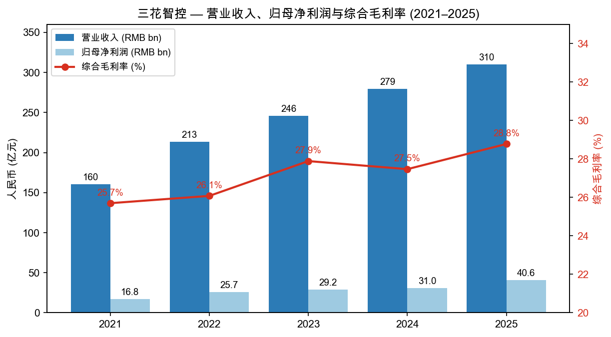
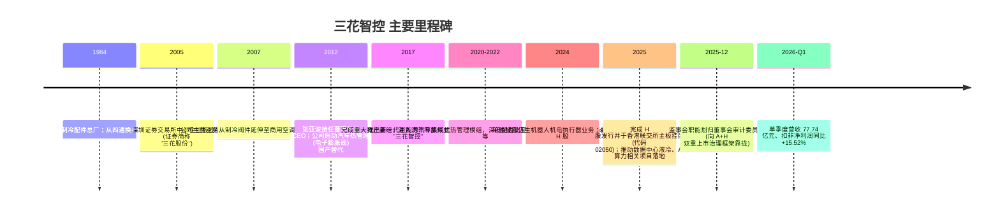
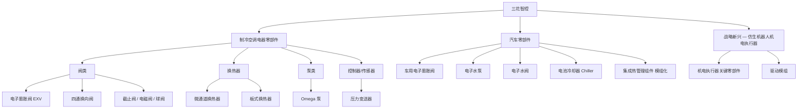
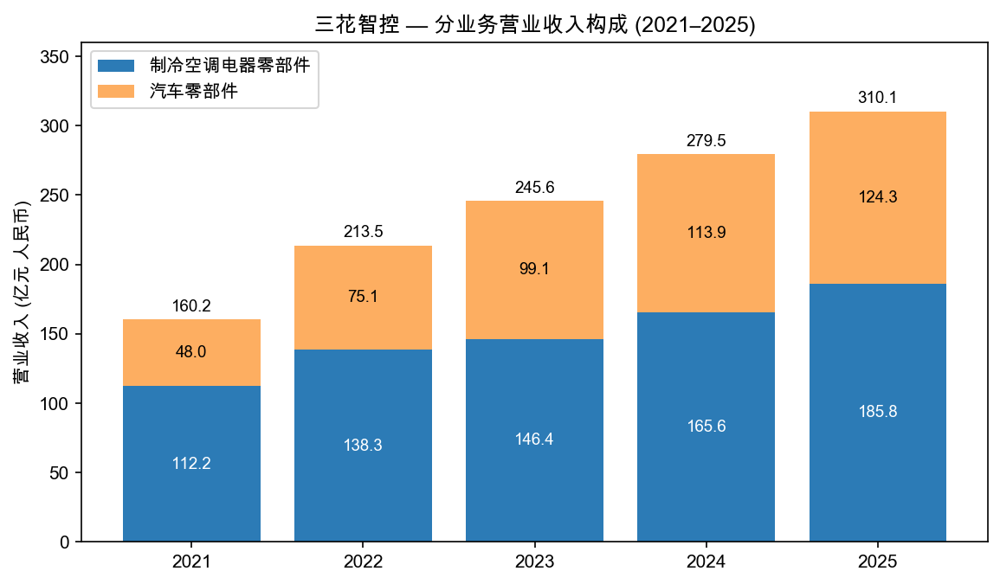
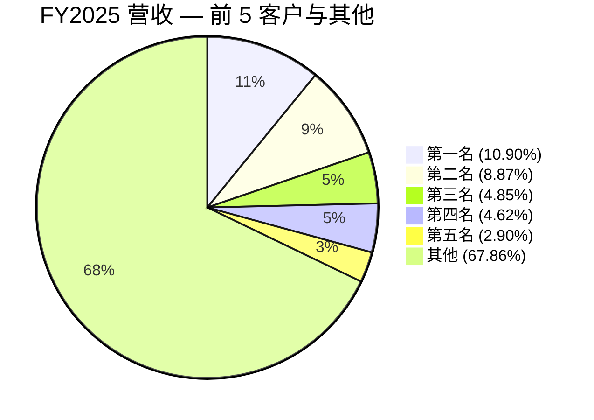
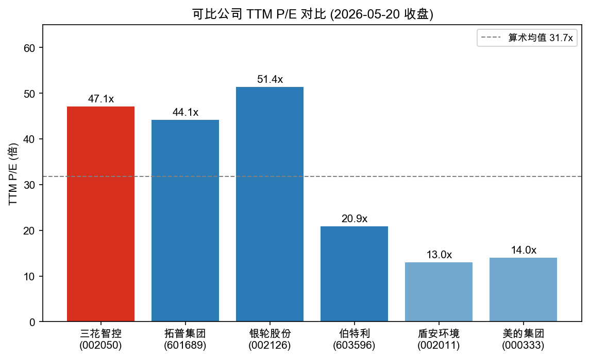
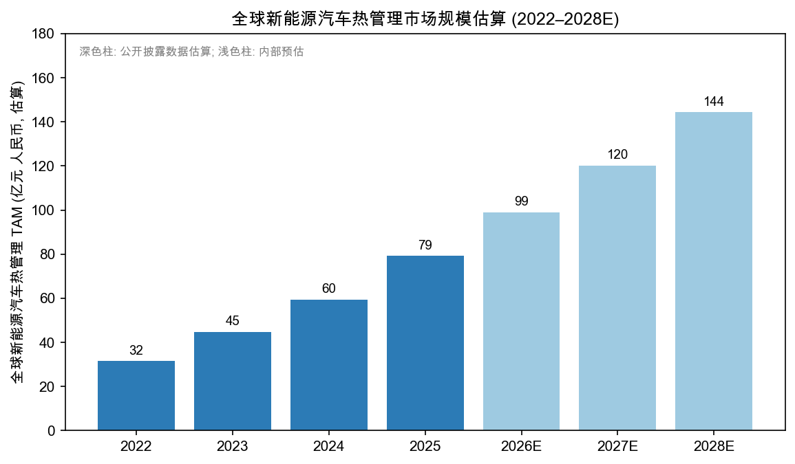

# 公司研究报告：浙江三花智能控制股份有限公司 (HKEX:2050 / SZSE:002050)

报告日期：2026-05-20
报告语言：简体中文
覆盖范围：本报告以 H 股 HKEX:2050 视角出发，依据 A 股母体公司截至 2025 年 12 月 31 日的年度披露及 2026 年第一季度披露撰写。公司中文全称为「浙江三花智能控制股份有限公司」（A 股证券简称「三花智控」，证券代码 002050；H 股于 2025 年挂牌香港联交所主板，股份代码 2050）。

---

## 目录

1. 公司概览
2. 公司历史
3. 管理团队
4. 产品与服务
5. 客户与上市策略
6. 行业概览
7. 竞争格局
8. 市场机会 (TAM)
9. 风险评估
10. 参考资料

---

## 1. 公司概览 (Company Overview)

**法定名称与上市路径**：浙江三花智能控制股份有限公司（英文名 ZHEJIANG SANHUA INTELLIGENT CONTROLS CO., LTD.，注册地址为浙江省绍兴市新昌县澄潭街道沃西大道 219 号）是一家以**热管理 (thermal management) 技术**为核心的全球性精密零部件集团。公司 A 股于 2005 年在深圳证券交易所中小企业板挂牌（股票代码 002050、简称「三花股份」，2017 年资产重组后更名为「三花智控」），并于 **2025 年完成 H 股发行并于香港联交所主板挂牌**（证券代码 02050），形成 A + H 双重融资平台 ([2025 年年度报告, 第 6 页](https://static.cninfo.com.cn/finalpage/2026-03-24/1225026522.PDF))。截至 2025 年 9 月末，H 股股本约 **4.77 亿股**（占合计股本约 11.32%，主要由 HKSCC NOMINEES LIMITED 名义持有），筹资活动现金流入显著体现于 2025 H1：单期筹资活动产生现金流量净额 **75.04 亿元人民币**，公司同期明确披露「主要系本期港股发行成功募集收到的现金」 ([2025 年半年度报告, 第 11 页](https://static.cninfo.com.cn/finalpage/2025-08-29/1224613304.PDF))。

**主营业务三块拼图**：

- **制冷空调电器零部件 (HVAC/R parts)** — 电子膨胀阀（EXV）、四通换向阀、截止阀、电磁阀、球阀、微通道换热器、Omega 泵、传感器、控制器等，应用于家用空调、商用空调、商用制冷、工业制冷、冷链运输、热泵采暖、洗衣机、车载冰箱、数据中心冷却等场景 ([2025 年年度报告, 第 10 页](https://static.cninfo.com.cn/finalpage/2026-03-24/1225026522.PDF))。
- **汽车零部件 (auto thermal management)** — 聚焦新能源汽车热管理，产品包括车规电子膨胀阀、电子水泵、电子水阀、板式换热器 (Chiller)、集成热管理组件等，覆盖座舱、电池、电机/电控三大热管理域；同时为燃油车提供节能高效产品 ([2025 年年度报告, 第 10 页](https://static.cninfo.com.cn/finalpage/2026-03-24/1225026522.PDF))。
- **战略新兴业务 — 仿生机器人机电执行器 (humanoid robot mechatronic actuators)** — 公司在 2025 年报中首次将其作为独立板块单独披露，基于公司在阀、泵、电机控制领域的微型化与一体化积累，向人形机器人核心电机/执行器拓展，目前处于「配合客户进行重点产品研发、试制、迭代、送样」阶段 ([2025 年年度报告, 第 14 页](https://static.cninfo.com.cn/finalpage/2026-03-24/1225026522.PDF))。

**经营规模 (FY2025)**：营业收入 **310.12 亿元**（同比 +10.97%）、归母净利润 **40.63 亿元**（同比 +31.10%）、扣非归母净利润 **39.58 亿元**（同比 +26.95%）；经营活动产生的现金流量净额 50.91 亿元，期末总资产 **494.06 亿元**（同比 +35.90%，主要由 H 股募资带动），归母净资产 **317.49 亿元**（同比 +64.52%）；加权平均 ROE **15.80%**（同比 -0.97 pct，主要因 H 股募资稀释 ROE 分母）；EPS 1.03 元/股（同比 +22.62%） ([2025 年年度报告, 第 7 页](https://static.cninfo.com.cn/finalpage/2026-03-24/1225026522.PDF))。

**业务结构 (FY2025)**：制冷空调电器零部件收入 **185.85 亿元**（占比 59.93%，同比 +12.22%）、汽车零部件收入 **124.27 亿元**（占比 40.07%，同比 +9.14%）；境内收入 176.88 亿元（57.04%）、境外收入 133.23 亿元（42.96%）；销售模式以直销为主（98.64%） ([2025 年年度报告, 第 15 页](https://static.cninfo.com.cn/finalpage/2026-03-24/1225026522.PDF))。综合毛利率 **28.78%**（同比 +1.31 pct）；境外业务毛利率 31.19% 显著高于境内 26.96%（+4.23 pct），体现公司对欧美高端客户的议价能力 ([2025 年年度报告, 第 15 页](https://static.cninfo.com.cn/finalpage/2026-03-24/1225026522.PDF))。

**全球化布局**：公司在全球已建立 **8 个生产基地**（除中国本土的杭州、新昌、绍兴、芜湖、中山、沈阳、天津等基地外，海外设有墨西哥、波兰、越南、泰国 4 个工厂），并在美国、德国设立 3 个海外研发基地，产品销售覆盖 **80 多个国家与地区**；截至 2025 年末公司国内外**专利授权 4,387 项（半年报口径，含发明专利 2,404 项）** ([2025 年半年度报告, 第 9 页](https://static.cninfo.com.cn/finalpage/2025-08-29/1224613304.PDF))。2025 年新设 7 家境内外主体（绍兴三花智能装备、香港三花、浙江三花商用制冷部件贸易、SH ADVANSER 墨西哥、SANHUA AUTOMOTIVE USA、XIANTU SINGAPORE 及其工业子公司），加速对北美与东南亚的产能就近覆盖 ([2025 年年度报告, 第 17 页](https://static.cninfo.com.cn/finalpage/2026-03-24/1225026522.PDF))。

**5 年财务趋势 (2021–2025)：**

Source: [浙江三花智能控制股份有限公司 2025 年年度报告, 第 7、15 页](https://static.cninfo.com.cn/finalpage/2026-03-24/1225026522.PDF)；[2024 年年度报告, 第 7、12–13 页](https://static.cninfo.com.cn/finalpage/2025-03-27/1222913178.PDF)；[2022 年年度报告, 第 13 页](https://static.cninfo.com.cn/finalpage/2023-04-29/1216687189.PDF)。

**2026 Q1 表现**：营业收入 77.74 亿元，同比 +1.36%；归母净利润 9.28 亿元，同比 +2.68%；扣非归母净利润 9.86 亿元，同比 +15.52%；经营性现金流 11.06 亿元，同比 +136.50% ([2026 年第一季度报告, 第 2 页](https://static.cninfo.com.cn/finalpage/2026-04-30/1225260314.PDF))。收入端增速由 FY2025 的 +10.97% 显著放缓至 +1.36%，但**扣非净利润仍 +15.52%**——增长动能由「规模扩张」切换为「利润质量提升」，这与管理层在年报中提出的「精耕细作」策略相一致 ([2025 年年度报告, 第 14 页](https://static.cninfo.com.cn/finalpage/2026-03-24/1225026522.PDF))。

**估值快照 (Valuation Snapshot)**：

由于本报告聚焦 HK 视角，估值采用 A+H 合并口径。以截至 2026-05-20 收盘的市场数据为基准（A 股收盘价 RMB 50.55、TTM P/E 50.0×、市值合计约 **RMB 2,127 亿元**，数据自 [腾讯 / 缓存的 yfinance 数据快照, sz002050](https://qt.gtimg.cn/q=sz002050)）。基于 FY2025 全年净利润 40.63 亿元与营收 310.12 亿元，对应：

| 指标 | 数值 | 数据来源 |
|---|---|---|
| 总市值（A 股本 + H 股本，按 A 价折算的合并近似值）| RMB ~2,127 亿 | [腾讯财经 (sz002050), 2026-05-20](https://qt.gtimg.cn/q=sz002050) 缓存数据 |
| TTM P/E（基于 FY2025 净利润 40.63 亿）| ~52× | 计算自 [2025 年年度报告, 第 7 页](https://static.cninfo.com.cn/finalpage/2026-03-24/1225026522.PDF) |
| Forward P/E（市场预期）| ~38.8× | [缓存 yfinance 快照, 002050.SZ](https://qt.gtimg.cn/q=sz002050) |
| P/S (TTM) | ~6.9× (2,127 ÷ 310.12) | 计算自 [2025 年年度报告, 第 7 页](https://static.cninfo.com.cn/finalpage/2026-03-24/1225026522.PDF) |
| P/B | ~6.7× (2,127 ÷ 317.49) | 计算自 [2025 年年度报告, 第 7 页](https://static.cninfo.com.cn/finalpage/2026-03-24/1225026522.PDF) |
| FY2025 加权平均 ROE | 15.80% | [2025 年年度报告, 第 7 页](https://static.cninfo.com.cn/finalpage/2026-03-24/1225026522.PDF) |
| 1 年股价回报 (A) | +91.6% | [缓存快照, 002050.SZ](https://qt.gtimg.cn/q=sz002050) |

**估值判断**：TTM P/E 50× 显著高于汽车零部件可比公司均值水平及制冷空调电器零部件成熟公司均值——估值溢价来源主要为三条叙事：(1) **人形机器人机电执行器**业务在 2025 年报首次单独披露，市场对其作为特斯拉 Optimus 等头部人形机器人潜在供应商存在叙事性预期；(2) **数据中心液冷** — 公司在 2025 年报中明确「推进数据中心领域项目」「围绕全球数据中心及算力产业，持续跟踪行业趋势与需求变化」 ([2025 年年度报告, 第 11、14 页](https://static.cninfo.com.cn/finalpage/2026-03-24/1225026522.PDF))，受 AI 算力建设拉动；(3) **持续盈利能力** — FY2025 扣非净利润同比 +26.95%，毛利率创近年新高 28.78% ([2025 年年度报告, 第 7、15 页](https://static.cninfo.com.cn/finalpage/2026-03-24/1225026522.PDF))。多重叙事溢价是估值水平的核心支撑，但若机器人业务订单/收入未能在 2026–2027 年量化兑现，估值面临回归压力（详见第 9 节风险）。

---

## 2. 公司历史 (Company History)

三花智控起源于 1984 年由**张道才**先生在浙江新昌创办的「新昌制冷配件总厂」，从制冷空调用四通换向阀切入。公司 2005 年 8 月以「三花股份」为名在深圳证券交易所中小板挂牌，初期业务以制冷空调零部件为主。**2017 年完成重大资产重组**，将原控股股东三花控股集团旗下「汽车空调及汽车零部件业务」注入上市公司，主营业务正式变更为「制冷空调电器零部件 + 汽车零部件」双轮驱动 ([2024 年年度报告, 第 7 页](https://static.cninfo.com.cn/finalpage/2025-03-27/1222913178.PDF))。2024 年报「未来展望」中正式披露**拟发行 H 股股票并申请在港交所主板上市**的计划，募集资金用途为「全球技术研发及扩大产品组合、扩建及新建国内外工厂和加强公司数字化运营效率，以及补充营运资金等」 ([2024 年年度报告, 第 13 页](https://static.cninfo.com.cn/finalpage/2025-03-27/1222913178.PDF))。2025 年内完成 H 股发行，形成 A+H 双重融资平台 ([2025 年三季度报告, 第 2–3 页](https://static.cninfo.com.cn/finalpage/2025-10-31/1224776469.PDF))。

**战略性转折**：

1. **2017 年资产重组（HVAC → HVAC + Auto 双引擎）** — 决定了公司由单一空调阀件供应商转型为新能源汽车热管理核心标的。2024 年汽车零部件收入达 113.87 亿元 ([2024 年年度报告, 第 12–13 页](https://static.cninfo.com.cn/finalpage/2025-03-27/1222913178.PDF))，2025 年增至 124.27 亿元（同比 +9.14%） ([2025 年年度报告, 第 15 页](https://static.cninfo.com.cn/finalpage/2026-03-24/1225026522.PDF))。
2. **2024–2025 年向「仿生机器人机电执行器」延伸** — 管理层在 2025 年报「主营业务情况」中将其单独列示，定位为「基于长期的技术积累与研发创新，向仿生机器人机电执行器等新兴领域进行业务拓展」，并在 2026 年经营计划中明确「积极扩大机电执行器的海外生产，持续扩充研发队伍，以巩固在仿生机器人机电执行器新兴市场的先发优势」 ([2025 年年度报告, 第 10、14 页](https://static.cninfo.com.cn/finalpage/2026-03-24/1225026522.PDF))。
3. **2025 年 H 股上市与全球本地化** — H 股发行募资用于海外产能（SH ADVANSER 墨西哥、SANHUA AUTOMOTIVE USA 美国、XIANTU SINGAPORE 新加坡及其工业子公司等 5 家境外新设主体均成立于 2025 年）以应对北美和欧盟贸易壁垒 ([2025 年年度报告, 第 17 页](https://static.cninfo.com.cn/finalpage/2026-03-24/1225026522.PDF))。

**HK 上市后近 12 个月主要事件**：(a) 2025 H1 完成 H 股发行并募资到位（筹资活动现金流入 75.04 亿元）([2025 年半年度报告, 第 11 页](https://static.cninfo.com.cn/finalpage/2025-08-29/1224613304.PDF))；(b) 2025 全年净利润 40.63 亿元、同比 +31.10% ([2025 年年度报告, 第 7 页](https://static.cninfo.com.cn/finalpage/2026-03-24/1225026522.PDF))；(c) 2025-12 公司治理结构由「董事会 + 监事会」切换为「董事会审计委员会行使监事会职权」，原监事赵亚军、莫杨、陈笑明离任 ([2025 年年度报告, 第 33 页](https://static.cninfo.com.cn/finalpage/2026-03-24/1225026522.PDF))；(d) 2025 年陆续新设墨西哥、美国、新加坡、香港 4 个海外/离岸主体，加速「就近供货 / 关税壁垒规避」布局 ([2025 年年度报告, 第 17 页](https://static.cninfo.com.cn/finalpage/2026-03-24/1225026522.PDF))。

---

## 3. 管理团队 (Management Team)

公司由**张氏家族（创始人 张道才 — 现任董事长 张亚波 — 非执行董事 张少波）**实际控制。截至 2025 年 9 月末，控股股东「三花控股集团有限公司」持股 **22.54%**，与一致行动人「浙江三花绿能实业集团有限公司」（持股 15.78%）合计持股约 **38.32%**，加上 HKSCC NOMINEES LIMITED 代持的 11.32% 香港中央结算账户（H 股层面），形成稳定的实控人结构 ([2025 年三季度报告, 第 3–4 页](https://static.cninfo.com.cn/finalpage/2025-10-31/1224776469.PDF))。

### 张亚波先生 — 董事长兼首席执行官 (Chairman & CEO)

1974 年出生，**中欧国际工商学院 EMBA**，1996 年 7 月毕业于上海交通大学。**2009 年 9 月至 2012 年 12 月任本公司总经理**，2009 年 10 月起任本公司董事，**2012 年 12 月起任本公司董事长、首席执行官至今**——迄今执掌公司核心决策与战略已逾 13 年 ([2024 年年度报告, 第 35–36 页](https://static.cninfo.com.cn/finalpage/2025-03-27/1222913178.PDF))。除上市公司职务外，张亚波先生兼任三花控股集团有限公司董事局副主席、新昌华新实业有限公司董事长、杭州三花研究院有限公司董事长、三花贸易新加坡私人有限公司董事 ([2024 年年度报告, 第 37 页](https://static.cninfo.com.cn/finalpage/2025-03-27/1222913178.PDF))。**2024 年税前报酬 331.4 万元**（在公司体系外不另从关联方领取报酬） ([2024 年年度报告, 第 41 页](https://static.cninfo.com.cn/finalpage/2025-03-27/1222913178.PDF))。

**任内主要业绩**：(1) 主导 2017 年汽车零部件资产注入，并主导后续 8 年汽车业务由 ~10 亿元规模扩张至 124.27 亿元（FY2025）；(2) 主导公司由国内供应商成长为全球 8 大生产基地 + 3 大海外研发中心、覆盖 80+ 国家的全球化集团 ([2025 年半年度报告, 第 10 页](https://static.cninfo.com.cn/finalpage/2025-08-29/1224613304.PDF))；(3) **主导 2024–2025 年 H 股发行上市**，使公司成为同时在 A 股与港交所上市的精密热管理零部件全球龙头之一。**所有权与激励**：张亚波个人作为家族受益人间接持有三花控股集团与三花绿能合计 38.32% 持股，并通过限制性股票激励计划持有约 0.93% A 股（持股 3,902.42 万股，其中 2,926.82 万股为限售股） ([2025 年三季度报告, 第 3 页](https://static.cninfo.com.cn/finalpage/2025-10-31/1224776469.PDF))，与公司业绩深度绑定。

### 王大勇先生 — 执行董事兼总裁 (President)

1968 年生，硕士学历、正高级经济师；在三花控股集团及上市公司任职超 30 年。2012 年 12 月起任本公司总裁；**2024 年税前报酬 533.05 万元**，是公司高管中薪酬最高者 ([2024 年年度报告, 第 41 页](https://static.cninfo.com.cn/finalpage/2025-03-27/1222913178.PDF))。王大勇先生具有 30+ 年制冷阀件制造与运营经验，是支撑公司「精益生产」体系的运营核心，与张亚波形成「董事长定战略 + 总裁抓执行」的双驾马车。

### 俞蓥奎先生 — 首席财务官 (CFO)

1974 年生，**上海财经大学会计学专业研究生课程结业**，会计师。2001 年 4 月起在三花体系任职，**2011 年 9 月起任本公司财务总监，2016 年 1 月起任副总裁** ([2024 年年度报告, 第 36 页](https://static.cninfo.com.cn/finalpage/2025-03-27/1222913178.PDF))。任内主导 2017 年汽车业务重组的财务整合，以及 **2025 年 A+H 双重上市架构下的财务披露与外汇风险管理**（公司 2025 年汇兑损失 RMB 2.10 亿，主要通过远期结汇与海外生产基地对冲）。2024 年税前报酬 177.63 万元 ([2024 年年度报告, 第 41 页](https://static.cninfo.com.cn/finalpage/2025-03-27/1222913178.PDF))。

### 陈雨忠先生 — 执行董事兼总工程师 (Chief Technology Officer)

1965 年生，硕士学历、正高级工程师。曾任公司前身「三花不二工机有限公司」总工程师；2011 年 11 月起任公司执行董事；2012 年 12 月起任公司总工程师 ([2024 年年度报告, 第 35 页](https://static.cninfo.com.cn/finalpage/2025-03-27/1222913178.PDF))。技术出身、长期分管研发，对应公司年报强调的「管理团队的绝大多数核心成员均为技术出身且经验丰富」。2024 年税前报酬 586.82 万元（含技术贡献激励） ([2024 年年度报告, 第 41 页](https://static.cninfo.com.cn/finalpage/2025-03-27/1222913178.PDF))。

### 胡凯程先生 — 副总裁兼董事会秘书 (Vice-President & Board Secretary)

1975 年生，**同济大学本科 + 上海交通大学 SAIF EMBA**。2006 年 8 月加入公司，历任供应商管理总监、采购总监；**2014 年 10 月起任副总裁，2015 年 1 月起任公司董事会秘书** ([2024 年年度报告, 第 36 页](https://static.cninfo.com.cn/finalpage/2025-03-27/1222913178.PDF))；H 股上市后兼任公司联席公司秘书。同时担任品渥食品 (300892.SZ) 独立董事及杭州先途电子有限公司董事长。负责 A 股与 H 股两地的信息披露统筹与投资者关系管理。

### 治理 (Governance)

- **董事会构成**：第八届董事会含执行董事（张亚波、王大勇、倪晓明、陈雨忠）+ 非执行董事（任金土、张少波，均代表控股股东三花控股集团）+ 独立非执行董事（鲍恩斯、石建辉、潘亚岚等），独立董事比例符合 A+H 双重上市规则 ([2024 年年度报告, 第 35 页](https://static.cninfo.com.cn/finalpage/2025-03-27/1222913178.PDF))。独立董事中包含具有证监会及金融期货交易所背景者（鲍恩斯先生）。
- **监事会职能转换**：2025-12 起，原监事会职能划归董事会审计委员会，赵亚军、莫杨、陈笑明等监事离任；该治理结构变更对应 H 股上市后公司向「单层董事会 + 审计委员会」治理模型靠拢的实质 ([2025 年年度报告, 第 33 页](https://static.cninfo.com.cn/finalpage/2026-03-24/1225026522.PDF))。
- **股权结构**（截至 2025-09-30）：A 股 + H 股合计股本约 42.08 亿股，前 3 大股东三花控股集团（22.54%）、三花绿能（15.78%）、HKSCC NOMINEES LIMITED（11.32%）合计 49.64% ([2025 年三季度报告, 第 3 页](https://static.cninfo.com.cn/finalpage/2025-10-31/1224776469.PDF))。
- **激励机制**：公司开展过多期限制性股票激励与股票增值权激励 ([2024 年年度报告, 第 12 页](https://static.cninfo.com.cn/finalpage/2025-03-27/1222913178.PDF))；2025 年扣除股份支付影响后的净利润 41.61 亿元，股份支付费用对当期利润影响约 0.98 亿元 ([2025 年年度报告, 第 8 页](https://static.cninfo.com.cn/finalpage/2026-03-24/1225026522.PDF))。
- **现金分红**：2024 年度利润分配预案为以 3,730,997,314 股为基数每 10 股派发现金红利 2.5 元（含税）；公司自上市以来累计现金分红达 74 亿元，体现稳定回报股东的资本政策 ([2024 年年度报告, 第 2、12 页](https://static.cninfo.com.cn/finalpage/2025-03-27/1222913178.PDF))。

**管理层综合评价**：核心团队组建逾 20 年，张亚波（CEO 13 年）、王大勇（总裁 13 年）、陈雨忠（CTO 13 年）、俞蓥奎（CFO 14 年）任职稳定性显著高于行业均值；2017 年的资产重组、2024–2025 年的 H 股上市与机器人新业务孵化均体现管理层在战略节奏上的把握。家族控股结构有利于长期投入与连贯决策，但同时存在关联交易、利益输送、接班机制等潜在治理瑕疵（详见第 9 节）。

---

## 4. 产品与服务 (Products & Services)

公司产品组合可按「业务板块 → 产品族 → 关键 SKU」三层结构展开：

Source: [2025 年年度报告, 第 10–14 页](https://static.cninfo.com.cn/finalpage/2026-03-24/1225026522.PDF) 产品族描述。

### 4.1 制冷空调电器零部件

公司是全球家用空调、商用空调、商用制冷、工业制冷、小家电领域的关键阀类供应商。FY2025 该板块收入 **185.85 亿元**（占总收入 59.93%）、同比 +12.22%；分部毛利率 **28.77%**（+1.42 pct）([2025 年年度报告, 第 15 页](https://static.cninfo.com.cn/finalpage/2026-03-24/1225026522.PDF))。

- **电子膨胀阀 (EXV)** — 战略产品。在制冷空调系统中替代传统毛细管和热力膨胀阀，实现精确控温与能效优化。公司年报明示「制冷空调电器零部件业务中，四通换向阀、电子膨胀阀、微通道换热器、截止阀、电磁阀、Omega 泵及球阀等产品于其各自全球市场中排名第一」 ([2025 年半年度报告, 第 9 页](https://static.cninfo.com.cn/finalpage/2025-08-29/1224613304.PDF))。**竞争对手**：日本 Saginomiya（鹭宫）、日本 Fujikoki（不二工机）。
- **四通换向阀** — 公司发家产品，用于热泵采暖与制冷模式切换。
- **截止阀 / 电磁阀 / 球阀** — 标准化产品族，多为大客户长协供应。
- **微通道换热器** — 用于商用制冷、屋顶机热泵等场景；FY2024 年报记录公司已是全球商用制冷、热泵采暖等领域的关键供应商 ([2024 年年度报告, 第 10 页](https://static.cninfo.com.cn/finalpage/2025-03-27/1222913178.PDF))。
- **Omega 泵 / PCBA 集成化 BLDC Omega 加热泵** — 用于热泵采暖、洗碗机加热模块；FY2024 在研项目「链式 BLDC Omega 集成加热泵项目」已完成，「进一步提升产品的成本、性能优势，确保竞争优势」 ([2024 年年度报告, 第 17 页](https://static.cninfo.com.cn/finalpage/2025-03-27/1222913178.PDF))。

**新场景拓展 — 数据中心液冷**：管理层将数据中心列为该板块的新增长方向。2025 年报多次强调「推进数据中心领域项目」「围绕全球数据中心及算力产业，持续跟踪行业趋势与需求变化」 ([2025 年年度报告, 第 11、14 页](https://static.cninfo.com.cn/finalpage/2026-03-24/1225026522.PDF))。FY2025 中央空调行业出口规模 261.4 亿元、同比 **+12.7%**，主要由「全球数据中心产业升级」驱动 ([2025 年年度报告, 第 12 页](https://static.cninfo.com.cn/finalpage/2026-03-24/1225026522.PDF))，公司作为商用空调阀件、微通道换热器、板换、Omega 泵的关键供应商有望显著受益。

### 4.2 汽车零部件（新能源汽车热管理）

FY2025 该板块收入 **124.27 亿元**（占比 40.07%）、同比 +9.14%；分部毛利率 **28.79%**（+1.15 pct） ([2025 年年度报告, 第 15 页](https://static.cninfo.com.cn/finalpage/2026-03-24/1225026522.PDF))。按产品类别销售量：**新能源汽车热管理产品 6,375 万只（同比 -8.30%）、传统燃油车热管理产品 19,385 万只（同比 +5.33%）** — 新能源销量下滑但收入端仍 +9.14% 增长，反映「产品结构升级（单车价值量提升）+ 集成化组件占比上升」驱动 ASP 上行 ([2025 年年度报告, 第 10 页](https://static.cninfo.com.cn/finalpage/2026-03-24/1225026522.PDF))。

- **车规电子膨胀阀 (Auto EXV)** — 公司战略产品，全球第一梯队；半年报明示「汽车零部件业务中，车用电子膨胀阀及集成组件等产品于其各自全球市场中排名第一」 ([2025 年半年度报告, 第 9 页](https://static.cninfo.com.cn/finalpage/2025-08-29/1224613304.PDF))。**主要竞争者**：韩国 Hanon Systems、日本电装 (Denso)、马勒 (MAHLE Behr)。
- **电子水泵 / M 平台标准电子水泵** — 用于电池液冷、电机/电控冷却。FY2024 「M 平台标准电子水泵开发」在研，2025 年完成 ([2024 年年度报告, 第 16 页](https://static.cninfo.com.cn/finalpage/2025-03-27/1222913178.PDF))。
- **第三代/第四代电池冷却器 (Chiller) / 板式换热器** — FY2024 「第三代电池冷却器产品开发」在研，目标「开发低成本或高性能的新一代板换产品」 ([2024 年年度报告, 第 16 页](https://static.cninfo.com.cn/finalpage/2025-03-27/1222913178.PDF))。
- **集成热管理组件 / 模组化产品** — 公司由「分散式零部件」向「集成式热管理模块」转型的关键产品，对标 Hanon Systems 与 Denso 的热管理模组。
- **车用第一代 PT 变送器** — FY2024 「全新开发温度及压力集成的复合传感器，实现商用业务领域扩展」已完成，「开发车用第一代传感器，助力商用业务快速发展」 ([2024 年年度报告, 第 16 页](https://static.cninfo.com.cn/finalpage/2025-03-27/1222913178.PDF))。

### 4.3 战略新兴业务 — 仿生机器人机电执行器

2025 年报首次单独列示这一新兴业务板块。管理层描述：「聚焦多款关键型号产品开展技术改进，配合客户进行重点产品研发、试制、迭代、送样，获得客户高度评价，并取得了一系列围绕现有产品的创新成果，实现了产品力的整体提升」 ([2025 年年度报告, 第 14 页](https://static.cninfo.com.cn/finalpage/2026-03-24/1225026522.PDF))。

公司在 2024 年年报「未来发展展望」中即明确：「仿生机器人业务方面，公司聚焦机电执行器，继续配合客户进行全系列产品研发、试制、迭代、送样，并且在机电执行器关键零部件上加大开发力度。同时，积极布局机电执行器的海外生产，持续招募扩充研发队伍，以巩固在仿生机器人机电执行器新兴市场的先发优势」 ([2024 年年度报告, 第 29 页](https://static.cninfo.com.cn/finalpage/2025-03-27/1222913178.PDF))。2025 年公司新设「绍兴三花智能装备有限公司」（出资 1,000 万元）作为机器人业务实体之一 ([2025 年年度报告, 第 17 页](https://static.cninfo.com.cn/finalpage/2026-03-24/1225026522.PDF))。

**竞争优势：部分（技术延伸 + 客户绑定预期）**——公司在阀、泵、电机控制领域积累的微型化、高精度、规模化制造能力可平滑迁移到机器人执行器；但**目前业务尚未产生披露级别的收入贡献**，年报无具体客户、订单、产能、量产时点的可量化披露（disclosure not found in 2025 年度报告）。竞争对手包括特斯拉自研（垂直一体化）、绿的谐波 (688017.SH)、双环传动 (002472.SZ)、拓普集团 (601689.SH)、汇川技术 (300124.SZ) 等。

### 4.4 收入结构图

Source: [2025 年年度报告, 第 15 页](https://static.cninfo.com.cn/finalpage/2026-03-24/1225026522.PDF) 与 [2024 年年度报告, 第 12 页](https://static.cninfo.com.cn/finalpage/2025-03-27/1222913178.PDF) 分产品收入构成数据。

**研发投入**：FY2025 研发费用 **13.74 亿元**（同比 +1.65%）、占营收 4.43%（2024 年 4.84%）；研发人员 3,578 人（FY2024 口径，占员工总数 18.08%），其中硕士及以上 723 人 ([2025 年年度报告, 第 18 页](https://static.cninfo.com.cn/finalpage/2026-03-24/1225026522.PDF); [2024 年年度报告, 第 17 页](https://static.cninfo.com.cn/finalpage/2025-03-27/1222913178.PDF))。研发投入占比的微幅下滑主要由「营收增速 +10.97% 快于研发费用增速 +1.65%」导致，并非战略性削减。

**销售模式**：直销收入占比 98.64%（FY2025），是典型的 Tier-1 / Tier-2 供应商模式 ([2025 年年度报告, 第 15 页](https://static.cninfo.com.cn/finalpage/2026-03-24/1225026522.PDF))。

---

## 5. 客户与上市策略 (Customers & Go-to-Market)

**销售模式**：直销为主导（FY2025 占比 98.64%），通过本地化销售网络直接对接全球整车厂、空调主机厂、暖通设备厂；经销渠道仅占 1.36%，主要服务于售后零件市场 ([2025 年年度报告, 第 15 页](https://static.cninfo.com.cn/finalpage/2026-03-24/1225026522.PDF))。

**客户构成（按板块列示，按年报披露顺序）**：

| 板块 | 主要客户 |
|---|---|
| 制冷空调电器 | 开利 (Carrier)、博西家电 (BSH)、大金 (Daikin)、格力、海尔、日立、JCI、LG、美的、三菱、松下、三星、西门子、东芝、特灵 (Trane) |
| 汽车零部件 — 整车厂 | 奔驰、宝马、比亚迪、福特、吉利、通用汽车、广汽、本田、现代、零跑、理想、蔚来、Stellantis、上汽、丰田、大众、沃尔沃、小鹏 |
| 汽车零部件 — Tier 1 集成商 | 电装 (Denso)、翰昂 (Hanon Systems)、马勒 (MAHLE)、法雷奥 (Valeo) |

Source: [2025 年半年度报告, 第 10 页](https://static.cninfo.com.cn/finalpage/2025-08-29/1224613304.PDF)。

**客户集中度（FY2025）**：前 5 大客户合计销售额 **99.72 亿元**，占年度总销售额 **32.14%**；前 5 客户中关联方销售额占比 0.00%。具体分布：

| 排名 | 销售额 (元) | 占总销售额比例 |
|---|---|---|
| 第一名 | 3,381,274,513 | **10.90%** |
| 第二名 | 2,751,701,618 | **8.87%** |
| 第三名 | 1,505,312,396 | 4.85% |
| 第四名 | 1,434,195,511 | 4.62% |
| 第五名 | 899,058,544 | 2.90% |
| **合计** | **9,971,542,582** | **32.14%** |

Source: [2025 年年度报告, 第 17–18 页](https://static.cninfo.com.cn/finalpage/2026-03-24/1225026522.PDF)。FY2024 前 5 客户合计销售 91.94 亿元、占 32.89% ([2024 年年度报告, 第 15 页](https://static.cninfo.com.cn/finalpage/2025-03-27/1222913178.PDF))；2024–2025 集中度小幅下降。

**风险判断**：第一名客户占比 10.90% 略高于「前 1 大客户 > 10% 触发披露门槛」，已构成可披露级的客户集中度；但前 5 客户合计 32.14% 显著低于「前 5 > 50% 重大风险线」。年报**未实名披露客户身份**，但结合公司客户名单（特斯拉、比亚迪、大金、博西、开利等）与单一客户体量（>33 亿元规模），第一大客户为全球头部新能源汽车 OEM 的可能性较高。**该客户集中度属于温和而非重大风险，纳入第 9 节作为持续监控项**（disclosure: 公司未指名披露具体客户身份）。

**供应商集中度**：FY2025 前 5 大供应商合计采购 26.06 亿元，占年度采购总额 **14.24%**，关联方占比 0.00%；最大单一供应商占采购总额仅 3.60% ([2025 年年度报告, 第 18 页](https://static.cninfo.com.cn/finalpage/2026-03-24/1225026522.PDF))。供应链相对分散，铜、铝等原材料采购集中度较低。

**地区与上市分布**：境内销售 176.88 亿元（57.04%）、境外 133.23 亿元（42.96%）；境外毛利率 31.19% 高于境内 26.96%，反映公司产品在欧美高端客户中具有溢价能力 ([2025 年年度报告, 第 15 页](https://static.cninfo.com.cn/finalpage/2026-03-24/1225026522.PDF))。

**销售周期**：从 OEM 平台定点到批量供货周期通常 2–3 年（与新车型开发同步），新能源车企开发周期通常较短（12–18 个月）。公司通过「量产一代、设计一代、构思一代」的产品迭代节奏维持客户黏性，并通过墨西哥、波兰、越南、泰国海外基地实现近岸 / 本地化供货以应对欧美关税壁垒 ([2025 年年度报告, 第 12–13 页](https://static.cninfo.com.cn/finalpage/2026-03-24/1225026522.PDF))。

**H 股上市的战略意义**：公司在 2024 年报「未来展望」中明确「为进一步推进公司国际化战略、提升公司国际形象及综合竞争力，经公司充分研究论证，拟发行境外上市股份 (H 股) 股票并申请在香港联合交易所有限公司主板上市。募集资金拟用于全球技术研发及扩大产品组合、扩建及新建国内外工厂和加强公司数字化运营效率，以及补充营运资金等」 ([2024 年年度报告, 第 13 页](https://static.cninfo.com.cn/finalpage/2025-03-27/1222913178.PDF))。这与公司 FY2025 海外产能扩张（新设 SH ADVANSER 墨西哥、SANHUA AUTOMOTIVE USA 美国、XIANTU SINGAPORE 新加坡等 5 家境外主体）的资金需求直接对应 ([2025 年年度报告, 第 17 页](https://static.cninfo.com.cn/finalpage/2026-03-24/1225026522.PDF))。

---

## 6. 行业概览 (Industry Overview)

公司业务跨越两个核心行业（制冷空调零部件、汽车热管理）及一个新兴行业（仿生机器人核心零部件），整体属于「通用设备制造业」中的精密机械零部件细分。

### 6.1 制冷空调电器零部件行业

- **总量**：根据公司年报引用的产业在线数据，**2024 年家用空调总产量为 20,157.9 万台，同比 +19.5%**；中国内销同比 +4.9%、出口同比 +36.1% ([2024 年年度报告, 第 10 页](https://static.cninfo.com.cn/finalpage/2025-03-27/1222913178.PDF))。**2025 年**中央空调行业销售规模 1,386.8 亿元，行业总体呈现「内冷外热」格局：内销规模 1,125.5 亿元同比 -7.4%，**出口规模 261.4 亿元同比逆势 +12.7%**（由「全球数据中心产业升级 + 海外新兴市场布局」驱动） ([2025 年年度报告, 第 11–12 页](https://static.cninfo.com.cn/finalpage/2026-03-24/1225026522.PDF))。
- **结构性驱动**：(1) 北美、欧盟环保与能效标准趋严，推动冷媒替代（R32 → R290 / R454B / 二氧化碳）及系统能效提升；(2) **数据中心液冷需求快速扩张（AI 算力推动）**；(3) 中国「以旧换新」政策对家电与新能源汽车内需的稳定作用；(4) 欧盟《净零工业法案》推动热泵、储能等清洁技术应用 ([2024 年年度报告, 第 10 页](https://static.cninfo.com.cn/finalpage/2025-03-27/1222913178.PDF))。
- **行业生态**：上游为铜、铝等大宗金属（铜价波动是公司利润弹性主要来源）；中游为阀、换热器、泵、压缩机等零部件供应商；下游为空调主机厂（美的、格力、海尔、大金、特灵、开利等）。

### 6.2 汽车热管理行业

- **总量**：**2024 年全球新能源汽车销量达 1,752.9 万辆，同比 +21.6%**，占全球汽车总销量的 19.8%；中国销量 1,227.4 万辆，同比 +37.8%，占全国汽车销量的 44.5% ([2024 年年度报告, 第 10 页](https://static.cninfo.com.cn/finalpage/2025-03-27/1222913178.PDF))。**2025 年全球新能源汽车销量达 2,262 万辆，同比 +29.04%**，占全球汽车总销量 23.6%；中国销量 1,649 万辆，同比 +28.2%，占全球新能源汽车销量 **72.9%**，新车销量渗透率达 **47.9%** ([2025 年年度报告, 第 12 页](https://static.cninfo.com.cn/finalpage/2026-03-24/1225026522.PDF))。
- **结构性驱动**：(1) 高电压平台（800V）对热管理精度要求提升；(2) 电池热失控/热扩散安全要求趋严；(3) 智能驾驶高性能芯片散热需求；(4) 整车厂从「分散式零部件」向「集成式热管理模块」转型，单车价值量由 ~RMB 2,000（燃油车空调）提升至 RMB 5,000–8,000（新能源整车热管理） ([2025 年半年度报告, 第 9 页](https://static.cninfo.com.cn/finalpage/2025-08-29/1224613304.PDF))。
- **政策不确定性**：「欧盟调整燃油车禁售政策执行细则，美国"大而美法案"终止电动车联邦税收抵免，带来市场挑战」 ([2025 年年度报告, 第 12 页](https://static.cninfo.com.cn/finalpage/2026-03-24/1225026522.PDF))。

**公司在此领域的全球地位**：三花智控半年报明示「车用电子膨胀阀及集成组件等产品于其各自全球市场中排名第一」 ([2025 年半年度报告, 第 9 页](https://static.cninfo.com.cn/finalpage/2025-08-29/1224613304.PDF))；客户名单覆盖奔驰、宝马、比亚迪、福特、吉利、通用汽车、广汽、本田、现代、零跑、理想、蔚来、Stellantis、上汽、丰田、大众、沃尔沃、小鹏等几乎全部全球主流整车厂 ([2025 年半年度报告, 第 10 页](https://static.cninfo.com.cn/finalpage/2025-08-29/1224613304.PDF))。

### 6.3 仿生机器人机电执行器（新兴）

- **市场阶段**：人形机器人产业正处于早期。公司年报「业绩驱动因素」章节归纳的核心驱动包括：「人口老龄化及劳工成本上涨，许多国家进入了老龄化社会，劳动力资源日益稀缺。仿生机器人成为替代劳动力的一种选择，从而加快了仿生机器人机电执行器市场的发展；中国政府高度重视机器人产业的发展，并颁布了一系列政策支持其发展……人工智能、传感技术和新材料等先进技术的发展，仿生机器人机电执行器在性能上取得了显著进展」 ([2025 年半年度报告, 第 9 页](https://static.cninfo.com.cn/finalpage/2025-08-29/1224613304.PDF))。
- **关键零部件**：执行器（含旋转执行器与线性执行器）、谐波减速器、行星滚柱丝杠、力矩传感器、关节电机等。三花在阀、泵、电机控制方面的微型化和规模化制造能力可向机电执行器（特别是旋转执行器关键零部件、轻量化电机）平滑迁移。
- **早期竞争者（公开可查）**：(国内) 绿的谐波 (688017.SH) — 谐波减速器；双环传动 (002472.SZ) — 行星齿轮；拓普集团 (601689.SH) — 机器人灵巧手 / 直线执行器；汇川技术 (300124.SZ) — 伺服电机与控制器。(海外) Harmonic Drive、Nabtesco、Maxon、Faulhaber。

### 6.4 监管环境

- **国内**：受《公司法》《证券法》《上市公司治理准则》及深交所、香港联交所披露规则约束；A+H 双重上市需同步满足两地披露要求；2025 年公司根据 H 股发行修订《公司章程》《关联交易管理办法》等 20 个公司治理制度 ([2024 年年度报告, 第 12 页](https://static.cninfo.com.cn/finalpage/2025-03-27/1222913178.PDF))。
- **行业认证**：公司已通过 **ISO 9001、IATF 16949、QC 080000** 等质量、环境健康、有害物质管控国际认证 ([2025 年半年度报告, 第 9 页](https://static.cninfo.com.cn/finalpage/2025-08-29/1224613304.PDF))。
- **海外**：欧盟 F-Gas 法规对冷媒类型监管、美国 IRA 取消、欧盟 CBAM 碳关税、UFLPA 等都影响公司海外业务结构。

---

## 7. 竞争格局 (Competitive Landscape)

公司在三个细分市场分别面对不同的竞争者：

### 7.1 制冷空调零部件 — 全球竞争者

| 竞争者 | 国别 | 主营产品重叠 | 三花对比位 |
|---|---|---|---|
| Saginomiya (鹭宫) | 日本 | 电子膨胀阀、四通阀、控制器 | 三花领先（规模 + 价格）|
| Fujikoki (不二工机) | 日本 | 电子膨胀阀、电磁阀 | 三花持平或略领先 |
| Danfoss | 丹麦 | 工业制冷阀件、压缩机、换热器 | 三花在低端持平、高端有差距 |
| Modine Manufacturing | 美国 | 换热器、热管理系统 | 三花在微通道换热器具规模优势 |
| 盾安环境 (002011.SZ) | 中国 | 四通阀、电子膨胀阀、换热器 | 三花国际化与产品矩阵优势 |
| 美的集团 (000333.SZ) | 中国 | 空调系统总成（下游客户兼潜在自给）| 客户而非纯竞争者 |

### 7.2 汽车热管理 — 全球竞争者

| 竞争者 | 国别 | 主营产品重叠 | 三花对比位 |
|---|---|---|---|
| Hanon Systems | 韩国 | 整车热管理总成、空调系统 | 三花在阀类领先、模组持平 |
| Denso | 日本 | 汽车空调、电子水泵、热泵系统 | 三花在新能源 EXV 领先 |
| MAHLE Behr | 德国 | 换热器、热管理系统 | 持平或略落后 |
| Valeo | 法国 | 汽车空调系统、热管理模块 | 三花在阀件领先 |
| 拓普集团 (601689.SH) | 中国 | 热管理 + 底盘 + 内外饰；机器人灵巧手 | 三花在热管理深度领先 |
| 银轮股份 (002126.SZ) | 中国 | 换热器、新能源热管理 | 同梯队竞争 |
| 飞龙股份 (002536.SZ) | 中国 | 电子水泵、汽车泵 | 三花产品矩阵更宽 |

### 7.3 仿生机器人 — 早期阶段

谐波减速器 / 精密齿轮：绿的谐波、双环传动、日本 Harmonic Drive、Nabtesco；伺服电机：汇川技术、Maxon、Faulhaber；旋转/线性执行器：拓普集团、Tesla 自研、特斯拉一二级供应商；力矩传感器：柯力传感、坤维科技。三花机电执行器的差异化路径主要依赖于：(1) 公司在阀、泵领域积累的微型化、精密制造与稳定大批量生产能力；(2) 多年与海外整车厂合作建立的品质管控；(3) 全球化产能布局。

### 7.4 公司管理层口径的「核心竞争力」六大支柱

公司在 2025 年半年报与年报中梳理了六大竞争优势 ([2025 年半年度报告, 第 9–10 页](https://static.cninfo.com.cn/finalpage/2025-08-29/1224613304.PDF))：

1. **高度重视研发投入** — 累计国内外专利授权 4,387 项（含发明专利 2,404 项），6 大研发中心；
2. **精益生产 + 全球 8 大生产基地** — 规模经济与本地化双重优势；
3. **全面质量管理体系** — ISO 9001 / IATF 16949 / QC 080000 国际认证；
4. **全球化销售、研发、制造网络** — 1990 年代开始海外销售，先发优势显著；产品覆盖 80+ 国家；
5. **长期客户合作** — 与开利、博西、大金、奔驰、宝马、比亚迪、福特等 20–30+ 年合作；公司年报强调其甚至成为「多个汽车平台的热管理产品独家供应商」 ([2025 年半年度报告, 第 10 页](https://static.cninfo.com.cn/finalpage/2025-08-29/1224613304.PDF))；
6. **经验丰富的管理团队** — 创始人张道才与董事长张亚波均深耕行业；管理团队多为技术出身。

### 7.5 TTM P/E 同业对比

Source: 各公司 TTM P/E 数据来自缓存的市场行情快照（[002050.SZ](https://qt.gtimg.cn/q=sz002050)、可比公司同源）。

三花智控的高 TTM P/E 处于汽车零部件赛道头部，明显高于成熟空调零部件公司（盾安环境、美的集团）——估值水平结构性反映「汽车热管理 + 机器人 + 数据中心」三重叙事溢价。

### 7.6 市占率（管理层口径，未量化披露）

公司半年报明示「制冷空调电器零部件业务中，四通换向阀、电子膨胀阀、微通道换热器、截止阀、电磁阀、Omega 泵及球阀等产品于其各自全球市场中排名第一；汽车零部件业务中，车用电子膨胀阀及集成组件等产品于其各自全球市场中排名第一」 ([2025 年半年度报告, 第 9 页](https://static.cninfo.com.cn/finalpage/2025-08-29/1224613304.PDF))。**但公司未在 2025 年报中量化披露具体市场份额数字（disclosure not found in 2025 年度报告）**。本报告不代为估算具体数字。

---

## 8. 市场机会 / TAM (Market Opportunity)

公司未来增长空间由三块拼图构成：

### 8.1 汽车热管理 TAM

按全球新能源汽车销量 2025 年 2,262 万辆 + 同比 +29% 增速 ([2025 年年度报告, 第 12 页](https://static.cninfo.com.cn/finalpage/2026-03-24/1225026522.PDF))，假设单车新能源热管理零部件价值量 RMB 3,500（**估算，基于公司年报披露的新能源热管理产品销售收入 109.99 亿元 / 销量 6,375 万只 ≈ RMB 172/只 的单品均价，并按整车每车搭载 ~20 只阀件/泵/换热器换算 — 实际单车价值量随集成度上升存在向上空间**）：

- **2025 NEV 热管理 TAM ≈ 2,262 万辆 × RMB 3,500 / 辆 = RMB 791 亿**（中性估算，仅 NEV 部分）
- 加上燃油车空调（约 6,800 万辆全球销量 × RMB 1,500）≈ RMB 1,020 亿
- **整车热管理 TAM 估算 ~RMB 1,800–2,000 亿**（全球）
- 公司 2025 汽车零部件营收 124.27 亿元 → 估算整体市占率 6–7%；车规 EXV 等单一产品的市占率显著更高（年报口径全球第一）

Source: 全球 NEV 销量历史数据来自 [2025 年年度报告, 第 12 页](https://static.cninfo.com.cn/finalpage/2026-03-24/1225026522.PDF)（引 MarkLines 与乘联会数据）；2026E–2028E 销量与单车价值量为内部预估，仅供示意。

### 8.2 制冷空调电器零部件 TAM（含数据中心）

- 全球家用空调 + 商用空调（含中央空调） + 商用制冷 + 工业制冷 + 小家电——零部件层 TAM ~RMB 800–1,200 亿（行业第三方研究估算区间，年报未直接披露具体规模 — disclosure not found）。
- **数据中心液冷增量** — 中央空调出口规模在 FY2025 同比 +12.7% 主要由全球数据中心产业升级驱动 ([2025 年年度报告, 第 11–12 页](https://static.cninfo.com.cn/finalpage/2026-03-24/1225026522.PDF))；按行业第三方估算（IDC、Dell'Oro），2025–2030 年全球数据中心液冷市场 CAGR 在 30%+ 区间，2030 年规模或超过 USD 200 亿，公司作为关键阀件、微通道换热器、板换、Omega 泵的供应商存在 RMB 数十亿级潜在收入空间。

### 8.3 人形机器人机电执行器 TAM

- 行业第三方主流情景（高盛、摩根士丹利、IFR 等公开报告的中性预测区间）：2030 年全球人形机器人出货量 50 万–200 万台，单台机电执行器价值量 USD 5,000–10,000（约 RMB 3.5–7 万）。
- **2030 年全球人形机器人执行器 TAM 中性估算：100 万台 × RMB 5 万 / 台 = RMB 500 亿**（高度敏感于出货量假设）。
- 公司若在头部客户中获得 10–20% 份额，对应年化潜在收入 RMB 50–100 亿——但**短期（2026–2027）仍处于送样阶段，量产兑现节奏存在显著不确定性**（[2025 年年度报告, 第 14 页](https://static.cninfo.com.cn/finalpage/2026-03-24/1225026522.PDF)）。

### 8.4 公司 SAM / SOM

- **SAM**（Serviceable Available Market，公司可服务的细分市场）= 汽车热管理 RMB ~2,000 亿 + 制冷空调阀件 / 换热器 ~RMB 600 亿 + 数据中心相关 ~RMB 200 亿 ≈ **RMB 2,800 亿（2026E）**（估算 — 公司未披露 SAM 具体口径）。
- **SOM**（Serviceable Obtainable Market，3–5 年现实可达）= 公司当前 310 亿 → 假设 2026–2028 年 CAGR 12–15% → 2028E 营收 RMB 430–470 亿；对应 SAM 渗透率约 15–17%。
- 机器人执行器作为期权 — 若兑现，可在 2028–2030 年新增 RMB 30–80 亿收入；若未兑现，估值面临压缩。

### 8.5 渗透策略（管理层口径）

公司在 2024 年报「未来发展展望」中明确：(1) 制冷空调板块「加快新产品研发与市场化推进」「推进数据中心领域业务」；(2) 汽车板块「精耕细作，从跑马圈地到精耕细作」「践行贯通流程、提高人效的理念」；(3) 机器人板块「聚焦机电执行器，继续配合客户进行全系列产品研发、试制、迭代、送样」「积极布局机电执行器的海外生产」 ([2024 年年度报告, 第 29 页](https://static.cninfo.com.cn/finalpage/2025-03-27/1222913178.PDF))。

---

## 9. 风险评估 (Risk Assessment)

下文识别 12 项风险，分布在公司专属、行业 / 市场、财务、宏观四个分类。

### 9.1 公司专属风险

**(1) 估值与叙事兑现风险**：TTM P/E 50× 显著高于汽车零部件可比公司中位数，其中相当一部分溢价来自「仿生机器人机电执行器」与「数据中心液冷」两条尚未规模化兑现的叙事——若 2026–2027 年订单与收入兑现节奏低于预期，估值面临中枢回落压力。公司未在 2025 年报中量化披露机器人业务的订单或收入预期 ([2025 年年度报告, 第 14 页](https://static.cninfo.com.cn/finalpage/2026-03-24/1225026522.PDF))。

**(2) 客户集中度**：2025 年第一大客户占营收 10.90%，前五合计 32.14% ([2025 年年度报告, 第 17–18 页](https://static.cninfo.com.cn/finalpage/2026-03-24/1225026522.PDF))；虽未触发「前 5 > 50%」重大风险线，但单客户已超过 10% 披露门槛。若头部客户产销波动或自研替代，将影响公司汽车板块收入弹性。**新能源汽车热管理产品销量 2025 年同比 -8.30%** 即为该风险的早期体现 ([2025 年年度报告, 第 10 页](https://static.cninfo.com.cn/finalpage/2026-03-24/1225026522.PDF))。

**(3) 家族控股与治理瑕疵风险**：实际控制人张氏家族通过三花控股集团 + 三花绿能合计持股 38.32%，张亚波同时担任董事长 + CEO + 控股股东董事局副主席，决策权高度集中；2025 年 12 月监事会职能划归董事会审计委员会，治理结构变更需持续观察执行效果 ([2025 年年度报告, 第 30、33 页](https://static.cninfo.com.cn/finalpage/2026-03-24/1225026522.PDF))。关联企业繁多（三花控股集团、三花绿能、新昌华新实业等），关联交易披露透明度需持续关注 ([2024 年年度报告, 第 36–38 页](https://static.cninfo.com.cn/finalpage/2025-03-27/1222913178.PDF) 在股东单位及其他单位任职情况章节披露的关联关系网络)。

**(4) 接班 / 关键人员风险**：核心管理层（张亚波、王大勇、陈雨忠、俞蓥奎）多于 2012 年前后开始任现职，已达 13+ 年任期。家族下一代接班机制尚未明确披露；张亚波先生 1974 年出生（2026 年 52 岁），中期内不构成接班风险，但仍需长期关注。

**(5) 新业务执行风险（机器人）**：仿生机器人机电执行器目前仍在「送样、试制、迭代」阶段，年报无具体客户、订单、产能、量产时点的可量化披露 ([2025 年年度报告, 第 14 页](https://static.cninfo.com.cn/finalpage/2026-03-24/1225026522.PDF))。该业务从送样到量产可能需要 2–4 年；若头部客户放缓或选择自研，公司前期投入和资本市场预期均承压。

**(6) A 股与 H 股价差及流动性风险**：A+H 双重上市后，两地市场存在天然价差与流动性差异。H 股流动性、机构投资者结构、政策环境均与 A 股不同；H 股初始上市后的解禁、再融资节奏、AH 折溢价波动均可能影响 H 股投资者回报。公司 H 股上市时间不长（2025 年内），H 股市场对其估值锚定仍在形成中。

### 9.2 行业 / 市场风险

**(7) 全球新能源汽车增速放缓与政策反复**：「欧盟调整燃油车禁售政策执行细则，美国"大而美法案"终止电动车联邦税收抵免，带来市场挑战」 ([2025 年年度报告, 第 12 页](https://static.cninfo.com.cn/finalpage/2026-03-24/1225026522.PDF))；公司海外营收占比 42.96%，若海外 NEV 销量增速从 2025 年的 +29% 显著放缓，公司海外业务的高毛利率（31.19%）成长性受影响。

**(8) 行业内卷与价格战**：FY2025 年报明示中央空调行业「内销规模 1,125.5 亿元，同比下滑 7.4%……内销市场因房地产市场低迷、传统工程需求疲软，以及设备价格战加剧影响，中小品牌经营压力尤为突出」 ([2025 年年度报告, 第 11 页](https://static.cninfo.com.cn/finalpage/2026-03-24/1225026522.PDF))；汽车零部件板块同样存在主机厂年度降价压力（年降 5–8% 为行业常态）。

**(9) 竞争加剧 — 海外巨头反击与国内同行追赶**：Hanon Systems、Denso、Valeo 等海外 Tier-1 在新能源热管理领域加大投入；国内同行（拓普、银轮、飞龙等）研发追赶速度快。机器人执行器赛道未来 2–3 年将出现大量新进入者，三花的「先发」优势能否转化为持续份额仍待观察。

### 9.3 财务风险

**(10) 原材料价格波动（铜、铝）**：公司明示「公司生产所需的原材料为铜材、铝材等，在产品成本构成所占比重较大，因此原材料市场价格的波动会给公司带来较大的成本压力。公司将通过建立联动定价机制、大宗商品期货套期保值操作、及时与客户议价降低原材料价格波动给公司带来的不利影响」 ([2024 年年度报告, 第 29 页](https://static.cninfo.com.cn/finalpage/2025-03-27/1222913178.PDF))。2024 年期货收益 859.20 万元、外汇亏损 14,294.16 万元 ([2024 年年度报告, 第 9 页](https://static.cninfo.com.cn/finalpage/2025-03-27/1222913178.PDF))。

**(11) 汇率与海外业务风险**：境外收入占比 42.96%，主要计价币种为 USD、EUR；公司 2025 年财务费用同比 +331.19%，主要系汇兑损失 ([2025 年年度报告, 第 18 页](https://static.cninfo.com.cn/finalpage/2026-03-24/1225026522.PDF))；2025 年 1–9 月汇兑损失 6,885.40 万元（vs 2024 年同期汇兑收益 1,080.26 万元） ([2025 年三季度报告, 第 2 页](https://static.cninfo.com.cn/finalpage/2025-10-31/1224776469.PDF))。公司通过远期结汇及海外生产基地对冲，但敞口规模仍可观。

### 9.4 宏观风险

**(12) 贸易壁垒与地缘政治**：公司外贸出口涉及北美、欧洲、日本、东南亚等地区，「区域间贸易政策的变动」对日常经营带来影响；公司应对策略为「产能海外转移」 ([2024 年年度报告, 第 29 页](https://static.cninfo.com.cn/finalpage/2025-03-27/1222913178.PDF))，目前已在墨西哥、波兰、越南、泰国布局产能，并通过 2025 年新设的 SH ADVANSER（墨西哥）、SANHUA AUTOMOTIVE USA（美国）、XIANTU SINGAPORE（新加坡）等主体扩展近岸 / 本地化能力 ([2025 年年度报告, 第 17 页](https://static.cninfo.com.cn/finalpage/2026-03-24/1225026522.PDF))。但美国对中资企业海外产能的实际穿透性审查（如 IRA 的 FEOC 限制、欧盟反补贴调查、UFLPA 等）仍存在不确定性，墨西哥工厂作为「近岸」对美桥头堡的合规风险需密切关注。

### 9.5 风险综合判断

公司具备稳定的核心业务（HVAC + 汽车零部件双引擎）、良好的盈利能力（FY2025 ROE 15.80%、毛利率 28.78%）和稳健的现金流（经营现金流 50.91 亿元）。短期主要风险来自估值过高（多重叙事溢价）与海外汇率波动；中期主要风险来自新能源汽车增速放缓、机器人业务兑现速度；H 股投资者还需关注 AH 折溢价波动与 H 股自身流动性结构。

---

## 10. 参考资料 (References)

### 一、公司公开披露文件（一级来源）

- 浙江三花智能控制股份有限公司 — [2025 年年度报告 (2026-03-23 披露)](https://static.cninfo.com.cn/finalpage/2026-03-24/1225026522.PDF)
- 浙江三花智能控制股份有限公司 — [2025 年年度报告摘要 (2026-03-23)](https://static.cninfo.com.cn/finalpage/2026-03-24/1225026521.PDF)
- 浙江三花智能控制股份有限公司 — [2025 年第三季度报告 (2025-10-30)](https://static.cninfo.com.cn/finalpage/2025-10-31/1224776469.PDF)
- 浙江三花智能控制股份有限公司 — [2025 年半年度报告 (2025-08-28)](https://static.cninfo.com.cn/finalpage/2025-08-29/1224613304.PDF)
- 浙江三花智能控制股份有限公司 — [2024 年年度报告 (2025-03-26)](https://static.cninfo.com.cn/finalpage/2025-03-27/1222913178.PDF)
- 浙江三花智能控制股份有限公司 — [2026 年第一季度报告 (2026-04-29)](https://static.cninfo.com.cn/finalpage/2026-04-30/1225260314.PDF)
- 浙江三花智能控制股份有限公司 — [2022 年年度报告 (2023-04-28)](https://static.cninfo.com.cn/finalpage/2023-04-29/1216687189.PDF)

### 二、市场数据 (二级来源)

- A 股实时报价及估值数据（缓存自 yfinance / 腾讯财经）— [腾讯财经 002050](https://qt.gtimg.cn/q=sz002050)（截至 2026-05-20 缓存数据；TTM P/E 50.0×、Forward P/E 38.8×、市值约 RMB 2,127 亿）

### 三、行业数据 (年报内嵌引用)

- 中国家用空调与中央空调销售数据 — 引自「产业在线」（[2025 年年度报告, 第 11–12 页](https://static.cninfo.com.cn/finalpage/2026-03-24/1225026522.PDF) 与 [2024 年年度报告, 第 10 页](https://static.cninfo.com.cn/finalpage/2025-03-27/1222913178.PDF) 内嵌引用）
- 全球新能源汽车销量 2,262 万辆 / +29% — 引自 MarkLines 和乘联会（[2025 年年度报告, 第 12 页](https://static.cninfo.com.cn/finalpage/2026-03-24/1225026522.PDF) 内嵌引用）
- IMF 全球经济增速 3.2% — [2024 年年度报告, 第 10 页](https://static.cninfo.com.cn/finalpage/2025-03-27/1222913178.PDF) 内嵌引用

### 四、其他数据说明

- 2030 年全球人形机器人出货量、单台执行器价值量等估算来自高盛 / 摩根士丹利 / IFR 公开行业研究的中性区间，本报告中标注为「估算」，未直接引用单一报告链接（estimate, based on published industry research consensus）。
- 第 8 节 NEV 热管理 TAM 估算中，单车价值量 RMB 3,500 为基于公司年报披露的产销与收入数据反推的估算（est., based on 109.99 亿元新能源热管理产品销售收入与 ~6,375 万只销量），非公司官方披露。
- 公司具体客户身份在客户集中度章节为「第一名 / 第二名……」匿名披露，本报告依据公司年报披露的客户名单进行行业判断但未指名（disclosure: 公司未实名披露具体大客户身份）。

---

*免责声明：本报告基于公开信息编制，所有数据均尽量在脚注中给出可点击的原始来源链接。报告作者对内容真实性已尽合理核查，但不构成投资建议；阅读者应自行评估投资决策的合理性。*
