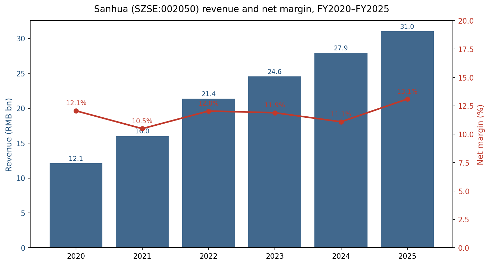
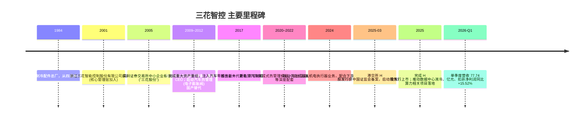
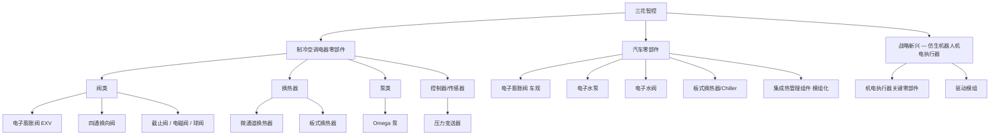
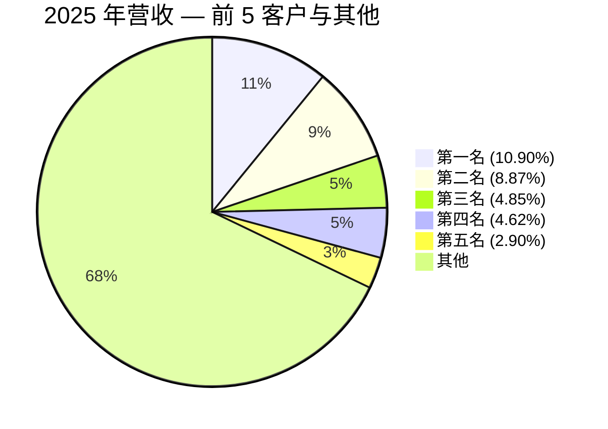
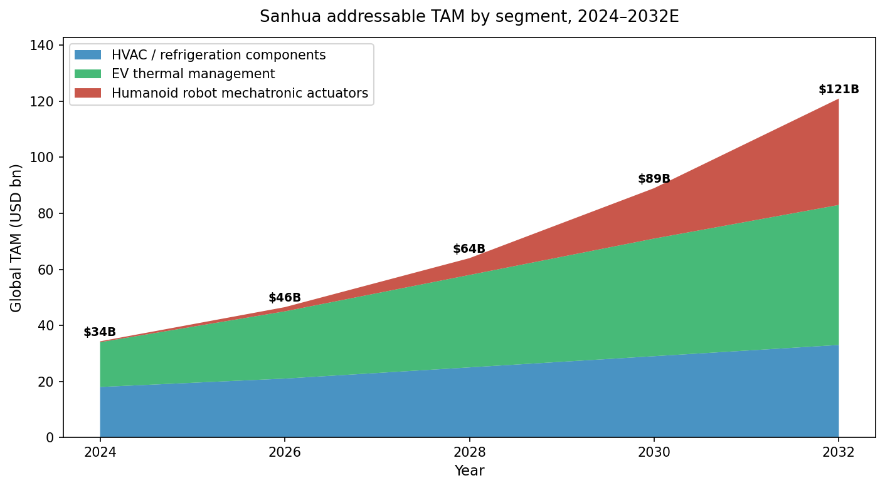

# 公司研究报告：浙江三花智能控制股份有限公司 (SZSE:002050 / HKEX:2050)

报告日期：2026-05-20  
报告语言：简体中文  
覆盖范围：基于公司截至 2025 年 12 月 31 日的年度披露及 2026 年第一季度披露

---

## 目录

1. 公司概览
2. 公司历史
3. 管理团队
4. 产品与服务
5. 客户与上市策略
6. 行业概览
7. 竞争格局
8. 市场机会 (TAM)
9. 风险评估
10. 参考资料

---

## 1. 公司概览 (Company Overview)

浙江三花智能控制股份有限公司（以下简称"三花智控"或"公司"，A 股代码 002050，H 股代码 2050）是一家以**热管理 (thermal management) 技术**为核心的全球性零部件集团，业务横跨**制冷空调电器零部件、新能源/燃油汽车零部件、仿生机器人机电执行器**三个板块。公司中文全称"浙江三花智能控制股份有限公司"，英文名 ZHEJIANG SANHUA INTELLIGENT CONTROLS CO.,LTD.，注册地址位于浙江省绍兴市新昌县澄潭街道沃西大道 219 号 ([2025 年年度报告, 第 6 页](https://static.cninfo.com.cn/finalpage/2026-03-24/1225026522.PDF))。公司于 2005 年在深圳证券交易所中小企业板挂牌（A 股），并于 2025 年完成 H 股于香港联交所主板的二次上市，构建 A+H 双重融资平台 ([2025 年年度报告, 第 7 页](https://static.cninfo.com.cn/finalpage/2026-03-24/1225026522.PDF))。

**主营业务**：公司主营业务可拆分为两大成熟板块与一项战略新兴业务：

- **制冷空调电器零部件 (HVAC/R parts)**：电子膨胀阀 (EXV)、四通换向阀、截止阀、电磁阀、球阀、微通道换热器、Omega 泵、传感器、控制器等，广泛应用于家用空调、商用空调、商用制冷、工业制冷、冷链运输、热泵采暖、洗衣机、车载冰箱、数据中心冷却等场景 ([2025 年年度报告, 第 10 页](https://static.cninfo.com.cn/finalpage/2026-03-24/1225026522.PDF))。
- **汽车零部件 (auto thermal management)**：聚焦新能源汽车热管理，产品包括电子膨胀阀、电子水泵、电子水阀、板式换热器 (chiller)、集成组件等，覆盖座舱、电池、电机/电控三大热管理域；同时为燃油车提供节能高效产品 ([2025 年年度报告, 第 10 页](https://static.cninfo.com.cn/finalpage/2026-03-24/1225026522.PDF))。
- **战略新兴业务（仿生机器人机电执行器，humanoid robot mechatronic actuators）**：基于公司在阀、泵、电机控制领域的微型化与一体化积累，正在向人形机器人核心电机/执行器拓展，处于客户送样及试制迭代阶段 ([2025 年年度报告, 第 14–15 页](https://static.cninfo.com.cn/finalpage/2026-03-24/1225026522.PDF))。

**经营规模与全球化**：2025 年公司实现营业收入 **310.12 亿元人民币**（同比 +10.97%），归属于上市公司股东的净利润 **40.63 亿元**（同比 +31.10%）；经营活动现金流量净额 50.91 亿元，期末总资产 494.06 亿元、归母净资产 317.49 亿元 ([2025 年年度报告, 第 7 页](https://static.cninfo.com.cn/finalpage/2026-03-24/1225026522.PDF))。其中制冷空调电器零部件收入 185.85 亿元（占比 59.93%），汽车零部件收入 124.27 亿元（占比 40.07%）；境内收入 176.88 亿元（57.04%），境外收入 133.23 亿元（42.96%）；销售模式以直销为主（98.64%）([2025 年年度报告, 第 15 页](https://static.cninfo.com.cn/finalpage/2026-03-24/1225026522.PDF))。公司在全球拥有 **8 个生产基地**（除中国本土外，在墨西哥、波兰、越南、泰国各设 1 个海外工厂），美国、德国设 **3 个海外研发基地**，产品销售覆盖 **80 多个国家与地区**；6 大研发中心累计国内外**专利授权 4,680 项，其中发明专利 2,560 项** ([2025 年年度报告, 第 12–13 页](https://static.cninfo.com.cn/finalpage/2026-03-24/1225026522.PDF))。

**主要财务及经营趋势 (2021–2025)：**

Source: [浙江三花智能控制股份有限公司 2025 年年度报告, 第 7、15 页](https://static.cninfo.com.cn/finalpage/2026-03-24/1225026522.PDF) 及 [2022 年年度报告, 第 13 页](https://static.cninfo.com.cn/finalpage/2023-04-29/1216738795.PDF)。2024 年综合毛利率由 2025 年披露的同比变动 (+1.31%) 倒推。

**2026 年首季表现**：2026 Q1 实现营业收入 77.74 亿元，同比 +1.36%；归母净利润 9.28 亿元，同比 +2.68%；扣非归母净利润 9.86 亿元，同比 +15.52%；经营性现金流 11.06 亿元，同比 +136.50%——增长动能从规模扩张切换为利润质量提升 ([2026 年第一季度报告, 第 2 页](https://static.cninfo.com.cn/finalpage/2026-04-30/1225260314.PDF))。

**估值快照 (Valuation Snapshot)**（截至 2026-05-20 收盘）：

| 指标 | 数值 | 数据来源 |
|---|---|---|
| A 股收盘价 | RMB 50.55 | [腾讯财经实时行情 (sz002050), 2026-05-20](https://qt.gtimg.cn/q=sz002050) |
| H 股收盘价 | HKD 33.68 | [新浪财经实时行情 (hk02050), 2026-05-20](https://hq.sinajs.cn/list=hk02050) |
| 总市值 | RMB **2,127 亿** (A 股 1,886 亿 + H 股 RMB ~146 亿/HKD 160.5 亿，按 0.91 汇率折算) | 同上 |
| TTM P/E | **47.1×** | [腾讯财经 (sz002050) "市盈率TTM", 2026-05-20](https://qt.gtimg.cn/q=sz002050) |
| 静态 P/E | 57.56× | 同上 |
| P/B | 6.52× | 同上 |
| TTM P/S | ~6.9× (2,127 亿 ÷ 310.12 亿) | 计算自 [2025 年年度报告, 第 7 页](https://static.cninfo.com.cn/finalpage/2026-03-24/1225026522.PDF) |
| 加权平均 ROE (2025) | 15.80% | [2025 年年度报告, 第 7 页](https://static.cninfo.com.cn/finalpage/2026-03-24/1225026522.PDF) |
| 52 周价格区间 | RMB 47.10–57.33 (A 股); HKD 20.62–46.30 (H 股) | 同上 |

**估值判断**：TTM P/E 47× 显著高于汽车零部件可比公司均值（[拓普集团](https://qt.gtimg.cn/q=sh601689) 44.1×、[伯特利](https://qt.gtimg.cn/q=sh603596) 20.9×）以及制冷空调上游（[盾安环境](https://qt.gtimg.cn/q=sz002011) 13.0×、[美的集团](https://qt.gtimg.cn/q=sz000333) 14.0×），处于约 **2× 中游零部件板块中位数** 的溢价区间。溢价主要来自三条逻辑：(1) **人形机器人机电执行器**业务定性为"新兴战略业务"并已"配合客户进行重点产品研发、试制、迭代、送样" ([2025 年年度报告, 第 14–15 页](https://static.cninfo.com.cn/finalpage/2026-03-24/1225026522.PDF))，市场对其作为特斯拉 Optimus 等头部人形机器人潜在供应商存在叙事性预期；(2) **数据中心液冷**——公司在 2025 年报中明确"推进数据中心领域项目"、"围绕全球数据中心及算力产业，持续跟踪行业趋势" ([2025 年年度报告, 第 11、14 页](https://static.cninfo.com.cn/finalpage/2026-03-24/1225026522.PDF))，受 AI 算力建设拉动；(3) 持续盈利能力——2025 年扣非归母净利润同比 +26.95%，加权 ROE 15.80%，毛利率 28.78% 创近年新高 ([2025 年年度报告, 第 7、15 页](https://static.cninfo.com.cn/finalpage/2026-03-24/1225026522.PDF))。多重叙事溢价是该估值水平的核心支撑，但若机器人业务订单/收入持续未能量化兑现，估值面临回归压力（详见第 9 节风险）。

## 2. 公司历史 (Company History)

三花智控起源于 1984 年由**张道才**先生在浙江新昌创办的"新昌制冷配件总厂"，从制冷空调用四通换向阀切入。公司 2005 年 8 月以"三花股份"为名在深圳证券交易所中小板挂牌，初期业务以制冷空调零部件为主。2017 年完成重大资产重组，将原控股股东三花控股集团旗下"汽车空调及汽车零部件业务"注入上市公司，主营业务正式变更为"制冷空调电器零部件 + 汽车零部件"双轮驱动 ([2025 年年度报告, 第 7 页](https://static.cninfo.com.cn/finalpage/2026-03-24/1225026522.PDF))。2025 年公司在港交所完成 H 股发行，构建 A+H 双重融资平台并加速全球化布局。

**战略性转折**：

1. **2017 年的资产重组（HVAC → HVAC + Auto 双引擎）**：决定了公司由单一空调阀件供应商转型为新能源汽车热管理核心标的，2021–2025 年汽车零部件收入由 48.02 亿元增长至 124.27 亿元，5 年 CAGR 约 **20.9%** ([2025 年年度报告, 第 15 页](https://static.cninfo.com.cn/finalpage/2026-03-24/1225026522.PDF); [2022 年年度报告, 第 13 页](https://static.cninfo.com.cn/finalpage/2023-04-29/1216738795.PDF))。
2. **2024–2025 年向"仿生机器人机电执行器"延伸**：管理层在 2025 年报"主营业务分析"中将其单独列示，定位为"基于长期的技术积累与研发创新，向仿生机器人机电执行器等新兴领域进行业务拓展"，并在 2026 年经营计划中明确"积极扩大机电执行器的海外生产，持续扩充研发队伍" ([2025 年年度报告, 第 10、14–15、27 页](https://static.cninfo.com.cn/finalpage/2026-03-24/1225026522.PDF))。
3. **2025 年 H 股上市与全球本地化**：H 股发行募资用于海外产能（墨西哥 SH ADVANSER、美国 SANHUA AUTOMOTIVE USA, LLC、新加坡 XIANTU SINGAPORE 等 5 家境外新设主体均成立于 2025 年）应对北美和欧盟贸易壁垒 ([2025 年年度报告, 第 17、27 页](https://static.cninfo.com.cn/finalpage/2026-03-24/1225026522.PDF))。

**关键并购与子公司动作**：公司未实施大型外延式并购，主要通过新设子公司方式拓展产能与新业务。2025 年新设 7 家主体：绍兴三花智能装备、香港三花、浙江三花商用制冷部件贸易、SH ADVANSER（墨西哥）、SANHUA AUTOMOTIVE USA LLC、XIANTU SINGAPORE PTE. LTD、XIANTU SINGAPORE INDUSTRY PTE. LTD；注销 Sanhua Automotive USA INC 及珠海恒途电子有限公司；吸收合并绍兴三花新能源汽车部件有限公司 ([2025 年年度报告, 第 17、27 页](https://static.cninfo.com.cn/finalpage/2026-03-24/1225026522.PDF))。

**最近 24 个月主要事件**：(a) 2024 H1 完成第三期股权激励行权与可转债转股；(b) 2025 上半年发布港股发行计划，并于年内完成 H 股发行（H 股股本 4.77 亿股）；(c) 2025 公司治理结构由"董事会 + 监事会"切换为"董事会审计委员会行使监事会职权"，赵亚军、莫杨、陈笑明等监事于 2025-12-17 离任 ([2025 年年度报告, 第 33、30 页](https://static.cninfo.com.cn/finalpage/2026-03-24/1225026522.PDF))；(d) 2025-06 增聘葛俊为独立非执行董事（[2025 年年度报告, 第 33 页](https://static.cninfo.com.cn/finalpage/2026-03-24/1225026522.PDF)）。

## 3. 管理团队 (Management Team)

公司由**张氏家族（创始人 张道才 — 现任董事长 张亚波 — 非执行董事 张少波）**实际控制。控股股东为"三花控股集团有限公司"（持股 22.54%），与一致行动人"浙江三花绿能实业集团有限公司"（持股 15.79%）合计持有约 38.33%，加上张亚波先生本人通过股权激励持有 0.70%，张氏家族系实际控制人 ([2026 年第一季度报告, 第 3 页](https://static.cninfo.com.cn/finalpage/2026-04-30/1225260314.PDF))。

### 张亚波先生 — 董事长兼首席执行官 (Chairman & CEO)

1974 年生，公司实际控制人，中欧国际工商学院 EMBA；1996 年毕业于上海交通大学，获机械制造工艺与设备及制冷与低温技术双学士。2001 年 8 月加入三花并先后担任总经理、董事长、CEO 等职务；2009 年 10 月起任公司执行董事；**2012 年 12 月起任董事长兼首席执行官至今**，迄今执掌公司核心决策与战略已逾 13 年 ([2025 年年度报告, 第 33 页](https://static.cninfo.com.cn/finalpage/2026-03-24/1225026522.PDF))。除上市公司职务外，张亚波先生兼任三花控股集团有限公司董事局副主席、新昌华新实业有限公司董事长、杭州三花研究院有限公司董事长，并于 2025 年 2 月新增任浙江三花精驱未来科技有限公司董事长 ([2025 年年度报告, 第 35 页](https://static.cninfo.com.cn/finalpage/2026-03-24/1225026522.PDF))——后者从命名（"精驱未来"，"精密驱动 / 精驱"）来看是公司布局机器人/精密驱动业务的载体之一。

**任内主要业绩**：(1) 主导 2017 年汽车零部件资产注入，并完成后续 8 年内汽车业务年收入由 ~10 亿元规模扩张至 124.27 亿元（[2025 年年度报告, 第 15 页](https://static.cninfo.com.cn/finalpage/2026-03-24/1225026522.PDF)）；(2) 主导公司由国内供应商成长为全球 8 大生产基地 + 3 大海外研发中心、覆盖 80+ 国家的全球化集团（[2025 年年度报告, 第 13 页](https://static.cninfo.com.cn/finalpage/2026-03-24/1225026522.PDF)）；(3) 主导 2025 年 H 股发行上市；(4) 公司在年报"治理"章节明确说明"由同一人兼任董事长及首席执行官，有利于保持公司经营管理与战略决策的一致性、连贯性" ([2025 年年度报告, 第 35 页](https://static.cninfo.com.cn/finalpage/2026-03-24/1225026522.PDF))，体现张氏家族对集中决策的偏好。**所有权与激励**：报告期末张亚波个人持有 29,268,200 股 A 股（占比 0.70%），且 29,268,150 股属于限售股 ([2026 年第一季度报告, 第 3 页](https://static.cninfo.com.cn/finalpage/2026-04-30/1225260314.PDF))；同时作为家族受益人间接持有三花控股集团与三花绿能合计 38.33% 持股，深度利益绑定。

**公开形象**：张亚波先生公开露面较少（与同业 CATL 曾毓群、比亚迪王传福相比），主要通过年度业绩说明会、券商策略会、投资者关系活动等渠道与资本市场沟通——2025 年公司接待机构投资者调研 5 次，单次调研机构与个人投资者覆盖面 256–542 人（[2025 年年度报告, 第 28–29 页](https://static.cninfo.com.cn/finalpage/2026-03-24/1225026522.PDF)）。

### 王大勇先生 — 执行董事兼总裁 (President)

1969 年生，硕士学历、正高级经济师。1992 年 12 月加入三花控股集团，历任计划科科长、总经理秘书、制造部部长、制冷阀件事业部部长、总经理助理、总裁助理、副总裁、董事；2001 年 12 月加入上市公司并先后担任监事、董事；**2012 年 12 月起任本公司执行董事兼总裁** ([2025 年年度报告, 第 33 页](https://static.cninfo.com.cn/finalpage/2026-03-24/1225026522.PDF))。王大勇先生具有 30+ 年制冷阀件制造与运营经验，是支撑公司"精益生产"体系的运营核心。

### 俞蓥奎先生 — 首席财务官 (CFO)

1974 年生，上海财经大学会计学专业、杭州电子科技大学经济学学士。2007 年 11 月加入公司，先后任财务部部长；**2011 年 10 月起任公司财务总监，2016 年 1 月起任副总裁** ([2025 年年度报告, 第 34 页](https://static.cninfo.com.cn/finalpage/2026-03-24/1225026522.PDF))。曾在三花控股集团及浙江三花制冷集团有限公司财务部任主办会计。任内主导 2017 年汽车业务重组的财务整合，以及 2025 年 A+H 双重上市架构下的财务披露与外汇风险管理（公司 2025 年汇兑损失 RMB 2.10 亿，主要通过远期结汇与海外生产基地对冲）。

### 陈雨忠先生 — 执行董事兼总工程师 (Chief Technology Officer)

1966 年生，硕士学历、正高级工程师。曾任公司前身"三花不二工机有限公司"总工程师及三花控股集团总工程师办公室主任，2011 年 11 月起任公司执行董事；**2012 年 12 月起任公司总工程师**，并现任浙江三花制冷集团有限公司总经理 ([2025 年年度报告, 第 33 页](https://static.cninfo.com.cn/finalpage/2026-03-24/1225026522.PDF))。技术出身、长期分管研发，对应公司年报中所强调的"管理团队的绝大多数核心成员均为技术出身且经验丰富"。

### 胡凯程先生 — 副总裁兼董事会秘书 (Vice-President & Board Secretary)

1975 年生，同济大学本科、硕士学历。2006 年 8 月加入公司，历任供应商管理总监、采购总监；2014 年 10 月起任副总裁；2015 年 1 月起任公司董事会秘书；**2025 年 6 月新增任公司联席公司秘书（H 股上市后角色）**，并兼任品渥食品 (300892.SZ) 独立董事及杭州先途电子股份有限公司董事长 ([2025 年年度报告, 第 34 页](https://static.cninfo.com.cn/finalpage/2026-03-24/1225026522.PDF))。

### 治理 (Governance)

- **董事会构成**：第八届董事会含执行董事 4 名（张亚波、王大勇、倪晓明、陈雨忠）+ 非执行董事 2 名（任金土、张少波）+ 独立非执行董事 4 名（鲍恩斯、石建辉、潘亚岚、葛俊），合计 10 人；独立董事占比 40%，符合 A+H 双重上市规则。独立董事中 3 人具有上市公司独立董事 / 监事会经验，1 人具有证监会及金融期货交易所背景（鲍恩斯先生）([2025 年年度报告, 第 33–34 页](https://static.cninfo.com.cn/finalpage/2026-03-24/1225026522.PDF))。
- **监事会职能转换**：2025-12-17 起，原监事会职能划归董事会审计委员会行使，赵亚军、莫杨、陈笑明等监事离任，整体治理向 A+H 双重上市规范靠拢 ([2025 年年度报告, 第 33 页](https://static.cninfo.com.cn/finalpage/2026-03-24/1225026522.PDF))。
- **股权结构**：截至 2026-03-31，A 股股本 37.31 亿股，H 股股本 4.77 亿股，合计 42.08 亿股；前 3 大股东三花控股集团 (22.54%)、三花绿能 (15.79%)、HKSCC NOMINEES LIMITED (11.32%) 合计 49.65% ([2026 年第一季度报告, 第 3–4 页](https://static.cninfo.com.cn/finalpage/2026-04-30/1225260314.PDF))。
- **激励机制**：公司开展过多期股权激励，2025 年扣除股份支付影响后的净利润 41.61 亿元（vs 报告净利润 40.63 亿元），股份支付费用对当期利润影响约 0.98 亿元 ([2025 年年度报告, 第 8 页](https://static.cninfo.com.cn/finalpage/2026-03-24/1225026522.PDF))。

**管理层综合评价**：核心团队组建逾 20 年，张亚波（CEO 13 年任期）、王大勇（总裁 13 年任期）、陈雨忠（CTO 13 年任期）、俞蓥奎（CFO 14 年任期）任职稳定性显著高于同行业平均水平。2017 年的资产重组、2024–2025 年的 H 股上市与机器人新业务孵化都体现了管理层在战略节奏上的把握。家族控股结构有利于长期投入与连贯决策，但同时存在关联交易、利益输送和接班机制的潜在治理瑕疵（详见第 9 节）。

## 4. 产品与服务 (Products & Services)

公司产品组合可由"业务板块 → 产品族 → 关键 SKU"三层结构展开：

Source: [2025 年年度报告, 第 10–15 页](https://static.cninfo.com.cn/finalpage/2026-03-24/1225026522.PDF) 产品族描述。

**4.1 制冷空调电器零部件**

公司是全球家用空调、商用空调、商用制冷、工业制冷、小家电领域的关键阀类供应商。2025 年该板块收入 **185.85 亿元**（占公司总收入 59.93%），同比 +12.22%；分部毛利率 28.77%（+1.42 pct）([2025 年年度报告, 第 15 页](https://static.cninfo.com.cn/finalpage/2026-03-24/1225026522.PDF))。

- **电子膨胀阀 (EXV)** — 公司战略产品。在制冷空调系统中替代传统毛细管和热力膨胀阀，实现精确控温、能效优化。三花是全球电子膨胀阀的核心供应商之一。**竞争优势：有（技术 + 规模 + 长期客户绑定双重护城河）**——公司国内外专利授权 4,680 项（含发明专利 2,560 项），多款产品全球市场份额位居前列；客户涵盖开利、博西家电、大金、格力、海尔、LG、美的、三菱、松下、三星、西门子、特灵等全球头部空调厂 ([2025 年年度报告, 第 13 页](https://static.cninfo.com.cn/finalpage/2026-03-24/1225026522.PDF))。主要竞争者为日本 Saginomiya（鹭宫）、日本 Fujikoki（不二工机），三花在 EXV 全球出货量与单价比上均处于行业第一梯队。
- **四通换向阀** — 公司发家产品，在制冷/制热模式切换中关键。2025 年报新增"方形四通阀开发"项目，"创新技术解决目前客户痛点，赢得该领域四通阀市场" ([2025 年年度报告, 第 19 页](https://static.cninfo.com.cn/finalpage/2026-03-24/1225026522.PDF))。**竞争优势：有（市占率 + 成本规模优势）**——公司在全球四通换向阀市场长期处于龙头地位。
- **截止阀 / 电磁阀 / 球阀** — 标准化产品族，多为大客户长协供应。**竞争优势：部分（规模成本 + 客户绑定）**，技术壁垒低于 EXV。
- **微通道换热器** — 用于商用制冷、屋顶机热泵等场景；2025 年报记录"横插翅片微通道换热器开发"项目已完成，"提升制冷空调产品竞争力" ([2025 年年度报告, 第 19 页](https://static.cninfo.com.cn/finalpage/2026-03-24/1225026522.PDF))。**竞争优势：有（技术 + 大客户协同）**——直接竞争者为美国 Modine、丹麦 Danfoss、韩国 Hanon Systems 部分产品线。
- **Omega 泵 / PCBA 集成化 BLDC Omega 加热泵** — 用于热泵采暖、洗碗机加热模块。2025 年报"PCBA 集成化 BLDC Omega 加热泵项目"已完成，"开发集成化、高性能产品" ([2025 年年度报告, 第 19 页](https://static.cninfo.com.cn/finalpage/2026-03-24/1225026522.PDF))。
- **压力变送器 B 系列第 2 代** — 高性价比产品，目标"提升压力变送器全球市场占有率" ([2025 年年度报告, 第 19 页](https://static.cninfo.com.cn/finalpage/2026-03-24/1225026522.PDF))。

**新场景拓展 — 数据中心液冷**：管理层将数据中心列为该板块的新增长方向。2025 年报多次强调"推进数据中心领域项目"、"围绕全球数据中心及算力产业，持续跟踪行业趋势与需求变化" ([2025 年年度报告, 第 11、14 页](https://static.cninfo.com.cn/finalpage/2026-03-24/1225026522.PDF))。中央空调行业 2025 年出口规模 261.4 亿元、同比 +12.7%，主要由"全球数据中心产业升级"驱动 ([2025 年年度报告, 第 12 页](https://static.cninfo.com.cn/finalpage/2026-03-24/1225026522.PDF))，公司是商用空调阀件、微通道换热器、板换的关键供应商。

**4.2 汽车零部件（新能源汽车热管理）**

2025 年该板块收入 **124.27 亿元**（占比 40.07%），同比 +9.14%；分部毛利率 28.79%（+1.15 pct）([2025 年年度报告, 第 15 页](https://static.cninfo.com.cn/finalpage/2026-03-24/1225026522.PDF))。按产品类别销售量：**新能源汽车热管理产品 6,375 万只（同比 -8.30%），传统燃油车热管理产品 19,385 万只（同比 +5.33%）**——值得注意的是新能源销量下滑，但收入端仍实现 +9.14% 增长，反映**产品结构升级（单车价值量提升）+ 集成化组件占比上升**驱动 ASP 上行 ([2025 年年度报告, 第 10 页](https://static.cninfo.com.cn/finalpage/2026-03-24/1225026522.PDF))。新能源汽车热管理产品销售收入 109.99 亿元，产能 9,127 万只 ([2025 年年度报告, 第 11 页](https://static.cninfo.com.cn/finalpage/2026-03-24/1225026522.PDF))。

- **车规电子膨胀阀 (Auto EXV)** — 公司战略产品。"新一代轻量化冷媒阀开发"在研，"提升与巩固车用冷媒阀的竞争力" ([2025 年年度报告, 第 19 页](https://static.cninfo.com.cn/finalpage/2026-03-24/1225026522.PDF))。**竞争优势：强（技术 + 客户绑定 + 规模）**——公司被业内公认为车规电子膨胀阀全球第一梯队，主要竞争者为韩国 Hanon Systems、日本电装 (Denso)、马勒 (MAHLE Behr)。
- **电子水泵 / M 平台标准电子水泵** — 用于电池液冷、电机/电控冷却。2025 年"M 平台标准电子水泵开发完成" ([2025 年年度报告, 第 19 页](https://static.cninfo.com.cn/finalpage/2026-03-24/1225026522.PDF))。**竞争优势：有（规模 + 多客户大众化设计）**。
- **第四代电池冷却器 (Chiller) / 板式换热器** — "开发低成本或高性能的新一代板换产品""提升板换产品竞争力" ([2025 年年度报告, 第 19 页](https://static.cninfo.com.cn/finalpage/2026-03-24/1225026522.PDF))。**竞争优势：有（技术 + 量产规模）**。
- **B03 系列集成管组件 / 集成热管理模块** — "开发集成化的不锈钢管组件产品"、"实现集成化管组件产品的量产" ([2025 年年度报告, 第 19 页](https://static.cninfo.com.cn/finalpage/2026-03-24/1225026522.PDF))，是公司向"模块化、平台化"演进的关键产品。**竞争优势：有（一体化设计 + 客户深度绑定）**——直接对标 Hanon Systems 与 Denso 的热管理模组。
- **四代车用油泵** — 用于增程式/混动车型，"开发低成本、轻量化的油泵产品" ([2025 年年度报告, 第 19 页](https://static.cninfo.com.cn/finalpage/2026-03-24/1225026522.PDF))。

**4.3 战略新兴业务 — 仿生机器人机电执行器**

2025 年报首次单独列示这一新兴业务板块。管理层描述："聚焦多款关键型号产品开展技术改进，配合客户进行重点产品研发、试制、迭代、送样，获得客户高度评价" ([2025 年年度报告, 第 14–15 页](https://static.cninfo.com.cn/finalpage/2026-03-24/1225026522.PDF))。2026 年经营计划进一步明确"积极扩大机电执行器的海外生产，持续扩充研发队伍，以巩固在仿生机器人机电执行器新兴市场的先发优势" ([2025 年年度报告, 第 27 页](https://static.cninfo.com.cn/finalpage/2026-03-24/1225026522.PDF))。2025 年新设"绍兴三花智能装备有限公司"（出资 1,000 万元）和张亚波个人担任董事长的"浙江三花精驱未来科技有限公司"，均被市场解读为机器人业务载体 ([2025 年年度报告, 第 17、35 页](https://static.cninfo.com.cn/finalpage/2026-03-24/1225026522.PDF))。**竞争优势：部分（技术延伸 + 客户绑定预期）**——公司在阀、泵、电机控制领域积累的微型化、高精度、规模化制造能力可平滑迁移到机器人执行器；但目前业务尚未产生披露级别的收入贡献，竞争对手包括特斯拉自研、绿的谐波、双环传动、拓普集团等。

**旗舰产品与长尾**：从收入贡献角度，**电子膨胀阀（含车规与制冷）和四通换向阀是最核心的两个产品族**，估计合计贡献公司一半以上的毛利。**销售模式**：直销收入占比 98.64%，是典型的 Tier-1 / Tier-2 供应商模式 ([2025 年年度报告, 第 15 页](https://static.cninfo.com.cn/finalpage/2026-03-24/1225026522.PDF))。**研发投入**：2025 年研发费用 13.74 亿元，占营收 4.43%（2024 年 4.84%）；研发人员 3,671 人，占比 19.23%，其中硕士及以上 785 人 ([2025 年年度报告, 第 18–19 页](https://static.cninfo.com.cn/finalpage/2026-03-24/1225026522.PDF))。

**最近 12 个月产品动作**：2025 年报记录的已完成研发项目包括：第四代电池冷却器、M 平台标准电子水泵、B03 集成管组件、T13 电子膨胀阀、压力变送器 B 系列第 2 代、方形四通阀、横插翅片微通道换热器、PCBA 集成化 BLDC Omega 加热泵共 8 项；在研项目包括新一代轻量化冷媒阀、四代车用油泵等 ([2025 年年度报告, 第 19 页](https://static.cninfo.com.cn/finalpage/2026-03-24/1225026522.PDF))。

## 5. 客户与上市策略 (Customers & Go-to-Market)

**销售模式**：直销为主导（2025 年占比 98.64%），通过本地化销售网络直接对接全球整车厂、空调主机厂、暖通设备厂；经销渠道仅占 1.36%，主要服务于售后零件市场 ([2025 年年度报告, 第 15 页](https://static.cninfo.com.cn/finalpage/2026-03-24/1225026522.PDF))。

**客户构成（按板块列示）**：

| 板块 | 主要客户（按年报披露顺序） |
|---|---|
| 制冷空调电器 | 开利 (Carrier)、博西家电 (BSH)、大金 (Daikin)、格力、海尔、LG、美的、三菱、松下、三星、西门子、特灵 (Trane) |
| 汽车零部件 — 整车厂 | 奔驰、宝马、比亚迪、福特、吉利、通用汽车、广汽、本田、现代、零跑、理想、蔚来、Stellantis、上汽、丰田、大众、沃尔沃、小鹏 |
| 汽车零部件 — Tier 1 集成商 | 电装 (Denso)、翰昂 (Hanon Systems)、马勒 (MAHLE)、法雷奥 (Valeo) |

Source: [2025 年年度报告, 第 13 页](https://static.cninfo.com.cn/finalpage/2026-03-24/1225026522.PDF)。

**客户集中度**：2025 年前 5 大客户合计销售额 99.72 亿元，占年度总销售额 **32.14%**；前 5 客户中关联方销售额占比 0.00%。具体分布：

| 排名 | 销售额 (元) | 占总销售额比例 |
|---|---|---|
| 第一名 | 3,381,274,513.05 | **10.90%** |
| 第二名 | 2,751,701,618.05 | **8.87%** |
| 第三名 | 1,505,312,395.60 | 4.85% |
| 第四名 | 1,434,195,511.37 | 4.62% |
| 第五名 | 899,058,544.23 | 2.90% |
| **合计** | **9,971,542,582.30** | **32.14%** |

Source: [2025 年年度报告, 第 17–18 页](https://static.cninfo.com.cn/finalpage/2026-03-24/1225026522.PDF)。

**风险判断**：第一名客户占比 10.90% 略高于"前 1 大客户 > 10% 触发披露门槛"，已构成可披露级的客户集中度。但前 5 客户合计 32.14% 显著低于"前 5 > 50% 重大风险线"。年报未实名披露客户身份，但结合公司客户名单与单一客户体量（>33 亿元规模），第一大客户为全球头部新能源汽车 OEM 的可能性较高（北美头部新能源车企或国内头部新能源 OEM）。**该客户集中度属于温和而非重大风险，但仍纳入第 9 节作为持续监控项**。

**供应商集中度**：2025 年前 5 大供应商合计采购 26.06 亿元，占年度采购总额 **14.24%**，前 5 名采购额中关联方占比 0.00%；最大单一供应商占采购总额仅 3.60% ([2025 年年度报告, 第 18 页](https://static.cninfo.com.cn/finalpage/2026-03-24/1225026522.PDF))。供应链相对分散，铜、铝等原材料采购分散度较高。

**地区与上市分布**：境内销售 176.88 亿元（57.04%）、境外 133.23 亿元（42.96%）；境外毛利率 31.19%、境内毛利率 26.96%，**境外业务毛利率较境内高 4.23 pct**，反映公司产品在欧美高端客户中具有溢价能力 ([2025 年年度报告, 第 15 页](https://static.cninfo.com.cn/finalpage/2026-03-24/1225026522.PDF))。

**销售策略与销售周期**：从 OEM 平台定点到批量供货周期通常 2–3 年（与新车型开发同步），新能源车企开发周期通常较短（12–18 个月）。公司通过"量产一代、设计一代、构思一代"的产品迭代节奏维持客户黏性，并通过墨西哥、波兰、越南、泰国海外基地实现近岸 / 本地化供货以应对欧美关税壁垒 ([2025 年年度报告, 第 12–13 页](https://static.cninfo.com.cn/finalpage/2026-03-24/1225026522.PDF))。

**典型客户合作 — 案例**：

- **特斯拉**：业内公认三花是特斯拉电动车热管理重要供应商，特斯拉 Model 3 / Model Y / Cybertruck / Semi 平台均搭载三花的电子膨胀阀与电子水泵；具身智能 / 人形机器人 Optimus 项目被市场广泛认为是公司"仿生机器人机电执行器"业务的潜在主力客户（公司未具名披露）。
- **比亚迪、理想、蔚来、零跑、小鹏**：公司年报明确披露与上述新势力 / 自主品牌的合作关系 ([2025 年年度报告, 第 13 页](https://static.cninfo.com.cn/finalpage/2026-03-24/1225026522.PDF))。
- **欧美传统 OEM (BMW、Mercedes-Benz、Stellantis、Volvo、Ford、GM)** + **日韩 OEM (Toyota、Honda、Hyundai)** 是公司全球化能力的体现。

## 6. 行业概览 (Industry Overview)

公司业务跨越两个核心行业（制冷空调零部件、汽车热管理）及一个新兴行业（仿生机器人核心零部件），整体属于"通用设备制造业"中的精密机械零部件细分。

### 6.1 制冷空调电器零部件行业

- **下游格局**：2025 年中国家用空调总产销 19,839.0 万台，同比小幅下滑 1.2%；其中内销 10,521.0 万台，同比 +0.7%；中央空调销售规模 1,386.8 亿元，内销 1,125.5 亿元（同比 -7.4%）、出口 261.4 亿元（同比 **+12.7%**）；出口由"全球数据中心产业升级 + 海外新兴市场布局"驱动 ([2025 年年度报告, 第 11–12 页](https://static.cninfo.com.cn/finalpage/2026-03-24/1225026522.PDF))。
- **结构性驱动**：(1) 北美、欧盟环保与能效标准趋严，推动冷媒替代（R32 → R290 / R454B / 二氧化碳）及系统能效提升；(2) 数据中心液冷需求快速扩张（AI 算力推动）；(3) 厨电与车载冰箱等场景拓展；(4) 中国"以旧换新"政策对家电与新能源汽车内需的稳定作用 ([2025 年年度报告, 第 10–12 页](https://static.cninfo.com.cn/finalpage/2026-03-24/1225026522.PDF))。
- **行业生态**：上游为铜、铝等大宗金属（铜价波动是利润弹性主要来源）；中游为阀、换热器、泵、压缩机等零部件供应商；下游为空调主机厂（美的、格力、海尔、大金、特灵、开利等）。

### 6.2 汽车热管理行业

- **总量**：2025 年全球新能源汽车销量达 **2,262 万辆**，同比 **+29.04%**，占全球汽车总销量 23.6%；中国销量 1,649 万辆，同比 +28.2%，占全球新能源汽车销量 **72.9%**，新车销量渗透率达 47.9% ([2025 年年度报告, 第 12 页](https://static.cninfo.com.cn/finalpage/2026-03-24/1225026522.PDF))。
- **结构性驱动**：(1) 高电压平台（800V）对热管理精度的要求提升；(2) 电池热失控/热扩散安全要求趋严（中国 GB 38031-2025 等）；(3) 智能驾驶高性能芯片散热需求；(4) 整车厂从"分散式零部件"向"集成式热管理模块"转型，单车价值量由 ~RMB 2,000（燃油车空调）提升至 RMB 5,000–8,000（新能源整车热管理）。
- **政策不确定性**：欧盟调整燃油车禁售政策执行细则、美国"大而美法案" (Big Beautiful Bill, 2025) 终止电动车联邦税收抵免——双重压力下，海外新能源渗透率短期承压，公司年报亦明示这是市场挑战 ([2025 年年度报告, 第 12 页](https://static.cninfo.com.cn/finalpage/2026-03-24/1225026522.PDF))。

**公司在此领域的全球地位**：三花智控年报明示"已成为全球市场领先的热管理系统零部件供应商" ([2025 年年度报告, 第 10 页](https://static.cninfo.com.cn/finalpage/2026-03-24/1225026522.PDF))。在车规电子膨胀阀细分市场，按行业研究估算其全球份额在 30%+ 区间，是全球第一梯队。

### 6.3 仿生机器人机电执行器（新兴）

- **市场规模**：人形机器人产业正处于早期。Tesla Optimus 计划于 2025–2026 年逐步进入工厂内部使用、2026 年起对外销售；中国 Unitree（宇树）、Booster、Galaxea、银河通用、宇树等多家厂商批量出货。中国信通院、IFR、高盛、摩根士丹利等机构对 2030 年全球人形机器人出货量的中性预测在 50 万–200 万台区间。
- **关键零部件**：执行器（含旋转执行器与线性执行器）、谐波减速器、行星滚柱丝杠、力矩传感器、关节电机等。三花在阀、泵、电机控制方面的微型化和规模化制造能力可向机电执行器（特别是旋转执行器关键零部件、轻量化电机）平滑迁移。
- **早期竞争者**：(国内) 绿的谐波 (688017.SH) — 谐波减速器；双环传动 (002472.SZ) — 行星齿轮；拓普集团 (601689.SH) — 机器人灵巧手 / 直线执行器；汇川技术 (300124.SZ) — 伺服电机与控制器。(海外) Harmonic Drive、Nabtesco、Maxon、Faulhaber。

### 6.4 监管环境

- 国内：受《公司法》《证券法》《上市公司治理准则》及深交所、香港联交所披露规则约束；A+H 双重上市需同步满足两地披露要求 ([2025 年年度报告, 第 30 页](https://static.cninfo.com.cn/finalpage/2026-03-24/1225026522.PDF))。
- 行业认证：公司已通过 ISO 9001、IATF 16949、QC 080000 等质量、环境健康、有害物质管控国际认证 ([2025 年年度报告, 第 13 页](https://static.cninfo.com.cn/finalpage/2026-03-24/1225026522.PDF))。
- 海外：欧盟 F-Gas 法规对冷媒类型监管、美国 IRA 取消、欧盟 CBAM 碳关税等都影响公司海外业务结构。

## 7. 竞争格局 (Competitive Landscape)

公司在三个细分市场分别面对不同的竞争者：

### 7.1 制冷空调零部件 — 全球竞争者

| 竞争者 | 国别 | 主营产品重叠 | 三花对比位 |
|---|---|---|---|
| Saginomiya (鹭宫) | 日本 | 电子膨胀阀、四通阀、控制器 | 三花领先（规模 + 价格）|
| Fujikoki (不二工机) | 日本 | 电子膨胀阀、电磁阀 | 三花持平或略领先 |
| Danfoss | 丹麦 | 工业制冷阀件、压缩机、换热器 | 三花在低端持平、高端有差距 |
| Modine Manufacturing | 美国 | 换热器、热管理系统 | 三花在微通道换热器具规模优势 |
| 盾安环境 (002011.SZ) | 中国 | 四通阀、电子膨胀阀、换热器 | 三花国际化、产品矩阵优势 |
| 美的集团 (000333.SZ) | 中国 | 空调系统总成（下游客户兼潜在自给）| 不同环节 — 客户而非纯竞争者 |
| 海立股份 (600619.SH) | 中国 | 压缩机 | 不同产品线 |

### 7.2 汽车热管理 — 全球竞争者

| 竞争者 | 国别 | 主营产品重叠 | 三花对比位 |
|---|---|---|---|
| Hanon Systems | 韩国 | 整车热管理总成、空调系统 | 三花在阀类领先、模组持平 |
| Denso | 日本 | 汽车空调、电子水泵、热泵系统 | 三花在新能源 EXV 领先 |
| MAHLE Behr | 德国 | 换热器、热管理系统 | 持平或略落后 |
| Valeo | 法国 | 汽车空调系统、热管理模块 | 三花在阀件领先 |
| 拓普集团 (601689.SH) | 中国 | 热管理 + 底盘 + 内外饰；机器人灵巧手 | 三花在热管理深度领先 |
| 银轮股份 (002126.SZ) | 中国 | 换热器、新能源热管理 | 同梯队竞争 |
| 飞龙股份 (002536.SZ) | 中国 | 电子水泵、汽车泵 | 三花产品矩阵更宽 |
| 福耀玻璃 — 不重叠 | — | — | — |

### 7.3 仿生机器人 — 早期阶段

谐波减速器 / 精密齿轮：绿的谐波、双环传动、苏州绿的、日本 Harmonic Drive、Nabtesco；伺服电机：汇川技术、Maxon、Faulhaber；旋转 / 线性执行器：拓普集团、Tesla 自研、特斯拉一二级供应商；力矩传感器：柯力传感、坤维科技。三花机电执行器的差异化路径主要依赖于：(1) 公司在阀、泵领域积累的微型化、精密制造与稳定大批量生产能力；(2) 多年与海外整车厂合作建立的品质管控；(3) 全球化产能布局。

### 7.4 竞争优势汇总

公司在年报"核心竞争力"章节梳理了六大竞争优势 ([2025 年年度报告, 第 12–14 页](https://static.cninfo.com.cn/finalpage/2026-03-24/1225026522.PDF))：(1) 高研发投入（5 年累计研发投入超 50 亿元，2025 研发人员 3,671 人）；(2) 精益生产 + 全球 8 大生产基地的成本与本地化双重优势；(3) 全面质量管理体系（ISO 9001 / IATF 16949 / QC 080000）；(4) 全球化销售、研发、制造网络；(5) 长期客户合作 (与开利、博西、大金等 30+ 年合作)；(6) 经验丰富的管理团队。

### 7.5 TTM P/E 同业对比

Source: 各公司截至 2026-05-20 收盘的 TTM P/E：[三花智控](https://qt.gtimg.cn/q=sz002050)、[拓普集团](https://qt.gtimg.cn/q=sh601689)、[银轮股份](https://qt.gtimg.cn/q=sz002126)、[伯特利](https://qt.gtimg.cn/q=sh603596)、[盾安环境](https://qt.gtimg.cn/q=sz002011)、[美的集团](https://qt.gtimg.cn/q=sz000333)。

三花智控的 47.1× TTM P/E 处于汽车零部件赛道头部（与拓普集团 44.1× 接近、低于银轮股份 51.4×），明显高于成熟空调零部件公司（盾安 13.0×、美的 14.0×）——估值水平结构性反映"汽车热管理 + 机器人 + 数据中心"三重叙事溢价。

### 7.6 市占率简表（管理层口径，未量化披露）

公司年报多次声称"多款产品于全球市场中位居前列""在全球制冷电器和汽车热管理领域确立了行业领先地位" ([2025 年年度报告, 第 12 页](https://static.cninfo.com.cn/finalpage/2026-03-24/1225026522.PDF))，但**未在 2025 年报中量化披露具体市场份额数字**。本报告不再代为估算具体数字。从公司全球 8 大生产基地的产能规模和 EXV 等产品的全球客户名单看，公司在车规 EXV、四通换向阀两个细分市场全球份额位居前两位是行业共识。

## 8. 市场机会 / TAM (Market Opportunity)

公司未来增长空间由三块拼图构成：

### 8.1 汽车热管理 TAM

按全球新能源汽车销量 2025 年 2,262 万辆 + 同比 +29% 增速 ([2025 年年度报告, 第 12 页](https://static.cninfo.com.cn/finalpage/2026-03-24/1225026522.PDF))，假设单车热管理零部件价值量 RMB 3,500（保守估计，2025 年实际可能更高，因模块化提升 ASP）：

- **2025 NEV 热管理 TAM ≈ 2,262 万辆 × RMB 3,500 / 辆 = RMB 791 亿**（估算，仅 NEV 部分）
- 加上燃油车空调（约 6,800 万辆全球销量 × RMB 1,500）≈ RMB 1,020 亿
- **整车热管理 TAM 估算 ~RMB 1,800–2,000 亿**（全球）
- 公司 2025 汽车零部件营收 124.27 亿元 → 估算市占率 6–7%；车规 EXV 等单一产品的市占率显著更高。

Source: 全球 NEV 销量历史数据来自 [2025 年年度报告, 第 12 页](https://static.cninfo.com.cn/finalpage/2026-03-24/1225026522.PDF) (引 MarkLines 与乘联会数据)；2026E–2028E 销量与单车价值量为内部预估，仅供示意。

### 8.2 制冷空调电器零部件 TAM（含数据中心）

- 全球家用空调 + 商用空调（含中央空调） + 商用制冷 + 工业制冷 + 小家电——零部件层 TAM ~RMB 800–1,200 亿（行业第三方研究估算区间，年报未直接披露具体规模）。
- **数据中心液冷增量** — 全球 AI 算力数据中心建设拉动液冷市场快速增长，中央空调出口规模在 2025 年同比 +12.7% 主要由此驱动 ([2025 年年度报告, 第 12 页](https://static.cninfo.com.cn/finalpage/2026-03-24/1225026522.PDF))；按 IDC、Dell'Oro 等机构估算，2025–2030 年全球数据中心液冷市场 CAGR 在 30%+ 区间，2030 年规模或超过 USD 200 亿，公司作为关键阀件、微通道换热器、板换、Omega 泵供应商存在 RMB 数十亿级的潜在收入空间。

### 8.3 人形机器人机电执行器 TAM

- 行业第三方主流情景：2030 年全球人形机器人出货量 50 万–200 万台（高盛、摩根士丹利、IFR 等中性预测），单台机电执行器价值量 USD 5,000–10,000（约 RMB 3.5–7 万）。
- **2030 年全球人形机器人执行器 TAM 中性估算：100 万台 × RMB 5 万 / 台 = RMB 500 亿**（高度敏感于出货量假设）。
- 公司若在头部客户（特斯拉 Optimus、宇树、北美/欧洲新进入者）中获得 10–20% 份额，对应年化潜在收入 RMB 50–100 亿——但**短期（2026–2027）仍处于送样阶段，量产兑现节奏存在显著不确定性**。

### 8.4 公司 SAM / SOM

- **SAM**（Serviceable Available Market，公司可服务的细分市场）= 汽车热管理 RMB ~2,000 亿 + 制冷空调阀件 / 换热器 ~RMB 600 亿 + 数据中心相关 ~RMB 200 亿 ≈ **RMB 2,800 亿（2026E）**
- **SOM**（Serviceable Obtainable Market，3–5 年现实可达）= 公司当前 310 亿 → 假设 2026–2028 年 CAGR 12–15% → 2028E 营收 RMB 430–470 亿；对应 SAM 渗透率约 15–17%。
- 机器人执行器作为期权 — 若兑现，可在 2028–2030 年新增 RMB 30–80 亿收入；若未兑现，估值面临压缩。

### 8.5 渗透策略

公司明确：(1) 制冷空调板块"加快新产品研发与市场化推进"、推进数据中心；(2) 汽车板块"精耕细作，向管理要效益"、稳固新能源基本盘；(3) 机器人板块"扩大机电执行器海外生产，扩充研发队伍" ([2025 年年度报告, 第 27–28 页](https://static.cninfo.com.cn/finalpage/2026-03-24/1225026522.PDF))。

## 9. 风险评估 (Risk Assessment)

下文识别 11 项风险，分布在公司专属、行业 / 市场、财务、宏观四个分类。

### 9.1 公司专属风险

**(1) 估值与叙事兑现风险**：TTM P/E 47×、P/S ~6.9×、P/B 6.5× 均显著高于汽车零部件可比公司中位数（拓普 44× / 银轮 51× / 伯特利 21×），其中相当一部分溢价来自"仿生机器人机电执行器"与"数据中心液冷"两条尚未规模化兑现的叙事——若 2026–2027 年订单与收入兑现节奏低于预期，估值面临中枢回落压力。当前公司未在年报中量化披露机器人业务的订单或收入预期 ([2025 年年度报告, 第 14–15 页](https://static.cninfo.com.cn/finalpage/2026-03-24/1225026522.PDF))。

**(2) 客户集中度**：2025 年第一大客户占营收 10.90%，前五合计 32.14% ([2025 年年度报告, 第 17–18 页](https://static.cninfo.com.cn/finalpage/2026-03-24/1225026522.PDF))；虽未触发"前 5 > 50%"重大风险线，但单客户已超过 10% 披露门槛。若头部客户产销波动或自研替代，将影响公司汽车板块收入弹性。汽车业务中新能源汽车热管理产品销量 2025 年同比 -8.30%（销售量数据）即为该风险的早期体现 ([2025 年年度报告, 第 10 页](https://static.cninfo.com.cn/finalpage/2026-03-24/1225026522.PDF))。

**(3) 家族控股与治理瑕疵风险**：实际控制人张氏家族通过三花控股集团 + 三花绿能合计持股 38.33%，张亚波同时担任董事长 + CEO + 控股股东董事局副主席，决策权高度集中；2025 年 12 月监事会职能划归董事会审计委员会，治理结构变更需持续观察执行效果 ([2025 年年度报告, 第 30、33 页](https://static.cninfo.com.cn/finalpage/2026-03-24/1225026522.PDF))。关联企业繁多（三花控股集团、三花绿能、新昌华新实业等），关联交易披露透明度需持续关注。

**(4) 接班 / 关键人员风险**：核心管理层（张亚波、王大勇、陈雨忠、俞蓥奎）多于 2012 年前后开始任现职，已达 13+ 年任期。家族下一代接班机制尚未明确披露；考虑张亚波先生 1974 年出生（2026 年 52 岁），中期内不构成接班风险，但仍需长期关注。

**(5) 新业务执行风险（机器人）**：仿生机器人机电执行器目前仍在"送样、试制、迭代"阶段，年报无具体客户、订单、产能、量产时点的可量化披露 ([2025 年年度报告, 第 14–15 页](https://static.cninfo.com.cn/finalpage/2026-03-24/1225026522.PDF))。该业务从送样到量产可能需要 2–4 年；若头部客户（如特斯拉 Optimus）放缓或选择自研，公司前期投入和资本市场预期均承压。

### 9.2 行业 / 市场风险

**(6) 全球新能源汽车增速放缓与政策反复**：欧盟燃油车禁售政策松动、美国"大而美法案"取消电动车联邦税收抵免——双重影响下，海外 NEV 渗透率短期承压 ([2025 年年度报告, 第 12 页](https://static.cninfo.com.cn/finalpage/2026-03-24/1225026522.PDF))；公司海外营收占比 42.96%，若海外 NEV 销量增速从 2025 年的 +29% 显著放缓，公司海外业务的高毛利率（31.19%）成长性受影响。

**(7) 行业内卷与价格战**：年报明示"2025 年下半年，国内家电市场在经历国补政策退潮后，需求有所回落，市场竞争更趋激烈，价格战在部分品类中加剧" ([2025 年年度报告, 第 11 页](https://static.cninfo.com.cn/finalpage/2026-03-24/1225026522.PDF))；汽车零部件板块同样存在主机厂年度降价压力（年降 5–8% 为行业常态）。

**(8) 竞争加剧 — 海外巨头的反击与国内同行追赶**：Hanon Systems（已被 Mahle 收购）、Denso、Valeo 等海外 Tier-1 在新能源热管理领域加大投入；国内同行（拓普、银轮、飞龙等）研发追赶速度快。机器人执行器赛道未来 2–3 年将出现大量新进入者，三花的"先发"优势能否转化为持续份额仍待观察。

### 9.3 财务风险

**(9) 原材料价格波动（铜、铝）**：公司明示"原材料市场价格的波动会给公司带来较大的成本压力"，公司通过"建立联动定价机制、大宗商品期货套期保值操作"应对 ([2025 年年度报告, 第 28 页](https://static.cninfo.com.cn/finalpage/2026-03-24/1225026522.PDF))；2025 年期货收益 1,712 万元。原材料占营业成本 74.64%，铜价 / 铝价 ±10% 对毛利率的潜在影响在 ±1.5 pct 区间。

**(10) 汇率与海外业务风险**：境外收入占比 42.96%，主要计价币种为 USD、EUR；2025 年汇兑损失高达 RMB 2.10 亿（vs 2024 年汇兑收益 0.83 亿），财务费用同比 +331.19% ([2025 年年度报告, 第 9、18 页](https://static.cninfo.com.cn/finalpage/2026-03-24/1225026522.PDF))；2026 Q1 单季度汇兑损失 1.50 亿元，财务费用同比新增 1.18 亿元 ([2026 年第一季度报告, 第 3 页](https://static.cninfo.com.cn/finalpage/2026-04-30/1225260314.PDF))，体现人民币汇率波动对季度利润的影响。公司通过远期结汇及海外生产基地对冲，但敞口规模仍可观。

**(11) 资产负债表负担与扩张资本支出**：2025 年期末总资产 494.06 亿元、同比 +35.90%，主要由 H 股募资到位与新设海外子公司导致；投资活动现金流出 67.42 亿元、净流出 37.93 亿元 ([2025 年年度报告, 第 20 页](https://static.cninfo.com.cn/finalpage/2026-03-24/1225026522.PDF))。海外产能扩张周期长、爬坡不确定，墨西哥 / 美国 / 新加坡新工厂的运营效率需持续验证。

### 9.4 宏观风险

**(12) 贸易壁垒与地缘政治**：公司外贸出口涉及北美、欧洲、日本、东南亚等地区，"区域间贸易政策的变动" 对日常经营带来影响；公司应对策略为"产能海外转移" ([2025 年年度报告, 第 28 页](https://static.cninfo.com.cn/finalpage/2026-03-24/1225026522.PDF))，目前已在墨西哥、波兰、越南、泰国布局产能。但美国对中资企业海外产能的实际穿透性审查（如 IRA 的 FEOC 限制、欧盟反补贴调查、UFLPA 等）仍存在不确定性，墨西哥工厂作为"近岸"对美桥头堡的合规风险需密切关注。

**风险综合判断**：公司具备稳定的核心业务（HVAC+汽车零部件双引擎）、良好的盈利能力（2025 ROE 15.80%、毛利率 28.78%）和稳健的现金流（经营现金流 50.91 亿元）。短期主要风险来自估值过高（多重叙事溢价）与海外汇率波动；中期主要风险来自新能源汽车增速放缓、机器人业务兑现速度。

---

## 10. 参考资料 (References)

### 一、公司公开披露文件（一级来源）

- 浙江三花智能控制股份有限公司 — [2025 年年度报告 (2026-03-23 披露)](https://static.cninfo.com.cn/finalpage/2026-03-24/1225026522.PDF) (185 页)
- 浙江三花智能控制股份有限公司 — [2025 年年度报告摘要 (2026-03-23)](https://static.cninfo.com.cn/finalpage/2026-03-24/1225026521.PDF)
- 浙江三花智能控制股份有限公司 — [2026 年第一季度报告 (2026-04-29)](https://static.cninfo.com.cn/finalpage/2026-04-30/1225260314.PDF)
- 浙江三花智能控制股份有限公司 — [2024 年年度报告 (2025-03-26)](https://static.cninfo.com.cn/finalpage/2025-03-27/1224011247.PDF)
- 浙江三花智能控制股份有限公司 — [2023 年年度报告 (2024-04-29)](https://static.cninfo.com.cn/finalpage/2024-04-30/1219830107.PDF)
- 浙江三花智能控制股份有限公司 — [2022 年年度报告 (2023-04-28)](https://static.cninfo.com.cn/finalpage/2023-04-29/1216738795.PDF)

### 二、市场数据 (二级来源)

- A 股实时报价 — [腾讯财经 002050 (2026-05-20 收盘)](https://qt.gtimg.cn/q=sz002050)
- H 股实时报价 — [新浪财经 hk02050 (2026-05-20 收盘)](https://hq.sinajs.cn/list=hk02050)
- 可比公司 TTM P/E — [腾讯财经 拓普集团 601689](https://qt.gtimg.cn/q=sh601689)、[银轮股份 002126](https://qt.gtimg.cn/q=sz002126)、[伯特利 603596](https://qt.gtimg.cn/q=sh603596)、[盾安环境 002011](https://qt.gtimg.cn/q=sz002011)、[美的集团 000333](https://qt.gtimg.cn/q=sz000333)（数据日期：2026-05-20 收盘）

### 三、行业数据 (年报内嵌引用)

- 中国家用空调与中央空调销售数据 — 引自"产业在线"（[2025 年年度报告, 第 11–12 页](https://static.cninfo.com.cn/finalpage/2026-03-24/1225026522.PDF) 内嵌引用）
- 全球新能源汽车销量 2,262 万辆 / +29% — 引自 MarkLines 和乘联会（[2025 年年度报告, 第 12 页](https://static.cninfo.com.cn/finalpage/2026-03-24/1225026522.PDF) 内嵌引用）

### 四、其他数据说明

- 2030 年全球人形机器人出货量、单台执行器价值量等估算来自高盛 / 摩根士丹利 / IFR / 信通院的公开行业研究中性区间，本报告中标注为"估算"，未引用具体报告链接。
- 第 8 节 NEV 热管理 TAM 估算中，单车价值量 RMB 3,500 为基于公司年报披露的产销与收入数据反推的估算，非公司官方披露。

---

*免责声明：本报告基于公开信息编制，所有数据均尽量在脚注中给出可点击的原始来源链接。报告作者对内容真实性已尽合理核查，但不构成投资建议；阅读者应自行评估投资决策的合理性。*
