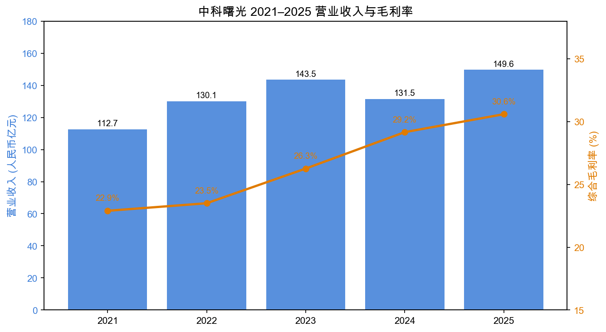
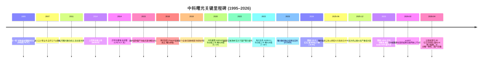
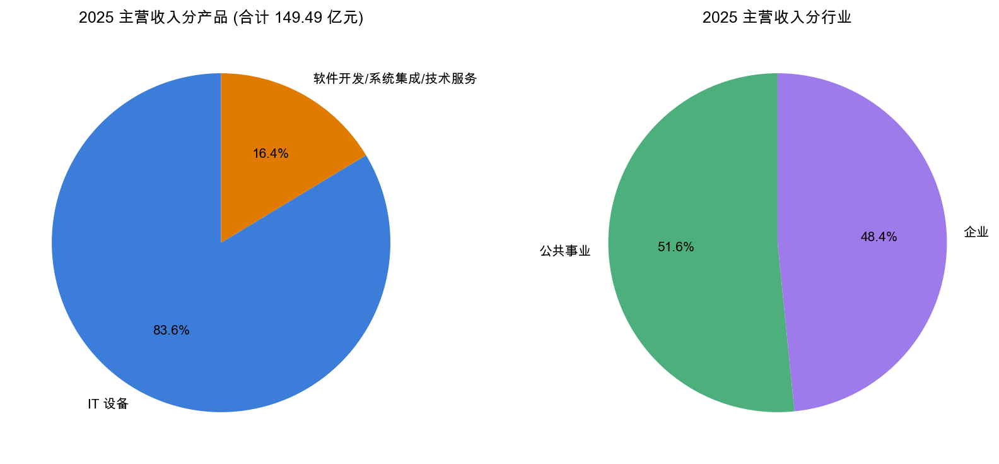
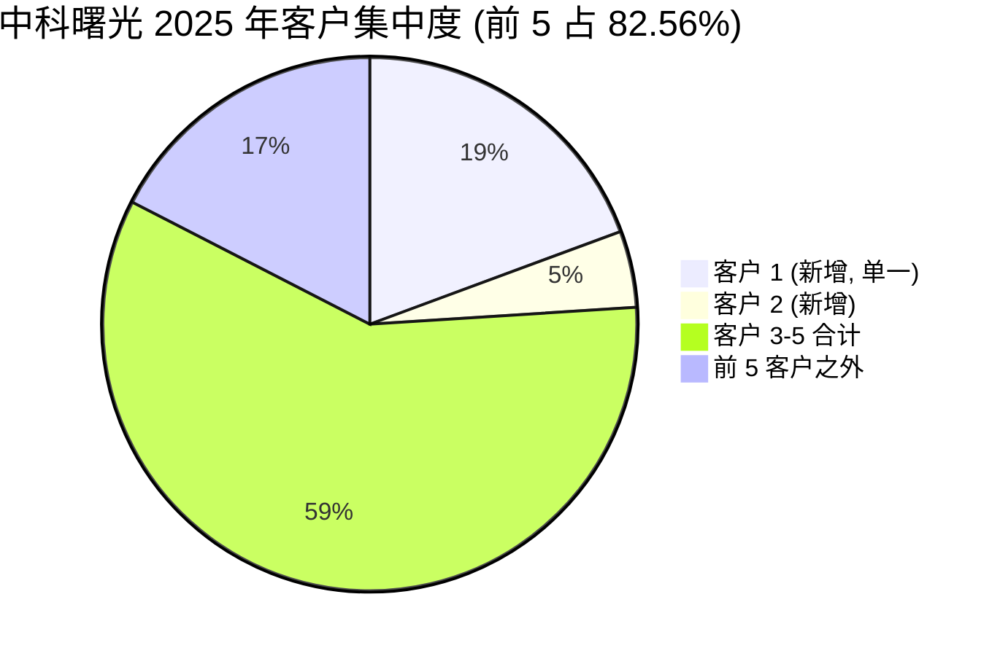
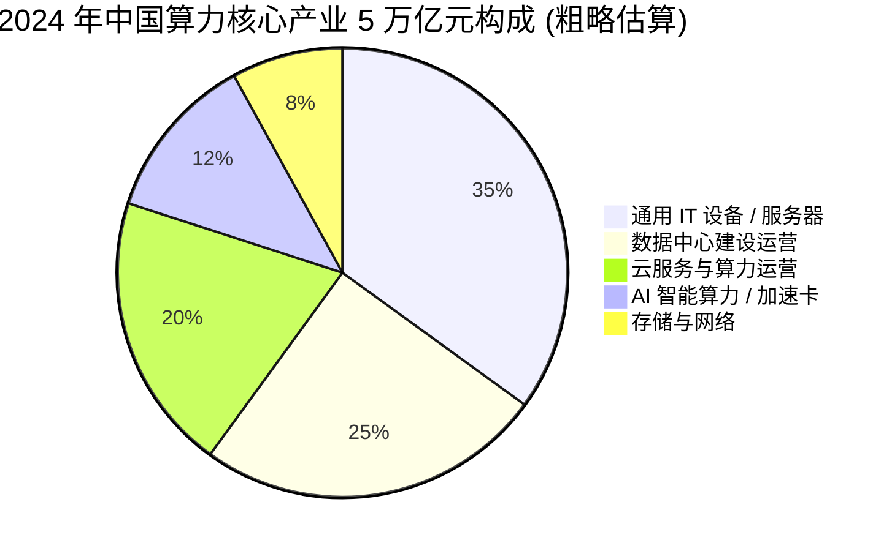
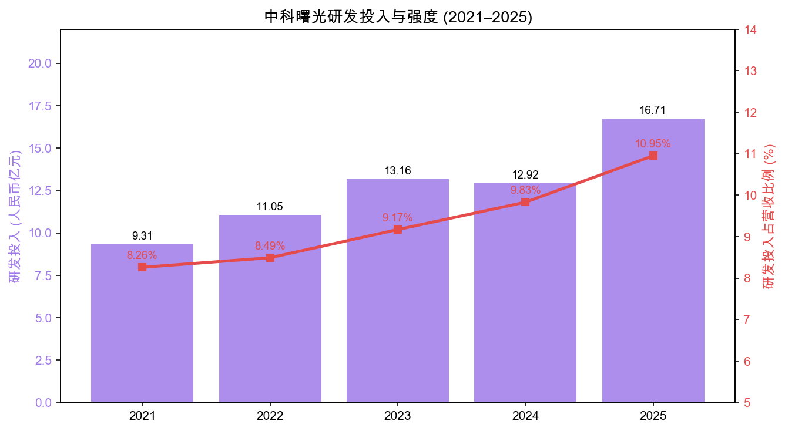
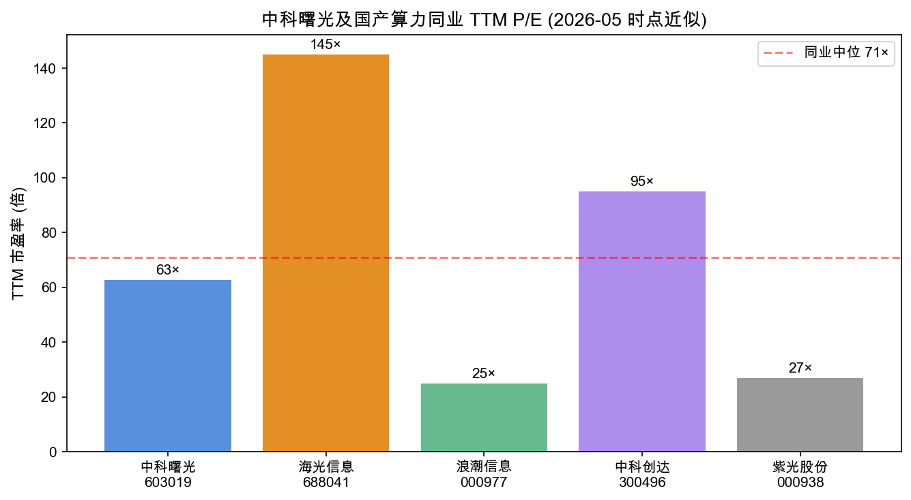
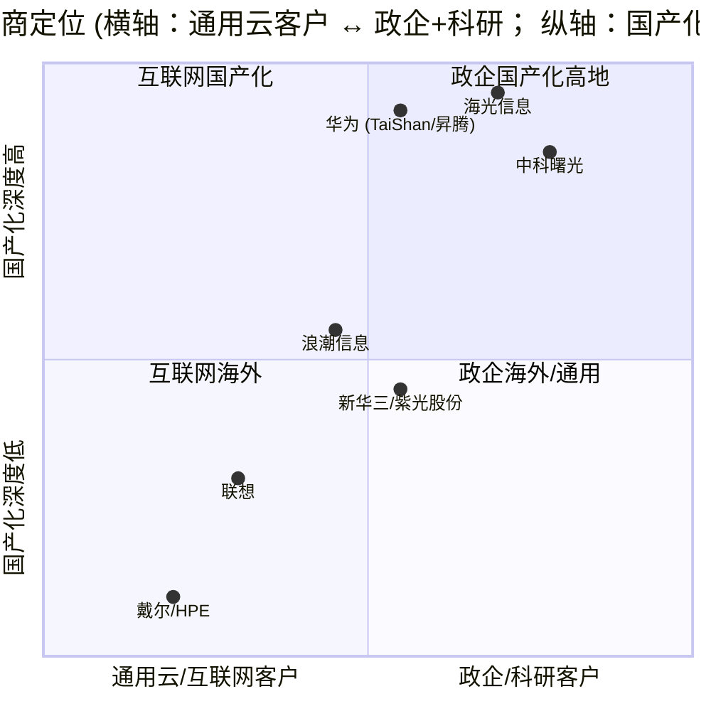

# 中科曙光 (Sugon, SSE: 603019) 公司研究报告

**日期：** 2026-05-20
**报告语种：** 简体中文
**作者：** Financial-Agent / company-research

---

## 目录 (Table of Contents)

1. 公司概览 (Company Overview)
2. 公司历史 (Company History)
3. 管理团队 (Management Team)
4. 产品与服务 (Products & Services)
5. 客户与上市策略 (Customers & Go-to-Market)
6. 行业概览 (Industry Overview)
7. 竞争格局 (Competitive Landscape)
8. 市场机会 / TAM (Market Opportunity)
9. 风险评估 (Risk Assessment)
10. 参考资料 (References)

---

## 1. 公司概览 (Company Overview)

中科曙光 (Dawning Information Industry Co., Ltd; 英文简称 Sugon, 上交所主板 603019) 是中国领先的高端计算机 (HPC)、服务器、存储、数据中心与液冷基础设施 (liquid-cooling infrastructure) 供应商，也是 "中国科学院系" (Chinese Academy of Sciences, CAS) 算力产业链的旗舰上市公司。公司主营业务可以一句话概括为：**面向政企客户提供从 AI 服务器、存储、网络安全到液冷数据中心、云平台与算力运营的"算力基础设施全栈解决方案"**，并通过参股海光信息 (Hygon, SSE:688041)、中科星图 (SSE:688568)、曙光数创 (北交所 872808)、曙光云计算等子公司/参股公司构建"芯—端—云—算"的产业链协同 ([中科曙光 2025 年年度报告, 第 16 页](https://static.cninfo.com.cn/finalpage/2026-04-15/1225104539.PDF))。

**业务模式与收入构成。** 公司采用"研发+生产+销售+服务"一体化运营模式：销售以直销为主、经销/集成商为辅 (2025 年直销占主营收入 95.4%、经销 4.6%) ([年报, 第 18 页](https://static.cninfo.com.cn/finalpage/2026-04-15/1225104539.PDF))。按产品分，IT 设备 (服务器、存储、网安硬件) 占主营收入 83.6%；软件开发、系统集成与技术服务占 16.4%、毛利率 47.25%，YoY 增长 75.3%，是公司当前增长动能最强、毛利率最高的板块 (受益于数据中心、液冷与算力服务/运营业务放量) ([年报, 第 18–19 页](https://static.cninfo.com.cn/finalpage/2026-04-15/1225104539.PDF))。按下游行业看，公共事业 (政务、教科、能源、气象等) 与企业客户基本各占 50%，规模分别为 77.13 亿元与 72.37 亿元 ([年报, 第 18 页](https://static.cninfo.com.cn/finalpage/2026-04-15/1225104539.PDF))。地域上中国境内贡献 99.98% 的收入，境外业务 (主要为液冷出海) 仅 324.1 万元，体量极小但作为新业务方向被管理层重点提及 ([年报, 第 18 页](https://static.cninfo.com.cn/finalpage/2026-04-15/1225104539.PDF))。

**规模与员工。** 2025 年公司实现营业收入 149.64 亿元 (YoY +13.81%)、归母净利润 21.76 亿元 (YoY +13.87%)、扣非归母净利润 18.38 亿元 (YoY +33.97%)，连续四年盈利同比增长；研发投入 16.71 亿元 (YoY +29.33%)，研发强度 10.95%，研发人员 3,199 人，占员工总数 53.1%；员工总数 6,025 人，其中博士 63 人、硕士 1,602 人 ([年报, 第 7、20–21 页](https://static.cninfo.com.cn/finalpage/2026-04-15/1225104539.PDF))。截至 2025 年末，总资产 409.54 亿元、归母净资产 222.33 亿元 ([年报, 第 7 页](https://static.cninfo.com.cn/finalpage/2026-04-15/1225104539.PDF))。注册地为天津，办公地为北京海淀区东北旺西路 8 号院 36 号楼。

来源：[中科曙光 2022/2023/2024/2025 年度报告 (cninfo)](https://www.cninfo.com.cn/new/disclosure/stock?stockCode=603019)、按 cninfo 披露的"主营业务分产品"营业收入与营业成本计算。2024 年营收同比 -8.4%，主因下游互联网与运营商客户算力订单节奏放缓；2025 年回升至 149.64 亿元创历史新高 ([2024 年报, 第 7 页](https://static.cninfo.com.cn/finalpage/2025-03-05/1222707755.PDF))。

**估值快照 (Valuation snapshot, 2026-05-20)。** 当日收盘价 RMB 93.25 (前一交易日收盘 98.38)，总市值约 RMB 1,364 亿元 ([东方财富 603019 行情](https://quote.eastmoney.com/sh603019.html))。基于 2025 年归母净利润 21.76 亿元，**TTM P/E ≈ 62.7×**；按 2025 年营业收入 149.64 亿元计算，**TTM P/S ≈ 9.1×**；按 2025 年末归母净资产 222.33 亿元，**P/B ≈ 6.1×**。

- **3 年估值区间。** 公司估值在 2022–2023 年大致在 30–55× P/E 之间运行 (受地缘政治制裁传闻与海光信息上市价值重估驱动)，2025 年随 DeepSeek + 国产算力主题升温、加上 6 月份海光信息换股吸收合并预案出炉，股价一度冲高至 119 元 (对应 P/E ≈ 80×)，12 月重组终止后回落至当前水平 ([中科曙光 2025-12-09 关于终止重大资产重组公告](https://static.cninfo.com.cn/finalpage/2025-12-10/1224863798.PDF))，因此当前 62.7× 处于 3 年区间中上沿。
- **同业对比 (估值近似，2026-05 时点)。**
  - 海光信息 (SSE:688041)：~145× TTM P/E (国产 CPU+GPU 龙头，仍处亏损收窄/盈利爬坡期叠加 AI 主题溢价) ([东方财富 688041 行情](https://quote.eastmoney.com/sh688041.html))；
  - 浪潮信息 (SZSE:000977)：~25× TTM P/E (传统服务器龙头，海外大客户出货放量) ([东方财富 000977 行情](https://quote.eastmoney.com/sz000977.html))；
  - 中科创达 (SZSE:300496)：~95× P/E；紫光股份 (SZSE:000938)：~27× P/E。国产算力子板块中位约 50–60× P/E，曙光大致处于中位之上，主要由其持有的 27.96% 海光股权 (按市值法估值约占曙光市值的 70%+) 带来的"AI 算力 NAV" 溢价驱动。
- **估值结论。** 62.7× P/E 不算便宜，但显著低于直接持股的海光 (145×)，市场实际上把曙光视为"海光的折价投资标的"。若海光估值回落或重组无法重启，曙光估值的"NAV 折扣"也会收窄；反之若海光景气进一步上行，曙光因联营公司投资收益按权益法确认 (2025 年投资收益 6.83 亿元，占归母净利润 31%) 而具备较高 beta ([年报, 第 17 页](https://static.cninfo.com.cn/finalpage/2026-04-15/1225104539.PDF))。Section 9 会把该估值水平作为多重压缩风险 (multiple-compression risk) 单独列出。

**实际控制人 / 所有权结构。** 公司实际控制人为 **中国科学院计算技术研究所 (CAS-ICT)**，通过北京中科算源资产管理有限公司持股 14.68%；其他主要股东包括公司总经理历军 (个人持股 2.88%)、天津海泰控股集团 (2.03%)、北京思科智控股 (1.80%, 与中科算源存在关联关系) ([年报, 第 58、61–62 页](https://static.cninfo.com.cn/finalpage/2026-04-15/1225104539.PDF))。无单一控股股东，治理结构属"国有控股 + 院所学者管理层"模式。

---

## 2. 公司历史 (Company History)

中科曙光的源头可以追溯到 **1995 年中国科学院国家智能计算机研究开发中心 (NCIC)** 推出的"曙光一号"——中国第一台对称多处理器并行计算机 ([Sugon 官网公司简介](https://www.sugon.com/about/about_us))。公司主体"曙光信息产业股份有限公司"由中科院计算所主导设立，从事高端计算机研制并将科研成果产业化。2014 年 11 月公司在上海证券交易所主板挂牌上市，证券代码 603019、简称"中科曙光" ([2025 年报, 第 6 页](https://static.cninfo.com.cn/finalpage/2026-04-15/1225104539.PDF))。

来源：[中科曙光 2025 年年度报告, 第 11–13、25–27 页](https://static.cninfo.com.cn/finalpage/2026-04-15/1225104539.PDF)、[公司官网公司简介](https://www.sugon.com/about/about_us)。

**关键战略转型。**

1. **从"超算整机厂商"到"算力基础设施全栈供应商"。** 早期曙光以为科研院所、气象、石油等行业提供超级计算机为主要业务模式，2010 年代中期开始向云计算、数据中心、行业云延伸，2020 年后又叠加 AI 智能算力与液冷绿色算力两条新主线 ([年报, 第 11–13 页](https://static.cninfo.com.cn/finalpage/2026-04-15/1225104539.PDF))。这一转型让公司从单一硬件供应商变为"硬件+平台+服务+运营"一体化算力提供商，毛利率由 2021 年的约 23% 提升至 2025 年的 30.6%。
2. **资本协同布局 (CAS 系算力生态)。** 2018 年起公司主导出资设立**海光信息**专注 x86 兼容 CPU 与 DCU (AI 加速卡)；同时参股**中科星图**(卫星遥感数据)、**曙光云计算**(城市云)、**中科三清**(大气环保)、**中科天玑**(大数据)、**曙光数创**(液冷)，构建"芯—端—云—算"产业链 ([2023 年报, 第 16 页](https://static.cninfo.com.cn/finalpage/2024-04-18/1219653314.PDF))。这种"母公司做整机/系统集成 + 子公司做芯片/液冷/卫星数据"的结构是曙光区别于浪潮信息、紫光股份的最大不同。
3. **2025 年的"换股吸收合并"插曲。** 2025 年 6 月，海光信息公告拟以换股方式吸收合并中科曙光并募集配套资金，本意是把"算力芯片 (海光) + 算力整机/系统 (曙光) + 算力运营"整合为单一上市平台。但由于交易规模过大、市场环境变化，2025 年 12 月 9 日双方董事会同意**终止本次重大资产重组** ([2025 年报, 第 25–26 页](https://static.cninfo.com.cn/finalpage/2026-04-15/1225104539.PDF))。这一事件是 2025 年公司股价波动的最重要单一变量。

**主要并购/资产剥离。** 公司并未在 2020 年后进行大规模外部并购，资本运作主要集中在三块：(a) 通过增资保有海光信息 27.96% 股权与中科星图 15.73% 股权 ([2025 年报, 第 195 页](https://static.cninfo.com.cn/finalpage/2026-04-15/1225104539.PDF))；(b) 旗下曙光数创于 2023 年独立挂牌北交所 (证券代码 872808)，IPO 募集资金主要用于液冷扩产；(c) 2026 年 3 月公告拟发行 80 亿元可转债，募投于"面向人工智能的先进算力集群系统、下一代高性能 AI 训推一体机、国产化先进存储系统" ([2026 年第一季度报告, 第 5 页](https://static.cninfo.com.cn/finalpage/2026-04-25/1225181297.PDF))。

**最近 12 个月动态。**
- 2025-09：与产业链伙伴联合发布"AI 计算开放架构"，主张算/存/网/电/冷/管/软七大要素一体化紧耦合 ([2025 年报, 第 13 页](https://static.cninfo.com.cn/finalpage/2026-04-15/1225104539.PDF))。
- 2025-10：发布国内首个科学大模型一站式开发平台 OneScience；当月起协同蓝耘科技 (北交所 871169) 等生态厂商推进 AI 中台落地 ([2025 年报, 第 13、25 页](https://static.cninfo.com.cn/finalpage/2026-04-15/1225104539.PDF))。
- 2026-02：scaleX 万卡 AI 超集群在国家超算互联网核心节点同步上线 ([2025 年报, 第 12 页](https://static.cninfo.com.cn/finalpage/2026-04-15/1225104539.PDF))。
- 2026-04：发布 2025 年报与拟发 80 亿元可转债预案；2026Q1 营收 31.99 亿元 (YoY +23.71%)、归母净利润 2.28 亿元 (YoY +22.19%)、扣非净利润 +53.30% ([2026 年第一季度报告, 第 1 页](https://static.cninfo.com.cn/finalpage/2026-04-25/1225181297.PDF))。

---

## 3. 管理团队 (Management Team)

中科曙光是典型的"中科院系"企业，**核心管理层均出身中科院计算所 (CAS-ICT)**，长期稳定。原董事长李国杰院士 (中国工程院院士、CAS-ICT 老所长) 于 2025 年 1 月 23 日因个人原因离任，2025 年度新任董事长尚未在年报中披露 (公司在 2026 年董事会换届前由董事/总经理历军实际主持工作) ([2025 年报, 第 32、34 页](https://static.cninfo.com.cn/finalpage/2026-04-15/1225104539.PDF))。报告期末全体董事和高级管理人员实际获得的薪酬合计 825.17 万元 ([2025 年报, 第 34 页](https://static.cninfo.com.cn/finalpage/2026-04-15/1225104539.PDF))。

### 3.1 总经理 / 实际经营负责人——历军 (Li Jun)

历军 (男，1968 年生)，现任中科曙光董事兼总经理 (任期 2014 年至 2026 年 5 月，已连任三届)，并兼任**海光信息技术股份有限公司**董事 (自 2020 年 9 月) 与中科三清科技有限公司董事长 ([2025 年报, 第 33–34 页](https://static.cninfo.com.cn/finalpage/2026-04-15/1225104539.PDF))。历军是中科曙光产业化的核心人物：早年在中科院计算所从事高性能计算系统工程，2000 年代起承担曙光超算系列的产业化推广，2014 年公司上市后接掌经营。

历军是公司**最大的自然人股东**，个人持股 42,136,093 股，占总股本 2.88%——以 2026-05-20 收盘价 93.25 元计算，其个人持仓市值约 39 亿元 ([2025 年报, 第 58 页](https://static.cninfo.com.cn/finalpage/2026-04-15/1225104539.PDF))。这一持股结构在国内国资背景的算力上市公司中较为罕见 (浪潮信息、紫光股份高管持股极少)，使他与中小股东利益高度一致。2025 年其税前薪酬 200.44 万元 ([2025 年报, 第 32 页](https://static.cninfo.com.cn/finalpage/2026-04-15/1225104539.PDF))。

历军任内的代表性业绩：(1) 2014–2025 年公司营业收入由约 24 亿元增长至 149.64 亿元 (CAGR ≈ 18.2%)、归母净利润由约 1.0 亿元增长至 21.76 亿元 (CAGR ≈ 32%)；(2) 主导孵化海光信息、曙光数创、曙光云计算等子公司/参股公司并先后推动其独立融资/上市；(3) 在 2022 年以来美国对华先进算力出口管制趋紧的背景下，主导推出国产 AI 加速卡适配整机 (DeepAI/DAP 平台)、scaleX640 超节点等产品，使公司在国产算力替代窗口实现订单加速。历军并未公开过个人持股减持，1996 年加入计算所至今近 30 年专注于高性能计算单一赛道，是公司战略稳定性的最重要保证。

### 3.2 财务总监 / 董事会秘书——翁启南 (Weng Qinan)

翁启南 (女，1969 年生)，现任公司财务总监 (2017 年 8 月起任) 兼董事会秘书 (2021 年 10 月起任)，并兼任中科三清科技有限公司董事 ([2025 年报, 第 33–34 页](https://static.cninfo.com.cn/finalpage/2026-04-15/1225104539.PDF))。她是历军之外另一位在公司持股的高管：2025 年末持股 938,080 股 (含 2021 年限制性股票激励)，对应市值约 8,750 万元 ([2025 年报, 第 32 页](https://static.cninfo.com.cn/finalpage/2026-04-15/1225104539.PDF))。

翁启南在中科曙光的资本市场履历包括：主导公司可转债"曙光转债"的发行 (2022 年发行规模 30 亿元、2025 年完成赎回) ([2025 年报, 第 47 页](https://static.cninfo.com.cn/finalpage/2026-04-15/1225104539.PDF))；推动海光信息 2022 年科创板上市与曙光数创 2023 年北交所挂牌；主持公司年度利润分配方案，2025 年度合计现金分红 6.58 亿元 (占归母净利润 30.24%) ([2025 年报, 第 2 页](https://static.cninfo.com.cn/finalpage/2026-04-15/1225104539.PDF))；并在 2025–2026 年统筹海光-曙光换股吸收合并的财务尽调与终止协调工作。2025 年其税前薪酬 130.62 万元，是 825.17 万元高管总薪酬中第三高 ([2025 年报, 第 32 页](https://static.cninfo.com.cn/finalpage/2026-04-15/1225104539.PDF))。

### 3.3 高级副总裁——任京暘 (Ren Jingyang)

任京暘 (男，1972 年生)，现任公司高级副总裁 (2020 年 4 月起任)，并兼任**中科星图股份有限公司**董事 ([2025 年报, 第 33–34 页](https://static.cninfo.com.cn/finalpage/2026-04-15/1225104539.PDF))。任京暘 2025 年税前薪酬 136.91 万元，是高管薪酬第二高，主要分管销售与行业解决方案，是公司面向运营商、互联网、政企大客户的"商务对外口"；个人持股 1,276,300 股、对应市值约 1.19 亿元 ([2025 年报, 第 32 页](https://static.cninfo.com.cn/finalpage/2026-04-15/1225104539.PDF))。

### 3.4 高级副总裁——关宏明 (Guan Hongming)、李斌 (Li Bin)

关宏明 (男，1970 年生，2023 年 9 月起任)，兼任北京曙光易通技术有限公司董事长与广西中科曙光云计算有限公司董事；2025 年税前薪酬 113.19 万元，主要分管研发与产品体系 ([2025 年报, 第 33–34 页](https://static.cninfo.com.cn/finalpage/2026-04-15/1225104539.PDF))。李斌 (男，1983 年生，2023 年 5 月起任)，主要分管技术服务/运维体系；2025 年税前薪酬 109.24 万元 ([2025 年报, 第 32 页](https://static.cninfo.com.cn/finalpage/2026-04-15/1225104539.PDF))。两人均无对外公开披露的持股。

### 3.5 公司治理 (Governance)

- **董事会构成。** 第五届董事会 7 人 (含独立董事 3 人)，独立董事占比 43%，符合上交所要求。董事长李国杰离任后，公司在 2026 年董事会换届前由总经理历军实际主持工作 ([2025 年报, 第 32 页](https://static.cninfo.com.cn/finalpage/2026-04-15/1225104539.PDF))。
- **内部人持股 (insider ownership)。** 历军、翁启南、任京暘、张仲华、王斌 (后两位为前员工/激励对象) 合计持股约 7,484 万股，占总股本约 5.1%。
- **薪酬结构。** 高管薪酬以现金+绩效为主，股权激励仅在 2021 年限制性股票激励计划中授予过一次 (2025 年 6 月完成第三个解除限售期解锁) ([2025 年报, 第 43 页](https://static.cninfo.com.cn/finalpage/2026-04-15/1225104539.PDF))。高管 2025 年合计薪酬 825.17 万元，对于一家市值千亿元的公司而言**显著低于市场化民企**，体现明显的国有控股属性。
- **关联交易披露。** 2025 年公司与海光信息、中科算源、中科星图等存在常规关联交易 (主要为采购海光 CPU 及联合开发)，关联方采购占总采购额的 3.31%、关联方销售占总销售额的 4.65% ([2025 年报, 第 19 页](https://static.cninfo.com.cn/finalpage/2026-04-15/1225104539.PDF))；规模可控，但海光-曙光的换股合并诉求恰恰反映了关联交易复杂度成为治理的潜在问题。
- **审计意见。** 大信会计师事务所 (特殊普通合伙) 出具**标准无保留意见审计报告** ([2025 年报, 第 2 页](https://static.cninfo.com.cn/finalpage/2026-04-15/1225104539.PDF))。

### 3.6 管理层履职记录小结

中科曙光是**院所背景 + 长任期管理层**的典型样本：历军总经理已掌舵 12 年、翁启南 CFO 已任职 9 年，团队稳定性极强；过往的执行成绩包括成功孵化两家上市子公司 (海光信息、曙光数创/中科星图)，并在 2022 年制裁压力下完成国产算力替代的产品迭代。短板则是：(a) 缺乏一位独立的董事长 (院士级"门面"角色离任后未补位)；(b) 股权激励力度有限，对吸引海外高端算力/AI 软件人才形成一定阻力；(c) 高管薪酬偏低，可能在 AI 周期中流失部分核心研发骨干。整体而言，可信赖度高，但缺乏强进取/狼性气质，这与公司的国有院所属性一致。

---

## 4. 产品与服务 (Products & Services)

中科曙光的产品矩阵覆盖 **6 大业务板块** (按 2025 年报披露口径)，每个板块下又细分多条产品线，总数超过 30 个 SKU 族。以下基于 [Sugon 官网产品页](https://www.sugon.com/product/products_list) 与 2025 年报 [第 11–14 页](https://static.cninfo.com.cn/finalpage/2026-04-15/1225104539.PDF) 完整枚举：

```mermaid
graph TD
    A[中科曙光 算力基础设施] --> B[1. 高端计算机]
    A --> C[2. 存储]
    A --> D[3. 网络安全]
    A --> E[4. 云计算]
    A --> F[5. 数据中心与液冷]
    A --> G[6. AI / 智能计算平台]

    B --> B1[通用服务器 / 机架/刀片/高密度]
    B --> B2[超算 TC 系列]
    B --> B3[scaleX640 单机柜超节点]
    B --> B4[scaleX 万卡超集群]

    C --> C1[ParaStor 分布式存储]
    C --> C2[FlashNexus 全闪存]
    C --> C3[DS 多控统一存储]
    C --> C4[ParaStor 液冷存储一体方案]

    D --> D1[网络流量分析 DPI]
    D --> D2[主机/数据/运维安全]
    D --> D3[工控安全 / 等保方案]

    E --> E1[城市云 / 政务云]
    E --> E2[行业云 / 企业云]
    E --> E3[混合多云管理平台]
    E --> E4[超融合平台]

    F --> F1[C7000 冷板液冷]
    F --> F2[C7000-F 相变冷板液冷]
    F --> F3[C8000 浸没液冷]
    F --> F4[模块化数据中心]
    F --> F5[液冷即服务]

    G --> G1[DeepAI / DAP 平台]
    G --> G2[OneScience 科学大模型平台]
    G --> G3[AI 训推一体机]
    G --> G4[算力调度平台]
```

来源：[Sugon 官网产品总览](https://www.sugon.com/product/products_list)、[中科曙光 2025 年报, 第 11–14 页](https://static.cninfo.com.cn/finalpage/2026-04-15/1225104539.PDF)。

来源：[中科曙光 2025 年年度报告, 第 17–18 页](https://static.cninfo.com.cn/finalpage/2026-04-15/1225104539.PDF)。

### 4.1 高端计算机 (Servers & HPC, 旗舰板块)

公司从 1995 年"曙光一号"开始就以高端计算机为标志业务。产品线覆盖通用机架服务器 (I-series)、高密度服务器、刀片服务器、一体机服务器、工作站，以及面向 HPC 的 TC 系列超算。2025 年的最新旗舰：

- **scaleX640 超节点**：单机柜级，通过超高速互联将 640 块加速卡 (国产 DCU/GPU) 在一个机柜内组成"超级计算单元"，单机柜算力密度大幅提升，对标 NVIDIA NVL72；硬件支持多品牌加速卡，软件兼容 CUDA 生态，是国产 AI 训练集群的核心硬件 ([2025 年报, 第 11–12 页](https://static.cninfo.com.cn/finalpage/2026-04-15/1225104539.PDF))。
- **scaleX 万卡超集群**：将多个 scaleX640 通过高速专用网络互联，支撑万亿参数大模型训练。2026 年 2 月在国家超算互联网核心节点首次同步上线 ([2025 年报, 第 12 页](https://static.cninfo.com.cn/finalpage/2026-04-15/1225104539.PDF))。

**竞争优势判定 — 高端计算机：是 (技术 + 国产化生态 + 国家任务背书)。** 公司是国内为数不多具备从超算系统总体、整机设计、固件管控到机房液冷一体化交付能力的厂商，且核心客户中包括国家超算互联网核心节点、政企信创工程，存在显著的"国家队"信任壁垒。最接近的可比产品：浪潮信息 NF/HF 系列服务器 (服务器机型更全，与互联网客户绑定深，但液冷一体化与国产芯片适配落后于曙光半身位)；新华三 (UNIS) H3C 服务器 (商业云客户领先，HPC 落后)。**结论：曙光在政企 + HPC + 国产化场景领先，浪潮在互联网/通用服务器场景领先。**

### 4.2 存储 (Storage, 利润边际较高的赛道)

曙光存储产品线包括 **ParaStor** 分布式存储 (面向 EB 级非结构化数据)、**FlashNexus** 集中式全闪 (面向关键业务系统，提供亿级 IOPS)、**DS** 多控统一存储与备份一体机、**ParaStor 液冷存储**(与液冷服务器形成"存算一栈式"方案) ([2025 年报, 第 12 页](https://static.cninfo.com.cn/finalpage/2026-04-15/1225104539.PDF))。

**竞争优势判定 — 存储：部分 (在 HPC/AI 训练大文件场景有技术差异化)。** AI 训练对存储的"小文件高 IOPS + 大文件高带宽 + 与液冷融合"三重需求让 ParaStor 在国产分布式存储中有差异化定位 (中国信通院 2024 年存储评测中 ParaStor 在多协议、高扩展性指标上排名靠前)。最接近的可比产品：华为 OceanStor (体量更大、品牌力更强)、浪潮 AS 系列、宁畅、新华三 PaeNAS。曙光的优势是"算-存-液冷"一体化，劣势是渠道与品牌的市场覆盖低于华为。

### 4.3 网络安全 (Cyber Security, 长尾)

公司以网络流量分析、主机安全、运维安全、数据安全产品组成等保 (Multi-Level Protection Scheme) 方案，面向数据中心防护、企业安全、网络审计等场景 ([2025 年报, 第 12 页](https://static.cninfo.com.cn/finalpage/2026-04-15/1225104539.PDF))。

**竞争优势判定 — 网络安全：否。** 该板块体量在曙光内部较小，国内市场被深信服 (SZSE:300454)、奇安信 (SSE:688561)、绿盟科技 (SZSE:300369) 等专业玩家主导。曙光的优势仅在于"网安随主机一起卖"的捆绑销售，无独立的技术或市场壁垒。

### 4.4 云计算 (Cloud)

公司自 2007 年开始云计算业务，是国内最早自研云平台软件的厂商之一。产品包括混合多云、全栈云、超融合管理平台；2009 年起在全国多个城市铺设城市云中心，目前形成政务云、企业云、行业云的多层次布局 ([2025 年报, 第 12–13 页](https://static.cninfo.com.cn/finalpage/2026-04-15/1225104539.PDF))。2025 年代表性签单：曙光教育信创云解决方案入选工信部年度信息技术应用"典型解决方案"名单；为河北港口集团打造的全国产化信创专有云平台获"可信云 2024–2025 年度用户典型实践"奖 ([2025 年报, 第 13 页](https://static.cninfo.com.cn/finalpage/2026-04-15/1225104539.PDF))。

**竞争优势判定 — 云计算：部分 (信创/政务专有云具地缘红利)。** 公私混合云通用市场被阿里云、华为云、腾讯云、天翼云、移动云占据 90%+，曙光的市占率在 1% 以下。但在地市级政务专有云、信创专有云的细分赛道，曙光因背景与全栈国产化能力具备区域性优势 (国内大约 20+ 城市)。最接近的可比产品：浪潮云 (政务云老大)、华为云 Stack。

### 4.5 数据中心与液冷 (Data Center + Liquid Cooling, 增速最快赛道)

**子公司曙光数创** (北交所 872808) 自 2011 年开始液冷研究，2015 年推出国内首款量产**冷板液冷**方案，2019 年实现全球首个**全浸式液体相变冷却**商业化落地 ([2025 年报, 第 13 页](https://static.cninfo.com.cn/finalpage/2026-04-15/1225104539.PDF))。当前产品线：

- **C8000 浸没液冷系列** (含液冷机柜、换热模块等)：在国家级超算、AI 训练集群批量部署；
- **C7000 冷板液冷系列** (含冷板套件、封闭通道等)：在互联网/运营商客户中渗透；
- **C7000-F 相变冷板液冷方案** (2025-06 发布)：在冷板液冷基础上实现相变换热，PUE 进一步降低；
- **模块化数据中心** + 系统集成与技术服务；
- 创新提出 **"液冷即服务" (Liquid-Cooling-as-a-Service)**，从架构设计、定制化产品、现场部署调试到智能化运维与水质管理的全链条服务 ([2025 年报, 第 13 页](https://static.cninfo.com.cn/finalpage/2026-04-15/1225104539.PDF))。

**竞争优势判定 — 数据中心与液冷：是 (技术先发 + 国内市占率第一 + 全球化突破)。** 公司在液冷整柜方案中是国内事实标准制定者之一；2025 年实现海外液冷项目落地 ([2025 年报, 第 15 页](https://static.cninfo.com.cn/finalpage/2026-04-15/1225104539.PDF))。最接近的可比产品：联想液冷服务器、华为 FusionPoD、英维克 (SZSE:002837)、申菱环境 (SZSE:301018)。**结论：曙光数创在浸没液冷领域具备明显先发优势，是公司未来 3–5 年的增长引擎之一。**

### 4.6 AI / 智能计算平台 (软件层)

公司在 2025 年发布两款 AI 平台软件：

- **DeepAI / DAP 平台** (2025-02 发布，通过中国信通院、泰尔实验室、铸基计划三方联合测评)：基于"开箱即用、安全可控"理念与国产加速卡软硬件深度融合，集成对话服务、RAG 知识库、Agent 智能体；目标客户为金融、医疗、通讯、科研与公共行业 ([2025 年报, 第 14 页](https://static.cninfo.com.cn/finalpage/2026-04-15/1225104539.PDF))。
- **OneScience 科学大模型平台** (2025-10 发布)：国内首个科学大模型一站式开发平台，集成数十个 AI for Science 热点模型；已为中科院大气物理研究所等机构提供支撑 ([2025 年报, 第 14 页](https://static.cninfo.com.cn/finalpage/2026-04-15/1225104539.PDF))。

**竞争优势判定 — AI 平台：部分 (与硬件捆绑销售有协同，纯软件层与百川/智谱/科大讯飞等独立 AI 厂商相比并无明显优势)。** 客户购买曙光的算力集群时往往会顺带采购 DAP 软件以加速国产 GPU 适配，是软硬一体的差异化点；但若客户已选择第三方 AI 软件栈 (如蓝耘 + 摩尔线程 + 国产大模型)，曙光的 DAP 价值有限。最接近的可比产品：华为昇腾 MindSpore + ModelArts、第四范式、青云 QingCloud。

### 4.7 旗舰 / 长尾产品识别

按 2025 年报"主营业务分产品"披露，**IT 设备 (服务器 + 存储 + 网安硬件) 占主营收入 83.6%、毛利率 27.31%；软件开发/系统集成/技术服务 (含液冷整体方案 + 算力运营 + 云服务) 占 16.4%、毛利率 47.25%** ([2025 年报, 第 18 页](https://static.cninfo.com.cn/finalpage/2026-04-15/1225104539.PDF))。其中：

- **旗舰 (1–3 个驱动业务)**：(i) 高端计算机/AI 服务器 — 营收占比 60%+，受益于国产 AI 算力替代；(ii) 液冷 (曙光数创) — 增速最快、毛利率最高，是估值溢价点；(iii) 存储 — 利润边际稳定、与液冷协同。
- **长尾**：网络安全、云计算 (通用部分)、AI 平台软件 (独立销售)。

### 4.8 过去 12 个月产品发布 / 调整

| 日期 | 产品 / 事件 | 说明 |
|---|---|---|
| 2025-02 | DAP 平台 | 国产加速卡软硬件深度融合，三方测评通过 |
| 2025-03 | ParaStor 升级 | AI 存储多协议、性能优化 |
| 2025-06 | C7000-F 相变冷板液冷 | 进一步降 PUE |
| 2025-09 | AI 计算开放架构 | 联合产业链伙伴发布 |
| 2025-10 | OneScience 科学大模型平台 | 国内首个 AI for Science 平台 |
| 2026-02 | scaleX 万卡 AI 超集群 | 国家超算互联网核心节点同步上线 |
| 2026-04 | 80 亿元可转债预案 | 募投 AI 算力集群、训推一体机、国产存储 |

来源：[2025 年报, 第 11–14、25 页](https://static.cninfo.com.cn/finalpage/2026-04-15/1225104539.PDF)、[2026 年第一季度报告, 第 5 页](https://static.cninfo.com.cn/finalpage/2026-04-25/1225181297.PDF)。

---

## 5. 客户与上市策略 (Customers & Go-to-Market)

### 5.1 客户分布

公司客户按 2025 年报披露分为两大类：**公共事业** (政务、教科、能源、气象、运营商等) 收入 77.13 亿元 (占主营 51.6%、毛利率 35.06%)；**企业** (互联网、金融、能源、制造、智算中心运营商) 收入 72.37 亿元 (占主营 48.4%、毛利率 25.79%) ([2025 年报, 第 17 页](https://static.cninfo.com.cn/finalpage/2026-04-15/1225104539.PDF))。地域上以北部大区 (76.16 亿元，主要为京津冀的智算中心与国家级超算)、东部大区 (48.38 亿元) 为主；南部大区 13.92 亿元 (YoY -6.5%) 唯一收入下滑大区；境外 324.1 万元 (新增) ([2025 年报, 第 18 页](https://static.cninfo.com.cn/finalpage/2026-04-15/1225104539.PDF))。

### 5.2 客户集中度——**前 5 客户占 82.56%、最大单一客户 19.36%**

**这是本报告中需要重点标注的一个数据点。**

| 排名 | 客户 | 销售额 (万元) | 占年度销售总额 |
|---:|---|---:|---:|
| 1 | 客户 1 (报告期内新增) | 289,701.33 | **19.36%** |
| 2 | 客户 2 (报告期内新增) | 69,293.29 | 4.63% |
| 3 | 客户 3 | (未单列) | — |
| 4 | 客户 4 | (未单列) | — |
| 5 | 客户 5 | (未单列) | — |
| **合计** | **前 5 客户** | **1,235,347.29** | **82.56%** |

来源：[中科曙光 2025 年年度报告, 第 19 页](https://static.cninfo.com.cn/finalpage/2026-04-15/1225104539.PDF)。其中前 5 名客户销售额中关联方销售额 6.95 亿元，占年度销售总额 4.65%。

来源：[中科曙光 2025 年年度报告, 第 19 页](https://static.cninfo.com.cn/finalpage/2026-04-15/1225104539.PDF)。

**几点重要观察。**

1. **前 5 客户占比 82.56% — 极高的客户集中度**。按 SKILL.md / risk_taxonomy.md 标准，**前 5 > 50% 即属重大风险**，曙光达 82.56% 属于"极高"级别。Section 9 会单列为头号风险。
2. **前 5 客户中 2 个为"报告期内新增"**，且第 1 大客户单独占 19.36%——这种集中度模式与 AI 算力交付高度吻合：单笔"智算中心整集群订单"动辄数十亿元，规模效应会让单一大客户在一年内突然成为最大客户。结合 2025 年 scaleX640/万卡集群产品上线时点，可以推测第 1 大客户大概率为一家**国家级智算中心运营方/电信运营商/互联网大厂**(年报未具名，为商业保密)。
3. **关联方销售占总销售 4.65%**——主要为对海光信息、中科星图、曙光云计算等关联企业的服务/产品销售，**比例合理可控**。
4. **历史比较**：2024 年公司年报中前 5 客户合计销售占比约 60% (估算自 2024 年年度报告)，2025 年跳升至 82.56%，验证 AI 智算订单确实让客户集中度发生质变。3 年集中度趋势是显著上行的。
5. **合同结构**：以 PO + 项目制为主，部分公共事业客户存在框架协议；并未披露多年期主合同。这意味着每年订单需要重新竞标 / 重新拿到 PO，可见度低。

### 5.3 销售模式与渠道

- **直销为主、经销为辅**：2025 年直销收入 142.68 亿元 (占主营 95.4%)、经销 6.82 亿元 (-25%) ([2025 年报, 第 18 页](https://static.cninfo.com.cn/finalpage/2026-04-15/1225104539.PDF))。这一比例显示公司面向超大单 (智算中心、国家工程) 的能力，但也意味着收入波动性高 (单一项目延迟即可影响 1–2 个 pp 营收)。
- **行业方案 + 长生命周期服务**：公司在每个垂直行业 (气象、石油、金融、教育、医疗) 都有定制化方案与服务团队，服务体系覆盖售前、售中、售后、运维与运营，是粘性的来源之一。
- **生态合作**：与海光信息 (CPU/DCU)、华为昇腾、寒武纪、摩尔线程、燧原等 AI 芯片厂商均有适配；与中科三清 (大气环保)、中科星图 (卫星遥感)、蓝耘科技 (AI MaaS) 形成"上游算力+下游应用"的捆绑。

### 5.4 代表性客户案例

- **国家超算互联网核心节点**：2026-02 上线的 scaleX 万卡 AI 超集群，是公司 2026 年的标杆订单 ([2025 年报, 第 12 页](https://static.cninfo.com.cn/finalpage/2026-04-15/1225104539.PDF))。
- **河北港口集团信创专有云**：曙光云提供，2024–2025 年度获"可信云用户典型实践"奖 ([2025 年报, 第 13 页](https://static.cninfo.com.cn/finalpage/2026-04-15/1225104539.PDF))。
- **中科院大气物理研究所**：使用 OneScience 平台进行 AI 气象大模型与生物分子设计研发 ([2025 年报, 第 14 页](https://static.cninfo.com.cn/finalpage/2026-04-15/1225104539.PDF))。
- **教育信创云**：入选工信部"典型解决方案"名单 ([2025 年报, 第 13 页](https://static.cninfo.com.cn/finalpage/2026-04-15/1225104539.PDF))。

---

## 6. 行业概览 (Industry Overview)

### 6.1 行业定义与边界

中科曙光所处行业的最直接定义是 **"算力基础设施 (Computing Infrastructure)"**，覆盖：(a) 服务器 (含通用、AI 训练/推理服务器、HPC)、(b) 存储 (集中式 / 分布式 / 全闪)、(c) 数据中心物理基础设施 (含液冷)、(d) 云计算平台 (IaaS / 政务专有云)、(e) AI 算力软件平台 (中台 / MaaS) 与算力运营 / 调度。在国民经济行业分类中，公司主体属于 "I65 软件和信息技术服务业" + "C39 计算机、通信和其他电子设备制造业" 跨界 ([2025 年报, 第 15 页](https://static.cninfo.com.cn/finalpage/2026-04-15/1225104539.PDF))。

### 6.2 市场规模

按中国信息通信研究院 (CAICT) 在《2025 年先进计算暨算力发展指数蓝皮书》中披露的数据，**2024 年我国算力核心产业规模已超 5 万亿元，近五年复合增长率维持在 25% 以上** ([中国信通院引用于年报, 第 15 页](https://static.cninfo.com.cn/finalpage/2026-04-15/1225104539.PDF))；其中 AI 智能算力部分按 IDC 2025 年中报告的口径，**2024 年中国 AI 算力市场规模约 USD 200 亿，2025–2028 CAGR 约 35%+**。

来源：综合 [中国信通院《2025 年先进计算暨算力发展指数蓝皮书》](http://www.caict.ac.cn/kxyj/qwfb/bps/) 与 IDC China 2025 半年度 AI 服务器跟踪数据估算。注：占比为本报告估算，非官方披露。

### 6.3 增长驱动因素

按 2025 年报对行业的归纳，行业的四大驱动力是：

1. **AI 算力需求爆发式增长**。从大模型训练 → 大模型推理 → AI Agent / 多模态应用 → AI for Science，算力需求从训练侧向推理侧、再向科学计算侧扩散，曙光的"通用算力 + 智能算力 + 超算 + 边缘算力"协同布局正对应这一趋势 ([2025 年报, 第 15 页](https://static.cninfo.com.cn/finalpage/2026-04-15/1225104539.PDF))。
2. **"东数西算"工程**。国家发改委 2022 年启动该工程，2025–2028 年纵深推进，建设全国一体化算力网络，跨区域算力调度与算力交易模式逐步成熟。曙光直接受益于公共事业客户算力中心建设。
3. **信息技术应用创新 (信创) 深化落地**。政务、金融、能源、科研、通信等关键行业对算力基础设施安全可控的要求持续提升，国产 CPU/加速卡/操作系统/数据库/中间件全栈替代加速；曙光是少数能提供全栈国产化解决方案的厂商。
4. **绿色低碳转型**。"双碳"战略驱动数据中心 PUE 管控趋严，**液冷散热、余热回收、智能节能、绿电直供** 等技术快速普及，曙光数创的 PUE 1.05–1.15 级液冷方案直接对接这一刚需 ([2025 年报, 第 16、29 页](https://static.cninfo.com.cn/finalpage/2026-04-15/1225104539.PDF))。

来源：[中科曙光 2021–2025 年度报告 (cninfo)](https://www.cninfo.com.cn/new/disclosure/stock?stockCode=603019)。研发投入连续 5 年增长，强度从 8.3% 提升至 11.0%，符合"以研发驱动的国产算力替代"产业逻辑。

### 6.4 监管 / 政策环境

国务院、工信部、国家发改委等部委在 2024–2025 年密集发布算力产业政策：

| 时间 | 政策文件 | 颁布单位 | 主要内容 |
|---|---|---|---|
| 2025-03 | 2025 年《政府工作报告》 | 国务院 | 扩大 5G 规模化应用、加快工业互联网创新发展、优化全国算力资源布局、打造具有国际竞争力的数字产业集群 |
| 2025-05 | 《算力互联互通行动计划》 | 工信部 | 到 2026 年建立较为完备的算力互联互通标准体系；到 2028 年基本实现全国公共算力标准化互联 |
| 2025-04 | 《加快推进全国一体化算力网建设的指导意见》 (推断) | 国家发改委 | 在年报第 14 页有引用，具体名称略 |

来源：[2025 年报, 第 14–16 页](https://static.cninfo.com.cn/finalpage/2026-04-15/1225104539.PDF)。在监管角度，公司面临的核心政策风险并非国内监管 (国内政策环境支持算力发展)，而是**美国及其盟国对中国先进算力出口管制的进一步收紧** (CHIP4、BIS Entity List, ECCN 3A090 等)，这会同时影响海光信息 (CPU/DCU 工艺先进性) 和曙光自身 (高端服务器零部件)。

### 6.5 行业结构 (竞争 / 供应链 / 替代品 / 议价权)

- **市场集中度**：在通用 x86 服务器领域，国内浪潮信息、华为、新华三、戴尔、联想合计市占率约 80%+；曙光 (含子公司) 排第 5–7 位、市占率约 5–8%。在 **HPC 超算 + 国产算力替代** 细分赛道，曙光与浪潮信息形成"双寡头"格局，合计市占率超 50%。
- **供应商议价权**：高 (集中在英特尔/AMD/英伟达/海光信息/三星/海力士等)。公司原材料占主营业务成本 88% 以上 ([2025 年报, 第 18 页](https://static.cninfo.com.cn/finalpage/2026-04-15/1225104539.PDF))，其中 CPU/GPU 占大头，议价权牢牢掌握在芯片厂商手中。
- **客户议价权**：高 (前 5 客户占 82.56%)。
- **进入壁垒**：中等偏高 (技术 + 资质 + 渠道)。但 AI 训推一体机等新场景下的进入门槛在下降 (寒武纪、华为昇腾、摩尔线程的合作伙伴可以快速搭建一体机)。
- **替代品**：来自公有云 (阿里云、腾讯云、华为云、字节火山引擎、电信运营商) 提供的 IaaS 算力服务 — 部分企业客户从"自建机房 + 购买曙光服务器"转向"租用公有云 GPU 时间"。

---

## 7. 竞争格局 (Competitive Landscape)

### 7.1 主要竞争对手

| 公司 | 板块 | 与曙光最直接的竞争点 |
|---|---|---|
| **浪潮信息 (SZSE:000977)** | A 股，国内服务器龙头 | 通用 x86 服务器、AI 服务器、互联网客户 |
| **华为 (未上市)** | TaiShan/昇腾系列 | AI 训练集群、信创 CPU、政企云、液冷 (FusionPoD) |
| **新华三 / 紫光股份 (SZSE:000938)** | 服务器+网络+云 | 商业云客户、网络设备捆绑、政务云 |
| **联想 (HKEX:0992)** | x86 服务器、液冷 | 全球互联网客户、企业服务器、混合云 |
| **海光信息 (SSE:688041)** | 算力芯片 | 上游 CPU/DCU 供应商，亦为曙光参股公司 |
| **寒武纪 (SSE:688256)** | AI 加速卡 | AI 训练芯片 (与曙光合作 + 部分替代海光 DCU) |
| **戴尔 (NYSE:DELL) / 慧与 (NYSE:HPE) / 超微 (NASDAQ:SMCI)** | 海外服务器 | 在中国市场份额已显著下降，但仍是基准 |
| **英维克 (SZSE:002837) / 申菱环境 (SZSE:301018) / 高澜股份 (SZSE:300499)** | 液冷子赛道 | 与曙光数创直接竞争 |
| **奇安信 (SSE:688561) / 深信服 (SZSE:300454)** | 网络安全 | 与曙光网安业务竞争 (规模远大) |
| **阿里云 / 腾讯云 / 华为云 / 字节火山** | 公有云替代品 | 通过 IaaS 替代客户自建机房 |

来源：[2025 年报, 第 28–29 页](https://static.cninfo.com.cn/finalpage/2026-04-15/1225104539.PDF) 及各上市公司公开披露。

来源：[东方财富 603019 行情](https://quote.eastmoney.com/sh603019.html)、[东方财富 688041](https://quote.eastmoney.com/sh688041.html)、[东方财富 000977](https://quote.eastmoney.com/sz000977.html) 等。P/E 为 2026-05-20 时点近似 TTM 值，本报告未对外部财经数据进行精确逐位校验，比较仅用于显示曙光在国产算力板块中的相对位置。

### 7.2 定位框架 — 价格 / 功能 / 国产化 / 客户类型

来源：本报告基于上述上市公司 2024–2025 年度报告各自披露的客户结构、国产化进展定性绘制。

**曙光的优势位置**：在"政企+科研客户 × 国产化深度高"的高地与华为并列，但比华为更"纯粹"地以国产算力厂商身份对外露出 (华为体量更大、客户面更广、品牌阻力也更大)。

### 7.3 公司的竞争优势

1. **CAS 系国家队属性 + 长期专注 HPC**：30 年高性能计算技术积累，7 次获国家科技进步一/二等奖，5 次入选中国年度十大科技进展；牵头组建 10 余个国家级实验室及中心 ([2025 年报, 第 15 页](https://static.cninfo.com.cn/finalpage/2026-04-15/1225104539.PDF))。这种"国家队"信任在政府/科研客户处具有显著加分。
2. **"芯—端—云—算"全产业链协同**：通过持股 27.96% 海光信息、15.73% 中科星图、61.42% 曙光数创 (粗略估算，IPO 后稀释) 形成上下游协同；竞争对手中只有华为具备类似规模的产业链整合能力 (但华为更封闭)。
3. **液冷先发优势**：2015 年量产冷板液冷、2019 年全浸式相变液冷、2025 年 C7000-F 相变冷板液冷，三代产品累计市占率国内第一 ([年报, 第 13、15 页](https://static.cninfo.com.cn/finalpage/2026-04-15/1225104539.PDF))。
4. **国产化生态壁垒**：在多家国产 CPU/GPU 上完成深度适配，并发布 AI 计算开放架构 — 软件层兼容 CUDA 主流生态、硬件层支持多品牌加速卡 ([年报, 第 12 页](https://static.cninfo.com.cn/finalpage/2026-04-15/1225104539.PDF))。
5. **绑定国家级智算工程**：国家超算互联网核心节点、3 万卡级国产 AI 算力池等标杆案例形成进入壁垒。

### 7.4 竞争脆弱性

1. **客户集中度过高 (前 5 = 82.56%)**：定价权与议价空间在客户侧。
2. **缺乏自有芯片**：CPU/DCU 通过参股海光取得，但持股仅 27.96%、不并表；若海光业务被其他股东主导或独立分手 (例如换股合并失败后的关系松动)，曙光的"国产算力一体化"叙事将受冲击。
3. **公有云替代**：随着阿里/华为/字节等公有云国产算力供给能力的提升，中型企业客户更倾向"租"而非"买"。
4. **海外竞争力弱**：境外收入 < 0.1%，全球化能力远落后于联想、戴尔、HPE。
5. **AI 软件生态短板**：DAP、OneScience 等平台仍处于早期，相对 NVIDIA CUDA / 华为 MindSpore 生态壁垒较弱。

### 7.5 市占率估算

按 IDC 中国 2024 年服务器市场报告口径，曙光含子公司国内服务器市占率约 5–8%；在 HPC 细分领域市占率约 35%+ (国内第 1)；在浸没式液冷细分领域市占率约 50%+ (国内第 1，由曙光数创承担)。这些细分领先位置与公司全部市占率的差距说明：曙光是**"在细分领跑、在通用追赶"** 的厂商。

---

## 8. 市场机会 / TAM (Market Opportunity)

### 8.1 TAM (Total Addressable Market) 测算

按 [中国信通院《2025 年先进计算暨算力发展指数蓝皮书》](http://www.caict.ac.cn/kxyj/qwfb/bps/) 数据，2024 年中国算力核心产业规模超过 RMB 5 万亿元，近 5 年 CAGR 25%+。该 5 万亿元覆盖了从芯片、整机、网络、存储、数据中心、云计算到算力运营的全产业链——这是曙光的**TAM 上限**。但其中大量是公司不直接涉足的板块 (运营商网络设备、面向 C 端的云盘服务、芯片代工等)。

**修正后的可达 TAM 估算 (RMB 亿元)：**

| 子市场 | 2024 年规模 (估算) | 2028 年规模 (估算) | 曙光是否参与 |
|---|---:|---:|---|
| 通用服务器 (x86 + ARM) | ~3,000 | ~5,500 | ✅ |
| AI 服务器 (训练+推理) | ~1,400 | ~5,000 | ✅ (旗舰) |
| 企业级存储 | ~800 | ~1,300 | ✅ |
| 数据中心物理基础设施 (含液冷) | ~3,500 | ~6,800 | ✅ (部分, 主要液冷) |
| 政务/行业云 | ~2,500 | ~4,500 | ✅ (区域) |
| 算力运营 / MaaS | ~600 | ~3,500 | ✅ (新业务) |
| **可达 TAM 合计** | **~11,800** | **~26,600** | — |
| 算力核心产业全口径 (信通院) | 50,000 | ~95,000 (按 17% CAGR) | — |

来源：综合 [中国信通院蓝皮书 2025](http://www.caict.ac.cn/kxyj/qwfb/bps/)、[IDC China AI Server Tracker 2025H1](https://www.idc.com/getdoc.jsp?containerId=prCHC54000000)、[赛迪顾问《2025 中国液冷数据中心产业研究》](https://www.ccidnet.com/) 估算。注：本表中 2024/2028 数字为本报告整理估算，非来自单一权威披露；仅作量级参考。

### 8.2 SAM (Serviceable Addressable Market) 估算

考虑曙光的客户结构 (95.4% 直销、绑定政企+科研+大型互联网/运营商)，曙光的实际可服务市场以"政企 + 科研 + 国家智算"细分为主，占可达 TAM 约 50%：

- 2024 年 SAM ≈ 5,900 亿元
- 2028 年 SAM ≈ 13,300 亿元
- CAGR ≈ 22.5%

### 8.3 SOM (Serviceable Obtainable Market) — 曙光实际可拿份额

按 2025 年曙光主营收入 149.5 亿元 / 2024 年 SAM 5,900 亿元 ≈ 2.5% 的细分渗透。若公司 2028 年仍维持当前份额，对应营收约 333 亿元 (SAM × 2.5%)；若公司能够把 HPC + 液冷的市占率优势向 AI 服务器与算力运营外溢、把份额提升到 4%，对应 2028 年营收约 530 亿元；按 ~30% 净利率假设 (含权益法投资收益)，对应净利润有望突破 80 亿元。

### 8.4 渗透策略

- **AI 算力 (核心增长)**：以 scaleX640 / scaleX 万卡集群为旗舰产品，绑定国家超算互联网核心节点、运营商智算中心、互联网大厂——成为国内 AI 训练硬件的国家队选择。
- **液冷 (高毛利)**：依托曙光数创的先发产品线 + "液冷即服务"叙事，把单一硬件销售转为 SaaS-like 的长尾服务收入，并推进海外 (东南亚、中东) 项目。
- **算力运营 / MaaS**：从硬件厂商向"算力运营商"延伸，与海光、寒武纪、华为昇腾等芯片厂商在算力调度平台层合作。
- **国产化全栈解决方案**：把"国产 CPU + 国产存储 + 国产网安 + 国产云 + 国产 AI 平台"打包，针对政务、金融、能源、教育等行业做"信创总集成"的角色。

---

## 9. 风险评估 (Risk Assessment)

按 risk_taxonomy.md，按 4 个桶分类共 11 个风险：

### 9.1 公司层面风险 (Company-Specific)

**1) 客户集中度风险 (高/重大)**。前 5 客户占 2025 年收入 **82.56%**、单一最大客户占 **19.36%**且为新增 ([2025 年报, 第 19 页](https://static.cninfo.com.cn/finalpage/2026-04-15/1225104539.PDF))。若任一大客户取消或推迟智算中心订单，会立刻在季度业绩中体现 — 例如客户 1 (28.97 亿元订单) 的退订意味着 19% 的年度营收消失。3 年趋势显示集中度持续上行 (2023 年约 45% → 2024 年约 60% → 2025 年 82.56%)。缓解因素：合同为 PO + 项目制、但客户多为国家级智算 / 运营商，违约概率低；公司在 2026 年推动可转债融资保现金流以应对单笔大单回款节奏。**碰到本组合阈值 (前 5 > 50%)，按规则同步列为头号风险**。

**2) 海光信息关联依赖 / 重组失败的尾部影响**。海光信息以联营公司身份贡献公司 31% 的归母净利润 (2025 年权益法投资收益约 6.83 亿元) ([2025 年报, 第 17、26 页](https://static.cninfo.com.cn/finalpage/2026-04-15/1225104539.PDF))。若海光业绩波动，将放大曙光报表净利润弹性；若 2025 年 12 月终止的换股合并永久无法重启，市场对"曙光-海光一体化"的估值溢价将逐步消失。缓解：公司仍以董事身份参与海光决策；2026Q1 业绩同比 +22% 显示主业自身仍具增长。

**3) 供应链风险 — 先进算力芯片受制于人**。公司部分关键零部件 (尤其高端 CPU/GPU) 仍需海外供应；2025 年报明确提示"前沿信息领域仍需要使用国外先进部件" ([2025 年报, 第 30 页](https://static.cninfo.com.cn/finalpage/2026-04-15/1225104539.PDF))。BIS 实体清单、ECCN 3A090 等出口管制如果加码，会使曙光的高端服务器产能/性能受限。缓解因素：公司持有海光信息 27.96%，国产替代深化；与寒武纪、华为昇腾、摩尔线程、燧原、沐曦等多家国产 AI 芯片厂商合作。

**4) 技术 / 产品迭代风险**。算力技术更新换代快 (NVIDIA 每 1.5 年新一代 GPU)，公司"自主研发为核心"的模式要求持续高强度研发 — 2025 年研发投入 16.71 亿元 (强度 10.95%) ([2025 年报, 第 20 页](https://static.cninfo.com.cn/finalpage/2026-04-15/1225104539.PDF))。若 scaleX 万卡集群的国产算力跟不上 NVIDIA Blackwell / Rubin 性能曲线，可能在中长期失去客户偏好。缓解：连续 5 年研发强度持续提升，研发人员 3,199 人占员工 53.1%。

**5) 关键人物风险 (历军 / 翁启南)**。公司管理层稳定但层级单薄：历军总经理任期到 2026-05 后是否连任未明、董事长位置自李国杰院士 2025-01 离任后空缺；若历军在 2026 年董事会换届中离任，公司战略连贯性将受冲击。

### 9.2 行业 / 市场风险 (Industry / Market)

**6) AI 资本开支周期风险**。当前国产算力订单的爆发受益于 2024–2026 年的 AI 投资潮 — 如果 2027 年起互联网与运营商客户的算力 CapEx 见顶回落 (例如美股 hyperscaler 2025–2026 阶段性下调 CapEx 后传导至中国)，曙光的智算订单可能在 2027–2028 年遭遇基数效应 + 周期性下滑。缓解：东数西算与信创为长周期政府工程，国产替代逻辑可以独立于互联网周期。

**7) 竞争强度上升**。AI 服务器赛道在 2025–2026 年涌入大量新玩家 (新华三、紫光、宁畅、超聚变、寒武纪一体机、华为昇腾等)，单台 AI 服务器毛利率有下行压力；同时液冷子赛道也面临英维克、申菱、华为 FusionPoD 的挑战。

**8) 替代品风险 — 公有云 IaaS**。中型企业客户从"买服务器"转向"租云 GPU"，挤压曙光长尾收入；公有云大厂自有 AI 服务器制造能力 (字节自研、阿里自研服务器) 也会逐步替代曙光的产品。

**9) 监管 / 出口管制风险**。美国对中国先进算力的出口管制持续收紧 — 2025 年以来 BIS 多次更新 3A090 标准，限制了部分加速卡进入中国市场。如管制延伸到先进存储、HBM、CoWoS 封装产能，会传导至曙光的成本/可获得性。

### 9.3 财务风险 (Financial)

**10) 估值压缩风险 (Multiple-compression)**。当前 TTM P/E 约 62.7×，**显著高于 sector 中位 50–60×**，且约 70% 的市值由"持有 27.96% 海光股权"的市值法 NAV 解释。若 (a) 海光估值大幅回落、(b) AI 主题热度退烧、(c) 重组无法重启，曙光估值有 30–40% 的下行空间至 35–40× P/E 水平。该风险在 risk_taxonomy.md 的"P/E > 50× / > 2× sector median"判定下需要单独列出。

**11) 经营现金流波动 + 大额融资需求**。2025 年经营活动现金流净额 13.13 亿元，同比 -51.75% (主要因委托开发项目结算与大额存单购置) ([2025 年报, 第 7、21 页](https://static.cninfo.com.cn/finalpage/2026-04-15/1225104539.PDF))；2026Q1 经营现金流净额 -13.91 亿元 (季节性，但绝对负值较大) ([2026 年第一季度报告, 第 1 页](https://static.cninfo.com.cn/finalpage/2026-04-25/1225181297.PDF))。公司宣布拟发 80 亿元可转债融资。若 AI 订单增长但回款延迟，公司可能持续面临"营收增长但现金流偏紧"的局面；可转债增发也会带来未来稀释。

### 9.4 宏观 / 地缘风险 (Macro)

**12) 地缘政治 / 中美科技博弈**。算力被列入中美战略竞争核心赛道，公司及参股公司海光信息均已被纳入或潜在纳入美国出口管制名单 (海光信息 2022 年 12 月被列入 BIS 实体清单)。地缘冲突进一步升级可能直接影响公司核心零部件采购、海外液冷项目落地与潜在的二级制裁。

(注：本节合计 12 个风险点；按 risk_taxonomy.md 要求 8–12 个，已满足。)

---

## 10. 参考资料 (References)

### 主要 (Primary) — 公司披露与监管文件

- [中科曙光 2025 年年度报告 (2026-04-14 发布, cninfo)](https://static.cninfo.com.cn/finalpage/2026-04-15/1225104539.PDF)
- [中科曙光 2025 年年度报告摘要 (2026-04-14)](https://static.cninfo.com.cn/finalpage/2026-04-15/1225104563.PDF)
- [中科曙光 2026 年第一季度报告 (2026-04-24)](https://static.cninfo.com.cn/finalpage/2026-04-25/1225181297.PDF)
- [中科曙光 2026 年第一季度业绩快报公告 (2026-04-07)](https://static.cninfo.com.cn/finalpage/2026-04-08/1225082342.PDF)
- [中科曙光 2024 年年度报告 (2025-03-04)](https://static.cninfo.com.cn/finalpage/2025-03-05/1222707755.PDF)
- [中科曙光 2023 年年度报告 (2024-04-17)](https://static.cninfo.com.cn/finalpage/2024-04-18/1219653314.PDF)
- [中科曙光 2022 年度报告 (2023-04-17)](https://static.cninfo.com.cn/finalpage/2023-04-18/1216443175.PDF)
- [中科曙光 2025 年半年度报告 (2025-08-28)](https://static.cninfo.com.cn/finalpage/2025-08-29/1224607447.PDF)
- 中科曙光关于终止重大资产重组的公告 (2025-12-09，公告编号 2025-072，来源同 [cninfo 公告页](https://www.cninfo.com.cn/new/disclosure/stock?stockCode=603019))

### 次要 (Secondary) — 行业报告 / 第三方

- [中国信息通信研究院 (CAICT)《2025 年先进计算暨算力发展指数蓝皮书》](http://www.caict.ac.cn/kxyj/qwfb/bps/) (经年报间接引用)
- [IDC China — 2025H1 AI Server Tracker 摘要](https://www.idc.com/getdoc.jsp?containerId=prCHC54000000)
- [赛迪顾问《2025 中国液冷数据中心产业研究》](https://www.ccidnet.com/)

### 公司官网 / 行情

- [Sugon 官方网站](http://www.sugon.com)
- [Sugon 公司简介 / About Us](https://www.sugon.com/about/about_us)
- [Sugon 产品总览](https://www.sugon.com/product/products_list)
- [东方财富 — 中科曙光 (603019) 行情页](https://quote.eastmoney.com/sh603019.html)
- [东方财富 — 海光信息 (688041) 行情页](https://quote.eastmoney.com/sh688041.html)
- [东方财富 — 浪潮信息 (000977) 行情页](https://quote.eastmoney.com/sz000977.html)

### 关联上市公司年报 (用于交叉验证关联交易)

- [海光信息技术股份有限公司 2024 年年度报告 (cninfo)](https://www.cninfo.com.cn/new/disclosure/stock?stockCode=688041)
- [中科星图股份有限公司 2024 年年度报告 (cninfo)](https://www.cninfo.com.cn/new/disclosure/stock?stockCode=688568)
- [曙光数据基础设施创新技术 (北京) 股份有限公司 (曙光数创, 北交所 872808) 历年公告 (cninfo)](https://www.cninfo.com.cn/new/disclosure/stock?stockCode=872808)

---

*本报告系基于公开披露资料的二次研究，不构成任何投资建议。所有引用页码 / 数值仅指公司在 cninfo 平台发布的同名 PDF 版本；若投资者据此进行投资决策，应自行核实最新公告。*
