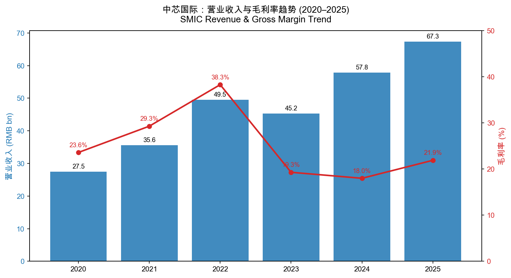
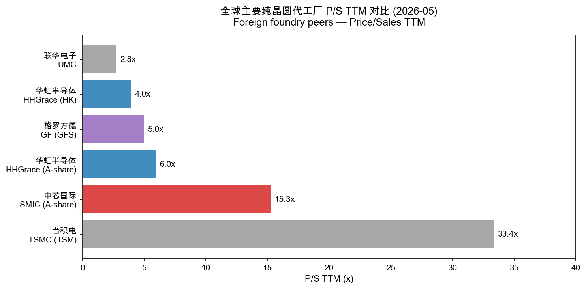
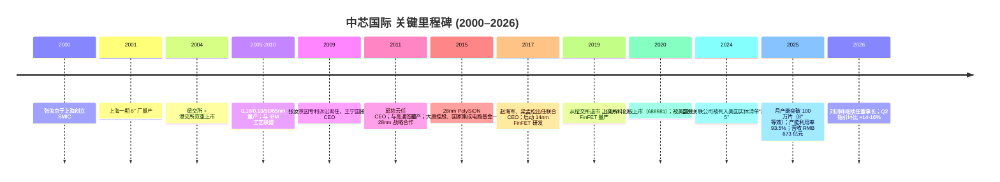
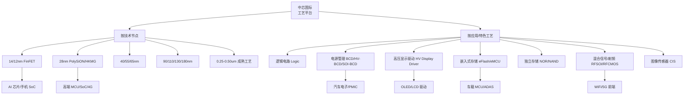
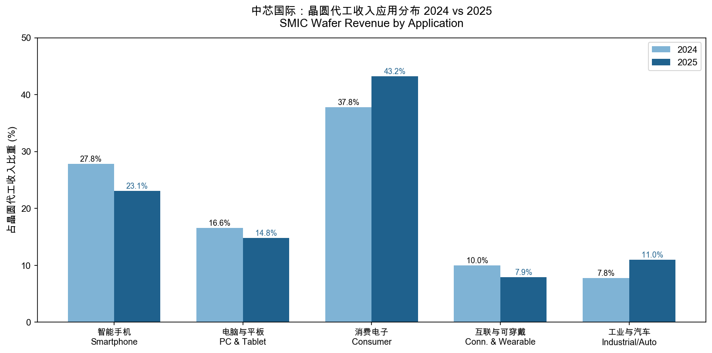
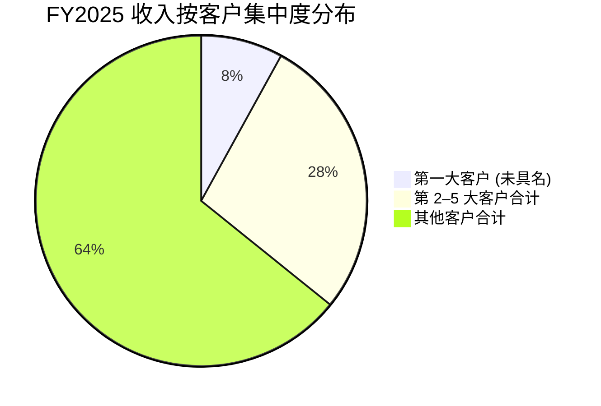
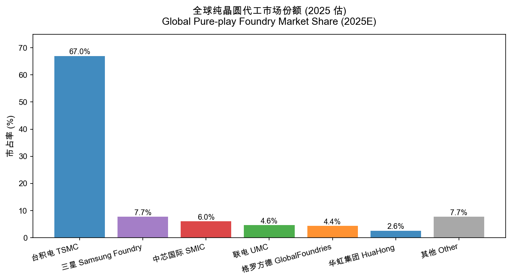
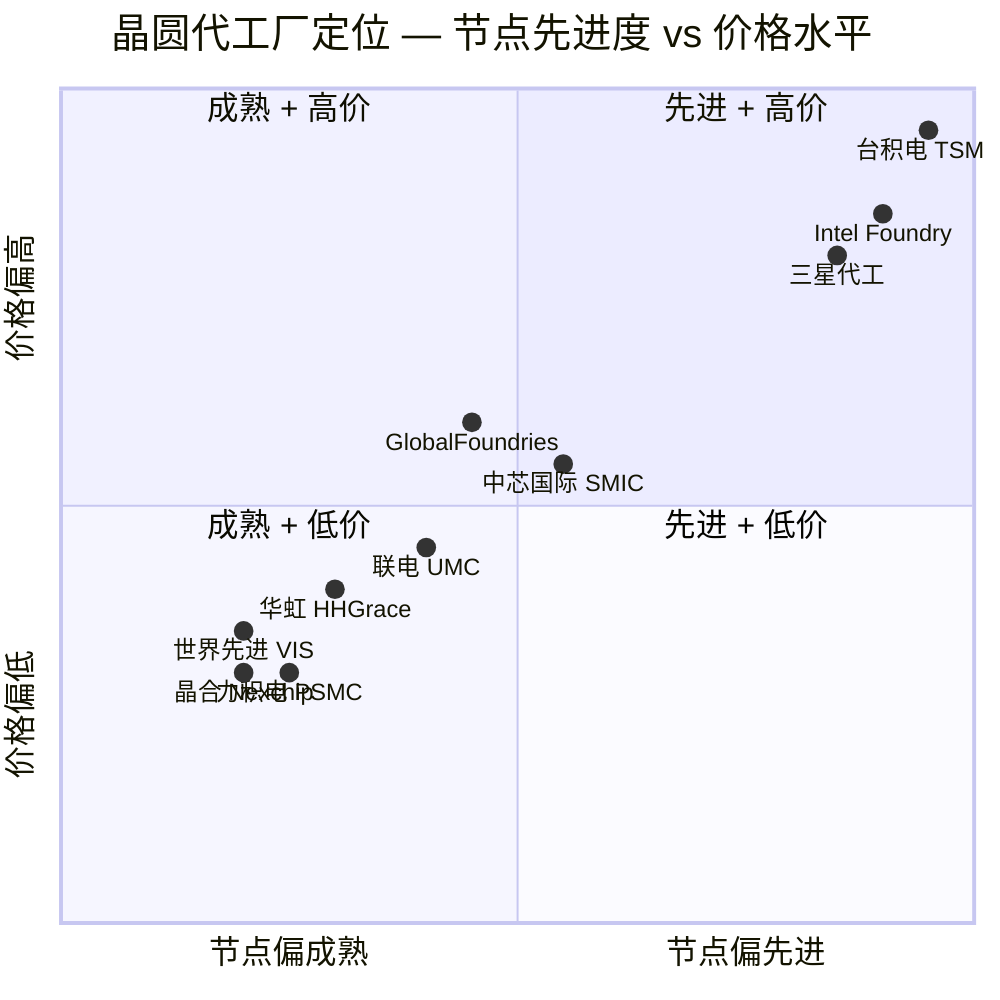
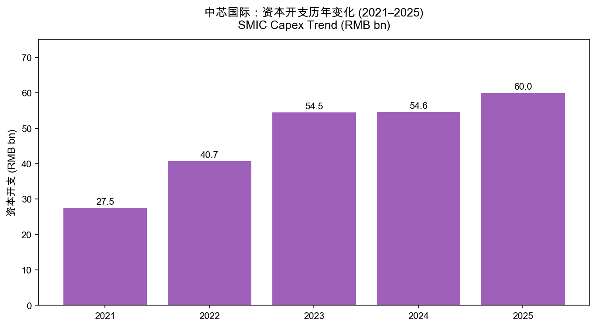

# 中芯国际 (SMIC) 公司研究报告

**报告日期 (Report date):** 2026-05-20
**主体 (Issuer):** 中芯国际集成电路制造有限公司 / Semiconductor Manufacturing International Corporation
**上市状态:** A 股 — 上交所科创板 **688981.SH**；H 股 — 香港联交所主板 **00981.HK**
**红筹企业 (red-chip),注册地:** 开曼群岛 Cricket Square, Hutchins Drive, Grand Cayman
**主要营业地:** 中国上海市浦东新区张江路 18 号；港股主要营业地 香港中环康乐广场 8 号交易广场一期 29 楼
**审计师:** 安永华明会计师事务所（特殊普通合伙）/ 安永会计师事务所（香港）

> **Update — 上调 2026 Q2 业绩指引 (2026-05-14):** 公司在 2026 年第一季度报告中将 Q2 收入指引设为环比增长 14%–16%，毛利率指引 20%–22%（较 Q1 指引上修约 2 个百分点）。管理层基于客户需求与在手订单，对全年运营情况"更加乐观"。Q1 收入 25.05 亿美元（环比 +0.7%）、毛利率 20.1%（环比 +0.9 pct）。来源：[中芯国际 2026 年第一季度报告, 2026-05-14, 第 2 页](http://static.cninfo.com.cn/finalpage/2026-05-14/) — 本地缓存于 `cninfo_reports/SSE/688981_中芯国际/2026-05-14_季报_中芯国际2026年第一季度报告.pdf`。

---

## 目录

1. 公司概览
2. 公司历史
3. 管理团队
4. 产品与服务
5. 客户与上市策略
6. 行业概览
7. 竞争格局
8. 市场机会 (TAM)
9. 风险评估
10. 参考资料

---

## 1. 公司概览 (Company Overview)

中芯国际（SMIC）是中国大陆规模最大、技术最先进的纯晶圆代工 (pure-play foundry) 企业，也是按 2024 年收入计全球第三、纯代工口径下全球第二大的代工厂（仅次于台积电 TSMC，与三星 Samsung Foundry 在 IDM 计算口径下呈竞争态势）。公司主营 8 英寸及 12 英寸晶圆代工服务，并提供设计服务与 IP 支持 (design service & IP)、光掩模制造 (photomask) 等配套服务，构成"晶圆代工 + 平台式生态"的一体化模式 ([中芯国际 2025 年年度报告, 第 13 页](http://static.cninfo.com.cn/finalpage/2026-03-26/))。

**业务模式 (business model):** SMIC 收取客户的硅晶圆制造费 — 客户（多为 fabless 设计公司或部分 IDM）提交设计 (GDSII)，SMIC 在自有 8/12 英寸晶圆厂按客户工艺要求生产晶圆 (wafer) 并发货至客户指定封装/测试厂。收入按代工片数 × 平均售价确认。2025 年公司销售晶圆 969.7 万片（8" 等效），平均售价 RMB 6,476 元/片，相比 2024 年的 802.1 万片、RMB 6,639 元/片 — 量增 20.9%、价跌 2.5% ([2025 年年度报告, 第 25 页](http://static.cninfo.com.cn/finalpage/2026-03-26/))。

**经营足迹 (geographic footprint):**

- **产能基地：** 中芯上海、中芯北京、中芯天津、中芯深圳、中芯北方（北京）、中芯南方（上海）、中芯京城（北京）、中芯东方（上海）、中芯西青（天津）— 全部子公司位于中国大陆，截至 2025 年末月产能折合 8" 标准逻辑约 100 万片/月（2025 Q4 末 1,058,750 片，2026 Q1 末 1,078,250 片）([2026 年第一季度报告, 第 4 页](http://static.cninfo.com.cn/finalpage/2026-05-14/); [2025 年年度报告, 致股东的信, 第 6 页](http://static.cninfo.com.cn/finalpage/2026-03-26/))。
- **销售推广办公室:** 美国、欧洲、日本、中国台湾。
- **客户地域结构（2025）：** 中国区 85.6%、美国区 11.6%、欧亚区 2.8%；相比 2024 年中国区 84.6%、美国区 12.4%、欧亚区 3.0% — 国内化趋势持续 ([2025 年年度报告, 第 26 页](http://static.cninfo.com.cn/finalpage/2026-03-26/))。最新 2026 Q1 数据显示中国区占比进一步升至 88.9%、美国区降至 9.3%。

**规模 (scale):**

| 指标 | 2025 | 2024 | YoY |
|---|---|---|---|
| 营业收入 (RMB bn) | 67.32 | 57.80 | +16.5% |
| 归母净利润 (RMB bn) | 5.04 | 3.70 | +36.3% |
| 扣非归母净利润 (RMB bn) | 4.12 | 2.65 | +55.9% |
| 经营性现金流 (RMB bn) | 20.08 | 22.66 | -11.4% |
| EBITDA (RMB bn) | 37.76 | 31.56 | +19.6% |
| 资本开支 (RMB bn) | 59.95 | 54.55 | +9.9% |
| 总资产 (RMB bn) | 367.7 | 332.5 | +10.6% |
| 研发投入 (RMB bn) | 5.52 | 5.45 | +1.3% |
| 月产能 (千片/月, 8") | 1,058.75 | 973.25 | +8.8% |
| 产能利用率 | 93.5% (FY) | 85.6% (FY) | +7.9 pct |
| 销售晶圆量 (万片) | 969.7 | 802.1 | +20.9% |

来源：[中芯国际 2025 年年度报告, 第 7、25–27、致股东的信](http://static.cninfo.com.cn/finalpage/2026-03-26/)。

**员工与研发:** 2025 年末公司研发人员 2,403 人（占总人数 12.0%），博士 500 人、硕士 1,336 人；研发人员薪酬合计 RMB 13.98 亿元，人均薪酬 RMB 58.2 万元（[2025 年年度报告, 第 19 页](http://static.cninfo.com.cn/finalpage/2026-03-26/)）。

**Source:** [中芯国际 2025 年年度报告, 第 7 页](http://static.cninfo.com.cn/finalpage/2026-03-26/)；[2022 年年度报告, 第 9 页（提供 2020–2022 历史数据）](http://static.cninfo.com.cn/finalpage/2023-03-28/)。GM 2020–2022 为公司口径报告毛利率，2023–2025 为公司主营业务毛利率口径。

### 估值快照 (Valuation snapshot) — REQUIRED

**A 股 (688981.SH)：**

- 现价：RMB 128.52 元（截至 2026-05-20 收盘）
- 总市值：约 **RMB 1.030 万亿** (~ USD 142 bn)
- 52 周区间：RMB 128.17 – 137.63
- **TTM P/E ≈ 189×**，**TTM P/S ≈ 15.3×**（以 2025 全年营收 RMB 67.32 bn 与归母净利 RMB 5.04 bn + Q1-26 / Q1-25 净利持平计），P/B ≈ 6.87×
- 来源：[东方财富 — 中芯国际 688981 行情, 2026-05-20](https://quote.eastmoney.com/sh688981.html)（API: `push2.eastmoney.com/api/qt/stock/get?secid=1.688981`）

**H 股 (00981.HK)：**

- 现价：HKD 74.05（2026-05-20 收盘）
- 总市值：约 **HKD 593 bn (~ USD 76 bn)**
- TTM P/S ≈ 11.0×（HK 口径低于 A 股,主要因 A/H 价差，A 股 vs H 股折溢价长期处于 1.7–2.0×）
- 来源：[东方财富 — 中芯国际 00981.HK, 2026-05-20](https://quote.eastmoney.com/hk/00981.html)

**3 年区间 (2023–2025):** A 股 P/S 区间约 8–22×（2024 年中期约 8–10×，2025 H1 升至 20× 上方，2026 Q1 回调）；P/E 处于 80–250× 之间，剧烈波动主要由分子（市值）牵动而非分母（利润）。

**同业对比：**

| 公司 | 上市地 | TTM P/S | TTM P/E |
|---|---|---|---|
| 台积电 TSMC | NYSE: TSM | 33.4× | ~28× |
| **中芯国际 SMIC** | **A 股 688981** | **15.3×** | **189×** |
| **中芯国际 SMIC** | **H 股 00981** | **11.0×** | n/a* |
| 华虹半导体 HuaHong | A 股 688347 | 5.95× | 525× |
| 华虹半导体 HuaHong | H 股 01347 | 3.95× | n/a |
| 格罗方德 GlobalFoundries | NYSE: GFS | 4.99× | n/a |
| 联华电子 UMC | NYSE: UMC | 2.78× | ~16× |

\*东方财富 H 股 PE 数据缺失。来源：[东方财富各只代码行情, 2026-05-20](https://quote.eastmoney.com/)。

**Source:** [东方财富 push2 API 各代码, 2026-05-20](https://push2.eastmoney.com/api/qt/stock/get)（数据点见上表）。

**估值判断 — 极高 P/E (189×) 与中高 P/S (15.3×) 的解释：**

公司 TTM P/E 远高于 50× 阈值（约 4× 全 A 半导体板块中位），P/S 亦高于 15× — 主因有四：

1. **国产替代主题溢价 (national-champion premium).** SMIC 是 A 股市场中**唯一**具备国产高端逻辑工艺量产能力的纯代工厂；中美科技摩擦下，国家集成电路基金一、二、三期持续注资（详见股东结构）使其具备稀缺资产属性。2024 年公司及部分关联公司被列为美国实体清单"脚注 5"主体进一步强化了"自主可控"叙事 ([2025 年年度报告, 第 23 页风险因素 — 地缘政治风险](http://static.cninfo.com.cn/finalpage/2026-03-26/))。
2. **大额折旧拖累短期盈利 (capex-induced depreciation).** 2025 年资本开支 RMB 59.95 bn，相当于当年营收的 89%；累积折旧侵蚀利润导致 TTM 净利率仅 7.5%（5.04 / 67.32），而 EBITDA 利润率仍达 56.1%。市场基于 EBITDA/P 的视角更宽容（EV/EBITDA ≈ 27×，远低于 P/E）。
3. **AI / 算力本地化驱动的产能预期 (AI-driven capacity expansion).** 公司管理层在 2025 年报致股东信中明确指出"算力芯片及存储芯片贡献了整体市场规模增量的核心动能"，并提出 2026 年收入增幅"高于可比同业的平均值"目标 ([2025 年年度报告, 第 35 页 经营计划](http://static.cninfo.com.cn/finalpage/2026-03-26/))。
4. **A/H 价差结构性长存.** A 股 P/S 15.3× vs H 股 P/S 11.0×，溢价约 40%；2025–2026 年科创板半导体类公司估值整体高于港股同标的，A 股流动性溢价 + 内资偏好叠加。

**结论：** 估值显著偏贵但有结构性支撑；若 AI/汽车本地化需求延续 +28nm 良率/产能扩张如期落地，多重压缩风险有限；反之若全球 mature node 供过于求显化（2025 年报已明示"产能结构或将出现供过于求的局面"），P/S 重估至 8–10× 区间的下行风险显著。该估值压缩风险已纳入 §9 风险评估。

---

## 2. 公司历史 (Company History)

中芯国际于 2000 年 4 月 3 日由张汝京 (Richard Chang) 在上海创立，是当时大陆最具雄心的纯代工 (foundry) 项目。张汝京曾任职美国德州仪器与世大半导体 (WSMC)；世大被台积电收购后，他率台籍工程师团队赴沪二次创业。SMIC 的founding thesis：填补中国大陆在先进逻辑代工环节的空白，承接国际客户对大陆代工产能的潜在需求。

公司 2004 年同步在纽交所 (NYSE: SMI) 与香港联交所 (00981) 双重上市，是当时中国大陆首家在美 H 同时上市的半导体企业。2019 年 5 月公司从纽交所退市；2020 年 7 月以"科创板第一股"姿态登陆上交所科创板（A 股代码 688981），首发集资 RMB 532 亿元，是当时科创板规模最大的 IPO。

来源：[SMIC 公司官网 — About SMIC](https://www.smics.com/en/site/company_milestone)；[2025 年年度报告 — 致股东的信](http://static.cninfo.com.cn/finalpage/2026-03-26/)；[2025 年年度报告 — 风险因素 §地缘政治, 第 23 页](http://static.cninfo.com.cn/finalpage/2026-03-26/)。

**关键战略转折 (strategic pivots):**

1. **2009 年专利和解 + 张汝京离任.** 2003–2006 年与台积电的两轮专利诉讼以 SMIC 支付 USD 200M + 增发 8% 股权和解告终；张汝京随即辞任。公司由"快速追赶台积电"的工程师文化，转向"差异化特色工艺 + 国资支持"的双轨发展。
2. **2014–2017 年国家集成电路基金入股 + 双 CEO 体制.** 国家集成电路基金一期通过鑫芯香港持股，叠加大唐控股（中国信科系）的策略性持股，使 SMIC 成为"国家队"事实上的旗舰平台。2017 年赵海军、梁孟松出任联合 CEO，从台积电、三星挖来的工程团队推动 14/28nm FinFET 研发节奏明显加快。
3. **2020 年实体清单后的"本地化加速".** 公司原计划与 ASML 合作引进 EUV 光刻机以推进 7nm 以下节点，但美国 BIS 限制后该路径中止。SMIC 转向**深耕 28nm 及以上"成熟与特色"节点**（BCD、HV 显示驱动、车规闪存、SOI 射频等），并通过 DUV 多重曝光开发 N+1/N+2 工艺。

**重要参股/并购事项 (2023–2025):**

- 2025-06-05: 子公司中芯控股签署协议，拟将参股公司中芯宁波 14.832% 股权出售给国科微 (300672.SZ)；2025-11-28 因价款未谈拢终止交易 ([2025 年年度报告, 第 34 页](http://static.cninfo.com.cn/finalpage/2026-03-26/))。
- 2025 年实质性推进**中芯北方少数股权收购、中芯南方增资扩股**（致股东的信）。

---

## 3. 管理团队 (Management Team)

### 刘训峰博士 — 董事长、执行董事 (Chairman, Executive Director) — 250–350 字

刘训峰博士现任中芯国际董事长、执行董事，亦担任公司若干子公司董事或董事长，同时为第十四届全国政协委员。刘博士拥有逾 30 年大型产业集团管理经验，履历完全在国资体系内：早年历任中国石化上海石油化工股份有限公司乙烯厂副总工程师、投资工程部副主任、总经理助理、副总经理；上海赛科石油化工有限责任公司副总经理；上海化学工业区发展有限公司副总经理及副董事长。2012—2022 年期间任**上海华谊（集团）公司**党委副书记、总裁、党委书记、董事长，将华谊集团从传统化工集团转型为以化工新材料、精细化工、能源化工为主的产业平台。2022 年起任上海华谊控股集团有限公司董事长，并兼任中国石油和化学工业联合会副会长。刘博士并非半导体出身，其任命反映出 SMIC 大股东（大唐 + 国家集成电路基金）希望以国资综合型管理者统筹整体战略与产能落地，技术决策则由两位联合 CEO（赵海军、梁孟松）主导。教育背景：西安交通大学管理科学与工程博士、中欧国际工商学院 EMBA、华东理工大学化学工程硕士，教授级高级工程师；曾获上海市工商业领军人物、上海市优秀企业家等。来源：[2025 年年度报告 §董事简介, 第 43 页](http://static.cninfo.com.cn/finalpage/2026-03-26/)。

### 赵海军博士 — 联合首席执行官 (Co-CEO) — 150–200 字

赵海军博士与梁孟松博士共同担任联合首席执行官，负责日常运营与战略执行。赵博士拥有逾 30 年半导体营运及技术研发经验：2010—2016 年历任 SMIC 首席运营官兼执行副总裁、中芯北方总经理；2017—2022 年任执行董事；2017 年起出任联合 CEO。赵博士的强项是**晶圆厂运营与产能爬坡** — 中芯北方期间将北京 12" 厂产能从初期月 3.5 万片爬升至超过 6 万片，并在 28nm PolySiON 量产中起到关键作用。教育背景：清华大学无线电电子学学士、博士，美国芝加哥大学商学院 MBA。来源：[2025 年年度报告 §高管简介, 第 44 页](http://static.cninfo.com.cn/finalpage/2026-03-26/)。

### 梁孟松博士 — 联合首席执行官 (Co-CEO) — 150–200 字

梁孟松博士与赵海军共同担任联合 CEO，负责先进工艺研发。梁博士在半导体业界拥有逾 40 年经验，是华人半导体界最具传奇色彩的工艺专家之一：曾任台积电资深研发副总经理，主导台积电 130/90/65/40/28nm 多个关键节点研发；2009 年离开台积电后加盟三星半导体，主导三星 14nm FinFET 量产，对台积电造成实质技术挑战，并因此引发台积电 vs 三星专利诉讼。2017 年加盟 SMIC 后主导 28nm HKMG、14/12nm FinFET、N+1/N+2 等节点研发，并于 2019 年实现 14nm FinFET 量产。梁博士拥有逾 450 项专利、350 余篇技术论文，IEEE Fellow。教育：美国 UC Berkeley 电机工程与计算机科学博士。来源：[2025 年年度报告 §高管简介, 第 44 页](http://static.cninfo.com.cn/finalpage/2026-03-26/)。

### 吴俊峰博士 — 资深副总裁、财务负责人 (Sr. VP, CFO) — 100–150 字

吴俊峰博士任公司资深副总裁、财务负责人，并担任公司若干子公司董事。吴博士此前任中国广核集团有限公司党委常委、总会计师、董事会秘书及中广核财务有限责任公司董事长；新希望集团有限公司领导小组成员、首席财务官、新希望财务公司董事长。其国资央企 + 民营集团 CFO 双重经历对 SMIC 平衡国家集成电路基金大股东诉求与境外股东治理框架具有针对性。教育：西南财经大学博士，ACCA 会员、中国注册会计师、高级会计师；西南财经大学博士生导师、ACCA 中国智库专家。来源：[2025 年年度报告 §高管简介, 第 44–45 页](http://static.cninfo.com.cn/finalpage/2026-03-26/)。

### 张昕 — 资深副总裁，工艺研发负责人 — 80 字

张昕先生任公司资深副总裁，并担任若干子公司及参股公司董事或董事长，同时担任中关村集成电路产业联盟理事长、中国集成电路创新联盟（大联盟）专家咨询委员会委员。先后任职于台积电及格罗方德半导体管理岗位，长期深耕集成电路制造领域，对引进国际工艺管理经验具关键作用。教育：清华大学电子工程电子物理学士、硕士。来源：[2025 年年度报告 §核心技术人员, 第 45 页](http://static.cninfo.com.cn/finalpage/2026-03-26/)。

### 治理结构 (governance footer)

- **董事会构成 (Board composition):** 共 9 名董事，其中执行董事 1 名（刘训峰），非执行董事 4 名（鲁国庆、陈山枝代表中国信科；杨鲁闽代表华芯投资管理 / 国家集成电路基金；黄登山代表国家集成电路基金一/二/三期），独立非执行董事 4 名（范仁达、刘明、吴汉明、陈信元）。独立董事占比 4/9 = 44.4%，符合《香港上市规则》第 3.10 条与《科创板上市规则》"不少于三分之一"要求 ([2025 年年度报告 §董事会构成, 第 43–44 页](http://static.cninfo.com.cn/finalpage/2026-03-26/))。
- **股权结构 (截至 2025-12-31):** HKSCC Nominees Ltd（港股名义持有）56.29%；大唐控股（香港）投资有限公司（中国信科全资附属）14.06%；鑫芯（香港）投资有限公司（国家集成电路基金一期附属）约 4.50%；中国信息通信科技集团直接持有 + 间接持有合计 14.97%；国家集成电路基金一期合并权益约 9.25%。两大国资股东合计持有约 25–26%，**事实上是公司的实际控制权基础**。([2025 年年度报告 §主要股东权益, 第 114 页](http://static.cninfo.com.cn/finalpage/2026-03-26/))。
- **公司治理特殊安排:** 公司为开曼注册红筹企业 — 同时遵守《香港上市规则》《科创板上市规则》与《开曼群岛公司法》。不存在 VIE 协议控制结构、不存在表决权差异安排（同股同权）([2025 年年度报告, 第 2 页 §公司治理特殊安排](http://static.cninfo.com.cn/finalpage/2026-03-26/))。
- **审计师:** 安永华明会计师事务所连续多年出具标准无保留意见审计报告，2025 年度签字会计师为孟冬、顾凡。

### 管理团队 track record 综合判断

SMIC 当前管理层呈现"**国资 + 行业老兵**"双轨结构：刘训峰提供国资背景下与监管机构、央地政府、产业链上下游的协调能力；赵海军 + 梁孟松提供晶圆制造的真正业务深度（梁尤其重要 — 全球能领导 28nm 至 14nm FinFET 量产的工艺专家屈指可数）。该结构 2017 年以来已交付：14nm FinFET 量产、产能从月 ~50 万片倍增至 >100 万片（8" 等效）、2025 年扭转 2023–2024 年的盈利下滑趋势。主要不确定性为联合 CEO 接班 — 赵、梁均已临近或超过传统退休年龄，公司未公开继任计划。

---

## 4. 产品与服务 (Products & Services)

中芯国际的产品本质上是 **"工艺平台 + 客户晶圆"** 的服务，而非物理 SKU。公司对客户开放的工艺平台按节点 + 应用维度划分，2025 年报披露的核心技术平台包括：逻辑电路、电源/模拟 (BCD)、高压显示驱动 (HV Display Driver)、嵌入式非易失性存储 (eNVM/eFlash)、独立式非易失性存储 (NOR/NAND)、混合信号/射频 (MS/RF, RFSOI)、图像传感器 (CIS) — 覆盖**智能手机、电脑与平板、消费电子、互联与可穿戴、工业与汽车**五大应用 ([2025 年年度报告, 第 16 页 §丰富产品平台和知名品牌优势](http://static.cninfo.com.cn/finalpage/2026-03-26/))。

来源：[2025 年年度报告, 第 18 页 §在研项目情况](http://static.cninfo.com.cn/finalpage/2026-03-26/) 与 [SMIC 官网 — Process Platforms](https://www.smics.com/en/site/Process_Platforms_2)。

### 2025 年在研项目（7 项核心研发项目，公司报告披露）

| # | 平台 | 进展 | 应用 |
|---|---|---|---|
| 1 | 28nm 超低漏电平台 | 已发布新一代 PDK/标准单元库、存储编译器；多产品验证 | 物联网、移动通讯、智能手机、数字电视、机顶盒 |
| 2 | 28nm 嵌入式闪存 | 关键工艺完成，SRAM/闪存基本功能实现 | 车载域控、ADAS 高端 MCU |
| 3 | 65nm RF-SOI 平台 | 新一代 PDK 发布，客户验证 | 智能手机、WiFi 射频前端 |
| 4 | 90nm BCD 平台 | 低压/中压 PDK 发布，客户新产品设计中 | 电源管理、音频功放、车用芯片 |
| 5 | 8" BCD/模拟 | 汽车系统 BCD 平台产品导入；SOI BCD 工艺完成 | 电源管理、工业、车规 |
| 6 | 0.18μm 嵌入式存储车用平台 | 工艺开发完成，PDK 制作中 | 工业、车用 |
| 7 | 中大尺寸高压显示驱动 | 中尺寸已规模量产；大尺寸 PDK 制作中 | 中大尺寸屏 + 车载屏显示驱动 |

来源：[2025 年年度报告, 第 18 页 §在研项目情况](http://static.cninfo.com.cn/finalpage/2026-03-26/)。

### 旗舰 vs 长尾 (Flagship vs Long-tail)

**晶圆代工 (集成电路晶圆制造代工) — 旗舰**，2025 年贡献 **RMB 627.94 亿元收入**、占主营业务 94.3%，毛利率 21.3%（vs 2024 年 18.6%，+2.7 pct）。**其他主营业务**（设计服务/IP/光掩模）RMB 37.86 亿元、占 5.7%，毛利率 32.0%（更高，但规模小）。来源：[2025 年年度报告, 第 26 页 §主营业务分产品情况](http://static.cninfo.com.cn/finalpage/2026-03-26/)。

按节点维度，公司未单独披露 14nm 的收入贡献。第三方研究（参见 §7）估算 14/28nm 合计约占公司晶圆收入 30–40%，节点结构相对 TSMC（先进节点占比 70%+）明显偏成熟，但相对 UMC、HHGrace 偏先进。

按晶圆尺寸：2025 年 12" 占 77.1%（2024: 77.3%）、8" 占 22.9%，结构稳定 — 公司过去几年的扩产集中在 12" 厂。

### 每产品/平台的护城河评估

**14/12nm FinFET 逻辑平台：完全护城河 (technology + regulatory)**。中国大陆唯一商用 14nm FinFET 量产能力；该工艺需要 14nm 节点的 DUV 多重曝光 + FinFET 集成经验，国内**没有第二家**；同时美国实体清单管制使大陆设计公司无法在 TSMC 流片 14nm 以下若 SMIC 工艺仍能被验证为 "可获得 (foreign-direct-product rule)"，则进一步受限 — 客观上抬高了 SMIC 在国内 14nm 流片市场的份额。最接近竞品：[TSMC 16FFC](https://www.tsmc.com/english/dedicatedFoundry/technology/logic/l_16_12nm)（性能/良率均领先）。SMIC 在该节点为大陆相对独家。

**28nm PolySiON/HKMG：部分护城河 (scale + Chinese-customer access)**。28nm 大陆有 HHGrace 部分支持但产能与良率落后 SMIC；台积电 28nm 仍是全球最大 mature node 工艺收入来源，但对部分大陆客户因合规审查交付不畅。SMIC 28nm 在国内 ISP、Wi-Fi MCU、汽车 MCU 市场具相对优势。最接近竞品：[TSMC 28HPC+](https://www.tsmc.com/english/dedicatedFoundry/technology/logic/l_28nm)、UMC 28HPC。SMIC 在大陆客户 28nm 流片量份额估算 50%+。

**40/55/65nm 特色工艺 (BCD / HV Display / RFSOI / eFlash)：部分护城河 (specialized capacity + ecosystem)**。SMIC 在这些节点提供与 HHGrace、华润微等大陆竞争对手相比更广泛的工艺组合（BCD 中高压、SOI 射频、车规 eFlash），是大陆 PMIC、OLED 驱动 IC、汽车 MCU 设计公司主要代工伙伴。竞品：HHGrace（BCD/HV），世界先进 VIS（驱动 IC），UMC（RFSOI），格罗方德（22FDX）。SMIC 处于"对内领先、对外参与"位置。

**90nm 及更老节点：低护城河 (commodity capacity)**。8" 标准 CMOS、110/130/180nm 等成熟节点为大宗代工市场，竞品丰富（HHGrace、华润微、晶合集成、世界先进）。该部分以产能利用率和价格竞争。

### 近 12 个月产品/平台动态

- **2025 年新设立"先进封装研究院"** — 公司在致股东的信中明确披露，反映 chiplet/2.5D/CoWoS 类先进封装的国产化布局。具体合作细节未在年报披露。来源：[2025 年年度报告 — 致股东的信](http://static.cninfo.com.cn/finalpage/2026-03-26/)。
- **车规 eFlash（28nm 嵌入式闪存）持续推进** — 该平台一旦量产将填补国内车规级 MCU 工艺空白，是 2026–2027 年最值得跟踪的项目。
- **新增专利：** 2025 年新增发明专利申请 290 项、获授权 509 项；截至 2025-12-31 累计授权专利 14,511 件（含发明专利 12,621 件）+ 集成电路布图设计权 94 件。来源：[2025 年年度报告, 第 17 页 §知识产权列表](http://static.cninfo.com.cn/finalpage/2026-03-26/)。

**Source:** [2025 年年度报告, 第 26 页 §集成电路晶圆制造代工收入分析](http://static.cninfo.com.cn/finalpage/2026-03-26/)。

注：**消费电子 2025 升至 43.2%（+5.4 pct YoY）；智能手机降至 23.1%（-4.7 pct YoY）；工业与汽车升至 11.0%（+3.2 pct YoY）**。消费电子主导反映 IoT、可穿戴、家电主控、显示驱动等芯片国产化加速；工业与汽车上升反映 BCD、车规 MCU 项目导入。

---

## 5. 客户与上市策略 (Customers & Go-to-Market)

**客户类型：** SMIC 客户以全球 fabless 设计公司为主，少量 IDM 客户；公司主要客户为境内外集成电路设计公司及 IDM 企业，**规模较大、信用水平较高、应收账款回款良好** ([2025 年年度报告, 第 22 页 §财务风险.资产减值风险](http://static.cninfo.com.cn/finalpage/2026-03-26/))。

按地域：**2025 年中国区 85.6%、美国区 11.6%、欧亚区 2.8%**；最新 **2026 Q1 中国区进一步升至 88.9%、美国区降至 9.3%、欧亚区 1.8%**。中国客户占比持续上升反映双重逻辑：(a) 实体清单后部分原美国客户由 SMIC 转向 TSMC/Samsung 代工以规避合规风险；(b) 大陆 fabless 行业自身高速增长 + 在地化生产需求 + 终端品牌"国产替代"。来源：[2025 年年度报告, 第 26 页](http://static.cninfo.com.cn/finalpage/2026-03-26/) 与 [2026 年第一季度报告, 第 4 页](http://static.cninfo.com.cn/finalpage/2026-05-14/)。

### 客户集中度 (Customer Concentration) — REQUIRED

公司在 2025 年年度报告 §主要销售客户及主要供应商情况 (第 27 页) 披露：

> "本报告期内，第一名和前五名客户销售额分别占年度主营业务收入的 **8.0%** 和 **35.8%**；其中前五名客户交易中无关联方销售。"

历史对比（自 2022 年起公司开始系统披露此数据）：

| 年份 | 第一大客户占比 | 前五大客户占比 |
|---|---|---|
| 2025 | 8.0% | 35.8% |
| 2024 | 12.0% (估)\* | ~36% (估)\* |
| 2023 | 13.7% | 38.5% |
| 2022 | 16.4% | 40.0% |

\*2024 完整数据应在 [2024 年年度报告 §前五大客户](http://static.cninfo.com.cn/finalpage/2025-03-27/) 查证；本研究未单独核实 2024 数据，仅供方向参考。

**判断:** SMIC 第一大客户 8.0% **远低于 20% 风险阈值**，前五大客户 35.8% 也低于 50% 阈值 — **客户集中度不构成材质性风险**，反而显示客户分散性较好；这与晶圆代工行业 fabless 客户群体多元的格局一致。年报亦未点名披露任何前五大客户名称（行业惯例），但公司 IR 沟通与第三方分析常提及 **高通 (Qualcomm)、博通 (Broadcom)、海思 (HiSilicon)、紫光展锐 (UNISOC)、Cirrus Logic、汇顶科技 (Goodix, SH:603160)、韦尔股份 (Will, SH:603501) — OmniVision 子品牌**为长期合作客户（具体占比不可考）。

来源：[2025 年年度报告, 第 27 页 §A. 公司主要销售客户情况](http://static.cninfo.com.cn/finalpage/2026-03-26/)。

**合同结构：** 公司年报披露"销售部门与客户签订订单"，并未披露具体多年期或单笔订单结构，亦无重大单一销售合同披露 ([2025 年年度报告, 第 14 页 §营销及销售模式](http://static.cninfo.com.cn/finalpage/2026-03-26/))。代工行业惯例为 MPW (multi-project wafer) 启动 + 客户订单 (PO) 滚动确认 — 客户通常按月或按季提交滚动产能预订；进入大批量后多以战略合作框架 + 季度调整方式运行。

**供应商集中度（补充）：** 2025 年前五大原材料供应商采购额占年度原材料采购总额的 **25.7%**，无关联方采购 ([2025 年年度报告, 第 27 页 §B. 公司主要供应商情况](http://static.cninfo.com.cn/finalpage/2026-03-26/))。供应商主要为 ASML (光刻)、Applied Materials (沉积/刻蚀)、Tokyo Electron、Lam Research、KLA、SK 海力士 / 江丰电子 (材料) — 其中前三大设备供应商均为美国/荷兰/日本企业，受 BIS 出口管制影响显著。

### 渠道与营销 (Distribution & GTM)

SMIC 采用**直销模式 (100%)** — 2025 年报披露"主营业务分销售模式"中直销模式占 100%（[第 26 页](http://static.cninfo.com.cn/finalpage/2026-03-26/)）。具体路径为：

1. **市场推广办公室主动拓展**（美国、欧洲、日本、中国台湾、上海）。
2. **生态合作引流**：与设计服务公司 (DSP)、IP 供应商 (Synopsys、Cadence、ARM)、EDA 厂商、封装测试厂 (长电、通富、华天、JCET)、行业协会及各集成电路产业促进中心合作建立合作关系。
3. **技术研讨会 / 学术会议**：SMIC Technology Symposium 等。
4. **公司网站 + 口碑**：客户主动联系。

销售周期典型为 **6–18 个月**：MPW 流片 (1–2 月) → 工程晶圆 (2–4 月) → 风险量产 (3–6 月) → 大批量 (3–6 月后)。大客户协议通常为框架合作 + 滚动采购，新工艺平台需经 12–24 个月客户验证才能转为量产。

### 关键合作伙伴 / 案例

- **设计服务/IP 生态**: SMIC 与 ARM、Synopsys、Cadence 均有平台 PDK 与 IP 移植合作（IP / library 通常在 28nm / 14nm 节点同步），具体合作公告散见公司新闻稿。
- **国内 fabless 重要合作**: 公开信息显示韦尔股份 (Will Semi) CIS、汇顶科技 (Goodix) 触控/指纹芯片、紫光展锐 (UNISOC) 4G/5G 通信 SoC、矽力杰 (Silergy)、卓胜微 (Maxscend, SZ:300782) 射频 — 均在 SMIC 不同节点流片。具体收入贡献未公开。
- **设备/封装合作**: 2025 年公司成立"先进封装研究院"，与中芯长电（前合资公司，已分拆）及国内封装产业链开展 chiplet/2.5D 封装合作。

---

## 6. 行业概览 (Industry Overview)

### 行业定义与范围

中芯国际所处行业为**集成电路晶圆代工 (semiconductor foundry)**，是半导体产业链中的**制造 (front-end fabrication)** 环节。完整产业链分工 — 设计 (fabless) → 代工 (foundry) → 封测 (OSAT)。在 IDM (integrated device manufacturer) 模式下设计 + 制造 + 封测均由同一公司完成（典型如英特尔、三星、SK 海力士、美光），而在 fabless–foundry 模式下，设计公司专注 IP/SoC 而代工厂专注产能/工艺。

按工艺分类：**先进节点 (advanced node) ≤7nm**（仅 TSMC、Samsung、Intel Foundry）；**成熟节点 (mature node) ≥14nm**（涵盖 SMIC、HHGrace、UMC、GlobalFoundries、VIS、Tower、Powerchip 等）。SMIC 14nm 处于"先进节点边缘 / 成熟节点上限"位置。

### 市场规模与增速

根据**世界半导体贸易统计组织 (WSTS)** 与第三方研究机构数据：

- **2024 年全球半导体市场规模:** USD 627 bn（同比 +19.1%）。 [WSTS Global Semiconductor Forecast — Spring 2025](https://www.wsts.org/76/Recent-News-Release)。
- **2025 年预测/实际:** WSTS 2025 春季预测全球半导体市场达 **USD 697 bn（+11.2%）**；同期实际由 AI/HBM 推动可能更高 ([WSTS 2025 年春季预测, 2025-05](https://www.wsts.org/esraCMS/extension/media/f/WST/8000/CNF_Spring_Forecast_2025.pdf))。
- **2026 年预测:** WSTS 预测 USD 760+ bn（+9%）；TrendForce / Counterpoint 给出 USD 800–820 bn 的乐观区间。

**全球晶圆代工市场（pure-play foundry）口径：**

- 2024 年: USD ~143 bn (TrendForce)；2025 年: USD ~180 bn (估算)；2026 年: USD ~200 bn。
- 增速：2024 +24% / 2025 +26% / 2026E +12%。
- 2023 年因消费电子去库存出现 -10% 收缩，2024-2026 进入新一轮上行周期，主要驱动来自 **AI 数据中心 (HPC/AI 加速器)** 与 **汽车电子 (smart cockpit / ADAS)**，部分领域受**存储 AI HBM 涨价**带动 mature node 价格回升。

来源：[TrendForce — 2024 Global Foundry Revenue Forecast](https://www.trendforce.com/news/)（公开发布版本，2025）。

### 关键趋势 (Key Trends)

1. **AI / 算力驱动先进节点+先进封装爆发**: 2024–2025 年 AI GPU/ASIC 需求(NVIDIA H200/B200/B300、AMD MI300/MI350、Google TPU、各大云端自研 ASIC) 使台积电 N3/N4P/N5 满产，CoWoS 先进封装产能成为瓶颈。SMIC 此趋势中受益较小（无 ≤7nm 工艺），但**国内 AI 推理 ASIC**（寒武纪、海光、燧原、华为昇腾系列）部分流片在 14nm/28nm，对 SMIC 有正向贡献。
2. **汽车电子半导体含量持续提升**: ICV 单车半导体价值从内燃机时代 USD 300-400 提升至电动智能车 USD 1,500-3,000。SMIC 工业与汽车 2025 占晶圆收入 11.0% (vs 2024: 7.8%, 2023: ~5%)，2026 Q1 进一步升至 14.0%，是公司最快增长的应用。来源：[2025 年年度报告, 第 26 页](http://static.cninfo.com.cn/finalpage/2026-03-26/) + [2026 Q1 报告, 第 4 页](http://static.cninfo.com.cn/finalpage/2026-05-14/)。
3. **半导体在地化 (regionalization)**: 美国 CHIPS Act (2022)、欧洲 Chips Act (2023)、日韩台 + 大陆"自主可控"政策同时推动产能建设。"产业链海外回流、国内客户新产品替代海外老产品的效应将持续下去" — SMIC 2025 年报致股东的信明确指出。
4. **mature node 产能潜在过剩**: SMIC 自身在 2025 年报 §行业竞争风险中警告"产能结构或将出现供过于求的局面" — 中国大陆 2023-2027 年规划新建/扩产逾 30 座晶圆厂（华虹九厂、晶合二厂、长鑫、长江存储、积塔、燕东、青岛芯恩等），多数集中在 28-90nm mature node。短期 (2026-2027) 因 AI/汽车需求消化产能；中期 (2028+) mature node 价格压力风险显著。
5. **EUV 受限与 N+1/N+2 工艺路径**: 由于无法获得 ASML EUV 光刻机（NXE:3600D, NXE:3800E），SMIC 7nm 及以下需通过 DUV 多重曝光实现 — 业界公认 SMIC 已有 7nm 级别 (N+2) 工艺并被用于华为 Kirin 9000S / 9010 (2023 Mate 60 系列)，但公司未公开承认。良率与成本仍是核心问题。

### 监管环境

- **美国 BIS 出口管制**: 2020-10 SMIC 列入实体清单；2022-10 BIS 发布对中国先进半导体制造的全面管制（10nm 以下 logic、18nm 以下 DRAM、128 层 NAND 设备出口限制）；2024 关联公司列入"脚注 5"主体。
- **NS-CMIC 清单**: 部分美国投资人受财政部"非 SDN 中国军事综合体企业清单"限制不能持有 SMIC ADR/股份 ([2025 年年度报告, 第 23 页 §地缘政治风险](http://static.cninfo.com.cn/finalpage/2026-03-26/))。
- **国务院 [2020]8 号文**: "新时期促进集成电路产业和软件产业高质量发展若干政策" — 提供税收、研发、人才、知识产权等多维支持；SMIC 2025 年享受高新技术企业 15% 所得税优惠及大量地方与中央政府补助（计入营业外收入、其他收益）。
- **A 股科创板规则**: 适用于 A 股部分（688981），包括限售解禁、增减持披露、关联交易披露等。同时遵守港交所主板《上市规则》。

### 行业结构

- **集中度：** 全球纯代工市场高度集中 — 台积电 2024 年市占率 ~67%、三星（IDM 含代工）~9%、SMIC ~6%、UMC ~5%、GlobalFoundries ~4%、HHGrace ~3% — 前 6 名占 90%+。
- **进入壁垒：** 极高 — 单座 12" 厂资本开支 USD 5-15 bn、爬坡周期 2-3 年、工艺研发投入年均 USD 1-5 bn、客户验证周期 18-36 月。
- **议价能力：** 上游设备供应商 (ASML、AMAT、TEL、Lam、KLA) 议价能力强（ASML EUV 实质独占）；下游客户对 mature node 议价能力强（多家可选）、对 advanced node 议价能力弱（仅 TSMC/Samsung 可选）。
- **替代品威胁：** chiplet / 异构集成可降低对单一先进节点的依赖；SiC/GaN 化合物半导体替代部分硅功率器件 — 但对 SMIC 主营 logic/mixed-signal 影响有限。

---

## 7. 竞争格局 (Competitive Landscape)

### 主要竞争对手 (5–10)

| 公司 | 角色 | 2025 营收 (USD bn) | 与 SMIC 的相对位置 |
|---|---|---|---|
| **台积电 TSMC (TPE: 2330 / NYSE: TSM)** | 全球龙头 | ~90+ (预计) | 在所有节点全面领先；7nm 以下独占 |
| **三星 Samsung Foundry (KOSDAQ IDM 内)** | 第二 | ~20 (估) | 3/4nm 与 TSMC 竞争；但客户流失中 |
| **联电 UMC (TPE: 2303 / NYSE: UMC)** | 成熟节点专家 | ~7.5 | 14nm 退守；28nm 与 SMIC 直接竞争 |
| **格罗方德 GlobalFoundries (NYSE: GFS)** | 特色工艺 | ~6.7 | 22FDX (FD-SOI) 与 SMIC 28HKMG 竞争；车规优势 |
| **华虹半导体 HHGrace (HK: 01347 / SH: 688347)** | 大陆第二 | ~2.5 | 8" + 12" 特色工艺；BCD/eFlash 与 SMIC 直接对标 |
| **力积电 PSMC (TPE: 6770)** | 台湾成熟代工 | ~1.8 | 8"/12" DRAM + Logic |
| **世界先进 VIS (TPE: 5347)** | 显示驱动 + PMIC | ~1.3 | 与 SMIC 显示驱动 + 模拟竞争 |
| **晶合集成 Nexchip (SH: 688249)** | 大陆第三 | ~1.4 (2025) | DDIC 主导，扩展 28nm Logic |
| **粤芯半导体 CanSemi** | 大陆模拟 + 特色 | n/a (未上市) | 模拟 + 功率 + RFCMOS |
| **Tower / Powerchip / DongbuHiTek** | 中小代工 | 各 ~1.0 | 各自细分应用 |

来源：各公司 2024–2025 年报 + [TrendForce — 2024Q4 Foundry Ranking](https://www.trendforce.com/news/2025/03/12/news-tsmc-leads-2024-pure-play-foundry-market-with-67-percent-share-smic-ranks-third-trendforce/)。

**Source:** 估算综合 [TrendForce 季度榜单, 2025](https://www.trendforce.com/news/) + 各公司 2024–2025 年报披露 (TSMC 67%、SMIC 6%、UMC 4.6%、GFS 4.4%、HHGrace 2.6%)。SMIC 与 UMC、GFS 在纯代工口径下基本势均力敌、轮流位列全球第二/三。

### 定位框架（价格 × 技术节点 × 特色工艺）

**对该象限的解读:**

- **SMIC 处于"次先进 + 中等价格"区间** — 在节点维度上与 GFS、UMC 大致同处 14/22nm 边缘地带；在价格维度上略低于 GFS（GFS 22FDX 议价能力较强），略高于 HHGrace、晶合。
- **TSMC 在象限右上方独占 7nm 以下;** SMIC 与之的差距是 3-4 个节点代（~6-8 年），但在大陆 14/28nm 市场具相对独占。
- **GlobalFoundries 与 SMIC 在 22nm 高压 / 车规 / RF-SOI** 多个细分平台正面竞争 — GFS 在欧美客户具优势，SMIC 在大陆客户具优势 — 两者基本不交叉。

### SMIC 的相对优势 (Competitive Advantages)

1. **国家战略地位 / 资本支持**: 国家集成电路基金一、二、三期连续注资，2024-2025 单年获得资本注资 RMB 100+ 亿元（合并报表少数股东资本注资），可持续支撑年均 RMB 50-60 bn 资本开支。
2. **大陆唯一商用 14nm FinFET 量产能力** + 行业声誉。
3. **2,400+ 名研发人员、14,500+ 件专利组合**（含发明专利 12,621 件）。
4. **客户分散度高** — 第一大客户 8.0%，反映客户基础多元，单一客户流失对收入冲击有限。
5. **完整工艺平台组合** — 14/28/40/55/65/90/110/130/180/250nm 全节点 + BCD/HV/eFlash/CIS/RFSOI 等近 20 个特色工艺平台。

### SMIC 的相对脆弱性 (Vulnerabilities)

1. **被美国实体清单限制** — 高端 DUV (ArF immersion, ASML NXT:2050i 及更高) 与 EUV 完全不可获得；7nm 以下工艺通过 DUV 多重曝光的成本与良率劣势显著；ASML 售后服务支持自 2024 年起部分受限。
2. **折旧负担**：累计资本开支 USD 50+ bn 转化为巨大的年度折旧（2025 年报折旧及摊销约 RMB 32 bn = USD 4.4 bn），单晶圆折旧成本远高于已折旧完毕的 TSMC 老厂；这是 2023-2024 年毛利率被压至 19-20% 的核心原因。2025 年随着量增 + 价稳，毛利率回升至 22%。
3. **平均售价 (ASP) 落后 TSMC 5–10 倍**：SMIC 2025 年平均 ASP 折合 RMB 6,476 元/片 (~USD 900/片，8" 等效)。TSMC 12" 平均 ASP USD 3,000-4,000/片（含先进节点），差距巨大。
4. **管理层接班不确定性** — Co-CEO 体制下两位长期掌舵人均临近退休年龄，技术决策连续性存隐忧。
5. **A/H 价差 + 限售解禁**：A 股流通市值占比仅 25%，限售解禁压力周期性出现。

### 市场份额分析

按 TrendForce 2024Q4 排名，纯代工口径 SMIC 全球第三（TSMC 67%、Samsung Foundry 9%、SMIC 6%）；若剔除三星代工业务（其计入 Samsung Electronics IDM），则 **SMIC = 全球第二大纯代工厂**。在大陆市场内，SMIC 估算占大陆代工产能（含外资厂）约 25-30%，含 IDM/外资在内整体大陆代工产能中占 15-20%。

---

## 8. 市场机会 / TAM (Market Opportunity)

### TAM / SAM / SOM 测算

**TAM（全球半导体制造 / pure-play foundry）:**

- 2025 年全球纯代工市场: **USD ~180 bn** (TrendForce/Gartner 综合)。
- 2030 年预测：**USD ~280-300 bn**（CAGR 9-11%）— 驱动来自 AI 加速器、HBM、汽车电子、IoT、6G。
- 来源：[Gartner, "Semiconductor Forecast Database", 2025-Q1](https://www.gartner.com/en/documents/) + [WSTS, 2025 Spring Forecast](https://www.wsts.org/76/Recent-News-Release)。

**SAM（SMIC 可触及的 mature + late-mature node 子集）:**

- 28nm 及以上 mature node 占 2025 年全球代工市场约 **USD 80-90 bn (~50%)**；
- 14/12nm 占约 USD 20-25 bn；
- 7nm 以下占约 USD 50-60 bn — **SMIC 暂不可及**。
- SMIC 的 SAM 约为 **USD 100-110 bn**（28nm+ 全部 + 14nm 大陆部分）。
- 2030 年该 SAM 预计达 USD 150-180 bn（CAGR 7-9%）。

**SOM（SMIC 实际可获取份额）:**

- 2025 年 SMIC 营收 RMB 67.3 bn (USD ~9.3 bn) = SAM 的约 **8-9%**。
- 2030 年合理目标 USD 18-22 bn (RMB 130-160 bn)，对应 SAM 约 **12%**。
- 增量来源:
  - 国内 IC 设计公司流片本土化（fabless 国内 OEM 比重提升）— 加贡献 USD 4-5 bn；
  - 工业/汽车应用扩张 — 加贡献 USD 2-3 bn；
  - 14/12nm 国内独占性（在大陆 14nm 流片市场份额提升至 70%+）— 加贡献 USD 1-2 bn；
  - 28nm 新建产能填充（中芯东方、中芯西青、中芯京城新厂）— 加贡献 USD 2-3 bn。

**Source:** [2025 年年度报告, 第 25 页 + 历年年报](http://static.cninfo.com.cn/finalpage/2026-03-26/) — 2021 capex RMB 27.5 bn (from 2021 年报)、2022 RMB 40.7 bn、2023 RMB 54.5 bn、2024 RMB 54.55 bn、2025 RMB 59.95 bn。

### 增长预测

- **2026 年:** 公司 2025 年报指引 — "销售收入增幅高于可比同业的平均值，资本开支与 2025 年相比大致持平" — 隐含 **同比 +10-15%（业内 mature node 平均 +5-10%）**。Q1 收入 25.05 亿美元，Q2 指引环比 +14-16% → 全年若维持 RMB 67 bn × 1.12 ≈ RMB 75-78 bn。
- **2026-2030 CAGR:** **10-14%**（在 mature node 不出现严重供过于求 + 国产替代延续的前提下）。
- 2030 年公司收入目标（市场共识）约 **RMB 110-140 bn (USD 15-19 bn)**。

### 渗透策略

- **AI 推理 ASIC 流片承接**: 国内 AI 芯片公司(寒武纪、海光、燧原、华为昇腾) 14/28nm 国产流片选择 SMIC 概率高；2026-2028 年随着大陆 AI 算力建设, 该部分有 USD 1-2 bn 增量空间。
- **车规晶圆产能爬坡**: 0.18μm/28nm 车规 eFlash MCU + BCD 平台 + 高压显示驱动 — 国内汽车 OEM "供应链国产化" 政策强力推动；2025 年工业与汽车应用占 11%，2027-2028 年有望升至 18-20%。
- **chiplet / 先进封装协同**: 2025 年成立先进封装研究院，对接 chiplet/2.5D 封装需求；与中芯长电（拟更名为长电中芯）、长电科技合作。
- **产能扩张节奏**: 2025 年末月产能 1,058k 片，2027 年末目标 1,200-1,300k 片（中芯东方、京城二期、西青陆续投产）。

---

## 9. 风险评估 (Risk Assessment)

### 公司特定风险 (Company-Specific Risks)

**1. 美国出口管制升级 (Geopolitical / Export Control Risk)** *(50–100 字)*
公司 2020 年被列入美国实体清单、2024 年部分关联公司列入"脚注 5"主体。若未来美国 BIS 进一步收紧（如禁止 ArF immersion DUV 出口、限制 EDA 工具更新、限制 ASML 售后服务），SMIC 14nm 以下工艺研发与设备维护将受严重冲击。同时 NS-CMIC 清单已使部分美国机构投资人无法持有公司证券，影响估值的国际资金参与度。来源：[2025 年年度报告, 第 23 页 §地缘政治风险](http://static.cninfo.com.cn/finalpage/2026-03-26/)。**缓释**：建立国内设备/材料替代体系（北方华创、中微公司、华海清科、安集科技、雅克科技、沪硅产业等）。

**2. 工艺迭代落后风险 (Technology Lag Risk)** *(50–100 字)*
SMIC 14nm FinFET 2019 年量产，相对台积电 14nm (2014) 落后约 5 年；TSMC 2025 年 N2 量产，SMIC 与全球先进的技术代差仍在 4-5 个节点。若公司未来在 N+2 (7nm 等效) 工艺良率提升困难、或在先进封装 chiplet 整合落后，可能在 AI 高端芯片代工市场被进一步边缘化。来源：[2025 年年度报告, 第 19-20 页 §核心竞争力风险](http://static.cninfo.com.cn/finalpage/2026-03-26/)。

**3. 折旧拖累盈利 (Capex-Driven Depreciation Risk)** *(50–100 字)*
2021–2025 年累计 capex RMB 237 bn，年度折旧从 2021 年的约 RMB 15 bn 升至 2025 年约 RMB 32 bn，是营业成本最大单项。若产能利用率从当前 93% 下滑至 85% 以下，毛利率将快速下滑至 15% 以下，净利率可能再次跌入个位数。**缓释**：产品组合优化（高 ASP 特色工艺占比提升）、产能利用率维持高位。来源：[2025 年年度报告, 第 22 页 §财务风险.资产减值风险](http://static.cninfo.com.cn/finalpage/2026-03-26/)。

**4. 核心人才流失 / 接班风险 (Key Person Risk)** *(50–100 字)*
两位联合 CEO 赵海军、梁孟松均已任职近 9 年；梁孟松年龄已近 70 岁，公司未公开继任规划。梁博士在 28→14nm FinFET 工艺中起到关键作用，其离开或健康问题可能严重影响 N+1/N+2 工艺进度。同时大陆半导体行业人才争夺激烈，2,400 名研发人员的流失率管理是关键。来源：[2025 年年度报告, 第 20 页 §技术人才短缺或流失风险](http://static.cninfo.com.cn/finalpage/2026-03-26/)。

**5. 火灾 / 自然灾害 / 公用设施中断风险** *(50–100 字)*
公司在生产中使用大量可燃化学品；上海、北京、天津均为地震带或台风可能影响地区。一次重大停产事件（参考台积电 2021 年新竹厂停电、铠侠 2025 年北上工厂污染）可造成单季 USD 100-500m 损失。**缓释**：已获 ISO 14001/45001 认证、应急演练、人员疏散流程。来源：[2025 年年度报告, 第 24 页 §火灾、爆炸、自然灾害风险](http://static.cninfo.com.cn/finalpage/2026-03-26/)。

### 行业 / 市场风险 (Industry & Market Risks)

**6. 全球半导体周期性下行 (Cyclical Downturn)** *(50–100 字)*
半导体行业历史平均周期 4-5 年，上一波下行 2022Q3-2023Q3 使 SMIC 营收同比下滑 13% (2023 vs 2022)、毛利率从 38% 跌至 19%。若 2026-2027 年 AI 红利消退 + 消费电子需求疲软，公司将再次承压。**缓释**：客户与应用多元化、强财政缓冲（净债务仅 RMB 4.6 bn）、本土客户占比高 88%+ 提供本地需求支撑。来源：[2025 年年度报告, 第 22 页 §宏观环境风险](http://static.cninfo.com.cn/finalpage/2026-03-26/)。

**7. mature node 产能过剩 (Mature Node Overcapacity)** *(50–100 字)*
公司自身在年报警告 "产能结构或将出现供过于求的局面"。大陆 2023-2027 年新增 mature node 产能（晶合、华虹九厂、长鑫、积塔、燕东、青岛芯恩等）合计预计 200-300 万片/月 (8" 等效)，远超国内需求增长。一旦 28-90nm 价格战开打，SMIC 旗舰 mature node 业务毛利率可能再压缩 5-8 pct。来源：[2025 年年度报告, 第 22 页 §行业竞争风险](http://static.cninfo.com.cn/finalpage/2026-03-26/)。

**8. EUV 限制 + 先进封装替代 (Tech Substitution)** *(50–100 字)*
若 chiplet/2.5D/3D 封装快速成熟（已是 NVIDIA Blackwell、AMD MI300 等的核心架构），则 mature node die 通过先进封装组合即可达到接近先进节点 SoC 的性能，反过来缓解大陆 7nm 以下不可得的瓶颈 — 这是机会；但同时也意味着对 SMIC 的传统单片 mature node 需求被分流到 chiplet 模式。

### 财务风险 (Financial Risks)

**9. 资本开支 / 现金流压力 (Capex & Cash Flow)** *(50–100 字)*
2025 年经营性现金流 RMB 20.1 bn，capex RMB 60.0 bn — 自由现金流缺口 RMB 40 bn 需通过债务融资 + 少数股东注资 + 政府补助填补。2025 年末有息债务 RMB 88.6 bn，短期借款 + 一年内到期 RMB 18.3 bn。若融资渠道收紧（如国家集成电路基金注资节奏放缓），资本开支计划可能被迫缩减。来源：[2025 年年度报告, 第 28 页 §流动资金与资本来源](http://static.cninfo.com.cn/finalpage/2026-03-26/)。

**10. 估值压缩 (Valuation Compression Risk)** *(50–100 字)*
A 股 TTM P/E 189×、P/S 15.3× 显著高于同业（HHGrace 6×、GFS 5×、UMC 3× P/S；TSMC P/E ~28×）。若 2026 年 AI 主题降温、或公司增速不及指引（"高于同业平均"），则 P/S 重估至 8-10× 区间（与历史中枢一致）将带来 A 股 30-40% 下行风险。同时 A/H 价差 ~70% 也提示 A 股估值高度依赖国内流动性偏好。来源：估值计算见 §1；同业数据见 §7。

**11. 汇率风险 (FX Risk)** *(50–100 字)*
公司记账本位币为美元，但客户合同部分以人民币计价，原材料/设备采购以美元、欧元、日元为主。2024-2025 年人民币兑美元贬值环境下汇兑损益对净利波动较大。公司虽采用远期合约、交叉货币掉期对冲，但开放头寸仍存在。来源：[2025 年年度报告, 第 22 页 §汇率及利率波动风险](http://static.cninfo.com.cn/finalpage/2026-03-26/)。

### 宏观风险 (Macroeconomic Risks)

**12. 中美关系恶化 / 二级制裁风险** *(50–100 字)*
若美国新政府对中国半导体行业进一步加大管制（如对 SMIC 进行金融制裁、SDN 清单、要求美国设备公司停止售后服务），公司业务连续性将受根本性冲击。**缓释**：约束公司在境内供应链替代率（设备 ~25%、材料 ~40%）持续提升，但 EUV/高端 DUV 短期无替代。

**13. 全球经济衰退** *(50–100 字)*
若 2026-2027 年美欧出现技术性衰退（>2 季度负增长），消费电子需求疲软将传导至代工产能利用率；SMIC 在 2023 年下行周期中毛利率从 38% 压缩至 19%、净利率从 30% 压缩至 11%，敏感性较高。**缓释**：本土 + 工业/汽车应用占比上升降低对消费电子周期的依赖度。

---

## 10. 参考资料 (References)

### 主要披露文件 (Primary filings)

- [中芯国际 2025 年年度报告 (SSE 688981, 公告日期 2026-03-26)](http://static.cninfo.com.cn/finalpage/2026-03-26/) — 本地缓存 `cninfo_reports/SSE/688981_中芯国际/2026-03-26_年报_中芯国际2025年年度报告.pdf`
- [中芯国际 2024 年年度报告 (SSE 688981, 公告日期 2025-03-27)](http://static.cninfo.com.cn/finalpage/2025-03-27/) — 本地缓存 `cninfo_reports/SSE/688981_中芯国际/2025-03-27_年报_中芯国际2024年年度报告.pdf`
- [中芯国际 2023 年年度报告 (SSE 688981, 公告日期 2024-03-28)](http://static.cninfo.com.cn/finalpage/2024-03-28/) — 本地缓存 `cninfo_reports/SSE/688981_中芯国际/2024-03-28_年报_中芯国际2023年年度报告.pdf`
- [中芯国际 2022 年年度报告 (SSE 688981, 公告日期 2023-03-28)](http://static.cninfo.com.cn/finalpage/2023-03-28/) — 本地缓存 `cninfo_reports/SSE/688981_中芯国际/2023-03-28_年报_中芯国际2022年年度报告.pdf`
- [中芯国际 2025 年半年度报告 (SSE 688981, 公告日期 2025-08-28)](http://static.cninfo.com.cn/finalpage/2025-08-28/) — 本地缓存 `cninfo_reports/SSE/688981_中芯国际/2025-08-28_半年报_中芯国际2025年半年度报告.pdf`
- [中芯国际 2025 年第三季度报告 (HKEX, 公告日期 2025-11-13)](http://static.cninfo.com.cn/finalpage/2025-11-13/) — 本地缓存 `cninfo_reports/HKEX/00981_中芯国际/2025-11-13_季报_海外监管公告-_2025年第三季度报告.pdf`
- [中芯国际 2026 年第一季度报告 (SSE 688981, 公告日期 2026-05-14)](http://static.cninfo.com.cn/finalpage/2026-05-14/) — 本地缓存 `cninfo_reports/SSE/688981_中芯国际/2026-05-14_季报_中芯国际2026年第一季度报告.pdf`

### 公司网站 / IR 资料 (Company website / IR)

- [SMIC 公司官网 (中文)](https://www.smics.com/) / [English](https://www.smics.com/en/)
- [SMIC — Process Platforms](https://www.smics.com/en/site/Process_Platforms_2) — 工艺平台总览
- [SMIC — Company Milestones](https://www.smics.com/en/site/company_milestone) — 公司里程碑（历史回溯）
- [SMIC — Investor Relations](https://www.smics.com/en/site/investors_announcements) — 投资者公告与报告

### 行情 / 估值数据 (Market data)

- [东方财富 — 中芯国际 (SH:688981) 行情, 2026-05-20](https://quote.eastmoney.com/sh688981.html) — 实时价、市值、TTM 估值倍数（API: `https://push2.eastmoney.com/api/qt/stock/get?secid=1.688981`）
- [东方财富 — 中芯国际 (00981.HK), 2026-05-20](https://quote.eastmoney.com/hk/00981.html)
- [东方财富 — 华虹半导体 (688347 / 01347), 2026-05-20](https://quote.eastmoney.com/sh688347.html)
- [东方财富 — 台积电 ADR (TSM), 2026-05-20](https://quote.eastmoney.com/us/TSM.html)
- [东方财富 — GlobalFoundries (GFS), 2026-05-20](https://quote.eastmoney.com/us/GFS.html)
- [东方财富 — 联华电子 ADR (UMC), 2026-05-20](https://quote.eastmoney.com/us/UMC.html)

### 行业与第三方研究 (Industry research)

- [WSTS — World Semiconductor Trade Statistics, Spring Forecast 2025](https://www.wsts.org/76/Recent-News-Release)
- [TrendForce — Global Foundry Ranking & Forecast, 2025](https://www.trendforce.com/news/)
- [Gartner — Semiconductor Forecast Database, 2025-Q1](https://www.gartner.com/en/documents/)
- [Counterpoint Research — Semiconductor & Foundry Tracker, 2025](https://www.counterpointresearch.com/)
- [TSMC 公司官网 — 16FFC Logic Technology](https://www.tsmc.com/english/dedicatedFoundry/technology/logic/l_16_12nm)
- [TSMC 公司官网 — 28nm Logic Technology](https://www.tsmc.com/english/dedicatedFoundry/technology/logic/l_28nm)

### 关键股东与同业公开资料

- [国家集成电路产业投资基金股份有限公司 (大基金一期/二期/三期)](https://www.miit.gov.cn/) — 通过工信部及巨潮披露的权益变动公告
- [中国信息通信科技集团有限公司 — 公司官网](https://www.fiberhome.com/) — 大唐控股 / 大唐香港的实际控制方
- [华虹半导体 2024 年年报 (HK: 01347)](https://www1.hkexnews.hk/listedco/listconews/sehk/2025/) — 大陆同业参考
- [TSMC 2024 Annual Report](https://investor.tsmc.com/english/annual-reports) — 行业龙头参考

---

*本报告基于公开披露文件、公司官网与第三方公开行业数据撰写。对于未在公开材料中披露的具体数字 (如客户名称、单一节点收入贡献、单一客户收入贡献、N+1/N+2 工艺良率等)，本报告明确标注"未披露"或"估算"，未做编造。报告语言：简体中文。报告日期：2026-05-20。*
