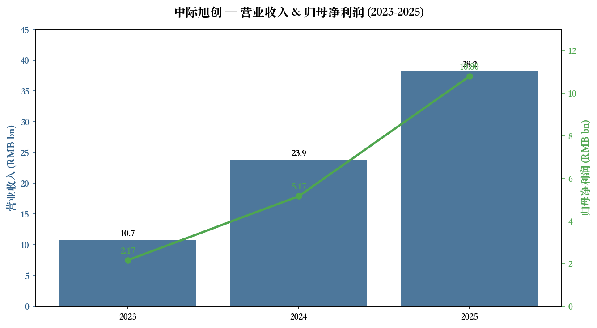
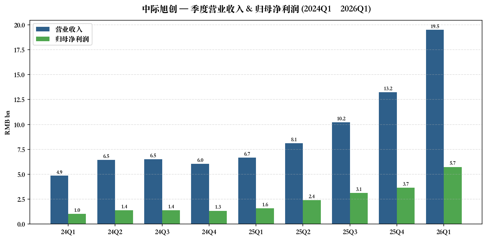
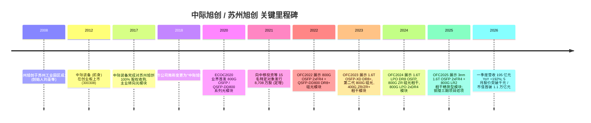
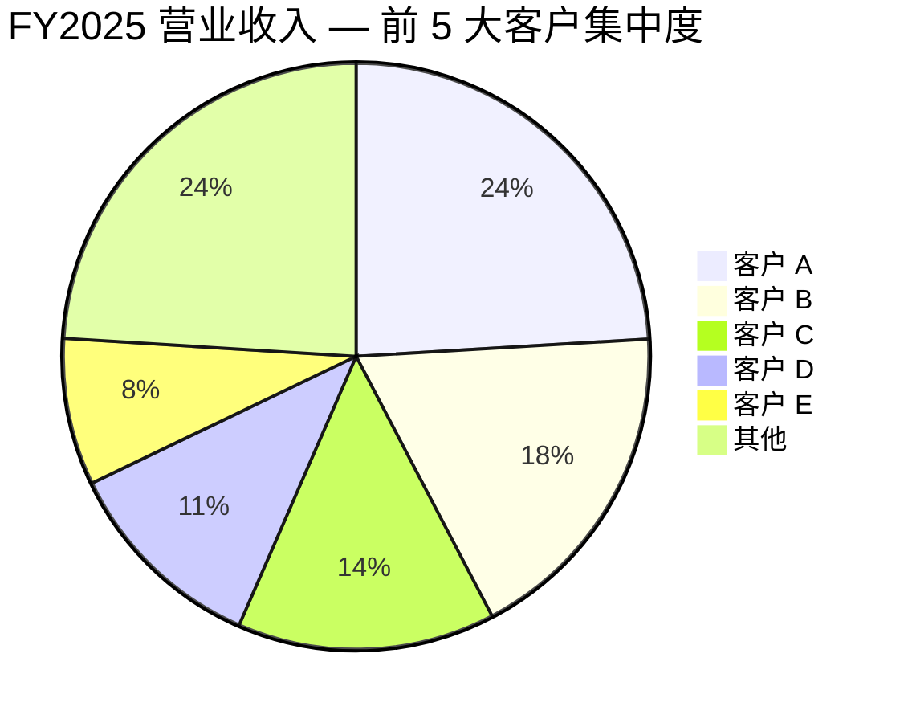
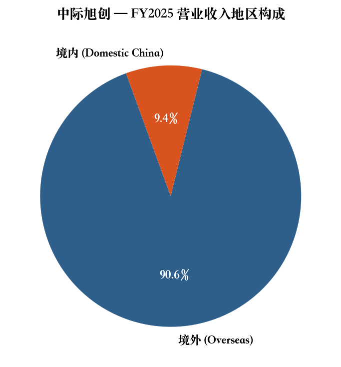
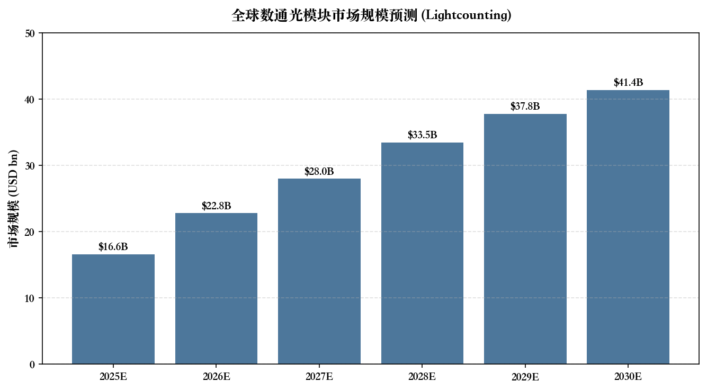
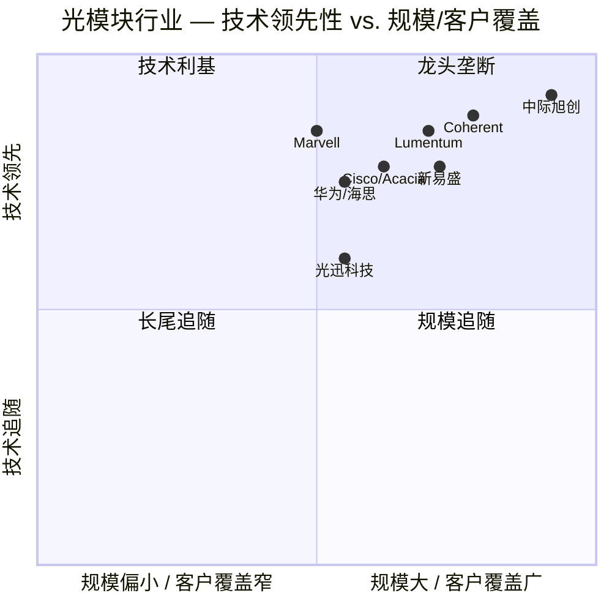
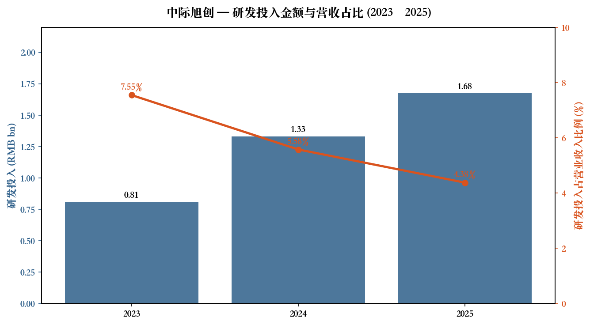

# 中际旭创 (SZSE:300308) 公司研究报告

**日期：2026-05-20**
**作者：Claude 研究助手**
**报告语言：简体中文**

---

> **Update — 2026 年一季度业绩超预期 (2026-04-16)：** 公司 2026 Q1 营业收入达 RMB 194.96 亿元 (YoY +192.12%)，归母净利润 RMB 57.35 亿元 (YoY +262.28%)，单季度收入已超过 2023 全年的 1.8 倍；公司未发布全年具体业绩指引，但管理层在 2025 年报中说明"受益于终端客户对算力基础设施的强劲投入，公司产品出货持续增长"，并完成"铜陵旭创高端光模块产业园三期项目"以扩充高端产能。来源：[中际旭创 2026 年一季度报告](https://static.cninfo.com.cn/finalpage/2026-04-17/1225111941.PDF)，[2025 年年度报告](https://static.cninfo.com.cn/finalpage/2026-03-31/1225056459.PDF)。

---

## 目录

1. 公司概览
2. 公司历史
3. 管理团队
4. 产品与服务
5. 客户与上市策略
6. 行业概览
7. 竞争格局
8. 市场机会 (TAM)
9. 风险评估
10. 参考资料

======================================

## 1. 公司概览 (Company Overview)

中际旭创股份有限公司（证券代码：SZSE:300308，证券简称：中际旭创；英文名 ZHONGJI INNOLIGHT CO., LTD.；注册地址：山东省龙口市诸由观镇驻地；公司网址 [www.zj-innolight.com](http://www.zj-innolight.com)）是一家专注于高端光通信收发模块 (high-speed optical transceiver) 研发、生产与销售的上市公司，是当前全球数通光模块市场无可争议的领头羊。公司原名"中际装备"，主营高端绕线机；2017 年通过现金加股份的方式收购光模块龙头**苏州旭创科技有限公司**，业务重心彻底转向光通信，并于 2018 年起以"中际旭创"为简称运营。

**主营业务与商业模式 (business model)。** 公司主营业务为高速光通信收发模块的研发、设计、封装、测试与销售，下游应用集中在云计算数据中心 (datacom)、5G 无线网络、电信传输 (telecom) 及固网接入 (FTTX) 等场景；2025 年年报披露"分行业"口径下，光通信收发模块业务收入 374.57 亿元，占总营收的 97.95%，"其他"业务（主要为存量绕线设备业务）仅占 2.05%（[中际旭创 2025 年年度报告, 第 24 页](https://static.cninfo.com.cn/finalpage/2026-03-31/1225056459.PDF)）。销售模式以**直销为主、渠道为辅**：直销渠道贡献 98.69% 的营业收入，渠道销售仅 1.31%。商业模式属于典型的"以销定产"——公司根据云数据中心客户与电信设备商客户的订单制定生产计划，并需要通过客户的"供应商认证"和"产品代码认证"两道门槛方能进入供应链。

**地域分布。** 公司业务高度国际化：2025 年境外收入 RMB 346.37 亿元 (90.58%)，境内收入 RMB 36.03 亿元 (9.42%)，境外销售额同比增速 67.20%，远高于境内的 14.52%（[2025 年年度报告, 第 24 页](https://static.cninfo.com.cn/finalpage/2026-03-31/1225056459.PDF)）。境外销售回款率 98%，主要终端客户位于北美与欧洲——典型是 NVIDIA、Google、Meta、Amazon、Microsoft 等北美超大规模云厂商 (hyperscaler / CSP) 及其设备整合商。



来源：[中际旭创 2025 年年度报告, 第 7 页](https://static.cninfo.com.cn/finalpage/2026-03-31/1225056459.PDF)。

**规模指标。** 2025 年营业收入 RMB 382.40 亿元，同比增长 60.25%；归母净利润 RMB 107.97 亿元，同比增长 108.78%；扣非归母净利润 RMB 107.10 亿元，同比增长 111.31%；经营活动产生的现金流量净额 RMB 108.96 亿元，同比增长 244.31%；加权 ROE 升至 43.84%（2024 年为 31.23%）；总资产 RMB 452.89 亿元，归母净资产 RMB 297.65 亿元，资产负债率 30.18%（[2025 年年度报告, 第 7 页 / 第 23 页](https://static.cninfo.com.cn/finalpage/2026-03-31/1225056459.PDF)）。员工总数 11,623 人，其中研发人员 2,169 人（占 18.66%），博士 39 人、硕士 394 人（[2025 年年度报告, 第 27 页](https://static.cninfo.com.cn/finalpage/2026-03-31/1225056459.PDF)）。报告期末光通信收发模块的设计产能 2,806 万只、产量 2,376 万只、销量 2,109 万只，毛利率 42.61%（同比 +7.96 pct）。



来源：[2025 年年度报告, 第 7-9 页 (季度数据)](https://static.cninfo.com.cn/finalpage/2026-03-31/1225056459.PDF)；[2026 年一季度报告, 第 3 页](https://static.cninfo.com.cn/finalpage/2026-04-17/1225111941.PDF)。

**估值快照 (valuation snapshot)。** 截至 2026-05-12 收盘，中际旭创报 RMB 1,017.99 元，单日上涨 8.28%，成为创业板历史上第二只千元股、A 股第十只千元股，总市值首度突破 1.1 万亿元人民币（[证券时报，2026-05-12](https://www.stcn.com/article/detail/3904557.html)）。基于已审计的 2025 年扣非 EPS RMB 9.71 (摊薄)，**静态 P/E ≈ 105×**；考虑 2026 Q1 扣非净利已达 RMB 57.18 亿元 (单季 EPS RMB 5.14)，按市场一致预期 2026 年净利润 RMB 252.80 亿元（[10jqka 同花顺 F10 盈利预测](https://basic.10jqka.com.cn/300308/worth.html)）测算，**2026 年动态 P/E ≈ 45×**；按 1.111 bn 总股本与 RMB 1,018 元股价倒推，**TTM P/S ≈ 29×**（市值 RMB 1,131 bn / 2025 营收 RMB 38.24 bn）。这一估值在传统硬件代工/制造业中显著偏高，但在 AI 算力主题股中具有"赛道龙头估值溢价"特征，背景包括：(1) 公司是全球 800G/1.6T 数通光模块出货量第一，且 NVIDIA GB200 系统中 800G 光模块超 50% 来自旭创（[ip-fiber.com (LightCounting 转引)](https://ip-fiber.com/blogs/news/nvidia-orders-surge-innolight-and-eoptolink-dominate-60-of-800g-sfp-optical-modules-supply)）；(2) 2026 全球四家超大规模云厂资本开支预计同比 +53% 至 USD 5,708 亿元（[2025 年年度报告, 第 15 页](https://static.cninfo.com.cn/finalpage/2026-03-31/1225056459.PDF) 引 FactSet 数据）；(3) Lightcounting 预测 2026 年 800G+1.6T 占数通光模块市场 64%，公司将受益最大；(4) 同业可比公司新易盛、天孚通信、华工科技在 AI 行情中给予 30-50× 动态 P/E，旭创作为绝对龙头享有 10-20% 溢价。

**多倍数比较 (peer comps)。** 三家最接近的境内同业：新易盛 (SZSE:300502)、天孚通信 (SZSE:300394)、华工科技 (SZSE:000988)，2026 年动态 PE 中位数约 30-40 倍；境外：Coherent (NYSE:COHR)、Lumentum (NASDAQ:LITE)、Marvell Optical (NASDAQ:MRVL) 2025-2026 年 TTM PE 区间约 35-60 倍。综上，旭创的 2026 年动态 PE 约 45 倍处于"成长股龙头合理偏高"区间——若 2026 年实际净利能达到一致预期甚至超出，估值压力会被 EPS 增长所稀释；若 ASIC 自研 / CPO 替代节奏超预期，估值则面临剧烈调整 (详见第 9 节风险)。

## 2. 公司历史 (Company History)

中际旭创的故事是两条完全不同业务线的"借壳合体"：上市主体"中际装备"原本是山东龙口的高端绕线机制造商；运营核心**苏州旭创**则是一家由海归博士在 2008 年于苏州工业园区创立的硅谷式光模块初创公司，由海外风险资本与归国博士团队共同发起（[InnoLight 官网 About Us](https://www.innolight.com/about)）。两者在 2017 年完成重大资产重组：上市公司中际装备发行股份及支付现金，作价约 28 亿元收购苏州旭创 100% 股权，自此中际装备的业务重心正式由"绕线设备"转向"高速光通信模块"。2018 年公司简称改为"中际旭创"。



来源：[中际旭创 2025 年年度报告, 第 22-23 页 (创新里程碑)](https://static.cninfo.com.cn/finalpage/2026-03-31/1225056459.PDF)；[2026 年一季度报告, 第 3 页](https://static.cninfo.com.cn/finalpage/2026-04-17/1225111941.PDF)；[证券时报, 2026-05-12](https://www.stcn.com/article/detail/3904557.html)。

**三次战略转型与扩张。**
- **2017 借壳上市 / 业务转向**：传统装备制造业 → 高速光通信模块。苏州旭创的并入彻底改变了上市公司的成长曲线，从一家年收入 5-8 亿元、增长平淡的设备制造商变成了高速增长的科技公司。
- **2021 资本布局**：通过向中移投资控股等 15 名特定对象发行 8,708 万股股票，募资用于"铜陵旭创高端光模块产业园"等高端产能扩张项目（[2025 年年度报告, 第 23 页](https://static.cninfo.com.cn/finalpage/2026-03-31/1225056459.PDF)）。三期项目已于 2025 年结项。
- **2024-2026 海外重镇**：为应对地缘风险与北美客户对供应链多元化的要求，公司联合阿布扎比投资局 (ADIA 通过 Platinum Orchid B 平台)、新加坡淡马锡 (Daxue、True Light) 等主权基金，对子公司 TeraHop Pte. Ltd. 合计增资 USD 5.17 亿，TeraHop 已在泰国设立 Picmore (Thailand) 子公司、在新加坡设立 Vincrest / Lunaris 等控股平台（[2025 年年度报告, 第 23-26 页](https://static.cninfo.com.cn/finalpage/2026-03-31/1225056459.PDF)）。本次增资后旭创对 TeraHop 持股比例仍维持在 67.71%。

**关键收购与子公司。** 主要全资及控股子公司：苏州旭创、铜陵旭创、成都储翰科技、海南旭创、TeraHop Pte. (新加坡)、Picmore (Thailand)、TeraHop Holdings / TeraHop Photonics、广东深度智冷、苏州湃矽（参股投资）等。其中**成都储翰**是公司在 2020 年前后陆续控股的电信光器件标的，补强了电信光模块产品线；**苏州湃矽**为参股的硅光相关投资；**广东深度智冷**为新增的散热/冷却技术合作平台。

**近 12 个月动态。** (1) 2025 年 2 月完成 16.47 mn 股回购股份注销，注册资本相应减少；(2) 2025 年 4 月授予第四期限制性股票激励计划 (752 名激励对象，888 万股，授予价 RMB 54/股)，2026 年 3 月又对预留部分进行授予；(3) 2025 年完成铜陵旭创三期项目结项，2026 年一季度在建工程余额由年初 14.2 亿元升至 23.6 亿元 (+65.95%)，对应新一轮高端产能爬坡（[2026 Q1 报告, 第 3 页](https://static.cninfo.com.cn/finalpage/2026-04-17/1225111941.PDF)）。

## 3. 管理团队 (Management Team)

中际旭创是一家典型的"双轨制"公司——上市主体的实际控制方仍是山东中际投资控股（创始人/王氏家族背景，控制人为王伟修）；但业务核心、研发与海外客户关系完全由**苏州旭创创始团队 (以刘圣博士为首)** 主导。

**刘圣博士 (Dr. Liu Sheng) — 董事长、总裁、苏州旭创创始人 (350+ 字深度简介)**。1971 年 7 月生，54 岁，中国国籍，博士。毕业于中国科学院后赴美深造，**博士毕业于美国乔治亚理工学院 (Georgia Institute of Technology)** ([Innolight Core Team](https://www.innolight.com/index.php/en/about/coreteam.html))。回国前曾任 **美国朗讯公司 (Lucent / Agere Systems)** 研发工程师、**Pine Photonics Communications** 中国研发中心负责人、**Opnext** (后并入 Oclaro / Lumentum) 公司产品研发部高级经理——这三段工业经历完整覆盖了从激光器件、模块设计到产业化的整条价值链 ([Innolight Core Team](https://www.innolight.com/index.php/en/about/coreteam.html))。2008 年 5 月在苏州工业园区联合海外 VC 与归国博士创立苏州旭创科技有限公司，担任创始人兼总经理至 2017 年；2017 年苏州旭创注入上市公司后，刘圣任公司总裁、董事，**2023 年 8 月起任公司董事长兼总裁** ([2025 年年度报告, 第 40 页](https://static.cninfo.com.cn/finalpage/2026-03-31/1225056459.PDF))。在中际旭创的持股：报告期末刘圣直接持有 3,539,954 股 (约占 0.32%)，期内通过股权激励行权增持 89,600 股；同时担任 TeraHop Pte. Ltd.、成都储翰科技、苏州湃矽、苏州工业园区天庭阙 / 天庭晖 / 芯源慧联 / 千阙树 / 上海长格 等多家关联实体的董事/执行董事 ([2025 年年度报告, 第 42-43 页](https://static.cninfo.com.cn/finalpage/2026-03-31/1225056459.PDF))。刘圣同时担任**苏州工业园区光通信产业联盟会长** ([Innolight Core Team](https://www.innolight.com/index.php/en/about/coreteam.html))。从过往轨迹看，刘圣是一位典型的"懂技术、懂工艺、懂产业链"的创业型 CEO：(1) 主导了苏州旭创从初创到全球第一的 18 年技术路线，包括 100G → 400G → 800G → 1.6T 的全部代际跳变，且每一次代际跳变都是"业界率先"——2020 年首发 800G、2023 年首发 1.6T OSFP-XD、2024 年首发 1.6T LPO；(2) 在公司从 RMB 10 亿规模 (2018) 增长至 RMB 380 亿规模 (2025) 的 7 年时间内始终担任最高管理层；(3) 持续将公司产能、客户结构国际化，包括联合淡马锡和阿布扎比投资局推动 TeraHop 海外业务的资本结构调整。

**王晓东 — 董事、常务副总裁 (180 字简介)。** 1976 年 12 月生，49 岁，本科学历。**代表了"上市公司方 (中际系)"的话语权**：2015 年起任山东中际电工装备 (即上市公司前身) 董事长助理，2016 年起任公司常务副总裁，同时担任山东中际智能装备执行董事、山东中际投资控股董事、山东方硕电子科技董事长——王晓东的关键作用在于打通中际系 (大股东) 与旭创系 (业务团队) 之间的协同。报告期内通过减持 708,552 股，期末持股 2,167,657 股 ([2025 年年度报告, 第 39-43 页](https://static.cninfo.com.cn/finalpage/2026-03-31/1225056459.PDF))。

**王晓丽 — 董事、副总裁、财务总监 (CFO, 200 字简介)。** 1979 年 11 月生，46 岁，硕士；中国注册会计师协会会员、**英国皇家特许管理会计师协会 (CIMA) 资深会员**。2005-2014 年在**普华永道中天会计师事务所**从审计员做到高级经理，2014 年短暂任职古玉资本投资经理；2014 年 11 月加盟苏州旭创任财务总监 / 财务副总经理，2018 年 3 月起任上市公司副总裁、财务总监，2023 年 8 月起担任董事 ([2025 年年度报告, 第 40 页](https://static.cninfo.com.cn/finalpage/2026-03-31/1225056459.PDF))。她是公司 IPO 后历次再融资、海外子公司架构搭建 (含 TeraHop 引战) 的核心执行人，PwC + 资本管理 + 一线 CFO 的复合背景在 A 股大盘股 CFO 中相当扎实。本期持股 607,040 股 (含本期股权激励行权增持 70,000 股)。

**王军 — 副总裁、董事会秘书 (100 字简介)。** 男，1971 年 11 月生，54 岁，博士。具有 20 年以上 A 股上市公司董秘从业经验，先后任成都人民商场 (集团)、四川西部资源、江苏亨通光电的董秘，2018 年 1 月起任本公司副总裁、董秘。多次获新财富金牌董秘、中国上市公司投资者关系天马奖等业内殊荣 ([2025 年年度报告, 第 41-42 页](https://static.cninfo.com.cn/finalpage/2026-03-31/1225056459.PDF))。

**公司治理 (Governance)。**
- **董事会构成**：8 名董事，含 4 名独立董事 (战淑萍、成波、屈文洲、Yan Zhuang)、1 名职工代表董事 (陈彩云)；设有审计、战略、提名、薪酬与考核四个专门委员会，除战略委员会外的三个均由独立董事担任主任 ([2025 年年度报告, 第 36 页](https://static.cninfo.com.cn/finalpage/2026-03-31/1225056459.PDF))。
- **股权结构**：截至 2026 Q1 末，控股股东**山东中际投资控股**持股 10.93%，自然人股东**王伟修** (中际系) 持股 6.28%，二者为一致行动人合计持股 17.21%；香港中央结算 (北向资金) 持股 6.97%；**苏州益兴福、苏州云昌锦、苏州福睿晖** (员工持股平台、与旭创团队相关的有限合伙) 合计持股约 7.08% 且互为一致行动人 ([2026 Q1 报告, 第 5 页](https://static.cninfo.com.cn/finalpage/2026-04-17/1225111941.PDF))。
- **激励**：公司已实施四期限制性股票激励计划，2025 年 4 月以 RMB 54/股的授予价向 752 名核心人员授予 888 万股；2026 年 3 月对预留部分继续授予。公司无投票权差异安排、无 VIE / 红筹架构。

**管理团队总评。** 旭创管理层在过去 5-7 年内连续完成了 (1) 主业从绕线设备到光模块的彻底切换，(2) 三次重大代际技术跨越，(3) 收入与利润各增长 5×/10×；同时通过引入 ADIA、淡马锡等海外主权基金参与子公司增资，主动应对地缘风险。短板在于：管理团队大本营在苏州/铜陵，距离实控人所在的山东龙口注册地较远；中际系与旭创系两套体系存在天然的协同摩擦；以及上市公司层面缺乏典型意义上的"硅谷型"运营高管或独立 COO。整体而言这是一支已经被周期验证过的、技术驱动的执行型管理团队，但战略上的天花板更多取决于刘圣个人的技术判断力。

## 4. 产品与服务 (Products & Services)

中际旭创的产品组合可按**速率代际**与**应用场景 (datacom vs. telecom)** 两个维度划分。

```mermaid
graph TD
    A[中际旭创 产品组合] --> B[数通光模块 Datacom]
    A --> C[电信光模块 Telecom]
    A --> D[其他 / 存量绕线设备]
    B --> B1[1.6T OSFP DR8 / 2xFR4 LPO]
    B --> B2[800G OSFP / QSFP-DD 8x100G & 4x200G]
    B --> B3[400G OSFP / QSFP-DD 8x50G & 4x100G]
    B --> B4[200G / 100G QSFP28 系列]
    B --> B5[相干 ZR / ZR+ 400G/800G DCI]
    B --> B6[LPO 线性直驱 系列]
    B --> B7[硅光 SiPh 平台]
    C --> C1[5G 前传 / 中传 / 回传 光模块]
    C --> C2[城域/骨干/核心网传输 光模块]
    C --> C3[FTTX 固网接入 光器件]
    D --> D1[绕线设备 (历史业务)]
```

**(1) 1.6T 系列 — 当前的"未来"主力产品**。公司"业界率先"推出 1.6T OSFP224 DR8、1.6T 2xFR4、以及全球首款 1.6T-DR8 OSFP224 LPO；产品基于 8×200G 通道架构，兼容 EML 与硅光两套平台，符合 IEEE 802.3df 与 OSFP1600 MSA 标准 ([2025 年年度报告, 第 11 页](https://static.cninfo.com.cn/finalpage/2026-03-31/1225056459.PDF))。**竞争优势：是**——属于"代际领先 + 单一供应商优势"型护城河 (technology / first-mover)。竞争对手如 Coherent、Eoptolink (新易盛) 也在 1.6T 进度上紧追，但 LightCounting 转引数据显示**旭创在 2024 Q4 至 2025 年 1.6T 模块的市场份额预计达 50-60%**，初期出货约 30 万只主要供给 NVIDIA ([ip-fiber.com (LightCounting/Reuters 转引)](https://ip-fiber.com/blogs/news/nvidia-orders-surge-innolight-and-eoptolink-dominate-60-of-800g-sfp-optical-modules-supply))。最直接的对标对手为新易盛 (SZSE:300502) 同代产品——参考公开信息，旭创在量产爬坡、客户认证 cycle 上领先约 1-2 个季度。

**(2) 800G 系列 — 现金牛、当前主要收入来源**。包含 800G OSFP (8×100G 与 4×200G)、800G QSFP112-DD、800G OSFP LPO 2xDR4、800G LR2 相干精简型 等多个细分；除 EML 方案外亦提供硅光方案以服务 10km 以内传输需求 ([2025 年年度报告, 第 11 页](https://static.cninfo.com.cn/finalpage/2026-03-31/1225056459.PDF))。**竞争优势：是**——技术领先 + 规模量产能力 + 客户结构。LightCounting 转引数据：**NVIDIA 800G 模块订单中超 50% 来自旭创**；同时 Google OCS (光交换) 定制模块亦占旭创约 10% 收入 ([ip-fiber.com (LightCounting/Reuters 转引)](https://ip-fiber.com/blogs/news/nvidia-orders-surge-innolight-and-eoptolink-dominate-60-of-800g-sfp-optical-modules-supply))。最直接竞争对手为 Coherent (NYSE:COHR)、Lumentum (LITE)、新易盛、Eoptolink (SZSE 已上市)；旭创在出货量上处于绝对第一档。

**(3) 400G 系列 — 已成熟、收入贡献仍较大**。包含 400G QSFP56-DD (符合 IEEE 802.3bs / QSFP-DD MSA)、400G OSFP 8×50G 与 4×100G 两种架构、以及 400G QSFP-DD ZR/ZR+ 相干光模块 ([2025 年年度报告, 第 11-12 页](https://static.cninfo.com.cn/finalpage/2026-03-31/1225056459.PDF))。**竞争优势：是**——成熟产品 + 成本领先；本代产品已逐渐进入收入比重下降阶段，但由于云客户的多代并存策略，仍贡献稳定的现金流。最直接对手：Coherent、Lumentum、Accelink (光迅科技)、Cisco/Acacia (相干模块)。

**(4) 200G / 100G 系列 — 长尾、覆盖 5G 与边缘网络场景**。包含 100G QSFP28 Single Lambda (符合 IEEE 802.3bm/cd)、100G QSFP28 多种封装变种 (SR4 / SR4 CPRI / AOC / CWDM4 / eCWDM4 / PSM4 / LR4 / ER4 Lite)，应用场景覆盖 100G 数据中心内部网络、DCI、城域网络、5G 无线网络 ([2025 年年度报告, 第 11-12 页](https://static.cninfo.com.cn/finalpage/2026-03-31/1225056459.PDF))。**竞争优势：部分**——价格压力较大，公司主要靠规模化封装 (COB) 与自动化产线维持毛利。

**(5) 相干技术产品 (Coherent / ZR / ZR+)**：400G/800G ZR 与 ZR+ 模块用于数据中心间互联 (DCI) 长距离应用，已在 OFC2023-2025 现场演示，是公司向长距互联市场延伸的关键产品线，与 Lumentum、Coherent、Acacia (Cisco)、Marvell 等的相干模块业务正面竞争。**竞争优势：部分**——后发追赶者，与 Lumentum/Coherent 在 IP 与 DSP 算法上仍有差距。

**(6) LPO / LRO / CPO 等下一代技术**。公司在年报中详细论述了**LPO (Linear Drive Pluggable Optics)**——去除 DSP/CDR 芯片以降低功耗 (800G 多模功耗可从 13W 降至 < 4W)；**LRO (Half-retimed Linear Optics)** 作为过渡架构；**CPO (Co-Packaged Optics)** 作为最终演进方向 ([2025 年年度报告, 第 18-20 页](https://static.cninfo.com.cn/finalpage/2026-03-31/1225056459.PDF))。其中 LPO 已实现批量出货，CPO 尚处于"早期商业化"阶段。**竞争优势：是**——LPO 上公司率先推出 1.6T LPO；但 CPO 演进路径若被 NVIDIA / Broadcom / Marvell 等"硅 + 光"垂直整合方案抢占，公司面临的是结构性挤压。

**(7) 电信光模块**：5G 前/中/回传光模块、城域/骨干/核心网光模块、FTTX 接入光器件。本类产品需求与运营商 capex 周期挂钩，整体增速明显低于数通，2026 年 Lightcounting 预计全球电信光模块市场仅 USD 53 亿元，CAGR ~7% ([2025 年年度报告, 第 17 页](https://static.cninfo.com.cn/finalpage/2026-03-31/1225056459.PDF))。

**旗舰 vs. 长尾结构。** 2025 年报数据：光通信收发模块整体出货量 2,109 万只 (其中境外销售 1,812 万只)；公司未单独披露各速率/产品线的收入占比，但根据 OFC 路演披露与三方数据交叉，可合理推断 800G 占整体收入比重已达 50% 以上，1.6T 自 2024Q4 起小幅起量、2025 年开始放量；400G 与 100G 系列合计贡献约 30-40%。**旗舰是 800G 与 1.6T 两条主线**，正驱动 ASP 与毛利率持续抬升 (光通信模块业务毛利率从 2024 年的 34.65% 提升至 2025 年的 42.61%)。

**近 12 个月发布与路线图。** 2024 年 OFC 展示 1.6T LPO DR8、800G ZR 硅光相干、800G LPO 2xDR4；2025 年 OFC 展示**3nm 1.6T OSFP 2xFR4** 与 **800G LR2 OSFP 相干精简型**——表明公司在 DSP 制程节点 (3nm)、相干技术下沉、LPO 大规模量产三条线上同时领先 ([2025 年年度报告, 第 22 页](https://static.cninfo.com.cn/finalpage/2026-03-31/1225056459.PDF))。截至 2025 年末公司拥有专利 411 件，其中发明专利 215 件 (2025 年新增授权专利 44 件，其中发明 19 件)。

## 5. 客户与上市策略 (Customers & Go-to-Market)

**销售模式与渠道。** 公司采用"以销定产"模式，**直销为主**占 98.69%、渠道仅 1.31% (主要为部分电信运营商区域市场)。客户开拓需要经过"供应商认证 + 产品代码认证"双门槛，平均验证周期 12-18 个月 ([2025 年年度报告, 第 12 页](https://static.cninfo.com.cn/finalpage/2026-03-31/1225056459.PDF))。

**客户集中度 (Customer Concentration) — 高度集中**。2025 年前 5 大客户合计销售 RMB 290.56 亿元，占年度营业收入 **75.98%**；其中关联方销售额占总销售额比例 8.10% (推测对应于客户 E)。具体明细 ([2025 年年度报告, 第 26 页](https://static.cninfo.com.cn/finalpage/2026-03-31/1225056459.PDF))：

| 排名 | 客户名称 (年报匿名) | 销售额 (RMB) | 占年度营收比例 |
|---|---|---|---|
| 1 | 客户 A | 9,201,495,755.91 | 24.06% |
| 2 | 客户 B | 6,981,202,208.21 | 18.26% |
| 3 | 客户 C | 5,438,189,570.59 | 14.22% |
| 4 | 客户 D | 4,337,902,496.40 | 11.34% |
| 5 | 客户 E | 3,096,780,769.22 | 8.10% |
| **合计** | — | **29,055,570,800.33** | **75.98%** |



来源：[中际旭创 2025 年年度报告, 第 26 页 — 前五名客户](https://static.cninfo.com.cn/finalpage/2026-03-31/1225056459.PDF)。

**客户身份推断 (Inferred Identity — 重要免责)。** 公司年报为商业敏感性披露所考虑，对客户全部使用 A/B/C/D/E 匿名标识。结合 (1) 公司境外收入占 90.58%、(2) 北美超大规模云厂商的资本开支占全球绝大部分、(3) LightCounting 等第三方研究公开转引"NVIDIA GB200 800G 光模块订单超 50% 来自旭创、Google OCS 占约 10%" ([ip-fiber.com (LightCounting/Reuters 转引)](https://ip-fiber.com/blogs/news/nvidia-orders-surge-innolight-and-eoptolink-dominate-60-of-800g-sfp-optical-modules-supply))、(4) 公司 OFC 历年展会的官方合作伙伴/演示对象，**业界共识是公司 A/B/C/D 四大客户对应 NVIDIA、Google、Meta、Amazon (或 Microsoft) 四家中的某种排序**——但其与公司年报匿名标识的对应顺序公司**未公开披露**，本报告不进行强行对位以免误导。客户 E 因披露为"关联方"，按 8.10% 量级与中际系/旭创系关联实体测算，可能对应**国内某通信设备商或电信运营商**的关联交易。

**集中度风险定性。** 单一客户 (A) 占比 24.06% 已**显著超过 20% 的预警阈值**，前 5 客户 75.98% 远超 50% 的高风险阈值——本指标在第 9 节风险评估中**列为公司首要风险**。



来源：[2025 年年度报告, 第 24 页](https://static.cninfo.com.cn/finalpage/2026-03-31/1225056459.PDF)。

**地域结构与销售策略。** 境外销售 RMB 346.37 亿元 (90.58%)，主要为北美/欧洲云数据中心客户；境内 RMB 36.03 亿元 (9.42%)，主要为电信运营商及国内云厂商。回款率 98% 显示主要客户付款信用极佳。境外销售模式以美国/欧洲销售办公室直签为主，定价以 USD 计价并通过外汇套保对冲（公司年报多处提到"汇率波动是关键风险，通过外汇套期保值对冲"）。**TeraHop 海外子公司的战略意义**在于：在新加坡 + 泰国构建"中国境外的供应链与销售实体"，降低对单一国家 (中国) 产能 / 关税的依赖；这是 2024-2026 年公司战略上最重要的动作之一 ([2025 年年度报告, 第 23-25 页](https://static.cninfo.com.cn/finalpage/2026-03-31/1225056459.PDF))。

**供应商集中度。** 前 5 供应商合计采购 RMB 127.97 亿元，占总采购额 51.50%，其中**第一供应商一家就占 35.76%** (合理推测为光芯片/EML/DSP 等关键芯片的海外供应商，如 Marvell、Broadcom、Macom、Coherent EML laser、Lumentum；具体身份未披露)。前 5 供应商无关联方采购 ([2025 年年度报告, 第 26 页](https://static.cninfo.com.cn/finalpage/2026-03-31/1225056459.PDF))。供应商集中度同样属于高风险——但行业属性决定 (高端 EML / DSP 国内供应有限)，短期内难以快速分散。

## 6. 行业概览 (Industry Overview)

**行业定义。** 光通信收发模块 (Optical Transceiver Module) 是光纤通信链路的核心组件，主要功能是实现光-电信号转换：发射端把电信号转换为光信号通过光纤传输，接收端再转换回电信号。下游应用按场景分为**数通 (Datacom，数据中心、云网络) + 电信 (Telecom，5G/城域/骨干/接入) + 新兴市场 (消费电子、工业自动化)** 三大块。NAICS 对应代码大约为 334418 (Printed Circuit Assembly Manufacturing) / 334290 (Other Communications Equipment Manufacturing)。

**关键监管/政策框架 (中国)。** 公司 2025 年报明确列举了多项国家政策，包括《2025 年数字经济发展工作要点》、《关于促进数据产业高质量发展的指导意见》、《数字经济 2024 年工作要点》等，核心导向是：(1) "东数西算"全国一体化算力网；(2) AI 大模型创新与算力基础设施支持；(3) 培育数据要素与数字产业集群 ([2025 年年度报告, 第 14 页](https://static.cninfo.com.cn/finalpage/2026-03-31/1225056459.PDF))。

**需求侧驱动 — 算力 / Token / capex 三个量级跃迁**：
- **Token 消耗量近指数增长**：以 Google 为例，2024 年 4 月月均 token 调用量 9.7 万亿，2025 年 10 月已跃升至 1,300 万亿；字节豆包日均 token 从 2024 年 3 月的 1,200 亿跃升至 2025 年 12 月的 50 万亿 ([2025 年年度报告, 第 14 页](https://static.cninfo.com.cn/finalpage/2026-03-31/1225056459.PDF) 引中信建投数据)。
- **海外四大云厂资本开支爆发**：2025 Q4 微软+亚马逊+Meta+谷歌合计 capex YoY +64% 至 USD 1,186 亿；FactSet 一致预期 2026 全年合计 capex YoY +53% 至 USD 5,708 亿 ([2025 年年度报告, 第 15 页](https://static.cninfo.com.cn/finalpage/2026-03-31/1225056459.PDF) 引各公司财报)。
- **中国互联网厂商加速跟进**：2025 Q1-Q3 阿里/腾讯/百度 capex 合计 RMB 1,637 亿元，YoY +92% ([2025 年年度报告, 第 16 页](https://static.cninfo.com.cn/finalpage/2026-03-31/1225056459.PDF))。

**市场规模 (Lightcounting 数据)。**
- **数通光模块**：2026 年全球市场规模有望达 USD 228 亿元；2030 年增长至 USD 414 亿元；2025-2030 CAGR ~20%。其中 800G + 1.6T 在 2026 年合计市场规模 USD 146 亿元，占整体市场 64%；3.2T 模块从 2028 年起逐步起量 ([2025 年年度报告, 第 16 页](https://static.cninfo.com.cn/finalpage/2026-03-31/1225056459.PDF))。
- **电信光模块**：2026 年市场规模 USD 53 亿元；2030 年 USD 70 亿元；CAGR ~7%。整体进入低速增长阶段。



来源：[2025 年年度报告, 第 17 页 图 4 — 引自 Lightcounting](https://static.cninfo.com.cn/finalpage/2026-03-31/1225056459.PDF)。

**主要技术趋势 (公司年报第 17-20 页)。**
1. **硅光 (SiPh / Silicon Photonics)**——基于 CMOS 工艺集成光器件，低功耗 / 低延迟 / 高带宽 / 高集成度，Lightcounting 预测将逐步替代基于 GaAs / InP 的传统光模块。Intel、思科是早期推动者；旭创 800G/1.6T 已提供硅光方案。
2. **相干 (Coherent) 下沉**：相干技术从骨干网下沉至城域、边缘，单通道速率提升催生 400G/800G ZR/ZR+ DCI 应用。Lumentum、Coherent、Acacia (Cisco)、Marvell、旭创、华为/海思 是主要玩家。
3. **LPO (线性直驱可插拔)**：去除 DSP，800G 多模功耗可降 70% 以上 (从 13W → < 4W，Macom 数据)，但牺牲误码率与传输距离，适用于机柜内短距连接。LPO 大规模量产是当前热点，Macom、Credo、Marvell、旭创、新易盛 并行竞争。
4. **LRO (半重定时线性) / HALO**：DSP 与 LPO 的过渡架构，Credo 是主要推动方。
5. **CPO (Co-Packaged Optics) 光电共封装**：将光引擎与交换 ASIC 共同封装，是 3.2T 时代的主流路线，目前处于"技术突破到早期商业化"阶段。NVIDIA、Broadcom、台积电是核心玩家——**CPO 一旦商业化，将冲击传统可插拔模块生态，对旭创这类纯模块厂构成结构性挑战**。

**上游/下游结构。**
- **上游**：光芯片 (激光器 VCSEL / DFB / EML、探测器 APD / PIN)、电芯片 (DSP / LDD / TIA / CDR)、PCBA、无源光器件。**200G+ 速率的 EML 与 DSP 仍主要依赖海外供应** (Coherent、Lumentum、Marvell、Broadcom、Macom)；国内厂商 (源杰科技、长光华芯、光迅、海思等) 在 100G 及以下逐步实现替代 ([2025 年年度报告, 第 20 页](https://static.cninfo.com.cn/finalpage/2026-03-31/1225056459.PDF))。
- **下游**：数通 (云厂商 NVIDIA、Google、Meta、Amazon、Microsoft、阿里/腾讯) + 电信 (中国移动/电信/联通、Verizon、AT&T、Deutsche Telekom) + 新兴市场 (消费电子、工业自动化)。**数通已成为绝对核心驱动**，增速远超电信。

**产业集中度趋势。** 公司在年报中明确指出"光模块速率迭代周期缩短，行业技术门槛不断提升，对产品可靠性和规模化交付能力均提出更高要求。光模块头部厂商凭借领先的研发实力及交付能力，竞争优势进一步强化，**行业集中度有望持续提升**" ([2025 年年度报告, 第 21 页](https://static.cninfo.com.cn/finalpage/2026-03-31/1225056459.PDF))。这与 LightCounting 的全球前十大光模块厂商排名中，**旭创已连续多年位列第一** ([LightCounting 多份月度/季度报告](https://www.lightcounting.com/newsletter/en/june-2025-quarterly-market-update-332)) 的现实相吻合。

## 7. 竞争格局 (Competitive Landscape)

**全球前十大光模块厂商 (Lightcounting 2024 排名)。** 中际旭创、Coherent、新易盛 (Eoptolink)、Accelink (光迅科技)、Lumentum、华为 (HiSilicon)、HG Genuine (海信宽带)、Source Photonics、Hisense Broadband、Cisco/Acacia 等位列前十 ([2025 年年度报告, 第 21 页 图 9 — Lightcounting](https://static.cninfo.com.cn/finalpage/2026-03-31/1225056459.PDF))。**旭创连续多年位居第一**——按 LightCounting 2024-2025 年公开评述，旭创与新易盛在 800G/1.6T 高端市场已形成"双寡头"格局，合计约占 800G SFP 模块供应的 60% ([ip-fiber.com (LightCounting 转引)](https://ip-fiber.com/blogs/news/nvidia-orders-surge-innolight-and-eoptolink-dominate-60-of-800g-sfp-optical-modules-supply))。

**主要竞争对手详评 (8 家)。**

**1. 新易盛 (Eoptolink, SZSE:300502) — 最直接的国内对手**。在 800G/1.6T 数通市场上与旭创直接同业，产品矩阵高度重叠，主要客户也是北美超大规模云厂商。LightCounting 数据：与旭创合计占 NVIDIA 800G SFP 模块订单 60% ([ip-fiber.com](https://ip-fiber.com/blogs/news/nvidia-orders-surge-innolight-and-eoptolink-dominate-60-of-800g-sfp-optical-modules-supply))。**差异**：旭创出货量更大、客户更多元 (Google OCS、相干 400G/800G ZR)；新易盛在毛利率管理上略有优势但规模较小。比拼维度：客户 share / 产能爬坡 / 1.6T 量产时间表。

**2. Coherent Corp. (NYSE:COHR) — 美系垂直整合一体化巨头**。原 II-VI 与 Finisar 合并，垂直整合 EML/InP 激光器 + 模块设计 + DSP 集成；2025 年 800G 模块 / EML 业务进入快速增长。年报披露按收入计是全球前十的光模块厂商之一 ([Coherent Form 8-K FY2025](https://www.sec.gov/Archives/edgar/data/0000820318/000119312525129060/d908147dex991.htm))。**差异**：Coherent 拥有自有 EML 激光器 fab，能够卖芯片也卖模块；旭创在 EML 上仍主要依赖外购，但在封装/工艺规模上具有成本优势。Mordor Intelligence 评述："五家最大供应商 (Coherent、Lumentum、Broadcom、Accelink、Innolight) 合计占 2025 年市场 ~50% 收入" ([Mordor Intelligence Optical Transceiver Market](https://www.mordorintelligence.com/industry-reports/optical-transceiver-market))。

**3. Lumentum (NASDAQ:LITE) — 相干 + InP 芯片领导者**。重点在 400G/800G 相干 ZR/ZR+ 模块及 InP 激光器；2025 年 800G 相干模块订单超过 100G。**差异**：Lumentum 强在相干 DSP 与 InP，旭创相干模块上仍处于追赶；可插拔模块出货量旭创领先。

**4. Marvell (NASDAQ:MRVL) — DSP 芯片为主，模块为辅**。Marvell 不是直接的可插拔模块大厂，更多是上游 DSP 芯片供应商，但通过 Inphi 收购后，已具备模块业务；同时 Marvell 在 CPO 光引擎布局上是 NVIDIA / Broadcom 之外的第三极。**差异**：与旭创的关系是"双重"——供应商 (DSP) + 潜在 CPO 时代竞争对手。

**5. Broadcom (NASDAQ:AVGO) — ASIC 交换芯片 + CPO 终极玩家**。Broadcom 的 Tomahawk / Jericho 交换 ASIC 是数据中心交换网的核心，并主导 CPO 演进路线 (其 Tomahawk 5 / 6 系列已开始原型支持 CPO)。**差异**：当前 Broadcom 不直接做可插拔光模块，但 CPO 一旦商业化，旭创面临的是来自 Broadcom + 台积电 + 系统整机厂的结构性挑战。

**6. 光迅科技 / Accelink (SSE:002281) — 国内电信光模块龙头**。武汉邮电院体系下的国央企，电信光模块和接入光器件是强项，数通方面也在快速跟进。**差异**：旭创 90% 来自境外数通客户，Accelink 60-70% 来自国内电信运营商；二者在国内电信市场和部分国内云客户上有重叠。

**7. 华为 / 海思 (非上市) — 中国垂直整合一体化巨头**。华为光模块以自用为主 (供其交换机、传输设备业务)，并对国内运营商有外销；海思具备高端 DSP / OTN 芯片设计能力。**差异**：华为基本不参与北美云厂的竞争 (受出口管制)；旭创则是北美云客户的核心供应商。

**8. Cisco / Acacia (NASDAQ:CSCO) — 相干 DSP 与系统集成商**。2021 年 Cisco 收购 Acacia 后，整合相干 DSP 与系统能力；主要供给 Cisco 自家路由器/交换机和部分运营商。**差异**：与旭创在相干 DCI 模块上有竞争，但 Cisco 主要侧重系统而非纯模块销售。



来源：依据 [Lightcounting 2024 全球光模块厂商排名](https://www.lightcounting.com/) (公司 2025 年报第 21 页转引)、[Mordor Intelligence](https://www.mordorintelligence.com/industry-reports/optical-transceiver-market) 及 [ip-fiber.com (LightCounting/Reuters 转引)](https://ip-fiber.com/blogs/news/nvidia-orders-surge-innolight-and-eoptolink-dominate-60-of-800g-sfp-optical-modules-supply) 综合定性绘制 (作者编排)。

**公司的竞争优势 (Moats)。**
1. **代际技术领先 + IP / 专利积累**：411 件专利 (其中发明 215 件)；2020 业界首发 800G、2023 首发 1.6T OSFP-XD、2024 首发 1.6T LPO；2025 OFC 展示 3nm DSP 1.6T 模块——这是一个"代际节奏比对手快 0.5-1 个季度"的技术护城河 ([2025 年年度报告, 第 22 页](https://static.cninfo.com.cn/finalpage/2026-03-31/1225056459.PDF))。
2. **规模与产能优势**：2025 年设计产能 2,806 万只，远高于国内任何同业；规模效应直接体现在毛利率从 34.65%→42.61% 的扩张上 ([2025 年年度报告, 第 13 页 / 第 25 页](https://static.cninfo.com.cn/finalpage/2026-03-31/1225056459.PDF))。
3. **客户绑定与认证壁垒**：与 NVIDIA、Google 等头部客户的多年深度合作，叠加 12-18 个月的客户认证周期，使新进入者难以撼动现有结构。
4. **苏州 + 铜陵 + TeraHop (新加坡/泰国) 的全球化制造布局**：是国内同业中海外产能布局最早、最完整的，规避中美关税与地缘风险的弹性更高。

**竞争弱点 / 漏洞。**
1. **关键芯片依赖海外**：200G+ EML 与高端 DSP 仍主要进口；若美国进一步收紧对华出口管制，将直接影响 1.6T 产能。
2. **客户集中度过高 — 客户 A 占比 24% 超过预警阈值**；任何一家大客户的份额转移 (例如 NVIDIA 增加新易盛份额或 Coherent 直供) 都会显著影响业绩。
3. **CPO 结构性挑战**：CPO 商业化时间表若提前到 2027-2028 年，将对可插拔模块市场结构产生根本影响。
4. **DSP / 光芯片自研能力相对薄弱**：与 Coherent (有自有 EML fab)、Lumentum (有 InP 芯片) 相比，旭创更偏"模块封装方"，价值链上的"芯片层"价值捕获相对有限。

## 8. 市场机会 (TAM)

**TAM 量化框架**。本节采用 Lightcounting + 公司年报披露 + 自下而上交叉验证三种方法。

**(1) Top-down — Lightcounting 数据：全球光模块整体 TAM**。
- 数通光模块：2026 年 USD 228 亿元 → 2030 年 USD 414 亿元，CAGR 20% ([2025 年年度报告, 第 16 页](https://static.cninfo.com.cn/finalpage/2026-03-31/1225056459.PDF))。
- 电信光模块：2026 年 USD 53 亿元 → 2030 年 USD 70 亿元，CAGR 7%。
- 合计 2026 全球光模块 TAM ≈ **USD 281 亿元 ≈ RMB 2,030 亿元** (汇率 USD/RMB 7.22 取近似)。

**(2) SAM — 中际旭创可服务市场**。
- 公司 2025 年境外 + 境内合计销售 RMB 382.40 亿元，对应 2025 年全球光模块市场约 USD 220-240 亿元 (Lightcounting 估算)，**公司全球份额 22-25%**。
- 在 800G + 1.6T 高端细分 (2026 USD 146 亿元 ≈ RMB 1,055 亿元)，公司份额约 **40-50%** ([ip-fiber.com (LightCounting 转引)](https://ip-fiber.com/blogs/news/nvidia-orders-surge-innolight-and-eoptolink-dominate-60-of-800g-sfp-optical-modules-supply))。

**(3) Bottom-up — Capex × 配比交叉验证**。
- 2026 海外四大 hyperscaler capex 预计 USD 5,708 亿元 ([2025 年年度报告, 第 15 页](https://static.cninfo.com.cn/finalpage/2026-03-31/1225056459.PDF) 引 FactSet)；国内三大互联网厂商 2025 全年 capex 预计 RMB 2,500-3,000 亿元 (按 1-3Q 实际 RMB 1,637 亿元外推)。
- 经验上光模块占数据中心 capex 比例 2-3%；按 USD 5,708 亿 × 2.5% = **USD 143 亿仅来自海外四大的数通光模块支出**——这与 Lightcounting 800G+1.6T 2026E USD 146 亿元高度吻合，验证 TAM 数据可靠。

**(4) 增长驱动 — 五大长期 catalysts**。
1. **AI 训练 / 推理算力大幅扩张**：Token 调用量近指数增长 (Google、字节豆包数据)。
2. **网络架构迭代**：Scale-up + Scale-across + ASIC 集群化推升光模块用量/速率。每代 GPU 集群所需光模块数量呈 4-8 倍上升 (单 GPU 配比从 H100 时代约 2-3 个光模块到 GB200/300 时代约 8-12 个)。
3. **速率代际跳变压缩 ASP 下行**：800G→1.6T→3.2T 单价上涨幅度大于成本下降幅度，整体 ASP 持续走高。
4. **国产替代加速 (国内市场)**：阿里、腾讯、字节大规模自研 + 国产采购，国内三大互联网厂商 2025 Q1-Q3 capex YoY +92%。
5. **CPO 与硅光的渐进式替代**：CPO 商业化 ≥ 2027 后将改变结构，但短期 (2026-2027) 仍为可插拔模块的红利期。

**(5) 公司 SOM (Serviceable Obtainable Market) 测算**。
- 假设 2026 公司全球份额维持 22-25% (与 2025 持平到略升)，对应 2026 营收 RMB 446-507 亿元 (= USD 281 亿 × 7.22 × 23.5%)，与卖方一致预期约 RMB 500-540 亿元基本对应。
- 在 800G+1.6T 细分上，假设 2026 维持 45% 份额，对应该细分收入 USD 65.7 亿 ≈ RMB 474 亿元；剩余产品线 (400G、电信、相干等) 合计约 RMB 50-80 亿元——加总至 RMB 524-554 亿元区间，与卖方一致预期对齐。
- 公司公开未发布完整业绩指引，但 2026 Q1 单季营收 RMB 195 亿元 (年化 ~780 亿元) 已显示**实际增速可能高于市场一致预期**，这是市场愿意给予 PE 溢价的核心理由。

**(6) 渗透路径与战略。** (a) 在 1.6T → 3.2T 代际跳变保持节奏领先；(b) 通过 LPO/相干扩张产品线宽度；(c) 通过 TeraHop 实现海外制造分散；(d) 寻找 CPO 时代的角色 (例如做光引擎集成 / 散热模块协同 / 与超大规模客户深度协同)。

## 9. 风险评估 (Risk Assessment)

按公司专属、行业市场、财务与宏观四个 bucket 列举 10 项风险，每项均参照公司年报与外部佐证。

### 公司专属风险 (Company-Specific Risks)

**1. 客户集中度极高 — 单一客户 24%，前五 76% (高 / 红色)**。客户 A 销售占比 24.06% 已超过 20% 警戒线，前五客户合计 75.98% 接近三分之四 ([2025 年年度报告, 第 26 页](https://static.cninfo.com.cn/finalpage/2026-03-31/1225056459.PDF))。任一家头部客户出现 (a) 转向竞争对手 (新易盛 / Coherent)、(b) 削减 capex、(c) 自研模块或 CPO 集成、(d) 因美国出口管制限制采购，都会触发收入与利润大幅波动。缓解：公司持续多元化客户结构 (Google OCS、Meta、Microsoft 多客户协同) 并通过 TeraHop 跨境产能分散。

**2. 关键原材料供应商集中 — 单一供应商 36% (高)**。第一供应商占采购 35.76%，前五供应商占 51.50% ([2025 年年度报告, 第 26 页](https://static.cninfo.com.cn/finalpage/2026-03-31/1225056459.PDF))。推测对应 EML 激光器/DSP 等海外供应商，若被美国出口管制 (EAR / Entity List) 限制或自身缺货 (如 Coherent EML 产能瓶颈)，将冲击 1.6T 产线。缓解：与多个海外供应商建立长期合作 + 通过参股苏州湃矽等推进国产替代。

**3. CPO / 硅光新技术替代带来的产品周期风险 (高)**。若 NVIDIA / Broadcom / 台积电主导的 CPO 路线在 2027-2028 年实现规模商业化，将对当前的可插拔模块生态构成结构性挑战，公司年报已识别"CPO 的成熟应用或许会带来光模块产业链生态的重大变化" ([2025 年年度报告, 第 20 页](https://static.cninfo.com.cn/finalpage/2026-03-31/1225056459.PDF))。缓解：公司同步布局硅光 + LPO，并积极寻求 CPO 时代的光引擎角色。

**4. 实控权 / 治理两套体系协同摩擦 (中)**。上市公司由山东中际投资控股 (中际系，王伟修家族) 控制，但业务实际由苏州旭创创始团队 (旭创系，刘圣) 主导；2025 年期内王晓东减持 708,552 股、控股股东曾实施减持计划 ([2026 Q1 报告, 第 5-6 页](https://static.cninfo.com.cn/finalpage/2026-04-17/1225111941.PDF))。两套体系之间的利益与节奏差异 (大股东 vs. 创始团队) 是公司长期治理上的潜在脆弱点。缓解：通过员工持股平台 (苏州益兴福/云昌锦/福睿晖) 锁定核心团队利益。

### 行业 / 市场风险 (Industry / Market Risks)

**5. 北美超大规模云厂资本开支周期性下行 (高)**。2026 年 FactSet 预测 capex YoY +53% 至 USD 5,708 亿 ([2025 年年度报告, 第 15 页](https://static.cninfo.com.cn/finalpage/2026-03-31/1225056459.PDF))——这是建立在 AI 持续繁荣的预期上的。若 AI 热潮放缓 / token 增速回落 / 推理模型效率突破降低算力需求，2027-2028 年 capex 增速可能显著回调。光模块作为 capex 中"刚需且不可替代"的环节虽相对刚性，但 ASP 与出货增速会同步承压。

**6. 价格竞争与同业 (新易盛) 份额抢夺 (中-高)**。LightCounting 公开数据显示旭创 + 新易盛已合计占 800G SFP 60% ([ip-fiber.com](https://ip-fiber.com/blogs/news/nvidia-orders-surge-innolight-and-eoptolink-dominate-60-of-800g-sfp-optical-modules-supply))，但其中份额拆分对二者均敏感。NVIDIA 等大客户为分散供应链而调整份额是常态——新易盛 2025-2026 也在快速扩张，预计 1.6T 量产时间表落后旭创约 1-2 个季度，若该差距收窄，旭创的市场地位与议价权都会受冲击。

**7. 美国 / 欧盟出口管制 + 地缘脱钩 (高)**。公司 90.58% 收入来自境外 ([2025 年年度报告, 第 24 页](https://static.cninfo.com.cn/finalpage/2026-03-31/1225056459.PDF))，且关键芯片来自美国供应商——若被列入 Entity List / 通用许可被撤销，或受到 332 调查 / 反补贴反倾销诉讼，将直接冲击公司业务。缓解：TeraHop (新加坡 + 泰国) 海外子公司是当前最重要的地缘对冲。

### 财务风险 (Financial Risks)

**8. 汇率敏感性高 — 财务费用波动 (中-高)**。2025 年财务费用 RMB 1.83 亿元 (2024 为 -1.44 亿元，反转 226.56%)，主因汇兑损失增加 ([2025 年年度报告, 第 27 页](https://static.cninfo.com.cn/finalpage/2026-03-31/1225056459.PDF))；2026 Q1 财务费用 RMB 2.51 亿元 (YoY +1,550%)，原因同样是汇兑损失 ([2026 Q1 报告, 第 5 页](https://static.cninfo.com.cn/finalpage/2026-04-17/1225111941.PDF))。USD/RMB 大幅波动会持续影响净利。缓解：外汇套期保值。

**9. 估值倍数压缩 / 多倍数风险 (高)**。当前静态 PE ≈ 105×、PS ≈ 29×、TTM 市值已突破 RMB 1.1 万亿元；若 2026-2027 实际业绩增长低于卖方一致预期，或 CPO / ASIC 自研 / 客户份额变化等利空触发情绪反转，估值收敛 30-50% 的可能性切实存在。**这是公司 5 月股价突破千元后必须强调的核心风险**。

### 宏观风险 (Macroeconomic Risks)

**10. 全球经济衰退 + 流动性收紧 (中)**。如果美联储 / 欧央行长期维持紧缩，叠加美国/欧洲经济衰退，超大规模云厂 capex 将比当前一致预期更为保守；同时高估值科技股估值面临系统性压缩。光模块作为"AI 主题代表性资产"将放大宏观下行风险。缓解：公司现金流强劲 (2025 经营性现金流 RMB 108.96 亿元) + 资产负债率仅 30.18% + 在手货币资金 RMB 122 亿元 ([2026 Q1 报告, 第 7 页](https://static.cninfo.com.cn/finalpage/2026-04-17/1225111941.PDF))，财务稳健性可应对中期周期波动。



来源：[2025 年年度报告, 第 27 页](https://static.cninfo.com.cn/finalpage/2026-03-31/1225056459.PDF) (注：研发投入占营收比下降至 4.38% 主要是营收基数快速膨胀，绝对额仍同比 +25.8%)。

---

## 10. 参考资料 (References)

### 主要原始文件 (Primary Sources)

- [中际旭创 2025 年年度报告 (2026-03-30 披露)](https://static.cninfo.com.cn/finalpage/2026-03-31/1225056459.PDF) — cninfo 巨潮资讯网
- [中际旭创 2025 年年度报告摘要 (2026-03-30)](https://static.cninfo.com.cn/finalpage/2026-03-31/1225056458.PDF)
- [中际旭创 2026 年一季度报告 (2026-04-16)](https://static.cninfo.com.cn/finalpage/2026-04-17/1225111941.PDF)
- [中际旭创 2026 年一季度报告披露提示性公告 (2026-04-16)](https://static.cninfo.com.cn/finalpage/2026-04-17/1225111944.PDF)

### 公司官网 / IR (Company)

- [InnoLight 官网 — About Us](https://www.innolight.com/about)
- [InnoLight 核心团队 (Core Team)](https://www.innolight.com/index.php/en/about/coreteam.html)

### 行业研究 / 第三方数据 (Secondary Sources)

- [LightCounting — June 2025 Quarterly Market Update: 800G transceivers will return the market to growth in Q2 2025](https://www.lightcounting.com/newsletter/en/june-2025-quarterly-market-update-332)
- [LightCounting — February 2025 Component shortages limit growth in transceiver sales](https://www.lightcounting.com/research-note/february-2025-component-shortages-limit-growth-in-transceiver-sales-393)
- [LightCounting (转引) — Nvidia Orders Surge: InnoLight and Eoptolink Dominate 60% of 800G SFP, 2025](https://ip-fiber.com/blogs/news/nvidia-orders-surge-innolight-and-eoptolink-dominate-60-of-800g-sfp-optical-modules-supply)
- [Cignal AI — 800GbE Optics Shipments to Grow 60% in 2025 (2025-05)](https://cignal.ai/2025/05/800gbe-optics-shipments-to-grow-60-in-2025/)
- [Mordor Intelligence — Optical Transceiver Market Size, Growth Drivers Industry Report 2031](https://www.mordorintelligence.com/industry-reports/optical-transceiver-market)
- [Coherent Corp. Form 8-K FY2025](https://www.sec.gov/Archives/edgar/data/0000820318/000119312525129060/d908147dex991.htm)

### 股价与市场数据 (Market Data)

- [中际旭创(300308) — 同花顺 F10 盈利预测/估值](https://basic.10jqka.com.cn/300308/worth.html)
- [证券时报 — 中际旭创大涨逾 6% 股价达到 1000 元 (2026-05-12)](https://www.stcn.com/article/detail/3904557.html)
- [中证网 — 中际旭创午后股价再破千元 (2026-05-12)](https://www.cs.com.cn/ssgs/01/2026/05/12/detail_2026051210011060.html)
- [Investing.com (中文) — 中际旭创 市盈率历史](https://cn.investing.com/pro/SZSE:300308/explorer/pe_ltm)
- [东方财富网 — 300308 行情](http://quote.eastmoney.com/sz300308.html)

---

*报告完。本报告内容来源于公开披露文件与第三方研究，不构成任何投资建议。*
