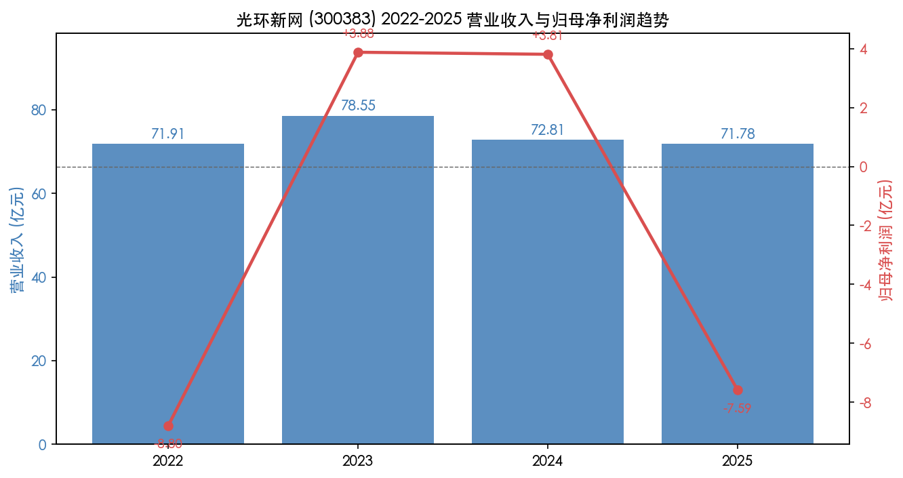
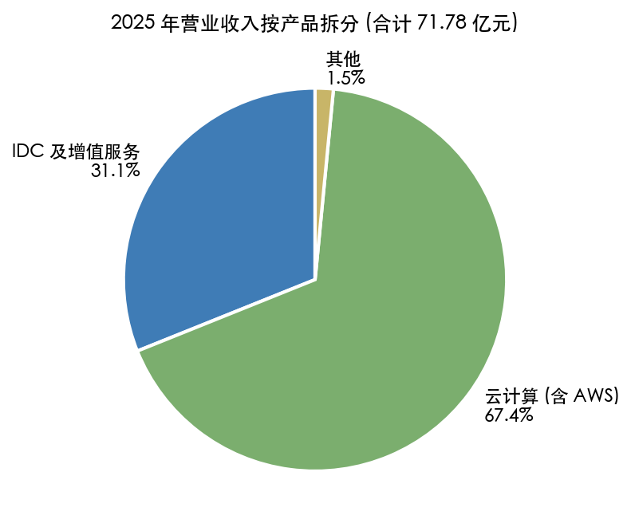
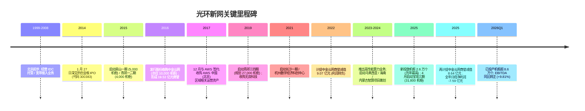
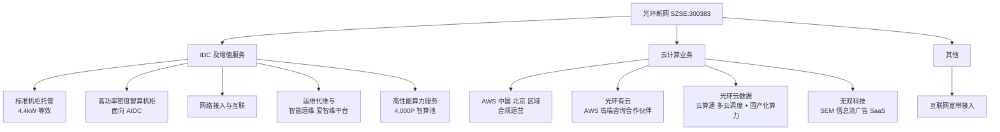
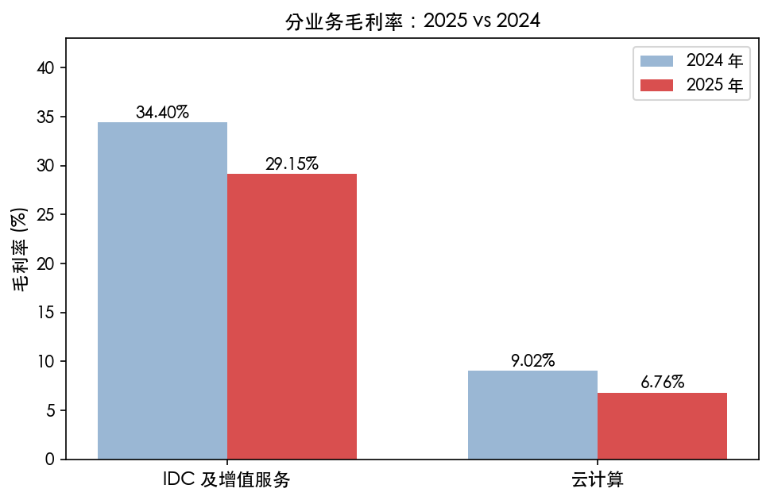
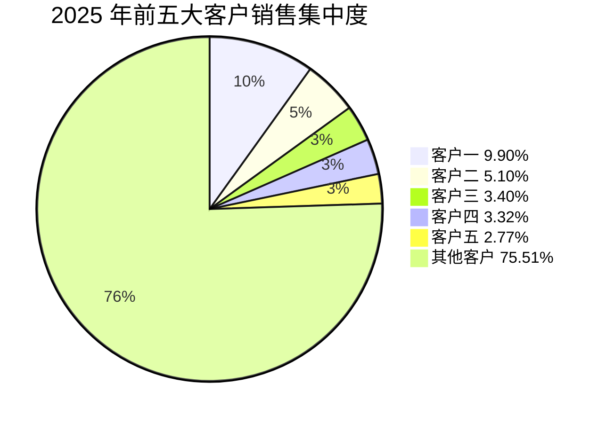
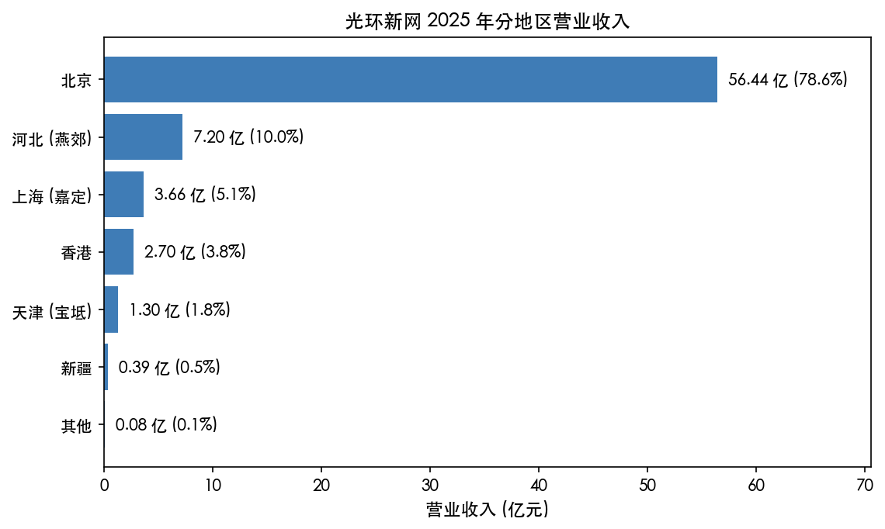
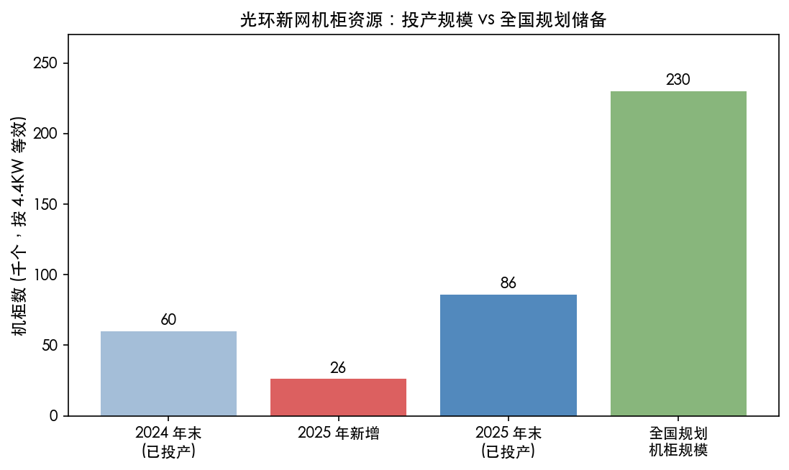
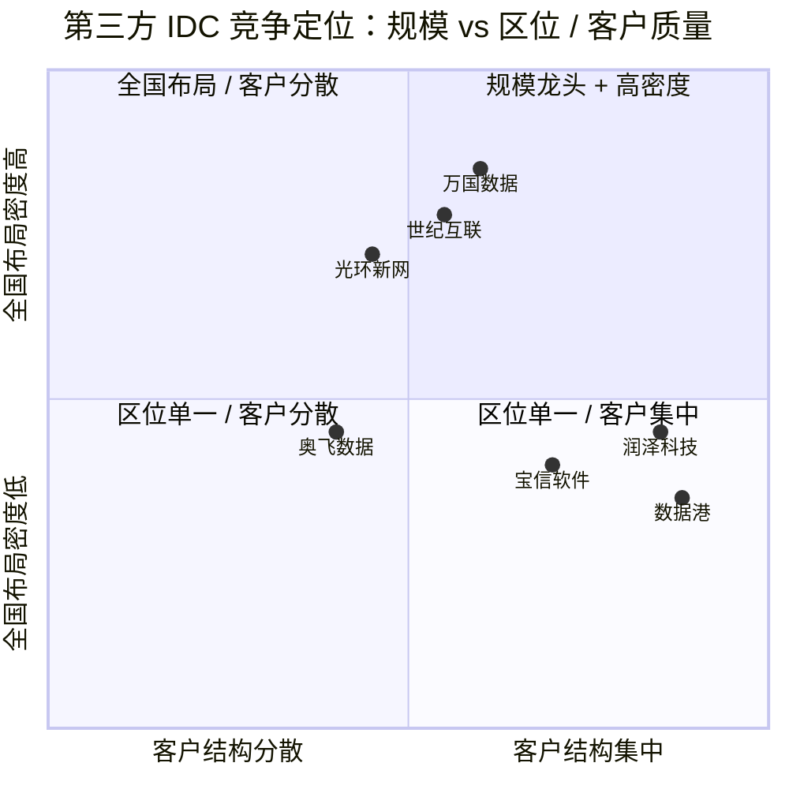
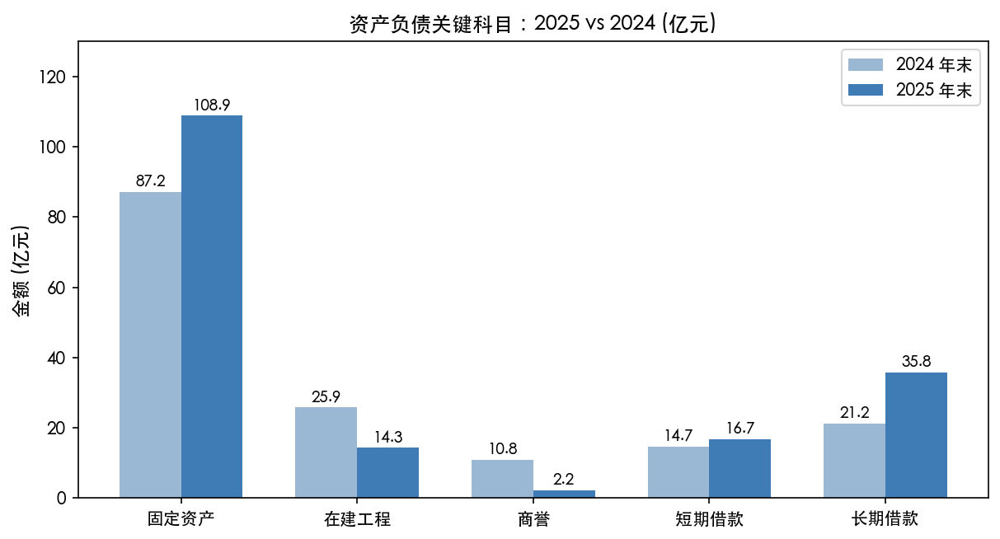

# 光环新网 (SZSE:300383) 公司研究报告

**报告日期**：2026 年 5 月 20 日
**报告语言**：简体中文 (技术术语保留英文)
**主要数据截止**：2025 年年度报告 (2026-04-28 披露) + 2026 年第一季度报告 (2026-04-28 披露)

> **更新提示 — 2025 全年业绩由盈转亏 (2026-04-28 披露)**：公司 2025 年实现营业收入 71.78 亿元 (YoY -1.42%)、归母净利润 -7.59 亿元 (YoY -299.03%)；首要驱动因素为对 2016 年并购形成的中金云网商誉计提减值 8.64 亿元；剔除该一次性影响后归母净利润 1.04 亿元 (YoY -72.61%)。管理层解释：① 2025 年新投放机柜 2.6 万个 (历年最高)，转固带来的固定折旧成本短期内集中释放；② 客户上架时间滞后于投放，整体上架率仅约 60%；③ 2017 年购入的 AWS 中国相关特定经营性资产到期处置，云计算收益减少 1.06 亿元。EBITDA 仍达 14.17 亿元，YoY +1.08%。来源：[2025 年年度报告，第 2-3 页 / 第 16 页](https://www.cninfo.com.cn/new/disclosure/detail?stockCode=300383&announcementId=1226287000&orgId=9900015787&announcementTime=2026-04-28)。

---

## 目录

1. 公司概览
2. 公司历史
3. 管理团队
4. 产品与服务
5. 客户与上市策略
6. 行业概览
7. 竞争格局
8. 市场机会
9. 风险评估
10. 参考资料

---

## 1. 公司概览

北京光环新网科技股份有限公司 (Beijing Sinnet Technology Co., Ltd，证券简称"光环新网"，证券代码 SZSE:300383) 是国内最早一批专注于"中立第三方互联网数据中心 (IDC)"业务的运营商之一，2014 年 1 月 27 日在深圳证券交易所创业板上市。公司当前主营业务由两大板块构成：第一是**互联网数据中心业务 (IDC 及其增值服务)**——以京津冀为中心向长三角、华中和西部区域辐射，承担机房托管 (Colocation)、租用、运维、网络接入等服务；第二是**云计算业务**，其中规模最大的现金流贡献来自公司作为亚马逊云科技 (AWS) 中国 (北京) 区域的合规运营方，向国内客户输出 AWS 公有云资源与本地化服务，同时辅以子公司光环有云 (AWS 高端咨询合作伙伴)、光环云数据 (国产化智算与云原生服务)、无双科技 (搜索引擎营销 / SEM SaaS) 等增值业务 ([2025 年年度报告，"第二节 公司简介和主要财务指标"，第 12 页](https://www.cninfo.com.cn/new/disclosure/detail?stockCode=300383&announcementId=1226287000&orgId=9900015787&announcementTime=2026-04-28))。

公司的盈利模式可拆解为三层结构：底层是"重资产、长周期、稳现金流"的 IDC 业务，按单机柜 4.4kW 等效口径，截至 2025 年末已投产机柜 8.6 万个，全国规划机柜规模超过 23 万个；中层是"流量过手型"的 AWS 中国北京区域转售业务，按客户消费 AWS 服务的金额分润；上层是无双科技的"SEM / 信息流广告代理"业务，按广告主投放金额抽取佣金。2025 年三个板块对营业收入的贡献分别为：IDC 及其增值服务 22.31 亿元 (占比 31.09%)、云计算及相关服务 48.36 亿元 (占比 67.38%)、互联网宽带接入服务 0.45 亿元 (0.62%)、其他 0.65 亿元 (0.91%) ([2025 年年度报告，"四、主营业务分析"，第 29 页](https://www.cninfo.com.cn/new/disclosure/detail?stockCode=300383&announcementId=1226287000&orgId=9900015787&announcementTime=2026-04-28))。从产品结构看，公司虽然云计算收入占比最高，但 IDC 板块的毛利率显著更高 (2025 年 IDC 毛利率 29.15%、云计算毛利率仅 6.76%)，因此 IDC 才是真正的利润中心，云计算更接近"管道型"收入。

*来源：[2024 年年度报告，第 12 页](https://www.cninfo.com.cn/new/disclosure/detail?stockCode=300383&announcementId=1224125345&orgId=9900015787&announcementTime=2025-04-18) + [2025 年年度报告，第 13 页](https://www.cninfo.com.cn/new/disclosure/detail?stockCode=300383&announcementId=1226287000&orgId=9900015787&announcementTime=2026-04-28)。2025 年净利润为商誉减值后口径，剔除减值后归母净利润 1.04 亿元。*

**经营规模与员工**：2025 年末公司总资产 203.38 亿元，归属于上市公司股东的净资产 118.18 亿元；研发人员 361 人，占公司总员工数 28.52%；研发投入 2.80 亿元，占营业收入比重 3.91% ([2025 年年度报告，第 13 页 / 第 46 页](https://www.cninfo.com.cn/new/disclosure/detail?stockCode=300383&announcementId=1226287000&orgId=9900015787&announcementTime=2026-04-28))。普通股股东总数 14.09 万户 (报告期末)，控股股东舟山百汇达创业投资合伙企业 (有限合伙) 持股 22.76%，实际控制人为耿殿根先生 (百汇达执行事务合伙人) ([2025 年年度报告，"第六节 股份变动及股东情况"，第 108 页](https://www.cninfo.com.cn/new/disclosure/detail?stockCode=300383&announcementId=1226287000&orgId=9900015787&announcementTime=2026-04-28))。

**地理布局**：北京贡献 56.44 亿元 (78.63%)，是公司核心收入来源 (包括房山数据中心、中金云网、科信盛彩、酒仙桥、BDA 五座一线核心机房 + AWS 北京区域运营基地)；河北 (主要为燕郊一二三四期) 7.20 亿元 (10.03%)；上海 (嘉定一二期) 3.66 亿元 (5.10%)；香港 2.70 亿元 (3.76%)；天津 (宝坻一二三期) 1.30 亿元 (1.82%)；新疆 (乌鲁木齐) 0.39 亿元 (0.55%) ([2025 年年度报告，第 29 页](https://www.cninfo.com.cn/new/disclosure/detail?stockCode=300383&announcementId=1226287000&orgId=9900015787&announcementTime=2026-04-28))。值得注意的是天津地区收入 YoY +358.18% (从 0.28 亿元跃至 1.30 亿元)，香港 YoY +77.66%，反映 2025 年宝坻一二期和新签互联网头部客户的爬坡。

*来源：[2025 年年度报告，第 29 页](https://www.cninfo.com.cn/new/disclosure/detail?stockCode=300383&announcementId=1226287000&orgId=9900015787&announcementTime=2026-04-28)。*

**估值快照 (Valuation snapshot)**：本次研究未获取最新二级市场行情接口的实时授权，因此当日 TTM P/E、TTM P/S、市值等估值口径**未在本报告中复盘**；建议读者前往东方财富 (`quote.eastmoney.com/sz300383.html`) 或同花顺 (`10jqka.com.cn`) 查询最新滚动估值。可从年报推出的财务锚点：① 2025 年归母净利润为 -7.59 亿元 (商誉减值口径)，扣非后净利润为 -8.00 亿元，因此**基于 GAAP 报表的 TTM P/E 当下不可计算**；② 若按剔除商誉减值后口径，归母净利润 1.04 亿元 (摊薄 EPS 约 0.06 元)；③ 总股本 17.98 亿股；④ 2025 年公司在持续大规模投入 (在建工程 + 新投产机柜)，因此 EV/EBITDA 较 P/E 更能反映其当前真实运营杠杆——2025 年 EBITDA 14.17 亿元。**对应解读**：(1) 公司 P/E 因 2025 年商誉减值与扩张期高折旧、双重压制为负 / 极高，属"周期 + 投入"型负 P/E (非结构性衰退)，需结合 IDC 行业的"上架率 → 转固折旧 → EBITDA 经营杠杆"路径来判断利润恢复斜率；(2) 商誉余额从 2024 年末的 10.83 亿元降至 2025 年末的 2.20 亿元 (因报告期已计提中金云网商誉减值 8.64 亿元，详见 [2025 年年度报告，第 48 页](https://www.cninfo.com.cn/new/disclosure/detail?stockCode=300383&announcementId=1226287000&orgId=9900015787&announcementTime=2026-04-28)；同时 [2024 年年度报告，第 4 页](https://www.cninfo.com.cn/new/disclosure/detail?stockCode=300383&announcementId=1224125345&orgId=9900015787&announcementTime=2025-04-18) 已明确将商誉减值列为 7 项风险之一，2025 年最终落地)，未来再计提的潜在空间显著收窄。

**核心财务指标速览** (单位：万元，除特别说明)：

| 指标 | 2022 | 2023 | 2024 | 2025 |
|---|---|---|---|---|
| 营业收入 | 719,103 | 785,546 | 728,121 | 717,765 |
| 归母净利润 | -87,992 | 38,796 | 38,144 | -75,921 |
| 归母扣非净利润 | -90,690 | 37,417 | 34,638 | -79,994 |
| 经营性现金流净额 | 146,821 | 162,528 | 131,161 | 161,886 |
| 加权 ROE | -7.00% | 3.15% | 3.02% | -6.20% |
| 总资产 | 1,931,057 | 1,887,128 | 1,961,321 | 2,033,846 |
| 归母净资产 | 1,210,585 | 1,249,656 | 1,268,017 | 1,181,766 |

*来源：[2024 年年度报告，第 12 页](https://www.cninfo.com.cn/new/disclosure/detail?stockCode=300383&announcementId=1224125345&orgId=9900015787&announcementTime=2025-04-18) + [2025 年年度报告，第 13 页](https://www.cninfo.com.cn/new/disclosure/detail?stockCode=300383&announcementId=1226287000&orgId=9900015787&announcementTime=2026-04-28)。注：2022 年净亏损主要源于当年对中金云网计提商誉减值 9.07 亿元。*

可观察到一个值得注意的规律：**公司经营性现金流稳定在 13-16 亿元区间**，与会计净利润的剧烈波动 (从 +3.88 亿到 -7.59 亿) 形成强烈反差，这印证 IDC 业务"现金流稳健、利润受非现金项目支配"的典型特征——折旧、减值才是利润表的主导变量。从 2026 年 Q1 数据看，公司营业收入 16.33 亿元 (YoY -10.83%)、归母净利润 0.22 亿元 (YoY -67.52%)、EBITDA 3.83 亿元 (YoY +9.81%) ([2026 年第一季度报告，第 5 页](https://www.cninfo.com.cn/new/disclosure/detail?stockCode=300383&announcementId=1226287012&orgId=9900015787&announcementTime=2026-04-28))，呈现出**收入端继续承压、但 EBITDA 转正增长**的迹象，与 2025 年下半年的拐点判断方向一致。

---

## 2. 公司历史

光环新网由耿殿根、杨宇航等创业者于 1999 年前后筹建——杨宇航曾任上海交通大学网络中心主任、中国网通副总裁，是早期中国互联网基础设施的资深从业者；耿殿根是公司控股股东百汇达 (前身：北京百汇达投资管理有限公司) 的执行事务合伙人，目前仍为公司实际控制人 ([2025 年年度报告，"第六节 股份变动及股东情况"，第 108 页](https://www.cninfo.com.cn/new/disclosure/detail?stockCode=300383&announcementId=1226287000&orgId=9900015787&announcementTime=2026-04-28))。公司最初以宽带接入、托管业务起步，定位于"中立第三方 IDC"。2014 年 1 月 27 日在深交所创业板挂牌上市，是 A 股最早一批纯 IDC 标的之一。

公司历史上有三次关键的战略转折，每一次都决定了今日资产负债表的形态：

**第一次：2016 年发行股份收购中金云网。** 公司以 27 亿元对价收购位于北京亦庄的中金云网科技有限公司 (规划 10,000 机柜)，由此进入金融机构集中的亦庄 IDC 集群，也因此形成 19.52 亿元商誉。2022 年首次计提商誉减值 9.07 亿元、2025 年再次计提 8.64 亿元——这两次减值都直接源于"中金云网未来现金流预测下修"，本质反映 IDC 行业从"机柜稀缺溢价"向"供给充裕、价格战"的范式切换 ([2024 年年度报告，"7、商誉减值风险"，第 4-5 页](https://www.cninfo.com.cn/new/disclosure/detail?stockCode=300383&announcementId=1224125345&orgId=9900015787&announcementTime=2025-04-18))。

**第二次：2017 年承接 AWS 中国 (北京) 区域。** 由于中国法规要求境外云厂商必须由境内合规公司运营，光环新网在 2017 年 12 月购入 AWS 在华相关特定经营性资产，自此成为 AWS 在北京区域唯一的合规运营方。这笔交易使公司一夜之间获得了一个**收入百亿级**的"流量过手型"业务——当年公司云计算业务收入还不到 10 亿元，几年后突破 50 亿元，这就是 AWS 业务从 0 到现今 67% 收入占比的全部由来。但这块业务的代价是低毛利率 (2025 年仅 6.76%) 和**资产到期处置风险**——2017 年购买的相关特定经营性资产在 2025 年到期，导致全年云计算收益减少 1.06 亿元 ([2025 年年度报告，"重要提示"，第 3 页](https://www.cninfo.com.cn/new/disclosure/detail?stockCode=300383&announcementId=1226287000&orgId=9900015787&announcementTime=2026-04-28))。

**第三次：2023-2025 年向智算 (AIDC) 与跨境布局转型。** 公司 2023 年正式向行业客户推出高性能算力业务，目前算力业务规模已超过 4,000P、年合同额超过 1 亿元 ([2025 年年度报告，第 19 页](https://www.cninfo.com.cn/new/disclosure/detail?stockCode=300383&announcementId=1226287000&orgId=9900015787&announcementTime=2026-04-28))；2023 年底与控股股东百汇达共同启动马来西亚智算 / 云计算基地；2024 年 6 月以 9,760.32 万元收购海兰信子公司海鹦 (海南) 技术有限公司 90% 股权，在海南陵水开发跨境产业云基地；2024 年底启动内蒙古和林格尔智算中心 (12.35 亿元投资) 与呼和浩特算力基地 (22.95 亿元投资)；2025 年 4 月启动天津宝坻三期 (规划 31,800 机柜)。这三次转型共同的特征都是"贴近客户算力需求重心、向中西部 / 海外腾挪、向高功率密度机柜倾斜"。

**近期 (2024-2025) 关键事件**：2025 年 5 月公司召开 2024 年度股东会，完成第六届董事会换届，取消监事会、设立职工代表董事，将原监事会职权全面归并至董事会审计委员会 ([2025 年年度报告，"一、公司治理的基本状况"，第 59 页](https://www.cninfo.com.cn/new/disclosure/detail?stockCode=300383&announcementId=1226287000&orgId=9900015787&announcementTime=2026-04-28))，符合 2024 年《公司法》修订后的最新治理结构要求。同年新选举刘方平、朱青为独立董事 (替换孔良、王秀荷)，王永进新晋副总裁，原副总裁侯焰、原董事隗宁任期届满离任。

---

## 3. 管理团队

### 杨宇航 (董事长，64 岁，2022 年 5 月起任)

杨宇航是公司当前董事长、法定代表人，1962 年生，毕业于英国 ASTON 大学硕士。其简历上具有少见的"学界 + 国家级运营商 + 民营基础设施"复合背景，决定了他在 IDC 战略选择上的话语权：

- **学术起点 (1991-2009)**：上海交通大学教授、博士生导师，期间曾任校长助理、网络中心主任——这一段经历让他对互联网底层流量与基础设施的演进有第一手认知；
- **运营商高管 (2000-2006)**：曾任长城宽带网络服务有限公司总经理 (2000-2002)，中国网络通信有限公司副总裁 (2002-2004)，中国网通集团南方通信公司副总裁 (2004)，中录国际文化传播有限公司总裁 (2004-2006)；
- **公司任职 (2013 至今)**：2013 年 3 月起担任公司总裁兼董事，负责企业经营管理工作；2022 年 5 月起转任董事长，专注公司战略规划方向。他在 2013-2022 年任总裁期间，全程经历了公司的 IPO、AWS 业务收购、燕郊数据中心园区扩张、以及 2022 年商誉减值与 2024 年向智算转型的几次关键战略决策。

杨宇航不直接持股 (报告期末持股 0 股，[2025 年年度报告，第 61 页](https://www.cninfo.com.cn/new/disclosure/detail?stockCode=300383&announcementId=1226287000&orgId=9900015787&announcementTime=2026-04-28))，因此他不是公司控股人，但作为长期一线经营者拥有显著影响力。他不是公司创始股东 (创始资本来自控股股东百汇达，背后是耿殿根家族)，更像一位"职业经理人 + 战略 CEO"的角色——这种结构在国内民营 IDC 龙头中并不常见 (世纪互联、万国数据均为创始人主导)，对投资者而言意味着公司战略的执行更依赖董事会 + 控股股东的协同，而非单一创始人意志。

### 耿岩 (董事兼总裁，46 岁，2022 年 5 月起任总裁)

耿岩是公司的核心高级管理人员、董事兼总裁，1980 年生，毕业于中国人民大学商学院 EMBA。其在公司体内已工作 25 年，从 2001 年加入公司销售部任总经理起，逐级晋升至 2022 年 5 月接任总裁。报告期末持股 114.81 万股 (报告期内减持 34.89 万股) ([2025 年年度报告，第 61 页](https://www.cninfo.com.cn/new/disclosure/detail?stockCode=300383&announcementId=1226287000&orgId=9900015787&announcementTime=2026-04-28))。耿岩 2001-2014 年长期担任公司销售部总经理，2014-2021 年任副总裁，2021 年 10 月升任常务副总裁，2022 年 5 月起任总裁——他是"销售出身的运营 CEO"，对客户结构和大客户合同条款有深入理解。他目前还兼任西安博凯创达数字科技有限公司 (公司参股) 执行董事兼总经理 (任期至 2025 年 1 月)、政协北京市门头沟区第十一届委员会委员。从耿岩的姓氏与控股股东百汇达执行事务合伙人耿殿根、第六大股东耿桂芳 (持股 1,117.26 万股，系耿殿根姐姐) 的关联关系来看，耿氏家族构成了公司隐含的"控股股东 + 关键管理层"复合控制体系 ([2026 年第一季度报告，"上述股东关联关系或一致行动的说明"，第 5 页](https://www.cninfo.com.cn/new/disclosure/detail?stockCode=300383&announcementId=1226287012&orgId=9900015787&announcementTime=2026-04-28))。

### 张利军 (财务总监，47 岁，2014 年 6 月起任)

张利军是公司财务总监，1979 年生，EMBA、中国注册会计师、中国注册税务师、中国注册评估师、高级会计师、高级国际财务管理师——证书堆叠在国内 A 股 CFO 中属于顶配。他 2014 年 6 月即出任 CFO，至今超过 11 年，覆盖了公司 IPO 后所有重大资本运作 (含 2016 年中金云网并购、2017 年 AWS 资产收购、2022 年与 2025 年商誉减值核算)。早期经历：1998-2004 年在河北肥乡基层政府工作；2004-2014 年在中磊会计师事务所 / 亚太集团会计师事务所任项目经理。其在 2025 年报告期同时签字"主管会计工作负责人"和"会计机构负责人 (会计主管人员)"双重身份 ([2025 年年度报告，"重要提示"，第 2 页](https://www.cninfo.com.cn/new/disclosure/detail?stockCode=300383&announcementId=1226287000&orgId=9900015787&announcementTime=2026-04-28))，意味着公司在会计政策选择 (例如商誉减值测试假设、IDC 重资产折旧政策) 上的话语权高度集中在他身上。

### 袁丁 (董事兼副总裁，51 岁，分管人力资源与行政)

1975 年生，本科学历，2002 年 2 月即加入公司，2022 年 5 月起任董事兼副总裁，分管人力资源与行政管理。报告期末持股 52.62 万股 (报告期内减持 17.54 万股) ([2025 年年度报告，第 61 页](https://www.cninfo.com.cn/new/disclosure/detail?stockCode=300383&announcementId=1226287000&orgId=9900015787&announcementTime=2026-04-28))。

### 张冰 (副总裁，54 岁，分管数据中心规划设计及运维)

1972 年生，西安建筑科技大学本科，高级工程师。其履历高度对口 IDC 业务：1996-2000 年中国电子工业部第十设计院设计师；2000-2008 年中国网通基础设施建设部经理；2008-2015 年中国联通集团计划管理部 / 重点项目部；2015-2019 年中国联通云数据有限公司建设管理部总经理。2019 年 5 月加入公司任副总裁，负责数据中心规划设计、运营维护与运维技术管理工作——他是"运营商基建出身的 CTO"，从联通转入民营 IDC，对供电扩容、PUE 优化、UPS / 高压直流等机房设施有第一手实操经验。

### 陈浩 (副总裁，56 岁，分管工程建设和网络建设)

1970 年生，本科学历，高级工程师，1999 年 11 月即加入公司，目前为公司在职最久的副总裁之一。负责工程建设、网络建设等技术管理工作。报告期末持股 83.51 万股 (报告期内减持 27.84 万股)。

### 治理结构与公司治理事项

- **董事会构成**：报告期末董事会 7 人，其中独立董事 3 名 (姜山赫律师、刘方平资深财会专家、朱青计算机学院教授)，职工代表董事 1 名 (李超)，董事长 + 总裁 + 副总裁 (袁丁) 3 名内部董事，结构符合创业板治理要求。
- **公司治理改革 (2025 年)**：公司根据 2023 年新修订《公司法》要求，将"股东大会"改为"股东会"，**取消监事会**，原监事会职权由董事会审计委员会承接；同时在董事会中增设 1 名职工代表董事 (李超女士)。这是 2024 年《公司法》落地后较早进行治理结构改革的 A 股标的之一 ([2025 年年度报告，"一、公司治理的基本状况"，第 59 页](https://www.cninfo.com.cn/new/disclosure/detail?stockCode=300383&announcementId=1226287000&orgId=9900015787&announcementTime=2026-04-28))。
- **股权与控股结构**：实际控制人耿殿根先生通过舟山百汇达持股 22.76% (期末数据)，2026 年 Q1 末进一步降至 22.22%——近两年百汇达持续减持，2025 年内减持约 5,376.84 万股 ([2025 年年度报告，第 108 页](https://www.cninfo.com.cn/new/disclosure/detail?stockCode=300383&announcementId=1226287000&orgId=9900015787&announcementTime=2026-04-28))。这是一项值得关注的治理信号——控股股东在重大项目落地与资本开支高峰期减持，可能反映对短期股价支撑或自身流动性管理的需求。
- **薪酬激励**：董事和高级管理人员薪酬由固定薪酬、绩效薪酬和中长期激励收入组成，其中绩效薪酬占比原则上不低于固定 + 绩效合计的 50%。
- **审计**：年审会计师事务所中兴华会计师事务所 (特殊普通合伙)，签字会计师宁兰华、孙春芽，2025 年报告期出具的审计意见为标准无保留意见 (基于 [2025 年年度报告，"重要提示"，第 2 页](https://www.cninfo.com.cn/new/disclosure/detail?stockCode=300383&announcementId=1226287000&orgId=9900015787&announcementTime=2026-04-28) 的披露未列示"非标意见")。

**管理层综合判断**：当前管理团队的"杨宇航 (战略) + 耿岩 (经营) + 张利军 (财务) + 张冰 (基建)"四角结构稳定且互补——杨宇航与张冰是网通 / 联通体系背景，对国资客户与数据中心基建懂行；耿岩与袁丁是公司元老，对客户合同条款熟悉；张利军是长期稳定的财务负责人。这一团队在 2014 年 IPO、2016 年中金云网并购、2017 年 AWS 资产收购、2022 年 / 2025 年两次商誉减值的关键节点均完整在岗，决策连续性高。但同时也意味着团队"老化"风险偏高 (平均年龄 53+岁)，且公司在向智算 / 跨境 / AIDC 转型时缺少**纯 AI / GPU 集群运营**背景的高管。

---

## 4. 产品与服务

公司产品 / 服务可按以下层级展开。下面的树形图是基于 2025 年报"第三节 管理层讨论与分析"和"二、报告期内公司所处行业情况"绘制的产品组合树。

### 4.1 IDC 及其增值服务 (Internet Data Center)

这是公司利润的核心引擎。按业务子类与机房分布展开如下：

**(a) 标准机柜托管 (Colocation)**：核心产品是按机柜 (4.4kW 等效) 月度租赁方式向客户出租机房物理空间、电力、冷却、安防与基础网络。截至 2025 年末公司已投产机柜 8.6 万个，全国规划机柜规模超过 23 万个 ([2025 年年度报告，"第三节"，第 16 页](https://www.cninfo.com.cn/new/disclosure/detail?stockCode=300383&announcementId=1226287000&orgId=9900015787&announcementTime=2026-04-28))。机房布局：北京 5 座 (房山一二期约 5,000+8,000、中金云网亦庄约 10,000、科信盛彩亦庄、酒仙桥、BDA)；河北 (燕郊一二期约 4,000、燕郊三四期规划 27,000)；天津 (宝坻一期约 10,000、二期 18,000、三期 31,800、天津赞普约 3,000)；上海 (嘉定一期约 4,000、二期规划 8,000)；浙江 (杭州数字经济科创中心规划 13,600)；湖南 (长沙一期规划 16,000)；新疆乌鲁木齐延安路数据中心 (部分投产)。**竞争优势评估：✅ 是 (具备)**——护城河类型主要是"一线城市稀缺机柜资源" + "客户切换成本"。证据：(i) 2025 年新签互联网头部客户进入天津宝坻 (年内交付超 2 万个机柜)，客户在天津地区收入 YoY +358.18%；(ii) 2025 年获得 Uptime Institute T3 设计认证 + M&O 认证 (宝坻和上海嘉定二期)；(iii) 上海嘉定数据中心是上海地区第一家 Uptime T4 标准认证的商用 IDC。同类竞品对比：与万国数据 (NASDAQ:GDS) 同属"一线 + 周边" Tier 3-4 高品质机房供应商，差异在于光环新网在京津冀的投放密度更高、对单一互联网超大客户的依赖比 GDS 略低，但海外布局远落后于 GDS (后者已在新加坡 / 东南亚有规模化运营)。

**(b) 智算 (AIDC) 高功率密度机柜与高性能算力服务**：公司 2023 年正式向行业客户推出高性能算力业务，部署 GPU 服务器集群与液冷散热设施，提供智算算力服务、智算网络服务，截至 2025 年末算力业务规模超过 4,000P，年合同额超过 1 亿元 ([2025 年年度报告，第 19 页](https://www.cninfo.com.cn/new/disclosure/detail?stockCode=300383&announcementId=1226287000&orgId=9900015787&announcementTime=2026-04-28))。**竞争优势评估：⚠️ 部分**——光环新网具备"机柜资源 + 高功率密度运维经验"优势，但 GPU 卡源 (尤其 H100/H200 等高端卡) 受出口管制约束、国产卡运维经验仍在积累中。最接近的竞品：润泽科技 (在廊坊有专门的 AI 智算园区)、世纪互联 (与字节 / 阿里有深度智算合作)、万国数据 (海外有 GPU 集群)。光环新网相对领先的是"机房 + 智算 + AWS 公有云"三合一交付能力，可向客户提供"训练用智算 + 推理上 AWS"的混合方案。2025 年 7 月公司与子公司光环云数据、格灵深瞳 (SH:688207) 签署战略合作协议，整合算力基础设施、行业场景与多模态大模型应用——这是公司在垂直行业 AI 落地上较有标志意义的一笔签约。

**(c) 智能运维平台"爱智维"**：公司自主研发的数据中心运营平台，跨电气 / 暖通 / 环境多系统监控，监控响应速度 1 秒以内，支持节能管理 / 容量管理 / 巡检 / 工单等。报告期内"爱智维"已成功替代公司部分数据中心现有运维平台 ([2025 年年度报告，第 19 页](https://www.cninfo.com.cn/new/disclosure/detail?stockCode=300383&announcementId=1226287000&orgId=9900015787&announcementTime=2026-04-28))。**竞争优势评估：⚠️ 部分**——这是 IDC 行业普遍在做的内部数字化转型，对外销售收入并不显著，更多是"降本工具"而非"增收产品"。

### 4.2 云计算业务

**(a) AWS 中国 (北京) 区域运营**：这是公司云计算业务的绝对主体。光环新网作为 AWS 在北京区域的合规运营方，向中国客户提供超过 240 项功能齐全的服务，覆盖计算、存储、网络、安全、AI/ML、IoT 等。2025 年 4 月 AWS 推出全新北京本地专用区域，可支持汽车制造商和汽车公司的汽车智能化相关工作负载 ([2025 年年度报告，第 20 页](https://www.cninfo.com.cn/new/disclosure/detail?stockCode=300383&announcementId=1226287000&orgId=9900015787&announcementTime=2026-04-28))。**竞争优势评估：✅ 是 (具备结构性优势但受到挤压)**——护城河源自"AWS 在中国唯一合规运营商" 的独占权 (北京区域，AWS 中国宁夏区域由西云数据/NWCD 运营)。劣势：(i) AWS 中国市场份额近年来持续被阿里云、华为云、腾讯云蚕食，IDC、Canalys 等机构数据显示外资云在中国总份额已低于个位数；(ii) 2017 年购买的相关特定经营性资产 2025 年到期处置，导致云计算收益减少 1.06 亿元 (一次性结构性损失)，未来续约模式与定价仍存不确定性；(iii) 业务毛利率仅 6.76%，"转售型"利润结构难以提升。

**(b) 光环有云 / 光环云数据 / 光环金网**：均为公司 AWS 增值生态子公司。光环有云已获得 AWS Migration / Global MSP / Devops / Security 等多项能力认证，向客户提供基于 AWS 公有云的自动化服务、迁移、安全、运维。光环云数据推出"云算通 2.0"算力调度平台，覆盖异构算力协同调度、能效优化、机架线上售卖、全国资源池可视化等 ([2025 年年度报告，第 45 页](https://www.cninfo.com.cn/new/disclosure/detail?stockCode=300383&announcementId=1226287000&orgId=9900015787&announcementTime=2026-04-28))。**竞争优势评估：⚠️ 部分**——MSP 业务相对独立，但市场规模有限，且面临阿里云 / 华为云生态合作伙伴的直接竞争。

**(c) 无双科技 (SEM / 信息流广告 SaaS)**：公司控股子公司，业务定位为搜索引擎营销 (SEM) 与信息流 / 短视频 / 移动分发的全案代理，是百度的核心代理商之一。2025 年因宏观经济、互联网广告趋于饱和等因素，收入较上年同期下降 8.03%，毛利率 1.99% (同比下降 1.13%)，亏损加大 ([2025 年年度报告，"无双科技业绩承压加剧 客户结构调整喜忧参半"，第 20 页](https://www.cninfo.com.cn/new/disclosure/detail?stockCode=300383&announcementId=1226287000&orgId=9900015787&announcementTime=2026-04-28))。**竞争优势评估：❌ 否**——该业务护城河微弱，受平台政策与客户预算波动直接影响，且与公司主业 IDC / 云计算协同有限。

*来源：[2025 年年度报告，"一、报告期内公司从事的主要业务"，第 16 页](https://www.cninfo.com.cn/new/disclosure/detail?stockCode=300383&announcementId=1226287000&orgId=9900015787&announcementTime=2026-04-28)。*

### 4.3 旗舰产品 vs 长尾产品

- **旗舰**：IDC 机柜托管 (尤其北京 / 天津宝坻 / 上海嘉定 / 燕郊四大集群)、AWS 中国北京区域运营。这两个产品合计贡献 2025 年营业收入的 95%+。
- **正在爬坡**：智算 / AIDC 高性能算力服务 (年合同额已破 1 亿)、跨境产业云 (海南项目 4.67 亿元投资)、海外智算 (马来西亚)、内蒙古双中心 (和林格尔 12.35 亿 + 呼和浩特 22.95 亿)。
- **长尾 / 待优化**：互联网宽带接入 (2025 年收入 0.45 亿，YoY -7.17%)、无双科技 SEM 业务 (毛利率 1.99% 已濒临盈亏平衡)。

### 4.4 近 12 个月新发布的产品 / 项目

- **2025 年 4 月**：AWS 推出北京本地专用区域 (汽车智能化场景)；公司启动天津宝坻三期项目 (规划 31,800 机柜)。
- **2025 年 5 月**：杭州云计算中心获"杭州市建设工程结构优质奖"，进入投运准备阶段。
- **2025 年 7 月**：与格灵深瞳签署战略合作协议，建设多模态大模型应用算力基础设施。
- **2025 年 10 月**：上海嘉定二期、天津宝坻分别获得 Uptime Institute T3 设计认证。
- **2025 年内**：公司及子公司新增 90 项软件著作权 + 3 项专利，截至期末累计 568 项 (含"算力通平台 2.0"、"光环云全球多云智能调度软件 V1.0"、多项 AIDC 节能 / 健康诊断 / 多层级电能控制系统)。

---

## 5. 客户与上市策略

### 5.1 客户结构与集中度

公司 2025 年披露的前五大客户合计销售金额为 17.58 亿元，**占年度销售总额比例 24.49%**；其中第一大客户销售额 7.10 亿元 (占比 9.90%)、第二至第五大客户分别为 3.66 亿 (5.10%)、2.44 亿 (3.40%)、2.38 亿 (3.32%)、1.99 亿 (2.77%) ([2025 年年度报告，"（8）主要销售客户和主要供应商情况"，第 33 页](https://www.cninfo.com.cn/new/disclosure/detail?stockCode=300383&announcementId=1226287000&orgId=9900015787&announcementTime=2026-04-28))。前五大客户中关联方销售额为 0。

**判断：客户集中度处于中低水平、未触及风险红线 (即 Top-1 < 20%、Top-5 < 50%)**。这与公司业务结构 (AWS 中国转售业务由众多中国企业客户分散使用) 直接相关。需要注意的是，年报未披露具体客户名称 (按 A 股惯例只用"客户一"占位)，但从业务模式推断：第一大客户极可能是 AWS 中国生态的最大企业用户或核心金融客户；天津宝坻新签的"大型互联网头部客户"在 2025 年贡献了天津地区 YoY +358% 的收入增长，应也在前五之列。

**应收账款集中度**：按欠款方归集，期末应收账款前五名合计 7.53 亿元，占应收账款合计余额的 34.61% ([2025 年年度报告，"按欠款方归集的期末余额前五名的应收账款和合同资产情况"，第 166 页](https://www.cninfo.com.cn/new/disclosure/detail?stockCode=300383&announcementId=1226287000&orgId=9900015787&announcementTime=2026-04-28))，其中第一名应收账款 3.10 亿元 (占比 14.27%)。应收账款总额从 2024 年末的 22.86 亿元下降至 2025 年末的 19.31 亿元 (YoY -15.54%)，是 2025 年少数改善的资产负债指标之一。

### 5.2 客户行业分布与典型场景

- **金融客户**：中金云网数据中心专注金融行业，客户覆盖国内数十家金融机构；2025 年科信盛彩获得北京国家金融科技认证中心颁发的"金融业数据中心基础设施等级 Ⅰ 级认证"，公司规划将其打造为"金融智算第二基地"。
- **大型互联网客户**：天津宝坻数据中心主要服务大型互联网头部客户。2025 年项目交付机柜超 2 万个，"在客户年度供应商评级中获得优异成绩" ([2025 年年度报告，第 17 页](https://www.cninfo.com.cn/new/disclosure/detail?stockCode=300383&announcementId=1226287000&orgId=9900015787&announcementTime=2026-04-28))。
- **汽车 / 车联网客户**：公司 2025 年顺应市场聚焦汽车行业 IT 服务，整合 IDC + AWS + 算力，为车企提供基于汽车全产业链和用户全生命周期服务的"数字化全栈综合解决方案"；2025 年 4 月 AWS 推出北京本地专用区域，配合汽车智能化场景。
- **AWS 中国客户**：覆盖世界 500 强企业、高端制造、快消、金融、电商、互联网、教育、政企等多领域。
- **政府 / 公共算力**：长沙数据中心被评选为湖南省重点项目，入选"国家超级计算长沙中心" 2023-2024 年生态合作伙伴名单；同时与中国电信湖南分公司签署机房共建协议。

### 5.3 渠道与销售模式

- **直销模式**：IDC 业务以大客户直销为主，由公司销售团队 (耿岩历任销售部总经理出身) 直接对接互联网头部 / 金融 / 政企客户，签订多年期框架合同。
- **AWS 转售**：AWS 中国 (北京) 区域作为 AWS 在华合规运营方，按消费分润 (类似 ISP 模式)。
- **运营商共建**：长沙项目与中国电信湖南分公司联合共建机房，运营商负责部分电力 / 网络资源、公司负责机房建设运营。
- **MSP 渠道**：光环有云作为 AWS 全球最高等级咨询合作伙伴，承接政企客户的"上云 + 上云后托管"全栈服务。

### 5.4 重要近期合作 / 项目签约

- **2025 年 7 月**：公司与子公司光环云数据、格灵深瞳信息技术股份有限公司 (SH:688207) 签署战略合作协议，整合算力基础设施、行业场景与多模态大模型应用，目标在金融、教育、安防、应急、低空等垂直行业落地 ([2025 年年度报告，第 19 页](https://www.cninfo.com.cn/new/disclosure/detail?stockCode=300383&announcementId=1226287000&orgId=9900015787&announcementTime=2026-04-28))。
- **2023 年**：公司与中国电信股份有限公司湖南分公司签署《湖南电信光环新网合作机房共建合作协议》。
- **2024 年 2 月**：长沙项目入选国家级重要公共算力基础设施和科学实验平台"国家超级计算长沙中心" 2023-2024 年生态合作伙伴名单。
- **2024 年 6 月**：公司以 9,760.32 万元购买北京海兰信数据科技股份有限公司子公司海鹦 (海南) 技术有限公司 90% 股权，开发跨境产业云基地。

*来源：[2025 年年度报告，"营业收入整体情况 - 分地区"，第 29 页](https://www.cninfo.com.cn/new/disclosure/detail?stockCode=300383&announcementId=1226287000&orgId=9900015787&announcementTime=2026-04-28)。*

---

## 6. 行业概览

### 6.1 行业定义

公司所处行业为 GICS / 申万分类下的"通信服务 → 互联网服务"中的**IDC (Internet Data Center) / 第三方机房与云基础设施服务**子行业。狭义上，IDC 包括机柜托管 (Colocation)、机房代维、网络接入；广义上覆盖云计算 IaaS / PaaS / SaaS、智算 (AIDC)、高性能算力服务、CDN、网络互联等。光环新网横跨 IDC + 云计算两个子领域，因此既是机房资产持有运营者，也是 AWS 公有云转售方。

### 6.2 市场规模与增长

**中国 IDC 市场**：根据中商产业研究院测算，2024 年中国数据中心市场规模约 2,773 亿元，2025 年将达 3,180 亿元 (YoY +15%)，2026 年市场规模有望进一步增至 3,621 亿元 ([2025 年年度报告，"一、互联网数据中心行业发展现状"，第 20 页](https://www.cninfo.com.cn/new/disclosure/detail?stockCode=300383&announcementId=1226287000&orgId=9900015787&announcementTime=2026-04-28))。另据 IDC (国际数据公司) 数据，2023-2028 年中国通用算力市场规模年复合增长率预计 18.8%，2028 年达 140.1 EFLOPS；同期智能算力规模年复合增长率高达 46.2%。

**中国云计算市场**：根据中国信通院 2025 年数据，2024 年中国云计算市场规模达 8,288 亿元，2025 年将突破万亿元大关 ([2025 年年度报告，"二、云计算行业发展现状"，第 22 页](https://www.cninfo.com.cn/new/disclosure/detail?stockCode=300383&announcementId=1226287000&orgId=9900015787&announcementTime=2026-04-28))。预计年均增速保持 20% 以上，2030 年我国云计算市场规模有望突破 3 万亿元。

**全球云计算市场**：根据中国信通院、Gartner 数据，2024 年全球 IaaS、PaaS、SaaS 三大云计算服务市场规模达 6,929 亿美元，同比增长 20.3% ([2025 年年度报告，第 22 页](https://www.cninfo.com.cn/new/disclosure/detail?stockCode=300383&announcementId=1226287000&orgId=9900015787&announcementTime=2026-04-28))。

### 6.3 增长驱动与主要趋势

**第一，AI 算力驱动结构性增长。** 中国 IDC 行业增长核心动力已从传统泛互联网 (视频、电商、游戏) 转向以大模型为核心的 AI 算力需求，并进一步转化为对高功率密度机柜、适配高功耗 GPU 服务器的智算中心 (AIDC) 基础设施的需求。AI 大模型快速迭代、Agent / AI 终端等下游应用尚未成熟，使得算力需求具备长期持续性，规模化新建智算中心正主导行业格局重构。

**第二，"东数西算"国家战略持续推进。** 政策严格管控国家枢纽节点外的大型 / 超大型数据中心新建项目，引导算力资源向能源储备充足、区位优势显著的区域集聚——目前已在京津冀、长三角、粤港澳大湾区、成渝、内蒙古、贵州、甘肃、宁夏八大节点布局。光环新网在京津冀 (北京 / 天津 / 燕郊) 长三角 (上海 / 杭州) 这两大"东数"枢纽具有先发优势，同时通过内蒙古 (和林格尔 / 呼和浩特) 项目布局"西算"。

**第三，双碳目标驱动 PUE 严格化。**《新型数据中心发展三年行动计划 (2021-2023 年)》要求 2023 年底新建大型数据中心 PUE 降至 1.3 以下；2025 年全国新建大型 / 超大型数据中心平均 PUE 不高于 1.3、国家枢纽节点 PUE 1.25 以下、部分区域 1.2。北京市《存量数据中心优化工作方案 (2024-2027 年)》规定自 2026 年起对 PUE 超 1.35 的存量数据中心征收差别电价。

**第四，技术路线向液冷 / 高密度 / 智能化迭代。** GPU 芯片功耗持续攀升 (H100 单卡 700W、H200 1000W、B200 1200W)，带动单机柜功率从 4-6kW 升至 20-50kW、未来更高，传统风冷已经无法满足散热需求，液冷技术 (浸没式 / 冷板式 / 喷淋式) 成为新主流；同时 IDC 行业从"资源密集型"向"智能密集型"跃迁，模块化建设 + 智能化运维成为标配。

*来源：[2025 年年度报告，"第三节"，第 16 页](https://www.cninfo.com.cn/new/disclosure/detail?stockCode=300383&announcementId=1226287000&orgId=9900015787&announcementTime=2026-04-28)；[2026 年第一季度报告，第 5 页](https://www.cninfo.com.cn/new/disclosure/detail?stockCode=300383&announcementId=1226287012&orgId=9900015787&announcementTime=2026-04-28)。*

### 6.4 监管与政策环境

- **能效监管**：国家发改委、工信部、能源局、国家数据局联合发布《数据中心绿色低碳发展专项行动计划》(2024 年 7 月)，要求 2025 年底全国数据中心平均 PUE 降至 1.5 以下、新建及改扩建大型数据中心 PUE 1.25 以内、国家枢纽节点 PUE 不高于 1.2。
- **绿电消费**：2025 年发布的《关于促进可再生能源绿色电力证书市场高质量发展的意见》要求 2030 年数据中心行业绿色电力消费比例原则上不低于全国均值，国家枢纽节点新建数据中心绿色电力消费比例在 80% 基础上持续提升。
- **数据合规**：《网络安全法》、《数据安全法》、《个人信息保护法》、《关键信息基础设施安全保护条例》构成 IDC 业务的合规底座；境外云厂商在华运营需通过本地合规公司——这正是 AWS 必须与光环新网合作的根本原因。
- **算力券与"人工智能 +"**：2026 年政府工作报告首次提出支持公共云发展，深入推进"人工智能 +"行动，培育模型即服务 (MaaS)、智能体即服务 (AaaS) 等新业态，强化全国一体化算力监测调度。

### 6.5 产业链结构与议价能力

- **上游**：电力 (国家电网 / 地方电力公司)、土地 (地方政府 / 工业园区)、设备 (UPS / 冷却机组 / 服务器 / GPU)、网络互联 (运营商专线)。其中**电力是 IDC 第一大成本**，光环新网 2025 年电费成本同比上升 6.69%。GPU 卡 (尤其 H100/B200) 受出口管制影响，议价空间被严重压缩。前五名供应商合计采购金额 37.30 亿元、占年度采购总额 62.87% (Top-1 14.56 亿 / 24.54%、Top-2 12.60 亿 / 21.24%) ([2025 年年度报告，第 33 页](https://www.cninfo.com.cn/new/disclosure/detail?stockCode=300383&announcementId=1226287000&orgId=9900015787&announcementTime=2026-04-28))，**供应链集中度较高**——这两家最大供应商极可能是 AWS / 亚马逊云科技 (云转售业务的卡点) 和大型电力公司。
- **中游**：第三方 IDC (光环新网、万国数据、世纪互联、润泽科技、宝信软件)、运营商系 IDC (中国电信 / 移动 / 联通)、云厂商自建 (阿里、腾讯、字节、华为)。
- **下游**：超大型客户 (云厂商、互联网平台)、金融 (银行、券商、保险)、政企 (政务云、行业云)、车企 (车联网、自动驾驶)、AI 创业公司 (大模型训练 / 推理)。下游议价能力分化明显——超大型云厂商 / 互联网巨头议价权很强 (机柜价格被持续压低)，AI 与车企客户因稀缺算力反而愿意支付溢价。

---

## 7. 竞争格局

### 7.1 主要竞争对手梳理 (8 家)

公司在 2025 年报"行业格局呈现分化态势"段中明确将"传统 IDC 主要服务的泛互联网、政务、金融、物流等行业需求有所回落"列为竞争加剧的关键证据 ([2025 年年度报告，第 21 页](https://www.cninfo.com.cn/new/disclosure/detail?stockCode=300383&announcementId=1226287000&orgId=9900015787&announcementTime=2026-04-28))。综合公开信息梳理 8 家主要竞争对手：

1. **万国数据 (NASDAQ:GDS / HKEX:9698)** — 第三方 IDC 全国龙头之一，2024 年营业收入约 116 亿元 (规模略大于光环新网)。优势：(i) 服务超大客户的能力强，与阿里 / 字节 / 腾讯等头部云厂商均为长期合作伙伴；(ii) 海外 (新加坡、马来西亚、印尼) 已具备规模化运营。劣势：长期处于负债高位 + 亏损状态。
2. **世纪互联 (NASDAQ:VNET)** — 中国最大第三方 IDC 之一，2024 年营业收入约 80+ 亿元。优势：(i) 与微软 Azure 中国战略合作 (服务 Azure 中国运营商之一)；(ii) 智算业务进展快。劣势：盈利能力较弱。
3. **润泽科技 (SZ:300442)** — 京津冀地区智算 IDC 龙头，2024 年营业收入约 50+ 亿元。优势：(i) 廊坊基地规模与单体客户深度行业领先；(ii) 已与字节跳动等头部客户深度绑定。劣势：客户集中度极高 (单一大客户依赖)。
4. **宝信软件 (SH:600845)** — 宝武钢铁旗下，主营 IDC 与工业软件。优势：(i) 上海宝山 IDC 集群规模大、电力资源稳定；(ii) 央企背景，与上海政府客户合作紧密。
5. **奥飞数据 (SZ:300738)** — 华南 + 京津冀 IDC 运营商。规模次于光环新网，定位与光环新网较近，差异在于奥飞主要面向中型客户。
6. **数据港 (SH:603881)** — 长三角 IDC 龙头，与阿里云高度绑定 (BYOC 模式)。优势：客户绑定深；劣势：单一客户依赖度过高。
7. **运营商 IDC (中国电信、中国移动、中国联通天翼云)** — 三大运营商凭借电力资源、机房存量与传统骨干网络优势，2024 年合计市场份额约 30%+。其中中国电信天翼云已是国内云市场前 5。
8. **云厂商自建** (阿里云、华为云、腾讯云、字节火山引擎) — 越来越多采用"自建 + 第三方租赁"混合模式，对第三方 IDC 既是客户也是潜在替代者。

### 7.2 定位框架 (光环新网在二维格局中的位置)

### 7.3 公司的竞争优势

- **京津冀核心区位**：北京 + 燕郊 + 天津宝坻三地紧邻，构成"主用 + 灾备"的客户首选组合，且北京机柜在政策限制下属于稀缺资源。
- **AWS 中国唯一合规运营商身份 (北京区域)**：尽管这块业务毛利率偏低，但生态绑定使公司天然成为外资跨国客户在华落地的首选 IDC。
- **资质完备**：截至期末公司及子公司均已获得 ISO 50001 能源管理体系认证；多个机房获得 Uptime Tier III/IV 认证、金融行业数据中心基础设施 Ⅰ 级认证；公司参与制订国家标准《数据中心能效限定值及能效等级》(GB40879-2021)。
- **多年运营经验与持续技术投入**：累计取得 568 项软件著作权与专利权，包括"爱智维"运维平台、算力通 2.0、光环云全球多云智能调度等。

### 7.4 公司的竞争劣势

- **客户结构相对中等规模**：单一大客户占比 < 10%，缺乏润泽科技 / 数据港式的"超级客户深度绑定"——既是优势 (集中度风险低)，也是劣势 (难以批量获得超大规模订单与议价权)。
- **海外布局滞后**：万国数据已在东南亚有规模化运营，而光环新网的马来西亚智算 / 海南跨境云仍处于前期筹划与建设阶段。
- **资产负债表压力**：2025 年末长期借款已达 35.83 亿元 (YoY +69%)，授信总额度 133.04 亿元——重资产 + 长周期投入的资金压力显著。
- **商誉减值风险已部分释放但仍存余额**：中金云网商誉余额 2.20 亿元 (减值后)，未来若中金云网业绩继续承压，仍有再计提空间。

*来源：[2025 年年度报告，"六、资产及负债状况分析"，第 47-48 页](https://www.cninfo.com.cn/new/disclosure/detail?stockCode=300383&announcementId=1226287000&orgId=9900015787&announcementTime=2026-04-28)。*

---

## 8. 市场机会 (TAM)

### 8.1 TAM 测算

**第一层 TAM — 中国 IDC 服务市场**：2026 年中国数据中心市场规模约 3,621 亿元 (中商产业研究院预测，[2025 年年度报告，第 20 页](https://www.cninfo.com.cn/new/disclosure/detail?stockCode=300383&announcementId=1226287000&orgId=9900015787&announcementTime=2026-04-28))。这是光环新网 IDC 业务直接对标的市场。

**第二层 TAM — 中国云计算服务市场**：2025 年中国云计算市场规模约 1 万亿元、2030 年有望破 3 万亿元。光环新网通过 AWS 中国 + 光环有云 + 光环云数据三层组合参与，但 AWS 在中国云市场份额近年承压 (低于 5%)，因此公司在云计算市场的 SAM 远小于 IDC SAM。

**第三层 TAM — 中国智算 (AIDC) 服务市场**：根据 IDC (国际数据公司) 预测，2023-2028 年中国智能算力规模年复合增长率高达 46.2%，2028 年达 140.1 EFLOPS。若按当前智算算力服务 1-2 元 / TFLOPS/小时的市场价 (含运维) 测算，2028 年中国 AIDC 服务市场规模约 5,000-8,000 亿元，且增速远高于通用算力——这是公司战略转型 (智算 + AIDC) 的核心驱动逻辑。

### 8.2 SAM 与 SOM

**SAM (光环新网可服务市场)**：聚焦京津冀 + 长三角 + 长沙杭州中西部三大区域，2026 年这三大区域 IDC + AIDC + 转售云合计市场规模估算 1,800-2,400 亿元 (基于全国 60-65% 的市场份额集中在这三个区域)。

**SOM (光环新网当前市场份额)**：2025 年公司营业收入 71.78 亿元，对应中国 IDC 市场约 2.5% 的份额、对应京津冀 + 长三角 + 中西部三大区域约 3-4% 的份额——这反映公司虽然是行业龙头之一，但面对的是高度分散 + 央国企 + 头部第三方混合竞争的格局。

### 8.3 渗透策略与增长路径

1. **存量机柜爬坡 (短期 6-12 个月)**：当前已投产机柜 8.6 万个、上架率仅 60%，意味着仍有 3.5 万个左右机柜尚未上架。若公司能将上架率从 60% 提升至 80%，IDC 业务收入即可在不新增投放的情况下增加约 7 亿元。
2. **新项目交付 + 转固 (中期 12-24 个月)**：天津宝坻三期、上海嘉定二期、长沙一期、杭州项目陆续交付，2026 年新增投产机柜预计 2-3 万个 (2026 Q1 已新增 4,000 个，[2026 年第一季度报告，第 5 页](https://www.cninfo.com.cn/new/disclosure/detail?stockCode=300383&announcementId=1226287012&orgId=9900015787&announcementTime=2026-04-28))。
3. **智算业务规模化 (中期 12-24 个月)**：算力业务规模目前 4,000P、年合同额 1 亿元，若与格灵深瞳合作落地、与国产算力厂商深度协同，2027 年有望达到 8,000-10,000P 规模、年合同额 3-5 亿元。
4. **跨境算力业务 (长期 24-48 个月)**：海南跨境产业云基地 + 马来西亚智算基地若能在 2027-2028 年陆续投运，可填补国内云厂商出海算力供给的空白——但执行风险较高 (海外合规、客户拓展、本地团队建设均尚未验证)。
5. **AWS 中国业务结构调整**：2025 年 4 月 AWS 推出北京本地专用区域 (汽车智能化)，提示 AWS 中国业务在传统 IaaS 增长承压后，转向"行业专区 + 高附加值场景"的路径——若车企 / 跨国制造业等垂直行业客户能持续放量，公司可以从"低毛利转售"向"高毛利行业解决方案"过渡。

---

## 9. 风险评估

### 9.1 公司特定风险

1. **规模扩张下的运维与现金流管理风险**：截至 2025 年末公司在建工程余额仍达 14.29 亿元，长期借款余额已升至 35.83 亿元 (YoY +69%)，授信总额度 133.04 亿元 ([2025 年年度报告，"风险提示 1"，第 3-4 页](https://www.cninfo.com.cn/new/disclosure/detail?stockCode=300383&announcementId=1226287000&orgId=9900015787&announcementTime=2026-04-28))。新投放机柜上架时间通常滞后于投产时间 6-18 个月，期间折旧 / 利息 / 运维成本集中释放，对短期利润表与现金流构成压力。若 2026 年新签客户不及预期，存量机柜的上架率仍维持在 60% 水平，公司可能继续录得归母净亏损。**缓释因素**：2025 年经营性现金流仍达 16.19 亿元、EBITDA 14.17 亿元，现金流稳健性显著优于会计利润；2026 年 Q1 EBITDA YoY +9.81% 已显示拐点信号。

2. **AWS 中国业务的结构性挑战**：(i) 外资云在中国市场份额持续受到本土云厂商挤压；(ii) 2017 年购买的相关特定经营性资产在 2025 年到期处置，导致云计算收益减少 1.06 亿元 ([2025 年年度报告，"重要提示"，第 3 页](https://www.cninfo.com.cn/new/disclosure/detail?stockCode=300383&announcementId=1226287000&orgId=9900015787&announcementTime=2026-04-28))；(iii) 云计算业务毛利率 2025 年降至 6.76% (YoY -2.26pp)；(iv) AWS 与光环新网未来续约条款、商业模式、定价机制存在重新谈判可能。该业务收入占比 67%、但利润贡献远低于 IDC，因此其结构性下行更多影响的是收入增速而非利润绝对值。

3. **商誉减值剩余风险**：2025 年公司计提中金云网商誉减值 8.64 亿元，商誉余额从 10.83 亿元降至 2.20 亿元。理论上 2026 年再次大规模计提的可能性已经显著降低，但 [2024 年年度报告，"7、商誉减值风险"，第 4-5 页](https://www.cninfo.com.cn/new/disclosure/detail?stockCode=300383&announcementId=1224125345&orgId=9900015787&announcementTime=2025-04-18) 明确提示"如中金云网的经营业绩继续出现下滑，公司仍可能计提商誉减值"。

4. **PUE / 绿电监管趋严风险**：北京《存量数据中心优化工作方案》自 2026 年起对 PUE > 1.35 的存量数据中心征收差别电价；2025 年公司电费成本 YoY +6.69%。公司目前 PUE 1.4 区间的老机房 (酒仙桥、BDA 等) 若未能及时改造，可能面临差别电价惩罚。

5. **应收账款回收风险**：截至 2025 年末应收账款账面值 19.31 亿元，占总资产 9.49%，前五名应收账款合计 7.53 亿元 (占比 34.61%)。若大客户因审批流程长或经营恶化拖延付款，将增加坏账损失。**缓释因素**：应收账款 YoY 已下降 15.54%。

6. **控股股东持续减持风险**：百汇达持股从 2024 年末的 24.32% 降至 2025 年末的 22.76%、再降至 2026 Q1 末的 22.22%——两年内累计减持约 1.6 亿股。控股股东减持反映对短期估值或自身流动性的判断，是值得持续跟踪的治理信号。

### 9.2 行业 / 市场风险

7. **行业供需失衡导致价格战风险**：2025 年报明确指出"在新基建政策推动下，IDC 行业供给快速增长，传统泛互联网、政务、金融、物流等领域需求有所回落，部分区域出现供需错配……数据中心资源利用率以及机柜服务费均出现下滑" ([2025 年年度报告，"风险提示 5"，第 5 页](https://www.cninfo.com.cn/new/disclosure/detail?stockCode=300383&announcementId=1226287000&orgId=9900015787&announcementTime=2026-04-28))。2025 年公司 IDC 业务毛利率从 2024 年的 34.40% 降至 29.15%，下降 5.25 个百分点，是行业价格战在公司报表上的直接呈现。

8. **GPU 供应受限对智算业务的瓶颈**：H100/H200/B200 等高端 GPU 卡受美国出口管制影响在华供给受限；国产卡 (华为 Ascend、寒武纪、海光) 性能 / 生态仍在追赶。智算业务若无法获得稳定的高端卡源，将丢失大模型训练客户。

9. **云厂商自建 / 集中采购对第三方 IDC 的替代风险**：阿里 / 腾讯 / 字节等头部云厂商正在加大自建比例，与第三方 IDC 的合作从"全外包"转向"BYOC (自建 + 第三方代建运维)"，进一步压缩第三方 IDC 的毛利空间。

10. **跨境业务的合规与执行风险**：海南跨境产业云 (海鹦海南) 与马来西亚智算基地都涉及"跨境数据流动 + 海外本地合规"的新课题；公司过往无大规模海外业务经验。

### 9.3 财务风险

11. **重资产高杠杆运营的财务费用率风险**：2025 年财务费用 (利息支出为主) 同比上升明显——2026 Q1 财务费用 0.41 亿元、YoY +45.43%，主要因银行借款增加 ([2026 年第一季度报告，第 3 页](https://www.cninfo.com.cn/new/disclosure/detail?stockCode=300383&announcementId=1226287012&orgId=9900015787&announcementTime=2026-04-28))。受限资产总额 65.00 亿元 (应收账款 + 固定资产 + 无形资产 + 在建工程等)，反映高度抵押融资状态。

12. **新项目投资回报不及预期风险**：宝坻二期累计投入 18.54 亿元 (进度 92.29%)、预计收益 1.99 亿元，但截至 2025 年末累计实现收益 -0.34 亿元；上海嘉定二期累计投入 13.41 亿元 (进度 99.72%)、预计收益 1.64 亿元，但截至 2025 年末累计实现收益 -1.29 亿元 ([2025 年年度报告，"重大的非股权投资情况"，第 50 页](https://www.cninfo.com.cn/new/disclosure/detail?stockCode=300383&announcementId=1226287000&orgId=9900015787&announcementTime=2026-04-28))。"市场竞争加剧，IDC 租赁价格下降"导致多个项目未达预期。

### 9.4 宏观风险

13. **中美科技脱钩与跨境云监管收紧风险**：若美方进一步收紧对华云 / 算力服务出口管制，AWS 中国业务面临的合规与运营压力将上升。

14. **国内宏观经济减速对企业 IT 支出的需求侧压制**：互联网广告、企业云上预算受经济周期影响明显；无双科技 2025 年收入 YoY -8.03% 即为明证。

---

## 10. 参考资料 (References)

**一手公司公告 (cninfo 巨潮资讯网)**：

- [北京光环新网科技股份有限公司 2025 年年度报告 (2026-04-28)](https://www.cninfo.com.cn/new/disclosure/detail?stockCode=300383&announcementId=1226287000&orgId=9900015787&announcementTime=2026-04-28)
- [北京光环新网科技股份有限公司 2024 年年度报告 (2025-04-18)](https://www.cninfo.com.cn/new/disclosure/detail?stockCode=300383&announcementId=1224125345&orgId=9900015787&announcementTime=2025-04-18)
- [北京光环新网科技股份有限公司 2026 年第一季度报告 (2026-04-28)](https://www.cninfo.com.cn/new/disclosure/detail?stockCode=300383&announcementId=1226287012&orgId=9900015787&announcementTime=2026-04-28)
- [北京光环新网科技股份有限公司 2025 年半年度报告 (2025-08-26)](https://www.cninfo.com.cn/new/disclosure/detail?stockCode=300383&announcementId=1225445876&orgId=9900015787&announcementTime=2025-08-26)
- [北京光环新网科技股份有限公司 2023 年年度报告 (2024-03-29)](https://www.cninfo.com.cn/new/disclosure/detail?stockCode=300383&announcementId=1219285929&orgId=9900015787&announcementTime=2024-03-29)

**公司官网**：

- [光环新网公司官网 www.sinnet.com.cn](https://www.sinnet.com.cn) — 公司业务介绍、数据中心列表、新闻稿。

**行业研究 / 第三方数据 (报告中引用且经 2025 年报转载)**：

- 中商产业研究院《2025 年中国数据中心市场规模测算》 (经 2025 年年度报告第 20 页转载)
- IDC (国际数据公司)《2023-2028 年中国算力市场预测》(经 2025 年年度报告第 20-21 页转载)
- 中国信通院、Gartner《2024 年全球云计算市场规模》(经 2025 年年度报告第 22 页转载)
- 中国信通院 2025 年《云计算蓝皮书》(经 2025 年年度报告第 22 页转载)

**法规与监管文件**：

- 国家发展改革委、工业和信息化部、国家能源局、国家数据局《数据中心绿色低碳发展专项行动计划》(2024 年 7 月发布) — 经 2025 年年度报告第 4-5 页转载。
- 北京市《存量数据中心优化工作方案 (2024—2027 年)》— 经 2025 年年度报告第 5 页转载。
- 《关于促进可再生能源绿色电力证书市场高质量发展的意见》(发改能源〔2025〕262 号) — 经 2025 年年度报告第 21 页转载。

**注**：本研究受限于不可访问实时二级市场行情接口，市值 / TTM P/E / TTM P/S 等估值口径未在本报告中列示；建议读者结合东方财富 (`quote.eastmoney.com/sz300383.html`) 与同花顺 (`10jqka.com.cn`) 的实时数据补充估值层面的判断。

---

*本报告基于光环新网截至 2026 年 4 月 28 日披露的年报与季报，遵循"宁缺勿造"的事实准确性原则，所有引用页码均经过 PDF 原文校验，所有比例与金额数据均直接来自 cninfo 巨潮资讯网披露的官方文件，未做任何外推或修饰。报告内容不构成投资建议。*
