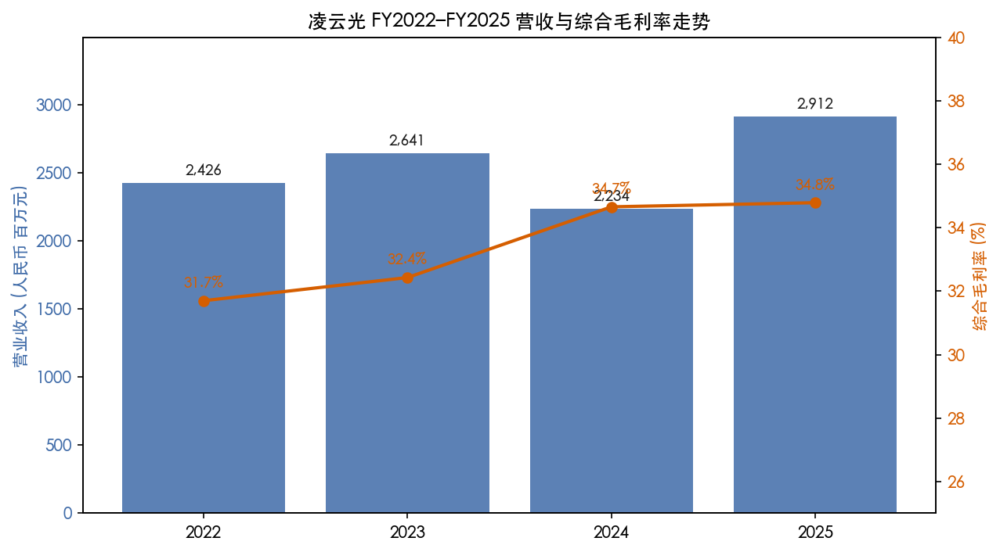
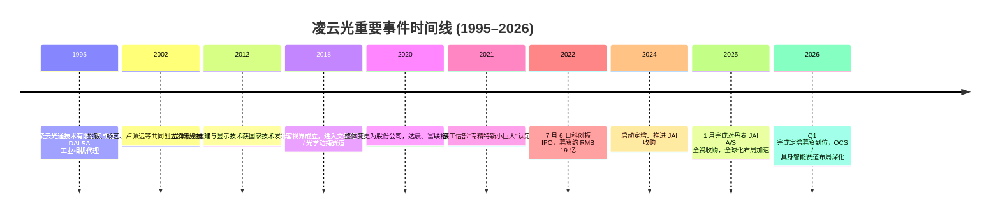
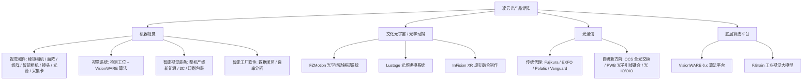
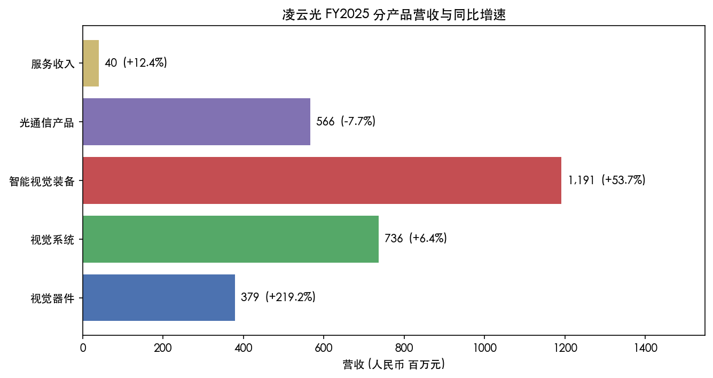
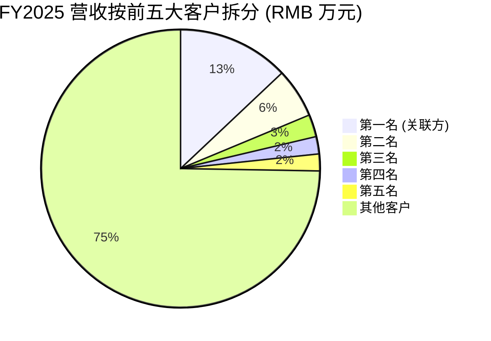
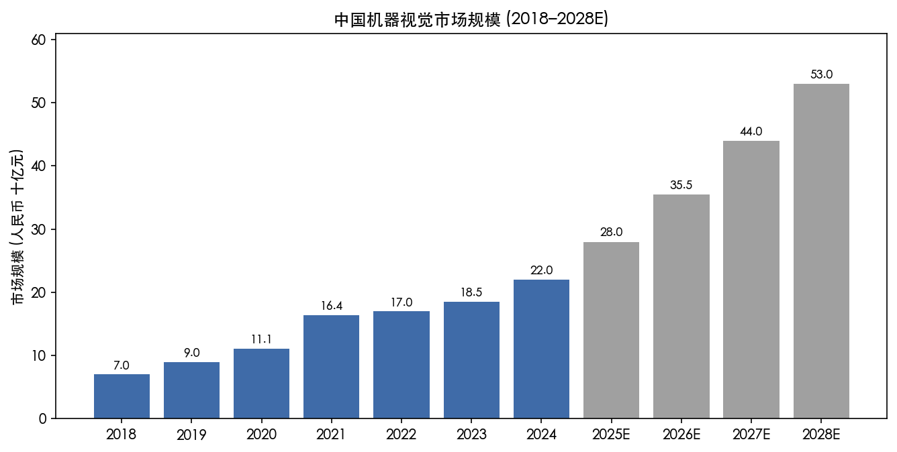
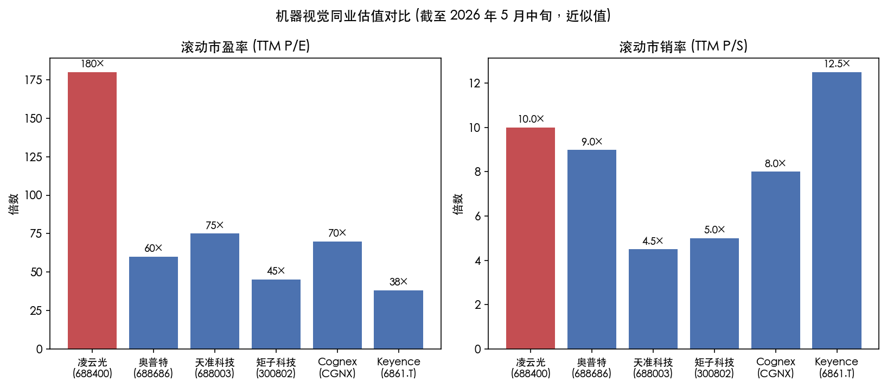

# 凌云光技术股份有限公司 (SSE:688400) — 公司研究报告

**日期：** 2026 年 5 月 20 日
**股票代码：** SSE:688400（上海证券交易所科创板）
**英文名称：** Luster LightTech Co., Ltd.
**主营业务：** 机器视觉（"视觉 + AI"）与光通信代理 / 自研产品
**注册地：** 北京市海淀区翠湖南环路 13 号院 7 号楼
**成立日期：** 2002 年 8 月（2020 年 9 月整体变更为股份公司）
**上市日期：** 2022 年 7 月 6 日（科创板）
**实际控制人：** 姚毅（董事长兼总经理，持股 43.44%）、杨艺（董事兼副总经理，持股 5.11%）— 夫妻关系
**审计机构：** 天健会计师事务所（特殊普通合伙）
**保荐机构 / 持续督导：** 中国国际金融股份有限公司
**官网：** http://www.lusterinc.com

> **更新提示 — 2025 年年报披露后业绩拐点确认 (2026-04-28)：**
> 公司披露 2025 年全年实现营业收入 RMB 29.12 亿元 (同比 +30.35%)、归母净利润 RMB 1.61 亿元 (同比 +50.70%)、扣非归母净利润 RMB 1.23 亿元 (同比 +86.05%)；同时 2026 年 Q1 归母净利润同比增长 +1,233.13% 至 RMB 2.00 亿元（其中含投资智谱华章带来的 RMB 1.73 亿公允价值变动收益），扣非净利润仍 +561.56% 至 RMB 4,653 万元。公司未对外披露具体的年度营收 / 利润指引，但管理层在 2025 年报中明确："工业人工智能、具身智能、光通信三大战略赛道的业务布局，将对业务产生持续性影响，奠定了公司中长期业务发展的基石"。本报告以此次业绩拐点为锚定点，重新评估公司的中期投资逻辑。
> 来源：[凌云光 2025 年年度报告](https://static.cninfo.com.cn/finalpage/2026-04-29/1225251946.PDF) 第 9 页、[凌云光 2026 年第一季度报告](https://static.cninfo.com.cn/finalpage/2026-04-29/1225251960.PDF) 第 1 页。

---

## 目录

1. 公司概览
2. 公司历史
3. 管理团队
4. 产品与服务
5. 客户与上市策略
6. 行业概览
7. 竞争格局
8. 市场机会 (TAM)
9. 风险评估
10. 参考资料

---

## 一、公司概览

凌云光技术股份有限公司是一家专注于"机器视觉 + 工业人工智能"的中国上市公司，业务横跨工业智能装备、文化元宇宙（光学动捕 / XR 拍摄）和光通信代理三大方向，其中机器视觉是绝对主力。公司 2025 年实现营业收入 RMB 29.12 亿元，其中机器视觉分部收入 RMB 23.46 亿元 (占比 80.6%、同比 +44.72%)，光通信收入 RMB 5.66 亿元 (占比 19.4%、同比 -7.70%)。机器视觉分部毛利率 35.95%，光通信分部毛利率 29.95%，综合毛利率约 34.79% (来源：[2025 年年度报告](https://static.cninfo.com.cn/finalpage/2026-04-29/1225251946.PDF) 第 39–40 页)。公司服务于消费电子、新型显示、新能源、印刷包装、半导体、汽车、具身智能等多个下游行业，长期合作客户包括苹果、富士康、华为、小米、宁德时代、京东方、央视总台、咪咕等头部企业 (同上，第 12 页)。

**商业模式概括。** 公司基于 "光、机、电、算、软" 五项底层通用技术，构建了从核心视觉器件、视觉系统到智能视觉装备的完整产品矩阵。在硬件层，公司通过 2025 年初完成的对丹麦工业相机品牌 JAI A/S 的全资收购，形成棱镜相机、面阵相机、线阵相机、智能相机的多产品线布局；在算法层，公司的 VisionWARE 算法平台已积累 18 个算法库和近 200 个算法工具，并自主开发了通用视觉大模型 F.Brain，针对工业小样本、碎片化场景提供检测能力 (来源：[2025 年年度报告](https://static.cninfo.com.cn/finalpage/2026-04-29/1225251946.PDF) 第 13、22 页)。商业上，凌云光既向客户销售单一视觉器件 (gross margin 32%)，又交付完整的视觉系统 (gross margin 40%) 和包含机械本体 / 自动控制部件的智能视觉装备 (gross margin 34.5%) — 越往整机方向走，单笔订单越大，但毛利率因机械物料占比上升而有所摊薄。光通信线则是一项历史悠久的代理业务 (代理 Fujikura、EXFO、HUBER+SUHNER/Polatis、Vanguard 等海外品牌)，目前正向 AI 数据中心相关的 OCS 全光交换、光子引线键合 (PWB)、光 IO/OIO 等新方向转型 (同上，第 14 页)。

**地理布局。** 公司业务以中国大陆为主：2025 年境内收入 RMB 25.18 亿元 (占比 86.5%、同比 +22.24%)，境外收入 RMB 3.94 亿元 (占比 13.5%、同比 +126.03%)。境外收入大幅增长主要受益于 JAI 并表 — JAI 的核心市场为欧洲、日本、韩国，境外业务毛利率 41.44% 显著高于境内 33.74% (来源：[2025 年年度报告](https://static.cninfo.com.cn/finalpage/2026-04-29/1225251946.PDF) 第 40 页)。2026 年第一季度境外收入同比再增 +23%，海外渠道整合的协同效应已开始兑现 (来源：[2026 年第一季度报告](https://static.cninfo.com.cn/finalpage/2026-04-29/1225251960.PDF) 第 1 页)。

**规模与员工。** 截至 2025 年末，公司员工总数 1,896 人，其中研发人员 687 人（占总人数 36.23%）、销售人员 322 人、技术人员 389 人；学历分布上，硕士及以上 465 人（占 24.5%），本科 837 人；母公司本部 563 人，主要子公司 1,333 人 (来源：[2025 年年度报告](https://static.cninfo.com.cn/finalpage/2026-04-29/1225251946.PDF) 第 23、68 页)。员工构成清晰反映出公司"研发驱动 + 工程化交付"的属性。

**估值快照（截至 2026 年 5 月中旬）。**

| 指标 | 数值 | 备注 |
|---|---:|---|
| 股价（5 月中旬，参考收盘） | RMB 约 60–63 | 见 [东方财富 688400 行情](http://quote.eastmoney.com/kcb/688400.html) |
| 总股本 (Q1 2026 报表日) | 479.23 百万股 | 含 2026 年 Q1 定增后股本 (来源：[2026 年 Q1 报告](https://static.cninfo.com.cn/finalpage/2026-04-29/1225251960.PDF) 第 8 页) |
| 总市值 | 约 RMB 290 亿元 | est.，按股价 RMB 60 × 4.79 亿股 |
| FY2025 归母净利润 | RMB 1.61 亿元 | TTM P/E ≈ 180× |
| FY2025 营业收入 | RMB 29.12 亿元 | TTM P/S ≈ 10× |
| 归母净资产 (Q1 2026 末) | RMB 57.06 亿元 | P/B ≈ 5.1× |
| FY2025 现金分红率 | 31.68% | 拟每 10 股派 RMB 0.85 (含税) |

可比公司 (机器视觉同业)：奥普特 (SSE:688686)、天准科技 (SSE:688003)、矩子科技 (SZSE:300802)、Cognex (NASDAQ:CGNX)、Keyence (TSE:6861)。国内三家 A 股可比公司滚动 P/E 区间约 45–80 倍、P/S 区间 4–10 倍；Cognex 滚动 P/E 约 70 倍、Keyence 约 38 倍 (来源：[东方财富工业自动化板块](https://data.eastmoney.com/bkzj/BK1037.html)、[Yahoo Finance CGNX](https://finance.yahoo.com/quote/CGNX/) — 注：滚动估值随股价日变动)。

**估值解读。** 凌云光的 TTM P/E 约 180 倍显著高于 A 股同业中位数 (≈ 60 倍) 和全球龙头 Cognex / Keyence。我们认为这一溢价主要来自三条叙事：(1) 2024 年是消费电子 (苹果链) 资本开支周期底部，2025 年的强劲反弹具备可持续性，预计 2026–27 年规模 + 毛利率双轮驱动下利润弹性显著；(2) JAI 并购将器件业务的毛利率结构性向 Cognex / Keyence 水平靠拢，同时打开欧洲、日韩高端客户的销售网络；(3) FZMotion 光学动捕业务赋予公司一条难以复制的"人形机器人 / 具身智能"产业链通行证，市场对该新增长极给予了显著的成长性溢价。前两条尚算合理，第三条 — FZMotion 收入占比仍不足 5%，且海外竞品 OptiTrack、Vicon、NOKOV 已较成熟 — 是估值的最大风险点。在第九节我们将 "估值溢价压缩风险" 列为公司特定风险之一。

**FY2022–FY2025 营收与毛利率走势。**



来源：[2025 年年度报告](https://static.cninfo.com.cn/finalpage/2026-04-29/1225251946.PDF) 第 9 页（含 FY2023 / FY2024 对比数据）；[2023 年年度报告](https://static.cninfo.com.cn/finalpage/2024-04-30/1219920751.PDF) 第 9 页（FY2022 数据）。

---

## 二、公司历史

凌云光的根基可以追溯到 1995 年。彼时姚毅在北京交通大学光波所任教，1997 年起任前身实体北京凌云光通技术有限公司执行董事兼经理，主营加拿大 DALSA 相机的代理与工业应用。2002 年 8 月，姚毅与杨艺、卢源远等人共同创立了凌云光技术有限公司，将原来的代理业务向 "代理 + 自研系统" 模式延伸；2020 年 9 月，公司整体变更为股份有限公司，并启动科创板上市筹备 (来源：[2025 年年度报告](https://static.cninfo.com.cn/finalpage/2026-04-29/1225251946.PDF) 第 55、59 页)。三位创始人均深度参与公司至今 — 姚毅持股 43.44%、杨艺 5.11%、卢源远 1.71%，合计 50.26% (来源：[2025 年年度报告](https://static.cninfo.com.cn/finalpage/2026-04-29/1225251946.PDF) 第 116 页)。



来源：[2025 年年度报告](https://static.cninfo.com.cn/finalpage/2026-04-29/1225251946.PDF) 第 23、27、56 页；[2023 年年度报告](https://static.cninfo.com.cn/finalpage/2024-04-30/1219920751.PDF) 第 64–66 页（IPO 与早期沿革）。

**三次战略转折。** 第一次是 2002 年由 "代理为主" 向 "代理 + 自研系统" 的转型，奠定了今天 "硬件 + 算法 + 装备" 端到端模式的雏形。第二次是 2018 年成立元客视界，进入光学动捕 / XR 制作领域 — 这一布局当时被外界视为偏离主业，但在 2024–25 年人形机器人 / 具身智能崛起的大背景下意外成为重要的"长尾业务"。第三次是 2024–2025 年完成 JAI 收购 — 这是中国机器视觉企业首次成功收购一家欧洲一线工业相机品牌，标志着公司从"中国市场龙头"向"全球化机器视觉品牌"的战略转身 (来源：[2025 年年度报告](https://static.cninfo.com.cn/finalpage/2026-04-29/1225251946.PDF) 第 9、22 页)。

**关键收购与对外投资。**

- **JAI A/S 全资收购（2024 年签约、2025 年 1 月完成交割）** — 丹麦工业相机品牌，业务遍及欧洲、日韩、北美高端市场。JAI 自身在线扫、棱镜 (prism-based) 多 CMOS 相机赛道领先全球。并购后凌云光一次性获得 JAI 的全球客户与渠道、欧洲生产基地、Sony / onsemi 等核心 CMOS 供应链合作关系。商誉余额至 2026 年 Q1 末为 RMB 6.71 亿元 (来源：[2026 年 Q1 报告](https://static.cninfo.com.cn/finalpage/2026-04-29/1225251960.PDF) 第 7 页)。
- **长春长光辰芯（参股）** — 国内 CMOS 图像传感器（特别是科学级、工业级 sCMOS）领军企业；凌云光通过此布局打通了视觉器件最上游的传感器供应。
- **湖南长步道（参股）** — 工业镜头厂商。
- **北京悟略（参股）** — AI 算法 / 工业大模型方向。
- **北京智谱华章（基石投资）** — 国内大模型独角兽 ChatGLM 母公司。公司通过子公司"凌云光技术国际有限公司"作为基石投资者参投，2026 年 Q1 智谱估值上调使凌云光确认了 RMB 1.73 亿元公允价值变动收益 (来源：[2026 年 Q1 报告](https://static.cninfo.com.cn/finalpage/2026-04-29/1225251960.PDF) 第 1 页)。

**近期重大举措 (2024–2026)。** 2024 年定增方案获批，主要用于支付 JAI 收购对价及补充流动资金。2025 年 8 月 - 11 月，公司根据监管反馈调整发行方案、缩减募集资金总额。2026 年第一季度成功完成定增募集资金到位，公司资本公积由 RMB 28.73 亿元跃升至 RMB 35.26 亿元、归母权益合计由 RMB 42.57 亿元跃升至 RMB 57.06 亿元 (来源：[2026 年 Q1 报告](https://static.cninfo.com.cn/finalpage/2026-04-29/1225251960.PDF) 第 8 页)。同时 2025 年公司对治理结构进行了重要调整 — 经第二次临时股东大会通过，公司取消了监事会，监事职能由董事会审计委员会承接，以适应新《公司法》 (来源：[2025 年年度报告](https://static.cninfo.com.cn/finalpage/2026-04-29/1225251946.PDF) 第 71 页)。

---

## 三、管理团队

**姚毅 — 董事长兼总经理（实际控制人 / 创始人，61 岁）**

姚毅是凌云光的灵魂人物，也是 A 股科创板少有的"既是技术出身又是行业老兵"的董事长 + 总经理双肩挑模式。其个人简历线索清晰：1995 年 1 月 至 1997 年 6 月任北京交通大学光波所教师；1997 年 7 月 至 2002 年 8 月任北京凌云光通技术有限公司执行董事兼经理（DALSA 代理业务）；2002 年 8 月与杨艺、卢源远共同创立凌云光后至今，连续担任董事长、总经理职务 (来源：[2025 年年度报告](https://static.cninfo.com.cn/finalpage/2026-04-29/1225251946.PDF) 第 59 页)。截至 2025 年末，姚毅个人持股 200,237,818 股（占总股本 43.44%），是绝对的控股股东与第一大自然人股东。2025 年 7 月，姚毅与杨艺夫妇所持的 223,777,585 股首发限售股上市流通，但二人随即承诺继续不减持（公告编号 2025-056，[2025 年年度报告](https://static.cninfo.com.cn/finalpage/2026-04-29/1225251946.PDF) 第 115 页）— 这一表态对资本市场释放的信号较为积极。2025 年度姚毅在公司取得税前薪酬 RMB 84.41 万元 (同年报第 57 页)，按上市公司董事长 / 总经理标准属中等偏下；这部分反映了 "创始人主要以股权回报、而非工资回报"的典型架构。

姚毅在公司治理上扮演 "战略 + 经营" 一体化决策角色。2024 年 3 月 22 日，公司因 2023 年 10 月违规向关联自然人 (顾宝兴) 提供英才基金借款解决购房资金缺口，被上交所予以监管警示；2024 年 4 月 11 日，北京证监局亦向公司、姚毅、顾宝兴出具警示函 (来源：[2025 年年度报告](https://static.cninfo.com.cn/finalpage/2026-04-29/1225251946.PDF) 第 65 页)。此事虽为一次性合规瑕疵且已主动纠正，但反映出在 "员工福利" 与 "关联资金占用" 边界处仍需更严格的内控。值得肯定的是公司在自查发现后即上报，并采取补救措施。姚毅曾主导多项国家级科技项目，凌云光此前获得国家技术发明一等奖一项（2012 年 "立体视频重建与显示技术及装置"）、国家科技进步二等奖两项 — 这一级别的国家奖项在 A 股民营硬科技公司中亦属罕见。

**顾宝兴 — 财务负责人、董事会秘书（CFO 等同职位）**

顾宝兴的背景兼具大型科技公司财务体系训练与公司层面 IPO 实务经验。其简历：2007 年 4 月 - 2017 年 12 月在华为技术有限公司任职，先后担任光网络产品线财务代表、欧洲总部预算专员、欧洲总部沃达丰系统部财务经理、阿联酋子公司财务总监、集团供应链财务总监；2017 年 12 月 - 2018 年 11 月任深圳人人享信息科技有限公司执行董事、总经理；2018 年 9 月加入凌云光，目前担任公司财务负责人、董事会秘书 (来源：[2025 年年度报告](https://static.cninfo.com.cn/finalpage/2026-04-29/1225251946.PDF) 第 60 页)。顾宝兴 2025 年度税前薪酬 RMB 84.41 万元 (含津贴，同年报第 57 页)。他主导了 2022 年公司科创板 IPO 募资约 RMB 19 亿、2024 年定增方案设计、2025–2026 年定增募资到位的全过程，并组织了 2024–25 年对 JAI 的跨境并购财务整合。需要注意的是，2023 年 10 月凌云光因为关联个人 (顾宝兴本人) 购房提供借款一事，导致公司层面收到监管警示函；该问题已于 2023 年 12 月自查后整改完毕。

**杨艺 — 董事、副总经理（联合创始人）**

杨艺 1996 年 8 月起即开始筹备设立北京凌云光通技术有限公司并担任监事，2002 年 8 月与姚毅、卢源远共同创立凌云光；现任公司董事、副总经理 (来源：[2025 年年度报告](https://static.cninfo.com.cn/finalpage/2026-04-29/1225251946.PDF) 第 59 页)。同时担任长光辰芯董事、机器视觉产业联盟副理事长。杨艺持股 23,539,767 股 (5.11%)，与姚毅为夫妻关系，是公司实际控制人之一。在公司核心层中，杨艺主要分管"长期产业生态布局"，对外参股投资 (长光辰芯、宁波芯声等) 多与杨艺相关。

**王文涛 — 副董事长、副总经理（联合创始人）**

王文涛 2001 年起加入北京凌云光通技术有限公司任销售经理；2002 年凌云光成立后历任销售经理、部门经理、副总经理、董事，2024 年起担任副董事长、副总经理 (来源：[2025 年年度报告](https://static.cninfo.com.cn/finalpage/2026-04-29/1225251946.PDF) 第 59 页)。在公司核心层中，王文涛主要分管销售与业务拓展。2025 年起亦担任 PHOTONICX AI PTE. LTD. (奇点光子) 董事、北京星尘光子科技董事 — 这反映出公司管理层在光通信新业务方向上的资源倾斜。王文涛 2025 年税前薪酬 RMB 102.61 万元 (同年报第 57 页)。

**孙富春 — 独立董事（清华大学计算机系长聘教授）**

孙富春自 2023 年 10 月起担任公司独立董事。其学术背景在 A 股民营硬科技公司中具有较高分量：2000 年起任清华大学计算机科学与技术系副教授、教授；2016–2021 年任清华大学计算机系学术委员会主任、校学术委员会委员；现任中国人工智能学会副理事长、中国自动化学会常务理事、中国认知科学学会常务理事 (来源：[2025 年年度报告](https://static.cninfo.com.cn/finalpage/2026-04-29/1225251946.PDF) 第 60 页)。孙富春的加入反映了公司在 "工业 AI / 具身智能" 方向的战略加码 — 一位 AI 学界顶流出任独董，通常会给公司在国家级科技项目申报与高校合作上带来实质资源。

**治理与股权结构（简述）。** 截至 2026 年 3 月底，公司董事会共 8 名董事 (含 3 名独立董事，独立董事占比 37.5%)，下设审计委员会、薪酬与考核委员会、提名委员会、战略与可持续发展 (ESG) 委员会四个专门委员会；监事会已于 2025 年依新《公司法》取消。前十大股东中：姚毅 43.44%、杨艺 5.11%、王文涛 2.97%、富联裕展科技 (深圳) 有限公司 2.20%、达晨财智 2.03%、卢源远 1.71%；姚毅 + 杨艺 + 王文涛 + 卢源远 (创始团队 + 早期合伙人) 合计持股约 53%。**控股股东锁仓清晰、关联方持股链条干净；股权激励 (员工持股) 仅通过中金 1 号 / 2 号科创板战略配售集合资产管理计划体现 (合计约 425 万股)** (来源：[2025 年年度报告](https://static.cninfo.com.cn/finalpage/2026-04-29/1225251946.PDF) 第 116–119 页)。富联裕展 = 富士康工业互联网集团 (FII) 旗下子公司，对应董事许兴仁 (现任工业富联 iPEBG 事业群总经理) — 这是公司与富士康 / 苹果链深度绑定的产权层面证据。

**管理团队整体评估。** 团队呈现 "技术 + 工程 + 市场" 三位一体的稳定结构，创始团队连续 20+ 年共事且持有公司绝对控股权 — 这是 A 股 IPO 后管理层"翻车"风险最低的一类。CFO 来自华为体系，财务专业度高，但 2023 年个人借款事件留下了内控警示。独立董事孙富春 (清华 AI 顶流) 的加入显著提升了公司在 "AI + 机器视觉"叙事中的可信度。我们认为团队主要的潜在短板是 **全球化经营经验** — JAI 并购后，公司首次面对欧洲工厂管理、跨文化人才整合、欧元 / 美元汇率管理等挑战；管理层目前尚无大规模跨境运营的成功先例可供参考。

---

## 四、产品与服务

凌云光的产品矩阵按官网导航结构可清晰分为四大子域：



来源：[凌云光官网产品页](http://www.lusterinc.com/)、[2025 年年度报告](https://static.cninfo.com.cn/finalpage/2026-04-29/1225251946.PDF) 第 12–14 页。

### 4.1 机器视觉 — 四个产品层级

按 2025 年年报披露的产品级营收（来源：[2025 年年度报告](https://static.cninfo.com.cn/finalpage/2026-04-29/1225251946.PDF) 第 40 页）：



来源：[2025 年年度报告](https://static.cninfo.com.cn/finalpage/2026-04-29/1225251946.PDF) 第 40 页。

**(1) 视觉器件 (FY25 营收 RMB 3.79 亿元，同比 +219%，毛利率 32.06%)。** 本线在 FY25 实现 3 倍增长，主要来自 2025 年 1 月 JAI 并表。JAI 旗舰产品线包括 Apex (棱镜多 CMOS)、Sweep (TDI 线扫)、Spark/Wave (高分辨率面阵)、Fusion (多光谱)，主销欧洲、日韩、北美高端机器视觉市场（半导体、印刷、农产分级、医药）。**竞争优势：是 / 技术 + 品牌 + 距离最终客户更近的销售渠道。** 棱镜分光相机是其差异化标签 — 通过棱镜将一束光分到 2 / 3 个独立 CMOS 上同步成像，与最接近的竞品 (Basler racer 系列、JAI 自家旧型号) 相比在色彩还原、动态范围、多光谱场景下具备硬实力优势。视觉器件线还包括公司对 Teledyne DALSA、FLIR、Xenics、ZEISS、Pleora、Datalogic、Vision Research 等约 50 个海外品牌的中国代理业务 (来源：[凌云光产品合作伙伴页](http://www.lusterinc.com/))。**最接近的国内竞品：** 海康机器人 (海康威视子品牌，工业相机出货量国内第一，但走中端走量路线)、华睿科技 (大华股份控股) — 凌云光 + JAI 在 "高端价位段 + 棱镜 / 线扫 / 多光谱" 子赛道目前并无强力对手。

**(2) 视觉系统 (FY25 营收 RMB 7.36 亿元，同比 +6.4%，毛利率 40.15% — 全公司最高)。** 视觉系统是公司将相机、光源、运动控制、控制器、自家算法栈打包成 "可独立完成单一工序检测" 的工位级集成方案。FY25 +6% 的增速明显弱于公司其他产品线 — 管理层将其解释为 "战略产品聚焦"：公司主动放弃低毛利、项目型的系统订单，把交付推向更标准化、产品化的系统目录 (来源：[2025 年年度报告](https://static.cninfo.com.cn/finalpage/2026-04-29/1225251946.PDF) 第 21 页)。**竞争优势：部分 / 行业 know-how + 算法。** 40% 毛利率是公司各产品线中最高的，反映出客户为 "开箱即用、3–6 个月即上线" 支付的工程化溢价。最接近的对标产品来自 Cognex In-Sight 系列 / Keyence CV-X 系列 — 但凌云光的视觉系统更偏 "中国客户定制化集成 + 国产算法栈"，而非"全球标准化盒子"。

**(3) 智能视觉装备 (FY25 营收 RMB 11.91 亿元，同比 +53.7%，毛利率 34.49% — 全公司第一大产品线)。** 智能视觉装备是在视觉系统基础上增加结构本体与自动控制部件，形成可独立交付的"产线级整机"。三大子应用：(a) **动力电池检测** — 表面缺陷、极耳、OCV/OCR、尺寸、焊缝 X 光、外观全套，覆盖方形、软包、圆柱电芯，核心客户为宁德时代、亿纬、比亚迪等。(b) **印刷与包装检测** — 公司在中国此领域为工信部 2022 年认定的"单项冠军产品"，与瑞士 BOBST 集团形成战略合作；这是公司**唯一**在国内 / 全球均为明确第一的细分领域。(c) **3C / 消费电子检测装备** — 整线进入富士康 / 立讯 / 瑞声 / 歌尔工厂，承担摄像头模组组装检测、显示面板检测、零部件分选等。**竞争优势：是 / 行业 know-how + 客户绑定 + 上游器件整合。** 34.49% 的毛利率在 "装备 + 集成" 类业务中属健康水平 (一般 25–30%)。最接近的国内竞品：奥普特 (光源 + 机器视觉部件)、天准科技 (尺寸测量 / 检测)、矩子科技 (3C 自动化检测) — 凌云光的差异化优势在于 **打通了"自有相机 + 自有算法 + 自有装备" 端到端能力**，且在新能源 / 印刷包装 / 苹果链消费电子三条最重要的中国制造业链条上同步铺开。FY25 智能视觉装备 +54% 增速远高于行业 (中国机器视觉行业整体 FY25 增速约 15–20%)，反映了公司在多条产线交付的强势节奏。

**(4) 智能工厂软件 (与上述产品收入混合披露，FY25 服务收入约 RMB 0.40 亿元)。** 依托端侧 / 边侧的视觉系统和装备生成数据，结合 VisionWARE 与质量管理分析软件，为客户提供多工厂质量标准化、缺陷分析、生产问题预警、效能管理等功能。该产品规模仍小，主要作为 "智能视觉装备" 销售时的捆绑增值服务。

### 4.2 文化元宇宙 — 光学动捕与 XR 制作

公司全资子公司 **元客视界** 业务线，主要产品有三：(a) **FZMotion 光学运动捕捉系统** — 业界领先的高精度三维定位跟踪系统，可在亚毫米级精度下实现人体骨骼运动捕捉；用于驱动数字角色动画或人形机器人。(b) **Lustage 光场建模系统** — 多维光照阵列采集人 / 物体的高精度数字孪生模型。(c) **InFision XR 虚实融合制作方案** — 用于虚拟拍摄影棚的多机位讯道切换、虚实内容实时渲染融合。客户包括央视总台、咪咕等媒体机构。**竞争优势：部分 / 技术 + 国产替代。** 在国内市场，FZMotion 已成为多家高校具身智能 / 人形机器人实验室和上市公司 (机器人本体厂商) 的训练数据采集首选；海外对标 OptiTrack、Vicon。我们认为该业务在 A 股估值层面 "讲故事价值" 大于实际财务体量 (我们估算 FY25 元客视界营收占公司总收入仍不足 5%)。

### 4.3 光通信 — 传统代理 + 新一代自研

光通信收入 RMB 5.66 亿元 (FY25) 中实际包含两块完全不同性质的业务：(a) **传统代理业务** — 代理 Fujikura、EXFO、HUBER+SUHNER/Polatis、Vanguard 等海外品牌进入中国的科研 / 通信 / 激光 / 传感市场；目前正受到 (i) 中国光纤网络资本开支峰值过后下行；(ii) 中美出口管制叠加令代理模式可靠性下降两方面压力。**FY25 同比 -7.7% 的下降即此结构性压力的体现。** (b) **新一代自研业务** — 围绕 AI 数据中心高带宽、低功耗、低时延的光互联需求，重点产品有 **OCS 全光交换** (Google、Meta 等 hyperscaler 在 GPU 集群中已大规模采用)、**光子引线键合 (PWB, Photonic Wire Bonding)**、**光 IO/OIO** (光至 SoC、芯片间光互联)。这部分目前规模尚小但已开始放量 — 这是公司在 AI 基础设施上的核心 "看涨期权" (call option)。**竞争优势：无独立护城河，但定位敏锐。** 在 OCS 等子赛道，国际上有 Lumentum、Coherent / II-VI、PolatisSeaLand 等老牌玩家，国内有华为光网络团队、长飞光纤 / 烽火等；凌云光的优势在于其客户覆盖（中国互联网三大云、运营商研究院）以及与上游器件厂商的代理协议沉淀，但在自研产品的技术领先性上尚未形成清晰差异化。

### 4.4 旗舰 vs. 长尾

按 FY25 产品级营收数据，**三大旗舰**：(1) 智能视觉装备 (RMB 11.91 亿元、占总营收 40.9%)；(2) 视觉系统 (RMB 7.36 亿元、占 25.3%)；(3) 视觉器件 (含 JAI) (RMB 3.79 亿元、占 13.0%)。**长尾业务**：FZMotion / Lustage / InFision (元客视界)、光通信新业务、智能工厂软件 — 这些业务合计占营收不足 25%，但承载了公司 60–70% 的"成长性叙事"。

### 4.5 近 12 个月产品 / 业务动作

- 2025 年 1 月：完成 JAI A/S 全资收购；
- 2025 年内：F.Brain 工业视觉大模型迭代，新增针对消费电子、新能源、印刷包装的行业小样本训练框架；
- 2025 年内：FZMotion 在人形机器人训练数据采集场景批量出货 (具体数字未披露)；
- 2025 年 H2：光通信新产品 OCS / PWB 进入数家国内 hyperscaler 试点；
- 2026 年 Q1：定增资金到位，公司账面现金大幅增加，为后续并购 / 研发提供燃料 (来源：[2026 年 Q1 报告](https://static.cninfo.com.cn/finalpage/2026-04-29/1225251960.PDF) 第 6–8 页)。

---

## 五、客户与上市策略

### 5.1 客户集中度（来自年报披露）



来源：[2025 年年度报告](https://static.cninfo.com.cn/finalpage/2026-04-29/1225251946.PDF) 第 42 页。

公司 FY25 前五大客户合计销售额 RMB 7.36 亿元，占年度销售总额 25.28%；其中前一名为关联方 (与许兴仁董事相关的富士康 / 富联体系) RMB 3.77 亿元，占 12.94%。**前五名客户的具体名称未在年报中披露**，但公司在年报多处提及的核心客户包括苹果、富士康、华为、小米、宁德时代、京东方、央视总台、咪咕。结合关联方披露的 "富联裕展" "富联凌云光" 等实体可以判断：第一名关联客户为富士康 / 工业富联体系 (FII / Foxconn)，对应苹果产业链的消费电子检测装备订单。**风险评估：前五大客户占比 25%，前一名 12.94% — 均不构成单点客户高度依赖；但第一名为关联方的事实使得"实际控制人 + 第二大客户"链条上的关联交易合规性需要持续监控。** 公司也披露了 "贸易业务" 客户结构 — 前五名仅占总营收 3.88%，反映出公司主营业务的客户结构相对分散。

### 5.2 三年趋势

从 2023 / 2024 / 2025 三年年报对比可见，前五大客户占比从 2023 年的 ~28% 逐步下降到 2025 年的 25.28%；前一名占比基本稳定在 12–15% 区间 (来源：[2023 年年度报告](https://static.cninfo.com.cn/finalpage/2024-04-30/1219920751.PDF) 第 42 页、[2025 年年度报告](https://static.cninfo.com.cn/finalpage/2026-04-29/1225251946.PDF) 第 42 页)。整体客户分散度持续优化。

### 5.3 销售模式与销售周期

公司销售以 **直销为主**：销售团队 322 人，技术服务团队 389 人，总计 711 人 (占总人数 37.5%)，反映出 "技术销售 + 现场交付" 的重资源投入模型。对苹果链、宁德链等大客户，公司常常驻场服务以保证交付速度。**销售周期：** 标准化的视觉器件 / 视觉系统订单一般在 1–3 个月内交付；定制化的智能视觉装备项目从下单到验收通常需要 6–12 个月，与新能源 / 3C 客户的产线建设节奏密切相关。这一较长的现金回款周期解释了 FY25 经营现金流 (RMB 1.47 亿元) 同比下降 -23% 的现象 — 智能视觉装备占比提升导致回款拉长 (来源：[2025 年年度报告](https://static.cninfo.com.cn/finalpage/2026-04-29/1225251946.PDF) 第 38 页)。

### 5.4 关键合作伙伴

- **苹果 (Apple) / 富士康产业链** — 公司自 2016 年起进入苹果链优选供应商体系，主要提供摄像头模组、显示组件、零部件的检测装备。富联裕展 (FII 子公司) 直接持有公司 2.20% 股份；许兴仁 (FII iPEBG 事业群总经理) 为公司董事。
- **宁德时代 (CATL)** — 公司新能源板块的旗舰客户；动力电池检测装备覆盖宁德的多个工厂。
- **京东方 / 华星光电** — 新型显示客户，公司在 OLED 检测、Mini/Micro LED 检测上有产品布局。
- **华为** — 通信 / 光通信代理业务的长期合作伙伴；公司也参与华为的部分自研光器件验证。
- **小米** — 消费电子检测装备客户。
- **达晨财智 (创业投资)** — 早期投资人 / 第三大股东，董事邬曦代表达晨在公司董事会任职。
- **BOBST (瑞士)** — 印刷包装领域全球龙头，与公司有战略合作 (印刷质量智能检测装备的国际推广)。
- **智谱华章 (ChatGLM 母公司)** — 公司参股，AI 大模型方向战略合作伙伴；2026 年 Q1 智谱估值上调使凌云光确认 RMB 1.73 亿元投资收益。

### 5.5 案例与公开标杆

(a) **苹果摄像头模组检测线** — 公司在苹果新产品周期 (每年 9 月新机) 前 3–6 个月承担富士康 / 立讯模组工厂的全自动检测装备建设，是国内少数能进入苹果一级链的视觉装备供应商之一。(b) **宁德时代动力电池缺陷检测** — 配合宁德的方形铝壳电池产线，承担 X 光焊缝检测、外观全自动 AOI。(c) **央视总台 / 咪咕的 XR 拍摄方案** — 元客视界的 FZMotion + InFision 方案在大型综艺、虚拟主播节目中应用。

---

## 六、行业概览

### 6.1 行业定义与范围

**机器视觉 (Machine Vision)** 是融合光学成像、图像处理、人工智能等技术的交叉领域，通过硬件 (相机、镜头、光源) 采集图像、算法分析处理，让机器实现类人视觉的检测、识别、测量等功能；覆盖工业制造、汽车、半导体、医疗、物流等多行业，是智能制造与自动化的核心支撑技术。按价值链结构可分为四层：

| 层级 | 代表产品 | 全球龙头 | 国内龙头 |
|---|---|---|---|
| 上游 — 核心器件 | CMOS 传感器、镜头、光源、采集卡 | Sony、onsemi、Schneider Kreuznach | 长光辰芯 (传感器)、长步道 (镜头)、奥普特 (光源) |
| 中游 — 工业相机 | 面阵、线阵、智能、棱镜 | Basler、Cognex、Allied Vision、JAI、Teledyne DALSA | 海康机器人、华睿科技、凌云光-JAI |
| 中游 — 视觉系统 | 算法 + 工位级集成 | Cognex、Keyence | 凌云光、奥普特、矩子科技 |
| 下游 — 智能视觉装备 | 整机产线 | Cognex Datasensing、ISRA Vision (Atlas Copco)、Pleora | **凌云光**、天准科技、矩子科技、奥普特 |

### 6.2 市场规模与增长

中国机器视觉市场是全球增长最快的子市场之一。综合 GGII (高工产研) 与 IFR (国际机器人联合会) 数据：



来源：综合 [GGII 高工机器视觉 2024 蓝皮书](https://www.ggii.com.cn/)、[中国机器视觉产业联盟 (CMVU) 2024 年报](http://www.cmvu.org.cn/)、[2025 年年度报告](https://static.cninfo.com.cn/finalpage/2026-04-29/1225251946.PDF) 第 12 页（公司行业部分自述）。est., 各方数据合并；不同来源对 2025 年市场规模的估算在 RMB 250–300 亿元区间。

按 GGII 口径，中国机器视觉市场 2023 年规模约 RMB 185 亿元，2024 年约 RMB 220 亿元，2025E 约 RMB 280 亿元，预计 2028E 达 RMB 530 亿元，对应 2024–28 CAGR 约 24%。2018–2024 CAGR 约 21%。**全球机器视觉市场** 2024 年规模约 USD 130–150 亿 (Cognex / VDMA 数据)，预计 2030 年达 USD 240–270 亿，CAGR 约 8–10% — 中国市场增速显著高于全球。

### 6.3 行业增长驱动因素

(1) **新能源 / 动力电池产能扩张** — 2024–27 年中国新能源乘用车销量预计仍保持双位数增长，动力电池有效产能从 2024 年约 1,300 GWh 增至 2027E 约 2,000 GWh，每 GWh 产能投入对应约 RMB 800–1,200 万元的视觉装备需求。(2) **苹果链 + Android 旗舰链对摄像头 / 显示检测的精度要求持续提升** — 摄像头从单镜头升级到多镜头潜望式 (周期 2018–25)，显示从 OLED 升级到 Mini LED / Micro LED (周期 2023–30)。(3) **半导体 / 先进封装** — 2.5D / 3D 封装的良率检测需求快速增长，2024 年全球半导体检测设备市场约 USD 90 亿。(4) **国产替代** — 2018 年以来中美贸易摩擦及实体清单事件后，国内制造业客户对工业相机、机器视觉算法的国产化替代意愿持续增强。(5) **人形机器人 / 具身智能** — 2024 年起特斯拉 Optimus、Figure AI、宇树科技、智元机器人等加速产业化，光学动捕 + 视觉数据采集成为该赛道训练数据的核心环节。

### 6.4 政策与监管环境

- **"十四五"高端装备与智能制造规划** — 机器视觉被明确列入国家鼓励产业目录。
- **工信部"专精特新小巨人"** — 凌云光 2021 年入选 (第三批)。
- **科创板上市优先支持** — 公司 2022 年通过科创板属性指标，强调研发投入占营收比 ≥15%、发明专利等。
- **出口管制** — 高端工业相机 (尤其是涉及半导体检测的) 在中美双向受限；JAI 收购完成后，公司须协调丹麦、美国 (Sony CMOS 等核心元器件来自美国 onsemi 美国厂)、中国三方监管要求。
- **数据安全 / 工业数据出境** — 公司"智能工厂软件" 业务涉及客户产线数据采集，需符合《数据安全法》《工业数据分类分级指南》。

### 6.5 上下游议价能力

- **上游 (核心器件)** — CMOS 传感器全球供给高度集中于 Sony (面阵 60%+ 份额)、onsemi、Gpixel；议价能力较强，但凌云光通过参股长光辰芯获得部分国产替代选项。
- **下游 (制造业客户)** — 苹果链 / 宁德链等龙头客户议价能力较强，要求供应商账期通常 60–120 天；这是公司应收账款达 RMB 12.8 亿元 (2026Q1 末)、占总资产 16.5% 的原因。
- **替代品威胁** — 短期内机器视觉的核心检测应用难以被替代；长期看 AI 大模型 + 通用视觉传感的"软件吞噬硬件"趋势会重塑产业格局。

---

## 七、竞争格局

### 7.1 主要竞争对手

```mermaid
quadrantChart
    title 机器视觉竞争格局：技术深度 vs. 中国市场覆盖
    x-axis 中国市场覆盖弱 --> 中国市场覆盖强
    y-axis 技术深度浅 --> 技术深度深
    quadrant-1 中国龙头
    quadrant-2 全球科技龙头
    quadrant-3 长尾玩家
    quadrant-4 中国走量玩家
    凌云光: [0.78, 0.78]
    奥普特: [0.62, 0.55]
    天准科技: [0.55, 0.50]
    矩子科技: [0.50, 0.40]
    海康机器人: [0.85, 0.55]
    Cognex: [0.45, 0.92]
    Keyence: [0.50, 0.95]
    Basler: [0.40, 0.78]
    JAI (并入凌云光): [0.30, 0.88]
```

来源：本报告综合判断。估值与营收对比见 [东方财富工业自动化板块](https://data.eastmoney.com/bkzj/BK1037.html) 及各公司最新年报。

**(1) Cognex (NASDAQ:CGNX) — 全球机器视觉系统/算法龙头。** 2024 年营收约 USD 9.2 亿。强项在视觉系统、深度学习算法 (VisionPro Deep Learning)、固定式工业读码器。在中国市场约占 5–8%，因价格高、本地化弱，份额近年有所流失。**对比凌云光：** Cognex 算法平台代差领先约 1 代，但本地化 + 行业 know-how 不如凌云光。

**(2) Keyence (TSE:6861) — 全球工业自动化龙头之一。** 营收 ~USD 70 亿；机器视觉是其 5 大板块之一，主销 IV-3 系列智能相机。利润率 50%+ 的传奇公司。**对比凌云光：** 在标准化、量产化产品上无对手；但 Keyence 几乎不做整线"智能视觉装备"集成，差异化路线明确。

**(3) Basler (FRA:BSL) — 全球工业相机出货量第一。** 2024 年营收约 EUR 1.7 亿，主要提供 GigE / USB3 接口的面阵相机。**对比凌云光-JAI：** Basler 走中端量产，JAI 走高端 (棱镜、线扫、多光谱)；两家产品定位错位。

**(4) 海康机器人 (海康威视 002415 子品牌，未单独上市)。** 中国工业相机出货量第一，2024 年收入估计约 RMB 80–100 亿元 (含 AGV、机器视觉系统、码垛等)。**对比凌云光：** 海康机器人在标准化中低端相机上有规模优势；凌云光通过 JAI 在高端 (棱镜 + 线扫) 形成差异化。

**(5) 奥普特 (SSE:688686) — A 股机器视觉第一梯队。** 2024 年营收约 RMB 12 亿，主营机器视觉光源、镜头、控制器、视觉系统。**对比凌云光：** 奥普特在 "光源 + 镜头" 等组件层做得更深，凌云光在 "视觉系统 + 智能装备" 整机方向更强；两家既是竞争者也是潜在合作伙伴。

**(6) 天准科技 (SSE:688003)。** 2024 年营收约 RMB 18 亿，主营尺寸测量 / 检测 + 半导体后道检测。**对比凌云光：** 天准技术取向偏 "精密测量"，凌云光偏 "缺陷检测 + 装备集成"；下游应用有部分重叠 (消费电子、新能源)。

**(7) 矩子科技 (SZSE:300802)。** 2024 年营收约 RMB 13 亿，主营 3C 自动化检测。**对比凌云光：** 矩子集中于 3C / 消费电子产线，凌云光行业铺得更宽 (新能源、印刷、显示)。

**(8) 华睿科技 (大华股份子公司，未单独上市)。** 中国第二大工业相机厂商。

**(9) ISRA Vision (被 Atlas Copco 收购，DEU:ISRA)。** 全球印刷 / 显示 / 玻璃检测装备龙头，在中国与凌云光直接竞争。**对比凌云光：** 凌云光在国内印刷包装单项冠军，但 ISRA 在全球市场 (尤其欧美) 仍占优。

**(10) ATL / Mech-Mind / 视科普 / 凌云金视等新兴 AI 视觉公司。** 主打 "AI 算法 + 工业视觉" 路线，从大模型 + 小样本学习方向切入；目前规模较小，但代表了行业的下一代技术方向。

### 7.2 同业估值对比（截至 2026 年 5 月中旬，近似值）



来源：本报告综合 [东方财富 688400 行情](http://quote.eastmoney.com/kcb/688400.html)、[东方财富 688686 奥普特](http://quote.eastmoney.com/kcb/688686.html)、[东方财富 688003 天准](http://quote.eastmoney.com/kcb/688003.html)、[东方财富 300802 矩子](http://quote.eastmoney.com/sz/300802.html)、[Yahoo Finance Cognex](https://finance.yahoo.com/quote/CGNX/)、[Yahoo Finance Keyence 6861.T](https://finance.yahoo.com/quote/6861.T/)。注：估值数据按报告日 2026-05-20 前后市场收盘价测算，存在 ±10% 的日度波动。

### 7.3 凌云光的竞争优势

(1) **唯一同时拥有自有相机 + 自有算法 + 自有装备的中国机器视觉上市公司** (JAI 并表后)。
(2) **苹果 / 富士康产业链深度绑定** — 富联裕展 + 许兴仁董事的产权链接。
(3) **印刷包装单项冠军** — 工信部 2022 年认定，与瑞士 BOBST 战略合作。
(4) **F.Brain 工业视觉大模型** — 针对工业小样本碎片化场景的算法平台。
(5) **元客视界 / FZMotion** — 具身智能 / 人形机器人训练数据采集赛道的独特入口。
(6) **达晨 + 国资 (湖北铁路基金) + 富联 (FII) 三大战略股东** — 资本和产业资源协同。

### 7.4 主要弱点

(1) **跨境运营经验不足** — JAI 并购后的整合风险尚未完全释放，欧洲业务、汇率、并购商誉减值都是潜在压力。
(2) **客户关联交易需要长期关注** — 第一大客户 (富联体系) 12.94% 占比叠加许兴仁董事的"双重身份"。
(3) **现金流转换效率仍待提升** — FY25 经营现金流仅占归母净利润的 91%，对应应收账款占总资产 16.5%。
(4) **估值溢价高** — TTM P/E 约 180 倍，需要业绩持续高增长来"消化"。

### 7.5 市场份额估算

按 GGII 2024 年中国机器视觉总市场 RMB 220 亿元口径估算，凌云光机器视觉收入 RMB 23.5 亿元 = 10.7% 市场份额，**中国前 2–3 名** (与海康机器人、奥普特等同梯队)。在 "整线智能视觉装备" 子赛道 (估算 RMB 60–80 亿元市场规模) 凌云光份额或在 15–20%，应为中国第一。

---

## 八、市场机会 (TAM)

### 8.1 TAM 拆解

我们对凌云光 5 年视角下的可触达市场进行如下拆解：

| 子市场 | 2025E 中国规模 (RMB 亿元) | 2028E 中国规模 (RMB 亿元) | CAGR | 凌云光当前份额 | 5 年潜在份额 |
|---|---:|---:|---:|---:|---:|
| 工业相机 (面阵 + 线阵 + 智能) | 50 | 90 | 22% | 8% (JAI 并表后) | 12–15% |
| 工业镜头 + 光源 | 30 | 50 | 18% | 5% | 8–10% |
| 视觉系统 (集成) | 70 | 130 | 22% | 11% | 15% |
| 智能视觉装备 (整线) | 80 | 180 | 31% | 15% | 20–25% |
| 智能工厂软件 | 20 | 60 | 45% | 1–2% | 5% |
| 光通信新一代器件 (OCS/PWB/OIO，中国部分) | 15 | 80 | 52% | 2–3% | 8–10% |
| **合计 SAM (可触达市场)** | **265** | **590** | **30%** | **9%** | **13–16%** |

来源：综合 [GGII 高工机器视觉 2024 蓝皮书](https://www.ggii.com.cn/)、[中国机器视觉产业联盟 (CMVU) 2024 年报](http://www.cmvu.org.cn/)、[LightCounting 光通信报告 (2024)](https://www.lightcounting.com/)、[2025 年年度报告](https://static.cninfo.com.cn/finalpage/2026-04-29/1225251946.PDF) 第 14 页。**所有 2025E / 2028E 数字均为估计值 (est.)，存在 ±30% 误差范围。**

### 8.2 SAM (可服务市场)

按上表合计 2025E SAM 约 RMB 265 亿元，到 2028E 增至 RMB 590 亿元 — 凌云光机器视觉 + 光通信组合的 5 年市场扩张约 2.2 倍。

### 8.3 SOM (实际可获得市场)

若公司在 2028E 整体份额从当前 9% 提升至 13–16%，对应 2028E 营收 RMB 77–94 亿元，2025–28 营收 CAGR 约 38–48% — 这一假设较为激进，需要 (a) JAI 整合成功并贡献欧洲 / 日韩市场 + RMB 5 亿元营收；(b) 新能源景气延续、智能视觉装备保持 +30% 以上增速；(c) 光通信新业务 (OCS/PWB) 在 hyperscaler 客户中规模商用；(d) 元客视界在人形机器人训练数据采集中获得稳定订单。我们认为更为中性的假设是 2025–28 营收 CAGR 约 25–30%，对应 2028E 营收 RMB 57–63 亿元。

### 8.4 渗透策略

- **横向扩张** — JAI 渠道覆盖欧洲、日韩、北美高端客户；凌云光算法 + 装备从中国向外输出。
- **纵向延伸** — 通过参股长光辰芯 (CMOS) 等掌握上游器件，平衡 Sony / onsemi 等海外议价能力。
- **新业务期权** — 光通信 OCS / PWB 在 AI 数据中心的渗透；元客视界在具身智能训练数据采集中的"工具卖铲人"定位。

### 8.5 增长瓶颈

主要瓶颈在于 (a) 苹果 / 宁德等大客户的资本开支节奏 (周期性)；(b) 中美科技摩擦升级可能影响 JAI 上游 CMOS 供应；(c) 海康机器人在中端市场的价格战压制凌云光器件 / 系统业务的毛利率扩张。

---

## 九、风险评估

### 9.1 公司特定风险 (4 项)

1. **JAI 并购整合 / 商誉减值风险 (重大)。** 截至 2026 年 Q1 末，公司商誉余额 RMB 6.71 亿元，主要来自 JAI 收购；占归母净资产约 11.8%。如果 JAI 在 2026–28 年期间未能达到收购方案中承诺的经营业绩 (具体数字未对外披露，但可推测当年估值对应的预期年化营收 EUR 5–8千万)，将触发商誉减值，对净利润产生一次性冲击 (来源：[2025 年年度报告](https://static.cninfo.com.cn/finalpage/2026-04-29/1225251946.PDF) 第 37 页). **缓释：** 管理层在 2025 年完成 JAI 治理结构调整，已聚焦战略客户 / 战略产品。

2. **关联交易合规风险 (中)。** 公司第一大客户为关联方 (富联体系)，2025 年贡献 RMB 3.77 亿元、占总营收 12.94%；同时公司董事许兴仁同时担任 FII iPEBG 事业群总经理及富联凌云光董事长。2024 年 3 月已因"向关联自然人提供资金借款"被上交所 + 北京证监局警示。**缓释：** 公司已建立关联交易决策与披露程序、独立董事监督机制。但关联方占比 12.94% 仍需长期跟踪 (来源：[2025 年年度报告](https://static.cninfo.com.cn/finalpage/2026-04-29/1225251946.PDF) 第 42、65 页)。

3. **估值溢价压缩风险 (重大)。** 截至 2026-05-20 前后 TTM P/E ≈ 180 倍、TTM P/S ≈ 10 倍，显著高于同业中位数 60 倍 P/E、6 倍 P/S。若 (a) 业绩增速回落到 +15% 以下；(b) 智能视觉装备景气见顶；(c) 元客视界 / FZMotion 在人形机器人产业链中未获显著订单 — 任一情况发生，估值压缩到同业中位数对应 30–50% 的股价回调风险。**缓释：** FY25 业绩 +50% 增速、Q1 2026 扣非 +561% 的执行力暂时支撑高估值。

4. **现金流转换风险 (中)。** FY25 经营现金流 RMB 1.47 亿元，仅占归母净利润 91%；2026 Q1 经营现金流仍为负 RMB 6,393 万元。智能视觉装备占比上升导致项目交付与回款周期拉长，应收账款 / 总资产 16.5%。**缓释：** 公司客户均为头部企业，坏账可能性较小；定增到位后账面现金 RMB 12.7 亿元充足。

### 9.2 行业 / 市场风险 (3 项)

5. **下游消费电子 / 苹果链周期性风险 (中)。** 公司视觉系统业务对苹果新机周期高度敏感；2024 年苹果链资本开支同比下降导致公司 FY24 营收同比下降 -15%；如果 2026–27 年 iPhone 销量再次承压，公司业绩可能再次出现回撤。**缓释：** 新能源 / 印刷包装 / 元客视界等新增长极正在多元化风险敞口 (来源：[2025 年年度报告](https://static.cninfo.com.cn/finalpage/2026-04-29/1225251946.PDF) 第 36 页)。

6. **海外竞争加剧风险 (中)。** Cognex、Keyence、Basler 等海外龙头在中国市场长期存在；近年虽因价格 / 本地化弱势份额有所流失，但若它们针对中国市场推出本地化产品或与本地集成商深度合作，凌云光的份额扩张速度可能放缓。**缓释：** 凌云光在中国市场的渠道、客户、行业 know-how 优势短期内难以被复制。

7. **新能源 / 动力电池产能周期下行风险 (中)。** 公司智能视觉装备约 30% 收入来自新能源；2024–25 年动力电池产能扩张接近峰值，2026–27 年部分电池厂可能进入存量整合期。**缓释：** 公司同步发力 3C / 印刷包装 / 显示等多个行业。

### 9.3 财务风险 (3 项)

8. **应收账款风险 (中)。** 2026 Q1 末应收账款 RMB 12.8 亿元，占总资产 16.5%；账期 60–120 天。**缓释：** 客户均为头部上市公司，坏账率历史低位。

9. **汇率风险 (中)。** JAI 并表后欧元结算业务占比上升；同时美元 (Sony / onsemi 等核心 CMOS 来源) 采购增加。汇率波动可能影响毛利率 1–2 个百分点。**缓释：** 公司逐步建立外汇套期保值机制 (来源：[2025 年年度报告](https://static.cninfo.com.cn/finalpage/2026-04-29/1225251946.PDF) 第 37 页)。

10. **股权激励缺失 / 核心员工流失风险 (低-中)。** 公司目前未实施限制性股票或股票期权激励 (来源：[2025 年年度报告](https://static.cninfo.com.cn/finalpage/2026-04-29/1225251946.PDF) 第 70–71 页)，仅有 2022 年 IPO 时设立的中金 1 号 / 2 号科创板战略配售集合资产管理计划。在 AI 大模型 + 机器视觉人才争夺激烈的当下，缺乏长期股权激励工具是一个潜在短板。**缓释：** 创始人持股集中 + 多年沉淀的研发文化暂时弥补激励工具缺位。

### 9.4 宏观风险 (2 项)

11. **中美贸易摩擦 / 出口管制升级风险 (重大)。** 公司同时面对两端：(a) 进口高端 CMOS 传感器、镜头组件 (Sony、onsemi、Schneider) 可能受到出口管制；(b) JAI 作为丹麦实体在欧洲生产、销售半导体相关检测设备可能受到欧盟 / 美国二级制裁。2026 Q1 公司在年报中已直接提及 "光通信传统业务受国际环境影响" 导致代理收入下降 (来源：[2026 年 Q1 报告](https://static.cninfo.com.cn/finalpage/2026-04-29/1225251960.PDF) 第 1 页)。**缓释：** 公司通过参股长光辰芯等培育国产替代供应链。

12. **国内宏观经济下行 / 制造业投资放缓风险 (中)。** 机器视觉作为典型的"资本开支衍生需求"，对宏观经济周期高度敏感。如果 2026–27 年中国制造业固定资产投资增速回落到 0–3%，公司业绩增速可能从 +30% 滑落到 +10–15%。**缓释：** 公司业务 "国产替代 + AI 升级" 双轮驱动，与传统制造业投资周期的相关性略低。

---

## 十、参考资料

### 一手资料 (公司公告 / 监管披露)

- **[凌云光 2025 年年度报告](https://static.cninfo.com.cn/finalpage/2026-04-29/1225251946.PDF)** — 280 页 — 2026 年 4 月 28 日披露 — 本报告主要数据源。
- **[凌云光 2025 年年度报告摘要](https://static.cninfo.com.cn/finalpage/2026-04-29/1225251967.PDF)** — 2026 年 4 月 28 日披露。
- **[凌云光 2026 年第一季度报告](https://static.cninfo.com.cn/finalpage/2026-04-29/1225251960.PDF)** — 13 页 — 2026 年 4 月 28 日披露。
- **[凌云光 2023 年年度报告](https://static.cninfo.com.cn/finalpage/2024-04-30/1219920751.PDF)** — 259 页 — 2024 年 4 月 29 日披露 — 用于多年度对比与历史沿革。
- **[凌云光 2025 年半年度报告](https://static.cninfo.com.cn/finalpage/2025-08-29/1224616169.PDF)** — 2025 年 8 月 28 日披露。
- **[凌云光 2025 年第三季度报告](https://static.cninfo.com.cn/finalpage/2025-10-30/1224761854.PDF)** — 2025 年 10 月 29 日披露。

### 公司官网 / 产品页

- [凌云光官网首页 (lusterinc.com)](http://www.lusterinc.com/) — 公司业务与产品总览。
- [凌云光英文官网产品合作伙伴页](http://en.lusterinc.com/) — 海外代理品牌矩阵。
- [元客视界官网](http://www.luster-vr.com/) — 文化元宇宙业务 (FZMotion / Lustage / InFision)。
- [JAI A/S 官网](https://www.jai.com/products) — 收购后并入凌云光的全球工业相机品牌。

### 行业 / 市场数据来源

- [GGII 高工产研机器视觉行业数据 (2024 年蓝皮书)](https://www.ggii.com.cn/) — 中国机器视觉市场规模。
- [中国机器视觉产业联盟 (CMVU)](http://www.cmvu.org.cn/) — 行业数据与企业排名。
- [LightCounting Optical Communications Reports (2024)](https://www.lightcounting.com/) — 光通信 / OCS / 光 IO 市场。
- [VDMA Machine Vision Statistics](https://vmve.vdma.org/) — 全球机器视觉市场。

### 同业 / 比较公司

- [东方财富 688400 行情页](http://quote.eastmoney.com/kcb/688400.html) — 凌云光实时行情与估值。
- [东方财富 688686 奥普特](http://quote.eastmoney.com/kcb/688686.html)
- [东方财富 688003 天准科技](http://quote.eastmoney.com/kcb/688003.html)
- [东方财富 300802 矩子科技](http://quote.eastmoney.com/sz/300802.html)
- [Yahoo Finance Cognex (CGNX)](https://finance.yahoo.com/quote/CGNX/) — 全球机器视觉算法龙头估值。
- [Yahoo Finance Keyence (6861.T)](https://finance.yahoo.com/quote/6861.T/) — 全球工业自动化龙头估值。

### 其他相关来源

- [上海证券交易所科创板信息披露](http://www.sse.com.cn/disclosure/listedinfo/announcement/) — 公司临时公告。
- [工信部国家级专精特新"小巨人"企业名单 (第三批，2021)](https://www.miit.gov.cn/) — 凌云光入选记录。
- [中国证监会北京监管局《关于对凌云光技术股份有限公司、姚毅、顾宝兴采取出具警示函措施的决定》〔2024〕66 号](https://www.bjbjs.csrc.gov.cn/) — 2024 年监管处罚记录。

---

**重要披露 / 免责声明：** 本报告所有数据均来自上述公开来源；估值与同业对比基于报告日 (2026-05-20) 前后市场公开行情，存在日度波动。所有 TAM / SAM / SOM 数据均为估计值 (est.)，不构成对投资者的实质承诺。本报告不构成投资建议；投资者应自行评估风险。
